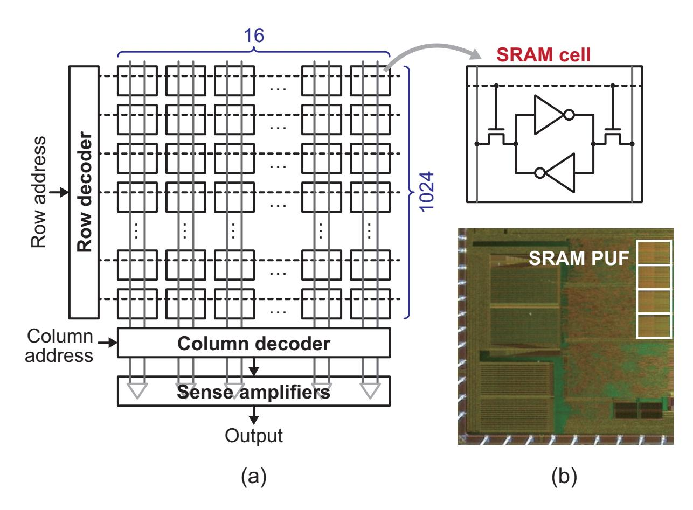
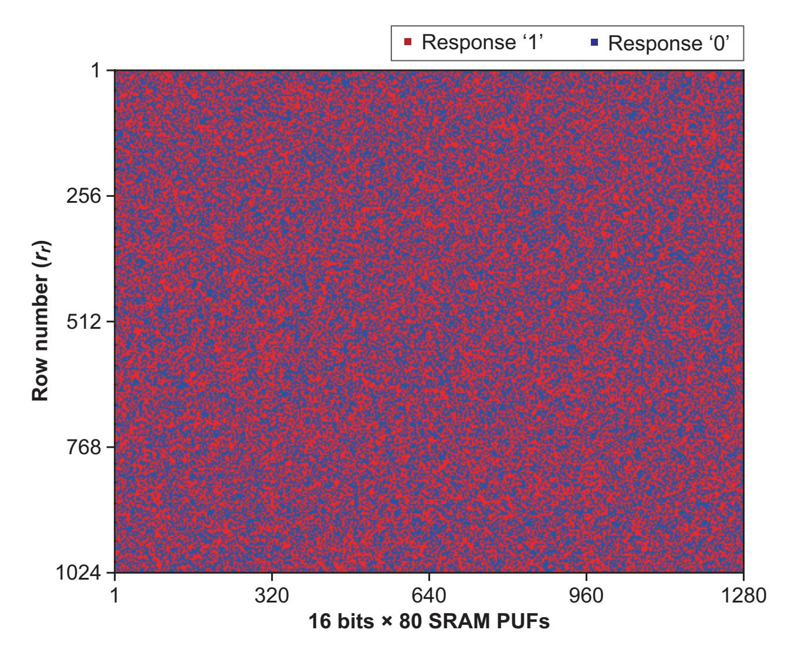
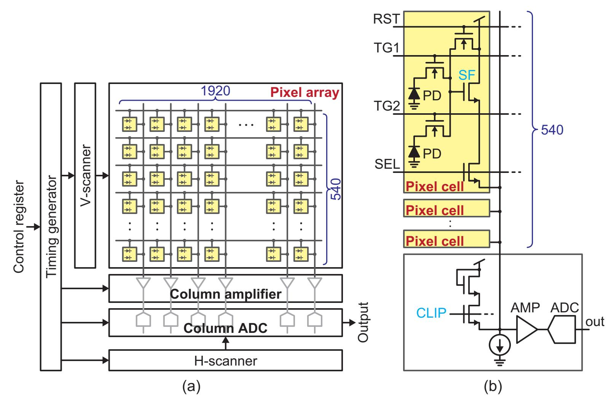
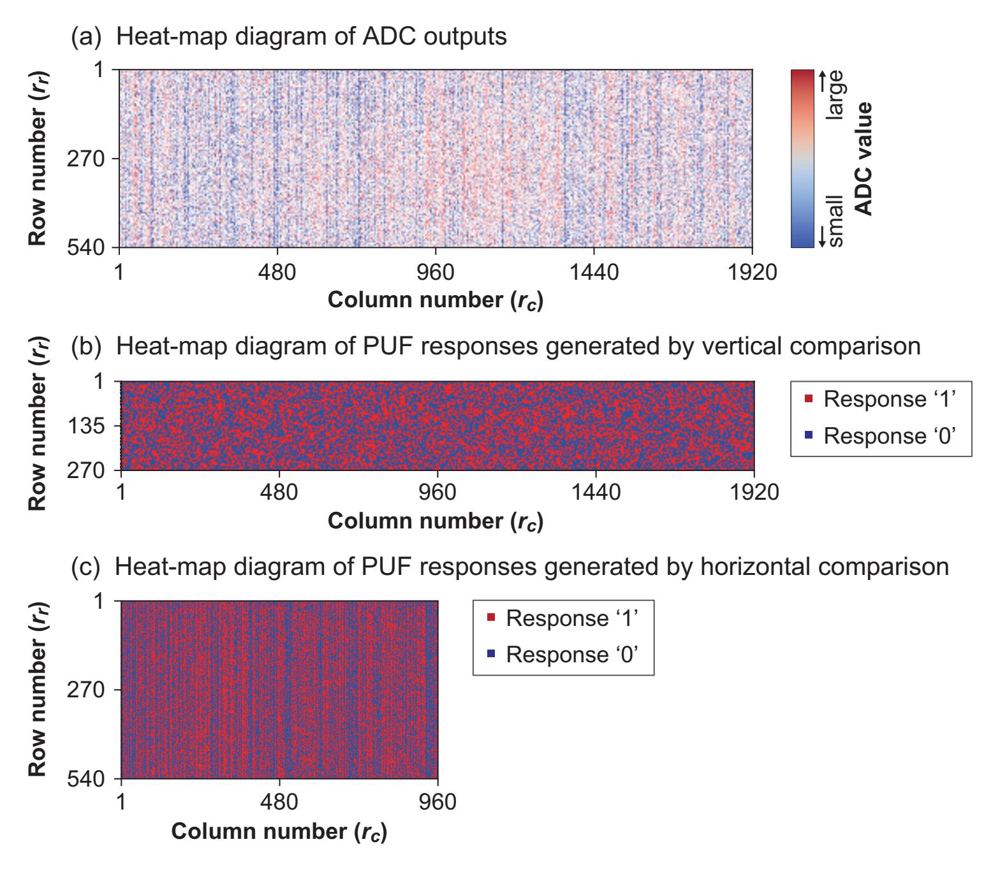
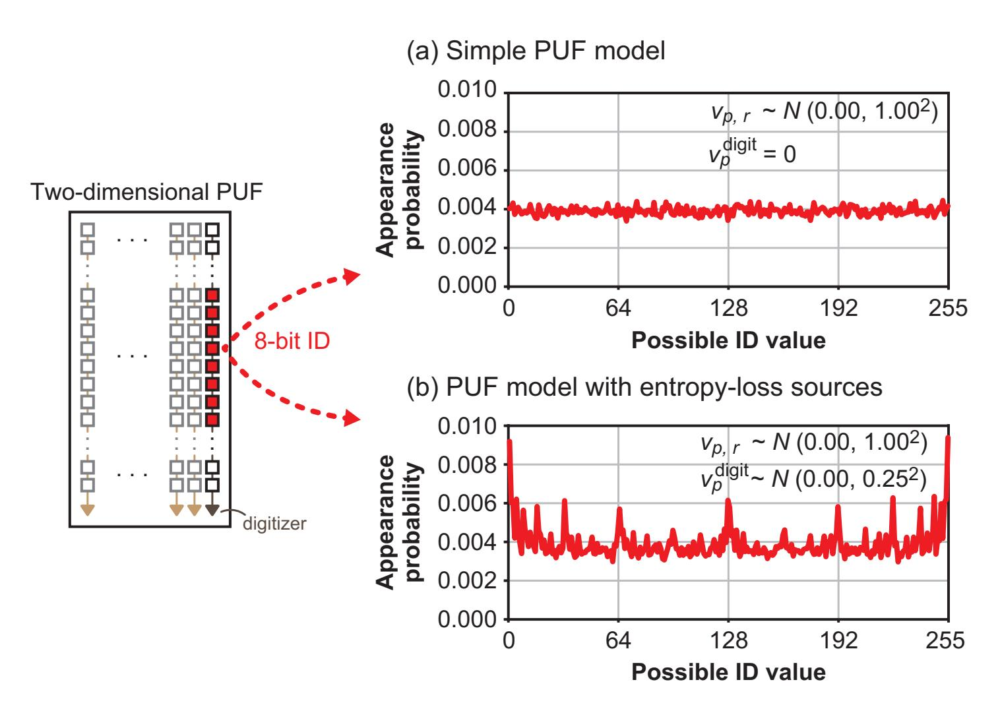
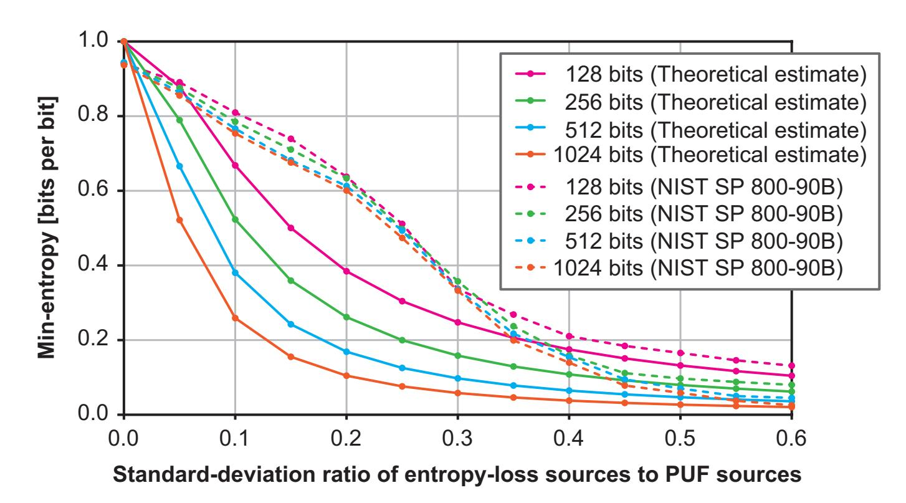
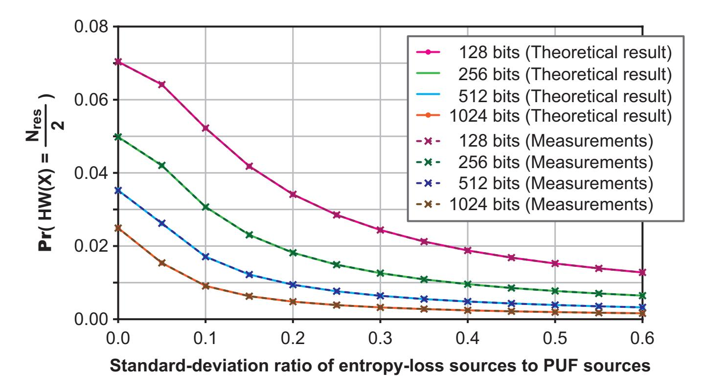
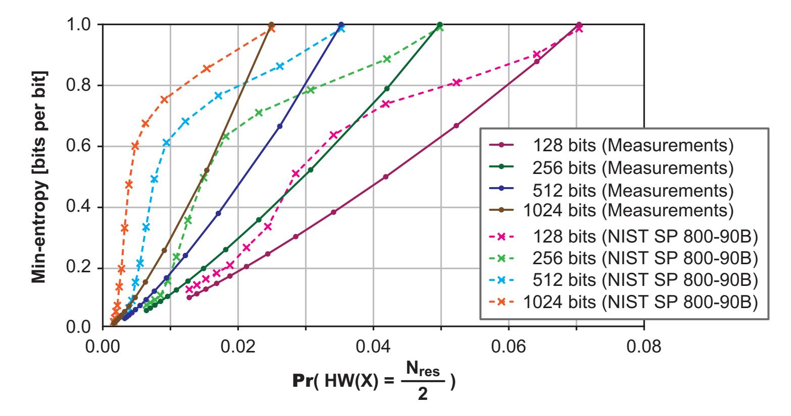

{0}------------------------------------------------

# **Entropy Estimation of Physically Unclonable Functions with Offset Error**

Mitsuru Shiozaki1 , Yohei Hori2 and Takeshi Fujino3

1 Ritsumeikan University, Kusatsu, Shiga, Japan, [msalt@ieee.org](mailto:msalt@ieee.org) 2 The National Institute of Advanced Industrial Science and Technology (AIST), Tsukuba, Ibaraki, Japan, [hori.y@aist.go.jp](mailto:hori.y@aist.go.jp)

**Abstract.** Physically unclonable functions (PUFs) are gaining attention as a promising cryptographic technique, with the main applications including challenge-response authentication and key generation (key storage). When a PUF is applied to these applications, min-entropy estimation is essential. Min-entropy is a measure of the lower bound of the unpredictability of PUF responses. Using the test suite of the National Institute of Standards and Technology (NIST) specification (SP) 800-90B is currently considered the best method for estimating the min-entropy of PUF responses. Several previous studies have estimated the min-entropy of PUFs as well as those of random number generators (RNGs). However, we feel doubtful about some of these estimated results; for example, an evaluator can reorder PUF responses to make the PUF performance appear much better. It is also known that the test suite of NIST SP 800-90B has no suitable estimator. In particular, it has been reported that concatenating PUF responses of two-dimensional PUFs, such as an SRAM PUF, into one-dimensional data may obfuscate spatial correlations. In this paper, we explore the inherent problems in min-entropy estimation by using our static random-access memory (SRAM) PUF and our complementary metal-oxide-semiconductor (CMOS) image sensor with a PUF (CIS PUF). We apply three orderings to the PUF responses of our SRAM PUF and CIS PUF: row-direction ordering, column-direction ordering, and random-shuffle ordering. We show how much the min-entropy estimated by NIST SP 800-90B varies and discuss the estimation results. Next, we discuss the threat of PUFs (i.e., predictability of PUF responses) when a digitizer in a PUF has an offset error. PUF sources are generally defined as circuits and transistors used to extract intrinsic physical properties and generate device-unique responses. Variation in the manufacturing of circuits and transistors other than the PUF sources, especially digitizers, may cause lower entropy. We call these circuits and transistors "entropy-loss sources." We investigate the effect of entropy-loss sources on min-entropy theoretically and clarify how much the theoretical results differ from those estimated by NIST SP 800-90B. Finally, we propose an entropy prediction scheme that considers entropy-loss sources (offset error). We show through experiments that the proposed scheme more accurately estimates the min-entropy of PUFs.

**Keywords:** Physically unclonable function (PUF) · Min-entropy · NIST SP 800-90B · SRAM PUF · CMOS image sensor with a PUF (CIS PUF)

# **1 Introduction**

Physically unclonable function (PUF) [\[1,](#page-21-0) [2\]](#page-21-1) technology is a new cryptographic technique that generates a device-unique identifier from random and uncontrollable variations in manufacturing. Various PUFs and applications using them have been proposed so far. When using PUFs in such applications, min-entropy estimation is essential. Entropy is a

3 Ritsumeikan University, Kusatsu, Shiga, Japan, [fujino@se.ritsumei.ac.jp](mailto:fujino@se.ritsumei.ac.jp)

{1}------------------------------------------------

measure of the unpredictability of PUF responses, and min-entropy is used to establish this lower bound and represents the worst-case scenario. Many studies have discussed entropy estimation schemes for PUFs, and the entropy estimation suite of the National Institute of Standards and Technology (NIST) special publication (SP) 800-90B [\[3\]](#page-21-2), which estimates the min-entropy of a random number generator (RNG), is becoming a primary entropy estimation scheme of PUFs as well. Several researchers [\[4,](#page-21-3) [5,](#page-21-4) [6\]](#page-21-5) have used it to estimate the min-entropy of their proposed PUFs and to demonstrate their performances.

However, there are problems with entropy estimation using NIST SP 800-90B.

First, NIST SP 800-90B is an entropy estimation suite for RNGs that assumes sequential data input. Since an RNG outputs data sequentially, simply inputting the data into the entropy estimation suite is enough. However, with PUFs, an evaluator can intentionally control the ordering of PUF responses by using PUF challenges. As an extreme example, let us consider a device where the PUF response to odd-numbered PUF challenges is '1' and to even-numbered challenges is '0'. When an evaluator reorders PUF responses by using random PUF challenges, the data input to the entropy estimation suite seems random. In other words, it becomes unclear whether the entropy estimation suite estimates the min-entropy of the PUF responses or of the PUF challenges. In previous studies, there has been no explanation of the ordering of PUF responses when inputting to the entropy estimation suite. The validity of the performance evaluation results is thus unclear.

Next, the entropy estimation suite of NIST SP 800-90B is known to be unsuitable for two-dimensional memory-based PUFs [\[7,](#page-21-6) [8,](#page-21-7) [9\]](#page-21-8). The entropy estimation suite is basically designed to operate on one-dimensional data, such as RNGs. However, some previous studies have collected PUF responses for multiple chips, concatenated them, and then estimated the min-entropy, as the number of PUF responses obtained from a single chip is less than that required for the entropy estimation suite. In this case, the assumption is that the PUF model becomes a Maes' model [\[10\]](#page-21-9), as follows.

$$R_{p,r,m} = \begin{cases} 0 & (v_{p,r} + n_{p,r,m} \le T) \\ 1 & (\text{otherwise}), \end{cases}$$
 (1)

where *vp,r* is a manufacturing process variable of the *r*-th PUF source in the *p*-th device, *np,r,m* is a noise variable of the *r*-th PUF source of the *m*-th measurement from the *p*-th device, and *T* is a constant threshold parameter. *p* ranges from 1 to *Npuf* , where *Npuf* is the number of devices (PUFs). *r* ranges from 1 to *Nres*, where *Nres* is the number of PUF sources (PUF responses) per device (PUF). In this model, which represents the relationship between PUF responses and manufacturing process variations, the PUF sources and noise are assumed to be independent. When considering PUF entropy, it is necessary to consider both of these effects. The effect of noise (reliability) on entropy is an important research topic. When entropy due to reliability is excluded to simplify the problem (i.e., *np,r,m* = 0), concatenating PUF responses then seems to be a reasonable approach. However, this hypothesis is unrealistic because there are spatial correlations between responses in PUFs, especially two-dimensional PUFs (e.g., SRAM PUF). Therefore, the approach that concatenates PUF responses obfuscates the spatial correlations and may cause overestimation of PUF entropy.

In this paper, we investigate how much the results of the entropy estimation suite of NIST SP 800-90B vary with the ordering of PUF responses by using our prototyped PUFs. One of the major causes of the spatial correlations between PUF responses is an offset error of digitizers. We discuss the worst-case scenario of how well an attacker can predict PUF responses output from digitizers with offset error and present a theoretically calculated min-entropy from it. We also investigate how much the theoretical results differ from those estimated by NIST SP 800-90B. Finally, we propose an entropy prediction scheme that considers the offset error of digitizers.

{2}------------------------------------------------

# **1.1 Related Work**

The entropy of optical PUFs [\[2\]](#page-21-1) and coating PUFs [\[11\]](#page-21-10) has been widely studied [\[12,](#page-22-0) [13,](#page-22-1) [14\]](#page-22-2). Several studies on silicon PUFs [\[15,](#page-22-3) [16,](#page-22-4) [17,](#page-22-5) [18\]](#page-22-6) have estimated the entropy by referring to the secrecy rate [\[13\]](#page-22-1), which takes into account reliability (i.e., the intra-Hamming distance (intra-HD) [\[19\]](#page-22-7)). Schaub et al. investigated the relationship between the entropy and reliability of three well-known delay-based PUFs (ring-oscillator (RO) PUF [\[20\]](#page-22-8), RO sum PUF [\[21\]](#page-22-9), and Loop PUF [\[22\]](#page-22-10)) by using a stochastic model [\[23\]](#page-22-11). Since PUFs extract tiny physical properties from random and uncontrollable variations in manufacturing, PUF responses often contain noise. The reliability is a performance metric that indicates the amount of noise in PUF responses. Since noise makes entropy estimation difficult, the effect of noise on min-entropy is an important research topic.

Several studies have also discussed the relationship between the characteristic of the physical mechanisms behind the variation and PUF min-entropy. There have been studies discussing a PUF-response bias, debiasing schemes, and entropy [\[24,](#page-23-0) [25,](#page-23-1) [26\]](#page-23-2). The PUFresponse bias, which is a research topic related to the mean of inter-HD [\[19\]](#page-22-7), is basically due to an unbalanced layout in an LSI chip. Gu et al. also studied the relationship between uniqueness (i.e., inter-HD) and min-entropy [\[27\]](#page-23-3). They focused on the mean of inter-HD, but even though the standard deviation is related to the dependence between PUF responses, they did not discuss it. Xu et al. pointed out the importance of understanding the physical mechanisms behind variations in flash-memory PUFs (FPUFs) [\[28\]](#page-23-4). They reported that systematic layout variations and manufacturing lots might reduce entropy. When such various causes of lower entropy are intertwined, NIST SP800-90B is a powerful tool for estimating entropy. Therefore, the NIST entropy estimation suite is becoming a primary entropy estimation scheme.

However, there is sometimes a case in which PUF responses cannot be directly inputted to the NIST entropy estimation suite. It is well known that the pairwise comparison used in RO PUFs reduces entropy, and the entropy is based on the frequency ordering of the ROs [\[20\]](#page-22-8). Maes et al. reported that encoding the frequency ordering is required to remove the dependencies between PUF responses [\[29\]](#page-23-5). It has also been reported that the NIST entropy estimation suite is unsuitable for two-dimensional PUFs because concatenating either rows or columns into one-dimensional data may obfuscate spatial correlations [\[7,](#page-21-6) [8\]](#page-21-7). Wilde et al. studied the spatial correlation in a PUF [\[9\]](#page-21-8). A PUF designer thus needs to carefully consider whether the entropy estimation suite can reliably estimate the min-entropy.

## **1.2 Our Contributions**

Our study is not aimed at overturning the findings of previous studies but rather at alerting PUF designers to the need for extreme caution in estimating entropy. This paper makes the following contributions.

• Variation in estimating min-entropy of a PUF

If the entropy estimation suite correctly estimates the min-entropy of PUFs, the results should be the same regardless of the ordering of the PUF responses. We apply the three orderings to the PUF responses of our prototype static randomaccess memory (SRAM) PUF [\[30,](#page-23-6) [31\]](#page-23-7) and complementary metal-oxide-semiconductor (CMOS) image sensor with a PUF (CIS PUF) [\[32\]](#page-23-8) to investigate how much the min-entropy estimates vary. We then discuss why the estimated results vary widely.

• Predictability of PUF responses due to offset error

We discuss the worst-case scenario of how well an attacker can predict PUF responses due to offset error in digitizers. We present min-entropy theoretically considered from the predictability of PUF responses. In general, the circuits and transistors

{3}------------------------------------------------

used to extract the inherent physical properties from variations in manufacturing and to generate PUF responses are called "PUF sources." Circuits and transistors other than the PUF sources also have variations in the manufacturing. In particular, manufacturing variation in a digitizer that converts physical properties into numerical values causes offset noise, which biases PUF responses and reduces PUF entropy. We term these circuits and transistors "entropy-loss sources" since they reduce PUF entropy. We investigate the effect of the entropy-loss sources on PUF entropy.

• Comparison between theoretical entropy and results estimated using NIST SP 800- 90B

We investigate how much entropy estimates based on theoretical considerations differ from those using NIST SP 800-90B. We create numerical PUFs with entropy-loss sources using numerical simulation. The theoretical entropy is calculated from the parameters given to the numerical PUF. PUF responses generated from the numerical PUFs are input to the entropy estimation suite of NIST SP 800-90B to estimate the min-entropy. We compare both the entropy estimation results.

• Proposal of an entropy prediction scheme

We propose an entropy prediction scheme of PUFs with entropy-loss sources. We demonstrate that the entropy of the numerical PUFs can be accurately predicted using the proposed scheme. We also discuss the results of estimating the min-entropy of our SRAM PUF and CIS PUF using the proposed scheme.

In Section [2](#page-3-0) of this paper, we introduce our SRAM PUF and CIS PUF, which are used to investigate the inherent issues in estimating PUF entropy using NIST SP 800-90B. We also present our PUF models and the evaluation results using inter-HD. In Section [3,](#page-9-0) we present the three orderings we applied to the PUF responses of our SRAM PUF and CIS PUF and demonstrate that the results of the NIST SP 800-90B entropy estimation suite vary with the ordering. In Section [4,](#page-13-0) we discuss the predictability of PUF responses by an attacker and present a theoretically calculated min-entropy from the worst-case scenario. In Section [5,](#page-16-0) we investigate how much the theoretical min-entropy estimates differ from those estimated by the entropy estimation suite of NIST SP 800-90B. In Section [6,](#page-17-0) we propose an entropy prediction scheme that considers offset error. We conclude in Section [7](#page-20-0) with a summary of the key points.

# **2 SRAM PUF and CIS PUF**

We use our SRAM PUF and CIS PUF to explore known problems in estimating PUF entropy and to discuss the validity of the proposed entropy prediction scheme. In this section, we introduce these PUFs, their models, and their performances evaluated using the inter-HD metric [\[19\]](#page-22-7).

## **2.1 SRAM PUF**

An SRAM PUF is a well-known PUF that uses the initial values of an SRAM as PUF responses [\[30,](#page-23-6) [31\]](#page-23-7). Two cross-coupled inverters in an SRAM cell are symmetrical, and the SRAM cell ideally enters a metastable state during the power-up phase. However, transistors consisting of cross-coupled inverters have mismatches due to manufacturing process variations, and these mismatches are amplified by the positive feedback of the cross-coupled inverters. Each SRAM cell thus boots up with an initial state of either '0' or '1'. PUF sources of the SRAM PUF are assumed to be SRAM cells (two cross-coupled inverters). Since each SRAM cell is composed of independent circuits, PUF sources are assumed to be independent.

{4}------------------------------------------------

Figure 1: (a) Block diagram and (b) photograph of our SRAM PUF

#### 2.1.1 Our SRAM PUF

Figure 1 shows a block diagram and photograph of our SRAM PUF. We designed a PUF test vehicle chip with a 180-nm CMOS process for benchmarking PUFs [33]. It has four SRAM standard cells with 1K words (Column) of 16 bits (Row). We used the initial values of the single SRAM standard cell as our SRAM PUF. There are thus 16 and 1,024 SRAM cells in each row and each column, respectively. The number of PUF-response bits is 16,384 (= $16 \times 2^{10}$ ) bits.

#### 2.1.2 SRAM-PUF Model

In several previous studies, it was assumed that entropy-loss sources (i.e., the variations in the manufacturing of circuits and transistors (excluding PUF sources; i.e., SRAM cells)) are negligible. However, we argue that this assumption is unrealistic. Manufacturing process variations of other circuits and transistors (entropy-loss sources; e.g., word lines, bit lines, word-line buffers, and sense amplifiers) also affect PUF responses. Thus, we intentionally include these manufacturing process variations in our SRAM-PUF model. In contrast to the PUF model (Equation 1), the relationship between PUF responses and manufacturing process variations is given as

$$R_{p,r_r,r_c} = \begin{cases} 0 & (v_{p,r_r,r_c} + v_{p,r_r}^{\text{row}} + v_{p,r_c}^{\text{column}} \le 0) \\ 1 & (\text{otherwise}), \end{cases}$$
 (2)

where  $v_{p,r_r,r_c}$  is a manufacturing-process variable of the SRAM cell in the  $r_r$ -th row and  $r_c$ -th column in the p-th device,  $v_{p,r_r}^{\text{row}}$  is a manufacturing process variable based on the common circuit (e.g., word line and word-line buffer) in the  $r_r$ -th row in the p-th device, and  $v_{p,r_c}^{\text{column}}$  is a manufacturing process variable based on the common circuit (e.g., bit line and sense amplifier) in the  $r_c$ -th column in the p-th device ( $r_r$  and  $r_c$  range from 1 to 16 and from 1 to 1024, respectively, and  $v_{p,r_r}^{\text{row}}$  and  $v_{p,r_c}^{\text{column}}$  mean adding different offsets to each row's and each column's PUF responses, respectively). When there are multiple manufacturing process variables, as shown in Equation 2, the entropy per PUF is less than the number of PUF-response bits. In general, the variation in column circuits, such as

{5}------------------------------------------------

**Figure 2:** Heat map of PUF responses for our SRAM PUFs

sense amplifiers, is higher than that in row circuits and can affect PUF responses (PUF entropy).

## **2.1.3 Performance Evaluation**

First, we measured all the 16,384-bit PUF responses from 80 (= 4 × 20 chips) SRAM PUFs 100 times and decided whether each PUF response was '0' or '1' by majority vote. Figure [2](#page-5-0) shows a heat map of the PUF responses for our SRAM PUFs. Red and blue represent PUF response '1' and '0', respectively. PUF responses of all SRAM PUFs are arranged in the column direction. As we can see, the distribution of PUF responses '1' and '0' seems random.

Next, we present the results of evaluating the performance of our SRAM PUF using the inter-HD metric. We calculated the mean and standard deviation of inter-HD using all the 16,384-bit PUF responses from 80 SRAM PUFs. As mentioned above, the number of measurements of each PUF-response bit was 100. The mean and standard deviation were 0.4972 and 0.5742, respectively. The mean was approximately 0.5, which is the ideal value. These results mean that the number of '0' and '1' responses was the same, which suggests that our SRAM PUF can maintain high entropy. However, the standard deviation was slightly higher than 0.5.

## **2.2 CIS PUF**

Okura et al. developed a CIS PUF to enhance the security of IoT devices with CMOS image sensors [\[32\]](#page-23-8). The reason we chose the CIS PUF as a case study is that the amount of the variations is measurable. We purposely applied a PUF-response-generation scheme that creates the entropy-loss sources to investigate inherent issues in estimating PUF entropy.

{6}------------------------------------------------

**Figure 3:** Block diagrams of (a) CIS PUF and (b) column circuit

#### **2.2.1 Our CIS PUF**

Our CIS PUF has two operation modes: image readout and PUF. In image readout mode, it detects light and converts it into a 2M-pixel image. In PUF mode, all the photodiodes are disabled, and PUF responses are generated from fixed-pattern noise (FPN), which is based on manufacturing process variations. Figure [3](#page-6-0) (a) shows a block diagram of our CIS PUF. It is composed of a 2M (= 1980 × 1080) pixel array with a two-shared pixel structure, a column amplifier, a column analog-to-digital converter (ADC), and digital control blocks. The control-register signals switch between image readout mode and PUF mode. Since CMOS image sensors typically have a column-parallel readout scheme, the components of the CIS PUF are divided into 1920 independent column circuits like the one shown in Figure [3](#page-6-0) (b). Each column circuit is composed of 540-pixel cells, an amplifier, and an ADC. There are 540 source-follower (SF) transistors shared by two photodiodes. We hypothesize that the threshold-voltage (Vth) variation of the SF transistors is a PUF source. In PUF mode, the correlated double sampling (CDS) function, which attenuates or removes an undesired offset noise, is disabled and the digitized value of the Vth variation is readout. In image readout mode, the Vth variation is removed by the CDS function. No information about the PUF responses leaks from the 2M-pixel image. A diode-connected clip transistor is used to reduce the supply-voltage/ground bounce during image readout and to derive the Vth of the SF transistor during PUF-mode operation.

CMOS image sensors suffer from column FPN, which appears as stripes in the image and results in significantly degraded image quality. The column FPN is mainly caused by variations in the manufacturing of the amplifier and ADC. The PUF responses of a CIS PUF are also affected by the column FPN, where the clip-transistor variation is dominant. The PUF responses are generated by comparing the digitized values of two selected SF-transistor variations. When two SF transistors are randomly selected, variations of different clip transistors are added to those of the SF transistors. Thus, we compared vertically adjacent SF transistors to generate PUF responses.

{7}------------------------------------------------

We call the PUF-response-generation scheme in which the use of SF transistors does not overlap, and vertically adjacent SF transistors are compared "vertical comparison." Since an identical clip transistor is used in the vertical comparison, the variation of the clip transistor is canceled through the comparison, and the column FPN is removed. The number of PUF responses is  $270 \ (= \frac{540}{2})$  bits in each column. Since there are 1920 column circuits, the number of PUF responses is 518K bits  $(= 1920 \times 270)$ .

We purposely apply a PUF-response-generation scheme that differs from vertical comparison to study the effect of variations in the manufacturing of clipping transistors on entropy estimation. The PUF-response-generation scheme in which the use of SF transistors does not overlap, and horizontally adjacent SF transistors are compared is termed "horizontal comparison." The number of PUF responses is 540 bits in each pair of column circuits. Since there are  $960 \ (= \frac{1920}{2})$  pairs of column circuits, the number of PUF responses is  $518 \text{K} \ (= 960 \times 540)$  bits, the same as for vertical comparison.

#### 2.2.2 CIS-PUF Model

The CIS-PUF model also includes variations in the manufacturing of circuits and transistors (excluding PUF sources). Here, the PUF source is an SF transistor in a pixel cells. Each manufacturing process variable of the pixel cell, including other circuits, is expressed as

$$v'_{p,r_r,r_c} = v_{p,r_r,r_c} + v^{\text{row}}_{p,r_r} + v^{\text{column}}_{p,r_c},$$
 (3)

where  $v_{p,r_r,r_c}$  is a manufacturing process variable of the SF transistor in the  $r_r$ -th row and  $r_c$ -th column in the p-th device,  $v_{p,r_r}^{\text{row}}$  is a manufacturing process variable of the common circuit (e.g., v-scanner) in the  $r_r$ -th row in the p-th device, and  $v_{p,r_c}^{\text{column}}$  is a manufacturing process variable of the common circuit (e.g., clip transistor) in the  $r_c$ -th column in the p-th device. PUF responses are generated by comparing the digitized values of two pixel-cell variables. The difference between the pixel-cell variables of the vertical comparison is expressed as

$$v'_{p,2\times r_r,r_c} - v'_{p,2\times r_r-1,r_c} = v_{p,2\times r_r,r_c} - v_{p,2\times r_r-1,r_c} + v_{p,2\times r_r}^{\text{row}} - v_{p,2\times r_r-1}^{\text{row}}$$

$$= \Delta v_{p,r_r,r_c} + \Delta v_{p,r_r}^{\text{row}}.$$
(4)

The variation based on the column circuits, such as clip transistors, is canceled through the comparison, and the column FPN is removed (i.e.,  $\Delta v_{p,r_c}^{\rm column}=0$ ) since identical variables  $(v_{p,r_c}^{\rm column})$  are compared in the vertical comparison. The variation based on the less affected row circuits remains as an entropy-loss source. A PUF-response bit of our CIS PUF using the vertical comparison is modeled as

$$R_{p,r_r,r_c} = \begin{cases} 0 & (\Delta v_{p,r_r,r_c} + \Delta v_{p,r_r}^{\text{row}} \le 0) \\ 1 & (\text{otherwise}), \end{cases}$$
 (5)

where  $\Delta v_{p,r_r,r_c}$  is a differential variable in the  $r_r$ -th row and  $r_c$ -th column in the p-th device, and  $\Delta v_{p,r_r}^{\text{row}}$  is a differential variable based on the row circuits (e.g., v-scanner) in the  $r_r$ -th row in the p-th device ( $r_r$  and  $r_c$  range from 1 to 1920 and from 1 to 270, respectively).

Similar to the vertical comparison, the difference between the pixel-cell variables of the horizontal comparison is expressed as

$$v'_{p,r_r,2\times r_c} - v'_{p,r_r,2\times r_c-1} = v_{p,r_r,2\times r_c} - v_{p,r_r,2\times r_c-1} + v^{\text{column}}_{p,2\times r_c} - v^{\text{column}}_{p,2\times r_c-1}$$
$$= \Delta v_{p,r_r,r_c} + \Delta v^{\text{column}}_{p,r_r}.$$
(6)

In contrast to the vertical comparison, the variation based on the less affected row circuits is canceled through the comparison (i.e.,  $\Delta v_{p,r_r}^{\rm row}=0$ ), but the column FPN remains as an

{8}------------------------------------------------

Figure 4: Heat maps of ADC outputs and PUF responses for a sample CIS PUF chip

entropy-loss source. A PUF-response bit of our CIS PUF using the horizontal comparison is modeled as

$$R_{p,r_r,r_c} = \begin{cases} 0 & (\Delta v_{p,r_r,r_c} + \Delta v_{p,r_c}^{\text{column}} \le 0) \\ 1 & (\text{otherwise}), \end{cases}$$
 (7)

where  $\Delta v_{p,r_r,r_c}$  is a differential variable in the  $r_r$ -th row and  $r_c$ -th column in the p-th device, and  $\Delta v_{p,r_c}^{\text{column}}$  is a differential variable based on the column circuits (e.g., clip transistors) in the  $r_c$ -th column in the p-th device ( $r_r$  and  $r_c$  range from 1 to 960 and from 1 to 540, respectively).

#### 2.2.3 Performance Evaluation

First, we show heat maps of the ADC outputs and PUF responses. Figure 4 depicts the measurement results for a sample CIS-PUF chip. The ADC outputs in Figure 4 (a) show digitized values of 1920 × 540 pixel cells. Red and blue mean that the ADC output value is large and small, respectively. The column FPN clearly appears as stripes. The PUF responses generated by vertical and horizontal comparisons are shown in Figures 4 (b) and (c), respectively. Similar to the heat map for our SRAM PUF, red and blue represent PUF response '1' and '0', respectively. Each PUF response is decided by a majority vote of 100 measurements. Use of vertical comparison to generate PUF responses resulted in a distribution of responses '1' and '0' that seems random. The effect of the column FPN remains in the PUF-response distribution resulting from the horizontal comparison. The

{9}------------------------------------------------

entropy with the horizontal comparison seems much lower than that with the vertical comparison.

Next, we present the results of evaluating the performance of our CIS PUF using the inter-HD metric. We generated all the 518K-bit (= 1920×540 2 ) PUF responses from 18 chips and calculated the mean and standard deviation of inter-HD. Similar to our SRAM PUF, the number of measurements of each PUF-response bit was 100. With the vertical comparison, the mean and standard deviation were approximately 0.5, which indicates that the entropy is high. In contrast, the mean with the horizontal comparison was approximately 0.5, but the standard deviation was 2.46. This was 5.5 times larger than that with the vertical comparison. The stripes on the heat map in Figure [4](#page-8-0) (c) are related to the large standard deviation of inter-HD.

# **3 Min-Entropy Estimation using NIST SP 800-90B**

In this section, we first introduce the NIST SP 800-90B and the two datasets we used to estimate min-entropy. We then present the three orderings of the PUF responses that we applied. When the horizontal comparison was applied to our CIS PUFs, the effect of the column FPN remained in the PUF-response distribution. Therefore, we expect that the entropy estimation results using NIST SP 800-90B will become lower when we emphasize the column FPN in the ordering of PUF responses. We estimate min-entropy for our SRAM PUF and CIS PUF and investigate how much the estimation results vary with the ordering.

## **3.1 NIST SP 800-90B**

The entropy estimation suite of NIST SP 800-90B is superior to other methods for estimating the quality of an entropy source. Since some sources of entropy may have unknown dependencies, ten kinds of entropy estimators are used in the entropy estimation suite to minimize the probability that the estimation results are significantly overestimated.

NIST SP 800-90B requires a sequential dataset of at least 1,000,000 sample values. After the required number of samples are collected, they are divided into two tracks (the independent and identically distributed (IID) track and the non-IID track) using statistical tests (chi-square statistical tests and permutation tests). Entropy is estimated separately for each track.

For the IID track, the result estimated using the most common value (MCV) estimator is used as the value of min-entropy. MCV estimation is the simplest because it is based on the assumption that the sample values in the dataset do not correlate. The maximum probability of the values in the dataset is measured, and the min-entropy of an independent discrete random variable *X* is defined as

$$H_{\infty}(X) = -\log_2 \max \mathbf{Pr}(X = x_i) \qquad (i = 1, ..., n), \tag{8}$$

where *x*1*, x*2*, .., xn* are possible values, and **Pr**(*X* = *xi*) is the probability of random variable (*X* = *xi*). The ideal value per bit is 1.

For the non-IID track, ten kinds of estimators, including the MCV estimator, are used: the collision estimator, the Markov estimator, the compression estimator, the *t*-tuple estimator, the longest repeated substring (LRS) estimator, the multi most common in window (MultiMCW) prediction estimator, the lag prediction estimator, the multiple Markov model with counting (MultiMMC) prediction estimator, and the LZ78Y prediction estimator. The minimum value of the ten estimates is taken as the min-entropy.

The collision estimator, devised by Hagerty and Draper [\[34\]](#page-23-10), measures the mean number of samples to the first collision. Using this number, it estimates the probability of the most-likely output value. The Markov estimator is based on the assumption that the

{10}------------------------------------------------

|                              | SRAM PUF       | CIS PUF        |
|------------------------------|----------------|----------------|
| No. of PUF responses per PUF | 16,384 bits    | 518,400 bits   |
| No. of PUFs per chip         | 4              | 1              |
| No. of chips                 | 20             | 18             |
| Total no. of PUF responses   | 1,310,720 bits | 9,331,200 bits |

**Table 1:** Datasets for min-entropy estimation

collected sample values obey a Markov model and measures the dependencies between consecutive values. The compression estimator, also devised by Hagerty and Draper [\[34\]](#page-23-10), computes the entropy rate of a dataset on the basis of the Maurer Universal Statistic [\[35\]](#page-23-11). The *t*-tuple estimator measures the frequency of *t*-tuples (pairs, triples, etc.) that appear in the dataset and provides an estimate based on the frequency of the most common *t*-tuples. The LRS estimator computes the collision entropy on the basis of the number of repeated tuples. The MultiMCW, lag, MultiMMC, and LZ78Y prediction estimators ("predictors") aim to guess the next sample given the previous one and provide an estimate based on the probability of successfully predicting it. Each predictor consists of several sub-predictors that compete, and the one with the highest prediction rate is selected. Each sub-predictor of the MultiMCW predictor predicts the next sample on the basis of the MCV in the sliding window for the previous sample. Each sub-predictor of the lag predictor predicts the next sample on the basis of a specified lag. Each MMC sub-predictor of the MultiMMC predictor records the observed frequencies for transitions from one sample to the subsequent one and predicts the next sample on the basis of the most frequently observed transition from the current sample. The LZ78Y predictor is loosely based on LZ78 encoding with Bernstein's Yabba scheme [\[36\]](#page-24-0) for adding strings to the dictionary.

We estimated the min-entropies of our SRAM PUF and CIS PUF using the SP 800-90B C++ code provided by NIST [\[37\]](#page-24-1). The symbol size can be set from 1 to 8 bits; we set it to 1 bit due to the limited number of samples for our SRAM PUF.

# **3.2 Datasets**

The datasets we used to estimate min-entropy are summarized in Table [1.](#page-10-0) We define an SRAM standard cell with 1K words (Column) of 16 bits (Row) as our SRAM PUF and aim to estimate the entropy of a single SRAM PUF. All PUF responses were generated 100 times under typical conditions (1.8 V, 25 ◦C), and whether each PUF-response bit was '0' or '1' was decided by majority vote to exclude entropy due to reliability. The number of PUF-response bits in our SRAM PUF was 16,384 (=16 × 2 10), less than that required for the entropy estimation suite. Although there were four SRAM PUFs on a chip, the number of required samples was not reached even if their responses were concatenated. We thus concatenated the PUF responses for 20 chips, mimicking previous studies. The total number of samples (PUF-response bits) was thus 1,310,720 bits, barely meeting the criteria of NIST SP 800-90B. Similarly, all PUF responses for our CIS PUF were generated 100 times under typical conditions (2.8 V, 25 ◦C), and whether each PUF-response bit was '0' or '1' was decided by majority vote. The number of PUF response bits in our CIS PUF was 518K (= 1920×540 2 ), less than the number required. We thus concatenated the PUF responses for 18 chips to estimate min-entropy. The total number of samples was thus approximately 10M bits, sufficient for NIST SP 800-90B.

## **3.3 Response Ordering**

If the hypothesis that PUF responses are generated from only independent circuits as shown in Equation [1](#page-1-0) is correct, the estimation results should be the same regardless of

{11}------------------------------------------------

|             |          | Ordering |          |
|-------------|----------|----------|----------|
|             | Row      | Column   | Random   |
| Min-entropy | 0.875779 | 0.728256 | 0.991752 |
| Chi-square  | X        |          | X        |
| Permutation |          |          | X        |
| MCV         | 0.991752 | 0.991752 | 0.991752 |
| Collision   | 0.875779 | 0.946370 | –        |
| Markov      | 0.987185 | 0.995143 | –        |
| Compression | 0.884535 | 0.728256 | –        |
| t-Tuple     | 0.927891 | 0.888295 | –        |
| LRS         | 0.987152 | 0.974152 | –        |
| MultiMCW    | 0.990197 | 0.992418 | –        |
| Lag         | 0.912400 | 0.912325 | –        |
| MultiMMC    | 0.987595 | 0.912523 | –        |
| LZ78Y       | 0.988912 | 0.992865 | –        |

**Table 2:** Estimation results for our SRAM PUF

response ordering. We thus tested three orderings: row-direction ordering, column-direction ordering, and random-shuffle ordering.

#### • Row-direction ordering:

Row-direction ordering is based on the assumption of a simple readout. We arranged the PUF responses assuming incrementation of the access address of an SRAM and general readout scheme of an image sensor. The datasets for row-direction ordering were constructed by concatenating the rows (i.e., *R*1*,*1*,*1, *R*1*,*1*,*2, *R*1*,*1*,*3, ..., *R*1*,*1*,Ncolumn* , *R*1*,*2*,*1, *R*1*,*2*,*2, *R*1*,*2*,*3, ..., *R*1*,*2*,Ncolumn* , *R*1*,*3*,*1, ..., *R*1*,Nrow,Ncolumn* , *R*2*,*1*,*1, ..., *RNchip,Nrow,*1, *RNchip,Ncolumn,*2, *RNchip,Ncolumn,*3, ..., *RNchip,Nrow,Ncolumn* ).

#### • Column-direction ordering:

As mentioned above, manufacturing process variations based on column circuits (entropy-loss sources) cannot be ignored. The column-direction ordering was aimed at emphasizing the dependencies (offset effects due to entropy-loss sources) in PUF responses. The datasets for column-direction ordering were constructed by concatenating the columns (i.e., *R*1*,*1*,*1, *R*1*,*2*,*1, *R*1*,*3*,*1, ..., *R*1*,Nrow,*1, *R*1*,*1*,*2, *R*1*,*2*,*2, *R*1*,*3*,*2, ..., *R*1*,Nrow,*2, *R*1*,*1*,*3, ..., *R*1*,Nrow,Ncolumn* , *R*2*,*1*,*1, ..., *RNchip,*1*,Ncolumn* , *RNchip,*2*,Ncolumn* , *RNchip,*3*,Ncolumn* , ..., *RNchip,Nrow,Ncolumn* ).

#### • Random-shuffle ordering:

Random-shuffle ordering is based on the assumption of random PUF challenges. The PUF responses of each chip were thus arranged using the identical rule. The datasets for random-shuffle ordering were constructed by concatenating randomly shuffled PUF responses (e.g., *R*1*,*216*,*477, *R*1*,*324*,*94, *R*1*,*79*,*152, ..., *R*1*,*333*,*318, *R*2*,*216*,*477, *R*2*,*324*,*94, *R*2*,*79*,*152, ..., *R*2*,*333*,*318, *R*3*,*216*,*477, ..., *RNchip,*216*,*477, *RNchip,*324*,*94, *RNchip,*79*,*152, ..., *RNchip,*333*,*318).

## **3.4 Estimation Results for our SRAM PUF**

The estimation results for the min-entropy of our SRAM PUF are summarized in Table [2.](#page-11-0) A checkmark represents that the statistical tests are passed. When we applied the randomshuffle ordering to the PUF responses, the entropy estimation suite determined the PUF responses to be IID, and the result estimated by the MCV estimator was 0.991752 bits

{12}------------------------------------------------

|             | Horizontal comparison |          | Vertial comparison |          |          |          |
|-------------|-----------------------|----------|--------------------|----------|----------|----------|
|             | Ordering              |          | Ordering           |          |          |          |
|             | Row                   | Column   | Random             | Row      | Column   | Random   |
| Min-entropy | 0.933645              | 0.035471 | 0.883727           | 0.996587 | 0.996587 | 0.996587 |
| Chi-square  |                       |          |                    | X        | X        | X        |
| Permutation |                       |          |                    | X        | X        | X        |
| MCV         | 0.989872              | 0.989872 | 0.989872           | 0.996587 | 0.996587 | 0.996587 |
| Collision   | 0.940284              | 0.423148 | 0.971080           | –        | –        | –        |
| Markov      | 0.990410              | 0.699929 | 0.991603           | –        | –        | –        |
| Compression | 0.934433              | 0.284987 | 0.883727           | –        | –        | –        |
| t-Tuple     | 0.933645              | 0.035471 | 0.939267           | –        | –        | –        |
| LRS         | 0.996167              | 0.071218 | 0.962016           | –        | –        | –        |
| MultiMCW    | 0.983936              | 0.045914 | 0.985152           | –        | –        | –        |
| Lag         | 0.992932              | 0.046004 | 0.997805           | –        | –        | –        |
| MultiMMC    | 0.989258              | 0.045914 | 0.990085           | –        | –        | –        |
| LZ78Y       | 0.989918              | 0.046004 | 0.989965           | –        | –        | –        |

**Table 3:** Estimation results for our CIS PUF

per bit. We tried a few times, but always got the same results. This is close to the ideal value, meaning that our SRAM PUF can deliver a high performance. However, the hypothesis that PUF responses with row-direction and column-direction orderings are IID was rejected by the statistical tests. In particular, the column-direction ordering failed both the chi-square and permutation tests. The result with row-direction ordering was 0.875779 bits per bit, about 88 % less than that with random-shuffle ordering. With column-direction ordering, the result estimated by the compression estimator was minimal: 0.728256 bits per bit, which was about 73 % less than that with random-shuffle ordering. Even though the same PUF responses were used, the estimation results varied depending on how they were ordered.

## **3.5 Estimation Results for our CIS PUF**

First, for reference, we estimated the min-entropy of our CIS PUF using the vertical comparison. The results are summarized in Table [3.](#page-12-0) Similar to the results of our SRAM PUF, a checkmark represents that the statistical tests are passed. The entropy estimation suite determined the PUF responses to be IID regardless of the ordering of PUF responses. The min-entropy was 0.996587 bits per bit and was close to the ideal value, indicating that our CIS PUF using vertical comparison can deliver a high performance.

The estimation results for our CIS PUF using horizontal comparison are also summarized in Table [3.](#page-12-0) The hypothesis that the PUF responses are IID was rejected by the statistical tests regardless of the ordering. The estimation results varied widely with the ordering. With the row-direction and random-shuffle orderings, all the estimators estimated high entropy even though there are clear dependencies between PUF responses in each column, as shown in Figure [4](#page-8-0) (c). The estimation results were approximately 0.9 bits per bit. With the column-direction ordering, the estimation results of some estimators were an order of magnitude smaller than those of the other estimators. In particular, the estimation result for the *t*-tuple estimator was only 0.035471 bits per bit, about 4 % less than those with the row-direction and random-shuffle orderings.

{13}------------------------------------------------

#### 3.6 Discussion

We have shown that the results of the entropy estimation suite vary with the ordering of PUF responses. The estimation results were minimal when we applied the ordering that emphasized the dependencies between PUF responses (i.e., column-direction ordering). The above results indicate that the manufacturing process variation based on column circuits may affect the min-entropy. The results for our CIS PUF using the horizontal comparison provide a good example. There are stripes in the heat map of the PUF responses, as shown in Figure 4 (c), and there are clear dependencies between PUF responses in the same column. An attacker can predict PUF responses or narrow down the candidates by assuming that PUF-response bits in the same column are most likely the same. However, this can be disguised by ordering PUF responses as if the PUF entropy is better. It is thus inappropriate to show only entropy estimation results without explaining how the PUF responses are ordered.

Although the distribution of PUF responses '0' and '1' in the heat map for our SRAM PUF seems random and the inter-HD results were good, we infer from the estimation results that there were at least some dependencies between the PUF responses in each column. Therefore, it is necessary to carefully discuss the possibility of offset errors in sense amplifiers and so on.

# 4 Predictability of PUF Responses

In this section, we discuss how well an attacker can predict PUF responses when a digitizer in a PUF has an offset error. In other words, we examine the worst-case scenario of a PUF with entropy-loss sources.

Let us consider the case of generating IDs from PUF responses output from the same digitizer, though it may be a bit of an extreme example.  $N_{res}$  PUF sources are connected to a digitizer, and each PUF source outputs '0' or '1' as a PUF response. The relationship between PUF responses and manufacturing process variations is thus given by

$$R_{p,r_r,r_c} = \begin{cases} 0 & (v_{p,r} + v_p^{\text{digit}} \le T) \\ 1 & (\text{otherwise}), \end{cases}$$
 (9)

where  $v_{p,r}$  is a manufacturing process variable of the r-th PUF source in the p-th device,  $v_p^{\text{digit}}$  is a manufacturing process variable of the digitizer (entropy-loss source) in the p-th device, and T is a constant threshold parameter. As in the PUF model in Equation 1, p ranges from 1 to  $N_{puf}$ , and r ranges from 1 to  $N_{res}$ . We assume normal distributions for  $v_{p,r}$  and  $v_p^{\text{digit}}$ :  $v_{p,r} \sim \mathcal{N}(\mu_v, \sigma_v^2)$  and  $v_p^{\text{digit}} \sim \mathcal{N}(\mu_{v^{\text{digit}}}, \sigma_{v^{\text{digit}}}^2)$ . The manufacturing process variation of the digitizer is added as a threshold offset to each device and causes dependencies between PUF responses. This PUF model is a simpler version of our SRAM-PUF model (Equation 2) and our CIS-PUF models (Equations 5 and 7).  $N_{puf}$  becomes the number of devices multiplied by the number of columns. The PUF model with an entropy-loss source is not limited to memory-based PUFs, such as the SRAM PUF and CIS PUF. In arbiter-based PUFs, an arbiter circuit is a digitizer and has an offset-time error due to manufacturing variations. The previous study [38] reported that the standard deviation of the offset-time distribution on the arbiter circuit in arbiter PUFs (APUFs) was 31.1 % that of the delay-time-difference distribution on the 128-stage selector chain.

We created PUFs using numerical simulation by Equation 9 to determine the appearance probabilities of the output IDs, which are generated using all the PUF responses. As an example, we plot the appearance probabilities of the output IDs of a numerical PUF with eight PUF sources (i.e.,  $N_{res} = 8$ ) in Figure 5. Since each output ID is created from the 8-bit PUF responses, the IDs range from 0 to 255. T was set to 0, and the mean and standard deviation of  $v_{p,r}$  were set to 0.00 (=  $\mu_v$ ) and 1.00 (=  $\sigma_v$ ), respectively (i.e.,

{14}------------------------------------------------

**Figure 5:** Appearance probabilities of output IDs

 $v_{p,r} \sim \mathcal{N}(0.00, 1.00^2)$ ). First, both the mean and standard deviation of  $v_p^{\text{digit}}$  were set to 0.00 (i.e.,  $v_p^{\text{digit}} = 0$ ). This means that the variation in the manufacturing of the digitizer was negligible. We generated 1,000,000 numerical PUFs and investigated the appearance probabilities of the output IDs. As shown in Figure 5 (a), all the IDs were output with equal probability, and the appearance probability was approximately  $0.004 = \frac{1}{256}$ . The entropy calculated from this probability was approximately  $0.004 = \frac{1}{256}$ . When normalized by the number of PUF-response bits, the entropy is 1 bit per bit, which is basic common sense.

Next, increasing the standard deviation of  $v_p^{\text{digit}}$  to 0.25 (i.e.,  $v_p^{\text{digit}} \sim \mathcal{N}(0.00, 0.25^2)$ ) maximized the appearance probability of the "0" ID (all '0' bits) and "255" ID (all '1' bits), as shown in Figure 5 (b). The appearance probability was approximately 0.0091, and the entropy calculated from it was  $0.847 \ (= \frac{-\log_2(0.0091)}{8})$  bits per bit. This bias in the appearance of IDs was due to the manufacturing process variable of the digitizer (entropy-loss source). The above appearance probability and entropy can be theoretically calculated as follows. The probability of the PUF-response bit being '0' at any offset  $(x^{\text{offset}})$ , which is caused by  $v_p^{\text{digit}}$ , is expressed as a cumulative distribution function (CDF):

$$\mathbf{cdf}(x^{\text{offset}}) = \int_{-\infty}^{x^{\text{offset}}} \frac{1}{\sqrt{2\pi\sigma_v^2}} e^{-\frac{(x-\mu_v)^2}{2\sigma_v^2}} dx.$$
 (10)

Since the number of PUF sources is  $N_{res}$ , the probability of all the PUF-response bits being '0' is the  $N_{res}$  power of  $\mathbf{cdf}(x^{\text{offset}})$ . The appearance probability of the "0" ID can be calculated by integrating it with respect to  $x^{\text{offset}}$ :

$$\mathbf{Pr}(X=0) = \int_{-\infty}^{\infty} \frac{1}{\sqrt{2\pi\sigma_{v^{\text{digit}}}^2}} e^{-\frac{\left(x^{\text{offset}} - \mu_{v^{\text{digit}}}\right)^2}{2\sigma_{v^{\text{digit}}}^2}} \cdot \mathbf{cdf}(x^{\text{offset}})^{N_{res}} dx^{\text{offset}}.$$
 (11)

The appearance probability of the ID for which the PUF-response bits are all '1' is calculated in the same way. The appearance probabilities of the other IDs (e.g., the "1",

{15}------------------------------------------------

**Figure 6:** Relationship between standard deviation of entropy-loss sources and entropy estimates

"2", and "128" IDs) can also be also calculated theoretically. The min-entropy normalized by the number of PUF-response bits is calculated using

$$H_{\infty} = \frac{-\log_2 \max \mathbf{Pr}(X = x_i)}{N_{res}} = \frac{-\log_2 \mathbf{Pr}(X = 0)}{N_{res}}.$$
 (12)

For PUFs with entropy-loss sources, the worst-case scenario is when an attacker predicts the ID in which the PUF-response bits are all '0' or all '1'. The result of Equation 11 is the maximum probability that the attacker will succeed in predicting the ID. It may be rare to generate IDs using PUF responses outputted from the same digitizer. However, as long as the PUF responses are used, it necessary to consider the risk that the attacker can predict.

These results indicate that identical PUF-response bits are generated with high probability due to entropy-loss sources (i.e., variations in the manufacturing of circuits and transistors (excluding PUF sources)). Specific IDs tend to be output with high probability. These features can be understood from the heat map of PUF responses in Figure 4 (c), in which the stripes mean that identical PUF-response bits appear with high probability in each column. In other words, an attacker can roughly guess the probability of a certain ID appearing even without knowing the ratio of the variations between the PUF sources and entropy-loss sources. The attacker can thus predict an ID, narrow down the candidate IDs, or find a device with a vulnerable ID.

In our worst-case scenario, the min-entropy can be theoretically calculated from Equation 12. We investigated the relationship between the standard deviation of an entropy-loss source  $(\sigma_{v^{\text{digit}}})$  and the min-entropy. The solid lines in Figure 6 show the theoretical results. T was set to 0, and the mean and standard deviation of  $v_{p,r}$  were set to  $0.00~(=\mu_v)$  and  $1.00~(=\sigma_v)$ , respectively (i.e.,  $v_{p,r}\sim\mathcal{N}(0.00,1.00^2)$ ). The mean of  $v_p^{\text{digit}}$  was set to  $0.00~(=\mu_v^{\text{digit}})$ , and the standard deviation of  $v_p^{\text{digit}}$  was set from 0.0 to 0.6 in 0.05 increments  $(=\sigma_{v^{\text{digit}}})$ . The number of PUF sources  $(N_{res})$  was set to 128, 256, 512, and 1024. There are thus theoretical estimates for 52 conditions. We found that the entropy estimate decreased exponentially with increasing variation of entropy-loss sources (i.e.,  $v_p^{\text{digit}}$ ). The entropy estimate decreased more when the number of PUF sources was large (i.e., more PUF sources were connected to an entropy-loss source (digitizer)). These results were independent of the absolute value of the standard deviations of PUF sources and entropy-loss sources and were determined by the ratio of both the standard deviations.

{16}------------------------------------------------

| 2-bit value | Probability |
|-------------|-------------|
| 0           | 0.4         |
| 1           | 0.1         |
| <b>2</b>    | 0.1         |
| 3           | 0.4         |

**Table 4:** Example probabilities of a 2-bit value (ID)

# 5 Comparison with results estimated using NIST SP 800-90B

In the previous section, we estimated the min-entropy from theoretical considerations. The results of the entropy estimation suite of NIST SP 800-90B are expected to be the same as the theoretical estimates. In this section, we investigate how much the theoretical estimates calculated using Equation 12 differ from the results estimated using NIST SP 800-90B. We also discuss the comparison results.

#### 5.1 Comparison results

We created numerical PUFs using Equation 9 for this purpose. The parameters we set are the 52 conditions used in the previous section. The number of PUFs  $(N_{puf})$  was set so that the number of samples for the entropy estimation suite is 1G bits. We concatenated the PUF responses and estimated the min-entropy of each 1G-bit dataset. We then picked up the minimum estimate among the estimates calculated from the ten estimators of NIST SP 800-90B. The number of samples required by the entropy estimation suite is 1M, but we increased the number to 1G because of the wide variation in the estimation results. Since the estimation results still varied slightly, we estimated min-entropy under each condition ten times.

The dashed lines in Figure 6 show the results estimated using NIST SP 800-90B. When the manufacturing variation of entropy-loss sources was 0 (i.e.,  $\sigma_{v^{\text{digit}}} = 0$ ), or the manufacturing variation of entropy-loss sources was more than half that of PUF sources (i.e.,  $\sigma_{v^{\text{digit}}} \geq 0.5 \times \sigma_v$ ), there was little difference between the estimated results and theoretical estimates. However, the entropy estimation suite overestimated under the other conditions. The difference was up to six times.

The minimum estimates were the results of either the t-tuple estimator or compression estimator, with the t-tuple estimator often computing the minimum estimate. The t-tuple and compression estimators competed to compute a minimum estimate. Which estimate was minimum was related to the ratio  $\frac{\sigma_v \text{digit}}{\sigma_v}$ . When  $\frac{\sigma_v \text{digit}}{\sigma_v}$  was 0.2, their estimates were close. Sometimes the t-tuple estimator computed the minimum estimate, and sometimes the compression estimator did. When  $\frac{\sigma_v \text{digit}}{\sigma_v}$  was greater than 0.2, the t-tuple estimator computed the minimum estimate; otherwise, the compression estimator computed the minimum estimate.

#### 5.2 Discussion

We now explain why the t-tuple estimator is unsuitable for PUFs with entropy-loss sources and why it always overestimate the theoretical estimate.

The t-tuple estimator measured tuples consisting of sample values across the IDs. As a result, it overestimated min-entropy. Let us consider a simple example of a 2-bit value (ID) with the probabilities shown in Table 4. Suppose the dataset is

$$S = (0 \ 3 \ 0 \ 0 \ 1 \ 3 \ 3 \ 0 \ 2 \ 3), \tag{13}$$

{17}------------------------------------------------

where the number of samples (L) is 10. The MCV estimator measures the proportion of the MCV  $(p_{\text{mcv}})$  in the dataset;  $p_{\text{mcv}} = 0.4$  is derived from the number of "0"s and "3"s. The t-tuple estimator is an extension of the MCV estimator and first finds the largest t such that the number of occurrences of the most common t-tuple in the dataset is at least 35. The number of occurrences of the most common i-tuple (Q[i]) is measured for i = 1, 2, ..., t. Next, it computes an estimate on the maximum individual sample value probability:

$$P_{max}[i] = \left(\frac{Q[i]}{L - i + 1}\right)^{\frac{1}{i}} \qquad (i = 1, 2, ..., t). \tag{14}$$

Next, the maximum probability is selected (i.e.,  $p_{t-\text{tuple}} = \max(P_{max}[1], ..., P_{max}[t])$ ). If we assume that the cutoff in this example is 3 instead of 35, the largest t is 1, and Q[1] = 4 is derived from the number of "0"s and "3"s. The  $p_{t-\text{tuple}}$  is 0.4, which is equal to the MCV-estimator result (i.e.,  $p_{t-\text{tuple}} = p_{\text{mcv}}$ ). The entropy estimated from this result is  $0.6610 \ (= \frac{-\log_2(0.4)}{2})$  bits per bit.

If the 2-bit values are split into 1-bit symbols, the dataset is represented as

$$S = (0\ 0\ 1\ 1\ 0\ 0\ 0\ 0\ 1\ 1\ 1\ 1\ 1\ 0\ 0\ 1\ 0\ 1\ 1), \tag{15}$$

where the number of samples (L) is doubled to 20. Q[1] = 10 is the number of '0's and '1's, Q[2] = 6 is derived from the number of tuples "00" and "11", and Q[3] = 3 is derived from the number of tuples "000", "001", and "011".  $P_{max}[1]$ ,  $P_{max}[2]$ , and  $P_{max}[3]$  are 0.5, 0.5620, and 0.5503, respectively, and  $p_{t-\text{tuple}}$  is 0.5620. The entropy estimated from this result is 0.8314 (=  $-\log_2(0.5620)$ ) bits per bit, which is larger than that calculated using 2-bit symbols. The t-tuple estimator thus overestimates entropy.

The reason for this overestimation is counting tuples across 2-bit values. When measuring the number of occurrences of the most common 2-tuples (Q[2]), the occurrence ratios of "00", "01", "10", and "11" should be the same as those in Table 4. However, tuples extending across the 2-bit values are also counted. Since the ratios of "00"s, "01"s, "10"s, and "11"s across the 2-bit values are the same, their addition changes the occurrence ratio of "00", "01", "10", and "11" to 0.325:0.175:0.175:0.325, and the maximum appearance probability is reduced. The t-tuple estimator thus overestimates entropy. This mechanism is the same regardless of tuple size.

From the above explanation, a simple solution is to measure the appearance probability of each ID. In particular, when a digitizer in a PUF has an offset error, the ID consisting of all '0' bits or all '1' bits should be measured. This method is practically impossible because it requires an unrealistic number of PUF devices.

# 6 Proposal of Entropy Prediction Scheme

### **6.1** Proposed Scheme

In our proposed scheme, digitizers (entropy-loss sources) are assumed to be independent, as shown in the PUF model of Equation 9. We assume that the manufacturing variations of PUF sources and entropy-loss sources follow a normal distribution. We measure the number of IDs that include an equal number of '0' and '1' and calculate their appearance probability. The appearance probability of a single ID is very low, but the total number of the relevant IDs is high. Therefore, it may be possible to measure with a realistic number of PUF devices. In contrast to Equation 11, this appearance probability can be shown as

{18}------------------------------------------------

Figure 7: Comparison of measurement results with theoretical results

follows.

$$\mathbf{Pr}(\mathrm{HW}(X) = \frac{N_{res}}{2}) = {N_{res} \choose \frac{N_{res}}{2}} \times \int_{-\infty}^{\infty} \frac{1}{\sqrt{2\pi\sigma_{v^{\mathrm{digit}}}^2}} e^{-\frac{\left(x^{\mathrm{offset}} - \mu_{v^{\mathrm{digit}}}\right)^2}{2\sigma_{v^{\mathrm{digit}}}^2}} \cdot \mathbf{cdf}(x^{\mathrm{offset}})^{\frac{N_{res}}{2}} \cdot (1 - \mathbf{cdf}(x^{\mathrm{offset}}))^{\frac{N_{res}}{2}} dx^{\mathrm{offset}}.$$
(16)

The number of combinations refers to that of IDs that include an equal number of '0' and '1'. The remainder of this equation relates to the appearance probability of each ID. We then predict the variation ratio of entropy-loss sources to PUF sources (i.e., standard-deviation ratio  $\frac{\sigma_{v^{\text{digit}}}}{\sigma_{v}}$ ) from the measurement result. We calculate the min-entropy using Equation 12.

# 6.2 Discussion for Numerical PUFs

We measured the number of relevant IDs from the 1G-bit PUF responses output from the numerical PUFs created in Section 5. We then compared these results with those calculated using Equation 16. Figure 7 shows a comparison of the measurement results with the theoretical results. The solid lines in this figure show the theoretical results using Equation 16, and the dashed lines show the measurement results counted from 1G-bit PUF responses. Both the results matched approximately. We created ten numerical PUFs for each condition, but there was no difference in the results. These findings demonstrate that our entropy-prediction scheme provides a more accurate estimate of the min-entropy of PUFs with entropy-loss sources than the entropy-estimation suite of NIST SP 800-90B.

#### 6.3 Discussion for our SRAM PUF

We estimated the min-entropy of our SRAM PUF by using our entropy-prediction scheme. First, we calculated HW values by adding PUF-response bits in each column. Since there are 1024 SRAM cells in each column, the HW value ranges from 0 to 1024. The total number of columns is 1280 (= 16 bits  $\times$  80 SRAM PUFs), as shown in Figure 2. We then measured the appearance probability of IDs that include an equal number of '0' and '1' ( $\mathbf{Pr}(HW(X) = 512)$ ), and found that it was approximately 0.018. The variation ratio of

{19}------------------------------------------------

| No. of SRAM cells                  | 128    | 256    | 512    | 1024   |
|------------------------------------|--------|--------|--------|--------|
| Theoretical appearance probability | 0.0666 | 0.0448 | 0.0291 | 0.0179 |
| Measured appearance probability    | 0.0656 | 0.0466 | 0.0326 | 0.0180 |

**Table 5:** Comparison of appearance probability

Figure 8: Relationship between appearance probability and min-entropy

entropy-loss sources to PUF sources (i.e.,  $\frac{\sigma_{v^{\text{digit}}}}{\sigma_v}$ ) was predicted to be approximately 0.038. The estimation result of our entropy-prediction scheme was 0.6367 bits per bit.

We should point out that the same variation ratio of 0.038 was approximately obtained even if the number of SRAM cells was reduced by selecting them in each column. Table 5 summarizes the theoretical appearance probabilities calculated from the variation ratio of 0.038 and Equation 16 and the appearance probability results measured from the PUF responses.

In contrast, the estimation result with the column-direction ordering of our SRAM PUF was 0.728256 bits per bit when using the entropy estimation suite of NIST SP 800-90B. In other words, there was a difference between the results of our entropy-prediction scheme and the entropy estimation suite. We transpose the results of numerical PUFs in Figures 6 and 7 into the relationship between the appearance probability and min-entropy, as shown in Figure 8. The variation ratio of 0.018 is an area where both the estimates differ. This figure shows that it is no wonder the entropy estimation suite estimates the min-entropy of our SRAM PUF to be close to 0.8. The estimated result of 0.728256 was due to the small sample size of 1.3M. It was within the margin of error. We conclude that our entropy-prediction scheme exactly estimates the min-entropy based on our worst-case scenario.

#### 6.4 Discussion for our CIS PUF

We discuss the validity of the estimation results for our CIS PUF using the horizontal comparison. We measured the digitized values through the ADC and calculated the means and standard deviations of  $\Delta v_{p,r_r,r_c}$  and  $\Delta v_{p,r_c}^{\rm column}$  in Equation 7. We calculated the mean and standard deviation of  $\Delta v_{p,r_r,r_c}$  from all the digitized differential values. Next, we calculated the mean of the digitized differential values for each column and took it as the column mean. We calculated the mean and standard deviation of  $\Delta v_{p,r_c}^{\rm column}$  from all the

{20}------------------------------------------------

|                           | Standard-deviation ratio | Min-entropy |  |
|---------------------------|--------------------------|-------------|--|
| NIST SP 800-90B           | _                        | 0.0355      |  |
| Measurement (ADC outputs) | 0.593                    | 0.0311      |  |
| Proposed scheme           | 0.710                    | 0.0271      |  |

**Table 6:** Results of our CIS PUF using horizontal comparison

column means. In addition, we calculated the mean of the digitized differential values for each row and took it as the row mean. We calculated the mean and standard deviation of  $\Delta v_{p,r_r}^{\rm row}$  from all the row means for reference. The mean and standard deviation of  $\Delta v_{p,r_r,r_c}^{\rm column}$  were -0.995 and 168.088, respectively. The mean and standard deviation of  $\Delta v_{p,r_r}^{\rm column}$  were -0.995 and 99.717, respectively. The mean and standard deviation of  $\Delta v_{p,r_r}^{\rm row}$  were -0.995 and 5.746, respectively. The ratio of  $\Delta v_{p,r_c}^{\rm column}$  to  $\Delta v_{p,r_r,r_c}$  in standard deviation was 0.593. The theoretical estimate calculated using these results and Equation 12 was 0.0311, which is close to the estimation result in Table 3. We conclude that this estimation result was close to that of NIST SP 800-90B (as shown in Figure 6) because the variation ratio of entropy-loss sources was higher than 0.5.

Next, we estimate the min-entropy by using our entropy-prediction scheme. We calculated HW values by adding PUF-response bits in each column. Since there are 540 pixel cells (SF transistors) in each column, the HW value ranges from 0 to 540. The total number of columns is 17,280 (=  $960columns \times 18chips$ ), as shown in Figure 4(c). We then measured the appearance probability of IDs that include an equal number of '0' and '1' ( $\mathbf{Pr}(\mathrm{HW}(X)=270)$ ), and it was approximately 0.0026. The variation ratio of entropy-loss sources to PUF sources ( $\frac{\sigma_{v} \text{digit}}{\sigma_{v}}$ ) was predicted to be approximately 0.710. The estimate of our entropy-prediction scheme was 0.0271. The above results are summarized in Table 6. Our entropy-prediction scheme roughly estimated the same variation ratio calculated from the ADC outputs. The min-entropy of our CIS PUF using horizontal comparison was estimated to be approximately 0.3.

## 7 Conclusion

In this paper, we examined the inherent problem that an evaluator can fake the PUF performance (PUF entropy) when using the entropy estimation suite of NIST SP 800-90B. The investigations using our SRAM PUF and CIS PUF showed that the estimated min-entropy differed by as much as one order of magnitude in some cases.

In previous studies, PUF responses from several chips have been concatenated to meet the criteria of NIST SP 800-90B. However, this approach is known to obfuscate the spatial correlation between PUF responses. We focused on the case where a digitizer in a PUF adds a different offset to PUF responses. We studied the worst-case scenario in which the PUF response is predicted and showed the min-entropy considered from it. We created several PUFs using numerical simulation and showed how much the min-entropy we studied differs from the results estimated using NIST SP 800-90B. Our findings showed that, except for extreme conditions (e.g., when there is no manufacturing variation in a digitizer, or a digitizer has a significant effect on the PUF responses), the estimated results of NIST SP 800-90B were larger. We thus proposed a new prediction scheme to solve the problem of PUF entropy estimation. Using numerical PUFs and our SRAM PUF and CIS PUF, we showed that our proposed prediction scheme exactly estimates the min-entropy based on our worst-case scenario.

{21}------------------------------------------------

# **Acknowledgments**

This work is based on results obtained from a project, JPNP16007, commissioned by the New Energy and Indu

# **References**

- [1] Blaise Gassend, Dwaine E. Clarke, Marten van Dijk, and Srinivas Devadas. Silicon physical random functions. In *Proceedings of the 9th ACM Conference on Computer and Communications Security, CCS 2002, Washington, DC, USA, November 18-22, 2002*, pages 148–160, 2002.
- [2] Ravikanth Pappu, Ben Recht, Jason Taylor, and Neil Gershenfeld. Physical one-way functions. *Science*, 297(5589):2026–2030, 2002.
- [3] Meltem Sönmez Turan, Elaine Barker, John Kelsey, Kerry A McKay, Mary L Baish, and Mike Boyle. Recommendation for the entropy sources used for random bit generation. *NIST Special Publication*, 800:90B, 2018.
- [4] Dai Li and Kaiyuan Yang. A self-regulated and reconfigurable CMOS physically unclonable function featuring zero-overhead stabilization. *IEEE J. Solid State Circuits*, 55(1):98–107, 2020.
- [5] Yunhyeok Choi, Bohdan Karpinskyy, Kyoung-Moon Ahn, Yonasoo Kim, Soonkwan Kwon, Jieun Park, Yongki Lee, and Mijung Noh. Physically unclonable function in 28nm fdsoi technology achieving high reliability for aec-q100 grade 1 and iso26262 asil-b. In *2020 IEEE International Solid-State Circuits Conference-(ISSCC)*, pages 426–428. IEEE, 2020.
- [6] Oliver Willers, Christopher Huth, Jorge Guajardo, Helmut Seidel, and Peter Deutsch. On the feasibility of deriving cryptographic keys from MEMS sensors. *J. Cryptogr. Eng.*, 10(1):67–83, 2020.
- [7] Erik Jan Marinissen, Yervant Zorian, Mario Konijnenburg, Chih-Tsun Huang, Ping-Hsuan Hsieh, Peter Cockburn, Jeroen Delvaux, Vladimir Rozic, Bohan Yang, Dave Singelée, Ingrid Verbauwhede, Cedric Mayor, Robert Van Rijsinge, and Cocoy Reyes. Iot: Source of test challenges. In *21th IEEE European Test Symposium, ETS 2016, Amsterdam, Netherlands, May 23-27, 2016*, pages 1–10. IEEE, 2016.
- [8] Jeroen Delvaux. *Security Analysis of PUF-based Key Generation and Entity Authentication ; Veiligheidsanalyse van PUF-gebaseerde sleutelgeneratie en entiteitsauthenticatie*. PhD thesis, Katholieke Universiteit Leuven, Belgium, 2017.
- [9] Florian Wilde, Berndt M. Gammel, and Michael Pehl. Spatial correlation analysis on physical unclonable functions. *IEEE Trans. Inf. Forensics Secur.*, 13(6):1468–1480, 2018.
- [10] Roel Maes. An accurate probabilistic reliability model for silicon pufs. In *Cryptographic Hardware and Embedded Systems - CHES 2013 - 15th International Workshop, Santa Barbara, CA, USA, August 20-23, 2013. Proceedings*, pages 73–89, 2013.
- [11] Pim Tuyls and Boris Škorić. Secret key generation from classical physics: Physical uncloneable functions. In *AmIware Hardware Technology Drivers of Ambient Intelligence*, pages 421–447. Springer, 2006.

{22}------------------------------------------------

- [12] Pim Tuyls, Boris Skoric, S. Stallinga, Anton H. M. Akkermans, and W. Ophey. Information-theoretic security analysis of physical uncloneable functions. In *Financial Cryptography and Data Security, 9th International Conference, FC 2005, Roseau, The Commonwealth of Dominica, February 28 - March 3, 2005, Revised Papers*, pages 141–155, 2005.
- [13] Tanya Ignatenko, Geert Jan Schrijen, Boris Skoric, Pim Tuyls, and Frans M. J. Willems. Estimating the secrecy-rate of physical unclonable functions with the context-tree weighting method. In *Proceedings 2006 IEEE International Symposium on Information Theory, ISIT 2006, The Westin Seattle, Seattle, Washington, USA, July 9-14, 2006*, pages 499–503, 2006.
- [14] Boris Škorić, Stefan Maubach, Tom Kevenaar, and Pim Tuyls. Information-theoretic analysis of capacitive physical unclonable functions. *Journal of Applied physics*, 100(2):024902, 2006.
- [15] Jorge Guajardo, Sandeep S. Kumar, Geert Jan Schrijen, and Pim Tuyls. Physical unclonable functions, fpgas and public-key crypto for IP protection. In *FPL 2007, International Conference on Field Programmable Logic and Applications, Amsterdam, The Netherlands, 27-29 August 2007*, pages 189–195, 2007.
- [16] Daisuke Suzuki and Koichi Shimizu. The glitch PUF: A new delay-puf architecture exploiting glitch shapes. In *Cryptographic Hardware and Embedded Systems, CHES 2010, 12th International Workshop, Santa Barbara, CA, USA, August 17-20, 2010. Proceedings*, pages 366–382, 2010.
- [17] Geert Jan Schrijen and Vincent van der Leest. Comparative analysis of SRAM memories used as PUF primitives. In *2012 Design, Automation & Test in Europe Conference & Exhibition, DATE 2012, Dresden, Germany, March 12-16, 2012*, pages 1319–1324, 2012.
- [18] Mudit Bhargava and Ken Mai. An efficient reliable puf-based cryptographic key generator in 65nm CMOS. In *Design, Automation & Test in Europe Conference & Exhibition, DATE 2014, Dresden, Germany, March 24-28, 2014*, pages 1–6, 2014.
- [19] Roel Maes. *Physically Unclonable Functions - Constructions, Properties and Applications*. Springer, 2013.
- [20] G. Edward Suh and Srinivas Devadas. Physical unclonable functions for device authentication and secret key generation. In *Proceedings of the 44th Design Automation Conference, DAC 2007, San Diego, CA, USA, June 4-8, 2007*, pages 9–14, 2007.
- [21] Meng-Day Mandel Yu and Srinivas Devadas. Recombination of physical unclonable functions. 2010.
- [22] Zouha Cherif, Jean-Luc Danger, Sylvain Guilley, and Lilian Bossuet. An easy-to-design PUF based on a single oscillator: The loop PUF. In *15th Euromicro Conference on Digital System Design, DSD 2012, Cesme, Izmir, Turkey, September 5-8, 2012*, pages 156–162. IEEE Computer Society, 2012.
- [23] Alexander Schaub, Jean-Luc Danger, Sylvain Guilley, and Olivier Rioul. An improved analysis of reliability and entropy for delay pufs. In *21st Euromicro Conference on Digital System Design, DSD 2018, Prague, Czech Republic, August 29-31, 2018*, pages 553–560, 2018.

{23}------------------------------------------------

- [24] Patrick Koeberl, Jiangtao Li, Anand Rajan, and Wei Wu. Entropy loss in puf-based key generation schemes: The repetition code pitfall. In *2014 IEEE International Symposium on Hardware-Oriented Security and Trust, HOST 2014, Arlington, VA, USA, May 6-7, 2014*, pages 44–49. IEEE Computer Society, 2014.
- [25] Roel Maes, Vincent van der Leest, Erik van der Sluis, and Frans M. J. Willems. Secure key generation from biased pufs. In Tim Güneysu and Helena Handschuh, editors, *Cryptographic Hardware and Embedded Systems - CHES 2015 - 17th International Workshop, Saint-Malo, France, September 13-16, 2015, Proceedings*, volume 9293 of *Lecture Notes in Computer Science*, pages 517–534. Springer, 2015.
- [26] Rei Ueno, Kohei Kazumori, and Naofumi Homma. Rejection sampling schemes for extracting uniform distribution from biased pufs. *IACR Trans. Cryptogr. Hardw. Embed. Syst.*, 2020(4):86–128, 2020.
- [27] Chongyan Gu, Weiqiang Liu, Neil Hanley, Robert Hesselbarth, and Máire O'Neill. A theoretical model to link uniqueness and min-entropy for PUF evaluations. *IEEE Trans. Computers*, 68(2):287–293, 2019.
- [28] Sarah Q Xu, Wing-kei Yu, G Edward Suh, and Edwin C Kan. Understanding sources of variations in flash memory for physical unclonable functions. In *2014 IEEE 6th International Memory Workshop (IMW)*, pages 1–4. IEEE, 2014.
- [29] Roel Maes, Anthony Van Herrewege, and Ingrid Verbauwhede. PUFKY: A fully functional puf-based cryptographic key generator. In Emmanuel Prouff and Patrick Schaumont, editors, *Cryptographic Hardware and Embedded Systems - CHES 2012 - 14th International Workshop, Leuven, Belgium, September 9-12, 2012. Proceedings*, volume 7428 of *Lecture Notes in Computer Science*, pages 302–319. Springer, 2012.
- [30] Jorge Guajardo, Sandeep S. Kumar, Geert Jan Schrijen, and Pim Tuyls. FPGA intrinsic pufs and their use for IP protection. In Pascal Paillier and Ingrid Verbauwhede, editors, *Cryptographic Hardware and Embedded Systems - CHES 2007, 9th International Workshop, Vienna, Austria, September 10-13, 2007, Proceedings*, volume 4727 of *Lecture Notes in Computer Science*, pages 63–80. Springer, 2007.
- [31] Daniel E. Holcomb, Wayne P. Burleson, and Kevin Fu. Power-up SRAM state as an identifying fingerprint and source of true random numbers. *IEEE Trans. Computers*, 58(9):1198–1210, 2009.
- [32] Shunsuke Okura, Yuki Nakura, Masayoshi Shirahata, Mitsuru Shiozaki, Takaya Kubota, Kenichiro Ishikawa, Isao Takayanagi, and Takashi Fujino. A proposal of puf utilizing pixel variations in the cmos image sensor. In *Proceedings of International Image Sensor Workshop IISW 2017*, 2017.
- [33] Mitsuru Shiozaki and Takeshi Fujino. Simple electromagnetic analysis attacks based on geometric leak on an ASIC implementation of ring-oscillator PUF. In Chip-Hong Chang, Ulrich Rührmair, Daniel E. Holcomb, and Patrick Schaumont, editors, *Proceedings of the 3rd ACM Workshop on Attacks and Solutions in Hardware Security Workshop, ASHES@CCS 2019, London, UK, November 15, 2019*, pages 13–21. ACM, 2019.
- [34] Patrick Hagerty and Tom Draper. Entropy bounds and statistical tests. In *Proceedings of the NIST Random Bit Generation Workshop, Gaithersburg, MD, USA*, pages 5–6, 2012.
- [35] Ueli M. Maurer. A universal statistical test for random bit generators. *J. Cryptology*, 5(2):89–105, 1992.

{24}------------------------------------------------

- [36] David Salomon. *Data compression - The Complete Reference, 4th Edition*. Springer, 2007.
- [37] *SP 800-90B Entropy Assessment (v1.0)*, 2019 (22 May 2019). [https://github.com/](https://github.com/usnistgov/SP800-90B_EntropyAssessment) [usnistgov/SP800-90B\\_EntropyAssessment](https://github.com/usnistgov/SP800-90B_EntropyAssessment).
- [38] Mitsuru Shiozaki, Yohei Hori, Tatsuya Oyama, Masayoshi Shirahata, and Takeshi Fujino. Cause analysis method of entropy loss in physically unclonable functions. In *2020 IEEE International Symposium on Circuits and Systems (ISCAS)*, pages 1–5, 2020.