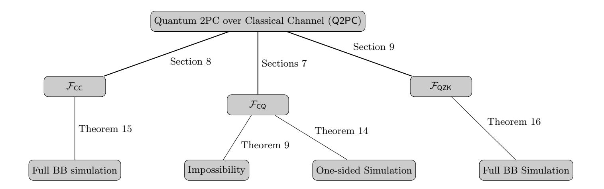
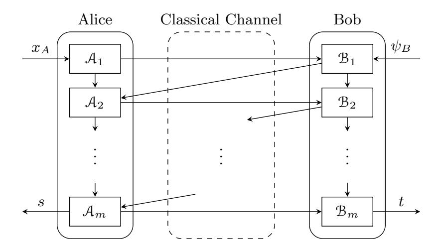
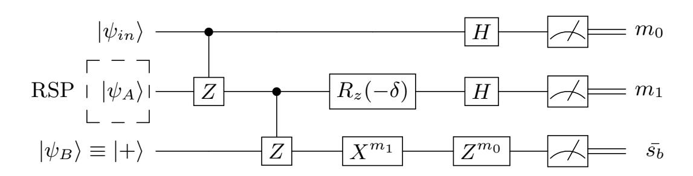

{0}------------------------------------------------

## Secure Two-Party Quantum Computation Over Classical Channels

Michele Ciampi<sup>1</sup> , Alexandru Cojocaru<sup>2</sup> , Elham Kashefi1,<sup>3</sup> , Atul Mantri<sup>4</sup>

> <sup>1</sup> School of Informatics, The University of Edinburgh [michele.ciampi@ed.ac.uk](mailto:mciampi@ed.ac.uk) 2 Inria

> > [dragos-alexandru.cojocaru@inria.fr,](mailto:dragos-alexandru.cojocaru@inria.fr)

- <sup>3</sup> Laboratoire d'Informatique de Paris 6 (LIP6), Sorbonne Universit´e, [ekashefi@inf.ed.ac.uk](mailto:ekashefi@inf.ed.ac.uk)
- 4 Joint Center for Quantum Information and Computer Science (QuICS), University of Maryland, College Park, USA [amantri@umd.edu](mailto:amantri@umd.edu)

Abstract. Secure two-party computation considers the problem of two parties computing a joint function of their private inputs without revealing anything beyond the output of the computation. In this work, we take the first steps towards understanding the setting where: 1) the two parties (Alice and Bob) can communicate only via a classical channel, 2) the input of Bob is quantum, and 3) the input of Alice is classical. Our first result indicates that in this setting it is in general impossible to realize a two-party quantum functionality with black-box simulation in the case of malicious quantum adversaries. In particular, we show that the existence of a secure quantum computing protocol that relies only on classical channels would contradict the quantum no-cloning argument.

We circumvent this impossibility following three different approaches. The first is by considering a weaker security notion called one-sided simulation security. This notion protects the input of one party (the quantum Bob) in the standard simulation-based sense and protects the privacy of the other party's input (the classical Alice). We show how to realize a protocol that satisfies this notion relying on the learning with errors assumption. The second way to circumvent the impossibility result, while at the same time providing standard simulation-based security also against a malicious Bob, is by assuming that the quantum input has an efficient classical representation.

Finally, we focus our attention on the class of zero-knowledge functionalities and provide a compiler that takes as input a classical proof of quantum knowledge (PoQK) protocol for a QMA relation R (a classical PoQK is a PoQK that can be verified by a classical verifier) and outputs a zero-knowledge PoQK for R that can be verified by classical parties. The direct implication of our result is that Mahadev's protocol for classical verification of quantum computations (FOCS'18) can be turned into a zero-knowledge proof of quantum knowledge with classical verifiers. To the best of our knowledge, we are the first to instantiate such a primitive.

{1}------------------------------------------------

## 1 Introduction

Secure multi-party computation (MPC) [\[31](#page-28-0)[,62\]](#page-30-0) allows multiple distrusting parties to jointly compute any function of their joint input, such that no information is leaked about their private inputs apart from what can be inferred from the output of the computation [\[61,](#page-30-1)[30\]](#page-28-1). Unfortunately, it is well known that MPC is not possible with information-theoretic security when all but one party is corrupted. Luckily, it is possible to circumvent this impossibility by considering computationally bounded adversaries or the existence of trusted third parties.

In the quantum world, secure quantum multiparty computation (QMPC) and the case of quantum 2-party computation (Q2PC) have been originally proposed in [\[58,](#page-30-2)[10,](#page-27-0)[21\]](#page-28-2) and [\[25,](#page-28-3)[26\]](#page-28-4) and further explored in [\[40,](#page-29-0)[38,](#page-29-1)[55](#page-29-2)[,23\]](#page-28-5).

All the previous works either realize post-quantum secure classical functionalities over classical networks or require all the involved parties to possess quantum resources and access to quantum channels. This means that quantum communication channels have been a must for securely implementing a quantum function and hence, put a rather heavy burden on the parties involved. Nonetheless, similar to the classical setting, we know that information-theoretic secure QMPC with a dishonest majority is not possible. Therefore, the security achievable in QMPC protocols with quantum channels are at best computational, despite requiring parties to have powerful quantum devices and access to the quantum channel. Hence, a natural question regarding the trade-off between the functionality achieved and the resources needed is the following:

Do all parties require quantum devices and need to share quantum channels to securely evaluate a quantum function?

In this work, we study the case where two parties (Alice and Bob) have access to a classical channel, and only one party (Bob) has a quantum machine. Ideally Alice and Bob want to compute any arbitrary quantum computation on the classical-quantum (joint) input. Getting insights into the minimum requirements for QMPC protocols is important not only from the foundational perspective, but will also lay the stepping stone for practical QMPC protocols.

Unfortunately, our first result shows that achieving black-box simulationbased security in this setting is in general impossible. We recall that the notion of black-box simulation-based security guarantees the existence of a simulator that works by having only black-box access[5](#page-1-0) to the adversary. To circumvent the impossibility, we follow three different (natural) approaches. The first is to weaken the security definition by considering the notion of one-sided simulation. This notion protects the input of one party (the quantum Bob) in the standard simulation-based sense and protects only the privacy[6](#page-1-1) of the other party's input (the classical Alice). The second approach we adopt to circumvent the impossibility

<span id="page-1-0"></span><sup>5</sup> Following [\[57\]](#page-29-3), by black-box access here we mean that the simulator has oracle access to the unitary M and M† , where M is the quantum adversary.

<span id="page-1-1"></span><sup>6</sup> By privacy of Alice's input we mean that the adversary is not able to figure out whether the input of Alice is 0 or 1.

{2}------------------------------------------------

is to restrict the class of functionalities that can be computed. In particular, we argue that if the quantum input of Bob has an efficient classical representation (known to Bob), then we can realize any functionality with standard black-box simulation-based security. For our third approach, we restrict our attention to the zero-knowledge functionality for QMA. In particular, we show how to realize the zero-knowledge functionality by properly combining classical proof of quantum knowledge (PoQK) protocols[7](#page-2-0) for QMA with well-known existing post-quantum secure cryptographic primitives. As an immediate corollary of our result, we obtain the first zero-knowledge proof of quantum knowledge protocol (ZKPoQK) with classical verifiers and quantum prover for a specific class of QMA relations. The corollary is obtained by using as input of our compiler the CPoQK protocol of Mahadev [\[43](#page-29-4)[,59\]](#page-30-3). To the best of our knowledge, our work is the first to provide such a primitive. We now provide more details on our results.

#### 1.1 Our Contributions

All the results in this work concern secure quantum two-party computation (Q2PC) over a classical channel[8](#page-2-1) . We logically divide our contributions into three sets (we summarize our results in Figure [1\)](#page-3-0).

Security of Q2PC with classical channel. What is the best possible security, achievable when a quantum two-party functionality is realized over classical networks? To answer this question, we analyze the difficulty underlying the process of achieving simulation-based security with black-box access to the adversary. To elaborate on this, we formalize a connection between the existence of a simulator for any malicious adversary in (quantum) two-party computation and the existence of an extractor (with the same run-time) in (quantum) agreeand-prove (AaP) protocols [\[6](#page-27-1)[,59\]](#page-30-3). The notion of AaP is a generalization of the notion of proof-of-knowledge. In the latter, a prover and a verifier have a statement x as a common input and the prover can construct a proof that convinces the verifier about the knowledge of a witness for x. In AaP the statements are not given as a common input, but it can be the output of an interactive protocol which acts as an agree-phase. At the end of the agree-phase, the prover and the verifier have a common input and might have some secret information. By observing that a 2PC protocol can be used to realize the prove phase of an AaP protocol and by leveraging on the impossibility of constructing AaP protocols for quantum-money verification [\[59\]](#page-30-3), we also rule out the possibility of securely evaluating some functionalities in the setting where no quantum communication is allowed.

Theorem 1 (Informal). Secure quantum two-party computation with quantum input over a classical channel with black-box simulation is in general impossible.

<span id="page-2-0"></span><sup>7</sup> A classical proof of quantum knowledge (CPoQK) is a proof of quantum knowledge (PoQK) that can be verified by a classical verifier.

<span id="page-2-1"></span><sup>8</sup> Unless otherwise specified, all the protocols and sub-protocols considered in this work allow the two parties to communicate only via classical channels. Moreover, only one party has access to a quantum machine

{3}------------------------------------------------



<span id="page-3-0"></span>Fig. 1. Summary of our results. Our results on quantum two-party computation over a classical channel (Q2PC) can be characterized into two levels: Functionality (first level) and Security (second level). We consider three different types of functionalities depending on the input of Alice and Bob. FCC is a joint quantum function with a classical input x from Alice and a quantum input σ<sup>y</sup> from Bob, where the quantum input σ<sup>y</sup> has (efficient) classical description known to Bob. Similarly, FCQ takes input x and ρy, where ρ<sup>y</sup> is any quantum state with no classical description known to Bob. FQZK takes as input an instance x that belongs to a QMA language L and a quantum state |ψi from Bob, and returns to Alice either 0 or 1 depending on whether the verifier for the QMA relation would have accepted x and |ψi. The second level represents different notions of simulation-based security. The chart shows relevant sections and results that we study in this paper.

Due to the above result, we present three relaxations —one on the security model (we consider the notion of one-sided simulation) and the other two on the class of functionalities that can be computed by the parties.

One-sided simulation. We consider the notion of one-sided simulation which provides standard security against the classical party (Alice), and indistinguishably based security against the quantum party (Bob). For the sake of simplicity, we first present a protocol that realizes the functionality 1-out-of-2-OQFE. In 1-out-of-2-OQFE, Alice has as input a bit b, while Bob's input is a single qubit state ψ. The target computation is 1 out of 2 possible functions f<sup>0</sup> and f1. The 1-out-of-2-OQFE functionality ensures that Alice obtains fb(ψ) without "learning" anything about the other function applied on Bob's input (i.e. f1⊕b(ψ)), while Bob "learns" nothing about Alice's input b.

At a high level, our protocol is based on the measurement-based model of quantum computation. Alice's input is encoded in the measurement angles, Bob's input is the first layer of the underlying graph state and the last layer represents Alice's output. Alice remotely prepares the (auxiliary) qubits corresponding to the graph state using a cryptographic primitive known as remote state preparation (RSP) [9](#page-3-1) . We present two protocols based on this idea. One of which is noninteractive, secure against semi-honest Alice, and protects the input of Alice

<span id="page-3-1"></span><sup>9</sup> In RSP, a classical party (Alice) instructs a quantum party (Bob) to generate a quantum state remotely on Bob's side using classical communication only. The

{4}------------------------------------------------

against a malicious Bob. For this result, we rely on a (computationally secure) classical-client remote state preparation protocol as a sub-module. Specifically, given the underlying connection to remote state preparation, this construction reduces the cryptographic complexity of Q2PC to injective homomorphic trapdoor quantum one-way functions. In the other protocol, we uplift the security of our semi-honest protocol against malicious Alice achieving one-sided simulation. Finally, we show how to extend the protocol to realize any functionality that belongs to FCQ, where FCQ denotes the class of two-input functionalities that admit one quantum input and one classical input[10](#page-4-0). Hence, we obtain the following result.

Theorem 2 (Informal). There exists a Q2PC protocol that securely realizes FCQ with one-sided simulation, assuming the hardness of LWEs.

Remark 1. We emphasize that our approach is the first showing a relation between RSP [\[18](#page-28-6)[,17](#page-27-2)[,29](#page-28-7)[,5\]](#page-27-3) and Q2PC, thus leveraging on the RSP techniques to replace quantum channels with (more practical) classical channels in MPC. We believe that this approach could naturally be generalized to the case where there are multiple classical and quantum parties.

Our second result enhances the previous result by combining it with a sequence of zero-knowledge protocols, allowing us to obtain a fully simulatable secure protocol. To do this, we restrict ourselves to the class of quantum functionalities that admits only classical inputs (which we denote with FCC), then we show how to uplift the security of the one-sided-simulation protocol to make it fully simulatable.

Theorem 3 (Informal). There exists a Q2PC protocol that realizes FCC with fully black-box simulation-based security, assuming the hardness of LWEs.

We also argue how to obtain one-sided simulation from circuit private Quantum Fully Homomorphic Encryption Approach (QFHE) [\[44\]](#page-29-5). We can then use our compiler to obtain a fully simulatable Q2PC protocol. We stress that QFHE without circuit privacy would not suffice to obtain our results.[11](#page-4-1)

For our third result, instead, we use a completely different approach, showing how to promote any proof of quantum knowledge (PoQK) protocol to a Q2PC protocol for the zero-knowledge functionality FQZK for QMA. FQZK takes as input an instance and x that belongs to a QMA language L and a quantum state |ψi from Bob, and returns to Alice either 0 or 1 depending on whether the verifier for

description of the generated quantum state is known to Alice but not to Bob. Such a task is only possible under computational assumptions.

<span id="page-4-0"></span><sup>10</sup> The subscript CQ for FCQ denotes that the input of one party is classical whereas the input of the second party is quantum.

<span id="page-4-1"></span><sup>11</sup> The first circuit private QFHE protocol is proposed in [\[44\]](#page-29-5) which appeared after the first submission of this paper. We note that without the result proposed in [\[44\]](#page-29-5) our protocol was the first to allow secure computation over a classical channel in the case of semi-honest parties.

{5}------------------------------------------------

the QMA relation would have accepted x and |ψi. More precisely, for this result, we use as the main tool a classical proof of quantum knowledge (CPoQK) which enjoys the property of message-independence. This property guarantees that the verifier can compute the protocol messages without looking at the messages received from the prover[12](#page-5-0). We propose a generic compiler that takes any CPoQK that enjoys the property of message-independence and turns it into a secure Q2PC protocol for the FQZK functionality.

Theorem 4 (Informal). If there exists a CPoQK for the QMA relation R that enjoys the property of message-independence then there exists Q2PC protocol that realizes FQZK (for the same relation R) with fully black-box simulation-based security, assuming the hardness of LWEs.

This result combined with the recent CPoQK protocol proposed in [\[59\]](#page-30-3) yields to a Q2PC for FQZK for QMA relations that satisfies some specific properties (we refer the reader to the technical part of the paper for more detail). We stress that our compiler makes black-box use of the underling CPoQK protocol, hence any advancement in the area of classical proof of quantum knowledge would immediately translate to a better Q2PC for FQZK.

## 1.2 Related Works

The first work that studied the question of MPC in the quantum domain is [\[21\]](#page-28-2), where a secure QMPC protocol is proposed based on the ideas of verifiable quantum secret sharing of the inputs of the parties. This result has been extended in [\[21](#page-28-2)[,10](#page-27-0)[,42\]](#page-29-6). In a series of works by Dupuis et al. [\[25,](#page-28-3)[26\]](#page-28-4) the setting of two-party quantum computation is presented using tools from classical MPC and quantum authentication codes developed in [\[1\]](#page-27-4). This protocol is generalized to the multiparty setting with a dishonest majority in a recent work by Dulek et al. [\[23\]](#page-28-5) and extended to security with identifiable abort in [\[2\]](#page-27-5). In a recent work of [\[12\]](#page-27-6), the authors propose a garbling scheme for quantum circuits.

A different approach inspired by delegated quantum computing [\[13](#page-27-7)[,24\]](#page-28-8) towards secure two-party computation, similar to a quantum analog of Yao's protocol from classical MPC [\[61\]](#page-30-1), is studied in [\[40,](#page-29-0)[38\]](#page-29-1) and towards (composable) secure multi-party quantum computation in [\[39,](#page-29-7)[35,](#page-28-9)[45\]](#page-29-8).

All previous works on secure two-party and multi-party quantum computation rely on quantum channels shared between parties and require more than one party to posses quantum devices. However, in our work, we propose a secure two-party quantum computation protocol over classical channels, removing the need for a quantum channel. Additionally, our constructions require only one party to have access to quantum resources.

Unruh in [\[56\]](#page-29-9), building upon the works on quantum oblivious OT [\[11\]](#page-27-8) and MPC [\[37\]](#page-29-10), proposed a UC-secure protocol for classical multi-party computations using only commitments and a quantum channel. More recently, secure (quantum) MPC based on quantum channels and one-way functions has been proposed

<span id="page-5-0"></span><sup>12</sup> Note that any public-coin protocol trivially enjoys this property.

{6}------------------------------------------------

in [\[7,](#page-27-9)[33\]](#page-28-10). Such a task is known to be impossible in a purely classical setting [\[28\]](#page-28-11). It is not clear whether a quantum channel is necessary to achieve MPC with quantum parties just relying on commitments. However, in this work, we show that a quantum channel is necessary to achieve general two-party quantum computation (Q2PC) in the setting of malicious parties (and hence in the UC security model as well). Moreover, our modular construction of Q2PC from RSP establishes the latter primitive as a candidate for a universal primitive. It is worth mentioning that due to this direct link, any further optimisation of the complexity of RSP will also provide answers to the complexity of Q2PC. This, in turn, will enhance our understanding about the resources required for important cryptographic primitives such as delegated quantum computing [\[27\]](#page-28-12) and classical verification of quantum computing [\[29](#page-28-7)[,43\]](#page-29-4), in addition to QMPC.

## 2 Technical Overview

Limitations of black-box secure Q2PC. There are classical two-party functionalities that cannot be securely realized even if the parties have access to quantum resources [\[20,](#page-28-13)[54](#page-29-11)[,16\]](#page-27-10). This automatically implies that quantum 2-PC cannot be achieved information-theoretically over classical channels. In this work, we show that there are quantum functionalities that cannot be securely realized (in a black-box way) even against computationally-bounded adversaries in the case where only classical channels are available. This features a striking trade-off between the resources needed to achieve the desired functionality and the level of security for quantum two-party computation (Q2PC). We start by establishing a connection between black-box security for two-party computation and secure agree-and-prove protocols (which are a generalization of proofs/arguments of knowledge for both classical and quantum two-party functionalities).

The high-level idea behind the connection of two-party computation and the existence of proof of knowledge (and agree-and-prove protocols) is the following. Saying that a two-party protocol realizes a functionality with black-box simulationbased security means that for every adversarial party there exists a simulator Sim that can extract the input from the malicious party. In the case of quantum adversaries (with quantum inputs), this implies that Sim must be able to extract Bob's input in quantum-polynomial time. We can now consider a 2PC protocol that realizes the prove phase of the agree-and-prove protocol, where the prover (Bob) is proving the knowledge of a quantum secret. In [\[59\]](#page-30-3) the authors show that the existence of certain kinds of secure agree-and-prove protocols (in particular for quantum money scenario) implies cloning. This in turns implies that some functionalities cannot be securely realized in our model.

Next, we move towards our positive results, which are achieved by weakening either the security model or the class of functionality that we realize.

#### 2.1 Our Protocols

The one-sided two-party classical-quantum setup consists of two parties — Alice (A) and Bob (B) — that have their private inputs and wish to perform a joint 

{7}------------------------------------------------

computation, but where only one of the parties receives the output. In the remainder of this work, we will use the following convention: a) Bob is a quantum party and b) Alice is a classical party, and is the only one receiving the output. One of the potential applications of such a setting is the following. Imagine a scenario where one of the parties, Bob, has a quantum database and the other party, Alice, queries the database in such a way that i) Bob would like to keep the entries of the database secure except the one which is queried, and ii) Alice would like to maintain the privacy of her requested query. In more detail, we consider the following setting.

- 1. Alice has as input (a classical description of) a quantum function f, where f has quantum input and classical output.
- 2. Bob has as input a quantum state ψ.
- 3. Alice obtains f(ψ) and "learns nothing" more than this information. At the same time, Bob receives no output and "learns nothing" about f.

In general, ψ could be an arbitrary quantum state and since Alice is classical, f denotes the quantum map that consists of a unitary U followed by measurement in the computational basis. We provide a modular approach towards the construction of our protocol and prove its security in the one-sided simulation-based framework. At a high level, we first provide a protocol that achieves privacy against quantum Bob and (statistical) security against semi-honest Alice. Then, in the second construction, using cryptographic tools such as secure commitment schemes and zero-knowledge proof of knowledge, we uplift the security to full simulation-based security against malicious Alice.

To simplify the understanding of our protocol, we first present a construction for a simplified functionality called 1-out-of-2-OQFE (Definition [10\)](#page-17-0), where Alice's input is a single bit b and Bob's input is a single qubit state ψ. As mentioned before, this functionality ensures that Alice obtains fb(ψ) without "revealing" anything about f1⊕b(ψ) to Alice as well as "hiding" Alice's input b from Bob. The notion of "revealing" and "hiding" is formalised using one-sided simulation framework (Section [4.1\)](#page-15-0). Aside from being instrumental in the construction and security proofs of the full Q2PC protocol, this simple functionality of 1-out-of-2- OQFE can be of independent interest.

The central idea behind the construction of this protocol (we refer to Protocol [6.1](#page-19-0) for the formal description) is inspired by one-bit teleportation circuits where Bob's quantum input state is measured in one of two possible angles, which is dictated by Alice's (private) input. The output of such a (simple) two-party computation is obtained by Alice. Our protocol also relies on a remote state preparation (RSP) –cryptographic primitive– that enables an (honest) classical user to remotely prepare a quantum state on the (untrustworthy) quantum server, using only a classical communication channel. RSP plays an important role in our protocol to eliminate the need for quantum communication between Alice (user) and Bob (server). Although such a primitive cannot be information-theoretically secure, we use a computationally secure construction based on (post-quantum) cryptographic assumptions. While this means that the security of our protocol

{8}------------------------------------------------

for 1-out-of-2-OQFE holds only against semi-honest Alice, we can show that it holds in the statistical regime. On the other hand, for Bob, we show that the privacy of Alice's input is based on the hardness of the LWE problem. To sum up, we prove the following theorem.

Theorem 5 (Informal). The exists a protocol that realizes the 1-out-of-2-OQFE functionality which achieves privacy against malicious Bob and is statistically secure against semi-honest Alice.

To uplift the security from semi-honest Alice to a malicious Alice, we need to be able to validate the transcripts Alice is sending to Bob during the run of the protocol. To do that, we let Alice and Bob engage in a coin-tossing protocol where only Alice receives the input. Then Alice proves that she has used the randomness generated from the coin-tossing to generate the messages of the 1-out-of-2-OQFE protocol. We can therefore claim the following.

Theorem 6 (Informal). Assuming the hardness of LWE, there exists a protocol that realizes the 1-out-of-2-OQFE functionality with one-sided simulation.

We then extend the previous construction to obtain a protocol that realizes any functionality FCQ with one-sided simulation-based security. More concretely, our construction for one-sided simulation secure Q2PC is based on the measurement-based model of quantum computation, by combining the blind quantum computation protocol [\[13\]](#page-27-7) with RSP as subroutines. Also, in this case, to enforce the honest behavior of Alice we use a combination of a coin-tossing protocol and zero-knowledge proofs.

Theorem 7 (Informal). Assuming the hardness of LWE, there exists a protocol that realizes FCQ with one-sided simulation.

It is easy to see that any protocol that realizes FCQ can also be used to realize FCC. [13](#page-8-0) Finally, we would like to remark that the cryptographic complexity of our Q2PC proposal can be reduced to the cryptographic assumptions required to achieve classical-client RSP. More specifically, our construction can be instantiated with injective homomorphic trapdoor quantum one-way functions and any zeroknowledge proof of knowledge.

From One-Sided Simulation to Full Simulation. We propose a generic compiler that turns any protocol π that realizes the class of functionalities FCC with one-sided simulation into a protocol π 0 that realizes the same class of functionalities with full simulation-based security. We recall that π offers simulation-based security against the malicious Alice, and privacy against the malicious Bob. Hence, we just need to employ a mechanism that forces Bob to behave honestly and that at the same time allows extracting the input used

<span id="page-8-0"></span><sup>13</sup> We recall that this is the class of quantum functionality that accepts only inputs that have efficient classical descriptions.

{9}------------------------------------------------

by malicious Bob when running  $\pi^{14}$ . One trivial solution would be to force Bob to provide, for each message, a classical zero-knowledge proof of quantum knowledge, that shows that Bob is executing correctly the protocol messages and that he knows what is the input and the randomness used in the computation. In the security proof against malicious Bob, we can then rely on the extractor of the classical proof of quantum knowledge protocol to retrieve the input of the malicious Bob and query the ideal functionality. Unfortunately, we are not aware of any such classical proof of quantum knowledge. Indeed all existing protocols (including ours) work only for a specific class of QMA relations.

Therefore, we follow a different approach. We require Bob to commit to its input  $\phi_c$  and provide a classical proof of knowledge about the knowledge of the committed value (note that for this purpose a classical post-quantum secure proof of knowledge for NP relations suffices). After that the commitment and the proof have been computed, Alice and Bob run  $\pi$ , and when the last message of  $\pi$  has been computed Bob provides a zero-knowledge proof that proves that the input used to compute the messages of  $\pi$  is the same as the input committed in the very beginning of the protocol. Note that in this case we need a post-quantum secure zero-knowledge protocol for QMA, but we require no properties of proof (argument) of quantum knowledge. We also observe that in the above protocol only Alice gets the output. However, this is without loss of generality as it is always possible to turn such a protocol into a protocol where also Bob gets the output (under the condition that the output is classical). Let us assume that Alice and Bob want to compute a function f that belongs to the class  $\mathcal{F}_{CC}$  which takes two inputs  $(\psi_c, x)$  and returns two outputs  $y_B, y_A$ . We now consider the function f which takes two inputs  $(k_1, k_2, \psi_c, x)$ , where  $k_1$  is the key of a one-time authentication scheme, and  $k_2$  is the key for a one-time encryption scheme<sup>15</sup>. finternally runs f, and outputs (Enc<sub>B</sub>,  $y_A$ ), where  $y_A$  represents the second output of f and  $Enc_B$  represents the encryption computed using the key  $k_2$  of the value  $y_B$  authenticated with the key  $k_1$ .

Alice and Bob now can run the protocol  $\pi'$  for f, and Alice, upon receiving  $(\mathsf{Enc}_\mathsf{B}, y_A)$  sends  $\mathsf{Enc}_\mathsf{B}$  to Bob who decrypts it using  $k_2$  and checks if the values are correctly authenticated with respect to  $k_1$ . Note that this prevents Alice from seeing or tampering with the output dedicated to Bob. Similar techniques have been used in many previous works [4,41,36]. This allows us to claim the next theorem.

**Theorem 8 (Informal).** Assuming the hardness of LWE, there exists a protocol that realizes  $\mathcal{F}_{CC}$  with simulation-based security.

Q2PC from quantum fully-homomorphic encryption (QFHE). We can obtain the above results starting from circuit private QFHE. In particular, we can construct the following one-sided-simulation protocol that would make use of a classical

<span id="page-9-0"></span>We recall that we need this extraction mechanism because we need to construct a simulator that in the ideal world acts on the behalf of Bob, hence it needs to be able to extract Bob's input.

<span id="page-9-1"></span><sup>&</sup>lt;sup>15</sup> We note that both this primitives can be instantiated information-theoretically.

{10}------------------------------------------------

QFHE scheme (for quantum computations). Alice and Bob first run a coin-tossing protocol. Then using the randomness resulting from this protocol, Alice generates the public key pk of the QFHE and sends pk to Bob together with proof that the public-key is generated accordingly the randomness obtained from the cointossing procedure. Bob then runs the function evaluation using pk, his input, and the function that needs to be computed and sends back the output to Alice. Alice, upon receiving the encrypted message, decrypts it and obtains the outcome of the computation. We can argue that this protocol is a one-sided-simulation-based secure, Hence, we can use our generic compilers to achieve full simulation security.

Q2PC for FQZK. For our last result, we do not put restrictions on whether the input of Bob can or cannot be represented classically, but we focus on the zeroknowledge functionality for QMA, FQZK. Our approach in this case completely departs from what we have done so far. We first observe that to realize FQZK in our model, we only need to construct a zero-knowledge proof of quantum knowledge for QMA for classical verifiers.

We use as the main building block a classical proof of quantum knowledge ΠCPoQK (which admits a classical verifier). We recall that the messages of a CPoQK protocol could leak information about the witness. Therefore, a first approach to solve this problem would be to let the prover and the verifier run ΠCPoQK, where the messages of the prover are encrypted. At the end of the execution of ΠCPoQK, the prover, using a zero-knowledge protocol ΠZK proves an NP statement of the following "The verifier of ΠCPoQK would have accepted the transcript that consists of the encrypted messages". This approach unfortunately only yields a zero-knowledge proof for QMA, since it is unclear how to argue that the overall protocol retains the CPoQK property. To solve this issue, we add the following additional step at the beginning of the protocol. The prover commits to a secret key sk for an encryption scheme thus obtaining com. Then he uses a zero-knowledge proof of knowledge protocol ΠZKPoK to prove the following NP-statement "I know the message committed in com". The prover and the verifier then run ΠCPoQK as before (where the prover encrypts his messages), with the difference that we slightly modify the statement proved using ΠZK as follows "The verifier of ΠCPoQK would have accepted the transcript that consists of the encrypted messages, moreover the messages are encrypted with a secret key committed in com".

We can prove that this protocol is zero-knowledge relying on the zeroknowledge property of ΠZKPoK and ΠZK, on the hiding of the commitment scheme and the security of the encryption scheme. To prove that our protocol is a proof of quantum knowledge, we need to exhibit an extractor. Our extractor first extracts the secret key sk from the proof computed using ΠZKPoK, and then it can run the extractor of the protocol ΠCPoQK which exists by definition.

One limitation of our compiler is that it requires ΠCPoQK to have the property of message-independence. These properties require the verifier to be able to compute his messages without looking at the messages received from the prover. 

{11}------------------------------------------------

We note that this is a property enjoyed by all the public coin protocols and by existing protocols like the one proposed in [\[59\]](#page-30-3).

## 2.2 Organization of paper

In Section [3,](#page-11-0) we define the notations and relevant classical and quantum cryptographic primitives. In Section [4,](#page-14-0) we present the definition of quantum twoparty computation over a classical channel, ideal functionalities, and different simulation-based notions of security. In Section [5](#page-16-1) we present the impossibility proof of black-box secure Q2PC. Then, we present two concrete protocols for 1-out-of-2 oblivious quantum function evaluation and analyse the security against semi-honest Alice and malicious parties (one-sided simulation-based model) in Section [6.](#page-16-2) An extension from 1-out-of-2 oblivious quantum function evaluation (1-out-of-2-OQFE) to (general) secure two-party computation protocol along with its (one-sided simulation) security is presented in Section [7.](#page-20-0) In Section [8,](#page-24-0) we show how to uplift our one-sided simulation secure Q2PC protocol to a secure black-box Q2PC assuming that Bob has a classical description of his input. Finally, in Section [9](#page-25-0) we present a general compiler for constructing post-quantum zero-knowledge classical proof of quantum knowledge from simpler primitives.

In Appendix [A](#page-31-0) we describe more definitions related to complexity classes and cryptographic primitives concerning our work. Appendix [B](#page-38-0) describes the remote state preparation (RSP) protocol used for our protocols, together with the security conditions it satisfies. In Appendix [C](#page-41-0) we describe the 1-out-of-2-OQFE protocol secure against malicious Alice. Appendix [D](#page-45-0) presents all the deferred proofs from Sections [6](#page-16-2)[-9.](#page-25-0)

## <span id="page-11-0"></span>3 Preliminaries

## 3.1 Notations

In this paper when we talk about distributions being indistinguishable for any probabilistic polynomial-time (PPT) adversary we will use the symbol ≈c, if they are indistinguishable for any quantum polynomial-time (QPT) adversary, we will use ≈<sup>q</sup> and if they are indistinguishable for an unbounded adversary we will use ≈u. Additionally, when testing for equality we will use directly the symbol "=". For a protocol P = (P1, P2) with two interacting algorithms P<sup>1</sup> and P<sup>2</sup> denoting the two participating parties, let (r1, r2) ← hP1, P2i denote the execution of the two algorithms, exchanging messages, with P1's output r<sup>1</sup> and P2's output r2. Let A and B be two Hilbert spaces. The set L(A, B) is the set of all linear maps from A to B. The set L(A) = L(A, A) is the set of all linear maps on A and the mapping ϕ : L(A) 7→ L(B) is also called super-operator. If ϕ is completely positive and preserves the trace then such a super-operator is also known as quantum operation or CPTP map. We denote identity operator as I and A ⊗ B denotes the space of two such quantum registers. We will also denote by M<sup>Z</sup> a measurement of a quantum state in the computational basis. We will use the

{12}------------------------------------------------

notation Rx(−α) to refer to the rotation of a single qubit around the x-axis with the angle α, and Rz(−δ) to refer the rotation of a single qubit around z-axis with the angle δ. For any function f : A → B, we define the controlled-unitary U<sup>f</sup> , as acting in the following way: U<sup>f</sup> |xi |yi = |xi |y ⊕ f(x)i for any x ∈ A and y ∈ B, where we name the first register |xi control and the second register |yi target. For more details on the quantum background, we refer the readers to [\[49\]](#page-29-13).

In the rest of the section, we provide definition for black-box two-party quantum computation along with the definitions of classical and quantum primitives used in this work. Some parts of this section are taken from [\[57](#page-29-3)[,14](#page-27-12)[,19\]](#page-28-15). The remaining definitions related to interactive quantum machines and (quantum) oracle are presented in Appendix [A.](#page-31-0)

### 3.2 Classical and Quantum Cryptographic Primitives

Polynomial time relation Rel is a subset of {0, 1} <sup>∗</sup> × {0, 1} ∗ such that membership of (x, w) in Rel can be decided in time polynomial |x|. For a polynomial-time relation Rel, we define the NP language LRel := {x | ∃w such that (x, w) ∈ Rel}. Next, we define proof of knowledge in both the classical and quantum settings.

A Proof of Knowledge (PoK) is an interactive proof system for some relation R such that if the verifier accepts a proof with respect to some input x with high enough probability, then she is "convinced" that the prover "knows" some witness w such that (x, w) ∈ R. This notion is formalized by requiring the existence of an efficient extractor Extract, that can return a witness for x when given oracle access to the prover (including ability to rewind its actions, in the classical case).

Definition 1 (Post-Quantum Proof of Knowledge (from [\[3\]](#page-27-13))). We say that an interactive proof system (P, V ) for a relation R satisfies (, δ)-proof of knowledge property if the following holds: suppose there exists a malicious prover P ∗ such that for every x and quantum state ρ we have that:

$$Pr[(\tilde{\rho}, d) \leftarrow \langle P^*(x, \rho), V(x) \rangle \land d = accept] = \epsilon$$

(where ρ˜ represents the output of P <sup>∗</sup> and d is the output of V ), then there exists a quantum polynomial-time extractor E, such that:

$$Pr[(\rho', w) \leftarrow E(x, \rho)] = \delta$$

Definition 2 (Simulatability). We say a proof of knowledge system (P, V ) is simulatable if the following holds. Denote ρ˜ the state output by a malicious P <sup>∗</sup> at the end of a protocol accepted by V and ρ 0 the output of the extractor at the end of a protocol accepted by V . Then (P, V ) is simulatable if ρ ≈<sup>q</sup> ρ 0 .

Definition 3 (Black-Box Access to a Quantum Machine M<sup>∗</sup> , [\[57\]](#page-29-3)). We say that a quantum algorithm A has (rewinding) black-box access to a machine M<sup>∗</sup> if by denoting with U the unitary describing one activation of M<sup>∗</sup> , then A can invoke U (this corresponds to running U), or its inverse U † (this corresponds to rewinding M<sup>∗</sup> by one activation), and A can also read/write a shared register N used for exchanging messages with M<sup>∗</sup>

{13}------------------------------------------------

Definition 4 (Classical Proof of Quantum Knowledge ). (P, V ), where P is QPT interactive machine and V is a PPT interactive machine is a classical proof of quantum knowledge with knowledge error k(·) for QMA relation Rel if the following are satisfied:

- Correctness: For any (x, ρ) ∈ Rel, we have: P r[hP(ρ), V i(x) = 1] = 1 − negl(|x|)
- Soundness: There exists QPT algorithm E, called extractor such that: for any prover P <sup>∗</sup> and any x accepted by V when interacting with P <sup>∗</sup> with probability (x) > k(x), we have:

$$Pr[(x, \rho) \in Rel : \rho \leftarrow E^{P^*}(x))] \ge 1 - \delta(\epsilon)$$

where δ is such that δ() < 1 for all > k.

## 3.3 Useful Sub-Protocols

Definition 5 (Remote State Preparation). A resource S is a Remote State Preparation (RSP) resource if it outputs on the right interface (Bob's interface) a quantum state ρ and the left interface (Alice's interface) a classical description of a state ρ 0 such that the states ρ and ρ <sup>0</sup> are close in trace distance.

The security guarantee is that Bob should not be able to learn anything more about the classical description of ρ 0 (known to Alice) than what he can learn from a single copy of the state ρ.

For a more general definition of remote state preparation, we refer to [\[5\]](#page-27-3). Instantiation. A remote state preparation primitive can be instantiated using the QFactory protocol [\[17\]](#page-27-2). This protocol is described in Appendix [B.](#page-38-0)

In our constructions we employ QFactory as an RSP primitive, which ensures that Bob produces one of the BB84 states HB1XB<sup>2</sup> |0i | B1, B<sup>2</sup> ∈ {0, 1} on his side. At the same time, Alice learns the complete classical description of this state, consisting of the 2 bits - B<sup>1</sup> and B2. Roughly speaking, the security of QFactory guarantees that Bob learns nothing about B1.

Definition 6 (Delegated Quantum Computation (Informal)). A resource S is a Delegated Quantum Computing resource if it takes on the left interface (Alice's interface) a description of a computation Ψ such that Ψ encodes both the input state ψ and the unitary U. It outputs on the left interface (Alice's interface) the output U(ψ) and on the right interface outputs the circuit dimensions.

Instantiation. A delegated quantum computing over quantum channel and classical channel can be instantiated using the protocol [\[13\]](#page-27-7) and [\[5\]](#page-27-3), respectively.

Measurement-Based Quantum Computing model (MBQC) and Universal Blind Quantum Computing protocol (UBQC). Some of our protocols rely upon the principles of the measurement-based model for quantum computing. This model is known to be equivalent to the quantum circuit model (up to polynomial overhead 

{14}------------------------------------------------

in resources). For more details on measurement-based quantum computation, we refer the reader to [51,48] and to this excellent tutorial [15]. This model of quantum computing is particularly useful in a well-known delegated quantum computing protocol, also known as the universal blind quantum computing (UBQC) protocol. This was first proposed in [13], where a computationally-weak user (Alice) delegates an arbitrary quantum computation to a quantum server (Bob), in such a way that her input, the quantum computation, and the output of the computation are information-theoretically hidden from Bob. In UBQC, Alice prepares single qubits of the form  $|+_{\theta}\rangle := \frac{1}{\sqrt{2}}(|0\rangle + e^{i\theta}|1\rangle)$ , where  $\theta \in \{0, \frac{\pi}{4}, \dots, \frac{7\pi}{4}\}$  and send these quantum states to Bob at the beginning of the protocol, the rest of the communication between the two parties being classical.

## <span id="page-14-0"></span>4 Our Model and Impossibility of Black-Box Q2PC

<span id="page-14-1"></span>**Definition 7** (Q2PC over classical channel). An m-round (classical Alice, quantum Bob) quantum protocol  $P = (\mathfrak{A}, \mathfrak{B}, m)$  over classical communication channel consists of:

- 1. input spaces  $S_0$  and  $S'_0$  consisting of (classical) input  $x_A$  and (quantum) input  $\psi_B$  for parties  $\mathfrak{A}$  and  $\mathfrak{B}$ , respectively.
- 2. memory spaces  $S := (S_1, \ldots, S_m)$  for  $\mathfrak{A}$  and  $S' := (S'_1, \ldots, S'_m)$  for  $\mathfrak{B}$  and (classical) communication spaces  $N := (N_1, \ldots, N_m)$  and  $N' := (N'_1, \ldots, N'_m)$ .
- 3. an m-tuple of stochastic operations  $(A_1, \ldots, A_m)$  for  $\mathfrak{A}$ , where  $A_1 : \mathsf{L}(S_0) \mapsto \mathsf{L}(S_1 \otimes N_1)$ , and  $A_i : \mathsf{L}(S_{i-1} \otimes N'_{i-1}) \mapsto \mathsf{L}(S_i \otimes N_i)$ ,  $(2 \leq i \leq m)$ .
- 4. an m-tuple of quantum operations  $(\mathcal{B}_1, \ldots, \mathcal{B}_m)$  for  $\mathfrak{B}$ , where  $\mathcal{B}_i : \mathsf{L}(S'_{i-1} \otimes N_i) \mapsto \mathsf{L}(S'_i \otimes N'_i)$ ,  $(1 \leq i \leq m-1)$  and  $\mathcal{B}_m : \mathsf{L}(S'_{m-1} \otimes N_m) \mapsto \mathsf{L}(S'_m)$ .



Fig. 2. Two-party quantum protocol with classical Alice and quantum Bob. The left and the right box represents the parties (classical) Alice and (quantum) Bob, and the dashed box depicts the classical communication channel between them. The input of Alice is classical while Bob's input could be quantum or classical. Both the parties obtain classical output.

{15}------------------------------------------------

Let  $\mathcal{F}$  be a joint quantum function  $\mathcal{F}: \mathsf{L}(\mathcal{A}_{in}, \mathcal{B}_{in}) \mapsto \mathsf{L}(\mathcal{A}_{out})$  that (classical) Alice and (quantum) Bob would like jointly compute on their private input. Without loss of generality, we assume that only Alice obtains the (classical) output. We define two sets of quantum functionalities. Let  $\mathcal{F}_{CC}$  be a joint quantum function with input x and y from Alice and Bob, respectively, where x and y are the (efficient) classical description of their quantum input. Similarly,  $\mathcal{F}_{CQ}$  be a joint quantum function with input x and  $\rho_y$  from Alice and Bob, respectively. In this case x is an (efficient) classical description of Alice's (quantum) input and  $\rho_y$  is an arbitrary quantum state representing Bob's input. We also define the zero-knowledge functionality  $\mathcal{F}_{\mathsf{QZK}}$  (that is parametrized by a QMA relation).  $\mathcal{F}_{\mathsf{QZK}}$  takes as input an instance x that belongs to a QMA language L and a quantum state  $|\psi\rangle$  from Bob, and returns to Alice either 0 or 1 depending on whether the verifier for the QMA relation would have accepted x and  $|\psi\rangle$ .

#### <span id="page-15-0"></span>4.1 Simulation Based Security

Let  $\mathsf{REAL}_{\Pi,\mathcal{A}(z),i}(x,y,1^{\lambda})$  and  $\mathsf{IDEAL}_{\mathcal{F},\mathcal{S}(z),i}(x,y,1^{\lambda})$  be the output in the real and ideal execution for  $\mathcal{F}$  when the adversary  $\mathcal{A}$  is controlling party  $i \in \{\mathfrak{A},\mathfrak{B}\}$  with the auxiliary input z. The  $view_{\Pi,\mathcal{A}(z),i}(x,y,1^{\lambda})$  denote the view of the adversary  $\mathcal{A}$  after a real execution of  $\Pi$ .

<span id="page-15-2"></span>**Definition 8 (One-Sided Secure Realization of**  $\mathcal{F}$ ). We say a protocol  $\Pi = (\mathfrak{A}, \mathfrak{B})$ , where  $\mathfrak{A}$  is classical and  $\mathfrak{B}$  is quantum, securely computes  $\mathcal{F}$  with one-sided simulation (adapted from Def.2.6.2 in [34])) if for all inputs  $(x, y) \in D(A_{in} \otimes B_{in} \otimes R)$  we have:

1. For every non-uniform QPT adversary  $\mathcal{A}$  controlling  $\mathfrak{A}$  in the real model, there exists a non-uniform QPT adversary  $\mathcal{S}$  for the ideal model, such that:

$$\{\mathsf{REAL}_{\Pi,\mathcal{A}(z),\mathfrak{A}}(x,y,1^{\lambda})\}_{x,y,z,\lambda} \approx_{c} \{\mathsf{IDEAL}_{\mathcal{F},\mathcal{S}(z),\mathfrak{A}}(x,y,1^{\lambda})\}_{x,y,z,\lambda} \tag{1}$$

2. For every non-uniform QPT adversary A controlling  $\mathfrak{B}$ , we have that the following distributions are indistinguishable to any QPT distinguisher  $\mathcal{D}$ :

$$\{view_{\Pi,\mathcal{A}(z),\mathfrak{B}}(x,y,1^{\lambda})\}_{x,x',y,z,\lambda} \approx_q \{view_{\Pi,\mathcal{A}(z),\mathfrak{B}}(x',y,1^{\lambda})\}_{x,x',y,z,\lambda}$$

$$where |x| = |x'|.$$
(2)

Similarly, we extend the definition of black-box 2-party computation from [50] to quantum functionalities.

<span id="page-15-1"></span>**Definition 9 (Black-box (Quantum) 2-party computation).** We say that a protocol  $\Pi = (\mathfrak{A}, \mathfrak{B})$ , where  $\mathfrak{A}$  is classical and  $\mathfrak{B}$  is quantum, securely computes  $\mathcal{F}$  if for every  $i \in \{0,1\}$ , for all inputs  $(x,y) \in D(A_{in} \otimes B_{in} \otimes R)$ , for every non-uniform quantum-polynomial-time (QPT) adversary  $P_i^*$  controlling  $P_i$  in the real model, there exists a non-uniform quantum polynomial-time adversary  $Sim_i$  (having black-box access to  $P_i^*$ ) for the ideal world such that:

$$\{\mathsf{REAL}_{\varPi,P_i^\star(z)}(x,y,1^\lambda)\}_{x,y,z,\lambda} \approx_q \{\mathsf{IDEAL}_{\mathcal{F},\mathsf{Sim}_i(z)}(x,y,1^\lambda)\}_{x,y,z,\lambda}$$

where z is the auxiliary input.

{16}------------------------------------------------

## <span id="page-16-1"></span>5 Impossibility of Secure Quantum 2PC

In this section, we show that it is in general impossible to obtain a protocol that is fully simulatable (i.e. that satisfies Definition [9\)](#page-15-1) when only classical channels are available. To show this we will argue that for all the protocols realizing a specific function there exists an adversarial Bob that cannot be simulated. We note that the same no-go argument remains valid for Q2PC as well.

<span id="page-16-0"></span>Theorem 9. Secure quantum two-party computation over a classical channel with fully black-box simulation is not possible.

Proof. We choose the same notations for Alice and Bob as presented in Definition [7](#page-14-1) and assume that Bob has a quantum input while Alice's input is completely classical. For simplicity, we assume that only Alice obtains the output. Let us define a cheating strategy in the following way. We take an unclonable state, ρ in the input space S 0 <sup>0</sup> of Bob, while the general quantum operations (B1, . . . , Bm) performed on Bob's end are such that the interaction between Alice and Bob is perfectly non-destructive (as defined in Def. [27\)](#page-36-0). Similarly, Alice's input is completely classical and denoted as a.

In the case when the functionality takes the (classical) input, we define a as a triple (x, public, secret) and similarly, Bob's input ρ<sup>w</sup> can be divided into classical (x, public) as well as quantum state ρ. We define the two-party functionality such that it takes the input (a, ρw), runs a (QPT) verification algorithm Ver(a, ρw) ≡ Ver(x, public, secret, ρ) and outputs a bit b ∈ {0, 1} to Alice. The idea behind such functionality is to emulate the proof phase of a specific secure agree-and-prove scheme (Definition [29\)](#page-37-0), that are generalized proofs of (quantum) knowledge for the quantum money functionality (as defined in [\[59\]](#page-30-3)). In other words, non-destructive secure agree-and-prove protocols between a classical verifier and the quantum prover (for a quantum money scenario) are a special case of quantum two-party computation over a classical channel. However, non-destructive proofs of quantum knowledge for such a quantum money scenario imply cloning (Theorem [17\)](#page-37-1).

As mentioned before, a natural step forward is to relax the security requirement to one-sided simulation. We present a concrete Q2PC protocol and analyse the security in the case when either of the party is malicious. In particular, we show simulation-based security against a QPT Alice and input privacy against a QPT Bob. Such compromise seems inevitable given our previous result and the challenges to construct a quantum proof of knowledge, which shows that full simulation-based security in the presence of malicious adversaries is not possible.

## <span id="page-16-2"></span>6 1-out-of-2-OQFE

Before describing a candidate construction for Q2PC that satisfies the onesided simulation-based security (Def. [8\)](#page-15-2), we introduce a simplified functionality 1-out-of-2-OQFE, which can be understood as Alice having 2 possible functions f<sup>0</sup>

{17}------------------------------------------------

and f<sup>1</sup> that she can choose from. The reason for introducing 1-out-of-2-OQFE is that it sets the stage for the general two-party quantum computing functionality, is simpler in construction, and provides a good intuition for the Q2PC protocol.

We model 1-out-of-2-OQFE functionality, denoted as ΞOQFE, in the following way: Bob's private quantum computation is parameterized by a quantum state |ψini and a set of angles (φ0, φ1). The measurement outputs s<sup>i</sup> are then given by the computational basis measurement of the unitary R<sup>x</sup> (φi) on the input state |ψini for i ∈ {0, 1}. For simplicity, we choose φ<sup>0</sup> = 0 and φ<sup>1</sup> = π/2. Therefore, the functionality ΞOQFE is given by:

$$((s_0, s_1), b) \to (\lambda, s_b, \epsilon) \tag{3}$$

where λ denotes the empty string, (1- ) is the probability of Alice obtaining the correct outcome and s<sup>b</sup> = MZR<sup>x</sup> − π 2 · b |ψini

<span id="page-17-0"></span>Definition 10. (Ideal Functionality ΞOQFE) A 1-out-of-2-OQFE functionality ΞOQFE is defined as follows. When both the parties (A and B) are honest then 1-out-of-2-OQFE takes the input b and (s0, s1) from Alice and Bob, respectively and outputs s<sup>b</sup> at Alice's side. Here (s0, s1) corresponds to measurement output of Bob's (server's) private quantum computation and b denotes the choice of computation Alice (user) wishes to retrieve.

In this section, we present a two-party quantum computing protocol over a classical channel inspired by the one-bit teleportation circuit [\[63,](#page-30-4)[32\]](#page-28-17). We also employ a cryptographic primitive known as remote state preparation (RSP) as a subroutine between a classical party (Alice) and quantum party (Bob) to delegate the (quantum) computation from Alice to Bob. RSP was first proposed in [\[17](#page-27-2)[,29\]](#page-28-7) in the context of classical-client delegated quantum computing. This simple two-party protocol, which we call as 1-out-of-2-OQFE, serves as a stepping stone for the general two-party quantum computing protocol presented in Section [8.](#page-24-0)

In 1-out-of-2-OQFE, we have two parties: a (classical) Alice and a (quantum) Bob, where Alice's input is represented by a bit b and Bob has a quantum input |ψini. As mentioned before, we will consider Alice to be the party that receives the output at the end of the protocol. Without loss of generality, we assume that the goal of Alice and Bob is to perform a unitary operation U<sup>b</sup> from a set U on Bob's private input state |ψini. Here, the set of unitaries U := {Ub}b∈{0,1} is known to both parties and we denote the output of the joint computation as |ψouti, where |ψouti := U<sup>b</sup> |ψini. To this end, we present two 1-out-of-2-OQFE protocols, one with the semi-honest Alice (Protocol [6.1\)](#page-19-0) and the other with the malicious Alice (Protocol [C.1\)](#page-42-0). In both these protocols, Bob could be completely malicious. In this section, we will denote Alice's input with a bit and Bob's input with a single qubit quantum state. Furthermore, Alice's input bit b is encoded using an angle φb, where b = 0 corresponds to angle φ<sup>0</sup> := 0 and b = 1 corresponds to φ<sup>1</sup> := π/2 while Bob's private input is represented as |ψini.

{18}------------------------------------------------

#### 6.1 Semi-honest Alice

Our first construction is a 2-message, non-interactive protocol for semi-honest Alice (Protocol 6.1) and proceeds in two-stages. In stage I (step 1 and step 2) of  $\pi_{SH}$ , Alice encrypts her private bit b (parameterized with angle  $\phi_b$ ) using one-time pad with the random key  $\theta_2$  and  $r_A$ , where both  $\theta_2$  and  $r_A$  are randomly chosen bits, to obtain an angle  $\delta$ . This is given by the following equation:

<span id="page-18-3"></span>
$$\delta := \phi_b + \theta_2 \cdot \frac{\pi}{2} + r_A \cdot \pi \tag{4}$$

Since  $\phi_b = b \cdot \pi/2$ , we can rewrite the angle  $\delta$  as

<span id="page-18-0"></span>
$$\delta = (b + \theta_2) \cdot \frac{\pi}{2} + r_A \cdot \pi = \frac{\pi}{2} \cdot [b + \theta_2 + 2r_A \mod 4]$$
 (5)

From here on we will drop the  $\pi/2$  coefficient and refer to the angle  $\delta$  as  $b + \theta_2 + 2r_A \mod 4$  instead of  $\frac{\pi}{2} \cdot [b + \theta_2 + 2r_A \mod 4]$ . As the next step, Alice and Bob execute the remote state preparation (RSP) subroutine (Protocol B.1) to allow Alice to remotely prepare the following single-qubit state on Bob's side while hiding  $\theta$  from him. The remotely prepared quantum state lies in the (X,Y)-plane of the Bloch sphere and is parameterised with an angle  $\theta$ . This is denoted in the following way.

<span id="page-18-2"></span>
$$|\psi_A\rangle = |+_{\theta}\rangle := \frac{1}{\sqrt{2}}(|0\rangle + e^{i\theta}|1\rangle)$$
 (6)

where  $\theta \in \{0, \pi/2, \pi, 3\pi/2\}$  is an angle represented as a two bit string  $(\theta_1, \theta_2) \in \{0, 1\}^2$  and  $\theta_2$  is exactly the bit used above by Alice in angle  $\delta$  (Eq. 5). It is important to emphasize that the exact construction of remote state preparation used here relies on a two-way communication classical channel. Finally, Alice transmits to Bob the classical message  $\delta$  along with the classical messages required in Protocol B.1. In stage II (step 3-6), Bob initializes an ancillary register,  $|\psi_B\rangle$ , in the  $|+\rangle := \frac{1}{\sqrt{2}}(|0\rangle + |1\rangle)$  state and performs entangling operations, controlled-Z (CZ) gates, as shown in Fig. 3.

<span id="page-18-1"></span>

**Fig. 3.** Quantum computations performed by Bob in steps 3-7 of Protocol 6.1. The quantum state  $|\psi_{in}\rangle$  represents Bob's input. The quantum state  $|\psi_A\rangle$  (inside the dashed box) is generated using classical-client remote state preparation Protocol B.1 between Alice and Bob. The angle  $\delta$  encodes Alice's private (classical) input b.

{19}------------------------------------------------

In the end, Bob measures the first two registers corresponding to his private input state and to the quantum state obtained from the RSP procedure. The two measurements are performed in the Hadamard and  $\{|\pm_{\delta}\rangle\}$  basis, respectively, where  $|\pm_{\delta}\rangle := R_z(-\delta)|\pm\rangle$  and  $R_z(-\delta)$  is the rotation around z-axis with the angle  $\delta$ . This step results in the measurement outcomes  $m_0$  and  $m_1$  on Bob's side. Finally, Bob performs a correction operator  $Z^{m_0}X^{m_1}$  on the ancillary register and measures it in computational basis to obtain  $\bar{s}_b$ . Bob sends  $m_0$  and  $\bar{s}_b$  to Alice. Finally, Alice can compute her output  $s_b$  as follows:  $s_b := \bar{s}_b \oplus \theta_1 \oplus r_A \oplus m_0 \cdot b$ .

## <span id="page-19-0"></span>**Protocol 6.1** 1-out-of-2-OQFE Protocol, $\pi_{SH}$ , with Semi-Honest Classical Alice

**Inputs:** Bob: single qubit state  $|\psi_{in}\rangle$  and Alice:  $b \in \{0,1\}$ 

**Output:** Alice:  $s_b$ , where  $s_b := M_Z[R_x\left(-\frac{\pi}{2} \cdot b\right) |\psi_{in}\rangle]$ 

**Requirements:** A 2-regular trapdoor one-way family  $\mathcal{F}$  and homomorphic hardcore predicate  $h_k$ .

- 1. Alice and Bob run a classical-client remote state preparation protocol (See, Appendix B.1). Alice obtains  $\theta_2$  and Bob obtains  $|\psi_A\rangle$  (See, Eq. 6) as follows:
  - (a) Alice runs the algorithm  $(k, t_k) \leftarrow \operatorname{Gen}_{\mathcal{F}}(1^n)$  and sends k to Bob.
  - (b) Bob prepares a quantum state:  $|0\rangle_{R1} \otimes |+\rangle_{R2}^n \otimes |0\rangle_{R3}^m$ , applies  $U_{f_k}$  using the second register (R2) as control and the third (R3) as target and measures the R3 register in the computational basis to obtain the (classical) outcome y.
  - (c) Bob applies  $U_{h_k}$  on R2 as control and R1 as target, and measures the R2 register to obtain measurement outcome m. Bob finally applies  $HR_z(-\pi/2)$  on R1 register to obtain the desired state  $|\psi_A\rangle$ . Bob sends  $m_{qf} := (y, m)$  to Alice.
- 2. Alice encodes her input as  $\phi_b := b \cdot \frac{\pi}{2}$ , uniformly samples  $r_A \stackrel{\$}{\leftarrow} \{0, 1\}$ , computes the angle  $\delta$  (See, Eq. 4) and sends  $\delta$  to Bob.
- 3. Bob performs the following entangling operations on his private input register  $|\psi_{in}\rangle$ , the state  $|\psi_A\rangle$ , and the ancillary register  $|\psi_B\rangle$ :  $(\mathbb{I}\otimes CZ)(CZ\otimes\mathbb{I})(|\psi_{in}\rangle\otimes|\psi_A\rangle\otimes|\psi_B\rangle)$ , where  $|\psi_B\rangle$  is in the state  $|+\rangle$ .
- 4. Bob performs the measurement of first register in the X-basis and the second register in the (X,Y)-plane with an angle  $\delta$  to obtain the measurement outcomes  $m_0 \in \{0,1\}$  and  $m_1 \in \{0,1\}$ .
- 5. Bob applies  $X^{m_1}Z^{m_0}$  to the resulting quantum state to obtain:

$$|out_b\rangle = X^{\theta_1 \oplus r_A \oplus m_0 \cdot b} [HR_z(-\phi_b)H |\psi_{in}\rangle]$$
(7)

- 6. Bob measures  $|out_b\rangle$  in the computational basis and obtains a measurement outcome  $\bar{s}_b$  and sends  $(m_0, \bar{s}_b)$  to Alice.
- 7. Alice computes (efficiently)  $\theta_1$  from  $m_{qf}$  using the trapdoor  $t_k$  and performs the following (classical) operation to get her desired outcome:  $s_b := \bar{s_b} \oplus \theta_1 \oplus r_A \oplus m_0 \cdot b$ .

<span id="page-19-1"></span>Theorem 10 (Correctness). In an honest run of 1-out-of-2-OQFE Protocol 6.1,  $\pi_{SH}$ , when both parties follow protocol specifications, Alice obtains the outcome  $s_b = M_Z[R_x\left(-b \cdot \frac{\pi}{2}\right)|\psi_{in}\rangle]$ , where b is Alice's input and  $|\psi_{in}\rangle$  is Bob's input.

(*Proof Sketch*). Firstly, since Alice and Bob run a classical-client remote state preparation (RSP) (Protocol B.1), we can equivalently write the Step 1 in

{20}------------------------------------------------

Protocol [6.1](#page-19-0) as Alice choosing a random bit θ2, preparing and sending a quantum state |ψAi (Eq. [6\)](#page-18-2) to Bob via a quantum channel. This equivalence follows from the correctness of RSP protocol (See App. [B,](#page-38-0) Thm. 3.1.[\[17\]](#page-27-2)). Since Controlled-Z (CZ) operation commutes with the Z-rotations, Step 2 - 5 can be seen as if Bob is effectively applying a Rz(θ − δ) on his private input state (|ψini) to obtain Xm1HRz(θ − δ)Xm0H |ψini. The interleaved Pauli-X controlled on measurement outputs are by-products of the two measurements performed on Bob's end. The key idea behind this simulation can be seen via two-consecutive runs of a simple circuit identity, also known as one-bit teleportation. Finally, Bob performs computational basis measurement on this final state to obtain s¯b, which Alice updates to obtain sb. The role of r<sup>A</sup> (in Eq. [4\)](#page-18-3) is simply to mask the final measurement outcome (from Bob) and is unmasked by Alice in the final step, hence it does not affect the correctness. A formal proof is presented in Appendix [D.1.1.](#page-45-1)

<span id="page-20-1"></span>Theorem 11 (Simulation-based statistical security against semihonest Alice). The 1-out-of-2-OQFE Protocol, πSH, (Protocol [6.1\)](#page-19-0) securely computes ΞOQFE in the presence of semi-honest adversary Alice.

<span id="page-20-2"></span>Theorem 12 (Privacy against Malicious Bob). The 1-out-of-2-OQFE Protocol [6.1](#page-19-0) πSH is private against malicious Bob.

The proofs of Thm [11](#page-20-1) and Thm. [12](#page-20-2) can be found in Appendix [D.1.](#page-45-2)

#### <span id="page-20-3"></span>6.2 1-out-of-2-OQFE: Malicious Alice

One of the reasons why the previous Protocol [6.1](#page-19-0) is not secure against malicious Alice is that there is no guarantee that the key k sent in the first round represents a valid key. For example, Alice could i) generate k using an algorithm different from Gen<sup>F</sup> , ii) run Gen<sup>F</sup> with some bad randomness (a non-uniformly chosen random string). To circumvent the first problem, one can modify the protocol such that Alice could prove that k is a "correct" key computed using the algorithm Gen<sup>F</sup> via a zero-knowledge protocol. From the zero-knowledge property, one can ensure that trapdoor of k is not leaked while at the same time Bob can be convinced about the validity of k. Unfortunately, this does not prevent Alice from using "bad" randomness. To tackle the second problem, we let Alice and Bob engage in a sort of coin-tossing protocol. We denote our protocol enhanced with the coin-tossing and the zero-knowledge proof with πMAL and refer to App. [C](#page-41-0) for its formal description and proofs.

## <span id="page-20-0"></span>7 One-sided simulation Q2PC

In this section we describe a protocol for general two-party quantum computation over classical channels. We call it Q2PC protocol and we will show that it realizes FCQ in the one-sided simulation security paradigm. The Q2PC protocol, denoted as πQ2PC, represents a generalization of the 1-out-of-2-OQFE construction and similar to the Protocol [C.1,](#page-42-0) we require the following primitives:

{21}------------------------------------------------

- 1. A commitment scheme COM = (Com, Dec) that is hiding against quantum adversaries and computationally binding.
- 2. A trapdoor one-way function  $\mathcal{F} = (Gen_{\mathcal{F}}, Eval_{\mathcal{F}}, Inv_{\mathcal{F}})$  for the construction of RSP, which in turn is used as a subroutine in Q2PC protocol.
- 3. An argument of knowledge post-quantum zero-knowledge protocol  $\Pi^{\star}$  :=  $(P_{\mathsf{ZK}}^{\star}, V_{\mathsf{ZK}}^{\star})$  for the NP-relation:  $\mathsf{Rel} = \{com, (dec, m) : \mathsf{Dec}(com, dec, m) = 1\}.$
- 4. An argument of knowledge post-quantum zero-knowledge protocol  $\Pi := (P_{\mathsf{ZK}}, V_{\mathsf{ZK}})$  for the NP-relation  $\mathsf{Rel}_f$  (defined in Section 6.2).
- 5. An argument system post-quantum zero-knowledge protocol  $\Pi := (P'_{\mathsf{ZK}}, V'_{\mathsf{ZK}})$  for the NP-relation:  $Rel' = \{(\delta, \pi, s^Z, s^X, com), (r, \theta, \phi', dec) : \delta = \phi' + \theta + r\pi \text{ and } \phi' = (-1)^{s^X} \phi + s^Z \pi \text{ and } \mathsf{Dec}(com, dec, \phi) = 1\}.$

Additionally, we require the universal blind quantum computation (UBQC) protocol with classical output (Protocol 2 of [13]) as a sub-module. The UBQC protocol is interactive and is based on the measurement-based model of quantum computation. In this model, one can represent an arbitrary quantum function f equivalently as a tuple  $(\mathcal{G}_{n\times m}, \Phi, g)$  where  $\mathcal{G}_{n\times m}$  is a highly entangled quantum state (often represented as a graph with dimension (n, m) and is also known as graph state), a sequence of classical angles:  $\Phi := \{\phi_{i,j}\}$  for  $i \in [n]$  and  $j \in [m]$ , where  $\phi_{i,j} \in \{0, \frac{\pi}{4}, \cdots, \frac{7\pi}{4}\}$ , and g denotes a set of bits dictating the dependency sets  $(s_{i,j}^X \text{ and } s_{i,j}^Z)$ , known to both parties, which are required to perform certain Pauli corrections to obtain the desired deterministic computation. We assume that the bits corresponding to g are known to both Alice and Bob and for our purposes we can as well ignore it. Similarly, we can fix the graph state  $\mathcal{G}_{n\times m}$ , except its dimension (n, m), to say brickwork state [13] or cluster state [52] as both of them are known to be universal for quantum computation with (X, Y)-plane measurements [52,46].

At a high level, the protocol can be described as follows. Alice and Bob first run a coin-tossing type of protocol (similar to Sec 6.2) to ensure that Alice's randomness was correctly generated and that the RSP primitive (which will be called several times in parallel) is run honestly by Alice. The idea behind using the RSP primitive is to eliminate the need for quantum communication between Alice and Bob, which is crucial in the UBQC protocol. More precisely, using RSP, Alice prepares the graph state on Bob's side and then Bob entangles his private input as the first layer onto this graph state. Following this, Alice and Bob classically interact (similar to UBQC protocol), wherein each round Alice sends a measurement angle to Bob, where these angles encode Alice's private input. Upon receiving the measurement angles, Bob performs the (projective) measurement in the (X,Y)-plane with that angle and sends the measurement outcome to Alice. This process lasts until all the qubits in the graph are measured. During these rounds, Alice and Bob will also run proof of knowledge systems to ensure the correctness of both parties.

{22}------------------------------------------------

#### <span id="page-22-1"></span>Inputs:

- 1. Sender (Bob): an *n*-qubit state  $|\psi_{in}\rangle$ .
- 2. Receiver (Alice): f an n-qubit unitary represented as the set of angles  $\Phi := \{\phi_{i,j}\}_{i,j}$ of a one-way quantum computation over a brickwork state/cluster state [46], of the size  $n \times m$ , along with the dependencies X and Z obtained via flow construction [22]

#### 1. Preliminary phase

- 1.1 Alice samples uniformly at random  $r_{f,i,j}^A \leftarrow \{0,1\}^{\lambda}$  and  $r_{i,j} \leftarrow \{0,1\}$  for  $i \in [n]$ and  $j \in |m|$ .
- 1.2 For each  $i \in [n]$  and  $j \in [m]$ , Alice computes  $\mathsf{Com}(r_{f^A}^{(i,j)}) \to (com_f^{(i,j)}, dec_f^{(i,j)})$ and  $Com(\phi_{i,j}) \to (com^{(i,j)}, dec^{(i,j)})$  and sends  $(com_f^{(i,j)}, com^{(i,j)})$  to Bob.
- 1.3 For each  $i \in [n]$  and  $j \in [m]$ , Alice runs  $P_{\mathsf{ZK}}^{\star}$  on input the statement  $x := com^{(i,j)}$ and the witness  $(dec^{(i,j)}, \phi_{i,j})$ , and Bob runs  $V_{\mathsf{ZK}}^{\star}$  on input the statement x. If  $V_{\mathsf{ZK}}^{\star}$  outputs 0 then Bob stops, otherwise he continues with the following steps.
- 1.4 For each  $i \in [n]$  and  $j \in [m]$ , Bob samples  $r_{f,i,j}^B$  uniformly at random from
- $\{0,1\}^{\lambda}$ . We denote by  $r_f^B := \{r_{f,i,j}^B\}_{i,j}$ . Bob sends  $r_f^B$  to Alice. 1.5 Alice computes  $r_{f,i,j} = r_{f,i,j}^A \oplus r_{f,i,j}^B$ . She then runs  $Gen_{\mathcal{F}} \ n \cdot m$  times using internal random coins  $r_{f,i,j}$  and obtains  $(k^{(i,j)},t_k^{(i,j)},hp^{(i,j)})$  for  $i\in[n]$  and  $j \in [m]$ . Denote by  $k := \{k^{(i,j)}\}_{i,j}$  is the concatenation of the  $n \cdot m$  public keys.
- 1.6 For each  $i \in [n]$  and  $j \in [m]$ :
  - 1.6.1 Alice runs  $P_{\mathsf{ZK}}$  on input  $x^{(i,j)} = (k^{(i,j)}, r_{fB}^{(i,j)}, com_f^{(i,j)}), w = (r_{fA}^{(i,j)}, dec_f^{(i,j)})$ and Bob runs  $V_{\mathsf{ZK}}$  on input  $x^{(i,j)}$ .
  - 1.6.2 If  $V_{ZK}$  outputs 0 then Bob aborts. Otherwise, he continues to the next step.

#### 2. QFactory and UBQC

- 2.1 For each  $i \in [n]$  and  $j \in [m]$ , Alice on input  $t_k^{(i,j)}$ , and Bob on input  $k^{(i,j)}$  run an instances of 8-states QFactory protocol<sup>16</sup> (in sequence) to obtain  $\theta_{i,j}$  on client's side and  $\left|+\theta_{i,j}\right\rangle$  on server's side, where  $\theta_{i,j}\leftarrow\mathbb{Z}\frac{\pi}{4},\,i\in[n],\,j\in[m]$ . For each qubit  $|+_{\theta_{i,j}}\rangle$ .
- 2.2 Bob entangles all these qubits by applying controlled-Z gates between them in order to create a graph state  $\mathcal{G}_{n\times m}$ , where the first layer of the graph is Bob's input  $|\psi_{in}\rangle$ .
- 2.3 For  $j \in [m]$  and  $i \in [n]$ :
  - 2.3.1 Alice computes  $\delta_{i,j} = \phi'_{i,j} + \theta_{i,j} + r_{i,j}\pi$ , where  $\phi'_{i,j} = (-1)^{s_{i,j}^X}\phi_{i,j} + s_{i,j}^Z\pi$ and  $s_{i,j}^X$  and  $s_{i,j}^Z$  are computed using the previous measurement outcomes and the X and Z dependency sets. Alice then sends the measurement angle  $\delta_{i,j}$  to Bob.

<span id="page-22-0"></span><sup>&</sup>lt;sup>16</sup> An 8-states QFactory protocol is combination of two runs of 4-states QFactory Protocol B.1 given in [17]. The only difference between the QFactory Protocol B.1, and the one used in our construction is that Alice does not execute the first step (a), since the key for the trapdoor OWFs has been already generated as described in the previous steps.

{23}------------------------------------------------

- Alice runs  $P'_{\mathsf{ZK}}$  on input the statement to be proven  $x := (\delta_{i,j}, \pi_{i,j}, s^Z_{i,j}, s^X_{i,j}, com_{i,j})$  and the witness  $w := (r_{i,j}, \theta_{i,j}, \phi'_{i,j}, dec_{i,j})$ , and Bob runs the interactive algorithm  $V_{\mathsf{ZK}}$ , on input the statement x. Let b be the output of  $V'_{\mathsf{ZK}}$ . If b = 0 then Bob aborts, otherwise he continues as follows.
- 2.3.2 Bob measures the qubit  $|+_{\theta_{i,j}}\rangle$  in the basis  $\{|+_{\delta_{i,j}}\rangle, |-_{\delta_{i,j}}\rangle\}$  and obtains a measurement outcome  $s'_{i,j} \in \{0,1\}$ . Bob sends the updated measurement result  $s'_{i,j}$  to Alice.
- 2.3.3 Alice computes  $\bar{s}_{i,j} = s'_{i,j} \oplus r_{i,j}$ .

**Output:** Alice obtains the output  $f(|\psi_{in}\rangle)$  as the concatenation of  $\{\bar{s}_{i,m}\}_i$ .

**Theorem 13 (Correctness).** In an honest run of the Q2PC Protocol 7.1, when both parties follow the protocol specifications, Alice obtains the outcome  $f(|\psi\rangle)$ , where f is Alice's input and  $|\psi\rangle$  is Bob's input.

(*Proof Sketch*). One of the main differences between the protocols for 1-out-of-2-OQFE (Protocol 6.1 and Protocol C.1) and Q2PC (Protocol 7.1) is that, in the former, we consider a simple linear graph state (of three qubits) instead of cluster state (as in the Q2PC) along with the fact that Alice's input is encoded using a larger set of angles and Bob's input is multi-qubit state. The rest of the steps in the Q2PC protocol are straightforward extensions of 1-out-of-2-OQFE, where we also use standard cryptographic techniques such as zero-knowledge proofs to ensure that the classical messages of both the parties were computed honestly. The Q2PC protocol is based on measurement-based model of quantum computing and its correctness follows from the correctness proof of 1-out-of-2-OQFE (Theorem 10) as well as the correctness of the UBQC protocol [13].

<span id="page-23-0"></span>**Theorem 14.** Protocol  $\pi_{Q2PC}$  securely computes  $\mathcal{F}_{CQ}$  with one-sided simulation.

To complete the proof we need to prove the following two lemmata: Lemma 1 and Lemma 2.

<span id="page-23-1"></span>Lemma 1 (Privacy against Malicious Bob). The Q2PC Protocol 7.1 is private against malicious Bob.

*Proof.* This results from the privacy against Bob of the protocol resulting from combining the quantum-client UBQC protocol with QFactory proven in Theorem 5.3 of [5] together with the zero-knowledge property of  $\Pi$  and  $\Pi'$ , and the hiding of the commitment scheme.

<span id="page-23-2"></span>Lemma 2 (Simulation-based Security Malicious Alice). The Q2PC Protocol 7.1 is simulation-based secure against malicious Alice.

The proof can be found in Appendix D.1.4.

Remark 2. We emphasize that by instantiating our Q2PC protocol with the zero-knowledge proof of knowledge system of [3] together with the statistical binding post-quantum hiding commitment scheme of [8], our Protocol 7.1 is simulation-based secure against unbounded Alice.

{24}------------------------------------------------

## <span id="page-24-0"></span>8 Fully-simulatable (Black-Box) **Q2PC** over classical channel

In this section we will describe a general compiler, C, that allows transforming a Q2PC protocol achieving one-sided simulation security into a Q2PC protocol achieving full-simulation security, under the assumption that Bob has a classical description of his input. To construct C we will make use of the following primitives:

- 1. The Q2PC Protocol 7.1,  $\pi_{Q2PC}$ , with classical inputs, which we call OS Q2PC. Using Theorem 14 we know that the protocol OS Q2PC securely computes  $\mathcal{F}_{CC}$  with one-sided simulation.
- 2. Post-quantum Zero-Knowledge post-quantum proof of knowledge  $(P_C^{(1)}, V_C^{(1)})$  for NP relation  $Rel_C$ , which we call ZKPoK.
- 3. Classical Zero-Knowledge  $(P_Q^{(2)}, V_C^{(2)})$  for QMA relation  $Rel_Q$ , denoted ZK.
- 4. Classical Commitment scheme, post-quantum hiding and statistical binding, which we call PQCOM = (Com, Dec);

The starting point is our Protocol 7.1, achieving simulation security against Alice and privacy against Bob in the black-box setting. We will make use of Protocol 7.1 in a black-box manner.

## <span id="page-24-2"></span>**Protocol 8.1** Compiler C for achieving full-simulation Q2PC

#### Private Inputs:

- 1. Bob:  $|\psi_{in}\rangle$  with classical description  $y_{|\psi\rangle}$ ;
- 2. Alice:  $x \in \{0,1\}^n$ ;

#### **Protocol Steps:**

- 1. Bob computes  $Com(y_{|\psi\rangle}) \to (com_y, dec_y)$  and sends  $com_y$  to Alice;
- 2. Bob and Alice will run  $(P_C^{(1)}, V_C^{(1)})$  for the NP relation:

```
Rel_C = \{x = com_y, w = (dec_y, y_{|\psi\rangle}) \text{ such that } w \text{ is the decommitment of } x\}
```

- 3. Alice and Bob run the one-sided simulation protocol OS Q2PC on Alice's input x and Bob's input  $|\psi_{in}\rangle$ . We denote the messages sent by Bob to Alice by  $\{m_i\}_{i=1}^N$ ;
- 4. Bob and Alice will run the post-quantum zero-knowledge  $(P_Q^{(2)}, V_C^{(2)})$ , for Bob to prove to Alice that for every  $i \in [N]$ , the message  $m_i$  was computed correctly according to the OS Q2PC on Alice's input x and Bob's quantum input corresponding to the value committed in  $com_y$ ;

<span id="page-24-1"></span>**Theorem 15.** Protocol 8.1 is a secure black-box Q2PC (as defined in Def. 9), assuming that Bob has a classical description of his input.

The proof can be found in Appendix D.2.1.

{25}------------------------------------------------

Instantiation . As before we will instantiate PQCOM with the scheme of [8] and  $(P_C^{(1)}, V_C^{(1)})$  with the construction of [3]. For  $(P_Q^{(2)}, V_C^{(2)})$  we can use the construction of [60].

## <span id="page-25-0"></span>9 **ZKPoQK** Compiler

In this section, we will present a general compiler that constructs post-quantum zero-knowledge classical proof of quantum knowledge for QMA (ZKPoQK) from simpler primitives: classical proof of quantum knowledge, post-quantum commitment scheme, post-quantum zero-knowledge proof of classical knowledge, and post-quantum private-key encryption scheme. Then, we will show how to instantiate the required primitives for this compiler and in Section 8 we will show how to use the resulting ZKPoQK to obtain full-simulation secure Q2PC over a classical channel. But first, we will proceed with some definitions required for the construction of our compiler.

**Definition 11 (message-independence).** We say a Proof of (Quantum) Knowledge (P, V) satisfies the message-independence property if the messages computed by V are independent of the messages received from P.

Next we propose the compiler for constructing ZKPoQK. This relies on the following primitives:

- Classical Proof of Quantum Knowledge  $(P_Q^{(1)}, V_C^{(1)})$  for QMA relation  $Rel_Q$ , denoted CPoQK, which also must satisfy the *message-independence* property;
- Classical Commitment scheme, post-quantum hiding and post-quantum binding, which we call PQCOM = (Com, Dec);
- Classical post-quantum Zero-Knowledge post-quantum proof of (classical) knowledge  $(P_C^{(2)}, V_C^{(2)})$  for NP relation  $Rel_C$ , which we call ZKPoK;
- Post-quantum private-key encryption scheme PQE = (Gen, Enc, Dec)

Then, we can achieve the ZKPoQK  $(P_Q, V_C)$  for the QMA relation  $Rel_Q$  using the following compiler:

## <span id="page-25-1"></span>**Protocol 9.1** ZKPoQK Protocol, $(P_Q, V_C)$ for the QMA relation $Rel_Q$

- 1.  $P_Q$  runs  $Gen(1^{\lambda})$  and obtains the secret key sk for the PQE;
- 2.  $P_Q$  computes  $Com(sk) \rightarrow (com_{sk}, dec_{sk})$  and sends  $com_{sk}$  to  $V_C$ ;
- 3.  $P_Q$  and  $V_C$  will run the  $(P_C^{(2)}, V_C^{(2)})$  for the NP relation:

```
Rel_C = \{x = com_{sk}, w = (dec_{sk}, sk) \text{ such that } w \text{ is the decommitment of } x\}
```

- 4. Consider the classical proof of quantum knowledge  $(P_Q^{(1)}, V_C^{(1)})$  for  $Rel_Q$ , and the number of messages they exchange is N. Then:
- 5. For  $i \in [N]$ :

{26}------------------------------------------------

- (a) Let  $m_i$  be the message  $P_Q^{(1)}$  would have sent to  $V_C^{(1)}$ . Then,  $P_Q$  will compute  $Enc(sk, m_i) \to enc_i$  and will send  $enc_i$  to  $V_C$ ;
- (b) Let  $m'_i$  be the message that  $V_C^{(1)}$  would have sent to  $P_Q^{(1)}$ ,  $V_C$  sends exactly the same message  $m'_i$  to  $P_Q$ ;
- 6.  $P_Q$  and  $V_C$  will run a post-quantum zero knowledge  $(P_C^{(3)}, V_C^{(3)})$ , for  $P_Q$  to prove to  $V_C$  that for all  $i \in [N]$ ,  $enc_i$  were computed using the secret key sk, which is committed in  $com_{sk}$ , and that their decryptions were computed according to the  $(P_Q^{(1)}, V_C^{(1)})$  protocol and  $V_C^{(1)}$  would have accepted the resulting transcript;
- 7. If  $V_C^{(1)}$  and  $V_C^{(2)}$  accept, then  $V_C$  outputs 1, otherwise outputs 0.

We want to show that the proposed construction Protocol 9.1 has the postquantum zero-knowledge property and that it will inherit the classical proof of quantum knowledge property of  $(P_Q^{(1)}, V_C^{(1)})$ .

<span id="page-26-0"></span>Theorem 16. Assume there exists a message-independence  $\mathsf{CPoQK}\ (P_Q^{(1)}, V_C^{(1)})$  with knowledge error  $\kappa_1$  and a  $\mathsf{ZKPoK}\ (P_C^{(2)}, V_C^{(2)})$  with knowledge error  $\kappa_2$ . Then there exists a  $\mathsf{ZKPoQK}\ (P_Q, V_C)$  with knowledge error  $\kappa_1\kappa_2$ . Moreover, if  $(P_C^{(2)}, V_C^{(2)})$  and  $(P_Q^{(1)}, V_C^{(1)})$  are simulatable then  $(P_Q, V_C)$  is simulatable.

The proof of Theorem 16 can be found in Appendix D.3.

Instantiating ZKPoQK. In this part we will show how can we instantiate our general compiler and determine the properties/parameters of the resulting ZKPoQK construction. For the CPoQK we can instantiate the proof of quantum knowledge  $(P_Q^{(1)}, V_C^{(1)})$  with the construction of [59] which works for relations from a subset of QMA, called QMA\* (see Def. 17). For the post-quantum commitment scheme we can employ the scheme of [8]. For the ZKPoK  $(P_C^{(2)}, V_C^{(2)})$  we will employ again the construction of [3]. Finally, for the Post-quantum private-key encryption scheme PQE we can use the construction given in [53].

Acknowledgments The authors thank Thomas Vidick and anonymous reviewers for their constructive comments, which helped us to improve the manuscript. MC acknowledges support from H2020 project PRIVILEDGE #780477. AC acknowledges support from the French National Research Agency through the project ANR-17- CE39-0005 quBIC. EK acknowledges support from the EPSRC Verification of Quantum Technology grant (EP/N003829/1), the EPSRC Hub in Quantum Computing and Simulation (EP/T001062/1), grant FA9550-17-1-0055, and the UK Quantum Technology Hub: NQIT grant (EP/M013243/1) and funding from the EU Flagship Quantum Internet Alliance (QIA) project. AM gratefully acknowledges funding from the AFOSR MURI project "Scalable Certification of Quantum Computing Devices and Networks". This work was partly done while AM was at the University of Edinburgh, UK where it was supported by EPSRC Verification of Quantum Technology grant (EP/N003829/1).

{27}------------------------------------------------

## References

- <span id="page-27-4"></span>1. D. Aharonov, M. Ben-Or, and E. Eban. Interactive proofs for quantum computations. arXiv preprint arXiv:0810.5375, 2008.
- <span id="page-27-5"></span>2. B. Alon, H. Chung, K.-M. Chung, M.-Y. Huang, Y. Lee, and Y.-C. Shen. Round efficient secure multiparty quantum computation with identifiable abort. Cryptology ePrint Archive, Report 2020/1464, 2020. <https://eprint.iacr.org/2020/1464>.
- <span id="page-27-13"></span>3. P. Ananth, K.-M. Chung, and R. L. La Placa. On the concurrent composition of quantum zero-knowledge. arXiv preprint arXiv:2012.03139, 2020.
- <span id="page-27-11"></span>4. G. Asharov, A. Jain, A. L´opez-Alt, E. Tromer, V. Vaikuntanathan, and D. Wichs. Multiparty computation with low communication, computation and interaction via threshold FHE. In EUROCRYPT, volume 7237 of Lecture Notes in Computer Science, pages 483–501. Springer, 2012.
- <span id="page-27-3"></span>5. C. Badertscher, A. Cojocaru, L. Colisson, E. Kashefi, D. Leichtle, A. Mantri, and P. Wallden. Security limitations of classical-client delegated quantum computing. arXiv preprint arXiv:2007.01668, 2020.
- <span id="page-27-1"></span>6. C. Badertscher, D. Jost, and U. Maurer. Agree-and-prove: Generalized proofs of knowledge and applications. IACR Cryptol. ePrint Arch., 2019:662, 2019.
- <span id="page-27-9"></span>7. J. Bartusek, A. Coladangelo, D. Khurana, and F. Ma. One-way functions imply secure computation in a quantum world. arXiv preprint arXiv:2011.13486, 2020.
- <span id="page-27-15"></span>8. C. Baum, I. Damg˚ard, V. Lyubashevsky, S. Oechsner, and C. Peikert. More efficient commitments from structured lattice assumptions. In Security and Cryptography for Networks, pages 368–385, 2018.
- <span id="page-27-16"></span>9. M. Bellare and O. Goldreich. On defining proofs of knowledge. In E. F. Brickell, editor, Advances in Cryptology - CRYPTO '92, 12th Annual International Cryptology Conference, Santa Barbara, California, USA, August 16-20, 1992, Proceedings, volume 740 of Lecture Notes in Computer Science, pages 390–420. Springer, 1992.
- <span id="page-27-0"></span>10. M. Ben-Or, C. Cr´epeau, D. Gottesman, A. Hassidim, and A. Smith. Secure multiparty quantum computation with (only) a strict honest majority. In Foundations of Computer Science, 2006. FOCS'06. 47th Annual IEEE Symposium on, pages 249–260. IEEE, 2006.
- <span id="page-27-8"></span>11. C. H. Bennett, G. Brassard, C. Cr´epeau, and M.-H. Skubiszewska. Practical quantum oblivious transfer. In Annual international cryptology conference, pages 351–366. Springer, 1991.
- <span id="page-27-6"></span>12. Z. Brakerski and H. Yuen. Quantum garbled circuits. arXiv preprint arXiv:2006.01085, 2020.
- <span id="page-27-7"></span>13. A. Broadbent, J. Fitzsimons, and E. Kashefi. Universal blind quantum computation. In Foundations of Computer Science, 2009. FOCS'09. 50th Annual IEEE Symposium on, pages 517–526. IEEE, 2009.
- <span id="page-27-12"></span>14. A. Broadbent and A. B. Grilo. Zero-knowledge for qma from locally simulatable proofs. arXiv preprint arXiv:1911.07782, 2019.
- <span id="page-27-14"></span>15. D. E. Browne and H. J. Briegel. One-way quantum computation-a tutorial introduction. arXiv preprint quant-ph/0603226, 2006.
- <span id="page-27-10"></span>16. H. Buhrman, M. Christandl, and C. Schaffner. Complete insecurity of quantum protocols for classical two-party computation. Physical review letters, 109(16):160501, 2012.
- <span id="page-27-2"></span>17. A. Cojocaru, L. Colisson, E. Kashefi, and P. Wallden. Qfactory: Classicallyinstructed remote secret qubits preparation. In S. D. Galbraith and S. Moriai, editors, Advances in Cryptology – ASIACRYPT 2019, pages 615–645, 2019.

{28}------------------------------------------------

- <span id="page-28-6"></span>18. A. Cojocaru, L. Colisson, E. Kashefi, and P. Wallden. On the possibility of classical client blind quantum computing. Cryptography, 5(1), 2021.
- <span id="page-28-15"></span>19. A. Coladangelo, T. Vidick, and T. Zhang. Non-interactive zero-knowledge arguments for qma, with preprocessing. In Annual International Cryptology Conference, pages 799–828. Springer, 2020.
- <span id="page-28-13"></span>20. R. Colbeck. Impossibility of secure two-party classical computation. Physical Review A, 76(6):062308, 2007.
- <span id="page-28-2"></span>21. C. Cr´epeau, D. Gottesman, and A. Smith. Secure multi-party quantum computation. In Proceedings of the thiry-fourth annual ACM symposium on Theory of computing, pages 643–652. ACM, 2002.
- <span id="page-28-18"></span>22. V. Danos and E. Kashefi. Determinism in the one-way model. Physical Review A, 74(5):052310, 2006.
- <span id="page-28-5"></span>23. Y. Dulek, A. B. Grilo, S. Jeffery, C. Majenz, and C. Schaffner. Secure multiparty quantum computation with a dishonest majority. In Annual International Conference on the Theory and Applications of Cryptographic Techniques, pages 729–758. Springer, 2020.
- <span id="page-28-8"></span>24. V. Dunjko, J. F. Fitzsimons, C. Portmann, and R. Renner. Composable security of delegated quantum computation. In International Conference on the Theory and Application of Cryptology and Information Security, pages 406–425, 2014.
- <span id="page-28-3"></span>25. F. Dupuis, J. B. Nielsen, and L. Salvail. Secure two-party quantum evaluation of unitaries against specious adversaries. In Annual Cryptology Conference, pages 685–706. Springer, 2010.
- <span id="page-28-4"></span>26. F. Dupuis, J. B. Nielsen, and L. Salvail. Actively secure two-party evaluation of any quantum operation. In Annual Cryptology Conference, pages 794–811, 2012.
- <span id="page-28-12"></span>27. J. F. Fitzsimons. Private quantum computation: an introduction to blind quantum computing and related protocols. npj Quantum Information, 3(1):23, 2017.
- <span id="page-28-11"></span>28. Y. Gertner, S. Kannan, T. Malkin, O. Reingold, and M. Viswanathan. The relationship between public key encryption and oblivious transfer. In Proceedings 41st Annual Symposium on Foundations of Computer Science, pages 325–335, 2000.
- <span id="page-28-7"></span>29. A. Gheorghiu and T. Vidick. Computationally-secure and composable remote state preparation. 2019 IEEE 60th Annual Symposium on Foundations of Computer Science (FOCS), pages 1024–1033, 2019.
- <span id="page-28-1"></span>30. O. Goldreich. Foundations of cryptography: volume 2, basic applications. Cambridge university press, 2009.
- <span id="page-28-0"></span>31. O. Goldreich, S. Micali, and A. Wigderson. How to play any mental game or A completeness theorem for protocols with honest majority. In A. V. Aho, editor, Proceedings of the 19th Annual ACM Symposium on Theory of Computing, 1987, New York, New York, USA, pages 218–229. ACM, 1987.
- <span id="page-28-17"></span>32. D. Gottesman and I. L. Chuang. Demonstrating the viability of universal quantum computation using teleportation and single-qubit operations. Nature, 402(6760):390, 1999.
- <span id="page-28-10"></span>33. A. B. Grilo, H. Lin, F. Song, and V. Vaikuntanathan. Oblivious transfer is in miniqcrypt. arXiv preprint arXiv:2011.14980, 2020.
- <span id="page-28-16"></span>34. C. Hazay and Y. Lindell. Efficient Secure Two-Party Protocols: Techniques and Constructions. Springer-Verlag, Berlin, Heidelberg, 1st edition, 2010.
- <span id="page-28-9"></span>35. M. Houshmand, M. Houshmand, S.-H. Tan, and J. Fitzsimons. Composable secure multi-client delegated quantum computation. preprint arXiv:1811.11929, 2018.
- <span id="page-28-14"></span>36. Y. Ishai, R. Kumaresan, E. Kushilevitz, and A. Paskin-Cherniavsky. Secure computation with minimal interaction, revisited. In CRYPTO (2), volume 9216 of Lecture Notes in Computer Science, pages 359–378. Springer, 2015.

{29}------------------------------------------------

- <span id="page-29-10"></span>37. Y. Ishai, M. Prabhakaran, and A. Sahai. Founding cryptography on oblivious transfer–efficiently. In Annual international cryptology conference, pages 572–591. Springer, 2008.
- <span id="page-29-1"></span>38. E. Kashefi, L. Music, and P. Wallden. The quantum cut-and-choose technique and quantum two-party computation. arXiv preprint arXiv:1703.03754, 2017.
- <span id="page-29-7"></span>39. E. Kashefi and A. Pappa. Multiparty delegated quantum computing. Cryptography, 1(2):12, 2017.
- <span id="page-29-0"></span>40. E. Kashefi and P. Wallden. Garbled quantum computation. Cryptography, 1(1):6, 2017.
- <span id="page-29-12"></span>41. Y. Lindell and B. Pinkas. A proof of security of yao's protocol for two-party computation. J. Cryptol., 22(2):161–188, 2009.
- <span id="page-29-6"></span>42. V. Lipinska, J. Ribeiro, and S. Wehner. Secure multi-party quantum computation with few qubits. arXiv preprint arXiv:2004.10486, 2020.
- <span id="page-29-4"></span>43. U. Mahadev. Classical verification of quantum computations. In 2018 IEEE 59th Annual Symposium on Foundations of Computer Science (FOCS), pages 259–267. IEEE, 2018.
- <span id="page-29-5"></span>44. G. Malavolta. Circuit privacy for quantum fully homomorphic encryption. IACR Cryptol. ePrint Arch., 2020:1454, 2020.
- <span id="page-29-8"></span>45. A. Mantri. Secure Delegated Quantum Computing, PhD thesis, 2019.
- <span id="page-29-18"></span>46. A. Mantri, T. F. Demarie, and J. F. Fitzsimons. Universality of quantum computation with cluster states and (X, Y)-plane measurements. Scientific Reports, 7:42861, 2017.
- <span id="page-29-20"></span>47. D. Micciancio and C. Peikert. Trapdoors for lattices: Simpler, tighter, faster, smaller. In D. Pointcheval and T. Johansson, editors, Advances in Cryptology – EUROCRYPT 2012, pages 700–718. Springer Berlin Heidelberg, 2012.
- <span id="page-29-15"></span>48. M. A. Nielsen. Cluster-state quantum computation. Reports on Mathematical Physics, 57(1):147–161, 2006.
- <span id="page-29-13"></span>49. M. A. Nielsen and I. Chuang. Quantum Computation and Quantum Information. Cambridge University Press, 2000.
- <span id="page-29-16"></span>50. R. Ostrovsky, S. Richelson, and A. Scafuro. Round-optimal black-box two-party computation. In R. Gennaro and M. Robshaw, editors, Advances in Cryptology - CRYPTO 2015 - 35th Annual Cryptology Conference, Santa Barbara, CA, USA, August 16-20, 2015, Proceedings, Part II, volume 9216 of Lecture Notes in Computer Science, pages 339–358. Springer, 2015.
- <span id="page-29-14"></span>51. R. Raussendorf and H. J. Briegel. A one-way quantum computer. Physical Review Letters, 86(22):5188, 2001.
- <span id="page-29-17"></span>52. R. Raussendorf, D. E. Browne, and H. J. Briegel. Measurement-based quantum computation on cluster states. Physical Review A, 68(2):022312, 2003.
- <span id="page-29-19"></span>53. O. Regev. On lattices, learning with errors, random linear codes, and cryptography. Journal of the ACM (JACM), 56(6):34, 2009.
- <span id="page-29-11"></span>54. L. Salvail, C. Schaffner, and M. Sot´akov´a. On the power of two-party quantum cryptography. In International Conference on the Theory and Application of Cryptology and Information Security, pages 70–87. Springer, 2009.
- <span id="page-29-2"></span>55. Z. Sun, Q. Li, F. Yu, and W. H. Chan. Application of blind quantum computation to two-party quantum computation. International Journal of Theoretical Physics, 57(6):1864–1871, 2018.
- <span id="page-29-9"></span>56. D. Unruh. Universally composable quantum multi-party computation. In Advances in Cryptology–EUROCRYPT 2010, pages 486–505. Springer, 2010.
- <span id="page-29-3"></span>57. D. Unruh. Quantum proofs of knowledge. In Annual International Conference on the Theory and Applications of Cryptographic Techniques, pages 135–152, 2012.

{30}------------------------------------------------

- <span id="page-30-2"></span>58. J. Van De Graaf. Towards a formal definition of security for quantum protocols. Citeseer, 1997.
- <span id="page-30-3"></span>59. T. Vidick and T. Zhang. Classical proofs of quantum knowledge. arXiv preprint arXiv:2005.01691, 2020.
- <span id="page-30-5"></span>60. T. Vidick and T. Zhang. Classical zero-knowledge arguments for quantum computations. Quantum, 4:266, May 2020.
- <span id="page-30-1"></span>61. A. C. Yao. Protocols for secure computations. In Foundations of Computer Science, 1982. SFCS'08. 23rd Annual Symposium on, pages 160–164. IEEE, 1982.
- <span id="page-30-0"></span>62. A. C.-C. Yao. How to generate and exchange secrets. In 27th Annual Symposium on Foundations of Computer Science (sfcs 1986), pages 162–167. IEEE, 1986.
- <span id="page-30-4"></span>63. X. Zhou, D. W. Leung, and I. L. Chuang. Methodology for quantum logic gate construction. Physical Review A, 62(5):052316, 2000.

{31}------------------------------------------------

## Supplementary Material

## <span id="page-31-0"></span>A Computational Complexity Classes and Cryptographic Primitives

We provide some well-known relations and the class of languages associated with it. Classically, a relation over finite sets {0, 1} <sup>∗</sup> × {0, 1} ∗ is a subset R ⊆ {0, 1} <sup>∗</sup>×{0, 1} ∗ , and the language associated with R is L<sup>R</sup> = {x : ∃y : (x, y) ∈ R}.

Definition 12 (NP). The class NP consists of all languages L ⊆ {0, 1} ∗ for which there exists a uniformly generated family of classical, deterministic, polysize circuits {V<sup>x</sup> : x ∈ {0, 1} <sup>∗</sup>} and a polynomial m, such that the following holds:

- 1. (Completeness) For all x ∈ L there exists an m(|x|)-bit witness w such that Vx(w) = 1
- 2. (Soundness) For all x /∈ L and for all m(|x|)-bit witness w, Vx(w) = 0.

Definition 13 (MA). The class MA consists of all languages L ⊆ {0, 1} ∗ for which there exists a uniformly generated family of classical, randomized, poly-size circuits {V<sup>x</sup> : x ∈ {0, 1} <sup>∗</sup>} and a polynomial m, such that the following holds:

- 1. (Completeness) For all x ∈ L there exists an m(|x|)-bit witness w such that Pr(Vx(w) = 1) ≥ 2/3
- 2. (Soundness) For all x /∈ L and for all m(|x|)-bit witness w, Pr(Vx(w) = 0) ≥ 1/3.

Definition 14 (MA-relation). A relation R is an MA-relation if there is a PPT Verifier V such that:

- 1. (Completeness) (x, w) ∈ L<sup>R</sup> =⇒ Pr-V|x|(x, w) = 1 ≥ 2/3
- 2. (Soundness) x /∈ L<sup>R</sup> =⇒ Pr-V|x|(x, w) = 1 ≤ 1/3.

where V = {Vn} are the uniformly generated family of circuits.

In the quantum case we replace the "witness" w (the second argument) with a quantum state |ψi and define the class QMA with polynomial-size quantum circuits Q = {Qn}n∈<sup>N</sup> such that for every n, Q<sup>n</sup> takes as input a string x ∈ {0, 1} n and a quantum state σ on p(n) qubits (for some polynomial p(n)) and returns a single bit as output.

<span id="page-31-1"></span>Definition 15 (QMA). The class QMA consists of all languages L ⊆ {0, 1} ∗ for which there exists a uniformly generated family of quantum poly-size circuits {Q<sup>x</sup> : x ∈ {0, 1} <sup>∗</sup>} and a polynomial m, p where each V<sup>x</sup> has m(|x|) input qubits, k(|x|) auxiliary qubits and its output is given by the first output qubit such that the following holds:

1. (Completeness) For all x ∈ L there exists an m(|x|)-qubit witness |ψi such that Pr(V<sup>x</sup> accepts |ψi) ≥ 2/3

{32}------------------------------------------------

2. (Soundness) For all x /∈ L and for all m(|x|)-qubit witness |ψi, Pr(Vxaccepts |ψi) ≤ 2/3.

Note that the completeness and soundness can be amplified to 1 − 2 <sup>−</sup>poly(|x|) and 2 −poly(|x|) , respectively.

Definition 16 (QMA-relation). Let A be a problem in QMA (See Definition [15\)](#page-31-1), and let Q be a QPT verifier, with completeness α and soundness β. Then, we say that RQ,γ is a QMA-relation such that the following holds

- 1. (Completeness) (x, |ψi) ∈ RQ,α =⇒ Pr-Q|x|(x, |ψi) = 1 ≥ α
- 2. (Soundness)(x, ρ) 6∈ RQ,β =⇒ Pr-Q|x|(x, ρ) = 1 < β.

<span id="page-32-0"></span>Definition 17 (QMA<sup>∗</sup> , [\[59\]](#page-30-3)). Let (Q, α, β) be a QMA relation. We define QMA<sup>∗</sup> as a relation that satisfies the following properties:

- 1. The completeness parameter α is negligibly close to 1, and the soundness parameter β is bounded away from 1 by an inverse polynomial.
- 2. For any x ∈ {0, 1} <sup>n</sup> there is a local Hamiltonian H = H<sup>x</sup> that is efficiently constructible from x and satisfies the following. First, we assume that H is expressed as a linear combination of tensor products of Pauli operators with real coefficients chosen such that −Id ≤ H ≤ Id. Second, whenever there is σ such that (x, σ) ∈ RQ,α, then Tr(Hσ) is negligibly close to −1 and moreover any σ such that Tr(Hσ) ≤ −1+δ satisfies Pr Q|x|(x, σ) = 1 ≥ 1−r(|x|)q(δ) for some polynomials q, r depending on the relation only. Third, whenever x ∈ NQ,β then the smallest eigenvalue of H is larger than −1 + 1/s(|x|), where s is another polynomial depending on the relation only.

Interactive quantum machines [\[57](#page-29-3)[,19\]](#page-28-15). An interactive quantum machine is a machine M with two registers: a register S for its internal state, and a register N for sending and receiving messages (the network register). Upon activation, M expects in N a message, and in S the state at the end of the previous activation. At the end of the current activation, N contains the outgoing message of M, and S contains the new internal state of M. A machine M gets as input: a security parameter µ ∈ N, a classical input x ∈ {0, 1} ∗ , and quantum input |Φi, which is stored in S. Formally, machine M is specified by a family of circuits {Mµx}µ∈N,x∈{0,1}<sup>∗</sup> , and a family of integers {rµx}µ∈N,x∈{0,1}<sup>∗</sup> . Mµx is the quantum circuit that M performs on the registers S and N upon invocation. rµx determines the total number of messages/invocations. We might omit writing the security parameter when it is clear from the context. We say that M is quantum-polynomial-time (QPT) if the circuit Mµx has polynomial size in µ+|x|, the description of the circuit is computable in deterministic polynomial time in µ + |x| given µ and x, and rµ,x is polynomially bounded in µ and x.

Usually, both these registers are assumed to be quantum but for this work, we require the register N to be strictly classical. In this work, we model one of the parties (Bob) as a quantum interactive machine while the other party (Alice) is only required to perform classical (stochastic) operations. We will denote the

{33}------------------------------------------------

interactive machines for Alice and Bob as  $\mathfrak{A}$  and  $\mathfrak{B}$ , respectively, with internal registers  $\mathsf{S}$  and  $\mathsf{S}'$  and the classical network register as  $\mathsf{N}$  and  $\mathsf{N}'$ , respectively. Finally, we assume that Alice (completely classical party) sends the first message as well as receives the last message.

**Definition 18 (k-regular).** A deterministic function  $f: \mathcal{D} \to \mathcal{R}$  is **k-regular** if  $\forall y \in \text{Im } f$ , we have  $|f^{-1}(y)| = k$ .

**Definition 19 (Trapdoor One-Way Function).** A family of functions  $\{f_k : \mathcal{D} \to \mathcal{R}\}$  is a trapdoor function if:

- There exists a PPT algorithm  $Gen\ which\ on\ input\ 1^n\ outputs\ (k,t_k),\ where k\ represents\ the\ index\ of\ the\ function.$
- $-\{f_k: \mathcal{D} \to \mathcal{R}\}_{k \in \mathcal{K}} \text{ is a family of one-way functions, namely:}$ 
  - There exists a PPT algorithm that can compute  $f_k(x)$  for any index k, outcome of the PPT parameter-generation algorithm Gen and any input  $x \in \mathcal{D}$ ;
  - Any QPT algorithm A can invert  $f_k$  with at most negligible probability over the choice of k:

```
\Pr_{\substack{k \leftarrow Gen(1^n) \\ x \leftarrow \mathcal{D} \\ rc \leftarrow \{0,1\}^*}} \left[ f(\mathcal{A}(k, f_k(x)) = f_k^{-1}(x) \right] \leq \mathsf{negl}(n)
```

where rc represents the randomness used by A

- There exists a PPT algorithm Inv, which on input  $t_k$  (which is called the trapdoor information) output by  $Gen(1^n)$  and  $y = f_k(x)$  can invert y (by returning all preimages of  $y^{17}$ ) with overwhelming probability over the choice of  $(k, t_k)$  and uniform choice of x.

**Instantiation.** A trapdoor one-way function can be instantiated from the construction of [47] and a 2-regular variant can be found in [17].

**Definition 20** (Hardcore Predicate). A function  $hc: \mathcal{D} \to \{0,1\}$  is a hardcore predicate for a function f if:

- There exists a PPT algorithm that, for any input x, can compute hc(x);
- Any QPT algorithm  $\mathcal{A}$  when given f(x), can compute hc(x) with negligible better than 1/2 probability:

```
\Pr_{\substack{x \leftarrow \mathcal{D}(n) \\ rc \leftarrow \{0,1\}^* \\ used \ by \ \mathcal{A};}} [\mathcal{A}(f(x),1^n) = hc(x)] \leq \frac{1}{2} + \mathsf{negl}(n), \ where \ rc \ is \ the \ randomness
```

**Definition 21 (Commitment Scheme).** CS = (Sen, Rec) is a 2-phase protocol between 2 polynomial-time interactive algorithms: sender Sen and receiver Rec. In the commitment phase Sen with input m interacts with Rec to produce a commitment com and the private output d of Sen.

<span id="page-33-0"></span>While in the standard definition of trapdoor functions it suffices for the inversion algorithm Inv to return one of the preimages of any output of the function, in our case we require a two-regular trapdoor function where the inversion procedure returns both preimages for any function output.

{34}------------------------------------------------

- 1. Correctness: On the decommitment phase, Rec on input m and d accepts m as decommitment of com.
- 2. Computational (post-quantum) Hiding: For any QPT adversary Rec<sup>∗</sup> interacting with Sen, the probability distributions describing the output of Rec<sup>∗</sup> : {hSen(0), Rec<sup>∗</sup> i} and {hSen(1), Rec<sup>∗</sup> i} are computationally indistinguishable.
- 3. Statistical Binding: For any commitment com generated during the commitment phase by a malicious unbounded sender Sen<sup>∗</sup> , there exists negligible negl such that Sen<sup>∗</sup> with probability at most negl outputs 2 decommitments (m0, d0) and (m1, d1) with m<sup>0</sup> 6= m<sup>1</sup> such that Rec accepts both decommitments.

For non-interactive commitment scheme (Com, Dec) we use the notation:

- 1. Commitment phase: Com(m) → (com, dec), where com is the commitment of the message m and dec is the corresponding decommitment information.
- 2. Decommitment phase: Dec(com, dec, m) = 1

Instantiation. A post-quantum hiding, statistical binding commitment scheme can be instantiated from the scheme proposed in [\[8\]](#page-27-15).

Definition 22 (Proof/Argument system). A pair of PPT interactive algorithms Π = (P, V) constitutes a proof system (resp., an argument system) for an NP-language L, if the following condition holds:

Completeness: For every x ∈ L and w such that (x, w) ∈ RelL, it holds that:

$$\Pr[\langle \mathsf{P}(w), \mathsf{V} \rangle(x) = 1] = 1.$$

Soundness: For every interactive (resp., PPT interactive) algorithm P ? , there exists a negligible function ν such that for every x /∈ L and every z:

$$\Pr[\langle \mathsf{P}^{\star}(z), \mathsf{V} \rangle(x) = 1] < \mathsf{negl}(n).$$

Definition 23 (Proof of Knowledge[18](#page-34-0)). A pair (P, V) of PPT interactive machines is a proof of knowledge with knowledge error k(·) for polynomial-time relation Rel if the following properties hold:

– Completeness: for every (x, w) ∈ Rel, it holds that

$$\Pr[\langle \mathcal{P}(w), \mathcal{V} \rangle(x) = 1] = 1 - \mathsf{negl}(|x|).$$

– Knowledge Soundness: there exists a probabilistic oracle machine Extract, called the extractor, running in expected probabilistic polynomial time, such that for every interactive machine P ? and for every input x accepted by V when interacting with P ? with probability (x) > k(x), we have

$$\underline{\Pr\left(((x,w)\in R): w\leftarrow \mathsf{Extract}^{\mathcal{P}^{\star}}(x)\right)} \geq p\left(\epsilon(x)-k(x), \frac{1}{\mathsf{poly}(|x|)}\right).$$

<span id="page-34-0"></span><sup>18</sup> This definition can be easily extended to the CRS model. In that case the extractor would have the additional power of programming the CRS. We make this algorithm explicit when it is required for our constructions.

{35}------------------------------------------------

The notion of an argument of knowledge is essentially the same but it requires the knowledge soundness property to hold against PPT adversaries and for a sufficiently long input [\[9\]](#page-27-16).

Recently, proof systems have also been extended to QMA-relations in [\[14](#page-27-12)[,19\]](#page-28-15). The main difference from Quantum Proofs of (classical) Knowledge is that in the case of QMA relations, the notion of a witness is in a different manner than NP relations. For any 0 ≤ γ ≤ 1, a quantum relation is defined as follows:

$$R_{Q,\gamma} = \{(x,\sigma) : Q \text{ accepts } (x,\sigma) \text{ with probability at least } \gamma\}.$$

The parameter γ quantifies the expected success probability for the verifier and roughly speaking, γ is a measure of the "quality" of a witness |ψi (or a mixture thereof, as represented by the density matrix σ) that is sufficient for the witness to be acceptable for the relation R.

Definition 24 (Proof of Quantum Knowledge [\[14](#page-27-12)[,19\]](#page-28-15)). Let RQ,γ be a QMA relation. A proof system (P, V ) is a Proof of Quantum Knowledge for RQ,γ with knowledge error κ(n) > 0 and quality q, if there exists a polynomial p > 0 and a polynomial-time machine Extract such that for any quantum interactive machine P ∗ that makes V accept some instance x of size n with probability at least ε > κ(n), we have:

<span id="page-35-0"></span>
$$Pr\left[\left((x,\sigma)\in R_{Q,q(\varepsilon,\frac{1}{n})}\right):\sigma\leftarrow \mathsf{Extract}^{|P^*(x,\rho)\rangle}(x)\right]\geq p\left(\varepsilon-\kappa(n),\frac{1}{n}\right).$$

Next, we describe generalised proofs of quantum knowledge (or quantum agree-and-prove (AaP) schemes). In an AaP protocol, the auxiliary inputs that the prover and the verifier receive before they begin interacting are captured using the input generation algorithm. Informally, the input generation algorithm models 'prior knowledge' which the prover and the verifier may possess.

Definition 25 (Input Generation Algorithm, [\[59\]](#page-30-3)). An input generation algorithm I for an agree-and-prove scenario S is a machine I taking a unary encoding of the security parameter λ as input and producing a CQ state ρAUX<sup>V</sup> AUX<sup>P</sup> specifying the auxiliary inputs for the verifier (in the classical register AUX<sup>V</sup> ) and prover (in the quantum register AUX<sup>P</sup> ) respectively as output. We may use the shorthand ρAUX<sup>P</sup> ≡ TrAUX<sup>V</sup> ρAUX<sup>V</sup> AUX<sup>P</sup> and ρAUX<sup>V</sup> ≡ TrAUX<sup>P</sup> ρAUX<sup>V</sup> AUX<sup>P</sup> .

Definition 26 (Agree-and-Prove Scenario for quantum relations, [\[6](#page-27-1)[,59\]](#page-30-3)). An agree-and-prove (AaP) scenario for quantum relations is a triple (F, R, C) of interactive oracle machines satisfying the following conditions:

1. The setup functionality F is a QPT ITM taking a unary encoding of a security parameter λ as input. The ITM F runs an initialization procedure init, and in addition returns the specification of an oracle (which we also model as an ITM) O<sup>F</sup> (i, q, arg). The oracle function takes three arguments: i ∈ {I, P, V } denotes a 'role', q denotes a keyword specifying a query type, and arg denotes the argument for the query. There are three different options for

{36}------------------------------------------------

- the 'role' parameter, which exists to allow  $\mathcal{F}$  to release information selectively depending on the party asking for it. The roles I, P and V correspond respectively to the input generator (Definition 25), the prover, and the verifier.
- 2. The agreement relation C is a QPT oracle machine taking a unary encoding of the security parameter  $\lambda$  and a statement as inputs, and producing a decision bit as output.
- 3. The **proof relation**  $\mathcal{R}$  is a QPT oracle machine taking a unary encoding of the security parameter  $\lambda$ , a (classical) statement x and a (quantum) witness  $\rho_W$  as inputs, and outputting a decision bit.

One can model proofs and arguments of knowledge using the AaP scenarios, where the agreement phases are trivial and NP or a QMA relation are the proof relation.

<span id="page-36-0"></span>Definition 27 (Nondestructive interaction, [59]). Let  $P = (\{P_{\lambda x}\}, \{r_{\lambda x}^P\})$  be an interactive quantum machine, and let  $V = (p, \{V_{\lambda xu}\}, \{r_{\lambda x}^V\})$  be an interactive classical machine. Fix a security parameter  $\lambda$ . A nondestructive interaction  $(V(x), P(x'))_{\rho_{AB}}$  between V and P for some CQ state  $\rho_{TS}$  is an interaction in which the execution of  $(V(x), P(x'))_{\rho_{AB}}$  is unitary (including the standard-basis measurements of the network register that take place during the execution) for all possible random inputs u to V. More formally, for any choice of  $r_{\lambda x}^V$  random strings  $u_1, \ldots, u_{r_{\lambda x}^V}$  used during the interaction  $(V(x), P(x'))_{\rho_{TS}}$ , there exists a unitary U acting on registers (communication spaces) N, N, and N and N such that the joint state of the registers N, N and N is identical after N has been applied to them to their joint state after the execution of  $(V(x), P(x'))_{\rho_{AB}}$  using the random strings  $u_1, \ldots, u_{r_{\lambda x}^V}$ .

**Definition 28 (Quantum Money Scheme, [59]).** A quantum money scheme is specified by the following objects, each of which is parametrized by a security parameter  $\lambda$ :

- A algorithm Bank taking a string r as a parameter which initialises a database of valid money bills in the form of a table of tuples (id, public, secret,  $|\$\rangle_{id}$ ). id represents a unique identifier for a particular money bill; public and secret represent, respectively, public and secret information that may be necessary to run the verification procedure for the bill labeled by id; and  $|\$\rangle_{id}$  is the quantum money state associated with the identifier id. The string r should determine a classical map  $H_r$  such that  $H_r(id) = (public, secret)$ .
- A verification procedure  $Ver(x, public, secret, \rho_W)$  that is a QPT algorithm which decides when a bill is valid.

In addition the scheme should satisfy the following conditions:

1. Completeness: for any valid money bill (id, public, secret,  $|\$\rangle_{id}$ ) in the database created by Bank,

$$\Pr\left(\mathit{Ver}(\mathsf{id},\mathit{public},\mathit{secret},|\$\rangle\langle\$|_{\mathsf{id}})\right) \geq c_M(\lambda)$$
,

for some function  $c_M(\cdot)$ . We refer to  $c_M$  as the completeness parameter of the money scheme.

{37}------------------------------------------------

2. No-cloning: Consider the following game played between a challenger and an adversary: the challenger selects a valid money bill (id, public, secret,  $|\$\rangle_{id}$ ) and sends (id, public,  $|\$\rangle_{id}$ ) to the adversary; the adversary produces a state  $\sigma_{AB}$ . Then for any <sup>19</sup> adversary in this game, the following holds

$$\Pr_r(\mathit{Ver}(\mathsf{id}, \mathit{public}, \mathit{secret}, \mathrm{Tr}_B(\sigma_{AB})) = 1$$

$$Ver(id, public, secret, Tr_A(\sigma_{AB})) = 1) \leq \mu_M(\lambda)$$
,

for some function  $\mu_M(\cdot)$ . We refer to  $\mu_M$  as the cloning parameter of the money scheme. Note that the probability of the adversary's success is calculated assuming that the string r which Bank takes is chosen uniformly at random.

<span id="page-37-0"></span>Definition 29 (Agree-and-prove scenario for Quantum Money, [59]). An agree-and-prove scenario  $(\mathcal{F}_M, \mathcal{C}_M, \mathcal{R}_M)$  for a quantum money scenario with completeness parameter  $c_M$  and cloning parameter  $\mu_M$ ' consists of

- 1. Setup functionality  $\mathcal{F}_M(1^{\lambda})$ : The setup should run an initialization procedure init<sub>M</sub> that instantiates a database  $B_M$  whose records are of the form (and the distribution) that Bank would have produced running on a uniformly random input r. The setup should also return a specification of how the following oracles should be implemented:
  - $-\mathcal{O}_{\mathcal{F}_M}(I, id)$ : returns an identifier id such that the bill (id, public, secret,  $|\$\rangle_{id}$ ) is in  $B_M$ .
  - $-\mathcal{O}_{\mathcal{F}_M}(\cdot, public, id)$ : Returns the public string associated with id. Returns  $\perp$  if no record in  $B_M$  with the identifier id exists.
  - $\mathcal{O}_{\mathcal{F}_M}(I, \mathbf{getMoney}, \mathsf{id})$ : If no record in  $B_M$  with identifier id exists, returns  $\perp$ . Otherwise, returns  $|\$\rangle_{\mathsf{id}}$  the first time it is called. If called again with the same id argument, returns  $\perp$ .
  - $\mathcal{O}_{\mathcal{F}_M}(V, \textit{secret}, id)$ : accesses  $B_M$  and returns the secret string associated with id. Returns  $\bot$  if no record in  $B_M$  with the identifier id exists.
- 2. Agreement relation  $C^{\mathcal{O}_{\mathcal{F}_M}}(1^{\lambda}, \mathsf{id})$ : outputs 1 if and only if a record in  $B_M$  with identifier  $\mathsf{id}$  exists.
- 3. **Proof relation**  $\mathcal{R}^{\mathcal{O}_{\mathcal{F}_M}}(1^{\lambda}, x, \rho_W)$ : interprets x as an id (outputting  $\bot$  if this fails), sets public  $\leftarrow \mathcal{O}_{\mathcal{F}_M}(V, \mathtt{public}, x)$  and secret  $\leftarrow \mathcal{O}_{\mathcal{F}_M}(V, \mathtt{secret}, x)$ , and executes  $\mathtt{Ver}(x, \mathtt{public}, \mathtt{secret}, \rho_W)$ .

<span id="page-37-1"></span>**Theorem 17 (Proposition 4.3, [59]).** Let  $\lambda$  be a security parameter, let  $(\mathcal{F}, \mathcal{C}, \mathcal{R})$  be an agree-and-prove scenario, and let  $\mathcal{K} = (\mathcal{I}, P_1, P_2, V_1, V_2)$  be a protocol for  $(\mathcal{F}, \mathcal{C}, \mathcal{R})$  with a classical honest verifier  $V = (V_1, V_2)$ , knowledge error  $\kappa$  and extraction distance  $\delta$ . Let  $\hat{P} = (\hat{P}_1, \hat{P}_2)$  be a prover for  $\mathcal{K}$ .

Let  $\hat{I}$  be any input generation algorithm, and x and  $\rho_{TS}$  an instance and a CQ state respectively such that the agree phase of K, executed with  $\hat{I}$ ,  $V_1$  and

<span id="page-37-2"></span>Many quantum money schemes are information-theoretically secure; however, it is also possible to consider computationally secure schemes by replacing 'any' with 'any QPT'.

{38}------------------------------------------------

 $\hat{P}_1$ , has a positive probability of ending with x being agreed on, and such that the joint state of  $st_V$  and  $st_P$  conditioned on x being agreed on is  $\rho_{\mathsf{TS}}$ .

Suppose further that (i) the interaction  $(V_2(x), \hat{P}_2(x))_{\rho_{TS}}$  is nondestructive, (ii) the oracle  $\mathcal{O}_{\mathcal{F}}$  does not keep state during the second phase of the protocol, i.e. any query to it by  $V_2$  or  $\hat{P}_2$  can be repeated with the same input-output behavior, and (iii) the success probability of  $\hat{P}_2$  conditioned on instance x being agreed on is at least  $\kappa$ . Then there exists a (possibly inefficient) procedure A such that the following holds.

Let  $\mathcal{R}_{\lambda x}^{\mathcal{O}_{\mathcal{F}}}(\cdot)$  be the function such that  $\mathcal{R}_{\lambda x}^{\mathcal{O}_{\mathcal{F}}}(\rho) = \mathcal{R}^{\mathcal{O}_{\mathcal{F}}}(1^{\lambda}, x, \rho)$ , and let the single-bit-valued function  $(\mathcal{R}_{\lambda x}^{\mathcal{O}_{\mathcal{F}}})^{\otimes 2}(\cdot)$  be the function whose output is the AND of the outcomes obtained by executing the tensor product of two copies of  $\mathcal{R}_{\lambda x}^{\mathcal{O}_{\mathcal{F}}}(\cdot)$  on the state that is given as argument. Then the procedure A, given as input x, a copy of a communication transcript from the agree phase that led to x, and black-box access to  $V_2$  and  $\hat{P}_2$  as interactive machines (including any calls they might make to  $\mathcal{O}_{\mathcal{F}}$ ) running on  $\rho_{\mathsf{TS}}$ , with power of initialisation for  $\hat{P}_2$ , can produce a state  $\sigma$  such that

$$\Pr[\left(\mathcal{R}_{\lambda x}^{\mathcal{O}_{\mathcal{F}}}\right)^{\otimes 2}(\sigma) = 1] > 1 - 2\delta - \mathsf{negl}(\lambda).$$

# <span id="page-38-0"></span>B Remote State Preparation: Security and Construction from [17]

<span id="page-38-1"></span>In this section we present a concrete remote state preparation protocol proposed in [17].

**Protocol B.1** 4-states QFactory: classical delegation of  $|+_{\theta}\rangle$  states  $(\theta \in \{0, \pi/2, \pi, 3\pi/2\})$  ([17])

**Requirements:** A 2-regular trapdoor one-way family  $\mathcal{F}$  and homomorphic hardcore predicate  $\{h_k\}$ .

- 1. Preimages superposition
  - (a) Alice runs the algorithm  $(k, t_k) \leftarrow \operatorname{Gen}_{\mathcal{F}}(1^n)$ .
  - (b) Alice instructs Bob to prepare one register at  $\otimes^n H |0\rangle$  and second register initiated at  $|0\rangle^m$ .
  - (c) Bob receives k from Alice and applies  $U_{f_k}$  using the first register as control and the second as target.
  - (d) Bob measures the second register in the computational basis, obtains the outcome y. The combined state is given by  $(|x\rangle + |x'\rangle) \otimes |y\rangle$  with  $f_k(x) = f_k(x') = y$  and  $y \in \text{Im } f_k$ .
- 2. Output preparation
  - (a) Bob applies  $U_{h_k}$  on the preimage register  $|x\rangle + |x'\rangle$  as control and another qubit initiated at  $|0\rangle$  as target. Then, measures all the qubits, but the target in the  $\{\frac{1}{\sqrt{2}}(|0\rangle \pm |1\rangle)\}$  basis, obtaining the outcome  $b = (b_1, ..., b_n)$ . Bob applies on the unmeasured qubit (representing the output state) the operation  $HR(-\pi/2)$ . Now, Bob returns both y and b to Alice.

{39}------------------------------------------------

- (b) Alice using the trapdoor t<sup>k</sup> computes the preimages of y:
- (c) Then compute: θ<sup>2</sup> := hk(x) ⊕ hk(x 0 ) and θ<sup>1</sup> := (θ<sup>2</sup> · hb, x ⊕ x 0 i) ⊕ hk(x)hk(x 0 )
- 3. Outputs: The quantum state that Bob has generated is (with overwhelming probability [20](#page-39-0)) the state |+θi, where θ ∈ {0, π/2, π, 3π/2} state described using the two bits (θ1, θ2), where θ<sup>2</sup> is also known as the basis of the state. The output of Alice is the classical description (θ1, θ2).

In any run of the protocol, honest or malicious, the state that Alice believes that Bob has is the one described in Protocol [B.1.](#page-38-1) Therefore, the task that a malicious Bob wants to achieve, is to be able to guess, as good as it can, the description of the output state that Alice (based on the public communication) thinks Bob has produced. In particular, in our case, Bob needs to guess the bit θ<sup>2</sup> (corresponding to the basis) of the (honest) output state.

<span id="page-39-1"></span>Definition 30 (4 states basis blindness). We say that a protocol (πA, πB) achieves basis-blindness with respect to an ideal list of 4 states S = {Sθ1,θ<sup>2</sup> }(θ1,θ2)∈{0,1}<sup>2</sup> if:

– S is the set of states that the protocol outputs, i.e.:

$$\Pr\left[|\phi\rangle = S_{B_1B_2} \in S \mid ((\theta_1, \theta_2), |\phi\rangle) \leftarrow (\pi_A ||\pi_B)\right] \ge 1 - \mathsf{negl}(n)$$

– and no information is leaked about the index bit θ<sup>2</sup> of the output state of the protocol, i.e for all QPT adversary A:

$$\Pr\left[\theta_2 = \tilde{\theta_2} \mid ((\theta_1, \theta_2), \tilde{\theta_2}) \leftarrow (\pi_A || \mathcal{A})\right] \leq 1/2 + \mathsf{negl}(n)$$

Theorem 18 (4-states QFactory is secure ([\[17\]](#page-27-2))). Protocol [B.1](#page-38-1) satisfies 4-states basis blindness with respect to the ideal list of states: S = {|+i, |−i, <sup>+</sup>π/<sup>2</sup> , <sup>+</sup>3π/<sup>2</sup> }.

An 8-state QFactory protocol producing states in the set {kπ/4}k∈{0,...,7} can be obtained from 2 runs of 4-state QFactory Protocol [B.1](#page-38-1) given in [\[17\]](#page-27-2).

#### B.1 Generic Construction

We will denote with g the injective, homomorphic, post-quantum OWF and with h the hardcore predicate of g, which is also homomorphic with respect to the operation of g. In more details, we require:

Consider a fixed element of the domain of g, x<sup>0</sup> and for now a public function h having the same domain as g

Then, we define the function f(x, c) = g(x + c · x0), where c ∈ {0, 1}. As g is injective, we can see that f is 2-regular (and one-way). Now, this function needs to be constructed and applied by Bob, but we don't want to reveal him the value

<span id="page-39-0"></span><sup>20</sup> the probability comes from the probability of F being a 2-regular homomorphichardcore family of functions

{40}------------------------------------------------

of x0, which is where the homomorphic property (for a one-time operation) steps in:

$$g(x) * g(x_0) = g(x + x_0)$$
 for any operations "\*" and "+"

Then, to compute f: f(x, c) = g(x) ∗ (c · g(x0)), therefore it is sufficient to send him g(x0) (and the description of g) for Bob to apply f. And as g is one-way, then x<sup>0</sup> is also hidden from Bob.

Then, after applying a unitary corresponding to function f and a series of measurements, Bob obtains the quantum state: HB1XB<sup>2</sup> |0i ∈ {|0i, |1i, |+i, |−i}, a single qubit gate whose description is represented by the 2 bits B<sup>1</sup> and B2. We call B<sup>1</sup> the basis bit, and B<sup>2</sup> the output bit. The target is to ensure that B<sup>1</sup> is completely hidden from Bob.

The formal description of the 2 bits is the following:

$$B_1 = h(x + x_0) \oplus h(x)$$
  

$$B_2 = (B_1 \cdot \langle b, (x \oplus (x + x_0) \rangle) \oplus h(x)h(x + x_0)$$
(8)

where x is a randomly chosen preimage of g and b is a random bit-string. But now, as we were saying we wanted to ensure B<sup>1</sup> is completely hidden from Bob who only received from Alice g(x0).

The, if we impose that h is homomorphic in the sense:

$$h(x+x_0) \oplus h(x) = h(x_0)$$

, then we have:

$$B_1 = h(x_0)$$

And if additionally, we impose that h is a hardcore predicate with respect to function g, then Bob while he has g(x0) he knows nothing about B<sup>1</sup> = h(x0). Moreover, as B<sup>1</sup> = h(x0), then Alice knows from the very beginning the value of the basis bit.

#### B.2 Function Description

The generation algorithm Gen<sup>F</sup> will output:

- 1. k the public description of a 2-regular trapdoor (post-quantum) function fk;
- 2. t<sup>k</sup> the trapdoor information corresponding to fk;
- 3. hp a hardcore predicate associated with f<sup>k</sup>

To construct Gen<sup>F</sup> we rely on a family of injective homomorphic trapdoor functions G = {gk<sup>0</sup>}k<sup>0</sup> and a hardcore predicate h for G.

{41}------------------------------------------------

## $\mathtt{Gen}_{\mathcal{F}}(1^{\lambda})$

```
1: (K', t_{K'}) \leftarrow_{\$} Gen_{\mathcal{G}}(1^{\lambda})

2: z_{0} \leftarrow_{\$} Dom(g_{K'})

3: y_{0} \leftarrow g_{K'}(z_{0})

4: t_{k} \leftarrow (t_{K'}, z_{0})

5: k \leftarrow (K', y_{0})

6: f_{k}(z, c) := g_{K'}(z) + c \cdot y_{0} = g_{K'}(z + c \cdot z_{0}), where c \in \{0, 1\}

7: hp \leftarrow h(z_{0})

8: return (k, t_{k}, hp)
```

To construct the injective homomorphic trapdoor functions  $\mathcal{G} = \{g_{k'}\}_{k'}$  we rely on the construction of [47].

In other words, to sample a function  $f_k$ , we first sample a matrix  $K' \in \mathbb{Z}_q^{m \times n}$  using the construction of [47] (that provides an injective and trapdoor function), a uniform vector  $s_0 \in \mathbb{Z}_q^n$ , an error  $e_0 \in \mathbb{Z}_q^m$  according to a small Gaussian<sup>21</sup> and a random bit  $d_0$ , and we compute:

$$z_{0} = (s_{0}, e_{0}, d_{0})$$

$$y_{0} = K's_{0} + e_{0} + d_{0} \times \left(\frac{q}{2} \ 0 \dots 0\right)^{T}$$

$$g_{K'}(s, e, d) = K's + e + d \times \left(\frac{q}{2} \ 0 \dots 0\right)^{T}$$
(9)

The function  $f_k$  will then be defined as follow:

$$f_k(s, e, c, d) = K's + e + c \times y_0 + d \times (\frac{q}{2} \ 0 \dots 0)^T$$
 (10)

Note that c and d are bits, and the error e is chosen in a bigger space<sup>22</sup> than  $e_0$  to ensure that the function  $f_{K,y_0}$  has two preimages with good probability. Moreover, if we define h(s,e,c,d)=d, it is easy to see that the hardcore property will directly come from the fact that under LWE assumption, no adversary can distinguish a LWE instance  $K's_0 + e_0$  from a random vector, so it is not possible to know if we added or not a constant vector.

# <span id="page-41-0"></span>C One-Sided Simulation Based Secure Protocol for 1-out-of-2-OQFE

Our scheme makes use of the following tools:

- 1. Non-interactive post-quantum hiding, computationally binding commitment scheme  $\mathsf{COM} = (Com, Dec)$ ;
- 2. A 2-regular Trapdoor One-Way Function  $\mathcal{F} = (Gen_{\mathcal{F}}, Eval_{\mathcal{F}}, Inv_{\mathcal{F}}).$

<span id="page-41-1"></span> $<sup>\</sup>overline{}^{21}$  but big enough to make sure the function is secure

<span id="page-41-2"></span>but small enough to make sure the partial functions  $f(\cdot,\cdot,c,\cdot)$  are still injective

{42}------------------------------------------------

3. An argument of knowledge post-quantum zero-knowledge protocol  $\Pi := (P_{\mathsf{ZK}}, V_{\mathsf{ZK}})$  for the NP-relation  $Rel_f = \{(x = (k, r_f^B, com_f), w = (r_f^A, dec_f)\}$  such that  $dec_f$  is the decommitment of  $com_f$  and k is (part of) the output of probabilistic algorithm  $Gen_{\mathcal{F}}$  when run with internal random coins  $r_f = r_f^A \oplus r_f^B$ .

Remark 3. If we can employ a zero-knowledge proof in combination with a postquantum hiding and statistically binding commitment we would get statistical security against malicious Alice in the one-sided simulation framework. The commitment scheme can be instantiated from any non-interactive statistically binding commitment scheme. Alternatively, we can rely on the protocol proposed by Baum et al [8] which proposes a statistical binding commitment scheme. Since we want to prove that our protocol is simulatable against malicious Alice, we require the post-quantum secure zero-knowledge protocol to enjoy the property of the argument of knowledge. One zero-knowledge proof of knowledge system that has all these features is the one proposed in [3] which is based on the LWE assumption. As a result, we make an important observation that if we instantiate our  $\pi_{\text{MAL}}$  protocol with the zero-knowledge proof of knowledge system of [3] together with the statistical binding post-quantum hiding commitment scheme of [8] would imply that the protocol  $\pi_{\text{MAL}}$  is simulation-based secure against unbounded Alice.

## <span id="page-42-0"></span>**Protocol C.1** 1-out-of-2-OQFE Protocol, $\pi_{\mathsf{MAL}}$ , against Malicious Alice

#### Inputs:

- 1. Sender (Bob): single qubit state  $|\psi_{in}\rangle$
- 2. Receiver (Alice):  $b \in \{0, 1\}$

### 1. Alice's Verification and Setup

- 1.1 Alice samples uniformly at random  $r_f^A$  from  $\{0,1\}^{\lambda}$ .
- 1.2 Alice runs  $Com(r_f^A) \to (com_f, dec_f)$  and sends  $com_f$  to Bob.
- 1.3 Bob samples  $r_f^B$  uniformly at random from  $\{0,1\}^{\lambda}$  and sends it to Alice.
- 1.4 Alice now run computes  $r_f = r_f^A \oplus r_f^B$ . She then runs  $Gen_{\mathcal{F}}$  using internal random coins  $r_f$  and obtains  $(k, t_k, hp)$ .
- 1.5 Alice now sends k to Bob and runs the interactive algorithm  $P_{\mathsf{ZK}}$  on input the statement to be proven  $x = (k, r_f^B, com_f)$  and the witness  $w = (r_f^A, dec_f)$ .
- 1.6 Bob runs the interactive algorithm  $V_{\mathsf{ZK}}$  on input the statement x. Let c be the output of  $V_{\mathsf{ZK}}$ . If c=0 then Bob aborts, otherwise he waits to receive another message from Alice.
- 1.7 Alice assigns  $\theta_2 = hp$  and encodes her input as  $\phi_b := b \cdot \frac{\pi}{2}$ , uniformly samples  $r_A \stackrel{\$}{\leftarrow} \{0,1\}$  and computes the angle  $\delta$  (See, Eq 4) and sends  $\delta$  to Bob. Bob continues to the next stage.
- 2. **4-states QFactory** (Protocol B.1)
- 3. Computation on Bob's side (Steps 4-7 of Protocol 6.1)
- 4. Output on Alice's side (Step 8 of Protocol 6.1)

<span id="page-42-1"></span>**Output:** Alice obtains:  $s_b = M_Z[R_x\left(-\frac{\pi}{2} \cdot b\right) |\psi_{in}\rangle].$ 

{43}------------------------------------------------

**Theorem 19.** Protocol  $\pi_{\mathsf{MAL}}$  securely computes  $\Xi_{\mathsf{OQFE}}$  with one-sided simulation.

The correctness of the modified protocol (Theorem 10) follows from the correctness of the commitment scheme COM and the correctness of  $\Pi$ .

To complete the proof we need to prove the following Lemma 3 and Lemma 4.

<span id="page-43-0"></span>Lemma 3 (Simulation-based (computational) security against malicious Alice). Protocol  $\pi_{MAL}$  is simulation-based secure against malicious Alice.

*Proof.* We need to show that for any QPT adversary  $Alice^*$ , there exists a QPT adversary S for the ideal model such that:

$$\{\mathsf{IDEAL}_{\Xi_{\mathsf{OQFE}},\mathcal{S}(z),Alice}(b,|\psi_{in}\rangle)\}_{b,|\psi_{in}\rangle,z} \approx_q \{\mathsf{REAL}_{\pi_{\mathsf{MAL}},Alice^*(z),Alice}(b,|\psi_{in}\rangle)\}_{b,|\psi_{in}\rangle,z}$$

In other words, to show that  $\pi_{MAL}$  is simulation-based secure against malicious receiver  $Alice^*$ , we have to prove that there exists a QPT simulator S, that by having access only to the ideal functionality  $\Xi_{OQFE}$ , can simulate the output of any malicious  $Alice^*$  who runs one execution of  $\pi_{\mathsf{MAL}}$  with an honest sender Bob. The simulator S having oracle access to  $Alice^*$  will run as a sender Bob in the real protocol  $\pi_{MAL}$ . By studying the real protocol, we notice that the 2 messages that  $Alice^*$  sends to Bob (that she could be cheating about) are k (the public key of the 2-regular trapdoor function) and  $\delta$  (the angle that  $Alice^*$  instructs Bob to use in his computation and which should depend on her input b). One of the important elements to prove the security is the Argument of Knowledge property of  $\Pi$ , which guarantees the existence of an extractor that, given an acceptable proof for an NP statement x, it extracts the witness for x with overwhelming probability. At a high level, our simulator works as follows. Upon receiving a proof  $\Pi$  from  $Alice^*$ , the simulator runs the PoK extractor of  $\Pi$  thus obtaining  $r_f^A$ , computes  $r_f = r_f^A \oplus r_f^B$  and runs the algorithm  $Gen_{\mathcal{F}}$  with internal random coins  $r_f$ . The output of  $Gen_{\mathcal{F}}$  corresponds to  $(k, t_k, hp)$ , where  $\theta_2 = hp$ . Now using  $\delta^*$  and  $\theta_2$ , the simulator can compute  $d := \delta^* - \theta_2 \mod 4$  and finally to extracts  $b^*$  by computing  $b^* = d \mod 2$ .

Before providing the formal description of our simulator, we assume, without loss of generality, that the AoK extractor of  $\Pi$  is denoted as the algorithm E.E on input the theorem x interacts (in a black-box way) with the malicious prover to extract the witness for x. Formally, the simulator S does the following steps.

- 1. Receives  $com_f$  from  $Alice^*$
- 2. Samples  $r_f^B$  uniformly at random and sends it to  $Alice^*$
- 3. Receives k and defines the statement  $x = (k, r_f^B, com_f)$
- 4. Runs E(x), where  $x = (k, r_f^B, com_f)$  thus obtaining  $w = (r_f^A, dec_f)$
- 5. Verifies the decommitment phase, namely if  $Dec(com_f, r_f^A, dec_f) = 1$ .
- 6. If not, this means that Alice\* cheated during the commitment and we abort
- 7. Computes  $r_f = r_f^A \oplus r_f^B$

{44}------------------------------------------------

- 8. Runs  $Gen_{\mathcal{F}}$  using the randomness  $r_f$ , and since the randomness is fixed the output of  $Gen_{\mathcal{F}}$  is deterministic.
- 9. Denote this output  $(\bar{k}, t_k, hp)$  and assign  $\theta_2 = hp$ , as in the real protocol
- 10. Upon receiving  $\sigma^*$ , computes  $d = \delta^* \theta_2 \mod 4$
- 11. Computes the input of  $Alice^*$  as:  $b^* = d \mod 2$
- 12. Invokes the ideal functionality  $\Xi_{\mathsf{OQFE}}$  on input  $b^*$  and obtains  $s_{b^*}$
- 13. Runs the simulator for semi-honest Alice (see the proof of Theorem 12):  $S^A(b^*, s_{b^*})$  using the randomness  $r_f$  to compute the last round

We now show this simulator S is a good simulator, i.e. the output of S is computationally indistinguishable from the output of  $Alice^*$  in the real-world experiment. We note that there are only two scenarios in which the simulator would fail:

- 1.  $Alice^*$ , to generate the public key k, uses a randomness  $\bar{r}_f^A$  different than the one she committed to  $(r_f^A)$ , or k is not in the domain of  $Gen_{\mathcal{F}}$ .
- 2.  $Alice^*$  biases the randomness used to run  $Gen_{\mathcal{F}}$  by constructing an opening for the commitment which depends on  $r_f^B$ .

Loosely speaking, the simulator fails if  $Alice^*$  breaks the *binding* of the commitment or the argument of knowledge property of  $\Pi$ .

- i In the first scenario, we can immediately use  $Alice^*$  to construct a reduction to the AoK property of  $\Pi$ .
- ii In the second scenario, we want to use the malicious Alice to construct a reduction to the binding of the commitment scheme. The reduction works as follows.
  - (a) Interact with  $Alice^*$  as Bob would do, and upon receiving the proof  $\Pi$ , run the extractor to obtain the opening of the commitment.
  - (b) Rewind  $Alice^*$  and sample a randomness  $r_f^{B'}$  such that  $r_f^{B'} \neq r_f^{B}$ . Then send again  $r_f^{B'}$  to  $Alice^*$ .
  - (c) As a result we receive from  $Alice^*$  a new tuple  $(k', \delta^{*'})$ .
  - (d) Run again the extractor of  $\Pi$  on input (x', zkp') where  $x' = (k', r_f^B, com_f)$  and obtain a new witness  $w' = (r_f^{A'}, dec_f')$ .
  - (e) If  $r_f^{A'} \neq r_f^A$ , then this means we have found 2 decommitments  $(r_f^A, dec_f)$  and  $(r_f^{A'}, dec_f')$  for the same commitment  $com_f$  with  $r_f^A \neq r_f^{A'}$ , and as a result we break the binding property of COM. If  $r_f^{A'} \neq r_f^A$  then restart from the beginning.

<span id="page-44-0"></span>Lemma 4 (Privacy against Malicious Bob). The 1-out-of-2-OQFE Protocol  $\pi_{\mathsf{MAL}}$  is private against malicious Bob.

*Proof.* The proof follows directly from Theorem 12 and the quantum secure zero-knowledge property of  $\Pi$ .

{45}------------------------------------------------

## <span id="page-45-0"></span>D Proofs of Results

#### <span id="page-45-2"></span>D.1 Proofs from Section [6](#page-16-2)

#### <span id="page-45-1"></span>D.1.1 1-out-of-2-OQFE Correctness: Proof of Theorem [10](#page-19-1)

Theorem [10](#page-19-1) (Correctness) In an honest run of 1-out-of-2-OQFE Protocol [6.1,](#page-19-0) when both parties follow the protocol specifications, Alice obtains the outcome s<sup>b</sup> = MZ[R<sup>x</sup> −b · π 2 |ψini], where b is Alice's input and |ψini is Bob's input.

Proof. Using the correctness of the 4-states QFactory protocol (Protocol [B.1\)](#page-38-1), Alice fixes θ<sup>2</sup> ∈ {0, 1} and Bob obtains at the end of the protocol the state |ψAi = |+θi where θ can be described using the 2 bits θ1θ<sup>2</sup> ∈ {0, 1} 2 . Now let us examine the computations performed in Steps 3-6 by Bob.

After Steps 3 and 4, he performs:

$$(M_Z \otimes I)(H \otimes I)(CZ |\psi_{in}\rangle \otimes |\psi_A\rangle) \tag{11}$$

If the measurement outcome is m<sup>0</sup> the unmeasured qubit |ψ1i becomes:

$$|\psi_1\rangle = X^{m_0} R_z((-1)^{m_0}\theta) H |\psi_{in}\rangle \tag{12}$$

Bob uses now the measurement angle received from Alice:

$$\delta = \phi_b + \theta_2 \cdot \frac{\pi}{2} + r_A \cdot \pi = (b + \theta_2) \cdot \frac{\pi}{2} + r_A \cdot \pi \tag{13}$$

Then, Bob computes performs the following quantum measurement using the angle δ in Step 5:

$$(M_Z \otimes I)(HR_z(-\delta) \otimes I_2) [CZ(|\psi_1\rangle \otimes |+\rangle)]$$
 (14)

If the measurement outcome is m<sup>1</sup> the unmeasured qubit |out<sup>0</sup> c i is equal to:

$$|out_b'\rangle = X^{m_1}HR_z(-\delta)|\psi_1\rangle$$
 (15)

By replacing |ψ1i we get:

$$|out'_{b}\rangle = X^{m_{1}}HR_{z}\left(-((b+\theta_{2})\cdot\frac{\pi}{2}+r_{A}\cdot\pi)\right)X^{m_{0}}R_{z}\left((-1)^{m_{0}}\theta\right)H|\psi_{in}\rangle$$

$$= X^{m_{1}}Z^{m_{0}}HR_{z}\left[-(-1)^{m_{0}}((b+\theta_{2})\cdot\frac{\pi}{2}+r_{A}\cdot\pi)\right]\cdot$$

$$\cdot R_{z}\left[(-1)^{m_{0}}(\theta_{1}\cdot\pi+\theta_{2}\cdot\frac{\pi}{2})\right]H|\psi_{in}\rangle$$

$$= X^{m_{1}}Z^{m_{0}}HR_{z}\left[(-1)^{m_{0}}(-(b+\theta_{2})\cdot\frac{\pi}{2}-r_{A}\cdot\pi+\theta_{1}\cdot\pi+\theta_{2}\cdot\frac{\pi}{2})\right]H|\psi_{in}\rangle$$

$$= X^{m_{1}}Z^{m_{0}}HR_{z}\left[-(-1)^{m_{0}}b\cdot\frac{\pi}{2}+(-1)^{m_{0}}(\theta_{1}-r_{A})\cdot\pi\right]H|\psi_{in}\rangle$$

$$= X^{m_{1}}Z^{m_{0}}HR_{z}\left[-(-1)^{m_{0}}b\cdot\frac{\pi}{2}\right]R\left[(-1)^{m_{0}}(\theta_{1}-r_{A})\cdot\pi\right]H|\psi_{in}\rangle$$

$$= X^{m_{1}}Z^{m_{0}}HR_{z}\left[-(-1)^{m_{0}}b\cdot\frac{\pi}{2}\right]R\left[(-1)^{m_{0}}(\theta_{1}-r_{A})\cdot\pi\right]H|\psi_{in}\rangle$$
(16)

{46}------------------------------------------------

Using the relations:  $R_z((-1)^{b_1}b_2\pi) = R_z(b_2\pi) = Z^{b_2}$  and  $R_z((-1)^{b_1}b_2\frac{\pi}{2}) = Z^{b_1b_2}R_z(b_2\frac{\pi}{2})$ , for any  $b_1, b_2 \in \{0, 1\}$  we get:

$$|out'_{b}\rangle = X^{m_{1}}Z^{m_{0}}HZ^{m_{0} \cdot b}R_{z}\left(-b \cdot \frac{\pi}{2}\right)R_{z}\left[(-1)^{m_{0}}(\theta_{1} - r_{A}) \cdot \pi\right]H|\psi_{in}\rangle$$

$$= X^{m_{1} \oplus (m_{0} \cdot b)}Z^{m_{0}}HR_{z}\left[-b \cdot \frac{\pi}{2}\right]Z^{\theta_{1} \oplus r_{A}}H|\psi_{in}\rangle$$

$$= X^{m_{1} \oplus (m_{0} \cdot b) \oplus \theta_{1} \oplus r_{A}}Z^{m_{0}}HR_{z}\left(-b \cdot \frac{\pi}{2}\right)H|\psi_{in}\rangle$$

$$(17)$$

Then, Bob applies the final corrections in Step 5:

$$|out_b\rangle = X^{m_1} Z^{m_0} |out_b'\rangle |out_b\rangle = X^{(m_0 \cdot b) \oplus \theta_1 \oplus r_A} HR_z \left(-b \cdot \frac{\pi}{2}\right) H |\psi_{in}\rangle$$
(18)

In step 6, Bob measures this quantum state in the computational basis and sends the outcome  $\bar{s}_b$  together with  $m_0$  and  $m_{qf}$  to Alice.

$$\bar{s}_{b} = M_{Z} |out_{b}\rangle = M_{Z} X^{(m_{0} \cdot b) \oplus \theta_{1} \oplus r_{A}} H R_{z} \left(-b \cdot \frac{\pi}{2}\right) H |\psi_{in}\rangle$$

$$\bar{s}_{b} = \left[ (m_{0} \cdot b) \oplus \theta_{1} \oplus r_{A} \right] \oplus M_{Z} H R_{z} \left(-b \cdot \frac{\pi}{2}\right) H |\psi_{in}\rangle$$
(19)

On Alice side, in Step 7, she first uses her trapdoor key  $t_k$  and computes from  $m_{qf}$  the value of  $\theta_1$ .

Then, we can see that Alice by computing:  $s_b = \bar{s_b} \oplus (m_0 \cdot b) \oplus \theta_1 \oplus r_A$  she will obtain:

$$s_b = M_Z H R_z \left( -b \cdot \frac{\pi}{2} \right) H \left| \psi_{in} \right\rangle = M_Z R_x \left( -b \cdot \frac{\pi}{2} \right) \left| \psi_{in} \right\rangle \tag{20}$$

### D.1.2 Security against Semi-honest Alice: Proof of Theorem 11

Theorem 11 (Simulation-based statistical security against semi-honest Alice) The 1-out-of-2-OQFE Protocol,  $\pi_{SH}$ , (Protocol 6.1) securely computes  $\Xi_{OQFE}$  in the presence of semi-honest adversary Alice.

*Proof.* We need to prove that there exists a PPT simulator  $\mathcal{S}^A$  that given Alice's input and output can simulate the view of Alice in  $\pi_{SH}$ , such that the output of the simulator and the real view of Alice are indistinguishable to any *unbounded distinguisher*:

$$\left\{ \mathcal{S}^{A}(b,s_{b}) \right\}_{\substack{b \in \{0,1\} \\ |\psi_{in}\rangle \in \mathcal{H}_{2}}} \approx_{u} \left\{ view_{A}^{\pi_{\mathsf{SH}}}(b,|\psi_{in}\rangle) \right\}_{\substack{b \in \{0,1\} \\ |\psi_{in}\rangle \in \mathcal{H}_{2}}} \tag{21}$$

The view of Alice in  $\pi_{SH}$  consists of an input b, the randomness  $r^A$  and all the messages received from Bob during the protocol. More specifically, we have:

$$view_A^{\pi_{SH}}(b, |\psi_{in}\rangle)\} = \{b, r^A, (m_{qf}, m_0, \bar{s}_b)\}$$
 (22)

{47}------------------------------------------------

The internal random coins  $r^A$  consists of the random bit  $r_A$  and the randomness used for the algorithm  $Gen_{\mathcal{F}}$ , denoted by  $r_f^A$ .

We construct the simulator  $S^A$  in the following way:

```
\mathcal{S}^A(b,s_b)
 1: \tilde{r}^A \leftarrow_{\$} \mathcal{R}^A /\!\!/ \mathcal{R}^A is the space of randomness of Alice, and \tilde{r}^A includes \tilde{r}_f^A and \tilde{r}_A
  2: \tilde{\bar{s}}_b \leftarrow \$ \{0,1\}
  3: (\tilde{k}, \tilde{t}_k, hp) \leftarrow Gen_{\mathcal{F}}(1^{\lambda})
  4: \tilde{y} \leftarrow s Im(f_{\tilde{k}}), \, \tilde{m} \leftarrow s \{0,1\}^n
  5: \tilde{m}_{qf} \leftarrow (\tilde{y}, \tilde{m})
  6: \tilde{\theta}_1 \leftarrow Inv_{\mathcal{F}}(\tilde{m}_{qf}, \tilde{t}_k)
  7: if (b == 1) then
             \tilde{\gamma} \leftarrow \tilde{\tilde{s}}_b \oplus s_b \oplus \tilde{\theta}_1 \oplus \tilde{r}_A /\!\!/ \ \tilde{\gamma} := \tilde{m}_0 \cdot b can be computed from Step 8 of Protocol 6.1.
  8:
  9:
                  \tilde{m}_0 \leftarrow \tilde{\gamma}
10: else
                  \tilde{\gamma} \leftarrow \$ \{0,1\}
11:
                 \tilde{m}_0 \leftarrow \tilde{\gamma}
12:
13: return (b, \tilde{r}^A, (\tilde{m}_{qf}, \tilde{m}_0, \tilde{\bar{s}}_b))
```

In order to prove that the output of  $\mathcal{S}^A$  and the real view of Alice are indistinguishable, we need to show that the following distributions  $D_1$  and  $D_2$  are indistinguishable (where  $D_1$  corresponds to Alice's view and  $D_2$  with  $\mathcal{S}^A$ 's output):

$$D_{1} = \{b, r_{A}, m_{qf}, m_{0}, \bar{s}_{b}\}_{b, |\psi_{in}\rangle}$$

$$D_{2} = \{b, \tilde{r}_{A}, \tilde{m}_{qf}, \tilde{m}_{0}, \tilde{\bar{s}}_{b}\}_{b, |\psi_{in}\rangle}$$
(23)

From step 7 of simulator  $S^A$  and Step 8 of Protocol 6.1, we can also write the distribution  $D_1$  and  $D_2$  as:

$$D'_{1} = \{b, r_{A}, m_{qf}, m_{0}, \bar{s}_{b}\}_{b, |\psi_{in}\rangle} D'_{2} = \{b, \tilde{r}_{A}, \tilde{m}_{qf}, \tilde{\gamma}, \tilde{\bar{s}}_{b}\}_{b, |\psi_{in}\rangle}$$
(24)

Independent of the value of the bit b,  $m_0$  and  $\tilde{\gamma}$  are indistinguishable.

Since  $(r_A, \tilde{r}_A)$  and  $(\bar{s}_b, \tilde{s}_b)$  are sampled uniformly and independently at random from  $\{0,1\}$ , the task of the distinguisher can be equivalently seen as distinguishing these two distributions:

$$D_1'' = \{b, m_{qf}, s_b \oplus \theta_1\}_{b, |\psi_{in}\rangle}$$

$$D_2'' = \{b, \tilde{m}_{qf}, s_b \oplus \tilde{\theta}_1\}_{b, |\psi_{in}\rangle}$$
(25)

{48}------------------------------------------------

Since  $\theta_1$  and  $\tilde{\theta}_1$  are generated from  $m_{qf}$  and  $\tilde{m}_{qf}$ , respectively, which are sampled uniformly and independently at random, the task of distinguisher can be equivalently seen as distinguishing these two distributions:

$$D_{1}^{"'} = \{b, m_{qf}\}_{b, |\psi_{in}\rangle}$$

$$D_{2}^{"'} = \{b, \tilde{m}_{qf}\}_{b, |\psi_{in}\rangle}$$
(26)

Finally, in the real protocol  $m_{qf}$  consists of  $y \in Im(f_k)$  and a bitstring  $m \in \{0,1\}^n$ . They represent outcomes of Bob's measurements inside QFactory protocol (thus before  $|\psi_{in}\rangle$  was even used) and irrespective of b, in an honest run they occur with equal probability:  $\Pr[y] = \frac{1}{|\operatorname{Im} f|}$ ,  $\Pr[m] = \frac{1}{2^n}$ . Therefore, as in  $\tilde{m}_{qf}$  we sample  $\tilde{y}$  uniformly from the the image of  $f_{k'}$  and  $\tilde{m}$  uniformly at random from  $\{0,1\}^n$ , this makes  $m_{qf}$  and  $\tilde{m}_{qf}$  statistically indistinguishable. This shows that  $D'_1$  and  $D'_2$  are indistinguishable against the unbounded distinguished  $\mathcal{D}$ , which concludes the proof.

#### D.1.3 Privacy against Malicious Bob: Proof of Theorem 12

Theorem 12 (Privacy against Malicious Bob) The 1-out-of-2-OQFE Protocol 6.1  $\pi_{SH}$  is private against malicious Bob.

*Proof.* To show that the  $\pi_{SH}$  is private against Bob, it suffices to show that Bob cannot distinguish between the cases when Alice has input b = 0 or input b = 1.

In other words, we need to show that: For any QPT  $Bob^*$  (interacting with Alice in  $\pi_{SH}$ ) and for any auxiliary input z, we have:

$$\{view_{Bob^*}(Bob^*(z), Alice(0))\} \approx_q \{view_{Bob^*}(Bob^*(z), Alice(1))\}$$
 (27)

The view of a malicious  $Bob^*$  in  $\pi_{SH}$  when he has auxiliary input z and Alice has input b is defined as:

$$view_{Bob^*}(Bob^*(z), Alice(b)) = (z, r^B, (k, \delta))$$
(28)

where  $r^B$  is the randomness of  $Bob^*$ .

The transcript received by  $Bob^*$  from Alice during  $\pi_{\mathsf{SH}}$  consists of:

- 1. k the public key obtained by Alice when running  $Gen_{\mathcal{F}}$  corresponding to a 2-regular trapdoor (post-quantum) function  $f_k$ ;
- 2.  $\delta$  represents the measurement angle that Bob is instructed to use in the quantum computations he is performing in Stage 3 of the Protocol 6.1;

The internal random tape of  $Bob^*$  contains  $r_B$ . We will prove by contradiction that if there exists a QPT distinguisher that can distinguish between the 2 views of  $Bob^*$  in the cases Alice's input is b=0 and respectively b=1, then there exists a QPT algorithm that can break the 4-states basis blindness property (Definition 30) of QFactory, or equivalently, the hardcore property of the basis bit  $\theta_2$ . More specifically, we assume that there exists a QPT algorithm  $\mathcal{A}$  that

{49}------------------------------------------------

on input  $(r^B, k, \delta)$  can output Alice's input b with probability  $\frac{1}{2} + \frac{1}{p}$  and we will construct an algorithm  $\mathcal{A}'$  that can break the hardcore property of the basis  $\theta_2$  with probability  $\frac{1}{2} + \frac{1}{p}$ . This implies that if  $\mathcal{A}$  succeeds to distinguish the 2 views with inverse polynomial probability, the same applies to the hard-core predicate property, and hence we reach a contradiction.

 $\frac{\mathcal{A}'(k)}{1: \quad r_A \leftarrow_{\$} \{0,1\}, \ b \leftarrow_{\$} \{0,1\}, \ B_2 \leftarrow_{\$} \{0,1\}}$   $2: \quad \tilde{\delta} \leftarrow b + B_2 + 2r_A \mod 4$   $3: \quad \tilde{b} \leftarrow \mathcal{A}(k,\tilde{\delta})$   $4: \quad \mathbf{if} \ (\tilde{b} = b) \ \mathbf{then} \ \tilde{\theta_2} \leftarrow B_2$   $5: \quad \mathbf{else} \ \tilde{\theta_2} \leftarrow B_2 \oplus 1$   $6: \quad \mathbf{return} \ \tilde{\theta_2}$ 

Now to compute the probability that  $\mathcal{A}$  break the hardcore predicate, we first consider 2 cases: i)  $B_2 = \theta_2$  and ii)  $B_2 \neq \theta_2$ , whereas  $B_2$  is sampled uniformly, each occur with probability  $\frac{1}{2}$ . The first case corresponds to the view of the protocol when Alice's input is b and the second case corresponds to the view of the protocol when Alice's input is  $1 \oplus b$ . Therefore, we have:

$$Pr[\mathcal{A}'(k) = \theta_2] = Pr[\mathcal{A}'(k) = \theta_2 \mid B_2 = \theta_2] \cdot Pr[B_2 = \theta_2] +$$

$$+ Pr[\mathcal{A}'(k) = \theta_2 \mid B_2 = 1 \oplus \theta_2] \cdot Pr[B_2 = 1 \oplus \theta_2]$$

$$= \frac{1}{2} (Pr[\mathcal{A} \text{ outputs } b \mid \text{Alice input} = b] + Pr[\mathcal{A} \text{ outputs } 1 \oplus b \mid \text{Alice input} = 1 \oplus b])$$

$$= \frac{1}{2} \left( \frac{1}{2} + \frac{1}{p} + \frac{1}{2} + \frac{1}{p} \right) = \frac{1}{2} + \frac{1}{p}$$

#### <span id="page-49-0"></span>D.1.4 Security against Malicious Alice: Proof of Lemma 2

Lemma 2 (Simulation-based Security Malicious Alice) The Q2PC Protocol 7.1 is simulation-based secure against malicious Alice.

*Proof.* We need to show that for any adversary  $Alice^*$  there exists a QPT adversary  $\mathcal{S}$  for the ideal model such that:

$$\{\mathsf{IDEAL}_{\mathcal{F}_{\mathsf{CQ}},\mathcal{S}(z),Alice}(\varPhi,\varPhi_{in})\}_{\varPhi,\varPhi_{in},z} \approx_{q} \{\mathsf{REAL}_{\pi_{\mathsf{Q2PC}},Alice^{*}(z),Alice}(\varPhi,\varPhi_{in})\}_{\varPhi,\varPhi_{in},z}$$

The proof will follow closely the steps of the proof of Theorem 19, hence we only provide a sketch of the proof highlighting the main differences.

We have to prove that there exists a QPT simulator S, that by having access only to the ideal functionality  $\mathcal{F}_{CQ}$ , can simulate the output of any malicious  $Alice^*$  who runs one execution of  $\pi_{Q2PC}$  with an honest sender Bob. The simulator S having oracle access to  $Alice^*$  will run as a sender Bob in the real protocol. The simulator runs the argument of knowledge extractor for  $\Pi^*$  (which exists by definition), and extracts the input of the adversary (i.e., it extracts  $\phi_{i,j}$  for all  $i \in [n], j \in [m]$ ). The simulator now can invoke the ideal functionality  $\mathcal{F}_{CQ}$  to 

{50}------------------------------------------------

obtain the output. Then the simulator extracts the trapdoors for all the trapdoor OWFs keys following the same procedure of the simulator of Theorem 19, to make sure that  $Alice^*$  was behaving honestly.

From this point on we are guaranteed that  $Alice^*$  behaves honestly by the soundness of  $\Pi'$ . Moreover, the soundness of  $\Pi'$  guarantees that the input that  $Alice^*$  is using to compute the values  $\{\delta_{i,j}\}_{i\in[n],j\in[m]}$  is compatible with the input  $\{\phi_{i,j}\}_{i\in[n],j\in[m]}$  extracted by the simulator. Hence, the simulator can act as the semi-honest simulator for the UBQC stage of the protocol.

#### D.2 Proofs of Section 8

#### <span id="page-50-0"></span>D.2.1 Proof of Theorem 15

**Theorem 15** Protocol 8.1 is a secure black-box Q2PC (as defined in Def. 9), assuming that Bob has a classical description of his input.

*Proof.* Firstly, to show that Protocol 8.1 is simulation-based secure against malicious  $Bob^*$ , we have to prove that there exists a QPT simulator S, that by having access only to the ideal functionality of Q2PC, can simulate the output of any malicious  $Bob^*$  who runs one execution of Protocol 8.1 with an honest Alice. The simulator S having oracle access to  $Bob^*$  will run as Alice in the real protocol.

We construct simulator S as follows:

- 1. Receives  $com_y$  from  $Bob^*$ ;
- 2. Defines statement  $x = com_y$ ;
- 3. Runs extractor E for the proof of knowledge  $(P_C^{(1)}, V_C^{(1)})$  for  $Rel_C$ , thus obtaining  $w := (dec_y, y_{|\psi\rangle})$ ;
- 4. Verifies the decommitment phase, namely if  $Dec(com_y, y_{|\psi\rangle}, dec_y) = 1$ ;
- 5. If the extraction fails then S aborts;
- 6. S will run as Alice using the input 0 during the OS Q2PC protocol;
- 7. Invokes the ideal functionality for Q2PC on inputs  $(x, |\psi_{in}\rangle)$ , where  $|\psi_{in}\rangle$  is the quantum state having the classical description  $y_{|\psi\rangle}$ . S obtains the outcome of the ideal functionality out;
- 8. Runs the verifier  $V_C^{(2)}$  for the zero-knowledge  $(P_Q^{(2)}, V_C^{(2)})$ . If  $V_C^{(2)}$  rejects then we abort;

We now need to show the correctness of our simulator S, i.e. the output of S is computationally indistinguishable from the output of  $Bob^*$  in the real-world experiment. We notice that the simulator S fails if  $Bob^*$  breaks the binding of the commitment, the proof of knowledge property of  $(P_C^{(1)}, V_C^{(1)})$  or the soundness property of  $(P_Q^{(2)}, V_C^{(2)})$ .

Finally, to obtain the full-simulation secure black-box Q2PC protocol we just need to plug our one-sided simulation (black-box) Q2PC Protocol 7.1 which achieves simulation-based security against Alice and privacy against quantum Bob, in our compiler C (Protocol 8.1) in order to boost to simulation security

{51}------------------------------------------------

against Bob.

The simulation-based security against a QPT Alice is preserved, due to the sequential composition of the two post-quantum zero-knowledge protocols  $(P_C^{(1)}, V_C^{(1)})$  and  $(P_Q^{(2)}, V_C^{(2)})$ .

#### <span id="page-51-0"></span>D.3 Proofs of Section 9

To prove Theorem 16 we need to show the following three lemmas.

**Lemma 5.** Assuming  $(P_Q^{(1)}, V_C^{(1)})$  is a proof of knowledge with knowledge error  $\kappa_1$  and  $(P_C^{(2)}, V_C^{(2)})$  is a proof of knowledge with knowledge error  $\kappa_2$ , then  $(P_Q, V_C)$  is a classical post-quantum proof of quantum knowledge system with knowledge error  $\kappa_1 \kappa_2$ .

*Proof.* We will construct our extractor E by running sequentially two extractors:  $E_1$  (for  $(P_C^{(2)}, V_C^{(2)})$  and  $E_2$  (for  $(P_Q^{(1)}, V_C^{(1)})$ ). Consider a malicious prover  $P_Q^*$  for our ZKPoQK Protocol 9.1.

Then, we need to construct an extractor E which needs to output the witness w by having black-box access to  $P_Q^*$ . We will now construct two provers  $P_C^{(2)^*}$  and  $P_Q^{(1)^*}$  which will use  $P_Q^*$  as a black-box. Firstly, we will define the left interface as corresponding to the prover  $P_Q^*$  and the right interface corresponding to the verifier.

We construct  $P_C^{(2)*}$  as follows:

- 1. For each round of  $(P_C^{(2)}, V_C^{(2)})$  (corresponding to only the first proof of knowledge):
  - (a) Calls  $P_Q^*$  and receives from  $P_Q^*$  (left interface) a message  $m_i$ ;
  - (b) Forwards  $m_i$  to the right interface;
  - (c) Upon receiving a message  $n_i$  from the right interface,  $P_C^{(2)^*}$  sends  $n_i$  to  $P_C^*$ .

Given that  $(P_C^{(2)}, V_C^{(2)})$  is a proof of knowledge system, we know there must exist an extractor  $E_1$  such that when given black-box access to our constructed  ${P_C^{(2)}}^*$ ,  $E_1$  will be able to output the witness  $w_1 := sk$  as well as a state  $\rho'_1$ . We will use  $\rho'_1$  as an input for the second extractor  $E_2$ , while we will use the witness  $w_1$ , when constructing our second prover  ${P_Q^{(1)}}^*$ .

We construct  $P_Q^{(1)}^*$  as follows:

- 1. For each round of  $(P_Q^{(1)}, V_C^{(1)})$  (corresponding to only the second proof of knowledge):
  - (a) Calls  $P_Q^*$  on input  $\rho_1'$  and receives from  $P_Q^*$  a message  $m_i'$ ;
  - (b) Computes  $Dec(m'_i, sk)$  and forwards this decrypted message to the right interface;

{52}------------------------------------------------

(c) Upon receiving a message  $n'_i$  from the right interface,  $P_Q^{(1)}$  sends  $n'_i$  to  $P_Q^*$ .

Now, given that  $(P_Q^{(1)}, V_C^{(1)})$  is a proof of quantum knowledge system, there must exist an extractor  $E_2$  which on input  $\rho'_1$ , when given oracle access to the newly constructed prover  $P_Q^{(1)*}$ ,  $E_2$  will be able to output the witness which represents exactly the witness w of our initial relation  $Rel_Q$ .

Now, we can argue that  $E_2$  will work correctly. If instead, we assume that  $E_2$  does not work correctly, then we have a reduction to breaking the soundness of the final zero-knowledge (in step 6), which ensures that the messages  $m'_i$  received from  $P_O^*$  are encrypted under the secret key  $w_1 = sk$ .

Our main extractor E will just run sequentially the two extractors:  $E_1$ , followed by  $E_2$ .

Then, we will use the result of [57] (Theorem 3) which will imply that  $(P_Q, V_C)$  has knowledge error  $\kappa_1 \cdot \kappa_2$  and our extractor E will succeed with probability at least:

$$\frac{1}{p(\eta)} \left( Pr[\langle P_Q^*(x,\rho), V_C(x) \rangle = 1] - \kappa_1(\eta) \kappa_2(\eta) \right)^d$$

where p is a polynomial function, d is a constant and  $\eta$  is the security parameter.

**Lemma 6.** If  $(P_C^{(2)}, V_C^{(2)})$  and  $(P_Q^{(1)}, V_C^{(1)})$  are simulatable then  $(P_Q, V_C)$  is simulatable.

*Proof.* As explained above, the extractor E for the proof of knowledge  $(P_Q, V_C)$  will first run the extractor  $E_1$  for the proof of knowledge  $(P_C^{(2)}, V_C^{(2)})$  and then the extractor  $E_2$  for the proof of knowledge  $(P_Q^{(1)}, V_C^{(1)})$ .

To show that  $(P_Q, V_C)$  has the simulatability property we will use a hybrid argument. The first hybrid  $Hyb_1$  corresponds to the real world. In the second hybrid  $Hyb_2$ , we replace the honest verifier  $V_C^{(2)}$  with the extractor  $E_1$ . The indistinguishability of these two hybrids follows from a direct reduction to breaking the simulatability property of  $(P_C^{(2)}, V_C^{(2)})$ . Then, we introduce a third hybrid  $Hyb_3$ , where we replace the honest verifier  $V_C^{(1)}$  with the extractor  $E_2$ . Similarly, the indistinguishability between  $Hyb_2$  and  $Hyb_3$  follows from the simulatability property of  $(P_Q^{(1)}, V_C^{(1)})$ . Then consider that for  $(P_C^{(2)}, V_C^{(2)})$ , we have that:  $|Pr[D(\rho_1) = 1] - Pr[D(\rho'_1)]| \le negl_1$ , for any QPT distinguishers D, where  $\tilde{\rho}_1$  and  $\rho'_1$  represent the outputs of  $P_C^{(2)}$  and  $E_1$  respectively, when  $V_C^{(2)}$  accepts. Analogously, for  $(P_Q^{(1)}, V_C^{(1)})$ , we would have:  $|Pr[D(\rho_2) = 1] - Pr[D(\rho'_2)]| \le negl_2$ . Hence, for  $(P_Q, V_C)$  we have that the probability of distinguishing between  $\tilde{\rho}$  and  $\rho'$  is at most  $negl_1 + negl_2 = negl$  (where  $\tilde{\rho}$  and  $\rho'$  represent the outputs of  $P_Q$  and  $P_C$  respectively, when  $P_C$  accepts).

**Lemma 7.**  $(P_Q, V_C)$  is a post-quantum zero-knowledge proof system.

*Proof.* We will construct our extractor simulator S by running sequentially two simulators:  $S_1$  (for  $(P_C^{(2)}, V_C^{(2)})$  and  $E_2$  (for  $(P_C^{(3)}, V_C^{(3)})$ ). Consider a malicious

{53}------------------------------------------------

verifier  $V_C^*$  for our ZKPoQK Protocol 9.1.

Then, we need to construct a simulator S that by having black-box access to  $V_C^*$ , needs to output a transcript that is (computationally) indistinguishable from the view of  $V_C^*$  when interacting with prover  $P_Q(x, w)$  for any  $(x, w) \in Rel_Q$ .

We will now construct two verifiers  $V_C^{(2)^*}$  and  $V_C^{(3)^*}$  which will use  $V_C^*$  as a black-box.

We will define the left interface as corresponding to the prover and the right interface corresponding to  $V_C^*$ ;

First, S will compute  $Com(0^l) \to (com_{0^l}, dec_{0^l})$ , where l is the size of sk, and will send  $com_{0^l}$  to  $V_C^*$ , which cannot be distinguished from the real  $com_{sk}$  due to the post-quantum hiding property of Com.

We construct  $V_C^{(2)*}$  as follows:

- 1. For each round of  $(P_C^{(2)}, V_C^{(2)})$  (corresponding to only the first zero-knowledge):
  - (a) Calls  $V_C^*$  and receives from  $V_C^*$  (right interface) a message  $m_i$ ;
  - (b) Forwards  $m_i$  to the left interface;
  - (c) Upon receiving a message  $n_i$  from the left interface,  $V_C^{(2)^*}$  sends  $n_i$  to  $V_C^*$ .

Consequently, as  $(P_C^{(2)}, V_C^{(2)})$  is a zero-knowledge system, there must exist a simulator  $S_1$  such that when given black-box access to our constructed  ${V_C^{(2)}}^*$ ,  $S_1$  will be able to output a transcript that is indistinguishable from  $\{View_{V_C^{(2)}}\langle P_1(x_1, w_1), {V_C^{(2)}}^*(x_1, \rho_1)\rangle\}$ .

And S will run this simulator  $S_1$ .

Next, corresponding to step 5 of Protocol 9.1, S will run  $Gen(1^{\lambda})$  and obtain sk'. For  $i \in [N]$ , S will send  $e\tilde{n}c_i := Enc(sk', 0^{l_i})$  (where  $l_i$  is the length of  $m_i$ ) to  $V_C^*$ , which cannot be distinguished form the real  $enc_i$ , due to the post-quantum property of Enc.

Now we construct  $V_C^{(3)}$  as follows:

- 1. For each round of  $(P_C^{(3)}, V_C^{(3)})$  (corresponding to only the last zero-knowledge):
  - (a) Calls  $V_C^*$  and receives from  $V_C^*$  (right interface) a message  $m_i'$ ;
  - (b) Forwards  $m'_i$  to the left interface;
  - (c) Upon receiving a message  $n'_i$  from the left interface,  $V_C^{(2)^*}$  sends  $n'_i$  to  $V_C^*$ .

Consequently, as  $(P_C^{(3)}, V_C^{(3)})$  is a zero-knowledge system, there must exist a simulator  $S_2$  such that when given black-box access to our constructed  $V_C^{(3)*}$ ,  $S_2$  will be able to output a transcript that is indistinguishable from  $\{View_{V_C^{(3)}}\langle P_3(x_2, w_2), V_C^{(3)*}(x_2, \rho_2)\rangle\}$ . Finally, S will run simulator  $S_2$ .

To show the correctness of our simulator S, we will use a hybrid argument. The first hybrid  $Hyb_1$  corresponds to the real world. In the second hybrid  $Hyb_2$  we replace  $com_{sk}$  with  $com_{0^l}$ . The indistinguishability of these two hybrids follows from a reduction to breaking the post-quantum hiding property of Com. In the

{54}------------------------------------------------

third hybrid  $Hyb_3$ , we replace the interaction during the first zero-knowledge proof  $(P_C^{(2)}, V_C^{(2)})$  with the output of the simulator  $S_1$  and the indistinguishability between the second and third hybrid holds by a reduction to the zero-knowledge property of  $(P_C^{(2)}, V_C^{(2)})$ . In the fourth hybrid  $Hyb_4$ , we replace the encrypted messages  $enc_i$  with  $e\tilde{n}c_i$  and the indistinguishability of hybrids 3 and 4 is due to the post-quantum property of Enc. Finally, we have the hybrid  $Hyb_5$  in which we replace the interaction during the second zero-knowledge proof  $(P_C^{(3)}, V_C^{(3)})$  with the output of the simulator  $S_2$  and the last two hybrids are indistinguishable due to the zero-knowledge property of  $(P_C^{(3)}, V_C^{(3)})$ .