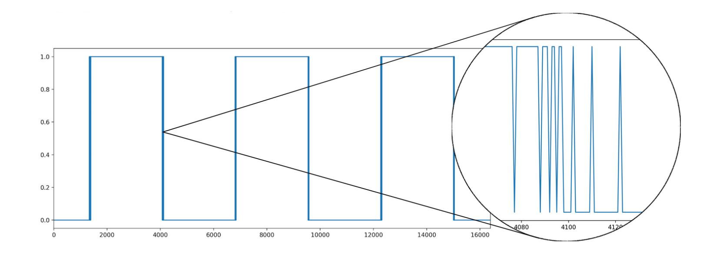
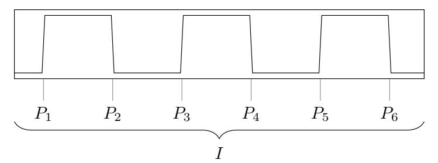
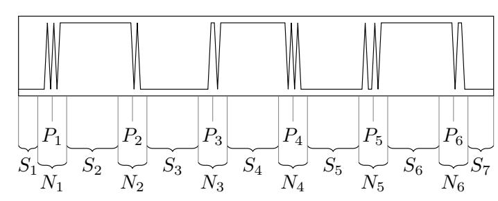
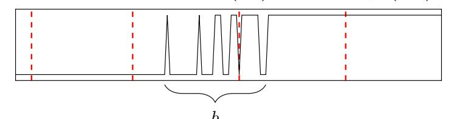
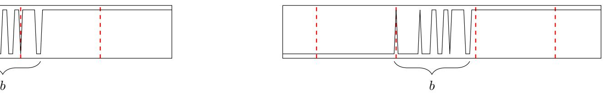
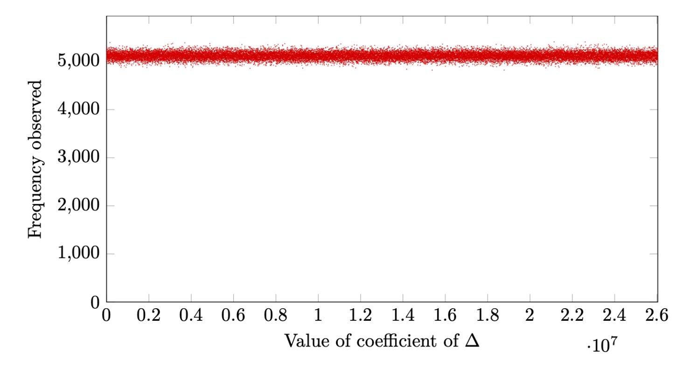
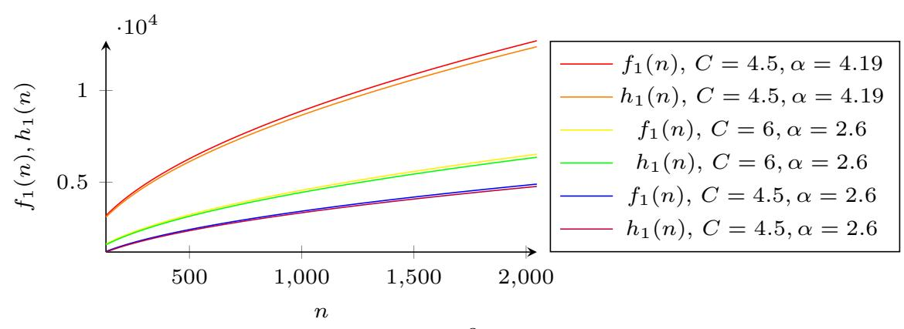
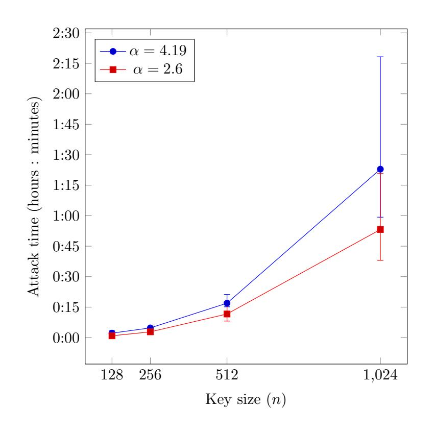

{0}------------------------------------------------

# Improved attacks against key reuse in learning with errors key exchange (full version)

Nina Bindel, Douglas Stebila, and Shannon Veitch

University of Waterloo

May 27, 2021

#### Abstract

Basic key exchange protocols built from the learning with errors (LWE) assumption are insecure if secret keys are reused in the face of active attackers. One example of this is Fluhrer's attack on the Ding, Xie, and Lin (DXL) LWE key exchange protocol, which exploits leakage from the signal function for error correction. Protocols aiming to achieve security against active attackers generally use one of two techniques: demonstrating well-formed keyshares using re-encryption like in the Fujisaki–Okamoto transform; or directly combining multiple LWE values, similar to MQV-style Diffie–Hellman-based protocols.

In this work, we demonstrate improved and new attacks exploiting key reuse in several LWE-based key exchange protocols. First, we show how to greatly reduce the number of samples required to carry out Fluhrer's attack and reconstruct the secret period of a noisy square waveform, speeding up the attack on DXL key exchange by a factor of over 200. We show how to adapt this to attack a protocol of Ding, Branco, and Schmitt (DBS) designed to be secure with key reuse, breaking the claimed 128-bit security level in 12 minutes. We also apply our technique to a second authenticated key exchange protocol of DBS that uses an additive MQV design, although in this case our attack makes use of ephemeral key compromise powers of the eCK security model, which was not in scope of the claimed BR-model security proof. Our results show that building secure authenticated key exchange protocols directly from LWE remains a challenging and mostly open problem. Our results show that building secure key exchange protocols directly from LWE that resist key reuse attacks remains a challenging and mostly open problem.

{1}------------------------------------------------

# Contents

| 1 | Introduction                                                                      |    |  |  |
|---|-----------------------------------------------------------------------------------|----|--|--|
| 2 | Background 2.1 Definition of key reuse and robustness against key reuse  |    |  |  |
|   | 2.2 Fluhrer's key reuse attack on DXL RLWE-based key exchange               | 8  |  |  |
| 3 | Sparse signal collection                                                          | 9  |  |  |
| 4 | Improvements to existing key reuse attacks                                        | 10 |  |  |
|   | 4.1 Determining sparse signal collection parameters                            | 10 |  |  |
|   | 4.2 Description of the improved attack                                      | 11 |  |  |
|   | 4.3 Success probability                                                        | 11 |  |  |
|   | 4.4 Query complexity                                                           | 12 |  |  |
|   | 4.5 Experimental results                                                       | 13 |  |  |
| 5 | Attack on DBS reusable-keys protocol                                              | 13 |  |  |
|   | 5.1 High-level idea of the attack                                              | 13 |  |  |
|   | 5.2 The complete attack                                                     | 14 |  |  |
|   | 5.3 Distribution of the error terms                                         | 16 |  |  |
|   | 5.4 Distribution of the known term ∆                                        | 17 |  |  |
|   | 5.5 Query complexity                                                           | 17 |  |  |
|   | 5.6 Success probability                                                        | 19 |  |  |
|   | 5.7 Experimental results                                                       | 20 |  |  |
|   | 5.8 Analysis of the claimed proof showing robustness                           | 20 |  |  |
|   | 5.9 Application to Seyhan et al. reusable keys protocol                        | 21 |  |  |
|   |                                                                                   |    |  |  |
| 6 | Extension to authenticated key exchange protocols                                 | 21 |  |  |
|   | 6.1 eCK attack on the DBS AKE protocol                                         | 22 |  |  |
|   | 6.2 Investigation of the ZZDSD AKE protocol                                    | 24 |  |  |

{2}------------------------------------------------

# 1 Introduction

The learning with errors (LWE) problem [\[30\]](#page-25-0) can be used to construct a variety of post-quantum cryptographic algorithms, such as digital signatures, public-key encryption, key encapsulation mechanisms (KEMs), and key exchange, the latter being the focus of this paper.

LWE-based key exchange protocols are appealingly similar to the Diffie–Hellman (DH) protocol [\[10\]](#page-24-0) which is the prototypical unauthenticated key exchange protocol. Authenticated key exchange (AKE) can be built from unauthenticated DH through two main techniques, either explicit authentication using digital signatures, or implicit authentication where public-key encryption or DH keys are used as long-term credentials for authentication. However, the similarities between DH and LWE break down when it comes to building AKE protocols, and it seems to be much more challenging to build secure AKE protocols directly from the LWE assumption.

Passively secure LWE-based key exchange. LWE-based key exchange can be constructed from LWEbased public-key encryption [\[30,](#page-25-0) [24\]](#page-25-1): the core idea is that two (plain or ring) LWE samples asA + eA and asB + eB are combined to form approximately equal shared secrets close to asAsB (where a is a public parameter, sA and sB are the initiator and responder's secret keys, and eA and eB are secret noise). Reliable passively secure key exchange can be achieved by transmitting error correcting hints about the shared secret, such as the signal function of Ding, Xie, and Lin (DXL) [\[17\]](#page-25-2) or Peikert's reconciliation function [\[27\]](#page-25-3). The basic idea of DXL's signal function is as follows. In the ring-LWE variant of DXL key exchange, both Alice and Bob derive a polynomial that is their copy of the approximately equal shared secret. The signal function is applied to each coefficient of the polynomial, and returns a bit indicating whether the coefficient is within a certain range, namely, within {−bq/4c, . . . , bq/4c}, where q is the modulus defining the ring. These signal bits are computed by Bob and transmitted to Alice. This extra information allows both parties to derive from each coefficient one or more exactly equal secret bits with high probability.

Attacks against passively secure LWE-based key exchange. Bare LWE public key encryption [\[30,](#page-25-0) [24\]](#page-25-1) and key exchange [\[17,](#page-25-2) [27\]](#page-25-3) are not designed to be secure against active adversaries, and in fact are insecure against active adversaries. For example, Regev's search-to-decision equivalence for LWE [\[30\]](#page-25-0) is a chosen ciphertext attack that recovers the LWE secret given an oracle for decision LWE. Fluhrer [\[18\]](#page-25-4) constructed an active attack against a simplified form of DXL key exchange [\[17\]](#page-25-2), in which an attacker Eve sends malicious public keys and uses information leaked via the signal function to recover a party's secret key. [\[12\]](#page-24-1) refines this to work on the full DXL protocol using signal leakage.

The basic idea of this key reuse attack is as follows. Rather than sending a well-formed public key pA = asA + eA, Eve sends malformed pA = k, for k = 0, ..., q − 1. The victim Bob computes the shared secret ≈ pAsB = ksB, and returns a signal value on each coefficient of the shared secret, which indicates whether the ith coefficient of ksB[i] is in a fixed range or not. As k ranges over {0, . . . , q − 1}, the ith coefficients of the shared secret range over {0sB[i], . . . ,(q − 1)sB[i]}. The attack assumes, that Bob reuses his secret key sB for every session with Eve. After collecting the signals, Eve now inspects how the signals of these coefficients behave. If all sB[i] = 0, then the signals of sB[i] remain constantly 0 (ignoring noise). If sB[i] = ±1, then (ignoring noise) the signals of sB[i] will start off 0, switch to 1, and then switch back to 0: there are two switches. If sB[i] = ±2, the "frequency" of the signal function on the ith coefficient doubles, and there will be four switches. Thus, after appropriately handling the noise, if Eve observes 2` switches in the signals of sB[i], she can conclude that |sB[i]| = `. To determine the signs, the attack is repeated with pA = (1 + x)k, which allows for determining the relative sign between consecutive coefficients; and higher powers (1 + x z+1)k where z is the maximum number of zeros between two nonzero coefficients.

There is also a related attack that does not rely on signal leakage [\[15\]](#page-24-2), also called a key mismatch attack, and that has been applied to the original NewHope scheme [\[2\]](#page-24-3) and also the non-IND-CCA versions of several NIST Round 2 and Round 3 candidates [\[28,](#page-25-5) [14,](#page-24-4) [29\]](#page-25-6). However, it should be emphasized that the non-IND-CCA versions were not designed to be secure against key mismatch attacks and these attacks do not invalidate the security claims of the IND-CCA versions.

Authenticated key exchange. Authenticated key exchange should be secure against active attacks by an adversary. There is a small selection of literature building AKE from generic building blocks such as public key encryption [\[3\]](#page-24-5) or key encapsulation mechanisms [\[7,](#page-24-6) [19,](#page-25-7) [5,](#page-24-7) [31\]](#page-25-8); KEMs were original introduced in part to serve as an abstract of the Diffie–Hellman construction.

{3}------------------------------------------------

Yet most non-post-quantum AKE protocols in the literature have been constructed directly from various combinations of Diffie–Hellman-like operations. Starting with work by Matsumoto, Takashima, and Imai [\[25\]](#page-25-9), a long series of papers (see [\[8,](#page-24-8) §5.3–5.4] for a history) has tried to directly combine ephemeral and long-term DH shares in clever ways to create a single implicitly authenticated shared secret, with a nearly equally long series of works breaking such constructions. An important construction is the MQV protocol by Menezes, Qu, Vanstone, Law, and Solinas [\[26,](#page-25-10) [23\]](#page-25-11) which computes the shared secret as g (rA+csA)(rB+dsB) for certain values c and d derived from ephemeral public keys yA = g rA and yB = g rB , which lead to many derivations. Krawczyk's HMQV protocol [\[21\]](#page-25-12) tweaked the MQV protocol, using pseudorandom c = H(yA, idB) and d = H(yB, idA) and hashing the shared secret, permitting a proof of security in a variant of the Canetti–Krawczyk (CK) [\[9\]](#page-24-9) security model. Ustaoglu's CMQV protocol [\[33\]](#page-25-13) uses the so-called NAXOS trick [\[22\]](#page-25-14) when generating the ephemeral secret keys to obtain security in the eCK model [\[22\]](#page-25-14), which provides security against 'maximal exposure' attacks: the session key is indistinguishable if either (but not both) of each party's long-term and ephemeral secret keys is compromised. Many more implicitly authenticated DH protocols exist; again see [\[8,](#page-24-8) §5.3–5.4] for a survey.

Prevention of key reuse attacks in LWE-based protocols. While the constructions of AKEs from generic building blocks such as KEMs as mentioned above can be used to build secure AKE protocols from LWE assumptions that resist active attacks against key reuse, there have been several attempts to build AKE protocols directly from LWE, in many cases using techniques paralleling some of the DH-based AKE protocols mentioned above.

At Eurocrypt 2015, Zhang, Zhang, Ding, Snook, and Dagdelen (ZZDSD) [\[34\]](#page-25-15) presented a ring-LWEbased AKE protocol inspired by the HMQV design of combining the ephemeral and static keys alongside pseudorandom masking values; their approximately equal shared secrets were of the form a(rA +csA)(rB +dsB) (where a is a public parameter, sA and sB are Alice and Bob's long-term private keys, rA and rB are their ephemeral private keys, yA and yB are their corresponding ephemeral public keys, and c = H(yA, idA, idB) and d = H(yB, yA, idB, idA) are pseudorandom and distributed according to error distribution). The protocol is claimed secure in the Bellare–Rogaway (BR) [\[4\]](#page-24-10) security model with weak forward secrecy, though subsequent work by Gong and Zhao has identified potential gaps in the proof [\[20\]](#page-25-16).

Ding, Branco, and Schmitt (DBS) [\[13\]](#page-24-11) also propose two key exchange protocols from LWE that are designed to be secure against key reuse, also inspired by the HMQV design, although this time using the pseudorandom c and d values in an additive rather than multiplicative way. Their first protocol, which we call the DBS reusable-keys protocol, aims to achieve what they call "key reuse robustness" (see Section [2.1\)](#page-6-1) with an approximately equal shared secret of the form a(sA + c)(sB + d) for public values c and d. Their second protocol, which we call the DBS AKE protocol, achieves AKE security in the BR model [\[4\]](#page-24-10) with weak forward secrecy, using an approximate shared secret of the form a(rA + sA + c)(rB + sB + d).

Table [1](#page-4-0) summarizes the various Diffie–Hellman and LWE-based key exchange protocols discussed so far; note especially some of the parallels in the shared secret derivation in the DH- and LWE-based protocols.

Our contributions. In this paper, we improve the query complexity of the key reuse attack using signal leakage and apply the improved attack in several settings. Table [2](#page-4-1) compares our improvements and new attacks to the literature.

Improved attack using signal leakage. The key reuse attack exploiting signal leakage [\[18,](#page-25-4) [12\]](#page-24-1) sends malformed public keys pA = k for all k ∈ {0, . . . , q − 1}. This obtains a full picture of the noisy "waveform" ≈ ksB[i] induced for each coefficient sB[i] of the secret key, then recovers the period from that binary waveform. To assemble the full waveform formerly q samples were used, with a rather large value of q, e.g. ≈ 26 million in [\[13\]](#page-24-11).

We show that far fewer samples suffice for determining the period of the noisy waveform, given that the period—which depends on the secret key—is bounded by some known value h (for example, for reasonable parameters, the secret key coefficients have magnitude less than 15 with high probability). If there was no noise, then the waveform would be square and have exactly 2sB[i] switches, equally distributed. With noise, there will be many switches bunched around the period. However, based on the standard deviation of the noise distribution, we can bound the region in which these noisy switches occur with high probability. If we could sample from the stable regions, where noisy switches do not occur, we would be able to reconstruct the period and thus the secret key coefficient. Our technique is to sample every tth value, where t is chosen so

{4}------------------------------------------------

Table 1: Characteristics of selected key exchange protocols

| Protocol                                                                                       | Shared secret                                                                                                                                                        | Error correction                                                 | Security model                                                       |
|------------------------------------------------------------------------------------------------|----------------------------------------------------------------------------------------------------------------------------------------------------------------------|---------------------------------------------------------------------|----------------------------------------------------------------------|
| DH-based key exchange                                                                          |                                                                                                                                                                      |                                                                     |                                                                      |
| DH [10] HMQV [21] CMQV [33]                                                              | $g^{r_A r_B} \ g^{(r_A + cs_A)(r_B + ds_B)} \ g^{(\tilde{r}_A + cs_A)(\tilde{r}_B + ds_B)}$                                                                          | — — —                                                         | passive CK with wFS eCK                                        |
| LWE-based public key e                                                                         | encryption and key exchange                                                                                                                                          |                                                                     |                                                                      |
| Regev [30], LPR [24] DXL [17] Peikert [27], BCNS [6] ZZDSD [34] DBS reusable [13] DBS AKE [13] | $\approx ar_A r_B$ $\approx ar_A r_B$ $\approx ar_A r_B$ $\approx a(r_A + cs_A)(r_B + ds_B)$ $\approx a(s_A + c)(s_B + d)$ $\approx a(r_A + s_A + c)(r_B + s_B + d)$ | rounding signal fn. reconciliation signal fn. signal fn. signal fn. | IND-CPA passive passive BR with wFS key reuse robustness BR with wFS |

Legend: public parameters g, a; ephemeral secret keys  $r_A, r_B$ ; long-term secret keys  $s_A, s_B$ ;  $c = H(y_A, ...)$  and  $d = H(y_B, ...)$  for ephemeral public keys  $y_A, y_B$  and appropriate labels/transcripts.  $\tilde{r}$  denotes NAXOS trick applied [22].

Table 2: Summary of attacks on LWE key exchange protocols with key reuse

| Attack   | Protocol          | Securi         | ty model       | Query                                                       |
|----------|-------------------|----------------|----------------|-------------------------------------------------------------|
|          |                   | claimed        | of attack      | complexity                                                  |
| [12]     | DXL [17]          | passive        | key reuse rob. | $(1+z)q$ $\approx 32000n^2\alpha$ $(1+z)\frac{q}{2} + O(1)$ |
| [15, §5] | DXL [17]          | passive        | key reuse rob. |                                                             |
| [15, §7] | DXL [17]          | passive        | key reuse rob. |                                                             |
| ours, §4 | DXL [17]          | passive        | key reuse rob. | $\approx 36(1+2z)\alpha$                                    |
| ours, §5 | DBS reusable [13] | key reuse rob. | key reuse rob. | $\approx 3600(1+4z)\alpha^2$                                |
| ours, §6 | DBS AKE [13]      | BR             | eCK            | $\approx 1467(1+4z)\alpha^2$                                |

Legend: n: LWE dimension; q: modulus;  $\alpha$ : standard deviation of the secret/noise distribution; z: number of consecutive zeros in the secret key, typically  $z \approx 4$ . "Constants" in query complexity column are slightly parameter-dependent, but do not vary substantially at cryptographic parameter sizes.

that we will collect at least one value from each stable region and at most one value from each noisy region around period switches, allowing efficient computation of the period.

Our optimizations yield an active key recovery attack against the DXL protocol that uses  $(1+2z)8C\alpha$  queries, where  $\alpha$  is the standard deviation of the noise distribution, z is the maximum number of consecutive zeros in a secret key plus one, and C is a small constant; for the parameters we consider,  $C \approx 5$  and z = 4 suffice for the attack to work with high probability. We implemented our attack against the same parameters used in the previous best attack [12]: n = 1024,  $\alpha = 3.197$ ,  $q = 2^{14} + 1$ . Our attack succeeds with probability 0.97 in on average 57 seconds, compared to 3.8 hours of [12].

Attack on DBS reusable-keys protocol. In Section 5, we examine the DBS reusable-keys protocol and observe that its countermeasure for achieving security against key reuse —additive pseudorandom values—is unfortunately not sufficient. Using our improved attack, we experimentally recover the key of the proposed 128-bit security parameters, within in the security model that the DBS reusable-keys protocol was claimed secure, successfully.

The main idea of our attack is as follows. Recall from Table 1 that the approximate shared secret is  $a(s_A+c)(s_B+d)$ , for pseudorandom values c and d distributed according to the error distribution. From Bob's perspective, this is computed (ignoring small error terms) as  $\approx (p_A+ac)(s_B+d) = p_As_B + (p_Ad+acs_B+acd)$ , where  $p_A$  is the attacker's public key. DBS calls the process of adding ac to  $p_A$  before multiplying by the secret key  $s_B$  "pasteurization" and claims it "force[s] the parties involved in the KE scheme to behave honestly". In

{5}------------------------------------------------

fact, this pasteurization does not force honest behaviour. Consider an attacker who uses the basic signal leakage attack described above, and sends malformed public keys pA = k for k ∈ {0, . . . , q − 1}. Noting that asB is approximately equal to Bob's public key pB, from the attacker's perspective, the shared secret is pAsB (which the attacker does not know) plus pAd + pBc + acd (which is known to the adversary). This known sum is approximately uniformly distributed, so each coefficient will be 0 with probability around 1/q, and most importantly the adversary knows when it is 0. Thus, when the ith coefficient of this known sum is 0, the signal function is being applied to the ith coefficient of (pAsB)[i] directly—with no "pasteurization"—and we are able to apply the original attack! We discuss the potential gap in the proof of "key reuse robustness" in Section [5.8.](#page-19-1)

Our optimizations to the attack against DXL key exchange also apply in this scenario, yielding an attack that runs in (1 + 4z) · 144C 2α 2 , where α, z, and C are as above. We implemented our attack against the parameters proposed by DBS for 128-bit security, with n = 512, α = 4.19, and q ≈ 26 million, and on average successfully recovered the key in less than 12 minutes; see Section [5.7.](#page-19-0)

The pasteurization technique has also been adopted by Seyhan et al. [\[32\]](#page-25-17) in a module-LWE-based analogue of the DBS reusable keys protocol. We are similarly able to deconstruct the shared secret as the sum of a single unknown term plus several known terms, effectively eliminating pasteurization. A full attack on the Seyhan et al. protocol would need to use the "key mismatch oracle" technique [\[15\]](#page-24-2) since the protocol does not transmit a signal value.

Attack on LWE-based AKE protocols in the eCK model. Two LWE-based AKE protocols, the ZZDSD AKE protocol [\[34\]](#page-25-15) and the DBS AKE protocol [\[13\]](#page-24-11), are claimed secure in the Bellare–Rogaway security model [\[4\]](#page-24-10). Yet the design of these protocols is acknowledged to be inspired by MQV-style protocols [\[26,](#page-25-10) [23\]](#page-25-11)—again see the direct comparison between the shared secret of the ZZDSD AKE protocol and HMQV in Table [1,](#page-4-0) and the very closely related CMQV protocol [\[33\]](#page-25-13) can be proven secure in the eCK model [\[22\]](#page-25-14) against maximal exposure attacks.

Given the similarity of the ZZDSD and DBS AKE protocols to MQV-style constructions, we examine the security of DBS AKE protocol [\[13\]](#page-24-11) and the ZZDSD AKE protocol protocol in the eCK model to see if it is possible they achieve that stronger form of security.

For the DBS AKE protocol, we show that it is not eCK-secure. Recall that its approximate shared secret is ≈ a(rA + sA + c)(rB + sB + d); the additive "pasteurization" terms c and d are used alongside addition of the ephemeral and long-term keys. We were not able to successfully adapt our attack technique from the DBS reusable-keys protocol to the DBS AKE protocol protocol under the conditions of the BR model claimed; there is not enough information for the attacker to know when extra addends in the shared secret sum to 0 for any particular coefficient. However, if we permit ourselves the powers of the eCK model—compromising the ephemeral secret key the victim used in other sessions—then we do have enough information to know when extra addends in the shared secret sum to 0, and we can reduce to the previous attack.

We implemented our eCK-model attack against the DBS AKE protocol with the originally suggested parameters targeting 128-bit security, with n = 512, α = 4.19, and q ≈ 26 million, and on average successfully recovered the key in less than 34 minutes; see Section [6](#page-20-1) for details.

Adapting our eCK attack against the DBS AKE protocol to the ZZDSD protocol was not successful; a brief discussion of our attempt is given in Section [6.2.](#page-23-0)

To summarize, our attack on the DBS reusable-keys protocol does invalidate its security claim of key reuse robustness, but the eCK-model attack on the DBS AKE protocol does not invalid its claimed BR security, nor do we invalidate the security claims of the ZZDSD protocol. However, given that the DBS AKE protocol mixed together ephemeral and static secret keys in a way that bears superficial similarity to MQV-style protocols [\[26,](#page-25-10) [23\]](#page-25-11) like CMQV [\[33\]](#page-25-13) which are eCK-secure, we think it interesting to point out that this additive pasteurization approach does not achieve eCK security. The ZZDSD protocol's design is even closer to MQV-style protocols; determining whether it is eCK-secure, or broken in the eCK model, remains an open question. Our observations highlight the challenges in building secure AKE protocols directly from LWE assumptions and that the parallels between DH- and LWE-based protocols break down. There remain many open problems in constructing LWE-based AKE protocols.

{6}------------------------------------------------

| $\Box$              | $c \cdot t \times t \times t \times t \times t \times t \times t \times t \times t \times t$ | 1 1 1             | 1 1                  |
|---------------------|----------------------------------------------------------------------------------------------|-------------------|----------------------|
| Table 3. Notation   | for ring-Livi E                                                                              | narameters and ke | y exchange protocols |
| Table 9. I totation |                                                                                              | parameters and no | y chemange proceeds  |

| Symbol                         | Description                                         |
|--------------------------------|-----------------------------------------------------|
| $\overline{n}$                 | dimension of the (ring) LWE instance                |
| q                              | modulus                                             |
| $\alpha$                       | standard deviation of the secret/noise distribution |
| $\chi_{\alpha}$                | secret/noise distribution                           |
| $s_A, s_B$                     | Alice and Bob's long-term/reused secret keys        |
| $p_A,p_B$                      | Alice and Bob's long-term/reused public keys        |
| $r_A, r_B$                     | Alice and Bob's ephemeral secret keys               |
| $y_A,y_B$                      | Alice and Bob's ephemeral public keys               |
| $e_A, e_B, f_A, f_B, g_A, g_B$ | noise terms sampled from $\chi_{\alpha}$            |
| $k_A,k_B$                      | Alice and Bob's approximately equal shared secret   |
| $w_B$                          | Bob's signal (reconciliation) value                 |
| $sk_A, sk_B$                   | final shared secret                                 |
| r                              | random bit used in signal function                  |

| Initiator (Alice)                                                                                                          | Responder (Bob)                                                                                                                                | Sig $(v) = 0$ if $v \in E$ else 1 (extended component-wise)                                                                                    |
|----------------------------------------------------------------------------------------------------------------------------|------------------------------------------------------------------------------------------------------------------------------------------------|------------------------------------------------------------------------------------------------------------------------------------------------|
| $\begin{array}{c c} s_A, e_A \leftarrow * \chi_\alpha \\ p_A \leftarrow as_A + 2e_A \in R_q \\ & p_A \end{array}$          | $s_B, e_B \leftarrow x_\alpha$ $p_B \leftarrow as_B + 2e_B \in R_q$ $g_B \leftarrow x_\alpha$                                                  | $E = \{-\lfloor q/4 \rfloor + r, \cdots, \lfloor q/4 \rfloor + r\}$ $r \leftarrow \$ \{0, 1\}$                                                 |
| $g_A \leftarrow x_\alpha$ $k_A \leftarrow p_B s_A + 2g_A \qquad p_B, w_B$ $sk_A \leftarrow \operatorname{Mod}_2(k_A, w_B)$ | $k_B \leftarrow p_A s_B + 2g_B$ $w_B \leftarrow \operatorname{Sig}(k_B) \in \{0, 1\}^n$ $sk_B \leftarrow \operatorname{Mod}_2(k_B, w_B)$ | $ \operatorname{Mod}_{2}(v, w) = \\ \left(\left(v + w \frac{q-1}{2}\right) \mod q\right) \mod 2 \\ (v, w) \in \mathbb{Z}_{q} \times \{0, 1\} $ |

for

for

Figure 1: Ring-LWE-based key exchange protocol of Ding, Xie, and Lin (DXL) [17].

# 2 Background

Notation. An instance of the ring learning with errors (RLWE) problem will be specified by a prime modulus q, a dimension n, and distribution  $\chi_{\alpha}$  with standard deviation  $\alpha$  which is used for both the secrets and errors. The ring is  $R_q[x] = \mathbb{Z}_q[x]/\langle f(x) \rangle$  for an irreducible polynomial f(x). Elements of  $\mathbb{Z}_q$  may be represented as either  $\{0,\ldots,q-1\}$  or  $\{-q-1/2,\ldots,q-1/2\}$  as required. The coefficient of  $x^i$  of  $y \in R_q[x]$  is denoted by y[i]. We write #S to denote the number of elements in set S.  $x \leftarrow S$  denotes sampling x uniformly from set S. If  $\chi$  is a distribution on S,  $x \leftarrow X$  denotes sampling from S according to  $\chi$ .

Table 3 summarizes the notation used in this paper for ring-LWE parameters and ring-LWE key exchange protocols.

Basic ring-LWE key exchange. The basic ring-LWE-based key exchange protocol of Ding, Xie, and Lin (DXL) [17] is shown in Figure 1, and was the basis of the NIST PQC Round 1 submission "Ding Key Exchange". It makes use of a component-wise "signal" function Sig(v) shown on the right-side of Figure 1.

#### 2.1 Definition of key reuse and robustness against key reuse

Let  $\Pi$  be a 2-pass key exchange protocol between two parties A and B. During the protocol, party A initiates the exchange by sending  $p_A$ . Party B responds by sending  $p_B$ . (Note that in the notation of this subsection, party B's response may consist of multiple components; in the context of DXL key exchange in Figure 1, this would be both  $p_B$  and  $w_B$ .) Let  $\mathcal{K}$  be the shared secret key space.

Key reuse means that each party is willing to run multiple sessions using the same long-term secret. To model this, [12] defines a key reuse oracle  $\mathcal{S}$  which executes party B's responses. The oracle  $\mathcal{S}$  has access to

{7}------------------------------------------------

##  $\operatorname{Expt}^{\mathsf{kru}}_\Pi(\mathcal{A}) \colon$

- 1 Generate responder long-term secret key  $s_B$
- 2 Generate initiator message m
- 3 Execute  $\Pi$  as responder on message  $m^*$  and secret key  $s_B$  to produce outgoing message  $m'^*$  and shared secret  $sk_0$
- 4  $sk_1 \leftarrow *\mathcal{K}$
- 5  $b \leftarrow \$ \{0,1\}$
- 6  $b' \leftarrow \mathcal{A}^{\mathcal{S}}(m^*, m'^*, sk_b)$
- 7 Return [b = b']

Oracle S(m):

- 1 Execute  $\Pi$  as responder on message m and secret key  $s_B$  to produce outgoing message m' and shared secret k
- 2 Return m'

Figure 2: Responder key reuse robustness kru security experiment for 2-pass key exchange protocol  $\Pi$  against adversary A

the (fixed) secret key of party B (e.g.,  $s_B$ ,  $e_B$  in Figure 1). On receiving  $p_A$  from party A, S computes and returns  $p_B$  according to the protocol using the same secret key for every response.

The key reuse robustness [13] of a 2-pass key exchange protocol captures the idea that it is safe for a party to reuse a key, even in the face of maliciously generated messages from the other party. Formally key reuse robustness can be defined in terms of either the initiator or responder; for the purposes of the attacks in this paper, it suffices to define it in terms of the responder. Figure 2 shows the security experiment kru defining responder key reuse robustness for a 2-pass key exchange protocol  $\Pi$ . A responder secret key  $s_B$  is fixed for a party B. Adversary A may query the above-defined oracle S with arbitrary messages; this corresponds to the adversary impersonating the initiator during a key exchange with B when B reuses their key  $s_B$ . The experiment constructs one honest interaction between an initiator and the responder B (with the responder reusing their key), and gives to the adversary either the real session key or a random string of the same length. The adversary must determine which is the case.

The advantage of A against the key reuse robustness of  $\Pi$  is defined as

$$\mathrm{Adv}^{\mathsf{kru}}_\Pi(\mathcal{A}) = \left| \mathrm{Pr}[\mathrm{Expt}^{\mathsf{kru}}_\Pi(\mathcal{A}) \Rightarrow 1] - \frac{1}{2} \right| \ .$$

Our definition differs slightly from [13] in that we allow the challenge session at any point during the experiment, while [13] seems to allow queries to the oracle only before the challenge session. Although our formulation allows a more powerful adversary in the security game, our attack in Section 5 does not make use of this extra power and applies against the original definition in [13] as well.

#### 2.2 Fluhrer's key reuse attack on DXL RLWE-based key exchange

The original key reuse attack by Fluhrer [18] and refined by [12] against RLWE-based key exchange protocols, such as the DXL protocol depicted in Figure 1, takes advantage of the signal function to determine the coefficients of the reused secret  $s_B$  (formalized via the oracle  $\mathcal{S}$  described in Figure 2). The attack can be described by the following two steps.

Absolute value recovery. Adversary  $\mathcal{A}$  invokes oracle  $\mathcal{S}$  with input  $p_A = k$  for  $k = 0, \ldots, q - 1$ . As k changes from 0 to q - 1, the corresponding signal  $w_B[i]$  of the ith coefficient will essentially be a noisy version of a periodic function with  $|2s_B[i]|$  signal changes between zero and one. By recovering the period from this noisy signal,  $\mathcal{A}$  can determine the absolute value of  $s_B[i]$ . Applied component-wise to all coefficients of  $w_B$ , the adversary can reveal the absolute values of all coefficients of  $s_B$ .

Relative sign recovery. To determine the sign of each secret coefficient, the adversary  $\mathcal{A}$  invokes the oracle  $\mathcal{S}$  with input  $(1+x)p_A$  where  $p_A = k$  for  $k = 0, \ldots, q-1$ . Again, by recovering the period from this noisy signal,  $\mathcal{A}$  can determine the value of the coefficients of  $(1+x)s_B$ , up to sign. The coefficients of  $(1+x)s_B$ 

{8}------------------------------------------------

Figure 3: Noisy periodic binary signal, highlighting concentration of noise around a boundary

are sB[0] − sB[n − 1], sB[1] + sB[2], . . . , sB[n − 2] + sB[n − 1]. With this information, A can determine the relative signs of adjacent pairs of coefficients in sB. If there are z − 1 consecutive zeros in the sB (which can be seen from the absolute value recovery stage), this technique must be repeated with (1 + x z )k to determine relative signs between coefficients z positions apart. Once all relative signs are recovered, this narrows the possibilities down to two options: ±sB.

Although the values pA = k sent by the adversary look atypical and one could try to protect against this attack by filtering such values out, it is possible to adapt the attack to work with values that look random, namely pA = asA + k for some sA ←\$ χ [\[11,](#page-24-13) §4.4].

# 3 Sparse signal collection

As described in the previous section, the main tool in Fluhrer's attack is recovering the secret period from the noisy binary signal induced by Sig(kB). In this section, we present our improvements which use a much smaller number of samples from the signal, hence we call this sparse signal collection.

We aim to keep our presentation in this section generic, but it helps to keep in mind the application to RLWE-based key exchange protocols like DXL (Figure [1\)](#page-6-3). In DXL, as a result of the error term gB, there are frequent changes in the value of the signal function when kB[i] is near ± bq/4c + r, i.e., near the boundary of the region E (see Section [2\)](#page-6-0). As kB[i] moves away from the boundary of the region E, the impact of the error term gB decreases and the signal stabilizes.

Figure [3](#page-8-1) shows an example of a noisy periodic binary signal, where the noise is concentrated around the period changes, which correspond to when kB[i] passes the boundaries of region E in the DXL protocol.

If one could filter out fluctuations near the boundaries of E, i.e., not counting them as signal changes, the value of sB[i] could still be determined by determining the period or alternatively counting the number of signal changes in a noiseless signal. The attack as described in [\[12\]](#page-24-1) collects all signals but does not specify a general algorithm to determine the secret coefficients.

Potential approaches for recovering the period from the noisy signal could rely on determining the Hamming distance from a pure signal of each period, or applying the Fourier transform or high pass filters often used in signal processing. Each of these strategies requires collecting samples for many or every value from 0 to q − 1. In this section, we describe a new method of signal collection that determines the period with high probability while substantially reducing the number of samples needed to carry out the attack. In what follows, we will describe the idea of our sparse signal collection algorithm in general, then apply it to different RLWE-based key exchange protocols in subsequent sections.

Requirements. Let I be a finite integer interval and b some bound specified below. Let f : I → {0, 1} be a periodic signal function, changing signals at points P1, ..., Pm, equally spaced out over the interval I, i.e., Pi+1 − Pi = #I/m − b for 1 ≤ i ≤ m − 1. Without loss of generality, assume f(x) = 0 for x < P1 and x ≥ Pm. Let g : I → {0, 1} be a function that approximates f. By this we mean the following: there exist m + 1 non-empty ("stable") intervals Si ⊂ I, with Si ∩ Sj = ∅ for i 6= j such that f(Si) = g(Si) for

{9}------------------------------------------------

Figure 4: Periodic function f (left) and noisy version g (right) over interval I with m = 6 signal changes at points Pi , split into stable (Si) and noisy (Ni) regions.

Figure 5: Two different sets of collected signals (marked with dashed vertical lines).

i = 1, ..., m + 1. Let the intervals be ordered in the sense that all elements of Si are strictly smaller than all elements in Sj for i < j. Furthermore, let #S1 = #Sm+1 = #Si/2 for 1 < i < m + 1. (Strictly speaking, this requirement is not needed in general but simplifies our explanation and is closer to the case of RLWE-based key exchange.) In addition, we define the (ordered) set of remaining ("noisy") intervals (in between the Si) to be N1, ..., Nm, with Pi ∈ Ni . We assume that for all i it holds that #Ni ≤ b for some integer bound b ≤ #Sk for 1 < k < m + 1 and Ni ∩ Nj = ∅ for i 6= j. We visualize the above definitions in Figure [4.](#page-9-2)

The problem of interest is recovering the unknown period m using samples from g. The problem may be constrained in the sense that m is upper bounded.

Description. Rather than collecting signals for every k in the interval I, we only collect a few signals in the stable intervals Si of the periodic function by trying to skip the noisy areas Nj of the period around the points Pj ; or at least limit the number of samples coming from noisy periods. In particular, if we could guarantee that we collect (i) at least one sample from every stable region and (ii) at most one signal from every noisy region, we could still determine the period by counting the number of signal changes. The main task becomes bounding the width b of the noisy region and determining how far apart samples should be taken to ensure that both (i) and (ii) are satisfied while trying to minimize the number of samples collected.

Figure [5](#page-9-3) shows two examples that involve collecting every (b + 1)th signal. Since the width of the noisy region is bounded by b, no matter where the signal collection begins, at most one sample will be collected from each noisy region. In Figure [5](#page-9-3) (left), the collected values are 0 0 0 1; in Figure [5](#page-9-3) (right), the collected value are 0 1 1 1. In either case, we count only one signal change—as desired. Suppose in Figure [5](#page-9-3) (left), the third signal collected was equal to 1 instead of 0, leading to the collected values 0 0 1 1 (this is possible since that position is within a noisy interval Ni). Even then, only one signal change from 0 to 1 would be counted.

In order for the count of signal changes to be correct, we must ensure that at least one value from every stable interval Si is collected. There are m+ 1 stable periods, where the intervals S2, ..., Sm and #(S1 ∪Sm+1) have width #I/m − b. Thus, in order to ensure collection of at least one value from every stable interval Si , at least every (#I/2m − b/2)th value of g(x) must be collected. Since we assumed that the values of g during the first and last stable interval are equal to zero, actually only at least every (#I/m − b)th value of g(x) needs to be collected.

# 4 Improvements to existing key reuse attacks

We now apply the sparse signal collection strategy of Section [3](#page-8-0) to Fluhrer's attack [\[18,](#page-25-4) [12\]](#page-24-1) against the DXL RLWE-based key exchange protocol [\[17\]](#page-25-2) in Figure [1.](#page-6-3)

### 4.1 Determining sparse signal collection parameters

For the remainder of this section, we focus on recovering the ith coefficient of kB, i.e., kB[i] = (pAsB + 2gB)[i]. In the notation of Section [3,](#page-8-0) the interval I corresponds to [0, ..., q − 1]; the approximation function f corresponds to the response of the oracle S except that gB = 0, i.e., f(pA) = Sig(pAsB)[i], while g is defined as g(pA) = Sig(pAsB + 2gB)[i].

{10}------------------------------------------------

Determining b. In the case of a signal change from 0 to 1, a noisy signal occurs if (pAsB)[i] ≤ bq/4c + r and (pAsB + 2gB)i] > bq/4c + r, or if (pAsB)[i] > bq/4c + r and (pAsB + 2gB)[i] ≤ bq/4c + r. Put differently, if |2gB[i]| ≥ |bq/4c + r − (pAsB)[i]|. Similarly, in the case of a signal change from 1 to 0, a noisy signal occurs if |2gB[i]| ≥ |b3q/4c + r − (pAsB)[i]|.

As pA changes, the difference between (pAsB)[i] and the closest point of signal change Pj changes as well. This means that the farther away the absolute value of (pAsB)[i] is from bq/4c + r, the larger must be |2gB[i]| in order to cause a noisy signal. Since gB is sampled from a discrete Gaussian distribution, there is some value, say h, where it is highly unlikely that |2gB[i]| > h.

For the following argument, suppose we can choose some h such that |2gB[i]| is never greater than h. [1](#page-10-2) In practice, our choice of h will determine the success probability of the attack. For each possible value of sB[i], since |2gB[i]| is bounded by h, we can calculate the width of the interval where the noise may affect the signal; this corresponds to the noisy intervals Nj . Note that as the value of sB[i] increases, the distance between (pAsB)[i] and bq/4c + r changes at a faster rate as pA increases. Hence, the noisy intervals are largest when sB[i] = 1 (when sB[i] = 0, the noise only changes the signal when |2gB[i]| ≥ bq/4c + r and we can assume this does not occur). Thus it suffices to take a value b that is an upper bound for the size of the noisy intervals Ni corresponding to sB[i] = 1; namely, b = 2h.

Determining the maximum number of signal changes m. In Fluhrer's attack, signals are collected for two different purposes: to find the absolute value of a coefficient, and to determine the relative sign of two coefficients. In the case of finding the absolute value, the number m of signal changes observed in our sparse signal collection corresponds to the maximum absolute value of sB[i] times two. If sB is chosen with discrete Gaussian distribution, no theoretical upper bound exists. However, as in the case of the noise term gB above, we can upper bound this with high probability, which then impacts the overall success probability of determining the correct number of signal changes, i.e., of finding the correct absolute value. Following the same reasoning as for b, the maximum number of signal changes is m = 2h. In case of finding the relative sign of two coefficients, the number m of signal changes corresponds to the maximum value of sB[i] + sB[j]. Again bounding these with high probability, the maximum number of signal changes is m = 4h.

Number of signals needed to be collected. Following Section [3,](#page-8-0) in order to ensure we collect at least one value from every stable period, we must collect at least every ( q/2m − b/2)th signal. Moreover, in order to ensure we collect at most one value from every noisy period, we must collect at most every bth signal, with b = 2h. Say we collect every t1th signal when recovering absolute value and every t2th signal when recovering the sign of a coefficient; this means that we must choose t1 such that 2h < t1 < q/4h − h and t2 such that 2h < t2 < q/8h − h.

### 4.2 Description of the improved attack

Absolute value recovery. The adversary A invokes the oracle S with input pA = k where k takes on every t1th value from 0 to q − 1. As k changes from 0 to q − 1, the signal returned, wB[i], will change exactly |2sB[i]| times. So, A can determine the value of sB[i] up to the ± sign. After this step, A knows the value of each coefficient of sB up to its sign.

Relative sign recovery. The adversary A invokes the oracle S with input pA = (1 + x)k where k takes on every t2th value from 0 to q − 1. Again, by checking the number of signal changes, A can determine the absolute value of the coefficients of (1 + x)sB. The coefficients of (1 + x)sB are sB[0] − sB[n − 1], sB[1] + sB[2], . . . , sB[n − 2] + sB[n − 1]. With this information, A can determine the relative signs of adjacent pairs of coefficients in sB. Repeat this step as necessary with (1 + x z )pA to determine relative signs of coefficients between which there are z − 1 zeros. This narrows the possibilities down to two options, namely sB or −sB.

### 4.3 Success probability

As noted in Section [4.1,](#page-9-1) our attack works assuming certain values are bounded; in this section, we determine the success probability of our attack by bounding the failure probability. In particular, we analyze that probability that coefficients of sB, gB ←\$ χα exceed the bound h.

1Many practical LWE and ring-LWE protocols have bounded sB since they use approximate Gaussian distributions, e.g., FrodoKEM has errors between ±12.

{11}------------------------------------------------

Suppose  $|s_B[i]| > h$  for some coefficient i, which might hinder collecting at least one signal from every stable interval. The probability that this occurs is

$$\rho_1 = 2 \sum_{x=h+1}^{\infty} \frac{1}{\sqrt{2\pi \cdot \alpha^2}} \exp(-x^2/2\alpha^2)$$
;

otherwise,  $|s_B[i]| \le h$ . When  $|s_B[i]| \le h$ , the attack may fail if there is some error that causes enough noise which results in the collection of an incorrect signal. This occurs if the noisy interval is larger than expected, i.e., if the coefficient of the error term  $g_B[i]$  is greater than or equal to  $t_1/2 + r$ . This probability is given by

$$\rho_2 = 2 \sum_{x=t_1/2+1}^{\infty} \frac{1}{\sqrt{2\pi \cdot \alpha^2}} \exp(-x^2/2\alpha^2) .$$

There are  $2|s_B[i]| + 1$  noisy intervals,  $|s_B[i]| \le h$ , n coefficients of  $s_B$ , and  $1/t_1$  chance that we collect this incorrect signal. Given that each  $s_B[i]$ ,  $e_B[i]$  is chosen independently, it is reasonable to assume that the probability of collecting an incorrect signal at each noisy interval is independent. Then, the probability of failure of absolute value recovery is at most

$$n(\rho_1 + (1 - \rho_1)(2h + 1)\frac{1}{t_1}\rho_2)$$
.

Similarly, the probability of failure in one iteration of relative sign recovery is

$$n(\rho_1 + (1 - \rho_1)(4h + 1)\frac{1}{t_2}\rho_3)$$
,

where

$$\rho_3 = 2 \sum_{x=t_2/2+1}^{\infty} \frac{1}{\sqrt{2\pi \cdot \alpha^2}} \exp(-x^2/2\alpha^2)$$

Putting this all together, the probability of failure of the entire attack is

$$n\left(\rho_1 + (1-\rho_1)(2h+1)\frac{1}{t_1}\rho_2\right) + zn\left(\rho_1 + (1-\rho_1)(4h+1)\frac{1}{t_2}\rho_3\right) ,$$

where z is the maximum number of consecutive zeros in the key plus one.

Example. Consider the DXL parameters  $n=1024, q=2^{14}+1, \alpha=3.197$ . Suppose there are at most z-1=3 consecutive zeros. We let h=14 and we collect every  $t=t_1=t_2=100$ th signal value. Then the probability that some coefficient of  $s_B$  exceeds h is approximately  $2^{-17.53}$ . The probability that some coefficient of the error term exceeds t/2=50 is approximately  $2^{-50.25}$ . Therefore, the probability of failure is at most 0.027, i.e., the success probability is at least 97.3%.

### 4.4 Query complexity

The key reuse attack requires  $q_S = (z+1)q$  queries where z denotes the number of times the relative sign recovery step must be taken, i.e., the maximum number of consecutive zeros between two nonzero coefficients plus one, so  $z \leq n/2$ . It is likely for z to be much smaller since the coefficients in  $s_B$  are sampled from a discrete Gaussian distribution. Hence, the probability of sampling z-1 consecutive zeros is  $1-(1-1/(\sqrt{2\pi\alpha^2})^{z-1})^{n-z}$ . For example, for  $\alpha=3.197$  and n=1024, the probability of five or more consecutive zeros is 0.030392. Thus, we expect  $z\approx 4$ , which is very likely for practical values of  $\alpha$  and n.

To improve the query complexity, [15] suggested collecting signals for values of k until the signal changes and stabilizes. That method requires q/2 + c queries to recover  $|s_B[i]|$ , where c is a small constant, leading to a total of (1+z)(q/2+c) queries. Suppose we choose  $h = C\alpha$ , where C is a constant such that it is highly unlikely that  $|s_B[i]| \ge C\alpha$ , and  $t_1 = q/8h$ , which satisfies  $2h < t_1 < q/4h - h$  for parameters we consider. Our method requires only  $8C\alpha$  queries to recover  $|s_B[i]|$ . Since  $t_2 \approx 2t_1$ , the total number of queries we require

{12}------------------------------------------------

is  $q_{\mathcal{S}} = 8C\alpha + z(16C\alpha) = (1+2z)8C\alpha$ . This is a significant improvement since  $\alpha \ll q$ . We compare the number of queries from [12, 15] with sparse signal collection in Table 2.

The choice of the constant C will affect the efficiency and the success probability. For practical LWE parameters,  $C \approx 4.5$ , accompanied with a reasonable choice of  $t_1$  and  $t_2$ , provides high success probability of approximately 97%.

#### 4.5 Experimental results

We compute the number of signals that we must collect for the parameters  $n=1024, q=2^{14}+1, \alpha=3.197$  proposed in [12]. The number of elements in the noisy intervals is largest when  $s_B=1$ . In this case, noise may affect the signal when  $|2g_B[i]| \ge |\lfloor q/4 \rfloor + r - p_A|$ . For  $\alpha=3.197$ , the probability that  $g_B[i] \leftarrow x_\alpha$  has absolute value greater than or equal to 15 is approximately  $2^{-17.53}$ .

So we assume that  $|g_B[i]| < 15$ , i.e., h = 14, in what follows. Thus, the signal may be affected when  $\lfloor q/4 \rfloor + r - 28 \le p_A \le \lfloor q/4 \rfloor + r + 28$  since  $|2g_B[i]| \le |2 \cdot 14| = 28$ . So the noisy intervals have at most  $b = 2 \cdot 28 = 56$  elements.

Now we consider the size of the stable intervals, which is at least  $q/4s_B[i] - b$  with  $s_B[i]$  the coefficient to-be-determined. Since  $s_B \leftarrow x_\alpha$  we assume again that  $|s_B[i]| < 15$ . Hence, the stable interval has at least 264 elements.

However, when recovering relative signs, we collect values corresponding to the difference between two coefficients, i.e., we bound these values by  $2 \cdot 14 = 28$ . So, during relative sign collection the stable intervals have at least 118 elements.

If we collect every t-th value with  $t_1 = t_2 = t$ , for any 56 < t < 118, then we can ensure that we collect at least one value for every stable and at most one value for every noisy interval in absolute value and relative sign recovery.

Collecting every 100th signal, our experimental implementation obtains correct results up to sign in an average of 57.892 seconds over five runs, compared to 3.8 hours of the original attack [12]. The execution of our attack was performed using a MacBook Air equipped with a 1.6 GHz dual-core Intel Core i5 CPU.

# 5 Attack on DBS reusable-keys protocol

In this section, we show a new variant of Fluhrer's attack [18, 12] that, combined with our sparse signal collection technique, yields a successful and efficient key recovery attack against a protocol by Ding, Branco, and Schmitt [13] that was designed to be secure against key reuse attacks.

The protocol in question is the DBS reusable-keys protocol as shown in Figure 6. It relies on a public parameter  $a \leftarrow R_q$  and a hash function  $H_1 : \{0,1\}^* \to \chi_\alpha$  whose outputs follow the discrete Gaussian distribution  $\chi_\alpha$  with standard deviation  $\alpha$ . In [13], the protocol is claimed to provide key reuse robustness for the initiator and responder, under the assumption that the Hermite-normal-form ring-LWE assumption is hard and  $H_1$  is a random oracle. For the purpose of key reuse, the values that the responder reuses are  $s_B$ ,  $e_B$ , and  $p_B$ . We discuss the potential gap in the proof of the security in Section 5.8.

#### 5.1 High-level idea of the attack

For the purposes of simplifying the explanation of the attack idea, in this subsection we assume that the error terms  $e_B$ ,  $g_B$ , and  $g'_B$  are chosen to be 0; Section 5.2 describes the attack with error terms following the original distribution.

Let S be the oracle described in Section 2.1 with access to the fixed secret key  $s_B$ . During the attack, adversary A invokes S on  $p_A = k$  (and an identity  $id_A$ ) for some  $k \in \{0, ..., q-1\}$ . The oracle S then samples  $g_B, g'_B \leftarrow x_\alpha$ , computes

$$k_{B} = \overline{p_{A}}(s_{B} + d) + 2g'_{B} = (p_{A} + ac + 2g_{B})(s_{B} + d) + 2g'_{B}$$

$$= p_{A}s_{B} + p_{A}d + acs_{B} + acd + 2g_{B}s_{B} + 2g_{B}d + 2g'_{B}$$

$$= p_{A}s_{B} + \underbrace{(cp_{B} + acd + dp_{A})}_{\Delta} + \underbrace{(2g_{B}s_{B} + 2g_{B}d + 2g'_{B} - 2ce_{B})}_{\varepsilon},$$

{13}------------------------------------------------

| Initiator (Alice)                                                                                              |            | Responder (Bob)                                                                                 |
|----------------------------------------------------------------------------------------------------------------|------------|-------------------------------------------------------------------------------------------------|
| $s_A, e_A \leftarrow * \chi_\alpha$                                                                            | m .        | $s_B, e_B \leftarrow \$ \chi_{\alpha}$                                                          |
| $p_A \leftarrow as_A + 2e_A \qquad \underline{\hspace{1cm}}$                                                   | $p_A$      |                                                                                                 |
|                                                                                                                |            | $d \leftarrow H_1(id_A, id_B, p_A, p_B)$                                                        |
|                                                                                                                |            | $g_B, g_B' \leftarrow \$ \chi_{\alpha}$ $\overline{p_A} \leftarrow p_A + ac + 2q_B$             |
| $c \leftarrow H_1(id_A, id_B, p_A)$                                                                            |            | $k_B \leftarrow \overline{p_A} + ac + 2g_B$ $k_B \leftarrow \overline{p_A}(s_B + d) + 2g_B'$ |
| $\begin{array}{c} d \leftarrow H_1(id_A, id_B, p_A, p_B) \\ \vdots \\ \vdots \\ d = 0 \end{array}$             | $p_B, w_B$ | $w_B \leftarrow \operatorname{Sig}(k_B)$                                                        |
| $\begin{array}{c} g_A, g_A' \leftarrow * \chi_\alpha \\ \overline{p_B} \leftarrow p_B + ad + 2g_A \end{array}$ |            |                                                                                                 |
| $k_A \leftarrow \overline{p_B}(s_A + c) + 2g_A'$                                                               |            |                                                                                                 |
| $sk_A \leftarrow \operatorname{Mod}_2(k_A, w_B)$                                                               |            | $sk_B \leftarrow \operatorname{Mod}_2(k_B, w_B)$                                                |

Figure 6: DBS reusable-keys protocol [13]

and returns  $(p_B, w_B) = (p_B, \text{Sig}(k_B))$ . Notice that  $g_B, e_B, c, d, g'_B, s_B$  are all distributed according to  $\chi_{\alpha}$ , and hence,  $\varepsilon = 2g_B s_B + 2g_B d + 2g'_B - 2ce_B$  is the sum of small values. Furthermore,  $\mathcal{A}$  knows a, controls  $p_A$ , receives  $p_B$ , is able to compute d and c, and hence, is able to compute the value of  $\Delta = cp_B + acd + dp_A$ .

The core idea of our attack is as follows: an adversary is able to find  $p_A$  and an identity  $id_A$  such that the *i*th coefficient of  $\Delta$  is equal to zero. Invoking the oracle  $\mathcal{S}$  with such  $p_A, id_A$ , returns  $\operatorname{Sig}(p_A s_B + \Delta)$  (assuming  $\varepsilon = 0$  for simplicity), with  $\operatorname{Sig}(p_A s_B[i] + \Delta[i]) = \operatorname{Sig}(p_A s_B[i]) = \operatorname{Sig}(p_A s_B)[i]$ .

The key observation is that the probability that  $\Delta[i] = 0$  is close to 1/q, as analyzed in Section 5.4. Moreover, the adversary can tell when  $\Delta[i] = 0$  occurs. When it does occur, the adversary can determine the coefficient of  $s_B[i]$  up to its sign by counting the number of signal changes as in the original key reuse attack. Now, this only succeeds 1/qth of the time, specifically when  $\Delta[i] = 0$ , but since q is not cryptographically large, it is feasible to repeat this  $\approx q$  times. (We show how to do this with fewer than q repetitions below.) Thus, for each  $p_A$  ranging from  $k = 0, \ldots, q - 1$ , we repeat this with different  $id_A$  (different  $p_A$  and  $id_A$  will induce random c and d, thereby randomizing  $\Delta$ ) until observing a sample with  $\Delta[i] = 0$ , which we then use as for k in the original key reuse attack. Having done this for all  $k \in \{0, \ldots, q-1\}$  for every coefficient, we have the information needed to recover the entire secret  $s_B$  up to sign.

The relative sign recovery is similar to the initial step, except that the oracle S is queried with input  $(1+x)p_A$ . In particular, using the above method, A first recovers the coefficients (up to sign) of  $(1+x)s_B$ , i.e., A recovers  $s_B[0] - s_B[n-1]$ ,  $s_B[1] + s_B[2]$ , ...,  $s_B[n-2] + s_B[n-1]$  up to  $\pm$  sign. Again to attack the DBS reusable-keys protocol we must filter to samples where  $\Delta[i] = 0$ .

As in Fluhrer's original attack on DXL key exchange, this may not completely determine relative signs if  $s_B[i] = s_B[i+k_2] = 0$  and  $s_B[i+k_1] \neq 0$  for  $0 < k_1 < k_2$ . The reason is that only the relationships between adjacent values are learned from  $(1+x)s_B$ . However, this can be solved by repeatedly performing relative sign recovery using input  $(1+x^{z_1})p_A$ , for  $1 \leq z_1 \leq z$ , with z being the maximum numbers of consecutive zeros plus one which is known after the absolute value recovery (see Section 2.2 and 4.3).

Combining the absolute value and relative sign recovery stages, the adversary can then determine that the secret is either  $s_B$  or  $-s_B$ .

#### 5.2 The complete attack

We now assume  $e_B, g_B, g'_B \leftarrow \chi_\alpha$  and, hence, upon input  $p_A, id_A$  the oracle S returns  $Sig(p_A s_B + \Delta + \varepsilon)$ . In our description below, we will follow the notation from Section 3 and 4. Table 4 summarizes the tuneable parameters of the attack.

Adversary construction of  $p_A$  and deconstructing corresponding  $k_B$ . In the simple form of the attack, the adversary uses values of the form  $p_A = k$  for k = 0, ..., q - 1. Party B could in principle thwart this attack by checking whether  $p_A$  is a constant polynomial. To undermine such countermeasures, we pick

{14}------------------------------------------------

Table 4: Attack parameters

| Symbol | Description                                                      |
|--------|------------------------------------------------------------------|
| $h_1$  | upper bound on error terms added to key                          |
| $h_2$  | upper bound on known terms used during absolute value collection |
| $h_3$  | upper bound on secret coefficients                               |
| $t_1$  | collect every $t_1$ -th signal in absolute value recovery        |
| $h_2'$ | upper bound on known terms used during relative sign collection  |
| $h_3'$ | upper bound on difference of secret coefficients                 |
| $t_2$  | collect every $t_2$ -th signal in relative sign recovery         |
| z      | maximum number of consecutive zeros in the secret plus one       |

 $p_A$  to take the form of a RLWE sample, namely  $p_A = as_A + ke_A$  with  $s_A \leftarrow x_A$  and  $e_A = 1$ . The key determined by the oracle S is then  $k_B = (p_A + ac + 2g_B)(s_B + d) + 2g'_B = as_As_B + ks_B + \Delta + \varepsilon$ . The value  $as_As_B$  is constant as we loop over values of k. Hence, the number of signal changes will still be  $|2s_B|$  for each coefficient. The first ith signal will correspond to the value of  $as_As_B[i]$  (plus some error term), so it is not guaranteed to start at 0. In fact, all signals of the ith coefficient will be shifted by the value of  $as_As_B[i]$ . Hence, we cannot assume the first and last signal to be 0. However, a simple modification of the signal processing, which checks if there is a signal change between the last and first signal received, is sufficient to correctly account for this shift. Also, the known value will be different due to the factor of  $dp_A$  but is still expected to be approximately uniform.

**Determine the number of signals needed.** To determine the number of signals needed during absolute value and relative sign recovery,  $t_1$  and  $t_2$  respectively, we first need to bound the width b of the noisy intervals and the number of signal changes m (see Section 4.1). To this end, we make the following observations.

The terms  $\Delta = cp_B + acd + dp_A$  and  $\varepsilon = 2g_Bs_B + 2g_Bd + 2g'_B - 2ce_B$  add noise which may change the value of the signal. In the simplified form of the attack, we demanded  $\Delta[i] = 0$  in order to make use of a sample. However in the complete attack we can relax this and just demand that this is sufficiently small. At some boundary,  $\beta \in \{\lfloor q/4 \rfloor, \lfloor 3q/4 \rfloor\}$ , the signal may change if  $|\Delta + \varepsilon| > |\beta - p_A s_B|$ . Thus, in order to bound b and m, we need find bounds  $h_1, h_2$  and  $h_3$  such that

- (1)  $h_1 \geq |\varepsilon|$  with high probability
- (2)  $h_2 \ge |\Delta|$  with probability  $2h_2/q$ , since the known values are indistinguishable from uniform (see Section 5.4), and
- (3)  $h_3 \ge |s_B|$  with high probability.

In Section 5.3, we show that the sum  $\varepsilon$  of error terms is normally distributed with some standard deviation  $\alpha_e$ . Choosing  $h_1 \approx 4.5\alpha_e$  means the probability that  $\varepsilon$  is greater than  $h_1$  is at most  $2^{-17}$ . Similarly, we choose  $h_3 \approx 4.5\alpha$  and, hence, the probability that  $|s_B| \ge h_3$  is at most  $2^{-17}$ . Additionally, we choose  $h_2$  such that  $2(h_1 + h_2) < q/2h_3 - 2(h_1 + h_2)$ . That is,  $h_2 < 1/4(q/2h_3 - 4h_1) = q/8h_3 - h_1$ . A larger value of  $h_2$  will increase the efficiency but decrease the success probability.

Following Section 4.4, we can now determine the number of signals needed for absolute and sign recovery,  $t_1$  and  $t_2$  respectively. Namely, collecting every  $t_1$ th signal for any  $t_1$  satisfying

$$2(h_1 + h_2) < t_1 < \frac{q}{2h_3} - 2(h_1 + h_2)$$

ensures that at most one signal in every noisy interval  $N_i$  and at least one signal for every stable interval  $S_j$  is collected. The value of  $h_2$  will determine how large this range is. A  $t_1$  value closer to either bound will decrease the success probability, so, to optimize the success probability, choose some  $t_1$  value in the middle of either bound. However, a larger value of  $t_1$  will improve the efficiency of the attack.

During relative sign recovery, we are collecting values corresponding to the difference between two coefficients. These coefficients are bounded by  $2h_3$  with high probability. Similarly, we can compute a collection interval  $t_2$  for relative sign recovery using  $h'_3 = 2h_3$  and  $h'_2 < q/8h'_3 - h_1$ .

{15}------------------------------------------------

To summarize, the two stages of the attack are as follows.

Absolute value recovery. Invoke the oracle S with input  $p_A = as_A + k$  (taking  $e_A = 1$ ) where k takes on every  $t_1$ th value from 0 to q-1. For each of these k, collect signals  $w_B[i]$  where the value of the known term  $\Delta$  at coefficient i is less than or equal to  $h_2$  (a single sample  $w_B$  may provide satisfying samples for several indices). Stop when a signal has been collected for every  $i \in [0, n]$  for each k. For each coefficient i, as k changes, the signal returned,  $w_B[i]$ , will change exactly  $|2s_B[i]|$  times. Thus, the value of  $s_B[i]$  can be determined up to  $\pm$  sign by dividing the number of signal changes by 2.

Relative sign recovery. Invoke the oracle S with input  $(1+x)p_A$  where  $p_A = as_A + k$  (taking  $e_A = 1$ ) where k takes on every  $t_2$ th value from 0 to q-1. For each of these k, collect signals when the value of the known term  $\Delta$  is less than or equal to  $h'_2$ . Checking the number of signal changes, the value of the coefficients of  $(1+x)s_B$  can be determined up to sign. The coefficients of  $(1+x)s_B$  are  $s_B[0]-s_B[n-1], s_B[1]+s_B[2], \ldots, s_B[n-2]+s_B[n-1],$  which determine the relative signs of adjacent pairs of coefficients in  $s_B$ . Repeat this step as necessary with  $(1+x^2)p_A$  based on the number of consecutive zeroes.

The following subsections provide our theoretical analysis and experimental results. More concretely, they can be summarized as follows:

- **Section 5.3** Determining the distribution of the error terms  $\varepsilon$ . We find that each coefficient of the error term  $\varepsilon$  is distributed according to a Gaussian distribution with standard deviation  $\sqrt{12n\alpha^4 + 4\alpha^2}$ .
- **Section 5.4** Determining the distribution of the known term  $\Delta$ . Under the decision RLWE assumption for appropriate parameters, the known term  $\Delta$  is indistinguishable from uniform. We check experimentally that for our parameters of interest the distribution appears sufficiently uniform.
- Section 5.5 Calculating the number of queries required to collect sufficiently many samples. By extending the query complexity analysis of sparse signal recovery on DXL key exchange as in Section 4.4, we show that the number of queries required to collect samples to carry out our attack against the DBS reusable-keys protocol is  $(1+4z) \cdot 144C^2\alpha^2$ , for a small constant C. For our parameters of interest,  $C \approx 5$  and  $z \approx 4$  suffice.
- **Section 5.6** Calculating the success probability of the attack. By extending the success probability analysis of sparse signal recovery on DXL key exchange as in Section 4.3, we compute a lower bound on the success probability of our attack against the DBS reusable-keys protocol.
- Section 5.7 Providing our experimental results.
- **Section 5.8** Discussing a mistake in [13] that might have lead to the wrong conclusion that the DBS reusable-keys protocol is robust against key reuse attacks.

#### 5.3 Distribution of the error terms

Recall that the key computed by the oracle  $\mathcal{S}$  is given by  $k_B = p_A s_B + \Delta + \varepsilon$ , where  $\varepsilon = 2g_B s_B + 2g_B d + 2g_B' - 2ce_B$ . During the attack, values such that  $k_B[i] = (p_A s_B + \varepsilon)[i]$  are found, where the polynomials  $g_B, d, g_B', c, e_B$  are sampled with discrete Gaussian distribution with standard deviation  $\alpha$ . In what follows, we argue that we can assume that the error  $\varepsilon$  also follows a discrete Gaussian distribution with standard deviation  $\gamma$  to be determined. To this end, we will use the fact that the sum of Gaussian distributed variables is again Gaussian distributed and the central limit theorem (CLT) as stated next.

**Theorem 5.1** (Central Limit Theorem). Let  $X_1, ..., X_N$  be a set of N independent random variables with a common distribution with mean  $\mu$  and variance  $\alpha^2$ . Moreover, let  $S_N = (X_1 + ... + X_N)/N$ . Then for every fixed x it holds that

$$\Pr\left[\sqrt{n}(S_N - \mu) \le x\right] \to_{N \to \infty} \mathcal{N}\left(\mu = 0, \frac{\alpha^2}{n}\right)$$

where  $\mathcal{N}\left(\mu=0, \alpha^2/n\right)$  is the normal distribution with standard deviation  $\alpha/n$ .

{16}------------------------------------------------

Hence, the distribution of  $X_1 + ... + X_n$  follows the normal distribution with variance  $n\alpha^2$  (for sufficiently large N) since  $Var(X_1 + ... + X_N) = Var(N \cdot S_N) = N^2 Var(S_N) = N^2 \cdot \alpha^2/N = N \cdot \alpha^2$ .

**Lemma 5.2** (Sum of Gaussian Variables). Let  $X_1$  and  $X_2$  independent random variables normal distribution  $\mathcal{N}(\mu_1 = 0, \alpha_1)$  and  $\mathcal{N}(\mu_2 = 0, \alpha_2)$ , respectively. Then  $X_1 + X_2$  is of normal distribution  $\mathcal{N}(\mu = 0, \sqrt{\alpha_1^2 + \alpha_2^2})$ , and  $Var(X_1 \cdot X_2) = \alpha_1^2 \cdot \alpha_2^2$ .

Thus, we can write

$$\varepsilon = 2g_B s_B + 2g_B d + 2g'_B - 2ce_B$$

$$= \sum_{k=0}^{n-1} \left(\sum_{l=0}^{n-1} \alpha_{k,l}\right) x^k + 2\sum_{k=0}^{n-1} \left(\sum_{l=0}^{n-1} \beta_{k,l}\right) x^k + 2g'_B - 2\sum_{k=0}^{n-1} \left(\sum_{l=0}^{n-1} \gamma_{k,l}\right) x^k,$$

where  $\alpha_{k,l}$ ,  $\beta_{k,l}$  and  $\gamma_{k,l}$  is the product of two Gaussian distributed values for k, l = 0, ..., n-1. Hence,  $\alpha_{k,l}$ ,  $\beta_{k,l}$  and  $\gamma_{k,l}$  are of the same distribution for k, l = 0, ..., n. Moreover, we know that the variance of each is  $\alpha^4$ . By the CLT it then follows that  $\sum_{l=0}^{n-1} \alpha_{k,l}$ ,  $\sum_{l=0}^{n-1} \beta_{k,l}$ , and  $\sum_{l=0}^{n-1} \gamma_{k,l}$  follow the normal distribution  $\mathcal{N}(0, \sqrt{n}\alpha^2)$  for large enough n. Thus, one coefficient (during the attack we are only interested in one coefficient) of  $2g_Bs_B$ ,  $2g_Bd$ , or  $2ce_B$  is normal distributed with variance  $4n\alpha^4$ , i.e., standard deviation  $2\sqrt{n}\alpha^2$ . Hence, each coefficient of  $\varepsilon$  is normal distributed with standard deviation  $\sqrt{12n\alpha^4 + 4\alpha^2}$ .

Although the Central Limit Theorem only holds asymptotically, its results are good enough for our concrete parameters. For example, we experimentally measured the variance of  $\varepsilon$  observed over 10000 samples for  $\alpha = 4.19$ , n = 512 and  $q = 26\,038\,273$ , which was 1.862 million, compared to the variance of 10000 samples from  $\mathcal{N}(0, \sqrt{12n\alpha^4 + 4\alpha^2})$  which was 1.894 million.

#### 5.4 Distribution of the known term $\Delta$

We now take a look at the distribution of the so-called known terms  $\Delta = cp_B + acd + dp_A = a(cs_B + cd + dp_A)$  $ds_A$ ) +  $(ce_B + de_A)$  in the computation of  $k_B$ . We define  $s = cs_B + cd + ds_A$  and  $e = ce_B + de_A$ . Applying the CLT, we can assume that  $s \sim \chi_{\psi}$  and  $e \sim \chi_{\phi}$  with standard deviations  $\psi$  and  $\phi$ , respectively. Let  $A_{q,\psi,\phi}$  be the distribution of the pair  $(a, as + e) \in R_q \times R_q$  where  $a \leftarrow R_q$ ,  $s \leftarrow \chi_\psi$  and  $e \leftarrow \chi_\phi$ , i.e.,  $A_{q,\psi,\phi}$ is an RLWE distribution (the non-normal form version of the RLWE distribution, in which potentially different distributions are used for s and e). Under the decision RLWE assumption on  $A_{q,\psi,\phi}$ ,  $(a,\Delta)$  is indistinguishable from uniform. Rather than trying to calculate the specific  $\psi$  and  $\phi$  in question and arguing these are reasonable  $\phi$  and  $\psi$  for which the RLWE assumption might hold, it suffices for our purposes to observe experimentally that coefficients of  $\Delta$  are distributed so that we get values of  $\Delta |i| \leq h_2$  with reasonable probability. As a check, we collected samples of approximately 133 million coefficients of randomly-constructed  $\Delta$  for RLWE parameters suggested in [13], i.e.,  $\alpha = 4.19$ , n = 512 and  $q = 26\,038\,273$ . Figure 7 shows the frequency each value in  $\mathbb{Z}_q$  was observed, bucketed into groups of 1000. We found that the distribution at this granularity of bucketing is close to uniform, and that the proportion of  $\Delta[i]$  values satisfying  $\Delta[i] \leq h_2$ was approximately  $h_2/q$ . Thus, we proceed assuming that the coefficients of  $\Delta$  follow a distribution close to uniform over  $R_q$ , and consequently that the probability of observing values such that  $(cp_B + acd + dp_A)[i] = 0$ , is close to 1/q.

### 5.5 Query complexity

In this section, we calculate the number of queries required to collect samples to carry out our attack against the DBS reusable-keys protocol as  $(1+4z) \cdot 144C^2\alpha^2$ , for a small constant C. For the range of parameters we consider in our experiments (see Section 5.7),  $C \approx 5$  and  $z \approx 4$  suffice.

The query complexity depends on choices of  $h_1$ ,  $h_2$ ,  $h_3$ ,  $t_1$ , and  $t_2$ . For the following argument, we assume that  $n \ge 2C^2\alpha$  and  $\alpha > 1$ . Suppose we choose some constant C such that  $h_3 = C\alpha$  and  $h_1 = C\sqrt{12n\alpha^4 + 4\alpha^2}$ . Also, suppose we choose  $t_1 = q/4h_3$ , i.e., the midpoint between  $2(h_1 + h_2)$  and  $q/2h_3 - 2(h_1 + h_2)$ . Then the number of signals collected for each coefficient is  $q/t_1 = 4C\alpha$ .

For each of these signals, we require the corresponding coefficient of  $\delta$  to have absolute value less than or equal to  $h_2$ , where  $h_2 < q/4h_3 - h_1 = q/8C\alpha - C\sqrt{12n\alpha^4 + 4\alpha^2}$ . We want to choose some  $h_2$  that is close to

{17}------------------------------------------------

Figure 7: Distribution of coefficients of known value  $\Delta$ 

but does not exceed this bound. One way of doing so is to find some value  $\gamma$  that is close to, but slightly greater than  $C\sqrt{12n\alpha^4+4\alpha^2}$ . Then we can let  $h_2=q/8C\alpha-\gamma$ .

**Lemma 5.3.** For C > 0,  $n, \alpha > 1$ ,  $Cq/4.5n > C\sqrt{12\alpha^4 + 4\alpha^2}$ .

*Proof.* By the correctness lemma [13], we must have

$$q > 16\alpha^2 n^{\frac{3}{2}} + 2\alpha\sqrt{n} ,$$

so it is enough to show that

$$\frac{C}{4.5n} \left( 16\alpha^2 n^{\frac{3}{2}} + 2\alpha\sqrt{n} \right) > C\sqrt{12\alpha^4 + 4\alpha^2} \ .$$

If C, n > 0, this statement simplifies to  $13n^2\alpha^2 + 64n\alpha - 81n + 4 > 0$ . Since  $n, \alpha > 0$ , this is true if and only if

$$\alpha > \frac{9\sqrt{13n+12}-32}{13n}$$
.

As a function of n,  $\frac{9\sqrt{13n+12}-32}{13n}$  is decreasing for  $n \ge 1$  and  $\frac{9\sqrt{13n+12}-32}{13n} = 1$  when n = 1. So, since  $n, \alpha > 1$  by assumption, it follows that

$$\alpha > \frac{9\sqrt{13n+12}-32}{13n}$$

as required.

Applying this fact, let  $\gamma = Cq/4.5n$  and

$$h_2 = \frac{q}{8C\alpha} - \frac{Cq}{4.5n} < \frac{q}{8C\alpha} - C\sqrt{12n\alpha^4 + 4\alpha^2}$$
.

In addition, Figure 8 exemplifies that for parameters of interest,  $h_1(n) = C\sqrt{12n\alpha^4 + 4\alpha^2}$  is indeed slightly less than  $f_1(n) = C/4.5n \left(16\alpha^2 n^{3/2} + 2\alpha\sqrt{n}\right)$ , and hence, it seems  $\gamma = Cq/4.5n$  is a reasonable choice.

This choice of  $h_2$  is positive when  $n > (16/9)C^2\alpha$ , which is true by assumption. Since the known values are approximately uniform (see Section 5.4), we expect to find some known value with absolute value less than  $h_2$  in approximately  $q/2h_2 = \frac{36Cn\alpha}{9n-16C^2\alpha}$  queries. Moreover, by assumption, it holds that  $n \ge 2C^2\alpha$  so

$$\frac{q}{2h_2} = \frac{36Cn\alpha}{9n - 16C^2\alpha} \le \frac{36Cn\alpha}{n} = 36C\alpha.$$

{18}------------------------------------------------

Figure 8: Closeness of  $f_1(n) = \frac{C}{4.5} \frac{16\alpha^2 n^{3/2} + 2\alpha\sqrt{n}}{n}$  to  $h_1(n) = C\sqrt{12n\alpha^4 + 4\alpha^2}$ 

Thus, we expect that  $4C\alpha \cdot 36C\alpha = 144C^2\alpha^2$  queries will be sufficient to collect enough signals to complete absolute value recovery and obtain  $|s_B[i]|$ .

For relative sign collection, we can choose  $h'_2$  to be  $h_2/2$  and  $t_2$  to be  $t_1/2$ . Then we expect the number of queries for each iteration of relative sign collection to be  $4 \cdot 144C^2\alpha^2$ . Therefore,  $(1+4z)144C^2\alpha^2$  queries suffice to complete relative sign recovery and retrieve  $s_B$  or  $-s_B$ .

As n increases and  $\alpha$  decreases, z becomes larger; however, we still expect z to be small in practice. Average values of z from experimental results are given in Figure 9. Although z does depend on n, larger values of n only increase z by a small amount. Different choices for  $h_1$ ,  $h_2$ ,  $h_3$ , and  $t_1$  will affect the query complexity, but we note that our analysis shows that it is possible to make choices such that the complexity does not depend on q and depends very little on n. Thus, as q becomes large, the query complexity remains the same and as n becomes large, the query complexity increases at a slow rate.

### 5.6 Success probability

We now compute the success probability of our attack. In particular, the attack may fail if any of the bounds  $h_1$ ,  $h_2$  or  $h_3$  are exceeded.

Similarly to Section 4.3, we start with the case  $|s_B[i]| > h_3$  for some i; this would lead to not counting enough signal changes because the stable intervals are smaller than expected. The probability that this occurs is  $\rho_1$  as defined in Section 4.3 with  $h = h_3$ . Otherwise,  $|s_B[i]| \le h_3$ . In this case, the attack may fail if we count too many signal changes. That is, a noisy interval is larger than expected, i.e., when  $2(|\varepsilon[i]| + |\Delta[i]|) | > t_1$ . Since the absolute value of the known value  $\Delta[i]$  is guaranteed to be less than or equal to  $h_2$ , and we chose  $t_1$  such that  $2(h_1 + h_2) < t_1$ , this implies that the absolute value of the error term at coefficient i exceeds  $t_1/2 - h_2$ . The probability that this occurs is

$$\rho_2 = 2 \sum_{x = \frac{t_1}{2} - h_2 + 1}^{\infty} \frac{\exp\left(\frac{-x^2}{2(12n\alpha^4 + 4\alpha^2)}\right)}{\sqrt{2\pi \cdot (12n\alpha^4 + 4\alpha^2)}}.$$

There are  $2|s_B[i]| + 1$  boundary periods where this error could occur (note  $|s_B[i]| \le h_3$ ) and a  $1/t_1$  chance we actually collect the incorrect signal so the probability that this occurs (for any coefficient) is at most

$$n(\rho_1 + (1 - \rho_1)(2h_3 + 1)\rho_2/t_1)$$
.

Similarly, the probability of failure of relative sign recovery is at most

$$zn\left(\rho_1+(1-\rho_1)(4h_3+1)\rho_3/t_2\right)$$
,

where

$$\rho_3 = 2 \sum_{x = \frac{t_2}{2} - h_2' + 1}^{\infty} \frac{\exp\left(\frac{-x^2}{2(12n\alpha^4 + 4\alpha^2)}\right)}{\sqrt{2\pi \cdot (12n\alpha^4 + 4\alpha^2)}}.$$

Then, the overall failure probability is at most

$$n\left(\rho_1 + (1-\rho_1)\left(2h_3 + 1\right)\frac{\rho_2}{t_1}\right) + zn\left(\rho_1 + (1-\rho_1)\left(4h_3 + 1\right)\frac{\rho_3}{t_2}\right) .$$

{19}------------------------------------------------

| $\overline{n}$ | 128     | 256             | 512      | 1024     |
|----------------|---------|-----------------|----------|----------|
| q              | 2255041 | 9205761         | 26038273 | 28434433 |
|                |         | $\alpha = 4.19$ |          |          |
| $h_2$          | 17 000  | 75 000          | 220 000  | 240 000  |
| $t_1$          | 40000   | 164000          | 465000   | 500000   |
| $h_2'$         | 6500    | 35000           | 110000   | 115000   |
| $t_2^-$        | 20000   | 82000           | 230000   | 253000   |
| z (avg.)       | 2.73    | 3.00            | 3.20     | 3.73     |
| max. (h:m:s)   | 3:37    | 5:06            | 21:13    | 2:18:12  |
| avg. (h:m:s)   | 2:12    | 4:46            | 16:56    | 1:22:54  |
| min. (h:m:s)   | 1:20    | 4:35            | 15:09    | 59:16    |
|                |         | $\alpha = 2.6$  |          |          |
| $h_2$          | 30 000  | 125 000         | 350 000  | 380 000  |
| $t_1$          | 63000   | 255000          | 720000   | 790000   |
| $\bar{h_2'}$   | 14000   | 62000           | 175000   | 190000   |
| $t_2^2$        | 31000   | 128000          | 360000   | 395000   |
| z (avg.)       | 3.47    | 3.67            | 4.07     | 4.73     |
| max. (h:m:s)   | 1:03    | 4:03            | 17:36    | 1:20:46  |
| avg. (h:m:s)   | 0:53    | 2:49            | 11:37    | 53:12    |
| min. (h:m:s)   | 0:44    | 2:11            | 8:08     | 38:01    |

Figure 9: Parameters and experimental runtime of attack on DBS reusable-keys protocol

To demonstrate the high success probability while needing only a small number of queries, we instantiate the above parameters using parameters proposed in [13], i.e., n = 512,  $\alpha = 4.19$ ,  $q = 26\,038\,273$ . Moreover, recall our choice of parameters in Section 5.5:  $h_1 = C\sqrt{12n\alpha^4 + 4\alpha^2}$ ,  $h_2 = q/(8C\alpha) - Cq/(4.5n)$ ,  $h_2' = \frac{h_2}{2}$ ,  $h_3 = C\alpha$ ,  $t_1 = q/(4h_3) = 2$  and  $t_2 = t_1/2$ . Then  $\frac{t_1}{2} - h_2 = \frac{Cq}{4.5n}$  and  $\frac{t_2}{2} - h_2' = \frac{Cq}{9n}$ . Hence, the probability of failure is at most

$$n\left(\rho_{1}+(1-\rho_{1})\left(2C\alpha+1\right)\frac{4C\alpha}{q}\rho_{2}\right)+zn\left(\rho_{1}+(1-\rho_{1})\left(4C\alpha+1\right)\frac{8C\alpha}{q}\rho_{3}\right).$$

Continuing our example, suppose z=3 and C=4.5, leading to some secret coefficient being greater than  $h_3=19$  with probability  $\approx 2^{-18.3}$ . Moreover, since  $Cq/9n>h_1=6193$ , the probability that some coefficient of an error term is greater than  $h_1$  is  $\approx 2^{-19.1}$ . Thus, the overall failure probability is at most  $\approx 0.00634$ , i.e., the success probability is at least 99.36%. Using the query complexity derived in the previous section, this success probability is achieved with only  $\frac{q}{t_1} \cdot \frac{q}{h_2} + z \cdot \frac{q}{t_2} \cdot \frac{q}{h_2'} \le 2^{17.7} \approx 212\,900$  queries to the oracle  $\mathcal S$  in total.

#### 5.7 Experimental results

We ran our attack against the DBS reusable-keys protocol for the two parameter sets proposed in [13] and additional sets for n = 128, 256, 512, and 1024, with two different choices of  $\alpha = 4.19$  and 2.6. The corresponding q were chosen based on the correctness requirement [13, Lemma 16].

Figure 9 shows the experimental results which are the average over 15 tests, on a 2.4 GHz Intel Xeon CPU E7-8870 with 80 cores and 1 TB RAM. Our software is predominantly written in Python, but calls C implementations for discrete Gaussian sampling and polynomial multiplication, which takes advantage of Montgomery reduction, based on the implementation of NewHope. Our code is publicly available at https://git.uwaterloo.ca/ssveitch/improved-key-reuse.

As n increases, the runtime increases largely due to more time spent on polynomial multiplication, since polynomial multiplication increases quadratically in n and key recovery increases linearly in n. The runtime for a set of parameters varies depending on the value of z and the amount of queries it takes to find known values that are sufficiently small.

### 5.8 Analysis of the claimed proof showing robustness

As our experiments and theoretical analysis show, the DBS reusable-keys protocol is not robust against key reuse as claimed in [13, Theorem 14]. We point out a mistake in the proof that might have lead to this wrong conclusion.

{20}------------------------------------------------

The idea of the proof of [\[13,](#page-24-11) Theorem 14] is essentially that, because of the use of the random oracle H1 to compute c = H1(idA, idB, pA) and d = H1(idA, idB, pA, pB), the shared secret key kj is "indistinguishable from a uniformly chosen value of Rq from the point-of-view of [the adversary] A" [\[13\]](#page-24-11). In particular, it is said that if A (impersonating the initiator) samples pA from an arbitrary distribution, the distribution of pA = pA + aH1(idA, idB, pA) + 2gB (with gB ←\$ χα) is "statistically close to the uniform distribution [over Rq]" [\[13\]](#page-24-11).

At the core of this argument is [\[13,](#page-24-11) Lemma 10] (originally stated in [\[16\]](#page-24-14)): "Let φ be an arbitrary distribution over Rq and ψ be a distribution over Rq statistically close to the uniform distribution over Rq. Let x ←\$ φ and y ←\$ ψ. Then, the distribution of x¯ = x + y is statistically close to uniform [over Rq]." The statement assumes implicitly that x and y are independent random variables.

In the proof of [\[13,](#page-24-11) Theorem 14], the variable x corresponds to pA (the value controlled by the adversary A) and y corresponds to aH1(idA, idB, pA) + 2gB. However, since pA is given as input to H1, the random variables x and y are not independent from each other from the perspective of an adversary who can query the random oracle. Indeed, the dependency of H1(idA, idB, pA) on pA is exploited in our attack by finding pA and idA such that the ith coefficient of the known values ∆ = cpB + acd + dpA is equal to 0 (or small).

### 5.9 Application to Seyhan et al. reusable keys protocol

Seyhan et al. [\[32\]](#page-25-17) present a module-LWE-based analogue of the DBS reusable keys protocol that also uses the pasteurization technique. Our core observation also applies here: we can deconstruct the shared secret as the sum of a single unknown term plus several known terms, effectively eliminating pasteurization. In particular, the shared secret is

$$k_B = (s_B^T + d^T)(p_A + Ac + g_B) + g_B'$$

$$= s_B^T p_A + \underbrace{p_B c + d^T p_A + d^T Ac}_{\Delta} \underbrace{-e_B c + s_B^T g_B + c g_B + g_B'}_{\varepsilon}$$

.

One difference between the Seyhan et al. reusable keys protocol and the DBS reusable-keys protocol is that the Seyhan et al. protocol does not transmit a signal value, and instead relies on most-significant bit rounding for error correction. (In fact this casts in to doubt the correctness of their protocol.) The lack of signal value is not a fundamental problem, and can be solved by shifting the overall attack to use the "key mismatch oracle" technique of Ding et al. [\[15\]](#page-24-2).

# 6 Extension to authenticated key exchange protocols

In this section we consider the application of our attack to two different authenticated key exchange protocols with a similar structure.

Both those protocols were claimed secure in the Bellare–Rogaway (BR) model [\[4\]](#page-24-10) with weak forward secrecy. For the purposes of this section, it suffices to think of the BR model as permitting the adversary to compromise session keys of any session except the target session, and long-term secret keys of any parties except the two parties involved in the session before the session has completed (weak forward secrecy). The goal is to break indistinguishability of the session key of a single adversary-selected target session.

Our attack exploits stronger powers available in the extended Canetti-Krawczyk (eCK) model [\[9\]](#page-24-9). Like in the BR model, an eCK adversary is allowed to compromise session keys of any session except the target session, but the difference is that they have the ability to compromise both ephemeral and long-term secret keys of any party, subject to not having compromised both the ephemeral and long-term secret of each party involved in the target session. A common approach for achieving eCK security in DH-based protocols is to construct a shared secret which includes in some way all four static-ephemeral DH components: g rArB , grAsB , gsArB , gsAsB , either directly by concatenation or collected in a single group element via clever arithmetic in the exponent, such as in CMQV [\[33\]](#page-25-13).

It is important to note that both the protocols we consider in this section are not proven secure in the eCK model; hence, the considered attack is outside of the claimed security model. However, both these AKE protocols inspired by designs that, in the DH setting, can achieve eCK security. The ZZDSD AKE protocol [\[34\]](#page-25-15) is a direct LWE analog of the HMQV protocol, and the CMQV variant of HMQV is eCK-secure. The

{21}------------------------------------------------

| Initiator (Alice)                                     |                                 | Responder (Bob)                                                               |
|-------------------------------------------------------|---------------------------------|-------------------------------------------------------------------------------|
| $s_A, e_A \leftarrow \$ \chi_{\alpha}$                |                                 | $s_B, e_B \leftarrow \$ \chi_{\alpha}$                                        |
| $p_A \leftarrow as_A + 2e_A$                          |                                 | $p_B \leftarrow as_B + 2e_B$                                                  |
| $r_A, f_A \leftarrow \$ \chi_{\alpha}$                |                                 | $r_B, f_B \leftarrow \$ \ \chi_{\alpha}$                                      |
| $y_A \leftarrow ar_A + 2f_A$                          |                                 | $y_B \leftarrow ar_B + 2f_B$                                                  |
|                                                       | $y_A$                           | $\longrightarrow c \leftarrow H_1(id_A, id_B, y_A)$                           |
|                                                       |                                 | $d \leftarrow H_1(id_A, id_B, y_A, y_B)$                                      |
|                                                       |                                 | $g_B,g_B' \leftarrow \$ \chi_{\alpha}$                                        |
|                                                       |                                 | $\overline{y_A} \leftarrow y_A + ac + 2g_B$                                   |
|                                                       |                                 | $k_B \leftarrow (p_A + \overline{y_A})(s_B + r_B + d)$                        |
|                                                       |                                 | $-\ p_A s_B + 2 g_B'$                                                         |
|                                                       |                                 | $w_B \leftarrow \operatorname{Sig}(k_B)$                                      |
| $c \leftarrow H_1(id_A, id_B, y_A)$                   | $y_B, w_B$                      | $\underline{\hspace{1cm}} \sigma_B \leftarrow \operatorname{Mod}_2(k_B, w_B)$ |
| $d \leftarrow H_1(id_A, id_B, y_A, y_B)$              |                                 |                                                                               |
| $g_A,g_A' \leftarrow \$ \chi_{\alpha}$                |                                 |                                                                               |
| $\overline{y_B} \leftarrow y_B + ad + 2g_A$           |                                 |                                                                               |
| $k_A \leftarrow (p_B + \overline{p_B})(s_A + y_A + c$ | $)-p_{B}s_{A}+2g_{A}^{\prime }$ |                                                                               |
| $\sigma_A \leftarrow \operatorname{Mod}_2(k_A, w_B)$  |                                 |                                                                               |
| $sk_A \leftarrow H_2(id_A, id_B, y_A, y_B)$           | $,w_{B},\sigma_{A})$            | $sk_B \leftarrow H_2(id_A, id_B, y_A, y_B, w_B, \sigma_B)$                    |

Figure 10: DBS AKE protocol [13]

DBS AKE protocol [13] is inspired by the ZZDSD AKE protocol, but uses the c and d values in an additive, rather than multiplicative way. As a result, we think it interesting to consider whether these protocols withstand attacks by an eCK adversary.

### 6.1 eCK attack on the DBS AKE protocol

Figure 10 shows the DBS AKE protocol using the notation of Table 3. The long-term public key of A is  $p_A = as_A + 2e_A$  with secret key  $s_A, e_A \leftarrow \chi_\alpha$ ; analogously for  $B. H_1 : \{0,1\}^* \to \mathbb{Z}$  is a hash function whose outputs are distributed according to  $\chi_\alpha$  and  $H_2 : \{0,1\}^* \to \{0,1\}^\kappa$  is a key derivation function.

Our attack from Section 5 on the DBS reusable-keys protocol can be extended to the DBS AKE protocol in the eCK model. The value  $k_B$  can be written as

$$k_{B} = (p_{A} + \overline{y_{A}})(s_{B} + r_{B} + d) - p_{A}s_{B} + 2g'_{B}$$

$$= p_{A}r_{B} + p_{A}d + \overline{y_{A}}s_{B} + \overline{y_{A}}r_{B} + \overline{y_{A}}d + 2g'_{B}$$

$$= p_{A}r_{B} + p_{A}d + y_{A}s_{B} + acs_{B} + 2g_{B}s_{B} + \overline{y_{A}}r_{B} + \overline{y_{A}}d + 2g'_{B}$$

$$= y_{A}s_{B} + \underbrace{p_{A}r_{B} + p_{A}d + cp_{B} + \overline{y_{A}}r_{B} + \overline{y_{A}}d + 2g'_{B}}_{\triangle} + \underbrace{2g_{B}s_{B} - 2e_{B}c}_{\triangle}.$$

After revealing the ephemeral keys  $r_B, f_B, g_B, g_B'$  of party B in a session using the eCK model powers, all the values in  $\Delta$  are known. By Theorem 5.2 and the Central Limit Theorem, the error term  $\varepsilon$ , is normally distributed for large enough n with variance  $2 \cdot 4n\alpha^4$ . As before, we expect the known value  $\Delta$  to be approximately uniform. The attack is largely the same as in Section 5.2, with a modified standard deviation for the error term and an additional query to reveal ephemeral keys each time a new value of  $y_A$  is sent to party B. This allows, by absolute value and relative sign recovery, computation of  $s_B$  or  $-s_B$ . Knowledge of the responder's long-term secret key can then be used to break eCK security of a new session.

Query complexity. To determine the number of queries required to collect samples to carry out our attack, observe that the number of key exchange instantiations required is  $(1+4z)(176/3)C^2\alpha^2$ , for a small constant C and a value z which is the maximum number of consecutive zeros in a secret key plus one. For the parameters we consider,  $C \approx 5$  and  $z \approx 4$  suffice.

As in Section 5.5, we assume that  $n \geq 2C^2\alpha^2$  and  $\alpha > 0$ . Suppose we make the following choices:  $h_1 = C\sqrt{8n\alpha^4}$ ,  $h_3 = C\alpha$ ,  $t_1 = q/(4h_3)$ . Then the number of signals collected for each coefficient is  $q/t_1 = 4C\alpha$ .

{22}------------------------------------------------

For each of these signals, we require coefficients of  $\Delta$  with absolute value less than or equal to  $h_2 < q/4h_3 - h_1 = q/(8C\alpha) - C\sqrt{8n\alpha^4}$ . If we find some  $q/(8C\alpha) > \gamma > C\sqrt{8n\alpha^4}$  then we can choose  $h_2 = q/(8C\alpha) - \gamma$ .

**Lemma 6.1.** For  $C, n, \alpha > 0$ ,  $Cq/(5.5n) > C\sqrt{8n\alpha^4}$ .

*Proof.* In order to fulfill the correctness lemma, we must have

$$q > 16\alpha^2 n^3 2 + 2\alpha \sqrt{n} ,$$

so it is enough to show that

$$\frac{C}{5.5n}(16\alpha^2n^32 + 2\alpha\sqrt{n}) > C\sqrt{8n\alpha^4}$$
.

Since  $C, n, \alpha > 0$ , this simplifies to

$$(16 - 5.5\sqrt{8})\alpha n + 2 > 0$$

which is true since  $16 - 5.5\sqrt{8} > 0$ .

Hence, we can choose  $\gamma = {}^{Cq}/(5.5n)$ . Then  $h_2 = {}^{q}/(8C\alpha) - \gamma$  is positive as long as  $n > (16/11)C^2\alpha$ , which is true by assumption. We expect to find coefficients of  $\Delta$  with absolute value less than  $h_2$  in  ${}^{q}/{}_{2h_2} = {}^{(44Cn\alpha)}/({}_{11n-16C^2\alpha})$  queries. By assumption,  $n \geq 2C^2\alpha$ , so  ${}^{q}/{}_{2h_2} = {}^{(44Cn\alpha)}/({}_{11n-16C^2\alpha}) \leq {}^{(44Cn\alpha)}/{}_{3n} = (44/3)C\alpha$ . Therefore, we expect the amount of key exchange instantiations with party B required to collect  $|s_B|$  to be  $4C\alpha \cdot (44/3)C\alpha = (176/3)C^2\alpha^2$ .

For relative sign collection, we expect approximately four times as many queries. So the total number of key exchange instantiations required to retrieve  $s_B$  or  $-s_B$  is given by  $(1+4z)(176/3)C^2\alpha^2$ .

Success probability. Very similar to Section 5.6, the failure probability of the entire attack is at most

$$n\left(\rho_1+(1-\rho_1)(2h_3+1)\frac{\rho_2}{t_1}\right)+zn\left(\rho_1+(1-\rho_1)(4h_3+1)\frac{\rho_3}{t_2}\right)$$
,

with  $\rho_1$ ,  $\rho_2$ , and  $\rho_3$  as defined in Section 5.6.

Run time of the attack. Running the above-described attack on the two parameter sets suggested in [13], we are able to successfully recover the secret  $s_B$ . Using the same setup as in Section 5.7, for parameters  $(n,q,\alpha)=(512,26\,038\,273,4.19)$  the key  $s_B$  is recovered in less than 34 minutes. For parameters  $(n,q,\alpha)=(1024,28\,434\,433,2.6)$ ,  $s_B$  is recovered in less than one hour and 36 minutes.

eCK attack on AS AKE protocol. As the authenticated key exchange proposed by Akleylek and Seyhan [1] (AS AKE protocol), depicted in Figure 11, makes use of the same pasteurization technique, core observation also holds here; the corresponding value  $k_B$  can be written as

$$k_B = (p_A + \overline{y_A})(s_B^T + r_B^T + d^T) - s_B^T p_A + g_B'$$

$$= s_B^T y_A + \underbrace{p_B c + r_B^T p_A + r_B^T \overline{y_A} + d^T p_A + d^T \overline{y_A} + g_B'}_{\Delta} \underbrace{-e_B c + s_B^T g_B}_{\varepsilon}.$$

Similarly to Section 5.9, one difference between AS AKE protocol and DBS AKE protocol, is that instead of the signal value the most-significant bit rounding for error correction (MSB) is transmitted. As mentioned above, a variant of the attack against DBS AKE protocol, using the "key mismatch oracle" technique of Ding et al. [15], might reveal the key. However, as the DBS AKE protocol, AS AKE protocol is proven in the BR model, and hence, our attack (which assumes the powers of the eCK model) is outside of their proven model and does not invalidate their security claims.

{23}------------------------------------------------

| Initiator (Alice)                                          |         | Responder (Bob)                                              |
|------------------------------------------------------------|---------|--------------------------------------------------------------|
| $s_A, e_A \leftarrow \$ \chi_{\alpha}^m$                   |         | $s_B, e_B \leftarrow \$ \chi_{\alpha}^m$                     |
| $p_A \leftarrow As_A + e_A$                                |         | $p_B \leftarrow s_B^T A + e_B^T$                             |
| $r_A, f_A \leftarrow \$ \chi_{\alpha}^m$                   |         | $r_B^T, f_B^T \leftarrow \$ \ \chi_\alpha^m$                 |
| $y_A \leftarrow Ar_A + f_A$                                |         | $y_B^T \leftarrow r_B^T A + f_B^T$                           |
|                                                            | $y_A$   | $\longrightarrow c \leftarrow H_1(id_A, id_B, y_A)$          |
|                                                            |         | $d^T \leftarrow H_1(id_A, id_B, y_A, y_B^T)$                 |
|                                                            |         | $g_B, {g_B'}^T \leftarrow \$ \chi_{\alpha}^m$                |
|                                                            |         | $\overline{y_A} \leftarrow y_A + Ac + g_B$                   |
|                                                            |         | $k_B \leftarrow (p_A + \overline{y_A})(s_B^T + r_B^T + d^T)$ |
|                                                            |         | $-s_B^T p_A + g_B'$                                          |
| $c \leftarrow H_1(id_A, id_B, y_A)$                        | $y_B^T$ | $\sigma_B \leftarrow \mathrm{MSB}(k_B)$                      |
| $d^T \leftarrow H_1(id_A, id_B, y_A, y_B^T)$               |         |                                                              |
| $g_A^T,g_A' \leftarrow \$ \chi_\alpha^m$                   |         |                                                              |
| $\overline{y_B}^T \leftarrow y_B^T + d^T A + g_A^T$        |         |                                                              |
| $k_A \leftarrow (p_B^T + \overline{p_B}^T)(s_A + y_A + c)$ |         |                                                              |
| $-p_B^T s_A + g_A'$                                        |         |                                                              |
| $\sigma_A \leftarrow \mathrm{MSB}(k_A)$                    |         |                                                              |
| $sk_A \leftarrow H_2(id_A, id_B, y_A, y_B^T, \sigma_A)$    |         | $sk_B \leftarrow H_2(id_A, id_B, y_A, y_B^T, \sigma_B)$      |

Figure 11: AS AKE protocol [1]

#### 6.2 Investigation of the ZZDSD AKE protocol

In this section, we consider whether the RLWE-based AKE protocol of ZZDSD [34], which was a predecessor to and motivated the design of DBS AKE protocol, can also be attacked in the eCK model.

The key in the ZZDSD AKE protocol can be written as

$$k_B = (p_A c + y_A)(s_B d + r_B) + 2cg_B$$

$$= (as_A + 2e_A)cs_B d + p_A cr_B + y_A s_B d + y_A r_B + 2cg_B$$

$$= y_A s_B d + \underbrace{s_A c dp_B + p_A cr_B + y_A r_B}_{\Delta} + \underbrace{2e_A cs_B d - 2s_A c de_B + 2cg_B}_{\varepsilon}$$

In the eCK model, the ephemeral value  $r_B$  can be revealed, making the value  $\Delta$  known to an attacker impersonating party A. Also, c and d are output from a function  $H_1$  whose output is sampled from a discrete Gaussian distribution,  $\chi_{\gamma}$ . Therefore, the value  $\varepsilon$  is the sum of products of small error terms. This is all promising information as it is in line with the structure of our previous attacks. However, rather than having the term  $y_A r_B$ , we have a term  $y_A r_B d$ . Now, d is an invertible element in  $R_q$  so our method would collect signals corresponding to coefficients of  $s_A d$ , rather than  $s_A$ . Since d depends on  $y_A$  and the identity of party A, it does not remain constant as the attacker sends its varying  $p_A$  values. We do not see a way to extract the coefficients of  $s_A$  from the signals received and so the protocol appears to resist this attack.

# Acknowledgements

This work benefited from the use of the CrySP RIPPLE Facility at the University of Waterloo. N.B. and D.S. were supported by Natural Sciences and Engineering Research Council of Canada (NSERC) Discovery grant RGPIN-2016-05146 and NSERC Discovery Accelerator Supplement grant RGPIN-2016-05146. This work was supported by the University of Waterloo Institute for Quantum Computing; IQC is supported in part by the Government of Canada and the Province of Ontario.

{24}------------------------------------------------

# References

- [1] Akleylek, S., Seyhan, K.: A probably secure bi-gisis based modified AKE scheme with reusable keys. IEEE Access 8, 26210–26222 (2020), <https://doi.org/10.1109/ACCESS.2020.2970537>
- [2] Bauer, A., Gilbert, H., Renault, G., Rossi, M.: Assessment of the key-reuse resilience of NewHope. In: Matsui, M. (ed.) CT-RSA 2019. LNCS, vol. 11405, pp. 272–292. Springer, Heidelberg (Mar 2019)
- [3] Bellare, M., Canetti, R., Krawczyk, H.: A modular approach to the design and analysis of authentication and key exchange protocols (extended abstract). In: 30th ACM STOC. pp. 419–428. ACM Press (May 1998)
- [4] Bellare, M., Rogaway, P.: Entity authentication and key distribution. In: Stinson, D.R. (ed.) CRYPTO'93. LNCS, vol. 773, pp. 232–249. Springer, Heidelberg (Aug 1994)
- [5] Bos, J., Ducas, L., Kiltz, E., Lepoint, T., Lyubashevsky, V., Schanck, J.M., Schwabe, P., Stehl´e, D.: CRYSTALS – Kyber: a CCA-secure module-lattice-based KEM. In: IEEE European Symposium on Security and Privacy (EuroS&P) 2018. pp. 353–367. IEEE (2018)
- [6] Bos, J.W., Costello, C., Naehrig, M., Stebila, D.: Post-quantum key exchange for the TLS protocol from the ring learning with errors problem. In: 2015 IEEE Symposium on Security and Privacy. pp. 553–570. IEEE Computer Society Press (May 2015)
- [7] Boyd, C., Cliff, Y., Gonz´alez Nieto, J.M., Paterson, K.G.: One-round key exchange in the standard model. Int. J. Appl. Cryptogr. 1(3), 181–199 (2009)
- [8] Boyd, C., Mathuria, A., Stebila, D.: Protocols for Authentication and Key Establishment. Information Security and Cryptography, Springer, second edn. (2019)
- [9] Canetti, R., Krawczyk, H.: Analysis of key-exchange protocols and their use for building secure channels. In: Pfitzmann, B. (ed.) EUROCRYPT 2001. LNCS, vol. 2045, pp. 453–474. Springer, Heidelberg (May 2001)
- [10] Diffie, W., Hellman, M.E.: New directions in cryptography. IEEE Transactions on Information Theory 22(6), 644–654 (1976)
- [11] Ding, J., Alsayigh, S., RV, S., Fluhrer, S., Lin, X.: Leakage of signal function with reused keys in RLWE key exchange. Cryptology ePrint Archive, Report 2016/1176 (2016), [http://eprint.iacr.org/2016/](http://eprint.iacr.org/2016/1176) [1176](http://eprint.iacr.org/2016/1176)
- [12] Ding, J., Alsayigh, S., Saraswathy, R.V., Fluhrer, S., Lin, X.: Leakage of signal function with reused keys in RLWE key exchange. In: 2017 IEEE International Conference on Communications (ICC). pp. 1–6 (2017)
- [13] Ding, J., Branco, P., Schmitt, K.: Key exchange and authenticated key exchange with reusable keys based on RLWE assumption. Cryptology ePrint Archive, Report 2019/665 (2019), [https://eprint.](https://eprint.iacr.org/2019/665) [iacr.org/2019/665](https://eprint.iacr.org/2019/665)
- [14] Ding, J., Deaton, J., Schmidt, K., Vishakha, Zhang, Z.: A simple and practical key reuse attack on NTRU cryptosystem. Cryptology ePrint Archive, Report 2019/1022 (2019), [https://eprint.iacr.](https://eprint.iacr.org/2019/1022) [org/2019/1022](https://eprint.iacr.org/2019/1022)
- [15] Ding, J., Fluhrer, S.R., RV, S.: Complete attack on RLWE key exchange with reused keys, without signal leakage. In: Susilo, W., Yang, G. (eds.) ACISP 18. LNCS, vol. 10946, pp. 467–486. Springer, Heidelberg (Jul 2018)
- [16] Ding, J., RV, S., Alsayigh, S., Clough, C.: How to validate the secret of a ring learning with errors (RLWE) key. Cryptology ePrint Archive, Report 2018/081 (2018), <https://eprint.iacr.org/2018/081>

{25}------------------------------------------------

- [17] Ding, J., Xie, X., Lin, X.: A simple provably secure key exchange scheme based on the learning with errors problem. Cryptology ePrint Archive, Report 2012/688 (2012), <http://eprint.iacr.org/2012/688>
- [18] Fluhrer, S.: Cryptanalysis of ring-LWE based key exchange with key share reuse. Cryptology ePrint Archive, Report 2016/085 (2016), <http://eprint.iacr.org/2016/085>
- [19] Fujioka, A., Suzuki, K., Xagawa, K., Yoneyama, K.: Strongly secure authenticated key exchange from factoring, codes, and lattices. In: Fischlin, M., Buchmann, J., Manulis, M. (eds.) PKC 2012. LNCS, vol. 7293, pp. 467–484. Springer, Heidelberg (May 2012)
- [20] Gong, B., Zhao, Y.: Cryptanalysis of RLWE-based one-pass authenticated key exchange. In: Lange, T., Takagi, T. (eds.) Post-Quantum Cryptography - 8th International Workshop, PQCrypto 2017. pp. 163–183. Springer, Heidelberg (2017)
- [21] Krawczyk, H.: HMQV: A high-performance secure Diffie-Hellman protocol. In: Shoup, V. (ed.) CRYPTO 2005. LNCS, vol. 3621, pp. 546–566. Springer, Heidelberg (Aug 2005)
- [22] LaMacchia, B.A., Lauter, K., Mityagin, A.: Stronger security of authenticated key exchange. In: Susilo, W., Liu, J.K., Mu, Y. (eds.) ProvSec 2007. LNCS, vol. 4784, pp. 1–16. Springer, Heidelberg (Nov 2007)
- [23] Law, L., Menezes, A., Qu, M., Solinas, J.A., Vanstone, S.A.: An efficient protocol for authenticated key agreement. Des. Codes Cryptogr. 28(2), 119–134 (2003)
- [24] Lyubashevsky, V., Peikert, C., Regev, O.: On ideal lattices and learning with errors over rings. In: Gilbert, H. (ed.) EUROCRYPT 2010. LNCS, vol. 6110, pp. 1–23. Springer, Heidelberg (May / Jun 2010)
- [25] Matsumoto, T., Takashima, Y., Imai, H.: On seeking smart public-key-distribution systems. Transactions of the IECE of Japan E69, 99–106 (1986)
- [26] Menezes, A., Qu, M., Vanstone, S.A.: Some new key agreement protocols providing implicit authentication. In: Workshop on Selected Areas in Cryptography (SAC'95). pp. 22–32 (1995)
- [27] Peikert, C.: Lattice cryptography for the internet. In: Mosca, M. (ed.) Post-Quantum Cryptography - 6th International Workshop, PQCrypto 2014. pp. 197–219. Springer, Heidelberg (Oct 2014)
- [28] Qin, Y., Cheng, C., Ding, J.: A complete and optimized key mismatch attack on NIST candidate NewHope. In: Sako, K., Schneider, S., Ryan, P.Y.A. (eds.) ESORICS 2019, Part II. LNCS, vol. 11736, pp. 504–520. Springer, Heidelberg (Sep 2019)
- [29] Qin, Y., Cheng, C., Ding, J.: An efficient key mismatch attack on the NIST second round candidate Kyber. Cryptology ePrint Archive, Report 2019/1343 (2019), <https://eprint.iacr.org/2019/1343>
- [30] Regev, O.: On lattices, learning with errors, random linear codes, and cryptography. In: Gabow, H.N., Fagin, R. (eds.) 37th ACM STOC. pp. 84–93. ACM Press (May 2005)
- [31] Schwabe, P., Stebila, D., Wiggers, T.: Post-quantum TLS without handshake signatures. In: ACM Conference on Computer and Communications Security (CCS) 2020. ACM (Nov 2020)
- [32] Seyhan, K., Nguyen, T.N., Akleylek, S., Cengiz, K., Islam, S.H.: Bi-GISIS KE: modified key exchange protocol with reusable keys for IoT security. J. Inf. Secur. Appl. 58, 102788 (2021), [https://doi.org/](https://doi.org/10.1016/j.jisa.2021.102788) [10.1016/j.jisa.2021.102788](https://doi.org/10.1016/j.jisa.2021.102788)
- [33] Ustaoglu, B.: Obtaining a secure and efficient key agreement protocol from (H)MQV and NAXOS. Des. Codes Cryptogr. 46(3), 329–342 (2008)
- [34] Zhang, J., Zhang, Z., Ding, J., Snook, M., Dagdelen, O.: Authenticated key exchange from ideal lattices. ¨ In: Oswald, E., Fischlin, M. (eds.) EUROCRYPT 2015, Part II. LNCS, vol. 9057, pp. 719–751. Springer, Heidelberg (Apr 2015)