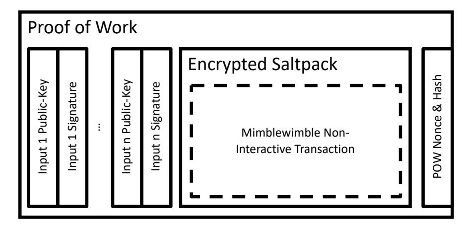
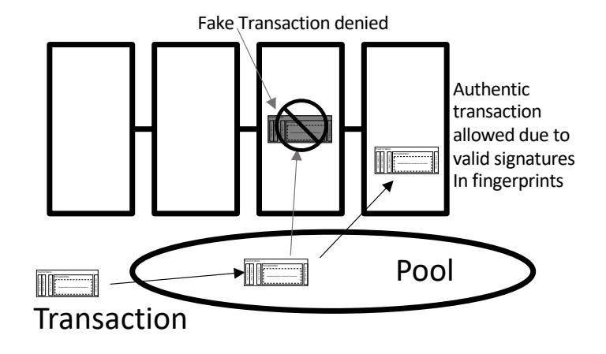
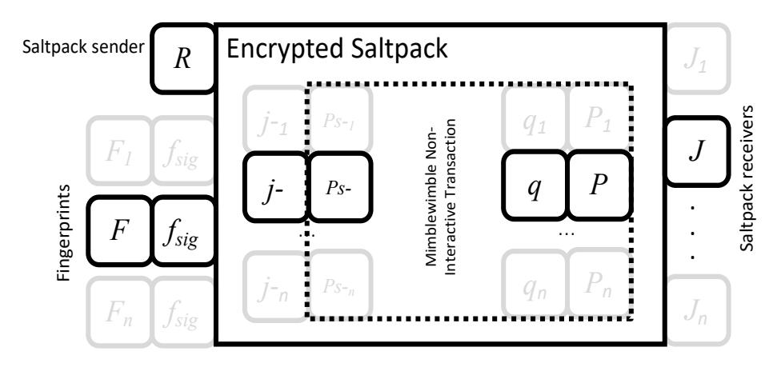

{0}------------------------------------------------

# *Sword: An Opaque Blockchain Protocol*

Farid Elwailly *Sword@elwailly.com* September 26, 2020

*Abstract***—I describe a blockchain design that hides the transaction graph from Blockchain Analyzers. The design is based on the realization that today the miner creating a block needs enough information to verify the validity of transactions, which makes details about the transactions public and thus allows blockchain analysis. Some protocols, such as Mimblewimble, obscure the transaction amounts but not the source of the funds which is enough to allow for analysis. The insight in this technical note is that the block creator can be restricted to the task of ensuring** *no double spends***. The task of actually verifying transaction balances really belongs to the receiver. The receiver is the one motivated to verify that she is receiving a valid transaction output since she has to convince the next receiver that the balances are valid, otherwise no one will accept her spending transaction. The bulk of the transaction can thus be encrypted in such a manner that only the receiver can decrypt and examine it. Opening this transaction allows the receiver to also open previous transactions to allow her to work her way backward in a chain until she arrives at the coin generation blocks and completely verify the validity of the transaction. Since transactions are encrypted on the blockchain a blockchain analyzer cannot create a transaction graph until he is the receiver of a transaction that allows backward tracing through to some target transaction.**

*Keywords—cryptocurrency, Bitcoin, confidential transaction, blockchain analyzer, stealth address, privacy, Mimblewimble, Sword*

#### I. INTRODUCTION

Blockchain-based cryptocurrencies enable peer-to-peer electronic transfer of value by maintaining a global distributed but synchronized ledger, the blockchain. Any independent observer can verify both the current state of the blockchain as well as the validity of all transactions on the ledger. In Bitcoin, this innovation requires that all details of a transaction are public: the sender key, the receiver key, and the amount transferred. Bitcoin provides some weak anonymity through the unlinkability of Bitcoin addresses to real world identities, but it lacks any confidentiality for the amounts transferred.

Mimblewimble gave us confidential transaction amounts. It uses confidential transactions in which every transaction amount involved is hidden from public view using a commitment to the amount. Public validation of the blockchain is possible because an observer can check that the sum of transaction inputs is greater than the sum of transaction outputs, and that all transaction values are positive. There is a range check called Bulletproof that shows that all transaction values are positive.

In Sword we add confidential senders and receivers. The links between transaction outputs and the inputs in the spending transaction are not visible to third parties. Since these links are key to creating transaction graphs, hiding them makes creating transaction graphs problematic.

The receiver of a transaction output has the responsibility of tracing the source of the funds all the way back to the coin origination blocks. To do this she is given a secret that allows her to decrypt the current transaction which when decrypted reveals, among other things, the secrets needed to decrypt previous transactions in the chain. She is motivated to do this correctly since she will expect the next receiver, when she spends her coins, to perform the same check and refuse her transaction if she fails to catch an improper transaction in the chain.

The only way a third party blockchain analyzer can trace the inputs and outputs of this transaction is for the analyzer to be the recipient of a later transaction funded by an output of this transaction. Thus, the transaction graph for a target transaction is hidden from third parties until at some future time, when the current transaction is buried deep in the blockchain, a blockchain analyzer is the recipient of a transaction that allows backward tracing through to the target transaction. Unspent transactions in the past are safe and new transactions are also safe. They have their sources and destination hidden.

The description of this protocol is preliminary, but the following sections describe a roadmap to a final design. Section II gives the public view of transactions: a description of the encrypted transaction, a description of the fingerprints that disallow double spends, and a description of how miner fees are handled. Section III gives the private (i.e. the transmitter and receiver) view of transactions: a description of the keys used in the transaction, and the structure of the transaction. Finally, section IV lists open issues and conclusions.

#### II. PUBLIC VIEW OF TRANSACTIONS

#### *A. The Sword Blockchain*

The Sword Blockchain is a proof of work blockchain similar to the Bitcoin blockchain. Blocks are created by miners who validate pending transactions and add them to their potential block up to some maximum size and then search for a proof of work hash for the block that chains it to a previous block. A valid block is published and, if accepted by consensus, extends the blockchain.

Unique to Sword is that the miner validation of transactions is limited to ensuring that transactions with double spends are disallowed and that each transaction has a valid proof of work. The heart of a Sword transaction is encrypted and called an encrypted Saltpack [2]. It is therefore not visible to the miner 

{1}------------------------------------------------

or any other third party. However, visible to anyone are transaction input fingerprints, each consisting of a public key and a signature on the Saltpack. Also visible is a proof of work generated by the sender. Double spends are disallowed by disallowing transactions that have an input fingerprint public key that has been seen before in the blockchain. The proof of work is necessary to protect from transaction spamming and is involved in miner fees.

A diagram of the encrypted transaction and a description of fingerprints and the proof of work is shown below.

*Fig 1. Encrypted Transaction and Surrounding Fields*

# *B. Transaction Input Fingerprints*

Outside the encrypted Saltpack is a list of input fingerprints that are bound to the Saltpack by a signature on the hash of the Saltpack. The proof of work hash encloses everything. The miner is responsible for ensuring that an input fingerprint public key *never appears more than once on the blockchain*. If a candidate transaction has an input fingerprint public key that appeared in the blockchain in the past, that transaction is invalid and cannot be added to the new block. Fingerprints have the following properties:

- Fingerprints are created, and can only be created, by the transaction sender who knows the transaction outputs that fund this transaction.
- A funding transaction output is used to create a secret and a public key pair. The secret key is used to create a signature on the hash of the encrypted Saltpack including the header with the sending and receiving public keys and the number (count) of input fingerprint public keys. Together the public key and the signature form the input fingerprint.
- There can only be one and only one input fingerprint public key for each funding output.
- A fingerprint cannot be traced back to the funding transaction except after the transaction Saltpack is decrypted by the receiver and its inputs are examined.
- A Saltpack decrypted by a back trace from a spend cannot be used to trace forward in time to reveal the spending transactions of other outputs from this transaction.
- Third parties cannot create valid fingerprints since they do not know the secret key of the fingerprint.
- No one can execute a replay attack once a fingerprint appears on the blockchain since copies of the same

- fingerprint public key cannot be added to the blockchain at that point.
- Denial of service attacks by third parties that can see transactions still in the transaction pool are also impossible. The attacker can try creating fake transactions that display the same fingerprint public keys, but they cannot create a signature for a fake encrypted Saltpack.

*Fig 2. Fingerprint Signatures must be checked by miner to avoid denial of service using a fake transaction*

# *C. Transaction Proof of Work and Miner Fees*

A problem that must be solved by Sword is how to handle what would normally be miner fees for each transaction. Including an explicit fee in Sword transactions is not desirable since the source of the funds must be publicly verifiable, which allows transaction graph analysis. Eliminating fees will also not work since the miner will no longer have an incentive to verify and include transactions in his block.

The miner should receive a separate transaction reward based on the number of transactions included in the block as well as a block reward for completing the block. In Sword the transaction reward is newly minted coins similar to the block reward. However, this is not yet a complete solution since the miner is incentivized to pack his block with transactions of his own creation.

The solution Sword adopts is to require that every transaction include a proof of work (POW). This work must be easy enough that the sender can create the transaction and yet difficult enough that the miner would rather gather and verify real transactions than try to create his own transactions to stuff the block. Consider if the miner needs 3500 transactions to fill his block. He is incentivized to use 3500 real transactions rather than do the work required to create 3500 manufactured transactions of his own.

So, each Sword transaction comes with a POW. This work is performed by the transaction sender and is verified by the miner. This proof of work is not to be confused with the proof of work performed by the miner when building a blockchain block. Transaction reward and transaction POW have the following properties:

• The transaction reward amount is based on the *total work* that went into all the transactions added to the block.

{2}------------------------------------------------

- The transaction reward amount per unit work is adaptively adjusted to move the average transaction reward to a desired level. This is similar to the way that block difficulty is adaptively adjusted to move the average delay between blocks to a desired level.
- The simplest design is to target the transaction reward to be fixed. Another design is to target the transaction reward to be a fixed fraction of the block reward. More complicated schedules are also possible with the transaction reward decaying to a long-term positive value over time.
- The amount of work that goes into a particular transaction's POW can be increased by the sender of this transaction at his discretion. The sender would do this to raise the priority of his transaction since the miner will sort transactions by the amount of work in each and would preferentially include the higher work transactions first. For the miner this raises the total work in the block and increases his transaction reward.
- The increase in transaction reward payouts for higher work levels is temporary as the transaction reward per unit work will adjust to bring the total transaction reward to its target.

# III. PRIVATE VIEW OF TRANSACTIONS

By private view of a transaction we mean a transaction that has been privately decrypted by a receiver allowing her to verify the validity of the transaction and to spend at least one output from the transaction. The core transaction corresponds to a Mimblewimble Non-Interactive transaction [1] on a normal blockchain in that it is possible to verify that the input/output amounts balance and that the verifier can verify the funding transactions without knowing the actual amounts coming in and going out. Of course, the receiver knows her own received balance because she knows the blinding factor for her output. Again, the receiver does not know the actual balances in the transactions she opens as she works her way backward verifying balances through the blockchain since she has the blinding factor for only the last output meant for her. This is similar to the situation on the public Mimblewimble blockchains today.

# *A. The Keys in a Transaction*

This section defines the keys used in a transaction. There is one transmitter and one or more receiver.

#### *1) The Transaction Transient Key*

Denoted (*k, R*), this is a temporary private and public key pair created for this transaction by the transmitter. *R = k \* G.* Note we use *k* rather than *r* for the secret part.

• Creation: *k* is randomly created at transaction creation time.

#### *2) The Transmitter's Spending Keys*

Created for each output from a funding transaction (*p-, P-*): The transmitter must use his spending keys to sign each input to the current transaction using the appropriate *p-,* which only he knows, indicating he is spending the funding output. The public key used to verify this, *P-*, is available in the funding transaction. Hence the receiver must open the funding transaction to get to *P-* for the verification.

• Creation: Each key pair was created by the transmitter of each of the funding transactions previous to this one in a manner described for the pair (*p*, *P*) below.

### *3) The Transmitter's Blinding Factors*

Called *q-*, this is needed for each of transaction input to this transaction.

• Creation: Each blinding factor was created by the previous transmitter of each of the funding transactions in a manner described for the blinding factor *q* below.

## *4) Keying the Funding Transaction Saltpack*

Called *(j-, J-)*, this keypair is needed to receive the funding transaction for each of the current inputs to this transaction.

• Creation: Each Saltpack receive keypair was created by the previous transmitter of each of the funding transactions in a manner described for the Saltpack receive keypairs (*j, J*) below.

#### *5) The Receiver Spending Key*

There may be more than one receiver. Each has a key pair for each output from the transaction (*p, P*): Each output from the current transaction has a public key, *P*, that the receiver will need to prove she knows the secret part of, *p*, for a spending transaction to be valid. She will have to do this by providing a signature using *p* that can be verified using *P* when she finally creates a transaction to spend her output. This will prove she has ownership of this transaction output. See [1]. Notably, this key pair is analogous to the key pair (*p-, P-*) described above for the transmitter.

• Creation: This is based on the work of Gary Yu [1]. Each receiver has a well-known public view key and public spend key, A and B. The transmitter creates an anonymous spending public key, *P*, for the receiver as follows:

$$A' = H(k*A) * G$$
$$P = A' + B$$

Note the receiver, knowing *R*, can recreate this using the fact that ∗ = ∗.

$$A' = H(a*R) * G$$
$$P = A' + B$$

Also, only the receiver can calculate the secret part since only she knows secret *b*. The transmitter cannot do this.

$$p = H(a*R) + b$$

Only with *p* can you spend the output and you must know *b* to do it.

*6) The Receiver Blinding Factor* Needed for her particular transaction output, *q*. 

{3}------------------------------------------------

• Creation: Again, this is based on the work of Gary Yu [1]. The transmitter creates a blinding factor for each receiver as follows:

$$A' = H(k*A) * G$$
$$q = H(H(A') * G + B)$$

Both the transmitter and receiver will know *q*. It is because both know the blinding factor that an additional secret, *p*, is created to ensure only the receiver can spend this output.

## *7) Keying the Transaction Saltpack*

Transactions are encrypted using the protocol described in Saltpack [2]. In this protocol a Saltpack is a message from a public key to one or more public key recipients. We use an anonymous public key as the sender representing the transaction transmitter. We use the option to explicitly include the receiver public keys as message recipients in the Saltpack. We ensure, however, that the recipient keys are anonymous as well.

- Saltpack transmitter key: (*k, R*) selected at random by the transmitter.
- Saltpack receiver key: (*j, J*) one pair per receiver. Where:

$$j = H(q, P) + a$$
$$J = H(q, P) * G + A$$

Note the transmitter will only know J. He knows , and A but doesn't know a. The transmitter can send the Saltpack but only a receiver who knows j can receive it. The reason the receiver key is created in this manner is to allow an auditor to receive the Saltpack. The auditor can calculate and then j knowing a as shown below. This allows him to open transactions meant for the receiver and determining the committed amount sent and adding it to the receiver balance sheet.

Similarly, we didn't simply use (p, P) for the Saltpack receiver key. We do not want the auditor or the transmitter to know p since we don't want to allow either of them to spend the funds being sent. Spending requires knowing p.

Note that R and each J are anonymous and globally unique and are visible to everyone since they are in the unencrypted header of the Saltpack. See [2]. This allows the receiver as well as an auditor to check whether a Saltpack is meant for them by calculating:

$$A' = H(a * R) * G$$
 $P' = A' + B$ 
 $q' = H[H(A') * G + B]$ 
 $J' = H(q', P') * G + A$ 

Then check that  $J' = J$ 

Finally, to decrypt transactions further back in the verification chain, each input to a transaction must include j- to allow the receiver to find and unencrypt the previous funding transactions. This is in addition to the signature using p- that shows valid ownership of that input. So, the transmitter has his own (*j-, J-*) for receiving the funding transaction as well as his (*p-, P-*) that prove ownership of the funds.

#### *8) The receiver's Auditor*

By sharing *A* and *B* and the private part of , which is *a*, the receiver can appoint an auditor capable of computing the values and *,* since ∗ = a ∗ R. The auditor cannot create the value *p*. This allows the auditor to detect and open every incoming transaction sent to this receiver's Stealth Address and see the commitment to the value sent but prevents the auditor from spending the coins. We will see below that *R* is made available to both receivers and their auditors.

## *9) Creating the Transaction Input Fingerprints*

Fingerprints are created by the transmitter when he is ready to spend. The transmitter must create a separate fingerprint for each funding outputs that goes into this transaction. He creates the fingerprint using the value *p-,* his own private spending key for the funding output, and *j-,* his own version of *j*, the receiving key for the funding output. Note the fingerprint is globally unique and only the transmitter (the spender) can create it.

The transmitter calculates the fingerprint key-pair and, using the fingerprint private key, signs the transaction Saltpack, including the header, and the number of inputs:

$$f = (j-)(p-)$$
  
 $F = f * G = j- * P-$   
 $f_{sig} = [Saltpack, n]_f$  — Signature using  $f$ 

*F* and *fsig* form the fingerprint. The signature binds *F* to this *Saltpack* and to *n,* the total number of inputs. This ensures a fingerprint cannot be deleted or attached to another transaction.

The receiver and auditor can check the validity of the fingerprint since they can calculate *F* from *j-* and *P-*. When tracing back to the funding transaction they will find *P-* to create *F*.

The miner simply checks the uniqueness of *F* and the validity of *fsig*.

The auditor cannot create a fake fingerprint for his own employer's (the receiver) future outputs since he does not know *p* and will not be able to create an *fsig* on a transaction.

#### *B. The Transaction Structure*

Figure 3 below shows the structure of a transaction with the various keys called out. Note the signature, *Ps-,* is the Schnorr signature of - using *p-*. It is there showing ownership of the input by the transmitter and it verifies that the transmitter created *F*. It *F* doesn't check out the receiver should reject the transaction. The funding transaction is found by using *j-* to calculate a *J-* and finding, then opening (receiving), the funding transaction. This gives the receiver *P-* to verify *Ps-*. This is what the receiver of an output from this transaction will have to do as part of her backtrack to verify the validity of this transaction.

{4}------------------------------------------------

*Fig 3. Transaction Showing the Keys*

On the output side the *q* is the blinding factor and is hidden per the Mimblewimble standard and the *P* will be used to prove the receiver's ownership of this output when the time comes that she will want to spend this output.

Inside the dotted box is a Mimblewimble non-interactive transaction as described in [1]. Appended to it is a list of all *j*allowing a verifier to walk back through funding transactions. This is all encrypted in a pack as described in [2]. Outside of the Saltpack is the (anonymous) public key of the transmitter and the (anonymous) public keys of the receivers. Also appended to it are the fingerprints of all the inputs to the transaction that are used by the miner to block double spending. The fingerprints are bound to this Saltpack by the signature *fsig*, which can be checked by *F*. The receiver has the task of making sure *F* is formed correctly from the funding transaction outputs.

# IV. OPEN ISSUES AND CONCLUSIONS

As mentioned before, the description of this protocol is preliminary. However, this paper describes a roadmap to a final design. It shows that protocols that do not reveal information necessary to form a full transaction graph is possible. What follows is a brief description of issues that require more attention.

#### *A. The Correctness of the Design*

This design was conceived over a few days. I have tried to ensure that there are no leaks etc. that would break the privacy of transactions. I have also tried to make sure the miner can prohibit double spends and is motivated to do so. Finally, I have tried to ensure the receiver has all the information she needs to verify the validity of her received transactions. The design needs to be vetted against these goals.

#### *B. The Limits to Transaction Privacy*

Unfortunately, the linkage between transactions is revealed to the receiver. This is necessary to allow verification of the funding from minted coins to this transaction. This is much more privacy than is afforded by current blockchain designs but in the end an entity bent on mapping the transaction graph will receive an input that allows tracing back through the graph to a target transaction. Some observations:

- Creating a complete graph is impossible
- Transactions that have not been spent are safe since tracing can only be backwards through the graph. This is true no matter how deep in the blockchain they are.
- New spending transactions are safe for a while since the likelihood of a spend arriving at an entity mapping the transaction graph is low.
- Groups that transact among themselves can maintain a bit of privacy by being careful of which funding transactions are used to spend outside the group. For example, sources of funds used to pay salaries in a corporation can be kept relatively private and a user receiving a large payment can privately break it up into a number of wallets before spending any of it also keeping a level of privacy.
- Since Mimblewimble is used for the basic transaction, verifying correctness by the receiver does not require revealing the balances in older transactions. This makes tracing the amounts being moved problematic.

#### *C. The Low Efficiency of the Protocol*

Transactions in this protocol are large. Maybe there are shortcuts that would reduce its size.

The work needed to determine if a transaction belongs to you seems large. This is an area that could be improved.

The work needed to walk back to a funding transaction also seems large. This and the previous inefficiency result from the desire to enable an auditor to do the work of maintaining a wallet by searching for transaction you own and do the work of verifying the transaction while at the same time keeping him from spending your funds.

#### *D. Acknowlegment*

I would like to thank Gary Yu for inspiring this work by publishing his design for a Mimblewimble Non-Interactive Transaction Scheme.

# REFERENCES

- [1] Yu, Gary, "Mimblewimble Non-Interactive Transaction Scheme", August 2020. https://eprint.iacr.org/2020/1064.pdf
- [2] "Saltpack, a modern crypto messaging format", A binary message format, using MessagePack and NaCl, Started 2015. https://saltpack.org/encryption-format-v2.