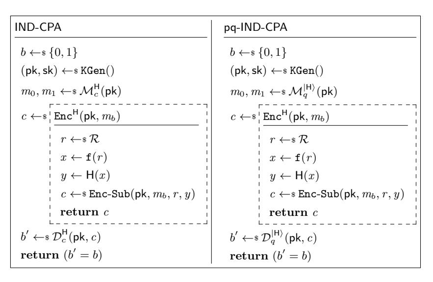
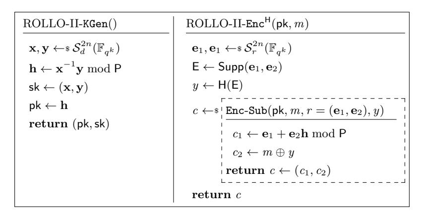
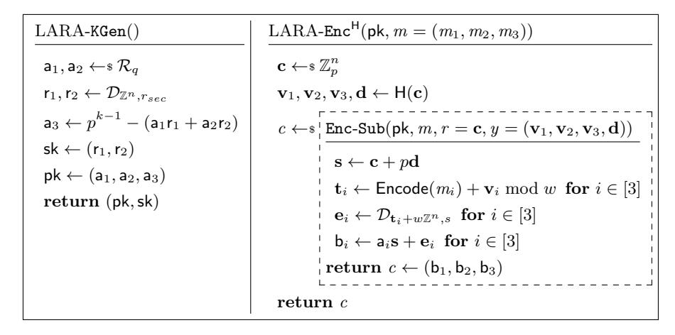

# Encryption Schemes using Random Oracles: from Classical to Post-Quantum Security

Juliane Kr¨amer and Patrick Struck

Technische Universit¨at Darmstadt, Germany {jkraemer,pstruck}@cdc.tu-darmstadt.de

Abstract. The security proofs of post-quantum cryptographic schemes often consider only classical adversaries. Therefore, whether such schemes are really post-quantum secure remains unknown until the proofs take quantum adversaries into account. Switching to a quantum adversary might require to adapt the security notion. In particular, post-quantum security proofs for schemes which use random oracles have to be in the quantum random oracle model (QROM), while classical security proofs are in the random oracle model (ROM). We remedy this state of affairs by introducing a framework to obtain post-quantum security of public key encryption schemes which use random oracles. We define a class of encryption schemes, called oracle-simple, and identify game hops which are used to prove such schemes secure in the ROM. For these game hops, we state both simple and sufficient conditions to validate that a proof also holds in the QROM. The strength of our framework lies in its simplicity, its generality, and its applicability. We demonstrate this by applying it to the code-based encryption scheme ROLLO-II (Round 2 NIST candidate) and the lattice-based encryption scheme LARA (FC 2019). Thereby we prove that both schemes are post-quantum secure, which had not been shown before.

Keywords: QROM · game-based proofs · code-based cryptography · lattice-based cryptography

### 1 Introduction

Relying on quantum-hard mathematical assumptions is not sufficient to develop cryptographic schemes that withstand attackers with quantum computing power. To truly provide security against quantum adversaries, their quantum computing power has to be considered in the security proof as well. At least three models regarding the quantum computing power of the adversary and the schemes' users are distinguished [\[13\]](#page-15-0): classical security, post-quantum security, and quantum security. In classical security proofs no one has quantum computing power. In post-quantum security proofs, by contrast, the adversary has quantum computing power and can thereby deploy quantum computation in its attacks, e.g., by evaluating hash functions in superposition. The users of the cryptographic scheme, however, remain classical. In a world where every party has quantum computing power, quantum security is needed. In this model, for instance, a quantum adversary is able to query a decryption oracle in superposition.

Post-quantum security of schemes is mandatory to be deployed in a world with large quantum computers. Hence, if only classical proofs exist, it has to be evaluated if these translate to a quantum adversary, i.e., whether the classical security can be lifted to post-quantum security. This is not always the case [\[9,](#page-15-1)[25\]](#page-16-0). For cryptographic schemes which are proven secure in the random oracle model (ROM), this entails that they have to be proven secure in the quantum random oracle model (QROM) [\[9\]](#page-15-1). In this model, the adversary can query the random oracle in superposition. This requires different proof techniques to cope with the additional power of the adversary.

A popular technique to prove security of a cryptographic scheme is to organise the proof as a sequence of games [\[7,](#page-15-2)[24\]](#page-16-1). In a game-based proof, the advantage of an adversary A in a game G<sup>0</sup> can be bound by its advantage to distinguish the real game G<sup>0</sup> from an ideal game G<sup>k</sup> in which the adversary has no advantage. To this end, several intermediate games G1, . . . , Gk−<sup>1</sup> are constructed between G<sup>0</sup> and G<sup>k</sup> so that the change between successive games is small. This makes the advantage to distinguish each pair of consecutive games, i.e., each game hop, easier to analyse and allows to upper bound the overall advantage of A by the sum of these advantages. To lift a classical game-based proof to post-quantum security, an adversary with quantum computing power has to be considered and the classical games have to be replaced by their corresponding post-quantum versions.

In this work, we study under which conditions security proofs of public key encryption (PKE) schemes can be lifted from the ROM in the QROM. The security notion we are considering is indistinguishability under chosen-plaintext attacks (IND-CPA), a basic security notion for PKE schemes. Intuitively, an encryption scheme is IND-CPA-secure if an adversary can not distinguish between the encryption of two adversarial chosen messages. More precisely, we study how classical IND-CPA security proofs in the ROM can be lifted to post-quantum IND-CPA (pq-IND-CPA), where the adversary can query the random oracle in superposition (QROM) [\[13\]](#page-15-0).

### 1.1 Our Contribution

The contribution of this work is a method to prove IND-CPA-secure encryption schemes pq-IND-CPA-secure. We define a class of public key encryption schemes, called oracle-simple, and develop a framework to lift the security of such schemes from the ROM to the QROM. To this end, we define two different types of game hops and state simple, easily checkable conditions such that the classical proof can be lifted against quantum adversaries. Each PKE scheme which can be proven IND-CPA-secure in this framework thereby is automatically postquantum secure. Due to its simplicity we expect the framework to be helpful when designing post-quantum secure encryption schemes. Another important aspect is that our framework is generic and not restricted to a certain family of post-quantum cryptography, e.g., lattice-based cryptography.

We demonstrate the value of our framework by applying it to two public key encryption schemes, which until this work were not known to be post-quantum secure: 1) the code-based encryption scheme ROLLO-II [\[21\]](#page-16-2) and 2) the latticebased encryption scheme LARA [\[4\]](#page-15-3).

Two more schemes which can be proven post-quantum secure using our framework are the code-based encryption scheme BigQuake [\[5\]](#page-15-4) and the latticebased encryption scheme LIMA [\[1\]](#page-14-0) [1](#page-2-0) , both Round 1 NIST candidates. Applying our framework to these schemes is very much akin to the application to ROLLO-II and LARA, which is why we omit it. To the best of our knowledge, our framework covers all random-oracle-based encryption schemes submitted to NIST [\[1,](#page-14-0)[4,](#page-15-3)[5,](#page-15-4)[21\]](#page-16-2) and, in particular, we are not aware of any random-oracle-based encryption scheme which is not covered by it.

To obtain classical security against chosen-ciphertext attacks (CCA), all these schemes rely on generic transformations like the FO-transformation [\[12\]](#page-15-5). The pq-IND-CPA security of the schemes is the final requirement for applying the post-quantum variants of this transformation [\[15,](#page-15-6)[26\]](#page-16-3), i.e., to gain CCA security against quantum adversaries. More recent results of post-quantum secure FOtransformations [\[16,](#page-15-7)[18,](#page-15-8)[23\]](#page-16-4) achieve tighter bounds for CCA security at the cost of an additional property called disjoint simulatability. Intuitively, this means that there exists a simulator, knowing merely the public key, that can generate fake ciphertexts that are indistinguishable from real ciphertexts of random messages. Showing this property for the concrete schemes ROLLO-II and LARA is beyond the scope of this work.

### 1.2 Related Work

Song [\[25\]](#page-16-0) provides a general framework to lift security reductions. However, the main limitation is that the applicability is restricted to the scenario in which the classical security notion holds true even for quantum adversaries, e.g., in the standard model. This restrains the usage of the framework for any proofs in the ROM, since post-quantum security proofs have to be in the QROM. If the security notion changes towards a quantum adversary, applying the framework requires to come up with a quantum proof. That is, one has to transform a quantum adversary in the QROM into a quantum adversary in the ROM.

For signature schemes, there exist results to obtain post-quantum security in the QROM. Along with the introduction of the QROM, Boneh et al. [\[9\]](#page-15-1) present the concept of history-free reductions for signature schemes proven secure in the ROM. They show that history-free reductions provide post-quantum security for signature schemes in the QROM. Since the known ROM proofs for Fiat-Shamir signatures are not history-free, several works study their post-quantum security and identify specific properties of Fiat-Shamir signatures such that schemes with these properties are post-quantum secure in the QROM, e.g., [\[10,](#page-15-9) [11,](#page-15-10) [19,](#page-16-5) [20,](#page-16-6) [28\]](#page-16-7).

<span id="page-2-0"></span><sup>1</sup> We note that the IND-CPA security of LIMA can also be proven in the standard model. This makes its pq-IND-CPA security somewhat trivial, as it avoids the main challenge, that is, the switch from the ROM to the QROM.

Others, for instance Alkim et al. [\[2\]](#page-14-1) for the signature scheme qTESLA, prove post-quantum security directly. Hence, the question whether or not classical security proofs for signature schemes can be lifted to post-quantum security is discussed both with and without random oracles.

For encryption schemes, however, no broad analysis of liftable security proofs in the QROM exists. Zhandry [\[29\]](#page-16-8) shows that quantum random oracles can be simulated using q-wise independent functions, thereby removing the additional assumption required in the proofs by Boneh et al. [\[9\]](#page-15-1). In addition, Zhandry shows how the classical random oracle technique of challenge injection can be restored in the quantum setting using so-called semi-constant distributions. With these results several cryptographic schemes, including identity-based encryption schemes, are proven secure against quantum adversaries. Unruh [\[27\]](#page-16-9) develops the one-way to hiding (O2H) lemma, another proof technique in the QROM. The O2H lemma is used, for instance, by Targhi and Unruh [\[26\]](#page-16-3) to prove a slight modification of the FO transformation [\[12\]](#page-15-5) indistinguishable against chosenciphertext attacks in the QROM. Tighter bounds for the O2H lemma have been proposed by Ambainis et al. [\[3\]](#page-14-2) and Bindel et al. [\[8\]](#page-15-11) at the cost of a more restricted applicability.

### 1.3 Organization of the Paper

The rest of this paper is organized as follows. In Section [2,](#page-3-0) we provide the notation and the necessary background on both the quantum random oracle model and security proofs. In Section [3,](#page-6-0) we present our framework and show under which conditions a classical security proof in the ROM can be lifted to the QROM. Finally, we apply our framework to the code-based scheme ROLLO-II and the lattice-based scheme LARA in Section [4](#page-11-0) and thereby reveal that their IND-CPA security proofs remain valid towards a quantum adversary.

### <span id="page-3-0"></span>2 Preliminaries

#### 2.1 Notation

For a non-negative integer n we denote the set {1, . . . , n} by [n]. The domain and co-domain of a function f are denoted by Dom(f) and CoDom(f), respectively. A function f is called negligible if f(n) < 1/n<sup>c</sup> for any c > 0 and sufficiently large n. For a set S, we write s ←\$ S to denote that a value which is sampled uniformly at random from S is assigned to s. By |S| we describe the number of elements in S. We write A<sup>z</sup> = (Mz, Dz) to denote an IND-CPA adversary A<sup>z</sup> which consists of two algorithms Mz, the message generator which outputs two messages, and Dz, the distinguisher, which outputs a bit. The subscript z indicates whether the adversary is classical (z = c) or quantum (z = q). We omit it in the case it is not relevant. It is assumed that M<sup>z</sup> and D<sup>z</sup> share state.

We suppose the reader to be familiar with the fundamental basics of quantum computation, e.g., the ket notation |·i and measurements. For a more thorough discussion of the topic, we refer to [\[22\]](#page-16-10).

#### 2.2 The Quantum Random Oracle Model

The random oracle model (ROM), formalized by Bellare and Rogaway [\[6\]](#page-15-12), is a commonly used model to prove cryptographic schemes secure. In the ROM, all parties have access to a random oracle H which, upon being queried on a value x , returns a random value y. Every further query of x , for instance by another party, is answered using the same y as before. When a scheme is proven secure in the ROM, one idealises components like hash functions by a random oracle. Given that the code of a hash function is publicly available, one has to assume that a quantum adversary implements hash functions on its quantum computer, thereby being able to evaluate it in superposition. This assumption gives rise to the quantum random oracle model (QROM), which has been advocated by Boneh et al. [\[9\]](#page-15-1). In the QROM, parties which have quantum computing power are allowed to query the random oracle in superposition. In more detail, for a random oracle H, the QROM allows these parties access to the quantum random oracle |Hi, where |Hi : |x , yi 7→ |x , y ⊕ H(x )i. To prove a scheme post-quantum secure, the proof should always be in the QROM, as a proof in the ROM would imply the unrealistic expectation that the adversary refrains from implementing a hash function on its quantum computer. We use superscripts to denote oracle access, e.g., A<sup>H</sup> and A<sup>|</sup>H<sup>i</sup> for the ROM and QROM, respectively.

In our proofs we also consider reprogrammed random oracles. For a random oracle H, we denote the random oracle which is reprogrammed on input x to y by Hx→<sup>y</sup> , i.e.,

<span id="page-4-0"></span>
$$\mathsf{H}_{x\to y}(a) = \begin{cases} y & \text{, if } a = x \\ \mathsf{H}(a) & \text{, else} \end{cases}.$$

Below we recall the one-way to hiding (O2H) lemma by Unruh [\[27\]](#page-16-9), albeit using the reformulation by Ambainis et al. [\[3\]](#page-14-2) adapted to our case.

Lemma 1 (One-way to hiding (O2H) [\[3\]](#page-14-2)). Let G, H: X → Y be random functions, let z be a random bitstring, and let S ⊂ X be a random set such that ∀x /∈ S, G(x) = H(x). (G, H, S, z) may have arbitrary joint distribution. Furthermore, let A |Hi <sup>q</sup> be a quantum oracle algorithm which queries |Hi at most q times. Define an oracle algorithm B |Hi <sup>q</sup> as follows: Pick i ←\$ [q]. Run A |Hi <sup>q</sup> (z) until just before its i-th query to |Hi. Measure the query in the computational basis, and output the measurement outcome. Let

$$\begin{split} P_{left} &\coloneqq \Pr[\mathcal{A}_q^{|\mathsf{H}\rangle}(z) \Rightarrow 1] \\ P_{right} &\coloneqq \Pr[\mathcal{A}_q^{|\mathsf{G}\rangle}(z) \Rightarrow 1] \\ P_{guess} &\coloneqq \Pr[x \in \mathcal{S} \,|\, \mathcal{B}_q^{|\mathsf{H}\rangle}(z) \Rightarrow x] \,. \end{split}$$

Then it holds that

$$|P_{left} - P_{right}| \le 2q\sqrt{P_{guess}}$$
.

The same result holds with B |Gi <sup>q</sup> (z) instead of B |Hi <sup>q</sup> (z) in the definition of Pguess. We will use the O2H lemma in the following way. Suppose we have two games G<sup>0</sup> and G<sup>1</sup> which are identical except for the random oracles that the adversary has access to. Namely, in G<sup>0</sup> it has access to |Hi while in G<sup>1</sup> it has access to |H 0 i. The advantage of the adversary in distinguishing the games is bound by its advantage in distinguishing the random oracles |Hi and |H 0 i, which, in turn, can be bound by the O2H lemma.

### 2.3 Security Proofs

We use game-based proofs following [\[7,](#page-15-2) [24\]](#page-16-1), where an adversary plays a game which eventually outputs a bit indicating whether the adversary has won the game or not. Let G0, G<sup>1</sup> be games and A be an adversary. We write G A <sup>0</sup> ⇒ v to indicate that the game G<sup>0</sup> outputs v when interacting with A. The game advantage between the games G<sup>0</sup> and G<sup>1</sup> is defined as:

$$\mathbf{Adv}\left(\mathsf{G}_0^{\mathcal{A}},\mathsf{G}_1^{\mathcal{A}}\right) \coloneqq \Pr[\mathsf{G}_0^{\mathcal{A}} \Rightarrow \mathrm{true}] - \Pr[\mathsf{G}_1^{\mathcal{A}} \Rightarrow \mathrm{true}] \,.$$

Whether a game G is in the ROM or the QROM is implicitly defined by the adversary playing the game. That is, G A<sup>c</sup> is in the ROM while G A<sup>q</sup> is in the QROM.

A public key encryption (PKE) scheme E = (KGen, Enc, Dec) is a triple of algorithms KGen, Enc, and Dec. KGen outputs a key pair (pk,sk). The input to Enc is a public key pk and a message m, the output is a ciphertext c. The algorithm Dec, on input a secret key sk and a ciphertext c, outputs a message m. We are interested in PKE schemes which use random oracles. Thus we write Enc<sup>H</sup> and Dec<sup>H</sup> to denote that both Enc and Dec have oracle access to H. [2](#page-5-0)

A basic security notion for encryption schemes is indistinguishability under chosen plaintext attacks (IND-CPA) which asks an adversary to distinguish between the encryption of two adversarial chosen messages. Below we formally define the corresponding post-quantum security notion pq-IND-CPA for public key encryption schemes which use random oracles. Note that only the random oracle access changes towards the post-quantum security. Both the inputs and outputs of the adversary (i.e., public key, messages, ciphertexts, and output bit) remain classical in both cases.

Definition 2. Let E = (KGen, EncH, DecH) be a PKE scheme and let the game pq-IND-CPA be defined as in Fig. [1.](#page-6-1) Then for any adversary A its pq-IND-CPA advantages is defined as:

$$\mathbf{Adv}_{E}^{\mathsf{pq}\text{-IND-CPA}}(\mathcal{A}) \coloneqq 2\Pr\left[\mathsf{pq}\text{-IND-CPA}^{\mathcal{A}} \Rightarrow \mathrm{true}\right] - 1\,.$$

We say that <sup>E</sup> = (KGen, Enc<sup>H</sup>, Dec<sup>H</sup>) is pq-IND-CPA-secure if Advpq-IND-CPA E (A) is negligible. Classical security is defined analogously using game IND-CPA.

<span id="page-5-0"></span><sup>2</sup> We do not allow the key generation algorithm access to the random oracle as we are not aware of any scheme which requires it. Besides, proving the resulting game hop would be trivial as in case KGen has access to the random oracle, the adversary gets access to the random oracle only after receiving the public key. Hence, the reduction can trivially reprogram the random oracle unnoticeable for the adversary.

<span id="page-6-1"></span>

| IND-CPA                           | pq-IND-CPA                             |
|-----------------------------------|----------------------------------------|
| b ←\$ {0, 1}                      | b ←\$ {0, 1}                           |
| (pk,sk) ←\$ KGen()                | (pk,sk) ←\$ KGen()                     |
| ←\$ MH<br>m0, m1<br>c (pk)        | ←\$ M Hi<br>m0, m1<br>(pk)<br>q        |
| c ←\$ EncH<br>(pk, mb)            | c ←\$ EncH<br>(pk, mb)                 |
| 0 ←\$<br>H<br>b<br>D<br>c (pk, c) | 0 ←\$<br> Hi<br>D<br>b<br>(pk, c)<br>q |
| 0 =<br>return (b<br>b)            | 0 =<br>return (b<br>b)                 |

Fig. 1: Classical (IND-CPA) and post-quantum (pq-IND-CPA) security games for a public key encryption scheme E = (KGen, EncH, DecH) against a classical adversary A<sup>c</sup> = (Mc, Dc) and a quantum adversary A<sup>q</sup> = (Mq, Dq), respectively, where M (message generator ) and D (distinguisher ) implicitly share state.

The hardness of a problem P is defined by a game between a challenger and an adversary. In a decisional problem, an adversary obtains a problem instance depending on some secret bit b ∈ {0, 1} chosen by the challenger, and is asked to determine b. In a search problem, an adversary obtains a problem instance depending on some secret s chosen by the challenger, and is asked to find s. Against quantum adversaries, the games remain the same, i.e., the challenge and the solution remain classical, but the adversary can use local quantum computing power. Similar to the definition above, we write Adv<sup>P</sup> (A) for the advantage of an adversary A in solving problem P. For a decisional problem, it is understood to be the advantage in solving the problem over guessing. There are also works which analyse problems in the fully quantum setting, where the challenge is quantum (cf. [\[14\]](#page-15-13)).

### <span id="page-6-0"></span>3 The pq-IND-CPA Framework

Within this section we develop our framework to lift classical security proofs in the post-quantum setting. To this end, we first define a class of encryption schemes in Section [3.1](#page-6-2) and identify two types of game hops for this class of encryption schemes in Section [3.2.](#page-7-0) In Section [3.3,](#page-9-0) we show under which conditions the classical proofs for these game hops hold true against quantum adversaries in the QROM.

### <span id="page-6-2"></span>3.1 Requirements for PKE Schemes

We start by defining so-called oracle-simple public key encryption schemes. These are encryption schemes where the encryption algorithm invokes the random oracle exactly once on an input independent of the message and the public key.[3](#page-7-1) Below we formally define such schemes.

<span id="page-7-2"></span>Definition 3. Let E = (KGen, EncH, DecH) be a public key encryption scheme. If there exists an algorithm Enc-Sub and a deterministic function f which maps from some set R to Dom(H) such that Enc<sup>H</sup> can be written as in Fig. [2,](#page-7-2) i.e., it first invokes the random oracle on f(r ) for a random r ∈ R to obtain y and then computes the ciphertext using Enc-Sub(pk, m, r , y), then we call E an oracle-simple (public key) encryption scheme with function f.

```
EncH
    (pk, m)
r ←$ R
x ← f(r )
y ← H(x )
c ←$ Enc-Sub(pk, m, r , y)
return c
```

Fig. 2: Algorithm Enc of an oracle-simple encryption scheme using f and Enc-Sub.

Based on this definition, we can rewrite the IND-CPA and pq-IND-CPA security games for oracle-simple encryption schemes yielding the security games displayed in Fig. [3.](#page-8-0)

Since our framework is based on oracle-simple encryption schemes, its generality depends on the generality of this class of encryption schemes. Analysing all encryption schemes submitted as Round 1 NIST candidates which use random oracles [\[1,](#page-14-0) [4,](#page-15-3) [5,](#page-15-4) [21\]](#page-16-2), reveals that all of them are indeed oracle-simple schemes. Note that this analysis is based on the underlying encryption scheme as all candidates use random oracles when applying generic transformations to achieve CCA security. Thus, we see this as a style of notation which greatly simplifies the presentation of our proofs, rather than a restriction of its generality.

#### <span id="page-7-0"></span>3.2 Identification of Game Hops

Within this section we define two different types of game hops which are used to prove security of oracle-simple encryption schemes. Due to the structure of oracle-simple encryption schemes, we can distinguish between game hops for which lifting is rather trivial since they are independent of the random oracle, and game hops which are not independent of the random oracle. We start by defining a Type-I game hop which is independent of the random oracle.

<span id="page-7-1"></span><sup>3</sup> This property is required to get a meaningful bound from applying the one-way to hiding lemma. Since we are not aware of any PKE scheme which does not satisfy this requirement, we do not consider it a restriction.

<span id="page-8-0"></span>

Fig. 3: Security games IND-CPA and pq-IND-CPA for an oracle-simple public key encryption scheme E = (KGen, EncH, DecH) with function f.

Definition 4. Let G<sup>i</sup> and Gi+1 be two IND-CPA games (cf. Fig. [3\)](#page-8-0) for an oracle-simple public key encryption scheme E = (KGen, EncH, DecH). We call the game hop between G<sup>i</sup> and Gi+1 a Type-I game hop if the games only differ in using different algorithms KGen to generate the key pair or different algorithms Enc-Sub to generate the ciphertext.

Next, we define a Type-II game hop which affects the usage of the random oracle while encrypting one of the challenge messages by the adversary.

Definition 5. Let G<sup>i</sup> and Gi+1 be two IND-CPA games (cf. Fig. [3\)](#page-8-0) for an oracle-simple public key encryption scheme E = (KGen, EncH, DecH). We call the game hop between G<sup>i</sup> and Gi+1 a Type-II game hop if their only difference is that game G<sup>i</sup> obtains y by invoking H on x while game Gi+1 samples y uniformly at random from CoDom(H).

Having discussed the generality of the class of encryption schemes, the next natural question asks for the generality of the defined game hops. A Type-II game hop is a standard game hop to make the challenge independent of the random oracle, thereby rendering it obsolete for the adversary. As for Type-I game hops, we observe the following. To bound the game advantage, one transforms an adversary that distinguishes the games into an adversary (the reduction) that solves some problem. To achieve this, the game hop has to be connected with the problem instance. Thus the reduction has to feed the problem instance to the adversary. Considering IND-CPA security, its options are fairly limited. Either it feeds it via the inputs to the adversary, that is the public key pk or the ciphertext c, or as a response from the random oracle. The former case is the one we cover with a Type-I game hop. The latter case is not covered, as none of the schemes, that we are aware of, requires such a game hop. Nevertheless, we emphasise that our framework can be easily extended by another type of game hop, if needed. The post-quantum analogue of such a challenge injection in a random oracle response can be achieved using Zhandry's semi-constant distributions [\[29\]](#page-16-8), where a challenge is injected in a subset of inputs which gives a significant chance that the adversary uses the injected challenge while the probability of detecting the challenge injection remains small enough.

### <span id="page-9-0"></span>3.3 Lifting Security

Within this section we state the conditions under which a classical security proof holds true in the post-quantum setting.

<span id="page-9-1"></span>The lemma below states that classical reductions from a decisional problem to the game advantage of a Type-I game hop hold true in the post-quantum setting.

Lemma 6. Let G<sup>i</sup> and Gi+1 be games such that the game hop between these is a Type-I game hop. Suppose there exists a decisional problem P which is reduced to the game advantage between the games. Then, for any quantum adversary Aq, there exists a quantum adversary B<sup>q</sup> against P such that

$$\mathbf{Adv}\left(\mathsf{G}_{i}^{\mathcal{A}_{q}},\mathsf{G}_{i+1}^{\mathcal{A}_{q}}\right) \leq \mathbf{Adv}^{\mathrm{P}}(\mathcal{B}_{q})$$
 .

Proof. The difference between the games is independent from the random oracle. Hence the same proof holds against quantum adversaries, albeit the adversary B<sup>q</sup> has to simulate a quantum random oracle for the adversary Aq. This can be done using a 2qH-wise independent function, where q<sup>H</sup> is the number of random oracle queries by A<sup>q</sup> [\[29\]](#page-16-8). ut

Alternatively, Lemma [6](#page-9-1) can be formally proven using the framework by Song [\[25\]](#page-16-0). Due to the complex notation used in [\[25\]](#page-16-0), however, this leads to a rather long and tedious proof.

The following lemma states conditions under which the classical proof for a Type-II game hop holds true against quantum adversaries.

Lemma 7. Let G<sup>i</sup> and Gi+1 be games such that the game hop between these is a Type-II game hop. Suppose there exists a search problem P which is reduced to the probability that an adversary queries the random oracle on x . Then, for any quantum adversary Aq, making q<sup>H</sup> queries to |Hi, there exists a quantum adversary C<sup>q</sup> against P such that

<span id="page-9-2"></span>
$$\mathbf{Adv}\left(\mathsf{G}_{i}^{\mathcal{A}_{q}},\mathsf{G}_{i+1}^{\mathcal{A}_{q}}\right) \leq 2q_{\mathsf{H}}\sqrt{\mathbf{Adv}^{\mathrm{P}}(\mathcal{C}_{q})}\,.$$

Proof. We observe that the games G<sup>i</sup> and Gi+1 are perfectly indistinguishable given that A has no knowledge about the random oracle output on x , that is, H(x). Hence the game advantage can be bound by the knowledge of A about H(x). For the classical proof in the ROM, this is fairly easy as the only way for the adversary to obtain knowledge about H(x) is to query x. For the post-quantum proof in the QROM, the issue is that, for example, superposition access allows the adversary to trivially get (some) knowledge about H(x) by making an equal superposition query over all possible inputs.

We tackle this issue as follows. First, we show that the game advantage is bound by the distinguishing advantage between two random oracles, see Equation (1). This enables us to apply the O2H lemma as the second step, see Equation (2). In the final step, we bound the resulting term from the O2H lemma using the hardness of P, see Equation (3).

Recall that the games differ in how the value y (input to Enc-Sub) is generated. In  $G_i$  it is the output of the random oracle on input x while it is sampled uniformly at random from CoDom(H) in  $G_{i+1}$ . By the random oracle paradigm, the value y is distributed identically in both games, as is the ciphertext c. Based on this, we conclude that the only inconsistency lies in the random oracle. Namely, querying the random oracle on x yields the same y which is fed as input to Enc-Sub in  $G_i$ , while it yields a random value independent of the inputs to Enc-Sub in  $G_{i+1}$ . This allows us to see  $G_{i+1}$  as  $G_i$ , that is  $y \leftarrow H(x)$ , with the exception that the random oracle H, which A has access to, is replaced with  $H_{x\to\$}$ . Based on this thought, it is easy to see that the game advantage is bound by the chance that A can distinguish between the two random oracles H and  $H_{x\to\$}$ . The same argument holds for a quantum adversary  $A_q$  except that access to the corresponding quantum random oracles  $|H\rangle$  and  $|H_{x\to\$}\rangle$  is granted. For ease of notation, we henceforth assume that the random oracle is reprogrammed to  $\bot$  instead of a random value. Then it holds that

$$\mathbf{Adv}\left(\mathsf{G}_{i}^{\mathcal{A}_{q}},\mathsf{G}_{i+1}^{\mathcal{A}_{q}}\right) \leq \left|\Pr[\mathcal{A}_{q}^{|\mathsf{H}\rangle} \Rightarrow 1] - \Pr[\mathcal{A}_{q}^{|\mathsf{H}_{x \to \perp}\rangle} \Rightarrow 1]\right|. \tag{1}$$

Applying the O2H lemma (cf. Lemma 1) yields that there exists a quantum algorithm  $\mathcal{B}_q$  such that

$$\left| \Pr[\mathcal{A}_q^{|\mathsf{H}\rangle} \Rightarrow 1] - \Pr[\mathcal{A}_q^{|\mathsf{H}_{x \to \perp}\rangle} \Rightarrow 1] \right| \le 2q_\mathsf{H} \sqrt{\Pr[\mathcal{B}_q^{|\mathsf{H}\rangle} \Rightarrow x]} \,. \tag{2}$$

It remains to bound the probability that  $\mathcal{B}_q$  outputs x. At this point we use the classical security proof, that is, the problem P is reduced to the probability of querying x. It holds that the solution for P is x or can be derived from it, thus  $\mathcal{B}_q$  can be transformed into an adversary  $\mathcal{C}_q$  against P. The mere difference is that this adversary  $\mathcal{C}_q$  is quantum, as  $\mathcal{B}_q$  is quantum. Hence, we conclude with

$$2q\sqrt{\Pr[\mathcal{B}_q^{|\mathsf{H}\rangle} \Rightarrow x]} \le 2q_\mathsf{H}\sqrt{\mathbf{Adv}^{\mathsf{P}}(\mathcal{C}_q)}.$$
 (3)

<span id="page-10-3"></span><span id="page-10-2"></span><span id="page-10-1"></span><span id="page-10-0"></span>

This proves the claim.

Now we are ready to state our main result, namely the conditions under which our framework lifts the classical security proof of an oracle-simple public key encryption scheme in the post-quantum setting.

**Theorem 8.** Let  $E = (KGen, Enc^H, Dec^H)$  be an oracle-simple PKE scheme with function f according to Definition 3. Suppose there exists a classical security proof using a sequence of games  $G_0, \ldots, G_k$ , where  $G_0$  is the IND-CPA game instantiated with E and  $G_k$  is constructed such that  $\mathbf{Adv}^{G_k}(\mathcal{A}_c) = 0$ . Let i be such that the game hop between  $G_{i-1}$  and  $G_i$  is a Type-II game hop. If

- 1. for any  $j \in [k] \setminus \{i\}$ , the game hop between  $G_{j-1}$  and  $G_j$  is a Type-I game hop such that a quantum hard (decisional) problem  $P_j$  is reduced to the game advantage between  $G_{j-1}$  and  $G_j$  and
- 2. there is some quantum hard (search) problem  $P_i$  that is reduced to the probability of querying the random oracle H on x,

then E is pq-IND-CPA-secure.

Proof. The proof follows pretty much from the previous lemmas. For the Type-I game hops, i.e., between  $\mathsf{G}_{j-1}$  and  $\mathsf{G}_j$  for  $j \in [k] \setminus \{i\}$ , we can apply Lemma 6 and conclude that the game advantage is bound by the post-quantum hardness of  $P_j$ . Since  $P_j$  is a quantum hard problem, this is negligible. For the Type-II game hop, i.e., between  $\mathsf{G}_{i-1}$  and  $\mathsf{G}_i$ , we can apply Lemma 7, using again that  $P_i$  is hard for quantum adversaries. As the game advantage of all game hops is negligible, we conclude that the advantage of any quantum adversary  $\mathcal{A}_q$  in game pq-IND-CPA against  $E = (\mathsf{KGen}, \mathsf{Enc}^\mathsf{H}, \mathsf{Dec}^\mathsf{H})$  is also negligible. Hence, the oracle-simple public key encryption scheme E is pq-IND-CPA-secure.

### <span id="page-11-0"></span>4 Post-Quantum Security of PKE Schemes

We use our framework to lift the classical security of two public key encryption schemes to post-quantum security. In Section 4.1 we lift the security for the code-based public key encryption scheme ROLLO-II [21]. The post-quantum security of the lattice-based public key encryption scheme LARA [4] is proven in Section 4.2.

#### <span id="page-11-1"></span>4.1 Code-based Public Key Encryption Scheme ROLLO-II

We start by introducing the notation used in the public key encryption scheme ROLLO-II [21]. The scheme can be written as an oracle-simple encryption scheme with function f, where f maps vectors to their support. The pseudocode is given in Fig. 4.

Throughout, p is a prime and q is some power of p. For an integer k, the finite field that contains  $q^k$  elements is  $\mathbb{F}_{q^k}$  and the corresponding vector space of dimension n is given by  $\mathbb{F}_{q^k}^n$ . The set of vectors of length n with rank weight w over the set  $\mathbb{F}_{q^k}$  is denoted by  $\mathcal{S}_w^n(\mathbb{F}_{q^k})$ , where the rank weight of a vector is the rank of a specific matrix associated with that vector (see [21] for more details). Below we define the support of a word.

**Definition 9.** Let  $\mathbf{x} = (x_1, \dots, x_n) \in \mathbb{F}_{q^k}^n$ . The support  $\mathsf{E}$  of  $\mathbf{x}$ , denoted  $\mathsf{Supp}(\mathbf{x})$ , is the  $\mathbb{F}_q$ -subspace of  $\mathbb{F}_{q^k}$  generated by the  $\mathbf{x}$ , i.e.,  $\mathsf{E} = \langle x_1, \dots, x_n \rangle_{\mathbb{F}_q}$ .

<span id="page-12-0"></span>

Fig. 4: Encryption scheme ROLLO-II written as oracle-simple encryption scheme. Decryption is omitted as it is irrelevant for the IND-CPA security of the scheme.

Multiplications are considered to be polynomial multiplications, where vectors and polynomials are transformed into one another by taking the vector entries as coefficients and vice versa. In the scheme, d and r are integers while P is an irreducible polynomial over F<sup>q</sup> k .

The Ideal-LRPC codes indistinguishability problem, where LRPC stands for low rank parity check, asks to distinguish whether a vector h is sampled uniformly at random or computed as x <sup>−</sup>1y mod P, for vectors x, y of small dimension. In the ideal rank support recovery (Ideal-RSR) problem, one is given a vector h, a polynomial P, and a syndrome σ, and asked to find a support E containing vectors e1, e<sup>2</sup> such that e<sup>1</sup> + e2h = σ mod P.

The theorem below shows that the code-based encryption scheme ROLLO-II is pq-IND-CPA-secure.

Theorem 10. Assuming the post-quantum hardness of the Ideal-LRPC problem and the Ideal-RSR problem, the code-based encryption scheme ROLLO-II, described in Fig. [4,](#page-12-0) is pq-IND-CPA-secure.

Proof. The classical IND-CPA security proof of ROLLO-II, given in [\[21\]](#page-16-2), uses games G0, . . . , G3. Except for the first game G0, we only state the change to its predecessor.

Game G0: This is the IND-CPA game instantiated with ROLLO-II.

Game G1: In this game the vector h is sampled randomly.

Game G2: The value y is sampled randomly, independent of H.

Game G3: The value c<sup>2</sup> is sampled randomly.

The game hop between G<sup>1</sup> and G<sup>2</sup> is a Type-II game hop, while all other game hops are Type-I game hops. The classical proof reduces the Ideal-LRPC problem to the game advantage between G<sup>0</sup> and G<sup>1</sup> (Type-I) and the Ideal-RSR problem to the probability of querying the random oracle on E = Supp(e1, e2) and thereby also to the game advantage between G<sup>1</sup> and G<sup>2</sup> (Type-II). The game hop between G<sup>2</sup> and G<sup>3</sup> (Type-I) is bound by the problem of distinguishing between a one-time pad encryption and a random ciphertext. Since all these problems are assumed to be hard even for quantum adversaries, Theorem [8](#page-10-3) proves the claim. ut

### <span id="page-13-0"></span>4.2 Lattice-based Public Key Encryption Scheme LARA

We start by introducing the notation used in the public key encryption scheme LARA [\[4\]](#page-15-3). The scheme, written as an oracle-simple encryption scheme, is given in Fig. [5.](#page-13-1) Throughout this section, q is an integer and n is a power of 2. The polynomial ring Zq[X]/hX<sup>n</sup> + 1i is denoted by Rq. The decisional learning with errors (DLWE) problem asks to distinguish whether a polynomial z is sampled uniformly at random or generated as z ← as + e, where a is given and s and e are small polynomials which are kept secret.

We refer to [\[4\]](#page-15-3) for the parameters s, w, p, and rsec, as applying our framework is independent of those. LARA uses the discrete Gaussian distribution which is denoted by Dx,σ, where x and σ are the support and standard deviation, respectively. Multiplications are considered to be polynomial multiplications. Vectors and polynomials are transformed into one another by setting the coefficients to the vector entries and vice versa. The scheme uses an encoding function Encode which maps messages to polynomials.

<span id="page-13-1"></span>

Fig. 5: Encryption scheme LARA written as an oracle-simple encryption scheme. Decryption is omitted as it is irrelevant for the IND-CPA security of the scheme.

The following theorem states that the lattice-based encryption scheme LARA is pq-IND-CPA-secure.

Theorem 11. Assuming the post-quantum hardness of the DLWE problem, the lattice-based encryption scheme LARA, described in Fig. [5,](#page-13-1) is pq-IND-CPAsecure.

Proof. The classical IND-CPA security proof of LARA, given in [\[4\]](#page-15-3), uses games G0, . . . , G4. Except for game G0, we only state the change to its predecessor.

Game G0: This is the IND-CPA game instantiated with LARA.

Game G1: In this game the polynomial a<sup>3</sup> is sampled randomly.

Game G2: The vectors v1, v2, v3, d are sampled randomly, independent of H.

Game G3: The polynomials e<sup>i</sup> are sampled according to the distribution D<sup>Z</sup>n,s.

Game G4: The polynomials b<sup>i</sup> are sampled randomly.

The game hop between G<sup>1</sup> and G<sup>2</sup> is a Type-II game hop, while all other game hops are Type-I game hops. The classical proof reduces the DLWE problem (with a different number of samples) to the game advantage between the Type-I game hops. The Type-II is bound by a variant of the LWE problem which, in turn, is bound by the hardness of the LWE problem. Thus, we can apply Theorem [8](#page-10-3) which proves the claim. ut

#### Acknowledgements

We thank Antoine Dallon for pointing out an error in the proceedings version of this paper. Further, we thank Nina Bindel and Lucas Schabh¨user for insightful discussions and an anonymous reviewer for valuable feedback on an earlier version of this paper. This work was funded by the Deutsche Forschungsgemeinschaft (DFG) – SFB 1119 – 236615297 and by the German Ministry of Education, Research and Technology in the context of the project Aquorypt (grant number 16KIS1022).

## References

- <span id="page-14-0"></span>1. Martin R. Albrecht, Emmanuela Orsini, Kenneth G. Paterson, Guy Peer, and Nigel P. Smart. Tightly secure ring-LWE based key encapsulation with short ciphertexts. In Simon N. Foley, Dieter Gollmann, and Einar Snekkenes, editors, ESORICS 2017, Part I, volume 10492 of LNCS, pages 29–46. Springer, Heidelberg, September 2017.
- <span id="page-14-1"></span>2. Erdem Alkim, Nina Bindel, Johannes A. Buchmann, Ozg¨ur Dagdelen, Edward ¨ Eaton, Gus Gutoski, Juliane Kr¨amer, and Filip Pawlega. Revisiting TESLA in the quantum random oracle model. In Tanja Lange and Tsuyoshi Takagi, editors, Post-Quantum Cryptography - 8th International Workshop, PQCrypto 2017, pages 143–162. Springer, Heidelberg, 2017.
- <span id="page-14-2"></span>3. Andris Ambainis, Mike Hamburg, and Dominique Unruh. Quantum security proofs using semi-classical oracles. In Alexandra Boldyreva and Daniele Micciancio, editors, CRYPTO 2019, Part II, volume 11693 of LNCS, pages 269–295. Springer, Heidelberg, August 2019.

- <span id="page-15-3"></span>4. Rachid El Bansarkhani. LARA: A design concept for lattice-based encryption. In Ian Goldberg and Tyler Moore, editors, FC 2019, volume 11598 of LNCS, pages 377–395. Springer, Heidelberg, February 2019.
- <span id="page-15-4"></span>5. Magali Bardet, Elise Barelli, Olivier Blazy, Rodolfo Canto Torres, Alain Couvreur, ´ Philippe Gaborit, Ayoub Otmani, Nicolas Sendrier, and Jean-Pierre Tillich. Big quake, 2019. NIST Round 1 Candidate.
- <span id="page-15-12"></span>6. Mihir Bellare and Phillip Rogaway. Random oracles are practical: A paradigm for designing efficient protocols. In Dorothy E. Denning, Raymond Pyle, Ravi Ganesan, Ravi S. Sandhu, and Victoria Ashby, editors, ACM CCS 93, pages 62– 73. ACM Press, November 1993.
- <span id="page-15-2"></span>7. Mihir Bellare and Phillip Rogaway. The security of triple encryption and a framework for code-based game-playing proofs. In Serge Vaudenay, editor, EU-ROCRYPT 2006, volume 4004 of LNCS, pages 409–426. Springer, Heidelberg, May / June 2006.
- <span id="page-15-11"></span>8. Nina Bindel, Mike Hamburg, Kathrin H¨ovelmanns, Andreas H¨ulsing, and Edoardo Persichetti. Tighter proofs of CCA security in the quantum random oracle model. In Dennis Hofheinz and Alon Rosen, editors, TCC 2019, Part II, volume 11892 of LNCS, pages 61–90. Springer, Heidelberg, December 2019.
- <span id="page-15-1"></span>9. Dan Boneh, Ozg¨ur Dagdelen, Marc Fischlin, Anja Lehmann, Christian Schaffner, ¨ and Mark Zhandry. Random oracles in a quantum world. In Dong Hoon Lee and Xiaoyun Wang, editors, ASIACRYPT 2011, volume 7073 of LNCS, pages 41–69. Springer, Heidelberg, December 2011.
- <span id="page-15-9"></span>10. Ozg¨ur Dagdelen, Marc Fischlin, and Tommaso Gagliardoni. The Fiat-Shamir ¨ transformation in a quantum world. In Kazue Sako and Palash Sarkar, editors, ASIACRYPT 2013, Part II, volume 8270 of LNCS, pages 62–81. Springer, Heidelberg, December 2013.
- <span id="page-15-10"></span>11. Jelle Don, Serge Fehr, Christian Majenz, and Christian Schaffner. Security of the Fiat-Shamir transformation in the quantum random-oracle model. In Alexandra Boldyreva and Daniele Micciancio, editors, CRYPTO 2019, Part II, volume 11693 of LNCS, pages 356–383. Springer, Heidelberg, August 2019.
- <span id="page-15-5"></span>12. Eiichiro Fujisaki and Tatsuaki Okamoto. Secure integration of asymmetric and symmetric encryption schemes. In Michael J. Wiener, editor, CRYPTO'99, volume 1666 of LNCS, pages 537–554. Springer, Heidelberg, August 1999.
- <span id="page-15-0"></span>13. Tommaso Gagliardoni. Quantum Security of Cryptographic Primitives. PhD thesis, Darmstadt University of Technology, Germany, 2017.
- <span id="page-15-13"></span>14. Alex B Grilo, Iordanis Kerenidis, and Timo Zijlstra. Learning-with-errors problem is easy with quantum samples. Physical Review A, 99(3):032314, 2019.
- <span id="page-15-6"></span>15. Dennis Hofheinz, Kathrin H¨ovelmanns, and Eike Kiltz. A modular analysis of the Fujisaki-Okamoto transformation. In Yael Kalai and Leonid Reyzin, editors, TCC 2017, Part I, volume 10677 of LNCS, pages 341–371. Springer, Heidelberg, November 2017.
- <span id="page-15-7"></span>16. Kathrin H¨ovelmanns, Eike Kiltz, Sven Sch¨age, and Dominique Unruh. Generic authenticated key exchange in the quantum random oracle model. IACR Cryptology ePrint Archive, 2018:928, 2018.
- 17. Andreas H¨ulsing, Joost Rijneveld, and Fang Song. Mitigating multi-target attacks in hash-based signatures. In Chen-Mou Cheng, Kai-Min Chung, Giuseppe Persiano, and Bo-Yin Yang, editors, PKC 2016, Part I, volume 9614 of LNCS, pages 387–416. Springer, Heidelberg, March 2016.
- <span id="page-15-8"></span>18. Haodong Jiang, Zhenfeng Zhang, Long Chen, Hong Wang, and Zhi Ma. IND-CCA-secure key encapsulation mechanism in the quantum random oracle model,

- revisited. In Hovav Shacham and Alexandra Boldyreva, editors, CRYPTO 2018, Part III, volume 10993 of LNCS, pages 96–125. Springer, Heidelberg, August 2018.
- <span id="page-16-5"></span>19. Eike Kiltz, Vadim Lyubashevsky, and Christian Schaffner. A concrete treatment of Fiat-Shamir signatures in the quantum random-oracle model. In Jesper Buus Nielsen and Vincent Rijmen, editors, EUROCRYPT 2018, Part III, volume 10822 of LNCS, pages 552–586. Springer, Heidelberg, April / May 2018.
- <span id="page-16-6"></span>20. Qipeng Liu and Mark Zhandry. Revisiting post-quantum Fiat-Shamir. In Alexandra Boldyreva and Daniele Micciancio, editors, CRYPTO 2019, Part II, volume 11693 of LNCS, pages 326–355. Springer, Heidelberg, August 2019.
- <span id="page-16-2"></span>21. Carlos Aguilar Melchor, Nicolas Aragon, Magali Bardet, Slim Bettaieb, Lo¨ıc Bidoux, Olivier Blazy, Jean-Christophe Deneuville, Philippe Gaborit, Adrien Hauteville, Ayoub Otmani, Olivier Ruatta, Jean-Pierre Tillich, and Gilles Z´emor. Rollo, 2019. NIST Round 2 Candidate.
- <span id="page-16-10"></span>22. Michael A. Nielsen and Isaac L. Chuang. Quantum Computation and Quantum Information: 10th Anniversary Edition. Cambridge University Press, New York, NY, USA, 10th edition, 2011.
- <span id="page-16-4"></span>23. Tsunekazu Saito, Keita Xagawa, and Takashi Yamakawa. Tightly-secure keyencapsulation mechanism in the quantum random oracle model. In Jesper Buus Nielsen and Vincent Rijmen, editors, EUROCRYPT 2018, Part III, volume 10822 of LNCS, pages 520–551. Springer, Heidelberg, April / May 2018.
- <span id="page-16-1"></span>24. Victor Shoup. Sequences of games: a tool for taming complexity in security proofs. Cryptology ePrint Archive, Report 2004/332, 2004. [http://eprint.iacr.org/](http://eprint.iacr.org/2004/332) [2004/332](http://eprint.iacr.org/2004/332).
- <span id="page-16-0"></span>25. Fang Song. A note on quantum security for post-quantum cryptography. In Michele Mosca, editor, Post-Quantum Cryptography - 6th International Workshop, PQCrypto 2014, pages 246–265. Springer, Heidelberg, October 2014.
- <span id="page-16-3"></span>26. Ehsan Ebrahimi Targhi and Dominique Unruh. Post-quantum security of the Fujisaki-Okamoto and OAEP transforms. In Martin Hirt and Adam D. Smith, editors, TCC 2016-B, Part II, volume 9986 of LNCS, pages 192–216. Springer, Heidelberg, October / November 2016.
- <span id="page-16-9"></span>27. Dominique Unruh. Revocable quantum timed-release encryption. J. ACM, 62(6):49:1–49:76, 2015.
- <span id="page-16-7"></span>28. Dominique Unruh. Post-quantum security of Fiat-Shamir. In Tsuyoshi Takagi and Thomas Peyrin, editors, ASIACRYPT 2017, Part I, volume 10624 of LNCS, pages 65–95. Springer, Heidelberg, December 2017.
- <span id="page-16-8"></span>29. Mark Zhandry. Secure identity-based encryption in the quantum random oracle model. In Reihaneh Safavi-Naini and Ran Canetti, editors, CRYPTO 2012, volume 7417 of LNCS, pages 758–775. Springer, Heidelberg, August 2012.
- 30. Mark Zhandry. How to record quantum queries, and applications to quantum indifferentiability. In Alexandra Boldyreva and Daniele Micciancio, editors, CRYPTO 2019, Part II, volume 11693 of LNCS, pages 239–268. Springer, Heidelberg, August 2019.