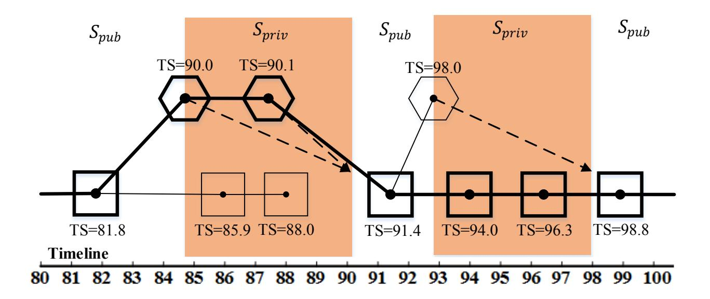
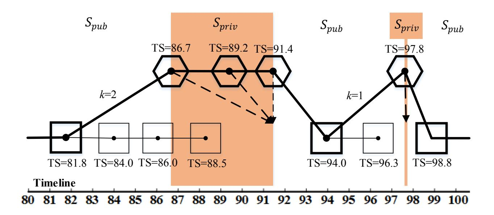
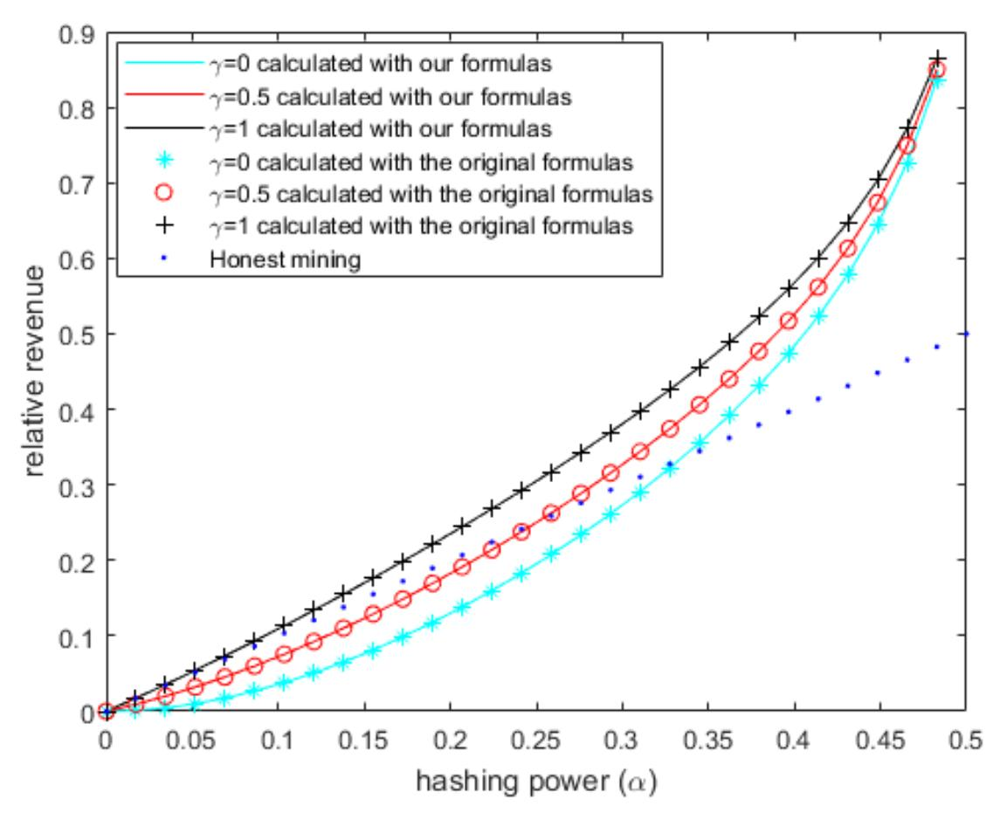
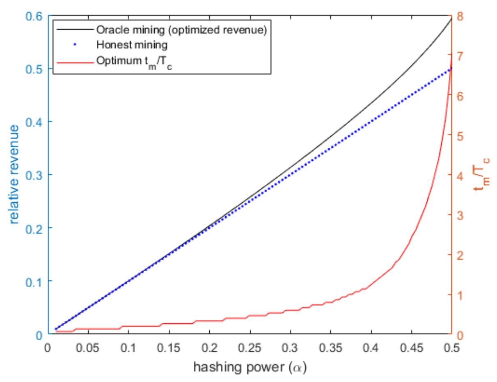
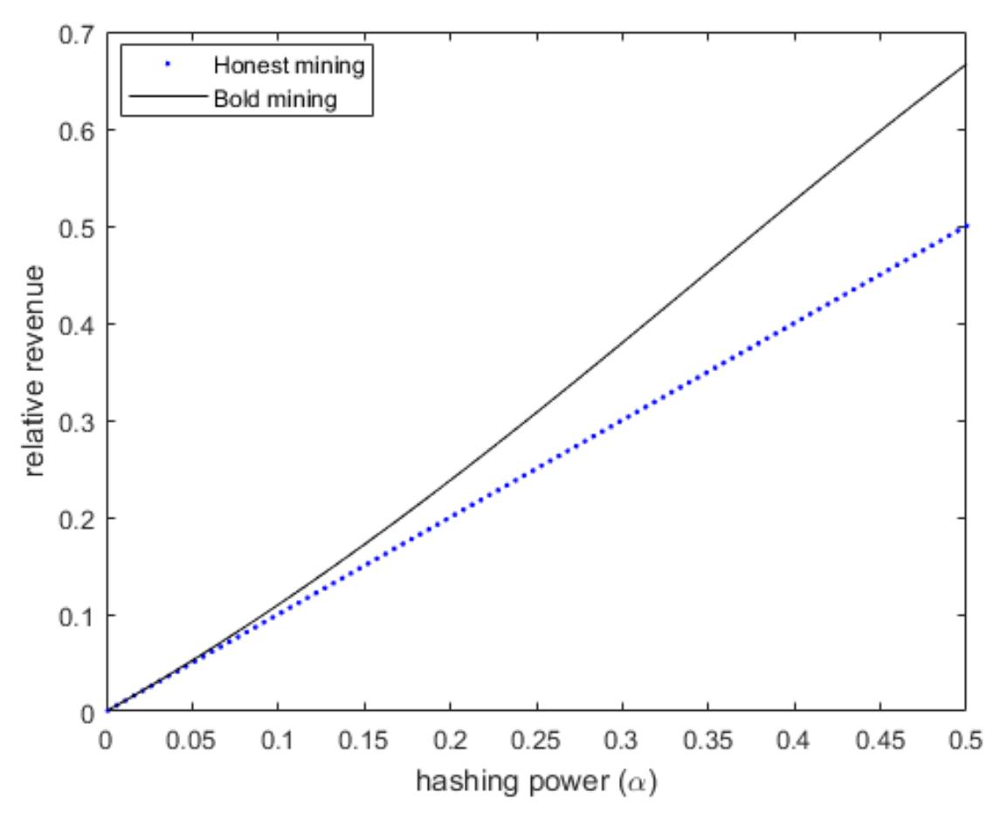
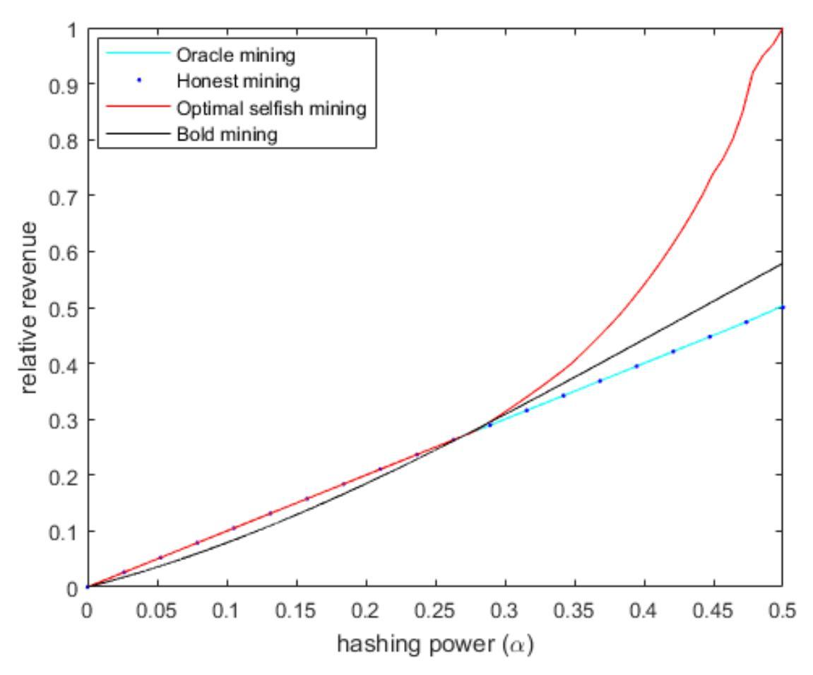
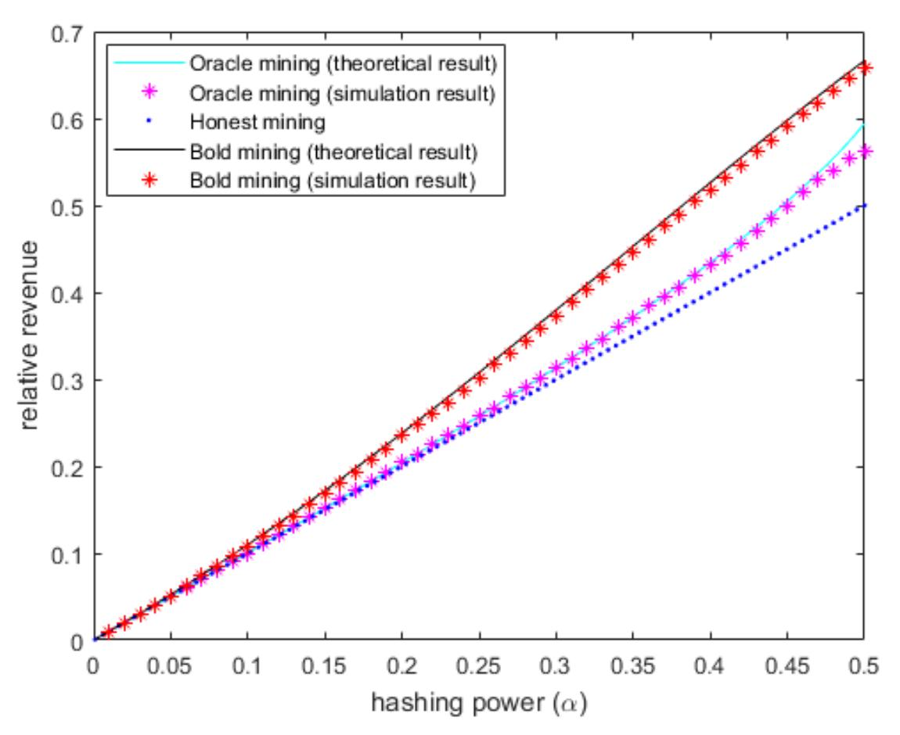
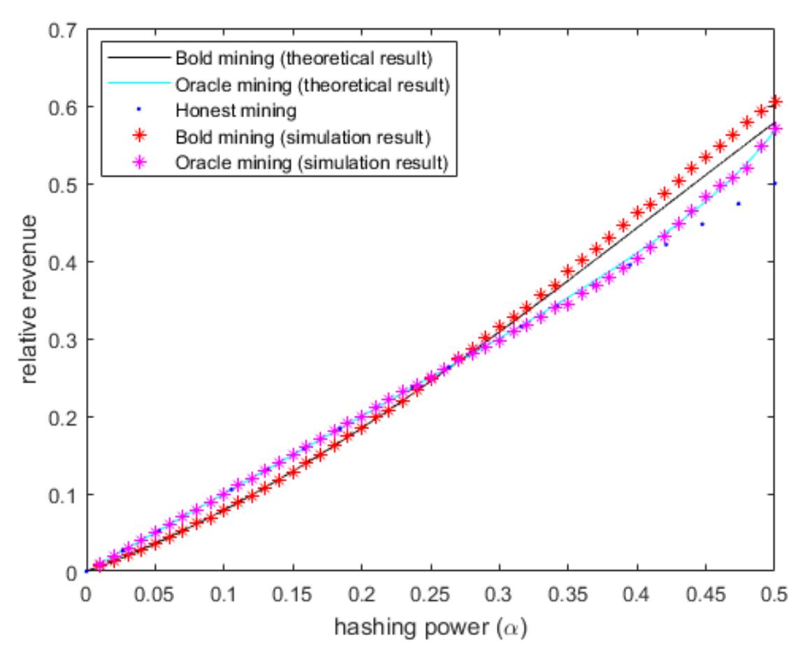

{0}------------------------------------------------

# FORTIS: Selfish Mining Mitigation by (FOR)geable (TI)me(S)tamps

Osman Bi¸cer Ko¸c University Alptekin K¨up¸c¨u Ko¸c University

October 12, 2021

#### Abstract

Selfish mining (SM) attack of Eyal and Sirer (2018) endangers permissionless Proof-of-Work blockchains by allowing a rational mining pool with a hash power (α) much less than 50% of the whole network to deviate from the honest mining algorithm and to steal from the fair shares of honest miners. Since then, the attack has been studied extensively in various settings, for understanding its interesting dynamics, optimizing it, and mitigating it. In this context, Heilman (14) "Freshness Preferred", we propose a timestamp based defence if timestamps are not generated by an authority. To use this proposal in a decentralized setting, we would like to remove the timestamp authority, but due to two natural and simple attacks this turns out to be a non-trivial task. These attacks are composed of Oracle mining by setting the timestamp to future and Bold mining by generating an alternative chain by starting from a previous block. Unfortunately, these attacks are hard to analyze and optimize, and the available tools, to our knowledge, fail to help us for this task. Thus, we propose generalized formulas for revenue and profitability of SM attacks to ease our job in analysis and optimization of these attacks. Our analyses show that although the use of timestamps would be promising for selfish mining mitigation, Freshness Preferred, in its current form, is quite vulnerable, as any rational miner with α > 0 can directly benefit from our attacks. To cope with this problem, we propose an SM mitigation algorithm Fortis with forgeable timestamps (without the need for a trusted authority), which protects the honest miners' shares against any attacker with α < 27.0% against all the known SM-type attacks.By building upon the blockchain simulator BlockSim by Alharby and Moorsel (2019), we simulate our Oracle and Bold mining attacks against the Freshness Preferred and our Fortis defenses. Similar to our theoretical results, the simulation results demonstrate the effectiveness of these attacks against the former and their ineffectiveness against the latter.

Keywords: selfish mining; cloud mining; bitcoin; proof-of-work; blockchain.

### 1 Introduction

First proposed by [1] for Bitcoin, proof-of-work (PoW) blockchain plays a crucial role as the underlying technology behind modern cryptocurrencies (e.g., Bitcoin, Ethereum, and Litecoin) and many distributed and cloud-based applications (e.g., certificate transparency as in [2], smart contracts as in [3], e-government as in [4], e-voting as in [5], online donations systems as in [6], smart appliances as in [7], and healthcare as in [8]). Blockchain technology is quite promising to cope with some prominent challenges that cloud computing is recently facing, e.g., data security, 

{1}------------------------------------------------

data management, compliance, reliability [9]. PoW blockchain depends on an incentive based mechanism called mining rather than a central authority for its proper operation. Mining is an unremitting competition for finding and propagating the hash value of the next block that gets appended to the blockchain. Miners are investors on computational resources that are specialized for mining procedures. The investment may be in the form of buying or hiring the resources, or the miners can outsource the mining work to cloud services, in which case the process is called cloud mining (e.g., via Genesis Mining<sup>1</sup> or NiceHash<sup>2</sup> ). When a miner mines a block, she receives a wealthy block reward, which builds up the incentive for her investment.

Selfish mining attack. Nakamoto claimed that as long as the majority (¿50%) of hashing power in the system belongs to the miners that follow the correct mining algorithm, the reward of each miner would be proportional to her expenditures, securing the proper operation of the blockchain. Yet, [10] proposed the selfish mining (SM) attack that yields a miner more than her fair share by deviating from honest mining (i.e., following the publicly accepted correct algorithm), even if the honest majority assumption holds. The main idea of the attack is keeping the mined blocks private for further extending them individually, and releasing them at a later time for elimination of others blocks from the main chain. The attack works because the honest miners always choose the chain with more blocks and the difficulty adjusts over time. In fact, none of these causes seem avoidable, as the former is a countermeasure against network partitions and propagation delays, and the latter is an initial design choice to ensure the expected inter-block time of the main chain would be constant. The selfish mining attack is extensively studied in the recent blockchain literature, including the research for optimizing it as in [11, 12, 13, 14], combining it with other attacks (e.g., with eclipse attack as in [13, 15] and block witholding attack as in [16]), and defending against it as in [10, 17, 18, 19]. Although so far no known selfish mining attack occurred on Bitcoin, its practice would be harmful not only by reducing the fair shares of miners, but also by resulting in inconsistent views of blockchain and allowing double-spend exploits, overall reducing trust of honest users on the system and negatively affecting its perception and wide-spread use. We highlight that selfish mining remains as a major focus in blockchain research [20].

Timestamp based SM defense. The initial defense mechanism proposed by [10] was that honest miners should choose one of the chains at random when there are multiple chains of the same length (i.e., the number of blocks), while in the deployed Bitcoin implementation of April 2021, miners choose the one that they received first. Regardless of the attacker's location or bandwidth, this defense prevented him from obtaining high rewards for computational powers below 25% hashing power of the whole system.

A later proposal by [17] utilizes timestamps issued by an authority to improve this resistance up to the computational power of 33.3%. Although by the state-of-the-art selfish mining attack by [11], its security lowers to 30.1%, the proposal of [17] still remains as the most resistant work against selfish mining. The defense idea is that honest miners would pick the chain with fresher timestamps in case of a tie in chain lengths. As this solution was contradicting to the decentralized philosophy of blockchain, Heilman also considered removal of the timestamp authority. However, we show that this solution without a timestamp authority (i.e., with forgeable timestamps) is susceptible to two attacks, one by setting the timestamp to the future and another by mining on the block previous to the last mined one <sup>3</sup> .

<sup>1</sup>https://www.genesis-mining.com

<sup>2</sup>https://www.nicehash.com

<sup>3</sup>Without a timestamp authority, [17] also considered a possible attack by setting the timestamp to the future,

{2}------------------------------------------------

Our approach. We would like to leverage the high security of [17] against the state-of-theart selfish mining attacks. However, requiring an authority for timestamps prevents this solution from a general use. Therefore, we would like to remove it, and let the miners put the current time into their mined blocks themselves. Yet, we detect two natural issues arising with this scheme, i.e., it becomes possible for a defective miner to set the timestamp of the block being mined to a future point (Oracle mining), and it gets easier to mine an alternate chain by starting from an old block (Bold mining). We show that if the attacker chooses the attack parameters fine-tuned, unfortunately, choosing the fresher chain works in favor of the defectively mined chain in both cases. Although these attacks are simple simple and natural, their analyses and optimization for the attacker required us to develop a new mathematical model, which can be standardized for using in selfish mining attack analyses beyond our work. To solve these issues, we then propose Fortis, a mining algorithm based on forgeable timestamps that is optimized to be not vulnerable to these attacks or the state-of-the-art optimal selfish mining attack [11] against a computational power ratio up to 27.0%. Thereby, we achieve the highest security against a single rational miner capable of performing all the selfish attacks known to date. More concretely, we list the contributions of this work as follows:

- 1. We define two natural mining attacks as mentioned above, namely Bold mining and Oracle mining, exploiting timestamp based solution of [17].
- 2. We propose generic formulas that can be utilized for revenue calculations in selfish mining type of attacks. Our formulas makes complicated analysis of attacks easier and more dependable by providing a systematical methodology. We use this to show that there exists optimized choices of parameters in both Bold and Oracle mining, that yield a miner more than his fair share, even if his resources are very low.
- 3. We propose our selfish mining mitigation algorithm Fortis that defends against previous selfish mining attacks and our proposed ones, as long as the attacker's computational power ratio is less than 27.0% of the whole system, providing the best-known solution to date. Our solution is decentralized and the only assumption that we make over Bitcoin is availability of a global synchronous clock (which is a common assumption in other blockchain proposals [21, 22]).
- 4. We provide the simulation results for Oracle and Bold mining attacks against the solution of [17] and against our Fortis algorithm. Our simulation is based on implementation of these attacks and defenses on top of the core blockchain simulation Blocksim by [23]. It confirms our theoretical results by showing that these attacks are indeed effective against the solution of [17] and ineffective against ours. We also simulate small (but realistic) clock drifts and show that the attacks and our defense are still viable.

### 2 Related Work

Blockchain. A blockchain is essentially an ever-growing chain of data blocks [1, 24]. Each block consists of a set of recent transactions, its index from the first block, the hash of the previous block (its parent), and a nonce. The hash of each block is required to be lower than a publicly determined value called difficulty. The blockchain miners keep competing to become

and named it as "slothful mining". However, this attack has neither been formally defined nor analyzed so far.

{3}------------------------------------------------

the first one to mine the next block.<sup>4</sup> Whenever a miner mines a new block, she publishes it to the network. If the block is included in the main chain, she receives some block reward. An honest miner always mines on the head (the last block) of the longest branch (i.e., the chain that has the most blocks that is privy to her). If there exists a tie among the longest branches, various tie-breaking mechanisms can be involved<sup>5</sup> . The blocks that do not end up in the main chain are not rewarded and are called as "orphan blocks". We highlight that each miner invests some computational and communication resources for mining coins. The aim for fairness in a PoW blockchain is that the revenue of each miner is proportional to her investment [25]. If this is achieved, miners are better off with honest mining strategy rather than harmful ones to the system and the proper operation of the blockchain is secured.

Selfish mining attacks. A major strike for blockchain security was the invention of selfish mining (SM) attack by [10]. Briefly, the attacker keeps his mined blocks as a private chain for further mining on them, and later releases his private chain, when the public chain approaches it in terms of length. This way, the attacker can eliminate the honest blocks from the main chain. The proposal shows that even if the honest majority assumption holds, a miner can obtain more revenue than honest mining via this mining strategy, since the difficulty adjusts automatically through time. Eventually what matters is the ratio of blocks being found by the attacker (the relative revenue) in the main chain, although block rewards and his resource investment remain the same.

We call any type of attack involving a miner that keeps his mined blocks private to obtain high relative revenue as an SM-type attack. Some recent studies including [11, 12, 13, 14] of selfish mining optimizes it further by allowing the attacker to mine on the private chain even when the public chain is longer. Other focuses of attention related to the SM attack are combining it with different attacks (e.g., with Eclipse attack by [15, 13] and block witholding attack by [26, 27, 16]), conducting the attack on different currencies (e.g., on Ethereum [28]), and exploring the game theoretical implications of the attack by [29, 30, 31, 32, 33]. We note that the state-of-the-art optimized selfish mining attack is "optimal selfish mining" (OSM) algorithm of [11]. We do not go over the details of the algorithm or its relative revenue calculations here, and refer the reader to the original paper.

Selfish mining is harmful to the blockchain system, not only since it is stealing from the fair shares of honest miners, but also since it results in inconsistent views of blockchain among the users. A recent study by [34] showed that other currencies than Bitcoin are far more susceptible to selfish mining, and to the best of our knowledge, differentiating this attack from a network partition is not fully possible yet. So far, selfish mining seems to be an unavoidable burden for the blockchain community for being robust against network partitions [18].

Existing selfish mining defenses. Here we briefly review the existing selfish mining defenses (honest mining algorithms) in the literature.

Uniform tie-breaking. The initial SM defense proposed by [10] was that an honest miner picks a branch uniformly at random among the longest chains in case of ties. We call this defense as Uniform Tie-breaking (UT). Against the SM attack, this defense achieves security up to hashing power 25.0%. However, the later optimized attack proposal of OSM of [11] reduced this to 23.2%.

<sup>4</sup>To mine a block means to find the nonce included in the block such that the hash of the block maps below the difficulty. The difficulty is frequently adjusted by the miners so that the expected inter-block time of the main chain would be constant.

<sup>5</sup> the Bitcoin application in April 2021 suggests that each miner mines on the chain that she received the first

{4}------------------------------------------------

Freshness preferred. Heilman proposes use of timestamps for tie-braking to reduce the relative revenue of a selfish miner [17]. In case of a tie, the miners choose the branch that is fresher (i.e., the branch whose timestamps (TS) are closer to the current time τ ), hence the scheme is called "Freshness Preferred" (FP). As the primary proposal, the author recommended support of a TS authority that generates unforgeable timestamps that will be embedded in the blocks to eliminate any forgery risks. If the timestamps are generated in an infinitesimal fashion, the scheme improve security against SM to the hashing power 33.3% and against OSM to the hashing power 30.1% (computed by using the implementation of [35]). However, this scheme suffers from centralization and as we show removing this authority turns out to be tricky.

Publish or Perish (PP) by [18]. provides incentive compatibility against OSM up to a hashing power 25.0%. As we do not utilize this algorithm and its related defense ideas in our work, we skip the protocol details and refer the reader to [18]. For comparison, Fortis provides security to all known attacks (including ones analyzed in this work) up to a hashing power 27.0%. Also, [18] defines a notion "fail-safe parameter" as the minimum length difference required for enforced adoption of the longest branch, and suggests 3 as the optimum fail-safe parameter for PP. The paper shows that in this case, there exists an attack that results in a expected 18.5 blocks to pass for a consensus in case of a tie. We stress that this attack is not possible in our case and even in case of a tie, the consensus among the honest miners occurs immediately. Although in a setting with complete absence of a global clock publish and perish remains as the most secure solution known to date, our experiments in Section 8 shows that even with a low synchrony Fortis defends against attackers with higher hashing powers than 25.0%.

To clarify the significance of our 2.0% improvement against PP, in Bitcoin, it corresponds to roughly 300 Million US Dollars additional investment in hardware for an attacker to benefit from the attack, as of October 2021.<sup>6</sup>

GHOST of [36], Bobtail of [19], and the other works [37, 38, 39], unfortunately, fail to satisfy backward incompatibility [18] (i.e., old blocks cannot be verified with them). Also, there exist some works including [40, 41] for detecting the behavior of the selfish miner and eliminate his blocks from the main chain. However, this detection has not been reliably achieved yet, as there seems to be no clear way for differentiating it from network partitioning.

### 3 Preliminaries

Notation for mining algorithms. In a miner's view, there exists two separate chains, the chain PubCh known by all miners and the chain MyCh chosen by the miner for mining on. PubCh gets updated automatically and might have forks of equal length, in which case a miner needs to choose which block to mine on.

- Append(Chain,b) denotes that "append the block b to the head of the Chain and other blocks between b and the head of the Chain".
- Publish(b) denotes that "publish the block b".
- Publish(MyCh,z/head) denotes that "publish all the blocks until and including either z-th block of MyCh indexed from start of the fork from PubCh (the first forked block is indexed as 1) or the head of PubCh".

<sup>6</sup>The cost is calculated from the fact that in October 2021, the total hash rate is 120 million tera hash per second (TH/s) and a mining hardware with 100 TH/s can be found for the price of 13,000 dollars.

{5}------------------------------------------------

Table (1) Table of frequent abbreviations and notations used throughout this paper.

| Abbreviation/Notation | Meaning                                                          |
|-----------------------|------------------------------------------------------------------|
| TS                    | Timestamp                                                        |
| UT                    | Uniform tie-braking                                              |
| FP                    | Freshness preferred                                              |
| Authority FP          | Freshness preferred scheme with unforgeable timestamps           |
| Decentralized FP      | Freshness preferred scheme with forgeable timestamps             |
| PP                    | Publish or perish scheme of [18]                                 |
| SM                    | Selfish mining attack [10]                                       |
| SM-type attacks       | Attacks to receive high revenue by private mining                |
| OSM                   | Optimized selfish mining attack [11]                             |
| OM                    | Oracle mining (our attack)                                       |
| BM                    | Bold mining (our attack)                                         |
| Fortis                | Our defense proposal                                             |
| α                     | Hashing power                                                    |
| γ                     | Network power                                                    |
| τ                     | The current timestamp                                            |
|                       | Increment of the timestamp                                       |
| tm                    | The optimal difference of the timestamp from current time        |
| tC                    | The expected time interval between block found by any miner      |
| Spub                  | The state of the SM-type attacker when mining on a public block  |
| Spriv                 | The state of the SM-type attacker when mining on a private block |
| R                     | Revenue of a miner                                               |

- Trun(Chain,z) returns the chain obtained by truncating Chain by z blocks backwards from the head. Last denotes the index of the last block found by the miner in PubCh backwards from the head.
- a ← b denotes that a is set as whatever b is at that moment.
- A b denotes that "A finds the next block b". A denotes "The attacker's pool" and O denotes "Any pool other than attacker's one".
- Mine(Chain,Fork,z,T S) denotes that "mine on starting from z-th block backward indexed from the head (the index of the head is 1) of the Fork of the Chain, and set the timestamp of the currently mined block as T S". We highlight that an attacker always mines on the fork that includes more blocks found by him, therefore we omit the Fork input in attack algorithms. Also, if the fork resolving policy does not depend on timestamps, the input T S can be omitted.

Table of abbreviations. We provide Table 1 for the frequently used abbreviations and notations throughout the paper.

Uniform tie-breaking algorithm. The honest miner's algorithm in uniform tie-breaking (UT) [10] is given in Algorithm 2.

Freshness preferred algorithm. The honest miner's algorithm of [17] is given in Algorithm 2. In case of a tie, the miners choose the branch that is fresher (i.e., the branch whose

{6}------------------------------------------------

### Algorithm 1 Uniform Tie-breaking Mining Algorithm of [10]

```
while true do
   if PubCh has 1 branch then
      Mine(PubCh,PubCh,1)
   else if PubCh has n branches then
      Mine(PubCh,i-th branch,1) with probability 1/n
   end if
   Propagate PubCh
end while
```

timestamps (TS) are closer to the current time τ ), hence the scheme is called "Freshness Preferred" (FP). As the primary proposal, the author recommended support of a TS authority that generates unforgeable timestamps that will be embedded in the blocks to eliminate any forgery risks. However, considering that this would be an obstacle for decentralization, the author also argued that the authority may not be necessary in the presence of a global synchronous clock, as the timestamps cannot be changed once the block is mined. In this case each miner can just embed the current time into the block being mined. We call the former and the latter schemes as Freshness Preferred with unforgeable timestamps (Authority FP) and Freshness Preferred with forgeable timestamps (Decentralized FP), respectively.

#### Algorithm 2 Freshness Preferred Mining Algorithm of [17]

```
while true do
   if PubCh has 1 branch then
      Mine(PubCh,PubCh,1,τ )
   else if PubCh has n branches then
      Mine(PubCh,freshest branch,1,τ )
   end if
   Propagate PubCh
end while
```

Standard model of revenue analysis.<sup>7</sup> The model that we utilize throughout the paper mainly includes two players, Adam (the attacker) and Helen (the collection of the rest of the miners, assumed to be honest). Adam has a relative hashing power α < 0.5 (i.e., the ratio of the number of hash operations by him over that all hash operations in a given time interval) and a relative network power γ (i.e., the expected ratio of the honest miners that will work on the selfish miner's chain in case of a tie). We note that in Bitcoin, γ depends on the bandwidth and location of the attacker's competitor blocks origin, as miners choose the branch that they receive first in case of a tie. We omit propagation delays and network partitions, therefore honest miners know whatever is public immediately. Honest miners may mine on different blocks due to forks. We assume a fully anonymized network, where detecting a malicious miner personally is impossible. We assume that computation times other than hashes and costs due to mining are 0. The finder of any block in the main chain is rewarded 1, unless it is stated otherwise. We

<sup>7</sup>This model is also the one provided by the original SM paper by [10]. Although analyses in different settings (e.g., without fixed block rewards [42, 43], in asynchronous setting as in [12, 44], in the presence of multiple attackers as in [30, 31, 32]) also exist, the previous attacks and defenses are mostly analyzed in this model.

{7}------------------------------------------------

omit the transaction fees from the reward for simplicity. Difficulty adjustment is quick enough that the revenue of attacker is equivalent to his relative revenue (i.e., the ratio of the blocks found by him over those found by all miners). We say that Adam benefits from an attack if his relative revenue from the attack is more than his benefit from honest mining. Otherwise, we say that he does not benefit from an attack.

It would be interesting to see the analyses of our attack and defense proposals in presence of multiple attackers. It has been shown that selfish miners perform better, when there are other selfish miners in the system [30, 31, 32]. Yet, these analyses become very complicated, even when there exist two attackers. Thus, in this work we limit ourselves to one attacker. Also, the analysis of our defence in more realistic setting "imperfect network" as in [45, 46] is left as an interesting future work. We note that other mentioned defenses (except for Uniform Tie-breaking) are analyzed only in presence of one attacker with to a large extent our mentioned assumptions as well. The only additional assumption that we make over these works is presence of a global clock, but later in Section 8, we provide simulation results to show that even with a low synchronicity we provide high security.

### 4 Oracle and Bold Mining Attacks

The attacks that we present here are simple and natural exploits of Decentralized FP, as this scheme enforce the honest miners pick the freshest "looking" chain in case of a tie. We note that the bold mining attack is applicable to even Authority FP, as here indeed the attacker mines a fresh alternative chain to the public one. Due to the reasons that will be clear in Section 5, we represent the Oracle and Bold Mining attack algorithms and the other SM-type attacks in the rest of the paper as two main different states of the attacker: one where he is mining on a block on the public chain (we call this Spub) and one where he is mining on his private chain (we call this Spriv). At a given time, the attacker will be at either Spub or Spriv state. This separation is sound based on the generic idea of selfish mining attack strategies that the attacker wants to eliminate some of the already-found blocks of the honest majority from the main chain. Often, the attacker continues with the honest mining in Spub, but sometimes when the attacking conditions occur, he deviates from the honest mining strategy in order to go to Spriv.

Oracle mining algorithm. We now describe a rational algorithm based on setting the timestamp of the currently mined block to the future. At Spub the attacker sets the timestamp T S = τ + t<sup>m</sup> of the block he is mining on, where τ is the current time (based on the global clock) and t<sup>m</sup> > 0. We will later show how to set t<sup>m</sup> for maximizing the revenue depending on α. If he succeeds, he will have a block that cannot be published immediately, but can be kept private for mining on until about the time τ + t<sup>m</sup> (i.e., by switching to Spriv). He will increment the timestamps of the next blocks he finds at Spriv with the unit increment . If the honest miners outperform him by mining two blocks more than him at Spriv, the attacker's found blocks will be lost. Otherwise, he will kick all the blocks of honest miners found within Spriv off the main chain. Algorithm 3 provides full description of the OM attack, where and t<sup>m</sup> denote the incremental unit of timestamps and the value t that maximizes the attacker's revenue, respectively. Also, an example flow of OM is shown in Figure 1, including example Spub and Spriv states.

Bold mining algorithm. The attacker's strategy is essentially to mine a sibling to the k-th past block from the current head at Spub (if he does not own any block between the current

{8}------------------------------------------------



Figure (1) An example flow of Oracle mining attack. The squares are honest miners' blocks, while the hexagons are those of the attacker. Straight lines shows parent-child relation between two blocks. The thick lined blocks are the ones that remains in the main chain and gets rewarded, while the thin lined ones are orphan blocks. The dashed arrows point to the time when the attacker publishes the block.  $S_{pub}$  and  $S_{priv}$  states are shown by the areas colored as white and coral, respectively.

head and the k-th past block, both inclusive), and then to keep it private (going to  $S_{priv}$ ), and next to try to catch up with honest miners by mining on his found block. If the honest chain surpasses his chain (with k+1 blocks), he accepts defeat and goes back to  $S_{pub}$ . If his chain succeeds by having an equal number of blocks to the public chain, he publishes his chain and goes back to  $S_{pub}$  as the winner. We especially require the honest chain to be k+1 blocks ahead for the attacker's failure, since if the honest chain is k blocks ahead, the attacker is better off by following his private chain, since his private chain has more blocks belonging to him than the other one. Upon going to  $S_{pub}$  with success, to be flexible with the number k, we allow the attacker to choose a value K, such that K is the trail bound of the honest miners' blocks for k. Algorithm 4 provides the Bold mining (BM) algorithm. Also, an example flow of the BM attack is shown in Figure 2, including example  $S_{pub}$  and  $S_{priv}$  states.

Setting the parameters. The values  $t_m$  and K in Oracle and Bold Mining are the parameters that the attacker should choose. As a rational miner, he would naturally be interested in setting them in a way that it would maximize his share in the system. However, this requires a complete analysis of both attacks' revenues. In particular, the analysis of oracle mining is difficult, and although the attack idea exists in a basic form in [17], it has never been analyzed ever since. Thus we will return setting the optimum of these parameters, after their analyses in Section 6.

### 5 Generic Formulas For SM Attacks

**The formulation.** We now derive a formulation that we will use for analyzing the attacks given in Section 4. The separation of the states  $S_{pub}$  and  $S_{priv}$  that we provided at the beginning of that section will help us with this aim. We start by the main formulas for the expected revenue

{9}------------------------------------------------

#### Algorithm 3 Oracle Mining Attack Algorithm

```
procedure Spub
   Set ∆ ← 0, flag ← 0
   while flag = 0 do
      Find tm for α
      MyCh ← PubCh, Mine(MyCh,τ + tm)
      if A  b then
         Append(MyCh,b)
         Set t ← τ + tm, ∆ ← 1, flag ← 1
      end if
   end while
   Go to procedure Spriv
end procedure
procedure Spriv
   while τ < t + (∆ − 1) ·  do
      Mine(MyCh,1,t + ∆ · )
      if A  b and ∆ > 0 then
         Append(MyCh,b), Set ∆ ← ∆ + 1
      end if
   end while
   Publish(MyCh,head), Go to procedure Spub
end procedure
```

of the attacker which can be calculated as:

$$R = \frac{\alpha - f \cdot \ell_A}{1 - f \cdot (\ell_A + \ell_H)} \tag{1}$$

where `A, `H, and f denote the expected block loss of the attacker in Spriv, the expected block loss of the honest parties in Spriv, and the expected frequency of returning to Spriv, respectively. Since being at states Spriv and Spub keep alternating, f can be calculated as

$$f = \frac{1}{ES_{priv} + ES_{pub}} \tag{2}$$

where ES<sup>x</sup> is the expected number of all blocks mined by both parties secretly or publicly while being at state Sx. The intuition for the equation is that if the attacker only executes honest mining all the time during an expected period ESpriv + ESpub, the expected number of blocks that he finds would be α(ESpriv + ESpub) (where α is the attacker's hashing power) and those that are found by all miners would be ESpriv + ESpub. We obtain Eq. 1 by subtracting the corresponding expected losses from both, then dividing them by the period, and then calculating the ratio of the former to the latter.

Whether the attacking strategy is expected to benefit the attacker depends on the ratio of `<sup>A</sup> `<sup>H</sup> . More concretely, iff the attacking strategy benefits the attacker, then we have

$$\frac{\ell_A}{\ell_A + \ell_H} < \alpha \quad \text{or equivalently} \quad \frac{\ell_A}{\ell_H} < \frac{\alpha}{1 - \alpha}$$
 (3)

{10}------------------------------------------------

#### Algorithm 4 Bold Mining Attack Algorithm

```
procedure S_{pub}
     Set flag \leftarrow 0
     while f laq = 0 do
         Set \Delta \leftarrow \min(\texttt{Last}, K) - 1
         \mathsf{MyCh} \leftarrow \mathsf{Trun}(\mathsf{PubCh}, \Delta), \, \mathsf{Mine}(\mathsf{MyCh}, 1, \tau)
         if A \rightarrow b and \Delta = 0 then
              Publish(MyCh,head)
         else if A \rightarrow b and \Delta > 0 then
              Append(MyCh,b)
              Set k \leftarrow \Delta, \Delta \leftarrow \Delta - 1, flag \leftarrow 1
         else if O \rightarrow b and \Delta < K then
              Set \Delta \leftarrow \Delta + 1
         end if
     end while
    Go to procedure S_{priv}
end procedure
procedure S_{priv}
    while 0 < \Delta < k + 1 do
         Mine(MyCh, 1, \tau)
         if A \rightarrow b and \Delta > 1 then
              Append(MyCh,b), Set \Delta \leftarrow \Delta - 1
         else if A \rightarrow b then
              Set \Delta \leftarrow \Delta + 1
         end if
    end while
    Publish(MyCh,head), Go to procedure S_{pub}
end procedure
```

We name the ratio  $\frac{\ell_A}{\ell_H}$  as profitability ratio B. We emphasize that sole knowledge of  $\ell_A$  and  $\ell_H$  is not enough to determine the attacker's revenue, but rather a tool for his decision-making in choosing between applying an SM-type mining strategy and honest mining. We note that setting  $R > \alpha$  in Eq. 1 leads to Eq. 3.

**Example application.** To show that our formulas indeed work, we apply them to the basic selfish mining algorithm of [10]. Algorithm 5 provides the same SM algorithm given by [10], but it shows  $S_{priv}$  and  $S_{pub}$  states as distinct procedures.

In  $S_{pub}$ , the adversary tries to mine a block. Whenever he mines it, instead of publishing, he keeps it secret and goes to  $S_{priv}$ . His block loss can only occur if an honest miner finds a block first in  $S_{priv}$ , and then  $\gamma(1-\alpha)$  fraction of honest miners that work on Helen's block finds the next block. In this case, Adam loses 1 block. As the probability that this case occurs is  $(1-\alpha)^2(1-\gamma)$ , we obtain

$$\ell_{A,SM} = (1 - \alpha)^2 (1 - \gamma)$$

Helen may lose blocks in  $S_{priv}$  mainly in two different ways: (1) Helen finds the first block, Adam publishes the head of his private chain, Adam's block wins the block race with probability

{11}------------------------------------------------

#### Algorithm 5 Selfish Mining Attack Algorithm of [10]

```
procedure Spub
   Set ∆ ← 0, flag ← 0
   while flag = 0 do
      if |MyCh| = |PubCh| and MyCh 6= PubCh then
         Mine(MyCh,1)
         if A  b then
            Append(MyCh,b), Publish(MyCh,head)
         end if
      else
         MyCh ← PubCh, Mine(MyCh,1)
         if A  b then
            Append(MyCh,b), Set ∆ ← 1, flag ← 1
         end if
      end if
   end while
   Go to procedure Spriv
end procedure
procedure Spriv
   Set flag ← 0
   while flag = 0 do
      Mine(MyCh,1)
      if A  b and ∆ > 0 then
         Append(MyCh,b), Set ∆ ← ∆ + 1
      else if O  b and ∆ ≤ 2 then
         Publish(MyCh,head), flag ← 1
      else if O  b and ∆ > 2 then
         Publish(MyCh,1), Set ∆ ← ∆ − 1
      end if
   end while
   Go to procedure Spub
end procedure
```

{12}------------------------------------------------



Figure (2) An example flow of Bold mining attack. The squares are honest miners' blocks, while the hexagons are those of the attacker. Straight lines shows parent-child relation between two blocks. The thick lined blocks are the ones that remains in the main chain and gets rewarded, while the thin lined ones are orphan blocks. The dashed arrows point to the time when the attacker publishes the block.  $S_{pub}$  and  $S_{priv}$  states are shown by the areas colored as white and coral, respectively. Note that in case k = 1, the attacker immediately releases the block in  $S_{priv}$ .

 $(1-\alpha)(\gamma(1-\alpha)+\alpha)$ , Helen loses 1 block. (2) Adam finds the first block with probability  $\alpha$ , eventually Helen catches up with Adam, Adam publishes his chain and Helen loses all the blocks she has found within  $S_{priv}$ . For the second outcome, we consider this as a "monkey at the cliff" problem [47], starting when Adam's chain is 2 blocks ahead of Helen's chain, going away from the cliff with probability  $\alpha$  and towards it with probability  $1-\alpha$ . Therefore, the expected number of steps for this walk to the end is  $\frac{1}{(1-\alpha)-\alpha} = \frac{1}{1-2\alpha}$  [47]. Since the expected steps towards the cliff should be 1 more than those away from it for the state to end, we calculate Helen's expected block loss in this case as  $\frac{1}{2}(\frac{1}{1-2\alpha}+1) = \frac{1-\alpha}{1-2\alpha}$ . At the end, we obtain

$$\ell_{H,SM} = (1 - \alpha) (\gamma (1 - \alpha) + \alpha) + \alpha \cdot \frac{1 - \alpha}{1 - 2\alpha}$$

Regarding  $f_{SM}$ , we need to obtain  $ES_{priv}$  and  $ES_{pub}$ . Upon going to state  $S_{priv}$ , the probability that Helen finds the next block is  $(1-\alpha)$ , ending the state with 1 block. Upon going to state  $S_{priv}$ , the probability that Adam finds the next block is  $\alpha$ , ending the state in expected  $1 + \frac{1}{1-2\alpha}$  steps. We calculate  $ES_{priv} = (1-\alpha) + \alpha(1+\frac{1}{1-2\alpha}) = 1+\frac{\alpha}{1-2\alpha}$ . At the beginning of  $S_{pub}$ , there may be a block race where either Adam's branch or Helen's one (the forks differ by only 1 block) will be the winner if Helen found the first block in the last  $S_{priv}$ . Thus, this case occurs with probability  $1-\alpha$ . After this,  $S_{pub}$  finishes when the attacker mines the next block requiring the expected number of  $\frac{1}{\alpha}$  blocks since it is a geometric random variable. Hence, we calculate  $ES_{pub} = 1 - \alpha + \frac{1}{\alpha}$ . From Eq. 2, we obtain that

$$f_{SM} = \frac{1}{2 + \frac{\alpha}{1 - 2\alpha} - \alpha + \frac{1}{\alpha}} = \frac{(1 - 2\alpha)(\alpha)}{1 - 4\alpha^2 + 2\alpha^3}$$

If we plug  $\ell_{A,SM}$ ,  $\ell_{H,SM}$ , and  $f_{SM}$  into Eq. 1, we obtain an equation equivalent to the

{13}------------------------------------------------



Figure (3) Revenue from selfish mining [10] with respect to hashing power  $\alpha$  for network powers  $\gamma = 0$ ,  $\gamma = 0.5$ , and  $\gamma = 1$  calculated using our Eq. 1 and the original equation of [10] given at Eq. 4.

revenue equation of [10] as

$$R_{SM} = \frac{\alpha (1 - \alpha)^2 (4\alpha + \gamma (1 - 2\alpha)) - \alpha^3}{1 - \alpha (1 + (2 - \alpha)\alpha)},$$
(4)

which is also deducible from Figure 3, that shows the revenues of the attacker with respect to his hashing power for network powers  $\gamma = 0$ ,  $\gamma = 0.5$ , and  $\gamma = 1$  for both equations.

# 6 Analyses of Oracle and Bold Mining

We now show that there exists parameters for  $t_m$  in Oracle Mining and K in Bold Mining, such that the attacker is better off compared to honest mining regardless of his hashing power. The simulation results in Section 8 confirms our results obtained here.

### 6.1 Oracle Mining Attack Optimization

Analysis. For simplicity we let  $\epsilon = 0$ . We model the mining in a given time range as a Poisson random variable as in [11]. The success probability is given as  $P[X = x] = \frac{e^{-\mu}\mu^x}{x!}$  where  $X = \{0, 1, 2, 3 ...\}$  is a set of possible number of successes, e is the Euler's number, and  $\mu$  is a success rate. Let  $T_c$  denote the current expected time interval between block found by any miner. This differs from the public expected inter-block time by including the blocks that do not end up in the main chain. The attacker can determine this value from his hashing power, or can estimate it from statistics as he knows his and honest miners' found blocks. We let  $\mu_A = \frac{\alpha t}{T_c}$  and  $\mu_H = \frac{(1-\alpha)t}{T_c}$  denote success rates of Adam and Helen, respectively.

{14}------------------------------------------------

We can state

$$\ell_{A,OM} = \sum_{h=2}^{\infty} \sum_{a=0}^{h-2} (P[A=a] \cdot P[H=h] \cdot (a+1))$$

$$\infty \ a+1$$

$$\ell_{H,OM} = \sum_{a=0}^{\infty} \sum_{h=1}^{a+1} (P[A=a] \cdot P[H=h] \cdot h)$$

Here P[A = a] and P[H = h] denote probabilities that Adam finds a blocks and Helen finds h blocks within <sup>S</sup>priv, respectively. Since these are Poisson random variables, <sup>P</sup>[<sup>A</sup> <sup>=</sup> <sup>a</sup>] = <sup>e</sup> <sup>−</sup>µA µ a A a! and P[H = h] = <sup>e</sup> <sup>−</sup>µH µ h H h! . As the time spent in Spriv is tm, we calculate ESpriv = tm Tc . Also, ESpub = 1 α , as Spub finishes when Adam finds a block. Hence, from Eq. 2, we obtain

$$f_{OM} = \frac{1}{\frac{t_m}{T_c} + \frac{1}{\alpha}} = \frac{\alpha T_c}{\alpha t_m + T_c}$$

Plugging `A,OM , `H,OM , and fOM into Eq. 1, it is straightforward to obtain Adam's revenue. By setting t<sup>m</sup> properly, the attacker can maximize his revenue from this attack and thus beat the honest mining strategy for any α

How to set the optimum tm. Intuitively, setting t as a large value does not make much sense for an attacker with α < 0.5, since it gives the honest majority a larger time interval (and hence a higher chance) to beat him. From the analysis, we deduce that increasing the value of t increases both `A,OM and `H,OM , and decreases fOM . Figure 4 shows the revenue of the attacker with respect to α for optimum tm/Tc. The attacker can keep setting the t<sup>m</sup> by preparing a look up table for tm/T<sup>c</sup> and α from this figure or computing them by himself. We note that both α and T<sup>c</sup> may vary over time, but the attacker can estimate them from the difficulty and the statistics of the publicly and privately mined blocks.

Impact of the attack. The most important implication of this attack is that for any α value, there exists a value t<sup>m</sup> > 0 that provides more revenue than honest mining does. Even if the direct revenue gain from this attack does not seem as great as the previously known SM-type attacks, it is more likely to occur in practice in an Decentralized FP application, since it may be attractive for any rational miner, while the latter usually requires large α or γ values. Its effects are similar to selfish mining: It exhausts honest miners, which can reduce their numbers, leading to a more vulnerable blockchain system to other SM-type attacks. It also results in inconsistency as a ledger of transactions.

### 6.2 Bold Mining Attack Optimization

Analysis of profitability Ratio for all bounds K. We know from the previous analyses (including the one by Nakamoto [1]) of PoW mining that it is not a good idea to mine on from long past blocks; therefore, there must be a good bound K for the plausible values of k. In what follows, we show that for α < 0.432 the only plausible value is K = 1 (and in the range α ∈ (0.432, 0.5), the only other plausible bound is K = 2), then calculate the revenue equation based on this choice.

For simplicity, we define `A,BM,k and `H,BM,k as expected losses of Adam and Helen, respectively, in case Adam goes to Spriv with k. The corresponding profitability ratio BBM,k = `A,k `H,k

{15}------------------------------------------------



Figure (4) Revenue from Oracle mining on Decentralized FP w.r.t. the hashing power α when the timestamps set optimally. Also the optimum tm/T<sup>c</sup> values for all α of interest are provided.

still needs to be less than <sup>α</sup> 1−α . We state that

$$\ell_{A,BM,k} = P[\text{Helen surpasses } k+1 \text{ blocks}](1+E_{HA})$$

$$\ell_{H,BM,k} = P[\text{Adam catches up}](1 + E_{AH})$$

where E<sup>H</sup> wins,A and E<sup>A</sup> wins,H denote the expected number of blocks found by Adam in Spriv given that Helen wins, and those by Helen given that Adam wins, respectively. The flow of Spriv can be modeled as the "Gambler's ruin" problem [47].Let E<sup>H</sup> and E<sup>A</sup> denote the expected number of blocks found by all parties in Spriv given that Helen wins (Adam loses) and those given that Adam wins, respectively. E<sup>A</sup> wins,H = EA−(k−1) 2 and E<sup>H</sup> wins,A = EH−2 2 . We utilize Corollary 2.12 of [48], and deduce that

$$E_A = \frac{r+1}{r-1} \cdot \left( N \cdot \frac{r^N + 1}{r^N - 1} - i \cdot \frac{r^i + 1}{r^i - 1} \right) \text{ if } k > 1, \ 0 \text{ for } k > 1$$

$$E_H = \frac{r+1}{r-1} \cdot \left( N \cdot \frac{r^N + 1}{r^N - 1} - (N-i) \cdot \frac{r^{N-i} + 1}{r^{N-i} - 1} \right) \text{ for } k > 1$$

where r = α 1−α is the ratio of Adam's and Helen's probabilities of finding the next block, i = 2 is the starting point of the gambler's ruin, and N = k + 1 is its ending point. From [47], we also deduce that

$$P[\text{Adam catches up}] = \frac{\left(\frac{1-\alpha}{\alpha}\right)^2 - 1}{\left(\frac{1-\alpha}{\alpha}\right)^{k+1} - 1} \text{ for } k > 1$$

$$P[\text{Helen surpasses } k+1 \text{ blocks}] = 1 - \frac{\left(\frac{1-\alpha}{\alpha}\right)^2 - 1}{\left(\frac{1-\alpha}{\alpha}\right)^{k+1} - 1} \text{ for } k > 1$$

{16}------------------------------------------------

By plugging the above formula, it is straightforward to calculate the profitability ratio  $B_{BM,k} = \frac{\ell_{A,BM,k}}{\ell_{H,BM,k}}$ . Using Eq. 3 we calculate both  $\forall \alpha \in (0,0.432) \ \forall k > 1 \ B_k \geq \frac{\alpha}{1-\alpha}$  and  $\forall \alpha \in (0,0.432) \ B_1 < \frac{\alpha}{1-\alpha}$ . Therefore, by setting K=1, and the attack in Algorithm 4 simplifies to the attack in Algorithm 6 as at  $S_{priv}$ ,  $\Delta=0$ .

#### **Algorithm 6** Bold Mining Attack Algorithm as K = 1

```
procedure S_{pub}
     flag \leftarrow 0
    while flag = 0 do
         Set \Delta \leftarrow \min(\texttt{Last}, 1) - 1
         \mathsf{MyCh} \leftarrow \mathsf{Trun}(\mathsf{PubCh}, \Delta), \, \mathsf{Mine}(\mathsf{MyCh}, 1, \tau)
         if A \rightarrow b and \Delta = 0 then
              Publish(MyCh,head)
         else if A \rightarrow b and \Delta = 1 then
              Append(MyCh,b)
              Set \Delta \leftarrow \Delta - 1, flag \leftarrow 1
         else if O \rightarrow b and \Delta = 0 then
              Set \Delta \leftarrow \Delta + 1
         end if
     end while
    Go to procedure S_{priv}
end procedure
procedure S_{priv}
    Publish(MyCh,head), Go to procedure S_{pub}
end procedure
```

Revenue analysis for optimized bound K=1. Clearly  $\ell_{A,BM}=0$ , as there are no blocks lost by Adam. Similarly,  $\ell_{H,BM}=1$ , since Helen will lose 1 block whenever attack condition occurs. Also  $ES_{priv}=0$ , as Adam immediately releases his found block. To calculate  $ES_{pub}$ , upon going out of  $S_{priv}$ , first, Helen needs to find a block, whose average length is  $\frac{1}{1-\alpha}$ . Then, Adam needs to find a block, whose average length is  $\frac{1}{\alpha}$ . From Eq. 2, we obtain  $f_{BM}=\frac{1}{\frac{1}{1-\alpha}+\frac{1}{1}}=\alpha(1-\alpha)$ . Applying Eq. 1, we deduce

$$R_{BM} = \frac{\alpha - \alpha(1 - \alpha).0}{1 - \alpha(1 - \alpha)(0 + 1)} = \frac{\alpha}{1 - \alpha(1 - \alpha)}$$

Figure 5 shows the expected revenue outcome of this attack for various  $\alpha$  values, clearly demonstrating that it outperforms the honest mining strategy for any  $\alpha < 0.5$ .

We note that [11] has previously stated that if freshness preferred is applied, mining on one block behind the head is profitable for any attacker. However, this deduction seems merely intuitive, as they do not provide any analysis of the attack. Here, our analysis will help us in our defense proposal.

Impacts of the attack. The impact of this attack is similar to that of Oracle mining, but with increased severity. For any  $\alpha$  value, the attacker's revenue surpass the one receivable from honest mining, therefore it is more likely to occur in practice in an FP application than

{17}------------------------------------------------



Figure (5) Revenue from Bold mining on Decentralized (or even Authority) FP vs. revenue from honest mining with respect to α.

previously known SM-type attacks. It exhausts honest miners, which can reduce their numbers, leading to a more vulnerable blockchain system to other SM-type attacks. It also results in inconsistency as a ledger of transactions.

# 7 Our SM Mitigation Algorithm

In the light of the analyses in Section 6, we now propose an algorithm Fortis with a tie-breaking strategy such that if applied, an attacker with α < 27.0% can benefit from none of the SM-type attacks to known date including Oracle mining (OM), Bold mining (BM), and optimal selfish mining (OSM) [11]. This proposal is a relaxation of Decentralized FP, biasing some forks with respect to timestamps unlike Uniform Tie-breaking [10]. For the sake of proper operation of Fortis, we assume that a global synchronous clock functionality is available to every party. Yet, in Section 8, we also provide results that show even without high synchrony our proposal enjoys the highest security. Also, we stress that global clocks have already been used in proof-of-stake based consensus algorithms [21, 22].

Intuition. Observe that both OM and BM are applicable to FP, since in case of ties the freshest block is the one that always wins. However, neither of them is possible against uniform tie-breaking (UT) where γ = 0.5 (yet it prevents OSM only for adversaries with hashing power less than 0.232): Regarding OM, the most likely outcome of Spriv is that only Helen would find one block within the time t. Thus, if γ = 0.5, Adam will risk his first found block in cases Helen also finds a block. Regarding BM, clearly, Adam is better off with honest mining, since the blocks he finds in BM will be counted only roughly half of the time, whereas Helen's block loss will be less in terms of ratio.

Let ψ denote the bias for the probability that an honest miner chooses the fresher chain in

{18}------------------------------------------------

case of a tie. FP sets  $\psi=1$  for defending against SM. We can set this number to any value  $0.5 \leq \psi < 1$ , and still be better against OSM than UT that set it to  $\psi=0.5$ . Decreasing  $\psi$  gives more chance to the blocks with lower timestamp, and we start to be susceptible to BM and OM. Therefore, we need an optimized value of  $\psi$  for a certain lowest bound of  $\alpha$  that an attacker would benefit from any of OM, BM, and OSM. Let us reconsider the OM attack with the introduction of  $\psi < 1$ . Also, we need to consider that now the honest miners will be divided upon going back to  $S_{pub}$  with a tie. In this case the following occurs: Adam releases his blocks, and a block race takes place for the next block (Adam sets the timestamp of the block he is mining on as the current time). Then, the probabilities that Adam and Helen lose the mined blocks are  $(1-\psi)(1-\alpha)$  and  $\alpha+\psi(1-\alpha)$ , respectively. Whoever finds the next block, Adam switches back to the honest chain, and continues with the attack algorithm the same way as in standard OM on FP. We state the expected block loss  $\ell_{A,OM}^{\psi}$  of the attacker in  $S_{priv}$ , the expected block loss  $\ell_{H,OM}^{\psi}$  of the honest parties in  $S_{priv}$ , and the expected frequency  $f_{OM}^{\psi}$  of returning  $S_{priv}$  in this attack are as follows:

$$\ell_{A,OM}^{\psi} = \sum_{h=2}^{\infty} \sum_{a=0}^{h-2} (P[A=a] \cdot P[H=h] \cdot (a+1)) +$$

$$(1 - \psi)(1 - \alpha) \sum_{h=1}^{\infty} (P[A = h - 1] \cdot P[H = h] \cdot h)$$

$$\ell_{H,OM}^{\psi} = \sum_{a=0}^{\infty} \sum_{b=1}^{a} (P[A=a] \cdot P[H=h] \cdot h) +$$

$$\left(\alpha + \psi(1 - \alpha)\right) \sum_{h=1}^{\infty} \left(P[A = h - 1] \cdot P[H = h] \cdot h\right)$$

Moreover, as  $ES_{pub}$  of OM is elongated with 1 block due to the above-mentioned procedural change we obtain from Eq. 2:

$$f_{OM}^{\psi} = \frac{1}{\frac{t_m}{T_c} + 1 + \frac{1}{\alpha}} = \frac{\alpha T_c}{\alpha t_m + T_c + \alpha T_c}$$

Also, when BM is applied on Fortis and a tie occurs upon going back to  $S_{pub}$ , the above-mentioned block race and additional procedure takes place. We calculate the expected block loss  $\ell_{A,BM}^{\psi}$  of the attacker in  $S_{priv}$ , the expected block loss  $\ell_{H,BM}^{\psi}$  of the honest parties in  $S_{priv}$ , and the expected frequency  $f_{BM}^{\psi}$  of returning  $S_{priv}$  in this attack as follows:

$$\ell_{A,BM}^{\psi} = (1 - \psi)(1 - \alpha), \quad \ell_{H,BM}^{\psi} = \alpha + \psi(1 - \alpha),$$
$$f_{BM}^{\psi} = \frac{\alpha(1 - \alpha)}{1 + \alpha(1 - \alpha)}$$

We end up with an optimization problem regarding the revenues from the attacks OM, BM, and OSM, which can be stated as follows:

Maximize 
$$\alpha$$
 subject to:  $R_{OM}^{\psi}, R_{BM}^{\psi}, R_{OSM}^{\psi} < \alpha,$   $\alpha \in (0, 0.5), \ \psi \in (0.5, 1)$ 

{19}------------------------------------------------

#### Algorithm 7 Our Fortis Honest Mining Algorithm

```
while true do
    if PubCh has 1 branch then
        Mine(PubCh,1,\tau)
    else if PubCh has 2 branches then
        Mine(PubCh,fresher branch,1,\tau) with probability \Upsilon
    else if PubCh has n branches s.t. n>2 then
        Mine(PubCh,i-th branch,1,\tau) with probability 1/n
    end if
    Propagate PubCh\nend while
```

For  $R_{OM}^{\psi}$  and  $R_{BM}^{\psi}$  we apply Eq. 1 with the above values, and for  $R_{OSM}^{\psi}$  we utilize the implementation given in [35]. We obtain the solution for this problem is  $\alpha \approx 0.270$  and occurs at  $\psi \approx 0.630$ . We denote the number 0.630 as  $\Upsilon$ . We provide our Fortis algorithm in Algorithm 7. We highlight that in case more than 2 longest branches exist, the honest miners pick the branch uniformly at random to mine on. Note that generating more than one longest branch is less beneficial for an attacker than extending only one chain; therefore, one of the longest branches can belong to the attacker<sup>8</sup>. Therefore, uniform picking results in less than  $1-\Upsilon$  or  $\Upsilon$  chance for the attacker's chain, i.e., for all n we have  $1/n < 1-\Upsilon$  and  $1/n < \Upsilon$ , if he applies OSM or BM (OM), respectively. This is good enough to ensure the incentive compatibility bounds that our scheme provides. We also note that the index of the siblings for determining the fresher chain does not make any difference against the known attacks, but for completeness it is decided based on the timestamps of the oldest forked siblings.

Figure 6 shows the revenues of an attacker from OM, BM, and OSM attacks applied on a PoW blockchain where honest miners practice our Fortis algorithm. We note that the simulation results in Section 8 confirms our results here.

### 8 Simulation

We simulate our timestamp-based Oracle and Bold mining attacks on Freshness Preferred [17] and Fortis by implementing these algorithms on top of the blockchain simulator BlockSim [23, 49]. The Python code for our simulation can be found in the repository<sup>9</sup>. We note that the simulation results given in this section are probabilistic and independent of the hardware platform on which the simulation runs. Also, we highlight that we have already simulated Fortis with optimal OSM algorithm [11] while picking the optimum value for  $\Upsilon$ .

Generic setup. The setup of the simulation mimics the Bitcoin protocol parameters of April 2021. Inter-block time and block size limit are set as 600 seconds and 2 MB, respectively. Regarding the block rewards, we assume a fixed block reward regime, since it is well-known that selfish mining attacks become much more minacious in the presence of transaction fees as proposed by [42]. We leave the study of our attacks and defenses in this setting as a future work. We enabled a single common clock for the miners, as our protocol assumes a global synchronous

<sup>&</sup>lt;sup>8</sup>In case of multiple attackers, there may be multiple longest branches belonging to attackers. Yet, this has been shown as less beneficial than collusion [30, 31, 32]

<sup>&</sup>lt;sup>9</sup>https://anonymous.4open.science/r/FortisSim-C2F3/

{20}------------------------------------------------



Figure (6) The relative revenues of the optimal selfish mining of [11], our Bold mining, and our Oracle mining on our Fortis algorithm. The attacker cannot benefit from these attacks, if his hashing power α < 27.0%. We note that for α < 27.0%, optimal selfish mining and Oracle mining generate the honest mining algorithm as the optimum strategy.

clock.

Propagation delay. Regarding block propagation delay, it has been considered to generally affect the outcome of selfish mining [10] due to the fact that it is closely related to the network power γ of the attacker [50]. The attacker would like to keep the delay low between him and an honest miner, but high between two honest miners. Considering the Bitcoin tie-breaking mechanism in April 2021 (i.e., a miner follows the first block received), the attacker's aim is to be the first to convey his block. If he achieves this, the effect is obviously devastating, as it is effectively setting γ = 1. Somewhat counter-intiutive for a timestamp based scheme, block propagation delays do not have much effect in our attacks and defense. This is because both our defense mechanism Fortis and Freshness Preferred of [17] renders the network power of the attacker less useful (i.e., γ does not directly affect his revenue). Also, those delays are observed in relatively low duration with respect to the inter-block time for an attacker to obtain a high gain from.

To demonstrate the impact of propagation delay in our simulations, we model it as an exponential random variable (in accordance with the findings of [51]) with a varying average computed as follows. [52] has found that a 1 MB block is received on average in 15.7 seconds. We adjust this for each block as this average time varies linearly with the block size [12]. For simplicity, a constant 3.4 transactions per second are generated and each transaction has a size of 615 bytes. We note that these values are derived from the statistics available on the websites<sup>10</sup> per April 2021. We assume that an attacker (Oracle or Bold miner) and seven honest nodes exist in the system to approximate the big mining pools in the real world cryptocurrencies.

<sup>10</sup>https://bitinfocharts.com/bitcoin/ and https://bitcoinvisuals.com/chain-tx-size

{21}------------------------------------------------



Figure (7) Simulation results of relative revenues of the Oracle and Bold miners when the honest mining algorithm is Freshness Preferred. Note that the theoretical revenue calculations from the previous chapters are also provided for reference.d

Clock asynchronicity. The clock asynchronicity is a well-known problem in distributed systems and inherently in blockchains. There exist centralized (e.g., Network Time Protocol) and decentralized solutions [53, 54]. The centralized ones give more efficient results but their security depends on authorities. To show the effect clock asynchronicity in our simulation, we assume the decentralized protocol of [54] is executed among neighbouring nodes frequently. According to this work, the expected clock difference between two neighbouring nodes is calculated as roughly 0.75 seconds in 12 hours. Modelling Bitcoin, we assume all nodes are not neighbouring. Although we do not have any exact knowledge of the distance between Bitcoin nodes, we estimate it as follows. As of January 2021, there exist about 83,000 full nodes in Bitcoin [55]. Since each full node, by default, connects to 8 separate full nodes [56]; without any overlaps, the distance between two nodes would be log<sup>8</sup> 83, 000 = 5.45. This would mean a maximum of 0.75 × 5.45 = 4.09 seconds clock skew. However, as there would be inevitably overlaps, we assign random clock differences between each node up to 5 seconds.<sup>11</sup>

Connectivity. In the ones with Freshness Preferred, the attacker's network connectivity is set to the same as the other nodes, since here we aim to show the strength of our attacks. This is contrasted to those with Fortis, where we aim to show the strength of our defense and let the attacker's connectivity be perfect. That is, the attacker receives a block as soon as it is found and the others receive each block mined by the attacker immediately.

Results. In our simulations, we conduct the Oracle and Bold mining attacks with hashing powers between and including 1% and 50% with 1% increments against Freshness Preferred and Fortis algorithms. Each simulation is repeated 5,000 times. Figures 7 and 8 provide attacker's

<sup>11</sup>We highlight that deliberately deviating from network clock, as in Oracle mining, has already been disincentivized for the attacker. Further, the effects of deliberate block delaying is covered in Spriv state of the attacks.

{22}------------------------------------------------



Figure (8) Simulation results of relative revenues of the Oracle and Bold miners when the honest mining algorithm is our Fortis algorithm. Note that the theoretical revenue calculations from the previous chapters are also provided for reference.

expected relative revenues from each attack. We attribute the small deviations of the simulation results from theory to propagation delay, connectivity, and clock skew. Still, they are close, which shows that our attacks are effective on Freshness Preferred, and that our Fortis provides security up to attacker's hashing power being 27% of the whole system in realistic scenarios.

# 9 Conclusion and Future Work

Selfish mining attacks still continue to be a significant threat against the security and reliability of PoW blockchains. There is an ongoing research on both for improving the attack effectiveness and for defending against them. In this paper, we have shown the weakness of the previous timestamp based defense [17] by providing attacks even with a low hashing power. Then, we provide a backward compatible defense algorithm Fortis, which is fast to achieve consensus in recovery from network partitions and 2.0% more incentive compatible compared to the other known defense [18]. The importance of 2.0% improvement in Bitcoin, as of April 2021, can force a selfish miner to invest an additional 200 million dollars in hardware for receiving any unfair benefit. Although we are still far from the Nakamato's security goal of honest majority, we consider this as a step towards it. Our solution uses global synchronous clocks (with skew) as in [21, 22].

We also provided generic formulas in Section 5 that can be used in the analysis of similar attacks and defenses. We stress that without these formulas, it would be quite challenging to analyze our attacks, let alone optimizing them and proposing a defense against them. The application of our formulas for more complicated attacks, e.g., combination of Eclipse attacks with selfish mining, remains as future work. Moreover, generating a single optimized attack that 

{23}------------------------------------------------

combines our timestamp based attacks and the OSM strategy of [11] is a non-trivial task, and is left as future work.

Depending on the setting, one may need to see more evidence for reliability of Fortis deployment. Simulations and analyses regarding different cases, including reward regimes with transaction fees and multiple attackers, are interesting open problems. We highlight that the development of a complete framework for provable security in blockchains would eliminate taking into account each type of attacks. Nevertheless, currently it is a non-trivial task, as even modelling the basic features of blockchains are challenging [25, 57], and new attacks keep being discovered at a fast pace. We leave the analysis of our attacks and defence with rational protocol design as future work [58, 59, 60]. We also leave its analysis with the cooperative game theoretic framework given in [61].

We simulated our attacks and optimal selfish mining attack of [11] on the previous timestamp based scheme of [17] and our defense algorithm Fortis. The simulation output shows that even with propagation delay and clock asynchronicity, the results closely follow theory.

# References

- [1] S. Nakamoto, "Bitcoin: A peer-to-peer electronic cash system," 2008.
- [2] Google, "Certificate transperancy project," 2021. (accessed: 21.03.2021).
- [3] Chainlink, "Chainlink's smart contract research," 2021. (accessed: 01.06.2021).
- [4] A. David, S. Maciej, V. Lorenzino, and P. Francesco, "Blockchain for digital government," tech. rep., Publications Office of the European Union, 2019.
- [5] K. M. Khan, J. Arshad, and M. M. Khan, "Empirical analysis of transaction malleability within blockchain-based e-voting," Elsevier Computers & Security, vol. 100, 2021.
- [6] O. Bi¸cer and A. K¨up¸c¨u, "Anonymous, attribute based, decentralized, secure, and fair edonation," PETS/PoPETS, no. 4, 2020.
- [7] P. K. Singh, R. Singh, S. K. Nandi, and S. Nandi, "Managing smart home appliances with proof of authority and blockchain," in I4CS '19, 2019.
- [8] S. Shi, D. He, L. Li, N. Kumar, M. K. Khan, and K.-K. R. Choo, "Applications of blockchain in ensuring the security and privacy of electronic health record systems: A survey," Elsevier Computers & Security, vol. 97, 2020.
- [9] C. Murthy, M. L. Shri, S. Kadry, and S. Lim, "Blockchain based cloud computing: Architecture and research challenges," IEEE Access, vol. 8, 2020.
- [10] I. Eyal and E. G. Sirer, "Majority is not enough: Bitcoin mining is vulnerable," Commun. ACM, 2013.
- [11] A. Sapirshtein, Y. Sompolinsky, and A. Zohar, "Optimal selfish mining strategies in bitcoin," in FC '16, 2016.
- [12] A. Gervais, G. O. Karame, K. W¨ust, V. Glykantzis, H. Ritzdorf, and S. Capkun, "On the security and performance of proof of work blockchains," ACM CCS, 2016.

{24}------------------------------------------------

- [13] K. Nayak, S. Kumar, A. Miller, and E. Shi, "Stubborn mining: Generalizing selfish mining and combining with an eclipse attack," in IEEE EuroS&P '16, 2016.
- [14] T. Wang, S. C. Liew, and S. Zhang, "When blockchain meets ai: Optimal mining strategy achieved by machine learning," arXiv preprint arXiv:1911.12942, 2019.
- [15] E. Heilman, A. Kendler, A. Zohar, and S. Goldberg, "Eclipse attacks on bitcoin's peer-topeer network," in USENIX SEC '15, 2015.
- [16] X. Dong, F. Wu, A. Faree, D. Guo, Y. Shen, and J. Ma, "Selfholding: A combined attack model using selfish mining with block withholding attack," Elsevier Computers & Security, vol. 87, 2019.
- [17] E. Heilman, "One weird trick to stop selfish miners: Fresh bitcoins, a solution for the honest miner (poster abstract)," in FC '14, 2014.
- [18] R. Zhang and B. Preneel, "Publish or perish: A backward-compatible defense against selfish mining in bitcoin," in CT-RSA '17, 2017.
- [19] G. Bissias and B. Levine, "Bobtail: Improved blockchain security with low-variance mining," in NDSS, 2020.
- [20] C. Hou, M. Zhou, Y. Ji, P. Daia, F. Tram`er, G. Fanti, and A. Juels, "Squirrl: Automating attack analysis on blockchain incentive mechanisms with deep reinforcement learning," in NDSS '21, 2021.
- [21] A. Kiayias, A. Russell, B. David, and R. Oliynykov, "Ouroboros: A provably secure proofof-stake blockchain protocol," in CRYPTO, 2017.
- [22] C. Badertscher, P. Gazi, A. Kiayias, A. Russell, and V. Zikas, "Ouroboros genesis: Composable proof-of-stake blockchains with dynamic availability," in ACM CCS, 2018.
- [23] M. Alharby and A. van Moorsel, "Blocksim: An extensible simulation tool for blockchain systems," Frontiers in Blockchain, vol. 3, Jun 2020.
- [24] A. Narayanan, J. Bonneau, E. Felten, A. Miller, and S. Goldfeder, Bitcoin and cryptocurrency technologies, vol. 1 of Fundamental Algorithms. Princeton University Press, 3rd ed., 2016. (book).
- [25] J. A. Garay, A. Kiayias, and N. Leonardos, "The bitcoin backbone protocol: Analysis and applications," in EUROCRYPT '15, 2015.
- [26] S. Bag, S. Ruj, and K. Sakurai, "Bitcoin block withholding attack: Analysis and mitigation," IEEE TIFS, vol. 12, no. 8, 2017.
- [27] S. A. Elliott, "Nash equilibrium of multiple, non-uniform bitcoin block withholding attackers," ICDIS '19, 2019.
- [28] F. Ritz and A. Zugenmaier, "The impact of uncle rewards on selfish mining in ethereum," in IEEE Euro S&P '18 Workshop, 2018.

{25}------------------------------------------------

- [29] A. Kiayias, E. Koutsoupias, M. Kyropoulou, and Y. Tselekounis, "Blockchain mining games," in ACM EC '16, 2016.
- [30] H. Liu, N. Ruan, R. Du, and W. Jia, "On the strategy and behavior of bitcoin mining with n-attackers," in ASIACCS '18, 2018.
- [31] F. J. Marmolejo-Coss´ıo, E. Brigham, B. Sela, and J. Katz, "Competing (semi-)selfish miners in bitcoin," ACM AFT '19, 2019.
- [32] T. Leelavimolsilp, L. Tran-Thanh, S. Stein, and V. H. Nguyen, "Selfish mining in proof-of-work blockchain with multiple miners: An empirical evaluation," arXiv preprint arXiv:1905.06853, 2019.
- [33] E. Koutsoupias, P. Lazos, F. Ogunlana, and P. Serafino, "Blockchain mining games with pay forward," in WWW '19, 2019.
- [34] M. Davidson and T. Diamond, "On the profitability of selfish mining against multiple difficulty adjustment algorithms." Cryptology ePrint Archive, Report 2020/094, 2020.
- [35] https://github.com/nirenzang/Optimal-Selfish-Mining-Strategies-in-Bitcoin, 2017. Accessed: 2021-03-29.
- [36] Y. Sompolinsky and A. Zohar, "Secure high-rate transaction processing in bitcoin," in FC '15, 2015.
- [37] L. Bahack, "Theoretical bitcoin attacks with less than half of the computational power (draft)," arXiv preprint arXiv:1312.7013, 2013.
- [38] B. Shultz, "Certification of witness: Mitigating blockchain fork attacks," 2015.
- [39] S. Solat and M. Potop-Butucaru, "Zeroblock: Timestamp-free prevention of blockwithholding attack in bitcoin," in SSS '17, 2017.
- [40] M. Saad, L. Njilla, C. A. Kamhoua, and A. Mohaisen, "Countering selfish mining in blockchains," ICNC '19, 2019.
- [41] V. Chicarino, C. Albuquerque, E. Jesus, and A. Rocha, "On the detection of selfish mining and stalker attacks in blockchain networks," Ann. Telecommun., vol. 75, p. 143–152, 2020.
- [42] M. Carlsten, H. Kalodner, S. M. Weinberg, and A. Narayanan, "On the instability of bitcoin without the block reward," in ACM CCS '16, 2016.
- [43] I. Tsabary and I. Eyal, "The gap game," in ACM CCS '18, 2018.
- [44] R. Pass, L. Seeman, and A. Shelat, "Analysis of the blockchain protocol in asynchronous networks," in EUROCRYPT '17, 2017.
- [45] R. Yang, X. Chang, J. Miˇsi´c, and V. B. Miˇsi´c, "Assessing blockchain selfish mining in an imperfect network: Honest and selfish miner views," Elsevier Computers & Security, vol. 97, 2020.

{26}------------------------------------------------

- [46] Z. Wang, J. Liu, Q. Wu, Y. Zhang, H. Yu, and Z. Zhou, "An analytic evaluation for the impact of uncle blocks by selfish and stubborn mining in an imperfect ethereum network," Elsevier Computers & Security, vol. 87, 2019.
- [47] S. E. Alm, Simple random walk. 2002. http://www2.math.uu.se/~sea/kurser/ stokprocmn1/slumpvandring\_eng.pdf.
- [48] P. Lorek and P. Markowski, "Conditional gambler's ruin problem with arbitrary winning and losing probabilities with applications," arXiv preprint arXiv:1812.00687, 2018.
- [49] M. Alharbi, "Blocksim implementation," 2020. (accessed: 01.11.2020).
- [50] J. G¨obel, H. Keeler, A. Krzesinski, and P. Taylor, "Bitcoin blockchain dynamics: The selfish-mine strategy in the presence of propagation delay," Performance Evaluation, vol. 104, pp. 23–41, 2016.
- [51] C. Decker and R. Wattenhofer, "Information propagation in the bitcoin network," in IEEE P2P '13, 2013.
- [52] K. Croman, C. Decker, I. Eyal, A. E. Gencer, A. Juels, A. Kosba, A. Miller, P. Saxena, E. Shi, E. G¨un Sirer, D. Song, and R. Wattenhofer, "On scaling decentralized blockchains," in FC '16, 2016.
- [53] M. Maggs, S. O'Keefe, and D. Thiel, "Consensus clock synchronization for wireless sensor networks," Sensors Journal, IEEE, vol. 12, pp. 2269–2277, 06 2012.
- [54] H. Kılın¸c-Alper, "Network time with a consensus on clock," 2019. https://eprint.iacr.org/2019/1348.
- [55] C. Harper, "Are you running a bitcoin node?," 2021. (accessed: 02.02.2021).
- [56] S. Park, S. Im, Y. Seol, and J. Paek, "Nodes in the bitcoin network: Comparative measurement study and survey," IEEE Access, vol. 7, pp. 57009–57022, 2019.
- [57] J. A. Garay, A. Kiayias, and N. Leonardos, "The bitcoin backbone protocol with chains of variable difficulty," in CRYPTO '17, 2017.
- [58] J. Garay, J. Katz, U. Maurer, B. Tackmann, and V. Zikas, "Rational protocol design: Cryptography against incentive-driven adversaries," in IEEE FOCS '13, 2013.
- [59] C. Badertscher, J. Garay, U. Maurer, D. Tschudi, and V. Zikas, "But why does it work? a rational protocol design treatment of bitcoin," in EUROCRYPT '18, 2018.
- [60] C. Badertscher, Y. Lu, and V. Zikas, "A rational protocol treatment of 51% attacks," in CRYPTO '21, 2021.
- [61] O. Bi¸cer, B. Yıldız, and A. K¨up¸c¨u, "m-stability: Threshold security meets transferable utility." Cryptology ePrint Archive, Report 2021/1317, 2021.