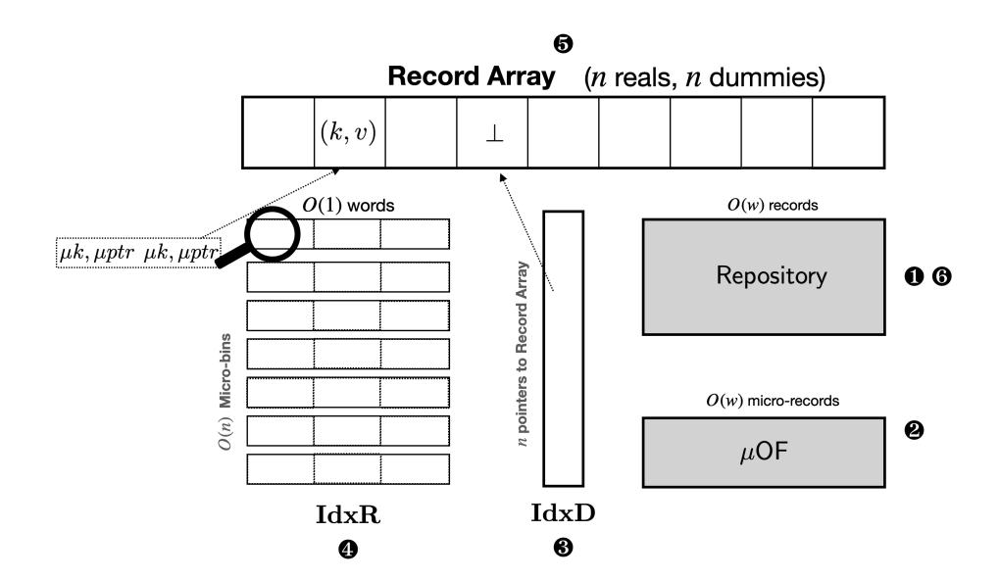
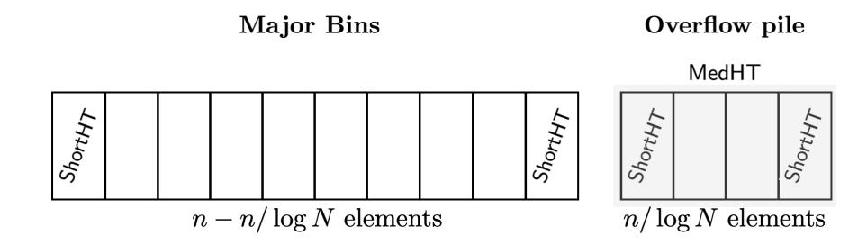

{0}------------------------------------------------

# Optimal Oblivious Parallel RAM

Gilad Asharov<sup>∗</sup> Ilan Komargodski† Wei-Kai Lin‡ Enoch Peserico§ Elaine Shi¶ October 4, 2023

#### Abstract

An oblivious RAM (ORAM), introduced by Goldreich and Ostrovsky (STOC '87 and J. ACM '96), is a technique for hiding RAM's access pattern. That is, for every input the distribution of the observed locations accessed by the machine is essentially independent of the machine's secret inputs. Recent progress culminated in a work of Asharov et al. (EUROCRYPT '20), obtaining an ORAM with (amortized) logarithmic overhead in total work, which is known to be optimal.

Oblivious Parallel RAM (OPRAM) is a natural extension of ORAM to the (more realistic) parallel setting where several processors make concurrent accesses to a shared memory. It is known that any OPRAM must incur logarithmic work overhead and for highly parallel RAMs a logarithmic depth blowup (in the balls and bins model). Despite the significant recent advances, there is still a large gap: all existing OPRAM schemes incur a poly-logarithmic overhead either in total work or in depth.

Our main result closes the aforementioned gap and provides an essentially optimal OPRAM scheme. Specifically, assuming one-way functions, we show that any Parallel RAM with memory capacity N can be obliviously simulated in space O(N), incurring only O(log N) blowup in (amortized) total work as well as in depth. Our transformation supports all PRAMs in the CRCW mode and the resulting simulation is in the CRCW mode as well.

<sup>∗</sup>Bar-Ilan University.

<sup>†</sup>Hebrew University of Jerusalem and NTT Research.

<sup>‡</sup>Cornell University.

<sup>§</sup>Universit`a degli Studi di Padova.

<sup>¶</sup>Carnegie Mellon University.

{1}------------------------------------------------

# Contents

| 1 | Introduction<br>1.1<br>Our Result<br>                                                                                                                                                                                                                                                                                                                                                                               |  |  |  |
|---|---------------------------------------------------------------------------------------------------------------------------------------------------------------------------------------------------------------------------------------------------------------------------------------------------------------------------------------------------------------------------------------------------------------------|--|--|--|
| 2 | Overview of Technical Construction<br>2.1<br>ShortHT: An Optimal Oblivious Hash Table for Poly-Logarithmically Many Randomly Shuf                                                                                                                                                                                                                                                                                   |  |  |  |
|   | fled Inputs<br>2.2<br>LongHT: An Optimal Oblivious Hash Table for Long Inputs<br>2.3<br>Putting it All Together: The OPRAM<br>                                                                                                                                                                                                                                                                                      |  |  |  |
| 3 | Preliminaries<br>3.1<br>Parallel RAM Machines<br><br>3.2<br>Oblivious Simulation of PRAM<br>3.3<br>Efficiency Metrics                                                                                                                                                                                                                                                                                               |  |  |  |
| 4 | Building Blocks<br>4.1<br>1-Word Key-Store<br><br>4.2<br>Distribution and Compaction<br><br>4.3<br>Oblivious (Packed) Sorting<br><br>4.4<br>Oblivious Random Permutation<br>4.5<br>Parallel Intersperse<br>4.6<br>Throwing Balls into Bins in Parallel<br><br>4.7<br>Sampling Private Bin Loads<br>4.8<br>Oblivious Bin Packing<br><br>4.9<br>Perfectly Oblivious Parallel RAM<br>4.10 The Hash Table Functionality |  |  |  |
| 5 | ShortHT: Hash Table for Short Inputs<br>5.1<br>Overview<br><br>5.2<br>The Construction<br>5.3<br>Proof of Security and Efficiency Analysis<br>5.4<br>Amortizing Work and Lookup for a Collection of ShortHTs                                                                                                                                                                                                        |  |  |  |
| 6 | MedHT and LongHT: A Level in the ORAM<br>6.1<br>MediumHT: Hash Table for Medium Inputs<br>6.2<br>LongHT: Hash Table for Long Inputs                                                                                                                                                                                                                                                                                 |  |  |  |
| 7 | OPRAM<br>7.1<br>OPRAM for RAMs<br>7.2<br>Handling PRAMs                                                                                                                                                                                                                                                                                                                                                             |  |  |  |
| 8 | Lower Bounds of OPRAM                                                                                                                                                                                                                                                                                                                                                                                               |  |  |  |
|   | References                                                                                                                                                                                                                                                                                                                                                                                                          |  |  |  |
| A | Sampling Balls and Bins Loads                                                                                                                                                                                                                                                                                                                                                                                       |  |  |  |
| B | Supplementary Proofs<br>B.1<br>Analysis of Construction 7.1 — Proof of Security and Efficiency<br>B.2<br>Supplementary Proofs for Section 7.2                                                                                                                                                                                                                                                                       |  |  |  |

{2}------------------------------------------------

# <span id="page-2-0"></span>1 Introduction

Consider a scenario where a client outsources a large database of encrypted records to an untrusted server and then wishes to perform operations on it. Although the database has been encrypted, it is well known that the mere access pattern to the server can leak highly secret information regarding the underlying secret data (e.g., [\[IKK12,](#page-64-0)[XCP15\]](#page-65-1)). An oblivious RAM (ORAM), introduced in the ground-breaking work of Goldreich and Ostrovsky [\[GO96,](#page-63-0) [Gol87\]](#page-63-1), is a tool for "encrypting" the access pattern of any RAM so that it looks "unrelated" to the underlying data. The overhead of an ORAM is defined as the (multiplicative) blowup in runtime of the compiled program.

Goldreich and Ostrovsky showed a construction with O(log<sup>3</sup> N) overhead, assuming the existence of one-way functions, where N denotes the total number of (encrypted) blocks stored on the server. They also proved that any ORAM scheme must incur at least Ω(log N) overhead, but their lower bound is restricted to schemes that make no cryptographic assumptions and treat the contents of each memory word as "indivisible"[1](#page-2-1) . A recent result of Larsen and Nielsen [\[LN18\]](#page-64-1) showed that Ω(log N) overhead is necessary even without the aforementioned two restrictions but requiring the ORAM to support operations arriving in an online manner.

In the last three decades many works have focused on improving the asymptotical and practical performance of ORAM constructions with the goal of getting closer to the logarithmic overhead lower bound (e.g., [\[SCSL11,](#page-64-2)[KLO12,](#page-64-3)[GM11,](#page-63-2) [CGLS17,](#page-62-0) [SvDS](#page-64-4)+13,[WCS15\]](#page-64-5)). Building on a beautiful idea of Patel et al. [\[PPRY18\]](#page-64-6), a recent work of Asharov et al. [\[AKL](#page-62-1)+20a] obtained an ORAM scheme with asymptotically optimal (amortized) overhead, O(log N), assuming the existence of one-way functions.

Oblivious parallel RAM. The concept of oblivious parallel RAM (OPRAM), first suggested by Boyle, Chung, and Pass [\[BCP16\]](#page-62-2), is a generalization of ORAM to the parallel setting. While in ORAM, the goal is to compile a sequential RAM program into an oblivious counterpart whose access patterns leak no information about the input; in OPRAM, the goal is to compile an m-CPU PRAM into a functionally equivalent, m-CPU oblivious PRAM whose access patterns leak no information about the input. The overhead of an OPRAM is defined, analogously, as the (multiplicative) blowup in parallel runtime of the compiled program. In other words, we say that an OPRAM's simulation overhead is X, iff an m-CPU PRAM running in parallel time T can be obliviously simulated in X · T parallel time also consuming m CPUs.

PRAM is not only a fundamental model to study, but it also captures modern multi-core architectures and cluster computing models, where several processors execute in parallel and make access to shared memory. Direct applications motivating the study of OPRAMs include (see [\[BCP16\]](#page-62-2) for an elaborated discussion):

- Secure multi-processor architecture, e.g., Intel SGX with hyperthreading; and
- A cluster of machines wishing to perform privacy-preserving parallel computation on big data, leveraing either trusted hardware or cryptographic multi-party computation [\[NWI](#page-64-7)+15[,ZDB](#page-65-2)+17].

OPRAM also has applications in theoretical cryptography. For instance, OPRAMs were used to obtain garbling PRAM schemes [\[BCP16\]](#page-62-2), secure two-party and multi-party computation of PRAMs [\[BCP15\]](#page-62-3), and indistinguishability obfuscation for PRAMs [\[CCC](#page-62-4)+16]. Given its fundamental importance, following Boyle et al. [\[BCP16\]](#page-62-2), there have been many attempts [\[CCS17,](#page-62-5)[CGLS17,](#page-62-0) [CS17,](#page-63-3) [CLT16,](#page-62-6) [NK16,](#page-64-8) [CNS18\]](#page-63-4) at the following holy grail question whose answer remains elusive so far:

<span id="page-2-1"></span><sup>1</sup>The "indivisible" model restricts the ORAM to only move blocks around and not apply any non-trivial encoding of the underlying secret data; see Boyle and Naor [\[BN16\]](#page-62-7).

{3}------------------------------------------------

Note that O(log N) simulation overhead is the best one can hope for. Particularly, we observe that Goldreich and Ostrovsky's [\[GO96\]](#page-63-0) Ω(log N) lower bound for ORAM applies to OPRAM too, that is, any generic approach that compiles an arbitrary m-CPU PRAM to an m-CPU oblivious PRAM must lead to Ω(log N) slowdown in terms of parallel runtime. Goldreich and Ostrovksy's lower bound, however, applies only to statistically secure OPRAMs in the balls-and-bins model. We also show that Larsen and Nielsen's [\[LN18\]](#page-64-1)'s techniques extend to the parallel setting, namely, one can alleviate these restrictions, and prove an unconditional Ω(log N) lower bound for (online) OPRAM as long as m ≤ N0.<sup>99</sup> — see Section [8](#page-59-0) for details.

Clearly, such an optimal OPRAM implies an optimal ORAM with O(log N) simulation overhead. Therefore, an optimal OPRAM as phrased above would also be a strict generalization of an optimal ORAM such as OptORAMa [\[AKL](#page-62-1)+20a]. Unfortunately, the recent advances in optimal ORAM constructions [\[PPRY18,](#page-64-6)[AKL](#page-62-1)+20a] do not easily extend to the parallel setting. In particular, it seems like the only way to obliviously simulate an m-CPU PRAM with those techniques is by serializing them, resulting in O(m · log N) simulation overhead. For example, if m = √ N, there would be a large gap in the bound. Other works that studied OPRAM without going through optimal ORAM as a stepping stone were able to achieve O(log<sup>2</sup> N/ log log N) simulation overhead [\[CS17,](#page-63-3) [CCS17,](#page-62-5) [CGLS17\]](#page-62-0), and thus there is still an almost logarithmic gap. Note that as far as ORAM was involved, historically, closing the last logarithmic gap took a very long time. So now that the community has finally closed the gap for ORAM, can we get a similar result for the parallel setting?

# <span id="page-3-0"></span>1.1 Our Result

An optimal OPRAM. Our main result is an affirmative answer to the above question: an OPRAM with O(log N) simulation overhead.

<span id="page-3-1"></span>Theorem 1.1 (Informal). Assume the existence of one-way functions. There exists an OPRAM scheme with O(log N) simulation overhead. That is, any m-CPU PRAM running in parallel time T and consuming N space can be compiled into a functionally-equivalent m-CPU oblivious PRAM running in parallel time O(T log N).

We also extend the lower bounds of Goldreich and Ostrovsky [\[GO96\]](#page-63-0) and Larsen and Nielsen [\[LN18\]](#page-64-1) and show that the above result is essentially optimal.

<span id="page-3-2"></span>Theorem 1.2 (Informal). In the balls and bins model, every (offline) OPRAM with statistical security must have Ω(log N) simulation overhead. Furthermore, every (online) OPRAM that simulates an m-CPU PRAM with memory size N, where m = N0.99, must have Ω(log N) simulation overhead. The latter holds for all schemes, even ones that are not in the balls and bins model and with computational security.

We proceed with some remarks about the model of computation underlying Theorem [1.1.](#page-3-1) We assume the word (P)RAM model where each memory word has w ≥ log N bits. We assume that each CPU has a constant number of private registers. We support all PRAMs in the concurrentread concurrent-write (CRCW) mode, where every memory location can be accessed by more than one processor at a time. Our compiled OPRAM is in the arbitrary concurrent-read concurrentwrite (arbitrary-CRCW) mode, where it is assumed that if two or more CPUs try to write to the 

{4}------------------------------------------------

same memory location, a random CPU succeeds.[2](#page-4-0) In our construction, we rely on a pseudorandom function family (PRF) which is existentially equivalent to a one-way function [\[HILL99,](#page-63-5)[GGM86\]](#page-63-6). We assume that a single evaluation of a PRF, resulting in at least word-size number of pseudorandom bits, can be done in unit cost. Our construction can be made statistically secure if one assumes a private random oracle to replace the PRF. We assume that word-level addition and standard Boolean operations can be done in unit cost.

Relationship to unbounded-CPU OPRAM. In this paper, we adopt the OPRAM notion originally formulated by Boyle, Chung, and Pass [\[BCP16\]](#page-62-2). Nonetheless, we point out the relationship of our work with a slightly different notion of OPRAM, we term "unbounded-CPU OPRAM", which has also been studied in the past [\[CCS17,](#page-62-5) [CGLS17,](#page-62-0) [CNS18\]](#page-63-4). In the original formulation by Boyle, Chung, and Pass [\[BCP16\]](#page-62-2), the compiled OPRAM has the same number of CPUs as the original PRAM, and we care about the slowdown in parallel runtime. The line of work on "unbounded-CPU OPRAM", by contrast, allows the compiled OPRAM to consume an unbounded number of CPUs. In other words, unbounded-CPU OPRAM asks the following question: does the extra work incurred by the oblivious simulation potentially enjoy a higher degree of parallelism than the original PRAM?

For unbounded-CPU OPRAM it makes sense to measure the overhead of a construction in two difference axes: total work and depth. Total work blowup means the multiplicative increase in total computation comparing the OPRAM and the original PRAM; and depth blowup means the multiplicative increase in parallel runtime comparing the OPRAM (with unbounded number of CPUs) and the original PRAM (with m CPUs).

Our work asymptotically improves the performance of unbounded-CPU OPRAMs too [\[CCS17,](#page-62-5) [CGLS17,](#page-62-0)[CNS18\]](#page-63-4). To date, the best known unbounded-CPU OPRAM achieves O(log<sup>2</sup> N/ log log N) total work blowup and O(log N) depth blowup. As a stepping stone towards getting Theorem [1.1,](#page-3-1) we in fact construct an unbounded-CPU OPRAM with O(log N) blowup in total work and O(log N) blowup in depth; and thus we improve the state of the art by an almost logarithmic factor. It is not hard to see that an unbounded-CPU OPRAM with O(log N) blowup in both total work and depth would immediately imply Theorem [1.1.](#page-3-1)

<span id="page-4-1"></span>Theorem 1.3 (Informal). Assume the existence of one-way functions. There exists an unbounded-CPU OPRAM with O(log N) blowup in both total work and depth, where N denotes the amount of space consumed by the original PRAM.

In our construction, the depth blowup actually holds for every single parallel step of the original PRAM, that is, every parallel step of the original PRAM can be simulated obliviously with an unbounded number of CPUs in O(log N) parallel time.

Lastly, we note that the lower bound picture for unbounded-CPU OPRAMs is not completely clear. While it follows from the lower bounds of [\[GO96,](#page-63-0) [LN18\]](#page-64-1) that logarithmic blowup in total work is necessary even if the ORAM has an unbounded number of CPUs, the best possible depth blowup is not completely resolved. The only known depth lower bound is due to Chan et al. [\[CCS17\]](#page-62-5) who showed that any OPRAM scheme in the balls and bins model must incur at least Ω(log m) depth for serving m concurrent requests. Thus, for highly parallel PRAMs, e.g., ones that perform m = N0.<sup>1</sup> concurrent requests, Ω(log N) depth blowup is necessary. This lower bound only applies

<span id="page-4-0"></span><sup>2</sup>The CRCW model is extensively studied in the algorithms literature [\[FSS84,](#page-63-7)[Sni85,](#page-64-9)[SV84,](#page-64-10)[Imm89,](#page-64-11)[FW90\]](#page-63-8). Apart from the arbitrary CRCW mode, other write conflict resolution strategies have been used. For example, the priority rule completes the write of the highest priority CPU and the common rule completes the write iff all the written values are equal.

{5}------------------------------------------------

to concurrent-read exclusive-write (CREW) simulations whereas it is known that, in general, the concurrent-read concurrent-write (CRCW) model allows for non-trivial depth improvements. (For instance, the OR function can be computed in constant depth in the CRCW model but requires logarithmic depth in the CREW model [CDR86].)

# <span id="page-5-0"></span>2 Overview of Technical Construction

We now give an informal overview of our construction underlying Theorem 1.3. As mentioned, this theorem directly implies Theorem 1.1. Throughout, we use N to denote the space consumed by the original PRAM. In our construction, we often need data structures for n elements where the choice of n can vary depending on the context—keep in mind that n and N are different.

Simplifying assumptions for roadmap. For simplicity, in the informal roadmap, we will assume that each memory word has  $w = \Theta(\log N)$  bits, and that we would like a security failure probability that is negligible in N. Our formal sections later will give a generalized version for any  $w \ge \log N$ , and will treat the security parameter and N as separate parameters.

Our contributions and roadmap. We follow the algorithmic framework established in the recent OptORAMa work [AKL<sup>+</sup>20a], which in turn follows the hierarchical ORAM paradigm originally proposed by Ostrovsky [Ost92, Ost90] and the subsequent journal paper [GO96]. To accomplish our goal, we redesign several algorithmic building blocks from scratch, and develop novel approaches to assemble them into an OPRAM.

At a high level, the recent OptORAMa work [AKL $^+$ 20a], following up on [PPRY18], constructs an ORAM scheme by composing  $O(\log N)$  "oblivious hash tables for randomly shuffled inputs" — henceforth referred to as LongHT — of geometrically growing sizes. Each LongHT further relies on a collection of so-called ShortHTs, that is, oblivious hash tables for poly-logarithmically many (in N) randomly shuffled inputs. More specifically, a LongHT hashes elements into ShortHTs of poly-logarithmic size, handling overflowing elements separately with dedicated overflow data structures.

- To obtain an optimal OPRAM, we make the following novel contributions:
- A new ShortHT from scratch: The ShortHT construction in OptORAMa relied on oblivious Cuckoo hashing, and we know of no way to make it depth optimal. As a result, we completely depart from the approach in OptORAMa and construct a new, parallel ShortHT from scratch. Our new ShortHT incurs O(n) work and  $O(\log N)$  depth for constructing a hash table of  $n = \operatorname{poly} \log N$  randomly shuffled elements, and incurs  $O(\widetilde{m})$  work and constant depth for concurrently looking up  $\widetilde{m} \leq n/\log N$  elements. This is one of the most conceptually innovative and technically involved building block in our paper. Much of this overview will be devoted to explain this construction.
- New parallel algorithms for realizing LongHT from ShortHT: The algorithmic building blocks OptORAMa adopted to construct a LongHT from ShortHT are inherently sequential and can take up to  $\Theta(n)$  depth for constructing a LongHT of  $n \in [\operatorname{polylog} N, N]$  elements. We propose new parallel algorithms for constructing a LongHT given our ShortHT, which incurs only O(n) work and  $O(\log N)$  depth for building a hash table containing  $n \in [\operatorname{polylog} N, N]$  elements, and supports a batch of  $\widetilde{m} \leq n/\log N$  concurrent lookups in  $O(\widetilde{m})$  total work and constant depth. Among other things, one new building block we develop in this process is a method for obliviously sampling from a balls-and-bins distribution. Specifically, here the goal is to "virtually toss" n balls into  $n/\operatorname{polylog} n$  bins, and report the loads of every bin. Obliviousness

{6}------------------------------------------------

requires that the algorithm's access patterns do not disclose the loads of the bins. We construct an algorithm for accomplishing this incurring O(n) total work and O(log N) depth. Note that even without obliviousness such a construction was not known. The most related works that we are aware are the ones of Farach-Colton and Tsai [\[FT15\]](#page-63-9) and Bringmann et al. [\[BKP](#page-62-9)+14] who studied the problem of sampling from the Binomial distribution on a RAM with minimal work. Along the way, we extend their algorithms to the PRAM model and present work- and depth-efficient algorithms.

• A new parallel compiler that compiles LongHT into OPRAM: Compiling our LongHT into a final OPRAM raises new challenges too. Prior hierarchical OPRAM constructions [\[CGLS17,](#page-62-0) [CNS18,](#page-63-4)[PPRY18,](#page-64-6)[AKL](#page-62-1)+20a] rebuild level i by merging all levels smaller than i into it, and known such procedures incur either extra work or extra depth. Specifically, the approach in OptORAMa would have incurred poly log N depth; and the approaches in earlier works [\[CGLS17,](#page-62-0) [CNS18\]](#page-63-4) incur an extra log N factor in work.

We develop a new rebuild procedure for the hierarchical structure that can be intuitively viewed as a deamortized version of the original one. Imprecisely, instead of pushing all levels[3](#page-6-1) T` , T`+1, . . . , Ti−<sup>1</sup> into level T<sup>i</sup> every 2<sup>i</sup> operations, we show a method for pushing each level only one level down the hierarchy, making room for new requests but without performing a full merge of all levels T` , T`+1, . . . , Ti−1. We show how to do so in a depth-efficient manner by parallelizing over all levels, while at the same time not "breaking" anything else.

• Parallelizing various primitives from OptORAMa [\[AKL](#page-62-1)+20a] and assembling them: We use several building blocks from Asharov et al.'s [\[AKL](#page-62-1)+20a] ORAM construction and make them parallel. In some cases various non-trivial challenges arise and in the technical sections we explain how to solve them. For example, the second bullet in this list corresponds to one challenge that arises out of this process.

In this overview we will focus on the more high-level ideas and algorithms that we introduce, while skipping many technicalities and glossing over some of the more standard techniques. Additionally, we would like to note that although we invested efforts into modularizing the different parts of the construction and encapsulating some of the ideas in a self-contained manner, sometimes putting all the pieces together is not completely black-box and requires some care.

# <span id="page-6-0"></span>2.1 ShortHT: An Optimal Oblivious Hash Table for Poly-Logarithmically Many Randomly Shuffled Inputs

One obstacle in making OptORAMa [\[AKL](#page-62-1)+20a] parallel is their ShortHT construction, i.e., an oblivious hash table for n = poly log N, randomly shuffled inputs — henceforth we also refer to this as a hash table for short inputs. Recall that such a hash table should support three operations: Build, Lookup, and Extract:

• Build: The Build algorithm takes as input an array of n ∈ poly log N (key,value) pairs, and initializes a data structure to facilitate efficient Lookup operations later. It is promised that the input elements have been randomly shuffled by a secret permutation unknown to the adversary this random shuffling of the inputs allowed PanORAMa [\[PPRY18\]](#page-64-6) and OptORAMa [\[AKL](#page-62-1)+20a] to obliviously construct a hash table more efficiently, and we will benefit from the same.

<span id="page-6-1"></span><sup>3</sup> In our formal scheme description, the smallest level has size O(mpoly log N), and we thus index the levels as ` = log(mpoly log N).

{7}------------------------------------------------

- Lookup: Each Lookup specifies a batch of <sup>m</sup><sup>e</sup> <sup>≤</sup> n/ log <sup>N</sup> keys, and the algorithm returns the values of the keys requested, or ⊥ if the key does not exist. It is promised that each key is being queried at most once and further that at most n queries are performed.
- Extract: The Extract algorithm is called at the end of the life-cycle of the data structure. The algorithm returns all the remaining elements that were not accessed at the time of destruction, padded with dummies such that the returned array is of the fixed length n. It is required that the returned sequence of elements are randomly shuffled.

The obliviousness requirement stipulates that the observed accessed pattern (through Build, a series of Lookups, and Extract) should essentially be uncorrelated with the inputs of Build and Lookup, except the length of the input array during Build and the length of the Lookup sequence.

Asharov et al. [\[AKL](#page-62-1)+20a] implement an oblivious hash for short inputs using an optimization of oblivious Cuckoo hashing schemes for short inputs. As they show, in this setting, the Build operation can be done in O(n) work. Unfortunately, the known oblivious Cuckoo hashing schemes require depth log N · poly log log N to achieve failure probability negligible in N, which is asymptotically larger than our goal, O(log N).[4](#page-7-0) We do not know if one can improve the depth of oblivious Cuckoo hashing in this setting, so we completely depart from previous works and known techniques and design a new hash table from ground up. Our construction, called ShortHT, has linear work and logarithmic depth.

A relaxed abstraction: ShortHT with false positives. To obtain our ShortHT, we actually need to relax its abstraction. In earlier definitions of oblivious hash table, if a non-existent key is looked up, it is guaranteed that ⊥ will be returned. We define a relaxed abstraction: if a non-existent key is looked up, a non-matching real element may be fetched and removed from the data structure; and we call this a false positive. We want to make sure that false positives occur with small (but non-negligible) probability, so we can store the false positive elements accidentally removed from the ShortHT in an overflowing data structure, and handle them separately later.

# 2.1.1 Data Structure

Our idea is to have a record array (denoted RA) that stores the n input elements as well as n additional dummy elements in a permuted fashion (where an element is also called a record). Such a permuted array can serve as a "one-time oblivious memory" [\[GO96,](#page-63-0)[Gol87,](#page-63-1)[CNS18\]](#page-63-4), i.e., as long as each element is visited at most once, the access patterns leak nothing. Further, a lookup to RA incurs only constant cost. The challenge is to build an efficient index structure such that given the key k of an element to be looked up, the index structure can discover which position to visit inside the RA. We will therefore introduce two index structures, IdxR and IdxD. IdxR is the index of all real records in RA, and IdxD is the index of all dummy records in RA. Initially, it might seem like the index structure itself is essentially an OPRAM; but what helps us here is that there are only n = poly log N elements in a ShortHT, and therefore in our scheme we will name each element with a short micro-key (denoted µk) of O(log log N) bits. Similarly, pointers into RA can also be described with only O(log log N) bits — and thus they are called micro-pointers and denoted µptr. Exploiting this fact, each memory word (of w ≥ log N bits) can store Ω(log N/ log log N) metadata entries in the index structure — such packing effectively allows us to look up Ω(log N/ log log N)

<span id="page-7-0"></span><sup>4</sup>Without going into details, the dominating log N · poly log log N factor comes from achieving a failure probability e −Ω(log N·log log N) [\[CGLS17,](#page-62-0) Theorem 6]. Also, Building elements obliviously into the table of Cuckoo hash is done via oblivious sorting [\[GM11,](#page-63-2)[CGLS17\]](#page-62-0) which incurs a log<sup>2</sup> n factor as Asharov et al. instantiates bitonic sort.

{8}------------------------------------------------

metadata entries paying only unit cost. It will become clear later that the usage of short micro-keys to name elements in a ShortHT leads to the false positives mentioned earlier.

In Figure [1,](#page-9-0) we present the various different components in our ShortHT. Recall that n ∈ poly log N is the number of elements stored in a ShortHT.

- Record array RA. The record array is a list of 2n elements, where each element is either a real element of the form (k, v) or a dummy element denoted ⊥; all elements in RA are randomly shuffled. Henceforth each element is sometimes called a record. As mentioned, our lookup algorithm will guarantee that each element in RA will be visited at most once.
- IdxR array. The IdxR array is an index structure for the real elements. It consists of O(n) micro-bins also denoted µbin. We will use O(1) memory word to store each µbin: each entry in the µbin consumes only O(log log N) bits, and therefore each µbin can fit Ω(log N/ log log N) entries — because the entry is short, we also call it a micro-record. Specifically, each micro-record inside a µbin is of the form: (µk, µptr):
  - Micro-key µk: each key k which is log N bits long can be mapped to a micro-key µk that is O(log log N) bits long by applying a pseudorandom function (PRF). A suitable PRF is selected during the Build phase to ensure that elements inside the ShortHT do not have colliding microkeys, but elements not in the hash table can possibly have micro-keys that collide with elements inside the ShortHT — this is the reason why there may be false positives during lookup.
  - Micro-pointer µptr: the micro-pointer points to a position in the RA, and is also O(log log N) bits long.

Note that by exploiting the short encoding of micro-keys and micro-pointers, we can look up an entire micro-bin, consisting of Ω(log N/ log log N) metadata entries, in unit cost.

- IdxD array. The IdxD array stores a randomly permuted list of micro-pointers to dummy elements in the record array RA.
- Arrays for overflows and false-positives. During Build, most of the real records will have some micro-record inside IdxR that stores its position (µptr) in the RA; however, some real records will fail to find room inside IdxR to store its position; and such overflowing entries will be stored inside an overflowing data structure denoted µOF.

As mentioned, during Lookup, one can query an element not in the ShortHT, and a "falsepositive" can be returned with small probability. Once the false-positive element is visited inside RA, it cannot be visited again for security. Therefore, we will move false-positives to a special repository called Repo.

### 2.1.2 Warmup: Supporting a Single Lookup Request

At this moment, we describe how to perform a a single lookup request so the reader can understand how the various components in our data structure would fit together. Our actual algorithm later must support <sup>m</sup><sup>e</sup> concurrent lookup requests, and therefore the actual algorithm is more involved.

A lookup for a key k is performed as follows (the steps also shown in Figure [1\)](#page-9-0):

- 0. First, from k derive the micro-key and micro-bin (µk, µbin) using a PRF.
- 1. Look for k in Repo to retrieve (k, v) the element (k, v) would reside in Repo if it was previously accessed and removed from RA due to being a false positive (of another key not in the ShortHT).

{9}------------------------------------------------

<span id="page-9-0"></span>

Figure 1: The components of ShortHT and the Lookup(·) sequence of accesses.

- 2. Look up all entries in µOF in parallel to find one of the form (k, µptr) which may reside there in case the micro-bin µbin (that k is mapped to) overflowed.
- 3. Retrieve the micro-pointer µdummy of the next dummy element in the RA by reading the address in IdxD[a-ctr] and increment a-ctr.
- 4. Access the micro-bin µbin (derived using a PRF on the searched key) in IdxR and look for the micro-key µk. To complete this in O(1) work, we need to use the fusion-tree technique by Fredman and Willard [\[FW93\]](#page-63-10) (see Section [4.1\)](#page-21-0).

At this point, if k was not found in Repo and the µptr with a micro-key matching µk was found, set µptr<sup>∗</sup> = µptr. Otherwise, set µptr<sup>∗</sup> = µdummy.

- 5. Access RA[µptr<sup>∗</sup> ];
- 6. Access Repo, writing back to Repo the accessed element in case of a false-positive.

Essentially, with each lookup to the ShortHT, looking for some key k, we will access both IdxD and IdxR to find two possible locations to access, one real, and one dummy. According to whether k = ⊥ or not, and whether k has been found in the overflowing structures Repo and µOF, we will decide which one of the two possible locations to access. Thus, the access pattern of lookup is just a visit to the next unvisited entry in IdxD, followed by a visit to a random micro-bin in IdxR, and then accessing one random, unvisited element in RA. If a non-existent key k is looked up, there is a small probability that its micro-key will collide with an existing element's micro-key for this reason, we may end up fetching a false positive.

We point out that for security, it is important that the µbin be derived by from the element's actual k and not the micro-key µk; moreover, whether there have been false positives during Lookup must be hidden as well.

### 2.1.3 Building the Data Structure

Next, we explain how the structure is built obliviously and in parallel. We first review a couple useful building blocks:

• Compaction. In (tight) compaction, one is given an array of n elements, each is associated with a 1-bit key. The goal is to permute the array in such a way that elements tagged with the bit 1 appear before the elements tagged with the bit 0. An oblivious (deterministic) linear work 

{10}------------------------------------------------

algorithm for this task was given in the work of Asharov et al. [\[AKL](#page-62-1)+20a] and an improved algorithm, having linear work and logarithmic depth, was given in [\[AKL](#page-62-10)+20b].

- Intersperse. Intersperse solves the following problem: given two randomly shuffled arrays of length n, (or one randomly shuffled array plus one dummy array), output an array that is a random permutation of the two input arrays. The algorithm must be oblivious in the sense that it does not disclose the permutation applied. The work of Asharov et al. [\[AKL](#page-62-1)+20a] first introduced the intersperse primitive, but their intersperse algorithm is not parallel. In this work, we show how to make it parallel, i.e., its complexity is linear work and logarithmic depth in the size of the input.
- Packed oblivious sort and oblivious permutation. The work by Chan et al. [\[CGLS18\]](#page-62-11) introduced a packed oblivious sort primitive. Re-parameterizing their result for our purpose, we get the following: suppose that each memory word can store log N/ log log N entries, then obliviously sorting n = poly log N entries can be accomplished in O(n) work and O(log<sup>2</sup> n) depth. Since oblivious permutation can be realized using oblivious sort as a building block [\[CS17\]](#page-63-3), similarly, under the same assumptions oblivious permutation can also be accomplished in O(n) work and O(log<sup>2</sup> n) depth.

Building the record array RA. Recall that the input consists of an array I of n randomly shuffled elements. We first add n dummy elements, and then we obliviously intersperse the real and dummy elements to achieve a random permutation of all elements — the outcome becomes the record array RA.

Recall that to access RA, we have two separate indices, IdxR and IdxD, corresponding to real and dummy records, respectively. We now explain how to build these index structures.

Building the IdxD index. To build IdxD, we use compaction on RA to find all indices that point to the n added dummy elements, and then we obliviously permute the indices (henceforth called micro-pointers). Since each micro-pointer can be described in O(log log N) bits, we can use packed oblivious random permutation (introduced above) to accomplish the permutation in O(n) work and O(log N) depth.

Building the IdxR index. First, we use compaction on the record array to find all real indices, and we extract n pairs of (k<sup>i</sup> , µptri), where k<sup>i</sup> is the key and µptr<sup>i</sup> (for micro-pointer) is the index in RA in which k<sup>i</sup> is located. Note that k<sup>i</sup> is of size log N bits, whereas µptr<sup>i</sup> is of size O(log log N) bits, as it is an index into an array of total size 2n. If the elements are short and can be encoded in O(log log N) bits, then we can rely on packed oblivious sort to sort them in linear time. Thus, our first goal is to "shrink" the size of the keys k<sup>i</sup> from log N to O(log log N). To that end, for every real key k<sup>i</sup> in the input array, we create a unique short key µk<sup>i</sup> (for micro-key) of size O(log log N). This is done by deriving the micro-keys from the keys using a pseudorandom function (PRF). Finding a PRF key that guarantees unique micro-keys for all elements in I requires rejection sampling, as we will elaborate shortly. For now, assume that such a PRF key was found, and so we only need to deal with micro-keys. (Recall that when one wishes to look up IdxR for some key k<sup>i</sup> , it first has to evaluate the PRF and obtain the micro-key µk<sup>i</sup> .)

After applying the PRF to convert the keys to micro-keys, we have an array of micro-records each of the form (µk, µptr), padded with dummies to a fixed length. Now, we apply another PRF to each element's actual key k, to assign the corresponding the element's micro-record to a microbin. We now run an oblivious bin placement algorithm which can be realized with O(1) oblivious 

{11}------------------------------------------------

sorts [\[CCS17,](#page-62-5) [CS17\]](#page-63-3), to place these micro-records each into the right micro-bin: each micro-bin is padded with dummies to a fixed capacity O(log N/ log log N), such that each micro-bin can be stored in a single memory word. Moreover, all the overflowing elements will be stored in the overflow array µOF and handled separately later. Since the micro-records have only O(log log N) bits each, we can complete the oblivious bin placement using packed oblivious sort, in O(n) work where n is the size of the ShortHT.

Achieving optimality via amortization. There are several places in which we need to amortize over multiple ShortHT instances to get optimal performance bounds. Jumping ahead, in our final OPRAM construction, the ShortHT will be bins in a bigger oblivious hash table — this makes it possible for us to perform an amortized analysis over multiple instances.

- Shared µOF. For a single ShortHT, the number of real elements in the µOF is smaller than O(1/N<sup>3</sup> ) in expectation, and O(log N) with high probability. Instead of allocating a O(log N) sized µOF for each ShortHT, we merge the µOF of all ShortHTs used by the entire OPRAM into one global data structure. We will use measure concentration analysis to show that this global µOF's size is bounded by O(log N) (see Claim [5.11\)](#page-43-0). Looking ahead, with every request to the OPRAM, we need to sequentially visit O(log N) different ShortHTs. Since µOF is now global, we do not have to scan a separate µOF when looking up each of the O(log N) ShortHTs (which will be too expensive in terms of depth). We just scan it once for all O(log N) different ShortHTs that we will visit in that access. Finally, when some ShortHT in the OPRAM gets destructed, we would mark the corresponding entries in the global µOF as dummy.
- Shared Repo. In a similar fashion, for each single ShortHT, the number of elements in its Repo is O(1/poly log N) in expectation, and O(log N) with all but negligible in N probability. We therefore adopt a similar technique: merge all ShortHT instances' Repo into a single global Repo. We want to cap the global Repo's load under O(log N), so we can efficiently scan it for every batch of OPRAM requests. To achieve this, we will have to periodically flush the Repo in the the OPRAM's main data structure. We then leverage measure concentration techniques to show that indeed, the global Repo's size is also upper bounded by O(log N) except with negligible in N probability. We defer the details to Section [5.](#page-31-0)
- Batched rejection sampling for collision-avoiding PRF keys. For each single ShortHT, the number of retries needed to find a good PRF key that avoids collisions is a geometric random variable, and we will need super-logarithmically many tries to get all-but-negligible success probability. Instead, we perform the rejection sampling over multiple ShortHT instances in parallel: some instances will find a good PRF fast, while others will need to retry. As the number of unfinished instances becomes fewer, we can afford to let each unfinished instance have more parallel retries in the same iteration. Overall, we can show that the total work for building all instances in parallel is O(n) on average per ShortHT. We refer the reader to Claim [5.10](#page-42-1) for the proof and further details.

In conclusion, when amortizing over a collection of ShortHT, we actually spend O(1) time for Lookup per ShortHT, and O(n) for Build. Merging µOF and Repo into global structures requires some additional care and maintenance, and we defer details to Section [7.](#page-50-0)

### 2.1.4 Handling Concurrent Lookup Requests

Earlier, to explain the logical data structure, we explained how to support a single lookup request. We now explain how to handle a batch of concurrent lookup requests. We will assume that that the 

{12}------------------------------------------------

number of concurrent accesses <sup>m</sup><sup>e</sup> is relatively small, i.e., <sup>m</sup><sup>e</sup> <sup>≤</sup> poly log <sup>N</sup>; our OPRAM construction will guarantee that this is true except with negligible in N probability.

Recall that ShortHT cannot allow accessing the same record in RA more than once. This must be preserved even when we have concurrent access. Two components of ShortHT require synchronization between different processors to guarantee that.

Accessing a micro-bin. During the same batch of requests, there can be two (or more) requests wanting two keys k and k <sup>0</sup> which map to the same micro-key. To avoid these two requests both accessing the same location in the record array RA thus violating security, we actually serialize multiple concurrent lookups to the same µbin. This way, after a processor visits the micro-bin, it also marks the micro-pointer it grabs as "used", and thus the second processor will not grab the same micro-pointer and will not access the same element in RA.

The challenge here is to show that this seralization will not introduce too much delay. We prove that this is true by relying on two techniques. First, through a load balancing argument, we argue that each µbin should receive only very few colliding requests in all likelihood. Second, looking ahead, each OPRAM request (within a concurrent batch of requests) needs to visit O(log N) ShortHTs sequentially. Here, we use a pipelining technique: imagine that each request in a batch acts on its own — after it finishes looking up one ShortHT, it immediately advances to its next ShortHT without waiting for requests in the batch. We use a locking mechanism to resolve write conflict in case two processors (each representing a request) want to read the same µbin, preventing the two from using the same pointer. We can implement such a locking mechanism using standard algorithmic techniques, assuming an Arbitrary-CRCW PRAM. Combining these two techniques, we will prove that the overall delay that a request encounters to sequentially look up all O(log N) ShortHTs is O(log N), combined.

Grabbing a dummy pointer. Recall that in ShortHT we grab a pointer to a dummy element in the RA by accessing IdxD[a-ctr] and then incrementing a-ctr. Two processors that access the same instance of ShortHT at the same time might grab the same dummy element. This issue is resolved through a combination of tricks, including load balancing, allocating exclusive range of dummy pointers to each processor, and using locks to resolve contention. We defer the technical details to Section [5.](#page-31-0)

Besides the above, there are additional technicalities in supporting concurrent lookups, we defer the details to Section [5.](#page-31-0)

# <span id="page-12-0"></span>2.2 LongHT: An Optimal Oblivious Hash Table for Long Inputs

A LongHT is also an oblivious hash table with the same abstraction as a ShortHT, except that it does not have false positives, and that it stores a larger number of elements n ∈ [poly log N, N]. Looking ahead, our OPRAM will consist of O(log N) LongHTs of geometrically growing size.

The construction of a LongHT eventually consists of a collection of many ShortHTs arranged in a special structure, depicted in Figure [2.](#page-13-0) Specifically, the elements are split into two structures, one is called the major bins and the other is called the overflow pile. The major bins hold almost all n elements, except O(n/ log N) of them which are stored in the overflow pile. Both structures are then split into many bins each of which is implemented using ShortHT. The two structures differ in the way elements are routed to their destined bins. For the overflow pile, this is done using oblivious sorts (which is okay since there are only O(n/ log N) elements to handle) — we abstract out this as a hash table for "medium"-size input arrays and call it MedHT. For the major bins, this is done by "throwing" balls into bins in the clear just like in PanORAMa [\[PPRY18\]](#page-64-6) and

{13}------------------------------------------------

<span id="page-13-0"></span>

Figure 2: The two structures that constitute LongHT and their implementation using ShortHTs. Lookup first accesses one ShortHT in the overflow pile and then one ShortHT in the major bins.

OptORAMa [AKL<sup>+</sup>20a] — except that now we have to do it in parallel — and then for each bin, a *secret*, roughly  $1/\log N$  fraction of elements will be moved to the overflow pile, such that each bin's actual load is unknown. Without worrying about parallelism first, each single lookup request first accesses a single bin in the overflow pile and then a single bin in the major bins, in a similar fashion like in PanORAMa [PPRY18] and OptORAMa [AKL<sup>+</sup>20a]; and obliviousness holds due to a similar argument as in the prior works [AKL<sup>+</sup>20a, PPRY18] too (assuming that the underlying ShortHT and MedHT are oblivious, and that merging some of the overflow structures preserves security.)

Although we adopt a similar logical structure as OptORAMa [AKL<sup>+</sup>20a], it turns out parallelizing the construction is highly non-trivial. Several technical challenges arise as explained below.

Sampling secret ball-and-bins loads. As mentioned earlier, after tossing the elements (called balls henceforth) into the major bins in the clear, we need to move a secret, approximately  $\Theta(\frac{1}{\log N})$  fraction of them into the overflow pile. After this step, the loads of all major bins follow a secret, " $n \cdot (1 - \frac{1}{\log N})$  balls into  $n/\mathsf{poly} \log N$  bins" distribution.

Therefore, we need to design a parallel algorithm that "virtually tosses"  $n \cdot (1 - \frac{1}{\log N})$  balls into  $n/\text{poly} \log N$  bins, and outputs the load of every bin. Further, we want this algorithm to satisfy the following:

- 1. it must be oblivious in the sense that its access patterns should not reveal the loads of the bins;
- 2. the required efficiency is linear work and depth  $O(\log N)$ .

Without the depth requirement, the task is easy: consider building a binary tree where the leaves represent the bins. First, we sample a binomial  $\mathsf{Binom}(n,1/2)$  at the root, that decides how many balls go into the left half of bins, and how many into the right half of bins. Then, we recursively perform the same at every internal node of the tree, till all the leave nodes receive their loads. By combining this approach with efficient algorithms for (approximately) sampling from the Binomial distribution, one can get a linear work procedure (see [AKL+20a, Section 4.7] for details). Unfortunately, this natural approach fails to achieve logarithmic depth. Specifically, it has depth  $O(d_{\mathsf{binom}} \cdot \log n)$ , where  $d_{\mathsf{binom}}$  is the depth required to sample from the Binomial distribution, where  $d_{\mathsf{binom}} \in \omega(1)$  with all known algorithmic approaches.

Our algorithm follows the above high-level tree-structure approach but we show a method to spend only constant depth per level. In particular, we will not be sampling a Binomial every time. The trick is to perform a linear-work logarithmic-depth preprocessing stage to essentially pre-sample (in parallel) all the binomials that could plausibly be needed. That is, instead of letting each node in the tree "wait" for the assigned value of the total number of balls in its subtree and then sample a corresponding Binomial, we precompute all possibilities that happen with non-negligible probability. This whole part happens in an offline phase. The online phase is then implemented

{14}------------------------------------------------

very efficiently by just "choosing" which sample to continue with based on what happened before. The details of this algorithm are more involved and we defer the discussion to Appendix A.

Routing ball-into-bins in parallel. As mentioned earlier, one step in building a LongHT is to randomly toss n balls into  $n/\text{poly} \log N$  bins in the clear. The procedure described in PanORAMa [PPRY18] and OptORAMa [AKL<sup>+</sup>20a] is inherently sequential, and requires linear in  $O(\log n)$  depth. We instead rely on a parallel procedure that accomplishes this in linear work and logarithmic depth on an Aribitrary-CRCW PRAM. We defer the details to Section 4.6.

## <span id="page-14-0"></span>2.3 Putting it All Together: The OPRAM

In this section we finally explain how we use LongHT to get the OPRAM. We sketch only the high-level idea, and defer the details to Section 7. We adopt the hierarchical ORAM/OPRAM paradigm [GO96, Gol87, PPRY18, CGLS17, AKL<sup>+</sup>20a]. Let m be the fixed number of concurrent read/write operations in each batch given to the OPRAM. Ignoring all the overflow data structures (e.g.,  $\mu$ OF, Repo) for now, our OPRAM consists of  $O(\log N)$  levels denoted  $T_{\ell}, T_2, \ldots, T_L$ , where  $\ell$  is max{poly log log N, log( $m \log N$ )} and  $L = O(\log N)$ , of geometrically growing size, where the smallest level has capacity  $2^{\ell} = \max\{\text{poly log } N, m \log N\}$  and every level  $i \in [\ell, \ldots, L]$  is a LongHT of capacity  $2^i$ .

Making the rebuild process parallel. The aforementioned hierarchical structure needs to be "rebuilt" once in a while. Usually, every  $2^i/m$  batch of requests, we merge consecutive levels  $\ell, \ldots, i-1$  to i. The depth consumed by this approach is poly-logarithmic: there are  $O(\log N)$  levels to merge, and merging two adjacent levels require calling oblivious compaction and intersperse which require logarithmic depth [AKL<sup>+</sup>20b].

We develop a novel rebuild procedure for the hierarchical structure that can be intuitively viewed as a de-amortized version of the one in OptORAMa. After  $2^i$  operations (note that each batch has m operations), we push each level one level down, in parallel for all levels. Each level has state full or half full. Every  $2^i$  operations, level  $T_i$  is half full and levels  $T_{\ell}, \ldots, T_{i-1}$  are full. We push (in parallel) each level one level down (i.e.,  $T_j$  is built from all elements in level  $T_{j-1}$ ). After the operation,  $T_{\ell}$  is empty,  $T_{\ell+1}, \ldots, T_{i-1}$  are half full, and level  $T_i$  is full. Note that here we intersperse only two arrays, i.e., levels  $T_i$  with  $T_{i-1}$  (in parallel for all i's), and we write the combined array into level  $T_i$ . Initially, level  $T_i$  is half full and contains at most  $2^{i-1}$  elements, level  $T_{i-1}$  is full and contains at most  $2^{i-1}$  elements, and thus  $T_i$  has enough capacity for the combination of these two arrays.

Our method propagates the elements more slowly, as elements from level  $\ell$  do not "jump" into level  $T_i$  but instead have to participate in i different rebuilds. Nevertheless, and because of that, the depth of our method is significantly better. As we intersperse only two arrays, the depth of our method is just  $O(\log(2^i)) \leq O(i)$ , instead of  $O(\sum_{j=1}^i \log(2^i)) \leq O(i^2)$  as in previous works.

In terms of total work, our method is similar to previous ones, assuming that the Build procedure of the hash table requires linear work in the input size. Our method requires rebuilding levels  $T_{\ell}, \ldots, T_{i}$ , which results in linear work in  $2^{i}$ .

**Subtleties arising from shared data structures.** The recent work of Falk et al. [FNO20] pointed out that in hierarchical ORAMs/OPRAMs, shared "stashes" can lead to subtleties in terms of security. In our case, the subtleties arise due to the global sharing of the Repo which holds the false positives of all ShortHTs. As mentioned earlier, to prevent the Repo from blowing up, we periodically "flush" it to the main hierarchical structure. Now, an element that "belongs" to level i may be moved to Repo, and after some time, re-inserted into the structure, and say, it resides in

{15}------------------------------------------------

some level i' at some point. We append to each such element a bit array that indicates the level the element originates from, i.e., from which levels it was moved to Repo. This is necessary for our proof of security.

**Proving our schemes.** Our proof of security quiet deviates from previous works, and resembles proofs of secure computation protocols, where we have functionalities and oracle accesses to smaller primitives as in hybrid model and protocol compositions. Modularizing the proof is challenging due to the newly introduced false positives and the fact that elements of one hash table in level i can reside in repository (and then move to some level  $j \leq i$ ).

# <span id="page-15-0"></span>3 Preliminaries

Throughout this work, the security parameter is denoted  $\lambda$  and it is given as input to algorithms in unary (i.e., as  $1^{\lambda}$ ). A function  $\operatorname{negl} \colon \mathbb{N} \to \mathbb{R}^+$  is  $\operatorname{negligible}$  if for every constant c > 0 there exists an integer  $N_c$  such that  $\operatorname{negl}(\lambda) < \lambda^{-c}$  for all  $\lambda > N_c$ . Two sequences of random variables  $X = \{X_{\lambda}\}_{{\lambda} \in \mathbb{N}}$  and  $Y = \{Y_{\lambda}\}_{{\lambda} \in \mathbb{N}}$  are  $\operatorname{computationally}$  indistinguishable if for any probabilistic polynomial-time algorithm A, there exists a negligible function  $\operatorname{negl}(\cdot)$  such that  $|\operatorname{Pr}[A(1^{\lambda}, X_{\lambda}) = 1] - \operatorname{Pr}[A(1^{\lambda}, Y_{\lambda}) = 1]| \leq \operatorname{negl}(\lambda)$  for all  $\lambda \in \mathbb{N}$ . We say that  $X \equiv Y$  for such two sequences if they are identically distributed random variables for every  $\lambda \in \mathbb{N}$ . The  $\operatorname{statistical}$  distance between two random variables X and Y over a finite domain  $\Omega$  is defined by  $\operatorname{SD}(X,Y) \stackrel{\text{def}}{=} \frac{1}{2} \cdot \sum_{x \in \Omega} |\operatorname{Pr}[X = x] - \operatorname{Pr}[Y = x]|$ , and we also say that X is  $\operatorname{SD}(X,Y)$ -statistically close to Y. For an integer  $n \in \mathbb{N}$  we denote by [n] the set  $\{1, \ldots, n\}$ . By  $\|$  we denote the operation of string concatenation.

**Pseudorandom function.** An efficient function family ensembles  $F = \{F_{\lambda} : \{0,1\}^n \to \{0,1\}^m\}$  for polynomial functions  $n = n(\lambda)$  and  $m = m(\lambda)$  is pseudorandom (PRF, in short) if for every probabilistic polynomial-time oracle machine  $A^O$  with oracle  $O : \{0,1\}^n \to \{0,1\}^m$  it holds that

$$\left|\Pr_{f \leftarrow F_{\lambda}}[A^{f(\cdot)}(1^{\lambda}) = 1] - \Pr_{u \leftarrow U_{\lambda}}[A^{u(\cdot)}(1^{\lambda}) = 1]\right| \leq \mathsf{negl}(\lambda),$$

where  $U_{\lambda}$  is the set of all functions that map  $\{0,1\}^n$  to  $\{0,1\}^m$ .

PRFs are known to be existentially equivalent to one-way functions by the results of [GGM86, HILL99].

Concentration bounds. We state two versions of Chernoff/Hoeffding inequalities. The first applies to a sequence of non-positively correlated 0-1 random variables<sup>5</sup> and the second applies to independent geometric random variables. Below, e is the base of the natural logarithm.

<span id="page-15-2"></span>**Proposition 3.1.** [E.g., [DR98, PS92]] Consider a set of n independent or non-positively correlated 0-1 random variables  $X_1, \ldots, X_n$ . Let  $M = \sum_{i=1}^n X_i$  and  $\mu = E[M]$ . Then, for any  $\delta > 0$ ,

$$\Pr\left[M < (1 - \delta)E[M]\right] < \left(\frac{e^{\delta}}{(1 + \delta)^{1 + \delta}}\right)^{E[M]} \le \left(\frac{e}{1 + \delta}\right)^{(1 + \delta)E[M]}$$

and symmetrically

$$\Pr\left[M > (1+\delta)E[M]\right] < \left(\frac{e^{\delta}}{(1+\delta)^{1+\delta}}\right)^{E[M]} \le \left(\frac{e}{1+\delta}\right)^{(1+\delta)E[M]}.$$

<span id="page-15-1"></span><sup>&</sup>lt;sup>5</sup>We say a set is non-positively correlated, if for *every* pair of disjoint subsets S and S', the probability that all variables in S equal 1 does not decrease conditioned on the probability that all variables in S' are 0.

{16}------------------------------------------------

For  $\delta \leq 1$ , the right-hand term can be upper bounded by  $e^{-E[M]\delta^2/3}$ , and for  $1 + \delta > e^2$  by  $e^{-E[M](1+\delta)\lg(1+\delta)}$ .

<span id="page-16-1"></span>**Proposition 3.2** (E.g., [AD11, Theorem 1.14]). Let  $p \in [0,1]$ . Let  $X_1, \ldots, X_n$  be independent geometric random variables with  $\Pr[X_i = j] = (1-p)^{j-1}p$  for all  $j \in \mathbb{N}$  and let  $X = \sum_{i=1}^n X_i$ . Then, for all  $\delta > 0$ ,

$$\Pr[X \ge (1+\delta) \operatorname{E}[X]] \le e^{-\left(\frac{\delta^2(n-1)}{2+2\delta}\right)}.$$

# <span id="page-16-0"></span>3.1 Parallel RAM Machines

**RAM machines.** A RAM is an interactive Turing machine that consists of a memory and a CPU. The memory is denoted as mem[N, w], and is indexed by the logical address space  $[N] = \{1, 2, \ldots, N\}$ . We refer to each memory word also as a *block* and we use w to denote the bitlength of each block. The CPU has an internal state that consists of O(1) words. The memory supports read/write instructions (op, addr, data), where op  $\in \{\text{read, write}\}$ , addr  $\in [N]$  and data  $\in \{0,1\}^w \cup \{\bot\}$ . If op = read, then data =  $\bot$  and the returned value is the content of the block located in logical address addr in the memory. If op = write, then the memory data in logical address addr is updated to data. We use standard setting that  $w = \Theta(\log N)$  (so a word can store an address) and  $N = \text{poly}(\lambda)$ , and we may use the direct implication that  $w = \Theta(\log \lambda)$ . We follow the convention that the CPU performs one word-level operation per unit time, i.e., arithmetic operations (addition, subtraction, or multiplication), bitwise operations (AND, OR, NOT, or shift), memory accesses (read or write), evaluating a pseudorandom function, or sampling an integer from [n] uniformly at random for any  $n \leq 2^w$  [GO96, GM11, KLO12, CGLS17, LN18, PPRY18].

**Parallel RAM.** A parallel RAM (PRAM) is a generalization of a RAM, where the latter is just a PRAM with a single CPU. A PRAM consists of m CPUs and a shared memory, denoted mem, where the memory consists of N words (sometimes referred to as blocks), and the CPUs perform word-level arithmetic operations. The word-level arithmetic operations that each CPU supports are the same as in the single CPU case.

In each step, each CPU executes a next instruction circuit denoted  $\Pi$ , updates its internal state. CPUs interact with the memory through request instructions  $\vec{I}^{(t)} := (I_i^{(t)} : i \in [m_t])$ . Specifically, at time step  $t \in \mathbb{N}$ , CPU i's instruction is of the form  $I_i^{(t)} := (\mathsf{op}, \mathsf{addr}, \mathsf{data})$  where  $\mathsf{op} \in \{\mathsf{read}, \mathsf{write}\}$ ,  $\mathsf{addr} \in [N]$  and  $\mathsf{data} \in \{0,1\}^w \cup \{\bot\}$ . If  $\mathsf{op} = \mathsf{read}$ , then the ith CPU receives the contents of  $\mathsf{mem}[\mathsf{addr}]$  at the beginning of time step t. Otherwise, if  $I_i^{(t)} = \mathsf{write}$  then in addition to the ith CPU receiving the content of  $\mathsf{mem}[\mathsf{addr}]$  at the beginning of time step t, at the end of the tth step, the contents of  $\mathsf{mem}[\mathsf{addr}]$  is updated to  $\mathsf{data}$ .

Write conflict resolution. By definition, multiple read operations can be executed concurrently with other operations even if they visit the same address. However, if multiple concurrent write operations visit the same address, a conflict resolution rule will be necessary for our PRAM to be well-defined. We assume that the given PRAM program is in the CRCW mode, namely it may write and/or read from the same memory location at the same time by several different CPUs. Our compiled, oblivious PRAM is an in the arbitrary CRCW mode, where concurrent writes are allowed and if two CPUs try to write to the same location at the same time, one of them (an arbitrary one) wins.

{17}------------------------------------------------

### <span id="page-17-0"></span>3.2 Oblivious Simulation of PRAM

We define oblivious simulation of (possibly randomized) functionalities. We provide a unified framework that enables us to adopt composition theorems from secure computation literature (see, for example, Canetti and Goldreich [Can00, Can01, Gol04]), and to analyze constructions in a modular fashion.

Oblivious simulation of a (non-reactive) functionality. We consider (parallel) machines that interact with the memory via read/write operations. We are interested in defining subfunctionalities such as oblivious sorting, oblivious shuffling of memory contents, and more, and then define more complex primitives by composing the above. For simplicity, we assume for now that the adversary cannot see memory contents, and does not see the data field in each operation (op, addr, data) that the memory receives. That is, the adversary only observes (op, addr).

Let  $f: \{0,1\}^* \to \{0,1\}^*$  be a (possibly randomized) functionality. We denote the output of f on input x to be f(x) = y. Oblivious simulation of f is a PRAM machine  $M_f$  that interacts with the memory, has the same input/output behavior, but its access pattern to the memory can be simulated. More precisely, we let  $(\text{out}, \text{Addrs}) \leftarrow M_f(x)$  be a pair of random variables that corresponds to the output of  $M_f$  on input x and where Addrs defines the sequence of memory accesses during the execution. We say that the machine  $M_f$  implements the functionality f if it holds that for every input x, the distribution f(x) is identical to the distribution out, where  $(\text{out}, \cdot) \leftarrow M_f(x)$ . In terms of security, we require oblivious simulation which we formalize by requiring the existence of a simulator that simulates the distribution of Addrs without knowing x.

<span id="page-17-1"></span>**Definition 3.3** (Oblivious simulation). Let  $f: \{0,1\}^* \to \{0,1\}^*$  be a functionality, and let  $M_f$  be a PRAM machine. We say that  $M_f$  obliviously simulates the functionality f, if there exists a probabilistic polynomial time simulator Sim such that the following holds:

$$\left\{ \left(\mathsf{out},\mathsf{Addrs}\right): \left(\mathsf{out},\mathsf{Addrs}\right) \leftarrow M_f(x) \right\}_x \approx \left\{ \left( f(x),\mathsf{Sim}(1^\lambda,1^{|x|}) \right) \right\}_x.$$

Depending on whether  $\approx$  refers to computational, statistical, or perfectly indistinguishability, we say  $M_f$  is computationally, statistically, or perfectly oblivious, respectively.

Intuitively, the above definition requires indistinguishability of the *joint* distribution of the output of the computation and the access pattern, similarly to the standard definition of secure computation in which the joint distribution of the output of the function and the view of the adversary is considered (see the relevant discussions in Canetti and Goldreich [Can00, Can01, Gol04]). Note that here we handle correctness and obliviousness in a single definition. As an example, consider an algorithm that randomly permutes some array in the memory, while leaking only the size of the array. Such a task should also hide the chosen permutation. As such, our definition requires that the simulation would output an access pattern that is independent of the output permutation itself.

Parametrized functionalities. In our definition, the simulator receives no input, except the security parameter and the length of the input. While this is very restricting, the simulator knows the description of the functionality and therefore also its "public" parameters. We sometimes define functionalities with explicit public inputs and refer to them as "parameters". Our public parameters are always input lengths and sizes of different inputs, and we explicitly define what is known to the adversary.

{18}------------------------------------------------

Modeling reactive functionalities. We further consider functionalities that are reactive, i.e., proceed in stages, where the functionality preserves an internal state between stages. Such a reactive functionality can be described as a sequence of functions, where each function also receives as input a state, updates it, and outputs an updated state for the next function. One can extend Definition [3.3](#page-17-1) to deal with such functionalities analogously to [\[AKL](#page-62-1)+20a].

Hybrid model and composition. We sometimes describe executions in a hybrid model. In this case, a machine M interacts with the memory via read/write-instruction and in addition can also send F-instruction to the memory. We denote this model as M<sup>F</sup> . When invoking a function F, we assume that it only affects the address space on which it is instructed to operate; this is achieved by first copying the relevant memory locations to a temporary position, running F there, and finally copying the result back. This is the same whether F is reactive or not. Security is then modified such that the access pattern Addrs<sup>i</sup> also includes the commands sent to F (but not the inputs to the command). When a machine M<sup>F</sup> obliviously implements a functionality G in the F-hybrid model, we require the existence of a simulator Sim that produces the access pattern exactly as before, where here the access pattern might also contain F-commands.

Concurrent composition follows from [\[Can01\]](#page-62-13), since our simulations are universal and straightline. Thus, if (1) some machine M obliviously simulates some functionality G in the F-hybrid model, and (2) there exists a machine M<sup>F</sup> that obliviously simulate F in the plain model, then there exists a machine M<sup>0</sup> that obliviously simulate G in the plain model.

Input assumptions. In some algorithms, we assume that the input satisfies some assumption. For instance, we might assume that the input array for some procedure is randomly shuffled or that it is sorted according to some key. We can model the input assumption X as an ideal functionality F<sup>X</sup> that receives the input and "rearranges" it according to the assumption X . Since the mapping between an assumption X and the functionality F<sup>X</sup> is usually trivial and can be deduced from context, we do not always describe it explicitly.

We then prove statements of the form: "The algorithm A with input satisfying assumption X obliviously implements a functionality F". This should be interpreted as an algorithm that receives x as input, invokes F<sup>X</sup> (x) and then invokes A on the resulting input. We require that this modified algorithm implements F in the F<sup>X</sup> -hybrid model.

The OPRAM functionality. The O(P)RAM functionality is a generic stateful RAM functionality allowing (parallel) reads and writes to the memory. We formalize the functionality next.

# <span id="page-18-0"></span>Functionality 3.4: FOPRAM

- Input: A sequence of m operations of the form Access(i, op<sup>i</sup> , addr<sup>i</sup> , datai), where i ∈ [m], op<sup>i</sup> ∈ {read,write, ⊥}, addr<sup>i</sup> ∈ [N] ∪ {⊥} and data<sup>i</sup> ∈ {0, 1} w .
- Internal state: The functionality is reactive and holds an internal state of size N, corresponding to the memory, denoted X. It is initialized to as empty.
- The functionality:
  - 1. If the input contains two accesses by the same CPU, abort.
  - 2. If the input contains two write/read accesses to the same address, abort.
  - 3. For each i ∈ [m], do:
    - (a) If op<sup>i</sup> = read, set data<sup>∗</sup> i := X[addr<sup>i</sup> ].
    - (b) If op<sup>i</sup> = write, set X[addr<sup>i</sup> ] := data<sup>i</sup> and data<sup>∗</sup> i := data<sup>i</sup> . (We suppose concurrent accesses to the same address is resolved arbitrarily, i.e., CRCW.)

{19}------------------------------------------------

• Output: data<sup>∗</sup> 1 , . . . , data<sup>∗</sup> m.

# <span id="page-19-0"></span>3.3 Efficiency Metrics

We adopt the following metrics to characterize the overhead of (parallel) oblivious simulation of a PRAM. In the following, when we say that an OPRAM scheme consumes T parallel steps (or W total work) we mean that the OPRAM does so with overwhelming probability (in N).

- Simulation overhead. If a PRAM that consumes m CPUs and completes in T parallel steps can be obliviously simulated by an OPRAM that completes in γ · T steps and with the same number of CPUs m, then we say that the simulation overhead is γ.
- Total work blowup. A PRAM's total work is the number of steps necessary to simulate the PRAM under a single CPU, and this is equal to the sum P <sup>t</sup>∈[T] m<sup>t</sup> (recall that m<sup>t</sup> = |P<sup>t</sup> |, where P<sup>t</sup> is the set of CPUs that are activated in time t ∈ [T]). If a PRAM of total work W can be obliviously simulated by an OPRAM of total work γ · W we say that the total work blowup of the oblivious simulation is γ.
- Depth blowup A PRAM's depth is defined to be its parallel runtime when there are unbounded number of CPUs. If a PRAM of depth D can be obliviously simulated by an OPRAM of depth γ · D we say that the depth blowup of the oblivious simulation is γ.

The simulation overhead is a good standalone metric only if the OPRAM preserves the number of CPUs. If the OPRAM consumes more CPUs than the PRAM, we use the metrics of total work blowup and depth blowup explicitly. The following simple fact is useful for understanding the complexity of (oblivious) parallel algorithms.

Fact 3.5. Let c > 1. If an (oblivious) parallel algorithm completes in T steps using m CPUs, then it can be modified to so that it completes in c · T steps using only d m c e CPUs.

# <span id="page-19-1"></span>4 Building Blocks

In this section we introduce and review some of the generic building blocks that we use in our OPRAM construction. The building blocks are listed next. Note that some of the building blocks are known from previous works while others are new to this work.

### 1. 1-Word Key-Store (Section [4.1\)](#page-21-0):

This is a very efficient data structure to hold records of size r w. Concretely, it allows to search for a given record suffix/prefix/infix, extracting one such record if one or more exist, and ascertaining none exist otherwise. Each such operation is performed in O(1) work and O(1) depth using elementary word level instructions.

The construction of this primitive follows from known constructions in the data structures literature. To the best of our knowledge, this is the first time this data structure is used in the oblivious algorithms literature.

### 2. Tight Compaction and Distribution (Section [4.2\)](#page-21-1):

Assume we are given an array of n records, with m records and m positions marked. The task of oblivious distribution involves permuting the array so that every marked record is located in a marked position. In the special case where the m positions are the first m of the 

{20}------------------------------------------------

array, we call the procedure oblivious tight compaction. Note that in compaction as well as in distribution, there are no guarantees of stability, i.e., marked elements (or unmarked ones) do not necessarily retain their relative order.

In a recent work, Asharov et al. [\[AKL](#page-62-10)+20b] showed how to perform oblivious distribution (and thus also oblivious tight compaction) deterministically in linear total work and logarithmic depth.

### 3. Packed Compaction and Sorting (Section [4.3\)](#page-21-2):

We use algorithm for stable tight compaction and full-fledged sorting that are very efficient in settings where each memory word can hold multiple elements. Let n be the number of records where the size of each record is u w. It is possible to compact stably using O(n) total work and O(log<sup>2</sup> n) depth if log n = O(w/u). It is possible to sort stably using O(n) total work and O(log n) depth if log<sup>2</sup> n = O(w/u), e.g., if n = poly(w) and u = poly log n.

## 4. Oblivious Random Permutation (Section [4.4\)](#page-22-0):

It aims to shuffle an input array of n elements uniformly at random while hiding the sampled permutation that maps the input to the output. Similar to sorting, our goal is to use only linear work and small depth for small enough n.

## 5. Parallel Intersperse (Section [4.5\)](#page-23-0):

The goal of Intersperse is to (obliviously) randomly merge two randomly shuffled arrays. This procedure was implemented in [\[AKL](#page-62-1)+20a] with optimal asymptotic work overhead, but with linear depth. Using the parallel distribution algorithm of Asharov et al. [\[AKL](#page-62-10)+20b], we show how to obtain the same functionality in linear total work and logarithmic depth.

## 6. Throwing Balls into Bins in the Clear (Section [4.6\)](#page-26-0):

Given a list of n balls and m bins, we would like to place each balls in some bin (in the clear, non-obliviously). The naive way of doing this is to go over the balls one by one and put it in the right bin. This procedure is highly sequential and we show how to do this in small depth.

### 7. Sampling Bin Loads (Section [4.7\)](#page-28-0):

Given a list of n balls and m bins, we would like to obliviously sample the loads of bins after throwing n balls into the m bins. The naive way of doing this is to actually throw the balls into the bins one-by-one, but this reveals the loads (and requires too much depth). Obliviousness can be obtained using oblivious sorts, but this introduces a logarithmic factor in total work. As we are not interested in actually throwing balls and we are just interested in sampling loads, we show that we can do better. We show how to sample (an approximation of) these loads in linear work and logarithmic depth.

### 8. Oblivious Bin Packing (Section [4.8\)](#page-28-1):

The input is a triplet (I, B, γ), where I is an array containing n balls in which at most n/2 are reals, and every real ball is assigned to some bin j ∈ [B]. The parameters B and γ represent the number of bins and their capacity, respectively. The goal is to obliviously place all real balls in I into B bins according to their assignment, and pad each bin to its maximum capacity γ. Then, obliviously permute each bin. It is assumed that the bin assignment in the input do not exceed the maximum capacity γ, as otherwise the functionality just returns overflow. The functionality is implemented using oblivious sorts, and takes O(n · log n) work and O(log n) depth for an array of size n and Bγ ≥ n.

{21}------------------------------------------------

### 9. Perfectly Oblivious Parallel RAM (Section [4.9\)](#page-29-0):

We will use a construction of such perfect OPRAM: an OPRAM whose access pattern is completely independent (information theoretically) from the underlying data. Such a scheme is known with O(log<sup>3</sup> N) work overhead and O(log N · log log N) depth (on memory of size N) by the work of Chan et al. [\[CNS18\]](#page-63-4).

# <span id="page-21-0"></span>4.1 1-Word Key-Store

A key-store is a data structure for storing and retrieving keys. The keys can be added one at a time into the structure using an algorithm Insert, where Insert is called at most n times for a pre-determined capacity n. Also, the key-store supports a Lookup procedure that allow to query for the existence of a key. Note that there is no specific order in which Insert and Lookup requests have to be made and they could be mixed arbitrarily.

Here, we need an oblivious key-store that operates on very short elements that are sorted and can be packed into one (or any other constant) memory word. Concretely, given O(w/ log w) sorted keys each of length O(log w), we can allocate O(1) memory words and store the elements there (in a packed fashion). The less trivial requirement is that we want to be able to search for an element and retrieve it in O(1) total work and depth. We wish to implement these operations using only the word RAM model operations.

The way to do this comes from the construction of fusion trees of Fredman and Willard [\[FW93\]](#page-63-10) (see also [\[Dem,](#page-63-14) Lecture 12]). There it is shown how to store a list of very short sorted keys in one word and then perform Lookup queries in O(1) work the word RAM model. By examination of the procedures, it is evident that they are also oblivious. Thus, in the rest of the paper, we assume that given a word that packs many short sorted keys we can obliviously perform lookup and retrieve elements in O(1) work and depth.

# <span id="page-21-1"></span>4.2 Distribution and Compaction

In oblivious distribution, we are given an array of n records, with m records and m positions marked and the task is to permute the array so that every marked record ends in a marked position. In tight compaction, the m positions are the first m of the array. Asharov et al. [\[AKL](#page-62-10)+20b] presented an oblivious deterministic algorithm for tight compaction and distribution, consuming linear work and logarithmic depth (this work improved on the earlier work [\[AKL](#page-62-1)+20a] which only achieved linear work but was otherwise depth inefficient).

<span id="page-21-4"></span>Theorem 4.1 (Oblivious distribution and tight compaction). Given an array of n elements each of size D bits, there is a deterministic oblivious distribution (and thus tight compaction) algorithm in the RAM model with word size w that consumes O(dD/we · n) total work and O(log n) depth.

# <span id="page-21-2"></span>4.3 Oblivious (Packed) Sorting

Ajtai et al. [\[AKS83\]](#page-62-14) showed that there is a comparator-based circuit with O (n · log n) comparators that can sort any array of length n. Such a network implies, in particular, an oblivious algorithm, as we state next.

<span id="page-21-3"></span>Theorem 4.2 (Oblivious sorting [\[AKS83\]](#page-62-14)). There is a deterministic oblivious sorting algorithm in the word RAM model with word size w that sorts n elements each of size D bits consuming O (dD/we · n · log n) total work and O(log n) depth.

{22}------------------------------------------------

**Packed sorting.** We use a variant of the oblivious sorting problem on a RAM, which is useful when each memory word can hold up to B > 1 elements. We emphasize that the following theorem, taken from [AKL<sup>+</sup>20a], assumes that the RAM can perform only word-level addition, subtraction, and bitwise operations in unit cost.

<span id="page-22-2"></span>**Theorem 4.3** (Packed oblivious sort [AKL<sup>+</sup>20a]). There is a deterministic packed oblivious sorting algorithm that sorts n elements in  $O(\lceil n/B \rceil \cdot \log^2 n)$  work and  $O(\log^2 n)$  depth, where B denotes the number of elements each memory word can pack.

### <span id="page-22-0"></span>4.4 Oblivious Random Permutation

We say that an algorithm ORP is a statistically secure oblivious random permutation, iff ORP statistically obliviously simulates the functionality  $\mathcal{F}_{perm}$  which, upon receiving an input array of n elements, chooses a random permutation  $\pi$  from the space of all n! permutations on n elements, uses  $\pi$  to permute the input array, and outputs the result.

One well-known algorithm for this task is by Alonso and Schott [AS96] who obtained the next result.

<span id="page-22-1"></span>**Theorem 4.4.** There exists an oblivious algorithm that permutes a given array of n elements each of size D, consuming  $O(\lceil D/w \rceil \cdot n \cdot \log^2 n)$  total work and  $O(\log^2 n)$  depth.

Next, we present another oblivious random permutation algorithm.

<span id="page-22-3"></span>**Theorem 4.5.** Let  $T_{\text{sort}}^{\ell}(n)$  is the time it takes to sort n balls of length  $\ell$  bits each. Let n > 100 and let D denote the number of bits it takes to encode an element. There exist two oblivious random permutation algorithms such that for arrays of size  $n \geq w^3$  succeeds with all but negligible probability, and consumes  $O(T_{\text{sort}}^{D+\log n}(n)+n)$  work and O(w) depth.

*Proof.* We will show oblivious random permutation algorithm such that for array of size n they satisfy the following properties:

- 1. The first succeeds with all but  $e^{-\Omega(\sqrt{n})}$  probability of error. It consumes  $O(T_{\text{sort}}^{D+\log n}(n)+n)$  work and  $O(\log^2 n)$  depth.
- 2. The second succeeds with all but  $e^{-\Omega(\log^4 n)}$  probability of error. It consumes  $O(T_{\text{sort}}^{D+\log n}(n) + n)$  work and  $O(\log n)$  depth.

Thus, we will use the first one for  $n < 2^{(\log N)^{1/2}}$  whereas the second one is used otherwise. Observe that in both cases the probability of error is negligible and the depth is O(w).

We apply a similar algorithm as that of Chan et al. [CCS17, Figure 2 and Lemma 10] and Asharov et al. [AKL<sup>+</sup>20a, Theorem 4.3], but with some changes (we slightly modify parameters and analyze depth). Let C (for "colliding") be a parameter in the algorithm (which will later be set to either  $\sqrt{n}$  or  $\log^4 n$ , depending on the required depth/ probability of error).

- Assign each element an  $8 \log n$ -bit random label drawn uniformly from  $\{0,1\}^{8 \log n}$ . Obliviously sort all elements based on their random labels, resulting in the array  $\mathbf{R}$ . This step consumes  $O(T_{\text{sort}}^{D+\log n}(n)+n)$  work and  $O(\log n)$  depth.
- In parallel, write down two arrays: 1) an array **I** containing the indices of all elements that have collisions; and 2) an array **X** containing all the colliding elements themselves. Since the array is sorted, this can be accomplished by touching every two consecutive elements (in parallel). Thus, this consumes O(n) work and  $O(\log n)$  depth assuming that we can leak the indices of the colliding elements.

{23}------------------------------------------------

- If the number of elements that collide is greater than C, simply abort throwing an Overflow exception. Otherwise, use oblivious random permutation algorithm from Theorem 4.4 to obliviously and randomly permute the array  $\mathbf{X}$ , and let  $\mathbf{Y}$  be the outcome. This step can be completed in  $O(C \cdot \log^2 C)$  work and  $O(\log^2 C)$  depth.
- Finally, for each  $j \in |\mathbf{I}|$ , write back (in parallel) each element  $\mathbf{Y}[j]$  to the position  $\mathbf{R}[\mathbf{I}[j]]$  and output the resulting  $\mathbf{R}$ .

A concentration bound shows that, roughly, (1)  $C \leq \log^4 n$  with probability  $2^{-\log^4 n}$  and (2)  $C \leq \sqrt{n}$  with probability  $2^{-\sqrt{n}}$ . Indeed, we can imagine a process of throwing n balls into  $n^8$  bins where (arbitrary) n bins are marked black and the rest are white. The question is how many balls fall into black bins. Clearly, this process dominates the number of collision C (since there in every step there are < n black bins) and so the bound that we get implies a bound on C. The probability that each ball falls into a black bin is  $n^{-7}$  and so if we denote this event for ball i by  $X_i$ , we have that  $\sum_{i=1}^n E[X_i] = n^{-6}$ . By Chernoff's bound (Proposition 3.1), when  $C = \sqrt{n}$ ,

$$\Pr\left[\sum_{i=1}^{n} \mathrm{E}[X_i] \ge \sqrt{n}\right] = \Pr\left[\sum_{i=1}^{n} \mathrm{E}[X_i] \ge (1 + (n^{6.5} - 1)) \cdot n^{-6}\right] \le e^{-\Omega(n^{-6} \cdot n^{6.5})} = e^{-\Omega(\sqrt{n})}.$$

In this case, the algorithm consumes  $O(T_{\text{sort}}^{D+\log n}(n)+n)$  work and  $O(\log^2 n)$  depth. Similarly, when  $C=\log^4 n$ ,

$$\Pr\left[\sum_{i=1}^{n} \mathrm{E}[X_i] \ge \log^4 n\right] = \Pr\left[\sum_{i=1}^{n} \mathrm{E}[X_i] \ge (1 + (n^6 \log^4 n - 1)) \cdot n^{-6}\right]$$

$$\le e^{-\Omega(n^{-6} \cdot n^6 \log^4 n)} = e^{-\Omega(\log^4 n)}.$$

Here, the algorithm consumes  $O(T_{\text{sort}}^{D+\log n}(n)+n)$  work and  $O(\log n)$  depth.

Packed oblivious random permutation. The following version of oblivious random permutation has good performance when each memory word is large enough to store many copies of the elements to be permuted tagged with their own indices. The algorithm follows directly by plugging in our oblivious packed sort (Theorem 4.3) into the oblivious random permutation algorithm (Theorem 4.5).

<span id="page-23-1"></span>**Theorem 4.6** (Packed oblivious random permutation). Let n > 100 and let D denote the number of bits it takes to encode an element. Let  $B = \lfloor w/(\log n + D) \rfloor$  be the element capacity of each memory word and assume that B > 1. Then, there exists an oblivious random permutation algorithm that permutes the input array with all but  $e^{-\sqrt{n}}$  probability of error. It consumes  $O\left(\frac{n}{B} \cdot \log^2 n + n\right)$  work and  $O(\log^2 n)$  depth.

### <span id="page-23-0"></span>4.5 Parallel Intersperse

We consider the following two abstractions Intersperse and IntersperseRD, introduced by Asharov et al. [AKL<sup>+</sup>20a]. Intersperse considers the task of merging two randomly shuffled arrays into one randomly shuffled array. In IntersperseRD the input is a single array that consists of real elements and dummies with the guarantee that the reals are randomly shuffled among themselves and the goal is to shuffle the whole array.

Intersperse<sub>n</sub> realizes the following abstraction:

{24}------------------------------------------------

- Input: An array  $\mathbf{I} := \mathbf{I}_0 || \mathbf{I}_1$  of size n and two numbers  $n_0$  and  $n_1$  such that  $|\mathbf{I}_0| = n_0$  and  $|\mathbf{I}_1| = n_1$  and  $n = n_0 + n_1$ .
- Output: An array **B** of size n that contains all elements of  $\mathbf{I}_0$  and  $\mathbf{I}_1$ . Each position in **B** will hold an element from either  $\mathbf{I}_0$  or  $\mathbf{I}_1$ , chosen uniformly at random and the choices are concealed from the adversary.

IntersperseRD $_n$  realized the following abstraction:

- **Input**: An array **I** of *n* elements, where each element is tagged as either *real* or *dummy*. The real elements are distinct. We assume that if we extract the subset of all real elements in the array, then these elements appear in random order. However, there is no guarantee of the relative positions of the real elements with respect to the dummy ones.
- Output: An array  $\mathbf{B}$  of size  $|\mathbf{I}|$  containing all real elements in  $\mathbf{I}$  and the same number of dummy elements, where all elements in the array are randomly permuted.

The implementation of [AKL<sup>+</sup>20a] for both Intersperse<sub>n</sub> and IntersperseRD<sub>n</sub> has linear work overhead (which is optimal) but also linear depth. We next show how to implement both Intersperse and IntersperseRD with total linear work and logarithmic depth (both of which are optimal). We focus here on parallelizing Intersperse<sub>n</sub>. A parallel version of IntersperseRD<sub>n</sub> follows directly since it is implemented using two subroutines: Intersperse<sub>n</sub> and counting the number of reals in an array. The latter can be performed in parallel by a simple divide and conquer algorithm (i.e., count in each half of the array recursively and then sum up the results).

Let us briefly recall how Intersperse<sub>n</sub> works (see [AKL<sup>+</sup>20a, Algorithm 6.1]). The algorithm works in two phases: first it initialized an array Aux of size n that has  $n_0$  zeros and  $n_1$  ones, and second it runs an oblivious distribution algorithm (Section 4.2) on the input array and Aux. In Section 4.2 we describe the oblivious distribution procedure and argue that it consumes linear total work and logarithmic depth. Here, we explain how to perform the sampling of Aux using linear total work and logarithmic depth. The functionality we implement is given as Functionality 4.7.

# <span id="page-24-0"></span>Functionality 4.7: $\mathcal{F}_{\mathsf{SampleAux}}^n(n_0)$ – Sample Auxiliary Array

- Input: A number  $n_0 \in \mathbb{N}$  such that  $n_0 \leq n$ .
- Public parameters: n.
- The functionality:
  - 1. Sample an array **I** of bits uniformly at random conditioned on having  $n_0$  zeros and  $n-n_0$  ones.
- Output: The array I.

In what follows we describe algorithms that implement Functionality 4.7. We have two cases:

Case I:  $w^3 \le n \le 6w^5$ . In that case, we can rely on packed oblivious permutation. Specifically, on inputs  $(n, n_0)$  we have to sample an array at random among all arrays that contain exactly  $n_0$  0's and  $n_1 = n - n_0$  1's. Given  $n_0$ , write down an array P of n bits, where the front  $n_0$  bits are 0's and the back  $n_1$  bits are 1's. Each element in P is 1 bit and therefore we can use packed oblivious permutation on P (see Section 4.4). Using Theorem 4.6 we get:

**Proposition 4.8.** For  $w^3 \le n \le 6w^5$ . The above algorithm obliviously implements  $\mathcal{F}_{\mathsf{SampleAux}}^n(n_0)$  (Functionality 4.7) with all but negligible probability in O(n) work and  $O(\mathsf{poly} \log w)$  depth.

Clearly, the depth is logarithmic in N. This algorithm is equivalent to an algorithm that simply permute an array of size n that contains exactly  $n_0$  zeros and  $n - n_0$  ones.

{25}------------------------------------------------

Case II:  $n \ge 6w^5$ . In what follows we describe Algorithm 4.9 that implements Functionality 4.7. We make the following simplifying assumptions that can be made without loss of generality:

- 1.  $n_0 \le n_1$ . This is without loss of generality since otherwise we can simply swap the roles of 0s and 1s and run a symmetric algorithm.
- 2.  $n \ge 6w^5$  as otherwise we are in case I.
- 3. n is upper bounded by some fixed polynomial in  $\lambda$ .

# <span id="page-25-0"></span>Algorithm 4.9: PSampleAuxArray $_{n,\lambda}$ – Sample Auxiliary Array in Low Depth

- Input: Two numbers  $n, n_0 \in \mathbb{N}$  such that  $n_0 \leq n_1 \ (= n n_0)$ , and  $6w^5 \leq n \leq \mathsf{poly}(\lambda)$ .
- <span id="page-25-2"></span><span id="page-25-1"></span>• The Algorithm:
  - 1. Approximate initialization. If  $n_0 < 3w^4$ , write down an initial array containing all 1s. Else if  $n_0 \ge 3w^4$ , write down an initial array where each element is set to 0 with probability  $\frac{n_0}{n}$  and set to 1 otherwise. Let X denote the outcome array of this step. Let  $n'_0$  be the number of 0s in X and  $n'_1$  be the number of 1s.
  - 2. Number of bits to flip. If  $n'_0 > n_0$ , let  $b^* = 0$  and if  $n'_1 > n_1$ , let  $b^* = 1$ . Let  $F^* = n'_{b^*} n_{b^*}$ . (I.e.,  $F^*$  is the number of 0s or 1s in the array X that are needed to be flipped to reach our target of having exactly  $n_0$  number of 0s.)
  - 3. Subsampling by  $p_w := \frac{1}{w}$  factor. Make a copy of X and call it Y. For each coordinate  $i \in [n]$  in Y, sample a random indicator bit that is 1 with probability  $p_w$  and attach it to the entry. Run the oblivious tight compaction circuit (Section 4.2) on Y to get all the elements that are tagged with a 1 in the front. During this process, each swap gate in the circuit remembers its routing decision such that later we could perform reverse routing to route a fine-tuned version of Y back into X. Truncate Y at the last element that is tagged with a 1. If  $|Y| > 2np_w$  or  $|Y| < \frac{1}{2}np_w$ , then abort.
  - 4. Fine-tuning. Obliviously sort (Theorem 4.2) the array Y such that all the elements that are tagged with  $b^*$  appear in the front and flip the first  $F^*$  bits of the outcome array. If there are less than  $F^*$  such bits, abort. Perform an oblivious random permutation algorithm (Section 4.4) on Y.
  - 5. Reverse-routing. Reverse route the array Y back to the input array, overwriting the corresponding positions in the input. This is performed using the information we recorded in Step 3: each swap gate in the tight compaction circuit remembered its routing decision so we can reverse route the array Y back to the input array.

<span id="page-25-3"></span>**Lemma 4.10.** Except with negligible  $negl(\lambda)$  probability, Algorithm 4.9 obliviously implements Functionality 4.7 withing O(n) work and O(w) depth.

Proof sketch. Let Y be the truncated array Y at Step 3. We first argue that the procedure aborts with negligible probability. By Chernoff's bound, except with  $\operatorname{negl}(\lambda)$  probability, we have (1)  $\frac{1}{2}np_w \leq |Y| \leq 2np_w$ . If  $n_0 < 3w^4$  and (1) holds, we have all 1's in Y, and then (by plugging in  $n \geq 6w^5$ ) we have  $|Y| \geq 3w^4 > n_0$  bits can be flipped and no abort. Otherwise, we have  $n_0 \geq w^4$  and continue below analysis. By Chernoff's bound, except with  $\operatorname{negl}(\lambda)$  probability, we have (2)  $F^* \leq \sqrt{n_0} \cdot w$ . By construction, it always holds that  $n'_{b^*} \geq n_0 \geq 3w^4$ , and by Chernoff's bound again, (3) the number of  $b^*$ 's in Y is at least  $n'_{b^*}p_w - \frac{1}{2}\sqrt{n'_{b^*}p_w} \cdot w$  except with  $\operatorname{negl}(\lambda)$ 

{26}------------------------------------------------

probability. If both (2) and (3) hold, plugging in  $n'_{b^*} \ge n_0 \ge 3w^4$  and  $p_w = 1/w$ , then we have  $n'_{b^*}p_w - \frac{1}{2}\sqrt{n'_{b^*}p_w} \cdot w > \sqrt{3w^4} \cdot w \ge F^*$  holds, which implies that there are more than  $F^*$  appearance of bit  $b^*$  in Y. Hence, by union bound on (1), (2), and (3), the procedure only aborts with negligible probability.

Conditioned on not aborting, the fact that Algorithm 4.9 implements Functionality 4.7 is immediate by construction. Obliviousness follows since all of our building blocks are oblivious.

For efficiency, note that in Step 2 we can obliviously compute  $b^*$  and  $F^*$  in O(n) time and  $O(\log n)$  depth by summing up the array in a tree-like manner. All other steps trivially consume linear total work except the oblivious sort and random permutation in Step 4. But, observe that we apply them on the truncated array Y which is of size O(n/w) (since abort does not happen). This means that oblivious sort can be done in linear work and O(w) depth.

Implementing Intersperse<sub>n</sub> and IntersperseRD<sub>n</sub> using PSampleAuxArray<sub>n, $\lambda$ </sub> and the oblivious distribution algorithm from Section 4.2, we obtain the following theorem.

<span id="page-26-2"></span>**Theorem 4.11** (Parallel Intersperse and IntersperseRD). There exist an algorithm in the PRAM model that implement Intersperse<sub>n</sub> and IntersperseRD<sub>n</sub> for all  $n \ge w^3$  with a negligible probability (in a security parameter) of failure. On an input array of n elements where each element can be described using D bits, the algorithms consume  $O(\lceil D/w \rceil \cdot n)$  total work and  $O(\log n)$  depth, where w is the word size.

## <span id="page-26-0"></span>4.6 Throwing Balls into Bins in Parallel

In this section we consider the problem of throwing balls into bins in the clear (i.e., we do not care about security), but we do want to perform the task in linear work and logarithmic depth. We are okay with failing with negligible probability. The naive way of doing this is to go over the balls one by one and put it in the right bin. This procedure requires linear total work, however, it is highly sequential.

Slightly more precisely, we are give  $n \ge \log^c \lambda$  balls (for a constant c > 1), where each ball is tagged with the index of a bin among  $B = \lceil n/\log^c \lambda \rceil$  bins such that no bin is assigned with more than n/B balls. The goal is to route each element to its destined bin. Algorithm 4.12 accomplishes this task, except with a negligible probability of failure, while consuming linear total work and logarithmic depth. As a subroutine, a non-oblivious tight compaction is used and will be described in Lemma 4.14. Without loss of generality, we assume that the input array I has only real elements and no dummies (if not one can always compact it first).

#### <span id="page-26-1"></span>Algorithm 4.12: PThrowBalls(I) – Throw n balls into B bins

- Input: A list I of  $n \ge \log^c \lambda$  balls and  $B = n/\log^c \lambda$  bins for a constant c > 1. Each ball is described by D bits and has an associated bin assignment.
- Input Assumption: There are no  $\geq n/B$  balls in I with the same bin assignment.
- The Algorithm:
  - 1. Initially, let each  $Bin_i$  be empty. Repeat the following log log n times:
    - (a) Let  $n := |\mathbf{I}|$  denote the size of the remaining array. Allocate  $6\mu$  slots (each of size D bits) for each bin, where  $\mu = n/B$  is the expected bin load induced by the remnants  $\mathbf{I}$ . Let  $\{\mathsf{Bin}_i\}_{i\in[B]}$  denote the newly allocated space.
    - (b) Every ball attempts to write itself to a random location among the  $6\mu$  locations in its assigned bin. Every ball then checks if this write is successful. If so, it replaces itself with  $\bot$  in the input array  $\mathbf{I}$ .

{27}------------------------------------------------

- (c) Compact the input array  $\mathbf{I}$  removing all  $\perp$  using non-oblivious tight compaction (Lemma 4.14).
- (d) For each  $i \in [B]$  in parallel, compact  $Bin_i$  and merge the result into  $Bin_i$ .
- <span id="page-27-1"></span>2. Complete the bin placement algorithm of the remaining elements in **I** using a standard bin placement algorithm (e.g. using sorting) and merge the results with  $\{Bin_i\}_{i\in[B]}$ .
- 3. Output  $\{\widetilde{\mathsf{Bin}}_i\}_{i\in[B]}$ .

Claim 4.13. The above algorithm consumes  $O(\lceil D/w \rceil \cdot n)$  total work and  $O(\log n)$  depth except with  $\operatorname{negl}(\lambda)$  probability.

*Proof.* The maximal number of balls in a bin is  $\mu = n/B = \log^c \lambda$  (and recall that c > 1). For each element let us denote by  $X_i = 1$  (for  $i \in [n]$ ) the event that this element succeeds to write itself to a location that no other ball wrote itself to. Since there are at most  $\mu$  elements destined to a given bin, the probability that a balls succeeds to place itself is

$$\Pr[X_i = 1] \ge \frac{5\mu}{6\mu} = \frac{5}{6}.$$

Let us focus on a fixed bin  $j \in [B]$  with associated balls  $X_{j_1}, \ldots, X_{j_{\mu}}$ . If a given ball  $i \in [\mu]$  satisfies  $X_{j_i} = 1$  (namely, it successfully wrote itself to its bin), then this can only decrease the probability that any other  $X_{j_{i'}} = 1$  for  $i' \in [\mu]$ . So the  $X_{j_i}$ 's satisfy negative dependence and thus we can apply the generalized Chernoff bound (Proposition 3.1) with  $\delta = 2/5$ , and get

$$\Pr\left[\sum_{i=1}^{\mu} X_{j_i} < \frac{\mu}{2}\right] = \Pr\left[\sum_{i=1}^{\mu} X_{j_i} < (1-\delta) \cdot \mu \cdot \frac{5}{6}\right] \le e^{-\Omega(\mu)} \in \mathsf{negl}(\lambda)$$

as  $\mu \cdot \frac{5}{6} \leq E[\sum_{i=1}^{\mu} X_{j_i}]$ . In words, with all but negligible probability in  $\lambda$ , at least half of the elements are assigned at every iteration, as required.

Thus, by a union bound and  $n \leq \mathsf{poly}(\lambda)$ , at the end of the  $\log \log n$  iterations of Step 2, we are guaranteed that (except with negligible probability)  $|\mathbf{I}| \in O(n/\log n)$ . Therefore, the bin placement, which can be implemented using say oblivious sorting (Theorem 4.2), consumes  $O(\lceil D/w \rceil \cdot n)$  total work and  $O(\log n)$  depth.

**Non-oblivious tight compaction.** In arbitrary CRCW PRAM, if obliviousness is not required, tight compaction can be achieved in even lower depth through the following reduction to the prefix sums problem (given a list of numbers  $a_1, \ldots, a_n$ , for every  $i \in [n]$  compute the summation  $\sum_{j=1}^{i} a_i$ ).

- 1. For every  $i \in [n]$ , let bit  $a_i = 1$  if the *i*-th record in the input array is marked; let  $a_i = 0$  otherwise.
- 2. Compute the prefix sums of  $a_1, \ldots, a_n$ ; let  $(b_i = \sum_{j=1}^i a_i)_{i \in [n]}$  be the results.
- 3. For every  $i \in [n]$ , if  $a_i = 1$ , move the *i*-th record to the position  $b_i$  in the output array.

In the CRCW PRAM model, Hagerup [Hag95] showed that computing the prefix sums of n bits can be computed in O(n) work and  $O(\frac{\log n}{\log \log n})$  depth (using  $p = \frac{n \cdot \log \log n}{\log n}$  processors in Hagerup's Theorem 7). Therefore, we get the following theorem.

<span id="page-27-0"></span>**Lemma 4.14** (Non-oblivious tight compaction). Given an array of n elements each of size D bits, there is a non-oblivious tight compaction algorithm in the (arbitrary) CRCW PRAM model with word size w that consumes  $O(\lceil D/w \rceil \cdot n)$  total work and  $O(\log n/\log \log n)$  depth.

{28}------------------------------------------------

# <span id="page-28-0"></span>4.7 Sampling Private Bin Loads

In Appendix [A](#page-65-0) we describe an algorithm ParallelSampleBinLoad for sampling loads of a balls-into-bin process. We state the following theorem:

<span id="page-28-6"></span>Theorem 4.15 (Special case of Theorem [A.2\)](#page-68-0). For any n ≤ poly(λ) balls and B ≤ n/ log<sup>4</sup> λ bins, there is an oblivious sampling algorithm that outputs the loads of B bins in O(n+n 1/2 ·log<sup>3</sup> λ) work and O(log n + log<sup>4</sup> log λ) depth, where the output is λ −Ω(log λ) -statistically close to the loads of throwing n balls into B bins uniformly at random.

# <span id="page-28-1"></span>4.8 Oblivious Bin Packing

The input for oblivious bin packing is a triplet (I, B, γ), where I is an array containing n balls some of which are real and the rest are dummies, and every real ball is assigned to some bin j ∈ [B]. The goal is to obliviously place all real balls in I into B bins according to their assignment, and pad each bin to its maximum capacity γ. We assume that γ ≥ w 3 . Then, we obliviously permute each bin. The output is B bins each consisting γ (real or dummy) balls.

## <span id="page-28-2"></span>Functionality 4.16: BinPacking(I, γ, B) - Packing Elements into Bins

• Input: The input array I contains reals and dummy elements, where each element is assigned to a bin i ∈ [B]. It is assumed that γ ≥ w 3 .

# • The functionality:

- 1. Verify that for each bin there are at most γ elements that are assigned to it. If this does not hold, abort and output overflow.
- 2. Initialize B arrays with capacity γ each, denoted as Bin1, . . . , BinB.
- 3. For each real element a<sup>i</sup> in I: Let j be its bin placement of a<sup>i</sup> . Place a<sup>i</sup> in Bin<sup>j</sup> .
- 4. Pad each Bin<sup>j</sup> to its maximum capacity using the dummy elements in I.
- 5. Randomly shuffle each bin.
- Output: The array Bin1, . . . , BinB.

The oblivious implementation of Functionality [4.16](#page-28-2) is given next.

### <span id="page-28-3"></span>Algorithm 4.17: ObliviousBinPacking(I, γ, B) - Obliviously Packing Elements into Bins

• Input: The input array I contains reals and dummy elements, where each element is assigned to a bin i ∈ [B]. It is assumed that γ ≥ w 3 .

# • The algorithm:

- 1. Append γ · B dummy elements to the array I and mark every γ of them with a distinct bin number.
- <span id="page-28-4"></span>2. Obliviously sort the array I according to the bin assignments, breaking ties by preferring reals over dummies. At the end of this step, all real elements that are assigned to the i-th bin appear before all real elements that are assigned to the (i + 1)-th bin. Between these real elements, there are exactly γ dummy elements.
- <span id="page-28-5"></span>3. Scan the array I, for every bin i ∈ [B] let `<sup>i</sup> be the number of real elements in that bin. If `<sup>i</sup> > γ, then record that overflow occurs. Mark the next γ − `<sup>i</sup> dummy elements with bin i and the remaining `<sup>i</sup> dummy elements with exceed (otherwise, if overflow occurs, mark `<sup>i</sup> − γ real elements and γ dummy elements as exceed). Oblivious sort the array I

{29}------------------------------------------------

again, where all the elements marked exceed are moved to the very end. Truncate I to size γ ·B, interpret I[1, . . . , γ] as Bin1, I[γ + 1, . . . , 2γ] as Bin2, . . ., I[(B −1)γ + 1, . . . , Bγ] as BinB.

- <span id="page-29-2"></span>4. Obliviously permute each Bin<sup>i</sup> for i ∈ [B] (Theorem [4.5\)](#page-22-3). If overflow is recorded, then output overflow.
- Output: The array Bin1, . . . , BinB.

Claim 4.18. For any array of n balls each of size D bits land letting w be the word size, Algorithm [4.17](#page-28-3) obliviously implements Functionality [4.16](#page-28-2) with O(dD/we·n·log n) work and O(w) depth, where the outputs of the algorithm and the functionality are negl(λ)-statistically close.

Proof. The algorithm consists of merely calls to oblivious sorts (Steps [2](#page-28-4) and [3\)](#page-28-5), scans of the array, and calls to an oblivious permutation (Step [4\)](#page-29-2). Thus, the total work has a logarithmic multiplicative factor and the depth is logarithmic. Moreover, the access pattern is identical no matter whether the output of the functionality is overflow or not. Thus, this can be simulated trivially, and as the access pattern is deterministic we can consider obliviousness and correctness separately.

As for correctness, observe that the functionality outputs overflow if and only if the construction also outputs overflow. This occurs if there is a bin in which more than γ real elements in I were assigned to. This will be detected in Step [3](#page-28-5) of the construction, while the output is deferred to Step [4.](#page-29-2) Next, assuming that the input assignment does not cause an overflow, all the real elements are placed in the correct bins, each is padded with the correct number of dummy elements (Step [3\)](#page-28-5) and then each bin is randomly shuffled, as in the functionality. The only difference is the random shuffling of each bin at Step [4,](#page-29-2) which introduces negl(λ) in statistical distance comparing the outputs.

# <span id="page-29-0"></span>4.9 Perfectly Oblivious Parallel RAM

As a building block, we will need a a perfectly secure OPRAM. We use the construction of Chan et al. [\[CNS18\]](#page-63-4) who obtained a compiler that takes any PRAM program on memory size N and outputs an oblivious implementation where each access in the input program translates into O(log<sup>3</sup> N) accesses, the depth of the given program blows up by O(log N · log log N), and the space is O(N).

Theorem 4.19 (Chan et al. [\[CNS18\]](#page-63-4)). Any PRAM that consumes N memory blocks each of which is at least log N-bits long can be simulated by a perfectly oblivious PRAM, incurring O(log<sup>3</sup> N) total work blowup, O(log N · log log N) depth blowup, and O(1) space blowup.

# <span id="page-29-1"></span>4.10 The Hash Table Functionality

An oblivious (static) hashing table is a data structure that supports three operations Build, Lookup, and Extract that realizes the following (ideal) reactive functionality. The Build procedure is the constructor and it creates an in-memory data structure from an input array I containing real and dummy elements where each real element is a (key, value) pair. It is assumed that all real elements in I have distinct keys. The Lookup procedure allows a requestor to look up the value of a key. A special symbol ⊥ is returned if the key is not found or if ⊥ is the requested key. We say a (key, value) pair is visited if the key was searched for and found since the hash table was built. Finally, Extract is the destructor and it returns a list containing unvisited elements padded with dummies to the same length as the input array I.

{30}------------------------------------------------

The non-recurrent Lookup sequence. We require obliviousness only for a subset of all Lookup sequences: the *non-recurrent* one. That is, the sequence of Lookup sequences that we consider are the ones where the same real key is never requested twice (but dummy keys can be looked up multiple times) and at most  $|\mathbf{I}|$  Lookups are made.

Input/output assumption. For our ORAM construction we need a variant of the above generic hash table. That is, our hash table needs to be oblivious only if the input array I satisfies some input assumption and in terms of functionality, we need to preserve the assumption in the output. The input/output assumption that we consider, called *shuffled inputs/outputs*. More precisely, the input array I is assumed to be randomly shuffled and the output of Extract (which includes the unvisited elements) has to be randomly shuffled. This is essentially the same functionality that was used in [PPRY18, AKL<sup>+</sup>20a] (except that we also limit the number of Lookups).

# <span id="page-30-1"></span>Algorithm 4.20: Shuffled Input/Output

Input: An array I of n elements.

#### The procedure:

1. Shuffle I uniformly at random.

The output: The array I.

# <span id="page-30-0"></span>Functionality 4.21: $\mathcal{F}_{\mathsf{HT}}^{N,n}$ – Hash Table with Shuffled Input/Output

## $\mathcal{F}_{\mathsf{HT}}.\mathsf{Build}(I)$ :

- **Input:** an array  $\mathbf{I} = (a_1, \dots, a_n)$  containing n elements, where each  $a_i$  is either dummy or a (key, value) pair denoted  $(k_i, v_i) \in \{0, 1\}^{\log N} \times \{0, 1\}^*$ .
- The procedure:
  - 1. Initialize the state state to  $(\mathbf{I}, \mathbf{Q}, \text{access-ctr})$ , where  $\mathbf{Q} = \emptyset$  and access-ctr = 0.
- Output: The Build operation has no output.

#### $\mathcal{F}_{\mathsf{HT}}.\mathsf{Lookup}(k)$ :

- Input: The procedure receives as input a key k (that might be  $\perp$ , i.e., dummy).
- The procedure:
  - 1. Parse the internal state as state = (I, Q, access-ctr).
  - 2. If  $k \in \mathbf{Q}$  (i.e., k is a recurrent lookup) or access-ctr  $\geq n$  (i.e., exceeded maximal number of Lookups), then halt and output fail.
  - 3. If  $k = \bot$  or  $k \notin \mathbf{I}$ , then set  $v^* = \bot$ .
  - 4. Otherwise, set  $v^* = v$ , where v is the value that corresponds to the key k in **I**.
  - 5. Update  $\mathbf{Q} = \mathbf{Q} \cup \{(k, v)\}$  and set access-ctr = access-ctr + 1.
- Output: The element  $v^*$ .

### $\mathcal{F}_{\mathsf{HT}}.\mathsf{Extract}()$ :

• **Input:** The procedure has no input.

{31}------------------------------------------------

#### • The procedure:

- 1. Parse the internal state state =  $(\mathbf{I}, \mathbf{Q}, \text{access-ctr})$ .
- 2. Define an array  $\mathbf{I}' = (a_i', \dots, a_n')$  as follows. For  $i \in [n]$ , set  $a_i' = a_i$  if  $a_i = (k, v) \notin \mathbf{Q}$ . Otherwise, set  $a_i' = \mathsf{dummy}$ .
- 3. Execute  $\mathsf{Shuffle}^n(\mathbf{I}')$  to randomly permute  $\mathbf{I}'$ .
- Output: The array I'.

# <span id="page-31-0"></span>5 ShortHT: Hash Table for Short Inputs

We present a hash table ShortHT that applies to very short input arrays and implements the  $\mathcal{F}_{\mathsf{HT}}$  functionality (Functionality 4.21). The length of the input array that this hash table accepts is only  $w^4 \cdot \log w$ . Each entry in the input is a (key, value)-pair, some of which may be dummy, where the length of each key is O(w). The construction that we give has linear (in the input length) total work and depth for Build and Extract, and O(1) total work and depth for Lookup (ignoring linear scans of repositories and stashes). Our construction also works for problem size  $n = \mathsf{poly}(w)$  at the cost of constant factors, but this section focuses on  $n = w^4 \cdot \log w$  as this paper instantiates ShortHT only for such n (the threshold  $w^4 \cdot \log w$  is loose).

### <span id="page-31-1"></span>5.1 Overview

Given  $n = w^4 \cdot \log w$  randomly shuffled elements in an input array I, we first add n dummy elements. We then Intersperse (Theorem 4.11) the real and dummy elements to achieve a random permutation of all elements. We call this array "the record array", denoted RA. Upon every Lookup, we will visit exactly one element in this record array. The main idea of the construction is to index the record array to support fast lookups. For every real key in the input array, we create a unique short key of size  $O(\log w)$ , using a pseudorandom function (PRF). We call these keys micro-keys. We also store next to each element a "micro-pointer" of size  $O(\log w)$ , pointing to its location in the record array (recall that there are  $\leq 2w^4 \cdot \log w$  elements in the record array so  $O(\log w)$  bits suffice). The goal is to compute for each real element (k, v) the corresponding micro-key  $\mu k$  and micro-pointer  $\mu ptr$ , which are very short, and to arrange them in a way that allows, given a key k to compute  $\mu k$  and then find the corresponding  $\mu ptr$  which points to the appropriate entry in RA. Since the micro-keys and micro-pointers are of size  $O(\log w)$ , we can utilize packing tricks to place  $O(w/\log w)$  distinct  $(\mu k, \mu ptr)$  pairs in one memory word, and therefore we can obliviously and very efficiently perform operations such as sorting. However, since  $\mu k$  is only  $O(\log w)$  bits long, many difficulties arise. Let us elaborate on the details of the construction.

We store two indexes,  $\mathbf{IdxR}$  and  $\mathbf{IdxD}$ , where the former is an index of the real elements in  $\mathbf{RA}$  and the latter is an index for the dummy elements in  $\mathbf{RA}$ . The index of the dummies is just an array that consists of pointers to  $\mathbf{RA}$ , and this array is randomly shuffled. We store an additional counter  $\mathbf{a}$ -ctr denoting the number of Lookups performed so far. With each Lookup(k), for either real k or  $k = \bot$ , we access  $\mathbf{IdxD}[\mathbf{a}$ -ctr] to retrieve the micro-pointer to the next dummy element in  $\mathbf{RA}$ , and increment  $\mathbf{a}$ -ctr. This guarantees that we will never access the same dummy element more than once. Moreover, with each Lookup(k) we access  $\mathbf{IdxR}$  to find the place in  $\mathbf{RA}$  where k is located, if indeed  $k \in \mathbf{I}$ . The index  $\mathbf{IdxR}$  consists of O(n) micro-bins, each containing at most  $O(w/\log w)$  micro-records, stored in a packed fashion. Each micro-record is a triplet ( $\mu bin$ ,  $\mu k$ ,  $\mu ptr$ ) of size

{32}------------------------------------------------

O(log w) bits,[6](#page-32-0) where µbin is the micro-bin index, µk is a unique short identifier, and µptr is the index in RA that contains the real element (k, v), i.e., the key that matches the micro-key µk. Upon receiving Lookup(k), we first compute (µbin, µk) according to the PRF and the key k we are searching for. We then access the bin µbin and look for the micro-key µk. If found, we retrieve the micro-pointer µptr and at this point we found the micro-pointer that seems to match the key k, and we access RA[µptr]. If µk was not found in µbin (this occurs when k 6∈ I), then when accessing RA we will use the micro-pointer of the next dummy element to retrieve the next dummy element. Arranging the index IdxR is somewhat involved due to the following three reasons:

- 1. We are dealing with very small number of elements (n = w 4 · log w) and we have only O(n) micro-bins, where each can store O(w/ log w) micro-records. Therefore, even though the expected number of elements in each micro-bin is O(1), overflows occurs with non-negligible probability (proportional to 2−Ω(w) = λ <sup>−</sup><sup>c</sup> where the constant c is controlled by the hidden constants in our construction).
- 2. We mentioned that we need all the micro-keys for elements in I to be unique. This is nontrivial to achieve in small cost since micro-keys are only of length O(log w) bits and so if we draw micro-keys at random there will be collisions with non-negligible probability.
- 3. While we are able to solve the previous problem and guarantee that all micro-keys for elements in I are unique (as we will explain below), there is no such guarantee for keys k 6∈ I. In fact, we inherently have false positives with noticeable probability if one searches for a key k <sup>0</sup> ∈/ I for which PRF(k 0 ) = PRF(k) for some k ∈ I (recall that the output of the PRF is only O(log w) = O(log log λ) bits). This is problematic since the construction "learns" about this mistake only after it accesses the entry in RA that corresponds to k, at which point it must never access that point again (for security).

To address the first problem, we introduce an array we call µOF that contains all micro-records that overflow during Build. Analysis shows that this array will contain O(w) overflowing microrecords with overwhelming probability. For security, during Lookup, we always first visit µOF and linearly scan it.

The second problem is solved by making multiple attempts until a good PRF key is found so that no two elements in the input array have the same micro-key. Analysis shows that within at most O(w) attempts a good PRF will be found with high probability. This is far from our goal: the depth is O(w·log w) since there are O(w) iterations and the depth of each iteration is O(log w), and in each attempt we are consuming O(n) work (to check if the PRF is good) which incurs total work of O(n · w), while our goal is to achieve this in O(n) work and O(w) depth. A more clever analysis can be done to show that if we need to find many such good PRFs in parallel, only O(1) total work on average per instance will suffice, causing the total work overhead to be linear, as needed. Looking ahead, this is exactly how we are going to use ShortHT—many instances of ShortHT in parallel as part of a larger hash table.

For the third problem, we introduce another structure, called Repo which stores all "false" accesses. With each Lookup(k), we access Repo at the very beginning and the very end of Lookup(k). In the beginning, we look for k in Repo and if found, we continue with looking for dummy. At the end of Lookup, in case a false positive occurred and some k <sup>0</sup> 6= k was fetched, we write k 0 into Repo. By analysis, the overall number of elements that are moved to Repo within any polynomially long sequence of queries is bounded by O(w).

<span id="page-32-0"></span><sup>6</sup>Note that we store the bin number µbin explicitly as part of the micro-record. This will be needed, as we will explain later, when we start moving micro-records around.

{33}------------------------------------------------

The data structures contained in ShortHT, together with the access pattern of Lookup are depicted in Figure 1.

Amortization of linear scans. Looking ahead, we will eventually share the repository Repo and the micro-record overflow pile  $\mu$ OF between several ShortHTs. This will allow us to amortize the cost of the linear scan so that we do it only once for many ShortHTs rather than once per ShortHT. The result will be that the linear scans incur *constant* overhead per ShortHT on average. In this section, we describe and analyze the scheme assuming that we just linearly scan these additional structures, and we will deal with the amortization in a later stage.

**Notation.** Our ShortHT is parameterized by N, w, and  $\lambda$ , the total memory size, the word size, and the security parameter, respectively. We assume that there are constants  $c_w$  and  $c_\lambda$  such that  $2^{c_w \cdot w} = N$  and  $N = \lambda^{c_\lambda}$ .

**Internal data structures.** Since our construction of ShortHT is quite involved and uses many different parts, let us list them first as a reference:

- RA (Record Array) this is an array that holds that input elements plus some dummies.
- $\mu$ RA (Micro Record Array) this is a temporary array (during the building) that holds micro-records which are indexing metadata for the elements in RA. The length of each micro-record is  $O(\log w)$  bits.
- prf-ctr (Timestamp of Bin) this counter relates to the PRF secret key. It is derived and initialized from a global counter but then may be updated internally.
- a-ctr (Number of Accesses) this is a counter that counts the number of times Lookup was performed.
- IdxD (Index of Dummies) this is an array that holds the micro-records of the dummy elements in **RA**.
- IdxR (Index of Reals) this is a "balls-into-bins" hash table for the micro-records of the real elements in RA. There are O(n) bins and each bin consists of O(1) words. Each word consists of  $O(w/\log w)$  micro-records.
- $\mu$ OF (Micro-records Overflow Pile) this is an array of size O(w) that stores overflowing micro-records that do not fit into  $\mathbf{IdxR}$ .
- Repo (Repository) this is an array of size O(w) that stores records from **RA** that were accidentally accessed (due to the fact that micro-keys are really short this is bound to happen with small, yet noticeable, probability).

### <span id="page-33-0"></span>5.2 The Construction

We give the full details of the construction of ShortHT.

#### <span id="page-33-1"></span>Construction 5.1: ShortHT – Hash Table with False Positives

### Procedure ShortHT.Build(I):

- Input: An input array I consisting of n elements (some of which may be dummies), where  $n = w^4 \cdot \log w$ . The real elements are (key, value) pairs  $(k_i, v_i)$ .
- $\bullet$  Input Assumption: The elements in I are randomly shuffled.
- Globals: A time step T and an identifier HT-ID.

{34}------------------------------------------------

## <span id="page-34-2"></span>• The algorithm:

- <span id="page-34-5"></span>1. Initialization:
  - (a) If the input array I contains dummies, we treat them throughout the algorithm as reals (e.g., by assigning arbitrary distinct keys).
  - (b) Initialize a record array RA of size 2n and move the n elements in I there. Fill the rest with new distinct dummy elements. Run IntersperseRD<sup>n</sup> to randomly intersperse the n elements from the input array with the n dummies that we added to RA.
  - (c) Initialize a repository Repo of w words and a counter prf-ctr = T.
- <span id="page-34-1"></span>2. Find a good prf-ctr: Set iter = 0 be a counter of the current iteration. Repeat the following until it breaks:
  - (a) In 2iter parallel sessions where i ∈ [2iter] is the session number, do:
    - i. For every real element in RA, compute micro-key µk<sup>i</sup> = PRFsk(HT-IDk"µkey"k prf-ctr + i − 1kki), where |µk<sup>i</sup> | = 20 log w. Pack the micro-keys (µk<sup>i</sup> 's) into an array X putting w/(20 log w) micro-keys in one word.
    - ii. Run oblivious packed sort (Theorem [4.3\)](#page-22-2) on X according to micro-keys. Perform a linear scan and check whether there are two identical micro-keys µk<sup>i</sup> . If found, mark it, otherwise do not mark.
  - (b) Scan searching for a mark (this again can be done in a tree-like manner). If not found, all micro-keys are distinct, record as prf-ctr the counter value that was used for that session, break and go to Step [3.](#page-34-0) Otherwise, continue to the next iteration.
- <span id="page-34-0"></span>3. Build µRA: Initialize an array µRA of size 2n where each entry consists of a microrecord (µk<sup>i</sup> , µptr<sup>i</sup> , µbini) which is derived from the corresponding entry in RA:
  - (a) µk<sup>i</sup> = PRFsk(HT-IDk"µkey"kprf-ctrkki) (as above); it consumes 20 log w bits.
  - (b) µptr<sup>i</sup> = i; it consumes log(2n) ≤ 5 log w bits.
  - (c) µbin<sup>i</sup> = PRFsk(HT-IDk"µbin"kprf-ctrkki) if RA[i] is real, and otherwise µbin<sup>i</sup> = ⊥; it consumes log n bits which are padded to 5 log w bits.

The total size of a micro-record is padded to 30 log w bits.

- <span id="page-34-3"></span>4. Build dummies index: Copy IdxD ← µRA. Pack IdxD and perform oblivious sort (Theorem [4.2\)](#page-21-3) according to micro-keys preferring dummies over reals (can be identified by µbin<sup>i</sup> ?= ⊥), and breaking ties arbitrarily. Perform packed oblivious random permutation (Theorem [4.6\)](#page-23-1) on the front n dummy micro-records. Unpack the array IdxD and truncate it to n. Initialize a-ctr = 1.
  - IdxD consists of n words that are randomly shuffled, each containing one micro-record that points to a dummy element in RA.
- <span id="page-34-4"></span>5. Build reals index: Invoke Algorithm [5.2](#page-36-0) on input µRA to obtain (IdxR, µOF). At the end of this step, IdxR consists of micro-bins IdxR[1], . . . , IdxR[m] for m = 3n, each micro-bin is 240c<sup>w</sup> words such that consisting of 240 · c<sup>w</sup> · w/(30 log w) microrecords of real elements, and µOF is an overflow pile (240c<sup>w</sup> is chosen in Algorithm [5.2,](#page-36-0) Section [5.2.1\)](#page-36-1).
- Output: The algorithm stores in the memory a secret state consisting of (RA, prf-ctr, a-ctr, IdxR, µOF, IdxD, Repo).

## Procedure ShortHT.Lookup(k):

- Input: A key k that might be dummy ⊥. It has access to the secret state.
- The algorithm:

{35}------------------------------------------------

- 1. If a-ctr > n, the maximal of Lookups is exceeded, halt and output fail. Otherwise, initialize v = ⊥, (k 0 , v<sup>0</sup> ) = (⊥, ⊥), µbin = ⊥, and µptr = ⊥.
- <span id="page-35-0"></span>2. Scan the repository Repo and look for a (key,value) pair with key k. If found, let v be the associated value, and set foundInRepository = true. Otherwise, foundInRepository = false.
- <span id="page-35-1"></span>3. Scan the micro-record overflow pile µOF and look for a micro-record with associated key k. If found, let µbin be its associated bin and µptr be its associated micro pointer.
- <span id="page-35-2"></span>4. Access the IdxD[a-ctr] and store into ptrdummy the micro-pointer. Increment a-ctr.
- <span id="page-35-3"></span>5. If foundInRepository (i.e., the record was found in repository and v 6= ⊥), do:
  - (a) Access IdxR[µbin <sup>g</sup> ] for a random µbin <sup>g</sup> .
  - (b) Access RA[ptrdummy].
- <span id="page-35-4"></span>6. Else if µbin, µptr 6= ⊥ (micro-record found in µOF), do:
  - (a) Access the micro-bin IdxR[µbin].
  - (b) Access RA[µptr] and let v be the associated value. Mark RA[µptr] as accessed.
- <span id="page-35-5"></span>7. Else if k = ⊥ (dummy), do:
  - (a) Access IdxR[µbin <sup>g</sup> ] for a random µbin <sup>g</sup> .
  - (b) Access RA[ptrdummy].
- <span id="page-35-6"></span>8. Otherwise (not in Repo, not in µOF, and real) do:
  - (a) Compute µk = PRFsk(HT-IDk"µkey"kprf-ctrkk).
  - (b) Compute µbin = PRFsk(HT-IDk"µbin"kprf-ctrkk).
  - (c) Access the micro-bin IdxR[µbin] and look for a micro-record with micro-key µk which is not accessed (recall it takes O(1) work using 1-word key-store, Section [4.1\)](#page-21-0). Mark it as accessed. Let µptr be the associated micro-pointer (which is ⊥ if µk does not appear in the micro-bin or is already accessed).
  - (d) If µptr = ⊥ (does not exist or already accessed): access RA[ptrdummy] and set v = ⊥ (dummy).
  - (e) If µptr 6= ⊥ (micro-record found): access RA[µptr] and mark it as accessed. Let (k 0 , v<sup>0</sup> ) the associated (key,value) pair. If k <sup>0</sup> = k, set v = v <sup>0</sup> and initialize (k 0 , v<sup>0</sup> ) = (⊥, ⊥). If k <sup>0</sup> 6= k, set v = ⊥ (dummy).
- <span id="page-35-7"></span>9. Perform Repo ← Intersperse(Repok(k 0 , v<sup>0</sup> )). Then, compact the Repo to be of size w, and run IntersperseRD on Repo.
- Output: The value v.

### Procedure ShortHT.Extract().

- Input: The algorithm has no input. It has access to the secret state.
- The algorithm:
  - 1. Replace all elements that are marked accessed in RA with dummies.
  - 2. Run X ← Intersperse(RAkRepo) (Theorem [4.11\)](#page-26-2).
  - 3. Perform oblivious tight compaction (Theorem [4.1\)](#page-21-4) on X moving all real elements to the front. Truncate the resulting array at length n.
  - 4. Call X<sup>0</sup> ← IntersperseRD<sup>n</sup> (X) (Algorithm [4.11\)](#page-26-2) to mix the reals with the remaining dummies.
- Output: X<sup>0</sup> .

{36}------------------------------------------------

#### <span id="page-36-1"></span>5.2.1 Building Index for the Reals

The index consists of micro-bins  $\mathbf{IdxR}[1], \ldots, \mathbf{IdxR}[3n]$ , i.e., m := 3n pairs of arrays, where each array consists of  $240c_w$  memory words. The goal is to place all micro-records that correspond to the real elements in  $\mathbf{RA}$  in their corresponding micro-bins, according to the information provided in  $\mu \mathbf{RA}$ . However, since some of the bins might overflow with non-negligible probability, the overflowing micro-record will be placed in  $\mu \mathsf{OF}$ . Let  $\mathsf{cap}\mu \mathsf{Bin} = 240 \cdot c_w \cdot w/(30 \log w)$  be the maximum number of micro-records per micro-bin, where the constant 240 is chosen large enough for concentration bound on the amount global overflowing micro-records (e.g., see Claim 5.11 later). The algorithm below begins with removing the overflowed micro-records, where the threshold of overflow is set to  $\frac{1}{2} \cdot \mathsf{cap}\mu \mathsf{Bin}$  (where the 1/2 factor comes from a boundary case later in Algorithm 5.3).

### <span id="page-36-0"></span>Algorithm 5.2: Build Reals Index

• Input: A micro-record array  $\mu \mathbf{R} \mathbf{A}$ . Namely, an array of size 2n that contains  $n = w^4 \cdot \log w$  reals and each entry is a micro-record  $(\mu k_i, \mu ptr_i, \mu bin_i)$  such that the  $\mu k_i$ 's are distinct and the  $\mu bin_i$ 's are derived via a PRF.

#### • The algorithm:

- 1. Remove overflows.
  - (a) Mark overflows: Copy  $\mathbf{X} \leftarrow \mu \mathbf{R} \mathbf{A}$ . Pack  $\mathbf{X}$  and perform packed oblivious sort (Theorem 4.3) according to  $\mu bin_i$ , while all dummy elements are moved to the end of the array. By scanning  $\mathbf{X}$  (sorted according to  $\mu bin_i$ ), if any  $\mu bin_i$  appears more than  $\frac{1}{2} \cdot \mathsf{cap}\mu \mathsf{Bin}$  times, mark all overflowing elements as exceed.
  - (b) Copy keys to overflows: Perform packed oblivious sort (Theorem 4.3) according to  $\mu ptr$ , unpack  $\mathbf{X}$ , and scan  $\mathbf{R}\mathbf{A}$  together with  $\mathbf{X}$  copying the key k of each exceeding element to the corresponding micro-record. Obliviously compact  $\mathbf{X}$  moving the exceeding elements to the end.
  - (c) Move overflows: Move the w elements (each entry is  $(\mu k, \mu ptr, \mu bin, k)$ ) at the end of the array  $\mathbf{X}$  to  $\mu \mathsf{OF}$ , while treating non-exceeding elements as dummies.
- <span id="page-36-2"></span>2. Route the remaining micro-records to the micro-bins.
  - (a) Truncate **X** after n elements (each is  $(\mu k, \mu ptr, \mu bin)$ ) and perform packed oblivious sort (Theorem 4.3) according to  $\mu bin$ .
  - (b) Initialize  $\mathbf{IdxR}$  which consists of m = 3n arrays, where each array consists of  $240c_w$  memory words:  $\mathbf{IdxR}[1], \dots, \mathbf{IdxR}[m]$ . Each  $\mathbf{IdxR}[i]$  will hold up to  $\mathsf{cap}\mu\mathsf{Bin}$  microrecords.
  - (c) Route the elements in **X** into the corresponding micro-bins by invoking **Route**(**X**, **IdxR**) (Algorithm 5.3). At the end of this stage, an element  $(\mu k, \mu ptr, \mu bin)$  will sit in **IdxR**[ $\mu bin$ ].
- Output: The array IdxR and  $\mu$ OF.

**Route.** We are given a packed and sorted array **I** of n micro-records  $(\mu k, \mu ptr, \mu bin)$  each of total size  $O(\log w)$  and each  $\mu bin$  is in the range [m]. Additionally, we get  $\mathbf{IdxR}$  which is composed of m empty micro-bins  $\mathbf{IdxR}[1], \ldots, \mathbf{IdxR}[m]$ . The goal is to route the micro-records to their respective micro-bins: a micro-record that is destined to bin i will eventually be in  $\mathbf{IdxR}[i]$ . We remark that the total capacity of m micro-bins is  $\Theta(m \cdot \mathsf{cap}\mu \mathsf{Bin}) = \omega(n)$  micro-records, and thus a

{37}------------------------------------------------

straightforward sorting on such number of (mostly dummy) micro-records takes super-linear work and is unacceptable. Instead, we use tight compaction and distribution on O(m)-word arrays and sorting on smaller O( n log w w )-word arrays. Also notice in IdxR, a micro-bin IdxR[i] may contain some micro-records that does not belong to IdxR[i] but the correctness still holds. Finally, the same-bin micro-records may cross a boundary in the input I, and we solve such boundary cases by doubling the capacity of micro-bins. The following algorithm (Algorithm [5.3\)](#page-37-0) achieves this routing.

## <span id="page-37-0"></span>Algorithm 5.3: Route(I, IdxR)

• Input: A packed array I of n micro-records (µk, µptr, µbin) sorted by µbin, where each microrecord is O(log w) bits and each µbin is in the range [m]. IdxR is a set of m of micro-bins IdxR[1], . . . , IdxR[m]. Moreover, for any i ∈ [m], there are at most <sup>1</sup> 2 ·capµBin = 120w/ log w micro-records such that µbin = i.

# • The algorithm:

- 1. Interpret I as n 0 := 2n/capµBin bins such that for every i ∈ [n 0 ], bin I 0 [i] consists of 1 2 · capµBin micro-records in I. Initialize an array min-bin of n <sup>0</sup> words such that for every i ∈ [n 0 ], min-bin[i] is the lowest index of µbin in I 0 [i] (notice that min-bin must consist of n <sup>0</sup> distinct indexes for any specified input).
- 2. Run Expand(min-bin) (Algorithm [5.4\)](#page-37-1) to get an m-word array Y which has a 1 in word Y[i] iff i ∈ min-bin. Initialize an array Z of m temporary bins Z[1], . . . , Z[m]. Scan Z, mark the temporary bins Z[i] iff Y[i] is a 1 for all i ∈ [m]. Scan Z and tag the marked micro-bins with an increasing z-index (1 through n 0 ).
- 3. Obliviously compact Z (Theorem [4.1\)](#page-21-4) moving the marked bins (i.e., containing a z-index) to the front, and let Z <sup>0</sup> be the result; write down every move of this compact in an auxiliary array (to perform reversal later). Truncate Z <sup>0</sup> after n <sup>0</sup> bins.
- 4. For all i, j ∈ [n 0 ], route a bin I 0 [i] to Z 0 [j] iff the tag z-index of Z 0 [j] is i, where the routing is realized by two oblivious sorting on n <sup>0</sup> bins (Theorem [4.2\)](#page-21-3). Reverse the compact using the auxiliary array (in the previous step), let X be the resulting m bins (which obtained micro-records from I 0 through Z 0 ).
- 5. Copy the non-empty bins in X as below: for every i ∈ [m], if X[i] is non-empty, copy bin X[i] to bins X<sup>0</sup> [i + 1], X<sup>0</sup> [i + 2], . . . , X<sup>0</sup> [j], where X<sup>0</sup> is an array of m bins and X[j] is the next non-empty bin after X[i] (i.e., smallest j such that i < j ≤ m and X[j] is non-empty). This copying is done efficiently in a binary-tree fashion.
- 6. Let IdxR[i] ← X<sup>i</sup> ||X<sup>0</sup> i for all i ∈ [m], and thus IdxR = (IdxR[1], . . . , IdxR[m]).
- Output: The procedure has no output.

Expand. We are given an array I of size n that contains distinct indices from [m], where m ≥ n. The goal is to output an array of size m that contains a 1 at location i if i ∈ I and 0 otherwise. For example, the array I = [1, 2, 5] for n = 3 and m = 5 should result with [1, 1, 0, 0, 1]. We would like to perform this operation with work proportional to the time it takes to sort I plus O(m). This is particularly useful when the elements in n come from a small domain so we can utilize packed oblivious sort and have a procedure with O(m) total work. The following procedure achieves this.

### <span id="page-37-1"></span>Algorithm 5.4: Expand(I)

• Input: An array I of n distinct elements, each of log m bits.

{38}------------------------------------------------

# • The algorithm:

- 1. Initialize an array X of size m and write I as its first n positions and append the array [1, . . . , m] of size m. Tag the original elements with "r" and the dummies with "d".
- 2. Pack the array X and perform packed oblivious sort (Theorem [4.3\)](#page-22-2), preferring elements tagged with "r". Unpack the array. At this point, some numbers in [m] have only one element and its tag is "d" and others have one element with tag "r" followed by an element with tag "d".
- 3. Scan the array and tag each entry that precedes with the same number yet tag "r" as todelete. Notice that exactly n elements are marked to-delete. Pack the array and perform packed oblivious sort (Theorem [4.3\)](#page-22-2) moving the to-delete to the end (and maintaining the order of the rest). Unpack the array and truncate it to the first m elements.
- 4. Scan the array and replace each element tagged with "d" with 0 and those tagged with "r" with 1. Denote the resulting array with Y.
- Output: The array Y.

In the next subsection we prove the following theorem.

<span id="page-38-1"></span>Theorem 5.5. Assume one-way functions. Assuming that the input array I is randomly shuffled using Shuffle<sup>n</sup> (I) (Algorithm [4.20\)](#page-30-1), ShortHT (Construction [5.1\)](#page-33-1) obliviously implements FHT (i.e., Functionality [4.21\)](#page-30-0) for inputs of size n = w 4 log w. Additionally, it has the following properties:

|         | Total work               | Total depth |
|---------|--------------------------|-------------|
| Build   | ·<br>O(n<br>+<br>n<br>w) | O(w)        |
| Lookup  | O(w)                     | O(w)        |
| Extract | O(n)                     | O(w)        |

where the O(n · w) factor in Build comes from Step [2](#page-34-1) used to find a good PRF, and the O(w) factor in Lookup (both work and depth) comes from operations on the arrays Repo and µOF, which we implement using a linear scan.

<span id="page-38-4"></span>Remark 5.6 (Serial numbers). Later on, we will group many ShortHTs together to form a hash table for longer inputs called MedHT (Section [6.1\)](#page-44-1) and LongHT (Section [6.2\)](#page-47-0). The hash table LongHT forms the hash table that is used to implement a level in our final ORAM construction (Section [7\)](#page-50-0). Then, since there will be many instances of ShortHT, we will need each ShortHT to have a serial number and the ShortHT will remember it (it is an O(w) bit string so it is okay). This number will be part of every micro-record (which are of length O(w) bits anyway).

# <span id="page-38-0"></span>5.3 Proof of Security and Efficiency Analysis

Let us start with several claims whose proof appears later in this section under Subsection [5.3.1.](#page-40-0)

<span id="page-38-2"></span>Claim 5.7. For any input I to Build, with all but negligible probability in λ, no more than w micro-records are moved to µOF.

<span id="page-38-3"></span>Claim 5.8. For any input I to Build, with all but negligible probability in λ, Step [2](#page-34-1) completes within at most log w iterations.

{39}------------------------------------------------

<span id="page-39-0"></span>Claim 5.9. Fix any input I and execute Build(I). Consider any sequence of |I| Lookup operations. With all but negligible probability in λ (over the randomness of Build), the total number of nondummy elements moved to Repo is at most w.

Equipped with these claims, we are ready to prove Theorem [5.5.](#page-38-1)

Proof of Theorem [5.5.](#page-38-1) By Claim [5.7,](#page-38-2) with all but negligible probability, all the overflowing microrecords fit the micro-record overflow pile. Similarly, by Claim [5.9,](#page-39-0) with all but negligible probability, any n Lookup operations will move at most w elements into Repo. The rest of the correctness argument follows by inspection: any Lookup for a key corresponding to a real element that exists in the input will result with the element. A Lookup for a dummy or a key that does not exist, will result with a dummy (since the keys of reals are unique). Finally, Extract will return all the non-visited elements, permuted.

We prove obliviousness by considering a hybrid model where all the underlying building blocks are implemented using ideal functionalities. By composition, this is enough to argue that the composed construction implements the functionality. Next, we present a simulator for the access pattern observed by the adversary.

- Simulating Build with size n: ShortHT.Build invokes various underlying building blocks (packed sort, Intersperse, compaction, and more), which are straightforward to simulate in the hybrid model. Additional deterministic scans of arrays are also easily deterministically simulated by letting the simulator perform the exact same access pattern. Since the input is randomly shuffled, the simulator chooses a random permutation π : [2n] → [2n], initialize a counter a-ctr = 1 and AccessIdx = 1.
  - There is subtle step for the simulator so we focus on it (all the rest, as mentioned above, is easy to simulate). Each iteration of Step [2,](#page-34-1) where the procedure proceeds in a loop until a "good" prf-ctr is found, can be simulated deterministically by simulating oblivious packed sort and several linear scans of an array. To simulate the number of iteration (i.e., the value of prf-ctr), the simulator succeeds in each iteration with the same probability as the algorithm—this is oblivious since a single iteration succeeds with a fixed probability which is independent of the data (indeed, it depends only on the collision probability of several uniformly random strings; see analysis below).
- Simulating Lookup: The simulator first performs a linear scan of the repository Repo and a linear scan of the micro-record overflow pile µOF. Then, it accesses IdxD[a-ctr] and increments a-ctr. Then, it chooses a random index j ∈ [m] and access IdxR[j]. Finally, it sets i = π[AccessIdx], accesses RA[i], and increments AccessIdx. It then pretend to add an element into the Repo, which is done using simulating Intersperse, tight compaction and IntersperseRD.
- Simulating Extract: The simulator performs a linear scan of RA, the simulator of Intersperse, the simulator of oblivious tight compaction, performs another linear scan for the truncation, and finally invokes the simulator of IntersperseRD.

The access pattern of the above simulator is identical to the one that the real algorithm does (in the hybrid where the real algorithm is using a random oracle instead of the PRF). The access pattern of Build is completely deterministic except the randomized process of choosing when to exit the loop in Step [2](#page-34-1) which we have already argued is identical to the one happening in the real execution. As for Lookup, the observed access pattern in both the simulation and the real execution corresponds to a linear scan of the repository and the micro-record overflow pile, followed by an access to the dummy index, a micro-bin, and finally a single entry in the record array. Notice that (1) the accesses to the record array and the dummy index are non-recurring and have the same 

{40}------------------------------------------------

exact distribution in both experiments, (2) the linear scans are identical in both experiments, and (3) the access pattern observed to the micro-bins corresponds to a uniformly random (and fresh) balls-and-bin process, no matter the sequence of Lookups. Lastly, the access pattern observed during Extract is identically distributed in both experiments due to the security of the underlying building blocks.

Efficiency. For a procedure X ∈ {Build, Lookup, Extract}, we denote Work<sup>X</sup> and Depth<sup>X</sup> the total work and depth of this procedure.

Build. Step [1](#page-34-2) takes O(n + w) total work and O(w) depth. Step [2](#page-34-1) is a process that iteratively tries to find a good sequence of micro-keys. By Claim [5.8,](#page-38-3) with all but negligible probability, the process takes log w iterations. This means that the total work is at most n · w (due to the tree structure there are exponentially more instances than the depth of the tree) and the total depth is O(log n · log<sup>2</sup> w) = O(w) (log n factor from the number of iterations and log<sup>2</sup> w factor from the depth within an iteration which is governed by an oblivious sort and a scan that we parallelize). Step [3](#page-34-0) takes O(n) work and O(w) depth, step [4](#page-34-3) takes O(n) work and O(w) depth , and lastly step [5](#page-34-4) takes O(n + w) work and O(w) depth. In total,

$$\mathsf{Work}_{\mathsf{Build}} = O(n + n \cdot w),$$
  $\mathsf{Depth}_{\mathsf{Build}} = O(w).$ 

Lookup. Step [2](#page-35-0) takes O(w) work and O(log w) depth, step [3](#page-35-1) takes O(w) work and O(log w) depth, steps [4,](#page-35-2)[5](#page-35-3)[,6,](#page-35-4)[7,](#page-35-5) and [8](#page-35-6) take O(1) work and depth, and finally step [9](#page-35-7) takes O(w) work and O(w) depth.In total,

Work<sub>Lookup</sub> = 
$$O(w)$$
,  
Depth<sub>Lookup</sub> =  $O(w)$ .

Extract. All steps require O(n) work and O(w) depth except the oblivious permutation which requires O(w · log w) work and O(log w) depth. Recall that n ≥ w · log w and so

<span id="page-40-1"></span>
$$\begin{aligned} & \mathsf{Work}_{\mathsf{Extract}} = O(n), \\ & \mathsf{Depth}_{\mathsf{Extract}} = O(w). \end{aligned}$$

## <span id="page-40-0"></span>5.3.1 Proofs of Claims [5.7,](#page-38-2) [5.8,](#page-38-3) and [5.9](#page-39-0)

Proof of Claim [5.7.](#page-38-2) Recall that we throw n = w 4 ·log w balls into m = 3n bins. Let X<sup>t</sup> i be a Boolean random variable indicating whether the ith bin is assigned with more than t micro-records. Recall that the overflow threshold of each bin was chosen to c = 1 2 capµBin = 4cww/ log w in Algorithm [5.2.](#page-36-0) Bin i overflows iff X<sup>c</sup> <sup>i</sup> = 1.

For bin i ∈ [m] with capacity `, it holds that (by union bound, Stirling's approximation, and then m = 3n > n · e):

$$\Pr[X_i^{\ell} = 1] \le \binom{n}{\ell} \cdot \left(\frac{1}{m}\right)^{\ell} \le \frac{(n \cdot e)^{\ell}}{(\ell \cdot m)^{\ell}} \le \frac{1}{2^{\ell \cdot \log \ell}}.$$
 (1)

Thus, the probability that we have more than ˆc = α(w) · w/ log w balls for α(w) def = log log w in a given bin is at most

$$\Pr[X_i^{\hat{c}} = 1] \leq \frac{1}{2^{(w \cdot \log \log w / \log w) \cdot (\log w + \log \log \log w - \log \log w)}} \in \mathsf{negl}(\lambda).$$

{41}------------------------------------------------

By a union bound over all bins:

<span id="page-41-0"></span>
$$\Pr[\exists i \in [m] \colon X_i^{\hat{c}} = 1] \in \mathsf{negl}(\lambda). \tag{2}$$

Similarly, by Eq. [\(1\)](#page-40-1) using ` = c, for a given bin i ∈ [m], the probability for an overflow is

$$\Pr[X_i^c = 1] \le \frac{1}{2^{(4c_w w/\log w) \cdot (0.5 \cdot \log w)}} \le \frac{1}{2^{2c_w w}}.$$

Since we are assigning a fixed set of balls to bins at random, the more balls are assigned to a given set of micro-bins, the fewer have a chance of being assigned to other bins. In other words, the X<sup>c</sup> i 's are non-positively correlated (see, e.g., [\[DP09,](#page-63-16) Example 3.1]) for a proof). This means that

$$\forall I \subseteq [m] \colon \operatorname{E}\left[\bigwedge_{i \in I} X_i\right] \le \prod_{i \in I} \operatorname{E}\left[X_i\right] \le (\operatorname{E}\left[X_1\right])^{|I|} \le 2^{-2|I|c_w w}.$$

Finally, the probability that there is a set of α(w) bins that overflow is bounded by:

$$\Pr\left[\exists I \subseteq [m], |I| \ge \alpha(w), \forall i \in I : X_i^c = 1\right] \le \binom{m}{\alpha(w)} \cdot 2^{-2\alpha(w)c_w w}$$
$$\le \frac{m^{\alpha(w)}}{2^{2\alpha(w)c_w w}} \in \mathsf{negl}(\lambda). \tag{3}$$

In summary, with all but negligible probability in λ, at most α(w) bins overflow and by Eq. [\(2\)](#page-41-0) every bin has at most α(w) · w/ log w balls. Together, at most α(w) 2 · w/ log w ≤ w balls overflow (altogether, across m bins).

Proof of Claim [5.8.](#page-38-3) For the purpose of our analysis, think of the PRF as a truly random function and the analysis will apply to a PRF as otherwise it can be used to distinguish the two cases. We assign a random key of length 20 log w per element. Thus, the probability that a random pair of keys collide is 2−20 log <sup>w</sup> = 1/w20. There are w 4 · log w elements in the input so by a union bound, the probability that there exists a pair of identical keys is at most

<span id="page-41-1"></span>
$$\frac{(w^4 \cdot \log w)^2}{w^{20}} \le \frac{1}{w^{10}}.$$

We now show that Step [2](#page-34-1) with all but negligible probability ends with iter ≤ log w. In every iteration i ∈ [iter], we have 2<sup>i</sup> (parallel) attempts to find non-colliding micro-keys. So, it is enough to argue that within w attempts overall, non-colliding micro-keys are found. Indeed, the probability that it takes more than w attempts is

$$\left(\frac{1}{w^{10}}\right)^w\in \operatorname{negl}(\lambda).$$

Proof of Claim [5.9.](#page-39-0) Let X<sup>i</sup> , for i ∈ [n] be random variable that corresponds to the event that in the ith Lookup, a "mistake" happened and a real element was moved to the repository. Recall that every Lookup puts a real element into the repository with probability at most (w 4 log w)w <sup>−</sup><sup>20</sup> ≤ w <sup>−</sup><sup>15</sup> (this is the probability for a collision with one of the micro-keys plus a union bound over the maximal capacity of ShortHT).

{42}------------------------------------------------

By linearity of expectation and since n = w 4 ·log w, it holds that E [P<sup>n</sup> <sup>i</sup>=1 X<sup>i</sup> ] ≤ n·w <sup>−</sup><sup>15</sup> ≤ w −10 . Since the X<sup>i</sup> are non-positively correlated, we can apply a Chernoff bound (Proposition [3.1\)](#page-15-2). This gives:

$$\Pr\left[\sum_{i=1}^{n} X_i > w\right] = \Pr\left[\sum_{i=1}^{n} X_i > \left(1 + (w^{11} - 1)\right) \cdot w^{-10}\right]$$
$$\leq \left(\frac{e}{w^{11}}\right)^{w^{11} \cdot w^{-10}} \in \operatorname{negl}(\lambda).$$

# <span id="page-42-0"></span>5.4 Amortizing Work and Lookup for a Collection of ShortHTs

In Theorem [5.5](#page-38-1) we proved that ShortHT is pretty efficient both in terms of total work and in depth, except three components: (1) the work and depth required to read and write into the repository Repo, (2) the work and depth required to read from the micro-record overflow pile µOF, and (3) the total work required to find a good prf-ctr so that all the elements in a ShortHT have distinct micro-keys. All of the above will cause ShortHT to be too costly to use as is later on. In this section, we show that all of the above complexities can actually be amortized across different instances of ShortHT. The first two claims (Claim [5.10](#page-42-1) and [5.11\)](#page-43-0) consider the cost of the Build operation while the third claim (Claim [5.12\)](#page-43-1) considers the costs incurred by Lookup operations.

In Claim [5.10](#page-42-1) we show that when we execute Build for many ShortHT in parallel, the required number of iterations to find a good prf-ctr is constant per ShortHT on average with all but negligible probability of error. In comparison, in Claim [5.8,](#page-38-3) we showed that for a single ShortHT, one needs to make O(log w) iterations.

In Claim [5.11](#page-43-0) we show that, while in one ShortHT the number of overflowing micro-records that are moved to µOF might be at high as w of them (Claim [5.7\)](#page-38-2), when we consider many ShortHT, with all but negligible probability of error, not much more space is needed to store all overflows. Particularly, for polynomially many ShortHTs a space for O(w) overflowing records is enough. Looking ahead, we will merge all the overflow piles into one pile of size O(w).

Lastly, in Claim [5.12,](#page-43-1) we show a similar claim (in spirit) about Repo. While Lookups for a single ShortHT can cause many elements to go their respective repositories (Claim [5.9\)](#page-39-0), if we perform many Lookups to many ShortHTs, not much more elements will go to the repository and so we can merge those as well later.

<span id="page-42-1"></span>Claim 5.10. Consider ` ≥ w · log w instances of ShortHT, each instantiated with n = w 4 · log w elements. With all but negligible probability, it holds that Step [2](#page-34-1) (in Construction [5.1\)](#page-33-1) requires O (1) total work on average per ShortHT (and O(log<sup>2</sup> w) depth).

As a corollary, except with negligible probability of error in λ, the total work required to execute Build on ` instances of ShortHT in parallel, each with n elements, is O(` ·n) and the depth is O(w).

Proof. The depth complexity follows directly from the depth complexity of the single instance case since we can execute all instances in parallel. Additionally, we analyze work when the PRF is replaced with an independent random function per ShortHT (this is enough as otherwise it can be used to break the PRF).

As in the proof of Claim [5.8](#page-38-3) (see Section [5.3.1\)](#page-40-0), in a single sample of a PRF key in a single ShortHT, the probability that there exists a pair of identical keys is at most 1/w10. Let X<sup>i</sup> , for i ∈ [`], be a random variable that counts the number of attempts required until a good sequence of micro-keys is found for. The events are independent since they concern different and independent 

{43}------------------------------------------------

ShortHTs. The  $X_i$ 's are geometric random variables with parameter  $p = 1 - w^{-10}$  so  $\mathrm{E}\left[\sum_{i=1}^{\ell} X_i\right] = \frac{\ell}{1 - w^{-10}}$ . By a Chernoff bound for geometric random variables (Proposition 3.2) with  $\ell \geq w \log w$ ,

$$\Pr\left[\sum_{i=1}^{\ell} X_i > 2 \cdot \frac{\ell}{1 - w^{-10}}\right] \le e^{-(\ell - 1)/4} \in \mathsf{negl}(\lambda).$$

Thus, the total amount of attempts is at most  $\frac{2\ell}{1-w^{-10}} \leq 2\ell \cdot (1+2w^{-10}) = 2\ell + 4\ell \cdot w^{-10} \leq 3\ell$ . In every ShortHT, due to parallelism, we make at most twice more attempts than what is optimally needed (since we work over a binary tree and the good keys can be found in the "first" attempt in the current layer) so, with all but negligible probability of error, on average we need at most 6 iterations per ShortHT.

<span id="page-43-0"></span>Claim 5.11. For any constant  $c_w$ , consider  $\ell = 2^{c_w \cdot w}$  instance of ShortHT, each instantiated with  $n = w^4 \cdot \log w$  elements. With all but negligible probability in  $\lambda$ , the total number of micro-records that do not fit in the micro-bins (altogether across the  $2^{O(w)}$  micro-bins) is at most  $(w \cdot \log^2 \log w) / \log w$ .

*Proof.* Recall that in every instance of ShortHT we throw  $n=w^4 \cdot \log w$  balls into a subset of m=3n bins. Let  $\hat{B}=m \cdot \ell \in O(2^w)$  be the total number of bins across the  $\ell$  instances of ShortHT. From this point on, the proof of the claim proceeds similarly to the proof of Claim 5.7, except that the total number of bins is bigger. Thus, the last two inequalities there, instead of using  $I \subseteq [m]$ , we have  $I \subseteq [\hat{B}]$ . The last inequality of Eq. (3) becomes

$$\begin{split} \Pr\left[\exists I\subseteq [\hat{B}], |I| \geq \alpha(w), \forall i \in I \colon X_i^c = 1\right] \leq \begin{pmatrix} \hat{B} \\ \alpha(w) \end{pmatrix} \cdot 2^{-2\alpha(w)c_w w} \\ \leq \frac{2^{c_w w \alpha(w)}}{2^{2\alpha(w)c_w w}} \in \operatorname{negl}(\lambda). \end{split}$$

In summary, with all but negligible probability in  $\lambda$ , at most  $\alpha(w)$  bins overflow and by the proof of Claim 5.7) every bin has at most  $\alpha(w) \cdot w/\log w$  balls. Together, at most  $\alpha(w)^2 \cdot w/\log w$  balls overflow (altogether, across  $\hat{B}$  bins).

<span id="page-43-1"></span>Claim 5.12. Fix any constant  $c_w$  and let  $c = 2^{c_w \cdot w}$ . Fix any set of input  $\mathbf{I}_1, \ldots, \mathbf{I}_c$  for c instances of ShortHT such that  $|\mathbf{I}_i| = w^4 \log w$  for all  $i \in [c]$ , and execute Build on each of them. Consider any sequence of  $w^5$  Lookup operations, where no more than  $w^4 \log w$  are performed to the ith ShortHT. With all but negligible probability in  $\lambda$  (over the randomness of Build), the total number of real elements moved to Repo is at most w.

Proof. The only difference between this claim and Claim 5.9 is that instead of having n Lookup queries on one ShortHT instance, as we had in the latter, here we have  $q = w^5$  queries on c instances. As in the previous proof, we let  $X_i$ , for  $i \in [q]$ , be random variable that corresponds to the event that in the ith Lookup, a "mistake" happened and a real element was moved to the repository. Every Lookup puts a real element into the repository with probability at most  $(w^4 \log w)w^{-20} \leq w^{-15}$ . The  $X_i$  are independent across different ShortHTs but are non-positively correlated within ShortHTs.

By linearity of expectation,  $E\left[\sum_{i=1}^{q} X_i\right] \leq q \cdot w^{-15} = w^{-10}$ . By a Chernoff bound (Proposition 3.1),

$$\Pr\left[\sum_{i=1}^{q} X_i > w\right] = \Pr\left[\sum_{i=1}^{q} X_i > \left(1 + (w^{11} - 1)\right) \cdot w^{-10}\right]$$

$$\leq \left(\frac{e}{w^{11}}\right)^{w^{11} \cdot w^{-10}} \in \operatorname{negl}(\lambda).$$

{44}------------------------------------------------

Remark 5.13 (Extending to any  $w \ge \log N$ ). We constructed ShortHT supposing the memory word is  $w = \Theta(\log N)$  bits. For larger  $w > \log N$ , it is actually easier to achieve the same efficiency since our construction can always use the larger word as if each word consists of only  $\log N$  bits. Namely, in Construction 5.1, (including subroutines Algorithm 5.2-5.4) we syntactically replace every w with  $\log N$  and  $c_w$  with 1. With such modification, Theorem 5.5 as well as the above deamortization have all w replaced by  $\log N$ , which is  $O(\log N)$  depth and  $O(\log N)$ -sized  $\mu \mathsf{OF}$  and  $\mathsf{Repo}$ .

# <span id="page-44-0"></span>6 MedHT and LongHT: A Level in the ORAM

Our construction in a high-level has a similar structure to the one of  $[AKL^{+}20a]$ , where we build a hierarchy of oblivious hash tables, each is designated to work with different input size. Recall that w denotes the memory word and we assume that it is at least  $\log N$  bits.

- 1. LongHT is the hash table that we use in the ORAM construction (i.e., the tables in the hierarchy are of this type), and it is designed to work on shuffled input arrays of size at least some poly-logarithmic in w, say  $w^6$ . The construction is very similar to the hash table of BigHT in [AKL<sup>+</sup>20a], which distributes the elements into  $n/\text{poly} \log n$  bins and an overflow pile. The construction and proof of security are essentially identical to that of [AKL<sup>+</sup>20a]. We formally describe LongHT in Section 6.2.
- 2. MedHT is a hash table that we use to implement the overflow pile of LongHT. It contains only  $n/P\log n$  element (where n is the input size of LongHT), and therefore we can afford to run oblivious sort, as we are interested in working in linear time in n. In [AKL<sup>+</sup>20a] this is implemented using a Cuckoo hashing scheme and cannot be parallelized. Instead, we design a hash table that is similar in nature to that of Goldreich and and Ostrovsky [GO96], where we distributes the elements into random poly-log size bins according to a PRF. Lookup of dummy elements will result in visiting a random bin. This idea of this construction (ignoring how bins are implemented) is pretty standard and so we will not provide much additional details. The bins are implemented using ShortHT. We formally describe MedHT in Section 6.1.

A level in the final ORAM. Every level consists of a single LongHT. The latter is composed of many bins which are implemented using ShortHT and an additional overflow pile. The latter again consists of many bins which we implement using ShortHT. So, the whole construction of a level can be viewed as a huge collection of ShortHT. For Lookup, we will first access one bin from MedHT and then one bin from LongHT.

### <span id="page-44-1"></span>6.1 MediumHT: Hash Table for Medium Inputs

We present a rather simple construction of a hash table MedHT which is parameterized by a fraction  $\epsilon$  and the input to  $\mathsf{Build}_{\epsilon}$  consists of n elements but at most  $\epsilon \cdot n$  real keys. MedHT uses oblivious sorts for implementing  $\mathsf{Build}_{\epsilon}$  and therefore its  $\mathsf{Build}_{\epsilon}$  procedure consumes  $O(\epsilon \cdot n \cdot \log n)$  work and  $O(\log n)$  depth for input of size n.

Looking ahead, we will use this scheme as a building block in another hash table (LongHT; see Section 6.2) that accepts input of larger size n (where  $w^6 \cdot \log w \le n \le 2^{w^2}$ ). We will apply MedHT only on a "medium" size list, that is size  $O(n/\log n)$  real keys – this list will be called the "overflow pile". One technicality is the fact that ShortHT can support only limited number of accesses—proportional to its input size. Each access to LongHT visits first the overflow pile (MedHT) and

{45}------------------------------------------------

then one of its major bins. Since LongHT has to support up to n accesses, MedHT has to support n access as well although it stores much small amount of real keys (only O(n/ log n)). To support such amount of accesses, we first bin pack all real elements into the bins using oblivious sort and then pad each bin with sufficient amount of dummies. The oblivious sort is performed on only O(n/ log n) elements (where n is the input size of the LongHT), and therefore the total amount of work is linear in the input size of the LongHT.

We describe MedHT as having an input of · n real elements for < 1, and supports up to n accesses. Build works in time O(n · log(n)) + n).

# 6.1.1 The Construction

The construction of MedHT is similar in spirit to the "bin packing" abstraction, discussed in Section [4.8.](#page-28-1) Specifically, we assigns to each element a random bin derived using a PRF, and then perform the actual routing using oblivious sorts. Each bin is implemented using ShortHT (Section [5\)](#page-31-0) with bins of size w 4 · log w.

# Construction 6.1: MedHT,n – Hash Table using Oblivious Sorts

# Procedure MedHTn,n.Build(I).

- Input: An array I = (a1, . . . , an), where each a<sup>i</sup> is either real of the form (k<sup>i</sup> , vi) or dummy.
- The algorithm:
  - 1. Append n dummy elements to I.
  - 2. Let γ = w 4 · log w and B = 2n/γ, and γ <sup>0</sup> = · γ.
  - 3. Build B bins of size γ 0 each:
    - (a) Sample a random PRF secret key sk.
    - (b) For each real element (k<sup>i</sup> , vi) assign a bin index PRFsk(ki) ∈ [B]. For each dummy element just choose a random bin in [B].
    - (c) (Bin1, . . . , BinB) := ObliviousBinPacking(I, B, γ<sup>0</sup> ) (Algorithm [4.17\)](#page-28-3).
  - 4. Build B bins of size γ each: For all i ∈ [B], append dummy elements to Bin<sup>i</sup> so that |Bin<sup>i</sup> | = γ.
  - 5. In parallel: Execute ShortHT.Build(Bin1), . . . , ShortHT.Build(BinB) to obtain OBin1, . . . , OBinB. Run IntersperseRD on each bin.
- Output: The algorithm stores in memory the secret state (OBin1, . . . , OBinB,sk).

# Procedure MedHT,n.Lookup(k):

- Input: A key to look for, k (that might be dummy).
- The algorithm:
  - 1. Check the number of Lookups since Build (by maintaining a counter), if more than n, halt and output fail. Otherwise, continue with the follows.
  - 2. If k is real, compute i = PRFsk(k), perform v := OBin<sup>i</sup> .Lookup(k).
  - 3. If k is dummy, choose a random i ← [B], perform OBin<sup>i</sup> .Lookup(⊥), and set v := ⊥.
- Output: v.

# Procedure MedHT,n.Extract():

• Input: The procedure has no input; it has an access to the secret state.

{46}------------------------------------------------

# • The procedure:

- 1. In parallel: Let T = OBin1.Extract()k . . . kOBinB.Extract().
- 2. Run tight compaction on T so that all the real elements appear in the front, and truncate T to be of size n.
- 3. Perform an oblivious random permutation (Theorem [4.5\)](#page-22-3) on T.

Output: The array T.

In the next subsection we prove the following theorem.

<span id="page-46-0"></span>Theorem 6.2. Assume the existence of one-way functions. MedHT,n obliviously implements Functionality [4.21](#page-30-0) supporting n lookups, except with negligible probability of error in λ. Moreover, the construction has the following efficiency properties:

|         | Total work                 | Total depth      |
|---------|----------------------------|------------------|
| Build   | O(n<br>·<br>log(n) +<br>n) | O(log(n) +<br>w) |
| Lookup  | O(w)                       | O(w)             |
| Extract | ·<br>O(n<br>log(n) +<br>n) | O(log(n) +<br>w) |

and the O(w) factors in Lookup (work and depth) come from linearly scanning the arrays Repo and µOF in ShortHT.

### 6.1.2 Proof of Security and Efficiency Analysis

Proof of Theorem [6.2.](#page-46-0) Efficiency follows by inspection of the algorithms and the efficiency of the underlying building blocks. We proceed with the proof of obliviousness for MedHT by presenting a simulator. The simulator, Sim, simply runs the construction on an array I that is full of dummies and makes queries with dummies. We now show that the joint distribution of the access pattern as obtained by the simulator and the output of the functionality is computationally indistinguishable from the joint distribution of the access pattern and the output as obtained by the construction. This is proven by a sequence of hybrids:

- Hyb<sup>0</sup> : This is the real execution. The adversary receives the output and the access pattern from the real execution.
- Hyb<sup>1</sup> : This is the same as the previous hybrid, Hyb<sup>0</sup> , except that the construction uses a random oracle to replace every evaluation of the PRF. Specifically, instead of computing PRFsk(ki) throughout the algorithm, the construction evaluates a random oracle O(ki) at the same point.
- Hyb<sup>2</sup> : This is the same as the previous hybrid, Hyb<sup>1</sup> , except that the adversary receives the output from the functionality (rather than from the real implementation), while the observed access pattern is still generated by running the the real execution.
- Hyb<sup>3</sup> : This is the same as the previous hybrid, Hyb<sup>2</sup> , except that instead of using a random oracle to get O(ki), we obtain those values by sampling independent value in [B].
- Hyb<sup>4</sup> : This is the ideal execution: the adversary receives the output from the functionality and the access pattern as produced by the simulator.

Hyb<sup>0</sup> and Hyb<sup>1</sup> are computationally indistinguishable due to the security of the PRF. Hyb<sup>1</sup> and Hyb<sup>2</sup> are statistically close as we argue next. In both hybrids the access pattern is identically distributed, and so we show that the output of the functionality and the output of the algorithm are close. This 

{47}------------------------------------------------

follows by correctness of the algorithm which we prove next (in a hybrid model, where we assume that all the underlying primitives, ShortHT, oblivious permutation, ObliviousBinPacking, etc, are correct). Let overflow be the event in which during Build, there is a bin for which more than γ 0 elements are assigned to it. We show that Hyb<sup>1</sup> and Hyb<sup>2</sup> are identical as long as overflow does not occur. Specifically, as long overflow does not occur, the access pattern of Build and Extract is deterministic (recall that in the hybrid model the access pattern contains invocations of underlying functionalities). There are in total n real balls and B = 2n/γ bins, and so the expected number of real values in each bin is γ <sup>0</sup>/2. Therefore,

$$\begin{split} \Pr\left[\mathsf{overflow}\right] &= \Pr\left[\exists i \in [B] \text{ s.t. } \ell_i > \gamma'\right] \\ &\leq B \cdot \Pr\left[\ell_i > \gamma'\right] < B \cdot e^{-\Omega(\gamma')} = B \cdot e^{-\epsilon \cdot w^4 \log w} \in \mathsf{negl}(\lambda), \end{split}$$

as γ <sup>0</sup> = ·w 4 log w ≥ w 3 log w. When overflow does not occur, each Lookup(ki) is answered correctly directly by construction. Moreover, Extract() returns a random permutation of all elements that were not queried, in both the simulator and in the construction.

Hyb<sup>2</sup> and Hyb<sup>3</sup> are distributed identically. Since the output is given to the adversary from the functionality in both executions, we consider only the access pattern. The access pattern of Build and Extract are deterministic (in the hybrid model) and independent of the values of O(ki) for all possible keys, and thus we need to argue only about the access pattern of Lookup. We observe that in both the executions, each Lookup results in a visit of an independent random bin. This is clearly true for Hyb<sup>3</sup> by definition. For Hyb<sup>2</sup> , this is true as no matter if k is real or dummy, we visit a uniformly random bin.

Finally, Hyb<sup>3</sup> and Hyb<sup>4</sup> are distributed identically. In Hyb<sup>4</sup> we alway perform Lookup on dummies, which results in accessing a uniformly random bin. In Hyb<sup>3</sup> , Lookup for a real element results in visiting a random bin as well.

In the above hybrids, we especially assumed that ShortHT is replaced by the hash table functionality (Section [4.10\)](#page-29-1). Hence, if any hybrid (including both the real execution and the ideal simulator) performed more than γ Lookups on any bin OBin<sup>i</sup> , then the output is incorrect. Fortunately, given that there are at most n Lookups performed on MedHT, such case happens with negl(λ) probability by Chernoff's bound (as the expected number of Lookups per bin is γ/2).

# <span id="page-47-0"></span>6.2 LongHT: Hash Table for Long Inputs

In this section we present a hash table that will be directly used in the final ORAM construction (Section [7\)](#page-50-0), and works for inputs of size w 6 · log w ≤ n ≤ 2 w<sup>2</sup> . This hash table will use ShortHT and MedHT as building block. Ignoring the cost of performing various linear scans (which we will amortize away), the hash table that we present here has optimal parameters: linear work and logarithmic depth for Build and Extract and constant work and depth for Lookup. The construction is oblivious only if the input array is assumed to be secretly shuffled, and the Extract procedure preserves this property for the unvisited elements. The threshold w 6 · log w stems from building blocks (e.g., amortizing ShortHT and sampling private bin loads (Theorem [4.15\)](#page-28-6)) and it is a loose one.

Our construction follows almost verbatim the construction of BigHT in [\[AKL](#page-62-1)+20a]. We give the full construction for completeness, followed by a summary of changes from and we also highlight the main differences from BigHT.

{48}------------------------------------------------

#### 6.2.1 The Construction

#### <span id="page-48-0"></span>Construction 6.3: Hash Table for Shuffled Inputs

#### Procedure LongHT.Build(I):

- Input: An array  $\mathbf{I} = (a_1, \dots, a_n)$  containing n elements, where each  $a_i$  is either dummy or a (key, value) pair denoted  $(k_i, v_i)$ , where both the key k and the value v are D-bit strings where  $D := O(1) \cdot w$ .
- Input assumption: The elements in the array are uniformly shuffled.
- <span id="page-48-3"></span><span id="page-48-2"></span><span id="page-48-1"></span>• The algorithm:
  - 1. Let  $\gamma := w^4 \cdot \log w$ ,  $\epsilon := 1/w$ , and  $B := \lceil 2n/\gamma \rceil$ .
  - 2. Sample a random PRF secret key sk.
  - 3. Directly hash into major bins. Run PThrowBalls(I) throw n balls into B bins in parallel, using Algorithm 4.12, where each real element  $a_i = (k_i, v_i)$  is placed in the bin  $\mathsf{PRF}_{\mathsf{sk}}(k_i)$ . If  $a_i = \mathsf{dummy}$ , then it is thrown to a uniformly random bin. Let  $\mathsf{Bin}_1, \ldots, \mathsf{Bin}_B$  be the resulted bins.
  - 4. Sample independent smaller loads. Sample secret bin loads  $(L_1, \ldots, L_B)$  of n' balls into B bins (see Section 4.7), where  $n' = n \cdot (1 \epsilon)$ . If there exists  $i \in [B]$  such that  $||\operatorname{Bin}_i| n/B| > \epsilon n/2B = \epsilon \gamma/4$  or  $\left|L_i \frac{n'}{B}\right| > \epsilon \gamma/4$ , then abort.
  - 5. Create major bins. Allocate new arrays  $(Bin'_1, ..., Bin'_B)$ , each of size  $\gamma$ . For every i, iterate in parallel on both  $Bin_i$  and  $Bin'_i$ , and copy the first  $L_i$  elements in  $Bin_i$  to  $Bin'_i$ . Fill the empty slots in  $Bin'_i$  with dummy. ( $L_i$  is not revealed during this process, by continuing to iterate over  $Bin_i$  after we cross the threshold  $L_i$ .)
  - 6. Create overflow pile.
    - (a) Obliviously merge all of the last  $|\mathsf{Bin}_i| L_i$  elements in each bin  $\mathsf{Bin}_1, \ldots, \mathsf{Bin}_B$  into an overflow pile:
      - For each  $i \in [B]$ , replace the first  $L_i$  positions with dummy.
      - Concatenate all of the resulting bins and perform oblivious tight compaction on the resulting array such that the real balls appear in the front.
    - (b) Execute  $\mathsf{MedHT}.\mathsf{Build}_{\epsilon,n}$  with the overflow pile as input (recall that the overflow pile requires size 2n to support n lookups, but is invoked on input size  $\epsilon n$ ). Let  $\mathsf{OF}$  denote the outcome data structure.
  - 7. In parallel: For i = 1, ..., B, execute ShortHT.Build(Bin'<sub>i</sub>) on each major bin to construct an oblivious hash table. Let  $\mathsf{OBin}_i$  denote the outcome of bin i.
- <span id="page-48-5"></span><span id="page-48-4"></span>• Output: Secret state  $(OBin_1, ..., OBin_B, OF, sk)$  stored in memory.

#### Procedure LongHT.Lookup(k):

- Input: The secret state  $(OBin_1, ..., OBin_B, OF, sk)$ , and a key k to look for (that may be  $\bot$ , i.e., dummy).
- The algorithm:
  - 1. Check the number of Lookups since Build (by maintaining a counter), if more than n, halt and output fail. Otherwise, continue with the follows.
  - 2. Call  $v \leftarrow \mathsf{OF}.\mathsf{Lookup}(k)$ .
  - 3. If  $k = \bot$ , choose a random bin  $i \stackrel{\$}{\leftarrow} [B]$  and call  $\mathsf{OBin}_i.\mathsf{Lookup}(\bot)$ .

{49}------------------------------------------------

- 4. If k 6= ⊥ and v 6= ⊥ (i.e., v was found in OF), choose a random bin i \$ ←[B] and call OBin<sup>i</sup> .Lookup(⊥).
- 5. If k 6= ⊥ and v = ⊥ (i.e., v was not found in OF), let i := PRFsk(k) and call v ← OBin<sup>i</sup> .Lookup(k).
- Output: The value v.

# Procedure LongHT.Extract():

- Input: The secret state (OBin1, . . . , OBinB, OF,sk).
- The algorithm:
  - 1. In parallel: Let T = OBin1.Extract()kOBin2.Extract()k . . . kOBinB.Extract()kOF.Extract().
  - 2. Perform oblivious tight compaction on T, moving all the real balls to the front. Truncate the resulting array at length n. Let X be the outcome of this step.
  - 3. Call X<sup>0</sup> ← IntersperseRD<sup>n</sup> (X) (Section [4.5\)](#page-23-0).
- Output: X<sup>0</sup> .

In the next subsection we prove the following theorem.

<span id="page-49-0"></span>Theorem 6.4. Assume one-way functions. Construction [6.3](#page-48-0) obliviously implements Functionality [4.21](#page-30-0) assuming that the input array is randomly shuffled and its length is w 6 · log w ≤ n ≤ 2 w<sup>2</sup> , and supports up to n accesses. Moreover,

|         | Total work | Total depth           |
|---------|------------|-----------------------|
| Build   | O(n)       | O(log<br>n<br>+<br>w) |
| Lookup  | O(w)       | O(w)                  |
| Extract | O(n)       | O(log<br>n<br>+<br>w) |

where the O(w) factor in Lookup (both work and depth) comes from operations on the arrays Repo and µOF in ShortHT.

Differences from BigHT of Asharov et al. [\[AKL](#page-62-1)+20a]. Construction [6.3](#page-48-0) is highly inspired by BigHT [\[AKL](#page-62-1)+20a] (which was optimal in total work but not in depth). We make several modifications and adaptations to make it optimal in depth which we list next. Note that all of the changes are in Build while Lookup and Extract are identical to the ones of [\[AKL](#page-62-1)+20a].

- 1. (Step [1\)](#page-48-1): The bin size was changed for convenience (from about w 9 to w 4 log w). This was done for convenience and to align with our ShortHT construction (Section [5\)](#page-31-0). The different exponent slightly changes the analysis and in particular affects the probability of an overflow event. Nevertheless, the latter is negligible with both choices of bin sizes.
- 2. (Step [3\)](#page-48-2): Throwing the input elements into the major bin is performed in parallel, using Algorithm [4.12](#page-26-1) (Section [4.6\)](#page-26-0). In BigHT [\[AKL](#page-62-1)+20a] a sequential algorithm was used for this task.
- 3. (Step [4\)](#page-48-3): Sampling of secret loads is performed in parallel as discussed in Section [4.6.](#page-26-0) In BigHT [\[AKL](#page-62-1)+20a] a sequential algorithm was used for this task.
- 4. (Step [6b\)](#page-48-4): The overflow pile is implemented using MedHT. In BigHT [\[AKL](#page-62-1)+20a], it was implemented using an oblivious Cuckoo hash scheme. Note that this modification does not affect the security proof since in both construction the proof is done in a hybrid model where

{50}------------------------------------------------

the underlying implementation of the overflow pile is implemented via an idea functionality that realizes the FHT (hash table) functionality. The difference between the two ideal functionalities is that in our case the hash table functionality supports at most n lookups (whereas in [\[AKL](#page-62-1)+20a] it supports any number of dummy lookups in addition to non-recurrent real lookups). The expected number of accesses to each ShortHT is γ/2 and therefore we do not exceed γ with overwhelming probability.

5. (Step [7\)](#page-48-5): The bins are implemented using ShortHT. In BigHT [\[AKL](#page-62-1)+20a] they realized using an oblivious Cuckoo hash or a generic perfect ORAM compiler. Notice that the hash table functionality of Section [4.10](#page-29-1) realized by ShortHT differs from the functionality of Cuckoo hash as the former functionality limits the maximal number of Lookups, and doubling the number of bins ensures the number of Lookups is less than the limit except with negligible probability.

## 6.2.2 Security and Efficiency Analysis

Proof of Theorem [6.4.](#page-49-0) As mentioned above, our construction is very similar to BigHT [\[AKL](#page-62-1)+20a] where the main differences are in the implementation of the underlying building blocks. Nevertheless, almost all building blocks implement the same functionality in the correspond construction. The only difference is the hash table functionality realized by ShortHT has a limit on the maximal number of Lookups; such maximal number is respected except with negl(λ) probability using the same argument of Chernoff's bound given the MedHT proof (Theorem [6.2\)](#page-46-0). We therefore derive security directly from [\[AKL](#page-62-1)+20a, Theorem 7.2], and focus here on the efficiency analysis.

The work and depth complexities follow directly from the work and depth of throwing balls into bins (Section [4.6\)](#page-26-0), sampling bin loads privately (Theorem [4.15](#page-28-6) in Section [4.7\)](#page-28-0), and per-bin compaction, in addition to the total work and depth of the implementation of ShortHT and MedHT. In more detail, the few linear scans, ParallelSampleBinLoad and PThrowBalls consume linear work and logarithmic depth; notice that ParallelSampleBinLoad (Theorem [4.15\)](#page-28-6) is a building block that needs large enough bin size γ and also problem size n to obtain the claimed efficiency. Then, we have a Build of MedHT on n real keys, and n/γ instances of ShortHT (each of size γ). Since γ = w 4 log w, we can apply Theorem [5.5](#page-38-1) together with Claim [5.10](#page-42-1) and say that the total work consumed by Build of ShortHT is linear in its input size. Thus, the total work of Step [7](#page-48-5) in Build of LongHT is:

$$O(n) + O((\epsilon n)\log(\epsilon n)) + (n/\gamma) \cdot O(\gamma) = O(n),$$

where we used the assumption that log n/w = O(1). Likewise, the depth of the computation is O(log n + w).

In Lookup, we perform two Lookups sequentially: first in MedHT and then in the main bins which are implemented as ShortHTs. This results in total work of O(w) and similar depth. Extract invokes B instances of Extract of the underlying ShortHTs, instantiated with input lists of size γ, and a single Extract of MedHT instantiated with a list of size instance of size n. Compaction and IntersperseRD are invoked on lists of size n. Thus, the total work of Extract is

$$(n/\gamma) \cdot O(\gamma) + O(n) + O(n) = O(n)$$

and the depth is O(log n + w).

# <span id="page-50-0"></span>7 OPRAM

In this section, we present our OPRAM scheme. First, in Section [7.1](#page-51-0) we present an OPRAM for RAMs that has logarithmic depth and O(log N) amortized work (namely, we use a PRAM 

{51}------------------------------------------------

to simulate a RAM). Then, in Section 7.2 we show how to modify it to support PRAMs in the EREW mode. Lastly, we note that using a generic transformation (i.e., sorting the requests and prioritizing them, see [BCP16]) we can handle CRCW PRAMs as input, as well.<sup>7</sup> Note that all of our OPRAMs are in the arbitrary CRCW mode.

#### <span id="page-51-0"></span>7.1 OPRAM for RAMs

In this section, we present our OPRAM scheme that works for all (sequential) RAMs. Recall that  $\lambda$  is the security parameter,  $N \in \mathsf{poly}(\lambda)$  is the capacity of ORAM, and m is the number of CPUs. For simplicity, we assume that N is a power of 2. Letting the memory size be N, our final goal is to achieve an OPRAM construction with an amortized  $O(\log N)$  multiplicative work overhead and  $O(\log N)$  depth overhead per access. Our construction falls in the hierarchical ORAM framework of Goldreich and Ostrovsky [GO96].

Classical hierarchical ORAM. A hierarchical ORAM consists of  $O(\log N)$  levels of geometrically increasing sizes. In particular, a level i is capable of storing  $2^i$  blocks of data and the largest level  $(i = \log N)$  can store the entire data. Each level in this framework is an oblivious hash table capable of supporting non-recurrent requests. Initially, the structure is completely empty and it is filled up as more queries arrive. In order to access a block with address addr, we sequentially query levels of the hierarchy starting at the smallest level. If addr is found at some level i, then for all subsequent levels a dummy block is queried instead. When the requested block (addr, data) is found in a specific level, it is marked as deleted in that level and is written back (possibly updated if it was a write request) to the smallest level of the hierarchy. Every  $2^i$  accesses, all the logical blocks in levels smaller than i are merged to rebuild level i. Obliviousness is guaranteed as long as a block is not looked up twice at a given level. The hierarchical ORAM guarantees this by (i) ensuring that a queried block is moved to a smaller level, and (ii) once a block is found in a level, only dummy blocks are queried in subsequent levels.

**Our OPRAM.** We follow the hierarchical ORAM approach with several key differences.

Memory organization: We start off with a rather large first level implementing a dictionary (i.e. hash table that supports dynamic writes) that can hold up to  $w^6 \cdot \log w$  elements. We implement this object using a perfectly secure OPRAM (Section 4.9) and a (non-oblivious) parallel binary search tree that has poly-logarithmic work overhead and quasi-logarithmic depth overhead (in  $w^6 \cdot \log w$ , the input size). The rest of the levels,  $\mathsf{T}_\ell, \ldots, \mathsf{T}_L$ , consist of hash tables implemented as LongHT. Level i consists of hash table  $\mathsf{T}_i$  which can hold up to  $2^i$  elements. We set  $\ell := \log(w^6 \cdot \log w)$  and  $L = \log N$ .

Each level consists of an instance of LongHT, which consists of one MedHT and many instances of ShortHT. MedHT, in turn, also consists of many instances of ShortHT. Thus, in fact, the whole structure is just a sequence of ShortHT, and the structure is fixed in advance. We assign each ShortHT with a unique index (see Remark 5.6) and let it also "remember" the level to which it corresponds.

For concreteness, our structure consists of:

• The perfectly secure OPRAM (Section 4.9)  $T_{\ell-1}$  supports at most  $w^6 \cdot \log w$  (key, value) pairs.

<span id="page-51-1"></span><sup>&</sup>lt;sup>7</sup>In the generic transformation, whenever more than processors access the same address, the highest-priority processor performs the access while all others perform "fake" accesses. Our oblivious Access (Algorithm 7.1) performs such fake access efficiently whenever the input  $\mathsf{addr} = \bot$  so that generic transformation is efficient.

{52}------------------------------------------------

- Levels  $\ell, \ldots, L$  for  $\ell := \log(w^6 \log w)$  and let  $L := \log N$ . Each level  $i \in \{\ell, \ldots, L\}$  corresponds to an instance, denoted  $\mathsf{T}_i$ , of an oblivious hash table implemented using LongHT (Section 6.2) holding at most  $2^i$  elements.
- Additionally, each level  $\ell, \ldots, L-1$  is associated with a flag available, all initialized to 1.
  - If  $available_i = 1$ , then the level  $T_i$  contains at most  $2^i/2$  real elements. Otherwise,  $available_i = 0$  indicates "full", and it might contain up to  $2^i$  real elements.
- A global counter ctr initialized to 0.
- Global repository Repo, implemented as an array of size w (see below).
- Global micro-record overflow pile  $\mu OF$ , implemented as an array of size w (see below).
- Temporary arrays  $\mathbf{X}_{\ell-1}, \ldots, \mathbf{X}_L$  which will be used during Extract. Each array  $\mathbf{X}_i$  is of the same of the table  $\mathsf{T}_i$ .

**Global** Repo: Recall that each ShortHT has an independent Repo of size w, and in each Lookup, we first look for the element in the Repo, and in case of a false positive, we might write an element into Repo. Claim 5.12 tells us that after  $w^5$  Lookup operations, there are no more than w elements that are moved to Repo in total across the whole construction (with all but negligible probability). Thus, instead of devoting a Repo of size w for each instance of ShortHT, we combine all repositories to one global Repo of size w. Let us explain how this change affects the implementations of underlying building blocks:

- Since we have one global Repo for the whole ORAM, we will start every access operation with a scan of the latter. If the element is found, we will perform dummy accesses to the levels. Otherwise, we need to perform real Lookups to the levels, implemented via LongHT. Recall that LongHT.Lookup translates into a single ShortHT.Lookup which starts off by linearly scanning a local Repo. This step, however, is no longer necessary so we skip it.
- We have to empty the Repo every w step, and write its content into the first level. This element might slowly propagate to other levels. As a result, we can view the repository of level i as all previous levels.
- Next to each element in the global repository, we associate the index of the instance of ShortHT who was to contain this element in its repository. When extracting that level, we look for all associated elements in all previous levels to make sure that those elements return to the place they belong to, as we describe in Procedure 7.2.
- Note that an element might be associated with more than one repository: An element that belongs to level i and is moved to the repository, might then propagate to some level j < i. Then, if another false positive occurs, it goes again to the repository. In general, the element might be in at most  $O(\log N)$  repositories. We can encode all of them using only  $2\log N$  bits: There are  $O(\log N)$  levels, and in each level the element can be in either the major bin or in the overflow pile. Thus, the indices of all ShortHTs it belongs to can be encoded using  $2\log N$  bits. In the description below we abuse notation and mark by  $i_{\mathsf{ShortHT}}^{\mathsf{Repo}}$  all the indices of the repository in which the element belongs to.

Global  $\mu$ OF: Similarly, during Build of ShortHT, micro-records might not fit in the micro-bins, and so we created a virtual extension called  $\mu$ OF. Claim 5.11 tells us that for  $2^{O(w)}$  instances of ShortHT, there are no more than w micro-records that are overflowed in all ShortHT across the system combined. We can, therefore, merge all overflowed micro-records into one global  $\mu$ OF. Let us explain how this change affects the implementations of underlying building blocks:

{53}------------------------------------------------

- An access to the ORAM will start by linearly scanning the global  $\mu$ OF which acts as a virtual extension to the micro-bins in each ShortHT. We add to each micro-record a number, indicating the index of the ShortHT instance it came from (see Remark 5.6). So, when an element is found during the initial scan, we can simulate a search identical to the one that would have been made if the  $\mu$ OF was local.
- Originally, during LongHT.Build many ShortHTs are built, each of which moves some number of elements to its local  $\mu$ OF. Now, each ShortHT writes its overflown elements (padded to size w) to the global  $\mu$ OF and then a compaction plus truncation are performed to get rid of extra dummies and be of size w.
- When performing LongHT.Extract, we need to extract (and delete) the elements corresponding to that level from the global  $\mu$ OF. We do this by marking them (using the number added above to each micro-record in the global  $\mu$ OF), performing compaction, and replacing them with dummies.

We proceed with the full description of the ORAM scheme.

#### <span id="page-53-0"></span>Construction 7.1: Oblivious PRAM Access(op, addr, data).

- Input: op  $\in \{\text{read}, \text{write}\}, \text{ addr} \in [N] \text{ and data} \in \{0, 1\}^w.$
- Secret state: The small OPRAM  $T_{\ell-1}$ , the levels  $T_{\ell}, \ldots, T_{L}$ , global repository Repo, global  $\mu$ OF, the bits available<sub> $\ell$ </sub>,..., available<sub> $\ell$ -1</sub>, counter ctr, and arrays  $\mathbf{X}_{\ell-1}, \ldots, \mathbf{X}_{L}$ .
- Initialization: We initialize  $T_{\ell-1}$  with  $w^6 \cdot \log w$  dummies. Denote by  $\mathbf{D}_i$  an array of  $2^i$  dummies. For every  $j \in \{\ell, \ldots, L\}$  we set  $\mathsf{T}_j := \mathsf{LongHT}.\mathsf{Build}(\mathbf{D}_j)$ . Set  $\mathsf{ctr} = 0$ , available j = 0 for every j.
- The algorithm:

#### Search:

- 1. Initialize found := false, data\* :=  $\bot$ , value' :=  $\bot$ , and  $i_{\mathsf{ShortHT}}^{\mathsf{Repo}} := \bot$ .
- 2. Perform a linear scan of the repository Repo and look for the element addr. If found, interpret the fetched element as  $(value', i_{ShortHT}^{Repo})$ .
- <span id="page-53-1"></span>3. Perform a linear scan of the  $\mu$ OF and look for the element addr. If found, store its associated information in  $(i_{\mathsf{ShortHT}}, \mu k, \mu bin, \mu ptr)$ , where  $i_{\mathsf{ShortHT}}$  is the the index of the ShortHT it came from,  $\mu k$  is the micro-key, and  $\mu bin$  is the micro-bin stored this micro-record.
- 4. Run  $T_{\ell-1}$ .Lookup(addr) and if the fetched element is not  $\bot$ , interpret it as (value',  $i_{\mathsf{ShortHT}}^{\mathsf{Repo}}$ ). If  $i_{\mathsf{ShortHT}}^{\mathsf{Repo}} = \bot$  then set  $\mathsf{data}^* := \mathsf{value}$  and  $\mathsf{found} = \mathsf{true}$ .
- 5. For each  $i \in \{\ell, \dots, L\}$  in increasing order, do:
  - (a) If found = true then run  $T_i$ .Lookup( $\perp$ ) and add a dummy element to the repository.
  - (b) Else (if found = false):
    - i. Run  $T_i$ .Lookup(addr) with the following modifications:
      - A. In the beginning of Lookup of each ShortHT (Step 2 in Construction 5.1), do not access local Repo. Instead, if the index of the ShortHT being accessed is  $i_{\mathsf{ShortHT}}^{\mathsf{Repo}}$ , proceed with the stored value value' as if it fetched from the repository of that ShortHT, and proceed with foundInRepository = true within ShortHT.Lookup(addr).
      - B. In the beginning of Lookup of each ShortHT (Step 3 in Construction 5.1), do not access local  $\mu$ OF. Instead, if the index of the ShortHT being accessed is

{54}------------------------------------------------

- $i_{\mathsf{ShortHT}}$ , proceed with the stored values  $(\mu k, \mu bin, \mu ptr)$  from Step 3 within Lookup. Otherwise, proceed as not found in  $\mu \mathsf{OF}$  within ShortHT.
- C. At the end of Lookup of each ShortHT (Step 9 in Construction 5.1), do not access the local Repo. In case the written element to the repository is not  $\bot$ , instead of writing an element (addr, value), write (addr, value,  $i_{ShortHT}$ ) to the global repository Repo, where  $i_{ShortHT}$  is  $i_{ShortHT}^{Repo}$  while adding also the index of that ShortHT being accessed.
- ii. If Lookup returned a value that is not  $\bot$ , interpret the result as (value',  $i_{\mathsf{ShortHT}}^{\mathsf{Repo}}$ ). If  $i_{\mathsf{ShortHT}}^{\mathsf{Repo}} = \bot$ , or if  $i_{\mathsf{ShortHT}}^{\mathsf{Repo}}$  refers to a ShortHT in level i and this is the maximal level in which  $i_{\mathsf{ShortHT}}^{\mathsf{Repo}}$  refers to, then then set found := true and data\* := value'.

#### Write back:

- 6. If found = false, i.e., this is the first time addr is being accessed, set  $data^* = 0$ .
- <span id="page-54-1"></span>7. Let  $(k, v) := (\mathsf{addr}, \mathsf{data}^*)$  if this is a read operation; else let  $(k, v) := (\mathsf{addr}, \mathsf{data})$ . Insert  $(k, v, \bot)$  into the smallest level by  $\mathsf{T}_{\ell-1}.\mathsf{Access}(\mathsf{write}, k, v, \bot)$ .

#### Global repository maintenance:

- 8. Compact the repository Repo, moving all the reals to the top.
- 9. If  $\operatorname{ctr} \equiv 0 \mod w$  then clear Repo into  $\mathsf{T}_{\ell-1}$ : for all w elements  $(\operatorname{\mathsf{addr'}}, \operatorname{\mathsf{value'}}, i_{\mathsf{ShortHT}}^{\mathsf{Repo}}) \in \mathsf{Repo}$ , in parallel, write the elements to the smallest level by performing  $\mathsf{T}_{\ell-1}.\mathsf{Access}(\mathsf{write}, \mathsf{addr'}, \mathsf{value'}, i_{\mathsf{ShortHT}}^{\mathsf{Repo}})$  (recall that perfect OPRAM  $\mathsf{T}_{\ell-1}$  is simulating an access whenever  $\mathsf{addr'}$  is dummy).

#### Parallel Rebuild:

- 10. Increment ctr. If ctr  $\equiv 0 \mod 2^{\ell-1}$ , then rebuild:
  - (a) Let  $j \in \{\ell, ..., L\}$  be the smallest level index such that  $\mathsf{available}_j = 1$  (i.e., available). If all levels are marked  $\mathsf{available}_j = 0$ , then j := L. In other words, j is the largest target level to be rebuilt.
  - (b) For every  $i \in \{\ell 1, ..., j\}$ , in parallel, run  $\mathbf{X}_i := \mathsf{T}_i.\mathsf{Extract}()$ , with the following modification:
    - i. In each instance of ShortHT.Extract(), do not extract the local repository. If  $i = \ell 1$ , then randomly permute  $\mathbf{X}_{\ell-1}$ .
  - (c) For every  $i \in \{\ell, ..., j\}$ , in parallel, run  $\mathbf{Y}_i := \mathbf{ExtractRepository}(i)$  (i.e., Procedure 7.2). Wait to all levels to finish before proceeding to the next step.
  - (d) Build level  $T_j$  and set available j := 0:
    - i. Run  $\mathbf{X} := \mathsf{Intersperse}(\mathbf{Y}_j || \mathbf{Y}_{j-1})$  on the concatenation of the result.
    - ii. Run tight compaction on  $\mathbf{X}$  to remove dummies and obtain an array of size  $2^{j}$ . Run IntersperseRD on the resulting array, denoted as  $\mathbf{X}'$ .
    - iii. Let  $T_j := \mathsf{LongHT}.\mathsf{Build}(\mathbf{X}').^8$
  - (e) In parallel, for  $i \in [\ell 1, ..., j 2]$ , push level i to level i + 1:
    - i. Let  $\mathbf{Y}'_i = \mathsf{IntersperseRD}(\mathbf{Y}_i || \mathbf{D}_i)$ , where  $\mathbf{D}_i$  is an array of  $2^i$  dummies.
    - ii. Run  $T_{i+1} := \mathsf{LongHT}.\mathsf{Build}(\mathbf{Y}_i')$  (see Footnote 8).

<span id="page-54-0"></span><sup>&</sup>lt;sup>8</sup>Recall that we modify the LongHT.Build procedure so that all of the overflowing micro-records in the underlying ShortHTs go to the global  $\mu$ OF. More precisely, each element in the local  $\mu$ OF is of the form  $(\mu bin', \mu k', \mu ptr', k)$ . When merging into the global  $\mu$ OF, write it as  $(\mu bin', (i_{ShortHT}, \mu k', \mu ptr', k))$  where  $i_{ShortHT}$  denote the index of the ShortHT to which this element belongs (see Remark 5.6). Compact  $\mu$ OF to size w, preferring reals over dummies, and truncate it to size w. Using oblivious sort, remove duplicated in  $'\mu$ OF, preferring fresher data of the same k over the old one.

{55}------------------------------------------------

- iii. Set available $_{i+1} := 1$  if i + 1 < L.
- (f) Reset  $T_{\ell-1}$  to an empty OPRAM with (capacity of)  $w^6 \cdot \log w$  dummies.
- Output: Return data\*.

#### <span id="page-55-1"></span>Procedure 7.2: ExtractRepository(i)

- Input: The level  $i \in \{\ell, \dots, L\}$  to extract.
- The procedure:
  - 1. Let  $\mathbf{X} = \mathbf{X}_1 \| \dots \| \mathbf{X}_{i-1}$  and copy  $\mathbf{X}$  into  $\mathbf{Y}$ .
  - 2. Scan X, in parallel, and for every element with  $i_{\mathsf{ShortHT}}^{\mathsf{Repo}}$  which is associated with level i, remove the mark to level i, or switch  $i_{\mathsf{ShortHT}}^{\mathsf{Repo}} = \bot$  if i is the maximal level that  $i_{\mathsf{ShortHT}}^{\mathsf{Repo}}$  refers to.
  - 3. In parallel, in  $\mathbf{Y}$ , replace all elements to  $\perp$  except for those which their mark was changed in  $\mathbf{X}$  in the previous step.
  - 4. Perform tight compaction on  $\mathbf{Y}$ , while preferring reals of dummies, and truncate it to be of size  $2^i/w^4$ . Randomly permute  $\mathbf{Y}$ .
  - 5. Let  $\mathbf{Y}' = \mathsf{Intersperse}(\mathbf{Y} || \mathbf{X}_i)$ . Compact  $\mathbf{Y}$  to be of size  $2^i$ , preferring reals over dummies, and then run  $\mathsf{IntersperseRD}(\mathbf{Y}')$ . Return the resulting array as the output of the procedure.
  - 6. Scan  $\mu$ OF and look for all elements with  $i_{\mathsf{ShortHT}}$  which are associated with level i. Replace them with dummies.

We prove the following theorem in Appendix B.1.

<span id="page-55-2"></span>**Theorem 7.3.** Assume the existence of one-way functions and let N be the capacity of the memory. For any large enough number of accesses  $t \in [\log^7 N, \mathsf{poly}(N)]$ , with all but negligible probability in  $\lambda$ , Construction 7.1 obliviously implements Functionality 3.4. The total work consumed by the construction is  $O(t \cdot \log N)$  and the depth, per access, is  $O(\log N)$ .

#### <span id="page-55-0"></span>7.2 Handling PRAMs

In this section, we show how to extend Construction 7.1 to support PRAMs, where multiple accesses occur concurrently. We assume that the input program has total of m CPUs, and every step consists of m concurrent instructions  $\{I_i^{(t)} = (\mathsf{op}, \mathsf{addr}, \mathsf{data})\}_{i \in [m]}$ . We assume that the program is in the EREW model, i.e., the CPUs never accesses the same addr concurrently at the same time. The compiled program is in the arbitrary CRCW model.

**Theorem 7.4.** Assume the existence of one-way functions. There exists an OPRAM scheme on N blocks and negligible probability of error that can serve each batch of m concurrent requests in  $O(m \cdot \log N)$  amortized total work,  $O(\log N)$  worst-case depth, and O(1) space overhead.

*Proof.* We make several modifications to Construction 7.1 which we describe next.

**Structure.** Recall that each concurrent access results in fetching m elements, which are then written back into  $\mathsf{T}_{\ell-1}$  in Step 7. So, when m is too large, say  $m=N^{\epsilon}$  for some  $\epsilon<1$ , the accesses to perfectly secure OPRAM at  $\mathsf{T}_{\ell-1}$  become too expensive. In such a case, we make the capacity of the smallest level larger and we can afford to rebuild it upon every access so we implement it via LongHT. More precisely,

{56}------------------------------------------------

- When 4mw > w<sup>6</sup> log w, we no longer have the perfectly secure OPRAM T`−1.
- The levels are indexed by `, . . . , L where ` := log(max{w 6 log w, 4mw}).
- Flags available as before and a counter ctr.
- Global repository Repo of size m + w (note that previously we had repository of size w).
- Global micro-record overflow pile µOF of size w, as before.

Moreover, during m accesses, each processor visits at most O(2w) ShortHT and those elements are moved to the repository.

The repository. We prove in Appendix [B.2](#page-80-0) a variant of Claim [5.12](#page-43-1) in which any sequence of 4mw Lookups into ShortHT (which bounds the total number of Lookups in all ShortHTs when performing m concurrent accesses), then the total number of real elements moved to the Repo is at most 4(m + w).

Rebuilding the first level. When m is smaller than w, we clear the repository into level T`−<sup>1</sup> when the total number of accesses exceed w. When m is larger, we merge the repository into T`−<sup>1</sup> after every (concurrent) access. When m > w<sup>5</sup> log w, we no longer have the level T`−1. We set the smallest level to be ` = dlog(mw)e such that it can collect mw elements. We show how to handle the construction without T`−1. Recall that T`−<sup>1</sup> should have contained the repository, and the fetched element with each access. In our case, we just rebuild level T` every concurrent access:

- 1. Let fetched be the set of m fetched elements in these concurrent accesses, let Repo be the set of elements that were moved to the repository (bounded by 4(m + w)) and let T` be the first level (of size mw).
- 2. Let X ← fetchedkrepo. Randomly permute X. Let Y = T` .Extract(). Compact Y and move all the dummies to the end. Truncate it to be of size mw − 4(m + w) − m.
- 3. Run Z ← IntersperseRD(Intersperse(XkY )).
- 4. T` ← LongHT.Build(Z).

Note that this procedure costs O(m log m + mw) which is O(mw), i.e., O(log N) overhead per access. Every w/4 concurrent accesses (i.e., mw/4 accesses in total) the level T` is cleared into T`+1 and is being rebuild with only dummies.

Concurrent accesses. Each processor has its own local flags, such as found and data<sup>∗</sup> . The global variables that are shared among all processors are the "memory organization" mentioned in the beginning of Section [7.1,](#page-51-0) and include the tables T`−1, . . . , TL, the global counter ctr, etc. The rebuild process is already parallelized as it depends only on the total number of accesses and therefore there is no need to modify it. Reading the Repo and µOF can be done in parallel by all processors (recall that we are in the CRCW model, so all processors can read concurrently). Level T`−<sup>1</sup> is an OPRAM that supports concurrent access. LongHT and MedHT in principle support concurrent accesses since the exact bin that the processor accesses is revealed to the adversary, however ShortHT, as we described it, does not support several processors attempting to access it concurrently. We therefore focus on parallelizing ShortHT.

Let us briefly recall how an access to a ShortHT looks like, when performing Lookup for some address addr:

1. Grab the next micro-pointer. This is accomplished by accessing the next element in the index of dummies and incrementing the counter.

{57}------------------------------------------------

- 2. Compute the micro-key and micro-bin related to addr according to the PRF. Access the relevant micro-bin, looking for the micro-key.
- 3. Decide whether to fetch a dummy element or a real element from the record array (i.e., which one of the two pointers to use).
- 4. If false-positive occurred, write the fetched element to the global repository.

We next describe the problems when performing concurrent accesses to the same instance of ShortHT, and then we will modify the construction to address them. Our goal is to finish accessing all O(log N) levels of OPRAM in O(log N) depth, but it is unclear how to finish one ShortHT in constant depth when there are ω(1) concurrent accesses. Instead, we amortize the work of any fixed processor over all levels so that the processor may spend more work on some instances of ShortHT but the overall work (and thus depth) is still O(log N). At a high level, our solution will instantiate semaphore Locks to "serialize" concurrent processors, where a Lock is realized by arbitrary-CRCW. Moreover, we will use a pipelining technique: whenever a processor finishes a step and releases the corresponding Lock, the processor continues with its procedures (of the next step in the same or next level of OPRAM) instead of waiting for other processors unless explicitly specified. In the analysis, we will bound the total delay over all O(log N) levels in OPRAM.

Grabbing a dummy pointer. First, several accesses might try to grab the next pointer to a dummy at the same time, resulting in grabbing the same pointer. We cannot allow processors to have collisions in the record array, as if the two accesses were sequential they would have grabbed different pointers. Therefore, we show how processors can guarantee to grab different dummy pointers even when running concurrently.

We assume that the m processors know their own identities, numbered from 1 to m. Recall that in the same ShortHT, we have γ = w 4 · log w dummy pointers, and we change the construction such that we will have 4γ dummy pointers. We have up to m concurrent processors that attempt to grab distinct pointers. Let R def = min{m, w3}. We divide the dummy record array, IdxD, to R regions of size 4w 4 log w/R each. Each group will have its own counter a-ctr<sup>i</sup> . Each processor is assigned to some region according to its identity, where there are no more than m/R processors that are assigned to the same region. When a processor accesses some ShortHT, it tries to grab a pointer in its region. It might have a conflict with some other processor that tries to access the same ShortHT. In that case, we serialize the accesses. This is accomplished by trying to write to a shared variable a-ctrLockr, and then reading from that variable to see if the processor has access rights. We give a formal description of the method and then show that no processor waits more than O(log N) time in all level combined.

### <span id="page-57-0"></span>Algorithm 7.5: Visiting IdxD concurrently

Construction [5.1](#page-33-1) of ShortHT is modified as below. In ShortHT.Build, at Step [1b](#page-34-5) , instead of filling w 4 log w distinct dummy elements, we fill 4w 4 log w distinct dummy elements; later at Step [4.](#page-34-3) Let R = min{m, w3}. We initialize R counters (a-ctr<sup>r</sup> = 1)r∈[R] , and some workspace {a-ctrLockr}r∈[R] . Then, in ShortHT.Lookup(k), instead of Step [4](#page-35-2) the following is performed:

4. Processor i computes its region r = i mod R. Try to write the identity i into a-ctrLock<sup>r</sup> and then read it. If the read value is not i, then wait one time unit and try to write again. Assuming arbitrary-CRCW, exactly one processor will write successfully. Once the read value is i, access IdxD[r · R + a-ctrr]. Store the retrieved micro-pointer to ptrdummy , and increment a-ctrr.

We prove the following two claims in Appendix [B.2.](#page-80-0)

{58}------------------------------------------------

<span id="page-58-3"></span>Claim 7.6. For any modified ShortHT instance (Algorithm [7.5\)](#page-57-0) in the ORAM Construction [7.1,](#page-53-0) the counter a-ctr<sup>r</sup> in the given ShortHT never exceeds its capacity 4w 4 log w/R.

<span id="page-58-4"></span>Claim 7.7. Assume that the first level ` holds at least mw elements, for any processor i ∈ [m], the total delay incurred in all levels combined due to grabbing a dummy pointer is at most O(log N).

Visiting the micro-bins. A similar problem might occur when accessing the same microbins—since false positives are possible, it might be that two processors access the same micro bin and even look for the same micro-key. In sequential accesses, the first processor marks the micro-key as visited, and then the second processor does not find that micro-key in the micro-bin. In that case, the second processor decides to access a dummy element in the record array.

One subtlety is when the first access caused a false positive. In the sequential case, the first processor moves the visited element in the record array to the global repository. The second processor then finds that element in the repository. In concurrent accesses, the second processor already scanned the repository and did not find the element there. It will try to access the same instance of ShortHT but we cannot allow it to access the same location in the record array.

To address this, we will have a local, temporary repository for each micro-bin, denoted as IdxRRepo[µbin]. Whenever a processor is supposed to move an element to the global repository, it moves it into the temporary repository of the micro-bin in which it found the relevant micropointer. Moreover, all other processors that visit this micro-bin write the accessed (either real or dummy) element to that temporary repository. After all processor visit all log N levels, they will have to clear the real elements in those temporary repositories into the global one. Like we had in grabbing dummy elements, several processors might try to reach the same micro-bin. We serialize those accesses, and use a designated location IdxRLock[µbin] that helps to synchronize between the processors that attempt to access the IdxR[µbin] concurrently. The algorithm is as follows.

### <span id="page-58-2"></span>Algorithm 7.8: Accessing micro-bins concurrently

Wherever we access IdxR[µbin] in ShortHT.Lookup(k) (i.e., Steps [5-](#page-35-3)[8](#page-35-6) in Construction [5.1\)](#page-33-1):

- <span id="page-58-0"></span>1. Next to each micro-bin IdxR[µbin], we also have a working space IdxRLock[µbin]. Each processor that wants to access IdxR[µbin] writes its identity to IdxRLock[µbin]. Assuming arbitrary-CRCW, exactly one processor will write successfully.
- <span id="page-58-1"></span>2. Read IdxRLock[µbin]. If the information the processor tried to write was not successfully written, then wait for the other processor to access IdxR[µbin]. This is implemented by polling IdxRLock[µbin] (i.e., continuously reading it), and once its state is cleared then go back to Step [1.](#page-58-0) Otherwise (the write was successful):
  - (a) Read IdxR[µbin], and then clear the state of IdxRLock[µbin], allowing other processors accessing the IdxR[µbin] (i.e., reading of IdxRRepo[µbin] is performed in a pipelined fashion). Read the temporary associated repository IdxRRepo[µbin] and look for the micro-key in IdxR[µbin]. If the micro-key was originally found in the global µOF, then pretend accessing IdxR[µbin].
  - (b) Access the record array (either fetching a dummy element or a real element, as in the logic of Steps [5](#page-35-3)[-8](#page-35-6) in Construction [5.1\)](#page-33-1).
  - (c) Append the fetched element (either positive, false positive, or dummy) to IdxRRepo[µbin]. The IdxRRepo[µbin] is implemented by a linked list. Because each processor appends exactly one element, the next processor waits or is delayed by only O(1) time after the previous processor, as described in Step [2a.](#page-58-1)

We prove the following Claim in Appendix [B.2.](#page-80-0)

{59}------------------------------------------------

<span id="page-59-1"></span>Claim 7.9. For a given processor, the total time spent while performing Algorithm [7.8](#page-58-2) throughout the O(log N) levels of OPRAM Construction [7.1](#page-53-0) is O(log N) except with probability negligible in λ.

Clearing the temporary repositories into the global one. After O(log N) time, all processors found the elements they were looking for (Step [7](#page-54-1) in Construction [7.1\)](#page-53-0). The processors can wait for each other (or we can just set a total bound of some c · log N time units, and if a processor finished the lookup too early, it waits). At this point, we need to clear all temporal repositories back into the global one. Each processor simply visits again all levels, repeats the same access pattern as before, and once entered into some micro-bin it clears its contribution to the temporary repository to the global repository.

To avoid conflicts when writing to the global repository, each processor has its own region of size 4 log N (note that when visiting a bin, the processor adds either a dummy element or a falsepositive to the temporary repository, and therefore in total this processor can add 4 log N elements to the repository). We then run tight compaction to size 4(m+w), see Claim [B.11](#page-80-1) why this suffices. If m is smaller than w, then we clear the repository to level T`−<sup>1</sup> whenever ctr increased by more than w since the last time we cleared the repository. Otherwise, we clear it every time.

Finally, all our modifications use asymptotically the same O(N) space. The only subtle item is in Algorithm [7.8:](#page-58-2) to access micro-bins concurrently, it takes additional space O(m) per level (for temporary repositories IdxRRepo[µbin]). Supposing m = N/t for some t ∈ [N], our construction consists of O(log t) levels, and thus the additional space is still m·O(log t) = O(N) for any m ≤ N.

# <span id="page-59-0"></span>8 Lower Bounds of OPRAM

Previously, the Ω(log N) lower bound of ORAM is proved by Goldreich and Ostrovsky [\[GO96\]](#page-63-0) and then Larsen and Nielsen [\[LN18\]](#page-64-1) in two different settings. In this section, we extend their proofs to the parallel model and show that the total work blowup of any OPRAM is still Ω(log N). That is, even an OPRAM receives a batch of m read or write accesses, the oblivious simulation is no easier than an ORAM that receives accesses one after the previous.

Given any memory size N ∈ N, number of parallel CPUs m ≤ N, we consider two settings for an OPRAM lower bound. First is when m ∈ [N] and the second is when m ≤ N for any constant ∈ (0, 1). We assume without loss of generality that N and m are both powers of 2 for simplicity.

Statistically secure, balls-and-bins model, any m ∈ [N]. We begin with the balls-and-bins model proposed by Goldreich and Ostrovsky [\[GO96\]](#page-63-0) (and later clarified by Boyle and Naor [\[BN16\]](#page-62-7)) but with multiple CPUs as PRAM is considered, and then we will present the lower bound of OPRAM.

In the balls-and-bins model, the memory (that is observable by the adversary) is modeled as an array of N distinct bins, and the content of N memory words are modeled as N distinct balls. For any m-CPU PRAM program that runs in space of N memory words, an OPRAM scheme aims to obliviously simulate the program using m<sup>0</sup> CPUs, where each of m<sup>0</sup> CPUs has 1 communication register and r ≥ 1 standard registers where each register is capable of storing one ball. To simulate the program in this model, the OPRAM scheme moves balls between bins and registers as well as performs other non-ball computation, but only the following operations are allowed on balls:

Get: Move a ball from a bin in the memory array to the communication register of a CPU.

{60}------------------------------------------------

Swap: In a CPU, swap the ball in the communication register with the ball in a standard register (if any of the registers is empty, then Swap moves the ball to the empty register).

Put: Move the ball from the communication register of a CPU to a bin in the memory array.

Notice that the PRAM program is allowed to read/write the content of a ball whenever the ball is in a standard register, but the OPRAM scheme can only perform above ball-moves (e.g., it is prohibited to copy, modify, or erase the content of a ball). Also, the following balls-and-bins lower bound counts only the number of ball-moves, and the OPRAM scheme is allowed to perform non-ball computation free of charge, e.g., maintaining a private random oracle. Following Definition 3.3 of oblivious simulation, an adversary observes only Get and Put operations. With such balls-and-bins model, the lower bound is stated below.

<span id="page-60-0"></span>**Theorem 8.1.** Let  $\mathcal{O}$  be an m'-CPU OPRAM scheme such that obliviously simulates any m-CPU PRAM program P in the balls-and-bins model, where  $\mathcal{O}$  is statistically secure and each of m' CPUs has r registers, and P runs in space of N balls. Then, the total work blowup of  $\mathcal{O}$  is at least

$$\Omega(\log N/\log r)$$
.

*Proof sketch.* The proof is a simple extension of the counting argument by Goldreich and Ostrovsky [GO96] (as well as Boyle and Naor [BN16]). We prove below the lower bound for *perfectly* secure OPRAM schemes, which extends straightforwardly to statistically secure OPRAMs.

Consider a perfectly oblivious OPRAM  $\mathcal{O}$  such that simulates any program P, where P takes total work W, and  $\mathcal{O}$  takes W' operations of  $\mathsf{Get}$  or  $\mathsf{Put}$ . We consider the sequence of W read/write accesses performed by P as well as the corresponding (distribution of) sequence of  $\mathsf{Get}/\mathsf{Put}$  operations performed by  $\mathcal{O}$  (although P or  $\mathcal{O}$  runs in batches of m accesses or m' operations respectively, we view them as sequences in this proof). By definition of perfect obliviousness, fixing any sequence  $\mathbf{o}$  of W' operations of  $\mathsf{Get}/\mathsf{Put}$ , it holds that for each sequence  $\mathbf{a}$  of W accesses, with the identical probability,  $\mathcal{O}$  performs  $\mathbf{o}$  while simulating  $\mathbf{a}$ .

The key idea of the counting argument is that, fixing any  $\mathbf{o}$  that happens with nonzero probability,  $\mathcal{O}$  must be able to perform  $\mathbf{o}$  while simulating all sequences of W accesses. Since each access is either read or write to one of N balls, there are  $(2N)^W$  distinct sequences of W accesses. On the other side, in order to simulate a different sequence of W accesses,  $\mathcal{O}$  must perform a different sequence of ball-move operations. Because all Get and Put operations are fixed in  $\mathbf{o}$ , the only way to perform different ball-moves is to perform Swap operations differently, that is, swapping balls between registers differently so that the fixed Get or Put will then move a different ball from or to the same bin in the memory. The only exception is that when there are r balls in the registers of a CPU,  $\mathcal{O}$  has r choices to simulate r different read accesses. Putting together, there are at most  $r^{W'} \cdot r^{W'}$  different ball-move operations. Hence, it holds that

$$r^{W'} \cdot r^{W'} \ge (2N)^W,$$

which implies that  $W'/W \ge \Omega(\log N/\log r)$ .

Computationally secure,  $m < N^{\epsilon}$  for constant  $\epsilon \in (0,1)$ . Theorem 8.1 holds only for statistically secure OPRAM. The following statement extends the lower bound of Larsen and Nielsen [LN18] to the parallel setting of  $m \in [N]$  CPUs, which holds also for computationally secure OPRAM that may use cryptographic assumptions.

{61}------------------------------------------------

<span id="page-61-2"></span>Theorem 8.2. Let O be an m<sup>0</sup> -CPU OPRAM scheme such that obliviously simulates any m-CPU PRAM program P, where O is computationally secure and each of m<sup>0</sup> CPUs has r registers, and P runs in space of N balls. Then, the total work blowup of O is at least

$$\Omega\left(\log\frac{N}{rm}\right).$$

Proof sketch. The proof follows an argument that is similar to the argument of Larsen and Nielsen [\[LN18\]](#page-64-1). That is, to consider sequences of W = 2N read/write accesses and the corresponding physical accesses (also called probes in this proof) yielded by the ORAM/OPRAM simulation. In this proof, a complete binary tree of W leaves (also known as information transfer tree [\[PD06,](#page-64-15)[LN18\]](#page-64-1)) is conceptually considered for each sequence of W accesses, where the ith access and its corresponding probes are associated with the ith leaf; also, each leaf-level probe is assigned to at most one internal node in the tree (where the assignment is determined by all probes). To lower bound the total number of probes assigned to all internal nodes, for each internal node, a hard sequence of W accesses is designed so that a large number of probes is assigned to the node. Then, by computational obliviousness, this means that when simulating any fixed sequence, there are also a large number of probes assigned to the same node. Thus, when simulating the fixed sequence, there are a large number of probes assigned each internal nodes, which implies that the total number of probes is large. That is the lower bound on the ORAM/OPRAM simulation. In OPRAM, the only difference is that the OPRAM simulates m CPUs, and then the hard sequences such that write and read less than m memory words are no longer hard, i.e., the corresponding internal nodes now have no probes assigned to. This reduces the number of probes as the 1/m factor in the statement.

For any r = O(1) and m ≤ N0.99, Theorem [8.1](#page-60-0) and [8.2](#page-61-2) imply the informal Theorem [1.2.](#page-3-2)

Remark on the extreme case, m = N. Notice that when m = N, the OPRAM receives a batch of N read/write access, and then the problem of OPRAM simulation reduces to the "offline ORAM" simulation discussed by Boyle and Naor [\[BN16\]](#page-62-7). As shown in Boyle and Naor [\[BN16\]](#page-62-7), without assuming balls-and-bins model, proving a ω(1) lower bound of offline ORAM will imply a ω(1) · n lower bound of sorting circuits, a long-open problem.

# Acknowledgments

This work is in part supported by the Israel Science Foundation (grant No. 1774/20, 2439/20), by the BIU Center for Research in Applied Cryptography and Cyber Security in conjunction with the Israel National Cyber Bureau in the Prime Minister's Office, by an J.P. Morgan Faculty award, by an Alon Young Faculty Fellowship, by a DARPA Brandeis award, a DARPA SIEVE grant, by NSF under the award numbers CNS-1601879, 2001026, and 2044679, by a Packard Fellowship, and by an ONR YIP award. This project has received funding from the European Union's Horizon 2020 research and innovation programme under the Marie Sk lodowska-Curie grant agreement No. 891234.

# <span id="page-61-0"></span>References

<span id="page-61-1"></span>[AD11] Anne Auger and Benjamin Doerr. Theory of randomized search heuristics: Foundations and recent developments, volume 1. World Scientific, 2011.

{62}------------------------------------------------

- <span id="page-62-1"></span>[AKL+20a] Gilad Asharov, Ilan Komargodski, Wei-Kai Lin, Kartik Nayak, Enoch Peserico, and Elaine Shi. OptORAMa: optimal oblivious RAM. In EUROCRYPT, 2020.
- <span id="page-62-10"></span>[AKL+20b] Gilad Asharov, Ilan Komargodski, Wei-Kai Lin, Enoch Peserico, and Elaine Shi. Oblivious parallel tight compaction. In ITC, 2020.
- <span id="page-62-14"></span>[AKS83] Mikl´os Ajtai, J´anos Koml´os, and Endre Szemer´edi. An O(n log n) sorting network. In STOC, 1983.
- <span id="page-62-15"></span>[AS96] Laurent Alonso and Ren´e Schott. A parallel algorithm for the generation of a permutation and applications. Theor. Comput. Sci., 159(1):15–28, 1996.
- <span id="page-62-16"></span>[BB88] J. M. Borwein and P. B. Borwein. On the complexity of familiar functions and numbers. SIAM Review, 30(4):589–601, 1988.
- <span id="page-62-3"></span>[BCP15] Elette Boyle, Kai-Min Chung, and Rafael Pass. Large-scale secure computation: Multiparty computation for (parallel) RAM programs. In CRYPTO, 2015.
- <span id="page-62-2"></span>[BCP16] Elette Boyle, Kai-Min Chung, and Rafael Pass. Oblivious parallel RAM and applications. In TCC, 2016.
- <span id="page-62-9"></span>[BKP+14] Karl Bringmann, Fabian Kuhn, Konstantinos Panagiotou, Ueli Peter, and Henning Thomas. Internal DLA: Efficient Simulation of a Physical Growth Model. In ICALP. 2014.
- <span id="page-62-7"></span>[BN16] Elette Boyle and Moni Naor. Is there an oblivious RAM lower bound? In ITCS, 2016.
- <span id="page-62-12"></span>[Can00] Ran Canetti. Security and composition of multiparty cryptographic protocols. J. Cryptology, 13(1):143–202, 2000.
- <span id="page-62-13"></span>[Can01] Ran Canetti. Universally composable security: A new paradigm for cryptographic protocols. In 42nd Annual Symposium on Foundations of Computer Science, FOCS, pages 136–145. IEEE Computer Society, 2001.
- <span id="page-62-4"></span>[CCC+16] Yu-Chi Chen, Sherman S. M. Chow, Kai-Min Chung, Russell W. F. Lai, Wei-Kai Lin, and Hong-Sheng Zhou. Cryptography for parallel RAM from indistinguishability obfuscation. In ITCS, 2016.
- <span id="page-62-5"></span>[CCS17] T.-H. Hubert Chan, Kai-Min Chung, and Elaine Shi. On the depth of oblivious parallel RAM. In ASIACRYPT, 2017.
- <span id="page-62-8"></span>[CDR86] Stephen A. Cook, Cynthia Dwork, and R¨udiger Reischuk. Upper and lower time bounds for parallel random access machines without simultaneous writes. SIAM J. Comput., 15(1):87–97, 1986.
- <span id="page-62-0"></span>[CGLS17] T.-H. Hubert Chan, Yue Guo, Wei-Kai Lin, and Elaine Shi. Oblivious hashing revisited, and applications to asymptotically efficient ORAM and OPRAM. In ASIACRYPT, 2017.
- <span id="page-62-11"></span>[CGLS18] T.-H. Hubert Chan, Yue Guo, Wei-Kai Lin, and Elaine Shi. Cache-oblivious and data-oblivious sorting and applications. In SODA, 2018.
- <span id="page-62-6"></span>[CLT16] Binyi Chen, Huijia Lin, and Stefano Tessaro. Oblivious parallel RAM: improved efficiency and generic constructions. In TCC, 2016.

{63}------------------------------------------------

- <span id="page-63-4"></span>[CNS18] T.-H. Hubert Chan, Kartik Nayak, and Elaine Shi. Perfectly secure oblivious parallel RAM. In TCC, 2018.
- <span id="page-63-3"></span>[CS17] T.-H. Hubert Chan and Elaine Shi. Circuit OPRAM: unifying statistically and computationally secure orams and oprams. In TCC, 2017.
- <span id="page-63-14"></span>[Dem] Erik Demaine. Scribe notes collection on advanced data structures (mit 6.851). [https:](https://courses.csail.mit.edu/6.851/fall17/lectures/L12.pdf) [//courses.csail.mit.edu/6.851/fall17/lectures/L12.pdf](https://courses.csail.mit.edu/6.851/fall17/lectures/L12.pdf). Accessed: Feb 5, 2020.
- <span id="page-63-16"></span>[DP09] Devdatt P. Dubhashi and Alessandro Panconesi. Concentration of Measure for the Analysis of Randomized Algorithms. Cambridge University Press, 2009.
- <span id="page-63-12"></span>[DR98] Devdatt P. Dubhashi and Desh Ranjan. Balls and bins: A study in negative dependence. Random Struct. Algorithms, 13(2):99–124, 1998.
- <span id="page-63-11"></span>[FNO20] Brett Hemenway Falk, Daniel Noble, and Rafail Ostrovsky. Alibi: A flaw in cuckoohashing based hierarchical ORAM schemes and a solution. IACR Cryptol. ePrint Arch., 2020.
- <span id="page-63-7"></span>[FSS84] Merrick L. Furst, James B. Saxe, and Michael Sipser. Parity, circuits, and the polynomial-time hierarchy. Mathematical Systems Theory, 17(1):13–27, 1984.
- <span id="page-63-9"></span>[FT15] Martin Farach-Colton and Meng-Tsung Tsai. Exact sublinear binomial sampling. Algorithmica, 73(4):637–651, 2015.
- <span id="page-63-8"></span>[FW90] Michael L. Fredman and Dan E. Willard. BLASTING through the information theoretic barrier with FUSION TREES. In STOC, 1990.
- <span id="page-63-10"></span>[FW93] Michael L. Fredman and Dan E. Willard. Surpassing the information theoretic bound with fusion trees. J. Comput. Syst. Sci., 47(3):424–436, 1993.
- <span id="page-63-6"></span>[GGM86] Oded Goldreich, Shafi Goldwasser, and Silvio Micali. How to construct random functions. J. ACM, 33(4):792–807, 1986.
- <span id="page-63-2"></span>[GM11] Michael T. Goodrich and Michael Mitzenmacher. Privacy-preserving access of outsourced data via oblivious RAM simulation. In ICALP, 2011.
- <span id="page-63-0"></span>[GO96] Oded Goldreich and Rafail Ostrovsky. Software protection and simulation on oblivious RAMs. J. ACM, 1996.
- <span id="page-63-1"></span>[Gol87] Oded Goldreich. Towards a theory of software protection and simulation by oblivious rams. In STOC, 1987.
- <span id="page-63-13"></span>[Gol04] Oded Goldreich. The Foundations of Cryptography - Volume 2, Basic Applications. Cambridge University Press, 2004.
- <span id="page-63-15"></span>[Hag95] Torben Hagerup. The parallel complexity of integer prefix summation. Information Processing Letters, 56(1):59 – 64, 1995.
- <span id="page-63-5"></span>[HILL99] Johan H˚astad, Russell Impagliazzo, Leonid A. Levin, and Michael Luby. A pseudorandom generator from any one-way function. SIAM J. Comput., 28(4):1364–1396, 1999.

{64}------------------------------------------------

- <span id="page-64-0"></span>[IKK12] Mohammad Islam, Mehmet Kuzu, and Murat Kantarcioglu. Access pattern disclosure on searchable encryption: Ramification, attack and mitigation. In NDSS, 2012.
- <span id="page-64-11"></span>[Imm89] Neil Immerman. Expressibility and parallel complexity. SIAM J. Comput., 18(3):625– 638, 1989.
- <span id="page-64-3"></span>[KLO12] Eyal Kushilevitz, Steve Lu, and Rafail Ostrovsky. On the (in)security of hash-based oblivious RAM and a new balancing scheme. In SODA, 2012.
- <span id="page-64-1"></span>[LN18] Kasper Green Larsen and Jesper Buus Nielsen. Yes, there is an oblivious RAM lower bound! In Advances in Cryptology - CRYPTO, pages 523–542, 2018.
- <span id="page-64-8"></span>[NK16] Kartik Nayak and Jonathan Katz. An oblivious parallel RAM with O(log2 N) parallel runtime blowup. IACR Cryptology ePrint Archive, 2016:1141, 2016.
- <span id="page-64-7"></span>[NWI+15] Kartik Nayak, Xiao Shaun Wang, Stratis Ioannidis, Udi Weinsberg, Nina Taft, and Elaine Shi. GraphSC: Parallel Secure Computation Made Easy. In IEEE S & P, 2015.
- <span id="page-64-13"></span>[Ost90] Rafail Ostrovsky. Efficient computation on oblivious rams. In Proceedings of the 22nd Annual ACM Symposium on Theory of Computing, May 13-17, 1990, Baltimore, Maryland, USA, pages 514–523. ACM, 1990.
- <span id="page-64-12"></span>[Ost92] Rafail Ostrovsky. Software protection and simulation on oblivious RAMs. PhD thesis, Massachusetts Institute of Technology, Cambridge, MA, USA, 1992.
- <span id="page-64-15"></span>[PD06] Mihai Pˇatra¸scu and Erik D. Demaine. Logarithmic lower bounds in the cell-probe model. SIAM Journal on Computing, 35(4):932–963, 2006.
- <span id="page-64-6"></span>[PPRY18] Sarvar Patel, Giuseppe Persiano, Mariana Raykova, and Kevin Yeo. Panorama: Oblivious RAM with logarithmic overhead. In FOCS, 2018.
- <span id="page-64-14"></span>[PS92] Alessandro Panconesi and Aravind Srinivasan. Fast randomized algorithms for distributed edge coloring (extended abstract). In Proceedings of the Eleventh Annual ACM Symposium on Principles of Distributed Computing, pages 251–262, 1992.
- <span id="page-64-2"></span>[SCSL11] Elaine Shi, T.-H. Hubert Chan, Emil Stefanov, and Mingfei Li. Oblivious RAM with O((log N) 3 ) worst-case cost. In ASIACRYPT, 2011.
- <span id="page-64-9"></span>[Sni85] Marc Snir. On parallel searching. SIAM J. Comput., 14(3):688–708, 1985.
- <span id="page-64-16"></span>[Spo94] John L. Spouge. Computation of the gamma, digamma, and trigamma functions. SIAM Journal on Numerical Analysis, 31(3):931–944, 1994.
- <span id="page-64-10"></span>[SV84] Larry J. Stockmeyer and Uzi Vishkin. Simulation of parallel random access machines by circuits. SIAM J. Comput., 13(2):409–422, 1984.
- <span id="page-64-4"></span>[SvDS+13] Emil Stefanov, Marten van Dijk, Elaine Shi, Christopher W. Fletcher, Ling Ren, Xiangyao Yu, and Srinivas Devadas. Path ORAM: an extremely simple oblivious RAM protocol. In CCS, 2013.
- <span id="page-64-5"></span>[WCS15] Xiao Wang, T.-H. Hubert Chan, and Elaine Shi. Circuit ORAM: on tightness of the goldreich-ostrovsky lower bound. In CCS, 2015.

{65}------------------------------------------------

- <span id="page-65-1"></span>[XCP15] Yuanzhong Xu, Weidong Cui, and Marcus Peinado. Controlled-channel attacks: Deterministic side channels for untrusted operating systems. In S & P, 2015.
- <span id="page-65-2"></span>[ZDB+17] Wenting Zheng, Ankur Dave, Jethro G. Beekman, Raluca Ada Popa, Joseph E. Gonzalez, and Ion Stoica. Opaque: An oblivious and encrypted distributed analytics platform. In NSDI, 2017.

# <span id="page-65-0"></span>A Sampling Balls and Bins Loads

In this section we show how to sample loads of a balls and bins distribution, obliviously and efficiently both in terms of work and in terms of depth. The goal is "virtually toss" n balls into m = dn/Be bins, and to report the loads of every bin. The ideal functionality is F throw-balls n,m throws n balls into m bins uniformly at random and outputs the bin loads. We want to implement this functionality using only O(n) work and O(log n) depth for large enough n, B ≥ poly log λ, and we are okay with having a negligible probability (in a security parameter λ) of failure. We will assume for simplicity (and without loss of generality) that m is a power of two.

Sampling binomials. Let Bin(n, 1/2) denote the binomial distribution corresponding to executing n times an experiment that has success probability 1/2 and outputting how many of them succeeded. As a building block, we need to be able to sample from this distribution efficiently and obliviously. Various algorithms for this task are known in the word RAM model [\[FT15,](#page-63-9)[BKP](#page-62-9)+14], however, none of them seems to fit our goal since we care about sampling in low depth (while the referenced works focus on optimizing work). We design an algorithm (whose properties are stated in Theorem [A.1\)](#page-65-3) which is inspired by the ones of Farach-Colton and Tsai [\[FT15\]](#page-63-9) and Bringmann et al. [\[BKP](#page-62-9)+14], but we rely on additional ideas.

<span id="page-65-3"></span>Theorem A.1. Given n ∈ N that is stored in constant number of memory words and word size w = Θ(log λ), one can obliviously sample a random variable that is n · λ −Ω(log λ) -statistically close to the binomial distribution Bin(n, 1/2) in O(n 1/2 · log<sup>2</sup> λ) total work and O(log n + log log λ) depth after a deterministic preprocessing stage that takes O(n 1/2 · log<sup>3</sup> λ) work and O(log n + log<sup>4</sup> log λ) depth. Moreover, the preprocessing can be reused for an unbounded number times.

Proof. The preprocessing is just a list of accumulated probabilities (Pr[b ≤ k])k∈[n/2±s] , where s := n 1/2 · log λ and each value of probability is approximated by L := Θ(log<sup>2</sup> λ) bits of precision. Thus the size of the list is O(s · dL/we) words. The values in the list are totally determined by public parameters n and λ and so generating it does not have to be oblivious. The algorithm for generating the table is given in Lemma [A.3.](#page-70-2) Plugging in L = log<sup>2</sup> λ and w = Θ(log λ), it yields the claimed preprocessing work and depth.

A binomial sample falls into the range [n/2 ± s] with probability 1−λ −Ω(log λ) (see Equation [\(4\)](#page-66-0)), and the error of the list of probabilities is n · 2 <sup>−</sup><sup>L</sup> ≤ n · λ −Ω(log λ) . Thus, sampling L bits uniformly at random and then looking up the list yields a sample with the desired distance from the ideal sample. The lookup phase is made oblivious and low-depth by reading every entry in parallel and then aggregating in a binary tree fashion.

In fact, we will need to be able to sample from the binomial distribution with various different values of n. Specifically, we will need to sample multiple times from about log n binomials: Bin(2<sup>i</sup> , 1/2) for all 0 ≤ i ≤ blog nc. So, we will execute the preprocessing stage for each and one of these values (in parallel).

{66}------------------------------------------------

**Notation.** To set up notation, it is helpful to consider a simple recursive algorithm which does not satisfy the required efficiency constraints. Given n balls and m bins, we are going to sample a binomial  $n_l = \text{Bin}(n, 1/2)$  and let  $n_r = n - n_l$ . The number of balls that will reside in the first (left) half is  $n_l$ , and the number of balls that will reside in the second (right) half is  $n_r$ . For concreteness, we write the naive algorithm as follows, where n' = n.

#### SampleBallsIntoBins(n', m):

- 1. If m = 1, then return n'.
- 2. Otherwise, sample  $n_l := Bin(n', 1/2)$  and set  $n_r := n' n_l$ .
- 3. Return SampleBallsIntoBins $(n_l, m/2) \parallel SampleBallsIntoBins(n_r, m/2)$ .

This algorithm can be made to consume O(n) work (using the approximated binomial sampling) but the depth is  $\log m \cdot \omega(1)$  which is too much. Our goal is to follow this intuitive tree-structure but to make sure that the depth that we spend per level of the recursion is O(1) (as any  $\omega(1)$  will not suffice). We will achieve this by performing a linear preprocessing (work) with logarithmic depth.

Think of the recursion as generating a binary tree where each node in the tree corresponds to the number of balls remaining to throw in that sub-tree. The root is labeled by n and the m leaves are labeled by the loads that we want to output. An execution of the algorithm essentially boils down to choosing these labels from the root to the leaves. Let us assign levels to nodes which correspond to the distance of the node to the root, where the root is at level 0, the leaves are at level  $\log m$ .

A non-oblivious algorithm. We start with a description of the algorithm with logarithmic depth but without any security guarantees (in fact, the algorithm will *not* be oblivious). Later, we will explain how to make it oblivious.

The first observation is that for every level of the recursion i, the number of "plausible" values of n' for which SampleBallsIntoBins $(n', m/2^i)$  will be invoked during the recursion is small. A value for a node n' is called *plausible* if there is a non-negligible chance (in  $\lambda$ ) of seeing it over an execution of the above algorithm. At each node in level i we expect to have  $n' = n/2^i$  balls assigned to that node, so we can use concentration bounds to calculate the plausible values in each node. The only plausible values for the root is n and the plausible values for a node at level  $i \in [\log m]$  are

<span id="page-66-0"></span>
$$\frac{n}{2^i} \pm \sqrt{\frac{n}{2^{i-1}}} \cdot \sigma.$$

This corresponds to using Chernoff's bound, with  $\mu = n/2^i$  and  $\delta = \sqrt{\frac{2}{\mu}} \cdot \sigma$ . In that case,

$$\Pr\left[X > \frac{n}{2^{i}} + \sqrt{\frac{n}{2^{i-1}}} \cdot \sigma\right] = \Pr\left[X > (1+\delta)\mu\right] \le e^{-\delta^{2}\mu/3} \le e^{-2\sigma^{2}/3} \tag{4}$$

which is negligible in  $\lambda$  when  $\sigma := \log \lambda$ , likewise for the case where  $X < (1 - \delta)\mu$ .

For example, each node at level 1 has, with all but a negligible probability of error in  $\lambda$ , values in  $\frac{n}{2} \pm \sqrt{n} \cdot \sigma$ , and so on. So, the *number* of plausible values per node at level *i* is

$$2 \cdot \sqrt{\frac{n}{2^{i-1}}} \cdot \sigma.$$

{67}------------------------------------------------

The number of nodes at level i is  $2^i$  and so, letting  $c \stackrel{\text{def}}{=} \sqrt{2}/2$ , the total number of plausible values over the whole tree (ignoring the root, which has only one plausible value) is

$$\sum_{i=1}^{\log m} 2^i \cdot 2 \cdot \sqrt{\frac{n}{2^{i-1}}} \cdot \sigma = \sqrt{nm} \cdot \sigma \cdot (c + c^2 + \ldots + c^{\log m}) \in O(\sqrt{nm} \cdot \sigma) .$$

For small enough  $m \leq n/(\sigma^4 \log \sigma)$  we get that the number of plausible values is bounded by  $n/(\sigma \sqrt{\log \sigma}) + 1$ .

The key idea of the algorithm is as follows: Recall that the naïve algorithm each node waits to be assigned a value n' from its parent and then samples its two children using Bin(n', 1/2) to obtain some  $n'_l, n'_r$  (for which  $n'_l + n'_r = n'$ ) and continues recursively on those children. The combination of this "waiting", together with the fact that sampling Bin(n', 1/2) in each node has  $\omega(1)$  depth, leads to the inefficiency of the naïve algorithm.

Since the number of plausible values in the entire tree is relatively small, we can sample, in parallel, all possible results for each one of the plausible values for each node, and store those results. In the pre-processing phase, for each level i, we sample Bin(n', 1/2) for all plausible values of n' for that level. That is, we do not wait to first see what value the parent obtain, but instead we just compute the value for all possible plausible values. In the "online" phase, we see what sample was actually achieved at the root of the tree, say  $n_l$ ,  $n_r$ , and continue to its children. Instead of sampling  $Bin(n_l, 1/2)$ , and  $Bin(n_r, 1/2)$  and then obtain the values for level i = 2, we already sampled those values in the pre-processing phase, and thus we just have to retrieve them. After retrieving them we continue to the next level. In that way, we can spend in the online phase only O(1) time per level, and obtain logarithmic depth. We continue with a formal description of this algorithm.

**The algorithm.** Consider node v in the tree of some level i. For each of its  $k = 2 \cdot \sqrt{\frac{n}{2^i}} \cdot \sigma$  plausible values, we assign a sample. Namely, each node will "remember" a list of the form

$$(p^1, n_l^1, n_r^1), \dots, (p^k, n_l^k, n_r^k)$$

where each such tuple should be interpreted as "if the sample at this node is  $p^i$ , then the sample for the next level will be  $n_l^i$  (left child) and  $n_r^i$  (right child)". At online time, this node will receive some value  $p^i$  from its parent, and then we will retrieve the corresponding samples  $n_l^i, n_r^i$ . (Keep in mind that we will use exactly one of these k values—this will turn out to be crucial later.) Formally:

#### SampleBallsIntoBins(n, m):

- Let  $V_i$  be the set of nodes for level i ( $|V_i| = 2^i$ ).
- Let  $\mathsf{PV}_i = \left[\frac{n}{2^i} \sqrt{\frac{n}{2^{i-1}}} \cdot \sigma, \dots, \frac{n}{2^i} + \sqrt{\frac{n}{2^{i-1}}} \cdot \sigma\right]$  for  $i = 1, \dots, \log m$ , i.e., the plausible values at level i, and let  $\mathsf{PV}_0 = n$ .

### • Pre-Processing:

- 1. In parallel, for every level  $i = 0, ..., \log m$ , for every node  $v \in V_i$  and for every plausible value  $p \in \mathsf{PV}_i$ :
  - (a) Sample  $n_l^v = \text{Bin}(p, 1/2)$  and set  $n_v^r = p n_l^v$ .
  - (b) Store  $(p, n_v^l, n_v^r)$  at node v.

#### • Online phase:

- 1. Iteration i = 0: Let  $(n, n_l, n_r)$  be the value stored on the root. Assign  $n_l$  to the left child and  $n_r$  to the right child.
- 2. For  $i = 1, ..., \log m 1$ , in parallel for every node  $v \in V_i$ :

{68}------------------------------------------------

- (a) Let n' be the value assigned by the parent (in iteration i-1).
- (b) If  $n' \in \mathsf{PV}_i$ , then let  $(n', n'_l, n'_r)$  be the stored sampling from the preprocessing stage in that node. Assign  $n'_l$  to the left child and  $n'_r$  to the right child. Otherwise (i.e,  $n' \notin \mathsf{PV}_i$ ), then abort.
- 3. Iteration i = m, in parallel for every node  $v \in V_m$ : This node is a bin. Let n' be the value assigned by the parent. Output n' as the load of that bin.

It is clear from the description of the algorithm that the online phase takes O(n) work and has logarithmic depth.

However, the pre-processing needs some additional care. Sampling Bin(p, 1/2) takes  $\omega(p^{1/2})$  work. As we need  $\omega(n^{1/2})$  samples of Bin(p, 1/2) for  $p = \Theta(n/2)$  at level 1, this exceeds O(n). However, since we will use only one of the samples we sample for each node, we do not need independent samples and we can re-use the coins.

The table of each node is computed as follows: For a node v, let its maximal plausible value be  $p^{max}$ . We sample  $p^{max}$  many random coins and remember the number of 1s in a logarithmic scale. That is, we sample  $\log(p^{max})$  values  $\text{Bin}(1,1/2), \text{Bin}(2,1/2), \text{Bin}(4,1/2), \ldots, \text{Bin}(p^{max},1/2)$  and remember them. Now, given a plausible value p (which is  $p \leq p^{max}$ ) we can get the value of  $n_l$  (and then set  $n_r = p - n_l$ ) by summing up values from the relevant intervals (the ones that correspond to the binary representation of p). At level i, we perform the preprocessing stage of Theorem A.1 once and then for each of  $2^i$  node sample the above  $\log(p^{max})$  binomial random variables. By Theorem A.1, the preprocessing stage takes  $\sum_{i=1}^{\log m} \sum_{j=0}^{\log n-i} O((n/2^{i+j})^{1/2} \cdot \log^3 \lambda)$  work on all  $\log m$  levels, then the sampling of all  $2^i$  nodes takes

$$\sum_{i=1}^{\log m} 2^{i} \cdot \sum_{j=0}^{\log n - i} O((n/2^{i+j})^{1/2} \cdot \log^{2} \lambda) = O((mn)^{1/2} \cdot \log^{2} \lambda)$$

work on all  $\log m$  levels. Computing the sample for each plausible value given those samples is at most  $O(\log n)$ . As the number of plausible values is  $O((mn)^{1/2} \cdot \sigma)$ , plugging in  $\sigma = \log \lambda$ , this results in  $O((mn)^{1/2} \cdot \log n \cdot \log \lambda)$  total work.

Making the algorithm oblivious. The only non-oblivious part is the accesses to the list of tuples that are performed during the online phase. These reveal the intermediate values of the algorithm which breaks obliviousness. The solution is pretty simple once one observes that each such list is accessed at exactly one entry during the online phase. So, instead of storing the list as is, we are going to randomly shift it and remember the shift. That is, there will be one shift amount r per node and the list is going to be stored cyclic shifted by r. In the online phase, before accessing location i, we are going to read the shift r and access i + r. This gives perfect obliviousness for this step since each list is accessed exactly once. As the list size at level i is  $s_i = O((n/2^i)^{1/2} \cdot \sigma)$ , the summation of shifting work is  $\sum_{i=1}^{\log m} O(s_i \log s_i) \cdot 2^i = O((mn)^{1/2} \cdot \log n \cdot \log \lambda)$ , and the depth is  $O(\log n)$ .

We summarize below the total work from the preprocessing step to the shifting and accessing.

<span id="page-68-0"></span>**Theorem A.2.** For  $n, B \in \mathbb{N}$ ,  $m = \lceil n/B \rceil$ , word size  $w = \Theta(\log \lambda)$ , there is an oblivious sampling algorithm that outputs the loads of m bins in  $O((mn)^{1/2} \cdot (\log^2 \lambda + \log \lambda \cdot \log n) + n^{1/2} \cdot \log^3 \lambda))$  work and  $O(\log n + \log^4 \log \lambda)$  depth, and the output is  $o(n^2) \cdot \lambda^{-\Omega(\log \lambda)}$ -statistically close to the loads of throwing n balls into m bins uniformly at random.

{69}------------------------------------------------

**Approximating binomial coefficients.** Theorem A.1 uses a list of values  $\Pr_{b \leftarrow \mathsf{Bin}(n,1/2)}[b=k] = \binom{n}{k}/2^n$  for each integer  $k \in [n/2 \pm s]$  for some  $s \leq n/2$ . (In fact, it uses the accumulated probabilities, but this is easy to get from the exact ones; see below.) We do the following to compute the approximations of  $\binom{n}{k}$ , which leads directly to the desired probabilities. In the following, let L be the bit-precision of the floating-point approximations. Recall that  $n \in \mathbb{N}$  is stored in constant number of memory words, i.e.  $\log n \in O(w)$ .

Suppose n is even and thus n/2 is an integer (if n odd, use  $\lfloor n/2 \rfloor$  instead of n/2 below). We begin with approximating  $\binom{n}{n/2}$  by calculating n! and (n/2)!. To approximate the factorials, the following method is described in Bringmann et al. [BKP<sup>+</sup>14] and Spouge [Spo94]. For any  $n, L \in \mathbb{N}, L > 2$ ,

$$n! \approx (n+L)^{n+1/2} \cdot e^{-(n+L)} \cdot \left[ c_0 + \sum_{i=1}^{L-1} \frac{c_i}{n+i} \right],$$

where

$$c_0 = \sqrt{2\pi}, \ c_i = \frac{(-1)^{i-1}}{(i-1)!} \cdot (L-i)^{i-1/2} \cdot e^{L-i},$$

with a relative error that is bounded by

$$L^{-1/2} \cdot (2\pi)^{-(L+1/2)} \le 2^{-L-1}$$
.

To compute the above formula, we use the following basic functions of L-bit precision (recalling that word addition and multiplication are unit-cost).

- (Exact) Addition:  $O(\lceil L/w \rceil)$  work and  $O(\log \lceil L/w \rceil)$  depth. Notice that every carry bit adds to a "receiver" digit (in the end) where every digit between the carry and the receiver is zero. It suffices to find the corresponding receiver for each carry, which takes logarithmic depth in a binary-tree fashion.
- (Exact) Summation of t values,  $t \leq 2^w$ :  $O(t \cdot \lceil L/w \rceil)$  work and  $O(\log t + \log \lceil L/w \rceil)$  depth. Perform word-wise summation in a binary-tree of t leaves and then add up all the carries of word-wise summations.
- (Exact) Prefix sums of t values (given a list  $a_1, \ldots, a_t$ , for all  $i \in [t]$  compute the summation  $\sum_{j=1}^{i} a_i$ ),  $t \leq 2^w$ :  $O(t \cdot \lceil L/w \rceil)$  work and  $O(\log t + \log \lceil L/w \rceil)$  depth. Compute word-wise prefix sums (in a binary-tree of t leaves), and then for each  $i \in [t]$ , add up all the carries of word-wise prefix sums.
- (Exact) Multiplication (Karatsuba algorithm):  $O(\lceil L/w \rceil^{1.6})$  work and  $O(\log^2 \lceil L/w \rceil)$  depth. Perform digit-wise multiplication and then take the summation.
- Division (Newton's method):  $O(\lceil L/w \rceil^{1.6} \cdot \log L)$  work and  $O(\log^2 \lceil L/w \rceil \cdot \log L)$  depth as it takes  $O(\log L)$  multiplication.
- Square root (Babylonian method) :  $O(\lceil L/w \rceil^{1.6} \cdot \log^2 L)$  work and  $O(\log^2 \lceil L/w \rceil \cdot \log^2 L)$  depth as it takes  $O(\log L)$  division.
- Exponentiation, logarithm, and  $\pi$  (see Borwein and Borwein [BB88]):  $O(\lceil L/w \rceil^{1.6} \cdot \log^2 L)$  work and  $O(\log^2 \lceil L/w \rceil \cdot \log^2 L)$  depth.

{70}------------------------------------------------

Hence, the approximation of n! as well as  $\binom{n}{n/2}$ , is dominated by taking square root, logarithm, and exponentiation, and it takes  $O(\lceil L/w \rceil^{1.6} \cdot \log^2 L + L \cdot \lceil L/w \rceil)$  work and  $O(\log^2 \lceil L/w \rceil \cdot \log^2 L)$  depth.

Instead of computing every binomial coefficient using the above approximated factorial, we take the following reduction from  $\binom{n}{k}$  to  $\binom{n}{n/2}$  given by Farach-Colton and Tsai [FT15]. As  $\binom{n}{k} = \binom{n}{n-k}$ , it suffices to approximate  $\binom{n}{k}$  for all  $k = n/2 - 1, n/2 - 2, \ldots, n/2 - s$ . For each k, let  $\delta_k := k/(n-k)$  and  $\beta_k := \prod_{i=k}^{n/2-1} \delta_i$ . Then, given  $\binom{n}{n/2}$ , we have  $\binom{n}{k} = \binom{n}{n/2} \cdot \beta_k$ . Instead of computing  $\beta_k$  directly, we compute  $\log \beta_k = \sum_{i=k}^{n/2-1} \log \delta_i$  and then do the exponentiation. For each  $\delta_i$  and each  $\beta_k$ , it takes one logarithm and exponentiation. Then, it suffices to compute the prefix sums of  $\log \delta_i$  to get  $\log \beta_k$  for all k. Hence, the reduction takes  $O(s \cdot \lceil L/w \rceil^{1.6} \cdot \log^2 L)$  work and  $O(\log s + \log^2 \lceil L/w \rceil \cdot \log^2 L)$  depth.

To compute a list of accumulated probabilities  $\Pr_{b \leftarrow \mathsf{Bin}(n,1/2)}[b \leq k]$  for each  $k \in [n/2 \pm s]$ , it suffices to compute the prefix sums. We summarize with the Lemma below.

<span id="page-70-2"></span>**Lemma A.3.** For any  $n, s, L \in \mathbb{N}$  such that  $\log n = O(w)$  and  $s \le n/2$ , there is an algorithm computes L-bit approximations of the binomial distribution  $\left(\Pr_{b \leftarrow \mathsf{Bin}(n,1/2)}[b=k] = \binom{n}{k}/2^n\right)_{k \in [n/2 \pm s]}$  in

$$O\left(s \cdot \lceil L/w \rceil^{1.6} \cdot \log^2 L + L \cdot \lceil L/w \rceil\right) \text{ work and } O(\log s + \log^2 \lceil L/w \rceil \cdot \log^2 L) \text{ depth.}$$

To compute the accumulated probabilities  $(\Pr_{b \leftarrow \mathsf{Bin}(n,1/2)}[b \leq k])_{k \in [n/2 \pm s]}$ , it takes asymptotically the same work and depth.

# <span id="page-70-0"></span>B Supplementary Proofs

# <span id="page-70-1"></span>B.1 Analysis of Construction 7.1 — Proof of Security and Efficiency

We separately prove the obliviousness and correctness of the scheme and the efficiency analysis. To prove the obliviousness and correctness, we first describe the construction in a recursive form, i.e., show how to build an ORAM of t + 1 levels from an ORAM of t levels. Moreover, we abstract the modifications we perform in the LongHT construction (i.e., writing into the repository and to the overflow pile) and define them via functionalities, and show their realizations.

**Notation.** In Section B.1 we denoted by  $\mathcal{F}_{\mathsf{HT}}^{N,n}$  a hash table functionality (Functionality 4.21) where the address space is  $[N] \cup \{\bot\}$  and n denotes the number of elements. Henceforth, to ease notation, instead of writing  $\mathcal{F}_{\mathsf{HT}}^{N,2^t}$  we write  $\mathcal{F}_{\mathsf{HT}}^t$ .

#### <span id="page-70-3"></span>B.1.1 The $\mathcal{F}_{\mu\mathsf{OF}}$ Functionality

In Construction 7.1, we change the underlying ShortHT implementation. In Section 5, each instance of ShortHT has its own  $\mu$ OF, which is of size at most w. In Construction 7.1, Step 3, we combine all those  $\mu$ OF into a global one for the entire construction, and change the way we perform lookup in  $\mu$ OF accordingly. The following describes the functionality of  $\mu$ OF, where in Section B.1.5 we also describe how the construction, i.e., how each instance of ShortHT, performs lookup in this global microrecord overflow pile.

# Functionality B.1: $\mathcal{F}_{\mu \text{OF}}$ : The $\mu \text{OF}$ Functionality

Secret state: Let  $\mu \mathsf{OF}$  be a list of elements in  $[N] \times \{0,1\}^{30 \log w} \times (\{t+1,\ldots,L\} \times \{0,1\})$ .

{71}------------------------------------------------

- **Append** $(i_{\mathsf{ShortHT}}, T)$ : For every element  $(\mathsf{addr}, \mu k, \mu bin, \mu ptr)$  in T, where T is of size at least  $w^3$ , add  $((i_{\mathsf{ShortHT}}, \mathsf{addr}), (\mu k, \mu bin, \mu ptr))$  into  $\mu \mathsf{OF}$ . If an element with key  $\mathsf{addr}$  already appears, prefer the one in T. It is assumed that there are no more than B real elements in total in  $T \cup \mu \mathsf{OF}$ .
- Lookup(addr): Search for an address addr in T and retrieve its corresponding value  $(\mu k, \mu bin, \mu ptr)$ .
- **Delete**(i): For  $i \in \{t+1,\ldots,L\}$ . Remove from  $\mu \mathsf{OF}$  all elements for which  $i_{\mathsf{ShortHT}}$  is associated with level i.

Looking ahead, we will use B=w, and rely on Theorem ?? to show that this bound holds with overwhelming probability. In **Append**, we might want to insert an element addr that already exists, and in that case we want the fresher copy. This might occur in the following scenario: An element addr appear in some level i and during Build of that ShortHT its micro-records were overflown and moved to the  $\mu$ OF of that level. Later, this level is moved to the repository due to false positive, goes to some other level j < i, and again its micro-records overflown. Now, recall that when we visit level i, we will proceed as "found in repository" and therefore we will look for a dummy element. Thus, once an element moves to the repository, there is no longer a need to store its information in  $\mu$ OF and we remove duplications. This also guarantees that each key addr has only one copy in  $\mu$ OF. The implementation of the  $\mathcal{F}_{\mu}$ OF is straightforward and is essentially the same as the one in ShortHT.

# <span id="page-71-0"></span>Construction B.2: Implementing $\mathcal{F}_{\mu \mathsf{OF}}$

**Secret state**: An array  $\mu$ OF of size w. Moreover, remember the last elements that was looked up in Last.

- **Append**( $i_{ShortHT}, T$ ): Append T to  $\mu$ OF and compact it to be of size B to remove all dummies. Remove duplications of addr using oblivious sort, preferring the fresher values over the previous ones.
- **Lookup**( $i_{\mathsf{ShortHT}}$ , addr): If Last.addr = addr then return Last. Otherwise, linearly scan  $\mu\mathsf{OF}$ , and look for addr with associated data ( $i_{\mathsf{ShortHT}}$ ,  $\mu k$ ,  $\mu bin$ ,  $\mu ptr$ ). If found, set Last = (addr,  $i_{\mathsf{ShortHT}}$ ,  $\mu k$ ,  $\mu bin$ ,  $\mu ptr$ ) and return it.
- **Delete**(i): Scan  $\mu$ **OF** and set each element that is associated with level i to  $\perp$ . Clear Last.addr.

#### **Theorem B.3.** Construction B.2 obliviously simulates $\mathcal{F}_{\mu \text{OF}}$ .

*Proof.* The proof is immediate as the functionality itself is deterministic, as well as the access pattern.  $\Box$ 

# B.1.2 $\mathcal{F}_{\mathsf{Helper}}^t$ : The Helper Functionality

The functionality  $\mathcal{F}_{\mathsf{Helper}}^t$  comes to model the role of the first levels in the ORAM, i.e., levels  $\ell-1,\ldots,t$ . Those levels contain regular elements, as well as some of the items that belong to the repositories of levels  $t+1,\ldots,L$ . Recall that the repository of each instance of ShortHT from level i might reside in levels  $\ell-1,\ldots,i-1$ . Thus,  $\mathcal{F}_{\mathsf{Helper}}^t$  essentially holds the entire repository of level t+1, and perhaps elements from the repositories of levels  $t+2,\ldots,L$ . We proceed with a formal description of the functionality, which also consists of functions such as writing into the repository,

{72}------------------------------------------------

looking in the repository, extracting all elements that are in the repository and belong to some level i > t, and also extracting the last level, i.e., level T<sup>t</sup> .

#### Functionality B.4: F t Helper: The Helper Functionality

Secret state: An array X of size N, holding elements from {0, 1} <sup>w</sup> ∪ ⊥. At any given time, no more than 2<sup>t</sup> elements are real. A list Q of elements that were accessed in X. Let Repo be an array of size N from ({t + 1, . . . , L} × {0, 1}) ∗ .

The functionality is reactive and supports the following commands:

- Lookup(addr): Add addr into Q. If Repo[addr] = ⊥, then return X[addr].
- LookupRepo(i, b, addr) for i ∈ {t + 1, . . . , L} and b ∈ {0, 1}: If Repo[addr] includes (i, b), then return X[addr].
- MoveToRepo(i, b, addr<sup>0</sup> , data<sup>0</sup> ). If addr<sup>0</sup> = dummy, do nothing. If addr<sup>0</sup> ∈ Q halt and output invalidQuery. Otherwise, add addr<sup>0</sup> to Q and write X[addr<sup>0</sup> ] = data. Add (i, b) to the list Repo[addr<sup>0</sup> ].
- WriteBack(addr, data): Write X[addr] = data, and clear Repo[addr] = ⊥.
- ExtractRepo(i): for i ∈ {t + 1, . . . , L}. Initialize an empty array T of size 2i/w<sup>4</sup> . Scan Repo and for every addr for which Repo[addr] includes either (i, 0) or (i, 1), delete this tag and add X[addr], Repo[addr] to T. Set X[addr] = Repo[addr] = ⊥. Pad T with dummies, randomly permute it and return it.
- ExtractLastLevel(): Set an array X<sup>0</sup> of size 2<sup>t</sup> . For each one of the last 2<sup>t</sup> elements addr in Q, add to X<sup>0</sup> the element X[addr] and write X[addr] = ⊥. Randomly permute X<sup>0</sup> and return it. Remove those elements from Q.

Recall that the definition of obliviousness allows the adversary to make its own queries to the functionality while choosing the type of the command and the input, even adaptively. With each query, the adversary receives the output and the corresponding access pattern. In the ideal world this is produced by the functionality and the simulator, whereas in the real both are constructed by the real construction. However, we will limit the type of queries the adversary can make, as we define next. Remember that this functionality is just an idealization of the top t levels in the construction, and in fact, the queries to this functionality are made by the construction of the ORAM, and this functionality is not so interesting on its own right.

<span id="page-72-0"></span>Definition B.5. Let A be an adversary. We say that a sequence of queries to F t Helper is valid if the following occurs:

- 1. The adversary outputs W ⊆ [t + 1, . . . , L], indicating which levels are implemented using LongHT.
- 2. We initialize ctr = 0, and flags availablet+1, . . . , availableL, all to be 1.
- 3. The adversary can make make polynomially-many sequences of queries, where each sequence has the following order:
  - (a) The adversary A queries Lookup(addr).
  - (b) For every i ∈ W, the adversary queries LookupRepo(i, 0, addr) and LookupRepo(i, 1, addr).
  - (c) For every i ∈ W, the adversary queries MoveToRepo(i, b, addrb, datab) for both b = 0 and b = 1, for some addr0, addr<sup>1</sup> ∈ [N] ∪ {⊥} and data0, data<sup>1</sup> ∈ {0, 1} w . Only one of addr0, addr<sup>1</sup> should be real, and for the non-dummy query, addr<sup>b</sup> is not one of the last

{73}------------------------------------------------

- $2^t$  previous Lookup or MoveTo<sub>Repo</sub>. Moreover, in the window of last  $w^3$  Lookups, the total number of non-dummies queries that are moved to the repository is at most w.
- (d) The adversary must query **WriteBack**(addr, data) with the same addr as in the last **Lookup**.
- (e) Increment ctr. If ctr  $\equiv 0 \bmod 2^t$  then: Let  $j \in \{t+1,\ldots,L\}$  be the smallest level index such that available = 1 (i.e., available). If all levels are marked available = 0 then j := L. Then, for every  $i < \{t+1,\ldots,j\} \cap W$ , then adversary must query  $\mathbf{Extract}_{\mathsf{Repo}}(i)$ . Finally, it must query  $\mathbf{ExtractLastLevel}()$ .

Looking ahead, we will show how to implement  $\mathcal{F}^{\ell-1}_{\mathsf{Helper}}$  from a perfect OPRAM. We will also show hot to implement  $\mathcal{F}^t_{\mathsf{Helper}}$  from  $\mathcal{F}^{t-1}_{\mathsf{Helper}}$  and a hash table. Finally, we will show how to implement  $\mathcal{F}_{\mathsf{OPRAM}}^L$  in the  $\mathcal{F}^L_{\mathsf{Helper}}$ -hybrid model.

# <span id="page-73-2"></span>B.1.3 Base Case: Implementing $\mathcal{F}_{\mathsf{Helper}}^{\ell-1}$

We start with the realization of  $\mathcal{F}_{\mathsf{Helper}}^{\ell-1}$ . The secret state is  $\mathsf{T}_{\ell-1}$ , which is implemented as a perfect OPRAM of size  $w^6 \log w$  elements. Moreover, an array Repo of size w. We also hold a counter ctr. A pair  $(i_{\mathsf{ShortHT}},\mathsf{data})$  where  $i_{\mathsf{ShortHT}}$  is a list of pairs  $(i,b) \in \{\ell,\ldots,L\} \times \{0,1\}, ^{10}$  and  $\mathsf{data} \in \{0,1\}^w$ . In addition, we store an array  $\mathbf{X}$  of size  $w^6 \log w$ .

#### • Lookup(addr):

- 1. Scan Repo for the element addr. If found, let  $(i_{ShortHT}, data)$  be its associated data. Store this data in the secret state.
- 2. Run (data',  $i'_{\mathsf{ShortHT}}$ ) :=  $\mathsf{T}_{\ell-1}.\mathbf{Access}(\mathsf{read}, \mathsf{addr}, \mathsf{data}).$
- 3. If  $i'_{\mathsf{ShortHT}} \neq \bot$  then store  $(i'_{\mathsf{ShortHT}}, \mathsf{data}')$  into the secret state  $(i_{\mathsf{ShortHT}}, \mathsf{data})$ .
- 4. Otherwise, i.e.,  $i'_{\mathsf{ShortHT}} = \bot$  then return data'.
- Lookup<sub>Repo</sub> $(i, b, \mathsf{addr})$ : If  $(i, b) \in i_{\mathsf{ShortHT}}$  where  $i_{\mathsf{ShortHT}}$  is stored in the secret state, then return its associated data.
- MoveTo<sub>Repo</sub>(i, b, addr', data'): Set  $i'_{ShortHT} = (i, b)$ , and append  $(addr', data', i'_{ShortHT})$  to Repo. If dummy, then just append a dummy element.
- WriteBack(addr, data):
  - 1. Perform  $T_{\ell-1}$ .Access(write, addr, (data,  $\perp$ )).
  - 2. Compact repository Repo, moving all reals to the top.
  - 3. Increment ctr. If ctr  $\equiv 0 \mod w$  then clear Repo into  $\mathsf{T}_{\ell-1}$ .
  - 4. If  $\operatorname{ctr} \equiv 0 \mod 2^{\ell-1}$  then: Move all elements in  $\mathsf{T}_{\ell-1}$  into  $\mathbf{X}$  which is part of the secret state. Randomly permute  $\mathbf{X}$ . Reset  $\mathsf{T}_{\ell-1}$  to be an empty ORAM with (capacity of)  $w^6 \log w$  dummies.
- Extract<sub>Repo</sub>(i): for  $i \in \{t+1,\ldots,L\}$ . Initialize an empty array  $\mathbf{Y}$ . Scan  $\mathbf{X}$  and for each element j: If  $\mathbf{X}[j]$  is tagged with (i,b) for some  $b \in \{0,1\}$ , write it in  $\mathbf{Y}[j]$  and write  $\mathbf{X}[j] = \bot$ . Otherwise, write  $\mathbf{Y}[j] = \bot$  and  $\mathbf{X}[j] = \mathbf{X}[j]$ . Pad  $\mathbf{Y}$  to be of size  $2^i/w^4$  with dummies, randomly permute  $\mathbf{Y}$  and return it.
- ExtractLastLevel(): Return IntersperseRD(X) and clear X.

**Theorem B.6.** The above construction obliviously simulates the  $\mathcal{F}^{\ell-1}_{\mathsf{Helper}}$  functionality.

<span id="page-73-0"></span><sup>&</sup>lt;sup>9</sup>This is concluded from Claim 5.9.

<span id="page-73-1"></span><sup>&</sup>lt;sup>10</sup>Recall that this list can be stored using two memory words.

{74}------------------------------------------------

*Proof.* Consider any valid sequence of commands. The access pattern of each command is deterministic, and therefore simulation is trivial. We have to show that the answer of each query is the same according to the construction and according to the functionality. We start when both the construction and the functionality are empty, and consider the sequence of the first  $2^{\ell-2}$  lookups, just before we have to extract the last level, i.e.,  $T_{\ell-1}$ . We follow the real construction and show that each query has the same answer as in the functionality:

- 1. **Lookup**(addr): Every element that was written in **WriteBack**(addr, data) will be retrieved in **Lookup**(addr). This follows from the correctness of the perfect OPRAM that implements level  $T_{\ell-1}$ .
- 2. **Lookup**<sub>Repo</sub> $(i, b, \mathsf{addr})$ : If an element was written via  $\mathbf{MoveTo}_{\mathsf{Repo}}(i, b, \mathsf{addr}, \mathsf{data})$ , then it will be retrieved in  $\mathbf{Lookup}_{\mathsf{Repo}}(i, b, \mathsf{addr})$ . The element is being written into  $\mathsf{Repo}$ , and then being cleared into level  $\mathsf{T}_{\ell-1}$ . Since the sequence of operations is valid, before calling to  $\mathbf{Lookup}_{\mathsf{Repo}}(i, b, \mathsf{addr})$ , the element is fetched into the secret state and is stored there until the function  $\mathbf{Lookup}_{\mathsf{Repo}}$  is called.
- 3. MoveTo<sub>Repo</sub> $(i, b, \mathsf{addr}, \mathsf{data})$ . The command has no output. It changes the secret state by writing the element ( $\mathsf{addr}, \mathsf{data}$ ) into the repository. Thus, when looked in the future, the element will not be retrieved in  $\mathsf{Lookup}$ , but only in  $\mathsf{Lookup}(i, b, \mathsf{addr})$ , just as in the functionality. By our assumption on the sequence of instructions, in any window of w Lookup, there will be at most w elements that will be not dummy when calling this command. Every w queries to  $\mathsf{WriteBack}$ , we empty the repository into the first level  $\mathsf{T}_{\ell-1}$ .
- 4. WriteBack(addr, data). The command has no output.

After  $2^{\ell-1}$  instructions, we have to clear  $\mathsf{T}_{\ell-1}$ . Level  $\mathsf{T}_{\ell-1}$  includes  $2^{\ell-1}$  accesses, which contributes  $w^6 \log w/2$  elements. Moreover, every w accesses we clear Repo into  $\mathsf{T}_{\ell-1}$ , which over the course of  $2^{\ell-1}$  accesses contributes also at most  $w^6 \log w/2$  elements, and therefore in  $\mathsf{T}_{\ell-1}$  there are in total  $w^6 \log w$  elements. Each element that is marked as part of the repository of some level  $i > \ell-1$  will be removed during  $\mathsf{Extract}_{\mathsf{Repo}}(i)$  if such command is being called. Then,  $\mathsf{ExtractLastLevel}()$  will return a permutation of all elements that were not extracted via  $\mathsf{Extract}_{\mathsf{Repo}}(i)$  command. Clearly, the same happens also in the functionality, as  $\mathsf{ExtractLastLevel}()$  empties  $\mathsf{Q}$ . After the extraction, we reach the same point as the starting point, where  $\mathsf{T}_{\ell-1}$  and  $\mathsf{Repo}$  are empty in the real construction, and  $\mathsf{Q}$  and  $\mathsf{X}$  are empty in the functionality.

# B.1.4 Implementing $\mathcal{F}_{\mathsf{Helper}}^t$ using $(\mathcal{F}_{\mathsf{HT}}^t, \mathcal{F}_{\mathsf{Helper}}^{t-1})$ -Hybrid Model

- Secret state: value,  $i_{\mathsf{ShortHT}}$ . A counter ctr, and a flag available<sub>t</sub>. A temporary array **X** of size  $2^t$ .
- Lookup(addr):
  - 1. Initialize value :=  $\bot$  and  $i_{\mathsf{ShortHT}} := \bot$ .
  - 2. Run value := H.Lookup(addr).
  - 3. If value  $\neq \perp$  then run  $\mathsf{T}_t$ .Lookup( $\perp$ ) and return value.
  - 4. If value =  $\bot$  then  $\mathsf{T}_t$ .Lookup(addr), and store the result in (value,  $i_{\mathsf{ShortHT}}$ ). If  $i_{\mathsf{ShortHT}} = \bot$  then return value. Otherwise, return  $\bot$ .
- Lookup<sub>Repo</sub> $(i, b, \mathsf{addr})$ : If (i, b) is in  $i_{\mathsf{ShortHT}}$  stored in the secret state (i.e., addr was found in this level  $\mathsf{T}_t$ ), return its associated value and run  $\mathsf{H.Lookup}_{\mathsf{Repo}}(i, b, \bot)$ . Otherwise, return  $\mathsf{H.Lookup}_{\mathsf{Repo}}(i, b, \mathsf{addr})$ .
- $\mathbf{MoveTo}_{\mathsf{Repo}}(i, b, \mathsf{addr}, \mathsf{data})$ : Run  $\mathsf{H.Insert}_{\mathsf{Repo}}(i, b, \mathsf{addr}, \mathsf{data})$ .

{75}------------------------------------------------

- WriteBack(addr, data).
  - 1. Run H. WriteBack(addr, data).
  - 2. Increment ctr. If ctr  $\equiv 0 \mod 2^{t-1}$ :
    - (a) If  $available_t = 1$  (i.e., available) or if t = L: Let  $\mathbf{Y} := \mathsf{Intersperse}(\mathsf{T}_t.\mathsf{Extract}() || \mathsf{H.ExtractLastLevel}())$ . Compact  $\mathbf{Y}$  to be of size  $2^t$  while removing dummies. Run  $\mathbf{Y} := \mathsf{IntersperseRD}(\mathbf{Y})$  and set  $\mathsf{T}_t := \mathcal{F}_{\mathsf{HT}}^t.\mathsf{Build}(\mathbf{Y})$ . Set  $available_t = 0$ .
    - (b) If  $available_t = 0$  (i.e., not available): Let  $\mathbf{X} := \mathsf{T}_t.\mathsf{Extract}()$ , while recall that  $\mathbf{X}$  is part of the secret state. Let  $\mathbf{Y} = \mathcal{F}_{\mathsf{Shuffle}}(\mathsf{H.ExtractLastLevel}() \| \mathbf{D}_{t-1})$  where  $\mathbf{D}_{t-1}$  is an array of  $2^{t-1}$  dummies. Set  $\mathsf{T}_t := \mathcal{F}_{\mathsf{HT}}^t.\mathsf{Build}(\mathbf{Y})$ .
- Extract<sub>Repo</sub>(i). Scan X and copy to an array Y all elements that are marked with (i,0) or (i,1) and replace them with  $\bot$  in X. Let  $\mathbf{Y}' = \mathbf{Y} \| \mathsf{H.Extract}_{\mathsf{Repo}}(i)$ . Compact Y to be of size  $2^i/w^4$ , obliviously permute it and return it.
- **ExtractLastLevel**(): Return IntersperseRD(**X**).

<span id="page-75-0"></span>**Theorem B.7.** The above construction obliviously simulates the  $\mathcal{F}_{\mathsf{Helper}}^t$  functionality in the  $(\mathcal{F}_{\mathsf{HT}}^t, \mathcal{F}_{\mathsf{Helper}}^{t-1})$ -hybrid model.

Proof. In the hybrid model, where all underlying primitives are implemented using their ideal implementations (i.e., IntersperseRD using  $\mathcal{F}_{\mathsf{Shuffle}}$ , compaction using  $\mathcal{F}_{\mathsf{compaction}}$ , etc.), the access pattern is deterministic. Therefore, it is enough to show correctness, i.e., show that for any sequence of valid instructions (even when chosen adaptively), the output of the functionality and the output of the construction are the same. Then, we can easily derive security by replacing the ideal implementations of  $\mathcal{F}_{\mathsf{Shuffle}}$  and  $\mathcal{F}_{\mathsf{compaction}}$  back to the real realizations relying on the composition theorem.

First, by inspection it is easy to see that if the queries to  $\mathcal{F}_{\mathsf{Helper}}^t$  form a valid sequence, then,  $\mathcal{F}_{\mathsf{Helper}}^t$  forms a valid sequence of instructions into  $\mathcal{F}_{\mathsf{Helper}}^{t-1}$ : Every command is just forwarded to  $\mathcal{F}_{\mathsf{Helper}}^{t-1}$ , while the construction also calls  $\mathbf{ExtractLastLevel}()$  every  $2^{t-1}$  steps, as required by  $\mathcal{F}_{\mathsf{Helper}}^{t-1}$ . Level  $\mathsf{T}_t$  is implemented using  $\mathcal{F}_{\mathsf{HT}}$ , and therefore it never calls to  $\mathbf{Lookup}_{\mathsf{Repo}}(t,b,\mathsf{addr})$ ,  $\mathbf{MoveTo}_{\mathsf{Repo}}(t,b,\mathsf{addr}',\mathsf{data}')$  and  $\mathbf{Extract}_{\mathsf{Repo}}(t)$ .

We start by analyzing the first  $2^{t-1}$  accesses. In that case,  $\mathcal{F}_{\mathsf{HT}}^t$  is empty, and the results of  $\mathcal{F}_{\mathsf{Helper}}^t$  rely on the correctness of the results of  $\mathcal{F}_{\mathsf{Helper}}^{t-1}$ . After  $2^{t-1}$  accesses, the construction calls to  $\mathsf{H.ExtractLastLevel}()$  and builds level  $\mathsf{T}_t$ . The construction continues to answer **Lookup** queries in the next  $2^{t-1}$  accesses:

- 1. Lookup(addr): Every element that was written in WriteBack(addr, data) will be retrieved in Lookup(addr). This follows from the correctness of the  $\mathcal{F}_{\mathsf{HT}}$  and  $\mathcal{F}_{\mathsf{Helper}}^{t-1}$ .
- 2. Lookup<sub>Repo</sub> $(i, b, \mathsf{addr})$ : If an element was written via MoveTo<sub>Repo</sub> $(i, b, \mathsf{addr}, \mathsf{data})$ , then it will be retrieved in Lookup<sub>Repo</sub> $(i, b, \mathsf{addr})$ . The element is being written into  $\mathcal{F}_{\mathsf{Helper}}^t$ , and might being cleared into level  $\mathsf{T}_t$ . Since the sequence of operations is valid, before calling to Lookup<sub>Repo</sub> $(i, b, \mathsf{addr})$ , we first call to Lookup(addr). There are two cases to consider:
  - (a) If the element is in  $\mathcal{F}_{\mathsf{Helper}}^{t-1}$ , then we call to  $\mathsf{H.Lookup}(\mathsf{addr})$  inside  $\mathcal{F}_{\mathsf{Helper}}^t.\mathsf{Lookup}()$ . Then, the element will be found in  $\mathsf{H.Lookup}_{\mathsf{Repo}}(\mathsf{addr})$ .
  - (b) If the element is in  $T_t$ , then it will be found during **Lookup**(addr), and will be stored locally in the secret state, and retrieved in **Lookup**<sub>Repo</sub> $(i, b, \mathsf{addr})$ .

{76}------------------------------------------------

After those  $2^{t-1}$  lookups, the adversary might query  $\mathbf{Extract}_{\mathsf{Repo}}(i)$  for every level  $i \in W$ , according to the state of the flags  $\mathsf{available}_{t+1}, \ldots, \mathsf{available}_{L}$ . Each  $\mathbf{Extract}_{\mathsf{Repo}}(i)$  query retrieves all elements that were put into the repository of level i:  $\mathsf{H.Extract}_{\mathsf{Repo}}(i)$  retrieves all elements that exists in  $\mathcal{F}^{t-1}_{\mathsf{Helper}}$ , and the construction also cleans level  $\mathsf{T}_t$  into  $\mathsf{X}$ , in which all elements that are marked with (i,0),(i,1) are being retrieved as well.

Every  $2^{t-1}$  lookups, we clear  $\mathcal{F}_{\mathsf{Helper}}^{t-1}$  into  $\mathsf{T}_t$ . In case  $\mathsf{T}_t$  is only half-full (i.e., available<sub>t</sub> = 1, i.e., available), we just use the elements already in  $\mathsf{T}_t$  and add to them those in  $\mathcal{F}_{\mathsf{Helper}}^{t-1}$ . Then, after additional  $2^{t-1}$  lookups, we move all elements in  $\mathsf{T}_t$  into  $\mathsf{X}$ . Since  $\mathcal{F}_{\mathsf{Helper}}^{t-1}$ . ExtractLastLevel() returns the elements that were not recently visited, those are the elements that appear in  $\mathsf{T}_t$ . When an element is being visited, it is removed from  $\mathsf{T}_t$  and it goes back into  $\mathcal{F}_{\mathsf{Helper}}^{t-1}$ . Moreover, from  $\mathsf{X}$  we remove all elements that belong to repository, say of some level i, for which there was a query of  $\mathsf{Extract}_{\mathsf{Repo}}(i)$  query. This is exactly the same as in the functionality, as the call to  $\mathsf{Extract}_{\mathsf{Repo}}(i)$  removes those element from the repository as well.

# <span id="page-76-0"></span>B.1.5 Implementing $\mathcal{F}_{\mathsf{Helper}}^t$ using LongHT' in the $(\mathcal{F}_{\mathsf{Helper}}^{t-1}, \mathcal{F}_{\mu\mathsf{OF}})$ -Hybrid Model

In Section 6.2 we defined LongHT, a hash table that obliviously simulates  $\mathcal{F}_{\mathsf{HT}}$  in the plain model. Towards that end, each of the underlying instances of ShortHT had its own repository Repo, and its own overflow pile  $\mu$ OF. Next, we show an alternative construction for LongHT, which we denote as LongHT', that is in the  $(\mathcal{F}_{\mathsf{Helper}}^{t-1}, \mathcal{F}_{\mu\mathsf{OF}})$ -hybrid model and it obliviously simulates the  $\mathcal{F}_{\mathsf{HT}}$  functionality. The construction is identical to that of LongHT, except that each underlying ShortHT does not have its own repository. Instead, elements that are supposed to move to the repository are stored in  $\mathcal{F}_{\mathsf{Helper}}^{t-1}$ . Likewise, we do the same with  $\mu$ OF where we use  $\mathcal{F}_{\mu\mathsf{OF}}$ . We describe the differences from LongHT, where all modifications are in the underlying instances of ShortHT and in Extract() of LongHT:

#### Changes in Algorithm 5.2:

• In Step 1c, perform  $\mathcal{F}_{\mu \text{OF}}$ . Append(X') where X' is an array containing the last w elements in the array X.

#### Changes in ShortHT – Construction 5.1:

- In Lookup(k), Step 2, perform  $\mathcal{F}_{\mathsf{Helper}}^{t-1}$ .Lookup<sub>Repo</sub>(t, b, k), where (t, b) is the index of the ShortHT instance.<sup>11</sup>
- In Lookup(k), Step 3, perform  $\mathcal{F}_{\mu OF}$ .Lookup(k).
- In Lookup(k), Step 9, perform  $\mathcal{F}_{\mathsf{Helper}}^{t-1}$ . **MoveTo**<sub>Repo</sub>((t,b),(k',v')), where (k',v') might be dummy.
- In Extract():
  - 1. Do not extract local Repo.

## Changes in LongHT – Construction 6.3:

- In LongHT.Extract():
  - 1. In parallel, let

```
T = \mathsf{OBin}_1.\mathsf{Extract}() \| \mathsf{OBin}_2.\mathsf{Extract}() \| \dots \| \mathsf{OBin}_B.\mathsf{Extract}() \| \mathsf{OF}.\mathsf{Extract}() \| \mathcal{F}_{\mathsf{Helper}}^{t-1}.\mathsf{Extract}_{\mathsf{Repo}}(i) \ .
```

<span id="page-76-1"></span>Looking ahead, this will be the level  $t \in \{\ell, ..., L\}$  of LongHT, and a bit  $b \in \{0, 1\}$  indicating whether this is a ShortHT instance of the OF or major bins.

{77}------------------------------------------------

- 2. Perform tight compaction on T moving all the real balls to the front. Truncate the resulting array at size n. Let  $\mathbf{X}$  be the output of this step.
- 3. Call  $\mathbf{X}' \leftarrow \mathsf{IntersperseRD}_n(\mathbf{X})$ .
- 4. Run  $\mathcal{F}_{\mu \mathsf{OF}}$ . Delete(t).
- 5. Output  $\mathbf{X}'$ .

We denote the modified construction as LongHT'. Using Theorem 6.4, we conclude:

**Theorem B.8.** Let  $t \in \{\ell, ..., L\}$ . Assuming one-way functions, the construction LongHT' obliviously simulates  $\mathcal{F}_{\mathsf{HT}}^t$  (Functionality 4.21) in the  $\mathcal{F}_{\mathsf{Helper}}^{t-1}$ -hybrid model, assuming that the input array is randomly shuffled and its length is  $w^6 \log w \le n \le 2^{w^2}$  and supports up to n accesses.

*Proof.* All changes of the access pattern for the underlying ShortHT are deterministic, e.g., instead of linearly scanning the local repository within each bin we just call the oracle  $\mathcal{F}_{\mathsf{Helper}}^{t-1}$ . Lookup<sub>Repo</sub>. To derive security directly from Theorem 6.4, we only have to show that **Extract** returns a random permutation of all elements in the level.

The difference between LongHT in the plain model and LongHT' in the hybrid model with respect to Extract is the following: in LongHT, each ShortHT has its own repository, and each instance of ShortHT extracts its local repository, intersperse it with the other elements in the bin, and the output of LongHT is just the concatenation of the extraction of all bins (including those that are in the overflow pile). In LongHT', each ShortHT instance extracts the real elements that did not move to the repository. LongHT' extracts all the elements that moved to the repository from that level, shuffle them, and concatenate them to the concatenation of all bins. To show that this gives a random permutation of all real elements that were not accessed in level i, we the proof in LongHT [AKL<sup>+</sup>20a, Claim C.4] almost varbatim. Consider tuples of the form  $(\pi_{in}, \mathcal{O}, R, \mathsf{T}, \pi_{out})$ where (1)  $\pi_{in}$  is the random permutation performed on **I**, the input of  $\mathsf{T}_t.\mathsf{Build}(\mathbf{I})$ , by the input assumption (prior to Build); (2)  $\mathcal{O}$  is a random oracle, where throughout the construction, when we use  $\mathsf{PRF}_{sk}(x)$  we define  $\mathsf{PRF}_{sk}(x) = \mathcal{O}(sk||x)$ ; (3) R is any other internal randomness of all intermediate functionalities and the randomness of the construction; (4)  $\mathcal{T}$  is the access pattern of the entire sequence of commands  $\mathsf{Build}(\mathbf{I})$ , and  $\mathsf{Lookup}(k_1^*), \ldots, \mathsf{Lookup}(k_m^*)$  that were performed to this level  $\mathsf{T}_t$ ; (5)  $\pi_{\mathsf{out}}$  is the permutation on  $\mathbf{I}' = \{(k, v) \in \mathbf{I} \mid k \notin \{k_1^*, \dots, k_m^*\}\}$  which is the input to Extract. The construction defines a deterministic mapping  $\psi_R(\pi_{in}, \mathcal{O}) \to (\mathsf{T}, \pi_{out})$ .

To gain intuition, consider arbitrary R,  $\pi_{in}$ , and  $\mathcal{O}$  such that  $\psi_R(\pi_{in}, \mathcal{O}) \to (\mathsf{T}, \pi_{out})$  and two distinct keys  $k_i$  and  $k_j$  that are not queried during the Lookup stage (i.e.,  $k_i, k_j \notin \{k_1^*, \ldots, k_m^*\}$ )). We argue that from the point of the adversary, having seen the access pattern and all query results, it cannot distinguish whether  $\pi_{out}(i) < \pi_{out}(j)$  or  $\pi_{out}(i) > \pi_{out}(j)$ . The argument will naturally generalize to arbitrary unqueried keys and arbitrary ordering, as shown in [AKL<sup>+</sup>20a, Claim C.4]

To this end, we show that there is  $\pi_{in}$  and  $\mathcal{O}'$  such that  $\psi_R(\pi'_{in}, \mathcal{O}') \to (\mathsf{T}, \pi'_{out})$ , where  $\pi'_{out}(\ell) = \pi_{out}(\ell)$  for every  $\ell \notin \{i, j\}$ , and  $\pi'_{out}(i) = \pi_{out}(j)$  and  $\pi'_{out}(k) = \pi_{out}(i)$ . That is, the access pattern is exactly the same and the output permutation switches the mappings of  $k_i$  and  $k_j$ . The permutation  $\pi'_{in}$  is the same as  $\pi_{in}$  except that  $\pi'_{in}(i) = \pi_{in}(j)$  and  $\pi'_{in}(j) = \pi_{in}(i)$ , and  $\mathcal{O}'$  is the same as  $\mathcal{O}$  except that  $\mathcal{O}'(\cdot || k_i) = \mathcal{O}(\cdot || k_j)$  and  $\mathcal{O}'(\cdot || k_i) = \mathcal{O}(\cdot || k_i)$ , i.e., we switch all PRF evaluations of  $k_i$  and  $k_j$ , regardless of the PRF key. This definition of  $\pi'_{in}$  together with  $\mathcal{O}'$  ensures, by our construction, that the observed access pattern remains exactly the same. The mapping is also reversible so by symmetry all permutations have the same number of configurations of  $\pi_{in}$  and  $\mathcal{O}$ .

We demonstrate that this indeed switches between  $k_i$  and  $k_j$  in the input of Extract by considering the following cases:

{78}------------------------------------------------

- 1.  $k_i$  and  $k_j$  reside in two different bins, say a and b, respectively, and both never go to the repository. This change will map  $k_i$  into bin b and  $k_j$  into bin a, while preserving the same access pattern. This case is identical to the one in [AKL<sup>+</sup>20a, Claim C.4].
- 2.  $k_i$  and  $k_j$  reside in two different bins, say a and b, respectively, where also  $k_j$  is moved to the overflow pile. In that case,  $k_i$  appears in the input of Extract (i.e., before calling to compaction and IntersperseRD) in the area designated to elements from the bin a, whereas  $k_j$  appears at the end of the array, in the area designated to the overflow pile. However, this change in the  $\pi'_{in}$  and  $\mathcal{O}'$  will send  $k_i$  into bin b and  $k_j$  into bin a. Moreover,  $k_j$  under  $\mathcal{O}'$  will be moved into the repository, as there exists some query that had sent  $k_i$  into the repository under  $\mathcal{O}$ , and it holds that  $\mathcal{O}'(\cdot||k_j) = \mathcal{O}(\cdot||k_i)$ . As a result, in Extract,  $k_j$  appears in the area designated to elements from the bin a, and  $k_i$  appears in the area designated to the repository, at the end of array.

Other cases follows in a similar manner.

To conclude the theorem, we have to show that any valid sequence of queries to  $\mathcal{F}_{\mathsf{Helper}}^t$  is valid, then the underlying queries performed to  $\mathcal{F}_{\mathsf{Helper}}^{t-1}$  when  $\mathsf{T}_t$  is implemented using  $\mathsf{LongHT}'$  is also valid. This is immediate, where we just have to show that the number of non-dummy queries of the form  $\mathsf{MoveTo}_{\mathsf{Repo}}(t, b, \mathsf{addr}, \mathsf{data})$  is bounded by  $2^t/w^4$ , as follows from Claim 5.9.

<span id="page-78-0"></span>Corollary B.9. Let  $t \in \{\ell, ..., L\}$ . Assuming one-way functions, there exists a construction that obliviously simulates  $\mathcal{F}_{\mathsf{Helper}}^t$  in the  $(\mathcal{F}_{\mathsf{Helper}}^{t-1}, \mathcal{F}_{\mu\mathsf{OF}})$ -hybrid model.

Proof. The proof relies on Theorem B.7 where we change  $\mathcal{F}_{\mathsf{HT}}^t$  with its realization of LongHT'. The only difference is that in Theorem B.7, level  $\mathsf{T}_t$  never calls  $\mathcal{F}_{\mathsf{Helper}}^{t-1}$  with Lookup<sub>Repo</sub> $(t,\cdot,\cdot)$ , MoveTo<sub>Repo</sub> $(t,\cdot,\cdot,\cdot)$  or Extract<sub>Repo</sub>(t). Recall that every  $2^{t-1}$  accesses, we empty the oldest  $2^{t-1}$  lookups in  $\mathcal{F}_{\mathsf{Helper}}^{t-1}$ , into  $\mathsf{T}_t$ , and every  $2^t$  lookups we also empty  $\mathsf{T}_t$ . All the elements that are in  $\mathsf{T}_t$  and moved to the repository are being cleared and their tag is removed. Thus,  $\mathcal{F}_{\mathsf{Helper}}^t$  has the same input/output behavior as when level  $\mathsf{T}_t$  is implemented with  $\mathcal{F}_{\mathsf{HT}}$  and no elements from level  $\mathsf{T}_t$  are moved to the repository.

**Proof of Theorem 7.3:** We start with correctness and obliviousness, and then continue with work and depth overhead.

Correctness and obliviousness. Corollary B.9 shows an implementation of  $\mathcal{F}_{\mathsf{Helper}}^t$  in the  $(\mathcal{F}_{\mathsf{Helper}}^{t-1}, \mathcal{F}_{\mu\mathsf{OF}})$ -hybrid model. Applying this corollary L times, we get an implementation of  $\mathcal{F}_{\mathsf{Helper}}^L$  in the  $(\mathcal{F}_{\mathsf{Helper}}^{\ell-1}, \mathcal{F}_{\mu\mathsf{OF}})$ -hybrid model. Using the construction in Section B.1.3, we get an implementation of  $\mathcal{F}_{\mathsf{Helper}}^{\ell-1}$  in the plain model. Moreover, using the construction in Section B.1.1 we get an implementation of  $\mathcal{F}_{\mu\mathsf{OF}}$  in the plain model, while relying also in Claim 5.7 for bounding the size of  $\mu\mathsf{OF}$ . Using the composition theorem, overall we get an implementation in the plain model of  $\mathcal{F}_{\mathsf{Helper}}^L$ . Finally, we now show an implementation of  $\mathcal{F}_{\mathsf{OPRAM}}$  (for m=1) in the  $\mathcal{F}_{\mathsf{Helper}}^L$ -hybrid model. Using the composition theorem, this will show a construction in the plain model that obliviously simulates  $\mathcal{F}_{\mathsf{OPRAM}}$ . We essentially claim that the resulted construction is Construction 7.1, when writing all recursion steps explicitly.

Construction of  $\mathcal{F}_{\mathsf{OPRAM}}$  in the  $\mathcal{F}_{\mathsf{Helper}}^{L}$ -hybrid model.

- State: H is an instance of  $\mathcal{F}_{\mathsf{Helper}}^L$ .
- Access(op, addr, data):

{79}------------------------------------------------

- 1. Run value = H.Lookup(addr).
- 2. If value =  $\perp$  then this is the first time addr is being accessed, set data\* = 0.
- 3. Let  $(k, v) := (addr, data^*)$  if this is a read operation; else let (k, v) := (addr, data).
- 4. Run H.WriteBack $(k, v, \perp)$ .
- 5. Return data\*.

Claim B.10. The above construction obliviously simulates  $\mathcal{F}_{\mathsf{OPRAM}}$  in the  $\mathcal{F}_{\mathsf{Helper}}^L$ -hybrid model.

Proof. The proof is immediate and relies on the correctness of the functionality  $\mathcal{F}_{\mathsf{Helper}}^L$ . Note that since t = L, the functionality does not support any  $\mathbf{Lookup_{Repo}}$ ,  $\mathbf{MoveTo_{Repo}}$ .  $\mathbf{Extract_{Repo}}$  and  $\mathbf{ExtractLastLevel}()$  queries, and thus the sequence of instructions is valid as specified in Definition B.5. The access pattern simply consists of oracle queries to  $\mathcal{F}_{\mathsf{Helper}}^L$ .  $\mathbf{Lookup}$  followed by  $\mathcal{F}_{\mathsf{Helper}}^L$ .  $\mathbf{WriteBack}$ .

Work and depth overhead. Every Access request causes one access to the small OPRAM (called  $T_{\ell-1}$ ),  $L-\ell+1$  Lookup operations in the tables, and finally putting the found element back into the small OPRAM. Additionally, once every  $2^{i-1}$  Access requests a rebuild is performed for all levels until i. The rebuild consists of Extract and Build operations on each level, compactions and Intersperse/IntersperseRD, where we also merge all local  $\mu$ OF into the global one. All of the above operations take linear time. Moreover, every w Access requests, we obliviously write w elements from Repo to the small OPRAM  $T_{\ell-1}$ , which causes at most one access to  $T_{\ell-1}$  per request.

For concreteness, let  $\mathsf{Work}_P^O$  denote the work of operation O in primitive P, where  $P = \mathsf{Extract}()$  refers to Procedure 7.2. For the sake of amortization, let  $t \geq N$  be the number of Access requests. The total amount of work is thus proportional to

$$t \cdot \left(2 \cdot \mathsf{Work}_{\mathsf{T}_{\ell-1}}^{\mathsf{Access}} + \sum_{i=\ell}^{L} \mathsf{Work}_{\mathsf{T}_{i}}^{\mathsf{Lookup}}\right) + \sum_{j=\ell}^{L} \frac{t}{2^{j-2}} \cdot \left(\mathsf{Work}^{\mathsf{Shuffle}_{2^{\ell}}} + \mathsf{Work}_{\mathsf{LongHT}_{2^{j}}}^{\mathsf{Build}} + \mathsf{Work}_{\mathsf{LongHT}_{2^{j}}}^{\mathsf{Extract}}\right) \leq t \cdot \left(O\left(\log^{3} w\right) + L\right) + O(t \cdot \log w) + O(t),$$

where the inequality follows since  $\mathsf{Work}^{\mathsf{Access}}_{\mathsf{T}_{\ell-1}} \leq O\left(\log^3\left(2^\ell\right)\right) = O(\log^3w)$ , since  $\mathsf{Work}^{\mathsf{Shuffle}_{2\ell}}_{\mathsf{LongHT}_{2j}} = 2^\ell \cdot \ell = w^6 \cdot \log^2w$ , since  $\mathsf{Work}^{\mathsf{Build}}_{\mathsf{LongHT}_{2j}} = \mathsf{Work}^{\mathsf{Extract}}_{\mathsf{LongHT}_{2j}} = O(2^j)$  and  $\mathsf{Work}^{\mathsf{Lookup}}_{\mathsf{T}_i}$  is O(1) once we do not visit the local Repo and  $\mu\mathsf{OF}$  in each ShortHT, by Theorem 6.4. Since  $L = O(\log N)$ , we get that the amortized work is  $O(\log N)$  per access. To see that  $\mathsf{Work}^{\mathsf{Extract}}_{\mathsf{LongHT}_{2j}} = O(2^j)$ , observe that all operations in the procedure are of linear work, except for permuting the array  $\mathbf{X}$ . Since this is an array of size  $2^i/w^2$ , its work is bounded (by Theorem thm:ORP) by  $2^i/w^4\log^2(2^i/w^2) \leq 2^i \cdot i^2/w^4 \leq 2^i$ . For smaller t such that  $\log^7 N \leq t < N$ , the above amortized analysis yields the same result by using  $\lceil \log t \rceil$  instead of L.

The depth overhead per request, in the worst case is proportional to the depth of rebuilding the smallest level, the depth of each of the Lookup operations in every level, and the depth of the rebuild operation. We let  $\mathsf{Depth}_P^O$  denote the depth of operation O in primitive P. The total depth is thus proportional to at most (notice that the rebuilt is done in parallel across levels):

$$\begin{split} 2 \cdot \mathsf{Depth}_{\mathsf{T}_{\ell-1}}^{\mathsf{Access}} + \sum_{i=\ell}^{L} \mathsf{Depth}_{\mathsf{T}_{i}}^{\mathsf{Lookup}} + \mathsf{Depth}^{\mathsf{Shuffle}_{2\ell}} + \mathsf{Depth}^{\mathsf{Build}}_{\mathsf{Long}\mathsf{HT}_{2L}} \leq \\ O(\ell \cdot \log \ell) + L \cdot O(1) + O(\ell) + O(w). \end{split}$$

Again, the dominant term is L which is  $O(\log N)$ .

{80}------------------------------------------------

### <span id="page-80-0"></span>B.2 Supplementary Proofs for Section 7.2

<span id="page-80-1"></span>Claim B.11. Fix any constant  $c_w$  and let  $c = 2^{c_w \cdot w}$ . Fix any set of input  $\mathbf{I}_1, \ldots, \mathbf{I}_c$  for c instances of ShortHT such that  $|\mathbf{I}_i| = w^4 \log w$  for all  $i \in [c]$ , and execute Build on each of them. Consider any sequence of 4mw Lookup operations, where no more than  $w^4 \log w$  are performed to the ith ShortHT. With all but negligible probability in  $\lambda$  (over the randomness of Build), the total number of real elements moved to Repo is at most 4(m+w).

Proof. Let  $X_i$ , for  $i \in [q]$ , be random variable that corresponds to the event that in the *i*th Lookup, a "mistake" happened and a real element was moved to the repository. Every Lookup puts a real element into the repository with probability at most  $(w^4 \log w)w^{-20} \leq w^{-15}$ . The  $X_i$  are independent across different ShortHTs but are non-positively correlated within ShortHTs.

By linearity of expectation,  $E\left[\sum_{i=1}^{q} X_i\right] \leq 4mw \cdot w^{-15} \leq 4mw^{-10}$ . By a Chernoff bound (Proposition 3.1), and letting  $1 + \delta = (m+w)/(mw^{-10})$  we get that  $\log(1+\delta) = \log(m+w) - \log m + 10 \log w \geq 10 \log w$ , as so

$$\Pr\left[\sum_{i=1}^{q} X_i > 4(m+w)\right] \le e^{-\operatorname{E}\left[\sum_{i=1}^{q} X_i\right](1+\delta)\log(1+\delta)} < e^{-4(m+w)\cdot(\log(m+w)-\log m+10\log w)}$$

which is negligible.

**Proof of Claim 7.6:** Fix some ShortHT instance in the jth level of the ORAM Construction 7.1, where  $j \in [\ell, L]$ . Recall that the jth level is rebuilt every  $2^j/m$  batches of concurrent accesses, so each processor performs  $2^j/m$  lookups into level j before the next rebuild. By LongHT construction (Construction 6.3), each lookup to LongHT causes an access to a random bin in the overflow pile (MedHT), which is just an access to a random bin and then another access to a random bin (these bins are called "major bins"). The analysis is the same for the major bins as it is for the bins in the overflow pile (MedHT) since the number of bins in each of them is the same.

In each of the LongHT, MedHT, there are  $B = 2 \cdot 2^j / \gamma$  bins and we access one of them uniformly at random. Considering some specific region r, the expected number of times it is being accessed by any fixed processor is

$$\frac{2^j}{m} \cdot \frac{1}{B} = \frac{2^j}{m} \cdot \frac{\gamma}{2 \cdot 2^j} = \frac{\gamma}{2m} \ .$$

There are two cases to consider:

- In case  $m < w^3$ , then R = m, each processor has an exclusive region, and the expected number is exactly  $\gamma/2R$ .
- If  $m \ge w^3$  then  $R = w^3$  and there are at most  $\alpha = \lceil m/R \rceil$  processors share the region r. Thus, the total expected number of accesses is at most  $\frac{\alpha \gamma}{2m} \le \gamma/R$ .

By Chernoff's bound (Proposition 3.1), taking  $\delta = 1$ , the probability of having more than  $2\gamma/R$  visits is upper bounded by  $e^{-\gamma/3R} < e^{-\frac{1}{3}w \log w}$ , which is negligible in  $\lambda$ .

**Proof of Claim 7.7:** Clearly, when  $m \leq w^3$  we have no conflicts and the claim holds. We now consider the case where  $m \geq w^3$  and thus  $R = w^3$ . Let  $\alpha = \lceil m/w^3 \rceil$ . Fixing processor i, the total delay is proportional to the number of conflicts it received. Recalling that such conflicts may occur in each level  $j \in \{\ell, \ldots, L\}$  of the hierarchy, we bound the total number of conflicts for the fixed processor below. Let  $X_{j,k}$  be the random variable such that the given processor i conflicts with another processor k at level j for  $j \in [\ell, L], k \in [\alpha]$ . As the number of bins at level j is  $2 \cdot 2^j/\gamma$  where

{81}------------------------------------------------

γ = w 4 log w, we have Pr[Xj,k = 1] = γ/(2 · 2 j ). We next bound X := P j,k Xj,k using Chernoff's bound (Proposition [3.1\)](#page-15-2), which is the total delay of the ith processor. Recalling that 2` ≥ mw, we have

$$E[X] = \sum_{j=\ell}^{L} \sum_{k \in [\alpha]} E[X_{j,k}] = \alpha \cdot \sum_{j=\ell}^{L} \gamma/(2 \cdot 2^{j}) \le \alpha \cdot \gamma \cdot \frac{1}{2^{\ell}} \le \frac{\alpha \gamma}{mw}.$$

Recalling that α = m/w<sup>3</sup> , and γ = w 4 log w, we have that

$$E[X] \le \frac{\alpha \gamma}{mw} \le \frac{((m+w^3)/w^3) \cdot w^4 \log w}{mw} = \frac{(m+w^3) \cdot w \log w}{mw} \le (1 + \frac{w^3}{m}) \log w \le 2 \log w$$

where the last inequality is true since m ≥ w 3 . Then, choosing 1 + δ = log N/2 log w, we have the desired bound

$$\Pr[X > \log N] \le e^{-E[X](1+\delta)\log(1+\delta)} \le e^{-\Omega(c \cdot \log N \log \log N)}$$

for some constant c > 0 which directly implies that the total delay X is less than O(log N) except with negligible probability.

Proof of Claim [7.9:](#page-59-1) For any two processors accessing level k ∈ [`, L], the probability of accessing the same ShortHT is γ/(2 · 2 k ). For any two processors that access the same ShortHT, the probability of conflict in the same IdxR[µbin] is 1/γ as there are γ micro-bins. Because the choice of IdxR[µbin] is independent from the choice of ShortHT, for any two processors, the probability of conflict is 1/(2 · 2 k ). Thus, for a given processor, the expected number of conflicts in a single micro-bin in level k is m/(2 · 2 k ). Summing over all number of levels, the expected number of conflicts can be bounded by 1/w. Concretely, denoting by Xi,j,k an indicator receiving 1 iff processor i ∈ [m] conflicts processor j ∈ [m] at level k ∈ [`, L]. For a fixed i, we have that E[P j,k Xi,j,k] = P j,k E[Xi,j,k] = P j,k 1/(2 · 2 k ) ≤ 1/w as 2` ≥ mw. Using Proposition [3.1](#page-15-2) and 1 +δ = w 2 , we can bound the delay of processor i by w with overwhelming probability. Taking into account the delay incurred by accessing the total repository only increases the delay by a factor of 2 (once a processor waits t time units for the other processors, each one of them contributes exactly 1 element to the temporary repository, which is being cleared at the end of the concurrent session).