{0}------------------------------------------------

# **I Choose You: Automated Hyperparameter Tuning for Deep Learning-based Side-channel Analysis**

Lichao Wu1 , Guilherme Perin1 and Stjepan Picek1

Delft University of Technology, The Netherlands

#### **Abstract.**

Deep learning-based SCA represents a powerful option for profiling side-channel analysis. Numerous results in the last few years indicate neural networks can break targets protected with countermeasures even with a relatively small number of attack traces. Intuitively, the more powerful neural network architecture we require, the more effort we need to spend in its hyperparameter tuning. Current results commonly use random search and reach good performance. Yet, we remain with the question of how good are such architectures if compared with the architectures that are carefully designed by following a specific methodology. Unfortunately, the works considering methodologies are sparse and difficult to ease without prior knowledge about the target.

This work proposes an automated way for deep learning hyperparameter tuning that is based on Bayesian Optimization. We build a custom framework denoted as AutoSCA that supports both machine learning and side-channel metrics. Our experimental analysis shows that Bayesian optimization performs well regardless of the dataset, leakage model, or neural network type. What is more, we find a number of neural network architectures outperforming state-of-the-art attacks. Finally, we note that random search, despite being considered not particularly powerful, manages to reach top performance for a number of considered settings. We postulate this happens since the datasets are relatively easy to break, and there are many neural network architectures reaching top performance.

**Keywords:** Side-channel Analysis · Deep learning · Hyperparameter optimization and Bayesian Optimization

# **1 Introduction**

Side-channel analysis (SCAs) is a well-known and powerful type of implementation attacks of cryptographic algorithms. A common division of side-channel analysis is into direct attacks like Simple Power Analysis (SPA) and Differential Power Analysis (DPA) [\[KJJ99\]](#page-21-0) and two-stage (profiling) attacks like template attack [\[CRR02\]](#page-20-0) and machine learningbased attacks [\[HGM](#page-20-1)+11, [LPB](#page-21-1)+15, [PHJ](#page-21-2)+17, [ZBHV19\]](#page-22-0). Direct attacks do not require access to an identical and open copy of the device under attack, and they have no hyperparameters to tune. Simultaneously, to break a certain implementation, they could require tens of thousands of measurements. Profiling attacks assume an "open" device (or a copy of it), but the key recovery requires only a few measurements. Today, the most powerful representatives of profiling attacks come from the machine learning domain. Such machine learning-based (or deep learning-based) attacks can break targets protected with countermeasures, but to reach that level of performance, they also require a careful hyperparameter tuning [\[KPH](#page-21-3)+19, [ZBHV19\]](#page-22-0).

{1}------------------------------------------------

Hyperparameter tuning is what differentiates a machine learning-based attack that performs "only" satisfactory, from the one that breaks a target in a few measurements, or even in a single measurement. In previous years, when simpler machine learning techniques were still commonly used in SCA, the hyperparameter tuning was one of the important factors of the attack success, but not the only one. Indeed, feature engineering (dimensionality reduction like PCA [\[APSQ06\]](#page-20-2) or feature selection [\[PHJB19\]](#page-22-1)) played an equally important role as hyperparameter tuning in mounting a successful attack. With deep learning, pre-processing lost most of its importance as deep learning techniques are powerful enough to work with raw traces [\[MPP16,](#page-21-4) [KPH](#page-21-3)+19]. Thus, the attention of the security evaluator (attacker) shifted toward hyperparameter tuning as the core task for a successful machine learning-based side-channel analysis.

The problem of hyperparameter tuning in SCA is a difficult one. First, in general, we do not know of hyperparameter tuning approaches applicable in any setting. What is more, deep learning architectures have a plethora of hyperparameters to tune, so it is impossible to check all options. Even a grid search becomes difficult to do for larger neural network models and datasets. In SCA, we encounter additional difficulties as we do not know what hyperparameters influence the attack performance compared to those that show little to none importance. If we consider the number of different datasets, leakage models, neural network architectures, and hyperparameter options, it is obvious that exhaustive search is not an option. Simultaneously, random search and grid search do offer good performance in many settings, but we are still left with the question of how far we are with those architectures from the optimal ones. Finally, many SCA evaluators are not experts in machine learning, and for them, it is not easy to recognize the important hyperparameters without much experience.

When considering machine learning and profiling SCA, several works discuss hyperparameter tuning, see, e.g., [\[BPS](#page-20-3)+20, [KPH](#page-21-3)+19]. While those works manage to (partially) answer the question of the better performing neural network architectures for specific settings, they do not provide a methodology for tuning the hyperparameters. Still, by recognizing the less important hyperparameters, those works help indirectly to make more efficient hyperparameter tuning. A few papers discuss how to provide a more structured way to build neural networks for SCA. More precisely, those works offer methodologies to build neural network architectures for SCA [\[ZBHV19,](#page-22-0) [WAGP20\]](#page-22-2). Unfortunately, while they represent a good start, they are far from perfect as they require knowledge about the dataset to be attacked, and they are not easy to extend to other datasets.

This paper proposes the hyperparameter tuning based on the Bayesian optimization that is optimized for side-channel analysis. More precisely, we start from a well-known Bayesian optimization paradigm for hyperparameter tuning, and we develop a custom SCA framework supporting both machine learning and SCA metrics. We manage to optimize neural networks (in this work, multilayer perceptron, and convolutional neural networks) to reach high performance for several commonly used SCA datasets. By doing this, we manage to offer a simple yet powerful approach that results in high-performing neural networks for SCA that do not require knowledge about the datasets to be attacked. Moreover, since our framework offers automated hyperparameter tuning, it is easy to use it with different datasets.

#### Our main contributions are:

1. To the best of our knowledge, we are the first to propose Bayesian optimization for hyperparameter tuning for deep learning-based SCA. We compare this approach with a common one in SCA, which is a random search. Surprisingly, our results show that for some commonly considered datasets in deep learning-based SCA, a random search can find top-performing neural networks, which raises the question of how justified it is to develop methodologies on such simple datasets. On the other hand, Bayesian optimization performs consistently well, making it a natural choice 

{2}------------------------------------------------

to select when facing uncertainties about the difficulty of the attack.

- 2. We develop a custom framework (AutoSCA) for hyperparameter tuning in SCA that optimizes machine learning and SCA metrics. Our framework is based on Auto-Keras [\[JSH19\]](#page-21-5). We plan to release the framework as open-source upon the acceptance of the paper. [1](#page-2-0) The results indicate that when the dataset is easy to attack, the metric is less important. On the other hand, for more challenging settings, we found that the recently proposed *Lm* metric performs the best [\[WWK](#page-22-3)+20]. Our framework enables us to find strong neural network architectures regardless of the dataset, leakage model, and neural network type. Moreover, the framework works in a black-box setting where we do not require any knowledge about dataset characteristics. Finally, since AutoSCA works in an automated way, it is easy to extend it to any dataset and experimental setting.
- 3. We compare the neural network architectures obtained through our framework with the state-of-the-art results showing our architectures reach better performance for the ASCAD dataset with the fixed key. Interestingly, we also show that random search can easily find neural network architectures outperforming the state-of-the-art results obtained through methodologies. Indeed, such neural networks are larger (i.e., have more trainable parameters), but we do not consider this a limitation.

# **2 Background**

In this section, we first present the notation we use. Afterward, we discuss the supervised learning paradigm and profiling side-channel analysis. Finally, we discuss the SCA datasets we use in our experiments, SCA metrics, and Bayesian optimization.

### **2.1 Notation**

Let calligraphic letters like X denote sets, and the corresponding upper-case letters *X* denote random variables and random vectors **X** over X . The corresponding lower-case letters *x* and **x** denote realizations of *X* and **X**, respectively. Let *k* be a key byte candidate that takes its value from the keyspace K, and *k* ∗ the correct key byte.

A dataset is defined as a collection of traces **T**, where each trace **t***i* is associated with an input value (plaintext or ciphertext) **d***i* and a key **k***i* . If we consider only a specific key byte, then we denote key byte as *ki,j* , and input byte as *di,j* .

The dataset consists of *Z* traces. From *Z* traces, we take *N* traces as the profiling ones, *V* as the validation traces, and *Q* as the attack traces, where *Z* = *M* + *V* + *Q*. Finally, *θ* denotes the vector of parameters to be learned in a profiling model (e.g., the weights in neural networks), and H denotes the set of hyperparameters defining the profiling model.

# **2.2 Supervised Machine Learning and Profiling SCA**

Supervised machine learning represents the machine learning task of learning a function *f* that maps an input to the output (*f* : X → *Y* )) based on examples of input-output pairs. The function *f* is parameterized by *θ* ∈ R *n*, where *n* denotes the number of trainable parameters (see Section [2.3](#page-4-0) for further details). Supervised learning happens in two phases: training and test. This corresponds to profiling SCA phases commonly denoted as profiling and attack phases. In the rest of this paper, we use the terms profiling/training and attack/testing interchangeably.

1We are happy to share the framework with the program committee members through the conference chairs if required.

{3}------------------------------------------------

1. The goal of the training phase is to learn such parameters  $\boldsymbol{\theta}'$  that minimize the empirical risk represented by a loss function L on a dataset T of size N  $(T = \{(\mathbf{x}_i, y_i)\}_{i=1}^N)$ :

$$\boldsymbol{\theta}' = \underset{\boldsymbol{\theta}}{\operatorname{argmin}} \frac{1}{N} \sum_{i}^{N} L(f_{\boldsymbol{\theta}}(\mathbf{x}_i), y_i). \tag{1}$$

As common in profiling SCA, we consider the c-classification task, where c denotes the number of classes that depends on the leakage model we use, as discussed in Section 2.4. More precisely, the classifier is a function that maps input features to label space  $(f : \mathcal{X} \to \mathbb{R}^c)$ . As already stated, we consider deep learning techniques, and more precisely, multilayer perceptron and convolutional neural networks. Then, the function f is a deep neural network with the *Softmax* output layer. Additionally, we encode classes in one-hot encoding, where each class is represented as a vector of c values that has zero on all the places, except one place, denoting the membership of that class, i.e.,  $\mathbf{y}_i = \mathbf{e}_{y_i} \in \{0,1\}^c$  such that  $\mathbf{1}^T \mathbf{y}_i = \mathbf{1} \ \forall i$ . The most common loss function for deep learning is the categorical cross-entropy:

$$CCE = -\sum_{i}^{c} \mathbf{y}_{ij} \log(f_j(\mathbf{x}_i, \boldsymbol{\theta}),$$
 (2)

where  $\mathbf{y}_{ij}$  corresponds to the j element of one-hot encoded class for input  $\mathbf{x}_i$ , and  $f_j$  denotes the j element of f.

2. In the attack phase (also known as testing or inference), the goal is to make predictions about the classes

$$y(x_1, k^*), \dots, y(x_Q, k^*),$$

where  $k^*$  represents the secret (unknown) key on the device under the attack. The outcome of predicting with a model f on the attack set is a two-dimensional matrix P with dimensions equal to  $Q \times c$ . Every element  $\mathbf{p}_{i,v}$  of matrix P is a vector of all class probabilities for a specific trace  $\mathbf{x}_i$  (note that  $\sum_{v}^{c} \mathbf{p}_{i,v} = 1, \forall i$ . The probability S(k) for any key byte candidate k is a valid SCA distinguisher, where it is common to use the maximum log-likelihood distinguisher:

$$S(k) = \sum_{i=1}^{Q} \log(\mathbf{p}_{i,v}). \tag{3}$$

The value  $\mathbf{p}_{i,v}$  denotes the probability that for a key k and input  $d_i$ , we obtain the class v. The class v is derived from the key and input through a cryptographic function CF and a leakage model l.

Note that we follow a standard assumption in the supervised machine learning, which states that the training and test data are drawn independently from identical distributions (commonly called i.i.d. assumption). This means that the process that samples the data has no memory, i.e., we do not expect a higher correlation for any two traces compared to other traces. Consequently, we neglect the fact that in profiling side-channel analysis, we need to use two different devices, which increases the chances of violating i.i.d. assumption [BCH+20].

Most of the time, in SCA, an adversary is not interested in predicting the classes in the attack phase but aims at revealing the secret key  $k^*$ . For this, common measures are the success rate (SR) and the guessing entropy (GE) of a side-channel attack [SMY09]. In particular, let us assume, given Q amount of traces in the attack phase, an attack outputs a key guessing vector  $\mathbf{g} = [g_1, g_2, \dots, g_{|\mathcal{K}|}]$  in decreasing order of probability. So,  $g_1$  is

{4}------------------------------------------------

the most likely and *g*|K| the least likely key candidate. Guessing entropy is the average position of *k* ∗ in **g**. Commonly, averaging is done over 100 independent experiments to obtain statistically significant results. Note that while defined here as guessing entropy for the whole key, it can also be observed for separate key bytes, in which case it is called partial guessing entropy. In this work, we calculate partial guessing entropy (i.e., one key byte only), but we denote it as guessing entropy for simplicity.

#### **2.2.1 Multilayer Perceptron**

The multilayer perceptron (MLP) is a feed-forward neural network that maps sets of inputs onto sets of appropriate outputs. MLP consists of multiple layers (at least three) of nodes in a directed graph, where each layer is fully connected to the next one, and training of the network is done with the backpropagation algorithm [\[GBC16\]](#page-20-5).

#### **2.2.2 Convolutional Neural Networks**

Convolutional neural networks (CNNs) commonly consist of three types of layers: convolutional layers, pooling layers, and fully-connected layers. The convolution layer computes the output of neurons that are connected to local regions in the input, each computing a dot product between their weights and a small region they are connected to in the input volume. Pooling decrease the number of extracted features by performing a down-sampling operation along the spatial dimensions. The fully-connected layer (the same as in MLP) computes either the hidden activations or the class scores.

# **2.3 Hyperparameters and Parameters**

It is common to differentiate between parameters and hyperparameters for machine learning algorithms. Hyperparameters are all configuration variables external to the model *f*, e.g., the number of hidden layers in a neural network. Template attack has no hyperparameters, and simpler machine learning techniques (random forest, support vector machines) have a few (important) hyperparameters. Neural networks (deep learning) have many hyperparameters, making their tuning very difficult and computationally intensive.

The parameter vector *θ* represents the configuration variables internal to the model *f*, and those values are estimated from data. Let us briefly discuss the number of trainable parameters *n*. We start with a perceptron that takes a single input, and given some parameters (a set of weights and a bias) outputs a new number:

$$y = w \cdot x + b,\tag{4}$$

where *x* denotes the input, *w* denotes the weight, and *b* denotes bias.

This can be easily extended to a scenario where the perceptron receives more than one input. Then, each input is given its weight, multiplied with the value of that input. The sum of the weighted inputs is then calculated, where we add bias to the result. Finally, the activation function *A* is applied:

$$y = A(\sum_{i} w_i \cdot x_i + b). \tag{5}$$

Following this, it is clear that the number of trainable parameters for multilayer perceptron equals the sum of connections between layers summed with biases in every layer:

$$n = (in \cdot r + r \cdot out) + (r + out), \tag{6}$$

where *in* denotes input size, *r* is the size of hidden layer(s), and *out* denotes the output size.

{5}------------------------------------------------

For convolutional neural networks, the number of trainable parameters in one convolution layer equals:

$$n = [in \cdot (fi \cdot fi) \cdot out] + out, \tag{7}$$

where *in* denotes the number of input maps, *f i* is the filter size, and *out* is the number of output maps.

### **2.4 Datasets and Leakage Models**

During the execution of the cryptographic algorithm, the processing of sensitive information produces a certain leakage. Depending on the leakage model *l*, we distinguish between two leakage models we use in this paper:

- 1. Hamming weight (HW) leakage model. In this leakage model, the attacker assumes the leakage is proportional to the sensitive variable's Hamming weight. When considering the AES cipher, this leakage model results in nine classes.
- 2. Identity (ID) leakage model. In this leakage model, the attacker considers the leakage in the form of an intermediate value of the cipher. When considering the AES cipher, this leakage model results in 256 classes.

#### **2.4.1 ASCAD Datasets.**

The first target platform is an 8-bit AVR microcontroller running a masked AES-128 implementation, where the side-channel is electromagnetic emanation [\[BPS](#page-20-3)+20]. There are two versions of the ASCAD dataset: one with a fixed key with 50 000 traces for profiling/training, and 10 000 for testing. We denote this dataset as ASCAD\_f. The second version has random keys, and the dataset consists of 200 000 traces for profiling and 100 000 for testing. We denote this dataset as ASCAD\_r. For both versions, we attack the key byte 3, which is the first masked byte. For ASCAD\_f, we use a pre-selected window of 700 features, while for ASCAD\_r, the window size equals 1 400 features. Note that the leakage model does not leak information directly as it is first-order protected, and we, therefore, do not state a model-based SNR. These datasets are available at <https://github.com/ANSSI-FR/ASCAD>.

#### **2.4.2 CHES CTF Dataset.**

This dataset refers to the CHES Capture-the-flag (CTF) AES-128 trace set, released in 2018 for the Conference on Cryptographic Hardware and Embedded Systems (CHES). The traces consist of masked AES-128 encryption running on a 32-bit STM microcontroller. In our experiments, we consider 45 000 traces for the training set, which contains a **fixed key**. The attack set consists of 5 000 traces. The key used in the training and validation set is different from the key configured for the test set. Each trace consists of 2 200 features. This dataset is available at <https://chesctf.riscure.com/2018/news>.

# **2.5 Leakage Distribution Difference and Correlation with the Key Guessing Vector**

Recently, Wu et al. proposed a new metric called Leakage Difference Distribution (**LDD**) to describe the relationship among various key guesses, where the metric can be considered as an ideal key rank if used with the correct key [\[WWK](#page-22-3)+20]. First, to calculate **LDD**, it is required to calculate a hypothetical leakage distribution for every key candidate and all plaintexts for a given dataset. The obtained leakage distribution variation between different key candidates gives Leakage Distribution Difference. **LDD** aims to provide an estimation of the hypothetical label distribution variation between different key candidates, 

{6}------------------------------------------------

where a specific key will have a smaller probability to be selected based on a (properly) trained profiling model if **LDD** is large between that key and the correct key:

$$\mathbf{LDD}(k^*, k) = \sum_{i=0}^{Q} \|f(d_i, k^*) - f(d_i, k)\|^2, k \in \mathcal{K},$$
(8)

where  $f(d_i, k)$  is the leakage model function that returns the leakage value according to a key candidate k and data value  $d_i \in Q$ , where Q denotes the number of attack traces in the dataset.

Depending on the leakage model function, we can modify **LDD** and obtain, e.g., **HWDD** for the Hamming weight leakage model:

$$\mathbf{HWDD}(k^*, k) = \sum_{i=0}^{Q} \|HW(S_{box}(d_i \oplus k^*)) - HW(S_{box}(d_i \oplus k))\|^2.$$
 (9)

If the profiling model performs well, then we can expect that the correlation between **LDD** and key guessing vector will be good, which can be used to define a metric that estimates how well did the profiling model fit the leakage:

$$L_m(\mathbf{LDD}, \mathbf{g}) = \mathsf{corr}(\mathsf{argsort}(\mathbf{LDD}), \mathbf{g}).$$
 (10)

#### 2.6 Bayesian Optimization

Tuning hyperparameters for deep neural networks is an expensive step. Within the deep learning domain, various neural architecture search (NAS) methods aim to find the best architecture for the given learning task and dataset. The NAS algorithms are commonly very expensive as their computational complexity depends on the number of neural network architectures to evaluate and the time needed to evaluate each of the networks. Therefore, it is crucial to have an efficient method to select optimal hyperparameters when the number of iterations t is limited due to either computation power or time. In that context, Bayesian Optimization (BO) can be used to optimize any black-box function. In general, Bayesian Optimization aims to find the parameters  $\mathbf{x}'$  that maximize the function f(x) over a domain  $\mathcal{X}$ :

$$x' = \underset{\mathbf{x} \in \mathcal{X}}{\operatorname{argmax}} f(x). \tag{11}$$

Let us consider that the Bayesian optimization works over t iterations. Then, Bayesian optimization aims to find the maximum point on the function using the minimum number of iterations. Formally, the aim is to minimize the number of iterations t before we can guarantee that  $\mathbf{x}'$  s.t.  $f(\mathbf{x}')$  is less than  $\epsilon$  from the true maximum f'.

If the problem is simple, e.g., we search a small hyperparameter space, random search or grid search is often sufficient. If we start considering larger search spaces, we can benefit from the memory in the process (i.e., considering the results from previous measurements). Considering the memory of previous measurements is commonly possible with sequential search strategies, which is represented with sequential model-based optimization (SMBO) in the Bayesian optimization.

To achieve good results with any search strategy, we need to account for both exploration (visiting search space regions not visited before) and exploitation (sampling from more promising regions based on observed results). In Bayesian Optimization, the aim is to build a probabilistic model of the underlying function that will include exploitation and exploration.

In Bayesian Optimization, we first need a probabilistic model of a function (which is often referred to as the surrogate model), where there are several ways to model it. In this work, we consider the Gaussian Process, a common choice for Euclidean spaces [JSH19].

{7}------------------------------------------------

A Gaussian Process is a collection of random variables, where any finite number of such random variables is jointly normally distributed. Gaussian Process is defined by the mean function and the covariance function. We can estimate the function's distribution at any new point **x** ∗ , where the mean gives the best estimate of the function value, and the variance gives the uncertainty.

Second, we require an acquisition function for Bayesian optimization to generate the next neural network architecture to observe, i.e., to select what point to sample next. More precisely, the acquisition function takes the mean and variance at each point **x** on the function and computes a value that indicates how desirable it is to sample next at this position. One common example of the acquisition function is the upper confidence bound [\[ACBF02\]](#page-20-6). The value of the upper confidence bound function is an estimation of the lowest possible value of the cost function given the neural network *f*:

$$\alpha(\mathbf{x}^*) = \mu(\mathbf{x}^*) - \beta \sigma(\mathbf{x}^*). \tag{12}$$

Here, *β* is the balancing factor to regulate between the exploration and exploitation. This acquisition function computes the likelihood that the function at **x** ∗ will return a result higher than the current maximum *f*(**x** 0 ). For further information about Bayesian Optimization, possible models of the functions, and acquisition functions, we refer interested readers to [\[JSH19,](#page-21-5) [Fra18\]](#page-20-7).

# **3 Related Works**

Profiling SCA has a history spanning already almost 20 years. The first profiling attack is the template attack, where the authors showed it could break implementations secure against other forms of side-channel attacks [\[CRR02\]](#page-20-0). This attack has advantages because it is the most powerful one from the information-theoretic perspective and has no hyperparameters to tune. At the same time, the main drawbacks of this technique are unrealistic assumptions (unlimited number of traces, noise following the Gaussian distribution [\[LPB](#page-21-1)+15]) and the fact that machine learning techniques (especially deep learning) can reach significantly better attack performance, especially if the target is protected with countermeasures. Researchers suggested using one pooled covariance matrix averaged over all labels to cope with statistical difficulties arising in template attack when the number of features is larger than the number of traces per class [\[CK14\]](#page-20-8).

When discussing machine learning approaches, we can divide the corpus of works based on the complexity of the used techniques and the hyperparameter phase treatment. Indeed, the first works considered simpler machine learning techniques like random forest [\[LMBM13\]](#page-21-6), support vector machines [\[HGM](#page-20-1)+11, [HZ12,](#page-21-7) [PHJ](#page-21-2)+17], Naive Bayes [\[PHG17\]](#page-21-8), or multilayer perceptron [\[GHO15\]](#page-20-9). The main focus was on the attack performance and how those techniques compare with the template attack and its variants. From 2016 [\[MPP16\]](#page-21-4), the SCA community shifted a large part of its attention to the deep learning techniques. The two most explored approaches are multilayer perceptron [2](#page-7-0) and convolutional neural networks. Both of those approaches reached top performance where it is even possible to break implementations protected with countermeasures [\[CDP17,](#page-20-10) [PHJ](#page-22-5)+18, [KPH](#page-21-3)+19]. Only recently, the community started to expand the deep learning perspective for profiling SCA, see, e.g., autoencoders that are used to pre-process the traces [\[WP20\]](#page-22-6).

The SCA community's maturity in using machine learning can also be examined from the hyperparameter tuning phase's perspective. Indeed, first works do not mention whether they conduct hyperparameter tuning or even what are the final hyperparameters selected [\[MHM14,](#page-21-9) [YZLC12\]](#page-22-7). Afterward, numerous works consider various machine learning

2Note that we listed multilayer perceptron in simpler machine learning techniques also. Indeed, depending on whether we first run dimensionality reduction, we use multilayer perceptrons of different complexities.

{8}------------------------------------------------

techniques to conduct hyperparameter tuning through a random search or a grid search. In [\[BPS](#page-20-3)+20], the authors conduct an empirical evaluation of different hyperparameters for CNNs and the ASCAD database. Perin et al. conducted a random search in pre-defined ranges to build deep learning models to form ensembles [\[PCP20\]](#page-21-10). Several works aim to evaluate the influence of various hyperparameters systematically. L. Weissbart considered multilayer perceptrons and hyperparameter tuning for the number of layers and neurons, and activations functions [\[Wei19\]](#page-22-8). Li et al. investigated the weight initialization role for MLP and CNN architectures [\[LKP20\]](#page-21-11). Perin and Picek explored the influence of the optimizer choice for deep learning-based side-channel analysis [\[PP20\]](#page-22-9). These works discuss certain hyperparameters' influence in specific settings, but they do not offer the rules on how to build the full neural network architectures. At the same time, these papers provide answers to how important are specific hyperparameters, which can help improve the hyperparameter tuning in the future.

Finally, several papers aim to offer a methodology on how to build neural networks. In [\[ZBHV19\]](#page-22-0), the authors proposed a methodology to select hyperparameters that are related to the size (number of learnable parameters, i.e., weights and biases) of layers in CNNs. This includes the number of filters, kernel sizes, strides, and the number of neurons in fully-connected layers. To the best of our knowledge, this is the first work that tried to systematically answer the question of how to build well-performing neural network architectures. Unfortunately, we are still far from a real methodology. While the authors present CNN architectures that reach top performance, they also assume much knowledge about datasets and consider only CNNs. What is more, it is not trivial to extend this methodology to new datasets. Wouters et al. [\[WAGP20\]](#page-22-2) improved upon the work from Zaid et al. [\[ZBHV19\]](#page-22-0), where they discussed several misconceptions in the first work, and they showed how to reach similar attack performance with significantly smaller neural network architectures. Thus, this shows that we are far from having established methodologies or even ways how to build them.

# **4 The AutoSCA Framework**

This section first briefly discussed the general design for our framework, and afterward, we discuss why we do not include the number of trainable parameters as the optimization goal.

## **4.1 General Design**

The AutoSCA framework can be divided into two steps. First, we characterize the search space by testing different combinations of settings. Second, we select the best candidate out of these attempts. An illustration of the framework is shown in Figure [1.](#page-9-0) Our framework is based on Auto-Keras [\[JSH19\]](#page-21-5). In our framework, 50 iterations are performed testing different hyperparameter combinations, which are determined by Bayesian Optimization. In each iteration, the Bayesian Optimization function outputs a set a hyperparameters *Pi* to build the model, followed by the training process. As the number of iterations in the hyperparameters search increases, we tend to find many models that may easily overfit and eventually produce poor results. This will be mainly a problem if the best model is a small model (more iterations lead to more chance to identify smaller models, too). Therefore, we train each profiling model for ten epochs. This also brings the additional benefit that the best model obtained from this setting would consume less training time when used for the real attack, thus increasing the attack efficiency.

Once the training is finished, the attack performance is evaluated by calculating score *O*(*Pi*) of the different objective functions with 2 000 attack traces. Note that the score is only calculated in the validation phase to speed up the test procedure. After 50 iterations

{9}------------------------------------------------

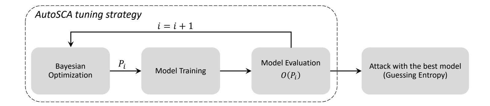

Figure 1: AutoSCA framework.

are finished, the best hyperparameters combination is selected based on its score, and the best model is constructed following this optimal setting. To evaluate its actual attack performance, this model is trained for either 10 or 50 epochs and then attacked ten times on 5 000 traces that are randomly selected out of 10 000 traces. As a result, guessing entropy can be calculated by averaging the key rank of each attack.

## 4.2 The Perspective of Small Neural Network Architectures

Note that we do not put the neural network architecture size into our design considerations. One could consider this somewhat "outdated" as recent works [ZBHV19, WAGP20], give much emphasis on profiling model size. More precisely, Zaid et al. developed custom CNN architectures for each dataset they considered [ZBHV19]. While they obtained significantly better attack performance than related works, they also emphasize that their neural networks are much smaller than, e.g., [BPS+20, KPH+19]. Next, Wouters et al. [WAGP20] continued along this research line of small neural network architectures, and they reported a reduction of neural network trainable parameters from 38.5% to 70%, depending on the specific dataset, while "...still producing similar results."

Our opinion is that such a line of thinking does not follow the SCA perspective. Indeed, we believe our primary concern should be reaching the top attack performance in reproducible conditions. If multiple architectures reach the same attack performance, it makes sense considering different constraints, like, e.g., neural network architecture or profiling set size [PHPG19]. Besides being oriented toward the attack performance, there are several more reasons not to consider the neural network size as a primary concern:

- 1. By using very small neural networks, we need to make more significant adjustments concerning each dataset. Indeed, already Zaid et al. require quite some different architectures for ASCAD and AES\_RD [ZBHV19], which is a striking difference from one architecture needed by Kim et al. [KPH+19]. Considering larger datasets and targets protected with more countermeasures makes very small neural network architectures more limited as they would have problems with profiling model capacity. We believe a proper way to go is to use larger architectures and emphasize explicit profiling model regularization.
- 2. Realistically speaking (and compared to neural network architectures in other domains), SCA's neural network architectures are small. As such, we see no significant reason why to emphasize the need for even smaller neural networks. Indeed, from the computational perspective, we consider all those architectures to be well within reach of academia and industry capabilities. Finally, one can argue that smaller neural network architectures are easier to interpret and explain, and we agree with that perspective even though we still cannot interpret or explain even such small architectures. Still, that perspective should be in the service of the attack performance as understanding architectures that will not be used makes little sense.

{10}------------------------------------------------

# **5 Experimental Results**

First, in Tables [1](#page-10-0) and [2,](#page-10-1) we denote the ranges where we conduct our search for MLP and CNN hyperparameters, respectively. Note that we selected those ranges as a rough estimate to expect a good attack performance based on the results from related works. We could have selected even smaller ranges for certain settings, but that would make the search too easy for both random search and Bayesian Optimization. Note that the ranges for MLP still result in a relatively small search space size of 720 hyperparameter combinations. On the other hand, for CNNs, the exhaustive search should go through 2 488 320 hyperparameter combinations.

We randomly select a profiling model (RS) or run BO for 50 iterations to obtain a profiling model in all the experiments. Once we obtain a profiling model, we train it for a certain number of epochs (10 or 50), and then we evaluate it on the test set. For ASCAD datasets, we use 50 000 traces for training, 2 000 for validation, and 5 000 for testing. For the CHES CTF dataset, 43 000 are used for training, 2 000 for validation, and 5 000 for testing.

| Hyperparameter                                | min                          | max | step |  |
|-----------------------------------------------|------------------------------|-----|------|--|
| Dense (fully-connected) layers                | 2 10 1                 |     |      |  |
| Neurons (for dense or fully-connected layers) | 100 400                   |     | 100  |  |
|                                               | Options                      |     |      |  |
| Learning Rate                                 | 1e-3, 5e-4, 1e-4, 5e-5, 1e-5 |     |      |  |
| Activation function (all layers)              | ReLU, Tanh, ELU, or SELU     |     |      |  |

**Table 1:** Hyperparameter search space for multilayer perceptron.

**Table 2:** Hyperparameters search space for convolutional neural network.

| Hyperparameter                                | min                          | max | step |
|-----------------------------------------------|------------------------------|-----|------|
| Convolution layers                            | 1                            | 4   | 1    |
| Convolution Filters                           | 8                            | 64  | 8    |
| Convolution Kernel Size                       | 2                            | 10  | 1    |
| Pooling Size                                  | 2                            | 5   | 1    |
| Pooling Stride                                | 2                            | 10  | 1    |
| Dense (fully-connected) layers                | 1                            | 3   | 1    |
| Neurons (for dense or fully-connected layers) | 100                          | 400 | 100  |
|                                               | Options                      |     |      |
| Pooling Type                                  | max pooling, avg pooling     |     |      |
| Learning Rate                                 | 1e-3, 5e-4, 1e-4, 5e-5, 1e-5 |     |      |
| Activation function (all layers)              | ReLU, Tanh, ELU, or SELU     |     |      |

# **5.1 ASCAD Datasets**

In this section, we first discuss the results for the ASCAD dataset with the fixed key. Afterward, we extend our analysis to the setting with random keys.

{11}------------------------------------------------

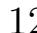

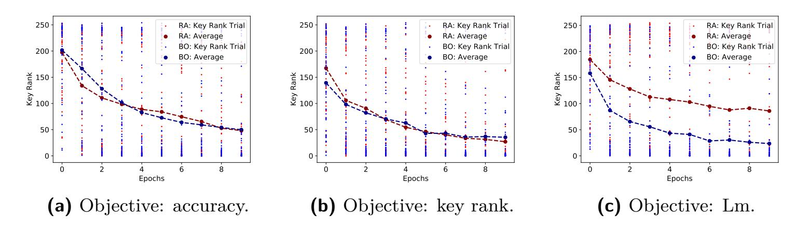

**Figure 2:** Search results for MLP with the HW leakage model on ASCAD with fixed key.

#### 5.1.1 ASCAD with a Fixed Key

In Figure 2, we depict the results for three objective functions (accuracy, key rank, and  $L_m$ , and we compare their performance for random search (RS) and Bayesian Optimization (BO) when tuning MLP profiling models. The profiling models are trained up to ten epochs with the Hamming weight leakage model. Note that the key rank decreases regardless of the objective function. Interestingly, we see rather good performance even for accuracy, which is well-known for not being a good metric for SCA, especially in the HW leakage model |PHJ+18|. Still, note that the final key rank is rather high, and it is expected that with any "reasonable" objective, we can improve performance over random guessing (especially if the dataset is not difficult as is the case with ASCAD with a fixed key). We can observe a similar performance with accuracy and key rank, while  $L_m$  performs better. Finally, for  $L_m$ , BO works significantly better than RS.

Based on the results from the best RS and BO profiling models, we depict guessing entropy results for a number of different settings (Figure 3). We consider three objectives, and we train profiling models for 10 or 50 epochs, which results in six settings. When using BO, we see that accuracy with 50 epochs works the best, as shown in Figure 2a. This indicates that BO is capable of finding profiling models that generalize well. What is more, the best performance reaches GE of 1 for around 500 attack traces. When considering RS, we see that  $L_m$  performs the best (as shown in Figure 2c), as it manages to reach GE equal to 1 for around 250 attack traces already. At the same time, we see accuracy results with RS requires more traces to reach GE of 1. This is mostly because the well-performing profiling models are a matter of luck, and we cannot expect that if we train with accuracy, we can obtain profiling models that provide superior generalization compared to SCA metrics. Our results show very strong attack performance with already ten epochs, which is somewhat differing from related works where it is common to train for 100 epochs or more. Finally, note that in this experiment, we see that there is not much need to use BO mainly because the search space size is small enough for RS to select it. What is more, we observe multiple profiling models are performing very well, which confirms our stipulation that the ASCAD dataset with the fixed key is an easy dataset to attack.

Next, in Figure 4, we show results for the experiments with the ID leakage model. The results are similar to the HW leakage model case, but now we see that the accuracy objective performs the worst for BO. For all three objective functions, we can also notice that BO performs better. In Figure 5, we show the results for the attack dataset, where we see that both RS and BO break the dataset easily. When training with 50 epochs, the best model from BO requires around 130 attack traces, while the best model for RS requires only around 80 attack traces. Note that both results indicate (significantly) better attack performance than reported in state-of-the-art |ZBHV19, WAGP20|. Again, the top performance of RS indicates this dataset is easy to break, and we do not require any special methodologies to succeed in the attack.

{12}------------------------------------------------

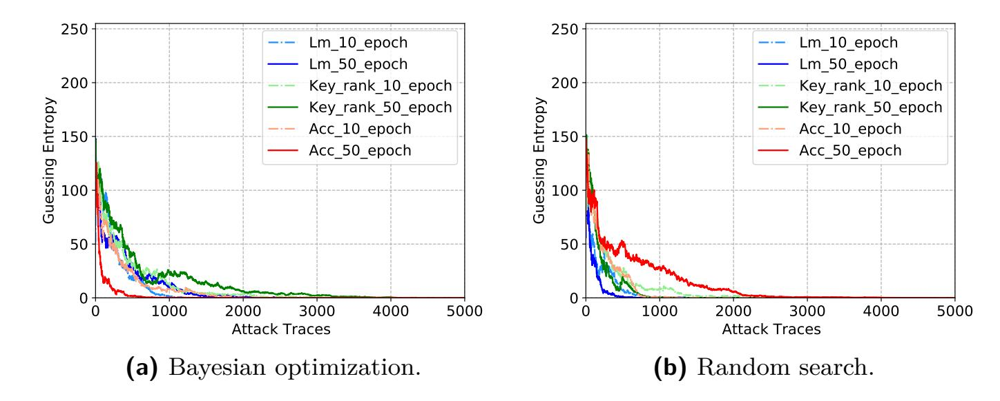

**Figure 3:** The GE comparison with the best MLP models obtained by two searching methods with HW leakage model on ASCAD with fixed key.

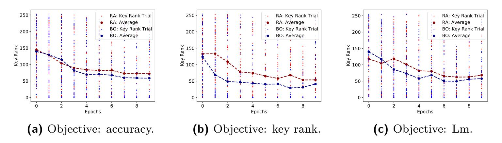

Figure 4: Search results for MLP with the ID leakage model on ASCAD with fixed key.

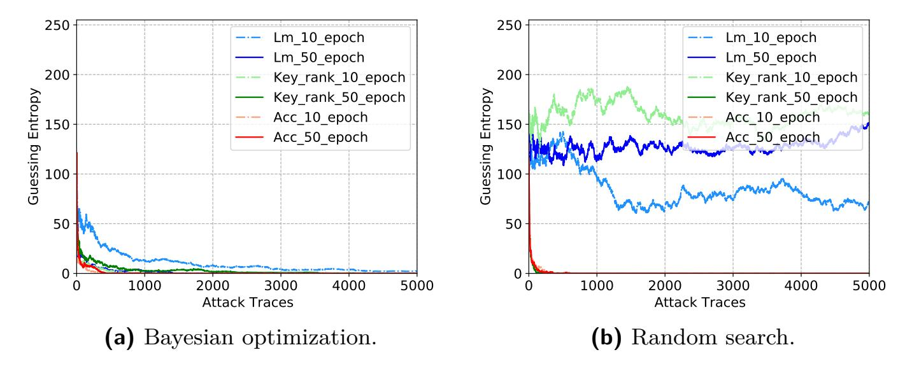

**Figure 5:** The GE comparison with the best MLP models obtained by two searching methods with ID leakage model on ASCAD with a fixed key.

Next, we show the results when optimizing CNN hyperparameters. Figure 6 shows the results for different objectives for CNN in the Hamming weight leakage model. Observe that the results are significantly worse compared to MLP as now, the search space size is almost 3500 times larger. Accuracy and key rank perform similarly, while  $L_m$  manages to reach a significantly lower key rank with BO. Guessing entropy results depicted in Figure 7 show good performance, where around 1000 attack traces is enough for most of the settings to reach guessing entropy of 1. The best performing result is from a random search where we need only 500 traces to break the target.

{13}------------------------------------------------

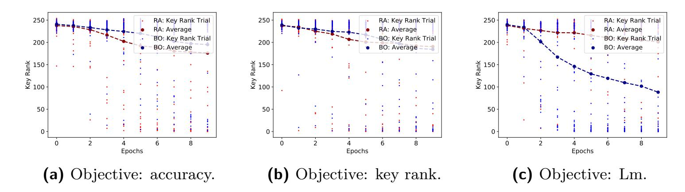

**Figure 6:** Search results for CNN with the HW leakage model on ASCAD with a fixed key.

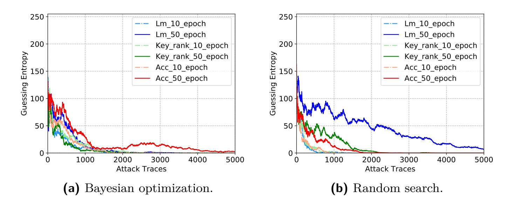

**Figure 7:** The GE comparison with the best CNN models obtained by two searching methods with HW leakage model on ASCAD with fixed key.

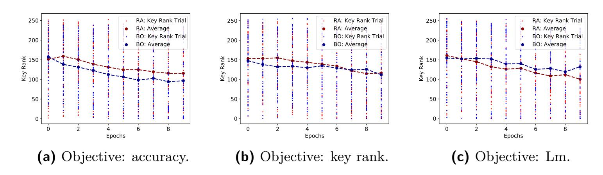

**Figure 8:** Search results for CNN with the ID leakage model on ASCAD with fixed key.

For the ID leakage model, all three objectives reach a significantly better key rank compared with the HW leakage model (Figure 8). The best obtained results are for BO and accuracy as the objective metric. As we are in the ID leakage model, class imbalance does not pose a problem, and thus, accuracy is also more stable. Considering GE results in Figure 9, we see that with the random search, we cannot break the target at all. This is not surprising as the search space is huge, and the chances of randomly selecting a good profiling model are low. On the other hand, BO works well for both accuracy and  $L_m$ .

In Table 3, we compare several architectures for the ID leakage model. We consider training times, complexity (the number of trainable parameters), and the number of traces needed to reach GE of 1. First, notice that [BPS+20] considers a significantly larger neural network, as evident through the training time and the complexity variables. The best

{14}------------------------------------------------

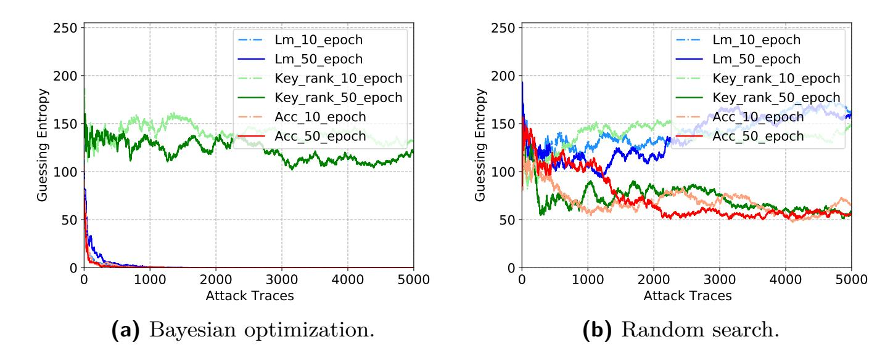

**Figure 9:** The GE comparison with the best CNN models obtained by two searching methods with ID leakage model on ASCAD with fixed key.

architecture from Zaid et al. [ZBHV19] is the smallest. However, it takes more time than AutoSCA MLP (as MLP is simpler to train) and AutoSCA CNN when training with ten epochs. From the performance side, we can see that AutoSCA MLP reaches the best performance with the shortest training time, while AutoSCA CNN is somewhat worse than [ZBHV19]. When increasing the training epochs to 50, the attack performance of both AutoSCA MLP (129) and AutoSCA CNN (158) surpass the best results from related works. As a trade-off, more training time is needed.

**Table 3:** Comparison of performance on ASCAD with the ID leakage model.

|                          | [BPS + 20] | [ZBHV19] | AutoSCA MLP | AutoSCA CNN |
|--------------------------|-----------------------|----------|-------------|-------------|
| Complexity               | 66 652 444            | 16 960   | 478 656     | 54752       |
| Traces to reach $GE = 1$ | 1 476                 | 191      | 251/129     | 498/158     |
| Training time (s)        | 5475                  | 253      | 81/405      | 116/550     |

#### 5.1.2 ASCAD with Random Keys

In Figure 10, we depict the results for the HW leakage model and MLP. Observe that here, key rank as the objective for BO reaches by far the best results. Both accuracy and  $L_m$  perform similarly for RS and BO, and in line with results in the previous section. Guessing entropy results are shown in Figure 11. Observe  $L_m$  results are the best for both RS and BO. Again, we do not see a significant difference concerning the number of training epochs. BO with  $L_m$  and 50 epochs reaches the best performance where it requires only around 800 traces to reach GE equal to 1. As this dataset is more difficult than the dataset with the fixed key, we see that MLP with RS has more issues reaching top performance, and BO should be already considered a preferable option for hyperparameter tuning.

Next, we consider the ID leakage model and MLP for the ASCAD dataset with random keys (Figure 12). As there are more labels in this leakage model (256 classes) and the dataset is more difficult compared to ASCAD with a fixed key, now we can observe that BO is significantly better than RS regardless of the objective. The best results are again reached for  $L_m$ , which confirms that this metric is indeed connected to the profiling model performance and should be considered as a viable choice for deep learning-based SCA. Figure 13 shows corresponding GE results, where RS needs fewer traces to reach GE of 1 compared to BO. Indeed, we observe we can break the target with around 2000 attack traces, while with BO, we need around 4000 traces.

{15}------------------------------------------------

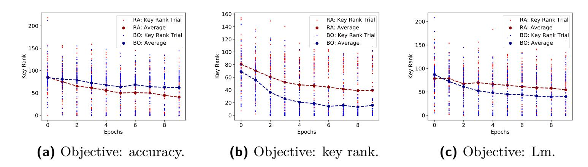

**Figure 10:** Search results for MLP with the HW leakage model on ASCAD with random keys.

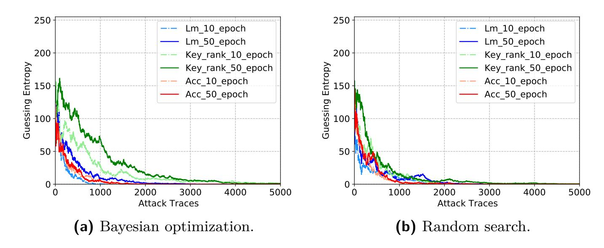

**Figure 11:** The GE comparison with the best MLP models obtained by two searching methods with the HW leakage model on ASCAD with random keys.

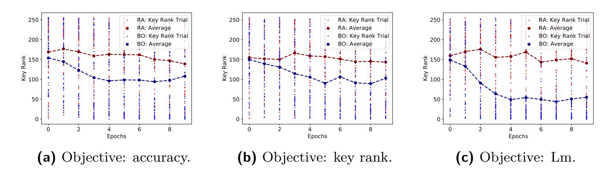

**Figure 12:** Search results for MLP with the ID leakage model on ASCAD with random keys.

Finally, we display the results for ASCAD with random keys and CNN architectures. First, in Figure 14, we show the results for the HW leakage model. Observe that accuracy and  $L_m$  give similar results, while the key rank objective is somewhat better. Translating these into the attack performance, we show guessing entropy in Figure 15. Interestingly, we still see that RS has better performance, as the best performing profiling model requires around 1000 traces to break the target.

Figure 16 shows results for the ID leakage model and CNN. Observe that all three objectives struggle to reach good performance, suggesting that our profiling models will have problems with generalization. Such intuition is confirmed in Figure 17, where we display GE results. Here, BO works significantly better as it manages to reach GE of 1 for

{16}------------------------------------------------

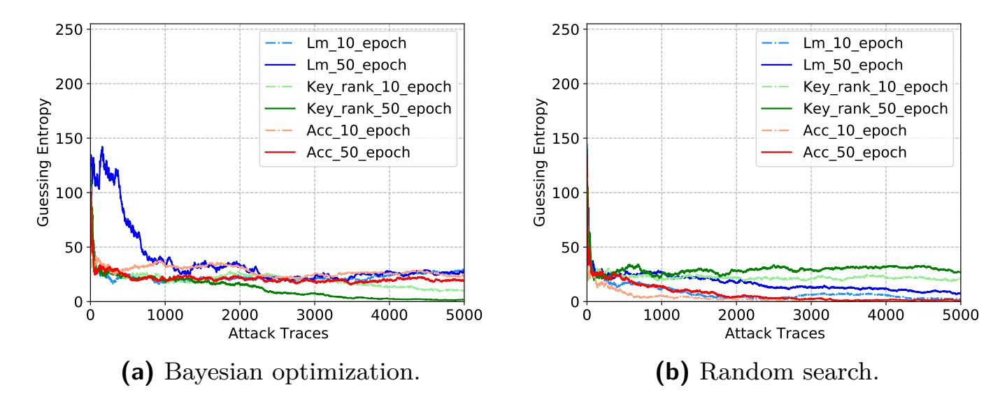

**Figure 13:** The GE comparison with the best MLP models obtained by two searching methods with the ID leakage model on ASCAD with random keys.

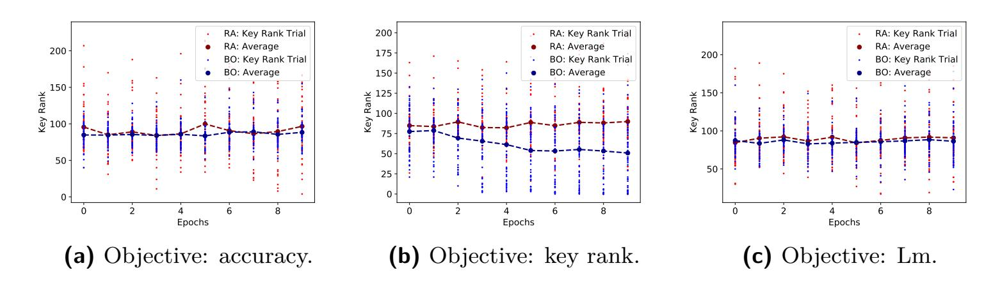

**Figure 14:** Search results for CNN with the HW leakage model on ASCAD with random keys.

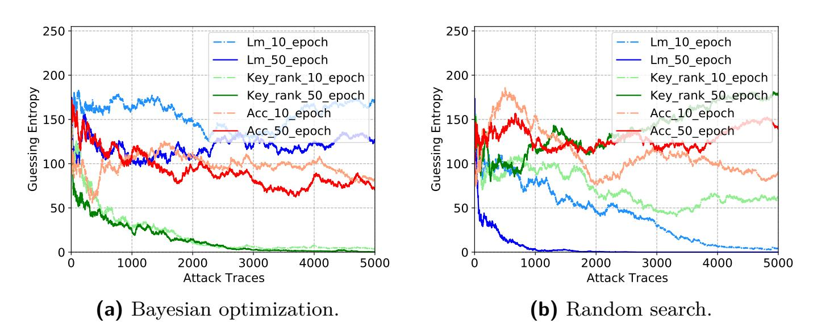

**Figure 15:** The GE comparison with the best CNN models obtained by two searching methods with the HW leakage model on ASCAD with random keys.

around 3000 attack traces (accuracy and 50 epochs). For RS, no results are suggesting we can break the target. These results are in line with our previous observations as the more difficult the dataset and leakage model (concerning the number of classes), the smaller are the chances that RS can find well-performing architecture.

{17}------------------------------------------------

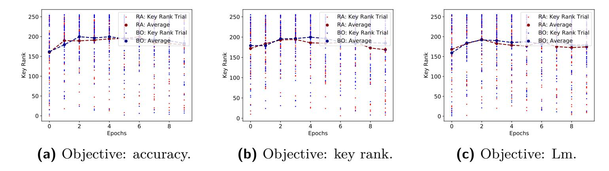

**Figure 16:** Search results for CNN with the ID leakage model on ASCAD with random keys.

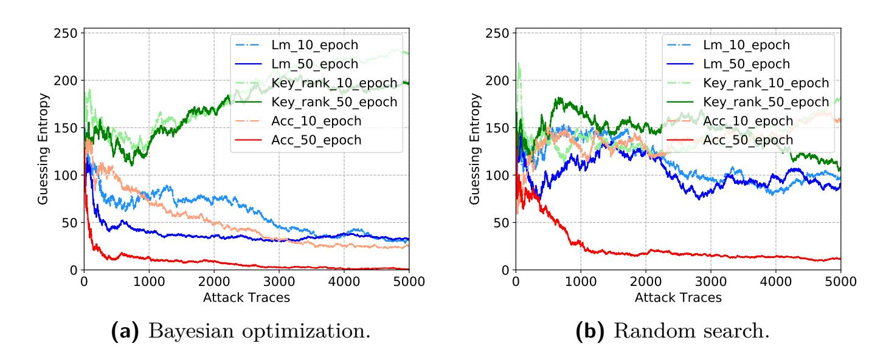

**Figure 17:** The GE comparison with the best CNN models obtained by two searching methods with ID leakage model on ASCAD with random keys.

#### 5.2 **CHES CTF Dataset**

This section provides experimental results with MLPs and CNNs for the CHES CTF dataset on the Hamming weight leakage model. The training set contains a fixed key that is different from the fixed key in the validation set. Therefore, we omit results for the ID leakage model as it requires a training set with variable keys (or at least a training set with the same key as the validation set) if the S-box output in the first AES round is used as a leakage model. Moreover, we show only results for the validation key rank and  $L_m$ as search metrics for this dataset. We do not discuss the validation accuracy as a search metric because the results were very poor in all scenarios.

Figure 18 shows results for a 50-iteration search for both BO and RS methods when the hyperparameter search method tries to find the best MLP model. In these cases, validation key rank and  $L_m$  are used as the objective function to be minimized and maximized, respectively. As we can see, BO tends to find more successful profiling models when compared to RS when we search for hyperparameters in the ranges provided in Table 1.

Figures 19 provides the GE results for the best models that are selected according to each search method when MLPs are considered. These best models are retrained at the end of the search process and, this time, for 10 and 50 epochs. Comparing Figures 19a and 19b, we can observe that GE results obtained from the best model when BO is considered are very similar to the GE results obtained with RS. For the best models, in case validation key rank is the objective function, BO requires fewer traces to converge when the model is retrained for 50 epochs. For other scenarios, results are similar and all models required between 800 and 1500 traces to reach guessing entropy equal to 1.

{18}------------------------------------------------

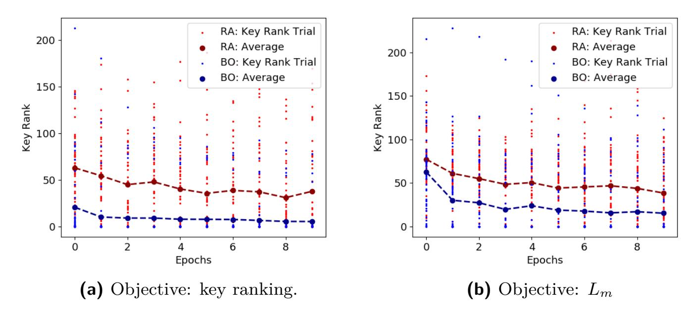

**Figure 18:** Search results for MLP with the HW leakage model for the CHES CTF dataset.

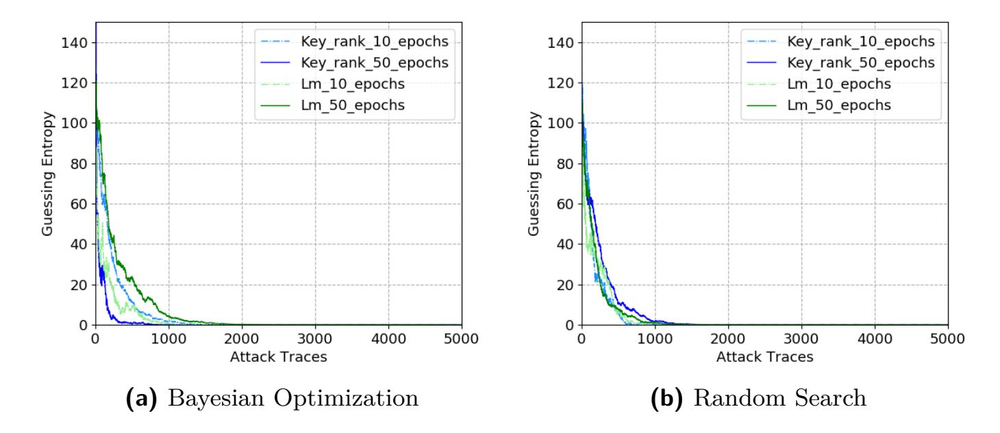

**Figure 19:** The GE comparison with the best MLP models obtained by two searching methods with HW leakage model on CHES CTF dataset.

Figure [20](#page-19-0) shows hyperparameter search results for CNNs for the Hamming weight leakage model. Again, the analysis is performed for 50 iterations, and both methods (BO and RS) search for hyperparameters according to the ranges provided in Table [2.](#page-10-1) In Figure [20a,](#page-19-0) we can observe that the average key rank in all ten executed epochs is lower for BO if compared to RS in case of the validation key rank is used as the objective metric to be minimized. When *Lm* metric is used as the objective function to be maximized in the BO process, results for both search methods are similar, as seen in Figure [20b.](#page-19-0)

Results in Figure [21](#page-19-1) indicate GE for the best models in case CNNs are considered by the search methods. In this case, we can clearly see that BO tends to find a CNN model that provides better generalization results than RS. This difference is more evident when the validation key rank is used as the objective function. When the best model obtained from BO is retrained for 50 epochs, this model requires approximately 1 400 traces to reach GE equal to 1, while GE for the same scenario with random search was not able to reach GE equal to 1 after the processing of 5 000 attack traces. As the search space is larger for CNNs than MLPs, an optimized search method such as BO methods tends to work better.

{19}------------------------------------------------

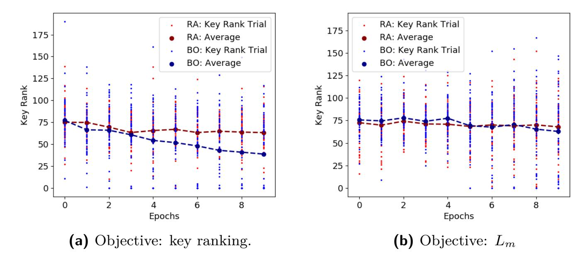

**Figure 20:** Search results for CNN with the HW leakage model for the CHES CTF dataset.

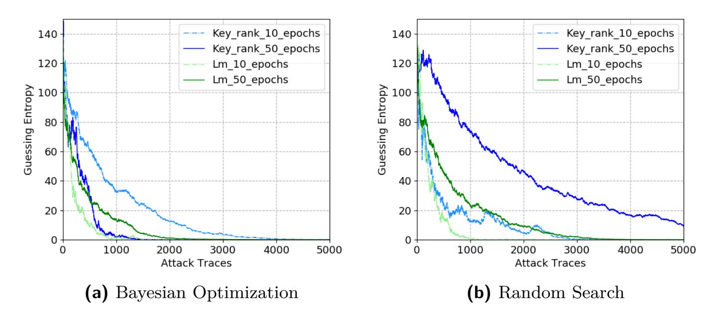

**Figure 21:** The GE comparison with the best CNN models obtained by two searching methods with HW leakage model on CHES CTF dataset.

# **6 Conclusions and Future Work**

In this paper, we propose Bayesian Optimization for the deep learning-based SCA hyperparameter tuning. We develop a custom framework that supports both machine learning and side-channel metrics, and we evaluate the performance of such obtained profiling models with random search and state-of-the-art results. We can observe that BO works well and produces a large number of highly-fit profiling models. Interestingly, we also see that random search can find excellent profiling models, where for several settings, results obtained from random search are even the best. This raises the question of whether we indeed need methodologies for finding neural network architectures, or more precisely, can we make good methodologies on datasets that are so easy to break? Naturally, random search results need to be considered from a proper perspective as we pre-select some "reasonable" ranges. Extending the ranges makes the problem more difficult for a random search. Thus, going there is a trade-off between the hyperparameter tuning and the assumptions on the architectures one makes. Indeed, our results show there are so many top-performing profiling models that it becomes difficult to properly judge the merits of methodologies. Due to those issues, we believe the automated tuning process as the one we present here should be the first choice when running deep learning-based SCA.

{20}------------------------------------------------

We plan to extend our analysis to more datasets and different types of Bayesian Optimization in future work. Indeed, in this work, we considered only one surrogate model (Gaussian process) and one acquisition function (upper confidence bound). While those choices are reasonable for the settings we explore, further investigation should be done to judge specific design choices' merits.

# **References**

- [ACBF02] Peter Auer, Nicolò Cesa-Bianchi, and Paul Fischer. Finite-time analysis of the multiarmed bandit problem. *Mach. Learn.*, 47(2–3):235–256, May 2002.
- [APSQ06] C. Archambeau, E. Peeters, F. X. Standaert, and J. J. Quisquater. Template attacks in principal subspaces. In Louis Goubin and Mitsuru Matsui, editors, *Cryptographic Hardware and Embedded Systems - CHES 2006*, pages 1–14, Berlin, Heidelberg, 2006. Springer Berlin Heidelberg.
- [BCH+20] Shivam Bhasin, Anupam Chattopadhyay, Annelie Heuser, Dirmanto Jap, Stjepan Picek, and Ritu Ranjan Shrivastwa. Mind the portability: A warriors guide through realistic profiled side-channel analysis. In *27th Annual Network and Distributed System Security Symposium, NDSS 2020, San Diego, California, USA, February 23-26, 2020*. The Internet Society, 2020.
- [BPS+20] Ryad Benadjila, Emmanuel Prouff, Rémi Strullu, Eleonora Cagli, and Cécile Dumas. Deep learning for side-channel analysis and introduction to ASCAD database. *J. Cryptographic Engineering*, 10(2):163–188, 2020.
- [CDP17] Eleonora Cagli, Cécile Dumas, and Emmanuel Prouff. Convolutional neural networks with data augmentation against jitter-based countermeasures. In Wieland Fischer and Naofumi Homma, editors, *Cryptographic Hardware and Embedded Systems – CHES 2017*, pages 45–68, Cham, 2017. Springer International Publishing.
- [CK14] Omar Choudary and Markus G. Kuhn. Efficient template attacks. In Aurélien Francillon and Pankaj Rohatgi, editors, *Smart Card Research and Advanced Applications*, pages 253–270, Cham, 2014. Springer International Publishing.
- [CRR02] Suresh Chari, Josyula R. Rao, and Pankaj Rohatgi. Template attacks. In Burton S. Kaliski Jr., Çetin Kaya Koç, and Christof Paar, editors, *Cryptographic Hardware and Embedded Systems - CHES 2002, 4th International Workshop, Redwood Shores, CA, USA, August 13-15, 2002, Revised Papers*, volume 2523 of *Lecture Notes in Computer Science*, pages 13–28. Springer, 2002.
- [Fra18] Peter I. Frazier. A tutorial on bayesian optimization, 2018.
- [GBC16] Ian Goodfellow, Yoshua Bengio, and Aaron Courville. *Deep Learning*. MIT Press, 2016. <http://www.deeplearningbook.org>.
- [GHO15] R. Gilmore, N. Hanley, and M. O'Neill. Neural network based attack on a masked implementation of AES. In *2015 IEEE International Symposium on Hardware Oriented Security and Trust (HOST)*, pages 106–111, May 2015.
- [HGM+11] Gabriel Hospodar, Benedikt Gierlichs, Elke De Mulder, Ingrid Verbauwhede, and Joos Vandewalle. Machine learning in side-channel analysis: a first study. *J. Cryptogr. Eng.*, 1(4):293–302, 2011.

{21}------------------------------------------------

- [HZ12] Annelie Heuser and Michael Zohner. Intelligent Machine Homicide - Breaking Cryptographic Devices Using Support Vector Machines. In Werner Schindler and Sorin A. Huss, editors, *COSADE*, volume 7275 of *LNCS*, pages 249–264. Springer, 2012.
- [JSH19] Haifeng Jin, Qingquan Song, and Xia Hu. Auto-keras: An efficient neural architecture search system. In *Proceedings of the 25th ACM SIGKDD International Conference on Knowledge Discovery & Data Mining*, KDD '19, page 1946–1956, New York, NY, USA, 2019. Association for Computing Machinery.
- [KJJ99] Paul C. Kocher, Joshua Jaffe, and Benjamin Jun. Differential power analysis. In Michael J. Wiener, editor, *Advances in Cryptology - CRYPTO '99, 19th Annual International Cryptology Conference, Santa Barbara, California, USA, August 15-19, 1999, Proceedings*, volume 1666 of *Lecture Notes in Computer Science*, pages 388–397. Springer, 1999.
- [KPH+19] Jaehun Kim, Stjepan Picek, Annelie Heuser, Shivam Bhasin, and Alan Hanjalic. Make some noise. unleashing the power of convolutional neural networks for profiled side-channel analysis. *IACR Transactions on Cryptographic Hardware and Embedded Systems*, pages 148–179, 2019.
- [LKP20] Huimin Li, Marina Krček, and Guilherme Perin. A comparison of weight initializers in deep learning-based side-channel analysis. Cryptology ePrint Archive, Report 2020/904, 2020. <https://eprint.iacr.org/2020/904>.
- [LMBM13] Liran Lerman, Stephane Fernandes Medeiros, Gianluca Bontempi, and Olivier Markowitch. A Machine Learning Approach Against a Masked AES. In *CARDIS*, Lecture Notes in Computer Science. Springer, November 2013. Berlin, Germany.
- [LPB+15] Liran Lerman, Romain Poussier, Gianluca Bontempi, Olivier Markowitch, and François-Xavier Standaert. Template attacks vs. machine learning revisited (and the curse of dimensionality in side-channel analysis). In *International Workshop on Constructive Side-Channel Analysis and Secure Design*, pages 20–33. Springer, 2015.
- [MHM14] Zdenek Martinasek, Jan Hajny, and Lukas Malina. Optimization of power analysis using neural network. In Aurélien Francillon and Pankaj Rohatgi, editors, *Smart Card Research and Advanced Applications*, pages 94–107, Cham, 2014. Springer International Publishing.
- [MPP16] Houssem Maghrebi, Thibault Portigliatti, and Emmanuel Prouff. Breaking cryptographic implementations using deep learning techniques. In *International Conference on Security, Privacy, and Applied Cryptography Engineering*, pages 3–26. Springer, 2016.
- [PCP20] Guilherme Perin, Lukasz Chmielewski, and Stjepan Picek. Strength in numbers: Improving generalization with ensembles in machine learning-based profiled side-channel analysis. *IACR Transactions on Cryptographic Hardware and Embedded Systems*, 2020(4):337–364, Aug. 2020.
- [PHG17] Stjepan Picek, Annelie Heuser, and Sylvain Guilley. Template attack versus bayes classifier. *J. Cryptogr. Eng.*, 7(4):343–351, 2017.
- [PHJ+17] Stjepan Picek, Annelie Heuser, Alan Jovic, Simone A. Ludwig, Sylvain Guilley, Domagoj Jakobovic, and Nele Mentens. Side-channel analysis and machine learning: A practical perspective. In *2017 International Joint Conference*

{22}------------------------------------------------

- *on Neural Networks, IJCNN 2017, Anchorage, AK, USA, May 14-19, 2017*, pages 4095–4102, 2017.
- [PHJ+18] Stjepan Picek, Annelie Heuser, Alan Jovic, Shivam Bhasin, and Francesco Regazzoni. The curse of class imbalance and conflicting metrics with machine learning for side-channel evaluations. *IACR Transactions on Cryptographic Hardware and Embedded Systems*, 2019(1):209–237, Nov. 2018.
- [PHJB19] S. Picek, A. Heuser, A. Jovic, and L. Batina. A systematic evaluation of profiling through focused feature selection. *IEEE Transactions on Very Large Scale Integration (VLSI) Systems*, 27(12):2802–2815, 2019.
- [PHPG19] Stjepan Picek, Annelie Heuser, Guilherme Perin, and Sylvain Guilley. Profiling side-channel analysis in the efficient attacker framework. Cryptology ePrint Archive, Report 2019/168, 2019. <https://eprint.iacr.org/2019/168>.
- [PP20] Guilherme Perin and Stjepan Picek. On the influence of optimizers in deep learning-based side-channel analysis. Cryptology ePrint Archive, Report 2020/977, 2020. <https://eprint.iacr.org/2020/977>.
- [SMY09] François-Xavier Standaert, Tal G. Malkin, and Moti Yung. A unified framework for the analysis of side-channel key recovery attacks. In Antoine Joux, editor, *Advances in Cryptology - EUROCRYPT 2009*, pages 443–461, Berlin, Heidelberg, 2009. Springer Berlin Heidelberg.
- [WAGP20] Lennert Wouters, Victor Arribas, Benedikt Gierlichs, and Bart Preneel. Revisiting a methodology for efficient cnn architectures in profiling attacks. *IACR Transactions on Cryptographic Hardware and Embedded Systems*, 2020(3):147– 168, Jun. 2020.
- [Wei19] Leo Weissbart. On the performance of multilayer perceptron in profiling side-channel analysis. Cryptology ePrint Archive, Report 2019/1476, 2019. <https://eprint.iacr.org/2019/1476>.
- [WP20] Lichao Wu and Stjepan Picek. Remove some noise: On pre-processing of side-channel measurements with autoencoders. *IACR Transactions on Cryptographic Hardware and Embedded Systems*, 2020(4):389–415, Aug. 2020.
- [WWK+20] Lichao Wu, Léo Weissbart, Marina Krček, Huimin Li, Guilherme Perin, Lejla Batina, and Stjepan Picek. On the attack evaluation and the generalization ability in profiling side-channel analysis. Cryptology ePrint Archive, Report 2020/899, 2020. <https://eprint.iacr.org/2020/899>.
- [YZLC12] Shuguo Yang, Yongbin Zhou, Jiye Liu, and Danyang Chen. Back propagation neural network based leakage characterization for practical security analysis of cryptographic implementations. In Howon Kim, editor, *Information Security and Cryptology - ICISC 2011*, pages 169–185, Berlin, Heidelberg, 2012. Springer Berlin Heidelberg.
- [ZBHV19] Gabriel Zaid, Lilian Bossuet, Amaury Habrard, and Alexandre Venelli. Methodology for efficient cnn architectures in profiling attacks. *IACR Transactions on Cryptographic Hardware and Embedded Systems*, 2020(1):1–36, Nov. 2019.