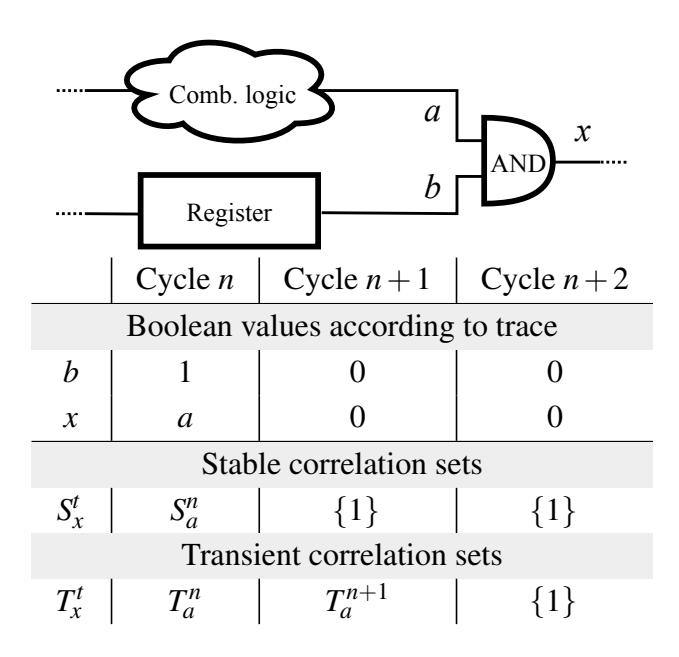
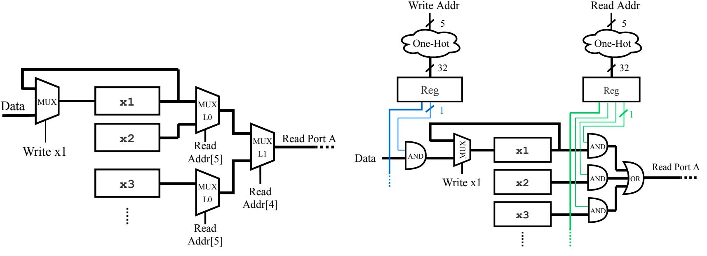
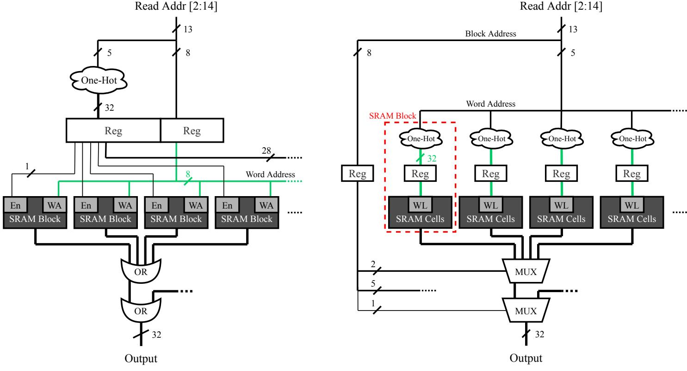
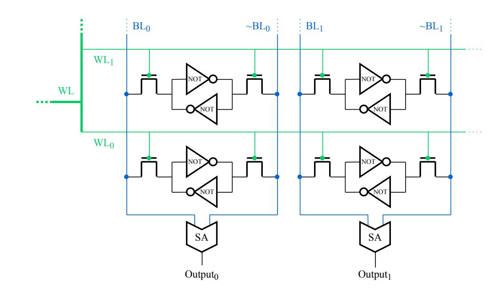
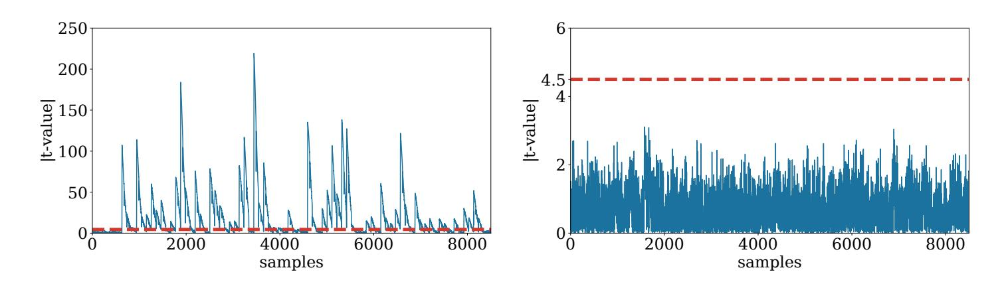
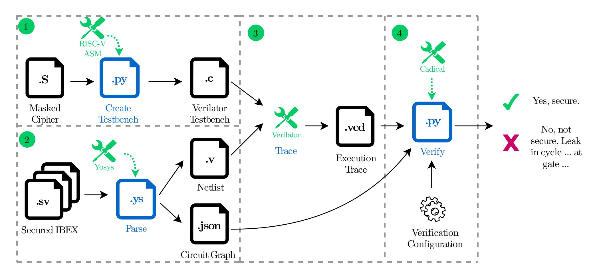

{0}------------------------------------------------

# COCO: Co-Design and Co-Verification of Masked Software Implementations on CPUs

Barbara Gigerl *Graz University of Technology*

Vedad Hadzic *Graz University of Technology*

Robert Primas *Graz University of Technology*

Stefan Mangard *Graz University of Technology Lamarr Security Research*

Roderick Bloem *Graz University of Technology*

#### Abstract

The protection of cryptographic implementations against power analysis attacks is of critical importance for many applications in embedded systems. The typical approach of protecting against these attacks is to implement algorithmic countermeasures, like masking. However, implementing these countermeasures in a secure and correct manner is challenging. Masking schemes require the independent processing of secret shares, which is a property that is often violated by CPU microarchitectures in practice. In order to write leakage-free code, the typical approach in practice is to iteratively explore instruction sequences and to empirically verify whether there is leakage caused by the hardware for this instruction sequence or not. Clearly, this approach is neither efficient, nor does it lead to rigorous security statements.

In this paper, we overcome the current situation and present the first approach for co-design and co-verification of masked software implementations on CPUs. First, we present COCO, a tool that allows us to provide security proofs at the gate-level for the execution of a masked software implementation on a concrete CPU. Using COCO, we analyze the popular 32-bit RISC-V IBEX core, identify all design aspects that violate the security of our tested masked software implementations and perform corrections, mostly in hardware. The resulting *secured* IBEX core has an area overhead around 10%, the runtime of software on this core is largely unaffected, and the formal verification with COCO of an, e.g., first-order masked Keccak S-box running on the secured IBEX core takes around 156 seconds. To demonstrate the effectiveness of our suggested design modifications, we perform practical leakage assessments using an FPGA evaluation board.

#### 1 Introduction

Since the rise of the Internet of Things (IoT), embedded devices are integrated into a wide range of everyday services. Often, these simple devices are part of larger software ecosystems, which makes the protection of cryptographic keys on

these devices an essential but challenging task. Physical sidechannel attacks, such as power analysis, allow attackers to extract cryptographic keys by observing a device's power consumption [\[11,](#page-14-0) [29,](#page-15-0) [42\]](#page-16-0). To prevent such attacks, embedded devices typically employ dedicated countermeasures on the algorithmic level. The most prominent example of such algorithmic countermeasures against power analysis is masking, essentially a secret sharing technique that splits input and intermediate variables of cryptographic computations into *d* +1 random shares such that the observation of up to *d* shares does not reveal any information about their corresponding native value [\[4,](#page-13-0) [6,](#page-14-1) [12,](#page-14-2) [21,](#page-15-1) [22,](#page-15-2) [26,](#page-15-3) [45\]](#page-16-1).

Masking schemes typically have in common that they rely on certain assumptions such as independence of leakage, i.e., independent computations result in independent leakage [\[44\]](#page-16-2). However, as pointed out by many academic works in the past, such assumptions are typically not satisfied on CPUs. Coron et al. [\[13\]](#page-14-3) were among the first who showed that, e.g., memory transitions in the register file or RAM can leak the Hamming distance between two shares, thereby reducing the protection order of masking schemes on CPUs. Later publications follow up on these observations [\[14,](#page-14-4) [32,](#page-15-4) [40\]](#page-15-5), and amongst others, formulate the so-called order reduction theorem [\[1\]](#page-13-1). This theorem states that *d*th-order protection under the assumption of independent leakage reduces to *d* 2 -th protection if effects like memory transitions are taken into account. Consequently, and without further assumptions on the hardware, achieving second-order protection using masked software implementations can require computations with up to 5 shares.

This is a very significant overhead, and also the reason why the goal in practice is to find strategies to cope with the leakage caused by the underlying CPUs and to achieve *d*th-order protection with *d* +1 random shares. In order to test if such implementations indeed provide the desired security level in practice, research on the verification of masked cryptographic implementations has gained a lot of attention during the last years. The existing works can be roughly divided into two sets: works based on empirical verification, and works based on formal verification.

{1}------------------------------------------------

On the empirical side, authors have studied masking-related side effects of certain microprocessors via leakage assessments and then built corresponding hardened software implementations [\[14,](#page-14-4) [40\]](#page-15-5). While their resulting masked implementations do in fact maintain their theoretical protection in practice, they also come with a noticeable performance overhead (by up to a factor of 15) that is caused by the necessary software tweaks. Since leakage assessments are quite labor-intensive, tools like PINPAS [\[16\]](#page-14-5), or more recently, ELMO [\[31\]](#page-15-6) have been developed that can emulate power leakage for certain microprocessors. The authors of ROSITA [\[46\]](#page-16-3) have pushed this automation even further by also automating the software patching process after leakage detection. A quite different take on providing side-channel protection on CPUs is presented by Gross et al. [\[20\]](#page-14-6), who propose a masked CPU design that can perform unprotected software implementations in a side-channel protected manner. Similar work exists for RISC-V processors [\[34\]](#page-15-7), also on instruction set architecture level [\[24,](#page-15-8) [27,](#page-15-9) [43\]](#page-16-4).

On the formal side, tools like REBECCA [\[8\]](#page-14-7) and maskVerif [\[2\]](#page-13-2) represent the first steps toward formal verification of masked implementations. Both tools are mainly tailored to hardware implementations; maskVerif does offer some support for software implementations but (1) can only deal with code that is written in a special intermediate language, and (2) uses a probing model that only considers simple CPU side-effects such as register overwrites. More recently, Belaid et al. presented *Tornado* [\[7\]](#page-14-8), a compiler that automatically generates masked software implementations that are secure in the same model. A more fine-grained software verification approach that utilizes annotated assembly implementations is presented by Barthe et al. [\[5\]](#page-13-3), while with *Silver* [\[28\]](#page-15-10), Knichel et al. promise improved verification accuracy and performance for hardware implementations.

Our Contribution So far, the verification of masked software implementations was only done in simplified settings that require modified software implementations and do not consider a wider range of side-effects, such as glitches at the gate level, that occur when software runs on an actual CPU. There still exists a noticeable gap between correctness proofs and the resulting practical protection for masked software implementations. We close this gap by providing the following contributions:

- We present COCO, a tool inspired by REBECCA, that can formally verify the security of (any-order) masked, RISC-V assembly implementations that are executed on concrete CPUs defined by gate-level netlists. COCO essentially provides hardware-level verification including glitches for software implementations with constant control flow.
- Using COCO, we analyze the design of the popular 32-

- bit IBEX[1](#page-1-0) core and identify all hardware design aspects that could prevent the leakage-free execution of our test suite of masked software implementations on this CPU.
- Based on this analysis, we present design strategies for CPU and memory, that with low hardware overhead, eliminate most of our discovered flaws in hardware, while leaving behind a few select and easy-to-check constraints for masked software implementations.
- We show the practicality of this work by verifying a variety of masked assembly implementations, including various types of (higher-order) masked AND-gates, a second-order masked Keccak S-box [\[23\]](#page-15-11), and a firstorder masked AES S-box implementation [\[9\]](#page-14-9). We also show examples where COCO identifies flaws in broken masked software implementations and reports the corresponding execution cycle, as well as the location of the leakage source within the IBEX netlist. To show the effective robustness of our secured design, we perform leakage assessments on an FPGA evaluation board.
- We publish COCO and our secured IBEX on Github[2](#page-1-1) .

Outline In [Section 2,](#page-1-2) we present COCO, a tool that can formally verify the leakage-free execution of masked software implementations directly on CPU netlists. [Section 3](#page-5-0) explains how we analyze the popular 32-bit RISC-V IBEX core using COCO, the discovered issues, and the resulting hardware modifications which enable leakage-free software execution. In a similar spirit, [Section 4](#page-8-0) takes a look at data memory and proposes solutions for how SRAM can be added to a CPU core such that it can be included in COCO's verification. [Sec](#page-10-0)[tion 5](#page-10-0) describes COCO's verification workflow in detail and presents various verification runtime benchmarks as well as the practical evaluation. We conclude our work in [Section 6.](#page-13-4)

## 2 Verifying Software Implementations on Hardware

In this section, we describe how we built COCO, a tool inspired by REBECCA [\[8\]](#page-14-7), for the verification of masked software implementations directly on CPU netlists. More concretely, we show how the problem of verifying masked software implementations can be mapped to a hardware verification problem by treating software as a sequence of control signals that dictate the data/control flow within a CPU. This approach comes with the advantage that we can directly verify assembly implementations and observe a wider range of sideeffects that could reduce the protection order of the tested software implementations. Previous works in this direction

1<https://github.com/lowRISC/ibex>

2<https://github.com/IAIK/coco-alma>,

<https://github.com/IAIK/coco-ibex>

{2}------------------------------------------------

require modified software implementations and only consider a select amount of CPU side-effects that have been discovered in empirical evaluations [\[2,](#page-13-2) [5\]](#page-13-3).

First, we cover necessary background on masking and RE-BECCA. We then show that the classical probing model [\[26\]](#page-15-3) is not suitable for hardware/software co-verification and propose the so-called *time-constrained probing model* that can be seen as a stricter version of previously used models for software verification. We then discuss all improvements that we performed on top of REBECCA, such that hardware/software co-verification becomes feasible, ultimately leading to COCO. COCO's complete verification flow is described in [Section 5.](#page-10-0)

#### 2.1 Background on Masking

Masking is a prominent algorithmic countermeasure against power analysis attacks [\[10\]](#page-14-10). In a nutshell, masking is a secretsharing technique that splits intermediate values of a computation into *d* +1 uniformly random shares, such that observing up to *d* shares does not leak any information about the underlying value. The used masking scheme determines the number of masks *d*, and results in a *d*th-order masking scheme. In classical Boolean masking, the sharing of a native variable *s*, when split into *d* +1 random shares *s*0 ...*sd*, must satisfy *s* = *s*0 ⊕ ... ⊕ *sd*. Hereby, *s*0 ...*sd*−1 is chosen uniformly at random while *sd* = *s*0 ⊕...⊕*sd*−1 ⊕*s*. This ensures that each share *si* is uniformly distributed and statistically independent of *s*. For example, in a first-order masking scheme (*d* = 1), the secret variable *s* is split up into two shares *s*0 and *s*1, such that *s* = *s*0 ⊕ *s*1. *s*0 is chosen runiformly at random, while *s*1 = *s*⊕*s*0.

When implementing masked cryptographic algorithms, dealing with linear functions is trivial as they can simply be computed on each share individually. However, implementing masking for non-linear functions requires computations on all shares of a native value, which is more challenging to implement in a secure and correct manner, and thus the main interest in literature [\[4,](#page-13-0) [6,](#page-14-1) [12,](#page-14-2) [21,](#page-15-1) [22,](#page-15-2) [26,](#page-15-3) [45\]](#page-16-1).

#### 2.2 Background on REBECCA

REBECCA [\[8\]](#page-14-7) is a tool for the formal verification of masked hardware implementations. Simply speaking, given the netlist of a masked hardware circuit, together with labels that indicate which input shares belong together, REBECCA can determine if the separation between shares is preserved throughout the circuit. More formally, REBECCA checks if a circuit is secure in the glitch-extended version of the original probing model by Ishai et al. [\[26\]](#page-15-3), which we refer to as the classical probing model. In general, the probing model defines the attacker's abilities in terms of the number of used probing needles, which are placed on a wire in a circuit and allow to observe the respective value from the wire. In the classical probing model, an attacker can place up to *d* probing needles

in a circuit, which allows the observation of up to *d* intermediate values throughout the computation. A circuit is said to be *d*th-order protected if an attacker who combines the recorded information cannot infer information about native values.

The Verification Flow of REBECCA REBECCA operates on the netlist of a pipelined masked hardware circuit. A masked hardware circuit consists of linear gates (XOR, XNOR), non-linear gates (AND, OR), registers and constants, that are all connected by wires. Inputs are gates with indegree zero, such as the clock signal or the input state of a cipher.

The circuit inputs are annotated with labels to express their purpose in the masking scheme, which can either be a *share*, a *mask*, or *public*. A *share* represents a share of a secret value, a *mask* is a fresh uniformly-distributed random value, and *public* means that it is not important for the masked implementation. These labels are propagated through all gates of the circuit, following a list of propagation rules. The circuit is not secure in the classical probing model if there is a gate that correlates with a native secret, i.e., allows an attacker probing the gate to deduce information about the native secret.

REBECCA is able to prove the glitch-resistance of masked hardware circuits. Glitches may arise in the combinatorial logic, and are caused by various physical hardware properties, including different wire lengths. REBECCA takes glitches into account by modeling the *stable* and *transient* correlation of gates. Stable correlations refer to the final values of the signals, whereas transient correlations refer to all intermediate signal values before the circuit stabilizes.

Fourier Expansions and Leakage Checks In order to check for correlation, REBECCA uses *correlation sets*. A correlation set is bound to a specific gate in the circuit and describes which information an attacker can learn by placing a probe on the gate. These sets are derived from the Fourier expansion of Boolean functions [\[37\]](#page-15-12). Fourier expansions represent Boolean functions as a polynomial over the real domain {1,−1}. Examples of Fourier expansions are shown in [Ap](#page-16-5)[pendix A.](#page-16-5)

A function correlates to a linear combination of its inputs if the correlation term representing the linear combination has a non-zero correlation coefficient. REBECCA applies a very conservative over-approximation of these coefficients and derives correlation sets from these. Correlation sets contain terms with non-zero correlation coefficients while omitting the exact value of the coefficients. A first-order leakage test for a secret *s* checks whether a correlation set of any gate contains a term where all shares of *s* are present without being masked by a random value (a mask or an incomplete sharing of another secret). Explicitly constructing the correlation sets and performing these checks is infeasible, which is why RE-BECCA encodes everything as a pseudo-Boolean formula and checks for satisfiability with the SMT solver Z3 [\[15\]](#page-14-11).

{3}------------------------------------------------

#### 2.3 Probing Models for Software Verification

The complexity of a power analysis attack is determined by the number of intermediate values that an attacker needs to learn from a power trace by placing probing needles (probes) in a circuit. The number of probes corresponds to the order of an attack and the attack complexity grows exponentially with the order [\[10\]](#page-14-10). The classical probing model for hardware allows an attacker to observe all values and transitions at a chosen location within a hardware circuit, and therefore does not express this increase of complexity, but corresponds to a much more powerful attacker. For example, consider the case where an attacker is probing the write port of a CPU register file. Then, an attacker will always observe all intermediate values and can break masking schemes with arbitrary protection order. Consequently, authors have fallen back to more restrictive probing models for the verification of masked software implementations.

Tools like maskVerif or *Tornado* are based on a probing model in which a *d*th-order attacker on software implementations can observe up to *d* intermediate values of the computation (+ transition effects). However, this implicitly excludes the attacker from observing more than two intermediate values at one probing location, even though CPU registers very likely contain multiple intermediate values throughout the software execution. Even though the essence of higher-order attacks is captured, it fails to represent that observing combinations of more than two intermediates is possible in practice.

Time-Constrained Probing Model We introduce the Time-Constrained Probing Model to model the capabilities of an attacker who performs power analysis attacks of a given order. The time-constrained probing model constrains the classical probing model such that the complexity of higher-order attacks is represented. In addition, it captures hardware effects and leads to situations where an attacker can observe more than two intermediate values at one probing location. Hardware effects, like glitches, occur frequently in practice and have been shown to be exploitable in the context of masked implementations [\[18,](#page-14-12) [33,](#page-15-13) [36\]](#page-15-14).

In the time-constrained probing model, an attacker possesses *d* probes. Each probe can be used to measure information in one specific clock cycle and at one specific location. The attacker can distribute the *d* probes spatially and temporally. Hence, the attacker can perform *d* measurements at different locations in the same clock cycle, or probes at the same location in different clock cycles, or a mix of both. A masked software implementation is *d*th-order secure in the time-constrained probing model if an attacker cannot combine the recorded information to learn anything about native values.

### 2.4 Co-Verification Methodology

While REBECCA is limited to the verification of pipelined masked hardware circuits, COCO aims at the co-verification of software and hardware, i.e., verifying the execution of masked software implementations directly on a processor's netlist. Consequently, COCO requires some knowledge about how concrete programs influence the data/control flow within the CPU. We then need to extend REBECCA such that the verification method is aware of the software execution.

In the following, we first briefly outline the workflow of COCO, broken into 4 steps. Steps 1-2 give intuition into how the execution of software can be combined with an otherwise purely hardware-focused verification method. Steps 3-4 then describe COCO's verification method. The remainder of this section describes Step 3 in more detail.

Step 1 We use Verilator [\[47\]](#page-16-6) to execute a masked assembly implementation on a given CPU hardware design via a cycle-accurate simulation. From the simulation, we extract a so-called *execution trace* which contains concrete values for all CPU control signals in all execution cycles. We require implementations with a constant control flow using Boolean masking and therefore, these control signals are the same for all inputs to that software implementation.

Step 2 We annotate which registers or memory locations hold the shares of a native value at the start of the software execution. Additionally, we need to specify the masking order of the software implementation and the number of cycles that should be verified.

Step 3 We capture the correlations of each logic gate and register in the processor by constructing correlation sets throughout each clock cycle. For this purpose, we improve and extend the set of stable and transient propagation rules used by REBECCA. Most importantly, we reformulate them such that they can be made execution-aware. Knowing the exact values of control signals at each point during the execution allows COCO to simplify the correlation sets under certain circumstances. In turn, we obtain a tighter overapproximation and reduce erroneous leakage reports.

Step 4 We encode the resulting correlation sets as a propositional Boolean formula and use a SAT-solver to check for leakage. In case the implementation is insecure, the exact gate in the netlist and execution cycle is reported. Tracking correlation sets naively is infeasible since their size grows exponentially with the number of secret shares and masks. Our encoding includes the circuit structure, correlation propagation rules and security constraints. Although REBECCA already applies this approach, their SAT encoding is incompatible with our execution-aware propagation rules and not efficient enough for circuits as large as processors.

{4}------------------------------------------------

Table 1: Definition of the stable  $(S_x^t)$  and transient  $(T_x^t)$  correlation sets of gate x in cycle t. We use the operator  $\otimes$  as the element-wise multiplication of two correlation sets.

| Gate type of <i>x</i> |                             | Definition of $S_x^t$                        | Definition of $T_x^t$                                             |  |
|-----------------------|-----------------------------|----------------------------------------------|-------------------------------------------------------------------|--|
| Constant              |                             | {1}                                          | {1}                                                               |  |
| Negation              | $x = \neg a$                | $S_a^t$                                      | $T_a^t$                                                           |  |
| Register              | $x \Leftarrow_R a$          | $S_a^{t-1}$                                  | $\widehat{S}_a^{t-1} \otimes \widehat{S}_a^t$                     |  |
| XOR                   | $x = a \oplus b$            | $S_a^t \otimes S_b^t$                        | $\widehat{T}_a^t \otimes \widehat{T}_b^t$                         |  |
| XNOR                  | $x = \overline{a \oplus b}$ | $S_a \otimes S_b$                            |                                                                   |  |
| AND                   | $x = a \wedge b$            | $\widehat{S}^t_a \otimes \widehat{S}^t_b$    | $\widehat{T}_a^t \otimes \widehat{T}_b^t$                         |  |
| OR                    | $x = a \lor b$              | $S_a \otimes S_b$                            |                                                                   |  |
| Multiplexer           | x = c ? a : b               | $\widehat{S}_c^t \otimes (S_a^t \cup S_b^t)$ | $\widehat{T}_c^t \otimes \widehat{T}_a^t \otimes \widehat{T}_b^t$ |  |

**Execution-Aware Stable Correlation Sets** In Coco, we apply an over-approximation of the Fourier expansions of Boolean functions by building execution-aware correlation sets  $S_x^t$  which track the non-zero correlation terms of gate x in cycle t. For reasons of simplicity, we also define the biased correlation set  $\hat{S}_x^t = \{1\} \cup S_x^t$ . In Step 2 of the verification process, we decide on the initial correlation terms by providing labels for registers and memory locations. For example, if we label register x as the first share  $s_1$  of the secret s, then its initial correlation set is  $S_x^0 = \{s_1\}$ . Correlation terms of consecutive gates are derived by propagating these labels through the whole circuit, using the definitions of stable correlation sets, until the initial registers are reached again. The register's labels are updated accordingly and the propagation restarts. This process is repeated for every cycle, until the execution finishes.

Table 1 shows the definitions of stable correlation sets  $S_x^t$  used by Coco. Constants only correlate to the constant term 1. Negations only change the sign of the coefficients in the Fourier expansion, so the correlation set stays the same. Registers inherit the stable correlation set their input had at the end of the last cycle. The stable correlation set of linear gates (XOR, XNOR) is computed as the element-wise multiplication ( $\otimes$ ) of the correlation set of the gate inputs. Similarly, the definition for non-linear gates is calculated as the element-wise multiplication of the biased correlation set of the gate inputs.

Unlike REBECCA, our verification tool supports multiplexers. Therefore, in Equation 1, we propose the Fourier expansion of multiplexer gates.

MUX 
$$F(c ? a : b) = \frac{1}{2}a + \frac{1}{2}b - \frac{1}{2}ac + \frac{1}{2}bc$$
 (1)

A detailed derivation of the coefficients is given in Section A.2. Consequently, the correlation set for multiplexers combines the stable correlation sets of all inputs.

The resulting over-approximation  $S_x^t$  is sound but not always tight. This means that the stable correlation set contains at least all correlation terms with non-zero coefficients, but might also contain terms that have a zero coefficient. In other

words, all real leaks are always detected, but sometimes leaks could falsely be reported. Unlike REBECCA, COCO tightens the over-approximation and circumvents the necessity to apply the full sets in some cases, which reduces the amount of false positives. The propagation rules for gates which have at least one *public* input can, depending on the concrete value of the input, be simplified by substituting correlation sets with constants. The concrete values can be obtained from the execution trace. For example, if there exists a mulitplexer c ? a : b and we know that c : public and has the concrete value FALSE, the result of the multiplexer will only correlate to terms in  $S_b^t$ .

**Execution-Aware Transient Correlation Sets** Hardware effects like transitions and glitches cause information leaks, which cannot be captured by stable correlation sets. Therefore, we introduce transient correlation sets  $T_x^t$  for a gate x in cycle t and the biased representation  $\widehat{T}_x^t = \{1\} \cup T_x^t$ .  $T_x^t$  contains at least all the correlations an attacker can observe throughout the duration of one cycle. Additionally, it contains spurious terms that make efficient calculations easier while still yielding an over-approximation, albeit a less tight one.

The definitions of transient correlation sets  $T_x^t$  are shown in Table 1. For constants and negations, the definition of the correlation sets is identical to the stable case. An attacker probing a register can learn the current stable value, the old stable value, and their linear combination due to transition leakage. Therefore, probing a register does not reveal any transient information, as registers synchronize the circuit and do not change throughout a clock cycle. Non-linear and linear gates leak the same amount of information in the transient case. Glitches can cause a linear gate to forward either of its inputs because they do not necessarily update simultaneously. Similarly, due to the transition from the previous stable signal value to the current transient signal value, an attacker can observe both, as well as their linear combination. The overapproximation in Table 1 does not state this directly. Instead, this is implied by the transient correlation sets for registers, which make sure that an attacker probing any gate also sees the old stable value of that gate. Therefore, as  $S_a^{t-1} \subseteq T_a^t$ , gates using a as an input observe both old and new signal values of a. In the transient case, Coco treats multiplexers similarly to linear and non-linear gates. Our over-approximation just assumes that a multiplexer leaks all possible linear combinations of the transient values of all of its inputs.

Just like stable correlation sets, transient correlation sets are also affected by concrete signal values obtained from the execution trace. However, glitches make simplifications due to execution awareness harder and less effective. They are still possible, as long as we keep track whether a given signal can cause a glitch or not. We use a method similar to what was proposed by Thompson et al. [48] to track the stability of a given signal. This method is summarized by the following rules:

{5}------------------------------------------------

Figure 1: Example of simplifications made to the propagation rule of an AND gate in three consecutive cycles, exploiting execution-awareness.

- Registers that have not changed their value during a transition from cycle t-1 to cycle t cannot produce glitches, as their signals are inherently stable.
- If all inputs of a logic gate are stable, the output of the logic gate cannot cause glitches either.
- Non-linear gates and multiplexers can still produce stable signals, even if one of its inputs is unstable. This depends on the gate's physical properties, which can prevent glitches, e.g. AND gates with one unstable and one stable FALSE input, OR gates with one unstable and one stable TRUE input.

The gate stability propagates through the circuit for any given clock cycle, starting at registers and continuing until the stability of all gates is determined. After computing which circuit gates produce stable signals, we use this to apply simplifications to transient correlation sets using the same method as for stable correlation sets.

**Example of Execution-Aware Simplifications** Consider an AND gate  $x = a \land b$ , where b is the output of a register and a is calculated by some combinatorial logic, as shown in Figure 1. For simplicity, assume that the value of b is *public*, and that the value of a, as well as the stable and transient correlation sets, do not change throughout cycles n to n+2, i.e.,  $S_a^n = S_a^{n+1} = S_a^{n+2}$  and  $T_a^n = T_a^{n+1} = T_a^{n+2}$ .

From the execution trace we know that b=1 in cycle n and b=0 in cycles n+1 and n+2. Knowing b allows us to apply the simplifications  $S_x^n = S_a^n$  and  $S_x^{n+1} = S_x^{n+2} = \{1\}$ . Now consider the same circuit when glitches are present, and assume that b=1 was a stable signal in cycle n. In cycle n+1, it is possible that the signal from a arrives at x before the new value b=0. Therefore, the simplifications due to execution awareness cannot be applied and,  $T_x^{n+1} = T_x^n = T_a^n$ . However, in cycle n+2, we can apply the simplification because the value of b is stable and, thus,  $T_x^{n+2} = \{1\}$ .

#### **3** Problems and Fixes in the IBEX Core

In this section, we first describe the RISC-V IBEX core, our target processor. We analyze the RISC-V IBEX core using COCO to identify implementation details that prevent the leakage-free execution of masked software implementations. Afterwards, we propose corresponding fixes, either directly in hardware, or as a constraint for masked software implementations. The outcome of our analysis is a *secured* hardware design of the IBEX core. We discuss secure options for data memory in Section 4 and then verify the entire design in Section 5.

When executing a masked software implementation on IBEX, secret shares are initially stored in the register file and the data memory. The instructions of the program work on the shares by changing them and moving them through the CPU and the memory system. All these actions cause potential leakage. In order to analyze and detect these leakage sources, we work with a comprehensive set of masked software implementations that includes (higher-order) masked AND-gates, a second-order masked Keccak S-box, and a first-order masked AES S-box implementation. All test programs are written in RISC-V assembly and then executed on the IBEX core, producing a cycle-accurate execution trace. The execution trace in combination with the exact storage location of the secret shares (registers or memory locations) is then processed by COCO, which automatically runs the verification and reports leakage sources by specifying the exact cycle and gate in the netlist. We then manually inspect the gate in the netlist, introduce the corresponding hardware fixes and re-evaluate the design until no leaks were dectected anymore.

Our analysis has revealed several leakages caused by the IBEX core. First, COCO has confirmed the typical problems of masked software implementations that have already been identified by previous works, such as overwriting or successively accessing shares that correspond to the same native variable [1,3,40,46]. While fixing such problems in hardware would, in principle, be possible, it would be very costly. We decided to accept these leakages and instead write all our masked implementations in a way such that they fulfill the following two constraints:

**C1**CORE Shares of the same secret must not be accessed within two successive instructions.

**C2**CORE A register or memory location which contains one share must not be overwritten with its counterpart.

However, although these design principles prevent known leakage sources, Coco has revealed many more leakages. In particular, it identified leakages in the register file, the computational units (ALU, MD, and CSR) as well as in the LSU. We now discuss all of these identified problems for the different components of the CPU and present corresponding solutions in hardware to prevent these leakages.

{6}------------------------------------------------

#### 3.1 Targeted Processor Platform

The IBEX core[3](#page-6-0) is a free and publicly available 32-bit CPU design that features a two stage in-order single-issue pipeline that is divided into Instruction Fetch (IF) and Instruction Decode/Execute (ID+EX). Its performance is roughly comparable to the ARM Cortex-M0. The main components of IBEX are the register file, the Arithmetic Logic Unit (ALU), the Load-Store Unit (LSU), a unit for multiplications and divisions (MD), the Control and Status Register (CSR) block, and several functional units for processor control, including the decoder and controller.

For our analayis we use IBEX core commit 863fb56eb166d. We configure IBEX to use the RV32I instruction set and the C (compressed instructions), M (multiplication/division) and Zicsr (control and status register) extensions. Other features like physical memory protection and the instruction cache are disabled.

We select IBEX as the target core because it has a relatively simple microarchitecture, which makes it easy to demonstrate COCO and explain the hardware fixes. Although the core complexity is rather low, it still contains the most important components which are part of every modern processor, for example the register file. Additionally, the IBEX core has gained a lot of attention recently as beging part of the PULP Platform [\[17\]](#page-14-13) and the OpenTitan project [\[30\]](#page-15-15).

However, we want to stress that COCO can be used to analyze any other processor, as long as the netlist is available in either Verilog or System Verilog and the masked software implementations have a constant control flow. This includes also larger RISC-V cores, for example the 32-bit CV32E40P (formerly RI5CY) [\[38\]](#page-15-16) and the 64-bit CVA6 (formerly Ariane) [\[39\]](#page-15-17), but also other non-RISC-V processors, for example the ARM Cortex-M4. Note that the netlist does not necessarily have to be open source. For example, users in industry to which the netlist of the ARM Cortex-M4 was disclosed, could use COCO to perform verification of ARM-based masked assembly implementations. Additionally, the problems found in the IBEX core are conceptually the same in larger cores, since the basic building blocks are the same. Therefore, the proposed solutions can also be easily mapped to larger cores.

#### 3.2 Register File

The register file of the IBEX core consists of 32 32-bit registers, labeled x0-x31, where x0 is hard-wired to the value 0. Although there exist multiple options of how concrete register files could be constructed, on a conceptional level, the design will be similar to the sketch shown in [Figure 2a.](#page-7-0) There are two read ports (A and B), and a write port, that are controlled by 5-bit address signals. The 32 registers are connected to a multiplexer tree of depth five, whose selection signals are the respective bit of the read address. If an instruction writes a

value to a register, the 32-bit write data either originates from the ALU, the CSR Unit, or the LSU. A multiplexer before each register controls if the register content is updated, depending on the write-enable signal, which is derived from the address.

Problem: Switching Wires in the Multiplexer Tree The transition from one secret share to another may be observable on a wire connecting two levels of the multiplexer tree. This happens primarily whenever two secret shares are read in consecutive cycles, but also when accessing registers unrelated to secret shares. For instance, assuming that the secret shares are in registers x1 and x2, reading register x3 in the first cycle and x4 in the second cycle causes the fifth bit of the read address to switch from one to zero. An attacker observes leakage on the output wire of the first L0 multiplexer, which switches from x1 to x2.

Problem: Glitchy Address Signals The read and write address signals are not guaranteed to be glitch-free since they come out of combinatorial logic. We identify the transitions of the wires in the multiplexer tree as a source of leakage because it can switch from the value of a secret share in the register to the data written to *any* other register. Additionally, transitions from one secret share to another can be observed on the output of the multiplexers before a register.

Problem: Unintended Reads The IBEX core reads data from the register file in *every* instruction, even in cases were the current instruction does not require any operands. For example, lw x1, 5(x20) will result in a read to registers x20 and x5 because bits 15-19 and 20-26 of an instruction are always interpreted as operand addresses.

Solution: Register Gating All three described problems are difficult to address in software since their effects often depend on the concrete hardware layout. A pure software solution could eliminate the problem of unintended reads, but becomes more complex as the length of a program grows and is completely unfeasible for larger implementations. Software mitigations are insufficient to solve the problem of glitchy address signals and transition leakage in the multiplexer tree. Therefore, we fix this problem in hardware using a gating mechanism for each register, as shown in [Figure 2b.](#page-7-1) After each register, we place an AND gate, that takes the register value as the first input operand. The second operand of this AND gate is the register read address, encoded into a 32-bit one-hot signal, where each bit represents the gate value for a single register. Consequently, the whole multiplexer tree can be replaced by a simpler tree of OR gates. From a verification aspect, we discuss this solution in [Figure 1.](#page-5-1) In this concrete example, the one-hot encoded enable signal is stored in the register while the combinatorial logic represents the CPU

3<https://github.com/lowRISC/ibex>

{7}------------------------------------------------

(a) Original register file. A multiplexer tree is used to read registers based on the 5-bit read address. Writing is done via a multiplexer, controlled by a 1-bit write-enable signal, which is derived from the write address.

(b) Secured register file. The register output is additionally gated and the multiplexer tree is replaced by a tree of OR gates. The writing mechanism remains unchanged, except that it is extended by an additional AND gate for the write data.

Figure 2: Original and secured register file of the IBEX core.

register. Since at most one bit is set in the one-hot signal, at most one register gate is opened, and either the correct register value or zero can be read from the register file. This gating mechanism prevents the problem of switching wires in the multiplexer tree, and unintended reads because we only enable gating when the instruction requires a read. We prevent glitches on the one-hot signal by computing it in the IF stage, and storing it in an intermediate register so that it is guaranteed to be stable when it reaches the ID+EX stage. We apply the gating mechanism to both read ports. Likewise, register writes are also gated with a separate pre-computed value in a one-hot register by placing an AND gate before the write multiplexer.

#### 3.3 Computation Units

Computation units such as the ALU, MD, and CSR are directly connected to read ports of the register file. The results produced by them go directly into a multiplexer, selecting the intended computation result for the register write port. In other words, the IBEX computation units are always active, even when they are not required by the current instruction.

Problem: Always-Active Computation Units Assume the *b*-bit secret *s* is shared into two shares *s*0 = (*s*0,1,...*s*0,*b*) and *s*1 = (*s*1,1,...*s*1,*b*), such that *s* = *s*0 ⊕*s*1. Traditionally, *s*0 and *s*1 are both stored in one register each, but there are other ways the bits of shares can be stored. For example, in 2017, Barthe et al. [\[4\]](#page-13-0) proposed parallel implementations of higherorder masking schemes, where *s*0 and *s*1 are distributed over *b* registers *r*1,...*rb*. In their scheme, the first bit of *r*1 stores *s*0,1, while the second bit stores *s*1,1.

The standard IBEX core does not allow leakage-free implementations of such masking schemes since parts of ALU, MD, and CSR units are always active and combine the bits of each read port signal. More concretely, when using a parallelized masking scheme, the execution of a simple bit-wise and instruction leaks since, e.g., the adder unit combines the bits from the first input operand, and thus might leak *s*0,1 ⊕*s*1,1.

Solution: Computation Unit Gating The problem of always-active computation units is very hard to mitigate in software. Therefore, we use a gating mechanism in hardware similar to the one in the register file. More concretely, we use additional AND gates at the inputs of each computation that are connected to respective enable bits, which are precomputed in the IF stage and depend on the next instruction. This also has the other positive side-effect that the reduced circuit activity results in an overall lower power consumption of the CPU, reducing the overall switching activity in the circuit.

#### 3.4 Load/Store Operations

The LSU implements a state machine that is responsible for communicating with the external memory. The state machine mainly handles the correct interaction with data/instruction memory including misaligned memory accesses.

Problem: Hidden LSU State Accessing 32-bit words at addresses that are not 32-bit aligned always results in two consecutive fetch operations of the corresponding memory words. An internal register is then used to buffer the first memory word until the second memory word is available. This internal buffer is only updated once a misaligned memory access occurs. Programs can, therefore, cause unintended leaks by loading a share into the LSU buffer. The value in this

{8}------------------------------------------------

buffer will then potentially be combined with all values that traverse the LSU from this time on.

Solution: Clear Hidden LSU State We can avoid this leakage source in software by performing a misaligned memory access to a non-secret value, which clears the LSU buffer. However, we solve this problem in hardware since it does not produce any additional overhead, and no additional software design constraints are necessary. A memory access executed by the IBEX core requires at least two clock cycles. In the last cycle, the read memory word is given back to the LSU. In fact, clearing the hidden LSU buffer in the first cycle, i.e., at the beginning of a memory access, eliminates this leakage source.

#### 3.5 Hardware Overhead

In order to analyze the additional hardware overhead of the security fixes implemented in our design, we compare the chip area in kGE as well as the maximum operating frequency of the IBEX base design with our secured design. We use Cadence Genus Synthesis Solution 19.11-s087\_1 for synthesis. The used technology is f130LL.

We disable the ungroup\_ok option for all modules in the core, which preserves the hierarchy of the design. This allows us to investigate the area consumption of every submodule on its own, although it might prevent certain optimizations. We can also exclude the area consumed by SRAM and the instruction ROM from the analysis since they do not belong to the IBEX core.

[Table 2](#page-8-1) shows the area consumption of the IBEX core in different configurations. The unmodified IBEX core (design #1) requires in total 20.2 kGE. Enabling secure register reads by gating (design #2) increases the total chip area by 1.5 %. This is mainly due to the additional two 32-bit registers required in the IF stage. The size of the register file even decreases, because OR gates replace the multiplexer tree. However, register writes introduce more area overhead due to the additional AND gates. In design #5, main overhead comes from the four 1-bit gating-registers in the IF stage and the AND gates used for gating in the total core overhead. In summary, all our security fixes increase the total area of the IBEX core by 9.9 %.

We do not expect a major latency overhead of our modifications. In the core, we mainly shifted the address decoding from ID to IF stage, which might slightly increase the latency of the IF stage. The same holds for the ID stage, where the multiplexer tree is replaced by a tree of OR gates and a layer of additional AND gates. The computation unit gating and clearing the hidden LSU state will also affect latency in the ID stage. Latency considerations according to the SRAM are discussed in [Section 4.](#page-8-0) However, we keep a detailed investigation

|                     | Total |                | Register File |                | IF stage |                |
|---------------------|-------|----------------|---------------|----------------|----------|----------------|
| Design              |       | Total Overhead |               | Total Overhead |          | Total Overhead |
| #1 Base design      | 20.2  | -              | 9.8           | -              | 3.0      | -              |
| #2 BD + secure      | 20.5  | 1.5 %          | 9.4           | −4.1 %         | 3.6      | 29 %           |
| register read       |       |                |               |                |          |                |
| #3 BD + secure      | 21.9  | 8.4 %          | 11.0          | 12.2 %         | 3.4      | 13 %           |
| register write      |       |                |               |                |          |                |
| #4 BD + secure      | 22.1  | 9.4 %          | 10.7          | 9.1 %          | 4.0      | 33.3 %         |
| register read/write |       |                |               |                |          |                |
| #5 BD + disabled    | 20.4  | 0.9 %          | 9.8           | 0 %            | 3.1      | 3.3 %          |
| MD/ALU/CSR          |       |                |               |                |          |                |
| unit                |       |                |               |                |          |                |
| #6 Secured design   | 22.2  | 9.9 %          | 10.7          | 9.1 %          | 4.0      | 33.3 %         |

Table 2: Area consumption of the IBEX core in kGE. The area consumption of the whole design (Total) and parts (register file, IF stage) are reported. The area consumption of the ID+EX stage is omitted because there is no overhead. The total area overhead of the design with all security fixes enabled is around 10%.

as an open research question for the future.

#### 4 Problems and Fixes in Data Memory

In this section, we discuss how data memory, more specifically SRAM, can be integrated into our secured IBEX core so we can formally prove the leakage-free execution of masked software implementations for the entire system. Typically, microprocessors such as ARM Cortex-M devices feature a Harvard architecture, which means that dedicated memory modules are used for data/instruction memory (based on SRAM/Flash technology). Especially on low-end devices, without sophisticated branch prediction and cache architectures, this design choice improves overall performance since simultaneous memory accesses to both memory modules are possible. For our purposes, dealing with instruction memory is comparably easy since instructions only dictate the data/control flow. They are not directly involved in any computations and are thus not labeled as shares in our verification. Hence, from a hardware perspective, we do not need to take any special precautions when adding instruction memory to our IBEX core.

The situation becomes more complicated for data memory, as it plays an important role for masked software implementations that cannot hold all intermediate values of a computation in its register file. At first glance, one could consider applying the same design strategy, as used for the register file (cf. [Fig](#page-7-1)[ure 2b\)](#page-7-1), also to the data memory. However, one-hot encoding does not scale well with larger address spaces and would result in impractical hardware overhead. Consequently, we need to discuss options that keep the hardware overhead reasonable while still allowing correctness proofs for the entire CPU design. In the following, we discuss two such options that utilize partially one-hot encoded address signals and result in different trade-offs between hardware overhead and the

{9}------------------------------------------------

(a) Using glitchy SRAM blocks. The stable onehot encoding of the higher address bits is computed outside of the SRAM blocks.

(b) Using glitch-free SRAM blocks that compute a stable one-hot encoding of the lower address bits. The word line (WL) selects the active word (see also [Figure 4\)](#page-10-1).

Figure 3: Two options of adding SRAM to our IBEX core.

number of rules that need to be followed by masked software implementations. The first option utilizes one-hot encoding in the upper address bits, i.e., for selecting SRAM blocks, and does not make any assumptions on the inner workings of the SRAM blocks. The second option describes how onehot encoding in the lower address bits can be used to build "glitch-free" SRAM blocks that can then easily be added to our IBEX core without any hardware overhead.

#### 4.1 MSB One-hot Address Encoding

The first viable option of using partial one-hot encoding for data memory involves using one-hot encoding for the higher bits of the address signal, as illustrated in [Figure 3a.](#page-9-0) In this example, we consider the case of a low-end 32-bit device with 32KB of RAM that can be addressed on word granularity with 13-bit address signals (i.e., using bits 2 to 14 from the original 32-bit signal). First, we extract 13 bits from the original 32-bit address signal. This 13-bit signal is then further split up into a 5-bit block address (later expanded to a 32-bit one-hot signal) and an 8-bit word address for selecting a word within one SRAM block. This design choice ensures that no glitches can occur across SRAM blocks, yet they could still occur between the words of a single SRAM block. More concretely, when considering a masked software implementation that operates on a secret *s*, represented by the shares *s* = *s*1 ⊕*s*2, then our construction results in the following software constraints for SRAM usage:

**C1**SRAM Storing both, *s*1 and *s*2, in separate SRAM blocks is fine as long as they are not accessed in immediate succession.

**C2**SRAM Storing *s*1 and *s*2 within the same SRAM block can result in potential leaks and thus needs to be avoided.

The hardware overhead of utilizing one-hot encoding in the higher address bits is mainly determined by the additionally needed one-hot encoder circuitry and one 40-bit register. On the other side, when comparing [Figure 3a](#page-9-0) to [Figure 3b,](#page-9-1) one can also see that the MUX-tree, used for selecting the SRAM output, can be replaced by a simpler, and thus cheaper ORtree. Overall, and when compared to the typical area of SRAM blocks, we do not expect any noticeable hardware overhead of this construction. From a latency perspective, there is no delay as long as the one-hot encoding can be performed in the cycle before the actual lookup. We expect this to hold for most designs.

#### 4.2 LSB One-hot Address Encoding

Another option of utilizing partially one-hot encoded address signals consists of using one-hot encoding only for certain less significant bits of the address signal, as illustrated in [Fig](#page-9-1)[ure 3b.](#page-9-1) In this case, the 13-bit address signal is divided into an 8-bit block address (for specifying the SRAM block) and a 5-bit word address that is later expanded to a 32-bit one-hot signal (for specifying a word within an SRAM block). This construction will, similarly to the register file, as discussed previously (cf. [Section 3.2\)](#page-6-1), eliminate glitches between words of the same SRAM block, except for the case when they are accessed in immediate succession. Consequently, when

{10}------------------------------------------------

operating with the shares *s*1 and *s*2, masked software implementations need to follow the following constraints:

- **C1**SRAM Storing both, *s*1 and *s*2, within the same SRAM block is fine as long as they are not used in immediate succession.
- **C2**SRAM Storing *s*1 and *s*2 in different SRAM blocks can result in potential leaks and thus needs to be avoided.

When looking at the standard design of SRAM cells in [Fig](#page-10-1)[ure 4,](#page-10-1) one can observe that the word line (WL) needs to be a one-hot encoded signal while each bit line (BL) is connected to one bit location of all words within one SRAM block, thereby essentially functioning as an OR gate. On a conceptional level, this is similar to the construction in [Figure 3b,](#page-9-1) were we use additional registers to ensure a stable WL signal.

In other words, if a given SRAM block has a layout that already achieves internally stable WL signals in practice then no hardware modifications are required and an ordinary MUXbased output selector can be used. Of course, it is generally not easy to tell if, or to what extent, an off-the-shelf SRAM block fulfills this requirement since they are full custom and partially analog blocks. In a typical SRAM row decoder design, an individual WL signal is derived by a single, wide NOR gate with a fan-in that is equal to the number of bits in the word address (see Section 2.7 in [\[41\]](#page-15-18)). Roughly said, if the address signal is stable, then the low combinatorial depth of the row decoder likely only causes small glitches that could then be compensated with the custom circuit layout. Besides that, stable WL signals are also desirable from a power and latency perspective since (1) each WL signal can drive up to 64 transistors, glitches can hence significantly impact the power profile, and (2) the time until the differential sense amplifier (SA) output is stable strongly depends on the presence of glitches on the WL signals, which in return reduces the maximum operating frequency.

#### 5 Co-Verification with COCO

In this section, we discuss the details of the workflow of COCO, our verification tool, and report the runtime effort for each step. We evaluate COCO using several benchmarks, including first-order and higher-order masked implementations executed by the secured IBEX processor and show that COCO can efficiently verify those. We run all our evaluations using a 64-bit Linux Operating System on an Intel Core i7-7600U CPU with a clock frequency of 2.70 GHz and 16 GB of RAM. Additionally, we practically evaluate our design using a firstorder t-test on a SAKURA-G FPGA evaluation board.

#### 5.1 Verification Flow

The verification flow implemented by COCO consists of four steps, as illustrated in [Appendix B.](#page-17-0) The four steps are divided

Figure 4: Typical layout of SRAM cells. Each pair of NOT gates represents a 1-bit memory cell. The one-hot encoded word line (WL) selects the active word. The bit line BL*i* connects bits at location *i* from all words. The negated BL signal, together with the differential sense amplifier (SA), help achieving stable output values faster.

into three preprocessing steps (1)-(3), and the final verification step (4). The preprocessing steps are needed to join the masked assembly implementation of the cipher with the IBEX System Verilog sources into one single VCD execution trace, which is then used during verification. For all our experiments, we use the secured IBEX processor, which consists of the secured core and memory, as described in Sections [3](#page-5-0) and [4.](#page-8-0) In detail, the verification flow is as follows:

- (1) The masked implementation of the target cipher is compiled using the 32-bit RISC-V assembler. The resulting binary file is then converted into a Verilator [\[47\]](#page-16-6) testbench.
- (2) We use Yosys [\[50\]](#page-16-9) to parse the hardware model, a set of System Verilog files, of the secured IBEX processor. Yosys (Yosys Open SYnthesis Suite) is an open-source framework which synthesizes and optimizes the model and produces a netlist of the circuit in Verilog format and as a graph, with gates as nodes and wires as edges.
- (3) We run Verilator using the testbench created in (1) and the circuit netlist created in (2). It produces an execution trace of the masked cipher executed by the secured IBEX processor in VCD format.
- (4) In the last step, the actual verification is done using a Python script. The script's input are the circuit graph, the VCD execution trace and the verification configuration. The verification configuration consists of the register label file, which specifies which registers or memory locations contain shares of a secret and which contain fresh randomness, the verification mode (stable or transient), the number of cycles which should be verified and the order of the masked cipher. Finally, the verification process outputs

{11}------------------------------------------------

whether the execution is leakage-free or not, together with the cycle and gate number in which the leakage occurred.

Since the System Verilog support of Yosys is limited, we use the Symbiotic EDA Edition of Yosys (0.8+472), which works with a frontend of Verific in order to support System Verilog. Verilator 4.010 is used to create the execution traces. A Python script is used to create the SAT formulas, which are later solved by CaDiCaL 1.0.3.

In our experiments, we cannot work with real SRAM blocks for data RAM. Usually, one would use pre-build and preconfigured SRAM modules and instantiate them with a macro in the Verilog code. However, in that case, we can neither trace the behavior of the block during execution nor label memory cells. Therefore, we create a Verilog hardware model according to the LSB one-hot address encoding scheme, as described in [Figure 3b,](#page-9-1) which behaves like a real SRAM module. The module is divided into 16 blocks consisting of 8 32-bit words each. Furthermore, we configure IBEX core to use 1 kilobyte of instruction memory for all test cases except the DOM AES S-box, where we use 4 kilobytes.

#### 5.2 Evaluation of Preprocessing Steps (1) - (3)

COCO's preprocessing steps aim at preparing all resources for the verification. The runtime of the testbench creation (1) takes about 0.04 s for all our experiments. The runtime of the tracing part (3) is determined by the circuit size and number of cycles it needs to execute the masked software implementation with IBEX and takes 0.003 s per cycle. The parsing step (2) has to be run only once for the whole secured IBEX and takes about 7 min and depends mostly on the circuit size, including the size of instruction and data memory.

The result of (2) is a netlist of the secured IBEX processor in graph representation. The IBEX core, excluding data and instruction memory, consists of almost 27 000 gates. It is important to note that our hardware design is orders of magnitudes larger than designs considered by other verification tools. For example, REBECCA [\[8\]](#page-14-7) performs verification on hardware circuits consisting of at most 200 registers and 3 000 non-linear gates, while maskVerif [\[2\]](#page-13-2) and *Silver* [\[28\]](#page-15-10) consider circuits with up to 300 and 1 000 probing positions.

#### 5.3 Evaluation of the Verification Step (4)

The verification results of the masked software implementation run on the secured IBEX processor, and their verification runtime are shown in [Table 3.](#page-12-0) The table states the testcase in RISC-V assembly and how many cycles the execution takes. We report the number of labels provided by the user, divided into shares and fresh randomness. It is very important to note that each of these shares or random values is either 32 bit or 16 bit wide. Other verification methods often argue that a hardware circuit computing a masked cipher treats each bit

in the same way, so it is sufficient to view a 32-bit register as one single share. However, in the IBEX processor, this is not the case, since logic in different computation units tends to treat each register bit differently. Therefore, we must label and check all 32 bits individually.

The selection of masked circuits covers different masked *GF*(2) multipliers (AND gates), including the Domain-Oriented Masking (DOM) AND, Ishai-Sahai-Wagner (ISW) AND, Threshold Implementation (TI) AND and Trichina AND, but also larger implementations like the Keccak S-box and the AES S-box. Furthermore, we show that it is feasible to verify second-order and third-order implementations. Our benchmarks focus on the verification of non-linear parts of cipher implementations, similar to REBECCA, maskVerif and *Silver*, although the linear parts could easily be added to the implementation. COCO verifies all tested first-order masked multipliers in transient mode in less than 20 s. Larger testcases, for example, the DOM AES S-box, can be verified in a few hours.

In addition, we want to point out that errors in implementations can be found efficiently. Implementations marked with é refer to implementations which cause side-channel leakage when executed with the secured IBEX because (1) masking is either done incorrectly on the algorithmic level, or (2) masking is correct on the algorithmic level but software constraints are not satisfied. DOM AND *reg.*é is a first-order DOM multiplier based on [\[22\]](#page-15-2), in which fresh randomness is added to the shares too late. The stable verification reports an error in cycle 12 in a gate belonging to the ALU. DOM Keccak S-box *reg.*é, based on [\[23\]](#page-15-11), does not follow constraint C2CORE. This flaw is reported by transient verification in cycle 70 and appears directly on the read port of the register file. The verification runtime of an insecure implementation is similar to that of a secure implementation because the verification terminates as soon as the leakage check for any share fails.

The total verification runtime can be split into the construction and solving of the SAT formula. In our experiments, solving the SAT formula requires considerably less time than constructing the SAT formula, which is linear in the number of gates in the netlist, i.e., the number of registers and the size of the combinatorial logic between these registers. Hence, for moderate increases of the problem size, for example through larger cores having multiple ALUs or additional pipeline stages, we expect the verification time to increase linearly. Compared to REBECCA, which is limited to the verification of pure hardware implementations, the hardware/software co-verification approach of COCO employs more aggressive optimization measures by simplifying correlation sets through concrete values from the execution trace, and can therefore more easily deal with scalability issues.

{12}------------------------------------------------

|                            | Runtime  | Leaking | Input     | Fresh      | Verif. Runtime |           |  |  |  |
|----------------------------|----------|---------|-----------|------------|----------------|-----------|--|--|--|
| Name                       | (cycles) | Cycle   | Shares    | Randomness | Stable         | Transient |  |  |  |
| First-order                |          |         |           |            |                |           |  |  |  |
| DOM AND reg. [22]          | 13       | -       | 4×32 bit  | 32 bit     | 3 s            | 11 s      |  |  |  |
| DOM AND reg.é              | 13       | 12      | 4×32 bit  | 32 bit     | 2 s            | 12 s      |  |  |  |
| DOM AND [22]               | 39       | -       | 4×32 bit  | 32 bit     | 9 s            | 32 s      |  |  |  |
| ISW AND reg. [26]          | 13       | -       | 4×32 bit  | 32 bit     | 5 s            | 13 s      |  |  |  |
| TI AND reg. [35]           | 17       | -       | 6×32 bit  | -          | 5 s            | 17 s      |  |  |  |
| Trichina AND reg. [49]     | 19       | -       | 4×32 bit  | 32 bit     | 5 s            | 19 s      |  |  |  |
| DOM Keccak S-box reg. [23] | 89       | -       | 10×32 bit | 5×32 bit   | 25 s           | 2.6 m     |  |  |  |
| DOM Keccak S-box reg.é     | 88       | 70      | 10×32 bit | 5×32 bit   | 20 s           | 2 m       |  |  |  |
| DOM Keccak S-box [23]      | 219      | -       | 10×32 bit | 5×32 bit   | 1 m            | 3.9 m     |  |  |  |
| DOM AES S-box [9]          | 1900     | -       | 16×16 bit | 34×16 bit  | 18 m           | 4.75 h    |  |  |  |
| Second-order               |          |         |           |            |                |           |  |  |  |
| DOM AND reg. [22]          | 34       | -       | 6×32 bit  | 3×32 bit   | 9 s            | 43 s      |  |  |  |
| DOM Keccak S-box [23]      | 474      | -       | 15×32 bit | 15×32 bit  | 3 m            | 1.3 h     |  |  |  |
| Third-order                |          |         |           |            |                |           |  |  |  |
| DOM AND reg. [22]          | 65       | -       | 8×32 bit  | 6×32 bit   | 44 s           | 2.5 m     |  |  |  |

Table 3: Verification of masked software implementations on secured IBEX using COCO. é indicates intentionally broken implementations. Testcases with *reg.* omit memory accesses and perform all computations using registers. Runtimes stem from single-threaded executions on an Intel Core i7 notebook CPU with 16 GB of RAM.

Figure 5: T-test scores of the original (left) and the secured (right) register file during the execution of a first-order DOM Keccak S-box using 100 000 power traces.

#### 5.4 Practical Evaluation

The purpose of COCO is to verify the security of masked software implementations at the level of gate-level netlists of the underlying hardware. The main application for the tool are ASIC designs of processors, where COCO allows to perform a verification of the final netlist of a design before tape-out. The fabrication of an ASIC is clearly beyond the scope of this paper. However, in order to show that our approach indeed leads to secure implementations in practice, in this section we map a sample of a verified netlist to an FPGA and perform an empirical analysis.

Several things need to be considered when doing this mapping. When synthesizing hardware designs for FPGAs, the resulting netlist does not contain typical CMOS building blocks but rather, among others, lookup tables (LUTs) that are configured to match the original hardware design on a logical level but not on netlist-level. This is especially problematic since FPGA synthesis tools tend to merge multiple logic gates into single, typically 3 to 6-bit LUTs. The resulting hardware will still be equivalent from a pure logic perspective, however, certain characteristics such as the strict separation of

registers in our secured register file can get lost in the translation process. Therefore, we manually map the ASIC netlist of the original and the secured IBEX core to FPGA netlists that match the ASIC netlists as closely as possible. This step involves, amongst others, ensuring that every logic gate is represented by a single dedicated LUT. Since this process is mostly manual, and thus very time consuming, we decided to focus our leakage assessment only on the most important parts of the secured IBEX which are needed to execute cryptographic implementation: the register file and a simple ALU.

In our experiments, we compare the execution of a masked Keccak S-box computation using (1) the basic register file as it can be found in the original IBEX core, (2) the secured register file including (one-hot encoded) gated reads and writes (cf. [Section 3.2\)](#page-6-1). Following the guidelines of Goodwill et al. [\[19\]](#page-14-14), we use Welch's t-test to show practical first-order protection of first-order masked software implementations. The basic idea is to measure the significance of the difference of means of two distributions by constructing two trace sets, one with random inputs and one with constant inputs. In the case of a masked implementation it means that the secret, native inputs

{13}------------------------------------------------

are fixed, while the masks and shares are generated randomly. The null-hypothesis is that both trace sets have equal means, i.e., they cannot be distinguished from each other. The nullhypothesis is rejected with a confidence greater than 99.999% if the absolute t-score *t* stays below 4.5.

For our experiment, we execute the register-only (*reg.*) variant of the DOM first-order masked Keccak S-box, as introduced in [Table 3.](#page-12-0) In order to measure the power consumption, we use the SAKURA-G board [\[25\]](#page-15-20) equipped with a Xilinx Spartan-6 FPGA. We connect the board to a PicoScope 6404C at 312.5 Ms/s sampling rate, the IBEX components operate at a clock frequency of 8 MHz.

[Figure 5](#page-12-1) shows the results of our leakage assessment using 100 000 traces. The left presents the t-test results for the original, unprotected register file during the execution of the first-order DOM Keccak S-box. As expected, the t-test shows significant peaks over the 4.5 border which indicates first-order side-channel leakage. The right presents the t-test results for the same code when running on our secured version of the register file. Here, the leakage assessment reveals no significant peaks, which indicates that our secured design works as expected.

### 6 Conclusion

In this paper, we presented COCO, the first tool for co-design and co-verification of masked software implementations on CPUs. COCO takes a CPU netlist, together with a masked assembly implementation, and then formally verifies its leakagefree execution down to the gate-level. While previously presented software verification approaches mainly work on algorithmic level and model only a few select CPU side-effects, COCO can detect any CPU design aspect that could reduce the protection order of masked software implementations.

We show the practicality of our work, by analyzing the popular 32-bit RISC-V IBEX core with COCO. We detect various design aspects that reduce the protection order of our tested software implementations and propose respective fixes, mostly in hardware. Our resulting secured IBEX core has an area overhead of about 10%, the runtime of software on this processor is largely unaffected, and the formal verification with COCO of an, e.g., first-order masked Keccak S-box running on this core takes around 156 seconds. We demonstrate the effectiveness of the proposed design modifications in a practical evaluation on an FPGA.

#### Acknowledgements

We thank the anonymous reviewers for their valuable suggestions and comments, which helped in improving the paper. This work was supported by the TU Graz LEAD project "Dependable Internet of Things in Adverse Environments", and the Austrian Research Promotion Agency (FFG) via the K- project DeSSnet, which is funded in the context of COMET – Competence Centers for Excellent Technologies by BMVIT, BMWFW, Styria and Carinthia, via the FERMION project (grant nr 867542), and via the project IoT4CPS. This work has received funding from the European Research Council (ERC) under the European Union's Horizon 2020 research and innovation programme (grant agreement No 681402).

#### References

- [1] Josep Balasch, Benedikt Gierlichs, Vincent Grosso, Oscar Reparaz, and François-Xavier Standaert. On the cost of lazy engineering for masked software implementations. In *Smart Card Research and Advanced Applications - 13th International Conference, CARDIS 2014, Paris, France, November 5-7, 2014. Revised Selected Papers*, volume 8968 of *Lecture Notes in Computer Science*, pages 64–81. Springer, 2014.
- [2] Gilles Barthe, Sonia Belaïd, Gaëtan Cassiers, Pierre-Alain Fouque, Benjamin Grégoire, and François-Xavier Standaert. maskverif: Automated verification of higherorder masking in presence of physical defaults. In *Computer Security - ESORICS 2019 - 24th European Symposium on Research in Computer Security, Luxembourg, September 23-27, 2019, Proceedings, Part I*, volume 11735 of *Lecture Notes in Computer Science*, pages 300–318. Springer, 2019.
- [3] Gilles Barthe, Sonia Belaïd, François Dupressoir, Pierre-Alain Fouque, Benjamin Grégoire, and Pierre-Yves Strub. Verified proofs of higher-order masking. In *Advances in Cryptology - EUROCRYPT 2015 - 34th Annual International Conference on the Theory and Applications of Cryptographic Techniques, Sofia, Bulgaria, April 26-30, 2015, Proceedings, Part I*, volume 9056 of *Lecture Notes in Computer Science*, pages 457–485. Springer, 2015.
- [4] Gilles Barthe, François Dupressoir, Sebastian Faust, Benjamin Grégoire, François-Xavier Standaert, and Pierre-Yves Strub. Parallel implementations of masking schemes and the bounded moment leakage model. In *Advances in Cryptology - EUROCRYPT 2017 - 36th Annual International Conference on the Theory and Applications of Cryptographic Techniques, Paris, France, April 30 - May 4, 2017, Proceedings, Part I*, volume 10210 of *Lecture Notes in Computer Science*, pages 535– 566, 2017.
- [5] Gilles Barthe, Marc Gourjon, Benjamin Grégoire, Maximilian Orlt, Clara Paglialonga, and Lars Porth. Masking in fine-grained leakage models: Construction, implementation and verification. *IACR Cryptol. ePrint Arch.*, 2020:603, 2020.

{14}------------------------------------------------

- [6] Sonia Belaïd, Fabrice Benhamouda, Alain Passelègue, Emmanuel Prouff, Adrian Thillard, and Damien Vergnaud. Private multiplication over finite fields. In *Advances in Cryptology - CRYPTO 2017 - 37th Annual International Cryptology Conference, Santa Barbara, CA, USA, August 20-24, 2017, Proceedings, Part III*, volume 10403 of *Lecture Notes in Computer Science*, pages 397–426. Springer, 2017.
- [7] Sonia Belaïd, Pierre-Évariste Dagand, Darius Mercadier, Matthieu Rivain, and Raphaël Wintersdorff. Tornado: Automatic generation of probing-secure masked bitsliced implementations. In *EUROCRYPT (3)*, volume 12107 of *Lecture Notes in Computer Science*, pages 311– 341. Springer, 2020.
- [8] Roderick Bloem, Hannes Groß, Rinat Iusupov, Bettina Könighofer, Stefan Mangard, and Johannes Winter. Formal verification of masked hardware implementations in the presence of glitches. In *Advances in Cryptology - EUROCRYPT 2018 - 37th Annual International Conference on the Theory and Applications of Cryptographic Techniques, Tel Aviv, Israel, April 29 - May 3, 2018 Proceedings, Part II*, volume 10821 of *Lecture Notes in Computer Science*, pages 321–353. Springer, 2018.
- [9] Joan Boyar and René Peralta. A small depth-16 circuit for the AES s-box. In *Information Security and Privacy Research - 27th IFIP TC 11 Information Security and Privacy Conference, SEC 2012, Heraklion, Crete, Greece, June 4-6, 2012. Proceedings*, volume 376 of *IFIP Advances in Information and Communication Technology*, pages 287–298. Springer, 2012.
- [10] Suresh Chari, Charanjit S. Jutla, Josyula R. Rao, and Pankaj Rohatgi. Towards sound approaches to counteract power-analysis attacks. In *Advances in Cryptology - CRYPTO '99, 19th Annual International Cryptology Conference, Santa Barbara, California, USA, August 15- 19, 1999, Proceedings*, volume 1666 of *Lecture Notes in Computer Science*, pages 398–412. Springer, 1999.
- [11] Suresh Chari, Josyula R. Rao, and Pankaj Rohatgi. Template attacks. In *CHES*, volume 2523 of *Lecture Notes in Computer Science*, pages 13–28. Springer, 2002.
- [12] Thomas De Cnudde, Oscar Reparaz, Begül Bilgin, Svetla Nikova, Ventzislav Nikov, and Vincent Rijmen. Masking AES with d+1 shares in hardware. In *Cryptographic Hardware and Embedded Systems - CHES 2016 - 18th International Conference, Santa Barbara, CA, USA, August 17-19, 2016, Proceedings*, volume 9813 of *Lecture Notes in Computer Science*, pages 194–212. Springer, 2016.
- [13] Jean-Sébastien Coron, Christophe Giraud, Emmanuel Prouff, Soline Renner, Matthieu Rivain, and Praveen Ku-

- mar Vadnala. Conversion of security proofs from one leakage model to another: A new issue. In *Constructive Side-Channel Analysis and Secure Design - Third International Workshop, COSADE 2012, Darmstadt, Germany, May 3-4, 2012. Proceedings*, volume 7275 of *Lecture Notes in Computer Science*, pages 69–81. Springer, 2012.
- [14] Wouter de Groot, Kostas Papagiannopoulos, Antonio de la Piedra, Erik Schneider, and Lejla Batina. Bitsliced masking and ARM: friends or foes? In *Lightweight Cryptography for Security and Privacy - 5th International Workshop, LightSec 2016, Aksaray, Turkey, September 21-22, 2016, Revised Selected Papers*, volume 10098 of *Lecture Notes in Computer Science*, pages 91–109. Springer, 2016.
- [15] Leonardo Mendonça de Moura and Nikolaj Bjørner. Z3: an efficient SMT solver. In *Tools and Algorithms for the Construction and Analysis of Systems, 14th International Conference, TACAS 2008, Held as Part of the Joint European Conferences on Theory and Practice of Software, ETAPS 2008, Budapest, Hungary, March 29-April 6, 2008. Proceedings*, volume 4963 of *Lecture Notes in Computer Science*, pages 337–340. Springer, 2008.
- [16] J. den Hartog, J. Verschuren, E. P. de Vink, J. de Vos, and W. Wiersma. Pinpas: A tool for power analysis of smartcards. In *International Conference on Information Security (SEC2003)*, pages 453–457, 2003.
- [17] ETH Zurich. Pulp platform. [https:](https://pulp-platform.org/) [//pulp-platform.org/](https://pulp-platform.org/). Retrieved on September 15th, 2020.
- [18] Sebastian Faust, Vincent Grosso, Santos Merino Del Pozo, Clara Paglialonga, and François-Xavier Standaert. Composable masking schemes in the presence of physical defaults & the robust probing model. *IACR Trans. Cryptogr. Hardw. Embed. Syst.*, 2018(3):89–120, 2018.
- [19] Gilbert Goodwill, Benjamin Jun, Josh Jaffe, and Pankaj Rohatgi. A testing methodology for side-channel resistance validation. In *NIST Non-Invasive Attack Testing Workshop*, 2011.
- [20] Hannes Groß, Manuel Jelinek, Stefan Mangard, Thomas Unterluggauer, and Mario Werner. Concealing secrets in embedded processors designs. In *Smart Card Research and Advanced Applications - 15th International Conference, CARDIS 2016, Cannes, France, November 7-9, 2016, Revised Selected Papers*, volume 10146 of *Lecture Notes in Computer Science*, pages 89–104. Springer, 2016.

{15}------------------------------------------------

- [21] Hannes Groß and Stefan Mangard. Reconciling d+1 masking in hardware and software. In *Cryptographic Hardware and Embedded Systems - CHES 2017 - 19th International Conference, Taipei, Taiwan, September 25- 28, 2017, Proceedings*, volume 10529 of *Lecture Notes in Computer Science*, pages 115–136. Springer, 2017.
- [22] Hannes Groß, Stefan Mangard, and Thomas Korak. Domain-oriented masking: Compact masked hardware implementations with arbitrary protection order. In *Proceedings of the ACM Workshop on Theory of Implementation Security, TIS@CCS 2016 Vienna, Austria, October, 2016*, page 3. ACM, 2016.
- [23] Hannes Groß, David Schaffenrath, and Stefan Mangard. Higher-order side-channel protected implementations of KECCAK. In *Euromicro Conference on Digital System Design, DSD 2017, Vienna, Austria, August 30 - Sept. 1, 2017*, pages 205–212. IEEE Computer Society, 2017.
- [24] Johann Großschädl, Ben Marshall, Dan Page, Thinh Hung Pham, and Francesco Regazzoni. An instruction set extension to support software-based masking. *IACR Cryptol. ePrint Arch.*, 2020:773, 2020.
- [25] Hendra Guntur, Jun Ishii, and Akashi Satoh. Sidechannel attack user reference architecture board SAKURA-G. In *IEEE 3rd Global Conference on Consumer Electronics, GCCE 2014, Tokyo, Japan, 7-10 October 2014*, pages 271–274. IEEE, 2014.
- [26] Yuval Ishai, Amit Sahai, and David A. Wagner. Private circuits: Securing hardware against probing attacks. In *Advances in Cryptology - CRYPTO 2003, 23rd Annual International Cryptology Conference, Santa Barbara, California, USA, August 17-21, 2003, Proceedings*, volume 2729 of *Lecture Notes in Computer Science*, pages 463–481. Springer, 2003.
- [27] Pantea Kiaei and Patrick Schaumont. Domain-oriented masked instruction set architecture for RISC-V. *IACR Cryptol. ePrint Arch.*, 2020:465, 2020.
- [28] David Knichel, Pascal Sasdrich, and Amir Moradi. SIL-VER - statistical independence and leakage verification. *IACR Cryptol. ePrint Arch.*, 2020:634, 2020.
- [29] Paul C. Kocher, Joshua Jaffe, and Benjamin Jun. Differential power analysis. In *CRYPTO*, volume 1666 of *Lecture Notes in Computer Science*, pages 388–397. Springer, 1999.
- [30] lowRISC contributors. Open titan. [https://](https://opentitan.org/) [opentitan.org/](https://opentitan.org/). Retrieved on September 15th, 2020.
- [31] David McCann, Elisabeth Oswald, and Carolyn Whitnall. Towards practical tools for side channel aware

- software engineering: 'grey box' modelling for instruction leakages. In *26th USENIX Security Symposium, USENIX Security 2017, Vancouver, BC, Canada, August 16-18, 2017*, pages 199–216. USENIX Association, 2017.
- [32] Lauren De Meyer, Elke De Mulder, and Michael Tunstall. On the effect of the (micro)architecture on the development of side-channel resistant software. *IACR Cryptol. ePrint Arch.*, 2020:1297, 2020.
- [33] Thorben Moos, Amir Moradi, Tobias Schneider, and François-Xavier Standaert. Glitch-resistant masking revisited or why proofs in the robust probing model are needed. *IACR Trans. Cryptogr. Hardw. Embed. Syst.*, 2019(2):256–292, 2019.
- [34] Elke De Mulder, Samatha Gummalla, and Michael Hutter. Protecting RISC-V against side-channel attacks. In *Proceedings of the 56th Annual Design Automation Conference 2019, DAC 2019, Las Vegas, NV, USA, June 02-06, 2019*, page 45. ACM, 2019.
- [35] Svetla Nikova, Christian Rechberger, and Vincent Rijmen. Threshold implementations against side-channel attacks and glitches. In *Information and Communications Security, 8th International Conference, ICICS 2006, Raleigh, NC, USA, December 4-7, 2006, Proceedings*, volume 4307 of *Lecture Notes in Computer Science*, pages 529–545. Springer, 2006.
- [36] Svetla Nikova, Vincent Rijmen, and Martin Schläffer. Secure hardware implementation of nonlinear functions in the presence of glitches. *J. Cryptol.*, 24(2):292–321, 2011.
- [37] Ryan O'Donnell. *Analysis of Boolean Functions*. Cambridge University Press, 2014.
- [38] OpenHW Group. Cv32e40p. [https://github.](https://github.com/openhwgroup/cv32e40p) [com/openhwgroup/cv32e40p](https://github.com/openhwgroup/cv32e40p), Retrieved on September 15th, 2020.
- [39] OpenHW Group. Cva6. [https://github.com/](https://github.com/openhwgroup/cva6) [openhwgroup/cva6](https://github.com/openhwgroup/cva6). Retrieved on September 15th, 2020.
- [40] Kostas Papagiannopoulos and Nikita Veshchikov. Mind the gap: Towards secure 1st-order masking in software. In *Constructive Side-Channel Analysis and Secure Design - 8th International Workshop, COSADE 2017, Paris, France, April 13-14, 2017, Revised Selected Papers*, volume 10348 of *Lecture Notes in Computer Science*, pages 282–297. Springer, 2017.
- [41] Andrei Pavlov and Manoj Sachdev. *CMOS SRAM Circuit Design and Parametric Test in Nano-Scaled Technologies: Process-Aware SRAM Design and Test*.

{16}------------------------------------------------

- Springer Publishing Company, Incorporated, 1st edition, 2008.
- [42] Jean-Jacques Quisquater and David Samyde. Electromagnetic analysis (EMA): measures and countermeasures for smart cards. In *E-smart*, volume 2140 of *Lecture Notes in Computer Science*, pages 200–210. Springer, 2001.
- [43] Francesco Regazzoni, Alessandro Cevrero, François-Xavier Standaert, Stéphane Badel, Theo Kluter, Philip Brisk, Yusuf Leblebici, and Paolo Ienne. A design flow and evaluation framework for dpa-resistant instruction set extensions. In Christophe Clavier and Kris Gaj, editors, *Cryptographic Hardware and Embedded Systems - CHES 2009, 11th International Workshop, Lausanne, Switzerland, September 6-9, 2009, Proceedings*, volume 5747 of *Lecture Notes in Computer Science*, pages 205– 219. Springer, 2009.
- [44] Mathieu Renauld, François-Xavier Standaert, Nicolas Veyrat-Charvillon, Dina Kamel, and Denis Flandre. A formal study of power variability issues and sidechannel attacks for nanoscale devices. In *Advances in Cryptology - EUROCRYPT 2011 - 30th Annual International Conference on the Theory and Applications of Cryptographic Techniques, Tallinn, Estonia, May 15-19, 2011. Proceedings*, volume 6632 of *Lecture Notes in Computer Science*, pages 109–128. Springer, 2011.
- [45] Oscar Reparaz, Begül Bilgin, Svetla Nikova, Benedikt Gierlichs, and Ingrid Verbauwhede. Consolidating masking schemes. In *Advances in Cryptology - CRYPTO 2015 - 35th Annual Cryptology Conference, Santa Barbara, CA, USA, August 16-20, 2015, Proceedings, Part I*, volume 9215 of *Lecture Notes in Computer Science*, pages 764–783. Springer, 2015.
- [46] Madura A. Shelton, Niels Samwel, Lejla Batina, Francesco Regazzoni, Markus Wagner, and Yuval Yarom. Rosita: Towards automatic elimination of poweranalysis leakage in ciphers. *CoRR*, abs/1912.05183, 2019.
- [47] Wilson Snyder. Verilator. [https://www.veripool.](https://www.veripool.org/wiki/verilator) [org/wiki/verilator](https://www.veripool.org/wiki/verilator). Retrieved on July 10th, 2020.
- [48] Sarah Thompson and Alan Mycroft. Abstract interpretation of combinational asynchronous circuits. In *Static Analysis, 11th International Symposium, SAS 2004, Verona, Italy, August 26-28, 2004, Proceedings*, volume 3148 of *Lecture Notes in Computer Science*, pages 181–196. Springer, 2004.
- [49] Elena Trichina. Combinational logic design for AES subbyte transformation on masked data. *IACR Cryptol. ePrint Arch.*, 2003:236, 2003.

[50] Claire Wolf. Yosys open synthesis suite. [http://www.](http://www.clifford.at/yosys/) [clifford.at/yosys/](http://www.clifford.at/yosys/). Retrieved on July 10th, 2020.

### A Fourier Expansions of Boolean Functions

AND 
$$W(a \wedge b) = \frac{1}{2} + \frac{1}{2}a + \frac{1}{2}b - \frac{1}{2}ab$$
  
OR  $W(a \vee b) = -\frac{1}{2} + \frac{1}{2}a + \frac{1}{2}b + \frac{1}{2}ab$   
XOR  $W(a \oplus b) = ab$   
XNOR  $W(\overline{a \oplus b}) = -ab$   
NOT  $W(\neg a) = -a$   
MUX  $W(c?a:b) = \frac{1}{2}a + \frac{1}{2}b - \frac{1}{2}ac + \frac{1}{2}bc$ 

### A.1 AND Gate

$$W(c?a:b) = p_0 + p_1 \cdot a + p_2 \cdot b + p_3 \cdot ab$$

$$\begin{pmatrix} 1 & 1 & 1 & 1 \\ 1 & -1 & 1 & -1 \\ 1 & 1 & -1 & -$$

#### A.2 Multiplexers

$$W(c?a:b) = p_0 + p_1 \cdot a + p_2 \cdot b$$
$$+ p_3 \cdot c + p_4 \cdot ab$$
$$+ p_5 \cdot ac + p_6 \cdot bc$$
$$+ p_7 \cdot abc$$

We can build a an equation system using all possible input combinations for the variables *a*, *b*, and *c* and then solve for the unknown coefficients *p*0 to *p*7 as shown below.

$$\begin{pmatrix} 1 & 1 & 1 & 1 & 1 & 1 & 1 & 1 & 1 \\ 1 & -1 & 1 & 1 & -1 & -$$

{17}------------------------------------------------

#### B Verification Flow of COCO

Figure 6: Verification flow of COCO. The workflow consists of four steps, the creation of the testbench (1), parsing (2), trace (3) and verification(4). In the end, COCO either confirms that the execution is secure or points out the flaw(s) in a specific gate, in a specific cycle.