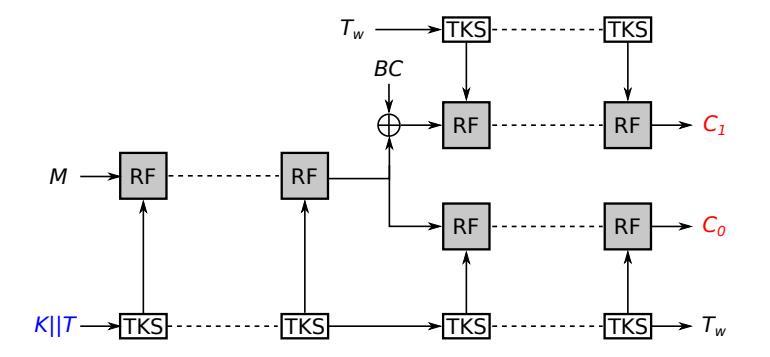
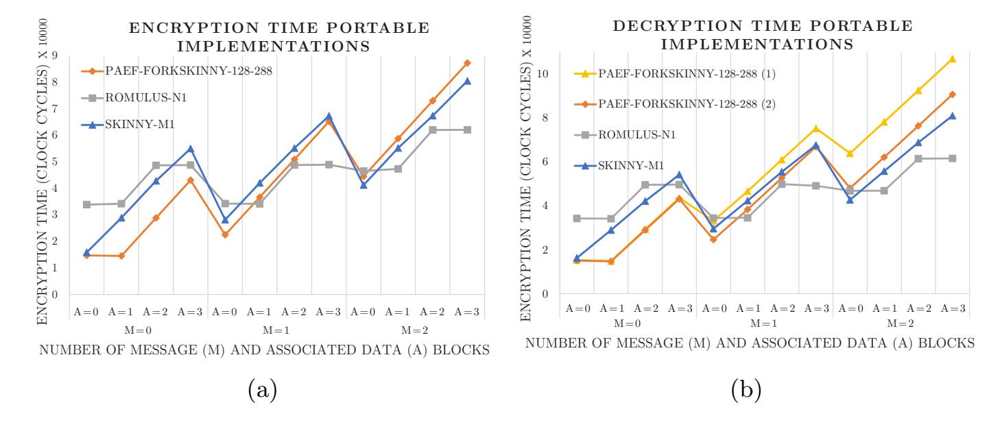
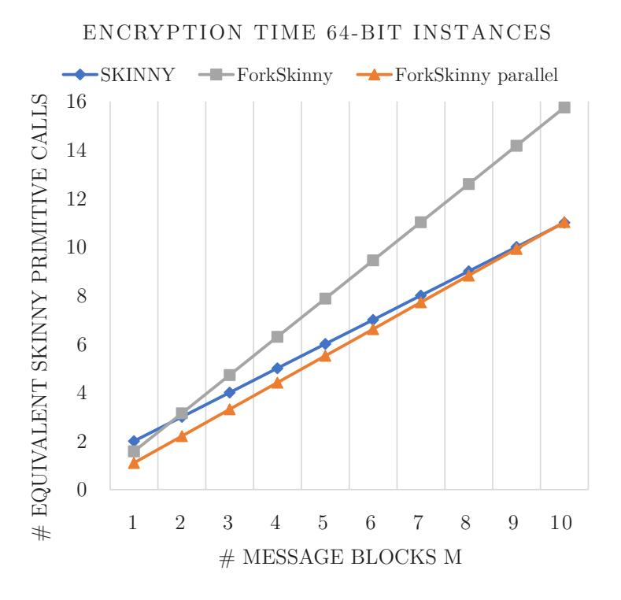

{0}------------------------------------------------

# Optimized Software Implementations for the Lightweight Encryption Scheme ForkAE

–Author's version–

Arne Deprez1 , Elena Andreeva2 , Jose Maria Bermudo Mera3 , Angshuman Karmakar3 , and Antoon Purnal3

> 1 arne.deprez1@gmail.com 2 Alpen-Adria University, Austria elena.andreeva@aau.at 3 imec-COSIC, KU Leuven

Kasteelpark Arenberg 10, Bus 2452, B-3001 Leuven-Heverlee, Belgium firstname.lastname@esat.kuleuven.be

Abstract. In this work we develop optimized software implementations for ForkAE, a second round candidate in the ongoing NIST lightweight cryptography standardization process. Moreover, we analyze the performance and efficiency of different ForkAE implementations on two embedded platforms: ARM Cortex-A9 and ARM Cortex-M0.

First, we study portable ForkAE implementations. We apply a decryption optimization technique which allows us to accelerate decryption by up to 35%. Second, we go on to explore platform-specific software optimizations. In platforms where cache-timing attacks are not a risk, we present a novel table-based approach to compute the SKINNY round function. Compared to the existing portable implementations, this technique speeds up encryption and decryption by 20% and 25%, respectively. Additionally, we propose a set of platform-specific optimizations for processors with parallel hardware extensions such as ARM NEON. Without relying on parallelism provided by long messages (cf. bit-sliced implementations), we focus on the primitive-level ForkSkinny parallelism provided by ForkAE to reduce encryption and decryption latency by up to 30%. We benchmark the performance of our implementations on the ARM Cortex-M0 and ARM Cortex-A9 processors and give a comparison with the other SKINNY-based schemes in the NIST lightweight competition – SKINNY-AEAD and Romulus.

Keywords: Authenticated encryption · Lightweight implementation · ForkAE · NIST LWC.

# 1 Introduction

The immense growth of small embedded devices that are connected in the Internet of Things (IoT) mandates the adequate development of their respective security mechanisms. To secure the communication between such devices one 

{1}------------------------------------------------

most commonly requires the use of lightweight symmetric authenticated encryption schemes. The competition for dedicated standards for lightweight symmetric authenticated encryption (AE) and/or hashing algorithms that is run at present by the U.S. National Institute of Standards and Technology (NIST) is a clear indication of the benefits and demand for such algorithms in practice. Besides security, achieving good performance in software implementations is an important criterion for all candidates in the second round of this standardization process. In their call for submissions, NIST states that the algorithms should preferably be " ...optimized to be efficient for short messages (e.g., as short as 8 bytes)." and "Compact hardware implementations and embedded software implementations with low RAM and ROM usage should be possible." In this work we focus on ForkAE [\[1,](#page-14-0) [2\]](#page-14-1), a NIST lightweight cryptography (LWC) second round candidate which is particularly optimized for the processing of such short messages. ForkAE uses a novel building block called forkcipher [\[2,](#page-14-1) [3\]](#page-14-2) which enables one primitive call per data block for secure authenticated ecnryption with associated data AEAD. Forkcipher in ForkAE is instantiated with the ForkSkinny primitive which reuses the SKINNY [\[5\]](#page-14-3) round and tweakey functions. The SKINNY-based nature of ForkSkinny gives us a natural reference point for comparison with the rest of the SKINNY-based candidates in the competition SKINNY-AEAD [\[6\]](#page-14-4) and Romulus [\[9\]](#page-14-5). Moreover, software implementation results come with distinct advantages and optimization techniques when one deals with general versus specific platforms. In this work we aim to illustrate the advantages of ForkAE in all those aspects.

#### Contributions. Our contributions in this work are as follows.

- 1. We analyze portable ForkAE implementations across a range of platforms and show that decryption latency can be significantly reduced (up to 35%) by preprocessing the tweakey schedule. Our new decryption approach achieves code size reduction (up to 31%) in addition to speed-up, at the cost of higher memory usage.
- 2. We explore platform-specific optimizations. Our first implementation, suitable for systems where (cache-) timing attacks are not applicable, accelerates ForkAE encryption and decryption by 20% to 25%, respectively, by representing the forward and inverse round functions as a series of table lookups. We also explore the speed-memory trade-off for this implementation strategy.
- 3. We provide a second platform-specific implementation which targets platforms with SIMD (Single Instruction Multiple Data) parallel hardware extensions. Our implementation is developed to exploit the data-level parallelism present in ForkAE. Our results indicate that the efficiency and performance of ForkAE on such platforms can be significantly increased, reducing encryption and decryption latency by up to 30%.
- 4. We benchmark the performance of our implementations on the ARM Cortex-M0 and ARM Cortex-A9 processors, illustrating the improved software performance of ForkAE. Benchmark results are compared with the other SKINNYbased schemes in the second round of the NIST LWC standardization process

{2}------------------------------------------------

SKINNY-AEAD and Romulus. All implementations described in this paper are publicly available at [\[8\]](#page-14-6).

# 2 Background on ForkAE

ForkAE uses a forkcipher primitive that was specifically designed for use in authenticated encryption of short messages. More concretely, it produces a 2n-bit output from an n-bit input block via the secret key K and a public tweak T. The forward computation corresponds to calculating two independent permutations of the input block at a reduced computational cost (compared to two tweakable block cipher calls). A forkcipher can be obtained following the so-called iteratefork-iterate [\[2\]](#page-14-1) paradigm by using a round based (tweakable) block cipher to transform the input block M a fixed number of rounds into the intermediate state M0 which is then "forked"(duplicated) and further iterated in two separate branches, producing the outputs C0 and C1. M can be computed backwards from C0 or C1 and in addition, either of the ciphertext blocks can be computed from the other via the so-called reconstruction functionality.

#### 2.1 The Tweakable Forkcipher ForkSkinny

ForkAE uses the ForkSkinny forkcipher primitive which is based on the lightweight tweakable block cipher SKINNY [\[5\]](#page-14-3). The key and tweak are processed following the TWEAKEY approach [\[10\]](#page-14-7). ForkSkinny uses the SKINNY round function (RF) and tweakey schedule (TKS) to update its intermediate state and tweakey. The state of the second branch is also modified by an additional branch constant value (BC). The general processing of M under tweakey KkT to C0kC1 in ForkSkinny is depicted in Figure [1](#page-2-0) and all details can be found in the ForkAE submission document [\[1\]](#page-14-0).

Fig. 1: Outline of ForkSkinny.

ForkSkinny comes in four instances [\[1\]](#page-14-0), differing in the block (64- and 128 bit) and the tweakey (192-, 256- and 288-bit) sizes. Each instance is denoted as ForkSkinny-n-t where n and t are the block- and the tweakey size, respectively, in bits. The size of the key (128 bits) is the same for all instances. Each instance has a fixed number of rinit rounds before the forking step and a fixed number of r0 = r1 rounds in each branch after the forking point.

{3}------------------------------------------------

#### 2.2 The ForkSkinny Round Function and Tweakey Schedule

The ForkSkinny round function (RF) consists of the same five operations as the SKINNY round function and they are described by their effect on the internal state. The internal state (IS) is represented by a 4x4 matrix where each cell contains 8 bits (if n = 128) or 4 bits (n = 64) of data. In the beginning of the cipher evaluation, the input block is loaded into the internal state in a row-wise manner. The operations of the round function are listed below:

SubCells: Each cell of the internal state is substituted according to the SKINNY S-boxes [\[5\]](#page-14-3).

AddConstants: Constants are added to the first column of the IS. These constants are generated by a Linear-Feedback-Shift-Register (LFSR) [\[1\]](#page-14-0).

AddRoundTweakey: Round-tweakey material is added to the internal state in the first two rows.

ShiftRows: The cells in the second row of the internal state are rotated one position to the right. The third row is rotated 2 cells and the fourth row 3 cells. MixColumns: Each column of the internal state is modified by a multiplication with a binary matrix M [\[5\]](#page-14-3).

At the beginning of the encryption procedure, a tweakey state is created as a set of 4x4 matrices with cells of the same size as those of the internal state. The tweakey matrices are then filled row-wise with the tweak and the key. This results in the matrices TK1, TK2 and possibly TK3. In each round, the first two rows of each of the matrices are jointly added to the first two rows of the internal state (i.e., in AddRoundTweakey). After that, the tweakey state is updated to create the next round-tweakey. The update consists of a permutation of the cells and modification of the first two rows of TK2 and TK3 (if any) with an LFSR.

The ForkAE submission specifies two different modes of operation for domain extension of ForkSkinny: a parallel PAEF and a sequential SAEF [\[1\]](#page-14-0). The presented optimizations in this work are focused at the primitive level (i.e., ForkSkinny) due to its higher impact on short message processing.

# 3 Portable Implementations of ForkAE

When carefully designing software in a low-level language, it is possible to obtain efficient and secure implementations that can be compiled for a broad range of platforms. In the design of such software, careful attention should be spent to efficiently use the memory and avoid side-channel vulnerabilities.

In a concurrent work, Weatherley [\[15\]](#page-15-0) explores efficient software for lightweight cryptographic primitives on general 32-bit platforms. This includes implementations of all instances of ForkAE. These implementations aim to perform well on 32-bit embedded microprocessors and are designed to execute in constant time with constant-cache behaviour [\[15\]](#page-15-0). In this section, we propose an optimization that increases the performance of ForkAE decryption in these implementations.

{4}------------------------------------------------

#### 3.1 Decryption Optimization

For decryption, the evaluation of ForkSkinny requires the final round-tweakey to be computed. In the existing portable implementation from [\[15\]](#page-15-0), this is achieved by fast-forwarding the tweakey state until the end of the tweakey schedule. The resulting round-tweakey is then inverted on-the-fly every round. By introducing many duplicate calculations, this approach causes ForkSkinny decryption to be significantly slower than encryption.

Duplicate calculations can be avoided when the tweakey schedule is iterated once and the portion of the round-tweakey that needs to be added to the internal state is saved in memory. This way, the correct round-tweakey can be directly accessed during the round function evaluation. This ensures that the tweakey schedule is only calculated once and significantly reduces the decryption time. This implementation strategy introduces a higher memory usage as the roundtweakeys needs to be stored in memory. However, instead of storing the full round-tweakeys, we show that it is sufficient to store only the relevant rows of the tweakey state. Moreover, these can readily be added together to reduce the memory footprint even more (cf. Section [2.2\)](#page-3-0).

This new decryption approach achieves a significant speed-up and code size reduction, at the expense of higher memory usage. The ROM size is reduced because the round function code no longer needs to include tweakey calculations.

# 4 Lookup Table Implementations of ForkAE

Lookup tables can be used to speed up the calculations without introducing a security risk in platforms that are not vulnerable to cache-timing attacks. The original proposal of the Rijndael cipher for the Advanced Encryption Standard (AES) proposes very efficient implementations for 32-bit platforms, by combining multiple steps of the round function in table look ups [\[7\]](#page-14-8). In this section we show how, in a similar way, the SKINNY round function in ForkAE can be translated into a combination of table look ups. For the inverse round function, such a transformation is more complex. Here, the different steps of the inverse round must first be reordered, defining a modified inverse round function for which a table-base implementation can be derived.

### 4.1 Tabulating the Round Function

We represent the internal state at the beginning of the SKINNY round function by the matrix A (eq. [\(1\)](#page-5-0)). For variants of ForkSkinny with a block size n = 128, the elements ai,j of this matrix are 8-bit values. In Equation [\(5\)](#page-5-1), we write the effect of the round function on a column aj to obtain the column bj of the state B = b0 b1 b2 b3 at the end of the round. In this equation S[a] denotes the output of the S-box of the SubCells step for input a. The binary matrix M (eq. [\(2\)](#page-5-2)) defines the MixColumns operation and the matrix X contains the constants that are added in the AddConstants step (eq. [\(3\)](#page-5-3)). The addition is always a bit-wise addition. This corresponds to an XOR operation and is denoted with 

{5}------------------------------------------------

the operator ⊕. Indices should be taken modulo 4, as the ShiftRows operation is a rotation. The values TKi,j contain the round-tweakey material that is added in the AddRoundTweakey step (eq. [\(4\)](#page-5-4)).

$$A = \begin{pmatrix} a_{0,0} & a_{0,1} & a_{0,2} & a_{0,3} \\ a_{1,0} & a_{1,1} & a_{1,2} & a_{1,3} \\ a_{2,0} & a_{2,1} & a_{2,2} & a_{2,3} \\ a_{3,0} & a_{3,1} & a_{3,2} & a_{3,3} \end{pmatrix}$$
(1) 
$$X = \begin{pmatrix} c_0 & 0 & 2 & 0 \\ c_1 & 0 & 0 & 0 \\ 2 & 0 & 0 & 0 \\ 0 & 0 & 0 & 0 \end{pmatrix}$$
(3)

$$M = \begin{pmatrix} 1 & 0 & 1 & 1 \\ 1 & 0 & 0 & 0 \\ 0 & 1 & 1 & 0 \\ 1 & 0 & 1 & 0 \end{pmatrix}$$
 (2)  
$$TK_{i,j} = TK1_{i,j} \oplus TK2_{i,j} (\oplus TK3_{i,j})$$
 (4)

Unfortunately, constants and tweakey material should be added before ShiftRows and MixColumns. We solve this problem by splitting the round function in three terms and distributing the matrix multiplication with M.

$$b_{j} = \begin{pmatrix} b_{0,j} \\ b_{1,j} \\ b_{2,j} \\ b_{3,j} \end{pmatrix} = M \cdot \begin{pmatrix} S[a_{0,j}] \\ S[a_{1,j-1}] \\ S[a_{2,j-2}] \\ S[a_{3,j-3}] \end{pmatrix} \oplus \begin{pmatrix} x_{0,j} \\ x_{1,j-1} \\ x_{2,j-2} \\ x_{3,j-3} \end{pmatrix} \oplus \begin{pmatrix} TK_{0,j} \\ TK_{1,j-1} \\ 0 \\ 0 \end{pmatrix}$$
 (5)

With the lookup tables T0...T3 defined in eq. [\(6\)](#page-5-5), we can now calculate the first term as in eq. [\(7\)](#page-5-6). For ForkSkinny instances with n = 128, each of these tables has 256 entries of 32-bit (one for every possible input a) and thus takes up 1 kB of memory. To avoid having to store 4 kB of tables in memory, it is possible to store only one table T = S[a] S[a] S[a] S[a] > and mask it according to the needed vector. This approach needs an extra 4 logical AND operations per column, but has a smaller ROM size because only one table of 1 kB needs to be stored.

$$T_{0}[a] = \begin{pmatrix} S[a] \\ S[a] \\ 0 \\ S[a] \end{pmatrix}, \ T_{1}[a] = \begin{pmatrix} 0 \\ 0 \\ S[a] \\ 0 \end{pmatrix}, \ T_{2}[a] = \begin{pmatrix} S[a] \\ 0 \\ S[a] \\ S[a] \end{pmatrix}, \ T_{3}[a] = \begin{pmatrix} S[a] \\ 0 \\ 0 \\ 0 \end{pmatrix}$$
 (6)

$$M \cdot \begin{pmatrix} S[a_{0,j}] \\ S[a_{1,j-1}] \\ S[a_{2,j-2}] \\ S[a_{3,j-3}] \end{pmatrix} = T_0[a_{0,j}] \oplus T_1[a_{1,j-1}] \oplus T_2[a_{2,j-2}] \oplus T_3[a_{3,j-3}]$$
 (7)

The second term corresponds to the values added in the AddConstants step and can be calculated by applying the Shiftrows and MixColumns step to the matrix X, resulting in the matrix from eq. [\(8\)](#page-6-0). For j = 0, 1, 2 the j-th column of this matrix ACj needs to be added with the first term. The first two columns of this matrix are different for every round, but can also be stored in a lookup table.

The final term involves the application of ShiftRows and MixColumns to the round-tweakey. This corresponds to an addition of the column Kj (eq. [\(9\)](#page-6-1)).

{6}------------------------------------------------

$$AC = \begin{pmatrix} c_0 & 0 & 0 & 0 \\ c_0 & 0 & 2 & 0 \\ 0 & c_1 & 2 & 0 \\ c_0 & 0 & 0 & 0 \end{pmatrix}$$
 (8) 
$$K_j = \begin{pmatrix} TK_{0,j} \\ TK_{0,j} \\ TK_{1,j-1} \\ TK_{0,j} \end{pmatrix}$$
 (9)

Finally, every column bj of the output of the round function can be calculated as in Equation [\(10\)](#page-6-2), requiring 5 table lookups and 5 XOR operations per column. For the third column, the constant lookup can be omitted as it is always the same. The final column does not feature any constants, saving another lookup and XOR. This results in a total cost for calculating the round function of 18 table lookups, 19 XOR operations and the cost of constructing the columns Kj .

$$b_j = T_0[a_{0,j}] \oplus T_1[a_{1,j-1}] \oplus T_2[a_{2,j-2}] \oplus T_3[a_{3,j-3}] \oplus AC_j \oplus K_j$$
(10)

### 4.2 The Inverse Round Function

In order to be able to implement the inverse round function in a similar way as the forward round, the SubCells step needs to be the first step of the inverse round and the ShiftRows step needs to come before the MixColumns step, which is not the case. In order to obtain an inverse round function where the SubCells inv steps comes first, steps of consecutive rounds need to be combined in a new round and a different first and final round need to be defined. We illustrate this in Figure [3.](#page-7-0) However, in this approach the ShiftRows inv step still comes after the MixColumns inv step and designing an efficient table-lookup implementation is still not possible. To solve this problem we noted that the sequence of operations from Figure [2a,](#page-7-0) can be also be calculated with the sequence of operations from Figure [2b,](#page-7-0) allowing to delay the ShiftRows inv step. Here, we shift in advance the round-tweakey material and the constants, so that they are added to the correct part of the row that is not yet shifted.

When the ShiftRows inv operation is calculated after the addition of shifted round-tweakey material and shifted constants, it comes before the SubCells inv step. Now, the SubCells inv and ShiftRows inv can easily be swapped because the ShiftRows inv step does not modify the value within a cell and SubCells inv operates on individual cells [\[7\]](#page-14-8). With this reordering of operations, it becomes possible to define the new inverse rounds as in Figure [4.](#page-7-0) In the calculation of these n − 1 new inverse rounds the first three steps can now be combined into table lookups. The table-based implementation is even more simple here, because the round-tweakey material and constants are added at the end of the round and their columns do not need to be mixed in advance. The tables are different than for the forward round, but also here the possibility exists to use only one table to reduce the memory size of the implementation.

### 4.3 64-bit instance

The round function transformation can also be applied to the instance where n = 64 and the cells of the internal state contain 4-bit values. However, with a single

{7}------------------------------------------------

### ShiftRows inv AddRoundTweakey AddConstants

(a)

AddRoundTweakey shifted AddConstants shifted ShiftRows inv

(b)

Fig. 2: Delaying the ShiftRows inv step in the inverse round function.

#### First round

MixColums inv ShiftRows inv AddRoundTweakey AddConstants

#### (n-1) rounds

SubCells inv MixColums inv ShiftRows inv AddRoundTweakey AddConstants

### Final round

SubCells inv

### First round

MixColums inv AddRoundTweakey shifted AddConstants shifted

#### (n-1) rounds

SubCells inv ShiftRows inv MixColums inv AddRoundTweakey shifted AddConstants shifted

### Final round

SubCells inv ShiftRows inv

Fig. 3: Definition of a new inverse round that starts with the SubCells inv step.

Fig. 4: Definition of new inverse round with delayed ShiftRows inv step.

byte containing two cells of the internal state, designing software that calculates this table-based round function becomes more difficult. A lot of overhead is needed to transform the state to a column representation, to select the correct 4-bit values, to construct the round-tweakey columns, etc. A possible solution to this is to split the cells of the internal state in separate bytes, i.e. using bytes that are half empty. Both ways of implementing the 64-bit lookup table round function were tested, but could not provide a speed-up.

# 5 Parallel Implementations of ForkAE

Cryptographic algorithms often feature data-level parallelism. As a result, they can be made more efficient or achieve higher performance when Single Instruction, Multiple Data (SIMD) hardware is available. Examples of such implementations are the bit-sliced implementation of AES from [\[11\]](#page-14-9) using x86 Streaming SIMD Extensions (SEE) instructions, or the SKINNY implementation from [\[12\]](#page-14-10) using x86 Advanced Vector Extensions (AVX). These bit-sliced implementations exploit the parallelism of processing multiple input blocks of long messages. As such, they are not well-suited for processing short messages.

To increase efficiency for the short messages typical for lightweight applications, the performance of a single primitive call needs to be improved. This section explores the data-level parallelism in ForkSkinny, and how it can be exploited in a SIMD-enabled processor. Specifically, we use the ARM NEON extension, available in the ARM Cortex-A9 processor of the Zynq ZYBO platform [\[4\]](#page-14-11).

{8}------------------------------------------------

#### 5.1 Parallelism in the Round Function

When looking at the round function, the S-box layer is the most promising subject for SIMD acceleration, because it works on the entire state in parallel and because it is the most computationally heavy part of the round function. In the portable C implementations, the S-box layer accounts for 60-80% of the execution time of round function and tweakey schedule combined.

For ForkSkinny instances with blocksize n = 128, the internal state fits perfectly in a NEON 128-bit quadword register. This effectively allows four times as much data to be processed in parallel. The S-box can be fully calculated for all cells of the internal state with a set of ±60 NEON instructions. This reduces the execution time for the S-box from 169 to 83 clock cycles, a reduction of ±50%.

The n = 64 ForkSkinny instance requires just one 64-bit NEON halfword register for its internal state. It also features a simpler S-box than the 128 bit instances, requiring roughly half the amount of instructions. We reduce its execution time from 117 clock cycles to 72 clock cycles, a reduction of ±60%.

#### 5.2 The Parallelism of the Fork

During encryption, forking after rinit rounds introduces data-level parallelism because the same round function is calculated in two independent branches. This parallelism has already been shown to increase performance in hardware implementations [\[13\]](#page-14-12). We now demonstrate that, if the processor features SIMD instructions, such primitive-level parallelism can also be exploited in software.

Although the state and round functions of both branches are independent, the tweakey schedule is serial. We overcome this apparent problem by calculating the round-tweakeys in advance and storing them (cf. decryption in Section [3.1\)](#page-4-0). While this increases memory usage, round-tweakeys are now instantly available and the calculations for both branches are again completely independent.

The combined size of the internal state in both branches of ForkSkinny-64- 192 is 2 × 64 = 128 bits. As this fits in a single NEON quadword register, the S-box can be calculated for both states in parallel, with only one set of NEON instructions. We already reduced S-box execution time from 117 to 72 clock cycles, and doing this for both branches would require 144 cycles. By leveraging the parallel branches with NEON, we manage to reduce this further to 85 cycles.

For instances with block size n = 128, the parallel hardware is already maximally exploited for the S-box calculation. As a consequence, executing two round functions in parallel will not speed up that part of the round function. For other parts of the round function a parallel execution does not improve performance because of the overhead introduced by using the NEON hardware. In processors with 256-bit (or higher) SIMD hardware (e.g., AVX on x86), both states can again be processed in parallel, similarly as for the 64-bit instance.

# 6 Performance Analysis

We analyze the performance of the ForkAE implementations on two different platforms. The first platform is the ZYBO development platform, containing 

{9}------------------------------------------------

the Xilinx Z-7010 system-on-chip (SoC). The Xilinx Z-7010 contains a 650 MHz dual-core ARM Cortex-A9, 240 kB RAM and 512 MB ROM. We use a single core for the evaluation. The second platform is the STM32F0 microcontroller, which incorporates a 32-bit 48 MHz ARM Cortex-M0, 8 kB RAM and 64 kB ROM.

We always compile the C code with gcc and compiler option -Os (i.e., optimizing for implementation size). We report the three most important performance metrics: speed, implementation size (ROM) and memory usage (RAM). Speed is evaluated by measuring the execution time for different input sizes, and expressed in the common metric of cycles/byte. The number that is reported is the average amount of cycles/byte needed for encryption or decryption of messages with sizes ranging from 1 block (64 or 128 bit depending to the instance) to 8 blocks. The size of the implementation, or ROM size, is expressed in bytes and corresponds to the memory necessary to store all compiled code needed for encryption or decryption. It also includes the storage of constant data such as the round constant. The memory usage, or RAM size, is also expressed in bytes and corresponds to the total amount of RAM memory that is used during encryption/decryption. This consists mainly of variables and data structures.

Constant-time execution: We followed the best practices for constant-time software implementation. Our implementation does not have any secret-dependent control flow. Furthermore, we used the dudect tool [14] to verify the constant-time execution of the optimized portable and parallel implementations.

#### 6.1 Portable Implementations

The performance of the portable 32-bit C implementations is analysed on the Cortex-M0 and Cortex-A9 processors, and summarized in Table 1. It is clear that the duplicate tweakey calculations in the original approach (cf. Section 3) have a significant impact on the execution time. On the Cortex-A9, decryption with the fast-forwarding approach takes 30-55% more cycles per byte than encryption. On the Cortex-M0, the difference is even 45-70%. Another downside of this approach is the increased code size and higher memory usage compared to encryption.

Our implementation with preprocessed tweakey schedule (cf. Section 3.1) reduces this decryption time. For 128-bit instances with two tweakey matrices, the cycles per byte on the A9 are reduced with 17% compared to the decryption implementation from [15]. For three tweakey matrices, the speed-up is even greater: 25% for PAEF-ForkSkinny-128-288 and 35% for PAEF-ForkSkinny-64-192. Similar observations hold for the M0. While decryption is still slower than encryption, the difference between the two is now much smaller. Our approach achieves a speed-up and code size reduction in exchange for a higher memory usage. The ROM size is reduced because the code to iterate through the entire tweakey schedule takes less space than when the tweakey schedule is calculated both in the ForkSkinny decryption and in the inverse round function. The consequence is that the round-tweakey material is stored in a buffer, which introduces a bigger RAM size. This buffer needs to be  $(r_{init} + 2 \times r_0) \times \frac{n}{16}$  bytes big to store all round-tweakeys. The buffer is largest for PAEF-ForkSkinny-128-288, where 696 bytes of memory are needed to store the preprocessed tweakey.

{10}------------------------------------------------

Table 1: Implementation figures for ForkAE encryption/decryption with portable 32-bit C implementations. Implementations from [\[15\]](#page-15-0).

|                                            | Cortex-A9 |             |     | Cortex-M0 |             |     |
|--------------------------------------------|-----------|-------------|-----|-----------|-------------|-----|
| Encryption                                 |           | c/B ROM RAM |     |           | c/B ROM RAM |     |
| PAEF-FS-64-192                             |           | 1669 3067   | 107 |           | 4002 2067   | 107 |
| PAEF-FS-128-192 1072 3187                  |           |             | 161 |           | 2457 2251   | 161 |
| PAEF-FS-128-256 1074 3219                  |           |             | 169 |           | 2458 2247   | 169 |
| PAEF-FS-128-288 1408 3483                  |           |             | 189 |           | 3408 2541   | 189 |
| SAEF-FS-128-19                             |           | 1075 3015   | 161 |           | 2475 2187   | 161 |
| SAEF-FS-128-256 1076 3043                  |           |             | 169 |           | 2476 2173   | 169 |
| Decryption                                 |           |             |     |           |             |     |
| PAEF-FS-64-192                             |           | 2596 3999   | 140 |           | 6767 2819   | 140 |
| PAEF-FS-128-192 1397 3735                  |           |             | 210 |           | 3562 2715   | 210 |
| PAEF-FS-128-256 1393 3767                  |           |             | 218 |           | 3563 2707   | 218 |
| PAEF-FS-128-288 2001 4399                  |           |             | 254 |           | 5305 3243   | 254 |
| SAEF-FS-128-192 1398 3599                  |           |             | 210 |           | 3580 2771   | 210 |
| SAEF-FS-128-256 1397 3603                  |           |             | 218 |           | 3579 2757   | 218 |
| Decryption (preprocessed tweakey schedule) |           |             |     |           |             |     |
| PAEF-FS-64-192                             |           | 1684 2927   | 392 |           | 4167 1955   | 392 |
| PAEF-FS-128-192 1165 3131                  |           |             | 810 |           | 2970 2303   | 810 |
| PAEF-FS-128-256 1162 3163                  |           |             | 818 |           | 2971 2295   | 818 |
| PAEF-FS-128-288 1491 3363                  |           |             | 950 |           | 4010 2571   | 950 |
| SAEF-FS-128-192 1166 2995                  |           |             | 810 |           | 2988 2359   | 810 |
| SAEF-FS-128-256 1164 2999                  |           |             | 818 |           | 2987 2345   | 818 |
|                                            |           |             |     |           |             |     |

In Figure [5a](#page-11-0) and Figure [5b,](#page-11-0) we compare the performance of ForkAE with other SKINNY-based AEAD schemes Romulus and SKINNY-AEAD. We compare the primary instances of the NIST LWC submission for small messages with different number of message (M) and associated data (A) blocks. These figures highlight the advantage of a forkcipher over a blockcipher for encryption of small messages.

### 6.2 Table-based Implementations

The lookup table round function described in Section [4](#page-4-1) is implemented on the STM32F0 platform with the ARM Cortex-M0 processor as an example lightweight platform with no cache. We explore the different trade-offs between speed, code size and memory usage. Table [2](#page-11-1) lists the results for an implementation with 4 different lookup tables. Compared to the portable implementations of Section [3,](#page-3-1) it needs up to 16% fewer clock cycles when the tables are stored in ROM. When the tables are stored in RAM, this gain is almost 20%.

We gain in speed in exchange for a higher memory cost. Particularly, when four lookup tables are used in combination with two tables containing the mixed and shifted round constants, a total of 4.7 kB of memory is needed. We show that the impact of the lookup table implementation on the memory usage can be greatly reduced when only one T-table is used instead four. The performance results for this method are listed in Table [2.](#page-11-1) This approach introduces some extra calculations in the round function, but as can be seen from the results, the impact on the computation time is only a few cycles per byte. The reduction in memory cost of 3 kB is significant and can be very important for the resourceconstrained devices in embedded applications.

{11}------------------------------------------------

Fig. 5: Performance comparison of SKINNY based ciphers on Cortex-A9. Encryption with implementations from [\[15\]](#page-15-0). Decryption with SKINNY, Romulus and PAEF-ForkSkinny-128-288(1) implementations from [\[15\]](#page-15-0) and PAEF-ForkSkinny-128-288(2) implementation with preprocessed tweakey schedule.

Table 2: Implementation figures for the table-based ForkAE encryption implementation on the ARM Cortex-M0.

| Encryption                                                                                                                                    |                                 | Tables in ROM Tables in RAM                                                                           |  |  |  |
|-----------------------------------------------------------------------------------------------------------------------------------------------|---------------------------------|-------------------------------------------------------------------------------------------------------|--|--|--|
| 4 lookup tables                                                                                                                               | c/B ROM RAM                     | c/B ROM RAM                                                                                           |  |  |  |
| PAEF-FS-128-192 2110 6752 PAEF-FS-128-256 2111 6748 PAEF-FS-128-288 2859 7034 SAEF-FS-128-192 2128 6688 SAEF-FS-128-256 2129 6674 | 192 200 220 192 200 | 2016 1960 4984 2017 1956 4992 2739 2242 5012 2035 1896 4984 2035 1882 4992 |  |  |  |
| 1 lookup table                                                                                                                                |                                 |                                                                                                       |  |  |  |
| PAEF-FS-128-192 2138 3692 PAEF-FS-128-256 2139 3688 PAEF-FS-128-288 2919 3980 SAEF-FS-128-192 2157 3628 SAEF-FS-128-256 2157 3614 | 192 200 220 192 200 | 2030 1972 1912 2031 1968 1920 2805 2260 1940 2049 1908 1912 2049 1894 1920 |  |  |  |

To study the gain of tabulating the inverse round function, the performance of one specific implementation for table-based decryption is analysed. The implementation uses one lookup-table that is stored in ROM and a preprocessed tweakey schedule that is stored in RAM. The performance metrics are listed in Table [3.](#page-12-0) When this is compared with the portable decryption implementation, it can be seen that using lookup tables can significantly speed-up decryption, as the amount of cycles that are needed is reduced with up to 25%. This speed-up is higher than for encryption because of the simpler inverse round function where the addition of the round tweakey and constants can be done at the end.

{12}------------------------------------------------

Table 3: Implementation figures for the table-based ForkAE decryption implementation on the ARM Cortex-M0.

| Decryption                                                                          | c/B ROM RAM |                   |
|-------------------------------------------------------------------------------------|-------------|-------------------|
| PAEF-FS-128-192 2241 3261 PAEF-FS-128-256 2241 3253 PAEF-FS-128-288 3156 3529 |             | 818 826 958 |
| SAEF-FS-128-192 2259 3317 SAEF-FS-128-256 2257 3303                              |             | 818 826        |

### 6.3 Parallel Implementations

In Table [4](#page-12-1) we list the performance of ForkAE encryption and decryption on the ZYBO platform when the NEON SIMD implementations are used. For Fork-Skinny instances with a block-size n = 128, the S-box and its inverse are replaced with the 128-bit NEON implementation. For PAEF-ForkSkinny-64-192, the ForkSkinny implementation with parallel round function is used for encryption. Its decryption only features the parallel S-box layer, as it cannot benefit from parallelism in the round function.

For the 128-bit instances with the NEON S-box implementation, we observe a reduction in the amount of cycles for encryption and decryption of approximately 30% when compared to the portable implementations of Section [3.](#page-3-1) For the PAEF-ForkSkinny-128-288 instance with three tweakey matrices, this speed-up is a bit lower (27%). This can be explained by the larger relative importance of the tweakey calculations in this instance. The ROM size is reduced by approximately 500 bytes in all 128-bit instances. This follows from the smaller code size of the round function, which now uses the parallel NEON S-box implementation. The amount of RAM needed for encryption or decryption remains the same.

Table 4: Implementation figures for the NEON SIMD implementations of ForkAE on the ZYBO platform.

|                           | Encryption |             |     | Decryption |             |     |
|---------------------------|------------|-------------|-----|------------|-------------|-----|
|                           |            | c/B ROM RAM |     |            | c/B ROM RAM |     |
| PAEF-FS-64-192            |            | 1184 3235   | 331 |            | 1390 2653   | 392 |
| PAEF-FS-128-192           | 736        | 2619        | 161 | 807        | 2551        | 810 |
| PAEF-FS-128-256           | 737        | 2651        | 169 | 806        | 2583        | 818 |
| PAEF-FS-128-288 1026 2863 |            |             | 189 |            | 1078 2783   | 950 |
| SAEF-FS-128-192           | 743        | 2491        | 161 | 812        | 2415        | 810 |
| SAEF-FS-128-256           | 743        | 2519        | 169 | 810        | 2419        | 818 |

The execution time of PAEF-ForkSkinny-64-192 encryption improves with almost 500 cycles per byte, i.e., 29%, when compared to the portable implementation from [\[15\]](#page-15-0). For decryption, the speed-up is smaller as the degree of parallelism is lower. With the NEON inverse S-box implementation, we still accelerate decryption with 17%.

A single round of the 64-bit SKINNY round function with a NEON S-box implementation executes in 95 clock cycles on the ARM Cortex-A9. With 17 rounds before the forking point and 23 rounds after the forking point, a single branch of the ForkSkinny primitive, which is equal to the execution of the 

{13}------------------------------------------------

SKINNY primitive, needs 40 of these rounds. Producing twice as much output by calculating both branches requires  $17 + 2 \times 23 = 63$  such rounds, or  $\frac{63}{40} = 1.58$  times the amount of computations. When the S-box is calculated in parallel for the branches after the forking point, two rounds are calculated in 112 clock cycles instead of  $2 \times 95$ . This way producing the double output requires only 1.10 times the amount of execution time of a single branch.

Other SKINNY-based candidates need M+1 calls to the SKINNY primitive for M message blocks, while ForkAE, which has no fixed cost, needs M calls to the ForkSkinny primitive (with 1.10 times the computational cost). As a result, for implementations where no mode parallelism is exploited (e.g., for serial modes, like Romulus), ForkAE encryption will be faster for messages of up to 10 blocks. This is illustrated in Figure 6. We note that the SKINNY-AEAD and Romulus submissions to the NIST LWC competition do not include an instance with 64-bit blocks. However, when 256-bit SIMD hardware is available, this result could also be extended to the 128-bit instances.

Fig. 6: Comparison of encryption time of 64-bit ForkAE implementations with SKINNY-AEAD, expressed in number of equivalent calls to SKINNY primitive.

### 7 Conclusion

This paper studied the design of software implementations for the lightweight authenticated encryption scheme ForkAE. First, portable 32-bit implementations were described and analyzed on different platforms. We presented a method to significantly speed-up the decryption of ForkAE in these implementations.

In order to increase performance, two specialized implementations for two different target platforms were designed. The first implementation is designed for platforms where cache-timing attacks are not possible. It was shown that on

{14}------------------------------------------------

these platforms the SKINNY round function and inverse round function can be transformed into a combination of table-lookups. This allowed for a significant increase in performance. The impact on the amount of memory needed for this implementation can be minimised by reducing the number of tables.

A second platform-specific implementation targets platforms with a NEON SIMD hardware extension. This paper described how in these platforms, the data-level parallelism in the ForkSkinny primitive can be exploited in efficient implementations with reduced latency. We exploited the first level of parallelism found in the SKINNY round function, and a second level of parallelism introduced by the forking step in ForkSkinny.

# References

- 1. Andreeva, E., Lallemand, V., Purnal, A., Reyhanitabar, R., Roy, A., Viz´ar, D.: Forkae v.1 (2019), [https://csrc.nist.gov/CSRC/media/](https://csrc.nist.gov/CSRC/media/Projects/lightweight-cryptography/documents/round-2/spec-doc-rnd2/forkae-spec-round2.pdf) [Projects/lightweight-cryptography/documents/round-2/spec-doc-rnd2/](https://csrc.nist.gov/CSRC/media/Projects/lightweight-cryptography/documents/round-2/spec-doc-rnd2/forkae-spec-round2.pdf) [forkae-spec-round2.pdf](https://csrc.nist.gov/CSRC/media/Projects/lightweight-cryptography/documents/round-2/spec-doc-rnd2/forkae-spec-round2.pdf)
- 2. Andreeva, E., Lallemand, V., Purnal, A., Reyhanitabar, R., Roy, A., Vizar, D.: Forkcipher: a new primitive for authenticated encryption of very short messages. Cryptology ePrint Archive, Report 2019/1004 (2019), [https://eprint.iacr.org/](https://eprint.iacr.org/2019/1004) [2019/1004](https://eprint.iacr.org/2019/1004)
- 3. Andreeva, E., Reyhanitabar, R., Varici, K., Viz´ar, D.: Forking a blockcipher for authenticated encryption of very short messages. Cryptology ePrint Archive, Report 2018/916 (2018), <https://eprint.iacr.org/2018/916>
- 4. ARM: CortexTM-A9 NEONTM Media Processing Engine, Technical Reference Manual (2012)
- 5. Beierle, C., Jean, J., K¨olbl, S., Leander, G., Moradi, A., Peyrin, T., Sasaki, Y., Sasdrich, P., Sim, S.M.: The skinny family of block ciphers and its low-latency variant mantis. In: Annual International Cryptology Conference. pp. 123–153. Springer (2016)
- 6. Beierle, C., Jean, J., K¨olbl, S., Leander, G., Moradi, A., Peyrin, T., Sasaki, Y., Sasdrich, P., Sim, S.M.: Skinny-aead and skinny-hash v1.1. Submission to Round 1 of the NIST Lightweight Cryptography Standardization process (2019)
- 7. Daemen, J., Rijmen, V.: AES proposal: Rijndael (1999)
- 8. Deprez, A.: ForkAE-SW. GitHub repository (2020), [https://github.com/](https://github.com/ArneDeprez1/ForkAE-SW) [ArneDeprez1/ForkAE-SW](https://github.com/ArneDeprez1/ForkAE-SW)
- 9. Iwata, T., Khairallah, M., Minematsu, K., Peyrin, T.: Romulus v1.2. Submission to the NIST Lightweight Cryptography Standardization process (2019)
- 10. Jean, J., Nikoli´c, I., Peyrin, T.: Tweaks and keys for block ciphers: the tweakey framework. In: International Conference on the Theory and Application of Cryptology and Information Security. pp. 274–288. Springer (2014)
- 11. K¨asper, E., Schwabe, P.: Faster and timing-attack resistant aes-gcm. vol. 5747, pp. 1–17 (2009)
- 12. K¨olbl, S.: AVX implementation of the skinny block cipher. GitHub repository (2018), [https://github.com/kste/skinny\\_avx](https://github.com/kste/skinny_avx)
- 13. Purnal, A., Andreeva, E., Roy, A., Viz´ar, D.: What the fork: Implementation aspects of a forkcipher. In: NIST Lightweight Cryptography Workshop 2019 (2019)

{15}------------------------------------------------

#### 16 A. Deprez et al.

- 14. Reparaz, O., Balasch, J., Verbauwhede, I.: Dude, is my code constant time? In: Design, Automation & Test in Europe Conference & Exhibition pp. 1697–1702. IEEE (2017)
- 15. Weatherley, R.: NIST lightweight cryptography primitives. GitHub repository (2020), <https://github.com/rweather/lightweight-crypto>