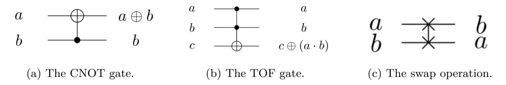
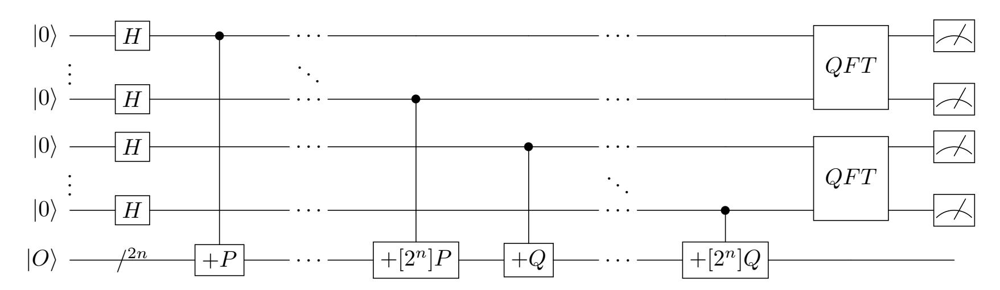
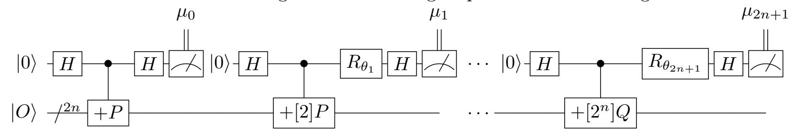
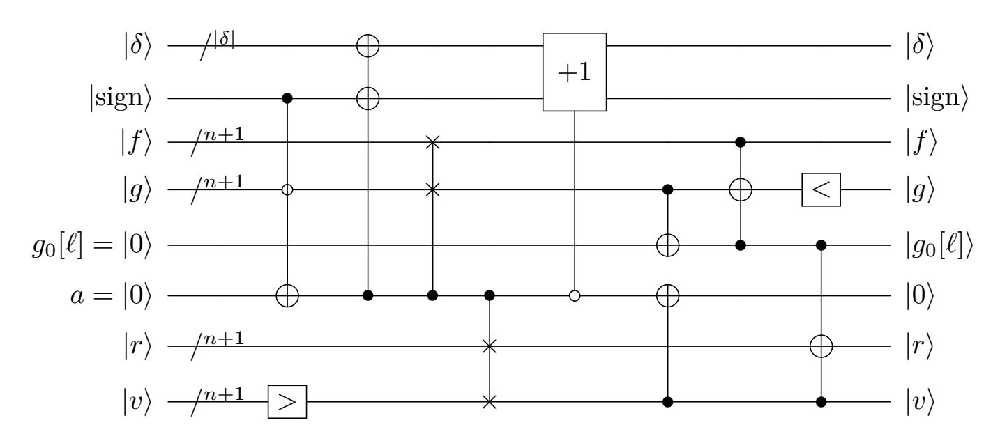
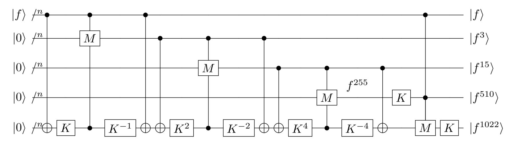
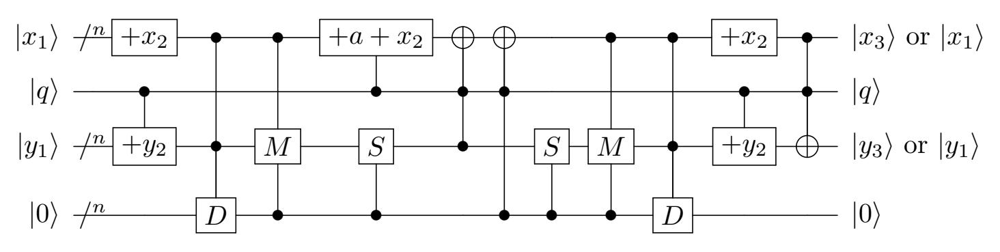

{0}------------------------------------------------

# **Concrete quantum cryptanalysis of binary elliptic curves**

Gustavo Banegas<sup>1</sup> , Daniel J. Bernstein<sup>2</sup>*,*<sup>3</sup> , Iggy van Hoof<sup>4</sup> and Tanja Lange<sup>4</sup>

 Chalmers University of Technology, Gothenburg, Sweden [gustavo@cryptme.in](mailto:gustavo@cryptme.in) University of Illinois at Chicago, Chicago, USA [djb@cr.yp.to](mailto:djb@cr.yp.to) Ruhr University Bochum, Bochum, Germany Eindhoven University of Technology, Eindhoven, The Netherlands [i.v.hoof@tue.nl,tanja@hyperelliptic.org](mailto:i.v.hoof@tue.nl, tanja@hyperelliptic.org)

**Abstract.** This paper analyzes and optimizes quantum circuits for computing discrete logarithms on binary elliptic curves, including reversible circuits for fixed-base-point scalar multiplication and the full stack of relevant subroutines. The main optimization target is the size of the quantum computer, i.e., the number of logical qubits required, as this appears to be the main obstacle to implementing Shor's polynomial-time discrete-logarithm algorithm. The secondary optimization target is the number of logical Toffoli gates.

For an elliptic curve over a field of 2 *n* elements, this paper reduces the number of qubits to 7*n* + blog<sup>2</sup> (*n*)c + 9. At the same time this paper reduces the number of Toffoli gates to 48*n* <sup>3</sup> + 8*n* log2(3)+1 + 352*n* 2 log<sup>2</sup> (*n*) + 512*n* <sup>2</sup> + *O*(*n* log2(3)) with doubleand-add scalar multiplication, and a logarithmic factor smaller with fixed-window scalar multiplication. The number of CNOT gates is also *O*(*n* 3 ). Exact gate counts are given for various sizes of elliptic curves currently used for cryptography.

**Keywords:** Quantum cryptanalysis · elliptic curves · quantum resource estimation · quantum gates · Shor's algorithm

## <span id="page-0-0"></span>**1 Introduction**

Current cryptographic systems used on the Internet rely on the Diffie-Hellman key exchange, a way to create shared secret keys over a public channel. One of the most common Diffie-Hellman variants uses elliptic-curve cryptography (ECC). The key-exchange schemes rely on problems that are hard to solve with a classical computer. However, a quantum computer has advantages against these problems and can solve them exponentially faster.

Current quantum computers are very small compared to classical computers. However, a time will soon come when quantum computers can threaten computer security. This

Author list in alphabetical order; see [https://www.ams.org/profession/leaders/culture/](https://www.ams.org/profession/leaders/culture/CultureStatement04.pdf) [CultureStatement04.pdf](https://www.ams.org/profession/leaders/culture/CultureStatement04.pdf). Part of this work was carried out while the first author was a PhD candidate at Eindhoven University of Technology. All authors would like to thank the Simons Institute for the Theory of Computing for hospitality. Bernstein and Lange would like to thank Academia Sinica for hospitality. This work was supported by the German Research Foundation under EXC 2092 CASA 390781972 "Cyber Security in the Age of Large-Scale Adversaries"; by the U.S. National Science Foundation under grant 1913167; by the Commission of the European Communities through the Horizon 2020 program under project number 643161 (ECRYPT-NET) and CHIST-ERA USEIT (NWO project 651.002.004); by Sweden through the WASP expedition project Massive, Secure, and Low-Latency Connectivity for IoT Applications; and by Taiwan's Executive Yuan Data Safety and Talent Cultivation Project. "Any opinions, findings, and conclusions or recommendations expressed in this material are those of the author(s) and do not necessarily reflect the views of the National Science Foundation" (or other funding agencies). Permanent ID of this document: 992a067e344ccfdf0b2fa70df80d56a1746e5910. Date: 2020.10.16.

{1}------------------------------------------------

paper looks at a specific instance of a currently used cryptographic system and analyzes how large a quantum computer would have to be to quickly break it.

Optimizing quantum algorithms for concrete cryptanalysis has a lot in common with hardware design. The extra challenge is that quantum algorithms are required to be reversible. Reversible circuits are composed of a fixed set of reversible gates – NOT, CNOT, and Toffoli – which match the functionality of NOT, XOR, and AND with the extra condition that they return enough of the inputs to make the operations reversible. This creates an additional challenge for space efficient algorithms as trivial applications of the gate translation would amass a lot of qubits.

## **1.1 When will RSA and ECC be broken?**

The number of years left for RSA and ECC depends on advances in building quantum computers, but also on advances in optimizing Shor's algorithm, and on the selected key sizes. Normally RSA and ECC key sizes are chosen to provide equal strength against non-quantum attacks, but this does not mean that they have equal strength against quantum attacks. Overheads in quantum elliptic-curve arithmetic make Shor's algorithm more challenging to optimize for ECC, but, as pre-quantum security levels increase, RSA chooses relatively large key sizes to protect against subexponential-time non-quantum factorization attacks. This creates a cross-over point in pre-quantum security levels, below which Shor's algorithm is faster for RSA than for ECC and above which Shor's algorithm is faster for ECC than for RSA.

At Asiacrypt 2017, Rötteler, Naehrig, Svore and Lauter [\[RNSL17\]](#page-21-0) presented concrete quantum cryptanalysis of elliptic curve cryptography over prime fields. Their paper was the first to give a detailed study of this problem for prime fields and found a cross-over point much smaller than previously thought. Last year, Gidney and Ekerå [\[GE19\]](#page-20-0) improved the cost of breaking RSA, leading again to a later cross-over point between RSA and ECC.

For binary elliptic curves, several papers have studied different curve shapes and approaches to the arithmetic, generally pointing to a later cross-over point than [\[RNSL17\]](#page-21-0). The most recent paper in that sequence of publications is [\[ARS13\]](#page-20-1) by Amento, Rötteler and Steinwandt. That paper uses depth as its singular metric, sacrificing space to improve latency, whereas [\[RNSL17\]](#page-21-0) emphasized space and gate count, so the results are not directly comparable. Furthermore, [\[ARS13\]](#page-20-1) does not specify the entirety of Shor's algorithm, leaving open how exactly the presented results would be combined.

## **1.2 Contributions of this paper**

This paper focuses on binary ECC and improves upon previous papers at all levels of arithmetic. We optimize operations in the finite field F2*<sup>n</sup>* of 2 *<sup>n</sup>* elements; use fewer operations in the elliptic-curve arithmetic; and study windowing as a way to speed up Shor's algorithm using table access in superposition. This paper uses space as its primary metric and gate count as its secondary metric, for comparability to [\[RNSL17\]](#page-21-0).

For the finite field multiplication, we use Van Hoof's [\[Hoo20\]](#page-20-2) recent space-efficient quantum Karatsuba multiplication. The division algorithm in [\[RNSL17\]](#page-21-0) uses a method based on greatest common divisor algorithms, which is common for division in prime fields; for binary fields it is often more efficient to use inversion algorithms based on Fermat's little theorem, such as Itoh and Tsujii [\[IT88\]](#page-20-3). This approach was considered in [\[ARS13\]](#page-20-1) along with using projective coordinates to avoid most inversions. We introduce an optimized quantum version of a recent gcd algorithm by Bernstein and Yang [\[BY19\]](#page-20-4), and give a concrete comparison of Fermat's little theorem-based division algorithms versus extended-Euclid greatest-common-divisor-based algorithms.

Putting all levels of the computation together, we obtain a cost without windowing of 7*n* + blog<sup>2</sup> (*n*)c + 9 qubits, 48*n* <sup>3</sup> + 8*n* log<sup>2</sup> (3)+1 + 352*n* 2 log<sup>2</sup> (*n*) + 512*n* <sup>2</sup> + *O*(*n* log<sup>2</sup> (3)) Toffoli 

{2}------------------------------------------------

gates, and  $O(n^3)$  CNOT gates. The costs with windowing are more complicated but smaller by a logarithmic factor. We present exact gate counts for standard ECC sizes from 163 bits through 571 bits in Tables 5 and 6 (considering windows).

A preliminary form of this paper was included in the third author's master's thesis in 2019 and achieved the same  $7n + \lfloor \log_2(n) \rfloor + 9$  qubits for binary-field ECDLP. An independent paper [HJN<sup>+</sup>20] achieved about  $8n + 10.2 \lfloor \log_2(n) \rfloor - 1$  qubits for prime-field ECDLP. The previous paper [RNSL17] used  $9n + 2 \lceil \log_2(n) \rceil + 10$  qubits for prime-field ECDLP. See Section 9 for a more detailed comparison of our work to other work.

### 1.3 Organization of the paper

Sections 2 and 3 consist of background on elliptic curves and quantum computing respectively, while clarifying notation and goals. Section 4 details Shor's algorithm, the general quantum algorithm we use to solve discrete logarithm problems. Section 5 introduces basic finite-field operations like addition and constant multiplication. Section 6 details and compares two methods to do division: a new algorithm using extended greatest common divisor and an algorithm using Fermat's little theorem. In Section 7 we put this together to achieve point addition on binary elliptic curves. Section 8 presents a quantum version of scalar multiplication using windowing. For both approaches, the resulting resource count and a comparison to other work is given in Section 9. Finally, Section 10 draws a conclusion and details future work.

## <span id="page-2-0"></span>2 Binary elliptic curve discrete logarithm

This section contains a very brief introduction into binary elliptic curve cryptography, the primary application of this paper. For more background on elliptic curves see, e.g.,  $[ACD^+05]$ .

#### <span id="page-2-1"></span>2.1 Binary elliptic curves

Binary elliptic curves are elliptic curves defined over a binary field  $\mathbb{F}_{2^n}$ . We use a polynomial representation for  $\mathbb{F}_{2^n}$ , i.e., the elements are represented as polynomials of degree less than n with coefficients in  $\mathbb{F}_2$ . Computations use that  $\mathbb{F}_{2^n} \cong \mathbb{F}_2[z]/m(z)$ , where  $m(z) \in \mathbb{F}_2[z]$  is an irreducible polynomial of degree n, i.e., all computations are done modulo m(z). Binary elliptic curves are standardized in [KG13], for the defining polynomials m(z) used for those curves see table 1.

We consider only ordinary binary elliptic curves, as the supersingular ones have stronger attacks. An ordinary binary elliptic curve is given by  $y^2 + xy = x^3 + ax^2 + b$ , where  $a \in \mathbb{F}_2$  and  $b \in \mathbb{F}_{2^n}^*$ . Points on this curve are tuples  $P = (x, y) \in \mathbb{F}_{2^n}^2$  satisfying the curve equation along with a special point O called the "point at infinity".

The set of points on an elliptic curve forms a group under point addition defined as follows. The neutral element is O. The negative of a point  $P_1 = (x_1, y_1)$  is  $-P_1 = (x_1, y_1 + x_1)$ , so that  $P_1 + (-P_1) = O$ . Two points  $P_1 = (x_1, y_1)$  and  $P_2 = (x_2, y_2) \neq \pm P_1$  are added to produce  $P_1 + P_2 = P_3 = (x_3, y_3)$  as

$$x_3 = \lambda^2 + \lambda + x_1 + x_2 + a$$
,  $y_3 = (x_2 + x_3)\lambda + x_3 + y_2$  with  $\lambda = (y_1 + y_2)/(x_1 + x_2)$ .  
and  $P_1 \neq -P_1$  is doubled to produce  $[2]P_1 = (x_3, y_3)$  as

$$x_3 = \lambda^2 + \lambda + a$$
,  $y_3 = x_1^2 + (\lambda + 1)x_3$  with  $\lambda = x_1 + y_1/x_1$ .

By Hasse's theorem [Has36] the number of points on an elliptic curve over  $\mathbb{F}_{2^n}$  is at most  $2^n + \lfloor 2^{n/2+1} \rfloor + 1$ ; this is less than  $2^{n+1}$  for n > 2. The order  $\operatorname{ord}(P)$  of a point P is the smallest positive integer such that  $[\operatorname{ord}(P)]P = O$ . The order of a point divides the number of points on the elliptic curve.

{3}------------------------------------------------

| Degree | Irreducible polynomial             | Source                                    |
|--------|------------------------------------|-------------------------------------------|
| 8      | $x^8 + x^4 + x^3 + x + 1$          | $[ACD^+05]$                               |
| 16     | $x^{16} + x^5 + x^3 + x + 1$       | $\left  \text{ [ACD}^+05 \right  \right $ |
| 127    | $x^{127} + x + 1$                  | $[ACD^+05]$                               |
| 163    | $z^{163} + z^7 + z^6 + z^3 + 1$    | [KG13]                                    |
| 233    | $z^{233} + z^{74} + 1$             | [KG13]                                    |
| 283    | $z^{283} + z^{12} + z^7 + z^5 + 1$ | [KG13]                                    |
| 571    | $z^{571} + z^{10} + z^5 + z^2 + 1$ | [KG13]                                    |

<span id="page-3-1"></span>Table 1: List of irreducible polynomials for binary finite fields used in this paper.

#### 2.2 Elliptic curve Diffie-Hellman

Elliptic curve Diffie-Hellman, the primary key-exchange mechanism using elliptic curves, works as follows: Alice and Bob want to privately agree on a secret point on a public curve while communicating in a public space. To do this, each takes a secret integer  $\alpha$  and  $\beta$  respectively. Publicly, they agree on a point P with a large prime order. Then, they calculate and tell each other  $P_{\alpha} = [\alpha]P$  and  $P_{\beta} = [\beta]P$ . Finally, they calculate their shared point  $P_{\alpha\beta} = [\alpha \cdot \beta]P = [\alpha]P_{\beta} = [\beta]P_{\alpha}$ . The problem of computing  $\alpha$  from  $P_{\alpha}$  and P is called the elliptic curve discrete logarithm problem (ECDLP). The best non-quantum attacks on the ECDLP take exponential time in ord(P). Shor's algorithm [Sho94] computes  $\alpha$  in time polynomial in ord(P) with a quantum computer.

## <span id="page-3-0"></span>3 Quantum background

This section contains a brief overview of quantum computing. For more details we refer to Ronald de Wolf's lecture notes available online [Wol19].

#### 3.1 Qubits

A classical bit can take 2 values: 0 or 1, measuring that bit does nothing to it and using transistors we can have gates like AND or OR. In the quantum case we have quantum bits qubits, for which these things are not true. The qubits can take a superposition of values, meaning that the qubit can be in two states at once, and measuring a qubit changes its value by collapsing it to take value 0 or 1. The base states of a qubit are written in ket notation as  $|0\rangle$  and  $|1\rangle$  and a superposition is a weighted sum of these two base states  $\alpha|0\rangle + \beta|1\rangle$ , where  $\alpha, \beta \in \mathbb{C}$  and  $|\alpha^2| + |\beta^2| = 1$ . The chance to observe 0 in the measurement equals  $|\alpha^2|$ . A qubit with  $|\alpha| = |\beta|$ , such as  $\frac{1}{\sqrt{2}}|0\rangle - \frac{1}{\sqrt{2}}|1\rangle$ , is said to be in uniform superposition; it has equal chance of being measured as 0 or 1.

Combining n qubits provides a superposition over  $2^n$  states

$$\sum_{i=0}^{2^{n}-1} \alpha_{i} |q_{n-1,i}q_{n-2,i} \dots q_{1,i}q_{0,i}\rangle \text{ with } \sum_{i=0}^{2^{n}-1} |\alpha_{i}^{2}| = 1,$$

where  $i = (q_{n-1,i}q_{n-2,i} \dots q_{1,i}q_{0,i})_2$  is the representation of i in base 2. Measuring outputs i with probability  $|\alpha_i^2|$ . For simplicity we write  $\sum_{i=0}^{2^n-1} \alpha_i |i\rangle$  in the following.

#### 3.2 Quantum Gates

Quantum computing requires reversible gates. Unlike classical gates like AND or XOR reversible gates are bijective (every input state corresponds to exactly one output state) and require an equal number of input and output qubits. In the following sections we state

{4}------------------------------------------------

our algorithms only in terms of these gates applied to classical states, but the gates we use can be applied to superpositions of qubits in states |1i and |0i. Each state then behaves as expected individually: applying a NOT-gate to *α*|0i + *β*|1i turns it into *α*|1i + *β*|0i. For elliptic-curve computations we need the following gates (see also Circuit [1\)](#page-4-0):

- The NOT gate. It has one input and one output: if the input is |0i, the output is |1i and vice versa. It is its own inverse.
- The CNOT (controlled NOT), or Feynman, gate is the reversible equivalent of XOR. This gate has 2 qubits as inputs and adds one of the qubits to the other qubit: (*a, b*) → (*a* ⊕ *b, b*). It is its own inverse: applying a CNOT to (*a* ⊕ *b, b*) results in (*a* ⊕ *b* ⊕ *b, b*) = (*a, b*). By abuse of notation we write this as *a* ← CNOT(*a, b*) in algorithms to highlight the position that changes.
- The Toffoli (TOF) gate is the reversible equivalent of AND. This gate has 3 qubits as inputs and adds the first qubit multiplied with the second qubit to the third qubit: (*a, b, c*) → (*a, b, c*⊕(*a*· *b*)). It is also its own inverse: (*a, b, c*⊕(*a*· *b*)⊕(*a*· *b*)) = (*a, b, c*). Circuit [1b](#page-4-1) has an example. We write this as *c* ← TOF(*a, b, c*) in algorithms.
- The SWAP operation swaps two qubits *a* and *b*, after a swap we refer to qubit *a* as "*b*" and qubit *b* as "*a*". This is free in the cost metrics we use.

<span id="page-4-0"></span>

<span id="page-4-1"></span>Circuit 1: Basic quantum gates used in this paper, beyond NOT.

Quantum computing has other gates and actions, which are purely quantum and not available in classical reversible computing. In Shor's algorithm, the following gates are necessary: the Hadamard gate (*H*), the phase shift gate (*Rφ*), and measurement, indicated by a meter symbol. Shor's algorithm is described in the next section. Our results can use this algorithm as a black box so we do not describe these gates.

Quantum mechanics has a unique property called entanglement that is not present in the classical world. When 2 qubits interact, they become entangled. Using this entanglement we can make quantum algorithms.

## **3.3 Quantum Algorithms**

Quantum algorithms consist of operations on registers of qubits. We divide those qubits into two types:

- Input and output qubits. These qubits contain the input and will contain the output after running the algorithm, potentially with some qubits being in the same state as before. For example, a Toffoli gate has 3 input and output qubits, but only 1 of them changes.
- Ancillary qubits. These qubits are used by the algorithm, but do not contain the input and output. For this paper we restrict ancillary qubits to always start and end in a fixed state of |0i.

#### **3.3.1 Efficiency**

There are several methods to measure the efficiency of algorithms:

{5}------------------------------------------------

- On the most basic level, we can compare the number of gates. However, quantum Toffoli gates are expected to be much more expensive than CNOT gates, with the exact difference depending on the physical realization of the quantum computer. As such, minimizing the number of Toffoli gates alone can be considered a better goal. The number of Toffoli gates will be an important concern in this paper.
- Furthermore, the number of qubits an algorithm uses is something very relevant to implementations today. Actual quantum computers are slowly increasing their number of qubits. As such the space, or width, of an algorithm is also relevant. The lower this space, the sooner the algorithm can be implemented on a real quantum computer. Space will be the primary concern in this work.
- In addition to this, we can parallelize quantum circuits well: applying a circuit once on a set of qubits and once on a different set of qubits can be done twice as fast as applying that circuit twice on some of the same qubits. For example, CNOT(a, b) and CNOT(b, c) has to be done sequentially in 2 steps, while CNOT(a, b) and CNOT(c, d) can be done in one step. This measure of how many gates we need sequentially is called depth. In this work, depth will not be explored in-depth, but will be reported and optimization left to future work.
- Finally, all of the above assumes quantum computers will not have errors. Precise quantum states are difficult to maintain and errors come quickly. Error correction has to be implemented to create what are called logical qubits, qubits on which operations can be performed with a reasonable degree of certainty. Error correction is not considered in this work and any mention of qubits refers to logical qubits.

An ideal analysis would give a parameterized algorithm in all of the above. However, users of cryptography need a concrete number to see how close to broken binary ECC is. Thus we prioritize the number of qubits and the number of Toffoli gates as those have been used in previous work [RNSL17]. We explore adding a small (constant or logarithmic) number of qubits to reduce the gate count, but minimize the number of qubits down to contributions linear in n.

## <span id="page-5-0"></span>4 Shor's algorithm

In 1994, Peter Shor described how to use quantum computers to break traditional asymmetric cryptography [Sho94]. While his primary example detailed how to break RSA by factoring integers in polynomial time on a quantum computer, he also showed how to extend his algorithm to any discrete logarithm problem, which includes the ECDLP. We use the same version as used in [RNSL17] to show the basics of Shor's algorithm.

Shor's algorithm for solving discrete logarithms works as follows: we have two points  $P,Q \in E(\mathbb{F}_{2^n})$  with  $Q = [\alpha]P$ . We want to find  $\alpha$ . Take 2 registers k and  $\ell$  of size n+1 each in uniform superposition  $\frac{1}{2^{n+1}} \sum_{k,\ell=0}^{2^{n+1}-1} |k,\ell\rangle$ . Take another 2n qubits in a state representing  $|O\rangle$ . Conditional on the first 2 registers, add classically precomputed points  $[2^0]P, [2^1]P, ..., [2^n]P$  and  $[2^0]Q, [2^1]Q, ..., [2^n]Q$  to the last 2n qubits to obtain

$$\frac{1}{2^{n+1}} \sum_{k,\ell=0}^{2^{n+1}-1} |k,\ell,[k]P + [\ell]Q\rangle.$$

A quantum Fourier transform (QFT), consisting of specific phase shift gates and Hadamard gates is applied to the first 2 registers<sup>1</sup>. Those two registers are then measured, and the measurement result can be used to compute  $\alpha$  classically [Sho97]. Measuring the last 2n qubits gives a point R, for which  $k, \ell$  exist such that  $[k]P + [\ell]Q = R$ . Shor's algorithm

<span id="page-5-1"></span><sup>&</sup>lt;sup>1</sup>Quantum Fourier transforms as well as the other gates are not detailed in this paper as the primary focus is on the elliptic curve operations.

{6}------------------------------------------------

<span id="page-6-1"></span>

Circuit 2: Shor's algorithm for finding elliptic curve discrete logarithm.

<span id="page-6-2"></span>

Circuit 3: Shor's algorithm for finding elliptic curve logarithms with a semiclassical Fourier transform.

finds the hidden period  $\nu$  such that  $[k+1]P + [\ell+\nu]Q = R$ , giving  $\alpha \equiv -1/\nu$  mod ord(P). In Circuit 2 the general algorithm is drawn. Note that it does not matter when the final 2n qubits are measured, so these can be measured when measuring the entire state or even after the result of the quantum Fourier transform is measured.

By taking measurements after every step, we can compress the quantum Fourier transform on the first 2n+2 qubits into a single qubit [GN96]. The phase shift after every step depends on the previous measurement outcomes  $\mu_0, ..., \mu_{2n+1}$  with  $\theta_k = -\pi \sum_{j=0}^{k-1} 2^{k-j} \mu_j$ . In Circuit 3 the algorithm has been drawn.

What matters for our analysis is that Shor requires the conditional addition of precomputed classical points to an intermediate point given in superposition, where the condition is also given in superposition. This requires computations in  $\mathbb{F}_{2^n}$  and elliptic curve operations that fit this data flow and are reversible.

## <span id="page-6-0"></span>5 Basic arithmetic

In this section we discuss reversible in-place algorithms for the basic arithmetic of binary polynomials modulo a field polynomial m(z), i.e. elements of  $\mathbb{F}_{2^n}$ .

#### <span id="page-6-3"></span>5.1 Addition and binary shift

The first operation we consider, addition, can easily be implemented for binary polynomials. Each addition in  $\mathbb{F}_2$  takes one CNOT gate. The addition of two polynomials of degree at most n-1 takes n CNOT gates with depth 1. This operation uses no ancillary qubits and the result of the addition replaces either of the inputs. Since addition is component-wise, addition for polynomials over  $\mathbb{F}_2$  is the same as addition for elements of the field  $\mathbb{F}_{2^n}$ .

For polynomials in  $\mathbb{F}_2[z]$  multiplication by z is a shift of the coefficient vector. This requires no quantum computation by doing a series of swaps. In a finite field, we want to do a multiplication of a polynomial g(z) of degree at most n-1 by z followed by a modular reduction by a fixed irreducible weight- $\omega$  degree-n polynomial m(z). For our purposes  $\omega$  will always be 3 or 5. We represent m(z) as M where M is an ordered list of

{7}------------------------------------------------

| $ g_0\rangle$ |               | $ h_1\rangle$ |
|---------------|---------------|---------------|
| $ g_1\rangle$ |               | $ h_2\rangle$ |
| $ g_2\rangle$ | $\overline{}$ | $ h_3\rangle$ |
| $ g_3\rangle$ |               | $ h_4\rangle$ |
| $ g_4\rangle$ |               | $ h_5\rangle$ |
| $ g_5\rangle$ |               | $ h_6\rangle$ |
| $ g_6\rangle$ |               | $ h_7\rangle$ |
| $ g_7\rangle$ |               | $ h_8\rangle$ |
| $ g_8\rangle$ |               | $ h_9\rangle$ |
| $ g_9\rangle$ |               | $ h_0\rangle$ |

<span id="page-7-0"></span>Circuit 4: Binary shift circuit for  $\mathbb{F}_{2^{10}}$  with  $g_0 + \cdots + g_9 z^9$  as the input and  $h_0 + \cdots + h_9 z^9 = g_9 + g_0 z + g_1 z^2 + (g_2 + g_9) z^3 + g_3 z^4 + \cdots + g_9 z^9$  as the output.

length  $\omega$  that contains the degrees of the nonzero terms in descending order, for example if  $m(z) = 1 + z^3 + z^{10}$  we get M = [10, 3, 0]. Let  $g(z) = \sum_{i=0}^{n-1} g_i z^i$ :

- Step 1: For every qubit  $g_i$  change its index so that it represents the coefficient of  $z^{i+1 \mod n}$ . Let  $h_i$  be the coefficients of the relabeled polynomial, i.e.  $h_{i+1 \mod n} = g_i$ .
- Step 2: Apply CNOT controlled by the  $x^0$  term  $h_0$  ( $g_{n-1}$  before Step 1) to  $h_j$ , with  $j = M_1, \ldots, M_{\omega-2}$ . In the example of  $1 + z^3 + z^{10}$  we would apply 1 CNOT to  $h_3$  controlled by  $h_0$ .

See Circuit 4 for an example. After a multiplication by z without reduction the coefficient of  $z^0$  is always 0. As m(z) is irreducible, it always has coefficient 1 for  $z^0$ , so after a reduction by m(z) that qubit will be 1 and if no reduction takes place that qubit will be 0, which means our modular shift algorithm is reversible. This results in a total of  $\omega - 2$  CNOT gates for a modular reduction, with depth  $\omega - 2$  and we do not use ancillary qubits. Running this circuit in reverse corresponds to dividing by z modulo m(z).

#### 5.2 Multiplication

For multiplication we use a space-efficient Karatsuba algorithm by Van Hoof [Hoo20] which uses  $O(n^2)$  CNOT gates,  $O(n^{\log_2 3})$  Toffoli gates and 3n total qubits: 2n qubits for the input, f, g, and n separate qubits for the output, h. The algorithm is detailed in Appendix A. An implementation in Q# is available in Appendix B. It adds the multiplication result to the output qubits,  $h+f\cdot g$ .

## <span id="page-7-1"></span>5.3 Squaring

Squaring in  $\mathbb{F}_{2^n}$  is a lot easier than in the general case since:

$$\left(\sum_{i=0}^{n-1} a_i z^i\right)^2 = \sum_{i=0}^{n-1} a_i \cdot z^{2 \cdot i} \mod m(z)$$

If we do not consider the mod operation, this would be 'free,' as we just need to shuffle zeroes between our registers. We can see two approaches for squaring in  $\mathbb{F}_{2^n}$ : a circuit that takes the result of squaring a polynomial of degree at most n-1 and stores it in n separate qubits, or a circuit that replaces the input with the result. The second approach is only possible for finite fields with  $2^n$  elements since squaring is bijective.

{8}------------------------------------------------

#### **5.3.1 Squaring and replacing the input**

To square and replace the input, we make use of the fact that squaring is a linear map and we can write that map as an *n* by *n* matrix. Using an LUP-decomposition, we get a lower triangular, upper triangular and permutation matrix, which can be translated into a circuit consisting of at most *n* <sup>2</sup> − *n* CNOT gates and a number of swaps.[2](#page-8-1)

#### **5.3.2 Squaring and storing the result separately**

For this approach, we can take schoolbook squaring mod *m*(*z*): for every *i* from 0 to *n* − 1 add *aiz* <sup>2</sup>*<sup>i</sup>* mod *m*(*z*) to the output qubits which start in state |0i. For fixed *m*(*z*) we can exactly compute the number of CNOT gates required depending on it. For example, squaring modulo 1 + *z* <sup>3</sup> + *z* <sup>10</sup> requires 16 CNOT gates.

There are families of polynomials *m*(*z*) where this algorithm uses a quadratic number of CNOT gates. However, the attacker can move to an isomorphic field, for example replacing *z* <sup>127</sup> + *z* <sup>126</sup> + 1 with *z* <sup>127</sup> + *z* + 1. Standard conjectures imply that every *n* ≥ 2 has an irreducible degree-*n* trinomial or pentanomial with the second non-zero term having degree at most *n/*2, and then this algorithm uses *O*(*n*) CNOT gates.

## <span id="page-8-0"></span>**6 Inversion and division in binary finite fields**

The most computationally intensive step is the division step. For the purpose of this paper we treat division by a field element as multiplication by the inverse of that element. There are two different ways these inverses are calculated, which we compare in this section.

## **6.1 Inversion using extended GCD**

The first variant we look at is using the extended greatest common divisor (GCD) or Euclid's algorithm. Roetteler, Naehrig, Svore and Lauter [\[RNSL17\]](#page-21-0) propose a straightforward variant using Kaliski's binary GCD algorithm for inversion in F*p*. In the quantum setting this has a problem because Kaliski's algorithm terminates in a number of steps dependent on the input polynomial. To circumvent this, a qubit stores whether the algorithm has terminated and log(*n*) qubits store how long ago the algorithm terminated. This ends up introducing a rather large number of conditional CNOT and conditional Toffoli gates at each step, which balloons the total Toffoli gate cost. This algorithm ends up having 32*n* 2 log(*n*) Toffoli gates while using only 8*n* + 2dlog(*n*)e + 9 qubits.

Recently Bernstein and Yang [\[BY19\]](#page-20-4) introduced streamlined constant-time inversion algorithms for integers and polynomials. We introduce a reversible variant of the polynomial algorithm in [\[BY19\]](#page-20-4). We have chosen notation to help the reader see how the steps in the optimized reversible computation here correspond to the steps in the optimized nonreversible algorithm in [\[BY19,](#page-20-4) Section 7.1]: in particular, the arrays *f, g, v, r* here are the arrays of coefficients of the polynomials *f, g, v, r* in [\[BY19\]](#page-20-4). To minimize the number of qubits and, secondarily, the number of Toffoli gates, we carefully track the sizes of intermediate results and of inputs that need to be recorded for reversibility.

<span id="page-8-1"></span><sup>2</sup>Muñoz-Coreas and Thapliyal [\[MCT17\]](#page-21-6) propose a design which uses a small number of gates for reversible squaring by shuffling the qubits cleverly. The number of CNOT gates saved for their squaring compared to squaring with separate output is equal to *n*, and they use no ancillary qubits. Their algorithm as proposed, however, does not take into account cases where qubits in the upper b *n* 2 c registers have to interact. For example, if *n* = 8 and *m*(*z*) = *z* <sup>8</sup> + *z* <sup>4</sup> + *z* <sup>3</sup> + *z* + 1, we have *z* <sup>6</sup>·<sup>2</sup> = *z* <sup>7</sup> + *z* <sup>5</sup> + *z* <sup>3</sup> + *z* + 1. This means the qubit corresponding to *z* 6 in the input has to be added to qubits that also have to add themselves to the qubit corresponding to *z* 6 in the input, regardless of which output qubit you use to represent input qubits *z* 4 *, z*<sup>5</sup> *, z*<sup>7</sup> . This does not obviously translate into a quantum algorithm and their code is not publicly accessible.

{9}------------------------------------------------

**Algorithm 1:** GCD\_DIV. Reversible algorithm for division using inversion with an extended GCD algorithm. CNOT(*δ*[0*, ...,* blog(*n*)c + 1]*, a*) is shorthand for CNOT(*δ*[0]*, a*)*, ...,*CNOT(*δ*[blog(*n*)c + 1]*, a*) and similar shorthand is used for TOF gates.

**Fixed input :** A constant field polynomial *m* of degree *n >* 0 as an array *M* as in Subsection [5.1,](#page-6-3) Λ = min(2*n* − 2 − *`, n*) and *λ* = min(*`* + 1*, n*).

### **Quantum input :**

- A non-zero binary polynomial *R*1(*z*) of degree up to *n* − 1 stored in array *g* of size *n* to invert.
- A binary polynomial *R*2(*z*) of degree up to *n* − 1 to multiply with the inverse stored in array *B*.
- A binary polynomial *R*3(*z*) of degree up to *n* − 1 for the result stored in array *C*.
- 4 arrays of size *n* + 1: *f*, *r*, *v*, *g*<sup>0</sup> initialized to an all-|0i state.
- 1 array of size dlog(*n*)e + 2 initialized to an all-|0i state: *δ*, which will be treated as an integer.
- 2 qubits to store ancillary qubits *a, g*[*n*] initialized to |0i.
- Refer to *g*[*n*]*, g*[*n* − 1]*, ..., g*[3] as *g*0[*n* + 1]*, g*0[*n* + 2]*, ..., g*0[2*n* − 2] when applicable.
- Refer to *δ*[blog(*n*)c + 1] as sign with sign = 1 if *δ* ≥ 2 <sup>b</sup>log(*n*)c+1 and 0 otherwise.

**Result:** Everything except *C* the same as their input, *C* as *R*<sup>3</sup> + *R*2*/R*<sup>1</sup>

```
1 for i in M do
2 f[n − i] ← |1i // Reverse m
3 sign ← |1i
4 r[0] ← |1i
5 for i = 0, ..., b
              n
              2
               c − 1 do
6 SWAP(g[i], g[n − 1 − i]) // Reverse g
7 for ` = 0, ..., 2n − 2 do
8 v[0, ..., n] ← RIGHTSHIFT(v[0, ..., n])
9 a ← TOF(sign, g[0], a)
10 δ[0, ..., blog(n)c + 1] ← CNOT(δ[0, ..., blog(n)c + 1], a)
11 CSWAPa(f[0, ...,Λ], g[0, ...,Λ]) // Λ = min(2n − 2 − `, n)
12 CSWAPa(r[0, ..., λ], v[0, ..., λ]) // λ = min(` + 1, n)
13 δ[0, ..., blog(n)c + 1] ← INC1+a(δ[0, ..., blog(n)c + 1])
14 a ← CNOT(a, v[0]) // Uncompute a
15 g0[`] ← CNOT(g0[`], g[0])
16 g[0, ...,Λ] ← TOF(f[0, ...,Λ], g0[`], g[0, ...,Λ]) // Λ + 1 TOF gates
17 r[0, ..., λ] ← TOF(v[0, ..., λ], g0[`], r[0, ..., λ]) // λ + 1 TOF gates
18 g[0, ...,Λ] ← LEFTSHIFT(g[0, ...,Λ])
19 for i = 0, ..., b
              n
              2
               c − 1 do
20 SWAP(v[i], v[n − 1 − i])
21 C[0, ..., n − 1] ← MODMULT(v[0, ..., n − 1], B[0, ..., n − 1], C[0, ..., n − 1])
22 UNCOMPUTE lines 1-20
```

Using these strategies, we arrive at Algorithm [1.](#page-9-0) The loop is repeated 2*n* − 1 times, each round uses the following actions:

- <span id="page-9-0"></span>• RIGHTSHIFT and LEFTSHIFT shift the contents using only swap gates.
- *a* is the qubit used to decide whether to swap or not. Since *v* is always odd after a swap takes place and even if no swap has taken place, we can uncompute it directly. Unfortunately, *v* is always even before the swap takes place and whether *r* is odd depends on *g*, so keeping track of the sign is necessary.

{10}------------------------------------------------

- *δ* is almost the integer *δ* in [\[BY19\]](#page-20-4), but offset by 2 <sup>b</sup>log(*n*)c+1 − 1 so that the *δ >* 0 test in [\[BY19\]](#page-20-4) turns into a single-bit test, checking the bit at position blog(*n*)c + 1. The series of CNOT gates to negate *δ* also increments *δ*, which is why *δ* is only incremented with the incrementer circuit if *a* is 0.
- CSWAP is a conditional swap using 2 CNOT and 1 TOF gate to swap 2 qubits based on *a*.
- It is not possible to uncompute *g*<sup>0</sup> within a single step. In [\[RNSL17\]](#page-21-0) a similar value, called *m<sup>i</sup>* , is stored. We reduce some of the space by observing that *f* and *g* start to decrease in size after *n* steps but at step *n* the registers *v, r, f, g, g*<sup>0</sup> all need mostly full *n*+ 1 qubit arrays. This means the number of qubits for these arrays is 5*n*+*O*(1) at least.
- INC1+*<sup>a</sup>* is a controlled incrementing algorithm. Using the *n* borrowed bits design from [\[Gid15\]](#page-20-9) (we easily have log(*n*) qubits laying around for borrowing), we turn the CNOT gates into TOF and TOF into 3 TOF gates using ancillary qubit *g*0[*`*] at step *`* which is still zero at this point. This leads to 22blog(*n*)c + 26 TOF gates and 2blog(*n*)c + 3 CNOT gates.
- In total we get 2(Λ + *λ*) + 5 TOF gates at step *`* and 4(Λ + *λ*) + 3 CNOT gates in addition to the gates from INC, with Λ = min(2*n* − 2 − *`, n*) and *λ* = min(*`* + 1*, n*).

By keeping track of the maximum sizes of *f, g, v, r* we get two distinct benefits: the CSWAP and TOF steps take fewer gates and we free up some space to store some of the decisional qubits. On average, both Λ and *λ* have size 3*n/*4 + *O*(1) since we have *n* − 1 steps of size *n* and *n* steps where the size is increasing or decreasing by 1 per step.

We need to do the loop 4*n* − 2 times in total: 2*n* − 1 for computing and 2*n* − 1 for uncomputing. Not including the multiplication (step 21 on Algorithm [1\)](#page-9-0), this gives us 12*n* <sup>2</sup> + (88*n* − 44)blog(*n*)c + 116*n* − 62 TOF gates and 24*n* <sup>2</sup> + 8*n*blog(*n*)c + *O*(*n*) CNOT gates while using 4*n*+blog(*n*)c+ 8 ancillary qubits plus 3*n* qubits for the input and output qubits.



Circuit 5: Step *`* of Algorithm [1.](#page-9-0) |*δ*| = blog(*n*)c + 1.

## **6.2 Inversion using FLT**

Fermat's little theorem (FLT) states *x <sup>p</sup>* = *x* mod *p*. This can be extended for binary finite fields to *f* 2 *<sup>n</sup>*−<sup>2</sup> = *f* <sup>−</sup><sup>1</sup> mod *m*(*z*) where *n* is the degree of *m*(*z*). By using squarings we can compute this in *n* multiplications and *n* − 1 squarings: *f* 2 *<sup>n</sup>*−<sup>2</sup> = *f* 2 · *f* 2 2 · *f* 2 3 · *...* · *f* 2 *n*−1 . However, improvements to this straightforward method exist. Itoh and Tsujii[3](#page-10-0) [\[IT88\]](#page-20-3) give

<span id="page-10-0"></span><sup>3</sup>They cite an unpublished manuscript by Scott A. Vanstone as having found a similar algorithm for the second theorem independently a year earlier, 1987.

{11}------------------------------------------------

**Algorithm 2:** FLT\_DIV. Reversible algorithm for division using inversion with Fermat's little theorem.

```
Fixed input : A constant field polynomial m(z) of degree n > 0. k_1 > k_2 > ... > k_t \ge 0 such that \sum_{s=1}^t 2^{k_s} = n - 1. k = \max(k_1 + t - 1, k_1 + 1).
```

#### Quantum input:

- A non-zero binary polynomials  $R_1(z)$  of degree up to n-1 stored in array  $f_0$  of size n to invert.
- A binary polynomial  $R_2(z)$  of degree n-1 to multiply with the inverse stored in array B.
- A binary polynomial  $R_3(z)$  of degree n-1 for the result stored in array C.
- k zero arrays of size n initialized to an all- $|0\rangle$  state:  $f_1, ..., f_k$ .

**Result:** Everything except C as input, C as  $R_3 + R_2/R_1$ 

```
1 for i = 1, ..., k_1 do
       f_k[0,...,n-1] \leftarrow \text{CNOT}(f_k[0,...,n-1], f_{i-1}[0,...,n-1])
                                                                                           // Step 1
 \mathbf{2}
       for j = 1, ..., 2^{i-1} do
 3
       f_k[0,...,n-1] \leftarrow \text{SQUARE}(f_k[0,...,n-1])
 4
       f_i[0,...,n-1] \leftarrow \text{MODMULT}(f_{i-1}[0,...,n-1], f_k[0,...,n-1], f_i[0,...,n-1])
 5
       for j = 1, ..., 2^{i-1} do
 6
       f_k[0,...,n-1] \leftarrow \text{SQUARE}^{-1}(f_k[0,...,n-1])
 7
      f_k[0,...,n-1] \leftarrow \text{CNOT}(f_k[0,...,n-1], f_{i-1}[0,...,n-1])
 8
 9 for s = 1, ..., t - 1
                                                                                           // Step 2
    do
10
       for i = 1, ..., 2^{k_{s+1}} do
11
        f_{k_1+s-1}[0,...,n-1] \leftarrow \text{SQUARE}(f_{k_1+s-1}[0,...,n-1])
12
       f_{k_1+s}[0,...,n-1] \leftarrow
13
       MODMULT(f_{k_1+s-1}[0,...,n-1], f_{k_{s+1}}[0,...,n-1], f_{k_1+s}[0,...,n-1])
14 if t = 1 then
    SWAP(f_{k_1}, f_k)
15
16 f_k[0,...,n-1] \leftarrow \text{SQUARE}(f_k[0,...,n-1])
                                                                                           // Step 3
17 C[0,...,n-1] \leftarrow \text{MODMULT}(f_k, B[0,...,n-1], C[0,...,n-1])
18 UNCOMPUTE lines 1-16
```

<span id="page-11-0"></span>three improved variants. We use the second variant (Theorem 2 in [IT88]) since the third variant, despite giving better results, requires n to be a product of two integers, meaning it cannot be used for n prime like the NIST curves [KG13] use.

This algorithm uses two observations:

```
• f^{2^{n}-2} = (f^{2^{n-1}-1})^{2}

• f^{2^{2^{t}}-1} = (f^{2^{2^{t-1}}-1})^{2^{2^{t-1}}} (f^{2^{2^{t-1}}-1})
```

to reduce the cost to below  $2\log(n)$  multiplications and to n-1 squarings. This algorithm works as follows:

- 0. Write n-1 as  $[k_1, ..., k_t]$  with  $\sum_{s=1}^t 2^{k_s} = n-1$  and  $k_1 > k_2 > ... > k_t \ge 0$ . Note t is the Hamming weight of n-1 in binary and  $t \le \lfloor \log(n-1) \rfloor + 1$  and  $k_1 = \lfloor \log(n-1) \rfloor$ .
- 1. Calculate  $f^{2^{2^{k_1}}-1}$  with  $k_1$  multiplications using the second observation, save the intermediate results  $f^{2^{2^{k_t}}-1}$ ,  $f^{2^{2^{k_t}}-1}$ , ...,  $f^{2^{2^{k_1}}-1}$ .

{12}------------------------------------------------

- 2. Calculate  $f^{2^{n-1}-1} = \{...\{(f^{2^{2^{k_1}}-1})^{2^{2^{k_2}}}(f^{2^{2^{k_2}}-1})\}^{2^{2^{k_3}}}...\}^{2^{2^{k_t}}}(f^{2^{2^{k_t}}-1})$  using t-1 multiplications.
- 3. Square the result to get  $f^{-1}$ .



Circuit 6: Step 1-3 of Algorithm 2 for n = 10. K is the squaring circuit using a LUP-decomposition and M is MODMULT.  $[k_1, k_2] = [3, 0], 2^{2^1} - 1 = 3, 2^{2^2} - 1 = 15, 2^{2^3} - 1 = 255$ .

In total we have  $k_1 + t - 1$  multiplications, which in the quantum case translates to  $2n^{\log(3)}(k_1 + t - \frac{1}{2})$  TOF gates and  $n \cdot \max(k_1 + t - 1, k_1 + 1)$  ancillary qubits. The classic algorithm uses n - 1 squarings, while we have to use up to 4n - 4. We use  $O(n^2)$  CNOT gates per squaring as explained in Section 5.3, but we cannot be more accurate about the number of CNOT gates for general n due to the variance in the squaring algorithm. We can get the exact number of CNOT gates using an LUP- decomposition. A full division algorithm is given in Algorithm 2. We can save up to  $n(k_1 - t)$  qubits by doing additional multiplications to uncompute intermediate results, at the cost of a significant number of Toffoli gates. We leave to future work how many qubits we can save for specific fields.

### 6.3 Comparison of the two division algorithms

We implement both division algorithms for the purpose of comparison. As can be seen in Table 2 the algorithms have different strengths. For small n (n < 12 or n = 13) the FLT-based algorithm performs better in both number of qubits and Toffoli gate count, for larger n the GCD-based algorithm performs better in number of qubits. For any n the GCD-based algorithm performs better in CNOT gate count, with roughly half the gate count of the FLT-based algorithm. The FLT-based algorithm uses roughly a fifth of the Toffoli gates used by the GCD-based algorithm while using roughly twice the number of qubits. Due to the lower space requirement of the GCD-based algorithm we use it in the remainder of the work despite the larger Toffoli gate cost.

<span id="page-12-0"></span>Table 2: Comparison of various instances of division Algorithms 1 and 2. Field polynomials from Table 1. Depths and gate count are upper bounds since a generic algorithm is used rather than optimizing for specific fields.

|               |                      | 0 1         | •         |                        |            |             |           |           |
|---------------|----------------------|-------------|-----------|------------------------|------------|-------------|-----------|-----------|
| $\mid n \mid$ | $\operatorname{GCD}$ |             |           | FLT                    |            |             |           |           |
|               | TOF                  | CNOT        | qubits    | $\operatorname{depth}$ | TOF        | CNOT        | qubits    | depth     |
| 8             | 3,641                | 1,516       | 67        | 4113                   | 243        | 2,212       | 56        | 1314      |
| 16            | 10,403               | 5,072       | 124       | $12,\!145$             | 1,053      | 10,814      | 144       | 5968      |
| 127           | 277,195              | $227,\!902$ | 903       | $378,\!843$            | $50,\!255$ | $502,\!870$ | 1,778     | 203,500   |
| 163           | 442,161              | $375{,}738$ | $1,\!156$ | $612,\!331$            | 83,353     | $906,\!170$ | 1,956     | 451,408   |
| 233           | 827,977              | $743,\!136$ | 1,646     | $1,\!172,\!733$        | 132,783    | 1,486,464   | 3,029     | 640,266   |
| 283           | 1,202,987            | 1,088,400   | 1,997     | 1,708,863              | 236,279    | 2,708,404   | 3,962     | 1,434,686 |
| 571           | 4,461,673            | 4,266,438   | 4,014     | 6,494,306              | 814,617    | 10,941,536  | $9,\!136$ | 6,151,999 |

{13}------------------------------------------------

## <span id="page-13-0"></span>7 Point addition

With every type of field operation covered we now describe how to do point addition on binary elliptic curves.

### 7.1 Reversible point addition

Consider the following case from Section 2.1: we have two non-zero points on our elliptic curve,  $P_1 = (x_1, y_1)$ ,  $P_2 = (x_2, y_2)$  with  $x_1 \neq x_2$ . We want to find  $P_1 + P_2 = P_3 = (x_3, y_3)$ . Point addition uses  $\lambda = \frac{y_1 + y_2}{x_1 + x_2}$  to get  $x_3 = \lambda^2 + \lambda + x_1 + x_2 + a$  and  $y_3 = (x_2 + x_3)\lambda + x_3 + y_2$ .

Looking at these formulas, we seem to need at least 6n qubits: n for every x and every y. However, in the case of Shor's algorithm we want something different: we have a size 2n register containing a superposition of points  $P_1$ . Given this  $P_1$ , a control qubit q and a fixed  $P_2$ , change  $P_1$  into  $P_3 = P_1 + P_2$  if q = 1 and let it remain  $P_1$  otherwise. Considering division needs at least 3n input and output qubits, a minimal implementation of one step would need 2n + 1 qubits for the input, output and control qubits as well as the ancillary qubits from the division algorithm, and n qubits for the division result. Indeed, modifying Algorithm 1 from Roetteler, Naehrig, Svore and Lauter [RNSL17] for the binary case gives us exactly this number of qubits. The modified algorithm for a single step is Algorithm 3 with Table 3 providing a step-by-step breakdown and it is drawn in Circuit 7.

#### **Algorithm 3:** Point addition for binary elliptic curves.

**Fixed input** : A constant field polynomial m of degree n > 0. A fixed constant a from the elliptic curve formula. A fixed point  $P_2 = (x_2, y_2)$ .

**Quantum input :** A control qubit q. An elliptic curve point  $P_1$  represented as two binary polynomials  $x_1, y_1$  stored in x, y of size n. A size-n array  $\lambda$  initialized to an all- $|0\rangle$  state. Ancillary qubits for division.

**Result:** (x, y) as  $P_1 + P_2 = P_3 = (x_3, y_3)$  if q = 1,  $P_1$  if q = 0,  $\lambda$  and ancillary qubits same as input  $\lambda = 0$ .

```
1 x \leftarrow \text{const\_ADD}(x, x_2)
                                                                                                                // x = x_1 + x_2
 y \leftarrow \text{ctrl\_const\_ADD}_q(y, y_2)
                                                                                                             // y = y_1 + q \cdot y_2
                                                                                                                    // \lambda = y/x
 3 \lambda \leftarrow \mathrm{DIV}(x,y,\lambda)
                                                                                                  // y = y + x \cdot (y/x) = 0
 4 y \leftarrow \text{MODMULT}(x, \lambda, y)
                                                                                                                     // u = \lambda^2
 5 y \leftarrow \text{SQUARE}(\lambda, y)
                                                                                             // x = x_1 + x_2 + q(a + x_2)
 6 x \leftarrow \text{ctrl\_const\_ADD}_q(x, a + x_2)
                                                                                       // x = x_1 + x_2 + q(\lambda + a + x_2)
 7 x \leftarrow \text{ctrl\_ADD}_{q}(x, \lambda)
                                                                               // x = x_1 + x_2 + q(\lambda + \lambda^2 + a + x_2)
 8 x \leftarrow \text{ctrl\_ADD}_{a}(x, y)
                                                                                                         // y = \lambda^2 + \lambda^2 = 0
 9 y \leftarrow \text{SQUARE}(\lambda, y)
                                                                                                                      // y = x \cdot \lambda
10 y \leftarrow \text{MODMULT}(x, \lambda, y)
                                                                                                  // \lambda = \lambda + (x \cdot \lambda)/x = 0
11 \lambda \leftarrow \mathrm{DIV}(x, y, \lambda)
                                                                                       // x = x_1 + q(\lambda + \lambda^2 + a + x_2)
12 x \leftarrow \text{const\_ADD}(x, x_2)
13 y \leftarrow \operatorname{ctrl\_ADD}_{q}(y, x)
                                                                                                              // y = y + q \cdot x_3
                                                                                                              // y = y + q \cdot y_2
14 y \leftarrow \text{ctrl\_const\_ADD}_q(y, y_2)
```

- <span id="page-13-1"></span>• const\_ADD adds  $x_2$  to x. Since this is a constant addition, we use up to n NOT gates with an average of n/2, assuming a uniformly random  $x_2$ .
- Similarly ctrl\_const\_ADD applies a CNOT gate from q onto another qubit in x or y at each monomial where the constant polynomial has coefficient 1. Again up to n CNOT gates with an average of n/2.
- For DIV we use GCD\_DIV (Algorithm 1) as it uses fewer ancillary qubits.

{14}------------------------------------------------

- SQUARE is squaring with separate output, SQUARE( $\lambda, y$ ) computes  $y + \lambda^2$ . This takes O(n) CNOT gates for good choices of m(z). A design where we replace the input also works, using  $O(n^2)$  CNOT gates for LUP-decomposition.
- ctrl\_ADD applies n TOF gates controlled by q.

<span id="page-14-1"></span>Algorithm 3 uses 3n TOF gates, up to 3n CNOT gates (1.5n on average) and 2 calls to SQUARE, GCD\_DIV and MODMULT each. The depth of the algorithm can be reduced by making up to n copies of q and doing the controlled actions simultaneously, but in this design the majority of the depth is due to the division algorithm.

| Table 3: Steps of Algorithm 3. |                                         |                                   |  |  |  |
|--------------------------------|-----------------------------------------|-----------------------------------|--|--|--|
| step                           | q = 1                                   | q = 0                             |  |  |  |
| 1                              | $x = x_1 + x_2$                         | $x = x_1 + x_2$                   |  |  |  |
| 2                              | $y = y_1 + y_2$                         | $y = y_1$                         |  |  |  |
| 3                              | $\lambda = \frac{y_1 + y_2}{x_1 + x_2}$ | $\lambda = \frac{y_1}{x_1 + x_2}$ |  |  |  |
| 4                              | y = 0                                   | y = 0                             |  |  |  |
| 5                              | $y = \lambda^2$                         | $y = \lambda^2$                   |  |  |  |
| 6-8                            | $x = x_2 + x_3$                         | $x = x_1 + x_2$                   |  |  |  |
| 9                              | y = 0                                   | y = 0                             |  |  |  |
| 10                             | $y = (x_2 + x_3)\lambda$                | $y = y_1$                         |  |  |  |
| 11                             | $\lambda = 0$                           | $\lambda = 0$                     |  |  |  |
| 12                             | $x = x_3$                               | $x = x_1$                         |  |  |  |
| 13, 14                         | $y = y_3$                               | $y=y_1$                           |  |  |  |

Table 3: Steps of Algorithm 3.

<span id="page-14-2"></span>

Circuit 7: Algorithm 3. M is MODMULT, S is squaring with separate output, D is division.

#### <span id="page-14-3"></span>7.2 Addition of points in special cases

When adding points, the constraints that both points are not the points at infinity or  $x_1 \neq x_2$  cannot always be met. Proos and Zalka [PZ03] proposed ignoring these special cases by taking a random  $\rho$ , taken uniformly random as an integer above 0 and below the order of P, and starting with  $[\rho]P$  instead of O. This does not affect the classical computations or quantum Fourier transform. As stated by Proos and Zalka and proven by Roetteler, Naehrig, Svore and Lauter [RNSL17], this only affects  $n/2^n$  of the state. The analysis is independent of the field structure.

## <span id="page-14-0"></span>8 Point addition using windowing

Instead of adding a superposition of a specific point  $P_2$ , in other words adding  $[q]P_2$  with q in superposition over  $|0\rangle$  and  $|1\rangle$ , we could add a superposition over many points. If we have  $\ell$  qubits i in superposition over  $|0\rangle, ..., |2^{\ell} - 1\rangle$ , we could add  $[i]P_2$  instead by (classically) precomputing  $P_2, ..., [2^{\ell} - 1]P_2$  and adding [i]P by a table look-up in superposition. Such

{15}------------------------------------------------

speedups are standard in cryptography and have been used in recent variants of Shor's algorithm [Gid19, HJN<sup>+</sup>20].

### 8.1 Quantum random access memory

Such a lookup naturally uses quantum random access memory (qRAM). We define LOOKUP(i, a, b) as returning  $(i, a + ([i]P_2)_x, b + ([i]P_2)_y)$ , and we define LOOKUP $_x(i, a)$  as returning  $(i, a + ([i]P_2)_x)$ .

The maximum possible cost of these operations comes from implementing qRAM using Toffoli gates. Below we report Toffoli-gate counts using the qRAM implementation from [BGB<sup>+</sup>18]. One can also consider a magical implementation of qRAM that reduces the cost of each operation to just 1, or one can consider intermediate possibilities.

#### 8.2 New special cases

Each addition of  $[i]P_2$  has a significant chance  $1/2^{\ell}$  of being an addition of  $[0]P_2$ , the point at infinity. Recall that the point at infinity is a failure case in the generic addition formulas: the point at infinity is not even expressible as (x, y). Other failure cases have negligible chance of occurring (see Section 7.2), but  $1/2^{\ell}$  is not negligible.

Algorithm 3 eliminated  $[0]P_2$  by using controlled additions instead of additions. One could similarly design an algorithm using precomputed points to perform controlled additions, where the control bit is computed as  $[i \neq 0]$ . However, it is simple to avoid this failure by changing the table of  $2^{\ell} - 1$  precomputed multiples  $[1]P_2, \ldots, [2^{\ell} - 1]P_2$  to a table of  $2^{\ell}$  precomputed points  $T, T + [1]P_2, \ldots, T + [2^{\ell} - 1]P_2$  avoiding infinity. This also adds T to the output of each P step, but one can cancel out this contribution by adding the opposite offset -T to the tables for the Q steps. Shor's algorithm uses the same number of additions of multiples of P as of Q. One can also use a separate offset for each step.

### 8.3 Point addition algorithm with precomputed points

Using these lookup actions instead of the regular  $x_2$  and  $y_2$  additions, we get Algorithm 4. Note that aside from the addition by a, all additions have become regular CNOT additions. Otherwise, nothing has changed besides the 6 lookups.

#### 8.4 Window size

In order to know the ideal window size, we need to know the cost of a qRAM lookup compared to the cost of a Toffoli gate. This information is currently not available. In the unlikely case that this turns out to be very inexpensive also the cost of pre-computation compared to the cost of quantum computation matters.

We summarize the cost of different window sizes in Table 4. Note that the qubit cost for the semi-classical Fourier transform increases linearly with the window size, for example  $\ell=7$  requires 6 more qubits than  $\ell=1$ .

Using the estimate of  $2(2^{\ell}-1)$  TOF gates per lookup from [BGB<sup>+</sup>18], after optimizing for  $\ell$ , at  $\ell=14$  Algorithm 4 uses 58,401,000 TOF gates, which is approximately 10 times less than the case without windowing.

## <span id="page-15-0"></span>9 Results

The only step requiring ancillary qubits is division, which needs  $4n + \lfloor \log(n) \rfloor + 8$  ancillary qubits. Point addition needs 3n qubits for input and output and 1 control qubit on which

{16}------------------------------------------------

#### **Algorithm 4:** Windowed point addition for binary elliptic curves.

Fixed input : A constant field polynomial m of degree n > 0. A fixed constant a from the elliptic curve formula. Fixed points T and  $P_2$  with precomputed points  $T, T + [1]P_2, ..., T + [2^{\ell} - 1]P_2$  all  $\neq O$ .

Quantum input :  $\ell$  control qubits i. An elliptic curve point  $P_1$  represented as two binary polynomials  $x_1, y_1$  stored in x, y of size n. A size-n array  $\lambda$  initialized to an all- $|0\rangle$  state. Ancillary qubits for division, including 2 arrays of size n which we also refer to as x' and y', initialized to an all- $|0\rangle$  state.

**Result:** (x,y) as  $P_1 + T + [i]P_2 = (x_3,y_3)$ ,  $\lambda$  and ancillary qubits in all- $|0\rangle$  state. 1  $x', y' \leftarrow \text{LOOKUP}(i, x', y')$  $// x', y' = T + [i]P_2 = x_i, y_i$  $// x = x_1 + x_i$  $\mathbf{z} \ x \leftarrow \mathrm{ADD}(x, x')$  $// y = y_1 + y_i$  $\mathbf{3} \ y \leftarrow \mathrm{ADD}(y, y')$ 4  $x', y' \leftarrow \text{LOOKUP}(i, x', y')$ // x' = y' = 0 $\delta \lambda \leftarrow \mathrm{DIV}(x, y, \lambda)$  $// \lambda = y/x$ //  $y = y + x \cdot (y/x) = 0$ 6  $y \leftarrow \text{MODMULT}(x, \lambda, y)$  $// y = \lambda^2$ 7  $y \leftarrow \text{SQUARE}(\lambda, y)$  $// x = x_1 + x_i + a$ **8**  $x \leftarrow \text{const} \ \text{ADD}(x, a)$  $// x' = x_i$ 9  $x' \leftarrow \text{LOOKUP}_x(i, x')$  $// x = x_1 + x_i + \lambda + a$ 10  $x \leftarrow ADD(x, \lambda)$ 

//  $x = x_1 + x_i + \lambda + \lambda^2 + a = x_3$ 11  $x \leftarrow ADD(x,y)$  $// x = x_i + x_3$ 12  $x \leftarrow ADD(x, x')$ // x' = 013  $x' \leftarrow \text{LOOKUP}_x(i, x')$ //  $u = \lambda^2 + \lambda^2 = 0$ 14  $y \leftarrow \text{SQUARE}(\lambda, y)$ //  $y = (x_i + x_3)\lambda$ 15  $y \leftarrow \text{MODMULT}(x, \lambda, y)$ //  $\lambda = \lambda + (x \cdot \lambda)/x = 0$ 16  $\lambda \leftarrow \mathrm{DIV}(x, y, \lambda)$ 17  $x', y' \leftarrow \text{LOOKUP}(i, x', y')$  $// x', y' = x_i, y_i$ 18  $x \leftarrow ADD(x, x')$  $// x = x_3$  $// y = (x_i + x_3)\lambda + x_3$ 19  $y \leftarrow ADD(y, x)$ 20  $y \leftarrow ADD(y, y')$  $// y = y_3$ // x' = y' = 021  $x', y' \leftarrow \text{LOOKUP}(i, x', y')$ 

Table 4: Comparison of window sizes for n = 233.

<span id="page-16-1"></span><span id="page-16-0"></span>

| $\ell$ | Pre-computed points | Number of steps | Approximate Toffoli gate count | LOOKUPs |
|--------|---------------------|-----------------|--------------------------------|---------|
| 1      | 468                 | 468             | 781,231,932                    | 0       |
| 6      | 4,992               | 78              | 130,150,800                    | 468     |
| 7      | 8,704               | 68              | 113,464,800                    | 408     |
| 8      | 15,360              | 60              | 100,116,000                    | 360     |
| 9      | 26,624              | 52              | 86,767,200                     | 312     |
| 10     | 49,152              | 48              | 80,092,800                     | 288     |
| 14     | 557,056             | 34              | 58,401,000                     | 204     |
| 16     | 1,966,080           | 30              | 51,726,600                     | 180     |
| 32     | 68,719,476,736      | 16              | 26,697,600                     | 96      |

we perform the semi-classical Fourier transform. The number of qubits we need is

$$7n + |\log(n)| + 9$$

to perform Shor's algorithm on binary elliptic curves. Since we need to do 2n+2 point additions, each step consisting of 2 divisions, 4 multiplications (including the 2 in division) and 3 controlled additions, we get the following number of Toffoli gates:

$$48n^3 + 8n^{\log(3)+1} + 352n^2\log(n) + 512n^2 + O(n^{\log(3)}).$$

{17}------------------------------------------------

|        |           | Total      |                   |                |  |  |
|--------|-----------|------------|-------------------|----------------|--|--|
| qubits | TOF gates | CNOT gates | depth upper bound | TOF gates      |  |  |
| 68     | 7,360     | 3,522      | 8,562             | 132,480        |  |  |
| 125    | 21,016    | 11,686     | 25,205            | 714,544        |  |  |
| 904    | 559,141   | 497,957    | 776,234           | 143,140,096    |  |  |
| 1,157  | 893,585   | 827,623    | 1,262,280         | 293,095,880    |  |  |
| 1,647  | 1,669,299 | 1,615,287  | 2,406,230         | 781,231,932    |  |  |
| 1,998  | 2,427,369 | 2,359,187  | 3,503,964         | 1,378,745,592  |  |  |
| 4,015  | 8,987,401 | 9,081,061  | 13,238,554        | 10,281,586,744 |  |  |
|        |           |            |                   | Single step    |  |  |

<span id="page-17-0"></span>Table 5: Qubit and gate count for Shor's algorithm for binary elliptic curves. Field polynomials from Table [1.](#page-3-1) CNOT count given is an upper bound.

<span id="page-17-1"></span>Table 6: TOF estimates for various Field sizes using 2(2*`* − 1) TOF gates per lookup. *`* is optimized for this. Field polynomials from Table [1.](#page-3-1)

| n   | `  | TOF gates   | Lookups | Total TOF gates | pre-computed points |
|-----|----|-------------|---------|-----------------|---------------------|
| 8   | 7  | 29,344      | 24      | 35,440          | 512                 |
| 16  | 8  | 125,808     | 36      | 144,168         | 1,536               |
| 127 | 13 | 11,733,960  | 120     | 13,699,800      | 163,840             |
| 163 | 13 | 24,113,592  | 156     | 26,669,184      | 212,992             |
| 233 | 14 | 58,401,000  | 204     | 65,085,264      | 557,056             |
| 283 | 14 | 101,913,840 | 252     | 110,170,872     | 688,128             |
| 571 | 16 | 655,955,224 | 432     | 712,577,464     | 4,718,592           |
|     |    |             |         |                 |                     |

We do not give an exact number of CNOT gates due to our upper bound of the cost of multiplication, leaving the total count of CNOT gates at *O*(*n* 3 ). In Table [5](#page-17-0) several numerical examples are given. We used java to calculate an LUP-decomposition and then calculate the number of gates. The total number of TOF gates is simply the number of TOF gates for a single step multiplied by 2*n* + 2. The depth upper bound is calculated by keeping track of whether 2 or more gates can be executed at the same time, increasing the counter if they cannot. These algorithms are not optimized for depth, as such the depth is of the same order as the number of TOF gates.

We can see that the number of Toffoli gates is strongly dependent on the number of Toffoli gates in the division: 48*n* <sup>3</sup> + 352*n* 2 log(*n*) + 512*n* 2 is purely from the division, with the log(*n*) term coming specifically from the incrementer circuit. If we apply the windowing variant, we get Table [6.](#page-17-1)

The rest of this section compares our results to previous results and to the independent paper [\[HJN](#page-20-5)<sup>+</sup>20]. Some of these comparisons are to algorithms for the prime-field case. One would expect carries in the prime-field case to use extra Toffoli gates, but it is not obvious what overall impact to expect, and it is not obvious that the prime-field case should require any extra qubits. As noted in Section [1,](#page-0-0) we use 7*n* + blog *n*c + 9 qubits for binary-field ECDLP, while the independent paper [\[HJN](#page-20-5)<sup>+</sup>20] uses 8*n*+10*.*2blog *n*c−1 qubits for prime-field ECDLP, and [\[RNSL17\]](#page-21-0) used 9*n* + 2dlog<sup>2</sup> (*n*)e + 10 qubits for prime-field ECDLP.

## **9.1 Comparison to other gcd-based inversion algorithms**

The algorithm we used for inversion and division is an improvement over the inversion algorithm based on Kaliski's [\[RNSL17\]](#page-21-0). That algorithm uses a large number of controlled Toffoli and controlled CNOT gates, which are translated into 3 Toffoli gates and 1 Toffoli gate respectively. This causes a large increase in Toffoli gate count, with the prime field cases using 32*n* 2 log(*n*) Toffoli gates. An adaptation of Kaliski's algorithm to the binary case would replace some integer additions with binary polynomial additions but would

{18}------------------------------------------------

still involve some integer comparisons.

As for space, we save  $n + \lfloor \log(n) \rfloor + 2$  ancillary qubits compared to [RNSL17]. We get this benefit by using part of the input to store decision qubits, saving n qubits; using an incrementer circuit that uses dirty qubits rather than clean ones, saving  $\lfloor \log(n) \rfloor$  qubits; and using just one extra control qubit, compared to the three required by [RNSL17].

We commented in a preliminary version of this paper that starting from the integer algorithms in [BY19] and building a prime-field variant of our binary-field division algorithm is likely to reduce cost in the prime-field case. The independent paper [HJN<sup>+</sup>20, Appendix A.3] says that its approach to prime-field inversions is "nearly identical" to one of the algorithms in [BY19].

## 9.2 Comparison to prime-field point-addition algorithms

Our approach to addition on the curve  $y^2 + xy = x^3 + ax^2 + b$  is conceptually the same as the approach in [RNSL17] to addition on the curve  $y^2 = x^3 + ax + b$ . However, [RNSL17] uses extra space for inversion output, as its division algorithm requires separate steps for inversion and multiplication.

For field multiplications, we benefit from the recent space-efficient reversible Karatsuba algorithm from Van Hoof [Hoo20] for multiplying polynomials. There is also a recent space-efficient reversible Karatsuba algorithm from Gidney [Gid19] for multiplying integers, but the algorithm from [Hoo20] includes reduction modulo a polynomial, and it is not clear whether this is possible for the algorithm from [Gid19] without extra space.

### 9.3 Comparison to previous binary-field point-addition algorithms

Amento, Rötteler and Steinwandt [ARS13] use projective coordinates to avoid divisions. They need only 13 multiplications every step, which would result in  $26n^{\log(3)+1}$  as the leading term in their Toffoli gate count if the multiplications were implemented using [Hoo20].

However, this use of projective coordinates has two disadvantages. First, the formulas in [ARS13] use many ancillary qubits and separate input and output qubits, leading to 10n qubits in one point-addition step even with space-efficient multiplications. This is already worse space requirements than the  $7n + |\log(n)| + 9$  we use.

Second, projective coordinates have a much larger space disadvantage not pointed out in [ARS13]. What is easy to calculate in projective coordinates, and what is calculated in [ARS13], is a point addition  $|X_1, Y_1, Z_1, X_3, Y_3, Z_3\rangle \leftarrow |X_1, Y_1, Z_1, 0, 0, 0\rangle$  that keeps a copy of its input. Composing a series of these additions consumes more and more qubits for intermediate results, increasing the number of qubits to the scale of  $n^2/\log n$  if the window size is on the scale of  $\log n$ . In reversible computations there is a generic checkpointing technique by Bennett and Tompa [Ben89] that somewhat reduces space for a long series of operations, but this requires computing each operation many times and still needs superlinear space.

In non-quantum computations, there is no requirement of reversibility, and one can simply throw the intermediate results away. However, Shor's algorithm requires a quantum computation that produces simply the final result  $[k]P + [\ell]Q$ . Uncomputing intermediate results is easy in affine coordinates—after adding  $P_2$  to  $P_1$ , simply add  $-P_2$  to the output  $P_1 + P_2$  to uncompute  $P_1$ —but not in projective coordinates, because naively adding  $-P_2 = (x_2, y_2 + x_2)$  to the point  $(X_3, Y_3, Z_3)$  results in a representation of  $P_1$  that is not always equal to  $(X_1, Y_1, Z_1)$ .

Let  $(X_4, Y_4, Z_4)$  be the result of adding  $-P_2$  to  $(X_3, Y_3, Z_3)$  with the formulas in [ARS13, Section 3.1.2]. Then  $X_4/X_1 = Z_4/Z_1 = Y_4/Y_1 = X_1^4(x_2^4 + y_2^2)Z_1^4 + X_1^2x_2^2Y_1^2Z_1^2 + X_1^2x_2^2y_2^2Z_1^6 + x_2^8Z_1^8 + x_2^4Y_1^2Z_1^4$ . We could calculate  $|X_1, Y_1, Z_1, X_3, Y_3, Z_3\rangle$ , multiply  $X_1, Y_1, Z_1$  each by  $X_4/X_1$  to get  $|X_4, Y_4, Z_4, X_3, Y_3, Z_3\rangle$ , calculate the intermediate steps A, ..., G of the addition of  $-P_2$  to  $(X_3, Y_3, Z_3)$  and finally run the addition of  $-P_2$  to  $(X_3, Y_3, Z_3)$  in

{19}------------------------------------------------

reverse to uncompute  $X_4, Y_4, Z_4$  and get  $|0, 0, 0, X_3, Y_3, Z_3\rangle$ . However, this requires a division to compute  $X_4/X_1$ , eliminating the benefit of projective coordinates.

For the same reasons, the projective Montgomery ladder, commonly used to improve the efficiency of arithmetic in non-quantum variable-base-point scalar multiplication, requires much more space in a quantum setting. The Montgomery ladder is also not as efficient as windowing for fixed base points.

## 9.4 Comparison of Toffoli gates, T-gates, and depth for ECDLP

Detailed proposals for quantum computers usually implement a Toffoli gate as a series of 7 "T-gates" and 9 "Clifford gates". The Clifford gates are expected to be much less expensive than the T-gates. Various algorithms have been optimized at the Clifford+T level, often reducing a Toffoli gate to fewer than 7 T-gates. One can also consider parallel gates: a Toffoli gate can be reduced to T-depth 4, or T-depth 3 with an extra Clifford gate, or T-depth 1 with several extra Clifford gates and a few ancillary qubits.

However, developing algorithms at the Toffoli level has advantages for testability on today's computers, as explained in [RNSL17]. The algorithms in [RNSL17] for prime-field ECDLP are thus developed at the Toffoli level, and are reported to use at most  $9n+2\lceil\log_2(n)\rceil+10$  qubits and at most  $448n^3\log_2(n)+4090n^3$  Toffoli gates, with a slightly smaller Toffoli depth. For example, [RNSL17] reports 4719 qubits,  $2^{40.1}$  Toffoli gates, and Toffoli depth  $2^{39.9}$  for a 521-bit prime field.

We also work at the Toffoli level, using  $7n + \lfloor \log_2(n) \rfloor + 9$  qubits and just  $48n^3 + 8n^{\log_2(3)+1} + 352n^2\log_2(n) + 512n^2 + O(n^{\log_2(3)})$  Toffoli gates: for example, 4015 qubits and  $2^{33.3}$  Toffoli gates for a 571-bit binary field. Our upper bounds on depth in Table 5 are somewhat above our gate counts because we consider the depth of all gates, not just Toffoli gates. Note that we have not optimized depth.

Windowing then saves a logarithmic factor, reducing  $2^{33.3}$  Toffoli gates to  $2^{29.4}$  Toffoli gates in Table 6 for a 571-bit binary field. This implies an upper bound of  $2^{32.2}$  T-gates, and an upper bound on T-depth of  $2^{31.0}$  while still using only slightly over 4000 qubits.

The independent paper [HJN<sup>+</sup>20] instead works at the Clifford+T level, and reports about  $8n + 10.2 \lfloor \log_2(n) \rfloor - 1$  qubits using roughly  $436n^3 - 1.05 \cdot 2^{26}$  T-gates and T-depth roughly  $120n^3 - 1.67 \cdot 2^{22}$ . For example, for a 521-bit prime field, [HJN<sup>+</sup>20] reports 4258 qubits using  $2^{35.9}$  T-gates and T-depth  $2^{34.0}$ .

## <span id="page-19-0"></span>10 Conclusion

The results in Table 5 show concrete numbers of logical qubits required to perform Shor's algorithm to solve the discrete logarithm problem on binary elliptic curves. We obtained these results by optimizing the multiplication and division circuits. The number of Toffoli gates is high due to choosing algorithms optimized for space. Using the alternative division Algorithm 2 with cryptographic field sizes, the number of Toffoli gates for division could be cut by about 80% at the cost of doubling the number of qubits. Furthermore, optimizing for depth might result in a better depth count than the upper bounds given without changing the number of gates. Additionally, Table 6 shows a reduction in the number of Toffoli gates when the windowing method is applied.

Depth so far has been an upper bound: both the multiplication and division algorithm could benefit from a further look at how to optimize it. The division algorithm specifically can also benefit from a better incrementer circuit. Finally, we suspect that a better algorithm exists for multiplication by  $z^{\lceil \frac{n}{2} \rceil} + 1$  modulo m(z).

{20}------------------------------------------------

## **References**

- <span id="page-20-6"></span>[ACD<sup>+</sup>05] Roberto Avanzi, Henri Cohen, Christophe Doche, Gerhard Frey, Tanja Lange, Kim Nguyen, and Frederik Vercauteren, editors. *Handbook of Elliptic and Hyperelliptic Curve Cryptography*. Chapman and Hall/CRC, 2005. [https:](https://hyperelliptic.org/HEHCC/index.html) [//hyperelliptic.org/HEHCC/index.html](https://hyperelliptic.org/HEHCC/index.html).
- <span id="page-20-1"></span>[ARS13] Brittanney Amento, Martin Rötteler, and Rainer Steinwandt. Efficient quantum circuits for binary elliptic curve arithmetic: reducing T-gate complexity. *Quantum Information & Computation*, 13(7-8):631–644, 2013. [https:](https://arxiv.org/abs/1209.6348) [//arxiv.org/abs/1209.6348](https://arxiv.org/abs/1209.6348).
- <span id="page-20-12"></span>[Ben89] Charles H. Bennett. Time/space trade-offs for reversible computation. *SIAM J. Comput.*, 18(4):766–776, 1989.
- <span id="page-20-11"></span>[BGB<sup>+</sup>18] Ryan Babbush, Craig Gidney, Dominic W. Berry, Nathan Wiebe, Jarrod McClean, Alexandru Paler, Austin Fowler, and Hartmut Neven. Encoding electronic spectra in quantum circuits with linear T complexity. *Physical Review X*, 8(4):041015, 2018.
- <span id="page-20-4"></span>[BY19] Daniel J. Bernstein and Bo-Yin Yang. Fast constant-time gcd computation and modular inversion. *IACR Trans. Cryptogr. Hardw. Embed. Syst.*, 2019(3):340– 398, 2019. <https://doi.org/10.13154/tches.v2019.i3.340-398>.
- <span id="page-20-0"></span>[GE19] Craig Gidney and Martin Ekerå. How to factor 2048 bit RSA integers in 8 hours using 20 million noisy qubits. *arXiv preprint quant-ph/1904.09749*, 2019. <https://arxiv.org/abs/1905.09749>.
- <span id="page-20-9"></span>[Gid15] Craig Gidney. Constructing large increment gates, 2015. Last retrieved 7 Nov 2019 at [https://algassert.com/circuits/2015/06/12/](https://algassert.com/circuits/2015/06/12/Constructing-Large-Increment-Gates.html) [Constructing-Large-Increment-Gates.html](https://algassert.com/circuits/2015/06/12/Constructing-Large-Increment-Gates.html).
- <span id="page-20-10"></span>[Gid19] Craig Gidney. Asymptotically efficient quantum Karatsuba multiplication. *arXiv preprint quant-ph/1904.07356*, 2019. [https://arxiv.org/abs/1904.](https://arxiv.org/abs/1904.07356) [07356](https://arxiv.org/abs/1904.07356).
- <span id="page-20-8"></span>[GN96] Robert B. Griffiths and Chi-Sheng Niu. Semiclassical Fourier transform for quantum computation. *Physical Review Letters*, 76(17):3228–3231, 1996.
- <span id="page-20-7"></span>[Has36] Helmut Hasse. Zur Theorie der abstrakten elliptischen Funktionenkörper I, II, III. *Journal für die reine und angewandte Mathematik*, 175:55–62, 69–88, 193–208, 1936.
- <span id="page-20-5"></span>[HJN<sup>+</sup>20] Thomas Häner, Samuel Jaques, Michael Naehrig, Martin Roetteler, and Mathias Soeken. Improved quantum circuits for elliptic curve discrete logarithms. In Jintai Ding and Jean-Pierre Tillich, editors, *Post-Quantum Cryptography - 11th International Conference, PQCrypto 2020, Paris, France, April 15-17, 2020, Proceedings*, volume 12100 of *Lecture Notes in Computer Science*, pages 425–444. Springer, 2020.
- <span id="page-20-2"></span>[Hoo20] Iggy van Hoof. Space-efficient quantum multiplication of polynomials for binary finite fields with sub-quadratic Toffoli gate count. *Quantum Information & Computation*, pages 721–735, 2020. <https://arxiv.org/abs/1910.02849>.
- <span id="page-20-3"></span>[IT88] Toshiya Itoh and Shigeo Tsujii. A fast algorithm for computing multiplicative inverses in GF(2*<sup>m</sup>*) using normal bases. *Inf. Comput.*, 78(3):171–177, 1988.

{21}------------------------------------------------

- <span id="page-21-1"></span>[KG13] Cameron F. Kerry and Patrick D. Gallagher. FIPS PUB 186-4 Digital Signature Standard (DSS). *National Institute of Standards and Technology*, pages 92–101, 2013. <https://csrc.nist.gov/publications/detail/fips/186/4/final>.
- <span id="page-21-6"></span>[MCT17] Edgard Muñoz-Coreas and Himanshu Thapliyal. Design of quantum circuits for Galois field squaring and exponentiation. In *2017 IEEE Computer Society Annual Symposium on VLSI (ISVLSI)*, pages 68–73. IEEE, 2017.
- <span id="page-21-7"></span>[PZ03] John Proos and Christof Zalka. Shor's discrete logarithm quantum algorithm for elliptic curves. *Quantum Information & Computation*, 3(4):317–344, 2003. <http://portal.acm.org/citation.cfm?id=2011531>.
- <span id="page-21-0"></span>[RNSL17] Martin Roetteler, Michael Naehrig, Krysta M. Svore, and Kristin E. Lauter. Quantum resource estimates for computing elliptic curve discrete logarithms. In Tsuyoshi Takagi and Thomas Peyrin, editors, *Advances in Cryptology - ASI-ACRYPT 2017 - 23rd International Conference on the Theory and Applications of Cryptology and Information Security, Hong Kong, China, December 3-7, 2017, Proceedings, Part II*, volume 10625 of *Lecture Notes in Computer Science*, pages 241–270. Springer, 2017. <https://eprint.iacr.org/2017/598>.
- <span id="page-21-2"></span>[Sho94] Peter W. Shor. Algorithms for quantum computation: Discrete logarithms and factoring. In *35th Annual Symposium on Foundations of Computer Science, Santa Fe, New Mexico, USA, 20-22 November 1994*, pages 124–134. IEEE Computer Society, 1994. <https://doi.org/10.1109/SFCS.1994.365700>.
- <span id="page-21-4"></span>[Sho97] Peter W. Shor. Polynomial-time algorithms for prime factorization and discrete logarithms on a quantum computer. *SIAM J. Comput.*, 26(5):1484–1509, 1997. <https://doi.org/10.1137/S0097539795293172>.
- <span id="page-21-3"></span>[Wol19] Ronald de Wolf. Quantum computing: Lecture notes. *arXiv preprint quantph/1907.09415*, 2019. <https://arxiv.org/abs/1907.09415>.

## <span id="page-21-5"></span>**A Multiplication algorithm**

These algorithms are from [\[Hoo20\]](#page-20-2).

Algorithm [5](#page-22-0) uses Algorithm [8,](#page-23-0) and [6,](#page-22-1) the latter uses Algorithm [7.](#page-23-1)

{22}------------------------------------------------

**Algorithm 5:** MODMULT. Reversible algorithm for multiplication of 2 polynomials in F2[*x*]*/m*(*x*) with *m*(*x*) an irreducible polynomial.

```
Fixed input : A constant integer n to indicate field size, k = d
                                                                    n
                                                                    2
                                                                     e. m(x) of
                     degree n as the field polynomial. The LUP-decomposition
                     precomputed for multiplication by 1 + x
                                                            k modulo m(x).
   Quantum input : Three binary polynomials f(x), g(x), h(x) of degree up to n − 1
                     stored in arrays F, G, H respectively of size n.
   Result: F and G as input, H as h + f · g mod m.
1 for i = 0..k − 1 do
2 H[0..n − 1] ← MODSHIFT−1
                                m(x)
                                    (H[0..n − 1])
3 F[0..n − k − 1] ← CNOT(F[0..n − k − 1], F[k..n − 1])
4 G[0..n − k − 1] ← CNOT(G[0..n − k − 1], G[k..n − 1])
5 H[0..n − 1] ← KMULTk(F[0..k − 1], G[0..k − 1], H[0..n − 1])
6 G[0..n − k − 1] ← CNOT(G[0..n − k − 1], G[k..n − 1])
7 F[0..n − k − 1] ← CNOT(F[0..n − k − 1], F[k..n − 1])
8 H[0..n − 1] ← CONSTMODMULT−1
                                    1+xk,m(x)
                                             (H[0..n − 1])
9 H[0..n − 1] ← KMULTn−k(F[k..n − 1], G[k..n − 1], H[0..n − 1])
10 for i = 0..k − 1 do
11 H[0..n − 1] ← MODSHIFTm(x)(H[0..n − 1])
12 H[0..n − 1] ← KMULTk(F[0..k − 1], G[0..k − 1], H[0..n − 1])
13 H[0..n − 1] ← CONSTMODMULT1+xk,m(x)
                                             (H[0..n − 1])
```

<span id="page-22-0"></span>**Algorithm 6:** KMULT*n*. Reversible algorithm for multiplication of 2 polynomials of degree up to *n* − 1.

```
Fixed input : A constant integer n to indicate polynomial size and an integer
                     k < n ≤ 2k with k = d
                                           n
                                           2
                                            e for n > 1 and k = 0 for n = 1, to
                     indicate upper and lower half.
   Quantum input : Two binary polynomial f, g of degree up to n − 1 stored in arrays
                     F and G respectively of size n. A binary polynomial h of degree
                     up to 2n − 2 stored in array H of size 2n − 1.
   Result: F and G as input, H as h + fg
1 if n > 1 then
2 H[0..3k − 2] ← KMULT1xkk,k(F[0..k − 1], G[0..k − 1], H[0..3k − 2])
3 H[k..2n − 2] ← KMULT1xkk,n−k(F[k..n − 1], G[k..n − 1], H[k..2n − 2])
4 F[0..n − k − 1] ← CNOT(F[0..n − k − 1], F[k..n − 1])
5 G[0..n − k − 1] ← CNOT(G[0..n − k − 1], G[k..n − 1])
6 H[k..3k − 2] ← KMULTk(F[0..k − 1], G[0..k − 1], H[k..3k − 2])
7 G[0..n − k − 1] ← CNOT(G[0..n − k − 1], G[k..n − 1])
8 F[0..n − k − 1] ← CNOT(F[0..n − k − 1], F[k..n − 1])
9 else
10 H[0] ← TOF(F[0], G[0], H[0])
```

{23}------------------------------------------------

**Algorithm 7:** KMULT1xk<sub>k,n</sub>. Reversible algorithm for multiplication of the product of 2 polynomials of degree up to n-1 by the polynomial  $1+x^k$ .

Fixed input

: A constant integer k > 0 to indicate part size as well as an integer  $n \le k$  to indicate polynomial size.  $\ell = \max(0, 2n - 1 - k)$  is the size of  $h_2$  and  $(fg)_1$ . In the case of Karatsuba we will have either n = k or n = k - 1.

**Quantum input :** Two binary polynomials f(x), g(x) of degree up to n-1 stored in arrays F and G respectively of size n. A binary polynomial h(x) of degree up to k+2n-2 stored in array /h of size  $2k+\ell$ .

**Result:** F and G as input, H as  $h + (1 + x^k)fg$ 

```
1 if n > 1 then
        H[k..k + \ell - 1] \leftarrow \text{CNOT}(H[k..k + \ell - 1], H[2k..2k + \ell - 1])
 \mathbf{2}
        H[0..k-1] \leftarrow \text{CNOT}(H[0..k-1], H[k..2k-1])
 3
        H[k..2k + \ell - 1] \leftarrow \text{KMULT}_n(F[0..n - 1], G[0..n - 1], H[k..2k + \ell - 1])
 4
        H[0..k-1] \leftarrow \text{CNOT}(H[0..k-1], H[k..2k-1])
 5
        H[k..k + \ell - 1] \leftarrow \text{CNOT}(H[k..k + \ell - 1], H[2k..2k + \ell - 1])
 6
 7 else
        H[0] \leftarrow \text{CNOT}(H[0], H[k])
 8
        H[k] \leftarrow \text{TOF}(F[0], G[0], H[k])
 9
        H[0] \leftarrow \text{CNOT}(H[0], H[k])
10
```

<span id="page-23-1"></span>**Algorithm 8:** CONSTMODMULT $_{f(x),m(x)}$ , from [ARS13]. Reversible algorithm for in-place multiplication by a nonzero constant polynomial f(x) in  $\mathbb{F}_2[x]/m(x)$  with m(x) an irreducible polynomial.

Fixed input

: A binary LUP-decomposition  $L, U, P^{-1}$  for a binary n by n matrix that corresponds to multiplication by the constant polynomial f(x) in the field  $\mathbb{F}_2[x]/m(x)$ .

**Quantum input :** A binary polynomial g(x) of degree up to n-1 stored in an array G.

```
Result: G as f \cdot g in the field \mathbb{F}_2/m(x).
                                                                                           //U \cdot G
 1 for i = 0..n - 1
 2 do
       for j = i + 1..n - 1 do
 3
           if U[i,j] = 1 then
 4
               G[i] \leftarrow \mathrm{CNOT}(G[i], G[j])
 \mathbf{5}
                                                                                         // L \cdot UG
 6 for i = n - 1..0
 7 do
       for j = i - 1..0 do
 8
           if L[i,j] = 1 then
 9
             G[i] \leftarrow \text{CNOT}(G[i], G[j])
10
                                                                                    // P^{-1} \cdot LUG
11 for i = 0..n
12 do
       for j = i + 1..n - 1 do
13
           if P^{-1}[i,j] = 1 then
14
               SWAP(G[i], G[j])
15
                SWAP column i and j of P^{-1}
16
```

{24}------------------------------------------------

**Algorithm 9:** MODSHIFT*<sup>m</sup>*(*x*) Reversible algorithm for in-place multiplication by *x* in F2[*x*]*/m*(*x*) with *m*(*x*) an irreducible polynomial.

**Fixed input :** A constant polynomial *m*(*x*) of degree *n*, represented as an

ordered list *M* of length *ω* that contains the degrees of the

nonzero tems in descending order.

**Quantum input :** A binary polynomial *g*(*x*) of degree up to *n* − 1 stored in an array *G*.

**Result:** *G* as *g* · *x* in the field F2*/m*(*x*).

**<sup>1</sup> for** *i* = 1*..n* **do**

**<sup>2</sup>** SWAP(*G*[*n* − *i*]*, G*[*n* − *i* − 1])

**<sup>3</sup> for** *i* = 1*..ω* − 2 **do**

**<sup>4</sup>** *G*[*M<sup>i</sup>* ] ← CNOT(*G*[*M<sup>i</sup>* ]*, G*[0])

{25}------------------------------------------------

## <span id="page-25-0"></span>**B Q# code**

We present the Q#[4](#page-25-1) code for the Karatsuba Multiplication.

```
1 namespace KaratsubaMultiplier {
2 open Microsoft . Quantum . Intrinsic ;
3 open Microsoft . Quantum . Convert ;
4 open Microsoft . Quantum . Math ;
5 open Microsoft . Quantum . Arrays ;
6 open Microsoft . Quantum . Measurement ;
7 open Microsoft . Quantum . Diagnostics ;
8 open Matrix ;
9
10 operation RunKaratsuba ( nQubits : Int , n : Int , a : Bool [] ,
             b : Bool [] , f : Int [] , m : Int []) : Result [] {
11 Message (" - - Start Quantum Karatsuba - -") ;
12 mutable result = 0;
13 mutable states_tmp = new Result [ nQubits ];
14 using ( reg = Qubit [ nQubits ]) { // Allocate a qubit .
15 mutable bitString = new Bool [ Length ( a ) + Length ( b ) ];
16 for ( i in 0.. Length ( a ) -1) {
17 set bitString w /= i <- a [ i ];
18 }
19 for ( i in Length ( a ) .. Length ( a ) + Length ( b ) -1) {
20 set bitString w /= i <- b [i - Length ( a ) ];
21 }
22 PrepareBitString ( bitString , reg , 0 ,
                    Length ( a ) + Length ( b ) ) ;
23 // PrepareBitString (b , reg , Length ( a ) , nQubits ) ;
24
25 ModMult (n ,0 ,n ,2* n , reg , f , m ) ;
26
27 for ( i in 0.. nQubits -1) {
28 set states_tmp w /= i <- M ( reg [ i ]) ;
29 }
30 ResetAll ( reg ) ;
31
32 }
33 Message (" - - Finished Quantum Karatsuba - -") ;
34 return states_tmp ;
35 }
36
37
38
39 operation Set ( desired : Result , q1 : Qubit ) : Unit {
40 if ( desired != M ( q1 ) ) {
41 X ( q1 ) ;
42 }
43 }
44
45 operation PrepareBitString ( bitstring : Bool [] , register :
         Qubit [] , start : Int , final : Int ) : Unit is Adj + Ctl {
46 let nQubits = Length ( register ) ;
47 for ( idxQubit in start .. final - 1) {
48 if ( bitstring [ idxQubit ]) {
49 X ( register [ idxQubit ]) ;
```

<span id="page-25-1"></span>https://docs.microsoft.com/en-us/quantum/

{26}------------------------------------------------

```
50 }
51 }
52 }
53
54
55
56 operation ModMult ( n : Int , a : Int , b : Int , c : Int , qubits : Qubit [] ,
          f : Int [] , m : Int []) : Unit {
57 mutable k =0;
58 set k = n - n /2;
59
60 let (P ,L , U ) = PLU (f , m ) ;
61
62
63 ADD (n -k , a +k ,a , qubits ) ;
64 ADD (n -k , b +k ,b , qubits ) ;
65 KMult (k ,a , b , c , qubits ) ;
66 ADD (n -k , b +k ,b , qubits ) ;
67 ADD (n -k , a +k ,a , qubits ) ;
68
69 MultReverse (n , c , qubits , P , L , U ) ;
70 KMult (n -k , a +k , b +k , c , qubits ) ;
71
72 for ( i in 0.. k -1) {
73 ModShift (n , c , qubits , m ) ;
74 }
75
76 KMult (k , a , b , c , qubits ) ;
77 Mult (c , qubits , n , P , L , U ) ;
78
79
80 }
81
82 operation Mult ( c : Int , qubits : Qubit [] , n : Int , P : Int [] , L
          : Bool [] , U : Bool []) : Unit {
83 // apply U
84 for ( i in 0.. n -1) {
85 for ( j in ( i +1) .. n -1) {
86 if ( U [ i * n + j ]) {
87 CNOT ( qubits [ c + j ] , qubits [ c + i ]) ;
88 }
89 }
90 }
91
92 // apply L
93 mutable idx = n -1;
94 repeat {
95 mutable idx_col = idx -1;
96 repeat {
97 if ( L [ idx * n + idx_col ]) {
98 CNOT ( qubits [ c + idx_col ] , qubits [ c + idx ]) ;
99 }
100 set idx_col -=1;
101 } until ( !( idx_col > 0) ) ;
102 set idx -= 1;
103 } until (!( idx > 0) ) ;
104
```

{27}------------------------------------------------

```
105 mutable P_m = new Int [ n ];
106 for ( i in 0.. n -1) {
107 set P_m w /= i <- P [ i ];
108 }
109
110 for ( i in 0.. n -1) {
111 mutable b = true ;
112 mutable j = i +1;
113 repeat {
114 if ( P_m [ i ] != i ) {
115 SWAP ( qubits [ c + i ] , qubits [ c + j ]) ;
116 let t = P_m [ i ];
117 set P_m w /= i <- P_m [ j ];
118 set P_m w /= j <- t ;
119 set b = false ;
120 }
121 set j += 1;
122 } until (!(( j < n ) && b ) ) ;
123 }
124 }
125
126 operation ModShift ( n : Int , c : Int , qubits : Qubit [] , m :
         Int []) : Unit {
127 mutable j = n -1;
128 repeat {
129 SWAP ( qubits [ c + j ] , qubits [ c +j -1]) ;
130 set j -= 1;
131 } until (!( j > 0) ) ;
132 for ( i in 1.. Length ( m ) -2) {
133 CNOT ( qubits [ c ] , qubits [ c + m [ i ]]) ;
134 }
135 }
136
137 operation MultReverse ( n : Int , c : Int , qubits : Qubit [] , P :
         Int [] , L : Bool [] , U : Bool []) : Unit {
138 mutable P_mult = new Int [ n ];
139
140 for ( i in 0.. n -1) {
141 set P_mult w /= i <- P [ i ];
142 }
143
144 for ( i in 0.. n -1) {
145 if ( P_mult [ i ] != i ) {
146 mutable b = true ;
147 mutable j = i +1;
148 repeat {
149 if ( P_mult [ j ] == i ) {
150 SWAP ( qubits [ c + i ] , qubits [ c + j ]) ;
151 let t = P_mult [ i ];
152 set P_mult w /= i <- P_mult [ j ];
153 set P_mult w /= j <- t ;
154 set b = false ;
155 }
156 set j += 1;
157 } until (!(( j < n ) && b ) ) ;
158 }
159 }
```

{28}------------------------------------------------

```
160 // Message (" c :" + IntAsString ( c ) ) ;
161 for ( i in 0..( n -1) ) {
162 for ( j in 0.. i -1) {
163 // Message (" L [" + IntAsString ( i ) + " ][" +
                 IntAsString ( j ) +"]: " + BoolAsString ( L [ i * n + j ]) ) ;
164 if ( L [ i * n + j ]) {
165 CNOT ( qubits [ c + j ] , qubits [ c + i ]) ;
166 }
167 }
168 }
169
170 mutable iteration = n -2;
171
172 repeat {
173 mutable j = n -1;
174 repeat {
175 // Message (" U [" + IntAsString ( iteration ) + " ][" +
                 IntAsString ( j ) +"]: " + BoolAsString ( U [ iteration * n +
                 j ]) ) ;
176 if ( U [ iteration * n + j ]) {
177 CNOT ( qubits [ c + j ] , qubits [ c + iteration ]) ;
178 }
179 set j -= 1;
180 } until (!( j > iteration ) ) ;
181 set iteration -= 1;
182 } until (!( iteration > -1) ) ;
183 }
184
185 operation ADD ( k : Int , a : Int , b : Int , qubits : Qubit []) : Unit {
186 for ( i in 0.. k -1) {
187 CNOT ( qubits [ a + i ] , qubits [ b + i ]) ;
188 }
189 }
190
191 operation KMult ( k : Int , a : Int , b : Int , c : Int ,
           qubits : Qubit []) : Unit {
192
193 if ( k == 1) {
194 CCNOT ( qubits [ a ] , qubits [ b ] , qubits [ c ]) ;
195 }
196 else {
197 mutable k0 = 0;
198 mutable k1 = 0;
199 set k0 = k - ( k /2) ;
200 set k1 = k /2;
201 SubM ( k0 , k0 , a , b , c , qubits ) ;
202 SubM ( k0 , k1 , a + k0 , b + k0 , c + k0 , qubits ) ;
203 ADD ( k1 , a + k0 , a , qubits ) ;
204 ADD ( k1 , b + k0 , b , qubits ) ;
205 KMult ( k0 , a , b , c + k0 , qubits ) ;
206 ADD ( k1 , a + k0 , a , qubits ) ;
207 ADD ( k1 , b + k0 , b , qubits ) ;
208 }
209
210 }
211
212 operation SubM ( k : Int , n : Int , a : Int , b : Int , c : Int ,
```

{29}------------------------------------------------

```
qubits : Qubit []) : Unit {
213 mutable l = 0;
214 mutable tmp = 0;
215 set tmp = 2* n -1 - k ;
216 if ( tmp > 0) {
217 set l = 2* n -1 - k ;
218 }
219 else {
220 set l = 0;
221 }
222 if ( n > 1) {
223 ADD (l , c +2* k , c +k , qubits ) ;
224 ADD (k , c +k , c , qubits ) ;
225 KMult (n , a , b , c +k , qubits ) ;
226 ADD (k , c +k , c , qubits ) ;
227 ADD (l , c +2* k , c +k , qubits ) ;
228 }
229 else {
230
231 CNOT ( qubits [ c + k ] , qubits [ c ]) ;
232 CCNOT ( qubits [ a ] , qubits [ b ] , qubits [ c + k ]) ;
233 CNOT ( qubits [ c + k ] , qubits [ c ]) ;
234 }
235 }
236
237
238
239
240
241
242 }
```

Listing 1: Karatsuba Multiplier.

```
1 namespace Matrix {
2 open Microsoft . Quantum . Intrinsic ;
3 open Microsoft . Quantum . Convert ;
4 open Microsoft . Quantum . Math ;
5 open Microsoft . Quantum . Arrays ;
6 open Microsoft . Quantum . Measurement ;
7 open Microsoft . Quantum . Diagnostics ;
8 open Microsoft . Quantum . Canon ;
9 open Microsoft . Quantum . Logical ;
10 open Stack ;
11
12 function PLU ( f : Int [] , m : Int []) : ( Int [] , Bool [] , Bool []) {
13 let n = m [0];
14 mutable stack = new Int [ n ];
15
16 mutable item = -2;
17 mutable P = new Int [ n * n ];
18 mutable L = new Bool [ n * n ];
19 mutable U = new Bool [ n * n ];
20 mutable G = new Bool [ n * n ];
21
22 mutable k_1 = 0;
23 for ( j in 0.. n -1) {
24 for ( i in 0..1) {
```

{30}------------------------------------------------

```
25 set stack = InitStack ( n ) ;
26 set stack = Push ( stack , ( j + f [ i ]) ) ;
27 while ( IsStackEmpty ( stack ) != true ) {
28 set ( stack , k_1 ) = Pop ( stack ) ;
29 if ( k_1 < n ) {
30 set G w /= k_1 * n + j <- Xor ( G [ k_1 * n + j ] , true ) ;
31 }
32 else {
33 for ( i1 in 1..4) { //1 to size of M
34 set stack = Push ( stack , k_1 - n + m [ i1 ]) ;
35 }
36 }
37 }
38 }
39 }
40
41 for ( i in 0.. n -1) {
42 set L w /= i * n + i <- true ;
43 set P w /= i <- i ;
44 for ( j in 0.. n -1) {
45 if ( G [ i * n + j ]) {
46 set U w /= i * n + j <- G [ i * n + j ];
47 }
48 }
49 }
50 for ( i in 0.. n -2) {
51 if (! U [ i * n + i ]) {
52 mutable k = i ;
53 while (! U [ k * n + i ] && k < ( n * n ) ) {
54 set k += 1;
55 }
56 let t1 = P [ k ];
57 set P w /= k <- P [ i ];
58 set P w /= i <- t1 ;
59
60 mutable t2 = false ;
61
62 for ( j in 0.. n -1) {
63 if ( j < i ) {
64 set t2 = L [ k * n + j ];
65 set L w /= k * n + j <- L [ i * n + j ];
66 set L w /= i * n + j <- t2 ;
67 }
68 else {
69 set t2 = U [ k * n + j ];
70 set U w /= k * n + j <- U [ i * n + j ];
71 set U w /= i * n + j <- t2 ;
72 }
73 }
74 }
75
76 for ( l in i +1.. n -1) {
77 if ( U [ l * n + i ]) {
78 for ( j in i .. n -1) {
79 if ( j == i ) {
80 set L w /= l * n + j <- Xor ( L [ l * n + j ] , L [ i * n + j ]) ;
81 }
```

{31}------------------------------------------------

```
82 set U w /= l * n + j <- Xor ( U [ l * n + j ] , U [ i * n + j ]) ;
83 }
84 }
85 }
86 }
87 return (P ,L , U ) ;
88
89 }
90 }
```

Listing 2: PLU Decomposition.

```
1 namespace Stack {
2 open Microsoft . Quantum . Intrinsic ;
3 open Microsoft . Quantum . Convert ;
4 open Microsoft . Quantum . Math ;
5 open Microsoft . Quantum . Arrays ;
6 open Microsoft . Quantum . Measurement ;
7 open Microsoft . Quantum . Diagnostics ;
8 open Microsoft . Quantum . Canon ;
9 open Microsoft . Quantum . Logical ;
10
11 function InitStack ( n : Int ) : Int [] {
12 mutable P = new Int [ n ];
13 for ( i in 0.. n -1) {
14 set P w /= i <- -1;
15 }
16 return P ;
17 }
18 function Push ( stack : Int [] , value : Int ) : Int [] {
19 let size = Length ( stack ) ;
20 mutable P = new Int [ size ];
21 set P = InitStack ( size ) ;
22
23 mutable top = 0;
24 mutable ( item , index ) = ( -1 , 0) ;
25 mutable notFound = true ;
26 while ( index < size && notFound ) {
27 set P w /= index <- stack [ index ];
28 set item = stack [ index ];
29 if ( item == -1) {
30 set top = index ;
31 set notFound = false ;
32 }
33 set index += 1;
34 }
35 set P w /= top <- value ;
36 return P ;
37
38 }
39
40 function Pop ( stack : Int []) : ( Int [] , Int ) {
41 let size = Length ( stack ) ;
42 mutable P = new Int [ size ];
43 set P = InitStack ( size ) ;
44 mutable top = 0;
45 mutable ( item , index ) = ( -1 , 0) ;
46 mutable notFound = true ;
```

{32}------------------------------------------------

```
47 while ( index < size && notFound ) {
48 set P w /= index <- stack [ index ];
49 set item = stack [ index ];
50 if ( item == -1) {
51 set top = index ;
52 set notFound = false ;
53 }
54 set index += 1;
55 }
56 set item = stack [ top -1];
57 set P w /= ( top -1) <- -1;
58 return (P , item ) ;
59
60 }
61
62 function IsStackEmpty ( stack : Int []) : Bool {
63 let size = Length ( stack ) ;
64 mutable item = 0;
65 for ( i in 0.. size -1) {
66 set item = stack [ i ];
67 if ( item != -1) {
68 return false ;
69 }
70 }
71 return true ;
72
73 }
74
75 }
```

Listing 3: Stack Implementation in Q#.