{0}------------------------------------------------

# On the Effect of the (Micro)Architecture on the Development of Side-Channel Resistant Software

Lauren De Meyer, Elke De Mulder, and Michael Tunstall

Rambus Cryptography Research, 425 Market Street, 11th Floor, San Francisco, CA 94105, United States {ldemeyer,edemulder,mtunstall}@rambus.com

Abstract. There are many examples of how to assess the side-channel resistance of a hardware implementation for a given order, where one has to take into account all transitions and glitches produced by a given design. However, microprocessors do not conform with the ideal circuit model which is typically used to gain confidence in the security of masking against side-channel attacks. As a result, masked software implementations in practice do not exhibit the security one would expect in theory. In this paper, we generalize and extend work by Papagiannopoulos and Veshchikov to describe the ways in which a microprocessor may leak. We show that the sources of leakage are far more numerous than previously considered and highly dependent on the platform. We further describe how to write high-level code in the C programming language that allows one to work around common micro-architectural features. In particular, we introduce implementation techniques to reduce sensitive combinations made by the CPU and which are devised so as to be preserved through the optimizations made by the compiler. However, these techniques cannot be proven to be secure. In this paper, we seek to highlight leakage not considered in current models used in proofs and describe some potential solutions. We apply our techniques to two case studies (DES and AES) and show that they are able to provide a modest level of security on several platforms.

## 1 Introduction

Recent years have shown a surge in research on provably secure hardware implementations of cryptographic algorithms. While typical cryptographic algorithms are mathematically secure in the black box model, i.e. knowledge of inputs and outputs will not result in knowledge of the key, na¨ıve implementations can easily leak secret information through some side-channel. Kocher [Koc96] demonstrated that the computation time of a cryptographic operation could be used to derive cryptographic keys. Later, Kocher et al. [KJJ99] demonstrated that the instantaneous power consumption was related to data being manipulated at a given point in time. This would allow an adversary to confirm hypotheses on intermediate states of a cryptographic algorithm and, therefore, also confirm 

{1}------------------------------------------------

hypotheses on portions of a cryptographic key. Attacks using side-channels have since been extensively studied using other measurements, such as the electromagnetic field [GMO01,QS01], as well as the influence of using different distinguishers, such as Pearson's correlation coefficient [BCO04] or mutual information [GBTP08].

Countermeasures that prevent side-channel attacks on implementations of cryptographic algorithms typically make intermediate states indistinguishable from random values. For block ciphers, this typically consists of applying a random mask to the plaintext by, for example, XORing with a random value, typically referred to as Boolean masking. The block cipher is implemented such that all the intermediate states maintain some mask until the ciphertext is produced, at which point the mask can be removed. Initial research into how best to apply masking to an implementation of a block cipher was quite pragmatic [AG01], whereas more recent research has started using formal proofs to guarantee appropriate security properties [BBD+16]. However, the latter requires a thorough understanding of a given platform and all of the mechanisms that may produce side-channel leakage. If one does not completely capture all the possible mechanisms, the benefit of a proof is somewhat limited. The majority of the research in this field is on incorporating hardware platform artifacts, such as glitches and memory transitions [FGP+18]. To the best of the authors' knowledge, there are no similar proofs for software implementations in the literature.

Side-channel attacks based on the micro-architectural features of microprocessors have been explored in the literature, particularly by Acii¸cmez et al. [AKS06,Acı07,AS08] who published some of the first results in this area. Some more recent works are more widely known as the Meltdown [LSG+18] and Spectre [KHF+19] attacks. Attacks within this category make use of the effects of optimizations in a processor's micro-architectural elements, such as the cache(s) or branch prediction unit, to extract secret information based on the differences in timing and/or differences in power consumption. While these attacks typically require an adversary to run code on the system under attack, the micro-architectural specification is, in most cases, unknown and is inferred as part of the attack. Likewise, the micro-architectural specification is typically not completely known when a given cryptographic algorithm is implemented, and it is therefore difficult to predict all ways in which an adversary may be able to find a side-channel. As a result, these features are not often considered in the context of the masking countermeasure.

#### 1.1 Our Contribution

Papagiannopoulos and Veshchikov [PV17] made some observations showing how some micro-architectural features affect the side-channel leakage of first-order masking on an AVR-based ATMega163. In the first part of this work, we confirm and expand upon these results on multiple devices. We demonstrate that the sources of side-channel leakage described by Papagiannopoulos and Veshchikov are only a subset of the possible sources of leakage. We demonstrate some of these sources of leakage using acquisitions taken while running small assembly code examples. We further show that these types of leakage can invalidate the chosen 

{2}------------------------------------------------

order of a masking scheme. We show that a provably secure function, resistant to first-order side-channel analysis, leaks in the first-order despite the application of numerous extra countermeasures. Likewise, Balasch et al. [BGG+15] claim that a straightforward second-order masking scheme will provide first-order resistance and can ignore micro-architectural considerations. We demonstrate that this is not always true in practice with a counterexample.

In the second part, we describe techniques which can aid with the design of side-channel resistant software implementations using compiled code, with supporting case studies. A compiler will typically seek to remove any redundancy in compiled code, which is problematic when implementing a masking scheme. For example, if one were to apply Boolean masking to a cryptographic algorithm in compiled code, the compiler would be likely to remove the mask in as many places as it can. We propose techniques that can be used to produce a secure masked implementation in the C programming language, where a compiler is be obliged to maintain the masked implementation for all commonly used optimisation levels. We demonstrate the effectiveness of our method through case studies tested on a variety of architectures and all commonly used optimization levels. While the security of these implementations is only shown empirically, i.e. no formal proofs are given, it does allow the portability of C code between platforms with a high probability of success.

# 2 Preliminaries

#### 2.1 Previous Work

There is a rich literature on attacks based on micro-architectural features [AKS06,Acı07,AS08,LSG+18,KHF+19], but there have been relatively few publications on how micro-architectural features affect the side-channel resistance of masking countermeasures implemented on embedded devices.

One of the best known papers is by Balasch et al. [BGG+15], where the authors discuss the notion of a security reduction for masked implementations running in software. Proofs for software implementations should not only consider value based leakages but have to take into account all possible transition based leakages. In the case of what they call 'lazy engineering', i.e. without extensive profiling of the platform to get a thorough understanding of all sources of leakage, one has to assume that all possible combinations of intermediate values are possible, rather than the ones which are actually happening. This leads to the conclusion that the security order gets divided by two. They validate their experiments on an AVR-based ATMega163 8-bit microprocessor which has a very clean and somewhat ideal leakage behavior. They test their implementation in various scenarios, one written in pure assembly and several versions where they compile an implementation written in the C programming language with a variety of optimization levels. All scenarios are tested up to 1 × 10<sup>4</sup> measurements with a fixed-versus-random t-test. The same theorem has been validated by de Groot et al. [dGPdlP<sup>+</sup>17] where the authors implement a bitsliced implementation of the PRESENT cipher on an ARM Cortex-M4. Their 

{3}------------------------------------------------

second-order implementation shows leakage in a second-order t-test, but up to 1×10<sup>4</sup> measurements, no first-order leakage is visible. In our work we invalidate this theorem by giving a counterexample.

A third paper relevant for this discussion is by Papagiannopoulos and Veshchikov [PV17]. Its narrative is very close to some of what we are trying to demonstrate in this paper, namely that there are various effects caused by the underlying hardware which cause unexpected leakage. The authors discuss an overwrite effect, a memory remnant effect and a neighbor leakage effect on the AVR-based ATMega163. While the overwrite leak is not unexpected, the latter two are nice examples of how complex sources of leakage can be on a microprocessor. We generalize and extend the description of these effects, and show that there are far more possible sources of side-channel leakage than considered by Papagiannopoulos and Veshchikov.

#### 2.2 Adversary models

The typical adversary model used in masked implementations is the d-probing model by Ishai et al. [ISW03], which assumes that an adversary can access up to d intermediate variables in a computation. Hence, if L(x) denotes the leakage function on an intermediate x and V is the set of all intermediate values, then let L be the set {L(x), ∀x ∈ V}. The information available to the adversary is any subset S ⊂ L with |S| ≤ d. While this model is now considered invalid for proving the security of masked hardware implementations, it remains the standard model for proofs of masked software implementations. An important foundation of masking and the probing model is the independent leakage assumption (ILA) [CJRR99,PR13], which assumes that side-channel information depends only on intermediates and not on their combinations.

Balasch et al. [BGG+15] noted that one must also take account of transitions between variables. Hence, the set L should be extended as follows:

$$\mathcal{L} = \{L(x), \forall x \in \mathcal{V}\} \cup \{T(x, y), \forall x, y \in \mathcal{V}\}$$

with T(x, y) some leakage function on two intermediates. One possible way to model transitions is by means of an XOR: T(x, y) = L(x ⊕ y). A more generic transition model considers the concatenation of two values: T(x, y) = L(x||y).

The inclusion of more generic probes in the probing model by means of concatenating different intermediate variables has become a common method for including physical defects in theoretical models [DBR19]. Glitch-extended probes were first proposed by Reparaz et al. [RBN<sup>+</sup>15], and, later, the robust probing model by Faust et al. [FGP<sup>+</sup>18] describe using glitch-extended probes for coupling and memory transitions. However, actually modelling coupling effects with glitch-extended probes was shown to be problematic by Levi et al. [LBS19]. Moreover, it remains unclear how these theoretical models can be formulated to correspond to realistic leakage behaviours to model leakage for software implementations.

{4}------------------------------------------------

#### 2.3 Leakage Detection

A common method to verify whether implementations leak sensitive information is the Test Vector Leakage Assessment (TVLA), proposed by Goodwill et al. [GJJR11]. TVLA uses a t-test to evaluate the difference in means between acquisitions taken with random plaintext and those with a fixed plaintext. This method allows to target all intermediates in the computation and is therefore considered non-specific. Assuming the sets of measurements with random plaintext and fixed plaintext are respectively denoted R and F, we compute the t-statistic as follows:

$$t = \frac{\mu(\mathcal{R}) - \mu(\mathcal{F})}{\sqrt{\frac{\sigma^2(\mathcal{R})}{|\mathcal{R}|} + \frac{\sigma^2(\mathcal{F})}{|\mathcal{F}|}}}$$
(1)

where µ and σ <sup>2</sup> are functions that return the sample mean and sample variance, respectively. When the t-statistic surpasses 4.5σ in absolute value, the null hypothesis that the means of the two sets R and F are equal is rejected, which points to some leak of sensitive information.

Note that the presence of leakage does not automatically imply that this leakage is exploitable or even that an attack exists.

#### 2.4 Target Microprocessors

In this paper we use implementations on a variety of microprocessors for illustrative purposes. The microprocessors were chosen to demonstrate that our work applies to a range of complexity levels. These microprocessors are:

STM32F303RCT7: The STM32F3 series features a single 32-bit ARM Cortex M4 core running at 72 MHz. We use the variant that can be mounted on the ChipWhisperer CW308 UFO Board and use a ChipWhisperer Lite board to capture power traces. An unprotected implementation would typically show fixed-versus-random leakage after around 10 traces.

NXP LPC2124: The LPC2124 is an ARM7TDMI microprocessor. For our evaluations we used a 14.7 MHz clock and took acquisitions from a coupling capacitor using an electromagnetic probe. With this setup, an unprotected implementation would typically show fixed-versus-random leakage after around 100 acquisitions.

Xilinx Zynq zc702: The Zynq zc702 microprocessor contains two ARM7 cores and FPGA fabric. We used one ARM7 core for our implementations, clocked at 667 MHz, and the FPGA provided a means of triggering an oscilloscope in a convenient way. The ARM7 cores have a large cache and use branch prediction. Furthermore, they use out of order execution to attempt to optimize code on-the-fly. We took acquisitions from a coupling capacitor using an electromagnetic probe. In our reference setup, an unprotected implementation would typically show fixed-versus-random leakage after around 300 acquisitions.

{5}------------------------------------------------

Intel Atom N455: The Intel Atom N455 contains a single core clocked at 1.66 GHz. As above, we took acquisitions from a coupling capacitor using an electromagnetic probe, an unprotected implementation would typically show fixed-versus-random leakage after around 500 acquisitions. In this case we used a linux operating system and compiled our source code using the target board. This is in contrast to the other tested microprocessors where we used bare metal implementations.

## 3 Masked Software Implementations and the ILA

In this section, we investigate how masked software implementations, which are proven to be secure in the probing model [ISW03], exhibit leakage when deployed on a CPU. The independent leakage assumption (ILA) essentially does not hold, which means security in the probing model does not imply security in practice. On the one hand, understanding where leakage comes from is an important prerequisite for designers to create secure masked implementations. On the other hand, this section also demonstrates the complexity of solving the leakage problem at the assembly level and the need for a more comprehensive approach.

#### 3.1 The CPU Datapath

Figure 1 shows a simplified example architecture of a processor that we will refer to later in this section. At this point, we are only interested in the flow of sensitive data, so we omit the control logic for readability. We also assume timing leakage has been taken care of and ignore branching instructions. Note that every processor is different and that this is merely one example among many possible datapaths.

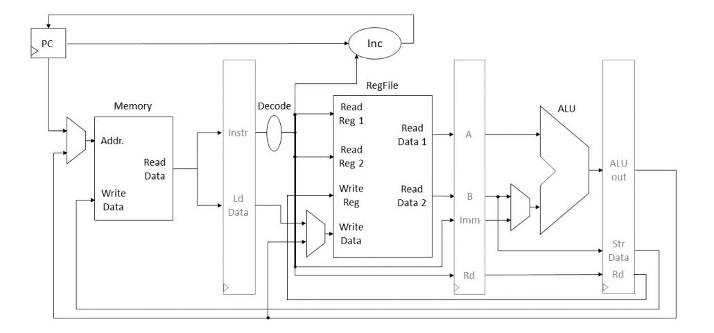

Fig. 1. CPU Datapath (simplified)

In the following, we will list some effects in different components in the CPU data path, which break the ILA. These effects are often caused by memory transitions, a well-known effect that has been discussed in many previous 

{6}------------------------------------------------

works [CGP+12,BGG+15,PV17]. When value x at a particular memory location is overwritten by value y, the power consumption or electromagnetic radiation will depend on a combination of the two values (T(x, y)). However, previous treatments have mostly focused on its occurrence in CPU storage units such as RAM memory and the register file. We will see that the overwrite effect also plays a significant role in memory-independent instructions.

Examples of how transitional leakages break the ILA include but are not limited to the following:

Load/Store Instructions. The memory overwrite effect, caused by subsequent store instructions at the same address, is well-known and has been amply discussed in literature [BGG+15,PV17]. This problem is relatively straightforward to avoid with a proper allocation of addresses to different variables.

Independent of the memory address, there is also a leakage effect, caused by the use of the memory-related CPU instructions: load and store. The load/store combination effect, causes the read (resp. written) data of consecutive load (resp. store) instructions to leak. This issue was already identified by Papagiannopoulos and Veshchikov [PV17] as the "Memory Remnant Effect", but no explanation was given. In fact, in a lot of cases, this effect is equivalent to the memory overwrite effect, occurring in a CPU register. Consider, for example, Figure 1, where loaded data is stored in a dedicated data register ("Ld Data"), before it reaches the register file. The same can be true for stored data ("Str Data" in Figure 1). Even when such registers are not present in the CPU, the "Read Data" and "Write Data" bus transitions can cause this effect. If the write and read data paths have common hardware, such as registers or buses, the data read from a load instruction could potentially also be combined with the stored data of the previous/next store operation.

Hence, the data involved in consecutive load/store instructions (even when separated by several other instructions) may be combined in a transitional leakage effect. Which instructions are combined and how strong the leakage effect is, depends on the specific layout of the CPU datapath and is typically difficult to predict. Consider, for example, a data memory with two read or write ports. It is near impossible for the code developer to know which value goes through which port.

ALU Instructions. The Arithmetic Logic Unit (ALU) is the main block for all arithmetic and logic instructions, but is also used for address calculations. Its multi-functionality results in a large number of shared data paths and thus potential leakage.. Its inputs go through a variety of operators of which only one result is stored and used, but it is possible that some combination of A ?<sup>1</sup> B and A ?<sup>2</sup> B is leaked, where ?1, ?<sup>2</sup> can be any two operators. To the best of our knowledge, the potential combination effects of the ALU have not previously been discussed.

It is clear that consecutive operands and outputs of the ALU will leak jointly if (like in Figure 1) the ALU is separated from other CPU stages by registers ("A", "B" and "ALU out").

{7}------------------------------------------------

Beyond this, there are a number of interconnections and registers within the ALU block which can result in less predictable leaks, even among non-consecutive instructions. Consider for example a forwarding register to mitigate data hazards by allowing a newly computed result to be the operand of the next ALU operation, without requiring write-back to the register file. A transition in this register can cause the outputs of two completely different ALU operations to be combined, even if they are separated by many other instructions. Data from independent instructions may also be combined in one of the many multiplexers that are required for the versatility of the ALU. The complexity of this CPU component makes it impossible to exhaustively enumerate all its effects.

Register File Operands. The register file is involved in almost every type of instruction (load, store and ALU instructions). Regardless of the type of instruction, it is known that the transition of a particular register from one value to another causes the register overwrite effect, similar to the memory overwrite effect. Again, this effect can be avoided with a proper register allocation.

Under the hood, the register file is not a mere collection of independent flip flops. A network of read and write lines connects the different cells with each other, resulting in a register combination effect: access to one CPU register can cause the combined leakage of the value in that register with a value stored in another register. One instance of this was observed by Papagiannopoulos and Veshchikov [PV17] and designated the "Neighbour Leakage Effect", although it is not entirely clear what defines the neighbour relationship. They performed an experimental analysis but no general conclusions can be made for all processors. Since it is time consuming to find out which registers exhibit the neighbourhood relationship in a particular device, a safe strategy is to assume that any two (or more) elements stored in the register file at the same time, can leak together.

And Much More... The CPU does not only introduce leakage among equal instructions. Consider for example register "B" in Figure 1, which is used both for the data of a store instruction and the second operand of an ALU instruction. Something similar can be said for the "Write Data" bus of the register file, which is the output of a multiplexer choosing between the data of a load instruction and the output of the ALU. In reality, processors are more complicated than in Figure 1 and many more shared paths between different instructions can exist, breaking the independent leakage assumption of the probing model.

#### 3.2 Case Studies and Platform Dependency

In order to prevent undesirable combinations of intermediates in masking algorithms, some instruction-level mitigations have been proposed. Papagiannopoulos et al. [PV17] for example proposed to use dummy load (resp. store) instructions to isolate the loading (resp. storing) of shares of the same variable from each other. To deal with the register combination effect, they propose to clear the register file as much as possible.

{8}------------------------------------------------

In this section, we experiment with these flushing and clearing instructions. The results show that the need for and effect of such instructions is different for every platform. Moreover, since it is infeasible to identify all transitional leakage sources in each CPU, these extra instructions may not be sufficient to secure an implementation.

Flushing Instructions. To flush the load/store datapath, one can load/store some random value, as was done by Papagiannopoulos et al. [PV17]. Flushing the ALU datapath is more complicated. In this work, we try to clear the registers and buses in the datapath by repeating an ALU instruction with random data. Again, given the complexity of the ALU, this method still does not provide a guarantee that data is not combined in another path (e.g. a forwarding register).

Clear Registers. To counteract the register combination leakage, Papagiannopoulos et al.propose to clear unused variables from the register file. This solution is quite over-cautious and results in a large overhead that is even expensive than a second-order secure implementation (see [PV17, Table 1]).

It is much more efficient to only clear registers when necessary, under the assumption that any combination of two or more registers in register file can leak. This assumption is still somewhat conservative, but results in a much faster implementation than the always-clear approach. We will assume in this section that the register file leakage does not combine more than two values and only leaks pairs of intermediates stored at the same time. We note however, that this may not be true in general.

A Note on Instruction Reordering. These flushing and clearing instructions only make sense if the order of execution of the instructions is fixed. Some processors use instruction reordering as an optimization mechanism. In that case, clearing some registers before loading others or flushing operations may have no effect at all.

Application. A relevant example for software masking is the conversion from Boolean to arithmetic masking by Goubin [Gou01], which comes with a proof of security. Despite this proof, TVLA shows clearly that this simple function exhibits a lot of leakage when deployed on a device. We demonstrate this below on three different platforms. Additionally, we apply each of the described mitigations, separately and combined. The results show a large variability in the effects on different platforms and the success of the different mitigations. The assembly code for the experiments can be found in Appendix A.

Results. We show the results on three different platforms in Figures 2 to 4. It is clear that distinct platforms show distinct behaviour. On the Zynq board, the extra instructions are able to eliminate the leakage with up to 250 000 power traces. In contrast, the extra instructions seem to have only limited effect on the NXP device. We also see that ALU instructions on the Zynq board may 

{9}------------------------------------------------

contribute considerably to transitional leakages, since the ALU flush instructions alone already significantly increase the number of traces required to detect leakage.

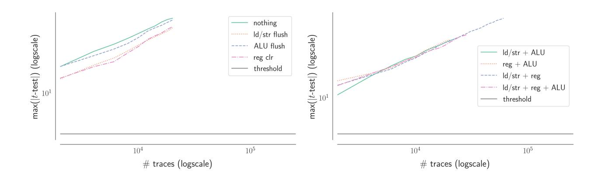

Fig. 2. TVLA results of the Boolean-to-arithmetic conversion on NXP LPC2124

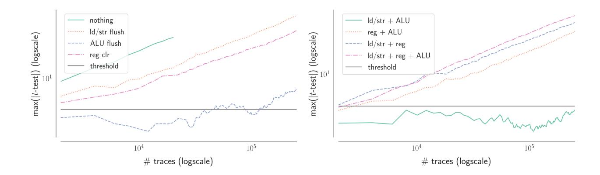

Fig. 3. TVLA results of the Boolean-to-arithmetic conversion on Xilinx Zynq

#### 3.3 Discussion

It is clear from this section and from previous works that security proofs of masking in the regular probing model [ISW03] do not give any guarantees for security in practice on real devices. Moreover, the experiments in this section show that incorporating all possible CPU combinations into a single theoretical model (such as the robust probing model) may not be feasible.

Firstly, we have demonstrated that every platform gives different leakage behaviours. A single conclusion cannot be drawn on which of the described leakage effects occur. Flushing and clearing instructions can be effective in some cases with up to 2.5 × 10<sup>5</sup> traces. However, with more traces, even more unexpected combinations may be made by the CPU. Such instructions do not have the same effect on different platforms. On devices with instruction reordering, they may be completely ineffective.

{10}------------------------------------------------

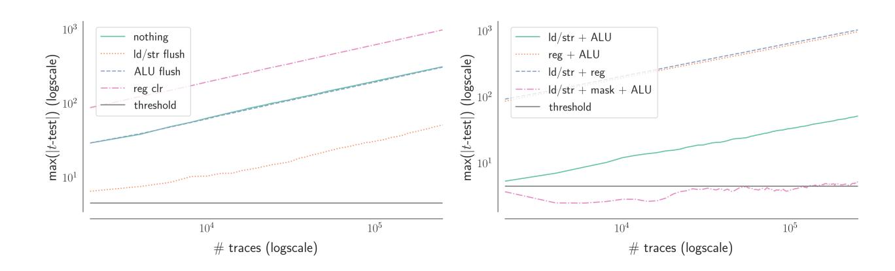

Fig. 4. TVLA results of the Boolean-to-arithmetic conversion on STM32F3

Secondly, we argue that one cannot identify the combinations of variables to include in the model (e.g. by means of extended probes [FGP+18]). If a detailed description of the architecture is available, a designer can carefully determine the required countermeasures, but this is tedious work and open-source processors are rather rare in industry. Moreover, even given complete detail of the device, it is not always possible to predict the effect of the countermeasures (e.g. instruction reordering or dual port memory). In the absence of knowledge about the data paths, one can use flushing operations after every normal instruction (a very expensive option) or one can try to reverse engineer the architecture by trial-and-error. Neither option seems very practical and cost efficient.

Thirdly, let's compare the problem of modeling the CPU combinations to the challenge of modeling glitches. In the latter case, it is possible to simplify the problem by assuming any or indeed the worst-possible glitch can occur [DBR19]. Naturally, the masking schemes in that model might be more expensive than strictly necessary. This is the price that is paid to obtain provable security at a high level, where implementation and platform details can be ignored. Were we to do the same for CPU combinations, the matter of how many combinations to include and where to put the limit is not as clear as for glitches. It is difficult to imagine the cost of a masking scheme that is provably secure in a model that can guarantee security in practice on any device with any number of traces. There is clearly a trade-off between the effort spent on securing an implementation and its efficiency.

The example in this section is small, compared to for example an entire masked AES encryption. Clearly, a more comprehensive methodology is required to make masked software implementations secure in practice.

## 4 High-level (C) Implementations

In this section, we take a step back from the architectural details of the processor and look at the problem from a higher level. We propose solutions that start from a provably secure first-order implementation in the probing model in C and then turn this into a solution on a platform which does not follow the model. As argued above, at the time of writing, it does not seem straightforward to come up with 

{11}------------------------------------------------

a model which is generic enough to capture a wide variety of microprocessors and a pragmatic approach is required.

On the cost of Lazy Engineering. Balasch et al.[BGG+15] show that the "lazy" engineer can obtain d-th order side-channel security in practice by using a theoretically 2d-th order secure masking scheme, i.e. twice the order of the masking scheme that one would na¨ıvely assume. This would have a large impact on code size and execution time, and below we show that this approach is not necessarily sufficient by providing a counterexample.

We implemented a second-order Boolean masked AES in C, based on the implementation described by Grosso et al.[GPS14], using optimization flag -O0 and programmed it onto a STM32F3 microprocessor. We conducted a leakage detection test, as described in § 2.3, with 2.5 × 10<sup>5</sup> traces each capturing two complete masked SubBytes evaluations and the beginning of a third. The results are shown in Figure 5, where significant leakage can be seen, providing a counterexample to the suggestion given by Balasch et al. [BGG+15]. The inputs (plaintext and key) were sent to the device in shared form, so the leakage can only originate from the implementation itself. This shows that with enough traces, even a second-order secure implementation can leak in practice.

Changing one of the low level sub functions in that implementation to do the calculations differently made the leakage disappear. Note that this low level function does not use all shares.

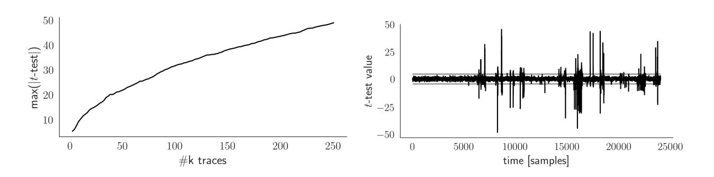

Fig. 5. First-order TVLA of a second-order secure AES with 2.5×10<sup>5</sup> traces. Maximum t-value vs Number of traces (left) and t-test statistic vs time samples (right)

On Compilers. When a compiler operates on source code it is given complete freedom to produce assembly code that conducts the required operations. That is, the compiler has no obligation to follow any structures imposed in the source code as long as the functionality remains the same.

Without loss of generality, we consider that a compiler will typically transform source code into a generic assembly language using basic building blocks, with little regard for speed or code size, to produce an intermediate representation. This representation is then optimized to reduce execution time and/or code size. The optimizations that are applied can be crudely controlled by specifying 

{12}------------------------------------------------

an optimization level. A given compiler will typically have lists of transformations and optimizations that are conducted depending on the desired optimization level. The optimized intermediate representation is then passed to a backend that produces machine code for a given platform, while performing further optimizations particular to that platform.

To produce a side-channel resistant implementation of a block cipher in a high-level language, such as C, one needs to write source code, such that an optimizer cannot remove the side-channel resistance. This is somewhat problematic since side-channel resistance is typically achieved with redundant representations and code sections that always execute in the same way. A compiler could use code that varies from one execution to another if the resulting code is faster and/or smaller. Likewise, a compiler will seek to remove redundancy since that will produce smaller and faster code. The challenge is to write source code which allows a compiler to produce small and efficient machine code, without debilitating the side-channel countermeasures.

#### 4.1 Implementation techniques

In the following paragraphs we will discuss some techniques which can be used to ensure that security is maintained when implementing side-channel resistant instances of cryptographic algorithms in C. Arguably, it is better to profile a device and tailor the implementation to fit the platform [BGG+15]. This would require platform specific development which can become time consuming when developing code for a wide variety of platforms.

Secret-Invariant Instructions One of the most leaky types of side-channel is caused by writing code where the sequence of instructions depends on secret related data. Some block ciphers, e.g. DES, contain a lot of bitwise operations which are especially prone to generating if/then/else constructs. To prevent this from happening the algorithm description often has to be reworked such that the optimization algorithms do not favor conditioning on values e.g. by moving to a table based implementation. This prevents an adversary deducing information from inspecting a trace of some side-channel, typically referred to as simple power analysis.

Avoiding Code Optimization through Partitioning Functions An intuitive approach to implementing a side-channel resistant instance of a block cipher in software would be to use the ideas used for threshold implementations [NRR06]. While originally designed for hardware, the ideas translate easily into software and several examples are available in the literature [SBM18]. Nikova et al. [NRS11] introduced threshold implementations by applying multiparty computation techniques to masking schemes. An important concept for threshold implementations is non-completeness, i.e. a threshold implementation makes use of sub-functions which are independent of at least one input share.

{13}------------------------------------------------

The most straightforward way to write a software instance of a threshold implementation countermeasure would be to implement functions that each operate on a subset of shares of a secret values. One might assume that no leakage would occur and that a compiler can optimize a given function with no risk of leakage occurring. However, function calls can be quite costly as, for example, many registers may need to be pushed on the stack. A compiler may, therefore, simply remove the function call and replace it with the code from the function. This can then be optimized together with the calling code, which removes the partitioning effect required for a threshold implementation.

Current compilers typically compile source files independently to produce object files, that are then linked using a linker to produce the final machine code. While there are linkers that can optimize code, it typically has to be specified explicitly when running the linker. By default, they do not optimize code, so one can partition functions by ensuring that they are in separate source files. Fortunately, this is common practice for embedded platforms as linkers are also usually unable to pull individual functions out of object files. One would typically implement one function per source file to minimize the amount of unused code from uncalled functions.

Implicit share use and avoiding excessive share usage In many cases, as will also be demonstrated in the case studies later on, it is possible to introduce implicit shares through changing the cryptographic sub-functions slightly.

A simple example can explain the concept. In many software implementations, look-up tables are used to create efficient code for nonlinear operations. The idea is to create a table that contains every possible output at every possible index which represents the input [KJJ99]. As with every operation, these tables could potentially cause leakage, hence the need to randomize them in RAM.

For example, consider the AES SubBytes operation, which consists of an inversion in  $\mathbb{F}_{2^8}$  followed by an affine operation in  $\mathbb{F}_2^8$ . Both the indices and values need to be masked to prevent side-channel leakage. One can achieve this by applying a random mask to the indices and the table contents, as shown in Algorithm 1.

#### Algorithm 1: Masked SubBytes Table

```
Input: S the 256 entry look-up table used for the SubBytes operation, M_{in}, M_{out} \in \mathbb{F}_{28}
Output: S' the randomized look-up table

1 for i = 0 to 255 do

2 |S'_{i \oplus M_{in}} \leftarrow S_i \oplus M_{out};
3 end

4 return S'
```

{14}------------------------------------------------

It has been noted that if line 2 of Algorithm 1 is implemented as

$$S_i' \leftarrow S_{i \oplus M_{in}} \oplus M_{out}$$
,

one could use the i to conduct a side-channel attack on the result of Si⊕Min to derive Min on one trace [TWO14].

The use of a masked table requires the input mask of the value being looked up to be Min in order to produce the correct output. Na¨ıvely, one would implement this by first XORing Min to one share of the masked input value before XORing the second share to it to avoid having an unmasked value in the system. Even in the unlikely situation when these operations would not be optimized away, the mere existence and multitude of usage of Min in the implementation could lead to the involuntary unmasking of the requested lookup through transition leakages.

One way to avoid the existence of Min in the implementation would be to XOR the value to the roundkey which is XORed to the state before the Sub-Bytes operation. Typically, if the memory size permits, roundkeys are calculated beforehand and stored in memory. During the AES operation, usage of Min is thus avoided. This principle we refer to as implicit share usage.

Another golden rule is to avoid the use of values when not necessary. If one were to use the partitioning of functions as explained in § 4.1, it is recommended to pass the address of the values on, rather than the actual values. This avoids exposing the value to potential leakage points until it is really necessary.

Time separation of sensitive share combinations Implicit share usage does not solve the fact that multiple inputs and outputs of the T-table itself will be masked with the same input/output mask Min/Mout. Even when a linear operation is applied to a two-share variable, even when the function is placed into a separate object, the existence of the two shares in the microprocessor can still result in side-channel leakage (cf. transitional leakages of §3). This risk can be reduced through separating the use of the shares in time as much as possible and increasing the chances that previous micro-architectural values have been cleared. Below, we describe several techniques to achieve time-separation.

One is to use pointers as function inputs instead of values, since the pushing and popping of variables on the stack, as well as the extra instructions needed, cause the CPU to use the shares consecutively numerous times. Passing pointers reduces the likelihood of the two shares getting combined. Another way to separate variables, particularly those used in loops, is to ensure that loop unrolling and optimization of instructions across several calls to the loop is avoided. As a simple example, consider a loop index going from 0 to 3. If the code were to be written in such a way that the code itself is not aware of how many loops are to be done, nor what the actual indices are on which variables within the loop are depending, then the code is most likely going to be executed the way it is written. This can be achieved by passing the indices as an array and specifying the length of the indices array as an input to the overall function in which the loop 

{15}------------------------------------------------

is used. Function separation can again be used to avoid optimization between functions.

Non-linear masking schemes or representations of shares The Boolean masking scheme has a huge drawback, since using an XOR as a masking operation combines the bits of the shares in a linear manner to unmask a value. This is a very similar mechanism to what happens to the power consumption in a CMOS implementation when one value overwrites another, whether on a bus, in a register, or when bits of a share are involuntarily combined (e.g. the entrance of a MUX). One way to reduce leakage and force an attacker to collect more measurements, or heavily profile the leakage, is to create a non-linear relationship between the shares and the secret. By doing so, accidental overwrites will leak less, although the leakage from overwrite effects is unlikely to disappear completely. For example, masked AES designs that use multiplicative masking have been proposed by Genelle et al. [GPQ11]. Also the inner product masking scheme [BFG+17] fits in this category and has been shown to be effective in practice.

Another example of this technique is elaborated upon in the AES case study and comprises of the encoding of one share of a 2-share Boolean masking scheme by pushing it through the AES SubBytes operation. The relationship between the input and output of this operation is well studied in the field of differential cryptanalysis [BS90] and those properties are highly effective.

Shuffling This concept does not need a lot of explanation. Time randomization or shuffling (e.g. randomizing loop counters) is a hiding countermeasure and a convenient way to reduce the leakage if implemented without exposing SPA leakage. As a rule of thumb, spreading a sensitive operation over k locations will roughly require k times more traces for an attacker to extract the key. The SubBytes operation in AES is e.g. a good candidate where this technique can be applied.

Cache The most common micro-architectural feature that could cause unforeseen leakage is a cache. Most attacks in the literature exploit the overall timing of an operation [AS08] or observe individual cache accesses causing hits and misses in, for example, a power consumption trace [AK06]. Leakage can also be observed where a cache eviction occurs at an inconvenient time.

The most straightforward way of preventing leakage via a sequence of cache accesses is to guarantee that the accessed tables are in the cache. One can read every n-th table entry, where n is the cache line size. It is also important to read the first and last table entry, since nothing obliges a compiler to align tables with cache lines. Some compilers allow one to align tables with cache lines, but typically require syntax particular to that compiler. We assume here that an attacker cannot run arbitrary code on the processor and work under the assumption that cache evictions cannot be instrumented in a controlled fashion. 

{16}------------------------------------------------

If this were to be the case, more advanced cache protection techniques have to be implemented.

Other micro-architectural features There are various other micro-architectural features which can cause side-channel leakage. Among them are speculative execution [AKS06] and dedicated hardware gadgets like, for example, multipliers with early-termination [GOPT10]. Unfortunately, there are a wide variety of these micro-architectural features and we currently cannot give explicit guidelines on how to avoid leakage caused by speculative executions other than trying different ways of implementing the above propositions.

# 5 Case Studies

In the following we describe some implementations of block ciphers written in C that are side-channel resistant on a variety of microprocessors for all commonly used optimization levels. In each case, we choose elements described in § 4.1 to achieve a side-channel resistant implementation.

TVLA results. Both case studies below were tested on the NXP LPC2124, Xilinx Zynq zc702 and the Intel Atom N455, where the implementations on the latter two microprocessors also included code for pre-loading look-up tables into cache, as described in § 2.4. We acquired 5 × 10<sup>5</sup> traces for each optimization level (specifically -Os, -O0, -O1, -O2, -O3) to conduct a leakage detection test as described in § 2.3. The traces acquired were set to include the entire operation to ensure that no leakage occurred in a way not envisaged in the design. In all cases, no statistic with an absolute value larger than 4.5σ was observed. Analysis examples can be found in Figure 6.

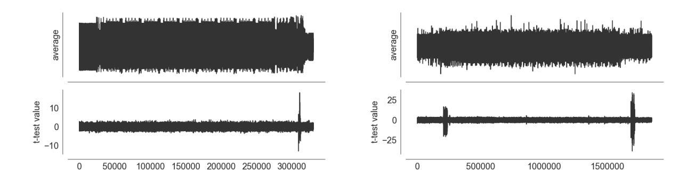

Fig. 6. On the left: TVLA results of the described AES implementation for optimization level -O2 on the NXP LPC2124 for 5 × 10<sup>5</sup> traces. The leakage at the end is the unmasking of the output data. There is no input leakage because the input is going in masked. On the right: TVLA results of the described DES implementation for optimization level -O2 on the NXP LPC2124 for 5 × 10<sup>5</sup> traces. The leakage in the beginning and the end is respectively input and output leakage.

{17}------------------------------------------------

Instruction overhead. While it is hard to describe overhead because it is highly dependent on the choices made for the specific algorithms, we give some rough estimates by comparing the implementation overhead to a masked assembly implementation which was tailored for the NXP LPC2124 and will most likely not run leak-free on any of the other platforms mentioned in this paper. For the DES, the table setup phase takes about 3x as many instructions while the actual encryption takes 4x as many. For the AES, table setup is about 1.5x as many instructions while the encryption takes 3x as many. This is the price we pay for a significant reduction in design time and portability across devices. For comparison, the 2nd order AES implementation tested in § 4 has another 10x more instructions on that same platform than the C implementation for AES described here.

#### 5.1 Implementing Side-Channel Resistant DES in C

Triple-DES is widely used in the banking industry, hence side-channel resistant implementations of DES form an interesting case study. Moreover, the DES cipher uses many bitwise permutations, which constitutes a challenge when it comes to implementing them in a way that is not made insecure by a compiler. The most obvious way to implement a bitwise permutation in C would be to repeatedly read a byte, do a logical-AND to extract one bit and write the result to a target byte. However, there is nothing to stop a compiler from replacing this with tests on individual bits and conditionally writing an output bit, especially as commands that do precisely this are available in many instruction sets. This could result in a trivial attack where individual bits being permuted can be read by inspecting a power/EM consumption trace

The DES consists of 16 rounds of a Feistel structure, where each round has two 32-bit words as input {L<sup>i</sup> , Ri}, for i ∈ {1, . . . , 16} and as output {Li+1, Ri+1}. In each round, the function E (referred to as the expansion function) transforms a 32-bit word in a 48-bit word, which is then XOR-ed with a subkey. Each subkey is a 48-bit subset of the 56-bit secret key. The function S produces eight 4-bit words from eight 6-bit words, using eight different 6 × 4 look-ups. Finally, the so-called P-permutation is a bitwise permutation providing diffusion in the block cipher. We define the functions:

$$E: \mathbb{F}_{2}^{32} \longrightarrow \mathbb{F}_{2}^{48}: \mathbf{x} \longmapsto \mathbf{y} \text{ with } y_{i} = x_{\mathbf{e}_{i}}, \forall i \in \{1, \dots, 48\}$$

$$\mathbf{S}: \mathbb{F}_{2}^{48} \longrightarrow \mathbb{F}_{2}^{32}: \mathbf{x} = \{\mathbf{x}_{1} | | \dots | | \mathbf{x}_{8}\} \longmapsto [\mathbf{S}_{1}(\mathbf{x}_{1}) | | \dots | | \mathbf{S}_{8}(\mathbf{x}_{8})]$$

$$\text{with } S_{i}: \mathbb{F}_{2}^{6} \longrightarrow \mathbb{F}_{2}^{4}: \mathbf{x} \longmapsto \mathbf{y}, \forall i \in \{1, \dots, 8\}$$

$$\text{with } y_{j} = \mathbf{s}_{i}(\mathbf{x})_{j}, \forall j \in \{1, \dots, 4\}$$

$$P: \mathbb{F}_{2}^{32} \longrightarrow \mathbb{F}_{2}^{32}: \mathbf{x} \longmapsto \mathbf{y} \text{ with } y_{i} = x_{\mathbf{p}_{i}}, \forall i \in \{1, \dots, 32\}$$

Where bold symbols represent vectors and regular symbols represent bits. Furthermore, e and p are vectors that list the bitwise map for the expansion and P-permutation, respectively, and s<sup>i</sup> , for i ∈ {1, . . . , 8}, are the eight substitution tables. There is also a bitwise permutation at the beginning and the end of 

{18}------------------------------------------------

the block cipher. These two permutations do not contribute to the security of the block cipher and can be implemented in C without any risk of causing key related leakage, and will not be discussed further in this paper.

Secret-Invariant instructions DES contains a lot of bitwise operations. As described in  $\S$  4.1 this can lead to a data dependent instruction flow.

To minimize the number of bitwise permutations conducted on intermediate states, that could potentially be attacked, we can modify the DES structure. We change the input of each round to be two 48-bit words  $\{L_i, R_i\}$ , for  $i \in \{1, \ldots, 16\}$ , and the output to be two 48-bit words  $\{L_{i+1}, R_{i+1}\}$ . This can be achieved by combining the initial permutation IP with the expansion function E to produce  $L_1$  and  $R_1$ . A round function is then defined as the sequence of S, followed by the P/E function, which is the combined permutation-expansion function. The final permutation can be adjusted with an inverted E to produce the correct result.

The permutation P and the expansion function E are combined, further referred to as P/E and implemented by a single table lookup. That is, we create a table  $P/E_i$  for each 4-bit output of each  $\mathbf{s}_i$ , where one entry is 48 bits (*i.e.* implemented as eight 6-bit words) with up to six bits set to one.

The output is produced by XORing all the outputs of  $P/E_k$ , for  $k \in \{1, \ldots, 8\}$ , i.e.  $\bigoplus_{k=1}^8 P/E_k$ . Each function  $P/E_k$  can be implemented as a table with 16 entries. Hence, we can compute P/E using eight tables of  $2^7$  bytes, requiring a total of  $2^{10}$  bytes. These tables would need to be randomized, as described in  $\S$  4.1, where the index would be masked by a 4-bit random value and the contents masked by a 48-bit random value.

Implicit share usage. The above describes an implementation where we can assure that no information leaks through SPA, since a compiler cannot optimize the table operations as it would for a naïve implementation. The next countermeasure we apply is implicit share usage, i.e. except for the initial masking of the state with two 48-bit Boolean masks  $\{M_L, M_R\}$  and the round key masks, we do not handle any other mask value by itself. The key schedule can process the masked key and its mask independently to produce  $\{K_i, M_{K,i}\}$  for  $i \in \{1, ..., 16\}$ . The masked key and mask can then be included in the round function as two XOR operations, as shown in Figure 7. We will explain how we avoid the combination of those below. The key schedule implementation itself is described in Appendix B.

The construction of tables for function S is masked such that the input mask aligns with  $M_R$ , the output mask of S is defined as a 32-bit Boolean mask  $M_S$ . Likewise, the construction of tables for the functions  $P/E_k$ , for  $k \in \{1, \ldots, 8\}$ , will require that the indices are masked such that they align with the relevant four bits of  $M_S$ , and the contents of each is masked with a 48-bit mask for each k, i.e.  $M_{pe,k}$ , for  $k \in \{1, \ldots, 8\}$ . The mask after the P/E functions will be the XOR sum of these masks, i.e.  $M_{pe} = \bigoplus_{k=1}^{8} M_{pe,k}$ .

{19}------------------------------------------------

We can then to produce {Li+1, Ri+1} masked with {ML, MR}. Let ψ be the output of the masked P/E function, then

$$R_{i+1} = (\psi \oplus L_i) \oplus \left(M_L \oplus M_R \oplus \bigoplus_{k=1}^8 M_{pe,k}\right)$$

and

$$L_{i+1} = R_i \oplus (M_L \oplus M_R) .$$

The correction terms (M<sup>L</sup> <sup>⊕</sup> <sup>M</sup>R) and M<sup>L</sup> ⊕ M<sup>R</sup> ⊕ L<sup>8</sup> <sup>k</sup>=1 <sup>M</sup>pe,k can be precomputed at the same time as the tables are constructed for the S and P/E functions. This way we ensure that we have a round function where the combination of any two intermediate states will still be masked because all masks are implicit. The exception being the input and output to the round function.

An implementation of the DES as described above could leak if, for some i ∈ {1, . . . , 16}, Li+1 or Ri+1 overwrites L<sup>i</sup> or R<sup>i</sup> , respectively. The same would be true for any intermediate state overwriting the same intermediate state from a previous round. Hence, we enforce that each R<sup>i</sup> , for i ∈ {1, . . . , 16}, is overwritten by the result of R<sup>i</sup> ⊕ K<sup>i</sup> , then R<sup>i</sup> ⊕ K<sup>i</sup> ⊕ MK,i and so on for each function.

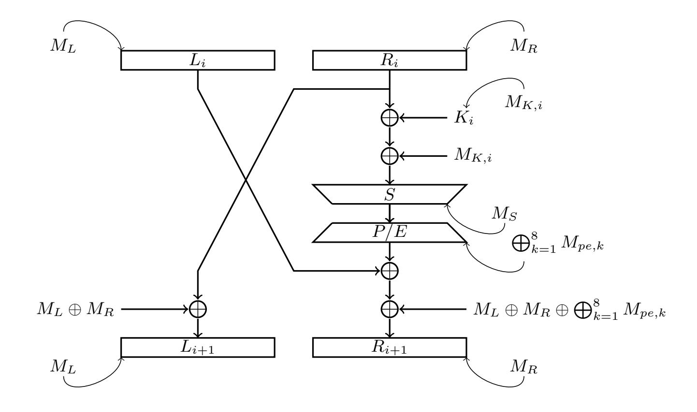

Fig. 7. The structure of one round of our masked DES implementation. The curved arrows are used to indicate the mask applied to the stages of the round function, as described in the text

{20}------------------------------------------------

Partitioning functions. Given that we wish to apply the key schedule to the masked key and its mask independently, the sharewise functions for the key schedule and XORing with the key are partitioned into a separate object to the round function, as described in § 4.1. This prevents a compiler from changing the key schedule code such that the two shares of the key are combined at run time. How one could implement the DES key schedule is briefly discussed in § B. Ensuring that the state overwrites in memory follow the sequence in the previous section is also enforced through function separation.

#### 5.2 Implementing Side-Channel Resistant AES in C

The AES is a substitution-permutation block cipher. There are three variants defined, one with a key length of 128 bits and 10 rounds, one with a key length of 192 bits and 12 rounds and one with a key length of 256 bits and 14 rounds. The input and output are both 16 bytes long. Internally the AES operates on a state of 16 bytes. Depending on the initial key length a certain number of rounds is executed on this state. The round function consists of four operations: AddRoundKey, SubBytes, ShiftRows, MixColumns. The SubBytes and MixColums are often combined in table-based software implementations and is referred to as a T-table. For more information on this, we refer the interested reader to [DR02] and [AES01].

Here we highlight which implementation techniques can be used to create a secure AES implementation in C without having to partition the C-code into separate objects and enforce time separation in this manner, see § 4.

Note that, in this example implementation, the key remains unmasked and the initial starting point is a straightforward Boolean masked implementation using a single T-table.

Let  $\alpha = \{x_1, \ldots, x_{16}\}$  and  $\beta = \{y_1, \ldots, y_{16}\}$  denote the state of the AES before and after the AddRoundKey function using round key  $\kappa = \{k_1, \ldots, k_{16}\}$ , where  $x_i, y_i, k_i \in \mathbb{F}_{2^8}$  for all  $i \in \{1, \ldots, 16\}$ . That is,  $y_i = x_i \oplus k_i$  for  $1 \le i \le 16$ . We use a Boolean sharing scheme  $(X_i, M_{X_i})$  such that  $x_i = X_i \oplus M_{X_i}$  for all  $i \in \{1, \ldots, 16\}$ . We have a different mask for each  $\mathbb{F}_{2^8}$  element, and we shift the mask array cyclically in the next round, *i.e.* the mask of byte 1 becomes the mask of byte 2, etc.

In order to reduce potentially harmful compiler optimizations we apply the following:

*Encoding.* As described in § 4, a nonlinear masking scheme can substantially reduce leakage. Any masking scheme where the main operator is not following the characteristic leakage of CMOS will bring the leakage down.

Here we opt to stick with the Boolean masking scheme because of its efficiency when implementing the AES subfunctions. However, we encode one of the shares to break the linear dependency with the secret. If we consider  $(X_i, M_{X_i})$ , for  $i \in \{1, ..., 16\}$ , we change the shares to  $(X_i, \tilde{M}_{X_i})$ , where  $\tilde{M}_{X_i} = S'(M_{X_i})$  for all  $i \in \{1, ..., 16\}$ . This significantly reduces overwrite leakage, but does not completely eliminate it. This is because the distribution of the XOR of the

{21}------------------------------------------------

two shares is not completely uniform, but from differential cryptanalysis the distribution is well understood. The XOR between the input and output of the SubBytes operation is not entirely uniform and leakage will eventually occur (the required number of traces is beyond the scope of this paper). We therefore change the mask after a certain number of computations, based on the signal-tonoise ratio of the acquisitions and the desired resistance level, i.e. the number of measurements before leakage occurs. By only intermittently changing the mask the increase in execution time and the required number of random values can be reduced. As an additional benefit, representing the second share this way and leaving the first share unmodified, we can use it in the AddRoundKey step.

Implicit share usage. Secondly, because of register or memory combination effects, we want to avoid having two shares in the system at the same time. Whenever possible, we thus make the second share implicit.

For example, this is possible in the case where a masked T-table lookup is used with an input mask Min. We remask the second, encoded, share to the input mask Min through a table lookup

$$M_{Y_i} = \operatorname{rm}_{in}(\tilde{M}_{X_i}) = S'^{-1}(\tilde{M}_{X_i}) \oplus M_{in},$$

for i ∈ {1, . . . , 16}. This way, we avoid the need for Min or the Boolean representation of the second share MX<sup>i</sup> in the system. A similar table is prepared to translate a byte masked with Mout as a result of the SubBytes and MixColumns operation and will be called rmout.

Figure 8 shows the concept in the simpler case of a lookup table used to compute the SubBytes operation. In this figure, the notation is consistent with the above, S <sup>0</sup> denotes the value and index masked SubBytes operation implemented as a table lookup, z<sup>i</sup> is the output of the SubBytes operation on x<sup>i</sup> and is represented in a masked format as (Z<sup>i</sup> , M˜Z<sup>i</sup> ) where MZ<sup>i</sup> is a random value.

Since the input to the table lookup for the mask translation is an encoded share, an overwrite of the output of the lookup with the input will not introduce extra leaks into the system.

Time separation to avoid overwrites of values with the same mask. To ensure separate calls to the T-table operation do not cause transitional leakage between inputs or outputs, we use time separation by writing the loops in such a way that optimization and unrolling is hard. We provide the call to the AES function with an array of indices to loop over as described in § 4.

T-table mask. For this implementation we also created a special T-table mask. Due to space considerations, a single T-table is used, in which, depending on the row, the output value will get rotated by 0, 8, 16 or 24 bits. In the end, four rotated lookup values are XORed together to complete the MixColumns operation. The output mask of the T-table, a 32-bit value represented by concatenating four eight-bit masks M1||M2||M3||M4, is chosen in such a way that M<sup>1</sup> ⊕ M<sup>2</sup> ⊕ M<sup>3</sup> ⊕ M<sup>4</sup> = Mout, after which the same encoding technique with 

{22}------------------------------------------------

the aid of a lookup table is used as for the input mask of the T-table to avoid existence of the actual Boolean share Mout.

Note that we do use a lot of tables in this implementation and cache attack countermeasures have to be considered too, hence proper preloading is required, see § 4.

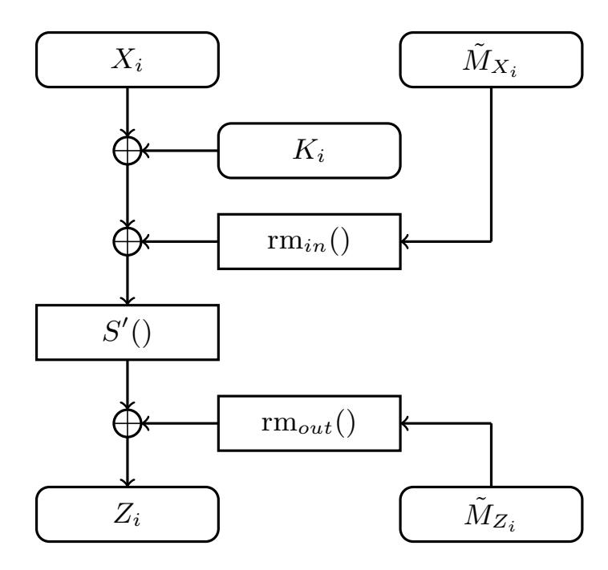

Fig. 8. Calculating the SubBytes operation with one encoded share in place

# 6 Conclusion

There are many examples of how to prove that a hardware implementation is resistant to side-channel analysis of a given order, where one can take into account all transitions and glitches produced by a given design. The same cannot be said for masked software implementations, for which proofs to this day still assume the ideal circuit model of ISW [ISW03]. Here, we generalize and extend work by Papagiannopoulos and Veshchikov [PV17] to describe the ways in which a microprocessor may leak that are not typically considered in current models used in proofs. Balasch et al. [BGG<sup>+</sup>15] argue that a straightforward second-order masking scheme will provide first-order resistance and can ignore micro-architectural considerations. However, we show that such generalizations are not valid with a counterexample. Our work highlights an open problem in applied cryptography: how to formally prove the security of software implementations given the numerous ways an implementation may leak. As a first step, we present strategies for implementing cryptographic algorithms such that the micro-architecture should not introduce leakage. We also provide some empirical results on how to implement side-channel resistant instances of cryptographic algorithms in the C programming language. Note that these implementations should just be viewed 

{23}------------------------------------------------

as instances and are by no means meant to be the best solution, which is still open for research. The question also remains whether we can build a comprehensive model in which the security of masked software implementation can be proven.

Another open research question raised by this work is how to accurately compare the performance of software implementations of side-channel resistant cryptographic algorithms. It is convenient to define the efficiency of a secure algorithm by the number of instructions it requires. However, on a microprocessor that number will not translate to the same number of opcodes. There is a significant increase in the required number of opcodes to avoid the types of leakage described above. The increase in opcodes will depend on the platforms considered and the variety of instructions chosen. Given the work presented above, it would be easy to envisage situations where less efficient algorithms with a simple structure are the best in practice because they are easier to secure.

One could also try to develop a microprocessor that would behave more closely to the ISW model [ISW03]. This would allow one to exploit the rich literature of algorithms that are provably secure in this model. However, it is not clear what can be done without a complete overhaul of the way in which microprocessors are designed.

## References

- [Acı07] Onur Acıi¸cmez. Yet another microarchitectural attack: exploiting I-cache. In Peng Ning and Vijay Atluri, editors, CSAW 2007, pages 11–18. ACM, 2007.
- [AES01] Specification for the advanced encryption standard (AES). Federal Information Processing Standards Publication 197, 2001.
- [AG01] Mehdi-Laurent Akkar and Christophe Giraud. An implementation of DES and AES, secure against some attacks. In C¸ etin Kaya Ko¸c, David Naccache, and Christof Paar, editors, CHES 2001, volume 2162 of LNCS, pages 309–318. Springer, 2001.
- [AK06] Onur Acıi¸cmez and C¸ etin Kaya Ko¸c. Trace-driven cache attacks on AES (short paper). In Peng Ning, Sihan Qing, and Ninghui Li, editors, ICICS 2006, volume 4307 of LNCS, pages 112–121. Springer, 2006.
- [AKS06] Onur Acıi¸cmez, C¸ etin Kaya Ko¸c, and Jean-Pierre Seifert. Predicting secret keys via branch prediction. In Masayuki Abe, editor, CT-RSA 2007, volume 4377 of LNCS, pages 225–242. Springer, 2006.
- [AS08] Onur Acıi¸cmez and Werner Schindler. A vulnerability in RSA implementations due to instruction cache analysis and its demonstration on OpenSSL. In Tal Malkin, editor, CT-RSA 2008, volume 4964 of LNCS, pages 256–273. Springer, 2008.
- [BBD<sup>+</sup>16] Gilles Barthe, Sonia Bela¨ıd, Fran¸cois Dupressoir, Pierre-Alain Fouque, Benjamin Gr´egoire, Pierre-Yves Strub, and R´ebecca Zucchini. Strong non-interference and type-directed higher-order masking. In Edgar R. Weippl, Stefan Katzenbeisser, Christopher Kruegel, Andrew C. Myers, and Shai Halevi, editors, ACM SIGSAC Conference on Computer and Communications Security, pages 116–129. ACM, 2016.

{24}------------------------------------------------

- [BCO04] Eric Brier, Christophe Clavier, and Francis Olivier. Correlation power analysis with a leakage model. In Marc Joye and Jean-Jacques Quisquater, editors, CHES 2004, volume 3156 of LNCS, pages 16–29. Springer, 2004.
- [BCZ18] Luk Bettale, Jean-S´ebastien Coron, and Rina Zeitoun. Improved highorder conversion from Boolean to arithmetic masking. IACR Trans. Cryptogr. Hardw. Embed. Syst., 2018(2):22–45, 2018.
- [BFG<sup>+</sup>17] Josep Balasch, Sebastian Faust, Benedikt Gierlichs, Clara Paglialonga, and Fran¸cois-Xavier Standaert. Consolidating inner product masking. In Tsuyoshi Takagi and Thomas Peyrin, editors, Advances in Cryptology - ASIACRYPT 2017 - 23rd International Conference on the Theory and Applications of Cryptology and Information Security, Hong Kong, China, December 3-7, 2017, Proceedings, Part I, volume 10624 of Lecture Notes in Computer Science, pages 724–754. Springer, 2017.
- [BGG<sup>+</sup>15] Josep Balasch, Benedikt Gierlichs, Vincent Grosso, Oscar Reparaz, and Fran¸cois-Xavier Standaert. On the cost of lazy engineering for masked software implementations. In Marc Joye and Amir Moradi, editors, CARDIS 2014, volume 8968 of LNCS, pages 64–81. Springer, 2015.
- [BS90] Eli Biham and Adi Shamir. Differential cryptanalysis of DES-like cryptosystems. In Alfred Menezes and Scott A. Vanstone, editors, Advances in Cryptology - CRYPTO '90, 10th Annual International Cryptology Conference, Santa Barbara, California, USA, August 11-15, 1990, Proceedings, volume 537 of Lecture Notes in Computer Science, pages 2–21. Springer, 1990.
- [CGP<sup>+</sup>12] Jean-S´ebastien Coron, Christophe Giraud, Emmanuel Prouff, Soline Renner, Matthieu Rivain, and Praveen Kumar Vadnala. Conversion of security proofs from one leakage model to another: A new issue. In Werner Schindler and Sorin A. Huss, editors, COSADE 2012, volume 7275 of LNCS, pages 69–81. Springer, 2012.
- [CJRR99] Suresh Chari, Charanjit S. Jutla, Josyula R. Rao, and Pankaj Rohatgi. Towards sound approaches to counteract power-analysis attacks. In Michael J. Wiener, editor, Advances in Cryptology - CRYPTO '99, 19th Annual International Cryptology Conference, Santa Barbara, California, USA, August 15-19, 1999, Proceedings, volume 1666 of Lecture Notes in Computer Science, pages 398–412. Springer, 1999.
- [DBR19] Lauren De Meyer, Beg¨ul Bilgin, and Oscar Reparaz. Consolidating security notions in hardware masking. IACR Trans. Cryptogr. Hardw. Embed. Syst., 2019(3):119–147, 2019.
- [dGPdlP<sup>+</sup>17] Wouter de Groot, Kostas Papagiannopoulos, Antonio de la Piedra, Erik Schneider, and Lejla Batina. Bitsliced masking and ARM: friends or foes? In Andrey Bogdanov, editor, LightSec 2016, volume 10098 of LNCS, pages 91–109. Springer, 2017.
- [DR02] Joan Daemen and Vincent Rijmen. The design of Rijndael: AES the Advanced Encryption Standard. Springer-Verlag, 2002.
- [FGP<sup>+</sup>18] Sebastian Faust, Vincent Grosso, Santos Merino Del Pozo, Clara Paglialonga, and Fran¸cois-Xavier Standaert. Composable masking schemes in the presence of physical defaults & the robust probing model. IACR Trans. Cryptogr. Hardw. Embed. Syst., 2018(3):89–120, 2018.
- [GBTP08] Benedikt Gierlichs, Lejla Batina, Pim Tuyls, and Bart Preneel. Mutual information analysis. In Elisabeth Oswald and Pankaj Rohatgi, editors, CHES 2008, volume 5154 of LNCS, pages 426–442. Springer, 2008.

{25}------------------------------------------------

- [GJJR11] Gilbert Goodwill, Benjamin Jun, Josh Jaffe, and Pankaj Rohatgi. A testing methodology for side-channel resistance validation, September 2011.
- [GMO01] Karine Gandolfi, Christophe Mourtel, and Francis Olivier. Electromagnetic analysis: Concrete results. In C¸ etin Kaya Ko¸c, David Naccache, and Christof Paar, editors, CHES 2001, volume 2162 of LNCS, pages 251–261. Springer, 2001.
- [GOPT10] Johann Großsch¨adl, Elisabeth Oswald, Dan Page, and Michael Tunstall. Side-channel analysis of cryptographic software via early-terminating multiplications. In Dong Hoon Lee and Seokhie Hong, editors, ICISC 2009, volume 5984 of LNCS, pages 176–192. Springer, 2010.
- [Gou01] Louis Goubin. A sound method for switching between Boolean and arithmetic masking. In C¸ etin Kaya Ko¸c, David Naccache, and Christof Paar, editors, CHES 2001, volume 2162 of LNCS, pages 3–15. Springer, 2001.
- [GPQ11] Laurie Genelle, Emmanuel Prouff, and Micha¨el Quisquater. Thwarting higher-order side channel analysis with additive and multiplicative maskings. In Bart Preneel and Tsuyoshi Takagi, editors, Cryptographic Hardware and Embedded Systems - CHES 2011 - 13th International Workshop, Nara, Japan, September 28 - October 1, 2011. Proceedings, volume 6917 of Lecture Notes in Computer Science, pages 240–255. Springer, 2011.
- [GPS14] Vincent Grosso, Emmanuel Prouff, and Fran¸cois-Xavier Standaert. Efficient masked S-boxes processing - A step forward -. In David Pointcheval and Damien Vergnaud, editors, AFRICACRYPT 2014, volume 8469 of LNCS, pages 251–266. Springer, 2014.
- [ISW03] Yuval Ishai, Amit Sahai, and David A. Wagner. Private circuits: Securing hardware against probing attacks. In Dan Boneh, editor, CRYPTO 2003, volume 2729 of LNCS, pages 463–481. Springer, 2003.
- [KHF<sup>+</sup>19] Paul Kocher, Jann Horn, Anders Fogh, Daniel Genkin, Daniel Gruss, Werner Haas, Mike Hamburg, Moritz Lipp, Stefan Mangard, Thomas Prescher, Michael Schwarz, and Yuval Yarom. Spectre attacks: Exploiting speculative execution. In 2019 IEEE Symposium on Security and Privacy, pages 1–19. IEEE, 2019.
- [KJJ99] Paul Kocher, Joshua Jaffe, and Benjamin Jun. Differential power analysis. In Michael J. Wiener, editor, CRYPTO '99, volume 1666 of LNCS, pages 388–397. Springer, 1999.
- [Koc96] Paul Kocher. Timing attacks on implementations of Diffie-Hellman, RSA, DSS, and other systems. In Neil Koblitz, editor, CRYPTO '96, volume 1109 of LNCS, pages 104–113. Springer, 1996.
- [LBS19] Itamar Levi, Davide Bellizia, and Fran¸cois-Xavier Standaert. Reducing a masked implementation's effective security order with setup manipulations and an explanation based on externally-amplified couplings. IACR Trans. Cryptogr. Hardw. Embed. Syst., 2019(2):293–317, 2019.
- [LSG<sup>+</sup>18] Moritz Lipp, Michael Schwarz, Daniel Gruss, Thomas Prescher, Werner Haas, Anders Fogh, Jann Horn, Stefan Mangard, Paul Kocher, Daniel Genkin, Yuval Yarom, and Mike Hamburg. Meltdown: Reading kernel memory from user space. In William Enck and Adrienne Porter Felt, editors, 27th USENIX Security Symposium, pages 973–990. USENIX Association, 2018.
- [NRR06] Svetla Nikova, Christian Rechberger, and Vincent Rijmen. Threshold implementations against side-channel attacks and glitches. In Peng Ning,

{26}------------------------------------------------

- Sihan Qing, and Ninghui Li, editors, ICICS 2006, volume 4307 of LNCS, pages 529–545. Springer, 2006.
- [NRS11] Svetla Nikova, Vincent Rijmen, and Martin Schl¨affer. Secure hardware implementation of nonlinear functions in the presence of glitches. J. Cryptology, 24(2):292–321, 2011.
- [PR13] Emmanuel Prouff and Matthieu Rivain. Masking against side-channel attacks: A formal security proof. In Thomas Johansson and Phong Q. Nguyen, editors, Advances in Cryptology - EUROCRYPT 2013, 32nd Annual International Conference on the Theory and Applications of Cryptographic Techniques, Athens, Greece, May 26-30, 2013. Proceedings, volume 7881 of Lecture Notes in Computer Science, pages 142–159. Springer, 2013.
- [PV17] Kostas Papagiannopoulos and Nikita Veshchikov. Mind the gap: Towards secure 1st-order masking in software. In Sylvain Guilley, editor, COSADE 2017, volume 10348 of LNCS, pages 282–297. Springer, 2017.
- [QS01] Jean-Jacques Quisquater and David Samyde. Electromagnetic analysis (EMA): Measures and counter-measures for smart cards. In Isabelle Attali and Thomas P. Jensen, editors, E-smart 2001, volume 2140 of LNCS, pages 200–210. Springer, 2001.
- [RBN<sup>+</sup>15] Oscar Reparaz, Beg¨ul Bilgin, Svetla Nikova, Benedikt Gierlichs, and Ingrid Verbauwhede. Consolidating masking schemes. In Rosario Gennaro and Matthew Robshaw, editors, CRYPTO 2015, volume 9215 of LNCS, pages 764–783. Springer, 2015.
- [SBM18] Pascal Sasdrich, Ren´e Bock, and Amir Moradi. Threshold implementation in software - case study of PRESENT. In Junfeng Fan and Benedikt Gierlichs, editors, COSADE 2018, volume 10815 of LNCS, pages 227–244. Springer, 2018.
- [TWO14] Michael Tunstall, Carolyn Whitnall, and Elisabeth Oswald. Masking tables - an underestimated security risk. In Shiho Moriai, editor, FSE 2013, volume 8424 of LNCS, pages 425–444. Springer, 2014.

{27}------------------------------------------------

# A Assembly Code

In this section, we include the instruction-level code for the Boolean-to-arithmetic conversion used in the experiments of section 3.2. The description is based on the generic algorithm of Bettale et al. [BCZ18, Algorithms 1 & 2]. The shares of input x are stored in [r0] and [r0,#4]. Random masks are stored in an array at address r1, i.e. at [r0], [r1,#4], [r1,#8], . . . . The output shares D<sup>0</sup> and D<sup>1</sup> are stored at address r2.

#### A.1 No Register Clearing

The following code is the straightforward assembly implementation of Algorithms 1 and 2 of [BCZ18] for first-order security in theory.

The flushing of the ALU is only necessary on one occasion. The probability distribution of the XOR of the outputs of the ALU operations on lines 14 and 16 depends on the secret x. Hence, we separate the instructions by a flushing operation involving a completely independent random mask.

The loading of the shares of x is separated by the loading of the random masks r<sup>0</sup> and r1. The storing of the output shares D<sup>0</sup> and D<sup>1</sup> on the other hand requires a flushing instruction in between.

The (\*) indicates that the flushing of the ALU and store instructions can be added or removed by simply adding/removing the corresponding instructions.

```
1 ldr r10, [r1, #8] // load extra random mask (for flushing)
2 ldr r3, [r0] // load x0
3 ldr r4, [r1] // load r0
4 eor r3, r3, r4 // x0 = x0 ^ r0
5 ldr r5, [r1, #4] // load r1
6 eor r3, r3, r5 // x0 = x0 ^ r1
7 ldr r6, [r0, #4] // load x1
8 eor r6, r6, r4 // x1 = x1 ^ r0
9 eor r7, r6, r5 // D0 = x1 ^ r1
10 str r7, [r2] // store D0
11 eor r8, r3, r6 // z0 = x0 x1
12 sub r8, r8, r6 // z0 = z0-x1
13 eor r8, r3, r8 // z0 = x0 z0
14 eor r9, r3, r5 // z1 = x0 ^ r1
15 eor r10, r10, r5 // flush ALU (*)
16 sub r9, r9, r5 // z1 = z1-r1
17 eor r8, r8, r9 // D1 = z0 z1
18 str r10, [r1, #8] // flush store (*)
19 str r8, [r2, #4] // store D1
```

#### A.2 With Register Clearing

Now, we keep track of the variables in the register file and remove any that could form a dangerous combination with the next computed or loaded variable. For 

{28}------------------------------------------------

example, the register holding x<sup>0</sup> is cleared on line 8 because its combination with the variable D<sup>0</sup> at line 12 leaks the secret. Before we clear it, we must store its value in memory, because it is required at a later stage in the computation. We also clear every register after its value has been used for the last time.

```
1 ldr r10, [r1, #8] // load extra random mask (for flushing)
2 ldr r3, [r0] // load x0
3 ldr r4, [r1] // load r0
4 eor r3, r3, r4 // x0 = x0 ^ r0
5 ldr r5, [r1, #4] // load r1
6 eor r3, r3, r5 // x0 = x0 ^ r1
7 str r3, [r0] // store x0
8 mov r3, #0 // clear x0
9 ldr r6, [r0, #4] // load x1
10 eor r6, r6, r4 // x1 = x1 ^ r0
11 mov r4, #0 // clear r0
12 eor r7, r6, r5 // D0 = x1 ^ r1
13 mov r5, #0 // clear r1
14 str r10, [r1, #8] // flush store (*)
15 str r7, [r2] // store D0
16 mov r7, #0 // clear D0
17 ldr r3, [r0] // load x0
18 eor r8, r3, r6 // z0 = x0 ^ x1
19 sub r8, r8, r6 // z0 = z0-x1
20 mov r6, #0 // clear x1
21 eor r8, r3, r8 // z0 = x0 ^ z0
22 ldr r5, [r1, #4] // load r1
23 eor r9, r3, r5 // z1 = x0 ^ r1
24 mov r3, #0 // clear x0
25 eor r10, r10, r5 // flush ALU (*)
26 sub r9, r9, r5 // z1 = z1-r1
27 mov r5, #0 // clear r1
28 eor r8, r8, r9 // D1 = z0 ^ z1
29 mov r9, #0 // clear z1
30 str r10, [r1, #8] // flush store (*)
31 str r8, [r2, #4] // store D1
32 mov r8, #0 // clear D1
```

# B Side-Channel Resistant Key Schedule DES in C

The DES key schedule takes the secret 56-bit and generates sixteen 48-bit subkeys using bitwise permutations. as with the permutations in the round function, a straightforward implementation of the bitwise permutation could leak bits of the key if an attacker inspects a power consumption/EM trace. There are two permutations, referred to as PC1 and PC2, and a bitwise rotation used in DES 

{29}------------------------------------------------

as part of the key schedule.

```
P C1 : F2
          56 −→ F2
                     56
                        : x 7−→ y with yi = xgi
                                                   , ∀ i ∈ {1, . . . , 48}
P C2 : F2
          56 −→ F2
                     48
                        : x 7−→ y with yi = xhi
                                                   , ∀ i ∈ {1, . . . , 48}
```

where g and h list the bitwise map for the P C1 and P C2 permutations. If a 56-bit mask is applied to the secret key the same key schedule functions can be applied to the mask and the masked key to give {K<sup>i</sup> , MK,i, for i ∈ {1, . . . , 16}. However, The function P C1 can be put into a table in the same way used for the E/P function above. The most-significant seven bits of each byte of the secret key can be split into a 4-bit and a 3-bit values used to look up a 56-bit result. The XOR sum of which provides the permuted secret key. This requires 8 × 2 <sup>4</sup> × 7 + 8 × 2 <sup>3</sup> × 7 ≈ 2 <sup>11</sup> bytes. Likewise, the same method can be applied to the PC2 permutation requiring a further 14 ×16×8 ≈ 2 <sup>11</sup> bytes. Given that the secret key is not a direct target these bytes can be stored in non-volatile memory and would have little impact on performance. As described in Section 4, if the implementation is to be run on a microprocessor with a cache then these tables will need to be moved into RAM and given a mask.

The bitwise rotations can also be implemented using table look-ups. However, only small tables are required to replace the bit shifts by one. This is summarized in Algorithm 2 where a key stored on seven bytes is rotated as required.

#### Algorithm 2: The DES key schedule bitwise rotation

```
Input: K = {k1, k2, k3, k4, k5, k6, k7}, the input key
   Output: S = {s1, s2, s3, s4, s5, s6, s7}, the rotated key
 1 ` = (0, 2, 4, 6, 8, 10, 12, 14, 16, 18, 20, 22, 24, 26, 28, 30) ;
 2
   µ = ((0, 0),(0, 32),(0, 64),(0, 96),(0, 128),(0, 160),(0, 192),(0, 224),
         (1, 0),(1, 32),(1, 64),(1, 96),(1, 128),(1, 160),(1, 192),(1, 224))
                                                                          ;
 3 s7 = µ[k4 ∧ 15][1] ⊕ `[k7 ∧ 15] ⊕ µ[k7  4][2] ;
 4 s6 = µ[k7  4][1] ⊕ `[k6 ∧ 15] ⊕ µ[k6  4][2] ;
 5 s5 = µ[k6  4][1] ⊕ `[k5 ∧ 15] ⊕ µ[k4  4][2] ;
 6 s4 = (µ[k1  4][1]  4) ⊕ µ[k4 ∧ 15][2] ⊕ (`[k4 ∧ 15] ∧ 14) ⊕ µ[k5  4][1] ;
 7 s3 = µ[k4  4][1] ⊕ `[k3 ∧ 15] ⊕ µ[k3  4][2] ;
 8 s2 = µ[k3  4][1] ⊕ `[k2 ∧ 15] ⊕ µ[k2  4][2] ;
 9 s1 = µ[k2  4][1] ⊕ `[k1 ∧ 15] ⊕ µ[k1  4][2] ;
10 return S
```

{30}------------------------------------------------

## C Side-Channel Evaluation of DES implemented in C

The full TVLA evaluation results for the DES described in § 5.1.

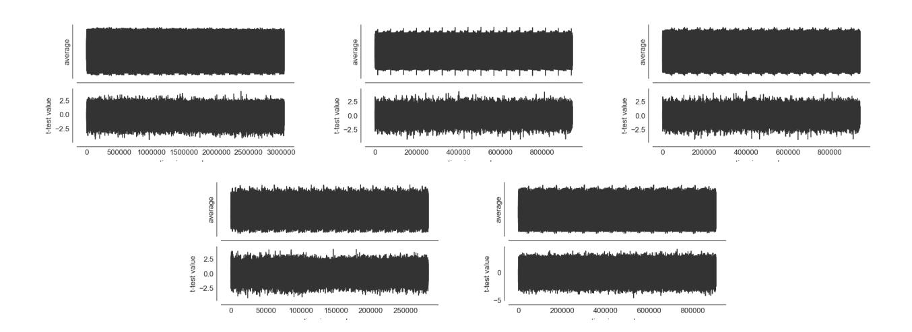

Fig. 9. TVLA results of the described DES implementation for optimization levels-O0, -O1, -O2, -O3 and -Os, from top left to bottom right, on the NXP LPC2124 for 5 ×10<sup>5</sup> traces. The traces are cropped to remove input and output leakage

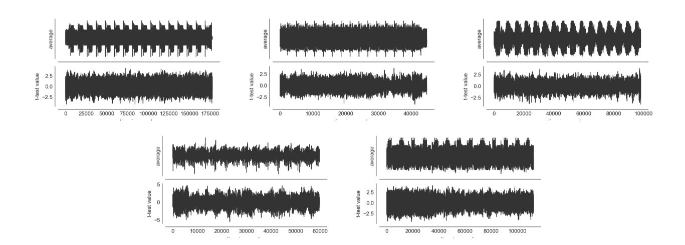

Fig. 10. TVLA results of the described DES implementation for optimization levels -O0, -O1, -O2, -O3 and -Os, from top left to bottom right, on the Xilinx zc702 for 5 × 10<sup>5</sup> traces. The traces are cropped to remove input and output leakage

{31}------------------------------------------------

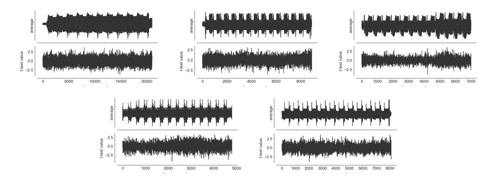

Fig. 11. TVLA results of the described DES implementation for optimization levels -O0, -O1, -O2, -O3 and -Os, from top left to bottom right, on the Intel Atom N455 for 5 × 10<sup>5</sup> traces. The traces are cropped to remove input and output leakage