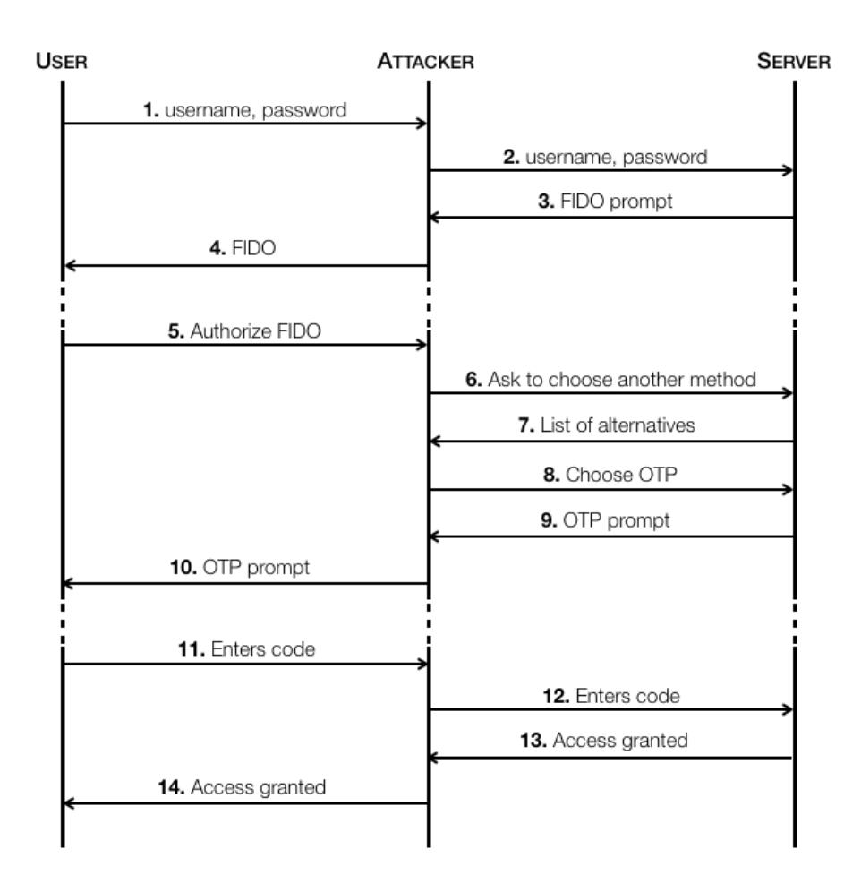
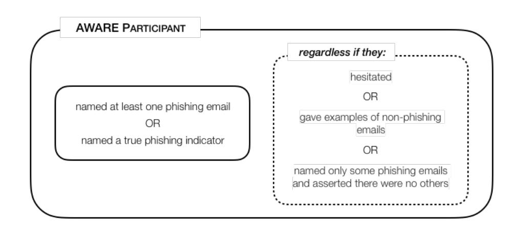
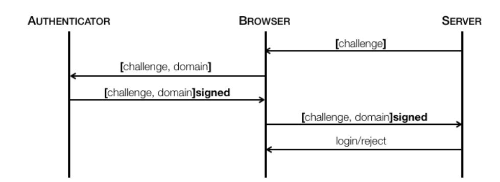
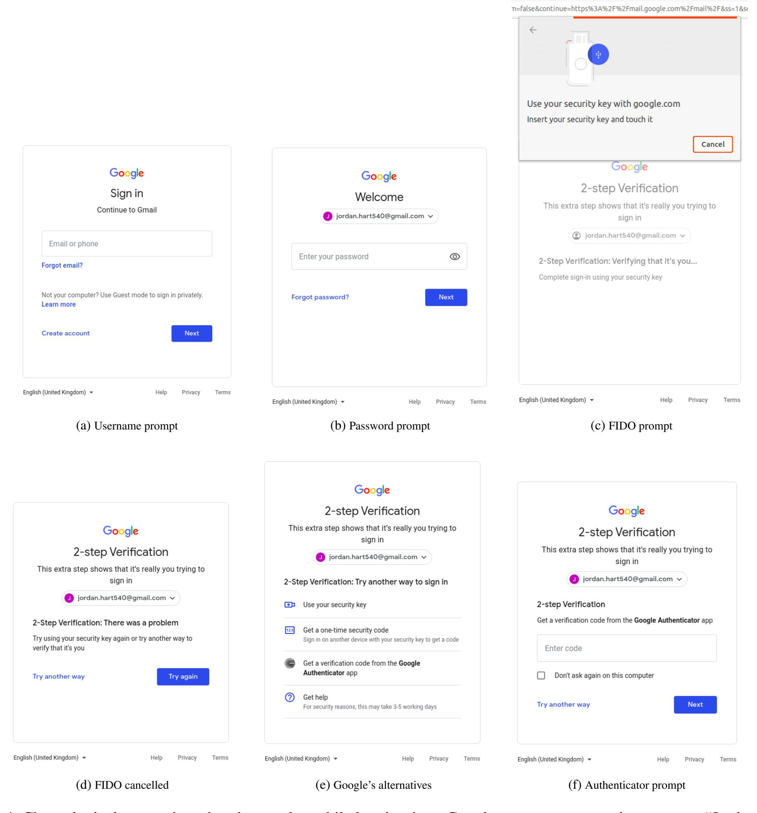
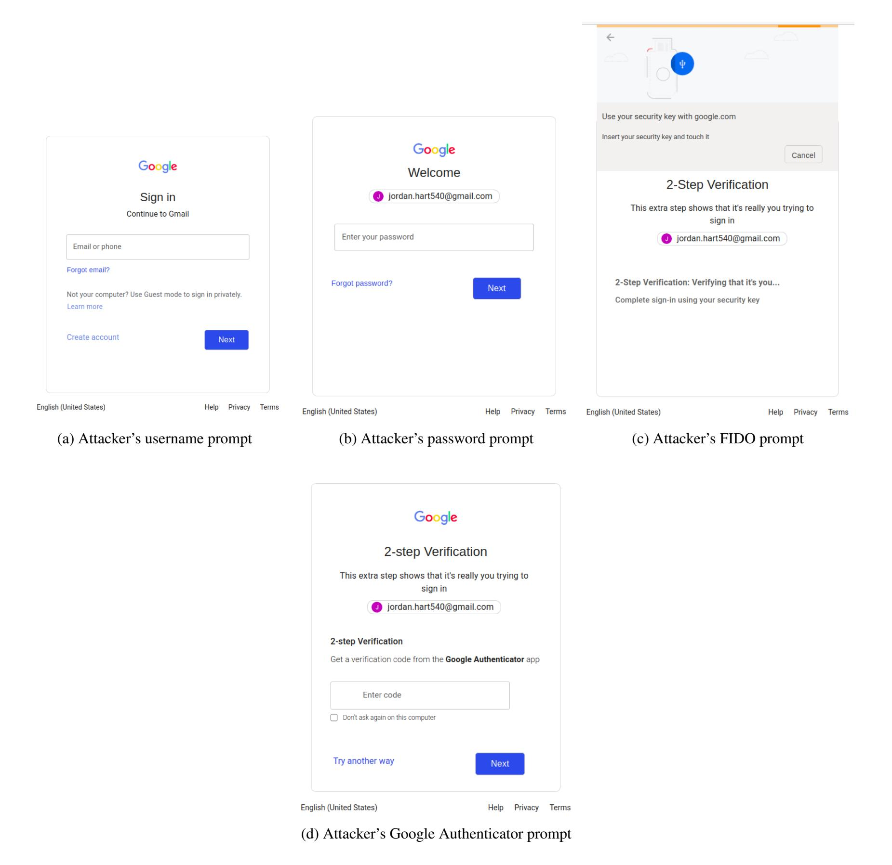
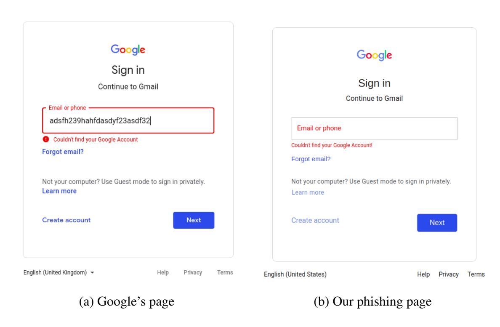
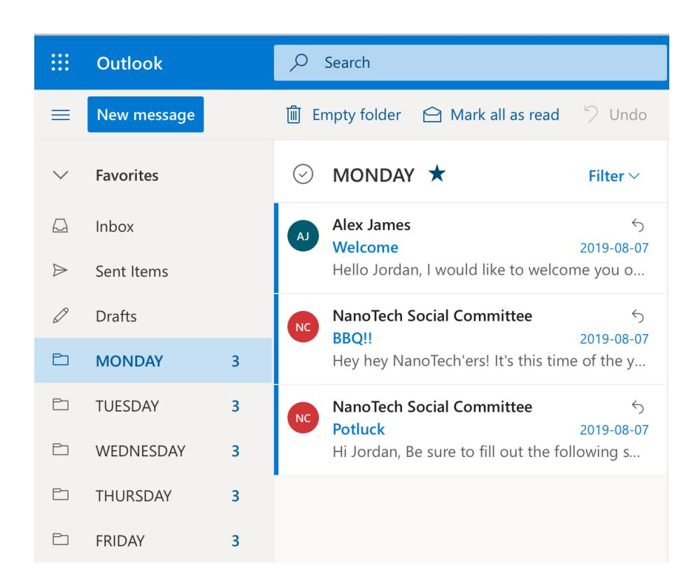
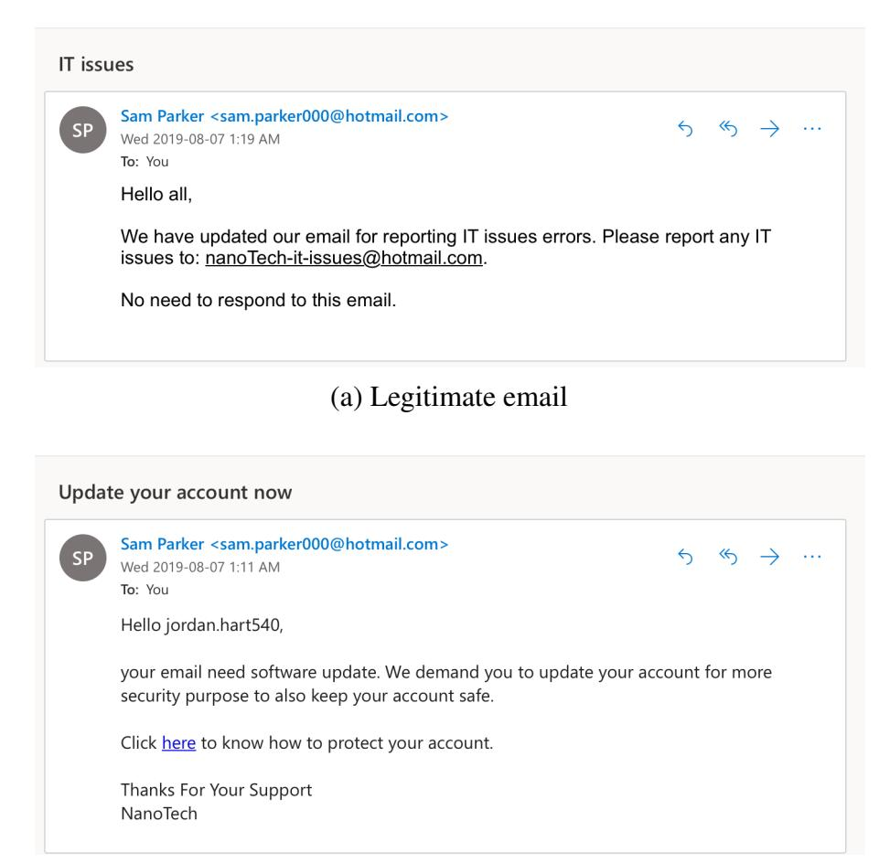

{0}------------------------------------------------

# Is Real-time Phishing Eliminated with FIDO?

### Social Engineering Downgrade Attacks against FIDO Protocols

Enis Ulqinaku† , Hala Assal\* , AbdelRahman Abdou\* , Sonia Chiasson\* and Srdjan Capkun ˇ † †*ETH Zürich, Switzerland, and \*Carleton University, Ottawa, Canada*

### Abstract

FIDO's U2F is a web-authentication mechanism designed to mitigate *real-time phishing*—an attack that undermines multi-factor authentication by allowing an attacker to relay second-factor one-time tokens from the victim user to the legitimate website in real-time. A U2F dongle is simple to use, and is designed to restrain users from using it incorrectly. We show that social engineering attacks allow an adversary to downgrade FIDO's U2F to alternative authentication mechanisms. Websites allow such alternatives to handle dongle malfunction or loss. All FIDO-supporting websites in Alexa's top 100 allow choosing alternatives to FIDO, and are thus potentially vulnerable to real-time phishing attacks. We crafted a phishing website that mimics Google login's page and implements a FIDO-downgrade attack. We then ran a carefullydesigned user study to test the effect on users. We found that, when using FIDO as their second authentication factor, 55% of participants fell for real-time phishing, and another 35% would potentially be susceptible to the attack in practice.

## <span id="page-0-1"></span>1 Introduction

Fast Identity Online (FIDO) is driven by an industry alliance with the goal of reinforcing web authentication by *"reducing the world's over-reliance on passwords"* [\[5\]](#page-13-0). The alliance now comprises 42 members including Amazon, Apple, Arm, Google, Microsoft, PayPal, as well as financial corporations like American Express, Mastercard, Visa, and Wells Fargo.

FIDO's U2F standard defines cryptographic challengeresponse protocols where a dongle with a private key can prove its identity to a pre-registered website. The dongle interacts with a user's device through a Universal Serial Bus (USB) port, or wirelessly using Near-Field Communication (NFC) or Bluetooth (BLE). Such dongles are now manufactured by many companies, including Yubico and Feitian Technologies.

The technology resists exposing the secret key, comparable to some Physically Unclonable Function (PUF) technologies [\[3\]](#page-13-1). The challenge-response computations are performed

on the dongle itself, and the private key never leaves the dongle. U2F thus enjoys relatively high resistance to the common cases of malware that run on the user's machine. Physical theft of the dongle compromises its defence, however, such attacks are not scalable and cannot be performed remotely.

In U2F, the domain (string) in the browser's address bar is a function of the challenge-response protocol. The browser[1](#page-0-0) sends that string to the dongle. In case of phishing [\[84,](#page-16-0) p.269], the domain will be that of the attacker's website. Thus, an attacker relaying the result of the challenge-response from the browser to the legitimate website does not gain access; the response will not match the website's expectation. U2F is therefore a strong defender against phishing attacks [\[60\]](#page-15-0), including the devastating *real-time phishing* attacks that undermine various Two-factor Authentication (2FA) alternatives [\[50,](#page-15-1) [57\]](#page-15-2). In real-time phishing, attackers relay the One-Time Password (OTP) (generated on the user's phone or sent over SMS) on the fly to the legitimate website. The FIDO alliance highlights the abilities of its suite of technologies in handling phishing [\[4\]](#page-13-2): *"This security model eliminates the risks of phishing, all forms of password theft and replay attacks"*, *"[the] builtin phishing resistance and ease-of-use give it the potential to drive widespread adoption"*.

We show that FIDO could nonetheless be downgraded to weaker options, enabled by websites that allow users to setup second-factor alternatives to FIDO. These are typically configured to account for, *e.g.,* dongle loss, malfunction, or other reasons where a user simply wants to avoid using the dongle (*e.g.,* grant access to a remote spouse). Despite extensive design efforts to empower users with a complete mental model, and previous literature showing the high usability and likeability of FIDO [\[30\]](#page-14-0), we show how clever social engineering tactics enable a real-time phishing attacker to impersonate FIDO users, requiring neither malware nor dongle theft.

We construct a real-time phishing attack which targets FIDO users and works as follows. When the legitimate website prompts the adversary to insert the U2F dongle, the adver-

<span id="page-0-0"></span><sup>1</sup>FIDO assumes a trusted browser.

{1}------------------------------------------------

sary likewise prompts the user on their phishing website. As the user inserts their dongle, the adversary asks the legitimate website to use an alternative method, and prompts the user to submit the OTP of that method on its phishing website. We posit that users can perceive this as an additional, *third* authentication factor, on top of the dongle they just inserted, thus interpreting more steps as higher security [\[51,](#page-15-3)[90\]](#page-16-1). On the phishing website, the adversary simply ignores the dongle's response, and relays the user-submitted OTP of the alternative method to the legitimate website, hence gaining access.

We inspected Alexa's Top 100 websites to verify if they allow choosing alternatives to FIDO during login. We found that all websites that support FIDO (23 out of 100) allow choosing weaker alternatives. Their users remain potentially vulnerable to real-time phishing despite using FIDO. Ironically, most of these websites *force* users to first register an alternative 2FA method before being able to register FIDO as a second factor. Google's Advanced Protection [\[32\]](#page-14-1) program accepts logins only with security keys, however recovery at scale remains challenging for such accounts (Sec. [8.1\)](#page-9-0).

In this paper we approach two research questions. *(RQ1) How susceptible are users to phishing attacks when using FIDO? (RQ2) How do users detect phishing attacks when using FIDO?* By implementing a website that mimics realtime phishing of Google's login form, and through a carefullydesigned user study of 51 participants, we found that only 10% of participants are unlikely to fall for (general) phishing in practice. They detected our phishing attempts early in the study, *e.g.,* from the phishing email or the phishing URL, before reaching our downgrading FIDO part. Had they missed the regular phishing indicators, it is unclear whether these participants would detect our downgrade attack in practice.

Contributions. This paper contributes new social engineering attacks that allow an adversary to downgrade FIDO to weaker 2FA alternatives. Such alternatives are vulnerable to real-time phishing, which is the primary attack that FIDO is designed to exhaust. By allowing such downgrade, FIDO's defence against real-time phishing is only partial. The presented methodology of evaluating the effectiveness of the new attacks can be of independent interest to future researchers.

None of our attacks exploit weaknesses in the FIDO standards, APIs, or cryptographic protocols themselves. The core enabler is rather the availability of authentication alternatives. So long as users are allowed to login using weaker alternatives, attackers also can always leverage them. In general, it is necessary to either allow alternative login methods to hardware tokens, or implement non-weaker account-recovery mechanisms to account for token losses/malfunctions. Manual recovery is costly [\[61\]](#page-15-4). And with adversaries now capitalizing on an ongoing pandemic [\[41\]](#page-14-2), and a global work-fromhome pattern, it becomes increasingly important to make sure promising defences like FIDO are not undermined.

# <span id="page-1-0"></span>2 Background

Two-Factor Authentication. 2FA is a widely deployed strategy to strengthen password authentication. It usually requires users to enroll a second factor (*e.g.,* smartphone or special hardware) to their accounts during registration. Afterwards, upon submitting the correct password for login, the user is asked to prove possession of the second factor. To do so, most 2FA schemes require the user to submit an OTP displayed, or confirm a prompt, on their phone [\[11,](#page-13-3) [48,](#page-15-5) [50,](#page-15-1) [57,](#page-15-2) [58,](#page-15-6) [82\]](#page-16-2). To enhance user experience (reduce inconvenience of a method) and availability (access to the user's account), online services typically allow users to enroll more than one 2FA alternative per account.

Threat Model: Real-time phishing. Existing 2FAs protect users from password compromise but they largely remain vulnerable to real-time phishing. In real-time phishing, the user interacts with the malicious page posing as the genuine website, while the adversary authenticates simultaneously on the real website by relaying victim's credentials. The attack is relatively easy from a technical perspective, and very effective in practice [\[19\]](#page-13-4). However, it is very challenging to be prevented because it mostly exploits human mistakes. Prompt notifications enhance user experience, however, they put the burden onto users to detect ongoing attacks and risk user habituation [\[7\]](#page-13-5). Automated tools, *e.g.,* Evilginx [\[34\]](#page-14-3), make real-time phishing easy to deploy and largely scalable.

FIDO Specification. FIDO alliance aims to reduce the reliance on passwords, while preserving usability. FIDO assumes three trusted and cooperating components: i) *relying party*, which is the server where the user authenticates; ii) *client*, which typically is the browser; iii) *authenticator*, which is the device the user possesses.The key advantage of FIDO compared to other 2FA schemes is that the browser provides the authenticator with the domain of the visited website. Therefore, if the user falls for phishing, the browser communicates the malicious domain to the authenticator, which signs a message that is invalid to honest servers (Fig. [3,](#page-18-0) Appendix [A\)](#page-18-1).

The alliance published three specifications [\[5\]](#page-13-0): (1) *U2F* covers use cases where the authenticator is used as a second factor; (2) *UAF*, which is known as "passwordless authentication"; (3) *FIDO2*, which is the latest specifications covering use cases of both *U2F* and *UAF*. Unless specified, "FIDO" herein refers to all three specifications described above.

*FIDO2* includes WebAuthn API and the Client to Authenticator Protocol (CTAP2). CTAP2 triggers browsers to display a prompt window, which includes the domain name, when a website tries to communicate with the dongle. CTAP2 is backward compatible and supports *U2F* functionalities, which do not trigger the prompt. An attacker can use the latter to avoid the browser prompt, or even exploit it to their favor (see Sec. [4.1\)](#page-3-0).

{2}------------------------------------------------

<span id="page-2-0"></span>Table 1: All 23 FIDO-enabled websites in Alexa's top 100 allow weaker 2FA alternatives to be registered alongside FIDO.

|              | Suppo<br>allow<br>alternatives | rt FIDO<br>do not allow<br>alternatives | Do not support FIDO | Total |
|--------------|--------------------------------|-----------------------------------------|---------------------|-------|
| FIDO partner | 14                             | 0                                       | 15                  | 29    |
| Others       | 9                              | 0                                       | 62                  | 71    |
| Total        | 23                             | 0                                       | 77                  | 100   |

#### 3 Problem Statement

Different login means affect the security of users' accounts [11,37]. Reports from Google [20] and Microsoft [62] show that multiple 2FA schemes are widely deployed as alternative logins (users select the 2FA challenge in every login attempt), or recovery mechanisms. Except FIDO, none of the common 2FA is secure against real-time phishing. Previous work on FIDO focused on its usability [14,24,30,73]; limited work questioned its security in real-world deployments, where alternative 2FA and secure recovery are necessary. In practice, account recovery is an expensive operation for service providers [61], and remains vulnerable to social engineering attacks [29,76]. FIDO specifications focus on authentication, but provide only general recommendations for recovery [31].

To measure the extent by which weaker 2FA alternatives to FIDO are used, we manually inspected Alexa's top 100 websites, reviewing documentation for websites' FIDO authentication policy (when available), and creating accounts on those websites that offer public access to test their policy in practice. Results are shown in Table 1; 23 websites (10 organizations) allow choosing alternatives to FIDO. Users of these sites are thus potentially vulnerable to real-time phishing, even when using FIDO. More disturbing, most of these sites *force* users to first register an alternative 2FA before enrolling their FIDO dongle, and as we show this practice undermines the added security of FIDO.

Google's Advanced Protection [32] is the only known program where weaker 2FA alternatives are not supported. The program is opt-in (account recovery does not scale easily for millions of users, see Sec. 8.1), thus not included in Table 1.

#### 4 Downgrading FIDO via Social Engineering

Our attack starts as a typical real-time phishing (see Fig. 1), with the user on the phishing website and the attacker on the legitimate website at the same time. After relaying the user's credentials (Step 2 in Fig. 1), the attacker is presented with the FIDO-prompt page from the legitimate site (Step 3), and in turn displays a FIDO-prompt page to the user (Step 4).

At this point, the attacker waits until the user authorizes their FIDO token to interact with the attacker's page through

<span id="page-2-1"></span>

Figure 1: Downgrading FIDO via social engineering. Dashes indicate longer time stretches, reflecting when the user acts.

the browser (Step 5).<sup>2</sup> The attacker can leverage standard API functions (e.g., u2f.register and u2f.sign for U2F), so that the attacker is notified when such an authorizationfor-interaction occurs. When the browser communicates the result of the challenge-response, the attacker ignores the result of this interaction because all they need to know is that the user has inserted the token. The attacker then chooses, on the legitimate website, to use an alternative second factor method from the list pre-configured by the (victim) user on the website (Steps 6–9), and displays a page prompting the user for that same method (Step 10). Depending on the website, this step can simply be presented to the user without any indication as to whether her FIDO-trial was successful. In our phishing implementation below (Sec. 4.1), we show how Google's default message to users helps our (attacker's) cause. Upon getting the token from the user (Step 11), the attacker forwards it on to the legitimate website (Step 12), hence gaining access.

Timing and ordering notes. In Fig. 1, Steps 6–9 can vary between websites; some present the user with options; others may choose for the user. These four steps (*i.e.*, 6–9) must however occur quickly so that the page in Step 10 is displayed to the user right after the user's FIDO authorization in Step 5. To speed-up displaying the OTP prompt to the user (Step 10), the attacker can initiate Steps 6–9 before 5, so that the OTP prompt (Step 10) is ready immediately after the user's authorization. However, the delay between Steps 9 and 12 must also be kept small before the website's OTP token expires. All such steps can be automated, thus delays can be kept minimal. **Reflections on Step 10.** A key element in this attack oc-

<span id="page-2-2"></span>20 11 1 1

<sup>&</sup>lt;sup>2</sup>Some models require a button press; others a touch.

{3}------------------------------------------------

curs in Step 10, where the user will be prompted for another authentication factor after using the FIDO token. We believe that seeing three login steps (password + FIDO + OTP) likely sends a false signal to the user that this login trial is even more secure than with two factors (password + FIDO). Google's OTP page, for example, has the sentence "This extra step shows that it's really you trying to sign in". When an attacker displays that page after its fake FIDO-prompt, the user would interpret it as an "extra" beyond password + FIDO, but it is intended (by the legitimate site) as extra to only the password. In our implementation, we constructed this (phishing) page with the statement as-is. The "extra step" here *enables* our attack, as it helps attackers downgrade FIDO to other methods.

Variations to Step 10. Depending on the design of the legitimate website, variations other than presenting a page with an alternative authentication (Step 10) immediately after the FIDO prompt may be more effective in tricking the user. For example, similar to approaches discussed in previous research [\[77\]](#page-16-5), the attacker may display: "due to technical error, we are unable to process your FIDO token at this time", or "our FIDO-handling service is currently down, please use another method". The latter avoids the use of FIDO APIs altogether, so alert messages familiar to the user in the browserdisplayed FIDO-prompt box (where attackers have no control over the message within) are avoided.

### <span id="page-3-0"></span>4.1 Attack Implementation

In preparation for running a user study to test the effectiveness of this attack, we implemented a phishing website that behaves in the manner explained above. The website targets Google's login page. Details of the user study, including ethical considerations, are discussed in Sec. [5.](#page-3-1)

Our phishing pages are shown in Appendix [B](#page-19-0) (Fig. [5\)](#page-20-0). We obtained the domain two-step.online as our phishing domain, got a Let's Encrypt certificate for the domain, and placed our phishing pages inside a google.com directory on our server. We intentionally opted for a domain with valid words in a non-traditional TLD such as .online for two reasons: (1) we could get a TLS certificate without being flagged as suspicious [\[72\]](#page-16-6), and (2) users that do not understand how URLs work but might have a look at it would not be alerted as google.com is present [\[81,](#page-16-7) [91\]](#page-17-0). Our index.html page would get periodically blocklisted every few days, and so we hid it such that it is only accessible through a randomly generated alpha-numeric string. The page would thus only be reachable by a link, which would be emailed to potential victims. While on the phishing website, the browser's URL bar would have a green padlock icon with the URL:

*https://login.two-step.online/google.com/index.php?acc=8[..]b*

Corresponding PHP code at the start of index.php reads:

```
<? php h e a d e r ( ' Access−C o nt r ol −Allow−O r i g i n : * ' ) ;
i f ( h t m l s p e c i a l c h a r s ( $_GET [ " a c c " ] ) != " 8FkuX . . . " ) {
   ec h o " T hi s i s I n d e x . php ! " ; e x i t ( 0 ) ; } ?>
```

where acc is the variable containing the random string.

When implementing our phishing pages, we did not borrow content from Google's website; we neither pre-downloaded content from Google to upload to our pages, nor linked to Google content from our pages. The former is not quite straightforward because Google employs code obfuscation techniques on its webpages (*e.g.,* to thwart phishing attacks); the latter was avoided to evade potential phishing detection through analyzing our server's requests to Google's webcontent [\[67\]](#page-15-8). The only object we downloaded and uploaded onto our server was Google's logo (image). Note that creating our phishing page would be feasible for any attacker with moderate web programming experience. Our implementation of Google's pages resulted in fewer than 2K lines of combined PHP/JavaScript/HTML/CSS code.

Recall from Sec. [2,](#page-1-0) the authentic FIDO prompt is typically displayed outside of the attacker-controlled area of the browser to prevent attackers from replicating the prompt within the content pane; note, *e.g.,* for Chrome, the top tip of the box overlapping the URL bar (see Fig. [4c](#page-19-1) in Appendix [B\)](#page-19-0). Recall also that browsers capture the domain from the URL bar and display it to the user within the FIDOprompt box. It is thus helpful (to the attacker) to use API functions that do not display this box to the user, yet gets the browser to notify the webserver that a dongle was inserted. For Step 10 (Fig. [1\)](#page-2-1), we used the u2f.register function, which does not display browser-generated prompts. With this function, communications with the user are left to the website developer (*i.e.,* through standard HTML and JavaScript).[3](#page-3-2) As an attacker, we do not control the legitimate displayed message; it is browser-generated. So we implemented a mimicry of the Chrome-generated FIDO prompt as a gif image that looks like Chrome's box[4](#page-3-3) , with a message identical to the authentic one: *"Use your security key with google.com"* (Fig. [5c,](#page-20-1) Appendix [B\)](#page-19-0). The gif had an animated indeterminate progress bar, almost similar (visually) to Chrome's authentic one (Fig. [4c,](#page-19-1) Appendix [B\)](#page-19-0). Since it was an image, it was fully contained within the browser's content pane, located vertically at pixel 0 (top-most point).

Finally, since our aim is only to test the effect of our attack on participants in Sec. [5](#page-3-1) (*i.e.,* we do not want to actually steal credentials), we did not implement back-end communication between our phishing website and Google.

### <span id="page-3-1"></span>5 Evaluation Methodology

We designed a user study to test the effectiveness of the above social engineering tactics. In comparison to studies that test

<span id="page-3-2"></span><sup>3</sup>Note that even if a browser-generated box was used, users may already be oblivious to the messages displayed within that box.

<span id="page-3-3"></span><sup>4</sup>An adversary can generate similar prompts for other browsers.

{4}------------------------------------------------

the usability of systems, designing a user study to test attack effectiveness is often challenging. The study must be ethical. It should reflect a user's true keenness in protecting their assets. Moreover, the explanation of the study tasks to participants should not (1) artificially lead participants to fall for the attacks in question, and (2) artificially alert participants so they detect/avoid the attacks.

### 5.1 Design Decisions

We considered several study designs before ultimately developing our methodology, including carefully considering legal concerns [\[44,](#page-14-8) [45\]](#page-14-9) and ethical issues as summarized by Finn & Jakobsson [\[26\]](#page-14-10). While it does add realism, we dismissed the idea of using participants' real credentials in a field study without a priori consent because previous work [\[44\]](#page-14-8) has shown that it can lead to participants feeling violated even after learning that no personal data was compromised. A variation of this approach [\[45\]](#page-14-9), where a clever study design has participants entering their real credentials to a legitimate site rather than a researcher-controlled site was technically not viable for our particular attack.

Another line of phishing studies [\[19,](#page-13-4) [46,](#page-15-9) [56,](#page-15-10) [71\]](#page-16-8) ask participants to classify pages as phishing or legitimate without submitting any credential, usually to measure the effectiveness of security indicators. This approach did not align with our intended goal of measuring the effectiveness of FIDO protocol against our phishing attack, thus was not a viable study design. Yet another approach [\[67,](#page-15-8)[85\]](#page-16-9) to studying phishing is to analyze logs from service providers to investigate the occurrence of real phishing attacks. To the best of our knowledge the downgrade attack presented in this paper is novel and there are no reports that it has been exploited in the wild, thus logs would be unhelpful. Focusing on user perspectives instead, qualitative studies [\[16,](#page-13-8) [46\]](#page-15-9) aim to understand users' attitudes and reasoning regarding phishing, but these subjective accounts do not provide objective measures of the effectiveness of particular attacks.

We next considered phishing studies based on role playing. Such studies typically use fictitious scenarios to simulate the experience of a user that receives legitimate and unsafe emails. The tasks are typically easy and can be performed by an average user, thus participants do not need the proper experience for the role. Prior studies have used various roles: a university worker (who receives 6 phishing emails out of 14 in total) [\[78\]](#page-16-10), a political campaign volunteer (3 malicious emails out of 8) [\[28\]](#page-14-11), a company employee (5 malicious emails out of 19) [\[53\]](#page-15-11), or a user doing online shopping (gets a phishing email after each online purchase) [\[22\]](#page-14-12). Such studies have limitations because participants may behave less securely with mock credentials [\[77\]](#page-16-5). However, role playing experiments do not raise ethical concerns and they would allow us to perform a realistic downgrade attack during experiments.

After careful consideration of the technical requirements

of our attack, and the ethical and legal implications of exploiting participants' personal credentials, we decided to design a role playing experiment followed by a semi-structured interview. We believed that the combination of the two methods would minimize the limitations of either individual method by providing an opportunity for cross-checking our data.

## 5.2 Study Design

We recruited participants using flyers, university mailing lists, and social media posts. Participants visited a webpage describing the study, its duration, and the compensation before scheduling the interview. The study advertisement generically explained that the purpose of the study was to evaluate and improve the usability of email clients. To eliminate any later doubt by participants about the safety of their legitimate credentials, participants did not use their own email accounts. We provided user accounts and credentials (with a randomlygenerated strong password) created specifically for this study. However, to maintain ecological validity, we designed a study scenario that indirectly encouraged participants to think about the security of these accounts.

We ran the study in-person concurrently in two international cities near the end of 2019, one in North America, below suffixed with *-N*, and one in Europe, *-E* (cities hidden for anonymity). To maintain consistency in both cities, we carefully documented the study protocol and had the two researchers running study sessions follow this common protocol. Participants were monetarily compensated for their time with the local minimum hourly-wage. Participants first completed a demographics questionnaire then they went through the study scenario, during which they were asked to *think-aloud* (*i.e.,* to describe their thought process out loud). We next gathered feedback from participants through a semi-structured interview (see Appendix [E\)](#page-24-0). We designed the interview questions to *indirectly* gauge participants' awareness of the phishing attempts. Following previously established notions of determining participants' thoughts [\[29\]](#page-14-6), we asked:

*"If we told you that 50% of our participants access fake websites during their study sessions, do you think you are one of them? Why/Why not?"*

We did not ask participants about each email, one-by-one, whether it was a phishing attempt to avoid making them overly vigilant, and potentially biased to answer "yes". However, we still allowed participants to go back to the emails and check them during the interview, should they ask to do so.

At the session's end, the researcher provided participants with a debriefing form, explaining the true purpose of the study and answered any questions they had. Each session lasted approximately an hour, throughout which the researcher took notes to provide insight into participants' thought processes (*e.g.,* if participants hesitated when opening links (phishing or legitimate), if they hovered over the links to view

{5}------------------------------------------------

the URL, and any comments they had on the emails). Study sessions were audio-recorded, and the interview portion was transcribed for analysis, and the researchers referred back to the audio recordings for more context when needed. The study received IRB approval in both cities.

#### 5.2.1 Study Scenario

Participants were asked to role play *Jordan Hart*, a new employee in a technology company on her/his first day of work. They were provided with their company gear: a laptop, smartphone, and a security key (the FIDO dongle). Participants were asked to read and sign the employee on-boarding information sheet (Appendix [G\)](#page-27-0), a common practice in industry. This sheet outlined the company policy with respect to safeguarding company information and avoiding scams and phishing attacks, as well as explaining FIDO keys and their associated security benefits in language adapted from Google's *Security and identity products* pages [\[33\]](#page-14-13). The sheet listed Microsoft Outlook as the company's primary email provider, included Jordan's Outlook account credentials (username and password), and provided their Google services credentials. We created real Microsoft and Google accounts. The sheet also included the names and email addresses of Jordan's manager, IT manager, and HR person, from whom Jordan would receive emails. We created real Microsoft email accounts for each of them. To make sure participants were comfortable using the FIDO key, the researcher–acting as the IT manager– asked participants to login to their email with the key as a second factor, and explained how to use the Google Authenticator app (pre-installed on Jordan's smartphone) in case of technical difficulties (Appendix [G\)](#page-27-0).

Jordan's Microsoft email inbox contained 15 emails (Appendix [F\)](#page-25-0), divided into 5 folders, one for each day of the week (Fig. [7,](#page-22-0) Appendix [C\)](#page-22-1). Participants were asked to assume that they login to their Outlook account daily, handle emails received that day (as tagged), logout and shutdown their laptop before going home, and come back the next day to do the same steps. The researcher simulated shutting down the laptop when indicated by the participant by logging-out of their email and clearing the browser cache after finishing each day's emails. Participants used Google Chrome.

#### 5.2.2 Emails

Four of the 15 emails were phishing, containing a link to our phishing website (Sec. [4.1\)](#page-3-0). Such emails were spearphishing (targeted). We chose to have such a high number of phishing emails in the first week of employment to give participants a higher-than-normal chance to recognize our phishing attack. In Sec. [6.2,](#page-6-0) we explain how detecting a single phishing email suffices for us to count the participant amongst those who did not fall for our attack.

We used PHP's mail function to send out the phishing

emails using a spoofed source email address. To ensure realism, these emails included errors like grammatical mistakes and typos, mimicking typical phishing emails. Non-phishing emails were sent from the authentic email accounts of the company's employees (Jordan's manager, IT manager, and HR person) through the email web client. All emails were sent at once before we started recruiting participants, and simply marked as unread before the next participant. When we initially sent them, we manually moved those that were placed into Jordan's Spam folder (legitimate or phishing) into the Inbox folder. Figure [8](#page-22-2) in Appendix [C](#page-22-1) shows a legitimate and a phishing email, both appearing to be from the IT manager. Note that, as in real-life, when visiting our phishing pages, participants will see the fake login form even when they are already logged-in to Jordan's Google account. This has alerted vigilant participant, P2-N, to our phishing attempts.

Some emails, legitimate and phishing, included links to documents. We created actual documents for every such email, and stored them on Google drive. Legitimate documents were only accessible through Jordan's Google drive account. We (attacker) set the other documents on Google drive as accessible with a link, and redirected to them after the user finished logging-in to our phishing website. This way, the browser's URL bar would display an authentic Google domain after the participant's persona credentials were phished.

### 5.3 Participants

We recruited 51 participants for this study: 25 in *city-E* and 26 in *city-N*. Our dataset (Appendix [D\)](#page-23-0) is balanced in terms of gender: 26 participants identified as female, 24 as male, and one chose "Other or prefer not to answer". The vast majority of participants had an undergraduate or a graduate degree (*n* = 46), and most have previous experience with 2FA (*n* = 31).

### 5.4 Limitations

We designed our study to create an atmosphere that emphasized the importance of keeping the persona's accounts secure. However, participants did not use their own credentials, which may have affected their motivation to protect these credentials. The semi-structured interview along with researchers' notes provided deeper insights in identifying reasons why participants' accessed links in our phishing emails. Although one of FIDO's design goals is ensuring security regardless of users' experience and anti-phishing skills [\[55\]](#page-15-12), our results may have been affected by participants' lack of familiarity with FIDO keys, and the lack of proper context for judging if emails are following-up on real events. Additionally, our data set is skewed towards relatively young participants (*µ* = 29.9,*Med* = 27) who may lack anti-phishing training usually received in work settings.

{6}------------------------------------------------

### 6 Analysis Methodology

We used the Qualitative Content Analysis Methodology [\[47\]](#page-15-13) to analyze qualitative data collected throughout the study (*e.g.,* post-testing interview scripts, and researchers' notes including participant's comments on the content of emails and whether they entered their credentials to the website linked in the email). We developed an analysis matrix to cover the main topics relevant to our research questions. The matrix comprised of four categories with which we coded our data: *identifying phishing links, participants' perception of FIDO, their perception of 2FA, and their security attitude and awareness*. We then followed an inductive analysis method, and performed open coding to look for interesting themes and common patterns in the data using NVivo software. Themes irrelevant to our research questions are not discussed herein. As recommended by previous work [\[13\]](#page-13-9), and similar to previous research (*e.g.,* [\[16\]](#page-13-8)), data was coded by a single researcher with considerable experience in Human-Computer Interaction (HCI), security, and qualitative data analysis, so that this researcher would perform rigorous analysis by being immersed in the data. Two researchers met regularly to discuss the codes and interpret the data. To verify the reliability of our coding, we had a second researcher code 25% of the data individually. We calculated Cohen's Kappa coefficient [\[15\]](#page-13-10) to determine inter-rater reliability, which indicated "*almost perfect agreement*" [\[54\]](#page-15-14) (κ = 0.82).

### 6.1 How to assess phishing susceptibility?

To identify participants who could be victims to our attack in practice, we need a mapping between their behaviour in the study and their attack susceptibility in practice. Simply classifying those who submit their credentials to one of our phishing links as potential victims may not be accurate because: (1) participants may not be as keen to protect their study credentials as they would their own, and (2) participants may think they need to process all emails regardless of their suspicion because this is what the study is asking them to do. We took measures to reduce the impact of both points, *e.g.,* through emphasizing the importance of security to the persona's employer, and integrating actions with interview responses. Only two participants mentioned they were not paying attention because they thought it was the study's instructions, highlighting the importance of our measures.

Participants' actions (during the study) and awareness of the attacks (in the study) may or may not align. We use both parameters, *i.e.,* actions and awareness, to assess each participant's phishing susceptibility in practice; combining both parameters yields four possible cases, which are summarized in Table [2](#page-7-0) (first 3 columns). According to these two parameters, we will rate each participant as *susceptible*, *potentially susceptible*, or *not susceptible* to our phishing attacks in practice (column 4 in the table). (Details on how we determine

a participant's awareness of the attacks in our study can be found in Sec. [6.2](#page-6-0) below.)

Normally, a participant who is unaware of our phishing attempts would submit their credentials to our phishing website. This is Case 1 in the table. A vigilant participant would normally refrain from submitting their credentials, and confirm their awareness of phishing attempts in the post-study interview—Case 4.

Cases 1 and 4 are straightforward; we classify the former as "susceptible to phishing", the latter as not. We classify Cases 2 and 3 as "potentially susceptible to phishing". In Case 2, although they did not submit credentials, participants are unaware of any phishing attempt. In Case 3, participants are classified as aware, yet they submit credentials.

### <span id="page-6-0"></span>6.2 How to determine awareness of phishing?

Determining participants' awareness from the interview is not trivial. Participants responses' varied greatly. For example, to the above question (*"If we told you that 50%..."*), some participants answered affirmatively, but only name examples of non-phishing emails. Others answered affirmatively, but said they did not remember which ones were phishing. We also had participants who first denied being in the 50% that accessed fake sites, then hesitated, alternating between "yes" and "no", then changed their minds, and gave a few true phishing examples. And there were participants that provided an immediate affirmative response, reconsidered, and finally decided there were no phishing emails. We thus ignored their direct 'yes/no/maybe', and instead relied on objective portions of their comments to assess awareness, as described next.

<span id="page-6-1"></span>

Figure 2: Determining awareness of our phishing attempts.

Any participant who (i) identified at least one phishing email or (ii) named a true phishing indicator is classified as *aware-of-phishing-attempts*, regardless of what else was said during the interview. Participants classified as *unaware-ofphishing-attempts* included those who: just denied being in the 50%; affirmed being in the 50%, but gave only examples of non-phishing emails; or affirmed but gave only false phishing indicators. Figure [2](#page-6-1) shows this criteria, alongside common example responses in our study that we discarded because the awareness criteria was met. By *true phishing indicators*, we mean the website's URL, and commonly agreed upon (though

{7}------------------------------------------------

<span id="page-7-0"></span>Table 2: Classifying participants' susceptibility to our phishing attack in practice, from their study behaviour.

| Case | Participa<br>aware-of-phishing-attempts | Susceptible | Results<br># %     |    |    |
|------|-----------------------------------------|-------------|--------------------|----|----|
| 1    | Unaware<br>Unaware                      | Yes<br>No   | Yes<br>Potentially | 28 | 55 |
| 3 4  | Aware<br>Aware                          | Yes<br>No   | Potentially<br>No  | 17 | 33 |

non-robust) signs of phishing emails [40], like typos, lack of context, and grammatical mistakes. Unencrypted email is an example of a *false phishing indicator*.

**Conservative classification of attack awareness.** Following the criteria in Fig. 2, we classified participants as awareof-phishing-attempts even in situations where it is hard to tell whether they were truly aware. Thus we provide an upper bound on awareness. For example, a participant who named a true phishing indicator, yet asserted seeing no phishing emails is still classified as aware-of-phishing-attempts. Classified likewise is a participant who gave an example of one phishing email, mistakenly identified two non-phishing emails, and asserted there were no other phishing emails (i.e., missing three others). We used conservative criteria for two reasons: (1) we increase certainty that participants classified as unaware-ofphishing-attempts would most likely be unaware of similar attempts in practice, and (2) participants may have forgotten which emails were truly phishing by the time they reach the post-study interview (there were 15 emails in total). We purposefully avoided showing each of the 15 emails to participants and asking them which were phishing to avoid priming. Our hypothesis here is that, if during the study, a participant suspected a phishing attempt, they would recall that and indicate it in a manner captured by the criteria in Fig. 2.

Conservative classification of attack susceptibility. We determined susceptibility based on two factors that we first assessed independently: awareness and submission of credentials. "Awareness" is not per email, but per participant. So even if a participant named one phishing email but missed all others (or asserted there were no others), we still classify them as aware-of-phishing-attempts. When we check whether this participant submitted credentials to our phishing website, we do not match the phishing email they fell for in the study with the email they named in the interview. For example, a participant who noticed only one phishing email, E2, is classified as aware-of-phishing-attempts, even if they asserted there were no others. If this participant submits credentials upon clicking on the link in any phishing email (E2 or another), we classify them as "potentially susceptible", not as "susceptible". One would argue that this is a "susceptible" participant because an email successfully phished their credentials. Being conservative, we opt to use any minor indication that a participant

might notice similar attacks in practice as grounds for avoiding classification as "susceptible". By classifying only the most blatant case as "susceptible", we provide a lower bound for susceptibility to attacks.

**Examples of aware participants.** From our analysis, the following are examples classified as aware-of-phishingattempts. P17-E said, "No, I think I haven't... Ah! maybe this Sam Logan is a phishing [email]. [...] he [emailed] twice, it could be... I don't know. If I got phishing, this is the only email I feel it could be.". P17-N said, "Yes, [I was in the 50%] [...] I was taking it for granted that the emails I was getting from the employees at the company were legitimate. [...] So I think that Sam Logan ones were, at least the one that I got from Sam Logan on the Friday was definitely a phishing email [...] Now that I'm thinking about it, that was definitely a phishing email, because of how poorly worded it was.". P25-E said, "I received many phishing emails here (identified them correctly during the study). I think there were two types, first the email about account change. The address looked it is coming from the source but as the company doesn't have any encryption I cannot be sure. I would have gone physically to the person. And the others that asked for google credentials, for those I just checked the address."

Examples of unaware. P10-N said, "I don't think so. [...] Everything seemed legitimate enough and seemed business-y. And I look[ed], everything looks like pretty work-related and exactly related to what the e-mail said it would be. Yeah. It wasn't like I just clicked on a link and it really brought me to some random page or something, it was related to what the e-mail was saying. So it seems legitimate to me.". P13-N said, "I just went to hotmail, the outlook website which I very often go. And I logged in from there. So I think it seemed fine."

### 7 Results

Through our data analysis, we looked for an effect of location by comparing data from the North American and European cities where the studies were conducted; we found no clear distinctions between the two groups. Our qualitative analysis did not reveal themes distinct to either city and we found no statistically significant difference between the two groups' susceptibility to phishing attacks  $(X^2(2, N = 51) = 1.64, p = .44)$ . We thus discuss the amalgamated results, within the context of the two research questions in Sec. 1.

#### 7.1 Phishing Susceptibility with FIDO (RQ1)

Table 2 summarizes the results; 57% of participants (Cases 1 + 2) were classified as "unaware of phishing attempts", and all but one of these participants (P12-E) submitted credentials to our phishing website. Given our conservative measures in

{8}------------------------------------------------

classifying susceptibility, our results suggest that at least 55% (Case 1) of participants would be susceptible to our phishing attacks in practice. The one participant in Case 2, P12-E, was very rapid in going over the emails. She did not click on any phishing link, and also ignored several non-phishing links. She gave very short, non-informative, responses in the poststudy interview. When asked why she did not click on links in the emails, she simply said, *"There is no particular reason"*. In contrast, 43% of participants (Cases 3 + 4) were classified as aware of phishing attempts, but only the Case 4 participants (10% of all participants) are likely to detect the discussed phishing attempts in practice. A Fisher's Exact Test suggests that participants who were aware of phishing attempts were less likely to submit their credentials than those who were unaware (*p* = .047,*N* = 51). Contrarily, Fisher's Exact Tests showed that neither gender (*p* = .60,*N* = 51), generation[5](#page-8-0) (*p* = .34,*N* = 51), nor having work experience (*p* = .23,*N* = 51) significantly influence susceptibility to phishing.

#### 7.1.1 Takeaway

Our focus in the present paper is to determine user's susceptibility to phishing, particularly while using FIDO. We noticed that all participants who appear to have detected and avoided our phishing attempts (Case 4) would have done so also without using FIDO. The phishing indicators they mentioned, and the reasons they discussed as to why they avoided submitting credentials to our phishing site are not related to FIDO. Likewise, those whom we classified as susceptible to phishing are susceptible despite using FIDO. That is, using FIDO did not protect them from our downgrade attacks. Essentially, what we were looking for in this research is cases of users who would have fallen for phishing without FIDO, but have not because of using FIDO. We found none.

### 7.2 Phishing detection while using FIDO (RQ2)

When we asked participants if they had accessed fake websites during their session, participants were evoked to think about the emails more deeply, and discuss reasons they used to classify emails as phishing or safe. Through our analysis of qualitative data, we found that participants relied mostly on general phishing indicators for determining whether the emails they received were phishing. Table [3](#page-10-0) summarizes reasons why participants classified an email as phishing (seven), and reasons for classifying an email as safe (eleven).

#### 7.2.1 Reasons for classifying emails as phishing

We grouped the phishing indicators discussed by participants into two categories: technical, and non-technical. The two technical indicators were suspicious *URL*, and that the *repeated login* prompts were unusual behaviour. P2-N explains, *"It wants [me] to log onto Google even though I was already logged on to Google on just another tab[...] This was not a thing I noticed at the beginning when I was doing the experiment [...]. Now that I'm thinking about it. Yeah, makes sense, right? Like why are they asking you to log onto Google again when you're already logged onto Google?!"*

Although the identified technical indicators can alert users, they are not ideal from a usability perspective. Users do not always check the URL bar [\[42\]](#page-14-15), and even if checked, users do not necessarily know the correct URL [\[6\]](#page-13-11). Users may also lack a proper understanding of the structure of URLs to be able to assess their legitimacy [\[6,](#page-13-11) [19,](#page-13-4) [91\]](#page-17-0). In addition, it is unlikely that typical end users would know that a website would only require users to re-login if the session cookie has expired (the three participants discussing the *repeated login* indicator had studied Computer Science or Computer Security). In fact, *repeated login* prompts can provide users with a false sense of security, because the system appears more secure if it asks for two factors at every login. P22-N explained, *"I think when I clicked on the one that didn't ask [...] for the two factor authentication, it just went straight to the [Google] Doc then I [thought] something bad happened. Because every other time [...] it would ask me to sign in again [...] but that one suddenly didn't. And it just makes me kind of feel like 'uh-oh what happened?!"'*

Participants also discussed non-technical indicators, such as poor *grammar and styling*, and the presence of a *hyperlink* in the email. Other non-technical indicators stem from the participant's knowledge of the sender, including that the *tone* of the email was unexpected, the language of the email did not match that of the sender (*sender language consistency*), and that the email was out of *context*. P16-E said, *"If it is just, like my boss sending a book to download, and we talked about it, it's fine. But if it is a random book, then it's weird."*

Non-technical indicators rely exclusively on users' judgement, are inconclusive, and are relatively easy to manipulate. For example, while *context* appears to alert some users against phishing (as described herein and in previous work [\[46\]](#page-15-9)), attackers can adjust their techniques to increase their phishing emails' credibility [\[83\]](#page-16-11). In fact, an email can have an expected tone, a language that appears consistent with the legitimate sender's, relevant context, proper grammar and styling, no hyperlink, and yet belong to a phishing campaign.

None of our participants mentioned relying on FIDO to identify phishing emails, and rightfully so. It is not quite clear how FIDO can be used as a complete phishing indicator—it may benignly fail due to technical errors, *e.g.,* broken dongle.

#### 7.2.2 Reasons for classifying emails as safe

When examining reasons why participants identified emails as safe, we found that they again relied on technical and nontechnical indicators (Table [3\)](#page-10-0). As many participants ended-up misclassifying emails as safe, such reasons may have mis-

<span id="page-8-0"></span><sup>5</sup>We assigned generation labels, based on participants' ages, as in [\[49\]](#page-15-15).

{9}------------------------------------------------

guided participants. In these cases, participants erroneously interpreted the *URL* (linked in the email) as a safety indicator. For example, some participants concluded they were safe from phishing because opening the links in the emails did not lead to obviously malicious behaviour (*e.g., popups*). Others (*n* = 3) indicated they *"felt more secure with 2FA"* (P23-E) and were protected against phishing because they were using FIDO (*using FIDO/2FA*). Interestingly, requiring the use of *Google Authenticator* (part of our attack) gave some participants a false sense of security. P21-N said, *"I had to put in the information [code] as well and I felt secure: the company even took me to verify everything [using the Google Authenticator] to make sure that it was secured"*. These participants either viewed the authenticator an additional factor or assumed it was part of FIDO, and some even thought FIDO was more secure because of the authenticator. P10-E explained, *"If you have to use the authentication app on the phone, with the changing number always, it is really difficult for someone to hack your system to find this kind of information."*

Non-technical reasons also emerged for classifying emails as safe, based on context and the user's expectations (*e.g.,* their social and professional life). For example, users expect to receive emails from their institutions' official *communication channels*, which gives these emails credibility. This finding mirrors that of Conway *et al.* [\[16\]](#page-13-8) where participants felt more secure at work. We also found, similar to previous work [\[6\]](#page-13-11), that participants relied on quickly inspecting the *login interface* or the *content* (*e.g.,* a Google Sheet) to which the link in the email redirects, and comparing it to their expectations. P18-N explained, *"I think I did a little bit of due diligence when I signed in, so [I] should be OK. Like I checked when I was logging in [that] I was logging in to the right thing. Most of the things that came up were Gmail and Outlook. The only one document that [I] opened was a Google document which did ask for my authentication"* (as part of our attack).

In summary, we highlight that participants cited FIDO as one of the reasons for classifying as safe, when they have in fact fell for our phishing attack. As such, FIDO did not only fail to protect them, but it also gave them a false sense of security. FIDO can be relied upon as a safety indicator when it works successfully, without having the user authorize any other factors (beyond the initial password).

#### 7.2.3 Takeaway

Despite using FIDO, we noticed that none of the participants have relied, or indicated that they would rely, on FIDO for detecting phishing attempts. In contrast, we had three participants who said they were secure because they used FIDO in all their logins, even when some of these were accompanied by other authentication factors. Evidenced by our attacks, the proper usage would be to refuse to login with alternative methods if a user has enabled FIDO. Seeing a FIDO-*only* login is practically opposite to using FIDO alongside other

factors—the former prevents downgrade attacks, the latter enables them. We found no evidence that any of our 51 participants understood this concept.

### 8 Discussions and Countermeasures

We provide practical insights regarding potential defenses, based on our study results and our analysis of the attack itself.

### <span id="page-9-0"></span>8.1 Disable Weaker Alternatives

A straightforward countermeasure to the downgrade attack presented herein is to disable alternative 2FA methods if a user enables FIDO. This would have mitigated situations where our participants thought the extra factor was a feature rather than an indicator of attack. Google's advanced protection program [\[32\]](#page-14-1) achieves this for critical accounts, *e.g.,* those of politicians or journalists. The program is opt-in and users must register at least two security keys, one for daily use,[6](#page-9-1) and others as backup. Google does not detail the recovery process in case both keys are unavailable, but states that *"it may take a few days to verify it's you and restore your access"*. This delay poses a major trade-off for users.

Limitation: non-scalable recovery. Doefler *et al.* [\[20\]](#page-13-6) report that challenges requiring security keys have a lower pass rate than device-based ones. So, if alternatives were disabled, more users would need the recovery process. On the other hand, such recovery adds significant costs to service providers, and does not scale to millions of users [\[61\]](#page-15-4). Disabling weaker FIDO alternatives comes at the cost of non-scalable recovery.

Limitation: usability impact. Previous literature [\[14,](#page-13-7) [24,](#page-14-5) [73\]](#page-16-3) reported that users have difficulties enrolling security keys into their accounts, and are concerned about being locked out if keys are lost. Registering multiple keys can enhance the user experience but may be costly for users,[7](#page-9-2) which might be a barrier to some users. Moreover, service providers tend to facilitate user onboarding and enhance overall experience by offering a variety of channels to connect to its backend, *e.g.,* browsers, native apps on different OSes, or third-party software such as email clients. Disabling FIDO alternatives can degrade usability because channels that do not support FIDO should then be dropped—otherwise, the attacker connects to the server through such channels.

# 8.2 Risk Based Authentication

Risk-based Authentication (RBA) refers to a set of server-side techniques to assess the risk of an authentication attempt, and block malicious ones [\[35,](#page-14-16)[79,](#page-16-12)[88\]](#page-16-13). Secure IP geolocation [\[1,](#page-13-12)[2\]](#page-13-13),

<span id="page-9-1"></span><sup>6</sup>A phone running Android 7+, or iOS 10+ with the Google Smart Lock app, can be used as one security key.

<span id="page-9-2"></span><sup>7</sup>At the time of this writing, security keys from Yubico (a popular vendor and FIDO Alliance partner) cost around \$20.

{10}------------------------------------------------

<span id="page-10-0"></span>

|               | Indicator                                                                                                                                    | Explanation                                                                                                                                                                                                               | Example Quote                                                                                                                                                                                                                                                                                          |  |
|---------------|----------------------------------------------------------------------------------------------------------------------------------------------|---------------------------------------------------------------------------------------------------------------------------------------------------------------------------------------------------------------------------|--------------------------------------------------------------------------------------------------------------------------------------------------------------------------------------------------------------------------------------------------------------------------------------------------------|--|
|               | LIDI                                                                                                                                         |                                                                                                                                                                                                                           | ns for classifying emails as phishing                                                                                                                                                                                                                                                                  |  |
| nical         | URL                                                                                                                                          | The URL of the hyperlink in the email is suspicious                                                                                                                                                                       | "The URL looks really weird, I think it's not safe, or like that's not the normal. This is just like fanciness that looks like Google" (P11-E)                                                                                                                                                         |  |
| Technical     | Repeated logins                                                                                                                              | The participant is required to login although they have already logged in and the session is supposed to be maintained                                                                                                    | "I logged in my Gmail, and then I clicked on an email again. And I had to, re-enter my login credentials. Like something like this ought to be kind of phishing" (P15-N)                                                                                                                               |  |
|               | Tone                                                                                                                                         | The tone of the email is unexpected ( <i>e.g.</i> , demanding, or not professional as expected in the workplace), or the email does not include greetings or greets the receiver by their username rather than their name | " 'We demand you' I feel like somebody would not be using that kind of language at work." (P1-N) "One email was not addressed to me with a name, but to the username, so it looked like a bot." (P19-E)                                                                                                |  |
| hnical        | Sender language consistency                                                                                                                  | The language in the email is not consistent with how the sender usually writes emails                                                                                                                                     | "[That's] not the right person, that's not the person I know from the way, it's the tone of writing and the language and the way it's said." (P20-N)                                                                                                                                                   |  |
| Non-technical | Context                                                                                                                                      | The circumstances surrounding the email received and its subject; the timing of the email in terms of events is inappropriate/unexpected                                                                                  | "there was [an email] that [was] for a job or something, and I was thinking I already have a job, I thought it was weird" (P14-E)                                                                                                                                                                      |  |
|               | Grammar and styling                                                                                                                          | The email contains mistakes in grammar, punctuation, or capitalization                                                                                                                                                    | "Now that I'm thinking about it, that was definitely a phishing email. Because of how poorly worded it was." (P17-N)                                                                                                                                                                                   |  |
|               | Hyperlink                                                                                                                                    | The email includes a hyperlink                                                                                                                                                                                            | "Um well, most of the red flags I got were from when there is a link in it." (P7-N)                                                                                                                                                                                                                    |  |
|               |                                                                                                                                              | Rea                                                                                                                                                                                                                       | sons for classifying emails as safe                                                                                                                                                                                                                                                                    |  |
|               | URL                                                                                                                                          | The URL of the hyperlink in the email looks legitimate                                                                                                                                                                    | "I didn't click any of the suspicious links. I mean, I did click links to Google Docs and things like that and they looked legit to me" (P2-N)                                                                                                                                                         |  |
|               | Popups                                                                                                                                       | Clicking on the hyperlink the email did not lead to popups                                                                                                                                                                | "I don't know that anything is entirely compromised but maybe I clicked on a link, but I didn't see any indicators of that. Like I didn't see like any pop ups or any extra spam come in or anything like that" (P25-N)                                                                                |  |
| Technical     | Using FI-<br>DO/2FA                                                                                                                          | Using FIDO/2FA makes it more secure                                                                                                                                                                                       | "It kind of seemed to be fine, I suppose I felt more secure with with the 2FA [FIDO token] because they cannot steal all information if it is encrypted." (P23-E)                                                                                                                                      |  |
| Tecl          | Google authenticator                                                                                                                         | Requiring Google authenticator is an added level of security                                                                                                                                                              | "I had to put in the information [code] as well and I felt secure: the company even took me to verify everything [using the Google Authenticator] to make sure that it was secured" (P21-N) "More steps [authenticator + FIDO], more security" (P13-E)                                                 |  |
|               | Sender address                                                                                                                               | The sender's address is correct in the email header (The FROM part of the header)                                                                                                                                         | "I verified their email [address] and some like I would assume that, that is the legitimate person" (P11-N)                                                                                                                                                                                            |  |
|               | Antivirus                                                                                                                                    | Relying on the antivirus to handle security                                                                                                                                                                               | "I am kind of a lazy person and as I said before I rely on my antivirus too much, but I guess it is what it is" (P11-E)                                                                                                                                                                                |  |
|               | Communication channel The emails and linked content were sent through the official company emails, by employees of the company               |                                                                                                                                                                                                                           | "I didn't open something that looked suspicious. [] Everything was from official channels, from work, so I think it should be ok." (P10-E)                                                                                                                                                             |  |
|               | Login interface                                                                                                                              | The login interface looked legitimate                                                                                                                                                                                     | "I was logging in to the right thing. Most of the things that came up were Gmail and Outlook." (P18-N)                                                                                                                                                                                                 |  |
| Non-technical | Content                                                                                                                                      | The hyperlink in the email redirected the user to the expected content                                                                                                                                                    | "Everything looks like pretty work related and exactly related to what the e-mail said it would be. Yeah. It wasn't like I just clicked on a link and it brought me to some random some random page or something, it was related to what the e-mail was saying. So it seems legitimate to me." (P10-N) |  |
| Non-te        | Context The circumstances surrounding the email received and its subject; the timing of the email in terms of events is appropriate/expected |                                                                                                                                                                                                                           |                                                                                                                                                                                                                                                                                                        |  |
|               | Sender                                                                                                                                       | The receiver knows the sender, the email is not from a complete stranger                                                                                                                                                  | "Since this is a secure network, and all the people that were sending me emails were company, colleges, I suppose there were no phishing emails" (P24-E)                                                                                                                                               |  |

Table 3: Reasons noted by participants when identifying phishing and when mislabelling emails as safe.

device, network, user agent, and installed plugins are examples of metadata that RBA systems analyze for deciding the risk score of a login attempt. A low risk attempt (e.g., same user agent and same IP address) gives confidence to the server that the honest user is authenticating. For higher risk requests, the server challenges the user to provide additional factors, or restricts user's access depending on the provider's policy [89].

Limitation: mimicry of user's attributes/behaviour. A recent study [12] shows that attackers have already developed malicious tools that can circumvent RBA defenses. Such tools are made available as public services. Campobasso and Allodi [12] reveal that attackers collect necessary data from victims on top of their credentials, so they can bypass RBA defenses. Similarly, an adversary performing real-time phishing can adapt such tools to bypass RBA mechanisms on-the-fly. This adversary has a connection with the victim's browser, and may be able to mimic attributes/behaviours to the legitimate website [3], or execute the JavaScript code (related to RBA analysis) directly on the victim user's browser.

#### 8.3 Browser Hints

The recent WebAuthn API [8] instructs browsers to always show a prompt window when a website interacts with the authenticator during both registration and authentication. The prompt is part of the user consent process, which means that the user agrees (by tapping the authenticator device) to complete the request displayed on the prompt. The prompt itself contains a short message, and browsers display it as a native popup that extends slightly above the address bar. For ex

{11}------------------------------------------------

ample, Google Chrome captures the TLD and second-level domains of the website (*e.g.,* google.com), and displays them to the user within the prompt box alongside the message:

Use your security key with google.com

Mozilla Firefox includes the fully qualified domain name (*e.g.,* accounts.google.com) in a callout panel as:

accounts.google.com wants to authenticate you using a registered security key. You can connect and authorize one now, or cancel.

Since the prompt contains a short message and the website's domain, rendered in boldface in Firefox, it can potentially alert visitors of a phishing website.

Limitation: users' susceptibility to social engineering. Relying on users to notice the domain mismatch is not a reliable countermeasure for three reasons. First, FIDO promises to relieve users' from the burden of detecting phishing, hence security should not depend on prompts or visual indicators. Second, previous research [\[6,](#page-13-11) [7,](#page-13-5) [19,](#page-13-4) [81\]](#page-16-7) have shown that users typically do not pay attention or understand browser hints related to security. Third, the adversary can use the U2F API to interact with the device, which does not trigger such prompt windows (as we did in our implementation—Sec. [4.1\)](#page-3-0) and although not tested in our study, previous work shows that users easily overlook the *absence* of security cues [\[77\]](#page-16-5).

# 8.4 Secure Login and Recovery Alternatives

Doefler *et al.* [\[20\]](#page-13-6) discuss Google's categorization of login, second factor authentication, and account recovery methods. Methods of comparable security are placed in the same category, and should be allowed depending on the account's security status. Such a status could possibly be indicated by the user's security configuration (*e.g.,* enabled 2FA, configured robust recovery methods).

Promising countermeasure. It appears that a viable countermeasure to the attacks discussed herein is: when FIDO is enabled, only enable authentication (or 2FA) alternatives that provide resilience to similar attacks that FIDO resists. Suitable candidate alternatives include other FIDO protocols. For example, a phone-based authenticator through FIDO2 can serve as an alternative to physical security keys. This should be recommended/enforced by service providers (websites). Intuitively, a user choosing to register a security key for login is implicitly requesting resilience to advanced attacks (*e.g.,* realtime phishing). To that user, a service provider should only allow alternatives of equivalent defence capabilities.

Login and recovery are two sides of the same coin recovery alternatives must also match the security level of the user-configured login methods. For example, for a FIDOenabled account, recovery through a secondary email that has

weaker security undermines the security of that account. Hammann *et al.* [\[37\]](#page-14-4) discuss how account-access graphs could help users and service providers discover vulnerable paths.

### 8.5 User Education

Many participants in our study relied on wrong phishing indicators. Several reported that once they click a link in an email, they wait to see if the visited page is rendered correctly.Participant P9-E said, *"[...] if the website looks fine, I mean the front page, I am not suspicious"*. Similarly, P20- E mis-classified the phishing website as legitimate: *"It's the same because it looks the same up here [refers to logo section], and I would be trusting it's fine"*. Others rely solely on the email itself; participant P18-E said: *"I decide before whether to click or not, and once I click it, it's opened (done)"*. When asked if she continues checking the visited website, she added: *"Not really"*. This is not new; the fact that phishing and similar social engineering tactics rely on users' lack of understanding or incomplete mental models is well established [\[6,](#page-13-11) [19\]](#page-13-4). So long as authentication relies on user actions, education remains a plausible (yet somewhat ineffective) countermeasure.

Limitation: impracticality. When available, education can help users form reasonable mental models of phishing and may help them detect some attacks. This is an incomplete countermeasure, however, because it assumes that users are capable of continuously devoting all of their attention to this task and that all attacks will have user-noticeable indicators. Security is rarely users' primary task [\[87\]](#page-16-15) and humans are incapable of remaining highly vigilant 100% of the time. As we saw in our study, some attacks include sufficient contextual indicators, either by design (e.g., spear phishing) or by coincidence, to trick even an attentive user who is actively evaluating for security [\[6\]](#page-13-11).

Educational campaigns or marketing efforts that promote security keys as phishing resistant can further contribute to users forming incorrect mental models [\[69\]](#page-16-16), and can thus have adverse effects as users develop a false sense of security and become less attentive to attacks.

# 9 Related Work

Phishing is a widely-studied attack vector from the social engineering category. It uses effective techniques to take over accounts, fooling even knowledgeable users [\[19,](#page-13-4) [26,](#page-14-10) [43](#page-14-17)[–45\]](#page-14-9).

2FA schemes. The industry and the academic community has developed several 2FA schemes [\[48,](#page-15-5) [50,](#page-15-1) [57,](#page-15-2) [58,](#page-15-6) [68\]](#page-16-17) to protect users' accounts. However, real-time phishing is still very effective to bypass 2FA and automated tools [\[34\]](#page-14-3) make such attacks simpler, cheaper, and easy to scale. Previous works [\[23,](#page-14-18)[63\]](#page-15-16) report that phishing is widely employed and preferred by malicious actors, even at hack-for-hire services [\[63\]](#page-15-16).

FIDO is based on public key cryptography [\[17\]](#page-13-16) and its benefits are already demonstrated in a company setting [\[55\]](#page-15-12). 

{12}------------------------------------------------

The protocol itself is considered secure and it is promoted by the industry as being foolproof phishing-resistant [\[33\]](#page-14-13). The research community has focused on the usability aspects of FIDO [\[18,](#page-13-17) [70,](#page-16-18) [74\]](#page-16-19) but have not questioned its security in real-world deployments. However, the necessity for alternative 2FA is already emphasized on previous studies [\[20,](#page-13-6) [73\]](#page-16-3) because users cannot always complete the FIDO step. On the users side also, the possibility of being locked out is reported as the main obstacle for using FIDO in daily routine [\[24,](#page-14-5) [30\]](#page-14-0).

Anti-Phishing ecosystem. Service providers, browser vendors, and other entities have developed an ecosystem to detect and prevent phishing, however adversaries adapt their tools continuously and evade such systems [\[64–](#page-15-17)[66,](#page-15-18) [94\]](#page-17-1). Oest *et al.* [\[67\]](#page-15-8) report that a phishing campaign is detected nine hours after the first victim, hence spear-phishings that target individuals are much more difficult to be prevented by the ecosystem. Another line of work [\[25,](#page-14-19) [39,](#page-14-20) [59\]](#page-15-19) try to detect malicious websites based on the URL analysis. Email providers have developed frameworks to filter out phishing emails before reaching users [\[21,](#page-13-18) [38\]](#page-14-21), however attackers still find their way to their target's inbox [\[63\]](#page-15-16). To limit the consequences of password reuse [\[10,](#page-13-19) [27\]](#page-14-22), prior works have proposed frameworks that allow servers to learn when a password is compromised [\[80,](#page-16-20)[86\]](#page-16-21), while [\[52\]](#page-15-20) shows that secure implementation of critical protocols, such as TLS is not trivial for developers.

Client side. Password managers are a possible countermeasure to phishing attacks because credentials are released only if the user visits the correct domain. Blanchou and Youn [\[9\]](#page-13-20) were among the first to report vulnerabilities in password managers. Others [\[36,](#page-14-23) [75\]](#page-16-22) describe the challenges of designing and implementing secure extensions, while [\[92\]](#page-17-2) reported that spoofing the sidebar is effective in phishing the master password as well. Yang *et al.* [\[93\]](#page-17-3) measured the effectiveness of browser indicators, while [\[71\]](#page-16-8) show that users lose the ability to detect phishing some period after training.

### 10 Concluding Remarks

OTP-based 2FA schemes are amongst the most common phishing defences. Being replayable [\[3\]](#page-13-1), they fail to defend against real-time phishing, where the adversary relays usersubmitted OTPs to the legitimate site in real-time. The FIDO alliance has designed challenge-response mechanisms with browser involvement, which enables the inclusion of a website's URL in the challenge. Relaying the response becomes useless, and real-time phishing is thus defeated. U2F is one such standard, where the response is computed on a hardware token. To handle token loss/malfunction, websites often allow/force users to register 2FA alternatives to FIDO. All FIDO-supporting websites in Alexa's top 100 adopt the practice. We ran a user study to test whether a phishing attack that downgrades FIDO to weaker alternatives is effective. Although the study tested U2F tokens, findings (particularly regarding downgrade effectiveness) can extend to other relevant

FIDO specifications. We make the following four remarks.

User studies that evaluate attacks must be gracefully executed. Evaluating attacks through user studies is challenging. Participants may fall for said attacks during the study, not because of successful deception, but rather due to participants' lack of investment in protecting assets or misinterpretation of study requirements. If participants' actions were the sole metric, we would have misidentified 88% (instead of 55%) of participants as susceptible to our attacks (Table [2\)](#page-7-0). Such studies followed by semi-structured interviews delicately gauging explanations of participants' actions, without calling attention to said attacks, provide richer results.

Even with FIDO, users remain susceptible to real-time phishing that downgrades FIDO to weaker alternatives. Most participants failed to detect our phishing attacks. Those who succeeded (10%) have done so without FIDO's help. We found no case where a participant was close to fall for real-time phishing, but FIDO protected them. Our social engineering involved displaying the FIDO-prompt to users (its result is discarded), followed by a prompt for another 2FA alternative (its result would be relayed to the legitimate server in practice). This amassed to what appeared to participants as a three-factor login, giving an increased sense of (false) security rather than arousing suspicion. The effect of such attacks in practice is exacerbated by two points: (1) users can become less careful seeing more factors, and (2) reassuring wording on login pages (*e.g.,* Google's statement on 2FA pages *"This extra step shows that it's really you trying to sign in"*).

Despite understanding how to use FIDO [\[30\]](#page-14-0), users do not understand how FIDO protects them. While discussing how they detected our attacks, no participant mentioned relying on FIDO. FIDO protects users when login is granted after using *only* FIDO, not after using FIDO plus other factors. The former prevents real-time phishing and downgrade attacks, the latter enables them. As it is counter-intuitive, no participant appears to have assimilated this concept.

Enabling only FIDO alternatives to FIDO is an effective countermeasure. To address the necessity of allowing alternatives to FIDO's U2F, without enabling downgrade attacks, websites should only allow alternatives of comparable security. Many of the other countermeasures we explored would either expose users to lockouts due to token losses, or continue to make users potentially susceptible to other social engineering variations. Relevant FIDO specifications that are also resilient to real-time phishing (*e.g.,* CTAP2) appear to be suitable alternatives from a security perspective.

Actionable Takeaways. We call upon the FIDO alliance, its industry partners, and the security research community to undertake and promote the following two actionable items as applicable: (a) to pursue efforts to inform, educate, and design technologies that persuade users who have configured security keys to only use such keys for login; and (b) develop new recovery schemes that are phishing-resistant and scalable to millions of users. For the latter, such schemes may prioritize

{13}------------------------------------------------

security guarantees over usability, as recovery is normally performed less frequently, whereas standard 2FA schemes typically prioritize usability for everyday use.

### Acknowledgments

We thank Sebastian N. Chaparro for his help with running the user studies.

### References

- <span id="page-13-12"></span>[1] A. Abdou, A. Matrawy, and PC van Oorschot. Location verification on the internet: Towards enforcing locationaware access policies over internet clients. In *IEEE Conference on Communications and Network Security (CNS)*, 2014.
- <span id="page-13-13"></span>[2] A. Abdou and PC van Oorschot. Server location verification (SLV) and server location pinning: Augmenting TLS authentication. *ACM Transactions on Privacy and Security (TOPS)*, 21(1):1–26, 2017.
- <span id="page-13-1"></span>[3] F. Alaca, A. Abdou, and PC van Oorschot. Comparative Analysis and Framework Evaluating Mimicry-Resistant and Invisible Web Authentication Schemes. *IEEE Transactions on Dependable and Secure Computing (TDSC)*, 2019.
- <span id="page-13-2"></span>[4] FIDO Alliance. FIDO2: WebAuthn & CTAP. [https:](https://fidoalliance.org/fido2/) [//fidoalliance](https://fidoalliance.org/fido2/).org/fido2/. [Accessed Oct-2020].
- <span id="page-13-0"></span>[5] FIDO Alliance. Specifications overview. [https:](https://fidoalliance.org/specifications/) //fidoalliance.[org/specifications/](https://fidoalliance.org/specifications/). [Accessed Oct-2020].
- <span id="page-13-11"></span>[6] M. Alsharnouby, F. Alaca, and S. Chiasson. Why phishing still works: User strategies for combating phishing attacks. *International Journal of Human-Computer Studies*, 82:69 – 82, 2015.
- <span id="page-13-5"></span>[7] M. AlZomai, B. AlFayyadh, A. Josang, and A. McCullagh. An Experimental Investigation of the Usability of Transaction Authorizationin Online Bank Security Systems. In *Australasian Conference on Information Security*, 2008.
- <span id="page-13-15"></span>[8] D. Balfanz, A. Czeskis, J. Hodges, JC. Jones, MB. Jones, A. Kumar, A. Liao, R. Lindemann, and E. Lundberg. Web Authentication: An API for accessing Public Key Credentials Level 1. [https://www](https://www.w3.org/TR/webauthn).w3.org/TR/ [webauthn](https://www.w3.org/TR/webauthn). [Accessed Oct-2020].
- <span id="page-13-20"></span>[9] M. Blanchou and P. Youn. Browser extension password managers. [https://isecpartners](https://isecpartners.github.io/whitepapers/passwords/2013/11/05/Browser-Extension-Password-Managers.html).github.io/ [whitepapers/passwords/2013/11/05/Browser-](https://isecpartners.github.io/whitepapers/passwords/2013/11/05/Browser-Extension-Password-Managers.html)[Extension-Password-Managers](https://isecpartners.github.io/whitepapers/passwords/2013/11/05/Browser-Extension-Password-Managers.html).html. [Accessed Aug-2020].

- <span id="page-13-19"></span>[10] J. Blocki, B. Harsha, and S. Zhou. On the economics of offline password cracking. In *IEEE Symposium on Security and Privacy (S&P)*, 2018.
- <span id="page-13-3"></span>[11] J. Bonneau, C. Herley, PC van Oorschot, and F. Stajano. The Quest to Replace Passwords: A Framework for Comparative Evaluation of Web Authentication Schemes. In *IEEE Symposium on Security and Privacy (S&P)*, 2012.
- <span id="page-13-14"></span>[12] M. Campobasso and L. Allodi. Impersonation-as-a-Service: Characterizing the Emerging Criminal Infrastructure for User Impersonation at Scale. In *ACM Conference on Computer and Communications Security (CCS)*, 2020.
- <span id="page-13-9"></span>[13] K. Charmaz. *Constructing grounded theory*. SAGE, 2014.
- <span id="page-13-7"></span>[14] S. Ciolino, S. Parkin, and P. Dunphy. Of Two Minds about Two-Factor: Understanding Everyday FIDO U2F Usability through Device Comparison and Experience Sampling. In *USENIX Symposium on Usable Privacy and Security (SOUPS)*, 2019.
- <span id="page-13-10"></span>[15] Jacob Cohen. A Coefficient of Agreement for Nominal Scales. *Educational and Psychological Measurement*, 20(1):37–46, 1960.
- <span id="page-13-8"></span>[16] D. Conway, R. Taib, M. Harris, K. Yu, S. Berkovsky, and F. Chen. A Qualitative Investigation of Bank Employee Experiences of Information Security and Phishing. In *Symposium on Usable Privacy and Security (SOUPS)*, 2017.
- <span id="page-13-16"></span>[17] A. Czeskis, M. Dietz, T. Kohno, D. Wallach, and D. Balfanz. Strengthening user authentication through opportunistic cryptographic identity assertions. In *ACM Conference on Computer and Communications Security (CCS)*, 2012.
- <span id="page-13-17"></span>[18] Sanchari Das, Andrew Dingman, and L Jean Camp. Why Johnny doesn't use two factor a two-phase usability study of the FIDO U2F security key. In *Financial Cryptography and Data Security (FC)*. Springer, 2018.
- <span id="page-13-4"></span>[19] R. Dhamija, JD. Tygar, and M. Hearst. Why Phishing Works. In *ACM Conference on Human Factors in Computing Systems (CHI)*, 2006.
- <span id="page-13-6"></span>[20] P. Doerfler, M. Marincenko, J. Ranieri, Y. Jiang, A. Moscicki, D. McCoy, and K. Thomas. Evaluating Login Challenges as a Defense Against Account Takeover. In *ACM World Wide Web (WWW)*, 2019.
- <span id="page-13-18"></span>[21] S. Duman, K. Kalkan-Cakmakci, M. Egele, W. Robertson, and E. Kirda. EmailProfiler: Spearphishing Filtering with Header and Stylometric Features of Emails.

{14}------------------------------------------------

- In *IEEE Annual Computer Software and Applications Conference (COMPSAC)*, 2016.
- <span id="page-14-12"></span>[22] Serge Egelman, Lorrie Faith Cranor, Jason Hong, Serge Egelman, Lorrie Faith Cranor, and Jason Hong. You've been warned: An empirical study of the effectiveness of web browser phishing warnings. In *Proc. ACM CHI, ACM*, 2008.
- <span id="page-14-18"></span>[23] J. Esparza. Understanding the credential theft lifecycle. *Computer Fraud and Security*, 2019(2):6 – 9, 2019.
- <span id="page-14-5"></span>[24] F. Farke, L. Lorenz, T. Schnitzler, P. Markert, and M. Dürmuth. "You still use the password after all" – Exploring FIDO2 Security Keys in a Small Company. In *USENIX Symposium on Usable Privacy and Security (SOUPS)*, 2020.
- <span id="page-14-19"></span>[25] MN. Feroz and S. Mengel. Phishing URL Detection Using URL Ranking. In *IEEE International Congress on Big Data*, 2015.
- <span id="page-14-10"></span>[26] P. Finn and M. Jakobsson. Designing and Conducting Phishing Experiments. In *IEEE Technology and Society Magazine, Special Issue on Usability and Security*, 2007.
- <span id="page-14-22"></span>[27] X. Gao, Y. Yang, C. Liu, C. Mitropoulos, J. Lindqvist, and A. Oulasvirta. Forgetting of Passwords: Ecological Theory and Data. In *USENIX Security Symposium*, 2018.
- <span id="page-14-11"></span>[28] S. L. Garfinkel and R. C. Miller. Johnny 2: A user test of key continuity management with s/mime and outlook express. In *Proceedings of the 2005 Symposium on Usable Privacy and Security*, SOUPS '05, 2005.
- <span id="page-14-6"></span>[29] N. Gelernter, S. Kalma, B. Magnezi, and H. Porcilan. The password reset MitM attack. In *IEEE Symposium on Security and Privacy (S&P)*, 2017.
- <span id="page-14-0"></span>[30] S. Ghorbani Lyastani, M. Schilling, M. Neumayr, M. Backes, and S. Bugiel. Is FIDO2 the Kingslayer of User Authentication? A Comparative Usability Study of FIDO2 Passwordless Authentication. In *IEEE Symposium on Security and Privacy (S&P)*, 2020.
- <span id="page-14-7"></span>[31] H. Gomi, B. Leddy, and D. Saxe. Recommended Account Recovery Practices for FIDO Relying Parties. *FIDO Alliance*, 2019.
- <span id="page-14-1"></span>[32] Google. Google's strongest security helps keep your private information safe. [https://landing](https://landing.google.com/advancedprotection/).google.com/ [advancedprotection/](https://landing.google.com/advancedprotection/). [Accessed Oct-2020].
- <span id="page-14-13"></span>[33] Google. Titan security key. help prevent account takeovers from phishing attacks. [https:](https://cloud.google.com/titan-security-key/) //cloud.google.[com/titan-security-key/](https://cloud.google.com/titan-security-key/). [Accessed Oct-2020].

- <span id="page-14-3"></span>[34] K. Gretzky. Standalone man-in-the-middle attack framework used for phishing login credentials along with session cookies, allowing for the bypass of 2-factor authentication. [https://github](https://github.com/kgretzky/evilginx2).com/kgretzky/ [evilginx2](https://github.com/kgretzky/evilginx2). [Accessed Oct-2020].
- <span id="page-14-16"></span>[35] E. Grosse and M. Upadhyay. Authentication at scale. *IEEE Security Privacy*, 11(1):15–22, 2013.
- <span id="page-14-23"></span>[36] JA. Halderman, B. Waters, and EW. Felten. A Convenient Method for Securely Managing Passwords. In *ACM World Wide Web (WWW)*, 2005.
- <span id="page-14-4"></span>[37] S. Hammann, S. Radomirovic, R. Sasse, and D. Basin. User Account Access Graphs. In *ACM Conference on Computer and Communications Security (CCS)*, 2019.
- <span id="page-14-21"></span>[38] Y. Han and Y. Shen. Accurate Spear Phishing Campaign Attribution and Early Detection. In *ACM Symposium on Applied Computing (SAC)*, 2016.
- <span id="page-14-20"></span>[39] S. Hao, A. Kantchelian, B. Miller, V. Paxson, and N. Feamster. PREDATOR: Proactive Recognition and Elimination of Domain Abuse at Time-Of-Registration. In *ACM Conference on Computer and Communications Security (CCS)*, 2016.
- <span id="page-14-14"></span>[40] United States Federal Trade Commission-Consumer Information. How to Recognize and Avoid Phishing Scams. https://www.consumer.ftc.[gov/articles/](https://www.consumer.ftc.gov/articles/how-recognize-and-avoid-phishing-scams) [how-recognize-and-avoid-phishing-scams](https://www.consumer.ftc.gov/articles/how-recognize-and-avoid-phishing-scams). [Accessed Oct-2020].
- <span id="page-14-2"></span>[41] INTERPOL. INTERPOL report shows alarming rate of cyberattacks during COVID-19. https://www.interpol.[int/News-and-Events/](https://www.interpol.int/News-and-Events/News/2020/INTERPOL-report-shows-alarming-rate-of-cyberattacks-during-COVID-19) [News/2020/INTERPOL-report-shows-alarming](https://www.interpol.int/News-and-Events/News/2020/INTERPOL-report-shows-alarming-rate-of-cyberattacks-during-COVID-19)[rate-of-cyberattacks-during-COVID-19](https://www.interpol.int/News-and-Events/News/2020/INTERPOL-report-shows-alarming-rate-of-cyberattacks-during-COVID-19). [Accessed Oct-2020].
- <span id="page-14-15"></span>[42] Iulia Ion, Rob Reeder, and Sunny Consolvo. "...no one can hack my mind": Comparing expert and non-expert security practices. In *Symposium on Usable Privacy and Security (SOUPS)*, 2015.
- <span id="page-14-17"></span>[43] C. Jackson, DR. Simon, DS. Tan, and A. Barth. An Evaluation of Extended Validation and Picture-in-Picture Phishing Attacks. In *Financial Cryptography and Data Security (FC)*. Springer, 2007.
- <span id="page-14-8"></span>[44] TN. Jagatic, NA. Johnson, M. Jakobsson, and F. Menczer. Social Phishing. *Communications of the ACM*, 50(10):94–100, 2007.
- <span id="page-14-9"></span>[45] M. Jakobsson and J. Ratkiewicz. Designing Ethical Phishing Experiments: A study of (ROT13) rOnl query features. In *ACM World Wide Web (WWW)*, 2006.

{15}------------------------------------------------

- <span id="page-15-9"></span>[46] M. Jakobsson, A. Tsow, A. Shah, E. Blevis, and Y. Lim. What Instills Trust? A Qualitative Study of Phishing. In *Financial Cryptography and Data Security (FC)*. Springer, 2007.
- <span id="page-15-13"></span>[47] EE. Jones. Content analysis for the social sciences and humanities. *PsycCRITIQUES*, 14(11):615–616, 1969.
- <span id="page-15-5"></span>[48] N. Karapanos, C. Marforio, C. Soriente, and S. Capkun. ˇ Sound-Proof: Usable Two-Factor Authentication Based on Ambient Sound. In *USENIX Security Symposium*, August 2015.
- <span id="page-15-15"></span>[49] Andy Kiersz. How different age groups identify with their generational labels. [https://www](https://www.weforum.org/agenda/2015/09/how-different-age-groups-identify-with-their-generational-labels/).weforum.org/ [agenda/2015/09/how-different-age-groups](https://www.weforum.org/agenda/2015/09/how-different-age-groups-identify-with-their-generational-labels/)[identify-with-their-generational-labels/](https://www.weforum.org/agenda/2015/09/how-different-age-groups-identify-with-their-generational-labels/). [Accessed May-2021].
- <span id="page-15-1"></span>[50] D. Kogan, N. Manohar, and D. Boneh. T/Key: Second-Factor Authentication From Secure Hash Chains. In *ACM Conference on Computer and Communications Security (CCS)*, 2017.
- <span id="page-15-3"></span>[51] K. Krombholz, K. Busse, K. Pfeffer, M. Smith, and E. von Zezschwitz. If HTTPS Were Secure, I Wouldn't Need 2FA - End User and Administrator Mental Models of HTTPS. In *IEEE Symposium on Security and Privacy (S&P)*, 2019.
- <span id="page-15-20"></span>[52] K. Krombholz, W. Mayer, M. Schmiedecker, and E. Weippl. "I Have No Idea What I'm Doing" - On the Usability of Deploying HTTPS. In *USENIX Security Symposium*, 2017.
- <span id="page-15-11"></span>[53] P. Kumaraguru, S. Sheng, A. Acquisti, L. F. Cranor, and J. Hong. Teaching johnny not to fall for phish. 10(2), 2010.
- <span id="page-15-14"></span>[54] J. Richard Landis and Gary G. Koch. The measurement of observer agreement for categorical data. *Biometrics*, 33(1):159–174, 1977.
- <span id="page-15-12"></span>[55] J. Lang, A. Czeskis, D. Balfanz, and M. Schilder. Security Keys: Practical Cryptographic Second Factors for the Modern Web. In *Financial Cryptography and Data Security (FC)*. Springer, 2016.
- <span id="page-15-10"></span>[56] E. Lin, S. Greenberg, E. Trotter, D. Ma, and J. Aycock. Does domain highlighting help people identify phishing sites? CHI '11, 2011.
- <span id="page-15-2"></span>[57] Google LLC. Google authenticator. [https:](https://play.google.com/store/apps/details?id=com.google.android.apps.authenticator2) //play.google.[com/store/apps/details?id=](https://play.google.com/store/apps/details?id=com.google.android.apps.authenticator2) com.google.android.apps.[authenticator2](https://play.google.com/store/apps/details?id=com.google.android.apps.authenticator2). [Accessed Oct-2020].

- <span id="page-15-6"></span>[58] RSA Security LLC. Rsa securid hard token. https://www.rsa.[com/en-us/products/rsa](https://www.rsa.com/en-us/products/rsa-securid-suite/rsa-securid-access)[securid-suite/rsa-securid-access](https://www.rsa.com/en-us/products/rsa-securid-suite/rsa-securid-access). [Accessed Oct-2020].
- <span id="page-15-19"></span>[59] J. Ma, LK. Saul, S. Savage, and GM. Voelker. Beyond Blacklists: Learning to Detect Malicious Web Sites from Suspicious URLs. In *ACM Conference on Knowledge Discovery and Data Mining (KDD)*, 2009.
- <span id="page-15-0"></span>[60] L. Mathews. Homeland Security Chief Cites Phishing As Top Hacking Threat. [https:](https://www.forbes.com/sites/leemathews/2016/11/29/homeland-security-says-phishing-biggest-hacking-threat/#111b1f771978) //www.forbes.[com/sites/leemathews/2016/11/](https://www.forbes.com/sites/leemathews/2016/11/29/homeland-security-says-phishing-biggest-hacking-threat/#111b1f771978) [29/homeland-security-says-phishing-biggest](https://www.forbes.com/sites/leemathews/2016/11/29/homeland-security-says-phishing-biggest-hacking-threat/#111b1f771978)[hacking-threat/#111b1f771978](https://www.forbes.com/sites/leemathews/2016/11/29/homeland-security-says-phishing-biggest-hacking-threat/#111b1f771978). [Accessed Oct-2020].
- <span id="page-15-4"></span>[61] M. Maxim and A. Cser. Best practices: Selecting, deploying, and managing enterprise password managers. https://www.keepersecurity.[com/assets/pdf/](https://www.keepersecurity.com/assets/pdf/Keeper-White-Paper-Forrester-Report.pdf) [Keeper-White-Paper-Forrester-Report](https://www.keepersecurity.com/assets/pdf/Keeper-White-Paper-Forrester-Report.pdf).pdf. Forrester Research. [Accessed Oct-2020].
- <span id="page-15-7"></span>[62] Microsoft. Set up a security key as your verification method | azure ad. [https://docs](https://docs.microsoft.com/en-us/azure/active-directory/user-help/security-info-setup-security-key).microsoft.com/ [en-us/azure/active-directory/user-help/](https://docs.microsoft.com/en-us/azure/active-directory/user-help/security-info-setup-security-key) [security-info-setup-security-key](https://docs.microsoft.com/en-us/azure/active-directory/user-help/security-info-setup-security-key). [Accessed Oct-2020].
- <span id="page-15-16"></span>[63] A. Mirian, J. DeBlasio, S. Savage, GM. Voelker, and K. Thomas. Hack for Hire: Exploring the Emerging Market for Account Hijacking. In *ACM World Wide Web (WWW)*, 2019.
- <span id="page-15-17"></span>[64] A. Oest, Y. Safaei, A. Doupé, G. Ahn, B. Wardman, and K. Tyers. PhishFarm: A Scalable Framework for Measuring the Effectiveness of Evasion Techniques against Browser Phishing Blacklists. In *IEEE Symposium on Security and Privacy (S&P)*, 2019.
- [65] A. Oest, Y. Safaei, P. Zhang, B. Wardman, K. Tyers, Y. Shoshitaishvili, and A. Doupé. PhishTime: Continuous Longitudinal Measurement of the Effectiveness of Anti-phishing Blacklists. In *USENIX Security Symposium*, 2020.
- <span id="page-15-18"></span>[66] A. Oest, Y. Safei, A. Doupé, G. Ahn, B. Wardman, and G. Warner. Inside a phisher's mind: Understanding the anti-phishing ecosystem through phishing kit analysis. In *APWG Symposium on Electronic Crime Research (eCrime)*, 2018.
- <span id="page-15-8"></span>[67] A. Oest, P. Zhang, B. Wardman, E. Nunes, J. Burgis, A. Zand, K. Thomas, A. Doupé, and G. Ahn. Sunrise to Sunset: Analyzing the End-to-end Life Cycle and Effectiveness of Phishing Attacks at Scale. In *USENIX Security Symposium*, 2020.

{16}------------------------------------------------

- <span id="page-16-17"></span>[68] T. Petsas, G. Tsirantonakis, E. Athanasopoulos, and S. Ioannidis. Two-factor authentication: is the world ready?: quantifying 2FA adoption. In *ACM European Workshop on Systems Security (EuroSec)*, 2015.
- <span id="page-16-16"></span>[69] E. Redmiles, N. Warford, A. Koneru, S. Kross, M. Morales, R. Stevens, and M. Mazurek. A Comprehensive Quality Evaluation of Security and Privacy Advice on the Web. In *USENIX Security Symposium*, 2020.
- <span id="page-16-18"></span>[70] Ken Reese, Trevor Smith, Jonathan Dutson, Jonathan Armknecht, Jacob Cameron, and Kent Seamons. A usability study of five two-factor authentication methods. In *USENIX Symposium on Usable Privacy and Security (SOUPS)*, 2019.
- <span id="page-16-8"></span>[71] B. Reinheimer, L. Aldag, P. Mayer, M. Mossano, R. Duezguen, B. Lofthouse, T. von Landesberger, and M. Volkamer. An investigation of phishing awareness and education over time: When and how to best remind users. In *USENIX Symposium on Usable Privacy and Security (SOUPS)*, 2020.
- <span id="page-16-6"></span>[72] Google Transparency Report. HTTPS encryption on the web. [https://transparencyreport](https://transparencyreport.google.com/https/certificates).google.com/ [https/certificates](https://transparencyreport.google.com/https/certificates). [Accessed Oct-2020].
- <span id="page-16-3"></span>[73] J. Reynolds, T. Smith, K. Reese, L. Dickinson, S. Ruoti, and K. Seamons. A Tale of Two Studies: The Best and Worst of YubiKey Usability. In *IEEE Symposium on Security and Privacy (S&P)*, 2018.
- <span id="page-16-19"></span>[74] Joshua Reynolds, Nikita Samarin, Joseph Barnes, Taylor Judd, Joshua Mason, Michael Bailey, and Serge Egelman. Empirical Measurement of Systemic 2FA Usability. In *USENIX Security Symposium*, 2020.
- <span id="page-16-22"></span>[75] B. Ross, C. Jackson, N. Miyake, D. Boneh, and JC. Mitchell. Stronger Password Authentication Using Browser Extensions. In *USENIX Security Symposium*, 2005.
- <span id="page-16-4"></span>[76] S. Schechter, AJB. Brush, and S. Egelman. It's No Secret. Measuring the Security and Reliability of Authentication via "Secret" Questions. In *IEEE Symposium on Security and Privacy (S&P)*, 2009.
- <span id="page-16-5"></span>[77] S. E. Schechter, R. Dhamija, A. Ozment, and I. Fischer. The Emperor's New Security Indicators. In *IEEE Symposium on Security and Privacy (S&P)*, 2007.
- <span id="page-16-10"></span>[78] S. Sheng, M. Holbrook, P. Kumaraguru, L. F. Cranor, and J. Downs. *Who Falls for Phish? A Demographic Analysis of Phishing Susceptibility and Effectiveness of Interventions*. CHI '10. 2010.

- <span id="page-16-12"></span>[79] K. Thomas, F. Li, A. Zand, J. Barrett, J. Ranieri, L. Invernizzi, Y. Markov, O. Comanescu, V. Eranti, A. Moscicki, D. Margolis, V. Paxson, and E. Bursztein. Data Breaches, Phishing, or Malware? Understanding the Risks of Stolen Credentials. In *ACM Conference on Computer and Communications Security (CCS)*, 2017.
- <span id="page-16-20"></span>[80] K. Thomas, J. Pullman, K. Yeo, A. Raghunathan, PG Kelley, L. Invernizzi, B. Benko, T. Pietraszek, S. Patel, D. Boneh, and E. Bursztein. Protecting accounts from credential stuffing with password breach alerting. In *USENIX Security Symposium*, 2019.
- <span id="page-16-7"></span>[81] C. Thompson, M. Shelton, E. Stark, M. Walker, E. Schechter, and A. Felt. The web's identity crisis: Understanding the effectiveness of website identity indicators. In *USENIX Security Symposium*, 2019.
- <span id="page-16-2"></span>[82] E. Ulqinaku, D. Lain, and S. Capkun. 2FA-PP: 2nd ˇ Factor Phishing Prevention. In *ACM Conference on Security and Privacy in Wireless and Mobile Networks (WiSec)*, 2019.
- <span id="page-16-11"></span>[83] Amber van der Heijden and Luca Allodi. Cognitive Triaging of Phishing Attacks. In *USENIX Security Symposium*, 2019.
- <span id="page-16-0"></span>[84] PC van Oorschot. *Computer Security and the Internet: Tools and Jewels*. Springer Nature, 2020.
- <span id="page-16-9"></span>[85] Arun Vishwanath, Tejaswini Herath, Rui Chen, Jingguo Wang, and H. Raghav Rao. Why do people get phished? testing individual differences in phishing vulnerability within an integrated, information processing model. *Decision Support Systems*, 51(3):576 – 586, 2011.
- <span id="page-16-21"></span>[86] KC. Wang and MK. Reiter. How to end password reuse on the web. In *Network and Distributed System Security Symposium (NDSS)*, 2019.
- <span id="page-16-15"></span>[87] Alma Whitten and J Doug Tygar. Why johnny can't encrypt: A usability evaluation of pgp 5.0. In *USENIX Security Symposium*, volume 348, pages 169–184, 1999.
- <span id="page-16-13"></span>[88] S. Wiefling, M. Dürmuth, and L. Lo Iacono. More Than Just Good Passwords? A Study on Usability and Security Perceptions of Risk-based Authentication. In *Annual Computer Security Applications Conference (AC-SAC)*, 2020.
- <span id="page-16-14"></span>[89] S. Wiefling, L. Lo Iacono, and M. Dürmuth. Is This Really You? An Empirical Study on Risk-Based Authentication Applied in the Wild. In *ICT Systems Security and Privacy Protection*. Springer, 2019.
- <span id="page-16-1"></span>[90] H. Wimberly and L. Liebrock. Using Fingerprint Authentication to Reduce System Security: An Empirical Study. In *IEEE Symposium on Security and Privacy (S&P)*, 2011.

{17}------------------------------------------------

- <span id="page-17-0"></span>[91] M. Wu, R. Miller, and S. Garfinkel. Do security toolbars actually prevent phishing attacks? In *ACM Conference on Human Factors in Computing Systems (CHI)*, 2006.
- <span id="page-17-2"></span>[92] M. Wu, R. Miller, and G. Little. Web wallet: Preventing phishing attacks by revealing user intentions. In *Symposium on Usable Privacy and Security (SOUPS)*, 2006.
- <span id="page-17-3"></span>[93] W. Yang, A. Xiong, J. Chen, RW. Proctor, and N. Li. Use of Phishing Training to Improve Security Warning Com-
- pliance: Evidence from a Field Experiment. In *ACM Hot Topics in Science of Security (HoTSoS): Symposium and Bootcamp*, 2017.
- <span id="page-17-1"></span>[94] P. Zhang, A. Oest, H. Cho, Z. Sun, RC. Johnson, B. Wardman, S. Sarker, A. Kapravelos, T. Bao, R. Wang, Y. Shoshitaishvili, A. Doupé, and G. Ahn. Crawl-Phish: Large-scale Analysis of Client-side Cloaking Techniques in Phishing. In *IEEE Symposium on Security and Privacy (S&P)*, 2021.

{18}------------------------------------------------

### <span id="page-18-1"></span>A Fido Challenge-Response Protocol

<span id="page-18-0"></span>

Figure 3: Information flow during an authentication attempt with FIDO. We assume the user has enrolled its authenticator dongle previously, so the server has the respective public key.

{19}------------------------------------------------

# <span id="page-19-0"></span>B Webpages

<span id="page-19-1"></span>

Figure 4: Chronological pages viewed to the attacker while logging-in to Google, upon attempts to impersonate "Jordan Hart", the persona in our user study (Sec[.5\)](#page-3-1). Screenshots taken: Aug 20, 2020.

{20}------------------------------------------------

<span id="page-20-1"></span><span id="page-20-0"></span>

Figure 5: Attacker's phishing website. Snapshots taken from the website we designed for our user study.

{21}------------------------------------------------



Figure 6: Non-existent username.

{22}------------------------------------------------

### <span id="page-22-1"></span>C Study Design

<span id="page-22-0"></span>

Figure 7: Emails were divided into 5 daily folders. Monday emails are shown here.

<span id="page-22-2"></span>

(b) Phishing email (address spoofed)

Figure 8: A phishing and a legitimate email that appear to be from the same sender.

{23}------------------------------------------------

# <span id="page-23-0"></span>**D** Participant Demographics

| P-ID                  | Gender | Age      | Highest education level | Occupation                   | Field of study                  | used<br>2FA  |
|-----------------------|--------|----------|-------------------------|------------------------------|---------------------------------|--------------|
| P1-N                  | F      | 27       | Bachelor                | Teacher                      |                                 |              |
| P2-N                  | M      | 22       | Bachelor                | Student                      | Computer Science                | $\checkmark$ |
| P3-N                  | F      | 26       | High-school             | Personal Support Worker      | -                               |              |
| P4-N                  | F      | 22       | Bachelor                |                              | Law and Legal Studies           | $\checkmark$ |
| P5-N                  | M      | 23       | Bachelor                | Recently graduated           | Electrical engineering          |              |
| P6-N                  | M      | 29       | Post-grad               | Student                      | Mechanical Engineering          |              |
| P7-N                  | M      | 18       | Bachelor                | Student                      | Software Engineering            | $\checkmark$ |
| P8-N                  | M      | 19       | Bachelor                |                              | Computer Science                | -            |
| P9-N                  | M      | 29       | Post-grad               | TA/RA                        | Psychology                      | $\checkmark$ |
| P10-N                 | F      | 21       | Bachelor                | Student                      | Cognitive Science               | •            |
| P11-N                 | F      | 26       | Bachelor                | Advisor                      |                                 |              |
| P12-N                 | F      | 27       | Post-grad               | Federal government           |                                 | $\checkmark$ |
| P13-N                 | F      | 28       | Post-grad               | UX Designer                  |                                 | ./           |
| P14-N                 | M      | 38       | Bachelor                | University management        |                                 | ./           |
| P14-N<br>P15-N        | Other  | 38<br>22 | Bachelor                | Student                      | Computer Science                | <b>v</b>     |
|                       |        |          |                         |                              | Computer Science                | V            |
| P16-N                 | F      | 48       | Post-grad               | Accreditation and QA Officer | I am and I as all Condition     | /            |
| P17-N                 | M      | 29       | Bachelor                | Data Protection              | Law and Legal Studies           | <b>√</b>     |
| P18-N                 | F      | 28       | Post-grad               | IT                           |                                 |              |
| P19-N                 | M      | 40       | Post-grad               | PostDoc                      |                                 |              |
| P20-N                 | M      | 64       | Post-grad               | semi retired                 |                                 |              |
| P21-N                 | M      | 22       | High-school             | Student                      | International Development       |              |
| P22-N                 | F      | 43       | Post-grad               | International development    |                                 | $\checkmark$ |
| P23-N                 | F      | 20       | Bachelor                | Student                      | Engineering                     |              |
| P24-N                 | F      | 58       | Bachelor                | Conference coordinator       |                                 | $\checkmark$ |
| P25-N                 | F      | 32       | Bachelor                | Coop Student Advisor         |                                 | $\checkmark$ |
| P26-N                 | F      | 26       | Bachelor                | RA                           | Wireless Communication          |              |
| P1-E                  | F      | 52       | Bachelor                | Administrative assistant     |                                 | $\checkmark$ |
| Р2-Е                  | F      | 39       | Post-grad               | Communications               |                                 | $\checkmark$ |
| Р3-Е                  | M      |          | Post-grad               | PhD Student                  | Electrical Engineering          | $\checkmark$ |
| P4-E                  | F      | 30       | Bachelors               | Communications               |                                 | $\checkmark$ |
| P5-E                  | F      | 46       | Bachelors               | Admin Assistant              |                                 | ·            |
| P6-E                  | M      | 36       | Post-grad               | Project Leader/R&D           |                                 | •            |
| P7-E                  | M      | 22       | Post-grad               | Student                      | Computer Science                |              |
| P8-E                  | F      | 26       | Post-grad               | Finance Associate            | Computer Science                | ./           |
| го-Е<br>Р9-Е          | M      | 29       | Post-grad               | Student                      | Mechanical Engineering          | <b>√</b>     |
| гу- <u>с</u><br>Р10-Е | M      | 40       | Bachelors               |                              | Mechanical Engineering          | V            |
|                       |        |          |                         | Information Technology       | Computer Science                | /            |
| P11-E                 | M<br>E | 19       | High-school             | Student                      | Computer Science                | <b>√</b>     |
| P12-E                 | F      | 32       | Post-grad               | Student                      | Chemistry                       | /            |
| P13-E                 | F      | 23       | Post-grad               | Student                      | Banking and Finance             | <b>√</b>     |
| P14-E                 | F      | 25       | Post-grad               | Student                      | Business and Economics          | $\checkmark$ |
| P15-E                 | F      | 22       | Post-grad               | Student                      | Immunology, Biomedical Sciences |              |
| P16-E                 | M      | 23       | Bachelors               | Student                      | Computational linguistics       | $\checkmark$ |
| P17-E                 | F      | 31       | High-school             | Receptionist                 |                                 | $\checkmark$ |
| P18-E                 | F      | 19       | Bachelors               | Student                      | Environmental Studies           | $\checkmark$ |
| P19-E                 | M      | 26       | Bachelors               | Student                      | Biology                         | $\checkmark$ |
| P20-E                 | F      | 27       | Post-grad               | Student                      | Social Sciences                 | $\checkmark$ |
| P21-E                 | M      | 28       | Post-grad               | Student/Intern               | Process Engineering             | $\checkmark$ |
| P22-E                 | M      | 25       | Post-grad               | Student                      | Pharmacy                        | $\checkmark$ |
| P23-E                 | M      | 33       | Post-grad               | Accountant                   | Economics                       | $\checkmark$ |
| P24-E                 | M      | 26       | Bachelors               | Digital Marketing            |                                 |              |
| P25-E                 | M      | 30       | Post-grad               | Student                      | Computer Security               | ./           |

{24}------------------------------------------------

### E Post-testing Interview

<span id="page-24-0"></span>The post-testing semi-structured interview included the following themes.

- 1. General perception of email experience
  - (a) How easy/hard did you find the email interface?
  - (b) How often do you use emails for communication?
- 2. General perception of two-factor authentication mechanisms.
  - (a) Do you use two-factor authentication when using your account? Why/why not?
  - (b) Do you think your accounts are/would be secure using two-factor?
- 3. General security attitudes and behaviours
  - (a) Do you click on links on forums/Facebook/etc? How often?
  - (b) Would you visit a webpage for the first time to download free content (e.g., a book or a movie)?

- (c) How do you protect your online accounts?
- (d) How often do you receive phishing emails?
- (e) How do you know that these emails are phishing emails and not legitimate ones?
- (f) Did you ever fall for a phishing email?
  - If yes:
    - i. How did this affect your online experience?
- 4. Identifying fake websites in our study
  - (a) If we told you that 50% of our participants access fake websites during their study sessions, do you think you're one of them? Why/why not?
    - If answered yes:
      - i. Which emails do you think were phishing emails?
      - ii. How did you find out?
      - iii. Why did you click on the links and access the websites even though you thought they may be fake websites?

{25}------------------------------------------------

### F Emails

<span id="page-25-0"></span>FROM: Alex James < a l e x . jame s 1 2 3 1@ h otmail . com> SUBJECT : Welcome

H ell o J o r d a n ,

I would l i k e t o welcome you on y o u r f i r s t day !

I ' ve booked u s a m e eti n g 10am tomo r row t o d i s c u s s y o u r d u t i e s . P l e a s e r e p l y t o t h i s e m ail t o c o n fi r m y o u r a v a i l a b i l i t y .

Be st , Alex James

#### Monday email #1

FROM: NanoTech S o c i a l Committee < n a n oT e c h S o ci al@ h otm ail . com>

SUBJECT : BBQ ! !

Hey hey NanoTech ' e r s !

I t ' s t h i s tim e o f t h e y e a r ! J o i n u s t h i s weekend ( S a t u r d a y ) f o r o u r a n n u al BBQ!

P l e a s e r e p l y t o t h i s em ail c o n f i r m i n g y o u r a t t e n d a n c e , and l e t u s know i f you ha ve any d i e t a r y r e s t r i c t i o n s .

Be p r e p a r e d t o ha ve l o a d s o f f u n ! !

Your fun−make rs ,

NanoTech S o c i a l Committee

#### Monday email #2

FROM: NanoTech S o c i a l Committee < n a n oT e c h S o ci al@ h otm ail . com>

SUBJECT : P o t l u c k

Hi J o r d a n ,

Be s u r e t o f i l l o ut t h e f o l l o w i n g s h e e t f o r t h e

p o t l u c k !

You ca n f i n d i t here.

Be st ,

NanoTech S o c i a l Committee

### Monday email #3

FROM: Alex James < a l e x . jame s 1 2 3 1@ h otmail . com> SUBJECT : n a n ot e c h book

G' m o r ni n g J o r d a n ,

g r e a t r e s o u r c e f o r nano t e c h n o l o g y . download book now .

Yours , Alex James

Tuesday email #1 (phishing 1/4)

FROM: Alex James < a l e x . jame s 1 2 3 1@ h otmail . com>

SUBJECT : ( No s u b j e c t )

J o r d a n ,

Fi n d t o d a y ' s t a s k s here .

#### Tuesday email #2

FROM: Sam Logan <sam . l o g a n 2 0 1 9@ h otm ail . com>

SUBJECT : H e a l t h c a r e pl a n

H ell o J o r d a n ,

P l e a s e r e vi e w t h e f o l l o w i n g document o u t l i n i n g o u r

health plan

Reach o ut t o u s i f you ha ve any q u e s t i o n s .

Re ga r d s , Sam Logan

#### Tuesday email #3

FROM: NanoTech S o c i a l Committee < n a n oT e c h S o ci al@ h otm ail . com>

SUBJECT : Happy bday NanoTech !

Hi NanoTech ' e r !

To c e l e b r a t e t h e a n n i v e r s a r y o f NanoTech , we a r e p r e p a r i n g a fun−f i l l e d week . St a y t u n e d f o r more i n f o r m a t i o n a b o ut o u r c e l e b r a t i o n ! !

Keep i n v e n t i n g !

NanoTech S o c i a l Committee

### Wednesday email #1

FROM: Sam Logan <sam . l o g a n 2 0 1 9@ h otm ail . com

SUBJECT : new j o b , a c t f a s t

H ell o j o r d a n ,

new j o b now a v a i l a b l e t h a t m at c h e s y o u r

q u a l i f i c a t i o n . Review d e t a i l s here .

Be st ,

HR

#### Wednesday email #2 (phishing 2/4)

FROM: Sam P a r k e r <sam . p a r k e r 0 0 0@ h otm ail . com>

SUBJECT : IT i s s u e s

H ell o a l l ,

We ha ve u p d at e d o u r e m ail f o r r e p o r t i n g IT i s s u e s e r r o r s . P l e a s e r e p o r t any IT i s s u e s t o :

nanoTech-it-issues@hotmail.com .

No nee d t o r e s p o n d t o t h i s e m ail .

#### Wednesday email #3

{26}------------------------------------------------

FROM: Alex James < a l e x . jame s 1 2 3 1@ h otmail . com> SUBJECT : u r g e n t t o d a y

J o r d a n ,

As you ' r e awa re , I 'm g oi n g on v a c a t i o n i n a few days , come s e e me b e f o r e t h e end o f t h e day i f you ha ve any q u e s t i o n s .

− Alex

#### Thursday email #1

FROM: Alex James < a l e x . jame s 1 2 3 1@ h otmail . com> SUBJECT : s t a t u s r e p o r t

Hi J o r d a n ,

P l e a s e r e vi e w and u p d at e t h i s status report b e f o r e o u r a l l −company u p d at e m e eti n g tomo r row .

Be st , Alex

#### Thursday email #2

FROM: Sam P a r k e r <sam . p a r k e r 0 0 0@ h otm ail . com> SUBJECT : U p date y o u r a c c o u nt now

H ell o j o r d a n . h a rt 5 4 0 ,

y o u r e m ail nee d s o f t w a r e u p d at e . We demand you t o u p d at e y o u r a c c o u nt f o r more s e c u r i t y p u r p o s e t o a l s o kee p y o u r a c c o u nt s a f e .

C l i c k here t o know how t o p r o t e c t y o u r a c c o u nt .

Thanks F o r Your S u p p o rt NanoTech

#### Thursday email #3 (phishing 3/4)

FROM: NanoTech S o c i a l Committee < n a n oT e c h S o ci al@ h otm ail . com> SUBJECT : Mega−f u n a c t i v i t i e s a t NanoTech ! hey hey !

We ha ve a few e x c i t i n g e v e n t s h a p p e ni n g t h e n e xt few month !

- − A u g u st : o u r a n n u al i c e −c ream s o c i a l , yum !
- − S e pt em b e r : o u r semi−a n n u al bl o o d d r i v e . We t h a n k you a l l f o r h e l p i n g t h o s e i n nee d : )
- − O ct o b e r : c e l e b r a t i n g t h e f a l l s e a s o n wit h o u r " C r a f t s a l l day " e v e n t !

St a y t u n e d f o r l o t s o f o t h e r f u n e v e n t s . Also , p l e a s e r e a c h o ut t o u s i f you ' r e i n t e r e s t e d i n h e l p i n g o ut i n t h e o r g a n i z a t i o n o f any o f t h e s e e v e n t s !

Yours ,

NanoTech S o c i a l Committee

#### Friday email #1

FROM: Sam Logan <sam . l o g a n 2 0 1 9@ h otm ail . com> SUBJECT : Welcome R i l e y !

Hi e v e r y o n e ,

We a r e happy t o a n n o u nce t h a t s t a r t i n g t o d a y , we ha ve o u r new VP−t e c h n o l o g y . P l e a s e j o i n me i n welcoming , R i l e y Sawye r t o NanoTech !

R i l e y w i l l be w o r ki n g wit h o u r amazi n g Sam P a r k e r t o e n s u r e t h a t o u r s y st em s a r e s e c u r e .

#### Friday email #2

FROM: Sam Logan <sam . l o g a n 2 0 1 9@ h otm ail . com>

SUBJECT : H e alt h pl a n d e a l

Hi J o r d a n ,

G r e at health plan deal

Re ga r d s ,

Friday email #3 (phishing 4/4)

{27}------------------------------------------------

### <span id="page-27-0"></span>G Employee On-boarding Information

NanoTech IT department

# Employee Onboarding Information

Welcome to NanoTech! We're excited to have you!

At NanoTech, we're committed to protecting the company, employees, and customers' resources, internal and external networks, and sensitive data.

#### Our goals:

- Safeguard NanoTech confidential information, employee information, and our customers' confidential information
- Ensure uninterrupted and efficient operations at NanoTech
- Protecting NanoTech against scammers, including phishing attacks
- Comply with industry, regulatory, and customer requirements

#### Your role:

- Report theft, loss, or unauthorized disclosure of NanoTech information
- Report attempts for stealing NanoTech information, including suspicious phishing emails
- Adhere to copyright, trade secret, patent and IP laws
- Log off from your email account(s) at the end of your work day

As part of your onboarding process, you'll receive your work devices and credentials. Reach out to the IT department if you have any issues.

You will be using two-factor authentication to authenticate network resources, computer resources, and Google services. For authentication, you will need your password and your security key. If you lose your security key or if it was damaged, you can login to your account using other backup mechanisms, eg, using the Google Authenticator app already installed on your work phone. In case of loss or damage to the security key, please reach out immediately to the IT department to replace your key.

#### Why the FIDO security keys?

A FIDO security key is a phishing-resistant two-factor authentication (2FA) device. FIDO keys use cryptography to provide two-way verification: it makes sure that you are logging into the service you originally registered the security key with, and the service verifies that it's the correct security key as well. This provides superior protection to code-based verification, like SMS and one-time password (OTP).

We've already registered your security key with your accounts! Start inventing!

Please sign here to indicate that you have read this information and agree to adhere to it.

#### *SignatƼre***͒Date**

{28}------------------------------------------------

NanoTech IT department

# Jordan Hart

Email: jordan.hart540σhotmail.com

Password: Ben32tart

(Email is the primary method of correspondence in the company)

Google services account

Username: jordan.hart540σgmail.com

Password: Ben32tart

(You will need to use two-factor authentication for Google services)

**Manager͆** Alex James (alex.james1231σhotmail.com) **IT manager͆** Sam Parker (sam.parker000σhotmail.com)

**HR correƦpondence͆** Sam Logan (sam.logan2019σhotmail.com)