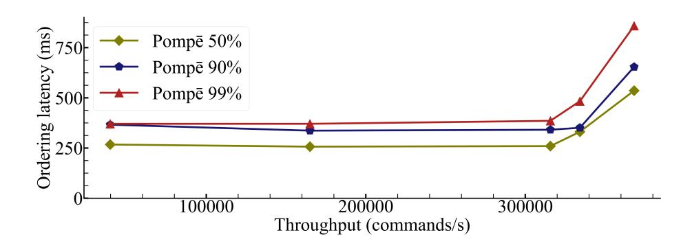
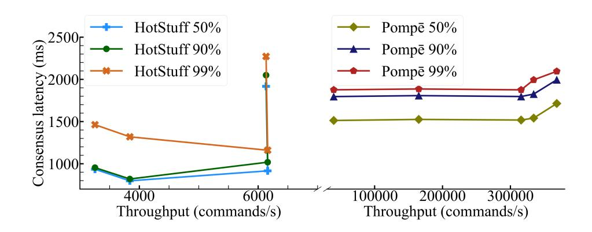
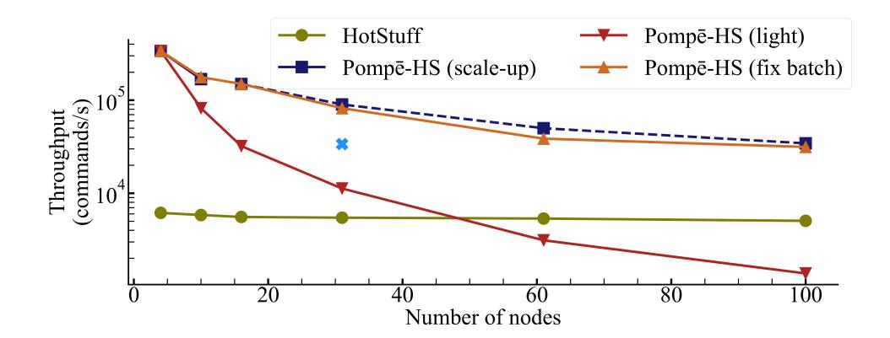
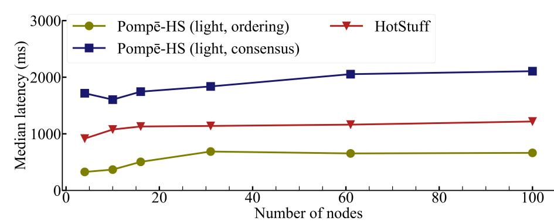
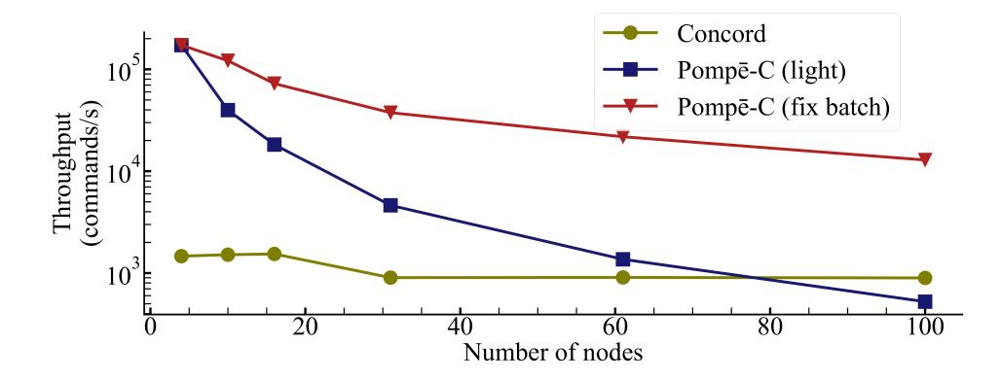
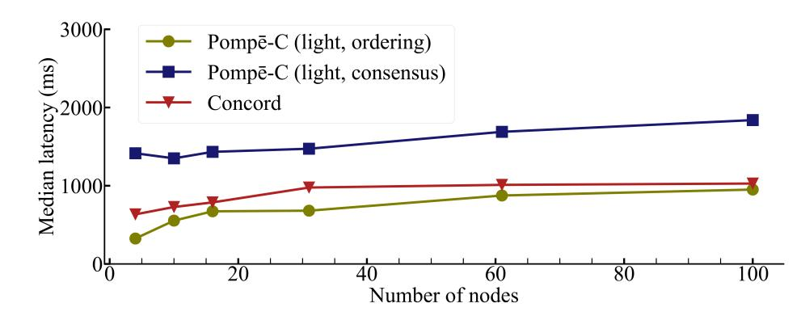

{0}------------------------------------------------


# Byzantine Ordered Consensus without Byzantine Oligarchy

Yunhao Zhang,† Srinath Setty,<sup>⋆</sup> Qi Chen,<sup>⋆</sup> Lidong Zhou,<sup>⋆</sup> and Lorenzo Alvisi† †*Cornell University* <sup>⋆</sup>*Microsoft Research*

### Abstract

The specific order of commands agreed upon when running state machine replication (SMR) is immaterial to faulttolerance: all that is required is for all correct deterministic replicas to follow it. In the permissioned blockchains that rely on Byzantine fault tolerant (BFT) SMR, however, nodes have a stake in the specific sequence that ledger records, as well as in preventing other parties from manipulating the sequencing to their advantage. The traditional specification of SMR correctness, however, has no language to express these concerns. This paper introduces *Byzantine ordered consensus*, a new primitive that augments the correctness specification of BFT SMR to include specific guarantees on the total orders it produces; and a new architecture for BFT SMR that, by factoring out ordering from consensus, can enforce these guarantees and prevent Byzantine nodes from controlling ordering decisions (a Byzantine oligarchy). These contributions are instantiated in Pompe,¯ 1 a BFT SMR protocol that is guaranteed to order commands in a way that respects a natural extension of linearizability.

## 1 Introduction

This paper aims to add a new dimension to state machine replication (SMR) [\[62\]](#page-15-0), a fundamental building block in faulttolerant distributed computing, by introducing a way to express, reason about, and enforce specific properties about how the SMR protocol *orders* the commands it receives.

SMR coordinates a set of replicas of a deterministic service so that, collectively, they implement the abstraction of a single, correct server. In particular, the protocol sequences clientissued requests to produce a total order, which correct replicas then follow when processing the requests. As long as the system includes sufficiently many correct replicas, voting on replica outputs guarantees that clients of the replicated service can recognize and accept only output values that would have been generated by a correct server.

SMR totally orders client requests by running an instance of consensus for each position in the request sequence. The only requirement on the sequence agreed upon is that it eventually contains all requests from correct clients. Indeed, if all SMR is used for is fault-tolerance, no further legislation is necessary: the specific sequence of states that correct replicas traverse is immaterial.

Not so, however, when SMR is used (typically, in a Byzantine fault tolerant (BFT) configuration) across multiple administrative domains to support a blockchain. Consider, for instance, permissioned blockchains like Libra [\[3\]](#page-13-0), CCF [\[60\]](#page-15-1), or HyperLedger Fabric [\[6\]](#page-14-0): the specific order of transactions held by their ledger can have significant financial implications [\[24,](#page-14-1) [47\]](#page-15-2). The nodes running these protocols are not just interested in converging on an agreed-upon ledger: they have a real stake in the specific sequence that ledger records, as well as in preventing other parties from manipulating the sequencing to their advantage.

The traditional specification of correctness for (BFT) SMR, however, has no language for addressing such concerns; because it attaches no significance to the sequence it produces, it is intrinsically incapable of characterizing what makes a total order "right" or "wrong".

Our aim in this paper is to introduce a framework for expressing and enforcing such distinctions. A key challenge is that the lack of expressiveness in the correctness specification of SMR has deep architectural roots. Specifically, in standard leader-based SMR [\[16,](#page-14-2) [43\]](#page-15-3), the ordering of a command is hardcoded in the protocol that adds the command to the ledger: the leader runs concurrently a set of consensus instances, each dedicated to filling a specific ledger position with a command of its choosing.

Thus, we pursue a two-pronged approach: for expressiveness, we expand the correctness specification of the BFT SMR primitive; for enforcement, we articulate a new architecture for BFT replication that makes it possible to implement in practice our newly-introduced correctness requirements.

Our first contribution is to introduce *Byzantine ordered consensus*, a new primitive that augments the correctness specification of BFT SMR to include the enforcement of specific guarantees on the total orders it produces. The new specification allows the nodes that implement a replicated state machine to associate an *ordering indicator* to the commands they ultimately agree upon. Through these indicators, nodes can express how they would like commands to be ordered with respect to one another. The correctness conditions for Byzantine ordered consensus specify, given a set of input ⟨ordering indicator, command⟩ pairs, the set of allowable total orders for the commands.

To identify meaningful correctness conditions in the presence of Byzantine nodes, we draw inspiration from classic work in social choice theory [\[7,](#page-14-3) [9,](#page-14-4) [11\]](#page-14-5) and explore the limits of what *can* be guaranteed in the presence of Byzantine

<sup>1</sup>The urban ritual of the pompe ( ¯ πομπη´, or *procession*) was central to civic and religious life in the Byzantine empire.

{1}------------------------------------------------

nodes. In particular, we ask: is it possible to prevent Byzantine nodes from dictating the ordering of commands? And, at the other end of the spectrum, is it possible to completely prevent Byzantine nodes from wielding influence on that order? We find that, while eliminating Byzantine influence is provably impossible, new mechanisms can prevent the establishment of a Byzantine oligarchy.

Simply expressing these correctness conditions, however, is not enough: we need the means to enforce them. Our second main contribution is to introduce a new general architecture for BFT protocols that *factors ordering out of consensus*: it cleanly separates the process of establishing the relative order of commands from the consensus step necessary to add those ordered commands to the ledger. This separation completely eliminates the leader's ability to control a command's position in the ledger; at the same time, it retains the simplicity and efficiency of having a leader in charge of the consensus step.

Finally, we design, implement, and evaluate Pompe, a BFT ¯ SMR protocol based on Byzantine ordered consensus that enforces *ordering linearizability*, a new correctness condition that prevents a Byzantine oligarchy and offers correct nodes a meaningful guarantee about the order ultimately recorded in the ledger. Informally, it ensures that if the *lowest* timestamp that any correct node assigns to command *c*<sup>2</sup> is larger than the *highest* timestamp that any correct node assigns to *c*1, then *c*<sup>1</sup> will precede *c*<sup>2</sup> in the ledger.

We implement Pompe by extending prior state-of-the-art ¯ BFT implementations [\[1,](#page-13-1) [2\]](#page-13-2). Our experimental evaluation demonstrates that while Pompe incurs higher latencies than ¯ its baselines, Pompe can achieve higher throughput at com- ¯ petitive latencies by batching commands in both the ordering step and the consensus step. For example, with *n* = 4 nodes in a single datacenter, a version of Pompe that extends order- ¯ ing linearizability to HotStuff [\[2,](#page-13-2) [67\]](#page-15-4) achieves a throughput of approximately 360,000 commands/s at a latency of about 53 ms, which corresponds to 40% higher throughput and 6% higher latency than HotStuff. Additionally, since in Pompe¯ nodes can order multiple commands in parallel, we find that, if the computing resources assigned to each node are scaled up proportionally with the number of nodes, Pompe can sus- ¯ tain its high throughput in settings with 100 nodes distributed over three geo-distributed datacenters.

### <span id="page-1-0"></span>2 Background and motivation

The increasing popularity of blockchains as a platform for cooperation and data sharing among mutually distrustful parties has brought about a renewed interest in Byzantine fault tolerance (BFT). In particular, permissioned blockchains, which promise a platform for executing commands without trusting a centralized authority, have adopted as their core the standard BFT SMR architecture [\[62\]](#page-15-0). Transitioning BFT to this new application domain has introduced some new challenges. One that has received much attention is scalability. Traditional BFT SMR protocols have typically targeted deployments involving a number of nodes in the single digits, while some permissioned blockchains envision running BFT at scales that are two orders of magnitude or larger. A new breed of BFT SMR protocols have raised to this challenge, finding clever ways to pipeline requests and streamline the communication required to achieve consensus [\[10,](#page-14-6) [31,](#page-14-7) [50,](#page-15-5) [54,](#page-15-6) [68\]](#page-15-7).

In this paper we address a different challenge that emerges when applying BFT SMR in a blockchain context, one fundamental enough to bring into question whether this primitive is sufficiently expressive to serve as the basis for this new class of applications.

Consider the correctness specification of SMR: it requires all correct nodes replicating a service to traverse the same set of states and produce the same outputs. If replicas are deterministic, an expedient way to satisfy this requirement is to ensuring that all correct replicas process the same sequence of inputs: identical inputs translate into identical states and outputs. As long as these inputs are valid client commands, the correctness specification assigns no semantic meaning to the particular order in which they are executed by the replicas: that order is simply a syntactic mechanism used to achieve the desired safety property.

In blockchains, however, the specific order adopted by the underlying SMR protocol tends to have rich semantic implications, which often translate into substantially different financial rewards for the parties involved. Allowing some users to front-run their commands ahead of others clearly gives them an unfair advantage in applications such as auctions and exchanges [\[47,](#page-15-2) [57\]](#page-15-8); indeed, a recent paper [\[24\]](#page-14-1) details how bots have reaped from unsuspecting parties profits in excess of \$6M by replicating, within the Ethereum network, transaction manipulation strategies already notorious in traditional exchanges [\[47\]](#page-15-2). Yet, order manipulation (including censorship, selective inclusion, command reordering, and command injection) does not, per se, violate the specification of SMR, the technology at the core of projects like Libra [\[3\]](#page-13-0).

Unfortunately, adding the "BFT" qualifier to SMR does not help address these concerns: all it does is to ensure that the standard SMR specification continues to hold even if some nodes are Byzantine. The crux, rather, is that the correctness expectations of blockchain users do not stop at requiring all ledgers to hold the same total order: *which order* matters.

A symptom of the discomfort caused by this semantic gap is the growing focus on curbing the discretion of the single node that, in Paxos-like BFT SMR, leads the consensus decisions: if Byzantine, this *leader* node can single-handedly control the ledger's order. Proposed solutions include rotating leaders [\[13,](#page-14-8) [21,](#page-14-9) [68\]](#page-15-7); holding leaders accountable for their actions [\[33,](#page-14-10) [35\]](#page-14-11); or developing outright "leaderless" protocols that give no node a special role in the execution of consensus [\[23,](#page-14-12) [44,](#page-15-9) [54\]](#page-15-6). These efforts are a step in the right direction, but they also, arguably, miss the point. While it is clear enough that leaving a single leader in full control of the ledger's order is undesirable, they fiddle with a low-level mechanism with

{2}------------------------------------------------

out offering a way to express the correctness guarantees that such mechanisms, whatever they may be, should enforce. Recent work on order-fairness [\[38\]](#page-15-10), concurrent with ours, takes a further step forward by adding to consistency and liveness the additional requirement of *transactional order-fairness*; however, it offers neither a general framework for synthesizing desirable ordering guarantees from the ordering preferences of individual nodes, nor tries to precisely characterize the degree to which Byzantine nodes can affect ordering.

This paper argues that the correct approach to bridge the current semantic gap is instead to start from first principles. Thus, we introduce a new primitive, *Byzantine ordered consensus*, that expands the correctness specifications of BFT SMR so it can express specific correctness guarantees about the total orders it produces. Inspired by classic work in social choice theory [\[7,](#page-14-3) [9,](#page-14-4) [11\]](#page-14-5), Byzantine ordered consensus lets participating nodes not only propose commands, but also indicate how they prefer to see them ordered. Essentially, Byzantine ordered consensus makes it possible to specify which total orders a correct BFT SMR is allowed to produce, given the nodes' ordering preferences. For example, assuming that nodes use as their ordering preference the time they first see a command, we show that it is possible to require total orders that satisfy a natural generalization of linearizability: *ordering linearizability*, which ensures that, if the highest timestamp from all correct nodes for command *c*<sup>1</sup> is lower than the lowest timestamp from all correct nodes for *c*2, *c*<sup>1</sup> is ordered before *c*2.

The design space for ordering properties that we explore is delimited by two overarching concerns. On the one hand, we want to curb as much as possible the clout of Byzantine nodes; on the other hand, we want to ensure that the preferences of correct nodes will carry weight in the final ordering.

These goals can sometimes align; in particular, when it comes to preventing Byzantine nodes from solely controlling the ledger's final ordering. As we noted above, the standard approach to BFT SMR allows a Byzantine leader to alone dictate which command commits in which consensus instance, independent of what other nodes prefer. We aim for, and define, guarantees (such as ordering linearizability) that prevent such Byzantine dictatorships. Indeed, we show that it is possible to rule out a Byzantine oligarchy, in which Byzantine nodes are jointly able to determine the ordering decisions, regardless of the correct nodes' ordering preferences.

Sometimes, however, we find these goals fundamentally at odds with one another: in particular, we find that ensuring that each correct node has a saying in the final order makes it impossible, in general, to completely prevent Byzantine nodes from influencing the final order. This is the price, if you wish, of operating in a Byzantine democracy.

### <span id="page-2-0"></span>3 Byzantine ordered consensus

Byzantine ordered consensus generalizes BFT SMR to expose the ordering aspect explicitly, but preserves the same system model, which consists of a distributed system of *n* nodes (with at most *f* Byzantine faults) that act as clients as well as servers: they both propose commands and execute them. This model simplifies our presentation without any loss of generality; we discuss how it relates to different real-world deployment scenarios in Section [8.](#page-13-3)

Ordering indicators. As in standard BFT SMR, nodes in Byzantine ordered consensus propose commands as inputs and output a consistent totally-ordered ledger. Unlike standard BFT SMR, each node associates a proposed command *c* with an *ordering indicator o*, which is metadata indicating the node's ordering preference for *c*, so proposals are of the form ⟨*o*, *c*⟩. Let O denote the set of ordering indicators; we define an *order-before relation* ≺*<sup>o</sup>* on O×O as follows: For any pair of proposals ⟨*o*1, *c*1⟩ and ⟨*o*2, *c*2⟩, where *o*1, *o*<sup>2</sup> ∈ O, *o*<sup>1</sup> ≺*<sup>o</sup> o*<sup>2</sup> indicates a preference to order *c*<sup>1</sup> before *c*2.

Examples of ordering indicators include timestamps, sequence numbers, and dependency sets or graphs. For timestamps (or sequence numbers), the order-before relation ≺*<sup>o</sup>* can simply be the < relation on timestamps (or sequence numbers), while for dependency sets/graphs, ≺*<sup>o</sup>* can be the subset/subgraph relation on dependency sets or graphs.

Profiles, executions, and traces. We refer to a set of ⟨*o*, *c*⟩ proposals as a *profile*. Let P *i* and P <sup>C</sup> denote, respectively, the set of proposals from node *i* and the set of proposals from all correct nodes. Given a command *c*, we say that *c* ∈ P<sup>C</sup> if and only if there exists a correct node *i* and an ordering indicator *o*, such that ⟨*o*, *c*⟩ ∈ P*<sup>i</sup>* .

In an *execution*, correct nodes follow their prescribed protocol and input their proposals from P C , whereas Byzantine nodes and the network are under the control of an adversary. For a given profile, an execution can produce different *traces*; each trace captures a single deterministic run of the protocol, recording the behavior of all nodes (both correct and Byzantine) as well as of the adversarial network. Although all traces of an execution take as input the same P C , the content of the ledger on which correct nodes agree may be different for different traces, because of the actions of Byzantine nodes or the behavior of the network. But what is the degree to which Byzantine nodes can exert their influence on a given protocol? And what is the price to curb it?

The politics of Byzantium. A minimum guarantee that any protocol should offer is to make it impossible for Byzantine nodes to dictate the ordering of the ledger's entries. It is out of concern for ensuring this guarantee that recent work in BFT SMR has focused on limiting the leader node's discretion in making ordering decision. The formal structure offered by Byzantine ordered consensus allows us to move past the inadequacies of the current mechanisms used to drive consensus and focus instead on a precise characterization of what any such mechanism should guarantee. In particular, we capture the intuition that Byzantine nodes can dictate the ordering decisions through the notion of Byzantine oligarchy.

{3}------------------------------------------------

**Byzantine Oligarchy.** A protocol execution is subject to a *Byzantine oligarchy* if and only if, for all profiles of correct nodes  $\mathcal{P}^{\mathcal{C}}$ , for all pairs of commands  $c_1$  and  $c_2$  in  $\mathcal{P}^{\mathcal{C}}$ , there exists a trace for  $\mathcal{P}^{\mathcal{C}}$  that results in  $c_1$  before  $c_2$  in the ledgers of correct nodes and another trace for  $\mathcal{P}^{\mathcal{C}}$  that results in  $c_2$  before  $c_1$  in the ledgers of correct nodes.

Intuitively, this definition conveys that, in a Byzantine oligarchy, the actions of Byzantine nodes can determine the ordering of any two commands  $c_1$  and  $c_2$ , regardless of the ordering indicators from correct nodes.

Can we do more, and completely eliminate any influence of Byzantine nodes over the ledger's final ordering? The framework offered by Byzantine ordered consensus allows us to prove that this target can be achieved only at the price of denying *correct* nodes a voice in the ordering decision. The intuition is simple: since in general it is impossible to distinguish a priori between correct and Byzantine nodes, a policy that enfranchises the first group necessarily also gives some influence to the second.

To formalize this intuition, we introduce two new notions. First, we express what it means for a protocol to allow the ordering preferences of its nodes to influence the ledgers' final total order. Note that, if a node can influence the outcome, then there will be some circumstances in which the node's preferences will actually *determine* the outcome. The second notion we introduce characterizes the impact of according such influence to a Byzantine node.

**Free Will.** We say that a protocol respects the nodes' *free* will if and only if (i) for all profiles of correct nodes  $\mathcal{P}^{\mathcal{C}}$ , there exists a trace for  $\mathcal{P}^{\mathcal{C}}$ , such that all commands in  $\mathcal{P}^{\mathcal{C}}$  appear in the ledgers of correct nodes in the trace and (ii) there exist two profiles  $\mathcal{P}_A$  and  $\mathcal{P}_B$ , such that, for all commands  $c_1$  and  $c_2$  that appear in both profiles, there exists a trace for  $\mathcal{P}_A$  that results in  $c_1$  before  $c_2$  in the ledgers of correct nodes and there exists a trace for  $\mathcal{P}_B$  that results in  $c_2$  before  $c_1$  in the ledgers of correct nodes.

Free will rules out (i) arbitrarily denying proposed commands and (ii) trivial and predetermined ordering mechanisms (e.g., ordering commands by their hash values).

**Byzantine Democracy.** We say that a protocol upholds *Byzantine democracy* if and only if there exists a profile of correct nodes  $\mathcal{P}^{\mathcal{C}}$ , such that for all pairs of commands  $c_1$  and  $c_2$  in  $\mathcal{P}^{\mathcal{C}}$ , there exists a trace for  $\mathcal{P}^{\mathcal{C}}$  that results in  $c_1$  before  $c_2$  in the ledgers of correct nodes and another trace for  $\mathcal{P}^{\mathcal{C}}$  that results in  $c_2$  before  $c_1$  in the ledgers of correct nodes.

Unlike a Byzantine oligarchy, a Byzantine democracy gives Byzantine nodes sway over the final ledger only for *some* profiles of correct nodes, rather than all of them.

We are now ready to formulate a theorem that places fundamental limits to the degree to which it is possible to curb the influence of Byzantine nodes.

<span id="page-3-0"></span>**Theorem 3.1.** Free will  $\implies$  Byzantine democracy.

*Proof.* Consider the following n + 1 profiles, where  $\mathcal{P}_{\#1} =$ 

 $\mathcal{P}_A$  and  $\mathcal{P}_{\#n+1} = \mathcal{P}_B$  and every node proposes the same commands (though, possibly, with different ordering preferences) in  $\mathcal{P}_A$  and  $\mathcal{P}_B$ .

$$\mathcal{P}_{A} = \mathcal{P}_{\#1} = \mathcal{P}_{A}^{1} \cup \mathcal{P}_{A}^{2} \cup ... \cup \mathcal{P}_{A}^{n-1} \cup \mathcal{P}_{A}^{n}$$

$$\mathcal{P}_{\#2} = \mathcal{P}_{B}^{1} \cup \mathcal{P}_{A}^{2} \cup ... \cup \mathcal{P}_{A}^{n-1} \cup \mathcal{P}_{A}^{n}$$

$$\mathcal{P}_{\#3} = \mathcal{P}_{B}^{1} \cup \mathcal{P}_{B}^{2} \cup ... \cup \mathcal{P}_{A}^{n-1} \cup \mathcal{P}_{A}^{n}$$
...
$$\mathcal{P}_{\#n} = \mathcal{P}_{B}^{1} \cup \mathcal{P}_{B}^{2} \cup ... \cup \mathcal{P}_{B}^{n-1} \cup \mathcal{P}_{A}^{n}$$

$$\mathcal{P}_{B} = \mathcal{P}_{\#n+1} = \mathcal{P}_{B}^{1} \cup \mathcal{P}_{B}^{2} \cup ... \cup \mathcal{P}_{B}^{n-1} \cup \mathcal{P}_{B}^{n}$$

In profile  $\mathcal{P}_{\#i}$ , the proposals of the first i-1 nodes are the same as in as in  $\mathcal{P}_B$ ; those of the other n-i+1 nodes are the same as in  $\mathcal{P}_A$ . Because free will (condition (ii)) holds, there is a trace for  $\mathcal{P}_{\#1}$  for which the ledgers of correct nodes order  $c_1$  before  $c_2$ , and a trace for  $\mathcal{P}_{\#n+1}$  where instead they appear in the opposite order. And, also because free will (condition (i)) holds, for each index k, there exists a trace for  $\mathcal{P}_{\#k}$ , such that  $c_1$  and  $c_2$  appear in the final ledgers. Then, there must exist some index i for which the relative order of  $c_1$  and  $c_2$  switches when going from  $\mathcal{P}_{\#i}$  to  $\mathcal{P}_{\#i+1}$ . Consider the the smallest such i.  $\mathcal{P}_{\#i}$  and  $\mathcal{P}_{\#i+1}$  only differ in what node i proposes: in  $\mathcal{P}_{\#i}$  node i's proposals come from  $\mathcal{P}_A$ ; in  $\mathcal{P}_{\#i+1}$ , they come from  $\mathcal{P}_B$ . Hence, by choosing whether to  $\mathcal{P}_A^i$  or  $\mathcal{P}_B^i$ , node i determines the relative order of  $c_1$  and  $c_2$ .

If *i* is Byzantine, then Byzantine democracy holds for the following correct profile:

$$\mathcal{P}^{\mathcal{C}} = \mathcal{P}_{B}^{1} \cup ... \cup \mathcal{P}_{B}^{i-1} \cup \mathcal{P}_{A}^{i+1} ... \cup \mathcal{P}_{A}^{n} \qquad \Box$$

The definition of Byzantine democracy makes clear that there exist some profiles that allow Byzantine nodes to control ordering decisions. A natural question then is: can we design protocols that, by construction, enforce guarantees that specify profiles on which Byzantine nodes can have no influence? And what would such properties look like? We address the second question next, leaving the answer to the first to Section 4.

Ordering properties. Since under standard BFT assumptions (Section 4) correct nodes are more than two thirds of the total (a supermajority!), the profiles less likely to be influenced by Byzantine nodes are intuitively those in which the voting preferences of correct nodes are aligned. We examine two natural ordering properties that one might want to see holding in such profiles; other definitions are possible.

The first requires that, if the ordering indicators of correct nodes are unanimous on how to relatively order two commands, their preference should be reflected in the final ledger. *Ordering unanimity*: For all profiles of correct nodes  $\mathcal{P}^{\mathcal{C}}$ , for all commands  $c_1$  and  $c_2$  that appear in  $\mathcal{P}^{\mathcal{C}}$  and in the

{4}------------------------------------------------

ledgers of correct nodes, if, for every correct node i,  $\langle o_1, c_1 \rangle \in \mathcal{P}^i \wedge \langle o_2, c_2 \rangle \in \mathcal{P}^i \Rightarrow o_1 \prec_o o_2$ , and there exists at least one correct node j, such that  $\langle o_1, c_1 \rangle \in \mathcal{P}^j \wedge \langle o_2, c_2 \rangle \in \mathcal{P}^j$  holds, then  $c_1$  must precede  $c_2$  in the ledgers of correct nodes.

The second ordering property is inspired by linearizability [36], which orders a command  $c_1$  before a command  $c_2$  if the first ends before the second starts.

Ordering linearizability: For all profiles of correct nodes  $\mathcal{P}^{\mathcal{C}}$ , for all commands  $c_1$  and  $c_2$  in  $\mathcal{P}^{\mathcal{C}}$  and in the ledgers of correct nodes, let  $O_1 = \{o_1 | \langle o_1, c_1 \rangle \in \mathcal{P}^{\mathcal{C}} \}$  and  $O_2 = \{o_2 | \langle o_2, c_2 \rangle \in \mathcal{P}^{\mathcal{C}} \}$ , if  $o_1 \prec_o o_2$  holds for all  $o_1 \in O_1$  and  $o_2 \in O_2$ , then  $c_1$  must precede  $c_2$  in the ledgers of correct nodes.

Informally, the "lowest" and "highest" ordering indicators in  $O_1$  (or  $O_2$ ) indicate when  $c_1$  (or  $c_2$ ) start and end in the collective perception of correct nodes. Hence, by analogy with linearizability, if all ordering indicators in  $O_1$  are lower than those in  $O_2$ , then  $c_1$  is to be ordered before  $c_2$ .

Unfortunately, even when correct nodes are unanimous, their wishes are not guaranteed to come true. The issue again arises from the tension between the desire of giving a voice to every correct node and the inability to distinguish a priori between correct and Byzantine nodes.

**Theorem 3.2.** No protocol can uphold both free will and ordering unanimity.

*Proof* (*sketch*). Consider the four-node profile (f = 1) in Figure 1. It is an example of what classic social choice theory calls a Condorcet cycle [11, 22]: for any two commands  $c_i$  and  $c_{i+1}$  (modulo 4), three nodes prefer the first before the second; the fourth begs to differ.

```
\mathcal{P}^{1} = \{\langle 1, c_{1} \rangle, \langle 2, c_{2} \rangle, \langle 3, c_{3} \rangle, \langle 4, c_{4} \rangle\} 

\mathcal{P}^{2} = \{\langle 1, c_{2} \rangle, \langle 2, c_{3} \rangle, \langle 3, c_{4} \rangle, \langle 4, c_{1} \rangle\} 

\mathcal{P}^{3} = \{\langle 1, c_{3} \rangle, \langle 2, c_{4} \rangle, \langle 3, c_{1} \rangle, \langle 4, c_{2} \rangle\} 

\mathcal{P}^{4} = \{\langle 1, c_{4} \rangle, \langle 2, c_{1} \rangle, \langle 3, c_{2} \rangle, \langle 4, c_{3} \rangle\}
```

FIGURE 1—A Condorcet cycle

Since any single node may be Byzantine, the requirement of ordering unanimity applies to all ordering preferences endorsed by at least three nodes—but in this example they form a cycle, and thus cannot be all satisfied.

Like ordering unanimity, ordering linearizability also promises to respect the collective preferences of correct nodes; fortunately, unlike the former property, it *is* achievable. What allows ordering linearizability to escape the Condorcet cycle trap is a simple insight: it expresses ordering preferences in terms of real-time *happened before*, a relation that is inherently acyclical. Indeed, as we show next, it is not only achievable, but can be efficiently implemented.

#### <span id="page-4-0"></span>4 Pompē

Pompē is a new protocol explicitly designed for Byzantine ordered consensus that preserves the same interface as a stan-

dard BFT protocol: clients propose commands and correct nodes reach consensus on a sequence of committed commands. In addition to satisfying the standard safety and liveness properties of BFT SMR, Pompē introduces an ordering phase for Byzantine ordered consensus and prevents Byzantine oligarchies by enforcing ordering linearizability.

A new architecture. Pompē's two-phase architecture is designed to mirror the decoupling of ordering from consensus made possible by the ordered consensus primitive. First, an ordering phase decides the total ordering of commands, "locking" the relative position among the commands proposed in this phase in a way that Byzantine nodes cannot alter; then, a consensus phase allows all correct nodes to agree on a stable prefix of the final sequence, following the total ordering decisions in the ordering phase, and to record it in the ledger. We refer to commands in the ledgers of correct nodes as *stable* commands. Note that, since the total order of commands that have completed the ordering phase cannot be changed during the consensus phase, it is again safe to put a single leader node in charge of finalizing consensus. Thus, Pompē can retain the performance benefits of leader-based BFT SMR without fears of enabling a Byzantine oligarchy.

**System model.** As in prior works in the BFT SMR literature, we consider a distributed system with a set of n = 3f + 1nodes, where up to f nodes can be Byzantine (i.e., deviate arbitrarily from their prescribed protocol) and the rest are *correct*. We assume the existence of standard cryptographic primitives (unforgeable digital signatures and collision-resistant hash functions) and that cryptographic hardness assumptions necessary to realize these primitives hold. Furthermore, we assume that each node holds a private key to digitally sign messages, and that each node knows the public keys of other nodes in the system. We consider an adversarial network that can drop, reorder, or delay messages. However, for liveness properties, we assume that the network satisfies a weak form of synchrony [16, 27, 28]. Finally, we assume that each node has access to a timer, which produces monotonically increasing timestamps each time it is queried.

#### 4.1 Protocol description

We now describe how Pompē instantiates each of the phases in our new architecture. Throughout the protocol, we assume that correct recipients of messages that are not well-formed (e.g., because they carry an incorrect signature) will drop them: we omit these actions in the interest of brevity.

(1) **Ordering phase.** Pompē uses timestamps as ordering indicators. To "lock" a position for a command in a total order, Pompē proceeds in two steps.

In the first step, a node  $N_i$  with a command c collects signed timestamps on c from a quorum of 2f + 1 nodes. The median timestamp in the set of 2f + 1 signed timestamps is the assigned timestamp for c, and it determines the position of c in the total order. Because there are at most f Byzantine

{5}------------------------------------------------

nodes, by picking the median value, the assigned timestamp is both upper- and lower-bounded by timestamps from correct nodes. This is the key observation that allows the protocol to achieve ordering linearizability.

To lock this position in the total order for c, in the second step  $N_i$  broadcasts c along with its assigned timestamp and waits for it to be accepted by a quorum 2f + 1 nodes (we explain below what it means for a command to be accepted). If a command c is accepted by a quorum of 2f + 1 nodes, c is not only guaranteed to be included in the totally-ordered ledgers of correct nodes, but also that its position in the ledgers is determined by the assigned timestamp of c. We refer to such commands as *sequenced*.

**Local state.** Each node maintains the following local data structures: (1) localAcceptThresholdTS, an integer, initialized to 0, that tracks what  $N_j$  believes to be, currently, the latest possible timestamp of any stable command in the ledger; (2) localSequencedSet, a set, initially empty, that tracks all commands that the node has accepted; (3) highTS, an n-sized vector of integers where highTS[i], initialized to 0, stores the highest timestamp received from node  $N_i$ ; and (4) highTSMsgs, an n-sized vector of messages where highTSMsgs[i], initialized to null, stores the message signed by node  $N_i$  that carried the value currently stored in highTS[i].

To complete our discussion of each node's local state, we first need to introduce a simple protocol that nodes use to update their timers.

The protocol. Let  $\mathcal{T}$  be the  $(f+1)^{th}$  highest timestamp in highTS. Because at most f nodes are Byzantine,  $\mathcal{T}$  is upperbounded by a timestamp from a correct node. Let each node reset its timer to  $\mathcal{T}$  whenever  $\mathcal{T}$  is higher than the current value of the local timer. Periodically, each node broadcasts its current value of  $\mathcal{T}$  in a Sync message to indicate that all correct nodes can now set their timer to be  $\mathcal{T}$  or higher. To prove to its recipients that the  $\mathcal{T}$  value is valid, the Sync message also includes the sender's highTSMsgs vector.  $\square$ 

We are now ready to define two additional data structures: (4) globalSyncTS stores the highest  $\mathcal{T}$  received so far in a Sync message; and (5) localSyncTS stores instead the node's local timestamp at the time it received that Sync message.

**Actions.** Each node  $N_i$  with a command c executes the following two steps to lock a position for c in a total ordering of commands:

- 1.  $N_i$  broadcasts  $\langle \text{RequestTS}, c \rangle_{\sigma_{N_i}}$  and waits for responses from 2f + 1 nodes, where  $\sigma_{N_i}$  is a signature on the payload using  $N_i$ 's private key.
  - A node  $N_j$  responds with  $\langle \text{ResponseTS}, c, ts \rangle_{\sigma_{N_j}}$ , where ts is a timestamp from  $N_j$ 's local timer.
- 2.  $N_i$  broadcasts (Sequence,  $c, T\rangle_{\sigma_{N_i}}$ , where T is a set of 2f + 1 responses received in the first step, and waits for responses from a quorum of 2f + 1 nodes.
  - A node  $N_i$  accepts the broadcast message and adds

it to its localSequencedSet if the assigned timestamp of c is higher than localAcceptThresholdTS. If so,  $N_j$  responds with  $\langle$ SequenceResponse, ack,  $h\rangle_{\sigma_{N_j}}$ ; otherwise, it responds with  $\langle$ SequenceResponse, nack,  $h\rangle_{\sigma_{N_j}}$ , where h is the cryptographic hash of the Sequence message.

The second step above is crucial to establish stable prefixes in the sequence of commands. Intuitively, it requires every correct node  $N_j$  to refuse sequencing commands if their timestamp may be lower than that of a stable command. Note that, during sufficiently long periods of synchrony (which are necessary for liveness), nodes can get their commands sequenced in just two round-trips—a lower latency than recent BFT protocols [18, 68]. However, sequenced commands are not yet suitable for execution until they become stable: only then they are guaranteed that commands with lower timestamps will not be sequenced.

Nodes *can* execute commands speculatively in their localSequencedSet, but they must wait for the consensus phase to finish before externalizing output and be ready to perform selective reexecution if their speculation is incorrect.

(2) Consensus phase. The principal goal of the consensus phase is to ensure that all correct nodes agree that a certain prefix of the total order constructed in the previous phase is now stable, meaning that the prefix is forever immutable.

To accomplish this, Pompē employs any standard leader-based BFT SMR protocol (e.g., [16, 31, 68]) that offers a primitive to agree on a value for each slot in a sequence of consensus slots. We generically refer to this protocol as Consensus. For simplicity, we assume that each consensus slot is associated with non-overlapping time intervals [ts, ts') such that ts' > ts, and that for the first consensus slot ts = 0. We further assume that the mapping from consensus slot numbers to time intervals is common knowledge. In practice, this can be implemented by making the interval of the first consensus slot as  $[0,\tau)$ , where  $\tau$  is the system initialization time, and then assigning each subsequent consensus slot a fixed window of time (e.g.,  $[ts, ts + 100 \, \text{ms})$ ). Note that this does not mean that nodes must agree on a value during these time intervals.

For liveness, Pompē relies on a bound  $\Delta$  on the sum of two terms: the maximum difference  $\Delta_1$  between the values returned, at any time, by local timers of correct processes, which in turn depends on the time it takes for a Sync to travel from one node to another and be processed at the recipient; and the maximum time  $\Delta_2$  needed by a correct node to execute the ordering phase (we assume that these bounds include additional slack to account for clock drifts across nodes). Pompē's safety properties hold even when  $\Delta$  does not hold, but, during sufficiently long periods of synchrony (which is necessary for liveness), we assume that the bound holds for proving liveness (Section 4.2).

**Local state.** The local state of each node is a totally-ordered ledger, initially empty.

Actions. Suppose that consensus slot k maps to time inter-

{6}------------------------------------------------

val [ts, ts'), meaning that all commands with assigned timestamp in this interval are expected to be included in this slot. If node  $N_i$  wishes to serve as a leader in reaching consensus on a value for slot k using Consensus, it proceeds as follows.

- 1.  $N_i$  broadcasts  $\langle \text{Collect}, k \rangle_{\sigma_{N_i}}$ , and waits for responses from 2f + 1 nodes.
  - Node  $N_i$  waits until two conditions hold. First, the value of  $N_i$ 's globalSyncTS is higher than ts', meaning that some node sent  $N_j$  a Sync message with  $T \geq ts'$ . Second, since that Sync message was received, a time interval of at least  $\Delta$  has elapsed on  $N_i$ 's timer (i.e.,  $N_i$ 's timer reads at least localSyncTS  $+\Delta$ ). Note that, during sufficiently long periods of synchrony, these delays give all correct nodes enough time to sequence all their commands with assigned timestamps lower than ts' before  $N_i$  advances its localAcceptThresholdTS to ts'. In more detail, after  $\Delta_1$ , all correct nodes should have received and processed a Sync message with  $T \ge ts'$  to set their local timer to be at least  $\mathcal{T}$ , so after this point, any new command entering the ordering phase will not have an assigned timestamp lower than ts'. After an additional  $\Delta_2$ , any command with an assigned timestamp lower than ts' must have completed the ordering phase.
  - $N_j$  updates its localAcceptThresholdTS  $\leftarrow max(ts', localAcceptThresholdTS).$
  - $N_j$  responds with  $\langle \text{CollectResponse}, k, \mathcal{S} \rangle_{\sigma_{N_j}}$ , where  $\mathcal{S}$  is the set of messages in the localSequencedSet of  $N_j$  with assigned timestamps in the interval [ts, ts').
- 2.  $N_i$  runs Consensus to agree on value  $\mathcal{U}$  for consensus slot k, where  $\mathcal{U}$  is the union of CollectResponse messages from 2f + 1 nodes for consensus slot k.

Constructing a totally-ordered ledger. Once a prefix of consensus slots are agreed upon, nodes can construct a totally-ordered prefix of the ledger by sorting commands in each slot (of the prefix) by their assigned timestamps, breaking ties by their cryptographic hashes. When a node adds a proposal to its totally ordered ledger, it can execute them in the order specified by the ledger.

#### <span id="page-6-0"></span>4.2 Proofs of safety and liveness

This section proves that Pompē satisfies ordering linearizability and a strengthened version of liveness in addition to standard safety properties.

**Theorem 4.1** (Consistency). For every pair of correct nodes  $N_i$  and  $N_j$  with local ledgers  $\mathcal{L}_i$  and  $\mathcal{L}_j$ , the following holds:  $\mathcal{L}_i[k] = \mathcal{L}_j[k] \ \forall k :: 0 \le k \le \min(len(\mathcal{L}_i), len(\mathcal{L}_j))$ , where  $len(\cdot)$  computes the number of entries in a ledger.

*Proof.* By the safety properties of BFT SMR, every pair of correct nodes agrees on the same value for each consensus slot. Furthermore, the transformation from values in consensus slots to a totally-ordered ledger is deterministic. Together,

these observations imply the desired result.

**Theorem 4.2** (Validity). *If a correct node appends a command c to its local totally-ordered ledger, then at least one node in the system proposed c in the ordering phase.* 

*Proof.* Each command in the ledger of a correct node is constructed from a valid value agreed upon in one of the consensus slots. Furthermore, for a given consensus slot k with assigned time interval [ts, ts'], by our construction, a valid value is a set of CollectResponse messages for slot k from at least 2f + 1 nodes, where each CollectResponse contains commands with timestamps in the interval [ts, ts']. Additionally, for a command to have an assigned timestamp, it must have been proposed in the first step of the ordering phase. Together, these observations imply the statement of the theorem.

<span id="page-6-1"></span>**Lemma 4.1.** The assigned timestamp of a command is bounded by timestamps provided by correct nodes.

*Proof.* By assumption, there are at most f Byzantine nodes. Thus, at least f+1 (out of 2f+1) timestamps provided in the ordering phase for a given command are from correct nodes. Furthermore, the assigned timestamp of a command discards f lowest and f highest timestamps in the 2f+1 ResponseTS messages, thus the assigned timestamp of a command is bounded by timestamps provided by correct nodes.

**Theorem 4.3** (Ordering linearizability). If the highest timestamp provided by any correct node for a command  $c_1$  is lower than the lowest timestamp provided by any correct node for another command  $c_2$  and if both  $c_1$  and  $c_2$  are committed, then  $c_1$  will appear before  $c_2$  in the totally-ordered ledgers constructed by correct nodes.

*Proof.* By Lemma 4.1, the assigned timestamp of a command is bounded by timestamps provided by correct nodes. As a result of this and the pre-condition in the statement of the theorem, the assigned timestamp of  $c_1$  will be smaller than the assigned timestamp of  $c_2$ . Thus, if both  $c_1$  and  $c_2$  are committed,  $c_1$  will appear before  $c_2$  in the totally-ordered ledgers of correct nodes because nodes sort commands by their assigned timestamps.

<span id="page-6-2"></span>**Lemma 4.2.** During sufficiently long periods of synchrony, a correct node can get its command (along with its assigned timestamp) added to localSequencedSet of at least 2f + 1 nodes.

*Proof* (*sketch*). Suppose a correct node executes the first step of the ordering phase for its command c and obtains an assigned timestamp of ts. During sufficiently long periods of synchrony, by the choice of  $\Delta$ , a Sequence message that includes c will reach 2f+1 correct nodes and be added to their localSequencedSet before they advance their localAcceptThresholdTS past ts, which implies the statement of the lemma.  $\Box$ 

{7}------------------------------------------------

<span id="page-7-0"></span>Lemma 4.3. *If a command c with assigned timestamp ts is added to localSequencedSet of at least* 2*f* +1 *nodes, then c will eventually be included in the value committed by a unique consensus slot whose time interval includes ts.*

*Proof (sketch).* Let *k* denote the consensus slot whose time interval includes *ts*. When a leader broadcasts Collect for consensus slot *k*, the local timers on correct nodes will eventually meet the condition required to send CollectResponse messages. Since *c* appears in the localSequencedSet of at least 2*f* + 1 nodes, and, by assumption, since at most *f* of them are Byzantine, at least *f* +1 nodes will include *c* in their CollectResponse for consensus slot *k*. Denote these *f* + 1 nodes with C.

Since Pompe's use of BFT SMR requires proposals that ¯ are constructed by taking a union of 2*f* + 1 CollectResponse messages, a leader must include at least one message from nodes in C. Thus, *c* must be included to construct a valid proposal for consensus slot *k*. These combined with the liveness property of the employed BFT SMR protocol (which ensures that a valid value will eventually be chosen for each consensus slot) implies the desired result.

Theorem 4.4 (Strong liveness). *During sufficiently long periods of synchrony, a correct node can get an assigned timestamp for its command c such that c will eventually be included in the total order constructed by correct nodes at a position determined by the assigned timestamp of c.*

*Proof.* During sufficiently long periods of synchrony, by Lemmas [4.2](#page-6-2) and [4.3,](#page-7-0) *c* will eventually be included in the value committed by a unique consensus slot whose time interval includes the assigned timestamp of *c*. Since the algorithm to construct a total ordering of commands from values committed by consensus slots sorts commands by their assigned timestamps, the position of *c* is determined by the assigned timestamp of *c*.

#### <span id="page-7-2"></span>4.3 Byzantine influence in Pompe¯

Pompe greatly diminishes the leverage of Byzantine nodes. ¯ Once a command is sequenced, Byzantine nodes can neither censor it nor affect its position in the totally-ordered ledgers of correct nodes. Furthermore, they cannot violate ordering linearizability. Nonetheless, as we saw in Sections [2](#page-1-0) and [3,](#page-2-0) in a Byzantine democracy, it is impossible to completely eliminate the influence of Byzantine nodes, and Pompe is not ¯ immune from it.

Byzantine democracy in action. Consider the following execution of Pompe, where ¯ *n* = 4 and *f* ≤ 1. There are two commands, *c*<sup>1</sup> and *c*2, that in the ordering phase obtained the following timestamps from a quorum of 2*f* + 1 nodes.

|    | N1 | N2 | N3 |  |
|----|----|----|----|--|
| c1 | 0  | 3  | 3  |  |
| c2 | 1  | 4  | 2  |  |

Assume, without loss of generality, that *N*<sup>3</sup> is Byzantine, and that the remaining nodes are correct. The timestamps make clear that correct nodes prefer to order *c*<sup>1</sup> before *c*2. However, since the median timestamp of *c*<sup>1</sup> is higher than the median timestamp of *c*2, it is *c*<sup>2</sup> that will be ordered before *c*1. On a positive note, we observe that, in the normal case where the timers on correct nodes are sufficiently synchronized and network delays are small, this window of vulnerability to Byzantine manipulation is small.

Early stopping and deferred selective inclusion. Pompe¯ cannot prevent a Byzantine node from obtaining an assigned timestamp for its command, but not proceeding with the rest of the ordering phase, as this misbehavior is indistinguishable from what may result from a network failure. This ambiguity allows a Byzantine node (possibly with the aid of a Byzantine leader) to decide later, during the consensus phase, whether or not to include its timestamped-but-not-yet-sequenced command in the ledger.

Preventing or reliably detecting this type of misbehavior is impossible, but mechanisms to mitigate the risks and raise suspicion do exist. One possibility is for each node to employ an append-only linear hash chain to record the timestamps it assigns to other nodes' commands. Nodes exchange those hash chains and refer to the corresponding hash value (in the hash chain) in each ResponseTS message. Such hash chains constrain the ability for Byzantine nodes to assign timestamps abnormally (e.g., out of order), and allow after-the-fact auditing (which could be used to expose nodes that routinely timestamp their commands, but do not always sequence those commands). In addition, a correct node *N<sup>i</sup>* can piggyback the tail of a hash chain of all previously timestamped commands of *N<sup>j</sup>* whenever *N<sup>j</sup>* requests a timestamp; this makes it hard for a Byzantine *N<sup>j</sup>* to blame on the network when silently dropping an earlier timestamped command. An alternative mechanism is for correct nodes to hide their commands using a threshold encryption scheme until those commands are totally ordered. This additional step prevents Byzantine nodes from observing the contents of other timestamped commands before deciding whether to drop their timestamped commands.

### <span id="page-7-1"></span>5 Implementation

We implement two variants of Pompe, where the artifacts dif- ¯ fer in the specific BFT protocol they employ for the consensus phase. Specifically, we extend two prior state-of-the-art leader-based BFT protocols: SBFT [\[31\]](#page-14-7) and HotStuff [\[68\]](#page-15-7). SBFT implements a variant of PBFT [\[16\]](#page-14-2) that includes many optimizations for scalability. HotStuff uses a rotating leader paradigm while incurring low network costs and serves as the foundation of the Libra blockchain [\[3\]](#page-13-0). For SBFT, we use its implementation in VMware's Concord [\[1\]](#page-13-1), and for HotStuff, we use the authors' implementation [\[2\]](#page-13-2).

{8}------------------------------------------------

<span id="page-8-0"></span>

|                              | base            | extensions  |  |
|------------------------------|-----------------|-------------|--|
| Concord [1]<br>HotStuff [68] | 22,141<br>4,983 | 1122<br>900 |  |
|                              |                 |             |  |

FIGURE 2—Number of lines of C++ code in Pompe, which we build ¯ atop a base BFT library with a set of extensions.

Ease of implementation. Implementing Pompe atop an ex- ¯ isting consensus protocol involves modest system effort. Figure [2](#page-8-0) reports the numbers of lines of code we add to the base BFT protocol implementations. These extensions primarily focus on implementing the two steps of the ordering phase in our new architecture. Specifically, we implement four new message types, as described in Section [4.](#page-4-0) We then implement message handlers to sign and verify timestamps and to manage data structures for localSequencedSet and localAccept-ThresholdTS. Additionally, we modify the leader logic so that, for each time interval, a leader starts a consensus phase after assembling a proposal by collecting responses from a quorum of 2*f* + 1 nodes, as described in Section [4.](#page-4-0) The rest of the consensus protocol is unmodified: the leader of an instance runs the original consensus protocol for a slot with a proposal assembled as described above. Within each slot, commands are ordered by their assigned timestamps.

Optimizations. In Pompe's consensus phase, the ¯ CollectResponse message used for consensus slot *k* contains all commands in a node's localSequencedSet whose assigned timestamp falls within the time interval associated with *k*. This can lead to large message sizes. However, when the network is synchronous and correct nodes respond in a timely manner, CollectResponse messages will contain the same set of commands. Therefore, we optimize Pompe by ¯ having CollectResponse messages sent to the leader carry only a hash of the set commands in the sender's localSequencedSet. The leader compares the hash of its own localSequencedSet with the hashes carried in the CollectResponse messages received from 2*f* other nodes. If the hashes match, then the leader proceeds to reach consensus for slot *k* on the commands from its localSequencedSet, using the 2*f* +1 signed hash values (those received from the other nodes as well as its own) as proof that 2*f* + 1 nodes reported the same set of commands. Otherwise, the leader requests a new set of CollectResponse messages, this time including the actual set of commands. We enable this optimization by default.

### 6 Experimental evaluation

This section experimentally evaluates Pompe. We ask two ¯ main questions: (1) How does the performance of Pompe¯ compare with that of state-of-the art BFT protocols? (or, what is the price of transitioning from a Byzantine oligarchy to a Byzantine democracy that enforces Byzantine-tolerant ordering guarantees?) and (2) What is the impact of separating ordering from consensus on end-to-end performance? Figure [3](#page-9-0) provides a summary of our findings.

We choose as baselines two prior state-of-the-art BFT protocol implementations: Concord [\[1,](#page-13-1) [31\]](#page-14-7) and HotStuff [\[2,](#page-13-2) [68\]](#page-15-7). Both are leader-based (and hence subject to Byzantine oligarchy) and hardcode ordering decisions within consensus. As described in Section [5,](#page-7-1) we implement two variants of Pompe, both upholding ordering linearizability (and hence ¯ free of Byzantine oligarchy), by augmenting those two BFT protocols. We refer to Pompe that extends HotStuff as ¯ *Pompe-¯ HS*, and to Pompe that extends Concord as ¯ *Pompe-C¯* .

Methodology, testbed, and metrics. We run our experiments on 100 Standard D16s\_v3 (16 vcpus, 64 GB memory) VMs on the Azure cloud platform spanning three datacenters, each running Ubuntu Linux 18.04: 34 in West US, 33 in South-East Asia, and 33 in North Europe. We run single-datacenter experiments using VMs in the West US.

We report results only for failure-free executions, as failures do not alter how Pompe performs relative to its baselines. ¯

Our workload is generated by clients that submit their commands in a closed loop, i.e., they wait to receive a response to their currently outstanding command before submitting the next one. To run experiments with different loads, we vary the number of clients. For HotStuff and Pompe-HS, as in prior ¯ work [\[67\]](#page-15-4), we run experiments where commands are random, 32-bytes-long values.<sup>2</sup>

Similarly, for Concord and Pompe-C, as in prior work [ ¯ [31\]](#page-14-7), we use a benchmark that writes a random value to a randomlyselected key in a key-value store.

Our principal performance metrics are client-perceived latency (measured in ms) and throughput (in commands/second). To measure latency, each client records the latency of each command using its local clock, and our scripts aggregate latencies across clients and across commands. For throughput, we compute the total number of commands processed by the system and divide it by the duration of the experiment. To measure the peak throughput of a given system, we increase the number of clients until saturation.

Since Pompe separates ordering from consensus, clients in ¯ Pompe receive two responses, one for confirming the relative ¯ position of the command in the totally-ordered ledger (when a command is sequenced; see Section [4](#page-4-0) for details), and another for the execution result of the command. Therefore, we report two types of latency for Pompe, which we refer to as ¯ *ordering latency* and *consensus latency*. Since our baselines hardcode ordering decisions within consensus, both ordering and consensus complete at the same time, so, for baselines, we report a single type of latency.

#### <span id="page-8-1"></span>6.1 End-to-end performance: Throughput and latency

We begin by measuring the performance of Pompe and its ¯ baselines in a four-node configuration (we report results for

<sup>2</sup>The HotStuff implementation reaches consensus not on actual commands, but on their 32-byte-long cryptographic hashes; clients communicate the actual commands to the replica nodes outside of the consensus protocol.

{9}------------------------------------------------

FIGURE 3—Summary of evaluation results.

<span id="page-9-1"></span><span id="page-9-0"></span>

|                           | throughput<br>(cmds/s) | median latency<br>(ms) |
|---------------------------|------------------------|------------------------|
| HotStuff (βc<br>= 1)      | 474                    | 8.2                    |
| HotStuff (βc<br>= 800)    | 253,360                | 49.9                   |
| Pompe-HS ( ¯ βo<br>= 1)   | 1,642                  | 2.3 (o), 47.7 (c)      |
| Pompe-HS ( ¯ βo<br>= 200) | 361,687                | 5.7 (o), 53.1 (c)      |
| Concord (βc<br>= 1)       | 40                     | 53                     |
| Concord (βc<br>= 800)     | 6,633                  | 67                     |
| Pompe-C ( ¯ βo<br>= 1)    | 1,415                  | 17 (o), 67 (c)         |
| Pompe-C ( ¯ βo<br>= 200)  | 249,221                | 18 (o), 74 (c)         |

FIGURE 4—Peak throughput and median latency for Pompe and its ¯ baselines in a single datacenter with *n* = 4 nodes. Pompe's leader ¯ starts the consensus phase every 50 ms with ∆ = 10 ms. Pompe's ¯ *ordering latency* is denoted with "o", its *consensus latency* with "c".

larger system sizes in the next subsection). We run clients on a separate set of virtual machines so that clients and nodes do not contend for computing resources.

A note about batching. Batching is a standard technique in SMR protocols to increase throughput at the cost of higher latency by amortizing the cost of running consensus across all the commands in a batch. Both Pompe and its baselines can ¯ take advantage of it, and we report experiments for different batch sizes. However, Pompe's separation of ordering from ¯ consensus has two significant implications for batching.

First, it eliminates the unintended leverage that Byzantine nodes can gain through batching even in BFT SMR protocols that rotate leaders out of concern for "fairness". The larger the batch, the larger the number of commands whose ordering is left to the unchecked discretion of the current leader: throughput gains thus come at the cost of expanding opportunities for Byzantine oligarchy. Pompe removes these concerns: its or- ¯ dering guarantee (e.g., ordering linearizability) is unaffected by either the existence of batches or by their sizes.

Second, separating order and consensus affects the tradeoff between latency and throughput that comes with batching. When Pompe's baselines do not batch commands, they ¯ achieve lower latency *and* lower peak throughput than Pompe.¯ Latency is higher under Pompe because a leader in Pomp ¯ e¯ must wait for a fixed time window before initiating a proposal; peak throughput is higher because Pompe implicitly ¯ batches commands whose timestamps fall within a time window during consensus. However, when the baselines batch commands to match Pompe's latencies, they achieve signif- ¯ icantly higher peak throughput than Pompe. Pomp ¯ e's peak ¯ throughput is lower because nodes must produce and validate signed timestamps during the ordering phase, which causes nodes to saturate earlier.

<span id="page-9-2"></span>

|                                                     | throughput<br>(cmds/s) | median latency<br>(ms)         |
|-----------------------------------------------------|------------------------|--------------------------------|
| HotStuff (βc<br>= 800)<br>Pompe-HS ( ¯ βo<br>= 200) | 6,160<br>315,753       | 915.8<br>259.7 (o), 1518.1 (c) |
| Concord (βc<br>= 800)<br>Pompe-C ( ¯ βo<br>= 200)   | 1,461<br>172,774       | 616<br>325 (o), 1415 (c)       |

FIGURE 5—Peak throughput and median latency for Pompe and ¯ its baselines with *n* = 4 nodes spanning three geo-distributed datacenters. Batch sizes are as in the single datacenter experiments in a single datacenter. Pompe's leader starts the consensus phase every ¯ 500 ms with ∆ = 400 ms.

Fortunately, the separation gives Pompe an additional ¯ batching opportunity: each node can execute the ordering phase once to assign a single timestamp to an ordered sequence of its own commands (or of commands from clients that belong to the same organization as the node). Such batching does not affect Pompe's ordering properties (e.g., ordering ¯ linearizability) because each batch contains commands from a single node. The throughput boost that comes from this additional source of batching can more than make up for Pompe's ¯ lost ground, but raises the question of how to fairly compare the Pompe variants to their baselines. ¯

We balance these different considerations in our experiments as follows: if, in a configuration with *n* nodes, the baseline's consensus protocol uses a batch size β*<sup>c</sup>* = *S*(> 1), then we allow each node in corresponding variant of Pompe¯ to use batches of size β*<sup>o</sup>* = *S*/*n* during its ordering phase.

Performance results. Figure [4](#page-9-1) shows peak throughput and median latency at peak throughput for Pompe and its base- ¯ lines, for different batch sizes. Since Pompe-C and Pomp ¯ e-HS ¯ perform similarly compared with their respective baselines, so we focus only on Pompe-HS. ¯

Performance without batching. When β*<sup>o</sup>* = 1, Pompe-¯ HS's median ordering latency is 28% of the median latency of HotStuff with β*<sup>c</sup>* = 1, while its peak throughput is about 3.5× higher than HotStuff's. The lower ordering latency is due to Pompe's ordering phase, which incurs only two RTTs ¯ compared to the four RTTs required by HotStuff; the higher throughput, perhaps surprisingly given that β*<sup>o</sup>* = 1, is instead due to batching. In Pompe-HS, setting ¯ β*<sup>o</sup>* = 1 means that nodes do not batch in the *ordering phase*; however, since Pompe-HS does not start consensus until a time window has ¯ elapsed, it can still collect commands from multiple clients: for a 50 ms time window, we observed an effective batch size of 82 commands. Unsurprisingly, the flip side of this higher throughput is significantly higher consensus latency. Pompe-¯ HS starts the consensus phase every 50 ms; with ∆ = 10 ms,

{10}------------------------------------------------

<span id="page-10-2"></span>



FIGURE 6—Latency vs. throughput for HotStuff and Pompe-HS in a geo-distributed deployment. The left and right graphs show respectively ¯ the maximum ordering latency and consensus latency experienced by different percentiles of the fastest commands. The experimental setup is the same as in Figure [5.](#page-9-2) Pompe-HS achieves higher throughput at the cost of higher consensus latency, even as its low ordering latency lets ¯ nodes know quickly when their commands are guaranteed to appear in the ledger.

every client waits on average 35 ms for the next consensus phase, ultimately leading to a consensus latency of 47.7 ms.

Performance with batching. We fix the batch size for HotStuff to β*<sup>c</sup>* = 800 commands, and accordingly set the ordering-phase batch size of each of the four nodes in Pompe-¯ HS to β*<sup>o</sup>* = 200. Unsurprisingly, the throughput increases significantly for both Pompe-HS and HotStuff, respectively ¯ by 220× and 535× over the values we measured for Pompe-¯ HS (β*<sup>o</sup>* = 1) and HotStuff (β*<sup>c</sup>* = 1): both systems are CPUbound, and batching allows them to amortize the cost of cryptographic operations across all commands in a batch. In absolute terms, we find that Pompe-HS achieves ¯ 1.4× the throughput of HotStuff; as discussed earlier, the reason is the additional batching effect due to the 50 ms interval that in Pompe-HS separates successive invocations of consensus. ¯

#### <span id="page-10-0"></span>6.2 Performance with a geo-distributed setup

We consider next a geo-distributed setup, where *n* = 4 nodes are deployed in three separate datacenters, with one datacenter running two nodes. We use the same batch size as in the single datacenter setup (i.e., β*<sup>c</sup>* = 800 for baselines and β*<sup>o</sup>* = 200 for each node's ordering phase for the corresponding Pompe¯ variants).

Peak throughput. Figure [5](#page-9-2) shows our results. For HotStuff, geo-replication causes throughput to drop dramatically, to only 2.4% of its value for the same configuration in a single datacenter. For geo-distributed Pompe-HS instead the ¯ loss is much more contained: throughput is at 87.3% of its single-datacenter value. Two main factors explain these results. First, as in the single-datacenter case, Pompe-HS can ¯ take advantage of effective batching, now with a time interval between successive proposal of 500 ms and ∆ = 400 ms; second, HotStuff is hampered by its use of rotating leaders, as a new leader does not propose a new batch until after collecting enough votes for the previous leader's batch: in a geo-distributed setting, this delay can become significant and negatively affect throughput.

Latency. Figure [6](#page-10-2) shows the maximum ordering and consensus latencies experienced by the fastest 50%, 90%, and 99% of commands. The key take-away is that Pompe-HS achieves ¯

higher throughput at the cost of higher consensus latencies. As expected, in Pompe-HS both types of latency stay stable ¯ until system saturation. HotStuff's latency drops at the beginning because, with more clients, it fills up a batch more quickly while also increasing the throughput. Furthermore, the ordering latency is lower than the median consensus latency (since the latter adds more communication rounds to the former) meaning that nodes can get early notification for when their commands are guaranteed to appear in the ledger.

#### <span id="page-10-1"></span>6.3 Scalability

To understand how well Pompe scales to a larger number ¯ of nodes, we experiment with increasing values of *n*. We vary the number of nodes in an experiment from 4 to 100. Our results for Pompe-C (in comparison with its baseline ¯ Concord) are qualitatively similar to our results for Pompe-¯ HS (in comparison with HotStuff), so we focus on Pompe-HS. ¯

HotStuff uses the same batch size as before (i.e., β*<sup>c</sup>* = 800). For Pompe-HS, we experiment with three configurations. ¯

- 1. Light: We set β*<sup>o</sup>* = 800/*n* and allocate a single VM to each node regardless of *n*.
- 2. Scale-up: We set β*<sup>o</sup>* = 800/*n* and, as *n* increases, so does proportionally the number of VMs associated with each node to equal ⌊*n*/4⌋. So, for example, for *n* = 4, we use one VM per node; but when *n* = 10, each node uses two.
- 3. Fixed batch: We set β*<sup>o</sup>* = 200 regardless of *n*.

Figures [7](#page-11-1) and [8](#page-12-0) depict throughput and latency achieved by Pompe and its baselines for different values of ¯ *n*.

Throughput. HotStuff scales well as *n* grows, whereas throughput quickly degrades under Pompe-HS (light). This is ¯ because batch sizes under Pompe-HS (light) are inversely pro- ¯ portional to *n*, so throughput degrades as *n* increases. This is confirmed by the scaling behavior of Pompe-HS (fixed batch) ¯ where β*<sup>o</sup>* = 200 regardless of *n*. Of course, using a fixed β*<sup>o</sup>* regardless of *n* may not be desirable.

Fortunately, we find that Pompe-HS (scale-up) can achieve ¯ a behavior similar to Pompe-HS (fixed batch) without having ¯ to use a fixed β*o*. In Pompe-HS (scale up), each node uses ¯ multiple VMs to run the ordering phase, thereby avoiding

{11}------------------------------------------------

<span id="page-11-1"></span>



FIGURE 7—Peak throughput and median latency of different configurations of Pompe-HS and of HotStuff as a function of the number of ¯ nodes (*n*) in a geo-distributed deployment. The light blue cross at *n* = 31 depicts the performance of Pompe-HS (scale up) with 3 VMs per ¯ node; the blue square above it shows the *predicted* throughput when each node is assigned ⌊31/4⌋ = 7 VMs. The prediction is based on benchmarks showing that the ordering phase scales near linearly as more VMs are assigned to each node. The blue squares connected by a dotted line at *n* = 61 and *n* = 100 are similarly predicted rather than measured.

the throughput degradation experienced by Pompe-HS (light). ¯ Our testbed has 100 nodes, so we could only run Pompe-HS ¯ (scale-up) for *n* ∈ {4, 10, 16}. For higher values of *n*, we predict the throughput of Pompe-HS (scale-up) using experi- ¯ mental results from smaller-scale experiments and additional benchmarks that we used to validate that the ordering phase achieves a near-linear scaling as each node gets more VMs.

Latency. For both Pompe-HS and HotStuff, latency stays ¯ relatively stable when the system scales out. This is because latency is dominated by network communication in a geodistributed deployment.

#### <span id="page-11-0"></span>6.4 Network overhead

Compared to its baselines, Pompe incurs higher network costs ¯ to attach timestamps with each command and for executing a separate ordering phase. To understand the increased network costs, we use *n* = 4 and experiment with both Pompe and ¯ its baselines. We experiment with Pompe-HS ( ¯ β*<sup>o</sup>* = 1) and HotStuff (β*<sup>c</sup>* = 1), and record the total number of bytes sent by each node during the experiment. We find that Pompe-HS ¯ incurs about 18% higher network costs compared to HotStuff, which, we believe, is a tolerable price for the stronger ordering properties ensured by Pompe.¯

### 7 Related work

Leader-based BFT protocols. There is a long line of work on practical Byzantine consensus protocols [\[10,](#page-14-6) [17,](#page-14-18) [20,](#page-14-19) [31,](#page-14-7) [34,](#page-14-20) [41,](#page-15-11) [42,](#page-15-12) [49](#page-15-13)[–52,](#page-15-14) [59,](#page-15-15) [65,](#page-15-16) [66\]](#page-15-17), starting with the seminal work of PBFT [\[16\]](#page-14-2). These works focus on improving performance, round complexity, fault models, etc. Some works also focus on using trusted hardware to improve fault thresholds [\[10,](#page-14-6) [19,](#page-14-21) [37,](#page-15-18) [46\]](#page-15-19). However, all of them employ a special leader node to orchestrate both ordering and consensus, so they suffer from both Byzantine dictatorship and Byzantine oligarchy.

There are some works that defend against faulty leaders, but they focus only on preventing faulty leaders from affecting the system's performance or defenses for a restricted class of attacks. For example, Aardvark [\[21\]](#page-14-9) employs periodic leader changes to prevent a faulty leader from exercising full control

over the system's performance. It achieves this by having correct nodes set an expectation on minimal acceptable throughput that a leader must ensure and trigger a leader election in case the current leader fails to meet its expectation. While Aardvark [\[21\]](#page-14-9) focuses on achieving acceptable performance in the presence of faulty leaders, Prime [\[5\]](#page-14-22) targets a different performance property: any transaction known to a correct node is executed in a timely manner. The Prime Ordering protocol consists of a pre-ordering phase and a global ordering phase. Unlike Pompe's ordering phase, the pre-ordering phase ¯ imposes only a partial order, rather than a timestamp-based global ordering in Pompe.¯

Instead of monitoring leaders to detect (or prevent) certain attack vectors, Pompe separates ordering from consensus, ¯ which completely eliminates a leader's power in selecting which transactions to propose and in what order. More generally, our work provides the first systematic study of properties desirable when employing BFT protocols for systems that span multiple administrative domains, proves what are impossible, and designs mechanisms to realize desirable properties that are achievable.

Rotating leaders. BART [\[4\]](#page-13-4) enables cooperative services to tolerate both Byzantine faults and rational (selfish) behavior under the new BAR (Byzantine, altruistic, and rational) model. The consideration of rational behavior leads to an RSM design with rotating leaders, which has now become a standard practice for blockchains based on BFT [\[3,](#page-13-0) [18,](#page-14-17) [68\]](#page-15-7). However, the rotating leader paradigm still suffers from Byzantine dictatorship because a Byzantine node can still dictate ordering when it is in the leadership role, whereas Pompe achieves ¯ stronger properties by separating ordering from consensus.

Leaderless BFT protocols. Recognizing the implications of relying on a special leader, Lamport offers a leaderless Byzantine Paxos protocol [\[44\]](#page-15-9). Unfortunately, it relies on a synchronous consensus protocol to instantiate a "virtual" leader, which requires at least *f* + 1 rounds, where *f* is the maximum number of faulty nodes in the system and the duration of each round must be set to an acceptable round trip delays. When the number of nodes is high or when nodes

{12}------------------------------------------------

<span id="page-12-0"></span>



FIGURE 8—Scalability of Pompe-C and Concord in a geo-distributed deployment. Peak throughput and median latency with varying number ¯ of nodes (*n*). We use β*<sup>c</sup>* = 800 for the baseline; see the text for different configurations of Pompe.¯

are geo-distributed, this protocol adds unacceptable latencies. Democratic Byzantine Fault Tolerance (DBFT) [\[23\]](#page-14-12) is another leaderless Byzantine consensus protocol, which builds on Psync, a binary Byzantine consensus algorithm. As in Lamport's leaderless protocol [\[44\]](#page-15-9), Psync terminates in *O*(*f*) message delays, where *f* is the number of Byzantine faulty nodes, even though DBFT relies on a weak coordinator for a fast path through optimistic execution.

EPaxos [\[55\]](#page-15-20) is a Paxos [\[43\]](#page-15-3) variant in which proposed transactions are ordered without relying on a single leader. But EPaxos ensures safety and liveness only in a crash fault model, and it is unclear how to ensure those properties in a Byzantine fault model, which is our target setting.

Building on the work of Cachin et al. [\[14,](#page-14-23) [15\]](#page-14-24), HoneybadgerBFT [\[54\]](#page-15-6) and BEAT [\[26\]](#page-14-25) propose leaderless protocols that preserve liveness even in asynchronous and adversarial network conditions. To achieve these properties, they rely on randomized agreement protocols, which bring significant complexity and costs. Unfortunately, these works do not defend against the formation of a Byzantine oligarchy nor do they satisfy ordering linearizability.

Censorship-resistance. HoneybadgerBFT [\[54\]](#page-15-6) and Helix [\[8\]](#page-14-26) run consensus on transactions encrypted with a threshold encryption scheme to prevent malicious nodes from censoring transactions, but faulty nodes can always filter transactions based on metadata, a point made by Herlihy and Moir [\[35\]](#page-14-11). In contrast, Pompe's separation of ordering from ¯ consensus offers a simple mechanism to prevent censorship: once a correct node executes the ordering phase, the transaction is not only guaranteed to be included in the ledgers of correct nodes, it will also be included in a position determined by the assigned timestamp of the transaction.

Accountability and proofs. Herlihy and Moir [\[35\]](#page-14-11) propose several mechanisms to hold participants accountable in a consortium blockchain. These techniques extend and generalize prior work on accountability [\[32,](#page-14-27) [33\]](#page-14-10) and untrusted storage [\[48,](#page-15-21) [53\]](#page-15-22). Similarly, nodes can produce succinct (zero-knowledge) proofs of their correct operation, which other nodes can efficiently verify [\[12,](#page-14-28) [58,](#page-15-23) [63,](#page-15-24) [64\]](#page-15-25). Recent work [\[45,](#page-15-26) [56\]](#page-15-27) employs such proofs to reduce CPU and network costs in large-scale replicated systems (e.g., blockchains). Unfortunately, such proofs do not prevent a

Byzantine leader node from deciding which commands to propose and in what order.

Order fairness. Recent work by Kelkar et al. [\[38\]](#page-15-10) also recognizes the need to introduce a new ordering property for BFT, which they characterize as order fairness. Their work shows that a natural definition of Receive-Order-Fairness, which states that the total order of commands in the consensus output must follow the actual receiving order of at least a γ-fraction of all nodes (if they agree), is impossible to achieve, due to the Condorcet paradox. They relax Receive-Order-Fairness and define Block-Order-Fairness, where ordering constraints apply only to *blocks* of commands.

Starting from a similar motivation, our work takes a different direction, with both theoretical and practical implications.

First, rather than trying to characterize the fairness of a particular ordering, we introduce the notions of Byzantine oligarchy and Byzantine democracy to focus on the degree to which it is possible (and impossible) to curtail the influence of Byzantine nodes in determining any given order of commands. Thus, while Kelkar et al. observe that protocols that order commands using timestamps from a quorum of nodes are not suitable for ensuring fairness (as they suffer from the type of manipulations described in Section [4.3\)](#page-7-2), we are able to prove (see Theorem [3.1\)](#page-3-0) that *any* protocol is subject to these types of manipulations in a Byzantine democracy, as long as we uphold free will.

Further, we choose to express our ordering properties as a function of the preferences of correct nodes, rather than some γ-fraction of all the nodes (some of which could be Byzantine); we believe this choice was instrumental in deriving clean definitions for ordering unanimity and ordering linearizability.

Our different design choices have also significant practical consequences. While Pompe can use any existing BFT pro- ¯ tocol in its consensus phase, Kelkar et al. design a compiler to automatically convert a standard consensus protocol into one that satisfies order fairness. However, protocols output by this compiler require more resources than a standard BFT protocol for the same level of fault tolerance; for example, in the same setting as in standard BFT (leader-based, partial synchrony network model) with γ set to 1 (their best case), these protocols require at least 4*f* + 1 nodes to tolerate *f* Byzan

{13}------------------------------------------------

tine failures, rather than the 3*f* + 1 nodes needed by Pompe.¯ Further, the practicality of these compiler-produced protocols is unclear, since to date they appear to have been neither implemented nor evaluated, whereas Pompe is competitive with ¯ state-of-the-art BFT protocol implementations.

Permissionless blockchains. A trend in the blockchain community is to avoid energy-intensive proof-of-work mechanism. This has led to permissionless blockchains that employ a BFT protocol among a set of nodes chosen based on different mechanisms (e.g., verifiable random functions, financial stake, etc.) to agree on a value [\[25,](#page-14-29) [30,](#page-14-30) [39,](#page-15-28) [40\]](#page-15-29). Pompe can be used as a ¯ building block in some of these blockchains.

Social choice theory. Social choice theory studies desirable properties in the context of elections. A seminal work in this area is by Kenneth Arrow [\[7\]](#page-14-3), who won the Nobel Prize in Economics Sciences in 1972 for this work. Arrow's work defines properties such as *non-dictatorship* and *unanimity*, which inspired our definitions of Byzantine oligarchy and ordering unanimity. Following Arrow's work, Gibbard and Satterthwaite defined the *manipulation* property and proved that any voting rule is either dictatorial or manipulable [\[29,](#page-14-31) [61\]](#page-15-30). This property inspired our definition of Byzantine democracy. Finally, in the past two decades, computer scientists became interested in social choice theory, leading to the creation of the field of computational social choice [\[11\]](#page-14-5).

### <span id="page-13-3"></span>8 Discussion

Deployment models. Section [4](#page-4-0) describes our protocol in a simplified deployment model centered on nodes, without explicitly mentioning clients, for ease of exposition. This is a reasonable model in the context of our target application of permissioned blockchains, where each node is owned and operated by a separate organization: we can expect clients that belong to an organization to submit their transactions to a node owned by the same organization (so the incentives of clients and nodes are aligned). This deployment model also increases the opportunity for batching in the ordering phase at each node on behalf of all clients in the same organization.

Nevertheless, other deployment models are possible (e.g., those involving clients explicitly without associating them with trusted organizational nodes). Pompe's separation of or- ¯ dering from consensus makes the following possible: each client executes the ordering phase with nodes for its commands and nodes execute the consensus phase. The protocol does have to account for the revised client/node communication pattern in the calculation of the delay (previously, ∆) in the consensus phase to ensure liveness, as well as handling duplicate requests from clients to different nodes to ensure that one of the nodes is correct and will accept the request.

Powerful network adversaries. Our network model assumes partial synchrony (as do prior BFT protocols). This does not eliminate a network-level adversary from affecting the assigned timestamps of commands. For example, a

powerful adversary that controls the entire network connecting honest nodes can selectively reorder or delay messages among honest nodes to bias timestamps assigned to commands. Unfortunately, it appears impossible to completely curb the influence of such powerful network adversaries.

Another commonly adopted network-adversary model [\[51\]](#page-15-31) assumes that an adversary cannot influence the network connecting correct nodes. In this model, an adversary does not gain additional power in biasing the assigned timestamps beyond what Byzantine nodes could already do.

Command dependencies or replay protection. As in prior BFT protocols, Pompe does not consider dependencies among ¯ different commands, nor does it prevent the same command from appearing multiple times in the total order. However, one can embed additional metadata inside commands (e.g., nonces, explicit dependencies, etc.), which correct nodes can use at the time of execution (i.e., after Pompe's consensus ¯ phase outputs a total order) to enforce dependencies among commands or to defend against replay attacks.

### 9 Concluding remarks

Pompe is a new, practical, and surprisingly simple BFT proto- ¯ col that demonstrates an ideal world of Byzantine democracy, where free will is respected, under the "constitution" of ordering linearizability, and is not subject to Byzantine oligarchy. And this ideal world has been shown to operate competitively against the traditional world with Byzantine dictatorship.

Pompe's source code along with instructions to reproduce ¯ our experimental results will be available from: [https://](https://github.com/pompe-org) github.[com/pompe-org](https://github.com/pompe-org).

#### Acknowledgments

We thank Frans Kaashoek (our shepherd) and the anonymous OSDI reviewers for their thorough and insightful comments. Trevor Eberl, Jim Jernigan, and Kris Zentner offered timely help with setting up a large-scale cluster on Azure. The initial steps towards a theory of Byzantine ordered consensus benefited from early conversations with Florian Suri-Payer and Mahimna Kelkar, and the help of Maofan Yin was invaluable in making it possible to use HotStuff as one of our baselines. This work was supported in part by NSF grants CSR-17620155 and CNS-CORE 2008667.

### References

- <span id="page-13-1"></span>[1] Concord Byzantine fault tolerant state machine replication library. https://github.[com/vmware/concord-bft](https://github.com/vmware/concord-bft), 2018.
- <span id="page-13-2"></span>[2] libhotstuff: A general-purpose BFT state machine replication library with modularity and simplicity. https://github.[com/hot-stuff/libhotstuff](https://github.com/hot-stuff/libhotstuff), 2018.
- <span id="page-13-0"></span>[3] State machine replication in the Libra blockchain. https://developers.libra.[org/docs/state-machine](https://developers.libra.org/docs/state-machine-replication-paper)[replication-paper](https://developers.libra.org/docs/state-machine-replication-paper), 2020.
- <span id="page-13-4"></span>[4] A. S. Aiyer, L. Alvisi, A. Clement, M. Dahlin, J.-P. Martin, and C. Porth. BAR fault tolerance for cooperative services. In

{14}------------------------------------------------

- *Proceedings of the ACM Symposium on Operating Systems Principles (SOSP)*, pages 45–58, 2005.
- <span id="page-14-22"></span>[5] Y. Amir, B. Coan, J. Kirsch, and J. Lane. Prime: Byzantine replication under attack. *IEEE Transactions on Dependable and Secure Computing*, 8(4):564–577, July 2011.
- <span id="page-14-0"></span>[6] E. Androulaki, A. Barger, V. Bortnikov, C. Cachin, K. Christidis, A. De Caro, D. Enyeart, C. Ferris, G. Laventman, Y. Manevich, et al. Hyperledger fabric: a distributed operating system for permissioned blockchains. In *Proceedings of the ACM European Conference on Computer Systems (EuroSys)*, 2018.
- <span id="page-14-3"></span>[7] K. J. Arrow. *Social choice and individual values*, volume 12. Yale University Press, 1951.
- <span id="page-14-26"></span>[8] A. Asayag, G. Cohen, I. Grayevsky, M. Leshkowitz, O. Rottenstreich, R. Tamari, and D. Yakira. A fair consensus protocol for transaction ordering. In *Proceedings of the International Conference on Network Protocols (ICNP)*, 2018.
- <span id="page-14-4"></span>[9] D. Austen-Smith and J. S. Banks. *Positive political theory I: Collective preference*, volume 1. University of Michigan Press, 2000.
- <span id="page-14-6"></span>[10] J. Behl, T. Distler, and R. Kapitza. Hybrids on steroids: SGX-based high performance BFT. In *Proceedings of the ACM European Conference on Computer Systems (EuroSys)*, 2017.
- <span id="page-14-5"></span>[11] F. Brandt, V. Conitzer, U. Endriss, J. Lang, and A. D. Procaccia. *Handbook of computational social choice*. Cambridge University Press, 2016.
- <span id="page-14-28"></span>[12] B. Braun, A. J. Feldman, Z. Ren, S. Setty, A. J. Blumberg, and M. Walfish. Verifying computations with state. In *Proceedings of the ACM Symposium on Operating Systems Principles (SOSP)*, 2013.
- <span id="page-14-8"></span>[13] E. Buchman. Tendermint: Byzantine fault tolerance in the age of blockchains. Master's thesis, The University of Guelph, 2016.
- <span id="page-14-23"></span>[14] C. Cachin, K. Kursawe, F. Petzold, and V. Shoup. Secure and efficient asynchronous broadcast protocols. In *Proceedings of the International Cryptology Conference (CRYPTO)*, pages 524–541, 2001.
- <span id="page-14-24"></span>[15] C. Cachin and J. A. Poritz. Secure intrusion-tolerant replication on the internet. In *Proceedings of the Internal Conference on Dependable Systems and Networks (DSN)*, pages 167–176, 2002.
- <span id="page-14-2"></span>[16] M. Castro and B. Liskov. Practical Byzantine fault tolerance and proactive recovery. *ACM Transactions on Computer Systems (TOCS)*, 20(4):398–461, Nov. 2002.
- <span id="page-14-18"></span>[17] M. Castro, R. Rodrigues, and B. Liskov. BASE: Using abstraction to improve fault tolerance. *ACM Transactions on Computer Systems (TOCS)*, pages 236–269, 2003.
- <span id="page-14-17"></span>[18] B. Y. Chan and E. Shi. Streamlet: Textbook streamlined blockchains. Cryptology ePrint Archive, Report 2020/088, 2020.
- <span id="page-14-21"></span>[19] B.-G. Chun, P. Maniatis, S. Shenker, and J. Kubiatowicz. Attested append-only memory: Making adversaries stick to their word. In *Proceedings of the ACM Symposium on Operating Systems Principles (SOSP)*, pages 189–204, 2007.
- <span id="page-14-19"></span>[20] A. Clement, M. Kapritsos, S. Lee, Y. Wang, L. Alvisi, M. Dahlin, and T. Riche. UpRight cluster services. In *Proceedings of the ACM Symposium on Operating Systems Principles (SOSP)*, pages 277–290, 2009.

- <span id="page-14-9"></span>[21] A. Clement, E. Wong, L. Alvisi, M. Dahlin, and M. Marchetti. Making Byzantine fault tolerant systems tolerate Byzantine faults. In *Proceedings of the USENIX Symposium on Networked Systems Design and Implementation (NSDI)*, pages 153–168, 2009.
- <span id="page-14-14"></span>[22] M. d. Condorcet. Essay on the application of analysis to the probability of majority decisions. *Paris: Imprimerie Royale*, 1785.
- <span id="page-14-12"></span>[23] T. Crain, V. Gramoli, M. Larrea, and M. Raynal. DBFT: Efficient leaderless byzantine consensus and its application to blockchains. In *Proceedings of the International Symposium on Network Computing and Applications (NCA)*, 2018.
- <span id="page-14-1"></span>[24] P. Daian, S. Goldfeder, T. Kell, Y. Li, X. Zhao, I. Bentov, L. Breidenbach, and A. Juels. Flash boys 2.0: Frontrunning, transaction reordering, and consensus instability in decentralized exchanges. In *Proceedings of the IEEE Symposium on Security and Privacy (S&P)*, 2020.
- <span id="page-14-29"></span>[25] P. Daian, R. Pass, and E. Shi. Snow white: Robustly reconfigurable consensus and applications to provably secure proof of stake. In *Proceedings of the International Financial Cryptography Conference*, 2019.
- <span id="page-14-25"></span>[26] S. Duan, M. K. Reiter, and H. Zhang. BEAT: Asynchronous BFT made practical. In *Proceedings of the ACM Conference on Computer and Communications Security (CCS)*, pages 2028–2041, 2018.
- <span id="page-14-15"></span>[27] C. Dwork, N. Lynch, and L. Stockmeyer. Consensus in the presence of partial synchrony. *Journal of the ACM (JACM)*, 35(2), Apr. 1988.
- <span id="page-14-16"></span>[28] M. J. Fischer, N. A. Lynch, and M. S. Paterson. Impossibility of distributed consensus with one faulty process. In *Proceedings of the Symposium on Principles of Database Systems*, pages 1–7, 1983.
- <span id="page-14-31"></span>[29] A. Gibbard. Manipulation of voting schemes: a general result. *Econometrica: Journal of the Econometric Society*, pages 587–601, 1973.
- <span id="page-14-30"></span>[30] Y. Gilad, R. Hemo, S. M. Micali, G. Vlachos, and N. Zeldovich. Algorand: Scaling Byzantine agreements for cryptocurrencies. In *Proceedings of the ACM Symposium on Operating Systems Principles (SOSP)*, 2017.
- <span id="page-14-7"></span>[31] G. G. Gueta, I. Abraham, S. Grossman, D. Malkhi, B. Pinkas, M. K. Reiter, D.-A. Seredinschi, O. Tamir, and A. Tomescu. SBFT: A scalable decentralized trust infrastructure for blockchains. arxiv:1804/01626v1, Apr. 2018.
- <span id="page-14-27"></span>[32] A. Haeberlen, P. Kouznetsov, and P. Druschel. The case for Byzantine fault detection. In *Proceedings of the USENIX Workshop on Hot Topics in System Dependability (HotDep)*, 2006.
- <span id="page-14-10"></span>[33] A. Haeberlen, P. Kouznetsov, and P. Druschel. PeerReview: practical accountability for distributed systems. In *Proceedings of the ACM Symposium on Operating Systems Principles (SOSP)*, pages 175–188, 2007.
- <span id="page-14-20"></span>[34] J. Hendricks, S. Sinnamohideen, G. R. Ganger, and M. K. Reiter. Zzyzx: Scalable fault tolerance through Byzantine locking. In *Proceedings of the Internal Conference on Dependable Systems and Networks (DSN)*, pages 363–372, 2010.
- <span id="page-14-11"></span>[35] M. Herlihy and M. Moir. Enhancing accountability and trust in distributed ledgers. *CoRR*, abs/1606.07490, 2016.
- <span id="page-14-13"></span>[36] M. P. Herlihy and J. M. Wing. Linearizability: A correctness

{15}------------------------------------------------

- condition for concurrent objects. *ACM Transactions on Programming Languages and Systems (TOPLAS)*, 12(3), July 1990.
- <span id="page-15-18"></span>[37] R. Kapitza, J. Behl, C. Cachin, T. Distler, S. Kuhnle, S. V. Mohammadi, W. Schröder-Preikschat, and K. Stengel. CheapBFT: Resource-efficient Byzantine Fault Tolerance. In *Proceedings of the ACM European Conference on Computer Systems (EuroSys)*, pages 295–308, 2012.
- <span id="page-15-10"></span>[38] M. Kelkar, F. Zhang, S. Goldfeder, and A. Juels. Order-fairness for Byzantine consensus. In *Proceedings of the International Cryptology Conference (CRYPTO)*, 2020.
- <span id="page-15-28"></span>[39] A. Kiayias, A. Russell, B. David, and R. Oliynykov. Ouroboros: A provably secure proof-of-stake blockchain protocol. In *Proceedings of the International Cryptology Conference (CRYPTO)*, 2017.
- <span id="page-15-29"></span>[40] E. Kokoris-Kogias, P. Jovanovic, N. Gailly, I. Khoffi, L. Gasser, and B. Ford. Enhancing Bitcoin security and performance with strong consistency via collective signing. In *Proceedings of the USENIX Security Symposium*, 2016.
- <span id="page-15-11"></span>[41] R. Kotla, L. Alvisi, M. Dahlin, A. Clement, and E. Wong. Zyzzyva: Speculative Byzantine fault tolerance. In *Proceedings of the ACM Symposium on Operating Systems Principles (SOSP)*, pages 45–58, 2007.
- <span id="page-15-12"></span>[42] R. Kotla and M. Dahlin. High throughput Byzantine fault tolerance. In *Proceedings of the Internal Conference on Dependable Systems and Networks (DSN)*, pages 575–584, 2004.
- <span id="page-15-3"></span>[43] L. Lamport. The part-time parliament. *ACM Transactions on Computer Systems (TOCS)*, 16(2):133–169, May 1998.
- <span id="page-15-9"></span>[44] L. Lamport. Leaderless Byzantine Paxos. In *Proceedings of the International Symposium on Distributed Computing (DISC)*, pages 141–142, Dec. 2011.
- <span id="page-15-26"></span>[45] J. Lee, K. Nikitin, and S. Setty. Replicated state machines without replicated execution. In *Proceedings of the IEEE Symposium on Security and Privacy (S&P)*, 2020.
- <span id="page-15-19"></span>[46] D. Levin, J. R. Douceur, J. R. Lorch, and T. Moscibroda. TrInc: Small Trusted Hardware for Large Distributed Systems. In *Proceedings of the USENIX Symposium on Networked Systems Design and Implementation (NSDI)*, pages 1–14, 2009.
- <span id="page-15-2"></span>[47] M. Lewis. *Flash boys: A Wall Street revolt*. W. W. Norton & Company, 2014.
- <span id="page-15-21"></span>[48] J. Li, M. Krohn, D. Mazières, and D. Shasha. Secure untrusted data repository (SUNDR). In *Proceedings of the USENIX Symposium on Operating Systems Design and Implementation (OSDI)*, 2004.
- <span id="page-15-13"></span>[49] J. Li and D. Maziéres. Beyond one-third faulty replicas in Byzantine fault tolerant systems. In *Proceedings of the USENIX Symposium on Networked Systems Design and Implementation (NSDI)*, 2007.
- <span id="page-15-5"></span>[50] J. Liu, W. Li, G. O. Karame, and N. Asokan. Scalable Byzantine consensus via hardware-assisted secret sharing. *IEEE Transactions on Computers*, 68(1), 2019.
- <span id="page-15-31"></span>[51] S. Liu, P. Viotti, C. Cachin, V. Quéma, and M. Vukolic. XFT: practical fault tolerance beyond crashes. In *Proceedings of the USENIX Symposium on Operating Systems Design and Implementation (OSDI)*, pages 485–500, 2016.
- <span id="page-15-14"></span>[52] J.-P. Martin and L. Alvisi. Fast Byzantine consensus. *IEEE Transactions on Dependable and Secure Computing*,

- 3(3):202–215, July 2006.
- <span id="page-15-22"></span>[53] R. C. Merkle. A digital signature based on a conventional encryption function. In *Proceedings of the International Cryptology Conference (CRYPTO)*, 1988.
- <span id="page-15-6"></span>[54] A. Miller, Y. Xia, K. Croman, E. Shi, and D. Song. The Honey Badger of BFT Protocols. In *Proceedings of the ACM Conference on Computer and Communications Security (CCS)*, 2016.
- <span id="page-15-20"></span>[55] I. Moraru, D. G. Andersen, and M. Kaminsky. There is more consensus in egalitarian parliaments. In *Proceedings of the ACM Symposium on Operating Systems Principles (SOSP)*, pages 358–372, 2013.
- <span id="page-15-27"></span>[56] A. Ozdemir, R. S. Wahby, and D. Boneh. Scaling verifiable computation using efficient set accumulators. In *Proceedings of the USENIX Security Symposium*, 2020.
- <span id="page-15-8"></span>[57] D. C. Parkes, C. Thorpe, and W. Li. Achieving trust without disclosure: Dark pools and a role for secrecy-preserving verification. In *Proceedings of the Conference on Auctions, Market Mechanisms and Their Applications (AMMA)*, 2015.
- <span id="page-15-23"></span>[58] B. Parno, C. Gentry, J. Howell, and M. Raykova. Pinocchio: Nearly practical verifiable computation. In *Proceedings of the IEEE Symposium on Security and Privacy (S&P)*, May 2013.
- <span id="page-15-15"></span>[59] D. Porto, J. a. Leitão, C. Li, A. Clement, A. Kate, F. Junqueira, and R. Rodrigues. Visigoth fault tolerance. In *Proceedings of the ACM European Conference on Computer Systems (EuroSys)*, pages 8:1–8:14, 2015.
- <span id="page-15-1"></span>[60] M. Russinovich, E. Ashton, C. Avanessians, M. Castro, A. Chamayou, S. Clebsch, M. Costa, C. Fournet, M. Kerner, S. Krishna, et al. CCF: A framework for building confidential verifiable replicated services. Technical report, Microsoft Research Technical Report MSR-TR-2019-16, 2019.
- <span id="page-15-30"></span>[61] M. A. Satterthwaite. Strategy-proofness and arrow's conditions: Existence and correspondence theorems for voting procedures and social welfare functions. *Journal of Economic Theory*, 10(2):187–217, 1975.
- <span id="page-15-0"></span>[62] F. B. Schneider. Implementing fault-tolerant services using the state machine approach: A tutorial. *ACM Computing Surveys*, 22(4):299–319, Dec. 1990.
- <span id="page-15-24"></span>[63] S. Setty, S. Angel, T. Gupta, and J. Lee. Proving the correct execution of concurrent services in zero-knowledge. In *Proceedings of the USENIX Symposium on Operating Systems Design and Implementation (OSDI)*, Oct. 2018.
- <span id="page-15-25"></span>[64] S. Setty, S. Angel, and J. Lee. Verifiable state machines: Proofs that untrusted services operate correctly. *ACM SIGOPS Operating Systems Review*, 54(1):40–46, Aug. 2020.
- <span id="page-15-16"></span>[65] J. Sousa, A. Bessani, and M. Vukolic. A byzantine fault-tolerant ordering service for the hyperledger fabric blockchain platform. In *2018 48th annual IEEE/IFIP international conference on dependable systems and networks (DSN)*, pages 51–58. IEEE, 2018.
- <span id="page-15-17"></span>[66] J. Yin, J.-P. Martin, A. Venkataramani, L. Alvisi, and M. Dahlin. Separating agreement from execution for Byzantine fault tolerant services. In *Proceedings of the ACM Symposium on Operating Systems Principles (SOSP)*, pages 253–267, 2003.
- <span id="page-15-4"></span>[67] M. Yin, D. Malkhi, M. K. Reiter, G. G. Gueta, and I. Abraham. HotStuff: BFT consensus in the lens of blockchain. *CoRR*, abs/1803.05069, 2018.
- <span id="page-15-7"></span>[68] M. Yin, D. Malkhi, M. K. Reiter, G. G. Gueta, and I. Abraham.

{16}------------------------------------------------

HotStuff: BFT consensus with linearity and responsiveness. In *Proceedings of the ACM Symposium on Principles of Distributed Computing (PODC)*, 2019.