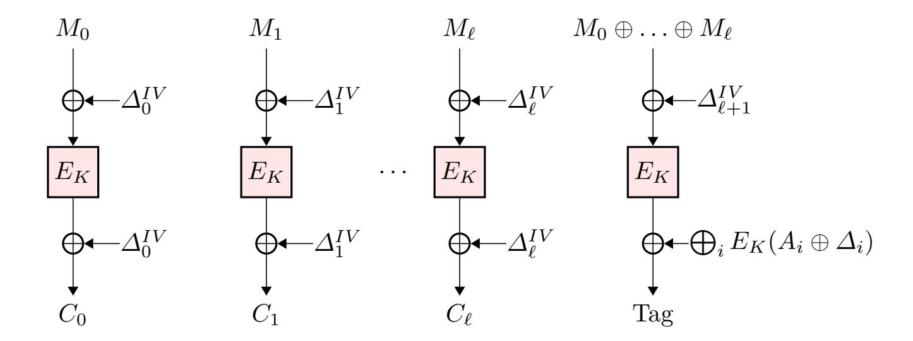
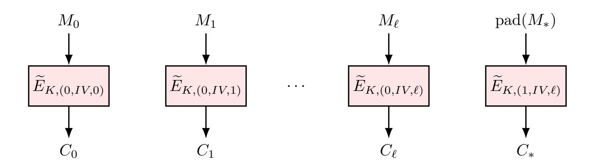
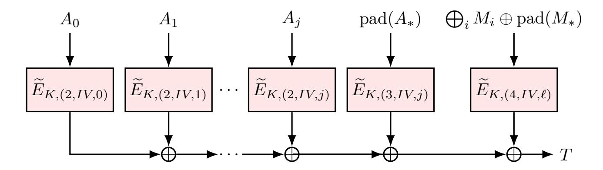

{0}------------------------------------------------

# **QCB: Efficient Quantum-secure Authenticated Encryption**

Ritam Bhaumik<sup>1</sup> , Xavier Bonnetain<sup>2</sup>*,*<sup>3</sup> , André Chailloux<sup>1</sup> , Gaëtan Leurent<sup>1</sup> María Naya-Plasencia<sup>1</sup> , André Schrottenloher<sup>4</sup> , and Yannick Seurin<sup>5</sup>

,

1 Inria, Paris, France firstname.lastname@inria.fr

2 Institute for Quantum Computing, Department of Combinatorics and Optimization, University of Waterloo, Waterloo, Canada

<sup>3</sup> Université de Lorraine, CNRS, Inria, Nancy, France <sup>4</sup> Cryptology Group, CWI, The Netherlands

> first.last@m4x.org <sup>5</sup> ANSSI, Paris, France

first.last@m4x.org

**Abstract.** It was long thought that symmetric cryptography was only mildly affected by quantum attacks, and that doubling the key length was sufficient to restore security. However, recent works have shown that Simon's quantum period finding algorithm breaks a large number of MAC and authenticated encryption algorithms when the adversary can query the MAC/encryption oracle with a quantum superposition of messages. In particular, the OCB authenticated encryption mode is broken in this setting, and no quantum-secure mode is known with the same efficiency (rate-one and parallelizable).

In this paper we generalize the previous attacks, show that a large class of OCB-like schemes is unsafe against superposition queries, and discuss the quantum security notions for authenticated encryption modes. We propose a new rate-one parallelizable mode named QCB inspired by TAE and OCB and prove its security against quantum superposition queries.

**Keywords:** authenticated encryption, lightweight cryptography, QCB, postquantum cryptography, provable security, tweakable block ciphers.

## **1 Introduction**

The cryptographic community has launched many competitions and standardization efforts recently. The most recent ones are the CAESAR competition for authenticated encryption (AE) and the NIST standardization processes for post-quantum public-key primitives (PQC) [27] and lightweight cryptography

<sup>©</sup> IACR 2021. This is the full version of the paper published by Springer-Verlag in the proceedings of ASIACRYPT 2021. The published version is available at: [https://doi.org/10.1007/978-3-030-92062-3\\_23](https://doi.org/10.1007/978-3-030-92062-3_23)

{1}------------------------------------------------

(LWC) [28]. While these competitions have attracted a lot of attention, they have represented rather disjoint efforts: the PQC process focuses on public key cryptography, and post-quantum security has remained out of the scope of most schemes submitted to the LWC process and to the CAESAR competition. A few exceptions exist, like the LWC second-round candidate SATURNIN [16] for instance, which proposes a block cipher and an AE mode aiming at post-quantum security. This is understandable because the impact of quantum computers on symmetric cryptography is expected to be quite limited, and doubling the key length is usually considered a sufficient measure to resist quantum attacks (such as exhaustive key search with Grover's algorithm).

Security in the superposition model. However, recent works [22, 32] have shown that many MAC and AE modes are broken in the superposition model using Simon's quantum period finding algorithm [33]. In this model, the adversary is capable of accessing a quantum encryption oracle, and of encrypting quantum states. Though the practical significance of attacks in this model is an unsettled issue in the community and opinions might differ, there is a clear consensus on the importance of having provable security in this scenario. First of all, this model is non-trivial, meaning that there exist secure schemes in this model. It also offers better composability, even if we are interested only in quantum adversaries making classical queries. Finally, it captures intermediate scenarios with some level of quantum interaction between the attacker and the oracle and covers the scenarios of obfuscation or white-box encryption.

Though lightness and security against quantum adversaries are two very different topics, let us remark that they are not orthogonal. In particular, SAT-URNIN is a submission to the LWC effort claiming security in the superposition model, based on a block cipher. But its authenticated encryption mode is not parallelizable and requires two encryption calls per message block. More precisely, it uses the encrypt-then-MAC construction and combines a quantum-secure mode of encryption (the Counter Mode) with a quantum-secure MAC similar to HMAC/NMAC.

Towards a quantum-safe rate-one AE mode. OCB [23] is one of the most influential authenticated encryption modes. OCB3 is parallelizable, and is a rate-one scheme, using just one block cipher call per block of message. It is proven secure in the classical setting provided that its underlying block cipher is a strong PRP [8]. Nevertheless, several attacks using Simon's algorithm [33] were proposed in [22], with a complexity that is linear in the size of the state. These attacks, that we recall in Section 3, can efficiently recover a hidden secret period if the attacker is allowed to query messages in superposition.

Our work started with the idea to make OCB post-quantum secure: we wanted to identify its weaknesses, correct them and obtain a proof of quantum security. The main contribution of this paper is to fill this gap and to propose such a mode together with a proof of security.

<sup>&</sup>lt;sup>f</sup> For example, indistinguishability under quantum encryption queries can be achieved by the Counter Mode from a classical PRP assumption [3].

{2}------------------------------------------------

Results and Organization of the Paper. In Section 2, we recall some standard definitions and technical material for our quantum security proofs and attacks. Note that contrary to most of the recent works on this topic, we shall not require Zhandry's random oracle recording technique [35] and we will use instead simpler proof arguments, that we introduce here. We also introduce an extension of Hosoyamada and Sasaki's truncation technique [20] that allows to compose any linear function with a quantum oracle and compute it with a single query. In Section 3, we define an OCB-like mode with more complex offsets. The previous quantum attack on OCB used the fact that the difference between some offsets was independent of the nonce. We show how to attack this modified OCB with a single quantum query, yielding an attack that can be applied regardless of the nonce dependence. In Section 4, we define quantum-secure tweakable block ciphers. We are interested in adversaries making queries with classical tweaks and a superposition of messages, a setting which corresponds to the attacks on OCB. In this setting, we propose the key-tweak insertion TBC, which requires a relatedkey secure block cipher. In Section 5 we define the new rate-one parallelizable quantum safe mode, QCB, and propose two instances: one using Saturnin with the key-tweak insertion TBC and one using the dedicated TBC TRAX-L-17 [4]. We prove in Section 6 the security of QCB if it is used with a secure TBC. We use two notions: IND-qCPA [10] and BZ-unforgeability [9]. We discuss other possible definitions in Section 7.

## 2 Preliminaries

We open this section with standard notations for permutations, block ciphers and AEAD schemes. We also define the quantum oracle access that will be given to such a scheme in our proof. We recall some standard results and definitions related to quantum provable security. Finally, we introduce our new *linear post-processing* lemma (Lemma 2) that we will use in Section 3 and Section 7.

## 2.1 Definitions and Notations

We let  $\mathcal{P}_n$  denote the set of permutations acting on  $\{0,1\}^n$ . By  $x \stackrel{\$}{\leftarrow} S$  we mean that x is taken uniformly at random from the set S. We let  $\mathcal{A}^{f(\cdot)} \Rightarrow b$  (resp.  $\mathcal{A}^{f(\odot)} \Rightarrow b$ ) denote an algorithm that performs classical queries to oracle f (resp. quantum queries to f) and outputs b. We write  $\mathcal{A}^{f^{\pm}(\cdot \text{ or } \odot)}$  when  $\mathcal{A}$  has access to the f and the  $f^{-1}$  oracle, which we blend into a single oracle  $f^{\pm}$ .

Block Ciphers. A block cipher with key space  $\{0,1\}^k$  and message space  $\{0,1\}^n$  is a map  $E: \{0,1\}^k \times \{0,1\}^n \to \{0,1\}^n$  such that for every key  $K \in \{0,1\}^k$ ,  $M \mapsto E(K,M)$  is a permutation on  $\{0,1\}^n$ . We let  $E_K$  denote the map  $M \mapsto E(K,M)$ . If E is a block cipher then its inverse is the map  $E^{-1}: \{0,1\}^k \times \{0,1\}^n \to \{0,1\}^n$  defined by  $E^{-1}(K,C) = E_K^{-1}(C)$ .

{3}------------------------------------------------

AEADs. An authenticated encryption scheme with associated data (AEAD) is specified by a tuple of sets  $(\mathcal{K}, \mathcal{IV}, \mathcal{A}, \mathcal{M}, \mathcal{C})$  where  $\mathcal{K}$  is the key space,  $\mathcal{IV}$  is the IV space,  $\mathcal{A}$  is the associated data space,  $\mathcal{M}$  is the message space, and  $\mathcal{C}$  is the ciphertext space, and a pair of deterministic algorithms (Enc, Dec) with signatures

$$\begin{split} &\mathsf{Enc} \colon \mathcal{K} \times \mathcal{IV} \times \mathcal{A} \times \mathcal{M} \to \mathcal{C} \\ &\mathsf{Dec} \colon \mathcal{K} \times \mathcal{IV} \times \mathcal{A} \times \mathcal{C} \to \mathcal{M} \cup \{\bot\} \end{split}.$$

We require an AEAD scheme to be correct, *i.e.*, for all  $(K, IV, A, M) \in \mathcal{K} \times \mathcal{IV} \times \mathcal{A} \times \mathcal{M}$ ,

$$Dec(K, IV, A, Enc(K, IV, A, M)) = M$$
.

We write  $\operatorname{Enc}_K(IV, A, M)$  for  $\operatorname{Enc}(K, IV, A, M)$  and similarly  $\operatorname{Dec}_K(IV, A, C)$ . Note that this is the most generic definition of an AEAD, but in our case, we will replace the ciphertext space  $\mathcal{C}$  by  $\mathcal{C} \times \mathcal{T}$ , and the scheme will output a ciphertext C of variable length and an authentication tag  $T \in \mathcal{T}$  of fixed size. As we consider AEADs based on block ciphers, C and M will be parsed into blocks that we index  $M_0, \ldots, M_\ell$  (resp.  $C_0, \ldots, C_\ell$ ) where  $\ell$  is the block length of M (resp. of C).

Quantum Computing. In this paper, an adversary is a quantum algorithm that accesses one or more oracles. We use the quantum circuit model, whose basics can be found in [29]. A quantum algorithm is initiated with a set of m qubits (two-level quantum systems) in a fixed state  $|0\rangle$ . The state of the algorithm lies in a Hilbert space of dimension  $2^m$ , with a canonical basis  $\{|i\rangle, 0 \le i \le 2^m - 1\}$ . Basic unitary operators, called quantum gates (drawn from a universal gate set), are applied on the qubits. These computations are interleaved with oracle calls and partial measurements, which transform a pure state (an element of the Hilbert space) into a mixed state (a probability distribution of pure states). For ease of notation, we often omit normalization factors from quantum states (e.g.,  $\frac{1}{\sqrt{2}}(|0\rangle + |1\rangle)$  can be written  $|0\rangle + |1\rangle$ ).

### 2.2 Quantum Oracles and Query Model

We model quantum oracle access to any function  $f: \mathcal{X} \to \mathcal{Y}$  as a unitary operation:  $|x\rangle |y\rangle \mapsto |x\rangle |y\oplus f(x)\rangle$  (this is the standard oracle) or as  $|x\rangle |y\rangle \mapsto (-1)^{y\cdot f(x)} |x\rangle |y\rangle$  (this is the phase oracle). Standard and phase oracles are well-known to be equivalent.

Choice of IVs. In the classical setting, the security of IV-based AEADs draws on the fact that the IVs of successive queries are distinct and/or randomly chosen. So far, all security notions defined in the quantum setting have followed this setting [10, 3, 17], by considering randomness-based modes where the random IV is chosen at each new (quantum) query. Although a non-trivial extension to superposition IVs might be possible, it remains out of scope of our work.

In this paper, we will use classical and distinct IVs, but relax the randomness assumption. In the security games for AEAD defined and used in Section 6, we

{4}------------------------------------------------

start the game by an initialization phase in which the adversary declares the IVs that he is going to query. This makes our reasoning easier and (as we will justify in Section 6) it includes the cases where IVs are generated at random, or with a stateful counter.

Quantum Query Model. The input plaintext and AD will be in superposition. Furthermore, the bit-length of the message, AD and ciphertext have to be chosen classically and cannot differ within a query; that is, we encrypt a superposition of messages of a fixed length. We let the adversary choose the bit-length of the message and AD in the queries between 0 and  $n\ell$  for a fixed  $\ell$  (which determines the maximal number of blocks to be queried). Thus,  $\ell$  will intervene as a parameter in our bounds, together with the number of queries q.

Hence, our encryption and decryption oracles are actually families of unitary operators, indexed by these lengths and by the IV choice. As the ciphertext will be longer than the plaintext, we consider that the encryption oracles for messages of m bits output c(m) > m bits. Conversely, messages of distinct lengths may be encrypted to ciphertexts of the same length. Hence, the decryption oracle of a ciphertext of c bits writes a canonical encoding of either the message or c on c bits. We write these oracles  $O_{\mathsf{Enc}_K}^{m,a,IV}$  and  $O_{\mathsf{Dec}_K}^{c,a,IV}$  respectively, with  $0 \leq m, a \leq \ell n$ .

The encryption  $O_{\mathsf{Enc}_K}^{m,a,IV}$  is a standard oracle for  $\mathsf{Enc}_K$  with messages of length m, AD of length a and a fixed  $IV \in \mathcal{IV}$ :

$$\underbrace{|A\rangle}_{a \text{ qubits}} \quad \underbrace{|M\rangle}_{m \text{ qubits}} \quad \underbrace{|X\rangle}_{c(m)} \quad \mapsto |A\rangle \, |M\rangle \quad \underbrace{|X \oplus \mathsf{Enc}_K \, (IV,A,M)\rangle}_{c(m) \text{ qubits}} \quad .$$

The decryption  $O_{\mathsf{Dec}_K}^{c,a,IV}$  is a standard oracle for  $\mathsf{Dec}_K$  with ciphertexts of length c, AD of length a and a fixed IV:

$$\underbrace{\frac{|A\rangle}{a \text{ qubits}}}_{c \text{ qubits}} \underbrace{\frac{|C\rangle}{c \text{ qubits}}}_{c \text{ qubits}} \mapsto \begin{cases} |A\rangle \, |C\rangle \, \left| Y \oplus \widehat{M} \right\rangle \text{ if } C = \mathsf{Enc}_K \left( IV, A, M \right) \\ |A\rangle \, |C\rangle \, \left| Y \oplus \widehat{\bot} \right\rangle \text{ otherwise}$$

with  $\widehat{M}$  the encoding of M and  $\widehat{\perp}$  the encoding of  $\perp$ .

Counting Data, Time and Memory. While the oracles authorize messages, AD and ciphertexts to take any number of bits, the modes that we will consider are built on block ciphers with a fixed block size n. Hence, we can count the data complexity in the number of blocks queried: a query to  $\mathsf{Enc}_K$  or to  $O_{\mathsf{Enc}_K}$  with  $\ell$  blocks costs  $\ell$  data. We count the time complexity either in the number of quantum gates, or in the number of block cipher calls, as a quantum standard oracle. We consider the cost of a single block cipher call to be marginal with respect to the other terms, as it is polynomial in n, making these definitions equivalent. The memory will also be counted in n-bit registers, either classical or quantum.

{5}------------------------------------------------

#### 2.3 Distances

Usually, in game-based definitions, the adversary's advantage is a difference in probabilities to output 1 or 0. However, since our adversaries are quantum, their final state is a quantum state. It is well-known that the *Euclidean distance* between quantum states is related to the distance between the distributions that result from measuring these states. Thus, the probabilistic interpretation of the adversary's result (measuring 0 or 1) can be replaced by a Euclidean distance.

**Definition 1 (Euclidean distance).** The Euclidean distance between  $|\phi\rangle = \sum \alpha_i |i\rangle$  and  $|\psi\rangle = \sum \beta_i |i\rangle$  is given by:  $||\phi\rangle - |\psi\rangle || = \sqrt{\sum_i |\alpha_i - \beta_i|^2}$ .

Two quantum states  $|\phi\rangle = \sum \alpha_i |i\rangle$  and  $|\psi\rangle = \sum \beta_i |i\rangle$ , obtained after running an adversary in two different scenarios, incur two distributions  $\mathcal{D}$  and  $\mathcal{D}'$  over the states in the computational basis (we could also take another basis, without any change, since composing by a unitary operator leaves the distance unchanged). These distributions are such that  $\mathcal{D}(i) = |\alpha_i|^2$  and  $\mathcal{D}'(i) = |\beta_i|^2$ . The total variation distance between  $\mathcal{D}$  and  $\mathcal{D}'$  is defined as  $\sum_i |\mathcal{D}(i) - \mathcal{D}'(i)|$  and equal to  $\sum_i ||\alpha_i|^2 - |\beta_i|^2|$ . From Lemma 3.6 in [7], we obtain:  $\sum_i ||\alpha_i|^2 - |\beta_i|^2| \le 4||\phi\rangle - |\psi\rangle||$ .

The decision of a quantum adversary to output 0 or 1 is conditioned only on its final state. Thus, if two adversaries have similar end states, they can only win with similar probabilities.

**Lemma 1.** Let  $\mathcal{A}$  be a quantum adversary that outputs a bit b. Let  $\mathcal{B}$  be another adversary that also outputs a bit b, and let  $|\psi\rangle$  and  $|\phi\rangle$  be their respective states after the last oracle query, before measuring their output in the computational basis. Then:

$$|\Pr[\mathcal{A}(\cdot) = 1] - \Pr[\mathcal{B}(\cdot) = 1]| \le 4||\psi\rangle - |\phi\rangle||.$$

In practice, we will consider a game in which some parameter is selected at random (e.g., the key K), then the game runs and the final state of the adversary depends on K. We are interested in the quantity  $|\Pr_{K \overset{\$}{\leftarrow} \mathcal{K}} [\mathcal{A}(\cdot) = 1] - \Pr_{K \overset{\$}{\leftarrow} \mathcal{K}} [\mathcal{B}(\cdot) = 1]|$  which determines the difference in advantage between the two adversaries. We have:  $\Pr_{K \overset{\$}{\leftarrow} \mathcal{K}} [\mathcal{A}(\cdot) = 1] = \sum_{k \in \mathcal{K}} \Pr[K = k] \Pr[\mathcal{A}(\cdot) = 1|K = k]$ . That is, we can write:

$$|\Pr_{K \overset{\$}{\leftarrow} \mathcal{K}} [\mathcal{A}(\cdot) = 1] - \Pr_{K \overset{\$}{\leftarrow} \mathcal{K}} [\mathcal{B}(\cdot) = 1] |$$

$$\leq \frac{1}{|\mathcal{K}|} \sum_{k \in \mathcal{K}} |\Pr[\mathcal{A}(\cdot) = 1 | K = k] - \Pr[\mathcal{B}(\cdot) = 1 | K = k] |$$

$$\leq \frac{4}{|\mathcal{K}|} \sum_{k} || |\psi_k \rangle - |\phi_k \rangle ||,$$

where  $|\psi_k\rangle$  and  $|\phi_k\rangle$  are the final states conditioned on the fact that the selected key is k. So in practice, we will fix all the random parameters, compute the euclidean distance between the end states and take the average.

{6}------------------------------------------------

### 2.4 Query magnitude

We will use a "query magnitude" argument, taken from [6]. Considering an oracle O with arbitrarily defined input and output registers, we modify O on a subset D of its inputs to make the oracle O'. If an algorithm asks queries to O, but puts only "low amplitude" on the inputs of D, then changing O into O' does not have any significant impact on the final state.

**Theorem 1 (Adapted from [6], Theorem 3.3).** Let A be a quantum algorithm that makes q queries to an oracle O and let  $|\psi_0\rangle, \ldots, |\psi_q\rangle$  be the current state before each query  $(|\psi_q\rangle)$  is the final state). Let O' be an oracle that is the same as O, except on some subset D of its inputs, A' be the same as A, except that every query to O is replaced by a query to O', and  $|\psi'_i\rangle$  the state of A'. At each step of the circuit computation, we let  $|x\rangle|y\rangle|a\rangle$  denote the basis states, where  $|x\rangle$  is the input to O (or O'),  $|y\rangle$  is the output register and  $|a\rangle$  the rest of the qubits. Let  $P_D$  be the projector on the basis states such that  $x \in D$ . Then:

$$\| |\psi_q\rangle - |\psi_q'\rangle \| \le 2\sum_i |P_D(|\psi_i\rangle)|$$
.

#### 2.5 On Random Functions and Permutations

We will use the following results from the literature. First of all, as shown by Zhandry, it is impossible to distinguish a random function with n-bit domain from a random permutation with probability bigger than  $\mathcal{O}\left(\frac{q^3}{2^n}\right)$  with q queries (where the constant in the  $\mathcal{O}$  is fixed by the theorem); and conversely. We refer to this statement as PRF-PRP switching.

**Theorem 2** ([34], **Theorem 3.1**). Let  $h: \{0,1\}^n \to \{0,1\}^m$  be a random function. Any quantum algorithm making q quantum queries to h can only find a collision with probability at most  $\mathcal{O}\left(\frac{q^3}{2^m}\right)$ . If  $n \leq m$ , then any quantum algorithm making q queries cannot distinguish h from a random injective function except with probability  $\mathcal{O}\left(\frac{q^3}{2^m}\right)$ .

Second, we use a theorem by Boneh and Zhandry that shows that a quantum algorithm making q queries to a random oracle with a domain of exponential size can only output q + 1 valid {input, output} pairs with negligible probability.

**Theorem 3 ([9], Theorem 4.1).** Let  $\mathcal{A}$  be a quantum algorithm making q queries to a random oracle  $h: \{0,1\}^n \to \{0,1\}^m$ , and producing k > q pairs  $(x_i, y_i) \in \{0,1\}^n \times \{0,1\}^m$ . The probability that the  $x_i$  are distinct and  $y_i = h(x_i)$  for all  $1 \le i \le k$  is at most:  $\frac{1}{2^{mk}} \sum_{r=0}^{q} \binom{k}{r} (2^m - 1)^r$ . If k = q + 1 then the adversary succeeds with probability at most  $\frac{q+1}{2^m}$ .

We will use the terminology "(q, q + 1) security game" to refer to the game in which  $\mathcal{A}$  accesses  $O_h$  q times and must produce q + 1 valid pairs. An alternative

{7}------------------------------------------------

proof of Theorem 3 for the q, q + 1 case can be found in the full version of [1]. By combining this theorem with Theorem 2, we obtain a similar statement for random permutations.

Corollary 1. There exists a constant c such that, if  $\mathcal{A}$  is a quantum algorithm making q queries to a random permutation  $\Pi: \{0,1\}^n \to \{0,1\}^n$  and trying to produce q+1 valid input-output pairs, then  $\mathcal{A}$  can only succeed with probability at most:  $c\frac{q^3}{2^n}$ .

The term in Corollary 1 is simply the sum of the PRP-PRF distinguishing advantage and the (q, q + 1) advantage. The former grows much faster with q, but we will mostly use Corollary 1 with a single query, where both terms are  $\mathcal{O}(2^{-n})$ .

## 2.6 Computing a Linear Function of a Quantum Oracle

In [20] Hosoyamada and Sasaki show that given access to a standard oracle  $O_f$  for a function f, it is possible to make a quantum query to Trunc(f(x)), the truncation of the output f(x) to some bits, using only one quantum query to f. We now extend this result, and show that it is possible to compute any linear function of the output using only one quantum query. This is especially important with the oracles we will be using, since they involve IVs that are changed at each new quantum query.

The core observation in [20] is simple: the state  $|0\rangle + |1\rangle$  is invariant whether we XOR a 0 or a 1 on it. Hence, before the query, in the output register, we can set the qubits we want to drop to  $|0\rangle + |1\rangle$  and the qubits we want to keep to  $|0\rangle$ . We will now extend this result, with the following lemma:

Lemma 2 (Computing a linear function of a quantum oracle). Let  $f: \{0,1\}^n \to \{0,1\}^m$  be a function,  $O_f: |x\rangle |y\rangle \mapsto |x\rangle |y \oplus f(x)\rangle$ . Let  $g: \{0,1\}^m \to \{0,1\}^o$  be an  $\mathbb{F}_2$ -linear function. Then it is possible to construct the oracle  $O_{g \circ f}: |x\rangle |y\rangle \mapsto |x\rangle |y \oplus (g \circ f)(x)\rangle$  using two queries to  $O_g$  and a single query to  $O_f$ .

*Proof.* Let  $O_g$  be a quantum oracle that implements g, assume we are given the quantum state  $|x\rangle\,|y\rangle$ . We first add an ancilla register containing the uniform superposition on m bits. We then have the state  $|x\rangle\,|y\rangle\sum_{z=0}^{2^m-1}|z\rangle\,$ . Then, we apply  $O_g$  with register z as input and y as output, and we get

$$|x\rangle \sum_{z=0}^{2^m-1} |y \oplus g(z)\rangle |z\rangle$$
.

Then, we apply  $O_f$  with register x as input and z as output. We get

$$|x\rangle \sum_{z=0}^{2^m-1} |y \oplus g(z)\rangle |z \oplus f(x)\rangle$$
.

{8}------------------------------------------------

Finally, we reapply  $O_g$  with register z as input and y as output. We get

$$|x\rangle \sum_{z=0}^{2^m-1} |y \oplus g(z) \oplus g(z \oplus f(x))\rangle |z \oplus f(x)\rangle$$
.

As g is linear, we have  $g(z) \oplus g(z \oplus f(x)) = g(f(x))$ . Hence, the state can be rewritten as

$$|x\rangle |y \oplus g(f(x))\rangle \sum_{x=0}^{2^m-1} |z \oplus f(x)\rangle$$
.

This state can then be simplified, as the z register contains the uniform superposition over m bits, independently of the value of f(x), to

$$|x\rangle |y \oplus g(f(x))\rangle \sum_{z=0}^{2^m-1} |z\rangle$$
.

We can now remove the z register, as it is not entangled with the others, and obtain the quantum state we wanted.

Remark 1. Lemma 2 can also be applied if the quantum oracle to f uses a group law different from  $\oplus$  to update its output register. In that case, g shall be a linear function for the corresponding group law.

## 3 Offsets don't work

In this section we start by recalling the superposition attacks on OCB from [22]. We will next present a first attempt to repair it, that consists of tweaking the value of the *offsets*, along with a new original superposition attack that shows that any offset-based variant can be broken using Simon's algorithm.

### 3.1 Attack with Simon's Algorithm on OCB

OCB<sup>g</sup> [23] is one of the most influential authenticated modes. OCB3 is represented in Figure 1, with  $\Delta_i = \text{gray}(i) \cdot E_K(0^n)$  (using a finite field multiplication) and  $\Delta_i^{IV} = \Delta_i \oplus F_K(IV)$ , with F a simple function of K and IV and gray(i) the gray encoding of i.

OCB3 is classically proven secure if its underlying cipher is a strong PRP.

**Simon's algorithm.** Simon's algorithm, proposed in [33] allows to solve efficiently, with a complexity of  $\mathcal{O}(n)$ , the following problem when we are allowed to ask superposition queries to  $\mathcal{F}$ :

g Three versions of OCB have been proposed. We focus here on the last one, OCB3, while all three suffer from similar superposition attacks.

{9}------------------------------------------------



**Fig. 1.** OCB3.  $(M_i)$  is the message,  $(A_i)$  is the associated data.

Given a Boolean function  $\mathcal{F}$  on n bits and the promise that there exists s such that, for any  $x \neq y$ ,  $\mathcal{F}(x) = \mathcal{F}(y) \iff x = y \oplus s$ , find s.

Simon's algorithm recovers a vector orthogonal to the period with a single quantum query; with  $\mathcal{O}(n)$  queries, the period is deduced with linear algebra. As shown in [22], a sufficient condition on  $\mathcal{F}$  is that there exists no "unwanted period"  $t \neq s$  such that  $\mathcal{F}(x \oplus t) = \mathcal{F}(x)$  holds with probability  $\geq \frac{1}{2}$ . For comparison, classically, the best algorithm requires  $\Omega\left(\sqrt{2^n}\right)$  queries.

Quantum Superposition Attacks on OCB. Two polynomial-time attacks against OCB that require quantum superposition queries to the construction were proposed in [22]. They both use Simon's algorithm<sup>h</sup>.

The main weakness of OCB is that the nonce only influences the construction through the value  $\Delta$ , which is XORed to the internal state. The scenario of the attack considers that the attacker has access to a superposition oracle that given a superposition of messages as input, returns the superposition of their encryption. The key is a secret value and the IV is different for each query.

The first attack considers an empty message, and two variable identical blocks x of associated data. The output is then

$$E_K(F_K(IV)) \oplus E_K(x \oplus \Delta_1) \oplus E_K(x \oplus \Delta_2)$$
.

This function is periodic, of period  $\Delta_1 \oplus \Delta_2$ . It is IV-dependent, but the period is not. This allows to use Simon's algorithm to recover the period.

The second attack uses the same idea, but attacks the encryption part and not the authentication. Its core idea is to consider the XOR of two distinct blocks i and j that encrypt the same message block. This is equal to  $f_{i,j}(x) = E_K(\Delta_i^{IV} \oplus x) \oplus E_K(\Delta_j^{IV} \oplus x) \oplus \Delta_i^{IV} \oplus \Delta_j^{IV}$ .

<sup>&</sup>lt;sup>h</sup> One attack on OCB presented in [22] was partial, as it assumed without any mention the use of Lemma 2.

{10}------------------------------------------------

This function is periodic, of period  $\Delta_i^{IV} \oplus \Delta_j^{IV} = (\operatorname{gray}(i) \oplus \operatorname{gray}(j)) \cdot E_K(0^n)$ . We can then use Simon's algorithm, and this time we need to use Lemma 2 to compute the XOR of two blocks using only one query.

Both attacks recover the difference of two offsets, which is sufficient to make some forgeries. Note that in both cases, the existence of an unwanted period t would imply a high-probability higher-order differential of  $E_K$ , which would result in a classical break.

## 3.2 A First (Failed) Attempt to Fix OCB

To protect a mode vulnerable to Simon's algorithm, Alagic and Russell [2] proposed to replace the XOR by modular addition. However, this merely increases the attack complexity from polynomial to subexponential [15], which does not give acceptable security levels for standard block sizes (e.g., 256 bits).

In order to make OCB quantum-resistant, we will rather try to avoid these attacks entirely. Our first idea is to avoid having an IV-independent period, by making the influence of  $E_K(IV)$  different for each block. For instance,  $\Delta_i$  could be changed to a multiple of  $E_K(IV)$ :  $\Delta_i = i \cdot E_K(IV)$ . (The multiplication is still done in the finite field, like in OCB's offsets). This way, the previous attack could only recover one bit of  $E_K(IV)$  at a time, which is useless if the IV changes for each query.

New superposition attack for any nonce-based solution. Actually, the previous proposal is still unsafe, but it requires a new more advanced attack that we present here. This evolved attack is inspired by the multiple-period attacks from [11]. Its core idea is to leverage the possibility to encrypt a long message to construct multiple copies of the periodic function, in such a way that one query will likely be enough to recover all the bits of the period.

Let g be the function that maps the sequence  $(x_1, x_2, \ldots, x_{2n-1}, x_{2n})$  to  $(x_1 \oplus x_2, x_3 \oplus x_4, \ldots, x_{2n-1} \oplus x_{2n})$ .

We consider the function

$$f(x_1,...,x_n) = g \circ OCB(x_1,x_1,x_2,x_2,...,x_n,x_n)$$

Reusing the notation  $f_{i,j}(x) = E_K(\Delta_i \oplus x) \oplus E_K(\Delta_j \oplus x) \oplus \Delta_i \oplus \Delta_j$ , we have

$$f(x_1, \dots, x_n) = (f_{1,2}(x_1), f_{3,4}(x_2), \dots f_{2n-1,2n}(x_n))$$

This function is periodic, of period:

$$s = \Delta_1 \oplus \Delta_2, \dots, \Delta_{2n-1} \oplus \Delta_{2n} = (1 \oplus 2) \cdot E_K(IV), \dots, ((2n-1) \oplus (2n)) \cdot E_K(IV)$$

We can also bound the probability of unwanted collisions. If f admits an unwanted period t with probability greater than  $\frac{1}{2}$ , then one of the  $f_{i,j}$  would also admit an unwanted period  $t_{i,j}$  with probability greater than  $\frac{1}{2n}$ . As before, this is impossible if  $E_K$  does not admit a high-probability higher-order differential.

Hence, Simon's algorithm allows us to sample one vector orthogonal to each of the periods of the involved  $f_{i,j}$ . As these periods are linearly dependent, this is enough to recover completely the value  $E_K(IV)$ , assuming n is large enough.

{11}------------------------------------------------

**Conclusion.** This attack shows that a solution based on offsets is unlikely to work. After this failed attempt, we decided to move one step backwards. OCB can be seen as an instantiation of the mode TAE or  $\Theta$ CB, which is defined with a *Tweakable Block Cipher* (TBC). The TBC used in OCB is the LRW mode [25], which builds upon a block cipher, and is quantumly broken [22]. The attacks that we gave all seem to stem from the TBC itself, not the mode.

## 4 Quantum-secure Tweakable Block Ciphers

In this section, we define quantum-secure tweakable block ciphers (TBCs). We give a TBC construction based on a block cipher in the *ideal cipher model*, which we will recall below, and explicitly provide its security guarantees.

### 4.1 Definitions

**Definition 2.** Let E be a block cipher. Let A be an oracle algorithm (making either classical or quantum queries depending on the case) which outputs a bit. The advantage of A against the PRP and Strong PRP (SPRP) security of E is defined as:

$$\mathbf{Adv}_{E(*)}^{\mathrm{PRP}}(\mathcal{A}) := \left| \Pr_{K \overset{\$}{\leftarrow} \{0,1\}^k} [\mathcal{A}^{E_K(*)} \Rightarrow 1] - \Pr_{\Pi \overset{\$}{\leftarrow} \mathcal{P}_n} [\mathcal{A}^{\Pi(*)} \Rightarrow 1] \right|$$

$$\mathbf{Adv}_{E(*)}^{\mathrm{SPRP}}(\mathcal{A}) := \left| \Pr_{K \overset{\$}{\leftarrow} \{0,1\}^k} [\mathcal{A}^{E_K^{\pm}(*)} \Rightarrow 1] - \Pr_{\Pi \overset{\$}{\leftarrow} \mathcal{P}_n} [\mathcal{A}^{\Pi^{\pm}(*)} \Rightarrow 1] \right|$$

Depending on the access that the adversary has (classical or quantum) to the messages, we replace the \* symbol by  $\cdot$  (classical) or  $\odot$  (quantum).

Tweakable Block Ciphers. A tweakable block cipher (TBC) with key space  $\{0,1\}^k$ , tweak space  $\{0,1\}^t$ , and message space  $\{0,1\}^n$  is a map  $\widetilde{E} \colon \{0,1\}^k \times \{0,1\}^t \times \{0,1\}^n \to \{0,1\}^n$  such that for every key  $K \in \{0,1\}^k$  and every tweak  $T \in \{0,1\}^t$ ,  $M \mapsto \widetilde{E}(K,T,M)$  is a permutation of  $\{0,1\}^n$ . We let  $\widetilde{E}_K$  denote the map  $(T,M) \mapsto \widetilde{E}(K,T,M)$ . If  $\widetilde{E}$  is a TBC then its inverse is the map  $\widetilde{E}^{-1} \colon \{0,1\}^k \times \{0,1\}^t \times \{0,1\}^n \to \{0,1\}^n$  defined by  $\widetilde{E}^{-1}(K,T,C)$  being the unique M such that  $\widetilde{E}(K,T,M) = C$ . A tweakable permutation with tweak space  $\{0,1\}^t$  and message space  $\{0,1\}^n$  is a map  $\widetilde{H} \colon \{0,1\}^t \times \{0,1\}^n \to \{0,1\}^n$ . We let  $\widetilde{\mathcal{P}}_{t,n}$  denote the set of all tweakable permutations with tweak space  $\{0,1\}^t$  and message space  $\{0,1\}^n$ .

**Definition 3.** Let A be an oracle algorithm making (classical or quantum) queries and which outputs a bit. The advantage of A against the TPRP, resp.

{12}------------------------------------------------

strong TPRP (STPRP) security of  $\widetilde{E}$  is defined as

$$\mathbf{Adv}_{\widetilde{E}(*,*)}^{\mathrm{TPRP}}(\mathcal{A}) := \begin{vmatrix} \Pr_{K \overset{\$}{\leftarrow} \{0,1\}^k} [\mathcal{A}^{\widetilde{E}_K(*,*)} \Rightarrow 1] - \Pr_{\widetilde{\Pi} \overset{\$}{\leftarrow} \widetilde{\mathcal{P}}_{t,n}} [\mathcal{A}^{\widetilde{\Pi}(*,*)} \Rightarrow 1] \end{vmatrix}$$
$$\mathbf{Adv}_{\widetilde{E}(*,*)}^{\mathrm{STPRP}}(\mathcal{A}) := \begin{vmatrix} \Pr_{K \overset{\$}{\leftarrow} \{0,1\}^k} [\mathcal{A}^{\widetilde{E}_K^{\pm}(*,*)} \Rightarrow 1] - \Pr_{\widetilde{\Pi} \overset{\$}{\leftarrow} \widetilde{\mathcal{P}}_{t,n}} [\mathcal{A}^{\widetilde{\Pi}^{\pm}(*,*)} \Rightarrow 1] \end{vmatrix}.$$

Depending on the access that the adversary has (classical or quantum) to the messages and to the tweaks, we replace the \* symbols by  $\cdot$  (classical) or  $\odot$  (quantum).

The modified (S)TPRP Game. In the proofs of this section, we consider an adversary  $\mathcal{A}$  playing a modified (S)TPRP game that consists of three phases:

- Pre-Declaration Phase: In the first phase,  $\mathcal{A}$  declares a set of m tweaks  $\{T_1, \ldots, T_m\}$ .
- Quantum Phase: In the second phase,  $\mathcal{A}$  gets access to a standard oracle implementing either  $\widetilde{E}_K^{(\pm)}$  or  $\widetilde{\Pi}^{(\pm)}$ , and can make  $q_1$  quantum queries with classical tweaks, subject to the restriction that the tweak is always chosen from the set of pre-declared tweaks  $\{T_1, \ldots, T_m\}$ , then measures its final state and outputs  $s_0$  classical bits;
- Classical Phase: In the final phase,  $\mathcal{A}$  makes an additional  $q_2$  classical queries to the oracle, this time with no restriction on the set of tweaks that can be queried, such that the queries are deterministic functions of the  $s_0$  classical bits output at the end of the previous phase.

Thus, the bounds that we will obtain will depend on the number of pre-declared tweaks m, the number of quantum queries  $q_1$  made by  $\mathcal{A}$ , the number of classical bits  $s_0$  output at the end of the quantum phase, and the number of classical queries  $q_2$  made by  $\mathcal{A}$ . Note that in the quantum phase some of the pre-declared tweaks may be used multiple times, and some can be ignored entirely. We use the notation  $\mathbf{Adv}^{(S)\text{TPRP}}_{\widetilde{E}(\cdot,\widehat{\bullet})}(\mathcal{A})$  for this restricted case.

**TBCs from Block Ciphers.** In this section, we will construct a TBC from a block cipher, and prove security in the *ideal cipher model*. In the quantum setting, this model was previously considered by Hosoyamada and Yasuda [21] to analyze the Davies-Meyer and Merkle-Damgard constructions. This means that the underlying block cipher E is chosen uniformly at random from the set  $\mathcal{BC}_{k,n}$  of all block ciphers with key space  $\{0,1\}^k$  and message space  $\{0,1\}^n$  at the beginning of the (S)TPRP distinguishing game and the adversary is allowed to make quantum queries to  $E^{\pm}$  (specifying the key and the plaintext/ciphertext).

{13}------------------------------------------------

The advantage is then defined as

$$\mathbf{Adv}_{\widetilde{E}}^{(\mathrm{S)TPRP}}(\mathcal{A}) := \begin{vmatrix} \Pr[\mathcal{A}^{\widetilde{E}_{K}^{(\pm)}(*,*),E_{\bigodot}^{\pm}(\bigodot)} \Rightarrow 1] - \Pr[\mathcal{A}^{\widetilde{\Pi}^{(\pm)}(*,*),E_{\bigodot}^{\pm}(\bigodot)} \Rightarrow 1] \\ K \leftarrow \{0,1\}^{k} & \widetilde{\Pi} \leftarrow \widetilde{\mathcal{P}}_{t,n} \\ E \leftarrow \mathcal{BC}_{k,n} & E \leftarrow \mathcal{BC}_{k,n} \end{vmatrix}.$$

(Note that the adversary has access to  $E^{\pm}$  even in the non-strong TPRP definition.)

## 4.2 Impossibility Results

In order to illustrate the difficulties of building a quantum-secure TBC, even in a weak sense, let us first consider a few examples.

**LRW.** The LRW mode [25] uses an almost 2-XOR universal hash function family  $\mathcal{H}$  and adds  $h \in \mathcal{H}$  to the key:

$$\widetilde{E}_{K,h}(T,x) = E_K(h(T) \oplus x) \oplus h(T)$$
.

An  $\epsilon$ -almost 2-XOR universal hash function family  $\mathcal{H}$  is such that for all x, y, z with  $x \neq y$ , the probability of  $h(x) \oplus h(y) = z$  is small (less than  $\epsilon$ ) when h is chosen at random. Classically, LRW is a strong TBC.

However, the LRW mode is not a quantum-secure TBC even if we allow only classical queries to the tweaks. This was shown in [22], with an attack that is close to the OCB attacks: by querying only two classical tweaks  $T_0$ ,  $T_1$ , one can build a function:  $f(x) = E_k(h(T_0) \oplus x) \oplus h(T_0) \oplus E_k(h(T_1) \oplus x) \oplus h(T_1)$  which is periodic, of period  $h(T_0) \oplus h(T_1)$ . Using Simon's algorithm, we can recover the period of this function in  $\mathcal{O}(n)$  queries. This provides a powerful distinguisher, as this property is extremely unlikely with random permutations. Note that this distinguisher still applies for any function h, even if it is an unknown qPRF.

**Key-tweak Insertion.** We will consider the key-tweak insertion TBC, built from a block cipher E as:  $\widetilde{E}_K(T,M) = E_{K \oplus T}(M)$ . It admits a simple distinguisher based on Simon's algorithm if the tweaks are queried in superposition: this is the quantum related-key attack of [31]. Indeed, the function  $f(\odot) = E_{K \oplus \odot}(0) \oplus E_{\odot}(0)$  admits K as a period, and so we can use Simon's algorithm again.

## 4.3 Proof of Security for the Key-tweak Insertion TBC

Let  $\widetilde{E}_K^{\pm}(T,x) = E_{K\oplus T}^{\pm}(x)$  denote the key-tweak insertion TBC. The following proposition shows the STPRP security of this TBC in the ideal cipher model against an adversary playing the modified STPRP game described earlier. We give its proof in Appendix A.

{14}------------------------------------------------

**Proposition 1.** Let A be an adversary who makes  $q_1$  quantum queries to an oracle implementing  $\widetilde{E}_K^{\pm}$  or  $\widetilde{\Pi}^{\pm}$  with a pre-declared set of tweaks of size m, and q' queries to  $E^{\pm}$ , followed by outputting  $s_0$  bits and making  $q_2$  classical queries to the same oracle. Then:

$$\left| \Pr_{K \overset{\$}{\leftarrow} \mathcal{K}} [\mathcal{A}^{\widetilde{E}_{K}^{\pm}(\cdot, \odot), E_{\odot}^{\pm}(\odot)} \Rightarrow 1] - \Pr_{\{\Pi_{T}\} \overset{\$}{\leftarrow} \mathcal{P}_{n}} [\mathcal{A}^{\Pi^{\pm}(\cdot, \odot), E_{\odot}^{\pm}(\odot)} \Rightarrow 1] \right|$$

$$\leq 8\sqrt{\frac{mq'^{2}}{2^{k}}} + \sqrt{\frac{q_{2}s_{0}}{2 \cdot 2^{k}}}$$

Notice that the above bound depends on m but not on  $q_1$  which is reminiscent of the classical security bound of this TBC (see [5], Theorem 6.3 and Corollary 6.5) that depends on the number of different tweaks used and not on the number of queries to  $\widetilde{E}^{\pm}$ .

We do not explicit how this set of tweaks is determined. It could for example be chosen by the adversary. In that case of course we should not allow him to have a complete control over the size of this set, i.e., the choice of m, or else he could choose m extremely large which would make the above bound useless.

This proposition implies the security when the adversary queries non-adaptive tweaks (so they are predetermined from the start) in which case  $m = q_1$ , but also allows some adaptivity from a predefined set of tweaks for which we can control the size.

When proving the quantum security of QCB in Section 6, we will use the above proposition, but we will be able to control the value of m which will not be significantly larger than  $q_1$ .

#### 4.4 Other Directions

Quantum-secure TBCs have been independently considered by Hosoyamada and Iwata in [19]. They used a stronger notion of security where tweaks can be queried in superposition, and showed how to construct such a TBC from a block cipher. Their TBC (LRWQ) does not use the ideal cipher model, and only requires the block cipher to be secure as a qPRP. However, they use three block cipher calls for each TBC call, one to process the tweak, and two for the plaintext (before and after XORing the encrypted tweak). Thus, this construction cannot achieve the efficiency that we target. Note that they bound the adversary's advantage, after q queries, by  $\mathcal{O}(\sqrt{q^6/2^n})$ , compared to a classical  $\mathcal{O}(\sqrt{q^2/2^n})$  (assuming respectively that the cipher behaves as a qPRP, and a PRP).

## 5 Definition of QCB

In this section, we describe the QCB mode, an AEAD based on a Tweakable Block Cipher. It is similar to the TAE mode [24, 25] and to  $\Theta$ CB [30, 23]. Throughout

<sup>&</sup>lt;sup>i</sup> Theorem 6.3 in [5] is about related-key attacks, but this implies a corresponding result for the key-tweak insertion TBC, see Theorem 7.1 of the same paper.

{15}------------------------------------------------

## Algorithm 1 QCB

```
Input: message M, associated data A, IV, key K
     Requirements: Initialization vectors should not be reused
     Output: ciphertext C, tag T
 1: Pad the initialization vector if necessary
 2: Split M into full blocks M_0, M_1, \dots M_\ell and a final block M_* (partial or
     empty)
 3: Split A into A_0, A_1, ... A_j, A_*
 4: for all i = 0 to \ell do
         C_i \leftarrow \widetilde{E}_{K,(0,IV,i)}(M_i)
 5:
                                                                            \triangleright Encryption of block i
 6: end for
 7: C_* \leftarrow E_{K,(1,IV,\ell)}(\operatorname{pad}(M_*))
                                                                 ▶ Encryption of the final block
 8: T \leftarrow 0
 9: for all i = 0 to j do
         T \leftarrow T \oplus \widetilde{E}_{K,(2,IV,i)}(A_i)
                                                                               \triangleright Absorb AD block i
10:
11: end for
12: T \leftarrow T \oplus \widetilde{E}_{K,(3,IV,j)}(\operatorname{pad}(A_*))
                                                                     ▶ Absorb the final AD block
13: T \leftarrow T \oplus \widetilde{E}_{K,(4,IV,\ell)} (M_0 \oplus \ldots \oplus M_\ell \oplus \operatorname{pad}(M_*))
14: return C = (C_0 || C_1 || \dots || C_\ell || C_*), T
```

this section,  $\widetilde{E}_{K,t}$  will denote a TBC used with key K and tweak t, of block size n. We separate the tweak space in a cartesian product:  $\mathcal{T} = \mathcal{D} \times \mathcal{IV} \times \mathcal{L}$ . Thus, tweaks are triples (D, IV, j) where D is a domain separator, IV will be an IV, and j will be a block index. Only 5 values of domain separator need to be used.

The mode is defined in Algorithm 1 and represented in Figure 2 and Figure 3. When the message and AD are cut in blocks, the last block ( $M_*$  and  $a_*$  respectively) may be empty. We define the padding scheme pad( $M_*$ ) as appending 10\* (a 1 followed by as many zeroes as necessary to fill the block). Note that due to the padding and structure of QCB, the ciphertext C is always longer than the plaintext M (by n bits at most).



Fig. 2. QCB, encryption.

{16}------------------------------------------------



Fig. 3. QCB, processing of the associated data and computation of the tag.

Avoiding Quantum Attacks. It is important to include the IV in the tweak when processing the AD. Otherwise, there is a quantum forgery attack based on Deutsch's algorithm [14]. In Section 6, we will prove that QCB is secure assuming a weak quantum-secure TBC. We will use the following property, which follows from its definition.

**Proposition 2 (Number of tweaks (informal)).** For a given IV, there exists a set of tweaks T(IV) of size  $|T(IV)| = 5(\ell + 1)$  such that any QCB query comprised of at most  $\ell n$  (included) bits of AD and  $\ell n$  bits of message can only reach tweaks in the set T(IV).

*Proof.* The tweaks are of the form (d, IV, i) where i is a block number between 0 and  $\ell$  (included) and d a domain separator that takes 5 values.

Instantiation with Saturnin: Saturnin-QCB. We propose to instantiate QCB with the block cipher Saturnin [16], a second-round candidate of the NIST LWC process [28]. Saturnin has 256-bit blocks and keys. In addition, the cipher admits a domain separator D of 4 bits. The other modes of operation of the Saturnin submission use values from 0 to 8 included, so we use D=9,10,11,12 and 13 in Algorithm 1. More precisely, the authors of [16] define a variant of Saturnin with 16 Super-rounds aiming at an increased security margin in the related-key scenario, denoted Saturnin<sub>16</sub>. We define:  $\tilde{E}_{k,(D,IV,i)}(x) = \text{Saturnin}_{16}^D(k \oplus (IV||i),x)$ , where we use the key-tweak insertion construction of Section 4 to turn Saturnin<sub>16</sub> into a TBC with 256-bit tweaks. The IV and the block number are simply concatenated. We use IVs of at most 160 bits and authorize up to  $2^{95}$  blocks of data. This construction motivates further inquiry of related-key attacks, as it needs Saturnin<sub>16</sub> to be related-key secure.

Instantiation with a Dedicated TBC: TRAX-QCB. Block ciphers of 256 bits seem more convenient for post-quantum security. However, they are relatively rare (for example, SATURNIN is the only such one in the LWC standardization process). Fortunately, it is possible to instantiate QCB with a dedicated TBC with 256-bit blocks, the TRAX-L-17 cipher of [4]. It has smaller tweaks of 128 bits, contrary to the key-tweak-insertion TBC with SATURNIN, but it has the

{17}------------------------------------------------

advantage of being a dedicated design, with possibly a better security than the tight bound for the key-tweak-insertion. 128 bits allow to fit the 3 bits required for domain separation, 80 bits of IV and 45 bits of block numbering. Thus we can encrypt at most 2 <sup>45</sup> − 1 blocks of plaintext and AD.

## **6 Security of QCB**

We show that, if the underlying TBC is secure under classical tweak queries:

- QCB is IND-qCPA secure (Section 6.2): an adversary making quantum encryption queries cannot distinguish between the encryptions of two classical challenge messages;
- QCB is BZ-unforgeable (Section 6.3): an adversary making *q* quantum encryption queries cannot output *q* + 1 valid IV/AD/ciphertext/tag quadruples.

We discuss other possible (and impossible) security definitions in Section 7.

## **6.1 Definitions**

In all our definitions, the adversary makes *q* superposition queries with distinct pre-declared IVs. The messages and ADs both have a *maximal* length of *`* complete blocks, but the exact length of queries can be chosen adaptively. We will bound the advantage depending only on *q* and *`*. We will use superscripts for separate queries, and subscripts for individual blocks within a query.

*IND-qCPA.* First of all, we recall the definition of the IND-qCPA security game from [10]. In [10], each call to the encryption oracle contains randomness. We extend slightly this definition by making the adversary capable of choosing his IVs. However, we request this choice to be non-adaptive. Thus, the adversary specifies at the start of the game the sequence of IVs that she is going to use.

## **IND-qCPA game**

**Key generation:** *K* \$← K*, b* \$← {0*,* 1}.

**Initialization:** A sends to the challenger a sequence of distinct IVs: (*IV* <sup>1</sup> *, . . . , IV <sup>q</sup>* ), one for each subsequent query.

A can perform *q* − 1 encryption queries and one challenge query (at the very end or somewhere in between). For the *k* th query, the current *IV* is *IV <sup>k</sup>* .

**Encryption queries:** A chooses a message and AD pair (*M, A*), the encryption oracle encrypts (*IV, M, A*) with the current IV and returns the output (*C, T*) to A. Queries can be in superposition.

**Challenge query:** A chooses two classical message/AD pairs (*M*<sup>0</sup> *, A*<sup>0</sup> ), (*M*<sup>1</sup> *, A*<sup>1</sup> ) of the same length and sends them to the challenger. The

{18}------------------------------------------------

challenger encrypts  $(IV, M^b, A^b)$  with the current IV and returns the output  $(C^b, T^b)$ .

**Guess:**  $\mathcal{A}$  outputs a bit b' and wins if b = b'.

For each query, the message and AD length are chosen between 0 and  $\ell n$  bits for a fixed  $\ell$  (superposed messages must have the same length).

The IND-qCPA advantage of an adversary  $\mathcal{A}$  against an AEAD E is:

$$\mathbf{Adv}_E^{\mathrm{IND-qCPA}}(\mathcal{A}) = \left| \Pr \left[ \mathcal{A} \text{ succeeds} \right] - \frac{1}{2} \right| .$$

BZ. We define our "Boneh-Zhandry" (BZ) unforgeability game, which is analogous to the definition of unforgeability for MACs of [9].

## BZ game

Key generation:  $K \stackrel{\$}{\leftarrow} \mathcal{K}$ .

**Initialization:**  $\mathcal{A}$  sends to the challenger a sequence of distinct IVs:  $(IV^1, \dots, IV^q)$ , one for each subsequent query.

**Encryption queries:**  $\mathcal{A}$  chooses a message and AD pair (M, A), the encryption oracle encrypts (IV, M, A) with the current IV and returns the output (C, T) to  $\mathcal{A}$ . Queries can be in superposition.

**Forgeries:** A produces q + 1 quadruples (A, IV, C, T) with any IVs of her choice and succeeds if all these quadruples are valid, that is, for each quadruple, there exists an M such that the encryption of (IV, M, A) is (C, T).

Note that verifying the forgery attempts requires additional queries. Since we assumed a limit on the message and AD lengths of  $\ell$  blocks at most, we will also impose this limit on the forgery attempts of the adversary.

In practice, IVs are often either specified by a counter or chosen at random. We argue here that our security definitions are stronger than these 2 scenarios:

- If the challenger chooses at random  $IV^i$  for each encryption query. Then, he could as well generate all the possible  $IV^1, \ldots, IV^q$  from the start. In our model, an adversary can generate  $IV^1, \ldots, IV^q$  at random and send them to the challenger. The security is the same as before except that the adversary knows the different IVs. This can only help the adversary so being secure in our model implies security in the model where the IVs are chosen at random by the challenger.
- If the IVs are determined by a counter controlled by the challenger. The adversary can decide when he starts the attack and even assume he has control over the first IV which we call  $IV_1$ , then the set of IVs will be

{19}------------------------------------------------

 $\{IV_1, IV_1 + 1, \dots, IV_1 + (q-1)\}$ . In our model, an adversary can do that by declaring this set so again, our model is stronger<sup>j</sup>.

In the IND-qCPA and BZ definitions above, the adversary chooses a sequence of distinct IVs:  $(IV^1, \ldots, IV^q)$ . When proving the security of QCB with oracle access to a tweakable block cipher  $\widetilde{E}$ , this immediately implies that the set T of possible tweaks to  $\widetilde{E}$  is  $T = \bigcup_{i=1}^q T(IV^i)$  hence  $|T| \leq 5(\ell+1)q$  where  $\ell$  is the maximal block length of encryption queries. This control on the size of T allows us to use Proposition 1 in a meaningful way.

## 6.2 IND-qCPA Security

**Theorem 4.** Let  $QCB[\widetilde{E}]$  denote the QCB function with oracle access to the tweakable blockcipher  $\widetilde{E}$ . We consider adversaries making q queries of block length  $\leq \ell$  to  $QCB[\widetilde{E}]$ , then we have:

$$\mathbf{Adv}_{\mathsf{QCB}[\widetilde{E}]}^{\mathsf{Ind-qCPA}}(\mathcal{A}) \le \mathbf{Adv}_{\widetilde{E}(\cdot,\odot)}^{\mathsf{TPRP}}(5(\ell+1)q) , \qquad (1)$$

where the right-hand term is the maximal advantage over all adversaries querying  $\widetilde{E}(\cdot, \odot)$  with at most  $5(\ell+1)q$  pre-declared tweaks.

*Proof.* Suppose  $\mathcal{A}$  is an adversary trying to break the IND-qCPA security of QCB $[\widetilde{E}]$ .  $\mathcal{A}$  performs q encryption or challenge queries of maximum block length  $\ell$  (the exact bit length of the queries can be chosen freely in the range  $0, \ldots, n\ell$ ). Consider the query number i made to QCB (encryption or challenge). From Proposition 2, in this query, the tweakable block cipher  $\widetilde{E}$  is queried with tweaks in the set  $T(IV^i)$  having a fixed size  $|T(IV^i)| = 5(\ell + 1)$ .

We can therefore see  $\mathcal{A}$  as an algorithm performing at most  $q(2\ell+3)$  queries to  $\widetilde{E}$ , with each tweak lying in the fixed set  $T = \bigcup_{i=1}^q T(IV^i)$  with  $|T| \leq 5q(\ell+1)$  (each query contains at most  $\ell$  message and AD blocks, padding blocks and a final checksum block). If we replace  $\widetilde{E}$  with  $\widetilde{H}$  for a random  $\widetilde{H}$ , we get:

$$\left| \mathbf{Adv}_{\mathsf{QCB}[\widetilde{E}]}^{\mathsf{Ind-qCPA}}(\mathcal{A}) - \mathbf{Adv}_{\mathsf{QCB}[\widetilde{H}]}^{\mathsf{Ind-qCPA}}(\mathcal{A}) \right| \leq \mathbf{Adv}_{\widetilde{E}(\cdot, \odot)}^{\mathsf{TPRP}}(5(\ell+1)q) . \tag{2}$$

Finally, consider an adversary  $\mathcal{A}$  playing an IND-qCPA game with QCB[ $\widetilde{H}$ ]. Recall that in the challenge phase,  $\mathcal{A}$  picks two classical plaintext/AD pairs  $(M^0, A^0)$  and  $(M^1, A^1)$  of the same length, after which the challenger picks a random bit b and gives  $(C^b, T^b)$ —the encryption (and tag) of  $(M^b, A^b)$ —to  $\mathcal{A}$ . Since the tweaks used for computing this encryption are all different from all the tweaks used during the query phase, and since  $\widetilde{H}$  is an ideal tweakable random

There is only one case in which the use of a counter may enable an adversary to choose his IVs adaptively: he may wait for the counter to increase in order to reach a wanted IV. But the IV increases only when a message is encrypted so waiting for an IV increase should be essentially considered as costly as performing a query, which implies that the IVs that will be used will be in  $\{IV_1, \ldots, IV_1 + (q-1)\}$ .

{20}------------------------------------------------

permutation, the distribution of  $(C^b, T^b)$  is independent of the distribution of the responses received by  $\mathcal{A}$  during the query phase. Since b is a random bit, if b' is the bit output by  $\mathcal{A}$ , the probability that b = b' is always 1/2. Furthermore, this holds irrespective of the choice of  $\mathcal{A}$ . Thus,

$$\mathbf{Adv}_{\mathsf{QCB}[\widetilde{H}]}^{\mathsf{Ind-qCPA}}(\mathcal{A}) = 0. \tag{3}$$

Our result follows directly by putting this equality into Equation 2.  $\Box$ 

Theorem 4 is the only result required if we use a dedicated TBC. If we want to use a block cipher, we can replace  $\widetilde{E}$  by the key-tweak insertion TBC of Section 4. The security will then hold in the ideal cipher model. We use Proposition 1 in the special case where  $s_0 = 0$  (in the reduction, there is no second phase of classical queries).

Corollary 2. In the case of the key-tweak insertion TBC of Section 4, we consider adversaries making also q' queries to  $E^{\pm}$  and we have:

$$\mathbf{Adv}_{\mathsf{QCB}[\widetilde{E}]}^{\mathsf{Ind-qCPA}}(\mathcal{A}) \le \mathbf{Adv}_{\widetilde{E}(\cdot,\odot),E_{\odot}(\odot)}^{\mathsf{TPRP}}(5(\ell+1)q,q') \le 8\sqrt{\frac{5(\ell+1)qq'^2}{2^n}} \ . \tag{4}$$

### 6.3 Unforgeability

Now, we prove that QCB is BZ-unforgeable. Again, the first statement holds in the standard model, the second in the ideal cipher model.

**Theorem 5.** Let A be an adversary making q superposition queries to QCB, of maximally  $\ell$  blocks each (message and AD), and q' queries to E. Let A succeed if it outputs q + 1 valid quadruples (A, IV, C, T). Then the success probability of A is upper bounded as:

$$\Pr\left[\mathcal{A} \ succeeds\right] \leq \mathbf{Adv}_{\widetilde{E}^{\pm}(\cdot, \bigodot)}^{\mathrm{STPRP}}(\mathcal{B}) + \frac{3+c}{2^{n}} \ ,$$

where c is the constant from Corollary 1 and  $\mathcal{B}$  an adversary playing the modified STPRP game against  $\widetilde{E}^{\pm}$ , who uses at most  $5q\ell$  pre-declared tweaks, makes at most  $q\ell$  queries in the quantum phase, saves at most  $(q+1)(2\ell+4)n$  classical bits to carry on to the next phase, and makes at most  $(q+1)(2\ell+2)$  queries in the classical phase.

In the case of the key-tweak insertion TBC of Section 4, we consider adversaries making also q' queries to  $E^{\pm}$  and we have:

$$\Pr\left[\mathcal{A} \ succeeds\right] \le 8\sqrt{\frac{5\ell qq'^2}{2^n}} + 3\sqrt{\frac{\ell^2 nq^2}{2^n}} \ .$$

*Proof.* Let  $G_0$  be the original BZ game in which  $\mathcal{A}$  interacts with QCB, instantiated with the TBC  $\widetilde{E}$  and a randomly selected key k. Let  $G_1$  be the game in which  $\widetilde{E}$  is replaced by a family of independent random permutations  $\Pi_t$  for all tweaks t. We first show the following lemma, where  $\mathcal{B}$  is as described in the theorem statement.

{21}------------------------------------------------

Lemma 3. 
$$\Pr_{G_0} \left[ \mathcal{A} \ succeeds \right] \leq \Pr_{G_1} \left[ \mathcal{A} \ succeeds \right] + \mathbf{Adv}_{\widetilde{E}^{\pm}(\cdot, \bigodot)}^{\mathrm{STPRP}} (\mathcal{B})$$
.

*Proof.* The proof of this lemma is similar, but not equivalent to the proof of Theorem 4. In  $G_0$ ,  $\mathcal{A}$  performs q encryption queries of block length at most  $\ell$ . Consider the  $i^{\text{th}}$  query. From Proposition 2, in this query, the tweakable block cipher  $\widetilde{E}$  is queried with tweaks in the set  $T(IV^i)$  having a fixed size  $|T(IV^i)| = 5(\ell + 1)$ .

We can therefore use  $\mathcal{A}$  to create a strong TPRP adversary  $\mathcal{B}$  for our modified game.  $\mathcal{B}$  first declares the tweak-set  $T = \bigcup_{i=1}^q T(IV^i)$  with  $|T| \leq 5q(\ell+1)$ , and then runs  $\mathcal{A}$ , performing at most  $q\ell$  queries to  $\widetilde{E}$ , with each tweak lying in T.  $\mathcal{A}$  outputs q+1 quadruples, which  $\mathcal{B}$  stores in  $s_0$  classical bits; since each quadruple has at most  $2\ell+4$  n-bit blocks  $(\ell+1)$  each for A and C, one each for IV and T),  $s_0 \leq (q+1)(2\ell+4)n$ . Finally, the validity of these quadruples is checked using  $q_2$  non-adaptive classical queries to the TBC (decryption attempts); each quadruple needs at most  $2\ell+2$  TBC calls to verify  $(\ell+1)$  each for A and A0, so A1 and A2.

If we replace  $\widetilde{E}$  with  $\widetilde{\Pi}$  for a random  $\widetilde{\Pi}$ , we go from  $G_0$  to  $G_1$ . We therefore have

$$\Pr_{G_0} \left[ \mathcal{A} \text{ succeeds} \right] \leq \Pr_{G_1} \left[ \mathcal{A} \text{ succeeds} \right] + \mathbf{Adv}_{\widetilde{E}^{\pm}(\cdot, \bigodot)}^{\text{STPRP}} (\mathcal{B}) .$$

Our goal is now to bound  $\Pr_{G_1}[\mathcal{A} \text{ succeeds}]$ . We run  $\mathcal{A}$ . Let  $\mathcal{I} = \{IV'^i \mid 1 \leq i \leq q\}$  be the q declared IVs that  $\mathcal{A}$  uses during its encryption queries. Let also  $\mathcal{S} = \{(A^i, IV^i, C^i, T^i) \mid 1 \leq i \leq q+1\}$  denote the forge-set, i.e., the q+1 quadruples in  $\mathcal{A}$ 's output. Finally, let  $[[\cdot]]$  denote block-length. We define the following disjoint bad events which correspond to  $\mathcal{A}$  winning the game:

- bad-a: For some  $i, IV^i \notin \mathcal{I}$ .
- bad-b: For some  $i, k \neq i, IV^i = IV^k \in \mathcal{I}$ , and  $[[C^i]] \neq [[C^k]]$
- bad-c: For some  $i, k \neq i, IV^i = IV^k \in \mathcal{I}, [[C^i]] = [[C^k]], \text{ and } [[A^i]] \neq [[A^k]].$
- bad-d: For some  $i, k \neq i, IV^i = IV^k \in \mathcal{I}, [[C^i]] = [[C^k]], \text{ and } [[A^i]] = [[A^k]].$

 $\mathcal{A}$  succeeds in  $G_1$  when the q+1 quadruples she outputs are valid. As the q+1 outputs shall be distinct and  $|\mathcal{I}|=q$ , this implies that one of the bad events has occurred. We therefore have

$$\Pr_{G_1}\left[\mathcal{A} \text{ succeeds}\right] \le \Pr_{G_1}\left[\mathsf{bad-a}\right] + \Pr_{G_1}\left[\mathsf{bad-b}\right] + \Pr_{G_1}\left[\mathsf{bad-c}\right] + \Pr_{G_1}\left[\mathsf{bad-d}\right] \ . \tag{5}$$

We bound separately the probability of each bad event in order to conclude. For a quadruple (A, IV, C, T), with  $A = (A_0, \ldots, A_j, pad(A_*))$  and  $C = (C_1, \ldots, C_\ell, pad(C_*))$ , we define  $M_i := \Pi_{(0,IV,i)}^{-1}(C_i)$ ,  $pad(M_*) := \Pi_{(1,IV,\ell)}^{-1}(C_*)$  and  $M_{CS} := pad(M_*) \oplus \bigoplus_{i=0}^{\ell} M_i$ . If the quadruple (A, IV, C, T) is valid in game  $G_1$ , this gives us

$$\Pi_{(4,IV,\ell)}(M_{CS}) \oplus \Pi_{(3,IV,j)}(pad(A_*)) \oplus \left(\bigoplus_{i=0}^{j} \Pi_{(2,IV,i)}(A_i)\right) = T .$$
(6)

{22}------------------------------------------------

From there, we have for each  $i \in \{0, \dots, \ell\}$ 

$$M_{i} = \Pi_{(4,IV,\ell)}^{-1} \left( T \oplus \Pi_{(3,IV,j)}(pad(A_{*})) \oplus \left( \bigoplus_{i=0}^{j} \Pi_{(2,IV,i)}(A_{i}) \right) \right)$$

$$\oplus pad(M_{*}) \oplus \left( \bigoplus_{k \neq i} M_{k} \right) . \quad (7)$$

This means that from a valid quadruple (A, IV, C, T), we can reconstruct each  $M_i = \Pi_{(0,IV,i)}^{-1}(C_i)$  without any query to  $\Pi_{0,IV,i}$  or  $\Pi_{0,IV,i}^{-1}$  (but with access to other  $\Pi_t$  and  $\Pi_t^{-1}$ , in particular to compute  $pad(M_*)$  and the  $M_k$  for  $k \neq i$ ). Similarly, for each  $i \in \{0, \ldots, j\}$ , we have

$$\Pi_{(2,IV,i)}(A_i) = T \oplus \Pi_{(4,IV,\ell)}(M_{CS}) \oplus \Pi_{(3,IV,j)}(pad(A_*)) \oplus \left(\bigoplus_{k \neq i} \Pi_{(2,IV,k)}(A_k)\right). \tag{8}$$

This means that for a valid quadruple (A, IV, C, T), we can reconstruct each  $\Pi_{(2,IV,i)}(A_i)$  without any query to  $\Pi_{(2,IV,i)}^{-1}$  or  $\Pi_{(2,IV,i)}^{-1}$  (but with access to other  $\Pi_t$  and  $\Pi_t^{-1}$ ).

With these 2 constructions in mind, we can bound the probability of each bad event with the following lemmas.

## Lemma 4.

$$\Pr_{G_1}[\mathsf{bad-a}] \le \frac{1}{2^n} \ .$$

Proof. Assume  $\mathcal{A}$  outputs a quadruple  $(A^i, IV^i, C^i, T^i)$  with  $IV^i \notin \mathcal{I}$ . Since  $IV^i \notin \mathcal{I}$ , the permutations  $\Pi_{0,IV^i,0}$  and  $\Pi_{0,IV^i,0}^{-1}$  have not been queried to compute the quadruple. From the above discussion, if the quadruple is valid, we know how to construct a valid input/output pair  $(M_0^i, \Pi_{(0,IV^i,0)}(M_0^i) = C_0^i)$  without any calls to  $\Pi_{0,IV^i,0}$  or  $\Pi_{0,IV^i,0}^{-1}$ . Because  $\Pi_{0,IV^i,0}$  is a uniformly random permutation and independent from the others, this happens with probability  $\frac{1}{2^n}$ .

### Lemma 5.

$$\Pr_{G_1}[\mathsf{bad-b}] \leq \frac{1}{2^n}$$
.

Proof. Assume  $\mathcal{A}$  outputs two quadruples  $(A^i, IV^i, C^i, T^i)$  and  $(A^k, IV^k, C^k, T^k)$  such that  $IV^i = IV^k \in \mathcal{I}$ , and  $[[C^i]] \neq [[C^k]]$ . Without loss of generality, we assume that there exists u such that  $IV^i = IV'^u$ , and  $\ell^i = [[C^i]]$  is different from the output block length  $\ell'^u$  of query number u (which is a fixed value of the query). This property must be true for i or for k. If the adversary succeeds, the quadruple  $(A^i, IV^i, C^i, T^i)$  must be valid even though the function  $\Pi_{4, IV^i, \ell^i}$  has never been queried. Let  $j^i = [[A^i]]$ . From  $(A^i, IV^i, C^i, T^i)$ , we define  $M_v^i := \Pi_{(0, IV^i, v)}^{-1}(C_v^i)$ ,

{23}------------------------------------------------

 $pad(M_*^i) := \Pi_{(1,IV^i,\ell^i)}^{-1}(C_*^i)$  and  $M_{CS}^i := pad(M_*^i) \oplus \left(\bigoplus_{u=0}^{\ell^i} M_u^i\right)$ . If the quadruple  $(A^i,IV^i,C^i,T^i)$  is valid, we have

$$\Pi_{4,IV^{i},\ell^{i}}(M_{CS}^{i}) = T^{i} \oplus \Pi_{(3,IV^{i},j^{i})}(pad(A_{*}^{i})) \oplus \left(\bigoplus_{v=0}^{j^{i}} \Pi_{(2,IV^{i},v)}(A_{j}^{i})\right) .$$

This means we can construct a pair  $(M_{CS}^i, \Pi_{4,IV^i,\ell^i}(M_{CS}^i))$  without any calls to  $\Pi_{4,IV^i,\ell^i}$  or  $\Pi_{4,IV^i,\ell^i}^{-1}$ . Since  $\Pi_{4,IV^i,\ell^i}$  is a uniformly random permutation and independent from the others, this happens with probability  $\frac{1}{2^n}$ .

### Lemma 6.

$$\Pr_{G_1}[\mathsf{bad-c}] \leq \frac{1}{2^n}$$
 .

Proof. Assume  $\mathcal{A}$  outputs two quadruples  $(A^i, IV^i, C^i, T^i)$  and  $(A^k, IV^k, C^k, T^k)$  such that  $IV^i = IV^k \in \mathcal{I}$ ,  $[[C^i]] = [[C^k]]$  and  $[[A^i]] \neq [[A^k]]$ . Without loss of generality, we assume that there exists u such that  $IV^i = IV'^u$ , and  $j^i = [[A^i]]$  is different from the AD block length  $j'^u$  queried in query u. (This happens either for index i or index k). We focus on this quadruple  $(A^i, IV^i, C^i, T^i)$  for which  $\Pi_{3,IV^i,j^i}$  has never been queried. We let  $\ell^i = [[C^i]]$ . we define  $M^i_u := \Pi^{-1}_{(0,IV^i,u)}(C^i_u)$ ,  $pad(M^i_*) := \Pi^{-1}_{(1,IV^i,\ell^i)}(C^i_*)$  and  $M^i_{CS} := pad(M^i_*) \oplus \left(\bigoplus_{u=0}^{\ell^i} M^i_u\right)$ . If the quadruple is valid, we have

$$\Pi_{(3,IV,j^i)}(pad(A_*^i)) = T^i \oplus \Pi_{4,IV^i,\ell^i}(M_{CS}^i) \oplus \left(\bigoplus_{u=0}^{j^i} \Pi_{(2,IV^i,u)}(A_u^i)\right) .$$

This means we can construct a pair  $(pad(A_*^i), \Pi_{(3,IV^i,j^i)}(pad(A_*^i)))$  without any calls to  $\Pi_{(3,IV^i,j^i)}$  or its inverse. Since it is a uniformly random permutation and independent from the others, this happens with probability  $\frac{1}{2^n}$ .

**Lemma 7.** Let c be the constant of Corollary 1, we have

$$\Pr_{G_1}[\mathsf{bad}\text{-d}] \leq \frac{c}{2^n}$$
 .

Proof. Assume  $\mathcal{A}$  outputs two quadruples  $(A^i, IV^i, C^i, T^i)$  and  $(A^k, IV^k, C^k, T^k)$  such that  $IV^i = IV^k \in \mathcal{I}$ ,  $[[C^i]] = [[C^k]] := \ell$  and  $[[A^i]] = [[A^k]] := j$ . This means we can write  $C^i = (C_0^1, \ldots, C_\ell^i, C_*^i)$ ,  $A^i = (A_0^i, \ldots, A_j^i, pad(A_*^i))$  and similarly for  $C^k$ ,  $A^k$ . Assume the 2 quadruples are valid, we distinguish 2 cases:

•  $\exists u, C_u^i \neq C_u^k$ . According to the construction following Equation 7, we can construct two different input/output pairs  $(M_u^i, \Pi_{0,IV^i,u}(M_u^i) = C_u^i)$  and  $(M_u^k, \Pi_{0,IV^i,u}(M_u^k) = C_u^k)$  without additional queries to  $\Pi_{0,IV^i,u}^{\pm}$ . However, there has been only 1 call to  $\Pi_{0,IV^i,u}$  during the game (since each IV in the challenge queries is different). Therefore, we have from Corollary 1 that this can happen with probability at most  $\frac{c}{2^n}$ .

{24}------------------------------------------------

•  $\exists u, A_u^i \neq A_u^k$ . From the construction following Equation 7, we can construct two different input/output pairs  $(A_u^i, \Pi_{2,IV^i,u}(A_u^i))$  and  $(A_u^k, \Pi_{2,IV^i,u}(A_u^k))$  without additional queries to  $\Pi_{2,IV^i,u}^{\pm}$ . We conclude using a similar argument as above.

In order to conclude, notice that we have to be in one of the 2 cases above if the 2 quadruples are valid, otherwise they are equal.

The first assertion of the theorem follows from Equation 5 and Lemmas 3–7. For the second assertion specific to the key-tweak insertion TBC, we use the following additional lemma to bound  $\mathbf{Adv}^{\mathrm{STPRP}}_{\widetilde{E}^{\pm}(\cdot, \bigodot)}(\mathcal{B})$ .

**Lemma 8.** When  $\mathcal{B}$  plays the modified STPRP game against the key-tweak insertion TBC of Section 4 and makes an additional q' queries to  $E^{\pm}$ ,

$$\mathbf{Adv}^{\mathrm{STPRP}}_{\widetilde{E}^{\pm}(\cdot,\bigcirc)}(\mathcal{B}) \leq 8\sqrt{\frac{5\ell qq'^2}{2^n}} + 3\sqrt{\frac{\ell^2 nq^2}{2^n}}.$$

*Proof.* From Proposition 1 and the definition of  $\mathbf{Adv}^{\mathrm{STPRP}}_{\widetilde{E}^{\pm}(\cdot, \bigcirc)}(\mathcal{B})$ , we have

$$\mathbf{Adv}_{\widetilde{E}^{\pm}(\cdot, \bigodot)}^{\mathrm{STPRP}}(\mathcal{B}) \leq 8\sqrt{\frac{mq'^2}{2^k}} + \sqrt{\frac{q_2 s_0}{2 \cdot 2^k}},$$

where  $m, q_1, s_0, q_2$  are defined as in Proposition 1. From the description of  $\mathcal{B}$  in the theorem statement, we can plug in the bounds

$$m \le 5q\ell,$$
  $q_1 \le q\ell,$   $s_0 \le (q+1)(2\ell+4)n,$   $q_2 \le (q+1)(2\ell+2),$ 

and put k = n to get

$$\mathbf{Adv}^{\mathrm{STPRP}}_{\widetilde{E}^{\pm}(\cdot, \bigodot)}(\mathcal{B}) \leq \sqrt{\frac{5\ell q q'^2}{2^k}} + \sqrt{\frac{2(q+1)^2(\ell+1)(\ell+2)n}{2^n}}.$$

Finally to obtain the bound in the lemma we apply the simplification

$$2(q+1)^2(\ell+1)(\ell+2) \le 9q^2\ell^2$$

which holds for any reasonable choice of q and  $\ell$  (for instance,  $q \geq 2, \ell \geq 2$  and  $q + \ell \geq 6$ ).

Substituting the bound from Lemma 8 in the first inequality of the theorem yields the second inequality, thus completing the proof.  $\Box$ 

## 7 Discussion on Security Notions

In this section, we take a broader viewpoint at suitable notions of quantum security for a combined AEAD mode. In particular, we show an attack that breaks the qIND-qCPA notion [26, 18] for all *online* modes (hence all practical AEAD modes). We also discuss the definition of *blind unforgeability* from [1].

{25}------------------------------------------------

### 7.1 The qIND-qCPA Notion and Attacking all Online Modes

It is well-known that for any mode of encryption that XORs a keystream to the message, IND-CPA security implies IND-qCPA. In other words, a quantum adversary does not benefit from having superposition query access. This comes from the malleability of such a mode.

**Lemma 9 ([3], informal).** Define an encryption mode as  $E_K(M; IV) = M \oplus f(K, IV)$  where IV is a randomly chosen IV and f is any function. If  $E_K$  is IND-CPA, then it is also IND-qCPA.

Informal. Given a quantum adversary  $\mathcal{B}$  that attacks the IND-qCPA security notion, we can construct a (quantum) adversary  $\mathcal{A}$  that attacks the IND-CPA security of the mode.  $\mathcal{A}$  simulates  $\mathcal{B}$ . When  $\mathcal{B}$  wants a quantum query,  $\mathcal{A}$  queries  $E_K(0; IV)$  and XORs this value on the input register of  $\mathcal{B}$ .

However, such a mode also admits a well-known quantum distinguishing attack using a *single* superposition query (see e.g. [12]). This attack applies regardless of f, and in particular if f is a random oracle (the *one-time pad*).

The qIND-qCPA Notion. In [18], Chevalier, Ebrahimi and Vu propose the "qIND-qCPA" security game where an adversary must distinguish between a quantum oracle for  $E_K(M;IV) = M \oplus f(K,IV)$  (with IV selected uniformly at random at each new query) and a random oracle. They use Zhandry's recording technique [35] in the latter case. They also show that certain modes like CFB, OFB and CTR are insecure under this notion. By design, the qIND-qCPA security notion makes the one-time pad attack valid.

We can extend the one-time pad distinguisher in order to attack not only keystream-based modes like CTR, but all "online" modes. By "online" mode, we mean a mode of encryption in which the plaintext blocks are read and encrypted in sequence, so that the first ciphertext block  $C_0$  depends only on the first plaintext block  $M_0$ , the second ciphertext block  $C_1$  depends only on  $M_0$ ,  $M_1$ , etc. In fact, it is enough to have one bit of the complete ciphertext, say the last one, independent from one bit of the complete plaintext, say the first one. For the sake of simplicity, we consider messages of a fixed size (since we make a single query anyway). Note that a similar result was proposed in [17].

**Lemma 10.** Let  $E_K(M;IV)$  be an encryption function of messages of length m, where the first ciphertext bit is independent of the last plaintext bit. Then there exists a quantum adversary  $\mathcal{A}^O$  making a single query to its oracle O and distinguishing  $E_K(M;IV)$  ("real world") from a random family of permutations  $\Pi_{K,IV}(M)$  ("random world") with probability of success  $\frac{3}{4} \geq \frac{1}{2}$ .

*Proof.* Our distinguisher is based on Deutsch-Jozsa's algorithm and on the post-processing of quantum oracles of Lemma 2. The adversary fixes all the bits of M except the last one to an arbitrary value, say 0, and puts  $|0\rangle + |1\rangle$  in the last bit. She queries the oracle and truncates the output to its first bit. Her state becomes:

{26}------------------------------------------------

 $|0\rangle |f(0)\rangle + |1\rangle |f(1)\rangle$ , where f is the first ciphertext bit as a function of the last plaintext bit (after the other bits have been fixed). She then uses Deutsch-Josza's algorithm to determine whether f is constant or non-constant. If f is constant, she decides that this is the real world and otherwise, the random world.

• In the random world  $(O = \Pi_{K,IV}(M))$ , this f should remain a random function. Thus the outputs are equal only with probability  $\frac{1}{2}$ : the guess is correct with probability  $\frac{1}{2}$ . • In the real world, f is always constant. The guess is always correct.

Overall, the adversary is correct with probability  $\frac{1}{2}\left(1+\frac{1}{2}\right)=\frac{3}{4}$ . Using a full block instead of a mere bit makes the success probability exponentially close to 1 with a single query, as in the one-time pad attack.

A consequence of this attack is that, while the qIND-qCPA definition seems nontrivial, it cannot be achieved by an online mode, including e.g. CBC or our proposal QCB. If we require the adversary to distinguish the mode from an *ideal online mode*, instead of a random permutation, our attack should not be applicable anymore. However, the definition and proofs of security may be far more involved, and we leave further exploration of this topic as an open problem.

## 7.2 Unforgeability for a Combined AEAD Mode

The *Blind Unforgeability* notion was introduced in [1] as a replacement for BZ-unforgeability for MACs. In [1], the authors prove that it is possible to create a BZ-secure MAC scheme (given by a pair  $\mathsf{Mac}_K$ ,  $\mathsf{Ver}_K$ ) such that, after having made q superposition queries to some subset of the message space, one can forge the MAC of another message outside this space.

Note that the example given in [1] is very technical, and relies heavily on the fact that the MAC treats differently different subsets of its input. This is usually not the case for practical constructions (including QCB).

Blind-unforgeability (BU) is a stronger security notion defined with the following game: the adversary is given access to a blinded version of  $\mathsf{Mac}_K$ , that returns  $\bot$  on some fraction  $\epsilon$  of the message space. To win, the adversary has to output a valid forgery in this space. In the game, the uniform random blinding  $B_{\epsilon}$  is created by putting every message of the message space with probability  $\epsilon$ . Alternatively, the adversary could choose her own blinding, but this is equivalent for inverse-polynomial values of  $\epsilon$ : in [1] (Theorem 2) the authors prove that an adversary capable of outputting a "good" forgery will still do so even if the MAC has been blinded.

### BU game

**Setup:** the adversary selects a parameter  $\epsilon < 1$ . The challenger picks a random key K, a random blinding  $B_{\epsilon}$  which is a fraction of the message space  $\mathcal{M}$  of size  $\epsilon$ .

{27}------------------------------------------------

**Forgery:** the adversary produces a pair (*M, T*) and wins if *M* ∈ *B* and Ver*K*(*M, T*) = >.

**MAC queries:** the adversary queries the "blinded" MAC:

$$M \mapsto \begin{cases} \bot & \text{if } M \in B_{\epsilon}, \\ \mathsf{Mac}_{K}(M) & \text{otherwise} \end{cases}$$
 (9)

The following result, together with the example given in [1], shows that BU-unforgeability is a strictly stronger notion than BZ-unforgeability for a MAC.

**Theorem 6 ([1], Theorem 1).** *Any BU-unforgeable MAC is BZ-unforgeable.*

This notion is adapted for a standalone MAC. In our case, we consider a combined AEAD mode, and we would need to adapt the definition. We can propose, for example, to blind the message space. We select a subset *B* of message, AD and IVs (possibly the same pairs of AD and message for all IVs, or selected differently for each one). We give the adversary access to an oracle that encrypts (*IV, A, M*) if it does not belong to *B* and otherwise, returns ⊥. The adversary then succeeds if she outputs a valid quadruple (*A, IV, C, T*) whose corresponding message *M* is such that (*IV, A, M*) ∈ *B*.

The main difference with the original BU definition is that the condition of success relies on the message *M*, which is not necessarily an output of the forgery (the adversary can forge on an unknown message *M*). Despite that, we conjecture that this definition is non-trivial and that it might be proven for QCB. This proof would likely be more technical than our original one, and we leave it as an open problem.

## **8 Conclusion**

In this paper, we designed the first AEAD of rate one with quantum security guarantees. With a definition similar to TAE and OCB, our proposal, QCB, retains high security guarantees as soon as it is used with a quantum-secure tweakable block cipher. We explicited this security requirement and proposed a construction based on a block cipher, in the ideal cipher model: the key-tweak insertion of Section 4.

In the classical setting, the LRW construction provides a TBC of rate one (one block cipher call per TBC call) from a PRP assumption. Ours requires related-key security for the underlying block cipher. Although we do not rule out the possibility of a rate-one TBC without related-key security, the LRW approach does not seem applicable.

Thus, an interesting open question is whether it is possible to build a postquantum AEAD of rate one from a block cipher, *with a qPRP assumption only*. It may be possible to obtain directly the security without relying explicitly on a

{28}------------------------------------------------

secure TBC, though this was the subject of our first attempt, which failed due to a new attack on OCB with a *single* query.

In our security proofs, we used the IND-qCPA and BZ security notions for indistinguishability and unforgeability. We note that other security definitions have been proposed in the more recent literature and seem worth investigating.

**Acknowledgements.** We thank the reviewers from EUROCRYPT 2021, CRYPTO 2021 and ASIACRYPT 2021 for their helpful feedback and insights, which helped us improve the paper and correct technical errors. This project has received funding from the European Research Council (ERC) under the European Union's Horizon 2020 research and innovation programme (grant agreement no. 714294 - acronym QUASYModo). A. S. is supported by ERC-ADG-ALGSTRONGCRYPTO (project 740972).

## **References**

- [1] Alagic, G., Majenz, C., Russell, A., Song, F.: Quantum-access-secure message authentication via blind-unforgeability. In: Canteaut, A., Ishai, Y. (eds.) EURO-CRYPT 2020, Part III. LNCS, vol. 12107, pp. 788–817. Springer, Heidelberg (May 2020)
- [2] Alagic, G., Russell, A.: Quantum-secure symmetric-key cryptography based on hidden shifts. In: Coron, J.S., Nielsen, J.B. (eds.) EUROCRYPT 2017, Part III. LNCS, vol. 10212, pp. 65–93. Springer, Heidelberg (Apr / May 2017)
- [3] Anand, M.V., Targhi, E.E., Tabia, G.N., Unruh, D.: Post-quantum security of the CBC, CFB, OFB, CTR, and XTS modes of operation. In: Takagi, T. (ed.) Post-Quantum Cryptography - 7th International Workshop, PQCrypto 2016. pp. 44–63. Springer, Heidelberg (2016)
- [4] Beierle, C., Biryukov, A., dos Santos, L.C., Großschädl, J., Perrin, L., Udovenko, A., Velichkov, V., Wang, Q.: Alzette: A 64-bit ARX-box - (feat. CRAX and TRAX). In: Micciancio, D., Ristenpart, T. (eds.) CRYPTO 2020, Part III. LNCS, vol. 12172, pp. 419–448. Springer, Heidelberg (Aug 2020)
- [5] Bellare, M., Kohno, T.: A theoretical treatment of related-key attacks: RKA-PRPs, RKA-PRFs, and applications. In: Biham, E. (ed.) EUROCRYPT 2003. LNCS, vol. 2656, pp. 491–506. Springer, Heidelberg (May 2003)
- [6] Bennett, C.H., Bernstein, E., Brassard, G., Vazirani, U.V.: Strengths and weaknesses of quantum computing. SIAM J. Comput. 26(5), 1510–1523 (1997)
- [7] Bernstein, E., Vazirani, U.V.: Quantum complexity theory. In: STOC. pp. 11–20. ACM (1993)
- [8] Bhaumik, R., Nandi, M.: Improved security for OCB3. In: Takagi, T., Peyrin, T. (eds.) ASIACRYPT 2017, Part II. LNCS, vol. 10625, pp. 638–666. Springer, Heidelberg (Dec 2017)
- [9] Boneh, D., Zhandry, M.: Quantum-secure message authentication codes. In: Johansson, T., Nguyen, P.Q. (eds.) EUROCRYPT 2013. LNCS, vol. 7881, pp. 592–608. Springer, Heidelberg (May 2013)
- [10] Boneh, D., Zhandry, M.: Secure signatures and chosen ciphertext security in a quantum computing world. In: Canetti, R., Garay, J.A. (eds.) CRYPTO 2013, Part II. LNCS, vol. 8043, pp. 361–379. Springer, Heidelberg (Aug 2013)

{29}------------------------------------------------

- [11] Bonnetain, X.: Quantum key-recovery on full AEZ. In: Adams, C., Camenisch, J. (eds.) SAC 2017. LNCS, vol. 10719, pp. 394–406. Springer, Heidelberg (Aug 2017)
- [12] Bonnetain, X.: Hidden Structures and Quantum Cryptanalysis. (Structures cachées et cryptanalyse quantique). Ph.D. thesis, Sorbonne University, France (2019), <https://tel.archives-ouvertes.fr/tel-02400328>
- [13] Bonnetain, X., Hosoyamada, A., Naya-Plasencia, M., Sasaki, Y., Schrottenloher, A.: Quantum attacks without superposition queries: The offline Simon's algorithm. In: Galbraith, S.D., Moriai, S. (eds.) ASIACRYPT 2019, Part I. LNCS, vol. 11921, pp. 552–583. Springer, Heidelberg (Dec 2019)
- [14] Bonnetain, X., Leurent, G., Naya-Plasencia, M., Schrottenloher, A.: Quantum linearization attacks. Private communication
- [15] Bonnetain, X., Naya-Plasencia, M.: Hidden shift quantum cryptanalysis and implications. In: Peyrin, T., Galbraith, S. (eds.) ASIACRYPT 2018, Part I. LNCS, vol. 11272, pp. 560–592. Springer, Heidelberg (Dec 2018)
- [16] Canteaut, A., Duval, S., Leurent, G., Naya-Plasencia, M., Perrin, L., Pornin, T., Schrottenloher, A.: Saturnin: a suite of lightweight symmetric algorithms for post-quantum security. IACR Trans. Symm. Cryptol. 2020(S1), 160–207 (2020)
- [17] Carstens, T.V., Ebrahimi, E., Tabia, G., , Unruh, D.: On quantum indistinguishability under chosen plaintext attack. Cryptology ePrint Archive, Report 2020/596 (2020), <https://eprint.iacr.org/2020/596>
- [18] Chevalier, C., Ebrahimi, E., Vu, Q.H.: On the security notions for encryption in a quantum world. QCrypt 2020 (2020), <https://eprint.iacr.org/2020/237>
- [19] Hosoyamada, A., Iwata, T.: Provably quantum-secure tweakable block ciphers. IACR Trans. Symmetric Cryptol. 2021(1), 337–377 (2021), [https://doi.org/10.](https://doi.org/10.46586/tosc.v2021.i1.337-377) [46586/tosc.v2021.i1.337-377](https://doi.org/10.46586/tosc.v2021.i1.337-377)
- [20] Hosoyamada, A., Sasaki, Y.: Quantum Demiric-Selçuk meet-in-the-middle attacks: Applications to 6-round generic Feistel constructions. In: Catalano, D., De Prisco, R. (eds.) SCN 18. LNCS, vol. 11035, pp. 386–403. Springer, Heidelberg (Sep 2018)
- [21] Hosoyamada, A., Yasuda, K.: Building quantum-one-way functions from block ciphers: Davies-Meyer and Merkle-Damgård constructions. In: Peyrin, T., Galbraith, S. (eds.) ASIACRYPT 2018, Part I. LNCS, vol. 11272, pp. 275–304. Springer, Heidelberg (Dec 2018)
- [22] Kaplan, M., Leurent, G., Leverrier, A., Naya-Plasencia, M.: Breaking symmetric cryptosystems using quantum period finding. In: Robshaw, M., Katz, J. (eds.) CRYPTO 2016, Part II. LNCS, vol. 9815, pp. 207–237. Springer, Heidelberg (Aug 2016)
- [23] Krovetz, T., Rogaway, P.: The software performance of authenticated-encryption modes. In: Joux, A. (ed.) FSE 2011. LNCS, vol. 6733, pp. 306–327. Springer, Heidelberg (Feb 2011)
- [24] Liskov, M., Rivest, R.L., Wagner, D.: Tweakable block ciphers. In: Yung, M. (ed.) CRYPTO 2002. LNCS, vol. 2442, pp. 31–46. Springer, Heidelberg (Aug 2002)
- [25] Liskov, M., Rivest, R.L., Wagner, D.: Tweakable block ciphers. Journal of Cryptology 24(3), 588–613 (Jul 2011)
- [26] Mossayebi, S., Schack, R.: Concrete security against adversaries with quantum superposition access to encryption and decryption oracles (2016)
- [27] National Institute of Standards and Technology (NIST): Submission requirements and evaluation criteria for the post-quantum cryptography standardization process (Dec 2016)
- [28] National Institute of Standards and Technology (NIST): Submission requirements and evaluation criteria for the lightweight cryptography standardization process (Aug 2018)

{30}------------------------------------------------

- [29] Nielsen, M.A., Chuang, I.L.: Quantum information and quantum computation. Cambridge: Cambridge University Press 2(8), 23 (2000)
- [30] Rogaway, P.: Efficient instantiations of tweakable blockciphers and refinements to modes OCB and PMAC. In: Lee, P.J. (ed.) ASIACRYPT 2004. LNCS, vol. 3329, pp. 16–31. Springer, Heidelberg (Dec 2004)
- [31] Rötteler, M., Steinwandt, R.: A note on quantum related-key attacks. Inf. Process. Lett. 115(1), 40–44 (2015)
- [32] Santoli, T., Schaffner, C.: Using simon's algorithm to attack symmetric-key cryptographic primitives. Quantum Inf. Comput. 17(1&2), 65–78 (2017)
- [33] Simon, D.R.: On the power of quantum computation. In: 35th FOCS. pp. 116–123. IEEE Computer Society Press (Nov 1994)
- [34] Zhandry, M.: A note on the quantum collision and set equality problems. Quantum Inf. Comput. 15(7&8), 557–567 (2015)
- [35] Zhandry, M.: How to record quantum queries, and applications to quantum indifferentiability. In: Boldyreva, A., Micciancio, D. (eds.) CRYPTO 2019, Part II. LNCS, vol. 11693, pp. 239–268. Springer, Heidelberg (Aug 2019)

{31}------------------------------------------------

## Appendix

#### Proof of Security of the Key-tweak Insertion TBC $\mathbf{A}$

In this section, we let  $\widetilde{E}_K(T,x)$  denote  $E_{K\oplus T}(x)$ , the key-tweak insertion TBC. We need here the ideal cipher model: E is selected at random from all ciphers. We recall Proposition 1:

**Proposition 1.** Let  $\mathcal{A}$  be an adversary who makes  $q_1$  quantum queries to an oracle implementing  $\widetilde{E}_K^{\pm}$  or  $\widetilde{\Pi}^{\pm}$  with a pre-declared set of tweaks of size m, and q' queries to  $E^{\pm}$ , followed by outputting  $s_0$  bits and making  $q_2$  classical queries to the same oracle. Then:

$$\left| \Pr_{K \overset{\$}{\leftarrow} \mathcal{K}} [\mathcal{A}^{\widetilde{E}_{K}^{\pm}(\cdot, \odot), E_{\odot}^{\pm}(\odot)} \Rightarrow 1] - \Pr_{\{\Pi_{T}\} \overset{\$}{\leftarrow} \mathcal{P}_{n}} [\mathcal{A}^{\Pi^{\pm}(\cdot, \odot), E_{\odot}^{\pm}(\odot)} \Rightarrow 1] \right| \\
\leq 8\sqrt{\frac{mq'^{2}}{2^{k}}} + \sqrt{\frac{q_{2}s_{0}}{2 \cdot 2^{k}}}.$$

Proof of Proposition 1. Note that in the second phase, the adversary does not query the ideal cipher oracle  $E^{\pm}$ .

Let  $A_1$  be the part of the adversary that runs the first phase (quantum queries) and  $A_2$  that runs the second phase (classical queries).

Let  $t_1, \ldots, t_m$  be the tweaks of the declared set. This list is not deterministic, but it is given by the game, and does not depend on the adversary's state (in particular, it is non-adaptive). Thus, it suffices to reason with an arbitrary list and to take the average over all possibilities (the bound obtained will be the same in all cases). Note that the definition of our hybrid games will be dependent on this list.

Let  $G_0$  be the "real world" in which  $\mathcal{A}$  interacts with  $\widetilde{E}^{\pm}$  and  $E^{\pm}$ , for  $K \stackrel{\$}{\leftarrow} \mathcal{K}$ . We also define the game  $G_0[K]$  where a key K is fixed.

$$\begin{array}{|c|c|}\hline {\rm Game} & G_0[K] \\ \hline E_K & \stackrel{\$}{\leftarrow} \mathcal{P}_n. \\ \widetilde E_K(t,x) := E_{t \oplus K}(x). \\ {\rm Run} & \mathcal{A}^{\widetilde E_K^\pm(\cdot,\odot),E_{\bigodot}^\pm(\odot)}. \end{array}$$

We have by definition:

$$\Pr\left[ \begin{array}{c} \forall K \in \mathcal{K}, E_K \xleftarrow{\$} \mathcal{P}_n : \mathcal{A}^{\widetilde{E}_K^{\pm}(\cdot, \odot), E_{\odot}^{\pm}(\odot)} \Rightarrow 1 \end{array} \right] = \Pr[G_0 \Rightarrow 1]$$

$$= \underset{K \xleftarrow{\$}}{\mathbb{E}} \left( \Pr[G_0[K] \Rightarrow 1) \right).$$

{32}------------------------------------------------

Let  $G_1$  be a hybrid game in which  $\widetilde{E}^{\pm}$  is replaced by a family of permutations  $\Pi_{t_1}, \ldots, \Pi_{t_m}$ , and  $E^{\pm}$  is replaced by  $E'^{\pm}$ , which is equal to  $E^{\pm}$  for all keys, except  $K \oplus t_1, \ldots, K \oplus t_m$ , where we constrain:  $E'^{\pm}_{K \oplus t_i} = \Pi_{t_i}$ .

$$\begin{split} & \frac{\operatorname{Game} \ G_1[K]}{\forall i \in [m], \Pi_{t_i}} \overset{\$}{\leftarrow} \mathcal{P}_n \,. \\ & \forall K' \in \mathcal{K}, E'_{K'} \overset{\$}{\leftarrow} \mathcal{P}_n \,. \\ & \forall i \in [m], E_{K \oplus t_i} := \Pi_{t_i}, \ \forall K' \notin \{K \oplus t_i\}_{i \in [m]}, E_{K'} := E'_{K'} \,. \\ & \operatorname{Run} \ \mathcal{A}^{\Pi^{\pm}(\cdot, \bigodot), E^{\pm}_{\bigodot}(\bigodot)} \,. \end{split}$$

Notice that if we define  $\widetilde{E}_K(t,x) := E_{t \oplus K}(x)$ , we have in this game that  $\forall i \in [m], \forall x, \widetilde{E}_K(t_i, x) = \Pi_{t_i}(x)$ , which implies that we have  $\mathcal{A}^{\widetilde{E}_K^{\pm}(\cdot, \odot), E_{\odot}^{\pm}(\odot)} = \mathcal{A}^{\Pi^{\pm}(\cdot, \odot), E_{\odot}^{\pm}(\odot)}$  when we only query  $\Pi_t(x)$  for tweaks  $t = t_1, \ldots, t_m$ . Let  $|\phi^K\rangle$  be the final state of  $\mathcal{A}_1$  in game  $G_0[K]$  and  $|\chi^K\rangle$  its final state in game  $G_1[K]$ .

**Lemma 11.** For any key  $K \in \mathcal{K}$ ,

$$\left|\phi^K\right\rangle = \left|\chi^K\right\rangle \quad . \tag{10}$$

Proof. During the first phase, since the quantum queries concern only tweaks of the pre-declared set, the two games are syntactically equivalent. The only change is in the order in which we select the new permutations at random. In  $G_0$ , we first pick  $E_{K'}$  for each  $K' \in \mathcal{K}$  and we define  $\widetilde{E}$  accordingly. In  $G_1[K]$ , we select first randomly the permutations for  $\widetilde{E}$  and then the other permutations  $E_{K'}$  for  $K' \notin \{K \oplus t_i\}_{i \in [m]}$ .

Next, we create another hybrid  $G_2$  in which  $\mathcal{A}$  interacts with the family  $\Pi$ , and the unmodified  $E^{\pm}$ , which is then independent of  $\Pi$ .

Notice that it is equivalent to write directly  $E_K \stackrel{\$}{\leftarrow} \mathcal{P}_n$  in this game but writing it the way we did will make notations easier in the proof. Let  $|\psi\rangle$  be the final state of  $\mathcal{A}_1$  in game  $G_2$ . Using a query magnitude argument, we will bound the difference between  $|\psi\rangle$  and  $|\phi^K\rangle$  on average over K. In other words,  $\mathcal{A}_1$  does not see the difference between the real and ideal worlds.

**Lemma 12.** Consider a fixed choice of E' and  $\Pi$ . Let  $|\phi^K\rangle$  and  $|\psi\rangle$  be the final states of  $A_1$ , respectively in  $G_1[K]$  and  $G_2$ . Then:

$$\mathbb{E}_{K \stackrel{\$}{\leftarrow} \mathcal{K}} (\| |\phi^K\rangle - |\psi\rangle \|) \le 2\sqrt{\frac{mq'^2}{2^k}} . \tag{11}$$

{33}------------------------------------------------

*Proof.* Let  $G_1[K, E', \Pi]$  and  $G_2[E', \Pi]$  be the games  $G_1[K]$  and  $G_2$  where we additionally fix all the choices of  $E'_k$  and  $\Pi_{t_i}$ . Let us also fix such a choice E' and  $\Pi$ . Let  $|\psi_i\rangle$  the state of  $\mathcal{A}_1$  in  $G_2[E', \Pi]$  before the  $i^{th}$  query to  $E_{\odot}^{\pm}(\odot)$  and  $|\phi_i^K\rangle$  the state of  $\mathcal{A}_1$  in  $G_1[K, E', \Pi]$  at the same point.

Between the two games  $G_1[K, E', \Pi]$  and  $G_2[E', \Pi]$ , we change the choice of  $E_{K'}^{\pm}$  only for  $K' \in \{K \oplus t_i\}_{i \in [m]}$ . After q' queries, we therefore have by Theorem 1.

$$\| |\phi_{q'+1}^K \rangle - |\psi_{q'+1}\rangle \| \le 2 \sum_{1 \le i \le q'} |P_{K,t_1,...,t_m} |\phi_i\rangle |,$$

where  $P_{K,t_1,...,t_m}$  is the projector on the part of the input that corresponds to a key  $k \in \{K \oplus t_i\}_{i \in [m]}$ . When K cycles over all possible keys,  $\mathcal{K} = \{0,1\}^k$ , the set  $\{K \oplus t_i\}_{i \in [m]}$  describes  $\{0,1\}^k$  exactly m times. Thus, we have:

$$\sum_{K \in \mathcal{K}} |P_{K,t_1,\dots,t_m} |\phi_i\rangle|^2 = m \sum_{x \in \{0,1\}^k} |P_x |\phi_i\rangle|^2 = m.$$

By normalization, and by Jensen's inequality:

$$\left(\sum_{K \in \mathcal{K}} |P_{K,t_1,\dots,t_m} |\phi_i\rangle|\right)^2 \le |\mathcal{K}| \sum_{K \in \mathcal{K}} |P_{K,t_1,\dots,t_m} |\phi_i\rangle|^2 = 2^k m.$$

We then take the average over K:

$$\mathbb{E}_{K \overset{\$}{\leftarrow} \mathcal{K}} \left( \| |\phi^K\rangle - |\psi\rangle \| \right) \le 2\sqrt{\frac{mq'^2}{2^k}} .$$

Now, we consider the complete run of  $\mathcal{A}_1$  followed by  $\mathcal{A}_2$ . Let us fix a choice of  $E^{\pm}$ ,  $\Pi^{\pm}$  and K.

$$\left| \Pr[G_0[K, E^{\pm}, \Pi^{\pm}] \Rightarrow 1] - \Pr[G_2[E^{\pm}, \Pi^{\pm}] \Rightarrow 1] \right| 
\leq \left| \Pr[\mathcal{A}_2^{E_{\cdot \oplus K}^{\pm}(\cdot)} | \phi^K \rangle \Rightarrow 1] - \Pr[\mathcal{A}_2^{\Pi^{\pm}(\cdot, \bigodot)} | \psi \rangle \Rightarrow 1] \right|$$

We introduce the distance between  $|\phi^K\rangle$  and  $|\psi\rangle$  (still with a fixed choice of  $E^{\pm}$  and  $\Pi^{\pm}$ ):

$$\leq \left| \Pr[\mathcal{A}_{2}^{E_{\cdot \oplus K}^{\pm}(\cdot)} | \phi^{K} \rangle \Rightarrow 1] - \Pr[\mathcal{A}_{2}^{E_{\cdot \oplus K}^{\pm}(\cdot)} | \psi \rangle \Rightarrow 1] \right|$$

$$+ \left| \Pr[\mathcal{A}_{2}^{E_{\cdot \oplus K}^{\pm}(\cdot)} | \psi \rangle \Rightarrow 1] - \Pr[\mathcal{A}_{2}^{H^{\pm}(\cdot, \odot)} | \psi \rangle \Rightarrow 1] \right|$$

$$\leq 4 \|\mathcal{A}_{2}^{E_{\cdot \oplus K}^{\pm}(\cdot)} | \phi^{K} \rangle - \mathcal{A}_{2}^{E_{\cdot \oplus K}^{\pm}(\cdot)} | \psi \rangle \|$$

$$+ \left| \Pr[\mathcal{A}_{2}^{E_{\cdot \oplus K}^{\pm}(\cdot)} | \psi \rangle \Rightarrow 1] - \Pr[\mathcal{A}_{2}^{H^{\pm}(\cdot, \odot)} | \psi \rangle \Rightarrow 1] \right|$$

$$\leq 4 \| \left| \phi^{K} \right\rangle - |\psi \rangle \| + \left| \Pr[\mathcal{A}_{2}^{E_{\cdot \oplus K}^{\pm}(\cdot)} | \psi \rangle \Rightarrow 1] - \Pr[\mathcal{A}_{2}^{H^{\pm}(\cdot, \odot)} | \psi \rangle \Rightarrow 1] \right| .$$

{34}------------------------------------------------

Since we are interested in bounding  $\mathbb{E}_{E^{\pm}}\left(\left|\operatorname{Pr}_{K}[G_{0}\Rightarrow1]-\operatorname{Pr}_{\Pi^{\pm}}[G_{2}\Rightarrow1]\right|\right)$ , the first term on average over K will be bounded by  $8\sqrt{\frac{mq'^{2}}{2^{k}}}$ . Now we have to study the run of  $\mathcal{A}_{2}$ , which is completely classical  $(|\psi\rangle)$  is measured before the run). We have

$$|\psi\rangle = \mathcal{A}_{1}^{\Pi^{\pm}(\cdot, \odot), E_{\odot}^{\pm}(\odot)} |0\rangle$$

since  $|\psi\rangle$  was obtained by running  $\mathcal{A}_1$  in game  $G_2$  (where there is no key). Thus when we measure it, its result depends on  $\Pi^{\pm}$  and  $E^{\pm}$ . Note also that in  $\mathcal{A}_2^{E_{\cdot,\oplus K}^{\pm}(\cdot)}|\psi\rangle$ , we may assume that  $\Pi^{\pm}$  and  $E^{\pm}$  are modified to agree on the tweaks of the pre-declared set (as above in the first phase). Thus, the adversary cannot distinguish simply by re-querying a tweak of the first phase. We consider the following setting: after step 1,  $\mathcal{A}_1$  outputs z which has  $s_0$  bits. Then  $\mathcal{A}_2$  takes z as input and performs  $q_2$  non adaptive queries  $(t_1, x_1), \ldots, (t_{q_2}, x_{q_2})$  to  $\widetilde{E}^{\pm}$ . We require these queries to be a deterministic function of z. We want to bound

$$\mathbb{E}_{E^{\pm},\Pi^{\pm},z,K}\left(\Pr[\mathcal{A}_{2}^{E_{\cdot\oplus K}^{\pm}(\cdot)}(z)\Rightarrow 1] - \Pr[\mathcal{A}_{2}^{\Pi^{\pm}(\cdot,\odot)}(z)\Rightarrow 1]\right)$$

where z may depend on  $E^{\pm}$  and K is independent of everything. For each z, we can extract deterministically  $q_2$  non adaptative queries  $(t_1, x_1), \ldots, (t_{q_2}, x_{q_2})$  (that depend on z) that will be done to  $\widetilde{E}^{\pm}$ . For a choice of key K, this means  $A_2$  queries  $E_{K \oplus t_1}(x_1), \ldots, E_{K \oplus t_{q_2}}(x_{q_2})$ . We therefore define for each z and K the set  $S_K^z = \{K \oplus t_1, \ldots, K \oplus t_{q_2}\}$  of queried keys. For each z, each  $K_0 \in \mathcal{K}$  appears in exactly  $q_2$  different sets  $S_K^z$  (the sets  $S_{K_0 \oplus t_i}^z$  for  $i \in \{1, \ldots, q_2\}$ ). With our notations, we can rewrite the above as

$$\mathbb{E}_{z,K,E_{S_K^z}^{\pm}\prod_{S_K^z}} \left( \Pr_K [\mathcal{A}_2^{E_{\cdot \oplus K}^{\pm}(\cdot)}(z) \Rightarrow 1] - \Pr[\mathcal{A}_2^{\Pi^{\pm}(\cdot,\odot)}(z) \Rightarrow 1] \right)$$

where taking the expectation of  $E_{S_K^z}^{\pm}$  means we only specify the function  $E_{K_0}$  for  $K_0 \in S_K^z$ , and similarly for  $\Pi_{S_K^z}^{\pm}$ . This is equivalent to the previous quantity since for a fixed z, K  $\mathcal{A}_2$  makes calls only to functions  $E_{K_0}^{\pm}$  for  $K_0 \in S_K^z$ .

Let  $X_K$  be the distribution associated to  $E_K$  for each  $K \in \{0, 2^k - 1\}$ . Because we are in the IC model, each  $X_K$  is the uniform distribution over the set  $P_n$  of permutations on n bits. Let  $X = X_0, \ldots, X_{2^k - 1}$  and let  $s_p = \log_2(|P_n|)$ . Let Obe the output distribution after the first step on  $s_0$  bits and let  $X_K(O = z)$  be the distribution of  $E_K$  conditioned on  $A_1$  outputting z after the first step. We have  $H(X) = 2^k s_p$  and

$$H(X|O) \ge H(X) - H(O) \ge 2^k s_p - s_0$$

Let  $X_{S_K^z} = X_{K \oplus t_1}, \dots, X_{K \oplus t_{q_2}}$  and

$$X_{S_K^z}(O=z) = X_{K \oplus t_1}(O=z), \dots, X_{K \oplus t_{q_2}}(O=z).$$

Let also  $X_{\leq K} = X_0, \dots, X_{K-1}$ . We have

{35}------------------------------------------------

$$\sum_{K \in \mathcal{K}} H(X_{S_K^z}(O = z)) \ge \sum_{K \in \mathcal{K}} \sum_{K' \in S_K^z} H(X_{K'}(O = z) | X_{< K'}(O = z))$$

$$= q_2 \sum_{K \in \mathcal{K}} H(X_K(O = z) | X_{< K}(O = z))$$

$$= q_2 H(X(O = z))$$

where to have the first inequality, we write  $X_{S_K^z}=X_{i_1},\dots,X_{i_{q_2}}$  with  $i_1< i_2<\dots< i_{q_2}$  and

$$H(X_{S_K^z}(O=z)) = \sum_{j=1}^{q_2} H(X_{i_j}(O=z)|X_{i_1}(O=z), \dots, X_{i_{j-1}}(O=z))$$

$$\geq \sum_{j=1}^{q_2} H(X_{i_j}(O=z)|X_{< i_j}(O=z))$$

$$= \sum_{K' \in S_K^z} H(X_{K'}(O=z)|X_{< K'}(O=z)).$$

From there, we have

$$\mathbb{E}_{z:K \overset{\$}{\leftarrow} \mathcal{K}} \left[ H(X_{S_K^z}(O=z)) \right] \ge \mathbb{E}_{z:K \overset{\$}{\leftarrow} \mathcal{K}} q_2 H(X(O=z))$$
$$= q_2 H(X|O) \ge q_2 s_p - \frac{q_2 s_0}{2^k}.$$

We then use Pinsker's inequality to bound the Statistical distance between  $X_K$  (the uniform distribution) and the one obtained conditioned on the output z.

$$\mathbb{E}_{z;K \overset{\$}{\leftarrow} \mathcal{K}} \left[ SD(X_{S_K^z}(O=z), X_{S_K^z}) \right]$$

$$\leq \mathbb{E}_{z;K \overset{\$}{\leftarrow} \mathcal{K}} \left[ \sqrt{\frac{1}{2}} D\left(X_{S_K^z}(O=z), X_{S_K^z}\right) \right]$$

$$= \mathbb{E}_{z;K \overset{\$}{\leftarrow} \mathcal{K}} \left[ \sqrt{\frac{1}{2}} \left( q_2 s_p - H(X_{S_K^z}(O=z)) \right) \right]$$

$$\leq \sqrt{\frac{1}{2}} \left( q_2 s_p - \mathbb{E}_{z:K \overset{\$}{\leftarrow} \mathcal{K}} \left[ H(X_{S_K^z}(O=z)) \right] \right) \leq \sqrt{\frac{q_2 s_0}{2 \cdot 2^k}}$$

The relation between the relative entropy D and the difference between the entropies comes from the fact that  $X_{S_K^z}$  is the uniform distribution. We then use concavity of the root function.

We bound the distance between the 2 games by bounding the difference when we replace each  $E_{K_0}$  for  $K_0 \in S_K^z$  on average over the choice of keys K and over

{36}------------------------------------------------

the output *z*, with a random permutation *Π* (which means that we replace each *XK*<sup>0</sup> (*O* = *z*) with *XK*<sup>0</sup> ).

*Remark 2.* Making the proof work for general *adaptative* tweaks, which are chosen by the adversary depending on her current state, turned out to be much more difficult than we initially anticipated. In particular, our query magnitude argument cannot be used as is, since we do not know in advance the positions at which we would like to change the outputs of *E*<sup>±</sup>. Despite that, we conjecture that the same bound can be achieved for adaptive tweaks, as there does not seem to be any better attack. We leave this as an open question.

The bound given by Proposition 1 is not tight because of the <sup>√</sup> . However, for a constant success probability, the first term in the bound is matched by the following attack.

**Lemma 13.** *There exists a quantum algorithm that for any E, makes q queries to the TBC, q* 0 *queries to E and succeeds in recovering the key of a key-tweak insertion TBC with probability* O *qq*0<sup>2</sup> 2 *k (thus distinguishing the instance from a random family of permutations).*

*Proof.* The attack runs in three phases:

- 1. The adversary makes *q* queries of the form *EK*⊕*i*(0) for *i* = 0*, . . . , q* − 1 and stores the couples *EK*⊕*i*(0)*, EK*⊕*i*⊕1(0) in a database D.
- 2. Using Grover's algorithm, the adversary searches for an element *z* such that (*Ez*(0)*, Ez*⊕1(0)) ∈ D. As D is of size *q*, Grover search would require O q2*<sup>n</sup> q* queries to succeed with constant probability. After *q* <sup>0</sup> queries, the probability of success is O *qq*0<sup>2</sup> 2 *k* .
- 3. Let *t, z* be the obtained pair such that *Ez*(0) = *EK*⊕*t*(0) and *Ez*⊕1(0) = *EK*⊕*t*⊕1(0). The use of two elements makes the probability of a false positive (a random collision) exponentially low. The adversary then concludes that *z* = *K* ⊕ *t i.e. K* = *z* ⊕ *t* and checks that the key was correctly guessed.

If the TBC queried is a random family of permutations, then no solution exists at Step 2. After running *q* 0 iterations of Grover search, the attacker measures a random element that does not pass the check.

*Remark 3.* The attack of Lemma 13 works even if the adversary does not control the tweaks queried. It requires O (*q*) quantum-accessible classical memory. If the tweaks are controlled (but still non adaptatively), the *offline Simon's algorithm* of [13] reduces the memory down to O *k* 2 qubits. The attack then is exactly the related-key attack of [13, Section 6.1]