{0}------------------------------------------------

## On the Success Probability of Solving Unique SVP via BKZ

Eamonn W. Postlethwaite][, Fernando Virdia][

Information Security Group, Royal Holloway, University of London, Egham, UK eamonn.postlethwaite.2016@rhul.ac.uk fernando.virdia.2016@rhul.ac.uk

Abstract. As lattice-based key encapsulation, digital signature, and fully homomorphic encryption schemes near standardisation, ever more focus is being directed to the precise estimation of the security of these schemes. The primal attack reduces key recovery against such schemes to instances of the unique Shortest Vector Problem (uSVP). Dachman-Soled et al. (Crypto 2020) recently proposed a new approach for fine-grained estimation of the cost of the primal attack when using Progressive BKZ for lattice reduction. In this paper we review and extend their technique to BKZ 2.0 and provide extensive experimental evidence of its accuracy. Using this technique we also explain results from previous primal attack experiments by Albrecht et al. (Asiacrypt 2017) where attacks succeeded with smaller than expected block sizes. Finally, we use our simulators to reestimate the cost of attacking the three lattice KEM finalists of the NIST Post Quantum Standardisation Process.

Keywords: cryptanalysis, lattice-based cryptography, lattice reduction

## 1 Introduction

In recent years, the popularity of lattice-based cryptography has greatly increased. Lattices have been used to design traditional cryptographic primitives such as one way functions, public key encryption, key exchange, digital signatures, as well as more advanced constructions such as identity and attribute based encryption, and fully homomorphic encryption.

One reason for this popularity is that lattice problems, e.g. the Shortest Vector Problem (SVP) and Bounded Distance Decoding (BDD), are believed to be hard also for quantum computers. Hence, schemes based on such problems are good

<sup>]</sup> This work was supported by the EPSRC and the UK government as part of the Centre for Doctoral Training in Cyber Security at Royal Holloway, University of London (EP/P009301/1).

<sup>[</sup> This work was carried out in part while the authors were visiting the Lattices: Algorithms, Complexity, and Cryptography program at the Simons Institute for the Theory of Computing.

{1}------------------------------------------------

candidates for providing quantum-safe public key cryptography. Indeed, 23 of the original 69 complete and proper schemes submitted to the National Institute of Standards and Technology (NIST) as part of the Post Quantum Standardisation Process [\[NIS16\]](#page-30-0) are based on various lattice problems with varying amounts of structure. Given the long shelf life of cryptographic standards and the high stakes of standardising primitives, the security of these schemes, and thus the concrete hardness of lattice problems, should be understood in detail.

Two popular problems chosen to design lattice-based schemes are the Learning With Errors (LWE) problem (with its ring and module variants) and the NTRU problem. A variety of attack strategies against these problems exist. Asymptotically, the best option is the approach of Arora–Ge [\[AG11\]](#page-28-0), while, again asymptotically, in the case of binary secrets, BKW variants [\[KF15](#page-30-1)[,GJS15\]](#page-29-0) perform well. In practice however, the best attacks seem to be the primal, dual and hybrid attacks. All three rely on lattice reduction algorithms, such as BKZ [\[SE91](#page-30-2)[,SE94](#page-30-3)[,CN11\]](#page-29-1), Progressive BKZ [\[AWHT16\]](#page-29-2), Self-Dual BKZ [\[MW16\]](#page-30-4), G6K [\[ADH](#page-28-1)+19] and Slide Reduction [\[GN08a\]](#page-29-3), to find either a unique (up to sign) embedded shortest vector, or more generally a good lattice basis. In particular, the primal attack is often estimated as the cheapest option [\[ACD](#page-28-2)+18].

The primal attack against LWE and NTRU consists of using lattice reduction to solve an instance of the unique Shortest Vector Problem (uSVP). The most popular lattice reduction algorithm is BKZ. Current complexity estimates for solving uSVP directly depend on estimating the smallest block size β such that BKZ-β successfully recovers the unique shortest vector. This β is commonly found by following the methodology introduced in [\[ADPS16,](#page-28-3) §6.3], and experimentally investigated in [\[AGVW17\]](#page-28-4).

In their experiments, Albrecht et al. [\[AGVW17\]](#page-28-4) and Bai et al. [\[BMW19\]](#page-29-4), report that smaller than expected block sizes can result in a non-negligible probability of solving uSVP instances arising from the primal attack, when using BKZ. Some concerns were raised [\[BCLv19\]](#page-29-5) that this could indicate an overestimate of the complexity of the primal attack for cryptographically sized instances. Furthermore, the experiments carried out in 2017 [\[AGVW17\]](#page-28-4) only focused on recovering a unique shortest vector sampled coefficientwise from a discrete Gaussian distribution. While [\[AGVW17\]](#page-28-4) claims that the [\[ADPS16\]](#page-28-3) methodology would also hold for binary and ternary distributions, the authors do not provide experimental evidence. Recent work [\[CCLS20\]](#page-29-6) revisited the binary and ternary case in the small block size regime β ≤ 45 and concluded that discrete Gaussian errors are more secure. We disagree, and discuss [\[CCLS20\]](#page-29-6) further in §[5.2.](#page-17-0)

Dachman-Soled et al. [\[DSDGR20\]](#page-29-7) recently proposed an approach for estimating the complexity of the primal attack that makes use of probability distributions for the norms of particular projections of the unique shortest vector, rather than only expected values. This results in a new approach that allows one to better predict the behaviour of the attack when considering block sizes smaller than those expected to be successful by the [\[ADPS16\]](#page-28-3) methodology. The authors of [\[DSDGR20\]](#page-29-7) use this approach to develop a simulator that predicts the expected block size by which Progressive BKZ will solve an isotropic uSVP instance. 

{2}------------------------------------------------

In this work, we call such a simulator a uSVP simulator. They use this uSVP simulator in the setting of solving LWE instances with extra hints about the secret, and verify the accuracy of their predictions as the number of hints varies.

Our contributions. Our first contribution is the implementation of a variant of the uSVP simulator for Progressive BKZ, and the development of a new uSVP simulator for BKZ 2.0. Rather than only returning the expected successful block size, we extract full probability mass functions for successful block sizes, which allow for a more direct comparison to experimental results. Our simulators are also faster than those in [\[DSDGR20\]](#page-29-7), simulating success probabilities for Kyber1024 in 31 seconds against the 2 hours of [\[DSDGR20\]](#page-29-7). This allows for potentially easier inclusion in parameter selection scripts, such as the LWE estimator [\[APS15\]](#page-29-8). We note that since the time of writing, the latest version of the simulator proposed in [\[DSDGR20\]](#page-29-7) adopted the same speedup techniques.

Our second contribution is extensive experiments on the success probability of different block sizes for BKZ 2.0 and Progressive BKZ, on uSVP lattices generated from LWE instances with discrete Gaussian, binary or ternary secret and error distributions. Our experiments show that the uSVP simulators accurately predict the block sizes needed to solve uSVP instances via lattice reduction, for all distributions tested.

As a final contribution, we reestimate the security of the three lattice KEM finalists of the NIST PQC using our uSVP simulators. We compare the expected block sizes they suggest to those predicted by the original methodology of [\[ADPS16\]](#page-28-3). We note that our uSVP simulators estimate that a slightly larger average block size than predicted is required, meaning that [\[ADPS16\]](#page-28-3) likely resulted in an underestimate of their security.[1](#page-2-0) We also observe that this phenomenon can, in large part, be attributed to the original [\[ADPS16\]](#page-28-3) methodology using the Geometric Series Assumption. Replacing this assumption with the output of the [\[CN11\]](#page-29-1) BKZ simulator reduces the predictive gap between the [\[ADPS16\]](#page-28-3) methodology and our uSVP simulators.

All of our code and data can be found at [github.com/fvirdia/usvp-simulation](https://github.com/fvirdia/usvp-simulation).

Related work. The Geometric Series Assumption (GSA), used to predict the output quality of lattice reduction, was introduced in [\[Sch03\]](#page-30-5). A simulator, specifically for the output quality of BKZ, was introduced in [\[CN11\]](#page-29-1). This simulator more accurately predicts the final, or tail, region of the basis profile of a BKZ reduced lattice, improving over the GSA. A refined BKZ simulator was presented in [\[BSW18a\]](#page-29-9), which improves over the [\[CN11\]](#page-29-1) simulator in the first region, or head, of the basis profile. Alkim et al. [\[ADPS16\]](#page-28-3) introduced a BKZ specific method for estimating the block size required to solve uSVP instances arising from the primal attack; its accuracy was investigated in [\[AGVW17](#page-28-4)[,BMW19\]](#page-29-4). This method, combined with basis profile simulation after BKZ reduction and

<span id="page-2-0"></span><sup>1</sup> A similar phenomenon had also been observed in [\[DSDGR20\]](#page-29-7) for NTRU-HPS.

{3}------------------------------------------------

arguments about distributions describing the lengths of projections of the unique short vector, is extended in [DSDGR20] to predict the expected block size by which Progressive BKZ will solve isotropic uSVP instances.

Paper structure. In §2 we introduce the necessary preliminaries and notation regarding linear algebra, computational lattice problems, and lattice reduction. In §3 we review the original [ADPS16] methodology for predicting the expected required block sizes for solving uSVP instances. In §4 we review the approach of [DSDGR20] and use it to propose uSVP simulators for BKZ 2.0 and Progressive BKZ. In §5 we describe our experiments and results. In §6 we use our uSVP simulators to provide preliminary estimates of the block sizes required to successfully perform key recovery attacks on the three NIST PQC lattice KEM finalists, and compare this to predictions using the [ADPS16] methodology.

### <span id="page-3-0"></span>2 Preliminaries

**Linear algebra.** The set  $\{1, \ldots, n\}$  is denoted by [n]. We denote vectors by bold lowercase letters such as  $\mathbf{v}$ , and matrices by bold uppercase letters such as  $\mathbf{M}$ . We denote the  $n \times n$  identity matrix as  $\mathbf{I}_n$ . Throughout, we use row vectors and count indices from 1. We represent a basis  $\{\mathbf{b}_1, \ldots, \mathbf{b}_d\}$  of  $\mathbb{R}^d$  as the matrix  $\mathbf{B}$  having the basis vectors as rows. Given a basis  $\mathbf{B}$ , we can derive an orthogonal basis  $\mathbf{B}^*$  via the Gram-Schmidt process. The rows of  $\mathbf{B}^*$  are

$$\bm{b}_i^* = \bm{b}_i - \sum_{j < i} \mu_{i,j} \bm{b}_j^* \quad \text{for} \quad i \in [d], \quad \text{where} \quad \mu_{i,j} = \langle \bm{b}_i, \bm{b}_j^* \rangle / \|\bm{b}_j^*\|^2 \quad \text{for} \quad i > j.$$

We denote by  $\operatorname{span}_{\mathbb{R}}(\{\boldsymbol{v}_i\}_i) = \{\sum_i \lambda_i \boldsymbol{v}_i \colon \lambda_i \in \mathbb{R}\}$  the real span of a set of real vectors  $\{\boldsymbol{v}_i\}_i$ . Given a basis  $\boldsymbol{B}$  of  $\mathbb{R}^d$  we denote by  $\pi_{\boldsymbol{B},k} \colon \mathbb{R}^d \to \mathbb{R}^d$  the linear operator projecting vectors orthogonally to the subspace  $\operatorname{span}_{\mathbb{R}}(\{\boldsymbol{b}_1,\ldots,\boldsymbol{b}_{k-1}\})$ . Note  $\pi_{\boldsymbol{B},1}$  is the identity on  $\mathbb{R}^d$ . We write  $\pi_i$  when the basis is clear from context. Given a vector space  $V = \operatorname{span}_{\mathbb{R}}(\boldsymbol{B})$ , its projective subspace  $\pi_k(V)$  of dimension d-k+1 has a basis  $\{\pi_k(\boldsymbol{b}_k),\ldots,\pi_k(\boldsymbol{b}_d)\}$ , where

$$\pi_k(\boldsymbol{b}_i) = \boldsymbol{b}_i - \sum_{j < k} \mu_{i,j} \boldsymbol{b}_j^* = \boldsymbol{b}_i^* + \sum_{k \le j < i} \mu_{i,j} \boldsymbol{b}_j^* \quad \text{for} \quad i \ge k.$$

By definition, this implies that  $\pi_k(\boldsymbol{b}_k) = \boldsymbol{b}_k^*$ , and that  $\pi_j(\pi_k(\boldsymbol{v})) = \pi_k(\boldsymbol{v})$  for any  $j \leq k$ . Given an orthogonal basis  $\boldsymbol{B}^*$  and a vector  $\boldsymbol{t} = t_1^* \boldsymbol{b}_1^* + \cdots + t_d^* \boldsymbol{b}_d^*$ , its projections are given by  $\pi_k(\boldsymbol{t}) = t_k^* \boldsymbol{b}_k^* + \cdots + t_d^* \boldsymbol{b}_d^*$ . We abuse notation and write  $\pi_i(\boldsymbol{B}[j:k])$  to mean the matrix with rows  $\pi_i(\boldsymbol{b}_j), \ldots, \pi_i(\boldsymbol{b}_k)$ .

**Probability.** Given a probability distribution D with support  $S \subset \mathbb{R}$ , we denote sampling an element  $s \in S$  according to D as  $s \leftarrow D$ . For a finite support S, we denote the uniform distribution over S as  $\mathcal{U}(S)$ . We denote the mean and variance of D as  $\mathbb{E}(s)$  or  $\mathbb{E}(D)$ , and  $\mathbb{V}(s)$  or  $\mathbb{V}(D)$ , respectively. We

{4}------------------------------------------------

sometimes use  $\sqrt{\mathbb{V}}$  similarly to denote the standard deviation. Given a discrete (resp. continuous) probability distribution D, we denote its probability mass function (resp. probability density function) as  $f_D$  and its cumulative mass function (resp. cumulative density function) as  $F_D$ . Given  $s \leftarrow D$ , by definition  $P[s \leq x] = F_D(x)$ . We recall the conditional probability chain rule. If  $E_1, \ldots, E_n$  are events, then  $P[E_1 \cap \cdots \cap E_n] = P[E_1 | E_2 \cap \cdots \cap E_n] P[E_2 \cap \cdots \cap E_n]$ . We denote by  $\Gamma$  the gamma function  $\Gamma(x) = \int_0^\infty t^{x-1} e^{-t} dt$  for x > 0.

The Gaussian distribution. We recall some properties of the continuous Gaussian distribution. We denote by  $N(\mu, \sigma^2)$  the probability distribution over  $\mathbb{R}$  of mean  $\mu$  and standard deviation  $\sigma$ , variance  $\sigma^2$ , with density function

$$f_{N(\mu,\sigma^2)}(x) = \frac{1}{\sigma\sqrt{2\pi}}e^{-\frac{1}{2}\left(\frac{x-\mu}{\sigma}\right)^2}.$$

Given a random variable  $X \sim N(\mu_X, \sigma_X^2)$  and a scalar  $\lambda > 0$ , the random variable  $Y = \lambda \cdot X$  follows a distribution  $N(\lambda \mu_X, \lambda^2 \sigma_X^2)$ . Given n independent and identically distributed random variables  $X_i \sim N(0, 1)$ , the random variable  $X_1^2 + \cdots + X_n^2$  follows a chi-squared distribution  $\chi_n^2$  over  $\mathbb{R}_{\geq 0}$  of mean n and variance 2n, with probability density function

$$f_{\chi_n^2}(x) = \frac{1}{2^{n/2}\Gamma(n/2)} x^{n/2-1} e^{-x/2}.$$

Given n independent and identically distributed random variables  $Y_i \sim N(0, \sigma^2)$ , the random variable  $Y_1^2 + \cdots + Y_n^2$  follows a distribution  $\sigma^2 \cdot \chi_n^2$  of mean  $n\sigma^2$  and variance  $2n\sigma^4$ , that is, a chi-squared distribution where every sample is scaled by a factor of  $\sigma^2$ . We call this a *scaled* chi-squared distribution.

Discrete Gaussians. We denote by  $D_{\mu,\sigma}$  the discrete Gaussian distribution over  $\mathbb{Z}$  with mean  $\mu \in \mathbb{R}$  and standard deviation  $\sigma \in \mathbb{R}^+$ . It has probability mass function  $f_{D_{\mu,\sigma}} : \mathbb{Z} \to [0,1], x \mapsto f_{N(\mu,\sigma^2)}(x)/f_{N(\mu,\sigma^2)}(\mathbb{Z})$ , where  $f_{N(\mu,\sigma^2)}(\mathbb{Z}) = \sum_{x \in \mathbb{Z}} f_{N(\mu,\sigma^2)}(x)$ . Discrete Gaussian distributions with  $\mu = 0$ , or the distributions these imply over  $\mathbb{Z}_q$  for some modulus q, are widely used in lattice cryptography to sample entries of error and secret vectors from. In our analyses below, we work with vectors  $\mathbf{t}$  sampled coefficientwise from a discrete Gaussian, and with their projections  $\pi_i(\mathbf{t})$ . We model the the squared norms  $\|\pi_i(\mathbf{t})\|^2$  as random variables following a scaled chi-squared distribution with the appropriate degrees of freedom. For example, for some vector  $\mathbf{v} = (v_1, \dots, v_d)$  with each  $v_i \leftarrow D_{0,\sigma}$  sampled independently, we model  $\|\pi_{B,i}(\mathbf{v})\|^2 \sim \sigma^2 \cdot \chi_{d-i+1}^2$ , where  $\mathbf{B}$  is a lattice basis being reduced.

**Bounded uniform distributions.** Given a finite subset  $S \subset \mathbb{Z}$ , we call the uniform distribution  $\mathcal{U}(S)$  a bounded uniform distribution. Of particular interest in this work are the binary and ternary distributions, where  $S = \{0, 1\}$  and

{5}------------------------------------------------

 $S = \{-1, 0, 1\}$ . Similarly to the case of the discrete Gaussian, works using the [ADPS16] methodology for estimating the complexity of lattice reduction, such as the 'LWE estimator' [APS15], implicitly model  $\|\pi_{\boldsymbol{B},i}(\boldsymbol{v})\|^2 \sim \sigma^2 \cdot \chi_{d-i+1}^2$  for vectors  $\boldsymbol{v}$  sampled coefficientwise from a bounded uniform distribution having  $\mathbb{E}(\mathcal{U}(S)) = 0$  and  $\mathbb{V}(\mathcal{U}(S)) = \sigma^2$ , and  $\boldsymbol{B}$  a lattice basis being reduced.

**Lattices.** A real lattice of rank n and dimension d is the integer span of n linearly independent vectors  $\boldsymbol{b}_1, \ldots, \boldsymbol{b}_n \in \mathbb{R}^d$ , which we collect into a basis  $\boldsymbol{B}$ . The lattice generated by  $\boldsymbol{B}$  is

$$\Lambda = \Lambda(\mathbf{B}) = \{x_1 \mathbf{b}_1 + \dots + x_n \mathbf{b}_n \colon x_i \in \mathbb{Z}\},\$$

and is a discrete subgroup of  $(\mathbb{R}^d, +)$ . For  $n \geq 2$  and  $\Lambda = \Lambda(\mathbf{B})$ , we have also  $\Lambda = \Lambda(\mathbf{UB})$  for any  $\mathbf{U} \in \mathrm{GL}_n(\mathbb{Z})$ . Hence  $\Lambda$  has infinitely many bases. An invariant of a lattice is its volume.

**Definition 1 (Lattice volume).** Given any basis B for a lattice  $\Lambda$ ,

$$\operatorname{vol}(\Lambda) = \sqrt{\det(\boldsymbol{B^t}\boldsymbol{B})} = \prod_{i=1}^n \|\boldsymbol{b}_i^*\|.$$

This quantity is exactly the volume of a fundamental parallelepiped of  $\Lambda$ , that is, the volume of the set  $\{xB: x \in [0,1)^n\}$ . Other properties of interest in lattices are their minima.

**Definition 2 (Lattice minima).** Let  $B_d(r)$  be the closed ball of radius r in  $\mathbb{R}^d$  and  $i \in [n]$ . Define  $\lambda_i(\Lambda)$ , the  $i^{th}$  minima of  $\Lambda$ ,

$$\lambda_i(\Lambda) = \min \{r \in \mathbb{R}^+ : \Lambda \cap B_d(r) \text{ contains } i \text{ linearly independent vectors} \}.$$

A lattice can be tessellated by centring a copy of the fundamental domain on each lattice point. This fact can be used to approximate the number of lattice points in some 'nice enough' measurable set. The Gaussian heuristic says that the number of lattice points in a measurable set S is approximately  $\operatorname{vol}(S)/\operatorname{vol}(\Lambda)$ . The Gaussian heuristic can be used to approximate the first minimum  $\lambda_1(\Lambda)$ .

**Definition 3 (Gaussian heuristic for the shortest vector).** Given a rank n lattice  $\Lambda$ , the Gaussian heuristic approximates the smallest radius containing a lattice point as

$$gh(\Lambda) = \sqrt{\frac{n}{2\pi e}} vol(\Lambda)^{1/n}.$$

Various computational problems can be defined using lattices. We focus on the following.

**Definition 4 (Shortest Vector Problem (SVP)).** Given a lattice  $\Lambda$  find a vector  $\mathbf{v} \in \Lambda$  of length  $\lambda_1(\Lambda)$ .

{6}------------------------------------------------

Definition 5 ( $\gamma$ -unique Shortest Vector Problem (uSVP $_{\gamma}$ )). Given a lattice  $\Lambda$  such that  $\lambda_2(\Lambda) > \gamma \lambda_1(\Lambda)$ , find the unique (up to sign)  $\mathbf{v} \in \Lambda$  of length  $\lambda_1(\Lambda)$ . Unless specified,  $\gamma = 1$ .

**Definition 6 (Learning With Errors (LWE)** [Reg09]). Let n, q be positive integers,  $\chi$  be a probability distribution on  $\mathbb{Z}_q$  and  $\mathbf{s}$  be a secret vector in  $\mathbb{Z}_q^n$ . We denote by  $L_{\mathbf{s},\chi}$  the probability distribution on  $\mathbb{Z}_q^n \times \mathbb{Z}_q$  obtained by sampling  $\mathbf{a} \leftarrow \mathcal{U}(\mathbb{Z}_q^n)$ ,  $e \leftarrow \chi$ , and returning  $(\mathbf{a}, c) = (\mathbf{a}, \langle \mathbf{a}, \mathbf{s} \rangle + e) \in \mathbb{Z}_q^n \times \mathbb{Z}_q$ . Decision LWE is the problem of deciding whether pairs  $(\mathbf{a}, c) \in \mathbb{Z}_q^n \times \mathbb{Z}_q$  are sampled according to  $L_{\mathbf{s},\chi}$  or  $\mathcal{U}(\mathbb{Z}_q^n \times \mathbb{Z}_q)$ .

Search LWE is the problem of recovering s from pairs sampled according to  $L_{s,\chi}$ . For a given distribution  $L_{s,\chi}$  and prime power modulus q, Decision LWE and Search LWE are polynomial time equivalent [Reg09].

We note that the distribution  $\chi$  from which the error is drawn tends to encode some notion of *smallness*, which is usually required for functionality. Throughout this work, we assume m LWE samples  $\{(\boldsymbol{a}_i, c_i) \leftarrow L_{\mathbf{s}, \chi}\}_{i=1}^m$  are available. These can be written in matrix form as  $(A,c)=(A,sA+e)\in$  $\mathbb{Z}_q^{n\times m}\times\mathbb{Z}_q^{1\times m}$ . In the original formulation, the LWE secret vector is sampled uniformly from  $\mathbb{Z}_q^n$ . A standard transformation [MR09,ACPS09] maps m samples from an LWE distribution  $L_{\mathbf{s},\chi}$  with  $\mathbf{s} \leftarrow \mathcal{U}(\mathbb{Z}_q^n)$  to m-n samples from an LWE distribution  $L_{\mathbf{s}',\chi}$  where the secret vector  $\mathbf{s}'$  is sampled coefficientwise from  $\chi$ . Such a distribution is said to be in normal form. In general, more efficient key exchange can be built from LWE distributions where the secret is sampled from a narrow distribution such as  $\chi$  (small secret LWE) or from a distribution imposing or implying few non zero entries in s (sparse secret LWE). In this work  $\chi_s$  (resp.  $\chi_e$ ) represents the distribution from which coefficients of s (resp. e) are sampled. Note that with high probability any n samples (A, c) from an LWE distribution with prime modulus q with  $s \leftarrow \chi_s^n$  and  $e \leftarrow \chi_e^n$  can be turned into n LWE samples  $(\mathbf{A}^{-1}, \mathbf{c}\mathbf{A}^{-1})$  where the roles of  $\chi_e$  and  $\chi_s$  are swapped. This can be useful for creating embedding lattices when using  $m \leq n$  samples during attacks is optimal and n samples are available (to allow inversion of A).

**Embedding lattices.** The primal attack transforms the Search LWE problem into a uSVP instance. This can always be achieved using Kannan's embedding [Kan87]. In the case of small secret LWE, the Bai–Galbraith embedding variant [BG14] can also exploit differences in  $\chi_s$  and  $\chi_e$ , whenever the former is small or sparse. In particular, given LWE samples (A, c) in such an instance, the primal attack starts by constructing the following embedding lattice basis

<span id="page-6-0"></span>
$$\boldsymbol{B} = \begin{pmatrix} \mathbf{0} & q\mathbf{I}_m & \mathbf{0} \\ \nu\mathbf{I}_n & -\boldsymbol{A} & \mathbf{0} \\ \mathbf{0} & \mathbf{c} & c \end{pmatrix} \tag{1}$$

and performs lattice reduction to recover the unique shortest vector  $\mathbf{t} = (* \mid \mathbf{s} \mid 1) \cdot \mathbf{B} = (\nu \mathbf{s} \mid \mathbf{e} \mid c)$  for suitable values of \* and c, and a scalar  $\nu$  that balances

{7}------------------------------------------------

the contributions of s and e to the norm of t. An alternative approach is to first reduce the  $(n+m)\times(n+m)$  top left minor of B as a form of preprocessing (e.g. if A is a common reference string for multiple LWE distributions), and later append the last row to finish the search for a specific target vector [LN13]. While lattice reduction software that takes B as input often requires that  $v \in \mathbb{Z}$ , in Appendix A we discuss a standard way to construct variants of this embedding that allow us in practice to use any  $v \in \mathbb{R}$ , as well as to centre the  $\chi_s$  and  $\chi_e$  distributions. For example, applying these techniques to an LWE instance with a binary secret distribution results in an embedding where the first n coordinates of t are distributed uniformly in  $\{-1,1\}$ .

Lattice reduction. In general, lattice reduction is any algorithmic technique that takes as input a basis of a lattice and finds a basis of better quality. Many different notions of reduced basis exist, most of which can be intuitively captured by a basis being formed of short and close to orthogonal vectors. The celebrated LLL algorithm [LLL82] achieves the following.

**Definition 7 (LLL reduced).** For  $\delta \in (1/4, 1)$  a basis **B** is  $\delta$ -LLL reduced if  $|\mu_{i,j}| \leq 1/2$  for all  $1 \leq j < i \leq d$  and  $(\delta - \mu_{i,i-1}^2) \| \boldsymbol{b}_{i-1}^* \|^2 \leq \| \boldsymbol{b}_i^* \|^2$  for  $i \in \{2, ..., d\}$ .

In this work we consider the performance of the BKZ algorithm [SE91,SE94], which achieves the following.

**Definition 8 (BKZ-** $\beta$  reduced). A basis  $\mathbf{B}$  is BKZ- $\beta$  reduced if it is LLL reduced and for all  $i \in [d-1], \|\mathbf{b}_i^*\| = \lambda_1 (\pi_i(\mathbf{B}[i:\min(i+\beta-1,d)])).$ 

In order to do this, an oracle  $O_{\text{SVP}}$  is used, that, given a lattice, finds its shortest vector. BKZ repeatedly calls  $O_{\text{SVP}}$  on the projected sublattices, or blocks,  $\pi_i(\boldsymbol{B}[i:\min(i+\beta-1,d)])$ . If the output vector  $\boldsymbol{v}$  is shorter than the current first vector in the block, it is inserted into the basis at the beginning of the block. Then LLL is run on the basis to remove linear dependencies introduced by this insertion. Throughout, we make use of the BKZ implementation in the FPLLL [dt16a] library, which sets  $\delta = 0.99$  in its underlying calls to LLL.

In Algorithm 1, we present a description of the BKZ algorithm. In its original description, BKZ terminates after a full tour is executed without inserting. We follow algorithmic improvements and do not necessarily run tours until this point. In particular, the notion of early termination (called auto-abort in some implementations [dt16a]) was introduced in [HPS11]. The idea is that the majority of improvement occurs in a few early tours, whereas many tours are required before convergence. This approach is sound, since it has been shown that after polynomially many calls to the SVP oracle, the basis does not change much more [HPS11,LN20]. Following experimental analysis of BKZ [Che13, Figure 4.6], [Alb17, §2.5], Albrecht [Alb17] identifies  $\tau = 16$  as the number of tours after which little improvement is made to the basis quality. Furthermore, BKZ 2.0 integrates local block rerandomisation and preprocessing into the originally proposed  $O_{\text{SVP}}$  oracle, enumeration. We note that while recent advances in

{8}------------------------------------------------

```
Data: LLL reduced lattice basis B
     Data: block size \beta
                                                                                                                  /* tour */
 1 repeat
           for i \leftarrow 1 to d do
  \mathbf{2}
                 \ell \leftarrow \|\boldsymbol{b}_i^*\|
  3
                 j \leftarrow \min(i + \beta - 1, d)
  4
                 \boldsymbol{v} \leftarrow O_{\text{SVP}}(\pi_i(\boldsymbol{B}[i:j]))
  5
                 if ||v|| \leq \ell then
  6
                       \mathbf{v}' \leftarrow x_i \mathbf{b}_i + \dots + x_j \mathbf{b}_j where \mathbf{v} = x_i \pi_i(\mathbf{b}_i) + \dots + x_j \pi_i(\mathbf{b}_j)
  7
                        extend \boldsymbol{B} by inserting \boldsymbol{v'} into \boldsymbol{B} at index i
  8
                       LLL on \boldsymbol{B} to remove linear dependencies, drop \boldsymbol{0} row
  9
                 if if no insertion was made then yield \top else yield \bot
10
           if \top for all i then return
11
```

<span id="page-8-0"></span>**Algorithm 1:** Simplified view of the BKZ Algorithm. The instructions inside the repeat context are called a BKZ *tour*.

lattice sieving mean that enumeration  $O_{\text{SVP}}$  oracles are no longer the fastest in practice [ADH<sup>+</sup>19] for large SVP instances, our heuristic analysis is independent of the underlying  $O_{\text{SVP}}$  oracle, and for the block sizes we consider the enumeration of FPLLL is slightly faster than the sieves of [ADH<sup>+</sup>19].

In [AWHT16], Aono et al. introduce another variant of BKZ that they name Progressive BKZ. Here, the basis is reduced using increasingly larger block sizes  $\beta$ , running tours of BKZ- $\beta$  each time. For the purposes of this paper, we define Progressive BKZ as in Algorithm 2, allowing an arbitrary number  $\tau$  of tours to be run for each block size.

```
Data: LLL reduced lattice basis \boldsymbol{B} of rank d
Data: \tau \in \mathbb{Z}^+

1 \beta \leftarrow 3

2 while \beta \leq d do /* round */

3 | run \tau tours of BKZ-\beta on basis \boldsymbol{B}

4 | \beta \leftarrow \beta + 1
```

<span id="page-8-2"></span><span id="page-8-1"></span>**Algorithm 2:** Progressive BKZ Algorithm, as used in this work.

One consequence of lattice reduction is that it controls how quickly the lengths of the Gram–Schmidt vectors  $\boldsymbol{b}_i^*$  (for an output basis  $\boldsymbol{B}$ ) decay. In particular, the larger  $\beta$  is chosen in BKZ, the slower these lengths decay and the closer to orthogonal the basis vectors are. We call the lengths of the Gram–Schmidt vectors, the *basis profile*.

**Definition 9 (Basis profile).** Given a basis  $\mathbf{B}$  of a lattice of rank n, we define the profile of  $\mathbf{B}$  as the set of squared norms of the orthogonal vectors  $\{\|\mathbf{b}_i^*\|^2\}_{i=1}^n$ .

{9}------------------------------------------------

Remark 1. In our algorithms, we refer to exact or estimated values  $\|\boldsymbol{b}_i^*\|^2$  for a basis as profile[i].

Theoretical results exist about the output quality of BKZ- $\beta$  [HPS11,ALNSD20], as well as heuristic assumptions, which better model average case performance when reducing random q-ary lattices.

Definition 10 (Geometric Series Assumption (GSA) [Sch03]). Given a basis B, the norms of the Gram-Schmidt vectors  $b_i^*$  after lattice reduction satisfy

$$\|\boldsymbol{b}_{i}^{*}\| = \alpha^{i-1} \cdot \|\boldsymbol{b}_{1}\|, \text{ for some } 0 < \alpha < 1.$$

In the case of BKZ- $\beta$ ,  $\alpha$  can be derived as a function of  $\beta$ , by combining an estimate for  $\|\boldsymbol{b}_1\|$  returned by BKZ [Che13] and the (constancy of the) lattice volume. The GSA can be seen as a global view of a lattice basis, using only the constant volume of the full lattice  $\Lambda$  and an estimate for the length of the first basis vector to calculate  $\alpha$ . However, the volume of local blocks is not constant as LLL or BKZ is run on a basis. Chen and Nguyen propose a BKZ simulator [CN11] that takes this intuition into account to improve on the GSA in the case of BKZ. It takes as *input* a profile  $\{\|\boldsymbol{b}_i^*\|^2\}_i$  and simulates a tour of BKZ- $\beta$  by calculating, block by block, the Gaussian heuristic of the current  $\beta$ dimensional block, 'inserting' a vector of that length at the beginning of said block, and redistributing the necessary length to the subsequent Gram-Schmidt vectors to keep vol( $\Lambda$ ) constant. Since projected sublattices of small rank, e.g.  $n \leq 45$ , do not behave as random,<sup>2</sup> to simulate the profile for the final indices of the basis the BKZ simulator stops using the Gaussian heuristic and instead uses experimental averages over unit volume lattices (scaled appropriately). This design also allows for one to simulate a fixed number of tours, rather than assuming convergence, as in the GSA. The process can be made probabilistic by 'inserting' a vector with length drawn from a probability distribution centred on the length suggested by the Gaussian heuristic BSW18a. The latter approach better captures a phenomenon of lattice reduction called the *head concavity*.

Throughout our work we make use of the Chen–Nguyen simulator as implemented in FPyLLL [dt16b]. In Algorithm 3 we define a BKZSim subroutine that returns a [CN11] simulation for an input basis profile. Here LWE<sub>n,q,\chi,m</sub> is a basis produced as in (1) with c=1, assuming normal form so that  $\nu=1$  and  $\chi=\chi_s=\chi_e$ . To produce the profile of an LLL reduced LWE basis, we considered three options. In the case of the instances used in our experiments, which are described in §5, such a profile can be easily obtained by performing LLL on any particular embedding basis. However, this is not the case for cryptographically sized embeddings, where FPLLL's implementation of LLL can only run with high enough floating point precision by using MPFR [FHL+07], which becomes impractically slow. An alternative is to use a GSA slope corresponding to LLL reduction. This correctly predicts the slope of the main section of the profile, but does not account for the role played by the q-vectors in the embedding basis,

<span id="page-9-0"></span><sup>&</sup>lt;sup>2</sup> See e.g. [Che13, §2.3.2] for a formal introduction.

{10}------------------------------------------------

which are short enough to not be affected by LLL [HG07]. The third option is to use a specific basis profile simulator for LLL that captures the effect of the q-vectors. We opt for the third option; a description of the Z-shape phenomenon and its simulation can be found in Appendix B.1.

```
Input: (n, q, \chi, m) or profile \{\|\boldsymbol{b}_i^*\|^2\}_i

Input: \beta, \tau

1 if \{\|\boldsymbol{b}_i^*\|^2\}_i not provided as input then

2 \left[\|\boldsymbol{b}_i^*\|^2\right]_i \leftarrow \text{simulated profile of LLL reduced LWE}_{n,q,\chi,m} instance

3 \{\|\boldsymbol{b}_i^*\|^2\}_i \leftarrow [\text{CN11}] simulation of \tau tours of BKZ-\beta on \{\|\boldsymbol{b}_i^*\|^2\}_i

4 return \{\|\boldsymbol{b}_i^*\|^2\}_i

Algorithm 3: BKZSim subroutine.
```

## <span id="page-10-1"></span><span id="page-10-0"></span>3 Choosing BKZ block sizes and the '2016 estimate'

In this section we motivate and explain the approach introduced in [ADPS16] to predict the block size required to solve uSVP using lattice reduction.

The runtime of BKZ- $\beta$  is dominated by that of the  $O_{\text{SVP}}$  subroutine. The latter is often implemented using lattice point enumeration with preprocessing, which has time complexity  $\beta^{\Theta(\beta)}$ , or lattice sieving, which has time and memory complexity  $2^{\Theta(\beta)}$ . Therefore, to estimate the complexity of solving uSVP using lattice reduction, it is crucial to estimate the smallest block size sufficient to recover the unique shortest vector  $\mathbf{t} \in \Lambda$ .

The most successful approach for making such estimates was introduced in [ADPS16, §6.3] and is sometimes referred to in the literature as the '2016 estimate'. The idea is to estimate a block size  $\beta$  such that at some point during lattice reduction,  $O_{\text{SVP}}$  will return a projection of the uSVP solution as the shortest vector in a local projected sublattice. If the rank of this projected sublattice is large enough, subsequent cheap lattice reduction operations (usually, a single call to LLL [AGVW17]) will recover the full uSVP solution. Concretely, this approach consists of finding the smallest  $\beta$  such that in the final full sized block starting at index  $d - \beta + 1$ ,

<span id="page-10-3"></span>
$$\|\pi_{d-\beta+1}(\boldsymbol{t})\| \le \|\boldsymbol{b}_{d-\beta+1}^*\|, \tag{2}$$

resulting in  $O_{\text{SVP}}$  recovering the projection of t at index  $d - \beta + 1$ .

In [ADPS16], the authors consider normal form LWE, and assume the secret distribution  $\chi$  to be centred around 0. The uSVP solution will be an embedded vector for which each entry is drawn i.i.d. from a distribution of standard deviation  $\sigma$  and mean  $\mu = 0$ , with the addition of one final, constant, entry c.<sup>3</sup> Using

<span id="page-10-2"></span><sup>&</sup>lt;sup>3</sup> This constant c is often chosen as 1, which gives better attacks in practice [AFG13,BG14,AGVW17], though formally it should be chosen as  $\sigma$  [LM09].

{11}------------------------------------------------

the Bai–Galbraith embedding, our target vector is  $\mathbf{t} = (\mathbf{s} \mid \mathbf{e} \mid c)$ , of dimension d = n + m + 1. The squared norm  $\|\mathbf{t}\|^2$  may be modelled as a random variable following a scaled chi-squared distribution  $\sigma^2 \cdot \chi^2_{d-1}$  with d-1 degrees of freedom, plus a fixed contribution from c, resulting in  $\mathbb{E}(\|\mathbf{t}\|^2) = (d-1)\sigma^2 + c^2$ .

In [ADPS16], the authors approximate the left hand side of (2) as  $\|\pi_{d-\beta+1}(t)\| \approx \mathbb{E}(\|t\|)\sqrt{\beta/d} \approx \sigma\sqrt{\beta}$ , where they approximate  $\mathbb{E}(\|t\|) \approx \sigma\sqrt{d}$ . The approximation  $\mathbb{E}(\|t\|) \approx \sigma\sqrt{d}$  replaces  $(d-1)\sigma^2 + c^2$  with  $d\sigma^2$ , which for large d or for  $c \approx \sigma$  introduces little error, and assumes that  $\mathbb{E}(\|t\|) = \mathbb{E}(\|t\|^2)^{1/2}$ . The error in this assumption tends to 0 as  $d \to \infty$ , so we ignore it. An exact derivation can be found in Appendix B. This assumption can also be avoided altogether by working with squared lengths, as we do in our analysis.

To approximate the right hand side of (2), in [ADPS16, §6.3] the authors make use of the GSA. Assuming that BKZ- $\beta$  returns a first basis vector of length  $\ell_1(\beta)$  when called with the basis of a random q-ary lattice as input, this results in the following win condition that  $\beta$  must satisfy for solving uSVP using BKZ- $\beta$ ,

<span id="page-11-1"></span>
$$\sqrt{\beta}\sigma \approx \|\pi_{d-\beta+1}(\boldsymbol{t})\| \le \|\boldsymbol{b}_{d-\beta+1}^*\| \approx \alpha(\beta)^{d-\beta} \cdot \ell_1(\beta). \tag{3}$$

At first glance the careful reader may notice an apparent contradiction in the methodology. Indeed, the GSA describes the basis profile produced by BKZ for a random lattice, and in [ADPS16]  $\ell_1$  is determined assuming this is the case. However, we are reducing a uSVP embedding lattice. While the embedding basis looks like that of a random q-ary lattice, the shortest vector will be shorter than  $\ell_1(\beta)$ . Yet, this shortest vector is hard to find. What (3) aims to capture is exactly the moment where BKZ is able to find this shortest vector, and hence distinguish our uSVP embedding lattice from a random q-ary lattice. The GSA and  $\ell_1$  are used to describe the status of the basis up until this moment, while it still looks like the basis of a random q-ary lattice.

In this model, (3) provides a clear cut answer to what is the smallest viable block size to solve uSVP. In practice, BKZ 2.0 is a randomised algorithm, working on a random uSVP instance. In [AGVW17], the authors verify the validity of this win condition, resulting in a success probability of approximately 90% when using  $\beta$  chosen by following (3). However, they also measure that somewhat smaller block sizes also present some relatively high success probabilities of solving uSVP.

#### <span id="page-11-0"></span>4 Simulating solving uSVP

In this section, we review and extend recent work on capturing the probabilistic nature of the described uSVP win condition. In [DSDGR20], Dachman-Soled et al. revisit the [ADPS16] heuristic methodology described in §3. The authors are concerned with accurately predicting the effects that introducing side channel information to their lattice embedding has on the success probability of solving uSVP using Progressive BKZ, while also maintaining accuracy in the small block size regime,  $\beta \leq 45$ . The authors describe a uSVP simulator (not to be confused with the BKZ simulator of [CN11]), designed to predict the success probability

{12}------------------------------------------------

of Progressive BKZ solving an *isotropic* uSVP instance by a specific block size.<sup>4</sup> Using their uSVP simulator, they predict the expected successful block size for a series of experiments they run, and verify the accuracy of their predictions. We start by simplifying the [DSDGR20] uSVP simulator for Progressive BKZ, and then develop a similar uSVP simulator for BKZ 2.0. We focus on the simulator as described in [DSDGR20] at the time of release. Since the time of writing, the latest version of the simulator proposed in [DSDGR20] adopted some of the techniques described below, for allowing  $\tau > 1$  and faster simulations.

#### 4.1 Progressive BKZ

The approach proposed in [DSDGR20] to estimate the required block size to solve a uSVP instance is to simulate the status of a lattice basis as it is being reduced, and with it the probability at each step of the lattice reduction algorithm that the target vector is recovered.

```
Input: d
  1 p_{\text{tot}} \leftarrow 0, \beta \leftarrow 0
  2 profile \leftarrow GSA profile of an LLL reduced, rank d, isotropic uSVP instance
        basis
 3 for \beta \leftarrow 3 to d do
                                                                                                                               /* round */
            profile \leftarrow BKZSim(profile, \beta, 1)
  4
            p_{\text{lift}} \leftarrow P[t \text{ recovered in } \lfloor d/\beta \rfloor \text{ rounds } | \pi_{d-\beta+1}(t) \text{ recovered this round}]
  5
            p_{\text{rec}} \leftarrow P[x \leftarrow \chi_{\beta}^2 \colon x \leq \texttt{profile}[d - \beta + 1]]
  6
            p_{\text{new}} \leftarrow (1 - p_{\text{tot}}) \cdot p_{\text{rec}} \cdot p_{\text{lift}}
  7
            \bar{\beta} \leftarrow \bar{\beta} + \beta \cdot p_{\text{new}}
  8
             p_{\text{tot}} \leftarrow p_{\text{tot}} + p_{\text{new}}
  9
            if p_{tot} \geq 0.999 then break
10
11 return \bar{\beta}
```

<span id="page-12-1"></span>**Algorithm 4:** Isotropic uSVP simulator for Progressive BKZ with  $\tau = 1$ , as proposed in [DSDGR20]. We omit the details of computing  $p_{\text{lift}}$  for simplicity and note that  $p_{\text{rec}}$  represents  $P[\pi_{d-\beta+1}(t)]$  recovered this round. Returns the expected block size  $\bar{\beta}$  required to solve uSVP.

Let W be the event of solving uSVP during the run of Progressive SVP,  $W_{\beta}$  the probability of being able to solve uSVP during the round with block size  $\beta$ , and  $F_{\beta} = \neg W_{\beta}$ . Following the notation in Algorithm 2, we assume  $\tau = 1$ , meaning that for each block size  $\beta$  exactly one tour of BKZ- $\beta$  is run. They implicitly partition W as follows

$$P[W] = P[W_3] + P[W_4 \wedge F_3] + P[W_5 \wedge F_4 \wedge F_3] + \dots = \sum_{\beta=3}^d P\left[W_\beta \wedge \bigwedge_{j=3}^{\beta-1} F_j\right].$$

<span id="page-12-0"></span><sup>4</sup> Any uSVP instance used in the primal attack can be made isotropic, where  $\sigma = 1$ .

{13}------------------------------------------------

Their computation of the expected winning block size β¯ amounts to implicitly defining a probability mass function for a random variable B representing the first viable block size to solve the uSVP instance, and computing its expected value. In the case of Progressive BKZ, a block size β being the first viable means that it is the round of BKZ run with block size β (i.e. the tour of Line [3](#page-8-2) of Algorithm [2](#page-8-1) with block size β) and not any earlier round using a smaller block size, that will solve the uSVP instance. The resulting probability mass function for the distribution of B can be modelled as

$$P[B=\beta] = P\left[W_{\beta} \wedge \bigwedge_{j=3}^{\beta-1} F_j\right].$$

The probability P[Wβ] is itself modelled as the product of the probability of successfully recovering πd−β+1(t) by calling OSVP on the last full size block,

$$P[\pi_{d-\beta+1}(t) \text{ recovered using block size } \beta] \approx P[x \leftarrow \chi_{\beta}^2 : x \leq \text{profile}[d-\beta+1]],$$

and the probability of successfully lifting the projection over subsequent rounds, plift. In their implementation of Algorithm [4,](#page-12-1) Dachman-Soled et al. use a chain of conditional probabilities to compute plift. Events W<sup>i</sup> and F<sup>j</sup> for i 6= j are considered to be independent, therefore P[B = β] is computed as the relevant product.

We introduce two simplifications to the above uSVP simulator. Firstly, we noticed experimentally that running BKZ with block sizes smaller than 40 will not solve instances for which the [\[ADPS16\]](#page-28-3) approach predicts a winning block size of β & 60, where most cryptographic applications (and our experiments) reside. Therefore, we skip probability computations for any block sizes smaller than 40. Furthermore, values of plift approach 1 quickly as β increases, such that one can simply assign plift = 1 for β ≥ 40; a similar phenomenon is noted in [\[AGVW17\]](#page-28-4). Finally, by allowing multiple tours per block size, we define a uSVP simulator, Algorithm [5,](#page-15-1) for Progressive BKZ as described in Algorithm [2](#page-8-1) where τ may be greater than 1. A comparison between the output of Algorithms [4](#page-12-1) and [5](#page-15-1) can be found in Figure [1](#page-14-0) for four isotropic LWE instances, where τ = 1. To produce Figure [1,](#page-14-0) we tweaked the original [\[DSDGR20\]](#page-29-7) code in order to extract the implicit probability mass function P[B = β]. Our simplifications significantly speed up the simulation by avoiding the expensive computation of plift. In particular, our simulations for Kyber 512 (resp. 1024) take 4 seconds (resp. 31 seconds) against the 20 minutes (resp. 2 hours) of [\[DSDGR20\]](#page-29-7). We can see that the output probabilities P[B ≤ β] and the expected successful block sizes differ only slightly, and optimistically for the attacker, on low dimensional instances, with this difference shrinking for cryptographically sized problems.

#### 4.2 BKZ

Using the same approach as for Algorithm [4](#page-12-1) and Algorithm [5,](#page-15-1) we implemented a uSVP simulator for BKZ, described in Algorithm [6.](#page-15-2) In this case, the basis profile

{14}------------------------------------------------

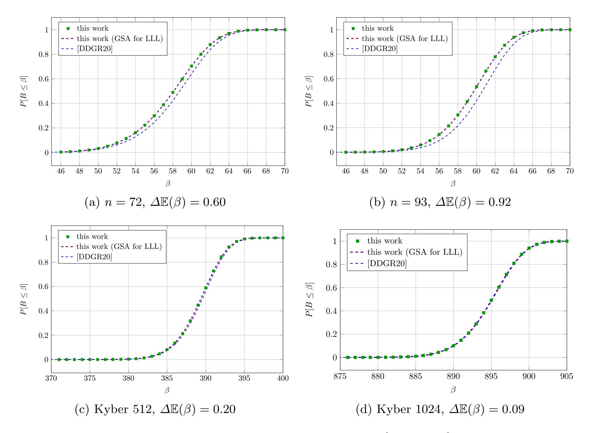

<span id="page-14-0"></span>Fig. 1. Comparison between the output of Algorithm [4](#page-12-1) [\[DSDGR20\]](#page-29-7) and Algorithm [5](#page-15-1) (this work) for isotropic parameters (σ = 1) from Table [1,](#page-17-1) and on Kyber 512 and 1024 [\[SAB](#page-30-12)<sup>+</sup>19]. The difference in predicted mean first viable block size between the two simulators is reported as ∆E(β), and is always smaller than 1.

after a number of tours of BKZ-β is simulated in one shot using the [\[CN11\]](#page-29-1) simulator. Given that the block size is fixed, the probabilities are only accumulated over tours. It should be noted that the event of β being the first viable block size changes in the case of BKZ. In this case, no unsuccessful tours with a smaller block size are run by the algorithm. Instead, we consider β being first viable if running BKZ-(β − 1) would not result in a solution to the uSVP instance but running BKZ-β would.

Algorithm [6](#page-15-2) returns the probability that τ tours of BKZ-β will solve uSVP, but does not exclude the possibility of winning with a smaller block size. We assume in our model that if τ tours of BKZ-β solve a given uSVP instance, then τ tours of BKZ-β 0 , for β <sup>0</sup> > β, also will. The values output by Algorithm [6](#page-15-2) for a given instance can therefore be interpreted as a cumulative mass function for the first viable block size, i.e. P[B ≤ β]. By running the simulator for increasing block sizes until it outputs probability 1, one may recover the probability mass

{15}------------------------------------------------

```
Input: (n, q, \chi, m), \tau
 1 p_{\text{tot}} \leftarrow 0, P \leftarrow \{\}, \beta \leftarrow 3
 2 d \leftarrow n + m + 1, \sigma^2 \leftarrow \mathbb{V}(\chi)
 3 profile \leftarrow simulated profile of LLL reduced LWE<sub>n,q,\chi,m</sub> instance
 4 while \beta < 40 do
        profile \leftarrow \text{BKZSim}(\text{profile}, \beta, \tau)
  5
        \beta \leftarrow \beta + 1
  6
 7 while \beta \leq d do
                                                                                                                                   /* rounds */
                                                                                                                                      /* tours */
              for tour \leftarrow 1 to \tau do
  8
                    profile \leftarrow BKZSim(profile, \beta, 1)
  9
               p_{\text{new}} \leftarrow P[x \leftarrow \sigma^2 \chi_{\beta}^2 \colon x \leq \text{profile}[d - \beta + 1]]
P[\beta] \leftarrow (1 - p_{\text{tot}}) \cdot p_{\text{new}}
p_{\text{tot}} \leftarrow p_{\text{tot}} + P[\beta]
if p_{tot} \geq 0.999 then break
10
11
12
13
          \beta \leftarrow \beta + 1
14
```

15 return P

<span id="page-15-1"></span>**Algorithm 5:** Unique-SVP success probability simulator running Progressive BKZ, running  $\tau$  tours for each block size, then increasing the block size by 1. Returns the probability mass function  $P[B = \beta]$  of solving uSVP in the round using block size  $\beta$ .

function  $P[B = \beta]$  as

$$P[B = \beta] = P[B \le \beta] - P[B \le \beta - 1].$$

```
Input: (n, q, \chi, m), \beta, \tau

1 p_{\text{tot}} \leftarrow 0, \sigma^2 \leftarrow \mathbb{V}(\chi)

2 d \leftarrow n + m + 1

3 for tour \leftarrow 1 to \tau do

4 | profile \leftarrow \text{BKZSim}((n, q, \chi, m), \beta, \text{tour})

5 | p_{\text{new}} \leftarrow P[x \leftarrow \sigma^2 \chi_{\beta}^2 \colon x \leq \text{profile}[d - \beta + 1]]

6 | p_{\text{tot}} \leftarrow p_{\text{tot}} + (1 - p_{\text{tot}}) \cdot p_{\text{new}}
```

7 return  $p_{\rm tot}$ 

<span id="page-15-2"></span>**Algorithm 6:** Unique-SVP success probability estimator when running  $\tau$  tours of BKZ- $\beta$ . Returns the probability of solving the uSVP instance.

#### <span id="page-15-0"></span>5 Experiments

In this section, we describe the experiments we run to check the accuracy of Algorithms 5 and 6, and discuss the results. We start by describing our original batch of experiments in §5.1. In §5.2 we make some observations about our

{16}------------------------------------------------

experimental results, and describe further tweaked experiments that we run to verify our understanding of the results.

#### <span id="page-16-0"></span>5.1 Initial experiments

Our aim in this section is threefold: first, we want to provide experimental evidence for the accuracy of our BKZ and Progressive BKZ uSVP simulators when predicting the success probability of the primal attack against LWE with discrete Gaussian secret and error for different block sizes; second, we want to compare previous experiments [\[AGVW17\]](#page-28-4) to our uSVP simulations; and finally, we want to explore the effect that binary or ternary distributions have on the primal attack. Throughout our experiments, we use BKZ 2.0 as implemented in FPyLLL [\[dt16b\]](#page-29-17) version 0.5.1dev, writing our own Progressive BKZ script by using FPyLLL's BKZ 2.0 as a subroutine.

For our first goal, we choose three different parametrisations of the LWE problem, for which the [\[ADPS16\]](#page-28-3) approach predicts an expected successful block size of either 60 or 61. We give the parameters in Table [1.](#page-17-1) All parameter sets in these batches use discrete Gaussian secret and error with V(χs) = V(χe) = σ 2 . The number of LWE samples used, m, is determined by what the LWE estimator [\[APS15\]](#page-29-8) predicts to be optimal, using [\(3\)](#page-11-1). For each parameter set we generate 100 instances, and reduce them using either BKZ or Progressive BKZ. We then check whether lattice reduction positioned the embedded shortest target vector in the first index of the reduced basis.

In the case of BKZ, for each basis we run a number of tours of BKZ with block size β = 45, . . . , 65. The number of tours, τ , takes the values 5, 10, 15, 20, 30. This results in a total of 100 bases, reduced independently 21 ×5 times each, once for every combination of β and τ . For every set of 100 reductions, we record the success rate by counting the number of solved instances. We run a similar set of experiments using Progressive BKZ, allowing τ ≥ 1 tours per block size, in order to see at what point running extra tours per block size becomes redundant. For this reason, we reduce each basis 5 times, once per value of τ in 1, 5, 10, 15, 20. After every call to the BKZ subroutine, we check whether the instance is solved. If not, we increase the block size by 1 and run a further tour of BKZ.

The resulting success rates for BKZ and Progressive BKZ (with τ = 1) are plotted in Figure [2,](#page-18-0) together with the output of our uSVP simulators, interpolated as curves. Figure [3](#page-19-0) contains similar plots for Progressive BKZ with τ ≥ 1. In Figure [5](#page-20-0) we plot the measured difference between the average mean and standard deviation for the simulated and experimental probability distributions, for both Progressive BKZ and BKZ.

For our second goal, we take the success probabilities reported in [\[AGVW17\]](#page-28-4) for their experiments. In Figure [4](#page-20-1) we report their measured success rates at optimal and smaller than optimal block sizes, and we superimpose our BKZ success probability simulations.

Finally, for our third goal, we run Progressive BKZ experiments for τ in 1, 5, 10, 15, 20 on three parameter sets using bounded uniform secrets. In particular, we pick the n = 72 and n = 93 parameters from Table [1](#page-17-1) but sample secret s and

{17}------------------------------------------------

| n   | q   | $\sigma$     | $m_{2016}$ | $\beta_{2016}$ |
|-----|-----|--------------|------------|----------------|
| 72  | 97  | 1            | 87         | 61             |
| 93  | 257 | 1            | 105        | 61             |
| 100 | 257 | $\sqrt{2/3}$ | 104        | 60             |

<span id="page-17-1"></span>**Table 1.** List of LWE parameters used for testing our uSVP simulators. The instances are in normal form. We use the Bai–Galbraith embedding and the number of samples used,  $m_{2016}$ , is given by the LWE estimator (commit 428d6ea).

error e coefficients uniformly from the set  $\{-1,1\}$ , and the n=100 parameters with secret and error coefficients sampled uniformly from  $\{-1,0,1\}$ . This preserves the same standard deviations as in Table 1, while adding more structure to the target vector. In the first case, the s and e are equivalent to those of a scaled and centred LWE instance with binary secret and error (see Appendix A), while in the second case, the problem is LWE with ternary s and e. The resulting success probability plots can be found in Figure 6.

#### <span id="page-17-0"></span>5.2 Observations

Experimental success rates for both BKZ and Progressive BKZ are in line with the output of the simulators described in §4. Below, we look at the results.

**Progressive BKZ.** In the case of Progressive BKZ, simulations seem to predict accurately the success probabilities for  $\tau \leq 10$  and all secret and error distributions used. Throughout our experiments reported in Figure 3, we observe two ways in which experiments slightly deviate from predictions.

Firstly, the success probability appears to stop significantly increasing for  $\tau > 10$ , even when the simulation does predict some improvement. We expect this to be a consequence of the large amount of lattice reduction being performed. Indeed, whenever the BKZ- $\beta$  subroutine is called, the basis has already been reduced with  $\tau$  tours of BKZ- $(\beta - j)$  for  $j = 1, ..., \beta - 3$ . This suggests that little progress on the basis profile can be made with each new tour of BKZ- $\beta$ . In our experiments, we use FPyLLL's BKZ 2.0 implementation with auto-abort, which triggers by default after the slope of the basis profile does not improve for five tours, the slope being computed using a simple linear regression of the logarithm of the basis profile. This means that if it is the case that little progress can be made, fewer than  $\tau$  tours will be run. To verify this, we rerun experiments while measuring the number of tours run by the BKZ subroutine. The data for the n = 100 experiments can be found in Figure 7, and seems to confirm that auto-abort for  $\beta > 20$  is much more frequently triggered for  $\tau > 10$ . This problem does not affect Progressive BKZ with  $\tau = 1$  since, even with auto-abort, one tour

{18}------------------------------------------------

<span id="page-18-2"></span>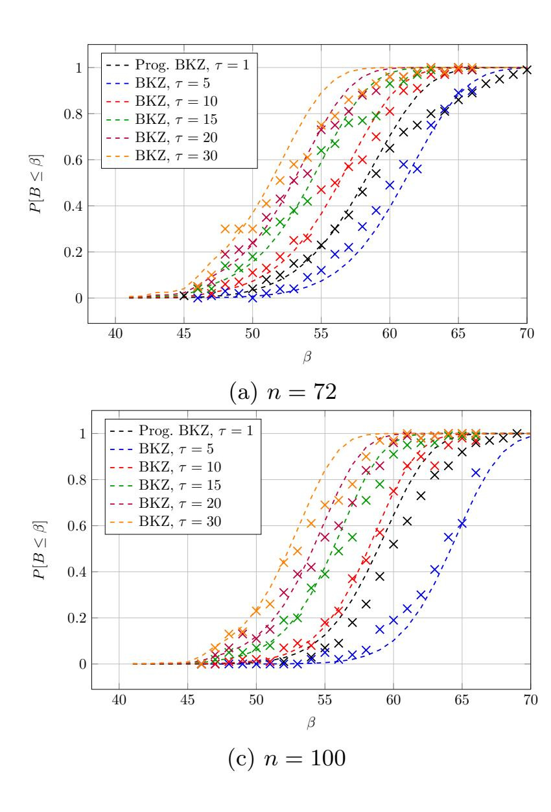

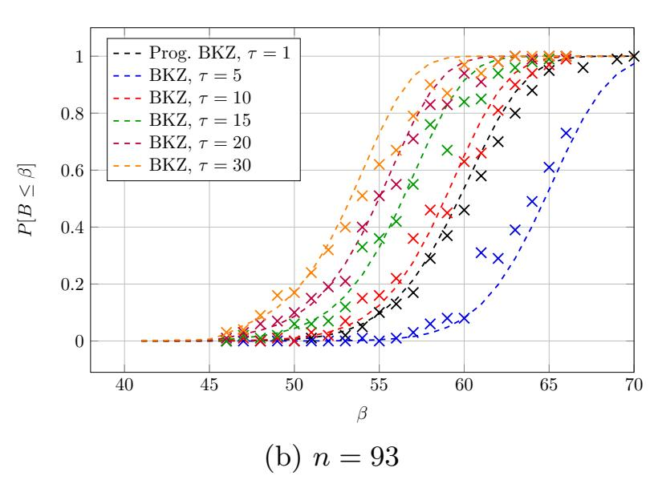

<span id="page-18-0"></span>Fig. 2. Comparison of simulated success probabilities with experimental results for BKZ and Progressive BKZ (with τ = 1). Dashed lines are simulations, crosses are experiments. In the case of Progressive BKZ, 100 total instances are reduced. In the case of BKZ, each experimental result is averaged over 100 instances, with experiments using up to block size 65.

is always run, and only slightly affects τ = 5 and τ = 10.[5](#page-18-1) Predictions match experiments well in the τ ≤ 10 cases. We note that, even if we were to force all τ tours to be performed, once 'would be auto-abort' conditions are reached, very few (if any) alterations would likely be made to the basis by each new tour. This means that the last full block of the basis would not be being rerandomised enough for the event of recovering πd−β+1(t) at tour i to be independent from the event of recovering it at tour i−1, as our model assumes. For example, if the basis was not modified by the latest i-th tour and πd−β+1(t) was not recovered by OSVP after tour i−1, it will also not be recovered after tour i.

The other phenomenon is the presence of a slight plateau in the probability plots as P[B ≤ β] ≥ 0.8. In the case of n = 72 we also see that smaller than predicted block sizes accumulate a significant success probability. Interestingly, this effect does not appear to be present in the case of binary secret and error LWE, see Figures [6a](#page-21-1) and [6b.](#page-21-2) We expect that this phenomenon is caused by the slight variation in sample variance throughout our experiments. Indeed, if we think of our target vector t = (t1, . . . , td) as sampled coefficientwise from some

<span id="page-18-1"></span><sup>5</sup> Auto-abort will also not trigger for τ = 5, however in this case sometimes the BKZ-β subroutine with β ≤ 10 returns after only one tour due to not making any changes to the basis.

{19}------------------------------------------------

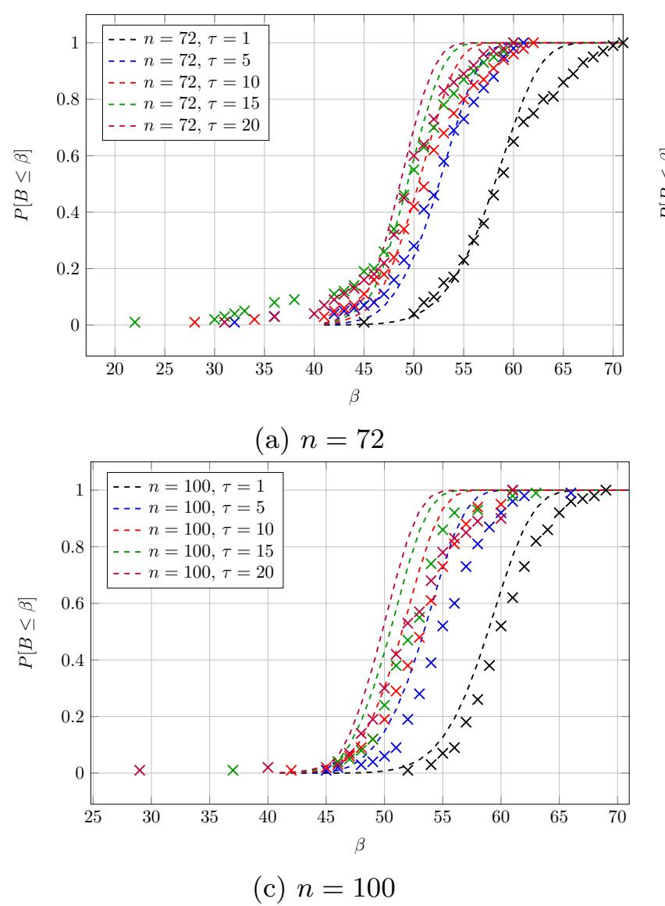

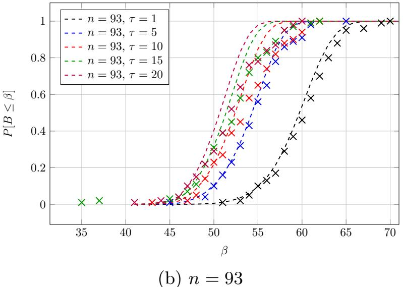

<span id="page-19-0"></span>**Fig. 3.** Comparison of simulated success probabilities with experimental results for Progressive BKZ with  $\tau \geq 1$  on instances with discrete Gaussian secret and error distributions. Dashed lines are simulations, crosses are experiments.

distribution  $\chi$  with variance  $\sigma^2$ , in practice the resulting sample variance for each particular LWE instance  $s^2 \coloneqq \frac{1}{d} \sum_{i=1}^d (t_i - \bar{t})^2$ , with  $\bar{t} \coloneqq \frac{1}{d} \sum t_i$  the sample mean, will likely slightly deviate from  $\sigma^2$ . We would therefore expect  $\|\pi_i(t)\|^2$  to follow a distribution slightly different to  $\sigma^2 \cdot \chi^2_{d-i+1}$ . However, in the case of  $\chi = \mathcal{U}(\{-1,1\})$ , the distribution resulting from scaled and centred binary LWE embeddings, this distribution has a very small variance of  $s^2$ , i.e.  $\mathbb{V}(s^2)$ , meaning that most sampled target vectors will have sample variance almost exactly  $\mathbb{V}(\chi) = 1$ . To verify this hypothesis, we run a set of n = 72 and n = 100 discrete Gaussian experiments from Table 1, where we resample each LWE instance until the target vector's sample variance is within a 2% error of  $\sigma^2$ , and then run Progressive BKZ with  $\tau$  in 1,5,10. The resulting experimental probability distributions, shown in Figure 8, do not present plateaus (and in the case of n = 72, they also do not present the high success probability for small block sizes), supporting our hypothesis. In practice, this effect should not significantly affect cryptographic parameters, as  $\mathbb{V}(s^2) \in O(\frac{1}{d})$  [KK51, Eq. 7.20], keeping

<span id="page-19-1"></span>Following [KK51,SR02], we compute  $\mathbb{V}(s^2)$  as approximately 0.00995, 0.00112, and 0.00005 for a discrete Gaussian with  $\sigma^2 = 1$ ,  $\mathcal{U}(\{-1,0,1\})$  and  $\mathcal{U}(\{-1,1\})$  respectively, for sets of 200 ( $\approx d$ ) samples.

{20}------------------------------------------------

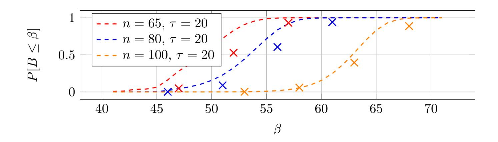

<span id="page-20-1"></span>**Fig. 4.** Comparison of simulated BKZ success probabilities with experimental results reported in Table 1 of [AGVW17].

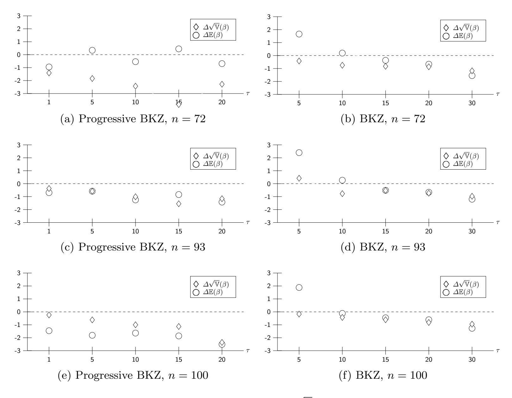

<span id="page-20-0"></span>**Fig. 5.** The measured difference  $\Delta \mathbb{E}(\beta)$  (resp.  $\Delta \sqrt{\mathbb{V}}(\beta)$ ) between the simulated and experimental successful block size mean (resp. standard deviation), as  $\tau$  grows.

{21}------------------------------------------------

<span id="page-21-3"></span><span id="page-21-1"></span>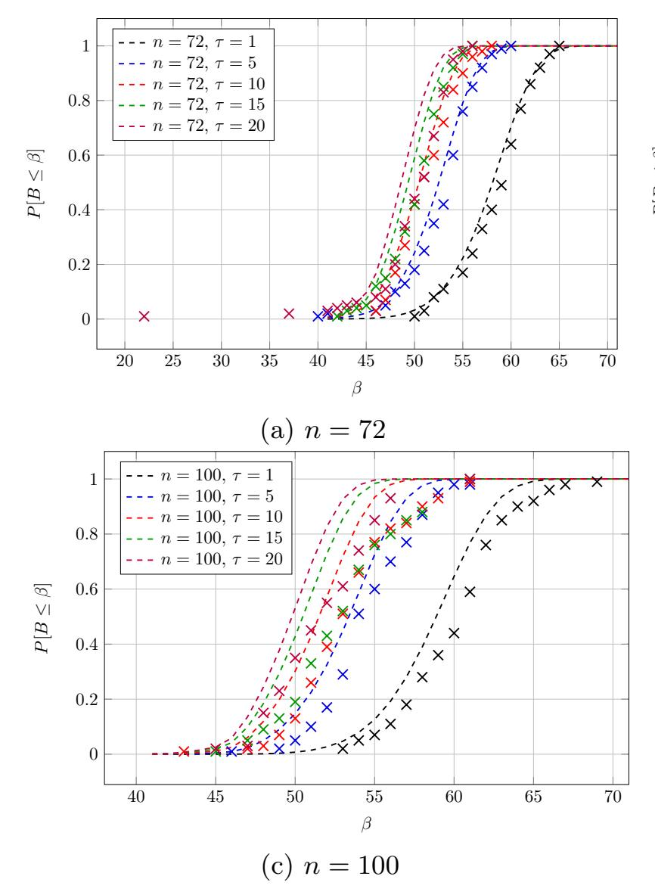

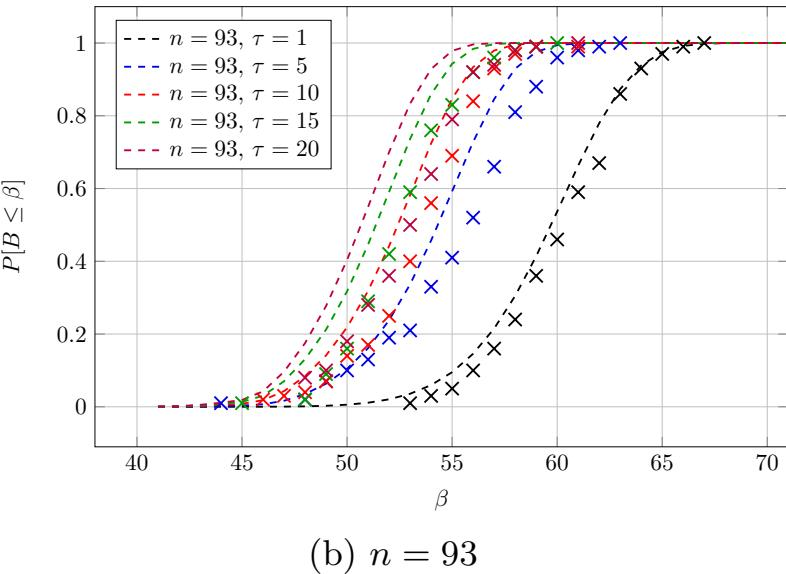

<span id="page-21-2"></span><span id="page-21-0"></span>Fig. 6. Comparison of simulated success probabilities with experimental results for Progressive BKZ on LWE instances with scaled and centred binary secret and error (Figures [6a](#page-21-1) and [6b\)](#page-21-2), and ternary secret and error (Figure [6c\)](#page-21-3). Dashed lines are simulations, crosses are experiments. Each experimental result is averaged over 100 instances. No changes were made to the uSVP simulators.

the effect of fluctuations in kπd−β+1(t)k 2 small as the embedding dimension d increases.

Our uSVP simulators output similarly accurate simulations for scaled and centred binary, and ternary, secret and errors, as seen in Figure [6,](#page-21-0) without making any alterations. This is in line with the notion that the hardness of solving uSVP via lattice reduction depends on the standard deviation of the target vector's coefficients rather than their exact distribution. In recent work [\[CCLS20\]](#page-29-6), Chen et al. run small block size (β ≤ 45) experiments and from their results conclude that the [\[ADPS16\]](#page-28-3) methodology may be overestimating the security of binary and ternary secret LWE instances, and that discrete Gaussian secrets offer 'greater security levels'. We believe their conclusions to be incorrect. First, their experiments are exclusively run in the small block size regime, where it is known that lattice heuristics often do not hold [\[GN08b,](#page-29-20) §4.2], [\[CN11,](#page-29-1) §6.1]. Second, their methodology does not take into account the norm of their embedded shortest vector. In their experiments they compare LWEn,q,χ,m instances where χ is swapped between several distributions with different variances. They use the [\[BG14\]](#page-29-11) embedding, which results in target vectors whose expected norms grow with the variance of χ. This means instances with narrower χ will be easier to solve, something that can already be predicted by running the LWE estimator

{22}------------------------------------------------

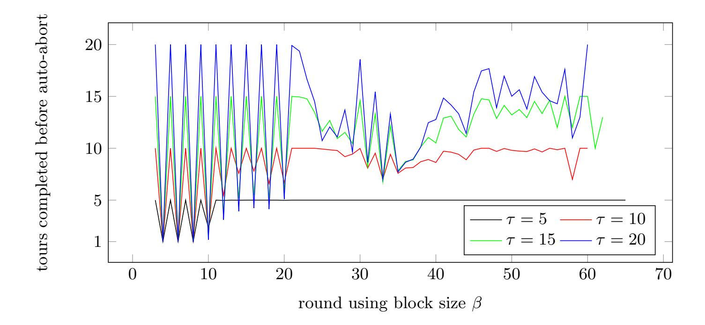

<span id="page-22-0"></span>Fig. 7. Measured number of tours run by the BKZ 2.0 subroutine of Progressive BKZ with τ ≥ 5 for each round of reduction with block size β. Numbers are from experiments using the n = 100 parameters from Table [1,](#page-17-1) with discrete Gaussian secret and error. Values are averaged over 100 instances. Less than τ tours are run if either BKZ-β does not change the basis or auto-abort triggers.

using the secret distribution parameter. The estimator will also perform secret coefficient guessing, thus reducing the dimensionality of the problem. After this guessing has occurred, narrower χ giving rise to easier instances does not mean that Gaussian secrets offer 'greater security levels' than binary or ternary secrets, but rather that when fixing n, q, m, the larger the secret variance, the harder the instance. Gaussian secrets with variance smaller than 1/4 would result in lower security than binary secrets in such a setting. We think the experiments to determine whether discrete Gaussian secrets are more secure than binary or ternary secrets should therefore be to compare LWE instances with different secret distributions, but equal variances, as done in this section, and that parameter selection for small secret LWE should keep the secret's variance in consideration.

BKZ. In the case of BKZ, simulations seem to stay similarly accurate across all secret dimensions n, as reported in Figure [2.](#page-18-0) It should be noted that, even though a larger gap than for Progressive BKZ can be seen between predictions and experiments in the case of τ = 5, this predictive gap in expected block size of less than 3 corresponds to about 1 bit in a core-sieve cost model [\[ADPS16\]](#page-28-3). Furthermore, this gap narrows as τ increases. Following experimental results from [\[Che13,](#page-29-14) Figure 4.6] and [\[Alb17\]](#page-29-15), designers often [\[ACD](#page-28-2)<sup>+</sup>18] consider it sufficient to reduce a basis using τ = 16 tours of BKZ when specifying BKZ cost models, due to the basis quality not improving significantly after 16 tours. Our simulators seem accurate for values of τ in such a regime. Another observation is that Progressive BKZ with τ = 1 outperforms BKZ with τ = 5. Indeed, the earlier performs approximately β tours of increasing block size versus the latter's

{23}------------------------------------------------

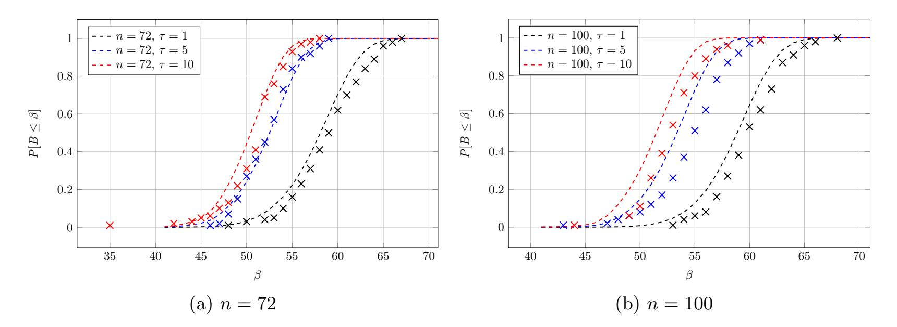

<span id="page-23-0"></span>**Fig. 8.** Progressive BKZ success probability against LWE instances with discrete Gaussian secret and error and  $(n, \sigma^2) \in \{(72, 1), (100, 2/3)\}$ , such that their sample variance is within 2% of  $\sigma^2$ .

five tours of block size  $\beta$ . It seems therefore that for these lattice parameters Progressive BKZ applies 'more' lattice reduction. We do not attempt to give a closed formula for the minimum block size for which BKZ outperforms Progressive BKZ in output quality. We also see that the phenomenon of success probabilities not increasing when  $\tau \geq 10$ , as in the Progressive BKZ case, does not occur here. This is compatible with our understanding of this phenomenon in the case of Progressive BKZ. Indeed, BKZ- $\beta$  will not auto-abort as often due to the input basis not having already been reduced with, for example,  $\tau$  tours of BKZ- $(\beta-1)$ .

However, a different interesting phenomenon can be observed. Sometimes, as the block size is increased, the experimental success probability of BKZ lowers, see the BKZ experiments in Figure 2. For example, this happens between block sizes 60 and 61 in Figure 2a when running  $\tau = 5$  tours of BKZ. Originally we believed this to be caused by the preprocessing strategies used in FPyLLL. Indeed, at the time of writing, preprocessing strategies for block size  $\beta$  (resp.  $\beta + 1$ ) could include running BKZ- $\beta'$  (resp. BKZ- $\beta''$ ), with  $\beta' > \beta''$ , resulting in inferior quality preprocessing for BKZ- $(\beta + 1)$  than for BKZ- $\beta$ . We replaced the default preprocessing strategies with a custom one such that preprocessing block sizes are non decreasing as a function of  $\beta$ , however this did not remove the effect. A possible cause for this phenomenon could be that basis profiles output by the CN11 simulator do not capture the possibility that Gram-Schmidt vector norms can be non decreasing as a function of their index. This means that one could have a BKZ- $\beta$  reduced basis such that  $\|\boldsymbol{b}_{d-\beta}^*\| < \|\boldsymbol{b}_{d-\beta+1}^*\|$ . This event happening across instances or block sizes could be a potential cause for the phenomenon. The probabilistic BKZ simulator developed in [BSW18a] seems to better capture this phenomenon, when run with a fixed PRNG seed. An example of the output of our uSVP simulator for BKZ, when replacing the [CN11] simulator with the [BSW18a] simulator, can be found in Figure 9. However, 

{24}------------------------------------------------

our experimental measurements are averaged over 100 runs. Running our uSVP simulator with the [\[BSW18a\]](#page-29-9) simulator, and averaging its output, results in a simulation with strictly increasing probabilities, unlike our measurements. In any case, the overall success probability predictions stay reasonably accurate.

Finally, looking at Figure [4,](#page-20-1) it seems that our simulations are consistent with the measurements originally reported in [\[AGVW17,](#page-28-4) Table 1]. The simulators therefore seem to explain the reported success probabilities of lower than expected block sizes in that paper.

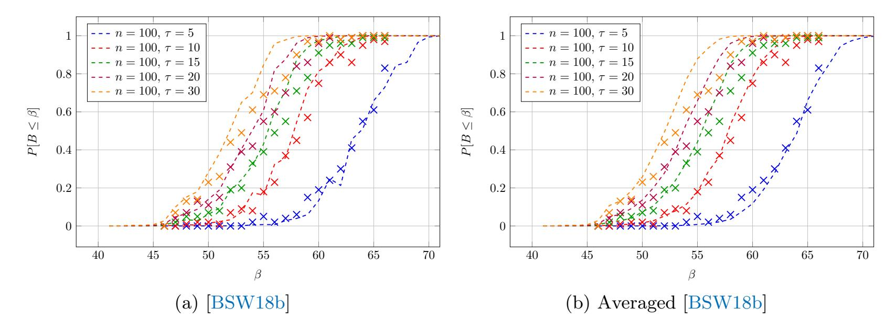

<span id="page-24-1"></span>Fig. 9. Both figures show BKZ experiments and uSVP simulations for n = 100 instances with Gaussian secret and error, where the calls to the [\[CN11\]](#page-29-1) simulator made in Algorithm [6](#page-15-2) are replaced. The left plot shows simulations where the [\[BSW18a\]](#page-29-9) simulator is used with a fixed PRNG seed. The right plot shows the same experimental data with with simulations obtained by averaging the output of the [\[BSW18a\]](#page-29-9) simulator over 10 different seeds.

## <span id="page-24-0"></span>6 Simulations of cryptographically sized LWE instances

In previous sections we developed simulators for the success probability of solving uSVP instances and tested them against uSVP embedding lattices generated from small LWE instances that could be solved in practice. An immediate application could be to use such simulators to estimate the behaviour of lattice reduction when used against cryptographically sized instances.

Here we use the simulator to compute the expected first viable block sizes required to solve LWE and NTRU instances proposed for the NIST PQC standardisation process. In particular we look at the second round versions of the three lattice KEM finalists; Kyber [\[SAB](#page-30-12)<sup>+</sup>19], NTRU [\[ZCH](#page-30-15)<sup>+</sup>19], and Saber [\[DKRV19\]](#page-29-22). An interesting option would be to use the simulators to predict what block size is required to solve an instance with a target low success probability. However, as we discuss in §[5.2,](#page-17-0) the simulations are not necessarily fully accurate for smaller

{25}------------------------------------------------

or larger block sizes, due to the fluctuations in sample variance that an instance can have. While the effect should be minor for cryptographically sized instances, low probability attacks may also include combinatorial techniques not captured by our simulators. Therefore, extracting block sizes for low probability attacks from the simulated probabilities may not capture all of the necessary subtleties. Furthermore, we will see that the window of block sizes predicted to be first viable is relatively narrow, so that lower success probability attacks without combinatorial tricks should not be significantly cheaper than higher success probability attacks.

In Table [2,](#page-26-0) we look at parameter sets from the lattice KEM finalists in the third round of the NIST PQC standardisation process [\[NIS16\]](#page-30-0), as specified during the second round. We provide expected first viable block sizes E(β) (and their standard deviations <sup>√</sup> V(β)) when using 15 tours of BKZ, and Progressive BKZ with τ = 1 or 5 (see Algorithm [2\)](#page-8-1). We choose τ = 15 for BKZ due to our experiments confirming the accuracy of our estimator for this value and its closeness to 16, which is commonly found in BKZ cost models. We choose τ = 1 and τ = 5 in the case of Progressive BKZ since our experiments suggest both cases are accurately predicted by the uSVP simulator; this allows us to see if running more tours in the BKZ subroutine has any effect on the complexity of cryptographically sized parameters.

Two clear disclaimers should be made. First, in Table [2](#page-26-0) we list the expected block size required to solve uSVP instances for the primal attack. While in an aggressive cost model for these algorithms, such as core-SVP [\[ADPS16\]](#page-28-3), one could be tempted to make direct cost comparisons between algorithms based only on β, in the case of BKZ we assume that τ tours of BKZ-β are run, while in the case of Progressive BKZ about τ β tours of varying block size are run. Second, for both algorithms we fixed the same number of samples m, chosen with the aid of the LWE estimator as the optimal number of samples when using the '2016 estimate' (except in the case of NTRU, where we assume m = n samples). This is not necessarily the optimal number of samples for each specific block size when computed using a uSVP simulator. We therefore avoid making claims and comparisons regarding the exact cost of solving uSVP using the two algorithms, and propose our results as an intermediate step between using the current LWE estimator and finding a theoretically cheapest attack using our simulators.

## 6.1 Observations

In almost all cases the mean required block size E(β) is predicted to be larger than the LWE estimator currently suggests. Our results for using Progressive BKZ with τ = 1 against NTRU-HPS are in line with what Dachman-Soled et al. [\[DSDGR20,](#page-29-7) Table 5] predict (NTRU-HPS being the only examined scheme in common). The increase in E(β) may seem counterintuitive. The Alkim et al. [\[ADPS16\]](#page-28-3) methodology already aims to recover E(β), with the simulators described in §[4](#page-11-0) capturing the success probability of smaller block sizes, possibly reducing the value of E(β). Indeed, the increase seems to be mainly due to the use of the [\[CN11\]](#page-29-1) simulator rather than the GSA for predicting the profile of a

{26}------------------------------------------------

| ntr<br>uh<br>rss<br>70<br>1<br>7 | ntr<br>uh<br>ps<br>40<br>96<br>82<br>1<br>8 | ntr<br>uh<br>ps<br>20<br>48<br>67<br>7<br>6 | ntr<br>uh<br>ps<br>20<br>48<br>50<br>9<br>5 | Fi<br>reS<br>ab<br>er<br>1 | Sa<br>be<br>r<br>7 | Lig<br>ht<br>Sa<br>be<br>r<br>5 | Ky<br>be<br>r 1<br>02<br>4<br>1 | Ky<br>be<br>r 7<br>68<br>7 | Ky<br>be<br>r 5<br>12<br>5 | sch<br>em<br>e            |                               |
|----------------------------------|---------------------------------------------|---------------------------------------------|---------------------------------------------|----------------------------|--------------------|---------------------------------|---------------------------------|----------------------------|----------------------------|---------------------------|-------------------------------|
| 00<br>8                          | 20<br>4                                     | 76<br>2                                     | 08<br>2                                     | 02<br>4<br>8               | 68<br>8            | 12<br>8                         | 02<br>4<br>3                    | 68<br>3                    | 12<br>3                    | n                         |                               |
| 19<br>2                          | 09<br>6                                     | 04<br>8                                     | 04<br>8                                     | 19<br>2                    | 19<br>2            | 19<br>2                         | 32<br>9                         | 32<br>9                    | 32<br>9                    | q                         |                               |
| p<br>2<br>/<br>3                 | p<br>2<br>/<br>3                            | p<br>2<br>/<br>3                            | p<br>2<br>/<br>3                            | p<br>3<br>/<br>2           | √<br>2             | p<br>5<br>/<br>2                | 1                               | 1                          | 1                          | σ<br>s                    |                               |
| p<br>2<br>/<br>3                 | q<br>8251                                   | q<br>338 127                                | p<br>1<br>/<br>2                            | √<br>21<br>/<br>2          | √<br>21<br>/<br>2  | √<br>21<br>/<br>2               | 1                               | 1                          | 1                          | σ<br>e                    |                               |
| 47<br>1                          | 62<br>1                                     | 52<br>1                                     | 37<br>4                                     | 89<br>0                    | 64<br>8            | 40<br>4                         | 87<br>3                         | 62<br>3                    | 38<br>1                    | β<br>201<br>6             |                               |
| 7<br>00                          | 8<br>20                                     | 6<br>76                                     | 5<br>08                                     | 8<br>91                    | 7<br>36            | 5<br>07                         | 8<br>60                         | 6<br>81                    | 4<br>84                    | m                         |                               |
| 4<br>77<br>.20                   | 6<br>28<br>.78                              | 5<br>22<br>.78                              | 3<br>75<br>.93                              | 9<br>07<br>.76             | 6<br>59<br>.36     | 4<br>08<br>.81                  | 8<br>91<br>.13                  | 6<br>34<br>.41             | 3<br>86<br>.06             | E<br>(su<br>cc<br>β<br>)  | BK<br>Z<br>2.0<br>,<br>τ<br>= |
| 2<br>.48                         | 2<br>.83                                    | 2<br>.82                                    | 2<br>.58                                    | 3<br>.34                   | 3<br>.00           | 2<br>.65                        | 3<br>.31                        | 2<br>.96                   | 2<br>.56                   | √V<br>(su<br>cc<br>β<br>) | 15                            |
| 48<br>0.5<br>1                   | 63<br>2.5<br>4                              | 52<br>6.7<br>7                              | 37<br>9.5<br>6                              | 91<br>1.7<br>8             | 66<br>3.1<br>0     | 41<br>2.2<br>4                  | 89<br>5.2<br>4                  | 63<br>8.2<br>3             | 38<br>9.5<br>3             | E<br>(su<br>cc<br>β<br>)  | P<br>rog<br>res<br>siv        |
| 2<br>.77                         | 3<br>.17                                    | 3<br>.18                                    | 2<br>.92                                    | 3<br>.68                   | 3<br>.32           | 2<br>.96                        | 3<br>.66                        | 3<br>.30                   | 2<br>.88                   | √V<br>(su<br>cc<br>β<br>) | e B<br>KZ<br>,<br>τ<br>=<br>1 |
| 47<br>6.7<br>2                   | 62<br>8.4<br>3                              | 52<br>2.6<br>7                              | 37<br>5.7<br>1                              | 90<br>7.1<br>6             | 65<br>8.8<br>5     | 40<br>8.3<br>5                  | 89<br>0.6<br>3                  | 63<br>4.0<br>0             | 38<br>5.7<br>0             | E<br>(su<br>cc<br>β<br>)  | P<br>rog<br>res<br>siv        |
| 2<br>.23                         | 2<br>.55                                    | 2<br>.57                                    | 2<br>.36                                    | 2<br>.97                   | 2<br>.68           | 2<br>.39                        | 2<br>.96                        | 2<br>.66                   | 2<br>.32                   | √V<br>(su<br>cc<br>β<br>) | e B<br>KZ<br>,<br>τ<br>=<br>5 |

<span id="page-26-0"></span>Table 2. Security estimates for some lattice schemes. The number of samples m used in the embedding for Kyber and Saber is chosen using the LWE estimator, as to optimise the cost of the attack following the 2016 estimate for BKZ [\[ADPS16\]](#page-28-3). In the case of NTRU, the number of samples m is chosen equal to n. β2016 is the block size suggested by the LWE estimator. For BKZ and Progressive BKZ, E(succ. β) and √V(succ. β) are the mean and standard deviation of the distribution of first viable block sizes.

{27}------------------------------------------------

BKZ reduced basis (i.e. the right hand side of (3)). An illustrative example of this happening in the case of Kyber 512 can be see in Figure 10. Indeed, patching the LWE estimator to partially<sup>7</sup> use the [CN11] simulator, we obtain  $\mathbb{E}(\beta)$  of Kyber 512 (resp. Kyber 768, Kyber 1024) of 390 (resp. 636, 890), narrowing the gap with the predictions obtained in Table 2 by using our uSVP simulators. The small standard deviations reported in Table 2 suggest that the success probability of block sizes below  $\mathbb{E}(\beta)$  decrease quickly.

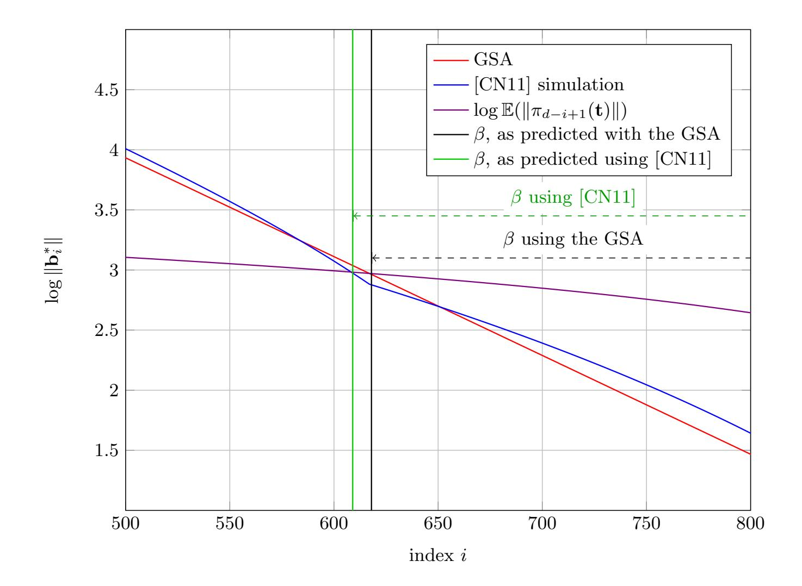

<span id="page-27-0"></span>**Fig. 10.** Example plot showing the effect on the [ADPS16] methodology of using the [CN11] BKZ simulator rather than the GSA, in the case of Kyber 512. Due to the resulting higher basis profile, the GSA leads to picking a smaller block size. The required winning block size in the [ADPS16] methodology is the distance from the vertical line indicating the intersection to the final basis index d. Note that this plot is zoomed in (d > 800).

Conclusion. Overall, our data suggests that the experiments in §5 show that the techniques in §4 help to more accurately predict lattice reduction success

<span id="page-27-1"></span>For simplicity, our patch uses the GSA to predict the required block size to perform lattice reduction and the optimal number of samples, as before. It uses the [CN11] simulator for the basis profile output by BKZ, and to predict the block size required to win by running  $O_{\text{SVP}}$  on the last basis block.

{28}------------------------------------------------

probabilities for solving uSVP. It also suggests that in the case of short vectors sampled coefficientwise from bounded uniform distributions, it is the variance of the distribution, and not the exact probability mass function, that determines the hardness of the LWE instance. The uSVP simulators also seem to explain the success probability for smaller than expected block sizes reported in [\[AGVW17\]](#page-28-4).

As part of our experiments, we also tested whether using Progressive BKZ with τ > 1 could be beneficial for an attacker. This seems to be useful to some small degree from the point of view the of success probabilities, although BKZ seems to perform comparatively well. However, Progressive BKZ could be of interest to an attacker that wants to start performing lattice reduction as part of a long term attack, but initially has access to fewer resources[8](#page-28-7) than necessary to run BKZ with the expected first viable block size. Progressive BKZ would then allow them to increase their resources as the attack progresses, with τ > 1 allowing them to stop at an overall slightly smaller final block size.

We also note that our preliminary estimates for the success probabilities of lattice reduction on cryptographically sized instances result in higher block sizes than output by the LWE estimator [\[APS15\]](#page-29-8). This seems to be mostly due to our use of a BKZ simulator rather than the GSA. A patch to the LWE estimator substituting the GSA with a BKZ simulator could mitigate this effect.

Acknowledgements. We would like to thank Martin Albrecht and L´eo Ducas for useful conversations and for their help simulating the LLL output profile, and again Martin Albrecht for generating new Fplll preprocessing strategies with non-decreasing block sizes.

## References

- <span id="page-28-2"></span>ACD<sup>+</sup>18. Martin R Albrecht, Benjamin R Curtis, Amit Deo, Alex Davidson, Rachel Player, Eamonn W Postlethwaite, Fernando Virdia, and Thomas Wunderer. Estimate all the {LWE, NTRU} schemes! In SCN, 2018.
- <span id="page-28-5"></span>ACPS09. Benny Applebaum, David Cash, Chris Peikert, and Amit Sahai. Fast cryptographic primitives and circular-secure encryption based on hard learning problems. In CRYPTO, 2009.
- <span id="page-28-1"></span>ADH<sup>+</sup>19. Martin R Albrecht, L´eo Ducas, Gottfried Herold, Elena Kirshanova, Eamonn W Postlethwaite, and Marc Stevens. The general sieve kernel and new records in lattice reduction. In EUROCRYPT, 2019.
- <span id="page-28-3"></span>ADPS16. Erdem Alkim, L´eo Ducas, Thomas P¨oppelmann, and Peter Schwabe. Postquantum key exchange—a new hope. In USENIX, 2016.
- <span id="page-28-6"></span>AFG13. Martin R Albrecht, Robert Fitzpatrick, and Florian G¨opfert. On the efficacy of solving lwe by reduction to unique-svp. In ICISC, 2013.
- <span id="page-28-0"></span>AG11. Sanjeev Arora and Rong Ge. New algorithms for learning in presence of errors. In Automata, Languages and Programming, 2011.
- <span id="page-28-4"></span>AGVW17. Martin R. Albrecht, Florian G¨opfert, Fernando Virdia, and Thomas Wunderer. Revisiting the expected cost of solving usvp and applications to lwe. In ASIACRYPT, 2017.

<span id="page-28-7"></span><sup>8</sup> Say, memory if using lattice sieving to implement OSVP.

{29}------------------------------------------------

- <span id="page-29-15"></span>Alb17. Martin R. Albrecht. On dual lattice attacks against small-secret lwe and parameter choices in helib and seal. In EUROCRYPT, 2017.
- <span id="page-29-16"></span>ALNSD20. Divesh Aggarwal, Jianwei Li, Phong Q. Nguyen, and Noah Stephens-Davidowitz. Slide reduction, revisited—filling the gaps in svp approximation. In CRYPTO, 2020.
- <span id="page-29-8"></span>APS15. Martin R Albrecht, Rachel Player, and Sam Scott. On the concrete hardness of learning with errors. JMC, 2015.
- <span id="page-29-2"></span>AWHT16. Yoshinori Aono, Yuntao Wang, Takuya Hayashi, and Tsuyoshi Takagi. Improved progressive bkz algorithms and their precise cost estimation by sharp simulator. In EUROCRYPT, 2016.
- <span id="page-29-5"></span>BCLv19. Daniel J. Bernstein, Chitchanok Chuengsatiansup, Tanja Lange, and Christine van Vredendaal. NTRU Prime. Technical report, NIST, 2019.
- <span id="page-29-11"></span>BG14. Shi Bai and Steven D. Galbraith. Lattice decoding attacks on binary lwe. In Information Security and Privacy, 2014.
- <span id="page-29-4"></span>BMW19. Shi Bai, Shaun Miller, and Weiqiang Wen. A refined analysis of the cost for solving lwe via usvp. In AFRICACRYPT, 2019.
- <span id="page-29-9"></span>BSW18a. Shi Bai, Damien Stehl´e, and Weiqiang Wen. Measuring, simulating and exploiting the head concavity phenomenon in bkz. In ASIACRYPT, 2018.
- <span id="page-29-21"></span>BSW18b. Shi Bai, Damien Stehl´e, and Weiqiang Wen. Measuring, simulating and exploiting the head concavity phenomenon in BKZ. In Thomas Peyrin and Steven Galbraith, editors, ASIACRYPT 2018, Part I, volume 11272 of LNCS, pages 369–404. Springer, Heidelberg, December 2018.
- <span id="page-29-6"></span>CCLS20. Hao Chen, Lynn Chua, Kristin Lauter, and Yongsoo Song. On the concrete security of lwe with small secret. IACR ePrint # 2020/539, 2020.
- <span id="page-29-14"></span>Che13. Yuanmi Chen. R´eduction de r´eseau et s´ecurit´e concr`ete du chiffrement compl`etement homomorphe. PhD thesis, Universit´e Paris Diderot, 2013.
- <span id="page-29-1"></span>CN11. Yuanmi Chen and Phong Q Nguyen. Bkz 2.0: Better lattice security estimates. In ASIACRYPT, 2011.
- <span id="page-29-22"></span>DKRV19. Jan-Pieter D'Anvers, Angshuman Karmakar, Sujoy Sinha Roy, and Frederik Vercauteren. SABER. Technical report, NIST, 2019.
- <span id="page-29-7"></span>DSDGR20. Dana Dachman-Soled, L´eo Ducas, Huijing Gong, and M´elissa Rossi. Lwe with side information: Attacks and concrete security estimation. In CRYPTO, 2020.
- <span id="page-29-12"></span>dt16a. The FPLLL development team. fplll, a lattice reduction library. 2016.
- <span id="page-29-17"></span>dt16b. The FPyLLL development team. fpylll, a python interface for fplll. 2016.
- <span id="page-29-18"></span>FHL<sup>+</sup>07. Laurent Fousse, Guillaume Hanrot, Vincent Lef`evre, Patrick P´elissier, and Paul Zimmermann. Mpfr: A multiple-precision binary floating-point library with correct rounding. ACM Trans. Math. Softw., 2007.
- <span id="page-29-0"></span>GJS15. Qian Guo, Thomas Johansson, and Paul Stankovski. Coded-bkw: Solving lwe using lattice codes. In CRYPTO, 2015.
- <span id="page-29-3"></span>GN08a. Nicolas Gama and Phong Q Nguyen. Finding short lattice vectors within mordell's inequality. In STOC, 2008.
- <span id="page-29-20"></span>GN08b. Nicolas Gama and Phong Q Nguyen. Predicting lattice reduction. In EUROCRYPT, 2008.
- <span id="page-29-19"></span>HG07. Nick Howgrave-Graham. A hybrid lattice-reduction and meet-in-the-middle attack against ntru. In CRYPTO, 2007.
- <span id="page-29-13"></span>HPS11. Guillaume Hanrot, Xavier Pujol, and Damien Stehl´e. Analyzing blockwise lattice algorithms using dynamical systems. In CRYPTO, 2011.
- <span id="page-29-10"></span>Kan87. Ravi Kannan. Minkowski's convex body theorem and integer programming. Mathematics of Operations Research, 12(3):415–440, Aug 1987.

{30}------------------------------------------------

- <span id="page-30-1"></span>KF15. Paul Kirchner and Pierre-Alain Fouque. An improved bkw algorithm for lwe with applications to cryptography and lattices. In CRYPTO, 2015.
- <span id="page-30-13"></span>KK51. J.F. Kenney and E.S. Keeping. Mathematics of Statistics. Van Nostrand, 1951.
- <span id="page-30-9"></span>LLL82. H.W .Jr. Lenstra, A.K. Lenstra, and L. Lov´asz. Factoring polynomials with rational coefficients. Mathematische Annalen, 261:515–534, 1982.
- <span id="page-30-11"></span>LM09. Vadim Lyubashevsky and Daniele Micciancio. On bounded distance decoding, unique shortest vectors, and the minimum distance problem. In CRYPTO, 2009.
- <span id="page-30-8"></span>LN13. Mingjie Liu and Phong Q. Nguyen. Solving bdd by enumeration: An update. In CT-RSA, 2013.
- <span id="page-30-10"></span>LN20. Jianwei Li and Phong Q. Nguyen. A complete analysis of the bkz lattice reduction algorithm. Cryptology ePrint Archive, Report 2020/1237, 2020. <https://eprint.iacr.org/2020/1237>.
- <span id="page-30-7"></span>MR09. Daniele Micciancio and Oded Regev. Lattice-based cryptography. In Daniel J. Bernstein, Johannes Buchmann, and Erik Dahmen, editors, Post-Quantum Cryptography. Springer Berlin Heidelberg, 2009.
- <span id="page-30-4"></span>MW16. Daniele Micciancio and Michael Walter. Practical, predictable lattice basis reduction. In EUROCRYPT, 2016.
- <span id="page-30-0"></span>NIS16. NIST. Submission requirements and evaluation criteria for the Post-Quantum Cryptography standardization process, 2016.
- <span id="page-30-16"></span>NS06. Phong Q. Nguyen and Damien Stehl´e. Lll on the average. In Florian Hess, Sebastian Pauli, and Michael Pohst, editors, Algorithmic Number Theory, pages 238–256, Berlin, Heidelberg, 2006. Springer Berlin Heidelberg.
- <span id="page-30-6"></span>Reg09. Oded Regev. On lattices, learning with errors, random linear codes, and cryptography. Journal of the ACM, 56(6):1–40, Sep 2009.
- <span id="page-30-12"></span>SAB<sup>+</sup>19. Peter Schwabe, Roberto Avanzi, Joppe Bos, L´eo Ducas, Eike Kiltz, Tancr`ede Lepoint, Vadim Lyubashevsky, John M. Schanck, Gregor Seiler, and Damien Stehl´e. CRYSTALS-KYBER. Technical report, NIST, 2019.
- <span id="page-30-5"></span>Sch03. Claus Peter Schnorr. Lattice reduction by random sampling and birthday methods. In STACS, 2003.
- <span id="page-30-2"></span>SE91. Claus-Peter Schnorr and M Euchner. Lattice basis reduction: Improved practical algorithms and solving subset sum problems. In FCT, 1991.
- <span id="page-30-3"></span>SE94. Claus-Peter Schnorr and Martin Euchner. Lattice basis reduction: Improved practical algorithms and solving subset sum problems. Mathematical programming, 66(1-3):181–199, 1994.
- <span id="page-30-14"></span>SR02. Murray D Smith and C Rose. Mathematical Statistics with Mathematica <sup>R</sup> , page 264. Springer Berlin, 2002.
- <span id="page-30-15"></span>ZCH<sup>+</sup>19. Zhenfei Zhang, Cong Chen, Jeffrey Hoffstein, William Whyte, John M. Schanck, Andreas Hulsing, Joost Rijneveld, Peter Schwabe, and Oussama Danba. NTRUEncrypt. Technical report, NIST, 2019.

{31}------------------------------------------------

## <span id="page-31-0"></span>A Scaling lattices in practice

As mentioned in §2, given LWE samples  $(\mathbf{A}, \mathbf{c}) = (\mathbf{A}, \mathbf{s}\mathbf{A} + \mathbf{e}) \in \mathbb{Z}_q^{n \times m} \times \mathbb{Z}_q^{1 \times m}$ , it is possible to construct a lattice basis that embeds a shortest vector containing  $\mathbf{s}$  and  $\mathbf{e}$  which have been scaled or balanced, or both. In the case of scaling the secret by a factor of  $\nu$ , one approach is to use the [BG14] embedding (1),

$$\bm{B} = \begin{pmatrix} \bm{0} & q \bm{I}_m & \bm{0} \ \nu \bm{I}_n & -\bm{A} & \bm{0} \ \bm{0} & \bm{c} & c \end{pmatrix},$$

which contains in its integer span the vector  $\mathbf{t} = (* \mid \mathbf{s} \mid 1) \cdot \mathbf{B} = (\nu \, \mathbf{s} \mid \mathbf{e} \mid c)$  for suitable values of \*. In theory, the optimal value of  $\nu$  could be any real not smaller than 1. In practice however, lattice reduction libraries such as FpLLL [dt16a] require input bases to have integer coefficients. In order to run experiments, this issue can be avoided by using the standard approach of clearing denominators. The idea is to use a rational approximation  $\nu \approx x/y$ , with  $x, y \in \mathbb{Z}_{\geq 1}$ . Then, one can define a basis  $\mathbf{B}_1$  obtained by clearing the denominator

$$\bm{B}_1 = \begin{pmatrix} \bm{0} & yq \bm{I}_m & \bm{0} \\ x \bm{I}_n & -y \bm{A} & \bm{0} \\ \bm{0} & y \bm{c} & yc \end{pmatrix} \approx y \cdot \bm{B}.$$

This has the effect of scaling every lattice vector in  $\Lambda(\mathbf{B})$  by  $y \geq 1$ . Assuming for simplicity the win condition from the [ADPS16] methodology, it is an immediate computation that the success condition for the scaled problem is equivalent to that of the original problem using a rational approximation of  $\nu$ ,

$$\|\pi_{d-\beta+1}(y \cdot t)\| \le \|(y \cdot b)_{d-\beta+1}^*\| \iff \|\pi_{d-\beta+1}(t)\| \le \|b_{d-\beta+1}^*\|.$$

In the case of secret distributions with non-zero mean  $\mu$ , two simple approaches can be used to generate an embedding with a target vector containing a balanced version of s. This can be useful since it allows for a more aggressive choice of  $\nu$ . For example, this is what we assume would be done by an attacker when we investigate the cost of solving uSVP with binary secrets in §5. The first approach is to map any LWE samples (A, c) into samples  $(A, c - \mu A)$ , where  $\mu = (\mu, \dots, \mu)$ . This works since

$$(* \mid s - \mu \mid 1) \cdot \begin{pmatrix} \mathbf{0} & q\mathbf{I}_m & \mathbf{0} \\ \nu\mathbf{I}_n & -\mathbf{A} & \mathbf{0} \\ \mathbf{0} & \mathbf{c} - \mu\mathbf{A} & c \end{pmatrix} = (\nu (s - \mu) \mid e \mid c).$$

Recovering the target vector on the right hand side results in solving LWE. However, the first n coefficients in the target vector are now centred around 0, rather than  $\mu$ . For example, applying this method with  $\nu = 2$  to a binary secret, i.e. one from  $\mathcal{U}(\{0,1\})$ , means the first n coefficients of the target vector will be distributed uniformly in the set  $\{-1,1\}$ .

{32}------------------------------------------------

The second approach for centring the secret distribution is to use the basis

$$(* | \boldsymbol{s} | 1) \cdot \begin{pmatrix} \boldsymbol{0} & q \mathbf{I}_{m} & \boldsymbol{0} \\ \nu \mathbf{I}_{n} & -\boldsymbol{A} & \boldsymbol{0} \\ -\nu \boldsymbol{\mu} & \mathbf{c} & c \end{pmatrix} = (\nu (\boldsymbol{s} - \boldsymbol{\mu}) | \boldsymbol{e} | c).$$

In cases where error distribution has mean  $\mu \neq 0$ , we can combine either of the above two methods with mapping samples  $(A, c) \mapsto (A, c - \mu)$ , specifically  $(A, c) \mapsto (A, c - \mu - \mu A)$  for the first method. This also centres the error distribution. In all cases, an integer basis can be obtained by appropriately clearing the denominators of any rational approximations of  $\nu$  and  $\mu$ .

# <span id="page-32-1"></span>B Exact square root expectation of the $\chi^2_d$ distribution

We note that although  $\mathbb{E}(\sigma^2\chi_d^2) = \sigma^2 d$ , it is not the case that  $\mathbb{E}\left(\sqrt{\sigma^2\chi_d^2}\right) = \sigma\sqrt{d}$ . By direct computation, if  $x \leftarrow \chi_d^2$ , then

$$\mathbb{E}\left(\sqrt{\sigma^2 \cdot x}\right) = \sigma \mathbb{E}(\sqrt{x}) = \frac{\sigma}{2^{d/2} \Gamma\left(\frac{d}{2}\right)} \int_0^\infty x^{1/2} x^{d/2 - 1} e^{-x/2} dx$$
$$= \frac{\sqrt{2}\sigma \Gamma\left(\frac{d+1}{2}\right)}{\Gamma\left(\frac{d}{2}\right)} \xrightarrow{d \to \infty} \sigma \sqrt{d}.$$

#### <span id="page-32-0"></span>B.1 LLL "Z-shape" simulation

As part of our uSVP simulations, we use an LLL simulator. This allows one to predict the characteristic Z-shape phenomenon [HG07] that occurs when reducing bases of q-ary lattices.

The Z-shape nickname refers to the shape of the log-plot for the profile of an LLL-reduced basis  $\boldsymbol{B}$  when providing in input a q-ary lattice basis such as (1), with the q-vectors set as the first basis vectors. In such cases, most of the q-vectors will not be altered by LLL, since they are orthogonal and short. This results in the basis profile having a flat head corresponding to the first Gram–Schmidt vectors  $\boldsymbol{b}_1^*, \boldsymbol{b}_2^*, \ldots$  being q-vectors. Depending on the lattice's volume and rank, the final Gram–Schmidt vectors will be 1-vectors obtained from the identity matrix minor in the basis, resulting in a flat tail in the profile. The middle indices of the log-plot of the basis profile will be located along a straight line with the slope predicted by the GSA for LLL with  $\log \alpha \approx -2 \log 1.02$  [NS06]. An example of the Z-shape can be seen in Figure 11.

In the most straightforward case, given a normal-form LWE lattice with volume  $q^m$ , dimension d and basis (1), the LLL simulator predicts the Z-shape by first computing the GSA slope section of the profile. This is achieved by noticing

<span id="page-32-2"></span>While a similar Z-shaped profile will result even if the q-vectors are not at the beginning of the basis, the effect will be more pronounced if they are.

{33}------------------------------------------------

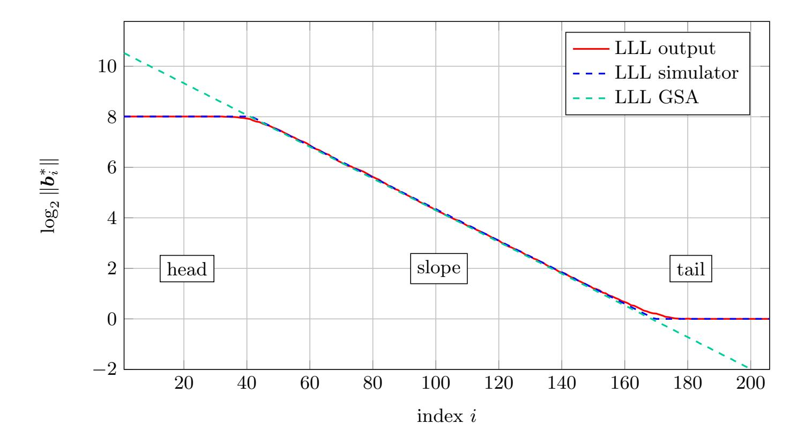

<span id="page-33-0"></span>Fig. 11. Comparison between the output profile of LLL averaged over 25 input bases, the output of the LLL simulator used for our estimates, and the GSA. The input bases being reduced are for q-ary lattices corresponding to embeddings of "n = 100" LWE instances as parametrised in Table 1

that vectors in this section will have log-norm  $\log \|\boldsymbol{b}_i^*\| \in (0, \log q)$ , decreasing by  $\log \alpha$  at each index by the GSA. Then the head section will have enough q-vectors so that the output profile describes a lattice with volume  $q^m$ , and the remaining vectors will be 1-vectors in the tail. This procedure may result in a volume that is not exactly equal to  $q^m$ . In this case, we pick the maximum number of q-vectors such that the implied volume is  $< q^m$ , and shift the slope up to match  $q^m$ . In practice this effect is minimal. This description matches all cases used in this work, the resulting pseudo-code can be found in Algorithm 7. Some corner cases, including  $\nu \neq 1$  in (1), can arise and are dealt with in our Python implementation of the simulator.

{34}------------------------------------------------

```
Input: m, q, d
                                                                   // m q-vectors, dimension d
     // \delta is LLL's root-Hermite factor \approx 1.02
     // \boldsymbol{q}^m is the lattice's volume
 1 \log \alpha \leftarrow -2 \log \delta
      // compute the profile's slope
 2 slope \leftarrow [\log q + \log \alpha, \log q + 2\log \alpha, \dots, \varepsilon] s.t. \varepsilon + \log \alpha \leq 0
 3 if \#slope \geq d then
         slope \leftarrow last d entries of slope
 4
         shift slope vertically such that \sum_i \operatorname{slope}_i = \log q^m
 5
         \texttt{log-profile} \leftarrow \texttt{slope}
  6
  7
      return log-profile
 8 \ell \leftarrow \# \texttt{slope}
 \mathbf{9} \ v \leftarrow \textstyle\sum_{i} \mathtt{slope}_{i}
      // compute the profile's head
10 head \leftarrow []
11 while v + \sum_i \text{head}_i + \log q < \log q^m and \ell + \# \text{head} < d do
12 head \leftarrow head \cup [\log q]
13 \ell \leftarrow \ell + \# \text{head}
14 v \leftarrow v + \sum_{i} \mathsf{head}_i
     // compute the profile's tail
15 tail \leftarrow []
16 while \ell + \# \mathrm{tail} < d \ \mathrm{do}
17 | tail \leftarrow tail \cup [0]
18 shift slope vertically such that \sum_i \mathtt{head}_i + \sum_i \mathtt{slope}_i = \log q^m
19 log-profile \leftarrow head \cup slope \cup tail
20 return log-profile
  Algorithm 7: LLL Z-shape simulator, assuming a basis as in (1) with \nu = 1.
  Returns the logarithm of the basis profile, \{\log \|\boldsymbol{b}_i^*\|\}_i.
```