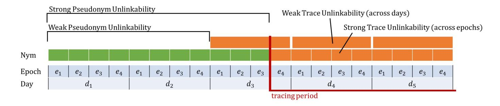
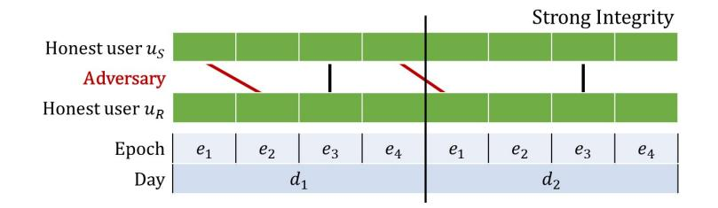
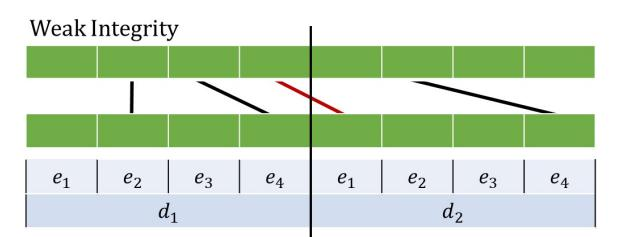
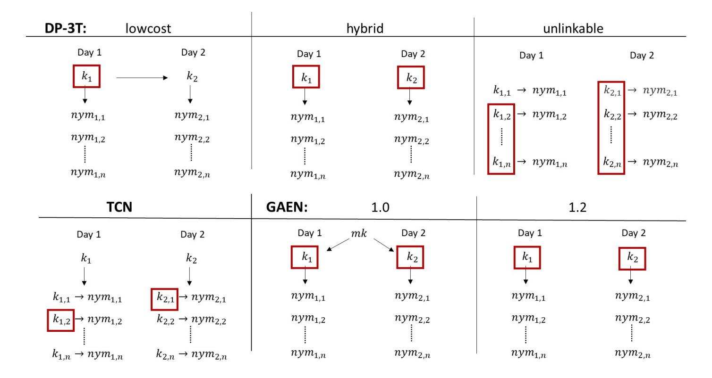
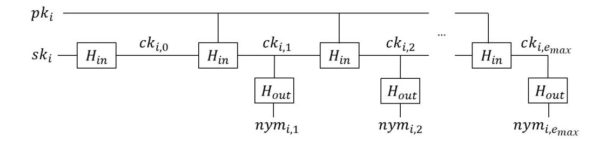

{0}------------------------------------------------

# Provable Security Analysis of Decentralized Cryptographic Contact Tracing

Noel Danz, Oliver Derwisch, Anja Lehmann? , Wenzel Puenter, Marvin Stolle, and Joshua Ziemann

Hasso-Plattner-Institute, University of Potsdam

Abstract. Automated contact tracing leverages the ubiquity of smartphones to warn users about an increased exposure risk to COVID-19. In the course of only a few weeks, several cryptographic protocols have been proposed that aim to achieve such contract tracing in a decentralized and privacy-preserving way. Roughly, they let users' phones exchange random looking pseudonyms that are derived from locally stored keys. If a user is diagnosed, her phone uploads the keys which allows other users to check for any contact matches. Ultimately this line of work led to Google and Apple including a variant of these protocols into their phones which is currently used by millions of users. Due to the obvious urgency, these schemes were pushed to deployment without a formal analysis of the achieved security and privacy features. In this work we address this gap and provide a formal treatment of such decentralized cryptographic contact tracing. We formally define three main properties in a game-based manner: pseudonym and trace unlinkability to guarantee the privacy of users during healthy and infectious periods, and integrity ensuring that triggering false positive alarms is infeasible. A particular focus of our work is on the timed aspects of these schemes, as both keys and pseudonyms are rotated regularly, and we specify different variants of the aforementioned properties depending on the time granularity for which they hold. We analyze a selection of practical protocols (DP-3T, TCN, GAEN) and prove their security under well-defined assumptions.

# 1 Introduction

Automated contact tracing is an approach currently used in the Covid-19 pandemic to warn individuals that were in contact with infected people, leveraging their smartphones to record and notice such possible exposure. Most ongoing proposals rely on Bluetooth communication and let the phone continually broadcast short-lived random beacons, which we call pseudonyms. In the so-called decentralized setting we consider here, the pseudonyms are derived from keys locally stored by the phone. When a user is diagnosed, she uploads the key material of the last ∆ days, e.g., ∆ = 14, to a central server. Other users' phones can download these keys and test if they received any pseudonyms to which they match, indicating an increased exposure risk.

<sup>?</sup> contact author: anja.lehmann@hpi.de

{1}------------------------------------------------

In a stunning effort by researchers and practitioners from various fields, several solutions to this problem have been developed and pushed to practical deployment within a few months only. Most notably are the DP-3T [17], TCN [8] and PACT [7, 18] projects, which led to Google and Apple including a variant of their protocols in Android and iOS which is now used by numerous nation-wide Covid warn apps [11, 12].

The common goal of all these projects is to enable contact tracing in a privacy-preserving and secure manner. In particular, no central server must be aware of users' contacts, and their movements must not be traceable through the broadcast pseudonyms. The challenge thereby is to come up with a simple and efficient solution that fits the strict bandwidth constraints which was achieved by the aforementioned projects.

Due to the pressure under which these protocols had to be developed, their design could not be thoroughly vouched for through formal security models and proofs which are otherwise the gold standard in modern cryptography. In fact, while most of the proposed protocols enjoy a simple design, often relying purely on symmetric primitives, their desired goals seemed somewhat less clear and have sparked a vivid discussion of possible and impossible security guarantees [20, 16, 1, 2]. So far, the analysis mostly focused on informal and high-level properties [4, 9, 7, 13], or the discussion and improvement of more generic attack vectors such as relay and replay attacks [20, 14, 3, 5]. Only recently, the first attempt to formally capture some of these properties was done by Canetti et al. [6]. We discuss the relation to our work at the end of this section. In short, we believe they are complementary as both differ considerably in their focus regarding the model and analyzed schemes.

# 1.1 Our Contributions

In this paper we provide the first thorough provable security analysis of a number of practical decentralized contact tracing (DCT) schemes. We formally define their desired and achievable privacy and security properties in form of gamebased definitions and analyze a selection of practical protocols. The paper only considers schemes of the "upload-what-you-sent" type, where users upload the keys of their broadcast pseudonyms upon infection.

Formal Security Model. The first challenge was to find a common abstraction of DCT that fits a broad class of protocols, yet allows to express meaningful and common security and privacy goals. Our focus thereby is on the timed aspects of DCT which we make explicit through two variables: days d for which key material is rotated and epochs e for which pseudonyms are derived. We stress that d does not have to be 24 hours, the name is rather an illustrative way to distinguish between a coarse grained and continuously evolving time period d for the key schedule (which in the protocol specifications varies between 2−24h) and a short time period e during d (often 10 − 15min, synchronized with switching of the Bluetooth MAC address) for which individual pseudonyms are formed.

{2}------------------------------------------------

We identify three main security goals for which we define different variants, depending on the time granularity for which they must hold.

Pseudonym Unlinkability: It must be infeasible to link pseudonyms of the same user across different epochs. This property must hold for all "healthy" periods of a user. That is even when she eventually uploads a tracing key for some time d − ∆, . . . , d, full unlinkabiliy must be preserved for all earlier days d <sup>0</sup> < d − ∆. (Note that all considered schemes suggest that users stop broadcasting pseudonyms after they generated their tracing keys, or switch to a fresh user key and thus there is nothing to model for d <sup>0</sup> > d).

Trace Unlinkability: Whereas pseudonym unlinkability guarantees the unlinkability for pseudonyms of "healthy" users (or rather during non-tracing periods of users), the notion of trace unlinkability further ensures that different pseudonyms of the same infected user remain as unlinkable as possible during the tracing period.

Integrity: Apart from preserving the privacy of users, a DCT scheme must also be secure, i.e., an adversary cannot trigger a false alarm for an honest user.

We also define post-compromise and forward security capturing the preserved privacy when a user's phone is temporarily compromised.

Analysis of Selected Schemes. After formalizing the desired security properties, we analyze whether and how they are achieved by a selection of practical contact tracing protocols. Our selection consists of the three DP-3T protocols, the TCN scheme and both Google-Apple GAEN versions. The overview of our analysis is given in Figure 1 and we summarize some particular insights below. While most of our findings are as expected, this is – to the best of our knowledge – the first formal study of these protocols, formalizing the achieved properties and required assumptions.

Guarantees from Cryptography not Time. Our analysis considers all schemes to be normalized w.r.t. time, i.e., when they use the same time granularity for rotating keys and pseudonyms. This allows to understand the guarantees provided by the cryptographic algorithm and not the "application layer" decisions. In reality, the protocols come with quite different time recommendations, e.g., DP-3T recommends key rotation every 2-4 hours, whereas GAEN uses a 24-hour cycle. Having such shorter times can compensate weaker security guarantees, such as weak vs. strong integrity in the case of the two simpler DP-3T protocols which allow replay attacks across epochs (but not across "days"/keys).

Verification is Underspecified. Most specifications do not detail how contact lists are stored or how exactly verification of contact matches works – in particular how the time in which pseudonyms are received is taken into account. However, subtle choices can have a significant impact on the guaranteed integrity. If such a description was absent, we specify the version that yields the strongest security guarantees.

{3}------------------------------------------------

|                            | DP-3T   |        |        | TCN           | GAEN     |          |
|----------------------------|---------|--------|--------|---------------|----------|----------|
|                            | Lowcost | Hybrid | Unlink | TCN           | 1.0      | 1.2      |
| Pseudonym Unlinkability    | Weak    | Weak   | Strong | Almost Strong | Weak     | Weak     |
| + Forward Security         | Yes     | Yes    | Yes    | Yes           | No       | Yes      |
| + Post-Compromise Security | No      | Yes    | Yes    | Yes           | No       | Yes      |
| Trace Unlinkability        | No      | Weak*  | Strong | Weak*         | Weak*    | Weak*    |
| Integrity                  | Weak**  | Weak** | Strong | Strong        | Strong** | Strong** |

Fig. 1: Overview of selected DCT schemes and their security in our model.(<sup>∗</sup> : holds if all tracing keys are shuffled. ∗∗: holds if no tracing key for the current day is generated)

Non-Standard Assumptions. While most security proofs for the privacy properties are straightforward, integrity often required non-standard or new assumptions for the underlying building blocks. This stems from the use of PRFs (or alike) for achieving some form of collision resistance for adversarially chosen keys. For TCN and the two simpler DP-3T protocols new and rather tailored assumptions for signatures and PRG's are needed.

DP-3T. The DP-3T protocol family consists of three schemes. The low-cost (DP3T-LC) and hybrid (DP3T-HYB) scheme derive a full batch of pseudonyms through a PRG from a daily seed and randomly select a sub-part of the output for each epoch. The DP3T-LC variant derives the new seed by hashing the old one (which makes it the only scheme that does not achieve any trace unlinkability), whereas DP3T-HYB uses independent day keys. Both schemes are vulnerable to replay attacks across epochs and thus only achieve a weak version of integrity. This is due to the random shuffle of the PRG output which does not allow to verify in which epoch a pseudonym was supposed to be broadcast. Both schemes also make use of a PRF which does not contribute to the security.

The third protocol is called "Unlinkable" (DP3T-UNLINK) and chooses a dedicated random seed for every pseudonym. DP3T-UNLINK achieves the strongest privacy properties. In particular, it is the only scheme that achieves strong trace unlinkability, which guarantees that pseudonyms of infected users remain unlinkable across epochs (other schemes only achieve this across days).

TCN. The Temporary Contact Number (TCN) protocol has the most complicated design. For each day it derives a chain of epoch-specific keys through iterated hashing, and using a fresh key pair of a signature scheme as initial random seed. Relying on the hash chain allows to upload a tracing key for a dedicated starting epoch estart and hiding the relation for earlier epochs. The signature key is used to authenticate an uploaded tracing key and to bind its validity to a strict time interval.

Interestingly, the TCN protocol does not satisfy the strongest notion of pseudonym unlinkability, which would guarantee unlinkability until the exact epoch in which the first tracing key was triggered for, as it allows to compute one more pseudonym than expected. The signature also complicates the privacy proof and requires a new and tailored assumption.

{4}------------------------------------------------

GAEN. The two GAEN protocol versions have the most clean design: they rely on a PRF or PRP to derive pseudonyms from a day key and on input the current epoch, and closely resemble the PACT protocol [18]. Whereas the first protocol version derived all day keys from a single master key, the second and currently deployed version uses independent day keys. Consequently, the first version was the only one not to achieve post-compromise or forward security, whereas both are guaranteed by the current version.

The GAEN white paper does not detail how the verification or upload of tracing keys exactly works, and different versions of the API manage the underlying cryptographic keys differently to thwart released-cases-replay attacks [20]. In schemes where all pseudonyms of a day are derived from the same key, the last key of an infected user – belonging to the current day – must not be publicly disclosed as long as its valid, as it would allow for trivial replay attacks otherwise. While earlier versions of the GAEN APIs only revealed the current day key after it was expired, newer versions (up from v1.5) do return the current key and rely on trusted infrastructure to attest to its expiration [19].

In our interpretations of the GAEN protocols, we assume that the current day key is not output, as this is the only way to prevent this type of replay attack already on the crypto layer. The only schemes that provide an explicit protection against these attacks are TCN and DP3T-UNLINK.

Related Work. The work by Canetti et al. [6] proposes two contact tracing protocols that are backed up through formal models and proofs. The focus and modelling choices in our works are considerably different though: We focus exclusively on upload-what-you-sent type of schemes (where users upload their keys upon infection) and make time in form of days and epochs explicit, as this is crucial for our time-specific definitions. The model of [6] is broader as it also includes upload-what-you-receive protocols, where users upload their contacts instead of keys. This allows for better privacy for infected users, but their solution requires users to download several GB and perform millions of exponentiations per day. To the best of our knowledge, no practical (decentralized) scheme of that type has been proposed yet, and thus we did not include them in our analysis. While their analysis covers a broader class of schemes, time is abstracted away through considering some "measurement" (possibly containing time) as input. Further, strong security properties are formalized in the UC model, and game-based definitions are given for weaker properties only. Therein the adversary is mostly static, i.e., cannot actively engage with honest users, or adaptively corrupt their keys. Most notably, their integrity notion excludes most adversarial behaviour, as only honest users are allowed to upload tracing keys.

In contrast, our work aims at a simple yet strong security model using gamebased definitions. For instance, in our integrity definition, the adversary can interact adaptively with honest users and upload maliciously formed tracing keys. Finally, our work provides a formal analysis of several practical protocols, whereas [6] gives security proofs for their schemes only and informally discusses other protocols such as DP3T-LC,TCN and GAEN. In their informal analysis, 

{5}------------------------------------------------

TCN and GAEN were considered the same, whereas our work shows that they differ in the achieved properties and required assumptions.

Relation to Centralized Contact Tracing. A natural question is whether our formal model and analysis easily extends to centralized schemes (CCT) as well. However, apart from the same high-level goal of providing privacy-friendly contact tracing, CCT and DCT do not have much in common: In centralized schemes, keys and pseudonyms are managed by a central and trusted server, instead of the users. Likewise, contacts of infected users are discovered directly by the server not users. This requires considerably different algorithms and security games, with different set of oracles, trust assumptions and inherent limitations.

However, we do hope that our security model will facilitate similar efforts for other types of cryptographic contact tracing.

# 2 Building Blocks: Standard and New Properties

This section lists all building blocks and assumptions needed in our security analysis, including a number of new – and sometimes strongly tailored – assumptions.

Pseudorandom Functions (PRF, PRP, PRG). In addition to standard pseudorandomness for PRF, PRP and PRG, we require some form of preimage resistance. This can be seen as the preimage-resistance property adapted from unkeyed hash functions to keyed PRF/PRP.

Key-Preimage Resistance (for PRF, PRP) Recently, Farshim et al. [10] defined collision-resistance for PRFs where it must be infeasible for an adversary to find (k, k<sup>0</sup> , x, x<sup>0</sup> ) s.t. PRF(k, x) = PRF(k 0 , x<sup>0</sup> ). This notion (also adapted to PRP's) would be sufficient for the analyzed contact tracing schemes, but is stronger than what is needed here: The adversary in our games must find such collisions for an unknown k, and for x = x 0 . Thus we propose the following notion of key-preimage resistance.

Definition 1 (PRF/PRP Key-Preimage Resistance). A function F ∈ {PRF, PRP} is key-preimage resistant, if for all efficient adversaries A and k ←<sup>R</sup> {0, 1} τ the following probability is negligible in τ :

$$\Pr[(k', x) \leftarrow_{\scriptscriptstyle R} \mathcal{A}^{F(k, \cdot)}(1^{\tau}) : F(k, x) = F(k', x)]$$

In one of the schemes we need a stronger property where it must be infeasible to produce a key-preimage that leads to a match on a prefix of the outputs. We define pre<sup>λ</sup> (x) := x1, . . . , x<sup>λ</sup> to be the function that on input x returns the λ-bit prefix of x. We say that a PRF has λ-prefix key-preimage resistance if the above property holds for pre<sup>λ</sup> (F(k, x)) = pre<sup>λ</sup> (F(k 0 , x)).

{6}------------------------------------------------

Partial Pre-Image Resistance (for PRG). We need a somewhat similar property for a PRG. However, here the property needs to be more tailored to the particular contact tracing schemes: In the DP-3T protocols, a PRG is used to generate the full batch of pseudonyms for a day and there is no binding of pseudonyms to epochs. Thus, we must consider the output of the PRG : {0, 1} <sup>τ</sup> → {0, 1} <sup>τ</sup>·` as a sequence of ` τ -bit sub-strings, and require that it is infeasible to find collisions among any of such sub-strings for two different seeds. Similar as in key-preimage resistance of PRF/PRP we provide a relaxed version where the adversary can only provide one of the seeds.

Given a string x = x1, . . . , x`·<sup>τ</sup> with |x| = ` · τ , we denote x[i] := xi·τ+1, . . . , xi·τ+<sup>τ</sup> for i ∈ [0, ` − 1] to be the i-th τ -length snippet of x.

Definition 2 (PRG Partial Preimage Resistance). A PRG : {0, 1} <sup>τ</sup> → {0, 1} τ·` is partial preimage resistant, if for all efficient adversaries A and s ←<sup>R</sup> {0, 1} τ , y ← PRG(s) the following probability is negligible in τ :

$$\Pr\left[s' \leftarrow_{\scriptscriptstyle R} \mathcal{A}(y)\right) : y' \leftarrow \mathsf{PRG}(s'), \exists i, j \in [0, \ell - 1] \ s.t. \ y[i] = y'[j]\right]$$

Hash Functions. Apart from standard collision, preimage and second-preimage resistance (possibly holding only for a λ-prefix) for a hash function H : {0, 1} <sup>∗</sup> → {0, 1} τ , we will also need some random behaviour. As hash functions in DCT are often invoked on random and (initially) secret values, we define two properties that will be sufficient and allow to avoid the random oracle assumption: A randomness preserving hash guarantees that H(x) cannot be distinguished from y ←<sup>R</sup> {0, 1} τ for a random and secret x ←<sup>R</sup> {0, 1} τ . Unpredictability for random inputs ensures that an adversary cannot predict a valid output for H when invoked on a random input (but here the input is given to A later on). Formal definitions are given in Appendix A.1.

Signature Schemes. The TCN scheme uses a signature S = (KeyGen, Sign, Vf) to authenticate tracing keys, which must satisfy the standard unforgeability property. As the TCN scheme also uses sk as the initial random seed for its key chain, we must further capture that seeing a signature under sk does not help to distinguish a random string from a hash of the secret key H(sk) which we define as hashed-key indistinguishability.

We stress that this property is not implied by standard unforgeability: a signature scheme could simply append the hash to each signature. We can also not require the more generic property that signatures must be indistinguishable from random (they cannot be due to the Vf algorithm).

Definition 3 (Hashed-Key Indistinguishability). A signature scheme S has hashed-key indistinguishability w.r.t. a hash function H : {0, 1} <sup>∗</sup> → {0, 1} τ if for all efficient adversaries A it holds that Pr[ExpHashKeyInd A,S,H (τ ) = 1] ≤ 1/2 +µ(τ ).

{7}------------------------------------------------

```
Experiment \operatorname{Exp}_{\mathcal{A},\mathsf{S},\mathsf{H}}^{\mathsf{HashKeyInd}}(\tau):

(sk,pk) \leftarrow_{\mathrm{R}} \operatorname{KeyGen}(1^{\tau}); \ b \leftarrow_{\mathrm{R}} \{0,1\}
\nif b=0: h \leftarrow_{\mathrm{R}} \{0,1\}^{\tau}, else h \leftarrow \mathsf{H}(sk)

b^* \leftarrow_{\mathrm{R}} \mathcal{A}^{\mathcal{O}_{\mathsf{Sign}}}(pk,h) where \mathcal{O}_{\mathsf{Sign}}(m) returns \sigma \leftarrow \operatorname{Sign}(sk,m)

return 1 if b^*=b
```

# 3 Security Model

In this section we present our security model for decentralized contact tracing (DCT), consisting of game-based definitions for pseudonym and trace unlinkability as well as for integrity. Before we can formalize these properties we introduce the generic algorithms of a DCT scheme and their expected behaviour. We also explain the modelling choices we have made, in particular focusing on the time aspects of such schemes and their key schedules.

## 3.1 Syntax & Modelling Choices

Our goal is to analyze and compare a multitude of contact tracing protocols that all come with different settings and design choices. Thus, the first challenge is to find a common abstraction of these protocols that can capture the individual differences yet allows to express meaningful and common security and privacy goals of the generic concept of DCTs.

Modelling Time. First, we notice that the notion of time is crucial in the context of contact tracing and all schemes – with various degrees of explicitness – assume a certain key rotation schedule. To reflect this, we model time via two parameters: a day d = 1, ..., n and an epoch  $e = 1, ..., e_{\text{max}}$ , where  $e_{\text{max}}$  denotes the maximum number of epochs a day has. Keys will be rotated for every new day d and pseudonyms are derived for a particular time (d, e). We stress that d does not necessarily have to be 24 hours, the name is rather chosen for illustrative reasons. For simplicity we assume that all users and algorithms have access to the same synchronized time (d, e), without making that explicit in every algorithm.

We often want to express that a certain time (d, e) was before another time (d', e') which we denote as (d, e) < (d', e') and which holds if d < d' or  $(d = d') \land (e < e')$ .

Algorithms of DCT. We assume that a user's day key k is initialized through Init and gets updated for every new day via a Rotate function. Most schemes will simply use Rotate = Init (which is better for security). Pseudonyms are generated for a particular time via the NymGen function that gets the current day key  $k_d$  and epoch e as input. Received pseudonyms are stored in a contact list CL through the NymRec algorithm, again also having the current time (d, e) as additional input.

We assume that users local state comprises the day keys KEYS =  $(k_{d-\Delta}, \ldots, k_d)$  for the last  $\Delta$  days where  $\Delta$  denotes the maximum tracing period (e.g. 14)

{8}------------------------------------------------

days). Similarly, we assume that the contact list CL on a day d only contains the contacts of the last  $\Delta$  days.

If a user is tested positive and wants to alert its contacts, she can trigger the creation of a tracing key t for starting time  $(d_{\text{start}}, e_{\text{start}})$  that is within the last  $\Delta$  days via the TraceGen algorithm. Focusing on upload-what-you-sent schemes, this algorithm only gets the local keys KEYS as input but not the contact list. Tracing information is prepared by a (central) server through an algorithm TraceTf (which stands for Trace Transform). In most schemes this is a simple aggregation (and shuffling) of all received tracing keys. We again assume that TL is time-aware, i.e., when used on a day d only contains tracing keys for  $d - \Delta, \ldots, d$ .

Finally, users can verify their exposure risk through an algorithm TraceVf that tests whether there was a match between the locally received pseudonyms CL and the retrieved list of tracing keys TL.

**Definition 4** (DCT). A decentralized contact tracing scheme DCT is a tuple of algorithms (Init, Rotate, NymGen, NymRec, TraceGen, TraceTf, TraceVf) defined as follows:

 $\mathsf{Init}(1^{\tau}) \to k_1$ . Outputs an initial <sup>1</sup> day key  $k_1$  and sets  $\mathsf{CL} \leftarrow \emptyset$ .

Rotate $(k_d) \to k_{d+1}$ . On input a day key  $k_d$ , outputs a new key  $k_{d+1}$ .

NymGen $(k_d, e) \rightarrow nym$ . Outputs a pseudonym for key  $k_d$  and epoch e.

NymRec( $\mathbf{CL}, d, e, nym$ )  $\to \mathbf{CL'}$ . On input a contact list  $\mathbf{CL}$ , the current time d, e and pseudonym nym, outputs an updated contact list  $\mathbf{CL'}$ .

TraceGen(Keys,  $d_{\text{start}}, e_{\text{start}}$ )  $\rightarrow t$ . On input a set of day keys KEYS =  $(k_{d-\Delta}, \ldots, k_d)$ , a starting day  $d_{\text{start}}$  and epoch  $e_{\text{start}}$ , outputs a tracing key t for the tracing period  $(d_{\text{start}}, e_{\text{start}}), \ldots, (d, e)$ . We assume that the algorithm always checks that  $d - \Delta \leq d_{\text{start}} \leq d$  and  $1 \leq e_{\text{start}} \leq e$ .

TraceTf( $\mathbf{TL}, t$ )  $\to \mathbf{TL'}$ . On input the current tracing list  $\mathrm{TL}$  and a new tracing key t, outputs an updated list  $\mathrm{TL'}$ .

TraceVf(CL, TL)  $\rightarrow$  {0,1}. On input of a contact list CL and tracing list TL outputs a bit, where 1 indicates that a match was found.

Correctness. If a user has received an honestly generated pseudonym and the underlying tracing key (both during the same tracing period), then TraceVf must output 1. The formal definition is straightforward and in Appendix B. In some of the schemes we will only be able to achieve strong integrity if TraceGen does not output tracing information for the last, current day. This also has an effect on the achievable correctness, as contacts on the last day of the tracing period will not get notified. Thus, for such schemes only a weaker version of correctness is achieved.

Helper function Validity. We assume that the tracing list TL is time-aware and will only contain keys that are relevant. This means there must be a way to express and extract for when a tracing key t is claimed to be valid for. All

As we assume that all user have synchronized time, the first key would technically be  $k_{d_1}$ , where  $d_1$  denotes the current day, but we write  $k_1$  for simplicity.

{9}------------------------------------------------

schemes support this, mostly by simply appending the day (and epoch) information with every key. We make this explicit by requiring an additional function Validity(d, t) → {(d<sup>i</sup> , ei)} that on input a current day d and tracing key t returns a set of day-epoch tuples (d<sup>i</sup> , ei) for which the trace claims to be for. We stress that there is no validation process involved in Validity, its a simple look-up of the contained information. However, our integrity notion will be done w.r.t. a specific definition of Validity where the security guarantee is stronger the more precise and confined Validity is.

What we don't model. Our DCT abstraction makes a couple of simplifications to focus on the core features shared among the different schemes:

We model TraceGen to allow for a flexible start day and epoch (dstart, estart) and assume that the tracing period comprises the entire time from then. The two most privacy-friendly schemes (DP3T-UNLINK, TCN) provide more flexibility, up to redacting arbitrary epochs for the exposure keys. We omitted this flexibility for the sake of simplicity.

NymRec, that prepares the contact list, only gets the pseudonym and current time as input, whereas some specifications also store additional context information such as the signal attenuation with each pseudonym. As our focus are the core cryptographic procedures and the properties of pseudonyms w.r.t. time, this is not considered here.

Our verification only checks if a match was found but not how many as in [6]. In all schemes we analyze, CL simply stores the received pseudonyms (or hashes thereof) and compares them with deterministically recomputed values in TraceVf. Thus, for all DCTs with that behaviour a version that outputs the count of matches could be generically derived from our TraceVf by invoking it on the individual entries in CL.

Finally, we do not model or detail how the upload of tracing keys is controlled and orchestrated. Obviously, it is crucial that only truly infected users can upload their tracing keys and that the tracing lists are assembled and provided in a trustworthy manner. This is orthogonal to the question how pseudonyms are generated and verified, and an interesting research topic on its own.

### 3.2 Privacy of DCT

The core goal of DCT is to provide the functionality of contact tracing in a privacy-preserving way. Ideally, a DCT scheme would allow a user to determine whether she was in contact with another infected person, without learning or revealing anything beyond that fact. From a cryptographic point of view, the users only expose their cryptographic pseudonyms and eventually upload tracing keys, and thus we express privacy through the information leaked via these values. The natural goal that all DCT strive for, is the unlinkability of these pseudonyms – at least during "healthy", non-tracing periods, which is what we consider as pseudonym unlinkability. Another core requirement is to preserve as much privacy as possible during infectious, tracing periods, i.e., once a user has uploaded her tracing key, which we define as trace unlinkability.

{10}------------------------------------------------

We start by discussing the high-level ideas behind these notions as well as inherent limitations of DCT, and then present our formal security definitions. A comparison between both notions and their strong and weak variants we define here is given in Figure 2. We believe that both unlinkability definitions capture the core privacy goals of DCT, but do not claim that they comprehensively cover all privacy, and consider further extensions interesting future work.

Unlinkability across Epochs. All practical DCT schemes steer the users' privacy through the use of epoch-specific pseudonyms. That is, pseudonyms are linkable within an epoch, but must be unlinkable across. Unlinkability ensures that when receiving two pseudonyms nym and nym<sup>0</sup> for different epochs, one cannot tell whether they belong to the same user or two different ones (as long as both are "healthy" during these epochs<sup>2</sup> ).

Full Unlinkability during Healthy Periods. Furthermore, even if a user gets infected and reveals her tracing key, the unlinkability of "expired" pseudonyms must be preserved. That is, when tracing is triggered up from some starting time (dstart, estart), being at most ∆ days in the past, then all pseudonyms the user sent before that time must remain fully unlinkable. Thus, ideally, unlinkability would be preserved for all pseudonyms that were broadcast up to (dstart, estart − 1) which we define as strong pseudonym unlinkability. However, most schemes do not support fine-granular tracing and simply output the affected day keys, which allow to recompute and link all the user's pseudonyms during each day up from dstart, i.e., regardless of the starting epoch. This inherently reduces the unlinkability guarantees to last at most until (dstart − 1, emax) only. We capture this as weak pseudonym unlinkability.

Some schemes allow to "redact" user-chosen days (or even epochs) when generating the tracing information, and one would expect that unlinkability is preserved for such redacted intervals as well. As this feature has not been actively used yet, we did not include it in the generic algorithms nor model.

Unlinkability with Forward and Post-Compromise Security. When users continuously broadcast their pseudonyms, the malicious and long-term collection of these pseudonyms is an immanent threat [20]. Spoofing devices can be installed with the hope of eventually capturing or compromising phones of persons' of interest to extract their key material, and then using the contact tracing scheme to link the collected pseudonyms to these users. Thus, it is essential to minimize the impact of such device compromise in the sense of forward and post-compromise security. Forward security means that if a phone is compromised at some day d, then all pseudonyms that were generated before d − ∆ must remain unlinkable. For DCT schemes of the upload-what-you-sent type, giving up on privacy for the period from d−∆, . . . , d is inherent, as a device at day d must be able to generate tracing information for exactly that period, which can be exploited for malicious linkage too. This argument does not hold for centralized schemes, which allow for full (device) forward security as long as the central server is honest [1, 21].

<sup>2</sup> A user is called "healthy" during an epoch, when she did not upload a tracing key for that epoch. It does not indicate their definite medical health status.

{11}------------------------------------------------



Fig. 2: Comparison between the variants of pseudonym and trace unlinkability. Pseudonym unlinkability covers privacy of users before and trace unlinkability during the tracing period.

We also want a DCT scheme to be able to recover from a temporary key compromise, e.g., if an adversary can obtain a snapshot of all internal keys, but does not have permanent access to the device. There are no inherent limitations in this case, and pseudonyms generated as soon as one day after the compromise should be fully unlinkable again. We capture this as *post-compromise security*.

**Pseudonym Unlinkability** We now present our formal security model that captures the unlinkability of pseudonyms during "healthy" periods. We start by defining the two types of strong and weak pseudonym unlinkability, and then explain how forward and/or post-compromise security can be added.

We formulate pseudonym unlinkability through a typical indistinguishability game that an adversary plays with a challenger. The adversary  $\mathcal{A}$  is given access to two honest users  $u_0, u_1$  and can adaptively request their pseudonyms for days and epochs of his choice (via  $\mathcal{O}_{\text{NymGen}}$ ). We give the adversary full control over the epochs, but require him to trigger day (and thus key) rotation through the  $\mathcal{O}_{\text{Rotate}}$  oracle which then updates both of the users' keys. Eventually, at some day  $d^*$  the adversary is requested to output a challenge epoch  $e^*$  upon which he receives  $\text{NymGen}(k_{d^*}^b, e^*)$  for a randomly selected user  $u_b$ . The task of the adversary is to determine b better than by guessing.

All schemes we analyze have deterministic pseudonym generation, and thus the adversary is not allowed to query  $\mathcal{O}_{NymGen}$  on the challenge day for the challenge epoch  $e^*$ . All other epochs on the challenge day can be queried though.

Further, we want that unlinkability holds for all time periods where the user was "healthy" even when she triggers the generation of a tracing key at a later point. For all days/epochs before the tracing period, unlinkability of pseudonyms must remain. To model this, we allow  $\mathcal{A}$  to obtain tracing keys for both users via the  $\mathcal{O}_{\mathsf{TraceGen}}$  oracle. In the experiment for  $\mathit{strong}$  pseudonym unlinkability the adversary is allowed to trigger the creation of tracing keys for a starting time  $(d_{\mathsf{start}}, e_{\mathsf{start}})$  which can be as early as one epoch after the challenge epoch  $e^*$  (on day  $d^*$ ). In the  $\mathit{weak}$  version,  $\mathcal{O}_{\mathsf{TraceGen}}$  queries can only start for  $d_{\mathsf{start}} > d^*$ .

Definition 5 (Strong/Weak Pseudonym Unlinkability). A DCT scheme provides strong and weak pseudonym unlinkability respectively, if for all efficient  $\mathcal{A}$  there is a negligible function  $\mu$  such that  $\Pr[\mathsf{Exp}_{\mathcal{A},\mathsf{DCT}}^{\mathsf{NymUnlink}}(\tau)=1] \leq 1/2 + \mu(\tau)$ .

{12}------------------------------------------------

```
\mathcal{O}_{\mathsf{Rotate}}()
 \begin{aligned} & \textit{Experiment} \  \, \mathsf{Exp}^{\mathsf{NymUnlink}}_{\mathcal{A},\mathsf{DCT}}(\tau) \colon \\ & k_1^0 \leftarrow_{\mathrm{R}} \mathsf{Init}(1^\tau), \, k_1^1 \leftarrow_{\mathrm{R}} \mathsf{Init}(1^\tau), \, d \leftarrow 1 \end{aligned} 
                                                                                                                                                                                      \mathcal{O}_{\mathsf{NymGen}}(u,e)
                                                                                                                         \overline{k_{d+1}^0 \leftarrow_{\mathrm{R}}} \; \mathsf{Rotate}(k_d^0)
                                                                                                                                                                                         nym_{d,e}^u \leftarrow \mathsf{NymGen}(key_d^u, e)
                                                                                                                         k_{d+1}^1 \leftarrow_{\mathbb{R}} \mathsf{Rotate}(k_d^1)
                                                                                                                                                                                         Q \leftarrow Q \cup \{(d,e)\}
      (e^*, st) \leftarrow_{\mathsf{R}} \mathcal{A}^{\mathcal{O}_{\mathsf{Rotate}}, \mathcal{O}_{\mathsf{NymGen}}}(1^{\tau})
                                                                                                                         Set d \leftarrow d + 1
                                                                                                                                                                                         return nym_{d,e}^u
      store current day as challenge day d^*
      b \leftarrow_{\mathbf{R}} \{0, 1\}
                                                                                                                       \mathcal{O}_{\mathsf{TraceGen}}(u, d_{\mathsf{start}}, e_{\mathsf{start}})
      nym_b \leftarrow \mathsf{NymGen}(k_{d^*}^b, e^*)
                                                                                                                         strong: abort if (d_{\mathsf{start}}, e_{\mathsf{start}}) < (d^*, e^* + 1)
      b^* \leftarrow_{\mathrm{R}} \mathcal{A}^{\mathcal{O}_{\mathsf{Rotate}}, \mathcal{O}_{\mathsf{NymGen}}, \mathcal{O}_{\mathsf{TraceGen}}}(st, nym_b)
                                                                                                                          weak: abort if (d_{\mathsf{start}}, e_{\mathsf{start}}) < (d^* + 1, 1)
                                                                                                                         t^u \leftarrow \mathsf{TraceGen}(\mathsf{KEYS}^u, d_{\mathsf{start}}, e_{\mathsf{start}})
      return 1 if b^* = b and (d^*, e^*) \notin Q
                                                                                                                         \mathbf{return}\ t^u
```

It is trivial to see that strong pseudonym unlinkability is strictly stronger than weak pseudonym unlinkability.

To capture the desired guarantees in terms of forward and post-compromise security, we grant the adversary additional access to a  $\mathcal{O}_{\mathsf{Compromise}}(u)$  oracle. The oracle returns all  $\Delta$  day keys of the chosen user and also adds all these days (and all epochs during these days) to the set Q which contains the "forbidden" times for the challenge query. This models the inherent limitations of DCT w.r.t. forward secrecy, and ensures that the challenge key cannot be compromised.

**Definition 6** (+ Forward/Post-Compromise Security). A DCT scheme provides weak/strong pseudonym unlinkability with additional forward and/or post-compromise security if the adversary in the NymUnlink experiment is additionally granted access to the  $\mathcal{O}_{\mathsf{Compromise}}$  oracle defined below.

```
\mathcal{O}_{\mathsf{Compromise}} is accessible at d for:

- Forward security: d > d^*

- Post-compromise security: d < d^*

Q \leftarrow Q \cup \{(d - \Delta, 1), \dots, (d, e_{\mathsf{max}})\}

return KEYS<sup>u</sup>
```

It is easy to see that for all schemes where day keys are generated independently, i.e., where Rotate = Init, the  $\mathcal{O}_{\mathsf{Compromise}}$  oracle does not increase  $\mathcal{A}$ 's probability of winning the weak or strong pseudonym unlinkability game. Thus, for such schemes both forward and post-compromise security is already implied by the standard (either weak or strong) pseudonym unlinkability.

Unlinkability vs. Traceability So far, the discussed privacy properties solely focus on the unlinkability of pseudonyms that are generated during "healthy" periods of a user. While this goal has been relatively straightforward from the beginning, the privacy goal for the pseudonyms of infected users during the tracing period seemed much less clear. In fact, DP3T-LC – one of the first DCT protocols – gave up on (most) privacy during the tracing period, reconciled this with the "unlinkable" version DP3T-UNLINK that was subsequently proposed, before the "hybrid" version settled on a middle ground.

Strong vs. Weak Variant. The tracing information TL a user receives, should enable her to check for any matching pseudonyms – but without being able to correlate the individual pseudonyms of an infected user. It is well known that

{13}------------------------------------------------

the linkability of pseudonymous data points significantly increases the risk of reidentification attacks. Thus, the ideal notion of trace unlinkability ensures that pseudonyms belonging to infected users can be recognized as such, but remain unlinkable (across epochs). This is what we define as *strong* trace unlinkability. However, all schemes, except DP3T-UNLINK, output *daily* tracing keys that allow to recompute all pseudonyms of a user for each infectious day, which makes it impossible to achieve this privacy goal. We therefore also propose a *weak* variant, which guarantees unlinkability of infected users only across different days. That is, all pseudonyms received during the same day can be trivially connected as soon as the tracing key has been uploaded, but must still remain unrelated to pseudonyms that the same user sent on other days.

Trace Aggregation & Shuffling. Privacy is a property that crucially depends on a sufficiently sized anonymity set, as anonymity is only guaranteed within a group of users with the same characteristics. In the definition this is abstracted away by focusing on two challenge users with the same properties and requesting them (or rather their crypto values) to remain unlinkable. For trace unlinkability, a DCT scheme must take explicit care to ensure that there is an anonymity set: tracing information TL must contain the keys of several users. This is strictly necessary as otherwise trace unlinkability is impossible to achieve.

Jumping ahead, in the concrete schemes and deployed solutions this will require a central entity to aggregate and *shuffle* the tracing keys received by several infected users before forwarding that information. Interestingly, despite trace unlinkability being a core design goal behind most contact tracing schemes, these necessary additional requirements have not been made explicit.

**Trace Unlinkability.** We now present our formal model for strong and weak trace unlinkability. The general task of the adversary is the same as in pseudonym unlinkability:  $\mathcal{A}$  can interact with two honest users  $u_0$  and  $u_1$ , and when he outputs a challenge epoch  $e^*$  on a day  $d^*$ , he is given a pseudonym  $nym_b \leftarrow \mathsf{NymGen}(k_{d^*}^b, e^*)$  for user  $u_b$  and has to determine b. The adversary has access to the same  $\mathcal{O}_{\mathsf{Rotate}}$  and  $\mathcal{O}_{\mathsf{NymGen}}$  oracles defined above, allowing him to retrieve pseudonyms of  $u_0$  and  $u_1$  for days and epochs of his choice.

The main difference is that 1) instead of giving him access to user-specific tracing keys, we now provide an oracle  $\mathcal{O}_{\mathsf{TraceBoth}}$  that creates tracing information for both challenge users and combines them via the  $\mathsf{TraceTf}$  function before returning it to the adversary. Otherwise the adversary would immediately know to which user the tracing information belongs to, and thus can win trivially. And 2), we allow the adversary to obtain tracing keys for the challenge day  $d^*$  as we want to guarantee unlinkability of pseudonyms during infectious periods. The adversary can choose different starting dates for the traces of both challenge users. The only requirement is that both starting dates must be before the challenge time, as otherwise the adversary can distinguish trivially.

We define two variants of this property, depending on the granularity of unlinkability. For the strong version, all pseudonyms of infected users should remain unlinkable – which is captured by allowing queries to  $\mathcal{O}_{\mathsf{NymGen}}$  for any

{14}------------------------------------------------

epoch except of  $(d^*, e^*)$ , i.e., the exact challenge day and epoch. Weak trace unlinkability does not provide any privacy during a tracing day, which is modelled by disallowing any queries to  $\mathcal{O}_{\mathsf{NymGen}}$  for the entire challenge day.

Definition 7 (Strong/Weak Trace Unlinkability). A DCT scheme provides strong and weak trace unlinkability respectively, if for all efficient  $\mathcal{A}$  it holds that  $\Pr[\mathsf{Exp}_{\mathcal{A},\mathsf{DCT}}^{\mathsf{TraceUnlink}}(\tau)=1] \leq 1/2 + \mu(\tau)$ .

```
 \begin{aligned} & \textit{Experiment} \  \, \mathsf{Exp}^{\mathsf{TraceUnlink}}_{\mathcal{A},\mathsf{DCT}}(\tau) : \\ & k_1^0 \leftarrow \mathsf{Init}(1^\tau), k_1^1 \leftarrow \mathsf{Init}(1^\tau), d \leftarrow 1 \\ & (e^*, st) \leftarrow_{\mathsf{R}} \mathcal{A}^{\mathcal{O}_{\mathsf{Rotate}},\mathcal{O}_{\mathsf{NymGen}}}(1^\tau) \\ & \mathsf{store} \ \mathsf{current} \ \mathsf{time} \ d \ \mathsf{as} \ \mathsf{challenge} \ \mathsf{time} \ d^* \\ & b \leftarrow_{\mathsf{R}} \{0, 1\} \\ & nym_b \leftarrow \mathsf{NymGen}(k_{d^*}^b, e^*) \\ & b^* \leftarrow_{\mathsf{R}} \mathcal{A}^{\mathcal{O}_{\mathsf{Rotate}},\mathcal{O}_{\mathsf{NymGen}},\mathcal{O}_{\mathsf{TraceBoth}}}(st, nym_b) \\ & \mathsf{return} \ 1 \ \mathsf{if} \ b^* = b \ \mathsf{and} \\ & \mathsf{Strong} \ \mathsf{Unlinkability} : (d^*, e^*) \notin Q; \\ & \mathsf{Weak} \ \mathsf{Unlinkability} : (d^*, *) \notin Q \end{aligned} \qquad \qquad \begin{aligned} & \mathcal{O}_{\mathsf{TraceBoth}}(d_{\mathsf{start}}^0, e_{\mathsf{start}}^0, d_{\mathsf{start}}^1, e_{\mathsf{start}}^1) \\ & \mathsf{abort} \ \mathsf{if} \ (d_{\mathsf{start}}^u, e_{\mathsf{start}}^u) > (d^*, e^*) \\ & t^0 \leftarrow \mathsf{TraceGen}(\mathsf{KEYS}^0, d_{\mathsf{start}}^0, e_{\mathsf{start}}^0) \\ & t^1 \leftarrow \mathsf{TraceGen}(\mathsf{KEYS}^1, d_{\mathsf{start}}^1, e_{\mathsf{start}}^1) \\ & \mathsf{t}^1 \leftarrow \mathsf{TraceGen}(\mathsf{KEYS}^1, d_{\mathsf{start}}^1, e_{\mathsf{start}}^1) \\ & \mathsf{t}^1 \leftarrow \mathsf{TraceGen}(\mathsf{KEYS}^1, d_{\mathsf{start}}^1, e_{\mathsf{start}}^1) \\ & \mathsf{t}^1 \leftarrow \mathsf{TraceGen}(\mathsf{KEYS}^1, d_{\mathsf{start}}^1, e_{\mathsf{start}}^1) \\ & \mathsf{t}^1 \leftarrow \mathsf{TraceTf}(\mathsf{TraceTf}(\emptyset, t^0), t^1) \\ & \mathsf{return} \ TL \end{aligned}
```

For schemes with independent day keys, i.e,. where Init = Rotate and the tracing information simply consists of the collection of affected day keys and TraceTf performs a shuffle of the individual day keys, weak trace unlinkability holds naturally.

No broadcasting <u>after</u> infection. Note that we only make the  $\mathcal{O}_{\mathsf{TraceBoth}}$  and  $\mathcal{O}_{\mathsf{TraceGen}}$  oracles available after the challenge query, and thus do not formalize privacy guarantees for pseudonyms generated after a user uploaded the tracing key. This reflects a choice that has been made by all considered protocols: users are supposed to stop broadcasting or switch to a freshly generated key when a tracing key was generated, i.e., no further related pseudonyms are exposed. In fact, to the best of our knowledge, none of the considered protocols even foresees continued tracing after the initial upload, i.e., even during the infectious period no further tracing keys are generated. Our model can easily be extended if newer schemes are proposed that do not follow this approach.

#### 3.3 Integrity of DCT

Apart from preserving the privacy of users, a cryptographic contact tracing scheme must also be reliable. We herein focus on false positive attacks, where an adversary tries to trigger an exposure alarm for an honest user, i.e,. TraceVf outputs 1 despite the user not having been in contact with any infected user. We propose a definition for integrity that guarantees the absence of such attacks.

Before introducing our model we explain a number of integrity attacks that have been discovered for such decentralized contact tracing schemes, and how we model or exclude them in our notion. We refer to [20] for a detailed discussion.

{15}------------------------------------------------

Relay Attacks. In relay attacks the adversary has the capability to immediately relay received pseudonyms to arbitrary other locations and thereby infuse incorrect contact histories across honest users. For instance, he could install a snooping device in a hospital or Covid testing station to fetch pseudonyms of users that have an increased probability of being tested positive, and relay these pseudonyms in real-time to a location he aims to impact through the alarm and quarantine effects.

Solutions to this problem have been proposed, either requiring an interactive protocol for pseudonym generation [20] or being able to take locality into account [14]. Both require significant changes to the protocols and in/output behaviour of the generic algorithms we have defined for DCT scheme. Thus, in our integrity definition we consider relay attacks as inherent for the type of schemes we analyze and explain how they are modelled (as "trivial" win) below.

Replay Attacks. Replay attacks are a weaker version of relay attacks, where the adversary cannot immediately forward the pseudonyms to arbitrary locations, but only with a certain delay. E.g., first fetching pseudonyms in a hospital, and later driving across the city to replay these pseudonyms at the target location. Such attacks can be prevented when TraceVf allows to compare the time in which a pseudonym was received with the time it was supposed to be broadcast. Most schemes we analyze provide (or can provide) security against such replay attacks and we therefore do consider such attacks as successful breaks in our model (with different degrees of delays we consider for the replay).

Released Cases Replay Attack. A third type of replay attacks exploits that an adversary might be able to derive and broadcast valid pseudonyms from uploaded tracing keys of infected users. As we will see, this is a particular challenge for schemes that derive all pseudonyms of a day from a single key: A day key k<sup>d</sup> uploaded at time (d, e) allows an adversary to derive valid pseudonyms for (d, e<sup>0</sup> > e) that can trivially be used to trigger a false alarm. Such attacks can be thwarted by carefully designing the TraceGen verification, and we thus do consider this a non-trivial attack strategy in our model. That is, a scheme satisfying our integrity notion guarantees the absence of such attacks.

Strong and Weak Integrity. We now present our security model for integrity where an adversary can interact with honest users and distribute both maliciously formed pseudonyms and malicious tracing information, and wins if this triggers a false alarm for an honest target user.

In our model the adversary has access to several honest users through the oracles defined in Figure 3. He can create new instances of users u<sup>i</sup> through the ONewUser oracle and subsequently request their pseudonyms, send peudonyms to them and trigger their generation of tracing keys.

As now the time in which pseudonyms are generated and received in matters, we do not allow the adversary to set epochs for honest users arbitrarily, but instead control them globally by the game. The adversary can move days and epochs ahead through invoking the ORotate oracle.

{16}------------------------------------------------

```
\mathcal{O}_{\mathsf{Rotate}}(X) \text{ with } X \in \{day, epoch\}
\mathcal{O}_{\mathsf{NewUser}}()
                                                                                                                       if X = epoch and e < e_{max}:
  set \ell \leftarrow \ell + 1 and \mathcal{U} \leftarrow \mathcal{U} \cup \ell
                                                                                                                            set e \leftarrow e + 1
  store k_d^{\ell} \leftarrow_{\mathbf{R}} \mathsf{Init}(1^{\tau}), \, \mathrm{CL}[\ell] \leftarrow \emptyset
                                                                                                                       if X = day:
                                                                                                                             \forall u \in \mathcal{U} : k_{d+1}^u \leftarrow \mathsf{Rotate}(k_d^u)
\mathcal{O}_{\mathsf{GetNym}}(u_S)
                                                                                                                             Set d \leftarrow d + 1 and e \leftarrow 1
  abort if u_S \notin \mathcal{U}
  nym \leftarrow \mathsf{NymGen}(k_d^u, e)
                                                                                                                     \mathcal{O}_{\mathsf{TraceGen}}(u, d_{\mathsf{start}}, e_{\mathsf{start}})
  Q_{\mathsf{nym}} \leftarrow Q_{\mathsf{nym}} \cup \{(u_S, \mathcal{A}, d, e, nym)\}
                                                                                                                       abort if u \notin \mathcal{U}, set \mathcal{U} \leftarrow \mathcal{U} \setminus u
  return nym
                                                                                                                       t \leftarrow \mathsf{TraceGen}(\mathsf{KEYS}^u, d_{\mathsf{start}}, e_{\mathsf{start}})
                                                                                                                       \mathrm{TL}' \leftarrow \mathsf{TraceTf}(\mathrm{TL}, t)
\mathcal{O}_{\mathsf{RecNym}}(u_R, nym)
                                                                                                                       \{(d_i, e_i)\} \leftarrow \mathsf{Validity}(d, t)
  abort if u_R \notin \mathcal{U}
                                                                                                                       \forall (d_i, e_j) : \mathcal{Q}_{\mathsf{pos}} \leftarrow \mathcal{Q}_{\mathsf{pos}} \cup \{(u, d_i, e_j)\}
  \mathrm{CL}'[u_R] \leftarrow \mathsf{NymRec}(\mathrm{CL}[u_R], d, e, nym)
  Q_{\mathsf{nym}} \leftarrow Q_{\mathsf{nym}} \cup \{(\mathcal{A}, u_R, d, e, nym)\}
                                                                                                                     \mathcal{O}_{\mathsf{UploadTrace}}(t)
                                                                                                                       \overline{\mathrm{TL'}} \leftarrow \mathsf{TraceTf}(\mathrm{TL},t)
\mathcal{O}_{\mathsf{SendNym}}(u_S, u_R)
                                                                                                                       \{(d_i, e_j)\} \leftarrow \mathsf{Validity}(d, t)
  abort if u_S or u_R \notin \mathcal{U}
                                                                                                                       \forall (d_i, e_j) : \mathcal{Q}_{\mathsf{pos}} \leftarrow \mathcal{Q}_{\mathsf{pos}} \cup \{(\mathcal{A}, d_i, e_j)\}
  nym \leftarrow \mathsf{NymGen}(k_d^{[u_S]}, e)
  \mathrm{CL}'[u_R] \leftarrow \mathsf{NymRec}(\mathrm{CL}[u_R], d, e, nym)
                                                                                                                     \mathcal{O}_{\mathsf{GetTL}}()
  Q_{\mathsf{nym}} \leftarrow Q_{\mathsf{nym}} \cup \{(u_S, u_R, d, e, nym)\}
                                                                                                                       return TL
```

Fig. 3: Oracles for our integrity game. When a contact or tracing list is updated, we implicitly assume that, e.g., TL' replaces TL without making that step explicit.

At every time (d, e) the adversary can request, send or exchange honestly or maliciously crafted pseudonyms with and among honest users:

```
-\mathcal{O}_{\mathsf{GetNym}}: \mathcal{A} gets a pseudonym nym from an honest user u_S
```

For each such query the game stores a tuple  $([u_S/\mathcal{A}], [u_R/\mathcal{A}], d, e, nym)$  in  $\mathcal{Q}_{nym}$  denoting who sent and received the pseudonym and when.

The adversary can adaptively trigger honest users to generate and upload tracing keys through the  $\mathcal{O}_{\mathsf{TraceGen}}$  oracle for a starting time of his choice. Further, we allow  $\mathcal{A}$  to provide arbitrary tracing information himself via the  $\mathcal{O}_{\mathsf{UploadTrace}}$  oracle which gets added to the current tracing list TL maintained by the game. The adversary can fetch TL at any time by calling the  $\mathcal{O}_{\mathsf{GetTL}}$  oracle. We assume that every DCT scheme supports a lightweight pre-processing, where the tracing list TL when fetched on a day d contains tracing information for days  $d-\Delta,\ldots,d$  only. Overall, our game captures attacks where an adversary actively uploads malicious tracing information. It does, however, assume honest provisioning of (possibly malicious) tracing keys.

When uploading a tracing key, either via  $\mathcal{O}_{\mathsf{UploadTrace}}$  or  $\mathcal{O}_{\mathsf{TraceGen}}$  we use the Validity function to determine the time period for which the trace claims to be valid. The result is stored as tuples  $([u_S/\mathcal{A}], d, e)$  in  $\mathcal{Q}_{\mathsf{pos}}$  denoting that either the honest user  $u_S$  or the adversary was reported infected at time (d, e).

<sup>-</sup>  $\mathcal{O}_{\mathsf{RecNym}}$ :  $\mathcal{A}$  sends a pseudonym nym to an honest user  $u_R$ 

<sup>-</sup>  $\mathcal{O}_{\mathsf{SendNym}}$ :  $\mathcal{A}$  lets  $u_S$  directly send a pseudonym to  $u_R$ 

{17}------------------------------------------------





Fig. 4: Comparison between our integrity notions w.r.t. replay and relay attacks by an adversary getting pseudonyms from an honest sender  $u_S$  and forwarding them to  $u_R$ . Black lines denote a "trivial" attack in that model and red ones are valid attack strategies, i.e., red attacks are infeasible in the respective notion.

Eventually, the adversary stops and outputs a target user  $u^*$ . He wins if  $\mathsf{TraceVf}(\mathsf{CL}[u^*],\mathsf{TL})=1$  for the current tracing list  $\mathsf{TL}$  and there is no trivial combination that triggered this alarm. We consider three cases that must not have occurred:

- $-u^*$  received a pseudonym nym directly from another honest user  $u_S$  at time  $(d_i, e_i)$  and  $u_S$  was reported positive at that time (Condition 1).
- $u^*$  received a pseudonym nym from  $\mathcal{A}$  at time  $(d_i, e_j)$ , which  $\mathcal{A}$  received from an honest user  $u_S$  at the same time and  $u_S$  was reported positive at that time (Condition  $2a Relay \ Attack$ ).
- $-u^*$  received a pseudonym nym at time  $(d_i, e_j)$  from  $\mathcal{A}$  and  $\mathcal{A}$  uploaded a tracing key for that time (Condition 2b).

Clearly, (1) and (2b) are inherent and necessary conditions for any DCT scheme, whereas (2a) could be avoided for schemes that provide security against relay attacks.

**Definition 8 (Strong/Weak Integrity).** A DCT scheme provides strong and weak integrity respectively if for all efficient adversaries  $\mathcal{A}$  there is a negligible function  $\mu$  such that  $\Pr[\mathsf{Exp}^\mathsf{Integrity}_{\mathcal{A},\mathsf{DCT}}(\tau)=1] \leq \mu(\tau)$ .

```
Experiment \operatorname{Exp}_{\mathcal{A},\operatorname{DCT}}^{\operatorname{Integrity}}(\tau):
d \leftarrow 1, \ e \leftarrow 1, \ \ell \leftarrow 0, \ \operatorname{TL} \leftarrow \emptyset
u^* \leftarrow_{\operatorname{R}} \mathcal{A}^{\mathcal{O}_{\operatorname{NewUser}},\mathcal{O}_{\operatorname{Rotate}},\mathcal{O}_{\operatorname{GetNym}},\mathcal{O}_{\operatorname{RecNym}},\mathcal{O}_{\operatorname{SendNym}},\mathcal{O}_{\operatorname{TraceGen}},\mathcal{O}_{\operatorname{UploadTrace}},\mathcal{O}_{\operatorname{GetTL}}(1^{\tau})
retrieve current tracing list \operatorname{TL}, and the contact list \operatorname{CL}[u^*]
return 1 if \operatorname{TraceVf}(\operatorname{CL}[u^*],\operatorname{TL}) = 1 and
\forall (\mathcal{P}, u^*, d_i, e_j, nym) \in \mathcal{Q}_{\operatorname{nym}} \text{ with } d_i \in [d - \Delta, d] \text{ it holds that:}
1) if \mathcal{P} = u_S: \nexists (u_S, d_i, e_j) \in \mathcal{Q}_{\operatorname{pos}}
2) if \mathcal{P} = \mathcal{A}
a) if \exists (u_S, \mathcal{A}, d_i, e_j, nym) \in \mathcal{Q}_{\operatorname{nym}}: \nexists (u_S, d_i, e_j) \in \mathcal{Q}_{\operatorname{pos}}
b) if \nexists (u_S, \mathcal{A}, d_i, e_j, nym) \in \mathcal{Q}_{\operatorname{nym}}: \nexists (\mathcal{A}, d_i, e_j) \in \mathcal{Q}_{\operatorname{pos}}
```

Weak Integrity: condition 2a is relaxed to replay attacks by removing the epoch:  $2a^*$ ) if  $\exists (u_S, \mathcal{A}, d_i, *, nym) \in \mathcal{Q}_{nym}$ :  $\nexists (u_S, d_i, *) \in \mathcal{Q}_{pos}$ 

{18}------------------------------------------------

Weak Integrity. Most schemes we analyze do (or can) realize this strong integrity notion, but for two schemes (the two efficient DP-3T protocols) only a weaker version is achievable. Therein pseudonyms are only bound to days but not epochs, and thus replay attacks across epochs are possible. We therefore also propose a weaker version of integrity by relaxing condition (2a) from relay to (epoch) replay attacks. Replay attacks across entire days are still prohibited though. See Figure 4 for a comparison of strong and weak integrity.

Impact of Validity. The winning conditions of our integrity game rely on the infectious periods of users and the adversary that are determined by the Validity function that every DCT must (implicitly) define. Roughly, for any time (d<sup>i</sup> , e<sup>j</sup> ) that is determined through Validity for a tracing key provided by a party P ∈ {us, A}, the adversary only wins if P at time (d<sup>i</sup> , e<sup>j</sup> ) did not also provide a pseudonym to the target user u ∗ . As mentioned, there is no guarantee that the time output by Validity is correct, and an adversary will win the game if he can cheat in that regard.

The strength of the integrity notion is however impacted by Validity, and thus security always holds w.r.t. the particular definition that every scheme provides for that algorithm. The more precise and confined the extracted times, the stronger is the guaranteed integrity. For instance, integrity w.r.t. a definition Validity(d, t) → (∞, ∞) would mark all days and epochs to be trivially controlled by A as soon as he uploads a single tracing key and thus does not provide any reasonable security anymore. In the schemes we analyze, Validity either recovers the day or even the precise day/epoch combination for which a key is claimed to be valid. Note that the Validity function does not impact the guarantees w.r.t. security against the released-cases-replay-attacks described above, as this requires a mixed setting where a maliciously generated pseudonym matches an honestly generated trace.

# 4 Analysis of Selected DCT Schemes

We finally present our formal analysis of a selection of practical contact tracing protocols. We start with the DP-3T protocol family, and then analyze the TCN scheme and both Google-Apple GAEN protocol variants.

We start by defining each scheme as an instantiation of our generic DCT syntax, which sometimes requires a few hacks or simplifications that we highlight. Most specifications do not detail how contact lists are stored or how exactly verification works. If such a description was absent we opted for the interpretation that yields the strongest security guarantees.

A high-level schematic comparison of the key scheduling approaches in the different protocols is given in Figure 5.

### 4.1 DP-3T Protocol Family

The Decentralized Privacy-Preserving Proximity Project (DP-3T) is a consortium of researchers from across Europe that proposed and developed several

{19}------------------------------------------------



Fig. 5: High-level comparison of the key schedule and derivation in the different protocols. The red boxes show the key material that is uploaded if a tracing key starting from day 1, epoch 2 is generated.

protocols for privacy-respecting proximity tracing [17]. The first protocol was the low-cost variant (DP3T-LC) that was published in April 2020, followed by a more privacy-friendly solution termed Unlinkable protocol (DP3T-UNLINK) which was finally complemented by a hybrid (DP3T-HYB) solution.

DP-3T Low Cost The so-called low cost protocol was the first proposal by the DP-3T project and aimed at a simple and cost-efficient solution.

The protocol relies on a hash function H : {0, 1} <sup>∗</sup> → {0, 1} τ to rotate keys across days and uses a nested application of a PRF : {0, 1} <sup>τ</sup> × {0, 1} <sup>τ</sup> → {0, 1} τ and PRG : {0, 1} <sup>τ</sup> → {0, 1} <sup>τ</sup>·emax to generate the full batch of pseudonyms for one day. To generate tracing information for d − ∆ ≤ dstart, . . . , d only a single key (k<sup>d</sup>start) must be uploaded.

As an artifact of our generic syntax, we also require a mapping MAP : {0, 1} ` → {0, 1} ` , where ` = log<sup>2</sup> emax (for the sake of simplicity we assume that emax is always a power of 2). This mapping is merely used to pick a random pseudonym from the full batch generated by the PRG.

Difference to Original. In the white paper, the scheme generates the full set of pseudonyms nymd,1|| . . . ||nymd,emax only once per day and for each epoch chooses a random nymd,e<sup>j</sup> to return. To fit our syntax, we generate the full sequence from scratch for every epoch and use MAP<sup>d</sup> to ensure that a different pseudonym is selected every time. Clearly, our interpretation is less efficient, but the final outputs and distributions are the same which is what matters here.

{20}------------------------------------------------

```
Init(1^{\tau}):
-k'_1 \leftarrow_{\mathbb{R}} \{0,1\}^{\tau}, and choose a random map MAP<sub>1</sub>.
- Return k_1 \leftarrow (k'_1, \mathsf{MAP}_1).
Rotate(k_d) with k_d = (k'_d, MAP_d)
-k'_{d+1} \leftarrow \mathsf{H}(k'_d), choose a random map \mathsf{MAP}_{d+1}.
- Return k_{d+1} \leftarrow (k'_{d+1}, \mathsf{MAP}_{d+1}).
NymGen(k_d, e) with k_d = (k'_d, MAP_d):
- nym_{d,1}||\dots||nym_{d,e_{\mathsf{max}}} \leftarrow \mathsf{PRG}(\mathsf{PRF}(k_d',''broadcast\ key'')).
- Return nym_{d,MAP_d(e)}.
NymRec(CL, d, e, nym): Return CL \cup (nym, d).
TraceGen(KEYS, d_{\text{start}}, e_{\text{start}}):
- Retrieve k_{d_{\mathsf{start}}} \in \mathsf{KEYS} with k_{d_{\mathsf{start}}} = (k'_{d_{\mathsf{start}}}, \mathsf{MAP}_{d_{\mathsf{start}}}).
- Return t \leftarrow (k'_{d_{\mathsf{start}}}, d_{\mathsf{start}}, d - 1).
TraceTf(TL, t): Return TL' \leftarrow TL \cup t.
\mathsf{TraceVf}(\mathsf{CL},\mathsf{TL}):
- For each (k'_{d_i}, d_i, d_{end}) \in TL: Set d^* \leftarrow d_i, k^*_{d^*} \leftarrow k'_{d_i}
     • While d^* \leq d_{\mathsf{end}} do:
         * \ nym^*_{d^*,1}||\dots||nym^*_{d^*,e_{\mathsf{max}}} \leftarrow \mathsf{PRG}(\mathsf{PRF}(k^*_d,''broadcast\ key'')).
         * Add (nym_{d^*,e_j}^*, d^*) to NYMS for e_j = 1, ..., e_{max}.
          * k_{d^*+1}^* \leftarrow \mathsf{H}(k_{d^*}^*), d^* \leftarrow d^* + 1,
- Return 1 if NYMS \cap CL \neq \emptyset, and 0 otherwise.
```

Fig. 6: The DP3T-LC Protocol.

We let TraceGen set  $d_{end} = d - 1$ , with d being the current day, as the final day for which tracing keys will be recomputed in verification, which is necessary to avoid released-cases replay attacks.

Security of DP3T-LC. The low-cost design pays its price in terms of privacy as only weak pseudonym unlinkability (w/o post-compromise security) and no form of trace unlinkability can be guaranteed. It also achieves only weak but not strong integrity.

#### **Theorem 1.** The DP3T-LC protocol satisfies

- weak pseudonym unlinkability with forward secrecy if PRF and PRG are pseudorandom, and H is a random oracle,
- weak integrity if H is a random oracle, PRF is pseudorandom and key-preimage resistant, and PRG is pseudorandom and partial preimage resistant.

Pseudonym and Trace Unlinkability. The DP3T-LC protocol does neither achieve post-compromise security nor the strong pseudonym unlinkability, as the exposure of a key  $k_d$  allows to determine all subsequent day keys and pseudonyms. The proof for weak pseudonym unlinkability with forward security is straightforward and referred to Appendix C.1.

DP3T-LC cannot achieve either version of trace unlinkability due to the fact that all pseudonyms of an infected users are re-derived from a single key (chain), i.e., all pseudonyms during the entire tracing period are trivially linkable.

{21}------------------------------------------------

Integrity. DP3T-LC does not satisfy strong integrity, due to the random permutation of the daily pseudonyms (which we reflect via the MAP function). This allows replay attacks of pseudonyms achieved at time  $(d_i, e_j)$  at any epoch at day  $d_i$  and thus allows  $\mathcal{A}$  to win trivially.

Weak integrity holds w.r.t.  $\mathsf{Validity}(d,t)$  which parses  $t = (k'_{d_{\mathsf{start}}}, d_{\mathsf{start}}, d_{\mathsf{end}})$  and returns  $\{(d_i, e_j)\}$  for all  $d_i = d_{\mathsf{start}}, \ldots, d_{\mathsf{end}}$  and  $e_j = 1, \ldots, e_{\mathsf{max}}$ .

The proof is given in Appendix C.1 and for the proof sketch we refer to the DP3T-HYB version which is mostly equivalent, once we argue indistinguishability of new day keys by assuming H to be a random oracle.

**DP-3T Hybrid** The hybrid protocol was the last version and aims to provide a compromise between the efficiency of the low-cost protocol and the stronger privacy properties of the unlinkable version. It is equivalent to the DP3T-LC protocol, with the difference that each day key is now generated independently. Consequently, the tracing key is now a collection of all affected day keys and the verification no longer recomputes the keys.

```
Init, NymGen, NymRec are as in DP3T-LC (except that it uses "DP3T - hybrid" instead of "broadcast\ key" in the PRF call).  
Rotate(k_d): Return Init(1^{\tau}).  
TraceGen(KEYS, d_{\text{start}}, e_{\text{start}}):  
- Parse each key k_{d_i} \in \text{KEYS} as k_{d_i} = (k'_{d_i}, \text{MAP}_{d_i}).  
- Return t \leftarrow ((k'_{d_{\text{start}}}, d_{\text{start}}), \dots, (k'_{d-1}, d-1)).  
TraceTf(TL, t): Return TL' \leftarrow Shuffle(TL \cup t).  
TraceVf(CL, TL):  
- For each (k'_{d_i}, d_i) \in \text{TL} and d_i < d:
    • nym^*_{i,1} || \dots || nym^*_{i,e_{\text{max}}} \leftarrow \text{PRG}(\text{PRF}(k'_{d_i}, "DP3T - hybrid")).
    • Add (nym^*_{i,e}, d_i) to NYMS for e = 1, \dots, e_{\text{max}}.  
- Return 1 if NYMS \cap CL \neq \emptyset, and 0 otherwise.
```

Fig. 7: The DP3T-HYB Protocol.

Security of DP3T-HYB. As a consequence of the independent day keys, DP3T-HYB enjoys forward and post-compromise security (for pseudonym unlinkability) and can also satisfy weak trace unlinkability if a trusted server accumulates and shuffles the tracing keys of several users. Integrity is again limited to the weak version, as DP3T-HYB uses the same MAP approach as DP3T-LC. The proofs for the following theorem are in Appendix C.2.

#### **Theorem 2.** The DP3T-HYB protocol satisfies

- weak pseudonym unlinkability with forward and post-compromise security if
   PRF and PRG are pseudorandom,
- weak trace unlinkability if TraceTf performs the assumed shuffle,
- weak integrity if PRF is pseudorandom and key-preimage resistant, and PRG is pseudorandom and partial preimage resistant.

{22}------------------------------------------------

Pseudonym and Trace Unlinkability. We note that the DP-3T hybrid protocol chooses random keys for every day d which ensures that cryptographic material is entirely independent across different days, from which post-compromise and forward security follows immediately. Further, the proof for weak pseudonym unlinkability can then focus solely on the challenge day  $d^*$ , the rest is a straightforward argumentation that by the pseudorandomness of PRF and PRG different chunks of the same PRG output cannot be linked.

Weak trace unlinkability holds trivially as DP3T-HYB uses independent day keys, and only the *weak* version is aimed for which guarantees unlinkability across days but not epochs. The weak trace unlinkability game returns the aggregated tracing list of two honest users and the Shuffle thereby ensures that TL' does not reveal any correlation among the contained keys.

It is easy to see that DP3T-HYB does <u>not</u> achieve *strong* trace unlinkability as all pseudonyms of an infected user can be linked *during* a day (during the infectious period).

Integrity. Weak integrity holds for  $\mathsf{Validity}(d,t)$  which parses  $t = \{(k'_{d_i},d_i)\}$  and returns  $\{(d_i,e_j)\}$  for all  $e_j = 1,\ldots,e_{\mathsf{max}}$ . Note that as in DP3T-LC we assumed that TraceGen does not upload any tracing keys for the current day, which is needed for integrity.

In the proof given in Appendix C.2 we distinguish between two cases: either  $\mathcal{A}$  manages to produce a valid trace for an honestly generated pseudonym, or he predicted a pseudonym of an honest user  $u_S$  before she uploaded the corresponding trace, i.e., key for the PRF/PRG combination. The latter follows trivially from the pseudorandomness, and the former requires that it is hard to find (partial) collisions across both functions.

Discussion (for DP3T-LC and DP3T-HYB). For the security and privacy properties analyzed in this work, neither the PRF nor MAP (which reflects the random shuffle of the individual pseudonym snippets of the PRG) are needed. That is, the PRF to derive the key for the PRG could be omitted without any impact on the security guarantees. Removing MAP and simply using the pseudonyms in order, would even increase security as the modified scheme could achieve strong instead of weak integrity. In addition, the contact list must store the epoch e a pseudonym was received in and only output 1 in TraceVf if there is a match for a re-computed pseudonym for the same epoch e.

While the random shuffling of pseudonyms does not contribute to the properties considered in this paper, it does serve a different purpose: it provides ambiguity about the epoch when the exposure occurred. This is not considered in our privacy analysis, as therein the adversary is aware of the current time and to which epochs pseudonyms belong. To capture such epoch-hiding effects, one would need to weaken the adversary (to be unaware of the epoch a pseudonym was sent) and change his goal from correlating pseudonyms to extracting the epoch. This was not considered here, as we focus on properties that were shared (in some form) by all protocols, and did not model the unique properties each design had.

{23}------------------------------------------------

**DP-3T Unlinkable** The DP-3T unlinkable protocol was presented as a security improvement over the low-cost approach. It focuses on improving the privacy properties while sacrificing efficiency in terms of computational and bandwidth costs. It uses fully independent key material  $seed_{d,e} \leftarrow_{\mathbb{R}} \{0,1\}^{\tau}$  for each epoch (and day) and a hash function  $H: \{0,1\}^* \to \{0,1\}^{\tau}$  to derive the epoch-specific pseudonyms (truncated to  $\lambda = 128$  bits). It also handles the storage of received pseudonyms differently, and instead of (nym, d) the contact list now stores  $H_{\text{out}}(nym, d, e)$  leveraging a second hash function  $H_{\text{out}}: \{0,1\}^* \to \{0,1\}^{\tau}$ .

```
\begin{aligned} &\operatorname{Init}(1^{\tau}):\\ &-\operatorname{For}\ e_{j}=1,\ldots,e_{\operatorname{max}}\colon \operatorname{choose}\ seed_{e_{j}}\leftarrow_{\operatorname{R}}\{0,1\}^{\tau}.\\ &-\operatorname{Return}\ k_{1}\leftarrow(seed_{1},\ldots,seed_{e_{\operatorname{max}}}).\\ &\operatorname{Rotate}(k_{d}).\ \operatorname{Return}\ \operatorname{Init}(1^{\tau}).\\ &\operatorname{NymGen}(k_{d},e)\ \operatorname{with}\ k_{d}=(seed_{d,1},\ldots,seed_{d,e_{\operatorname{max}}}):\\ &-\operatorname{Return}\ nym\leftarrow\operatorname{Trunc}_{\lambda}(\operatorname{H}(seed_{d,e})).\\ &\operatorname{NymRec}(\operatorname{CL},d,e,nym):\ \operatorname{Return}\ \operatorname{CL}\cup\{\operatorname{H}_{\operatorname{out}}(nym,d,e)\}.\\ &\operatorname{TraceGen}(\operatorname{KEYS},d_{\operatorname{start}},e_{\operatorname{start}}):\\ &-\operatorname{For}\ \operatorname{each}\ k_{d_{i}}\in\operatorname{KEYS}\colon k_{d_{i}}=(seed_{d_{i},1},\ldots,seed_{d_{i},e_{\operatorname{max}}}).\\ &-\operatorname{Set}\ t\leftarrow\{(seed_{d_{i},e},d_{i},e_{j})\}_{\forall(d_{\operatorname{start}},e_{\operatorname{start}})\leq(d_{i},e_{j})<(d,e)}.\\ &\operatorname{TraceTf}(\operatorname{TL},t):\\ &-\operatorname{For}\ \operatorname{all}\ (seed_{d_{i},e},d_{i},e_{j})\in t:h_{i}\leftarrow\operatorname{H_{\operatorname{out}}}(\operatorname{Trunc}_{\lambda}(\operatorname{H}(seed_{d_{i},e})),d_{i},e_{j}).\\ &-\operatorname{Set}\ \operatorname{TL}'\ \operatorname{to}\ \operatorname{be}\ \operatorname{the}\ \operatorname{ordered}\ \operatorname{list}\ \operatorname{of}\ \operatorname{TL}\cup\{h_{i}\}.\\ &\operatorname{TraceVf}(\operatorname{CL},\operatorname{TL}):\\ &-\operatorname{Return}\ 1\ \operatorname{if}\ \operatorname{CL}\cap\operatorname{TL}\neq\emptyset\ \operatorname{and}\ 0\ \operatorname{otherwise}. \end{aligned}
```

Fig. 8: The DP3T-UNLINK Protocol (with  $\lambda = 128$ ).

Difference to Original. The original DP3T-UNLINK protocol uses a cuckoo filter to aggregate the tracing keys and allow for an efficient look up. For simplicity of our analysis, we directly return the values that would be entered into the filter (the hash of the pseudonym and the corresponding time) in an "ordered" fashion (which we will use as a simple shuffle of all transformed tracing keys).

Security of DP3T-UNLINK. This is the strongest protocol analyzed in this paper. It achieves all privacy related properties trivially through the fact that each pseudonym is derived from an individual and independent key. The fact that the contact list includes the full time information d, e (and binds it to the pseudonym via hashing) makes this the only protocol of the DP-3T family that does not allow for replay attacks across epochs and thus achieves strong integrity. The simple proofs are in Appendix C.3.

#### **Theorem 3.** The DP3T-UNLINK protocol satisfies

- strong pseudonym unlinkability w. forward & post-compromise security,
- strong trace unlinkability if H<sub>out</sub> is a random oracle,

{24}------------------------------------------------

– strong integrity if H is  $\lambda$ -prefix preimage-resistant and randomness preserving, and  $H_{out}$  is collision resistant and unpredictable.

Pseudonym and Trace Unlinkability. Strong pseudonym unlinkability is based on the mere fact that every pseudonym of an honest user is  $\mathsf{H}(seed_{d,e})$  for a fresh and random key  $seed_{d,e}$  per day and epoch. No property for the hash function  $\mathsf{H}$  is needed here.

Similarly, strong trace unlinkability follows trivially as the tracing key consists of all individual seeds, where each was used for only one pseudonym and the seeds have been chosen independently. By assuming that H<sub>out</sub> behaves like a random oracle and ordering tracing keys by this outer hash value, TraceVf already provides the necessary shuffling of the individual keys that get aggregated in a tracing list TL.

Integrity. Strong integrity holds for Validity(d, t) that for  $t = \{(seed_{d_i, e_j}, d_i, e_j)\}$  returns all  $\{(d_i, e_j)\}$ . This is most confined Validity definition. To prevent released-cases-replay attacks we assumed that TraceGen does not produce a seed for the current epoch. The algorithm already produces epoch-specific seeds, i.e., using a seed for replays at a later epoch is automatically thwarted and we must only be careful with the final epoch.

Discussion. Storing only the hash h = (nym, d, e) instead of (nym, d, e) in the users' contact lists makes it impossible for TraceVf to check if a match occurred for the "correct" time. This leads to the required assumption of collision resistance for  $H_{\text{out}}$ . Storing (nym, d, e) would relax that assumption to second-preimage resistance (which is needed in another case of the proof) without harming the other properties.

The security of DP3T-UNLINK requires a number of non-standard properties of hash functions we introduced in this work. It is easy to see that these properties would hold naturally if the hash functions are assumed to be random oracles.

### 4.2 Temporary Contact Number Protocol (TCN)

The Temporary Contact Number (TCN) protocol was proposed by the TCN Coalition in April 2020 as an open source project [8].

It uses as fresh key pair (sk, pk) of a signature scheme S = (S.KeyGen, S.Sign, S.Vf) as secret seed for day key from which it iteratively derives epoch specific keys (chain keys) via a hash function  $H_{\text{in}}: \{0,1\}^* \to \{0,1\}^{\tau}$ . The pseudonym for a particular epoch is then derived by applying an outer hash function  $H_{\text{out}}: \{0,1\}^* \to \{0,1\}^{\tau}$  on the corresponding chain key and current time. See also Figure 10 for a schematic view of the chain key and pseudonym generation. To allow tracing for a period starting at  $(d_{\text{start}}, e_{\text{start}})$ , the user uploads the chaining key for  $e_{\text{start}} - 1$  for  $d_{\text{start}}$  and for e = 1 for all following days, together with the public key from each day. The user also signs each daily trace with the corresponding secret key.

{25}------------------------------------------------

```
Init(1τ
       ):
– Generate a signature key pair (sk, pk) ←R S.KeyGen(1τ
                                                                ).
– Calculate a key chain ck0, . . . , ckemax with:
              ck0 ← Hin(sk) and ckej ← Hin(pk, ckej−1) for ej = 1, . . . emax.
– Return k1 ← (sk, pk, ck0, . . . , ckemax ).
Rotate(kd): Return Init(1τ
                            ).
NymGen(kd, e) with kd = (skd, pkd, ckd,0, . . . , ckd,emax ):
– Return nym ← Hout(d, e, ckd,e).
NymRec(CL, d, e, nym): Return CL ∪ {(nym, d, e)}.
TraceGen(Keys, dstart, estart):
– For each di = dstart, . . . , d and with kdi = (skdi
                                                      , pkdi
                                                            , ckdi,0, . . . , ckdi,emax ):
   • Set ei,start ← estart if di = dstart, and ei,start ← 1 else. // start epoch per report
   • Set ei,end ← e − 1 if di = d and ei,end ← emax else. // end epoch per report
   • Set repdi ← (pkdi
                          , ckdi,ei,start−1, di, ei,start, ei,end).
   • Compute σdi ← S.Sign(skdi
                                     , repdi
                                            ).
– Return t ← {(repdi
                        , σdi
                             )}di=dstart,...,d.
TraceTf(TL, t): Return TL0 ← Shuffle(TL ∪ t).
TraceVf(CL, TL):
– For each (repdi
                    , σdi
                        ) ∈ TL.
   • Parse repdi = (pkdi
                            , ckdi,ei,start−1, di, ei,start, ei,end).
   • Check that S.Vf(pkdi
                             , repdi
                                    , σdi
                                         ) = 1.
   • For all ej = ei,start, . . . , ei,end :
              ckdi,ej ← Hin(pkdi
                                  , ckdi,ej−1) and nymdi,ej ← Hout(di, ej , ckdi,ej
                                                                                      )
              and add (nymdi,ej
                                  , di, ej ) to Nyms.
– Return 1 if Nyms ∩ CL 6= ∅, and 0 otherwise.
```

Fig. 9: The TCN Protocol.

Difference to Original. The specification does not detail what is stored in CL or how exactly verification works. We assume that the pseudonym is stored with the time (d, e) it was received in, and that the trace verification explicitly checks whether a recomputed pseudonym is valid for the same time. Both are necessary for strong integrity.

Security of TCN. Interestingly, the TCN protocol, despite its hash-chain approach of epoch specific keys, does not satisfy the strongest notion of pseudonym unlinkability, but only a slightly weaker variant we define here. It can also satisfy trace unlinkability (if an appropriate aggregation and shuffling is applied) and does achieve strong integrity.

We give proof sketches here and refer to Appendix D for more details.

Theorem 4. TCN does not satisfy strong pseudonym unlinkability.

The TCN protocol does not satisfy the strongest notion of pseudonym unlinkability, as a tracing key generated up from time (dstart, estart) does allow to

{26}------------------------------------------------



Fig. 10: TCN's generation of internal chain keys and pseudonyms for a day di.

recompute pseudonyms up from (dstart, estart − 1). This stems from the fact that the tracing key includes the chaining key ckdstart,estart−<sup>1</sup> which allows to compute nymdstart,estart−1. The TCN documentation claims that this pseudonym is not "included" in the record "because the recipient cannot verify that it is bound to pk"[8]. While it is true that the computation of the chaining key cannot be verified, this is irrelevant for privacy and still allows to compute one more pseudonym than was intended for by the honest user.

Acknowledging the fact that TCN is one of two protocols that allows for epoch-specific tracing keys, we consider an adapted version of strong pseudonym unlinkability that takes the peculiarity of TCN into account and allows the adversary to query for tracing keys up from two (instead of one) epochs after the challenge epoch.

Thus, almost strong pseudonym unlinkability is defined as in Def. 5 with the difference that OTraceGen(u, dstart, estart) can only be invoked for estart ≥ e <sup>∗</sup> + 2 on the challenge day dstart = d ∗ .

# Theorem 5. The TCN protocol satisfies

- almost strong pseudonym unlinkability with forward and post-compromise security if Hin is a random oracle, Hout is preimage resistant, and S has hashedkey indistinguishability,
- weak trace unlinkability (if the assumed shuffle is applied),
- strong integrity if S is unforgeable, Hin is a random oracle and Hout is preimage resistant and randomness preserving.

Pseudonym and Trace Unlinkability. TCN chooses independent keys for each day, i.e., post-compromise and forward secrecy is guaranteed by design and it suffices to consider only the specific day d ∗ in which the adversary makes the challenge query. Assuming Hin to be a random oracle ensures the randomness of the inner chain keys and the preimage resistance of Hout ensures that the adversary cannot retrieve chain keys from the pseudonyms. As we are in the almost strong unlinkability game, the adversary is allowed to retrieve the tracing key up from epoch e <sup>∗</sup> + 2. The report for d ∗ includes a signature under skd<sup>∗</sup> with skd<sup>∗</sup> also being the main seed for the entire chain key. Thus, here we need the newly introduced assumption of hashed-key indistinguishability of S that guarantees that seeing such a signature does not give A an advantage in learning anything about H(skd<sup>∗</sup> ) = ckd∗,0.

Weak trace unlinkability follows from the independent day keys and the assumed use of a random shuffle of all entries exposed in TL.

{27}------------------------------------------------

Integrity. Strong integrity holds for Validity(d, t) which parses  $t = \{(rep_{d_i}, \sigma_{d_i})\}$  with  $rep_{d_i} = (pk_{d_i}, ck_{d_i, e_{i, \text{start}} - 1}, d_i, e_{i, \text{start}}, e_{i, \text{end}})$ . For each  $(d_i, e_{i, \text{start}}, e_{i, \text{end}})$  it adds  $\{(d_i, e_j)\}$  for  $e_j = e_{i, \text{start}}, \dots, e_{i, \text{end}}$  to the output.

The signature ensures that a tracing key is strictly bound to the time intended by the user. In particular, a tracing key generated until (d, e) cannot be exploited by an adversary in a released-cases-replay attack in epochs e' > e on day d. The other schemes only achieve that by not outputting the key for day d.

Assuming that  $H_{in}$  is a random oracle and  $H_{out}$  is preimage resistant ensures that  $\mathcal{A}$  cannot produce a tracing key that triggers a match for an honestly generated pseudonym. Correctly predicting a pseudonym that matches a tracing key later uploaded by an honest user is infeasible as  $H_{out}$  is randomness preserving, and the precise time is stored by NymRec and checked in TraceVf.

Discussion. The use of the signature scheme makes TCN the only scheme with day-specific keys that achieves security against released-cases-replay attack without having to omit the key of the last day. However, this signature approach (and basing the key chain on sk) is a burden on privacy: it prevents TCN from achieving strong pseudonym unlinkability and requires a highly artificial assumption for the weaker version.

Thus, while the signature increases integrity, it also weakens privacy and a cleaner design could be to omit the generation of (sk, pk) altogether and base the key chain on a randomly chosen seed only. To still achieve strong integrity, the TraceGen algorithm would then have to be adapted to output tracing information for  $(d_{\mathsf{start}}, e_{\mathsf{start}}), \ldots, (d - 1, e_{\mathsf{max}})$  instead of  $(d_{\mathsf{start}}, e_{\mathsf{start}}), \ldots, (d, e - 1)$ .

## 4.3 Google-Apple Exposure Notification Protocol (GAEN)

We finally turn to the two versions of the Google-Apple Exposure Notification (GAEN) protocol. The latest version forms the basis for most nation-wide contact tracing apps in use today.

**GAEN 1.0** The first GAEN protocol was presented (but not implemented) in April 2020 [11]. It relies on a static master key for each user from which day keys are derived via a PRF :  $\{0,1\}^{\tau} \times \{0,1\}^{\tau} \to \{0,1\}^{\tau}$  and a day-counter. A pseudonym for day d and epoch e is computed via a second PRF' :  $\{0,1\}^{\tau} \times \{0,1\}^{\tau} \to \{0,1\}^{\tau}$ . For tracing, the user simply uploads all day keys of the affected time period.

Difference to Original. To fit the protocol into our syntax (and avoid protocol specific algorithms in our model) we include the master key in every day key. This allows to model key rotation based on the previous day key. Clearly, this is quite redundant and a peculiarity of our syntax, but does not impact the achieved security and privacy properties.

The protocol specification did not detail how the pseudonyms are stored in the contact list and how exactly the verification works. As for TCN we assume that (d, e) is stored with every received pseudonym and the time is used in

{28}------------------------------------------------

```
Init(1^{\tau}):
-mk \leftarrow_{\mathbb{R}} \{0,1\}^{\tau}, k_1' \leftarrow \mathsf{PRF}(mk,1). \text{ Return } k_1 \leftarrow (mk,k_1').
Rotate(k_d) with k_d = (mk, k'_d):
-k'_{d+1} \leftarrow \mathsf{PRF}(mk, d+1). Return k_{d+1} \leftarrow (mk, k'_0).
NymGen(k_d, e) with k_d = (mk, k'_d):
- Return nym \leftarrow \mathsf{Trunc}_{\lambda}(\mathsf{PRF}'(k_d', e)).
NymRec(CL, d, e, nym): Return CL \cup {(nym, d, e)}.
TraceGen(KEYS, d_{\text{start}}, e_{\text{start}}):
- Parse each k_{d_i} \in \text{Keys} as k_{d_i} = (mk, k'_{d_i}).
- Return t \leftarrow \{(k'_{d_{\mathsf{start}}}, d_{\mathsf{start}}), \dots (k'_{d-1}, d-1)\}.
TraceTf(TL, t):
- Return TL' \leftarrow \mathsf{Shuffle}(TL \cup t).
TraceVf(CL, TL):
- For each (k'_{d_i}, d_i) \in TL, d_i < d, and e_j = 1, \ldots, e_{\text{max}}:
     • nym_{d_i,e_j} \leftarrow Trunc_{\lambda}(PRF'(k'_{d_i},e_j)).
    • Add (nym_{d_i,e},d_i,e_j) to NYMS.
- Return 1 if NYMS \cap CL \neq \emptyset, and 0 otherwise.
```

Fig. 11: The GAEN 1.0 Protocol (with  $\lambda = 128$ ).

verification which allows to achieve strong integrity. Here we further need that that TraceGen does not output the tracing key of the current day, as the scheme would be vulnerable to released-cases-replay attacks otherwise.

Security of GAEN 1.0. The first version of the GAEN protocol does not offer any post-compromise of forward security due to the reliance on a static master key. Apart from that, it achieves both weak unlinkability properties which is optimal for schemes that generate daily tracing keys. If contact lists and verification is handled as assumed in our paper, the protocol satisfies strong integrity.

# **Theorem 6.** The GAEN 1.0 protocol satisfies

- weak pseudonym unlinkability if PRF and PRF' are pseudorandom,
- weak trace unlinkability if PRF is pseudorandom (and the assumed shuffle is used)
- strong integrity if PRF, PRF' are pseudorandom and PRF' is  $\lambda$ -prefix key-preimage resistant.

Pseudonym and Trace Unlinkability. It is obvious that neither forward nor post-compromise security can be achieved as the compromise of the user's master key at any time immediately allows to re-compute all day keys and thus pseudonyms.

Strong pseudonym unlinkability cannot be achieved as from the input  $(d_{\mathsf{start}}, e_{\mathsf{start}})$  to TraceGen, the starting epoch is ignored and the returned trace allows to recompute pseudonyms for  $e < e_{\mathsf{start}}$  (on  $d_{\mathsf{start}}$ ). The proofs for weak pseudonym and weak trace unlinkability are straightforward and omitted to Appendix E.

{29}------------------------------------------------

```
Init(1<sup>\tau</sup>): Return k_1 \leftarrow_{\mathbb{R}} \{0,1\}^{\tau}.

Rotate(k_d): Return Init(1^{\tau}).

NymGen(k_d, e): Return nym \leftarrow \mathsf{PRP}(\mathsf{PRF}(k_d, "RPIK"), e).

NymRec(CL, d, e, nym): Return CL \cup \{(nym, d, e)\}.

TraceGen(KEYS, d_{\mathsf{start}}, e_{\mathsf{start}}) with KEYS = k_{d-\Delta}, \ldots, k_d.:

- Return t \leftarrow \{(k_{d_{\mathsf{start}}}, d_{\mathsf{start}}), \ldots (k_{d-1}, d-1)\}.

TraceTf(TL, t):Return TL' \leftarrow Shuffle(TL \cup t).

TraceVf(CL, TL):

- For each (k_{d_i}, d_i) \in \mathsf{TL}, for d_i < d and e_j = 1, \ldots, e_{\mathsf{max}}:

• nym_{d_i, e_j} \leftarrow \mathsf{PRP}(\mathsf{PRF}(k_{d_i}, "RPIK"), e_j).

• Add (nym_{d_i, e}, d_i, e_j) to NYMS.

- Return 1 if NYMS \cap CL \neq \emptyset, and 0 otherwise.
```

Fig. 12: The GAEN 1.2 Protocol.

Integrity. Strong integrity holds for Validity(d,t) that parses  $t = \{(k'_{d_i}, d_i)\}$  and for each  $d_i$  adds  $\{(d_i, e_j)\}$  for  $e_j = 1, \ldots, e_{\mathsf{max}}$  to the list of times. The full proof is in Appendix E.

In contrast to DP3T-LC and DP3T-HYB, each pseudonym is derived deterministically for a particular epoch  $e_j$  and the user stores the exact time  $(d_i, e_j)$  with each received pseudonym and uses this information to verify whether a match was found. This is crucial to achieve strong instead of weak integrity.

**GAEN 1.2** The latest version of the GAEN protocol was presented at the end of April and released in mid May 2020 [12]. Apart from minor differences in the notation v1.2 is equivalent to v1.1 which was released shortly before.

The main difference to v1.0 is that the protocol now uses truly independent day keys. It derives pseudonyms via a PRP :  $\{0,1\}^{\tau} \times \{0,1\}^{\tau} \to \{0,1\}^{\tau}$  and PRF :  $\{0,1\}^{\tau} \times \{0,1\}^{\tau} \to \{0,1\}^{\tau}$ . The tracing key is again simply the collection of affected day keys.

Difference to Original. The original protocol also supports the encryption of meta data under an epoch-specific key. This is the reason for the inner PRF evaluation: it ensures key separation between the pseudonym generation and encryption. Consequently, the PRF can be omitted if no encryption is used.

As in v1.0 the specification does not detail how contact lists and verification are done and we assume the handling that is optimal for the desired security properties: (d, e) is stored with every received pseudonym and recomputed peudonyms must be valid for the exact time. The specification actually does indicate a weaker version regarding as it mentions that a "+/- two-hour tolerance window is allowed" between when a pseudonym derived from the trace key was supposed to be broadcast, and the time at which it was scanned. We further need that TraceGen does not output any tracing keys for the current day, as the scheme would be vulnerable to released-cases replay attacks otherwise.

{30}------------------------------------------------

Security of GAEN 1.2. The newer protocol improves upon v1.0 as it naturally achieves post-compromise and forward security due to the independent day keys.

#### Theorem 7. The GAEN 1.2 protocol satisfies

- weak pseudonym unlinkability with forward and post-compromise security if PRP and PRF are pseudorandom.
- weak trace unlinkability (if the assumed shuffle is used),
- strong integrity if PRF, PRP are key-preimage resistant and pseudorandom.

Pseudonym and Trace Unlinkability As v1.0 it achieves only the weak versions of pseudonym and trace unlinkability due to relying on single day keys from which all pseudonyms of the day can be derived. The proofs for the weaker versions are straightforward and in Appendix E.

Integrity. Strong integrity holds for Validity(d, t) that parses  $t = \{(k_{d_i}, d_i)\}$  and for each  $d_i$  adds  $\{(d_i, e_j)\}$  for  $e_j = 1, \ldots, e_{\mathsf{max}}$  to the list of times which are finally output. According to our specification, the user stores tuples  $(nym, d_i, e_j) \in \mathsf{CL}$  and leverages that information in TraceVf to verify whether a recomputed pseudonym  $nym = \mathsf{PRP}(\mathsf{PRF}(k_{d_i}, "RPIK"), e_j))$  from  $(k_{d_i}, d_i) \in \mathsf{TL}$  matches the pseudonym in CL for the  $same(d_i, e_j)$ .

The key-preimage resistance of PRF, PRP ensures that  $\mathcal{A}$  cannot produce traces for honest pseudonyms. The pseudorandomness of both guarantees that he cannot predict pseudonyms that match with keys later uploaded by honest users. The full proof is in Appendix E.

Discussion. As the inner PRF is only invoked on a single and fixed input, all PRF-related assumptions could be relaxed by giving the adversary therein only a single PRF value as input instead of access to an oracle that can be queried arbitrarily.

#### 5 Conclusion

We have proposed a formal model for cryptographic contact tracing that allows to analyze and compare several practical protocols that have been developed in the last months. While all protocols have the same core goal and might appear very similar on the outside, they differ in how keys and pseudonyms are generated. Thus, unifying all protocols into a common syntax required a few "hacks" to their original structures (while keeping the outputs and overall key schedules intact) and revealed surprisingly many, albeit subtle, differences in the achieved security properties and required assumptions (see Fig. 1).

Our model gives precise definitions for three core privacy and security guarantees that can be achieved by such schemes. We stress that we do not claim that these properties cover all of the features of DCT. In fact, all considered schemes have some unique properties: the DP-3T protocols aim to hide the time of exposure, TCN provides "source integrity" via the signature, allowing the central server to verify whether an uploaded tracing key is correctly formed, and GAEN also supports the encryption of metadata under a pseudonym specific key.

{31}------------------------------------------------

In this work we focused on properties that were shared (in some form) by all schemes, and consider further extensions interesting future work.

In terms of privacy, we stress that even achieving the strongest privacy notions in our model is not a guarantee that users will remain anonymous: Our work focuses solely on the privacy guarantees imposed by the cryptographic values, and not on linkage through external information that might be kept with received pseudonyms. We again refer to [20, 16] for a detailed discussion of the inherent privacy limitations and risks of DCT.

To achieve the desired integrity properties by the cryptographic pseudonym generation and verification itself, we had to make sure that TraceGen never outputs key material that is still "valid". For the simpler DP-3T and the GAEN schemes that meant that the key of the final day could not be included into the output. Clearly, this is not optimal, as contacts of that day will not be notified anymore. The released-cases-replay attack that this aims to thwart, can also be handled by relying on a trusted infrastructure to attest expired keys or using a similar signature-based handling as TCN .

Interesting directions for future work would be to extend the model (and syntax) to capture interactive or location-based schemes that can avoid relay and sybil attacks [20, 14, 3], or to extend the formal analysis to a broader class of protocols. Finally, our analysis focused on the cryptographic pseudonyms used in contact tracing, which is only a small part of the overall system. In particular, the process of uploading tracing keys and the required authentication has not been formalized or clearly analyzed so far, and would benefit from a formal model and clear specifications as well.

# References

- 1. Fraunhofer AISEC. Pandemic contact tracing apps: Dp-3t, PEPP-PT ntk, and ROBERT from a privacy perspective. IACR ePrint, 2020:489, 2020.
- 2. Ross Anderson, Claude Castellucia, Kevin McCurley, Vanessa Teague, Carmela Troncoso, Serge Vaudenay, and Moti Yung. Panel discussion on contact tracing. Eurocrypt 2020.
- 3. Crypto Group at I. S. T. Austria. Inverse-sybil attacks in automated contact tracing. IACR ePrint, 2020:670.
- 4. Gennaro Avitabile, Vincenzo Botta, Vincenzo Iovino, and Ivan Visconti. Towards defeating mass surveillance and sars-cov-2: The pronto-c2 fully decentralized automatic contact tracing system. IACR ePrint, 2020:493.
- 5. Gennaro Avitabile, Daniele Friolo, and Ivan Visconti. Tenk-u: Terrorist attacks for fake exposure notifications in contact tracing systems. IACR ePrint, 2020:1150.
- 6. Ran Canetti, Yael Tauman Kalai, Anna Lysyanskaya, Ronald L. Rivest, Adi Shamir, Emily Shen, Ari Trachtenberg, Mayank Varia, and Daniel J. Weitzner. Privacy-preserving automated exposure notification. IACR ePrint, 2020:863.
- 7. Justin Chan, Dean Foster, Shyam Gollakota, Eric Horvitz, Joseph Jaeger, Sham Kakade, Tadayoshi Kohno, John Langford, Jonathan Larson, Puneet Sharma, Sudheesh Singanamalla, Jacob Sunshine, and Stefano Tessaro. Pact: Privacy sensitive protocols and mechanisms for mobile contact tracing. arXiv. 2004.03544, 2020.
- 8. TCN Coalition. TCN Protocol. https://github.com/TCNCoalition/TCN.

{32}------------------------------------------------

- 9. Henry de Valence. Private contact tracing protocols compared: Dp-3t and cen. https://www.zfnd.org/blog/ private-contact-tracing-protocols-compared/.
- 10. Pooya Farshim, Claudio Orlandi, and Razvan Rosie. Security of symmetric primitives under incorrect usage of keys. IACR Trans. Symmetric Cryptol., 2017(1):449– 473.
- 11. Google-Apple. Contact Tracing. Cryptography Specification (preliminary). https: //covid19-static.cdn-apple.com/applications/covid19/current/static/ contact-tracing/pdf/ContactTracing-CryptographySpecification.pdf, 2020.
- 12. Google-Apple. Exposure Notification. Cryptography Specification. hhttps:// covid19.apple.com/contacttracing, 2020.
- 13. Yaron Gvili. Security analysis of the COVID-19 contact tracing specifications by apple inc. and google inc. IACR ePrint, 2020:428.
- 14. Krzysztof Pietrzak. Delayed authentication: Preventing replay and relay attacks in private contact tracing. IACR ePrint, 2020:418.
- 15. Inna Polak and Adi Shamir. Using random error correcting codes in near-collision attacks on generic hash-functions. In INDOCRYPT, 2014.
- 16. DP-3T Project. Response to "Analysis of DP3T. https://github.com/DP-3T/ documents/blob/master/Security%20analysis/Response%20to%20'Analysis% 20of%20DP3T'.pdf.
- 17. DP-3T Project. White Paper (25.May). https://github.com/DP-3T/documents/ blob/master/DP3T%20White%20Paper.pdf, 2020.
- 18. MIT PACT Project. The pact protocol technical specification. https://pact. mit.edu/.
- 19. Carmela Troncoso. Engineering privacy in contact tracing apps (invited talk). Indocrypt 2020, 2014.
- 20. Serge Vaudenay. Analysis of DP3T. IACR ePrint, 2020:399.
- 21. Serge Vaudenay. Centralized or decentralized? the contact tracing dilemma. IACR Cryptol. ePrint Arch., 2020:531.

# A Building Blocks – Formal Definitions

Here we present the omitted formal definitions of the necessary building blocks and their assumptions.

## A.1 Hash Functions

We will require the standard properties of collision resistance, preimage and second-preimage resistance of a hash function H : {0, 1} <sup>∗</sup> → {0, 1} τ . Preimage resistance guarantees that it is infeasible for an adversary A given an image y ← H(x) to find a valid preimage x 0 such that y = H(x 0 ). Second preimage resistance is a stronger property requiring that an adversary given a preimage x must not be able to find a different preimage x <sup>0</sup> 6= x such that H(x) = H(x 0 ). The strongest notion of collision resistance guarantees that an adversary cannot find two colliding preimages.

Further, we need a new property that guarantees preimage-resistance for only a λ-prefix of an output. This is required for the DP-3T Unlinkable scheme 

{33}------------------------------------------------

which uses only the first 128bits of a hash output as pseudonyms. For collision-resistance a somewhat similar property, called near-collision resistance is known, where the outputs can differ in up to  $\lambda$  bits (across the entire output)[15].

**Definition 9** ( $\lambda$ -Prefix Preimage Resistance). A hash function  $H: \{0,1\}^* \to \{0,1\}^{\tau}$  is  $\lambda$ -prefix preimage resistant, if for all efficient adversaries A it holds that the following probability is negligible in  $\lambda$ :

$$\Pr\left[x \leftarrow_{\scriptscriptstyle R} \{0,1\}^*; x' \leftarrow_{\scriptscriptstyle R} \mathcal{A}(\mathsf{H}(x)) : \mathsf{pre}_{\lambda}(\mathsf{H}(x)) = \mathsf{pre}_{\lambda}(\mathsf{H}(x'))\right]$$

We further need to guarantee that outputs of a hash function look random, for which we revert to the random oracle model when necessary. In DCT schemes, hash functions are often invoked on random and (initially) secret inputs though which allows to rely on a weaker assumption that simply requires the hash function to preserve the randomness of the inputs. The identity function would satisfy that notion and would indeed be sufficient for some of the properties we analyze. However, other properties will require the same hash function to satisfy also some form of preimage resistance, which will then rule out the use of an identity function again.

**Definition 10 (Randomness Preserving).** A hash function  $H: \{0,1\}^* \to \{0,1\}^{\tau}$  is randomness preserving if for all efficient adversaries A it holds that the following probability is, for  $x \leftarrow_{\mathbb{R}} \{0,1\}^{\tau}$ , negligible in  $\tau$ :

$$|\Pr[\mathcal{A}(\mathsf{H}(x)) = 1] - \Pr[\mathcal{A}(x) = 1]|$$

Finally, we also need the property of unpredictability for random inputs from a possibly smaller domain  $\{0,1\}^{\tau'}$ . Here the adversary can output a target point h and wins if for a randomly chosen values x from  $\{0,1\}^{\tau'}$  his target point is hit.

**Definition 11** ( $\tau'$ -Unpredictability). A hash function  $H: \{0,1\}^* \to \{0,1\}^{\tau}$  is unpredictable for random inputs from  $\{0,1\}^{\tau'}$ , with  $\tau' \leq \tau$  if for all efficient adversaries A it holds that the following probability is negligible in  $\tau'$ :

$$\Pr\left[h \leftarrow_{\scriptscriptstyle R} \mathcal{A}(1^{\tau'}); x \leftarrow_{\scriptscriptstyle R} \{0,1\}^{\tau'} : \mathsf{H}(x) = h\right]$$

#### B Correctness of DCT

Correctness requires that a DCT will trigger an alarm through TraceVf when an honest user received a pseudonym from another user that subsequently (and within the tracing period) uploaded her tracing key.

That is, for all  $k_1 \leftarrow \mathsf{Init}(1^\tau)$  and  $k_d \leftarrow \mathsf{Rotate}(k_{d-1})$ , it must hold that for a user that received  $nym_{d_i,e_j} \leftarrow \mathsf{NymGen}(k_{d_i},e_j)$  at time  $(d_i,e_j)$  via  $\mathsf{CL}' \leftarrow \mathsf{NymRec}(\mathsf{CL},d_i,e_j,nym_{d_i,e_j})$  and where a trace for  $k_{d_i}$  was generated via  $t \leftarrow \mathsf{TraceGen}(\mathsf{KEYS},d_{\mathsf{start}},e_{\mathsf{start}})$  with  $k_{d_i} \in \mathsf{KEYS},$  and  $(d_{\mathsf{start}},e_{\mathsf{start}}) < (d_i,e_j)$  at time  $(d,e) > (d_i,e_j)$  and included in a tracing list  $\mathsf{TL}' \leftarrow \mathsf{TraceTf}(\mathsf{TL},t)$  a match is found, i.e.,  $\mathsf{TraceVf}(\mathsf{CL},\mathsf{TL}) = 1$ .

{34}------------------------------------------------

In some of the schemes we will only be able to achieve strong integrity if TraceGen does not output tracing information for the last, current day. This also has an effect on the achievable correctness, as contacts on the last day of the tracing period will not get notified. Thus, for such schemes only a weaker version of correctness is achieved where the above holds for traces that were generated on a day  $d > d_i$  (instead of  $(d, e) > (d_i, e_j)$ ).

# C Security Proofs for DP-3T

#### C.1 DP3T-LC

As the DP3T-LC protocol is the same as the DP3T-HYB except for the key schedule, we only give proof sketches here and refer for details to the corresponding proofs in Appendix C.2.

## Weak Pseudonym Unlinkability

**Theorem 8.** The DP3T-LC protocol satisfies weak pseudonym unlinkability with forward secrecy if PRF and PRG are pseudorandom, and H is a random oracle.

The DP3T-LC protocol is one of the few protocols that derives the day keys from the previous one as  $k'_{d+1} \leftarrow \mathsf{H}(k'_d)$ . Assuming H to be a random oracle and the previous key to be secret, new key material is indistinguishable from random.

There are two ways to receive key material of the honest user: 1) via the  $\mathcal{O}_{\mathsf{TraceGen}}$  and 2) via the  $\mathcal{O}_{\mathsf{Compromise}}$  oracles. As we are in the weak version of the game, the adversary can query  $\mathcal{O}_{\mathsf{TraceGen}}$  for tracing keys of an honest user only for  $d_{\mathsf{start}} > d^*$ . Likewise, queries to  $\mathcal{O}_{\mathsf{Compromise}}$  are allowed only after day  $d^* + \Delta$  (as we only consider forward secrecy and the  $\Delta$  delay is required by the security model). In both cases, the earliest key the adversary can obtain is  $k'_{d^*+1} = \mathsf{H}(k'_{d^*})$ . By the preimage resistance of  $\mathsf{H}$  (which is implied by the random oracle assumption) the adversary can recover the preimage, and thus the previous key  $k'_{d^*}$  with negligible probability only.

The rest of the analysis is analogous to the newer hybrid version of the DP-3T protocol family. We thus refer to the proof of Theorem 10 for details.

## Weak Integrity

**Theorem 9.** The DP3T-LC protocol satisfies weak integrity if H is a random oracle, PRF is pseudorandom and key-preimage resistant and PRG is pseudorandom and satisfies partial preimage resistance. The protocol does <u>not</u> achieve strong integrity.

For proving weak integrity we must define the Validity function, which is used to determine for which days the adversary or an honest user has uploaded tracing keys for. Here Validity(d,t) which parses  $t = (k'_{d_{\text{start}}}, d_{\text{start}}, d_{\text{end}})$  and returns  $\{(d_i, e_j)\}$  for all  $d_i = d_{\text{start}}, \ldots, d_{\text{end}}$ .

{35}------------------------------------------------

We again leverage the random oracle assumption to argue that the day keys of honest user's behave like fresh keys (until the user eventually uploads a tracing key). Thus, for the rest of the analysis we refer to the almost analogous proof of the DP3T-HYB scheme showing that triggering a false-positive alarm either requires to find a key or partial collision on the PRF and PRG respectively, or to predict an output of the combined PRF/PRG function. Note that the attacker in the DP3T-HYB is more powerful than here, as in the hybrid scheme the tracing keys are independent per day, whereas here keys in TraceVf are re-derived from the starting key.

The only minor difference is how both schemes prevent released-cased replay attacks: in DP3T-LC we let a user also include the end day  $d_{\sf end}$ , which was d-1 at trace generation, in the tracing key and recompute the pseudonyms until  $d_{\sf end}$ . We also assumed that TraceTf is performed and traces are distributed honestly. Thus, this has the same effect as TraceGen not releasing any tracing key for the last day in DP3T-HYB.

#### C.2 DP3T-HYB

### Weak Pseudonym Unlinkability

**Theorem 10.** The DP3T-HYB protocol satisfies weak pseudonym unlinkability with forward and post-compromise security if PRF and PRG are pseudorandom.

First, we note that the DP-3T hybrid protocol chooses random keys for every day d which ensures that cryptographic material is entirely independent across different days. Thus, it suffices to consider only the specific day  $d^*$  in which the adversary makes the challenge query (as we can perfectly simulate all oracles for  $d_i \neq d^*$  by simply running the normal protocol for keys  $k_{d_i}^u$  chosen by the challenger). Further, as we are in the weak unlinkability game, the adversary can only query the  $\mathcal{O}_{\mathsf{TraceGen}}$  oracle up from  $d^* + 1$  which we can trivially simulate by the key material that is known to the challenger.

Thus, it remains to show that the adversary cannot link  $nym^b$  to any of the pseudonyms  $nym^u_{d^*,e}$  it can receive from  $\mathcal{O}_{\mathsf{NymGen}}$  during the challenge day  $d^*$  for  $e \neq e^*$ . At day  $d^*$  the adversary sees  $nym^u_{d^*,1}||\dots||nym^u_{d^*,e_{\mathsf{max}}} \leftarrow \mathsf{PRG}(s)$  for  $s \leftarrow \mathsf{PRF}(k'^u_{d^*},"DP3T-hybrid")$ , where he can request all but  $nym^u_{d^*,\mathsf{MAP}_{d^*}(e^*)}$  from the  $\mathcal{O}_{\mathsf{NymGen}}$  oracle.

We can now distinguish two cases: either s is (indistinguishable from) random or not.

- If s is random, all the adversary sees are different chunks from a proper PRG output  $nym_{d,1}||\dots||nym_{d,e_{\text{max}}} \leftarrow \mathsf{PRG}(s)$ . Thus, if  $\mathcal{A}$  can link different parts of the PRG output, we can turn  $\mathcal{A}$  into an adversary that breaks the pseudorandomness assumption from PRG.
- If s is not random we can turn  $\mathcal{A}$  into an adversary that breaks the pseudorandomness assumption from the underlying PRF used to derive  $s \leftarrow \mathsf{PRF}(k'_d, "DP3T hybrid")$ .

Finally, by the independent day keys, post-compromise and forward security follows immediately.

{36}------------------------------------------------

### Weak Integrity

**Theorem 11.** The DP3T-HYB protocol satisfies weak integrity if PRF is key-preimage resistant and pseudorandom and PRG is partial collision resistance and pseudorandom.

First we need to define the Validity function used in the weak integrity game: Validity(d,t) parses  $t = \{(k'_{d_i}, d_i)\}$  and returns  $\{(d_i, e)\}$  for all  $e = 1, \ldots, e_{\text{max}}$ . That is, for every infected day, all epochs are in  $\mathcal{Q}_{pos}$ .

Assuming the adversary wins the weak integrity game, we know that there must be a key-day tuple  $(k_i, d_i) \in \text{TL}$  and a pseudonym-day tuple  $(nym, d_i) \in \text{CL}[u^*]$  s.t. for  $nym_{i,1}^*||\dots||nym_{i,e_{\text{max}}}^* \leftarrow \text{PRG}(\text{PRF}(k_i, ctxt))$  there is an e with  $nym = nym_{i,e}^*$ . We can now distinguish two cases:

- nym was received at day  $d_i$  from an honest user  $u_S$ : Either directly via the  $\mathcal{O}_{\mathsf{SendNym}}$  oracle or a replay attack using the  $\mathcal{O}_{\mathsf{GetNym}}$  and  $\mathcal{O}_{\mathsf{RecNym}}$  oracle. In either case, by conditions (1) and (2a) of the game, the adversary only wins if  $u_S$  did not upload her tracing key  $k_{d_i}^{u_S}$  for  $d_i$ . Thus, the key  $(k_i, d_i) \in \mathsf{TL}$  that led to the match with  $nym_j$  must either stem from a different honest user u' or from the adversary (via  $\mathcal{O}_{\mathsf{UploadTrace}}$ ). The former is negligible by the random choice of keys, and latter event branches into two cases:
  - $\mathsf{PRF}(k_{d_i}^{u_S}, ctxt) = \mathsf{PRF}(k_i, ctxt)$ . The adversary found a key  $k_i$  that leads for ctxt to the same output of the PRF as under  $k_{d_i}^{u_S}$ , and thus the entire pseudonym sequence derived via the PRG is equivalent. This is negligible due to the key-collision resistance of PRF.
  - $\mathsf{PRF}(k_{d_i}^{u_S}, ctxt) \neq \mathsf{PRF}(k_i, ctxt)$ . If the PRF leads to two distinct outputs  $s \neq s'$ , a partial collision on the output of the PRG must have occurred. That is, the adversary found a key s' for which  $\mathsf{PRG}(s')$  contains a  $\tau$ -bit snippet that was also output by  $\mathsf{PRG}(s)$  for  $s = \mathsf{PRF}(k_{d_i}^{u_S}, ctxt)$ . Such a partial collision on PRG is assumed infeasible.
- nym was received at day  $d_i$  from the adversary  $\mathcal{A}$ : By condition (2b), the adversary only wins if it did not upload a key for  $d_i$ . Thus, the adversarial nym is a valid pseudonym for an honest user's key  $k_i$  triggered through the  $\mathcal{O}_{\mathsf{TraceGen}}$  oracle. As  $\mathsf{TraceGen}$  only outputs keys for the past, and user store and verify the day in which a pseudonym was received in, this implies that the adversary has predicted part of the output of  $\mathsf{PRG}(\mathsf{PRF}(k_i, ctxt))$  before learning the randomly chosen  $k_i$ , which is infeasible due to the pseudorandomness of  $\mathsf{PRF}$  and  $\mathsf{PRG}$ .

#### C.3 DP3T-UNLINK

#### Strong Integrity

**Theorem 12.** The DP3T-UNLINK protocol satisfies strong integrity if H is  $\lambda$ -prefix preimage-resistant and randomness preserving, and H<sub>out</sub> is collision resistant and unpredictable (for random inputs).

{37}------------------------------------------------

First we need to define the Validity function: Validity(d, t) parses a tracing key  $t = \{(seed_{d_i,e_j}, d_i, e_j)\}$  and returns all  $\{(d_i, e_j)\}$ .

Assuming the adversary wins the strong integrity game, we know that there must be an outer hash value  $h = \mathsf{H}_{\mathsf{out}}(\mathsf{Trunc}_{\lambda}(\mathsf{H}(seed_{d_i,e_j}),d_i,e_j)) \in \mathsf{TL}$  and a hash of a pseudonym-day-epoch-tuple  $h' = \mathsf{H}_{\mathsf{out}}(nym,d_i',e_j') \in \mathsf{CL}[u^*]$  where h = h'.

Note that for a match it is not directly enforced (or enforceable) that  $(d_i, e_j) = (d'_i, e'_j)$  (which is the case in the other schemes we analyze). However, in our game we do know when an honest user has received a pseudonym (this is stored in  $Q_{\text{nym}}$ ) and will use this in our analysis. We first branch the analysis on whether or not  $(d_i, e_j) = (d'_i, e'_j)$  holds.

- $-(d_i, e_j) = (d'_i, e'_j)$ : A match was found between an uploaded trace  $(seed_{d_i, e_j}, d_i, e_j)$  that was claimed to be valid for  $(d_i, e_j)$  and a pseudonym nym that was received at the same  $(d_i, e_j)$ . As the seed and pseudonym (seemingly) stem from the same time epoch, the winning condition of the game requires that at most one of the values was provided by the adversary. We can branch our analysis accordingly:
  - nym was received at time  $(d_i, e_j)$  from an honest user  $u_S$ : Then we know that  $nym = \operatorname{Trunc}_{\lambda}(\mathsf{H}(seed_{d_i,e_j}))$  for an honestly chosen seed  $seed_{d_i,e_j}$  and that by conditions (1) and (2a) the honest sender of that pseudonym has not uploaded its seed. Thus, there must be an adversarial uploaded trace  $seed^*$  in TL for which it holds that  $\mathsf{H}_{\mathsf{out}}(nym,d_i,e_j) = \mathsf{H}_{\mathsf{out}}(\mathsf{Trunc}_{\lambda}(\mathsf{H}(seed^*),d_i,e_j))$ . Such an event can occur if either  $\mathsf{Trunc}_{\lambda}(\mathsf{H}(seed^*)) = \mathsf{Trunc}_{\lambda}(\mathsf{H}(seed_{d_i,e_j}))$ , i.e., the adversary was able to produce the same pseudonym nym as the honest user; or  $\mathsf{H}_{\mathsf{out}}(nym,d_i,e_j) = \mathsf{H}_{\mathsf{out}}(nym^*,d_i,e_j)$  for  $nym \neq nym^*$ . The former contradicts the  $\lambda$ -prefix preimage resistance of  $\mathsf{H}$ , and the latter the second preimage resistance of  $\mathsf{H}_{\mathsf{out}}$ .
  - nym was received at time  $(d_i, e_j)$  from the adversary  $\mathcal{A}$ : If nym did come from the adversary, we know by condition (2b) that  $\mathcal{A}$  was not allowed to send a trace  $(seed_{d_i,e_j}, d_i, e_j)$  at the same time. Thus there must be a seed  $seed_{d_i,e_j}$  from on honest user  $u_S$  for which it holds that  $\mathsf{H}_{\mathsf{out}}(nym,d_i,e_j) = \mathsf{H}_{\mathsf{out}}(\mathsf{Trunc}_{\lambda}(\mathsf{H}(seed_{d_i,e_j}),d_i,e_j))$ . Note that the honest user  $u^*$  hashes the received pseudonym nym together with the time  $(d_i,e_j)$  it was received in, i.e., the adversary must have sent nym before the honest sender  $u_S$  uploaded its seed.
    - Again such a match can only occur if  $nym = \text{Trunc}_{\lambda}(\mathsf{H}(seed_{d_i,e_j}))$  or if  $\mathsf{H}_{\mathsf{out}}(nym,d_i,e_j) = \mathsf{H}_{\mathsf{out}}(nym^*,d_i,e_j)$  for  $nym \neq nym^*$  (with  $nym^*$  denoting the pseudonym derived from the honest seed  $seed_{d_i,e_j}$ ). The former is negligible by the randomness preserving property of  $\mathsf{H}$  as  $seed_{d_i,e_j}$  has been drawn at random from  $\{0,1\}^{\tau}$ . The latter is negligible by the unpredictability property of  $\mathsf{H}$ .
- $-(d_i, e_j) \neq (d'_i, e'_j)$ : A match was found for a seed and a pseudonym despite both of them being for different day-epoch combinations. In this case *both* the seed  $seed_{d_i,e_j}$  and the pseudonym nym can stem from the adversary (and we assume wlog that they do). Due to  $(d_i, e_j) \neq (d'_i, e'_i)$ , the adversary

{38}------------------------------------------------

must have found a collision on the outer hash function  $\mathsf{H}_{\mathsf{out}}(nym', d_i, e_j) = \mathsf{H}_{\mathsf{out}}(nym, d_i', e_j')$  for  $nym' = \mathsf{Trunc}_{\lambda}(\mathsf{H}(seed_{d_i, e_j}))$ .

# D Security Proofs for TCN

### Almost Strong Pseudonym Unlinkability

**Theorem 13.** The TCN protocol satisfies <u>almost</u> strong pseudonym unlinkability with forward and post-compromise secrecy if H<sub>in</sub> is a random oracle, H<sub>out</sub> is preimage resistant, S has hashed-key indistinguishability.

TCN chooses random keys for every day d, ensuring that keys are independent across different days. Therefore post-compromise and forward secrecy is guaranteed by design and it suffices to consider only the specific day  $d^*$  in which the adversary makes the challenge query.

Thus, we have to show that the pseudonyms received on a day  $d^*$  at epochs  $1, \ldots, e'$  are unlinkable, where  $e' = e_{\mathsf{start}} - 2$  if the adversary invoked the  $\mathcal{O}_{\mathsf{TraceGen}}$  for  $d_{\mathsf{start}} = d^*$  and  $e_{\mathsf{start}} \geq e^* + 2$  and  $e' = e_{\mathsf{max}}$  else.

First lets consider the case that  $\mathcal{A}$  did not call the  $\mathcal{O}_{\mathsf{TraceGen}}$  oracle for  $d^*$ . Then all that  $\mathcal{A}$  sees in addition to the challenge pseudonym  $nym_b$  are pseudonyms  $nym_{d^*,e_j}$  it can obtain from the  $\mathcal{O}_{\mathsf{NymGen}}$  oracle. Each pseudonym has the form  $nym_{d^*,e_j} = \mathsf{H}_{\mathsf{out}}(d^*,e_j,ck_{d^*,e_j})$  where the chain key is computed recursively as  $ck_{d^*,e_j} = \mathsf{H}_{\mathsf{in}}(pk_{d^*},ck_{d^*,e_j-1})$ . The inputs to the inner hash function stem from a secret, randomly chosen key pair  $(sk,pk) \leftarrow_{\mathsf{R}} \mathsf{S}.\mathsf{KeyGen}(1^\tau)$ . Thus, assuming  $\mathsf{H}_{\mathsf{in}}$  behaves as a random oracle we can conclude that the derived chain keys are indistinguishable from random. If no tracing key for  $d^*$  is generated, then no further assumption on the outer hash function  $\mathsf{H}_{\mathsf{out}}$  would be required. Even the identity function would be sufficient, as "leaking" a chain key for  $e_j$  still does not allow to derive the following chain key for  $e_j + 1$ : this requires also the key pk as input, which is kept secret as long as no tracing key is generated.

Now, lets extend the analysis and assume a tracing key for starting time  $d_{\mathsf{start}} = d^*$  and  $e_{\mathsf{start}} \geq e^* + 2$  is generated. Thus, the adversary receives  $(rep_{d^*} = (pk_{d^*}, ck_{d^*,e_{\mathsf{start}}-1}, d^*, e_{\mathsf{start}}), \sigma_{d^*})$  with  $\sigma_{d^*} = \mathsf{S.Sign}(sk_{d^*}, rep_{d^*})$ . To argue that this information does not increase  $\mathcal{A}$ 's chance in winning the unlinkability game we need two further assumptions: First,  $\mathsf{H}_{\mathsf{out}}$  must be preimage resistant guaranteeing that from a pseudonym (for time  $e < e_{\mathsf{start}} - 2$ ) it is infeasible to determine the underlying chain key. This additional assumption is necessary, as now the public key  $pk_{d^*}$  is known to the adversary, but we still need to enure that an earlier chain key  $ck_{d^*,e_j}$  cannot be deduced from  $\mathsf{H}_{\mathsf{out}}(d^*,e_j,ck_{d^*,e_j})$ .

Second, and maybe more surprisingly, we need a tailored assumption for the signature scheme guaranteeing that from the signature  $\sigma_{d^*}$  no information about  $\mathsf{H}_{\mathsf{in}}(sk)$  can be deduced. This is necessary as the entire chain key is based on the secrecy of  $ck_0 = \mathsf{H}_{\mathsf{in}}(sk)$ . The standard signature property of unforgeability is not sufficient, as the signature can be perfectly unforgeable but append  $\mathsf{H}_{\mathsf{in}}(sk)$  to every signature. We have introduced the property of hashed-key indistinguishability of a signature scheme which guarantees that seeing a signature

{39}------------------------------------------------

computed with sk does not allow the adversary to distinguish  $H_{in}(sk)$  from a random string.

Putting all together, this means that learning the tracing key for day  $d^*$  and epoch  $e_{\mathsf{start}}$  does not reveal information about the chaining keys before  $e_{\mathsf{start}} - 1$  and thus the pseudonyms prior to the tracing period (minus 1) remain unlinkable.

### Strong Integrity

**Theorem 14.** The TCN protocol satisfies strong integrity if S is unforgeable,  $H_{in}$  is a random oracle and  $H_{out}$  is preimage resistant and randomness preserving.

First we need to define the Validity function. Validity (d,t) parses  $t = \{(rep_{d_i}, \sigma_{d_i})\}$  with  $rep_{d_i} = (pk_{d_i}, ck_{d_i,e_{i,\text{start}}-1}, d_i, e_{i,\text{start}}, e_{i,\text{end}})$ . For each  $(d_i, e_{i,\text{start}}, e_{i,\text{end}})$  it adds  $\{(d_i, e_j)\}$  for  $e_j = e_{i,\text{start}}, \ldots, e_{i,\text{end}}$  to the output.

Assuming the adversary wins the strong integrity game, we know that there must be an uploaded report  $rep_{d_i} = (pk_{d_i}, ck_{d_i,e_{i,\text{start}}-1}, d_i, e_{i,\text{start}}, e_{i,\text{end}})$  in TL that leads to a chainkey  $ck_{d_i,e_j}$  (explicit or via derivation) for  $(d_i,e_j)$  and a pseudonym-day-epoch-tuple  $(nym,d_i,e_j) \in \text{CL}[u^*]$  such that  $nym = \mathsf{H}_{\text{out}}(d_i,e_j,ck_{d_i,e_j})$ . As the signed report contains both the start and end epoch, and verification only derives pseudonyms for epochs in between both we now that  $e_{i,\text{start}} \leq e_j \leq e_{i,\text{end}}$  by the unforgeability of the signature scheme.

This allows to distinguish two cases:

- nym was received at time  $(d_i, e_j)$  from an honest user  $u_S$ : That is, the pseudonym nym is derived via the hash chain from a signature key pair  $(sk, pk) \leftarrow_{\mathbb{R}} \mathsf{S.KeyGen}(1^\tau)$  generated by the honest user and the honest user did not upload a tracing key (report) for  $d_i$ . Thus, the adversary must have provided a report that led to the match for nym.
  - We assume that the adversary uploads a report that starts on day  $d_i$  and at epoch  $e_{i,\text{start}} = e_j$ . It is obvious that this gives the adversary the most flexibility, and the cases for  $e_{i,\text{start}} < e_j$  can be derived accordingly. Thus, the adversary has provided a tuple  $((pk_{d_i}, ck_{d_i,e_j-1}, d_i, e_j, e_{i,\text{end}}), \sigma_{d_i})$ . We know that it must hold that  $nym = \mathsf{H}_{\text{out}}(d_i, e_j, \mathsf{H}_{\text{in}}(pk_{d_i}, ck_{d_i,e_j-1}))$ , i.e,. the adversary must have produced a valid preimage for the iterated hash function  $\mathsf{H}_{\text{out}}(x_1, \mathsf{H}_{\text{in}}(x_2))$ , which can be translated into a preimage attack on either of the functions, which we assumed to be infeasible.
- nym was received at time  $(d_i, e_j)$  from the adversary  $\mathcal{A}$ : If the pseudonym stems directly from the adversary, he was not allowed to upload a report that affects the time  $(d_i, e_j)$ . Thus the match was triggered by an honest user  $u_S$  who uploaded a tuple  $((pk_{d_i}, ck_{d_i, e_{i, \text{start}}-1}, d_i, e_{i, \text{start}}, e_{i, \text{end}}), \sigma_{d_i})$  for  $e_{i, \text{start}} \leq e_j \leq e_{i, \text{end}}$  that led to the adversarial nym. As the honest user  $u^*$  stores every received pseudonym with the time (d, e) it was received in, the adversary must have provided nym before seeing the report of  $u_S$ . He was able to see other pseudonyms of  $u_S$  derived on the same day  $d_i$  though. Consequently, this event requires  $\mathcal{A}$  to predict a valid  $nym_{d_i,e_j}$  after seeing  $nym_{d_i,e'}$  for  $e' = 1, \ldots e_{j-1}$ . Assuming  $H_{in}$  to be a random oracle, we know that every  $nym_{d_i,e'}$  was derived as  $nym = \mathsf{H}_{out}(d_i, e', ck_{d_i,e'})$  for a different random looking  $ck_{d_i,e'}$  per epoch

{40}------------------------------------------------

e'. If  $\mathsf{H}_{\mathsf{out}}$  is further randomness preserving, the adversary's probability of predicting a valid  $nym = nym_{d_i,e_i}$  is negligible.

# E Security Proofs for GAEN

#### E.1 GAEN 1.0

### Weak Pseudonym Unlinkability

**Theorem 15.** The GAEN 1.0 protocol satisfies weak pseudonym unlinkability if PRF and PRF' are pseudorandom.

In the weak pseudonym unlinkability game the adversary is given access to a pseudonym oracle  $\mathcal{O}_{\mathsf{NymGen}}$  for two honest user  $u \in \{0,1\}$  and a trace generation oracle  $\mathcal{O}_{\mathsf{TraceGen}}$  for both where the latter can only be invoked after the challenge day  $d^*$ . Assuming that PRF is a pseudorandom function, we can replace the derived day keys of both challenge users with random keys. Now, all pseudonyms from days  $d_i \neq d^*$  are unrelated to the challenge pseudonym and we can focus solely on queries to  $\mathcal{O}_{\mathsf{NymGen}}$  for  $d^*$ . On day  $d^*$  the adversary can receive pseudonyms for all epochs  $e_j \neq e^*$  with  $nym_j = \mathsf{Trunc}_{\lambda}(\mathsf{PRF}'(k_{d^*}^u, e_j))$ . By the pseudorandomness of  $\mathsf{PRF}'$  seeing these values cannot help the adversary to determine to whom  $nym_b$  belongs.

### Weak Trace Unlinkability

**Theorem 16.** The GAEN 1.0 protocol satisfies weak trace unlinkability if PRF is pseudorandom and if the assumed shuffle in TraceTf is used.

This is the only scheme that requires an additional assumption to achieve weak trace unlinkability, as usually this follows from the independent day keys. Here the PRF must be secure pseudorandom function, such that different day keys derived from the same mk cannot be linked.

#### Strong Integrity

**Theorem 17.** The GAEN 1.0 protocol satisfies strong integrity if PRF, PRF' are pseudorandom and PRF' is  $\lambda$ -prefix key-preimage resistant.

We first note that, in contrast to DP3T-LC and DP3T-HYB, each pseudonym is derived deterministically for a particular epoch  $e_j$  and the user stores both the day  $d_i$  and epoch  $e_j$  with each received pseudonym and uses this information to verify whether a match was found. This is crucial to achieve strong instead of weak integrity.

For the proof we first need to define the Validity function: Validity (d, t) parses  $t = \{(k'_{d_i}, d_i)\}$ . For each  $d_i$  it adds  $\{(d_i, e_j)\}$  for  $e_j = 1, \ldots, e_{\mathsf{max}}$  to the list of positive times.

We assumed that GAEN 1.0 stores  $(d_i, e_j)$  in the contact list and uses this information when testing for match. Thus, by the definition of TraceVf we know

{41}------------------------------------------------

that a match in the integrity game is only found if there is a key  $(k_{d_i}, d_i) \in TL$  for which there is an epoch  $e_j$  such that it matches a  $nym = \text{Trunc}_{\lambda}(\mathsf{PRF}'(k_{d_i}, e_j))$  for a tuple  $(nym, d_i, e_j) \in CL[u^*]$ .

Thus, the key and the pseudonym must belong to the *same* time  $(d_i, e_j)$  which in turn means that not both can be provided by the adversary and we can consider the following two cases:

- Trunc<sub>\(\lambda\)</sub> (PRF'(k'\_{d\_i}, e\_j)) and by conditions 1 and 2a the tracing key that led to the match must stem from the adversary. The adversary is allowed to see the pseudonym via a call to the  $\mathcal{O}_{\mathsf{GetNym}}$  oracle, but he was not allowed to invoke  $\mathcal{O}_{\mathsf{TraceGen}}$  for  $u_S$  and  $d_i \Delta \leq d_{\mathsf{start}} \leq d_i$ . This means that  $\mathcal{A}$  must have uploaded a key  $(k^*_{d_i}, d_i)$  via  $\mathcal{O}_{\mathsf{UploadTrace}}$  such that  $nym = \mathsf{Trunc}_{\lambda}(\mathsf{PRF}'(k^*_{d_i}, e_j))$ . This allows to break the key-preimage resistance of the  $\mathsf{PRF}'$ .
- The pseudonym nym stems from the adversary which matches the tracing key uploaded by an honest user  $u_S$  and input  $e_j$ , but  $u_S$  has not provided that PRF output. Note that 1) the honest user  $u^*$  stores each received pseudonym with the time  $(d_i, e_j)$  it was received in, 2) TraceGen only outputs keys of the past, but not the current day. Thus, the adversary must have send nym via  $\mathcal{O}_{\mathsf{RecNym}}$  to  $u^*$  before learning the underlying key from  $u_S$ . The probability of correctly predicting such a PRF output is negligible by the pseudorandomness of PRF'.

#### E.2 GAEN 1.2

#### Weak Pseudonym Unlinkability

**Theorem 18.** The GAEN 1.2 protocol satisfies weak pseudonym unlinkability with forward and post-compromise security if PRP and PRF are pseudorandom.

Due to independent day keys, the scheme naturally achieves forward and post-compromise security. Further, as we are in the weak pseudonym unlinkability game, the  $\mathcal{O}_{\mathsf{TraceGen}}$  oracle can only be invoked for  $d_{\mathsf{start}} > d^*$ . Consequently, we can focus our analysis exclusively on the challenge day  $d^*$ . The adversary is able to learn all pseudonym  $nym_{d^*,e_j}^u = \mathsf{PRP}(\mathsf{PRF}(k_{d^*}^u,"RPIK"),e_j)$  for  $e_j \neq e^*$  from  $\mathcal{O}_{\mathsf{NymGen}}$  for both honest users  $u \in \{0,1\}$  and must be able to determine b from  $nym_b = \mathsf{PRP}(\mathsf{PRF}(k_{d^*}^b,"RPIK"),e^*)$ . No trace information or keys for  $d^*$  are accessible to  $\mathcal{A}$ . Thus, it is easy to see that by the pseudorandomnes of  $\mathsf{PRP}$  and  $\mathsf{PRF}$  the pseudonyms seen for other epochs are not helping the adversary to determine b.

#### Weak Trace Unlinkability

**Theorem 19.** The GAEN 1.2 protocol satisfies weak trace unlinkability if the assumed shuffle in TraceTf is used.

This property already follows from the independent day keys and the additional assumption that an honest server aggregates and shuffles the received tracing keys before making them available in the tracing list.

{42}------------------------------------------------

### Strong Integrity

**Theorem 20.** The GAEN 1.2 protocol satisfies strong integrity for Validity defined below if PRF and PRP are key-preimage resistant and pseudorandom.

The proof is mostly analogous to GAEN 1.0: using the same Validity function and relying on the fact that the user stores tuples  $(nym, d_i, e_j) \in CL$  and leverages that information in TraceVf to verify whether a recomputed pseudonym  $nym = PRP(PRF(k_{d_i}, "RPIK"), e_j))$  from  $(k_{d_i}, d_i) \in TL$  matches the pseudonym in CL for the  $same(d_i, e_j)$ .

Thus, assuming the adversary has triggered a positive verification for an honest user  $u^*$ , a match for  $(nym, d_i, e_j)$  and  $(k_{d_i}, d_i)$  was found, and we can condition our analysis accordingly:

- nym was received from an honest user  $u_S$ . We now that  $(\mathsf{PRF}(k_{d_i}, "RPIK"), e_j))$  where  $k_{d_i}$  is the key of the honest user, but that user has not uploaded  $k_{d_i}$ . Thus, the adversary must have uploaded a matching key  $(k^*, d_i)$  via  $\mathcal{O}_{\mathsf{UploadTrace}}$  where it holds that either  $s = s^*$  for  $s = \mathsf{PRF}(k_{d_i}, "RPIK")$  and  $s^* = \mathsf{PRF}(k^*, "RPIK")$  or  $\mathsf{PRP}(s, e_j) = \mathsf{PRP}(s^*, e_j)$ . Both contradicts the assumed key-preimage resistance of  $\mathsf{PRF}$  and  $\mathsf{PRP}$  respectively.
- nym was received from the adversary. If the adversary sent nym he was not allowed to upload a tracing key for the entire day  $d_i$ . As a match was found, the pseudonym match was triggered for a key  $k_{d_i}$  uploaded by an honest user  $u_S$  via the  $\mathcal{O}_{\mathsf{TraceGen}}$  oracle. The adversary was allowed to learn pseudonyms for  $k_{d_i}$  from  $u_S$  for any epoch except  $e_j$  (via queries to  $\mathcal{O}_{\mathsf{NymGen}}$ ) and to eventually learn  $k_{d_i}$  (via a query to  $\mathcal{O}_{\mathsf{GetTL}}$ ). However, as the honest  $u^*$  stores the received pseudonym together with  $(d_i, e_j)$  it was received in and  $\mathsf{TraceGen}$  does not upload keys of the current day, the adversary must have sent nym before learning  $k_{d_i}$ . Such a prediction is infeasible by the pseudorandomnes of PRF and PRP.