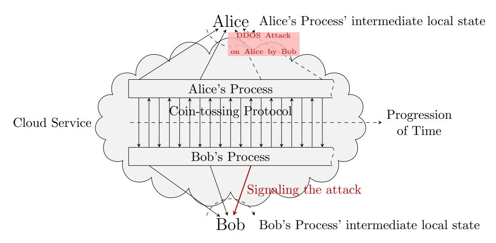
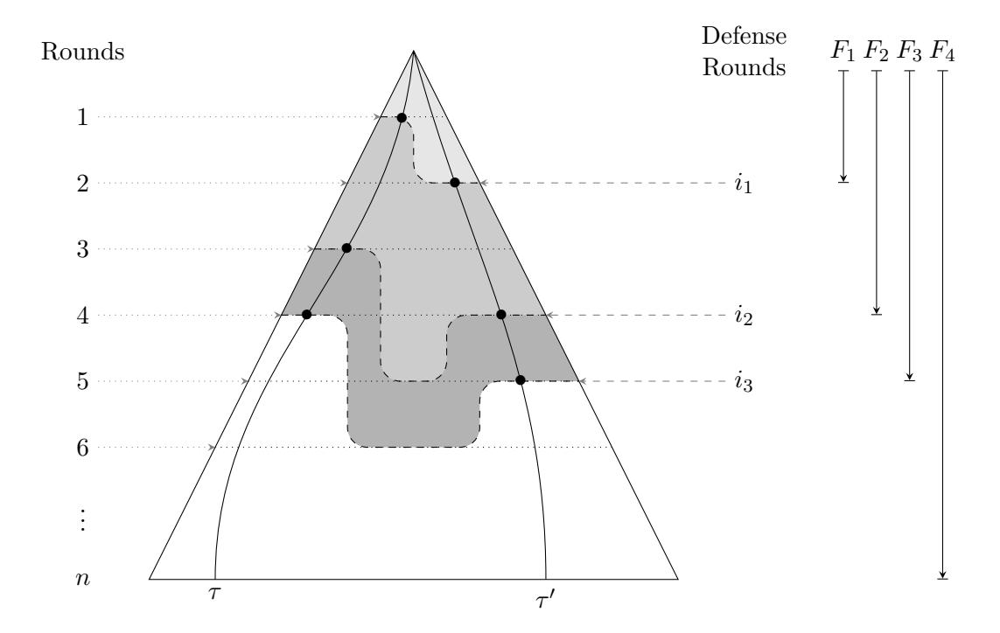
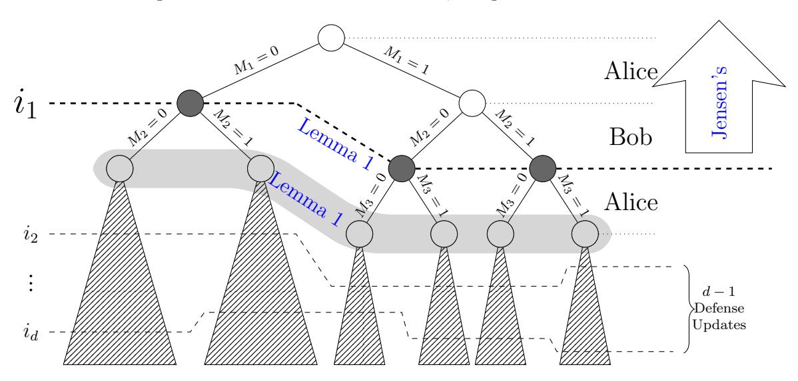
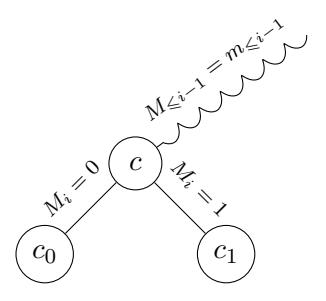
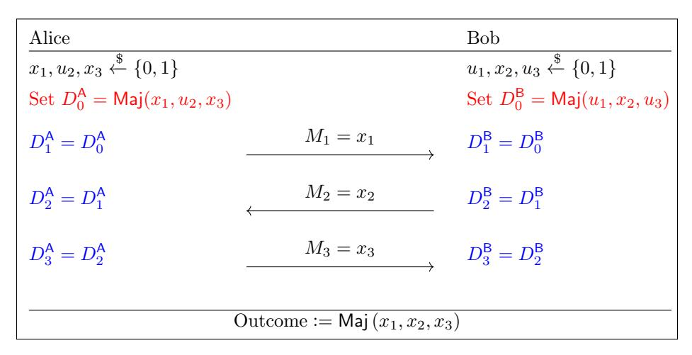
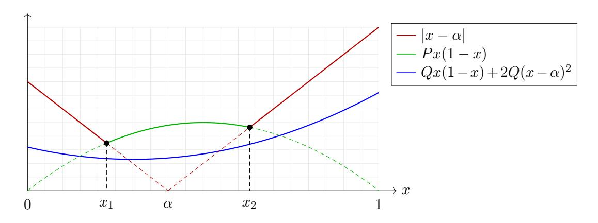

# Coin-tossing with Lazy Defense

Hamidreza Amini Khorasgani Hemanta K. Maji Mingyuan Wang

#### Abstract

There is a significant interest in securely computing functionalities with guaranteed output delivery, a.k.a., fair computation. For example, consider a 2-party n-round coin-tossing protocol in the information-theoretic setting. Even if one party aborts during the protocol execution, the other party has to receive her outcome. Towards this objective, every round, the sender of that round's message, preemptively prepares a defense coin, which is her output if the other party aborts prematurely. Cleve and Impagliazzo (1993), Beimel, Haitner, Makriyannis, and Omri (2018), and Khorasgani, Maji, and Mukherjee (2019) show that a fail-stop adversary can alter the distribution of the outcome by Ω(1/ √ n). This hardness of computation result for the representative coin-tossing functionality (using a partition argument) extends to the fair evaluation of any functionality whose output is not apriori fixed and honest parties are not in the majority.

However, there are natural scenarios in the delegation of computation where it is infeasible for the parties to update their defenses during every round of the protocol evolution. For example, when parties delegate, say, their coin-tossing task to an external server, due to high network latency, the parties cannot stay abreast of the progress of the fast protocol running on the server and keep their defense coins in sync with that protocol. Therefore, this paper considers lazy coin-tossing protocols, where parties update their defense coins only a total of d times during the protocol execution. Is it possible that using only d n defense coin updates, a fair coin-tossing protocol is robust to O(1/ √ n) change in their output distribution?

Our work highlights the necessity to distinguish protocols with publicly-measurable defense update strategies and protocols with private defense update strategies. In a publicly-measurable defense strategy, the decision of a party to update her defense coin depends solely on the public transcript of the two-party protocol. On the other hand, in a protocol with private defense strategy, the adversary cannot predict with certainty the partial transcripts where the honest party updates her defense coins. That is, the decision to update one's defense coin non-trivially depends on the party's private randomness.

Our work, for publicly-measurable defense update strategies, proves that a fail-stop adversary can bias the outcome distribution of a coin-tossing protocol by Ω 1/ √ d , a qualitatively better attack than the previous state-of-the-art when d = o(n). We emphasize that the rounds where parties calculate their defense coins need not be apriori fixed; they may depend on the protocol's evolution itself. This hardness of computation results extends to the fair evaluation of any functionality (possibly, stateful and with inputs) whose output has entropy and the honest parties are not in a majority. Finally, we translate this fail-stop adversarial attack into new black-box separation results.

To complement this hardness of computation result, our paper presents a coin-tossing protocol with a private defense update strategy. This protocol uses d = n 1−λ defense updates (in expectation) to achieve O(1/ √ n) robustness, where λ is an appropriate positive constant.

The proof relies on an inductive argument using a carefully crafted potential function to precisely account for the quality of the best attack on coin-tossing protocols. Previous approaches fail when the protocol evolution reveals information about the defense coins of both the parties, which is possible in lazy coin-tossing protocols. Technically, the potential function enables the characterization of a "data processing inequality" that holds for communication protocols only; and not for arbitrary distributions in general.

# 1 Introduction

Guaranteed output delivery is a desirable attribute of secure computation protocols. Secure computation of functionalities with guaranteed output delivery, a.k.a., fair computation, ensures that even if a party aborts during the execution of the protocol, the other party still obtains her output. Defining security and constructing secure protocols in this setting for general functionalities has been a field of highly influential research [\[Cle86,](#page-26-0) [CI93,](#page-26-1) [GHKL08,](#page-27-0) [GK10,](#page-27-1) [BLOO11,](#page-26-2) [ALR13,](#page-26-3) [Ash14,](#page-26-4) [Mak14,](#page-29-0) [ABMO15\]](#page-26-5). The security requirements of fair computations are extraordinarily stringent, and understanding the limits of achievable security for various models of adversarial power is a fundamental research problem.

The information-theoretic setting, where parties have unbounded computational power, achieving security even against fail-stop adversaries, i.e., adversarial parties follow the protocol honestly and sometimes abort the computation prematurely to change the final output distribution, the characterization of achievable security for various functionalities is already sufficiently sophisticated. For example, if the adversary can corrupt a majority of the parties in an n-round fair computation protocol for a functionality whose output is not apriori fixed, then the adversary can change the protocol's output distribution by Ω(1/ √ n) [\[CI93,](#page-26-1) [BHMO18,](#page-26-6) [KMM19\]](#page-28-0). This work delves further into this line of research and analyzes of the impact of the attributes of interactive protocols on achievable security in fair computation. This work studies the 2-party fair coin-tossing functionality as a representative fair computation task, and the hardness of computation result in this context shall lift to any arbitrary fair computation of multi-party functionalities where honest parties are not in the majority using a partition argument.

This paper motivates and makes a case for a more fine-grained characterization of how honest parties prepare to defend against an adversarial party who aborts during the protocol execution. We motivate this study using the representative task of delegating the task of secure coin-tossing protocols.

Figure 1: Illustration of Alice and Bob delegating their coin-tossing task to a cloud service when the honest party is vulnerable to a DDOS attack.

Representative Motivating Problem. Refer to [Figure 1](#page-1-0) for the discussion below. Alice and Bob are interested in upgrading their local private independent randomness into shared random coins for a time-sensitive application (for example, auctions, lotteries); each coin is heads (independently) with probability X0. Instead of undertaking this interactive task themselves, they delegate it to a cloud computing environment. This cloud computing environment spawns two processes to generate each shared coin (one on behalf of Alice and one on behalf of Bob) and runs one instance of an n-round 2-party coin-tossing protocol between these two processes. Delegating this task to a cloud environment allows choosing an enormous value of n because the communication between the two processes shall be significantly-fast; consequently, the protocol has the potential of achieving higher security. Alice provides the private random coins for Alice's process, and Bob provides the private random coins for Bob's process. Upon the protocol's completion, Alice's process reports its output back to Alice and, likewise, Bob's process reports its output back to Bob.

However, there is a threat that the adversary, based on its process' signal, launches a DDOS attack on the honest party, interrupting all communication between her and her process. This attack may result in the complete loss of the computation because the DDOS attack may only get resolved after the time-sensitive application's deadline has passed. The processes defend against the complete loss of their computation by reporting back their intermediate local state every t rounds to safeguard their computation's partial progress. Ideally, one would like to set t=1 to keep Alice/Bob abreast of the coin-tossing protocol's progress. Reporting back frequently to Alice/Bob introduces network latency that is multiple orders of magnitude larger than the coin-tossing protocol's low latency (see, for example, https://gist.github.com/hellerbarde/2843375). Inevitably, by the time Alice/Bob receive their defense coin, the coin-tossing protocol would have already progressed significantly ahead. Consequently, only large values of t are achievable.

Given n, t, and  $X_0$ , the *insecurity* of any coin-tossing protocol instance is the maximum change in the output distribution that the adversary causes by blocking the communication between the honest party and her process. In this scenario, the following questions are but natural. How much insecurity (as a function of n, t, and  $X_0$ ) should Alice and Bob anticipate? Equivalently, given a particular tolerance for security failure, how frequently should Alice and Bob update their defense coins? More fundamentally, what if t was randomized and chosen by a process based on her private randomness?

**Looking ahead.** We distinguish between two forms of defense update strategies (a) publicly-measurable, and (b) private strategies. Before proceeding further, it is instructive to highlight the difference between these two strategies. In a *publicly-measurable* defense update strategy, the decision to update a party's defense coin in a particular round depends *solely* on the public transcript of the protocol. For example, given a partial transcript of the protocol, one can compute with certainty whether a party shall update her defense coin or not. We emphasize that the updates need not take place at apriori fixed rounds. The defense update round may possibly depend on the protocol evolution; nevertheless, it depends solely on the protocol evolution.

On the other hand, a private defense update strategy relies on its entire view (the public transcript and private randomness) to determine whether to update her defense coin. So, for instance, it is possible that, given the protocol evolution, the adversarial party may only be able to compute the probability that the honest party updates her defense in that particular round.

All previous works [CI93, BHMO18, KMM19] study publicly-measurable defense update strategies and for the particular case of t=1. They prove that the insecurity in the coin-tossing protocol mentioned above (qualitatively) behaves as  $\frac{X_0(1-X_0)}{\sqrt{n}}$ . These bounds leave open the possibility that one might increase the time t between updating defenses (a.k.a., parties lazily update their defenses) without sacrificing the security of the protocol. Existing proof techniques break down entirely when the evolution of the coin-tossing protocol between consecutive updates of Alice's and Bob's defense coins reveals information about both of their defense coins, which is indeed possible for  $t \ge 2$  (see Figure 5 for a concrete example). To circumvent this challenge, we introduce a new inductive proof strategy demonstrating that the insecurity is at least  $\frac{X_0(1-X_0)}{\sqrt{n/t}}$ , a qualitatively better lower bound

when  $t = \omega(1)$ . Note that d := n/t, referred to as the defense complexity of the protocol, is the total number of defense coins received by Alice and Bob during the protocol execution. In general, we demonstrate that the defense complexity of the protocol, not the round complexity, is key to determining the insecurity of a coin-tossing protocol with publicly-measurable defense update strategies. In particular, our result implies that a high round-complexity coin-tossing protocol is vulnerable if parties do not frequently update their defense coins.

To complement this result, we present a coin-tossing protocol with private defense update strategy with defense complexity  $d = n^{1-\lambda}$  (except with exponentially low probability) that achieves  $1/\sqrt{n}$ -insecurity, where  $\lambda$  is a positive constant.

A technical bottleneck. Consider a coin-tossing protocol with publicly-measurable defense update strategy. The approach of Cleve and Impagliazzo [CI93] (and other similar techniques [BHMO18, KMM19]) encounters the following bottleneck. One can interpret any coin-tossing protocol as a Doob's martingale with respect to the filtration induced by the information exposed until the rounds where parties update their defense coins. Although there exists an  $\Omega\left(1/\sqrt{d}\right)$  gap in this martingale, the technique of Cleve and Impagliazzo [CI93] fails to materialize this gap in the martingale into a fail-stop attack on the coin-tossing protocol. Their transference argument crucially relies on the fact that the message recipient's expected defense coin does not change during the information exposure. In a lazy coin-tossing protocol, the information exposure spans multiple rounds in the coin-tossing protocol involving messages from both the parties. These messages in the protocol may divulge information about the defense coins of both parties as well. Consequently, the crucial invariant that Cleve and Impagliazzo [CI93] rely upon does not hold for coin-tossing protocols with lazy defense. Section 1.1 further elaborates on the subtlety of this technical challenge.

The case of private defense update strategies. Our work complements our hardness of computation results by presenting a coin-tossing protocol with a private defense update strategy that is robust to  $1/\sqrt{d}$  change in the output distribution using only  $d^{1-\lambda}$  defense updates, where  $\lambda$  is an appropriate positive constant. Section 6 presents this protocol. Private defense strategies have the benefit that the adversarial party cannot determine whether the honest party updated her defense coin in a particular round or not. However, the decision to update the defense coin in a round by the honest party depends deterministically on her private view, i.e., the public trancript and private randomness.

**Subsequent success story.** Maji and Wang [MW20] use our proof technique and the potential function to extend the hardness of computation result in this work to the random oracle model. This extension implies the qualitative optimality of the security achieved by the coin-tossing protocol of Blum [Blu82] and Cleve [Cle86] that uses one-way functions in a black-box manner, thus positively resolving a longstanding open problem.

Extensions: Our Potential Argument and Data processing Inequality. We guide the discussion on this topic using the representative example of fair coin-tossing protocols with publicly-measurable defense update strategy. Suppose the adversary knows that the honest party just updated her defense in round r, and shall next update her defense only at a later round r'. When should the adversary attack?

Data processing inequality suggests, that the adversary should wait until just before the round r' to perform the most devastating attack. Formally, suppose the state of the protocol at the end of round-r is S. It evolves to states  $S_1, S_2, \ldots, S_k$  with probability  $p_1, p_2, \ldots, p_k$  just before round r'. Let  $\Phi(S) \in \mathbb{R}$  represent (the "quality" of) the best attack when the protocol has state S. Similarly, for  $1 \leq i \leq k$ ,  $\Phi(S_i)$  represents the best attack when the protocol has state  $S_i$ . So, the expected quality of the attack when waiting is  $\sum_{i=1}^k p_i \cdot \Phi(S_i) = \mathrm{E}[\Phi(S_i)]$ . Consequently, the potential function

 $^{1}$ We emphasize that the round r' might be random variable depending on the evolution of the protocol.

has to respect the following inequality.

$$\Phi(S) = \Phi(E[S_i]) \geqslant E[\Phi(S_i)].$$

Our work introduces the potential function Φ(x, a, b) := x(1−x)+(x−a) 2+(x−b) 2 .Interestingly, this potential function is not convex, and, in general, the inequality above is false. However, our work shows that, it satisfies the inequality above if the state S evolves into the states Si 's via a communication protocol. This innovation of using a potential function Φ(·) to control the performance of an adversary's attack in communication protocols is an entirely new approach to such problems in the information-theoretic model.

The subsequent work of [\[MW20\]](#page-29-1) leverages our potential function to lift our attack from the information-theoretic world to their information-theoretic random oracle model. We believe that, in general, our potential function can serve as a conduit to lift information-theoretic attack on protocols to an appropriate relativized setting. For example, there are several open oracle-separation problems (like, separating optimal fair coin-tossing from public-key agreement) such that their corresponding problem in the information-theoretic setting is already resolved.

## 1.1 Discussion on Previous Approaches

Consider a 2-party n-round coin-tossing protocol such that the probability of the outcome being 1 is X0, and the probability of the outcome being 0 is 1 − X0. Let X = (X0, X1, . . . , Xn) represent the Doob's martingale corresponding to this protocol where Xi represents the expected outcome conditioned on the first i messages of the transcript. Note that Xn ∈ {0, 1}, because at the end of the protocol, both parties agree on the outcome being 0 or 1 with certainty. Previous works [\[CI93,](#page-26-1) [KKR18,](#page-28-1) [BHMO18,](#page-26-6) [KMM19\]](#page-28-0) prove the existence of a (randomized) round τ ∈ {1, 2, . . . , n} such that the expected magnitude of the gap |Xτ − Xτ−1| is Ω X0(1−X0) √ n . We clarify that the round τ being randomized implies that it can depend on the partial transcript generated during the protocol. Such a round τ , intuitively, is susceptible to attacks because there is a significant gap between the knowledge of the two parties regarding the (expected) outcome of the protocol. [\[BHMO18\]](#page-26-6) has the additional advantage that the attack is efficient for multiple parties.

In fair coin-tossing protocols [\[Cle86,](#page-26-0) [CI93,](#page-26-1) [GHKL08\]](#page-27-0) (i.e., coin-tossing protocols with guaranteed output delivery), if one of the parties aborts prematurely, then the other party still has to output 0 or 1. Intuitively, the two parties carry defense coins, which they regularly update as the protocol progresses. If a party aborts, then the other party outputs her defense coin. Without loss of generality, one can assume that the parties update their defense coin as part of their next message computation in the protocol execution. For example, without loss of generality, assume that Alice plays the role of the party that sends the first message in the coin-tossing protocol. Then, Alice updates her defense coin every odd round, and Bob updates his defense coin every even round.

A crucial property of information-theoretic protocols is the following. The expectation of Alice's defense coin (conditioned on the partial transcript) does not change after Bob sends the next message in the protocol, and (likewise) the expectation of Bob's defense coin does not change after Alice sends the next message in the protocol. For example, the expected value of Bob's defense coin immediately before and after Alice sends her message in round 3 is the same. Previous works consider the message exposure filtration {∅, T } = M0 ⊆ M1 ⊆· · · ⊆ Mn = 2T corresponding to the protocol.[2](#page-4-1) They identify the susceptible (randomized) round τ witnessing an Ω X0(1−X0) √ n gap in

2The set T represents the set of all possible transcripts in the protocol. The set 2T represents the set of all possible subsets of T .

Figure 2: The tree represents the protocol tree of the coin-tossing protocol. Gray dotted lines represent the n rounds of the protocol. The dashed lines represent the d=3 defense rounds. Any complete protocol execution (root to leaf path in the tree) encounters the defense rounds  $i_1$ ,  $i_2$ , and  $i_3$  in that particular order. For example, we consider two transcripts  $\tau$  and  $\tau'$ , and illustrate that they encounter  $i_1$ ,  $i_2$ , and  $i_3$  in that order. The  $\sigma$ -fields  $F_1$ ,  $F_2$ , and  $F_3$  expose messages till encountering  $i_1$ ,  $i_2$ , and  $i_3$ , respectively. The  $\sigma$ -field  $F_4$  reveals the entire protocol transcript.

the martingale. Next, they use this round  $\tau$  as a template to identify a fail-stop attack on the cointossing protocol and change the output distribution by  $\Omega\left(\frac{X_0(1-X_0)}{\sqrt{n}}\right)$ . This transference crucially relies on the fact that the expectation of the defense coin of the receiver in round  $\tau$  immediately before and after the  $\tau$ -th message is identical.

Now consider the scenario where parties update their defense coins lazily. Suppose the parties update their defenses in rounds  $1 \le i_1 < i_2 < \cdots < i_d \le n$ . We clarify that the rounds  $\{i_1, i_2, \ldots, i_d\}$  can be randomized as well, i.e., they depend on the partial transcripts during the protocol execution, refer to Figure 2. Furthermore, note that the parity of the round  $i_k$  implicitly identifies the party updating her defense coin. The randomized defense rounds are very natural to consider. For example, continuing the motivating example from the introduction, the next message computation of a delegated protocol may depend on the partial transcript of the delegated protocol. If, for instance, the protocol evolves into a state where the next-message-generation becomes extremely time consuming for the processes of the cloud, then Alice and Bob can use this opportunity to reduce their lag in the knowledge of the protocol's evolution.

Suppose one considers the message exposure filtration  $\{\emptyset, \mathcal{T}\} = M_0 \subseteq M_1 \subseteq \cdots \subseteq M_n = 2^{\mathcal{T}}$ , then the fail-stop attack shall ensure that the output distribution changes only by  $\Omega(X_0(1-X_0)/\sqrt{n})$ . On the other hand, one can instead consider the filtration  $\{\emptyset, \mathcal{T}\} = F_0 \subseteq F_1 \subseteq \cdots \subseteq F_d \subseteq F_{d+1} = 2^{\mathcal{T}}$ , where  $F_k$  (for  $1 \leq k \leq d$ ) corresponds to exposing all the protocol messages up to (the randomized) round  $i_k$ , and  $F_{d+1}$  represents exposing the full transcript. We emphasize that

the  $\sigma$ -field  $F_k$  may simultaneously expose multiple rounds of messages sent by both the parties in addition to the messages already exposed by  $F_{k-1}$ . Let  $\mathcal{Y} = (Y_0 = X_0, Y_1, \dots, Y_d, Y_{d+1})$  represent the martingale such that  $Y_k$  is the expectation of the outcome conditioned on the first  $i_k$  messages in the protocol. Note that  $Y_{d+1}$  is the expected outcome at the end of the protocol and, therefore, we have  $Y_{d+1} \in \{0,1\}$ .

Indeed, by applying [CI93, KKR18, BHMO18, KMM19], there exists a  $\tau \in \{1, 2, ..., d, d+1\}$  for this filtration such that the gap in parties' knowledge of the outcome between rounds  $i_{\tau-1}$  and  $i_{\tau}$  is  $\Omega\left(X_0(1-X_0)/\sqrt{d}\right)$ . However, the transference of  $\tau$  into a fail-stop attack on the coin-tossing protocol fails. This failure is attributable to the fact that the expectation of the defense coins of both parties may change between rounds  $i_{\tau-1}$  and  $i_{\tau}$  because  $F_{\tau}$  may expose messages by both parties in addition to the messages already exposed by  $F_{\tau-1}$  (refer to Figure 5 and Figure 6 for concrete examples).

Towards resolving this impasse, we employ a new potential function enabling an inductive proof for this problem; generalizing the approach of Khorasgani et al. [KMM19]. This new proof considers the message exposure filtration  $\{\emptyset, \mathcal{T}\} = M_0 \subseteq M_1 \subseteq \cdots \subseteq M_n = 2^{\mathcal{T}}$  while, simultaneously, ensuring a fail-stop attack on (information-theoretic) coin-tossing protocols that changes their output distribution by  $\Omega(X_0(1-X_0)/\sqrt{d})$ . Finally, these attacks naturally translate into black-box separation results for (appropriately restricted-versions of) fair coin-tossing protocols as considered in [DLMM11, HOZ13, DMM14].

**Subsequent work.** Maji and Wang [MW20] use our proof strategy and the potential function to extend our result to coin-tossing protocols in the random oracle model. En route, they also simplify the proof of our hardness of computation result.

**Black-box separation.** Several highly influential works [IR89, RTV04, BBF13] undertake the nuanced task of precisely defining black-box separation and its subtle variations. In our context, we rely on the *fully black-box separation* as introduced by Reingold, Trevisan, and Vadhan [RTV04].

Understanding whether one cryptographic primitive can be black-box constructed from another primitive is a fundamental problem in theoretical cryptography [Rud92, Sim98, Rud88, KSS00, KSS11, MM11, GKM+00, GMR01, GT00, GGK03, GGKT05, GMM07, BPR+08, Vah10, KSY11, MMP14a, MMP14b, MMN+16, MM16, GMM17, GMMM18]. However, the most relevant works for our context are those of [DLMM11, HOZ13, DMM14] that demonstrate the separation of optimal fair coin-tossing from one-way functions under certain restrictions of the coin-tossing protocols. Substituting the result of [CI93] with our Theorem 1 directly extends the black-box separations of [DLMM11, HOZ13, DMM14] to coin-tossing protocols with lazy defense.

#### 1.2 Our Contributions

A 2-party (n, d)-coin-tossing protocol with bias- $X_0$  is an n-round 2-party coin-tossing protocol (with output  $\{0, 1\}$ ) such that the expected outcome of the protocol is  $X_0$ , and parties update their defense coins in d rounds. The defense complexity d is a function of the round complexity n. Furthermore, the decision of a party to update her defense coin may depend on the partial transcript of the protocol itself. A protocol is  $\varepsilon$ -unfair if there exists a fail-stop strategy for one of the parties to deviate the output distribution of the honest party by  $\varepsilon$  in statistical distance. Our main result is the following theorem.

**Theorem 1** (Attacks on Coin-Tossing Protocol with Lazy Defense). There exists a universal positive constant c, such that for any  $X_0 \in [0,1]$  and 2-party (n,d)-coin-tossing protocol with bias- $X_0$  is (at least)  $c \cdot X_0(1-X_0)/\sqrt{d}$ -unfair.

Before our result, we knew that 2-party (n, n)-coin-tossing protocol with bias-X0 is Ω(X0(1 − X0)/ √ n) unfair [\[CI93,](#page-26-1) [BHMO18,](#page-26-6) [KMM19\]](#page-28-0). Our work, motivated by interesting cryptographic applications discussed in the introduction, decouples the round complexity and the defense complexity of cointossing protocols for a more fine-grained study of fair coin-tossing functionalities. We show that the defense complexity, not the round complexity, of coin-tossing protocols determines the security of coin-tossing protocols. For example, a coin-tossing protocol with high round complexity but a small defense complexity shall be very unfair. In particular, when d = o(n) it is impossible for an n-round coin-tossing protocol to be O(1/ √ n)-unfair, for a constant X0 ∈ (0, 1).

Finally, this fail-stop attack on coin-tossing protocols in the information theoretic setting translates into black-box separation [\[IR89,](#page-28-3) [RTV04\]](#page-29-2) results. Existing techniques leverage the fail-stop attack of [Theorem 1](#page-6-0) to rule out the construction of fair coin-tossing protocols by using one-way functions in a black-box manner for a broad class of protocols.

Corollary 2 (Black-box Separation). There exists a universal positive constant c such that, for any X0 ∈ [0, 1], there is no construction of a 2-party (n, d)-coin-tossing protocols with bias-X0 that is < c · X0(1 − X0)/ √ d-unfair and uses one-way functions in a black-box manner (restricted to the classes of protocols considered by [\[DLMM11,](#page-27-2) [HOZ13,](#page-28-2) [DMM14\]](#page-27-3)).

When d = o(n), our corollary provides new black-box separation results that do not follow from prior techniques.

Comparison with subsequent work. Maji and Wang [\[MW20\]](#page-29-1) use our proof technique and potential function to prove the black-box separation of [Corollary 2](#page-7-0) for all coin-tossing protocols. In our work, [Corollary 2](#page-7-0) uses existing techniques to lift our hardness of computation result of [Theorem 1,](#page-6-0) which is in the information-theoretic setting, into a black-box separation result for coin-tossing protocols if the protocol satisfies the restrictions of [\[DLMM11,](#page-27-2) [HOZ13,](#page-28-2) [DMM14\]](#page-27-3). On the other hand, Maji and Wang [\[MW20\]](#page-29-1) directly extend [Theorem 1](#page-6-0) to the random oracle model, which translates into a black-box separation result for arbitrary coin-tossing protocols without any restrictions.

## 1.3 Technical Overview

Our proof proceeds by induction on the defense complexity d of the coin-tossing protocol to lower bound the performance of the best fail-stop attack on the protocol. The proof of the inductive step for this result proceeds by another induction on the number of rounds m until the first time a party updates her defense coins. In particular, this second-level induction crucially avoids degrading the estimate of the best fail-stop attack's performance on the coin-tossing protocol as a function of m. In effect, the quality of the fail-stop attack depends only on d and is insensitive to the round complexity n of the protocol, thus circumventing the hurdles encountered by previous works.

#### 1.3.1 Score Function & Inductive Hypothesis

Consider any n-round coin-tossing protocol π with bias-X0 and defense complexity d, the inductive argument maintains a lower bound to the performance of the best cumulative attack possible on this coin-tossing protocol.

For any stopping time[3](#page-7-1) τ in the protocol, we associate a score to τ measuring its susceptibility to fail-stop attacks. For a partial transcript v ∈ τ , its contribution to the score is the sum of the change in the output distribution that Alice can cause by aborting at that partial transcript, and the change in the output distribution that Bob can cause by aborting at that partial transcript.

3A stopping time in a protocol is a set of prefix-free partial transcripts.

We emphasize that the same partial transcript  $v \in \tau$  may contribute to both Alice and Bob's attacks. Explicitly, the two possible attacks are as follows. The sender of the message can abort after generating (but not sending) the last message of the partial transcript v. The receiver may abort immediately after receiving the last message of the partial transcript v. Both these fail-stop strategies may be effective attacks in the scenario of coin-tossing protocols with lazy defense. The score of a stopping time  $\tau$  is the sum of all the contributions of  $v \in \tau$ . The optimal score associated with a protocol  $\pi$ , represented by  $\mathsf{Opt}(\pi)$ , is the maximum score achievable by a stopping time in that protocol.

Using induction on d, we prove that, for any protocol  $\pi$  with bias- $X_0$  and defense complexity d,

$$\mathsf{Opt}(\pi) \geqslant \Gamma_{2d} \cdot X_0(1 - X_0),$$

where  $\Gamma_i = \frac{1}{\sqrt{(\sqrt{2}+1)(i+2)}}$  (refer to Theorem 4). We remark that, indeed, it is possible to tighten the constants involved in the lower bound with a more careful analysis; however, such a tighter analysis does not qualitatively improve the bound.4

#### **1.3.2** Base Case: d = 0

In the case when the defense complexity of  $\pi$  is d=0, parties begin with their respective default defense coins and never update them. Irrespective of the round complexity n, our objective is to demonstrate a fail-stop attack on the (n, d=0)-coin-tossing protocol with bias- $X_0$  that changes the output distribution of the honest party by  $\Omega(X_0(1-X_0))$  statistical distance. Note that obtaining an attack whose effectiveness does not degrade with the round complexity n even for this simple case cannot be obtained from previous techniques [CI93, BHMO18, KMM19] (refer to the protocol in Figure 5).

We proceed by induction on the round complexity n. Consider the base case of n=1, a one-round protocol where Alice sends the first message in the protocol. Section 4.1.1 proves that  $\operatorname{Opt}(\pi) \geqslant X_0(1-X_0)$ .

The inductive step for  $n \ge 2$  is the non-trivial part of the proof. The case of n = 2 is representative enough to highlight all the key ideas to handle any general  $n \ge 2$ . Alice and Bob have defense coins such that their respective expected values are  $D_0^{\mathsf{A}}$  and  $D_0^{\mathsf{B}}$  before the protocol began. Alice sends the first message in the protocol, and Bob sends the second message in the protocol. Suppose the first message sent by Alice is  $M_1 = i$ , which happens with probability  $p^{(i)}$ . Conditioned on the first message being  $M_1 = i$ , the expected value of (a) the outcome be  $x_1^{(i)}$ , (b) Alice's defense coin be  $d_1^{\mathsf{A},(i)}$ , and (c) Bob's defense coin be  $D_0^{\mathsf{B}}$ . By aborting at the message  $M_1 = i$ , we obtain the following contribution to the score5

$$\left|x_1^{(i)} - d_1^{\mathsf{A},(i)}\right| + \left|x_1^{(i)} - D_0^{\mathsf{B}}\right|.$$

By deferring the attack to the residual (n-1) round protocol conditioned on  $M_1 = i$ , by the inductive hypothesis, we obtain the following contribution to the score

$$\geqslant x_1^{(i)} \left( 1 - x_1^{(i)} \right).$$

&lt;sup>4One can convert the optimal d-round protocol of Khorasgani et al. [KMM19] to construct an (n, d)-protocol that makes progress only when parties update their defense coin; thus, demonstrating the qualitative optimality of our lower bounds.

&lt;sup>5Recall that we are considering the sum of the change in the output distribution caused by Alice when she aborts (which is  $\left|x_1^{(i)} - D_0^{\mathsf{B}}\right|$ ) and the change in the output distribution caused by Bob when he aborts (which is  $\left|x_1^{(i)} - d_1^{\mathsf{A},(i)}\right|$ ).

The optimal stopping time can ensure the maximum of these two contributions, thus, obtaining a contribution of

 $\geqslant \max\left(\left|x_1^{(i)} - d_1^{\mathsf{A},(i)}\right| + \left|x_1^{(i)} - D_0^{\mathsf{B}}\right|, \ x_1^{(i)}\left(1 - x_1^{(i)}\right)\right).$ 

We prove a key technical lemma6 (Lemma 1) proving the following lower bound to the quantity above.

 $\geqslant \frac{1}{2} \cdot \left( x_1^{(i)} \left( 1 - x_1^{(i)} \right) + \left( x_1^{(i)} - d_1^{\mathsf{A},(i)} \right)^2 + \left( x_1^{(i)} - D_0^{\mathsf{B}} \right)^2 \right).$ 

Overall, at the root of the protocol tree, the score of the optimal stopping-time is lower-bounded by

$$\sum_{i} p^{(i)} \cdot \frac{1}{2} \cdot \left( x_{1}^{(i)} \left( 1 - x_{1}^{(i)} \right) + \left( x_{1}^{(i)} - d_{1}^{\mathsf{A},(i)} \right)^{2} + \left( x_{1}^{(i)} - D_{0}^{\mathsf{B}} \right)^{2} \right).$$

Let us define the multivariate function  $\Phi \colon [0,1] \times [0,1] \times [0,1] \to \mathbb{R}$  below

$$\Phi(x, y, z) := x(1 - x) + (x - y)^2 + (x - z)^2.$$

Let  $\Phi_z(x,y)$  represent the function  $\Phi(x,y,z)$  where z is a constant. Then, the function  $\Phi_z(x,y)$  is convex. Likewise, the function  $\Phi_y(x,z)$  is also convex.

We provide some intuition as to how this multivariate function shall be used in the analysis. In our context, x shall represent the expected output of the protocol when both parties behave honestly conditioned on the partial transcript generated so far. The variable y shall represent the expected Alice defense coin conditioned on the partial transcript, and, likewise, z shall represent the expected Bob defense coin conditioned on the partial transcript. The term x(1-x) in the function represents the variance of x, which, intuitively, accounts for the susceptibility of the protocol merely due to the fact that the honest execution has expected output x. The term  $(x-y)^2$  accounts for the attack that punishes Alice for having chosen her defense coin whose expectation is different from the honest output's expectation. Similarly, the term  $(x-z)^2$  accounts for the attack that punishes Bob for having chosen her defense coin expectation far from the expected honest output. We emphasize that there are several possible potential functions that one can choose with similar properties. However, this potential function is the *simplest* function that we could design to accurately account for the quality of fail-stop attacks in our context.

Recall that  $\sum_i p^{(i)} \cdot x_1^{(i)} = X_0$  and  $\sum_i p^{(i)} \cdot d_1^{\mathsf{A},(i)} = D_0^{\mathsf{A}}$ . Note that  $D_0^{\mathsf{B}}$  is a constant, and, therefore, one can use Jensen's inequality on  $\Phi$ , to push the expectation inside, obtaining the following lower bound.

$$\geqslant \frac{1}{2} \cdot \left( X_0 (1 - X_0) + \left( X_0 - D_0^{\mathsf{A}} \right)^2 + \left( X_0 - D_0^{\mathsf{B}} \right)^2 \right).$$

This bound is minimized when  $D_0^{\mathsf{A}} = X_0$  and  $D_0^{\mathsf{B}} = X_0$ . So, we obtain the lower-bound

$$\geqslant \frac{1}{2} \cdot X_0 \left( 1 - X_0 \right).$$

For n > 2, we rely on the fact that the expected value of the receiver's defense coin in every round does not change. So, Jensen's inequality applies to  $\Phi$ , and we move the lower-bound one round closer to the root. Iterative application of Jensen's inequality brings the lower-bound to the root, where it is identical to the expression above and is independent of the round complexity n of the protocol. Section 4.1 and Appendix C.1 provides full proof.

&lt;sup>6As an aside, we remark that this technical lemma is sufficiently powerful and immediately subsumes the lower bounds of Khorasgani et al. [KMM19]. We remark that Lemma 1 essentially translates the entire tight geometric transformation technique of Khorasgani et al. [KMM19] into an easy-to-use analytical result while incurring only a constant multiplicative factor loss in the parameters  $\{\Gamma_i\}_i$ .

#### 1.3.3 Inductive Step for $d \ge 1$

The inductive step of the proof shall proceed by induction on  $m \ge 1$ , the round where a party first updates her defense coins. Again, our objective is to obtain a lower bound that is independent of m.

Consider the base case of m=1. So, we have an (n,d)-coin-tossing protocol with bias- $X_0$  and Alice sends the first message and updates her defense. Suppose the first message set by Alice is  $M_1=i$ , which happens with probability  $p^{(i)}$ . Conditioned on the first message being  $M_1=i$ , the expected value of (a) the outcome be  $x_1^{(i)}$ , (b) Alice's updated defense coin be  $d_1^{A,(i)}$ , and (c) Bob's defense coin be  $D_0^B$ . In the remaining subprotocol, there are only d-1 defense updates. Therefore, the score in that subprotocol is at least  $\Gamma_{2(d-1)} \cdot x_1^{(i)} (1-x_1^{(i)})$ , by the induction hypothesis. So, using arguments similar to the case of d=0 and n=2 presented above, by appropriately deciding to either abort at  $M_1=i$  or deferring the attack to the subtree we get a score of

$$\geqslant \max \left( \left| x_1^{(i)} - d_1^{\mathsf{A},(i)} \right| + \left| x_1^{(i)} - D_0^{\mathsf{B}} \right|, \underbrace{\Gamma_{2(d-1)} \cdot x_1^{(i)} \left( 1 - x_1^{(i)} \right)}_{\text{By inductive hypothesis}} \right).$$

Using Lemma 1 and Jensen's inequality (because the first message does not reveal any information regarding Bob's default defense), we conclude that there is a stopping time with score

$$\geqslant \Gamma_{2(d-1)+1} \cdot \left( X_0 \left( 1 - X_0 \right) + \left( X_0 - \sum_i p^{(i)} \cdot d_1^{\mathsf{A},(i)} \right)^2 + \left( X_0 - D_0^{\mathsf{B}} \right)^2 \right) \geqslant \Gamma_{2d-1} \cdot X_0 \left( 1 - X_0 \right).$$

Observe that the expected value of the "updated Alice defense coin" appears in the first lower bound above; instead of the expected value of Alice's default defense  $D_0^{\mathsf{A}}$ . However, the final lower bound does *not* depend on the updated defense.

Finally, consider the inductive step of  $m \ge 2$ . The special case of m = 2 illustrates all the primary ideas. So, we have an (n, d)-coin-tossing protocol with bias- $X_0$ , Alice sends the first message, and Bob sends the second message and updates his defense coin. Suppose the first message set by Alice is  $M_1 = i$ , which happens with probability  $p^{(i)}$ . Conditioned on the first message being  $M_1 = i$ , the expected value of (a) the outcome be  $x_1^{(i)}$ , (b) Alice's defense coin be  $d_1^{A,(i)}$ , and (c) Bob's defense coin be  $D_0^B$ . For every i, using the above argument, we get that there exists a stopping time in the subprotocol rooted at  $M_1 = i$  with a score of

$$\geqslant \Gamma_{2d-1} \cdot x_1^{(i)} (1 - x_1^{(i)}).$$

So, a stopping time by deciding to either abort at  $M_1 = i$  or deferring the attack to a later point in time can obtain score of

$$\geqslant \max \left( \left| x_1^{(i)} - d_1^{\mathsf{A},(i)} \right| + \left| x_1^{(i)} - D_0^{\mathsf{B}} \right|, \underbrace{\Gamma_{2d-1} \cdot x_1^{(i)} \left( 1 - x_1^{(i)} \right)}_{\text{By previous argument}} \right)$$

$$\geqslant \Gamma_{2d} \cdot \left( X_0 \left( 1 - X_0 \right) + \left( X_0 - D_0^{\mathsf{A}} \right)^2 + \left( X_0 - D_0^{\mathsf{B}} \right)^2 \right)$$

The last inequality is an application of Lemma 1 and the fact that the expected value of Alice defense coins at the end of first round is identical to  $D_0^{\mathsf{A}}$  (because Alice does not update her defense coins in the first round).

For m > 2, we use Jensen's inequality on  $\Phi$  and the fact that the receiver's defense coins do not update in the protocol to rise one round up in the protocol tree. In this step, the constant  $\Gamma_{2d}$  does not change. So, iterating this procedure, we reach the root of the protocol where we get a lower-bound of

$$\Gamma_{2d} \cdot \left( X_0 \left( 1 - X_0 \right) + \left( X_0 - D_0^{\mathsf{A}} \right)^2 + \left( X_0 - D_0^{\mathsf{B}} \right)^2 \right) \geqslant \Gamma_{2d} \cdot X_0 (1 - X_0)$$

for the maximum score of the stopping time. Section 4.2 and Appendix C.2 provides the full proof.

# 1.3.4 Generalization to Protocols whose Defense Update Rounds are not Apriori Fixed

In general, the round where parties update their defense coin in a coin-tossing protocol may not be apriori fixed. More formally, parties in a coin-tossing protocol decide on updating their defense coins as follows. Suppose the partial transcript generated so far in the protocol is  $(M_1, M_2, \ldots, M_i)$ . The party sending the next message  $M_{i+1}$  in the protocol decides whether to update her defense coin or not based on the partial transcript  $(M_1, M_2, \ldots, M_i)$ . If the party decides to update her defense coin, then she updates her defense coin based on her private view.

The defense complexity of a coin-tossing protocol with not apriori fixed defense update rounds is (at most) d if during the generation of any complete transcript  $(M_1, M_2, \ldots, M_n)$  the total number of defense coin updates is  $\leq d$ . The proofs mentioned above generalize to this setting naturally. Section 5 (using Figure 3 for intuition) extends the proofs outlined above to this general setting.

## 2 Preliminaries

## 2.1 Martingales and Related Definitions

Suppose (X,Y) is a discrete joint distribution, then the conditional expectation of X given that Y=y, for any y such that  $\Pr[Y=y]>0$ , is defined as  $\mathrm{E}[X|Y=y]=\sum_x x\cdot\Pr[X=x|Y=y]$  where  $\Pr[X=x|Y=y]=\frac{\Pr[X=x,Y=y]}{\Pr[Y=y]}$ . The conditional expectation of X given Y, denoted by  $\mathrm{E}[X|Y]$ , is defined as the random variable that takes value  $\mathrm{E}[X|Y=y]$  with probability  $\Pr[Y=y]$ .

A discrete time random process  $\{X_i\}_{i=0}^n$  is a sequence of random variables where the random variable  $X_k$  denotes the value of process at time k.

Let  $(M_1, M_2, \ldots, M_n)$  be a joint distribution defined over sample space  $\Omega = \Omega_1 \times \Omega_2 \times \cdots \times \Omega_n$  such that for any  $i \in \{1, \ldots, n\}$ ,  $M_i$  is a random variable over  $\Omega_i$ . A random variable  $X_j$  defined over  $\Omega$  is said to be  $M_1, \ldots, M_j$  measurable if there exists a deterministic function  $f_j : \Omega_1 \times \Omega_2 \times \cdots \times \Omega_n \to \mathbb{R}$  such that  $X_j = f_j(M_1, M_2, \ldots, M_j)$  i.e. the value of  $X_j$  is determined by the random variables  $M_1, M_2, \ldots, M_j$  and in particular, it does not depend on random variables  $M_{j+1}, \ldots, M_n$ . A discrete time random process  $\{X_i\}_{i=0}^n$  is said to be a discrete time martingale with respect to another sequence  $\{M_i\}_{i=1}^n$  if it satisfies the two following conditions for any time values  $1 \leq k \leq n$  and  $0 \leq r \leq \ell$ :

$$E[|X_k|] < \infty$$
  

$$E[X_\ell|M_1, M_2, \dots, M_r] = X_r$$

which means that at any time, given the current value and all values from the past, the conditional expectation of random process at any time in the future is equal to the current value. For such a martingale, a random variable  $\tau \colon \Omega \to \{0, 1, \dots, n\}$  is called a *stopping time* if the random variable

 $1_{\{\tau \leq k\}}$  is  $M_1, \ldots, M_k$  measurable. One can verify that for a given function  $g: \Omega_1 \times \cdots \times \Omega_n \to \mathbb{R}$ , the random sequence  $\{Z_i\}_{i=0}^n$  where for each  $i, Z_i = \mathrm{E}[f(M_1, \ldots, M_n) | M_1, \ldots, M_i]$  is a martingale with respect to the sequence  $\{M_i\}_{i=1}^n$ . This martingale is called the *Doob's martingale*.

## 2.2 Coin-tossing Protocols with Apriori Fixed Defense Update Rounds

Let us first define the coin-tossing protocol with apriori fixed defense update rounds.

**Definition 1**  $((X_0, n, \mathcal{A}, \mathcal{B})$ -coin tossing protocol). Let  $\pi$  be an n-round coin tossing protocol, where Alice and Bob speak in alternate rounds to determine the outcome of the tossing of a  $X_0$ -bias coin, i.e., the probability of head is  $X_0$ . Without loss of generality, assume that Alice sends the first message. Therefore, Alice (resp., Bob) will be speaking in the odd (resp., even) rounds. Let  $\mathcal{A} \subseteq [n] \cap \mathsf{Odd}$  and  $\mathcal{B} \subseteq [n] \cap \mathsf{Even}$ . During the protocol execution, Alice and Bob shall defend in the following manner.

- Alice and Bob both prepare a defense before the beginning of the protocol based on their private tape. We refer to this defense as Alice's and Bob's defense at round 0.
- At any round  $i \in [n]$ , if Alice is supposed to speak (i.e.,  $i \in \mathsf{Odd}$ ) and  $i \in \mathcal{A}$ , she shall prepare a new defense based on her private view, which is, her private tape and the first i −1 messages exchanged. Otherwise, i.e., i ∉ A, she shall not prepare a new defense and simply set her defense for the previous round as her defense for this round. That is, Alice keeps her defense unchanged for this round. Bob's defense is prepared in the similar manner.
- At an odd round  $i \in [n]$ , Alice is supposed to speak and she might decide to abort the protocol. If Alice aborts, Bob shall output his defense for this round as defined above. Alice's output when Bob aborts is defined in the similar manner.

For brevity, we refer to such coin-tossing protocols as an  $(X_0, n, \mathcal{A}, \mathcal{B})$ -coin tossing protocol. We refer to the expectation of the outcome of the protocol, i.e.,  $X_0$ , as the root-color. We refer to the size of the set  $\mathcal{A} \cup \mathcal{B}$  as the defense complexity of the coin-tossing protocol.8

We provide a few representative examples in Appendix A. The following remarks provide additional perspectives to this definition.

**Remark 1.** We clarify that a party *does not* update her defense during a round where she does not send a message in the protocol. For example, at an odd round i, Bob does not update his defense. This is because Bob's private view at round i, i.e., Bob's private tape, and the first i-1 messages, is a *deterministic function* of Bob's private view at round i-1, i.e., Bob's private tape and the first i-2 messages. Therefore, Bob's defense strategy to update his defense at round i is *simulatable* by a defense strategy to update his defense at round i-1. Hence, without loss of generality, parties only update their respective defenses during a round that they are supposed to speak. This simplification *shall not* make the protocol any more vulnerable.

**Remark 2.** In particular, if we set  $\mathcal{A}$  to be  $[n] \cap \mathsf{Odd}$  and  $\mathcal{B}$  to be  $[n] \cap \mathsf{Even}$ , this is the *fair coin-tossing protocol* that has been widely studied in the literature.

 $^{7}$ We use [n] to denote the set  $\{1, 2, ..., n\}$ . Odd (resp., Even) represents the set of all odd (resp., even) positive integers.

&lt;sup>8Note that the defense complexity is less than or equal to the round complexity.

#### 2.2.1 Notation

Let us denote the message exchanged between two parties in an n-round protocol by  $M_1, M_2, \ldots, M_n$ . For  $i \in [n]$ , let  $X_i$  be the expected outcome conditioned on the first i messages, i.e.,  $M_1, \ldots, M_i$ . We also refer to the expected outcome  $X_i$  as the *color* at time i. Let  $D_i^{\mathsf{A}}$  (resp.,  $D_i^{\mathsf{B}}$ ) represents the expectation of the Alice's (resp., Bob's) defense coin at round i conditioned on the first i messages. Note that  $X_i$ ,  $D_i^{\mathsf{A}}$  and  $D_i^{\mathsf{B}}$  are  $M_1, \ldots, M_i$  measurable. In particular,  $X_0$ ,  $D_0^{\mathsf{A}}$  and  $D_0^{\mathsf{B}}$  are constants. Throughout our proof, the following inequality will be useful.

**Theorem 3** (Jensen's inequality). If f is a multivariate convex function, then  $\mathbb{E}\left[f\left(\vec{X}\right)\right] \geqslant f\left(\mathbb{E}\left[\vec{X}\right]\right)$ , for all probability distributions  $\vec{X}$  over the domain of f.

# 3 Our Results on Apriori Fixed Defense Update Rounds

In this section, we shall present our main results on the coin-tossing protocols with *apriori fixed* defense rounds. In Section 5, we present how one can generalize the proof strategies to coin-tossing protocols whose defense update round may not be apriori fixed, but still publicly-measurable.

Intuitively, our results state that the vulnerability of a coin-tossing protocol depends solely on the defense complexity and is irrespective of the round complexity.

Let us first define the following score function which captures the susceptibility of a protocol with respect to a stopping time.

**Definition 2.** Let  $\pi$  be a  $(X_0, n, \mathcal{A}, \mathcal{B})$ -coin tossing protocol. Let  $P \in \{A, B\}$  be the party who sends the last message of the protocol. For any stopping time  $\tau$ , define

$$\mathsf{Score}(\pi,\tau) := \left. \mathbb{E} \Big[ \mathbb{1}_{(\tau \neq n) \vee (\mathsf{P} \neq \mathsf{A})} \cdot \left| X_\tau - D^\mathsf{A}_\tau \right| + \mathbb{1}_{(\tau \neq n) \vee (\mathsf{P} \neq \mathsf{B})} \cdot \left| X_\tau - D^\mathsf{B}_\tau \right| \right].$$

We clarify that the binary operator  $\vee$  in the expression above represents the boolean OR operation.

The following remarks provide additional perspectives to this definition.

Remark 3. Suppose we are in a round  $\tau$ , where Alice is supposed to speak. The color  $X_{\tau}$  corresponds to Alice's message being  $m_{\tau}^*$ . We note that, in a coin-tossing protocol with lazy defense, both Alice and Bob can deviate the outcome by aborting appropriately. Alice can attack by aborting when her next message turns out to be  $m_{\tau}^*$  without sending it to Bob. By our definition, this attack ensures a deviation of  $|X_{\tau} - D_{\tau}^{\mathsf{B}}|$ . On the other hand, Bob can also attack this message by aborting the next round upon receiving the message  $m_{\tau}^*$ . This attack might be successful because Alice's defense is lazy and she does not update her defense at round  $\tau$ . Bob's attack will deviate the distribution of the outcome by  $|X_{\tau} - D_{\tau+1}^{\mathsf{A}}|$ . However, note that Alice is not supposed to speak at the  $(\tau+1)^{th}$  round, her defense at  $(\tau+1)^{th}$  round is identical to her defense at  $\tau^{th}$  round. Hence, the deviation of Bob's attack is also  $|X_{\tau} - D_{\tau}^{\mathsf{A}}|$ . We emphasize that, in fair coin-tossing protocols where parties update their defenses every round, this attack by Bob, possibly, is ineffective.

**Remark 4.** We note that the above remark has a boundary case, i.e., the last message of the protocol. Without loss of generality, assume that Alice sends the last message of the protocol. Note that, unlike previous messages, Bob cannot abort anymore after receiving the last message from Alice, since the protocol has ended. Therefore, our score function should exclude  $|X_{\tau} - D_{\tau}^{A}|$  when  $\tau = n$ . Hence, in the definition of our score function, we have an indicator function 1. Intuitively, this boundary case needs to be accounted in our score; however, we emphasize that, this boundary case does not significantly alter our proof strategy.

Remark 5. Looking ahead, we elaborate how one translates our score function into fail-stop attacks by Alice and Bob. Fix a stopping time  $\tau$  that witnesses a large susceptibility. To construct the attacks by Alice, we partition the stopping time  $\tau$  into two sets depending on whether  $X_{\tau} \geq D_{\tau}^{A}$  or not. Similarly, for Bob's attacks, we partition the stopping time  $\tau$  into two sets depending on whether  $X_{\tau} \geq D_{\tau}^{B}$  or not. These four (fail-stop) attack strategies correspond to Alice or Bob deviating the outcome towards 0 or 1, respectively. Note that the sum of the biases achieved by these four attacks is identical to the score function. Therefore, by averaging arguments, one of these four attacks can deviate the protocol by at least  $\frac{1}{4} \cdot \text{Score}(\pi, \tau)$ . We clarify that, in light of Remark 3, the portions of the stopping time  $\tau$  that contribute to Alice attacks and the portions that contribute to Bob attacks need not be mutually exclusive.

Given an  $(X_0, n, \mathcal{A}, \mathcal{B})$ -coin-tossing protocol  $\pi$ , we are interested in the optimal stopping time  $\tau$  that maximizes  $\mathsf{Score}(\pi, \tau)$ . This quantity represents the susceptibility of the protocol. Hence, we have the following definition.

**Definition 3.** For any coin-tossing protocol  $\pi$ , we define

$$\mathsf{Opt}(\pi) := \max_{\tau} \; \mathsf{Score}(\pi, \tau).$$

With these definitions, we are ready to present our main theorem, which states the following.

**Theorem 4.** For all root-color  $X_0 \in [0,1]$  and defense complexity  $d \in \mathbb{N}$ , and any  $(X_0, n, \mathcal{A}, \mathcal{B})$ coin-tossing protocol  $\pi$  where  $d = |\mathcal{A} \cup \mathcal{B}|$ , we have

$$\mathsf{Opt}(\pi) \geqslant \Gamma_{2d} \cdot X_0 (1 - X_0),$$

where 
$$\Gamma_i := \frac{1}{\sqrt{(\sqrt{2}+1)(i+2)}}$$
 for all  $i \in \{0,1,\dots\}$ .

Asymptotically, we have  $\Gamma_i \gtrsim 0.64/\sqrt{i}$ . Note that the lower bound is only associated with the root-color  $X_0$  and defense complexity d of the protocol  $\pi$ .

We present the proof of Theorem 4 in Section 4. In light of Remark 5 above, we can directly translate this theorem into a fail-stop attack strategy.

**Corollary 5.** For any  $(X_0, n, \mathcal{A}, \mathcal{B})$ -coin-tossing protocol, with defense complexity d, there exists a fail-stop attack strategy for either Alice or Bob that deviates the protocol by at least

$$\frac{1}{4} \cdot \frac{X_0(1 - X_0)}{\sqrt{(\sqrt{2} + 1)(2d + 2)}}.$$

## 4 Proof of Theorem 4

In this section, we shall prove Theorem 4 using mathematical induction on the defense complexity d of the coin-tossing protocol. In Section 4.1, we prove the base case, i.e., d = 0. In Section 4.2, we prove the inductive step. We stress that although the base case is conceptually simple, its proof already captures most of the technical challenges involved in proving the general inductive step.

Throughout the proof, we use the following key technical lemma repeatedly. We defer the proof of Lemma 1 to Appendix B.

**Lemma 1** (Key technical Lemma). For all  $P \in [0,1]$  and  $Q \in [0,1/2]$ , if P,Q satisfies

$$P - Q - P^2 Q \geqslant 0,$$

then, for all  $x, \alpha, \beta \in [0, 1]$ , we have

$$\max (P \cdot x(1-x), |x-\alpha| + |x-\beta|) \ge Q \cdot (x(1-x) + (x-\alpha)^2 + (x-\beta)^2).$$

In particular, for any  $k \geqslant 1$ , the constraints are satisfied, if we set  $P = \Gamma_{k-1} := \frac{1}{\sqrt{(\sqrt{2}+1)(k+1)}}$  and  $Q = \Gamma_k := \frac{1}{\sqrt{(\sqrt{2}+1)(k+2)}}$ .

#### **4.1** Base Case: d = 0

The base case is that the defense complexity d is 0, i.e., both  $\mathcal{A}$  and  $\mathcal{B}$  are empty sets, and hence parties only prepare their defenses before the beginning of the protocol and never update it (see the example in Figure 5).

To prove the base case, we shall prove the following stronger statement that clearly implies that Theorem 4 is correct for the base case. We prove the following lemma by induction on the round complexity n, where n = 1 and n = 2 serve as the base cases.

**Lemma 2** (Base Case of d = 0). For any n-round protocol  $\pi$  with defense complexity d = 0,

1. If 
$$n = 1$$
,

$$Opt(\pi) \ge X_0 (1 - X_0)$$
.

2. If 
$$n \ge 2$$
,

$$\mathsf{Opt}(\pi) \geqslant \frac{1}{2} \cdot \left( X_0 \left( 1 - X_0 \right) + \left( X_0 - D_0^\mathsf{A} \right)^2 + \left( X_0 - D_0^\mathsf{B} \right)^2 \right).$$

**Remark 6.** We remark that  $D_0^{\mathsf{A}} = D_0^{\mathsf{B}} = X_0$  is the only Alice's and Bob's defense that optimizes our lower bound for the  $n \ge 2$  case. In general, we do not claim that they are the optimal defenses that minimize the score of the optimal stopping time. Our bound is simply a lower bound.

#### **4.1.1** Round Complexity n = 1

Let us start with the simplest case, i.e., when n=1. Here, we have a one-round protocol  $\pi$ . Without loss of generality, assume that Alice sends the only message. The only attack is by Alice to abort her message and thus we pick our stopping time to be  $\tau=1$ . This gives us

$$\mathsf{Score}(\pi, \tau) = \mathbf{E} \Big[ \Big| X_1 - D_1^{\mathsf{B}} \Big| \Big].$$

Recall that  $X_1 \in \{0, 1\}$  and  $\Pr[X_1 = 1] = X_0$ . Moreover, regardless of what Alice's first message is, the expectation of Bob's defense for the first round, i.e.,  $D_1^{\mathsf{B}}$ , remains the same and is exactly the expectation of his defense at the beginning of the protocol, i.e.,  $D_0^{\mathsf{B}}$ . Therefore,

$$\mathsf{Score}(\pi,\tau) = (1-X_0) \cdot \Big| 0 - D_0^{\mathsf{B}} \Big| + X_0 \cdot \Big| 1 - D_0^{\mathsf{B}} \Big|.$$

To lower-bound the score mentioned above, observe that

$$(1 - X_0)D_0^{\mathsf{B}} + X_0(1 - D_0^{\mathsf{B}}) \geqslant X_0(1 - X_0) + (X_0 - D_0^{\mathsf{B}})^2 \geqslant X_0(1 - X_0).$$

Hence, for any coin-tossing protocol  $\pi$  with n = 1,  $Opt(\pi) \ge X_0 (1 - X_0)$ .

#### **4.1.2** Round Complexity n = 2

Next, we consider the case when n=2. Let  $\pi$  be a two-round protocol, where Alice sends the first message and Bob sends the second message. Without loss of generality, assume that there are  $\ell$  possible first messages that Alice can send, namely  $\{1,2,\ldots,\ell\}$ . The probability of the first message being i, i.e.,  $M_1=i$ , is  $p^{(i)}$ . For all  $i\in[\ell]$ , conditioned on first message being i, let  $X_1=x_1^{(i)}$  and  $D_1^{\mathsf{A}}=d_1^{\mathsf{A},(i)}$ . Again, regardless of what Alice's first message is, the expectation of Bob's defense  $D_1^{\mathsf{B}}$  remains the same as  $D_0^{\mathsf{B}}$ . Therefore, if we stop at message  $M_1=i$ , this contributes to our score function by

$$\left| x_1^{(i)} - d_1^{\mathsf{A},(i)} \right| + \left| x_1^{(i)} - D_0^{\mathsf{B}} \right|.$$

On the other hand, conditioned on Alice's first message being i, the remaining protocol is exactly a one-round protocol with root-color  $x_1^{(i)}$ . By our analysis above, the optimal stopping time for this sub-protocol will yield a score of at least  $x_1^{(i)} \left(1 - x_1^{(i)}\right)$ . Hence, the optimal stopping time will decide on whether to stop at first message being i or continue to a stopping time in the mentioned sub-protocol, depending on which of these two strategies yield a larger score. This will contribute to the score function by at least

$$\max\left(\left|x_{1}^{(i)}-d_{1}^{\mathsf{A},(i)}\right|+\left|x_{1}^{(i)}-D_{0}^{\mathsf{B}}\right|,x_{1}^{(i)}\left(1-x_{1}^{(i)}\right)\right).$$

Using Lemma 1 with P = 1 and Q = 1/2, we get

$$\begin{split} & \max \left( \left| x_1^{(i)} - d_1^{\mathsf{A},(i)} \right| + \left| x_1^{(i)} - D_0^{\mathsf{B}} \right|, x_1^{(i)} \left( 1 - x_1^{(i)} \right) \right) \\ \geqslant & \frac{1}{2} \cdot \left( x_1^{(i)} \left( 1 - x_1^{(i)} \right) + \left( x_1^{(i)} - d_1^{\mathsf{A},(i)} \right)^2 + \left( x_1^{(i)} - D_0^{\mathsf{B}} \right)^2 \right). \end{split}$$

Therefore, the optimal stopping time will have score

$$\begin{split} & \sum_{i=1}^{\ell} p^{(i)} \cdot \max \left( \left| x_{1}^{(i)} - d_{1}^{\mathsf{A},(i)} \right| + \left| x_{1}^{(i)} - D_{0}^{\mathsf{B}} \right|, x_{1}^{(i)} \left( 1 - x_{1}^{(i)} \right) \right) \\ & \geqslant \frac{1}{2} \cdot \sum_{i=1}^{\ell} p^{(i)} \cdot \left( x_{1}^{(i)} \left( 1 - x_{1}^{(i)} \right) + \left( x_{1}^{(i)} - d_{1}^{\mathsf{A},(i)} \right)^{2} + \left( x_{1}^{(i)} - D_{0}^{\mathsf{B}} \right)^{2} \right) \\ & \geqslant \frac{1}{2} \cdot \left( X_{0} \left( 1 - X_{0} \right) + \left( X_{0} - D_{0}^{\mathsf{A}} \right)^{2} + \left( X_{0} - D_{0}^{\mathsf{B}} \right)^{2} \right), \end{split}$$

Let us elaborate on inequality (i).

- 1. One can verify that for any constant c, the function  $\Phi_c(x,y) := x(1-x) + (x-y)^2 + (x-c)^2$  is a bivariate convex function. The Hessian matrix of  $\Phi_c$  is positive semi-definite.
- 2. Since  $(X_0, X_1)$  forms a martingale, we have  $\sum_{i=1}^{\ell} p^{(i)} \cdot x_1^{(i)} = E[X_1] = X_0$ .
- 3. Since Alice never updates her defense, Alice's defense  $(D_0^A, D_1^A)$  forms a martingale as well, which impies that  $\sum_{i=1}^{\ell} p^{(i)} \cdot d_1^{A,(i)} = \mathbb{E}[D_1^A] = D_0^A$ .

Given these observations, applying Jensen's inequality on  $\Phi_{D_0^{\mathsf{B}}}(x,y) := x(1-x) + (x-y)^2 + \left(x-D_0^{\mathsf{B}}\right)^2$  gives us inequality (i).

This completes the proof of Lemma 2 for n=2. In general, for the case when n>2, the proof is essentially the same as n=2 case and hence we omit it here. Appendix C.1 presents the complete proof.

## 4.2 Inductive Step

In this section, we prove that for all  $d_0 \ge 1$ , if Theorem 4 holds for defense complexity  $d = d_0 - 1$ , then it is also correct for  $d = d_0$ . Together, with the proof of base case, i.e., d = 0, we complete the proof of Theorem 4.

Our analysis is based on the index of the round that, for the first time, some party updates her defense. Let us call the index of this round m. To prove the inductive step, we shall prove the following stronger statement that clearly implies the inductive step. We prove the following lemma by induction on the index of the first defense round m, where m = 1 and m = 2 serve as the base cases.

**Lemma 3** (Inductive Step of any  $d \ge 1$ ). For any coin-tossing protocol  $\pi$  with defense complexity  $d = d_0$ ,

1. If 
$$m = 1$$
,

$$\mathsf{Opt}(\pi) \geqslant \Gamma_{2d_0-1} \cdot \left(X_0 \left(1 - X_0\right)\right).$$

2. If 
$$m \geqslant 2$$
,

$$\mathsf{Opt}(\pi) \geqslant \Gamma_{2d_0} \cdot \left( X_0 \left( 1 - X_0 \right) + \left( X_0 - D_0^\mathsf{A} \right)^2 + \left( X_0 - D_0^\mathsf{B} \right)^2 \right).$$

## **4.2.1** First defense round: m = 1

Let us start with m=1. In this case, we have some  $(X_0, n, \mathcal{A}, \mathcal{B})$  protocol  $\pi$ , with defense complexity  $d_0 = |\mathcal{A} \cup \mathcal{B}|$  and assume, without loss of generality, Alice sends the first message. m=1 implies that Alice updates her defense in the first round, i.e.,  $1 \in \mathcal{A}$ . Assume that there are  $\ell$  possible first messages that Alice can send, namely  $\{1, 2, \ldots, \ell\}$ . For all  $i \in [\ell]$ , the probability of the first message being i is  $p^{(i)}$  and conditioned on the first message being i,  $X_1 = x_1^{(i)}$  and  $D_1^{\mathsf{A}} = d_1^{\mathsf{A},(i)}$  and the rest (n-1) rounds forms a sub-protocol  $\pi_i$  that is a  $(x_1^{(i)}, n-1, \mathcal{A}', \mathcal{B}')$  protocol where  $\mathcal{A}'$  and  $\mathcal{B}'$  are obtained respectively by reducing each index inside  $\mathcal{A}\setminus\{1\}$  and  $\mathcal{B}$  by 1. Clearly, the defense complexity of  $\pi_i$  is  $|\mathcal{A}' \cup \mathcal{B}'| = d_0 - 1$ . By our induction hypothesis (that Theorem 4 is true for  $d = d_0 - 1$ ), there exists a stopping time of this sub-protocol that yields a score of at least

$$\Gamma_{2(d_0-1)} \cdot x_1^{(i)} \left(1 - x_1^{(i)}\right).$$

On the other hand, if we stop when message i happens as the first message, the score will increase by

$$\left|x_1^{(i)} - d_1^{\mathsf{A},(i)}\right| + \left|x_1^{(i)} - D_0^{\mathsf{B}}\right|.$$

Again, note that, regardless of Alice's messages, the expectation of Bob's defense shall remain the same and equals to  $D_0^{\mathsf{B}}$ . The optimal stopping time will decide on whether to stop at first message being i, by comparing which one yields a higher score. Therefore, it will contribute to our score by at least

$$\max\left(\Gamma_{2(d_0-1)} \cdot x_1^{(i)} \left(1 - x_1^{(i)}\right), \left|x_1^{(i)} - d_1^{\mathsf{A},(i)}\right| + \left|x_1^{(i)} - D_0^{\mathsf{B}}\right|\right).$$

By invoking Lemma 1 with  $P = \Gamma_{2(d_0-1)}$  and  $Q = \Gamma_{2d_0-1}$ , we get that, for any i

$$\begin{split} & \max \left( {\Gamma _{2({d_0} - 1)} \cdot x_1^{(i)}\left( {1 - x_1^{(i)}} \right),\left| {x_1^{(i)} - d_1^{{\mathsf{A}},(i)}} \right| + \left| {x_1^{(i)} - D_0^{\mathsf{B}}} \right|} \right) \\ & \geqslant \Gamma _{2{d_0} - 1} \cdot \left( {x_1^{(i)}\left( {1 - x_1^{(i)}} \right) + \left( {x_1^{(i)} - d_1^{{\mathsf{A}},(i)}} \right)^2 + \left( {x_1^{(i)} - D_0^{\mathsf{B}}} \right)^2} \right). \end{split}$$

Hence, the score corresponding to optimal stopping time will be at least

$$\sum_{i=1}^{\ell} p^{(i)} \cdot \max \left( \Gamma_{2(d_0-1)} \cdot x_1^{(i)} \left( 1 - x_1^{(i)} \right), \left| x_1^{(i)} - d_1^{\mathsf{A},(i)} \right| + \left| x_1^{(i)} - D_0^{\mathsf{B}} \right| \right)$$

$$\geqslant \Gamma_{2d_0-1} \cdot \sum_{i=1}^{\ell} p^{(i)} \cdot \left( x_1^{(i)} \left( 1 - x_1^{(i)} \right) + \left( x_1^{(i)} - d_1^{\mathsf{A},(i)} \right)^2 + \left( x_1^{(i)} - D_0^{\mathsf{B}} \right)^2 \right)$$

$$\stackrel{\text{(ii)}}{\geqslant} \Gamma_{2d_0-1} \cdot \left( X_0 \left( 1 - X_0 \right) + \left( X_0 - \mathsf{E} \left[ D_1^{\mathsf{A}} \right] \right)^2 + \left( X_0 - D_0^{\mathsf{B}} \right)^2 \right)$$

$$\geqslant \Gamma_{2d_0-1} \cdot X_0 \left( 1 - X_0 \right).$$

Similar to the previous cases, inequality (ii) is also a consequence of Jensen's inequality. However, we emphasize a crucial point, which is that, since Alice updates her defense in the first round, in general,  $(D_0^A, D_1^A)$  need not be a martingale and so  $E[D_1^A]$  does not necessarily equal to  $D_0^A$ .

#### **4.2.2** First defense round: m = 2

Next, we consider the case m=2. Let  $\pi$  be a  $(X_0,n,\mathcal{A},\mathcal{B})$  protocol. Without loss of generality, assume Alice sends the first message and Bob sends the second message. m=2 implies that Alice does not update her defense in the first round, while Bob does update his defense in the second round, i.e.  $1 \notin \mathcal{A}$  and  $2 \in \mathcal{B}$ . Again, assume that there are  $\ell$  different messages that Alice can send as the first message, namely  $\{1,2,\ldots,\ell\}$ . For all  $i \in [\ell]$ , the probability of first message being i is  $p^{(i)}$  and conditioned on first message being i,  $X_1 = x_1^{(i)}$  and  $D_1^A = d_1^{A,(i)}$ . Furthermore, conditioned on the first message being i, the rest (n-1) rounds forms a  $(x_1^{(i)}, n-1, \mathcal{A}', \mathcal{B}')$  sub-protocol  $\pi_i$ . Here,  $\mathcal{A}'$  is obtained by reducing each index inside  $\mathcal{A}$  by 1. Similarly,  $\mathcal{B}'$  is obtained by reducing each index inside  $\mathcal{B}$  by 1. Clearly,  $\pi_i$  has the same defense complexity as  $\pi$ , which is  $d_0$ . Plus, it falls into the category m=1, since Bob speaks first now and he does update his defense in the first round, i.e.,  $1 \in \mathcal{B}'$ . By our analysis in the m=1 case, there exists a stopping time for  $\pi_i$  that guarantees a score of at least

$$\Gamma_{2d_0-1} \cdot x_1^{(i)} \left(1 - x_1^{(i)}\right).$$

On the other hand, if we stop when message i happens, the score will increase by

$$\left| x_1^{(i)} - d_1^{\mathsf{A},(i)} \right| + \left| x_1^{(i)} - D_0^{\mathsf{B}} \right|.$$

Again, we note that, regardless of Alice's message, the expectation of Bob's defense remains the same and equals  $D_0^{\mathsf{B}}$ . Therefore, the optimal stopping time will decide on whether to stop at first message being i depending on which quantity is larger, i.e.,

$$\max\left(\Gamma_{2d_0-1} \cdot x_1^{(i)} \left(1 - x_1^{(i)}\right), \left|x_1^{(i)} - d_1^{\mathsf{A},(i)}\right| + \left|x_1^{(i)} - D_0^{\mathsf{B}}\right|\right).$$

By invoking Lemma 1 with  $P = \Gamma_{2d_0-1}$  and  $Q = \Gamma_{2d_0}$ , we get

$$\max \left( \Gamma_{2d_0 - 1} \cdot x_1^{(i)} \left( 1 - x_1^{(i)} \right), \left| x_1^{(i)} - d_1^{\mathsf{A},(i)} \right| + \left| x_1^{(i)} - D_0^{\mathsf{B}} \right| \right) \\ \geqslant \Gamma_{2d_0} \cdot \left( x_1^{(i)} \left( 1 - x_1^{(i)} \right) + \left( x_1^{(i)} - d_1^{\mathsf{A},(i)} \right)^2 + \left( x_1^{(i)} - D_0^{\mathsf{B}} \right)^2 \right).$$

This will yield a total score of at least

$$\sum_{i=1}^{\ell} p^{(i)} \cdot \max \left( \Gamma_{2d_0 - 1} \cdot x_1^{(i)} \left( 1 - x_1^{(i)} \right), \left| x_1^{(i)} - d_1^{\mathsf{A},(i)} \right| + \left| x_1^{(i)} - D_0^{\mathsf{B}} \right| \right)$$

$$\geqslant \Gamma_{2d_0} \cdot \sum_{i=1}^{\ell} p^{(i)} \cdot \left( x_1^{(i)} \left( 1 - x_1^{(i)} \right) + \left( x_1^{(i)} - d_1^{\mathsf{A},(i)} \right)^2 + \left( x_1^{(i)} - D_0^{\mathsf{B}} \right)^2 \right)$$

$$\stackrel{\text{(iii)}}{\geqslant} \Gamma_{2d_0} \cdot \left( X_0 \left( 1 - X_0 \right) + \left( X_0 - D_0^{\mathsf{A}} \right)^2 + \left( X_0 - D_0^{\mathsf{B}} \right)^2 \right).$$

Here, inequality (iii) is again the consequence Jensen's inequality. And, in comparison to the analysis when m = 1, here, since Alice does not update her defense in the first round,  $(D_0^A, D_1^A)$  indeed forms a martingale.

This proves that Lemma 3 holds for m=2. In general, for the case when m>2, the proof is essentially the same as the case m=2, and hence we omit it here. Appendix C.2 presents the complete proof.

# 5 Generalization to Protocols whose Defense Update Rounds are not Apriori Fixed

In this section, we present a proof overview of how one can generalize our proof strategies to any protocols with publicly-measurable defense update round. In such protocols, defense update rounds may be randomized. That is, it depends on the evolution of the transcript.

In an *n*-round coin-tossing protocol with d defense rounds, each party will decide on whether to update their defenses based on the transcript so far. The upper bound d ensures that, for any full execution of the protocol, i.e.,  $M_1 = m_1^*, M_2 = m_2^*, \ldots, M_n = m_n^*$ , the total number of defense updates from both parties is bounded by d.

We use  $i_1, i_2, \ldots, i_d$  to represent the  $1^{st}, 2^{nd}, \ldots, d^{th}$  round, in which parties update their defenses. Unlike apriori fixed defense round case,  $i_1, \ldots, i_d$  are random variables depending on the transcript of the protocol. Moreover, for all  $j \in [d]$ , whether  $i_j \leq k$  is  $(M_1, \ldots, M_{k-1})$ -measurable.

**Remark 7.** If during a full execution of the protocol, i.e.,  $M_1 = m_1^*, M_2 = m_2^*, \dots, M_n = m_n^*$ , parties update their defenses  $d^*(< d)$  times, without loss of generality, we can simply pick any  $d - d^*$  rounds where parties do not update their defense and consider them to be the rounds where parties do update their defense. Therefore,  $i_1, \dots, i_d$  are always well-defined.

For a bias- $X_0$  coin-tossing protocol with d-randomized defense rounds, we shall prove the same results as the apriori fixed defense round case. That is, either Alice or Bob has a fail-stop attack strategy that deviates the protocol by

$$\frac{1}{4} \cdot \Gamma_{2d} \cdot X_0 (1 - X_0).$$

We devote the rest of this section to prove this result. Since the proof is essentially identical to the apriori fixed defense case, we shall present only a proof overview in this submission.

In the same manner, the proof will show a lower bound on the score of the optimal stopping time. Translating this score into a fail-stop attack strategy is identical to the apriori fixed defense round case (see Remark 5). The proof on the lower bound will again use mathematical induction on the defense complexity d.

Firstly, the base case is when d = 0, i.e., both parties only prepare defenses before the beginning of the protocol and never update them. In this case, there is no difference between randomized defense rounds and apriori fixed defense rounds. Hence, the proof will be identical.

Figure 3: A representative example of a protocol with randomized rounds for updating defense coins. Black nodes represent the first time party updates their defense. For instance, when Alice's first message  $M_1 = 0$ , Bob will update his defense in round 2. Our proof proceeds by first applying Lemma 1 on the nodes at round  $i_1 + 1$  and then again applying Lemma 1 on the nodes at round  $i_1$ . Finally, one can "lift" the lower bound on each node at round  $i_1$  all the way to the root of the tree using Jensen's inequality.

Secondly, for the inductive step, let us use Figure 3 as a representative example. The proof shall proceed in the following steps.

- 1. Consider the subtree rooted at round  $i_1 + 1$ , i.e., the shaded subtree in Figure 3. By our definition, this subtree will be a sub-protocol with (d-1)-randomized defense rounds. Hence, by our induction hypothesis, there exists a stopping time that yields a score of at least  $\Gamma_{2d-2} \cdot X(1-X)$ , where X is the color at the root, i.e., the node at round  $i_1 + 1$ .
- 2. Secondly, consider whether we pick the root of this subtree, i.e., the node at round  $i_1 + 1$  as our stopping time, or we continue on this node. Similar to the proof in the apriori fixed defense rounds, by invoking Lemma 1 and applying Jensen's inequality, one can prove that for each subtree rooted at nodes at round  $i_1$ , i.e., the black node in Figure 3, there exists a stopping time that yields a score of at least  $\Gamma_{2d-1} \cdot X(1-X)$ .
- 3. Next, we consider whether we pick the node at round  $i_1$  as our stopping time, or we continue to the subtree rooted at this node. By invoking Lemma 1, one can show that, for each node at round  $i_1$ , either we stop at this node or we pick a stopping time for the subtree rooted at this node, this will yield a score of at least

$$\Gamma_{2d} \cdot \left( X(1-X) + \left( X - d^{\mathsf{A}} \right)^2 + \left( X - d^{\mathsf{B}} \right)^2 \right).$$

Here, X,  $d^{\mathsf{A}}$  and  $d^{\mathsf{B}}$  are the expected outcome, expected Alice's defense and expected Bob's defense, respectively, at this node.

The crucial point is that at these nodes (at round  $i_1$ ), no party has updated their defense yet. Therefore,  $d^{A}$  (resp.,  $d^{B}$ ) is the expectation of the defense Alice (resp., Bob) prepares before the beginning of the protocol conditioned on the transcript so far, i.e., the path from the root to the node at round  $i_1$ .

4. Finally, one can repetitively use Jensen's inequality to "lift" this lower bound to the root of the tree and show that the optimal stopping time yields a score of at least

$$\Gamma_{2d} \cdot \left( X_0 (1 - X_0) + (X_0 - D_0^{\mathsf{A}})^2 \right) + (X_0 - D_0^{\mathsf{B}})^2 \right).$$

This can be done because (i) Since no party update their defenses, the expectation of Alice's and Bob's defenses form a martingale; (ii) for every message exposure filtration, information of at most one party's defense will be revealed; (iii) the convexity of our lower bound, that is, function  $\Phi_c(x,y) := x(1-x) + (x-y)^2 + (x-c)^2$  is convex for any constant c.

(Take Figure 3 as an example. One shall first apply Jensen's inequality at the node in round 1 with  $M_1 = 1$ . And then apply Jensen's inequality at the root of the tree.)

This completes the proof overview.

## 6 Private Randomness is Useful

In this section, we consider the scenarios where parties use their private randomness to determine whether to update their defense or not. For instance, after receiving the first message from Alice, Bob might flip his private coins to decide whether to update his defense. Such defense updates are not measurable by the public transcript. That is, whether parties update their defenses is not a deterministic function of the public transcript.10

Recall that when the defense updates are measurable by the public transcript, we show that any protocol where parties update at most d times is  $\Omega\left(1/\sqrt{d}\right)$ -insecure. In the scenario where defense updates depend on private randomness, one can ask the following similar question.

If the expected number of defense updates is bounded by d, is the protocol 
$$\Omega(1/\sqrt{d})$$
-insecure?

In this section, we provide a *counterexample* that refutes this conjecture. Specifically, we consider the majority protocol. We shall define defense strategies such that both parties, in expectation, only update their defenses  $\mathcal{O}(n^{3/4+\varepsilon})$  times (where  $\varepsilon > 0$  is an arbitrary constant), while simultaneously, this protocol is  $\mathcal{O}(1/\sqrt{n})$ -insecure.

**Protocol and Defense Strategy.** Let n be an odd number. The protocol consists of n rounds, where parties broadcast an (independently) uniform bit in alternate rounds. The final outcome is the majority of n bits.

Initially, both parties sample a uniform bit as their defenses. Now, let  $M_{\leq i-1} = m_{\leq i-1}$  be an arbitrary partial transcript. Conditioned on the partial transcript  $m_{\leq i-1}$ , the expected outcome is c. Suppose Alice is supposed to send the next message  $M_i$ . Conditioned on the partial transcript being  $m_{\leq i-1} \| 0$  (resp.,  $m_{\leq i-1} \| 1$ ), the expected outcome is  $c_0$  (resp.,  $c_1$ ). (See Figure 4). If c=0

&lt;sup>9Recall our score function. By picking a node as stopping time, our score function considers two types of attack. Let  $m^*$  be the last message of the path from the root to this node. Either the party who prepares  $m^*$  aborts without sending  $m^*$  or the party who receives  $m^*$  aborts immediately after receiving  $m^*$ . For a node at round  $i_1$ , when those two attacks happen, no party has updated their defenses yet.

&lt;sup>10In comparison, the randomized defense updates considered in Section 5 are measurable by public transcript.

Figure 4: If c=0 or 1, parties do not update their defenses. Otherwise, upon receiving the new message  $M_i$ , the defense strategy is to either (i) update the defense to be 0 with probability  $1-\frac{c_0}{c}$  when  $M_i=0$ ; Or (ii) update the defense to be 1 with probability  $1-\frac{1-c_1}{1-c}$  when  $M_i=1$ .

or 1, the outcome is already fixed, and parties do not update their defenses. Otherwise, we have  $c \in (0,1)$ , and the defense update strategies for both Alice and Bob are the following. If  $M_i = 0$ , update the defense to be 0 with probability  $1 - \frac{c_0}{c}$ ; If  $M_i = 1$ , update the defense to be 1 with probability  $1 - \frac{1-c_1}{1-c}$ .

One can (inductively) verify that this defense strategy maintains the invariant that after every message, the expectation of the defense always equals to the expectation of the outcome.

**Insecurity.** Since the defenses always equal the color, for any stopping time  $\tau$ , the insecurity of the protocol is bounded by  $\mathrm{E}[|X_{\tau} - X_{\tau-1}|]$ . For majority protocols, for any (maximal) stopping time  $\tau$ ,

$$E[|X_{\tau} - X_{\tau-1}|] = \frac{\binom{n}{(n+1)/2}}{2^n} = \mathcal{O}(1/\sqrt{n}).^{11}$$

Therefore, the insecurity of this protocol is  $\mathcal{O}(1/\sqrt{n})$ .

Bounding the expected number of defense updates. For any  $0 \le i \le n-1$  and  $x \in \{0,1\}^i$ , let  $c_x$  represent the expected outcome conditioned on partial transcript x. Define

$$A(i,x) := \begin{cases} 0 & c_x = 0 \text{ or } 1; \\ \frac{1}{2} \cdot \left[ \left( 1 - \frac{c_{x\parallel 0}}{c_x} \right) + \left( 1 - \frac{1 - c_{x\parallel 1}}{1 - c_x} \right) \right] & c_x \in (0,1). \end{cases}$$

A(i,x) represents the expected number of defense updates parties need to perform at partial transcript  $x \in \{0,1\}^i$ . Trivially,  $A(i,x) \leq 1$  for any i and x.

By our defense strategy, during a complete execution of the protocol, the expected number of defense updates can be written as

$$S := \sum_{i=0}^{n-1} \sum_{x \in \{0,1\}^i} \frac{A(i,x)}{2^i}.$$

We have the following lemma about S, which states that the expected number of defense updates are bounded by  $\mathcal{O}(n^{3/4+\varepsilon})$ .

**Lemma 4.** For any constant  $\varepsilon > 0$ ,  $S = \mathcal{O}(n^{3/4+\varepsilon})$ .

To prove Lemma 4, it suffices to prove the following claim.

&lt;sup>11Intuitively, when  $\tau$  is maximal, the change in the expected outcome (exactly) attributed to those cases where an honest execution produces (n-1)/2 0-messages and (n+1)/2 1-messages and vice versa.

Claim 1. For any  $0 \le i \le n - n^{3/4 + \varepsilon}$ , let

$$\mathsf{Bad}_i := \{ x \in \{0,1\}^i \, | \, A(i,x) \geqslant 2 \cdot n^{-1/4} \},\,$$

then

$$\Pr_{x \xleftarrow{\$} \{0,1\}^i} [x \in \mathsf{Bad}_i] \leqslant n^{-1/4}.$$

Let us first prove Lemma 4 assuming Claim 1 is correct.

Proof of Lemma 4 using Claim 1. Let  $Good_i$  be the complement of  $Bad_i$ . We have

$$\begin{split} S &= \sum_{i=0}^{n-n^{3/4+\varepsilon}} \sum_{x \in \{0,1\}^i} \frac{A(i,x)}{2^i} + \sum_{i=n-n^{3/4+\varepsilon}}^{n-1} \sum_{x \in \{0,1\}^i} \frac{A(i,x)}{2^i} \\ &= \sum_{i=0}^{n-n^{3/4+\varepsilon}} \sum_{x \in \mathsf{Good}_i} \frac{A(i,x)}{2^i} + \sum_{i=0}^{n-n^{3/4+\varepsilon}} \sum_{x \in \mathsf{Bad}_i} \frac{A(i,x)}{2^i} + \sum_{i=n-n^{3/4+\varepsilon}}^{n-1} \sum_{x \in \{0,1\}^i} \frac{A(i,x)}{2^i} \\ &\leqslant n \cdot 2 \cdot n^{-1/4} + n \cdot n^{-1/4} + n^{3/4+\varepsilon} = \mathcal{O}\Big(n^{3/4+\varepsilon}\Big). \end{split}$$

Next, we prove Claim 1.

Proof of Claim 1. Fix any  $i \leq n - n^{3/4+\varepsilon}$ . We are going to prove that, for any  $x \in \{0,1\}^i$ ,

$$|\operatorname{wt}(x) - i/2| \leqslant \sqrt{n} \log n \implies x \in \operatorname{Good}_i$$

Here,  $\operatorname{wt}(x)$  represents the Hamming weight of x. If this is correct, then by Chernoff bound,

$$\Pr_{x \overset{\$}{\longleftarrow} \left\{0,1\right\}^i} \left[ x \in \mathsf{Bad}_i \right] \leqslant \Pr_{x \overset{\$}{\longleftarrow} \left\{0,1\right\}^i} \left[ \left| \mathsf{wt} \left( x \right) - i/2 \right| > \sqrt{n} \log n \right] \leqslant \exp \left( - \frac{n \log^2 n}{i} \right) \leqslant n^{-1/4}.$$

To see why this is correct, fix any  $x \in \{0,1\}^i$  that satisfies  $|\text{wt}(x) - i/2| \leq \sqrt{n} \log n$ , we are going to prove that

$$A(i,x) \leqslant 2 \cdot n^{-1/4}.$$

We first note that, for partial transcript x, the number of 1's in x, i.e.,  $\operatorname{wt}(x)$  and the number of 0's in x, i.e.,  $i-\operatorname{wt}(x)$ , differ by at most  $2\sqrt{n}\log n$ . Since there are still  $n-i\geqslant n^{3/4+\varepsilon}$  unsent messages, the majority of all the messages are not fixed yet. Therefore, the expected outcome conditioned on the partial transcript x is neither 0 or 1. That is,  $c_x\neq 0$  or 1. Then by our definition,

$$A(i,x) = \frac{1}{2} \cdot \left[ \left( 1 - \frac{c_{x\parallel 0}}{c_x} \right) + \left( 1 - \frac{1 - c_{x\parallel 1}}{1 - c_x} \right) \right].$$

By symmetry, it suffices to prove that

$$1 - \frac{c_{x\parallel 0}}{c_r} \leqslant 2 \cdot n^{-1/4}.$$

Let m=n-i and  $t=\frac{i}{2}-\operatorname{wt}(x)$ . Intuitively, m represents the number of future messages, and t represents the difference between the number of 0-message and 1-message in the partial transcript. By our assumption,  $m \geq n^{3/4+\varepsilon}$  and  $|t| \leq \sqrt{n} \log n$ .

We can explicitly write

$$c_x = 2^{-m} \cdot \left[ {m \choose 0} + {m \choose 1} + \dots + {m \choose \lfloor m/2 - t \rfloor} \right],$$

and

$$c_{x||0} = 2^{-(m-1)} \cdot \left[ {m-1 \choose 0} + {m-1 \choose 1} + \dots + {m-1 \choose |(m-1)/2 - t|} \right].$$

Therefore,

$$1 - \frac{c_{x\parallel 0}}{c_x} = 1 - \frac{2 \cdot \left[ \binom{m-1}{0} + \binom{m-1}{1} + \dots + \binom{m-1}{\lfloor (m-1)/2 - t \rfloor} \right]}{\binom{m}{0} + \binom{m}{1} + \dots + \binom{m}{\lfloor m/2 - t \rfloor}}.$$

Using the fact that  $\binom{m-1}{i-1} + \binom{m-1}{i} = \binom{m}{i}$ , it also equals

$$1 - \frac{c_{x\parallel 0}}{c_x} = 1 - \frac{\left[\binom{m}{0} + \binom{m}{1} + \dots + \binom{m}{\lfloor (m-1)/2 - t \rfloor}\right] + \binom{m-1}{\lfloor (m-1)/2 - t \rfloor}}{\binom{m}{0} + \binom{m}{1} + \dots + \binom{m}{\lfloor m/2 - t \rfloor}}$$

$$\leqslant \frac{\binom{m}{\lfloor m/2 - t \rfloor} + \binom{m-1}{\lfloor m/2 - t \rfloor}}{\binom{m}{0} + \binom{m}{1} + \dots + \binom{m}{\lfloor m/2 - t \rfloor}}$$

$$\leqslant 2 \cdot \frac{\binom{m}{\lfloor m/2 - t \rfloor}}{\binom{m}{0} + \binom{m}{1} + \dots + \binom{m}{\lfloor m/2 - t \rfloor}}$$

It remains to prove that, for all  $m \ge n^{3/4+\varepsilon}$  and  $|t| \le \sqrt{n} \log n$ , we have

$$\frac{\binom{m}{\lfloor m/2-t\rfloor}}{\binom{m}{0}+\binom{m}{1}+\cdots+\binom{m}{\lfloor m/2-t\rfloor}}\leqslant n^{-1/4}.$$

It suffices to only consider the case that t > 0. For simplicity, assume m is even and let  $\ell$  denote m/2 - t. For small enough j, we have

$$\begin{pmatrix} m \\ \ell - j \end{pmatrix} = \begin{pmatrix} m \\ \ell \end{pmatrix} \cdot \frac{\ell}{m - \ell + 1} \cdots \frac{\ell - j + 1}{m - \ell + j}$$

$$\geqslant \begin{pmatrix} m \\ \ell \end{pmatrix} \cdot \left( \frac{\ell - j + 1}{m - \ell + j} \right)^{j}$$

$$\geqslant \begin{pmatrix} m \\ \ell \end{pmatrix} \cdot \exp\left( -\left[ \left( 1 - \frac{\ell - j + 1}{m - \ell + j} \right) + 2\left( 1 - \frac{\ell - j + 1}{m - \ell + j} \right)^{2} \right] \cdot j \right),$$

where the last inequality uses the fact that  $\alpha \ge \exp\left(-\left[(1-\alpha)+2(1-\alpha)^2\right]\right)$  for any  $\alpha \in (1/2,1)$ . Since  $\ell = m/2 - t$ , we have

$$1 - \frac{\ell - j + 1}{m - \ell + j} = \frac{2t + 2j - 1}{m/2 + t + j}.$$

Recall that  $m \geqslant n^{3/4+\varepsilon}$  and  $t \leqslant \sqrt{n} \log n$ , we have

$$\left[ \left( 1 - \frac{\ell - j + 1}{m - \ell + j} \right) + 2 \left( 1 - \frac{\ell - j + 1}{m - \ell + j} \right)^2 \right] \cdot j = \mathrm{o}(1),$$

for all j 6 2 · n 1/4 . Hence,

$$\binom{m}{\ell-j} = (1-\mathrm{o}(1)) \binom{m}{\ell} \geqslant \frac{1}{2} \cdot \binom{m}{\lfloor m/2 - t \rfloor},$$

for all j 6 2 · n 1/4 . Consequently,

$$\binom{m}{0} + \binom{m}{1} + \dots + \binom{m}{\lfloor m/2 - t \rfloor} \geqslant \sum_{j=0}^{2 \cdot n^{1/4}} \binom{m}{\lfloor m/2 - t \rfloor - j}$$

$$\geqslant \sum_{j=0}^{2 \cdot n^{1/4}} \frac{1}{2} \cdot \binom{m}{\lfloor m/2 - t \rfloor}$$

$$= n^{1/4} \cdot \binom{m}{\lfloor m/2 - t \rfloor}$$

This completes the proof.

## References

- [ABMO15] Gilad Asharov, Amos Beimel, Nikolaos Makriyannis, and Eran Omri. Complete characterization of fairness in secure two-party computation of Boolean functions. In Yevgeniy Dodis and Jesper Buus Nielsen, editors, TCC 2015: 12th Theory of Cryptography Conference, Part I, volume 9014 of Lecture Notes in Computer Science, pages 199–228, Warsaw, Poland, March 23–25, 2015. Springer, Heidelberg, Germany. [doi:10.1007/978-3-662-46494-6\\_10](https://doi.org/10.1007/978-3-662-46494-6_10). [2](#page-1-1)
- [ALR13] Gilad Asharov, Yehuda Lindell, and Tal Rabin. A full characterization of functions that imply fair coin tossing and ramifications to fairness. In Amit Sahai, editor, TCC 2013: 10th Theory of Cryptography Conference, volume 7785 of Lecture Notes in Computer Science, pages 243–262, Tokyo, Japan, March 3–6, 2013. Springer, Heidelberg, Germany. [doi:10.1007/978-3-642-36594-2\\_14](https://doi.org/10.1007/978-3-642-36594-2_14). [2](#page-1-1)
- [Ash14] Gilad Asharov. Towards characterizing complete fairness in secure two-party computation. In Yehuda Lindell, editor, TCC 2014: 11th Theory of Cryptography Conference, volume 8349 of Lecture Notes in Computer Science, pages 291–316, San Diego, CA, USA, February 24–26, 2014. Springer, Heidelberg, Germany. [doi:10.1007/](https://doi.org/10.1007/978-3-642-54242-8_13) [978-3-642-54242-8\\_13](https://doi.org/10.1007/978-3-642-54242-8_13). [2](#page-1-1)
- [BBF13] Paul Baecher, Christina Brzuska, and Marc Fischlin. Notions of black-box reductions, revisited. In Kazue Sako and Palash Sarkar, editors, Advances in Cryptology – ASIACRYPT 2013, Part I, volume 8269 of Lecture Notes in Computer Science, pages 296–315, Bengalore, India, December 1–5, 2013. Springer, Heidelberg, Germany. [doi:10.1007/978-3-642-42033-7\\_16](https://doi.org/10.1007/978-3-642-42033-7_16). [7](#page-6-1)
- [BHMO18] Amos Beimel, Iftach Haitner, Nikolaos Makriyannis, and Eran Omri. Tighter bounds on multi-party coin flipping via augmented weak martingales and differentially private sampling. In Mikkel Thorup, editor, 59th Annual Symposium on Foundations of Computer Science, pages 838–849, Paris, France, October 7–9, 2018. IEEE Computer Society Press. [doi:10.1109/FOCS.2018.00084](https://doi.org/10.1109/FOCS.2018.00084). [2,](#page-1-1) [3,](#page-2-0) [4,](#page-3-1) [5,](#page-4-2) [7,](#page-6-1) [8,](#page-7-2) [9](#page-8-2)
- [BLOO11] Amos Beimel, Yehuda Lindell, Eran Omri, and Ilan Orlov. 1/p-Secure multiparty computation without honest majority and the best of both worlds. In Phillip Rogaway, editor, Advances in Cryptology – CRYPTO 2011, volume 6841 of Lecture Notes in Computer Science, pages 277–296, Santa Barbara, CA, USA, August 14–18, 2011. Springer, Heidelberg, Germany. [doi:10.1007/978-3-642-22792-9\\_16](https://doi.org/10.1007/978-3-642-22792-9_16). [2](#page-1-1)
- [Blu82] Manuel Blum. Coin flipping by telephone. Proc. of COMPCON, IEEE, 1982, 1982. [4](#page-3-1)
- [BPR+08] Dan Boneh, Periklis A. Papakonstantinou, Charles Rackoff, Yevgeniy Vahlis, and Brent Waters. On the impossibility of basing identity based encryption on trapdoor permutations. In 49th Annual Symposium on Foundations of Computer Science, pages 283–292, Philadelphia, PA, USA, October 25–28, 2008. IEEE Computer Society Press. [doi:10.1109/FOCS.2008.67](https://doi.org/10.1109/FOCS.2008.67). [7](#page-6-1)
- [CI93] Richard Cleve and Russell Impagliazzo. Martingales, collective coin flipping and discrete control processes (extended abstract). 1993. [2,](#page-1-1) [3,](#page-2-0) [4,](#page-3-1) [5,](#page-4-2) [7,](#page-6-1) [8,](#page-7-2) [9](#page-8-2)
- [Cle86] Richard Cleve. Limits on the security of coin flips when half the processors are faulty (extended abstract). In 18th Annual ACM Symposium on Theory of Computing, pages

- 364–369, Berkeley, CA, USA, May 28–30, 1986. ACM Press. [doi:10.1145/12130.](https://doi.org/10.1145/12130.12168) [12168](https://doi.org/10.1145/12130.12168). [2,](#page-1-1) [4,](#page-3-1) [5](#page-4-2)
- [DLMM11] Dana Dachman-Soled, Yehuda Lindell, Mohammad Mahmoody, and Tal Malkin. On the black-box complexity of optimally-fair coin tossing. In Yuval Ishai, editor, TCC 2011: 8th Theory of Cryptography Conference, volume 6597 of Lecture Notes in Computer Science, pages 450–467, Providence, RI, USA, March 28–30, 2011. Springer, Heidelberg, Germany. [doi:10.1007/978-3-642-19571-6\\_27](https://doi.org/10.1007/978-3-642-19571-6_27). [7,](#page-6-1) [8](#page-7-2)
- [DMM14] Dana Dachman-Soled, Mohammad Mahmoody, and Tal Malkin. Can optimally-fair coin tossing be based on one-way functions? In Yehuda Lindell, editor, TCC 2014: 11th Theory of Cryptography Conference, volume 8349 of Lecture Notes in Computer Science, pages 217–239, San Diego, CA, USA, February 24–26, 2014. Springer, Heidelberg, Germany. [doi:10.1007/978-3-642-54242-8\\_10](https://doi.org/10.1007/978-3-642-54242-8_10). [7,](#page-6-1) [8](#page-7-2)
- [GGK03] Rosario Gennaro, Yael Gertner, and Jonathan Katz. Lower bounds on the efficiency of encryption and digital signature schemes. In 35th Annual ACM Symposium on Theory of Computing, pages 417–425, San Diego, CA, USA, June 9–11, 2003. ACM Press. [doi:10.1145/780542.780604](https://doi.org/10.1145/780542.780604). [7](#page-6-1)
- [GGKT05] Rosario Gennaro, Yael Gertner, Jonathan Katz, and Luca Trevisan. Bounds on the efficiency of generic cryptographic constructions. SIAM journal on Computing, 35(1):217– 246, 2005. [7](#page-6-1)
- [GHKL08] S. Dov Gordon, Carmit Hazay, Jonathan Katz, and Yehuda Lindell. Complete fairness in secure two-party computation. In Richard E. Ladner and Cynthia Dwork, editors, 40th Annual ACM Symposium on Theory of Computing, pages 413–422, Victoria, BC, Canada, May 17–20, 2008. ACM Press. [doi:10.1145/1374376.1374436](https://doi.org/10.1145/1374376.1374436). [2,](#page-1-1) [5](#page-4-2)
- [GK10] S. Dov Gordon and Jonathan Katz. Partial fairness in secure two-party computation. In Henri Gilbert, editor, Advances in Cryptology – EUROCRYPT 2010, volume 6110 of Lecture Notes in Computer Science, pages 157–176, French Riviera, May 30 – June 3, 2010. Springer, Heidelberg, Germany. [doi:10.1007/978-3-642-13190-5\\_8](https://doi.org/10.1007/978-3-642-13190-5_8). [2](#page-1-1)
- [GKM+00] Yael Gertner, Sampath Kannan, Tal Malkin, Omer Reingold, and Mahesh Viswanathan. The relationship between public key encryption and oblivious transfer. In 41st Annual Symposium on Foundations of Computer Science, pages 325–335, Redondo Beach, CA, USA, November 12–14, 2000. IEEE Computer Society Press. [doi:10.1109/SFCS.2000.892121](https://doi.org/10.1109/SFCS.2000.892121). [7](#page-6-1)
- [GMM07] Yael Gertner, Tal Malkin, and Steven Myers. Towards a separation of semantic and CCA security for public key encryption. In Salil P. Vadhan, editor, TCC 2007: 4th Theory of Cryptography Conference, volume 4392 of Lecture Notes in Computer Science, pages 434–455, Amsterdam, The Netherlands, February 21–24, 2007. Springer, Heidelberg, Germany. [doi:10.1007/978-3-540-70936-7\\_24](https://doi.org/10.1007/978-3-540-70936-7_24). [7](#page-6-1)
- [GMM17] Sanjam Garg, Mohammad Mahmoody, and Ameer Mohammed. Lower bounds on obfuscation from all-or-nothing encryption primitives. In Jonathan Katz and Hovav Shacham, editors, Advances in Cryptology – CRYPTO 2017, Part I, volume 10401 of Lecture Notes in Computer Science, pages 661–695, Santa Barbara, CA, USA, August 20–24, 2017. Springer, Heidelberg, Germany. [doi:10.1007/978-3-319-63688-7\\_](https://doi.org/10.1007/978-3-319-63688-7_22) [22](https://doi.org/10.1007/978-3-319-63688-7_22). [7](#page-6-1)

- [GMMM18] Sanjam Garg, Mohammad Mahmoody, Daniel Masny, and Izaak Meckler. On the round complexity of OT extension. In Hovav Shacham and Alexandra Boldyreva, editors, Advances in Cryptology – CRYPTO 2018, Part III, volume 10993 of Lecture Notes in Computer Science, pages 545–574, Santa Barbara, CA, USA, August 19–23, 2018. Springer, Heidelberg, Germany. [doi:10.1007/978-3-319-96878-0\\_19](https://doi.org/10.1007/978-3-319-96878-0_19). [7](#page-6-1)
- [GMR01] Yael Gertner, Tal Malkin, and Omer Reingold. On the impossibility of basing trapdoor functions on trapdoor predicates. In 42nd Annual Symposium on Foundations of Computer Science, pages 126–135, Las Vegas, NV, USA, October 14–17, 2001. IEEE Computer Society Press. [doi:10.1109/SFCS.2001.959887](https://doi.org/10.1109/SFCS.2001.959887). [7](#page-6-1)
- [GT00] Rosario Gennaro and Luca Trevisan. Lower bounds on the efficiency of generic cryptographic constructions. In 41st Annual Symposium on Foundations of Computer Science, pages 305–313, Redondo Beach, CA, USA, November 12–14, 2000. IEEE Computer Society Press. [doi:10.1109/SFCS.2000.892119](https://doi.org/10.1109/SFCS.2000.892119). [7](#page-6-1)
- [HOZ13] Iftach Haitner, Eran Omri, and Hila Zarosim. Limits on the usefulness of random oracles. In Amit Sahai, editor, TCC 2013: 10th Theory of Cryptography Conference, volume 7785 of Lecture Notes in Computer Science, pages 437–456, Tokyo, Japan, March 3–6, 2013. Springer, Heidelberg, Germany. [doi:10.1007/978-3-642-36594-2\\_](https://doi.org/10.1007/978-3-642-36594-2_25) [25](https://doi.org/10.1007/978-3-642-36594-2_25). [7,](#page-6-1) [8](#page-7-2)
- [IR89] Russell Impagliazzo and Steven Rudich. Limits on the provable consequences of oneway permutations. In 21st Annual ACM Symposium on Theory of Computing, pages 44–61, Seattle, WA, USA, May 15–17, 1989. ACM Press. [doi:10.1145/73007.73012](https://doi.org/10.1145/73007.73012). [7,](#page-6-1) [8](#page-7-2)
- [KKR18] Yael Tauman Kalai, Ilan Komargodski, and Ran Raz. A lower bound for adaptivelysecure collective coin-flipping protocols. In Ulrich Schmid and Josef Widder, editors, 32nd International Symposium on Distributed Computing, DISC 2018, New Orleans, LA, USA, October 15-19, 2018, volume 121 of LIPIcs, pages 34:1–34:16. Schloss Dagstuhl - Leibniz-Zentrum fuer Informatik, 2018. [doi:10.4230/LIPIcs.DISC.2018.](https://doi.org/10.4230/LIPIcs.DISC.2018.34) [34](https://doi.org/10.4230/LIPIcs.DISC.2018.34). [5,](#page-4-2) [7](#page-6-1)
- [KMM19] Hamidreza Amini Khorasgani, Hemanta K. Maji, and Tamalika Mukherjee. Estimating gaps in martingales and applications to coin-tossing: Constructions and hardness. In Dennis Hofheinz and Alon Rosen, editors, TCC 2019: 17th Theory of Cryptography Conference, Part II, volume 11892 of Lecture Notes in Computer Science, pages 333– 355, Nuremberg, Germany, December 1–5, 2019. Springer, Heidelberg, Germany. [doi:](https://doi.org/10.1007/978-3-030-36033-7_13) [10.1007/978-3-030-36033-7\\_13](https://doi.org/10.1007/978-3-030-36033-7_13). [2,](#page-1-1) [3,](#page-2-0) [4,](#page-3-1) [5,](#page-4-2) [7,](#page-6-1) [8,](#page-7-2) [9,](#page-8-2) [10](#page-9-1)
- [KSS00] Jeff Kahn, Michael Saks, and Cliff Smyth. A dual version of reimer's inequality and a proof of rudich's conjecture. In Proceedings 15th Annual IEEE Conference on Computational Complexity, pages 98–103. IEEE, 2000. [7](#page-6-1)
- [KSS11] Jeff Kahn, Michael Saks, and Clifford Smyth. The dual bkr inequality and rudich's conjecture. Combinatorics, Probability and Computing, 20(2):257–266, 2011. [7](#page-6-1)
- [KSY11] Jonathan Katz, Dominique Schr¨oder, and Arkady Yerukhimovich. Impossibility of blind signatures from one-way permutations. In Yuval Ishai, editor, TCC 2011: 8th

- Theory of Cryptography Conference, volume 6597 of Lecture Notes in Computer Science, pages 615–629, Providence, RI, USA, March 28–30, 2011. Springer, Heidelberg, Germany. [doi:10.1007/978-3-642-19571-6\\_37](https://doi.org/10.1007/978-3-642-19571-6_37). [7](#page-6-1)
- [Mak14] Nikolaos Makriyannis. On the classification of finite Boolean functions up to fairness. In Michel Abdalla and Roberto De Prisco, editors, SCN 14: 9th International Conference on Security in Communication Networks, volume 8642 of Lecture Notes in Computer Science, pages 135–154, Amalfi, Italy, September 3–5, 2014. Springer, Heidelberg, Germany. [doi:10.1007/978-3-319-10879-7\\_9](https://doi.org/10.1007/978-3-319-10879-7_9). [2](#page-1-1)
- [MM11] Takahiro Matsuda and Kanta Matsuura. On black-box separations among injective one-way functions. In Yuval Ishai, editor, TCC 2011: 8th Theory of Cryptography Conference, volume 6597 of Lecture Notes in Computer Science, pages 597–614, Providence, RI, USA, March 28–30, 2011. Springer, Heidelberg, Germany. [doi:10.1007/978-3-642-19571-6\\_36](https://doi.org/10.1007/978-3-642-19571-6_36). [7](#page-6-1)
- [MM16] Mohammad Mahmoody and Ameer Mohammed. On the power of hierarchical identitybased encryption. In Marc Fischlin and Jean-S´ebastien Coron, editors, Advances in Cryptology – EUROCRYPT 2016, Part II, volume 9666 of Lecture Notes in Computer Science, pages 243–272, Vienna, Austria, May 8–12, 2016. Springer, Heidelberg, Germany. [doi:10.1007/978-3-662-49896-5\\_9](https://doi.org/10.1007/978-3-662-49896-5_9). [7](#page-6-1)
- [MMN+16] Mohammad Mahmoody, Ameer Mohammed, Soheil Nematihaji, Rafael Pass, and abhi shelat. Lower bounds on assumptions behind indistinguishability obfuscation. In Eyal Kushilevitz and Tal Malkin, editors, TCC 2016-A: 13th Theory of Cryptography Conference, Part I, volume 9562 of Lecture Notes in Computer Science, pages 49–66, Tel Aviv, Israel, January 10–13, 2016. Springer, Heidelberg, Germany. [doi:10.1007/978-3-662-49096-9\\_3](https://doi.org/10.1007/978-3-662-49096-9_3). [7](#page-6-1)
- [MMP14a] Mohammad Mahmoody, Hemanta K. Maji, and Manoj Prabhakaran. Limits of random oracles in secure computation. In Moni Naor, editor, ITCS 2014: 5th Conference on Innovations in Theoretical Computer Science, pages 23–34, Princeton, NJ, USA, January 12–14, 2014. Association for Computing Machinery. [doi:10.1145/2554797.](https://doi.org/10.1145/2554797.2554801) [2554801](https://doi.org/10.1145/2554797.2554801). [7](#page-6-1)
- [MMP14b] Mohammad Mahmoody, Hemanta K. Maji, and Manoj Prabhakaran. On the power of public-key encryption in secure computation. In Yehuda Lindell, editor, TCC 2014: 11th Theory of Cryptography Conference, volume 8349 of Lecture Notes in Computer Science, pages 240–264, San Diego, CA, USA, February 24–26, 2014. Springer, Heidelberg, Germany. [doi:10.1007/978-3-642-54242-8\\_11](https://doi.org/10.1007/978-3-642-54242-8_11). [7](#page-6-1)
- [MW20] Hemanta K. Maji and Mingyuan Wang. Black-box use of one-way functions is useless for optimal fair coin-tossing. In Daniele Micciancio and Thomas Ristenpart, editors, Advances in Cryptology – CRYPTO 2020, Part II, volume 12171 of Lecture Notes in Computer Science, pages 593–617, Santa Barbara, CA, USA, August 17–21, 2020. Springer, Heidelberg, Germany. [doi:10.1007/978-3-030-56880-1\\_21](https://doi.org/10.1007/978-3-030-56880-1_21). [4,](#page-3-1) [5,](#page-4-2) [7,](#page-6-1) [8](#page-7-2)
- [RTV04] Omer Reingold, Luca Trevisan, and Salil P. Vadhan. Notions of reducibility between cryptographic primitives. In Moni Naor, editor, TCC 2004: 1st Theory of Cryptography Conference, volume 2951 of Lecture Notes in Computer Science, pages

- 1–20, Cambridge, MA, USA, February 19–21, 2004. Springer, Heidelberg, Germany. [doi:10.1007/978-3-540-24638-1\\_1](https://doi.org/10.1007/978-3-540-24638-1_1). [7,](#page-6-1) [8](#page-7-2)
- [Rud88] Steven Rudich. Limits on the Provable Consequences of One-way Functions. PhD thesis, EECS Department, University of California, Berkeley, Dec 1988. URL: [http:](http://www2.eecs.berkeley.edu/Pubs/TechRpts/1988/6060.html) [//www2.eecs.berkeley.edu/Pubs/TechRpts/1988/6060.html](http://www2.eecs.berkeley.edu/Pubs/TechRpts/1988/6060.html). [7](#page-6-1)
- [Rud92] Steven Rudich. The use of interaction in public cryptosystems (extended abstract). In Joan Feigenbaum, editor, Advances in Cryptology – CRYPTO'91, volume 576 of Lecture Notes in Computer Science, pages 242–251, Santa Barbara, CA, USA, August 11–15, 1992. Springer, Heidelberg, Germany. [doi:10.1007/3-540-46766-1\\_19](https://doi.org/10.1007/3-540-46766-1_19). [7](#page-6-1)
- [Sim98] Daniel R. Simon. Finding collisions on a one-way street: Can secure hash functions be based on general assumptions? In Kaisa Nyberg, editor, Advances in Cryptology – EUROCRYPT'98, volume 1403 of Lecture Notes in Computer Science, pages 334– 345, Espoo, Finland, May 31 – June 4, 1998. Springer, Heidelberg, Germany. [doi:](https://doi.org/10.1007/BFb0054137) [10.1007/BFb0054137](https://doi.org/10.1007/BFb0054137). [7](#page-6-1)
- [Vah10] Yevgeniy Vahlis. Two is a crowd? A black-box separation of one-wayness and security under correlated inputs. In Daniele Micciancio, editor, TCC 2010: 7th Theory of Cryptography Conference, volume 5978 of Lecture Notes in Computer Science, pages 165–182, Zurich, Switzerland, February 9–11, 2010. Springer, Heidelberg, Germany. [doi:10.1007/978-3-642-11799-2\\_11](https://doi.org/10.1007/978-3-642-11799-2_11). [7](#page-6-1)

## A Some Examples

We use Maj to denote the majority function. In this section we present coin-tossing protocols where the message in the protocol divulge information about Alice's and Bob's defense coins because they prepare the defense coins lazily.

Figure 5 is a  $(X_0 = 1/2, n = 3, \mathcal{A} = \emptyset, \mathcal{B} = \emptyset)$ -coin-tossing protocol. The defense complexity, i.e.,  $d = |\mathcal{A} \cup \mathcal{B}|$ , is 0.

Figure 5: A 3-round Majority protocol where both parties never update their defense.

The following Figure 6 is a  $(X_0 = 1/2, n = 5, \mathcal{A} = \{3\}, \mathcal{B} = \{2\})$ -coin-tossing protocol. The defense complexity, i.e.,  $d = |\mathcal{A} \cup \mathcal{B}|$ , is 2.

## B Proof of Lemma 1

In this section, we prove Lemma 1, which states as follows.

**Lemma** (Restatement of Lemma 1). For all  $P \in [0,1]$  and  $Q \in [0,1/2]$ , if P,Q satisfies

$$P - Q - P^2 Q \geqslant 0,$$

then for all  $x, \alpha, \beta \in [0, 1]$ , we have

$$\max (P \cdot x(1-x), |x-\alpha| + |x-\beta|) \ge Q \cdot (x(1-x) + (x-\alpha)^2 + (x-\beta)^2).$$

In particular, for any  $n \ge 1$ , the constraints are satisfied, if we set  $P = \Gamma_{n-1} = \frac{1}{\sqrt{(\sqrt{2}+1)(n+1)}}$  and  $Q = \Gamma_n = \frac{1}{\sqrt{(\sqrt{2}+1)(n+2)}}$ .

*Proof.* We first note that it suffices to show that

$$\max(P \cdot x(1-x), |x-\alpha|) \geqslant Q \cdot x(1-x) + 2Q \cdot (x-\alpha)^2. \tag{1}$$

If this is correct, then we also have

$$\max (P \cdot x(1-x), |x-\beta|) \ge Q \cdot x(1-x) + 2Q \cdot (x-\beta)^2$$

&lt;sup>12See Definition 1

$$\begin{array}{c|ccccccccccccccccccccccccccccccccccc$$

Figure 6: A 5-round Majority protocol where Alice updates her defense at round 3 and Bob updates his defense at round 2.

Together, they imply that

$$\max (P \cdot x(1-x), |x-\alpha| + |x-\beta|)$$

$$\geqslant \frac{1}{2} \Big( \max (P \cdot x(1-x), |x-\alpha|) + \max (P \cdot x(1-x), |x-\beta|) \Big)$$

$$\geqslant Q \cdot \Big( x(1-x) + (x-\alpha)^2 + (x-\beta)^2 \Big).$$

Figure 7: Pictorial summary of Equation 1.

To show Equation 1, let  $x_1$  be the x-coordinate of the left intersection point of

$$\begin{cases} y = Px(1-x) \\ y = \alpha - x \end{cases}$$

and  $x_2$  be the x-coordinate of the right intersection point of

$$\begin{cases} y = Px(1-x) \\ y = x - \alpha \end{cases}$$

Note that, for Equation 1, the RHS is convex on the entire domain, i.e., [0,1]. And LHS is piece-wise concave on  $[0,x_1]$ ,  $[x_1,x_2]$  and  $[x_2,1]$  respectively. Therefore, to prove Equation 1, it suffices to verify it at  $x=0,x_1,x_2$  and 1. It is trivial to verify it for x=0 and x=1 since  $2Q \le 1$  and  $|x-\alpha| \le 1$ . Furthermore, because of symmetry along x=1/2 axis, it suffices to show this inequality just for  $x=x_1$  and all  $\alpha \in [0,1]$ .13

Specifically, we get

$$x_1 = \frac{P + 1 - \sqrt{(P+1)^2 - 4P\alpha}}{2P}.$$

And this inequality is equivalent to, for all  $\alpha \in [0, 1]$ ,

$$Px_1(1-x_1) \geqslant Qx_1(1-x_1) + 2Q(x_1-\alpha)^2$$

which is equivalent to

$$\begin{split} (P-Q)\left((P+1)-\sqrt{(P+1)^2-4P\alpha}\right)\left((P-1)+\sqrt{(P+1)^2-4P\alpha}\right) \\ -2Q\left((P+1)-2P\alpha-\sqrt{(P+1)^2-4P\alpha}\right)^2\geqslant 0 \end{split}$$

Define

$$\gamma := \sqrt{(P+1)^2 - 4P\alpha},$$

which means

$$\alpha = \frac{(P+1)^2 - \gamma^2}{4P}.$$

And since  $\alpha \in [0, 1]$ , we have  $\gamma \in [1 - P, 1 + P]$ . Now, we can simplify the above inequality as, for all  $\gamma \in [1 - P, 1 + P]$ ,

$$h(\gamma) := (P - Q)(P + 1 - \gamma)(P - 1 + \gamma) - 2Q\left(P + 1 - \gamma - \frac{(P + 1)^2 - \gamma^2}{2}\right)^2 \geqslant 0$$
 (2)

Note that

$$h(1-P) = h(1+P) = 0,$$

and hence, to prove Equation 2, it suffices to show that  $h''(\gamma) \leq 0$  on [1-P,1+P]. We get that

$$h''(\gamma) = -2(P-Q) - 2Q\left(1 \cdot \left(P+1-\gamma - \frac{(P+1)^2 - \gamma^2}{2}\right) + 2(\gamma - 1)^2 + 1 \cdot \left(P+1-\gamma - \frac{(P+1)^2 - \gamma^2}{2}\right)\right)$$

$$= -2(P-Q) - 2Q\left(-P^2 + 3(\gamma - 1)^2\right)$$

Hence, for all  $\gamma \in [1 - P, 1 + P]$ ,

$$h''(\gamma) \leqslant h''(1) = -2(P - Q - P^2Q) \leqslant 0.$$

This completes the proof.

&lt;sup>13If we verify the inequality for  $x = x_1$  when we set  $\alpha = c$ , this would imply the correctness of the inequality for  $x = x_2$  when we set  $\alpha = 1 - c$ .

## C Missing Proofs

#### C.1 Base Case

In this section, we complete the proof of Lemma 2. We have already shown the lemma is correct for n=1 and n=2. Here, we show how one can inductively prove that, for all  $n \ge 2$ , and any n-round protocol  $\pi$  with defense complexity d=0,

$$\mathrm{Opt}(\pi)\geqslant\frac{1}{2}\cdot\left(X_{0}\left(1-X_{0}\right)+\left(X_{0}-D_{0}^{\mathsf{A}}\right)^{2}+\left(X_{0}-D_{0}^{\mathsf{B}}\right)^{2}\right).$$

We only need to show the inductive step.

Now, suppose the statement is correct for  $n=n_0-1$  and consider an arbitrary  $n_0$ -round protocol  $\pi$ . Without loss of generality, assume Alice sends the first message and there are  $\ell$  possible first messages, namely  $\{1,2,\ldots,\ell\}$ . For all  $i\in[\ell]$ , the probability of the first message being i is  $p^{(i)}$  and conditioned on the first message being i,  $X_1=x_1^{(i)}$  and  $D_1^{\mathsf{A}}=d_1^{\mathsf{A},(i)}$ . Again, regardless of Alice's message, Bob's defense  $D_1^{\mathsf{B}}$  remains the same and is equal to  $D_0^{\mathsf{B}}$ . Note that by conditioning on i occurs as the first message, the remaining protocol forms a  $(n_0-1)$ -round protocol  $\pi_i$  with root-color  $x_1^{(i)}$ . And Alice's and Bob's defense prepared before the beginning of this sub-protocol are Alice's and Bob's defense prepared for the first round in the original protocol, which are  $d_1^{\mathsf{A},(i)}$  and  $D_0^{\mathsf{B}}$  respectively. Using our induction hypothesis, for all  $i \in [\ell]$ , there exists a stopping times  $\tau_i$  for this sub-protocol  $\pi_i$ , such that

$$\mathsf{Score}\left(\pi_{i}, \tau_{i}\right) \geqslant \frac{1}{2} \cdot \left(x_{1}^{(i)} \left(1 - x_{1}^{(i)}\right) + \left(x_{1}^{(i)} - d_{1}^{\mathsf{A},(i)}\right)^{2} + \left(x_{1}^{(i)} - D_{0}^{\mathsf{B}}\right)^{2}\right).$$

Now, by picking our stopping time  $\tau$  as the combination of  $\tau_1, \tau_2, \ldots, \tau_\ell$ , we have

$$\begin{split} \mathsf{Score} \left( \pi, \tau \right) &= \sum_{i=1}^{\ell} p^{(i)} \cdot \mathsf{Score} \left( \pi_i, \tau_i \right) \\ &\geqslant \frac{1}{2} \cdot \sum_{i=1}^{\ell} p^{(i)} \cdot \left( x_1^{(i)} \left( 1 - x_1^{(i)} \right) + \left( x_1^{(i)} - d_1^{\mathsf{A}, (i)} \right)^2 + \left( x_1^{(i)} - D_0^{\mathsf{B}} \right)^2 \right) \\ &\geqslant \frac{1}{2} \cdot \left( X_0 \left( 1 - X_0 \right) + \left( X_0 - D_0^{\mathsf{A}} \right)^2 + \left( X_0 - D_0^{\mathsf{B}} \right)^2 \right). \end{split}$$

The last inequality follows from the same reasoning as inequality (i), i.e., by applying Jensen's inequality on function  $x(1-x) + (x-y)^2 + (x-c)^2$  and using the fact that  $(D_0^A, D_1^A)$  and  $(X_0, X_1)$  both are martingales and thus  $D_0^A = E[D_1^A]$  and  $X_0 = E[X_1]$ .

This completes the proof of Lemma 2.

#### C.2 Inductive Step

In this section, we complete the proof of Lemma 3. We have already shown the lemma is correct for m=1 and m=2. Here, we show how one can inductively prove that, for all  $m \ge 2$ , let  $\pi$  be an  $(X_0, n, \mathcal{A}, \mathcal{B})$  protocol that has defense complexity  $d_0 = |\mathcal{A} \cup \mathcal{B}|$  and the very first defense update happens at round m. Then

$$\mathrm{Opt}(\pi) \geqslant \Gamma_{2d_0} \cdot \left( X_0 \left( 1 - X_0 \right) + \left( X_0 - D_0^{\mathsf{A}} \right)^2 + \left( X_0 - D_0^{\mathsf{B}} \right)^2 \right).$$

We only need to show the inductive step.

Assume that the statement is correct for m = m0 − 1 and let us consider the case m = m0. Let π be an (X0, n, A, B) protocol that has defense complexity d0 = |A ∪ B| and the very first defense update happens at round m0. Without loss of generality, assume Alice sends the first message that has ` possibilities, namely {1, 2, . . . , `}. For all i ∈ [`], the probability of the first message being i is p (i) . And conditioned on the first message being i, X1 = x (i) 1 and DA 1 = d A,(i) 1 . Furthermore, conditioned on the first message being i, we are left with a sub-protocol πi that has defense complexity d0 and the first defense update happens at round m0 − 1. Note that Alice's and Bob's defense prepared before the beginning of this sub-protocol are exactly equal to their defense in the first round of the original protocol, that is d A,(i) 1 and DB 0 . Using our induction hypothesis, we know there exists a stopping time τi such that

$$\mathsf{Score}\left(\pi_{i},\tau_{i}\right)\geqslant\Gamma_{2d_{0}}\cdot\left(X_{0}\left(1-X_{0}\right)+\left(X_{0}-d_{1}^{\mathsf{A},\left(i\right)}\right)^{2}+\left(X_{0}-D_{0}^{\mathsf{B}}\right)^{2}\right).$$

Now, we pick our stopping time of protocol π as the combination of all the stopping times τi of sub-protocol πi . This would yield a score of at least

$$\begin{split} \mathsf{Score}(\pi,\tau) &= \sum_{i=1}^{\ell} p^{(i)} \cdot \mathsf{Score}\left(\pi_i,\tau_i\right) \\ &\geqslant \Gamma_{2d_0} \cdot \sum_{i=1}^{\ell} p^{(i)} \cdot \left(X_0 \left(1-X_0\right) + \left(X_0 - d_1^{\mathsf{A},(i)}\right)^2 + \left(X_0 - D_0^{\mathsf{B}}\right)^2\right) \\ &\geqslant \Gamma_{2d_0} \cdot \left(X_0 \left(1-X_0\right) + \left(X_0 - D_0^{\mathsf{A}}\right)^2 + \left(X_0 - D_0^{\mathsf{B}}\right)^2\right). \end{split}$$

Again, we apply Jensen's inequality and use the fact that, since Alice does not update her defense in the first round, (DA 0 , DA 1 ) is a martingale.

This completes the proof of [Lemma 3.](#page-17-1)