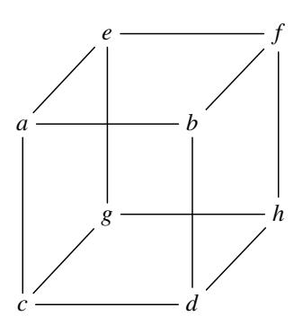
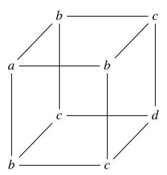
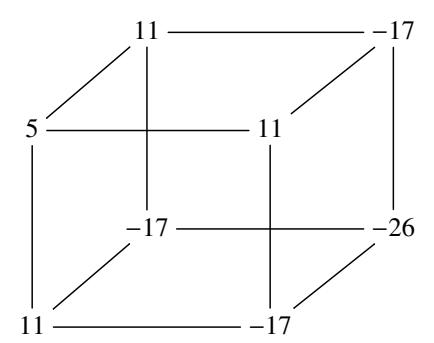

# A note on the low order assumption in class groups of imaginary quadratic number fields

Karim Belabas<sup>1</sup>, Thorsten Kleinjung<sup>2</sup>, Antonio Sanso<sup>3,4,\*</sup>, Benjamin Wesolowski<sup>1</sup>

Received: July 26, 2023 | Revised: July 26, 2023 | Accepted: July 26, 2023

**Abstract** In this short note we analyze the low order assumption in the imaginary quadratic number fields. We show how this assumption is broken for Mersenne primes. We also provide a description on how to possible attack this assumption for other class of prime numbers leveraging some new mathematical tool coming from higher (cubic) number fields.

**Keywords:** public-key cryptography, IQC, VDF, class group **2010 Mathematics Subject Classification:** 94A60, 11Y40

## 1 INTRODUCTION

Cryptography based on class groups of imaginary quadratic orders (IQ cryptography, IQC) is a fascinating area pioneered by Buchmann and Williams in [6]. After a long hiatus where IQC did not find any obvious real life application Lipmaa had the idea to make use of IQ's techniques to build secure accumulators without trusted setup [15], leveraging the unknown order property of class groups of imaginary quadratic fields. In the last years we have seen this unknown order property used as a basis to build Verifiable Delay Functions (VDF) [25, 19], cryptographic accumulators and vector commitments for blockchain applications [5] and polynomial commitment used for zero knowledge [7]. The security of some of this primitives (VDF in the specific case pointed out in [8]) are bound to two complexity assumptions: the *low order assumption* [8, Definition 1] and the *adaptive root assumption* [8, Definition 2] with the *adaptive root assumption* implying the *low order assumption*.

Breaking the low order assumption consists in finding an element  $\mu \in G$  and an integer  $d < 2^{\lambda}$  such that  $\mu \neq 1_G$  and  $\mu^d = 1_G$ . Given an odd integer N with unknown factorization the *low order assumption* is believed to hold for the group  $(\mathbb{Z}/N\mathbb{Z})^{\times}/\{\pm 1\}$ . The low order assumption in RSA groups has been extensively analyzed in [21]. In this paper we are going to analyze in more details the low order assumption in the class group of an imaginary quadratic number fields.

# 2 LOW ORDER ASSUMPTION IN THE CLASS GROUP OF AN IMAGINARY QUADRATIC NUMBER FIELD

For class group of the number field  $\mathbb{Q}(\sqrt{-p})$ , with  $p \equiv 3 \pmod{4}$  we know that the *class number* (the class group order) is odd and it is believed hard to compute when |p| is large. The *low order assumption* in the class group of an imaginary quadratic field has not been studied much and is one of the goal for this work. While the Cohen-Lenstra heuristics [9] suggest that the class group often contains elements of small odd order it seems out of reach by current techniques to find such low order forms. In [22, §2] Shanks provides some interesting relations that can help to shade some light and one in particular caught our attention: if

$$\Delta = 2^p - 1$$

$$h(-\Delta) \equiv 0 \pmod{p-2}$$
we form

and the associated low order element is of the form

$$(2, 1, 2^{p-3}).$$

then

<sup>&</sup>lt;sup>1</sup>Univ. Bordeaux, CNRS, Bordeaux INP, IMB, UMR 5251, F-33400, Talence, France INRIA, IMB, UMR 5251, F-33400, Talence, France

<sup>&</sup>lt;sup>2</sup>Laboratory for Cryptologic Algorithms, School of Computer and Communication Sciences, EPFL, Switzerland

<sup>&</sup>lt;sup>3</sup>Ethereum Foundation

<sup>&</sup>lt;sup>4</sup>Ruhr Universität Bochum

<sup>\*</sup>Corresponding Author:

This relation tells us that the low order assumption is violated for Mersenne primes. Other relations exist but require an even class number and are out of our scope. Shanks gives some other hint in [23]: for negative discriminants  $\Delta = 8k - 1$  the class number h must satisfy  $h \ge 1 + log_2 k$ . Furthermore if the class number respects  $h(1 - 8k) = 6n \pm 1$  then

$$\Delta = \frac{2^{h+2} - (2u + v)^2}{v^2}$$

with odd v and (2u + v) when h is prime and v 3. It is interesting to note that assigning v = 1 and u = 0 gives exactly the formula for Mersenne primes above.

#### <span id="page-1-3"></span>2.1 DIOPHANTINE EQUATIONS AND CLASS NUMBERS

We have seen above that the *low order assumption* is broken for a really narrow set of primes namely Mersenne primes. Mersenne primes are number of the form

$$\Delta = 2^p - 1$$

So far about 50 Mersenne primes have been discovered making the set of Mersenne primes extremely sparse. In this section we focus on searching for other classes of possible *weak primes* with regard to the *low order assumption* in the class group of an imaginary quadratic number field. The weakness of Mersenne primes extends to denser families of discriminants, and the following theorem gives a simple example.

<span id="page-1-1"></span>**Theorem 1.** If  $D = 4u^3 - 1$  with  $u \in \mathbb{Z}_{>0}$ , then the low order assumption is violated for the group of classes of primitive binary quadratic forms with discriminant -D.

*Proof.* Let  $D=4u^3-1$  for some u>0, let  $\omega_D=(1+\sqrt{-D})/2$  and consider the ideal  $I=(u,\omega_D)$  in the ring  $\mathbb{Z}[\omega_D]$  with norm u. Then  $I^3=(u^3,\omega_D^3)$  is contained in the principal ideal  $(\omega_D)$  and since both have norm  $u^3$ , they are equal. Also, for u>1, I is not principal since for  $a,b\in\mathbb{Z}$  we have

$$N(a + b\omega_D) = (a + b/2)^2 + b^2D/4 \ge D/4 > u$$

so the class of *I* has order 3.

Replacing u with 2 and 3 with p-2, i.e.,  $D=2^p-1$ , proves the Mersenne case (although one has to argue slightly more, namely that the smaller powers of I are not principal because the smallest norm of a principal ideal is  $2^p$  except for principal ideals arising from integers).

Let us increase the level of generality, and exhibit the source of the weakness of the above examples. In particular, the general case will imply that primes of the form

$$\Delta = k2^n - 1$$

are also weak. This class of primes can leverage on some of the fastest primality tests so far discovered [20] and could be appealing to implementers due to its attractive performance  $^{1}$ . The generalisation, which actually allows to construct elements of arbitrary prescribed order t, is a consequence of a result of Mollin.

**Theorem 2** (Mollin [16]). Let D be a squarefree number and let  $\sigma = 2$  when  $D \equiv 3 \pmod{4}$  and  $\sigma = 1$  otherwise. Assume further that  $D = \sigma^2 m^t - b^2$  where t > 1, m > 1 and b > 0 are integers such that  $b \neq 2m^{t/2} - 1$  if t is even and  $b \neq \lfloor \sigma m^{t/2} \rfloor$  if t is odd. Then the ideal  $(m, (b + \sqrt{-D})/\sigma)$  has order t in the ideal class group of the imaginary quadratic field  $\mathbb{Q}(\sqrt{-D})$ .

<span id="page-1-2"></span>**Corollary 1.** Let  $D = 4m^t - b^2$  be a prime number, where b and t are odd positive integers such that  $b \neq \lfloor 2m^{t/2} \rfloor$ . Then the ideal  $(m, (b + \sqrt{-D})/2)$  has order t in the ideal class group of the imaginary quadratic field  $\mathbb{Q}(\sqrt{-D})$ .

Let us show an example

#### **Example 1.** Let us use as discriminant

D = -40407597268924803882495478254939792927447222948200447 this corresponds to the entry k = 27 and n = 170 in [20, Table 2]. This meets the requirements of Theorem 1. We can easily compute  $c = \sqrt[3]{k2^{n-2}} = 216172782113783808$  and obtain the primitive integral binary cubic form

$$C(x, y) = ax^3 - 3cxy^2 + dy^3.$$

<span id="page-1-0"></span><sup>&</sup>lt;sup>1</sup>Chia Network blockchain showed a mild interest on using this class of prime numbers, which eventually waned.

computing the Hessian of C gives

```
q = (216172782113783808, -1, 46730671726813448656774466962980864)
```

that is an element of order 3, as expected.

<span id="page-2-0"></span>**Example 2.** Now, let us describe a method to generate a prime discriminant of given bit-length B, for any specified order t. First, let m be an integer such that  $4m^t > 2^B$ . Now, we have  $D = 4m^t - b^2 \in [2^{B-1}, 2^B)$  if and only if

$$b \in I_m = \left(\sqrt{4m^t - 2^B}, \sqrt{4m^t - 2^{B-1}}\right].$$

The interval  $I_m$  contains at least  $\left\lfloor 2^{B-1}/\left(2\sqrt{4m^t-2^{B-1}}\right)\right\rfloor - 1$  many (positive) odd integers. We deduce that it is non-empty as long as  $4m^t \leq 2^{2B-6}$ . We deduce the following algorithm: sample an integer m such that  $2^B < 4m^t \leq 2^{2B-6}$  (for instance, uniformly at random), then sample an odd integer b in  $I_m$  (again, for instance, uniformly at random), and let  $D = 4m^t - b^2$ . If D is prime, return it; otherwise, resample m and b. Heuristically, the algorithm succeeds after an expected number of trials in O(B). Each trial essentially costs one primality test. Note that this heuristic can only hold if there are sufficiently many candidate values for m satisfying  $2^B < 4m^t \leq 2^{2B-6}$ . If  $B \geq t+4$ , then there are at least  $2^{(B-2)/t}$  such candidates, and for this quantity to be at least  $\Omega(B)$ , one needs  $B/\log(B) = \Omega(t)$ , i.e.,  $B = \Omega(t\log(t))$ .

Using this technique with t = 3, we found the following 1024-bit discriminant in less than a second:

D =

90 035 739 086 996 044 929 657 295 449 404 992 608 896 161 982 818 704 624 734 545 126 784 028 963 989 295 482 427 666 032 414 206 561 507 869 372 584 648 836 724 700 200 371 898 954 392 245 245 061 968 868 946 034 239 811 453 054 998 654 002 278 345 259 090 130 728 036 489 542 703 762 200 445 320 432 567 297 903 573 341 236 871 804 843 115 533 230 239 855 019 834 217 874 752 991 665 910 141 469 207 698 903,

*m* =

218 925 934 949 261 543 544 131 625 221 968 979 300 603 770 996 540 319 121 619 328 205 259 561 011 675 695 262 296 776 163 956 169 855 807 215 003 614 736 153 253 911 225 535 737 483 310 178 391 503 421 503 126 566 813 360 030 441 650 898 331 150 601 389 570 907 140 746,

b =

204 868 796 081 378 472 490 247 325 165 671 636 711 884 728 224 614 750 308 617 553 085 204 382 480 494 821 887 676 095 206 218 471 133 987 706 972 957 990 417 280 683 317 514 601 460 199 389 917 407 988 118 574 795 366 336 656 502 721 606 330 850 022 303 048 868 820 453 167 198 073 828 043 334 470 361 185 906 258 137 355 516 080 070 634 344 790 004 109 343 866 901 004 192 450 532 710 354 505 639 728 221.

**Example 3.** For fixed t, the following straightforward GP script (see [18]) produces pairs (m, b) satisfying the hypotheses of Corollary 1 by sampling random B-bit integers. We thus obtain negative prime discriminants  $b^2 - 4m^t$  with tB + 2 bits together with a binary quadratic form  $(m, b, m^{t-1})$  of low order t in the corresponding classgroup.

```
loword(B, t) =
{
  while(1,
    my(b = random(2^B), m = random(2^B), mt = m^t);
    D = 4*mt - b^2;
  if (D <= 0 || b == sqrtint(4*mt) || !isprime(D), next);
    q = qfbred(Qfb(m, b, mt / m));
    q0 = q^0; /* trivial class */
    if (q == q0 || q^t != q0, error()); /* paranoia */
    return([t, m, b]));
}</pre>
```

*Trying it for B* = 16 *for consecutive primes t, we obtain in about 3 seconds:* 

| t  | form $(m, b, *)$ of order $t$ |
|----|-------------------------------|
| 3  | (22182, 21373, *)             |
| 5  | (30680, 36619, *)             |
| 7  | (22862, 59303, *)             |
| 11 | (23366, 26165, *)             |
| 13 | (29532, 28003, *)             |
| 17 | (29454, 9733, *)              |
| 19 | (10874, 3913, *)              |
| 23 | (13310, 20463, *)             |
| 29 | (31418, 64623, *)             |
| 31 | (11885, 61429, *)             |
| 37 | (45748, 24609, *)             |
| 41 | (61340, 50381, *)             |
| 43 | (245, 30283, *)               |
| 47 | (3962, 53951, *)              |
| 53 | (36034, 58875, *)             |
| 59 | (32910, 64843, *)             |

These examples show how easy it is to construct discriminants together with a low order element in their class group without computing the class number. The likelihood that such a discriminant is chosen at random is negligible, though. On the other hand, given D, it seems hard to prove that a given number is *not* of the form specified by Corollary 1 in general, even for a fixed order  $t \ge 3$ : it amounts to proving that the given hyperelliptic curve has no integer points.

In real life deployments, in order to meet the *quantum annoyance* property defined in [12], the Chia blockchain<sup>2</sup> picks a new random discriminant every 10 minutes. A different situation might arise though if a special prime is chosen to meet specific optimization requirements.

## **3 CONSTRUCTING MALICIOUS DISCRIMINANTS**

In this section, we investigate an alternative method to design discriminants together with an ideal of order 3. It has the advantage of being very elementary, and allows for easy control of the bits (or digits) of the discriminant. The technique dates back to Nagell [17], who used it to prove that for any  $n \ge 1$ , there exist (constructively) infinitely many imaginary quadratic fields with a class of order n. It has since been extended to exhibit various subgroup structures in class groups, yet we only need the simplest case n = 3.

For any discriminant  $\Delta < 0$ , the norm of the algebraic number  $\alpha = x + y\sqrt{\Delta} \in \mathbb{Q}(\sqrt{\Delta})$  is  $N(\alpha) = x^2 - \Delta y^2$ . This element  $\alpha$  generates a principal ideal  $(\alpha)$  of the same norm, which, by construction, is principal. Now, if z is a prime number, and  $N(\alpha) = z^3$ , we can deduce that  $(\alpha)$  factors as a product of 3 prime ideals of norm z. Indeed z cannot be inert in  $\mathbb{Q}(\sqrt{\Delta})$ , and either  $(\alpha) = 3^3$  or  $(\alpha) = (z)_3$  where 3 is a prime ideal above z. The case  $(\alpha) = (z)_3$  is equivalent to z dividing x and y and z is then principal. The case z implies that z has order 1 or 3 in the class group.

Given  $\Delta$ , finding an element  $\alpha$  whose norm is a third power of a prime seems computationally hard. However, one can hope to find elements of order 3 in a class group by generating  $\Delta$  *a posteriori*. First fix a prime number z, then choose any integers x and y such that  $y^2$  divides  $z^3 - x^2$ , and define

$$\Delta = \frac{x^2 - z^3}{y^2}.$$

From [13, Lemme 5], the induced ideal  $\mathfrak{z}$  is non-principal (hence, of order 3) as soon as 2y and z are coprime, and  $z < \sqrt{|\Delta|/4}$ . To generate a discriminant with this method, one can fix a prime z a priori, then find suitable values of x and y. Setting y = 1 ensures  $\mathfrak{z}$  has order 3, and actually makes this method a particular case of Section 2.1. One can generate a corresponding prime discriminant of prescribed bit-length B in a way similar to Example 2, at the cost of essentially O(B) primality tests.

#### 3.1 DISCRIMINANTS WITH PRESCRIBED BITS

The above strategy allows to find 'random looking' discriminants together with a class of order 3 in the corresponding class group. It does not allow to fix the discriminant *a priori*. However, we now show that it

<span id="page-3-0"></span><sup>2</sup>https://chia.net/.

is possible to fix half the bits of the discriminant. Let  $\delta$  a B/2-bit integer. We are looking for a discriminant  $\Delta = -(\delta + 2^{B/2}\delta')$ , with  $\delta'$  another B/2-bit integer.

Choose a B/3-bit prime number z so that the quadratic equation  $x^2 \equiv \delta + z^3 \mod 2^{B/2}$  has a solution, and choose x a B/2-bit long solution. Now, let  $\Delta = z^3 - x^2$ . As above, the prime ideals above z in  $\mathbb{Q}(\sqrt{\Delta})$  are either principal or of order 3 in the class group, and now the B/2 least significant bits of  $\Delta$  are given by  $\delta$ .

# <span id="page-4-0"></span>4 BINARY CUBIC FORMS AND THEIR RELATIONSHIP TO THE BINARY QUADRATIC FORMS

It is well known that there is a close relationship between binary cubic forms of discriminant  $\Delta = -27D$  and ideal class group of the quadratic field  $\mathcal{L} = \mathbb{Q} = (\sqrt{D})$ . This section summarizes parts of [14, Chapter 3]. Given a primitive integral binary cubic form in the form

$$C(x, y) = ax^3 + 3bx^2y + 3cxy^2 + dy^3.$$

where  $a, b, c, d \in \mathbb{Z}$ . Let Q be the Hessian of C. Then we have

$$Q = 9q$$
, where  $q = (b^2 - ac, bc - ad, c^2 - bd)$ .

The discriminant of the binary quadratic form q is equal to

$$D = -3b^2c^2 + 4ac^3 + 4b^3d - 6abcd + a^2d^2$$

Now there is a well defined map between the  $SL_2(\mathbb{Z})$ -class of C and the  $SL_2(\mathbb{Z})$ -class of the Hessian Q. Let  $Cl^+(bcf(\Delta))$  be the set of  $SL_2(\mathbb{Z})$ -class of binary cubic forms of discriminant  $\Delta = -27D$ , let  $Cl^+_{\mathcal{L}}[3]$  be the 3-torsion subgroup of the narrow ideal class group of the quadratic field  $\mathcal{L} = \mathbb{Q} = (\sqrt{D})$  and let  $Cl^+(bqf(D))[3]$  be the  $SL_2(\mathbb{Z})$ -classes of binary quadratic forms isomorphic to  $Cl^+_{\mathcal{L}}[3]$ , than the map is given by:

$$\varphi: Cl^{+}(bcf(\Delta)) \longrightarrow Cl^{+}(bqf(D))[3]$$
  
$$\varphi: [(a,3b,3c,d)] \longrightarrow [(b^{2}-ac,bc-ad,c^{2}-bd)]$$

This allows to exhibit elements of order 3 in class groups of quadratic fields without even computing the class number. Unfortunately, the corresponding algorithms are more expensive than class group computations.

### 4.1 BHARGAVA CUBES AND ORDER 3 IDEAL CLASSES

A great way to visualize the correspondence defined in section 4 is using the work by Manjul Bhargava. In his cornerstone paper [4] Bhargava introduced a new composition law for binary quadratic fields (about 200 years after Gauss) and 13 new composition laws for higher degree number fields using what is now known as the *Bhargava cube*. He noticed that when putting numbers on the corners of a cube (representing a  $2 \times 2 \times 2$  matrix) as below



the cube can be sliced into pairs of  $2 \times 2$  matrices in three different ways

$$M_1 = \begin{bmatrix} a & b \\ c & d \end{bmatrix} \ N_1 = \begin{bmatrix} e & f \\ g & h \end{bmatrix}$$

$$M_2 = \begin{bmatrix} a & c \\ e & g \end{bmatrix} \ N_2 = \begin{bmatrix} b & d \\ f & h \end{bmatrix}$$

$$M_3 = \begin{bmatrix} a & e \\ b & f \end{bmatrix} N_3 = \begin{bmatrix} c & g \\ d & h \end{bmatrix}$$

From these slicing, it is now possible to construct three quadratic forms having the same discriminant:

$$Q_1(x, y) = -\det(M_1 x - N_1 y)$$

$$Q_2(x, y) = -\det(M_2 x - N_2 y)$$

$$Q_3(x, y) = -\det(M_3 x - N_3 y)$$

Bhargava observed that the product of these three quadratic forms is the identity for the classic Gauss composition, and that any three quadratic forms with trivial product arrises from such a cube. Next step is to impose some symmetry to the cube (in this case forming a triply symmetric cube):



Just as symmetric square matrix defines a quadratic form, a triply symmetric cube defines a cubic form: the above cube induces the cubic form

$$ax^3 + 3bx^2y + 3cxy^2 + dy^3$$

We also know from the discussion above that this cube defines three binary quadratic forms whose product is the identity. So this triply symmetric cube also parametrizes an order in a quadratic fields together with three ideal classes of trivial product. The symmetries in the cube imply that all three quadratic forms are actually the same, therefore it is a quadratic form of order 1 or 3. Next step has been suggested by Bhargava in [3] where he points out that the method described by Belabas in [1] could be used to enumerate order 3 ideal classes in quadratic orders. Let us run through an example.

**Example 4.** Assume we want to find an element of order 3 for the binary quadratic form with discriminant  $\Delta = -470551$ .  $-\Delta$  is a prime number equal to 7 (mod 8). Now using the algorithm in [1] we can generate the reduced defining polynomial for the binary cubic form having discriminant  $3^3\Delta = 12704877$ . This outputs the binary cubic form  $5x^3 + (3 \cdot 11)x^2y - (3 \cdot 17)xy^2 - 26y^3$  that is equivalent to the following Bhargava cube:



This triple symmetric cube is formed by composing twice the following binary quadratic form of order 3:  $206x^2 + 57xy + 575y$ 

Some comment about the example above: we were able to find an element of order 3 without computing the class number of the binary quadratic form. All using a combination of Belabas algorithm and Bhargava cube. Unfortunately, the algorithm listing fields with |disc| in the range [X - Y, X] has complexity  $O(X^{3/4} + Y)$  (see [2]); in our example Y = 0 so we can find an element of order 3 in time about  $O(X^{3/4})$ . This is more expensive than

computing the full class group *per se*. The variant introduced by Cremona in [11, Algorithm 2] also runs in time  $O(X^{3/4})$ .

Finally, Daniel Shanks's CUFFQI algorithm [24] constructs all cubic fields of a fixed fundamental discriminant X in time polynomial in  $\log |X|$  (see Renate Scheidler's paper in [14, Chapter 4]) but it requires as input the 3-part of the class group of the quadratic field with that discriminant (that is actually what we are looking for!). More generally, *given* the class group and units of a number field K, the same techniques using class field theory and virtual units allow to visualize elements of arbitrary order t in the class group by exhibiting unramified extensions of degree t of K, given by a list of irreducible polynomials, see [10]. The complexity is again dominated by the time needed to compute the class number and class group structure.

# **5 CONCLUSIONS**

ICQ leverages on some well known topic in number theory but many of the assumptions are new in the field of cryptography. The low order assumption is an important assumption that is at the core of some cryptographic primitives: Verifiable Delay Functions, accumulators, polynomial commitments. In this work we were able to break the low order assumption in the class group of an imaginary quadratic number field for some really special class of prime numbers and we have shown how it is possible to construct malicious discriminants having prescribed properties. For applications leveraging the low order assumption over imaginary quadratic field we recommend to generate the discriminant at random and to avoid to mandate fixed discriminants. We hope that this work provides some incentive for researchers to think about this new problems.

**Acknowledgments.** We would like to thank Dan Boneh, Bram Cohen, Luca de Feo, Florian Luca, Simon Masson, István András Seres, Renate Scheidler for fruitful discussions. We thank the anonymous reviewer for their critical reading of the manuscript and providing detailed and insightful comments, which greatly enhanced the quality and clarity of the paper.

# **REFERENCES**

- <span id="page-6-7"></span>[1] Karim Belabas. "A fast algorithm to compute cubic fields". In: Math. Comp 66 (1997), pp. 1213–1237.
- <span id="page-6-8"></span>[2] Karim Belabas. "On quadratic fields with large 3-rank". In: *Math. Comp.* 73.248 (2004), pp. 2061–2074. ISSN: 0025-5718.
- <span id="page-6-6"></span>[3] Manjul Bhargava. "Gauss composition and generalizations". English (US). In: *Algorithmic Number Theory 5th International Symposium, ANTS-V Sydney, Australia, July 7-12, 2002 Proceedings*. Ed. by Claus Fieker and David R. Kohel. Lecture Notes in Computer Science. 5th International Algorithmic Number Theory Symposium, ANTS 2002; Conference date: 07-07-2002 Through 12-07-2002. Germany: Springer Verlag, Jan. 2002, pp. 1–8. ISBN: 3540438637. DOI: 10.1007/3-540-45455-1\_1.
- <span id="page-6-5"></span>[4] Manjul Bhargava. "Higher composition laws I: A new view on Gauss composition, and quadratic generalizations". English (US). In: *Annals of Mathematics* 159.1 (Jan. 2004), pp. 217–250. ISSN: 0003-486X. DOI: 10.4007/annals.2004.159.217.
- <span id="page-6-1"></span>[5] Dan Boneh, Benedikt Bünz, and Ben Fisch. "Batching Techniques for Accumulators with Applications to IOPs and Stateless Blockchains". In: *Advances in Cryptology – CRYPTO 2019*. Ed. by Alexandra Boldyreva and Daniele Micciancio. Cham: Springer International Publishing, 2019, pp. 561–586. ISBN: 978-3-030-26948-7.
- <span id="page-6-0"></span>[6] Johannes Buchmann and Hugh C. Williams. "A Key-Exchange System Based on Imaginary Quadratic Fields". In: *J. Cryptology* 1 (1988), pp. 107–118. DOI: 10.1007/BF02351719.
- <span id="page-6-2"></span>[7] Benedikt Bünz, Ben Fisch, and Alan Szepieniec. "Transparent SNARKs from DARK Compilers". In: *Advances in Cryptology – EUROCRYPT 2020*. Ed. by Anne Canteaut and Yuval Ishai. Cham: Springer International Publishing, 2020, pp. 677–706. ISBN: 978-3-030-45721-1.
- <span id="page-6-3"></span>[8] D. Boneh, B. Bünz and B. Fisch. "A Survey of Two Verifiable Delay Functions". In: *Cryptology ePrint Archive, Report 2018/712* (2018).
- <span id="page-6-4"></span>[9] H. Cohen and H. W. Lenstra Jr. "Heuristics on class groups of number fields". In: *Number theory, No-ordwijkerhout 1983 (Noordwijkerhout, 1983)*. Vol. 1068. Lecture Notes in Math. Springer, Berlin, 1984, pp. 33–62.
- <span id="page-6-9"></span>[10] Henri Cohen. *Advanced topics in computational number theory*. Vol. 193. Graduate Texts in Mathematics. New York: Springer-Verlag, 2000, pp. xvi+578. ISBN: 0-387-98727-4.

- <span id="page-7-14"></span><span id="page-7-0"></span>[11] J. E. Cremona. "Reduction of Binary Cubic and Quartic Forms". In: *LMS Journal of Computation and Mathematics* 2 (1999), pp. 62–92. DOI: 10.1112/S1461157000000073.
- <span id="page-7-10"></span>[12] Luca De Feo et al. "Verifiable Delay Functions from Supersingular Isogenies and Pairings". In: *Advances in Cryptology – ASIACRYPT 2019*. Ed. by Steven D. Galbraith and Shiho Moriai. Cham: Springer International Publishing, 2019, pp. 248–277. ISBN: 978-3-030-34578-5.
- <span id="page-7-12"></span>[13] Francisco Diaz y Diaz. "Sur les corps quadratiques imaginaires dont le 3-rang du groupe des classes est supérieur à 1". In: *Séminaire Delange-Pisot-Poitou. Théorie des nombres* 15.2 (1973-1974). talk:G15.
- <span id="page-7-13"></span>[14] Samuel A. Hambleton and Hugh C. Williams. *Cubic fields with geometry*. CMS Books in Mathematics/Ouvrages de Mathématiques de la SMC. Springer, Cham, 2018, pp. xix+493. ISBN: 978-3-030-01402-5; 978-3-030-01404-9. DOI: 10.1007/978-3-030-01404-9. URL: https://doi.org/10.1007/978-3-030-01404-9.
- <span id="page-7-1"></span>[15] Helger Lipmaa. "Secure Accumulators from Euclidean Rings without Trusted Setup". In: *Applied Cryptography and Network Security - 10th International Conference, ACNS 2012, Singapore, June 26-29, 2012. Proceedings.* Ed. by Feng Bao, Pierangela Samarati, and Jianying Zhou. Vol. 7341. Lecture Notes in Computer Science. Springer, 2012, pp. 224–240. DOI: 10.1007/978-3-642-31284-7\\_14. URL: https://doi.org/10.1007/978-3-642-31284-7%5C\_14.
- <span id="page-7-8"></span>[16] R. A. Mollin. "Solutions of Diophantine equations and divisibility of class numbers of complex quadratic fields". In: *Glasgow Math. J.* 38.2 (1996), pp. 195–197. ISSN: 0017-0895. DOI: 10.1017/S0017089500031438. URL: https://doi.org/10.1017/S0017089500031438.
- <span id="page-7-11"></span>[17] T. Nagell. "Über die Klassenzahl imaginär-quadratisher Zahlkörper". In: *Abh. Math. Sem. Univ. Hamburg* 1 (1922), pp. 140–150.
- <span id="page-7-9"></span>[18] PARI/GP, version 2.13.0. http://pari.math.u-bordeaux.fr/. The PARI Group. Bordeaux, 2020.
- <span id="page-7-3"></span>[19] K. Pietrzak. "Simple verifiable delay functions". In: Cryptology ePrint Archive, Report 2018/627 (2018).
- <span id="page-7-7"></span>[20] Hans Riesel. "Lucasian criteria for the primality of  $N = h \cdot 2^n - 1$ ". In: *Math. Comp.* 23 (1969), pp. 869–875. ISSN: 0025-5718. DOI: 10.2307/2004975. URL: https://doi.org/10.2307/2004975.
- <span id="page-7-4"></span>[21] István András Seres and Péter Burcsi. *A Note on Low Order Assumptions in RSA groups*. Cryptology ePrint Archive, Report 2020/402. https://eprint.iacr.org/2020/402. 2020.
- <span id="page-7-5"></span>[22] D. Shanks. "Class Number, a Theory of Factorization, and Genera". In: *Proceedings of Symposia in Pure Mathematics*. 1971.
- <span id="page-7-6"></span>[23] Daniel Shanks. "On Gauss's class number problems". In: *Math. Comp.* 23 (1969), pp. 151–163. ISSN: 0025-5718. DOI: 10.2307/2005064. URL: https://doi.org/10.2307/2005064.
- <span id="page-7-15"></span>[24] Daniel C. Shanks. *Determining all cubic fields having a given fundamental discriminant*. Unpublished manuscript. 1987.
- <span id="page-7-2"></span>[25] Benjamin Wesolowski. "Efficient Verifiable Delay Functions". In: *Advances in Cryptology – EUROCRYPT* 2019. Ed. by Yuval Ishai and Vincent Rijmen. Cham: Springer International Publishing, 2019, pp. 379–407. ISBN: 978-3-030-17659-4.