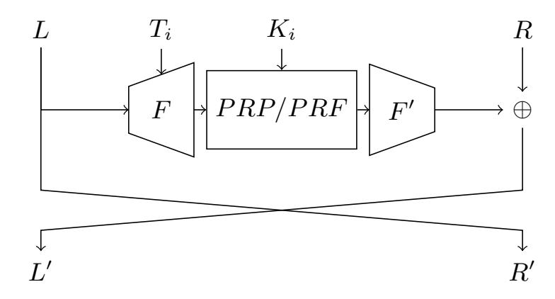
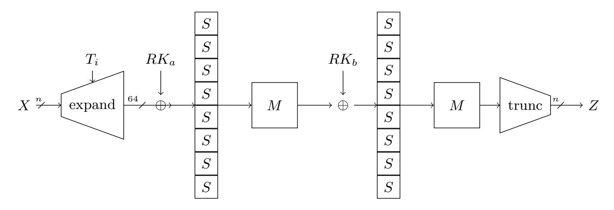

{0}------------------------------------------------

## Cryptanalysis of Feistel-Based Format-Preserving Encryption

Orr Dunkelman<sup>1</sup> , Abhishek Kumar<sup>2</sup> , Eran Lambooij<sup>1</sup> , and Somitra Kumar Sanadhya<sup>2</sup>

<sup>1</sup> Computer Science Department, University of Haifa, Haifa, Israel orrd@cs.haifa.ac.il, eran.lambooij@gmail.com 2 Indian Institute of Technology Ropar, Rupnagar, India abhishekk.iitrpr@gmail.com, somitra@iitrpr.ac.in

Abstract. Format-Preserving Encryption (FPE) is a method to encrypt non-standard domains, thus allowing for securely encrypting not only binary strings, but also special domains, e.g., social security numbers into social security numbers. The need for those resulted in a few standardized constructions such as the NIST standardized FF1 and FF3-1 and the Korean Standards FEA-1 and FEA-2. Moreover, there are currently efforts both in ANSI and in ISO to include such block ciphers to standards (e.g., the ANSI X9.124 discussing encryption for financial services).

Most of the proposed FPE schemes, such as the NIST standardized FF1 and FF3-1 and the Korean Standards FEA-1 and FEA-2, are based on a Feistel construction with pseudo-random round functions. Moreover, to mitigate enumeration attacks against the possibly small domains, they all employ tweaks, which enrich the actual domain sizes.

In this paper we present distinguishing attacks against Feistel-based FPEs. We show a distinguishing attack against the full FF1 with data complexity of 2<sup>60</sup> 20-bit plaintexts, against the full FF3-1 with data complexity of 2<sup>40</sup> 20-bit plaintexts. For FEA-1 with 128-bit, 192-bit and 256-bit keys, the data complexity of the distinguishing attack is 2<sup>32</sup>, 2<sup>40</sup> , and 2<sup>48</sup> 8-bit plaintexts, respectively. The data complexity of the distinguishing attack against the full FEA-2 with 128-bit, 192-bit and 256-bit is 2<sup>56</sup>, 2<sup>68</sup>, and 2<sup>80</sup> 8-bit plaintexts, respectively. Moreover, we show how to extend the distinguishing attack on FEA-1 and FEA-2 using 192-bit and 256-bit keys into key recovery attacks with time complexity 2<sup>136</sup> (for both attacks).

Keywords: Differential Cryptanalysis, Format Preserving Encryption, FF1, FF3-1,FEA-1, FEA-2.

## 1 Introduction

Confidentiality is the earliest, and possibly the most widely recognized cryptographic goal. Early cryptographic systems such as Caesar's cipher took sequences of letters and encrypted them to obtain a different sequence of letters, comprehensible only by those in the possession of the secret key. The development of electronic communication shifted the attention to block ciphers that work on 

{1}------------------------------------------------

some fixed-size binary strings, such as DES [\[8\]](#page-19-0) and AES [\[9\]](#page-19-1). For any chosen key, these ciphers offer a permutation over the binary strings (which are 64-bit long for DES and 128-bit long for AES).

While the representation of data in modern computers is binary, there are cases where the data itself is treated as an integer or as a part of some subset, e.g., a string. The two canonical examples are credit card numbers (CCN) and social security numbers (SSN). These two types of data are indeed stored as binary strings, but most of the time they are processed as numbers. Hence, to facilitate easier integration into existing databases, it is better to leave these sensitive numbers as numbers, but to encrypt them. Of course, standard encryption using a regular block cipher is very unlikely to generate a ciphertext that adheres to the "format" needed by the database, which in turn forces to redevelop an integrated security solution, which in itself is a complicated (and costly) process.

Format-Preserving Encryption (FPE) [\[7\]](#page-19-2) tries to offer security without the need of changing the system. Namely, FPE is a symmetric-key cryptographic primitive that encrypts some predefined domain into itself, independent of the format or length of the message (domain). For example, a format-preserving encrypted SSN also follows the SSN structure.

#### 1.1 Related Work

Brightwell and Smith [\[7\]](#page-19-2) introduced the problem of encrypting messages over fixed formats. In their work, they commented that using a conventional block cipher to encrypt a plaintext of a specific format, produces a ciphertext which "bears roughly the same resemblance to plaintext . . . as a hamburger does to a Tbone steak". Schroeppel and Orman proposed the Hasty Pudding Cipher [\[19\]](#page-19-3) and submitted it to the Advanced Encryption Standard competition. This was the first cipher that demonstrated an encryption scheme that worked for arbitrary domains.

In 2002, Black and Rogaway [\[5\]](#page-18-0) proposed three different methods: Prefix cipher, Cyclic walking, and a Feistel-based construction as a solution of the problem of encrypting messages in arbitrary domains. However, all these methods have some notable efficiency or security issues. Moreover, all of these proposed methods are only suitable for a particular size of domain. The Prefix cipher is only suitable when the message domain contains ≤ 2 <sup>30</sup> elements. The cycle walking scheme is only suitable when the domain size of the message and the domain size of the underlying encryption algorithm are about the same. The Feistelbased construction is not suitable for domains of intermediate size, which covers most of the real world use-cases of FPE including encryption of SSNs or CCNs. In 2008, Spies proposed the Feistel Finite Set Encryption Mode (FFSEM) [\[21\]](#page-19-4), which is an AES-based balanced Feistel network combined with cycle walking.

In subsequent years, Bellare et al. proposed two concrete designs FF1 and FF2 [\[3\]](#page-18-1) based on an unbalanced Feistel network using AES-128 as the round function. The minimum number of rounds suggested for FF1 and FF2 are ten, i.e., at least ten invocations AES are required to encrypt a message. Brier, Peyrin, and Stern offered a similar design that consists of eight rounds of the Feistel 

{2}------------------------------------------------

construction [\[6\]](#page-19-5). A special publication of NIST SP800-38G [\[12\]](#page-19-6) adopted FF1 and the BPS construction (as FF3) for format-preserving encryption.

Bellare et al. [\[2\]](#page-18-2) analysed FF1 and FF3 and discovered message recovery attacks for small domain messages using multiple tweaks. This was followed by an attack presented in [\[10\]](#page-19-7) where Durak and Vaudenay presented a practical attack on the FF3 scheme. Hoang et al. further investigated the security of FPE designs and published more efficient attacks [\[14\]](#page-19-8) against these designs. In order to prevent these attacks, NIST has modified a few parameters of FF1 and FF3-1 (renamed FF3 to FF3-1), the details of these changes can be found in the revised document SP 800-38G Rev. 1 [\[13\]](#page-19-9). Apart from the attacks described in this paper there are no known attacks against the full FF1 and FF3-1.

A different approach of designing two more efficient Feistel-based FPE schemes, FEA-1 and FEA-2, were proposed by Lee et al. [\[15\]](#page-19-10). The suggested number of rounds are 12 and 18 for 128-bit keys, respectively. These constructions also support 192-bit and 256-bit keys. These designs are more efficient than FF1 and FF3-1 due to the simpler round function. At the time of writing, FEA is a standard in Korea (TTAK.KO-12.0275).

At the moment we are aware of two standardization efforts for supporting format preserving encryption based on block ciphers, and specifically the ones studied in this paper. The first is at ISO where a study period on the introduction of FPE in the cryptographic standards of ISO is underway (in ISO/IEC JTC1 SC27 WG2). The second standardization effort is at ANSI/X9 to support the financial industry, where the published X9.124 Part 2 includes a stream-cipher based mode and additional parts for X9.124 are in development to standardize block cipher modes, including some of those studied in this paper.

## 1.2 Our contributions

This paper shows an inherent problem of Feistel ciphers in the context of tweakable FPE schemes. Namely, we show that one can construct differential characteristics that cover sufficiently many rounds by using the small output domain size. Following the works of Bellare et al. [\[2\]](#page-18-2), we use many tweaks to obtain enough data to realize these differential distinguishers.

We use this attack to distinguish the FFX constructions, such as FF1 and FF3-1 [\[13\]](#page-19-9) as well as FEA-1 and FEA-2 [\[15\]](#page-19-10) from random permutations. We then show how to extend the distinguisher of FEA-1 and FEA-2 to construct key recovery attacks.

The distinguishers we present are very efficient. The amount of data required is in many cases practical or almost practical (depending on the attacked scheme and the block size). The results of the distinguishing attacks are summarized in [Table 1.](#page-3-0) In all cases, we succeed to distinguish the full versions of the proposed schemes. Moreover, we show that for achieving resistance against our distinguisher, FEA-1 and FEA-2 need to almost triple the number of rounds(!).

The key recovery attacks on 192-bit and 256-bit FEA-1 and FEA-2 with an 8 bit block size are quite efficient w.r.t. data complexity, and both have a running time of 2<sup>136</sup> .

{3}------------------------------------------------

We have experimentally verified the distinguishers for 4-bit domains for different number of rounds. We have tested both the real FF3-1 round function as well as a version using 12-round SKINNY [\[1\]](#page-18-3) as the PRP.

<span id="page-3-0"></span>

|           |        |            |         | Complexity |                  |
|-----------|--------|------------|---------|------------|------------------|
| Algorithm | Rounds | Block size | Keysize | Time       | Data             |
| FEA-1     | 12     | 8          | 128     | 236        | 32<br>2          |
| FEA-1     | 14     | 8          | 192     | 244        | 40<br>2          |
| FEA-1     | 16     | 8          | 256     | 252        | 48<br>2          |
| FEA-2     | 18     | 8          | 128     | 260        | 56<br>2          |
| FEA-2     | 21     | 8          | 192     | 272        | 68<br>2          |
| FEA-2     | 24     | 8          | 256     | 284        | 80<br>2          |
| FF1       | 10     | 20         | 128     | 270        | 60<br>2          |
| FF3-1     | 8      | 40         | 128     | 2100       | 80<br>2          |
| Generic3  | 2r     | 2n         | -       | 22n(r−1.5) | 2n(r−1.5)−n<br>2 |

Table 1: Comparison of Distinguishing Attacks.

#### 1.3 Organization

In [Section 2,](#page-3-2) a generic construction is given for Feistel based FPE schemes, which is then used in [Section 3](#page-5-0) to define a generic distinguisher for these constructions. In [Section 4](#page-8-0) we apply the distinguisher to FFX and in [Section 5](#page-10-0) we show how to use the distinguisher on FEA, and present a key recovery attack on the full FEA-1 and FEA-2. The experimental verification results are discussed in [Section 6.](#page-15-0) The last section of this paper, [Section 7,](#page-16-0) contains a discussion of the findings and the fixes that we propose.

## <span id="page-3-2"></span>2 Small Domain Feistel Construction

The design of a block cipher over small domains encounters two inherent problems: The first problem is enumeration attacks, i.e., the attacker simply asks for the encryption of all plaintexts and saves the output in a lookup table which can be used to decrypt ciphertexts to plaintexts. The second problem is that the definition of good components that work for a wide range of input sizes is not trivial.

The first problem can be solved by using tweakable primitives [\[16\]](#page-19-11), this basically increases the domain size by the tweak size and efficiently prevents the enumeration of all plaintext ciphertext pairs. At the same time, we note that

<span id="page-3-1"></span><sup>3</sup> Depending on the tweak schedule the data complexity can be reduced.

{4}------------------------------------------------

this also increases the data available to the attacker, i.e., it allows her to ask for more data per key (by using different tweaks). The formal security definitions of format preserving encryption assume that the adversary can probe only a single tweak (for the entire codebook) as is stated in [4, p. 13]: "...strong-PRP security for a conventional (fixed length, not tweakable) block cipher.". However, previous attacks (e.g., Bellare et al. [2]), have used multiple tweaks. We follow their footsteps and argue that the ability to probe multiple tweaks is a reasonable assumption.

One of the solutions for the second problem is the use of a Feistel construction, possibly supporting different block sizes using a fixed-size pseudo random permutation (PRP), e.g., AES [9], and truncating its output. Another option is to use a dedicated pseudo random function, e.g., SHA-3 [20], and possibly truncating the output if needed. The in- and output width of the round function can be variable (see Figure 1) which means that we need to pad the input to the size of the PRP/PRF. The output, clearly, needs to be transformed to be the correct size as well. We note that the tweak may also be used as an input to the PRP/PRF instead of the expand function. Since both constructions that are studied in this paper use a PRP in the round function, we generalize to a PRP, although all attacks are also valid when using a PRF.

<span id="page-4-0"></span>

Fig. 1: One round of the construction as described in Definition 1

<span id="page-4-1"></span>**Definition 1 (Tweakable Variable Domain Round Function).** Given a word size n, and a PRP with block size n' > n, let m denote the key size, and m' denote the tweak size. We define the expansion function F as  $F: \{0,1\}^n \times \{0,1\}^{m'} \to \{0,1\}^{n'}$ , the shrink function F' as  $F': \{0,1\}^{n'} \to \{0,1\}^n$  and the pseudo random permutation as  $PRP: \{0,1\}^{n'} \times \{0,1\}^m \to \{0,1\}^{n'}$ . Then the tweakable variable domain round function is defined as

$$f(p, k, t) = F'(PRP(F(p, t), k))$$

with  $p \in \{0,1\}^n$  and  $k \in \{0,1\}^m$ 

Note that Definition 1 allows for changing the word size of the round function by changing F and F', while keeping the same PRP. This allows for using a well

{5}------------------------------------------------

analysed PRP in this setting, thus circumventing the need of designing a secure pseudo random permutation for any word size. We note that we can replace the PRP by a PRF without changing the results. In this paper we use a PRP in the construction, as this is used in both FEA and FFX.

<span id="page-5-1"></span>**Definition 2 (Tweakable Variable Domain Feistel Construction).** Let f be a tweakable variable domain round function as defined in Definition 1.  $k_i \in \{0,1\}^m$  be the i-th round key,  $t_i \in \{0,1\}^{m'}$  be the i-th round tweak and  $p_i = L_i|R_i$  be the i-th cipher state. Then

$$L_{i+1} = f(L_i, k_i, t_i) \oplus R_i \tag{1}$$

$$R_{i+1} = L_i \tag{2}$$

For the sake of clarity, the definitions and the attacks assume that  $|L_i| = |R_i|$ . The attacks described in this paper can be quite naturally extended to the more general case where  $|L_i| \neq |R_i|$ .

# <span id="page-5-0"></span>3 Differential Cryptanalysis of Tweakable Variable Domain Feistel Constructions

In this section we discuss how to construct differential characteristics through the construction defined in Definition 2. These characteristics are independent of the actual PRP/PRF used in the constructions and as such can be used for every cipher using this construction.

First we observe that since f (Definition 1) is a pseudo random function, mapping n bits to n bits (or from a domain of size N to a domain of size N), there is a differential transition through f going from a non-zero difference  $\Delta$  to a zero difference with probability  $2^{-n}$  (or 4 1/M). We can use this transition to construct the following 2-round iterative differential characteristic with probability  $2^{-n}$ :

<span id="page-5-3"></span>
$$(0|\Delta) \xrightarrow{1} (\Delta|0) \xrightarrow{2^{-n}} (0|\Delta) \tag{3}$$

This characteristic can be concatenated r times to cover 2r rounds with probability  $2^{-rn}$ .

At the same time, for any plaintext pair with non-zero input difference, we expect the output difference of  $(0|\Delta)$  to appear with probability  $(2^{2n}-1)^{-1} \approx 2^{-2n}$ . Hence, if wrong pairs with respect to the characteristics behave randomly, we expect that the probability of a pair with plaintext difference  $(0|\Delta)$  to reach a ciphertext difference of the same form, is  $2^{-2n}+2^{-rn}$ . There are two assumptions that we make here. The first one is about wrong pairs having a probability of

<span id="page-5-2"></span><sup>&</sup>lt;sup>4</sup> We note that unless a very unique structure of F/PRP/F' is used, f can be safely modeled as a random function. As such, the probability of the transition  $\Delta \to 0$  taken over all f's is indeed  $2^{-n}$  or  $\frac{1}{M}$ . The probability that **no** transition  $\Delta \to 0$  is possible is equal to the probability that a random function is a random permutation, which is  $\frac{2^{n}!}{(2^n)^{2^n}}$ , which for n=8 would be  $2^{-364}$ .

{6}------------------------------------------------

 $2^{-2n}$  to generate the specific output difference, while second one is regarding the  $\Delta \to 0$  transition happening r times.

We note that if indeed the function f is sufficiently pseudo-random, and if the number of rounds 2r is larger than 4, we expect the probability of a wrong pair to satisfy the output difference to be  $2^{-2n}$ . A heuristic, which the experiments in Section 6 confirm, is that once the transition  $\Delta \to X$  happens (where X can be any non-zero difference), the difference starts to behave more randomly, thus after more than 4 rounds the probability for the output differences flatten out, i.e., each output difference becomes equally likely.

To argue that it is actually possible to have the  $\Delta \to 0$  transition r times, we first argue that the probability that there is such a transition in the Difference Distribution Table (DDT) of the round function is  $1-e^{-1/2}$ , following the analysis of O'Connor [18]. When there is such a transition, the probability of this transition is on average  $\frac{1}{1-e^{1/2}} \cdot 2^{-n}$ . Now, if for (key, tweak) pair we have the transition  $\Delta \to 0$  in r rounds, which happens with probability  $(1-e^{-1/2})^r$ , the expected probability of the characteristic is  $\left(1/(1-e^{-1/2})\cdot 2^{-n}\right)^r$ . This means that as long as the number of tweaks we try is at least  $(1-e^{-1/2})^{-r}$ , we are very likely to find a 'good' tweak, and the average probability of the characteristic is  $2^{-rn}$ . We further note that since the distinguisher tries all possible  $\Delta$ 's simultaneously, we only need at least  $(1-e^{-1/2})^{-r} \cdot 2^{-n}$  tweaks to find a good tweak with respect to some  $\Delta$ .

#### 3.1 Distinguisher

The characteristic of Equation 3 leads to an efficient distinguisher (described in Algorithm 1), that can be used to distinguish between a random permutation and a 2r-round tweakable variable domain Feistel construction. The distinguisher is based on collecting many pairs of plaintexts with input difference  $(0|\Delta)$  and checking how many of them lead to output difference  $(0|\Delta)$ , over all  $\Delta$  values. The difference of  $2^{-rn}$  between the probability in the case of a truly random permutation and the Feistel we consider can be observed using about  $2^{(2r-2)n}$  pairs with input difference  $(0|\Delta)$  (See Equation 4).

#### <span id="page-6-0"></span>3.2 Analysis

The data complexity and success probability of the distinguisher are similar to the data complexity and success probability of linear cryptanalysis [17]. The number of pairs with the right output difference is binomially distributed, with probability  $\lambda_1 = 2^{-2n}$  for the random case and  $\lambda_2 = 2^{-2n} + 2^{-rn}$  for the construction. Let N be the sample size.

Since the distributions are binomial, we can compute the standard deviation  $SD_1 = \sqrt{N\lambda_1(1-\lambda_1)}$  and  $SD_2 = \sqrt{N\lambda_2(1-\lambda_2)}$ . Now the success probability of the distinguisher is determined by the distance c between the means of the two distributions measured in standard deviations.

$$P_{\text{success}} = \Phi^{-1}(c/2)$$

{7}------------------------------------------------

**Algorithm 1:** Distinguisher using the charactersitic described in Equation 3, with a success probability of 84.1%

```
Data: 2r rounds, blocksize 2n
 1 counter = 0;
 \mathbf{2} \text{ encryptions} = \{\};
 3 Let \ell = 2n(r-1) + 2;
    // We are using the characteristic of Equation 3
 4 Let C_{ut} = \sqrt{2^{\ell} \cdot 2^{-2nr}};
 5 for T = 0 to 2^{\ell - 3n} do
         for p = 0 to 2^{2n} do // Collect entire codebook under (K, T)
 6
              c \leftarrow The encryption of p under tweak T;
  7
          encryptions[p] = c;
  8
         \mathbf{for}\ i = 0\ \mathbf{to}\ 2^{2n}\ \mathbf{do}\ //\ \mathtt{Analyze}
 9
              for j = i + 1 to 2^n do
10
                  p_1=i;
11
                p_2 = i \oplus (0|j);

if encryptions[p_1] \oplus encryptions[p_2] = p_1 \oplus p_2 then

12
13
14
15 if counter > 2^{\ell-n} + C_{ut} then
       return Construction
16
17 else
         return Random Permutation
18
```

<span id="page-7-0"></span>We approximate the standard deviations  $SD_1 = SD_2 = \sqrt{N \cdot 2^{-2n}}$ , resulting in the following expression for the of number of pairs needed such that the mean values of the distributions have a distance of c standard deviations.

<span id="page-7-1"></span>
$$N \cdot 2^{-rn} = c \cdot \sqrt{N \cdot 2^{-2n}}$$

$$N = c^2 \cdot 2^{2n(r-1)}$$
(4)

Taking c=2 gives us a success probability of 84.1%.

Furthermore, we can improve the distinguisher by adding one round before and after the 2r characteristic to construct a 2r + 2 truncated differential:

<span id="page-7-2"></span>
$$(0|\Delta) \xrightarrow{1} (\Delta|0) \xrightarrow{2^{-rn}} (\Delta|0) \xrightarrow{1} (*|\Delta)$$
 (5)

The number of samples we need to distinguish this from random can be easily deduced from Equation 4 and is:

$$N \cdot 2^{-(r-1)n} = c \cdot \sqrt{N \cdot 2^{-n}}$$

$$N = c^2 \cdot 2^{2n(r-1.5)}$$
(6)

{8}------------------------------------------------

We note that, the advantage of using the 2r + 2 distinguisher instead of the plain distinguisher is a bit more subtle than one would say at first sight. Due to the use of only one of the two halves to distinguish, the standard deviation of the distribution increases while the bias is not increased. Nevertheless, the distinguisher is always better than the 2r distinguisher, as clearly:

$$2n(r-1.5) < 2n(r-1)$$

Normally, a bias of 2−rn would not be distinguishable in a cipher with a blocksize of 2n (for r > 1), due to the amount of samples needed being larger than the domain size of the cipher. However, the addition of the tweak in the construction increases the amount of samples we can gather using a single key. In the next paragraph we analyse how many pairs we can generate for each tweak.

Since we have a blocksize of 2n we can create 22<sup>n</sup> plaintexts and their ciphertexts for each tweak be encrypting the entire codebook. Keep in mind that for our distinguisher we can use all input differences of the form 0|∆ and ∆|0 thus giving us 2 · (2<sup>n</sup> − 1) input differences that we can work with. Each input difference produces 22n−<sup>1</sup> pairs. Thus, the total number of pairs that we can use for our distinguisher per tweak is:

$$2 \cdot (2^n - 1) \cdot 2^{2n - 1} \tag{7}$$

This equates to 2<sup>n</sup> − 1 ≈ 2 <sup>n</sup> pairs per plaintext.

Thus to generate the 22n(r−1.5) samples needed to distinguish a construction with 2r rounds and a block size of 2n bits, we need 22n(r−1.5)−<sup>n</sup> plaintexts, which can be generated using 22n(r−1.5)−3<sup>n</sup> tweaks.

To conclude, we can distinguish the construction defined in [Definition 2](#page-5-1) having 2r rounds and a blocksize of 2n with a data complexity of 22n(r−1.5)−<sup>n</sup> and a time complexity of 22n(r−1.5) given that the tweak size m<sup>0</sup> > 2n(r − 1.5) − 3n. Depending on the used components in the construction, this distinguisher can be converted into a key recovery attack on the scheme.

## <span id="page-8-0"></span>4 Differential Distinguisher for FFX

We now study the FFX family of format preserving encryption ciphers. In [Sec](#page-8-1)[tion 4.1](#page-8-1) we quickly describe the two members of the family FF1 and FF3-1. In [Section 4.2](#page-9-0) we show how to use the distinguisher described in [Section 3](#page-5-0) to distinguish FF1 and FF3-1.

## <span id="page-8-1"></span>4.1 Description of FF1 and FF3-1

Here, we provide a brief description of the FPE designs FF1 and FF3-1 standardized by NIST, and published as a special publication 800-38G Revision 1 [\[13\]](#page-19-9). Both FF1 and FF3-1 are Feistel based FPE constructions using AES-128 as the round function. The suggested number of rounds for FF1 and FF3-1 is ten and 

{9}------------------------------------------------

eight, respectively. In Algorithm 2 we outline the generic encryption mechanism for FF1 and FF3-1.

The domain size of the message affects the security of FF1 and FF3-1 [10,2,14]. As suggested in the standard [13], for both FF1 and FF3-1  $radix^{minlen} \geq 1000000$ , where radix denotes the number of characters in a given alphabet and minlen denotes the minimum number of characters in the message. For our attack, we are considering binary messages, i.e., the value of the radix is equal to 2 and the corresponding minlen is equal to 20 ( $2^{20} = 1048576 > 1000000$ ), i.e., the minimum value of the block size is 20-bits (n = 10). Both FF1 and FF3-1 are tweakable designs, the tweak for FF1 is optional and the maximum length of the tweak is not specified. In the case of FF3-1, the tweak size is fixed to 64 bits, divided into two subtweaks of 32 bits each. However, the last four bits of each subtweak are fixed to 0 (this is the difference between FF3 and FF3-1, made to mitigate the attack by Durak & Vaudenay [11]). Due to this, the total available tweaks for FF3-1 is  $2^{56}$ . For a more detailed description of FF1 and FF3-1 we refer to [13].

#### Algorithm 2: Encryption algorithm for FF1 and FF3-1

```
input: Message p of domain of size M \times N, Key k, Tweak t output: Ciphertext C of size M \times N

1 (L,R) \leftarrow p;
2 for i \leftarrow 1 to r do

3 | if i \mod 2 = 1 then

4 | L \leftarrow L \boxplus F_i(R,K,T_i) \mod M;

5 | else

6 | R \leftarrow R \boxplus F_i(L,K,T_i) \mod N;

7 return c \leftarrow L||R;
```

#### <span id="page-9-1"></span><span id="page-9-0"></span>4.2 Distinguishing FF1

As discussed in Section 3 we have a distinguisher on FFX with a data complexity of  $2^{2n((r-1)-\frac{1}{2})-n}$  and a time complexity of  $2^{2n((r-1)-\frac{1}{2})}$ . Given that FF1 has 10 rounds (r=5), and a minimum block size of 20 bit (n=10), the data complexity is  $2^{20\cdot 3.5-10}=2^{60}$  and the time complexity is  $2^{20\cdot 3.5}=2^{70}$ .

To distinguish 10-round FF1 with a block size of 20 (n = 10) and given that for each tweak we can request up to  $2^{2n}$  plaintext ciphertext pairs generating  $2^{3n}$  pairs with the correct input difference using structures as is shown in Algorithm 1. We need  $2^{20\cdot3.5} = 2^{70}$  time and  $2^{20\cdot3.5-10} = 2^{60}$  data. This is possible assuming that we have access to at least  $2^{64}$  tweaks (we note that [13] does not specify a maximum tweak length).

#### 4.3 Distinguishing FF3-1

The main difference between FF1 and FF3-1, with respect to the distinguisher described in this section, is the number of rounds and the tweak schedule. The

{10}------------------------------------------------

number of rounds is eight for FF3-1 and the tweak size is fixed to 56 bits. One thing to note about the tweak schedule is that the tweak is split into two equal parts  $T_A$  and  $T_B$ , 28-bit each. In the even rounds,  $T_A$  is used, while in the odd rounds  $T_B$  is used. The tweak schedule has a nice interplay with the distinguisher we discussed before, namely, we only need a zero tweak difference in the rounds where the input to the round function has a zero difference. This can be trivially chieved with the given tweak schedule.

This interplay between the tweak schedule and the characteristic means that the attacker can generate more pairs with the same amount of data, since only one part of the tweak difference needs to be zero, and the other part can have any difference. Thus, for a plaintext pair (x, y),  $(x, y \oplus \Delta)$  encrypted with tweaks  $(T_A, T_B)$  and  $(T_A, T_B')$  the characteristic holds with probability  $2^{-rn}$ . In other words, our structure can take  $2^t$  different tweak values for  $T_B'$  and obtain the full codebook for them  $(2^{2n}$  plaintexts). These can be used to generate  $2^{2tn-1}$  pairs with input difference  $(0|\Delta)$  that can be used in the distinguisher Algorithm 1. Hence for n = 10 (FF3-1 with a 20-bit block) the data complexity of the attack drops to  $2^{36}$  plaintexts.

#### <span id="page-10-0"></span>5 Differential Attack on FEA

In this section we describe an attack on FEA, a Korean standard for format preserving encryption, which has been proposed as a candidate at ISO. Section 5.1 contains a brief description of FEA. Section 5.2 shows how to distinguish FEA from a random permutation using the differential distinguisher described in Section 3. In Section 5.3 contains several key recovery attacks on full-round FEA.

#### <span id="page-10-1"></span>5.1 Description of FEA

FEA-1 and FEA-2 are families of format-preserving encryption based on the Feistel structure, similar to FFX. Contrary to FFX, FEA uses a dedicated tweakable round function, instead of AES-128. Both FEA-1 and FEA-2 support key lengths of 128, 192, and 256 bits. In Table 2 the number of rounds for FEA-1 and FEA-2 are given for the different key sizes.

Both FEA-1 and FEA-2 support a block size of 8-bit to 128-bit. We denote the size of the targeted domain by 2n-bits<sup>5</sup> divided into two halves of  $n_1$  and  $n_2$  bits<sup>6</sup>. The size of the corresponding tweak is 128 - (2n)-bit for FEA-1, and 128-bit for FEA-2.

The FEA-1 and FEA-2 families consist of three main components: the key schedule, the tweak schedule, and the round function. Here, we briefly describe these components. For a full description of FEA we refer to [15].

<span id="page-10-2"></span>Actually the domain size can have an odd number of bits, but our attacks adapt in a straightforward manner to the case where the domain size is  $n_1 + n_2$  with  $n_1 = n_2 + 1$ .

<span id="page-10-3"></span><sup>&</sup>lt;sup>6</sup> In the FEA specifications the block size is denoted by n, but to maintain consistency we denote the block size by 2n

{11}------------------------------------------------

| Key length | FEA-1 | FEA-2 |
|------------|-------|-------|
| 128        | 12    | 18    |
| 192        | 14    | 21    |
| 256        | 16    | 24    |

<span id="page-11-0"></span>Table 2: The key length and corresponding number of rounds for FEA-1 and FEA-2.

**Key Schedule** FEA-1 and FEA-2 both use the same key schedule. The key schedule takes as an input, the secret key K and the block size 2n. Each iteration of the key schedule outputs four 64-bit round keys. These four round keys are used in two consecutive rounds of the encryption, i.e., each round of the encryption needs two 64-bit sub-keys. In Algorithm 3, the details of the key schedule of FEA-1 and FEA-2 are given.

```
Algorithm 3: Key Scheduling Algorithm of FEA
    input: Secret Key: K, Blocksize 2n
    output: Round Keys: ((RK_a^1, RK_b^1) \dots (RK_a^r, RK_b^r))
 1 Initialize four 64-bit values K_a, K_b, K_c, K_d;
      K_a||K_b||K_c||K_d = K||0^{256-|K|};
 2 for i \leftarrow 1 to \lceil r/2 \rceil do
          X \leftarrow K_a \oplus K_c \oplus RC_{type,|K|,i};
 3
          X \leftarrow \mathtt{Sbox}(X);
 4
          X \leftarrow M(X);
 5
         Y \leftarrow K_b \oplus K_d \oplus X \oplus 2n;
 6
          Y \leftarrow \mathtt{Sbox}(Y);
 7
         Y \leftarrow M(Y);
 8
         X \leftarrow X \oplus Y;
 9
         K_a \leftarrow X \oplus K_a;
10
          K_b \leftarrow Y \oplus K_b;
11
          K_c \leftarrow X \oplus K_c;
12
          K_d \leftarrow Y \oplus K_d;
13
          K_c \leftarrow K_c \oplus K_d;
14
          K_d \leftarrow K_d \oplus K_c;
15
          RK_a^{(2i-1)} \leftarrow K_a;
16
         RK_b^{(2i-1)} \leftarrow K_b;
RK_a^{2i} \leftarrow K_c;
17
18
          RK_b^{2i} \leftarrow K_d;
19
20 Return ((RK_a^1, RK_b^1) \dots (RK_a^r, RK_b^r));
```

<span id="page-11-1"></span>Tweak Schedule The main difference between FEA-1 and FEA-2 is the tweak schedule. In FEA-1, the tweak has a length of m' = 128 - 2n bits and is divided into subtweaks  $T_L, T_R \in \{0, 1\}^{64}$  such that the 64 - n least significant bits of

{12}------------------------------------------------

<span id="page-12-0"></span>

Fig. 2: Round function of FEA

T<sup>L</sup> and T<sup>R</sup> contain the tweak material and the rest is filled with 0's. The tweak schedule simply uses subtweak T<sup>L</sup> in the odd rounds and T<sup>R</sup> in the even rounds. So for FEA-1 the round tweak T i , with 1 ≤ i ≤ 2r, is computed as follows:

$$T^{i} = \begin{cases} T_{L}, & \text{if } i \text{ is odd} \\ T_{R}, & \text{if } i \text{ is even} \end{cases}$$

In FEA-2, the tweak size m<sup>0</sup> is 128 bits. The subtweaks TL, T<sup>R</sup> ∈ {0, 1} 64 are extracted from T such that T = TL|TR. The round tweaks T i for FEA-2 are defined as follows:

$$T^{i} = \begin{cases} 0, & \text{if } i \equiv 1 \mod 3 \\ T_{L}, & \text{if } i \equiv 2 \mod 3 \\ T_{R}, & \text{if } i \equiv 0 \mod 3 \end{cases}$$

Round Function The round function of FEA-1 and FEA-2 consists of three steps: Expansion, a PRP, and a contraction step. In the expansion step, the word is expanded from an n-bit word to a 64-bit word. This expansion, given a n bit word a, and the i-th round tweak T i , is done by loading a into the n most significant bits of a register and xor-ing the value of T i into this register.

The 64-bit permutation of FEA is made of a parallel application of eight 8-bit S-boxes and the multiplication of the state with M, an 8 × 8 MDS matrix over a field in GF(2<sup>8</sup> ) followed by another S-box and linear layer. The round keys are xored into the state before each of the S-box layers (see [Figure 2\)](#page-12-0).

The contraction step simply truncates the output of the SP networks to the n most significant bits, i.e., the width of R<sup>i</sup> . The round function and encryption 

{13}------------------------------------------------

function are descirebed in Algorithm 4 and Algorithm 5, respectively. Detailed description of FEA-1 and FEA-2 can be found in [15].

#### **Algorithm 4:** Round Function RF()

```
input: Input X, Round Tweak T_w, Round Keys: (RK_a, RK_b)
   output: Output Z
   /* Expansion
                                                                                             */
 1 X \leftarrow X || 0^{64 - len(X)};
 2 X \leftarrow (X \oplus T_w);
 3 X \leftarrow X \oplus RK_a;
   /* PRP
                                                                                             */
 4 X \leftarrow \mathtt{SBox}(X);
 5 X \leftarrow M(X);
 6 X \leftarrow X \oplus RK_b;
 7 X \leftarrow \operatorname{SBox}(X);
 8 X \leftarrow M(X);
    /* Contraction
                                                                                             */
 9 Z \leftarrow n MSB's of X;
10 return Z;
```

#### <span id="page-13-2"></span>Algorithm 5: Encryption Function of FEA-1 and FEA-2

```
input: Message P, Round keys ((RK_a^1, RK_b^1) \dots (RK_a^r, RK_b^r)), Round Tweak ((T^1) \dots (T^r))
output: Ciphertext C

1 (X_a^1, X_b^1) \leftarrow \operatorname{Split}(P);
2 for i \leftarrow 1 to r do

3 X_a^{i+1} \leftarrow X_b^i;
4 X_b^{i+1} \leftarrow X_a^i \oplus RF(X_b, T^i, RK_a^i, RK_b^i);

5 C = X_b^{r+1} || X_a^{r+1};
6 Return C;
```

#### <span id="page-13-3"></span><span id="page-13-0"></span>5.2 Differential Characteristic

The basic differential distinguisher for FEA is the same as the distinguisher described in Section 3. We note that all versions of the FEA permutation are distinguishable using the 2r + 2 distinguisher (Equation 5). For the FEA-1 and FEA-2 families of permutations we have access to at most  $2^{128-n+n}$  and  $2^{128+n}$  input pairs of the right difference respectively, allowing us to distinguish the full cipher.

#### <span id="page-13-1"></span>**5.3** FEA-1 with 192-bit and 256-bit keys

We now turn our attention to a key recovery attack against FEA-1 with a block size of 8, and 192-bit and 256-bit keys. The exact same applies to FEA-2 as well. Our attack follows the well established approach of guessing the last round

{14}------------------------------------------------

subkey and checking the correctness by applying a distinguisher on the result. For a right key guess, the distinguisher is expected to work, whereas for a wrong key guess, we expect the distinguisher to fail (as the wrong key guess "suggests" an additional round of encryption instead of one less).

We first analyze the case of FEA-1 with 192-bit keys and note that the distinguisher against FEA-1 with a 192-bit key is a 13-round distinguisher, i.e., it relies on a 13-round differential characteristic with probability 2−24. The resulting attack thus needs 2<sup>40</sup> pairs with input difference (0|∆) to distinguish 13-round FEA-1 from a random permutation. This is done by checking how many of these pairs have an output difference of the form (0|∆) over all ∆ values. As mentioned before, one can generate this number of pairs using 2<sup>36</sup> plaintexts (taken over 2 <sup>32</sup> different tweaks). We pick the tweaks for the attack such that the tweak of the last round is equal for all pairs, given the amount of data needed for this attack this is clearly possible.

The calculation for the 256-bit key version of FEA-1 is very similar, but with probability 2<sup>−</sup><sup>28</sup> for the differential characteristic. We can distinguish this with 2 <sup>48</sup> plaintexts (taken from 2<sup>44</sup> different tweaks).

At this point, we note that the attack algorithm is the same, independent of the version we are attacking. Thus, we describe the attack algorithm only for the 192-bit key version, and alert the reader that the only difference with attacking the 256-bit key version is the additional data used in the first step of the attack.

We recall that the pairs which may have a difference (0|∆) after 13 rounds have a ciphertext difference (∆|µ) (after 14 rounds). Hence, we say that a pair with ciphertext difference (∆|µ) suggests the last round subkey K, if the partial decryption of the pair by one round using the subkey K, leads to the difference (0|∆).

- 1. Initialize an array of 2<sup>12</sup> counters A to 0.
- 2. Take the 2<sup>36</sup> plaintext pairs with input difference (0|∆), and find the 2<sup>32</sup> of them with output difference (∆|µ).
- 3. For each ciphertext pair (C1, C2) with output difference (∆, µ), increment the A[C1,L|C2,L|µ], where Ci,L is the left half of C<sup>i</sup> .
- 4. For each subkey candidate for the last round K:
  - Initialize a counter T to 0.
  - For each two inputs (x, y):
    - Compute µ <sup>0</sup> = FK,T<sup>R</sup> (x) ⊕ FK,T<sup>R</sup> (y).
    - Add to T the counter A[x, y, µ<sup>0</sup> ].
- 5. If the counter of T shows a significant bias from 2<sup>28</sup>, output K as a candidate subkey (with the counter T).

One can see that, for each subkey guess K, we check all the pairs with the same actual inputs (and a given output difference), and thus, for the right key guess, we expect the distinguisher to work.

The running time of the algorithm in its simple form is 2<sup>36</sup> for analyzing the pairs and sorting them into "bins" (each corresponds to a different value of left hand side of ciphertexts and output difference of the last round). The key 

{15}------------------------------------------------

testing part itself takes 2<sup>128</sup> · 2 <sup>8</sup> = 2<sup>136</sup> time. Thus, as long as the there are less than 2<sup>136</sup> pairs, the time complexity of the attack is mostly dominated by the trial decryption of the last round.

## <span id="page-15-0"></span>6 Experiments

In this section we discuss the experiments we designed and ran to verify the validity of the distinguishers for FFX and FEA. The experiments are to check the round independence assumption as well as uncovering any unwanted side effects of the chosen PRP in the round functions. To test that the assumptions have no unexpected influence on the distinguisher we constructed three experiments: In the first experiment we test the generic construction as described in [Definition 2](#page-5-1) using twelve rounds of skinny [\[1\]](#page-18-3) as the PRP in the round function. In the other two experiments we take (scaled down) versions of FEA and FFX to test if the distinguisher works on these constructions.

An algorithmic description of the basic experiment can be found in [Algo](#page-16-1)[rithm 6,](#page-16-1) which is close to the distinguisher described in [Algorithm 1.](#page-7-0) The algorithm takes as input an encryption key and an input and output difference and outputs the bias for this differential. To test a bias of 2<sup>−</sup>` we take 22` random plaintext pairs with input difference 0|∆. We encrypte all pairs and compute the output difference. We store how often we see each output difference and use this to compute the bias with respect to the probability that we expect to see each event if the permutation is random.

This algorithm is quite slow and as is discussed in [Section 3.2](#page-6-0) we can improve the data comlexity, thus the number of encryptions, drastically. To improve the running time we used structures of plaintexts and multiple input and output differences at once (see [Algorithm 7\)](#page-17-0). For each tweak we encrypt the entire codebook, now for each input difference of the form 0|∆ or ∆|0 for ∆ 6= 0, we compute the output difference for each pair. This gives us a significant increase in the number of pairs per encryption. Namely, instead of 22n−<sup>1</sup> pairs per tweak we get

$$2 \cdot 2^{2n-1} \cdot (2^n - 1) \tag{8}$$

pairs per tweak. For a 8-bit block cipher this means that we generate 30 times more pairs with the same amount of encryptions by using this technique. Since the bias for our distinguisher is expected to always be positive, adding up all the differentials is expected to increase the bias. This procedure is used for the 10-round skinny experiment. Due to the inefficiency of the other schemes we have not tested them with more rounds.

The results of the experiments are summarized in [Table 3.](#page-18-5) As can be seen, the generic construction using skinny as the PRP in the round function behaves as expected for 4, 6, 8, and 10 rounds of the construction. FEA behaves as expected for 4 and 6 rounds, but has an increased bias for 8 rounds. At the time of writing we are unable to explain the increased bias for the distinguisher on 8 rounds of FEA-1. FF3-1 behaves as expected with an input difference of 08. An interesting observation is that the bias for FF3-1 with a difference of 01 is slightly lower 

{16}------------------------------------------------

than expected. We see this effect due to the modular addition after the round function which may create a carry that changes the output difference. While it seems that this may impact each and every round (as there is an addition in every round), we note that the actual input difference to the active rounds, does not affect the probability of transition to a zero difference. Hence, for pairs in which all the active rounds had a zero output difference, we can sum all the outputs of the rounds that had zero input difference into a single added value. Thus the probability 1/2 to avoid the carry is "paid" once. As we can see, by choosing the difference to be 08 the bias is as expected.

#### Algorithm 6: Experiment to test the bias of a differential

```
input : key, ∆in, ∆out
   output: The bias for the differential from ∆in → ∆out
 1 nrofSamples = 22rn;
 2 count = 0;
 3 for i ← 1 to nrofSamples do
 4 Pick a random plaintext p;
 5 Pick a random tweak;
 6 p
       0 ← p ⊕ ∆out;
 7 c = encrypt(key, tweak, p);
 8 c
       0= encrypt(key, tweak, p
                              0
                               );
 9 if c ⊕ c
             0 = ∆out then
10 count ← count + 1;
11 probability = count / nrofSamples ;
12 bias = probability - 2−(2n−1);
13 return bias
```

## <span id="page-16-1"></span><span id="page-16-0"></span>7 Conclusions

In this paper we discussed how to construct a generic distinguisher for Feistel based FPE schemes. We used this generic attack to show that both FF1 and FF3-1, which are included in a NIST standard, as well as FEA-1 and FEA-2, which are currently under review for standardization at ISO and are included in a Korean standard, can be distinguished from random using this distinguisher. We also showed that using this distinguisher we can attack FEA-1 with 192- and 256-bit keys (for block sizes until 2n = 14).

There are a couple of things one can do to subvert the attacks, for example, changing the amount of data the attacker has access to by reducing the tweak size. Or, two, increasing the number of rounds. The first option is the least desirable of the two, due to the simple fact that the amount of data needed in most attacks is relatively low and reducing the tweak size also introduces problems regarding enumeration attacks.

{17}------------------------------------------------

#### Algorithm 7: Experiment to test the bias of differentials for larger sample sizes

```
input : key
  output: The bias for the set of differentials
1 nrofSamples = 22rn;
2 samplesPerTweak = nrofSamples / 2 · 2
                                    2n−1
                                        · (2n − 1) count = 0;
3 structure = Array of length 22n
                             ;
4 for i ← 1 to nrofSamples / samplesPerTweak do
 5 Pick a random tweak ;
 6 for p ← 0 to 2
                  2n do
 7 structure[p] = encrypt(key, tweak, p);
 8 for ∆in ← 1 to 2
                    n do
 9 for p ← 0 to 2
                     2n do
10 if p ⊕ ∆in > p then
               /* Only count each pair once */
11 Continue;
12 if structure[p] ⊕ structure[p ⊕ ∆in] = ∆in then
13 count ← count + 1;
14 probability = count / nrofSamples ;
15 bias = probability - 2−(2n−1);
16 return bias
```

<span id="page-17-0"></span>The second option, increasing the number of rounds, is, in our opinion, the better option of the two. This means that for FF1 and FF3-1 the number of rounds should be at least 18 (if we want to allow for 20-bit words). While for FEA-1 the minimum number of rounds is 35, and for FEA-2 the minimum number of rounds needed is 37. As can be seen, the number of rounds in the current proposals is about half (almost a third for FEA-1) of the rounds needed to meet the security claims.

## Acknowledgements

The authors thank the anonymous reviewers for their comments and insights. This research was supported in part by the Israel Ministry of Science and Technology, the Center for Cyber, Law, and Policy in conjunction with the Israel National Cyber Bureau in the Prime Minister's Office, by the Israeli Science Foundation through grants No. 880/18 and 3380/19, and by the Department of Science and Technology, Govt of India, grant 73/2018, and the Idit Doctoral Fellowship Program at the University of Haifa.

{18}------------------------------------------------

<span id="page-18-5"></span>

| Round function    | rounds (2r) | Average Bias (log2<br>) | SD (log2<br>) |
|-------------------|-------------|-------------------------|---------------|
| Expected          | 4           | -8                      | -12           |
| Skinny            | 4           | -8.0978                 | -11.4592      |
| FEA-1             | 4           | -8.1052                 | -10.8283      |
| FF3-1 ∆in<br>= 01 | 4           | -8.9633                 | -12.3698      |
| FF3-1 ∆in<br>= 08 | 4           | -7.9377                 | -12.9828      |
| Expected          | 6           | -12                     | -16           |
| Skinny            | 6           | -12.1078                | -15.8589      |
| FEA-1             | 6           | -12.0066                | -15.8682      |
| FF3-1 ∆in<br>= 01 | 6           | -13.1848                | -15.8686      |
| FF3-1 ∆in<br>= 08 | 6           | -12.0870                | -15.9651      |
| Expected          | 8           | -16                     | -20           |
| Skinny            | 8           | -16.1047                | -19.9714      |
| FEA-1             | 8           | -15.0413                | -19.9610      |
| FF3-1 ∆in<br>= 01 | 8           | -17.1691                | -19.9959      |
| FF3-1 ∆in<br>= 08 | 8           | -16.0886                | -20.0266      |
| Expected          | 10          | -20                     | -24           |
| Skinny            | 10          | -20.0767                | -23.1414      |

Table 3: The mean and standard deviation of the bias after doing 144 trials per experiment using a random key for each trial and blocksize 2n = 8. For the 10 round experiment 100 trials were done.

## References

- <span id="page-18-3"></span>1. Beierle, C., Jean, J., K¨olbl, S., Leander, G., Moradi, A., Peyrin, T., Sasaki, Y., Sasdrich, P., Sim, S.M.: The SKINNY family of block ciphers and its low-latency variant MANTIS. In: CRYPTO (2). Lecture Notes in Computer Science, vol. 9815, pp. 123–153. Springer (2016)
- <span id="page-18-2"></span>2. Bellare, M., Hoang, V.T., Tessaro, S.: Message-Recovery Attacks on Feistel-Based Format Preserving Encryption. In: Weippl, E.R., Katzenbeisser, S., Kruegel, C., Myers, A.C., Halevi, S. (eds.) Proceedings of the 2016 ACM SIGSAC Conference on Computer and Communications Security, Vienna, Austria, October 24-28, 2016. pp. 444–455. ACM (2016), <https://doi.org/10.1145/2976749.2978390>
- <span id="page-18-1"></span>3. Bellare, M., Ristenpart, T., Rogaway, P., Stegers, T.: Format-Preserving Encryption. In: Jr., M.J.J., Rijmen, V., Safavi-Naini, R. (eds.) Selected Areas in Cryptography, 16th Annual International Workshop, SAC 2009, Calgary, Alberta, Canada, August 13-14, 2009, Revised Selected Papers. Lecture Notes in Computer Science, vol. 5867, pp. 295–312. Springer (2009)
- <span id="page-18-4"></span>4. Bellare, M., Rogaway, P., Spies, T.: The ffx mode of operation for format-preserving encryption. NIST submission 20 (2010)
- <span id="page-18-0"></span>5. Black, J., Rogaway, P.: Ciphers with Arbitrary Finite Domains. In: Preneel, B. (ed.) Topics in Cryptology - CT-RSA 2002, The Cryptographer's Track at the RSA Conference, 2002, San Jose, CA, USA, February 18-22, 2002, Proceedings. Lecture Notes in Computer Science, vol. 2271, pp. 114–130. Springer (2002)

{19}------------------------------------------------

- <span id="page-19-5"></span>6. Brier, E., Peyrin, T., Stern, J.: BPS: a Format-Preserving Encryption Proposal. Available online at [http://csrc.nist.gov/groups/ST/toolkit/BCM/documents/](http://csrc.nist.gov/groups/ST/toolkit/BCM/documents/proposedmodes/bps/bps-spec.pdf) [proposedmodes/bps/bps-spec.pdf](http://csrc.nist.gov/groups/ST/toolkit/BCM/documents/proposedmodes/bps/bps-spec.pdf) (2010)
- <span id="page-19-2"></span>7. Brightwell, M., Smith, H.: Using datatype-preserving encryption to enhance data warehouse security. vol. pp., pp. 141–149 (1997 Available at [http://csrcnistgov/](http://csrcnistgov/niccs/1997) [niccs/1997](http://csrcnistgov/niccs/1997))
- <span id="page-19-0"></span>8. Coppersmith, D., Holloway, C., Matyas, S.M., Zunic, N.: The data encryption standard. Information Security Technical Report 2(2), 22 – 24 (1997)
- <span id="page-19-1"></span>9. Daemen, J., Rijmen, V.: The Design of Rijndael: AES - The Advanced Encryption Standard. Information Security and Cryptography, Springer (2002)
- <span id="page-19-7"></span>10. Durak, F.B., Vaudenay, S.: Breaking the FF3 format-preserving encryption standard over small domains. In: Advances in Cryptology - CRYPTO 2017 - 37th Annual International Cryptology Conference, Santa Barbara, CA, USA, August 20-24, 2017, Proceedings, Part II. pp. 679–707 (2017)
- <span id="page-19-15"></span>11. Durak, F.B., Vaudenay, S.: Breaking the FF3 format-preserving encryption standard over small domains. In: CRYPTO (2). Lecture Notes in Computer Science, vol. 10402, pp. 679–707. Springer (2017)
- <span id="page-19-6"></span>12. Dworkin, M.: Recommendation for Block Cipher Modes of Operation: Methods for Format-Preserving Encryption. NIST Special Publication 800-38G (2016)
- <span id="page-19-9"></span>13. Dworkin, M.: Recommendation for Block Cipher Modes of Operation: Methods for Format-Preserving Encryption. NIST Special Publication SP 800-38G Rev. 1 (2019)
- <span id="page-19-8"></span>14. Hoang, V.T., Tessaro, S., Trieu, N.: The curse of small domains: New attacks on format-preserving encryption. In: Advances in Cryptology - CRYPTO 2018 - 38th Annual International Cryptology Conference, Santa Barbara, CA, USA, August 19-23, 2018, Proceedings, Part I. pp. 221–251 (2018)
- <span id="page-19-10"></span>15. Lee, J., Koo, B., Roh, D., Kim, W., Kwon, D.: Format-Preserving Encryption Algorithms Using Families of Tweakable Blockciphers. In: Lee, J., Kim, J. (eds.) Information Security and Cryptology - ICISC 2014 - 17th International Conference, Seoul, Korea, December 3-5, 2014, Revised Selected Papers. Lecture Notes in Computer Science, vol. 8949, pp. 132–159. Springer (2014)
- <span id="page-19-11"></span>16. Liskov, M.D., Rivest, R.L., Wagner, D.A.: Tweakable block ciphers. J. Cryptology 24(3), 588–613 (2011), <https://doi.org/10.1007/s00145-010-9073-y>
- <span id="page-19-14"></span>17. Matsui, M.: Linear cryptanalysis method for DES cipher. In: EUROCRYPT. Lecture Notes in Computer Science, vol. 765, pp. 386–397. Springer (1993)
- <span id="page-19-13"></span>18. O'Connor, L.: On the distribution of characteristics in bijective mappings. In: EUROCRYPT. Lecture Notes in Computer Science, vol. 765, pp. 360–370. Springer (1993)
- <span id="page-19-3"></span>19. Schroeppel, R., Orman, H.: The hasty pudding cipher. AES candidate submitted to NIST p. M1 (1998)
- <span id="page-19-12"></span>20. SHA-3 Standard: Permutation-Based Hash and Extendable-Output Function. National Institute of Standards and Technology (NIST), FIPS PUB 202 , U.S. Department of Commerce (Aug 2015)
- <span id="page-19-4"></span>21. Spies, T.: Feistel Finite Set Encryption. NIST submission (February 2008, [http:](http://csrcnistgov/groups/ST/toolkit/BCM/modes-developmenthtml) [//csrcnistgov/groups/ST/toolkit/BCM/modes-developmenthtml](http://csrcnistgov/groups/ST/toolkit/BCM/modes-developmenthtml))