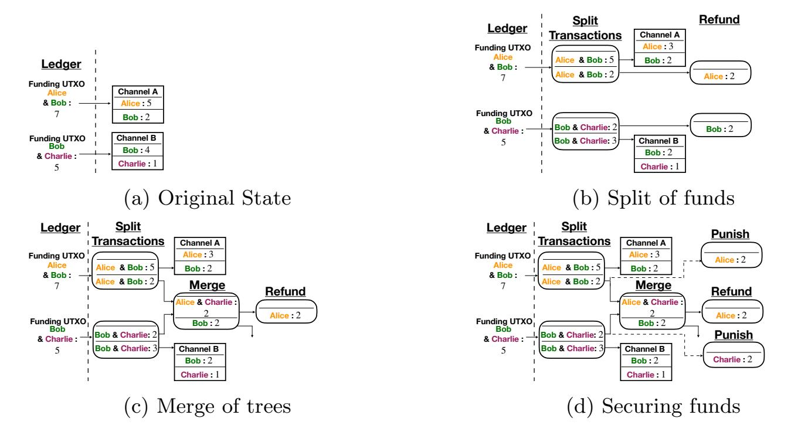
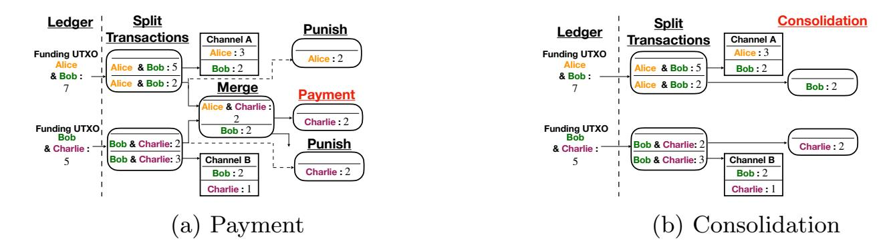
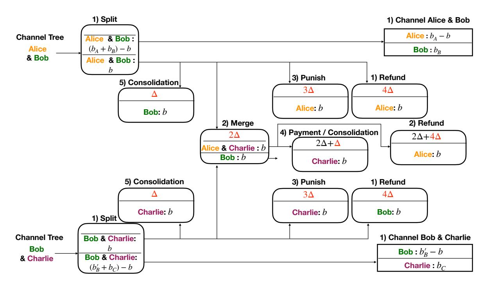
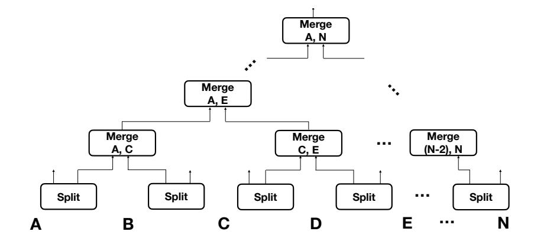
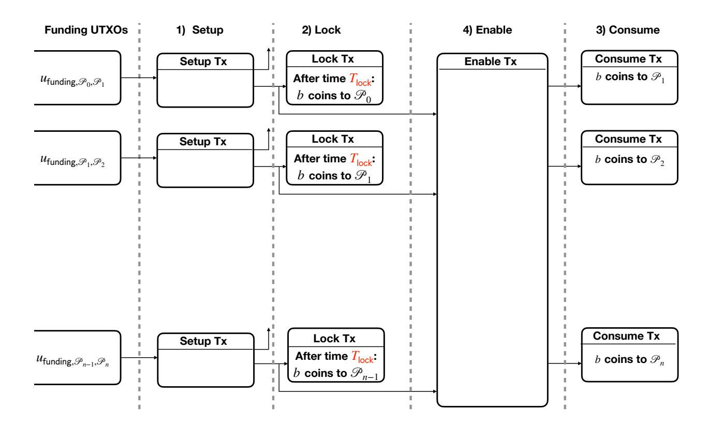

{0}------------------------------------------------

# Payment Trees: Low Collateral Payments for Payment Channel Networks?

Maxim Jourenko<sup>1</sup> , Mario Larangeira1,<sup>2</sup> , and Keisuke Tanaka<sup>1</sup>

<sup>1</sup> Department of Mathematical and Computing Sciences, School of Computing, Tokyo Institute of Technology. Tokyo-to Meguro-ku Oookayama 2-12-1 W8-55, Japan. {jourenko.m.ab@m, mario@c, keisuke@is}.titech.ac.jp 2 Input Output Hong Kong. mario.larangeira@iohk.io <http://iohk.io>

Abstract. The security of blockchain based decentralized ledgers relies on consensus protocols executed between mutually distrustful parties. Such protocols incur delays which severely limit the throughput of such ledgers. Payment and state channels enable execution of offchain protocols that allow interaction between parties without involving the consensus protocol. Protocols such as Hashed Timelock Contracts (HTLC) and Sprites (FC'19) connect channels into Payment Channel Networks (PCN) allowing payments across a path of payment channels. Such a payment requires each party to lock away funds for an amount of time. The product of funds and locktime is the collateral of the party, i.e., their cost of opportunity to forward a payment. In the case of HTLC, the locktime is linear to the length of the path, making the total collateral invested across the path quadratic in size of its length. Sprites improved on this by reducing the locktime to a constant by utilizing smart contracts. Atomic Multi-Channel Updates (AMCU), published at CCS'19, introduced constant collateral payments without smart contracts. In this work we present the Channel Closure attack on AMCU that allows a malicious adversary to make honest parties lose funds. Furthermore, we propose the Payment Trees protocol that allows payments across a PCN with linear total collateral without the aid of smart contracts; a competitive performance similar to Sprites, and yet compatible to Bitcoin.

Keywords: Blockchain, Payment Channel, HTLC, Collateral.

### 1 Introduction

Blockchain based decentralized ledgers as introduced by Nakamoto [\[12\]](#page-20-0) have enjoyed popularity and received interest from the research community and practitioners. Consensus protocols allow these ledgers to be operated by mutually

<sup>?</sup> This work was supported by the Input Output Cryptocurrency Collaborative Research Chair funded by IOHK, JST CREST JPMJCR14D6, JST OPERA.

{1}------------------------------------------------

distrustful parties at the cost of limited throughput. For example, Visa as a centralized system can process orders of magnitude more transactions within a given time frame than the most prominent blockchains as Bitcoin and Ethereum.

The main motivation for the development of offchain protocols is to close the gap in transaction throughput. The idea is to allow parties to interact with each other without interacting with the ledger, while still being able to use it to resolve disputes. Offchain protocols operate on *channels* that are created between two parties. Channels hold a state which can be enforced on the ledger. Payment channels [4,13,15] store the number of coins the two parties have locked inside that channel. Offchain protocols provide a means to alter this state arbitrarily often and thus improving the transaction throughput in the overall system.

Individual channels can be extended to channel networks, e.g. PCNs Lightning [15] and Raiden [1]. This is done using techniques, such as HTLC [2,15], that allow for payments of  $b \in \mathbb{N}$  coins across a path of payment channels of length  $n \in \mathbb{N}$ . This is performed by executing the same payment on each channel within the payment path atomically. All parties on the payment path have to lock the payment amount for a duration of up to locktime. The opportunity cost a party has to invest is the collateral [10] which equals the payment amount b multiplied by the locktime. In turn, parties can impose fees to invest collateral. In the case of HTLC, a party's collateral equals  $\mathcal{O}(nb\Delta)$  in the worst-case where  $\Delta$  is a parameter of the underlying ledger and is the upper limit of the time it takes for a transaction to be included in the ledger.

High collateral investments can be exploited by malicious adversaries to perform grieving and denial-of-service attacks[11,14]. For example, an attacker might operate a channel to collect fees by forwarding payments. However, payments might be routed through competing channels instead. To sabotage the competitor, the attacker can route a payment through these channels without the intent of executing it, locking the competing channel's coins for the entirety of the locktime. These channels experience a denial-of-service scenario by being unable to forward any other payments, losing fees that the attacker can collect through their own channel. Performing this attack on a large scale can result in denial-of-service for the whole PCN. On a lower scale, a griever might force parties to lock away their funds for as long as possible by delaying their cooperation until the last moment. An alternative form of this attack involves routing multiple low value payments through a competing channel, up until a point where the channel cannot add any further HTLCs even though it contains enough coins. In the case of the Lightning network, these types of denial-of-service attacks can lock all of a channel's coins for up to around 2 weeks [11]. <sup>3</sup>

For HTLC the total collateral locked over a whole payment path is  $\mathcal{O}(n^2b\Delta)$  and therefore quadratic in the payment paths length. Sprites [10] reduce the collateral of each party to  $\mathcal{O}(b(n+\Delta))$  and the total collateral to  $\mathcal{O}(bn(n+\Delta))$  by utilizing a smart contract. This is considered to be constant and linear respectively, since  $n << \Delta$  such that  $n + \Delta < 2\Delta$ . Sprites mitigate the damage done

<span id="page-1-0"></span><sup>&</sup>lt;sup>3</sup> https://cointelegraph.com/news/developer-reveals-biggest-unsolvable-lightning-attack-vector.

{2}------------------------------------------------

by a possible attacker but its implementation is limited to ledgers with smart contract capability. The Atomic Multi-Channel Updates (AMCU) protocol [7] is an attempt to close this gap and enable payments with constant collateral on ledgers without smart contract capabilities. However, even though AMCU is formalized as a functionality within Canetti's UC Framework [3], the very last, but crucial step, of the updateState function does not seem to be presented in the description of the AMCU protocol, and neither addressed by the simulator [7]. This gap results in a vulnerability that can be exploited by a malicious adversary to steal funds from honest parties.

Related Work. Payment channels [4,13,15] themselves allow only for offchain payments between two parties. Offchain protocols such as HTLCs [2,15] and Sprites [10] allow to perform payments across paths of channels allowing for the implementation of PCNs. Prominent examples are the Lightning Network [15] and Raiden [1]. Although offchain protocols exist that create new *virtual* channels out of two existing channels as Perun [5,6] and Lightweight Virtual Payment Channels [8], this work focuses on performing individual payments across a PCN. In the following we consider a payment of  $b \in \mathbb{N}$  coins across a path of  $n \in \mathbb{N}$  channels involving parties  $\mathcal{P}_0, \ldots, \mathcal{P}_n$ .

The most prominent technique is based on HTLCs [2,15], which are scripts that perform conditional payments within a channel: The payer locks funds into the contract that are paid out if the payee can present a secret x such that  $y = \mathcal{H}(x)$  where  $\mathcal{H}$  is a cryptographic hash function. Otherwise, after time locktime the payment times-out and the payer can reclaim their funds. This contract is replicated along all channels within a payment path. The payment is performed as soon as  $\mathcal{P}_n$  reveals x to their predecessor who then learns the value of x allowing them to claim the payment from their predecessor in turn. An attacker  $\mathcal{P}_i$ ,  $0 < i \le n$  might attempt to delay revelation of x to their predecessor until briefly before expiration of the locktime. To allow  $\mathcal{P}_{i-1}$  to forward x in time, their locktime needs to be increased by at least  $\Delta$ . This results in a locktime in  $\mathcal{O}(n\Delta)$  and a total locktime in  $\mathcal{O}(n^2\Delta)$ .

Sprites [10] aim to reduce the locktime of a party up to a constant  $\mathcal{O}(n+\Delta)$  where  $n << \Delta$ . This is done by setting up a smart contract entity called PreimageManager, s.t. submitting x to the PreimageManager allows to broadcast it to all nodes within a payment path in at most n communication rounds. The protocol requires creation of a smart contract, making it unavailable to script based ledgers as Bitcoin. AMCU [7] attempts to close this gap, i.e. compatibility with Bitcoin, by introducing an approach for constant locktime payments without the need of smart contracts. AMCU sets up payments on each channel within a payment path that are performed on the condition that an Enable transaction is created, upon which all payments are performed atomically. However, this Enable transactions results in several issues. For one, its size grows linearly in the payment path's length, making its implementation prohibitive for ledgers which have an upper limit for block size and transaction size. Moreover, no party has control over all of the Enable transaction's inputs. A malicious adversary can make two parties collaborate to double spend one of the Enable transaction's

{3}------------------------------------------------

inputs, such that no party is able to enforce the payment on the ledger. If the double-spending is timed appropriately, this can lead to an attacker stealing funds from honest parties. Details are shown in Appendix [B.](#page-22-0)

Jourenko et al. [\[8\]](#page-19-7) proposed an offchain protocol that takes two channels γ<sup>A</sup> and γ<sup>B</sup> as input, one between P<sup>A</sup> and P<sup>I</sup> and one between P<sup>I</sup> and P<sup>B</sup> and creates a new channel γ <sup>v</sup> between P<sup>A</sup> and PB. As this approach is not optimized for individual payments, using it for this purpose would result in excessive collateral as parties would need to lock away more coins for a longer duration as in existing approaches. However, we re-use techniques from the lightweight virtual payment channel construction for the Payment Tree protocol.

Our Contributions. Our contributions are threefold. 1) We present an attack on AMCU performed by a malicious adversary. 2) We present Payment Trees that allow for payments across paths within a PCN without the need of smart contracts, requiring only logarithmic individual collateral O(b∆ log n) while requiring only linear total collateral O(nb∆) such that its performance is comparable to Sprites. 3) We provide efficiency and security analysis of Payment Trees, proving the properties Balance Security and Liveness.

Structure. In the remainder of this work, first, we provide background to this work in Section [2.](#page-3-0) We give an outline of the Channel Closure attack in Section [3](#page-6-0) while supplementing a formal description in Appendix [B.](#page-22-0) Next, we give an informal overview of the Payment Tree protocol in Section [4.](#page-7-0) Afterwards, we introduce the types of transactions used for our construction in Section [5](#page-10-0) before introducing Payment Trees in Section [6](#page-12-0) followed by efficiency and security analysis in Section [7.](#page-17-0) We conclude in Section [8.](#page-19-8)

### <span id="page-3-0"></span>2 Background

Notation. Throughout this work we make use of tuples and use short-hand notations as follows. Let (a1, a2, . . . , an) be a definition of a tuple of type A and let α be an instantiation of A. Then α.a<sup>i</sup> equals the i-th entry of α.

The UTXO Paradigm. A UTXO is a tuple of the form (b, π) where b ∈ N is an amount of coins and π ∈ {0, 1} ∗ is a script. The b coins of the UTXO are claimed by providing a witness w ∈ {0, 1} ∗ s.t. π(w) = True. The state of the ledger is represented by a set of UTXO Sutxo, which can be changed by a transaction of the form (Uin, Uout, t) where t ∈ N is the (absolute) timelock represented as a point in time, Uout is the list of unique UTXO for the outputs of the transaction, and Uin is the set of transaction inputs of the form (ref(u), wu) where ref(u) is the pointer to the UTXO u, and w<sup>u</sup> is the witness.

A transaction (Uin, Uout, t) needs to fulfill the following conditions. (1) The locktime has passed, i.e. t ≤ τ where τ is the current time, (2) all witnesses are valid, i.e. ∀(ref(u), w) ∈ Uin : u.π(w) = True (3) the coins within the newly created UTXO are less or equal to those in the transaction's inputs, i.e. 

{4}------------------------------------------------

Σ(ref(u),w)∈Uin u.b ≥ Σu∈Uoutu.b, (4) all UTXOs in the transaction's inputs exist and have not yet been spent, i.e. ∀(ref(u), w) ∈ Uin : u ∈ Sutxo. The transaction has the following effect on the ledger. All UTXOs referenced within Uin are removed from Sutxo and all UTXOs defined in Uout are added to Sutxo. A transaction T is included in the ledger within a duration ∆ ∈ N. Condition (4) implies that no UTXO can be claimed by two different transactions. After sending T to the ledger, if within time ∆ another transaction T 0 claiming a subset of the same UTXOs as T is sent to the ledger, it would result in a race condition, in which it is non-deterministic whether T or T <sup>0</sup> will change the ledger's state. We note that while we use ∆ as a ledger parameter in practice this value has to be estimated for real-world implementations. Special care has to be taken when selecting a value. A value that is too low breaks our assumptions and the protocol's security. A value too high increases the collateral and therefore the impact of attacks such as congestion and lockdown[\[11,](#page-20-4)[14\]](#page-20-5).

Transaction Graph. All transactions included in the ledger form a directed and acyclic graph. The set of all transactions form its vertices. An edge (T0, T1) from transaction T<sup>0</sup> to transaction T<sup>1</sup> exists, if T1's inputs contain a pointer to one of T0's outputs, i.e. ∃u : u ∈ T0.Uout ∧(ref(u), w) ∈ T1.Uin. Note that a transaction can only be included in a ledger if all of its ancestors have been included in the ledger before. In the remainder of this work we reference sets of transactions that are connected to form a sub-tree as transaction trees.

Scripting. Scripts in this work specify a UTXOs owner by requiring a signature of the transaction that spends the UTXO with the recipient's verification key. This is extended to 2-out-of-2 multisignatures that require verification keys of two parties P and P 0 effectively creating a shared wallet between both parties that can only be spent with consent of both parties. In the remainder of this work UTXOs requiring 2-out-of-2 multisignatures are termed Funding UTXO. Throughout this work we simplify scripts by only stating the set of parties which need to provide their signatures to spend the respective UTXO.

Channels. A channel γ between two parties consists of sub-protocols setup, closure and dispute. In setup both parties create a transaction T r<sup>f</sup> containing a Funding UTXO between each other which locks their funds into the channel. They create a transaction tree with the Funding UTXO as its ancestor that represents the channel which we reference in the remainder of this work as channeltree. Only after the channel-tree is created and either party holds signatures of its transactions, both parties sign and commit T r<sup>f</sup> to the ledger while holding off commitment of transactions within the channel-tree. Both parties can perform closure of the channel by committing a transaction to the ledger that spends the Funding UTXO unlocking the channel's funds according to its most recent state. In case of a dispute, the dispute sub-protocol enforces the channel's state by committing the channel-tree's transactions onto the ledger.

Offchain Protocols perform a state transition of a channel by transforming its channel-tree. Any honest party must be able to enforce the new channel's state 

{5}------------------------------------------------

which might require an explicit invalidation step that disables commitment of an older version of the channel-tree or allows for punishment of a party that does so. An efficiency requirement of offchain protocols is that performing them  $n \in \mathbb{N}$  times grows the channel-tree by at most  $\mathcal{O}(1)$  transactions.

Invalidation by Timelock. Timelocks can be used to define at which point a transaction can be committed to the ledger. Assume there are two transactions that spend the same UTXO, but which have timelocks that are 1) in the future and 2) have a difference of at least  $\Delta$ . In this case parties can enforce commitment of the transaction with the lower timelock to the ledger. The transaction with the lower timelock invalidates the transaction with the higher timelock.

Hashed Timelock Contracts. Let  $\mathcal{P}_0, \mathcal{P}_1, \dots, \mathcal{P}_n, n \in \mathbb{N}$  be parties where parties  $\mathcal{P}_{i-1}$  and  $\mathcal{P}_i$ ,  $i \in \{1, \ldots, n\}$  control channel  $\gamma_i$ . HTLCs are used to perform payments of  $b \in \mathbb{N}$  coins from  $\mathcal{P}_0$  to  $\mathcal{P}_n$  by replicating the payment on each channel  $\gamma_i$  within a payment path  $\gamma_1, \ldots, \gamma_n$  from  $\mathcal{P}_0$  to  $\mathcal{P}_n$ . (1) On a channel  $\gamma_j, j \in \{1, \ldots, n\}$  the payment is performed by extending the channel-tree with a conditional payment: If the payee  $\mathcal{P}_j$  can show the pre-image  $x \in \mathbb{N}$  of a hashed value y = H(x), where H is a cryptographic hash function, they will receive b coins from the payer  $\mathcal{P}_{j-1}$ . However, after expiration of a locktime  $t_j$ the payment expires and the payer  $\mathcal{P}_{j-1}$  will have their coins refunded instead. (2) Only after the conditional payments are set up on all channels, the payment is executed atomically by having  $\mathcal{P}_n$  show the pre-image x to  $\mathcal{P}_{n-1}$ , proving that they have the capability to claim the coins on the ledger through the conditional payment. In turn,  $\mathcal{P}_{n-1}$  learns the pre-image x s.t. they can show it to party  $\mathcal{P}_{n-2}$  reclaiming the coins they forwarded to  $\mathcal{P}_n$ . The information on x propagates through the whole payment path in this manner. (3) Lastly, to keep the payment offchain, the parties need to consolidate the payment on each channel respectively. This is done by updating the channel-tree. The conditional-payment is removed and the b coins that were locked into the channel are credited to the payee. At this point the channel-tree has the same form as before the payment, but with updated balance distribution to account for the payment. This ensures that the channel-tree does not grow in size with each payment, thus fulfilling the efficiency requirements of an offchain protocol. Note that, if the payer  $\mathcal{P}_{j-1}$  does not cooperate with consolidation, payee  $\mathcal{P}_i$  can reclaim their coins by resolving the conditional payment on the ledger instead. Due to this the timelock  $t_i$  has to be chosen s.t.  $\mathcal{P}_i$  has enough time to do so before the conditional payment expires, even if they learn the pre-image from  $\mathcal{P}_{i+1}$  at the last moment just shortly before expiration of timelock  $t_{i+1}$ . Thus the relation  $t_i \geq t_{i+1} + \Delta$  has to hold, making the locktime grow linearly with the payment path's length. This results in a collateral cost of  $bt_i \in \mathcal{O}(bn^2\Delta)$  which is quadratic in the path's length.

The Wormhole Attack. The HTLC protocol is vulnerable to the wormhole attack [9]. An adversary controlling two parties  $\mathcal{P}_i$ ,  $\mathcal{P}_j$ ,  $1 \le i \le j+2 \le n-1$  within a payment path can prevent intermediaries k, i < k < j to participate at the

{6}------------------------------------------------

payment and receive their fees by having P<sup>i</sup> forward pre-image x to Pi−<sup>1</sup> after P<sup>j</sup> learns it from Pj+1 and without forwarding it to party Pj−1.

Brief Description of AMCU. A payment within the AMCU protocol is performed by replicating the payment on each channel using Consume transactions. All Consume transactions share a common ancestor within the protocol's transaction tree which is the Enable transaction. The Enable transaction has UTXOs from each individual channel as input and thus requires signatures of all parties within the payment path. As soon as the parties exchange signatures for the Enable transaction, all Consume transaction could be committed on the ledger, thus performing the payment. If any party refuses to collaborate in the creation of the Enable transaction, all parties have their coins refunded using Lock transactions after the expiration of the specified locktime period. As we show in the next section, in contrast to HTLCs, AMCU cannot ensure that all parties have the capability to claim their coins on the ledger after the payment. In fact it takes only one pair of parties controlling a channel to spend one of the Enable transaction's inputs with a different transaction s.t. the Enable transaction and transitively the Consume transactions cannot be committed to the ledger. This could be remedied by performing a consolidation step on all channels atomically. Although the functionality PCN+, that models AMCU, correctly performs this consolidation step, the AMCU protocol itself does not.

# <span id="page-6-0"></span>3 The Channel Closure Attack on AMCU

In the following we present the Channel Closure attack informally. A more detailed description of AMCU is supplemented in Appendix [A](#page-20-6) and a formal treatment of the attack in Appendix [B.](#page-22-0)

The Vulnerability. While the Enable transaction is the core of the AMCU construction, it also seems to be its vulnerability. While the Enable transaction receives inputs from each channel, no party has control over all channels within the payment path. At any time, two parties sharing a channel can maliciously spend a UTXO that is provided as input of the transaction, or as input to any of its ancestors within the transaction tree. When this happens, the Enable transaction cannot be committed to the ledger and all parties have their coins refunded through Lock transactions. Effectively, no party can enforce payment after execution of the AMCU protocol. On top of that, an adversary can take this further, performing a Channel Closure attack to steal funds from honest parties. We remark that PCN payments require a consolidation step in which a payment is included within the parties' individual channels. While the functionality PCN<sup>+</sup> modeling AMCU performs a consolidation step atomically on all channels, this step is omitted by the AMCU protocol. Second, performing the consolidation step atomically on all channels is highly non-trivial as atomic operations on multiple channels is exactly the problem statement that protocols such as HTLCs, Sprites and AMCU themselves attempt to solve.

{7}------------------------------------------------

The Channel Closure Attack is performed by abusing exactly these two observations. First, the adversary corrupts two parties within a payment path P<sup>i</sup> and Pi+1. These parties cooperate in execution of the AMCU protocol right up until the consolidation step. Then, P<sup>i</sup> performs the consolidation step with Pi−<sup>1</sup> on channel γi−<sup>1</sup> while Pi+1 does not cooperate with Pi+2 to consolidate the payment on channel γi+1. Next, P<sup>i</sup> and Pi+1 close their channel γ<sup>i</sup> such that the Enable transaction cannot be committed to the ledger. This allows Pi+1 to reclaim coins from Pi+2 using their shared Lock transaction. Effectively, P<sup>i</sup> received the payment amount from Pi−<sup>1</sup> on γ<sup>i</sup> through consolidation, while Pi+1 did not forward the payment.

# <span id="page-7-0"></span>4 Protocol Overview

In the following, we define communication and adversarial models, before giving an overview of the protocol. Lastly we define the properties of our construction.

#### 4.1 System Model

Communication Model. Communication between parties occurs in rounds. Any message sent within one round is available to the recipient at the beginning of the next round. The duration of any round has an upper limit.

Adversarial Model. We define an Adversary A consistent with related work [\[8,](#page-19-7)[7](#page-19-3)[,10\]](#page-20-3): At the beginning of protocol execution, the adversary can statically corrupt up to n of n + 1 parties, receiving their internal state and having all communication to and from these parties be routed through the adversary. The adversary is malicious and can make any corrupted party deviate from the protocol. Moreover, within each communication round, the adversary can delay and re-order all messages sent.

#### 4.2 Overview

We illustrate the life-cycle of the Payment Tree protocol for a payment of 2 coins from Alice to Charlie across two channels using Figure [1](#page-8-0) and Figure [2.](#page-9-0) The protocol's approach is to take two channels, one between parties Alice and Bob, one between parties Bob and Charlie and construct a transaction tree that effectively creates a virtual channel [\[8\]](#page-19-7) optimized for a one-time payment between Alice and Charlie. Our construction utilizes two approaches to perform updates to transaction trees atomically. On the one hand, we use these techniques to empower the intermediary Bob to ensure correctness of the protocol, while on the other hand, we incentivise Bob to actually do so by means of punishment. Our construction consists of multiple transaction tree updates. Updates are done using the invalidation by timelock technique, but for simplicity we leave the details to Section [6.](#page-12-0)

{8}------------------------------------------------

<span id="page-8-0"></span>

Fig. 1: Stepwise construction of a Payment Tree across two channels. Boxes with straight corners represent channel trees displaying their state. Boxes with round corners represent transactions displaying output UTXOs. Edges indicate which transactions spend the UTXO at their origin.

Constructing Transaction Trees Atomically. We observe that committing a transaction to the ledger requires that all of its ancestors are committed to the ledger beforehand. For a transaction to be able to be committed to the ledger it needs to contain all required witnesses, i.e. signatures. Therefore, (1) we can atomically create a transaction tree rooted in a transaction trroot that is common ancestor to all other transactions. First, we add signatures to all transactions except trroot. Afterwards, adding signatures to trroot makes the whole transaction tree committable to the ledger at the same moment. (2) We assume two transactions, tr<sup>0</sup> and tr1, that require signatures of Alice and Bob, as well as Bob and Charlie respectively. Bob can enforce that both transactions are created atomically by only providing his signature after he received signatures from Alice and Charlie. We note that techniques (1) and (2) can be used in tandem.

Payment Tree Construction. Figure [1](#page-8-0) depicts construction of a Payment Tree between Alice, Bob and Charlie. Construction consists of three atomic transaction tree updates. We note that the balance distribution between the parties remains unchanged between the updates and no payment is executed. Alice and Bob as well as Bob and Charlie share a channel as depicted in Figure [1a.](#page-8-0) (1) Then, as shown in Figure [1b](#page-8-0) we update both trees by introducing a Split transaction that spends the channels' Funding UTXOs and creates two new Funding UTXOs each. One UTXO contains the payment amount and is funded by coins from Alice, who is payer, and Bob, who is intermediary, respectively. The other UTXO contains the remaining coins and is used as Funding UTXO to reopen both channels which can be used for further payments within the channels or fur-

{9}------------------------------------------------

<span id="page-9-0"></span>

Fig. 2: Payment and Consolidation using Payment Trees. Figure [2a](#page-9-0) modifies the Payment Tree to forward the funds in the Merge transaction's Funding UTXO to the payee. Figure [2b](#page-9-0) splits up the Payment Tree and distributes funds according to the Payment Tree's state in Figure [2a.](#page-9-0)

ther Payment Tree constructions. (2) Next as shown in Figure [1c](#page-8-0) both separate transaction trees are combined using a Merge transaction. This transaction creates two UTXOs. One UTXO requires Bob's signature to be spent and contains his collateral. The other UTXO is a Funding UTXO requiring the signatures of Alice and Charlie and it contains Alice's payment to Charlie. At this point, the coins are given to Alice. (3) Lastly, as shown in Figure [1d,](#page-8-0) before we can proceed with a payment, the funds within the Merge transaction's Funding UTXOs need to be secured in case two parties, for example Bob and Charlie, collude to spend their Merge transaction's or Split transaction's input with a different transaction. This attack is similar to the Channel Closure attack described in Section [3](#page-6-0) and would disable commitment of the Merge transaction. However, we observe that all UTXOs that can be spent for this attack require Bob's signature. Respectively, in this scenario we can uniquely identify Bob as malicious. In order to punish Bob and secure the funds of Alice and Charlie respectively we create Punish transactions. These transactions spend the same Funding UTXOs as the Merge transaction but have a timelock that is higher than that of the Merge transaction by at least ∆. Due to this, Bob can always avoid commitment of a Punish transaction by committing the Merge transaction to the ledger. However, in case Bob acted maliciously such that the Merge transaction cannot be committed to the ledger, Alice and Charlie can reclaim their coins from Bob through the Punish transactions.

Payment and Consolidation. Figure [2](#page-9-0) depicts payment and consolidation using a Payment Tree. Assuming a fully constructed Payment Tree as shown in Figure [1d](#page-8-0) a payment is executed by giving the coins within the Merge transaction's Funding UTXO to Charlie instead of Alice. As shown in Figure [2a](#page-9-0) this changes the balance distribution represented by the transaction tree, reducing Alice's coins by 2 and adding those to Charlie's balance. A consolidation requires one atomic transaction tree update as shown in Figure [2b.](#page-9-0) This update spends the UTXOs within the Merge transaction's inputs and gives the coins to Bob and Charlie respectively. Note that this step does not change the balance distribution between the parties. Bob needs to make sure that this update is done atomically 

{10}------------------------------------------------

s.t. he avoids commitment of a Punish transaction. At this point the transaction trees are separate and in control of each channels' members respectively. Both pair of parties can now perform a last transaction tree update that replaces the respective transaction tree with a channel as shown in Figure [1a](#page-8-0) but that now represents the new balance distribution instead.

### 4.3 System Goals

<span id="page-10-1"></span>In the following we define the desired properties of our protocol.

Theorem 1 (Balance Security). Outside of performing the intended payment, the sum of a honest party's coins is not reduced by participation in the Payment Tree protocol.

<span id="page-10-2"></span>Theorem 2 (Liveness). Eventually any honest party receives access to their coins through UTXOs spendable with a witness consisting of a signature corresponding to their verification key.

### <span id="page-10-0"></span>5 Transactions

We use three types of transactions. Split transactions are used to split off coins from one channel, making them available to our construction in form of a Funding UTXO. Payout transactions take a Funding UTXO as input and pay the money to one of the two parties involved in it. Lastly, the Merge transaction is used to combine the Funding UTXOs that were split off two channels by taking them as input, paying out the intermediary's coins out as collateral and creating a Funding UTXO between the two remaining non-intermediary parties.

Split Transactions are of form T rsplit = (Uin, Uout, t) where Uin = {ref(fγ)} consist of one Funding UTXO provided by the channel-tree of γ, Uout = {fchange, fpay} consists of two Funding UTXOs. It holds that fchange.b+fpay.b = f<sup>γ</sup> and fpay.b = b. Moreover, fγ.π = fchange.π = fpay.π, i.e. all Funding UTXOs are shared between the same parties. The function call SPLIT(γ, b, t) creates a Split transaction as described above and returns fpay. A function call to UNSPLIT(γ) consolidates the transaction into the channel by updating the channel's balance distribution with the split off balance. Additionally it sets up a channel between both parties by constructing a channel-tree with Funding UTXO fchange as root. Split transactions are used to take off b coins from each channel to be used for our construction. They are used to avoid that the existing channels are affected in case a corrupted intermediary misbehaves. Although we represent this by using a Split transactions as done with Virtual Channels and AMCU, it could be included similarly as conditional payments from HTLCs by placing a Funding UTXO instead of a HTLC contract.

{11}------------------------------------------------

Merge Transactions are of form T rmerge = (Uin, Uout, t) where Uin = {fpay,0, fpay,1} and Uout = {fpay, ucollateral}. The two Funding UTXOs that are provided as input fpay,<sup>0</sup> and fpay,<sup>1</sup> are shared between parties P<sup>A</sup> and P<sup>B</sup> as well as between parties P<sup>B</sup> and P<sup>C</sup> respectively. The newly created Funding UTXOs fpay in the output is shared between parties P<sup>A</sup> and P<sup>C</sup> . The other UTXO within the outputs is ucollateral which pays out funds to PB. Lastly it holds that the coins in all UTXOs are equal, i.e. fpay,0.b = fpay,1.b = fpay.b = ucollateral.b = b. The function call MERGE(fpay,0, fpay,1, t) is a short-hand notation to construct a Merge transaction. We extend helper function OUT UTXO to accept a Merge transaction as input as well. In this case it returns UTXO fpay. The helper function IN UTXO takes a Merge transaction as input and outputs the UTXOs that are used within its inputs, i.e. fpay,0, fpay,1. Merge transactions are used to combine transaction trees into one, essentially opening up a virtual channel between Alice and Charlie that can be used for a one-time payment.

Payout Transactions are of form T rpayout = (Uin, Uout, t) where Uin = {f} is a Funding UTXO and Uout = {upayout}. It holds that upayout pays out funds to a party P and f.b = upayout.b. The function call PAYOUT(f,P, t) constructs a Payout transaction as described above. We extend helper function IN UTXO to take a Payout transaction as input in which case it outputs the UTXO f. Payout transactions are used at several points within our construction to serve different roles as shown in Figure [3.](#page-12-1) Refund transactions are used whenever Funding UTXOs are created. They are used to ensure that no funds are locked away within Funding UTXOs indefinitely even when any other party stops collaboration, which is essential to ensure the liveness property. Punish transactions are used to incentivise an intermediary to collaborate and ensure Merge transactions can be committed to the ledger. Without those, in case a Merge transaction is not committed to the ledger it could result in the loss of coins for Charlie in case the Refund transaction between Bob and Charlie is committed to the ledger instead and after the payment between Alice and Charlie has been performed. The Payment transaction is used to perform a change of the state, i.e. balance distribution, represented by the transaction tree, effectively performing a payment. Lastly, Consolidation transactions are used to deconstruct the transaction tree by applying the payment on both original transaction trees atomically. Without these, we cannot enforce the payment outside of committing the transaction tree to the ledger itself because of which the protocol would not fulfill the efficiency requirements for offchain protocols and thus not being classified as such. We note that the Refund and Punish transactions between Alice and Bob represent the same state s.t. the Punish transaction is redundant. However, for simplicity we opted to include both transactions making the construction symmetric. Whereas similarly the Consolidation and Punish transactions between Bob and Charlie do represent the same state in Figure [3,](#page-12-1) it is not possible to remove any of the transactions in the case where fees are paid to Bob which would be included within the Consolidation but not the Punish transactions.

{12}------------------------------------------------

<span id="page-12-1"></span>

Fig. 3: Transaction tree of a payment of b coins across 2 hops. Beforehand, the respective balances are  $b_A$  and  $b_B$  for Alice and Bob,  $b'_B$  and  $b_C$  for Bob in Charlie within their channels. Transactions are boxes with round corners containing the UTXOs they create, whereas referenced UTXOs in inputs are indicated implicitly by arrows originating from the UTXO that is spent. Red numbers indicate timelocks. Numbers atop the transaction indicate order of construction whereas transactions with same numbers are constructed atomically. Channel trees are boxes with straight edges forming a black box.

### <span id="page-12-0"></span>6 Our Payment Tree Construction

We describe the construction of a payment tree in respect to our running example. Let  $\mathcal{P}_0, \mathcal{P}_1, \ldots, \mathcal{P}_n, n \in \mathbb{N}$ , be parties where parties  $\mathcal{P}_{i-1}$  and  $\mathcal{P}_i, i \in \{1, \ldots, n\}$  control channel  $\gamma_i$ . The protocol performs a payment of  $b \in \mathbb{N}$  coins from  $\mathcal{P}_0$  to  $\mathcal{P}_n$ . The value  $\tau \in \mathbb{N}$  represents the current time, whereas  $\Delta \in \mathbb{N}$  is the maximum time it takes for a transactions to be included in the ledger after committing it. We illustrate our approach in Figure 3 for a two-hop payment, i.e. for the case of n = 2. It is designed such that it can be extended to payment paths of arbitrary lengths. The construction is based on the overview given in Section 4. Numbers indicate the order in which transactions are created, whereas transactions with the same numbers are created atomically.

The Payment Tree Protocol. The protocol for constructing a Payment Tree across a path of n channels is depicted in Algorithm 4. It makes use of Algorithm 1 that allows an intermediary to atomically create two transactions, Algorithm 2 that performs a construction step of the Payment Tree, and Algorithm 3 that performs a consolidation step of the Payment Tree.

Helper Functions. Function  $SIGN(Tr, P_S, P_R)$  is used to sign and exchange signatures of transactions. It takes a transaction Tr and two sets of parties  $P_S$ 

{13}------------------------------------------------

#### <span id="page-13-0"></span>Algorithm 1 Atomically signing two Payout transaction

```
1: function ATOMIC SIGN(T r0, T r1)
Require: T r0, T r1 are Payout transactions between three parties.
2: f0, f1 ← FUTXO(T r0), FUTXO(T r1)
3: PI ← INTERMEDIARY(f0, f1)
4: PA, PB ← COUNTERPARY(f0, PI ), COUNTERPARY(f1, PI )
5: SIGN(T r0, {PA}, {PI }), SIGN(T r1, {PB}, {PI })
6: SIGN(T r0, {PI }, {PA}), SIGN(T r1, {PI }, {PB})
7: end function
```

Fig. 4: Algorithm that takes two Payout transactions as input and allows the intermediary party to enforce that either both or no transactions are fully signed.

and P<sup>R</sup> as input. Each party in P<sup>S</sup> signs T r and sends the signature to each party in PR. This includes verification of signatures by the recipients. Function PARTIES takes a Funding UTXO as input and outputs a set containing the two parties of which a signature is required to spend the UTXO. Function INTERMEDIARY(f0, f1) takes two Funding UTXOs f0, f<sup>1</sup> as input, if an intermediary exists, i.e. |PARTIES(f0) ∩ PARTIES(f1)| = 1, then it returns the intermediary P ∈ PARTIES(f0) ∩ PARTIES(f1). Otherwise it returns ⊥. Function COUNTERPARY(f,P) takes a Funding UTXO and a party as input, if P ∈ PARTIES(f), then it returns its counterparty P<sup>C</sup> ∈ (PARTIES(f)) \ {P}.

Atomic Signatures. We assume a setting with two channels between three parties. Protocol ATOMIC SIGN is shown in Algorithm [1.](#page-13-0) It enables the intermediary party to enforce that two transactions – one on each channel – are created atomically. This is done by having the intermediary party provide signatures to both transactions only after they received all signatures from its counterparties.

Merging Channels. Protocol MERGE as shown in Algorithm [2](#page-14-0) takes two Funding UTXOs f0, f1, an amount of coins b and a time t as input where f<sup>0</sup> is shared between parties P<sup>A</sup> and P<sup>I</sup> , f<sup>1</sup> is shared between parties P<sup>I</sup> and P<sup>B</sup> and it holds that f0.b = f1.b = b. It creates a Merge transactions with timelock t<sup>m</sup> = t + 2∆ spending both Funding UTXOs, paying out b coins to P<sup>I</sup> and containing a Funding UTXO holding b coins, which are paid out to P<sup>A</sup> after time tm+4∆ by means of a Payout transaction. This transaction tree is created atomically as its root, which is the Merge transaction, is signed last. Only after each party holds a fully signed instance of the Merge transaction, two Punish transactions spending f<sup>0</sup> and f<sup>1</sup> and paying out b coins to P<sup>A</sup> and P<sup>B</sup> respectively are created atomically using ATOMIC SIGN. These have timelocks equal to t + 3∆. Note that the creation of the Merge transaction must not re-distribute funds, i.e. the funds in f<sup>0</sup> are paid by P<sup>A</sup> and the funds in f<sup>1</sup> are paid by P<sup>I</sup> . The Punish transactions are

{14}------------------------------------------------

#### <span id="page-14-0"></span>Algorithm 2 Construction Step of a Payment Tree

```
1: function MERGE(f0, f1, b, t)
2: PI ← INTERMEDIARY(f0, f1)
3: PA, PB ← COUNTERPARY(f0, PI ), COUNTERPARY(f1, PI )
4: T rmrg ← MERGE(f0, f1, t + 2∆)
5: T rrefund ← PAYOUT(OUT UTXO(T rmrg), PA, t + 6∆)
6: T rpunish,A ← PAYOUT(f0, PA, t + 3∆)
7: T rpunish,B ← PAYOUT(f1, PC , t + 3∆)
8: SIGN(T rrefund, {PA, PB}, {PA, PB})
9: SIGN(T rmrg, {PA, PB, PI }, {PA, PB, PI })
10: ATOMIC SIGN(T rpunish,A, T rpunish,B) return T rmrg
11: end function
```

Fig. 5: Creation of a Funding UTXO between two counterparties. The intermediary can enforce atomic construction while Punish transactions provide incentive.

used to secure the funds within the Merge transaction by paying out funds to P<sup>A</sup> and PB, if the Merge transaction cannot be committed to the ledger. Timelocks are selected to perform transformations on the existing transaction through the invalidation by timelock technique and also to allow the construction to be performed iteratively. Timelock t<sup>m</sup> is selected s.t. a Consolidation transaction can be placed with timelock t+ ∆ during the protocol's consolidation phase. Timelocks of the Punish transactions are selected s.t. they are invalidated by the Merge transaction conditionally, i.e. only if the Merge transaction can be committed to the ledger, the Punish transactions are invalid. The Payout transaction acts as a Refund transaction for the new Merge transaction. Respectively we assign it a timelock of t<sup>m</sup> + 4∆ such that Consolidation, Merge and Punish transactions can be placed with timelocks t<sup>m</sup> + ∆, t<sup>m</sup> + 2∆ and t<sup>m</sup> + 3∆ respectively. Note that if the Merge transaction is on top of the Payment Tree s.t. it is not used for further channel merges, the Refund transaction's timelock can be reduced to t<sup>m</sup> + 2∆. Lastly, if a transaction spends another transaction, its timelock needs to be larger by at least ∆ to ensure that all transactions can be committed to the ledger as soon as their timelocks expire.

Consolidation. Algorithm [3](#page-15-0) takes a Merge transaction as input, invalidates it by creating two Payout transactions atomically using the ATOMIC SIGN protocol that spend the Merge transaction's inputs. Both consolidation transactions perform a payment by giving the funds to the payee. Note that the protocol can be adjusted to cancel a payment by refunding the funds to the payer instead.

Payment Trees. Algorithm [4](#page-16-0) performs a payment from P<sup>0</sup> to P<sup>n</sup> by iteratively merging Funding UTXOs, s.t. the Merge transactions form the nodes of a bal-

{15}------------------------------------------------

#### <span id="page-15-0"></span>Algorithm 3 Deconstructing Step of a Payment Tree

```
1: function CONSOLIDATE(T rmrg)
2: f0, f1 ← IN UTXO(T rmrg)
3: PI ← INTERMEDIARY(f0, f1)
4: PA, PB ← COUNTERPARY(f0, PI ), COUNTERPARY(f1, PI )
5: T rA ← PAYOUT(f0, PB, t + ∆)
6: T rB ← PAYOUT(f1, PC , t + ∆)
7: ATOMIC SIGN(T rA, T rB)
8: end function
```

Fig. 6: Invalidating a Merge transactions and atomically updating the state on the two original Funding UTXOs.

anced binary tree as illustrated in Figure [8.](#page-17-1) The algorithm takes the following inputs: (1) The payment path γ1, . . . , γn, (2) the payment amount b, and (3) time tmin. The value tmin is negotiated by the parties and represents the maximum amount of time the parties have to execute the protocol. The dispute protocol starts if the protocol is not concluded until tmin. Note that even existing methods as HTLCs have to account for tmin.

In the following we refer to a certain depth within this binary tree as level, beginning with Split transactions on level 0. The algorithm maintains lists of Funding UTXOs F UT XO<sup>i</sup> for each level i ≥ 0 of the binary tree, as well as lists of Merge transactions MRG<sup>j</sup> for each level j ≥ 1 of the binary tree. The algorithm proceeds as follows. Add a Funding UTXO from each Split transaction to F UT XO<sup>0</sup> in order (4 - 7) and create the Payment Tree by iterative use of the MERGE protocol level-by-level (8 - 18). The Merge transactions and Funding UTXOs created on level j are added to lists MRG<sup>j</sup> and F UT XO<sup>j</sup> respectively and in order (12 - 13). Note that if there is an uneven amount of Funding UTXOs within a level, we leave the odd one to be used in the level above instead (15 - 17). The payment is executed after construction is concluded (19). Afterwards the payment tree is deconstructed in reverse order by executing the CONSOLIDATE protocol on each Merge transaction (20 - 24). Lastly the Split transactions are removed and consolidation within all original channels concludes (25 - 27).

Dispute. This protocol is executed at time tmin if the payment tree protocol has not come to conclusion in an orderly manner. Every honest party submits their transactions to the ledger as soon as their respective timelocks expire. This will result in commitment of the payment tree onto the ledger where transactions are committed in order of their priority. If a Merge transaction cannot be committed to the ledger, refunds and payments are done via Punish transactions.

{16}------------------------------------------------

#### <span id="page-16-0"></span>Algorithm 4 Payment Tree Construction

```
1: function PaymentTree(γ1, γ2, . . . , γn, b, tmin)
2: F UT XOi ← [], 0 ≤ i ≤ d(log n) − 1e
3: MRGi ← [], 1 ≤ i ≤ dlog ne
4: for 1 ≤ i ≤ n do
5: fi ← SPLIT(γi, b, tmin)
6: Append fi to F UT XO0
7: end for
8: for i = 0 until i = d(log n − 1)e do
9: for 0 ≤ j ≤ b|F UT XOi|/2c do
10: Retrieve f2j , f2j+1 from F UT XOi
11: T rmrg,j ← MERGE(f2j , f2j+1, b, tmin + 2i∆)
12: Append OUT UTXO(T rmrg,j ) to F UT XOi+1
13: Append T rmrg,j to MRGi+1
14: end for
15: if |F UT XOi| mod 2 = 1 then
16: Remove last entry of F UT XOi and append to F UT XOi+1
17: end if
18: end for
19: T rP ayment ← PAYOUT(OUT UTXO(MRGdlog ne[0]), Pn, tmin + 2∆ log n + ∆)
20: for i = dlog ne until i = 1 do
21: for T rmrg in MRGi do
22: CONSOLIDATE(T rmrg)
23: end for
24: end for
25: for 1 ≤ i ≤ n do
26: UNSPLIT(γi)
27: end for
28: end function
```

Fig. 7: The full Payment Tree protocol from construction to consolidation.

Fees. Fees can be paid by the payer P<sup>0</sup> and payee P<sup>n</sup> or either of them alone to the intermediaries to compensate for their invested collateral. Our approach to handling fees is similar to the approach used for HTLCs, however, adapted to the binary tree structure of Payment Trees. Any party acting as intermediary when creating a Merge transaction receives cumulative fees from the other two parties participating in the Merge transaction's construction. The cumulative fee paid to the intermediary is composed of two parts. For one, it contains the fees paid to the intermediary themselves, and for another, it contains coins the party has to forward to the parties who act as intermediaries of Merge transactions on the lower levels of the Payment Tree. For simplicity, in the following we assume that the path's length is a power of 2, i.e. n = 2<sup>i</sup> , i ∈ N, the paid fees f are equal for

{17}------------------------------------------------

<span id="page-17-1"></span>

Fig. 8: Payment tree in the shape of a balanced binary tree.

each intermediary and all fees are shared between payer  $\mathcal{P}_0$  and payee  $\mathcal{P}_n$  equally. Then, a party that acts as intermediary of level i of the Payment Tree receives  $f_i = f + 2\frac{f_{i-1}}{2} = f + f_{i-1}$  coins, where  $f_1 = f$ . The fee  $f_i$  is paid equally by the other two parties involved in the Merge transaction's construction. Payment of fees happens within Merge transactions by adding a fee to the collateral the intermediary receives. However, this raises the challenge that we have to ensure that all transactions receive sufficient funding: The coins within a transaction's inputs have to cover all coins within their outputs. Moreover, to ensure that the consolidation step can be performed, the collateral of the intermediary within a Merge transaction has to be at least as high as the coins within the Merge transaction's Funding UTXO [8]. Therefore, when performing the merge step on level i every party has to have an additional balance of  $f_{i,cum} = \sum_{j=i}^{h} f_j$ , whereas the collateral of a Merge transaction's intermediary equals  $b+f_{i,cum}+f_i$  where  $f_i$  is paid equally from balances brought by the other two parties.

### <span id="page-17-0"></span>7 Collateral Efficiency and Security Analysis

In this section we discuss properties of the Payment Tree construction.

Efficiency. Figure 9 depicts the efficiency properties of Payment Trees, comparing it to existing approaches. We compare two metrics: (1) The collateral, and (2) the number of transactions that have to be committed to the ledger in case of dispute. We do this for individual parties, as well as for the whole payment.

Committen of each Merge transaction unlocks the collateral of one party. To commit a Merge transaction located on level i of the payment tree it needs to commit i transactions beforehand, i.e. i-1 Merge transaction as well as a Split transaction. This will happen at time  $2\Delta i$ . As the height of the Payment tree is limited by  $\lceil \log n \rceil$  it follows that any party invests  $b2\Delta i \in \mathcal{O}(b\Delta \log n)$  collateral and has to commit  $i+1 \in \mathcal{O}(\log n)$  transactions. Regarding the total payment, we observe that there are  $\frac{n}{2^i}$  Merge transactions on level i of the payment tree. It follows that the total collateral equals the sum  $\sum_{i=1}^{\lceil \log n \rceil} b2\Delta i \frac{n}{2^i} = b2\Delta n \sum_{i=1}^{\lceil \log n \rceil} \frac{i}{2^i}$ . As  $\sum_{i=1}^{\infty} \frac{i}{2^i} = 2$  and each part of the sum is positive, it follows that the total

{18}------------------------------------------------

<span id="page-18-0"></span>

| Method       | pp Collateral                 | pp Tr.                | Total Collateral            | Total Tr.        | Smart Contracts |
|--------------|-------------------------------|-----------------------|-----------------------------|------------------|-----------------|
| HTLC [15,2]  | $\mathcal{O}(b\Delta n)$      | $\mathcal{O}(1)$      | $\mathcal{O}(b\Delta n^2)$  | $\mathcal{O}(n)$ | No              |
| Sprites [10] | $\mathcal{O}(b(n+\Delta))$    | $\mathcal{O}(1)$      | $\mathcal{O}(b(n+\Delta)n)$ | $\mathcal{O}(n)$ | Yes             |
| Payment Tree | $\mathcal{O}(b\Delta \log n)$ | $\mathcal{O}(\log n)$ | $\mathcal{O}(b\Delta n)$    | $\mathcal{O}(n)$ | No              |

Fig. 9: Comparison of the performance of Payment Trees across the whole payment (Total) and individually per party (pp).

collateral  $b2\Delta n \sum_{i=1}^{\lceil \log n \rceil} \frac{i}{2^i} < 4b\Delta n \in \mathcal{O}(b\Delta n)$  is linear in the length of the payment path n. The number of transactions can be computed in a similar fashion, however, an intuitive approach is to recall that the transactions form a balanced binary tree of height  $1+\lceil \log n \rceil$  which has at most  $2^{1+\lceil \log n \rceil} \leq 2n \in \mathcal{O}(n)$  nodes. Although the collateral any individual party has to invest is logarithmic, therefore higher than Sprites but lower than HTLCs, the total collateral incurred over the whole payment is linear in the path's length. This is comparable to the performance of Sprites and is by a factor of n lower than the total collateral of HTLCs. A trade-off of Payment Trees is that an individual party might have to commit up to  $\mathcal{O}(\log n)$  many transactions. Nevertheless the total number of transactions over the whole payment is comparable to both, HTLCs and Sprites. Payment Trees provide a performance comparable to Sprites without requiring a ledger with smart contract capability.

Denial of Service Attacks. The Payment Tree protocol mitigates existing attacks such as the congestion and lockdown attacks[11,14] on HTLCs that aim to lock a channel's coins within unfulfilled HTLCs. This is done by reducing the total and individual collateral of payments. While a large scale DoS attack on multiple channels is difficult as the total collateral of Payment Trees is linear in the payment path's length, a specific intermediary can be targeted to act a intermediary on the highest level of the Payment Tree to pay a logarithmic collateral. Another aspect of the Lockdown attack is that a channel is blocked by saturating the number of HTLCs applicable to a channel which is limited by the maximum size of a transaction. The Payment Trees protocol mitigates this by using Split transactions. Each pending payment requires the construction of a Split transaction. This prevents that there is any transaction that increases in size depending on the number of pending transactions. However, a tradeoff to using Payment Trees is the increased number of transactions that would need to be committed to the ledger in case of a dispute.

Wormhole Attacks. The Payment Tree protocol pays coins to intermediaries of a Merge transaction and they include fees for all intermediaries on lower levels of respective sub-trees. An attack similar to the wormhole attack can be performed by a corrupted intermediary when creating a Merge transaction by replacing the Merge transaction's inputs with UTXOs they control. Doing this they could take all fees that were intended to be forwarded to other parties while preventing them

{19}------------------------------------------------

to participate in the protocol. In contrast to the wormhole attack on HTLCs a wormhole-like attack on the Payment Trees protocol requires making changes to the transaction tree which in-turn can be detected and prevented. We assume that either P<sup>0</sup> and P<sup>n</sup> are honest. Otherwise, if both are corrupted the attack would only redistribute coins between corrupted parties resulting in no net gain to the adversary. During creation of the Payment Tree all intermediaries send their view of the protocol to P<sup>0</sup> and Pn, i.e. the Merge transactions they are involved in. Having this information P<sup>0</sup> and P<sup>n</sup> can verify correctness of the construction and abort the payment in the negative case.

Security proofs. We provide proof of Theorems [1](#page-10-1) and [2](#page-10-2) in Appendix [C.](#page-24-0)

# <span id="page-19-8"></span>8 Conclusion

Payment Trees provide competitive performance to state-of-the-art approaches as Sprites, while having fewer restrictions to its employability by not requiring smart contract capability. Thus providing the first secure alternative to HTLCs for the Lightning Network.

# References

- <span id="page-19-1"></span>1. Raiden network. raiden.network, accessed: 2018-09-03
- <span id="page-19-2"></span>2. Bowe, S., Hopwood, D.: Hashed Time-Locked Contract transactions. https://github.com/bitcoin/bips/blob/master/bip-0199.mediawiki (2017), [Online; accessed 29-August-2020]
- <span id="page-19-4"></span>3. Canetti, R., Dodis, Y., Pass, R., Walfish, S.: Universally composable security with global setup. In: Vadhan, S.P. (ed.) TCC 2007. LNCS, vol. 4392, pp. 61– 85. Springer, Heidelberg (Feb 2007). [https://doi.org/10.1007/978-3-540-70936-7](https://doi.org/10.1007/978-3-540-70936-7_4) 4
- <span id="page-19-0"></span>4. Decker, C., Wattenhofer, R.: A fast and scalable payment network with bitcoin duplex micropayment channels. In: Symposium on Self-Stabilizing Systems. pp. 3–18. Springer (2015)
- <span id="page-19-5"></span>5. Dziembowski, S., Eckey, L., Faust, S., Malinowski, D.: Perun: Virtual payment hubs over cryptocurrencies. In: 2019 IEEE Symposium on Security and Privacy (SP). pp. 106–123. IEEE (2019)
- <span id="page-19-6"></span>6. Dziembowski, S., Faust, S., Host´akov´a, K.: General state channel networks. In: Proceedings of the 2018 ACM SIGSAC Conference on Computer and Communications Security. pp. 949–966. ACM (2018)
- <span id="page-19-3"></span>7. Egger, C., Moreno-Sanchez, P., Maffei, M.: Atomic multi-channel updates with constant collateral in bitcoin-compatible payment-channel networks. In: Cavallaro, L., Kinder, J., Wang, X., Katz, J. (eds.) ACM CCS 2019. pp. 801–815. ACM Press (Nov 2019).<https://doi.org/10.1145/3319535.3345666>
- <span id="page-19-7"></span>8. Jourenko, M., Larangeira, M., Tanaka, K.: Lightweight virtual payment channels. Cryptology ePrint Archive, Report 2020/998 (2020), [https://eprint.iacr.org/](https://eprint.iacr.org/2020/998) [2020/998](https://eprint.iacr.org/2020/998)
- <span id="page-19-9"></span>9. Malavolta, G., Moreno-Sanchez, P., Schneidewind, C., Kate, A., Maffei, M.: Anonymous multi-hop locks for blockchain scalability and interoperability. In: Network and Distributed Systems Security Symposium (2019)

{20}------------------------------------------------

- <span id="page-20-3"></span>10. Miller, A., Bentov, I., Bakshi, S., Kumaresan, R., McCorry, P.: Sprites and state channels: Payment networks that go faster than lightning. In: Goldberg, I., Moore, T. (eds.) FC 2019. LNCS, vol. 11598, pp. 508–526. Springer, Heidelberg (Feb 2019). https://doi.org/10.1007/978-3-030-32101-7\_30
- <span id="page-20-4"></span>11. Mizrahi, A., Zohar, A.: Congestion attacks in payment channel networks. arXiv preprint arXiv:2002.06564 (2020)
- <span id="page-20-0"></span>12. Nakamoto, S.: Bitcoin: A peer-to-peer electronic cash system (2008)
- <span id="page-20-1"></span>13. PDecker, C., Russel, R., Osuntokun, O.: eltoo: A simple layer2 protocol for bitcoin. See https://blockstream.com/eltoo.pdf (2017)
- <span id="page-20-5"></span>14. Pérez-Solà, C., Ranchal-Pedrosa, A., Herrera-Joancomartí, J., Navarro-Arribas, G., Garcia-Alfaro, J.: Lockdown: Balance availability attack against lightning network channels. In: International Conference on Financial Cryptography and Data Security. pp. 245–263. Springer (2020)
- <span id="page-20-2"></span>15. Poon, J., Dryja, T.: The bitcoin lightning network: Scalable off-chain instant payments. See https://lightning.network/lightning-network-paper.pdf (2016)

### <span id="page-20-6"></span>A Existing Approaches

Hash Time Locked Contract can be used to perform payments within a PCN as a offchain protocol. Let  $\mathcal{H}$  be a cryptographic hash function. A payment of b coins from  $\mathcal{P}_0$  and  $\mathcal{P}_n$  is performed by extending each channel  $\gamma_i$  on the path  $\gamma_1, \ldots, \gamma_n$ with a HTLC performing a conditional payment from  $\mathcal{P}_{i-1}$  to  $\mathcal{P}_i$ : If  $\mathcal{P}_i$  reveals a secret x s.t.  $y = \mathcal{H}(x)$  they can claim b coins, otherwise after expiration of time  $T_i \mathcal{P}_{i-1}$  can reclaim the b coins they paid into the conditional payment contract. The payment is executed by having each party, starting with  $\mathcal{P}_n$ , reveal secret x to their predecessor, proving that they may claim the payment by committing the transaction tree of the channel to the ledger. Both parties can consolidate the payment by updating the channel-tree's state to reflect that payment instead. As soon as a party learns x they can forward it to their predecessor to reclaim the funds they forwarded to their successor s.t. the payment is performed atomically in all channels along the payment path. Timelocks  $T_i$  have to be picked such that, if  $\mathcal{P}_i$  does not reveal x until the very last moment,  $\mathcal{P}_{i-1}$  has to have enough time to claim the coins from their predecessor. Therefore it is required that  $T_i \geq T_{t+1} + \Delta$ . It follows that a party's collateral is  $\mathcal{O}(nb\Delta)$  whereas the total collateral of all parties is  $\sum_{i=0}^{n-1} b(n-i)\Delta = b\Delta \frac{n(n-1)}{2} \in \mathcal{O}(n^2b\Delta)$ .

Lightweight Virtual Payment Channel. Jourenko et al. [8] proposed an offchain protocol that takes two channels  $\gamma_A$  and  $\gamma_B$  as input, one between  $\mathcal{P}_A$  and  $\mathcal{P}_I$  and one between  $\mathcal{P}_I$  and  $\mathcal{P}_B$  and creates a new channel  $\gamma^v$  between  $\mathcal{P}_A$  and  $\mathcal{P}_B$ . This is done by splitting off coins from the original channels  $\gamma_A$  and  $\gamma_B$ . A Merge transaction spends the coins that were split off and creates a Funding UTXO for the new channel. Party  $\mathcal{P}_I$  has to lock away the same amount of coins as both  $\mathcal{P}_A$  and  $\mathcal{P}_B$  in form of a collateral. The protocol allows  $\mathcal{P}_I$  to enforce setup and tear-down of the virtual channel atomically, while losing their collateral if they fail to do so. This, on the one hand, punishes  $\mathcal{P}_I$  if they act maliciously and on the other hand secures funds for  $\mathcal{P}_A$  and  $\mathcal{P}_B$ . The construction can be applied

{21}------------------------------------------------

iteratively to create payment channel between parties that lie apart multiple hops within the underlying PCN.

However, using virtual channels is unpractical for individual payments. For one, P<sup>I</sup> needs to lockup their funds during the full duration of the virtual channel which results in a long locktime and therefore a high collateral. Moreover, P<sup>B</sup> and γ<sup>I</sup> need to invest the same amount of funds into channels γ<sup>B</sup> and γ<sup>A</sup> respectively as PA. Therefore, not all payments that are possible with HTLCs can be performed with virtual channels: That is every party P<sup>i</sup> needs to have a balance of b coins in both γ<sup>i</sup> and γi+1, whereas for HTLCs they only need b coins in channel γi+1.

<span id="page-21-0"></span>

Fig. 10: Informal illustration of AMCU as a transaction-tree.

AMCU. Although the Sprites protocol reduces a party's collateral to O(b(n + ∆)), AMCU is the first proposal to reduce the collateral for UTXO based ledger that do not use smart contracts.

To perform an offchain payment AMCU operates in four phases in which the transaction tree shown in Figure [10](#page-21-0) is created. 1) In a Setup phase b coins from Pi−1's balance are split up from the channel using the Setup transaction. 2) In the Lock phase the Lock transaction is created which spends Pi−1's b coins from the Setup transaction and pays out all coins back to Pi−<sup>1</sup> after expiration of time Tlock. 3) In the Consume phase the parties create a Consume transaction paying the b coins to P<sup>i</sup> , however, instead of spending the Setup transaction it spends a not-as-of-yet created Enable transaction. 4) In the Finalize phase, first a Disable transaction is created that spends the Enable transaction after expiration of time Tlock and returns the b coins to Pi−<sup>1</sup> in the same manner as 

{22}------------------------------------------------

the Lock transaction does. Lastly the Enable transaction is created spending b coins of all Setup transactions on the payment path and creating the UTXOs that are spent by each channel's Consume and Disable transactions.

AMCU achieves atomic payment across the whole payment path by creating the Consume transactions to have the Enable transaction as common ancestor. As soon as it is signed, all Consume transactions can be committed to the ledger, thus rendering each payment on the payment path enforceable. However, this approach is impractical. The size of the Enable transaction grows as the number of its inputs and outputs increases and therefore its size grows linearly with the payment path's length n. Payments across long parts cannot be performed if it exceeds the limits of a transaction's size.

The security of the AMCU protocol is attempted to be proven within Canettis UC Framework [\[3\]](#page-19-4) by presenting a simulator that shows that the AMCU protocol realizes an ideal functionality PCN<sup>+</sup>. However, while its updateState function, that is used to perform payments across a payment path, concludes with a consolidation step that atomically applies the payment on each individual channel within the payment path, this step is skipped within the AMCU protocol and not addressed by the simulator. Exactly this gap between ideal functionality and protocol is the vulnerability that allows a malicious adversary to have corrupted parties potentially steal funds from honest parties. We introduce the Channel Closure attack formally in Appendix [B,](#page-22-0) in which a pair of intermediate parties within a payment path can steal funds from honest parties executing the AMCU protocol.

### <span id="page-22-0"></span>B The Formal Channel Closure Attack

Informally, an adversary can attack AMCU by corrupting two parties P<sup>i</sup> and Pi+1 that share channel γ<sup>i</sup> along a payment path. First, parties cooperate in execution of the protocol right until after creation of the Enable transaction at which point the protocol concludes. We observe that if the protocol is not followed up by a consolidation step as in the ideal functionality PCN+, P<sup>i</sup> and Pi+1 can close their channel γ<sup>i</sup> maliciously, e.g. by double-spending the UTXO used as input into their Setup transaction. This prohibits commitment of the Setup transaction to the ledger and, as it is the ancestor of the Enable transaction which in-turn is common ancestor of all Consume transactions, no Consume transaction can be committed to the ledger, effectively reverting the payment. After the execution of the protocol, no party can enforce the payment by committing the Consume transactions. Performing the payment requires a final consolidation step, as defined in functionality PCN<sup>+</sup>, allowing any party to enforce the payment on their ledger through the channels they participate in.

It is essential that the consolidation step is done atomically on all channels within a payment path, as otherwise this could lead to honest parties losing funds. However, this step is non-trivial as performing a state transition on multiple channels atomically is the very problem statement HTLCs, Sprites and AMCU approach to solve. In the following we present the Channel Closure at

{23}------------------------------------------------

tack that allows a malicious adversary to have corrupted parties steal funds from honest parties as long as at most n-2 out of n channels are consolidated atomically.

In the following let  $\mathcal{P}_0, \ldots, \mathcal{P}_n$  be parties where parties  $\mathcal{P}_{i-1}$  and  $\mathcal{P}_i, i \in \{1, \ldots, n\}$  control channel  $\gamma_i$ . Let  $S_i$  be the setup transaction and  $L_i$  be the Lock transaction for channel  $\gamma_i$  respectively. The parties perform a payment of  $b \in \mathbb{N}$  coins over the payment channel path  $\gamma_1, \ldots, \gamma_n$  using the AMCU protocol. If the adversary can influence the order of channel consolidation then the attack can be performed with  $n \geq 2$  where at most n-1 channels are consolidated atomically. Otherwise, we require  $n \geq 3$  where at most n-2 channels are consolidated atomically.

The Adversary. The adversary is created according to AMCU's adversarial model. At beginning of the protocol, the adversary can corrupt n-1 parties s.t. it receives the party's internal state and all subsequent incoming and outgoing communication is routed through them instead. This corruption is static and the adversary cannot switch corrupted parties or corrupt any additional parties during execution of the protocol. The adversary is malicious and can deviate from the protocol arbitrarily, however, it is computationally polynomially bounded.

The adversary succeeds if the set of corrupted parties holds strictly more funds compared to when all Consume transactions are committed to the ledger.

The Approach. The corrupted parties steal coins by, first, executing the protocol correctly until the consolidation phase. They pick a party  $\mathcal{P}_i, i \in \{1, \ldots, n\}$  where channel  $\gamma_i$  is consolidated before  $\gamma_{i+1}$ . After they receive coins through consolidation of  $\gamma_i$ , two parties  $\gamma_{j-1}$  and  $\gamma_j$  close channel j such that  $\mathcal{P}_i$  has their money returned through the Lock transaction  $L_{i+1}$  instead of forwarding the coins. There are a few edge cases: (1) If i = j + 1 then channel  $\gamma_{i+1}$  is controlled by the corrupted parties, so we require  $\gamma_i$  is consolidated before  $\gamma_{i+2}$  instead; (2) if i = n then  $\mathcal{P}_i$  is already the payment's recipient. In this case, we require  $\mathcal{P}_0$  to be corrupted as well, such that  $\mathcal{P}_n$  receives their funds before  $\mathcal{P}_0$  pays them out.

Channel Closure Attack. The adversary picks  $i, j \in \{1, ..., n\}, i \neq j$  such that following conditions hold: (1) If  $i \neq j-1$ , then  $\gamma_i$  is consolidated before  $\gamma_{(i+1) \mod n}$ , otherwise  $\gamma_i$  is consolidated before  $\gamma_{(i+2) \mod n}$ ; (2) if  $\gamma_{(j+1) \mod n}$  is consolidated before  $\gamma_{(i+1) \mod n}$  then  $\gamma_{(j-1) \mod n}$  is consolidated before the channel  $\gamma_{(i+1) \mod n}$ . The adversary corrupts  $\mathcal{P}_i$ ,  $\mathcal{P}_{j-1}$  and  $\mathcal{P}_j$ . If i = n the adversary also corrupts  $\mathcal{P}_0$ . Upon starting the protocol, the adversary behaves honestly and collaborates with the execution of the AMCU protocol up until the Consolidation step. After  $\mathcal{P}_i$  receives funds through consolidation of  $\gamma_i$ , they do not respond to any parties requesting consolidation of their channels, but instead the adversary orders  $\mathcal{P}_{j-1}$  and  $\mathcal{P}_j$  to close  $\gamma_j$  by spending the UTXO that is the input of their Setup transaction  $S_j$ .

{24}------------------------------------------------

Discussion. In the general case the adversary needs to corrupt at least 4 parties, thus the attack requires n ≥ 4. However, if the adversary can influence the order in which channels are consolidated, in the case of n ≥ 3 they can always pick 1 ≤ i = j −1 ≤ n−2 and reduce the parties they need to corrupt to 2. Moreover, note that if the order in which channels are consolidated is not known a-priori, the adversary has to guess values for i and j. We assume the adversary picks values for i and j randomly out of a uniform distribution of all possible values, i.e. 1, . . . , n. The probability to guess one out of n parties for the value for i equals at least 1/n. As i 6= j, the value of j has to be guessed out of n−1 parties which equals a probability of at least 1/(n − 1). Thus the probability for the adversaries success is at least 1/((n − 1)n) which is not negligible.

Cost Analysis. Performing the attack requires the adversary to commit transactions to the ledger which incurs costs to the adversary. As such the attack is only attractive to a rational adversary if it would not result in a net loss. In the following we denote the adversary's cost by the amount of transactions that have to be committed to the ledger. We observe that, to perform the attack the adversary picks two channels γ<sup>i</sup> and γ<sup>j</sup> and succeeds if they guessed the order in which channels are consolidated correctly. If the adversary fails to guess correctly they can abort the attack and proceed with the protocol honestly and avoid cost. Otherwise the adversary has to spent the Funding UTXO of γ<sup>j</sup> requiring one transaction. In the highest cost scenario the adversary has to commit all Lock transactions they are involved in to the ledger. In the worst case the adversary has to corrupt 4 parties, i.e. P<sup>i</sup> , Pi+1, Pj−1, P<sup>j</sup> , such that they are involved in up to three Lock transactions, i.e. Li+2, Lj−1, Lj+1. As γ<sup>i</sup> itself is already consolidated L<sup>i</sup> is not committed to the ledger. Moreover since the adversary controls channels γi+1 and γ<sup>j</sup> they can opt to modify the channel states arbitrarily offchain and avoid commitment of Li+1 and L<sup>j</sup> . Committing a Lock transaction requires commitment of two transactions, i.e. the Setup and the Lock transaction itself. Overall, the adversary's cost equals committing up to 1 + 2 · 3 = 7 transactions to the ledger.

### <span id="page-24-0"></span>C Security Proofs

In the following we prove the protocol's security properties defined in Section [7.](#page-17-0)

Theorem 1 (Balance Security). Outside of performing the intended payment, the sum of a honest party's coins is not reduced by participation in the Payment Tree protocol.

Sketch of Proof. First, we consider the case in which the adversary does not deviate from the protocol, but stops collaboration mid-way. We observe that due to the order in which transactions are (atomically) created, the funds accessible for any party within Merge- and Payment transaction is unchanged, except when executing the payment between P<sup>0</sup> and P<sup>1</sup> explicitly. Any party receives 

{25}------------------------------------------------

their Funds by having the transaction tree be committed to the ledger. Even if a corrupted party acts as intermediary and stops collaboration after receiving signatures and before providing signatures themselves. As only they risk losing funds due to Punish transactions, having them selectively commit and withhold transactions does not result in the loss of funds of their counterparties.

Next, we consider the case where the adversary corrupts two parties to double-spend a Funding UTXO that is the input of a Merge transaction. Assume P ∈ {P1, . . . ,Pn−1} is neither payer or payee of the overall payment and is honest. Moreover, the adversary double spends a Funding UTXO that is the input of a Merge transaction T rmrg,<sup>A</sup> on level i. Note that for this to happen, the party that acts as intermediary of T rmrg,<sup>A</sup> must be corrupted as either Funding UTXO that is input of T rmrg,<sup>A</sup> requires its signature to spend it. If P is not part of a transaction that is descendant of T rmrg,<sup>A</sup> they are unaffected and do not lose funds. Otherwise, if they are part of T rmrg,<sup>A</sup> they are not the intermediary party as they are honest and they will receive b coins through a Punish transaction. If they are not part of T rmrg,<sup>A</sup>, let j, i < j ≥ log n be the lowest level on which they are part of a Merge transaction that has T rmrg,<sup>A</sup> as descendant. Then they must not be the intermediary, as otherwise, they would have a descendant of T rmrg,<sup>A</sup> on a lower level. Therefore they are not intermediary and receive b coins through a Punish transaction on that level. However, as they are neither P<sup>0</sup> nor P<sup>n</sup> they act as intermediary of a Merge transaction on level k, j < k < log n which is descendant of T rmrg,<sup>A</sup>. On that level P has to pay out b coins through one Punish transaction. Note that P does not pay out b coins through two Punish transactions as otherwise they could commit the Merge transaction instead to avoid payout of any Punish transaction. Moreover, any party is intermediary of a Merge transaction only once within the transaction. Overall, P's balance equals b − b = 0 s.t. they do not lose funds. The reasoning for P<sup>0</sup> and P<sup>n</sup> is analogous. As they are on the top level of the Payment Tree, they have a Merge transaction that is descendant of T rmrg,<sup>A</sup> and therefore do receive b coins. However, they are never intermediary of a Merge transaction, s.t. their balance is b coins. Therefore, P<sup>0</sup> and P<sup>n</sup> do not lose coins independently of whether they performed the payment between each other or not. ut

Theorem 2 (Liveness). Eventually any honest party receives access to their coins through UTXO spendable with a witness consisting of a signature corresponding to their verification key.

Sketch of Proof. All honest parties commit the transactions they are involved in as soon as their timelocks expire. First, we note that any transaction containing a Funding UTXO is created atomically with a Payout transaction that pays out the funds to a party that receives exclusive access to it. Therefore, the adversary cannot have funds being locked within a Funding UTXO they share control of indefinitely. Although all transactions have increasingly higher timelocks, all transactions can be committed to the ledger by time tmin + 2∆ log n + 4∆. By this time, no funds are locked within a Funding UTXO and any funds can 

{26}------------------------------------------------

be claimed by one party exclusively through Payout transactions. As Balance Security holds, no party loses funds when all Payout transactions are committed to the ledger s.t. for any party it holds that by time tmin + 2∆ log n + 4∆ they have exclusive access to all their funds. ut