{0}------------------------------------------------

# Improved Rectangle Attacks on SKINNY and CRAFT

Hosein Hadipour<sup>1</sup>(⋈), Nasour Bagheri<sup>2</sup>, Ling Song<sup>3</sup>

**Abstract.** The boomerang and rectangle attacks are adaptions of differential cryptanalysis that regard the target cipher E as a composition of two sub-ciphers, i.e.,  $E = E_1 \circ E_0$ , to construct a distinguisher for E with probability  $p^2q^2$  by concatenating two short differential trails for  $E_0$  and  $E_1$  with probability p and q respectively. According to the previous research, the dependency between these two differential characteristics has a great impact on the probability of boomerang and rectangle distinguishers. Dunkelman et al. proposed the sandwich attack to formalise such dependency that regards E as three parts, i.e.,  $E = E_1 \circ E_m \circ E_0$ , where  $E_m$  contains the dependency between two differential trails, satisfying some differential propagation with probability r. Accordingly, the entire probability is  $p^2q^2r$ . Recently, Song et al. have proposed a general framework to identify the actual boundaries of  $E_m$  and systematically evaluate the probability of  $E_m$  with any number of rounds, and applied their method to accurately evaluate the probabilities of the best SKINNY's boomerang distinguishers. In this paper, using a more advanced method to search for boomerang distinguishers, we show that the best previous boomerang distinguishers for SKINNY can be significantly improved in terms of probability and number of rounds. More precisely, we propose related-tweakey boomerang distinguishers for up to 19, 21, 23, and 25 rounds of SKINNY-64-128, SKINNY-128-256, SKINNY-64-192 and SKINNY-128-384 respectively, which improve the previous boomerang distinguishers of these variants of SKINNY by 1, 2, 1, and 1 round respectively. Based on the improved boomerang distinguishers for SKINNY, we provide related-tweakey rectangle attacks on 23 rounds of SKINNY-64-128, 24 rounds of SKINNY-128-256, 29 rounds of SKINNY-64-192, and 30 rounds of SKINNY-128-384. It is worth noting that our improved related-tweakey rectangle attacks on SKINNY-64-192, SKINNY-128-256 and SKINNY-128-384 can be directly applied for the same number of rounds of ForkSkinny-64-192, ForkSkinny-128-256 and ForkSkinny-128-384 respectively. CRAFT is another SKINNY-like tweakable block cipher for which we provide the security analysis against rectangle attack for the first time. As a result, we provide a 14-round boomerang distinguisher for CRAFT in the single-tweak model based on which we propose a single-tweak rectangle attack on 18 rounds of this cipher. Moreover, following the previous research regarding the evaluation of switching in multiple rounds of boomerang distinguishers, we also introduce new tools called *Double Boomerang Connectivity Table* (DBCT), LBCT<sup>¬</sup>, and UBCT<sup>⊨</sup> to evaluate the boomerang switch through the multiple rounds more accurately.

**Keywords:** Lightweight block cipher · tweakable cipher · boomerang · rectangle · BCT · SKINNY · ForkSkinny · CRAFT

<sup>&</sup>lt;sup>1</sup> Department of Mathematics and Computer Science, University of Tehran, Tehran, Iran, hsn.hadipour@gmail.com

<sup>&</sup>lt;sup>2</sup> Electrical Engineering Department, Shahid Rajaee Teacher Training University, Tehran, Iran, <a href="mailto:nbagheri@sru.ac.ir">nbagheri@sru.ac.ir</a>

<sup>&</sup>lt;sup>3</sup> Jinan University, Guangzhou, China

{1}------------------------------------------------

## **1 Introduction**

The security of the Internet of Things (IoT) and other constrained environment such as RFID systems is an emerging concern which may not be addressed using conventional solutions. To address this concern many solutions and primitives have been proposed by the designers so far. In this direction, the lightweight cryptography (LWC) competition of the National Institute of Standards and Technology (NIST) was started with the aim of standardization for such constrained environments, and candidates of the first and the second rounds have been announced in April and September 2019, respectively. While NIST-LWC aims to standardize lightweight Authenticated Encryption with Associated Data and Hash functions, during the last decade researchers have done an extensive effort to provide a strong foundation for lightweight block ciphers and as a result, a dozen elegant lightweight block ciphers have been designed, to just name some, CRAFT [\[BLMR19\]](#page-41-0), SKINNY [\[BJK](#page-41-1)+16], PRESENT [\[BKL](#page-41-2)+07], MIBS [\[ISSK09\]](#page-43-0), SIMON [\[BSS](#page-42-0)+15], SPECK [\[BSS](#page-42-0)+15], MIDORI [\[BBI](#page-40-0)<sup>+</sup>15], PRINTcipher [\[KLPR10\]](#page-43-1), PRINCE [\[BCG](#page-41-3)<sup>+</sup>12] and GIFT [\[BPP](#page-41-4)<sup>+</sup>17].

SKINNY [\[BJK](#page-41-1)<sup>+</sup>16] is a family of lightweight tweakable block ciphers using a substitution permutation network (SPN) structure. It has received a great deal of cryptanalytic attention. It is also used as the underlying block cipher of three submissions to the lightweight cryptography competition held by NIST, including SKINNY-AEAD [\[BJK](#page-41-5)<sup>+</sup>20], ForkAE [\[ALP](#page-40-1)<sup>+</sup>19], and Romulus [\[IKMP20\]](#page-42-1). On the other hand, many advances have been recently proposed for both distinguisher phase [\[BC18,](#page-41-6)[CHP](#page-42-2)<sup>+</sup>18,[SQH19,](#page-43-2)[WP19\]](#page-44-0), and key recovery phase [\[ZDM](#page-44-1)<sup>+</sup>20] of boomerang attack which is one of the most efficient attacks on reduced SKINNY. Therefore, reevaluating the security of SKINNY against the boomerang attack is necessary. In this paper, using a better way to search for boomerang distinguishers of SKINNY in which switching, as well as the clustering effects are considered, we improve the boomerang distinguishers of SKINNY [\[SQH19\]](#page-43-2), under the related-tweakey setting at first. Next, building upon the improved boomerang distinguishers and using the novel key recovery attack introduced in [\[ZDM](#page-44-1)<sup>+</sup>20], we improve the rectangle attacks on reduced SKINNY in the related-tweakey setting.

CRAFT is among the recent tweakable block ciphers, proposed at FSE 2019 by Beierle *et al.* Besides the designers' extensive security analysis, independent researchers also analyzed the security of the cipher against various attacks. More precisely, Hadipour *et al.* [\[HSN](#page-42-3)<sup>+</sup>19], extended the designers' security analysis and provided more efficient distinguishers based on differentials, zero correlations and integral attacks. Moghaddam and Ahmadian [\[EMA20\]](#page-42-4) evaluated the security of this cipher against truncated differential cryptanalysis. Although the designers have not had any security claim against related-key attacks and even presented a full round deterministic related key distinguisher for the cipher, ElSheikh *et al.* [\[EY19\]](#page-42-5) also presented new distinguishers for CRAFT in this mode and also extended it to full round key recovery attack. [\[GSS](#page-42-6)<sup>+</sup>20] is the latest work on the security analysis of CRAFT which exploits the special properties of CRAFT to provide weak-tweakey truncated differential distinguishers of CRAFT in the single-key model, where they introduced a related-tweak 15-round differential characteristic with probability of 2 <sup>−</sup><sup>54</sup>, which can be extended to 19-round key-recovery attack. However, to the best of our knowledge, there is no publicly reported security evaluation of CRAFT against the boomerang attack. Hence, we are motivated to present the first security analysis of this cipher against the boomerang attack.

#### **Our contribution**

Applying a heuristic approach to search for boomerang distinguishers in which we consider the ladder switch effect, we significantly improve the best previous boomerang distinguishers of SKINNY-*n*-2*n* and SKINNY-*n*-3*n* [\[LGS17,](#page-43-3)[SQH19\]](#page-43-2), for *n* ∈ {64*,* 128}. For instance, while the best-published boomerang distinguisher for 18 rounds of SKINNY-128-256 [\[LGS17,](#page-43-3)[SQH19\]](#page-43-2), 

{2}------------------------------------------------

has probability  $2^{-77.83}$ , we have provided a new boomerang distinguisher covering the same number of rounds with probability  $2^{-40.77}$ . Besides, our boomerang distinguishers for SKINNY-128-256, cover up to 21 rounds of this variant of SKINNY, whereas the best previous boomerang distinguisher for SKINNY-128-256 can reach up to 19 rounds of this cipher [LGS17,SQH19]<sup>1</sup>. In other words, we improve the boomerang distinguisher of SKINNY-128-256 by two rounds in this paper. As another example, while the best boomerang distinguisher for SKINNY-128-384 so far, reaches up to 24 rounds and has the probability of  $2^{-107.86}$  [LGS17,SQH19]<sup>2</sup>, we introduce a new boomerang distinguisher for the same number of rounds of SKINNY-128-384 with probability  $2^{-87.39}$ , which can be extended to provide a boomerang distinguisher for 25 rounds of this variant with probability  $2^{-116.59}$ . We also improve the boomerang distinguishers of SKINNY-64-128 and SKINNY-64-192 by one round. To the best of our knowledge, our boomerang distinguishers for SKINNY-n-2n and SKINNY-n-3n when  $n \in \{64, 128\}$ , are the best related-tweakey distinguishers so far for these variants of SKINNY in terms of probability and the number of rounds. Table 8 summarizes our results for boomerang distinguishers of SKINNY.

To demonstrate the usefulness of our searching strategy for boomerang distinguishers, we also apply it to CRAFT, and provide boomerang distinguishers for CRAFT for the first time. Interestingly, our finding shows that the boomerang attack is very promising on reduced CRAFT compared to the other statistical attacks in the single-tweak model, such as differential cryptanalysis, especially if we aim to provide a practical attack. For instance, taking advantage of the ladder switch effect, we introduce a boomerang distinguisher with the probability 1 for 6 rounds of CRAFT, which can be extended to 8 rounds with the probability of  $2^{-8}$ . As another example, while the probability of the best previously known distinguisher for 9 rounds of the cipher in the single-tweak model is  $2^{-40.20}$ , we present a practical single-tweak boomerang distinguisher for the same number of rounds with the probability of  $2^{-14.76}$ , which is much higher and can be easily verified by an ordinary personal computer. Table 2 summarizes the probability of our boomerang distinguishers for 6 to 14 rounds of CRAFT in comparison to the best previous single-tweak distinguishers. Moreover, we have experimentally verified the correctness of our boomerang distinguishers for up to 12 rounds as it can be seen in Table 2.

Based on the introduced boomerang distinguishers, we also provide related-tweakey rectangle attacks on SKINNY-n-2n and SKINNY-n-3n, for  $n \in \{64, 128\}$ , and a single-tweak rectangle attack on CRAFT. As a result, by attacking on 29, 24 and 30 rounds of SKINNY-64-192, SKINNY-128-256 and SKINNY-128-384, to the best of our knowledge, we could improve the best previous attacks on these variants of SKINNY by 2, 1 and 2 rounds respectively in terms of the number of attacked rounds. For SKINNY-64-128, we provide a 23-round related-tweakey rectangle attack with memory and time complexity of  $2^{60.9}$  and  $2^{120.7}$ , while the best previous related-tweakey rectangle attack covers the same number of rounds with memory and time complexity of  $2^{124}$  and  $2^{125.91}$  respectively. On CRAFT, our attack reaches 18 rounds in the single-tweak model, which is the first application of rectangle attack on CRAFT as well as the best attack on this cipher so far in terms of the number of attacked rounds in the single-tweak model. Table 1 summarizes our key recovery attacks on SKINNY's variants as well as CRAFT.

Furthermore, we have introduced some new tools to formulate the dependency between the upper and lower differential trails of boomerang distinguishers, including DBCT, DBCT<sup>⊢</sup> and DBCT<sup>⊢</sup>. We also introduce new variants of UBCT, LBCT and BCT including UBCT<sup>⊨</sup>, LBCT<sup>⊨</sup>, BCT<sup>⊨</sup> and BCT<sup>⊨</sup> which are useful to consider the clustering effect in boomerang cryptanalysis.

<span id="page-2-0"></span>All of our codes to search for boomerang distinguishers of SKINNY and CRAFT and

<sup>&</sup>lt;sup>1</sup>The best previous boomerang distinguisher for SKINNY-128-256, is an 18-round distinguisher proposed in [LGS17, SQH19], which can be extended up to 19 rounds with probability  $2^{-97.53}$ .

<span id="page-2-1"></span><sup>&</sup>lt;sup>2</sup>The best previous boomerang distinguisher for SKINNY-128-384 is a 22-round distinguisher proposed in [LGS17, SQH19], which can be extended up to 24 rounds with probability  $2^{-107.86}$ .

{3}------------------------------------------------

<span id="page-3-0"></span>

| <b>Table 1:</b> Summary of results of the ke | y recovery attacks on th | he variants of SKINNY and CRAFT. |
|----------------------------------------------|--------------------------|----------------------------------|
|----------------------------------------------|--------------------------|----------------------------------|

| Scheme         | #rounds | Data                  | Memory                | Time                | Attack     | $P_s$  | Reference   |
|----------------|---------|-----------------------|-----------------------|---------------------|------------|--------|-------------|
| SKINNY-64-128  | 23/36   | $\frac{260.54}{}$     | $\frac{260.9}{}$      | $2^{120.7}$         | Rectangle  | 0.977  | This paper  |
| SKINNY-64-192  | 29/40   | $\frac{2}{2^{61.42}}$ | $\frac{2}{2^{80}}$    | $\frac{2}{2^{178}}$ | Rectangle  | 0.977  | This paper  |
| SKINNY-128-256 | 24/48   | $2^{125.21}$          | $2^{125.54}$          | $2^{209.85}$        | Rectangle  | 0.977  | This paper  |
| SKINNY-128-384 | 30/56   | $2^{125.29}$          | $\frac{1}{2^{125.8}}$ | $2^{361.68}$        | Rectangle  | 0.977  | This paper  |
| CRAFT          | 18/32   | $2^{60.92}$           | $2^{84}$              | $2^{101.7}$         | Rectangle  | 0.977  | This paper  |
| SKINNY-64-128  | 23/36   | $2^{62.47}$           | $2^{124}$             | $2^{125.91}$        | Impossible | 1      | [LGS17]     |
| SKINNY-64-192  | 27/40   | $2^{63.5}$            | $2^{80}$              | $2^{165.5}$         | Rectangle  | 0.916  | [LGS17]     |
| SKINNY-128-256 | 23/48   | $2^{124.47}$          | $2^{248}$             | $2^{251.47}$        | Impossible | 1      | [LGS17]     |
| SKINNY-128-384 | 28/56   | $2^{122}$             | $2^{122.32}$          | $2^{315.25}$        | Rectangle  | 0.8315 | $[ZDM^+20]$ |

the discovered boomerang characteristics, as well as the required codes for experimental verification of our practical distinguishers, are publicly available via the following link:

https://github.com/hadipourh/Boomerang

#### Outline.

The rest of the paper is organized as follows: in Section 2, we present the required preliminaries for boomerang and rectangle attacks. Section 3 is dedicated to introducing new tools for boomerang cryptanalysis, and Section 4 describes our method to search for boomerang distinguishers. In Section 5, after giving a brief description of CRAFT, we propose boomerang distinguishers for up to 14 rounds of CRAFT, for which we apply our new tools to model the dependency between the upper and lower differentials over up to 7 rounds of CRAFT. Next, in Section 6, after giving a brief description of SKINNY, we introduce new boomerang distinguishers for SKINNY-n-2n and SKINNY-n-2n. Building upon the improved boomerang distinguishers, we mount key recovery attacks against reduced CRAFT and SKINNY in Section 7. Lastly, we conclude the paper in Section 8.

#### <span id="page-3-1"></span>2 Preliminaries

In this section, we briefly review the boomerang attack.

#### <span id="page-3-2"></span>2.1 Boomerang Attack and Sandwich Attack

The boomerang attack, proposed by David Wagner [Wag99], treats a block cipher E as the composition of two sub-ciphers  $E_0$  and  $E_1$ , for which there exist short differentials  $\Delta_1 \to \Delta_2$  and  $\nabla_2 \to \nabla_3$  of probabilities p and q respectively. The two differentials are then combined in a chosen plaintext and ciphertext attack setting to construct a long boomerang distinguisher as shown Figure 1(left). Let E(P) and  $E^{-1}(C)$  denote the encryption of P and the decryption of C, respectively. Then the boomerang framework works as follows.

- Repeat the following steps many times.
  - 1.  $P_1 \leftarrow random(1^n)$  and  $P_2 \leftarrow P_1 \oplus \Delta_1$ .
  - 2.  $C_1 \leftarrow E(P_1)$  and  $C_2 \leftarrow E(P_2)$ .
  - 3.  $C_3 \leftarrow C_1 \oplus \nabla_3$  and  $C_4 \leftarrow C_2 \oplus \nabla_3$ .
  - 4.  $P_3 \leftarrow E^{-1}(C_3)$  and  $P_4 \leftarrow E^{-1}(C_4)$ .
  - 5. Check if  $P_3 \oplus P_4 = \Delta_1$ .

{4}------------------------------------------------

<span id="page-4-0"></span>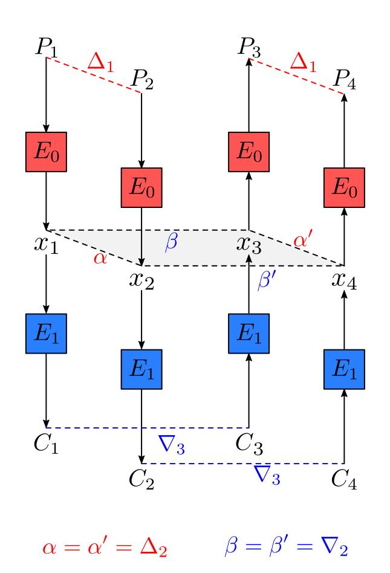

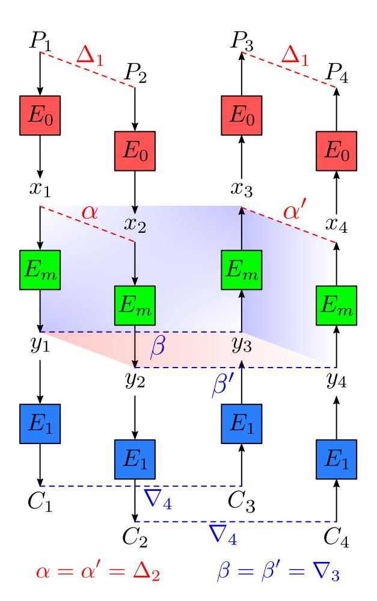

Figure 1: Basic boomerang attack (left) and Sandwich attack (right)

In the last step, if  $P_3 \oplus P_4 = \Delta_1$  holds, then a right quartet  $(P_1, P_2, P_3, P_4)$  is found such that  $P_1 \oplus P_2 = P_3 \oplus P_4 = \Delta_1$  and  $C_1 \oplus C_3 = C_2 \oplus C_4 = \nabla_3$ . Let  $e_{\alpha,\beta,\beta'}$  denote the event:  $(x_1 \oplus x_2 = \alpha) \wedge (x_1 \oplus x_3 = \beta) \wedge (x_2 \oplus x_4 = \beta')$ , and  $e_{\alpha}, e_{\alpha'}, e_{\beta}$  and  $e_{\beta'}$ , represent the events  $x_1 \oplus x_2 = \alpha, x_1 \oplus x_2 = \alpha', x_1 \oplus x_3 = \beta$  and  $x_2 \oplus x_4 = \beta'$  in Figure 1 (left) respectively. Hence,  $\Pr(P_3 \oplus P_4 = \Delta_1) = \sum_{\alpha,\beta,\beta'} \Pr(P_3 \oplus P_4 = \Delta_1|e_{\alpha,\beta,\beta'})$ . Note that, if  $e_{\alpha,\beta,\beta'}$  holds in Figure 1(left), then  $\alpha' = x_3 \oplus x_4 = \alpha \oplus \beta \oplus \beta'$ . Additionally, assume that  $p_{\alpha} = \Pr(\Delta_1 \xrightarrow{E_0} \alpha)$  and  $q_{\beta} = \Pr(\beta \xrightarrow{E_1} \nabla_3)$  for  $\alpha, \beta \in \mathbb{F}_2^n$ . Under the assumption that three conditions  $e_{\alpha}, e_{\beta}$ , and  $e_{\beta'}$  in Figure 1(left) are independent, we have:

$$\Pr(P_3 \oplus P_4 = \Delta_1) = \sum_{\alpha, \alpha', \beta, \beta'} p_{\alpha'} p_{\alpha} q_{\beta} q_{\beta'} \ge \sum_{\alpha = \alpha'} p_{\alpha}^2 \sum_{\beta = \beta'} q_{\beta}^2 \ge p^2 q^2,$$

where  $p = \Pr(\Delta_1 \to \Delta_2)$  and  $q = \Pr(\nabla_2 \to \nabla_3)$ . Therefore,  $p^2q^2$  can be a lower bound for the probability of generating a right quartet.

In practical cases, the two differentials of a boomerang distinguisher are not independent and the dependency between them can not be neglected as studied in [Mur11, BK09]. In order to handle the dependency, Dunkelman et al. proposed the sandwich attack [DKS10, DKS14]. As shown in Figure 1(right), the sandwich attack regards E as the composition of three sub-ciphers  $E_0$ ,  $E_m$  and  $E_1$ , where the middle part  $E_m$  specifically handles the dependency. Let r be the probability of generating a right quartet for  $E_m$  in Figure 1(right), when its input and output differences are fixed differences  $\Delta_2$ , and  $\nabla_3$  respectively, i.e.:

$$r = \Pr\left(E_m^{-1}(E_m(x_1) \oplus \nabla_3) \oplus E_m^{-1}(E_m(x_2) \oplus \nabla_3) = \Delta_2 | x_1 \oplus x_2 = \Delta_2\right).$$

Furthermore, let  $e_{\alpha}$ ,  $e_{\alpha'}$ ,  $e_{\beta}$  and  $e_{\beta'}$ , denote the events  $x_1 \oplus x_2 = \alpha$ ,  $x_3 \oplus x_4 = \alpha'$ ,  $y_1 \oplus y_3 = \beta$ , and  $y_2 \oplus y_4 = \beta'$ , respectively. Then, for the probability of the whole boomerang distinguisher in Figure 1(right), we have:

$$\Pr(P_3 \oplus P_4 = \Delta_1) = \sum_{\alpha, \alpha', \beta, \beta'} \Pr(P_3 \oplus P_4 = \Delta_1 | e_{\alpha, \alpha', \beta, \beta'}). \Pr(e_{\alpha'} | e_{\alpha}, e_{\beta}, e_{\beta'}). \Pr(e_{\alpha}, e_{\beta}, e_{\beta'}),$$

{5}------------------------------------------------

where  $e_{\alpha,\alpha',\beta,\beta'}$ , denote the condition  $(x_1 \oplus x_2 = \alpha) \land (y_1 \oplus y_3 = \beta) \land (y_2 \oplus y_4 = \beta') \land (x_3 \oplus x_4 = \alpha')$ . Assuming that  $e_{\alpha}, e_{\beta}$  and  $e_{\beta'}$ , are three independent events, and  $p_{\alpha} = \Pr(\Delta_1 \xrightarrow{E_0} \alpha)$ , and  $q_{\beta} = \Pr(\beta \xrightarrow{E_1} \nabla_4)$ , for  $\alpha, \beta \in \mathbb{F}_2^n$ , we have:

$$\Pr\left(P_3 \oplus P_4 = \Delta_1\right) = \sum_{\alpha, \alpha', \beta, \beta'} p_{\alpha}.p_{\alpha'}.\Pr(e_{\alpha'}|e_{\alpha}, e_{\beta}, e_{\beta'}).q_{\beta}.q_{\beta'} \ge \sum_{\alpha, \beta} p_{\alpha}^2.r.q_{\beta}^2 \ge p^2q^2r,$$

where  $p = \Pr(\Delta_1 \xrightarrow{E_0} \Delta_2)$  and  $q = \Pr(\nabla_3 \xrightarrow{E_1} \nabla_4)$ , for fixed differences  $\Delta_2, \nabla_3 \in \mathbb{F}_2^n$  in Figure 1(right). Hence,  $p^2q^2r$  is a lower bound for the probability of the whole boomerang distinguisher.

#### 2.2 BCT Framework

The boomerang connectivity table (BCT) was introduced by Cid et al. in [CHP<sup>+</sup>18] to evaluate r theoretically when  $E_m$  was composed of a single S-box layer. Later, the BCT is extended and used to calculate r for  $E_m$  with multiple layers [SQH19, WP19]. Here, we recall some important tables of S-boxes and relevant definitions which play a core role when calculating the probability of boomerang distinguishers.

The differences of an S-box in the boomerang distinguisher are shown in Figure 2. Alternatively, we use arrows with superscripts to denote the relationship between differences. The horizontal arrows illustrate the propagation of differences in upper and lower differential characteristics while the diagonal arrows are used to show which differences in the upper and lower trails are affected by each other. The difference distribution table (DDT) and the BCT are two basic tables of the S-box.

<span id="page-5-0"></span>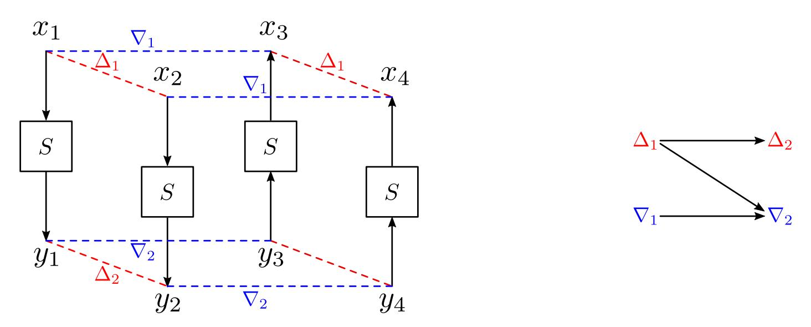

Figure 2: Differences of an S-box on four facets

**Definition 1** (Difference Distribution Table). Let S be a function from  $\mathbb{F}_2^n$  to  $\mathbb{F}_2^n$ . The difference distribution table (DDT) is a two-dimensional table defined by

$$DDT(\Delta_1, \Delta_2) = \#\{x \in \mathbb{F}_2^n : S(x) \oplus S(x \oplus \Delta_1) = \Delta_2\}, \text{ where } \Delta_1, \Delta_2 \in \mathbb{F}_2^n.$$

**Definition 2** (Boomerang Connectivity Table [CHP<sup>+</sup>18]). Let S be a permutation of  $\mathbb{F}_2^n$ . The boomerang connectivity table (BCT) of S is a two-dimensional table defined by

$$\mathrm{BCT}(\Delta_1, \nabla_2) = \#\{x \in \mathbb{F}_2^n : S^{-1}(S(x) \oplus \nabla_2) \oplus S^{-1}(S(x \oplus \Delta_1) \oplus \nabla_2) = \Delta_1\}, \text{ where } \Delta_1, \nabla_2 \in \mathbb{F}_2^n.$$

Let  $\mathcal{X}_{DDT}(\Delta_1, \Delta_2)$  and  $\mathcal{Y}_{DDT}(\Delta_1, \Delta_2)$  denote the sets of valid inputs and outputs of differential  $\Delta_1 \to \Delta_2$  respectively. Namely,

$$\mathcal{X}_{\text{DDT}}(\Delta_1, \Delta_2) \triangleq \{x \in \mathbb{F}_2^n : S(x) \oplus S(x \oplus \Delta_1) = \Delta_2\},$$

$$\mathcal{Y}_{\text{DDT}}(\Delta_1, \Delta_2) \triangleq \{S(x) \in \mathbb{F}_2^n : x \in \mathbb{F}_2^n, S(x) \oplus S(x \oplus \Delta_1) = \Delta_2\}.$$

{6}------------------------------------------------

Then BCT can be calculated with  $\mathcal{X}_{DDT}$  or  $\mathcal{Y}_{DDT}$ , as studied in [BC18, SQH19]. That is

$$BCT(\Delta_{1}, \nabla_{2}) = \sum_{\nabla_{1}} \#(\mathcal{X}_{DDT}(\nabla_{1}, \nabla_{2}) \cap (\mathcal{X}_{DDT}(\nabla_{1}, \nabla_{2}) \oplus \boldsymbol{\Delta_{1}}))$$

$$= \sum_{\Delta_{2}} \#(\mathcal{Y}_{DDT}(\Delta_{1}, \Delta_{2}) \cap (\mathcal{Y}_{DDT}(\Delta_{1}, \Delta_{2}) \oplus \boldsymbol{\nabla_{2}})), \tag{1}$$

where  $\Delta_1$  and  $\nabla_2$  are called *crossing differences* [SQH19]. As can be seen, whether the intersection of  $\mathcal{X}_{DDT}(\nabla_1, \nabla_2)$  and  $\mathcal{X}_{DDT}(\nabla_1, \nabla_2) \oplus \Delta_1$  (resp.  $\mathcal{Y}_{DDT}(\Delta_1, \Delta_2)$  and  $\mathcal{Y}_{DDT}(\Delta_1, \Delta_2) \oplus \nabla_2$ ) is empty or not depends on the crossing difference  $\Delta_1$  (resp.  $\nabla_2$ ). In particular, if the crossing difference  $\Delta_1$  (resp.  $\nabla_2$ ) for an S-box is random and uniformly distributed, the probability that the boomerang returns for this S-box is exactly  $\sum_{\nabla_1} (DDT(\nabla_1, \nabla_2)/2^n)^2$  (resp.  $\sum_{\Delta_2} (DDT(\Delta_1, \Delta_2)/2^n)^2$ ), which is identical to the probability calculation of the classical boomerang distinguisher.

To help calculate the probability of  $E_m$  with multiple rounds, two more tables were introduced in the literature.

**Definition 3** (Upper BCT<sup>1</sup> [WP19]). Let S be a permutation of  $\mathbb{F}_2^n$ . The upper boomerang connectivity table (UBCT) of S is a three-dimensional table defined by

$$\mathsf{UBCT}(\Delta_1, \Delta_2, \nabla_2) \triangleq \#\{x \in \mathbb{F}_2^n : S^{-1}(S(x) \oplus \nabla_2) \oplus S^{-1}(S(x \oplus \Delta_1) \oplus \nabla_2) = \Delta_1, \\ S(x) \oplus S(x \oplus \Delta_1) = \Delta_2\} \text{ where } \Delta_1, \Delta_2, \nabla_2 \in \mathbb{F}_2^n.$$

To see the counterpart of this table for the Feistel case refer to [BHL<sup>+</sup>20].

**Definition 4** (Lower BCT<sup>2</sup> [SQH19]). Let S be a permutation of  $\mathbb{F}_2^n$ . The lower boomerang connectivity table (LBCT) of S is a three-dimensional table defined by

$$LBCT(\Delta_1, \nabla_2, \nabla_1) \triangleq \#\{x \in \mathbb{F}_2^n : S^{-1}(S(x) \oplus \nabla_2) \oplus S^{-1}(S(x \oplus \Delta_1) \oplus \nabla_2) = \Delta_1, \\ x \oplus S^{-1}(S(x) \oplus \nabla_2) = \nabla_1\} \text{ where } \Delta_1, \nabla_2, \nabla_1 \in \mathbb{F}_2^n.$$

Based on the previous works, some new tables of S-box will be proposed in the next sections and used to calculate r for boomerang distinguishers of CRAFT, and SKINNY.

## <span id="page-6-0"></span>3 New Tools for Boomerang Cryptanalysis

In this section, we introduce for S-boxes some new tables which can be used to model the dependency between upper and lower differential paths in boomerang distinguishers. When one constructs boomerang distinguishers for SPN ciphers, there may exist two S-boxes in a row (in two rounds) that are active in both trails of the boomerang. Figure 3 (middle) shows the differences of such two S-boxes, where '\*' stands for any possible difference,  $\Delta_1$  and  $\nabla_3$  are known.

<span id="page-6-3"></span>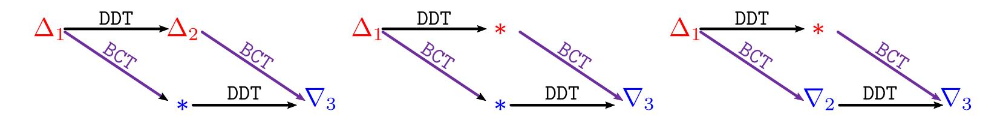

Figure 3: Differences of DBCT<sup>⊢</sup> (left), DBCT (middle) and DBCT<sup>⊢</sup> (right)

<span id="page-6-1"></span><sup>&</sup>lt;sup>1</sup>In [WP19], this table is called Boomerang Difference Table BDT.

<span id="page-6-2"></span><sup>&</sup>lt;sup>2</sup>In [SQH19], this table is denoted by  $\mathcal{D}_{BCT}$ 

{7}------------------------------------------------

At first glance, we could build a two-dimensional table to record the number of values making the boomerang return for these two S-boxes. However, in the middle of two rounds, there is usually an operation of adding key material. The key addition does not affect the differences before or after, but the key is unknown and prevents us from building a table in the way that we generate the DDT and the BCT. However, in the case where the random subkey assumption holds, such a table can be built, as shown in algorithm 1. For convenience, we call this table double boomerang connectivity table (DBCT).

```
Algorithm 1: Building DBCT
```

```
Input: S-box S
  1 Initialize an empty table DBCT with 2^n \times 2^n entries;
  2 for \Delta_1 = 0 \to 2^n - 1 do
               for \nabla_3 = 0 \rightarrow 2^n - 1 do
  3
                       num = 0;
  4
                       for \Delta = 0 \rightarrow 2^n - 1 do
  \mathbf{5}
                               if DDT(\Delta_1, \Delta) > 0 and BCT(\Delta, \nabla_3) > 0 then
   6
                                        for \nabla = 0 \rightarrow 2^n - 1 do
   7
                                                \begin{split} \mathcal{Y}_{\text{DDT}}^{\cap} &= \mathcal{Y}_{\text{DDT}}(\Delta_{1}, \Delta) \cap (\mathcal{Y}_{\text{DDT}}(\Delta_{1}, \Delta) \oplus \nabla); \\ \textbf{if } \mathcal{Y}_{\text{DDT}}^{\cap} &\neq \emptyset \textbf{ then} \\ & \mid num += \text{DDT}(\Delta_{1}, \Delta) \cdot \text{LBCT}(\Delta, \nabla_{3}, \nabla) \cdot \frac{\#\mathcal{Y}_{\text{DDT}}^{\cap}}{\#\mathcal{Y}_{\text{DDT}}(\Delta_{1}, \Delta)}; \end{split} 
   8
   9
 10
                                                end
 11
                                        end
 12
                                end
13
                       end
14
                       DBCT(\Delta_1, \nabla_3) = num;
15
               end
16
17 end
```

Note that, if  $\mathcal{Y}_{\text{DDT}}$  forms an affine subspace, then the line 10 of algorithm 1 becomes  $num += \text{DDT}(\Delta_1, \Delta) \cdot \text{LBCT}(\Delta, \nabla_3, \nabla)$  as  $\mathcal{Y}_{\text{DDT}}(\Delta_1, \Delta)$  equals  $\mathcal{Y}_{\text{DDT}}(\Delta_1, \Delta) \oplus \nabla$  when their intersection is not empty. Recall that a mapping is planar if the  $\mathcal{X}_{\text{DDT}}$  and  $\mathcal{Y}_{\text{DDT}}$  of all its differentials form affine subspaces [DR07]. Particularly, S-boxes which only have nonzero DDT entries 2 and 4 are planar. Therefore, the S-box of CRAFT is planar, and each entry of its DBCT is an integer ranging from 0 to  $2^{2n}$ .

Additionally, we introduce two variants of DBCT, *i.e.*, DBCT<sup> $\vdash$ </sup> and DBCT<sup> $\dashv$ </sup> as shown in Figure 3, where the differential of one S-box is fixed. Moreover, DBCT<sup> $\vdash$ </sup> ( $\Delta_1, \Delta_2, \nabla_3$ ), DBCT<sup> $\dashv$ </sup> ( $\Delta_1, \nabla_2, \nabla_3$ ) can be precomputed by adapting algorithm 1, as shown in algorithm 2 and algorithm 3 in the appendix.

We also introduce new tables to consider the clustering effect in the middle part of boomerang distinguishers. As it is illustrated in Figure 4, the differences in the same positions at two faces of boomerang distinguisher should not necessarily be the same, particularly in the middle part. For instance,  $\Delta_2^0$  and  $\Delta'_2^0$  in Figure 4 denote the differences in the same position of cipher during the encryption and decryption respectively, which can take different values in two faces of boomerang distinguisher.  $\nabla_3^0$  and  $\nabla'_3^0$  in Figure 4, can be different in the same way. Accordingly, we define UBCT<sup>=</sup> and LBCT<sup>=</sup> similar to UBCT and LBCT respectively as follows:

$$\begin{aligned} & \mathtt{UBCT}^{\vDash}(\Delta_1, \Delta_1', \nabla_2, \Delta_2) := \#\{S(x) \in \mathbb{F}_2^n | S(x) \in \mathcal{Y}_{\mathtt{DDT}}(\Delta_1, \Delta_2) : \ S(x) \in \mathcal{Y}_{\mathtt{DDT}}(\Delta_1', \Delta_2) \oplus \nabla_2 \}. \\ & \mathtt{LBCT}^{\vDash}(\Delta_1, \nabla_2, \nabla_2', \nabla_1) := \#\{x \in \mathbb{F}_2^n | x \in \mathcal{X}_{\mathtt{DDT}}(\nabla_1, \nabla_2) : \ x \in \mathcal{X}_{\mathtt{DDT}}(\nabla_1, \nabla_2') \oplus \Delta_1 \}. \end{aligned}$$

BCT<sup>⊨</sup> and BCT<sup>=</sup>, can also be defined as follows as the two alternatives of BCT, where the input or the output differences are not the same in two faces of boomerang distinguisher

{8}------------------------------------------------

<span id="page-8-1"></span>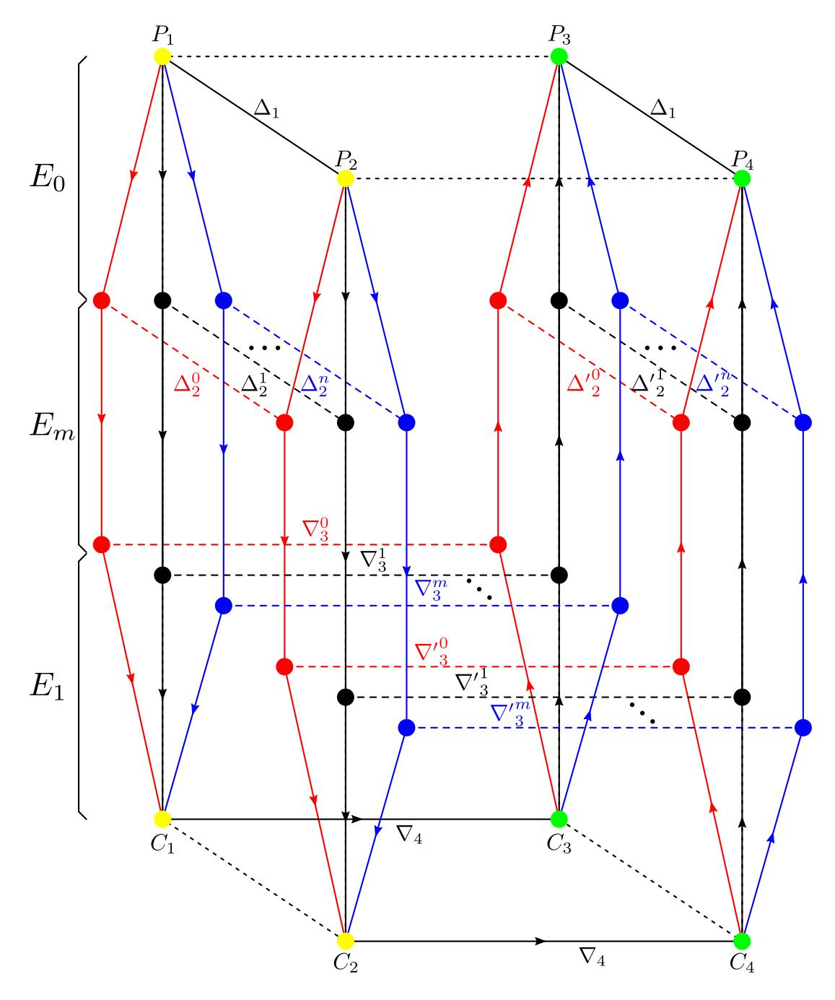

**Figure 4:** Cluster of sandwich distinguishers

respectively:

$$\begin{split} & \mathsf{BCT}^{\vDash}(\Delta_1, \Delta'_1, \nabla_2) := \# \{ x \in \mathbb{F}_2^n : S^{-1}(S(x) \oplus \nabla_2) \oplus S^{-1}(S(x \oplus \Delta_1) \oplus \nabla_2) \ = \Delta'_1 \}. \\ & \mathsf{BCT}^{\vDash}(\Delta_1, \nabla_2, \nabla'_2) := \# \{ x \in \mathbb{F}_2^n : S^{-1}(S(x) \oplus \nabla_2) \oplus S^{-1}(S(x \oplus \Delta_1) \oplus \nabla'_2) \ = \Delta_1 \}. \end{split}$$

## <span id="page-8-0"></span>**4 Our Strategy to Search for Boomerang Distinguishers**

We use a heuristic approach to find a boomerang distinguisher which can be divided into the following steps:

1. The first step is searching for truncated differential characteristics with the minimum number of active S-boxes taking into account the switching effect in multiple rounds. For this step, we borrow the idea of MILP-based automated search method for truncated differential characteristic proposed in [\[CHP](#page-42-10)<sup>+</sup>17], which takes into account the ladder switch effect in two middle rounds of boomerang distinguisher. However, we change it a little to consider the switch effect in more than two rounds. We also use a weighted objective function in our model to obtain a boomerang distinguisher with a higher probability.

Suppose that we are looking for a boomerang distinguisher covering *r*<sup>0</sup> + *r<sup>m</sup>* + *r*<sup>1</sup> rounds as illustrated in [Figure 5,](#page-9-0) where the first *r*<sup>0</sup> and last *r*<sup>1</sup> rounds are represented in red and blue and denoted by *E*<sup>0</sup> and *E*<sup>1</sup> respectively. Moreover, the middle *r<sup>m</sup>*

{9}------------------------------------------------

rounds, where the first  $r_0 + r_m$  and last  $r_1 + r_m$  rounds overlap, is illustrated in green and denoted by  $E_m$ . Firstly, we generate a word-oriented MILP model consisting of constraints corresponding to truncated differential characteristics for the first  $r_0 + r_m$  and for the last  $r_1 + r_m$  rounds based on the independent binary variables respectively.

Let  $u_0, \ldots, u_{t-1}$  denote the activeness of S-boxes in last  $r_m$  rounds of  $E_m \circ E_0$  and  $l_0, \ldots, l_{t-1}$  denote the activeness of S-boxes in first  $r_m$  rounds of  $E_1 \circ E_m$ , such that  $u_i$  and  $l_i$  correspond to the same S-box's position for all  $0 \le i \le t-1$ . In order to model the switching effect in r-round middle part  $E_m$ , we introduce t new binary variables  $s_0, \ldots, s_{t-1}$  linking  $u_i$  and  $l_i$  for all  $0 \le i \le t-1$  as follows:

$$u_i - s_i \ge 0$$
,  $l_i - s_i \ge 0$ ,  $-u_i - l_i + s_i \ge -1$ .

Accordingly,  $s_i = 1$  if and only if  $u_i = l_i = 1$ . Let binary variables  $\tilde{u}_0, \ldots, \tilde{u}_{m-1}$  and  $\tilde{l}_0, \ldots, \tilde{l}_{n-1}$  denote the activity of S-boxes in the first  $r_0$  and last  $r_1$  rounds respectively. Assuming that  $w_0, w_1$  and  $w_m$  are positive integers, the objective is to minimize:

$$\sum_{i=0}^{m-1} w_0.\tilde{u}_i + \sum_{j=0}^{t-1} w_m.s_j + \sum_{k=0}^{n-1} w_1.\tilde{l}_k.$$

Given that the terms  $\tilde{u} = \sum_{i=0}^{m-1} w_0.\tilde{u}_i$  and  $\tilde{l} = \sum_{k=0}^{m-1} w_1.\tilde{l}_k$  are equally more effective than  $s = \sum_{j=0}^{t-1} w_m.s_j$  in the probability of the boomerang distinguisher,  $w_0, w_1$  and  $w_m$ , are chosen such that  $w_0 = w_1 \ge w_m$ .

<span id="page-9-0"></span>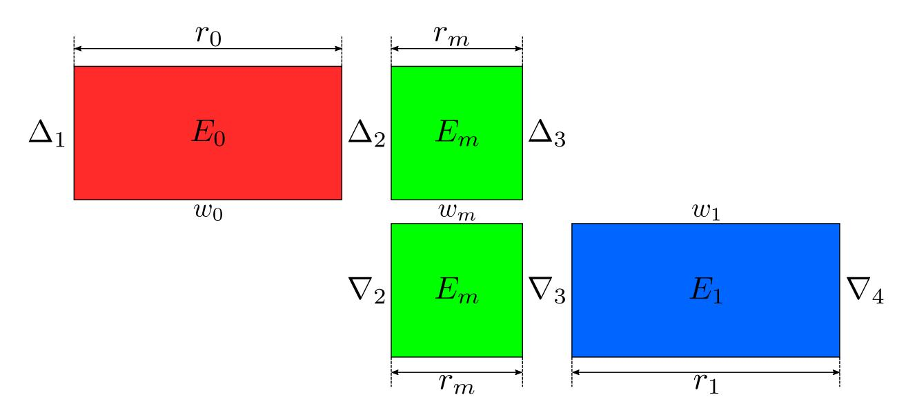

Figure 5: Main parameters of our word-oriented MILP tool to search for boomerang distinguishers

- 2. At the second step, based on the discovered truncated differential characteristics for  $E_0$  and  $E_1$ , we look for the best actual differential trails satisfying the given active-cell positions for these parts which form upper and lower differential paths of boomerang distinguisher respectively. This is done using the separate bit-oriented MILP/SAT models for  $E_0$  and  $E_1$ . Then, by fixing the input and output differences of actual differential paths for  $E_0$  and  $E_1$ , and taking into account the clustering effect, we compute the differential effects for  $E_0$  and  $E_1$ , which are represented by p and q respectively. Note that, there might not exist an actual differential characteristic instantiating the discovered truncated differential characteristic. If so, we go to the first step and repeat the process by a new truncated differential characteristic.
- 3. Although the ladder switch effect is considered to obtain the upper and lower differential paths in our method, they are obtained using independent bit-oriented

{10}------------------------------------------------

MILP/SAT models at step 2. Hence, the upper and lower differential paths in a discovered boomerang distinguisher might be incompatible [Mur11]. The compatibility of the upper and lower differential paths in a discovered boomerang distinguisher is checked by experimentally evaluating the probability of the r-round middle part at this step. Assume that  $\Delta_2$  and  $\nabla_3$  are the output and input differences of the upper and lower differential paths respectively. The compatibility of the upper and lower differential paths is checked by experimentally evaluation of the following probability:

$$r = \Pr\left(E_m^{-1}(E_m(x_1) \oplus \nabla_3) \oplus E_m^{-1}(E_m(x_2) \oplus \nabla_3) = \Delta_2 | x_1 \oplus x_2 = \Delta_2\right).$$

We can go to the next step if r > 0, otherwise, we return to the first step.

- 4. At this step, to correctly evaluate the size of  $E_m$ , where contains the dependency between the upper and lower differential paths, we use the algorithm proposed by Song et al. in [SQH19]. More precisely, we extend both  $E_0$  and  $E_1$  with probability 1 at first. Next, to determine the correct upper boundary of  $E_m$ , we prepend additional rounds to  $E_m$  as long as the lower crossing differences are not uniformly distributed. In the same way, to determine the lower boundary of  $E_m$ , we append further rounds to  $E_m$  as long as the upper crossing differences are not uniformly distributed. In other words, additional rounds are added to  $E_m$  as long as the probability of the new  $E_m$  is higher than what is estimated by  $p^2q^2r$ . If this is done, the formula  $p^2q^2r$ , will be a good estimate.
- 5. If the size of  $E_m$  is changed at the previous step, taking into account the clustering effect, we compute the probabilities p and q corresponding to the new  $E_0$  and  $E_1$  respectively. To do so, by fixing the input/output differences of  $E_0$  and  $E_1$ , we compute the differential effects and store the results into p and q respectively. Besides the experimental value, using the BCT framework we provide a theoretical bound for r, i.e. the probability of the middle part  $E_m$ , when it is possible from the computational complexity point of view. Finally, using the formula  $p^2q^2r$ , we compute the probability of the whole boomerang distinguisher.

To find the truncated differential characteristics in step 1, we use the MILP model and then Gurobi |GO21| as the solver. For SKINNY, given that the key schedule is linear, we use a semi-word-based MILP model to find a truncated differential characteristic where the key schedule is encoded bitwise, whereas the data path is encoded word-wise. In the second step, where we look for the real differential trails instantiating the discovered truncated trails, we use both the SMT/SAT and the MILP bit-based models. More precisely, for CRAFT and SKINNY-64-128 and SKINNY-64-192, we use CryptoSMT [Ste]<sup>1</sup> to instantiate the truncated pattern with the best differential trails, as well as computing the differential effect in steps 2, 4, and 5. However, concerning 128-bit block versions of SKINNY, i.e., SKINNY-128-256 and SKINNY-128-384, we would highly prefer to use the MILP-based method introduced by [AST+17], since some probability exponents in DDT of SKINNY's 8-bit S-box are non-integer, and encoding the objective functions with non-integer coefficients and addition of non-integer numbers in MILP models are much easier and straightforward in comparison to the SMT-based or SAT-based methods. Given that Gurobi allows to find multiple solutions rather than merely one optimal solution<sup>2</sup>, we use it as the MILP solver to compute the differential effect for 128-bit block versions of SKINNY as well.

<span id="page-10-0"></span><sup>&</sup>lt;sup>1</sup>CryptoSMT supports two SMT solvers including STP [GD07] and Boolector [NPB15], and one SAT solver namely CryptoMiniSat [Soo16], where CryptoMiniSat is used to compute the differential effect.

<span id="page-10-1"></span><sup>&</sup>lt;sup>2</sup>To find multiple solutions with Gurobi we set the parameter PoolSearchMode to 2.

{11}------------------------------------------------

<span id="page-11-0"></span>**Table 2:** Summary of our results and the other known single-tweak attacks on CRAFT. *ST*, stands for single-tweak, and the boomerang, differential effect, truncated differential, linear hull, impossible differential, integral, and zero-correlation cryptanalysis are respectively denoted by *B*, *D*, *T D*, *LH*, *ID*, *INT* and *ZC*. The probabilities highlighted in red have been verified experimentally.

| Attack | # Rounds | Probability | Reference |  |
|--------|----------|-------------|-----------|--|
|        | 10       | −62.61<br>2 | [BLMR19]  |  |
|        | 9        | −40.20<br>2 |           |  |
|        | 10       | −44.89<br>2 |           |  |
| ST-D   | 11       | −49.79<br>2 | [HSN+19]  |  |
|        | 12       | −54.48<br>2 |           |  |
|        | 13       | −59.13<br>2 |           |  |
|        | 14       | −63.80<br>2 |           |  |
| ST-T D | 12       | −36<br>2    | [EMA20]   |  |
| ST-LH  | 14       | −62.12<br>2 |           |  |
| ST-ID  | 13       | -           |           |  |
| ST-INT | 13       | -           | [BLMR19]  |  |
| ST-ZC  | 13       | -           |           |  |
|        | 6        | 1           |           |  |
|        | 7        | −4<br>2     |           |  |
|        | 8        | −8<br>2     |           |  |
|        | 9        | −14.76<br>2 |           |  |
| ST-B   | 10       | −19.83<br>2 | Section 5 |  |
|        | 11       | −24.90<br>2 |           |  |
|        | 12       | −34.89<br>2 |           |  |
|        | 13       | −44.89<br>2 |           |  |
|        | 14       | −55.85<br>2 |           |  |

## <span id="page-11-1"></span>**5 Boomerang Distinguishers for Reduced-Round** CRAFT

In this section, after giving a brief description of CRAFT, we introduce boomerang distinguishers for reduced rounds CRAFT covering up to 14 rounds of this cipher. [Table 2](#page-11-0) summarizes our results on boomerang distinguishers of CRAFT and [Table 3](#page-12-0) briefly describes the notations we use through this section.

#### **5.1 A Brief Description of CRAFT**

CRAFT is a lightweight tweakable block cipher which has been introduced in FSE 2019 by Beierle *et al.* [\[BLMR19\]](#page-41-0). This block cipher supports 64-bit message, 128-bit key and 64-bit tweak and its round function is composed of involutory building blocks. The input 64-bit plaintext *m* = *m*0∥*m*1∥ · · · ∥*m*14∥*m*<sup>15</sup> is used to initiate a 4 × 4 internal state *IS* = *I*0∥*I*1∥ · · · ∥*I*14∥*I*<sup>15</sup> as follows:

$$IS = \begin{pmatrix} I_0 & I_1 & I_2 & I_3 \\ I_4 & I_5 & I_6 & I_7 \\ I_8 & I_9 & I_{10} & I_{11} \\ I_{12} & I_{13} & I_{14} & I_{15} \end{pmatrix} = \begin{pmatrix} m_0 & m_1 & m_2 & m_3 \\ m_4 & m_5 & m_6 & m_7 \\ m_8 & m_9 & m_{10} & m_{11} \\ m_{12} & m_{13} & m_{14} & m_{15} \end{pmatrix}$$

where *I<sup>i</sup> , m<sup>i</sup>* ∈ F 4 2 . The internal state is then going through 32 rounds R*<sup>i</sup> , i* ∈ 0*,* · · · *,* 31, to generate a 64-bit ciphertext. As is depicted in [Figure 6,](#page-12-1) each round, excluding the last round, includes five functions, i.e., MixColumn (MC), AddRoundConstants (ARC), AddTweakey (ATK), PermuteNibbles (PN), and S-box (SB). The last round only includes

{12}------------------------------------------------

Table 3: Notations for CRAFT.

<span id="page-12-0"></span>

| Symbol          | Meaning                                                                                                           |  |
|-----------------|-------------------------------------------------------------------------------------------------------------------|--|
| $\oplus$        | XOR operation                                                                                                     |  |
|                 | Concatenation of bits                                                                                             |  |
| %               | modulo operation                                                                                                  |  |
| T               | The 64-bit tweak input                                                                                            |  |
| K               | The 128-bit master key                                                                                            |  |
| $TK_i$          | The main tweaks that are made based on the T and $K$ $(i = 0, 1, 2, 3)$                                           |  |
| $X_i$           | The internal state before the Mix-Columns (MC) in round $i$                                                       |  |
| $Y_i$           | The internal state after the MixColumn (MC) in round $i$                                                          |  |
| $Z_i$           | The internal state before the PermuteNibbles (PN) in round $i$                                                    |  |
| $W_i$           | The internal state before the S-boxes (SB) in round $i$                                                           |  |
| $S_i[j]$        | $j^{th}$ cell of a state S, in round i, where $0 \leq j \leq 15$ , e.g. $X_2[5]$ denotes $5^{th}$                 |  |
|                 | cell of internal state before MC in round 2                                                                       |  |
| $S_i[j \sim l]$ | $j^{th}$ to $l^{th}$ cells of state $S_i$ , in round $i$ , where $0 \leq j \leq l \leq 15$ , e.g. $Y_2[7 \sim 9]$ |  |
|                 | denotes $7^{th}$ , $8^{th}$ and $9^{th}$ cells of internal state after MC in round 2                              |  |
| $TK_i[j]$       | $j^{th}$ cell of $TK_i$ , where $0 \leq j \leq 15$ , e.g. $X_1[6]$ denotes $6^{th}$ cell of internal              |  |
|                 | state before $SC$ in round 1                                                                                      |  |
| $\Delta S$      | Forward difference in a state $S$                                                                                 |  |
| $\nabla S$      | Backward difference in a state $S$                                                                                |  |
| Y               | Hexadecimal representation of an arbitrary value $Y \in \mathbb{F}_2^4$ , where we are                            |  |
|                 | using typewriter style                                                                                            |  |

MC, ARC and ATK, i.e.,  $\mathcal{R}_{31} = ATK_{31} \circ ARC_{31} \circ MC$ , while for any  $0 \leq i \leq 30$ ,  $\mathcal{R}_i = SB \circ PN \circ ATK_i \circ ARC_i \circ MC$ .

<span id="page-12-1"></span>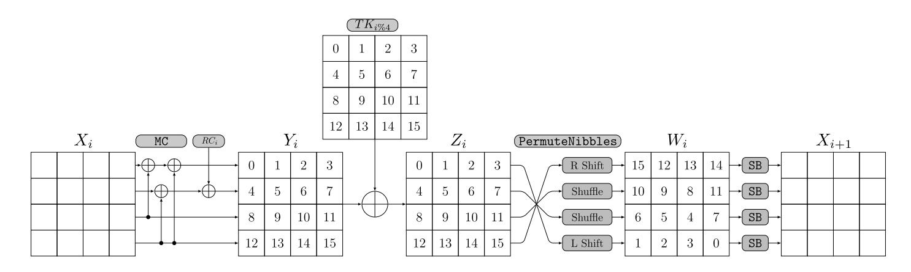

Figure 6: A round of CRAFT

The MC layer is the multiplication of the internal state by a  $4 \times 4$  involutory binary matrix. In each round i, after MC, two round dependent constant nibbles  $a_i = (a_3^i, a_2^i, a_1^i, a_0^i)$  and  $b_i = (b_2^i, b_1^i, b_0^i)$  are XOR-ed with  $I_4$  and  $I_5$  respectively, where  $a_0^i$  and  $b_0^i$  are the least significant bits. A 4-bit LFSR is used to update a and a 3-bit LFSR is used to update b. They are initialized by values (0001) and (001), respectively and updated to  $a_{i+1} = (a_1^i \oplus a_0^i, a_3^i, a_2^i, a_1^i)$ , and  $b_{i+1} = (b_1^i \oplus b_0^i, b_2^i, b_1^i)$  from i-th round to i + 1-th round.

After AddRoundConstants (ARC), a 64-bit round tweakey is XOR-ed with IS. The tweakey schedule of CRAFT is rather simple. Given the secret key  $K = K_0 || K_1$  and the tweak  $T \in \{0,1\}^{64}$ , where  $K_i \in \{0,1\}^{64}$ , four round tweakeys  $TK_0 = K_0 \oplus T$ ,  $TK_1 = K_1 \oplus T$ ,  $TK_2 = K_0 \oplus Q(T)$  and  $TK_3 = K_1 \oplus Q(T)$  are generated, where given  $T = T_0 ||T_1|| \cdots ||T_{14}|| ||T_{15}|| Q(T) = T_{12} ||T_{10}||T_{15}||T_{14}||T_{8}||T_{9}||T_{1}||T_{11}||T_{3}||T_{7}||T_{4}||T_{6}||T_{0}||T_{1}||T_{13}$ . Then at the round  $\mathcal{R}_i$ ,  $TK_{i\%4}$  is XOR-ed with the IS, where the rounds start from i = 0.

The next function is PermuteNibbles (PN) which is applying an involutory permutation P

{13}------------------------------------------------

over nibbles of *IS*, where given *IS* = *I*0∥*I*1∥ · · · ∥*I*14∥*I*15, *P*(*IS*) = *I*15∥*I*12∥*I*13∥*I*14∥*I*10∥*I*<sup>9</sup> ∥*I*8∥*I*11∥*I*6∥*I*5∥*I*4∥*I*7∥*I*1∥*I*2∥*I*3∥*I*0. The final function is a non-linear layer in which a 4-bit S-box which has been borrowed from MIDORI [\[BBI](#page-40-0)<sup>+</sup>15] is applied on each nibble. One can refer to [\[BLMR19\]](#page-41-0), to see more details about CRAFT's specification.

#### **5.2 Boomerang Distinguishers for 6 to 8 Rounds of** CRAFT

Applying our searching method for boomerang distinguishers of CRAFT, we discovered that up to 6 rounds of this cipher can be distinguished from a random permutation using a boomerang distinguisher with probability one. For instance, let the input and output differences of 6-round boomerang distinguisher of CRAFT be chosen as follows:

$$\Delta X_0 = 000\alpha \ 0000 \ 000\alpha \ 0000, \ \nabla X_6 = 0000 \ 0000 \ 0\beta000 \ 0000,$$

where *α, β* ∈ F 4 <sup>2</sup> \ {0}. [Figure 7](#page-13-0) represents the forward and backward propagation of ∆*X*0, and ∇*X*<sup>6</sup> over 6 rounds of CRAFT respectively, where yellow and green squares denote the nonzero and any differences respectively. It can be seen that there is not any interaction between the active S-boxes of upper and lower differential trails in [Figure 7.](#page-13-0) Therefore, due to the switching effect, the boomerang returns with probability 1.

<span id="page-13-0"></span>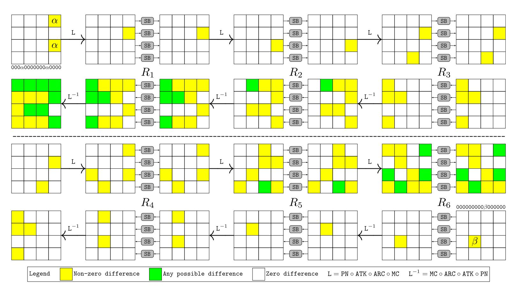

**Figure 7:** A 6-round boomerang distinguisher of CRAFT

Next, by extending the discovered 6-round boomerang distinguisher one round backward, we construct a 7-round boomerang distinguisher, which is illustrated in [Figure 17.](#page-45-1) [Table 4](#page-13-1) specifies the input and output differences of our 7-round boomerang distinguisher for CRAFT.

<span id="page-13-1"></span>

| Table 4: Specification of boomerang distinguisher for 7 rounds of CRAFT                 |                     |     |                     |
|-----------------------------------------------------------------------------------------|---------------------|-----|---------------------|
| = 0, p = 1, q = 1, r = 2−4<br>· r = 2−4<br>, p2<br>2<br>· q<br>r0<br>= 0, rm<br>= 7, r1 |                     |     |                     |
| ∆X0                                                                                     | 00A0 00AA 0000 00A0 | ∇X7 | 0000 0000 0A00 0000 |

As it can be seen in [Figure 17,](#page-45-1) the upper differential path depends on whether *γ* = *γ* ′ , and there are still some nonzero upper and lower crossing differences even after 7 rounds which reveals that there is dependency between the upper and lower differential paths throughout the 7 rounds in [Figure 17.](#page-45-1) Let *r*<sup>1</sup> and *r*<sup>2</sup> be the probability of boomerang

{14}------------------------------------------------

distinguisher in cases where  $\gamma = \gamma'$ , and  $\gamma \neq \gamma'$  respectively. Consequently, the probability of the provided 7-round boomerang distinguisher is  $r = r_1 \cdot \Pr(\gamma = \gamma') + r_2 \cdot \Pr(\gamma \neq \gamma')$ .

If  $\gamma = \gamma'$ , as illustrated in Figure 17, the upper and lower differential trails have only one active S-box in common. Let  $\gamma$  and  $\beta$  denote the output differences of the common active S-box in upper and lower differential paths respectively. The red frames in Figure 17 represent the propagation of difference  $\beta$  to show where this difference is originated from. As it is visible, the difference  $\beta$  has not been affected by the upper differential path. On the other hand,  $\beta$  is almost uniformly distributed. In conclusion, we have

$$r_1 = \sum_{\gamma \in \{\mathtt{5,A,D,F}\}} \left(\frac{\mathtt{DDT}(\mathtt{A},\gamma)}{2^4}\right)^2 = \sum_{\gamma \in \{\mathtt{5,A,D,F}\}} (2^{-2})^2 = 2^{-2},$$

and  $r_1 \cdot \Pr(\gamma = \gamma') = 2^{-2} \cdot 2^{-2} = 2^{-4}$ . Due to the fact that  $0 \le r_2 \cdot \Pr(\gamma \ne \gamma') \le 1$ , we can conclude that  $r \ge 2^{-4}$ . According to the experimental evaluation,  $r = 2^{-3.97}$ , which validates the provided lower bound and also confirms that  $r_2$ , contributes less in the total probability r in comparison to  $r_1$ .

<span id="page-14-0"></span>Table 5: Specification of the boomerang distinguisher for 8 rounds of CRAFT

|              | 1                               | 0            | 0                                         |
|--------------|---------------------------------|--------------|-------------------------------------------|
| $r_0 =$      | $0, r_m = 8, r_1 = 0, p = 1, q$ | q=1, r       | $=2^{-8}, p^2 \cdot q^2 \cdot r = 2^{-8}$ |
| $\Delta X_0$ | OAOO OOAA OOOO OOAO             | $\nabla X_8$ | 0000 0000 0000 A000                       |

By extending the discovered 7-round boomerang distinguisher one round forwards, we construct an 8-round boomerang distinguisher whose specification is provided by Table 5. Figure 18 represents the propagation of the input/output differences in our 8-round boomerang distinguisher. As illustrated, the propagation of the input difference depends on whether  $(\gamma = \gamma') \wedge (\delta = \delta')$ . In the Figure 18, it is supposed that  $(\gamma = \gamma') \wedge (\delta = \delta')$ . It can be seen that nonzero differences exist even after 8 rounds in both forward and backward propagation of input and output differences respectively, which means the whole of these 8 rounds contain dependency.

Let  $r_1$  and  $r_2$  be the probability of the 8-round boomerang distinguisher, when  $(\gamma = \gamma') \wedge (\delta = \delta')$ , and  $(\gamma \neq \gamma') \vee (\delta \neq \delta')$  respectively. Hence, the entire probability of the 8-round boomerang distinguisher is  $r = r_1 \cdot \Pr((\gamma = \gamma') \wedge (\delta = \delta')) + r_2 \cdot \Pr((\gamma \neq \gamma') \vee (\delta \neq \delta'))$ . Since, two relations  $\gamma = \gamma'$ , and  $\delta = \delta'$  are statistically independent, we have:

$$r = r_1 \cdot \Pr(\gamma = \gamma') \cdot \Pr(\delta = \delta') + r_2 \cdot \Pr((\gamma \neq \gamma') \vee (\delta \neq \delta')).$$

On the other hand, the upper and lower differential trails in Figure 18, have only two active cells in common, and there is not any interaction between other active cells in upper and lower differential trails, and the lower crossing difference  $\beta$  is almost uniformly distributed. The red frames depict where the difference  $\beta$  is originated from. It can be seen that it has not been affected by the upper differential trail. The upper crossing difference  $\alpha$ , is also uniformly distributed, and as it's depicted by blue frames, it is also independent of the lower differential trail. Therefore, the probability that the boomerang returns when  $(\gamma = \gamma') \wedge (\delta = \delta')$  is:

$$r_1 = \sum_{\gamma \in \{\mathtt{5},\mathtt{A},\mathtt{D},\mathtt{F}\}} \sum_{\delta \in \{\mathtt{5},\mathtt{A},\mathtt{D},\mathtt{F}\}} \left(\frac{\mathtt{DDT}(\mathtt{A},\gamma)}{2^4}\right)^2 \cdot \left(\frac{\mathtt{DDT}(\delta,\mathtt{A})}{2^4}\right)^2 = 2^{-4}.$$

Besides,  $\Pr(\gamma = \gamma') = \Pr(\delta = \delta') = 2^{-2}$ . Consequently,  $r \geq 2^{-8}$ . The experimental evaluation shows that the boomerang returns with probability  $r = 2^{-7.92}$ , which confirms the provided lower bound and also shows that the total probability r is almost determined by  $r_1$ . The experimental evaluation follows the pseudo-code in Subsection 2.1. More precisely, we firstly choose a key as well as a tweak at random and perform  $2^{15}$  boomerang

{15}------------------------------------------------

queries and count the number of right quartets. We repeat this test for 1000 randomly generated keys and tweaks and compute the average number of right quartets.

## <span id="page-15-1"></span>5.3 Probability of the Middle Part in Boomerang Distinguishers for 9 to 14 Rounds of CRAFT

During the search for boomerang distinguishers covering 9 to 14 rounds of CRAFT, we observed that many boomerang distinguishers for these number of rounds have a common active pattern in the 7-round middle part. In other words, there are many boomerang distinguishers for 9 to 14 rounds of CRAFT that can be constructed by extending a 7-round boomerang distinguisher, such that the dependency between the upper and lower differential trails doesn't exist outside the 7-round middle part. Therefore, for the sake of simplicity, we chose a 7-round middle part and then constructed the boomerang distinguishers for 9 to 14 rounds based on it. Figure 9 shows the 7-round boomerang distinguisher with the following input/output differences, which is expandable to construct 9-/10-/11-/12-/13-/14-round boomerang distinguishers of CRAFT.

$$\Delta X_0 =$$
 0000 0A00 0000 0000,  $\nabla X_7 =$  0000 0A00 0000 0000.

Next, let us calculate the probability of this 7-round boomerang distinguisher. In Figure 9, the input difference of the upper trail and the output difference of the lower trail is given; green squares denote any possible difference while yellow squares denote nonzero differences. Due to the weak diffusion of the linear layer of CRAFT, it can be seen that the difference after 7 rounds is not random enough as there are still nonzero differences in state a' and H (see Figure 9). That is, the crossing differences throughout the whole distinguisher are not random enough, which means there is a strong dependency between the upper trail and the lower trail.

We further investigate the dependency of the two trails with the help of notations  $\xrightarrow{\mathtt{DDT}}$  and  $\xrightarrow{\mathtt{BCT}}$ . As can be seen from Figure 9, the dependency of the two trails can be modularized into two  $\mathtt{DBCT}^{\vdash}$  and two  $\mathtt{DBCT}^{\dashv}$  which affect each other.

Let DBCT<sub>total</sub> be the product of the four DBCT, i.e.,

$$\begin{aligned} \mathtt{DBCT}_{\mathrm{total}} &= \mathtt{DBCT}^{\vdash}(A_{5}, B_{9}, c_{5}) \cdot \mathtt{DBCT}^{\vdash}(B_{9}, C_{12}, d_{1}) \cdot \\ & \mathtt{DBCT}^{\dashv}(E'_{1}, f'_{12}, g'_{9}) \cdot \mathtt{DBCT}^{\dashv}(F'_{5}, g'_{9}, h_{5}), \end{aligned}$$

where the variables are differences depicted in Figure 9 and particularly the each color denotes any variable marked by the box of that color. Let

$$\Pr_{\text{total}} = \Pr(d_1 \xleftarrow{\text{2 DDT}} f'_{12}) \cdot \Pr(c_5 \xleftarrow{\text{3 DDT}} f'_{12}) \cdot \\ \Pr(C_{12} \xrightarrow{\text{2 DDT}} E'_1) \cdot \Pr(C_{12} \xrightarrow{\text{3 DDT}} F'_5).$$

then the probability of the 7-round boomerang distinguisher for a fixed pair  $(A_5, h_5)$  is:

<span id="page-15-0"></span>
$$r = 2^{-8 \cdot n} \cdot \sum_{B_9} \sum_{C_{12}} \sum_{g_9'} \sum_{f_{12}'} \sum_{c_5} \sum_{d_1} \sum_{E_1'} \sum_{F_5'} \text{DBCT}_{\text{total}} \cdot \text{Pr}_{\text{total}}.$$
 (2)

If  $(A_5, h_5) = (A, A)$ , then  $r = 2^{-10.39}$ . Based on Equation 2, we evaluate r for all  $(A_5, h_5) \in \{(i, j) | 1 \le i \le 15, 1 \le j \le 15\}$ , and arrange the results into a  $15 \times 15$  matrix which is denoted by  $R^{7r} = [r]_{i,j}$ , where  $r_{i,j}$  is the value of r, when  $(A_5, h_5) = (i, j)$ . The matrix  $R^{7r}$  is represented in Appendix C. To evaluate the accuracy of the lower bound expressed by Equation 2, we also carried out experiments on the 7-round boomerang distinguisher in Figure 9 and arranged the experimental probabilities in matrix  $R_e^{7r}$  which is displayed in Appendix C. To experimentally evaluate the probability for each input/output

{16}------------------------------------------------

<span id="page-16-0"></span>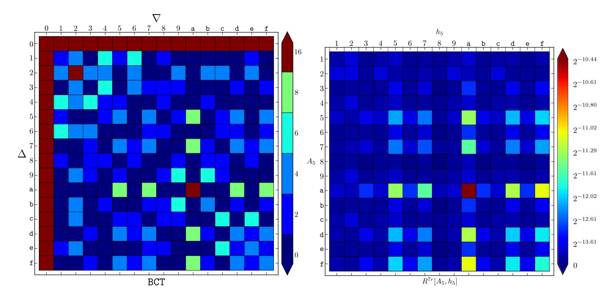

Figure 8: Visualization for the BCT of CRAFT's S-box (left) and the probability matrix  $R^{7r}$  (right)

difference we follow the pseudo-code in Subsection 2.1 such that we choose a random key and master tweak at first and then perform  $2^{28}$  boomerang queries. We repeat this test for 100 random keys and master tweaks and compute the average of returned boomerangs. Comparing the theoretical and the empirical probabilities for all  $(i,j) \in \mathbb{F}_2^4 \times \mathbb{F}_2^4$ , confirms the high accuracy of the derived formula. Figure 8 visualizes the matrix  $R^{7r}$ . It is visible that the maximum value of  $r_{i,j}$  is obtained when (i,j)=(A,A). Another interesting information obtained from Figure 8, is that after A four other difference values including 5, 7, D, and F give a much better probability compared to other difference values. This observation is not by chance and can be explained by referring to the DDT and BCT of CRAFT's S-box. According to the DDT of CRAFT's S-box which is described in Figure 19, the set  $S=\{5,7,A,D,F\}$  has a special property as follows:

$$\forall \ x \in S \ \exists \ y \in S \ s.t. \ \mathtt{DDT}(x,y) = 4$$
 
$$\forall \ x \in S \ \forall \ y \notin S \ s.t. \ \mathtt{DDT}(x,y) \leq 2.$$

Hence, given that CRAFT's S-box is 4-uniform, we expect that the differences from S result in a higher clustering effect. On the other hand, as it can be seen in Figure 8 (left), BCT(A,A) = 16. Therefore, it is expected that a boomerang returns with a higher probability when the nonzero entries of input and output differences are chosen from S, especially when they are all equal to A. As another interesting observation, comparing the visual representations for BCT of CRAFT's S-box Figure 8 (left) and  $R^{7r}$  Figure 8 (right) reveals that there is a high similarity between the positions of maximum entries in BCT of CRAFT's S-box and  $R^{7r}$ , which reflects the influence of CRAFT's S-box on the boomerang behavior of several rounds. In the next sections, we extend the 7-round boomerang distinguisher  $E_m^{7r}$ , to construct a longer boomerang distinguisher up to 14 rounds of CRAFT.

#### **5.4 Boomerang Distinguishers for 9 to 14 Rounds of CRAFT**

#### 9-Round Boomerang Distinguisher

In order to construct a 9-round boomerang distinguisher for CRAFT, we extend the 7-round distinguisher  $E_m^{7r}$  in Subsection 5.3, by one round in both directions. Accordingly, as represented in Figure 9, the input and output differences of the 9-round distinguisher are chosen as follows:

 $\Delta X_0 =$  0A00 0000 0A00 0000,  $\nabla X_9 =$  0000 0000 0A00 0000,

{17}------------------------------------------------

<span id="page-17-0"></span>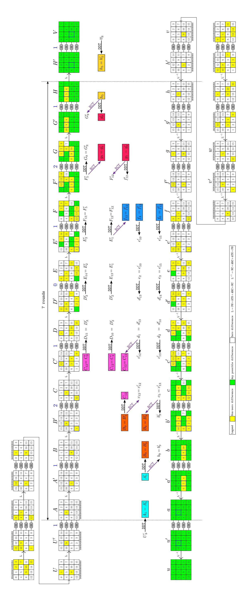

**Figure 9:** A 7-round *Em* where two DBCT⊢ and two DBCT⊣ are involved

{18}------------------------------------------------

to maximize the differential effect for the extended parts which are included in  $E_0$  and  $E_1$ . Given that the lower and the upper crossing differences in  $E_m^{7r}$ , can be seen as uniform after 7 rounds, we consider the extended parts including the one round ahead and the one round behind, as  $E_0$  and  $E_1$  respectively. Let  $\Delta X_1^i = 0000 \ 0i00 \ 0000 \ 0000$ , and  $\nabla X_8^j = 0000 \ 0j00 \ 0000 \ 0000$ , denote the input and output differences of the 7-round middle part  $E_m$  respectively, where  $i, j \in \mathbb{F}_2^4 \setminus \{0\}$ . Besides, let  $p_i = \Pr(\Delta X_0 \xrightarrow{E_0^{1r}} \Delta X_1^i)$ , and  $q_j = \Pr(\nabla X_8^j \xrightarrow{E_1^{1r}} \nabla X_9)$ . If (i,j) = (A,A), then  $p_i^2 q_j^2 R_{10,10}^{7r} = 2^{-18.39}$ , where  $R^{7r}$  is the matrix defined in Subsection 5.3. Taking into account the clustering effect,  $p_{bm}^{9r} = \sum_{i=1}^{15} \sum_{j=1}^{15} p_i^2 q_j^2 R_{i,j}^{7r} = 2^{-15.43}$ , gives a more accurate lower bound for the probability of the 9-round boomerang distinguisher. However, according to the experimental evaluation,  $p_{bm}^{9r} = 2^{-14.50}$ . To empirically evaluate the probability we choose a random key as well as a random tweak and then perform  $2^{28}$  boomerang queries. After repeating this test for 1000 random keys and tweaks we compute the average of right quartets. The main reason for this gap between the theoretical bound and the empirical approximation of  $p_{bm}^{9r}$ , is assuming that the differences are equal in two sides of boomerang distinguisher, whereas they can take different values indeed.

More precisely, the differences at positions  $A_5$ , and  $h_5$ , can take different values in two faces of boomerang. Accordingly, using the UBCT<sup>=</sup> and LBCT<sup>=</sup>, we provide a more accurate theoretical bound for the probability of 9-round boomerang distinguisher as follows:

<span id="page-18-0"></span>
$$p_{bm}^{9r}(U_9', v_9) = 2^{-12 \cdot n} \sum_{A_{51}} \sum_{A_{52}} \sum_{b_9} \sum_{B_9} \sum_{c_5} \sum_{c_{12}} \sum_{C_{12}} \sum_{A_{11}} \sum_{E_1'} \sum_{f_{12}'} \sum_{F_{12}} \sum_{g_9'} \sum_{F_5'} \sum_{G_9} \sum_{h_{51}} \sum_{h_{52}} \operatorname{BCT}_t \cdot \operatorname{Pr}_t,$$

$$\tag{3}$$

where n = 4, and BCT<sub>t</sub> and Pr<sub>t</sub> are defined as follows:

$$\begin{split} \operatorname{BCT}_t &= \operatorname{DDT}(U_9', A_{51}) \cdot \operatorname{DDT}(U_9', A_{52}) \cdot \operatorname{UBCT}^{\vDash}(A_{51}, A_{52}, b_9, B_9) \\ &\cdot \operatorname{LBCT}(B_9, c_5, b_9) \cdot \operatorname{UBCT}(B_9, c_{12}, C_{12}) \cdot \operatorname{LBCT}(C_{12}, d_1, c_{12}) \\ &\cdot \operatorname{UBCT}(E_1', f_{12}', F_{12}) \cdot \operatorname{LBCT}(F_{12}, g_9', f_{12}') \cdot \operatorname{UBCT}(F_5', g_9', G_9) \\ &\cdot \operatorname{LBCT}^{\preccurlyeq}(G_9, h_{51}, h_{52}, g_9') \cdot \operatorname{DDT}(h_{51}, v_9) \cdot \operatorname{DDT}(h_{52}, v_9), \\ \operatorname{Pr}_t &= \operatorname{Pr}(d_1 \xleftarrow{2 \operatorname{DDT}} f_{12}') \operatorname{Pr}(c_5 \xleftarrow{3 \operatorname{DDT}} f_{12}') \\ &\cdot \operatorname{Pr}(C_{12} \xrightarrow{2 \operatorname{DDT}} E_1') \cdot \operatorname{Pr}(C_{12} \xrightarrow{3 \operatorname{DDT}} F_5'). \end{split}$$

 $(A_{51},A_{52})$  and  $(h_{51},h_{52})$  denote the differences at position  $A_5$  and  $h_5$  in the two faces of boomerang distinguisher respectively. Evaluation of  $p_{bm}^{9r}(U_9',v_9)$ , when  $(U_9',v_9)=(A,A)$ , yields  $p_{bm}^{9r}=2^{-14.76}$ , which is very close to the experimental value of  $p_{bm}^{9r}$ . One can see that, the experimental values of  $p_{bm}^{9r}$  and the theoretical value which is obtained using Equation 3, are also close for other values of  $(U_9',v_9)\in (\mathbb{F}_2^n\setminus\{0\},\mathbb{F}_2^n\setminus\{0\})$ . It confirms our assumption that there is no dependency out of the 7-round middle part, as Equation 3 has been derived based on the assumption that the upper and lower crossing differences  $H_5$  and  $a_5$ , are both uniformly distributed.

The above observation, motivated us to model the 7-round middle part by a four-dimensional matrix instead of a two dimensional matrix, using two new S-box tables  $UBCT^{\vdash}$ , and  $LBCT^{\dashv}$ . Let  $A_{51}$ , and  $A_{52}$ , be the differences in two sides of boomerang at position  $A_5$ . Similarly  $h_{51}$ , and  $h_{52}$ , denote the differences in two sides of boomerang at position  $h_5$ . To obtain a more accurate bound for the boomerang distinguishers that are constructed by extending our 7-round boomerang distinguisher, we define the 4-dimensional matrix

{19}------------------------------------------------

 $R_{i,j,k,l}^{7r}$ , as follows:

$$\begin{split} R^{7r}[i,j,k,l] &= 2^{-8\cdot n} \sum_{b_9} \sum_{B_9} \sum_{c_5} \sum_{c_{12}} \sum_{C_{12}} \sum_{d_1} \sum_{E_1'} \sum_{f_{12}'} \sum_{F_{12}} \sum_{g_9'} \sum_{f_{12}'} \sum_{F_5'} \sum_{G_9} \text{LBCT}(B_9,c_5,b_9) \\ & \cdot \text{UBCT}^{\vDash}(A_{51},A_{52},b_9,B_9) \cdot \text{UBCT}(B_9,c_{12},C_{12}) \cdot \text{LBCT}(C_{12},d_1,c_{12}) \quad (4) \\ & \cdot \text{UBCT}(E_1',f_{12}',F_{12}) \cdot \text{LBCT}(F_{12},g_9',f_{12}') \cdot \text{UBCT}(F_5',g_9',G_9) \\ & \cdot \text{LBCT}^{\preccurlyeq}(G_9,h_{51},h_{52},g_9') \cdot \text{Pr}_t, \end{split}$$

where  $n = 4, A_{51} = i, A_{52} = j, h_{51} = k$ , and  $h_{52} = l$ . Hereafter, we use this matrix to provide a lower bound for the probability of the extended distinguishers based on  $E_m^{7r}$ . Appendix G gives a more efficient formula to evaluate  $R^{7r}[i, j, k, l]$ .

#### 10-Round Boomerang Distinguisher

As illustrated in Figure 9, if the 7-round boomerang distinguisher  $E_m^{7r}$ , is extended two rounds forwards, and one round backward, a 10-round boomerang distinguisher is constructed with the following input and output differences:

<span id="page-19-0"></span>
$$\Delta X_0 =$$
 0A00 0000 0A00 0000,  $\nabla X_{10} =$  0000 0A00 0000 A000.

Let  $E_0^{1r}$  and  $E_1^{2r}$ , depict the extended parts corresponding to one round ahead and two rounds behind respectively. Furthermore, we consider rounds 2 to 8 as  $E_m$ . Let  $p_i = \Pr(\Delta X_0 \xrightarrow{E_0^{1r}} \Delta X_1^i)$ , and  $q_j = \Pr(\nabla X_8^j \xrightarrow{E_1^{2r}} \nabla X_{10})$ , where  $\Delta X_1^i = 0000 \ 0i00 \ 0000 \ 0000$ , and  $\nabla X_8^j = 0000 \ 0j00 \ 0000 \ 0000$ , for  $i, j \in \mathbb{F}_2^4 \setminus \{0\}$ . Then, a lower bound for the probability of our 10-round boomerang distinguisher is:

$$p_{bm}^{10r} = \sum_{i=1}^{15} \sum_{j=1}^{15} \sum_{k=1}^{15} \sum_{l=1}^{15} p_i p_j q_k q_l R_{i,j,k,l}^{7r} = 2^{-19.83}.$$

However, based on the experimental evaluation,  $p_{bm}^{10r} = 2^{-18.17}$ . In the experiments, we choose a random key as well as a random master tweak at first and perform  $2^{29}$  boomerang queries. We repeat this test for 100 randomly generated keys and tweaks and compute the average number of successes. As it can be seen there is a gap between the theoretical bound and the empirical value of  $p_{bm}^{10r}$ , which is originated from the assumption  $v'_1 = v'_9$ , for the lower differential trail in Figure 9. As it can be seen in Figure 9, it is supposed that  $v'_1 = v'_9$ , whereas the differences  $v'_1$  and  $v'_9$ , should not necessarily be the same in the 10-round boomerang distinguisher. Given that the output differences of active S-boxes in the last round of the 10-round boomerang distinguisher are equal to A, the input differences, i.e.  $v'_1$  and  $v'_9$ , can take an arbitrary value from  $\{5, A, D, F\}$ . As a result, in theoretical evaluation of  $p_{bm}^{10r}$ , we have considered only 4 possible cases out of 16 possible cases for  $v' = 0000 \ 0v'_900 \ 0000 \ v'_1000$ . Hence, applying the theoretical formulas provided for the 7-round middle part  $E_m^{7r}$ , i.e. Equation 2 or Equation 4, to compute the probability of longer boomerang distinguishers, only gives a lower bound for the probability of boomerang distinguisher covering more than 9 rounds.

One may construct a 10-round boomerang distinguisher by extending the 7-round boomerang distinguisher  $E_m^{7r}$ , two rounds backward and one round forwards. However, as it can be seen in Figure 9, due to the symmetry between the upper and lower differential trails, the total probability of this distinguisher, is the same as the probability of the former one.

#### 11-Round Boomerang Distinguisher

An 11-round boomerang distinguisher for CRAFT can be constructed by extending the 7-round boomerang distinguisher  $E_m^{7r}$ , two rounds forwards and backward. As it can be

{20}------------------------------------------------

seen in Figure 9, the input and output differences of this 11-round boomerang distinguisher, are as follows:

$$\Delta X_0 =$$
 A000 AA00 0000 A000,  $\nabla X_{11} =$  0000 0A00 0000 A000.

Let  $E_0^{2r}$  and  $E_1^{2r}$ , denote the extended parts ahead and behind respectively, and  $E_m$  includes the 7-round at the middle. Assuming that the input/output differences of  $E_m$  are  $\Delta X_2^i = 0000~0i00~0000~0000$ , and  $\nabla X_9^j = 0000~0j00~0000~0000$ , respectively, and  $p_i = \Pr(\Delta X_0 \xrightarrow{E_0^{2r}} \Delta X_2^i)$ , and  $q_j = \Pr(\nabla X_9^j \xrightarrow{E_1^{2r}} \nabla X_{11})$ , for all  $i, j \in \mathbb{F}_2^4$ , a lower bound for the probability of the 11-round boomerang distinguisher is:

$$p_{bm}^{11r} = \sum_{i=1}^{15} \sum_{j=1}^{15} \sum_{k=1}^{15} \sum_{l=1}^{15} p_i p_j q_k q_l R_{i,j,k,l}^{7r} = 2^{-24.90}.$$

We also accomplished experiments to verify the above bound. To do so, we chose a random key and tweak at first and performed  $2^{33}$  boomerang queries. We iterated this test for 100 randomly chosen keys and tweaks and observed that 1509.65 boomerangs return on average. Hence, the empirical probability is  $p_{bm}^{11r} = 2^{-22.44}$ . To find the reason of this gap between the theoretical bound and the experimental approximation, note that in Figure 9, it is supposed that  $U_1 = U_9$ , whereas  $U_1$  and  $U_9$  can take different values. In addition, it is supposed that  $v'_1 = v'_9$ , while  $v'_1$  and  $v'_9$  should not necessarily be the same.

#### 12 to 14-Round Boomerang Distinguisher

One can extend the 7-round boomerang distinguisher  $E_m^{7r}$ , 3 rounds backward and 2 rounds forwards to obtain a 12-round boomerang distinguisher for CRAFT. The input/output differences of the 12-round boomerang distinguisher are shown in Table 16, and the input and output differences of the 7-round middle part are assumed to be  $\Delta X_3^i = 0000\ 0i00\ 0000\ 0000\ 0000\ 0000\ 0000\ 0000\ 0000\ 0000\ 0000\ 0000\ 0000\ 0000\ 0000\ 0000\ 0000\ 0000\ 0000\ 0000\ 0000\ 0000\ 0000\ 0000\ 0000\ 0000\ 0000\ 0000\ 0000\ 0000\ 0000\ 0000\ 0000\ 0000\ 0000\ 0000\ 0000\ 0000\ 0000\ 0000\ 0000\ 0000\ 0000\ 0000\ 0000\ 0000\ 0000\ 0000\ 0000\ 0000\ 0000\ 0000\ 0000\ 0000\ 0000\ 0000\ 0000\ 0000\ 0000\ 0000\ 0000\ 0000\ 0000\ 0000\ 0000\ 0000\ 0000\ 0000\ 0000\ 0000\ 0000\ 0000\ 0000\ 0000\ 0000\ 0000\ 0000\ 0000\ 0000\ 0000\ 0000\ 0000\ 0000\ 0000\ 0000\ 0000\ 0000\ 0000\ 0000\ 0000\ 0000\ 0000\ 0000\ 0000\ 0000\ 0000\ 0000\ 0000\ 0000\ 0000\ 0000\ 0000\ 0000\ 0000\ 0000\ 0000\ 0000\ 0000\ 0000\ 0000\ 0000\ 0000\ 0000\ 0000\ 0000\ 0000\ 0000\ 0000\ 0000\ 0000\ 0000\ 0000\ 0000\ 0000\ 0000\ 0000\ 0000\ 0000\ 0000\ 0000\ 0000\ 0000\ 0000\ 0000\ 0000\ 0000\ 0000\ 0000\ 0000\ 0000\ 0000\ 0000\ 0000\ 0000\ 0000\ 0000\ 0000\ 0000\ 0000\ 0000\ 0000\ 0000\ 0000\ 0000\ 0000\ 0000\ 0000\ 0000\ 0000\ 0000\ 0000\ 0000\ 0000\ 0000\ 0000\ 0000\ 0000\ 0000\ 0000\ 0000\ 0000\ 0000\ 0000\ 0000\ 0000\ 0000\ 0000\ 0000\ 0000\ 0000\ 0000\ 0000\ 0000\ 0000\ 0000\ 0000\ 0000\ 0000\ 0000\ 0000\ 0000\ 0000\ 0000\ 0000\ 0000\ 0000\ 0000\ 0000\ 0000\ 0000\ 0000\ 0000\ 0000\ 0000\ 0000\ 0000\ 0000\ 0000\ 0000\ 0000\ 0000\ 0000\ 0000\ 0000\ 0000\ 0000\ 0000\ 0000\ 0000\ 0000\ 0000\ 0000\ 0000\ 0000\ 0000\ 0000\ 0000\ 0000\ 0000\ 0000\ 0000\ 0000\ 0000\ 0000\ 0000\ 0000\ 0000\ 0000\ 0000\ 0000\ 0000\ 0000\ 0000\ 0000\ 0000\ 0000\ 0000\ 0000\ 0000\ 0000\ 0000\ 0000\ 0000\ 0000\ 0000\ 0000\ 0000\ 0000\ 0000\ 0000\ 0000\ 0000\ 0000\ 0000\ 0000\ 0000\ 0000\ 0000\ 0000\ 0000\ 0000\ 0000\ 0000\ 0000\ 0000\ 0000\ 0000\ 0000\ 0000\ 0000\ 0000\ 0000\ 0000\ 000$ 

Assuming that  $p_i = \Pr(\Delta X_0 \xrightarrow{E_0^{3r}} \Delta X_3^i)$ , and  $q_j = \Pr(\nabla X_{10}^j \xrightarrow{E_1^{2r}} \nabla X_{12})$ , a lower bound for the probability of the 12-round boomerang distinguisher is  $\sum_{i=1}^{15} \sum_{j=1}^{15} p_i^2 q_j^2 R_{i,j}^{7r} = 2^{-35.49}$ .

Taking into account that the input and output differences of the middle part should not necessarily be the same in two sides of boomerang distinguisher, the following formula gives a more accurate lower bound for the probability of the 12-round boomerang distinguisher:

$$p_{bm}^{12r} = \sum_{i=1}^{15} \sum_{j=1}^{15} \sum_{k=1}^{15} \sum_{l=1}^{15} p_i p_j q_k q_l R_{i,j,k,l}^{7r} = 2^{-34.89}.$$

According to the experimental evaluations, the probability that the boomerang returns, is  $2^{-32.11}$ , which validates the provided lower bound. To empirically approximate the probability we choose a random key and tweak at first and perform  $2^{37}$  boomerang queries. We iterate this experiment for 100 random keys and tweaks and count the average number of right quartets. Table 16 provides a right quartet for the 12-round boomerang distinguisher. Similarly, we can extend the 7-round boomerang distinguisher  $E_m^{7r}$  to build 13 and 14 rounds boomerang distinguishers with probabilities  $p_{bm}^{13r} = 2^{-44.89}$ , and  $p_{bm}^{14r} = 2^{-60.33}$  respectively. Table 14 and Table 15 express the specification of the extended boomerang distinguishers based on  $E_m^{7r}$  for 13 and 14 rounds of CRAFT respectively.

Although due to the restricted computing power we have not evaluated the experimental probability of the extended boomerang distinguishers for 13 and 14 rounds of CRAFT, we expect that the boomerang returns with a probability higher than what is estimated above as we have not considered the entire clustering effect inside the boomerang distinguisher.

{21}------------------------------------------------

#### 5.5 A Dedicated Boomerang Distinguisher for 14 Rounds of CRAFT

In the previous section, we showed that there exists a 7-round boomerang distinguisher for CRAFT that can be extended up to 14 rounds. However, for convenience, we used a common middle part to construct the boomerang distinguishers covering 9 to 14 rounds of CRAFT. Thus, it may be possible to find a better distinguisher in terms of probability if we search for a dedicated boomerang distinguisher for each case. Here, we provide a dedicated boomerang distinguisher with a higher probability for 14 rounds of CRAFT. Table 6 describes the specification of a dedicated boomerang distinguisher for 14 rounds of CRAFT, and Figure 10 illustrates three different parts of this distinguisher, i.e.,  $E_0$ ,  $E_1$  and  $E_m$ .

As shown in Figure 10, the upper and lower differential paths are strongly interrelated and there are many common active S-boxes in the middle part. Hence, to avoid the complicated formulas we switch to the experimental approach to provide a lower bound for the probability of this boomerang distinguisher. Let consider the 8-round middle part including rounds 4 to 11 as  $E_m$ . As it can be seen in Figure 10, there exist only one active cell in both input and output differences of  $E_m$ . On the other hand, each of the input and output differences can take different values in two faces of boomerang. Consequently, there are in total  $15^4 = 50625$  possible combinations for the input/output differences of  $E_m$  in two sides of boomerang distinguisher. However, due to the restricted computing power, we let the differences in active input and output cells of  $E_m$ , to be different in two sides of boomerang only if they are taken from  $S = \{5, 7, A, D, F\}$ , otherwise, we assume that they are the same in two faces of boomerang. Thus, we consider only  $5^4 + 10^2 = 725$ cases out of 50625 possible combinations for the input/output differences of  $E_m$ . Let  $\Delta X_3^i = 0000\ 00i0\ 0000\ 0000, \ \mathrm{and}\ \nabla X_{11}^j = 0000\ j000\ 0000, \ \mathrm{for\ all}\ i,j \in \mathbb{F}_2^4 \setminus \{0\}.$ For each of 725 possible combinations, the input and output differences of  $E_m$  in two sides of boomerang are fixed, and the probability that the boomerang returns is experimentally evaluated. Then, for all  $i, j, k, l \in S$ , the results are arranged into:

$$R_{i,j,k,l}^{8r} := \Pr\{E_m^{-1}\left(E_m\left(x\right) \oplus \nabla X_{11}^k\right) \oplus E_m^{-1}\left(E_m\left(x \oplus \Delta X_3^i\right) \oplus \nabla X_{11}^l\right) = \Delta X_3^j\},$$
 and for all  $i, j \in \mathbb{F}_2^4 \setminus S \cup \{0\}$ , the results are stored into  $R_{i,j}$ , such that:

$$R_{i,j}^{8r} := \Pr\{E_m^{-1} \left( E_m \left( x \right) \oplus \nabla X_{11}^j \right) \oplus E_m^{-1} \left( E_m \left( x \oplus \Delta X_3^i \right) \oplus \nabla X_{11}^j \right) = \Delta X_3^i \}.$$

Next, we show that the dependency doesn't exist outside  $E_m$ . To this end, we firstly assume that the lower and upper crossing differences are uniformly distributed outside  $E_m$ . Based on this assumption, the following formula:

$$\sum_{i \in S} \sum_{j \in S} \sum_{k \in S} \sum_{l \in S} p_i p_j q_k q_l R_{i,j,k,l}^{8r} = 2^{-25.65},$$

where  $p_i = \Pr(\Delta X_2 \xrightarrow{E_0^{1r}} \Delta X_3^i)$ , and  $q_j = \Pr(\nabla X_{11}^j \xrightarrow{E_1^{1r}} \nabla X_{12})$ , for all  $i, j \in \mathbb{F}_2^4 \setminus \{0\}$ , and  $\Delta X_2 = \text{A000 0000 A000 0000}$ , and  $\nabla X_{12} = \text{0000 A000 0000 0000}$ , must give the same value as the experimental probability of the 10-round boomerang distinguisher that is constructed by appending one round before and after the  $E_m$ , in Figure 10. we empirically assessed the probability of the 10-round boomerang distinguisher composing of rounds 3 to 12 in Figure 10. To this end, we firstly chose a random key and tweak and perform  $2^{28}$  boomerang queries. This test was iterated for 1000 randomly chosen keys and tweaks and 4.93 boomerang returned on average. Hence the experimental probability is  $2^{-25.70}$ , which is very close to the above approximation and therefore confirms our assumption. Consequently, a lower bound for the probability of the 14-round boomerang distinguisher is:

$$\sum_{i,j,k,l \in S} p_i p_j q_k q_l R_{i,j,k,l}^{8r} + \sum_{i,j \in \mathbb{F}_2^4 \setminus S \cup \{0\}} p_i^2 q_j^2 R_{i,j}^{8r} = 2^{-55.85} + 2^{-66.70} \approx 2^{-55.85},$$

{22}------------------------------------------------

where  $p_i = \Pr(\Delta X_0 \xrightarrow{E_0^{3r}} \Delta X_3^i)$ , and  $q_j = \Pr(\nabla X_{11}^j \xrightarrow{E_1^{3r}} \nabla X_{14})$ , for all  $i, j \in \mathbb{F}_2^4 \setminus \{0\}$ . It is visible that the total probability is almost determined by the first term.

<span id="page-22-0"></span>Table 6: Specification of a dedicated boomerang distinguisher for 14 rounds of CRAFT

| $r_0 = 3, r_m = 8, r_1 = 3, \sum p_i p_j q_k q_l R_{i,j,k,l}^{8r} = 2^{-55.80}; i, j \in \mathbb{F}_2^4 \setminus \{0\}$ |                     |                 |                              |
|--------------------------------------------------------------------------------------------------------------------------|---------------------|-----------------|------------------------------|
| $\Delta X_0$                                                                                                             | OAOO AOOA OAOO      | $\Delta X_3^i$  | 0000 00 <i>i</i> 0 0000 0000 |
| $\nabla X_{11}^j$                                                                                                        | 0000 j000 0000 0000 | $\nabla X_{14}$ | OOOA OAAO AOOO               |

<span id="page-22-1"></span>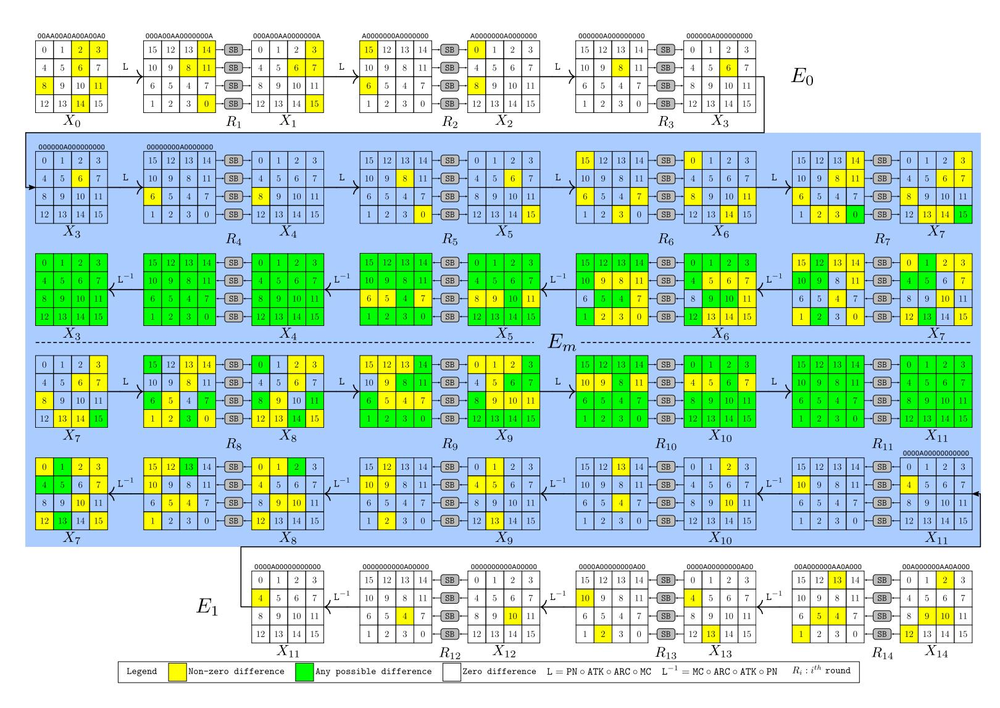

Figure 10: A dedicated boomerang distinguisher for 14 rounds of CRAFT with the form 3 + 8 + 3

#### 5.6 Boomerang Distinguishers of CRAFT in the Related-Tweak Model

We have investigated the boomerang behavior of CRAFT in the related-tweak model also. In contrast to the single tweak model where the boomerang distinguishers have significant advantages against the basic differential distinguishers, the outcome was not promising in terms of the number of rounds compared to the current best differential distinguishers in the related tweak model. It shows that the boomerang attack is less efficient than the basic differential attack for CRAFT in the related tweak model. It is worth noting, we expected this behavior and it is not surprising. More precisely, on one hand, the differences that are introduced by the tweakey schedule accelerate the diffusion of uniformly distributed differences which reduces the number of rounds that can be covered by the middle part. On the other hand, the clustering effect in the related-tweak model is weaker in comparison with the single tweak model for CRAFT. Hence, the outcome is not promising in this model compared to the previous related tweak differential cryptanalysis [BLMR19].

{23}------------------------------------------------

Table 7: Notations for SKINNY.

<span id="page-23-1"></span>

| $\overline{TK1_i}$ | Tweakey state $TK1$ in round i. $TK2_i$ and $TK3_i$ are defined similarly                                         |
|--------------------|-------------------------------------------------------------------------------------------------------------------|
| $TK_i$             | $i^{th}$ round tweakey. This is equal to the result of XORing the first and                                       |
|                    | the second rows of $TK1_i$ and $TK2_i$ for SKINNY- $n$ -2 $n$ and $TK1_i$ , $TK2_i$                               |
|                    | and $TK3_i$ for SKINNY- $n$ - $3n$                                                                                |
| $X_i$              | Internal state before $SC$ in round $i$                                                                           |
| $Y_i$              | Internal state before $ART$ in round $i$                                                                          |
| $Z_i$              | Internal state before $SR$ in round $i$                                                                           |
| $W_i$              | Internal state before $MC$ in round $i$                                                                           |
| $S_i[j]$           | $j^{th}$ cell of state $S_i$ , where $0 \leq j \leq 15$ , e.g. $X_1[6]$ denotes $6^{th}$ cell of                  |
|                    | internal state before $SC$ in round 1                                                                             |
| $S_i[j \sim l]$    | $j^{th}$ to $l^{th}$ cells of state $S_i$ , in round $i$ , where $0 \leq j \leq l \leq 15$ , e.g. $Y_2[6 \sim 8]$ |
|                    | denotes $6^{th}$ , $7^{th}$ and $8^{th}$ cells of internal state before $ART$ in round 2                          |
| TK[j]              | $j^{th}$ cell of $TK$ , where $0 \leq j \leq 15$ , e.g. $X_1[6]$ denotes $6^{th}$ cell of internal                |
|                    | state before $SC$ in round 1                                                                                      |
| $\Delta S$         | Forward difference in a state $S$                                                                                 |
| $\nabla S$         | Backward difference in a state $S$                                                                                |
| Y                  | Hexadecimal representation of arbitrary value $Y \in \mathbb{F}_2^4$ , where we are                               |
|                    | using typewriter style.                                                                                           |

## <span id="page-23-0"></span>6 Boomerang Distinguishers for Reduced-Round SKINNY

In this section, we first briefly review the specification of SKINNY and its previous boomerang distinguishers, and then present improved boomerang distinguishers for different variants of SKINNY. Table 7 briefly describes the notations we use through this section of the paper.

#### **6.1** A Brief Description of SKINNY

SKINNY is a family of lightweight tweakable block ciphers using SPN structure and following the tweakey framework from [JNP14], in its design. Each family member of SKINNY is represented by SKINNY-n-t, where n represents the block size ( $n \in \{64, 128\}$ ), and t represents the tweakey size ( $t \in \{n, 2n, 3n\}$ ). In other words, the six main variants of SKINNY are SKINNY-64-64, SKINNY-64-128, SKINNY-64-192, SKINNY-128-128, SKINNY-128-256, and SKINNY-128-384 with 32, 36, 40, 40, 48, and 56 rounds, respectively.

The internal state of SKINNY is considered as a  $4 \times 4$  matrix, where each entry is a nibble in the n = 64 case, or a byte in the n = 128 case. In both cases, the internal state  $IS = I_0 ||I_1|| \cdots ||I_{14}|| I_{15}$  is arranged row-wise into a  $4 \times 4$  array, where  $I_i \in \mathbb{F}_2^4$  (or  $\mathbb{F}_2^8$ ).

As illustrated in Figure 11, each round of SKINNY performs five basic operations on the cipher internal state, including SubCells (SC), AddConstants (AC), AddRoundTweakey (ART), ShiftRows (SR), and MixColumns (MC). The first operation which is performed on the internal state in each round is SubCells (SC), in which depending on the block size, a 4-bit Sbox (for 64-bit block size) or a 8-bit Sbox (for 128-bit block size) is applied on each cell of the internal state. The next operation is AddConstant (AC) where some round-dependent constants are XORed to the first column of the cipher internal state. Then, in AddRoundTweakey (ART), as represented in Figure 11, the first and second rows of the tweakey state are XORed with the corresponding rows of the internal state. In ShiftRows (SR) layer, each cell in row j is rotated to the right by j cells.

In the MixColumns (MC) layer, each column of the internal state is multiplied by  $4 \times 4$  binary matrix. The tweakey state of SKINNY can contain both key and tweak materials and it is arranged as a collection of z  $4 \times 4$  array of nibbles (for 64-bit block size) or bytes (for 128-bit block size), where z = t/n. The tweakey state arrays are denoted by

{24}------------------------------------------------

<span id="page-24-1"></span>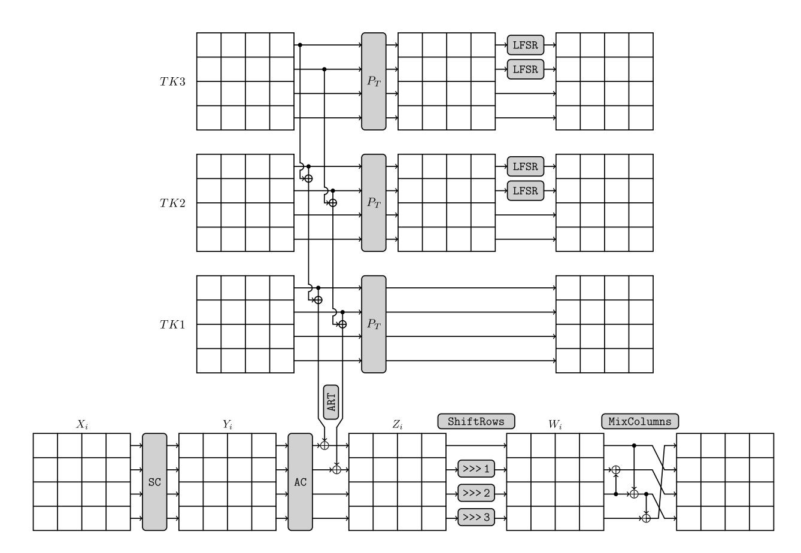

**Figure 11:** The round function and tweakey schedule of SKINNY

*TK*1 when *z* = 1, *TK*1 and *TK*2 when *z* = 2, and *TK*1*, TK*2, and *TK*3 when *z* = 3. Let *TKi*[*j*] represents the *j*'th cell of *TKi* for *i* ∈ {1*,* 2*,* 3}. The tweakey schedule of SKINNY is a linear algorithm in which, firstly, a cell-wised permutation *P<sup>T</sup>* is applied on each tweakey state, i.e. *TKi*[*j*] ← *TKi*[*P<sup>T</sup>* [*j*]] for all *i* ∈ {1*,* 2*,* 3} and 0 ≤ *j* ≤ 15 where *P<sup>T</sup>* = [9*,* 15*,* 8*,* 13*,* 10*,* 14*,* 12*,* 11*,* 0*,* 1*,* 2*,* 3*,* 4*,* 5*,* 6*,* 7]. Then, every cell of the first and second rows of *TK*2 (where *TK*2 is used) and *TK*3 (when *TK*3 is used) are individually updated with an LFSR. For complete details of the round function, and tweakey scheduling algorithm, one can refer to [\[BJK](#page-41-1)<sup>+</sup>16].

<span id="page-24-0"></span>**Table 8:** Summary of our results in comparison to the best previous results in [\[SQH19\]](#page-43-2) for boomerang distinguishers of SKINNY. The probabilities highlighted in red have been verified experimentally. The Roman numbers represent the corresponding distinguisher in our paper. The probabilities denoted by §, correspond to the distinguishers that can be obtained by extending the distinguishers proposed in [\[SQH19\]](#page-43-2).

|             | Probability |         |                   |               |
|-------------|-------------|---------|-------------------|---------------|
| Version     | n           | #Rounds | Our Distinguisher | [SQH19]       |
|             |             | 17      | −26.54(II)<br>2   | −29.78<br>2   |
|             | 64          | 18      | −37.90(II)<br>2   | −45.14§<br>2  |
|             |             | 19      | −51.08(II)<br>2   | −65.62§<br>2  |
| SKINNY-n-2n |             | 18      | −40.77 (II)<br>2  | −77.83<br>2   |
|             |             | 19      | −58.33 (II)<br>2  | −97.53§<br>2  |
|             | 128         | 20      | −85.31 (I)<br>2   | −128.65§<br>2 |
|             |             | 21      | −114.07 (II)<br>2 | −171.77§<br>2 |
|             | 64          | 22      | −38.84 (I)<br>2   | −42.98<br>2   |
|             |             | 23      | −52.84 (I)<br>2   | −67.36§<br>2  |
|             | 128         | 22      | −40.57 (I)<br>2   | −48.30<br>2   |
| SKINNY-n-3n |             | 23      | −56.47 (I)<br>2   | −75.86§<br>2  |
|             |             | 24      | −87.39 (I)<br>2   | −107.86§<br>2 |
|             |             | 25      | −116.59 (I)<br>2  | −141.66§<br>2 |

In [\[LGS17\]](#page-43-3), Liu *et al.*, provided related-tweakey rectangle attacks against SKINNY. After that, in EUROCRYPT 2018, Cid *et al.* introduced the BCT in [\[CHP](#page-42-2)<sup>+</sup>18] and applied it to

{25}------------------------------------------------

accurately evaluate the probability of generating the right quartet for two middle rounds of boomerang distinguishers proposed in [\[LGS17\]](#page-43-3). At FSE 2019, Song *et al.* proposed a generalized framework to identify the actual boundaries of *E<sup>m</sup>* which contains dependency of the two differential paths of boomerang distinguisher and systematically evaluate the probability of *E<sup>m</sup>* with any number of rounds. Using their method, Song *et al.* proved that the probability of four boomerang distinguishers proposed in [\[LGS17\]](#page-43-3) are much higher than previously evaluated. To the best of our knowledge, the results of Song *et al.* in [\[SQH19\]](#page-43-2) [1](#page-25-0) , are the best-published results for boomerang distinguishers of SKINNY so far. In this section we introduce new boomerang distinguishers for SKINNY-64-128, SKINNY-64-192, SKINNY-128-256, and SKINNY-128-284, which are remarkably better than the best previous boomerang distinguishers of SKINNY in terms of probability and number of rounds. [Table 8](#page-24-0) summarizes our results on boomerang distinguishers for SKINNY-*n*-2*n* and SKINNY-*n*-3*n*, where they are compared with the best previous ones.

Firstly, we investigated the best previous boomerang distinguishers in [\[SQH19\]](#page-43-2), to see for how many rounds they can be extended. To this end, by keeping the middle part and the tweakey's difference of the proposed distinguishers unchanged, we extend them some rounds forwards and backward. Then, by fixing the input and output differences of *Em*, we look for the best differential trails covering the extended *E*<sup>0</sup> and *E*1. After that, taking into account the clustering effect, we compute *p* and *q*. In conclusion, given that *r* is known from [\[SQH19\]](#page-43-2), we compute the total probability using *p* 2 *q* 2 *r* formula. The summary of our results concerning this search is given in [Table 17.](#page-50-1) As it can be seen, the best previous boomerang distinguishers of SKINNY-64-128, SKINNY-128-256 and SKINNY-128-384 proposed in [\[SQH19\]](#page-43-2) and [\[LGS17\]](#page-43-3), can be extended up to 18, 19, and 24 rounds respectively, whereas the best previous boomerang distinguisher for 22 rounds of SKINNY-64-192, can not be extended for a higher number of rounds at all.

Based on the results in [\[SQH19\]](#page-43-2), where it is proved that the upper and lower differential paths in boomerang distinguishers of SKINNY can be dependent up to 6 rounds, we searched for the boomerang distinguisher of SKINNY taking into account the 6-round middle part as *Em*. Given that the boomerang distinguishers for 8-bit versions of SKINNY, cover more number of rounds [\[SGSL18\]](#page-43-10) in comparison to the 4-bit versions, and 8-bit S-boxes are heavy for MILP/SAT solvers, applying our searching method on 8-bit versions of SKINNY is more time-consuming. Accordingly, we applied a dedicated method to find boomerang distinguishers for SKINNY to speed up the search. Due to the structural similarity between 4 bit and 8-bit versions of SKINNY, our idea is to use the discovered boomerang distinguishers for 4-bit versions, in discovering boomerang distinguishers for 8-bit versions. Once a boomerang distinguisher is discovered for 18 rounds of SKINNY-64-128, we use the middle part of the discovered boomerang distinguisher to find a boomerang distinguisher for 18 rounds of SKINNY-128-256, as well as 22 rounds of SKINNY-128-384. To do so, we divide 18 (and 22) rounds of SKINNY-128-256 (and SKINNY-128-384) into three parts such that *E<sup>m</sup>* includes the 6-round middle part. Then, we look for the best differential trails for the first and last parts, i.e., *E*<sup>0</sup> and *E*<sup>1</sup> satisfying the active pattern of the input and output in the discovered *Em*. The discovered boomerang distinguishers for 22 rounds of SKINNY-64-192 can be used to discover boomerang distinguishers for 22 rounds of SKINNY-128-384 in the same way. As a result, the discovered boomerang distinguishers have a common active pattern in the middle part.

Throughout applying our searching method for boomerang distinguishers on SKINNY, we observed that a suitable boomerang distinguisher for 18 rounds of SKINNY-64-128 and SKINNY-128-256, can be extended up to 19 and 21 rounds of these variants respectively. Besides, we observed that a suitable boomerang distinguisher for 22 rounds of SKINNY-64- 192 and SKINNY-128-384 can be extended up to 23 and 25 rounds respectively. Among all of

<span id="page-25-0"></span><sup>1</sup> [\[SQH19\]](#page-43-2) focused on giving a more accurate probability of existing boomerang distinguishers rather than searching for boomerang distinguishers covering more rounds.

{26}------------------------------------------------

the discovered boomerang distinguishers using our dedicated searching method, we picked the two best ones called the boomerang distinguisher I, and boomerang distinguisher II, which are presented in the next sections.

#### **6.2 Boomerang Distinguisher I for SKINNY**

In this section, we present the details of boomerang distinguisher I for different variants of SKINNY. This distinguisher is constructed using our dedicated method to search for boomerang distinguishers of SKINNY, where we first discover a suitable boomerang distinguisher for 18 rounds of SKINNY-64-128 and then use its middle part to discover boomerang distinguishers for other variants of SKINNY. That is why the active pattern in the middle part of boomerang distinguisher I is the same for all variants of SKINNY. We first focus on the boomerang distinguisher I for SKINNY-64-128 and SKINNY-128-256.

#### Boomerang Distinguisher I for SKINNY-64-128 and SKINNY-128-256

Table 9 describes the specification of the boomerang distinguisher I for 18 rounds of SKINNY-64-128 and Figure 12 represents the upper and lower differential trails of this boomerang distinguisher, where the yellow squares stand for active cells and green squares represent any differences as before. Hex numbers at the top of the state squares are exact differences specified by the differential trails. The horizontal dashed lines in Figure 12, separate  $E_0$ ,  $E_m$  and  $E_1$ . It can be seen that each one of  $E_0$ ,  $E_1$  and  $E_m$  includes 6 rounds, such that the middle part  $E_m$ , is composed of rounds  $R_7$  to  $R_{12}$ , over which the upper and lower differential trails are extended with probability 1 towards each other.

Table 9: Specification of boomerang distinguisher I for 18 rounds of SKINNY-64-128

<span id="page-26-0"></span>

| $r_0 = 6, r_m = 6, r_1 = 6, p = 2^{-2.41}, q = 2^{-8}, r = 2^{-19.16}, p^2.q^2.r = 2^{-39.98}$ |                  |                 |                  |
|------------------------------------------------------------------------------------------------|------------------|-----------------|------------------|
| $\Delta TK1$                                                                                   | 00000000C0000000 | $\Delta TK2$    | 0000000F0000000  |
| $\Delta X_0$                                                                                   | 800000000000000  | $\Delta X_6$    | 000000000040000  |
| $\nabla TK1$                                                                                   | 000000000004000  | $\nabla TK2$    | 000000000007000  |
| $\nabla X_{12}$                                                                                | 000000000000000  | $\nabla X_{18}$ | 0454000404070404 |

Next, we compute the probability of the middle part  $E_m$ , where we assume to include the dependency between the upper and lower differential trails. As illustrated in Figure 12, most of the common active S-boxes between the upper and lower differential trails, appear in rounds  $R_8$  to  $R_{10}$ . Hence, we start with computing the probability for intermediate rounds consisting of rounds  $R_8$  to  $R_{10}$ . It can be seen that  $c'_9$  and  $D'_1$ , in lower and upper differential trails respectively, are almost uniformly distributed. On the other hand, due to the weak diffusion of the linear layer, the difference  $d'_1$  in lower differential trail, does not diffuse to more cells. In addition,  $d'_1$ , should not necessarily take an identical value in two sides of boomerang. Consequently, assuming that  $d'_{1,1}$  and  $d'_{1,2}$ , denote the different values of difference  $d'_1$ , in two sides of boomerang, and  $c'_9$  and  $D'_1$  are uniformly distributed, the probability of the 3-round middle part including rounds  $R_8$  to  $R_{10}$  can be computed as follows:

$$\begin{split} p_m^{3r} &= 2^{-13 \cdot n} \cdot \sum_{d_{14}'} \sum_{C_9} \sum_{d_4'} \sum_{C_{13}} \sum_{d_{1,1}'} \sum_{d_{1,2}'} \mathrm{DBCT}(B_{11}, d_{14}') \cdot \mathrm{DDT}^2(B_{11}, C_9) \\ & \cdot \mathrm{DBCT}^{\vdash}(B_{11}, C_{13}, d_4') \cdot \mathrm{BCT}(C_9, d_{14}') \\ & \cdot \mathrm{DBCT}^{\dashv}(C_{13}, d_4', e_{13}') \cdot \mathrm{BCT}(C_{10}', d_4') \\ & \cdot \mathrm{DDT}(d_{1,1}', e_1).\mathrm{DDT}(d_{1,2}', e_1) \cdot \mathrm{DDT}(d_{14}', e_{13}') = 2^{-11.55}, \end{split}$$

where  $n = 4, B_{11} = 2, C'_{10} = D$ , and  $e_1 = e'_{13} = 5$ . Experimental value of  $p_m^{3r}$  is  $2^{-11.70}$ , which is very close to the provided theoretical value. Next, we append round  $R_{11}$ , and

{27}------------------------------------------------

<span id="page-27-0"></span>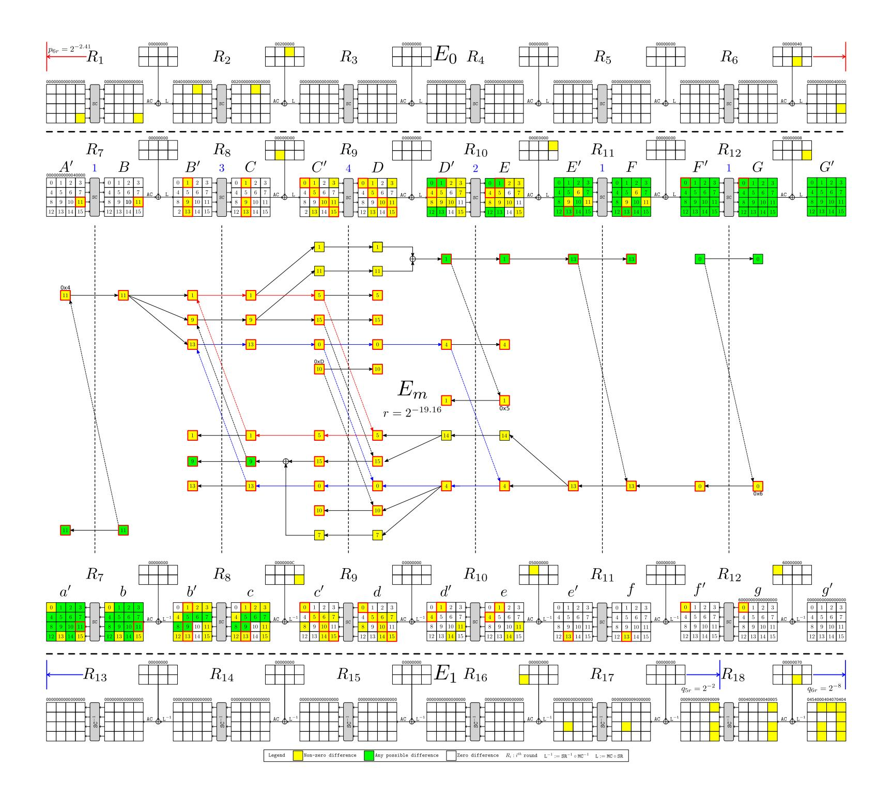

Figure 12: Boomerang distinguisher I for 18 rounds of SKINNY-64-128 with the form 6+6+6

provide a formula to theoretically evaluate the probability for the 4-round intermediate part including rounds  $R_8, R_9, R_{10}$ , and  $R_{11}$ . To this end, note that the difference  $e'_{13}$  has not to be identical in two faces of boomerang. Thus, assuming that  $e'_{13,1}$  and  $e'_{13,2}$  represents the differences at position  $e'_{13}$ , in two sides of boomerang, we have:

$$\begin{split} p_m^{4r} &= 2^{-15 \cdot n} \cdot \sum_{d_{14}'} \sum_{C_9} \sum_{d_4'} \sum_{C_{13}} \sum_{d_{1,1}'} \sum_{d_{1,2}'} \sum_{e_{13,1}'} \sum_{e_{13,2}'} \sum_{D_4'} \mathrm{DBCT}(B_{11}, d_{14}') \cdot \mathrm{DDT}^2(B_{11}, C_9) \\ &\cdot \mathrm{BCT}(C_9, d_{14}') \cdot \mathrm{BCT}(C_{10}', d_4') \cdot \mathrm{DBCT}^{\vdash}(B_{11}, C_{13}, d_4') \\ &\cdot \mathrm{DDT}(C_{13}, D_4') \cdot \mathrm{LBCT}^{\dashv}(D_4', e_{13,1}', e_{13,2}', d_4') \\ &\cdot \mathrm{DDT}(d_{1,1}', e_1) \cdot \mathrm{DDT}(d_{1,2}', e_1) \cdot (\mathrm{DDT}(d_{14}', e_{13,1}') + \mathrm{DDT}(d_{14}', e_{13,2}')) = 2^{-13.73}, \end{split}$$

where n = 4,  $B_{11} = 2$ ,  $C'_{10} = D$ ,  $e_1 = 5$ , and  $f_{13} = 2$ . Based on the experimental evaluations,  $p_m^{4r} = 2^{-13.89}$  which is very close to the provided theoretical value. It should be noted that, providing an accurate formula for high number of rounds in which the clustering effect in the middle part can be considered, is not only complicated, but also evaluating such a formula in our boomerang distinguishers is a computationally hard problem, especially for 8-bit versions of SKINNY. In conclusion, to avoid the complicated formulas, and with the aim of providing a more accurate bound, we switch to the experimental approach.

As illustrated in Figure 12, the lower crossing differences after 6 rounds are not enough

{28}------------------------------------------------

random, as there are still nonzero differences in state *a* ′ . On the other hand, four rounds ahead and four rounds behind the 6-round *Em*, are fully passive, and we can be sure that there does not exist dependency out of the 6-round middle part, as after propagating the lower and upper differential trails by four more rounds forwards and backward, the crossing differences can be seen as perfectly uniform. Note that the input and output differences of *E<sup>m</sup>* in [Figure 12](#page-27-0) are imposed by the tweakey differences. Given that, the tweakey schedule is linear, and the master tweakey difference is fixed, the only possible combination for the input/output differences of *E<sup>m</sup>* in [Figure 12,](#page-27-0) is ∆*X*<sup>6</sup> = 0000000000040000*,* ∇*X*<sup>12</sup> = 0000000000000000. Therefore, by fixing the input/output differences of *Em*, by ∆*X*6, and ∇*X*<sup>12</sup> respectively, we can simply evaluate the experimental probability of the 6-round middle part.

To assess the empirical probability of intermediate *E<sup>m</sup>* with 6 rounds in [Figure 12,](#page-27-0) we chose a tweakey at random following the pseudo-code in [Appendix I,](#page-50-2) we perform 2 26 boomerang queries. We repeat this test for 1000 randomly chosen tweakey and count the average number of right quartets. Accordingly, the probability of *E<sup>m</sup>* is 2 <sup>−</sup>19*.*<sup>16</sup>. For the full 18-round distinguisher, taking into account the clustering effect, the probability of the first and last 6 rounds can be simply calculated using the automatic methods based on MILP/SAT which are *p* = 2<sup>−</sup>2*.*<sup>41</sup> and *q* = 2<sup>−</sup><sup>8</sup> , respectively. In conclusion, a lower bound for the probability of full 18-round boomerang distinguisher I for SKINNY-64-128 is *p* 2 *q* 2 *r* = 2<sup>−</sup>39*.*<sup>98</sup>. We experimentally verified the correctness of this bound. To do so, we accomplished several random experiments such that each experiment includes 2 <sup>41</sup> random boomerang queries in total, and computed the average number of returned boomerangs. More precisely, to accomplish an experiment consisting of 2 <sup>41</sup> random boomerang queries, we performed 512 parallel experiments, each of which includes 2 16 bunches of 2 <sup>16</sup> random boomerang queries where a random fixed tweakey was used in each bunch and a random plaintext was used in every single query. As a result, we observed that about 3.71 boomerangs return on average. [Table 22](#page-54-0) provides a right quartet for this distinguisher.

The boomerang distinguisher I for 18 rounds of SKINNY-64-128 can be extended one round backward, to construct a 19-round boomerang distinguisher, whose specification is provided in [Table 10,](#page-28-0) which improves the previous results by one round. Also, as it can be seen in [Figure 12,](#page-27-0) removing the last round of 18-round boomerang distinguisher I for SKINNY-64-128, results in a 17-round boomerang distinguisher with probability 2 −27*.*98 , which is better than the 17-round boomerang distinguisher proposed in [\[LGS17\]](#page-43-3), in terms of probability.

**Table 10:** Specification of boomerang distinguisher I for 19 rounds of SKINNY-64-128

<span id="page-28-0"></span>

| = 6, p = 2−9<br>, q = 2−8<br>, r = 2−19.16, p2<br>.q2<br>.r = 2−53.16<br>r0<br>= 7, rm<br>= 6, r1 |                  |      |                  |
|---------------------------------------------------------------------------------------------------|------------------|------|------------------|
| ∆TK1                                                                                              | C000000000000000 | ∆TK2 | F000000000000000 |
| ∆X0                                                                                               | 2000001001001000 | ∆X7  | 0000000000040000 |
| ∇TK1                                                                                              | 0000400000000000 | ∇TK2 | 0000700000000000 |
| ∇X13                                                                                              | 0000000000000000 | ∇X19 | 0454000404070404 |

As mentioned before, to find a boomerang distinguisher for 18 rounds of SKINNY-128- 256, we divide it into three 6-round parts and then look for the best differential trails for *E*<sup>0</sup> and *E*1, satisfying the input/output activeness pattern of the discovered *E<sup>m</sup>* in boomerang distinguisher I for SKINNY-64-128. Due to the structural similarity between the SKINNY-64-128 and SKINNY-128-256, we found an 18-round boomerang distinguisher for SKINNY-128-256 with the same activeness pattern as 18-round boomerang distinguisher I for SKINNY-64-128. The large block size of SKINNY-128-256 lets us to extend the discovered boomerang distinguisher I for SKINNY-128-256 up to 21 rounds of this cipher, which improves the previous distinguisher by two rounds. The specification of boomerang distinguisher I

{29}------------------------------------------------

#### **Boomerang Distinguisher I for** SKINNY**-64-192 and** SKINNY**-128-384**

[Table 11](#page-29-0) describes the specification of boomerang distinguisher I for 22 rounds of SKINNY-64-192, and [Figure 13](#page-30-0) illustrates the upper and lower differential trails of this distinguisher. *E*<sup>0</sup> and *E*<sup>1</sup> are composed of the first and last 8 rounds, respectively, and the 6-round middle part has been considered as *Em*. It can be seen that the activeness pattern in the middle part of this distinguisher is exactly the same as the activeness pattern of the middle part in boomerang distinguisher I for SKINNY-64-128.

Next, we show that *E<sup>m</sup>* in [Figure 13,](#page-30-0) contains entire dependency between the upper and lower differential trails. The propagation of lower differences with probability 1 over the *E<sup>m</sup>* in [Figure 13,](#page-30-0) shows that there are still non-zero differences even after 6 rounds. Hence, the upper and lower differential trails are dependent in *Em*. On the other hand, 6 rounds before and after *Em*, are passive and the upper and lower crossing differences are uniformly distributed after 6 rounds propagation in forward and backward directions, respectively. Consequently, *E<sup>m</sup>* contains entire dependency between the upper and lower differential trails in [Figure 13.](#page-30-0) Given that the input/output differences of the middle part *E<sup>m</sup>* are induced from the tweakey differences and therefore, are fixed, we experimentally evaluate the probability of the middle part, for the fixed input/output differences shown in [Figure 13.](#page-30-0) Our experimental evaluation follows the pseudo-code given in [Appendix I,](#page-50-2) where we chose a tweakey at random and then perform *N* = 2<sup>26</sup> boomerang queries. After iteration of this test for 1000 randomly chosen tweakey we count the average number of right quartets. Next, taking into account the clustering effect, we compute *p* and *q* which are given in [Table 11.](#page-29-0) Lastly, using the *p* 2 *q* 2 *r* formula we provide a lower bound for the probability of boomerang distinguisher. We also experimentally verified the correctness of the constructed distinguisher. To do so, we performed several experiments each of which consists of 2 <sup>40</sup> boomerang queries where a new random tweakey is used for each bunch of 2 <sup>20</sup> queries, and observed that about 2*.*26 right quartets are discovered on average. [Table 23](#page-55-0) provides a right quartet satisfying the boomerang distinguisher I for SKINNY-64-192.

<span id="page-29-0"></span>**Table 11:** Specification of boomerang distinguisher I for 22 rounds of SKINNY-64-192. ∆*TK* = ∆*TK*1||∆*TK*2||∆*TK*3, and ∇*TK* = ∇*TK*1||∇*TK*2||∇*TK*3

| = 8, p = 2−2.41, q<br>= 2−7<br>, r = 2−20.02, p2<br>.r = 2−38.84<br>.q2<br>r0<br>= 8, rm<br>= 6, r1 |                                                    |      |                  |
|-----------------------------------------------------------------------------------------------------|----------------------------------------------------|------|------------------|
| ∆TK                                                                                                 | 0000000001000000 000000000B000000 0000000008000000 |      |                  |
| ∆X0                                                                                                 | 0000000000000200                                   | ∆X8  | 00000000000A0000 |
| ∇TK                                                                                                 | 0000000000200000 0000000000300000 0000000000D00000 |      |                  |
| ∇X14                                                                                                | 0000000000000000                                   | ∇X22 | 5605060000450605 |

Boomerang distinguisher I for SKINNY-64-192, can be extended one round backward, which results in a 23-round boomerang distinguisher whose specification is given by [Table 12,](#page-29-1) whereas the best previous boomerang distinguisher for 22 rounds of SKINNY-64- 192 in [\[LGS17\]](#page-43-3), can't be extended for 23 rounds of this version.

**Table 12:** Specification of boomerang distinguisher I for 23 rounds of SKINNY-64-192

<span id="page-29-1"></span>

| r0   | = 8, p = 2−9.41, q<br>= 9, rm<br>= 6, r1           | = 2−7 | , r = 2−20.02, p2<br>.q2<br>.r = 2−52.84 |
|------|----------------------------------------------------|-------|------------------------------------------|
| ∆TK  | 0100000000000000 0B00000000000000 0800000000000000 |       |                                          |
| ∆X0  | 0400100000010010                                   | ∆X9   | 00000000000A0000                         |
| ∇TK  | 0020000000000000 0030000000000000 00D0000000000000 |       |                                          |
| ∇X15 | 0000000000000000                                   | ∇X23  | 5605060000450605                         |

In the same way, we also found a boomerang distinguisher for 22 rounds of SKINNY-128-384 with the same activeness pattern as boomerang distinguisher I for 22 rounds of

{30}------------------------------------------------

<span id="page-30-0"></span>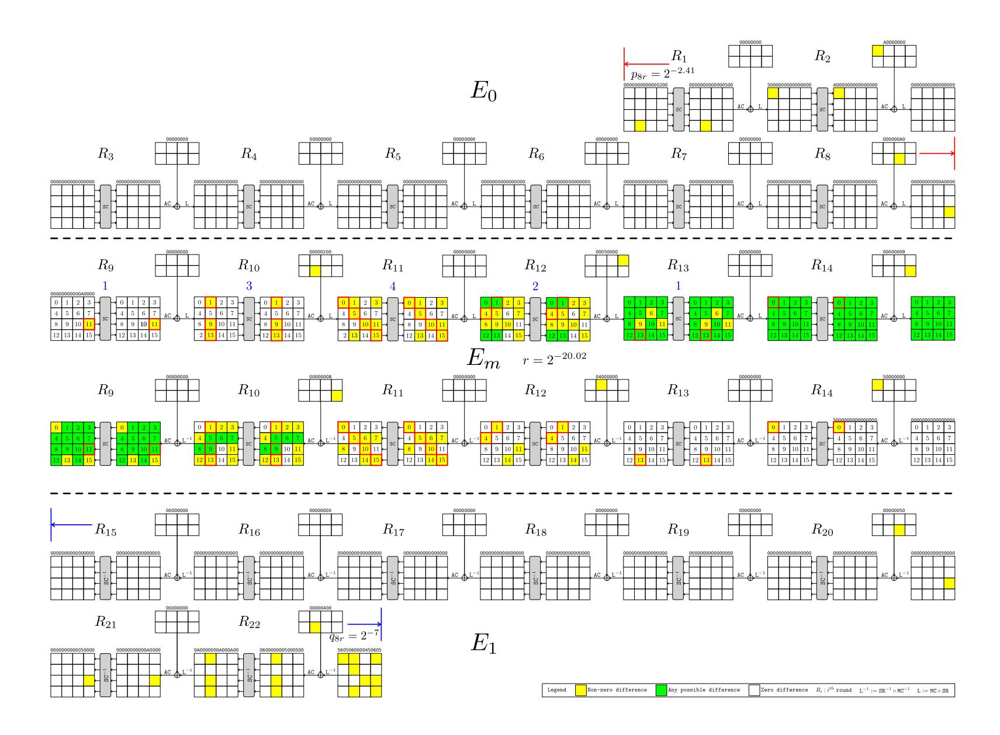

Figure 13: Boomerang distinguisher I for 22 rounds of SKINNY-64-192 with the form 8+6+8

SKINNY-64-192. The large block size of SKINNY-128-384, allows us to extend the discovered boomerang distinguisher I for 22 rounds of SKINNY-128-384, up to 25 rounds of this cipher, whereas the best previous boomerang distinguisher of this variant in [LGS17], can be extended up to 24 rounds. Table 19 describes the specifications of boomerang distinguisher I for 22 rounds of SKINNY-128-384. Thanks to the high probability of boomerang distinguisher I for 22 rounds of SKINNY-128-384, we could experimentally verify it. Our experimental verification follows the same configuration as the experimental verification of boomerang distinguisher I for 18 rounds of SKINNY-64-128. Table 24 represents one of the right quartets that were discovered during our experiments.

#### 6.3 Boomerang Distinguisher II for SKINNY-64-128 and SKINNY-128-256

Throughout our search for boomerang distinguishers of SKINNY, we discovered a boomerang distinguisher which was a little better than boomerang distinguisher I for SKINNY-64-128 and SKINNY-128-256, in terms of probability, which is introduced here as boomerang distinguisher II for these variants of SKINNY. Due to our strategy to search for boomerang distinguishers of SKINNY, the activeness pattern of the middle part in boomerang distinguisher II is also the same for 18 rounds of SKINNY-64-128 and SKINNY-128-256. Therefore, we represent both of them in Figure 14.

In Figure 14, the hex numbers inside the squares represent the exact differences of upper and lower differential trails in boomerang distinguisher II for SKINNY-128-256, whereas the hex number at the top of the state arrays represent the exact difference of upper and lower differential trails in boomerang distinguisher II for SKINNY-64-128. As illustrated in Figure 14, four rounds before and after  $E_m$ , are fully passive which shows  $E_m$  contains entire dependency between the upper and lower differential trails. A lower bound can be

{31}------------------------------------------------

<span id="page-31-1"></span>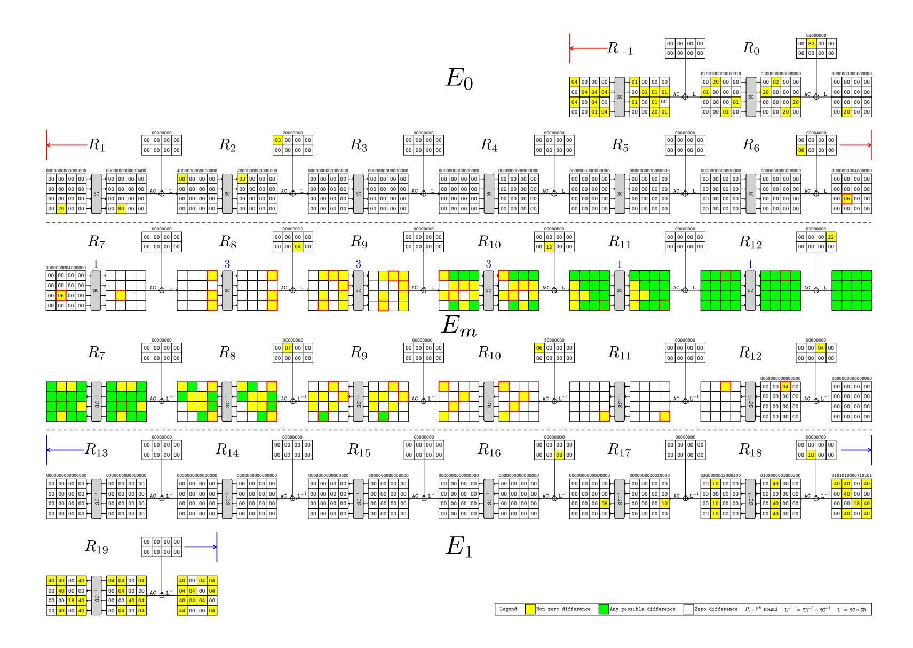

**Figure 14:** Boomerang distinguisher II for 18 and 19 rounds of SKINNY-64-128, and 18 to 21 rounds of SKINNY-128-256

computed for the probability of this distinguisher as before. As it is shown in [Figure 14,](#page-31-1) the 18-round boomerang distinguisher II for SKINNY-64-128 can be extended one round backward to construct a 19-round boomerang distinguisher for this variant of SKINNY. Similarly, the boomerang distinguisher II for SKINNY-128-256 can be extended up to 21 rounds of this variant. The full specification of boomerang distinguisher II for SKINNY-64- 128 and SKINNY-128-256 are given in [Table 20](#page-53-0) and [Table 21,](#page-54-1) respectively. Following the same configuration as the empirical verification of boomerang distinguisher I for 18 rounds of SKINNY-64-128, we experimentally verified the correctness of boomerang distinguisher II for 18 rounds of SKINNY-128-256. [Table 25](#page-55-2) represents one of the right quartets discovered during our experiments. It is worth noting that the boomerang distinguisher II for 18 rounds of SKINNY-128-256 is the first practical boomerang distinguisher for 18 rounds of SKINNY-128-256 that can be verified practically without consuming too much computing power.

## <span id="page-31-0"></span>**7 Rectangle Attacks on Reduced-Round** SKINNY **and** CRAFT

In this section, based on the new distinguishers introduced in the previous section for SKINNY, i.e. distinguisher I/II, and the 14-round boomerang distinguisher of CRAFT in [Figure 10,](#page-22-1) we present improved related-tweakey rectangle attacks on reduced SKINNY and CRAFT. Through this section, we follow the generalized framework for key recovery which has been recently proposed by Zhao *et al.* [\[ZDM](#page-44-1)<sup>+</sup>20], based on the same notations as much as possible. Hence, we define *E<sup>b</sup>* as a part of the cipher when backtracking the trail from the input difference of the boomerang distinguisher in backward direction under related-tweakey difference ∆*TK* for *n<sup>b</sup>* round(s). Similarly, we can define *E<sup>f</sup>* as a part 

{32}------------------------------------------------

of the cipher when propagating the trail from the output difference of the boomerang distinguisher in forward direction under related-tweakey difference  $\nabla TK$  for  $n_f$  round(s). Each cell has c bits and we use  $r_b$  (resp.  $r_f$ ) to denote the number of unknown bits in the input difference of  $E_b$  (resp. output difference of  $E_f$ ). The notation  $m_b$  (resp.  $m_f$ ) is used to denote the number of involved bits of the sub-tweaks in  $E_b$  (resp.  $E_f$ ). To have s quartets satisfying the distinguisher, we need s structures of plaintexts where for each structure we assign all possible values to the unknown cells of the plaintexts ( $r_b$  bits) and we also should have  $s = \sqrt{s} \cdot 2^{n/2-r_b} / \sqrt{p^2 \cdot r \cdot q^2}$ . The number of messages queried under each related-tweakey is defined as  $s = s \cdot 2^{n/2-r_b}$ .

## <span id="page-32-1"></span>7.1 Related-Tweakey Rectangle Attack on Reduced-Round SKINNY-64-192

Through the attacks on SKINNY-64-192 and other variants, we use the below properties of SKINNY [ZDM<sup>+</sup>20, SMB18]:

- Given that the round-tweak is XORed with internal state after the SC layer and also AC, SR and MC layers are linear, we can do key recovery at  $Y_0$  of  $E_b$  by defining  $\Delta Y_0 = SR^{-1} \circ MC^{-1}(\Delta_1) \oplus \Delta T K_0$ , where  $\Delta_1$  is the difference at the input of the boomerang distinguisher (see Figure 15). Hence, it does not necessary to guess this round's sub-tweak.
- Similarly we can start the key recovery attack at  $W_{-n_b+1}$  of  $E_b$ , by defining the equivalent tweak ETK by using  $ETK = MC \circ SR(TK_{r_b-1})$ .
- Given the ciphertext C, we can decrypt MC and SR layers of the last round of  $E_f$ . Hence, we use  $SR^{-1} \circ MC^{-1}(C)$  for the key recovery attack. For the last two rows that are not affected by the sub-tweak, we can also invert SC layer also.

Besides we recall the below lemma from [ABC+17, LGS17]:

**Lemma 1.** For the SKINNY's S-box, the equation  $S(x + \Delta_i) + S(x) = \Delta_o$  has one solution x on average for  $\Delta_i, \Delta_o \neq 0$ .

Following Figure 15, we prefix three rounds at the beginning and three rounds at the end of the distinguisher I for SKINNY-64-192, which includes 23 rounds, to conduct a related-tweakey boomerang attack on 29 rounds of the cipher. Hence,  $E_b$  includes rounds -2, -1, 0 and  $E_f$  includes rounds 24, 25, 26. In the attack process,  $r_b = 13 \cdot c$ ,  $m_b = 16 \cdot c$ ,  $r_f = 16 \cdot c$  and  $m_f = 20 \cdot c$ , where c = 4. We should satisfy  $y = \sqrt{s} \cdot 2^{n/2 - r_b} / \sqrt{p^2 \cdot r \cdot q^2}$  which is  $y = 2 \cdot 2^{32 - 52} / \sqrt{2^{-52.84}} = 2^{7.42}$  for s = 4 and  $M = y \cdot 2^{r_b} = 2^{59.42}$ . The attack procedure is as follows:

- 1. In data collection, we construct y structures at  $W_{-2}$  of  $E_b$ , each structure include  $2^{rb}$  possible values for the unknown cells to achieve  $M = y \cdot 2^{r_b}$  different plaintexts. Next, each plaintext (P) is encrypted under four related tweaks  $TK^1$ ,  $TK^2 = \Delta TK \oplus TK^1$ ,  $TK^3 = \nabla TK \oplus TK^1$  and  $TK^4 = \Delta TK \oplus TK^3$  to receive  $(C_1, C_2, C_3, C_4)$ . Then,  $(P, C_1)$ ,  $(P, C_2)$ ,  $(P, C_3)$  and  $(P, C_4)$  are respectively stored in four separate lists as  $L_1, L_2, L_3$  and  $L_4$ , where  $L_2$  and  $L_4$  are stored in hash tables  $H_1$  and  $H_2$  respectively, indexed by the  $r_b$  bits of plaintexts.
- <span id="page-32-0"></span>2. We guess a value for the  $m_b$  bits of the sub-tweaks of  $TK^1$  that are involved in  $E_b$  and do as follows:
  - (a) We create two sets  $S_1$  and  $S_2$  and for each pair  $(P_1, C_1) \in L_1$ , using the guessed bits of  $TK^1$  we partially encrypt it up to  $Y_0$ , XOR it with the expected

{33}------------------------------------------------

<span id="page-33-0"></span>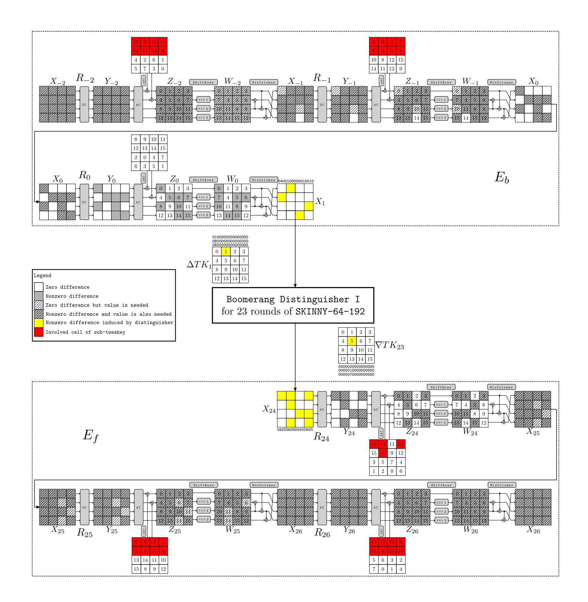

**Figure 15:** A 29-round key recovery attack against SKINNY-64-192

intermediate difference at *Y*0, i.e. ∆*Y*0, decrypt it partially using *TK*<sup>2</sup> = *TK*<sup>1</sup> ⊕ ∆*TK* to achieve *P*<sup>2</sup> and find related (*P*2*, C*2) ∈ *H*<sup>1</sup> and store (*P*1*, C*1)*,*(*P*2*, C*2) in the set *S*1. We do a similar approach for *P*<sup>3</sup> ∈ *L*<sup>3</sup> and *P*<sup>4</sup> ∈ *L*4*/H*<sup>2</sup> and store the related pairs (*P*3*, C*3)*,*(*P*4*, C*4) in the set *S*2. Hence, the size of each set *S*<sup>1</sup> and *S*<sup>2</sup> is *M* = *y* · 2 *<sup>r</sup><sup>b</sup>* = 2<sup>59</sup>*.*<sup>42</sup>. It is clear:

$$\{\forall ((P_1, C_1), (P_2, C_2)) \in S_1 : (P_1, C_1) \in L_1, (P_2, C_2) \in L_2, E_{bTK^1}(P_1) \oplus E_{bTK^2}(P_2) = \Delta Y_0 \}$$

and

$$\{\forall ((P_3, C_3), (P_4, C_4)) \in S_2 : (P_3, C_3) \in L_3, (P_4, C_4) \in L_4, E_{bTK^3}(P_3) \oplus E_{bTK^4}(P_4) = \Delta Y_0\}$$

<span id="page-33-1"></span>(b) Assuming the known bits at the output difference includes *n* − *r<sup>f</sup>* bits, while we are propagating from ∇<sup>4</sup> as the output difference of the distinguisher toward

{34}------------------------------------------------

the ciphertext, we use those  $n-r_f$  bits of  $C_1$  and  $n-r_f$  bits of  $C_2$  to put  $S_1$  to hash table  $H_3$ . Next, for any  $((P_3,C_3),(P_4,C_4))\in S_2$  we try to find an entry  $((P_1,C_1),(P_2,C_2))\in H_3$  such that  $(C_1,C_3)$  and  $(C_2,C_4)$  collide in  $n-r_f$  known bits. We remove any entry in  $S_2/H_3$  that does not collide at all. The remaining quartets will be about  $M^2\cdot 2^{-2(n-r_f)}$ . However, in our case of SKINNY-64-192,  $n-r_f=0$  and the remaining quartets will be  $(2^{59.42})^2\cdot 2^{2\cdot(0)}=2^{118.84}$ .

- (c) We then initialize a list of  $2^{m_f}$  counters, i.e.  $2^{80}$ , each of them corresponds to a choice for the active  $m_f$  bits of sub-tweaks of the last three rounds.
- <span id="page-34-2"></span><span id="page-34-1"></span><span id="page-34-0"></span>(d) For each surviving quartet from Step 2b, we do the key recovery step by step as follows:
  - i. We partially decrypt the ciphertext pairs  $(C_1, C_3)$  and determine their related  $Z_{26}$  sates. Since the last two rows of  $Z_{26}$  are not affected by  $TK_{26}$ , we can also determine  $X_{26}[8 \sim 15]$ . Given that  $\Delta X_{26}[1] = \Delta X_{26}[5] = \Delta X_{26}[13]$  and we know  $\Delta Y_{26}[1]$  and  $\Delta Y_{26}[5]$ , so on average we achieve one solutions for each of TK[12] and TK[9]. Besides,  $\Delta X_{26}[7] = \Delta X_{26}[11] \oplus \Delta X_{26}[15]$  and we know  $\Delta Y_{26}[7]$ . Therefore, on average we achieve one solutions for TK[10].
  - ii. Next, we partially decrypt the ciphertext pairs  $(C_2, C_4)$ , and in a similar approach we determine the candidates for TK[9], TK[10] and TK[12] and determine whether they are matched with the retrieved values in the previous steps. It happens with the probability of  $2^{-12}$  and about  $2^{-12} \cdot 2^{118.84} = 2^{106.84}$  quartets are remaining.
  - iii. Given TK[12] and TK[9] we can decrypt the second column of  $Y_{26}$  and determine  $\Delta Y_{25}[1]$ ,  $\Delta Y_{25}[4]$ ,  $\Delta Y_{25}[11]$  and  $\Delta Y_{25}[14]$  for any quartet.
  - iv. Next, we guess TK[14] and partially decrypt the first column of  $Y_{26}$  and determine  $Y_{25}[13]$  for any quartet.
  - v. For any right pair of  $(C_1, C_3)$  and  $(C_2, C_4)$ , we should have  $\Delta X_{25}[13] = \Delta X_{25}[1]$ . On the other hand, for any  $(C_1, C_3)$  and  $(C_2, C_4)$  we have  $Y_{25}[13]$  and  $\Delta Y_{25}[1]$  and we can determine  $\Delta X_{25}[1]$ . Given  $\Delta X_{25}[1]$  and  $\Delta Y_{25}[1]$ , for both  $(C_1, C_3)$  and  $(C_2, C_4)$  of any quartets, we should receive identical solution for TK[6]. Therefore the remaining quartets will be  $2^4 \cdot 2^{106.84} \cdot 2^{-4} = 2^{106.84}$ .
  - vi. Given TK[10], we can partially decrypt the last column of  $Y_{26}$  and determine  $\Delta Y_{25}[3]$ ,  $\Delta Y_{25}[6]$  and  $Y_{25}[9]$  for any quartet.
  - vii. Next, we guess TK[15] and partially decrypt the third column of  $Y_{26}$  and determine  $\Delta Y_{25}[2]$ ,  $\Delta Y_{25}[5]$  and  $Y_{25}[8]$  for any quartet.
  - viii. For any right pair of  $(C_1, C_3)$  and  $(C_2, C_4)$ , we should have  $\Delta X_{25}[5] = \Delta X_{25}[9] \oplus \Delta X_{25}[13]$ . Hence, given that we have  $Y_{25}[9]$ ,  $Y_{25}[13]$  and  $\Delta Y_{25}[5]$  for any  $(C_1, C_3)$  and  $(C_2, C_4)$  we can determine  $\Delta X_{25}[9]$ ,  $\Delta X_{25}[13]$  and  $\Delta X_{25}[5]$ . Given  $\Delta X_{25}[5]$  and  $\Delta Y_{25}[5]$  we should receive identical solution for TK[0], for both  $(C_1, C_3)$  and  $(C_2, C_4)$  of any quartet. Therefore the remaining quartets will be  $2^4 \cdot 2^{106.84} \cdot 2^{-4} = 2^{106.84}$ .
  - ix. Next, we guess TK[8] and partially decrypt the last column of  $Y_{26}$  and determine  $Y_{25}[12]$  the remaining quartets.
  - x. For any right pair of  $(C_1, C_3)$  and  $(C_2, C_4)$ , we should have  $\Delta X_{25}[4] = \Delta X_{25}[8] \oplus \Delta X_{25}[12]$ . Hence, given that we have  $Y_{25}[12]$ ,  $Y_{25}[8]$  and  $\Delta Y_{25}[4]$  for any  $(C_1, C_3)$  and  $(C_2, C_4)$  we can determine  $\Delta X_{25}[4]$ . Given  $\Delta X_{25}[4]$  and  $\Delta Y_{25}[4]$  we should receive identical solution for TK[7], for both  $(C_1, C_3)$  and  $(C_2, C_4)$  of any quartet. Therefore the remaining quartets will be  $2^4 \cdot 2^{106.84} \cdot 2^{-4} = 2^{106.84}$ .

{35}------------------------------------------------

- xi. Next, we guess TK[13] and partially decrypt the third column of  $Y_{26}$  to determine  $Y_{25}[15]$  and  $X_{25}[15]$  for any quartet.
- xii. For any right pair of  $(C_1, C_3)$  and  $(C_2, C_4)$ , we should have  $\Delta X_{25}[15] = \Delta X_{25}[3]$ . Hence, given that we have  $X_{25}[15]$  and  $\Delta Y_{25}[3]$  for any  $(C_1, C_3)$  and  $(C_2, C_4)$  we should receive identical solution for TK[2], for both  $(C_1, C_3)$  and  $(C_2, C_4)$  of any quartet. Therefore the remaining quartets will be  $2^4 \cdot 2^{106.84} \cdot 2^{-4} = 2^{106.84}$ .
- xiii. Similarly, we guess TK[11] and partially decrypt the last first column of  $Y_{26}$  to determine  $\Delta Y_{25}[0]$ ,  $\Delta Y_{25}[7]$  and  $Y_{25}[10]$  for any quartet.
- <span id="page-35-0"></span>xiv. For any right pair of  $(C_1, C_3)$  and  $(C_2, C_4)$ , we should have  $\Delta X_{25}[15] = \Delta X_{25}[7]$ . Hence, given that we have  $X_{25}[15]$  and  $\Delta Y_{25}[7]$  for any  $(C_1, C_3)$  and  $(C_2, C_4)$  we should receive identical solution for TK[4], for both  $(C_1, C_3)$  and  $(C_2, C_4)$  of any quartet. Therefore the remaining quartets will be  $2^4 \cdot 2^{106.84} \cdot 2^{-4} = 2^{106.84}$
- xv. Then we partially decrypt the second column of  $Z_{25}$  of  $(C_1, C_3)$  to determine the value and differences at  $Z_{24}[1]$ ,  $Z_{24}[4]$ ,  $Z_{24}[11]$  and  $Z_{24}[14]$ . Given that we have the difference value at  $X_{24}[1]$  we achieve one solution for each of TK[14]. We also know the expected difference of  $X_{24}[11]$  and a wrong key will remain with the probability of  $2^{-4}$ . Hence, about  $2^{-4} \cdot 2^{106.84} = 2^{102.84}$  quartets are remaining.
- xvi. We also partially decrypt the second column of  $Z_{25}$  of  $(C_2, C_4)$  to determine the value and differences at  $Z_{24}[1]$ ,  $Z_{24}[4]$ ,  $Z_{24}[11]$  and  $Z_{24}[14]$  and determine whether the differences at  $X_{24}[1]$  and  $X_{24}[11]$  are satisfied. Hence, about  $2^{-8} \cdot 2^{102.84} = 2^{94.84}$  quartets are remaining.
- xvii. We then partially decrypt the last column of  $Z_{25}$  of  $(C_1, C_3)$  to determine the values and differences at  $Z_{24}[3]$ ,  $Z_{24}[6]$ ,  $Z_{24}[9]$  and  $Z_{24}[12]$ . Given that we have the difference value at  $X_{24}[3]$  we achieve one solution for TK[10].
- xviii. Next, we partially decrypt the last column of  $Z_{25}$  of  $(C_2, C4)$  to determine the values and differences at  $Z_{24}[3]$ ,  $Z_{24}[6]$ ,  $Z_{24}[9]$  and  $Z_{24}[12]$  and determine whether the differences at  $X_{24}[3]$  is satisfied. Hence, about  $2^{-4} \cdot 2^{94.84} = 2^{90.84}$  quartets are remaining.
- xix. We guess TK[5] and partially decrypt the first column of  $Z_{25}$  of  $(C_1, C_3)$  to determine the value and differences at  $Z_{24}[0]$ ,  $Z_{24}[7]$ ,  $Z_{24}[10]$  and  $Z_{24}[13]$ . Given that we have the difference values at  $X_{24}[0]$  we achieve one solution for TK[13]. Besides, we have the difference at  $X_{24}[10]$  and  $X_{24}[13]$  and the probability of mapping the values of  $X_{24}[10]$  and  $X_{24}[13]$  for  $(C_1, C_2)$  to that differences will happen with the probability of  $2^{-8}$ . Hence, about  $2^4 \cdot 2^{90.84} \cdot 2^{-8} = 2^{86.84}$  quartets are remaining.
- xx. Then, we partially decrypt the first column of  $Z_{25}$  of  $(C_2, C_4)$  to determine the values and differences at  $Z_{24}[0]$ ,  $Z_{24}[7]$ ,  $Z_{24}[10]$  and  $Z_{24}[13]$  and determine whether the differences at  $X_{24}[0]$ ,  $X_{24}[7]$ ,  $X_{24}[10]$ and  $X_{24}[13]$  are satisfied. Hence, about  $2^{-12} \cdot 2^{86.84} = 2^{74.84}$  quartets are remaining.
- xxi. We guess TK[3] and TK[1] and partially decrypt the third column of  $Z_{25}$  of  $(C_1, C_3)$  to determine the value and differences at  $Z_{24}[2]$ ,  $Z_{24}[5]$ ,  $Z_{24}[8]$  and  $Z_{24}[15]$ . Given that we have the difference values at  $X_{24}[5]$  we achieve one solution for TK[8] and since we also have the difference at  $X_{24}[15]$  the probability of mapping the values of  $X_{24}[15]$  for  $(C_1, C_2)$  to that differences will happen with the probability of  $2^{-4}$ . Hence, about  $2^8 \cdot 2^{74.84} \cdot 2^{-4} = 2^{78.84}$  quartets are remaining.
- <span id="page-35-1"></span>xxii. Then, we partially decrypt the third column of  $Z_{25}$  of  $(C_2, C_4)$  to determine the values and differences at  $Z_{24}[2]$ ,  $Z_{24}[5]$ ,  $Z_{24}[8]$  and  $Z_{24}[15]$  and determine

{36}------------------------------------------------

whether the differences at  $X_{24}[2]$ ,  $X_{24}[5]$ ,  $X_{24}[8]$  and  $X_{24}[15]$  are satisfied. The remaining quartets are about  $2^{-8} \cdot 2^{78.84} = 2^{70.84}$ , to be used to count for the 80-bit sub-tweaks involved in  $E_f$ .

<span id="page-36-0"></span>xxiii. We select the first  $2^{m_f-h}$  candidates for the  $m_f$  bits of the sub-tweaks and do exhaustive search for the remaining  $192 - m_b - h = 108$  bits of the master key based on each candidate, for h = 20.

xxiv. Go to item 2 if there is not the correct key.

Given that  $m_b = 64$  the amount of table look-ups are  $3 \cdot 2^{m_b} \cdot M = 2^{125.01}$ , to create the lists. To do the first filtering at Steps 2(d)i and 2(d)ii, we should do one round decryption for the survived quartets that are  $2^{118.84}$  quartets and costs  $2^{118.84} \cdot \frac{1}{29} = 2^{113.98}$  and should be repeated for any guess of  $m_b$ , leads to  $2^{177.98}$ . Next, through Steps 2(d)iii to 2(d)xiv we should do one round encryption which costs  $2^{106.84} \cdot \frac{1}{29} = 2^{101.99}$  and should be repeated for any guess of  $m_b$ , leads to  $2^{165.99}$ . We should do another round decryption for the survived quartets after Step 2(d)xiv through the rest of the attack, that are  $2^{102.84}$  quartets, and costs  $2^{102.84} \cdot \frac{1}{29} = 2^{97.99}$  and again should be repeated for any guess of  $m_b$ , leads to  $2^{161.99}$ . It is the dominant complexity of the rest of the attack up to the Step 2(d)xxii. In item 2(d)xxiii, the complexity is  $2^{m_b} \cdot 2^{192-m_b-h} = 2^{172}$ , for h = 20. Hence, the total time complexity will be almost  $2^{178}$ . The data complexity of the attack is  $4 \cdot M = 2^{61.42}$  chosen plaintexts. The memory complexity is  $4 \cdot M + M + 2^{m_f} = 5 \cdot 2^{59.42} + 2^{80} \approx 2^{80}$ . The signal/noise ratio is  $S_N = \frac{p^2 \cdot r \cdot q^2}{2^{-n}} = \frac{2^{-52.84}}{2^{-64}} = 2^{11.16}$  and the success probability is  $P_s = 0.976$ .

A similar attack can be conducted on other variants of SKINNY as well. Based on the parameter-set that is depicted in Table 13, a summary of the key recovery attacks has been presented in Table 1. Following this we achieved the below results:

- 1. We prefix two rounds at the beginning and two rounds at the end of the distinguisher II for SKINNY-64-128, which includes 19 rounds, to conduct a related-tweakey boomerang attack on 23 rounds of the cipher. In this process  $r_b = 8 \cdot 4$ ,  $m_b = 8 \cdot 4$ ,  $r_f = 13 \cdot 4$  and  $m_f = 12 \cdot 4$ . We should satisfy  $y = 2^{26.54}$  for s = 4 and it results  $M = 2^{58.54}$ . Given that  $m_b = 32$  the amount of table look-ups are  $2^{92.12}$ , to create the lists. To do the first filtering, based on the ciphertexts, we should inverse the last round's MC-layer which costs less than  $2^{56.01}$ . We should also do one round decryption for the survived quartets that are  $2^{93.08}$  quartets and costs  $2^{32} \cdot 2^{93.08} \cdot \frac{1}{23} = 2^{120.56}$ . In item 2(d)xxiii, the complexity is  $2^{m_b} \cdot 2^{128-m_b-h} = 2^{88}$ , for h = 40. Given that the complexity of the other steps are negligible, the time complexity will be approximately  $4M + 2^{120.56} + 2^{88} \approx 2^{120.7}$ . The data complexity of the attack is  $2^{60.54}$  chosen plaintexts. The memory complexity is  $5 \cdot 2^{58.54} + 2^{48} \approx 2^{60.9}$ . The signal/noise ratio is  $2^{12.92}$  and the success probability is  $P_s = 0.977$ .
- 2. We extend the 21-round boomerang distinguisher I against SKINNY-128-256 to 24 rounds key recovery attack. It worth noting that distinguisher II has better probability but distinguisher I provides lower total complexity in key recovery, based on our analysis. Through the attack, we prefix a round at the beginning and two rounds at the end of the distinguisher I for SKINNY-128-256, which includes 21 rounds, to conduct a related-tweakey boomerang attack on 24 rounds of the cipher. In this process  $r_b = 0$ ,  $m_b = 0$ ,  $r_f = 14 \cdot 8$  and  $m_f = 13 \cdot 8$ . In this attack, we have  $y = 2^{123.21}$  for s = 4 and  $M = 2^{123.21}$ . Given that  $m_b = 0$  the amount of table look-ups are  $2^{124.8}$ , to create the lists. To do the first filtering, based on the ciphertexts, we should inverse the last round's MC-layer and a cell of SC-layer which costs less than  $2^{120.63}$ . We should also do one round decryption for the survived quartets that are  $2^{214.43}$  quartets and costs  $2^{209.84}$ . In item 2(d)xxiii, the complexity is  $2^{168}$  for h = 88. Given that the complexity of the other steps are negligible, the time complexity will be

{37}------------------------------------------------

<span id="page-37-0"></span>**Table 13:** Summary of the used parameters through our key recovery attacks on the variants of SKINNY and CRAFT, where D,  $n_D$ ,  $n_b$  and  $n_f$  respectively denote the used distinguisher, the number of rounds of the distinguisher, the number of rounds appended and the number of rounds prepended.

| Scheme         | D         | nD | $n_b$ | $n_f$ | $r_b$ | $m_b$ | $r_f$ | $m_f$ | $p^2 \cdot r \cdot q^2$ | M            | h   |
|----------------|-----------|----|-------|-------|-------|-------|-------|-------|-------------------------|--------------|-----|
| SKINNY-64-128  | Table 20  | 19 | 2     | 2     | 32    | 32    | 52    | 48    | $2^{-51.08}$            | $2^{58.54}$  | 40  |
| SKINNY-64-192  | Table 12  | 23 | 3     | 3     | 52    | 64    | 64    | 80    | $2^{-52.84}$            | $2^{59.42}$  | 20  |
| SKINNY-128-256 | Table 18  | 21 | 1     | 2     | 0     | 0     | 112   | 104   | $2^{-116.43}$           | $2^{123.21}$ | 88  |
| SKINNY-128-384 | Table 19  | 25 | 3     | 2     | 104   | 120   | 128   | 120   | $2^{-116.59}$           | $2^{123.29}$ | 104 |
| CRAFT          | Figure 10 | 14 | 1     | 3     | 24    | 24    | 44    | 84    | $2^{-55.85}$            | $2^{60.92}$  | 72  |

approximately  $4M + 2^{209.84} + 2^{168} \approx 2^{209.85}$ . The data complexity of the attack is  $2^{125.21}$  chosen plaintexts. The memory complexity is  $5 \cdot 2^{123.21} + 2^{104} = 2^{125.54}$ . The signal/noise ratio is  $2^{11.57}$ , the success probability is  $P_s = 0.977$ .

3. We prefix three rounds at the beginning and two rounds at the end of the distinguisher I for SKINNY-128-384, which includes 25 rounds, to conduct a related-tweakey boomerang attack on 30 rounds of the cipher. In this process  $r_b = 13 \cdot 8$ ,  $m_b = 15 \cdot 8$ ,  $r_f = 16 \cdot 8$  and  $m_f = 15 \cdot 8$ . We should satisfy  $y = 2^{19.29}$  for s = 4 and  $M = 2^{123.29}$ . Given that  $m_b = 120$  the amount of table look-ups are  $2^{244.88}$ , to create the lists. We should also inverse the last round's MC-layer and a cell of SC-layer which costs less than  $2^{120.43}$ . We should also do one round decryption for the survived quartets that are  $2^{246.59}$  quartets and costs  $2^{120} \cdot 2^{246.59} \cdot \frac{1}{30} = 2^{361.68}$ . In item  $2^{120} \cdot 2^{120} \cdot 2^{120} \cdot 2^{120} \cdot 2^{120} \cdot 2^{120} \cdot 2^{120} \cdot 2^{120} \cdot 2^{120} \cdot 2^{120} \cdot 2^{120} \cdot 2^{120} \cdot 2^{120} \cdot 2^{120} \cdot 2^{120} \cdot 2^{120} \cdot 2^{120} \cdot 2^{120} \cdot 2^{120} \cdot 2^{120} \cdot 2^{120} \cdot 2^{120} \cdot 2^{120} \cdot 2^{120} \cdot 2^{120} \cdot 2^{120} \cdot 2^{120} \cdot 2^{120} \cdot 2^{120} \cdot 2^{120} \cdot 2^{120} \cdot 2^{120} \cdot 2^{120} \cdot 2^{120} \cdot 2^{120} \cdot 2^{120} \cdot 2^{120} \cdot 2^{120} \cdot 2^{120} \cdot 2^{120} \cdot 2^{120} \cdot 2^{120} \cdot 2^{120} \cdot 2^{120} \cdot 2^{120} \cdot 2^{120} \cdot 2^{120} \cdot 2^{120} \cdot 2^{120} \cdot 2^{120} \cdot 2^{120} \cdot 2^{120} \cdot 2^{120} \cdot 2^{120} \cdot 2^{120} \cdot 2^{120} \cdot 2^{120} \cdot 2^{120} \cdot 2^{120} \cdot 2^{120} \cdot 2^{120} \cdot 2^{120} \cdot 2^{120} \cdot 2^{120} \cdot 2^{120} \cdot 2^{120} \cdot 2^{120} \cdot 2^{120} \cdot 2^{120} \cdot 2^{120} \cdot 2^{120} \cdot 2^{120} \cdot 2^{120} \cdot 2^{120} \cdot 2^{120} \cdot 2^{120} \cdot 2^{120} \cdot 2^{120} \cdot 2^{120} \cdot 2^{120} \cdot 2^{120} \cdot 2^{120} \cdot 2^{120} \cdot 2^{120} \cdot 2^{120} \cdot 2^{120} \cdot 2^{120} \cdot 2^{120} \cdot 2^{120} \cdot 2^{120} \cdot 2^{120} \cdot 2^{120} \cdot 2^{120} \cdot 2^{120} \cdot 2^{120} \cdot 2^{120} \cdot 2^{120} \cdot 2^{120} \cdot 2^{120} \cdot 2^{120} \cdot 2^{120} \cdot 2^{120} \cdot 2^{120} \cdot 2^{120} \cdot 2^{120} \cdot 2^{120} \cdot 2^{120} \cdot 2^{120} \cdot 2^{120} \cdot 2^{120} \cdot 2^{120} \cdot 2^{120} \cdot 2^{120} \cdot 2^{120} \cdot 2^{120} \cdot 2^{120} \cdot 2^{120} \cdot 2^{120} \cdot 2^{120} \cdot 2^{120} \cdot 2^{120} \cdot 2^{120} \cdot 2^{120} \cdot 2^{120} \cdot 2^{120} \cdot 2^{120} \cdot 2^{120} \cdot 2^{120} \cdot 2^{120} \cdot 2^{120} \cdot 2^{120} \cdot 2^{120} \cdot$ 

#### 7.2 Single-Tweakey Rectangle Attack on CRAFT

Similar to the attack on SKINNY variants, described in Subsection 7.1 and based on almost the same notations whenever it is applicable, in this section we use the best boomerang distinguisher covering 14 rounds of CRAFT, to provide a key-recovery attack on 18 rounds of the cipher in the single-tweakey model as it is depicted in Figure 16.

Through the attack, given that the round-tweak is XORed with the internal state after the MC layer, we can ignore this layer and construct the structures of plaintexts on  $Y_i$  of the first round of  $E_b$ . Besides, given the ciphertexts, it is possible to decrypt the last round's SB and PN layers of  $E_f$ . Besides, the MC layer is linear and we can filter the ciphertexts at the  $X_i$  of the last round. Besides, we can verify the difference of the output of the distinguisher at  $W_i$  of the first round of  $E_f$ . Hence, it is not necessary to guess this round's sub-tweak, i.e. the first round of  $E_f$ .

Following Figure 16, we prefix a round at the beginning and three rounds at the end of the dedicated distinguisher for CRAFT, which includes 14 rounds, to conduct a related-tweakey boomerang attack on 18 rounds of the cipher. In this process  $r_b = 24$  bits,  $m_b = 24$  bits,  $r_f = 44$  bits and  $m_f = 84$  bits. However,  $m_f$  and  $m_b$  have 4 bits overlap  $(TK_0[13]$  which we highlighted it in purple) and the effective value of  $m_f = 80$  bits. In this attack, we have  $y = 2 \cdot 2^{32-24}/\sqrt{2^{-58.85}} = 2^{36.92}$  for s = 4 and  $M = y \cdot 2^{r_b} = 2^{60.92}$ . The attack procedure is as follows:

1. In data collection, we construct  $y = 2^{36.92}$  structures at  $Y_0$ , each structure include  $2^{rb}$  possible values for the unknown cells to achieve  $M = y \cdot 2^{r_b} = 2^{60.92}$  different

{38}------------------------------------------------

<span id="page-38-0"></span>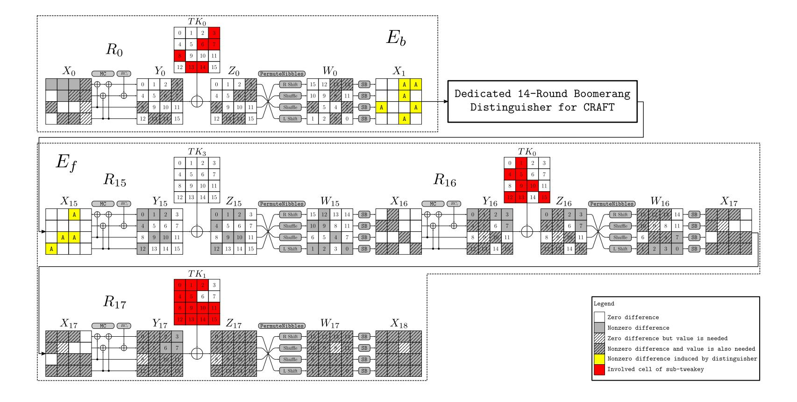

Figure 16: A 18-round key recovery attack against CRAFT

plaintexts. Next, each plaintext (P) is encrypted under tweaks TK to receive the ciphertext C. Then, (P, C) is stored in a list  $L_1$  and also stored in a hash table  $H_1$ , indexed by the  $r_b$  bits of plaintexts.

- <span id="page-38-3"></span><span id="page-38-2"></span><span id="page-38-1"></span>2. We guess a value for the  $m_b$  bits of the sub-tweaks that are involved in  $E_b$  and do as follows:
  - (a) For each pair  $(P_1, C_1) \in L_1$ , using the guessed sub-tweaks, we partially encrypt it up to  $X_1$ , XOR it with the intermediate difference at  $X_1$ , decrypt it partially using the guessed sub-tweaks to achieve  $P_2$  and find related  $(P_2, C_2) \in H_1$  and store  $(P_1, C_1), (P_2, C_2)$  in a set  $S_1$  that its size will be  $M = y \cdot 2^{r_b} = 2^{60.92}$ . It is clear:  $\forall ((P_1, C_1), (P_2, C_2)) \in S_1 : (P_1, C_1) \in L_1, (P_2, C_2) \in L_2, E_{bTK}(P_1) \oplus E_{bTK}(P_2) = \Delta_1$ .
  - (b) Assuming the known cells at the output difference includes  $n r_f = 20$  bits, while we are propagating from  $\nabla_4$  toward the ciphertext, we use those  $n r_f$  bits of  $C_1$  and  $n r_f$  bits of  $C_2$  to put  $S_1$  to hash table  $H_2$ . Next, for any  $((P_1, C_1), (P_2, C_2)) \in S_1$  we try to find a different entry  $((P_3, C_3), (P_4, C_4)) \in H_2$  such that  $(C_1, C_3)$  and  $(C_2, C_4)$  collide in  $n r_f$  known bits. We remove any entry in  $S_1/H_2$  that does not collide at all. The remaining quartets will be  $M^2 \cdot 2^{-2(n-r_f)}$ , i.e.  $(2^{60.92})^2 \cdot 2^{2 \cdot (-20)} = 2^{81.85}$ .
  - (c) We then initialize a list of  $2^{m_f}$  counters, i.e.  $2^{80}$ , each corresponds to a choice for the active  $m_f$  bits of sub-tweaks of the last two rounds.
  - (d) For each surviving quartet from Step 2b, we do the key recovery step by step as follows:
    - i. For any right pair  $(C_1, C_3)$ , the differences should satisfy  $\Delta Y_{16}[3] = \Delta Y_{16}[7] = \Delta Y_{16}[15]$ ,  $\Delta Y_{16}[2] = \Delta Y_{16}[10]$  and  $\Delta Y_{16}[0] = \Delta Y_{16}[12]$  and also respectively  $\Delta Z_{16}[3] = \Delta Z_{16}[7] = \Delta Z_{16}[15]$ ,  $\Delta Z_{16}[2] = \Delta Z_{16}[10]$  and  $\Delta Z_{16}[0] = \Delta Z_{16}[12]$ .
    - ii. We guess  $TK_1[11]$  and  $TK_1[14]$ , partially decrypt  $Z_{17}[11]$  and  $Z_{17}[14]$  to determine whether  $\Delta Z_{16}[7] = \Delta Z_{16}[3]$  for both  $(C_1, C_2)$  and  $(C_2, C_4)$ . Hence, about  $2^8 \cdot 2^{81.85} \cdot 2^{-8} = 2^{81.85}$  quartets are remaining.

{39}------------------------------------------------

- iii. We guess  $TK_1[4]$ ,  $TK_1[12]$  and  $TK_1[13]$ , partially decrypt  $Z_{17}[4]$  and  $Z_{17}[13]$  to determine whether  $\Delta Z_{16}[2] = \Delta Z_{16}[10]$  for both  $(C_1, C_2)$  and  $(C_2, C_4)$ . Hence, about  $2^{12} \cdot 2^{81.85} \cdot 2^{-8} = 2^{85.85}$  quartets are remaining.
- iv. Given  $TK_1[4]$  and  $TK_1[12]$  from the previous step, we guess  $TK_1[0]$  and  $TK_1[8]$  and partially decrypt the firs column of  $Z_{17}$  to determine  $Z_{16}[1]$ ,  $Z_{16}[6]$ ,  $Z_{16}[10]$  and  $Z_{16}[15]$ . Next we determine whether  $\Delta Z_{16}[3] = \Delta Z_{16}[15]$  for both  $(C_1, C_2)$  and  $(C_2, C_4)$ . Hence, about  $2^8 \cdot 2^{85.85} \cdot 2^{-8} = 2^{85.85}$  quartets are remaining.
- v. Given  $Z_{16}[15]$ , we guess  $TK_0[15]$  to determine whether  $Z_{15}[0] = 0xA$  for both  $(C_1, C_2)$  and  $(C_2, C_4)$ . Hence, about  $2^4 \cdot 2^{85.8} \cdot 2^{-8} = 2^{81.85}$  quartets are remaining.
- vi. Given  $Z_{16}[10]$ , we guess  $TK_0[10]$  to determine whether  $\Delta Z_{15}[4] = 0xA$  for both  $(C_1, C_2)$  and  $(C_2, C_4)$ . Hence, about  $2^4 \cdot 2^{81.85} \cdot 2^{-8} = 2^{77.85}$  quartets are remaining.
- vii. Given  $TK_1[13]$ , we guess  $TK_1[1]$  and  $TK_1[9]$  to determine  $Z_{16}[5]$  and  $Z_{16}[12]$  and also guess  $TK_1[15]$  to determine  $Z_{16}[0]$ . Next, we verify whether  $\Delta Z_{16}[0] = \Delta Z_{16}[12]$  is satisfied for both both  $(C_1, C_2)$  and  $(C_2, C_4)$ . Hence, about  $2^{12} \cdot 2^{77.85} \cdot 2^{-8} = 2^{81.85}$  quartets are remaining.
- viii. Given  $Z_{16}[12]$ , we guess  $TK_0[12]$  to determine whether  $\Delta Z_{15}[1] = 0xA$  for both  $(C_1, C_2)$  and  $(C_2, C_4)$ . Hence, about  $2^4 \cdot 2^{81.85} \cdot 2^{-8} = 2^{77.85}$  quartets are remaining.
- ix. Given  $TK_1[14]$ , we guess  $TK_1[2]$  and  $TK_1[10]$  to determine  $Z_{16}[4]$  and  $Z_{16}[13]$ . We know  $TK_0[13]$  from  $m_b$  and we can determine  $Z_{15}[2]$  and verify whether  $\Delta Z_{15}[2] = 0xA$  for both  $(C_1, C_2)$  and  $(C_2, C_4)$ . Hence, about  $2^8 \cdot 2^{77.85} \cdot 2^{-8} = 2^{77.85}$  quartets are remaining.
- x. Given  $Z_{16}[4]$ ,  $Z_{16}[12]$  and  $TK_0[12]$ , we guess  $TK_0[4]$  to determine whether  $\Delta Z_{15}[10] = 0xA$  for both  $(C_1, C_2)$  and  $(C_2, C_4)$ . Hence, about  $2^4 \cdot 2^{77.85} \cdot 2^{-8} = 2^{73.85}$  quartets are remaining.
- xi. Given  $Z_{16}[5]$ ,  $Z_{16}[13]$  and  $TK_0[13]$ , we guess  $TK_0[5]$  to determine whether  $\Delta Z_{15}[9] = 0xA$  for both  $(C_1, C_2)$  and  $(C_2, C_4)$ . Hence, about  $2^4 \cdot 2^{73.85} \cdot 2^{-8} = 2^{69.85}$  quartets are remaining.
- xii. Given  $TK_1[13]$ , we guess  $TK_1[5]$  to determine  $Z_{16}[9]$  and about  $2^4 \cdot 2^{69.85} \cdot 2^{-8} = 2^{73.85}$  quartets are remaining at this point.
- <span id="page-39-1"></span>xiii. Given  $Z_{16}[1]$ ,  $Z_{16}[9]$ ,  $Z_{16}[13]$  and  $TK_0[13]$ , we guess  $TK_0[1]$  and  $TK_0[9]$  to determine whether  $\Delta Z_{15}[12] = 0xA$  for both  $(C_1, C_2)$  and  $(C_2, C_4)$ . Hence, about  $2^8 \cdot 2^{73.8} \cdot 2^{-8} = 2^{73.8}$  quartets are remaining, to be used to count for the 80-bit sub-tweaks involved in forward part.
- <span id="page-39-0"></span>xiv. We select the first  $2^{m_f-h}$  candidates for the  $m_f$  bits of the sub-tweaks and do exhaustive search for the remaining  $128 - m_b - h = 32$  bits of the master key based on each candidate, for h = 72.
- xv. Go to item 2 if there is not the correct key.

Given that  $m_b=24$ , the amount of table look-ups are  $3\cdot 2^{m_b}\cdot M=2^{86.51}$ , to create the lists. To do the first filtering, based on the ciphertexts, we should inverse the last round's MC-layer which costs less than  $2\cdot M\cdot \frac{1}{18}=2^{57.83}$ . We should also do one round decryption for the survived quartets that are  $2^{81.85}$  quartets and costs  $2^{24}\cdot 2^{81.85}\cdot \frac{1}{18}=2^{101.68}$ . The complexity of Step item 2(d)xiv is  $2^{m_b}\cdot 2^{128-m_b-h}=2^{56}$  for h=72 and the complexity of Step item 2(d)xiii is less than  $2^8\cdot 2^{85.85}\cdot \frac{2}{18}=2^{90.68}$ . Hence, the time complexity will be approximately  $4M+2^{101.68}+2^{56}+2^{90.68}\approx 2^{101.7}$ . The data complexity of the attack is  $M=2^{60.92}$  chosen plaintexts. The memory complexity is  $4\cdot M+2^{m_f}=4\cdot 2^{60.92}+2^{84}\approx 2^{84}$ . The signal/noise ratio is  $S_N=2^{8.15}$  and the success probability is  $P_s=0.976$ .

{40}------------------------------------------------

## <span id="page-40-2"></span>**8 Conclusion**

In this paper, we extended the recent advances in boomerang cryptanalysis of block ciphers by introducing new concepts entitled *Double Boomerang Connectivity Table*, DBCT (which is an extension to *Boomerang Connectivity Table* (BCT)), UBCT⊨, and LBCT <sup>⊨</sup>. We also applied a more advanced method to search for boomerang distinguishers. Next, we employed this technique and provided the first security analysis of CRAFT against the boomerang attack in the single-tweak model for which the designers have not reported the security bound against this attack. Our analysis showed that reduced rounds of CRAFT have a strong boomerang effect. For example, we presented a deterministic distinguisher for 6 rounds of the cipher. For other rounds, up to 14 rounds, we also provided boomerang distinguishers that outperform other previously known distinguishers in the single-tweak model, for the same number of rounds. In addition, based on the 14-round boomerang distinguisher for CRAFT, we provided a single-tweak rectangle attack on 18 rounds of this cipher.

We also applied our heuristic approach to search for boomerang distinguishers of SKINNY in the related-tweakey model. As a result, we could considerably improve the best previous boomerang distinguishers of SKINNY-*n*-2*n* and SKINNY-*n*-3*n* for *n* ∈ {64*,* 128}. Then, building upon the improved boomerang distinguishers, we could improve the best previous attacks on SKINNY-64-128, SKINNY-64-192, SKINNY-128-256, and SKINNY-128-384, in the related-tweakey setting. It is worth noting that, our improved related-tweakey rectangle attacks on SKINNY-64-192, SKINNY-128-256, and SKINNY-128-384, can be directly applied for the same number of rounds of ForkSkinny-64-192, ForkSkinny-128-256, and ForkSkinny-128-384.

## **Acknowledgments**

The first author would like to thank Amir Hossein Firouzian for his kind help throughout the experimental verification of the results. Nasour Bagheri was supported in part by the Iran National Science Foundation (INSF) under contract No. 98010674.

## **References**

- <span id="page-40-4"></span>[ABC<sup>+</sup>17] Ralph Ankele, Subhadeep Banik, Avik Chakraborti, Eik List, Florian Mendel, Siang Meng Sim, and Gaoli Wang. Related-Key Impossible-Differential Attack on Reduced-Round Skinny. In Dieter Gollmann, Atsuko Miyaji, and Hiroaki Kikuchi, editors, *Applied Cryptography and Network Security – ACNS 2017*, volume 10355 of *Lecture Notes in Computer Science*, pages 208–228. Springer, 2017.
- <span id="page-40-1"></span>[ALP<sup>+</sup>19] Elena Andreeva, Virginie Lallemand, Antoon Purnal, Reza Reyhanitabar, Arnab Roy, and Damian Vizár. ForkAE v. *Submission to NIST Lightweight Cryptography Project*, 2019.
- <span id="page-40-3"></span>[AST<sup>+</sup>17] Ahmed Abdelkhalek, Yu Sasaki, Yosuke Todo, Mohamed Tolba, and Amr M. Youssef. MILP Modeling for (Large) S-boxes to Optimize Probability of Differential Characteristics. *IACR Transactions on Symmetric Cryptology*, 2017(4):99– 129, Dec. 2017. [https://tosc.iacr.org/index.php/ToSC/article/view/](https://tosc.iacr.org/index.php/ToSC/article/view/805) [805](https://tosc.iacr.org/index.php/ToSC/article/view/805).
- <span id="page-40-0"></span>[BBI<sup>+</sup>15] Subhadeep Banik, Andrey Bogdanov, Takanori Isobe, Kyoji Shibutani, Harunaga Hiwatari, Toru Akishita, and Francesco Regazzoni. Midori: A block cipher for low energy. In Tetsu Iwata and Jung Hee Cheon, editors,

{41}------------------------------------------------

- *Advances in Cryptology ASIACRYPT 2015*, volume 9453 of *Lecture Notes in Computer Science*, pages 411–436. Springer, 2015.
- <span id="page-41-6"></span>[BC18] Christina Boura and Anne Canteaut. On the Boomerang Uniformity of Cryptographic Sboxes. *IACR Transactions on Symmetric Cryptology*, 2018(3):290–310, Sep. 2018. <https://tosc.iacr.org/index.php/ToSC/article/view/7304>.
- <span id="page-41-3"></span>[BCG<sup>+</sup>12] Julia Borghoff, Anne Canteaut, Tim Güneysu, Elif Bilge Kavun, Miroslav Knezevic, Lars R. Knudsen, Gregor Leander, Ventzislav Nikov, Christof Paar, Christian Rechberger, Peter Rombouts, Søren S. Thomsen, and Tolga Yalçin. PRINCE - A low-latency block cipher for pervasive computing applications extended abstract. In Xiaoyun Wang and Kazue Sako, editors, *Advances in Cryptology – ASIACRYPT 2012*, volume 7658 of *Lecture Notes in Computer Science*, pages 208–225. Springer, 2012.
- <span id="page-41-8"></span>[BHL<sup>+</sup>20] Hamid Boukerrou, Paul Huynh, Virginie Lallemand, Bimal Mandal, and Marine Minier. On the Feistel Counterpart of the Boomerang Connectivity Table: Introduction and Analysis of the FBCT. *IACR Transactions on Symmetric Cryptology*, 2020(1):331–362, May 2020. [https://tosc.iacr.org/index.php/](https://tosc.iacr.org/index.php/ToSC/article/view/8568) [ToSC/article/view/8568](https://tosc.iacr.org/index.php/ToSC/article/view/8568).
- <span id="page-41-1"></span>[BJK<sup>+</sup>16] Christof Beierle, Jérémy Jean, Stefan Kölbl, Gregor Leander, Amir Moradi, Thomas Peyrin, Yu Sasaki, Pascal Sasdrich, and Siang Meng Sim. The SKINNY Family of Block Ciphers and Its Low-Latency Variant MANTIS. In Matthew Robshaw and Jonathan Katz, editors, *Advances in Cryptology – CRYPTO 2016*, volume 9815 of *Lecture Notes in Computer Science*, pages 123–153. Springer, 2016. [https://doi.org/10.1007/978-3-662-53008-5\\_5](https://doi.org/10.1007/978-3-662-53008-5_5).
- <span id="page-41-5"></span>[BJK<sup>+</sup>20] Christof Beierle, Jérémy Jean, Stefan Kölbl, Gregor Leander, Amir Moradi, Thomas Peyrin, Yu Sasaki, Pascal Sasdrich, and Siang Meng Sim. SKINNY-AEAD and SKINNY-Hash. *IACR Trans. Symmetric Cryptol.*, 2020(S1):88–131, 2020.
- <span id="page-41-7"></span>[BK09] Alex Biryukov and Dmitry Khovratovich. Related-Key Cryptanalysis of the Full AES-192 and AES-256. In Mitsuru Matsui, editor, *Advances in Cryptology – ASIACRYPT 2009*, volume 5912 of *Lecture Notes in Computer Science*, pages 1–18. Springer, 2009. [https://doi.org/10.1007/978-3-642-10366-7\\_1](https://doi.org/10.1007/978-3-642-10366-7_1).
- <span id="page-41-2"></span>[BKL<sup>+</sup>07] Andrey Bogdanov, Lars R. Knudsen, Gregor Leander, Christof Paar, Axel Poschmann, Matthew J. B. Robshaw, Yannick Seurin, and C. Vikkelsoe. PRESENT: an ultra-lightweight block cipher. In Pascal Paillier and Ingrid Verbauwhede, editors, *Cryptographic Hardware and Embedded Systems – CHES 2007*, volume 4727 of *Lecture Notes in Computer Science*, pages 450–466. Springer, 2007.
- <span id="page-41-0"></span>[BLMR19] Christof Beierle, Gregor Leander, Amir Moradi, and Shahram Rasoolzadeh. CRAFT: lightweight tweakable block cipher with efficient protection against DFA attacks. *IACR Transactions on Symmetric Cryptology*, 2019(1):5–45, 2019. <https://doi.org/10.13154/tosc.v2019.i1.5-45>.
- <span id="page-41-4"></span>[BPP<sup>+</sup>17] Subhadeep Banik, Sumit Kumar Pandey, Thomas Peyrin, Yu Sasaki, Siang Meng Sim, and Yosuke Todo. GIFT: A small present - towards reaching the limit of lightweight encryption. In Wieland Fischer and Naofumi Homma, editors, *Cryptographic Hardware and Embedded Systems – CHES 2017*, volume 10529 of *Lecture Notes in Computer Science*, pages 321–345. Springer, 2017.

{42}------------------------------------------------

- <span id="page-42-0"></span>[BSS<sup>+</sup>15] Ray Beaulieu, Douglas Shors, Jason Smith, Stefan Treatman-Clark, Bryan Weeks, and Louis Wingers. The SIMON and SPECK lightweight block ciphers. In *Proceedings of the 52nd Annual Design Automation Conference, San Francisco, CA, USA, June 7-11, 2015*, pages 175:1–175:6. ACM, 2015.
- <span id="page-42-10"></span>[CHP<sup>+</sup>17] Carlos Cid, Tao Huang, Thomas Peyrin, Yu Sasaki, and Ling Song. A Security Analysis of Deoxys and its Internal Tweakable Block Ciphers. *IACR Transactions on Symmetric Cryptology*, 2017(3):73–107, 2017.
- <span id="page-42-2"></span>[CHP<sup>+</sup>18] Carlos Cid, Tao Huang, Thomas Peyrin, Yu Sasaki, and Ling Song. Boomerang Connectivity Table: A New Cryptanalysis Tool. In Jesper Buus Nielsen and Vincent Rijmen, editors, *Advances in Cryptology – EUROCRYPT 2018*, volume 10821 of *Lecture Notes in Computer Science*, pages 683–714. Springer, 2018. [https://doi.org/10.1007/978-3-319-78375-8\\_22](https://doi.org/10.1007/978-3-319-78375-8_22).
- <span id="page-42-7"></span>[DKS10] Orr Dunkelman, Nathan Keller, and Adi Shamir. A Practical-Time Related-Key Attack on the KASUMI Cryptosystem Used in GSM and 3G Telephony. In Tal Rabin, editor, *Advances in Cryptology - CRYPTO 2010, 30th Annual Cryptology Conference, Santa Barbara, CA, USA, August 15-19, 2010. Proceedings*, volume 6223 of *Lecture Notes in Computer Science*, pages 393–410. Springer, 2010. [https://doi.org/10.1007/978-3-642-14623-7\\_21](https://doi.org/10.1007/978-3-642-14623-7_21).
- <span id="page-42-8"></span>[DKS14] Orr Dunkelman, Nathan Keller, and Adi Shamir. A Practical-Time Related-Key Attack on the KASUMI Cryptosystem Used in GSM and 3G Telephony. *Journal of Cryptology*, 27(4):824–849, 2014.
- <span id="page-42-9"></span>[DR07] Joan Daemen and Vincent Rijmen. Plateau characteristics. *IET Information Security*, 1(1):11–17, 2007. <https://doi.org/10.1049/iet-ifs:20060099>.
- <span id="page-42-4"></span>[EMA20] AmirHossein Ebrahimi Moghaddam and Zahra Ahmadian. New automatic search method for truncated-differential characteristics application to midori, skinny and craft, 2020.
- <span id="page-42-5"></span>[EY19] Muhammad ElSheikh and Amr M. Youssef. Related-key differential cryptanalysis of full round CRAFT. In *Security, Privacy, and Applied Cryptography Engineering – SPACE 2019*, pages 50–66, 2019. [https://doi.org/10.1007/](https://doi.org/10.1007/978-3-030-35869-3_6) [978-3-030-35869-3\\_6](https://doi.org/10.1007/978-3-030-35869-3_6).
- <span id="page-42-12"></span>[GD07] Vijay Ganesh and David L Dill. A decision procedure for bit-vectors and arrays. In *International Conference on Computer Aided Verification*, pages 519–531. Springer, 2007. <https://stp.github.io/>.
- <span id="page-42-11"></span>[GO21] LLC Gurobi Optimization. Gurobi optimizer reference manual, 2021. [https:](https://www.gurobi.com) [//www.gurobi.com](https://www.gurobi.com).
- <span id="page-42-6"></span>[GSS<sup>+</sup>20] Hao Guo, Siwei Sun, Danping Shi, Ling Sun, Yao Sun, Lei Hu, and Meiqin Wang. Differential Attacks on CRAFT Exploiting the Involutory S-boxes and Tweak Additions. *IACR Transactions on Symmetric Cryptology*, pages 119–151, 2020.
- <span id="page-42-3"></span>[HSN<sup>+</sup>19] Hosein Hadipour, Sadegh Sadeghi, Majid M. Niknam, Ling Song, and Nasour Bagheri. Comprehensive security analysis of CRAFT. *IACR Transactions on Symmetric Cryptology*, 2019(4):1–28, 2019.
- <span id="page-42-1"></span>[IKMP20] Tetsu Iwata, Mustafa Khairallah, Kazuhiko Minematsu, and Thomas Peyrin. Duel of the titans: The Romulus and Remus families of lightweight AEAD algorithms. *IACR Transactions on Symmetric Cryptology*, pages 43–120, 2020.

{43}------------------------------------------------

- <span id="page-43-0"></span>[ISSK09] Maryam Izadi, Babak Sadeghiyan, Seyed Saeed Sadeghian, and Hossein Arabnezhad Khanooki. MIBS: A new lightweight block cipher. In Juan A. Garay, Atsuko Miyaji, and Akira Otsuka, editors, *Cryptology and Network Security – CANS 2009*, volume 5888 of *Lecture Notes in Computer Science*, pages 334–348. Springer, 2009.
- <span id="page-43-9"></span>[JNP14] Jérémy Jean, Ivica Nikolic, and Thomas Peyrin. Tweaks and Keys for Block Ciphers: The TWEAKEY Framework. In Palash Sarkar and Tetsu Iwata, editors, *Advances in Cryptology – ASIACRYPT 2014*, volume 8874 of *Lecture Notes in Computer Science*, pages 274–288. Springer, 2014. [https://doi.org/](https://doi.org/10.1007/978-3-662-45608-8_15) [10.1007/978-3-662-45608-8\\_15](https://doi.org/10.1007/978-3-662-45608-8_15).
- <span id="page-43-1"></span>[KLPR10] Lars R. Knudsen, Gregor Leander, Axel Poschmann, and Matthew J. B. Robshaw. PRINTcipher: A Block Cipher for IC-Printing. In Stefan Mangard and François-Xavier Standaert, editors, *Cryptographic Hardware and Embedded Systems – CHES 2010*, volume 6225 of *Lecture Notes in Computer Science*, pages 16–32. Springer, 2010.
- <span id="page-43-3"></span>[LGS17] Guozhen Liu, Mohona Ghosh, and Ling Song. Security Analysis of SKINNY under Related-Tweakey Settings. *IACR Transactions on Symmetric Cryptology*, 2017(3):37–72, Sep. 2017. [https://tosc.iacr.org/index.php/ToSC/](https://tosc.iacr.org/index.php/ToSC/article/view/765) [article/view/765](https://tosc.iacr.org/index.php/ToSC/article/view/765).
- <span id="page-43-5"></span>[Mur11] Sean Murphy. The Return of the Cryptographic Boomerang. *IEEE Transaction on Information Theory*, 57(4):2517–2521, 2011. [https://doi.org/10.1109/](https://doi.org/10.1109/TIT.2011.2111091) [TIT.2011.2111091](https://doi.org/10.1109/TIT.2011.2111091).
- <span id="page-43-7"></span>[NPB15] Aina Niemetz, Mathias Preiner, and Armin Biere. Boolector 2.0 system description. *Journal on Satisfiability, Boolean Modeling and Computation*, 9:53– 58, 2014 (published 2015). <https://github.com/Boolector/boolector>.
- <span id="page-43-10"></span>[SGSL18] Ling Song, Jian Guo, Danping Shi, and San Ling. New MILP Modeling: Improved Conditional Cube Attacks on Keccak-Based Constructions. In Thomas Peyrin and Steven D. Galbraith, editors, *Advances in Cryptology – ASIACRYPT 2018*, volume 11273 of *Lecture Notes in Computer Science*, pages 65–95. Springer, 2018. [https://doi.org/10.1007/978-3-030-03329-3\\_3](https://doi.org/10.1007/978-3-030-03329-3_3).
- <span id="page-43-11"></span>[SMB18] Sadegh Sadeghi, Tahereh Mohammadi, and Nasour Bagheri. Cryptanalysis of reduced round SKINNY block cipher. *IACR Transactions on Symmetric Cryptology*, 2018(3):124–162, 2018.
- <span id="page-43-8"></span>[Soo16] Mate Soos. The CryptoMiniSat 5 set of solvers at SAT Competition 2016. *Proceedings of SAT Competition*, page 28, 2016. [https://github.com/msoos/](https://github.com/msoos/cryptominisat) [cryptominisat](https://github.com/msoos/cryptominisat).
- <span id="page-43-2"></span>[SQH19] Ling Song, Xianrui Qin, and Lei Hu. Boomerang connectivity table revisited. application to SKINNY and AES. *IACR Transactions on Symmetric Cryptology*, 2019(1):118–141, 2019. [https://doi.org/10.13154/tosc.v2019.i1.](https://doi.org/10.13154/tosc.v2019.i1.118-141) [118-141](https://doi.org/10.13154/tosc.v2019.i1.118-141).
- <span id="page-43-6"></span>[Ste] Stefan Kölbl. CryptoSMT: An easy to use tool for cryptanalysis of symmetric primitives. available on-line. <https://github.com/kste/cryptosmt>.
- <span id="page-43-4"></span>[Wag99] David A. Wagner. The Boomerang Attack. In Lars R. Knudsen, editor, *Fast Software Encryption – FSE '99*, volume 1636 of *Lecture Notes in Computer Science*, pages 156–170. Springer, 1999. [https://doi.org/10.1007/](https://doi.org/10.1007/3-540-48519-8_12) [3-540-48519-8\\_12](https://doi.org/10.1007/3-540-48519-8_12).

{44}------------------------------------------------

<span id="page-44-0"></span>[WP19] Haoyang Wang and Thomas Peyrin. Boomerang switch in multiple rounds. application to AES variants and deoxys. *IACR Transactions on Symmetric Cryptology*, 2019(1):142–169, 2019. https://doi.org/10.13154/tosc.v2019.i1.142–169.

<span id="page-44-1"></span>[ZDM<sup>+</sup>20] Boxin Zhao, Xiaoyang Dong, Willi Meier, Keting Jia, and Gaoli Wang. Generalized related-key rectangle attacks on block ciphers with linear key schedule: applications to SKINNY and GIFT. *Designs, Codes and Cryptography*, 88(6):1103–1126, 2020.

## **A** DBCT<sup>⊢</sup> and DBCT<sup>⊢</sup> Algorithms

This section, describes algorithm 2 and algorithm 3.

```
Algorithm 2: Building DBCT
     Input: S-box S
 1 Initialize an empty table DBCT with 2^n \times 2^n \times 2^n entries;
 2 for \Delta_1 = 0 \rightarrow 2^n - 1 do
            for \nabla_3 = 0 \rightarrow 2^n - 1 do
  3
                   for \Delta_2 = 0 \rightarrow 2^n - 1 do
  4
                          num = 0;
  \mathbf{5}
                          if DDT(\Delta_1, \Delta_2) > 0 and BCT(\Delta_2, \nabla_3) > 0 then
  6
                                 for \nabla = 0 \rightarrow 2^n - 1 do
  7
                                       \mathcal{Y}_{\mathtt{DDT}}^{\cap} = \mathcal{Y}_{\mathtt{DDT}}(\Delta_1, \Delta_2) \cap (\mathcal{Y}_{\mathtt{DDT}}(\Delta_1, \Delta_2) \oplus \nabla);
   8
                                       if \mathcal{Y}_{\mathtt{DDT}}^{\cap} \neq \emptyset then
  9
                                              num \mathrel{+}= \mathtt{DDT}(\Delta_1, \Delta_2) \cdot \mathtt{LBCT}(\Delta_2, \nabla_3, \nabla) \cdot \tfrac{\#\mathcal{Y}_{\mathtt{DDT}}^{--}}{\#\mathcal{Y}_{\mathtt{DDT}}(\Delta_1, \Delta_2)};
 10
                                       end
11
                                 end
12
                          end
13
                         DBCT^{\vdash}(\Delta_1, \Delta_2, \nabla_3) = num;
14
                   \mathbf{end}
15
            \quad \mathbf{end} \quad
16
17 end
```

{45}------------------------------------------------

#### <span id="page-45-0"></span>**Algorithm 3:** Building DBCT<sup>¬</sup> Input: S-box S1 Initialize an empty table DBCT with $2^n \times 2^n \times 2^n$ entries; **2** for $\Delta_1 = 0 \to 2^n - 1$ do for $\nabla_3 = 0 \rightarrow 2^n - 1$ do 3 for $\nabla_2 = 0 \rightarrow 2^n - 1$ do 4 num = 0; $\mathbf{5}$ if $DDT(\nabla_2, \nabla_3) > 0$ and $BCT(\Delta_1, \nabla_2) > 0$ then 6 for $\Delta = 0 \rightarrow 2^n - 1$ do 7 $\mathcal{X}_{\mathtt{DDT}}^{\cap} = \mathcal{X}_{\mathtt{DDT}}(\nabla_2, \nabla_3) \cap (\mathcal{X}_{\mathtt{DDT}}(\nabla_2, \nabla_3) \oplus \Delta);$ \nif $\mathcal{X}_{\mathtt{DDT}}^{\cap} \neq \emptyset$ then 8 9 $num \mathrel{+}= \mathtt{DDT}(\nabla_2, \nabla_3) \cdot \mathtt{UBCT}(\Delta_1, \Delta, \nabla_2) \cdot \tfrac{\#\mathcal{X}_\mathtt{DDT}^{\cap}}{\#\mathcal{X}_\mathtt{DDT}(\nabla_2, \nabla_3)};$ **10** end 11 end 12end 13 $DBCT^{\dashv}(\Delta_1, \nabla_2, \nabla_3) = num;$ **14**

 $\mathbf{end}$ 

end

**15** 

 $16 \mid \epsilon$ 17 end

## B Boomerang Distinguishers for 7 and 8 Rounds of CRAFT

<span id="page-45-1"></span>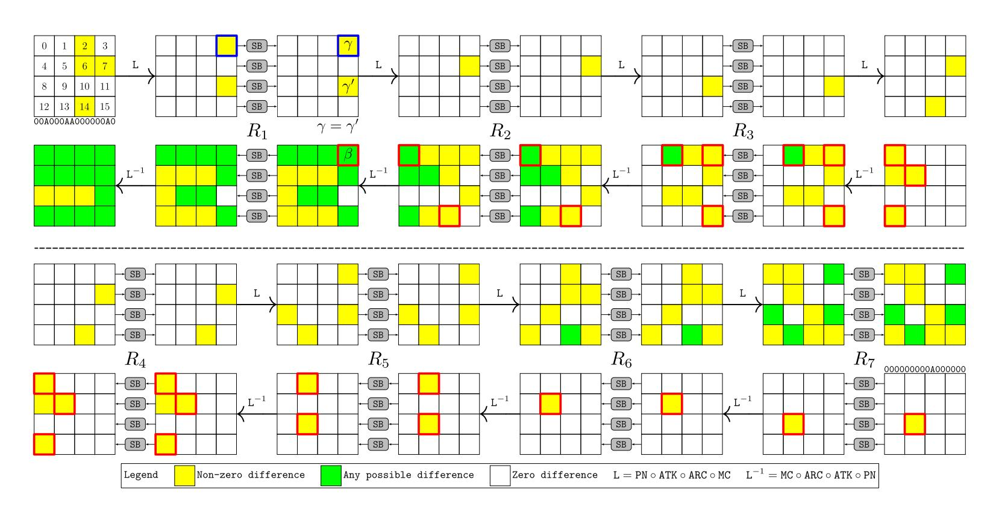

Figure 17: A 7-round boomerang distinguisher for CRAFT

{46}------------------------------------------------

<span id="page-46-0"></span>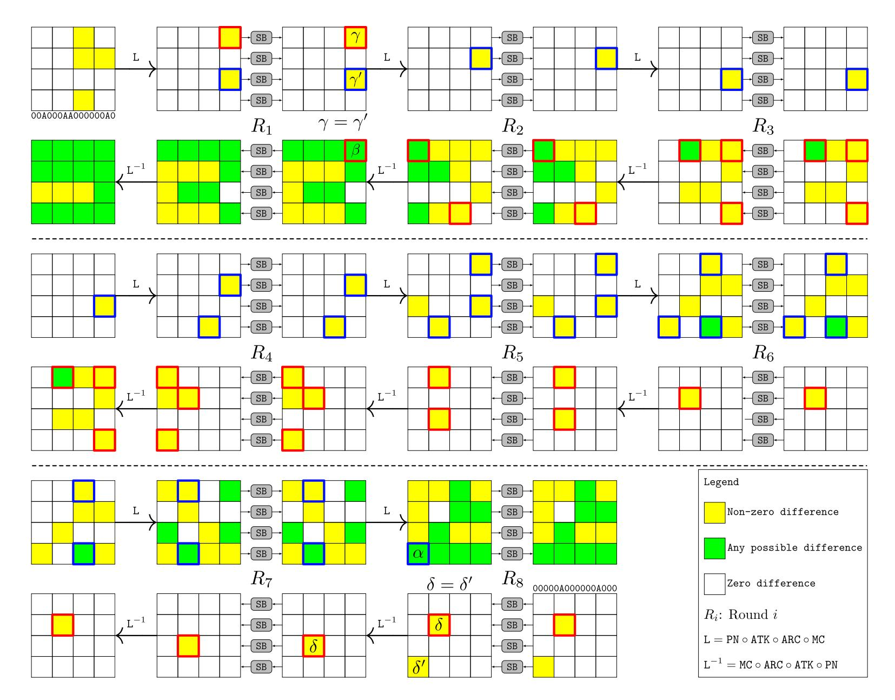

Figure 18: An 8-round boomerang distinguisher for CRAFT

## <span id="page-46-1"></span>C Probability Matrix of $E_m^{7r}$

```
2^{-14.07} \quad 2^{-13.45} \quad 2^{-14.38} \quad 2^{-14.07} \quad 2^{-13.67} \quad 2^{-14.35} \quad 2^{-14.20} \quad 2^{-14.20} \quad 2^{-14.07} \quad 2^{-13.58} \quad 2^{-14.38} \quad 2^{-14.07} \quad 2^{-13.99} \quad 2^{-14.36} \quad 2^{-14.01} \quad 2^{-14.07} \quad 2^{-14.20} \quad 2^{-14.20} \quad 2^{-14.20} \quad 2^{-14.20} \quad 2^{-14.20} \quad 2^{-14.20} \quad 2^{-14.20} \quad 2^{-14.20} \quad 2^{-14.20} \quad 2^{-14.20} \quad 2^{-14.20} \quad 2^{-14.20} \quad 2^{-14.20} \quad 2^{-14.20} \quad 2^{-14.20} \quad 2^{-14.20} \quad 2^{-14.20} \quad 2^{-14.20} \quad 2^{-14.20} \quad 2^{-14.20} \quad 2^{-14.20} \quad 2^{-14.20} \quad 2^{-14.20} \quad 2^{-14.20} \quad 2^{-14.20} \quad 2^{-14.20} \quad 2^{-14.20} \quad 2^{-14.20} \quad 2^{-14.20} \quad 2^{-14.20} \quad 2^{-14.20} \quad 2^{-14.20} \quad 2^{-14.20} \quad 2^{-14.20} \quad 2^{-14.20} \quad 2^{-14.20} \quad 2^{-14.20} \quad 2^{-14.20} \quad 2^{-14.20} \quad 2^{-14.20} \quad 2^{-14.20} \quad 2^{-14.20} \quad 2^{-14.20} \quad 2^{-14.20} \quad 2^{-14.20} \quad 2^{-14.20} \quad 2^{-14.20} \quad 2^{-14.20} \quad 2^{-14.20} \quad 2^{-14.20} \quad 2^{-14.20} \quad 2^{-14.20} \quad 2^{-14.20} \quad 2^{-14.20} \quad 2^{-14.20} \quad 2^{-14.20} \quad 2^{-14.20} \quad 2^{-14.20} \quad 2^{-14.20} \quad 2^{-14.20} \quad 2^{-14.20} \quad 2^{-14.20} \quad 2^{-14.20} \quad 2^{-14.20} \quad 2^{-14.20} \quad 2^{-14.20} \quad 2^{-14.20} \quad 2^{-14.20} \quad 2^{-14.20} \quad 2^{-14.20} \quad 2^{-14.20} \quad 2^{-14.20} \quad 2^{-14.20} \quad 2^{-14.20} \quad 2^{-14.20} \quad 2^{-14.20} \quad 2^{-14.20} \quad 2^{-14.20} \quad 2^{-14.20} \quad 2^{-14.20} \quad 2^{-14.20} \quad 2^{-14.20} \quad 2^{-14.20} \quad 2^{-14.20} \quad 2^{-14.20} \quad 2^{-14.20} \quad 2^{-14.20} \quad 2^{-14.20} \quad 2^{-14.20} \quad 2^{-14.20} \quad 2^{-14.20} \quad 2^{-14.20} \quad 2^{-14.20} \quad 2^{-14.20} \quad 2^{-14.20} \quad 2^{-14.20} \quad 2^{-14.20} \quad 2^{-14.20} \quad 2^{-14.20} \quad 2^{-14.20} \quad 2^{-14.20} \quad 2^{-14.20} \quad 2^{-14.20} \quad 2^{-14.20} \quad 2^{-14.20} \quad 2^{-14.20} \quad 2^{-14.20} \quad 2^{-14.20} \quad 2^{-14.20} \quad 2^{-14.20} \quad 2^{-14.20} \quad 2^{-14.20} \quad 2^{-14.20} \quad 2^{-14.20} \quad 2^{-14.20} \quad 2^{-14.20} \quad 2^{-14.20} \quad 2^{-14.20} \quad 2^{-14.20} \quad 2^{-14.20} \quad 2^{-14.20} \quad 2^{-14.20} \quad 2^{-14.20} \quad 2^{-14.20} \quad 2^{-14.20} \quad 2^{-14.20} \quad 2^{-14.20} \quad 2^{-14.20} \quad 2^{-14.20} \quad 2^{-14.20} \quad 2^{-14.20} \quad 2^{-14.20} \quad 2^{-14.20} \quad 2^{-14.20} \quad 2^{-14.20} \quad 2^{-14.20} \quad 2^{-14.20} \quad 2^{-14.20} \quad 2^{-14.20} \quad 2^{-14.20} \quad 2^{-14.20} \quad 2^{
                                                                                                                                                                         \begin{array}{cccccccccccccccccccccccccccccccccccc
                                                                                                                                                                     2^{-14.38} \quad 2^{-14.28} \quad 2^{-14.35} \quad 2^{-14.35} \quad 2^{-13.33} \quad 2^{-14.30} \quad 2^{-13.53} \quad 2^{-14.81} \quad 2^{-14.36} \quad 2^{-12.68} \quad 2^{-14.33} \quad 2^{-14.38} \quad 2^{-13.31} \quad 2^{-14.33} \quad 2^{-13.32} \quad 2^{-14.38} \quad 2^{-14.39} \quad 2^{-14.39} \quad 2^{-14.39} \quad 2^{-14.39} \quad 2^{-14.39} \quad 2^{-14.39} \quad 2^{-14.39} \quad 2^{-14.39} \quad 2^{-14.39} \quad 2^{-14.39} \quad 2^{-14.39} \quad 2^{-14.39} \quad 2^{-14.39} \quad 2^{-14.39} \quad 2^{-14.39} \quad 2^{-14.39} \quad 2^{-14.39} \quad 2^{-14.39} \quad 2^{-14.39} \quad 2^{-14.39} \quad 2^{-14.39} \quad 2^{-14.39} \quad 2^{-14.39} \quad 2^{-14.39} \quad 2^{-14.39} \quad 2^{-14.39} \quad 2^{-14.39} \quad 2^{-14.39} \quad 2^{-14.39} \quad 2^{-14.39} \quad 2^{-14.39} \quad 2^{-14.39} \quad 2^{-14.39} \quad 2^{-14.39} \quad 2^{-14.39} \quad 2^{-14.39} \quad 2^{-14.39} \quad 2^{-14.39} \quad 2^{-14.39} \quad 2^{-14.39} \quad 2^{-14.39} \quad 2^{-14.39} \quad 2^{-14.39} \quad 2^{-14.39} \quad 2^{-14.39} \quad 2^{-14.39} \quad 2^{-14.39} \quad 2^{-14.39} \quad 2^{-14.39} \quad 2^{-14.39} \quad 2^{-14.39} \quad 2^{-14.39} \quad 2^{-14.39} \quad 2^{-14.39} \quad 2^{-14.39} \quad 2^{-14.39} \quad 2^{-14.39} \quad 2^{-14.39} \quad 2^{-14.39} \quad 2^{-14.39} \quad 2^{-14.39} \quad 2^{-14.39} \quad 2^{-14.39} \quad 2^{-14.39} \quad 2^{-14.39} \quad 2^{-14.39} \quad 2^{-14.39} \quad 2^{-14.39} \quad 2^{-14.39} \quad 2^{-14.39} \quad 2^{-14.39} \quad 2^{-14.39} \quad 2^{-14.39} \quad 2^{-14.39} \quad 2^{-14.39} \quad 2^{-14.39} \quad 2^{-14.39} \quad 2^{-14.39} \quad 2^{-14.39} \quad 2^{-14.39} \quad 2^{-14.39} \quad 2^{-14.39} \quad 2^{-14.39} \quad 2^{-14.39} \quad 2^{-14.39} \quad 2^{-14.39} \quad 2^{-14.39} \quad 2^{-14.39} \quad 2^{-14.39} \quad 2^{-14.39} \quad 2^{-14.39} \quad 2^{-14.39} \quad 2^{-14.39} \quad 2^{-14.39} \quad 2^{-14.39} \quad 2^{-14.39} \quad 2^{-14.39} \quad 2^{-14.39} \quad 2^{-14.39} \quad 2^{-14.39} \quad 2^{-14.39} \quad 2^{-14.39} \quad 2^{-14.39} \quad 2^{-14.39} \quad 2^{-14.39} \quad 2^{-14.39} \quad 2^{-14.39} \quad 2^{-14.39} \quad 2^{-14.39} \quad 2^{-14.39} \quad 2^{-14.39} \quad 2^{-14.39} \quad 2^{-14.39} \quad 2^{-14.39} \quad 2^{-14.39} \quad 2^{-14.39} \quad 2^{-14.39} \quad 2^{-14.39} \quad 2^{-14.39} \quad 2^{-14.39} \quad 2^{-14.39} \quad 2^{-14.39} \quad 2^{-14.39} \quad 2^{-14.39} \quad 2^{-14.39} \quad 2^{-14.39} \quad 2^{-14.39} \quad 2^{-14.39} \quad 2^{-14.39} \quad 2^{-14.39} \quad 2^{-14.39} \quad 2^{-14.39} \quad 2^{-14.39} \quad 2^{-14.39} \quad 2^{-14.39} \quad 2^{-14.39} \quad 2^{-14.39} \quad 2^{-14.39} \quad 2^{-14.39} \quad 2^{-14.39} \quad 2^{-14.39} \quad 2^{
                                                                                                                                                                     2^{-14.07} \quad 2^{-13.45} \quad 2^{-14.35} \quad 2^{-14.07} \quad 2^{-13.67} \quad 2^{-14.38} \quad 2^{-14.20} \quad 2^{-14.36} \quad 2^{-14.07} \quad 2^{-13.58} \quad 2^{-14.36} \quad 2^{-14.07} \quad 2^{-13.99} \quad 2^{-14.38} \quad 2^{-14.01} \quad 2^{-14.07} \quad 2^{-14.07} \quad 2^{-14.07} \quad 2^{-14.07} \quad 2^{-14.07} \quad 2^{-14.07} \quad 2^{-14.07} \quad 2^{-14.07} \quad 2^{-14.07} \quad 2^{-14.07} \quad 2^{-14.07} \quad 2^{-14.07} \quad 2^{-14.07} \quad 2^{-14.07} \quad 2^{-14.07} \quad 2^{-14.07} \quad 2^{-14.07} \quad 2^{-14.07} \quad 2^{-14.07} \quad 2^{-14.07} \quad 2^{-14.07} \quad 2^{-14.07} \quad 2^{-14.07} \quad 2^{-14.07} \quad 2^{-14.07} \quad 2^{-14.07} \quad 2^{-14.07} \quad 2^{-14.07} \quad 2^{-14.07} \quad 2^{-14.07} \quad 2^{-14.07} \quad 2^{-14.07} \quad 2^{-14.07} \quad 2^{-14.07} \quad 2^{-14.07} \quad 2^{-14.07} \quad 2^{-14.07} \quad 2^{-14.07} \quad 2^{-14.07} \quad 2^{-14.07} \quad 2^{-14.07} \quad 2^{-14.07} \quad 2^{-14.07} \quad 2^{-14.07} \quad 2^{-14.07} \quad 2^{-14.07} \quad 2^{-14.07} \quad 2^{-14.07} \quad 2^{-14.07} \quad 2^{-14.07} \quad 2^{-14.07} \quad 2^{-14.07} \quad 2^{-14.07} \quad 2^{-14.07} \quad 2^{-14.07} \quad 2^{-14.07} \quad 2^{-14.07} \quad 2^{-14.07} \quad 2^{-14.07} \quad 2^{-14.07} \quad 2^{-14.07} \quad 2^{-14.07} \quad 2^{-14.07} \quad 2^{-14.07} \quad 2^{-14.07} \quad 2^{-14.07} \quad 2^{-14.07} \quad 2^{-14.07} \quad 2^{-14.07} \quad 2^{-14.07} \quad 2^{-14.07} \quad 2^{-14.07} \quad 2^{-14.07} \quad 2^{-14.07} \quad 2^{-14.07} \quad 2^{-14.07} \quad 2^{-14.07} \quad 2^{-14.07} \quad 2^{-14.07} \quad 2^{-14.07} \quad 2^{-14.07} \quad 2^{-14.07} \quad 2^{-14.07} \quad 2^{-14.07} \quad 2^{-14.07} \quad 2^{-14.07} \quad 2^{-14.07} \quad 2^{-14.07} \quad 2^{-14.07} \quad 2^{-14.07} \quad 2^{-14.07} \quad 2^{-14.07} \quad 2^{-14.07} \quad 2^{-14.07} \quad 2^{-14.07} \quad 2^{-14.07} \quad 2^{-14.07} \quad 2^{-14.07} \quad 2^{-14.07} \quad 2^{-14.07} \quad 2^{-14.07} \quad 2^{-14.07} \quad 2^{-14.07} \quad 2^{-14.07} \quad 2^{-14.07} \quad 2^{-14.07} \quad 2^{-14.07} \quad 2^{-14.07} \quad 2^{-14.07} \quad 2^{-14.07} \quad 2^{-14.07} \quad 2^{-14.07} \quad 2^{-14.07} \quad 2^{-14.07} \quad 2^{-14.07} \quad 2^{-14.07} \quad 2^{-14.07} \quad 2^{-14.07} \quad 2^{-14.07} \quad 2^{-14.07} \quad 2^{-14.07} \quad 2^{-14.07} \quad 2^{-14.07} \quad 2^{-14.07} \quad 2^{-14.07} \quad 2^{-14.07} \quad 2^{-14.07} \quad 2^{-14.07} \quad 2^{-14.07} \quad 2^{-14.07} \quad 2^{-14.07} \quad 2^{-14.07} \quad 2^{-14.07} \quad 2^{-14.07} \quad 2^{-14.07} \quad 2^{-14.07} \quad 2^{-14.07} \quad 2^{-14.07} \quad 2^{-14.07} \quad 2^{-14.07} \quad 2^{-14.07} \quad 2^{-14.07} \quad 2^{
                                                                                                                                                                     2^{-13.67} \quad 2^{-14.07} \quad 2^{-13.33} \quad 2^{-13.67} \quad 2^{-12.05} \quad 2^{-13.33} \quad 2^{-12.27} \quad 2^{-14.27} \quad 2^{-13.67} \quad 2^{-11.26} \quad 2^{-13.33} \quad 2^{-13.67} \quad 2^{-11.97} \quad 2^{-13.33} \quad 2^{-11.86} \quad 2^{-11.86} \quad 2^{-11.86} \quad 2^{-11.86} \quad 2^{-11.86} \quad 2^{-11.86} \quad 2^{-11.86} \quad 2^{-11.86} \quad 2^{-11.86} \quad 2^{-11.86} \quad 2^{-11.86} \quad 2^{-11.86} \quad 2^{-11.86} \quad 2^{-11.86} \quad 2^{-11.86} \quad 2^{-11.86} \quad 2^{-11.86} \quad 2^{-11.86} \quad 2^{-11.86} \quad 2^{-11.86} \quad 2^{-11.86} \quad 2^{-11.86} \quad 2^{-11.86} \quad 2^{-11.86} \quad 2^{-11.86} \quad 2^{-11.86} \quad 2^{-11.86} \quad 2^{-11.86} \quad 2^{-11.86} \quad 2^{-11.86} \quad 2^{-11.86} \quad 2^{-11.86} \quad 2^{-11.86} \quad 2^{-11.86} \quad 2^{-11.86} \quad 2^{-11.86} \quad 2^{-11.86} \quad 2^{-11.86} \quad 2^{-11.86} \quad 2^{-11.86} \quad 2^{-11.86} \quad 2^{-11.86} \quad 2^{-11.86} \quad 2^{-11.86} \quad 2^{-11.86} \quad 2^{-11.86} \quad 2^{-11.86} \quad 2^{-11.86} \quad 2^{-11.86} \quad 2^{-11.86} \quad 2^{-11.86} \quad 2^{-11.86} \quad 2^{-11.86} \quad 2^{-11.86} \quad 2^{-11.86} \quad 2^{-11.86} \quad 2^{-11.86} \quad 2^{-11.86} \quad 2^{-11.86} \quad 2^{-11.86} \quad 2^{-11.86} \quad 2^{-11.86} \quad 2^{-11.86} \quad 2^{-11.86} \quad 2^{-11.86} \quad 2^{-11.86} \quad 2^{-11.86} \quad 2^{-11.86} \quad 2^{-11.86} \quad 2^{-11.86} \quad 2^{-11.86} \quad 2^{-11.86} \quad 2^{-11.86} \quad 2^{-11.86} \quad 2^{-11.86} \quad 2^{-11.86} \quad 2^{-11.86} \quad 2^{-11.86} \quad 2^{-11.86} \quad 2^{-11.86} \quad 2^{-11.86} \quad 2^{-11.86} \quad 2^{-11.86} \quad 2^{-11.86} \quad 2^{-11.86} \quad 2^{-11.86} \quad 2^{-11.86} \quad 2^{-11.86} \quad 2^{-11.86} \quad 2^{-11.86} \quad 2^{-11.86} \quad 2^{-11.86} \quad 2^{-11.86} \quad 2^{-11.86} \quad 2^{-11.86} \quad 2^{-11.86} \quad 2^{-11.86} \quad 2^{-11.86} \quad 2^{-11.86} \quad 2^{-11.86} \quad 2^{-11.86} \quad 2^{-11.86} \quad 2^{-11.86} \quad 2^{-11.86} \quad 2^{-11.86} \quad 2^{-11.86} \quad 2^{-11.86} \quad 2^{-11.86} \quad 2^{-11.86} \quad 2^{-11.86} \quad 2^{-11.86} \quad 2^{-11.86} \quad 2^{-11.86} \quad 2^{-11.86} \quad 2^{-11.86} \quad 2^{-11.86} \quad 2^{-11.86} \quad 2^{-11.86} \quad 2^{-11.86} \quad 2^{-11.86} \quad 2^{-11.86} \quad 2^{-11.86} \quad 2^{-11.86} \quad 2^{-11.86} \quad 2^{-11.86} \quad 2^{-11.86} \quad 2^{-11.86} \quad 2^{-11.86} \quad 2^{-11.86} \quad 2^{-11.86} \quad 2^{-11.86} \quad 2^{-11.86} \quad 2^{-11.86} \quad 2^{-11.86} \quad 2^{-11.86} \quad 2^{-11.86} \quad 2^{-11.86} \quad 2^{-11.86} \quad 2^{-11.86} \quad 2^{-11.86} \quad 2^{-11.86} \quad 2^{-11.86} \quad 2^{-11.86} \quad 2^{
                                                                                                                                                                         \begin{array}{cccccccccccccccccccccccccccccccccccc
                                                                                                                                                                     2^{-14.20} \quad 2^{-13.97} \quad 2^{-13.53} \quad 2^{-14.20} \quad 2^{-12.27} \quad 2^{-13.53} \quad 2^{-12.49} \quad 2^{-14.34} \quad 2^{-14.20}
                                                                                                                                                                                                                                                                                                                                                                                                                                                                                                                                                                                                                                                                                                                                                                                                                                                                                                                                                                                                                                                                                                                                                                                                                                                                                                                                                                                                                                                                                                                                                                                                2^{-11.46} 2^{-13.53} 2^{-14.20} 2^{-12.24} 2^{-13.53} 2^{-12.07}
                                                                                                                                                                         2^{-14.36} \quad 2^{-14.24} \quad 2^{-14.81} \quad 2^{-14.36} \quad 2^{-14.27} \quad 2^{-14.81} \quad 2^{-14.34} \quad 2^{-14.97} \quad 2^{-14.36} \quad 2^{-13.84} \quad 2^{-14.81} \quad 2^{-14.36} \quad 2^{-14.37} \quad 2^{-14.81} \quad 2^{-14.35} \quad 2^{-14.36} \quad 2^{-14.36} \quad 2^{-14.37} \quad 2^{-14.37} \quad 2^{-14.38} \quad 2^{-14.38} \quad 2^{-14.38} \quad 2^{-14.38} \quad 2^{-14.38} \quad 2^{-14.38} \quad 2^{-14.38} \quad 2^{-14.38} \quad 2^{-14.38} \quad 2^{-14.38} \quad 2^{-14.38} \quad 2^{-14.38} \quad 2^{-14.38} \quad 2^{-14.38} \quad 2^{-14.38} \quad 2^{-14.38} \quad 2^{-14.38} \quad 2^{-14.38} \quad 2^{-14.38} \quad 2^{-14.38} \quad 2^{-14.38} \quad 2^{-14.38} \quad 2^{-14.38} \quad 2^{-14.38} \quad 2^{-14.38} \quad 2^{-14.38} \quad 2^{-14.38} \quad 2^{-14.38} \quad 2^{-14.38} \quad 2^{-14.38} \quad 2^{-14.38} \quad 2^{-14.38} \quad 2^{-14.38} \quad 2^{-14.38} \quad 2^{-14.38} \quad 2^{-14.38} \quad 2^{-14.38} \quad 2^{-14.38} \quad 2^{-14.38} \quad 2^{-14.38} \quad 2^{-14.38} \quad 2^{-14.38} \quad 2^{-14.38} \quad 2^{-14.38} \quad 2^{-14.38} \quad 2^{-14.38} \quad 2^{-14.38} \quad 2^{-14.38} \quad 2^{-14.38} \quad 2^{-14.38} \quad 2^{-14.38} \quad 2^{-14.38} \quad 2^{-14.38} \quad 2^{-14.38} \quad 2^{-14.38} \quad 2^{-14.38} \quad 2^{-14.38} \quad 2^{-14.38} \quad 2^{-14.38} \quad 2^{-14.38} \quad 2^{-14.38} \quad 2^{-14.38} \quad 2^{-14.38} \quad 2^{-14.38} \quad 2^{-14.38} \quad 2^{-14.38} \quad 2^{-14.38} \quad 2^{-14.38} \quad 2^{-14.38} \quad 2^{-14.38} \quad 2^{-14.38} \quad 2^{-14.38} \quad 2^{-14.38} \quad 2^{-14.38} \quad 2^{-14.38} \quad 2^{-14.38} \quad 2^{-14.38} \quad 2^{-14.38} \quad 2^{-14.38} \quad 2^{-14.38} \quad 2^{-14.38} \quad 2^{-14.38} \quad 2^{-14.38} \quad 2^{-14.38} \quad 2^{-14.38} \quad 2^{-14.38} \quad 2^{-14.38} \quad 2^{-14.38} \quad 2^{-14.38} \quad 2^{-14.38} \quad 2^{-14.38} \quad 2^{-14.38} \quad 2^{-14.38} \quad 2^{-14.38} \quad 2^{-14.38} \quad 2^{-14.38} \quad 2^{-14.38} \quad 2^{-14.38} \quad 2^{-14.38} \quad 2^{-14.38} \quad 2^{-14.38} \quad 2^{-14.38} \quad 2^{-14.38} \quad 2^{-14.38} \quad 2^{-14.38} \quad 2^{-14.38} \quad 2^{-14.38} \quad 2^{-14.38} \quad 2^{-14.38} \quad 2^{-14.38} \quad 2^{-14.38} \quad 2^{-14.38} \quad 2^{-14.38} \quad 2^{-14.38} \quad 2^{-14.38} \quad 2^{-14.38} \quad 2^{-14.38} \quad 2^{-14.38} \quad 2^{-14.38} \quad 2^{-14.38} \quad 2^{-14.38} \quad 2^{-14.38} \quad 2^{-14.38} \quad 2^{-14.38} \quad 2^{-14.38} \quad 2^{-14.38} \quad 2^{-14.38} \quad 2^{-14.38} \quad 2^{-14.38} \quad 2^{-14.38} \quad 2^{-14.38} \quad 2^{-14.38} \quad 2^{-14.38} \quad 2^{-14.38} \quad 2^{-14.38} \quad 2^{-14.38} \quad 2^{-14.38} \quad 2^{-14.38} \quad 2^{
   R^{7r} =
                                                                                                                                                                     2^{-14.07} \quad 2^{-13.45} \quad 2^{-14.36} \quad 2^{-14.07} \quad 2^{-13.67} \quad 2^{-14.38} \quad 2^{-14.20} \quad 2^{-14.36} \quad 2^{-14.07} \quad 2^{-13.58} \quad 2^{-14.35} \quad 2^{-14.07} \quad 2^{-13.99} \quad 2^{-14.38} \quad 2^{-14.01} \quad 2^{-14.01} \quad 2^{-14.01} \quad 2^{-14.01} \quad 2^{-14.01} \quad 2^{-14.01} \quad 2^{-14.01} \quad 2^{-14.01} \quad 2^{-14.01} \quad 2^{-14.01} \quad 2^{-14.01} \quad 2^{-14.01} \quad 2^{-14.01} \quad 2^{-14.01} \quad 2^{-14.01} \quad 2^{-14.01} \quad 2^{-14.01} \quad 2^{-14.01} \quad 2^{-14.01} \quad 2^{-14.01} \quad 2^{-14.01} \quad 2^{-14.01} \quad 2^{-14.01} \quad 2^{-14.01} \quad 2^{-14.01} \quad 2^{-14.01} \quad 2^{-14.01} \quad 2^{-14.01} \quad 2^{-14.01} \quad 2^{-14.01} \quad 2^{-14.01} \quad 2^{-14.01} \quad 2^{-14.01} \quad 2^{-14.01} \quad 2^{-14.01} \quad 2^{-14.01} \quad 2^{-14.01} \quad 2^{-14.01} \quad 2^{-14.01} \quad 2^{-14.01} \quad 2^{-14.01} \quad 2^{-14.01} \quad 2^{-14.01} \quad 2^{-14.01} \quad 2^{-14.01} \quad 2^{-14.01} \quad 2^{-14.01} \quad 2^{-14.01} \quad 2^{-14.01} \quad 2^{-14.01} \quad 2^{-14.01} \quad 2^{-14.01} \quad 2^{-14.01} \quad 2^{-14.01} \quad 2^{-14.01} \quad 2^{-14.01} \quad 2^{-14.01} \quad 2^{-14.01} \quad 2^{-14.01} \quad 2^{-14.01} \quad 2^{-14.01} \quad 2^{-14.01} \quad 2^{-14.01} \quad 2^{-14.01} \quad 2^{-14.01} \quad 2^{-14.01} \quad 2^{-14.01} \quad 2^{-14.01} \quad 2^{-14.01} \quad 2^{-14.01} \quad 2^{-14.01} \quad 2^{-14.01} \quad 2^{-14.01} \quad 2^{-14.01} \quad 2^{-14.01} \quad 2^{-14.01} \quad 2^{-14.01} \quad 2^{-14.01} \quad 2^{-14.01} \quad 2^{-14.01} \quad 2^{-14.01} \quad 2^{-14.01} \quad 2^{-14.01} \quad 2^{-14.01} \quad 2^{-14.01} \quad 2^{-14.01} \quad 2^{-14.01} \quad 2^{-14.01} \quad 2^{-14.01} \quad 2^{-14.01} \quad 2^{-14.01} \quad 2^{-14.01} \quad 2^{-14.01} \quad 2^{-14.01} \quad 2^{-14.01} \quad 2^{-14.01} \quad 2^{-14.01} \quad 2^{-14.01} \quad 2^{-14.01} \quad 2^{-14.01} \quad 2^{-14.01} \quad 2^{-14.01} \quad 2^{-14.01} \quad 2^{-14.01} \quad 2^{-14.01} \quad 2^{-14.01} \quad 2^{-14.01} \quad 2^{-14.01} \quad 2^{-14.01} \quad 2^{-14.01} \quad 2^{-14.01} \quad 2^{-14.01} \quad 2^{-14.01} \quad 2^{-14.01} \quad 2^{-14.01} \quad 2^{-14.01} \quad 2^{-14.01} \quad 2^{-14.01} \quad 2^{-14.01} \quad 2^{-14.01} \quad 2^{-14.01} \quad 2^{-14.01} \quad 2^{-14.01} \quad 2^{-14.01} \quad 2^{-14.01} \quad 2^{-14.01} \quad 2^{-14.01} \quad 2^{-14.01} \quad 2^{-14.01} \quad 2^{-14.01} \quad 2^{-14.01} \quad 2^{-14.01} \quad 2^{-14.01} \quad 2^{-14.01} \quad 2^{-14.01} \quad 2^{-14.01} \quad 2^{-14.01} \quad 2^{-14.01} \quad 2^{-14.01} \quad 2^{-14.01} \quad 2^{-14.01} \quad 2^{-14.01} \quad 2^{-14.01} \quad 2^{
                                                                                                                                                                     \begin{array}{cccccccccccccccccccccccccccccccccccc
                                                                                                                                                                     2^{-14.38} \quad 2^{-14.28} \quad 2^{-14.33} \quad 2^{-14.36} \quad 2^{-13.33} \quad 2^{-14.33} \quad 2^{-13.53} \quad 2^{-14.81} \quad 2^{-14.35} \quad 2^{-12.68} \quad 2^{-14.30} \quad 2^{-14.38} \quad 2^{-13.31} \quad 2^{-14.35} \quad 2^{-13.23} \quad 2^{-14.38} \quad 2^{-14.39} \quad 2^{-14.39} \quad 2^{-14.39} \quad 2^{-14.39} \quad 2^{-14.39} \quad 2^{-14.39} \quad 2^{-14.39} \quad 2^{-14.39} \quad 2^{-14.39} \quad 2^{-14.39} \quad 2^{-14.39} \quad 2^{-14.39} \quad 2^{-14.39} \quad 2^{-14.39} \quad 2^{-14.39} \quad 2^{-14.39} \quad 2^{-14.39} \quad 2^{-14.39} \quad 2^{-14.39} \quad 2^{-14.39} \quad 2^{-14.39} \quad 2^{-14.39} \quad 2^{-14.39} \quad 2^{-14.39} \quad 2^{-14.39} \quad 2^{-14.39} \quad 2^{-14.39} \quad 2^{-14.39} \quad 2^{-14.39} \quad 2^{-14.39} \quad 2^{-14.39} \quad 2^{-14.39} \quad 2^{-14.39} \quad 2^{-14.39} \quad 2^{-14.39} \quad 2^{-14.39} \quad 2^{-14.39} \quad 2^{-14.39} \quad 2^{-14.39} \quad 2^{-14.39} \quad 2^{-14.39} \quad 2^{-14.39} \quad 2^{-14.39} \quad 2^{-14.39} \quad 2^{-14.39} \quad 2^{-14.39} \quad 2^{-14.39} \quad 2^{-14.39} \quad 2^{-14.39} \quad 2^{-14.39} \quad 2^{-14.39} \quad 2^{-14.39} \quad 2^{-14.39} \quad 2^{-14.39} \quad 2^{-14.39} \quad 2^{-14.39} \quad 2^{-14.39} \quad 2^{-14.39} \quad 2^{-14.39} \quad 2^{-14.39} \quad 2^{-14.39} \quad 2^{-14.39} \quad 2^{-14.39} \quad 2^{-14.39} \quad 2^{-14.39} \quad 2^{-14.39} \quad 2^{-14.39} \quad 2^{-14.39} \quad 2^{-14.39} \quad 2^{-14.39} \quad 2^{-14.39} \quad 2^{-14.39} \quad 2^{-14.39} \quad 2^{-14.39} \quad 2^{-14.39} \quad 2^{-14.39} \quad 2^{-14.39} \quad 2^{-14.39} \quad 2^{-14.39} \quad 2^{-14.39} \quad 2^{-14.39} \quad 2^{-14.39} \quad 2^{-14.39} \quad 2^{-14.39} \quad 2^{-14.39} \quad 2^{-14.39} \quad 2^{-14.39} \quad 2^{-14.39} \quad 2^{-14.39} \quad 2^{-14.39} \quad 2^{-14.39} \quad 2^{-14.39} \quad 2^{-14.39} \quad 2^{-14.39} \quad 2^{-14.39} \quad 2^{-14.39} \quad 2^{-14.39} \quad 2^{-14.39} \quad 2^{-14.39} \quad 2^{-14.39} \quad 2^{-14.39} \quad 2^{-14.39} \quad 2^{-14.39} \quad 2^{-14.39} \quad 2^{-14.39} \quad 2^{-14.39} \quad 2^{-14.39} \quad 2^{-14.39} \quad 2^{-14.39} \quad 2^{-14.39} \quad 2^{-14.39} \quad 2^{-14.39} \quad 2^{-14.39} \quad 2^{-14.39} \quad 2^{-14.39} \quad 2^{-14.39} \quad 2^{-14.39} \quad 2^{-14.39} \quad 2^{-14.39} \quad 2^{-14.39} \quad 2^{-14.39} \quad 2^{-14.39} \quad 2^{-14.39} \quad 2^{-14.39} \quad 2^{-14.39} \quad 2^{-14.39} \quad 2^{-14.39} \quad 2^{-14.39} \quad 2^{-14.39} \quad 2^{-14.39} \quad 2^{-14.39} \quad 2^{-14.39} \quad 2^{-14.39} \quad 2^{-14.39} \quad 2^{-14.39} \quad 2^{-14.39} \quad 2^{-14.39} \quad 2^{-14.39} \quad 2^{-14.39} \quad 2^{-14.39} \quad 2^{-14.39} \quad 2^{
                                                                                                                                                                            2^{-14.07} \quad 2^{-13.45} \quad 2^{-14.38} \quad 2^{-14.07} \quad 2^{-13.67} \quad 2^{-14.36} \quad 2^{-14.20} \quad 2^{-14.36} \quad 2^{-14.07} \quad 2^{-13.58} \quad 2^{-14.38} \quad 2^{-14.07} \quad 2^{-13.99} \quad 2^{-14.35} \quad 2^{-14.01} \quad 2^{-14.07} \quad 2^{-14.07} \quad 2^{-14.07} \quad 2^{-14.07} \quad 2^{-14.07} \quad 2^{-14.07} \quad 2^{-14.07} \quad 2^{-14.07} \quad 2^{-14.07} \quad 2^{-14.07} \quad 2^{-14.07} \quad 2^{-14.07} \quad 2^{-14.07} \quad 2^{-14.07} \quad 2^{-14.07} \quad 2^{-14.07} \quad 2^{-14.07} \quad 2^{-14.07} \quad 2^{-14.07} \quad 2^{-14.07} \quad 2^{-14.07} \quad 2^{-14.07} \quad 2^{-14.07} \quad 2^{-14.07} \quad 2^{-14.07} \quad 2^{-14.07} \quad 2^{-14.07} \quad 2^{-14.07} \quad 2^{-14.07} \quad 2^{-14.07} \quad 2^{-14.07} \quad 2^{-14.07} \quad 2^{-14.07} \quad 2^{-14.07} \quad 2^{-14.07} \quad 2^{-14.07} \quad 2^{-14.07} \quad 2^{-14.07} \quad 2^{-14.07} \quad 2^{-14.07} \quad 2^{-14.07} \quad 2^{-14.07} \quad 2^{-14.07} \quad 2^{-14.07} \quad 2^{-14.07} \quad 2^{-14.07} \quad 2^{-14.07} \quad 2^{-14.07} \quad 2^{-14.07} \quad 2^{-14.07} \quad 2^{-14.07} \quad 2^{-14.07} \quad 2^{-14.07} \quad 2^{-14.07} \quad 2^{-14.07} \quad 2^{-14.07} \quad 2^{-14.07} \quad 2^{-14.07} \quad 2^{-14.07} \quad 2^{-14.07} \quad 2^{-14.07} \quad 2^{-14.07} \quad 2^{-14.07} \quad 2^{-14.07} \quad 2^{-14.07} \quad 2^{-14.07} \quad 2^{-14.07} \quad 2^{-14.07} \quad 2^{-14.07} \quad 2^{-14.07} \quad 2^{-14.07} \quad 2^{-14.07} \quad 2^{-14.07} \quad 2^{-14.07} \quad 2^{-14.07} \quad 2^{-14.07} \quad 2^{-14.07} \quad 2^{-14.07} \quad 2^{-14.07} \quad 2^{-14.07} \quad 2^{-14.07} \quad 2^{-14.07} \quad 2^{-14.07} \quad 2^{-14.07} \quad 2^{-14.07} \quad 2^{-14.07} \quad 2^{-14.07} \quad 2^{-14.07} \quad 2^{-14.07} \quad 2^{-14.07} \quad 2^{-14.07} \quad 2^{-14.07} \quad 2^{-14.07} \quad 2^{-14.07} \quad 2^{-14.07} \quad 2^{-14.07} \quad 2^{-14.07} \quad 2^{-14.07} \quad 2^{-14.07} \quad 2^{-14.07} \quad 2^{-14.07} \quad 2^{-14.07} \quad 2^{-14.07} \quad 2^{-14.07} \quad 2^{-14.07} \quad 2^{-14.07} \quad 2^{-14.07} \quad 2^{-14.07} \quad 2^{-14.07} \quad 2^{-14.07} \quad 2^{-14.07} \quad 2^{-14.07} \quad 2^{-14.07} \quad 2^{-14.07} \quad 2^{-14.07} \quad 2^{-14.07} \quad 2^{-14.07} \quad 2^{-14.07} \quad 2^{-14.07} \quad 2^{-14.07} \quad 2^{-14.07} \quad 2^{-14.07} \quad 2^{-14.07} \quad 2^{-14.07} \quad 2^{-14.07} \quad 2^{-14.07} \quad 2^{-14.07} \quad 2^{-14.07} \quad 2^{-14.07} \quad 2^{-14.07} \quad 2^{-14.07} \quad 2^{-14.07} \quad 2^{-14.07} \quad 2^{-14.07} \quad 2^{-14.07} \quad 2^{-14.07} \quad 2^{-14.07} \quad 2^{-14.07} \quad 2^{-14.07} \quad 2^{-14.07} \quad 2^{-14.07} \quad 2^{-14.07} \quad 2^{
                                                                                                                                                                     2^{-13.99} \quad 2^{-14.29} \quad 2^{-13.31} \quad 2^{-13.99} \quad 2^{-11.97} \quad 2^{-13.31} \quad 2^{-12.24} \quad 2^{-14.37} \quad 2^{-13.99} \quad 2^{-11.18} \quad 2^{-13.31} \quad 2^{-13.99} \quad 2^{-11.89} \quad 2^{-13.31} \quad 2^{-13.99} \quad 2^{-13.31} \quad 2^{-13.99} \quad 2^{-13.31} \quad 2^{-13.99} \quad 2^{-13.31} \quad 2^{-13.99} \quad 2^{-13.31} \quad 2^{-13.99} \quad 2^{-13.31} \quad 2^{-13.99} \quad 2^{-13.31} \quad 2^{-13.99} \quad 2^{-13.31} \quad 2^{-13.99} \quad 2^{-13.31} \quad 2^{-13.99} \quad 2^{-13.31} \quad 2^{-13.99} \quad 2^{-13.31} \quad 2^{-13.99} \quad 2^{-13.31} \quad 2^{-13.99} \quad 2^{-13.31} \quad 2^{-13.99} \quad 2^{-13.31} \quad 2^{-13.99} \quad 2^{-13.31} \quad 2^{-13.99} \quad 2^{-13.31} \quad 2^{-13.99} \quad 2^{-13.31} \quad 2^{-13.99} \quad 2^{-13.31} \quad 2^{-13.99} \quad 2^{-13.31} \quad 2^{-13.99} \quad 2^{-13.31} \quad 2^{-13.99} \quad 2^{-13.31} \quad 2^{-13.99} \quad 2^{-13.31} \quad 2^{-13.99} \quad 2^{-13.31} \quad 2^{-13.99} \quad 2^{-13.31} \quad 2^{-13.99} \quad 2^{-13.31} \quad 2^{-13.99} \quad 2^{-13.31} \quad 2^{-13.99} \quad 2^{-13.31} \quad 2^{-13.99} \quad 2^{-13.31} \quad 2^{-13.99} \quad 2^{-13.31} \quad 2^{-13.99} \quad 2^{-13.31} \quad 2^{-13.99} \quad 2^{-13.31} \quad 2^{-13.99} \quad 2^{-13.31} \quad 2^{-13.99} \quad 2^{-13.31} \quad 2^{-13.99} \quad 2^{-13.31} \quad 2^{-13.99} \quad 2^{-13.31} \quad 2^{-13.99} \quad 2^{-13.31} \quad 2^{-13.99} \quad 2^{-13.31} \quad 2^{-13.99} \quad 2^{-13.31} \quad 2^{-13.99} \quad 2^{-13.31} \quad 2^{-13.99} \quad 2^{-13.31} \quad 2^{-13.99} \quad 2^{-13.31} \quad 2^{-13.99} \quad 2^{-13.31} \quad 2^{-13.99} \quad 2^{-13.31} \quad 2^{-13.99} \quad 2^{-13.31} \quad 2^{-13.99} \quad 2^{-13.31} \quad 2^{-13.99} \quad 2^{-13.31} \quad 2^{-13.99} \quad 2^{-13.31} \quad 2^{-13.99} \quad 2^{-13.31} \quad 2^{-13.99} \quad 2^{-13.31} \quad 2^{-13.99} \quad 2^{-13.31} \quad 2^{-13.99} \quad 2^{-13.31} \quad 2^{-13.99} \quad 2^{-13.31} \quad 2^{-13.99} \quad 2^{-13.31} \quad 2^{-13.99} \quad 2^{-13.31} \quad 2^{-13.99} \quad 2^{-13.99} \quad 2^{-13.31} \quad 2^{-13.99} \quad 2^{-13.31} \quad 2^{-13.99} \quad 2^{-13.31} \quad 2^{-13.99} \quad 2^{-13.31} \quad 2^{-13.99} \quad 2^{-13.31} \quad 2^{-13.99} \quad 2^{-13.99} \quad 2^{-13.31} \quad 2^{-13.99} \quad 2^{-13.31} \quad 2^{-13.99} \quad 2^{-13.31} \quad 2^{-13.99} \quad 2^{-13.31} \quad 2^{-13.99} \quad 2^{-13.31} \quad 2^{-13.99} \quad 2^{-13.31} \quad 2^{-13.99} \quad 2^{-13.31} \quad 2^{-13.99} \quad 2^{-13.99} \quad 2^{-13.99} \quad 2^{-13.99} \quad 2^{-13.99} \quad 2^{-13.99} \quad 2^{-13.99} \quad 2^{-13.99} \quad 2^{-13.99} \quad 2^{-13.99} \quad 2^{-13.99} \quad 2^{
                                                                                                                                                                                                                                                                                                                                                                                                                                                                                                                                                                                                                                                                                                                                                                                                                                                                                                                                                                                                                                                                                                                                                                                                                                                                                                                                                                                                                                                                                                                                                                                                                                                                                                                                                                                                                                                                                                                                                                                                                                                                                                                                                                                                                                                                                                                                                                                         2-
                                                                                                                                                                         2^{-14.36} \quad 2^{-14.28} \quad 2^{-14.33} \quad 2^{-14.38} \quad 2^{-13.33} \quad 2^{-14.33} \quad 2^{-13.53} \quad 2^{-14.81} \quad 2^{-14.38} \quad 2^{-12.68} \quad 2^{-14.35} \quad 2^{-14.35} \quad 2^{-13.31} \quad 2^{-14.30} \quad 2^{-13.23} \quad 2^{-14.35} \quad 2^{-14.35} \quad 2^{-14.35} \quad 2^{-14.35} \quad 2^{-14.35} \quad 2^{-14.35} \quad 2^{-14.35} \quad 2^{-14.35} \quad 2^{-14.35} \quad 2^{-14.35} \quad 2^{-14.35} \quad 2^{-14.35} \quad 2^{-14.35} \quad 2^{-14.35} \quad 2^{-14.35} \quad 2^{-14.35} \quad 2^{-14.35} \quad 2^{-14.35} \quad 2^{-14.35} \quad 2^{-14.35} \quad 2^{-14.35} \quad 2^{-14.35} \quad 2^{-14.35} \quad 2^{-14.35} \quad 2^{-14.35} \quad 2^{-14.35} \quad 2^{-14.35} \quad 2^{-14.35} \quad 2^{-14.35} \quad 2^{-14.35} \quad 2^{-14.35} \quad 2^{-14.35} \quad 2^{-14.35} \quad 2^{-14.35} \quad 2^{-14.35} \quad 2^{-14.35} \quad 2^{-14.35} \quad 2^{-14.35} \quad 2^{-14.35} \quad 2^{-14.35} \quad 2^{-14.35} \quad 2^{-14.35} \quad 2^{-14.35} \quad 2^{-14.35} \quad 2^{-14.35} \quad 2^{-14.35} \quad 2^{-14.35} \quad 2^{-14.35} \quad 2^{-14.35} \quad 2^{-14.35} \quad 2^{-14.35} \quad 2^{-14.35} \quad 2^{-14.35} \quad 2^{-14.35} \quad 2^{-14.35} \quad 2^{-14.35} \quad 2^{-14.35} \quad 2^{-14.35} \quad 2^{-14.35} \quad 2^{-14.35} \quad 2^{-14.35} \quad 2^{-14.35} \quad 2^{-14.35} \quad 2^{-14.35} \quad 2^{-14.35} \quad 2^{-14.35} \quad 2^{-14.35} \quad 2^{-14.35} \quad 2^{-14.35} \quad 2^{-14.35} \quad 2^{-14.35} \quad 2^{-14.35} \quad 2^{-14.35} \quad 2^{-14.35} \quad 2^{-14.35} \quad 2^{-14.35} \quad 2^{-14.35} \quad 2^{-14.35} \quad 2^{-14.35} \quad 2^{-14.35} \quad 2^{-14.35} \quad 2^{-14.35} \quad 2^{-14.35} \quad 2^{-14.35} \quad 2^{-14.35} \quad 2^{-14.35} \quad 2^{-14.35} \quad 2^{-14.35} \quad 2^{-14.35} \quad 2^{-14.35} \quad 2^{-14.35} \quad 2^{-14.35} \quad 2^{-14.35} \quad 2^{-14.35} \quad 2^{-14.35} \quad 2^{-14.35} \quad 2^{-14.35} \quad 2^{-14.35} \quad 2^{-14.35} \quad 2^{-14.35} \quad 2^{-14.35} \quad 2^{-14.35} \quad 2^{-14.35} \quad 2^{-14.35} \quad 2^{-14.35} \quad 2^{-14.35} \quad 2^{-14.35} \quad 2^{-14.35} \quad 2^{-14.35} \quad 2^{-14.35} \quad 2^{-14.35} \quad 2^{-14.35} \quad 2^{-14.35} \quad 2^{-14.35} \quad 2^{-14.35} \quad 2^{-14.35} \quad 2^{-14.35} \quad 2^{-14.35} \quad 2^{-14.35} \quad 2^{-14.35} \quad 2^{-14.35} \quad 2^{-14.35} \quad 2^{-14.35} \quad 2^{-14.35} \quad 2^{-14.35} \quad 2^{-14.35} \quad 2^{-14.35} \quad 2^{-14.35} \quad 2^{-14.35} \quad 2^{-14.35} \quad 2^{-14.35} \quad 2^{-14.35} \quad 2^{-14.35} \quad 2^{-14.35} \quad 2^{-14.35} \quad 2^{-14.35} \quad 2^{-14.35} \quad 2^{-14.35} \quad 2^{-14.35} \quad 2^{-14.35} \quad 2^{-14.35} \quad 2^{-14.35} \quad 2^{
                                                                                                                                                                  2^{-14.01} \quad 2^{-14.30} \quad 2^{-13.23} \quad 2^{-14.01} \quad 2^{-11.86} \quad 2^{-13.23} \quad 2^{-12.07} \quad 2^{-14.35} \quad 2^{-14.01} \quad 2^{-11.03} \quad 2^{-13.23} \quad 2^{-14.01} \quad 2^{-11.78} \quad 2^{-13.23} \quad 2^{-11.66} \quad 2^{-13.23} \quad 2^{-14.01} \quad 2^{-11.78} \quad 2^{-13.23} \quad 2^{-14.01} \quad 2^{-11.78} \quad 2^{-13.23} \quad 2^{-14.01} \quad 2^{-11.78} \quad 2^{-13.23} \quad 2^{-14.01} \quad 2^{-11.78} \quad 2^{-13.23} \quad 2^{-14.01} \quad 2^{-11.78} \quad 2^{-13.23} \quad 2^{-14.01} \quad 2^{-11.78} \quad 2^{-13.23} \quad 2^{-14.01} \quad 2^{-11.78} \quad 2^{-13.23} \quad 2^{-14.01} \quad 2^{-11.78} \quad 2^{-13.23} \quad 2^{-14.01} \quad 2^{-11.78} \quad 2^{-13.23} \quad 2^{-14.01} \quad 2^{-11.78} \quad 2^{-13.23} \quad 2^{-14.01} \quad 2^{-11.78} \quad 2^{-13.23} \quad 2^{-14.01} \quad 2^{-11.78} \quad 2^{-13.23} \quad 2^{-14.01} \quad 2^{-11.78} \quad 2^{-13.23} \quad 2^{-14.01} \quad 2^{-11.78} \quad 2^{-13.23} \quad 2^{-14.01} \quad 2^{-13.23} \quad 2^{-14.01} \quad 2^{-13.23} \quad 2^{-14.01} \quad 2^{-13.23} \quad 2^{-14.01} \quad 2^{-13.23} \quad 2^{-14.01} \quad 2^{-13.23} \quad 2^{-13.23} \quad 2^{-13.23} \quad 2^{-13.23} \quad 2^{-13.23} \quad 2^{-13.23} \quad 2^{-13.23} \quad 2^{-13.23} \quad 2^{-13.23} \quad 2^{-13.23} \quad 2^{-13.23} \quad 2^{-13.23} \quad 2^{-13.23} \quad 2^{-13.23} \quad 2^{-13.23} \quad 2^{-13.23} \quad 2^{-13.23} \quad 2^{-13.23} \quad 2^{-13.23} \quad 2^{-13.23} \quad 2^{-13.23} \quad 2^{-13.23} \quad 2^{-13.23} \quad 2^{-13.23} \quad 2^{-13.23} \quad 2^{-13.23} \quad 2^{-13.23} \quad 2^{-13.23} \quad 2^{-13.23} \quad 2^{-13.23} \quad 2^{-13.23} \quad 2^{-13.23} \quad 2^{-13.23} \quad 2^{-13.23} \quad 2^{-13.23} \quad 2^{-13.23} \quad 2^{-13.23} \quad 2^{-13.23} \quad 2^{-13.23} \quad 2^{-13.23} \quad 2^{-13.23} \quad 2^{-13.23} \quad 2^{-13.23} \quad 2^{-13.23} \quad 2^{-13.23} \quad 2^{-13.23} \quad 2^{-13.23} \quad 2^{-13.23} \quad 2^{-13.23} \quad 2^{-13.23} \quad 2^{-13.23} \quad 2^{-13.23} \quad 2^{-13.23} \quad 2^{-13.23} \quad 2^{-13.23} \quad 2^{-13.23} \quad 2^{-13.23} \quad 2^{-13.23} \quad 2^{-13.23} \quad 2^{-13.23} \quad 2^{-13.23} \quad 2^{-13.23} \quad 2^{-13.23} \quad 2^{-13.23} \quad 2^{-13.23} \quad 2^{-13.23} \quad 2^{-13.23} \quad 2^{-13.23} \quad 2^{-13.23} \quad 2^{-13.23} \quad 2^{-13.23} \quad 2^{-13.23} \quad 2^{-13.23} \quad 2^{-13.23} \quad 2^{-13.23} \quad 2^{-13.23} \quad 2^{-13.23} \quad 2^{-13.23} \quad 2^{-13.23} \quad 2^{-13.23} \quad 2^{-13.23} \quad 2^{-13.23} \quad 2^{-13.23} \quad 2^{-13.23} \quad 2^{-13.23} \quad 2^{-13.23} \quad 2^{-13.23} \quad 2^{-13.23} \quad 2^{-13.23} \quad 2^{-13.23} \quad 2^{
                                                                                                                                         \begin{smallmatrix} 1 & 2 & -13.90 & 2 & -12.99 & 2 & -14.18 & 2 & -13.86 & 2 & -13.48 & 2 & -14.18 & 2 & -13.92 & 2 & -14.04 & 2 & -13.86 & 2 & -13.41 & 2 & -14.25 & 2 & -13.90 & 2 & -13.83 & 2 & -14.18 & 2 & -13.80 & 2 & -13.80 & 2 & -13.80 & 2 & -13.80 & 2 & -13.80 & 2 & -13.80 & 2 & -13.80 & 2 & -13.80 & 2 & -13.80 & 2 & -13.80 & 2 & -13.80 & 2 & -13.80 & 2 & -13.80 & 2 & -13.80 & 2 & -13.80 & 2 & -13.80 & 2 & -13.80 & 2 & -13.80 & 2 & -13.80 & 2 & -13.80 & 2 & -13.80 & 2 & -13.80 & 2 & -13.80 & 2 & -13.80 & 2 & -13.80 & 2 & -13.80 & 2 & -13.80 & 2 & -13.80 & 2 & -13.80 & 2 & -13.80 & 2 & -13.80 & 2 & -13.80 & 2 & -13.80 & 2 & -13.80 & 2 & -13.80 & 2 & -13.80 & 2 & -13.80 & 2 & -13.80 & 2 & -13.80 & 2 & -13.80 & 2 & -13.80 & 2 & -13.80 & 2 & -13.80 & 2 & -13.80 & 2 & -13.80 & 2 & -13.80 & 2 & -13.80 & 2 & -13.80 & 2 & -13.80 & 2 & -13.80 & 2 & -13.80 & 2 & -13.80 & 2 & -13.80 & 2 & -13.80 & 2 & -13.80 & 2 & -13.80 & 2 & -13.80 & 2 & -13.80 & 2 & -13.80 & 2 & -13.80 & 2 & -13.80 & 2 & -13.80 & 2 & -13.80 & 2 & -13.80 & 2 & -13.80 & 2 & -13.80 & 2 & -13.80 & 2 & -13.80 & 2 & -13.80 & 2 & -13.80 & 2 & -13.80 & 2 & -13.80 & 2 & -13.80 & 2 & -13.80 & 2 & -13.80 & 2 & -13.80 & 2 & -13.80 & 2 & -13.80 & 2 & -13.80 & 2 & -13.80 & 2 & -13.80 & 2 & -13.80 & 2 & -13.80 & 2 & -13.80 & 2 & -13.80 & 2 & -13.80 & 2 & -13.80 & 2 & -13.80 & 2 & -13.80 & 2 & -13.80 & 2 & -13.80 & 2 & -13.80 & 2 & -13.80 & 2 & -13.80 & 2 & -13.80 & 2 & -13.80 & 2 & -13.80 & 2 & -13.80 & 2 & -13.80 & 2 & -13.80 & 2 & -13.80 & 2 & -13.80 & 2 & -13.80 & 2 & -13.80 & 2 & -13.80 & 2 & -13.80 & 2 & -13.80 & 2 & -13.80 & 2 & -13.80 & 2 & -13.80 & 2 & -13.80 & 2 & -13.80 & 2 & -13.80 & 2 & -13.80 & 2 & -13.80 & 2 & -13.80 & 2 & -13.80 & 2 & -13.80 & 2 & -13.80 & 2 & -13.80 & 2 & -13.80 & 2 & -13.80 & 2 & -13.80 & 2 & -13.80 & 2 & -13.80 & 2 & -13.80 & 2 & -13.80 & 2 & -13.80 & 2 & -13.80 & 2 & -13.80 & 2 & -13.80 & 2 & -13.80 & 2 & -13.80 & 2 & -13.80 & 2 & -13.80 & 2 & -13.80 & 2 & -13.80 & 2 & -13.80 & 2 & -13.80 & 2 & -13.80 & 2 & -13.80 & 2 & -13.80 & 2 & -13.8
                                                                                                                                                               2^{-12.98} \quad 2^{-12.43} \quad 2^{-13.68} \quad 2^{-13.01} \quad 2^{-13.35} \quad 2^{-13.64} \quad 2^{-13.42} \quad 2^{-13.48} \quad 2^{-13.02} \quad 2^{-13.21} \quad 2^{-13.66} \quad 2^{-12.99} \quad 2^{-13.60} \quad 2^{-13.65} \quad 2^{-13.58} \quad 2^{-13.58} \quad 2^{-13.69} \quad 2^{-13.69} \quad 2^{-13.69} \quad 2^{-13.69} \quad 2^{-13.69} \quad 2^{-13.69} \quad 2^{-13.69} \quad 2^{-13.69} \quad 2^{-13.69} \quad 2^{-13.69} \quad 2^{-13.69} \quad 2^{-13.69} \quad 2^{-13.69} \quad 2^{-13.69} \quad 2^{-13.69} \quad 2^{-13.69} \quad 2^{-13.69} \quad 2^{-13.69} \quad 2^{-13.69} \quad 2^{-13.69} \quad 2^{-13.69} \quad 2^{-13.69} \quad 2^{-13.69} \quad 2^{-13.69} \quad 2^{-13.69} \quad 2^{-13.69} \quad 2^{-13.69} \quad 2^{-13.69} \quad 2^{-13.69} \quad 2^{-13.69} \quad 2^{-13.69} \quad 2^{-13.69} \quad 2^{-13.69} \quad 2^{-13.69} \quad 2^{-13.69} \quad 2^{-13.69} \quad 2^{-13.69} \quad 2^{-13.69} \quad 2^{-13.69} \quad 2^{-13.69} \quad 2^{-13.69} \quad 2^{-13.69} \quad 2^{-13.69} \quad 2^{-13.69} \quad 2^{-13.69} \quad 2^{-13.69} \quad 2^{-13.69} \quad 2^{-13.69} \quad 2^{-13.69} \quad 2^{-13.69} \quad 2^{-13.69} \quad 2^{-13.69} \quad 2^{-13.69} \quad 2^{-13.69} \quad 2^{-13.69} \quad 2^{-13.69} \quad 2^{-13.69} \quad 2^{-13.69} \quad 2^{-13.69} \quad 2^{-13.69} \quad 2^{-13.69} \quad 2^{-13.69} \quad 2^{-13.69} \quad 2^{-13.69} \quad 2^{-13.69} \quad 2^{-13.69} \quad 2^{-13.69} \quad 2^{-13.69} \quad 2^{-13.69} \quad 2^{-13.69} \quad 2^{-13.69} \quad 2^{-13.69} \quad 2^{-13.69} \quad 2^{-13.69} \quad 2^{-13.69} \quad 2^{-13.69} \quad 2^{-13.69} \quad 2^{-13.69} \quad 2^{-13.69} \quad 2^{-13.69} \quad 2^{-13.69} \quad 2^{-13.69} \quad 2^{-13.69} \quad 2^{-13.69} \quad 2^{-13.69} \quad 2^{-13.69} \quad 2^{-13.69} \quad 2^{-13.69} \quad 2^{-13.69} \quad 2^{-13.69} \quad 2^{-13.69} \quad 2^{-13.69} \quad 2^{-13.69} \quad 2^{-13.69} \quad 2^{-13.69} \quad 2^{-13.69} \quad 2^{-13.69} \quad 2^{-13.69} \quad 2^{-13.69} \quad 2^{-13.69} \quad 2^{-13.69} \quad 2^{-13.69} \quad 2^{-13.69} \quad 2^{-13.69} \quad 2^{-13.69} \quad 2^{-13.69} \quad 2^{-13.69} \quad 2^{-13.69} \quad 2^{-13.69} \quad 2^{-13.69} \quad 2^{-13.69} \quad 2^{-13.69} \quad 2^{-13.69} \quad 2^{-13.69} \quad 2^{-13.69} \quad 2^{-13.69} \quad 2^{-13.69} \quad 2^{-13.69} \quad 2^{-13.69} \quad 2^{-13.69} \quad 2^{-13.69} \quad 2^{-13.69} \quad 2^{-13.69} \quad 2^{-13.69} \quad 2^{-13.69} \quad 2^{-13.69} \quad 2^{-13.69} \quad 2^{-13.69} \quad 2^{-13.69} \quad 2^{-13.69} \quad 2^{-13.69} \quad 2^{-13.69} \quad 2^{-13.69} \quad 2^{-13.69} \quad 2^{-13.69} \quad 2^{-13.69} \quad 2^{-13.69} \quad 2^{-13.69} \quad 2^{-13.69} \quad 2^{-13.69} \quad 2^{-13.69} \quad 2^{
                                                                                                                                                                  2^{-14.20} \quad 2^{-13.66} \quad 2^{-14.26} \quad 2^{-14.17} \quad 2^{-13.20} \quad 2^{-14.21} \quad 2^{-13.34} \quad 2^{-14.33} \quad 2^{-14.17} \quad 2^{-12.56} \quad 2^{-14.21} \quad 2^{-14.24} \quad 2^{-13.20} \quad 2^{-14.22} \quad 2^{-13.06} \quad 2^{-14.24} \quad 2^{-14.24} \quad 2^{-14.24} \quad 2^{-14.24} \quad 2^{-14.24} \quad 2^{-14.24} \quad 2^{-14.24} \quad 2^{-14.24} \quad 2^{-14.24} \quad 2^{-14.24} \quad 2^{-14.24} \quad 2^{-14.24} \quad 2^{-14.24} \quad 2^{-14.24} \quad 2^{-14.24} \quad 2^{-14.24} \quad 2^{-14.24} \quad 2^{-14.24} \quad 2^{-14.24} \quad 2^{-14.24} \quad 2^{-14.24} \quad 2^{-14.24} \quad 2^{-14.24} \quad 2^{-14.24} \quad 2^{-14.24} \quad 2^{-14.24} \quad 2^{-14.24} \quad 2^{-14.24} \quad 2^{-14.24} \quad 2^{-14.24} \quad 2^{-14.24} \quad 2^{-14.24} \quad 2^{-14.24} \quad 2^{-14.24} \quad 2^{-14.24} \quad 2^{-14.24} \quad 2^{-14.24} \quad 2^{-14.24} \quad 2^{-14.24} \quad 2^{-14.24} \quad 2^{-14.24} \quad 2^{-14.24} \quad 2^{-14.24} \quad 2^{-14.24} \quad 2^{-14.24} \quad 2^{-14.24} \quad 2^{-14.24} \quad 2^{-14.24} \quad 2^{-14.24} \quad 2^{-14.24} \quad 2^{-14.24} \quad 2^{-14.24} \quad 2^{-14.24} \quad 2^{-14.24} \quad 2^{-14.24} \quad 2^{-14.24} \quad 2^{-14.24} \quad 2^{-14.24} \quad 2^{-14.24} \quad 2^{-14.24} \quad 2^{-14.24} \quad 2^{-14.24} \quad 2^{-14.24} \quad 2^{-14.24} \quad 2^{-14.24} \quad 2^{-14.24} \quad 2^{-14.24} \quad 2^{-14.24} \quad 2^{-14.24} \quad 2^{-14.24} \quad 2^{-14.24} \quad 2^{-14.24} \quad 2^{-14.24} \quad 2^{-14.24} \quad 2^{-14.24} \quad 2^{-14.24} \quad 2^{-14.24} \quad 2^{-14.24} \quad 2^{-14.24} \quad 2^{-14.24} \quad 2^{-14.24} \quad 2^{-14.24} \quad 2^{-14.24} \quad 2^{-14.24} \quad 2^{-14.24} \quad 2^{-14.24} \quad 2^{-14.24} \quad 2^{-14.24} \quad 2^{-14.24} \quad 2^{-14.24} \quad 2^{-14.24} \quad 2^{-14.24} \quad 2^{-14.24} \quad 2^{-14.24} \quad 2^{-14.24} \quad 2^{-14.24} \quad 2^{-14.24} \quad 2^{-14.24} \quad 2^{-14.24} \quad 2^{-14.24} \quad 2^{-14.24} \quad 2^{-14.24} \quad 2^{-14.24} \quad 2^{-14.24} \quad 2^{-14.24} \quad 2^{-14.24} \quad 2^{-14.24} \quad 2^{-14.24} \quad 2^{-14.24} \quad 2^{-14.24} \quad 2^{-14.24} \quad 2^{-14.24} \quad 2^{-14.24} \quad 2^{-14.24} \quad 2^{-14.24} \quad 2^{-14.24} \quad 2^{-14.24} \quad 2^{-14.24} \quad 2^{-14.24} \quad 2^{-14.24} \quad 2^{-14.24} \quad 2^{-14.24} \quad 2^{-14.24} \quad 2^{-14.24} \quad 2^{-14.24} \quad 2^{-14.24} \quad 2^{-14.24} \quad 2^{-14.24} \quad 2^{-14.24} \quad 2^{-14.24} \quad 2^{-14.24} \quad 2^{-14.24} \quad 2^{-14.24} \quad 2^{-14.24} \quad 2^{-14.24} \quad 2^{-14.24} \quad 2^{-14.24} \quad 2^{-14.24} \quad 2^{-14.24} \quad 2^{-14.24} \quad 2^{-14.24} \quad 2^{-14.24} \quad 2^{
                                                                                                                                                                     2 - 13.90 \quad 2 - 13.00 \quad 2 - 14.18 \quad 2 - 13.89 \quad 2 - 13.49 \quad 2 - 14.23 \quad 2 - 13.94 \quad 2 - 14.06 \quad 2 - 13.88 \quad 2 - 13.43 \quad 2 - 14.19 \quad 2 - 13.85 \quad 2 - 13.79 \quad 2 - 14.20 \quad 2 - 13.76 \quad 2 - 13.76 \quad 2 - 13.76 \quad 2 - 13.85 \quad 2 - 13.85 \quad 2 - 13.85 \quad 2 - 13.85 \quad 2 - 13.85 \quad 2 - 13.85 \quad 2 - 13.85 \quad 2 - 13.85 \quad 2 - 13.85 \quad 2 - 13.85 \quad 2 - 13.85 \quad 2 - 13.85 \quad 2 - 13.85 \quad 2 - 13.85 \quad 2 - 13.85 \quad 2 - 13.85 \quad 2 - 13.85 \quad 2 - 13.85 \quad 2 - 13.85 \quad 2 - 13.85 \quad 2 - 13.85 \quad 2 - 13.85 \quad 2 - 13.85 \quad 2 - 13.85 \quad 2 - 13.85 \quad 2 - 13.85 \quad 2 - 13.85 \quad 2 - 13.85 \quad 2 - 13.85 \quad 2 - 13.85 \quad 2 - 13.85 \quad 2 - 13.85 \quad 2 - 13.85 \quad 2 - 13.85 \quad 2 - 13.85 \quad 2 - 13.85 \quad 2 - 13.85 \quad 2 - 13.85 \quad 2 - 13.85 \quad 2 - 13.85 \quad 2 - 13.85 \quad 2 - 13.85 \quad 2 - 13.85 \quad 2 - 13.85 \quad 2 - 13.85 \quad 2 - 13.85 \quad 2 - 13.85 \quad 2 - 13.85 \quad 2 - 13.85 \quad 2 - 13.85 \quad 2 - 13.85 \quad 2 - 13.85 \quad 2 - 13.85 \quad 2 - 13.85 \quad 2 - 13.85 \quad 2 - 13.85 \quad 2 - 13.85 \quad 2 - 13.85 \quad 2 - 13.85 \quad 2 - 13.85 \quad 2 - 13.85 \quad 2 - 13.85 \quad 2 - 13.85 \quad 2 - 13.85 \quad 2 - 13.85 \quad 2 - 13.85 \quad 2 - 13.85 \quad 2 - 13.85 \quad 2 - 13.85 \quad 2 - 13.85 \quad 2 - 13.85 \quad 2 - 13.85 \quad 2 - 13.85 \quad 2 - 13.85 \quad 2 - 13.85 \quad 2 - 13.85 \quad 2 - 13.85 \quad 2 - 13.85 \quad 2 - 13.85 \quad 2 - 13.85 \quad 2 - 13.85 \quad 2 - 13.85 \quad 2 - 13.85 \quad 2 - 13.85 \quad 2 - 13.85 \quad 2 - 13.85 \quad 2 - 13.85 \quad 2 - 13.85 \quad 2 - 13.85 \quad 2 - 13.85 \quad 2 - 13.85 \quad 2 - 13.85 \quad 2 - 13.85 \quad 2 - 13.85 \quad 2 - 13.85 \quad 2 - 13.85 \quad 2 - 13.85 \quad 2 - 13.85 \quad 2 - 13.85 \quad 2 - 13.85 \quad 2 - 13.85 \quad 2 - 13.85 \quad 2 - 13.85 \quad 2 - 13.85 \quad 2 - 13.85 \quad 2 - 13.85 \quad 2 - 13.85 \quad 2 - 13.85 \quad 2 - 13.85 \quad 2 - 13.85 \quad 2 - 13.85 \quad 2 - 13.85 \quad 2 - 13.85 \quad 2 - 13.85 \quad 2 - 13.85 \quad 2 - 13.85 \quad 2 - 13.85 \quad 2 - 13.85 \quad 2 - 13.85 \quad 2 - 13.85 \quad 2 - 13.85 \quad 2 - 13.85 \quad 2 - 13.85 \quad 2 - 13.85 \quad 2 - 13.85 \quad 2 - 13.85 \quad 2 - 13.85 \quad 2 - 13.85 \quad 2 - 13.85 \quad 2 - 13.85 \quad 2 - 13.85 \quad 2 - 13.85 \quad 2 - 13.85 \quad 2 - 13.85 \quad 2 - 13.85 \quad 2 - 13.85 \quad 2 - 13.85 \quad 2 - 13.85 \quad 2 - 13.85 \quad 2 - 13.85 \quad 2 - 13.85 \quad 2 - 13.85 \quad 2 - 13.85 \quad 2 - 13.85 \quad 2 - 13.85 \quad 2 - 13.85 \quad 2 - 13.85 \quad 2 - 13.85 \quad 2 - 13.85 \quad 2 - 13.85 \quad 2 - 13.85 \quad 2 - 13.85 \quad 2 - 13.85 \quad 2 - 
                                                                                                                                                                  2 - 13.49 \quad 2 - 13.31 \quad 2 - 13.18 \quad 2 - 13.50 \quad 2 - 11.96 \quad 2 - 13.20 \quad 2 - 12.06 \quad 2 - 13.69 \quad 2 - 13.45 \quad 2 - 11.10 \quad 2 - 13.19 \quad 2 - 13.47 \quad 2 - 11.84 \quad 2 - 13.22 \quad 2 - 11.69 \quad 2 - 13.47 \quad 2 - 13.47 \quad 2 - 13.47 \quad 2 - 13.47 \quad 2 - 13.47 \quad 2 - 13.47 \quad 2 - 13.47 \quad 2 - 13.47 \quad 2 - 13.47 \quad 2 - 13.47 \quad 2 - 13.47 \quad 2 - 13.47 \quad 2 - 13.47 \quad 2 - 13.47 \quad 2 - 13.47 \quad 2 - 13.47 \quad 2 - 13.47 \quad 2 - 13.47 \quad 2 - 13.47 \quad 2 - 13.47 \quad 2 - 13.47 \quad 2 - 13.47 \quad 2 - 13.47 \quad 2 - 13.47 \quad 2 - 13.47 \quad 2 - 13.47 \quad 2 - 13.47 \quad 2 - 13.47 \quad 2 - 13.47 \quad 2 - 13.47 \quad 2 - 13.47 \quad 2 - 13.47 \quad 2 - 13.47 \quad 2 - 13.47 \quad 2 - 13.47 \quad 2 - 13.47 \quad 2 - 13.47 \quad 2 - 13.47 \quad 2 - 13.47 \quad 2 - 13.47 \quad 2 - 13.47 \quad 2 - 13.47 \quad 2 - 13.47 \quad 2 - 13.47 \quad 2 - 13.47 \quad 2 - 13.47 \quad 2 - 13.47 \quad 2 - 13.47 \quad 2 - 13.47 \quad 2 - 13.47 \quad 2 - 13.47 \quad 2 - 13.47 \quad 2 - 13.47 \quad 2 - 13.47 \quad 2 - 13.47 \quad 2 - 13.47 \quad 2 - 13.47 \quad 2 - 13.47 \quad 2 - 13.47 \quad 2 - 13.47 \quad 2 - 13.47 \quad 2 - 13.47 \quad 2 - 13.47 \quad 2 - 13.47 \quad 2 - 13.47 \quad 2 - 13.47 \quad 2 - 13.47 \quad 2 - 13.47 \quad 2 - 13.47 \quad 2 - 13.47 \quad 2 - 13.47 \quad 2 - 13.47 \quad 2 - 13.47 \quad 2 - 13.47 \quad 2 - 13.47 \quad 2 - 13.47 \quad 2 - 13.47 \quad 2 - 13.47 \quad 2 - 13.47 \quad 2 - 13.47 \quad 2 - 13.47 \quad 2 - 13.47 \quad 2 - 13.47 \quad 2 - 13.47 \quad 2 - 13.47 \quad 2 - 13.47 \quad 2 - 13.47 \quad 2 - 13.47 \quad 2 - 13.47 \quad 2 - 13.47 \quad 2 - 13.47 \quad 2 - 13.47 \quad 2 - 13.47 \quad 2 - 13.47 \quad 2 - 13.47 \quad 2 - 13.47 \quad 2 - 13.47 \quad 2 - 13.47 \quad 2 - 13.47 \quad 2 - 13.47 \quad 2 - 13.47 \quad 2 - 13.47 \quad 2 - 13.47 \quad 2 - 13.47 \quad 2 - 13.47 \quad 2 - 13.47 \quad 2 - 13.47 \quad 2 - 13.47 \quad 2 - 13.47 \quad 2 - 13.47 \quad 2 - 13.47 \quad 2 - 13.47 \quad 2 - 13.47 \quad 2 - 13.47 \quad 2 - 13.47 \quad 2 - 13.47 \quad 2 - 13.47 \quad 2 - 13.47 \quad 2 - 13.47 \quad 2 - 13.47 \quad 2 - 13.47 \quad 2 - 13.47 \quad 2 - 13.47 \quad 2 - 13.47 \quad 2 - 13.47 \quad 2 - 13.47 \quad 2 - 13.47 \quad 2 - 13.47 \quad 2 - 13.47 \quad 2 - 13.47 \quad 2 - 13.47 \quad 2 - 13.47 \quad 2 - 13.47 \quad 2 - 13.47 \quad 2 - 13.47 \quad 2 - 13.47 \quad 2 - 13.47 \quad 2 - 13.47 \quad 2 - 13.47 \quad 2 - 13.47 \quad 2 - 13.47 \quad 2 - 13.47 \quad 2 - 13.47 \quad 2 - 13.47 \quad 2 - 13.47 \quad 2 - 13.47 \quad 2 - 13.47 \quad 2 - 13.47 \quad 2 - 13.47 \quad 2 - 13.47 \quad 2 - 13.47 \quad 2 - 13.47 \quad 2 - 13.47 \quad 2 - 13.47 \quad 2 - 13.47 \quad 2 - 
                                                                                                                                                                  2^{-14.16} \quad 2^{-13.63} \quad 2^{-14.17} \quad 2^{-14.22} \quad 2^{-13.21} \quad 2^{-14.24} \quad 2^{-13.33} \quad 2^{-14.34} \quad 2^{-14.19} \quad 2^{-12.56} \quad 2^{-14.27} \quad 2^{-14.17} \quad 2^{-13.20} \quad 2^{-14.20} \quad 2^{-13.06} \quad 2^{-14.27} \quad 2^{-14.27} \quad 2^{-14.27} \quad 2^{-14.29} \quad 2^{-14.29} \quad 2^{-14.29} \quad 2^{-14.29} \quad 2^{-14.29} \quad 2^{-14.29} \quad 2^{-14.29} \quad 2^{-14.29} \quad 2^{-14.29} \quad 2^{-14.29} \quad 2^{-14.29} \quad 2^{-14.29} \quad 2^{-14.29} \quad 2^{-14.29} \quad 2^{-14.29} \quad 2^{-14.29} \quad 2^{-14.29} \quad 2^{-14.29} \quad 2^{-14.29} \quad 2^{-14.29} \quad 2^{-14.29} \quad 2^{-14.29} \quad 2^{-14.29} \quad 2^{-14.29} \quad 2^{-14.29} \quad 2^{-14.29} \quad 2^{-14.29} \quad 2^{-14.29} \quad 2^{-14.29} \quad 2^{-14.29} \quad 2^{-14.29} \quad 2^{-14.29} \quad 2^{-14.29} \quad 2^{-14.29} \quad 2^{-14.29} \quad 2^{-14.29} \quad 2^{-14.29} \quad 2^{-14.29} \quad 2^{-14.29} \quad 2^{-14.29} \quad 2^{-14.29} \quad 2^{-14.29} \quad 2^{-14.29} \quad 2^{-14.29} \quad 2^{-14.29} \quad 2^{-14.29} \quad 2^{-14.29} \quad 2^{-14.29} \quad 2^{-14.29} \quad 2^{-14.29} \quad 2^{-14.29} \quad 2^{-14.29} \quad 2^{-14.29} \quad 2^{-14.29} \quad 2^{-14.29} \quad 2^{-14.29} \quad 2^{-14.29} \quad 2^{-14.29} \quad 2^{-14.29} \quad 2^{-14.29} \quad 2^{-14.29} \quad 2^{-14.29} \quad 2^{-14.29} \quad 2^{-14.29} \quad 2^{-14.29} \quad 2^{-14.29} \quad 2^{-14.29} \quad 2^{-14.29} \quad 2^{-14.29} \quad 2^{-14.29} \quad 2^{-14.29} \quad 2^{-14.29} \quad 2^{-14.29} \quad 2^{-14.29} \quad 2^{-14.29} \quad 2^{-14.29} \quad 2^{-14.29} \quad 2^{-14.29} \quad 2^{-14.29} \quad 2^{-14.29} \quad 2^{-14.29} \quad 2^{-14.29} \quad 2^{-14.29} \quad 2^{-14.29} \quad 2^{-14.29} \quad 2^{-14.29} \quad 2^{-14.29} \quad 2^{-14.29} \quad 2^{-14.29} \quad 2^{-14.29} \quad 2^{-14.29} \quad 2^{-14.29} \quad 2^{-14.29} \quad 2^{-14.29} \quad 2^{-14.29} \quad 2^{-14.29} \quad 2^{-14.29} \quad 2^{-14.29} \quad 2^{-14.29} \quad 2^{-14.29} \quad 2^{-14.29} \quad 2^{-14.29} \quad 2^{-14.29} \quad 2^{-14.29} \quad 2^{-14.29} \quad 2^{-14.29} \quad 2^{-14.29} \quad 2^{-14.29} \quad 2^{-14.29} \quad 2^{-14.29} \quad 2^{-14.29} \quad 2^{-14.29} \quad 2^{-14.29} \quad 2^{-14.29} \quad 2^{-14.29} \quad 2^{-14.29} \quad 2^{-14.29} \quad 2^{-14.29} \quad 2^{-14.29} \quad 2^{-14.29} \quad 2^{-14.29} \quad 2^{-14.29} \quad 2^{-14.29} \quad 2^{-14.29} \quad 2^{-14.29} \quad 2^{-14.29} \quad 2^{-14.29} \quad 2^{-14.29} \quad 2^{-14.29} \quad 2^{-14.29} \quad 2^{-14.29} \quad 2^{-14.29} \quad 2^{-14.29} \quad 2^{-14.29} \quad 2^{-14.29} \quad 2^{-14.29} \quad 2^{-14.29} \quad 2^{-14.29} \quad 2^{-14.29} \quad 2^{
                                                                                                                                                                  2 - 13.96 \quad 2 - 13.40 \quad 2 - 13.44 \quad 2 - 13.97 \quad 2 - 12.04 \quad 2 - 13.33 \quad 2 - 12.07 \quad 2 - 13.81 \quad 2 - 13.97 \quad 2 - 11.12 \quad 2 - 13.33 \quad 2 - 13.97 \quad 2 - 11.98 \quad 2 - 13.44 \quad 2 - 11.67 \quad 2 - 13.40 \quad 2 - 13.40 \quad 2 - 13.40 \quad 2 - 13.40 \quad 2 - 13.40 \quad 2 - 13.40 \quad 2 - 13.40 \quad 2 - 13.40 \quad 2 - 13.40 \quad 2 - 13.40 \quad 2 - 13.40 \quad 2 - 13.40 \quad 2 - 13.40 \quad 2 - 13.40 \quad 2 - 13.40 \quad 2 - 13.40 \quad 2 - 13.40 \quad 2 - 13.40 \quad 2 - 13.40 \quad 2 - 13.40 \quad 2 - 13.40 \quad 2 - 13.40 \quad 2 - 13.40 \quad 2 - 13.40 \quad 2 - 13.40 \quad 2 - 13.40 \quad 2 - 13.40 \quad 2 - 13.40 \quad 2 - 13.40 \quad 2 - 13.40 \quad 2 - 13.40 \quad 2 - 13.40 \quad 2 - 13.40 \quad 2 - 13.40 \quad 2 - 13.40 \quad 2 - 13.40 \quad 2 - 13.40 \quad 2 - 13.40 \quad 2 - 13.40 \quad 2 - 13.40 \quad 2 - 13.40 \quad 2 - 13.40 \quad 2 - 13.40 \quad 2 - 13.40 \quad 2 - 13.40 \quad 2 - 13.40 \quad 2 - 13.40 \quad 2 - 13.40 \quad 2 - 13.40 \quad 2 - 13.40 \quad 2 - 13.40 \quad 2 - 13.40 \quad 2 - 13.40 \quad 2 - 13.40 \quad 2 - 13.40 \quad 2 - 13.40 \quad 2 - 13.40 \quad 2 - 13.40 \quad 2 - 13.40 \quad 2 - 13.40 \quad 2 - 13.40 \quad 2 - 13.40 \quad 2 - 13.40 \quad 2 - 13.40 \quad 2 - 13.40 \quad 2 - 13.40 \quad 2 - 13.40 \quad 2 - 13.40 \quad 2 - 13.40 \quad 2 - 13.40 \quad 2 - 13.40 \quad 2 - 13.40 \quad 2 - 13.40 \quad 2 - 13.40 \quad 2 - 13.40 \quad 2 - 13.40 \quad 2 - 13.40 \quad 2 - 13.40 \quad 2 - 13.40 \quad 2 - 13.40 \quad 2 - 13.40 \quad 2 - 13.40 \quad 2 - 13.40 \quad 2 - 13.40 \quad 2 - 13.40 \quad 2 - 13.40 \quad 2 - 13.40 \quad 2 - 13.40 \quad 2 - 13.40 \quad 2 - 13.40 \quad 2 - 13.40 \quad 2 - 13.40 \quad 2 - 13.40 \quad 2 - 13.40 \quad 2 - 13.40 \quad 2 - 13.40 \quad 2 - 13.40 \quad 2 - 13.40 \quad 2 - 13.40 \quad 2 - 13.40 \quad 2 - 13.40 \quad 2 - 13.40 \quad 2 - 13.40 \quad 2 - 13.40 \quad 2 - 13.40 \quad 2 - 13.40 \quad 2 - 13.40 \quad 2 - 13.40 \quad 2 - 13.40 \quad 2 - 13.40 \quad 2 - 13.40 \quad 2 - 13.40 \quad 2 - 13.40 \quad 2 - 13.40 \quad 2 - 13.40 \quad 2 - 13.40 \quad 2 - 13.40 \quad 2 - 13.40 \quad 2 - 13.40 \quad 2 - 13.40 \quad 2 - 13.40 \quad 2 - 13.40 \quad 2 - 13.40 \quad 2 - 13.40 \quad 2 - 13.40 \quad 2 - 13.40 \quad 2 - 13.40 \quad 2 - 13.40 \quad 2 - 13.40 \quad 2 - 13.40 \quad 2 - 13.40 \quad 2 - 13.40 \quad 2 - 13.40 \quad 2 - 13.40 \quad 2 - 13.40 \quad 2 - 13.40 \quad 2 - 13.40 \quad 2 - 13.40 \quad 2 - 13.40 \quad 2 - 13.40 \quad 2 - 13.40 \quad 2 - 13.40 \quad 2 - 13.40 \quad 2 - 13.40 \quad 2 - 13.40 \quad 2 - 13.40 \quad 2 - 13.40 \quad 2 - 13.40 \quad 2 - 13.40 \quad 2 - 13.40 \quad 2 - 13.40 \quad 2 - 13.40 \quad 2 - 13.40 \quad 2 - 13.40 \quad 2 - 13.40 \quad 2 - 
                                                                                                                                                                  2 - 14.07 \quad 2 - 13.53 \quad 2 - 14.35 \quad 2 - 14.03 \quad 2 - 13.67 \quad 2 - 14.34 \quad 2 - 13.76 \quad 2 - 14.39 \quad 2 - 14.03 \quad 2 - 13.22 \quad 2 - 14.37 \quad 2 - 14.04 \quad 2 - 13.80 \quad 2 - 14.35 \quad 2 - 13.69 \quad 2 - 14.37 \quad 2 - 14.04 \quad 2 - 13.80 \quad 2 - 14.35 \quad 2 - 14.04 \quad 2 - 13.69 \quad 2 - 14.04 \quad 2 - 13.69 \quad 2 - 14.04 \quad 2 - 13.69 \quad 2 - 14.04 \quad 2 - 13.69 \quad 2 - 14.04 \quad 2 - 13.69 \quad 2 - 14.04 \quad 2 - 13.69 \quad 2 - 14.04 \quad 2 - 13.69 \quad 2 - 14.04 \quad 2 - 13.69 \quad 2 - 14.04 \quad 2 - 13.69 \quad 2 - 14.04 \quad 2 - 13.69 \quad 2 - 14.04 \quad 2 - 13.69 \quad 2 - 14.04 \quad 2 - 13.69 \quad 2 - 14.04 \quad 2 - 13.69 \quad 2 - 14.04 \quad 2 - 13.69 \quad 2 - 14.04 \quad 2 - 13.69 \quad 2 - 14.04 \quad 2 - 13.69 \quad 2 - 14.04 \quad 2 - 13.69 \quad 2 - 14.04 \quad 2 - 13.69 \quad 2 - 14.04 \quad 2 - 13.69 \quad 2 - 14.04 \quad 2 - 13.69 \quad 2 - 14.04 \quad 2 - 13.69 \quad 2 - 14.04 \quad 2 - 13.69 \quad 2 - 14.04 \quad 2 - 13.69 \quad 2 - 14.04 \quad 2 - 13.69 \quad 2 - 14.04 \quad 2 - 13.69 \quad 2 - 14.04 \quad 2 - 13.69 \quad 2 - 14.04 \quad 2 - 13.69 \quad 2 - 14.04 \quad 2 - 13.69 \quad 2 - 14.04 \quad 2 - 13.69 \quad 2 - 14.04 \quad 2 - 13.69 \quad 2 - 14.04 \quad 2 - 13.69 \quad 2 - 14.04 \quad 2 - 13.69 \quad 2 - 14.04 \quad 2 - 13.69 \quad 2 - 14.04 \quad 2 - 13.69 \quad 2 - 14.04 \quad 2 - 13.69 \quad 2 - 14.04 \quad 2 - 13.69 \quad 2 - 14.04 \quad 2 - 13.69 \quad 2 - 14.04 \quad 2 - 13.69 \quad 2 - 14.04 \quad 2 - 13.69 \quad 2 - 14.04 \quad 2 - 13.69 \quad 2 - 14.04 \quad 2 - 13.69 \quad 2 - 14.04 \quad 2 - 13.69 \quad 2 - 14.04 \quad 2 - 13.69 \quad 2 - 14.04 \quad 2 - 13.69 \quad 2 - 14.04 \quad 2 - 13.69 \quad 2 - 14.04 \quad 2 - 13.69 \quad 2 - 14.04 \quad 2 - 13.69 \quad 2 - 14.04 \quad 2 - 13.69 \quad 2 - 14.04 \quad 2 - 13.69 \quad 2 - 14.04 \quad 2 - 13.69 \quad 2 - 14.04 \quad 2 - 13.69 \quad 2 - 14.04 \quad 2 - 13.69 \quad 2 - 14.04 \quad 2 - 13.69 \quad 2 - 14.04 \quad 2 - 13.69 \quad 2 - 14.04 \quad 2 - 13.69 \quad 2 - 14.04 \quad 2 - 13.69 \quad 2 - 14.04 \quad 2 - 13.69 \quad 2 - 14.04 \quad 2 - 13.69 \quad 2 - 14.04 \quad 2 - 13.69 \quad 2 - 14.04 \quad 2 - 13.69 \quad 2 - 14.04 \quad 2 - 13.69 \quad 2 - 14.04 \quad 2 - 13.69 \quad 2 - 14.04 \quad 2 - 13.69 \quad 2 - 14.04 \quad 2 - 13.69 \quad 2 - 14.04 \quad 2 - 13.69 \quad 2 - 14.04 \quad 2 - 13.69 \quad 2 - 14.04 \quad 2 - 13.69 \quad 2 - 14.04 \quad 2 - 13.69 \quad 2 - 14.04 \quad 2 - 13.69 \quad 2 - 14.04 \quad 2 - 13.69 \quad 2 - 14.04 \quad 2 - 13.69 \quad 2 - 14.04 \quad 2 - 13.69 \quad 2 - 14.04 \quad 2 - 13.69 \quad 2 - 14.04 \quad 2 - 13.69 \quad 2 - 14.04 \quad 2 - 13.69 \quad 2 - 14.04 \quad 2 - 
R_e^{7r} =
                                                                                                                                                                  2 - 13.87 \quad 2 - 12.99 \quad 2 - 14.17 \quad 2 - 13.87 \quad 2 - 13.51 \quad 2 - 14.22 \quad 2 - 13.97 \quad 2 - 14.00 \quad 2 - 13.93 \quad 2 - 13.39 \quad 2 - 14.20 \quad 2 - 13.85 \quad 2 - 13.87 \quad 2 - 14.21 \quad 2 - 13.79 \quad 2 - 14.21 \quad 2 - 13.79 \quad 2 - 14.21 \quad 2 - 13.79 \quad 2 - 14.21 \quad 2 - 13.79 \quad 2 - 14.21 \quad 2 - 13.79 \quad 2 - 14.21 \quad 2 - 13.79 \quad 2 - 14.21 \quad 2 - 13.79 \quad 2 - 14.21 \quad 2 - 13.79 \quad 2 - 14.21 \quad 2 - 13.79 \quad 2 - 14.21 \quad 2 - 13.79 \quad 2 - 14.21 \quad 2 - 13.79 \quad 2 - 14.21 \quad 2 - 13.79 \quad 2 - 14.21 \quad 2 - 13.79 \quad 2 - 14.21 \quad 2 - 13.79 \quad 2 - 14.21 \quad 2 - 13.79 \quad 2 - 14.21 \quad 2 - 13.79 \quad 2 - 14.21 \quad 2 - 13.79 \quad 2 - 14.21 \quad 2 - 13.79 \quad 2 - 14.21 \quad 2 - 13.79 \quad 2 - 14.21 \quad 2 - 13.79 \quad 2 - 14.21 \quad 2 - 13.79 \quad 2 - 14.21 \quad 2 - 13.79 \quad 2 - 14.21 \quad 2 - 13.79 \quad 2 - 14.21 \quad 2 - 13.79 \quad 2 - 14.21 \quad 2 - 13.79 \quad 2 - 14.21 \quad 2 - 13.79 \quad 2 - 14.21 \quad 2 - 13.79 \quad 2 - 14.21 \quad 2 - 13.79 \quad 2 - 14.21 \quad 2 - 13.79 \quad 2 - 14.21 \quad 2 - 13.79 \quad 2 - 14.21 \quad 2 - 13.79 \quad 2 - 14.21 \quad 2 - 13.79 \quad 2 - 14.21 \quad 2 - 13.79 \quad 2 - 14.21 \quad 2 - 13.79 \quad 2 - 14.21 \quad 2 - 13.79 \quad 2 - 14.21 \quad 2 - 13.79 \quad 2 - 14.21 \quad 2 - 13.79 \quad 2 - 14.21 \quad 2 - 13.79 \quad 2 - 14.21 \quad 2 - 13.79 \quad 2 - 14.21 \quad 2 - 13.79 \quad 2 - 14.21 \quad 2 - 13.79 \quad 2 - 14.21 \quad 2 - 13.79 \quad 2 - 14.21 \quad 2 - 13.79 \quad 2 - 14.21 \quad 2 - 13.79 \quad 2 - 14.21 \quad 2 - 13.79 \quad 2 - 14.21 \quad 2 - 13.79 \quad 2 - 14.21 \quad 2 - 13.79 \quad 2 - 14.21 \quad 2 - 13.79 \quad 2 - 14.21 \quad 2 - 13.79 \quad 2 - 14.21 \quad 2 - 13.79 \quad 2 - 14.21 \quad 2 - 13.79 \quad 2 - 14.21 \quad 2 - 13.79 \quad 2 - 14.21 \quad 2 - 13.79 \quad 2 - 14.21 \quad 2 - 13.79 \quad 2 - 14.21 \quad 2 - 13.79 \quad 2 - 14.21 \quad 2 - 13.79 \quad 2 - 14.21 \quad 2 - 13.79 \quad 2 - 14.21 \quad 2 - 13.79 \quad 2 - 14.21 \quad 2 - 13.79 \quad 2 - 14.21 \quad 2 - 13.79 \quad 2 - 14.21 \quad 2 - 13.79 \quad 2 - 14.21 \quad 2 - 13.79 \quad 2 - 14.21 \quad 2 - 13.79 \quad 2 - 14.21 \quad 2 - 13.79 \quad 2 - 14.21 \quad 2 - 13.79 \quad 2 - 14.21 \quad 2 - 13.79 \quad 2 - 14.21 \quad 2 - 13.79 \quad 2 - 14.21 \quad 2 - 13.79 \quad 2 - 14.21 \quad 2 - 13.79 \quad 2 - 14.21 \quad 2 - 13.79 \quad 2 - 14.21 \quad 2 - 13.79 \quad 2 - 14.21 \quad 2 - 13.79 \quad 2 - 14.21 \quad 2 - 13.79 \quad 2 - 14.21 \quad 2 - 13.79 \quad 2 - 14.21 \quad 2 - 13.79 \quad 2 - 14.21 \quad 2 - 13.79 \quad 2 - 14.21 \quad 2 - 13.79 \quad 2 - 14.21 \quad 2 - 13.79 \quad 2 - 14.21 \quad 2 - 
                                                                                                                                                                  2 - 13.41 \quad 2 - 13.24 \quad 2 - 12.56 \quad 2 - 13.39 \quad 2 - 11.11 \quad 2 - 12.53 \quad 2 - 11.11 \quad 2 - 13.22 \quad 2 - 13.41 \quad \mathbf{2} - \mathbf{10.11} \quad 2 - 12.58 \quad 2 - 13.39 \quad 2 - 11.02 \quad 2 - 12.55 \quad 2 - 10.72 \quad \mathbf{2} - \mathbf{10.11} \quad \mathbf{2} - \mathbf{10.11} \quad \mathbf{2} - \mathbf{10.11} \quad \mathbf{2} - \mathbf{10.11} \quad \mathbf{2} - \mathbf{10.11} \quad \mathbf{2} - \mathbf{10.11} \quad \mathbf{2} - \mathbf{10.11} \quad \mathbf{2} - \mathbf{10.11} \quad \mathbf{2} - \mathbf{10.11} \quad \mathbf{2} - \mathbf{10.11} \quad \mathbf{2} - \mathbf{10.11} \quad \mathbf{2} - \mathbf{10.11} \quad \mathbf{2} - \mathbf{10.11} \quad \mathbf{2} - \mathbf{10.11} \quad \mathbf{2} - \mathbf{10.11} \quad \mathbf{2} - \mathbf{10.11} \quad \mathbf{2} - \mathbf{10.11} \quad \mathbf{2} - \mathbf{10.11} \quad \mathbf{2} - \mathbf{10.11} \quad \mathbf{2} - \mathbf{10.11} \quad \mathbf{2} - \mathbf{10.11} \quad \mathbf{2} - \mathbf{10.11} \quad \mathbf{2} - \mathbf{10.11} \quad \mathbf{2} - \mathbf{10.11} \quad \mathbf{2} - \mathbf{10.11} \quad \mathbf{2} - \mathbf{10.11} \quad \mathbf{2} - \mathbf{10.11} \quad \mathbf{2} - \mathbf{10.11} \quad \mathbf{2} - \mathbf{10.11} \quad \mathbf{2} - \mathbf{10.11} \quad \mathbf{2} - \mathbf{10.11} \quad \mathbf{2} - \mathbf{10.11} \quad \mathbf{2} - \mathbf{10.11} \quad \mathbf{2} - \mathbf{10.11} \quad \mathbf{2} - \mathbf{10.11} \quad \mathbf{2} - \mathbf{10.11} \quad \mathbf{2} - \mathbf{10.11} \quad \mathbf{2} - \mathbf{10.11} \quad \mathbf{2} - \mathbf{10.11} \quad \mathbf{2} - \mathbf{10.11} \quad \mathbf{2} - \mathbf{10.11} \quad \mathbf{2} - \mathbf{10.11} \quad \mathbf{2} - \mathbf{10.11} \quad \mathbf{2} - \mathbf{10.11} \quad \mathbf{2} - \mathbf{10.11} \quad \mathbf{2} - \mathbf{10.11} \quad \mathbf{2} - \mathbf{10.11} \quad \mathbf{2} - \mathbf{10.11} \quad \mathbf{2} - \mathbf{10.11} \quad \mathbf{2} - \mathbf{10.11} \quad \mathbf{2} - \mathbf{10.11} \quad \mathbf{2} - \mathbf{10.11} \quad \mathbf{2} - \mathbf{10.11} \quad \mathbf{2} - \mathbf{10.11} \quad \mathbf{2} - \mathbf{10.11} \quad \mathbf{2} - \mathbf{10.11} \quad \mathbf{2} - \mathbf{10.11} \quad \mathbf{2} - \mathbf{10.11} \quad \mathbf{2} - \mathbf{10.11} \quad \mathbf{2} - \mathbf{10.11} \quad \mathbf{2} - \mathbf{10.11} \quad \mathbf{2} - \mathbf{10.11} \quad \mathbf{2} - \mathbf{10.11} \quad \mathbf{2} - \mathbf{10.11} \quad \mathbf{2} - \mathbf{10.11} \quad \mathbf{2} - \mathbf{10.11} \quad \mathbf{2} - \mathbf{10.11} \quad \mathbf{2} - \mathbf{10.11} \quad \mathbf{2} - \mathbf{10.11} \quad \mathbf{2} - \mathbf{10.11} \quad \mathbf{2} - \mathbf{10.11} \quad \mathbf{2} - \mathbf{10.11} \quad \mathbf{2} - \mathbf{10.11} \quad \mathbf{2} - \mathbf{10.11} \quad \mathbf{2} - \mathbf{10.11} \quad \mathbf{2} - \mathbf{10.11} \quad \mathbf{2} - \mathbf{10.11} \quad \mathbf{2} - \mathbf{10.11} \quad \mathbf{2} - \mathbf{10.11} \quad \mathbf{2} - \mathbf{10.11} \quad \mathbf{2} - \mathbf{10.11} \quad \mathbf{2} - \mathbf{10.11} \quad \mathbf{2} - \mathbf{10.11} \quad \mathbf{2} - \mathbf{10.11} \quad \mathbf{2} - \mathbf{10.11} \quad \mathbf{2} - \mathbf{10.11} \quad \mathbf{2} - \mathbf{10.11} \quad \mathbf{2} - \mathbf{10.11} \quad \mathbf{2} - \mathbf{10.11} \quad \mathbf{2} - \mathbf{10.11} \quad \mathbf{2} - \mathbf{10.11} \quad \mathbf{2} - \mathbf{10.11} \quad \mathbf{2} - \mathbf{10.11} \quad \mathbf{2} - \mathbf{10.11} \quad \mathbf{2} - \mathbf{10.11} \quad \mathbf{2} - \mathbf{10.11} \quad \mathbf{2} - \mathbf{10.11} \quad \mathbf{2} - \mathbf{10.11} \quad \mathbf{2} - \mathbf{10.11} \quad \mathbf{2} - \mathbf{10.11} \quad \mathbf{2} - \mathbf{10.11} \quad \mathbf{2} - \mathbf{10.11} \quad \mathbf{2} - \mathbf{10.11} \quad \mathbf{2}
                                                                                                                                                                  2 - 14.23 \quad 2 - 13.66 \quad 2 - 14.19 \quad 2 - 14.14 \quad 2 - 13.23 \quad 2 - 14.19 \quad 2 - 13.32 \quad 2 - 14.33 \quad 2 - 14.14 \quad 2 - 12.58 \quad 2 - 14.20 \quad 2 - 14.16 \quad 2 - 13.23 \quad 2 - 14.22 \quad 2 - 13.06 \quad 2 - 14.19 \quad 2 - 13.23 \quad 2 - 14.22 \quad 2 - 13.06 \quad 2 - 14.19 \quad 2 - 13.23 \quad 2 - 14.22 \quad 2 - 13.06 \quad 2 - 14.19 \quad 2 - 13.23 \quad 2 - 14.22 \quad 2 - 13.06 \quad 2 - 14.19 \quad 2 - 13.23 \quad 2 - 14.22 \quad 2 - 13.06 \quad 2 - 14.19 \quad 2 - 13.23 \quad 2 - 14.22 \quad 2 - 13.06 \quad 2 - 14.19 \quad 2 - 13.23 \quad 2 - 14.22 \quad 2 - 13.06 \quad 2 - 14.19 \quad 2 - 13.23 \quad 2 - 14.22 \quad 2 - 13.06 \quad 2 - 14.19 \quad 2 - 13.23 \quad 2 - 14.22 \quad 2 - 13.06 \quad 2 - 14.19 \quad 2 - 13.23 \quad 2 - 14.22 \quad 2 - 13.06 \quad 2 - 14.19 \quad 2 - 13.23 \quad 2 - 14.22 \quad 2 - 13.06 \quad 2 - 14.19 \quad 2 - 13.23 \quad 2 - 14.22 \quad 2 - 13.06 \quad 2 - 14.19 \quad 2 - 13.23 \quad 2 - 14.22 \quad 2 - 13.06 \quad 2 - 14.19 \quad 2 - 13.23 \quad 2 - 14.22 \quad 2 - 13.06 \quad 2 - 14.19 \quad 2 - 13.23 \quad 2 - 14.22 \quad 2 - 13.06 \quad 2 - 14.19 \quad 2 - 13.23 \quad 2 - 14.22 \quad 2 - 13.06 \quad 2 - 14.19 \quad 2 - 13.23 \quad 2 - 14.22 \quad 2 - 13.06 \quad 2 - 14.19 \quad 2 - 13.23 \quad 2 - 14.22 \quad 2 - 13.06 \quad 2 - 14.19 \quad 2 - 13.23 \quad 2 - 14.19 \quad 2 - 13.23 \quad 2 - 14.19 \quad 2 - 13.23 \quad 2 - 14.19 \quad 2 - 13.23 \quad 2 - 14.19 \quad 2 - 13.23 \quad 2 - 14.19 \quad 2 - 13.23 \quad 2 - 14.19 \quad 2 - 13.23 \quad 2 - 14.19 \quad 2 - 13.23 \quad 2 - 14.19 \quad 2 - 13.23 \quad 2 - 14.19 \quad 2 - 13.23 \quad 2 - 14.19 \quad 2 - 13.23 \quad 2 - 14.19 \quad 2 - 13.23 \quad 2 - 14.19 \quad 2 - 13.23 \quad 2 - 14.19 \quad 2 - 13.23 \quad 2 - 14.19 \quad 2 - 13.23 \quad 2 - 14.19 \quad 2 - 13.23 \quad 2 - 14.19 \quad 2 - 13.23 \quad 2 - 14.19 \quad 2 - 13.23 \quad 2 - 14.19 \quad 2 - 13.23 \quad 2 - 14.19 \quad 2 - 13.23 \quad 2 - 14.19 \quad 2 - 13.23 \quad 2 - 14.19 \quad 2 - 13.23 \quad 2 - 14.19 \quad 2 - 13.23 \quad 2 - 14.19 \quad 2 - 13.23 \quad 2 - 14.19 \quad 2 - 13.23 \quad 2 - 14.19 \quad 2 - 13.23 \quad 2 - 14.19 \quad 2 - 13.23 \quad 2 - 14.19 \quad 2 - 13.23 \quad 2 - 14.19 \quad 2 - 13.23 \quad 2 - 14.19 \quad 2 - 13.23 \quad 2 - 14.19 \quad 2 - 13.23 \quad 2 - 14.19 \quad 2 - 13.23 \quad 2 - 14.19 \quad 2 - 13.23 \quad 2 - 14.19 \quad 2 - 13.23 \quad 2 - 14.19 \quad 2 - 13.23 \quad 2 - 14.19 \quad 2 - 13.23 \quad 2 - 14.19 \quad 2 - 13.23 \quad 2 - 14.19 \quad 2 - 13.23 \quad 2 - 14.19 \quad 2 - 13.23 \quad 2 - 14.19 \quad 2 - 13.23 \quad 2 - 14.19 \quad 2 - 13.23 \quad 2 - 14.19 \quad 2 - 13.23 \quad 2 - 14.19 \quad 2 - 13.23 \quad 2 - 14.19 \quad 2 - 
                                                                                                                                                                     2 - 13.86 \quad 2 - 12.98 \quad 2 - 14.21 \quad 2 - 13.85 \quad 2 - 13.48 \quad 2 - 14.17 \quad 2 - 13.97 \quad 2 - 14.02 \quad 2 - 13.86 \quad 2 - 13.39 \quad 2 - 14.22 \quad 2 - 13.87 \quad 2 - 13.84 \quad 2 - 14.18 \quad 2 - 13.81 \quad 2 - 13.81 \quad 2 - 13.81 \quad 2 - 13.81 \quad 2 - 13.81 \quad 2 - 13.81 \quad 2 - 13.81 \quad 2 - 13.81 \quad 2 - 13.81 \quad 2 - 13.81 \quad 2 - 13.81 \quad 2 - 13.81 \quad 2 - 13.81 \quad 2 - 13.81 \quad 2 - 13.81 \quad 2 - 13.81 \quad 2 - 13.81 \quad 2 - 13.81 \quad 2 - 13.81 \quad 2 - 13.81 \quad 2 - 13.81 \quad 2 - 13.81 \quad 2 - 13.81 \quad 2 - 13.81 \quad 2 - 13.81 \quad 2 - 13.81 \quad 2 - 13.81 \quad 2 - 13.81 \quad 2 - 13.81 \quad 2 - 13.81 \quad 2 - 13.81 \quad 2 - 13.81 \quad 2 - 13.81 \quad 2 - 13.81 \quad 2 - 13.81 \quad 2 - 13.81 \quad 2 - 13.81 \quad 2 - 13.81 \quad 2 - 13.81 \quad 2 - 13.81 \quad 2 - 13.81 \quad 2 - 13.81 \quad 2 - 13.81 \quad 2 - 13.81 \quad 2 - 13.81 \quad 2 - 13.81 \quad 2 - 13.81 \quad 2 - 13.81 \quad 2 - 13.81 \quad 2 - 13.81 \quad 2 - 13.81 \quad 2 - 13.81 \quad 2 - 13.81 \quad 2 - 13.81 \quad 2 - 13.81 \quad 2 - 13.81 \quad 2 - 13.81 \quad 2 - 13.81 \quad 2 - 13.81 \quad 2 - 13.81 \quad 2 - 13.81 \quad 2 - 13.81 \quad 2 - 13.81 \quad 2 - 13.81 \quad 2 - 13.81 \quad 2 - 13.81 \quad 2 - 13.81 \quad 2 - 13.81 \quad 2 - 13.81 \quad 2 - 13.81 \quad 2 - 13.81 \quad 2 - 13.81 \quad 2 - 13.81 \quad 2 - 13.81 \quad 2 - 13.81 \quad 2 - 13.81 \quad 2 - 13.81 \quad 2 - 13.81 \quad 2 - 13.81 \quad 2 - 13.81 \quad 2 - 13.81 \quad 2 - 13.81 \quad 2 - 13.81 \quad 2 - 13.81 \quad 2 - 13.81 \quad 2 - 13.81 \quad 2 - 13.81 \quad 2 - 13.81 \quad 2 - 13.81 \quad 2 - 13.81 \quad 2 - 13.81 \quad 2 - 13.81 \quad 2 - 13.81 \quad 2 - 13.81 \quad 2 - 13.81 \quad 2 - 13.81 \quad 2 - 13.81 \quad 2 - 13.81 \quad 2 - 13.81 \quad 2 - 13.81 \quad 2 - 13.81 \quad 2 - 13.81 \quad 2 - 13.81 \quad 2 - 13.81 \quad 2 - 13.81 \quad 2 - 13.81 \quad 2 - 13.81 \quad 2 - 13.81 \quad 2 - 13.81 \quad 2 - 13.81 \quad 2 - 13.81 \quad 2 - 13.81 \quad 2 - 13.81 \quad 2 - 13.81 \quad 2 - 13.81 \quad 2 - 13.81 \quad 2 - 13.81 \quad 2 - 13.81 \quad 2 - 13.81 \quad 2 - 13.81 \quad 2 - 13.81 \quad 2 - 13.81 \quad 2 - 13.81 \quad 2 - 13.81 \quad 2 - 13.81 \quad 2 - 13.81 \quad 2 - 13.81 \quad 2 - 13.81 \quad 2 - 13.81 \quad 2 - 13.81 \quad 2 - 13.81 \quad 2 - 13.81 \quad 2 - 13.81 \quad 2 - 13.81 \quad 2 - 13.81 \quad 2 - 13.81 \quad 2 - 13.81 \quad 2 - 13.81 \quad 2 - 13.81 \quad 2 - 13.81 \quad 2 - 13.81 \quad 2 - 13.81 \quad 2 - 13.81 \quad 2 - 13.81 \quad 2 - 13.81 \quad 2 - 13.81 \quad 2 - 13.81 \quad 2 - 13.81 \quad 2 - 13.81 \quad 2 - 13.81 \quad 2 - 13.81 \quad 2 - 13.81 \quad 2 - 13.81 \quad 2 - 13.81 \quad 2 - 13.81 \quad 2 - 13.81 \quad 2 - 
                                                                                                                                                                  2 - 13.83 \quad 2 - 13.61 \quad 2 - 13.17 \quad 2 - 13.82 \quad 2 - 11.87 \quad 2 - 13.20 \quad 2 - 11.99 \quad 2 - 13.78 \quad 2 - 13.84 \quad 2 - 11.03 \quad 2 - 13.18 \quad 2 - 13.83 \quad 2 - 11.76 \quad 2 - 13.21 \quad 2 - 11.56 \quad 2 - 13.21 \quad 2 - 13.21 \quad 2 - 13.21 \quad 2 - 13.21 \quad 2 - 13.21 \quad 2 - 13.21 \quad 2 - 13.21 \quad 2 - 13.21 \quad 2 - 13.21 \quad 2 - 13.21 \quad 2 - 13.21 \quad 2 - 13.21 \quad 2 - 13.21 \quad 2 - 13.21 \quad 2 - 13.21 \quad 2 - 13.21 \quad 2 - 13.21 \quad 2 - 13.21 \quad 2 - 13.21 \quad 2 - 13.21 \quad 2 - 13.21 \quad 2 - 13.21 \quad 2 - 13.21 \quad 2 - 13.21 \quad 2 - 13.21 \quad 2 - 13.21 \quad 2 - 13.21 \quad 2 - 13.21 \quad 2 - 13.21 \quad 2 - 13.21 \quad 2 - 13.21 \quad 2 - 13.21 \quad 2 - 13.21 \quad 2 - 13.21 \quad 2 - 13.21 \quad 2 - 13.21 \quad 2 - 13.21 \quad 2 - 13.21 \quad 2 - 13.21 \quad 2 - 13.21 \quad 2 - 13.21 \quad 2 - 13.21 \quad 2 - 13.21 \quad 2 - 13.21 \quad 2 - 13.21 \quad 2 - 13.21 \quad 2 - 13.21 \quad 2 - 13.21 \quad 2 - 13.21 \quad 2 - 13.21 \quad 2 - 13.21 \quad 2 - 13.21 \quad 2 - 13.21 \quad 2 - 13.21 \quad 2 - 13.21 \quad 2 - 13.21 \quad 2 - 13.21 \quad 2 - 13.21 \quad 2 - 13.21 \quad 2 - 13.21 \quad 2 - 13.21 \quad 2 - 13.21 \quad 2 - 13.21 \quad 2 - 13.21 \quad 2 - 13.21 \quad 2 - 13.21 \quad 2 - 13.21 \quad 2 - 13.21 \quad 2 - 13.21 \quad 2 - 13.21 \quad 2 - 13.21 \quad 2 - 13.21 \quad 2 - 13.21 \quad 2 - 13.21 \quad 2 - 13.21 \quad 2 - 13.21 \quad 2 - 13.21 \quad 2 - 13.21 \quad 2 - 13.21 \quad 2 - 13.21 \quad 2 - 13.21 \quad 2 - 13.21 \quad 2 - 13.21 \quad 2 - 13.21 \quad 2 - 13.21 \quad 2 - 13.21 \quad 2 - 13.21 \quad 2 - 13.21 \quad 2 - 13.21 \quad 2 - 13.21 \quad 2 - 13.21 \quad 2 - 13.21 \quad 2 - 13.21 \quad 2 - 13.21 \quad 2 - 13.21 \quad 2 - 13.21 \quad 2 - 13.21 \quad 2 - 13.21 \quad 2 - 13.21 \quad 2 - 13.21 \quad 2 - 13.21 \quad 2 - 13.21 \quad 2 - 13.21 \quad 2 - 13.21 \quad 2 - 13.21 \quad 2 - 13.21 \quad 2 - 13.21 \quad 2 - 13.21 \quad 2 - 13.21 \quad 2 - 13.21 \quad 2 - 13.21 \quad 2 - 13.21 \quad 2 - 13.21 \quad 2 - 13.21 \quad 2 - 13.21 \quad 2 - 13.21 \quad 2 - 13.21 \quad 2 - 13.21 \quad 2 - 13.21 \quad 2 - 13.21 \quad 2 - 13.21 \quad 2 - 13.21 \quad 2 - 13.21 \quad 2 - 13.21 \quad 2 - 13.21 \quad 2 - 13.21 \quad 2 - 13.21 \quad 2 - 13.21 \quad 2 - 13.21 \quad 2 - 13.21 \quad 2 - 13.21 \quad 2 - 13.21 \quad 2 - 13.21 \quad 2 - 13.21 \quad 2 - 13.21 \quad 2 - 13.21 \quad 2 - 13.21 \quad 2 - 13.21 \quad 2 - 13.21 \quad 2 - 13.21 \quad 2 - 13.21 \quad 2 - 13.21 \quad 2 - 13.21 \quad 2 - 13.21 \quad 2 - 13.21 \quad 2 - 13.21 \quad 2 - 13.21 \quad 2 - 13.21 \quad 2 - 13.21 \quad 2 - 13.21 \quad 2 - 13.21 \quad 2 - 13.21 \quad 2 - 13.21 \quad 2 - 13.21 \quad 2 - 13.21 \quad 2 - 
                                                                                                                                                                  2^{-14.18} \quad 2^{-13.69} \quad 2^{-14.19} \quad 2^{-14.19} \quad 2^{-13.21} \quad 2^{-14.27} \quad 2^{-13.31} \quad 2^{-14.36} \quad 2^{-14.21} \quad 2^{-12.53} \quad 2^{-14.23} \quad 2^{-14.16} \quad 2^{-13.23} \quad 2^{-14.20} \quad 2^{-13.03}
                                                                                                                                                                  2^{-13.82} \quad 2^{-13.69} \quad 2^{-13.08} \quad 2^{-13.08} \quad 2^{-11.68} \quad 2^{-11.68} \quad 2^{-11.70} \quad 2^{-13.65} \quad 2^{-13.78} \quad 2^{-10.73} \quad 2^{-13.05} \quad 2^{-13.78} \quad 2^{-11.56} \quad 2^{-13.07} \quad 2^{-11.32} \quad 2^{-11.9} \quad 2^{-11.9} \quad 2^{-11.9} \quad 2^{-11.9} \quad 2^{-11.9} \quad 2^{-11.9} \quad 2^{-11.9} \quad 2^{-11.9} \quad 2^{-11.9} \quad 2^{-11.9} \quad 2^{-11.9} \quad 2^{-11.9} \quad 2^{-11.9} \quad 2^{-11.9} \quad 2^{-11.9} \quad 2^{-11.9} \quad 2^{-11.9} \quad 2^{-11.9} \quad 2^{-11.9} \quad 2^{-11.9} \quad 2^{-11.9} \quad 2^{-11.9} \quad 2^{-11.9} \quad 2^{-11.9} \quad 2^{-11.9} \quad 2^{-11.9} \quad 2^{-11.9} \quad 2^{-11.9} \quad 2^{-11.9} \quad 2^{-11.9} \quad 2^{-11.9} \quad 2^{-11.9} \quad 2^{-11.9} \quad 2^{-11.9} \quad 2^{-11.9} \quad 2^{-11.9} \quad 2^{-11.9} \quad 2^{-11.9} \quad 2^{-11.9} \quad 2^{-11.9} \quad 2^{-11.9} \quad 2^{-11.9} \quad 2^{-11.9} \quad 2^{-11.9} \quad 2^{-11.9} \quad 2^{-11.9} \quad 2^{-11.9} \quad 2^{-11.9} \quad 2^{-11.9} \quad 2^{-11.9} \quad 2^{-11.9} \quad 2^{-11.9} \quad 2^{-11.9} \quad 2^{-11.9} \quad 2^{-11.9} \quad 2^{-11.9} \quad 2^{-11.9} \quad 2^{-11.9} \quad 2^{-11.9} \quad 2^{-11.9} \quad 2^{-11.9} \quad 2^{-11.9} \quad 2^{-11.9} \quad 2^{-11.9} \quad 2^{-11.9} \quad 2^{-11.9} \quad 2^{-11.9} \quad 2^{-11.9} \quad 2^{-11.9} \quad 2^{-11.9} \quad 2^{-11.9} \quad 2^{-11.9} \quad 2^{-11.9} \quad 2^{-11.9} \quad 2^{-11.9} \quad 2^{-11.9} \quad 2^{-11.9} \quad 2^{-11.9} \quad 2^{-11.9} \quad 2^{-11.9} \quad 2^{-11.9} \quad 2^{-11.9} \quad 2^{-11.9} \quad 2^{-11.9} \quad 2^{-11.9} \quad 2^{-11.9} \quad 2^{-11.9} \quad 2^{-11.9} \quad 2^{-11.9} \quad 2^{-11.9} \quad 2^{-11.9} \quad 2^{-11.9} \quad 2^{-11.9} \quad 2^{-11.9} \quad 2^{-11.9} \quad 2^{-11.9} \quad 2^{-11.9} \quad 2^{-11.9} \quad 2^{-11.9} \quad 2^{-11.9} \quad 2^{-11.9} \quad 2^{-11.9} \quad 2^{-11.9} \quad 2^{-11.9} \quad 2^{-11.9} \quad 2^{-11.9} \quad 2^{-11.9} \quad 2^{-11.9} \quad 2^{-11.9} \quad 2^{-11.9} \quad 2^{-11.9} \quad 2^{-11.9} \quad 2^{-11.9} \quad 2^{-11.9} \quad 2^{-11.9} \quad 2^{-11.9} \quad 2^{-11.9} \quad 2^{-11.9} \quad 2^{-11.9} \quad 2^{-11.9} \quad 2^{-11.9} \quad 2^{-11.9} \quad 2^{-11.9} \quad 2^{-11.9} \quad 2^{-11.9} \quad 2^{-11.9} \quad 2^{-11.9} \quad 2^{-11.9} \quad 2^{-11.9} \quad 2^{-11.9} \quad 2^{-11.9} \quad 2^{-11.9} \quad 2^{-11.9} \quad 2^{-11.9} \quad 2^{-11.9} \quad 2^{-11.9} \quad 2^{-11.9} \quad 2^{-11.9} \quad 2^{-11.9} \quad 2^{-11.9} \quad 2^{-11.9} \quad 2^{-11.9} \quad 2^{-11.9} \quad 2^{-11.9} \quad 2^{-11.9} \quad 2^{-11.9} \quad 2^{-11.9} \quad 2^{-11.9} \quad 2^{-11.9} \quad 2^{-11.9} \quad 2^{-11.9} \quad 2^{-11.9} \quad 2^{-11.9} \quad 2^{-11.9} \quad 2
```

{47}------------------------------------------------

## **D** DDT **of** CRAFT**'s S-box**

<span id="page-47-0"></span>

|            |   | $\Delta_o$ |   |   |   |   |   |   |   |   |   |   |   |   |   |   |   |
|------------|---|------------|---|---|---|---|---|---|---|---|---|---|---|---|---|---|---|
|            |   | 0          | 1 | 2 | 3 | 4 | 5 | 6 | 7 | 8 | 9 | a | b | С | d | е | f |
|            | 0 | 16         | 0 | 0 | 0 | 0 | 0 | 0 | 0 | 0 | 0 | 0 | 0 | 0 | 0 | 0 | 0 |
|            | 1 | 0          | 2 | 4 | 0 | 2 | 2 | 2 | 0 | 2 | 0 | 0 | 0 | 0 | 0 | 2 | 0 |
|            | 2 | 0          | 4 | 0 | 0 | 4 | 0 | 0 | 0 | 0 | 4 | 0 | 0 | 4 | 0 | 0 | 0 |
|            | 3 | 0          | 0 | 0 | 0 | 2 | 0 | 4 | 2 | 2 | 2 | 0 | 0 | 0 | 2 | 0 | 2 |
|            | 4 | 0          | 2 | 4 | 2 | 2 | 2 | 0 | 0 | 2 | 0 | 0 | 2 | 0 | 0 | 0 | 0 |
|            | 5 | 0          | 2 | 0 | 0 | 2 | 0 | 0 | 4 | 0 | 2 | 4 | 0 | 2 | 0 | 0 | 0 |
|            | 6 | 0          | 2 | 0 | 4 | 0 | 0 | 0 | 2 | 2 | 0 | 0 | 0 | 2 | 2 | 0 | 2 |
| $\Delta_i$ | 7 | 0          | 0 | 0 | 2 | 0 | 4 | 2 | 0 | 0 | 0 | 0 | 2 | 0 | 4 | 2 | 0 |
|            | 8 | 0          | 2 | 0 | 2 | 2 | 0 | 2 | 0 | 0 | 2 | 0 | 2 | 2 | 0 | 2 | 0 |
|            | 9 | 0          | 0 | 4 | 2 | 0 | 2 | 0 | 0 | 2 | 2 | 0 | 2 | 2 | 0 | 0 | 0 |
|            | a | 0          | 0 | 0 | 0 | 0 | 4 | 0 | 0 | 0 | 0 | 4 | 0 | 0 | 4 | 0 | 4 |
|            | Ъ | 0          | 0 | 0 | 0 | 2 | 0 | 0 | 2 | 2 | 2 | 0 | 4 | 0 | 2 | 0 | 2 |
|            | С | 0          | 0 | 4 | 0 | 0 | 2 | 2 | 0 | 2 | 2 | 0 | 0 | 2 | 0 | 2 | 0 |
|            | d | 0          | 0 | 0 | 2 | 0 | 0 | 2 | 4 | 0 | 0 | 4 | 2 | 0 | 0 | 2 | 0 |
|            | е | 0          | 2 | 0 | 0 | 0 | 0 | 0 | 2 | 2 | 0 | 0 | 0 | 2 | 2 | 4 | 2 |
|            | f | 0          | 0 | 0 | 2 | 0 | 0 | 2 | 0 | 0 | 0 | 4 | 2 | 0 | 0 | 2 | 4 |

**Figure 19:** DDT of CRAFT's S-box

## **E Relation Between New and The Previous S-box Tables**

$$\begin{split} \operatorname{DBCT}^{\vdash}(\Delta_1, \Delta_2, \nabla_3) &= \sum_{\nabla_2} \operatorname{UBCT}(\Delta_1, \nabla_2, \Delta_2) \cdot \operatorname{LBCT}(\Delta_2, \nabla_3, \nabla_2). \\ \operatorname{DBCT}^{\dashv}(\Delta_1, \nabla_2, \nabla_3) &= \sum_{\Delta_2} \operatorname{UBCT}(\Delta_1, \nabla_2, \Delta_2) \cdot \operatorname{LBCT}(\Delta_2, \nabla_3, \nabla_2). \\ \operatorname{DBCT}(\Delta_1, \nabla_3) &= \sum_{\Delta_2} \operatorname{DBCT}^{\vdash}(\Delta_1, \Delta_2, \nabla_3) = \sum_{\nabla_2} \operatorname{DBCT}^{\dashv}(\Delta_1, \nabla_2, \nabla_3). \\ \operatorname{UBCT}^{\vDash}(\Delta_1, \Delta_1, \nabla_2, \Delta_2) &= \operatorname{UBCT}(\Delta_1, \nabla_2, \Delta_2). \\ \operatorname{LBCT}^{\dashv}(\Delta_1, \nabla_2, \nabla_2, \nabla_1) &= \operatorname{LBCT}(\Delta_1, \nabla_2, \nabla_1). \end{split}$$

{48}------------------------------------------------

## F Reformulating the Probability Calculation of 7-round Boomerang Distinguisher of CRAFT

In this section we re-evaluate the probability of the 7-round boomerang distinguisher of CRAFT, using the previous boomerang connectivity tables.

$$\begin{split} \text{UBCT}_{\texttt{tot}} = & \text{UBCT}(A_5, b_9, B_9) \cdot \text{LBCT}(B_9, c_5, b_9) \\ & \cdot \text{UBCT}(B_9, c_{12}, C_{12}) \cdot \text{LBCT}(C_{12}, d_1, c_{12}) \\ & \cdot \text{UBCT}(E_1', f_{12}', F_{12}) \cdot \text{LBCT}(F_{12}, g_9', f_{12}') \\ & \cdot \text{UBCT}(F_5', g_9', G_9) \cdot \text{LBCT}(G_9, h_5, g_9'). \end{split}$$

$$\Pr_{\text{total}} = \Pr(d_1 \xleftarrow{\text{2 DDT}} f'_{12}) \cdot \Pr(c_5 \xleftarrow{\text{3 DDT}} f'_{12}) \cdot \\ \Pr(C_{12} \xrightarrow{\text{2 DDT}} E'_1) \cdot \Pr(C_{12} \xrightarrow{\text{3 DDT}} F'_5).$$

$$R^{7r}[A_5, h_5] = 2^{-8 \cdot n} \cdot \sum_{b_9} \sum_{B_9} \sum_{c_5} \sum_{c_{12}} \sum_{C_{12}} \sum_{d_1} \sum_{E_1'} \sum_{f_{12}'} \sum_{F_{12}} \sum_{g_9'} \sum_{F_5'} \sum_{G_9} \mathtt{UBCT_{tot}} \cdot \mathrm{Pr_{tot}}.$$

In order to reduce the complexity of evaluating the above formula, we can divide the formula to some smaller pieces, and evaluate the smaller parts at first, as follows.

$$\begin{split} M_1(A_5,B_9,c_5) &= \sum_{b_9} \mathtt{UBCT}(A_5,b_9,B_9) \cdot \mathtt{LBCT}(B_9,c_5,b_9), \\ M_2(B_9,C_{12},d_1) &= \sum_{c_{12}} \mathtt{UBCT}(B_9,c_{12},C_{12}) \cdot \mathtt{LBCT}(C_{12},d_1,c_{12}), \\ M_3(E_1',f_{12}',g_9') &= \sum_{F_{12}} \mathtt{UBCT}(E_1',f_{12}',F_{12}) \cdot \mathtt{LBCT}(F_{12},g_9',f_{12}'), \\ M_4(F_5',g_9',h_5) &= \sum_{G_9} \mathtt{UBCT}(F_5',g_9',G_9) \cdot \mathtt{LBCT}(G_9,h_5,g_9'), \\ M_{12}(A_5,c_5,C_{12},d_1) &= \sum_{B_9} M_1(A_5,B_9,c_5) \cdot M_2(B_9,C_{12},d_1), \\ M_{34}(E_1',f_{12}',F_5',h_5) &= \sum_{g_9'} M_3(E_1',f_{12}',g_9') \cdot M_4(F_5',g_9',h_5). \end{split}$$

After evaluating the above tables, the probability is obtained according to the following formula:

$$R^{7r}[A_5,h_5] = 2^{-8 \cdot n} \cdot \sum_{c_5} \sum_{C_{12}} \sum_{d_1} \sum_{E_1'} \sum_{f_{12}'} \sum_{F_5'} M_{12}(A_5',c_5,C_{12},d_1) \cdot M_{34}(E_1',f_{12}',F_5',h_5) \cdot \mathtt{Pr}_{\mathtt{tot}}.$$

{49}------------------------------------------------

## <span id="page-49-0"></span>**G** A More Efficient Formula to Compute $R^{7r}$

A more efficient formula for computing the four-dimensional matrix  $R^{7r}[i, j, k, l]$ , can be obtained as follows.

$$\begin{split} M_1(A_{51},A_{52},B_9,c_5) &= \sum_{b_9} \mathtt{UBCT}^{\vDash}(A_{51},A_{52},b_9,B_9) \cdot \mathtt{LBCT}(B_9,c_5,b_9), \\ M_2(B_9,C_{12},d_1) &= \sum_{c_{12}} \mathtt{UBCT}(B_9,c_{12},C_{12}) \cdot \mathtt{LBCT}(C_{12},d_1,c_{12}), \\ M_3(E_1',f_{12}',g_9') &= \sum_{F_{12}} \mathtt{UBCT}(E_1',f_{12}',F_{12}) \cdot \mathtt{LBCT}(F_{12},g_9',f_{12}'), \\ M_4(F_5',g_9',h_{51},h_{52}) &= \sum_{G_9} \mathtt{UBCT}(F_5',g_9',G_9) \cdot \mathtt{LBCT}^{\preccurlyeq}(G_9,h_{51},h_{52},g_9'), \\ M_{12}(A_{51},A_{52},c_5,C_{12},d_1) &= \sum_{B_9} M_1(A_{51},A_{52},B_9,c_5) \cdot M_2(B_9,C_{12},d_1), \\ M_{34}(E_1',f_{12}',F_5',h_{51},h_{52}) &= \sum_{g_9'} M_3(E_1',f_{12}',g_9') \cdot M_4(F_5',g_9',h_{51},h_{52}). \end{split}$$

After constructing the above tables,  $R^{7r}[i, j, k, l]$  can be evaluated according to the following formula:

$$R^{7r}[i,j,k,l] = 2^{-8 \cdot n} \cdot \sum_{c_5} \sum_{C_{12}} \sum_{d_1} \sum_{E_1'} \sum_{f_{12}'} \sum_{F_5'} M_{12}(A_{51} = i, A_{52} = j, c_5, C_{12}, d_1)$$

$$\cdot M_{34}(E_1', f_{12}', F_5', h_{51} = k, h_{52} = l)$$

$$\cdot \text{Pr}_{\text{tot}},$$

where Pr<sub>tot</sub>, is calculated as follows.

$$\Pr_{\text{total}} = \Pr(d_1 \xleftarrow{2 \text{ DDT}} f'_{12}) \cdot \Pr(c_5 \xleftarrow{3 \text{ DDT}} f'_{12}) \cdot \\ \Pr(C_{12} \xrightarrow{2 \text{ DDT}} E'_1) \cdot \Pr(C_{12} \xrightarrow{3 \text{ DDT}} F'_5).$$

## H Boomerang Distinguishers for 13 and 14 Rounds of CRAFT

<span id="page-49-1"></span>Table 14: The extended boomerang distinguisher based on  $E_m^{7r}$  for 13 rounds of CRAFT

| $r_0 = 3$                                                                                                                    | $r_0 = 3, r_m = 7, r_1 = 3, \sum p_i p_j q_k q_l R_{i,j,k,l}^{7r} = 2^{-44.89}; i, j, k, l \in \mathbb{F}_2^4 \setminus \{0\}$ |                 |                     |  |  |  |  |
|------------------------------------------------------------------------------------------------------------------------------|--------------------------------------------------------------------------------------------------------------------------------|-----------------|---------------------|--|--|--|--|
| $p_i = \Pr(\Delta X_0 \xrightarrow{E_0^{3r}} \Delta X_3^i), q_j = \Pr(\nabla X_{10}^j \xrightarrow{E_1^{3r}} \nabla X_{13})$ |                                                                                                                                |                 |                     |  |  |  |  |
| $\Delta X_0$                                                                                                                 | AOOO OAAO OOOA                                                                                                                 | $\Delta X_3^i$  | 0000 0i00 0000 0000 |  |  |  |  |
| $\nabla X_{10}^j$                                                                                                            | 0000 0 <i>j</i> 00 0000 0000                                                                                                   | $\nabla X_{13}$ | 0A00 0000 0AA0 000A |  |  |  |  |

<span id="page-49-2"></span>Table 15: The extended boomerang distinguisher based on  $E_m^{7r}$  for 14 rounds of CRAFT

| $r_0 = 3, r_m = 7, r_1 = 4, \sum p_i p_j q_k q_l R_{i,j,k,l}^{7r} = 2^{-60.33}; i, j, k, l \in \mathbb{F}_2^4 \setminus \{0\}$ |                              |                 |                     |  |  |  |
|--------------------------------------------------------------------------------------------------------------------------------|------------------------------|-----------------|---------------------|--|--|--|
| $p_i = \Pr(\Delta X_0 \xrightarrow{E_0^{3r}} \Delta X_3^i), q_j = \Pr(\nabla X_{10}^j \xrightarrow{E_1^{4r}} \nabla X_{14})$   |                              |                 |                     |  |  |  |
| $\Delta X_0$                                                                                                                   | AOOO OAAO OOOA               | $\Delta X_3^i$  | 0000 0i00 0000 0000 |  |  |  |
| $\nabla X_{10}^j$                                                                                                              | 0000 0 <i>j</i> 00 0000 0000 | $\nabla X_{14}$ | OAAO OOOA OAAO      |  |  |  |

{50}------------------------------------------------

<span id="page-50-0"></span>Table 16: The input/output differences, plus a right quartet for 12-round boomerang distinguisher

| k            | 1e97469ac59c9ea9fe87e344887e3ee5                  |       |                  |  |  |  |  |
|--------------|---------------------------------------------------|-------|------------------|--|--|--|--|
| t            | c1bd0a3437864c1f                                  |       |                  |  |  |  |  |
| $\Delta X_0$ | 00aa000a0aa0000a $\nabla X_{12}$ 00000a000000a000 |       |                  |  |  |  |  |
| $p_1$        | 7f39ad1a3683588f                                  | $c_1$ | bb6372ede46edf5e |  |  |  |  |
| $p_2$        | 7f93ad103c235885                                  | $c_2$ | 67da6cd68f591770 |  |  |  |  |
| $p_3$        | 4329c595f6d51b67                                  | $c_3$ | bb6378ede46e7f5e |  |  |  |  |
| $p_4$        | 4383c59ffc751b6d                                  | $c_4$ | 67da66d68f59b770 |  |  |  |  |

### <span id="page-50-2"></span>I Boomerang Framework in The Related-Tweakey Setting

Let  $E_{TK}(P)$  and  $E_{TK}^{-1}(C)$  represents the encryption of P and the decryption of C under a tweakey TK, respectively. Then the pseudo-code of the related-tweakey boomerang attack is as follows.

- $TK_1 \leftarrow random()$
- $TK_2 \leftarrow TK_1 \oplus \Delta TK, TK_3 \leftarrow TK_1 \oplus \nabla TK, TK_4 \leftarrow TK_1 \oplus \Delta TK \oplus \nabla TK$ .
- Repeat the following steps N times.
  - 1.  $P_1 \leftarrow random(1^n)$  and  $P_2 \leftarrow P_1 \oplus \Delta P$ .
  - 2.  $C_1 \leftarrow E_{TK_1}(P_1)$  and  $C_2 \leftarrow E_{TK_2}(P_2)$ .
  - 3.  $C_3 \leftarrow C_1 \oplus \nabla C$  and  $C_4 \leftarrow C_2 \oplus \nabla C$ .
  - 4.  $P_3 \leftarrow E_{TK_3}^{-1}(C_3)$  and  $P_4 \leftarrow E_{TK_4}^{-1}(C_4)$ .
  - 5. Check if  $P_3 \oplus P_4 = \Delta P$ .

# J Parameters of The Extended Boomerang Distinguishers Based on Distinguishers in [LGS17] and [SQH19]

Table 17 briefly describes the main parameters of the extended boomerang distinguishers based on boomerang distinguishers proposed in [LGS17], and [SQH19].

<span id="page-50-1"></span>**Table 17:** Boomerang distinguishers for SKINNY proposed by [LGS17] and [SQH19]. The probabilities denoted by †, correspond to the distinguishers that are obtained by extending the distinguishers proposed in [LGS17] and [SQH19].

| Version  | n   | #Rounds  | $E_0$ |              | $E_m$ |              | $E_1$ |              | $p^2q^2r$            |
|----------|-----|----------|-------|--------------|-------|--------------|-------|--------------|----------------------|
| VCISIOII | 16  | #1tounds | $r_0$ | p            | $r_m$ | r            | $r_1$ | q            | PYI                  |
| n- $2n$  | 64  | 17       | 6     | $2^{-2.41}$  | 6     | $2^{-12.96}$ | 5     | $2^{-6}$     | $2^{-29.78}$         |
|          |     | 18       | 7     | $2^{-10.09}$ | 6     | $2^{-12.96}$ | 5     | $2^{-6}$     | $2^{-45.14}$ †       |
|          |     | 19       | 7     | $2^{-10.09}$ | 6     | $2^{-12.96}$ | 6     | $2^{-16.24}$ | $2^{-65.62}$ †       |
|          | 128 | 18       | 7     | $2^{-25.19}$ | 5     | $2^{-11.45}$ | 6     | $2^{-8}$     | $2^{-77.83}$         |
|          |     | 19       | 8     | $2^{-35.04}$ | 5     | $2^{-11.45}$ | 6     | $2^{-8}$     | $2^{-97.53}\dagger$  |
|          |     | 20       | 8     | $2^{-35.04}$ | 5     | $2^{-11.45}$ | 7     | $2^{-23.56}$ | $2^{-128.65}$ †      |
|          |     | 21       | 9     | $2^{-56.60}$ | 5     | $2^{-11.45}$ | 7     | $2^{-23.56}$ | $2^{-171.77}$ †      |
|          | 6.4 | 22       | 9     | $2^{-9.83}$  | 5     | $2^{-10.50}$ | 8     | $2^{-6.41}$  | $2^{-42.98}$         |
|          | 64  | 23       | 10    | $2^{-22.02}$ | 5     | $2^{-10.50}$ | 8     | $2^{-6.41}$  | $2^{-67.36}\dagger$  |
| n- $2n$  | 128 | 22       | 9     | $2^{-11.51}$ | 5     | $2^{-9.88}$  | 8     | $2^{-7.70}$  | $2^{-48.30}$         |
|          |     | 23       | 10    | $2^{-25.30}$ | 5     | $2^{-9.88}$  | 8     | $2^{-7.70}$  | $2^{-75.88}$ †       |
|          |     | 24       | 10    | $2^{-25.30}$ | 5     | $2^{-9.88}$  | 9     | $2^{-23.70}$ | $2^{-107.88}$ †      |
|          |     | 25       | 11    | $2^{-42.20}$ | 5     | $2^{-9.88}$  | 9     | $2^{-23.70}$ | $2^{-141.68}\dagger$ |

{51}------------------------------------------------

## K The Specification of Boomerang Distinguishers

Table 18: Boomerang distinguisher I for 18, 19, 20 and 21 rounds of SKINNY-128-256

<span id="page-51-0"></span>

| Table 18: Boomerang distinguisher I for 18, 19, 20 and 21 rounds of SKINNY-128-256                       |                                                          |  |  |  |
|----------------------------------------------------------------------------------------------------------|----------------------------------------------------------|--|--|--|
| 18: $r_0 = 6, r_m = 6, r_1 = 6, p = 2^{-3.68}, q = 2^{-8}, r = 2^{-19.15}, p^2.q^2.r = 2^{-42.51}$       |                                                          |  |  |  |
| $\Delta TK1 = {\tt 0000000000000000000000000000000000$                                                   |                                                          |  |  |  |
| $\Delta TK2 = 0000000000000000000000000000000000$                                                        |                                                          |  |  |  |
| $\Delta X_0$                                                                                             | $\Delta X_6$                                             |  |  |  |
| 000000000000000000000000000000000000000                                                                  | 00000000000000000000100000000                            |  |  |  |
| $\nabla TK1 = 00000000000000000000000000000000000$                                                       |                                                          |  |  |  |
| $\nabla TK2 = 00000000000000000000000000000000000$                                                       |                                                          |  |  |  |
| $\nabla X_{12}$                                                                                          | $\nabla X_{18}$                                          |  |  |  |
| 000000000000000000000000000000000000000                                                                  | 00202020000000200020000c00200020                         |  |  |  |
| 19: $r_0 = 7, r_m = 6, r_1 = 6, p = 2^{-11.68},$                                                         | $q = 2^{-8}, \ r = 2^{-19.15}, \ p^2.q^2.r = 2^{-58.51}$ |  |  |  |
| $\Delta TK1=f0000000000000000000000000000000000$                                                         | 000000000000000000                                       |  |  |  |
| $\Delta TK2=fc000000000000000000000000000000000000$                                                      | 000000000000000000                                       |  |  |  |
| $\Delta X_0$                                                                                             | $\Delta X_7$                                             |  |  |  |
| 0200000000020000020000020000000                                                                          | 00000000000000000000100000000                            |  |  |  |
| $\nabla TK1 = 000000001$ c00                                                                             | 000000000000000000                                       |  |  |  |
| $\nabla TK2 = 000000006700$                                                                              | 000000000000000000                                       |  |  |  |
| $\nabla X_{13}$                                                                                          | $\nabla X_{19}$                                          |  |  |  |
| 000000000000000000000000000000000000000                                                                  | 00202020000000200020000c00200020                         |  |  |  |
| 20: $r_0 = 8, r_m = 6, r_1 = 6, p = 2^{-25.08},$                                                         | $q = 2^{-8}, \ r = 2^{-19.15}, \ p^2.q^2.r = 2^{-85.31}$ |  |  |  |
| $\Delta T K 1 = 000000000000000000000000000000000$                                                       |                                                          |  |  |  |
| $\Delta T K 2 = 000000000000000000000000000000000$                                                       | 000000fe0000000000                                       |  |  |  |
| $\Delta X_0$                                                                                             | $\Delta X_8$                                             |  |  |  |
| 00000100010100010100010000d50000                                                                         | 00000000000000000000100000000                            |  |  |  |
| $\nabla TK1 = 00000000000$                                                                               | 00000000fc000000000                                      |  |  |  |
| <u> </u>                                                                                                 | 0000000033000000000                                      |  |  |  |
| $\nabla X_{14}$                                                                                          | $\nabla X_{20}$                                          |  |  |  |
| 000000000000000000000000000000000000000                                                                  |                                                          |  |  |  |
| 21: $r_0 = 8, r_m = 6, r_1 = 7, p = 2^{-25.08}, q = 2^{-23.56}, r = 2^{-19.15}, p^2.q^2.r = 2^{-116.43}$ |                                                          |  |  |  |
| $\Delta TK1 = {\tt 0000000000000000000000000000000000$                                                   |                                                          |  |  |  |
| $\Delta T K 2 = 0000000000000000000000000000000000$                                                      |                                                          |  |  |  |
| $\Delta X_0$                                                                                             | $\Delta X_8$                                             |  |  |  |
| 00000100010100010100010000d50000                                                                         | 000000000000000000001000000000                           |  |  |  |
| $\nabla TK1 = 00000000000000000000000000000000000$                                                       |                                                          |  |  |  |
| $\nabla TK2 = 0000000000000000330000000000$                                                              |                                                          |  |  |  |
|                                                                                                          |                                                          |  |  |  |
| $\nabla X_{14}$                                                                                          | $\nabla X_{21}$                                          |  |  |  |
| $\nabla X_{14} \\ 000000000000000000000000000000000000$                                                  | $\nabla X_{21} \\ 80910000008080808011008000918000 $     |  |  |  |

{52}------------------------------------------------

**Table 19:** Boomerang distinguisher I for 22 to 25 rounds of SKINNY-128-384

<span id="page-52-0"></span>

| Table 19: Boomerang distinguisher I for 22 to 25 rounds of SKINNY-128-384                                     |                                                       |  |  |  |
|---------------------------------------------------------------------------------------------------------------|-------------------------------------------------------|--|--|--|
| = 8, p = 2−3<br>22: r0<br>= 8, rm<br>= 6, r1                                                                  | , q = 2−7<br>, r = 2−20.57, p2<br>.q2<br>.r = 2−40.57 |  |  |  |
| ∆TK1 = 0000000000000000002a000000000000                                                                       |                                                       |  |  |  |
| ∆TK2 = 00000000000000000079000000000000                                                                       |                                                       |  |  |  |
| ∆TK3 = 00000000000000000033000000000000                                                                       |                                                       |  |  |  |
| ∆X0                                                                                                           | ∆X8                                                   |  |  |  |
| 00000000000000000000000000080000                                                                              | 00000000000000000000004000000000                      |  |  |  |
| ∇TK1 = 00000000000000000000540000000000                                                                       |                                                       |  |  |  |
| ∇TK2 = 000000000000000000000f0000000000                                                                       |                                                       |  |  |  |
|                                                                                                               | ∇TK3 = 00000000000000000000f80000000000               |  |  |  |
| ∇X14                                                                                                          | ∇X22                                                  |  |  |  |
| 00000000000000000000000000000000                                                                              | 10100010001000000000071000100010                      |  |  |  |
| = 8, p = 2−10.95, q<br>23: r0<br>= 9, rm<br>= 6, r1                                                           | = 2−7<br>, r = 2−20.57, p2<br>.r = 2−56.47<br>.q2     |  |  |  |
|                                                                                                               | ∆TK1 = 002a0000000000000000000000000000               |  |  |  |
|                                                                                                               | ∆TK2 = 00790000000000000000000000000000               |  |  |  |
|                                                                                                               | ∆TK3 = 00330000000000000000000000000000               |  |  |  |
| ∆X0                                                                                                           | ∆X9                                                   |  |  |  |
| 00110000020000000000000200000200                                                                              | 00000000000000000000004000000000                      |  |  |  |
|                                                                                                               | ∇TK1 = 00005400000000000000000000000000               |  |  |  |
|                                                                                                               | ∇TK2 = 00000f00000000000000000000000000               |  |  |  |
|                                                                                                               | ∇TK3 = 0000f800000000000000000000000000               |  |  |  |
| ∇X15                                                                                                          | ∇X23                                                  |  |  |  |
| 00000000000000000000000000000000                                                                              | 10100010001000000000071000100010                      |  |  |  |
| = 8, p = 2−26.41, q<br>24: r0<br>= 10, rm<br>= 6, r1                                                          | = 2−7<br>, r = 2−20.57, p2<br>.q2<br>.r = 2−87.39     |  |  |  |
|                                                                                                               | ∆TK1 = 0000000000000000000000000000002a               |  |  |  |
|                                                                                                               | ∆TK2 = 0000000000000000000000000000003c               |  |  |  |
|                                                                                                               | ∆TK3 = 00000000000000000000000000000067               |  |  |  |
| ∆X0                                                                                                           | ∆X10                                                  |  |  |  |
| 80000000008080808000800000000c80                                                                              | 00000000000000000000004000000000                      |  |  |  |
|                                                                                                               | ∇TK1 = 00000000000000005400000000000000               |  |  |  |
|                                                                                                               |                                                       |  |  |  |
| ∇TK3 = 0000000000000000f000000000000000                                                                       | ∇TK2 = 00000000000000008700000000000000               |  |  |  |
|                                                                                                               |                                                       |  |  |  |
| ∇X16                                                                                                          | ∇X24                                                  |  |  |  |
| 00000000000000000000000000000000                                                                              | 10100010001000000000071000100010                      |  |  |  |
| = 9, p = 2−26.41, q<br>= 2−21.60, r<br>= 2−20.57, p2<br>.r = 2−116.59<br>.q2<br>25: r0<br>= 10, rm<br>= 6, r1 |                                                       |  |  |  |
| ∆TK1 = 0000000000000000000000000000002a                                                                       |                                                       |  |  |  |
| ∆TK2 = 0000000000000000000000000000003c                                                                       |                                                       |  |  |  |
| ∆TK3 = 00000000000000000000000000000067                                                                       |                                                       |  |  |  |
| ∆X0                                                                                                           | ∆X10                                                  |  |  |  |
| 80000000008080808000800000000c80                                                                              | 00000000000000000000004000000000                      |  |  |  |
| ∇TK1 = 00000000000000005400000000000000                                                                       |                                                       |  |  |  |
| ∇TK2 = 00000000000000008700000000000000                                                                       |                                                       |  |  |  |
| ∇TK3 = 0000000000000000f000000000000000                                                                       |                                                       |  |  |  |
| ∇X16                                                                                                          | ∇X25                                                  |  |  |  |
|                                                                                                               |                                                       |  |  |  |
| 00000000000000000000000000000000                                                                              | 08104040505000400840400058100040                      |  |  |  |

{53}------------------------------------------------

**Table 20:** Boomerang distinguisher II for 17, 18 and 19 rounds of SKINNY-64-128

<span id="page-53-0"></span>

| = 5, p = 2−2.41, q<br>= 2−2<br>, r = 2−17.72, p2<br>.q2<br>.r = 2−26.54<br>17 : r0<br>= 6, rm<br>= 6, r1 |                                                                                                            |      |                  |  |  |
|----------------------------------------------------------------------------------------------------------|------------------------------------------------------------------------------------------------------------|------|------------------|--|--|
| ∆TK1                                                                                                     | 000000000C000000                                                                                           | ∆TK2 | 000000000F000000 |  |  |
| ∆X0                                                                                                      | 0000000000000800                                                                                           | ∆X6  | 0000000004000000 |  |  |
| ∇TK1                                                                                                     | 0000000000000040                                                                                           | ∇TK2 | 0000000000000070 |  |  |
| ∇X12                                                                                                     | 0000000000000000                                                                                           | ∇X17 | 0200000002000200 |  |  |
|                                                                                                          | = 6, p = 2−2.41, q<br>= 2−7.68, r<br>= 2−17.72, p2<br>.q2<br>.r = 2−37.90<br>18 : r0<br>= 6, rm<br>= 6, r1 |      |                  |  |  |
| ∆TK1                                                                                                     | 000000000C000000                                                                                           | ∆TK2 | 000000000F000000 |  |  |
| ∆X0                                                                                                      | 0000000000000800                                                                                           | ∆X6  | 0000000004000000 |  |  |
| ∇TK1                                                                                                     | 0000000000000040                                                                                           | ∇TK2 | 0000000000000070 |  |  |
| ∇X12                                                                                                     | 0000000000000000                                                                                           | ∇X18 | 3101010000710101 |  |  |
| = 6, p = 2−9<br>, q = 2−7.68, r<br>= 2−17.72, p2<br>.q2<br>.r = 2−51.08<br>19 : r0<br>= 7, rm<br>= 6, r1 |                                                                                                            |      |                  |  |  |
| ∆TK1                                                                                                     | 0C00000000000000                                                                                           | ∆TK2 | 0F00000000000000 |  |  |
| ∆X0                                                                                                      | 0200100000010010                                                                                           | ∆X7  | 0000000004000000 |  |  |
| ∇TK1                                                                                                     | 0000004000000000                                                                                           | ∇TK2 | 0000007000000000 |  |  |
| ∇X13                                                                                                     | 0000000000000000                                                                                           | ∇X19 | 3101010000710101 |  |  |

{54}------------------------------------------------

**Table 21:** Boomerang distinguisher II for 18, 19, 20 and 21 rounds of SKINNY-128-256

<span id="page-54-1"></span>

| = 6, p = 2−3<br>, q = 2−7.29, r<br>= 2−20.19, p2<br>.q2<br>.r = 2−40.77<br>18: r0<br>= 6, rm<br>= 6, r1      |                                                     |  |  |  |
|--------------------------------------------------------------------------------------------------------------|-----------------------------------------------------|--|--|--|
| ∆TK1 = 00000000000000000002000000000000                                                                      |                                                     |  |  |  |
| ∆TK2 = 00000000000000000080000000000000                                                                      |                                                     |  |  |  |
| ∆X0                                                                                                          | ∆X6                                                 |  |  |  |
| 00000000000000000000000000200000                                                                             | 00000000000000000006000000000000                    |  |  |  |
|                                                                                                              | ∇TK1 = 0000000000000000000000000000f800             |  |  |  |
| ∇TK2 = 0000000000000000000000000000cf00                                                                      |                                                     |  |  |  |
| ∇X12                                                                                                         | ∇X18                                                |  |  |  |
| 00000000000000000000000000000000                                                                             | 40400040004000000000184000400040                    |  |  |  |
| = 6, p = 2−11.78, q<br>19: r0<br>= 7, rm<br>= 6, r1                                                          | = 2−7.29, r<br>= 2−20.19, p2<br>.q2<br>.r = 2−58.33 |  |  |  |
|                                                                                                              | ∆TK1 = 00020000000000000000000000000000             |  |  |  |
|                                                                                                              | ∆TK2 = 00800000000000000000000000000000             |  |  |  |
| ∆X0                                                                                                          | ∆X7                                                 |  |  |  |
| 00200000010000000000000100000100                                                                             | 00000000000000000006000000000000                    |  |  |  |
| ∇TK1 = 000000000000f8000000000000000000                                                                      |                                                     |  |  |  |
|                                                                                                              | ∇TK2 = 000000000000cf000000000000000000             |  |  |  |
| ∇X13                                                                                                         | ∇X19                                                |  |  |  |
| 00000000000000000000000000000000                                                                             | 40400040004000000000184000400040                    |  |  |  |
| = 6, p = 2−27.32, q<br>20: r0<br>= 8, rm<br>= 6, r1                                                          | = 2−7.29, r<br>= 2−20.19, p2<br>.q2<br>.r = 2−89.41 |  |  |  |
|                                                                                                              | ∆TK1 = 00000000000000000000000000000002             |  |  |  |
|                                                                                                              | ∆TK2 = 00000000000000000000000000000040             |  |  |  |
| ∆X0                                                                                                          | ∆X8                                                 |  |  |  |
| 04000000000404040400040000000104                                                                             | 00000000000000000006000000000000                    |  |  |  |
|                                                                                                              | ∇TK1 = 000000000000000000000000f8000000             |  |  |  |
| ∇TK2 = 00000000000000000000000067000000                                                                      |                                                     |  |  |  |
| ∇X14                                                                                                         | ∇X20                                                |  |  |  |
| 00000000000000000000000000000000                                                                             | 40400040004000000000184000400040                    |  |  |  |
| = 7, p = 2−27.32, q<br>= 2−19.62, r<br>= 2−20.19, p2<br>.q2<br>.r = 2−114.07<br>21: r0<br>= 8, rm<br>= 6, r1 |                                                     |  |  |  |
| ∆TK1 = 00000000000000000000000000000002                                                                      |                                                     |  |  |  |
| ∆TK2 = 00000000000000000000000000000040                                                                      |                                                     |  |  |  |
| ∆X0                                                                                                          | ∆X8                                                 |  |  |  |
| 04000000000404040400040000000104                                                                             | 00000000000000000006000000000000                    |  |  |  |
| ∇TK1 = 000000000000000000000000f8000000                                                                      |                                                     |  |  |  |
| ∇TK2 = 00000000000000000000000067000000                                                                      |                                                     |  |  |  |
| ∇X14                                                                                                         | ∇X21                                                |  |  |  |
|                                                                                                              |                                                     |  |  |  |
| 00000000000000000000000000000000                                                                             | 40000404040400044004040044000004                    |  |  |  |

<span id="page-54-0"></span>**Table 22:** A right quartet satisfying the boomerang distinguisher I for 18 rounds of SKINNY-64-128

| k1 | 3494d8c130c487bd 6e42d1c2f71ef823 |    |                  |  |  |
|----|-----------------------------------|----|------------------|--|--|
| k2 | 3494d8c1f0c487bd 6e42d1c2071ef823 |    |                  |  |  |
| k3 | 3494d8c130c4c7bd 6e42d1c2f71e8823 |    |                  |  |  |
| k4 | 3494d8c1f0c4c7bd 6e42d1c2071e8823 |    |                  |  |  |
| p1 | 98adaabd5cfff8a7                  | c1 | 8323a64a80b77a4f |  |  |
| p2 | 98adaabd5cfff8af                  | c2 | ed42621b9cf1fa1c |  |  |
| p3 | c3e70c62cf12e3eb                  | c3 | 8777a64e84b07e4b |  |  |
| p4 | c3e70c62cf12e3e3                  | c4 | e916621f98f6fe18 |  |  |

{55}------------------------------------------------

<span id="page-55-0"></span>Table 23: A right quartet satisfying boomerang distinguisher I for 22 rounds of SKINNY-64-192

| $k_1$ | a7f3c98000f138c713fbd3                           | 14ef  | d27203aa8271d92399b77a |
|-------|--------------------------------------------------|-------|------------------------|
| $k_2$ | a7f3c98001f138c713fbd3                           | 14e4  | d27203aa8271d92b99b77a |
| $k_3$ | a7f3c98000d138c713fbd3                           | 14ef  | e27203aa8271d92349b77a |
| $k_4$ | a7f3c98001d138c713fbd314e4e27203aa8271d92b49b77a |       |                        |
| $p_1$ | fcc345999253b1b4                                 | $c_1$ | 83a25b965cd61acf       |
| $p_2$ | fcc345999253b3b4                                 | $c_2$ | 06a279380ba4ab42       |
| $p_3$ | e9f1dd00c6387727                                 | $c_3$ | d5a75d965c931cca       |
| $p_4$ | e9f1dd00c6387527                                 | $c_4$ | 50a77f380be1ad47       |
|       |                                                  |       |                        |

<span id="page-55-1"></span>Table 24: A right quartet satisfying boomerang distinguisher I for 22 rounds of SKINNY-128-384

| $\begin{array}{c} k_1\\ 2 \text{c} 2 \text{c} 5 \text{f} \text{c} 838 \text{b} 8 \text{a} 48195 \text{e} 627 \text{d} \text{d} 67 \text{d} \text{a} 0590\\ 0 \text{f} \text{f} \text{b} 5 \text{f} \text{b} 4094 \text{b} 88996352 \text{a} 459 \text{d} \text{a} \text{c} \text{c} 8706\\ \text{f} 9 \text{e} 6 \text{c} \text{e} 319 \text{e} 72 \text{b} 23359 \text{d} \text{a} 10 \text{c} 0 \text{b} 41550 \text{c} 3\\ \end{array}$                             | $k_2$ 2c2c5fc838b8a48195cc27dd67da0590 0ffb5fb4094b8899632ba459dacc8706 f9e6ce319e72b23359e910c0b41550c3                                                                                                                                                                                                                                                                                                                                        |
|------------------------------------------------------------------------------------------------------------------------------------------------------------------------------------------------------------------------------------------------------------------------------------------------------------------------------------------------------------------------------------------------------------------------------------------------------------------------|-------------------------------------------------------------------------------------------------------------------------------------------------------------------------------------------------------------------------------------------------------------------------------------------------------------------------------------------------------------------------------------------------------------------------------------------------|
| $\begin{array}{c} k_3\\ 2\texttt{c}2\texttt{c}5\texttt{f}\texttt{c}838\texttt{b}8\texttt{a}48195\texttt{e}673\texttt{d}\texttt{d}67\texttt{d}\texttt{a}0590\\ 0\texttt{f}\texttt{f}\texttt{b}5\texttt{f}\texttt{b}4094\texttt{b}88996352\texttt{a}\texttt{b}59\texttt{d}\texttt{a}\texttt{c}\texttt{c}8706\\ \texttt{f}9\texttt{e}6\texttt{c}\texttt{e}319\texttt{e}72\texttt{b}23359\texttt{d}\texttt{a}\texttt{e}8\texttt{c}0\texttt{b}41550\texttt{c}3 \end{array}$ | $k_4\\2\texttt{c}2\texttt{c}5\texttt{f}\texttt{c}838\texttt{b}8\texttt{a}48195\texttt{c}\texttt{c}73\texttt{d}\texttt{d}67\texttt{d}\texttt{a}0590\\0\texttt{f}\texttt{f}\texttt{b}5\texttt{f}\texttt{b}4094\texttt{b}8899632\texttt{b}\texttt{a}\texttt{b}59\texttt{d}\texttt{a}\texttt{c}\texttt{c}8706\\\texttt{f}9\texttt{e}6\texttt{c}\texttt{e}319\texttt{e}72\texttt{b}23359\texttt{e}9\texttt{e}8\texttt{c}0\texttt{b}41550\texttt{c}3$ |
| $p_1 \\ 8 \texttt{b} 68 48 3 \texttt{d} 7 \texttt{e} 54 \texttt{a} 1140 \texttt{c} \texttt{b} 4 \texttt{a} \texttt{d} 56 \texttt{f} 5 \texttt{c} \texttt{f} \texttt{a} \texttt{c} \texttt{c} 9$                                                                                                                                                                                                                                                                        | $c_1$ 23820cc9011c130afeac8b879c7967aa                                                                                                                                                                                                                                                                                                                                                                                                          |
| $p_2 \\ 8 \texttt{b} 68483 \texttt{d} 7 \texttt{e} 54 \texttt{a} 1140 \texttt{c} \texttt{b} 4 \texttt{a} \texttt{d} 56 \texttt{f} 5 \texttt{c} 7 \texttt{a} \texttt{c} \texttt{c} 9$                                                                                                                                                                                                                                                                                   | $c_2$ 8325b6082c46116050ed125f66cb9f15                                                                                                                                                                                                                                                                                                                                                                                                          |
| $p_3 \\ 9442 {\tt ed20a6934b4c50925ffcf0d0526e}$                                                                                                                                                                                                                                                                                                                                                                                                                       | $c_3$ 33920cd9010c130afeac8c979c6967ba                                                                                                                                                                                                                                                                                                                                                                                                          |
| $p_4 \\ 9442 \text{ed} 20 \text{a} 6934 \text{b} 4 \text{c} 50925 \text{ffc} \text{f} 0 \text{d} 8526 \text{e}$                                                                                                                                                                                                                                                                                                                                                        | $c_4$ 9335b6182c56116050ed154f66db9f05                                                                                                                                                                                                                                                                                                                                                                                                          |

<span id="page-55-2"></span>Table 25: A right quartet satisfying boomerang distinguisher II for 18 rounds of SKINNY-128-256

 $k_1$ 

a733ade942312ce0503c3e528aa0c417cb47c7dad8bcefbc3f8131b6375d98de

| $k_2$                            | a733ade942312ce0503e3e528aa0c417cb47c7dad8bcefbc3f0131b6375d98de |                                  |  |  |  |
|----------------------------------|------------------------------------------------------------------|----------------------------------|--|--|--|
| $k_3$                            | a733ade942312ce0503c3e528aa03c17cb47c7dad8bcefbc3f8131b6375d57de |                                  |  |  |  |
| $k_4$                            | a733ade942312ce0503e3e528aa03c17cb47c7dad8bcefbc3f0131b6375d57de |                                  |  |  |  |
|                                  | $p_1$                                                            | $c_1$                            |  |  |  |
| 8d9a13adfc4d3d8046145385edc26a21 |                                                                  | eb871cd1bbd5c3de4503f64d3b6fdb11 |  |  |  |
| $p_2$                            |                                                                  | $c_2$                            |  |  |  |
| 8d9a13adfc4d3d8046145385ede26a21 |                                                                  | eb9d9bdfaaeded28d773172b082e82de |  |  |  |
| $p_3$                            |                                                                  | $c_3$                            |  |  |  |
| 91b30cc8898c0324631b80319a5745de |                                                                  | abc71c91bb95c3de4503ee0d3b2fdb51 |  |  |  |
| $p_4$                            |                                                                  | $c_4$                            |  |  |  |
| 91b30cc8898c0324631b80319a7745de |                                                                  | abdd9b9faaaded28d7730f6b086e829e |  |  |  |
|                                  |                                                                  |                                  |  |  |  |