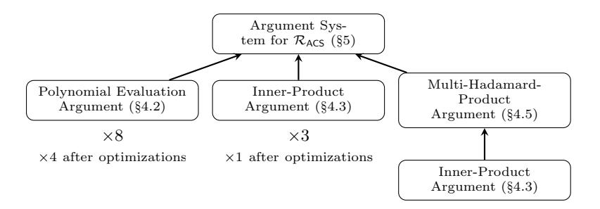

# Poppins: A Direct Construction for Asymptotically Optimal zkSNARKs

Abhiram Kothapalli 1 , Elisaweta Masserova 2 , and Bryan Parno 3

Carnegie Mellon University

Abstract. We present Poppins, a direct construction of a zero-knowledge argument system for general computation that features an Oλ(n) time prover and an Oλ(1) time verifier (after a single Oλ(n) public setup) for computations of size n. Our scheme utilizes a universal linear-size structured reference string (SRS) that allows a single trusted setup to be used across all computation instances of a bounded size. Concretely, for computations of size n, our prover's cost is dominated by 35 multiexponentiations of size n and our verifier's cost is dominated by 34 pairings. To achieve the stated asymptotics, we first construct a nearlyoptimal zkSNARK with a logarithmic verifier in the random oracle model. We then show how to achieve a constant-time verifier using (single-layer) proof composition. Along the way we design (1) a new polynomial commitment scheme for evaluation-based representations of polynomials, (2) an asymptotically optimal inner-product argument system, (3) an asymptotically optimal multi-Hadamard-product argument system, and (4) a new constraint system for NP that is particularly well-suited for our bundle of techniques.

# 1 Introduction

Verifiable computation [\[39\]](#page-28-0) allows a weak client to outsource a computation and efficiently verify that the returned result is correct. Many recent verifiable computation schemes provide an orthogonal zero-knowledge guarantee, in which the server running the computation can provide a private input to the computation, and still prove correct execution without revealing any information about the input. Such powerful integrity and privacy guarantees have enabled an exciting class of applications, including anonymous credentials [\[34\]](#page-27-0), verifiable storage outsourcing [\[4\]](#page-26-0), blockchain applications [\[52,](#page-28-1) [60\]](#page-29-0), verifiable database operation [\[71\]](#page-29-1), and voting [\[72\]](#page-29-2).

As shown by Goldwasser et al. [\[43\]](#page-28-2), this class of interaction can be modeled as a zero-knowledge argument system. A zero-knowledge argument system is an interactive protocol in which a prover proves a "computational statement" (e.g. "Program P outputs y, on public input x and secret input s") to a verifier. Many

1 akothapa@andrew.cmu.edu

2 elisawem@andrew.cmu.edu

3 parno@cmu.edu

classical results address how to model and realize such an interaction [\[3,](#page-26-1) [5,](#page-26-2) [7\]](#page-26-3). These results however are not designed to be practical for the majority of interesting applications, which demand good concrete costs in addition to a sublinear verifier with respect to the size of the original statement (succinctness) and non-interactivity. Modern performance-oriented argument systems that target these requirements and support a broad class of computational statements (such as NP) are typically dubbed zero-knowledge succinct non-interactive arguments of knowledge (zkSNARK) [\[14\]](#page-26-4). Generally these sorts of argument systems are achieved by putting together the following pieces: (1) a constraint system to represent computational statements as low-level algebraic constraints, (2) mathematical representations (e.g. polynomials) to encode constraints and purported satisfying assignments, (3) efficient algebraic tests (e.g. polynomial equality testing) to check that the encoded assignment satisfies the prescribed algebraic constraints, and (4) cryptographic machinery to prove in zero-knowledge that the prescribed algebraic tests are satisfied.

Many performance-oriented zero-knowledge argument systems have proposed various bundles of techniques to address each of the listed pieces [\[2,](#page-26-5)[23,](#page-27-1)[28,](#page-27-2)[58,](#page-29-3)[62,](#page-29-4) [68\]](#page-29-5). However, all proposals make some combination of the following undesirable compromises: (1) a per-circuit trusted setup (which is especially problematic in settings such as the blockchain where there is no clear authority); (2) a superlinear prover and/or a (super)-logarithmic verifier which hurts practical efficiency and may defeat the purpose of outsourcing computation; (3) a restricted class of computations (such as circuits with repeated structure).

In contrast, our system makes none of these compromises — Instead, by developing new techniques and extending techniques from several previous strands of work, we achieve an efficient zkSNARK for general computation.

# 1.1 Our Results

We present Poppins, a time-optimal zkSNARK for general computation that features an Oλ(n) time prover and an Oλ(1) verifier (after a single Oλ(n) public setup) for computations of size n. As Lee et al. [\[53\]](#page-28-3) and Bootle et al. [\[20\]](#page-27-3) point out, the precise definition of "time-optimal" can vary. We adopt convention, and measure runtime in terms of the number of field and group operations performed [\[23,](#page-27-1) [28,](#page-27-2) [58,](#page-29-3) [62\]](#page-29-4). As such, we ensure that the prover performs a linear number of field/group operations, and that the verifier performs a constant number of field/group operations with respect to computation size n. We show how our asymptotics compare to other popular zkSNARK systems in table [1.](#page-3-0)

Our argument system utilizes a universal linear-size structured reference string (SRS) (i.e., a single trusted setup can be used across all computation instances of a bounded size). In terms of concrete costs, our prover is roughly 2 − 3× more expensive than existing universal zkSNARKs such as Spartan [\[62\]](#page-29-4), Marlin [\[28\]](#page-27-2), and Plonk [\[38\]](#page-28-4). In the algebraic group model [\[37\]](#page-27-4), for computations of size n, the prover's cost is dominated by 35 multi-exponentiations of size n, the verifier's cost is dominated by 34 pairings, and the total communication cost is estimated to be 93 group elements.

Our core argument is constructed by modifying argument systems for linear algebraic statements (e.g., inner-product, Hadamard-product, polynomial evaluation) to match our desired asymptotics before composing them to create a argument system for general computation. In particular, existing argument systems typically feature either a non-constant-time verifier or a super-linear prover. To achieve a linear-time prover, we design new techniques to avoid super-linear operations (such as polynomial interpolation). Later, to achieve a constant-time verifier, we outsource the verifier's non-constant-time work using a generic argument system. We give a high level overview of our core contributions leading to an argument system with optimal asymptotics:

- (i) Polynomial Commitments for Evaluation-Based Representations: A polynomial commitment scheme allows a prover to commit to a polynomial and later verifiably evaluate it at a challenge point. We propose a new polynomial commitment scheme based on that of Zhang et al. [\[71\]](#page-29-1) specifically tailored for evaluation-based representations of polynomials. This allows us to avoid expensive interpolation operations typically found in argument systems that rely on polynomial-based representations.
- (ii) Extended Inner-Product Argument: An inner-product argument allows a prover to commit to two vectors and later verifiably evaluate their innerproduct. We extend the inner-product argument presented by B¨unz et al. [\[26\]](#page-27-5) to operate over commitments to evaluation-based representations of polynomials. Additionally, we modify this argument system to support zero-knowledge.
- (iii) Asymptotically Optimal Multi-Hadamard-Product Argument: A multi-Hadamardproduct argument allows a prover to commit to a list of vectors and later verifiably evaluate the Hadamard product of these vectors. Bayer [\[6\]](#page-26-6) presents a multi-Hadamard argument that features a linear-time prover and verifier. We show how to compose Bayer's argument with our modified inner-product argument to achieve a constant-time verifier.
- (iv) A New Constraint System to Characterize NP: We design a new constraint system to capture NP that allows us to piece together the previous argument systems in a novel way. We refer to the relation defining our constraint system as RACS. We show how to encode RACS statements into polynomial representations that can be checked using the techniques described above.

Putting together the listed pieces, we achieve a public-coin argument with a logarithmic number of rounds in the standard model using just a structured reference string. This argument can be made non-interactive with a logarithmic-time verifier in the random oracle model. To outsource the verifier's non-constant-time work, we must heuristically instantiate the random oracle with a cryptographic hash function before representing the verifier's checks as a circuit [\[12,](#page-26-7) [21,](#page-27-6) [29,](#page-27-7) [30,](#page-27-8) [53\]](#page-28-3). Part of the difficulty of outsourcing in our setting is that we must ensure that the outsourced circuit is small enough to preserve a concretely efficient prover. We carefully construct our suite of techniques to ensure that the verifier only has to outsource a small portion of its checks.

| Scheme                           | Setup     | Prover               | Verifier             | Proof Size           | Model               |
|----------------------------------|-----------|----------------------|----------------------|----------------------|---------------------|
| zkSTARK [8]                      | public    | n polylog $n$        | $\log^2 n$           | $\log^2 n$           | uniform circuits    |
| Ligero [2]                       | public    | $n \log n$           | n                    | n                    | arithmetic circuits |
| Aurora [10]                      | public    | $n \log n$           | n                    | $\log^2 n$           | R1CS                |
| Hyrax [68]                       | public    | $d(g + c\log c) + w$ | $d\log g + \sqrt{w}$ | $\sqrt{n}$           | arithmetic circuits |
| Virgo [70]                       | public    | $n + n \log n$       | $d\log n + \log^2 n$ | $d\log n + \log^2 n$ | uniform circuits    |
| Spartan SORT [62]     | public    | n                    | $\sqrt{n}$           | $\sqrt{n}$           | R1CS                |
| Bulletproofs [23]                | public    | n                    | n                    | $\log n$             | arithmetic circuits |
| Plonk [38]                       | private** | $n \log n$           | 1                    | 1                    | arithmetic circuits |
| SuperSonic [25]                  | private** | $n \log n$           | $\log n$             | $\log n$             | arithmetic circuits |
| Marlin [28]                      | private** | $n \log n$           | $\log n$             | 1                    | R1CS                |
| Libra [69]                       | private** | n                    | $d \log n$           | $d \log n$           | uniform circuits    |
| Spartan KZG [62]      | private** | n                    | $\log^2 n$           | $\log n$             | R1CS                |
| GGPR-based [58]                  | private   | $n \log n$           | x                    | 1                    | arithmetic circuits |
| $\mathbf{Poppins}_{\mathrm{RO}}$ | private** | n                    | $\log n$             | $\log n$             | $\mathcal{R}_{ACS}$ |
| Poppins                          | private*  | n                    | x                    | 1                    | $\mathcal{R}_{ACS}$ |

Table 1: Asymptotic costs of various zero-knowledge proof systems in terms of field and group operations. n denotes the number of constraints. d denotes the circuit depth. x denotes the size of the circuit inputs and outputs. w denotes the size of the provers private input. c denotes the number of repeating identical subcircuits. g denotes the width of the circuit. private\* denotes a universal setup. private\*\* denotes a universal and updatable trusted setup. R1CS is an algebraic constraint system based on Quadratic Arithmetic Programs [40]. We note that the total number of constraints can vary based on computational model. PoppinsRO represents our argument system before instantiating the random oracle.

#### 1.2 Related Work

zkSNARKs for a Limited Class of Computation: In an effort to create practical systems, Goldwasser et al. [42] describe an interactive argument system (over layered arithmetic circuits), which consists of proving statements about each layer of the circuit using the sum-check protocol proposed by Lund et al. [55]. Following works [31, 66, 68] refines this approach by considering uniform circuits (i.e., descriptions of the circuit are asymptotically smaller than the circuit itself). Recent works additionally achieve zero-knowledge [68], and an asymptotically linear prover [69, 70]. Unfortunately, systems in this line rely on layered, uniform circuits, in order to achieve a logarithmic verifier, limiting the class of computations which can be efficiently encoded.

zkSNARKs with a Trusted Setup: In a parallel vein, Gennaro et al. [40] achieve a constant-time verifier and a nearly linear prover for general computations by making use of a per-instance trusted setup. Core to their work is a new constraint system, Quadratic Arithmetic Programs, which inspires the constraint system designed in this work. Parno et al. optimize Gennaro et al.'s [40] protocol to produce a highly optimized implementation, Pinocchio [58]. A large line of work optimizes Pinocchio in various settings [32, 33, 36, 47, 60]. Systems in this line require a per-circuit structured reference string (SRS) generated privately by a trusted party, which can be problematic in practice [60]. Additionally, for computations of size n, these systems require  $O_{\lambda}(n \log n)$  field operations which adds a non-trivial overhead in practice [58].

Efforts To Remove a Trusted Setup: Practical issues with private setup procedures have caused a recent surge in argument systems without a trusted setup, (i.e. transparent zkSNARKs). Using only the discrete logarithm assumption, Groth [\[46\]](#page-28-9) proposes an argument system for statements in NP, by combining zero-knowledge argument systems for linear-algebraic operations such as matrix product, Hadamard product, and inner-product. This system is implemented by Bootle et al. [\[19\]](#page-27-14) and later refined by B¨unz et al. [\[23\]](#page-27-1). Systems in this line require the verifier perform linear work in the size of the original computation making them useful only for their zero-knowledge properties, not for outsourcing.

Aurora [\[10\]](#page-26-9) and zkSTARKs [\[8\]](#page-26-8) achieve a transparent setup by building upon a line of work initiated by Ben-Sasson et al. [\[11\]](#page-26-10). The soundness for both of these systems relies on non-standard assumptions related to Reed-Solomon Codes. Unfortunately, both Aurora and zkSTARKs also feature a linear verifier and a nearly linear prover. zkSTARKs achieves a polylogarithmic verifier when considering uniform circuits, but relies on a computational model which can add significant overhead in practice [\[67\]](#page-29-9).

Ishai et al. construct transparent zero-knowledge argument systems using secure multi-party computation as a fundamental building block [\[50\]](#page-28-10). Several works refine this approach [\[27,](#page-27-15)[41\]](#page-28-11); however all of these works feature a linear-time verifier. Ames et al. [\[2\]](#page-26-5) show how to achieve a sublinear verifier by amortizing over multiple instances of the same verification circuit.

Recently, Setty proposed Spartan [\[62\]](#page-29-4), the first direct construction for a transparent zkSNARK with sublinear verifier without any assumptions about the circuit structure. In more detail, Spartan reduces matrix encodings of arithmetic circuits to a sum-check instance over sparse multivariate polynomials which are verifiably evaluated in zero-knowledge by using the argument system proposed by Wahby et al [\[68\]](#page-29-5). Unfortunately for computations of size n, Spartan's verifier still runs in time Oλ( √ n).

Universal Trusted Setups as an Alternate Solution: The preceding discussion of transparent zkSNARKs indicates that it is unclear how to achieve an asymptotically optimal verifier without the use of a trusted setup. Two recent works, Sonic [\[56\]](#page-28-12) and Marlin [\[28\]](#page-27-2), take a middle-ground approach and study the setting where a private trusted setup is performed only once, and the resulting SRS can be reused across all circuits that respect a certain size bound (i.e., a universal trusted setup). For computations of size n, Sonic achieves an Oλ(n log n) prover and a constant time verifier, and Marlin achieves an Oλ(n log n) prover and an Oλ(log n) verifier (although Marlin is considerably cheaper in practice). Another recent work, Plonk, achieves the same asymptotics as Sonic, but with significantly better concrete costs by utilizing an improved permutation argument [\[38\]](#page-28-4). Setty describes a variant of Spartan that utilizes a universal trusted setup to achieve an Oλ(log2 n) verifier. Encouraged by these results, we also adopt this setting in our work.

Optimal Asymptotics via Recursive Composition: A zkSNARK supports recursive composition if the verifier's execution can be expressed as another computation instance to be proved, thus allowing the prover to write proofs about proofs. Valiant [\[65\]](#page-29-10) shows how to take any succinct argument system that supports recursive composition and achieve a linear time prover and a (practically) constant-time verifier. Roughly, Valiant's prover breaks down a large circuit into many small circuits and writes a proof of correct execution for each before "folding" all of these proofs into a single (constant-sized) proof using a tree-like structure. Both Bitansky et al. [\[15\]](#page-26-11) and Ben-Sasson et al. [\[12\]](#page-26-7) refine this transformation. Bitansky et al.'s transformation can be applied to two recent recursive proof systems, Halo [\[21\]](#page-27-6) and Fractal [\[29\]](#page-27-7) (and following generalizations [\[18,](#page-26-12) [24\]](#page-27-16)) to achieve time-optimal zkSNARKs. Unfortunately, recursive composition applied in this manner incurs quite expensive overheads in practice. In contrast, our work achieves an optimal zkSNARK with significantly reduced overhead via a direct construction.

# 2 Technical Overview

Fig. 1: Overview of the techniques involved to construct our argument system for general computation. We achieve concrete optimizations by batching and instantiating in the Algebraic Group Model [\[37\]](#page-27-4). More details are provided in supplementary section [F.](#page-52-0)

The RACS Constraint System: We start by designing a novel linear algebraic constraint system, RACS, that, unlike previous constraint systems, is carefully designed to only utilize asymptotically optimal argument systems. Formally, RACS is modeled as a relation that consists of a public statement (represented as matrices) and a private witness (represented as a vector). In an argument system for RACS, the prover shows — in zero-knowledge — that it knows a witness that satisfies the constraints encoded in the statement. We show how to encode both the statement and witness of an RACS instance as polynomials (as part of a single linear-time public setup). To check that the prover's witness polynomial satisfies the given statement polynomials with respect to relation RACS, the verifier is tasked with checking that evaluations of a witness-dependent polynomial over a specified set of points sum to 0.

Argument System Overview: The prior check can be viewed as a sum-check instance [\[55\]](#page-28-7), and indeed several recent systems have tackled similiar checks using a generic sum-check protocol [\[28,](#page-27-2) [62,](#page-29-4) [68\]](#page-29-5). However existing sum-check protocols do not meet our desired asymptotic goals: They either induce a super-linear prover [\[28\]](#page-27-2) or a non-constant verifier [\[69\]](#page-29-7).

In contrast, RACS is designed to avoid sumcheck protocols: We show how the task of checking an RACS instance can be reduced to the task of checking (1) polynomial equality and (2) a specalized sum of the following form:

$$\sigma = \sum_{h \in H} A(h) \cdot B(h) \tag{1}$$

for some predefined set of points H, claimed sum σ, and polynomials A(X), and B(X). Here we make a novel observation that the right-hand side of Equation [1](#page-6-0) can be evaluated by taking an inner-product over evaluation representations of polynomials A and B, thus avoiding sumchecks entirely. This realization motivates us to represent polynomials using their evaluation-based representation rather than a coefficient-based representation.

Thus, the verifier can efficiently check Equation [1](#page-6-0) by using an argument system for inner-product (Construction [4\)](#page-18-0). Unfortunately, the fastest existing innerproduct argument [\[26\]](#page-27-5) still features a logarithmic-time verifier, which seems to indicate that we've gained no advantage over sumcheck protocols. However, we show that the inner-product verifier is particularly well-suited to cheaply outsource its logarithmic work using (single-layer) proof composition.

As for the polynomial equality check, we show how the verifier can reduce this task to another another (simpler) sum-check instance using the Schwartz-Zippel Lemma [\[61\]](#page-29-11). The verifier repeats this interaction over several rounds to reduce the original statement to checking the Hadamard-product over vectors generated during the interaction. Thus, in the final round, the verifier engages in an Hadamard-product argument over multiple vectors, which in turn relies on another inner-product argument (Construction [5\)](#page-20-1). We summarize the key components of our construction in Figure [1.](#page-5-0)

Utilizing Polynomial Commitments: We note that we cannot achieve a sublinear verifier if the prover directly sends the aforementioned polynomials, which are linear in the size of the RACS instance. Instead the prover sends commitments to these polynomials (Construction [1\)](#page-13-0), and later engages in arguments regarding these commitments to convince the verifier that its checks would pass (a technique popularized by several recent works [\[28,](#page-27-2) [62,](#page-29-4) [68,](#page-29-5) [70,](#page-29-6) [71\]](#page-29-1)). Traditionally polynomial commitments, as defined by Kate et al. [\[51\]](#page-28-13), refer to both the scheme to commit to a vector representing a polynomial and the argument system to evaluate polynomials "under" these commitments. However, in our setting we utilize the same commitment value in multiple contexts: Specifically we treat such commitments as vector commitments when involved in inner product arguments, and as polynomial commitments when involved in polynomial-evaluation arguments. To maintain a cleaner presentation we separate the schemes to commit to a vector representing a polynomial (Construction [1\)](#page-13-0) and the argument system to evaluate committed polynomials (Construction [2\)](#page-14-1).

Throughout the argument, the prover is required to evaluate polynomials (represented as vectors of evaluations) "under" its commitments at challenge points. Our polynomial-evaluation argument modifies that of Zhang et al. [\[71\]](#page-29-1) which in turn is based on the scheme by Papamanthou et al. [\[57\]](#page-28-14), both of which achieve an Oλ(n) prover and an Oλ(1) verifier for degree n univariate polynomials represented as coefficients. In order to efficiently evaluate univariate polynomials based on their evaluation representations, we design a structured key which utilizes the Lagrange basis (Definition [7\)](#page-10-0).

Instantiating the Random Oracle: We prove our arguments for polynomial evaluation, inner-product, and multi-Hadamard product in the random oracle model. As a result, we achieve an argument for RACS with a logarithmic-time verifier in the random oracle model. In order to achieve a constant-time verifier, we outsource the verifier's logarithmic work using another general-purpose argument system. Because it is impossible to prove relativized statements (i.e. statements about circuits that query random oracles), we must heuristically instantiate the random oracle with a cryptographic hash function, thus leaving the random oracle model. We stress that this instantiation step is taken by all existing systems that utilize any form of proof composition starting with Valiant's incremental verifiable computation [\[65\]](#page-29-10) and following generalizations [\[12,](#page-26-7) [15,](#page-26-11) [30\]](#page-27-8). Several recent general proof systems must also instantiate the random oracle in this fashion [\[21,](#page-27-6) [29,](#page-27-7) [53\]](#page-28-3).

Preserving a Universal/Updatable SRS and Non-Interactivity: Several of the listed techniques require a structured reference string to be generated during a trusted setup phase. We ensure that these setup procedures are not instance dependent, which allows the overall argument system to maintain a universal SRS. Groth et al. [\[49\]](#page-28-15) show that an SRS defined over the monomial basis is updatable, implying that our SRS, defined over the Lagrange basis, is also updatable. Specifically, updating parties can take a linear combination of the Lagrange basis terms to retrieve the monomial basis terms, perform an update generically, and convert back to the Lagrange basis. When we instantiate the random oracle and outsource the verifiers non-constant work, we must make use of a non-updatable CRS. This means that while we achieve updatability for our argument system with a logarithmic verifier, we do not achieve updatability for a constant time verifier. We additionally ensure that all the components used in our argument system for general computation are public-coin (the verifier only sends random challenges) thus ensuring that it can be made non-interactive using the Fiat-Shamir transform [\[35\]](#page-27-17).

### 2.1 Roadmap

In Section [3](#page-8-0) we define argument systems, present several algebraic preliminaries, and define our cryptographic assumptions. In Section [4](#page-12-0) we define and provide constructions for vector commitments (§4.1), polynomial-evaluation arguments (§4.2), inner-product arguments (§4.3), and multi-Hadamard arguments (§4.5). In Section 5 we define the  $\mathcal{R}_{ACS}$  constraint system and our argument system for  $\mathcal{R}_{ACS}$ . In Section 6 we describe proof-composition techniques to achieve a constant-time verifier.

### 3 Preliminaries

#### 3.1 Argument System

An argument system is a protocol in which a prover proves a "computational statement" to a verifier. Formally we capture a computational statement as a ternary relation. For relation  $\mathcal{R}$ , given public parameters  $\mathsf{pp}$ , we call w a witness for a statement u if  $(\mathsf{pp}, w, u) \in \mathcal{R}$ . In this section we define argument systems and their desired properties. We adapt the following notation and definitions from both Chiesa et al. [28] and Bünz et al. [23].

**Definition 1 (Interactive Argument System).** Let  $\mathcal{R} \subset \{0,1\}^* \times \{0,1\}^* \times \{0,1\}^*$  be a polynomial-time-decidable ternary relation. An argument system for relation  $\mathcal{R}$  is a tuple of three probabilistic polynomial-time interactive algorithms  $(\mathcal{G}, \mathcal{P}, \mathcal{V})$ , denoted the generator, prover, and verifier respectively, with the following structure

- $-\mathcal{G}(\lambda, N) \to pp$ : Takes as input security parameter  $\lambda$  and the size bound  $N \in \mathbb{N}$ . Outputs public parameters pp.
- $\mathcal{P}(\mathsf{pp}, u, w)$ : Takes as input public parameters  $\mathsf{pp}$ , statement u, and witness w. Interactively proves that  $(\mathsf{pp}, u, w) \in \mathcal{R}$ .
- $-\mathcal{V}(pp,u) \to 0/1$ : Takes as input public parameters pp and statement u. Outputs 0 for reject and 1 for accept.

Let  $\operatorname{tr} \leftarrow \langle \mathcal{P}(\mathsf{pp}, u, w), \mathcal{V}(\mathsf{pp}, u) \rangle$  denote the transcript  $\operatorname{tr}$  produced by  $\mathcal{P}$  and  $\mathcal{V}$  on their specified inputs. Let  $\langle \mathcal{P}(\mathsf{pp}, u, w), \mathcal{V}(\mathsf{pp}, u) \rangle = 0/1$  denote the verifier's output at the end of the interaction. For relation  $\mathcal{R}$ ,  $(\mathcal{G}, \mathcal{P}, \mathcal{V})$  satisfies perfect completeness if for any statement u and witness w

$$\Pr\left[ \left. \begin{array}{l} (\mathsf{pp}, u, w) \in \mathcal{R}, \\ \langle \mathcal{P}(\mathsf{pp}, u, w), \mathcal{V}(\mathsf{pp}, u) \rangle = 1 \, \right| \mathsf{pp} \leftarrow \mathcal{G}(\lambda, \mathsf{N}) \, \right] = 1$$

and satisfies soundness if for any non-satisfiable statement u (i.e. there exists no w such that  $(pp, u, w) \in \mathcal{R}$ .) and PPT adversary  $\mathcal{P}^*$ 

$$\Pr\left[\left\langle \mathcal{P}^*(\mathsf{pp}, u), \mathcal{V}(\mathsf{pp}, u) \right\rangle = 1 \,\middle|\, \mathsf{pp} \leftarrow \mathcal{G}(\lambda, \mathsf{N}) \,\middle|\, = \mathsf{negl}(\lambda).$$

**Definition 2 (Knowledge-Soundness [71]).** Informally, knowledge soundness captures the notion that if the verifier is convinced of a specified statement, then the prover must possess the corresponding witness. Formally, an argument

system for relation  $\mathcal{R}$ ,  $(\mathcal{G}, \mathcal{P}, \mathcal{P})$ , satisfies knowledge-soundness if for any probabilistic polynomial time prover  $\mathcal{P}^*$  there exists a probabilistic polynomial time extractor  $\mathcal{E}$  such for all inputs u

$$\Pr\left[ \begin{array}{l} \langle \mathcal{P}^*(\mathsf{pp}, u, \rho), \mathcal{V}(\mathsf{pp}, u) \rangle = 1, \left| \begin{array}{l} \mathsf{pp} \leftarrow \mathcal{G}(\lambda, \mathsf{N}), \\ w \leftarrow \mathcal{E}(\mathsf{pp}, u, \rho) \end{array} \right] = \mathsf{negl}(\lambda) \right.$$

where  $\rho$  denotes the input randomness for  $\mathcal{P}^*$ .

**Definition 3** ((Special Honest-Verifier) Zero-Knowledge). Informally, (Special Honest-Verifier) Zero-Knowledge captures the property that an (honest) verifier gains no additional information after viewing a proof of correct execution. Formally, an interactive argument system  $(\mathcal{G}, \mathcal{P}, \mathcal{V})$  satisfies zero-knowledge for relation  $\mathcal{R}$  if there exists a PPT simulator  $\mathcal{S}$  such that for any PPT adversary  $\mathcal{V}^*$ , pair of interactive adversaries  $\mathcal{A}_1, \mathcal{A}_2$ , and auxiliary input z

$$\left| \begin{array}{l} \Pr \left[ \begin{array}{l} (\mathsf{pp}, u, w) \in \mathcal{R}, \\ \mathcal{A}_2(\mathsf{tr}) = 1 \end{array} \middle| \begin{array}{l} \mathsf{pp} \leftarrow \mathcal{G}(\lambda, \mathsf{N}), \\ (u, w, \mathsf{st}) \leftarrow \mathcal{A}_1(\mathsf{pp}, z), \\ \mathsf{tr} \leftarrow \langle \mathcal{P}(\mathsf{pp}, u, w), \mathcal{V}^*(\mathsf{pp}, u; \mathsf{st}) \rangle \end{array} \right] - \\ \Pr \left[ \begin{array}{l} (\mathsf{pp}, u, w) \in \mathcal{R}, \\ \mathcal{A}_2(\mathsf{tr}) = 1 \end{array} \middle| \begin{array}{l} (\mathsf{pp}, \mathsf{trap}) \leftarrow \mathcal{S}(\lambda, \mathsf{N}), \\ (u, w) \leftarrow \mathcal{A}_1(\mathsf{pp}, z), \\ \mathsf{tr} \leftarrow \mathcal{S}(\mathsf{pp}, \mathsf{trap}, u) \end{array} \right] \right| \leq \mathsf{negl}(\lambda).$$

 $(\mathcal{G}, \mathcal{P}, \mathcal{V})$  satisfies special honest-verifier zero-knowledge if  $\mathcal{V}^*$  is constrained to be the honest verifier.

**Definition 4 (Public Coin).** An argument system  $(\mathcal{G}, \mathcal{P}, \mathcal{V})$  is called public coin if all the messages sent from  $\mathcal{V}$  to  $\mathcal{P}$  are chosen uniformly at random and independently of the prover's messages.

#### 3.2 Algebraic Preliminaries

The  $\mathcal{R}_{ACS}$  relation involves statements and witnesses represented as a set of polynomials over a field  $\mathbb{F}$ .  $\mathcal{R}_{ACS}$  efficiently encodes conditions that dictate a valid statement-witness polynomial pair using *vanishing polynomials*, and the formal derivative of vanishing polynomials. We borrow both notation and several of the following definitions from Chiesa et al. [28].

Notation 1 (Vectors and Matrices). Throughout this work we denote vectors and matrices using a bold font (i.e.  $\boldsymbol{v}$  and  $\boldsymbol{M}$ ). For matrix M we let M[i,j] denote the entry at row i and column j. We let  $v_i$  denote element i of vector  $\boldsymbol{v}$ . We define vectors by their individual components using parenthesis (i.e.  $\boldsymbol{v} = (v_1, v_2, \ldots, v_n)$ ). We denote vector  $\boldsymbol{w}$  appended to vector  $\boldsymbol{v}$  as  $(\boldsymbol{v}, \boldsymbol{w})$ . We define  $\boldsymbol{v} \cdot \boldsymbol{w}$  to be the inner-product and  $\boldsymbol{v} \circ \boldsymbol{w}$  to be the Hadamard product. For vectors  $\boldsymbol{g}$  and  $\boldsymbol{x}$  of the same length, let  $\boldsymbol{g}^{\boldsymbol{x}} = \prod_i g_i^{x_i}$ . We let [n] denote the vector  $(1, 2, \ldots, n)$  and let [m, n] denote the vector  $(m, m+1, \ldots, n)$ . Similiarly we let  $\{v_i\}_{i \in [n]}$  denote the vector  $(v_1, v_2, \ldots, v_n)$ .

Notation 2 (Evaluation-Based Polynomial Representation). Throughout our work, we represent various degree n polynomials as vectors of n + 1 evaluations over a predefined set of points rather than as vectors of coefficients. For a polynomial p we let p denote its evaluation-based vector representation. We treat p as a vector or a polynomial representation interchangably depending on context. For notational conciseness, we let p(x) denote the evaluation p(x). Similiarly for indeterminate X, we let p(X) denote polynomial p(X).

Definition 5 (Vanishing Polynomial [\[28\]](#page-27-2)). Consider a finite field F and a subset S ⊆ F. Let vS denote the unique, non-zero, monic, polynomial of degree |S| that is zero at every point on S. If S is a multiplicative subgroup, then vS(X) = X|S| − 1, which can be computed in O(log |S|) field operations.

Definition 6 (Formal Derivative of the Vanishing Polynomial [\[9,](#page-26-13) [28\]](#page-27-2)). Given a finite field F and a subset S ⊆ F, we define the polynomial

$$u_S(X,Y) = \frac{v_S(X) - v_S(Y)}{X - Y},$$

where X, Y ∈ F. Note that uS is a bivariate polynomial with degree |S| − 1 in each variable, because X − Y divides vS(X) − vS(Y ).

If S is a multiplicative subgroup, we can compute uS(X, Y ) as follows: If X 6= Y then the term (vS(X)−vS(Y ))/(X −Y ) can be computed directly. If, on the other hand, X = Y , then Chiesa et al. [\[28\]](#page-27-2) show that uS(X, X) = |S|X|S|−1 . This property suggests that for all X, Y ∈ S, uS(X, Y ) 6= 0 when X = Y and uS(X, Y ) = 0 otherwise.

Lemma 1 (Polynomial Decomposition [\[57\]](#page-28-14)). Consider degree d polynomial p(X) and arbitrary evaluation point u ∈ F. Then there exists degree d − 1 polynomial q(X) such that

$$\frac{p(X) - p(u)}{X - u} = q(X)$$

Definition 7 (Lagrange Basis). For evaluation points x1, . . . , xk the Lagrange basis is defined as `(x) = h`0(x), . . . , `k(x)i &gt; where

$$\ell_j(x) := \prod_{0 \le m \le k, m \ne j} \frac{x - x_m}{x_j - x_m}.$$

Suppose a polynomial P of degree k is defined by points (x0, y0), . . . ,(xk, yk) Then

$$P(x) = \sum_{j=0}^{k} y_j \ell_j(x).$$

#### 3.3 Cryptographic Assumptions

In order to achieve zero-knowledge we require additional cryptographic machinery overlayed on top of the core interaction. We define our cryptographic assumptions below.

Assumption 1 (Discrete Logarithm Relation [23]). Consider group  $\mathbb{G}$ . The discrete logarithm assumptoin holds for  $\mathbb{G}$  if for all PPT adversaries  $\mathcal{A}$  and for all  $n \geq 2$ 

$$\Pr\left[\begin{array}{c|c}\exists \ a_i \neq 0, \\ \prod_{i=1}^n g_i^{a_i} = 1\end{array}\middle|\begin{array}{c}g_1, \ldots, g_n \xleftarrow{\$} \mathbb{G}, \\ a_1, \ldots, a_n \in \mathbb{Z}_p \leftarrow \mathcal{A}(\mathbb{G}, g_1, \ldots, g_n)\end{array}\right] = \mathsf{negl}(\lambda).$$

Assumption 2 (*n*-Strong Diffie-Hellman (*n*-SDH)). Consider group  $\mathbb{G}$  of prime order  $p = O(2^{\lambda})$  and let  $\mathbb{F} = \mathbb{Z}_p^*$ . The *n*-SDH assumption [17] holds for  $\mathbb{G}$  if for all PPT adversaries  $\mathcal{A}$ 

$$\Pr \begin{bmatrix} c \neq -s, \\ C = g^{\frac{1}{s+c}} \\ \begin{pmatrix} g \overset{\$}{\leftarrow} \mathbb{G}, \\ s \overset{\$}{\leftarrow} \mathbb{F}, \\ \sigma = (\mathbb{G}, g, g^s, \dots, g^{s^n}), \\ (c, C) \leftarrow \mathcal{A}(\sigma) \end{bmatrix} = \mathsf{negl}(\lambda).$$

Assumption 3 (*n*-Bilinear Strong Diffie-Hellman (*n*-BSDH)). Consider two groups  $\mathbb{G}$  and  $\mathbb{G}_{\mathsf{T}}$  of prime order  $p = O(2^{\lambda})$  such that there exists a symmetric bilinear pairing  $e : \mathbb{G} \times \mathbb{G} \to \mathbb{G}_{\mathsf{T}}$ . Let  $\mathbb{F} = \mathbb{Z}_p^*$ . The *n*-BSDH assumption [44] holds for  $(\mathbb{G}, \mathbb{G}_{\mathsf{T}})$  if for all PPT adversaries  $\mathcal{A}$ 

$$\Pr \begin{bmatrix} c \neq -s, \\ C = e(g,g)^{\frac{1}{s+c}} & g \overset{\$}{\leftarrow} \mathbb{G}, \\ s \overset{\$}{\leftarrow} \mathbb{F}, \\ \sigma = ((\mathbb{F}, \mathbb{G}, \mathbb{G}_{\mathsf{T}}, e), g, g^s, \dots, g^{s^n}), \\ (c,C) \leftarrow \mathcal{A}(\sigma) \end{bmatrix} = \mathsf{negl}(\lambda).$$

Assumption 4 (n-EPKE for a Linearly Independent Basis). Consider a linearly independent basis of polynomials of degree up to  $n: p_0(X), \ldots, p_n(X)$ . Consider two groups  $\mathbb{G}$  and  $\mathbb{G}_T$  of prime order  $p = O(2^{\lambda})$  such that there exists a symmetric bilinear pairing  $e: \mathbb{G} \times \mathbb{G} \to \mathbb{G}_T$ . Let  $\mathbb{F} = \mathbb{Z}_p^*$ . The n-Extended Power Knowledge of Exponent holds for  $(\mathbb{G}, \mathbb{G}_T)$  if for any PPT adversary  $\mathcal{A}$  there exists a PPT extractor  $\mathcal{E}$  such that

$$\Pr\left[ \begin{array}{l} e(A,g^{\alpha}) = e(A',g), \\ A = \left(\prod_{i=0}^{n} g^{p_{i}(s) \cdot a_{i}}\right) \cdot g^{t \cdot b} \\ \left[ \begin{array}{l} (\mathbb{F}, \mathbb{G}, \mathbb{G}_{\mathsf{T}}, e) \leftarrow \mathcal{G}(\lambda), \\ \alpha, s, t \overset{\$}{\leftarrow} \mathbb{F}, g \overset{\$}{\leftarrow} \mathbb{G}, \\ \boldsymbol{u} = (g, g^{p_{0}(s)}, \ldots, g^{p_{n}(s)}, g^{t}), \\ \boldsymbol{v} = (g^{\alpha}, g^{\alpha p_{0}(s)}, \ldots, g^{\alpha p_{n}(s)}, g^{\alpha t}), \\ \sigma = ((\mathbb{F}, H, \mathbb{G}, \mathbb{G}_{\mathsf{T}}, e), \boldsymbol{u}, \boldsymbol{v}), \\ (A, A') \leftarrow \mathcal{A}(\lambda, \sigma, z; \rho), \\ (a_{0}, \ldots, a_{n}, b) \leftarrow \mathcal{E}(\lambda, \sigma, z; \rho) \end{array} \right] = 1 - \mathsf{negl}(\lambda)$$

for any benign auxiliary input  $z \in \{0, 1\}^{\mathsf{poly}(\lambda)}$ , and randomness  $\rho$ . In this setting we consider input z benign if it is generated independently of  $\alpha$ . We prove that our variant of the n-EPKE assumption is equivalent to that of of Zhang et al. [71] in supplementary section D.1

Remark 1 (Benign Auxiliary Distributions). Boyle et al. [22] and Bitansky et al. [16] show the impossibility of knowledge assumptions with arbitrary auxiliary inputs. To circumvent this issue, we must assume that each of our subprotocols relying on the q-EPKE assumption only receive benign auxiliary inputs. The precise definition of benign inputs can be found in Assumption 4. When composing subprotocols we are careful not to introduce any new terms that could break this requirement. Thus when using our final argument system as a subroutine in larger protocols, knowledge-soundness holds so long as the auxiliarly input is sampled benignly.

# 4 Auxiliary Argument Systems

In this section we define and construct extractible vector commitments (§4.1), an argument system for polynomial evaluation (§4.2), an argument system for inner-product (§4.3), and an argument system for inner-product over the Lagrange basis (§4.4). While we present the Lagrange basis, we stress that our auxiliary constructions and corresponding proofs work with any basis by Assumption 4. For notational simplicity our constructions utilize symmetric (type 1) bilinear pairings; however, our constructions can be easily modified to handle asymmetric (type 2) bilinear pairings.

#### 4.1 Extractible Vector Commitments

**Definition 8 (Vector Commitments).** 1 A vector commitment scheme over  $\mathbb{F}^n$  has the following structure

- $-\mathcal{G}(\lambda,n) \to \mathsf{pp}$ : Takes input security parameter  $\lambda$  size bound n. Outputs public parameters  $\mathsf{pp}$ .
- $-\operatorname{\mathsf{com}}(\operatorname{\mathsf{pp}}; \boldsymbol{v}; r) \to c.$  Takes input public parameters  $\operatorname{\mathsf{pp}}, \ vector \ \boldsymbol{v} \in \mathbb{F}^n$  and randomness r. Outputs commitment c.
- checkcom(pp; c)  $\rightarrow$  {0,1}. Takes input public parameters pp, and commitment c. Outputs 1 is c is well-formed, 0 otherwise.

A vector commitment scheme  $(\mathcal{G}, \mathsf{com})$  over  $\mathbb{F}^n$ , with randomness space  $\mathsf{R}$ , is said to be computationally binding if for any PPT adversary  $\mathcal{A}$ 

$$\Pr\left[ \begin{aligned} & \operatorname{com}(\boldsymbol{v_0}; r_0) = \operatorname{com}(\boldsymbol{v_1}; r_1), \left| \operatorname{pp} \leftarrow \mathcal{G}(\lambda, n), \\ & \boldsymbol{v_0} \neq \boldsymbol{v_1} \end{aligned} \right] = \operatorname{negl}(\lambda)$$

 $^{\rm 1}$  We elect not to define commitment opening procedures as we do not use it throughout this work

and is said to be unconditionally hiding if for any adversary A

$$\Pr\left[ b = b' \middle| \begin{aligned} \mathsf{pp} \leftarrow \mathcal{G}(\lambda, n), (\boldsymbol{v_0}, \boldsymbol{v_1}) \in \mathbb{F}^n \leftarrow \mathcal{A}(\mathsf{pp}), \\ b \overset{\$}{\leftarrow} \{0, 1\}, \ r \overset{\$}{\sim} \mathsf{R}, c \leftarrow \mathsf{com}(\boldsymbol{v_b}; r), b' \leftarrow \mathcal{A}(\mathsf{pp}, c) \end{aligned} \right] = \frac{1}{2}$$

**Definition 9 (Extractibility).** We call a vector commitment scheme extractible if for any probabilistic polynomial time adversary A, there exists a probabilistic polynomial time extractor  $\mathcal{E}$  such that

$$\Pr\left[ \begin{array}{l} \mathsf{checkcom}(\mathsf{pp};c) = 1, \\ c \neq \mathsf{com}(\mathsf{pp};v;r) \end{array} \middle| \begin{array}{l} \mathsf{pp} \leftarrow \mathcal{G}(\lambda,n), \\ c \leftarrow \mathcal{A}(\mathsf{pp},z;\rho), \\ (v,r) \leftarrow \mathcal{E}(\mathsf{pp},z;\rho) \end{array} \right] = \mathsf{negl}(\lambda)$$

for any benign auxiliary input  $z \in \{0,1\}^{\mathsf{poly}(\lambda)}$ , and randomness  $\rho$ .

**Definition 10 (Additively Homomorphic Commitment Scheme).** Consider a vector commitment scheme  $(\mathcal{G},\mathsf{com})$  over  $\mathbb{F}^n$ , with abelian groups  $(\mathsf{C},+_\mathsf{C})$ ,  $(\mathsf{R},+_\mathsf{R})$  for the commitment space, and randomness space respectively. The commitment scheme is said to be homomorphic if for all  $\mathbf{v_1},\mathbf{v_2}\in\mathbb{F}^n$  and  $\mathbf{r_1},\mathbf{r_2}\in\mathsf{R}$ , we have

$$com(v_1; r_1) +_{C} com(v_2; r_2) = com(v_1 + v_2; r_1 +_{R} r_2).$$

Construction 1 (Structured Polynomial Commitments). We design a scheme to commit to a vector of evaluations representing a polynomial. Similiar to Tomescu et al. [64] we commit to evaluation-based representations of polynomials by utilizing the Lagrange basis as a part of the structured reference string. Using ideas from Zhang et al. [71] (and Chiesa et al. [28]), we achieve extractibility by enforcing that the prover provides an auxiliary "shifted" commitment, which ensures that the commitments were formed by using a linear combination of terms in the SRS. We define generator  $\mathcal{G}$ , com, and checkcom as follows for vectors over  $\mathbb{Z}_p^n$ :

# $\mathsf{Generator}(\lambda,n) \to \mathsf{pp}$ :

- 1. Generate two groups  $\mathbb{G}$  and  $\mathbb{G}_{\mathsf{T}}$  of prime order p (with  $p \geq 2^{\lambda}$ ) such that there exists a symmetric bilinear pairing  $e : \mathbb{G} \times \mathbb{G} \to \mathbb{G}_{\mathsf{T}}$  where the (n-1)-SDH and (n-1)-EPKE assumptions hold.
- 2. Let  $H \subseteq \mathbb{F}$  be such that |H| = n and let  $\ell_1, \ldots, \ell_n$  be the Lagrange basis basis over evaluation points H.
- 3. Randomly sample generator  $q \in \mathbb{G}$  and  $\alpha, s \stackrel{\$}{\leftarrow} \mathbb{F}$ .
- 4. Compute commitment keys  $\boldsymbol{u} = (g^{\ell_1(s)}, \dots, g^{\ell_n(s)})$  and  $\boldsymbol{v} = (g^{\alpha \ell_1(s)}, \dots, g^{\alpha \ell_n(s)})$ .
- 5. Sample  $h \stackrel{\$}{\leftarrow} \mathbb{G}$  and output public parameters  $pp = (\mathbb{G}, H, \boldsymbol{u}, \boldsymbol{v}, q, q^{\alpha}, h, h^{\alpha})$ .

 $\underline{\mathsf{com}}(\mathsf{pp}; \boldsymbol{p} \in \mathbb{F}^n, r \in \mathbb{F}) \to P \in \mathbb{G}^n$ : Interpret  $\boldsymbol{p}$  as a vector of polynomial evaluations over H. Output  $P = (g^{\boldsymbol{p}(s)} \cdot h^r, g^{\alpha \cdot \boldsymbol{p}(s)} \cdot h^{\alpha \cdot r})$ .

 $\mathsf{checkcom}(\mathsf{pp}; P \in \mathbb{G}^2) \to \{0,1\} \text{: Parse } P \text{ as } (P_1, P_2) \text{ and check } e(P_1, g^\alpha) = e(P_2, g).$ 

Lemma 2 (Structured Polynomial Commitments). Construction 1 is a homomorphic vector commitment scheme that satisfies unconditional hiding, computational binding, and extractibility. For polynomials defined by n evaluation points, the generator takes time  $O_{\lambda}(n)$ , com takes time  $O_{\lambda}(n)$ , and checkcom takes time  $O_{\lambda}(1)$ .

*Proof.* Informally, hiding follows from the blinding terms, binding follows from the (n-1)-SDH assumption, and extractibility holds from the (n-1)-EPKE assumption. The generator can compute  $\ell_1(s), \ldots, \ell_1(s)$  in time  $O_{\lambda}(n)$  using the Barycentric representation [13]. Formally, we prove Lemma 2 in supplementary section D.2.

#### 4.2 An Argument System for Polynomial Evaluation

In our argument system for general computation, to prove desired properties about the committed witness and subsequent messages (all represented as polynomials), the prover is required to evaluate these polynomials (represented as vectors of evaluations) at challenge points. We modify the polynomial commitment scheme by Zhang et al. [71], which in turn is based on the scheme by Papamanthou et al. [57]. To efficiently evaluate polynomials based on their evaluation representations, we create a structured key which utilizes the Lagrange basis.

**Definition 11 (Polynomial Evaluation Relation).** Consider group  $\mathbb{G}$  of order q and let  $\mathbb{F} = \mathbb{Z}_q$ . The polynomial evaluation relation  $(\mathcal{R}_{POLY})$ , with respect to vector commitment scheme com, defined over subset  $H \subseteq \mathbb{F}$  consists of commitments  $P \in \mathbb{G}^2$ ,  $Y \in \mathbb{G}$ , evaluation point u, and evaluation result y. A vector  $\mathbf{p}$  and scalar y satisfies an  $\mathcal{R}_{POLY}$  instance if  $\mathbf{p}(u) = y$ , Y = com(y), and  $P = \text{com}(\mathbf{p})$ .

Construction 2 (Argument System for Polynomial Evaluation). We define an argument system for polynomial evaluation (Definition 11) with respect to the structured polynomial commitment scheme (Definition 1)

#### Generator $(\lambda, n) \to pp$ :

- 1. Run the generator for structured polynomial commitments (Construction 1) and output its result.
- 2. Additionally sample  $\beta \stackrel{\$}{\leftarrow} \mathbb{F}$  and output scalar commitment key  $\mathsf{ck}_y = (g, h, g^\beta, h^\beta)$

### ⟨Prover, Verifier⟩:

The prover and verifier are provided with statement  $(P \in \mathbb{G}^2, Y \in \mathbb{G}^2, u \in \mathbb{F})$ . The prover is additionally provided with witness  $\mathbf{p} \in \mathbb{F}^n, y, r_p, r_y \in \mathbb{F}$ . The prover is tasked with proving that  $Y = (g^y \cdot h^{r_y}, g^\alpha \cdot h^{\alpha r_y}), P = (g^{\mathbf{p}(s)} \cdot h^{r_p}, g^{\alpha \mathbf{p}(s)} \cdot h^{\alpha r_p}),$  and that y = p(u).

1. Using Lemma 1, the prover computes evaluations of polynomial  $\mathbf{q}$  over H where  $\mathbf{q}(X) = (\mathbf{p}(X) - y)/(X - u)$ . Next the prover samples  $r_q \stackrel{\$}{\leftarrow} \mathbb{F}$  and commits to  $\mathbf{q}$ , and the randomness:

$$Q = \operatorname{com}(\mathbf{q}; r_q) = (g^{\mathbf{q}(s)} \cdot h^{r_q}, g^{\alpha \mathbf{q}(s)} \cdot h^{\alpha r_q})$$

$$R = (g^{r_p - r_y - r_q(s - u)}, g^{\alpha \cdot (r_p - r_y - r_q(s - u))}).$$

2. The verifier parses commitments P, Q, R, Y as  $(P_1, P_2), (Q_1, Q_2), (R_1, R_2)$  and  $(Y_1, Y_2)$  respectively and checks that they are well formed using check-com. Next the verifier checks that the prover was able to compute a valid commitment to  $\mathbf{q}$ :  $e(P_1/Y_1, g) \stackrel{?}{=} e(Q_1, g^{s-u})e(R_1, h)$ .

**Theorem 1 (Polynomial Evaluation Argument).** Construction 2 satisfies completeness, knowledge soundness, and perfect zero-knowledge. For polynomials defined over n evaluations, the polynomial evaluation argument features an  $O_{\lambda}(n)$  generator,  $O_{\lambda}(n)$  prover, and an  $O_{\lambda}(1)$  verifier.

*Proof.* We prove Theorem 1 in supplementary section D.3.  $\Box$ 

#### 4.3 An Argument System for Inner-Product

We utilize the argument system for generalized inner-product from Bünz et al. [26], specifically instantiated with the Pedersen-like vector commitment scheme and modified to support zero-knowledge. In Section 4.4, we extend this argument system to handle evaluation based polynomial commitments (Construction 1). Later in Section 6 we show how to achieve a constant-time verifier using proof composition.

**Definition 12 (The Inner-Product Relation [26]).** Consider group  $\mathbb{G}$  of order p and let  $\mathbb{F} = \mathbb{Z}_p$ . The inner-product relation  $(\mathcal{R}_{\mathsf{IP}})$ , characterized by commitment scheme com, consists of hiding and binding commitments  $A, B, C \in \mathbb{G}$ , and scalar  $r \in \mathbb{F} \setminus \{0\}$ . Vectors  $\mathbf{a}, \mathbf{b} \in \mathbb{F}^n$  and scalar  $c \in \mathbb{F}$  satisfy an  $\mathcal{R}_{\mathsf{IP}}$  instance if  $c = \mathbf{a}' \cdot \mathbf{b}$ , where  $\{\mathbf{a}'_i = \mathbf{a}_i \cdot r^i\}_{i=0}^{n-1}$ , and A, B and C are commitments to  $\mathbf{a}, \mathbf{b}$ , and c respectively.

Construction 3 (Argument System for Inner-Product [26]). An argument system for the inner-product relation allows a prover to show that for commitments  $A, B, C \in \mathbb{G}$  and scalar  $r \in \mathbb{F} \setminus \{0\}$  they know  $a, b \in \mathbb{F}^n$  and scalar  $c \in \mathbb{F}$  such that A, B, and C are commitments to a, b, and c respectively, and that  $c = (a \circ r) \cdot b$  where  $r = (r^0, r^1, \ldots, r^{n-1})$ .

Bünz et al. [26] present a generalized inner-product argument which allows a prover to prove the inner-product relation over any binding commitment scheme that is doubly homomorphic (i.e. homomorphic in both the message space and the key space). They additionally show how to achieve an  $O_{\lambda}(\log n)$  verifier by utilizing a structured reference string and polynomial commitments. We derive

an argument system for  $\mathcal{R}_{\mathsf{IP}}$  by applying the following commitment scheme to the generalized inner-product argument:

$$com(ck; \boldsymbol{a}, \boldsymbol{b}, c; r_a, r_b, r_c) = (\boldsymbol{w}^{\boldsymbol{a}} \cdot h^{r_a}, \boldsymbol{w}^{\boldsymbol{b}} \cdot h^{r_b}, g^c \cdot h^{r_c}), \tag{2}$$

where the commitment key  $\mathsf{ck} = (\boldsymbol{w}, (g, h))$  is created by the generator as described below. We further modify the generalized inner-product argument to be zero-knowledge using standard techniques.

## Generator $(\lambda, n) \to pp$ :

- 1. Generate two groups  $\mathbb{G}$  and  $\mathbb{G}_{\mathsf{T}}$  of prime order p (with  $p \geq 2^{\lambda}$ ) such that there exists a symmetric bilinear pairing  $e : \mathbb{G} \times \mathbb{G} \to \mathbb{G}_{\mathsf{T}}$  where the (n-1)-SDH, and the (n-1)-EPKE assumptions hold.
- 2. Sample generator  $g \overset{\$}{\leftarrow} \mathbb{G}$ , secret  $s \overset{\$}{\leftarrow} \mathbb{F}$  and define commitment key  $\boldsymbol{w} = (g, g^s, \dots, g^{s^{n-1}})$ .
- 3. Sample  $h \stackrel{\$}{\leftarrow} \mathbb{G}$  and output public parameters  $pp = (e, \boldsymbol{w}, h)$ .

#### ⟨Prover, Verifier⟩:

Both the prover and verifier are provided the statement consisting of commitments A, B, and C and scalar r. The prover is additionally provided witness  $(a, b, c, r_a, r_b, r_c)$ 

- 1. Initially the prover computes  $\mathbf{r} = (r^0, r^1, \dots, r^{n-1})$ , rescales the commitment key  $\mathbf{v} = \mathbf{w}^{\mathbf{r}^{-1}}$ , and rescales the corresponding witness vector  $\mathbf{a} \leftarrow \mathbf{a} \circ \mathbf{r}$ .
- 2. When  $n \geq 2$ , the prover defines  $a_1$  and  $a_2$  to be the first and second half of vector a (similarly for b, v, and w). Next the prover samples randomness  $r_{\mathsf{La}}, r_{\mathsf{Ra}}, r_{\mathsf{Lb}}, r_{\mathsf{Rb}}, r_{\mathsf{Lc}}, r_{\mathsf{Rc}} \stackrel{\$}{\leftarrow} \mathbb{F}$  and sets

$$A_L = h^{r_{\mathsf{L}\mathsf{a}}} \cdot \boldsymbol{v_1^{a_2}} \qquad B_L = h^{r_{\mathsf{L}\mathsf{b}}} \cdot \boldsymbol{w_2^{b_1}} \qquad C_L = h^{r_{\mathsf{L}\mathsf{c}}} \cdot g^{\boldsymbol{a_2} \cdot \boldsymbol{b_1}}$$

$$A_R = h^{r_{\mathsf{R}\mathsf{a}}} \cdot \boldsymbol{v_2^{a_1}} \qquad B_R = h^{r_{\mathsf{R}\mathsf{b}}} \cdot \boldsymbol{w_1^{b_2}} \qquad C_R = h^{r_{\mathsf{R}\mathsf{c}}} \cdot g^{\boldsymbol{a_1} \cdot \boldsymbol{b_2}}$$

and sends these values to the verifier.

- 3. The verifier samples  $x \stackrel{\$}{\leftarrow} \mathbb{F}$  and sends x to the prover.
- 4. The prover and verifier each set

$$A' = A_L^x \cdot A \cdot A_R^{x^{-1}}$$
  $B' = B_L^x \cdot B \cdot B_R^{x^{-1}}$   $C' = C_L^x \cdot C \cdot C_R^{x^{-1}}$ 

5. The prover additionally folds the commitment keys

$$\boldsymbol{v}' = \boldsymbol{v_1} \circ \boldsymbol{v_2}^{x^{-1}} \qquad \qquad \boldsymbol{w}' = \boldsymbol{w_1} \circ \boldsymbol{w_2}^x,$$

folds the witness vectors and associated randomness

$$\begin{aligned} \mathbf{a}' &= \mathbf{a_2} \cdot x + \mathbf{a_1} \\ r_a' &= r_{\mathsf{La}} \cdot x + r_a + r_{\mathsf{Ra}} \cdot x^{-1} \end{aligned} \qquad \begin{aligned} \mathbf{b}' &= \mathbf{b_2} \cdot x^{-1} + \mathbf{b_1} \\ r_b' &= r_{\mathsf{Lb}} \cdot x + r_b + r_{\mathsf{Rb}} \cdot x^{-1}, \end{aligned}$$

and folds the claimed product and associated randomness

$$c' = (\boldsymbol{a_2} \cdot \boldsymbol{b_1}) \cdot x + c + (\boldsymbol{a_1} \cdot \boldsymbol{b_2}) \cdot x^{-1}$$
  $r'_c = r_{\mathsf{Lc}} \cdot x + r_c + r_{\mathsf{Rc}} \cdot x^{-1}$ .

- 6. Next if  $n \geq 2$  the prover and verifier recurse back to step 2 with statement (A', B', C'), witness  $(\boldsymbol{a}', \boldsymbol{b}', c', r'_a, r'_b, r'_c)$  and commitment keys  $(\boldsymbol{v}', \boldsymbol{w}')$ . Otherwise the prover and verifier continue to step 7.
- 7. In the final round when n=1, the prover sends the final commitment keys  $v, w \in \mathbb{G}$ . The prover first proves to the verifier that (v, w) have been computed correctly (subprotocol below). Next the prover proves that the product relation holds for commitments A', B', C' with respect to commitment keys v, w (subprotocol below).

In the final round the verifier must check that the commitment keys v and whave been computed correctly. We continue to follow the general approach presented by Bünz et al. [26]. Suppose there were a total of  $\ell$  rounds. Let  $x_0, \ldots, x_{\ell-1}$ denote the randomness sent by the verifier in each round. We first define

$$f_v(X) = \prod_{j=0}^{\ell-1} \left( x_{(\ell-j)}^{-1} + (r^{-1}X)^{2^j} \right) \qquad f_w(X) = \prod_{j=0}^{\ell-1} \left( x_{(\ell-1-j)} + X^{2^j} \right).$$

When w and v are computed correctly we have that  $v = g^{f_v(s)}$  and w = $g^{f_w(s)}$  [26, Proposition B.1]. Given this observation, the verifier checks the commitment keys by engaging in the following procedure:

## Subprotocol to check (v, w):

- 1. In the setup phase the generator additionally samples  $\sigma \stackrel{\$}{\leftarrow} \mathbb{F}$  and outputs
- keys  $\mathbf{t} = (g^{\alpha}, g^{\alpha s}, \dots, g^{\alpha s^{n-1}})$ 2. The prover begins the subprotocol by sending claimed evaluations  $v, w \in \mathbb{G}$ along with terms  $v' = g^{\alpha f_v(s)}$ , and  $w' = g^{\alpha f_w(s)}$ .
- 3. The verifier responds with challenge  $z \stackrel{\$}{\leftarrow} \mathbb{F}$  and computes  $Y_v = q^{f_v(z)}$ , and  $Y_w = g^{f_w(z)}.$
- 4. Note that (v, v') and (w, w') can be treated as extractible polynomial commitments with respect to the standard monomial basis rather than the Lagrange basis (Construction 2). We note that in this setting our polynomial evaluation argument can be viewed as a simplified version of that of Zhang et al. [71]. To check the validity of v, the prover and verifier treat V=(v,v') as a polynomial commitment and engage in an extractible polynomial evaluation argument over the statement  $(V, Y_v, z)$  and the provided SRS. Note that the verifier does not need to check the validity of commitment  $Y_v$ . Similarly, to check the validity of w, the prover and verifier treat W = (w, w') as a polynomial commitment and engage in an extractible polynomial evaluation argument over the statement  $(W, Y_w, z)$  and the provided SRS.

Additionally, given commitments  $A = v^a h^{r_a}$ ,  $B = w^b h^{r_b}$ , and  $C = q^c h^{r_c}$  the verifier must check  $a \cdot b = c$ . We cannot use a textbook product argument due to the fact that A, B and C are committed to under different keys. To handle this setting, we use a simplified variant of a product argument presented by Bünz et al. [23]. For completeness we present this protocol in supplementary section A.

**Theorem 2 (Inner-Product Argument).** Construction 3 is an argument system for  $\mathcal{R}_{\mathsf{IP}}$  that satisfies completeness, knowledge-soundness, and honest-verifier zero-knowledge. For vectors of size n construction 3 features an  $O_{\lambda}(n)$  generator,  $O_{\lambda}(n)$  prover, and an  $O_{\lambda}(\log n)$  verifier.

*Proof.* We prove Theorem 2 in supplementary section D.4.

#### 4.4 Extending the Inner-Product Argument for the Lagrange Basis

Construction 4 (Argument System for Inner-Product for the Lagrange Basis). For generator  $g \in \mathbb{G}$  and random  $s \stackrel{\$}{\leftarrow} \mathbb{F}$  recall from Construction 3 that the commitment key has the form  $\mathbf{w} = (g, g^{s^1}, \dots, g^{s^{n-1}})$ . Construction 3 allows a prover to prove that for vectors  $\mathbf{a}, \mathbf{b} \in \mathbb{F}^n$  and  $\mathbf{c} \in \mathbb{F}$  that  $\mathbf{a} \cdot \mathbf{b} = \mathbf{c}$  specifically when the commitments to  $\mathbf{a}$ ,  $\mathbf{b}$ , are of the form

$$A = \mathbf{w}^{\mathbf{a}} \cdot h^{r_a} \qquad \qquad B = \mathbf{w}^{\mathbf{b}} \cdot h^{r_b}$$

However, as we show in section 5, we are particularly interested in proving the inner-product of vectors "under" evaluation-based polynomial commitments (Construction 1). In more detail, for random  $g \in \mathbb{G}$  and  $t \stackrel{\$}{\leftarrow} \mathbb{F}$ , and for subset  $H \subseteq \mathbb{F}$ , consider the vector  $\mathbf{l} = (g^{\ell_0(t)}, g^{\ell_2(t)}, \dots, g^{\ell_{n-1}(t)})$ , where  $\ell_1, \dots, \ell_n$  are the lagrange basis over evaluation points H (Definition 7). We would like to prove that  $\mathbf{a} \cdot \mathbf{b} = c$  where the commitments to  $\mathbf{a}$  and  $\mathbf{b}$  are

$$A' = \mathbf{l}^{\mathbf{a}} \cdot h^{r_a'} \qquad \qquad B' = \mathbf{l}^{\mathbf{b}} \cdot h^{r_b'}$$

for randomness  $r'_a, r'_b$ . While it is unclear how to directly reason about A', and B' under construction 3, we can use an approach presented by Parno et al. [58] to check that A' and A (similarly B' and B) commit to the same vector.

### Generator $(\lambda, n) \to pp$ :

- 1. Generate two groups  $\mathbb{G}$  and  $\mathbb{G}_{\mathsf{T}}$  of prime order p (with  $p \geq 2^{\lambda}$ ) such that there exists a symmetric bilinear pairing  $e : \mathbb{G} \times \mathbb{G} \to \mathbb{G}_{\mathsf{T}}$  where the (n-1)-SDH, and (n-1)-EPKE assumptions hold.
- 2. Run the generator for the inner-product argument system (Construction 3). In particular, randomly sample generator  $g \in \mathbb{G}$  and  $s \in \mathbb{F}$  and define inner-product commitment keys over powers of s:  $\mathbf{w} = (g, g^s, \dots, g^{s^{n-1}})$ .
- 3. Pick randomness commitment key  $h \stackrel{\$}{\leftarrow} \mathbb{G}$ .
- 4. Run the generator for polynomial commitments (Construction 1): In particular, pick random  $t, \alpha \stackrel{\$}{\leftarrow} \mathbb{F}$  and create polynomial commitment keys  $\mathbf{l} = (g^{\ell_0(t)}, g^{\ell_1(t)}, \dots, g^{\ell_{n-1}(t)})$ , and  $\mathbf{l}' = (g^{\alpha \ell_0(t)}, g^{\alpha \ell_1(t)}, \dots, g^{\alpha \ell_{n-1}(t)})$ .
- 5. Pick binding randomness  $\gamma \stackrel{\$}{\leftarrow} \mathbb{F}$  and create binding keys

$$t = (w \circ l)^{\gamma} = (g^{\gamma(s^0 + \ell_0(t))}, g^{\gamma(s^1 + \ell_1(t))}, \dots, g^{\gamma(s^{n-1} + \ell_{n-1}(t))})$$

6. Output public parameters  $pp = (e, \boldsymbol{w}, \boldsymbol{l}, \boldsymbol{l}', \boldsymbol{t}, (g, h), (g^{\alpha}, h^{\alpha}), (g^{\gamma}, h^{\gamma})).$ 

#### ⟨Prover, Verifier⟩:

The prover and verifier are provided with the statement consisting of commitments A', B', C and scalar r. The prover is additionally provided witness  $(\boldsymbol{a}, \boldsymbol{b}, c, r'_a, r'_b, r_c)$ .

- 1. If computed correctly A' and B' are commitments to  $\boldsymbol{a}$  and  $\boldsymbol{b}$  respectively under the Lagrange-basis commitment key. That is  $A' = (\boldsymbol{l}^{\boldsymbol{a}} \cdot h^{r'_a}, \boldsymbol{l}'^{\boldsymbol{a}} \cdot h^{\alpha r'_a})$  and  $B' = (\boldsymbol{l}^{\boldsymbol{b}} \cdot h^{r'_b}, \boldsymbol{l}'^{\boldsymbol{b}} \cdot h^{\alpha r'_b})$ . The prover samples  $r_a, r_b \overset{\$}{\leftarrow} \mathbb{F}$  and sends to the verifier commitments  $A, B \in \mathbb{G}$ , where A is the claimed commitment to  $\boldsymbol{a}$  under inner-product commitment key  $\boldsymbol{w}$ , and B is the claimed commitment to  $\boldsymbol{b}$  under inner-commitment key  $\boldsymbol{w}$ . That is  $A = \boldsymbol{w}^{\boldsymbol{a}} \cdot h^{r_a}$  and  $B = \boldsymbol{w}^{\boldsymbol{b}} \cdot h^{r_b}$ .
- 2. To prove that A' and A commit to the same vectors (similarly B' and B), the prover commits to  $\boldsymbol{a}$  and  $\boldsymbol{b}$  under the binding keys:  $A'' = \boldsymbol{t}^{\boldsymbol{a}} \cdot h^{\gamma \cdot (r_a + r'_a)}$ , and  $B'' = \boldsymbol{t}^{\boldsymbol{b}} \cdot h^{\gamma \cdot (r_b + r'_b)}$ .
- 3. The verifier first checks that commitments A' and B' are well formed. Next the verifier checks  $e(A'',g) \stackrel{?}{=} e(A \cdot A'_1,g^{\gamma})$  and  $e(B'',g) \stackrel{?}{=} e(B \cdot B'_1,g^{\gamma})$ .
- 4. If the verifier's check passes, both the prover and verifier engage in an inner-product argument (Construction 3) over statement (A, B, C, r) and witness  $(a, b, c, r_a, r_b, r_c)$ .

Theorem 3 (Inner-Product Argument for the Lagrange Basis). Construction 4 is an argument system for  $\mathcal{R}_{\mathsf{IP}}$  that satisfies completeness, knowledge-soundness, and honest-verifier zero-knowledge. For vectors of size n construction 4 features an  $O_{\lambda}(n)$  generator,  $O_{\lambda}(n)$  prover, and an  $O_{\lambda}(\log n)$  verifier.

*Proof.* Completeness follows by observation and the completeness of the underlying inner-product argument. Informally, knowledge soundness follows from the (n-1)-EPKE assumption. Zero-knowledge follows due to the blinding terms. We formally prove Theorem 3 in supplementary section D.5.

#### 4.5 An Argument System for Multi-Hadamard Product

In the final round for our argument system for general computation (Section 5), we require an argument system for a multi-Hadamard product. We achieve a system with our desired asymptotics by composing the multi-Hadamard product argument system presented by Bayer [6] with our argument system for inner-product (Construction 4).

**Definition 13 (The Multi-Hadamard Relation).** Consider group  $\mathbb{G}$  of order p and let  $\mathbb{F} = \mathbb{Z}_p$ . The multi-Hadamard relation  $(\mathcal{R}_{\mathsf{MHADM}})$  defined over vector size n, and instance size m consists of m commitments  $A_1, \ldots, A_m$ , and commitment B. Vectors  $\mathbf{a}_1, \ldots, \mathbf{a}_m$  and vector  $\mathbf{b}$  satisfy the multi-Hadamard relation if  $A_i = \mathsf{com}(\mathbf{a}_i)$  for all  $i \in [m]$ ,  $B = \mathsf{com}(\mathbf{b})$ , and  $\mathbf{b} = \mathbf{a}_1 \circ \mathbf{a}_2 \circ \ldots \circ \mathbf{a}_m$ .

Construction 5 (Multi-Hadamard-Product Argument — Sketch). Our construction composes the multi-Hadamard product argument system presented by Bayer [6] with the argument system for inner-product (Construction 4). At a high level, Bayer's argument uses random linear combinations to reduce the original multi-Hadamard-product check into checking that

$$A = \mathsf{com}(\overline{\boldsymbol{a}}, \overline{r}) \qquad \qquad B = \mathsf{com}(\overline{\boldsymbol{b}}, \overline{s}) \qquad \qquad D = \mathsf{com}((\overline{\boldsymbol{a}} \circ \boldsymbol{y}) \cdot \overline{\boldsymbol{b}}, \overline{t})$$

for commitments A,B,D, vectors  $\overline{\boldsymbol{a}},\overline{\boldsymbol{b}},\boldsymbol{y}$ , and associated randomness  $\overline{r},\overline{s},\overline{t}$  generated during interaction. Our argument is identical to the one presented by Bayer [6] with the exception that in the final round of Bayer's original argument the prover directly sends  $\overline{\boldsymbol{a}},\overline{r},\overline{\boldsymbol{b}},\overline{s}$  and  $\overline{t}$  for the verifier to check. In our variant the verifier instead outsources this final check using an argument system for inner-product. For completeness we reproduce Bayer's multi-Hadamard-product argument in supplementary section B, however we stress that the details are not important for understanding our argument system for general computation.

**Theorem 4.** Construction 5 is an argument system for  $\mathcal{R}_{\mathsf{MHADM}}$  that satisfies completeness, knowledge-soundness, and honest-verifier zero-knowledge. For m vectors of size n, Construction 5 features an  $O_{\lambda}(n)$  generator,  $O_{\lambda}(nm^2)$  prover, and an  $O_{\lambda}(\log n + m)$  verifier.

*Proof.* We formally prove Theorem 4 in supplementary section B.  $\Box$ 

## 5 Poppins: An Argument System for $\mathcal{R}_{ACS}$

We start by defining a new constraint system for NP,  $\mathcal{R}_{ACS}$ , that is carefully designed to work with our suite of techniques. Next, we build an interactive argument system for  $\mathcal{R}_{ACS}$ . We first show how to encode an  $\mathcal{R}_{ACS}$  instance as a sum-check instance. The verifier reduces the sum-check instance to checking an inner-product and polynomial equality, which in turn can be reduced into checking another (simpler) sum-check instance. The verifier repeats this interaction over several rounds to reduce the original statement into checking the Hadamard-product over vectors generated during interaction.

Definition 14 (Algebraic Constraint Satisfiability Relation). The Algebraic Constraint Satisfiability Relation ( $\mathcal{R}_{ACS}$ ) defined over field  $\mathbb{F}$ , instance size n, witness size m, and constraint size l consists of matrices  $\mathbf{M}_1, \ldots, \mathbf{M}_l$  in  $\mathbb{F}^{n \times n}$ , and vector  $\mathbf{x} \in \mathbb{F}^{n-m}$ . A witness  $\mathbf{w} \in \mathbb{F}^m$  satisfies an  $\mathcal{R}_{ACS}$  instance if

$$0 = (\boldsymbol{x}, \boldsymbol{w}) \boldsymbol{M}_i(\boldsymbol{x}, \boldsymbol{w})^{\top} \quad \forall i \in \{1, \dots, l\}.$$

We consider an  $\mathcal{R}_{\mathsf{ACS}}$  instance sparse if there are O(n) non-zero elements in all matrices  $M_1, \ldots, M_l$ . We prove in supplementary section C that any relation in  $\mathsf{NP}$  can be reduced to a sparse  $\mathcal{R}_{\mathsf{ACS}}$  instance.

Construction 6 (Argument System for Algebraic Constraint Satisfiability). Consider a sparse  $\mathcal{R}_{\mathsf{ACS}}$  instance of size n with witness of size m and constraints indexed by subset  $H \subseteq \mathbb{F}$ . Let this instance be defined by matrices  $M_i \in \mathbb{F}^{n \times n}$  for  $i \in H$  and input vector x. Let subset  $K \subseteq \mathbb{F}$  index the non-zero entries in all |H| matrices  $\{M_i\}_{i \in H}$ . For notational simplicity let  $N = (1, \ldots, n)$ . Suppose a prover would like to prove in zero-knowledge that it possesses a vector w such that

$$0 = (\boldsymbol{x}, \boldsymbol{w}) \boldsymbol{M}_i(\boldsymbol{x}, \boldsymbol{w})^\top \quad \forall i \in H.$$
 (3)

Precomputation Phase: In the one-time precomputation phase, both the prover and verifier encode an  $\mathcal{R}_{\mathsf{ACS}}$  statement as a collection of polynomials. In practice these polynomials only need to be computed and committed to once by a trusted party and can be reused across different input vectors  $\boldsymbol{x}$ . While the prover must hold on to the full polynomials, the verifier only has to hold on to the corresponding (constant-sized) commitments.

In order to efficiently check an  $\mathcal{R}_{\mathsf{ACS}}$  instance using standard algebraic techniques, both the prover and verifier encode matrices  $M_i$  for  $i \in H$  as polynomials: For  $k \in K$  let polynomial  $\mathsf{A}(k) : K \to H$  return the particular matrix that k is associated with. Similiarly, let  $\mathsf{B}(k) : K \to N$  return the particular row that k is associated with and let  $\mathsf{C}(k) : K \to N$  return the particular column that k is associated with. Finally, let  $\mathsf{V}(k) : K \to \mathbb{F}$  return the value associated with index k. Next, the prover and verifier compute commitments to polynomials  $\mathsf{A}, \mathsf{B}, \mathsf{C}, \mathsf{A}, \mathsf{C}, \mathsf{C}, \mathsf{C}, \mathsf{C}$  where  $\mathsf{C}, \mathsf{C}, \mathsf{C}, \mathsf{C}, \mathsf{C}, \mathsf{C}, \mathsf{C}, \mathsf{C}, \mathsf{C}, \mathsf{C}, \mathsf{C}, \mathsf{C}, \mathsf{C}, \mathsf{C}, \mathsf{C}, \mathsf{C}, \mathsf{C}, \mathsf{C}, \mathsf{C}, \mathsf{C}, \mathsf{C}, \mathsf{C}, \mathsf{C}, \mathsf{C}, \mathsf{C}, \mathsf{C}, \mathsf{C}, \mathsf{C}, \mathsf{C}, \mathsf{C}, \mathsf{C}, \mathsf{C}, \mathsf{C}, \mathsf{C}, \mathsf{C}, \mathsf{C}, \mathsf{C}, \mathsf{C}, \mathsf{C}, \mathsf{C}, \mathsf{C}, \mathsf{C}, \mathsf{C}, \mathsf{C}, \mathsf{C}, \mathsf{C}, \mathsf{C}, \mathsf{C}, \mathsf{C}, \mathsf{C}, \mathsf{C}, \mathsf{C}, \mathsf{C}, \mathsf{C}, \mathsf{C}, \mathsf{C}, \mathsf{C}, \mathsf{C}, \mathsf{C}, \mathsf{C}, \mathsf{C}, \mathsf{C}, \mathsf{C}, \mathsf{C}, \mathsf{C}, \mathsf{C}, \mathsf{C}, \mathsf{C}, \mathsf{C}, \mathsf{C}, \mathsf{C}, \mathsf{C}, \mathsf{C}, \mathsf{C}, \mathsf{C}, \mathsf{C}, \mathsf{C}, \mathsf{C}, \mathsf{C}, \mathsf{C}, \mathsf{C}, \mathsf{C}, \mathsf{C}, \mathsf{C}, \mathsf{C}, \mathsf{C}, \mathsf{C}, \mathsf{C}, \mathsf{C}, \mathsf{C}, \mathsf{C}, \mathsf{C}, \mathsf{C}, \mathsf{C}, \mathsf{C}, \mathsf{C}, \mathsf{C}, \mathsf{C}, \mathsf{C}, \mathsf{C}, \mathsf{C}, \mathsf{C}, \mathsf{C}, \mathsf{C}, \mathsf{C}, \mathsf{C}, \mathsf{C}, \mathsf{C}, \mathsf{C}, \mathsf{C}, \mathsf{C}, \mathsf{C}, \mathsf{C}, \mathsf{C}, \mathsf{C}, \mathsf{C}, \mathsf{C}, \mathsf{C}, \mathsf{C}, \mathsf{C}, \mathsf{C}, \mathsf{C}, \mathsf{C}, \mathsf{C}, \mathsf{C}, \mathsf{C}, \mathsf{C}, \mathsf{C}, \mathsf{C}, \mathsf{C}, \mathsf{C}, \mathsf{C}, \mathsf{C}, \mathsf{C}, \mathsf{C}, \mathsf{C}, \mathsf{C}, \mathsf{C}, \mathsf{C}, \mathsf{C}, \mathsf{C}, \mathsf{C}, \mathsf{C}, \mathsf{C}, \mathsf{C}, \mathsf{C}, \mathsf{C}, \mathsf{C}, \mathsf{C}, \mathsf{C}, \mathsf{C}, \mathsf{C}, \mathsf{C}, \mathsf{C}, \mathsf{C}, \mathsf{C}, \mathsf{C}, \mathsf{C}, \mathsf{C}, \mathsf{C}, \mathsf{C}, \mathsf{C}, \mathsf{C}, \mathsf{C}, \mathsf{C}, \mathsf{C}, \mathsf{C}, \mathsf{C}, \mathsf{C}, \mathsf{C}, \mathsf{C}, \mathsf{C}, \mathsf{C}, \mathsf{C}, \mathsf{C}, \mathsf{C}, \mathsf{C}, \mathsf{C}, \mathsf{C}, \mathsf{C}, \mathsf{C}, \mathsf{C}, \mathsf{C}, \mathsf{C}, \mathsf{C}, \mathsf{C}, \mathsf{C}, \mathsf{C}, \mathsf{C}, \mathsf{C}, \mathsf{C}, \mathsf{C}, \mathsf{C}, \mathsf{C}, \mathsf{C}, \mathsf{C}, \mathsf{C}, \mathsf{C}, \mathsf{C}, \mathsf{C}, \mathsf{C}, \mathsf{C}, \mathsf{C}, \mathsf{C}, \mathsf{C}, \mathsf{C}, \mathsf{C}, \mathsf{C}, \mathsf{C}, \mathsf{C}, \mathsf{C}, \mathsf{C}, \mathsf{C}, \mathsf{C}, \mathsf{C}, \mathsf{C}, \mathsf{C}, \mathsf{C}, \mathsf{C}, \mathsf{C}, \mathsf{C}, \mathsf{C}, \mathsf{C}, \mathsf{C}, \mathsf{C}, \mathsf{C}, \mathsf{C}, \mathsf{C}, \mathsf{C}, \mathsf{C}, \mathsf{C}, \mathsf{C}, \mathsf{C},$ 

$$\boldsymbol{M}_{a}[b,c] = \sum_{k \in K} u_{H}(a,\mathsf{A}(k)) \cdot u_{N}(b,\mathsf{B}(k)) \cdot u_{N}(c,\mathsf{C}(k)) \cdot \mathsf{V}(k).$$

Recall that bivariate polynomial  $u_H(X,Y): H \times H \to \mathbb{F}$  returns non-zero if X=Y and 0 otherwise (Definition 6), and can be efficiently computed when H is a multiplicative subgroup. For this reason index sets H, and N should be multiplicative subgroups for efficiency purposes. We also recognize that each variable has a single associated constraint in practice (i.e. |H|=|N|). This allows us to use the same subgroup to index both variables and constraints. For notational simplicity we define polynomial P(k, a, b, c) as follows:

$$P(k, a, b, c) := u_H(a, \mathsf{A}(k)) \cdot u_N(b, \mathsf{B}(k)) \cdot u_N(c, \mathsf{C}(k)) \cdot \mathsf{V}(k).$$

At the end of the precomputation phase the prover holds on to polynomials A, B, C, V and the verifier holds on to the corresponding commitments.

&lt;sup>2 More precisely polynomial V must account for the non-zero values of  $u_H(a,a)$  for  $a \in H$  and  $u_N(b,b)$  for  $b \in N$ . These non-zero values can be computed once globally by the generator.

Argument Phase: Let z be the evaluation-based polynomial encoding for vector (x, w) (i.e. z(i) = (x, w)i for all i ∈ N) Given the polynomial encodings, we first define

$$Q(a) \coloneqq \sum_{b \in N} \sum_{c \in N} \sum_{k \in K} P(k, a, b, c) z(b) z(c)$$

and observe that equation [3](#page-21-0) is true if and only if

$$0 = Q(a) \quad \forall a \in H \tag{4}$$

From the setup phase, the prover and verifier both have access to commitments to A, B, C, V, vH, vN , vK, and v[n−m] represented as vectors of evaluations. The prover additionally has access to the underlying evaluation vectors for polynomials A, B, C, V generated during the setup phase, and vH, vN , vK, and v[n−m] computed once globally by the generator. To begin the argument the prover sends extractible and hiding evaluation-based commitment to polynomial z. Before checking equation [4](#page-22-0) the verifier needs to check that x has been correctly encoded in the prover's commitment. To assist the verifier with this check, the prover additionally sends a commitment to evaluations of "shifted" witness polynomial ( [\[28\]](#page-27-2)), w 0 such that for all i ∈ [n − m + 1, n]

$$w'(i) = \frac{\boldsymbol{w}_i - \boldsymbol{x}_i}{v_{[n-m]}(i)}$$

where v[n−m] is the vanishing polynomial for the range [n − m]. We observe that if the prover correctly computes w 0 , we have

$$z(X) = w'(X)v_{[n-m]}(X) + \boldsymbol{x}(X)$$
(5)

Additionally, equation [5](#page-22-1) ensures that z(h) = x(h) for h ∈ [n − m], thus ensuring that x has been embedded correctly. Thus the verifier can check that z agrees with w 0 and x by accepting negligible soundness error, picking random τ ∈ F, and checking

$$z(\tau) = w'(\tau)v_{[n-m]}(\tau) + \boldsymbol{x}(\tau)$$

In particular the verifier uses a polynomial evaluation argument to obtain commitments to z(τ ), w 0 (τ ), and v[n−m](τ ), and then uses a standard product argument to check that the appropriate relationship holds.

To check equation [4,](#page-22-0) we first observe that polynomial P(k, a, b, c) is degree |H| − 1 in a, which implies that Q(a) is degree |H| − 1 in a. Therefore, to check equation [4,](#page-22-0) it suffices to check that Q is the zero polynomial. To do so, the verifier accepts negligible soundness error, picks random α \$ ← F, and checks

$$0 = Q(\alpha).$$

By definition this requires the verifier check

$$0 = \sum_{b \in N} \sum_{c \in N} \sum_{k \in K} P(k, \alpha, b, c) z(b) z(c).$$

$$\tag{6}$$

The verifier can rewrite equation [6](#page-22-2) as

$$0 = \sum_{b \in N} z(b) \sum_{c \in N} \sum_{k \in K} P(k, \alpha, b, c) z(c).$$

$$\tag{7}$$

In order to assist the verifier in checking equation [7](#page-23-0) the prover can (efficiently [\[28\]](#page-27-2)) compute and commit to evaluations of degree |N| − 1 polynomial

$$P_1(X) = \sum_{c \in N} \sum_{k \in K} P(k, \alpha, X, c) z(c).$$
(8)

We describe the prover's specific technique for computing P1 in supplementary section [E.](#page-51-0) The verifier is now tasked with checking

$$0 = \sum_{b \in N} z(b) P_1(b) \tag{9}$$

and checking that equation [8](#page-23-1) holds. Because both z and P1 are represented and committed to using their evaluation vectors, we know that the right-hand side of equation [9](#page-23-2) is precisely the inner-product of the evaluation vectors. Therefore the verifier can use a proof of inner-product to check equation [9.](#page-23-2) What remains is for the verifier to check that equation [8](#page-23-1) holds.

To do so, the verifier accepts negligible soundness error, picks random β \$ ← F, and reduces the task of checking equation [8](#page-23-1) to the task of checking

$$P_1(\beta) = \sum_{c \in N} \sum_{k \in K} P(k, \alpha, \beta, c) z(c). \tag{10}$$

The verifier can rewrite equation [10](#page-23-3) as

$$P_1(\beta) = \sum_{c \in N} z(c) \sum_{k \in K} P(k, \alpha, \beta, c). \tag{11}$$

In order to assist the verifier in checking equation [11](#page-23-4) the prover can efficiently compute and commit to evaluations of degree |N| − 1 polynomial

$$P_2(X) = \sum_{k \in K} P(k, \alpha, \beta, X). \tag{12}$$

The verifier is now tasked with checking

$$P_1(\beta) = \sum_{c \in N} z(c) P_2(c) \tag{13}$$

and checking that equation [12](#page-23-5) holds. The verifier can evaluate P1(β) using a polynomial evaluation argument. Then, as observed earlier, the verifier can check equation [13](#page-23-6) by checking the inner-product of the evaluation vectors of z and P2. What remains is for the verifier to check equation [12](#page-23-5) holds.

To do so, the verifier accepts negligible soundness error, picks random γ \$ ← F, and reduces the task of checking equation [12](#page-23-5) to the task of checking

$$P_2(\gamma) = \sum_{k \in K} P(k, \alpha, \beta, \gamma). \tag{14}$$

While the degree of P in k is (|H|+|N|)·|K|, the prover can efficiently compute and commit to evaluations of degree |K| − 1 polynomial P3 such that

$$P_3(k) = P(k, \alpha, \beta, \gamma) \quad \forall k \in K. \tag{15}$$

The verifier is now tasked with checking

$$P_2(\gamma) = \sum_{k \in K} P_3(k) \tag{16}$$

and checking that equation [15](#page-24-0) holds. The verifier can evaluate P2(γ) using a polynomial evaluation argument. Then the verifier can check equation [16](#page-24-1) by checking the dot product of the evaluation vectors P3 and 1 = (1, 1, . . . , 1). To check equation [15,](#page-24-0) we observe due to Chiesa et al. [\[28\]](#page-27-2) that

$$\begin{split} P(k,\alpha,\beta,\gamma) &= u_H(\alpha,\mathsf{A}(k)) \cdot u_N(\beta,\mathsf{B}(k)) \cdot u_N(\gamma,\mathsf{C}(k)) \cdot \mathsf{V}(k) \\ &= \frac{(v_H(\alpha) - v_H(\mathsf{A}(k)) \cdot (v_N(\beta) - v_N(\mathsf{B}(k))) \cdot (v_N(\gamma) - v_N(\mathsf{C}(k))) \cdot \mathsf{V}(k)}{(\alpha - \mathsf{A}(k))(\beta - \mathsf{B}(k))(\gamma - \mathsf{C}(k))} \\ &= \frac{v_H(\alpha)v_N(\beta)v_N(\gamma)\mathsf{V}(k)}{(\alpha - \mathsf{A}(k))(\beta - \mathsf{B}(k))(\gamma - \mathsf{C}(k))} \end{split}$$

where the last equality holds because polynomials A, B, C map elements of K to H and N. Therefore, the verifier can check equation [15](#page-24-0) by checking

$$P_3(k)(\alpha - \mathsf{A}(k))(\beta - \mathsf{B}(k))(\gamma - \mathsf{C}(k)) = v_H(\alpha)v_N(\beta)v_N(\gamma)\mathsf{V}(k) \quad \forall k \in K. \tag{17}$$

The prover and verifier can efficiently compute commitments to A 0 (k) = α−A(k), B 0 (k) = β − B(k), and C 0 (k) = γ − C(k). The verifier can invoke a polynomial evaluation argument to evaluate vH(α), vN (β), vN (γ), and the prover and verifier can compute the commitment to V 0 (k) = vH(α)vN (β)vN (γ)V(k). Equation [17](#page-24-2) can be rewritten as

$$P_3(k)\mathsf{A}'(k)\mathsf{B}'(k)\mathsf{C}'(k) = \mathsf{V}'(k) \quad \forall k \in K.$$
 (18)

The verifier can then check equation [18](#page-24-3) using a proof of multi-Hadamard-product (construction [5\)](#page-20-1).

Theorem 5. Construction [6](#page-21-1) is an argument system for RACS that satisfies completeness, knowledge-soundness, and honest-verifier zero-knowledge. Additionally, for a sparse size n RACS instance with input vector size x, Construction [6](#page-21-1) features an Oλ(n) generator, Oλ(n) prover and an Oλ(log n + x) verifier.

Proof. We formally prove Theorem [5](#page-24-4) in supplementary section [D.6.](#page-49-0) Intuitively, the stated asymptotic properties hold because the prover only makes use of linear-time sub-arguments. We provide more details on how the prover can compute polynomials P1, P2, and P3 efficiently in supplementary section [E.](#page-51-0)

## 6 Achieving a Constant-Time Verifier

Construction 7 (A Constant-Time Verifier). The verifier's work for Construction 6 is nearly constant-time, with the exception of the verifier's logarithmic-time work for the inner-product arguments (Construction 3). We achieve a constant-time verifier by outsourcing it's logarithmic work represented as a circuit using an argument system for general computation with a constant-time verifier and a quasi-linear prover (e.g. Pinocchio [58]).

To preserve the desired asymptotic goals, we must ensure that the outsourced circuit is sub-linear and has a constant sized verifier input. In addition we must ensure that the circuit representing the verifiers work is concretely small. These constraints make it difficult to generically apply verification outsourcing to existing systems with a linear prover, which would involve either outsourcing a logarithmic number of pairings or  $O(\sqrt{n})$  group operations [62, 63].

Our solution is to design a hybrid verifier that can perform all of its pairing checks locally, and only outsource a logarithmic number of group operations which are significantly cheaper than pairings. In particular, recall that the verifier's logarithmic work can be broken down into three distinct tasks: (1) Sample randomness x for a logarithmic number of rounds. (2) Compute commitments A', B', C' over a logarithmic number of rounds. (3) During the subprotocol to check the v and w terms, compute  $f_v(z)$  and  $f_w(z)$  for some challenge point z. To ensure that the verifier's input to the verification circuit is constant-sized, we instantiate the random oracle with an algebraic hash function [1,45], and have the circuit simulate the verifier's randomness via the Fiat-Shamir heuristic [35]:

# $O(\log^2 n)$ Circuit to Outsource Verifier's Inner-Product Checks:

- 1. Let  $\ell = \log n$  denote the total number rounds in the inner-product argument. The verifier's input consists of commitments  $A, B, C \in \mathbb{G}$  which represent the statement for the inner-product argument. The prover's input consists of all logarithmic number of commitments  $A_{Li}, A_{Ri}, B_{Li}, B_{Ri}, C_{Li}, C_{Ri} \in \mathbb{G}$  terms for  $i \in \{0, \ldots, \ell-1\}$  generated in each recursive round, and the terms (v, v'), (w, w') generated in the final round. Initially set  $A_0 = A, B_0 = B$ , and  $C_0 = C$ .
- 2. For  $i \in \{0, \dots, \ell-1\}$  compute randomness  $x_i = \mathsf{hash}(A_{Li}, A_{Ri}, B_{Li}, B_{Ri}, C_{Li}, C_{Ri})$  and compute the resulting commitments

$$A_{i+1} = A_{Li}^{x_i} \cdot A_i \cdot A_{Ri}^{x_i^{-1}}, \quad B_{i+1} = B_{Li}^{x_i} \cdot B_i \cdot B_{Ri}^{x_i^{-1}}, \quad C_{i+1} = C_{Li}^{x_i} \cdot C_i \cdot C_{Ri}^{x_i^{-1}}.$$

- 3. Compute the verifier's final challenge,  $z = \mathsf{hash}(A_\ell, B_\ell, C_\ell, (v, v'), (w, w'))$
- 4. Compute  $f_v(z)$  and  $f_w(z)$  as defined in Construction 3 in a logarithmic number of exponentiations, and output  $A_{\ell}$ ,  $B_{\ell}$ ,  $C_{\ell}$ ,  $f_v(z)$ ,  $f_w(z)$ .

#### Acknowledgements

We thank Vipul Goyal, Andrew Miller, and Dario Fiore for insightful comments on earlier versions of this work.

# References

- [1] Aly, A., Ashur, T., Ben-Sasson, E., Dhooghe, S., Szepieniec, A.: Efficient symmetric primitives for advanced cryptographic protocols (a marvellous contribution). IACR Cryptol. ePrint Arch. 2019
- [2] Ames, S., Hazay, C., Ishai, Y., Venkitasubramaniam, M.: Ligero: Lightweight sublinear arguments without a trusted setup. In: CCS (2017)
- [3] Arora, S., Safra, S.: Probabilistic checking of proofs: A new characterization of NP. JACM 45(1) (1998)
- [4] Ateniese, G., Goodrich, M.T., Lekakis, V., Papamanthou, C., Paraskevas, E., Tamassia, R.: Accountable storage. In: ACNS (2017)
- [5] Babai, L.: Trading group theory for randomness. In: STOC (1985)
- [6] Bayer, S.G.M.: Practical Zero-Knowledge Protocols based on the Discrete Logarithm Assumption. Ph.D. thesis, University College London (2014)
- [7] Ben-Or, M., Goldreich, O., Goldwasser, S., H˚astad, J., Kilian, J., Micali, S., Rogaway, P.: Everything provable is provable in zero-knowledge. In: CRYPTO (1988)
- [8] Ben-Sasson, E., Bentov, I., Horesh, Y., Riabzev, M.: Scalable, transparent, and post-quantum secure computational integrity. Cryptology ePrint Archive, Report 2018/046 (2018)
- [9] Ben-Sasson, E., Chiesa, A., Goldberg, L., Gur, T., Riabzev, M., Spooner, N.: Linear-size constant-query IOPs for delegating computation. In: TCC (2019)
- [10] Ben-Sasson, E., Chiesa, A., Riabzev, M., Spooner, N., Virza, M., Ward, N.P.: Aurora: Transparent succinct arguments for R1CS. In: EUROCRYPT (2019)
- [11] Ben-Sasson, E., Chiesa, A., Spooner, N.: Interactive oracle proofs. In: TCC (2016)
- [12] Ben-Sasson, E., Chiesa, A., Tromer, E., Virza, M.: Scalable zero knowledge via cycles of elliptic curves. Algorithmica 79(4) (2017)
- [13] Berrut, J.P., Trefethen, L.N.: Barycentric Lagrange interpolation. SIREV 46(3) (2004)
- [14] Bitansky, N., Canetti, R., Chiesa, A., Tromer, E.: From extractable collision resistance to succinct non-interactive arguments of knowledge, and back again. In: ITCS (2012)
- [15] Bitansky, N., Canetti, R., Chiesa, A., Tromer, E.: Recursive composition and bootstrapping for snarks and proof-carrying data. In: STOC (2013)
- [16] Bitansky, N., Canetti, R., Paneth, O., Rosen, A.: On the existence of extractable one-way functions. SICOMP 45(5) (2016)
- [17] Boneh, D., Boyen, X.: Short signatures without random oracles. In: EURO-CRYPT (2004)
- [18] Boneh, D., Drake, J., Fisch, B., Gabizon, A.: Halo infinite: Recursive zksnarks from any additive polynomial commitment scheme. Tech. rep., Cryptology ePrint Archive, Report 2020/1536 (2020)

- [19] Bootle, J., Cerulli, A., Chaidos, P., Groth, J., Petit, C.: Efficient zeroknowledge arguments for arithmetic circuits in the discrete log setting. In: EUROCRYPT (2016)
- [20] Bootle, J., Chiesa, A., Groth, J.: Linear-time arguments with sublinear verification from tensor codes. In: TCC (2020)
- [21] Bowe, S., Grigg, J., Hopwood, D.: Halo: Recursive proof composition without a trusted setup. IACR Cryptol. ePrint Arch. 2019
- [22] Boyle, E., Pass, R.: Limits of extractability assumptions with distributional auxiliary input. In: ASIACRYPT (2015)
- [23] B¨unz, B., Bootle, J., Boneh, D., Poelstra, A., Wuille, P., Maxwell, G.: Bulletproofs: Short proofs for confidential transactions and more. In: IEEE S&P (2018)
- [24] B¨unz, B., Chiesa, A., Lin, W., Mishra, P., Spooner, N.: Proof-carrying data without succinct arguments (2020)
- [25] B¨unz, B., Fisch, B., Szepieniec, A.: Transparent SNARKs from DARK compilers. In: EUROCRYPT (2020)
- [26] B¨unz, B., Maller, M., Mishra, P., Vesely, N.: Proofs for inner pairing products and applications. Cryptology ePrint Archive, Report 2019/1177 (2019)
- [27] Chase, M., Derler, D., Goldfeder, S., Orlandi, C., Ramacher, S., Rechberger, C., Slamanig, D., Zaverucha, G.: Post-quantum zero-knowledge and signatures from symmetric-key primitives. In: CCS (2017)
- [28] Chiesa, A., Hu, Y., Maller, M., Mishra, P., Vesely, N., Ward, N.: Marlin: Preprocessing zkSNARKs with universal and updatable SRS. In: EURO-CRYPT (2020)
- [29] Chiesa, A., Ojha, D., Spooner, N.: Fractal: Post-quantum and transparent recursive proofs from holography. In: EUROCRYPT (2020)
- [30] Chiesa, A., Tromer, E.: Proof-carrying data and hearsay arguments from signature cards. In: ICS (2010)
- [31] Cormode, G., Mitzenmacher, M., Thaler, J.: Practical verified computation with streaming interactive proofs. In: ITCS (2012)
- [32] Costello, C., Fournet, C., Howell, J., Kohlweiss, M., Kreuter, B., Naehrig, M., Parno, B., Zahur, S.: Geppetto: Versatile verifiable computation. In: 2015 IEEE Symposium on Security and Privacy (2015)
- [33] Danezis, G., Fournet, C., Groth, J., Kohlweiss, M.: Square span programs with applications to succinct NIZK arguments. In: ASIACRYPT (2014)
- [34] Delignat-Lavaud, A., Fournet, C., Kohlweiss, M., Parno, B.: Cinderella: Turning shabby X. 509 certificates into elegant anonymous credentials with the magic of verifiable computation. In: IEEE S&P (2016)
- [35] Fiat, A., Shamir, A.: How to prove yourself: Practical solutions to identification and signature problems. In: EUROCRYPT (1986)
- [36] Fiore, D., Fournet, C., Ghosh, E., Kohlweiss, M., Ohrimenko, O., Parno, B.: Hash first, argue later: Adaptive verifiable computations on outsourced data. In: CCS (2016)
- [37] Fuchsbauer, G., Kiltz, E., Loss, J.: The algebraic group model and its applications. In: CRYPTO (2018)

- [38] Gabizon, A., Williamson, Z.J., Ciobotaru, O.: Plonk: Permutations over lagrange-bases for oecumenical noninteractive arguments of knowledge. IACR Cryptol. ePrint Arch. (2019)
- [39] Gennaro, R., Gentry, C., Parno, B.: Non-interactive verifiable computing: Outsourcing computation to untrusted workers. In: CRYPTO (2010)
- [40] Gennaro, R., Gentry, C., Parno, B., Raykova, M.: Quadratic span programs and succinct NIZKs without PCPs. In: EUROCRYPT (2013)
- [41] Giacomelli, I., Madsen, J., Orlandi, C.: ZKBoo: Faster zero-knowledge for boolean circuits. In: USENIX (2016)
- [42] Goldwasser, S., Kalai, Y.T., Rothblum, G.N.: Delegating computation: Interactive proofs for muggles. JACM 62(4) (2015)
- [43] Goldwasser, S., Micali, S., Rackoff, C.: The knowledge complexity of interactive proof systems. SICOMP 18(1) (1989)
- [44] Goyal, V.: Reducing trust in the PKG in identity based cryptosystems. In: CRYPTO (2007)
- [45] Grassi, L., Khovratovich, D., Roy, A., Rechberger, C., Schofnegger, M.: Poseidon: A new hash function for zero-knowledge proof systems. In: USENIX (2020)
- [46] Groth, J.: Linear algebra with sub-linear zero-knowledge arguments. In: CRYPTO (2009)
- [47] Groth, J.: On the size of pairing-based non-interactive arguments. In: EU-ROCRYPT (2016)
- [48] Groth, J., Ishai, Y.: Sub-linear zero-knowledge argument for correctness of a shuffle. In: EUROCRYPT (2008)
- [49] Groth, J., Kohlweiss, M., Maller, M., Meiklejohn, S., Miers, I.: Updatable and universal common reference strings with applications to zk-snarks. In: CRYPTO (2018)
- [50] Ishai, Y., Kushilevitz, E., Ostrovsky, R., Sahai, A.: Zero-knowledge from secure multiparty computation. In: STOC (2007)
- [51] Kate, A., Zaverucha, G.M., Goldberg, I.: Constant-size commitments to polynomials and their applications. In: ASIACRYPT (2010)
- [52] Kosba, A., Miller, A., Shi, E., Wen, Z., Papamanthou, C.: Hawk: The blockchain model of cryptography and privacy-preserving smart contracts. In: IEEE S&P (2016)
- [53] Lee, J., Setty, S., Thaler, J., Wahby, R.: Linear-time zero-knowledge snarks for R1CS. Cryptology ePrint Archive, Report 2021/030 (2021)
- [54] Lindell, Y.: Parallel coin-tossing and constant-round secure two-party computation. J. Cryptology 16(3) (2003)
- [55] Lund, C., Fortnow, L., Karloff, H., Nisan, N.: Algebraic methods for interactive proof systems. JACM 39(4) (1992)
- [56] Maller, M., Bowe, S., Kohlweiss, M., Meiklejohn, S.: Sonic: Zero-knowledge SNARKs from linear-size universal and updatable structured reference strings. In: CCS (2019)
- [57] Papamanthou, C., Shi, E., Tamassia, R.: Signatures of correct computation. In: TCC (2013)

- [58] Parno, B., Howell, J., Gentry, C., Raykova, M.: Pinocchio: Nearly practical verifiable computation. In: IEEE S&P (2013)
- [59] Pippenger, N.: On the evaluation of powers and related problems. In: SFCS (1976)
- [60] Sasson, E.B., Chiesa, A., Garman, C., Green, M., Miers, I., Tromer, E., Virza, M.: Zerocash: Decentralized anonymous payments from Bitcoin. In: IEEE S&P (2014)
- [61] Schwartz, J.T.: Fast probabilistic algorithms for verification of polynomial identities. JACM 27(4) (1980)
- [62] Setty, S.: Spartan: Efficient and general-purpose zkSNARKs without trusted setup. In: CRYPTO (2020)
- [63] Setty, S., Lee, J.: Quarks: Quadruple-efficient transparent zksnarks. Tech. rep., Cryptology ePrint Archive, Report 2020/1275 (2020)
- [64] Tomescu, A., Abraham, I., Buterin, V., Drake, J., Feist, D., Khovratovich, D.: Aggregatable subvector commitments for stateless cryptocurrencies. In: International Conference on Security and Cryptography for Networks (2020)
- [65] Valiant, P.: Incrementally verifiable computation or proofs of knowledge imply time/space efficiency. In: TCC (2008)
- [66] Wahby, R.S., Ji, Y., Blumberg, A.J., Shelat, A., Thaler, J., Walfish, M., Wies, T.: Full accounting for verifiable outsourcing. In: CCS (2017)
- [67] Wahby, R.S., Setty, S.T., Ren, Z., Blumberg, A.J., Walfish, M.: Efficient RAM and control flow in verifiable outsourced computation. In: NDSS (2015)
- [68] Wahby, R.S., Tzialla, I., Shelat, A., Thaler, J., Walfish, M.: Doubly-efficient zkSNARKs without trusted setup. In: IEEE S&P (2018)
- [69] Xie, T., Zhang, J., Zhang, Y., Papamanthou, C., Song, D.: Libra: Succinct zero-knowledge proofs with optimal prover computation. In: CRYPTO (2019)
- [70] Zhang, J., Xie, T., Zhang, Y., Song, D.: Transparent polynomial delegation and its applications to zero knowledge proof. In: IEEE S&P (2020)
- [71] Zhang, Y., Genkin, D., Katz, J., Papadopoulos, D., Papamanthou, C.: A zero-knowledge version of vSQL. Cryptology ePrint Archive, Report 2017/1146 (2017)
- [72] Zhao, Z., Chan, T.H.H.: How to vote privately using Bitcoin. In: ICICS (2015)

# Supplementary Materials

# A An Argument System for Simple Product

Construction 8 (Argument System for Simple Product). Both the prover and verifier are provided with commitment keys v, w, g, h, and commitments A, B, C. The prover is additionally provided witness a, b, c, ra, rb, rc. An argument system for simple product allows a prover to show that

$$A = v^a h^{r_a}$$
$$B = w^b h^{r_b}$$
$$C = g^c h^{r_c}$$

and that a · b = c. We present a simplified variant of a protocol presented by Bunz et al. [\[23\]](#page-27-1):

# Subprotocol to check product:

Both the prover and verifier are provided with commitment keys v, w, g, h, and commitments A, B, C. The prover is additionally provided witness a, b, c, ra, rb, rc.

1. The prover samples blinding terms sa, sb \$ ← F, and randomness ρ \$ ← F and a commitment to the randomness S = v sa · w sb · h ρ . Additionally the prover samples randomness τ1, τ2 \$ ← F and computes commitments to the error terms

$$T_1 = g^{s_a b + a s_b} \cdot h^{\tau_1}$$
$$T_2 = g^{s_a s_b} \cdot h^{\tau_2}.$$

Finally the prover sends S, T1, T2 to the verifier.

- 2. The verifier responds with challenge z \$ ← F.
- 3. The prover computes

$$a' = a + s_a \cdot z$$
  

$$b' = b + s_b \cdot zc'$$
  

$$= a' \cdot b'$$

Additionally the prover computes aggregated randomness terms

$$\tau = \tau_2 \cdot z^2 + \tau_1 \cdot z + r_c \qquad \qquad \mu = (r_a + r_b) + \rho \cdot z.$$

The prover sends τ, µ, a0 , b0 , c0 .

4. The verifier first checks that c 0 agrees with C:

$$g^{c'}h^{\tau} \stackrel{?}{=} C \cdot T_1^z \cdot T_2^{z^2}.$$

Next the verifier checks that a 0 and b 0 agree with A and B:

$$A \cdot B \cdot S^z \stackrel{?}{=} v^{a'} w^{b'} \cdot h^{\mu}.$$

Finally the verifier checks that the product relation holds:

$$c' \stackrel{?}{=} a' \cdot b'$$

# B An Argument System for Multi-Hadamard Product

Construction 9 (Argument System for Multi-Hadamard Product). Consider group G of order p and let F = Zp. An argument system for the multi-Hadamard production relation defined over vector size n, and instance size m, allows a prover to show that for commitments A1, . . . , Am and commitment B, it knows vectors a1, . . . , am and vector b such that

$$A_i = \mathsf{com}(\boldsymbol{a}_i)$$

for all i ∈ [m],

$$B = com(\boldsymbol{b}),$$

and b = a1 ◦ a2 ◦ . . . ◦ am. Our construction composes the multi-Hadamard product argument system presented by Bayer [\[6\]](#page-26-6) with the argument system for inner-product (Construction [4\)](#page-18-0):

#### hProver, Verifieri:

The prover and verifier are provided with the statement consisting of a list of commitments A, and commitment B. The prover is additionally provided witness ({ai}i∈[m] , {ri}i∈[m] , b, s).

1. Initially the prover computes

$$b_1 = a_1, b_2 = a_1 \circ a_2, \dots, b_{m-1} = a_1 \circ \dots \circ a_{m-1}, b_m = b.$$

Now it is sufficient for the prover to show that for i ∈ [m − 1]

$$\boldsymbol{b}_{i+1} = \boldsymbol{a}_{i+1} \circ \boldsymbol{b}_i \tag{19}$$

so long as b1 = a1 and bm = b. Next the prover samples s2, . . . , sm−1 \$ ← F and sets

$$B_2 = com(\boldsymbol{b}_2; s_2), \dots, B_{m-1} = com(\boldsymbol{b}_{m-1}; s_{m-1}).$$

The prover (and verifier) ensure that b1 = a1 and bm = b by setting B1 = A1 and Bm = B. Finally the prover sends B2, . . . , Bm−1.

2. The verifier samples and sends challenges x, y \$ ← F 3. The prover can use randomness x to simplify the argument by taking a random linear combination of the vectors: In particular, the prover can demonstrate that equation 19 holds with high probability by showing

$$\sum_{i \in [m-1]} x^i \mathbf{b}_{i+1} = \sum_{i \in [m-1]} \mathbf{a}_{i+1} \circ (x^i \mathbf{b}_i).$$
 (20)

To do so, the prover first computes vectors and associated randomness

$$d_i = x^i b_i$$
  $t_i = x^i s_i \quad \forall i \in [m-1]$ 

and

$$d = \sum_{i \in [m-1]} x^i b_{i+1}$$
  $t = \sum_{i \in [m-1]} x^i s_{i+1}$ 

- 4. Next, both the prover and verifier compute the corresponding commitments  $D_i = B_i^{x^i}$  for all  $i \in [m]$  and  $D = \prod_{i \in [m-1]} B_{i+1}^{x^i}$
- 5. Now equation 20 can be rewritten as

$$\mathbf{d} = \sum_{i \in [m-1]} \mathbf{a}_{i+1} \circ \mathbf{d}_i \tag{21}$$

To check that equation 21 holds with high probability, the verifier can engage in a zero argument (below) to check that

$$0 = \sum_{i \in [m-1]} (\boldsymbol{a}_{i+1} \circ \boldsymbol{y}) \cdot \boldsymbol{d}_i - (1 \circ \boldsymbol{y}) \cdot \boldsymbol{d}.$$

where  $y = (y, y^1, ..., y^n)$ . In particular, the prover and verifier can first compute

$$C_{-1} = com(-1;0)$$

and set the statement to be  $(A_2, \ldots, A_m, C_{-1}), (D_1, \ldots, D_{m-1}, D)$ .

The prover and verifier complete the multi-Hadamard product argument by engaging in an argument for the zero relation [6]. The zero relation ( $\mathcal{R}_{\mathsf{ZERO}}$ ) defined over vector size n, and instance size m consists of commitments  $A_1, \ldots, A_m$  and commitments  $B_0, \ldots, B_{m-1}$ , and scalar  $y \in \mathbb{F}$ . Vectors  $\boldsymbol{a}_1, \ldots, \boldsymbol{a}_m$  and  $\boldsymbol{b}_0, \ldots, \boldsymbol{b}_{m-1}$  satisfy the zero relation if

$$0 = \sum_{i \in [m]} (\boldsymbol{a}_i \circ \boldsymbol{y}) \cdot \boldsymbol{b}_{i-1}$$

where  $\mathbf{y} = (y, y^2, \dots, y^m)$ , and  $A_i = \mathsf{com}(a_i)$  and  $B_{i-1} = \mathsf{com}(b_{i-1})$  for all  $i \in [m]$ .

Using random linear combinations, Bayer's argument for the zero relation reduces checking the original relation to checking that

$$A = \mathsf{com}(\overline{a}, \overline{r}) \tag{22}$$

$$B = \mathsf{com}(\overline{\boldsymbol{b}}, \overline{s}) \tag{23}$$

$$D = \mathsf{com}((\overline{a} \circ y) \cdot \overline{b}, \overline{t}) \tag{24}$$

for commitments A, B, D, vectors  $\overline{a}, \overline{b}, y$  and associated randomness  $\overline{r}, \overline{s}, \overline{t}$  generated during interaction. Our argument for the zero-relation is identical to the one presented by Bayer [6] with the exception that in the final round of Bayer's original argument the prover directly sends  $\overline{a}, \overline{r}, \overline{b}, \overline{s}$  and  $\overline{t}$  for the verifier to check. In our variant the verifier instead outsources this final check using an argument system for inner-product:

 $\langle \text{Prover}, \text{Verifier} \rangle$ : The prover and verifier are provided with the statement consisting of lists of commitments A, B and scalar y. The prover is additionally provided with witness  $(\{a_i\}_{i \in [m]}, \{r_i\}_{i \in [m]}, \{b_{i-1}\}_{i \in [m]}, \{s_{i-1}\}_{i \in [m]})$ .

1. The prover starts the argument by sampling blinding vectors  $\mathbf{a}_0, \mathbf{b}_m \stackrel{\$}{\leftarrow} \mathbb{F}^n$  and associated randomness  $r_0$  and  $s_m$ . For  $k \in \{0, \dots, 2m\}$ , the prover computes

$$d_k = \sum_{\substack{0 \leq i,j \leq m \ i=(m-k)+i}} (\boldsymbol{a_i} \circ \boldsymbol{y}) \cdot \boldsymbol{b_j}$$

where  $\mathbf{y} = (y, y^2, \dots, y^n)$ . Next the prover samples randomness  $t_0, \dots, t_{2m+1} \stackrel{\$}{\leftarrow} \mathbb{F}$  and computes commitments

$$D_0 = \text{com}(d_0; t_0), \dots, D_{2m} = \text{com}(d_{2m}; t_{2m}).$$

Finally the prover sends  $A_0$ ,  $B_m$  and  $D_0, \ldots, D_{2m}$  to the verifier.

- 2. The verifier responds with challenge  $x \stackrel{\$}{\leftarrow} \mathbb{F}$ .
- 3. Using x the prover computes a random linear combination of the witness vectors:

$$\overline{\boldsymbol{a}} = \sum_{i=0}^{m} x^{i} \boldsymbol{a}_{i} \qquad \overline{r} = \sum_{i=0}^{m} x^{i} r_{i}$$

$$\overline{\boldsymbol{b}} = \sum_{i=0}^{m} x^{i} \boldsymbol{b}_{i} \qquad \overline{s} = \sum_{i=0}^{m} x^{i} s_{i}$$

$$\overline{\boldsymbol{d}} = \sum_{i=0}^{2m} x^{i} \boldsymbol{d}_{i} \qquad \overline{\boldsymbol{t}} = \sum_{i=0}^{2m} x^{i} t_{i}.$$

4. Both the prover and the verifier compute the statement commitments

$$A = \prod_{i=0}^{m} A_i^{x^i} \qquad B = \prod_{i=0}^{m} B_i^{x^i} \qquad D = \prod_{i=0}^{2m} D_i^{x^i}$$

5. The verifier checks that  $D_{m+1} = com(0; 0)$ .

6. Finally both the prover and verifier engage in an inner-product argument to convince the verifier that

$$\overline{d} = (\overline{\boldsymbol{a}} \circ \boldsymbol{y}) \cdot \overline{\boldsymbol{b}}$$

**Lemma 3.** Construction 9 is an argument system for  $\mathcal{R}_{\mathsf{MHADM}}$  that satisfies knowledge soundness.

*Proof.* By Bayer [6, Theorem 20] the core multi-Hadamard argument is knowledge sound so long as the underlying zero-argument is knowledge sound. 3 We prove the knowledge soundness of our variant of the zero-argument using the knowledge soundness property of Bayer's original zero-argument [6, Theorem 21] and the knowledge soundness property of the underlying inner-product argument.

In particular, given arbitrary prover  $\mathcal{P}^*$  we must construct an extractor  $\mathcal{E}$  such that for arbitrary statement consisting of vectors of commitments  $\mathbf{A}$ ,  $\mathbf{B}$ , and scalar y, if

$$\langle \mathcal{P}^*(\boldsymbol{A}, \boldsymbol{B}, y; \rho), \mathcal{V}(\boldsymbol{A}, \boldsymbol{B}, y) \rangle = 1$$

Then  $\mathcal{E}(\boldsymbol{A},\boldsymbol{B},y;\rho)$  produces a witness consisting of lists of vectors  $\{\boldsymbol{a}_i\}_{i\in[m]}$ ,  $\{\boldsymbol{b}_{i-1}\}_{i\in[m]}$ , and associated lists of randomness  $\{r_i\}_{i\in[m]}$ , and  $\{s_{i-1}\}_{i\in[m]}$  such that

$$A_i = \mathsf{com}(a_i, r_i) \quad \forall i \in [m], \tag{25}$$

$$B_{i-1} = \mathsf{com}(\boldsymbol{b}_i, s_i) \quad \forall i \in [m], \tag{26}$$

$$0 = \sum_{i \in [m]} (\boldsymbol{a}_i \circ \boldsymbol{y}) \cdot \boldsymbol{b}_{i-1}$$
 (27)

with probability  $1-\operatorname{negl}(\lambda)$  Using  $\mathcal{P}^*$  we construct a malicious prover for Bayer's zero-argument  $\mathcal{P}_Z^*$  which succeeds in convincing the corresponding verifier  $\mathcal{V}_Z$  with the same probability.  $\mathcal{E}$  can then use  $\mathcal{P}_Z^*$  to extract a valid witness. In more detail,  $\mathcal{P}_Z^*$  behaves exactly like  $\mathcal{P}^*$  with the exception of the final round. In the final round  $\mathcal{P}^*$  engages in an inner product argument with  $\mathcal{V}$  over the statement (A, B, D, y). If  $\mathcal{P}^*$  succeeds, by the knowledge soundness of the inner product argument  $\mathcal{P}_Z^*$  can extract  $\overline{\mathbf{a}}, \overline{r}, \overline{\mathbf{b}}, \overline{s}, \overline{t}$  such that equations 22, 23, 24 hold. Thus in the final round  $\mathcal{P}_Z^*$  can respond with these extracted terms to successfully convince  $\mathcal{V}_Z^*$  that it holds a valid witness to the statement for Bayer's zero-argument. Then by the knowledge-soundness of Bayer's zero-argument, there exists an extractor  $\mathcal{E}_Z$  that can extract lists of vectors  $\{a_i\}_{i\in[m]}$ ,  $\{b_{i-1}\}_{i\in[m]}$ , and associated lists of randomness  $\{r_i\}_{i\in[m]}$ , and  $\{s_{i-1}\}_{i\in[m]}$  such that equations 25, 26, 27 hold with probability  $1-\operatorname{negl}(\lambda)$ . Thus  $\mathcal{E}$  can use  $\mathcal{E}_Z$  to extract a valid witness with probability  $1-\operatorname{negl}(\lambda)$ .

&lt;sup>3 More precisely, Bayer's constructions are proven to be generalized special sound [6]. By the forking lemma [23], this implies witness-extended emulation [48, 54] which trivially implies our notion of knowledge soundness.

**Lemma 4.** Construction 9 is an argument system for  $\mathcal{R}_{\mathsf{MHADM}}$  that is honest-verifier zero-knowledge

*Proof.* This follows by the honest-verifier zero-knowledge property of the multi-Hadamard-product argument by Bayer [6, Theorem 20] and the honest-verifier zero-knowledge property of the inner-product argument for the Lagrange basis (Lemma 15).

**Lemma 5 (Efficiency).** For m vectors of size n, Construction 9 features an  $O_{\lambda}(n)$  generator,  $O_{\lambda}(nm^2)$  prover, and an  $O_{\lambda}(\log n + m)$  verifier.

*Proof.* This follows by the properties discussed by Bayer and the asymptotics of the inner-product argument system (Construction 4). We provide more detail for the dominating concrete costs:

- Generator: The generator's cost consists of creating the structured reference string for the commitment scheme. When instantiated with our polynomial commitment scheme, the generators work is dominated by two multi-exponentiations of size n which can be done in  $O(n/\log n)$  exponentiations by Pippenger's algorithm [59].
- Prover: To compute  $b_1, \ldots, b_m$  the prover will need to compute nm field multiplications. To compute  $B_2, \ldots, B_{m-1}$  the prover will need to compute m multi-exponentiations of size n. To compute  $d_i$  for  $i \in [m-1]$  and d the prover will need to compute 2nm field multiplications. In the zero argument, to compute  $d_k$  for  $i \in \{0, \ldots, 2m\}$  the prover will need to compute  $(m+1)^2 \cdot n$  field multiplications. To compute  $D_0, \ldots, D_{2m}$  the prover will need to compute 4m exponentiations. To compute  $\overline{a}$  and  $\overline{b}$  the prover will need to compute 2mn field multiplications. Finally the prover engages in an innerproduct argument over  $\overline{a}$ , and  $\overline{b}$  which by Lemma 13 can be done in O(n) time.
- Verifier: In the main argument, to compute  $D_i$  for  $i \in [m]$  the verifier will need to compute m exponentiations. In the zero argument, to compute A, B and D the verifier will need to compute 4m exponentiations total. Finally the verifier engages in an inner-product argument over commitments A, B and D which by Lemma 13 can be done in  $O(\log n)$  time.

# C Reducing Arithmetic Circuit Satisfiability to Algebraic Constraint Satisfiability

**Definition 15 (Arithmetic Circuit Satisfiability Relation).** The Arithmetic Circuit Satisfiability Relation ( $\mathcal{R}_{\mathsf{CSAT}}$ ) defined over field  $\mathbb{F}$ , input size m, witness size q, output size p, and constraint size n, consists of arithmetic circuit  $\mathcal{C}: \mathbb{F}^{m+q} \to \mathbb{F}^p$  consisting of n gates, and vectors  $\mathbf{x} \in \mathbb{F}^m$ ,  $\mathbf{y} \in \mathbb{F}^p$ . A witness  $\mathbf{w} \in \mathbb{F}^q$  satisfies an  $\mathcal{R}_{\mathsf{CSAT}}$  instance if  $\mathcal{C}(\mathbf{x}, \mathbf{w}) = \mathbf{y}$ 

**Lemma 6.** Any arithmetic circuit satisfiability instance over a circuit C with n gates can be reduced to a sparse  $\mathcal{R}_{ACS}$  instance of size n+1 (Definition 14).

*Proof.* Consider arithmetic circuit C with n canonically ordered gates, with public input vector  $\mathbf{x}'$ , output vector  $\mathbf{y}'$ , and witness vector  $\mathbf{w}'$ . We create an  $\mathcal{R}_{\mathsf{ACS}}$  as follows:

- 1. Let  $\mathbf{x} = (1, \mathbf{x}', \mathbf{y}')$ .
- 2. Including w', let w be a canonically vector of all the computed gate values in C.
- 3. Create  $(n+1) \times (n+1)$  matrices  $M_i$  for  $i \in [n]$  instantiated with zeros.
- 4. For each gate i let j and k be the indices of its left and right input gates. If gate i is a multiplication gate set  $M_i[j,k]=1$  and  $M_i[i,1]=-1$ . Otherwise, if gate i is an addition gate set  $M_i[j,1]=1$ ,  $M_i[k,1]=1$ , and  $M_i[i,1]=-1$
- 5. Let the  $\mathcal{R}_{ACS}$  instance be  $(\{M_i\}_{i\in n}, \boldsymbol{x}; \boldsymbol{w})$

Intuitively each matrix  $M_i$  captures the constraint of gate i. In more detail, letting z = (x, w), we observe that if i is a multiplication gate

$$\mathbf{z}\mathbf{M}_i\mathbf{z}^{\top} = z_i \cdot z_k + (z_i \cdot -1).$$

Similarly if i is an addition gate

$$\boldsymbol{z}\boldsymbol{M}_{i}\boldsymbol{z}^{\top} = z_{i}\cdot 1 + z_{k}\cdot 1 + (z_{i}\cdot -1)$$

Thus  $\boldsymbol{w}$  satisfies the constructed  $\mathcal{R}_{\mathsf{ACS}}$  instance if and only if it satisfies the provided arithmetic circuit satisfiability instance. By design, each matrix is of size  $(n+1) \times (n+1)$  therefore the resulting  $\mathcal{R}_{\mathsf{ACS}}$  size is (n+1). Additionally there are a total of n matrices and each matrix  $M_i$  contains either 2 non-zero values if i is a multiplication gate, or 3 non-zero values if i is an addition gate. Therefore there are a total of O(n) non-zero values in all n matrices, implying that the constructed  $\mathcal{R}_{\mathsf{ACS}}$  instance is sparse.

## D Deferred Proofs

# D.1 Justification of Assumption 4 (*n*-EPKE for a Linearly Independent Basis)

We reproduce the n-EPKE assumption from Zhang et al. below. Next we show that our variant, the n-EPKE assumption for the linear basis (Assumption 4) is equivalent to that of Zhang et al.

Assumption 5 (*n*-Extended Power Knowledge of Exponent (*n*-EPKE) [71]). Consider two groups  $\mathbb{G}$  and  $\mathbb{G}_{\mathsf{T}}$  of prime order  $p = O(2^{\lambda})$  such that there exists a symmetric bilinear pairing  $e : \mathbb{G} \times \mathbb{G} \to \mathbb{G}_{\mathsf{T}}$ . Let  $\mathbb{F} = \mathbb{Z}_p^*$ . The *n*-Extended

Power Knowledge of Exponent holds for  $(\mathbb{G}, \mathbb{G}_T)$  if for any PPT adversary  $\mathcal{A}$  there exists a PPT extractor  $\mathcal{E}$  such that

$$\Pr\left[ \begin{array}{l} e(A,g^{\alpha}) = e(A',g), \\ A = \left(\prod_{i=0}^{n} g^{s^{i} \cdot a_{i}}\right) \cdot g^{t \cdot b} \\ \left[ \begin{array}{l} \alpha, s, t \xleftarrow{\$} \mathbb{F}, g \xleftarrow{\$} \mathbb{G}, \\ \mathbf{u} = (g, g^{s}, \dots, g^{s^{n}}, g^{t}), \\ \mathbf{v} = (g^{\alpha}, g^{\alpha s}, \dots, g^{\alpha s^{n}}, g^{\alpha t}), \\ \sigma = ((\mathbb{F}, \mathbb{G}, \mathbb{G}_{\mathsf{T}}, e), \mathbf{u}, \mathbf{v}), \\ (A, A') \leftarrow \mathcal{A}(\lambda, \sigma, z; \rho), \\ (a_{0}, \dots, a_{n}, b) \leftarrow \mathcal{E}(\lambda, \sigma, z; \rho) \end{array} \right] = 1 - \mathsf{negl}(\lambda)$$

for any benign auxiliary input  $z \in \{0,1\}^{\mathsf{poly}(\lambda)}$ , and randomness  $\rho$ . In this setting we consider input z benign if it is generated independently of  $\alpha$ .

*Proof.* Suppose we have adversary  $\mathcal{A}$  that outputs (A, A') such that  $e(A, g^{\alpha}) = e(A', g)$ . To show Assumption 4 is equivalent to Assumption 5, we must a construct a PPT extractor  $\mathcal{E}$  that outputs  $a_0, \ldots, a_n, b$  such that

$$A = \left(\prod_{i=0}^{n} g^{p_i(s) \cdot a_i}\right) \cdot g^{t \cdot b}$$

with probability  $1 - \text{negl}(\lambda)$ . In particular,  $\mathcal{E}$  initially computes vectors

$$\mathbf{u}' = (g, g^s, \dots, g^{s^n}, g^t)$$
$$\mathbf{v}' = (g^{\alpha}, g^{\alpha s}, \dots, g^{\alpha s^n}, g^{\alpha t}).$$

This can be done efficiently because the monomials  $X^0, \ldots, X^n$  are spanned by polynomials  $p_0(X), \ldots, p_n(X)$  due to their linear independence, and therefore the terms  $s^0, \ldots, s^n$  are a linear combination of the terms  $p_0(s), \ldots, p_n(s)$ . By the *n*-EPKE assumption (Assumption 5), there exists PPT extractor  $\mathcal{E}'$  that on input  $((\mathbb{F}, \mathbb{G}, \mathbb{G}_T, e), \mathbf{u}', \mathbf{v}')$  outputs  $a'_0, \ldots, a'_n, b$  such that

$$A = \left(\prod_{i=0}^{n} g^{s^{i} \cdot a'_{i}}\right) \cdot g^{t \cdot b}$$

with probability  $1 - \mathsf{negl}(\lambda)$ . By interpreting  $a'_0, \ldots, a'_n$  as coefficients of degree n polynomial a, we have that

$$A = g^{a(s)}g^{tb}$$

Once again, by the linear independence of polynomials  $p_0(X), \ldots, p_n(X)$ , degree n polynomial a(X) can be represented as a linear combination of  $p_0(X), \ldots, p_n(X)$ . Let this linear combination be  $a_0, \ldots, a_n$ . This means that

$$a(s) = a_0 p_0(s) + \ldots + a_n p_n(s)$$

and therefore

$$A = g^{a_0 p_0(s) + \dots + a_n p_n(s)} g^{tb}.$$

Thus,  $\mathcal{E}$  can return  $a_0, \ldots, a_n, b$ .

## D.2 Proof of Lemma [2](#page-13-1) (Structured Polynomial Commitments)

Proof. We prove the desired properties of our structured polynomial commitment scheme:

Homomorphic: Construction [1](#page-13-0) is homomorphic because

$$\begin{aligned} \mathsf{com}(\boldsymbol{p};r_p) \cdot \mathsf{com}(\boldsymbol{p};r_p) &= (g^{\boldsymbol{p}(s)} \cdot h^{r_p}, g^{\alpha \boldsymbol{p}(s)} \cdot h^{\alpha r_p}) \cdot (g^{\boldsymbol{q}(s)} \cdot h^{r_q}, g^{\alpha \boldsymbol{q}(s)} \cdot h^{\alpha r_q}) \\ &= (g^{\boldsymbol{p}(s) + \boldsymbol{q}(s)} \cdot h^{r_p + r_q}, g^{\alpha(\boldsymbol{p}(s) + \boldsymbol{q}(s))} \cdot h^{\alpha(r_p + r_q)}) \\ &= \mathsf{com}(\boldsymbol{p} + \boldsymbol{q}; r_p + r_q) \end{aligned}$$

Unconditional Hiding: To prove unconditional hiding we observe that arbitrary P1 is indistinguishable from a random element R \$ ← G due to the h r term. Because P2 = (P1) α, we have that (P1, P2) is indistinguishable from (R, Rα).

Extractibility: Extractibility follows directly from the (n−1)-EPKE assumption and assumption [4.](#page-11-0)

Computational Binding: To prove computational binding, suppose there exists an adversary A that outputs two vectors of polynomial evaluations p and q and associated randomness rp and rq such that p 6= q but

$$com(\boldsymbol{p}; r_p) = com(\boldsymbol{q}; r_q).$$

with non-negligible probability δ.

Then we can construct adversary B that breaks the (n−1)-SDH assumption with non-negligible probability: Suppose B is provided challenge (g, gσ , . . . , gσ n−1 ). B begins by picking random bit b \$← {0, 1} and proceeds as follows:

- If b = 0: Let h = g σ . Sample secret s \$ ← F and generate the rest of the structured reference string accordingly.
- If b = 1: Use terms (g, gσ , . . . , gσ n−1 ) to efficiently compute commitment keys

$$\mathbf{u} = (g^{\ell_1(\sigma)}, \dots, g^{\ell_n(\sigma)})$$
$$\mathbf{v} = (g^{\alpha \ell_1(\sigma)}, \dots, g^{\alpha \ell_n(\sigma)})$$

Note that this implicitly sets s = σ. Generate the rest of the structured reference string accordingly.

B runs A with this reference string, receives (p, q, rp, rq), and aborts if p = q. Because com(p; rp) = com(q; rq), we have

$$g^{\mathbf{p}(s)+\lambda r_p} = g^{\mathbf{q}(s)+\lambda r_q} \tag{28}$$

We now have one of two cases: Either p(s) 6= q(s) or p(s) = q(s). We consider both cases.

– Suppose  $p(s) \neq q(s)$ : If b = 0, we have that  $g^{\sigma} = h$  by design. Because  $p(s) \neq q(s)$  by equation 28, we have that  $r_p \neq r_q$ . Thus  $\mathcal{B}$  can compute

$$\sigma = \frac{\boldsymbol{q}(s) - \boldsymbol{p}(s)}{r_p - r_q}$$

and output  $(0, e(g,g)^{\frac{1}{\sigma}})$  breaking the (n-1)-SDH assumption.

– Suppose p(s) = q(s): If b = 1, we have  $s = \sigma$  by design. Now consider the polynomial

$$T(X) = p(X) - q(X).$$

Because p(s) = q(s), we have that  $\sigma = s$  is a root of T. Additionally, T is not the zero polynomial by assumption that  $p \neq q$ . Thus  $\mathcal{B}$  can solve for the roots of T and find  $\sigma$  that agrees with the provided challenge.  $\mathcal{B}$  can then output  $(0, e(g, g)^{\frac{1}{\sigma}})$  breaking the (n-1)-SDH assumption.

We now analyze  $\mathcal{B}$ 's success probability. Let  $\delta$  be the probability that  $\mathcal{A}$  successfully outputs  $(\boldsymbol{p},\boldsymbol{q},r_p,r_q)$  such that  $\mathsf{com}(\boldsymbol{p};r_p) = \mathsf{com}(\boldsymbol{q};r_q)$  but  $\boldsymbol{p} \neq \boldsymbol{q}$ . Let  $\delta = \delta_1 + \delta_2$  where  $\delta_1$  is the probability that  $\mathcal{A}$  wins with  $\boldsymbol{p}(s) \neq \boldsymbol{q}(s)$  and  $\delta_2$  is the probability that  $\mathcal{A}$  wins with  $\boldsymbol{p}(s) = \boldsymbol{q}(s)$ .  $\mathcal{B}$  succeeds when  $\boldsymbol{p}(s) \neq \boldsymbol{q}(s)$  and b = 0, or when  $\boldsymbol{p}(s) = \boldsymbol{q}(s)$  and b = 1. For randomly chosen b,  $\Pr[b = 0] = \Pr[b = 1] = 1/2$ . Therefore the probability that  $\mathcal{B}$  succeeds is  $\delta_1/2 + \delta_2/2 = \delta/2$ . Therefore if  $\delta$  is a non-negligible probability, then  $\mathcal{A}$  succeeds in breaking the (n-1)-SDH assumption with non-negligible probability.

**Lemma 7 (Efficiency).** For polynomials defined by n evaluation points, the generator takes time  $O_{\lambda}(n)$ , com takes time  $O_{\lambda}(n)$ , checkcom takes time  $O_{\lambda}(1)$ .

Proof.  $\mathcal{G}$  can compute  $\ell_1(s), \ldots, \ell_n(s)$  in  $O_{\lambda}(n)$  time using the Barycentric representation. Specifically  $\mathcal{G}$  can first compute the Barycentric weights of polynomials  $\ell_1, \ldots, \ell_n$  in time  $O_{\lambda}(n)$  by strategically selecting evaluation points [58]. Next  $\mathcal{G}$  can use the approach described by Berrut et al [13] to compute evaluations  $\ell_1(s), \ldots, \ell_n(s)$  in linear time given the Barycentric weights. Next  $\mathcal{G}$  can compute  $\mathbf{u}$  and  $\mathbf{v}$  using two multi-exponentiations of size n which can be done in  $O_{\lambda}(n/\log n)$  exponentiations by Pippenger's algorithm [59]. com requires computing  $P_1$  and  $P_2$  which can be done using a multi-exponentiation of size n for each. checkcom requires two pairings which can be done in  $O_{\lambda}(1)$  time.

#### D.3 Proof of Theorem 1 (Polynomial Evaluation Argument)

**Lemma 8.** Construction 2 satisfies knowledge soundness.

*Proof.* Given an arbitrary PPT prover  $\mathcal{P}^*$ , we must construct PPT extractor  $\mathcal{E}$  such that for an arbitrary statement  $(P \in \mathbb{G}^2, Y \in \mathbb{G}, u \in \mathbb{F})$ , if

$$\langle \mathcal{P}^*(P, Y, u; \rho), \mathcal{V}(P, Y, u) \rangle = 1$$

then E(P, Y, u; ρ) produces a witness (p ∈ F n, y ∈ F, rp, ry ∈ F) such that

$$P = com(\mathbf{p}; r_p)$$
  
 $Y = com(y; r_y)$   
 $y = \mathbf{p}(u)$ .

Given a successful P ∗ , we construct E that extracts a valid witness with probability 1 − negl(λ):

Because the all verifier's checks have passed, commitments P, Q, Y , and R are well-formed. Therefore, by Lemma [2,](#page-13-1) E can extract evaluation vectors p = (p1, . . . , pn), q = (q1, . . . , qn), y, and r = (r1, . . . , rn) along with associated randomness rp, rq, ry, and rr such that

$$\begin{split} P_1 &= \mathsf{com}(\boldsymbol{p}; r_p) = \boldsymbol{u}^{\boldsymbol{p}} \cdot h^{r_p} = g^{\boldsymbol{p}(s)} h^{r_p} \\ Q_1 &= \mathsf{com}(\boldsymbol{q}; r_q) = \boldsymbol{u}^{\boldsymbol{q}} \cdot h^{r_q} = g^{\boldsymbol{q}(s)} h^{r_q} \\ Y_1 &= \mathsf{com}(y; r_y) = g^y h^{r_y} \\ R_1 &= \mathsf{com}(\boldsymbol{r}; r_r) = \boldsymbol{u}^{\boldsymbol{r}} \cdot h^{r_r} = g^{\boldsymbol{r}(s)} h^{r_r} \end{split}$$

with probability 1−negl(λ). While the extractor has extracted all of the material required to construct a witness (p, y, rp, ry), we must still show that p(u) = y.

Suppose, for contradiction, p(u) 6= y with non-negligible probability. Then we can construct adversary A that uses P ∗ and E to break the (n − 1)-BSDH assumption. Suppose A is provided with challenge (g, gσ , . . . , gσ n−1 ). A picks a random bit b \$← {0, 1} and proceeds as follows:

- If b = 0: Let h = g σ . Sample secret s \$ ← F and generate the rest of the structured reference string accordingly.
- If b = 1: Use terms (g, gσ , . . . , gσ n−1 ) to efficiently compute commitment keys

$$\mathbf{u} = (g^{\ell_1(\sigma)}, \dots, g^{\ell_n(\sigma)})$$
$$\mathbf{v} = (g^{\alpha \ell_1(\sigma)}, \dots, g^{\alpha \ell_n(\sigma)}).$$

Note that this implicitly sets s = σ. Generate the rest of the structured reference string accordingly.

Next A runs P ∗ and provided P ∗ is successful, runs the extractor E described above. If p(u) = y, abort. Otherwise, because the verifier's final check has passed we have

$$e(P_1/Y,g) = e(Q_1, g^{s-u})e(R_1, h).$$

Letting g t = h, for some unknown t, we have

$$e(g,g)^{p(s)+tr_p-(y+tr_y)} = e(g,g)^{(q(s)+tr_q)(s-u)+t(r(s)+tr_r)}.$$
 (29)

Aggregating terms with respect to t, we get

$$e(g,g)^{(\mathbf{p}(s)-y)+t(r_p-y)} = e(g,g)^{(\mathbf{q}(s)(s-u))+t((\mathbf{r}(s)+tr_r)+r_q(s-u))}.$$
 (30)

We now have one of two cases: Either  $p(s) - y \neq q(s)(s - u)$  or p(s) - y = q(s)(s - u). We consider both cases.

- Suppose  $p(s) - y \neq q(s)(s - u)$ : If b = 0, we have that  $t = \sigma$  by design. Now consider the polynomial

$$T(X) = X((\mathbf{r}(s) + Xr_r) + r_q(s - u) - (r_p - y)) + (\mathbf{q}(s)(s - u)) - (\mathbf{p}(s) - y))$$

By equation 30 we have that  $\sigma$  is a root of T. Additionally because  $\mathbf{p}(s) - y \neq \mathbf{q}(s)(s-u)$  we have that T is not the zero polynomial. Thus  $\mathcal{A}$  can solve for the roots of T and find  $\sigma$  that agrees with the provided challenge.  $\mathcal{A}$  can then output  $(0, e(q, q)^{\frac{1}{\sigma}})$  breaking the (n-1)-BSDH assumption.

– Suppose instead p(s) - y = q(s)(s - u): If b = 1, we have  $s = \sigma$  by design. Now consider the polynomial

$$T(X) = (\mathbf{p}(X) - y) - \mathbf{q}(X)(X - u)$$

Because p(s) - y = q(s)(s - u),  $\sigma = s$  is a root of T. Additionally, T is not the zero polynomial because then otherwise we would have

$$0 = T(u) = p(u) - y - q(u)(u - u) = p(u) - y$$

which contradicts the assumption that  $p(u) \neq y$ . Thus  $\mathcal{A}$  can solve for the roots of T and find  $\sigma$  that agrees with the provided challenge.  $\mathcal{A}$  can then output  $(0, e(g, g)^{\frac{1}{\sigma}})$  breaking the (n-1)-BSDH assumption.

We now analyze  $\mathcal{A}$ 's success probability. Let  $\delta$  be the probability that  $\mathcal{P}^*$  successfully convinces the verifier but the extractor  $\mathcal{E}$  outputs  $(\boldsymbol{p},y)$  such that  $\boldsymbol{p}(u) \neq y$ . Let  $\delta = \delta_1 + \delta_2$  where  $\delta_1$  is the probability  $\mathcal{P}^*$  wins with  $\boldsymbol{p}(s) - y \neq \boldsymbol{q}(s)(s-u)$ , and  $\delta_2$  is the probability  $\mathcal{P}^*$  wins with  $\boldsymbol{p}(s) - y = \boldsymbol{q}(s)(s-u)$ .  $\mathcal{A}$  succeeds when  $\boldsymbol{p}(s) - y \neq \boldsymbol{q}(s)(s-u)$  and b = 0, or when  $\boldsymbol{p}(s) - y = \boldsymbol{q}(s)(s-u)$  and b = 1. For randomly chosen b,  $\Pr[b = 0] = \Pr[b = 1] = 1/2$ . Therefore the probability that  $\mathcal{A}$  succeeds is  $\delta_1/2 + \delta_2/2 = \delta/2$ . Therefore if  $\delta$  is a nonnegligible probability, then  $\mathcal{A}$  succeeds in breaking the (n-1)-BSDH assumption with non-negligible probability.

#### **Lemma 9.** Construction 2 is perfect zero-knowledge.

*Proof.* To prove perfect zero-knowledge we must construct a PPT simulator  $\mathcal{S}$  that can simulate a transcript indistinguishable from one generated by an honest prover for any given statement with a valid witness. We construct  $\mathcal{S}$  as follows:

Consider arbitrary statement with a valid witness consisting of polynomial commitment P, commitment Y, and evaluation point u. We argue that S can compute Q and R exactly as dictated by the protocol using only P, Y, u, and the trapdoor:

First, S generates the common reference string, and the associated trapdoor  $(\alpha, s, t)$  where  $g^t = h$ .

Next, S samples  $r'_q \leftarrow \mathbb{F}$  and computes  $Q_1$  as follows:

$$Q_{1} = (P_{1}/Y_{1})^{1/(s-u)} \cdot h^{r'_{q}}$$

$$= g^{\frac{p(s)+tr_{p}-y-tr_{y}}{(s-u)}} + tr'_{q}$$

$$= g^{q(s)+t(\frac{r_{p}-r_{y}}{s-u}+r'_{q})}$$

where the last equality holds because an honest prover computes q(s) = (p(s) - y)/(s - u). We can set  $r_q = (r_p - r_y)(s - u) + r'_q$  and rewrite

$$Q_1 = g^{q(s)+tr_q} = g^{q(s)}h^{r_q}.$$

We note that  $r_q$  is indistinguishable from a random element in  $\mathbb{F}$  in both the real and ideal settings.  $\mathcal{S}$  computes  $Q_2 = Q_1^{\alpha}$ .

Next, S computes  $R_1$  as follows:

$$\begin{split} R_1 &= (P_1/Y_1/Q_1^{(s-u)})^{1/t} \\ &= g^{(1/t)(p(s)+tr_p)-(1/t)(y+tr_y)-(1/t)(q(s)+tr_q)(s-u)} \\ &= g^{(1/t)(p(s)-y-q(s)(s-u))+(r_p-r_y-r_q(s-u))} \\ &= g^{r_p-r_y-r_q(s-u)} \end{split}$$

where the last equality holds because p(s) - y - q(s)(s - u) = 0 due to the fact that  $q(s) = \frac{p(s) - y}{(s - u)}$ . S computes  $R_2 = R_1^{\alpha}$ .

Thus, because Q and R satisfy identical relations in both the real and ideal setting, an unbounded adversary cannot distinguish between real and ideal transcripts.

**Lemma 10 (Efficiency).** For polynomials defined over n evaluations, the polynomial evaluation argument features an  $O_{\lambda}(n)$  generator,  $O_{\lambda}(n)$  prover, and an  $O_{\lambda}(1)$  verifier.

*Proof.* We break down the dominating costs for each of the components:

- Generator:  $\mathcal{G}$  can compute  $\ell_1(s), \ldots, \ell_n(s)$  in  $O_{\lambda}(n)$  time using reasoning similar to the proof for lemma 7.
- Prover: Because p represents a vector of polynomial evaluations,  $\mathcal{P}$  can compute the vector of polynomial evaluations q in  $O_{\lambda}(n)$  time. (Specifically using  $O(n \cdot \mathsf{poly}(\lambda))$  field operations). Additionally, using commitment keys u and v,  $\mathcal{P}$  can compute Q with two size n multi-exponentiations.
- Verifier: The verifier's final check is dominated by computing three pairings which can be done in  $O_{\lambda}(1)$  time.

### D.4 Proof of Theorem [2](#page-17-1) (Inner-Product Argument)

Lemma 11. Construction [3](#page-15-2) is an argument system for RIP (Definition [12\)](#page-15-3) that satisfies knowledge-soundness.

Proof. Construction [3](#page-15-2) is derived by applying commitment scheme com (Equation [2\)](#page-16-1) to the generalized inner-product argument presented by B¨unz et al. [\[26\]](#page-27-5). To be compatible with the generalized inner-product argument we must show that com is doubly homomorphic (i.e. is homomorphic in both the message space and the key space) and binding. com is doubly homomorphic by observation. Additionally com is binding by the q-SDH assumption and reasoning similiar to Lemma [2.](#page-13-1) Therefore com is compatible with the generalized inner-product argument presented by B¨unz et al. [\[26\]](#page-27-5). Thus the main interaction has knowledge soundness due B¨unz et al. [\[26,](#page-27-5) Theorem 5.4] so long as the subprotocol to convince the verifier that (v, w) are computed correctly is sound and the product relation holds is knowledge sound.

The soundness of the (v, w) argument holds by the Schwartz-Zippel Lemma and the soundness of the polynomial evaluation argument (Construction [2\)](#page-14-1). In particular we consider the case of v (the case for w is symmetric): The soundness of the polynomial evaluation argument ensures that v is of the form v = g f(α) 1 for some degree n − 1 polynomial f. Additionally the the polynomial evaluation argument ensures that f(z) = fv(z). Because z is a random challenge provided by the verifier, f = fv with probability 1 − negl(λ) by the Schwartz-Zippel lemma [\[61\]](#page-29-11).

The final product argument a simplified version of a product argument presented by B¨unz et al. [\[23\]](#page-27-1). Thus the final argument is knowledge sound by an argument similiar to B¨unz et al. [\[23,](#page-27-1) Theorem 3].

Lemma 12. Construction [3](#page-15-2) is an argument system for RIP that is honestverifier zero-knowledge.

Proof. To prove honest-verifier zero-knowledge we must construct simulator S that can simulate a transcript indistinguishable from one generated by an honest interaction for any given statement with a valid witness. We construct S as follows:

Consider arbitrary statement with a valid witness consisting of commitments A, B, C and scalar r. The simulator S sets a, b to be 0 and simulates an interaction between an honest prover and honest verifier for the main argument. In each round in both the real and ideal setting, the prover's messages AL, AR, BL, BR, CL, CR are indistinguishable from random and independent of each other due to the blinding terms.

Additionally the subprotocol for checking v and w is not witness dependent so can be simulated by running the honest prover.

Thus, it suffices to show that the S can simulate the final proof-of-product protocol with a statement consisting of commitments A, B, C and unknown openings. S sets a = b = c = 0 and randomly samples ra, rb, rc \$ ← F. Next S simulates the honest prover and verifier. However instead of computing S and  $T_1$  as dictated by the protocol, S uses the simulated challenge z to forge these terms to satisfy the verifier's checks:

$$S = (v^{a'}w^{b'}h^{\mu}/A/B)^{\frac{1}{z}}$$
$$T_1 = (g^{c'}h^{\tau}/C/T_2^{z^2})^{\frac{1}{z}}$$

Because  $\tau_1, \tau_2, \rho, z, s_a, s_b$  are randomly sampled this implies that the provers message  $\tau, \mu, a', b', c'$  is indistinguishable from random elements in  $\mathbb{F}$  in both the real and ideal settings. Additionally this implies that  $T_2$  is indistinguishable from a random element in  $\mathbb{G}$  in both the real and the ideal setting. Finally S and  $T_1$  are uniquely fixed by elements which are indistinguishable from random in both the real and the ideal setting. Therefore, an adversary cannot distinguish between the real and ideal transcripts.

**Lemma 13 (Efficiency).** For vectors of size n, Construction 3 features an  $O_{\lambda}(n)$  generator,  $O_{\lambda}(n)$  prover, and an  $O_{\lambda}(\log n)$  verifier.

*Proof.* This follow by properties discussed in Bünz et al. [26]. We provide more detail for the generalized inner-product argument instantiated with the Pedersen commitment:

- Generator:  $\mathcal{G}$  can compute  $\boldsymbol{w}$  with a multi-exponentiation of size n which can be done in  $O_{\lambda}(n/\log n)$  exponentiations by Pippenger's algorithm [59].
- Prover: The prover can compute r and rescale a in  $O_{\lambda}(n)$  time. In each recursive round the prover's work is dominated by the cost of exponentiations. In total to compute  $A_L, A_R, B_L, B_R, v', w'$  in all rounds the prover incurs 6n exponentiations: 3n in the first round, 3n/2 in the second round, and so on.

In the subprotocol to check (v, w), the prover can evaluate v' and w' using two multi-exponentiations of size n.

Similiarly the prover can compute  $f_v(z)$  and  $f_w(z)$  in a logarithmic number of multiplications. The prover can prove the validity of V and W using two polynomial evaluation arguments which incurs  $O_{\lambda}(n)$  overhead (Lemma 10) The subprotocol to check product requires  $O_{\lambda}(1)$  operations on the prover's end by observation.

- Verifier: To compute A', B', C' over all the rounds the verifier performs  $6 \log n$  exponentiations.

In the subprotocol to check (v, w), the verifier can compute  $f_v(z)$  and  $f_w(z)$  in a logarithmic number of multiplications. Checking the two resulting polynomial evaluation arguments incurs  $O_{\lambda}(1)$  overhead (Lemma 10)

By observation, the subprotocol to check product requires  $O_{\lambda}(1)$  operations on the verifier's end.

# D.5 Proof of Theorem 3 (Inner-Product Argument for the Lagrange Basis)

**Lemma 14.** Construction 4 is an argument system for  $\mathcal{R}_{\mathsf{IP}}$  (Definition 12) that satisfies knowledge-soundness.

*Proof.* Given arbitrary prover  $\mathcal{P}^*$  we must construct extractor  $\mathcal{E}$  such that for arbitrary statement consisting of commitments A', B', C and scalar r, if

$$\langle \mathcal{P}^*(A', B', C, r; \rho), \mathcal{V}(A', B', C, r) \rangle = 1$$

then  $\mathcal{E}(A,B,C,r;\rho)$  produces a witness consisting of vectors  $\boldsymbol{a}',\boldsymbol{b}'$  and scalars  $c,r_a,r_b,r_c$  such that

$$A' = com(a', r_a)$$
$$B' = com(b', r_b)$$
$$C = com(c, r_c)$$

and

$$c = (\boldsymbol{a}' \circ \boldsymbol{r}) \cdot \boldsymbol{b}'$$

where  $\mathbf{r} = (r^0, r^1, \dots, r^{n-1})$ . We construct  $\mathcal{E}$  that extracts a valid witness with probability  $1 - \mathsf{negl}(\lambda)$  as follows:

By assumption, because the verifier accepts, we have that it accepts the inner-product argument over commitments A, B, C (generated during interaction) and r. By the knowledge soundness property of the inner-product argument (Lemma 11)  $\mathcal E$  can extract the vectors "under" the commitments, namely a, b and scalar c (along with associated randomness  $r_a, r_b, r_c$ ) such that

$$A = \boldsymbol{w}^{\boldsymbol{a}} \cdot h^{r_a} \tag{31}$$

$$B = \boldsymbol{w}^{\boldsymbol{b}} \cdot h^{r_b} \tag{32}$$

$$C = g^c h^{r_c} (33)$$

and

$$c = (\boldsymbol{a} \circ \boldsymbol{r}) \cdot \boldsymbol{b}$$

What remains to show is that construction 4 additionally enforces that

$$A_1' = \mathbf{l}^{\mathbf{a}} \cdot h^{r_a}$$
$$B_1' = \mathbf{l}^{\mathbf{b}} \cdot h^{r_b}$$

with probability  $1 - \text{negl}(\lambda)$ . This implies that  $(\boldsymbol{a}, \boldsymbol{b}, c, r_a, r_b, r_c)$  is a valid witness to statement (A', B', c, r).

We focus on showing that A and A' must commit to the same vector with probability  $1 - \mathsf{negl}(\lambda)$ ; the case for commitments B and B' is symmetric. Suppose, for contradiction, there exists adversary A that outputs commitments (A, A'') such that

$$e(A'',g) = e(A \cdot A_1', g^{\gamma})$$

but there exists no a such that

$$A = \mathbf{w}^{\mathbf{a}} \cdot h^{r_a}$$
$$A'_1 = \mathbf{l}^{\mathbf{a}} \cdot h^{r_a}$$

with non-negligible probability. Then we can construct adversary B that can break the (n − 1)-SDH assumption. Suppose B has the following challenge

$$(g, g^{\sigma}, \ldots, g^{\sigma^{n-1}}).$$

Additionally, suppose B is provided the statement (A0 , B0 , C) as auxiliary input. Because (A0 , B0 , C) are perfectly hiding commitments, they are independent of s and thus are a valid input for the (n − 1)-SDH assumption. B initially picks random b \$← {0, 1} and proceeds as follows:

– If b = 0: Let

$$\boldsymbol{w} = (g, g^{\sigma}, \dots, g^{\sigma^{n-1}}).$$

Note that this implicitly sets s = σ. Sample secret t \$ ← F and generate the rest of the structured reference string accordingly.

– If b = 1: Use terms (g, gσ , . . . , gσ n−1 ) to efficiently compute commitment keys

$$\mathbf{l} = (g^{\ell_0(\sigma)}, g^{\ell_1(\sigma)}, \dots, g^{\ell_{n-1}(\sigma)}) 
\mathbf{l}' = (g^{\alpha\ell_0(\sigma)}, g^{\alpha\ell_1(\sigma)}, \dots, g^{\alpha\ell_{n-1}(\sigma)})$$

Note that this implicitly sets t = s. Sample secret s \$ ← F and generate the rest of the structured reference string accordingly. Note that l and l 0 can be computed efficiently by the reasoning in the proof for Assumption [4.](#page-11-0)

Now B runs A on the statement (A0 , B0 , C) and public parameters and recieves commitments (A, A00). Because the verifier accepts that commitment A0 is well-formed, by Lemma [2,](#page-13-1) E can extract vector a 0 and scalar r 0 a such that

$$A_1' = \boldsymbol{l}^{\boldsymbol{a}'} \cdot \boldsymbol{h}^{r_a'} \tag{34}$$

Next, we observe that in the case that b = 0, t = (w◦l) γ = {g Ui(s)}i∈{0,...,n−1}, where

$$U_i(X) = \gamma(X^i + \ell_i(t)).$$

Likewise, in the case that b = 1, t = {g Vi(s)}i∈{0,...,n−1}, where

$$V_i(X) = \gamma(s^i + \ell_i(X)).$$

Both {Ui}i∈{0,...,n−1} and {Vi}i∈{0,...,n−1} define sets of linearly independent polynomials. Therefore, in either case, because

$$e(A'',g) = e(A \cdot A_1', g^{\gamma})$$

by Assumption [4](#page-11-0) which extends the (n − 1)-EPKE assumption for linearly independent polynomials, E can extract vector a 00 and scalar r 00 a such that

$$A \cdot A_1' = \prod_{i=0}^{n-1} g^{(s^i + \ell_i(t))a_i''} \cdot h^{r_a''}$$
 (35)

Next observe that

$$r_a^{\prime\prime} = r_a + r_a^{\prime} \tag{36}$$

with probability 1−negl(λ) because otherwise we can construct adversary C that can solve for µ such that g µ = h breaking the discrete log assumption with nonnegligible probability. In more detail, given discrete-logarithm challenge (g, h), adversary C generates the SRS accordingly with known s and t. Then C runs A and E to extract a, a 0 , a 00, ra, r0 a , r00 a and by equations [31,](#page-45-1) [34,](#page-46-0) [35](#page-47-0) solves for µ such that h = g µ as follows:

$$\mu = \frac{\sum_{i=0}^{n-1} s^i a_i + \ell_i(t) a'_i - (s^i + \ell_i(t)) a''_i}{r''_a - (r'_a + r_a)}$$

Returning to adversary B, by assumption, because a 6= a 0 , we must have a 6= a 00 or a 0 6= a 00. We consider both cases:

– Suppose that a 6= a 00. If b 6= 0 then abort. Otherwise, by equations [31,](#page-45-1) [34,](#page-46-0) [35](#page-47-0) we have

$$A = \prod_{i=0}^{n-1} g^{s^i a_i} \cdot h^{r_a}$$

$$A'_1 = \prod_{i=0}^{n-1} g^{\ell_i(t)a'_i} \cdot h^{r'_a}$$

$$A \cdot A'_1 = \prod_{i=0}^{n-1} g^{(s^i + \ell_i(t))a''_i} \cdot h^{r''_a}.$$

Thus we have

$$\prod_{i=0}^{n-1} g^{s^i a_i} \cdot h^{r_a} \cdot \prod_{i=0}^{n-1} g^{\ell_i(t) a_i'} \cdot h^{r_a'} = \prod_{i=0}^{n-1} g^{(s^i + \ell_i(t)) a_i''} \cdot h^{r_a''}$$

By equation [36](#page-47-1) we have

$$\prod_{i=0}^{n-1} g^{s^i a_i} \cdot \prod_{i=0}^{n-1} g^{\ell_i(t)a_i'} = \prod_{i=0}^{n-1} g^{(s^i + \ell_i(t))a_i''}$$
(37)

$$\prod_{i=0}^{n-1} g^{(s^i + \ell_i(t))a_i'' - s^i a_i - \ell_i(t)a_i'} = g^0$$
(38)

Now consider polynomial

$$P(X) = \sum_{i=0}^{n-1} (X^i + \ell_i(t))a_i'' - X^i a_i - \ell_i(t)a_i'.$$

Because b=0, we have that  $s=\sigma$ . Therefore by equation 38 we have that  $P(\sigma)=0$  with probability  $1-\mathsf{negl}(\lambda)$ . Additionally, because  $\boldsymbol{a}''\neq\boldsymbol{a}$ , we have that P is not the zero polynomial. Therefore  $\mathcal E$  can solve efficiently for  $\sigma$  by iterating through the roots of P until we find one that satisfies the challenge.

- Suppose instead that  $a' \neq a''$ . If  $b \neq 1$  then abort. Consider polynomial

$$Q(X) = \sum_{i=0}^{n-1} (s^i + \ell_i(X))a_i'' - s^i a_i - \ell_i(X)a_i'$$

By equations 31, 34, 35, and 36, and a similiar argument as in the previous case, we have that  $Q(\sigma) = 0$  with probability  $1 - \mathsf{negl}(\lambda)$ . Additionally, because  $\mathbf{a}'' \neq \mathbf{a}'$ , we have that Q is not the zero polynomial. Therefore  $\mathcal{E}$  can solve for  $\sigma$  by iterating through the roots of Q until we find one that satisfies the challenge.

Therefore either  $\mathbf{a} = \mathbf{a}'' = \mathbf{a}'$  or  $\mathcal{B}$  succeeds in breaking the (n-1)-SDH assumption with probability  $1 - \mathsf{negl}(\lambda)$ .

We now analyze the success probability of  $\mathcal{B}$ . Let  $\delta$  be the success probability of  $\mathcal{A}$ . From the above reasoning we have that  $\delta = \delta_1 + \delta_2$ , where  $\delta_1$  is the probability that  $\mathcal{A}$  succeeds with  $\mathbf{a} \neq \mathbf{a}''$ , and  $\delta_2$  is the probability that  $\mathcal{A}$  succeeds with  $\mathbf{a}' \neq \mathbf{a}''$ .  $\mathcal{B}$  is successful when  $\mathbf{a} \neq \mathbf{a}''$  and b = 0, or when  $\mathbf{a}' \neq \mathbf{a}''$  and b = 1. Thus, because  $\Pr[b = 0] = \Pr[b = 1] = 1/2$ , the probability that  $\mathcal{B}$  succeeds is  $\delta_1/2 + \delta_2/2 - \text{negl}(\lambda) = \delta/2 - \text{negl}(\lambda)$ . Therefore if  $\delta$  is a nonnegligible probability,  $\mathcal{B}$  succeeds in breaking the (n-1)-SDH assumption with non-negligible probability.

**Lemma 15.** Construction 4 is an argument system for  $\mathcal{R}_{\mathsf{IP}}$  that is honest-verifier zero-knowledge.

*Proof.* To prover honest-verifier zero-knowledge we must construct simulator S that can simulate a transcript indistinguishable from one generated by an honest interaction for any given statement with a valid witness. We construct S as follows:

Consider arbitrary statement with a valid witness consisting of commitments A', B', C and scalar r. First, S generates the common reference string and the

associated trapdoor δ. Next, S sets a = b = 0 and computes commitments A and B as dictated by the protocol. Next, S uses trapdoor δ to forge A00 and B00 such that the verifier's checks pass:

$$A'' := (A \cdot A_1')^{\frac{1}{\delta}}$$
$$B'' := (B \cdot B_1')^{\frac{1}{\delta}}.$$

In the final round, S can simulate a transcript indistinguishable from honest inner-product argument due to the honest-verifier zero-knowledge property of the inner product argument (Lemma [12\)](#page-43-2).

In both the real and ideal settings the terms A and B are indistinguishable from random elements in G due to the blinding terms. Additionally, in both the real and ideal setting, terms A00 and B00 are uniquely fixed by A, B, and the statement under the same relation. Thus an adversary cannot use terms A00 and B00 to distinguish between the real and ideal setting.

Lemma 16 (Efficiency). For vectors of size n construction [4](#page-18-0) features an Oλ(n) generator, Oλ(n) prover, and an Oλ(log n) verifier.

Proof. At a high level, construction [4](#page-18-0) adds an Oλ(n) time overhead to the generator and prover and an Oλ(1) overhead to the verifier. Therefore by the asymptotics of construction [3](#page-15-2) (Lemma [13\)](#page-44-0), construction [4](#page-18-0) achieves the stated asymptotics. In more detail:

- Generator: In addition to running the generator for the inner-product argument, G needs to compute l,l 0 , t which can be done with 3 multiexponentiations of size n, which can be done in Oλ(n/ log n) exponentiations by Pippenger's algorithm [\[59\]](#page-29-14).
- Prover: In addition to running the inner-product argument, which takes Oλ(n) time, P can compute A, B, A00, B00 with 4 multi-exponentiations of size n.
- Verifier: In addition to running the inner-product argument which takes Oλ(log n) time, the verifier needs to perform 4 pairing operations which can be done in Oλ(1) time.

# D.6 Proof of Theorem [5](#page-24-4) (Argument System for RACS)

Lemma 17 (Correctness). Construction [6](#page-21-1) satisfies completeness and soundness.

Proof. Completeness and soundness follow from the description of construction [6](#page-21-1) and the correctness and soundness of the underlying protocols

Lemma 18 (Knowledge Soundness). Construction [6](#page-21-1) satisfies knowledge soundness.

Proof. By the soundness of construction [6](#page-21-1) (Lemma [17\)](#page-49-1), an accepting verifier implies a valid shifted witness w 0 with negligible soundness error. By the extractibility of the polynomial commitment scheme (Construction [1\)](#page-13-0), an extractor E can extract w 0 from the prover's initial commitment, and return the reconstructed witness w.

Lemma 19 (Zero Knowledge). Construction [6](#page-21-1) satisfies honest-verifier zeroknowledge

Proof. Intuitively, honest-verifier zero-knowledge holds because the prover only sends perfectly hiding polynomial commitments to the verifier and engages in honest-verifier zero-knowledge arguments regarding these commitments. We formally argue honest-verifier zero-knowledge by constructing a simulator:

To prove honest-verifier zero-knowledge we must construct a simulator S that can simulate a transcript indistinguishable from one generated by an honest interaction for any given statement with a valid witness. We construct S as follows:

Consider arbitrary RACS statement with a valid witness. S sets the witness w to 0 and proceeds to run an interaction between an honest prover and verifier as dictated by the protocol, with the following changes

- When S needs to simulate a polynomial evaluation argument, it runs the simulator for the polynomial evaluation argument (Lemma [9\)](#page-41-1).
- When S needs to simulate an inner-product argument, it runs the simulator for the inner-product argument (Lemma [15\)](#page-48-0).
- When S needs to simulate the multi-Hadamard-product argument, it runs the simulator for the multi-Hadamard argument (Lemma [4\)](#page-34-3)

By the hiding property of the polynomial commitment scheme (Lemma [2\)](#page-13-1) the honest prover's commitments and the simulated commitments are indistinguishable. Next by lemma [9,](#page-41-1) lemma [15,](#page-48-0) and lemma [4](#page-34-3) the simulator's transcripts for the polynomial evaluation, inner-product, and multi-Hadamard-product arguments are indistinguishable from that of an honest interaction. This implies that the simulator's overall transcript is indistinguishable from that of an honest interaction.

Lemma 20 (Efficiency). For a sparse size n RACS instance with input vector size x, Construction [6](#page-21-1) features an Oλ(n) generator, Oλ(n) prover and an Oλ(log n + x) verifier.

Proof. The generator must run the generators for all the subarguments; this can be done in Oλ(n) time by Lemma [2,](#page-13-1) and Theorems [1,](#page-15-1) [2,](#page-17-1) [3,](#page-19-1) and [4.](#page-20-2) Additionally the generator must compute evaluations of auxiliary polynomials vH, vN , vK, v[n−m] , uH, and uN , which can be computed in Oλ(n/ log n) exponentiations by Pippenger's algorithm [\[59\]](#page-29-14) if the associated vanishing domains are multiplicative subgroups (Definition [5\)](#page-10-3).

As claimed in Construction [6](#page-21-1) the prover can efficiently compute polynomials P1, P2, and P3 in linear time by constructing a lookup table, as discussed by Chiesa et al. [\[28\]](#page-27-2). For completeness, we describe how to construct such a lookup table for polynomial P1 in supplementary section [E.](#page-51-0) For the remainder of the argument the prover commits to evaluation-based representations of polynomials w 0 , z, P1, P2, P3. By Lemma [2](#page-13-1) this is dominated by 10 multi-exponentiations of size Oλ(n) total. Next the prover engages in a polynomial-evaluation argument to verifiably evaluate z(τ ), w 0 (τ ), v[n−m](τ ), P1(β), P2(γ), vH(α), vN (β), and vN (γ). By Theorem [1,](#page-15-1) this is dominated by 16 multi-exponentiations of size n total. The prover engages in three inner-product arguments over vector pairs (z, P1), (z, P2), and (1, P3). By Theorem [2](#page-17-1) and Theorem [3,](#page-19-1) this is dominated by 48 multi-exponentiations of size O(n) total. Finally, the prover engages in an multi-Hadamard argument over vectors P3, A 0 , B 0 , C 0 and V 0 . By Theorem [4](#page-20-2) and Theorem [3](#page-19-1) this is dominated by 20 multi-exponentiations of size n total.

The verifier computes x(τ ) for some random τ \$ ← F, which takes linear time in the size of the input vector. Next, the verifier checks 8 polynomial-evaluation arguments. By Theorem [1,](#page-15-1) this can be one in Oλ(1) time. Next the verifier checks 3 inner-product arguments in the main interaction. By Theorem [2,](#page-17-1) this can be done in Oλ(log n) time. Finally the verifier checks a single multi-Hadamard argument. By Theorem [4](#page-20-2) this can be done in Oλ(log n) time. We note that the core multi-Hadamard argument features a constant-time verifier, with the underlying inner-product argument incurring the logarithmic overhead.

# E Using a Lookup Table to Efficiently Compute Polynomials P1, P2, P3 in the Main Argument

As claimed in construction [6](#page-21-1) polynomials P1, P2, and P3 can be efficiently computed in linear time by constructing a lookup table as discussed by Chiesa et al. [\[28\]](#page-27-2). We demonstrate how to compute this lookup table for in order to efficiently compute P1 (similiar strategies can be used for P2 and P3). We first observe that by definition

$$P_1(b) = \sum_{c \in N} \sum_{k \in K} P(k, \alpha, b, c) z(c).$$

Because uN (c, C(k)) is non-zero only when c = C(k) we have that

$$P_1(b) = \sum_{k \in K} P(k, \alpha, b, \mathsf{C}(k)) z(\mathsf{C}(k)).$$

Additionally, because uN (b, B(k)) is non-zero only when b = B(k) we have that

$$P_1(b) = \sum_{k \text{ s.t. } b = \mathsf{B}(k)} P(k, \alpha, b, \mathsf{C}(k)) z(\mathsf{C}(k)).$$

Thus, to compute P1(b) for all b ∈ N, the prover first precomputes uH(α, a) = vH(α)/(α − a) for all a ∈ H. By design, the prover is provided evaluations of polynomials A, B, C and z. [4](#page-0-0) Given the precomputed evaluations, the prover can efficiently compute P1(b) for all b ∈ N as follows

- 1. Initially set P1(b) = 0 for all b ∈ N
- 2. For all k ∈ K compute

$$P(k, \alpha, \mathsf{B}(k), \mathsf{C}(k))z(\mathsf{C}(k))$$

in Oλ(1) time using the precomputations and add the resulting value to P1(B(k)).

# F Additional Concrete Optimizations

Construction 10 (Batched Inner Product). The zero argument presented in construction [5](#page-20-1) can be generalized to argue that the sum of inner-products of vectors sums to arbitrary value σ. Multiple arguments for the inner-product can be batched by taking random linear combinations of the vectors in question and applying the zero argument. In our main argument system, this reduces the total number of inner-product arguments from 3 to 1. Note that the multi-Hadamard product argument still requires it's own separate inner-product argument.

Construction 11 (Batched Polynomial Evaluation). As shown by Chiesa et al. [\[28\]](#page-27-2), multiple polynomial evaluation arguments over polynomials of the same degree over the same evaluation point can be batched by taking random linear combinations of the polynomials and evaluations in question. In our system, the sub-argument to check that (u, v) were computed correctly as part of the inner-product argument (Construction [3\)](#page-15-2) requires two polynomial evaluation arguments that matches this criteria. Therefore in each inner product argument batching enables a single polynomial evaluation argument instead of two.

Construction 12 (Cheaper Polynomial Commitments in the Algebraic Group Model). When proven secure in the Algebraic Group Model [\[37\]](#page-27-4) in contrast to the plain model, we can modify our polynomial evaluation argument such that commitment and evaluation only costs a single multi-exponentiation of size n using techniques similiar to Chiesa et al. [\[28\]](#page-27-2).

Remark 2 (Resulting Cost Breakdown). In supplementary section [F,](#page-52-0) we detail additional minor concrete optimizations. Applying these optimizations, the prover's total cost breaks down as follows: 5 multi-exponentiations of size n (n-MEXP) for polynomial commitments, 4 n-MEXPs for polynomial evaluations, 15 n-MEXPs for the multi-Hadamard-product argument, and 11 n-MEXPs for the inner-product arguments. This puts the prover's total dominating cost at 35 n-MEXPs. The verifier's total dominating costs are 34 pairings.

4 We implicitly assume the prover is provided evaluations uN (b, b) for all b ∈ N. This can be computed once globally by the generator in Oλ(n/ log n) exponentiations if N is a multiplicative subgroup.