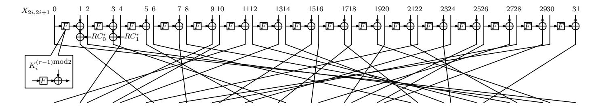
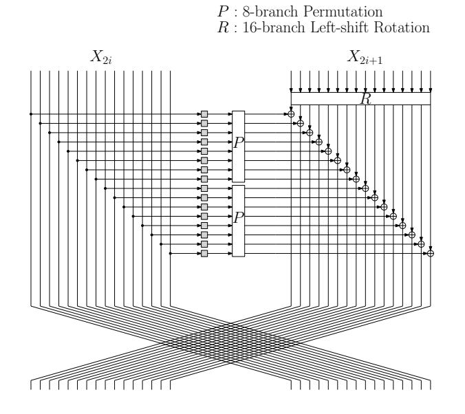
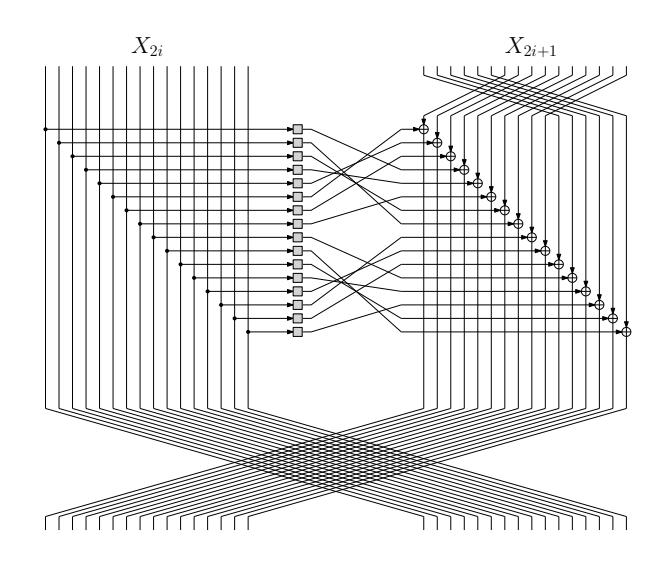
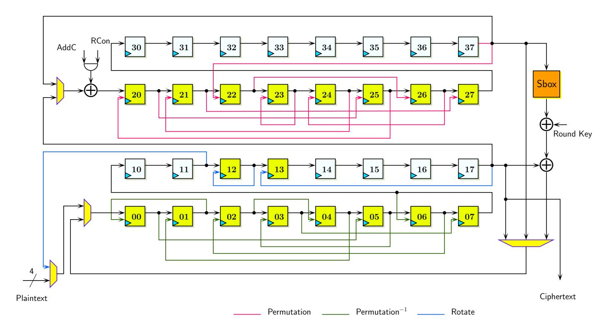
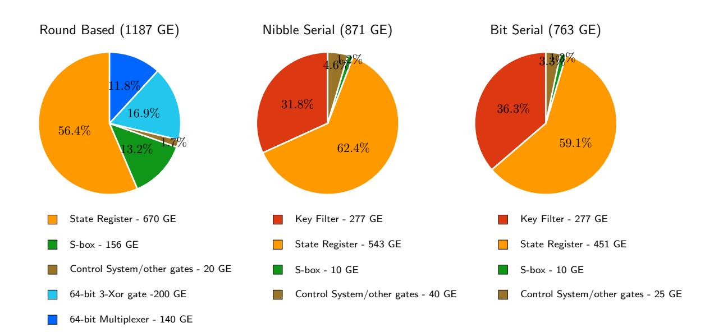
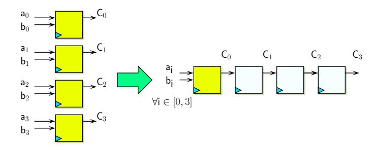
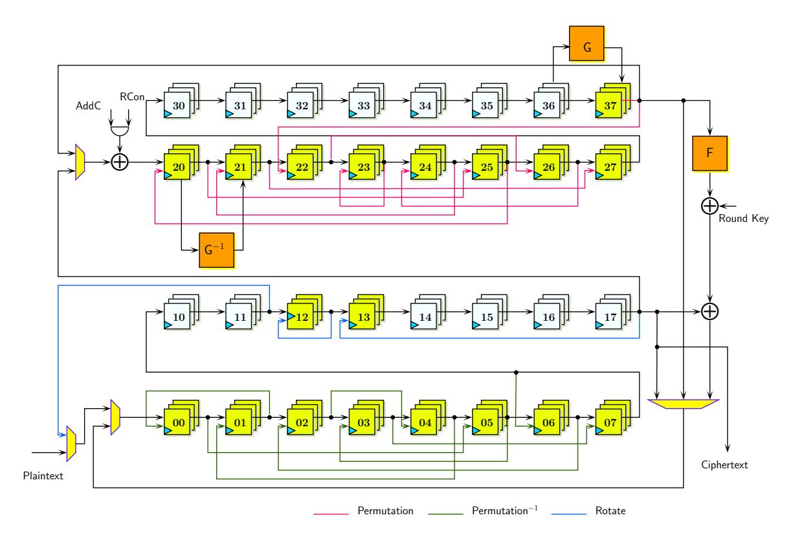
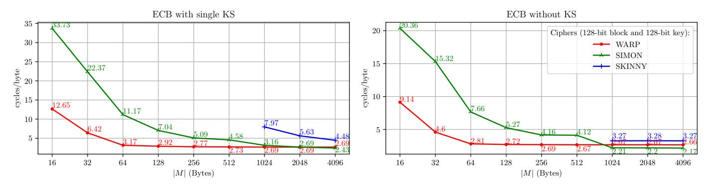
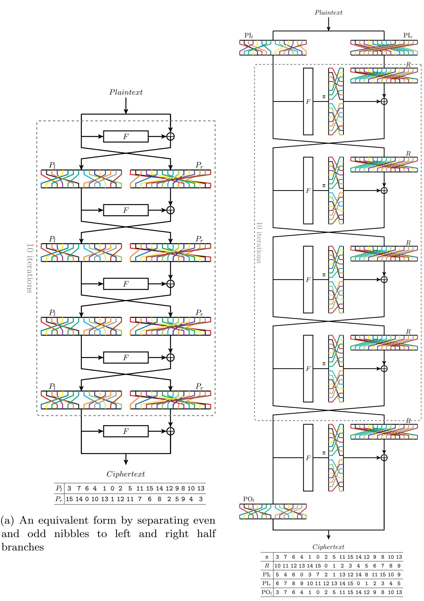
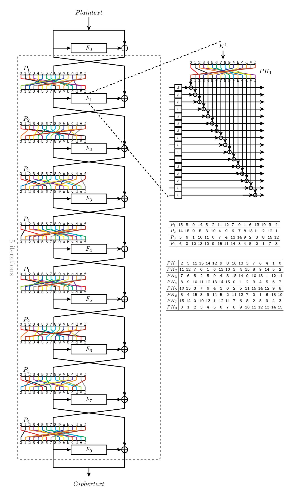

{0}------------------------------------------------

# WARP : Revisiting GFN for Lightweight 128-bit Block Cipher

Subhadeep Banik<sup>1</sup> , Zhenzhen Bao<sup>2</sup> , Takanori Isobe3,<sup>4</sup> , Hiroyasu Kubo<sup>6</sup> , Fukang Liu3,<sup>7</sup> , Kazuhiko Minematsu<sup>5</sup> , Kosei Sakamoto<sup>3</sup> , Nao Shibata<sup>6</sup> , and Maki Shigeri<sup>6</sup>

<sup>1</sup> EPFL, Switzerland subhadeep.banik@epfl.ch <sup>2</sup> Nanyang Technological University, Singapore zzbao@ntu.edu.sg <sup>3</sup> University of Hyogo, Japan takanori.isobe@ai.u-hyogo.ac.jp, liufukangs@163.com, k.sakamoto0728@gmail.com <sup>4</sup> NICT, Japan <sup>5</sup> NEC Corporation, Japan k-minematsu@ah.jp.nec.com <sup>6</sup> NEC Solution Innovator, Japan <sup>7</sup> Shanghai Key Laboratory of Trustworthy Computing, East China Normal University, China

Abstract. In this article, we present WARP, a lightweight 128-bit block cipher with a 128-bit key. It aims at small-footprint circuit in the field of 128-bit block ciphers, possibly for a unified encryption and decryption functionality. The overall structure of WARP is a variant of 32-nibble Type-2 Generalized Feistel Network (GFN), with a permutation over nibbles designed to optimize the security and efficiency. We conduct a thorough security analysis and report comprehensive hardware and software implementation results. Our hardware results show that WARP is the smallest 128-bit block cipher for most of typical hardware implementation strategies. A serialized circuit of WARP achieves around 800 Gate Equivalents (GEs), which is much smaller than previous state-ofthe-art implementations of lightweight 128-bit ciphers (they need more than 1, 000 GEs). While our primary metric is hardware size, WARP also enjoys several other features, most notably low energy consumption. This is somewhat surprising, since GFN generally needs more rounds than substitution permutation network (SPN), and thus GFN has been considered to be less advantageous in this regard. We show a multi-round implementation of WARP is quite low-energy. Moreover, WARP also performs well on software: our SIMD implementation is quite competitive to known hardware-oriented 128-bit lightweight ciphers for long input, and even much better for small inputs due to the small number of parallel blocks. On 8-bit microcontrollers, the results of our assembly implementations show that WARP is flexible to achieve various performance characteristics.

Keywords: Lightweight Block Cipher, 128-bit Block Cipher, Generalized Feistel Network, Unified Encryption and Decryption

{1}------------------------------------------------

# 1 Introduction

Lightweight Block Cipher. Due to the increasing need for encryption and authentication on constrained devices, lightweight cryptography has grown to be one of the central topics in symmetric-key cryptography. Among various symmetric-key primitives, the development of lightweight block cipher probably has the longest history. As demonstrated by PRESENT [\[27\]](#page-17-0), the first generation of lightweight block ciphers, such as KATAN [\[34\]](#page-18-0), PRINTCIPHER [\[46\]](#page-18-1) or LED [\[39\]](#page-18-2), mainly focused on hardware footprint in the standard, round-based constructions. The block size is typically 64 bits or even smaller to reduce the size. Combined with hardware-oriented components (such as a 4-bit S-box and a bit permutation), they achieved a very small hardware footprint compared to the standard AES. Although small-footprint serial AES implementations are possible [\[7,](#page-16-0) [52\]](#page-19-0), there is still a gap between what can be done with lightweight block ciphers.

The second generation ciphers aimed at various goals, such as low-latency (Prince [\[28\]](#page-17-1) and QARMA [\[2\]](#page-15-0)) or low-energy consumption (MIDORI [\[3\]](#page-15-1)) or sidechannel/fault attack resistance (LS-designs [\[38\]](#page-18-3), CRAFT [\[16\]](#page-16-1)), while mostly trying to achieve an equivalent hardware footprint of the first generation ciphers.

Importance of 128-bit Cipher. In this paper, we focus on lightweight block ciphers with 128-bit block size and 128-bit key. The usefulness of such a primitive is obvious as it can be used as a direct replacement of AES (more precisely AES-128 ), without changing the mode of operation. Most of the popular block cipher modes currently used with AES, such as GCM, have birthday bound security, meaning that O(2<sup>64</sup>) input blocks are sufficient to break the scheme. This also implies a certain limitation on 64-bit block ciphers. It is clear that 64-bit block ciphers have been playing the central role in the development of lightweight cryptography. Having said that, birthday attacks with O(2<sup>32</sup>) data complexity can be a real threat[8](#page-1-0) . To thwart them, keys must be renewed very frequently, however this is not trivial in practice (e.g, Sweet32 [\[21\]](#page-17-2)).

Tweakable block cipher (TBC) of 64-bit block size, such as SKINNY, is another promising way to prevent the birthday attacks of O(2<sup>32</sup>) complexity. It still requires a change of outer modes (though BBB secure modes for TBCs are typically simpler than those for block ciphers) and hence, it generally does not realize a direct replacement of AES.

Consequently, we think lightweight 128-bit block ciphers have their own value. In fact, replacements of AES by lightweight 128-bit ciphers often occur in the development of lightweight authenticated encryption (AE) schemes. For example, COFB [\[31\]](#page-17-3) and SUNDAE [\[4\]](#page-15-2) are modern block cipher-based AE modes that were initially specified with AES. Later they were submitted [\[5,](#page-15-3) [9\]](#page-16-2) to the ongoing NIST lightweight cryptography project[9](#page-1-1) with a 128-bit-block version of GIFT, a family

<span id="page-1-0"></span><sup>8</sup> Alternatively, we could use beyond-birthday-bound (BBB) secure modes, however they are generally more complex than the birthday-secure ones, and using complex modes may nullify the merit of using lightweight primitive.

<span id="page-1-1"></span><sup>9</sup> <https://csrc.nist.gov/Projects/lightweight-cryptography>

{2}------------------------------------------------

of lightweight block ciphers proposed by Banik et al. [\[11\]](#page-16-3). Both submissions [\[5,](#page-15-3) [9\]](#page-16-2) are included in the second-round candidates.

As a lightweight replacement of AES, the size of unified encryption and decryption (ED) circuit is important, since some standard/popular block cipher modes, e.g. CBC, OCB [\[49\]](#page-19-1) and XTS [\[42\]](#page-18-4), need a block cipher decryption (inverse) circuit as well as an encryption circuit. Besides, when a block cipher is implemented as a co-processor of general-purpose CPUs, we naturally expect the support of both encryption and decryption, as the co-processor is agnostic to the operating modes. Needless to say, an encryption-only circuit is generally smaller and enough for implementing "inverse-free" modes such as CTR or GCM. From these observations, we set our primary goal to build a lightweight 128-bit block cipher that is significantly smaller than prior arts for both encryption-only and unified ED circuits.

Our Design. When we look at the current list of lightweight block ciphers, the majorities are Substitution-Permutation Network (SPN) ciphers, such as [\[14,](#page-16-4) [27,](#page-17-0) [28,](#page-17-1) [39\]](#page-18-2). However, an SPN is inherently not perfect to our goal, because the decryption circuit generally needs to invert the confusion and diffusion layers. Despite the great research effort on concrete SPN designs using involutory Sboxes and MDS matrices, such as NOEKEON [\[33\]](#page-18-5), MIDORI, and QARMA, designing an ultimately lightweight SPN cipher with fully involutory components still seems challenging, when unified ED circuit is a primary target. In particular, if we adopt a serialized datapath, we need recursively defined MDS matrices to be efficient with respect to area [\[39\]](#page-18-2). However, it is well known that in fields of characteristic 2, such an MDS matrix can never be involutory [\[40\]](#page-18-6).

A potential alternative is Generalized Feistel Network (GFN) [\[55,](#page-19-2) [68\]](#page-20-0), because it is involutory in nature. The classical Type-2 GFN [\[68\]](#page-20-0) has been adapted by many ciphers, such as HIGHT [\[41\]](#page-18-7), Clefia [\[60\]](#page-19-3), and Piccolo [\[59\]](#page-19-4). However it has a slow diffusion, which is problematic when the number of sub-blocks (branches) is large. Suzaki and Minematsu [\[62\]](#page-20-1) (hereafter SM10) proposed a way to greatly improve the diffusion of GFN by just changing the permutation of branches from the rotation originally used by Type-2 GFN. They also showed r-branch permutations achieving the fastest diffusion up to r = 16. Indeed, TWINE [\[63\]](#page-20-2) and LBlock [\[66\]](#page-20-3) are 64-bit block, 16-branch GFN ciphers that can be seen as concrete instantiations of SM10. It is interesting to note that, GFN ciphers of larger-than-16 branches have been actively studied from the viewpoint of permutation design (see below), however no concrete, purely GFN-based block ciphers have been proposed, to the best of our knowledge[10](#page-2-0). In this paper, we revisit GFN to investigate if it fulfills our needs. Specifically, we extend the idea of SM10 to build a 128-bit, 32-branch (nibble) GFN cipher with 128-bit key, named WARP[11](#page-2-1). As observed by SM10, one can achieve the diffusion round (the number of rounds needed for diffusing any input difference to the whole output)

<span id="page-2-0"></span><sup>10</sup> Liliput [\[19\]](#page-16-5) is a 128-bit TBC built on a variant of GFN (EGFN [\[20\]](#page-17-4)). It has a different linear layer structure from GFN and has 16 branches.

<span id="page-2-1"></span><sup>11</sup> The name comes from the resemblance of the cipher structure to strings in a loom.

{3}------------------------------------------------

as low as 2 log<sup>2</sup> r, which implies that a good 128-bit, 32-nibble GFN cipher may only need two more rounds from the case of 64-bit, 16-nibble GFN ciphers. The big challenge is to determine a 32-branch permutation. The diffusion property of r-branch permutations for r > 16 has been recently studied, and made a significant progress since SM10 [\[30,](#page-17-5) [36\]](#page-18-8). However, these studies do not give a direct answer to us, as we need a permutation having not only a fast full diffusion but also a high immunity against known attacks (differential/linear/impossible differential/integral/division etc). Because an exhaustive search over all 32-branch permutations is computationally infeasible, we define a subset of permutations that are suitable to serial circuits and search over it with an Mixed Integer Linear Programming (MILP) solver, based on the development of MILP-aided security evaluation initiated by Mouha et al. [\[53\]](#page-19-5). Notably, we found that the 32-branch permutations with 9-round full diffusion (which is 1 round smaller than what SM10 showed) by Derbez et al. [\[36\]](#page-18-8) are not suitable because the number of active S-box grows very slowly. Our permutation has 10-round full diffusion, however performs much better in terms of the number of active S-boxes (see Appendix [C\)](#page-24-0).

We adopt an S-box of MIDORI for its small delay and area. It is also very efficient for threshold implementations which is very important when side-channel attacks are possible.

The key schedule of WARP is ultimately simple: the 128-bit key is divided into two 64-bit halves and they are alternately used, i.e. the parity of the round number determines which half is used. This removes a need of additional register. Such permutation-based key scheduling schemes have been employed by a number of recent block ciphers, e.g, LED [\[39\]](#page-18-2), Piccolo [\[59\]](#page-19-4) and CRAFT [\[16\]](#page-16-1) as well as stream ciphers [\[10,](#page-16-6)[51\]](#page-19-6). In addition, every sub-key is XORed after S-box is applied to avoid the complement property of Feistel-Type Structures [\[26\]](#page-17-6), following the idea of Piccolo [\[59\]](#page-19-4).

Implementation Results. Combining these components, we achieved 763 GE for the bit-serial encryption-only circuit, which is, to our knowledge, the lowest number of 128-bit block cipher hardware implementation to date. Moreover, due to the low-energy and low-delay S-box, the 2-round unrolled implementation of WARP achieved significantly better energy consumption as compared to MIDORI, which is the current state-of-the-art design as a 128-bit low-energy cipher. For the unrolled (Enc-only) implementations, WARP is smaller than QARMA, while keeping relatively small delay, around 1.6 of QARMA-12811. We also conducted threshold implementations of WARP for protection against first-order side-channel attacks. The results are quite impressive (Table [10](#page-29-0) at Appendix [D\)](#page-25-0). All in all, WARP has pretty good performance for multiple hardware metrics not only in size.

For software metrics on microcontrollers, the design of WARP makes it flexible to make different trade-offs. We report performance characteristics of our assembly implementations on 8-bit AVR following various methods. The results show that, for WARP, it is possible to achieve competitively small code size and extremely low RAM consumption, with acceptable execution time.

Finally, thanks to the software-friendly structure of GFN, we report a very efficient software implementation of WARP on modern high-end CPUs equipped with

{4}------------------------------------------------

<span id="page-4-1"></span>

Fig. 1: Round Function of WARP.

SIMD instructions. Unlike known bitslice implementation of recent lightweight ciphers, which need many block to be processed in parallel, we use a vector permutation (vperm) instruction, in a similar manner to TWINE [18]. This allows us to work with small (or no) parallelism. Surprisingly, the results on modern Intel processors are very competitive to the bitslice implementations of several state-of-the-art lightweight ciphers (GIFT, SKINNY and SIMON [12]). This gives another advantage to WARP when the operating mode is serial, say CBC-MAC or lightweight, serial authenticated encryption mode such as CLOC [44], SAEB [54], or COFB [31].

Organization. This paper is organized as follows. We first present the specification of our cipher at Section 2. We provide our design rationale, such as 32-branch permutation and S-box, at Section 3. Section 4 describes the details of security evaluations against major cryptanalysis methods. Section 5 and Section 6 provide our hardware and software implementations. Finally, we conclude at Section 7.

# <span id="page-4-0"></span>2 Specification

WARP is a 128-bit block cipher with a 128-bit key. The general structure of WARP is a variant of the 32-branch Type-2 GFN. A 128-bit plaintext M and a ciphertext C are loaded into a 128-bit internal state in encryption and decryption processes, respectively. The internal state is expressed as 32 nibbles,  $X = X_0 \parallel X_1 \parallel \ldots \parallel X_{31}$ , where  $X_i \in \{0,1\}^4$ . A 128-bit secret key K is denoted as two 64-bit keys  $K^0$  and  $K^1$ , i.e.  $K = K^0 \parallel K^1$ , where  $K^i \in \{0,1\}^{64}$ .  $K^0$  and  $K^1$  are also expressed as 16 nibbles,  $K^0 = K_0^0 \parallel K_1^0 \parallel \ldots \parallel K_{15}^0$ , where  $K_i^0 \in \{0,1\}^4$ , and  $K^1 = K_0^1 \parallel K_1^1 \parallel \ldots \parallel K_{15}^1$ , where  $K_i^1 \in \{0,1\}^4$ , respectively.

Round Function. The round function of WARP consists of a 4-bit S-box S:  $\{0,1\}^4 \to \{0,1\}^4$ , a nibble XOR:  $\{0,1\}^4 \times \{0,1\}^4 \to \{0,1\}^4$ , and a shuffle operation  $\pi: \{0,\ldots,31\} \to \{0,\ldots,31\}$  applied to 32 nibbles. The round function applies a non-linear unit transformation involving a single S evaluation and round-key addition for each of two consecutive nibbles, adds a round constant, and applies  $\pi$  to all 32 nibbles. See Fig. 1. The S-box S is described in Table 1. The shuffle  $\pi$  and its inverse  $\pi^{-1}$  are described in Table 2.

Encryption and Decryption. The number of rounds of WARP is 41, where the nibble shuffle operation  $\pi$  in the last round is omitted. For i = 1, ..., 41, the *i*-th

{5}------------------------------------------------

Table 1: 4-bit S-box S.

<span id="page-5-0"></span>

| $\overline{x}$    |   |   |   |   |   |   |   |   |   |   |   |   |   |   |   |   |
|-------------------|---|---|---|---|---|---|---|---|---|---|---|---|---|---|---|---|
| $\overline{S(x)}$ | С | a | d | 3 | е | b | f | 7 | 8 | 9 | 1 | 5 | 0 | 2 | 4 | 6 |

Table 2: Shuffle  $\pi$  on 32 nibbles.

<span id="page-5-1"></span>

| x              | 0  | 1  | 2  | 3  | 4  | 5  | 6  | 7  | 8  | 9  | 10 | 11 | 12 | 13 | 14 | 15 |
|----------------|----|----|----|----|----|----|----|----|----|----|----|----|----|----|----|----|
| $\pi(x)$       | 31 | 6  | 29 | 14 | 1  | 12 | 21 | 8  | 27 | 2  | 3  | 0  | 25 | 4  | 23 | 10 |
| $\pi^{-1}(x)$  | 11 | 4  | 9  | 10 | 13 | 22 | 1  | 30 | 7  | 28 | 15 | 24 | 5  | 18 | 3  | 16 |
| $\overline{x}$ | 16 | 17 | 18 | 19 | 20 | 21 | 22 | 23 | 24 | 25 | 26 | 27 | 28 | 29 | 30 | 31 |
| $\pi(x)$       | 15 | 22 | 13 | 30 | 17 | 28 | 5  | 24 | 11 | 18 | 19 | 16 | 9  | 20 | 7  | 26 |
| $\pi^{-1}(x)$  | 27 | 20 | 25 | 26 | 29 | 6  | 17 | 14 | 23 | 12 | 31 | 8  | 21 | 2  | 19 | 0  |

round uses a 64-bit (16 nibbles) round key  $RK^i$ . Then, an *i*-th round key  $RK^i$  is given as  $RK^i = K^{(i-1) \mod 2}$ .

The encryption algorithm of WARP is given in Fig. 2. The decryption algorithm is omitted here. It is obtained by just changing  $\pi$  to its inverse  $\pi^{-1}$ .

WARP uses LFSR-based round constants. A state of 6-bit LFSR is written as  $(\ell_5, \ell_4, \ell_3, \ell_2, \ell_1, \ell_0)$  and is initialized to 000001. It is updated in each round as

$$(\ell_5, \ell_4, \ell_3, \ell_2, \ell_1, \ell_0) \leftarrow (\ell_4, \ell_3, \ell_2, \ell_1, \ell_0, \ell_0 \oplus \ell_5).$$

Using this LFSR, we define two nibbles  $RC_0 = (\ell_5, \ell_4, \ell_3, \ell_2)$  and  $RC_1 = (\ell_1, \ell_0, 0, 0)$ .  $RC_0$  and  $RC_1$  are xored to the first and third nibbles of the state (note that the numbering of the nibbles is from 0 to 31) after the  $X_{2i+1} \leftarrow S(X_{2i}) \oplus K_i^{(r-1) \mod 2} \oplus X_{2i+1}$  operation. Let  $RC_0^r$  and  $RC_1^r$  be the r-th round constants. For completeness, we list  $(RC_0^r, RC_1^r)$  for all  $r = 1, \ldots, 41$  in Table 3.

Claimed Security. WARP claims single-key security, and does not claim any security in related-key and known/chosen-key settings.

Table 3: Round constants (listed in hexadecimal).

<span id="page-5-2"></span>

| r                           |    | 1  | 2  | 3  | 4  | 5  | 6  | 7  | 8  | 9  | 10 | 11 | 12 | 13 | 14 | 15  | 16 | 17  | 18 | 19 | 20 |
|-----------------------------|----|----|----|----|----|----|----|----|----|----|----|----|----|----|----|-----|----|-----|----|----|----|
| $\overline{RC_0^r}$         |    | 0  | 0  | 1  | 3  | 7  | f  | f  | f  | е  | d  | a  | 5  | a  | 5  | b   | 6  |     | 9  |    | 6  |
| $RC_1^r$                    |    | 4  | С  | С  | С  | С  | С  | 8  | 4  | 8  | 4  | 8  | 4  | С  | 8  | 0   | 4  | С   | 8  | 4  | С  |
| $\overline{r}$              | 21 | 22 | 23 | 24 | 25 | 26 | 27 | 28 | 29 | 30 | 31 | 32 | 33 | 34 | 35 | 36  | 37 | 38  | 39 | 40 | 41 |
| $\overline{RC_{\circ}^{r}}$ | d  | b  | 7  | е  | d  | b  | 6  | d  | a  | 4  | 9  | 2  | 4  | 9  | 3  | 7   | е  | С   | 8  | 1  | 2  |
| 1000                        |    |    |    | 1  | l  | 4  |    |    |    |    | l  |    | С  | l  |    | l . | 0  | l . |    |    |    |

{6}------------------------------------------------

```
Algorithm Encryption(K, M)
  1. (K_0^0 \parallel K_1^0 \parallel \ldots \parallel K_{15}^0, K_0^1 \parallel K_1^1 \parallel \ldots \parallel K_{15}^1) \leftarrow K
  2. X_0 || X_1 || \dots || X_{31} \leftarrow M
  3. for r = 1 to 40 do
          for i = 0 to 15 do
  4.
             X_{2i+1} \leftarrow S(X_{2i}) \oplus K_i^{(r-1) \bmod 2} \oplus X_{2i+1}
  5.
  6.
          end for
         X_1 \leftarrow X_1 \oplus RC_0^r, X_3 \leftarrow X_3 \oplus RC_1^r
  7.
          X_0' \| X_1' \| \dots \| X_{31}' \leftarrow X_0 \| X_1 \| \dots \| X_{31}
  8.
          for i = 0 to 31 do
  9.
          X_{\pi[j]} \leftarrow X_j' end for
10.
11.
12. end for
13. for i = 0 to 15 do
          X_{2i+1} \leftarrow S(X_{2i}) \oplus K_i^0 \oplus X_{2i+1}
14.
15. end for
16. X_1 \leftarrow X_1 \oplus RC_0^{41}, X_3 \leftarrow X_3 \oplus RC_1^{41}
17. C \leftarrow X_0 || X_1 || \dots || X_{31}
18. return C
```

Fig. 2: Encryption algorithm of WARP.

# <span id="page-6-0"></span>3 Design Rationale

As described, the goal of WARP is a 128-bit block cipher enabling small hardware implementation, both for encryption-only and unified ED circuits, and both for round-based and serial architectures. We detail the rational of our design choice for each component of GFN below.

# 3.1 Branch Size and Permutation

We choose to use 32-nibble GFN with a 4-bit S-box, instead of 16-byte GFN with an 8-bit S-box. Although the latter option allows to reuse most of the known design/cryptanalytic results on 16-branch GFN (SM10, TWINE or LBlock and their cryptanalysis such as [25]), 8-bit S-box is much inferior to 4-bit S-box in terms of size/delay/energy.

We need a r=32-branch permutation that is good in terms of diffusion round and resistance to the major attacks, such as differential and linear attacks. Despite the recent research on many-branch GFN [20, 30, 62], this remains a hard problem, simply because the number of permutation quickly grows (r!). When  $r=2^s$ , SM10 shows an r-branch permutation of diffusion round being 2s based on de Bruijin graph, however, according to our random search, there is a huge number of 32-branch permutations having diffusion round of  $2\log_2 32 = 10$ . Besides, the differential/linear Active S-box (AS-box) counts are very different among them, which suggests that we need another criteria before searching.

{7}------------------------------------------------

After some experiments, we limit ourselves to permutations allowing efficient serial hardware implementations, which is our main focus (See Section [5](#page-9-0) for hardware implementation). In more detail, we searched all permutations of LBlock-like structure that consists of one 16-branch permutation composed of two identical 8-branch permutations, and one rotation on 16 branches with an amount of rotation from 0 to 15 nibbles as shown in Fig. [3.](#page-7-0) The resulting search space has size 8! × 16 ≈ 2 19.3 . The search over this space found 152 candidates of diffusion round 10. We conducted MILP-based differential AS-box counting for them. This evaluation requires about 2 days on computer equipped with 44 cores and 64 GB RAM.s Among them, 21 candidates achieved AS-box of ≥ 64 (which is needed for security) at 19 rounds (and no candidates achieved it at 18 rounds), and 8 out of 21 achieved AS-box of 66, which was the largest among them. These 8 permutations are not isomorphic, however as far as we investigated, the attack characteristics for other attacks (linear AS-box, impossible differential characteristics etc) are identical for all of them.

Our investigation implies that they are equivalently secure in practice. Moreover, there is no difference from the implementation aspects too. Thus, we arbitrarily chose one among them. A LBlock-like equivalent round function of WARP is shown in Figure [4.](#page-7-0)

Recently, Derbez et. al [\[36\]](#page-18-8) showed four equivalent classes of 32-branch permutations achieving full diffusion after 9 rounds, while WARP requires 10 rounds. However, our MILP-based evaluation revealed that the number of active S-boxes of these grows much slower than ours. Indeed, these require at least 32 rounds for achieving AS-box of ≥ 64. Since WARP achieves it with only 19 rounds, the permutation of WARP is better than them as a 32-branch permutation.

<span id="page-7-0"></span>

Fig. 3: General LBlock-like round function.



Fig. 4: Equivalent round function of WARP in LBlock-like structure.

{8}------------------------------------------------

# 3.2 S-box

According to [\[3\]](#page-15-1), the small path delay and the small gate area lead to low-energy implementation. We searched a small-delay and lightweight 4-bit S-box which fulfills the following requirements: (1) the maximal probability of a differential is 2<sup>−</sup><sup>2</sup> , (2) the maximal absolute bias of a linear approximation is 2<sup>−</sup><sup>2</sup> and (3) preferably belonging one of the 30 cubic classes (as given in [\[24\]](#page-17-8)) that allows decomposition into two quadratic s-boxes, so that it can be used to implement a 1st order threshold implementation with 3 shares. This helps us have a very lightweight threshold circuit as well. As a result, we decide to use S-box of MIDORI (Sb0). Note that other S-boxes used in low-latency ciphers such as Prince and QARMA do not satisfy the requirement (3).

# 3.3 Key Schedule

The key schedule uses alternately the upper and lower half of the 128-bit key in alternate rounds. This requires only a multiplexer to filter appropriate portions of the round key in each round. As already outlined in [\[3,](#page-15-1) [17\]](#page-16-9), an elaborate key schedule function requires a register element to store and update the key, which is costly in terms of area and energy consumption. Moreover, a simple key schedule is particularly beneficial to unified ED circuits, because additional hardware is not required to construct an inverse key schedule function. A key alternating cipher like WARP with odd number of rounds, uses the same upper half of the key in the first and the last encryption round (and indeed in all odd rounds) which implies that the decryption routine would also use the upper half of the key in the first, last and all odd rounds. Thus, the order of upper/lower half of keys used in successive rounds is exactly the same for encryption and decryption, thus no additional overhead is imposed to implement decryption alongside the encryption in hardware. In addition, the key XOR operation is applied after the S-box to avoid the complement property of Feistel-Type Structures [\[26\]](#page-17-6), following the idea of Piccolo [\[59\]](#page-19-4).

# 3.4 Round Constants

We use LFSR-based round constants as it is simple and efficient to implement in hardware. We use 6-bit LFSR with a primitive connection polynomial, which has a period of 63, and hence sufficient to cover 41 rounds used in WARP.

# <span id="page-8-0"></span>4 Security Evaluation

We evaluate the security of WARP against differential, linear, integral, impossible differential, invariant and meet-in-the-middle attacks. Among them, the 21-round impossible differential attack is considered to be the most efficient for WARP. In our evaluation, we do not expect an effective key-recovery attack on up to 32 rounds of WARP by using this 21-round impossible differential distinguisher or even using other ones. Consequently, we conclude that the full-round of WARP is expected to be resistant to those attacks. The details are given in Appendix [B.](#page-21-0)

{9}------------------------------------------------

# <span id="page-9-0"></span>5 Hardware Performance

One of the principal objectives for our design was efficiency in constrained platforms with respect to multiple metrics of lightweight cryptography. Hence we looked at area, energy and latency which are widely acknowledged to be factors that determine the quality of a design. We first convert the round function to an LBlock-type architecture that helps us construct an efficient serial hardware architecture for WARP. Consider a 2-branch Feistel network, with a 128-bit block composed of  $X_a||X_b$  (each of 64 bits). Further let  $X_a[i], X_b[i], K[i], \forall i \in [0, 15]$  denote the individual nibbles of the branches, and the roundkey respectively. Then the LBlock-type function defined below in Fig 5, can also be used to define the specifications of WARP.

# <span id="page-9-1"></span>Round Function $(X_a, X_b, K)$

```
for \ i=0 \ to \ 15 \ do
T[\pi[i]] \leftarrow S(X_a[i]) \oplus K[\pi[i]], \qquad -- \ Sbox, \ shuffle \ left \ branch, addkey
U[i] \leftarrow X_b[6+i \ mod \ 16], \qquad -- \ Rotate \ 6 \ nibbles \ (right \ branch)\nend for
for \ i=0 \ to \ 15 \ do
U[i] \leftarrow U[i] \oplus T[i], \qquad -- \ Add \ left, \ right \ branches\nend for
U[0] \leftarrow U[0] \oplus RC_0, \ U[1] \leftarrow U[1] \oplus RC_1 \qquad -- \ Round \ const \ add
for i=0 \ to \ 15 \ do
X_b[i] \leftarrow X_a[i], \ X_a[i] \leftarrow U[i] \qquad -- \ Swap \ left, \ right \ branches\nend for
```

Fig. 5: Alternative definition of Round Function

In this definition,  $\pi$  is a permutation which maps i to the i-th element of the following set:  $\{3, 7, 6, 4, 1, 0, 2, 5, 11, 15, 14, 12, 9, 8, 10, 13\}$ . It is elementary to show that the encryption routine defined by 41 iterations of the round function in Fig 5 (with the left-right swap omitted in the last round) is equivalent to the definition of the encryption algorithm of WARP up to a shuffle of nibbles.

#### 5.1 Nibble Serial Architecture

Figure 6 shows the architecture for WARP. Each storage element colored yellow/white in the figure is a 4-bit scan/normal flip-flop respectively. Apart from 4-bit xor gates required for round key addition, left-right branch addition, and round-constant addition, we have used a few multiplexers to manoeuvre data through the circuit. The circuit uses only one S-box, and in addition we have a key-multiplexer that filters roundkey nibbles from the 128-bit master key (which is not shown in the figure for space constraints). The circuit computes one round

{10}------------------------------------------------

<span id="page-10-0"></span>

Fig. 6: Nibble serial architecture for WARP. The filter that feeds the permuted roundkey is omitted in the diagram.

function of WARP in 48 cycles. Following is the cycle-by-cycle description of the circuit operations.

**Cycle 0-31:** In the first 32 cycles, the plaintext nibbles are loaded on to the state register. After this, the round counter resets to 0, and the following operations are repeated 41 times.

Cycle 0-15: Before this set of cycles start, the left branch of the state, resides in the storage elements marked 37 to 20, and the right branch in those marked 17 to 00, as shown in Figure 6. In 17 to 00, we need to rotate the right branch by 6 nibbles. This is done as follows: a circular shift is performed for 16 cycles, which is somehow arrested for 10 cycles, to achieve the equivalent functionality of 6 nibble rotation. The 16 nibble flip-flops are divided into 3 groups of 10, 1, 5 (00 to 11, 12 and 13 to 17). An internal circular rotation of nibbles takes place for 10 cycles within each group. Since 10, 1 and 5 are divisors of 10, this rotation effectively executes the identity transformation on the right branch. Thereafter, a normal circular rotation over the entire set of 16 nibbles (00 to 17) occurs for the next 6 cycles, thus achieving the required functionality.

In the upper half, the shuffling denoted by the permutation  $\pi$  is performed on the left branch (note that the order of shuffle and addkey/sbox is interchangeable). We further take advantage of the fact that  $\pi$  can be defined in terms of the 8-element permutation function  $\pi' = \{3, 7, 6, 4, 1, 0, 2, 5\}$  over [0, 7] and [8, 15] (i.e.  $\pi[i] = \pi'[i]$  if i < 8 and  $8 + \pi'[i - 8]$  otherwise). This being so, only the nibbles marked 20 - 27 need to be scan flip-flops. We perform a circular motion over the left branch nibbles (20 to 37) for these 16 cycles (AddC is set to 0 for this purpose), with the select signal controlling the scan flip-flops

{11}------------------------------------------------

being SET at cycles 7 and 15. At cycle 7, the most significant nibbles of the left branch reside at the flip-flops marked 26 to 20 and 37. When the scan flip-flops are SET during this cycle, the wiring ensures that at cycle 8, these nibbles are shuffled by π <sup>0</sup> and stored in 27 to 20. A similar logic applies to the shuffle in cycle 15. At this cycle, the least significant nibbles of the left branch reside at the flip-flops marked 26 to 20 and 37. The SET signal of the scan flip-flops in this cycle ensures shuffling by π 0 in the next cycle.

Cycle 16-31: The left branch nibbles are driven out of 37 input to the S-box and then xored with the corresponding key nibble. The output is added with the right branch nibbles which are driven out of 17. The nibbles driven out from 37 are driven back into 20 (thereby causing a circular shift of 16 nibbles which is essentially the identity function). The output of the final xor is driven into 00. Thus after cycle 31, the lower flip-flops (17 to 00) thus contain the output of the round function. The upper flip-flops (37 to 20) continue to hold the left branch of the current round (however the nibbles are shuffled with the permutation π executed in cycles 0 to 15).

Cycle 32-47: We need to undo the shuffling of the left branch and then swap the 2 branches. This is done serially over 16 cycles, by a circular rotation over the 32 flip-flop nibbles (37 to 00). The nibbles driven out of 17 are driven into 20, and thus after this set of 16 cycles, the flip-flops in the upper half (37 to 20) will contain the round function output. The nibbles out of 37 are driven into 00 and it is here that the π −1 is performed to undo the shuffle. Note that in the bottommost row, the scan flip-flops are wired to perform π −1 . The select signals are SET in cycles 40 and 47 to perform π 0−<sup>1</sup> over the lower and upper set of 8 nibbles exactly as in cycles 16-31. This not only moves the left branch nibbles to the lower flip-flops but also undoes the shuffle performed in cycles 0-15, and so we are ready to perform the next round computations. Note that the round constants are added to the register 17 in cycles 32 and 33. This completes the round function. Note that since the left-right swap is omitted in the last round, the ciphertext is output from the flip-flop marked 17 rather than 37.

More circuit details of bit-serial and unified architecture for encryption and decryption are presented in Appendix [D.](#page-25-0)

# 5.2 Performance Results

In Table [4,](#page-12-0) we compare the hardware performances of the serial implementations of WARP with other lightweight ciphers, with 128-bit block size and providing 128-bit security. Unless otherwise specified, for all the designs in the table, the following design flow was adhered to. The ciphers were first implemented in VHDL and a functional simulation was done using the Mentorgraphics Modelsim software. Thereafter the design was synthesized using the Standard cell library of the STM 90nm CMOS logic process (CORE90GPHVT v 2.1.a) with the Synopsys Design Compiler, with the compiler flag set to compile ultra. A timing simulation was done on the synthesized netlist with 1000 test vectors. The switching activity of

{12}------------------------------------------------

each gate of the circuit was collected while running post-synthesis simulation. The average power was obtained using Synopsys Power Compiler, using the back annotated switching activity.

Serial implementations are deployed when area is one of the primary metrics to be optimized. As can be seen from Table 4, WARP performs well as far as area is concerned, when compared with other ciphers with similar security level. As in [3,17], we used multiplexers to filter round keys, instead of a register, which saves us 100 to 150 GE of silicon area. The encrypt-only (E) bit-serial version of WARP occupies only 763 GE which is the lowest reported at this security level. Note that for a fair comparison, all the designs in Tables 4, 5 were implemented from scratch except the ones marked by an asterisk.

<span id="page-12-0"></span>Table 4: Comparison of performance metrics for serial implementations synthesized with STM 90nm Standard cell library. Figures separated by / indicate corresponding metrics for encryption/decryption. \*Synthesized with the IBM 130 nm process/Power at 100 KHz

| 1 /                                | Degree of     | Area      | Delay | Cycles    | $\mathrm{TP}_{MAX}$ | Power $(\mu W)$ | Energy      |
|------------------------------------|---------------|-----------|-------|-----------|---------------------|-----------------|-------------|
|                                    | Serialization | (GE)      | (ns)  |           | (MBit/s)            | (@10MHz)        | (nJ)        |
| GIFT-128-128                       | 4/32          | 1455      | 2.25  | 714       | 76.0                | 61.7            | 4.40        |
| GIFT-128-128                       | 1             | 1213      | 2.46  | 6528      | 7.6                 | 40.3            | 26.30       |
| SKINNY-128-128                     | 8             | 1638      | 1.95  | 840       | 74.5                | 79.1            | 6.64        |
| SKINNY-128-128                     | 1             | 1110      | 0.81  | 6976      | 21.6                | 53.8            | 37.53       |
| $\mathtt{SIMON}\ 128/128$          | 1             | 1077      | 1.17  | 4480      | 23.3                | 60.5            | 27.10       |
| MIDORI 128 (E)                     | 8             | 1308      | 4.94  | 415       | 62.4                | 54.4            | 2.26        |
| MIDORI $128 \; (\mathrm{ED})$      | 8             | 1401      | 6.08  | 415/463   | 50.7/45.5           | 54.6            | 2.27/2.53   |
| $\mathtt{AES}\ 128\ (\mathrm{ED})$ | 8             | 2060      | 5.79  | 246/326   | 85.7/64.7           | 129.7           | 3.19/4.23   |
| AES 128 (E) [45] *                 | 1             | 1560      | -     | 1776      | -                   | 0.823           | 14.61       |
| AES $128 \text{ (ED) } [45]^*$     | 1             | 1738      | -     | 1776/2512 | -                   | 0.852           | 14.61/15.13 |
| WARP (E)                           | 4             | 871       | 2.97  | 2032      | 20.2                | 33.2            | 6.76        |
| WARP $(E)$                         | 1             | 763       | 2.01  | 8128      | 7.5                 | 28.4            | 23.04       |
| $\mathtt{WARP}\ (\mathrm{ED})$     | 4             | $\bf 925$ | 2.58  | 2032      | 23.3                | 34.6            | 7.03        |
| WARP (ED)                          | 1             | 806       | 2.13  | 8128      | 7.1                 | 29.0            | 23.59       |

# 5.3 Round Based and Round Unrolled Designs

While serial implementations are useful to construct low area architectures, round based and round unrolled architectures offer a lot of benefits such as good energy performances, in addition with reasonably good area and throughput performances. In [6], the authors studied a number of block ciphers and came to the conclusion that round based or 2-round unrolled implementations tend to be the most energy efficient configurations for block ciphers.

For WARP, the round based configuration would need to filter the upper or the lower key half in successive rounds. Thus a multiplexer is necessary for this filtering. In contrast a 2-round unrolled configuration performs 2 round function computations in a single clock cycle. Such a configuration would have circuits for 2 round functions placed serially one after the other. This obviates the use of a multiplexer to filter any round keys, as it is clear that the first round function block can simply use the upper key half and the second block can similarly use the lower half. Thus a 2-round unrolled circuit would consume proportionately

{13}------------------------------------------------

lesser resources than a round based circuit both in terms of area and energy. Similar arguments can be made about odd and even round unrolled circuits for WARP. We experimented with 3 configurations for WARP: the round based, the 2 round and the 4 round unrolled circuits. The simulation results along with a comparison with other lightweight block ciphers is presented in Table 5. Indeed, in terms of energy, the 2-round unrolled configuration is the best and is around 30% better with respect to the one round configuration of MIDORI 128, a block cipher, which is the most energy efficient block cipher reported in literature. Note that WARP has odd number of rounds: this means that any even round unrolled implementation will do some redundant computation in the final cycle. For example, a 2-round unrolled implementation will need to operate 21 cycles, to execute 41 round functions: the final cycle performs one additional round function. This amounts to wastage of energy in the final cycle: however this is a small fraction of the total energy consumed (for WARP it is less than 1% of the total energy consumed). Figure 7 further shows a breakdown of area occupied by the corresponding components of the circuit. Appendix D also describes a 1st order threshold implementation of the WARP circuit.

<span id="page-13-1"></span>Table 5: Comparison of performance metrics for round based implementations synthesized with STM 90nm Standard cell library (1R, 2R, 4R refer to 1, 2, and 4 round unrolled circuits).

|                    | Area (GE) | Delay (ns) | Cycles | $TP_{MAX}$ (GBit/s) | $\mathrm{TP}_{MAX}/\mathrm{Area}$ $\mathrm{MBit}/(\mathrm{s}\cdot\mathrm{GE})$ | Power $(\mu W)$ (@10MHz) | Energy (pJ) |
|--------------------|-----------|------------|--------|---------------------|--------------------------------------------------------------------------------|--------------------------|-------------|
| GIFT-128-128       | 1997      | 1.85       | 41     | 1.611               | 0.826                                                                          | 116.6                    | 478.1       |
| SKINNY-128-128     | 2104      | 1.85       | 41     | 1.611               | 0.784                                                                          | 132.5                    | 543.3       |
| $SIMON \ 128/128$  | 2064      | 1.87       | 69     | 0.937               | 0.465                                                                          | 105.6                    | 728.6       |
| MIDORI 128(E)      | 2522      | 2.25       | 21     | 2.649               | 1.076                                                                          | 89.2                     | 187.3       |
| MIDORI 128(ED)     | 3661      | 2.44       | 21     | 2.443               | 0.683                                                                          | 108.7                    | 228.3       |
| AES 128            | 7215      | 3.83       | 11     | 3.113               | 0.442                                                                          | 730.3                    | 803.3       |
| WARP (1R) (E)      | 1187      | 2.05       | 42     | 1.418               | 1.223                                                                          | 55.5                     | 233.2       |
| WARP $(1R)$ $(ED)$ | 1390      | 1.74       | 42     | 1.671               | 1.231                                                                          | 59.5                     | 250.0       |
| WARP $(2R)$ $(E)$  | 1456      | 1.95       | 22     | 2.911               | 2.047                                                                          | 58.4                     | 128.5       |
| WARP $(2R)$ $(ED)$ | 1824      | 2.67       | 22     | 2.126               | 1.193                                                                          | 69.9                     | 153.7       |
| WARP $(4R)$ $(E)$  | 2223      | 3.25       | 12     | 3.334               | 1.536                                                                          | 117.5                    | 141.0       |
| WARP $(4R)$ $(ED)$ | 3075      | 3.93       | 12     | 2.758               | 0.918                                                                          | 177.4                    | 212.9       |

# <span id="page-13-0"></span>6 Software Performance

## 6.1 On 8-bit AVR Microcontrollers

The design of WARP makes it flexible to make trade-offs to achieve various performance characteristics on 8-bit AVR. Applying different implementation choices results in different trade-offs between ROM, RAM, and execution time. Appendix E.1 presents the details of our implementations. Table 11 summarizes the results and comparison with available results of existing designs with same parameters. It can be seen, on one end of the spectrum, WARP consumes minimized RAM and competitively low ROM; On the other end, it achieves relatively good performance regarding CPU cycles without consuming too much ROM.

{14}------------------------------------------------

<span id="page-14-1"></span>

Fig. 7: Breakdown of component-wise area figures for 3 versions of WARP. Nibble and Bit-serial circuits require lesser scan flip-flops which require more area

# 6.2 On High-end Processors

The nibble-orientate character of WARP enables implementations of it fit neatly with a Single Instruction Multiple Data (SIMD) instruction commonly seen on modern CPUs. This SIMD instruction performs a vector permutation providing a look up table representation of the permutation offsets, which are called Vector Permutation Instruction (VPI) [\[63\]](#page-20-2). For Intel and AMD x86-64 CPUs, the concrete VPI is named (v)pshufb (which were used in our implementations). Both the parallel 4-bit S-box and the nibble shuffle operation can be implemented using (v)pshufb. Thus, the round function of WARP can be fully implemented using a few (v)pxor and (v)pshufb. In Appendix [E.2,](#page-29-1) we present the details of our implementations of WARP using SIMD instructions on x64 CPUs. Our benchmark results of WARP, together with that of two ciphers that are also designed targeted at hardware, i.e., SIMON and SKINNY, are reported in Figure [10.](#page-31-0)

The software performance of WARP on high-end processors has the following advantages. First, apart from mode of operations that can be parallelized, for those that cannot, WARP also provides competitive performance, because the singleblock implementation of WARP can be very fast. Besides, for those modes that can be parallelized, the latency of WARP can be very small, because the required number of message blocks to achieve the optimal performance is relatively small. Second, in the scenario where a server communicates with many sensors using different keys, WARP can be very fast, because there is no heavy key schedule.

The source codes for our software implementations can be found via [https:](https://github.com/WARP-Block-Cipher/Software) [//github.com/WARP-Block-Cipher/Software](https://github.com/WARP-Block-Cipher/Software).

# <span id="page-14-0"></span>7 Conclusion

We have presented a 128-bit lightweight block cipher WARP. The design of WARP is based on a variant of Type-2 GFN, combined with an improved shuffle over 32 

{15}------------------------------------------------

nibbles to boost the diffusion. The primary goal is to achieve a small-footprint 128-bit block cipher, both for encryption-only and unified ED circuits. This has been achieved by carefully choosing the components of GFN. We provided a comprehensive hardware implementation results. They show that WARP is the smallest 128-bit block cipher in the most of typical implementation strategies. Moreover, WARP is very competitive in energy-efficient implementation. Besides, the software of WARP on 8-bit microcontrollers can achieve competitively small code size and extremely low RAM consumption, with acceptable execution time. Finally, WARP is very efficient on software implementation using SIMD on high-end processors. Indeed, our experimental results suggest that, for relatively short inputs, WARP is faster than other hardware-oriented lightweight ciphers, which is a desirable feature when the block cipher is operated in a serial mode.

Acknowledgement. Subhadeep Banik is supported by the Swiss National Science Foundation (SNSF) through the Ambizione Grant PZ00P2 179921. Zhenzhen Bao is partially supported by Nanyang Technological University in Singapore under Grant 04INS000397C230, and Singapore's Ministry of Education under Grants RG18/19 and MOE2019-T2-1-060. Takanori Isobe is supported by Grantin-Aid for Scientific Research (B)(KAKENHI 19H02141) for Japan Society for the Promotion of Science, Support Center for Advanced Telecommunications Technology Research (SCAT), and SECOM science and technology foundation. Kosei Sakamoto is supported by Grant-in-Aid for JSPS Fellows (KAKENHI 20J23526) for Japan Society for the Promotion of Science.

# References

- <span id="page-15-5"></span>[1] Elena Andreeva, Andrey Bogdanov, Nilanjan Datta, Atul Luykx, Bart Mennink, Mridul Nandi, Elmar Tischhauser, and Kan Yasuda. Colm v1. a CAESAR portfolio, 2016.
- <span id="page-15-0"></span>[2] Roberto Avanzi. The QARMA block cipher family. IACR Trans. Symm. Cryptol., 2017(1):4–44, 2017.
- <span id="page-15-1"></span>[3] Subhadeep Banik, Andrey Bogdanov, Takanori Isobe, Kyoji Shibutani, Harunaga Hiwatari, Toru Akishita, and Francesco Regazzoni. Midori: A block cipher for low energy. In Tetsu Iwata and Jung Hee Cheon, editors, ASIACRYPT 2015, Part II, volume 9453 of LNCS, pages 411–436. Springer, Heidelberg, November / December 2015.
- <span id="page-15-2"></span>[4] Subhadeep Banik, Andrey Bogdanov, Atul Luykx, and Elmar Tischhauser. SUN-DAE: Small universal deterministic authenticated encryption for the internet of things. IACR Trans. Symm. Cryptol., 2018(3):1–35, 2018.
- <span id="page-15-3"></span>[5] Subhadeep Banik, Andrey Bogdanov, Thomas Peyrin, Yu Sasaki, Siang Meng Sim, Elmar Tischhauser, and Yosuke Todo. Sundae-gift. A Submission to NIST Lightweight Cryptography Project, 2019.
- <span id="page-15-4"></span>[6] Subhadeep Banik, Andrey Bogdanov, and Francesco Regazzoni. Exploring energy efficiency of lightweight block ciphers. In Selected Areas in Cryptography - SAC 2015 - 22nd International Conference, Sackville, NB, Canada, August 12-14, 2015, Revised Selected Papers, pages 178–194, 2015.

{16}------------------------------------------------

- <span id="page-16-0"></span>[7] Subhadeep Banik, Andrey Bogdanov, and Francesco Regazzoni. Atomic-AES: A compact implementation of the AES encryption/decryption core. In Orr Dunkelman and Somitra Kumar Sanadhya, editors, INDOCRYPT 2016, volume 10095 of LNCS, pages 173–190. Springer, Heidelberg, December 2016.
- <span id="page-16-11"></span>[8] Subhadeep Banik, Andrey Bogdanov, and Francesco Regazzoni. Atomic-aes: A compact implementation of the AES encryption/decryption core. In Progress in Cryptology - INDOCRYPT 2016 - 17th International Conference on Cryptology in India, Kolkata, India, December 11-14, 2016, Proceedings, pages 173–190, 2016.
- <span id="page-16-2"></span>[9] Subhadeep Banik, Avik Chakraborti, Tetsu Iwata, Kazuhiko Minematsu, Mridul Nandi, Thomas Peyrin, Yu Sasaki, Siang Meng Sim, and Yosuke Todo. Gift-cofb. A Submission to NIST Lightweight Cryptography Project, 2019.
- <span id="page-16-6"></span>[10] Subhadeep Banik, Vasily Mikhalev, Frederik Armknecht, Takanori Isobe, Willi Meier, Andrey Bogdanov, Yuhei Watanabe, and Francesco Regazzoni. Towards low energy stream ciphers. IACR Trans. Symm. Cryptol., 2018(2):1–19, 2018.
- <span id="page-16-3"></span>[11] Subhadeep Banik, Sumit Kumar Pandey, Thomas Peyrin, Yu Sasaki, Siang Meng Sim, and Yosuke Todo. GIFT: A small present - towards reaching the limit of lightweight encryption. In Wieland Fischer and Naofumi Homma, editors, CHES 2017, volume 10529 of LNCS, pages 321–345. Springer, Heidelberg, September 2017.
- <span id="page-16-8"></span>[12] Ray Beaulieu, Douglas Shors, Jason Smith, Stefan Treatman-Clark, Bryan Weeks, and Louis Wingers. The SIMON and SPECK families of lightweight block ciphers. Cryptology ePrint Archive, Report 2013/404, 2013. [http://eprint.iacr.org/](http://eprint.iacr.org/2013/404) [2013/404](http://eprint.iacr.org/2013/404).
- <span id="page-16-10"></span>[13] Christof Beierle, Anne Canteaut, Gregor Leander, and Yann Rotella. Proving resistance against invariant attacks: How to choose the round constants. In Advances in Cryptology - CRYPTO 2017 - 37th Annual International Cryptology Conference, Santa Barbara, CA, USA, August 20-24, 2017, Proceedings, Part II, pages 647–678, 2017.
- <span id="page-16-4"></span>[14] Christof Beierle, J´er´emy Jean, Stefan K¨olbl, Gregor Leander, Amir Moradi, Thomas Peyrin, Yu Sasaki, Pascal Sasdrich, and Siang Meng Sim. The SKINNY family of block ciphers and its low-latency variant MANTIS. In Matthew Robshaw and Jonathan Katz, editors, CRYPTO 2016, Part II, volume 9815 of LNCS, pages 123–153. Springer, Heidelberg, August 2016.
- <span id="page-16-12"></span>[15] Christof Beierle, J´er´emy Jean, Stefan K¨olbl, Gregor Leander, Amir Moradi, Thomas Peyrin, Yu Sasaki, Pascal Sasdrich, and Siang Meng Sim. The SKINNY family of block ciphers and its low-latency variant MANTIS. Cryptology ePrint Archive, Report 2016/660, 2016. <http://eprint.iacr.org/2016/660>.
- <span id="page-16-1"></span>[16] Christof Beierle, Gregor Leander, Amir Moradi, and Shahram Rasoolzadeh. CRAFT: Lightweight tweakable block cipher with efficient protection against DFA attacks. IACR Trans. Symm. Cryptol., 2019(1):5–45, 2019.
- <span id="page-16-9"></span>[17] Christof Beierle, Gregor Leander, Amir Moradi, and Shahram Rasoolzadeh. CRAFT: lightweight tweakable block cipher with efficient protection against DFA attacks. IACR Trans. Symmetric Cryptol., 2019(1):5–45, 2019.
- <span id="page-16-7"></span>[18] Ryad Benadjila, Jian Guo, Victor Lomn´e, and Thomas Peyrin. Implementing lightweight block ciphers on x86 architectures. In Tanja Lange, Kristin Lauter, and Petr Lisonek, editors, SAC 2013, volume 8282 of LNCS, pages 324–351. Springer, Heidelberg, August 2014.
- <span id="page-16-5"></span>[19] Thierry P. Berger, Julien Francq, Marine Minier, and Ga¨el Thomas. Extended generalized feistel networks using matrix representation to propose a new lightweight block cipher: Lilliput. IEEE Trans. Computers, 65(7):2074–2089, 2016.

{17}------------------------------------------------

- <span id="page-17-4"></span>[20] Thierry P. Berger, Marine Minier, and Ga¨el Thomas. Extended generalized Feistel networks using matrix representation. In Tanja Lange, Kristin Lauter, and Petr Lisonek, editors, SAC 2013, volume 8282 of LNCS, pages 289–305. Springer, Heidelberg, August 2014.
- <span id="page-17-2"></span>[21] Karthikeyan Bhargavan and Ga¨etan Leurent. On the practical (in-)security of 64-bit block ciphers: Collision attacks on HTTP over TLS and OpenVPN. In Edgar R. Weippl, Stefan Katzenbeisser, Christopher Kruegel, Andrew C. Myers, and Shai Halevi, editors, ACM CCS 2016, pages 456–467. ACM Press, October 2016.
- <span id="page-17-10"></span>[22] Eli Biham, Alex Biryukov, and Adi Shamir. Cryptanalysis of Skipjack reduced to 31 rounds using impossible differentials. In Jacques Stern, editor, EUROCRYPT'99, volume 1592 of LNCS, pages 12–23. Springer, Heidelberg, May 1999.
- <span id="page-17-9"></span>[23] Eli Biham and Adi Shamir. Differential cryptanalysis of the full 16-round DES. In Ernest F. Brickell, editor, CRYPTO'92, volume 740 of LNCS, pages 487–496. Springer, Heidelberg, August 1993.
- <span id="page-17-8"></span>[24] Beg¨ul Bilgin, Svetla Nikova, Ventzislav Nikov, Vincent Rijmen, and Georg St¨utz. Threshold implementations of all 3 x 3 and 4 x 4 s-boxes. In Cryptographic Hardware and Embedded Systems - CHES 2012 - 14th International Workshop, Leuven, Belgium, September 9-12, 2012. Proceedings, pages 76–91, 2012.
- <span id="page-17-7"></span>[25] Alex Biryukov, Patrick Derbez, and L´eo Perrin. Differential analysis and meetin-the-middle attack against round-reduced TWINE. In Gregor Leander, editor, FSE 2015, volume 9054 of LNCS, pages 3–27. Springer, Heidelberg, March 2015.
- <span id="page-17-6"></span>[26] Alex Biryukov and Ivica Nikolic. Complementing Feistel ciphers. In Shiho Moriai, editor, FSE 2013, volume 8424 of LNCS, pages 3–18. Springer, Heidelberg, March 2014.
- <span id="page-17-0"></span>[27] Andrey Bogdanov, Lars R. Knudsen, Gregor Leander, Christof Paar, Axel Poschmann, Matthew J. B. Robshaw, Yannick Seurin, and C. Vikkelsoe. PRESENT: An ultra-lightweight block cipher. In Pascal Paillier and Ingrid Verbauwhede, editors, CHES 2007, volume 4727 of LNCS, pages 450–466. Springer, Heidelberg, September 2007.
- <span id="page-17-1"></span>[28] Julia Borghoff, Anne Canteaut, Tim G¨uneysu, Elif Bilge Kavun, Miroslav Kneˇzevi´c, Lars R. Knudsen, Gregor Leander, Ventzislav Nikov, Christof Paar, Christian Rechberger, Peter Rombouts, Søren S. Thomsen, and Tolga Yal¸cin. PRINCE - A low-latency block cipher for pervasive computing applications - extended abstract. In Xiaoyun Wang and Kazue Sako, editors, ASIACRYPT 2012, volume 7658 of LNCS, pages 208–225. Springer, Heidelberg, December 2012.
- <span id="page-17-11"></span>[29] Christina Boura, Mar´ıa Naya-Plasencia, and Valentin Suder. Scrutinizing and improving impossible differential attacks: Applications to CLEFIA, Camellia, LBlock and Simon. In Palash Sarkar and Tetsu Iwata, editors, ASIACRYPT 2014, Part I, volume 8873 of LNCS, pages 179–199. Springer, Heidelberg, December 2014.
- <span id="page-17-5"></span>[30] Victor Cauchois, Cl´ement Gomez, and Ga¨el Thomas. General diffusion analysis: How to find optimal permutations for generalized type-II Feistel schemes. IACR Trans. Symm. Cryptol., 2019(1):264–301, 2019.
- <span id="page-17-3"></span>[31] Avik Chakraborti, Tetsu Iwata, Kazuhiko Minematsu, and Mridul Nandi. Blockcipher-based authenticated encryption: How small can we go? In Wieland Fischer and Naofumi Homma, editors, CHES 2017, volume 10529 of LNCS, pages 277–298. Springer, Heidelberg, September 2017.
- <span id="page-17-12"></span>[32] Joan Daemen, Lars R. Knudsen, and Vincent Rijmen. The block cipher Square. In Eli Biham, editor, FSE'97, volume 1267 of LNCS, pages 149–165. Springer, Heidelberg, January 1997.

{18}------------------------------------------------

- <span id="page-18-5"></span>[33] Joan Daemen, Micha¨el Peeters, Gilles Van Assche, and Vincent Rijmen. Nessie proposal: Noekeon. http://gro.noekeon.org/Noekeon-spec.pdf, 2000.
- <span id="page-18-0"></span>[34] Christophe De Canni`ere, Orr Dunkelman, and Miroslav Kneˇzevi´c. KATAN and KTANTAN - a family of small and efficient hardware-oriented block ciphers. In Christophe Clavier and Kris Gaj, editors, CHES 2009, volume 5747 of LNCS, pages 272–288. Springer, Heidelberg, September 2009.
- <span id="page-18-12"></span>[35] Patrick Derbez. Note on impossible differential attacks. In Thomas Peyrin, editor, FSE 2016, volume 9783 of LNCS, pages 416–427. Springer, Heidelberg, March 2016.
- <span id="page-18-8"></span>[36] Patrick Derbez, Pierre-Alain Fouque, Baptiste Lambin, and Victor Mollimard. Efficient search for optimal diffusion layers of generalized feistel networks. 2019(1):218– 240, 2019.
- <span id="page-18-14"></span>[37] Daniel Dinu, Yann Le Corre, Dmitry Khovratovich, L´eo Perrin, Johann Großsch¨adl, and Alex Biryukov. Triathlon of lightweight block ciphers for the internet of things. Journal of Cryptographic Engineering, 9(3):283–302, September 2019.
- <span id="page-18-3"></span>[38] Vincent Grosso, Ga¨etan Leurent, Fran¸cois-Xavier Standaert, and Kerem Varici. LS-designs: Bitslice encryption for efficient masked software implementations. In Carlos Cid and Christian Rechberger, editors, FSE 2014, volume 8540 of LNCS, pages 18–37. Springer, Heidelberg, March 2015.
- <span id="page-18-2"></span>[39] Jian Guo, Thomas Peyrin, Axel Poschmann, and Matthew J. B. Robshaw. The LED block cipher. In Bart Preneel and Tsuyoshi Takagi, editors, CHES 2011, volume 6917 of LNCS, pages 326–341. Springer, Heidelberg, September / October 2011.
- <span id="page-18-6"></span>[40] Kishan Chand Gupta, Sumit Kumar Pandey, and Ayineedi Venkateswarlu. Almost involutory recursive MDS diffusion layers. Des. Codes Cryptography, 87(2-3):609– 626, 2019.
- <span id="page-18-7"></span>[41] Deukjo Hong, Jaechul Sung, Seokhie Hong, Jongin Lim, Sangjin Lee, Bon-Seok Koo, Changhoon Lee, Donghoon Chang, Jesang Lee, Kitae Jeong, Hyun Kim, Jongsung Kim, and Seongtaek Chee. HIGHT: A new block cipher suitable for low-resource device. In Louis Goubin and Mitsuru Matsui, editors, CHES 2006, volume 4249 of LNCS, pages 46–59. Springer, Heidelberg, October 2006.
- <span id="page-18-4"></span>[42] Standard for Cryptographic Protection of Data on Block-Oriented Storage Devices.
- <span id="page-18-11"></span>[43] Gurobi Optimization Inc. Gurobi optimizer 6.5. Official webpage, http://www.gurobi.com/, 2015.
- <span id="page-18-9"></span>[44] Tetsu Iwata, Kazuhiko Minematsu, Jian Guo, and Sumio Morioka. CLOC: Authenticated encryption for short input. In Carlos Cid and Christian Rechberger, editors, FSE 2014, volume 8540 of LNCS, pages 149–167. Springer, Heidelberg, March 2015.
- <span id="page-18-10"></span>[45] J´er´emy Jean, Amir Moradi, Thomas Peyrin, and Pascal Sasdrich. Bit-sliding: A generic technique for bit-serial implementations of spn-based primitives - applications to aes, PRESENT and SKINNY. In Cryptographic Hardware and Embedded Systems - CHES 2017 - 19th International Conference, Taipei, Taiwan, September 25-28, 2017, Proceedings, pages 687–707, 2017.
- <span id="page-18-1"></span>[46] Lars R. Knudsen, Gregor Leander, Axel Poschmann, and Matthew J. B. Robshaw. PRINTcipher: A block cipher for IC-printing. In Stefan Mangard and Fran¸cois-Xavier Standaert, editors, CHES 2010, volume 6225 of LNCS, pages 16–32. Springer, Heidelberg, August 2010.
- <span id="page-18-13"></span>[47] Lars R. Knudsen and David Wagner. Integral cryptanalysis. In Joan Daemen and Vincent Rijmen, editors, FSE 2002, volume 2365 of LNCS, pages 112–127. Springer, Heidelberg, February 2002.

{19}------------------------------------------------

- <span id="page-19-13"></span>[48] Stefan K¨olbl. Avx implementation of the skinny block cipher. https://github.com/kste/skinny avx, 2019.
- <span id="page-19-1"></span>[49] Ted Krovetz and Phillip Rogaway. The software performance of authenticatedencryption modes. In Antoine Joux, editor, FSE 2011, volume 6733 of LNCS, pages 306–327. Springer, Heidelberg, February 2011.
- <span id="page-19-8"></span>[50] Mitsuru Matsui. Linear cryptanalysis method for DES cipher. In Tor Helleseth, editor, EUROCRYPT'93, volume 765 of LNCS, pages 386–397. Springer, Heidelberg, May 1994.
- <span id="page-19-6"></span>[51] Vasily Mikhalev, Frederik Armknecht, and Christian M¨uller. On ciphers that continuously access the non-volatile key. IACR Trans. Symm. Cryptol., 2016(2):52– 79, 2016. <http://tosc.iacr.org/index.php/ToSC/article/view/565>.
- <span id="page-19-0"></span>[52] Amir Moradi, Axel Poschmann, San Ling, Christof Paar, and Huaxiong Wang. Pushing the limits: A very compact and a threshold implementation of AES. In Kenneth G. Paterson, editor, EUROCRYPT 2011, volume 6632 of LNCS, pages 69–88. Springer, Heidelberg, May 2011.
- <span id="page-19-5"></span>[53] Nicky Mouha, Qingju Wang, Dawu Gu, and Bart Preneel. Differential and linear cryptanalysis using mixed-integer linear programming. In Chuankun Wu, Moti Yung, and Dongdai Lin, editors, Information Security and Cryptology - 7th International Conference, Inscrypt 2011, Beijing, China, November 30 - December 3, 2011. Revised Selected Papers, volume 7537 of Lecture Notes in Computer Science, pages 57–76. Springer, 2011.
- <span id="page-19-7"></span>[54] Yusuke Naito, Mitsuru Matsui, Takeshi Sugawara, and Daisuke Suzuki. SAEB: A lightweight blockcipher-based AEAD mode of operation. IACR TCHES, 2018(2):192–217, 2018. [https://tches.iacr.org/index.php/TCHES/article/](https://tches.iacr.org/index.php/TCHES/article/view/885) [view/885](https://tches.iacr.org/index.php/TCHES/article/view/885).
- <span id="page-19-2"></span>[55] Kaisa Nyberg. Generalized Feistel networks. In Kwangjo Kim and Tsutomu Matsumoto, editors, ASIACRYPT'96, volume 1163 of LNCS, pages 91–104. Springer, Heidelberg, November 1996.
- <span id="page-19-12"></span>[56] Axel Poschmann, Amir Moradi, Khoongming Khoo, Chu-Wee Lim, Huaxiong Wang, and San Ling. Side-channel resistant crypto for less than 2, 300 GE. J. Cryptology, 24(2):322–345, 2011.
- <span id="page-19-11"></span>[57] Yu Sasaki and Kazumaro Aoki. Finding preimages in full MD5 faster than exhaustive search. In Antoine Joux, editor, EUROCRYPT 2009, volume 5479 of LNCS, pages 134–152. Springer, Heidelberg, April 2009.
- <span id="page-19-9"></span>[58] Yu Sasaki and Yosuke Todo. New impossible differential search tool from design and cryptanalysis aspects - revealing structural properties of several ciphers. In Jean-S´ebastien Coron and Jesper Buus Nielsen, editors, EUROCRYPT 2017, Part III, volume 10212 of LNCS, pages 185–215. Springer, Heidelberg, April / May 2017.
- <span id="page-19-4"></span>[59] Kyoji Shibutani, Takanori Isobe, Harunaga Hiwatari, Atsushi Mitsuda, Toru Akishita, and Taizo Shirai. Piccolo: An ultra-lightweight blockcipher. In Bart Preneel and Tsuyoshi Takagi, editors, CHES 2011, volume 6917 of LNCS, pages 342–357. Springer, Heidelberg, September / October 2011.
- <span id="page-19-3"></span>[60] Taizo Shirai, Kyoji Shibutani, Toru Akishita, Shiho Moriai, and Tetsu Iwata. The 128-bit blockcipher CLEFIA (extended abstract). In Alex Biryukov, editor, FSE 2007, volume 4593 of LNCS, pages 181–195. Springer, Heidelberg, March 2007.
- <span id="page-19-10"></span>[61] Siwei Sun, Lei Hu, Peng Wang, Kexin Qiao, Xiaoshuang Ma, and Ling Song. Automatic security evaluation and (related-key) differential characteristic search: Application to SIMON, PRESENT, LBlock, DES(L) and other bit-oriented block

{20}------------------------------------------------

- ciphers. In Palash Sarkar and Tetsu Iwata, editors, ASIACRYPT 2014, Part I, volume 8873 of LNCS, pages 158–178. Springer, Heidelberg, December 2014.
- <span id="page-20-1"></span>[62] Tomoyasu Suzaki and Kazuhiko Minematsu. Improving the generalized Feistel. In Seokhie Hong and Tetsu Iwata, editors, FSE 2010, volume 6147 of LNCS, pages 19–39. Springer, Heidelberg, February 2010.
- <span id="page-20-2"></span>[63] Tomoyasu Suzaki, Kazuhiko Minematsu, Sumio Morioka, and Eita Kobayashi. TWINE : A lightweight block cipher for multiple platforms. In Lars R. Knudsen and Huapeng Wu, editors, SAC 2012, volume 7707 of LNCS, pages 339–354. Springer, Heidelberg, August 2013.
- <span id="page-20-4"></span>[64] Yosuke Todo. Structural evaluation by generalized integral property. In Elisabeth Oswald and Marc Fischlin, editors, EUROCRYPT 2015, Part I, volume 9056 of LNCS, pages 287–314. Springer, Heidelberg, April 2015.
- <span id="page-20-6"></span>[65] Louis Wingers. Supercop:supercop-20190110/crypto stream/simon128128ctr/avx2. https://bench.cr.yp.to/supercop/supercop-20190110.tar.xz, 2019.
- <span id="page-20-3"></span>[66] Wenling Wu and Lei Zhang. LBlock: A lightweight block cipher. In Javier Lopez and Gene Tsudik, editors, ACNS 11, volume 6715 of LNCS, pages 327–344. Springer, Heidelberg, June 2011.
- <span id="page-20-5"></span>[67] Zejun Xiang, Wentao Zhang, Zhenzhen Bao, and Dongdai Lin. Applying MILP method to searching integral distinguishers based on division property for 6 lightweight block ciphers. In Jung Hee Cheon and Tsuyoshi Takagi, editors, ASIACRYPT 2016, Part I, volume 10031 of LNCS, pages 648–678. Springer, Heidelberg, December 2016.
- <span id="page-20-0"></span>[68] Yuliang Zheng, Tsutomu Matsumoto, and Hideki Imai. On the construction of block ciphers provably secure and not relying on any unproved hypotheses. In Gilles Brassard, editor, CRYPTO'89, volume 435 of LNCS, pages 461–480. Springer, Heidelberg, August 1990.

{21}------------------------------------------------

# A Test Vector

<span id="page-21-1"></span>Table 6 shows the test vectors of WARP.

Table 6: Test vectors.

| B 0 1 2 3                                 | 4 5 6 | 7   | 8 9 | 10 | 11          | 12 | 13 | 14          | 15 | 16 | 17          | 18          | 19          | 20 | 21          | 22          | 23          | 24          | 25          | 26          | 27        | 28          | 29          | 30          | 31          |
|-------------------------------------------|-------|-----|-----|----|-------------|----|----|-------------|----|----|-------------|-------------|-------------|----|-------------|-------------|-------------|-------------|-------------|-------------|-----------|-------------|-------------|-------------|-------------|
| K   0 1 2 3<br>M   0 1 2 3<br>C   2 4 C E | 4 5 6 | 7   | 8 9 | Α  |             |    | D  | E<br>E<br>D |    | F  | Ē           | D<br>D<br>9 |             |    |             | 9<br>9<br>D | 8<br>8<br>F |             |             |             | $\bar{4}$ |             | 2<br>2<br>A | 1           | 0<br>0<br>D |
| K 0 1 2 3<br>M 0 0 1 1<br>C 9 2 3 C       | 2 2 3 | 3 4 | 4 4 | 5  |             | 6  | 6  |             | 7  |    | E<br>8<br>9 |             | C<br>9<br>6 | Α  | A<br>A<br>D |             | _           |             | 6<br>C<br>4 | Ď           |           |             | 2<br>E<br>1 | F           | O<br>F<br>C |
| K O A C D<br>M A F 6 C<br>C 6 1 2 3       | D D 9 | 0 ] | F C |    | A<br>A<br>4 |    | E  | 7<br>A<br>1 | Α  | _  | 5           | 6           | 4           |    | Α           | 8<br>1<br>C | 2<br>D      | 7<br>0<br>D | B<br>8<br>0 | 0<br>D<br>5 | 3         | E<br>9<br>D | 3<br>1<br>D | D<br>E<br>4 | 7<br>1<br>6 |

B: Branch Index K: Master key M: Plaintext C: Ciphertext

# <span id="page-21-0"></span>**B** Security Evaluation

In this section, we provide the security evaluations of WARP against differential, linear, integral, impossible differential, invariant and meet-in-the-middle attacks.

#### B.1 Differential/Linear Attack

Differential cryptanalsis [23] and linear cryptanalsis [50] are among the most powerful techniques available for block ciphers. To evaluate the security against differential and linear attacks, we compute the lower bound for the number of differentially and linearly active S-boxes with a MILP-aided automatic search method, which was proposed by Mouha et al. [53]. We use Gurobi [43] as the solver and search for all nibble-wise truncated differential and linear characteristics.

Table 7 shows the minimum number of differentially and linearly active S-boxes for up to 19 rounds in the single-key setting, where  $AS_D$  and  $AS_L$  denote the number of differentially and linearly active S-boxes, respectively. It can be observed from Table 7 that WARP has more than 64 active S-boxes after 19 rounds. Since the maximum differential probability and absolute linear bias of the S-box of WARP are both  $2^{-2}$  and the nibble-wise full diffusion requires 10 rounds, even with a 19-round differential distinguisher, we expect that an effective key-recovery attack cannot reach up to 19+12=31 rounds. In a word, the full-round WARP is secure against differential and linear attacks.

#### **B.2** Impossible Differential Attack

Generally, an impossible differential attack [22] is one of the most powerful attacks against Feistel-type ciphers. The impossible differential attack exploits a pair of

{22}------------------------------------------------

<span id="page-22-0"></span>Table 7: The lower bound for the number of differentially and linearly active S-boxes in the single-key setting.

| #Rounds                | 1 | 2 | 3 | 4 | 5 | 6 | 7 | 8  | 9  | 10 | 11 | 12 | 13 | 14 | 15 | 16 | 17 | 18 | 19 |
|------------------------|---|---|---|---|---|---|---|----|----|----|----|----|----|----|----|----|----|----|----|
| $\overline{AS_D/AS_L}$ | 0 | 1 | 2 | 3 | 4 | 6 | 8 | 11 | 14 | 17 | 22 | 28 | 34 | 40 | 47 | 52 | 57 | 61 | 66 |

input-output difference denoted by  $\Delta_{in}$  and  $\Delta_{out}$  such that  $\Delta_{in}$  will never reach  $\Delta_{out}$  after several rounds.

As mentioned in Section 3, WARP achieves the full diffusion after 10 rounds at both the encryption and decryption sides in nibble-wise. Based on a more detailed investigation, we found that the full diffusion requires 12 rounds at both the encryption and decryption sides in bit-wise. Hence, there should be no probability-1 bit-wise impossible differential over 24 rounds.

In order to obtain the longest impossible differential distinguisher, we utilize an impossible differential search tool based on MILP designed by Sasaki and Todo [58]. Specifically, we evaluate the search space such that the plaintext difference and ciphertext difference activate only one bit, respectively. To model the propagation of differences through the 4-bit S-box, we take into account the differential distribution table for the 4-bit S-box. Based on the method as proposed in [61], it can be modeled with the linear inequalities.

As a result, we find the following 21-round impossible differential distinguisher.

(0000000000100000000000000000000000000

 $\xrightarrow{\text{21 rounds}} (00000000000000000000000000000000000$ 

According to Boura et al's work [29] in ASIACRYPT 2014 and the corresponding interpretation [35] by Derbez in FSE 2016, when extending the 21-round impossible differential distinguisher for 10 rounds, the required time complexity of the key-recovery attack is almost close to a pure exhaustive key search. Therefore, we do not expect an effective key-recovery attack on up to 32 rounds of WARP by using this 21-round impossible differential distinguisher. In a word, we expect that the full-round WARP is secure against the impossible differential attack.

#### **B.3** Integral Attack

The integral attack was first proposed by Daemen et al. [32] and it was later formalized to the integral property by Knudsen and Wagner [47]. We define the four states for a set of  $2^n$  n-bit cell: **A**: if  $\forall i, j \ i \neq j \Leftrightarrow x_i \neq x_j$ , **C**: if  $\forall i, j \ i \neq j \Leftrightarrow x_i = x_j$ , **B**:  $\bigoplus_{i=1}^{2^n-1} x_i$ , and **U**: Other. The integral attack was further generalized to the division property by Todo [64], which can exploit the hidden feature between **A** and **B** states.

{23}------------------------------------------------

To evaluate the nibble-based division property, we use a MILP-aided automatic search method proposed by Xiang et al. [67], which enables us to efficiently explore the propagation of the division property. Specifically, we evaluate all the cases where 1, 2, 3 nibbles out of 32 nibbles are  $\mathbf{C}$  and the others are all  $\mathbf{A}$  in plaintexts. Thus, we need to evaluate  $2^{23.2} \left( = \binom{32}{1} + \binom{32}{2} + \binom{32}{3} \right)$  nibble-wise patterns.

In this way, we find the following 20-round integral distinguisher.

# (AAAAAAAAAAAAAAAAAAAAAAAAAAAAAAAAAAAA

# $\xrightarrow{20 \text{ rounds}} (UUUBUBUUUUUUUUUUUUUUUUUUUUUUUUUUUUUU$

However, due to the high data complexity of this integral distinguisher, one can extend only 1 round to achieve a key-recovery attack and its time complexity is almost close to an exhaustive key search. One may find an integral distinguisher by using a lower data complexity, but the number of rounds will be reduced. Considering that the nibble-wise full diffusion requires 10 rounds and that a common integral distinguisher covering larger rounds always requires a higher data complexity, we expect that the full-round WARP is secure against integral attacks.

#### B.4 Meet-in-the Middle Attack

We evaluate the security against the meet-in-the-middle attack following the method appeared in the self-evaluation of MIDORI [3] and CRAFT [16]. The 10round full diffusion property guarantees that any inserted key-bit non-linearly affects all branches after the 10 rounds in the forward and the backward directions, respectively. Thus, the possible number of rounds used for the partial matching (PM) [57] is estimated as 19 = (10 - 1) + (10 - 1) + 1. The condition for the initial structure (IS) |57| is that key differential trails in the forward direction and those in the backward direction do not share active non-linear components. For WARP, since any key differential affects all 16 S-boxes after at least 10 rounds in the forward and the backward directions, there is no such differential which shares active S-box in more than 10 rounds. Thus, the number of rounds used for IS is upper bounded by 9. Assuming that the splice-and-cut technique allows an attacker to add more 3 rounds in the worst case, at most 32-round (19 + 10 + 3)MitM attack may be feasible. However, because of the iterated key insertions of  $K_0$  and  $K_1$  for every two round, we consider that it is difficult to mount a 32-round attack on WARP.

# **B.5** Invariant Subspace Attack

We use LFSR-based round constants in each round. Following the notions presented in [13], we first tried to find the smallest L-invariant subspace that contains all roundkey differences. Here, L denotes the transformation that describes the linear layer in WARP. Since WARP adds two key halves in an alternating fashion,

{24}------------------------------------------------

the master keys repeat every other round, the set of roundkey differences in the even/odd rounds are given by

$$D_{even} = \{ \mathbf{RC}^r \oplus \mathbf{RC}^{r+2} : i \in \{0, 2, ... \} \}, \ D_{odd} = \{ \mathbf{RC}^r \oplus \mathbf{RC}^{r+2} : i \in \{1, 3, ... \} \},$$

where  $\mathbf{RC}^r$  is the 128-bit vector defined as  $(0^4 \parallel RC_0^r \parallel 0^4 \parallel RC_1^r \parallel 0^{112})$ . Denoting  $D = D_{even} \cup D_{odd}$ , we try to find  $W_L(D)$ , which denotes the smallest L-invariant subspace containing D. We found that  $W_L(D)$  is a subspace of dimension 124, which does not automatically guarantee resistance to subspace attacks. As the invariant attack applies only if there is a non-trivial invariant g for the S-box layer such that  $W_L(D) \subset LS(g)$ , where LS(g) is the subspace of all linear structures of the function g. We ran Algorithm 1 of [13] on  $Z = W_L(D)$  first to see if S(Z) hits all the cosets of Z. Experimentally we found that it does indeed, leading us to conclude that g is the constant function which guarantees security against subspace attacks.

# <span id="page-24-0"></span>C 32-branch Permutations with 9-round Full Diffusion [36]

Table 8 shows four equivalent classes of 32-branch permutations of  $\pi'_0(x)$ ,  $\pi'_1(x)$ ,  $\pi'_2(x)$ , and  $\pi'_3(x)$  achieving 9-round full diffusion found by Derbez et. al [36].

Table 9 is a comparison of lower bounds on the number of active S-boxes for WARP and four permutations by our MILP-based Active S-boxes counting. As shown in Table 9, the number of active S-boxes of  $\pi'_0(x)$ ,  $\pi'_1(x)$ ,  $\pi'_2(x)$ , and  $\pi'_3(x)$  grows much slower than WARP. Specifically,  $\pi'_0(x)$ ,  $\pi'_1(x)$  and  $\pi'_2(x)$ ,  $\pi'_3(x)$  require at least 32 and 48 rounds for achieving AS-box of  $\geq 64$ , respectively.

<span id="page-24-1"></span>Table 8: Four equivalent classes of 32-branch permutations with 9-round full diffusion [36].

| $\overline{x}$      | 0  | 1  | 2  | 3  | 4  | 5  | 6  | 7  | 8  | 9  | 10 | 11 | 12 | 13 | 14 | 15 |
|---------------------|----|----|----|----|----|----|----|----|----|----|----|----|----|----|----|----|
| $\pi'_0(x)$         | 3  | 4  | 5  | 12 | 7  | 24 | 9  | 20 | 11 | 2  | 1  | 26 | 15 | 8  | 17 | 30 |
| $\pi_1^{\gamma}(x)$ | 3  | 10 | 5  | 12 | 7  | 26 | 9  | 20 | 11 | 8  | 1  | 24 | 15 | 18 | 17 | 30 |
| $\pi_2'(x)$         | 3  | 4  | 5  | 2  | 7  | 24 | 9  | 16 | 11 | 14 | 1  | 28 | 15 | 10 | 17 | 8  |
| $\pi_3^7(x)$        | 3  | 14 | 5  | 12 | 7  | 28 | 9  | 18 | 11 | 22 | 1  | 30 | 15 | 2  | 17 | 24 |
| $\overline{x}$      | 16 | 17 | 18 | 19 | 20 | 21 | 22 | 23 | 24 | 25 | 26 | 27 | 28 | 29 | 30 | 31 |
| $\pi'_0(x)$         | 19 | 14 | 21 | 18 | 23 | 28 | 13 | 10 | 27 | 16 | 29 | 6  | 25 | 22 | 31 | 0  |
| $\pi_1'(x)$         | 19 | 4  | 21 | 2  | 23 | 28 | 13 | 14 | 27 | 22 | 29 | 6  | 25 | 16 | 31 | 0  |
| $\pi_2^{\prime}(x)$ | 19 | 26 | 21 | 22 | 23 | 20 | 13 | 30 | 27 | 18 | 25 | 6  | 31 | 12 | 29 | 0  |
| $\pi_3^7(x)$        | 13 | 4  | 21 | 26 | 23 | 10 | 19 | 8  | 27 | 20 | 25 | 16 | 29 | 6  | 31 | 0  |

{25}------------------------------------------------

<span id="page-25-1"></span>Table 9: Lower bounds on the number of Active S-boxes for WARP and four permutations of  $\pi'_0(x)$ ,  $\pi'_1(x)$ ,  $\pi'_2(x)$ , and  $\pi'_3(x)$ 

| # of rounds         | 1 | 2 | 3 | 4 | 5 | 6 | 7 | 8  | 9  | 10 | 11 | 12 | 13 | 14 | 15 | 16 | 17 | 18 | 19 |
|---------------------|---|---|---|---|---|---|---|----|----|----|----|----|----|----|----|----|----|----|----|
| WARP                | 0 | 1 | 2 | 3 | 4 | 6 | 8 | 11 | 14 | 17 | 22 | 28 | 34 | 40 | 47 | 52 | 57 | 61 | 66 |
| $\pi'_0(x)$ [36]    | 0 | 1 | 2 | 3 | 4 | 6 | 8 | 11 | 14 | 19 | 22 | 24 | 26 | 28 | 30 | 32 | 34 | 36 | 38 |
| $\pi_1'(x)$ [36]    | 0 | 1 | 2 | 3 | 4 | 6 | 8 | 11 | 14 | 19 | 22 | 24 | 26 | 28 | 30 | 32 | 34 | 36 | 38 |
| $\pi_2^{7}(x)$ [36] | 0 | 1 | 2 | 3 | 4 | 6 | 8 | 10 | 12 | 12 | 14 | 16 | 16 | 18 | 20 | 20 | 22 | 24 | 24 |
| $\pi_3^7(x)$ [36]   | 0 | 1 | 2 | 3 | 4 | 6 | 8 | 10 | 12 | 12 | 14 | 16 | 16 | 18 | 20 | 20 | 22 | 24 | 24 |

# <span id="page-25-0"></span>D More Details about Hardware Implementations

#### D.1 Bit Serial Architecture

<span id="page-25-2"></span>The nibble serial architecture can be converted to a bit serial architecture, with some simple circuit-level transformations. The first is explained in Figure 8. Any



Fig. 8: Nibble to bit serial transformations

nibblewise scan flip-flop can be serialized as shown in Figure 8, so that only one scan flip-flop per nibble is utilized. Whereas in the nibble serial architecture, the circuit can transfer one of the 2 nibble signals in one clock cycle, the same can be done over 4 cycles in the bit-serial architecture. Thus the bit-serial circuit can perform the same set of round operations in  $48 \times 4 = 192$  cycles, in 3 sets of 64 cycle operations as in the nibble serial circuit. We save  $18 \times 3 = 54$  scan flip-flops in the bit-serial architecture, and also 4-bit xor gates and multiplexers can be replaced with corresponding single bit gates.

#### D.2 Unified Circuit for Encryption and Decryption

Implementing the functionalities of encryption and decryption (ED) on the same circuit can be beneficial in some instances. Various modes of operations like CBC, XTS, OCB and COLM [1], that use block ciphers as the underlying primitive, require access to both its encryption and decryption functionalities. Thus it is useful to have an implementation that achieves both functionalities of a block cipher with minimal overhead. There are several features in the Feistel network structure, that make it easier to construct the ED architecture. Some of them are as follows:

1. SPN structures generally require involutive S-boxes to ensure efficient ED implementation [3,17]. If not, they require the circuits for the forward and inverse S-box to be implemented together, which increases area [8]. However

{26}------------------------------------------------

the inverse round function in Feistel networks can be described with the forward S-box only. This gives us more freedom to search for S-boxes with lightweight characteristics.

- 2. Some SPN block ciphers, e.g., [17] require the decryption key to be equal to  $L \cdot K$ , where L denotes the matrix that forms the linear layer of the cipher. Thus additional circuit for matrix multiplication is required. Also a multiplexer is required to filter these keys for encryption/decryption. In the architecture for WARP, this is not necessary.
- 3. Let  $F_K$  denote the function that performs S-box function and the roundkey addition on the left branch. Then by slight abuse of notation we can write the round function as

<span id="page-26-0"></span>
$$Y_a = P(F_K(X_a)) \oplus (X_b \ll 6), Y_b = X_a \tag{1}$$

where P is the function that performs the nibblewise shuffle of the left branch by moving the i-th nibble to  $\pi[i]$ . Then it is easy to see that the inverse round function is  $X_a = Y_b, X_b = (P(F_K(Y_b)) \oplus (Y_a)) \gg 6$ . However we do omit the left-right swap in the last round, and as a result, decryption can be computed by iterating the following round function 40 times, followed by a "swapless" final round:

<span id="page-26-1"></span>
$$X_a = (P(F_K(Y_a)) \oplus (Y_b)) \gg 6, X_b = Y_a.$$
 (2)

Equations (1) and (2) are similar except that in encryption, the right branch is left rotated by 6 nibbles before addition, whereas in decryption, rotation done is after xoring left and right branches, this time by 6 nibbles towards the right. Since WARP uses each half of the master key in alternate rounds for key addition, it has been designed to have odd number of rounds. This means the first and last round encryption keys are the same, which implies that the encryption and decryption uses the left and right halves of the key in the same order.

Thus the only real overhead in the ED circuit for WARP is to accommodate left and right rotation by six nibbles in different times of the decryption cycle, and arrange for round constants to be generated in the reverse direction, which only requires some strategically placed multiplexers to accommodate the timing of these operations in the decryption cycle.

In essence, one approach would be to not rotate the right branch during cycles 0 to 15, and do rotation only during cycles 31 to 47 when the xoring of right and left branches has been completed. However, this approach is slightly problematic to adopt, as cycles 31 to 47 are used to not only swap left and right branches but also to apply  $\pi^{-1}$  to the left branch as it is being moved to bottom rows of flip-flops. In such a situation the bottom rows cannot accommodate two different types of permutation operations at the same time.

As a result, we need to exercise some fine-grained control over the ED circuit. For decryption, we rotate the right branch by 10 nibbles left in cycles 0-15 (same as 6 nibbles right rotation), although this rotation is not required as per Equation

{27}------------------------------------------------

(2). Thus to maintain functionality, in cycles 16-31, we drive nibbles out through register 11 to do xor between left and right branches (this was done through flip-flop 17 during encryption). After xor, the incoming nibbles are driven in through flip-flop 12 (this was done through 00 during encryption). This method has the added advantage that after round 31, the flip-flops 17-00 already contain  $(P(F_K(Y_a)) \oplus (Y_b)) \gg 6$ . This allows us to have the decryption operations in cycles 32-47 exactly the same in encryption.

For completeness, we discuss two more issues. First, for decryption we choose, cycles 0 and 1 for round constant addition, as this operation has to precede the non-linear operations. To rotate left by 10 nibbles, we need to freeze rotation for 6 cycles. Like in encryption, we divide the bottom row into groups of 6, 6, 2, 2 flip-flops and do internal rotation in these for 6 cycles. To accommodate this operation we need to replace 3 normal flip-flop nibbles with scan flip-flop nibbles.

#### D.3 Threshold Implementations

The s-box belongs to the cubic class  $C_{266}$  as per the classification in [24] and as such it can be decomposed into 2 quadratic s-boxes  $F \circ G$ , where

$$G = [0, f, 6, 1, 3, 8, d, e, 4, b, 2, 5, 7, c, 9, a],$$
  
 $F = [c, 3, 1, e, 8, 5, d, 0, b, 4, 6, 9, 2, f, 7, a]$ 

Since a minimum of d+1 shares are required to implement the 1st order threshold implementation (TI) of a degree d s-box, we can thus implement a 3 share 1st-order TI in the manner shown in [56]. The idea is to implement the TI of G and F separated by a register bank in between, which suppresses the glitches produced by the TI of G.

Since the s-box has degree 3, a straightforward 4-share TI can also be implemented using a direct sharing approach. With regards to circuit architecture, the 4 share versions would only consist of 4 copies of the unshared circuit combined through a shared s-box. The 3-share circuit is slightly complicated owing to the fact that the shared G, F functions have to be executed one after the other. We implemented it in the manner shown in Figure 9. In the unprotected circuit described earlier, the S-box layer is computed in cycles 16 to 31. And so in the shared circuit, we implement the shared function G in cycles 15 to 30 and the shared function F in cycles 16 to 31. However this creates another problem, as the entire left branch is overwritten by the output of the shared G layer before being fed back into register 20. Since the current left branch is required to serve the role of the right branch in the subsequent round, we need to invert the G layer before we proceed to the next round. This is done by implementing a shared implementation of the quadratic s-box  $G^{-1}$  between registers 20 and 21, which is operated from cycles 17 to 32.

Table 10 shows the performance results for the 3-share and 4-share implementations of WARP. The smallest 3-share implementation stands at 1964 GE which is smaller than known implementations of SKINNY and PRESENT (although these are computed at different level of serialization).

{28}------------------------------------------------

<span id="page-28-1"></span>

Fig. 9: Sketch of the 3 share nibble serial architecture for WARP

# E More Details of Software Implementations

#### <span id="page-28-0"></span>E.1 Details of Software Implementations on 8-bit AVR

In this section, we report various performance of our software implementations of WARP on Atmel 8-bit AVR. The implementations were written in assembly and compiled using AVR macro assembler 2.2.7 in Atmel Studio 7.0. The considered performance metrics include the code sizes (ROM), RAM usage, and execution time (CPU cycles), which were also measured using Atmel Studio 7.0. All implementations followed the equivalent LBlock-type structure (see Figure 4 and 11b). For detailed implementation, we considered the following choices:

- 1. One-round or two-round unrolling: combining two rounds can save the shuffle operation between left and right branches, trading ROM for CPU cycles. Note that the nibble-shuffle  $\pi$  on the left branch requires no additional procedure when hard-coding the correspondence between the XORed nibbles.
- 2. One-S-box or two-S-box combining: combining two 4-bit S-boxes to an 8-bit can reduce times of memory accesses, trading ROM or RAM for CPU cycles.
- 3. Storing the look up table (LUT) of the S-box in RAM or ROM: storing the LUT in ROM can minimize the consumption of RAM; the downside is on the one extra CPU cycle per memory access.

Applying different choices results in different trade-offs between ROM, RAM, and execution time. Table 11a summarizes the evaluation results of our various implementations; Table 11b presents two representative results together with the available results of other block-ciphers (with 128-bit block and key) for comparison. It can be seen that, on one end of the spectrum, the implementation of WARP can

{29}------------------------------------------------

<span id="page-29-0"></span>Table 10: Comparison of performance metrics for serial implementations synthesized with STM 90nm Standard cell library. (RB denotes round based circuit, 3s, 4s denotes circuits with 3, 4 shares respectively) \*Synthesized with the UMC 180nm process/Power at 100 KHz. \*\*Synthesized with the IBM 130nm process/Power at 100 KHz

|                            | Degree of     | Area  | Delay | Cycles | $\mathrm{TP}_{MAX}$ | Power $(\mu W)$ | Energy |
|----------------------------|---------------|-------|-------|--------|---------------------|-----------------|--------|
|                            | Serialization | (GE)  | (ns)  |        | (MBit/s)            | (@10MHz)        | (nJ)   |
|                            | ·             |       | ·     | ·      | ·                   |                 | ·      |
| PRESENT-80 $(3s)^*$ [56]   | 4             | 2282  | -     | 547    | -                   | 5.1             | 28.16  |
| SKINNY-128-128** (3s) [15] | 8             | 3780  | 1.63  | 872    | 90.0                | -               | -      |
| WARP (3s)                  | 4             | 2288  | 3.11  | 2032   | 19.3                | 99.9            | 20.29  |
| WARP (3s)                  | 1             | 1964  | 2.54  | 8128   | 5.9                 | 87.0            | 70.72  |
| WARP (3s)                  | RB            | 6033  | 2.73  | 83     | 545.3               | 232.5           | 1.93   |
| WARP (4s)                  | 4             | 3363  | 3.12  | 2032   | 19.3                | 145.7           | 29.61  |
| WARP $(4s)$                | 1             | 3060  | 3.26  | 8128   | 4.6                 | 136.6           | 111.03 |
| WARP (4s)                  | RB            | 15761 | 3.38  | 42     | 880.9               | 703.3           | 2.95   |

consume minimized RAM (excluding the scenario-specific RAM data, such as data to be encrypted, master keys, and initialization vectors.) and competitively low ROM. On the other end of the spectrum, the implementation can achieve relatively good performance regarding CPU cycles without consuming too much ROM. Compared with other ciphers, there are two characters on the architecture of WARP, which are the almost self-reciprocal structure and the extreme simplicity of the key schedule. These two characters make the code size competitively small when all encryption, decryption, and key-schedule are required to be implemented. The lower level choices on the nibble-oriented operations make it flexible to make trade-offs.

#### <span id="page-29-1"></span>E.2 Details of Software Implementations on x64 CPUs

We implemented the serial processing of message block using 128-bit registers, the parallel processing of double or more blocks using 256-bit registers. Because of the byte-orientate character of the (v)pshufb instruction, in each byte of the 128- or 256-bit registers, only the lower 4 bits are used. Half of the 32 branches of one (resp. two) block are stored within one 128-bit (resp. 256-bit) register.

The detailed implementation choices we considered are as follows.

1. Using equivalent form: similar to TWINE [63], it is possible to transform WARP into an equivalent form (see Figure 12), in which only half branches go through a nibble shuffle in each round 12. We denote a shuffle of 16 nibbles by "half shuffle". Four different half shuffles are required for round functions because the shuffle parameters form a loop every four encryption rounds. Additionally, eight different shuffles are required to get equivalent round keys

<span id="page-29-2"></span>Although a swap is also required between half branches and another half at the end of each round, it can be skipped by variable renaming and unrolling even rounds.

{30}------------------------------------------------

Table 11: Software performance of WARP on 8-bit AVR. (a) Different performance characteristics of WARP on 8-bit AVR

<span id="page-30-0"></span>

| Unroll       | Features        | Function              | ROM [B]                                                  |                                                          | RAM [B] Time [cyc.] Speed [cpB] |                            |
|--------------|-----------------|-----------------------|----------------------------------------------------------|----------------------------------------------------------|---------------------------------|----------------------------|
|              | One-Sbox<br>ROM | ENC<br>DEC<br>ENC+DEC | (908 - 46) 862<br>(914 - 46) 868<br>(996 - 46) 950       | (160 - 160) 0<br>(160 - 160) 0<br>(160 - 160) 0          | 56408<br>56762<br>113170        | 440.69<br>443.45<br>884.14 |
| One<br>Round | One-Sbox<br>RAM | ENC<br>DEC<br>ENC+DEC | (956 - 46) 910<br>(962 - 46) 916<br>(1044 - 46) 998      | (176 - 160) 16<br>(176 - 160) 16<br>(176 - 160) 16       | 50554<br>50908<br>101462        | 394.95<br>397.72<br>792.67 |
|              | Two-Sbox<br>ROM | ENC<br>DEC<br>ENC+DEC | (1084 - 46) 1038<br>(1090 - 46) 1044<br>(1172 - 46) 1126 | (160 - 160) 0<br>(160 - 160) 0<br>(160 - 160) 0          | 40664<br>41018<br>81682         | 317.69<br>320.45<br>638.14 |
| Two          | Two-Sbox<br>ROM | ENC<br>DEC<br>ENC+DEC | (1404 - 46) 1358<br>(1406 - 46) 1360<br>(1516 - 46) 1470 | (160 - 160)<br>0<br>(160 - 160)<br>0<br>(160 - 160)<br>0 | 36504<br>36506<br>73010         | 285.19<br>285.20<br>570.39 |
| Round        | Two-Sbox<br>RAM | ENC<br>DEC<br>ENC+DEC | (1264 - 46) 1218<br>(1266 - 46) 1220<br>(1376 - 46) 1330 | (416 - 160) 256<br>(416 - 160) 256<br>(416 - 160) 256    | 34348<br>34350<br>68698         | 268.34<br>268.36<br>536.70 |

(b) Performance of block ciphers (128-bit block and 128-bit key) on 8-bit AVR

| Cipher    | Block [b] | Key [b] | ROM [B] | RAM [B]          | Time [cyc.] |
|-----------|-----------|---------|---------|------------------|-------------|
| AES       | 128       | 128     | 3000    | (406 - 160) 246  | 58973       |
| LEA       | 128       | 128     | 1650    | (629 - 160) 469  | 61755       |
| SKINNY    | 128       | 128     | 1124    | (545 - 160) 385  | 77451       |
| SPARX     | 128       | 128     | 1726    | (751 - 160) 591  | 84390       |
| WARP [1R] | 128       | 128     | 1126    | (160 - 160)<br>0 | 81682       |
| WARP [2R] | 128       | 128     | 1330    | (416 - 160) 256  | 68698       |

The target device is ATmega128; The scenario is encryption/decryption of 128 bytes of data in CBC mode [\[37\]](#page-18-14). For ROM, that consumed by the main function for initializing data and calling the enc/dec functions are subtracted. For RAM, that required for storing the data to be processed, the master key, and the initialization vector are subtracted. WARP [1R] is for the one-round-based implementation storing the LUT of two-S-box in ROM. WARP [2R] is for the two-round-unrolled implementation storing the LUT of two-S-box in RAM. Results of other ciphers are from [https://www.cryptolux.org/index.php/FELICS\\_Block\\_Ciphers\\_Brief\\_Results](https://www.cryptolux.org/index.php/FELICS_Block_Ciphers_Brief_Results).

because the shuffle parameters for round keys form a loop every eight rounds. Details of the shuffle parameters can be seen in Figure [12.](#page-33-0)

- 2. Using three-operand instructions in AVX2: The two-operand instruction, pshufb in SSSE3, performs in-place shuffles and thus, original data in the first operand will be destroyed. Whereas, the three-operand instruction vpshufb, keeps the source data, and stores the result in a third register. To implement parallel S-boxes using pshufb/vpshufb, the table representation of the S-box must be in the first source operand. Using pshufb, this table representation will be replaced by the result, thus inevitably requires reloading; Whereas, using vpshufb, it will not be destroyed and thus avoid the frequent reloading.
- 3. Taking advantage of the pipelined execution unit on modern CPUs: in our implementation, we provide additional options on parallelism (besides the double-block parallelism) – compute an atomic instruction (e.g., vpxor for round key addition) on quadruple/octuple data blocks, and only then continue to computing the subsequent atomic instruction on for quadruple/octuple data blocks. This is because, on modern CPUs, the hardware that support the

{31}------------------------------------------------

SIMD instructions is pipelined, which allows independent SIMD instructions to be dispatched before the completion of one instruction. By experiment, processing quadruple/octuple blocks using two/four AVX2 instructions on 256-bit registers achieves more performance benefit.

Different processors and different methods for the measurement may cause non-negligible influence on the results, which eventually makes it difficult to do a fair comparison. Considering this, we chose two ciphers, i.e., SKINNY and SIMON, to do benchmarks on the same processor using the same method. Note that these two ciphers are also designed targeted at hardware and at the same time, have competitive software performance; besides, their optimized source codes are publicly available. Our benchmark results are reported in Figure 10. For WARP, we also provide more detailed performance evolution with the length of the messages in Table 12.

<span id="page-31-0"></span>

Source code for SKINNY and SIMON (versions with 128-bit block and 128-bit key) were adapted from [48, 65]. Because that of SKINNY only support 64-block parallel processing, results for short message are not available. We used GNU g++ 5.5.0 with -03 -mavx2 options to compile. The processor is Intel(R) Core(TM) i7-6700 (Skylake). We turned off hyper-threading and disabled Turbo Boost. The timing method used was that in http://github.com/BrianGladman/AES. The instruction is rdtsc. We used time\_enc16() evaluating the average time using 10000 samples of messages of a particular length.

Fig. 10: Software performance of WARP, SIMON and SKINNY on the same processor.

#### E.3 The Equivalent Forms Used in Software Implementations

Figure 11b shows an equivalent form of WARP in LBlock-like structure used in our implementations for 8-bit AVR. Figure 12 shows the equivalent form of WARP used in our SIMD implementations.

{32}------------------------------------------------

<span id="page-32-0"></span>

(b) An equivalent form in LBlock-like structure

Fig. 11: Equivalent forms of WARP

{33}------------------------------------------------

<span id="page-33-0"></span>

Fig. 12: Another equivalent form using four permutations for round functions and eight permutations for round keys3(4) mitted addition round constants)

{34}------------------------------------------------

<span id="page-34-0"></span>Table 12: Software performance profile of WARP with various message length (including the time took by packing/unpacking messages)

| M <br>(bytes) | Haswell                    |      |      |      | Skylake           |      |      |      |
|---------------|----------------------------|------|------|------|-------------------|------|------|------|
|               | (Parallelization)          |      |      |      | (Parallelization) |      |      |      |
|               | 1                          | 2    | 4    | 8    | 1                 | 2    | 4    | 8    |
|               | 16 11.20 11.18 11.24 11.21 |      |      |      | 8.41              | 8.87 | 9.00 | 9.14 |
| 32            | 8.71                       | 5.68 | 5.65 | 5.67 | 8.15              | 4.60 | 4.52 | 4.60 |
| 64            | 8.61                       | 4.48 | 3.01 | 2.93 | 8.15              | 4.25 | 2.78 | 2.81 |
| 128           | 8.55                       | 4.40 | 2.81 | 2.81 | 8.18              | 4.16 | 2.71 | 2.72 |
| 256           | 8.51                       | 4.38 | 2.79 | 2.72 | 8.20              | 4.17 | 2.72 | 2.69 |
| 512           | 8.50                       | 4.36 | 2.77 | 2.70 | 8.18              | 4.12 | 2.70 | 2.67 |
| 1024          | 8.50                       | 4.36 | 2.76 | 2.67 | 8.18              | 4.09 | 2.71 | 2.67 |
| 2048          | 8.50                       | 4.36 | 2.77 | 2.67 | 8.17              | 4.08 | 2.71 | 2.67 |
| 4096          | 8.56                       | 4.43 | 2.76 | 2.67 | 8.17              | 4.08 | 2.71 | 2.66 |