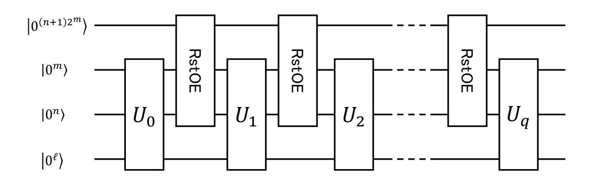
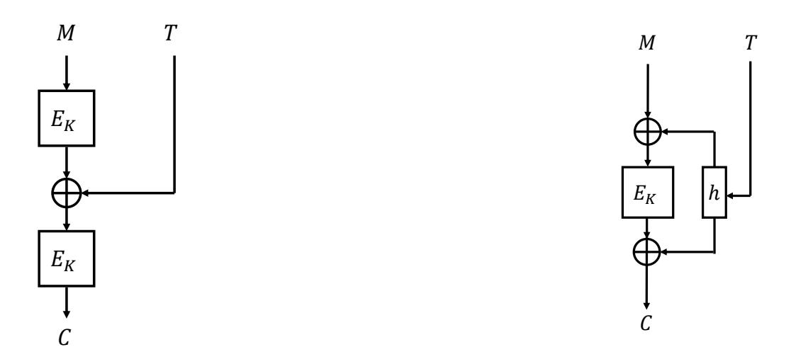
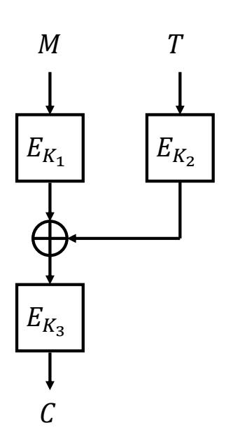
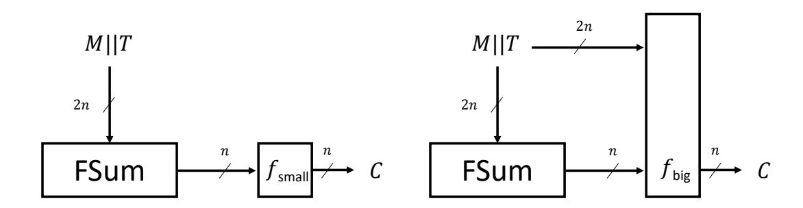
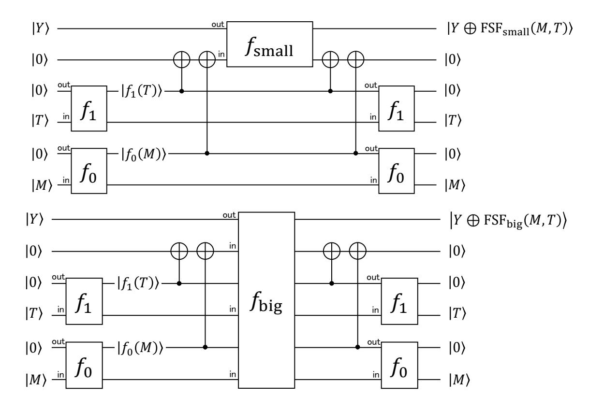

{0}------------------------------------------------

# **Provably Quantum-Secure Tweakable Block Ciphers**

Akinori Hosoyamada<sup>1</sup>*,*<sup>2</sup> and Tetsu Iwata<sup>2</sup>

```
1 NTT Secure Platform Laboratories, Tokyo, Japan
     akinori.hosoyamada.bh@hco.ntt.co.jp
       2 Nagoya University, Nagoya, Japan
{hosoyamada.akinori,tetsu.iwata}@nagoya-u.jp
```

**Abstract.** Recent results on quantum cryptanalysis show that some symmetric key schemes can be broken in polynomial time even if they are proven to be secure in the classical setting. Liskov, Rivest, and Wagner showed that secure tweakable block ciphers can be constructed from secure block ciphers in the classical setting. However, Kaplan et al. showed that their scheme can be broken by polynomial time quantum superposition attacks, even if underlying block ciphers are quantum-secure. Since then, it remains open if there exists a mode of block ciphers to build quantum-secure tweakable block ciphers. This paper settles the problem in the reduction-based provable security paradigm. We show the *first* design of quantum-secure tweakable block ciphers based on quantum-secure block ciphers, and present a provable security bound. Our construction is simple, and when instantiated with a quantum-secure *n*-bit block cipher, it is secure against attacks that query arbitrary quantum superpositions of plaintexts and tweaks up to *O*(2*n/*<sup>6</sup> ) quantum queries. Our security proofs use the compressed oracle technique introduced by Zhandry. More precisely, we use an alternative formalization of the technique introduced by Hosoyamada and Iwata.

**Keywords:** Provable security · Quantum security · Tweakable block cipher · Compressed oracle technique

# **1 Introduction**

Post-quantum security attracts significant attention not only in the context of public key cryptography but also in the context of symmetric key cryptography, from the view point of both cryptanalysis [\[BN18,](#page-35-0) [BNS19a,](#page-35-1) [BNS19b,](#page-35-2) [CNS17,](#page-35-3) [GNS18,](#page-36-0) [HSX17,](#page-36-1) [KLLN16b,](#page-37-0) [KLLN16a\]](#page-37-1) and provable security for modes of operations [\[BZ13,](#page-35-4) [CHS19,](#page-35-5) [HI19,](#page-36-2) [HY18,](#page-36-3) [SY17,](#page-38-0) [Zha19\]](#page-38-1). Recent results on symmetric key schemes show that some of the schemes that are proven to be secure in the classical setting are completely broken by adversaries with quantum computers in some specific situations [\[KM10,](#page-37-2) [KM12,](#page-37-3) [KLLN16a\]](#page-37-1), which implies that simple remedies such as "doubling the length of secret keys" would not be sufficient to prepare for the threat of quantum computers, especially if it needs to be run on a quantum computer.

There are two post-quantum security notions for symmetric key schemes: *standard security* and *quantum security* [\[Zha12a\]](#page-38-2). Roughly speaking, a symmetric scheme is said to have standard security if it is secure against adversaries with quantum computers that have access to usual classical keyed oracles. On the other hand, the scheme is said to have quantum security if it is secure even if adversaries with quantum computers have access to *quantum* keyed oracles. A quantum keyed oracle allows adversaries to make quantum 

{1}------------------------------------------------

superposition queries, and returns responses in quantum superpositions[1](#page-1-0) . A scheme with quantum security has not only standard security, but it also remains secure in arbitrary intermediate security notions between quantum security and standard security. Therefore, in this sense, quantum security is theoretically the ultimate security goal that symmetric key schemes can achieve.

**Importance of studying quantum security.** From the view point of long-term security for symmetric key schemes, it is important to study their quantum security given the current progress on the development of quantum computers. Since program codes to compute a (deterministic) function implemented on classical computers can be ported onto quantum computers, a scheme that does not have quantum security should not be implemented in a black-box manner (by using, e.g., obfuscation). On the other hand, such security concern does not exist for a scheme with quantum security. Moreover, a scheme with quantum security will remain secure even in a far future when lots of computations and communications are done in quantum superpositions, and it will be safely used in other cryptographic schemes or protocols that are designed to run on quantum computers.[2](#page-1-1)

**Quantum security of tweakable block ciphers.** A block cipher (BC) is a keyed permutation, i.e., it takes a plaintext and a key as input to output a ciphertext, and a tweakable block cipher (TBC) takes additional input called a tweak. TBCs have wide applications in symmetric key cryptography, as they can be used to construct message authentication codes and authenticated encryption schemes, see e.g. [\[Rog04,](#page-38-3) [IMPS17,](#page-36-4) [BGIM19,](#page-35-6) [IKMP20\]](#page-36-5). The notion of TBC was first formalized by Liskov, Rivest, and Wagner [\[LRW02,](#page-37-4) [LRW11\]](#page-37-5). They introduced two TBC constructions and proved that TBCs can be constructed from BCs in the classical setting[3](#page-1-2) . However, Kaplan et al. showed that these constructions are broken in polynomial time when adversaries have access to quantum encryption oracles [\[KLLN16a\]](#page-37-1) [4](#page-1-3) . There has been no proposal of modes of BCs to build TBCs that are proven to be secure against quantum superposed attacks so far, and the existence of such modes remains open. In this paper, we consider the following question:

*Does there exist a mode to build quantum-secure TBCs from quantum-secure BCs?*

## **1.1 Our Contributions**

We give a positive answer to the question in the reduction-based provable security paradigm by giving the first construction of quantum-secure TBCs from quantum-secure BCs. Our construction, which we call LRWQ, has a simple structure and is based on one of the two constructions by Liskov, Rivest, and Wagner. If the underlying BC is an *n*-bit BC with *k*-bit keys, then LRWQ becomes an *n*-bit TBC with 3*k*-bit keys and *n*-bit tweaks. We show that LRWQ is indistinguishable from tweakable random permutations up to *O*(2*n/*<sup>6</sup> ) quantum queries[5](#page-1-4) in the setting that adversaries can query arbitrary superpositions of

<span id="page-1-0"></span><sup>1</sup> The security model that adversaries with quantum computers have access to only classical keyed oracles is called Q1 model, and the model that they have access to quantum keyed oracles is called Q2 model [\[KLLN16b\]](#page-37-0).

<span id="page-1-1"></span><sup>2</sup>This paper focuses only on cryptographic primitives that run on classical computers (and remain secure even if they run on quantum computers) because our current goal is to build quantum-secure cryptosystems with classical implementations so that we can achieve as high security as possible while keeping costs for implementations as low as possible. However, it is possible to assume that cryptographic primitives run only on quantum computers and all data including secret keys are in quantum superposition.

<span id="page-1-2"></span><sup>3</sup>Only a single construction is introduced in the journal version of the paper [\[LRW11\]](#page-37-5), but an additional construction is also introduced in the preliminary (conference) version of the paper [\[LRW02\]](#page-37-4).

<span id="page-1-3"></span><sup>4</sup>Kaplan et al. showed a quantum attack only for one of the two TBC constructions by Liskov, Rivest, and Wagner, but the attack can also be applied to the other construction. See [Section 4.1.](#page-12-0)

<span id="page-1-4"></span><sup>5</sup>Here, we consider *n* as a security parameter.

{2}------------------------------------------------

plaintexts and tweaks, i.e., we prove security against quantum chosen plaintext attacks (qCPAs).

To prove quantum security of our construction LRWQ, we use an alternative formalization [\[HI19\]](#page-36-2) of the *compressed oracle technique* developed by Zhandry [\[Zha19\]](#page-38-1). We give a summary of necessary proof techniques to show quantum oracle indistinguishability introduced in a previous work [\[HI19,](#page-36-2) [HI20\]](#page-36-6), and then apply it to show quantum security of LRWQ.

Our result is theoretically significant in the sense that we for the first time showed that quantum-secure tweakable pseudorandom permutations (qPRP ]) can be constructed from quantum-secure pseudorandom permutations (qPRP) (which establishes the fact that the existence of qPRP ] is theoretically equivalent to the existence of qPRP). The problem of whether a cryptographic primitive can be constructed from another primitive (whether there exists a reduction) is fundamental and theoretically the most important in cryptology. In addition, given that a qPRP ] can be obtained from quantum-secure pseudorandom functions (qPRF) through 4-round Feistel cipher [\[HI19,](#page-36-2) [HI20\]](#page-36-6), our result establishes the fact that a qPRP ] can be obtained from a qPRF.

On a practical side, it is plausible to assume AES [\[Nat01\]](#page-38-4) to be qPRP given that there has been no devastating quantum attack despite of recent efforts on quantum cryptanalysis on it. Thus, we can certainly obtain qPRP ] by instantiating LRWQ with AES. This means that our result enables us to directly benefit from recent efforts for quantum cryptanalysis on AES [\[GLRS16,](#page-36-7) [BNS19b,](#page-35-2) [JNRV20\]](#page-36-8).

*Remark* 1*.* To obtain qPRP ], one obvious approach is to verify whether existing native TBCs are quantum-secure (or design new ones), instead of using our mode LRWQ. However, these two approaches do not negate the other, but complement each other, i.e., our result gives another choice to construct qPRP ] for users. Even if there exists a quantum-secure native TBC, this does not invalidate our result.

*Remark* 2*.* This paper does not provide security proofs against quantum chosen ciphertext attacks (qCCAs), as our construction is broken if the decryption oracle is available even in the classical setting, which is also the case for one of the original constructions by Liskov, Rivest, and Wagner. Showing existence of TBCs that are secure against qCCAs is an interesting future work. Since the compressed oracle technique can be used for random functions but cannot be used for random permutations that allow inverse queries, an entirely new proof technique has to be built to show that a scheme (if exists) is secure against qCCAs. Note that TBCs that are secure against chosen-plaintext attacks (which is not secure against chosen-ciphertext attacks) can be used to instantiate various efficient message authentication codes and authenticated encryption schemes, e.g., ZMAC [\[IMPS17\]](#page-36-4), ZOTR [\[BGIM19\]](#page-35-6), and Romulus [\[IKMP20\]](#page-36-5). Therefore, TBCs that are secure against quantum chosen-plaintext attacks (qCPAs) are relevant.[6](#page-2-0)

### **1.2 Paper Organization**

[Section 2](#page-3-0) describes notations and basic definitions that are used throughout the paper. [Section 3](#page-5-0) reviews previous proof techniques and gives a proof summary to show quantum oracle indistinguishability results. [Section 4](#page-12-1) describes the specification of our construction LRWQ, and proves its quantum security. [Section 5](#page-34-0) concludes this paper with possible future works.

<span id="page-2-0"></span><sup>6</sup>We note that the argument here is to illustrate the relevance of TBCs that are secure against CPAs. We are not claiming that the modes are secure against quantum attacks. We also note that there are BC-based authenticated encryption modes that do not use the decryption of BCs, such as CCM [\[WHF02\]](#page-38-5), GCM [\[MV04\]](#page-37-6), and OTR [\[Min14\]](#page-37-7).

{3}------------------------------------------------

### <span id="page-3-0"></span>2 Preliminaries

Throughout the paper, we assume that all algorithms are quantum algorithms, and make quantum superposed queries to oracles. We assume that readers are familiar with basics on quantum computations.

**Basic notations.** For bit strings  $X \in \{0,1\}^m$  and  $Y \in \{0,1\}^n$ , let  $X||Y \in \{0,1\}^{m+n}$  denote the concatenation of X and Y. For each bit string X of finite length, let |X| denote the length of X in bits. For a positive integer m,  $GF(2^m)$  denotes the finite field of order  $2^m$ . We identify the set of bit strings  $\{0,1\}^m$  with the set of integers  $\{0,1,\ldots,2^m-1\}$  unless otherwise noted.

 $\|\cdot\|$  and  $\|\cdot\|_{\mathsf{tr}}$  denote norm of vector and trace norm of matrix, respectively.  $\mathsf{td}(\cdot,\cdot)$  denotes the trace distance function  $\mathsf{td}(\rho,\sigma) := \frac{1}{2}\|\rho - \sigma\|_{\mathsf{tr}}$ . H denotes the Hadamard operator on 1-qubit states. We denote the identity operator for an n-qubit quantum system by  $I_n$  or just I. In addition, we denote the vectors  $|\phi\rangle \otimes |0^s\rangle$  and  $|0^s\rangle \otimes |\phi\rangle$  by the same symbol  $|\phi\rangle$ , if there will be no confusion. For a unitary operator U, we denote the operators  $U \otimes I$  and  $I \otimes U$  by the same symbol U.

**Primitives.** A keyed function F is a function from a product space  $\{0,1\}^k \times \{0,1\}^m$  to another space  $\{0,1\}^n$ , where  $\{0,1\}^k$  is called the key space of F. We denote the function  $F(K,\cdot):\{0,1\}^m \to \{0,1\}^n$  by  $F_K(\cdot)$  for each key  $K \in \{0,1\}^k$ .

A block cipher (BC) is a keyed function  $E: \{0,1\}^k \times \{0,1\}^n \to \{0,1\}^n$  such that  $E_K(\cdot)$  is a permutation for each key K. A tweakable block cipher (TBC) is a keyed function  $\tilde{E}: \{0,1\}^k \times \{0,1\}^t \times \{0,1\}^n \to \{0,1\}^n$  such that  $\tilde{E}(K,T,\cdot)$  is a permutation on  $\{0,1\}^n$  for each  $K \in \{0,1\}^k$  and  $T \in \{0,1\}^t$ . The space  $\{0,1\}^t$  is called the tweak space of  $\tilde{E}$ . We often write  $\tilde{E}_K^T(M)$  instead of  $\tilde{E}(K,T,M)$ .

### 2.1 (Oracle-aided) Quantum Algorithms

#### <span id="page-3-2"></span>2.1.1 Information-Theoretic Model

First, we explain how we model (oracle-aided) quantum algorithms when we take only the number of quantum queries into account as adversaries' computational resources, i.e., we consider quantum information-theoretic adversaries.

When a single quantum oracle is available<sup>7</sup>, following previous works [BDF<sup>+</sup>11, SY17, Zha12a] we model an oracle-aided quantum algorithm  $\mathcal{A}$  that makes at most q quantum queries as a sequence of unitary operators  $(U_0, \ldots, U_q)$  that act on an s-qubit state space (which is the state space of  $\mathcal{A}$ ), where  $U_0$  corresponds to an initialization process and  $U_i$ corresponds to  $\mathcal{A}$ 's offline computation after the *i*-th query, for  $i \geq 1$ . Without loss of generality we can assume that  $\mathcal{A}$  does not make any intermediate measurements, and  $\mathcal{A}$ 's state space  $\mathcal{H}_{\mathcal{A}}$  (a Hilbert space) is a joint system of an  $a_{query}$ -qubit quantum system  $\mathcal{H}_{query}$ , an  $a_{ans}$ -qubit quantum system  $\mathcal{H}_{ans}$ , and an  $(s - a_{query} - a_{ans})$ -qubit quantum system  $\mathcal{H}_{work}$ . Here,  $\mathcal{H}_{query}$ ,  $\mathcal{H}_{ans}$ , and  $\mathcal{H}_{work}$  correspond to the register to send queries to oracles, the register to receive answers from oracles, and the register for  $\mathcal{A}$ 's offline works, respectively. We also model a quantum oracle  $\mathcal{O}$  as the sequence of unitary operators  $(O_1,\ldots,O_q)$ .  $\mathcal{O}$  may have some (classical) randomness, and each  $O_i$  may be chosen randomly according to a distribution at the beginning of each game.  $\mathcal{O}$  can maintain its own quantum state. If  $\mathcal{O}$  has s'-qubit quantum states, joint quantum states of  $\mathcal{A}$  and  $\mathcal{O}$ are (s+s')-qubit quantum states. We denote  $\mathcal{O}$ 's state space by  $\mathcal{H}_{\mathcal{O}}$ . When  $\mathcal{A}$  makes the *i*-th query, the unitary operator  $O_i$  acts on  $\mathcal{H}_{query} \otimes \mathcal{H}_{ans} \otimes \mathcal{H}_{\mathcal{O}}$ . We assume that

<span id="page-3-1"></span><sup>&</sup>lt;sup>7</sup>Note that in this paper we only consider the case that each quantum algorithm is given oracle access to at most one quantum oracle (we do not have to consider the case that two or more quantum oracles are available for adversaries, in later sections).

{4}------------------------------------------------

initial states of A and O are set to be |0 *s* i ∈ H<sup>A</sup> and |InitOi ∈ H<sup>O</sup> [8](#page-4-0) . When we run A, the unitary operators *U*0*, O*1*, U*1*, . . . , U<sup>q</sup>* act on the initial state |0 *s* i ⊗ |InitOi in a sequential order (the resulting quantum state is |Φi = *UqO<sup>q</sup>* · · · *O*1*U*0(|0 *s* i ⊗ |InitOi)), A measures the first *s*-qubit of the state |Φi with the computational basis to obtain a classical *s*-bit string *z*, and finally outputs (a part of) *z*. We denote the event that A outputs a bit string *x* after it runs relative to O by *x* ← A<sup>O</sup>.

**Example of an oracle.** Let *F* be a family of functions from {0*,* 1} *<sup>m</sup>* to {0*,* 1} *<sup>n</sup>*. Suppose that a quantum algorithm A runs relative to a quantum oracle O*<sup>F</sup>* that first chooses *f* randomly from *F* (according to a distribution on *F*) and gives A a quantum oracle access to *f*. Then H*query* and H*ans* are defined as *m*-qubit space and *n*-qubit space, respectively. O*<sup>F</sup>* has no quantum states, and each *O<sup>i</sup>* is the unitary operator defined by

$$O_i: |x\rangle |y\rangle \mapsto |x\rangle |y \oplus f(x)\rangle.$$

When *f* is chosen just uniformly at random, then this is the quantum oracle of a random function.

#### <span id="page-4-1"></span>**2.1.2 Non-Information-Theoretic Model**

When we take other computational resources such as time and the number of available qubits into account in addition to the number of quantum queries, we model a quantum algorithm as a combination of classical algorithms and quantum circuits. In this paper we consider the pure quantum circuit model and ignore the costs related to communication complexity and error corrections. We regard that a quantum circuit of depth *D* runs in time *D*. We assume that each quantum circuit is composed of (1) the Hadamard gate *H*, (2) the *π/*8-gate *T*, (3) the phase gate *S*, (4) the CNOT gate, and (5) the oracle gate (if an oracle is available). We assume that each of basic gates runs in time *O*(1), in addition that CNOT can act on arbitrary pair of qubits.

*Remark* 3*.* In practice, computational complexity of quantum algorithms would significantly vary depending on error correction costs and quantum hardware architectures, or communication costs. Our model might overestimate quantum algorithms' abilities, but schemes that are proven to be secure in this model will remain secure in other more realistic models.

### **2.2 Security Definitions**

**Oracle distinguishing advantage.** For quantum oracles O<sup>1</sup> and O2, we define the quantum distinguishing advantage of an oracle-aided quantum algorithm A by

$$\mathbf{Adv}_{\mathcal{O}_{1},\mathcal{O}_{2}}^{\mathrm{dist}}\left(\mathcal{A}\right) := \left| \Pr\left[ b \leftarrow \mathcal{A}^{\mathcal{O}_{1}} : b = 1 \right] - \Pr\left[ b \leftarrow \mathcal{A}^{\mathcal{O}_{2}} : b = 1 \right] \right|.$$

**Quantum PRF advantages.** Let *F* : {0*,* 1} *<sup>k</sup>* × {0*,* 1} *<sup>m</sup>* → {0*,* 1} *<sup>n</sup>* be a keyed function, and A be an oracle-aided quantum algorithm. By abuse of notation, let *F* also denote the quantum oracle that chooses a key *K* ∈ {0*,* 1} *<sup>k</sup>* uniformly at random and gives a quantum oracle access to *F*(*K,* ·). Following previous works [\[BDF](#page-35-7)<sup>+</sup>11, [Zha12a\]](#page-38-2), we define the quantum pseudorandom function advantage (or qPRF advantage for short) by

$$\mathbf{Adv}_{F}^{\mathrm{qPRF}}\left(\mathcal{A}\right) := \mathbf{Adv}_{F,\mathsf{RF}}^{\mathrm{dist}}\left(\mathcal{A}\right),$$

where RF is the quantum oracle that gives a quantum oracle access to a random function *f* : {0*,* 1} *<sup>m</sup>* → {0*,* 1} *n*.

<span id="page-4-0"></span><sup>8</sup>A more general situation could be the case that A takes inputs and runs with a non-trivial initial state (other than |0 *s* i), but this paper treats only quantum algorithms that take no inputs.

{5}------------------------------------------------

**Quantum PRP advantages.** Let  $E: \{0,1\}^k \times \{0,1\}^n \to \{0,1\}^n$  be a block cipher, and  $\mathcal{A}$  be an oracle-aided quantum algorithm. By abuse of notation, let E also denote the quantum oracle that chooses a key  $K \in \{0,1\}^k$  uniformly at random and gives a quantum oracle access to  $E(K,\cdot)$ . Following [HI19, Zha16], we define the quantum pseudorandom permutation advantage (or qPRP advantage for short) by

$$\mathbf{Adv}_{E}^{\text{qPRP}}\left(\mathcal{A}\right) := \mathbf{Adv}_{E,\mathsf{RP}}^{\text{dist}}\left(\mathcal{A}\right),$$

where RP is the quantum oracle that gives a quantum oracle access to a random permutation  $P: \{0,1\}^n \to \{0,1\}^n$ .

**Quantum TPRP advantages.** Let  $\tilde{E}: \{0,1\}^k \times \{0,1\}^t \times \{0,1\}^n \to \{0,1\}^n$  be a tweakable block cipher, and A be an oracle-aided quantum algorithm. By abuse of notation, let  $\tilde{E}$  also denote the quantum oracle that chooses a key  $K \in \{0,1\}^k$  uniformly at random and gives a quantum oracle access to  $\tilde{E}(K,\cdot,\cdot)$ . Extending the classical security notion [LRW02, LRW11], we define the quantum tweakable pseudorandom permutation advantage (or qPRP advantage for short) by

$$\mathbf{Adv}_{\tilde{E}}^{\text{q}\widetilde{\text{PRP}}}\left(\mathcal{A}\right) := \mathbf{Adv}_{\tilde{E},\widetilde{\mathsf{RP}}}^{\text{dist}}\left(\mathcal{A}\right),$$

where  $\widetilde{\mathsf{RP}}$  is the quantum oracle that gives a quantum oracle access to a function  $\tilde{P}$ :  $\{0,1\}^t \times \{0,1\}^n \to \{0,1\}^n$  such that  $\tilde{P}(T,\cdot)$  is a random permutation for each  $T \in \{0,1\}^t$  (i.e.,  $\tilde{P}$  is a tweakable random permutation).

# <span id="page-5-0"></span>3 Proof Techniques in the Quantum Setting

This section reviews previous quantum proof techniques that are used in later sections. One of the most significant obstacles to giving quantum security proofs is that we cannot record transcripts of queries and answers: if we copy and record adversaries' queries in the same way as we do in the classical setting, it significantly affects the adversaries' quantum states. In [Zha19], Zhandry showed how we can overcome this obstacle with his proof technique named "compressed oracle technique," which enables us to record transcripts of queries made to quantum random oracles to some extent. His technique is so powerful that it can be used to show the indifferentiability of Merkle-Damgård construction, post-quantum security of Fujisaki-Okamato transformation [Zha19], the quantum query lower bound for the multicollision-finding problem on random functions [LZ19], and that the 4-round Luby-Rackoff construction is a qPRP [HI19, HI20]. The technique not only enables us to record quantum queries but also efficiently simulate random functions. In later sections, we also use his technique to show that a function is indistinguishable from a random function against information theoretic adversaries.

Because we do not have to care about efficient simulations of random functions in our proofs when we focus on information theoretic adversaries, we use an alternative formalization of the compressed oracle technique by Hosoyamada and Iwata named recording standard oracle with errors [HI19, HI20], which ignores efficient simulations for random functions and focuses on recording quantum queries. In [HI19, HI20], the authors showed some indistinguishability results by using the recording standard oracle with errors. Their techniques are arguably complex, making it hard to apply for other symmetric key schemes. In this section, we give a summary of their proof strategy so that the readers can have a good outlook on it<sup>9</sup>.

<span id="page-5-1"></span><sup>&</sup>lt;sup>9</sup>The Asiacrypt version of their paper [HI19] has some technical errors in proofs, and corrected in the revised version [HI20]. Our summary is based on the revised version rather than the Asiacrypt version.

{6}------------------------------------------------

The organization of this section is as follows. In Section 3.1, we present an overview the recording standard oracle with errors. In Section 3.2, we review and summarize how the recording standard oracle with errors is used to show quantum oracle indistinguishability in [HI19, HI20] (see Proposition 3). In Section 3.3, we review some other useful proof tools for later use.

In Section 3.1 and Section 3.2, we focus on quantum information-theoretic adversaries, and model quantum algorithms as in Section 2.1.1. In Section 3.3, we take the running time and the number of available qubits into account when we estimate adversaries' computational resources, as in Section 2.1.2.

### <span id="page-6-0"></span>3.1 Recording Standard Oracle with Errors

#### <span id="page-6-2"></span>3.1.1 Standard Oracle

The quantum oracle of a random function (or quantum random oracle [BDF<sup>+</sup>11]) is primarily defined as the oracle such that, a function f is chosen randomly at the beginning, and then it gives an adversary quantum oracle access to f. Note that the quantum oracle access to a function f is realized by the unitary operator  $O_f : |x\rangle |y\rangle \mapsto |x\rangle |y \oplus f(x)\rangle$  (See the example in Section 2.1.1). Below, we give an equivalent model of the quantum oracle of a random function, which we call the *standard oracle* for a random function.

For a function  $f: \{0,1\}^m \to \{0,1\}^n$ , by the same symbol f let us denote the  $(n+1) \cdot 2^m$ -bit string  $(0||f(0))||(0||f(1))|| \cdots ||(0||f(2^m-1))|$ . (Now we are considering the truth table of f. Readers may wonder why there is a bit "0" before each f(i) although a natural representation of the truth table would be the  $n \cdot 2^m$ -bit string  $f(0)||f(1)|| \cdots ||f(2^m-1)||$ . Actually, the bit "0" in our representation is essentially unnecessary to explain the standard oracle, but we include this for later use.) In addition, let us define a unitary operator stO for  $(n+m+(n+1)2^m)$ -qubit states by

<span id="page-6-1"></span>
$$\mathsf{stO}: |x\rangle |y\rangle |S\rangle \mapsto |x\rangle |y \oplus s_x\rangle |S\rangle, \tag{1}$$

where  $x \in \{0,1\}^m$ ,  $y \in \{0,1\}^n$ , and  $S = (b_0||s_0)||(b_1||s_1)|| \cdots ||(b_{2^m-1}||s_{2^m-1})|$ , where  $b_i \in \{0,1\}$  and  $s_i \in \{0,1\}^n$  for each  $i \in \{0,1\}^m$ . Then we have that  $(O_f|x\rangle|y\rangle) \otimes |f\rangle = \operatorname{stO}|x\rangle|y\rangle|f\rangle$  holds. That is, the oracle  $O_f$  can be realized by the operator  $\operatorname{stO}$ , which is independent from functions, and the truth table of f.

By abuse of notation, let stO also denote the stateful quantum oracle such that its initial state is the uniform superposition of all functions  $\sum_f \sqrt{\frac{1}{2^{n2^m}}} |f\rangle$ , and when a query is made, the response is processed as in (1). Then, for any quantum algorithm  $\mathcal A$  and any (classical) possible output z,  $\Pr[z \leftarrow \mathcal A^{\text{stO}}] = \Pr[z \leftarrow \mathcal A^{\text{RF}}]$  holds.

#### 3.1.2 Recording Standard Oracle with Errors

Next we review the *recording standard oracle with errors*, which is an alternative formalization of Zhandry's compressed oracle technique. It enables us to record transcripts of queries made to random functions.

Define three unitary operators IH, CH,  $U_{\text{toggle}}$  that act on  $(n+1)2^m$ -qubit states by

$$\mathsf{IH} := (I_1 \otimes H^{\otimes n})^{\otimes 2^m}, \mathsf{CH} := (CH^{\otimes n})^{\otimes 2^m}, \text{ and}$$

$$U_{\text{toggle}} := (I_1 \otimes |0^n\rangle \langle 0^n| + X \otimes (I_n - |0^n\rangle \langle 0^n|))^{\otimes 2^m},$$

For completeness, we do not rely on any propositions in [HI19, HI20] that is related to the errors. The propositions we cite from [HI19, HI20] in this paper are ones of which correctness can be confirmed just by straightforward algebraic calculation (Proposition 1 and Proposition 2), and one that is just a simple combination of other previous results (Proposition 4).

{7}------------------------------------------------

where  $CH^{\otimes n} := |1\rangle \langle 1| \otimes H^{\otimes n} + |0\rangle \langle 0| \otimes I_n$  is the controlled *n*-qubit Hadamard operator, and X is the 1-qubit "NOT" operator defined by  $X|b\rangle = |b \oplus 1\rangle$ . The actions of the unitary operator  $U_{\text{enc}} := \mathsf{CH} \cdot U_{\text{toggle}} \cdot \mathsf{IH}$  and its conjugate are called *encoding* and *decoding*, respectively.

**Definition 1** (Recording standard oracle with errors). The recording standard oracle with errors is a quantum oracle with  $(n+1)2^m$ -qubit states such that the initial state is  $|0^{(n+1)2^m}\rangle$  and responses to queries are processed by the unitary operator RstOE :=  $(I \otimes U_{\text{enc}}) \cdot \text{stO} \cdot (I \otimes U_{\text{enc}}^*)$ , where I denotes the identity operator on adversaries' query and answer registers, and  $U_{\text{enc}}^*$  is the conjugate of  $U_{\text{enc}}$ . (See also Fig. 1.)

<span id="page-7-0"></span>

**Figure 1:** A quantum circuit that illustrates an adversary  $\mathcal{A}$  that runs relative to RstOE. The register  $|0^{(n+1)2^m}\rangle$  at the top corresponds to the oracle's state. The second and third registers  $(|0^m\rangle)$  and  $|0^n\rangle$  are used to send queries and receive answers, respectively. The register  $|0^{\ell}\rangle$  at the bottom corresponds to  $\mathcal{A}$ 's private working space for offline computations.

From the definition of RstOE it immediately follows that, for any quantum algorithm  $\mathcal{A}$  and any (classical) possible output z,  $\Pr\left[z \leftarrow \mathcal{A}^{\mathsf{RstOE}}\right] = \Pr\left[z \leftarrow \mathcal{A}^{\mathsf{stO}}\right] = \Pr\left[z \leftarrow \mathcal{A}^{\mathsf{RF}}\right]$  holds.

Let D be an  $(n+1)2^m$ -bit string  $(b_0||d_0)||\cdots||(b_{2^m-1}||d_{2^m-1})$ . We call D a valid database if there is no x such that  $d_x \neq 0^n \wedge b_x = 0$ , and we call D an *invalid* database otherwise. (Be careful not to confuse the (in)valid databases with the representations for functions' truth tables introduced in Section 3.1.1.)

Note that there is a natural one-to-one correspondence between the set of valid databases and the set of partially defined functions from  $\{0,1\}^m$  to  $\{0,1\}^n$  that is defined by  $D\mapsto \mathcal{F}_D$ , where  $\mathcal{F}_D$  is the function such that  $\mathcal{F}_D(x)=d_x$  if  $b_x=1$  and  $\mathcal{F}_D(x)=$   $\bot$  (i.e.,  $\mathcal{F}_D$  is not defined on x) if  $b_x=0$ . In addition, there exists a trivial one-to-one correspondence between the set of the partially defined function from  $\{0,1\}^m$  to  $\{0,1\}^n$  and the set  $\mathcal{X}:=\{S\subset\{0,1\}^m\times\{0,1\}^n|x\neq x'\text{ holds for }(x,y)\neq(x',y')\in S\}$ . We identify valid databases with partially defined functions and elements in  $\mathcal{X}$  via these one-to-one correspondences. For a valid database D, we write D(x)=y to denote  $b_x=1$  and  $d_x=y$ , and D(x)=1 to denote  $b_x=0$ . When two valid databases  $D\neq D'$  satisfy D(x)=10 of D(x)=11 for some x1 and D(x')=D(x')2 for other  $x'(\neq x)$ 3, we write  $D'=D\cup(x,\alpha)$ 4 and  $D=D'\setminus(x,\alpha)$ 5. In addition, for a valid database  $D=(b_0\|d_0)\|\cdots\|(b_{2^m-1}\|d_{2^m-1})$ 5 such that D(x)=11 and  $\beta\neq 0^n\in\{0,1\}^n$ 6, we denote the invalid database  $(b_0\|d_0)\|\cdots\|(b_{x-1}\|d_x)\|(0\|\beta)\|(b_{x+1}\|d_{x+1})\|\cdots\|(b_{2^m-1}\|d_{2^m-1})$ 6 by  $D\cup (x,\beta)$ 1.

Remark 4 (Intuition behind RstOE). Intuitively, for a valid database D,  $b_x = 1$  means that x has been queried and the corresponding answer is  $d_x$ , and databases can be regarded as transcripts of queries and answers. When a query is made, (valid) databases are first "decoded" into truth tables of functions. Then the oracle responds with stO, and finally the truth tables are "encoded" again into (valid) databases.

Let  $\mathcal{A}$  be a quantum algorithm, and  $|\psi_i\rangle$  be the whole quantum state of  $\mathcal{A}$  and the oracle just before the *i*-th query when it runs relative to the standard oracle RstOE. For

{8}------------------------------------------------

ease of notation, let us denote  $|\psi_{q+1}\rangle$  be the quantum state after all unitary processes are finished. The following proposition guarantees that each database contains at most i entries after i quantum queries.

<span id="page-8-0"></span>**Proposition 1.** Let  $i \geq 1$ . Suppose that we measure the oracle states' register of  $|\psi_{i+1}\rangle$  and obtained a database D. Then D is valid, and contains at most i entries.

We can deduce that the proposition holds from the discussions in [HI19, HI20], though, we provide a proof of the proposition in Appendix A for completeness.

Remark 5. Unlike classical transcripts, even if  $|\psi_i\rangle$  contains a database D (of non-zero quantum amplitude) with an entry  $(x, d_x)$ , there is no guarantee that  $|\psi_{i'}\rangle$  contains a database with the entry  $(x, d_x)$  for some i' > i. That is, roughly speaking, there is a possibility that a database will "forget" its entries. Furthermore, there is even a possibility that the record  $(x, d_x)$  is overwritten with another record  $(x, d_x)$  when a query is made.

The following proposition shows core technical properties for RstOE.

<span id="page-8-1"></span>**Proposition 2** (Proposition 1 in [HI19, HI20]). Let D be a valid database. Suppose that  $D(x) = \bot$ . Then, the following properties hold.

1. For any y, there exists a vector  $|\epsilon_1\rangle$  such that  $||\epsilon_1\rangle|| \leq 5/\sqrt{2^n}$  and  $\mathsf{RstOE}|x\rangle|y\rangle \otimes |D \cup (x,\alpha)\rangle = |x\rangle|y \oplus \alpha\rangle \otimes |D \cup (x,\alpha)\rangle + |\epsilon_1\rangle$  hold. More precisely,

RstOE 
$$|x, y\rangle \otimes |D \cup (x, \alpha)\rangle$$
  
=  $|x, y \oplus \alpha\rangle \otimes |D \cup (x, \alpha)\rangle$  (2)

<span id="page-8-7"></span><span id="page-8-4"></span>
$$+ \frac{1}{\sqrt{2^n}} |x, y \oplus \alpha\rangle \left( |D\rangle - \left( \sum_{\gamma \in \{0,1\}^n} \frac{1}{\sqrt{2^n}} |D \cup (x, \gamma)\rangle \right) \right)$$
 (3)

$$-\frac{1}{\sqrt{2^n}} \sum_{\gamma} \frac{1}{\sqrt{2^n}} |x, y \oplus \gamma\rangle \otimes \left( |D \cup (x, \gamma)\rangle - |D_{\gamma}^{\mathsf{invalid}}\rangle \right) \tag{4}$$

$$+ \frac{1}{2^n} |x\rangle |\widehat{0^n}\rangle \otimes \left(2 \sum_{\delta \in \{0,1\}^n} \frac{1}{\sqrt{2^n}} |D \cup (x,\delta)\rangle - |D\rangle\right)$$
 (5)

holds, where  $|D_{\gamma}^{\mathsf{invalid}}\rangle$  is a superposition of invalid databases that depend on  $\gamma$  defined by

<span id="page-8-6"></span><span id="page-8-5"></span>
$$|D_{\gamma}^{\mathrm{invalid}}\rangle := \sum_{\delta \neq 0^n} \frac{(-1)^{\gamma \cdot \delta}}{\sqrt{2^n}} |D \cup [\![(x,\gamma)]\!]\rangle$$

and  $|\widehat{0^n}\rangle := H^{\otimes n} |0^n\rangle$ .

2. For any y, there exists a vector  $|\epsilon_2\rangle$  such that  $\||\epsilon_2\rangle\| \leq 2/\sqrt{2^n}$  and  $\mathsf{RstOE}\,|x\rangle\,|y\rangle\otimes |D\rangle = \sum_{\alpha\in\{0,1\}^n} \frac{1}{\sqrt{2^n}}\,|x\rangle\,|y\oplus\alpha\rangle\otimes|D\cup(x,\alpha)\rangle + |\epsilon_2\rangle$  hold. More precisely,

$$\mathsf{RstOE} |x\rangle |y\rangle \otimes |D\rangle = \sum_{\alpha \in \{0,1\}^n} \frac{1}{\sqrt{2^n}} |x, y \oplus \alpha\rangle \otimes |D \cup (x, \alpha)\rangle \tag{6}$$

<span id="page-8-3"></span><span id="page-8-2"></span>
$$+ \frac{1}{\sqrt{2^n}} |x\rangle |\widehat{0^n}\rangle \otimes \left( |D\rangle - \sum_{\gamma \in \{0,1\}^n} \frac{1}{\sqrt{2^n}} |D \cup (x,\gamma)\rangle \right)$$
 (7)

holds, where  $|\widehat{0^n}\rangle = H^{\otimes n} |0^n\rangle$ .

{9}------------------------------------------------

Remark 6. Roughly speaking, Proposition 2 says that RstOE behaves as a quantum version of the classical lazy sampling (up to a small error) when the state before a query is not superposed: The second property is an analogy of the property of the classical lazy sampling that, if the query x has not been queried before, then RstOE samples  $\alpha$  uniformly at random and responds with it (with some errors). The first property is an analogy of the classical one that, if the query x has already been queried before and its answer was  $\alpha$ , then the response to the current query is  $\alpha$  as before (with some errors). When the state before a query is superposed, the effect of the error terms  $|\epsilon_1\rangle$  and  $|\epsilon_2\rangle$  becomes non-negligible and quantum-specific properties (such that a record is deleted or overwritten from the database) arise, and we have to provide careful analysis. Therefore, we can use classical intuitions to come up with quantum security proofs with RstOE, but still sometimes classical intuitions do not work and mathematically rigorous proofs are indispensable.

#### <span id="page-9-0"></span>3.2 How to Show Quantum Oracle Indistinguishability with RstOE

Here we briefly review how the recording standard oracle with errors is used to show quantum oracle indistinguishability in [HI20]. Note that this section focuses on quantum information-theoretic adversaries, and we model quantum algorithms as in Section 2.1.1. We first describe the proof strategy formally, and then explain some informal intuition behind it.

**Goal.** Suppose that there are functions  $F^{f_1,...,f_r}, G^{g_1,...,g_s}: \mathcal{X} \to \mathcal{Y}$  that have access to functions  $f_1, \ldots, f_r$  and  $g_1, \ldots, g_s$  in a black-box manner, respectively. Our goal is to give an upper bound on the distinguishing advantage of an adversary A between  $F^{f_1,...,f_r}$  and  $G^{g_1,\ldots,g_s}$  when each  $f_i$  and  $g_j$  are random functions.

Oracle implementations using RstOE. Below, we assume that elements in  $\mathcal{X}$  and  $\mathcal{Y}$ are encoded into m-bit strings and n-bit strings for some positive integers m and n, respectively.

When each  $f_i$  is a fixed function (but not a random function), let  $\mathcal{O}_F^{f_1,\dots,f_r}$  denote the quantum oracle of  $F^{f_1,...,f_r}$ . We assume that the unitary operator  $O_F^{f_1,...,f_r}$  of the oracle  $\mathcal{O}_F^{f_1,\ldots,f_r}$  is realized as a quantum circuit with oracle gates (that make queries to  $f_1, \ldots, f_r$ ) and suppose that  $\ell$  ancilla qubits are used to compute F. The ancilla qubits are supposed to be  $|0^{\ell}\rangle$  before and after each evaluation of F when  $f_1, \ldots, f_r$  are some fixed functions. That is, we assume that  $O_F^{f_1,\dots,f_r}$  is a unitary operator such that  $O_F^{f_1,\ldots,f_r}:|x\rangle\,|y\rangle\otimes|0^\ell\rangle\mapsto|x\rangle\,|y\oplus F^{f_1,\ldots,f_r}(x)\rangle\otimes|0^\ell\rangle$  holds, when each  $f_i$  is fixed.

When  $f_1, \ldots, f_r$  are random functions  $\mathsf{RF}_1, \ldots, \mathsf{RF}_r$ , we assume that they are implemented by using the recording oracle with errors RstOE. We regard  $\mathcal{O}_F^{\mathsf{RF}_1, \ldots, \mathsf{RF}_r}$  as the quantum oracle of which quantum states are combinations of (superposed) valid databases for  $\mathsf{RF}_1, \ldots, \mathsf{RF}_r$  and the  $\ell$  ancilla qubits. Then, the joint quantum state of  $\mathcal{A}$ and  $\mathcal{O}_F^{\mathsf{RF}_1,\ldots,\mathsf{RF}_r}$  is described as

$$\sum_{u,\mathcal{DB}_{F},\xi_{\ell}} a_{u,\mathcal{DB}_{F},\xi_{\ell}} |u\rangle \otimes |\mathcal{DB}_{F}\rangle |\xi_{\ell}\rangle,$$

where u corresponds to  $\mathcal{A}$ 's state, each  $\mathcal{DB}_F = (D_1, \ldots, D_r)$  denotes a (combined) database for  $\mathsf{RF}_1, \ldots, \mathsf{RF}_r$ , each  $\xi_\ell$  is a classical  $\ell$ -bit string, and  $a_{u,\mathcal{DB}_F,\xi_\ell}$  satisfies  $\sum_{u,\mathcal{DB}_F,\xi_\ell} |a_{u,\mathcal{DB}_F,\xi_\ell}|^2 = 1$ . Below, we just write  $\mathcal{O}_F$  instead of  $\mathcal{O}_F^{\mathsf{RF}_1,\ldots,\mathsf{RF}_r}$  for simplicity. Similarly, when  $g_1, \ldots, g_s$  are random functions  $\mathsf{RF}_1', \ldots, \mathsf{RF}_s'$ , we assume that the quantum oracle  $\mathcal{O}_G$  of  $G^{\mathsf{RF}'_1,\ldots,\mathsf{RF}'_s}$  are implemented by using RstOE. We assume that  $\mathcal{O}_G$ 

uses  $\ell'$  ancilla qubits to compute G. We denote a (combined) database for  $\mathsf{RF}_1', \ldots, \mathsf{RF}_s'$ 

by  $\mathcal{DB}_G := (D'_1, \dots, D'_s)$ , where  $D'_i$  is a valid database for each  $\mathsf{RF}'_i$ .

{10}------------------------------------------------

**Good and bad databases.** Next, we classify valid databases for  $\mathcal{O}_F$  and  $\mathcal{O}_G$  into good and bad databases, which correspond to good and bad transcripts in classical security proofs. The important point is that the classification is done in such a way that there is a one-to-one correspondence between good databases for  $\mathcal{O}_F$  and those for  $\mathcal{O}_G$ . For each good database  $\mathcal{DB}_F$  for  $\mathcal{O}_F$ , we denote the corresponding good database for  $\mathcal{O}_G$  by  $[\mathcal{DB}_F]_G$ . Similarly, for each good database  $\mathcal{DB}_G$  for  $\mathcal{O}_G$ , we denote the corresponding database for  $\mathcal{O}_F$  by  $[\mathcal{DB}_G]_F$ .

An upper bound of the oracle distinguishing advantage. Let  $\mathcal{A}$  be an oracle-aided quantum algorithm that makes at most q quantum queries. Let  $|\psi_i\rangle$  (resp.,  $|\psi'_i\rangle$ ) be the entire quantum state just before the i-th query when  $\mathcal{A}$  runs relative to  $\mathcal{O}_F$  (resp.,  $\mathcal{O}_G$ ). By abuse of notation, let  $|\psi_{q+1}\rangle$  (resp.,  $|\psi'_{q+1}\rangle$ ) be the entire quantum state just before the final measurement.

The technically hardest part to give an upper bound of  $\mathbf{Adv}_{\mathcal{O}_F,\mathcal{O}_G}^{\mathrm{dist}}(\mathcal{A})$  is to show that, for  $i=1,\ldots,q+1$ , there exist vectors  $|\psi_i^{'\mathsf{good}}\rangle$ ,  $|\psi_i^{'\mathsf{bad}}\rangle$ ,  $|\psi_i^{\mathsf{good}}\rangle$ , and  $|\psi_i^{\mathsf{bad}}\rangle$  that satisfy the following properties.

1. 
$$|\psi_i'\rangle = |\psi_i^{'\text{good}}\rangle + |\psi_i^{'\text{bad}}\rangle$$
 and  $|\psi_i\rangle = |\psi_i^{\text{good}}\rangle + |\psi_i^{\text{bad}}\rangle$ 

2. There exists complex number  $a_{xyz\mathcal{DB}_G}^{(i)}$  such that

$$|\psi_{i}^{'\text{good}}\rangle = \sum_{\substack{x,y,z \ \mathcal{D}_{G}:\text{good database for }\mathcal{O}_{G}}} a_{xyz\mathcal{D}\mathcal{B}_{G}}^{(i)} |x,y,z\rangle \otimes |\mathcal{D}\mathcal{B}_{G}\rangle, \text{ and}$$
 (8)

<span id="page-10-3"></span><span id="page-10-2"></span>
$$|\psi_{i}^{\mathsf{good}}\rangle = \sum_{\substack{x,y,z\\ \mathcal{D}\mathcal{B}_{G}: \mathsf{good database for }\mathcal{O}_{G}}} a_{xyz\mathcal{D}\mathcal{B}_{G}}^{(i)} |x,y,z\rangle \otimes |[\mathcal{D}\mathcal{B}_{G}]_{F}\rangle$$
(9)

hold, where x, y, and z correspond to  $\mathcal{A}$ 's register to send queries to oracles, register to receive answers from oracles, and register for offline computation, respectively.

3. It holds that

<span id="page-10-1"></span>
$$\left\| |\psi_i^{'\mathsf{bad}}\rangle \right\| \le \left\| |\psi_{i-1}^{'\mathsf{bad}}\rangle \right\| + \epsilon_{\mathsf{bad}}^{'(i-1)} \text{ and } \left\| |\psi_i^{\mathsf{bad}}\rangle \right\| \le \left\| |\psi_{i-1}^{\mathsf{bad}}\rangle \right\| + \epsilon_{\mathsf{bad}}^{(i-1)} \tag{10}$$

for some positive values 
$$\epsilon_{\mathsf{bad}}^{'(i-1)}$$
 and  $\epsilon_{\mathsf{bad}}^{(i-1)}$  (we set  $|\psi_0^{'\mathsf{bad}}\rangle = |\psi_0^{\mathsf{bad}}\rangle = 0$ ,  $|\psi_1^{'\mathsf{bad}}\rangle = |\psi_0^{\mathsf{bad}}\rangle = 0$ , and  $\epsilon_{\mathsf{bad}}^{(0)} = \epsilon_{\mathsf{bad}}^{'(0)} = 0$ ).

The following proposition ensures that we will obtain an upper bound of the distinguishing advantage of  $\mathcal{A}$  when we prove the existence of such vectors  $|\psi_i^{'\mathsf{good}}\rangle$ ,  $|\psi_i^{'\mathsf{bad}}\rangle$ ,  $|\psi_i^{\mathsf{good}}\rangle$ , and  $|\psi_i^{\mathsf{bad}}\rangle$ .

<span id="page-10-0"></span>**Proposition 3.** Suppose that there exist vectors  $|\psi_i^{'\text{good}}\rangle$ ,  $|\psi_i^{'\text{bad}}\rangle$ ,  $|\psi_i^{\text{good}}\rangle$ , and  $|\psi_i^{\text{bad}}\rangle$  that satisfy the above three properties. Then,  $\mathbf{Adv}_{\mathcal{O}_F,\mathcal{O}_G}^{\text{dist}}(\mathcal{A}) \leq \sum_{1 \leq i \leq q} \epsilon_{\text{bad}}^{(i)} + \sum_{1 \leq i \leq q} \epsilon_{\text{bad}}^{(i)}$  holds.

Though this proposition is essentially proved in [HI20], here we give a proof for completeness.

Proof. From (10), it follows that 
$$\||\psi_{q+1}^{'\mathsf{bad}}\rangle\| \leq \sum_{1\leq i\leq q} \epsilon_{\mathsf{bad}}^{'(i)}$$
 and  $\||\psi_{q+1}^{\mathsf{bad}}\rangle\| \leq \sum_{1\leq i\leq q} \epsilon_{\mathsf{bad}}^{(i)}$ . In addition,  $\mathsf{td}\left(\mathrm{Tr}_{\mathcal{O}_F}\left(|\psi_{q+1}^{\mathsf{good}}\rangle\langle\psi_{q+1}^{\mathsf{good}}|\right), \mathrm{Tr}_{\mathcal{O}_G}\left(|\psi_{q+1}^{'\mathsf{good}}\rangle\langle\psi_{q+1}^{'\mathsf{good}}|\right)\right) = 0 \text{ follows from (8) and}$ 

{11}------------------------------------------------

(9), where  $\text{Tr}_{\mathcal{O}_F}$  and  $\text{Tr}_{\mathcal{O}_G}$  denote the partial trace over the quantum systems of the oracle's states. Thus we have

$$\mathbf{Adv}_{\mathcal{O}_{F},\mathcal{O}_{G}}^{\text{dist}}(\mathcal{A}) \leq \operatorname{td}\left(\operatorname{Tr}_{\mathcal{O}_{F}}\left(\left|\psi_{q+1}\right\rangle\left\langle\psi_{q+1}\right|\right), \operatorname{Tr}_{\mathcal{O}_{G}}\left(\left|\psi_{q+1}'\right\rangle\left\langle\psi_{q+1}'\right|\right)\right)$$

$$\leq \left\|\left|\psi_{q+1}^{\text{bad}}\right\rangle\right\| + \left\|\left|\psi_{q+1}'\right|^{\text{bad}}\right\|$$

$$\leq \sum_{1\leq i\leq q} \epsilon_{\text{bad}}^{'(i)} + \sum_{1\leq i\leq q} \epsilon_{\text{bad}}^{(i)}, \tag{11}$$

which completes the proof.

**Intuitions.** Here we explain some intuitions behind the above proof strategy. First, when we define good and bad databases, we choose good databases so that the following conditions will hold (in addition that there exists a one-to-one correspondence between good databases for  $\mathcal{O}_F$  and those for  $\mathcal{O}_G$ ).

- 1. The behavior of  $\mathcal{O}_F$  on a good database  $\mathcal{DB}_F$  is the same as that of  $\mathcal{O}_G$  on the corresponding database  $[\mathcal{DB}_F]_G$ .
- 2. The "probability" (in a quantum sense) that a good database  $\mathcal{DB}_F$  (resp.,  $\mathcal{DB}_G$ ) changes to a bad database at each query to  $\mathcal{O}_F$  (resp.,  $\mathcal{O}_G$ ) is small.

The first condition ensures that the adversary cannot distinguish  $\mathcal{O}_F$  and  $\mathcal{O}_G$  as long as databases are good, which leads to the existence of vectors  $|\psi_i^{\mathsf{good}}\rangle$  and  $|\psi_i'^{\mathsf{good}}\rangle$  that satisfies (8) and (9) for each i. (Recall that, in the proof of Proposition 3, (8) and (9) for i=q+1 lead to the property that the adversary's distinguishing advantage is bounded by  $\||\psi_{q+1}^{\mathsf{bad}}\rangle\| + |\psi_{q+1}^{\mathsf{bad}}\rangle\|$ .) The "probability" in the second condition corresponds to the terms  $\left(\epsilon_{\mathsf{bad}}^{(i)}\right)^2$  and  $\left(\epsilon_{\mathsf{bad}}^{'(i)}\right)^2$ . If we can show that  $\left(\epsilon_{\mathsf{bad}}^{(i)}\right)^2$  and  $\left(\epsilon_{\mathsf{bad}}^{'(i)}\right)^2$  are very small, we can show the indistinguishability of  $\mathcal{O}_F$  and  $\mathcal{O}_G$  through Proposition 3. In a later section, to show that the "probability" is really small, we decompose  $\mathcal{O}_F$  (resp.,  $\mathcal{O}_G$ ) into a sequence of  $\mathsf{RstOE}_{f_1}, \ldots, \mathsf{RstOE}_{f_r}$  (resp.,  $\mathsf{RstOE}_{g_1}, \ldots, \mathsf{RstOE}_{g_s}$ ), and prove that the "probability" that a good database changes to a bad database is small at each query to  $\mathsf{RstOE}_{f_j}$  (resp.,  $\mathsf{RstOE}_{g_j}$ ) for each j.

### <span id="page-11-0"></span>3.3 Other Useful Tools

Here we review some useful proof tools for later use. Note that, in this section we take the running time and the number of available qubits into account, in addition to the number of quantum queries, when we estimate adversaries' computational resources (see Section 2.1.2 for details).

**Switching random functions and random permutations.** The following theorem is a quantum version of the RF-RP switching lemma, which was shown by Zhandry [Zha15].

<span id="page-11-1"></span>**Theorem 1** (Theorem 7 in [Zha15]). Let RF and RP denote quantum oracles of a random function from  $\{0,1\}^n$  to  $\{0,1\}^n$  and an n-bit random permutation, respectively. Let  $\mathcal{A}$  be an oracle-aided quantum algorithm that makes at most q quantum queries. Then  $\mathbf{Adv}^{\mathrm{dist}}_{\mathsf{RF},\mathsf{RP}}(\mathcal{A}) \leq O(q^3/2^n)$  holds.

Simulating random functions in the quantum setting. For a positive integer k, k-wise independent hash function family is a family of functions  $H = \{h_i : \mathcal{X} \to \mathcal{Y}\}_{i \in I}$  (I is a finite index set) such that  $\Pr_{i \leftarrow \$_I} [h_i(x_1) = y_1 \land \cdots \land h_i(x_k) = y_k] = 1/|\mathcal{Y}|^k$  holds for arbitrary tuple  $(x_1, \dots, x_k, y_1, \dots, y_k) \in \mathcal{X}^k \times \mathcal{Y}^k$  such that  $x_\alpha \neq x_\beta$  for  $\alpha \neq \beta$ .

{12}------------------------------------------------

Zhandry showed that a random function can be perfectly simulated with 2q-wise independent hash function families against quantum algorithms that make at most q queries [Zha12b].

<span id="page-12-3"></span>**Theorem 2** (Theorem 3.1 in [Zha12b]). Let  $\mathcal{A}$  be an oracle-aided quantum algorithm that makes at most q quantum queries. Let  $H = \{h_i : \{0,1\}^m \to \{0,1\}^n\}_{i \in I}$  be a 2q-wise independent hash function family. By abuse of notation, let H also denote the quantum oracle such that  $i \in I$  is chosen uniformly at random and the quantum oracle access to the function  $h_i$  is given to  $\mathcal{A}$ . Then  $\mathbf{Adv}_H^{\mathrm{qPRF}}(\mathcal{A}) = 0$  holds.

The set of polynomials over  $GF(2^n)$  of which degree is at most  $2q - 1 \le 2^n$  becomes a 2q-wise independent hash function family (domains and ranges are  $GF(2^n) = \{0,1\}^n$ ). Let  $H = \{h_i : \{0,1\}^n \to \{0,1\}^n\}_{i\in I}$  denote this hash function family. Then H can be regarded as a function from  $I \times \{0,1\}^n$  to  $\{0,1\}^n$ . We can built a quantum circuit with depth  $\tilde{O}(q)$  and width  $\tilde{O}(q)$  ( $\tilde{O}$  suppresses factors of polynomials in n) that computes the function  $H: (i,x) \mapsto h_i(x)$ . Therefore, the following corollary follows from Theorem 2.

<span id="page-12-5"></span>Corollary 1. There exists a function family  $H = \{h_i : \{0,1\}^n \to \{0,1\}^n\}_{i \in I} \text{ such that } (1) \text{ sampling } i \text{ from } I \text{ uniformly at random can be done in time } \tilde{O}(q), (2) H : (i,x) \mapsto h_i(x) \text{ is implemented on a quantum circuit with depth } \tilde{O}(q) \text{ and width } \tilde{O}(q), \text{ and } (3)$   $\mathbf{Adv}_{h_i}^{\mathrm{qPRF}}(\mathcal{A}) = 0 \text{ holds for any quantum algorithm } \mathcal{A} \text{ that makes at most } q \text{ quantum queries when } i \text{ is chosen uniformly at random.}$ 

Indistinguishability of tweakable random permutation and random function. Let  $\tilde{P}$ :  $\{0,1\}^n \times \{0,1\}^n \to \{0,1\}^n$  be a tweakable random permutation, i.e.,  $P(t,\cdot): \{0,1\}^n \to \{0,1\}^n$  is a random permutation for each  $t \in \{0,1\}^n$ . In addition, let  $F: \{0,1\}^n \times \{0,1\}^n \to \{0,1\}^n$  be a random function. Then the following proposition holds.

<span id="page-12-2"></span>**Proposition 4** (Proposition 5 in [HI19]). Let A be a quantum algorithm that makes at most q quantum queries. Then,

<span id="page-12-4"></span>
$$\mathbf{Adv}_{\widetilde{\mathsf{RP}},\mathsf{RF}}^{\mathrm{dist}}(\mathcal{A}) = \mathbf{Adv}_{\widetilde{P},F}^{\mathrm{dist}}(\mathcal{A}) \le O\left(\sqrt{\frac{q^6}{2^n}}\right) \tag{12}$$

holds.

Remark 7. The upper bound given in Proposition 4 is much larger than that in Theorem 1. We expect that the bound in (12) is not tight, while a better provable security bound is not known.

# <span id="page-12-1"></span>4 A Quantum-Secure TBC

This section gives a new construction that converts block ciphers that are secure against quantum superposition attacks into tweakable block ciphers that are secure against quantum superposition attacks. Since our construction is a variant of the LRW constructions [LRW02], we first review them before introducing ours.

### <span id="page-12-0"></span>4.1 The LRW Constructions

Liskov, Rivest, and Wagner introduced constructions that convert (classically) secure block ciphers into (classically) secure tweakable block ciphers, which are called the LRW constructions [LRW02].

{13}------------------------------------------------

<span id="page-13-0"></span>

**Figure 2:** The LRW constructions. LRW1 is depicted on the left, and LRW2 is depicted on the right.

Let  $E: \{0,1\}^k \times \{0,1\}^n \to \{0,1\}^n$  be a block cipher and h be an almost 2-xor-universal hash function. Then the first construction, which we denote by LRW1, is defined as

$$\mathsf{LRW1}[E]_K^T(M) = E_K(E_K(M) \oplus T).$$

The second construction, which we denote by LRW2, is defined as

$$\mathsf{LRW2}[E]_{(K,h)}^T(M) = E_K(M \oplus h(T)) \oplus h(T),$$

where h is a part of the key. See Fig.  $2^{10}$ .

Roughly speaking, both LRW1 and LRW2 are shown to be secure up to about  $2^{n/2}$  queries (if h is a  $1/2^n$ -almost 2-xor-universal hash function) in the classical setting. LRW2 is also proven to be secure even if the decryption oracle is available to adversaries (That is, LRW2 is a tweakable strong pseudorandom permutation. LRW1 is not a tweakable strong pseudorandom permutation since it is broken if the decryption oracle is available).

In the quantum setting, however, Kaplan et al. showed that LRW2 can be distinguished from a tweakable random permutation in polynomial time (in n) if quantum superposition queries to keyed oracles are allowed [KLLN16a].

An overview of their attack is as follows: Choose two tweaks  $T \neq T'$  and define a function  $F^{\mathcal{O}}$  by  $F^{\mathcal{O}}(M) := \mathcal{O}(T,M) \oplus \mathcal{O}(T',M)$ , where  $\mathcal{O}$  is a quantum oracle such that  $\mathcal{O} = \widetilde{\mathsf{RP}}$  or  $\mathcal{O} = \mathsf{LRW2}$ . Then, we can show that  $F^{\mathcal{O}}(M \oplus s) = F^{\mathcal{O}}(M)$  holds for  $s := h(T) \oplus h(T')$  and all M if  $\mathcal{O} = \mathsf{LRW2}$ , which implies that  $F^{\mathcal{O}}$  is a periodic function, but  $F^{\mathcal{O}}$  is far from periodic when  $\mathcal{O} = \widetilde{\mathsf{RP}}$ . Therefore, we can distinguish  $\mathsf{LRW2}$  from  $\widetilde{\mathsf{RP}}$  in polynomial time by using Simon's period finding quantum algorithm [Sim97].

Similarly, we can distinguish LRW1 from a tweakable random permutation in polynomial time with Simon's algorithm: For LRW1, we choose two messages  $M \neq M'$ , define a function  $G^{\mathcal{O}}$  by  $G^{\mathcal{O}}(T) = \mathcal{O}(T, M) \oplus \mathcal{O}(T, M')$ , and apply Simon's quantum algorithm on  $G^{\mathcal{O}}$  instead of  $F^{\mathcal{O}}$ . When  $\mathcal{O} = \mathsf{LRW1}$ , the function  $G^{\mathcal{O}}$  has the period  $E_K(M) \oplus E_K(M')$ . We see that the attack on LRW1 works with the same reasoning as Kaplan et al.'s attack on LRW2 works.

Note that the attack on LRW1 implies that we can efficiently find a collision for the function  $\mathsf{LRW1}[E]_K^{(\cdot)}(\cdot):\{0,1\}^n\times\{0,1\}^n\to\{0,1\}^n$  in the quantum setting. If we can efficiently recover the value  $E_K(M)\oplus E_K(M')$  and set  $T':=T\oplus E_K(M)\oplus E_K(M')$ , then  $\mathsf{LRW1}[E]_K^T(M)=\mathsf{LRW1}[E]_K^{T'}(M')$  holds. Finding such a collision by polynomial-time CPAs is hard in the classical setting.

<span id="page-13-1"></span><sup>&</sup>lt;sup>10</sup>We use the terms LRW1 and LRW2 following previous works [LST12, LS13].

{14}------------------------------------------------

<span id="page-14-0"></span>

Figure 3: Specification of LRWQ[E].

## 4.2 LRWQ: A Quantum-Secure Construction

We next present our construction, LRWQ, which is a three-key block-cipher based tweakable block cipher. If the block length of the underlying block cipher is n, both the block and tweak lengths of LRWQ become n.

Let E be an n-bit block cipher with k-bit keys. Then the tweakable block cipher  $\mathsf{LRWQ}[E]: \{0,1\}^{3k} \times \{0,1\}^n \times \{0,1\}^n \to \{0,1\}^n$  is defined as

$$\mathsf{LRWQ}[E]_{(K_1,K_2,K_3)}^T(M) = E_{K_3}(E_{K_1}(M) \oplus E_{K_2}(T)).$$

See Fig. 3. LRWQ is constructed based on LRW1. To prevent the quantum polynomial time attack in Section 4.1, tweak is encrypted before added to  $E_{K_1}(M)$ . This works since intuitively, it is hard even for quantum adversaries to find (M,T) and (M',T') such that the corresponding outputs collide, i.e.,  $\mathsf{LRWQ}[E]_{(K_1,K_2,K_3)}^T(M) = \mathsf{LRWQ}[E]_{(K_1,K_2,K_3)}^{T'}(M')$  holds.

Unlike the classical constructions LRW1 and LRW2, as we will show in Section 4.3, LRWQ is secure against quantum superposition attacks when it is instantiated with n-bit block ciphers that are secure against quantum superposition attacks. LRWQ is the first mode of block ciphers to build a tweakable block cipher that is provably secure against quantum superposition attacks.

#### 4.2.1 Classical Security Analysis

Before going into the analysis in the quantum setting, we show that LRWQ is a secure tweakable block cipher in the classical setting against chosen plaintext attacks up to  $O(2^{n/2})$  queries, and the security bound is tight. In addition, we show that LRWQ is broken in time O(1) only with O(1) queries if the decryption oracle is available (i.e., LRWQ is not a tweakable strong pseudorandom permutation), even in the classical setting. Define the distinguishing advantage  $\mathbf{Adv}^{\text{dist}}$ , the pseudorandom permutation advantage  $\mathbf{Adv}^{\widehat{\text{PRP}}}$  for classical adversaries in the same way as we did for quantum adversaries. Then the following proposition holds.

<span id="page-14-1"></span>**Proposition 5.** Let A be a classical adversary that makes at most q queries and runs in time  $\tau$ . Then, there exist three classical adversaries  $\mathcal{B}_1$ ,  $\mathcal{B}_2$ , and  $\mathcal{B}_3$  that make at most q queries and run in time  $\tilde{O}(\tau + q)$  such that

<span id="page-14-2"></span>
$$\mathbf{Adv}_{\mathsf{LRWQ}[E]}^{\widetilde{\mathsf{PRP}}}(\mathcal{A}) \le \sum_{i=1,2,3} \mathbf{Adv}_{E}^{\mathsf{PRP}}(\mathcal{B}_{i}) + O\left(\frac{q^{2}}{2^{n}}\right)$$
(13)

{15}------------------------------------------------

holds. In addition, there exists a classical algorithm C that makes  $O(2^{n/2})$  queries and runs in time  $\tilde{O}(2^{n/2})$  such that  $\mathbf{Adv}_{\mathsf{LRWQ}[E]}^{\widetilde{\mathsf{PRP}}}(\mathcal{C}) = \Theta(1)$ . If the decryption oracle is also available to adversaries, there exists an algorithm C' that distinguishes  $\mathsf{LRWQ}[E]$  from  $\widetilde{\mathsf{RP}}$  in time  $\tilde{O}(1)$  by making only O(1) queries with a constant probability.

This proposition can be shown in a straightforward manner, but we give a proof intuition in Appendix B.

# <span id="page-15-0"></span>4.3 qPRP Security Proofs for LRWQ

Below, we give qPRP security proof for LRWQ. The goal is to show the following theorem.

<span id="page-15-1"></span>**Theorem 3.** Let A be a quantum algorithm that runs in time  $\tau$ , makes at most q quantum queries, and uses Q qubits. Then there exist quantum algorithms  $\mathcal{B}_1$ ,  $\mathcal{B}_2$ , and  $\mathcal{B}_3$  that make at most O(q) quantum queries and run in time  $\tau_1$ ,  $\tau_2$ , and  $\tau_3$ , respectively, such that

$$\mathbf{Adv}_{\mathsf{LRWQ}[E]}^{\widetilde{qPRP}}(\mathcal{A}) \leq \sum_{1 \leq i \leq 3} \mathbf{Adv}_{E}^{qPRP}(\mathcal{B}_{i}) + O\left(\sqrt{\frac{q^{6}}{2^{n}}}\right)$$

holds, where  $\tau_1$  and  $\tau_2$  are in  $\tilde{O}(\tau + q^2)$ ,  $\tau_3$  is in  $\tilde{O}(\tau + q)$ , and  $\tilde{O}$  suppresses factors of polynomials in n.  $\mathcal{B}_1$  and  $\mathcal{B}_2$  use  $\tilde{O}(Q + q)$  qubits, and  $\mathcal{B}_3$  uses  $\tilde{O}(Q)$  qubits.

#### 4.3.1 Notations, Definitions, and Basic Properties

Here we introduce notations, definitions, and basic properties that are used to prove  $\widetilde{\text{qPRP}}$  security of LRWQ. Let  $f_0, f_1: \{0,1\}^n \to \{0,1\}^n$  denote random functions. Let  $f_{\mathsf{small}}: \{0,1\}^n \to \{0,1\}^n$  and  $f_{\mathsf{big}}: \{0,1\}^{3n} \to \{0,1\}^n$  also be random functions. Let us define three functions  $\mathsf{FSum}, \mathsf{FSF}_{\mathsf{small}}, \mathsf{FSF}_{\mathsf{big}}: \{0,1\}^{2n} \to \{0,1\}^n$  by

$$\begin{split} \operatorname{\mathsf{FSum}}(M,T) &:= f_0(M) \oplus f_1(T), \\ \operatorname{\mathsf{FSF}}_{\operatorname{small}}(M,T) &:= f_{\operatorname{\mathsf{small}}}\left(\operatorname{\mathsf{FSum}}(M,T)\right), \\ \operatorname{\mathsf{FSF}}_{\operatorname{big}}(M,T) &:= f_{\operatorname{\mathsf{big}}}\left(M,T,\operatorname{\mathsf{FSum}}(M,T)\right). \end{split}$$

See Fig. 4 for figures of FSum,  $\mathsf{FSF}_{\mathsf{small}}$ , and  $\mathsf{FSF}_{\mathsf{big}}$ . Note that  $\mathsf{FSF}_{\mathsf{small}}$  is defined in the same way as  $\mathsf{LRWQ}[E]$  except that it uses random functions instead of block ciphers.  $\mathsf{FSF}_{\mathsf{big}}$  is completely indistinguishable from a random function since  $f_{\mathsf{big}}$  is a random function.

**Reduction to qPRF Security of FSF**<sub>small</sub>. The following proposition shows that the problem of proving qPRP security of LRWQ[E] can be reduced to the problem of proving qPRF security of FSF<sub>small</sub> when the underlying block cipher is a secure qPRP.

<span id="page-15-2"></span>**Proposition 6.** Let  $\mathcal{A}$  be a quantum algorithm that runs in time  $\tau$ , makes at most q quantum queries, and uses Q qubits. Then there exist quantum algorithms  $\mathcal{B}_1$ ,  $\mathcal{B}_2$ , and  $\mathcal{B}_3$  that make at most O(q) quantum queries and run in time  $\tau_1$ ,  $\tau_2$ , and  $\tau_3$ , respectively, such that

$$\mathbf{Adv}_{\mathsf{LRWQ}[E]}^{\widetilde{\mathrm{qPRP}}}(\mathcal{A}) \leq \sum_{1 \leq i \leq 3} \mathbf{Adv}_{E}^{\mathrm{qPRP}}(\mathcal{B}_{i}) + \mathbf{Adv}_{\mathsf{FSF}_{\mathrm{small}}}^{\mathrm{qPRF}}(\mathcal{A}) + O\left(\sqrt{\frac{q^{6}}{2^{n}}}\right)$$

holds, where  $\tau_1$  and  $\tau_2$  are in  $\tilde{O}(\tau + q^2)$ ,  $\tau_3$  is in  $\tilde{O}(\tau + q)$ , and  $\tilde{O}$  suppresses factors of polynomials in n.  $\mathcal{B}_1$  and  $\mathcal{B}_2$  use  $\tilde{O}(Q + q)$  qubits, and  $\mathcal{B}_3$  uses  $\tilde{O}(Q)$  qubits.

{16}------------------------------------------------

<span id="page-16-0"></span>

**Figure 4:** Comparison of  $\mathsf{FSF}_{\mathrm{small}}(M,T)$  and  $\mathsf{FSF}_{\mathrm{big}}(M,T)$ .

Proof. Let  $h_i: \{0,1\}^n \to \{0,1\}^n$  be  $E_{K_i}$  or  $\mathsf{RF}_i$ , where  $\mathsf{RF}_i$  is a random function, for  $1 \le i \le 3$ . Let  $\mathsf{LRWQ}'[h_1,h_2,h_3]$  be the function that is the same as  $\mathsf{LRWQ}[E]$  except that  $E_{K_i}$  is replaced with  $h_i$  for each i (if  $h_i = E_{K_i}$  for all i,  $\mathsf{LRWQ}'[h_1,h_2,h_3]$  is completely the same as  $\mathsf{LRWQ}[E]$ ). Without loss of generality we assume that choosing a random key for E and encryption with E can be done in time  $\tilde{O}(1)$  by using  $\tilde{O}(1)$  qubits.

Suppose that we are given access to a quantum oracle  $\mathcal{O}_3$ , which is either  $E_{K_3}$  (the key  $K_3$  is chosen randomly) or a random function  $\mathsf{RF}_3: \{0,1\}^n \to \{0,1\}^n$ . Then, we construct an algorithm  $\mathcal{B}_3$  to distinguish  $E_{K_3}$  from  $\mathsf{RF}_3$  as follows: First,  $\mathcal{B}_3$  chooses keys  $K_1$  and  $K_2$  for E uniformly at random. Then  $\mathcal{B}_3$  runs  $\mathcal{A}$ , simulating the oracle of  $\mathsf{LRWQ}'[E_{K_1}, E_{K_2}, E_{K_3}] = \mathsf{LRWQ}[E]$  or  $\mathsf{LRWQ}'[E_{K_1}, E_{K_2}, \mathsf{RF}_3]$  by computing  $E_{K_1}$  and  $E_{K_2}$  by itself, and computing  $E_{K_3}$  or  $\mathsf{RF}_3$  by making queries to  $\mathcal{O}_3$ . (If  $\mathcal{O}_3$  is  $E_{K_3}$ , then  $\mathcal{B}_3$  perfectly simulates  $\mathsf{LRWQ}[E]$ . Otherwise  $\mathcal{B}_3$  perfectly simulates  $\mathsf{LRWQ}'[E_{K_1}, E_{K_2}, \mathsf{RF}_3]$ .) Finally,  $\mathcal{B}_3$  outputs what  $\mathcal{A}$  outputs. Then  $\mathcal{B}_3$  runs in time  $\tilde{O}(\tau + q)$ , makes at most O(q) quantum queries to  $\mathcal{O}_3$ , uses  $\tilde{O}(Q)$  qubits, and

<span id="page-16-1"></span>
$$\mathbf{Adv}_{\mathsf{LRWQ}[E],\mathsf{LRWQ}'[E_{K_1},E_{K_2},\mathsf{RF}_3]}^{\mathsf{dist}}(\mathcal{A}) = \mathbf{Adv}_E^{\mathsf{qPRF}}(\mathcal{B}_3) \le \mathbf{Adv}_E^{\mathsf{qPRP}}(\mathcal{B}_3) + O\left(\frac{q^3}{2^n}\right) \quad (14)$$

holds, where we used Theorem 1 for the last inequality.

Next, suppose that we are given access to a quantum oracle  $\mathcal{O}_1$ , which is either  $E_{K_1}$  (the key  $K_1$  is chosen randomly) or a random function  $\mathsf{RF}_1:\{0,1\}^n \to \{0,1\}^n$ . Then, we construct an algorithm  $\mathcal{B}_1$  to distinguish  $E_{K_1}$  from  $\mathsf{RF}_1$  as follows:  $\mathcal{B}_1$  runs  $\mathcal{A}$ , simulating the oracle of  $\mathsf{LRWQ}'[E_{K_1}, E_{K_2}, \mathsf{RF}_3]$  or  $\mathsf{LRWQ}'[\mathsf{RF}_1, E_{K_2}, \mathsf{RF}_3]$  by simulating  $\mathsf{RF}_3$  as in Corollary 1, choosing  $K_2$  and computing  $E_{K_2}$  by itself, and computing  $E_{K_1}$  or  $\mathsf{RF}_1$  by making queries to  $\mathcal{O}_1$ . (If  $\mathcal{O}_1$  is  $E_{K_1}$ , then  $\mathcal{B}_1$  perfectly simulates  $\mathsf{LRWQ}'[E_{K_1}, E_{K_2}, \mathsf{RF}_3]$ .) Finally,  $\mathcal{B}_1$  outputs what  $\mathcal{A}$  outputs. Since Corollary 1 holds, it follows that  $\mathcal{B}_1$  runs in time  $\tilde{\mathcal{O}}(\tau + q^2)$ , makes at most  $\mathcal{O}(q)$  quantum queries to  $\mathcal{O}_1$ , uses  $\tilde{\mathcal{O}}(Q+q)$  qubits, and

<span id="page-16-2"></span>
$$\mathbf{Adv}_{\mathsf{LRWQ'}[E_{K_1}, E_{K_2}, \mathsf{RF}_3], \mathsf{LRWQ'}[\mathsf{RF}_1, E_{K_2}, \mathsf{RF}_3]}^{\mathsf{dist}}(\mathcal{A}) = \mathbf{Adv}_E^{\mathsf{qPRF}}(\mathcal{B}_1)$$

$$\leq \mathbf{Adv}_E^{\mathsf{qPRP}}(\mathcal{B}_1) + O\left(\frac{q^3}{2^n}\right) \qquad (15)$$

holds. Similarly, we can show that there exists a quantum algorithm  $\mathcal{B}_2$  that runs in time  $\tilde{O}(\tau+q^2)$ , makes at most O(q) quantum queries, uses  $\tilde{O}(Q+q)$  qubits, and

<span id="page-16-3"></span>
$$\mathbf{Adv}_{\mathsf{LRWQ'}[\mathsf{RF}_1, E_{K_2}, \mathsf{RF}_3], \mathsf{LRWQ'}[\mathsf{RF}_1, \mathsf{RF}_2, \mathsf{RF}_3]}^{\mathsf{dist}}(\mathcal{A}) \leq \mathbf{Adv}_E^{\mathsf{qPRP}}(\mathcal{B}_2) + O\left(\frac{q^3}{2^n}\right)$$
(16)

{17}------------------------------------------------

holds.

Since the distribution of the function LRWQ<sup>0</sup> [RF1*,* RF2*,* RF3] is the same as that of FSFsmall,

<span id="page-17-0"></span>
$$\mathbf{Adv}_{\mathsf{LRWQ'}[\mathsf{RF}_1,\mathsf{RF}_2,\mathsf{RF}_3]}^{\mathsf{qPRF}}(\mathcal{A}) = \mathbf{Adv}_{\mathsf{FSF}_{\mathsf{small}}}^{\mathsf{qPRF}}(\mathcal{A})$$
(17)

follows. In addition,

<span id="page-17-1"></span>
$$\mathbf{Adv}_{\widetilde{\mathsf{RP}},\mathsf{RF}}^{\mathrm{dist}}(\mathcal{A}) \le O\left(\sqrt{\frac{q^6}{2^n}}\right) \tag{18}$$

follows from [Proposition 4.](#page-12-2)

Therefore, the claim of the proposition follows from [\(14\)](#page-16-1), [\(15\)](#page-16-2), [\(16\)](#page-16-3), [\(17\)](#page-17-0), and [\(18\)](#page-17-1).

The most difficult part in the security proof for LRWQ is to show qPRF security of FSFsmall, which is equivalent to showing indistinguishability of FSFsmall and FSFbig since FSFbig is completely indistinguishable from a random function. To use the proof strategy in [Section 3.2,](#page-9-0) we describe how the quantum oracles of FSFsmall and FSFbig are implemented with *f*0, *f*1, and *f*small or *f*big, and define good and bad databases in such a way that there exists a one-to-one correspondence between good databases for FSFsmall and those for FSFbig.

**Implementations of the quantum oracles of FSFsmall and FSFbig.** We assume that the quantum oracle of FSFsmall is implemented as follows when *f*0, *f*1, and *f*small are given as quantum oracles. Suppose that |*M, T*i |*Y* i is queried to the oracle of FSFsmall. Here, |*Y* i is the register to which the answer from the oracle will be added.

1. Query *M* to the oracle *f*<sup>0</sup> to obtain the state

<span id="page-17-2"></span>
$$|M,T\rangle |Y\rangle \otimes |f_0(M)\rangle.$$
 (19)

2. Query *T* to the oracle *f*<sup>1</sup> to obtain the state

<span id="page-17-4"></span><span id="page-17-3"></span>
$$|M,T\rangle |Y\rangle \otimes |f_0(M)\rangle |f_1(T)\rangle.$$
 (20)

3. Add *f*0(*M*) and *f*1(*T*) to obtain the state

<span id="page-17-5"></span>
$$|M,T\rangle |Y\rangle \otimes |f_0(M)\rangle |f_1(T)\rangle \otimes |\mathsf{FSum}(M,T)\rangle.$$
 (21)

4. Query FSum(*M, T*) to the oracle of *f*small and add the answer to |*Y* i to obtain

$$|M,T\rangle |Y \oplus \mathsf{FSF}_{\mathrm{small}}(M,T)\rangle \otimes |f_0(M)\rangle |f_1(T)\rangle \otimes |\mathsf{FSum}(M,T)\rangle.$$
 (22)

5. Uncompute Steps 1–3 to obtain |*M, T*i |*Y* ⊕ FSFsmall(*M, T*)i.

We assume that the quantum oracle of FSFbig is implemented in the same way, except that the query in the fourth step is (*M, T,* FSum(*M, T*)) to *f*big instead of FSum(*M, T*) to *f*small. See also [Fig. 5.](#page-18-0)

In what follows, as explained in [Section 3.2,](#page-9-0) we assume that the quantum oracles of the random functions *f*0, *f*1, *f*small, and *f*big are implemented by using the recording standard oracle with errors, and thus the oracles FSFsmall and FSFbig keep the databases (and the ancillary qubits that are temporarily used in [\(19\)](#page-17-2)–[\(22\)](#page-17-3)) as their states. Let *O*FSFsmall and *O*FSFbig denote the unitary operators of the oracles FSFsmall and FSFbig to respond to queries as above.

{18}------------------------------------------------

<span id="page-18-0"></span>

**Figure 5:** Implementation of  $\mathsf{FSF}_{\mathsf{small}}$  and  $\mathsf{FSF}_{\mathsf{big}}$ . "in" and "out" denote the registers to send queries and receive answers, respectively. The functions  $f_0, f_1, f_{\mathsf{small}}$ , and  $f_{\mathsf{big}}$  will be implemented with the recording standard oracle with errors in security proofs.

**Good and bad databases.** Here we define good and bad databases for  $\mathsf{FSF}_{small}$  and  $\mathsf{FSF}_{big}$  in such a way that there exists a one-to-one correspondence between good databases for  $\mathsf{FSF}_{small}$  and those for  $\mathsf{FSF}_{big}$ .

Let  $D_0$ ,  $D_1$ ,  $D_{\text{small}}$ , and  $D_{\text{big}}$  denote (valid) databases for  $f_0$ ,  $f_1$ ,  $f_{\text{small}}$ , and  $f_{\text{big}}$ , respectively. The oracles  $\mathsf{FSF}_{\text{small}}$  and  $\mathsf{FSF}_{\text{big}}$  keep (quantum superpositions of) tuples of databases  $(D_0, D_1, D_{\text{small}})$  and  $(D_0, D_1, D_{\text{big}})$ , respectively.

We say that a tuple of bit strings  $\mathcal{E} = (W_0, W_1, Z_0, Z_1, V, C)$ , where  $W_i, Z_i, V, C \in \{0, 1\}^n$ , is an expansion if  $V = Z_0 \oplus Z_1$ . We say that a (combined) database  $\mathcal{DB}_{\mathsf{small}} = (D_0, D_1, D_{\mathsf{small}})$  for  $\mathsf{FSF}_{\mathsf{small}}$  (resp.,  $\mathcal{DB}_{\mathsf{big}} = (D_0, D_1, D_{\mathsf{big}})$  for  $\mathsf{FSF}_{\mathsf{big}}$ ) is good if and only if it satisfies the following condition.

For each entry  $(V, C) \in D_{\text{small}}$  (resp.,  $(W_0||W_1||V, C) \in D_{\text{big}}$ ), there exists a unique expansion  $\mathcal{E} = (W_0, W_1, Z_0, Z_1, V, C)$  such that  $(W_0, Z_0) \in D_0$  and  $(W_1, Z_1) \in D_1$ .

We call the unique expansion  $\mathcal{E}$  the expansion of (V, C) in  $\mathcal{DB}_{\mathsf{small}}$  (resp., the expansion of  $(W_0||W_1||V,C)$  in  $\mathcal{DB}_{\mathsf{big}}$ ). We say that a (valid) database is  $\mathit{bad}$  if it is not good.

Intuition behind good and bad databases. Intuitively, a valid database  $\mathcal{DB}_{small} = (D_0, D_1, D_{small})$  for FSF<sub>small</sub> (resp.,  $\mathcal{DB}_{big} = (D_0, D_1, D_{big})$  for FSF<sub>big</sub>) is bad if and only if, there exist an element (V, C) in the database  $D_{small}$  (which records transcripts for  $f_{small}$ ) and two or more pairs  $((W_0, Z_0), (W_1, Z_1)) \in D_0 \times D_1$  ( $D_0$  and  $D_1$  records transcripts for  $f_0$  and  $f_1$ , respectively) such that  $Z_0 \oplus Z_1 = V$  (i.e.,  $f_0(W_0) \oplus f_1(W_1) = V$ ). Otherwise the database is good. Note that the database is defined to be bad when such a pair exists even if  $W_0$  and  $W_1$  are not queried to  $f_0$  and  $f_1$  at the same time: A natural definition of bad transcripts in the classical setting is that, a transcript is defined to be bad if and only if, there exist a record  $(V, C = f_{small}(V))$  and two or more pairs of records  $((W_0, Z_0 = f_0(W_0)), (W_1, Z_1 = f_1(W_1)))$  such that  $Z_0 \oplus Z_1 = V$ , and  $W_0$  and  $W_1$  are queried at the same time. However, in the quantum setting, the compressed oracle technique (and the recording oracle with errors) cannot record the information about whether certain pair of inputs are queried at the same time. Thus we defined good and

<span id="page-18-1"></span> $<sup>^{11}</sup>$ It may be realized by replacing the "undefined" indicator qubit in each entry of the f table in the state of stO (see Section 3.1.1) by q zero qubits and toggle the i-th of these qubits when the given input

{19}------------------------------------------------

bad databases as above.

A one-to-one correspondence between good databases. By the above definition, we can define a one-to-one correspondence between the set of good databases for  $\mathsf{FSF}_{\mathrm{small}}$ and that for  $\mathsf{FSF}_{\mathsf{big}}$ . We say that a valid database  $D_{\mathsf{big}}$  for  $f_{\mathsf{big}}$  is consistent if there does not exist distinct element  $(W_0||W_1||V,C)$  and  $(W'_0||W'_1||V',C')$  in  $D_{\text{big}}$  that satisfy (i)  $W_0 = W_0' \wedge W_1 = W_1'$  but  $V \neq V'$ , or (ii) V = V' but  $C \neq C'$ . Note that, if there exist valid databases  $D_0$  and  $D_1$  such that  $\mathcal{DB}_{\mathsf{big}} := (D_0, D_1, D_{\mathsf{big}})$  becomes a (combined) good database for  $\mathsf{FSF}_{\mathsf{big}}$ ,  $D_{\mathsf{big}}$  is consistent. For a consistent database  $D_{\text{big}}$  for  $f_{\text{big}}$ , let  $[D_{\text{big}}]_{\text{small}}$  be the database for  $f_{\text{small}}$  such that  $(V, C) \in [D_{\text{big}}]_{\text{small}}$  if and only if  $(W_0||W_1||V,C) \in D_{\text{big}}$  for some  $W_0,W_1 \in \{0,1\}^n$ . In addition, for a (combined) good database  $\mathcal{DB}_{\mathsf{big}} = (D_0, D_1, D_{\mathsf{big}})$  for  $\mathsf{FSF}_{\mathsf{small}}$ , let  $[\mathcal{DB}_{\mathsf{big}}]_{\mathsf{small}} := (D_0, D_1, [D_{\mathsf{big}}]_{\mathsf{small}})$ . Then, the mapping  $\mathcal{DB}_{\mathsf{big}} \mapsto [\mathcal{DB}_{\mathsf{big}}]_{\mathsf{small}}$  gives a one-to-one correspondence between good databases for  $\mathsf{FSF}_{big}$  and those for  $\mathsf{FSF}_{small}$ : For a (combined) good database  $\mathcal{DB}_{\mathsf{small}} = (D_0, D_1, D_{\mathsf{small}})$  for  $\mathsf{FSF}_{\mathsf{small}}$ , let  $[D_{\mathsf{small}}]_{\mathsf{big}}$  be the database for  $f_{\mathsf{big}}$  such that  $(W_0||W_1||V,C) \in [D_{\text{small}}]_{\text{big}}$  if and only if  $(V,C) \in D_{\text{small}}$  and the expansion of (V,C) in  $D_{\mathsf{small}}$  is  $(W_0, W_1, Z_0, Z_1, V, C)$  for some  $Z_0, Z_1 \in \{0, 1\}^n$ . Then the (combined) database  $[\mathcal{DB}_{\mathsf{small}}]_{\mathsf{big}} := (D_0, D_1, [D_{\mathsf{small}}]_{\mathsf{big}})$  is a good database for  $\mathsf{FSF}_{\mathsf{big}}$ . It is easy to confirm that the mapping  $\mathcal{DB}_{\mathsf{small}} \mapsto [\mathcal{DB}_{\mathsf{small}}]_{\mathsf{big}}$  is the inverse of the mapping  $\mathcal{DB}_{\mathsf{big}} \mapsto [\mathcal{DB}_{\mathsf{big}}]_{\mathsf{small}}$ , and vice versa.

Regular and irregular states of oracles. We say that a state vector of the oracle  $\mathsf{FSF}_{\mathsf{small}}$  is irregular if one of the databases is invalid, or ancillary qubits used in (19)–(22) are not the all-zero state  $|00\cdots 0\rangle$ . We say that a state vector is regular if it is not irregular. In addition, we say that a state vector of the oracle  $\mathsf{FSF}_{\mathsf{small}}$  is pre-irregular if one of the databases is invalid, or the least significant 2n qubits (the registers that correspond to  $f_1(T)$  and  $\mathsf{FSum}(M,T)$  in (20)–(22)) are not  $|0^n\rangle |0^n\rangle$ . We say that a state vector is preregular if it is not pre-irregular. Similarly, we define (pre-)irregular and (pre)regular states for  $\mathsf{FSF}_{\mathsf{big}}$ .

The following lemma shows that the behavior of  $\mathsf{RstOE}_{f_{\mathsf{big}}}$  on a consistent database  $D_{\mathsf{big}}$  is the same as that of  $\mathsf{RstOE}_{f_{\mathsf{small}}}$  on the corresponding database  $[D_{\mathsf{big}}]_{\mathsf{small}}$ .

<span id="page-19-1"></span>**Lemma 1.** Let  $D_{\text{big}}$  and  $D'_{\text{big}}$  be consistent databases for  $\mathsf{FSF}_{\text{big}}$ . Then, for arbitrary  $\tilde{M}, \tilde{T}, \tilde{M}', \tilde{T}' \in \{0,1\}^n$  and  $\tilde{V}, \tilde{V}', \tilde{Y}, \tilde{Y}' \in \{0,1\}^n$ ,

$$\begin{split} \langle D_{\mathsf{big}}' | \langle \tilde{M}' || \tilde{T}' || \tilde{V}', \tilde{Y}' | \, \mathsf{RstOE}_{f_{\mathsf{big}}} \, |\tilde{M}|| \tilde{T} || \tilde{V}, \tilde{Y} \rangle \, |D_{\mathsf{big}} \rangle \\ &= \langle [D_{\mathsf{big}}']_{\mathsf{small}} | \, \langle \tilde{M}' || \tilde{T}' || \tilde{V}', \tilde{Y}' | \, I_{2n} \otimes \mathsf{RstOE}_{f_{\mathsf{small}}} \, |\tilde{M}|| \tilde{T} || \tilde{V}, \tilde{Y} \rangle \, |[D_{\mathsf{big}}]_{\mathsf{small}} \rangle \end{split} \tag{23}$$

holds.

Proof. It suffices to show the claim in the case that  $\tilde{M} = \tilde{M}'$ ,  $\tilde{T} = \tilde{T}'$ , and  $\tilde{V} = \tilde{V}'$  hold, since oracles do not affect input registers. Moreover, when  $\mathsf{RstOE}_{f_{\mathsf{big}}}$  acts on  $|\tilde{M}||\tilde{T}||\tilde{V},\tilde{Y}\rangle|D_{\mathsf{big}}\rangle$ ,  $O_{f_{\mathsf{big}}}$  affects only the register that contains information about the element of  $\tilde{M}||\tilde{T}||\tilde{V}$  in  $D_{\mathsf{big}}$ , in addition to the  $\tilde{Y}$  register. Hence it suffices to show the claim in the cases that (i)  $D_{\mathsf{big}}$  is empty, or (ii) it has only a single entry  $(\tilde{M}||\tilde{T}||\tilde{V},C)$  for some C. In the case (i),  $[D_{\mathsf{big}}]_{\mathsf{small}}$  is also empty, and the equation follows from (6) and (7) in Proposition 2. In the case (ii),  $[D_{\mathsf{big}}]_{\mathsf{small}}$  has only a single entry  $(\tilde{V},C)$ , and the equation follows from (2)–(5) in Proposition 2.

was submitted in i-th query. However, currently we do not have any idea on how to formalize it, while appropriately removing some records from database.

<span id="page-19-0"></span><sup>&</sup>lt;sup>12</sup>In fact the first condition (i) may not happen but such a database can theoretically exist. Here we exclude the condition (i) just for theoretical completeness.

{20}------------------------------------------------

#### 4.3.2 qPRF Security of FSF<sub>small</sub>

The goal of this section is to show the indistinguishability of  $\mathsf{FSF}_{\mathsf{small}}$  and a random function, which is equivalent to show indistinguishability of  $\mathsf{FSF}_{\mathsf{small}}$  and  $\mathsf{FSF}_{\mathsf{big}}$ . Let  $\mathcal{A}$  be a quantum algorithm that makes at most q quantum queries. Let  $|\psi_i\rangle$  and  $|\psi_i'\rangle$  denote the whole quantum states of  $\mathcal{A}$  and the oracle just before the i-th query when  $\mathcal{A}$  runs relative to  $\mathsf{FSF}_{\mathsf{small}}$  and  $\mathsf{FSF}_{\mathsf{big}}$ , respectively. (By  $|\psi_{q+1}\rangle$  and  $|\psi_{q+1}'\rangle$  we denote the whole quantum states just before the final measurement when  $\mathcal{A}$  runs relative to  $\mathsf{FSF}_{\mathsf{small}}$  and  $\mathsf{FSF}_{\mathsf{big}}$ , respectively, by abuse of notation.)

The technically hardest part of proving the indistinguishability is to show the following proposition. In what follows, for each summation symbol, we separate variables over which the summation is taken and the conditions imposed on the variables by ";", to simplify notations. For example, by  $\sum_{\alpha,\beta;\alpha\in A,\alpha+\beta\in B}$  we indicate that the summation is taken over all possible  $\alpha$  and  $\beta$  such that  $\alpha\in A$  and  $\alpha+\beta\in B$ .

<span id="page-20-0"></span>**Proposition 7.** For each  $1 \leq i \leq q+1$ , there exist vectors  $|\psi_i^{'\text{good}}\rangle$ ,  $|\psi_i^{'\text{bad}}\rangle$ ,  $|\psi_i^{\text{good}}\rangle$ , and  $|\psi_i^{\text{bad}}\rangle$  that satisfy the following properties.

1. 
$$|\psi_i'\rangle = |\psi_i^{\text{good}}\rangle + |\psi_i^{\text{bad}}\rangle \text{ and } |\psi_i\rangle = |\psi_i^{\text{good}}\rangle + |\psi_i^{\text{bad}}\rangle$$

2. There exists complex number  $a_{MTYZD_0D_1D_{\text{big}}}^{(i)}$  such that

$$|\psi_{i}^{'\text{good}}\rangle = \sum_{\substack{M,T,Y,Z,(D_{0},D_{1},D_{\text{big}});\\ (D_{0},D_{1},D_{\text{big}}):\text{valid and good}}} a_{MTYZD_{0}D_{1}D_{\text{big}}}^{(i)} |M,T\rangle |Y\rangle |Z\rangle \otimes |D_{0},D_{1},D_{\text{big}}\rangle,$$
(24)

and

$$|\psi_i^{\mathsf{good}}\rangle = \sum_{\substack{M,T,Y,Z,(D_0,D_1,D_{\mathsf{big}});\\ (D_0,D_1,D_{\mathsf{big}}): \text{valid and good}}} a_{MTYZD_0D_1D_{\mathsf{big}}}^{(i)} \, |M,T\rangle \, |Y\rangle \, |Z\rangle \otimes |[D_0,D_1,D_{\mathsf{big}}]_{\mathsf{small}}\rangle$$

(25)

hold, where (M,T), Y, and Z correspond to A's register to send queries to oracles, register to receive answers from oracles, and register for offline computation, respectively.

3. For each database  $(D_0, D_1, D_{\text{big}})$  in  $|\psi_i^{'\text{good}}\rangle$  (resp.,  $(D_0, D_1, D_{\text{small}})$  in  $|\psi_i^{\text{good}}\rangle$ ) with non-zero quantum amplitude,  $|D_0| \leq 2(i-1)$ ,  $|D_1| \leq 2(i-1)$ , and  $|D_{\text{big}}| \leq i-1$  (resp.,  $|D_{\text{small}}| \leq i-1$ ).

$$4. \ \left\| |\psi_i^{'\mathsf{bad}}\rangle \right\| \leq \left\| |\psi_{i-1}^{'\mathsf{bad}}\rangle \right\| + O\left(\sqrt{\tfrac{i^2}{2^n}}\right) \ and \ \left\| |\psi_i^{\mathsf{bad}}\rangle \right\| \leq \left\| |\psi_{i-1}^{\mathsf{bad}}\rangle \right\| + O\left(\sqrt{\tfrac{i^2}{2^n}}\right) \ hold.$$

Let  $\mathsf{RstOE}_{f_0}$ ,  $\mathsf{RstOE}_{f_1}$ ,  $\mathsf{RstOE}_{f_{\mathsf{small}}}$ , and  $\mathsf{RstOE}_{f_{\mathsf{big}}}$  be the recording standard oracle with errors for  $f_0$ ,  $f_1$ ,  $f_{\mathsf{small}}$ , and  $f_{\mathsf{big}}$ , respectively. Then, the unitary operators  $O_{\mathsf{FSF}_{\mathsf{small}}}$  and  $O_{\mathsf{FSF}_{\mathsf{big}}}$  are decomposed into 7 unitary operators as

$$O_{\mathsf{FSF}_{\mathsf{small}}} = \mathsf{RstOE}_{f_0}^* \cdot \mathsf{RstOE}_{f_1}^* \cdot \mathsf{XOR}^* \cdot \mathsf{RstOE}_{f_{\mathsf{small}}} \cdot \mathsf{XOR} \cdot \mathsf{RstOE}_{f_1} \cdot \mathsf{RstOE}_{f_0}$$

and

$$O_{\mathsf{FSF}_{\mathsf{big}}} = \mathsf{RstOE}_{f_0}^* \cdot \mathsf{RstOE}_{f_1}^* \cdot \mathsf{XOR}^* \cdot \mathsf{RstOE}_{f_{\mathsf{big}}} \cdot \mathsf{XOR} \cdot \mathsf{RstOE}_{f_1} \cdot \mathsf{RstOE}_{f_0},$$

respectively, where XOR denotes the unitary operation to add the values  $f_0(M)$  and  $f_1(T)$  in Step 3 (state (21)) of the implementation of the oracles, which is defined by  $XOR |a\rangle |b\rangle |c\rangle = |a\rangle |b\rangle |c\oplus a\oplus b\rangle$ .

To show the proposition, we study how the states  $|\psi_i'\rangle$  and  $|\psi_i\rangle$  change when the 7 unitary operators act, in a sequential order. First, we show the following lemma.

{21}------------------------------------------------

<span id="page-21-2"></span>**Lemma 2** (Action of RstOE<sub>f0</sub>). Suppose that there exist i and vectors  $|\psi_j^{\text{good}}\rangle$ ,  $|\psi_j^{\text{bad}}\rangle$ ,  $|\psi_j^{\text{good}}\rangle$ , and  $|\psi_j^{\text{bad}}\rangle$  that satisfy the four properties in Proposition 7 for  $j=1,\ldots,i$ . Then, there exist vectors  $|\psi_i^{\text{good},1}\rangle$ ,  $|\psi_i^{\text{bad},1}\rangle$ ,  $|\psi_i^{\text{good},1}\rangle$ , and  $|\psi_i^{\text{bad},1}\rangle$  that satisfy the following properties.

- 1.  $\mathsf{RstOE}_{f_0} | \psi_i' \rangle = | \psi_i^{'\mathsf{good},1} \rangle + | \psi_i^{'\mathsf{bad},1} \rangle \ and \ \mathsf{RstOE}_{f_0} | \psi_i \rangle = | \psi_i^{\mathsf{good},1} \rangle + | \psi_i^{\mathsf{bad},1} \rangle.$
- 2. There exists complex number  $a_{MTYZD_0D_1D_{big}}^{(i),1}$  such that

$$|\psi_{i}^{'\mathsf{good},1}\rangle = \sum_{\substack{M,T,Y,Z,(D_{0},D_{1},D_{\mathsf{big}});\\ (D_{0},D_{1},D_{\mathsf{big}}): \text{valid and good}\\ D_{0}(M) \neq \bot}} a_{MTYZD_{0}D_{1}D_{\mathsf{big}}}^{(i),1} |M,T\rangle |Y\rangle |Z\rangle \qquad (26)$$

and

$$|\psi_{i}^{\mathsf{good},1}\rangle = \sum_{\substack{M,T,Y,Z,(D_{0},D_{1},D_{\mathsf{big}});\\ (D_{0},D_{1},D_{\mathsf{big}}): \text{valid and good}\\ D_{0}(M) \neq \bot}} a_{MTYZD_{0}D_{1}D_{\mathsf{big}}}^{(i),1} |M,T\rangle |Y\rangle |Z\rangle \otimes |[D_{0},D_{1},D_{\mathsf{big}}]_{\mathsf{small}}\rangle \otimes |D_{0}(M)\rangle$$

$$(27)$$

hold, where (M,T), Y, and Z correspond to A's register to send queries to oracles, register to receive answers from oracles, and register for offline computation, respectively.

3. For each database  $(D_0, D_1, D_{\text{big}})$  in  $|\psi_i^{'\text{good},1}\rangle$  (resp.,  $(D_0, D_1, D_{\text{small}})$  in  $|\psi_i^{\text{good},1}\rangle$ ) with non-zero quantum amplitude,  $|D_0| \leq 2(i-1) + 1$ ,  $|D_1| \leq 2(i-1)$ , and  $|D_{\text{big}}| \leq i-1$  (resp.,  $|D_{\text{small}}| \leq i-1$ ).

$$4. \ \left\| |\psi_i^{'\mathsf{bad},1}\rangle \right\| \leq \left\| |\psi_i^{'\mathsf{bad}}\rangle \right\| + O\left(\sqrt{\tfrac{i^2}{2^n}}\right) \ and \ \left\| |\psi_i^{\mathsf{bad},1}\rangle \right\| \leq \left\| |\psi_i^{\mathsf{bad}}\rangle \right\| + O\left(\sqrt{\tfrac{i^2}{2^n}}\right) \ hold.$$

*Proof.* Let  $\Pi_{\mathsf{valid}}$  denote the projection onto the space spanned by the vectors that correspond to valid databases. Then, by applying Proposition 2 to  $\mathsf{RstOE}_{f_0}$ , we have that

$$\begin{split} &\Pi_{\mathsf{valid}}\mathsf{RstOE}_{f_0} \mid \psi_i^{'\mathsf{good}} \rangle \\ &= \Pi_{\mathsf{valid}}\mathsf{RstOE}_{f_0} \sum_{\substack{M,T,Y,Z,(D_0,D_1,D_{\mathsf{big}});\\ (D_0,D_1,D_{\mathsf{big}}): \mathsf{valid} \text{ and good}}} a_{MTYZD_0D_1D_{\mathsf{big}}}^{(i)} \mid M,T \rangle \mid Y \rangle \mid Z \rangle \\ &= \Pi_{\mathsf{valid}}\mathsf{RstOE}_{f_0} \sum a_{MTYZD_0\cup(M,\alpha)D_1D_{\mathsf{big}}}^{(i)} \mid M,T \rangle \mid Y \rangle \mid Z \rangle \end{split}$$

$$= \Pi_{\mathsf{valid}} \mathsf{RstOE}_{f_0} \sum_{\substack{M,T,Y,Z,\alpha,(D_0,D_1,D_{\mathsf{big}});\\ (D_0,D_1,D_{\mathsf{big}}): \mathsf{valid}\\ D_0(M) = \bot\\ (D_0 \cup (M,\alpha),D_1,D_{\mathsf{big}}): \mathsf{good}}} a_{MTYZD_0 \cup (M,\alpha)D_1D_{\mathsf{big}}}^{(i)} |M,T\rangle |Y\rangle |Z\rangle \\ \otimes |D_0 \cup (M,\alpha),D_1,D_{\mathsf{big}}\rangle$$

$$+ \prod_{\substack{\text{Valid} \mathsf{RstOE}_{f_0} \\ M,T,Y,Z,(D_0,D_1,D_{\mathsf{big}});\\ (D_0,D_1,D_{\mathsf{big}}): \mathsf{valid} \\ D_0(M) = \bot \\ (D_0,D_1,D_{\mathsf{big}}): \mathsf{good}}} a_{MTYZD_0D_1D_{\mathsf{big}}}^{(i)} \mid M,T \rangle \mid Y \rangle \mid Z \rangle \\ \otimes \mid D_0,D_1,D_{\mathsf{big}} \rangle$$

<span id="page-21-0"></span> $(D_0 \cup (M,\alpha), D_1, D_{\text{big}})$ :good

$$= \sum_{\substack{M,T,Y,Z,\alpha,(D_0,D_1,D_{\text{big}});\\ (D_0,D_1,D_{\text{big}}):\text{valid}\\ D_0(M)=\bot}} a_{MTYZD_0\cup(M,\alpha)D_1D_{\text{big}}}^{(i)} |M,T\rangle |Y\rangle |Z\rangle \tag{28}$$

<span id="page-21-1"></span>
$$-\sum_{\substack{M,T,Y,Z,\alpha,\gamma,(D_{0},D_{1},D_{\text{big}});\\(D_{0},D_{1},D_{\text{big}}):\text{valid}\\D_{0}(M)=\bot\\(D_{0}\cup(M,\alpha),D_{1},D_{\text{big}}):\text{good}}}\frac{1}{2^{n}}a_{MTYZD_{0}\cup(M,\alpha)D_{1}D_{\text{big}}}^{(i)}|M,T\rangle|Y\rangle|Z\rangle \qquad (29)$$

{22}------------------------------------------------

<span id="page-22-0"></span>
$$+ \sum_{\substack{M,T,Y,Z,\alpha,(D_{0},D_{1},D_{\text{big}});\\ (D_{0},D_{1},D_{\text{big}}):\text{valid}\\ D_{0}(M)=\bot\\ (D_{0},D_{1},D_{\text{big}}):\text{good}}} \frac{1}{\sqrt{2^{n}}} a_{MTYZD_{0}D_{1}D_{\text{big}}}^{(i)} |M,T\rangle |Y\rangle |Z\rangle \qquad (30)$$

$$\otimes |D_{0} \cup (M,\alpha), D_{1}, D_{\text{big}}\rangle \otimes |\alpha\rangle$$

$$+ |\epsilon'\rangle$$

holds, where

<span id="page-22-1"></span>
$$|\epsilon'\rangle = \sum_{\substack{M,T,Y,Z,\alpha,(D_0,D_1,D_{\text{big}}):\text{valid} \\ D_0(M) = \bot \\ (D_0 \cup (M,\alpha),D_1,D_{\text{big}}):\text{good}}} \frac{1}{\sqrt{2^n}} a_{MTYZD_0 \cup (M,\alpha)D_1D_{\text{big}}}^{(i)} |M,T\rangle |Y\rangle |Z\rangle$$

$$\otimes \left(|D_0\rangle - \sum_{\gamma} \frac{1}{\sqrt{2^n}} |D_0 \cup (M,\gamma)\rangle\right) |D_1,D_{\text{big}}\rangle \otimes |\alpha\rangle$$

$$+ \sum_{\substack{M,T,Y,Z,\alpha,(D_0,D_1,D_{\text{big}}):\text{valid} \\ D_0(M) = \bot \\ (D_0 \cup (M,\alpha),D_1,D_{\text{big}}):\text{good}}} \frac{1}{2^n} a_{MTYZD_0 \cup (M,\alpha)D_1D_{\text{big}}}^{(i)} |M,T\rangle |Y\rangle |Z\rangle$$

$$\otimes \left(2\sum_{\gamma} \frac{1}{\sqrt{2^n}} |D_0 \cup (M,\gamma)\rangle - |D_0\rangle\right) |D_1,D_{\text{big}}\rangle \otimes |\widehat{0^n}\rangle$$

$$\otimes \left(2\sum_{\gamma} \frac{1}{\sqrt{2^n}} |D_0 \cup (M,\gamma)\rangle - |D_0\rangle\right) |D_1,D_{\text{big}}\rangle \otimes |\widehat{0^n}\rangle$$

$$\otimes \left(32\right)$$

$$+ \sum_{\substack{M,T,Y,Z,(D_0,D_1,D_{\text{big}}):\text{valid} \\ D_0(M) = \bot \\ (D_0,D_1,D_{\text{big}}):\text{valid} \\ D_0(M) = \bot \\ (D_0,D_1,D_{\text{big}}):\text{good}} \otimes \left(|D_0\rangle - \sum_{\gamma} \frac{1}{\sqrt{2^n}} |D_0 \cup (M,\gamma)\rangle\right) |D_1,D_{\text{big}}\rangle \otimes |\widehat{0^n}\rangle.$$

$$(33)$$

The terms (28), (29), and (30) correspond to (the valid component of) the terms (2), (4), and (6), respectively. In addition, the terms (31), (32), and (33) correspond to (the valid component of) the terms (3), (5), and (7), respectively. Let us denote the terms (31), (32), and (33) by  $|(31)\rangle$ ,  $|(32)\rangle$ , and  $|(33)\rangle$ , respectively. Then

<span id="page-22-3"></span><span id="page-22-2"></span>
$$|||(31)\rangle||^{2} = \sum_{\substack{M,T,Y,Z,\alpha,(D_{0},D_{1},D_{\text{big}});\\ (D_{0},D_{1},D_{\text{big}}):\text{valid}\\ D_{0}(M) = \bot\\ (D_{0} \cup (M,\alpha),D_{1},D_{\text{big}}):\text{good}} } \frac{1}{2^{n}} \left| a_{MTYZD_{0} \cup (M,\alpha)D_{1}D_{\text{big}}}^{(i)} \right|^{2}$$

$$+ \sum_{\substack{M,T,Y,Z,\alpha,\gamma,(D_{0},D_{1},D_{\text{big}}):\text{valid}\\ (D_{0},D_{1},D_{\text{big}}):\text{valid}\\ D_{0}(M) = \bot\\ (D_{0} \cup (M,\alpha),D_{1},D_{\text{big}}):\text{good}}$$

$$\leq O\left(\frac{1}{2^{n}}\right)$$

holds. Similarly we have  $\||(33)\rangle\|^2 \leq O\left(\frac{1}{2^n}\right)$ . In addition,

$$\||(32)\rangle\|^{2} \leq 5 \sum_{\substack{M,T,Y,Z,(D_{0},D_{1},D_{\text{big}});\\ (D_{0},D_{1},D_{\text{big}}):\text{valid}\\ D_{0}(M)=\bot}} \left|\sum_{\substack{\alpha;\\ (D_{0}\cup(M,\alpha),D_{1},D_{\text{big}}):\text{good}\\ }} \frac{a_{MTYZD_{0}\cup(M,\alpha)D_{1}D_{\text{big}}}^{(i)}}{2^{n}}\right|^{2}$$

{23}------------------------------------------------

$$\leq 5 \sum_{\substack{M,T,Y,Z,\alpha,(D_0,D_1,D_{\text{big}});\\ (D_0,D_1,D_{\text{big}}):\text{valid}\\ D_0(M)=\bot\\ (D_0\cup(M,\alpha),D_1,D_{\text{big}}):\text{good}}} \frac{\left|a_{MTYZD_0\cup(M,\alpha)D_1D_{\text{big}}}^{(i)}\right|^2}{2^n}$$

$$\leq O\left(\frac{1}{2^n}\right),$$

where we used the convexity of the function  $X \mapsto X^2$ . Hence

<span id="page-23-1"></span>
$$\| |\epsilon'\rangle \| \le O\left(\sqrt{\frac{1}{2^n}}\right)$$
 (34)

holds.

In the same way, we can show

$$\begin{split} & \Pi_{\mathsf{valid}} \mathsf{RstOE}_{f_0} \, | \psi_i^{\mathsf{good}} \rangle \\ & = \sum_{\substack{M,T,Y,Z,\alpha,(D_0,D_1,D_{\mathsf{big}}): \\ (D_0,D_1,D_{\mathsf{big}}): \mathsf{valid} \\ D_0(M) = \bot \\ (D_0 \cup (M,\alpha),D_1,D_{\mathsf{big}}): \mathsf{valid}} \\ & - \sum_{\substack{M,T,Y,Z,\alpha,\gamma,(D_0,D_1,D_{\mathsf{big}}): \\ (D_0,D_1,D_{\mathsf{big}}): \mathsf{valid} \\ D_0(M) = \bot \\ (D_0 \cup (M,\alpha),D_1,D_{\mathsf{big}}): \mathsf{valid}} \\ & + \sum_{\substack{M,T,Y,Z,\alpha,\gamma,(D_0,D_1,D_{\mathsf{big}}): \\ (D_0,D_1,D_{\mathsf{big}}): \mathsf{valid} \\ D_0(M) = \bot \\ (D_0,D_1,D_{\mathsf{big}}): \mathsf{valid}} \\ & + \sum_{\substack{M,T,Y,Z,\alpha,(D_0,D_1,D_{\mathsf{big}}): \\ (D_0,D_1,D_{\mathsf{big}}): \mathsf{valid} \\ D_0(M) = \bot \\ (D_0,D_1,D_{\mathsf{big}}): \mathsf{valid}} \\ & - \sum_{\substack{M,T,Y,Z,\alpha,(D_0,D_1,D_{\mathsf{big}}): \\ (D_0,D_1,D_{\mathsf{big}}): \mathsf{valid} \\ D_0(M) = \bot \\ (D_0,D_1,D_{\mathsf{big}}): \mathsf{valid}} } \frac{1}{\sqrt{2^n}} a_{MTYZD_0D_1D_{\mathsf{big}}}^{(i)} \, |M,T\rangle \, |Y\rangle \, |Z\rangle \\ & \otimes \, |D_0 \cup (M,\alpha),D_1,[D_{\mathsf{big}}]_{\mathsf{small}} \rangle \otimes |\alpha\rangle \\ & + |\epsilon\rangle \,, \end{split}$$

where  $|\epsilon\rangle$  is a vector such that  $||\epsilon\rangle|| \leq O\left(\sqrt{\frac{1}{2^n}}\right)$ . Now, set

$$|\psi_{i}^{\mathsf{good},1}\rangle := \Pi_{\mathsf{good}}\left(\Pi_{\mathsf{valid}}\mathsf{RstOE}_{f_{0}}|\psi_{i}^{\mathsf{good}}\rangle - |\epsilon\rangle\right), \quad |\psi_{i}^{\mathsf{bad},1}\rangle := \mathsf{RstOE}_{f_{0}}|\psi_{i}\rangle - |\psi_{i}^{\mathsf{good},1}\rangle, \tag{36}$$

and

$$|\psi_{i}^{'\text{good},1}\rangle := \Pi_{\text{good}}\left(\Pi_{\text{valid}}\mathsf{RstOE}_{f_0} |\psi_{i}^{'\text{good}}\rangle - |\epsilon'\rangle\right), \quad |\psi_{i}^{'\text{bad},1}\rangle := \mathsf{RstOE}_{f_0} |\psi_{i}'\rangle - |\psi_{i}^{'\text{good},1}\rangle, \tag{37}$$

where  $\Pi_{\mathsf{good}}$  denotes the projection onto the space spanned by the vectors that correspond to good databases. Then the first, second, and third properties of Lemma 2 immediately follow from the corresponding properties in Proposition 7 and the definitions of  $|\psi_i^{\mathsf{good},1}\rangle$  and  $|\psi_i^{'\mathsf{good},1}\rangle$ .

Below, we show the fourth property. Let us denote the terms (28), (29), and (30) by  $|(28)\rangle$ ,  $|(29)\rangle$ , and  $|(30)\rangle$ , respectively. In addition, let  $\Pi_{\text{bad}}$  denote the projection onto the space spanned by the vectors that correspond to bad databases. Then,

<span id="page-23-0"></span>
$$\Pi_{\mathsf{bad}} \left| (28) \right\rangle = 0 \tag{38}$$

{24}------------------------------------------------

<span id="page-24-1"></span><span id="page-24-0"></span>(40)

holds since all the databases in  $|(28)\rangle$  are good.

On the term (29), we have that

$$\Pi_{\mathsf{bad}} \ket{(29)}$$

$$= - \sum_{\substack{M,T,Y,Z,\alpha,\gamma,(D_0,D_1,D_{\text{big}});\\ (D_0,D_1,D_{\text{big}})\text{:valid}\\ D_0(M) = \bot\\ (D_0 \cup (M,\alpha),D_1,D_{\text{big}})\text{:bad}}} \frac{1}{2^n} a_{MTYZD_0 \cup (M,\alpha)D_1D_{\text{big}}}^{(i)} |M,T\rangle |Y\rangle |Z\rangle \\ \otimes |D_0 \cup (M,\gamma),D_1,D_{\text{big}}\rangle \otimes |\gamma\rangle$$

$$= - \sum_{\substack{M,T,Y,Z,\alpha,\gamma,(D_0,D_1,D_{\text{big}});\\ (D_0,D_1,D_{\text{big}})\text{:valid}\\ D_0(M) = \bot\\ (D_0 \cup (M,\alpha),D_1,D_{\text{big}})\text{:good}} \frac{1}{2^n} a_{MTYZD_0 \cup (M,\alpha)D_1D_{\text{big}}}^{(i)} |M,T\rangle |Y\rangle |Z\rangle \\ \otimes |D_0 \cup (M,\gamma),D_1,D_{\text{big}}\rangle \otimes |\gamma\rangle$$

$$= - \sum_{\substack{M,T,Y,Z,\alpha,\gamma,(D_0,D_1,D_{\text{big}})\text{:good}\\ \exists T'\text{s.t.}D_1(T') \neq \bot \land [D_{\text{big}}]\text{small}}(D_1(T') \oplus \alpha) \neq \bot\\ (D_0 \cup (M,\gamma),D_1,D_{\text{big}})\text{:valid}} \frac{1}{2^n} a_{MTYZD_0 \cup (M,\alpha)D_1D_{\text{big}}}^{(i)} |M,T\rangle |Y\rangle |Z\rangle$$

$$= \sum_{\substack{M,T,Y,Z,\alpha,\gamma,(D_0,D_1,D_{\text{big}})\text{:valid}\\ D_0(M) = \bot\\ (D_0 \cup (M,\gamma),D_1,D_{\text{big}})\text{:good}}} \frac{1}{2^n} a_{MTYZD_0 \cup (M,\alpha)D_1D_{\text{big}}}^{(i)} |M,T\rangle |Y\rangle |Z\rangle$$

$$\otimes |D_0 \cup (M,\gamma),D_1,D_{\text{big}}\rangle \otimes |\gamma\rangle$$

$$\otimes |D_0 \cup (M,\gamma),D_1,D_{\text{big}}\rangle \otimes |\gamma\rangle$$

holds.

Here we give an upper bound of the norm of the term (39). If a tuple  $(M, (D_0 \cup (M, \gamma), D_1, D_{\mathsf{big}}))$  satisfies

- 1.  $D_0(M) = \bot$ , and
- 2.  $(D_0 \cup (M, \gamma), D_1, D_{big})$  is bad,

then the number of  $\alpha$  that satisfies

- 1.  $(D_0 \cup (M, \alpha), D_1, D_{\mathsf{big}})$  becomes good, and
- 2. there exists T' such that  $D_1(T') \neq \bot$  and  $[D_{\text{big}}]_{\text{small}}(D_1(T') \oplus \alpha) \neq \bot$  is at most  $|D_1| \cdot |D_{\text{big}}| \leq 2(i-1)^2$ . Hence

$$\sum_{\substack{M,T,Y,Z,\alpha,\gamma,(D_0,D_1,D_{\mathrm{big}});\\ (D_0,D_1,D_{\mathrm{big}}):\mathrm{valid}\\ D_0(M)=\bot\\ (D_0\cup(M,\alpha),D_1,D_{\mathrm{big}}):\mathrm{good}\\ \exists T'\mathrm{s.t.}D_1(T')\neq\bot\wedge[D_{\mathrm{big}}]_{\mathrm{small}}(D_1(T')\oplus\alpha)\neq\bot}} \frac{1}{2^n}a_{MTYZD_0\cup(M,\alpha)D_1D_{\mathrm{big}}}^{(i)}|M,T\rangle|Y\rangle|Z\rangle \\ \otimes|D_0\cup(M,\gamma),D_1,D_{\mathrm{big}}\rangle\otimes|\gamma\rangle$$

$$= \sum_{\substack{M,T,Y,Z,\gamma,(D_0,D_1,D_{\text{big}});\\ (D_0,D_1,D_{\text{big}}):\text{valid}\\ D_0(M)=\bot\\ (D_0\cup(M,\gamma),D_1,D_{\text{big}}):\text{bad}}} \frac{1}{2^{2n}} \left| \sum_{\substack{\alpha;(D_0\cup(M,\alpha),D_1,D_{\text{big}})\text{is good, and}\\ \exists T'\text{s.t.}D_1(T')\neq\bot\wedge[D_{\text{big}}]_{\text{small}}(D_1(T')\oplus\alpha)\neq\bot}} a_{MTYZD_0\cup(M,\alpha)D_1D_{\text{big}}}^{(i)} \right|^2$$

{25}------------------------------------------------

$$\leq \sum_{\substack{M,T,Y,Z,\gamma,(D_0,D_1,D_{\text{big}}): \text{valid} \\ D_0(M) = \bot \\ (D_0 \cup (M,\gamma),D_1,D_{\text{big}}): \text{valid}}} \sum_{\substack{\alpha;(D_0 \cup (M,\alpha),D_1,D_{\text{big}})\text{is good, and} \\ \exists T'\text{s.t.}D_1(T') \neq \bot \land [D_{\text{big}}]\text{small}}} \left| a_{MTYZD_0 \cup (M,\alpha)D_1D_{\text{big}}}^{(i)} \right|^2$$

$$= \sum_{\substack{M,T,Y,Z,\alpha,(D_0,D_1,D_{\text{big}}): \text{valid} \\ (D_0 \cup (M,\gamma),D_1,D_{\text{big}}): \text{valid} \\ D_0(M) = \bot \\ (D_0 \cup (M,\alpha),D_1,D_{\text{big}}): \text{good}}} \left| a_{MTYZD_0 \cup (M,\alpha)D_1D_{\text{big}}}^{(i)} \right|^2 \cdot \sum_{\substack{\gamma; \\ (D_0 \cup (M,\gamma),D_1,D_{\text{big}})\text{is bad}}} \frac{2(i-1)^2}{2^{2n}} \right|^2$$

$$\leq \sum_{\substack{M,T,Y,Z,\alpha,(D_0,D_1,D_{\text{big}}): \text{good} \\ \exists T'\text{s.t.}D_1(T') \neq \bot \land [D_{\text{big}}]: \text{small}}} \left| a_{MTYZD_0 \cup (M,\alpha)D_1D_{\text{big}}}^{(i)} \right|^2 \cdot \frac{2(i-1)^2}{2^n}$$

$$\leq \sum_{\substack{M,T,Y,Z,\alpha,(D_0,D_1,D_{\text{big}}): \text{valid} \\ D_0(M) = \bot \\ (D_0 \cup (M,\alpha),D_1,D_{\text{big}}): \text{good}}} \left| a_{MTYZD_0 \cup (M,\alpha)D_1D_{\text{big}}}}^{(i)} \right|^2 \cdot \frac{2(i-1)^2}{2^n}$$

$$\exists T'\text{s.t.}D_1(T') \neq \bot \land [D_{\text{big}}]: \text{small}} (D_1(T') \oplus \alpha) \neq \bot$$

$$\leq O\left(\frac{i^2}{2^n}\right)$$

$$(41)$$

holds, where we used the convexity of the function  $X \mapsto X^2$  for the first inequality.

Next, we give an upper bound of the norm of the term (40). If a tuple  $(M, (D_0 \cup (M, \alpha), D_1, D_{\mathsf{big}}))$  satisfies

- 1.  $D_0(M) = \bot$ ,
- 2.  $(D_0 \cup (M, \alpha), D_1, D_{\text{big}})$  is good, and

 $(D_0 \cup (M,\gamma), D_1, D_{\text{big}})$ :bad

3. there does not exist T' such that  $D_1(T') \neq \bot$  and  $[D_{\text{big}}]_{\text{small}}(D_1(T') \oplus \alpha) \neq \bot$ , then the number of  $\gamma$  such that  $(D_0 \cup (M, \gamma), D_1, D_{\text{big}})$  becomes bad is at most  $|D_1| \cdot |D_{\text{big}}| \leq 2(i-1)^2$ . Hence

$$= \sum_{\substack{M,T,Y,Z,\alpha,\gamma,(D_0,D_1,D_{\text{big}}):\\ (D_0,D_1,D_{\text{big}}):\text{valid}\\ D_0(M)=\bot\\ (D_0\cup(M,\alpha),D_1,D_{\text{big}}):\text{spood}}} \left\| \frac{1}{2^n} a_{MTYZD_0\cup(M,\alpha)D_1D_{\text{big}}}^{(i)} |M,T\rangle |Y\rangle |Z\rangle} \otimes |\gamma\rangle \right\|$$

$$= \sum_{\substack{M,T,Y,Z,\gamma,(D_0,D_1,D_{\text{big}}):\text{valid}\\ D_0(M)=\bot\\ (D_0\cup(M,\gamma),D_1,D_{\text{big}}):\text{valid}}} \left\| \sum_{\substack{\alpha;\\ (D_0\cup(M,\alpha),D_1,D_{\text{big}}):\text{good}}} \frac{a_{MTYZD_0\cup(M,\alpha)D_1D_{\text{big}}}^{(i)} |M,T\rangle |T\rangle}{2^n} \right\|^2$$

$$\leq \sum_{\substack{M,T,Y,Z,\gamma,(D_0,D_1,D_{\text{big}}):\text{bad}\\ (D_0\cup(M,\gamma),D_1,D_{\text{big}}):\text{bad}}} \left| \sum_{\substack{\alpha;\\ (D_0\cup(M,\alpha),D_1,D_{\text{big}}):\text{good}\\ (D_0\cup(M,\alpha),D_1,D_{\text{big}}):\text{good}}} \frac{a_{MTYZD_0\cup(M,\alpha)D_1D_{\text{big}}}^{(i)} |T\rangle}{2^n} \right\|^2$$

$$\leq \sum_{\substack{M,T,Y,Z,\gamma,(D_0,D_1,D_{\text{big}}):\\ (D_0\cup(M,\gamma),D_1,D_{\text{big}}):\text{valid}\\ D_0(M)=\bot}} \sum_{\substack{\alpha;\\ (D_0\cup(M,\alpha),D_1,D_{\text{big}}):\text{good}}} \frac{a_{MTYZD_0\cup(M,\alpha)D_1D_{\text{big}}}}^{(i)} |T\rangle}{2^n}$$

$$\leq \sum_{\substack{M,T,Y,Z,\gamma,(D_0,D_1,D_{\text{big}}):\\ (D_0\cup(M,\gamma),D_1,D_{\text{big}}):\text{good}}} \frac{a_{MTYZD_0\cup(M,\alpha)D_1D_{\text{big}}}}^{(i)} |T\rangle}{2^n}$$

{26}------------------------------------------------

$$= \sum_{\substack{M,T,Y,Z,\alpha,(D_0,D_1,D_{\text{big}});\\ (D_0,D_1,D_{\text{big}}):\text{valid}\\ D_0(M)=\bot\\ (D_0\cup(M,\alpha),D_1,D_{\text{big}}):\text{good}\\ \not\exists T'\text{s.t.}D_1(T')\neq\bot\wedge[D_{\text{big}}]_{\text{small}}(D_1(T')\oplus\alpha)\neq\bot}} \begin{vmatrix} a_{MTYZD_0\cup(M,\alpha)D_1D_{\text{big}}} \\ |\{\gamma|(D_0\cup(M,\alpha)D_1,D_{\text{big}}):\text{bad}\}|\\ 2^n \\ \vdots \\ 2^n \end{vmatrix}$$

$$\leq O\left(\frac{i^2}{2^n}\right)$$

$$(42)$$

holds, where we used the convexity of the function  $X \mapsto X^2$  for the first inequality. From (39)–(42),

<span id="page-26-1"></span><span id="page-26-0"></span>
$$\|\Pi_{\mathsf{bad}} |(29)\rangle\| \le O\left(\sqrt{\frac{i^2}{2^n}}\right) \tag{43}$$

follows.

Moreover,

$$\left\|\Pi_{\mathsf{bad}}\left|(30)\right\rangle\right\|^2$$

$$\frac{1}{2} \sum_{\substack{M,T,Y,Z,\alpha,(D_0,D_1,D_{\text{big}}):\\ (D_0,D_1,D_{\text{big}}):\text{valid and good}\\ D_0(M)=\bot\\ (D_0\cup(M,\alpha),D_1,D_{\text{big}}):\text{bad}}} \frac{\left|a_{MTYZD_0D_1D_{\text{big}}}^{(i)}\right|^2}{2^n}$$

$$= \sum_{\substack{M,T,Y,Z,(D_0,D_1,D_{\text{big}}):\\ (D_0\cup(M,\alpha),D_1,D_{\text{big}}):\text{valid and good}\\ D_0(M)=\bot\\ (D_0\cup(M,\alpha),D_1,D_{\text{big}}):\text{bad}}} \left|a_{MTYZD_0D_1D_{\text{big}}}^{(i)}\right|^2 \cdot \frac{\left|\{\alpha|(D_0\cup(M,\alpha),D_1,D_{\text{big}})\text{ is bad}\}\right|}{2^n}$$

$$\leq O\left(\sqrt{\frac{i^2}{2^n}}\right) \tag{44}$$

can be shown in a similar way as we showed (42).

From (38), (43), and (44),

<span id="page-26-2"></span>
$$\left\| \Pi_{\mathsf{bad}} \left( \Pi_{\mathsf{valid}} \mathsf{RstOE}_{f_0} \left| \psi_i^{'\mathsf{good}} \right\rangle - \left| \epsilon' \right\rangle \right) \right\| \le O\left(\sqrt{\frac{i^2}{2^n}}\right) \tag{45}$$

follows. Since this inequality and (34) hold,

$$\begin{aligned} \left\| |\psi_{i}^{'\mathsf{bad},1}\rangle \right\| &= \left\| \mathsf{RstOE}_{f_0} |\psi_{i}^{\prime}\rangle - |\psi_{i}^{'\mathsf{good},1}\rangle \right\| \\ &= \left\| \Pi_{\mathsf{valid}} \mathsf{RstOE}_{f_0} |\psi_{i}^{\prime}\rangle - \Pi_{\mathsf{good}} \left( \Pi_{\mathsf{valid}} \mathsf{RstOE}_{f_0} |\psi_{i}^{\mathsf{good}}\rangle - |\epsilon^{\prime}\rangle \right) \right\| \\ &= \left\| \Pi_{\mathsf{bad}} \left( \Pi_{\mathsf{valid}} \mathsf{RstOE}_{f_0} |\psi_{i}^{'\mathsf{good}}\rangle - |\epsilon^{\prime}\rangle \right) + \Pi_{\mathsf{valid}} \mathsf{RstOE}_{f_0} |\psi_{i}^{'\mathsf{bad}}\rangle + |\epsilon^{\prime}\rangle \right\| \\ &\leq \left\| \Pi_{\mathsf{bad}} \left( \Pi_{\mathsf{valid}} \mathsf{RstOE}_{f_0} |\psi_{i}^{'\mathsf{good}}\rangle - |\epsilon^{\prime}\rangle \right) \right\| + \left\| |\psi_{i}^{'\mathsf{bad}}\rangle \right\| + \left\| |\epsilon^{\prime}\rangle \right\| \\ &\leq \left\| |\psi_{i}^{'\mathsf{bad}}\rangle \right\| + O\left(\sqrt{\frac{i^2}{2^n}}\right) \end{aligned} \tag{46}$$

holds, which implies that the fourth property holds for  $|\psi_i^{'\mathsf{bad},1}\rangle^{13}$ . We can prove the fourth property for  $|\psi_i^{\mathsf{bad},1}\rangle$  in the same way.

<span id="page-26-3"></span><sup>&</sup>lt;sup>13</sup>Note that all the databases of  $\mathsf{RstOE}_{f_0} | \psi_i^{'\mathsf{good}} \rangle$  are valid, and thus  $\Pi_{\mathsf{valid}} \mathsf{RstOE}_{f_0} | \psi_i^{'\mathsf{good}} \rangle = \mathsf{RstOE}_{f_0} | \psi_i^{'\mathsf{good}} \rangle$  holds.

{27}------------------------------------------------

The following lemma shows how the states  $\mathsf{RstOE}_{f_0} | \psi_i' \rangle$  and  $\mathsf{RstOE}_{f_0} | \psi_i \rangle$  change when  $\mathsf{XOR} \cdot \mathsf{RstOE}_{f_1}$  act on them.

<span id="page-27-0"></span>**Lemma 3** (Action of XOR · RstOE<sub>f1</sub>). Suppose that there exist i and vectors  $|\psi_j^{'\text{good}}\rangle$ ,  $|\psi_j^{'\text{bad}}\rangle$ ,  $|\psi_j^{\text{good}}\rangle$ , and  $|\psi_j^{\text{bad}}\rangle$  that satisfy the four properties in Proposition 7 for  $j=1,\ldots,i$ . Then, there exist vectors  $|\psi_i^{'\text{good},2}\rangle$ ,  $|\psi_i^{'\text{bad},2}\rangle$ ,  $|\psi_i^{\text{good},2}\rangle$ , and  $|\psi_i^{\text{bad},2}\rangle$  that satisfy the following properties.

- 1.  $\mathsf{XOR} \cdot \mathsf{RstOE}_{f_1} \cdot \mathsf{RstOE}_{f_0} |\psi_i'\rangle = |\psi_i^{'\mathsf{good},2}\rangle + |\psi_i^{'\mathsf{bad},2}\rangle \ and \ \mathsf{XOR} \cdot \mathsf{RstOE}_{f_1} \cdot \mathsf{RstOE}_{f_0} |\psi\rangle = |\psi_i^{\mathsf{good},2}\rangle + |\psi_i^{\mathsf{bad},2}\rangle.$
- 2. There exists complex number  $a_{MTYZD_0D_1D_{big}}^{(i),2}$  such that

$$|\psi_{i}^{'\mathsf{good},2}\rangle = \sum_{\substack{M,T,Y,Z,(D_{0},D_{1},D_{\mathsf{big}});\\ (D_{0},D_{1},D_{\mathsf{big}}): \mathsf{valid} \text{ and good}\\ D_{0}(M) \neq \bot \land D_{1}(T) \neq \bot}} a_{MTYZD_{0}D_{1}D_{\mathsf{big}}}^{(i),2} |M,T\rangle |Y\rangle |Z\rangle \otimes |D_{0},D_{1},D_{\mathsf{big}}\rangle \otimes |D_{0}(M)\rangle |D_{1}(T)\rangle |D_{0}(M) \oplus D_{1}(T)\rangle,$$

and

$$|\psi_i^{\mathsf{good},2}\rangle = \sum_{\substack{M,T,Y,Z,(D_0,D_1,D_{\mathsf{big}});\\ (D_0,D_1,D_{\mathsf{big}}): \text{valid and good}\\ D_0(M) \neq \bot \land D_1(T) \neq \bot}} a_{MTYZD_0D_1D_{\mathsf{big}}}^{(i),2} |M,T\rangle \, |Y\rangle \, |Z\rangle \otimes |[D_0,D_1,D_{\mathsf{big}}]_{\mathsf{small}}\rangle \otimes |D_0(M)\rangle \, |D_1(T)\rangle \, |D_0(M) \oplus D_1(T)\rangle$$

hold, where (M,T), Y, and Z correspond to A's register to send queries to oracles, register to receive answers from oracles, and register for offline computation, respectively.

- 3. For each database  $(D_0, D_1, D_{\text{big}})$  in  $|\psi_i^{'\text{good},2}\rangle$  (resp.,  $(D_0, D_1, D_{\text{small}})$  in  $|\psi_i^{\text{good},2}\rangle$ ) with non-zero quantum amplitude,  $|D_0| \leq 2(i-1)+1$ ,  $|D_1| \leq 2(i-1)+1$ , and  $|D_{\text{big}}| \leq i-1$  (resp.,  $|D_{\text{small}}| \leq i-1$ ).
- $4. \ \left\| |\psi_i^{'\mathsf{bad},2}\rangle \right\| \leq \left\| |\psi_i^{'\mathsf{bad}}\rangle \right\| + O\left(\sqrt{\tfrac{i^2}{2^n}}\right) \ and \ \left\| |\psi_i^{\mathsf{bad},2}\rangle \right\| \leq \left\| |\psi_i^{\mathsf{bad}}\rangle \right\| + O\left(\sqrt{\tfrac{i^2}{2^n}}\right) \ hold.$

This lemma can be shown in the same way as we showed Lemma 2. Thus we omit to write the proof.

The next lemma shows how the state changes when  $\mathsf{RstOE}_{f_{\mathsf{big}}}$  and  $\mathsf{RstOE}_{f_{\mathsf{small}}}$  act on the states  $\mathsf{XOR} \cdot \mathsf{RstOE}_{f_1} \cdot \mathsf{RstOE}_{f_0} \, |\psi_i'\rangle$  and  $\mathsf{XOR} \cdot \mathsf{RstOE}_{f_1} \cdot \mathsf{RstOE}_{f_0} \, |\psi_i\rangle$ , respectively.

<span id="page-27-1"></span>**Lemma 4** (Action of RstOE<sub>fsmall</sub> and RstOE<sub>fbig</sub>). Suppose that there exist i and vectors  $|\psi_j^{'good}\rangle$ ,  $|\psi_j^{'bad}\rangle$ ,  $|\psi_j^{'bad}\rangle$ , and  $|\psi_j^{bad}\rangle$  that satisfy the four properties in Proposition 7 for  $j=1,\ldots,i$ . Then, there exist vectors  $|\psi_i^{'good,3}\rangle$ ,  $|\psi_i^{'bad,3}\rangle$ ,  $|\psi_i^{good,3}\rangle$ , and  $|\psi_i^{bad,3}\rangle$  that satisfy the following properties.

- $\begin{aligned} \text{1. RstOE}_{f_{\mathsf{big}}} \cdot \mathsf{XOR} \cdot \mathsf{RstOE}_{f_1} \cdot \mathsf{RstOE}_{f_0} \, |\psi_i'\rangle &= |\psi_i^{'\mathsf{good},3}\rangle + |\psi_i^{'\mathsf{bad},3}\rangle \ \ and \ \mathsf{RstOE}_{f_{\mathsf{small}}} \cdot \mathsf{XOR} \cdot \\ \mathsf{RstOE}_{f_1} \cdot \mathsf{RstOE}_{f_0} \, |\psi_i\rangle &= |\psi_i^{\mathsf{good},3}\rangle + |\psi_i^{\mathsf{bad},3}\rangle. \end{aligned}$
- 2. There exists complex number  $a_{MTYZD_0D_1D_{big}}^{(i),3}$  such that

$$|\psi_i^{'\mathsf{good},3}\rangle = \sum_{\substack{M,T,Y,Z,(D_0,D_1,D_{\mathsf{big}});\\ (D_0,D_1,D_{\mathsf{big}}): \text{valid and good}\\ D_0(M) \neq \bot \land D_1(T) \neq \bot}} a_{MTYZD_0D_1D_{\mathsf{big}}}^{(i),3} |M,T\rangle \, |Y\rangle \, |Z\rangle \otimes |D_0,D_1,D_{\mathsf{big}}\rangle \otimes |D_0(M)\rangle \, |D_1(T)\rangle \, |D_0(M) \oplus D_1(T)\rangle \, ,$$

{28}------------------------------------------------

and

$$|\psi_i^{\mathsf{good},3}\rangle = \sum_{\substack{M,T,Y,Z,(D_0,D_1,D_{\mathsf{big}});\\ (D_0,D_1,D_{\mathsf{big}}): \text{valid and good}\\ D_0(M) \neq \bot \land D_1(T) \neq \bot}} a_{MTYZD_0D_1D_{\mathsf{big}}}^{(i),3} |M,T\rangle \, |Y\rangle \, |Z\rangle \otimes |[D_0,D_1,D_{\mathsf{big}}]_{\mathsf{small}}\rangle \otimes |D_0(M)\rangle \, |D_1(T)\rangle \, |D_0(M) \oplus D_1(T)\rangle$$

hold, where (M,T), Y, and Z correspond to A's register to send queries to oracles, register to receive answers from oracles, and register for offline computation, respectively.

3. For each database  $(D_0, D_1, D_{\text{big}})$  in  $|\psi_i^{'\text{good},3}\rangle$  (resp.,  $(D_0, D_1, D_{\text{small}})$  in  $|\psi_i^{\text{good},3}\rangle$ ) with non-zero quantum amplitude,  $|D_0| \leq 2(i-1)+1$ ,  $|D_1| \leq 2(i-1)+1$ , and  $|D_{\text{big}}| \leq i$  (resp.,  $|D_{\text{small}}| \leq i$ ).

$$4. \ \left\| |\psi_i^{'\mathsf{bad},3}\rangle \right\| \leq \left\| |\psi_i^{'\mathsf{bad}}\rangle \right\| + O\left(\sqrt{\tfrac{i^2}{2^n}}\right) \ and \ \left\| |\psi_i^{\mathsf{bad},3}\rangle \right\| \leq \left\| |\psi_i^{\mathsf{bad}}\rangle \right\| + O\left(\sqrt{\tfrac{i^2}{2^n}}\right) \ hold.$$

*Proof.* From Lemma 3, it follows that there exist vectors  $|\psi_{i}^{'\text{good},2}\rangle$ ,  $|\psi_{i}^{'\text{bad},2}\rangle$ ,  $|\psi_{i}^{\text{good},2}\rangle$ , and  $|\psi_{i}^{\text{bad},2}\rangle$  that satisfy the four properties in Lemma 3.

Define  $|\psi_i^{'\text{good},3}\rangle:=\Pi_{\text{valid}}\mathsf{RstOE}_{f_{\text{big}}}|\psi_i^{'\text{good},2}\rangle$ ,  $|\psi_i^{'\text{bad},3}\rangle:=\mathsf{RstOE}_{f_{\text{big}}}\cdot\mathsf{XOR}\cdot\mathsf{RstOE}_{f_1}\cdot\mathsf{RstOE}_{f_0}|\psi_i^{'}\rangle-|\psi_i^{'\text{good},3}\rangle$ ,  $|\psi_i^{\text{good},3}\rangle:=\Pi_{\text{valid}}\mathsf{RstOE}_{f_{\text{small}}}|\psi_i^{\text{good},2}\rangle$ , and  $|\psi_i^{\text{bad},3}\rangle:=\mathsf{RstOE}_{f_{\text{small}}}\cdot\mathsf{XOR}\cdot\mathsf{RstOE}_{f_1}\cdot\mathsf{RstOE}_{f_0}|\psi_i\rangle-|\psi_i^{\text{good},3}\rangle$ . Then the first property obviously holds. The second property immediately follows from Lemma 1 and the second property in Lemma 3<sup>14</sup>. The third property follows from the third property in Lemma 3. On the fourth property, we have

$$\begin{split} \left\| |\psi_i^{\mathsf{bad},3}\rangle \right\| &= \left\| \mathsf{RstOE}_{f_{\mathsf{small}}} \cdot \mathsf{XOR} \cdot \mathsf{RstOE}_{f_1} \cdot \mathsf{RstOE}_{f_0} \left| \psi_i \right\rangle - \Pi_{\mathsf{valid}} \mathsf{RstOE}_{f_{\mathsf{small}}} \left| \psi_i^{\mathsf{good},2} \right\rangle \right\| \\ &= \left\| \Pi_{\mathsf{valid}} \mathsf{RstOE}_{f_{\mathsf{small}}} \left( |\psi_i^{\mathsf{good},2}\rangle + |\psi_i^{\mathsf{bad},2}\rangle \right) - \Pi_{\mathsf{valid}} \mathsf{RstOE}_{f_{\mathsf{small}}} \left| \psi_i^{\mathsf{good},2} \right\rangle \right\| \\ &\leq \left\| |\psi_i^{\mathsf{bad},2}\rangle \right\| \leq \left\| |\psi_i^{\mathsf{bad}}\rangle \right\| + O\left( \sqrt{\frac{i^2}{2^n}} \right). \end{split}$$

Thus the fourth property holds for  $|\psi_i^{\mathsf{bad},3}\rangle$ . The fourth property for  $|\psi_i^{'\mathsf{bad},3}\rangle$  can be shown in the same way.

The next lemma shows how the states  $\mathsf{RstOE}_{f_{\mathsf{big}}} \cdot \mathsf{XOR} \cdot \mathsf{RstOE}_{f_1} \cdot \mathsf{RstOE}_{f_0} | \psi_i' \rangle$  and  $\mathsf{RstOE}_{f_{\mathsf{small}}} \cdot \mathsf{XOR} \cdot \mathsf{RstOE}_{f_1} \cdot \mathsf{RstOE}_{f_0} | \psi_i \rangle$  change when  $\mathsf{RstOE}_{f_1}^* \cdot \mathsf{XOR}^*$  acts on them.

<span id="page-28-1"></span>**Lemma 5** (Action of RstOE<sub>f1</sub>\* · XOR\*). Suppose that there exist i and vectors  $|\psi_j^{'\text{good}}\rangle$ ,  $|\psi_j^{'\text{bad}}\rangle$ ,  $|\psi_j^{\text{good}}\rangle$ , and  $|\psi_j^{\text{bad}}\rangle$  that satisfy the four properties in Proposition 7 for  $j=1,\ldots,i$ . Then, there exist vectors  $|\psi_i^{'\text{good},4}\rangle$ ,  $|\psi_i^{'\text{bad},4}\rangle$ ,  $|\psi_i^{\text{good},4}\rangle$ , and  $|\psi_i^{\text{bad},4}\rangle$  that satisfy the following properties.

- $1. \ \operatorname{RstOE}_{f_1}^* \cdot \operatorname{XOR}^* \cdot \operatorname{RstOE}_{f_{\operatorname{big}}} \cdot \operatorname{XOR} \cdot \operatorname{RstOE}_{f_1} \cdot \operatorname{RstOE}_{f_0} |\psi_i'\rangle = |\psi_i^{'\operatorname{good},4}\rangle + |\psi_i^{'\operatorname{bad},4}\rangle \ \ and \\ \operatorname{RstOE}_{f_1}^* \cdot \operatorname{XOR}^* \cdot \operatorname{RstOE}_{f_{\operatorname{small}}} \cdot \operatorname{XOR} \cdot \operatorname{RstOE}_{f_1} \cdot \operatorname{RstOE}_{f_0} |\psi_i\rangle = |\psi_i^{\operatorname{good},4}\rangle + |\psi_i^{\operatorname{bad},4}\rangle.$
- 2. There exists complex number  $a_{MTYZD_0D_1D_{big}}^{(i),4}$  such that

$$|\psi_i^{'\mathsf{good},4}\rangle = \sum_{\substack{M,T,Y,Z,(D_0,D_1,D_{\mathsf{big}});\\ (D_0,D_1,D_{\mathsf{big}}): \text{valid and good}\\ D_0(M) \neq \bot}} a_{MTYZD_0D_1D_{\mathsf{big}}}^{(i),4} |M,T\rangle |Y\rangle |Z\rangle \\ \otimes |D_0,D_1,D_{\mathsf{big}}\rangle \otimes |D_0(M)\rangle \,,$$

<span id="page-28-0"></span><sup>&</sup>lt;sup>14</sup>Note that all the databases in  $|\psi_i^{'\text{good},3}\rangle$  and  $|\psi_i^{\text{good},3}\rangle$  with non-zero quantum amplitude are good, by definition of good database and the first property of Proposition 2 (the equations (2)–(5))

{29}------------------------------------------------

and

$$|\psi_i^{\mathsf{good},4}\rangle = \sum_{\substack{M,T,Y,Z,(D_0,D_1,D_{\mathsf{big}});\\ (D_0,D_1,D_{\mathsf{big}}): \text{valid and good}\\ D_0(M) \neq \bot}} a_{MTYZD_0D_1D_{\mathsf{big}}}^{(i),4} |M,T\rangle |Y\rangle |Z\rangle \\ \otimes |[D_0,D_1,D_{\mathsf{big}}]_{\mathsf{small}}\rangle \otimes |D_0(M)\rangle$$

hold, where (M,T), Y, and Z correspond to A's register to send queries to oracles, register to receive answers from oracles, and register for offline computation, respectively.

3. For each database  $(D_0, D_1, D_{\text{big}})$  in  $|\psi_i^{'\text{good},4}\rangle$   $(resp., (D_0, D_1, D_{\text{small}})$  in  $|\psi_i^{\text{good},4}\rangle)$  with non-zero quantum amplitude,  $|D_0| \leq 2(i-1)+1$ ,  $|D_1| \leq 2i$ , and  $|D_{\text{big}}| \leq i$   $(resp., |D_{\text{small}}| \leq i)$ .

$$4. \ \left\| |\psi_i^{'\mathsf{bad},4}\rangle \right\| \leq \left\| |\psi_i^{'\mathsf{bad}}\rangle \right\| + O\left(\sqrt{\tfrac{i^2}{2^n}}\right) \ and \ \left\| |\psi_i^{\mathsf{bad},4}\rangle \right\| \leq \left\| |\psi_i^{\mathsf{bad}}\rangle \right\| + O\left(\sqrt{\tfrac{i^2}{2^n}}\right) \ hold.$$

*Proof.* From Lemma 4, it follows that there exist vectors  $|\psi_{i}^{'\text{good},3}\rangle$ ,  $|\psi_{i}^{'\text{bad},3}\rangle$ ,  $|\psi_{i}^{\text{good},3}\rangle$ , and  $|\psi_{i}^{\text{bad},3}\rangle$  that satisfy the four properties in Lemma 4.

Let  $\Pi_{\mathsf{prereg}}$  denote the projection onto the space that is spanned by the vectors corresponding to preregular states. Note that, when we measure the states  $\mathsf{RstOE}_{f_1}^* \cdot \mathsf{XOR}^* \cdot \mathsf{RstOE}_{f_1} \cdot \mathsf{XOR} \cdot \mathsf{RstOE}_{f_1} \cdot \mathsf{RstOE}_{f_1} \cdot \mathsf{RstOE}_{f_1} \cdot \mathsf{XOR}^* \cdot \mathsf{RstOE}_{f_2} \cdot \mathsf{XOR} \cdot \mathsf{RstOE}_{f_2} \cdot \mathsf{XOR} \cdot \mathsf{RstOE}_{f_2} \cdot \mathsf{RstOE}_{f_2} \cdot \mathsf{RstOE}_{f_2} \cdot \mathsf{RstOE}_{f_2} \cdot \mathsf{RstOE}_{f_2} \cdot \mathsf{RstOE}_{f_2} \cdot \mathsf{RstOE}_{f_2} \cdot \mathsf{RstOE}_{f_2} \cdot \mathsf{RstOE}_{f_2} \cdot \mathsf{RstOE}_{f_2} \cdot \mathsf{RstOE}_{f_2} \cdot \mathsf{RstOE}_{f_2} \cdot \mathsf{RstOE}_{f_2} \cdot \mathsf{RstOE}_{f_2} \cdot \mathsf{RstOE}_{f_2} \cdot \mathsf{RstOE}_{f_2} \cdot \mathsf{RstOE}_{f_2} \cdot \mathsf{RstOE}_{f_2} \cdot \mathsf{RstOE}_{f_2} \cdot \mathsf{RstOE}_{f_2} \cdot \mathsf{RstOE}_{f_2} \cdot \mathsf{RstOE}_{f_2} \cdot \mathsf{RstOE}_{f_2} \cdot \mathsf{RstOE}_{f_2} \cdot \mathsf{RstOE}_{f_2} \cdot \mathsf{RstOE}_{f_2} \cdot \mathsf{RstOE}_{f_2} \cdot \mathsf{RstOE}_{f_2} \cdot \mathsf{RstOE}_{f_2} \cdot \mathsf{RstOE}_{f_2} \cdot \mathsf{RstOE}_{f_2} \cdot \mathsf{RstOE}_{f_2} \cdot \mathsf{RstOE}_{f_2} \cdot \mathsf{RstOE}_{f_2} \cdot \mathsf{RstOE}_{f_2} \cdot \mathsf{RstOE}_{f_2} \cdot \mathsf{RstOE}_{f_2} \cdot \mathsf{RstOE}_{f_2} \cdot \mathsf{RstOE}_{f_2} \cdot \mathsf{RstOE}_{f_2} \cdot \mathsf{RstOE}_{f_2} \cdot \mathsf{RstOE}_{f_2} \cdot \mathsf{RstOE}_{f_2} \cdot \mathsf{RstOE}_{f_2} \cdot \mathsf{RstOE}_{f_2} \cdot \mathsf{RstOE}_{f_2} \cdot \mathsf{RstOE}_{f_2} \cdot \mathsf{RstOE}_{f_2} \cdot \mathsf{RstOE}_{f_2} \cdot \mathsf{RstOE}_{f_2} \cdot \mathsf{RstOE}_{f_2} \cdot \mathsf{RstOE}_{f_2} \cdot \mathsf{RstOE}_{f_2} \cdot \mathsf{RstOE}_{f_2} \cdot \mathsf{RstOE}_{f_2} \cdot \mathsf{RstOE}_{f_2} \cdot \mathsf{RstOE}_{f_2} \cdot \mathsf{RstOE}_{f_2} \cdot \mathsf{RstOE}_{f_2} \cdot \mathsf{RstOE}_{f_2} \cdot \mathsf{RstOE}_{f_2} \cdot \mathsf{RstOE}_{f_2} \cdot \mathsf{RstOE}_{f_2} \cdot \mathsf{RstOE}_{f_2} \cdot \mathsf{RstOE}_{f_2} \cdot \mathsf{RstOE}_{f_2} \cdot \mathsf{RstOE}_{f_2} \cdot \mathsf{RstOE}_{f_2} \cdot \mathsf{RstOE}_{f_2} \cdot \mathsf{RstOE}_{f_2} \cdot \mathsf{RstOE}_{f_2} \cdot \mathsf{RstOE}_{f_2} \cdot \mathsf{RstOE}_{f_2} \cdot \mathsf{RstOE}_{f_2} \cdot \mathsf{RstOE}_{f_2} \cdot \mathsf{RstOE}_{f_2} \cdot \mathsf{RstOE}_{f_2} \cdot \mathsf{RstOE}_{f_2} \cdot \mathsf{RstOE}_{f_2} \cdot \mathsf{RstOE}_{f_2} \cdot \mathsf{RstOE}_{f_2} \cdot \mathsf{RstOE}_{f_2} \cdot \mathsf{RstOE}_{f_2} \cdot \mathsf{RstOE}_{f_2} \cdot \mathsf{RstOE}_{f_2} \cdot \mathsf{RstOE}_{f_2} \cdot \mathsf{RstOE}_{f_2} \cdot \mathsf{RstOE}_{f_2} \cdot \mathsf{RstOE}_{f_2} \cdot \mathsf{RstOE}_{f_2} \cdot \mathsf{RstOE}_{f_2} \cdot \mathsf{RstOE}_{f_2} \cdot \mathsf{RstOE}_{f_2} \cdot \mathsf{RstOE}_{f_2} \cdot \mathsf{RstOE}_{f_2} \cdot \mathsf{RstOE}_{f_2} \cdot \mathsf{RstOE}_{f_2} \cdot \mathsf{RstOE}_{f_2} \cdot \mathsf{RstOE}_{f_2} \cdot \mathsf{RstOE}_{f_2} \cdot \mathsf{RstOE}_{f_$ 

Define  $|\psi_{i}^{'\text{good},4}\rangle := \Pi_{\text{good}}\Pi_{\text{prereg}}\mathsf{RstOE}_{f_{1}}^{*} \cdot \mathsf{XOR}^{*} |\psi_{i}^{'\text{good},3}\rangle, |\psi_{i}^{'\text{bad},4}\rangle := \mathsf{RstOE}_{f_{1}}^{*} \cdot \mathsf{XOR}^{*} \cdot \mathsf{RstOE}_{f_{1}}^{*} \cdot \mathsf{RstOE}_{f_{0}} |\psi_{i}^{\prime}\rangle - |\psi_{i}^{'\text{good},4}\rangle, |\psi_{i}^{\text{good},4}\rangle := \Pi_{\text{good}}\Pi_{\text{prereg}}\mathsf{RstOE}_{f_{1}}^{*} \cdot \mathsf{XOR}^{*} |\psi_{i}^{\text{good},3}\rangle, \text{ and } |\psi_{i}^{\text{bad},4}\rangle := \mathsf{RstOE}_{f_{1}}^{*} \cdot \mathsf{XOR}^{*} \cdot \mathsf{RstOE}_{f_{\text{small}}} \cdot \mathsf{XOR} \cdot \mathsf{RstOE}_{f_{1}} \cdot \mathsf{RstOE}_{f_{0}} |\psi_{i}\rangle - |\psi_{i}^{\text{good},4}\rangle.$  Then the first property obviously holds.

Since  $XOR^* = XOR$ , by applying the first property of Proposition 2 ((2)–(5)), we have

$$\begin{split} &\Pi_{\mathsf{prereg}}\mathsf{RstOE}^*_{f_1}\mathsf{XOR}^* \, \big| \psi_i^{'\mathsf{good},3} \big\rangle \\ &= \Pi_{\mathsf{prereg}}\mathsf{RstOE}^*_{f_1} \sum_{\substack{M,T,Y,Z,(D_0,D_1,D_{\mathsf{big}}):\\ (D_0,D_1,D_{\mathsf{big}}): \text{valid and good}\\ D_0(M) \neq \bot \land D_1(T) \neq \bot}} a_{MTYZD_0D_1D_{\mathsf{big}}}^{(i),3} \, \big| M,T \big\rangle \, \big| Y \big\rangle \, \big| Z \big\rangle \\ &= \Pi_{\mathsf{prereg}}\mathsf{RstOE}^*_{f_1} \sum_{\substack{M,T,Y,Z,\alpha,(D_0,D_1,D_{\mathsf{big}}):\\ (D_0,D_1\cup(T,\alpha),D_{\mathsf{big}}): \text{valid and good}\\ D_0(M) \neq \bot \land D_1(T) = \bot}} a_{MTYZD_0D_1\cup(T,\alpha)D_{\mathsf{big}}}^{(i),3} \, \big| M,T \big\rangle \, \big| Y \big\rangle \, \big| Z \big\rangle \\ &= \sum_{\substack{M,T,Y,Z,\alpha,(D_0,D_1,D_{\mathsf{big}}):\\ (D_0,D_1\cup(T,\alpha),D_{\mathsf{big}}): \text{valid and good}\\ D_0(M) \neq \bot \land D_1(T) = \bot}} a_{MTYZD_0D_1\cup(T,\alpha)D_{\mathsf{big}}}^{(i),3} \, \big| M,T \big\rangle \, \big| Y \big\rangle \, \big| Z \big\rangle \\ &\otimes \, \big| D_0,D_1\cup(T,\alpha),D_{\mathsf{big}}\big\rangle \otimes \big| D_0(M) \big\rangle \\ &+ \sum_{\substack{M,T,Y,Z,\alpha,(D_0,D_1,D_{\mathsf{big}}):\\ (D_0,D_1\cup(T,\alpha),D_{\mathsf{big}}): \text{valid and good}\\ D_0(M) \neq \bot \land D_1(T) = \bot}} \frac{1}{\sqrt{2^n}} a_{MTYZD_0D_1\cup(T,\alpha)D_{\mathsf{big}}}^{(i),3} \, \big| M,T \big\rangle \, \big| Y \big\rangle \, \big| Z \big\rangle \\ &\otimes \, \big| D_0(M) \big\rangle \\ &- \sum_{\substack{M,T,Y,Z,\alpha,(D_0,D_1,D_{\mathsf{big}}):\\ (D_0,D_1\cup(T,\alpha),D_{\mathsf{big}}): \text{valid and good}}} \frac{1}{2^n} a_{MTYZD_0D_1\cup(T,\alpha)D_{\mathsf{big}}}^{(i),3} \, \big| M,T \big\rangle \, \big| Y \big\rangle \, \big| Z \big\rangle \\ &\otimes \, \big| D_0(M) \big\rangle \\ &- \sum_{\substack{M,T,Y,Z,\alpha,(D_0,D_1,D_{\mathsf{big}}):\\ (D_0,D_1\cup(T,\alpha),D_{\mathsf{big}}): \text{valid and good}}} \frac{1}{2^n} a_{MTYZD_0D_1\cup(T,\alpha)D_{\mathsf{big}}}^{(i),3} \, \big| M,T \big\rangle \, \big| Y \big\rangle \, \big| Z \big\rangle \\ &\otimes \, \big| D_0,D_1\cup(T,\alpha),D_{\mathsf{big}} \big\rangle \otimes \big| D_0(M) \big\rangle \end{aligned}$$

 $D_0(M) \neq \perp \land D_1(T) = \perp$ 

{30}------------------------------------------------

<span id="page-30-0"></span>
$$+\frac{1}{2^{3n/2}} \sum_{\substack{M,T,Y,Z,\alpha,(D_0,D_1,D_{\text{big}});\\ (D_0,D_1\cup(T,\alpha),D_{\text{big}}):\text{valid and good}\\ D_0(M)\neq \bot \land D_1(T)=\bot}} a_{MTYZD_0D_1\cup(T,\alpha)D_{\text{big}}}^{(i),3} |M,T\rangle |Y\rangle |Z\rangle \\ \otimes |D_0\rangle \left(2\sum_{\delta} \frac{1}{\sqrt{2^n}} |D_1\cup(T,\delta)\rangle - |D_1\rangle\right) |D_{\text{big}}\rangle \\ \otimes |D_0(M)\rangle.$$

$$(47)$$

Similarly,

<span id="page-30-2"></span>
$$\begin{split} & \Pi_{\mathsf{prereg}} \mathsf{RstOE}_{f_1}^* \mathsf{XOR}^* \, | \, \psi_i^{\mathsf{good},3} \rangle \\ & = \sum_{\substack{M,T,Y,Z,\alpha,(D_0,D_1,D_{\mathsf{big}});\\ (D_0,D_1 \cup (T,\alpha),D_{\mathsf{big}}); \mathsf{valid} \text{ and good} \\ D_0(M) \neq \bot \land D_1(T) = \bot}} a_{MTYZD_0D_1 \cup (T,\alpha)D_{\mathsf{big}}}^{(i),3} \, | M,T \rangle \, | Y \rangle \, | Z \rangle \\ & + \sum_{\substack{M,T,Y,Z,\alpha,(D_0,D_1,D_{\mathsf{big}});\\ (D_0,D_1 \cup (T,\alpha),D_{\mathsf{big}}); \mathsf{valid} \text{ and good} \\ D_0(M) \neq \bot \land D_1(T) = \bot}} \frac{1}{\sqrt{2n}} a_{MTYZD_0D_1 \cup (T,\alpha)D_{\mathsf{big}}}^{(i),3} \, | M,T \rangle \, | Y \rangle \, | Z \rangle \\ & \otimes \, | D_0(M) \rangle \\ & - \sum_{\substack{M,T,Y,Z,\alpha,(D_0,D_1,D_{\mathsf{big}});\\ (D_0,D_1 \cup (T,\alpha),D_{\mathsf{big}}); \mathsf{valid} \text{ and good} \\ D_0(M) \neq \bot \land D_1(T) = \bot}} \frac{1}{2^n} a_{MTYZD_0D_1 \cup (T,\alpha)D_{\mathsf{big}}}^{(i),3} \, | M,T \rangle \, | Y \rangle \, | Z \rangle \\ & \otimes \, | D_0(M) \rangle \end{aligned} (49) \\ & + \frac{1}{2^{3n/2}} \sum_{\substack{M,T,Y,Z,\alpha,(D_0,D_1,D_{\mathsf{big}});\\ (D_0,D_1 \cup (T,\alpha),D_{\mathsf{big}}); \mathsf{valid} \text{ and good} \\ D_0(M) \neq \bot \land D_1(T) = \bot}} a_{MTYZD_0D_1 \cup (T,\alpha)D_{\mathsf{big}}}^{(i),3} \, | M,T \rangle \, | Y \rangle \, | Z \rangle \\ & \otimes \, | D_0(M) \rangle \\ & \otimes \, | D_0(M) \rangle \\ & \otimes \, | D_0(M) \rangle \\ & \otimes \, | D_0(M) \rangle \end{aligned} (50) \\ & \otimes \, | D_0(M) \rangle \end{aligned} (51)$$

holds. Now, the second and third properties follows from the second and third properties of [Lemma 4](#page-27-1) and the equations [\(47\)](#page-30-0)–[\(51\)](#page-30-1).

Let |[\(48\)](#page-30-2)i*, . . . ,* |[\(51\)](#page-30-1)i denote the terms [\(48\)](#page-30-2)–[\(51\)](#page-30-1), respectively. Then

<span id="page-30-5"></span><span id="page-30-4"></span><span id="page-30-3"></span><span id="page-30-1"></span>
$$\Pi_{\mathsf{bad}} \left| (48) \right\rangle = \Pi_{\mathsf{bad}} \left| (50) \right\rangle = 0 \tag{52}$$

since all the databases in [\(48\)](#page-30-2) and [\(50\)](#page-30-3) are good.

If a tuple (*T,*(*D*0*, D*1*, D*big)) satisfies that *D*1(*T*) = ⊥ and (*D*0*, D*1*, D*big) is bad, then the number of *α* such that

- 1. (*D*0*, D*<sup>1</sup> ∪ (*T, α*)*, D*big) is good, and
- 2. there exists *M*<sup>0</sup> such that *D*0(*M*<sup>0</sup> ) 6= ⊥ and [*D*big]small(*D*0(*M*<sup>0</sup> ) ⊕ *α*) 6= ⊥

is at most |*D*0| · |*D*big| ≤ 2*i* 2 . In addition, if a tuple (*T,*(*D*0*, D*1*, D*big)) satisfies that *D*1(*T*) = ⊥ and (*D*0*, D*1*, D*big) is bad, then there does not exist *α* such that

- 1. (*D*0*, D*<sup>1</sup> ∪ (*T, α*)*, D*big) is good, and
- 2. there does not exist *M*<sup>0</sup> such that *D*0(*M*<sup>0</sup> ) 6= ⊥ and [*D*big]small(*D*0(*M*<sup>0</sup> ) ⊕ *α*) 6= ⊥.

{31}------------------------------------------------

Therefore,

$$\left\| \prod_{\text{bad}} \sum_{\substack{M,T,Y,Z,\alpha,(D_0,D_1,D_{\text{big}}):\\ (D_0,D_1\cup(T,\alpha),D_{\text{big}}):\\ D_0(M)\neq \bot \land D_1(T)=\bot}} \frac{1}{\sqrt{2^n}} a_{MTYZD_0D_1\cup(T,\alpha)D_{\text{big}}}^{(i),3} |M,T\rangle|Y\rangle|Z\rangle \\ & \otimes |D_0,D_1,[D_{\text{big}}]_{\text{small}}\rangle \otimes |D_0(M)\rangle \right\|^2$$

$$= \left\| \sum_{\substack{M,T,Y,Z,\alpha,(D_0,D_1,D_{\text{big}}):\\ (D_0,D_1,D_{\text{big}}):\\ (D_0,D_1,D_{\text{big}}):\\ (D_0,D_1,D_{\text{big}}):\\ (D_0,D_1,D_{\text{big}}):\\ (D_0,D_1,D_{\text{big}}):\\ (D_0,D_1,D_{\text{big}}):\\ (D_0,D_1,D_{\text{big}}):\\ (D_0,D_1,D_{\text{big}}):\\ (D_0,D_1,D_{\text{big}}):\\ (D_0,D_1,D_{\text{big}}):\\ (D_0,D_1,D_{\text{big}}):\\ (D_0,D_1,D_{\text{big}}):\\ (D_0,D_1,D_{\text{big}}):\\ (D_0,D_1,D_{\text{big}}):\\ (D_0,D_1,D_{\text{big}}):\\ (D_0,D_1,D_{\text{big}}):\\ (D_0,D_1,D_{\text{big}}):\\ (D_0,D_1,D_{\text{big}}):\\ (D_0,D_1,D_{\text{big}}):\\ (D_0,D_1,D_{\text{big}}):\\ (D_0,D_1,D_{\text{big}}):\\ (D_0,D_1,D_{\text{big}}):\\ (D_0,D_1,D_{\text{big}}):\\ (D_0,D_1,D_{\text{big}}):\\ (D_0,D_1,D_{\text{big}}):\\ (D_0,D_1,D_{\text{big}}):\\ (D_0,D_1,D_{\text{big}}):\\ (D_0,D_1,D_{\text{big}}):\\ (D_0,D_1,D_{\text{big}}):\\ (D_0,D_1,D_{\text{big}}):\\ (D_0,D_1,D_{\text{big}}):\\ (D_0,D_1,D_{\text{big}}):\\ (D_0,D_1,D_{\text{big}}):\\ (D_0,D_1,D_{\text{big}}):\\ (D_0,D_1,D_{\text{big}}):\\ (D_0,D_1,D_{\text{big}}):\\ (D_0,D_1,D_{\text{big}}):\\ (D_0,D_1,D_{\text{big}}):\\ (D_0,D_1,D_{\text{big}}):\\ (D_0,D_1,D_{\text{big}}):\\ (D_0,D_1,D_{\text{big}}):\\ (D_0,D_1,D_{\text{big}}):\\ (D_0,D_1,D_{\text{big}}):\\ (D_0,D_1,D_{\text{big}}):\\ (D_0,D_1,D_{\text{big}}):\\ (D_0,D_1,D_{\text{big}}):\\ (D_0,D_1,D_{\text{big}}):\\ (D_0,D_1,D_{\text{big}}):\\ (D_0,D_1,D_{\text{big}}):\\ (D_0,D_1,D_{\text{big}}):\\ (D_0,D_1,D_{\text{big}}):\\ (D_0,D_1,D_{\text{big}}):\\ (D_0,D_1,D_{\text{big}}):\\ (D_0,D_1,D_{\text{big}}):\\ (D_0,D_1,D_{\text{big}}):\\ (D_0,D_1,D_{\text{big}}):\\ (D_0,D_1,D_{\text{big}}):\\ (D_0,D_1,D_{\text{big}}):\\ (D_0,D_1,D_{\text{big}}):\\ (D_0,D_1,D_{\text{big}}):\\ (D_0,D_1,D_{\text{big}}):\\ (D_0,D_1,D_{\text{big}}):\\ (D_0,D_1,D_{\text{big}}):\\ (D_0,D_1,D_{\text{big}}):\\ (D_0,D_1,D_{\text{big}}):\\ (D_0,D_1,D_{\text{big}}):\\ (D_0,D_1,D_{\text{big}}):\\ (D_0,D_1,D_{\text{big}}):\\ (D_0,D_1,D_{\text{big}}):\\ (D_0,D_1,D_{\text{big}}):\\ (D_0,D_1,D_{\text{big}}):\\ (D_0,D_1,D_{\text{big}}):\\ (D_0,D_1,D_{\text{big}}):\\ (D_0,D_1,D_{\text{big}}):\\ (D_0,D_1,D_{\text{big}}):\\ (D_0,D_1,D_{\text{big}}):\\ (D_0,D_1,D_1,D_{\text{big}})$$

holds.

In addition, if a tuple  $(T,(D_0,D_1,D_{\mathsf{big}}))$  satisfies that  $D_1(T) = \bot$  and  $(D_0,D_1 \cup (T,\gamma),D_{\mathsf{big}})$  is bad, then the number of  $\alpha$  such that

- <span id="page-31-0"></span>1.  $(D_0, D_1 \cup (T, \alpha), D_{\mathsf{big}})$  is good, and
- 2. there exists M' such that  $D_0(M') \neq \bot$  and  $[D_{\text{big}}]_{\text{small}}(D_0(M') \oplus \alpha) \neq \bot$

is at most  $|D_0| \cdot |D_{\text{big}}| \leq 2i^2$ . Therefore,

$$\left| \begin{array}{c} \prod_{\mathsf{bad}} \sum_{\substack{M,T,Y,Z,\alpha,(D_0,D_1,D_{\mathsf{big}});\\ (D_0,D_1\cup(T,\alpha),D_{\mathsf{big}}): \mathsf{valid} \text{ and good}\\ D_0(M)\neq \bot \land D_1(T)=\bot\\ \exists M'\mathsf{s.t.} D_0(M')\neq \bot \land [D_{\mathsf{big}}]_{\mathsf{small}}(D_0(M')\oplus \alpha)\neq \bot} \right| \underbrace{\frac{1}{\sqrt{2^n}}a_{MTYZD_0D_1\cup(T,\alpha)D_{\mathsf{big}}}^{(i),3}|M,T\rangle |Y\rangle |Z\rangle}_{\otimes |D_0(M)\rangle} \\ \left| \begin{bmatrix} D_{\mathsf{big}} \end{bmatrix}_{\mathsf{small}} \right| \left| D_1 \cup (T,\gamma)\rangle \\ \otimes |D_0(M)\rangle \\ \end{array} \right| \left| D_{\mathsf{big}} \right|_{\mathsf{small}}$$

{32}------------------------------------------------

$$= \left\| \sum_{\substack{M,T,Y,Z,\alpha,\gamma,(D_0,D_1,D_{\text{big}}):\\ (D_0,D_1\cup(T,\alpha),D_{\text{big}}):\\ (D_0,D_1\cup(T,\alpha),D_{\text{big}}):\\ (D_0,D_1\cup(T,\gamma),D_{\text{big}}):\\ (D_0,D_1\cup(T,\gamma),D_{\text{big}}):\\ (D_0,D_1\cup(T,\gamma),D_{\text{big}}):\\ (D_0,D_1\cup(T,\gamma),D_{\text{big}}):\\ (D_0,D_1\cup(T,\gamma),D_{\text{big}}):\\ (D_0,D_1\cup(T,\gamma),D_{\text{big}}):\\ (D_0,D_1\cup(T,\gamma),D_{\text{big}}):\\ (D_0,D_1\cup(T,\gamma),D_{\text{big}}):\\ (D_0,D_1\cup(T,\gamma),D_{\text{big}}):\\ (D_0,D_1\cup(T,\gamma),D_{\text{big}}):\\ (D_0,D_1\cup(T,\alpha),D_{\text{big}}):\\ (D_0,D_1\cup(T,\alpha),D_{\text{big}}):\\ (D_0,D_1\cup(T,\alpha),D_{\text{big}}):\\ (D_0,D_1\cup(T,\alpha),D_{\text{big}}):\\ (D_0,D_1\cup(T,\alpha),D_{\text{big}}):\\ (D_0,D_1\cup(T,\alpha),D_{\text{big}}):\\ (D_0,D_1\cup(T,\alpha),D_{\text{big}}):\\ (D_0,D_1\cup(T,\alpha),D_{\text{big}}):\\ (D_0,D_1\cup(T,\alpha),D_{\text{big}}):\\ (D_0,D_1\cup(T,\alpha),D_{\text{big}}):\\ (D_0,D_1\cup(T,\alpha),D_{\text{big}}):\\ (D_0,D_1\cup(T,\alpha),D_{\text{big}}):\\ (D_0,D_1\cup(T,\alpha),D_{\text{big}}):\\ (D_0,D_1\cup(T,\alpha),D_{\text{big}}):\\ (D_0,D_1\cup(T,\alpha),D_{\text{big}}):\\ (D_0,D_1\cup(T,\alpha),D_{\text{big}}):\\ (D_0,D_1\cup(T,\alpha),D_{\text{big}}):\\ (D_0,D_1\cup(T,\alpha),D_{\text{big}}):\\ (D_0,D_1\cup(T,\alpha),D_{\text{big}}):\\ (D_0,D_1\cup(T,\alpha),D_{\text{big}}):\\ (D_0,D_1\cup(T,\alpha),D_{\text{big}}):\\ (D_0,D_1\cup(T,\alpha),D_{\text{big}}):\\ (D_0,D_1\cup(T,\alpha),D_{\text{big}}):\\ (D_0,D_1\cup(T,\alpha),D_{\text{big}}):\\ (D_0,D_1\cup(T,\alpha),D_{\text{big}}):\\ (D_0,D_1\cup(T,\alpha),D_{\text{big}}):\\ (D_0,D_1\cup(T,\alpha),D_{\text{big}}):\\ (D_0,D_1\cup(T,\alpha),D_{\text{big}}):\\ (D_0,D_1\cup(T,\alpha),D_{\text{big}}):\\ (D_0,D_1\cup(T,\alpha),D_{\text{big}}):\\ (D_0,D_1\cup(T,\alpha),D_{\text{big}}):\\ (D_0,D_1\cup(T,\alpha),D_{\text{big}}):\\ (D_0,D_1\cup(T,\alpha),D_{\text{big}}):\\ (D_0,D_1\cup(T,\alpha),D_{\text{big}}):\\ (D_0,D_1\cup(T,\alpha),D_{\text{big}}):\\ (D_0,D_1\cup(T,\alpha),D_{\text{big}}):\\ (D_0,D_1\cup(T,\alpha),D_{\text{big}}):\\ (D_0,D_1\cup(T,\alpha),D_{\text{big}}):\\ (D_0,D_1\cup(T,\alpha),D_{\text{big}}):\\ (D_0,D_1\cup(T,\alpha),D_{\text{big}}):\\ (D_0,D_1\cup(T,\alpha),D_{\text{big}}):\\ (D_0,D_1\cup(T,\alpha),D_{\text{big}}):\\ (D_0,D_1\cup(T,\alpha),D_{\text{big}}):\\ (D_0,D_1\cup(T,\alpha),D_{\text{big}}):\\ (D_0,D_1\cup(T,\alpha),D_{\text{big}}):\\ (D_0,D_1\cup(T,\alpha),D_{\text{big}}):\\ (D_0,D_1\cup(T,\alpha),D_{\text{big}}):\\ (D_0,D_1\cup(T,\alpha),D_{\text{big}}):\\ (D_0,D_1\cup(T,\alpha),D_{\text{big}}):\\ (D_0,D_1\cup(T,\alpha),D_1\cup(T,\alpha),D_1\cup(T,\alpha),D_1\cup(T,\alpha),\\ (D_0,D_1\cup(T,\alpha),D_1\cup(T,\alpha),D_1\cup(T,\alpha),D_1\cup(T,\alpha),\\ (D_0,D_1\cup(T,\alpha),D_1\cup(T,\alpha),D_1\cup(T,\alpha),\\ (D_0,D_1\cup(T,\alpha),D_1\cup(T,\alpha),D_1\cup(T,\alpha),\\ (D_0,D_1\cup(T,\alpha),D_1\cup(T,\alpha),D_1\cup(T,\alpha),\\ (D_0,D_1\cup(T,\alpha),D_1\cup(T,\alpha),$$

holds. Moreover, if a tuple  $(T, (D_0, D_1 \cup (T, \alpha), D_{big}))$  satisfies

- <span id="page-32-0"></span>1.  $D_1(T) = \bot$  and  $(D_0, D_1 \cup (T, \alpha), D_{big})$  is good, and
- 2. there does not exist M' such that  $D_0(M') \neq \bot$  and  $[D_{\text{big}}]_{\text{small}}(D_0(M') \oplus \alpha) \neq \bot$ , then the number of  $\gamma$  such that  $(D_0, D_1 \cup (T, \gamma), D_{\text{big}})$  becomes bad is at most  $|D_0| \cdot |D_{\text{big}}| \leq 2i^2$ . Therefore,

$$\left\| \prod_{\mathsf{bad}} \sum_{\substack{M,T,Y,Z,\alpha,(D_0,D_1,D_{\mathsf{big}});\\ (D_0,D_1\cup(T,\alpha),D_{\mathsf{big}});\\ \exists M'\mathsf{s.t.}D_0(M) \neq \bot \land D_1(T) = \bot\\ \exists M'\mathsf{s.t.}D_0(M') \neq \bot \land [D_{\mathsf{big}}]_{\mathsf{small}}(D_0(M') \oplus \alpha) \neq \bot}} \frac{1}{\sqrt{2^n}} a_{MTYZD_0D_1\cup(T,\alpha)D_{\mathsf{big}}}^{(i),3} |M,T\rangle |Y\rangle |Z\rangle \\ \otimes |D_0\rangle \left(\sum_{\gamma} \frac{1}{\sqrt{2^n}} |D_1\cup(T,\gamma)\rangle\right) |[D_{\mathsf{big}}]_{\mathsf{small}}\rangle$$

$$\otimes |D_0\rangle \left(\sum_{\gamma} \frac{1}{\sqrt{2^n}} |D_1\cup(T,\gamma)\rangle\right) |[D_{\mathsf{big}}]_{\mathsf{small}}\rangle$$

$$\otimes |D_0(M)\rangle$$

$$= \begin{bmatrix} \sum_{\substack{M,T,Y,Z,\alpha,\gamma,(D_0,D_1,D_{\mathsf{big}});\\ (D_0,D_1\cup(T,\alpha),D_{\mathsf{big}}):\mathsf{good}\\ D_0(M) \neq \bot \land D_1(T) = \bot\\ (D_0,D_1\cup(T,\gamma),D_{\mathsf{big}}):\mathsf{bad}\\ \exists M'\mathsf{s.t.}D_0(M') \neq \bot \land [D_{\mathsf{big}}]_{\mathsf{small}}(D_0(M') \oplus \alpha) \neq \bot} \end{bmatrix}^2$$

{33}------------------------------------------------

$$= \sum_{\substack{M,T,Y,Z,\gamma,(D_{0},D_{1},D_{\text{big}});\\ (D_{0},D_{1}\cup(T,\gamma),D_{\text{big}}):\\ (D_{0},D_{1}\cup(T,\gamma),D_{\text{big}}):\\ D_{0}(M)\neq \bot \land D_{1}(T) = \bot}} \sum_{\substack{\alpha;\\ (D_{0},D_{1}\cup(T,\alpha),D_{\text{big}}):\\ \not\equiv M'\text{s.t.}D_{0}(M')\neq \bot \land [D_{\text{big}}]_{\text{small}}(D_{0}(M')\oplus \alpha)\neq \bot}} \frac{a_{MTYZD_{0}D_{1}\cup(T,\alpha)D_{\text{big}}}^{(i),3}}{2^{n}} \\ \leq \sum_{\substack{M,T,Y,Z,\gamma,(D_{0},D_{1},D_{\text{big}}):\\ (D_{0},D_{1}\cup(T,\gamma),D_{\text{big}}):\\ D_{0}(M)\neq \bot \land D_{1}(T) = \bot}} \sum_{\substack{\alpha;\\ (D_{0},D_{1}\cup(T,\alpha),D_{\text{big}}):\\ \not\equiv M'\text{s.t.}D_{0}(M')\neq \bot \land [D_{\text{big}}]_{\text{small}}(D_{0}(M')\oplus \alpha)\neq \bot}} \frac{\left|a_{MTYZD_{0}D_{1}\cup(T,\alpha)D_{\text{big}}}^{(i),3}\right|^{2}}{2^{n}} \\ = \sum_{\substack{M,T,Y,Z,\alpha,(D_{0},D_{1},D_{\text{big}}):\\ (D_{0},D_{1}\cup(T,\alpha),D_{\text{big}}):\\ D_{0}(M)\neq \bot \land D_{1}(T) = \bot}} \frac{\left|a_{MTYZD_{0}D_{1}\cup(T,\alpha)D_{\text{big}}}^{(i),3}\right|^{2}}{2^{n}} \cdot \frac{\left|\{\gamma|(D_{0},D_{1}\cup(T,\gamma),D_{\text{big}}):\text{sbad}\}\right|}{2^{n}} \\ \leq O\left(\frac{i^{2}}{2^{n}}\right)$$

$$(55)$$

holds. From (54) and (55),

<span id="page-33-0"></span>
$$\left\| \Pi_{\mathsf{bad}} \sum_{\substack{M,T,Y,Z,\alpha,(D_0,D_1,D_{\mathsf{big}});\\ (D_0,D_1\cup(T,\alpha),D_{\mathsf{big}}): \mathsf{valid} \text{ and good} \\ D_0(M) \neq \bot \land D_1(T) = \bot}} \frac{1}{\sqrt{2^n}} a_{MTYZD_0D_1\cup(T,\alpha)D_{\mathsf{big}}}^{(i),3} |M,T\rangle |Y\rangle |Z\rangle \right\|^2 \\ \leq O\left(\frac{i^2}{2^n}\right)$$

$$(56)$$

follows.

Since (53) and (56) hold, we have

<span id="page-33-2"></span><span id="page-33-1"></span>
$$\|\Pi_{\mathsf{bad}}|(49)\rangle\| \le O\left(\sqrt{\frac{i^2}{2^n}}\right), \|\Pi_{\mathsf{bad}}|(51)\rangle\| \le O\left(\sqrt{\frac{i^2}{2^n}}\right). \tag{57}$$

Therefore,

$$\left\|\Pi_{\mathsf{bad}}\Pi_{\mathsf{prereg}}\mathsf{RstOE}_{f_1}^*\mathsf{XOR}^*\left|\psi_i^{\mathsf{good},3}\right>\right\| \leq O\left(\sqrt{\frac{i^2}{2^n}}\right)$$

follows from (48)–(51), and (52) and (57). Thus we have

$$\begin{split} \left\| |\psi_i^{\mathsf{bad},4}\rangle \right\| &= \left\| \mathsf{RstOE}_{f_1}^* \cdot \mathsf{XOR}^* \cdot \mathsf{RstOE}_{f_{\mathsf{big}}} \cdot \mathsf{XOR} \cdot \mathsf{RstOE}_{f_1} \cdot \mathsf{RstOE}_{f_0} \left| \psi_i \right\rangle - |\psi_i^{\mathsf{good},4}\rangle \right\| \\ &= \left\| \Pi_{\mathsf{prereg}} \mathsf{RstOE}_{f_1}^* \cdot \mathsf{XOR}^* \left( |\psi_i^{\mathsf{good},3}\rangle + |\psi_i^{\mathsf{bad},3}\rangle \right) \\ &- \Pi_{\mathsf{good}} \Pi_{\mathsf{prereg}} \mathsf{RstOE}_{f_1}^* \mathsf{XOR}^* \left| \psi_i^{\mathsf{good},3}\rangle \right\| \\ &\leq \left\| \Pi_{\mathsf{bad}} \Pi_{\mathsf{prereg}} \mathsf{RstOE}_{f_1}^* \cdot \mathsf{XOR}^* \left| \psi_i^{\mathsf{good},3}\rangle \right\| + \left\| |\psi_i^{\mathsf{bad},3}\rangle \right\| \\ &\leq \left\| |\psi_i^{\mathsf{bad},3}\rangle \right\| + O\left(\sqrt{\frac{i^2}{2^n}}\right) \leq \left\| |\psi_i^{\mathsf{bad}}\rangle \right\| + O\left(\sqrt{\frac{i^2}{2^n}}\right) \end{split}$$

{34}------------------------------------------------

which implies that the fourth property for  $|\psi_i^{\mathsf{bad},4}\rangle$  holds. The fourth property for  $|\psi_i^{'\mathsf{bad},4}\rangle$  can be shown in the same way.

Proof of Proposition 7. We prove the proposition by induction on i. The claim obviously holds when i=1 by setting  $|\psi_1^{'\mathsf{bad}}\rangle=0$  and  $|\psi_1^{\mathsf{bad}}\rangle=0$ .

Suppose that the claim holds for  $i=1,\ldots,k$  for some k. Then, by Lemma 2, Lemma 3, Lemma 4, and Lemma 5, there exist vectors  $|\psi_k^{'\mathsf{good},4}\rangle, |\psi_k^{'\mathsf{bad},4}\rangle, |\psi_k^{\mathsf{good},4}\rangle$ , and  $|\psi_k^{\mathsf{bad},4}\rangle$  that satisfy the first, second, and third properties in Lemma 5, and

$$\left\| |\psi_k^{'\mathsf{bad},4}\rangle \right\| \le \left\| |\psi_k^{'\mathsf{bad}}\rangle \right\| + O\left(\sqrt{\frac{k^2}{2^n}}\right), \quad \left\| |\psi_k^{\mathsf{bad},4}\rangle \right\| \le \left\| |\psi_k^{\mathsf{bad}}\rangle \right\| + O\left(\sqrt{\frac{k^2}{2^n}}\right) \tag{58}$$

hold. Moreover, in the same way as we showed Lemma 5, we can show that there exist vectors  $|\psi_{k+1}^{'\mathsf{good}}\rangle$ ,  $|\psi_{k+1}^{'\mathsf{bad}}\rangle$ ,  $|\psi_{k+1}^{\mathsf{good}}\rangle$ , and  $|\psi_{k+1}^{\mathsf{bad}}\rangle$  that satisfy the first, second, and third properties in Proposition 7, and

$$\left\| |\psi_{k+1}^{'\mathsf{bad}}\rangle \right\| \le \left\| |\psi_{k}^{'\mathsf{bad},4}\rangle \right\| + O\left(\sqrt{\frac{k^2}{2^n}}\right), \quad \left\| |\psi_{k+1}^{\mathsf{bad}}\rangle \right\| \le \left\| |\psi_{k}^{\mathsf{bad},4}\rangle \right\| + O\left(\sqrt{\frac{k^2}{2^n}}\right) \tag{59}$$

hold<sup>15</sup>. From (58) and (59), it follows that  $|\psi_{k+1}^{'\mathsf{good}}\rangle$ ,  $|\psi_{k+1}^{'\mathsf{bad}}\rangle$ ,  $|\psi_{k+1}^{\mathsf{good}}\rangle$ , and  $|\psi_{k+1}^{\mathsf{bad}}\rangle$  also satisfy the fourth property of Proposition 7. Therefore the claim of Proposition 7 also holds for i=k+1, which completes the proof.

The following proposition shows qPRF security of FSF<sub>small</sub>.

<span id="page-34-4"></span>**Proposition 8.** For a quantum algorithm A that makes at most q quantum queries,

<span id="page-34-3"></span><span id="page-34-2"></span>
$$\mathbf{Adv}_{\mathsf{FSF}_{\mathrm{small}}}^{\mathrm{qPRF}}(\mathcal{A}) \le O\left(\sqrt{\frac{q^4}{2^n}}\right) \tag{60}$$

holds.

*Proof.* Since  $\mathsf{FSF}_{big}$  is completely indistinguishable from a random function, we have that  $\mathbf{Adv}_{\mathsf{FSF}_{small}}^{qPRF}(\mathcal{A}) = \mathbf{Adv}_{\mathsf{FSF}_{small},\mathsf{FSF}_{big}}^{dist}(\mathcal{A})$  holds. In addition, since Proposition 7 holds, by applying Proposition 3, we obtain

$$\mathbf{Adv}_{\mathsf{FSF}_{\mathrm{small}},\mathsf{FSF}_{\mathrm{big}}}^{\mathrm{dist}}(\mathcal{A}) \leq \sum_{1 \leq i \leq q} O\left(\sqrt{\frac{i^2}{2^n}}\right) + \sum_{1 \leq i \leq q} O\left(\sqrt{\frac{i^2}{2^n}}\right) \leq O\left(\sqrt{\frac{q^4}{2^n}}\right), \quad (61)$$

which completes the proof.

#### 4.3.3 Completing the Proof of Theorem 3

Theorem 3 immediately follows from Proposition 6 and Proposition 8.

# <span id="page-34-0"></span>5 Conclusions

We gave the first construction, called LRWQ, of quantum-secure TBCs from quantum-secure BCs, and presented its provable security bound against qCPAs. Our proof is based on the compressed oracle technique by Zhandry [Zha19] and the proof strategy to show quantum oracle indistinguishability used in [HI20].

<span id="page-34-1"></span> $<sup>^{15}</sup>$ RstOE $_{f_1}^*$ XOR $^*$  in the proof of Lemma 5 corresponds to  $U_k$ RstOE $_{f_0}^*$  in this proof.  $U_k$  is the unitary operator that corresponds to  $\mathcal{A}$ 's offline computation after the k-th query.

{35}------------------------------------------------

**Future works.** We did not consider quantum chosen ciphertext attacks (qCCAs), and showing TBCs that are secure against qCCAs is an interesting future work.

Another important future work is to improve the security bound. Roughly speaking, we prove that our construction LRWQ is secure up to *O*(2*n/*<sup>6</sup> ) quantum queries, but we could not find any attack that breaks LRWQ with *O*(2*n/*<sup>6</sup> ) quantum queries, and this bound does not seem to be tight.

# **Acknowledgments**

This work was supported in part by JSPS KAKENHI Grant Number 20K11675.

# **References**

- <span id="page-35-7"></span>[BDF<sup>+</sup>11] Dan Boneh, Özgür Dagdelen, Marc Fischlin, Anja Lehmann, Christian Schaffner, and Mark Zhandry. Random oracles in a quantum world. In Dong Hoon Lee and Xiaoyun Wang, editors, *Advances in Cryptology - ASI-ACRYPT 2011 - 17th International Conference on the Theory and Application of Cryptology and Information Security, Proceedings*, volume 7073 of *Lecture Notes in Computer Science*, pages 41–69. Springer, 2011.
- <span id="page-35-6"></span>[BGIM19] Zhenzhen Bao, Jian Guo, Tetsu Iwata, and Kazuhiko Minematsu. ZOCB and ZOTR: tweakable blockcipher modes for authenticated encryption with full absorption. *IACR Trans. Symmetric Cryptol.*, 2019(2):1–54, 2019.
- <span id="page-35-0"></span>[BN18] Xavier Bonnetain and María Naya-Plasencia. Hidden shift quantum cryptanalysis and implications. In *Advances in Cryptology - ASIACRYPT 2018 - 24th International Conference on the Theory and Application of Cryptology and Information Security, Proceedings, Part I*, pages 560–592, 2018.
- <span id="page-35-1"></span>[BNS19a] Xavier Bonnetain, María Naya-Plasencia, and André Schrottenloher. On quantum slide attacks. In Kenneth G. Paterson and Douglas Stebila, editors, *Selected Areas in Cryptography - SAC 2019 - 26th International Conference, Waterloo, ON, Canada, August 12-16, 2019, Revised Selected Papers*, volume 11959 of *Lecture Notes in Computer Science*, pages 492–519. Springer, 2019.
- <span id="page-35-2"></span>[BNS19b] Xavier Bonnetain, María Naya-Plasencia, and André Schrottenloher. Quantum security analysis of AES. *IACR Trans. Symmetric Cryptol.*, 2019(2):55–93, 2019.
- <span id="page-35-4"></span>[BZ13] Dan Boneh and Mark Zhandry. Quantum-secure message authentication codes. In *Advances in Cryptology - EUROCRYPT 2013, 32nd Annual International Conference on the Theory and Applications of Cryptographic Techniques, Athens, Greece, May 26-30, 2013. Proceedings*, pages 592–608, 2013.
- <span id="page-35-5"></span>[CHS19] Jan Czajkowski, Andreas Hülsing, and Christian Schaffner. Quantum indistinguishability of random sponges. In *Advances in Cryptology - CRYPTO 2019 - 39th Annual International Cryptology Conference, Santa Barbara, CA, USA, August 18-22, 2019, Proceedings, Part II*, pages 296–325, 2019.
- <span id="page-35-3"></span>[CNS17] André Chailloux, María Naya-Plasencia, and André Schrottenloher. An efficient quantum collision search algorithm and implications on symmetric cryptography. In *Advances in Cryptology - ASIACRYPT 2017 - 23rd International Conference on the Theory and Applications of Cryptology and Information Security, Hong Kong, China, December 3-7, 2017, Proceedings, Part II*, pages 211–240, 2017.

{36}------------------------------------------------

- <span id="page-36-7"></span>[GLRS16] Markus Grassl, Brandon Langenberg, Martin Roetteler, and Rainer Steinwandt. Applying Grover's algorithm to AES: quantum resource estimates. In Tsuyoshi Takagi, editor, *Post-Quantum Cryptography - 7th International Workshop, PQCrypto 2016, Fukuoka, Japan, February 24-26, 2016, Proceedings*, volume 9606 of *Lecture Notes in Computer Science*, pages 29–43. Springer, 2016.
- <span id="page-36-0"></span>[GNS18] Lorenzo Grassi, María Naya-Plasencia, and André Schrottenloher. Quantum algorithms for the *k*-xor problem. In *Advances in Cryptology - ASIACRYPT 2018 - 24th International Conference on the Theory and Application of Cryptology and Information Security, Brisbane, QLD, Australia, December 2-6, 2018, Proceedings, Part I*, pages 527–559, 2018.
- <span id="page-36-2"></span>[HI19] Akinori Hosoyamada and Tetsu Iwata. 4-round Luby-Rackoff construction is a qPRP. In Steven D. Galbraith and Shiho Moriai, editors, *Advances in Cryptology - ASIACRYPT 2019 - 25th International Conference on the Theory and Application of Cryptology and Information Security, Kobe, Japan, December 8-12, 2019, Proceedings, Part I*, volume 11921 of *Lecture Notes in Computer Science*, pages 145–174. Springer, 2019. (Full version: IACR Cryptol. ePrint Arch. 2019/243, version 20190913:015401).
- <span id="page-36-6"></span>[HI20] Akinori Hosoyamada and Tetsu Iwata. 4-round Luby-Rackoff construction is a qPRP: Tight quantum security bound. *IACR Cryptol. ePrint Arch. 2019/243, version 20200720:101411*, 2020. (A revised version of [\[HI19\]](#page-36-2).).
- <span id="page-36-1"></span>[HSX17] Akinori Hosoyamada, Yu Sasaki, and Keita Xagawa. Quantum multicollisionfinding algorithm. In *Advances in Cryptology - ASIACRYPT 2017 - 23rd International Conference on the Theory and Applications of Cryptology and Information Security, Hong Kong, China, December 3-7, 2017, Proceedings, Part II*, pages 179–210, 2017.
- <span id="page-36-3"></span>[HY18] Akinori Hosoyamada and Kan Yasuda. Building quantum-one-way functions from block ciphers: Davies-Meyer and Merkle-Damgård constructions. In *Advances in Cryptology - ASIACRYPT 2018 - 24th International Conference on the Theory and Application of Cryptology and Information Security, Proceedings, Part I*, pages 275–304, 2018.
- <span id="page-36-5"></span>[IKMP20] Tetsu Iwata, Mustafa Khairallah, Kazuhiko Minematsu, and Thomas Peyrin. Duel of the titans: The romulus and remus families of lightweight AEAD algorithms. *IACR Trans. Symmetric Cryptol.*, 2020(1):43–120, 2020.
- <span id="page-36-4"></span>[IMPS17] Tetsu Iwata, Kazuhiko Minematsu, Thomas Peyrin, and Yannick Seurin. ZMAC: A fast tweakable block cipher mode for highly secure message authentication. In Jonathan Katz and Hovav Shacham, editors, *Advances in Cryptology - CRYPTO 2017 - 37th Annual International Cryptology Conference, Santa Barbara, CA, USA, August 20-24, 2017, Proceedings, Part III*, volume 10403 of *Lecture Notes in Computer Science*, pages 34–65. Springer, 2017.
- <span id="page-36-8"></span>[JNRV20] Samuel Jaques, Michael Naehrig, Martin Roetteler, and Fernando Virdia. Implementing Grover oracles for quantum key search on AES and LowMC. In Anne Canteaut and Yuval Ishai, editors, *Advances in Cryptology - EU-ROCRYPT 2020 - 39th Annual International Conference on the Theory and Applications of Cryptographic Techniques, Zagreb, Croatia, May 10-14, 2020, Proceedings, Part II*, volume 12106 of *Lecture Notes in Computer Science*, pages 280–310. Springer, 2020.

{37}------------------------------------------------

- <span id="page-37-1"></span>[KLLN16a] Marc Kaplan, Gaëtan Leurent, Anthony Leverrier, and María Naya-Plasencia. Breaking symmetric cryptosystems using quantum period finding. In *Advances in Cryptology - CRYPTO 2016 - 36th Annual International Cryptology Conference, Proceedings, Part II*, pages 207–237, 2016.
- <span id="page-37-0"></span>[KLLN16b] Marc Kaplan, Gaëtan Leurent, Anthony Leverrier, and María Naya-Plasencia. Quantum differential and linear cryptanalysis. *IACR Trans. Symmetric Cryptol.*, 2016(1):71–94, 2016.
- <span id="page-37-2"></span>[KM10] Hidenori Kuwakado and Masakatu Morii. Quantum distinguisher between the 3-round Feistel cipher and the random permutation. In *IEEE International Symposium on Information Theory, ISIT 2010, Proceedings*, pages 2682–2685, 2010.
- <span id="page-37-3"></span>[KM12] Hidenori Kuwakado and Masakatu Morii. Security on the quantum-type Even-Mansour cipher. In *Proceedings of the International Symposium on Information Theory and its Applications, ISITA 2012*, pages 312–316, 2012.
- <span id="page-37-4"></span>[LRW02] Moses Liskov, Ronald L. Rivest, and David A. Wagner. Tweakable block ciphers. In *Advances in Cryptology - CRYPTO 2002, 22nd Annual International Cryptology Conference, Santa Barbara, California, USA, August 18-22, 2002, Proceedings*, pages 31–46, 2002.
- <span id="page-37-5"></span>[LRW11] Moses D. Liskov, Ronald L. Rivest, and David A. Wagner. Tweakable block ciphers. *J. Cryptology*, 24(3):588–613, 2011.
- <span id="page-37-10"></span>[LS13] Rodolphe Lampe and Yannick Seurin. Tweakable blockciphers with asymptotically optimal security. In Shiho Moriai, editor, *Fast Software Encryption - 20th International Workshop, FSE 2013, Singapore, March 11-13, 2013. Revised Selected Papers*, volume 8424 of *Lecture Notes in Computer Science*, pages 133–151. Springer, 2013.
- <span id="page-37-9"></span>[LST12] Will Landecker, Thomas Shrimpton, and R. Seth Terashima. Tweakable blockciphers with beyond birthday-bound security. In Reihaneh Safavi-Naini and Ran Canetti, editors, *Advances in Cryptology - CRYPTO 2012 - 32nd Annual Cryptology Conference, Santa Barbara, CA, USA, August 19-23, 2012. Proceedings*, volume 7417 of *Lecture Notes in Computer Science*, pages 14–30. Springer, 2012.
- <span id="page-37-8"></span>[LZ19] Qipeng Liu and Mark Zhandry. On finding quantum multi-collisions. In *Advances in Cryptology - EUROCRYPT 2019 - 38th Annual International Conference on the Theory and Applications of Cryptographic Techniques, Darmstadt, Germany, May 19-23, 2019, Proceedings, Part III*, pages 189–218, 2019.
- <span id="page-37-7"></span>[Min14] Kazuhiko Minematsu. Parallelizable rate-1 authenticated encryption from pseudorandom functions. In Phong Q. Nguyen and Elisabeth Oswald, editors, *Advances in Cryptology - EUROCRYPT 2014 - 33rd Annual International Conference on the Theory and Applications of Cryptographic Techniques, Copenhagen, Denmark, May 11-15, 2014. Proceedings*, volume 8441 of *Lecture Notes in Computer Science*, pages 275–292. Springer, 2014.
- <span id="page-37-6"></span>[MV04] David A. McGrew and John Viega. The security and performance of the Galois/Counter mode (GCM) of operation. In Anne Canteaut and Kapalee Viswanathan, editors, *Progress in Cryptology - INDOCRYPT 2004, 5th International Conference on Cryptology in India, Chennai, India, December 20-22,*

{38}------------------------------------------------

*2004, Proceedings*, volume 3348 of *Lecture Notes in Computer Science*, pages 343–355. Springer, 2004.

- <span id="page-38-4"></span>[Nat01] National Institute of Standards and Technology. Advanced encryption standard (AES). NIST FIPS PUB 197, U.S. Department of Commerce, 2001.
- <span id="page-38-3"></span>[Rog04] Phillip Rogaway. Efficient instantiations of tweakable blockciphers and refinements to modes OCB and PMAC. In *Advances in Cryptology - ASIACRYPT 2004, 10th International Conference on the Theory and Application of Cryptology and Information Security, Jeju Island, Korea, December 5-9, 2004, Proceedings*, pages 16–31, 2004.
- <span id="page-38-10"></span>[Sim97] Daniel R. Simon. On the power of quantum computation. *SIAM J. Comput.*, 26(5):1474–1483, 1997.
- <span id="page-38-0"></span>[SY17] Fang Song and Aaram Yun. Quantum security of NMAC and related constructions - PRF domain extension against quantum attacks. In *Advances in Cryptology - CRYPTO 2017 - 37th Annual International Cryptology Conference, Proceedings, Part II*, pages 283–309, 2017.
- <span id="page-38-5"></span>[WHF02] Doug Whiting, Russ Housley, and Niels Ferguson. Counter with CBC-MAC (CCM). Submission to NIST. Available at [https://csrc.nist.gov/](https://csrc.nist.gov/Projects/block-cipher-techniques/BCM) [Projects/block-cipher-techniques/BCM](https://csrc.nist.gov/Projects/block-cipher-techniques/BCM), 2002.
- <span id="page-38-2"></span>[Zha12a] Mark Zhandry. How to construct quantum random functions. In *53rd Annual IEEE Symposium on Foundations of Computer Science, FOCS 2012, Proceedings*, pages 679–687, 2012.
- <span id="page-38-9"></span>[Zha12b] Mark Zhandry. Secure identity-based encryption in the quantum random oracle model. In *Advances in Cryptology - CRYPTO 2012 - 32nd Annual Cryptology Conference, Proceedings*, pages 758–775, 2012.
- <span id="page-38-8"></span>[Zha15] Mark Zhandry. A note on the quantum collision and set equality problems. *Quantum Information & Computation*, 15(7&8):557–567, 2015.
- <span id="page-38-6"></span>[Zha16] Mark Zhandry. A note on quantum-secure prps. *IACR Cryptology ePrint Archive*, 2016:1076, 2016.
- <span id="page-38-1"></span>[Zha19] Mark Zhandry. How to record quantum queries, and applications to quantum indifferentiability. In *Advances in Cryptology - CRYPTO 2019 - 39th Annual International Cryptology Conference, Santa Barbara, CA, USA, August 18-22, 2019, Proceedings, Part II*, pages 239–268, 2019.

# <span id="page-38-7"></span>**A Proof of [Proposition 1](#page-8-0)**

*Proof of [Proposition 1.](#page-8-0)* Let *I<sup>A</sup>* and *I<sup>D</sup>* denote the identity operators on the adversary's states and databases, respectively (*I<sup>A</sup>* ⊗*I<sup>D</sup>* becomes the identity operator on the entire state space). Recall that *U<sup>j</sup>* denotes the unitary operator for the adversary's offline computation after the *j*-th query.

First,

$$|\psi_i\rangle = ((U_{i-1} \otimes I_D) \cdot \mathsf{RstOE}) \cdots ((U_1 \otimes I_D) \cdot \mathsf{RstOE}) |\psi_1\rangle$$

holds for *i* ≥ 2.

Second, recall that

$$\mathsf{RstOE} = (I_A \otimes U_{\mathrm{enc}}) \cdot \mathsf{stO} \cdot (I_A \otimes U_{\mathrm{enc}})^*$$

{39}------------------------------------------------

holds. Since  $U_{\rm enc}$  does not act on the adversary's registers, and " $U_{\rm toggle} \cdot {\sf CH}$ " in

$$(U_{\text{enc}})^* = \mathsf{IH} \cdot U_{\text{toggle}} \cdot \mathsf{CH}$$

does not change the state  $|\psi_1\rangle$  (because the database register of  $|\psi_1\rangle$  is all 0), we have

$$|\psi_i\rangle = (I_A \otimes U_{\mathrm{enc}}) \cdot ((U_{i-1} \otimes I_D) \cdot \mathsf{stO}) \cdot \cdot \cdot ((U_1 \otimes I_D) \cdot \mathsf{stO}) \cdot \mathsf{IH} |\psi_1\rangle$$

for  $i \geq 2$ .

Next, define

$$\mathsf{stO}' := (H^{\otimes m} \otimes \mathsf{IH}) \mathsf{stO}(H^{\otimes m} \otimes \mathsf{IH}),$$

$$U'_j := H^{\otimes m} \cdot U_j \cdot H^{\otimes m} \text{ for } j = 1, \dots, i-2, \text{ and }$$

$$U'_{i-1} := U_{i-1} \cdot H^{\otimes m},$$

$$U'_{\text{enc}} := (\mathsf{CH} \cdot U_{\text{toggle}}),$$

where  $H^{\otimes m}$  acts on the adversary's register to receive answers from the oracle. Then

<span id="page-39-1"></span>
$$|\psi_i\rangle = (I_A \otimes U'_{\text{enc}}) \cdot ((U'_{i-1} \otimes I_D) \cdot \mathsf{stO}') \cdots ((U'_1 \otimes I_D) \cdot \mathsf{stO}') \cdot (H^{\otimes m} \otimes I_D) |\psi_1\rangle$$
 (62)

follows.

Recall that

$$\mathsf{stO}\ket{x}\ket{y}\ket{S} = \ket{x}\ket{y \oplus s_x}\ket{S}$$

holds, where  $x \in \{0,1\}^m$ ,  $y \in \{0,1\}^n$ , and  $S = (b_0||s_0)||(b_1||s_1)|| \cdots ||(b_{2^m-1}||s_{2^m-1})|$ , where  $b_i \in \{0,1\}$  and  $s_i \in \{0,1\}^n$  for each  $i \in \{0,1\}^m$ . On the other hand, straightforward calculations show that

$$\mathsf{stO}' |x\rangle |y\rangle |S\rangle = |x\rangle |y \oplus s_x\rangle |S \oplus (y)_x\rangle$$

holds, where  $S \oplus (y)_x := (b_0 || s_0) || \cdots || (b_x || s_x \oplus y) || \cdots || (b_{2^m - 1} || s_{2^m - 1}).$ Since the database register of  $|\psi_1\rangle$  is all 0, when we measure the state

$$((U'_{i-1} \otimes I_D) \cdot \mathsf{stO}') \cdots ((U'_1 \otimes I_D) \cdot \mathsf{stO}') \cdot (H^{\otimes m} \otimes I_D) |\psi_1\rangle$$

we always obtain a bit string S of the form

$$S = (0||s_0||(0||s_1)||...||(0||s_{2^m-1}),$$

where the number of j such that  $s_j \neq 0$  is at most (i-1). When  $U'_{\text{enc}} = \mathsf{CH} \cdot U_{\text{toggle}}$  acts on such a state  $|S\rangle$ , we always obtain a (superposition of) valid database D with  $|D| \leq (i-1)$ . Since (62) holds, this means that the claim of Proposition 1 holds.

# <span id="page-39-0"></span>**B** Proof Intuition for Proposition 5

First, we give a proof intuition for (13). When E is an ideally random block cipher,  $\mathbf{Adv}_{\mathsf{LRW1}[E]}^{\widetilde{\mathsf{PRP}}}(\mathcal{A})$  is upper bounded by  $O(q^2/2^n)$ , as shown by Liskov, Rivest, and Wagner (See Theorem 1 of  $[\mathsf{LRW02}]$ ). Let  $\mathsf{LRW1}'[E]$  be the tweakable block cipher defined as  $\mathsf{LRW1}'[E]((K_1, K_3), T, M) := E_{K_3}(E_{K_1}(M) \oplus T)$  (i.e.,  $\mathsf{LRW1}'$  is a two-key version of  $\mathsf{LRW1}$ ). Then, intuitively,  $\mathsf{LRW1}'[E]$  is harder to distinguish from  $\widetilde{\mathsf{RP}}$  (a tweakable random permutation) than to distinguish  $\mathsf{LRW1}[E]$  from  $\widetilde{\mathsf{RP}}$ , but easier to distinguish than  $\mathsf{LRWQ}[E]$ . Thus, roughly speaking,  $\mathbf{Adv}_{\mathsf{LRWQ}[E]}^{\widetilde{\mathsf{PRP}}}(\mathcal{A}) \leq \mathbf{Adv}_{\mathsf{LRW1}'[E]}^{\widetilde{\mathsf{PRP}}}(\mathcal{A}) \leq \mathbf{Adv}_{\mathsf{LRW1}[E]}^{\widetilde{\mathsf{PRP}}}(\mathcal{A}) \leq O(q^2/2^n)$  holds, which proves (13) when E is an ideally random block cipher. It follows from standard hybrid arguments that (13) also holds for the case that E is not necessarily an

{40}------------------------------------------------

ideally random block cipher. (See also the proof of Proposition 6. In the classical setting, a random permutation can efficiently be simulated by lazy sampling.)

Second, we show the existence of an algorithm  $\mathcal{C}$  in Proposition 5. Let  $\mathcal{O}$  be the encryption oracle, which is either LRWQ[E] or a tweakable random permutation  $\widetilde{\mathsf{RP}}$ . Let  $\mathcal{C}$  be a classical algorithm that runs the following procedure: First, find a pair (M,T) and (M',T') such that  $M \neq M' \land T \neq T'$  and  $\mathcal{O}(T,M) = \mathcal{O}(T',M')$  by querying random elements to  $\mathcal{O}$ , and store the answers in a list. If such a pair is not found after making about  $2^{n/2}$  queries, stop and output 0. Second, check whether  $\mathcal{O}(T',M) = \mathcal{O}(T,M')$  holds (which can be done in time  $\tilde{\mathcal{O}}(1)$  by making  $\mathcal{O}(1)$  queries). Finally, output 1 if  $\mathcal{O}(T',M) = \mathcal{O}(T,M')$ , and output 0 if  $\mathcal{O}(T',M) \neq \mathcal{O}(T,M')$ . Then this algorithm  $\mathcal{C}$  runs in time  $\tilde{\mathcal{O}}(2^{n/2})$  and makes at most  $\mathcal{O}(2^{n/2})$  queries. It is easy to see that  $\mathcal{C}$  outputs 1 with an overwhelming probability when  $\mathcal{O} = \mathsf{LRWQ}[E]$  and outputs 0 with an overwhelming probability when  $\mathcal{O} = \mathsf{RP}$ .

Third, we show that there exists an efficient classical chosen ciphertext attack on LRWQ. The algorithm  $\mathcal{C}$  in the previous paragraph finds a pair ((M,T),(M',T')) such that  $M \neq M' \land T \neq T'$  and  $\mathcal{O}(T,M) = \mathcal{O}(T',M')$  by just querying random elements to the encryption oracle, which costs  $O(2^{n/2})$  queries. However, if the decryption oracle is available, we can modify  $\mathcal{C}$  so that it can find such a pair with only O(1) queries as follows: First, query (T,M) to the encryption oracle for some tweak T and plaintext M to get the answer C, and then query (T',C) to the decryption oracle for another tweak T' to obtain the answer M'. Then the pair ((M,T),(M',T')) satisfies  $M \neq M' \land T \neq T'$  with an overwhelming probability, and  $\mathcal{O}(T,M) = \mathcal{O}(T',M') = C$  holds. Let  $\mathcal{C}'$  be the algorithm that is defined in the same way as  $\mathcal{C}$  except that it finds such a pair ((M,T),(M',T')) by only making O(1) queries as above. This modified algorithm  $\mathcal{C}'$  runs in time  $\tilde{O}(1)$  and distinguishes LRWQ from  $\widetilde{\mathsf{RP}}$  by making only O(1) queries with an overwhelming probability. Therefore, our construction LRWQ is broken (distinguished from a tweakable random permutation) in time  $\tilde{O}(1)$  with only O(1) queries, if the decryption oracle is available.