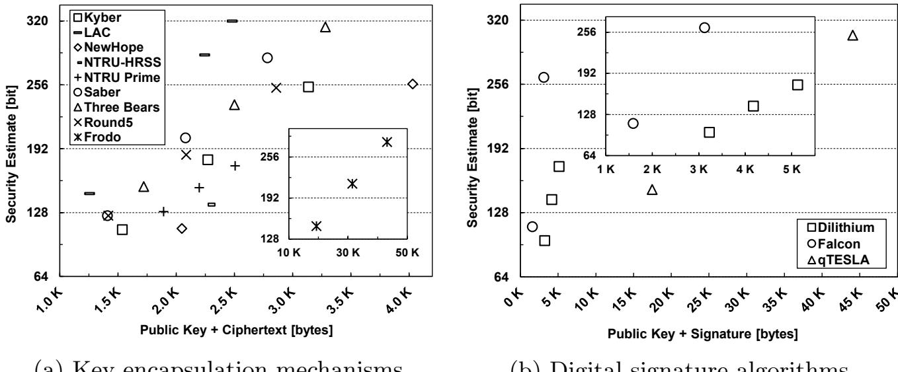
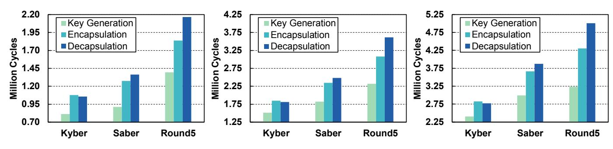
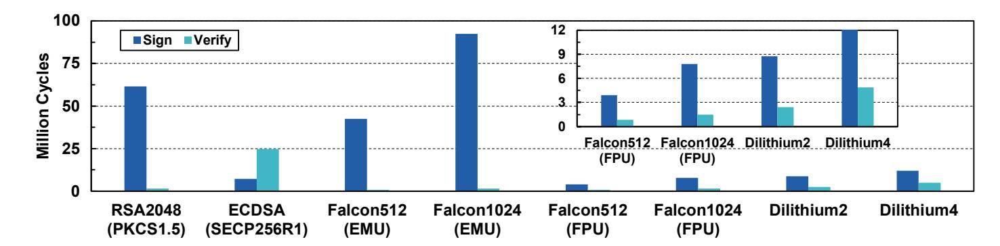
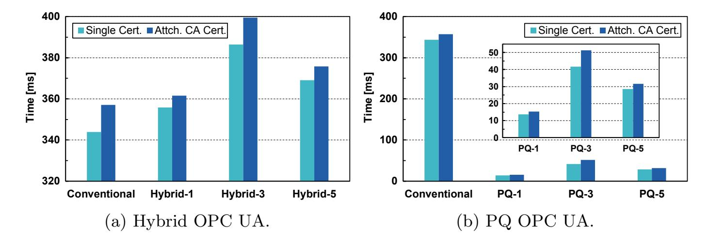

{0}------------------------------------------------

# Towards Post-Quantum Security for Cyber-Physical Systems: Integrating PQC into Industrial M2M Communication?

Sebastian Paul(B) and Patrik Scheible

Corporate Sector Research and Advance Engineering, Robert Bosch GmbH, Renningen, 70465 Stuttgart, Germany sebastian.paul2@de.bosch.com

Abstract. The threat of a cryptographically relevant quantum computer contributes to an increasing interest in the field of post-quantum cryptography (PQC). Compared to existing research efforts regarding the integration of PQC into the Transport Layer Security (TLS) protocol, industrial communication protocols have so far been neglected. Since industrial cyber-physical systems (CPS) are typically deployed for decades, protection against such long-term threats is needed. In this work, we propose two novel solutions for the integration of postquantum (PQ) primitives (digital signatures and key establishment) into the industrial protocol Open Platform Communications Unified Architecture (OPC UA): a hybrid solution combining conventional cryptography with PQC and a solution solely based on PQC. Both approaches provide mutual authentication between client and server and are realized with certificates fully compliant to the X.509 standard. We implement the two solutions and measure and evaluate their performance across three different security levels. All selected algorithms (Kyber, Dilithium, and Falcon) are candidates for standardization by the National Institute of Standards and Technology (NIST). We show that Falcon is a suitable option — especially — when using floating-point hardware provided by our ARM-based evaluation platform. Our proposed hybrid solution provides PQ security for early adopters but comes with additional performance and communication requirements. Our solution solely based on PQC shows superior performance across all evaluated security levels in terms of handshake duration compared to conventional OPC UA but comes at the cost of increased sizes for handshake messages.

Keywords: Cyber-Physical Systems · Post-Quantum Cryptography · X.509 Certificates · Authentication · Key Establishment · OPC UA.

# 1 Introduction

Google's recent shot at quantum supremacy attracted much public attention, but the road to a stable and large-scale quantum computer is still long and

? The final authenticated version is available online at [https://doi.org/10.1007/978-3-](https://doi.org/10.1007/978-3-030-59013-0_15) [030-59013-0](https://doi.org/10.1007/978-3-030-59013-0_15) 15.

{1}------------------------------------------------

uncertain [\[5\]](#page-17-0). Once one is built, however, it will be able to solve mathematical problems previously thought to be intractable. As a consequence, public key primitives that have become the "security backbone" of our digital society will be broken. This threat can be mitigated by deploying new cryptographic primitives that withstand attacks from both quantum and traditional computers, i. e. post-quantum cryptography. NIST addressed this issue by starting a PQC standardization process in 2016, which is currently in its second round.[1](#page-1-0) Eventually, NIST will standardize quantum-resistant key encapsulation mechanisms (KEMs) and digital signature algorithms (DSAs).

A migration to new primitives requires various forms of cryptographic agility, which typically is not present in existing systems [\[31,](#page-18-0) [40\]](#page-19-0). Therefore, research how to securely and effectively integrate PQC into protocols and applications is required. Furthermore, it is essential to plan for the cryptographic transition, especially for devices with long life spans and high security requirements. Several governmental institutes have proposed to use hybrid modes for this cryptographic transition [\[9,](#page-17-1) [18\]](#page-18-1). In such a hybrid mode at least two cryptographic primitives are applied simultaneously. On the one hand, a hybrid approach implies various advantages: 1) As long as one of the involved schemes remains unbroken the "entire" security property holds. Therefore, early adopters can benefit from additional security against quantum adversaries but don't have to fully rely on relatively new primitives; 2) Being compliant to industrial or governmental standards that have not been updated yet to include PQC; 3) Provide backward compatibility to legacy devices. On the other hand, hybrid modes negatively affect performance and increase the required communication bandwidth as well as memory footprint.

One domain where components have long life spans and many industrial (or even governmental) regulations are in place are industrial control systems (ICS). In recent years, ICS have shifted away from isolated networks and serial communication towards highly connected networks and TCP/IP-based communication, ultimately, providing access to the Internet. In fact, modern industrial communication has shifted away from proprietary protocols towards standardized machine-to-machine (M2M) protocols such as OPC UA [\[34,](#page-19-1) [42,](#page-19-2) [50\]](#page-19-3). Taking into consideration that CPS deployed today could still be in use when a cryptographically relevant quantum computer is available, a migration plan towards PQC is highly recommended. Such a migration plan is even more critical regarding confidentiality, because any communication passively recorded today can be retroactively decrypted once sufficiently powerful quantum computers become available. The fact that attacks related to industrial espionage play a major role in ICS further emphasizes the need for long-term confidentiality of transmitted data [\[49\]](#page-19-4). Although authentication can not be broken retroactively, we consider a preliminary investigation beneficial. As components of ICS are seldom updated during their long lifetime, they should support PQ DSAs rather sooner than later. As a consequence, we address the integration of PQC (KEM and DSA) into the widespread industrial communication protocol OPC UA in this work.

1 As of June 2020, the second round is in its final stage; NIST plans to either conduct a third round or to directly announce a final selection of algorithms.

{2}------------------------------------------------

Previous research efforts largely focused on the integration of PQC into common Internet protocols, mainly, concentrating on PQ key exchange. To the best of our knowledge, this is the first work that evaluates the integration of PQC into an industrial protocol.

Contribution. In this work, we integrate quantum-resistant means of key establishment and authentication into OPC UA's security handshake demonstrating that industrial CPS are capable of handling the increased cost of PQC. The main contributions of our work are summarized as follows:

- → We investigate all lattice-based schemes of NIST's second round standardization process with regards to a security-size trade-off and conduct a standalone performance analysis of promising candidates on our evaluation platform.
- → We propose two novel integrations of PQC into OPC UA's security handshake: Hybrid OPC UA and PQ OPC UA. The first makes use of hybrid constructions for key exchange, digital signatures, and X.509 certificates. The latter is solely based on PQ schemes including PQ X.509 certificates. Both solutions do not alter the existing structure of the security handshake, and our hybrid approach provides backward compatibility to legacy devices. Besides that, we present a novel way for verifying hybrid X.509 certificates using the cryptographic library mbedTLS.
- → We implement and evaluate the two solutions on our ARM-based evaluation platform and provide detailed performance measurements for three different NIST security levels. By combining post-quantum key exchange and postquantum digital signatures we evaluate the total impact of PQC on OPC UA.
- → Finally, we show that our PQ solution outperforms conventional OPC UA in terms of handshake duration at all evaluated security levels. In addition, in four of our six instantiations we make use of Falcon's highly efficient floating-point implementation, which— to the best of our knowledge— has previously not been examined in performance studies.

Outline. In [Section 2,](#page-2-0) we introduce the reader to OPC UA and its security mechanisms, and we provide preliminaries on PQC. [Section 3](#page-5-0) highlights related work. In [Section 4,](#page-6-0) we describe our two integrations of PQC into OPC UA. The performance measurements of our two proposed solutions are presented in [Section 5.](#page-12-0) [Section 6](#page-15-0) concludes our paper.

# 2 Preliminary Background

#### 2.1 OPC UA in Industrial Communication

OPC UA has been specified by the International Electrotechnical Commission (IEC) in the standard series 62541. Furthermore, OPC UA is widely considered a de facto standard for future industrial applications. Because of its service-oriented architecture, OPC UA offers a standardized interface to exchange data between 

{3}------------------------------------------------

industrial applications independent from manufacturer of automation technology. Recently, it has also been adopted by popular cloud services demonstrating its increasing popularity [\[7,](#page-17-2) [33\]](#page-19-5). OPC UA offers two modes for the transfer of information: a client-server mode and a relatively new publish-subscribe mode [\[34\]](#page-19-1). In this work, we focus on the client-server mode, since it is widely deployed in current automation systems and fully supported by open-source implementations.

OPC UA provides mutual authentication based on X.509 certificates and it ensures integrity and confidentiality of communication. The bottom layer of OPC UA's security architecture handles the transmission and reception of information. A secure channel is created within the communication layer and is crucial for meeting the aforementioned security objectives. The exchange of information is realized within sessions, which are logical connections between clients and servers. The following description of OPC UA's certificate-based authenticated key exchange is based on the relevant parts of its official specification [\[35,](#page-19-6) [36\]](#page-19-7). After a transport connection has been established between client and server, the client requests EndpointDescriptions, which later allow him to access services or information offered by the server. In addition, an EndpointDescription contains information required for the security handshake: server certificate, message security mode, and security policy. The server certificate contains the authenticated public key of the server, which the client verifies before initiating the security handshake. OPC UA offers different message security modes for established sessions: None, SignOnly, and SignAndEncrypt. The set of cryptographic mechanisms used during the handshake phase and in subsequent sessions are specified using SecurityPolicy Profiles. For example, the security policy Basic256Sha256 uses RSA2048 to encrypt/decrypt (RSA-OAEP) and sign/verify messages (RSA-PKCS1.5) during the security handshake; symmetric keying material is derived using the hash function SHA256 in a pseudorandom function (PRF); within sessions, AES256 in Cipher Block Chaining mode is used for encryption, and a keyed-hash message authentication code (HMAC) based on SHA256 is used for signatures. In contrast to TLS, OPC UA so far only offers a security handshake that relies on RSA.[2](#page-3-0) In essence, it is based on encrypting random client and server nonces that are used to derive session keys.

The following characteristics of the security handshake are specified in the SecureChannel Service Set. First, the client sends an OpenSecureChannel Request (OSC Req.) to the server. This request contains a cryptographically secure random number (client nonce), a client certificate (including a certificate chain), and a requested lifetime for the secure channel. The request message is encrypted using the authenticated public key of the server and signed using the secret key of the client. In case the verification of the client certificate succeeds, decryption and signature verification take place. Afterwards, the server generates a cryptographic random number (server nonce). In order to derive the required session keys, both nonces serve as inputs to a PRF. Two sets of symmetric keys are derived this

2 It should be noted that the OPC Foundation plans to standardize a security policy that supports Diffie-Hellman (DH) key exchange based on elliptic curve cryptography (ECC) in the near future [\[37\]](#page-19-8).

{4}------------------------------------------------

way: one is associated with the server and the other is associated with the client. The message body of the OpenSecureChannel Response (OSC Rsp.) contains a server nonce and a revised lifetime, the server certificate is placed in the security header of the response message. Secure channels are identified by security tokens, which expire after a specified lifetime. The revised lifetime tells the client when to renew the secure channel. The response message itself is encrypted using the client's authenticated public key and signed using the server's private key. After decryption and signature verification, the client derives the keying material from its own nonce and the received server nonce by applying the same PRF as the server. Finally, client and server end up with an identical set of cryptographic keys completing OPC UA's security handshake. The security properties of this handshake have been formally analyzed and the entire security architecture has been investigated in previous works [\[17,](#page-18-2) [43\]](#page-19-9).

### 2.2 Post-Quantum Cryptography

Once a cryptographically relevant quantum computer becomes available, current public key primitives based on the mathematical problem of integer factorization (RSA) and (elliptic curve) discrete logarithm (DH and ECDH) will be broken because of Shor's quantum algorithm [\[45\]](#page-19-10). The last decade has seen an increased interest from academia and industry in finding novel cryptosystems that can withstand attacks from quantum computers. In essence, one needs to find a NPhard problem that is not solvable in polynomial-time by quantum and classical computers.

PQ schemes can be grouped into five families: code-based, lattice-based, hash-based, multivariate, and supersingular EC isogeny cryptography. Out of the five families lattice-based cryptography has arguably attracted the most attention in research: 12 of the remaining 26 schemes in NIST's standardization process are based on lattice problems. Besides that, lattice schemes offer efficient implementations, reasonably sized public keys and ciphertexts, as well as strong security properties [\[32\]](#page-19-11). Consequently, we focus on lattice-based cryptography in this work.

A lattice consists of a set of points in a n-dimensional space with a periodic structure. By using n-linearly independent vectors any point in this structure can be reproduced. The security of lattice-based cryptographic primitives are based on NP-hard problems of high-dimensional lattices, such as the shortest vector problem (SVP). All lattice schemes submitted to NIST's standardization process rely on variants of the learning with errors (LWE) problem, learning with rounding (LWR) problem, or NTRU. These problems can be related to aforementioned NP-hard lattice problems via reductions. We investigate the following lattice-based KEMs for potential integration into OPC UA: CRYSTALS-Kyber [\[6\]](#page-17-3), FrodoKEM [\[2\]](#page-17-4), LAC [\[51\]](#page-19-12), NewHope [\[1\]](#page-17-5), NTRU [\[20\]](#page-18-3), NTRU-Prime [\[10\]](#page-17-6), Round5 [\[8\]](#page-17-7), Saber [\[22\]](#page-18-4), and ThreeBears [\[27\]](#page-18-5). In addition, we investigate the following lattice-based signature schemes: CRYSTALS-Dilithium [\[24\]](#page-18-6), Falcon [\[25\]](#page-18-7), and qTESLA [\[11\]](#page-17-8). [Table 2](#page-16-0) and [Table 3](#page-17-9) in [Appendix A](#page-16-1) list all lattice-based schemes considered in this work including characteristics of their parameter sets.

{5}------------------------------------------------

NIST defined five security levels corresponding to different security strengths in bits for its PQC standardization process. We focus on level 1, 3, and 5 in this work. NIST security level 1 corresponds to 128 bit (classical) security, whereas level 3 and 5 correspond to 192 bit and 256 bit security respectively. KEMs consist of a triple of algorithms: key generation, encapsulation, and decapsulation. Key generation is a probabilistic algorithm that generates a public and private key pair. The probabilistic encapsulation requires a public key as input and generates a shared secret and the corresponding ciphertext. Input to the decapsulation algorithm is a ciphertext and a private key, it either returns a shared secret or an error. Many lattice-based schemes show a small (cryptographically negligible) failure probability during the decapsulation step, in such cases a shared secret can not be derived. Typically, KEMs offer either indistinguishability under chosen plaintext attack (IND-CPA) or indistinguishability under chosen ciphertext attack (IND-CCA). IND-CPA offers security against passive adversaries, i. e. no information is learned by observing ciphertexts being transmitted. IND-CCA offers a stronger notion of security and provides security in presence of active adversaries. For the integration into OPC UA we rely on an ephemeral key exchange scheme. Any KEM can be easily transformed into an ephemeral key exchange as follows. An initiator generates a public and private key pair and sends its ephemeral public key to a receiving entity. The receiving entity generates a random secret, encrypts it using the received ephemeral public key (encapsulation), and sends the resulting ciphertext back to the initiator. Ultimately, the initiator decrypts the received ciphertext using its ephemeral private key (decapsulation) giving both parties a shared random secret.

Similar to KEMs, signature schemes consist of a triple of algorithms: key generation, signature generation, and signature verification. Key generation returns a public and private key pair. Signature generation takes a private key and a given message to produce a signature. The deterministic signature verification algorithm takes a public key, a message, and a signature and either rejects or accepts the signature. The standard security notion for DSAs is existential unforgeability under chosen message attack (EUF-CMA). NIST required all submitted signature schemes to reach this notion. For specific details of the schemes, we refer the reader to the corresponding specifications.

# 3 Related Work

There have been a lot of research efforts integrating PQC into widespread Internet protocols such as TLS, SSH (Secure Shell), and IKEv2 (Internet Key Exchange version 2). Since OPC UA's security handshake is loosely inspired by TLS's handshake protocol, we focus on previous works in this area. In general, existing integration studies can be grouped into the following three categories: standardization efforts, implementation works, and experimental studies. Two active Internet Engineering Task Force (IETF) Internet-Drafts exist that describe the integration of hybrid key exchange into TLS 1.2 [\[19\]](#page-18-8) and TLS 1.3 [\[47\]](#page-19-13). Many experimental studies have been conducted under real network conditions [\[15,](#page-18-9) 

{6}------------------------------------------------

[30,](#page-18-10) [46\]](#page-19-14) or under lab conditions [\[21,](#page-18-11) [39\]](#page-19-15). In aforementioned studies, the authors typically make use of already existing open source implementations of PQC. For example, Open Quantum Safe provides prototypical integrations of PQ schemes into the the popular library OpenSSL [\[48\]](#page-19-16). Other works exist where PQC has been either integrated into embedded libraries [\[16\]](#page-18-12) or has been optimized for specific platforms [\[29\]](#page-18-13). Our implementations of PQ schemes are mainly based on PQClean[3](#page-6-1) , which provides portable implementations for an easy integration into other codebases. When investigating authentication, another difficulty must be dealt with: a long-term public key is involved, which is typically stored and distributed via certificates. Previous works proposed hybrid certificates for the post-quantum transition where extension fields are used to bind an additional public key to an entity using an additional PQ signature scheme [\[12,](#page-17-10) [14\]](#page-18-14). In addition, the impact of hybrid and PQ certificates on various Internet protocols has been investigated [\[28,](#page-18-15) [46\]](#page-19-14).

Since it enables confidentiality against future quantum adversaries, hybrid key exchange has so far attracted the most attention. If authentication and key exchange are considered, they are typically evaluated separately, hence not showing the entire impact of PQC on protocols. Hybrid authentication has been addressed, but it was evaluated separately from key exchange and no performance measurements were conducted [\[21\]](#page-18-11). The authors of [\[16\]](#page-18-12) investigated the combined impact of PQ key exchange and authentication on TLS for embedded devices, but only considered one set of PQ primitives at one security level.

# 4 Integration of PQC into OPC UA

#### 4.1 Hybrid OPC UA

In hybrid modes, different options for combining cryptographic material exist. We use the XOR-then-MAC combiner from [\[13\]](#page-17-11) regarding confidentiality of data, which is provably secure against fully quantum adversaries. Besides the integration of a hybrid key exchange scheme, we need to convey two long-term public keys and two digital signatures for authenticity and integrity. For reasons of backward compatibility, we work with X.509 certificates that consist of two non-critical extensions as proposed in [\[12\]](#page-17-10). The first contains the public key of the additional PQ signature scheme, the second holds the signature over the certified data. Messages are signed independently from each other using two different signature schemes. The security properties of this concatenation combiner have been investigated in [\[14\]](#page-18-14). While the merits of a hybrid key exchange are obvious, there is a slightly weaker need for hybrid authentication and hybrid digital signatures. However, applications will have to support conventional and PQ schemes in order to be backward compatible with applications, which have not been upgraded yet. Therefore, we also consider hybrid signatures and authentication in this work to fully understand its impact on OPC UA.

3 <https://github.com/PQClean/PQClean>

{7}------------------------------------------------

The integration of hybrid modes into the security handshake of OPC UA requires modifications to the SecureChannel Service Set. We define a new security policy Hybrid{1,3,5} Basic256, which the server suggests to the client within the GetEndpoints Response. In our approach, this response contains the hybrid X.509 certificate (including the certificate chain). First, the client verifies the entire certificate chain assuming a hybrid root certificate has been preinstalled. In addition to a random client nonce, the ephemeral key generation function of a PQ KEM needs to be called (pkP Q, skP Q). The hybrid OSC Req. is initialized using the client nonce, pkP Q, and the security settings obtained from the GetEndpoints Response. The additional public key is positioned within the security header, which also includes the hybrid client certificate. Before the request is sent to the server in form of an OPC UA message, it is signed using the aforementioned hybrid signature scheme: A hash is computed over the entire message that is then signed conventionally and by a PQ signature scheme. According to the specification of OPC UA, the sequence header, the message body containing the client nonce, and the message footer containing RSA-padding fields and signatures are encrypted. We avoid expensive RSA encryption/decryption by placing the additional values of our hybrid solution (pkP Q and PQ signature) outside the encrypted message parts.

Once the server receives the request, it verifies the hybrid client certificate (including the certificate chain). After the certificate verification, the conventionally encrypted message parts are decrypted and the two signatures are verified. As in conventional OPC UA, the server then creates his server nonce. For our proposed hybrid mode, the encapsulation function of the respective PQ KEM is called using the received public key pkP Q as input. This generates a ciphertext ctpq and a shared secret sspq. In order to maintain the original structure of OPC UA's security handshake, we expand the shared secret using a PRF to obtain additional nonce values. Further calls to PRFs generate two types of keying material: a conventional set and a post-quantum set. In a subsequent step, the two sets are combined using XOR. To complete the XOR-then-MAC combiner, we compute a MAC over the ciphertext ctpq and the original server and client nonce using the generated server's symmetric signing key. The ciphertext and MAC are placed in the security header. We keep the server nonce inside the body of the response message alongside the revised lifetime of the secure channel. The response message is signed using the aforementioned concatenation combiner. After signing the message, the sequence header, the message body, and message footer are encrypted. Again, this avoids expensive encryption of additional, potentially large values (ctpq, MAC, and PQ signature).

The client receives the response, conventionally decrypts it, and verifies the included hybrid signature. Utilizing the received PQ ciphertext ctpq and the client's own PQ secret key skpq, the corresponding decapsulation function of the respective KEM is called, which outputs the shared secret sspq. As in processing the OSC Req., this shared secret is expanded to create additional nonce values. Having obtained all required nonces, we generate two types of keying material (conventional and PQ) and combine them using XOR. We verify the received

{8}------------------------------------------------

MAC by using the computed symmetric signing key completing our hybrid security handshake.

#### 4.2 Post-Quantum OPC UA

Once PQ schemes have been standardized, they will be adopted in protocols and will be considered state-of-the-art. Consequently, hybrid modes will not be required any longer. For our PQ OPC UA solution, we keep the structure of the original security handshake but replace conventional asymmetric primitives with PQ key encapsulation and digital signature schemes.

We introduce a new security policy PQ{1,3,5}, which is sent to the client in GetEndpoints Response. The conveyed server certificate contains a single PQ public key and is signed with a PQ signature scheme. The client verifies the server certificate including the certificate chain. Again, we assume the PQ root certificate has been preinstalled on both client and server. The generation of the OSC Req. is the same as in our hybrid mode. First, a random client nonce is created and then the ephemeral key pair of a PQ KEM (pkP Q, skP Q). Since we base the key exchange of our PQ solution solely on a PQ KEM, we do not require secrecy of the random client and server nonce. As a consequence, sequence header, message body, and message footer of the OSC Req. and OSC Rsp. are sent unencrypted. The resulting OSC Req. is signed using the client's private PQ signing key, the certificate containing the corresponding PQ public key is part of the request message sent to the server.

The server verifies the PQ client certificate (including the certificate chain) and the signature of the OSC Req. using the client's authenticated public key. After the verification step, the encapsulation function of the KEM is invoked resulting in a ciphertext (ctP Q) and shared secret (ssP Q). Besides that, we generate a random server nonce. The shared secret and both random nonces serve as input to a PRF. We consider the output of the PRF our master secret. Subsequently, we use the master secret as input to another PRF to obtain symmetric keying material. By keeping the random nonces from the conventional security handshake and by using them as input to the first PRF we ensure that both parties contribute to the master secret. The OSC Rsp. contains the generated ciphertext, the server certificate, the server nonce, and the revised lifetime of the secure channel. The response is signed using the server's private PQ signing key, and the signature is appended to the response message.

Once the client receives the OSC Rsp., the signature is verified using the server's authenticated public key. Then, the client calls the decapsulation function of the PQ KEM resulting in the shared secret (ssP Q). Again, this shared secret serves as input to a PRF alongside the client and server nonce. The output is fed to another PRF to compute the final keying material. Server and client derive the same keying material, which is used in subsequent communication sessions. This completes OPC UA's handshake solely based on PQ schemes: Client and server are mutually authenticated via PQ certificates and signatures; Keying material is derived using a key exchange scheme based on a PQ KEM.

{9}------------------------------------------------

- (a) Key encapsulation mechanisms.
- (b) Digital signature algorithms.

Fig. 1: Security-size trade-off for lattice-based quantum-resistant schemes.

#### 4.3 Selection of Quantum-Resistant Primitives

In principle, our generic approach allows us to integrate any KEM and DSA. Our criteria for the selection of quantum-resistant schemes are as follows. We require lattice-based algorithms that offer a balanced trade-off in terms of estimated security, public key + ciphertext/signature size, and performance, since the time to establish a secure channel should not substantially increase. In addition, we only consider algorithms that are part of NIST's ongoing PQC standardization process (Round 2). Consequently, their official specification should offer various parameter sets that cover different security levels; KEMs should provide IND-CCA. Integration into OPC UA needs to be possible without any modifications to cryptographic algorithms, since we do not want to invalidate any of their security claims.

Security-Size Trade-Off. First, we study the trade-off in terms of security and size of all remaining lattice-based Round 2 submissions. The size metric is important to allow for an easy integration into existing protocols. In our case, the size metric for KEMs consists of the public key and ciphertext size, since both need to be transmitted in our proposed solutions. Regarding DSAs, we use public key and signature size as metric. Both are transmitted via certificates to other nodes during the handshake. Considering the security metric, we use security strength estimations provided in the specification of each submission. These figures are based on the estimated cost of the best known attacks against the underlying lattice-problem, typically core-SVP hardness is evaluated.

[Figure 1](#page-9-0) shows the trade-off for estimated security and size for lattice-based schemes remaining in NIST's PQC process. Note that for submissions containing multiple schemes or multiple parameter sets we only consider one scheme or one set of parameters. In case of NTRU, we consider the recommended KEM parameter set NTRU-HRSS; for NTRU Prime, we only consider the parameter sets of Streamlined NTRU Prime. For Round 5, which specifies a total of 21

{10}------------------------------------------------

(a) Level 1 parameter sets. (b) Level 3 parameter sets. (c) Level 5 parameter sets.

Fig. 2: Average performance of selected key encapsulation mechanisms.

parameter sets, we only consider their specified IND-CCA secure KEM with ring parameter set and no error correction, i. e. R5ND\_CCA\_0d\_KEM.

Our evaluation shows that parameter sets for Kyber (Kyber512, Kyber768, and Kyber1024), Round 5 (R5ND\_1CCA\_0d, R5ND\_3CCA\_0d, and R5ND\_5CCA\_0d), and Saber (LightSaber, Saber, and FireSaber) offer a very good trade-off in terms of public key + ciphertext size and estimated security strength. Consequently, we select these three schemes for a further performance evaluation. From the trade-off in Figure 1a, LAC seems like another promising candidate. However, attacks on LAC that allow to fully recover the secret key have been discovered decreasing our trust in this scheme [23, 26]. We do not select other schemes for further evaluation, as their parameter sets imply an imbalanced security-size trade-off (NTRU-HRSS, NewHope, and Frodo), they have not attracted much attention in previous experimental studies (Three Bears and NTRU Prime), or known attacks significantly reduce their security estimations (LAC).

The security-size trade-off for digital signature schemes is shown in Figure 1b. After an update to its Round 2 specification, qTESLA only provides provably-secure parameter sets that come with very large sizes for signatures and public keys. Ultimately, we select the remaining two signature algorithms—Falcon and Dilithium—for a further performance evaluation. Both seem to be promising signature algorithms, since public key and signature are reasonably sized and they provide parameter sets for different security strengths (level 1: Falcon512 and Dilithium2, level 3: Dilithium4, level 5: Falcon1024).

Preliminary Performance Evaluation. We continue with an evaluation of the standalone performance of the selected algorithms on our target platform—Raspberry Pi 3 Model B (see Section 5.2). In order to obtain cycle-accurate measurements, we added a kernel extension that enables access to the CPU cycle count register [3]. Our goal is to select parameter sets for three security levels with a balanced trade-off in terms of security, size, and performance. Our implementations of Kyber and Saber are based on code from PQClean. Round 5 has not been integrated there; consequently, we work with code from the official Round 5 submission4. Figure 2 shows the average cycle counts of 100

&lt;sup>4 https://github.com/round5/code/tree/master/configurable

{11}------------------------------------------------

Fig. 3: Average performance of selected digital signature algorithms.

executions of the selected KEMs. Across all security levels Kyber shows the best performance. Considering all processing steps of KEMs, Kyber is significantly faster than Round 5 (in average 3.6 × 106 cycles at each security level) and also faster than Saber (in average 1.5 × 106 cycles at each security level). In comparison, the standalone performance of an ECDH key exchange based on SECP256R1, which corresponds to security level 1, takes 6.9 × 107 cycles on our evaluation platform, whereas Kyber512 only takes 2.9 × 106 cycles. Kyber has also been part of several previous studies resulting in similar assessment of its performance [\[16,](#page-18-12) [39\]](#page-19-15). Consequently, we select the three parameter sets of Kyber for instantiating our solutions.

Having analyzed KEMs, we turn to the two selected signature schemes. Exploiting Falcon's floating-point arithmetic requires an underlying hardware floating-point unit (FPU) to support double-precision floating-point as defined by the IEEE 754 standard [\[41\]](#page-19-17). For devices without hardware FPU an implementation exists that emulates floating-point precision (Falcon-EMU). The ARMv8 instruction set of the Raspberry Pi 3 fulfills the aforementioned requirement, which allows us to evaluate both implementations, i. e. Falcon-FPU and Falcon-EMU [\[4\]](#page-17-13). Our implementation of Dilithium is based on code from PQClean, for the implementation of Falcon we make use of reference code from the official website[5](#page-11-0) . [Figure 3](#page-11-1) shows the average cycle counts of signature generation and verification of the selected DSAs in comparison with ECDSA and RSA over 100 executions. Please note, we do not report performance measurements of key generation, since generation of new signing keys is typically required only rarely. Enabling floating-point operations by using Falcon-FPU increases signature generation in average 11.4 times compared to Falcon-EMU. Furthermore, Falcon's highest security parameter set is even 1.9 × 106 cycles faster than Dilithium's level 1 configuration in case floating-point operations are enabled. All parameter sets of Dilithium and Falcon-FPU outperform the conventional ECDSA SECP256R1, which corresponds to security level 1. The total runtime (signature generation plus verification) of SECP256R1 corresponds to 3.2 × 107 cycles on our evaluation platform. In comparison, Falcon512-FPU only takes 4.7 × 106 cycles and Dilithium2 1.1 × 107 cycles. Since Falcon provides very efficient sizes for signatures and public key and since our evaluation platform is able to use Falcon's

5 <https://falcon-sign.info>

{12}------------------------------------------------

floating-point arithmetic, we select it for instantiating our proposed solutions. However, Falcon does not offer a parameter set covering security level 3, thus for the instantiation regarding that security strength we work with Dilithium4. Besides that, we are not aware of any works that have shown fundamental weaknesses in either Falcon or Dilithium, and both have been part of previous experimental studies [\[39,](#page-19-15) [46\]](#page-19-14).

In accordance with our initial requirements, we instantiate our two proposed solutions with the following algorithms: We use Kyber512 and Falcon512-FPU regarding NIST security level 1, for security level 3 we use Kyber768 and Dilithium4, and for level 5 we work with Kyber1024 and Falcon1024-FPU.

# 5 Experimental Results and Evaluation

#### 5.1 Implementation Notes

We rely on an open-source OPC UA stack, open62541 [\[38\]](#page-19-18), to implement our two solutions. Integration of hybrid key exchange, hybrid authentication, and hybrid signatures requires significant changes to the codebase of open62541. To allow for backward compatibility with non-hybrid aware nodes we implement a new security policy Hybrid{1,3,5} Basic256. We add the respective parts of the hybrid key exchange based on KEMs to the client and server code. The key derivation function is adapted to generate two sets of keying material and to combine these two sets using XOR. For our KEM combiner construction, the MAC creation and verification is added as part of the hybrid key exchange. The handling of hybrid authentication based on certificates is integrated and hybrid signature creation and verification is added to the source code. The quantum-resistant signature is appended to the message buffer (not encrypted), while the additional PQ public key and ciphertext of the respective KEM and MAC-value are added to the security header. Our PQ solution requires fewer modifications and uses the new security policy PQ{1,3,5}. The KEM-based key exchange is integrated in client and server code. In addition, the generation and verification of PQ signatures and the verification of PQ certificates is implemented. The handling of request and response message needs to be adapted accordingly.

Available tools for generating hybrid certificates either make use of combiners that are not fully backward compatible [\[48\]](#page-19-16) or implement only a small subset of PQ schemes [\[12\]](#page-17-10). Because of these limitations, we implement a new software package capable of creating hybrid and PQ certificates. Our software is capable of creating the X.509 certificate structure from scratch and can freely modify the desired fields. In our case, we rely on two non-critical extensions for storing the additional public key and signature. Open62541 uses the cryptographic library mbedTLS for all security relevant functions including the verification of certificates. Therefore, the certificate chain and the trusted root certificates are passed to the verification function provided by mbedTLS. We are able to use this function without modifications, since our generated hybrid certificates are fully compliant to the X.509 standard. The verification function of mbedTLS allows to provide an optional callback function as parameter that is called after each

{13}------------------------------------------------

| Solution                                                                            | Single                   | C Req. Attch. CA Cert. | Single                   | C Rsp. Attch. CA Cert. | Single                  |                          |
|-------------------------------------------------------------------------------------|--------------------------|------------------------------|--------------------------|------------------------------|-------------------------|--------------------------|
| Conventional (RSA2048)                                                              | 1,597                    | 2,373                        | 1,601                    | 2,377                        | 908                     | 1,750                    |
| 및 1 (Kyber512 + Falcon512 + RSA2048)                                                | 4,698 11,945 7,770 | 7,147 17,929 11,755    | 4,670 11,885 7,806 | 7,119 17,869 11,791    | 2,515 6,050 4,051 | 4,964 12,034 8,036 |
| 1 (Kyber512 + Falcon512) 3 (Kyber768 + Dilithium4) 5 (Kyber1024 + Falcon1024) | 3,618 10,211 6,562 | 5,472 15,598 9,952     | 3,593 10,154 6,601 | 5,447 15,541 9,991     | 1,924 5,457 3,460 | 3,778 10,844 6,850 |

Table 1: Message and certificate sizes for both solutions (in bytes).

certificate in the chain was verified. We use this callback mechanism to verify the additional PQ signature inside the custom extension of our hybrid certificates. It should be noted that verification of PQ certificates takes place outside mbedTLS, since we did not integrate our selected PQ schemes into the embedded TLS library. Instead, we rely on its mechanism to parse encoded certificates, which required minor changes to mbedTLS because of unique algorithm identifiers used in our PQ X.509 certificates.

#### 5.2 Measurement Setup

Our setup resembles a typical use case for OPC UA within an industrial network: Two CPS (e. g. control unit and gateway) wish to exchange data which requires the establishment of a secure channel. We select the Raspberry Pi 3 Model B as our evaluation platform. It features a 1.2 GHz quad-core CPU (ARM Cortex-A53), 1024 MB RAM, and requires a SD-card to store operating system and software. As affordable single-board computer Raspberry Pis have become very popular prototyping platforms even for industrial use cases [44]. The two Raspberry Pis are connected to the same network via their 100 Mbit Ethernet interfaces, one is instantiated as OPC UA client and the other as OPC UA server. For our timing measurements we rely on the same kernel extensions introduced in *Preliminary Performance Evaluation* (see Section 4.3). Since our measurements also include network round-trip time and overhead of the network stack, we report the time elapsed until completion of the OPC UA handshake in milliseconds. Therefore, we convert the cycle counts obtained from the two Raspberry Pis to milliseconds.

Besides complete handshake duration, we report the performance of OPC UA's security handshake in terms of message and certificate size. Our baseline measurement considers a conventional OPC UA security handshake using security policy Basic256Sha256. Both solutions are evaluated at three NIST security levels (see Section 4.3). This leads to a total of six different test cases:  $Hybrid-\{1,3,5\}$  and  $PQ-\{1,3,5\}$ . In addition, we evaluate each test case in two different scenarios regarding included certificates. In the first scenario, only a single device certificate (Single Cert.) is conveyed. The second scenario assumes that OPC UA client and server are part of a larger industrial network containing intermediate certificate

{14}------------------------------------------------

Fig. 4: Comparison of average handshake duration at different security levels.

authorities (CA). In this case, the certificate chain contains the device and one attached intermediate CA certificate (Attch. CA Cert.). For each of the above test cases and the two scenarios, we record the establishment of 100 secure channels and state average values.

## 5.3 Results and Evaluation

Hybrid OPC UA. [Table 1](#page-13-1) shows the impact of our hybrid security handshake on the size of the OSC Req. and OSC Rsp. message at different security levels. Besides that, certificate sizes for both scenarios are reported. As expected, because of the hybrid mode the message sizes increase at all levels. The highest increment compared to conventional OPC UA can be observed at security level 3: In case an additional CA certificate is attached, the size of the OSC Req. and OSC Rsp. message increases in average 7.5 times. Considering certificate sizes, the smallest increase is observed with certificates containing an additional Falcon512 public key and signature (factor of 2.8).

[Figure 4a](#page-14-0) shows the results of the conducted performance measurements. As expected, the duration of the handshake increases at all security levels. However, the most time during the handshake is spent conventionally decrypting and signing the request and response message. In case a single hybrid certificate is conveyed, the fastest observed hybrid handshake adds only 11.9 ms to the total duration (Hybrid-1), while the slowest leads to an overhead of 42.6 ms (Hybrid-3). The extra time spent verifying an attached intermediate CA certificate is clearly visible in [Figure 4a](#page-14-0) and correlates to the reported verification times in [Figure 3.](#page-11-1) Since our implementation of Falcon makes use of floating-point operations, the overhead in Hybrid-1 and Hybrid-5 remains very small. Because both nodes are connected via fast network interfaces, the larger message sizes have only little impact on the total duration of the handshake: Sending the response and request message in Hybrid-3 with an intermediate CA certificate attached takes 0.4 ms.

PQ OPC UA. [Table 1](#page-13-1) also shows the message and certificate sizes for our solution solely based on PQC. Similar to our hybrid solution, we observe that 

{15}------------------------------------------------

all message sizes as well as certificate sizes increase at all security levels due to the larger public keys and signatures of the integrated PQ schemes. Besides that, instantiations using Falcon show a significantly lower overhead.

The results of our performance measurements (see [Figure 4b\)](#page-14-0), however, show a significant improvement compared to OPC UA's conventional security handshake. Across all security levels our PQ solution is in average 11.5 times faster than conventional OPC UA. The fact that we omit all cryptographic operations based on RSA from OPC UA's conventional security handshake substantially increases its performance. With a handshake duration of just 28.6 ms, PQ-5 (single certificate) is even faster than PQ-3 with 41.8 ms. As the signature generation and verification times of Falcon and Dilithium are generally slower than Kyber's KEM functions, client and server spend most of the time during the handshake performing operations of the respective DSA. For example, deriving symmetric keying material requires 3.5 ms compared to 10.2 ms spent on the creation and verification of signatures in PQ-1. Similar to our hybrid approach, message sizes have only little impact on the overall duration of the security handshake.

Both our solutions demonstrate that Falcon is preferable over Dilithium in case both communicating nodes are capable of using its efficient floating-point arithmetic. Our Hybrid-5 and PQ-5 solution even leads to significantly less overhead — in terms of handshake duration and size — than Hybrid-3 and PQ-3. Since message sizes do not negatively impact the performance of the security handshake as much as slower algorithms do, we recommend to use Dilithium2 in case security level 1 is required and floating-point support can not be assumed.

# 6 Conclusion

In this work, we proposed two novel solutions for the integration of PQC (key establishment and digital signatures) into the security handshake of the industrial M2M protocol OPC UA. Our first solution considers hybrid key exchange, hybrid authentication, and hybrid signatures, while the second is solely based on quantumresistant primitives. Compared to other previous works, this approach allowed us to investigate the total impact of PQC.

After the description of our two solutions, we selected three algorithms based on an investigation of all lattice-based schemes submitted to NIST's PQC standardization process. Subsequently, we instantiated our two solutions at three different NIST security levels using the respective parameter sets of Kyber{512,768,1024} for key establishment and Falcon{512,1024}-FPU or Dilithium4 for digital signatures. In our performance measurements, we compared the handshake duration of both solutions to that of conventional OPC UA for different security levels and certificate scenarios. Our hybrid integration leads to acceptable overhead in terms of latency and message sizes, while our PQ solution significantly outperforms conventional OPC UA at all security levels in terms of handshake duration. OPC UA provides mutual authentication based on X.509 certificates. Our hybrid solution works with hybrid certificates using non-critical extension fields to achieve backward compatibility with non-hybrid aware clients

{16}------------------------------------------------

and servers. Furthermore, our described verification of hybrid certificates using mbedTLS applies to use cases outside the industrial domain. Ultimately, our two solutions provide comprehensive insights into the feasibility of integrating PQC into OPC UA and demonstrate that PQC is practical for ICS. Falcon and Dilithium are efficient options for PQ signature schemes; in case floating-point support is available, Falcon provides faster performance at smaller public key and signature sizes. In our two solutions, Kyber showed very efficient performance throughout all evaluated security levels. As future work, we will continue to investigate our two solutions, especially with regards to time-sensitive industrial applications and a formal security analysis of our proposed integrations including a detailed threat model. In addition, we plan to evaluate our proposed solutions in industrial networks under realistic conditions.

**Acknowledgment.** The work presented in this paper has been partly funded by the German Federal Ministry of Education and Research (BMBF) under the project "FLOQI" (ID 16KIS1074).

# A Algorithm Overview

| Table 2: Convention | al and PQ KE | Ms evaluated | l in tl | his work. |
|---------------------|--------------|--------------|---------|-----------|
|---------------------|--------------|--------------|---------|-----------|

| Table 2. Conventional and I & IEDMS evaluated in this work. |                 |                         |                       |                |                                              |                |                |                   |
|-------------------------------------------------------------|-----------------|-------------------------|-----------------------|----------------|----------------------------------------------|----------------|----------------|-------------------|
| KEM                                                         | NIST $Category$ | $Intractable \ Problem$ | Classical Security | PQ Security | $\begin{array}{c} sk \\ (bytes) \end{array}$ | $pk \ (bytes)$ | $ct \ (bytes)$ | $Failure \\ Rate$ |
| Frodo640                                                    |                 | LWE                     | 144 bit               | 103 bit        | 19888                                        | 9616           | 9720           | $2^{-139}$        |
| Kyber512                                                    |                 | Module LWE              | 111 bit               | 100 bit        | 1632                                         | 800            | 736            | $2^{-178}$        |
| LAC-128                                                     |                 | Ring LWE                | 147 bit               | 133 bit        | 512                                          | 544            | 712            | $2^{-116}$        |
| LightSaber                                                  |                 | Module LWR              | 125 bit               | 114 bit        | 1568                                         | 672            | 736            | $2^{-120}$        |
| NewHope512                                                  | 1               | Ring LWE                | 112 bit               | 101 bit        | 1888                                         | 928            | 1120           | $2^{-213}$        |
| NTRU-HRSS                                                   |                 | NTRU                    | 136  bit              | 123 bit        | 1450                                         | 1138           | 1138           | -                 |
| R5ND-1CCA-0d                                                |                 | General LWR             | 125  bit              | 115  bit       | 16                                           | 676            | 740            | $2^{-157}$        |
| SECP256R1                                                   |                 | EC Discrete Log.        | 128 bit               |                | 32                                           | 65             | 65             | _                 |
| SNTRUP653                                                   |                 | NTRU                    | 129 bit               | 117 bit        | 1518                                         | 994            | 897            | _                 |
| BabyBear                                                    | 2               | Module LWE              | 154 bit               | 140 bit        | 40                                           | 804            | 917            | $2^{-156}$        |
| Frodo976                                                    |                 | LWE                     | 209 bit               | 150 bit        | 31296                                        | 15632          | 15744          | $2^{-200}$        |
| Kyber768                                                    |                 | Module LWE              | 181 bit               | 164 bit        | 2400                                         | 1184           | 1088           | $2^{-164}$        |
| LAC-192                                                     | 3               | Ring LWE                | 286  bit              | 259 bit        | 1024                                         | 1056           | 1188           | $2^{-143}$        |
| R5ND-3CCA-0d                                                | J               | General LWR             | 186 bit               | 174  bit       | 16                                           | 983            | 1103           | $2^{-154}$        |
| Saber                                                       |                 | Module LWR              | 203 bit               | 185  bit       | 2304                                         | 992            | 1088           | $2^{-136}$        |
| SNTRUP761                                                   |                 | NTRU                    | 153 bit               | 139 bit        | 1763                                         | 1158           | 1039           | _                 |
| MamaBear                                                    | 4               | Module LWE              | 235 bit               | 213 bit        | 40                                           | 1194           | 1307           | $2^{-206}$        |
| FireSaber                                                   |                 | Module LWR              | 283 bit               | 257 bit        | 3040                                         | 1312           | 1472           | $2^{-165}$        |
| Frodo1344                                                   |                 | $_{\rm LWE}$            | 274 bit               | 196 bit        | 43088                                        | 21520          | 21632          | $2^{-253}$        |
| Kyber1024                                                   |                 | Module LWE              | 254 bit               | 230 bit        | 3168                                         | 1568           | 1568           | $2^{-174}$        |
| LAC-256                                                     | 5               | Ring LWE                | 320 bit               | 290 bit        | 1024                                         | 1056           | 1424           | $2^{-122}$        |
| NewHope1024                                                 | Ü               | Ring LWE                | 257 bit               | 233 bit        | 3680                                         | 1824           | 2208           | $2^{-216}$        |
| PapaBear                                                    |                 | Module LWE              | 314 bit               | 280 bit        | 40                                           | 1584           | 1697           | $2^{-256}$        |
| R5ND-5CCA-0d                                                |                 | General LWR             | 253 bit               | 238 bit        | 16                                           | 1349           | 1509           | $2^{-145}$        |
| SNTRUP857                                                   |                 | NTRU                    | 175 bit               | 159 bit        | 1999                                         | 1322           | 1184           | _                 |
|                                                             |                 |                         |                       |                |                                              |                |                |                   |

{17}------------------------------------------------

|                                                   |                 | · · · · · · · · · · · · · · · · · · ·                   |                                          |                                   |                                             |                            |                           |
|---------------------------------------------------|-----------------|---------------------------------------------------------|------------------------------------------|-----------------------------------|---------------------------------------------|----------------------------|---------------------------|
| DSA                                               | NIST $Category$ | $Intractable \ Problem$                                 | $Classical \\ Security$                  | PQ Security                    | $\begin{array}{c} sk \\ (byte) \end{array}$ | $pk \ (byte)$              | $signature \ (byte)$      |
| RSA2048                                           | < 1             | Integer Factorization                                   | 112 bit                                  | _                                 | 256                                         | 259                        | 256                       |
| Dilithium2 Falcon512 qTESLAp-I SECP256R1 | 1               | Module LWE NTRU Ring LWE EC Discrete Logarithm | 100 bit 114 bit 151 bit 128 bit | 91 bit 103 bit 140 bit – | 2800 1281 5184 32                  | 1184 897 14880 65 | 2044 690 2592 73 |
| Dilithium3                                        | 2               | Module LWE                                              | 141 bit                                  | 128 bit                           | 3504                                        | 1472                       | 2701                      |
| Dilithium4 qTESLAp-III                         | 3               | Module LWE Ring LWE                                  | 174 bit 305 bit                       | 158 bit 279 bit                | $3856 \\ 12352$                             | 1760 38432              | 3366 5664              |
| Falcon1024                                        | 5               | NTRU                                                    | 263 bit                                  | 230 bit                           | 2305                                        | 1793                       | 1330                      |

Table 3: Conventional and PQ DSAs evaluated in this work.

## References

- 1. Alkim, E., Avanzi, R., Bos, J.W., Ducas, L., de la Piedra, A., et al.: NewHope. NIST Post-Quantum Cryptography Standardization: Round 2 (2019)
- 2. Alkim, E., Bos, J.W., Ducas, L., Longa, P., Mironov, I., et al.: FrodoKEM. NIST Post-Quantum Cryptography Standardization: Round 2 (2019)
- 3. Arcus, M.: Using the Cycle Counter Registers on the Raspberry Pi 3 (2018), https://matthewarcus.wordpress.com/2018/01/27/using-the-cycle-counter-registers-on-the-raspberry-pi-3/
- 4. Arm Limited: Arm Architecture Reference Manual: Armv8 (2020), https://static.docs.arm.com/ddi0487/fb/DDI0487F\_b\_armv8\_arm.pdf, ID040120
- 5. Arute, F., Arya, K., Babbush, R., Bacon, D., Bardin, J.C., et al.: Quantum supremacy using a programmable superconducting processor. Nature **574**, 505–510 (2019). https://doi.org/10.1038/s41586-019-1666-5
- 6. Avanzi, R., Bos, J.W., Ducas, L., Kiltz, E., Lepoint, T., et al.: CRYSTALS-Kyber. NIST Post-Quantum Cryptography Standardization: Round 2 (2019)
- 7. AWS Blog: Converting industrial protocols with AWS IoT Greengrass (2019), https://aws.amazon.com/de/blogs/iot/converting-industrial-protocols-with-aws-iot-greengrass/
- 8. Baan, H., Bhattacharya, S., Fluhrer, S., Garcia-Morchon, O., Laarhoven, T., et al.: Round5. NIST Post-Quantum Cryptography Standardization: Round 2 (2019)
- 9. Barker, E., Chen, L., Davis, R.: Recommendation for Key-Derivation Methods in Key-Establishment Schemes. Special Publication 800-56C Revision 2. NIST (2020). https://doi.org/10.6028/NIST.SP.800-56Cr2-draft
- 10. Bernstein, D.J., Chuengsatiansup, C., Lange, T., van Vredendaal, C.: NTRU Prime. NIST Post-Quantum Cryptography Standardization: Round 2 (2019)
- 11. Bindel, N., Akleylek, S., Alkim, E., Bareto, P.S.L.M., Buchmann, J., et al.: qTESLA. NIST Post-Quantum Cryptography Standardization: Round 2 (2019)
- 12. Bindel, N., Braun, J., Gladiator, L., Stöckert, T., Wirth, J.: X.509-Compliant Hybrid Certificates for the Post-Quantum Transition. Journal of Open Source Software 4, 1606 (2019). https://doi.org/10.21105/joss.01606
- 13. Bindel, N., Brendel, J., Fischlin, M., Concalves, B., Stebila, D.: Hybrid Key Encapsulation Mechanisms and Authenticated Key Exchange. In: Post-Quantum Cryptography. PQCrypto 2019. pp. 206–226. No. 11505 in LNCS, Springer (2019). https://doi.org/10.1007/978-3-030-25510-7\_12

{18}------------------------------------------------

- 14. Bindel, N., Herath, U., McKague, M., Stebila, D.: Transitioning to a Quantum-Resistant Public Key Infrastructure. In: Post-Quantum Cryptography. PQCrypto 2017. pp. 384–405. No. 10346 in LNCS, Springer (2017). [https://doi.org/10.1007/978-3-319-59879-6](https://doi.org/10.1007/978-3-319-59879-6_22) 22
- 15. Braithwaite, M.: Experimenting with Post-Quantum Cryptography (2016), [https:](https://security.googleblog.com/2016/07/experimenting-with-post-quantum.html) [//security.googleblog.com/2016/07/experimenting-with-post-quantum.html](https://security.googleblog.com/2016/07/experimenting-with-post-quantum.html)
- 16. B¨urstinghaus-Steinbach, K., Krauß, C., Niederhagen, R., Schneider, M.: Post-Quantum TLS on Embedded Systems. Cryptology ePrint Archive, Report 2020/308 (2020), <https://eprint.iacr.org/2020/308>
- 17. BSI: OPC UA Security Analysis (2017), [https://www.bsi.bund.de/SharedDocs/](https://www.bsi.bund.de/SharedDocs/Downloads/EN/BSI/Publications/Studies/OPCUA/OPCUA.html) [Downloads/EN/BSI/Publications/Studies/OPCUA/OPCUA.html](https://www.bsi.bund.de/SharedDocs/Downloads/EN/BSI/Publications/Studies/OPCUA/OPCUA.html)
- 18. BSI: Migration zu Post-Quanten-Kryptografie. Handlungsempfehlungen des BSI (2020), [https://www.bsi.bund.de/SharedDocs/Downloads/DE/BSI/Krypto/Post-](https://www.bsi.bund.de/SharedDocs/Downloads/DE/BSI/Krypto/Post-Quanten-Kryptografie)[Quanten-Kryptografie,](https://www.bsi.bund.de/SharedDocs/Downloads/DE/BSI/Krypto/Post-Quanten-Kryptografie) (available only in German)
- 19. Campagna, M., Crockett, E.: Hybrid Post-Quantum Key Encapsulation Methods (PQ KEM) for Transport Layer Security 1.2 (TLS). Internet-Draft (work in progress) (2019), [https://datatracker.ietf.org/doc/html/draft-campagna-tls-bike-sike-hybrid-](https://datatracker.ietf.org/doc/html/draft-campagna-tls-bike-sike-hybrid-01)[01](https://datatracker.ietf.org/doc/html/draft-campagna-tls-bike-sike-hybrid-01)
- 20. Chen, C., Danba, O., Hoffstein, J., H¨ulsing, A., Rijneveld, J., et al.: NTRU. NIST Post-Quantum Cryptography Standardization: Round 2 (2019)
- 21. Crockett, E., Paquin, C., Stebila, D.: Prototyping post-quantum and hybrid key exchange and authentication in TLS and SSH. Cryptology ePrint Archive, Report 2019/858, 1–24 (2019), <https://eprint.iacr.org/2019/858>
- 22. D'Anvers, J.P., Karmakar, A., Roy, S.S., Vercauteren, F.: SABER: Mod-LWR based KEM. NIST Post-Quantum Cryptography Standardization: Round 2 (2019)
- 23. D'Anvers, J.P., Tiepelt, M., Vercauteren, F., Verbauwhede, I.: Timing Attacks on Error Correcting Codes in Post-Quantum Schemes. In: Proceedings of ACM Workshop on Theory of Implementation Security Workshop - TIS'19. pp. 2–9. ACM Press (2019). <https://doi.org/10.1145/3338467.3358948>
- 24. Ducas, L., Kiltz, E., Lepoint, T., Lyubashevsky, V., Schwabe, P., et al.: CRYSTALS-Dilithium. NIST Post-Quantum Cryptography Standardization: Round 2 (2019)
- 25. Fouque, P.A., Hoffstein, J., Kirchner, P., Lyubashevsky, V., Pornin, T., et al.: Falcon: Fast-Fourier Lattice-based Compact Signatures over NTRU. NIST Post-Quantum Cryptography Standardization: Round 2 (2019)
- 26. Guo, Q., Johansson, T., Yang, J.: A Novel CCA Attack Using Decryption Errors Against LAC. In: Advances in Cryptology – ASIACRYPT 2019, pp. 82–111. Springer (2019). [https://doi.org/10.1007/978-3-030-34578-5](https://doi.org/10.1007/978-3-030-34578-5_4) 4
- 27. Hamburg, M.: ThreeBears. NIST Post-Quantum Cryptography Standardization: Round 2 (2019)
- 28. Kampanakis, P., Panburana, P., Daw, E., van Geest, D.: The Viability of Post-Quantum X.509 Certificates. Cryptology ePrint Archive, Report 2018/063, 1–18 (2018), <https://eprint.iacr.org/2018/063>
- 29. Kannwischer, M.J., Rijneveld, J., Schwabe, P., Stoffelen, K.: pqm4: Testing and Benchmarking NIST PQC on ARM Cortex-M4. Cryptology ePrint Archive, Report 844, 1–22 (2019), <https://eprint.iacr.org/2019/844>
- 30. Kwiatkowski, K., Valenta, L.: The TLS Post-Quantum Experiment (2019), [https:](https://blog.cloudflare.com/the-tls-post-quantum-experiment/) [//blog.cloudflare.com/the-tls-post-quantum-experiment/](https://blog.cloudflare.com/the-tls-post-quantum-experiment/)
- 31. McGrew, D.: Cryptographic Agility in the Real World. In: Cryptographic Agility and Interoperability: Proceedings of a Workshop. pp. 34–38. National Academies Press (2016). <https://doi.org/10.17226/24636>

{19}------------------------------------------------

- 32. Micciancio, D., Regev, O.: Lattice-based cryptography. In: Post-Quantum Cryptography, pp. 146–191. Springer (2008). [https://doi.org/10.1007/978-3-540-88702-7](https://doi.org/10.1007/978-3-540-88702-7_5) 5
- 33. Microsoft Azure: What is Connected Factory IoT solution accelerator? (2019), [https://docs.microsoft.com/en-gb/azure/iot-accelerators/iot-accelerators](https://docs.microsoft.com/en-gb/azure/iot-accelerators/iot-accelerators-connected-factory-features)[connected-factory-features](https://docs.microsoft.com/en-gb/azure/iot-accelerators/iot-accelerators-connected-factory-features)
- 34. OPC Foundation: OPC UA Specification. Part 1 - Overview and Concepts Release 1.04 (2017)
- 35. OPC Foundation: OPC UA Specification. Part 4 - Services Release 1.04 (2017)
- 36. OPC Foundation: OPC UA Specification. Part 6 - Mappings Release 1.04 (2017)
- 37. OPC Foundation: OPC UA Roadmap (2020), [https://opcfoundation.org/about/](https://opcfoundation.org/about/opc-technologies/opc-ua/opcua-roadmap/) [opc-technologies/opc-ua/opcua-roadmap/](https://opcfoundation.org/about/opc-technologies/opc-ua/opcua-roadmap/)
- 38. Palm, F., Gruner, S., Pfrommer, J., Graube, M., Urbas, L.: Open source as enabler for OPC UA in industrial automation. In: 2015 IEEE 20th Conference on Emerging Technologies & Factory Automation (ETFA). pp. 1–6. IEEE (2015). <https://doi.org/10.1109/ETFA.2015.7301562>
- 39. Paquin, C., Stebila, D., Tamvada, G.: Benchmarking Post-Quantum Cryptography in TLS. Cryptology ePrint Archive, Report 2019/1447 (2019)
- 40. Paul, S., Niethammer, M.: On the importance of cryptographic agility for industrial automation. at - Automatisierungstechnik 67, 402–416 (2019). <https://doi.org/10.1515/auto-2019-0019>
- 41. Pornin, Thomas: PQClean - Falcon implementations (integer-only code, constanttime) (2019), [https://github.com/PQClean/PQClean/pull/210#issuecomment-](https://github.com/PQClean/PQClean/pull/210#issuecomment-513827611)[513827611](https://github.com/PQClean/PQClean/pull/210#issuecomment-513827611)
- 42. Profanter, S., Tekat, A., Dorofeev, K., Rickert, M., Knoll, A.: OPC UA versus ROS, DDS, and MQTT: Performance Evaluation of Industry 4.0 Protocols. In: 2019 IEEE International Conference on Industrial Technology (ICIT). pp. 955–962 (2019). <https://doi.org/10.1109/ICIT.2019.8755050>
- 43. Puys, M., Potet, M.L., Lafourcade, P.: Formal Analysis of Security Properties on the OPC-UA SCADA Protocol. In: Computer Safety, Reliability, and Security, pp. 67–75. No. 9922 in LNCS, Springer International Publishing (2016). [https://doi.org/10.1007/978-3-319-45477-1](https://doi.org/10.1007/978-3-319-45477-1_6) 6
- 44. Sfera Labs: Strato Pi: Industrial Raspberry Pi (2020), [https://www.sferalabs.cc/](https://www.sferalabs.cc/strato-pi/) [strato-pi/](https://www.sferalabs.cc/strato-pi/)
- 45. Shor, P.W.: Polynomial-Time Algorithms for Prime Factorization and Discrete Logarithms on a Quantum Computer. SIAM Journal on Computing 26, 1484–1509 (1997). <https://doi.org/10.1137/S0097539795293172>
- 46. Sikeridis, D., Kampanakis, P., Devetsikiotis, M.: Post-Quantum Authentication in TLS 1.3. NDSS Symposium 2020 (2020). <https://doi.org/10.14722/ndss.2020.24203>
- 47. Stebila, D., Fluhrer, S., Gueron, S.: Design issues for hybrid key exchange in TLS 1.3 (2019), <https://datatracker.ietf.org/doc/html/draft-stebila-tls-hybrid-design-01>
- 48. Stebila, D., Mosca, M.: Post-quantum Key Exchange for the Internet and the Open Quantum Safe Project. In: Selected Areas in Cryptography - SAC 2016. pp. 14–37. Springer (2017). [https://doi.org/10.1007/978-3-319-69453-5](https://doi.org/10.1007/978-3-319-69453-5_2) 2
- 49. Verizon: Data Breach Investigations Report (2020), [https://enterprise.verizon.com/](https://enterprise.verizon.com/resources/reports/2020/2020-data-breach-investigations-report.pdf) [resources/reports/2020/2020-data-breach-investigations-report.pdf](https://enterprise.verizon.com/resources/reports/2020/2020-data-breach-investigations-report.pdf)
- 50. Wollschlaeger, M., Sauter, T., Jasperneite, J.: The Future of Industrial Communication. IEEE Industrial Electronics Magazine 11, 17–27 (2017). <https://doi.org/10.1109/MIE.2017.2649104>
- 51. Xianhui, L., Yamin, L., Dingding, J., Haiyang, X., Jingnan, H., et al.: LAC. NIST Post-Quantum Cryptography Standardization: Round 2 pp. 1–28 (2019)