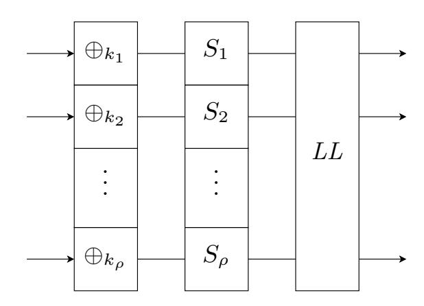
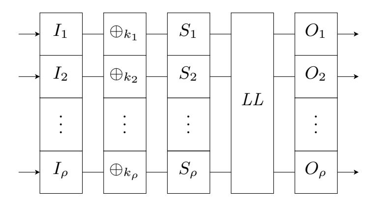
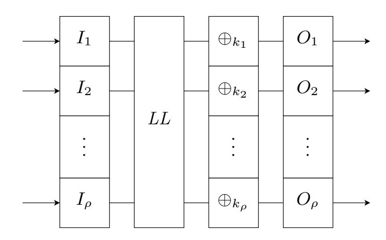

{0}------------------------------------------------

# On Self-Equivalence Encodings in White-Box Implementations

Adri´an Ranea1 and Bart Preneel1

imec-COSIC, KU Leuven, Belgium firstname.lastname@esat.kuleuven.be

Abstract. All academic methods to secure software implementations of block ciphers against adversaries with full control of the device have been broken. Despite the huge progress in the cryptanalysis of these white-box implementations, no recent progress has been made on the design side. Most of the white-box designs follow the CEJO framework, where each round is encoded by composing it with small random permutations. While several generic attacks have been proposed on the CEJO framework, no generic analysis has been performed on self-equivalence encodings, a different design where only the affine layer of each round is encoded with random self-equivalences of the S-box layer, that is, affine permutations commuting with the non-linear layer.

In this work, we analyse the security of white-box implementations based on self-equivalence encodings for a broad class of SPN ciphers. First, we characterize the self-equivalence groups of S-box layers, and we prove that all the self-equivalences of a cryptographically strong S-box layer have a diagonal shape. Then, we propose the first generic attack on selfequivalence encodings. Our attack, based on affine equivalence problems, identifies the connection between the security of self-equivalence encodings and the self-equivalence structure of the cipher components. While we show that traditional SPN ciphers with cryptographically strong Sbox layers cannot be secured with self-equivalence encodings, our analysis shows that self-equivalence encodings resist the generic attack if the cipher components satisfy several conditions, revealing the potential of self-equivalence encodings to secure other types of ciphers.

Keywords: White-box cryptography · Self-Equivalence · SPN

# 1 Introduction

Traditional black-box cryptography assumes that the endpoints of the communication are secured. However, in some real-word scenarios, the adversaries can access the endpoints and tamper with the cryptographic device. While several hardware-based countermeasures have been proposed to preclude grey-box attacks, such as side-channel and fault attacks, some applications (e.g., DRM or mobile banking) demand software-only solutions against adversaries with full control of the cryptographic device.

{1}------------------------------------------------

To model this powerful adversary from a cryptographic point of view, Chow et al. proposed the white-box model [\[13\]](#page-19-0), where the adversary has full control of the cryptographic device. In particular, the adversary can observe and modify at will the intermediate values in the execution of the cryptographic algorithm.

In the same seminal work, Chow et al. proposed the first white-box implementation of a block cipher, a software implementation of AES designed to resist key-extraction attacks in the white-box model. Although their method only focused on key-extraction resistance, omitting other white-box threats such as code lifting or attacks inverting the functionality, it was the first practical approach considering a cryptographic adversary, as opposed to other heuristic countermeasures such as software obfuscation or software tamper-resistance.

The method by Chow et al., also called the CEJO framework, represents the cryptographic computation as a network of look-up tables and randomizes each look-up table by composing it with random encodings. To preserve the functionality, the output encoding of one step cancels the input encoding of the next step. Thus, the resulting white-box implementation is functionally equivalent to the original cipher up to the first and last encodings, which are not cancelled. Without these external encodings, the method is trivially insecure.

The white-box implementation by Chow et al. was broken by the BGE attack, and all the subsequent CEJO implementations [\[14,](#page-19-1)[30,](#page-19-2)[38,](#page-20-0)[25,](#page-19-3)[31,](#page-20-1)[35](#page-20-2)[,3\]](#page-18-0) have also been broken [\[24,](#page-19-4)[37](#page-20-3)[,22,](#page-19-5)[33,](#page-20-4)[16,](#page-19-6)[27](#page-19-7)[,3,](#page-18-0)[12,](#page-19-8)[17,](#page-19-9)[29\]](#page-19-10). Lastly, McMillion et al. considered a white-box implementation of AES based on self-equivalences encodings and showed it was insecure [\[32\]](#page-20-5). As opposed to CEJO implementations, selfequivalence encodings randomize only the affine part of each round, by composing with random self-equivalences of the S-box layer SL, that is, affine permutations (A, B) such that SL = B ◦ SL ◦ A.

Due to the complexity of designing secure white-box implementations and the practical limitations introduced by external encodings, several commercial white-box implementations have been designed without external encodings but whose security relies on the secrecy of their design. Apart from the drawbacks of security by obscurity, several white-box attacks based on grey-box techniques have been proposed that do not require knowledge of the design, such as [\[10,](#page-18-1)[5,](#page-18-2)[34\]](#page-20-6). The effectiveness of these attacks was shown in the WhibOx Contest [\[36\]](#page-20-7), a competition where participants submitted white-box implementations of AES and broke other participants' submissions. In the first edition all the submissions were broken, and in the second edition 3 implementations stayed unbroken during the attack period of the competition, but they were broken afterwards [\[23\]](#page-19-11).

Apart from white-box implementations of existing block ciphers, other whitebox constructions have been published, such as white-box implementations of ciphers with secret S-boxes [\[11,](#page-18-3)[4\]](#page-18-4) or incompressible white-box ciphers [\[7,](#page-18-5)[9\]](#page-18-6). The latter constructions are dedicated ciphers designed to preclude code lifting attacks by relying on a huge implementation such that an adversary with partial access cannot find an equivalent implementation with significantly less size.

In this work we address the challenging problem of designing white-box implementations of block ciphers in the white-box model proposed by Chow et al., 

{2}------------------------------------------------

that is, where the specifications of the design are public and the security relies on the secrecy of the internal and external encodings. While there has been outstanding progress in adapting grey-box techniques to attack white-box implementations relying on secret designs, these techniques do not pose a threat to white-box implementations relying on external encodings yet, as long as the external encodings are chosen carefully [\[2\]](#page-18-7). Thus, grey-box techniques are outside the scope of this paper, and we focus instead on the design side of white-box implementations, for which no significant progress has been made recently.

Apart from the CEJO implementations and the white-box AES implementation based on self-equivalence encodings, no more white-box implementations following this model have been published. Some generic attacks have been proposed on the CEJO framework [\[33,](#page-20-4)[3,](#page-18-0)[17\]](#page-19-9), showing that CEJO implementations are not suitable for a broad class of SPN ciphers. However, self-equivalence encodings have only been considered for AES, and the security of this type of encodings has not been analysed for other ciphers.

Contributions. In this paper, we analyse the security of self-equivalence encodings in white-box implementations of SPN ciphers. We first formalize selfequivalence implementations, a class of white-box implementations that hide the round key material in random-looking affine permutations built from selfequivalences of the S-box layer. We also illustrate how CEJO implementations can be efficiently transformed into self-equivalence implementations.

Then, we study the self-equivalence group of an S-box layer, on which the security of self-equivalence encodings is based. To this end, we introduce diagonal self-equivalences; given a permutation F built from the concatenation of smaller permutations, a diagonal self-equivalence of F is a self-equivalence that can also be decomposed as the concatenation of smaller permutations. We prove that in order to have non-diagonal self-equivalences, F needs to have additive selfequivalences, linear components and several linear structures, or equivalently, differential and linear approximations of probability one. As a result, S-box layers of SPN ciphers employing cryptographically strong S-boxes have only diagonal self-equivalences. Our characterization of diagonal self-equivalences can be of independent interest. For example, it can be applied to count the number of solutions (A, B) of an affine equivalence problem G = B ◦ F ◦ A where the central map F is given as the concatenation of smaller permutations.

Finally, we propose the first generic attack on self-equivalence implementations of SPN ciphers with cryptographically strong S-boxes. Our attack partially recovers the self-equivalence encodings up to some unknown affine permutations belonging to a small subgroup of the self-equivalence group; the key is then recovered by a brute force search over the small subgroup. The attack is based on affine and linear equivalence problems and its complexity depends on the selfequivalence groups of the linear layer blocks and the S-boxes. Our analysis shows that if these self-equivalence groups satisfy some properties, a self-equivalence implementation is secure against the generic attack. While traditional SPN ciphers such as AES do not satisfy these properties, our analysis provides the foundations to secure a different class of ciphers with self-equivalence encodings. 

{3}------------------------------------------------

Outline. In Sect. 2, the notation and the preliminaries are introduced. The CEJO framework is described Sect. 3 and self-equivalence implementations are introduced in Sect. 4. Diagonal self-equivalences are characterized in Sect. 5, and the generic attack on self-equivalence encodings is described in Sect. 6. Section 7 presents the conclusions and the future work.

### 2 Preliminaries

#### 2.1 Basics

In this document, capital letters are used for functions (e.g., F, G), lower letters for values (e.g., x, y), and calligraphic letters for sets of functions (e.g.,  $\mathcal{F}, \mathcal{G}$ ).

Let  $\mathbb{F}_q$  be the finite field with q elements. The vector space of n-bit values is denoted by  $\mathbb{F}_2^n$ , and the addition in  $\mathbb{F}_2^n$  by  $\oplus$ . A function  $F: \mathbb{F}_2^n \mapsto \mathbb{F}_2^m$  is called an (n,m)-bit function, or just n-bit function if n=m. Given two functions F and G, their composition is denoted by  $F \circ G$  and their concatenation by  $F \parallel G$ , that is,  $(F \parallel G)(x,y) = (F(x),G(y))$ . The n-bit identity function is denoted by  $\mathrm{Id}_n(x) = x$ , and the addition by a constant is denoted by  $\oplus_a(x) = x \oplus a$ .

Given an affine function A, we denote its linear part by Lin(A), that is,  $A = \bigoplus_a \circ \text{Lin}(A)$  for some constant a. If  $L : (\mathbb{F}_2^n)^m \to (\mathbb{F}_2^n)^m$  is a linear function, we denote by  $\{L_{i,j} : 1 \leq i, j \leq m\}$  the n-bit linear functions associated with the blocks of L seen as a block matrix, that is, in matrix notation

$$L \times \begin{pmatrix} x_1 \\ \vdots \\ x_m \end{pmatrix} = \begin{pmatrix} L_{1,1} & \cdots & L_{1,m} \\ \vdots & \ddots & \\ L_{m,1} & L_{m,m} \end{pmatrix} \times \begin{pmatrix} x_1 \\ \vdots \\ x_m \end{pmatrix}, \quad x_i \in \mathbb{F}_2^n.$$

The general linear group consisting of all n-bit linear permutations is denoted by  $GL_n$ , and the affine general linear group of  $\mathbb{F}_2^n$  is denoted by  $AGL_n$ .

The cardinality of a set  $\mathcal{F}$  is denoted by  $|\mathcal{F}|$  and the Cartesian product of sets  $\mathcal{F}$  and  $\mathcal{G}$  is denoted by  $\mathcal{F} \times \mathcal{G}$ . We translate the inversion, concatenation and composition of functions to set operations as follows:

$$\mathcal{F}^{-1} = \{ F^{-1} : F \in \mathcal{F} \},$$

$$\mathcal{F} \parallel \mathcal{G} = \{ F \parallel G : F \in \mathcal{F}, G \in \mathcal{G} \},$$

$$\mathcal{F} \circ \mathcal{G} = \{ F \circ G : F \in \mathcal{F}, G \in \mathcal{G} \}.$$

Moreover, given a set of affine permutations  $\mathcal{A}$ , we denote its linear part by  $\operatorname{Lin}(\mathcal{A}) = \{\operatorname{Lin}(A) : A \in \mathcal{A}\}$ . When a set contains a single element  $\{F\}$ , we denote  $F \circ \mathcal{G} = \{F\} \circ \mathcal{G}$  and  $F \parallel \mathcal{G} = \{F\} \parallel \mathcal{G}$  with a slight abuse of notation.

SPN ciphers. Given an *n*-bit iterated block cipher, we denote the encryption function for a fixed key k by  $E_k = E_{k(n_r)}^{(n_r)} \circ \cdots \circ E_{k(1)}^{(1)}$ , where  $E_{k(r)}^{(r)}$  denotes the rth round function and  $k^{(r)}$  denotes the rth round key. For ease of notation,

{4}------------------------------------------------

we omit the round-key subscript of the round functions. An SPN (Substitution-Permutation Network) cipher is an iterated block cipher where the rth round function is defined by

$$E^{(r)} = LL \circ SL \circ \bigoplus_{k^{(r)}},$$

where LL is the n-bit linear layer,  $SL = S_1 \parallel \cdots \parallel S_{\rho}$  is the S-box layer composed of m-bit S-boxes  $S_i$ , and  $k^{(r)}$  is the rth round key. In some cases, the first and last rounds are defined in a different way. Figure 1 depicts the round function of an SPN cipher.

Fig. 1. The round function of an SPN cipher.

#### 2.2 Self-Equivalences

In this section, we introduce the notion of self-equivalence [8] and some of its properties for n-bit functions.

**Definition 1.** Let F be an n-bit function. A pair of n-bit affine permutations (A, B) such that  $F = B \circ F \circ A$  is called an (affine) self-equivalence of F.

We also say A (resp. B) is a right (resp. left) self-equivalence of F. If A and B are linear, (A, B) is called a linear self-equivalence, and if  $(A, B) = (\oplus_a, \oplus_b)$  are constants, (A, B) is called an additive self-equivalence.

**Definition 2.** Two n-bit functions F and G are said to be affine (resp. linear) equivalent if there exists a pair of n-bit affine (resp. linear) permutations (A, B) such that  $G = B \circ F \circ A$ .

The notion of (affine) self-equivalence arises from the affine equivalence relation. This equivalence relation induces a partition on the set of n-bit functions, where a function belongs to the affine class containing all its affine equivalent functions.

We denote the set of self-equivalences of F by SE(F), the set of left self-equivalences by LSE(F), and the set of right self-equivalences by RSE(F), i.e.,

$$SE(F) = \{(A, B) \in AGL_n \times AGL_n : F = B \circ F \circ A\},$$

$$RSE(F) = \{A : \exists B \text{ s.t. } (A, B) \in SE(F)\},$$

$$LSE(F) = \{B : \exists A \text{ s.t. } (A, B) \in SE(F)\}.$$

{5}------------------------------------------------

The next lemma recalls the well-known fact that the self-equivalences form a group, which can be easily proved by noticing that SE(F) is the stabilizer of a group action where AGLn × AGLn acts over the set of n-bit functions [\[20,](#page-19-12)[28\]](#page-19-13).

Lemma 1. SE(F) is a subgroup of AGLn × AGLn, and LSE(F) and RSE(F) are subgroups of AGLn. Moreover, if G is a function affine equivalent to F, i.e., G = B ◦ F ◦ A, then the self-equivalence groups of F and G are conjugates, that is, RSE(G) = A−1 ◦ RSE(F) ◦ A and LSE(G) = B ◦ LSE(F) ◦ B−1 .

If F is a permutation, each right self-equivalence corresponds to a unique left self-equivalence. In this case, SE(F), LSE(F) and RSE(F) have the same cardinality, which is a divisor of the number of affine permutations. In particular, | SE(F)| = | AGLn | if F is an n-bit affine permutation. For a non-invertible function, a right self-equivalence can correspond to several left self-equivalences, and vice-versa. If F is non-invertible but affine, the cardinality of SE(F) can be computed, which depends on the rank of its matrix representation over F2 [\[28\]](#page-19-13).

### 2.3 Affine Equivalence Problems

Self-equivalences are strongly related to the solutions of affine and linear equivalence problems, on which many white-box implementations are based.

Definition 3. An affine (resp. linear) equivalence problem is a functional equation of the form G = Y ◦ F ◦ X where F and G are known n-bit functions and (X, Y ) are unknown affine (resp. linear) permutations.

Given any solution (X0, Y0) of the affine equivalence problem G = Y ◦F ◦ X, the solution set can be seen as the subgroup S = {(A ◦ X0, Y0 ◦ B) : (A, B) ∈ SE(F)} of AGLn × AGLn. Thus, the number of solutions is equal to the number of self-equivalences of F. If the unknowns (X, Y ) are restricted to given subgroups (A, B), then the solution set can be seen as the subgroup

$$\mathcal{S} = \{ (A \circ X_0, Y_0 \circ B) : (A, B) \in SE(F) \cap (\mathcal{A} \times \mathcal{B}) \}.$$

Several algorithms have been published for finding a solution of an equivalence problem. For n-bit permutations, Biryukov et al. proposed an O(n 32 n) algorithm to solve the linear case and an O(n 32 2n) algorithm to solve the affine case [\[8\]](#page-18-8), whereas Dinur recently proposed an O(n 32 n) algorithm to solve the affine case for random permutations [\[18\]](#page-19-14). Since we will mostly consider affine equivalence problems involving permutations with several self-equivalences, which is fairly rare in the random case, in this document we will assume O(n 32 2n) to be the complexity of solving an affine equivalence problem with n-bit permutations.

For n-bit functions F = F1 ∥ · · · ∥ Fρ composed of m-bit cryptographic S-boxes[1](#page-5-0) Fi , Derbez et al. obtained an algorithm to solve the affine equivalence

1 The algorithm by Derbez et al. assumes that the S-boxes do not have non-trivial linear components, i.e., there does not exist a non-zero (m, 1)-bit linear function B such that (B ◦ S)(x) = PbiS(x)i is a linear function. Most SPN ciphers employ cryptographically strong S-boxes satisfying this requirement.

{6}------------------------------------------------

problem with time complexity  $O(2^m n^3 + n^4/m + 2^{2m} m n^2)$  [17]. For *n*-bit affine functions F, the affine equivalence problem can be represented as a linear system of n+1 equations and solved with Gaussian elimination in time  $\mathcal{O}((n+1)^{\omega})$ , where  $2 < \omega < 3$  is the matrix multiplication constant.

While several efficient algorithms have been proposed for finding a solution of an equivalence problem, no efficient techniques have been proposed to count its number of solutions. In general, the algorithm by Biryukov et al. can be applied to find all the solutions by repeating the algorithm for each possible initial guess. The work factor of this approach is at least  $2^{2n}$  for the linear case and  $2^{3n}$  for the affine case, and it is also lower bounded by the number of solutions.

A particular class of problems for which we can characterize the solution set is the class of univariate linear equivalence problem  $G = X^{-1} \circ M_{\alpha} \circ X$  where  $M_{\alpha}$  is the *n*-bit linear permutation corresponding to the multiplication by the finite field element  $\alpha \in \mathbb{F}_{2^n}$ . For an *n*-bit function F, let  $C(F) = \{A \in GL_n : A \circ F = F \circ A\}$  be the centralizer of F, that is, the subgroup of linear permutations commuting with F. Then, the solution set of  $G = X^{-1} \circ M_{\alpha} \circ X$  is  $S = C(M_{\alpha}) \circ X_0$ , for any particular solution  $X_0$ . If  $\alpha$  has multiplicative order d (i.e., the minimum exponent such that  $\alpha^d = 1$ ), then  $C(M_{\alpha})$  is isomorphic to the set of invertible  $\frac{n}{d} \times \frac{n}{d}$  matrices over  $\mathbb{F}_{2^d}$  [21]. In particular,  $C(M_{\alpha}) = \{M_{\gamma} : 0 \neq \gamma \in \mathbb{F}_{2^n}\}$  if  $\alpha$  is a primitive element.

# 3 CEJO Implementations

In this section we introduce CEJO implementations and the generic cryptanalysis of the CEJO framework. CEJO implementations are a particular class of white-box implementations based on encoded round functions.

**Definition 4 ([13]).** Let F be an (n,m)-bit function and let (I,O) be a pair of n-bit and m-bit permutations, respectively. The function  $\overline{F} = O \circ F \circ I$  is called an encoded F, and I and O are called the input and output encoding, respectively.

**Definition 5.** Let  $E_k = E^{(n_r)} \circ E^{(n_r-1)} \circ \cdots \circ E^{(1)}$  be the encryption2 function of an iterated n-bit cipher with fixed key k. An encoded implementation of  $E_k$  is an encoded  $E_k$  composed of encoded round functions, that is,

$$\overline{E_k} = \overline{E^{(n_r)}} \circ \cdots \circ \overline{E^{(1)}} = (O^{(n_r)} \circ E^{(n_r)} \circ I^{(n_r)}) \circ \cdots \circ (O^{(1)} \circ E^{(1)} \circ I^{(1)}),$$

for some n-bit permutations  $(I^{(i)}, O^{(i)})$  satisfying  $I^{(i+1)} = (O^{(i)})^{-1}$  for  $i = 1, 2, \ldots, n_r - 1$ .

In other words, an encoded implementation is the composition of encoded round functions where the intermediate encodings are cancelled out, that is,  $\overline{E_k} = O^{(n_r)} \circ E_k \circ I^{(1)}$ . The intermediate encodings are also called the round encodings,

&lt;sup>2 In this paper we focus on white-box implementations of encryption functions; the definitions for decryption functions are similar.

{7}------------------------------------------------

and the encodings  $(I^{(1)}, O^{(n_r)})$  are called the external encodings. The round encodings are sampled at random from a group  $\mathcal{E}$  herein called the round encoding space, which varies from implementation to implementation.

All the white-box implementations of block ciphers published in the literature are encoded implementations following the so-called CEJO framework [14]. CEJO implementations employ round encoding spaces composed of small non-linear permutations and wider linear functions.

**Definition 6.** Let  $\mathcal{N}_{m_n}$  be the set of  $m_n$ -bit non-linear permutations. A CEJO implementation with  $m_n$ -bit non-linear encodings and  $m_l$ -bit linear encodings is an encoded implementation of an SPN cipher with round encoding space

$$\mathcal{E} = (\mathcal{N}_{m_n} \parallel \cdots \parallel \mathcal{N}_{m_n}) \circ (\mathrm{GL}_{m_l} \parallel \cdots \parallel \mathrm{GL}_{m_l}).$$

Figure 2 depicts an CEJO encoded round function with the usual parameters  $2m_n = m_l = m$ , where m is the bit-size of the S-box. For example, the encoded AES implementation proposed by Chow et al. employs 4-bit non-linear encodings and 8-bit linear encodings.

Internally, a CEJO encoded round function is implemented in software as a network of look-up tables, requiring roughly  $\mathcal{O}(2^{\max(2m_n,m_l,m)})$  bits of memory. Since white-box attacks to CEJO implementations only require black-box access to the encoded round functions, we will omit the internal description of a CEJO encoded round function and refer to [14,3] for more details.

Fig. 2. A CEJO encoded round function with  $\frac{m}{2}$ -bit non-linear encodings and m-bit linear encodings. Each m-bit function  $I_i$  and  $O_i$  consists of the concatenation of two  $\frac{m}{2}$ -bit non-linear permutations composed with an m-bit linear permutation.

#### 3.1 Security of CEJO Implementations

The white-box implementation by Chow et al. and the subsequent CEJO implementations were designed to prevent key-extraction attacks in the white-box model, that is, an attacker with full control on the implementation should not be able to recover the key; the specifications of the cipher and the implementation are public, but the key and the encodings are unknown to the adversary.

{8}------------------------------------------------

CEJO implementations do not aim to prevent attacks inverting the implementation. In some scenarios (e.g., DRM), inverting the functionality is not a threat. Note that designing a white-box implementation preventing both keyextraction and inversion attacks is a much harder problem, since it would turn a symmetric cipher into a public-key encryption scheme.

Informally, the security of CEJO implementations relies on a disambiguation problem; for a given encoded round function, many pairs of round keys and round encodings result in the same encoded round function. While encoded round functions are individually secure, all CEJO implementations have been broken by analysing few consecutive rounds.

Key-extraction attacks on CEJO implementations typically consists of two main steps: reducing the round encoding space and guessing the round keys. First, the adversary obtains new encoded round functions with the same underlying round keys but with round encodings restricted to a smaller encoding space. Then, the adversary performs an exhaustive search over the reduced round encoding space to recover the round keys. For most SPN ciphers, the key schedule can be inverted and few round keys can uniquely determine the master key.

The crucial step is the reduction of the round encoding space. While several reduction attacks to CEJO implementations have been published, only three generic reduction attacks (i.e., considering a broad class of ciphers) have been proposed. Michiels et al. proposed the first reduction attack [\[33\]](#page-20-4), composed of one algorithm to remove the non-linear part of the encodings and another algorithm to partially recover the remaining affine encodings. Baek et al. generalized the algorithm to remove the non-linear part of the encodings [\[3\]](#page-18-0) and Derbez et al. improved the recovering of the affine encodings by an efficient algorithm to solve affine equivalence problems of S-box layers [\[17\]](#page-19-9). The following proposition illustrates the reach of current generic reduction attacks, proved in Appendix [A.](#page-20-8)

Proposition 1. Let Ek be the encryption function of an n-bit SPN cipher with linear layer LL and S-box layer SL consisting of m-bit cryptographic S-boxes, and let Ek be a CEJO implementation of Ek with mn-bit non-linear encodings and ml-bit linear encodings. Given black-box access to three consecutive encoded round functions E(r−2) , E(r−1) and E(r) , one can find another encoded E(r) with round encoding space LL ◦ LSE(SL), i.e.,

$$\widehat{E^{(r)}} = \widehat{O} \circ E^{(r)} \circ \widehat{I}, \quad \widehat{I}, \widehat{O^{-1}} \in LL \circ LSE(SL),$$

in time 
$$\mathcal{O}((n/m_n)2^{3m_n} + 2^m n^3 + n^4/m + 2^{2m} m n^2)$$
.

As a result, given a CEJO implementation of an SPN cipher, we can find another encoded implementation where the round encoding space has been reduced to LL ◦ LSE(SL). This reduction attack is efficient for practical CEJO implementations, since the complexity of Proposition [1](#page-8-0) is similar to the memory complexity of a CEJO implementation.

For white-box implementations of AES, several reduction attacks have been proposed that reduced the round encoding space to a single element [\[6,](#page-18-9)[27,](#page-19-7)[17\]](#page-19-9). 

{9}------------------------------------------------

However, no generic attack has been proposed reducing the round encoding space further than Proposition [1.](#page-8-0) This round encoding space is strongly related to the self-equivalence set of the S-box layer. In the next section, we introduce a class of white-box implementations where the round encodings are sampled at random from the self-equivalences set of the S-box layer and analyse their security.

# 4 Self-Equivalence Implementations

In [\[32\]](#page-20-5), McMillion et al. considered a white-box implementation of AES where the round encodings were self-equivalences of the S-box layer and showed it was insecure. However, this type of encodings has not been considered for other ciphers, nor their generic security have been addressed. In this section, we introduce and analyse self-equivalence implementations, a particular class of white-box implementations based on self-equivalence encodings.

As opposed to encoded implementations, self-equivalence implementations only encode the affine part of the round function. Given an encryption function Ek = E(nr) ◦ · · · E(1) of an SPN cipher with round function E(r) = LL ◦ SL ◦ ⊕k(r) , we define the intermediate affine layers by

$$AL^{(r)} = \bigoplus_{k^{(r)}} \circ LL, \quad r = 2, \dots, n_r$$

and the first and last layer affine layers by AL(1) = ⊕k(1) and AL(nr+1) = LL. Although affine layers depends on the round keys, we omit the round-key subscript for ease of notation. Note that the rth affine layer includes the round key of the rth round but the linear layer of the previous round. The first and last affine layers might be defined differently if the SPN cipher defines the first and last round in a different way.

Definition 7. Let Ek be the encryption function of an SPN cipher. A selfequivalence implementation is an encoded Ek given by

$$\overline{E_k} = AL^{(n_r+1)} \circ SL \circ \overline{AL^{(n_r)}} \circ SL \circ \overline{AL^{(n_r-1)}} \circ \cdots \circ \overline{AL^{(2)}} \circ SL \circ \overline{AL^{(1)}},$$

where the intermediate encodings of the affine layers are self-equivalences of the S-box layer, i.e.,

$$\overline{AL^{(r)}} = O^{(r)} \circ AL^{(r)} \circ I^{(r)}, \quad (O^{(r)}, I^{(r+1)}) \in SE(SL),$$

and the external encodings (I (1), O(nr) ) are affine permutations.

The last affine layer is not encoded since it is not key-dependent. The intermediate encodings are cancelled due to the self-equivalence property, i.e.,

$$\overline{AL^{(r+1)}} \circ SL \circ \overline{AL^{(r)}} = O^{(r+1)} \circ AL^{(r+1)} \circ (I^{(r+1)} \circ SL \circ O^{(r)}) \circ AL^{(r)} \circ I^{(r)}$$
$$= O^{(r+1)} \circ AL^{(r+1)} \circ SL \circ AL^{(r)} \circ I^{(r)}.$$

{10}------------------------------------------------

Similar to encoded implementations, the intermediate encodings are called the round encodings, and the subgroup of self-equivalences from which the round encodings are sampled at random is called the round encoding space E ≤ SE(SL).

Self-equivalence implementations can be implemented in software in a simple and efficient way. An encoded affine layer can be implemented by a single n × n binary matrix and an n-bit constant, requiring O(n 2 + n) bits of memory and O(n 2/ log2 n) bit operations to evaluate [\[1\]](#page-18-10). In addition, the S-box layer does not need to be protected, and there are no restrictions on the bit-size of the S-boxes.

A CEJO implementation can be efficiently transformed into a self-equivalence implementation following Proposition [1,](#page-8-0) and a self-equivalence implementation can be considered as a CEJO implementation with n-bit linear encodings by defining the encoded round function as

$$\overline{E^{(r)}} = SL \circ \overline{AL^{(r)}} = \left(LL \circ I^{(r+1)}\right)^{-1} \circ E^{(r)} \circ (LL \circ I^{(r)})$$

While the memory complexity of a CEJO implementation is exponential in terms of the bit-size of the encodings, self-equivalence implementations can be efficiently implemented in all cases. Therefore, practical CEJO implementations can be efficiently translated to self-equivalence implementations, but the latter ones cannot be efficiently transformed to practical CEJO implementations if the self-equivalences of the S-box layer are not composed of smaller affine permutations. In the next section, we study the self-equivalences of S-box layers and analyse the case when all the self-equivalences are composed of smaller permutations.

# 5 Diagonal Self-Equivalences

Let F = F1 ∥ · · · ∥ Fρ be an arbitrary n-bit permutation composed of smaller m-bit permutations Fi . If (Ai , Bi) is a self-equivalence of Fi for i = 1, . . . , ρ, then (A1 ∥ · · · ∥ Aρ, B1 ∥ · · · ∥ Bρ) is a self-equivalence of F. In addition, if two of the smaller permutations (Fi , Fj ) are the same, then the transposition (i, j) is also a self-equivalence of the S-box layer.

Definition 8. A (m × ρ)-bit linear permutation P is called an [m, ρ]-block permutation if P(x1, . . . , xρ) = (xπ(1), . . . , xπ(ρ)) for some permutation π of {1, . . . , ρ}. We denote the set of block permutations by Pm,ρ.

In particular, if all the small permutations Fi are the same, then the set

$$\mathcal{D} = \left\{ \left( (A_1 \parallel \dots \parallel A_\rho) \circ P, P^{-1} \circ (B_1 \parallel \dots \parallel B_\rho) \right) : \begin{array}{c} (A_i, B_i) \in SE(F_i) \\ P \in \mathcal{P}_{m,\rho} \end{array} \right\}$$

is a subgroup of SE(F). In some cases, the set D contains all the self-equivalences of F. For example, De Mulder et al. [\[16\]](#page-19-6) computed all the linear self-equivalences of S ∥ S, where S is the AES S-box, and found that all the right (resp. left) linear self-equivalences have a diagonal shape of the form

$$\begin{pmatrix} A_1 & 0 \\ 0 & A_2 \end{pmatrix} , \quad \begin{pmatrix} 0 & A_1 \\ A_2 & 0 \end{pmatrix} ,$$

{11}------------------------------------------------

where  $A_1$  and  $A_2$  are right (resp. left) linear self-equivalence of S.

Unfortunately, it is not known in which cases the subgroup  $\mathcal{D}$  is the total self-equivalence group SE(F). To consider also functions  $F = F_1 \circ \cdots \circ F_{\rho}$  with different permutations  $F_i$ , we define diagonal self-equivalences as follows.

**Definition 9.** Let  $F = F_1 \parallel \cdots \parallel F_{\rho}$  be an n-bit permutation composed of m-bit permutations  $F_i$ . An (affine) diagonal self-equivalence (A, B) of F is a pair of n-bit affine permutations  $(A, B) \in SE(F)$  such that

$$A = (A_1 \parallel \cdots \parallel A_{\rho}) \circ P, \qquad B = P^{-1} \circ (B_1 \parallel \cdots \parallel B_{\rho}),$$

for some m-bit functions  $A_i$  and  $B_i$  and some  $[m, \rho]$ -block permutation P.

The set of diagonal self-equivalences is a subgroup of SE(F), and it includes  $\mathcal{D}$  when all  $F_i$  are the same. Moreover, if (A, B) is a diagonal self-equivalence, then  $A_i$  and  $B_i$  are permutations and the matrices corresponding to Lin(A) and Lin(B) are diagonal block matrices up to some permutation of the blocks, i.e.,

$$\operatorname{Lin}(A) = \begin{pmatrix} \operatorname{Lin}(A_1) & & \\ & \ddots & \\ & \operatorname{Lin}(A_{\rho}) \end{pmatrix} \times P.$$

The property of having non-diagonal self-equivalences is not invariant in the affine class. However, if we consider the subgroup of affine permutations  $Q = \{Q_1 \parallel \cdots \parallel Q_\rho : Q_i \in AGL_m\}$ , then F has non-diagonal self-equivalences if and only if  $Q' \circ F \circ Q$  has non-diagonal self-equivalences, for all  $Q, Q' \in Q$ .

The main result of this section is Theorem 1, which shows that in order to have non-diagonal self-equivalences a function F must have additive self-equivalences, linear components and several linear structures. We first introduce these concepts before stating the theorem.

Given an (n, m)-bit function G, we denote by  $(G_1, \ldots, G_m)$  the canonical or coordinate components of G, that is,  $G(x) = (G_1(x), \ldots, G_m(x))$ . The set of (Boolean) components of G can be defined as the set of n-bit Boolean functions given by the linear combinations of the canonical components of G, i.e.,

$$\left\{ \sum_{i=1}^m a_i G_i \mid (a_1, \dots, a_m) \in \mathbb{F}_2^m \right\}.$$

Excluding the trivial component defined by  $(a_1, \ldots, a_m) = (0, \ldots, 0)$ , we say that r components  $\sum_i a_i^{(1)} G_i, \ldots, \sum_i a_i^{(r)} G_i$  are linear independent if the  $\mathbb{F}_2$ -vectors  $(a^{(1)}, \ldots, a^{(r)})$  are linear independent.

An additive self-equivalence of an (n, m)-bit function G is a pair of functions  $(\bigoplus_a, \bigoplus_b)$ , where a is an n-bit constant and b is an m-bit constant, such that  $G = \bigoplus_b \circ G \circ \bigoplus_a$ . For Boolean functions, this notation coincides with the notion of linear structure [19], while for vectorial Boolean functions the notion of linear structure is weaker.

{12}------------------------------------------------

Definition 10. Let G : F n 2 → F2 be a Boolean function. An n-bit vector a is called a linear structure of G if there exists a bit b such that ⊕b ◦ G = G ◦ ⊕a.

Definition 11. Let G be an (n, m)-bit function. An n-bit vector a is a linear structure of G if a is a linear structure of some canonical component of G.

Any (vectorial) Boolean function has the trivial linear structure a = 0 and the trivial additive self-equivalence (⊕0, ⊕0). We are now ready to state the main result of this section.

Theorem 1. Let F = F1 ∥ · · · ∥ Fρ be an n-bit permutation, where each Fi is an m-bit permutation. If F has a non-diagonal self-equivalence, then F contains three permutations (Fi , Fj , Fh), j ̸= h, such that

- (a) Fi has a non-trivial additive self-equivalence.
- (b) Fj has a non-trivial linear component.
- (c) Fh has 2 m−r linear structures that are common to r linear independent components, for some 0 < r < m.

The proof of Theorem [1](#page-12-0) is presented in Appendix [B.](#page-21-0) Note that if Fi = Fh, then the condition (c) is redundant since (a) would imply (c). However, if Fi = Fj neither (a) implies (b) nor vice-versa.

We checked for each 4-bit affine class Ci whether Ci ∥ Ci has a non-diagonal self-equivalence. Using the list of 4-bit affine classes by De Canni`ere [\[15\]](#page-19-17), we found that only the last 8 classes C293, C294, . . . , C301 have non-diagonal selfequivalences when concatenated with themselves. These classes are actually the only ones that have both additive self-equivalences and linear components, showing that the necessary conditions of Theorem [1](#page-12-0) are also sufficient for this case.

Cryptographically strong S-boxes do not have non-trivial linear components or additive self-equivalences, since they correspond to linear approximations and differentials with probability one, respectively. Most SPN ciphers employ S-box layers SL given by the concatenation of a single cryptographically strong S-box S, and for this case we can characterize the self-equivalence group of SL as follows.

Corollary 1. Let S be an m-bit permutation without non-trivial additive selfequivalences or linear components, and consider the (m × ρ)-bit permutation SL = S ∥ · · · ∥ S. Then, the self-equivalence group of SL is given by

$$SE(SL) = \left\{ \left( (A_1 \parallel \cdots \parallel A_\rho) \circ P, P^{-1} \circ (B_1 \parallel \cdots \parallel B_\rho) \right) : \begin{array}{c} (A_i, B_i) \in SE(S) \\ P \in \mathcal{P}_{m,\rho} \end{array} \right\}.$$

In addition, | SE(SL)| = ρ! × | SE(S)| ρ .

While we apply the study of diagonal self-equivalences and Theorem [1](#page-12-0) for the security analysis of self-equivalence implementations, they can also be of independent interest. For example, Theorem [1](#page-12-0) can be used to characterize and count the number of solutions of affine equivalence problems G = Y ◦ F ◦ X where F is given by the concatenation of cryptographically strong S-boxes.

{13}------------------------------------------------

# 6 Security of Self-Equivalence Implementations

In this section, we analyse the security of self-equivalence implementations against key-extraction attacks in the white-box model. Similar to CEJO implementations, self-equivalence implementations do not aim to prevent attacks inverting the implementation. Moreover, it is assumed that the specifications of the block cipher and the self-equivalence implementation are public, but the key and the encodings are unknown to the adversary.

In a self-equivalence implementation the round key material is hidden in the encoded affine layer, given as a binary constant and a binary matrix; the binary constant masks the round key with the round encodings and the binary matrix masks the linear part of the input and output encodings with each other. If many pairs of round keys and self-equivalences lead to the same encoded affine layer, each encoded affine layer is individually secure and the adversary is forced to solve a disambiguation problem involving several rounds.

Since CEJO encodings can be reduced to self-equivalence encodings, several white-box attacks [\[6,](#page-18-9)[27,](#page-19-7)[17\]](#page-19-9) on CEJO implementations of AES contain steps to disambiguate diagonal self-equivalence encodings. However, they exploit specific properties of AES, and no generic attack on self-equivalence encodings, or even diagonal encodings, have been proposed this far.

To analyse the security of self-equivalence encodings, we describe the first generic attack on self-equivalence implementations. Since this is the first generic analysis, we focus on the class of SPN ciphers where the S-box layer does not have both a non-trivial additive self-equivalence and a linear component. Otherwise, the S-box layer will have a differential and a linear approximation with probability one, which are usually avoided in most SPN designs.

As most white-box attacks, our generic attack is a reduction attack. In other words, we describe a method to obtain new encoded affine layers for which the round encodings are restricted to a smaller encoding space. Afterwards, the key can be recovered by performing an exhaustive search over the reduced encoding space and filtering wrong candidates using the key schedule. Thus, the complexity of the key-recovery attack is given by the complexity to reduce the round encoding space and the complexity to brute force the reduced encoding space, where the latter step is lower bounded by the cardinality of the reduced encoding space.

The reduction step is based on equivalence problems involving the linear part of the round encodings with small solution sets, inspired from the whitebox attacks on AES [\[6,](#page-18-9)[27,](#page-19-7)[17\]](#page-19-9). These equivalence problems consider unknowns restricted to some self-equivalence subgroup of the S-boxes, and estimating the complexity of these problems highly depends on the structure of the subgroup. Thus, our complexity metric is the cardinality of the reduced round encoding space, which provides a lower bound of the complexity of the whole attack.

Before we describe the attack, we recall the notation and the components of a self-equivalence implementation. Let Ek be the encryption function for a fixed key k of an arbitrary SPN cipher whose S-box layer SL does not have a non-trivial additive self-equivalence or a linear component. Let Ek be a self

{14}------------------------------------------------

equivalence implementation of  $E_k$  with encoded affine layers  $\overline{AL^{(1)}}, \ldots, \overline{AL^{(n_r)}}$ . Recall the rth intermediate encoded affine layer is defined by  $\overline{AL^{(r)}} = O^{(r)} \circ (\bigoplus_{k^{(r)}} \circ LL) \circ I^{(r)}$ , where  $k^{(r)}$  is the rth round key, LL is the linear layer and  $(I^{(r)}, O^{(r)})$  are the round encodings satisfying  $(O^{(r)}, I^{(r+1)}) \in SE(SL)$ .

For this class of SPN ciphers all the self-equivalences of the S-box layer are diagonal, following Theorem 1. For ease of explanation, we will consider diagonal self-equivalences without block permutations, since they do not significantly impact the reduction step. In this case, the round encoding space of the self-equivalence implementation is  $SE(S_1) \parallel \cdots \parallel SE(S_{\rho})$ . Figure 3 depicts an intermediate encoded affine layer with this type of round encoding space.

Fig. 3. An encoded affine layer with diagonal self-equivalence encodings.

Given an intermediate3 encoded affine layer  $\overline{AL^{(r)}}$ , the core step in the reduction attack is to obtain another encoded affine layer differing only in the *i*th block of the output encoding, i.e.,

$$\widehat{AL^{(r)}} = O'^{(r)} \circ AL^{(r)} \circ I^{(r)}, \quad O'^{(r)}_h = O^{(r)}_h \ \forall h \neq i,$$

such that  $\operatorname{Lin}(O_i'^{(r)})$  belongs to a proper subgroup of  $\operatorname{Lin}(\operatorname{RSE}(S_i))$ . The encoding space of the whole round encoding  $(I^{(r)},O^{(r)})$  can be then reduced by applying this step for all output encoding blocks of  $\overline{AL^{(r)}}$  and  $\overline{AL^{(r-1)}}$  and using the self-equivalence property  $SL = I^{(r)} \circ SL \circ O^{(r-1)}$ .

The reduction of the linear part of the output encoding is based on equivalence problems, and we do not reduce the constant part of the round encodings to avoid equivalence problems dependent on the round key. Recall an affine (resp. linear) equivalence problem is a functional equation  $G = Y \circ F \circ X$  where F and G are given n-bit functions and (X,Y) are unknown n-bit affine (resp. linear) permutations. In our case, the unknowns (X,Y) are restricted to some given subgroup  $\mathcal{A} \times \mathcal{B}$ ; given any solution  $(X_0,Y_0)$  the solution set is the group

$$\mathcal{S} = \{ (A \circ X_0, Y_0 \circ B) : (A, B) \in SE(F) \cap (\mathcal{A} \times \mathcal{B}) \}.$$

&lt;sup>3 The attack does not target the external encodings, which are assumed to be random affine permutations. Note that a self-equivalence implementation without external encodings is trivially insecure.

{15}------------------------------------------------

We will describe two generic classes of equivalence problems that contain the output round encoding as a particular solution, and we will reduce the round encoding space to their solution sets. These two classes of equivalence problems, the centralizer and the asymmetric problems, can be combined and do not assume any particular structure in the self-equivalences groups of the S-boxes. However, other equivalence problems can be considered by exploiting specific properties of the self-equivalence groups. As an example, we will also describe a class of linear equivalence problems for S-boxes with only linear self-equivalences.

### 6.1 The Centralizer Problems

The centralizer problems are a class of univariate linear equivalence problems that allow reducing the round encoding space to the centralizer of linear layer blocks. Since these equivalence problems only involve the encoded affine layer of one round, we omit the round superscript for these problems.

Given an (m×ρ)-bit linear function A, recall that we denote by Ai,j the (i, j) m-bit block of A seen as a block matrix. Moreover, the centralizer of an n-bit function F is defined as C(F) = {A ∈ GLn : A ◦ F = F ◦ A}. The centralizer problems are based on the following proposition, which is proved in Appendix [C.](#page-26-0)

Proposition 2. Let AL = O ◦ AL ◦ I be the encoded affine layer of an intermediate round and consider the linear layer block L = LLi,j ◦ LL−1 j,i. Then, the univariate linear equivalence problem,

$$\operatorname{Lin}\left(\overline{AL}\right)_{i,j} \circ \operatorname{Lin}\left(\overline{AL}^{-1}\right)_{j,i} = X \circ L \circ X^{-1}, \quad X \in \operatorname{Lin}(\operatorname{RSE}(S_i)), \quad (1)$$

contains X0 = Lin(Oi) as a solution. In particular, its solution set is given by

$$S = \operatorname{Lin}(O_i) \circ (\operatorname{C}(L) \cap \operatorname{Lin}(\operatorname{RSE}(S_i))).$$

Without the restriction X ∈ Lin(RSE(Si)), a solution of Eqn. [\(1\)](#page-15-0) could be easily obtained with complexity O(mω), for 2 < w < 3. However, the restriction makes the complexity harder to estimate, which strongly depends on the structure of Lin(RSE(Si)). In general, one can perform an exhaustive search over Lin(RSE(Si)) using the algorithm of Biryukov et al. [\[8\]](#page-18-8); the complexity of this approach is at least 23m and is also lower bounded by | Lin(RSE(Si))|.

Let X0 = Lin(Oi)◦H be an arbitrary solution of Eqn. [\(1\)](#page-15-0), for some unknown H ∈ C(L) ∩ Lin(RSE(Si)). Since X0 ∈ Lin(RSE(Si)), there exists an m-bit constant x0 such that ⊕x0 ◦ X0 ∈ RSE(Si). Let C = (C1 ∥ · · · ∥ Cρ) be the right self-equivalence of SL where Ci = (⊕x0 ◦ X0) −1 and Ch = Id ∀h ̸= i. Then, we can obtain another encoded affine layer

$$\widehat{AL} = C \circ \overline{AL} = O' \circ AL \circ I, \quad O'_h = O_h \ \forall h \neq i,$$

with (unknown) self-equivalences as round encodings and that only differs in the ith block of the output encoding. In addition, the linear part of O′ i is restricted to the subgroup Lin(RSE(Si)) ∩ C(L).

{16}------------------------------------------------

In other words, the centralizer problem given by Eqn. [\(1\)](#page-15-0) allows reducing the encoding space associated to the linear part of the ith output encoding block, Lin(RSE(Si)), to the subgroup Lin(RSE(Si))∩ C(L). Note that this subgroup is related to the self-equivalences of the linear layer blocks, showing that the security of self-equivalence implementations not only depends on the self-equivalences of the S-box layer but also on the self-equivalence structure of the linear layer.

If L is the identity or its matrix representation over F2 has low rank, its centralizer contains too many elements and the reduction is not significant. Nevertheless, we can consider similar equivalence problems involving other blocks of AL and LL. In general, any sequence of the form

$$A = A_{i_1,j_1} A_{j_1,i_2} \cdots A_{i_s,j_s} A_{j_s,i_{s+1}}, \quad i_1 = i_{s+1}$$

$$A_{i_h,j_h} \in \left\{ \operatorname{Lin}(AL)_{i_h,j_h}, \left( \operatorname{Lin}(AL^{-1})_{i_h,j_h} \right)^{-1} \right\}$$

$$A_{j_h,i_{h+1}} \in \left\{ \operatorname{Lin}(AL^{-1})_{j_h,i_{h+1}}, \left( \operatorname{Lin}(AL)_{i_{h+1},j_h} \right)^{-1} \right\}$$

leads to a centralizer problem of the form A = Lin(Oi1 ) ◦ L ◦ Lin(Oi1 ) −1 , for some L composed of blocks of LL. In Appendix [E](#page-27-0) we provide an example of a centralizer problem to reduce the round encoding space of a self-equivalence implementation of AES.

#### 6.2 The Asymmetric Problems

The asymmetric problems are a class of affine equivalence problems that allow reducing the round encoding space to the intersection between the right and left self-equivalence groups of the S-boxes. As in the centralizer problems, we omit the round superscript for ease of notation. The asymmetric problems are based on the following proposition, whose proof is given in Appendix [D.](#page-27-1)

Proposition 3. Let AL = O ◦ AL ◦ I be the encoded affine layer of an intermediate round. Then, the affine[4](#page-16-0) equivalence problem

$$\operatorname{Lin}\left(\overline{AL}\right)_{i,j} \circ S_j = X \circ LL_{i,j} \circ S_j \circ Y, \quad \operatorname{Lin}(X) \in \operatorname{Lin}(\operatorname{RSE}(S_i))$$
 (2)

contains a solution (X0, Y0) such that Lin(X0) = Lin(Oi). In particular, the linear part of the set of X-solutions SX is given by the GLn-subgroup

$$\operatorname{Lin}(\mathcal{S}_X) = \operatorname{Lin}(O_i) \circ \left( \operatorname{Lin}(\operatorname{LSE}(LL_{i,j} \circ S_j)) \cap \operatorname{Lin}(\operatorname{RSE}(S_i)) \right).$$

As in the previous case, the complexity to obtain a solution of Eqn. [\(2\)](#page-16-1) is harder to estimate and strongly depends on Lin(RSE(Si)). In general, the algorithm by Biryukov et al. can be used to perform an exhaustive search over Lin(RSE(Si)) with complexity lower bounded by max(23m, | Lin(RSE(Si))|).

Let (X0, Y0) be an arbitrary solution of Eqn. [\(2\)](#page-16-1). Then, there exists an H ∈ Lin(LSE(LLi,j ◦ Sj )) ∩ Lin(RSE(Si) satisfying Lin(X0) = Lin (Oi) ◦ H. Let x0

4 If Ij is linear and Sj (0) = 0, then Eqn. [\(2\)](#page-16-1) is a linear equivalence problem.

{17}------------------------------------------------

be an *m*-bit constant such that  $\bigoplus_{x_0} \circ \text{Lin}(X_0) \in \text{RSE}(S_i)$  and consider  $C = (C_1 \parallel \cdots \parallel C_\rho) \in \text{SE}(SL)$  such that  $C_i = (\bigoplus_{x_0} \circ \text{Lin}(X_0))^{-1}$  and  $C_h = \text{Id}, \forall h \neq i$ . Then, we can obtain another encoded affine layer with self-equivalence encodings,

$$\widehat{AL} = C \circ \overline{AL} = O' \circ AL \circ I, \quad O'_h = O_h \ \forall h \neq i,$$

that only differs in the *i*th block of the output encoding. Moreover, while  $\text{Lin}(\text{RSE}(S_i))$  was the encoding space of  $\text{Lin}(O_i)$ , the encoding space of  $\text{Lin}(O_i')$  has been reduced to  $\text{Lin}(\text{LSE}(LL_{i,j} \circ S_j)) \cap \text{Lin}(\text{RSE}(S_i))$ .

If  $LL_{i,j}$  is invertible, note that  $Lin(LSE(LL_{i,j} \circ S_j))$  is the conjugate of  $Lin(LSE(S_j))$  by  $LL_{i,j}$ , i.e.,  $Lin(LSE(LL_{i,j} \circ S_j)) = LL_{i,j} \circ Lin(LSE(S_j)) \circ LL_{i,j}^{-1}$ . Thus, this equivalence problem allows reducing the encoding space of the linear part of the *i*th output encoding block to the intersection between  $Lin(RSE(S_i))$  and a conjugate group of  $LSE(S_j)$  by a linear layer block. In Appendix F we show how an asymmetric problem can completely break a self-equivalence implementation of AES by reducing the encoding space to a set of one element.

Other equivalence problems. The centralizer and the asymmetric problems are generic equivalence problems that can be considered for any self-equivalence implementation. However, other equivalence problems can be considered, either by combining these two or by exploiting specific properties of the self-equivalence structure of the cipher components.

For example, if all the self-equivalences of the S-box layer are linear, we can combine the centralizer and the asymmetric problems to obtain

$$A_{i,i}^{(r)} \circ S_i \circ A_{i,j}^{(r-1)} \circ B_{j,i}^{(r-1)} \circ S_i^{-1} \circ B_{i,i}^{(r)} =$$

$$O_i^{(r)} \circ LL_{i,i} \circ S_i \circ LL_{i,j} \circ \left(LL^{-1}\right)_{j,i} \circ S_i^{-1} \circ \left(LL^{-1}\right)_{i,i} \circ \left(O_i^{(r)}\right)^{-1} ,$$

where  $A^{(r)} = \operatorname{Lin}\left(\overline{AL^{(r)}}\right)$  and  $B^{(r)} = \operatorname{Lin}\left(\overline{AL^{(r)}}\right)^{-1}$ . By considering  $X = O_i^{(r)}$  as the unknown, we obtain an univariate linear equivalence problem that reduces the encoding space associated to  $O_i^{(r)}$  to

$$RSE(S_i) \cap C(LL_{i,i} \circ S_i \circ LL_{i,j} \circ (LL^{-1})_{j,i} \circ S_i^{-1} \circ (LL^{-1})_{i,i}).$$

This class of linear equivalence problems can be extended to any number of rounds, leading to many potential significant reductions.

### 7 Conclusion

In this document, we analysed the security of self-equivalence encodings. We described how a CEJO implementation can be transformed into a self-equivalence implementation, we characterized the self-equivalences of an S-box layer, and we propose a generic attack on a self-equivalence implementation of an SPN cipher with a cryptographically strong S-box layer.

{18}------------------------------------------------

Our generic attack shows that if the cipher components satisfy some properties, namely linear layer blocks with low rank or with big centralizers and S-boxes with plenty of affine self-equivalences and with similar left and right self-equivalences, a self-equivalence implementation resists the generic attack.

While traditional SPN ciphers with cryptographically strong S-box layers, such as AES, do not satisfy these strong requirements, our analysis reveals the potential of self-equivalence encodings to secure other types of ciphers. In particular, our analysis identifies future research directions that can lead to secure white-box implementations, namely non-diagonal self-equivalence encodings and self-equivalences implementations of ciphers with weaker round functions.

Acknowledgements. Adri´an Ranea is supported by a PhD Fellowship from the Research Foundation – Flanders (FWO). The authors would like to thank the anonymous reviewers for their comments and suggestions.

# References

- 1. Albrecht, M.R., Bard, G.V., Hart, W.: Algorithm 898: Efficient multiplication of dense matrices over GF(2). ACM Trans. Math. Softw. 37(1), 9:1–9:14 (2010)
- 2. Amadori, A., Michiels, W., Roelse, P.: A DFA attack on white-box implementations of AES with external encodings. In: SAC. Lecture Notes in Computer Science, vol. 11959, pp. 591–617. Springer (2019)
- 3. Baek, C.H., Cheon, J.H., Hong, H.: White-box AES implementation revisited. J. Commun. Networks 18(3), 273–287 (2016)
- 4. Bai, K., Wu, C.: An aes-like cipher and its white-box implementation. Comput. J. 59(7), 1054–1065 (2016)
- 5. Banik, S., Bogdanov, A., Isobe, T., Jepsen, M.B.: Analysis of software countermeasures for whitebox encryption. IACR Trans. Symmetric Cryptol. 2017(1), 307–328 (2017)
- 6. Billet, O., Gilbert, H., Ech-Chatbi, C.: Cryptanalysis of a white box AES implementation. In: Selected Areas in Cryptography. Lecture Notes in Computer Science, vol. 3357, pp. 227–240. Springer (2004)
- 7. Biryukov, A., Bouillaguet, C., Khovratovich, D.: Cryptographic schemes based on the ASASA structure: Black-box, white-box, and public-key (extended abstract). In: ASIACRYPT (1). Lecture Notes in Computer Science, vol. 8873, pp. 63–84. Springer (2014)
- 8. Biryukov, A., Canni`ere, C.D., Braeken, A., Preneel, B.: A toolbox for cryptanalysis: Linear and affine equivalence algorithms. In: EUROCRYPT. Lecture Notes in Computer Science, vol. 2656, pp. 33–50. Springer (2003)
- 9. Bogdanov, A., Isobe, T.: White-box cryptography revisited: Space-hard ciphers. In: ACM Conference on Computer and Communications Security. pp. 1058–1069. ACM (2015)
- 10. Bos, J.W., Hubain, C., Michiels, W., Teuwen, P.: Differential computation analysis: Hiding your white-box designs is not enough. In: CHES. Lecture Notes in Computer Science, vol. 9813, pp. 215–236. Springer (2016)
- 11. Bringer, J., Chabanne, H., Dottax, E.: White box cryptography: Another attempt. IACR Cryptology ePrint Archive 2006, 468 (2006)

{19}------------------------------------------------

- 12. Cheon, J.H., Hong, H., Lee, J., Lee, J.: An efficient affine equivalence algorithm for multiple s-boxes and a structured affine layer. In: SAC. Lecture Notes in Computer Science, vol. 10532, pp. 299–316. Springer (2016)
- 13. Chow, S., Eisen, P.A., Johnson, H., van Oorschot, P.C.: White-box cryptography and an AES implementation. In: Selected Areas in Cryptography. Lecture Notes in Computer Science, vol. 2595, pp. 250–270. Springer (2002)
- 14. Chow, S., Eisen, P.A., Johnson, H., van Oorschot, P.C.: A white-box DES implementation for DRM applications. In: Digital Rights Management Workshop. Lecture Notes in Computer Science, vol. 2696, pp. 1–15. Springer (2002)
- 15. De Canni`ere, C.: Analysis and design of symmetric encryption algorithms. Doctoral Dissertaion, KULeuven (2007)
- 16. De Mulder, Y., Roelse, P., Preneel, B.: Cryptanalysis of the xiao - lai white-box AES implementation. In: Selected Areas in Cryptography. Lecture Notes in Computer Science, vol. 7707, pp. 34–49. Springer (2012)
- 17. Derbez, P., Fouque, P., Lambin, B., Minaud, B.: On recovering affine encodings in white-box implementations. IACR Trans. Cryptogr. Hardw. Embed. Syst. 2018(3), 121–149 (2018)
- 18. Dinur, I.: An improved affine equivalence algorithm for random permutations. In: EUROCRYPT (1). Lecture Notes in Computer Science, vol. 10820, pp. 413–442. Springer (2018)
- 19. Evertse, J.: Linear structures in blockciphers. In: EUROCRYPT. Lecture Notes in Computer Science, vol. 304, pp. 249–266. Springer (1987)
- 20. Faug`ere, J., Perret, L.: Polynomial equivalence problems: Algorithmic and theoretical aspects. In: EUROCRYPT. Lecture Notes in Computer Science, vol. 4004, pp. 30–47. Springer (2006)
- 21. Gordon, N.A., Jarvis, T.M., Shaw, R.: Some aspects of the linear groups gl (n, q) (2003)
- 22. Goubin, L., Masereel, J., Quisquater, M.: Cryptanalysis of white box DES implementations. In: Selected Areas in Cryptography. Lecture Notes in Computer Science, vol. 4876, pp. 278–295. Springer (2007)
- 23. Goubin, L., Rivain, M., Wang, J.: Defeating state-of-the-art white-box countermeasures with advanced gray-box attacks. IACR Trans. Cryptogr. Hardw. Embed. Syst. 2020(3), 454–482 (2020)
- 24. Jacob, M., Boneh, D., Felten, E.W.: Attacking an obfuscated cipher by injecting faults. In: Digital Rights Management Workshop. Lecture Notes in Computer Science, vol. 2696, pp. 16–31. Springer (2002)
- 25. Karroumi, M.: Protecting white-box AES with dual ciphers. In: ICISC. Lecture Notes in Computer Science, vol. 6829, pp. 278–291. Springer (2010)
- 26. Lai, X.: Additive and linear structures of cryptographic functions. In: FSE. Lecture Notes in Computer Science, vol. 1008, pp. 75–85. Springer (1994)
- 27. Lepoint, T., Rivain, M., Mulder, Y.D., Roelse, P., Preneel, B.: Two attacks on a white-box AES implementation. In: Selected Areas in Cryptography. Lecture Notes in Computer Science, vol. 8282, pp. 265–285. Springer (2013)
- 28. Lin, D., Faug`ere, J., Perret, L., Wang, T.: On enumeration of polynomial equivalence classes and their application to MPKC. Finite Fields and Their Applications 18(2), 283–302 (2012)
- 29. Lin, T., Yan, H., Lai, X., Zhong, Y., Jia, Y.: Security evaluation and improvement of a white-box SMS4 implementation based on affine equivalence algorithm. Comput. J. 61(12), 1783–1790 (2018)
- 30. Link, H.E., Neumann, W.D.: Clarifying obfuscation: Improving the security of white-box DES. In: ITCC (1). pp. 679–684. IEEE Computer Society (2005)

{20}------------------------------------------------

- 31. Luo, R., Lai, X., You, R.: A new attempt of white-box AES implementation. In: SPAC. pp. 423–429. IEEE (2014)
- 32. McMillion, B., Sullivan, N.: Attacking white-box AES constructions. In: SPRO@CCS. pp. 85–90. ACM (2016)
- 33. Michiels, W., Gorissen, P., Hollmann, H.D.L.: Cryptanalysis of a generic class of white-box implementations. In: Selected Areas in Cryptography. Lecture Notes in Computer Science, vol. 5381, pp. 414–428. Springer (2008)
- 34. Rivain, M., Wang, J.: Analysis and improvement of differential computation attacks against internally-encoded white-box implementations. IACR Trans. Cryptogr. Hardw. Embed. Syst. **2019**(2), 225–255 (2019)
- 35. Shi, Y., Wei, W., He, Z.: A lightweight white-box symmetric encryption algorithm against node capture for wsns. Sensors **15**(5), 11928–11952 (2015)
- 36. Capture the Flag Challenge - The WhibOx Contest, https://whibox-contest.github.io/
- 37. Wyseur, B., Michiels, W., Gorissen, P., Preneel, B.: Cryptanalysis of white-box DES implementations with arbitrary external encodings. In: Selected Areas in Cryptography. Lecture Notes in Computer Science, vol. 4876, pp. 264–277. Springer (2007)
- 38. Xiao, Y., Lai, X.: A secure implementation of white-box aes. In: 2009 2nd International Conference on Computer Science and its Applications. pp. 1–6. IEEE (2009)

# A Proof of Proposition 1

**Proposition 1.** Let  $E_k$  be the encryption function of an n-bit SPN cipher with linear layer LL and S-box layer SL consisting of m-bit cryptographic S-boxes, and let  $\overline{E_k}$  be a CEJO implementation of  $E_k$  with  $m_n$ -bit non-linear encodings and  $m_l$ -bit linear encodings. Given black-box access to three consecutive encoded round functions  $\overline{E^{(r-2)}}$ ,  $\overline{E^{(r-1)}}$  and  $\overline{E^{(r)}}$ , one can find another encoded  $E^{(r)}$  with round encoding space  $LL \circ LSE(SL)$ , i.e.,

$$\widehat{E^{(r)}} = \widehat{O} \circ E^{(r)} \circ \widehat{I}, \quad \widehat{I}, \widehat{O^{-1}} \in LL \circ LSE(SL),$$

in time  $\mathcal{O}((n/m_n)2^{3m_n} + 2^m n^3 + n^4/m + 2^{2m} m n^2)$ .

*Proof.* We apply first the algorithm by Back et al. [3, Theorem 1 and 2] to recover the non-linear part of the output encodings of  $\overline{E^{(i)}}$ , for  $i \in \{r-2, r-1, r\}$ . Each  $m_n$ -bit non-linear function is recovered up to an affine transformation in time  $\mathcal{O}\left((n/m_n)2^{3m_n}\right)$ . As a result, new encoded round functions are obtained,

$$\widetilde{E^{(i)}} = \widetilde{O^{(i)}} \circ E^{(i)} \circ \widetilde{I^{(i)}}, \quad i \in \{r - 1, r\},$$
(3)

where the input and output round encodings are unknown affine permutations.

Since  $E^{(r-1)}$  and  $E^{(r)}$  are affine equivalent to the S-box layer SL, the corresponding affine equivalence problems can be solved with the algorithm by Derbez et al. in time  $O(2^m n^3 + n^4/m + 2^{2m} m n^2)$  [17, Algorithm 1]. Thus, two pairs of affine permutations,  $(A^{(r-1)}, B^{(r-1)})$  and  $(A^{(r)}, B^{(r)})$ , are obtained such that

$$\widetilde{E^{(i)}} = B^{(i)} \circ SL \circ A^{(i)}, \quad i \in \{r - 1, r\}.$$

$$\tag{4}$$

{21}------------------------------------------------

Combining Eqns. (3) and (4) leads to the functional equation

$$B^{(i)} \circ SL \circ A^{(i)} = (\widetilde{O^{(i)}} \circ LL) \circ SL \circ (\bigoplus_{k^{(i)}} \circ \widetilde{I^{(i)}}).$$

Note that  $(A^{(i)}, B^{(i)})$  is not necessarily equal to  $(\bigoplus_{k^{(i)}} \circ \widetilde{I^{(i)}}, \widetilde{O^{(i)}} \circ LL)$ . Nevertheless, there exists a self-equivalence  $(C^{(i)}, D^{(i)}) \in SE(SL)$  such that

$$A^{(i)} = C^{(i)} \circ \bigoplus_{k^{(i)}} \circ \widetilde{I^{(i)}},$$
  
$$B^{(i)} = \widetilde{O^{(i)}} \circ LL \circ D^{(i)}.$$

Finally, by composing  $\widetilde{E^{(r)}}$  with the key-independent permutations  $B^{(r-1)}$  and  $B^{(r)}$ , we can obtain an encoded  $E^{(r)}$  with round encoding space  $LL \circ LSE(SL)$ ,

$$\widehat{E^{(r)}} = \left(B^{(r)}\right)^{-1} \circ \widetilde{E^{(r)}} \circ B^{(r-1)} = (LL \circ D^{(r)})^{-1} \circ E^{(r)} \circ (LL \circ D^{(r-1)}).$$

# B Proof of Theorem 1

First, we will introduce some concepts and lemmas connecting the notions of additive self-equivalences, linear structures and linear components.

**Lemma 2.** Let G be an n-bit function. Then  $(\bigoplus_a, \bigoplus_b)$  is an additive self-equivalence of G if and only if a is a linear structure of all canonical components of G.

*Proof.* The lemma immediately follows from the definition of additive self-equivalence and linear structure. If  $(\oplus_a, \oplus_b) \in SE(G)$ , then  $\bigoplus_b \circ G = G \circ \bigoplus_a$ , which is equivalent to  $\bigoplus_{b_i} \circ G_i = G_i \circ \bigoplus_a$  for  $i = 1, \ldots, n$ .

Given an n-bit Boolean function G, we say that G is independent of the jth input  $x_j$  if  $x_j$  does not appear in the Algebraic Normal Form (ANF) of G, i.e., the unique representation of G as an n-variable polynomial over  $\mathbb{F}_2$ . Similarly, we say that G is linear in  $x_j$  if all the ANF terms that contains  $x_j$  are of degree one. The next lemma shows the connection between independent variables and additive self-equivalences, previous analysed in [26].

**Lemma 3.** Let G be an n-bit function and consider the jth canonical n-bit vector  $e^{(j)}$ , where  $e_i^{(j)} = 0$  if and only if  $i \neq j$ . If each canonical component of G is linear in the jth input  $x_j$  or independent of  $x_j$ , then there exists an n-bit value b such that  $(\bigoplus_{e^{(j)}}, \bigoplus_b)$  is an additive self-equivalence of G.

Proof. Let  $G_i$  be a canonical component of G. If  $G_i$  is linear in  $x_j$ , note that  $G_i(x+e^{(j)})=G_i(x)\oplus G_i(e^{(j)})$ , that is,  $\bigoplus_{G_i(e^{(j)})}\circ G_i=G_i\circ \bigoplus_{e^{(j)}}$  and  $e^{(j)}$  is a linear structure of  $G_i$ . Similarly, if  $G_i$  is independent of  $x_j$ ,  $G_i(x+e^{(j)})=G_i(x)$  and  $e^{(j)}$  is also a linear structure of  $G_i$ . Therefore,  $e^{(j)}$  is a linear structure of all canonical components, and by Lemma 2 G has an additive self-equivalence with  $e^{(j)}$  as the right equivalence.

{22}------------------------------------------------

The last lemma required by the proof of Theorem [1](#page-12-0) is the follwing technical lemma to obtain a "normal form" of block matrices.

Lemma 4. Let A1 and A2 be two m-bit matrices where 0 < rank(A1) ≤ rank(A2). Let A = (A1|A2) be the block matrix composed of one block row and two block columns. Then, there exists an invertible (m, m)-bit matrix DA and a block matrix

$$C_A = \begin{pmatrix} C_{A,1} & 0 \\ 0 & C_{A,2} \end{pmatrix} ,$$

where CA,1 and CA.2 are invertible (m, m)-bit matrices, such that A′ = DA × A × CA is of the form

$$A' = \begin{pmatrix} \operatorname{Id}_{\operatorname{rank}(A_1)} & 0 & \operatorname{Id}_r & 0 \\ 0 & 0 & 0 & 0 \end{pmatrix}$$

where r = rank(A)−rank(A1) and MA is a (rank(A1),rank(A2))-bit matrix with full rank, i.e., rank(MA) = rank(A1).

Proof. We will show that we can obtain A′ by doing elementary row operations (represented by DA) and elementary column operations (represented by CA). Due to the block diagonal shape of CA, column operations involving both left columns and right columns are not allowed. Thus, we will employ left (resp. right) column operations, i.e., elementary column operations only involving the first (resp. last) m columns. The sequence of elementary operations is the following.

1. With left column operations we can make the last m − rank(A1) columns on the left side zero. Similarly, on the right side we can make the last m − rank(A2) columns zero with right column operations,

$$\begin{pmatrix} * & 0 & * & 0 \\ * & 0 & * & 0 \\ * & 0 & * & 0 \end{pmatrix}.$$

2. With row operations we can make the last m − rank(A) rows zero,

$$\begin{pmatrix} * & 0 & * & 0 \\ * & 0 & * & 0 \\ 0 & 0 & 0 & 0 \end{pmatrix}.$$

3. With row operations we can make the rows (rank(A1) + 1,rank(A)) in the left part zero, obtaining

$$\begin{pmatrix} A_1' & 0 & * & 0 \\ 0 & 0 & * & 0 \\ 0 & 0 & 0 & 0 \end{pmatrix}$$

where A′ 1 is an invertible rank(A1)-bit matrix. 

{23}------------------------------------------------

4. With row operations and left column operations, we can replace  $A'_1$  by  $\mathrm{Id}_{\mathrm{rank}(A_1)}$  and obtain

$$\left(\begin{array}{c|c|c|c|c|c|c|c|c|c|c|c|c|c|c|c|c|c|c|$$

where  $A'_2$  is a  $(r, \operatorname{rank}(A_2))$ -bit matrix with rank  $r = \operatorname{rank}(A) - \operatorname{rank}(A_1)$ .

5. With right column operations and row operations involving only the middle rows, we can replace  $A'_2$  by  $(\operatorname{Id}_r|0)$ ,

$$\begin{pmatrix} \operatorname{Id}_{\operatorname{rank}(A_1)} & 0 & * & 0 \\ 0 & 0 & \operatorname{Id}_r & 0 & 0 \\ 0 & 0 & 0 & 0 \end{pmatrix}.$$

6. Finally, with right column operations and by adding middle rows to the first rows, we can obtain

$$\begin{pmatrix} \operatorname{Id}_{\operatorname{rank}(A_1)} & 0 & M_A & 0 \\ 0 & 0 & \operatorname{Id}_r & 0 & 0 \\ 0 & 0 & 0 & 0 \end{pmatrix}$$

where  $M_A$  is a  $(\operatorname{rank}(A_1), \operatorname{rank}(A_2))$ -bit matrix with full rank.

We are now ready to start with the proof of Theorem 1. The conducting idea of the proof is that F has a non-diagonal self-equivalence (A, B) if and only if there is a function F', Q-affine equivalent to F, such that F' has a simpler non-diagonal self-equivalence (A', B'), where many blocks of A' and B' are the identity. We will extract some Q-invariant necessary conditions to have a non-diagonal self-equivalence from F', and we will translate them to F.

**Theorem 1.** Let  $F = F_1 \parallel \cdots \parallel F_{\rho}$  be an n-bit permutation, where each  $F_i$  is an m-bit permutation. If F has a non-diagonal self-equivalence, then F contains three permutations  $(F_i, F_j, F_h)$ ,  $j \neq h$ , such that

- (a)  $F_i$  has a non-trivial additive self-equivalence.
- (b)  $F_j$  has a non-trivial linear component.
- (c)  $F_h$  has  $2^{m-r}$  linear structures that are common to r linear independent components, for some 0 < r < m.

*Proof.* Let  $(A, B^{-1})$  be an arbitrary non-diagonal self-equivalence of F. Then,  $B \circ F = F \circ A$  and Lin(A) contains two non-zero blocks in the same row, i.e.,  $\text{Lin}(A)_{i,j}$  and  $\text{Lin}(A)_{i,h}$  for some i, j, h. Note that i could be equal to j or h but  $j \neq h$ .

By evaluating  $B \circ F = F \circ A$  at  $(x_1, \ldots, x_\rho)$ , where  $x_k = 0$ ,  $\forall k \neq j, h$ , we obtain the following equations for the *i*th row:

$$c' \oplus \operatorname{Lin}(B)_{i,j}(F_j(x_j)) = F_i(\operatorname{Lin}(A)_{i,j}(x_j) \oplus c), \quad \forall x_j \in \mathbb{F}_2^m,$$
  
$$c''' \oplus \operatorname{Lin}(B)_{i,h}(F_j(x_h)) = F_i(\operatorname{Lin}(A)_{i,h}(x_h) \oplus c''), \quad \forall x_h \in \mathbb{F}_2^m,$$

{24}------------------------------------------------

for some constants c, c', c'', c'''. Thus, it is easy to see that  $Lin(B)_{i,j}$  and  $Lin(B)_{i,h}$  have the same rank as  $Lin(A)_{i,j}$  and  $Lin(A)_{i,h}$ , respectively.

We will consider two cases depending on whether the blocks  $\text{Lin}(A)_{i,j}$  and  $\text{Lin}(A)_{i,h}$  have full rank.

Case 1:  $\operatorname{Lin}(A)_{i,j}$  and  $\operatorname{Lin}(A)_{i,h}$  are invertible. In this case, consider a diagonal self-equivalence  $(C, D^{-1}) = (C_1 \parallel \cdots \parallel C_{\rho}, D_1^{-1} \parallel \cdots \parallel D_{\rho}^{-1}) \in \operatorname{SE}(F)$  satisfying

$$(\text{Lin}(C_j), \text{Lin}(D_j)) = (\text{Lin}(A)_{i,j}^{-1}, \text{Lin}(B)_{i,j}^{-1}),$$
  
 $(\text{Lin}(C_h), \text{Lin}(D_h)) = (\text{Lin}(A)_{i,h}^{-1}, \text{Lin}(B)_{i,h}^{-1}),$   
 $C_k = D_k = \text{Id}, \quad \forall k \neq j, h.$ 

Thus,  $(A \circ C, D^{-1} \circ B^{-1})$  is a non-diagonal self-equivalence which satisfies

$$\operatorname{Lin}(A \circ C)_{i,j} = \operatorname{Lin}(A \circ C)_{i,h} = \operatorname{Lin}(B \circ D)_{i,j} = \operatorname{Lin}(B \circ D)_{i,h} = \operatorname{Id}$$
.

By evaluating  $(B \circ D) \circ F = F \circ (A \circ C)$  at  $(x_1, \dots, x_\rho)$ , where  $x_k = 0, \ \forall k \neq j, h$ , we obtain the following equation for the *i*th row:

$$c' + F_j(x_j) \oplus F_h(x_h) = F_i(x_j + x_h + c), \quad \forall x_j, x_h \in \mathbb{F}_2^m, \tag{5}$$

for some constants c, c'. Equation 5 implies that  $F_i$  is linear, since the left-hand side of the equation does not contain ANF terms multiplying  $x_j$  and  $x_h$  bits. But then  $F_j$  and  $F_h$  are also linear, and the conditions (a), (b), and (c) hold for Case 1.

Case 2:  $Lin(A)_{i,j}$  or  $Lin(A)_{i,h}$  is non-invertible. Consider the block matrices

$$A^{\dagger} = (\operatorname{Lin}(A_{i,j}) | \operatorname{Lin}(A_{i,h})),$$
  
$$B^{\dagger} = (\operatorname{Lin}(B_{i,j}) | \operatorname{Lin}(B_{i,h})).$$

Without loss of generality, we assume  $0 < \text{rank}(\text{Lin}(A)_{i,j}) \le \text{rank}(\text{Lin}(A)_{i,h})$  and  $\text{rank}(A^{\dagger}) - \text{Lin}(A)_{i,j} > 0$ . Let  $r_j$  and  $r_h$  be the rank of  $A_{i,j}$  and  $A_{i,h}$ , respectively, and let  $r = rank(A^{\dagger}) - r_j$ .

According to Lemma 4 there exist invertible m-bit matrices  $D_A$  and  $D_B$  and 2m-bit block matrices  $C_A$  and  $C_B$  such that

$$A' = D_A \times A^{\dagger} \times C_A = \begin{pmatrix} \operatorname{Id}_{r_j} & 0 & M_A \\ 0 & 0 & \operatorname{Id}_{r} & 0 \\ 0 & 0 & 0 \end{pmatrix}$$
$$B' = D_B \times B^{\dagger} \times C_B = \begin{pmatrix} \operatorname{Id}_{r_j} & 0 & M_B \\ 0 & 0 & \operatorname{Id}_{r} & 0 \\ 0 & 0 & 0 \end{pmatrix}$$

where  $M_A$  and  $M_B$  are  $(r_j, r_h)$ -bit matrices with full rank.

{25}------------------------------------------------

By evaluating B ◦ F = F ◦ A at (x1, . . . , xρ), where xk = 0, ∀k ̸= j, h, we obtain the following equation for the ith row:

$$c' + B^{\dagger}(F_j(x_j), F_h(x_h)) = F_i(A^{\dagger}(x_j, x_h) + c), \quad \forall x_j, x_h \in \mathbb{F}_2^m,$$

for some constants c and c ′ . For ease of notation, we will consider the constants c and c ′ to be zero; the generalization of the proof for arbitrary values of c and c ′ ) is straightforward.

By substituting A† = D −1 A ×A′ ×C −1 A , B† = D −1 B ×B′ ×C −1 B and (xj , xh) = CA(x (j) , x(h) ), we obtain

$$B'((C_{B,1}^{-1} \circ F_j \circ C_{A,1})(x^{(j)}), (C_{B,2}^{-1} \circ F_h \circ C_{A,2})(x^{(h)})) \qquad \forall x^{(j)}, x^{(h)} \in \mathbb{F}_2^m.$$

$$= (D_B \circ F_i \circ D_A^{-1})(A'(x^{(j)}, x^{(h)}))$$

Let F (i) , F(j) and F (h) be the m-bit permutations affine equivalent to Fi , Fj and Fj , respectively, given by

$$F^{(i)} = D_B \circ F_i \circ D_A^{-1}$$

$$F^{(j)} = C_{B,1}^{-1} \circ F_j \circ C_{A,1}$$

$$F^{(h)} = C_{B,2}^{-1} \circ F_h \circ C_{A,2}.$$

Then, we can rewrite the previous equation as follows,

$$B'(F^{(j)}(x^{(j)}), F^{(h)}(x^{(h)})) = F^{(i)}(A'(x^{(j)}, x^{(h)})), \quad \forall x^{(j)}, x^{(h)} \in \mathbb{F}_2^m.$$
 (6)

Given an m-bit function G with canonical components (G1, G2, . . . , Gm), let Ga,b be the (m, b−a+ 1)-bit function given by Ga,b = (Ga, Ga+1, . . . , Gb). Similarly, given an m-bit variable x = (x1, . . . , xm) we denote xa,b = (xa, xa+1, . . . , xb). Then, Eqn. [\(6\)](#page-25-0) can be decomposed into the following three equations:

$$F_{1,r_j}^{(j)}(x^{(j)}) + M_B(F_{1,r_h}^{(h)}(x^{(h)})) = F_{1,r_j}^{(i)}(y),$$
(7a)

0 + 
$$F_{1,r}^{(h)}(x^{(h)}) = F_{r_j+1,r_j+r}^{(i)}(y),$$
 (7b)

$$0 + 0 = F_{r_j+r+1,m}^{(i)}(y). (7c)$$

where y = A′ (x (j) , x(h) ) = (x (j) 1,rj +MA(x (h) 1,rh ), x (h) 1,r , 0). Note that MA(x (h) 1,rh ) fully spans F rj 2 and that the first rj bits of y contain bits from both x (j) and x (h) .

In Eqn. [\(7a\)](#page-25-1) the left-hand side does not contain ANF terms multiplying x (j) and x (h) bits. Therefore, F (i) 1,rj is linear in the first rj inputs, which implies that F (j) 1,rj is linear.

From Eqn. [\(7b\)](#page-25-2) and Eqn. [\(7c\)](#page-25-3) we can deduce that F (i) rj+1,m is independent of the first rj input bits. Therefore, F (i) has at least 2rj additive self-equivalences by Lemma [3.](#page-21-2)

{26}------------------------------------------------

Finally, Eqn. [\(7b\)](#page-25-2) also implies that F (h) 1,r is independent of the last m − r inputs. Equivalently, F (h) has at least 2m−r linear structures that are common to r independent components following Lemmas [2](#page-21-1) and [3.](#page-21-2)

As a result, if F has a non-diagonal self-equivalence, we have obtained the following necessary conditions, for 1 ≤ rj , r < m.

- F (i) has at least 2rj additive self-equivalences.
- F (j) has at least rj linear independent components that are linear.
- F (h) has at least 2m−r linear structures that are common to r independent components.

It is easy to see that these three properties are invariant in the class Q ◦ F ◦ Q. Therefore, Fi , Fj and Fh verify the same properties, which concludes the proof.

# C Proof of Proposition 2

Proposition 2. Let AL = O ◦ AL ◦ I be the encoded affine layer of an intermediate round and consider the linear layer block L = LLi,j ◦ LL−1 j,i. Then, the univariate linear equivalence problem,

$$\operatorname{Lin}\left(\overline{AL}\right)_{i,j} \circ \operatorname{Lin}\left(\overline{AL}^{-1}\right)_{j,i} = X \circ L \circ X^{-1}, \quad X \in \operatorname{Lin}(\operatorname{RSE}(S_i)),$$

contains X0 = Lin(Oi) as a solution. In particular, its solution set is given by

$$S = \operatorname{Lin}(O_i) \circ (\operatorname{C}(L) \cap \operatorname{Lin}(\operatorname{RSE}(S_i))).$$

Proof. Note that the linear blocks of the encoded affine layer are defined as

$$\operatorname{Lin}\left(\overline{AL}\right)_{i,j} = \operatorname{Lin}(O_i) \circ LL_{i,j} \circ \operatorname{Lin}(I_j).$$

The input encoding can be removed by composing with the inverse of the encoded affine layer, obtaining the equation

$$\operatorname{Lin}\left(\overline{AL}\right)_{i,j} \circ \operatorname{Lin}\left(\overline{AL}^{-1}\right)_{j,i} = \operatorname{Lin}(O_i) \circ LL_{i,j} \circ \left(LL^{-1}\right)_{j,i} \circ \operatorname{Lin}(O_i)^{-1}$$

where the only secret information is Lin(Oi). Thus, the univariate linear equivalence problem

$$\operatorname{Lin}\left(\overline{AL}\right)_{i,j} \circ \operatorname{Lin}\left(\overline{AL}^{-1}\right)_{j,i} = X \circ LL_{i,j} \circ \left(LL^{-1}\right)_{j,i} \circ X^{-1}$$

with unknown X ∈ Lin(RSE(Si)) has Lin(Oi) as particular solution. ⊓⊔

⊓⊔

{27}------------------------------------------------

# D Proof of Proposition 3

**Proposition 3.** Let  $\overline{AL} = O \circ AL \circ I$  be the encoded affine layer of an intermediate round. Then, the affine equivalence problem

$$\operatorname{Lin}\left(\overline{AL}\right)_{i,j} \circ S_j = X \circ LL_{i,j} \circ S_j \circ Y, \quad \operatorname{Lin}(X) \in \operatorname{Lin}(\operatorname{RSE}(S_i))$$

contains a solution  $(X_0, Y_0)$  such that  $Lin(X_0) = Lin(O_i)$ . In particular, the linear part of the set of X-solutions  $\mathcal{S}_X$  is given by the  $GL_n$ -subgroup

$$\operatorname{Lin}(\mathcal{S}_X) = \operatorname{Lin}(O_i) \circ \left( \operatorname{Lin}(\operatorname{LSE}(LL_{i,j} \circ S_j)) \cap \operatorname{Lin}(\operatorname{RSE}(S_i)) \right).$$

*Proof.* Let  $\overline{AL} = \overline{AL^{(r)}}$  be the encoded affine layer of the rth round. From the definition of encoded affine layer and the self-equivalence property

$$I_j^{(r)} \circ S_j = S_j \circ \left(O_j^{(r-1)}\right)^{-1}$$
,

it is easy to show that there exists a constant c such that

$$\operatorname{Lin}\left(\overline{AL^{(r)}}\right)_{i,j} \circ S_j = \bigoplus_c \circ \operatorname{Lin}\left(O_i^{(r)}\right) \circ LL_{i,j} \circ S_j \circ \left(O_j^{(r-1)}\right)^{-1}.$$

Thus, we can consider the affine equivalence problem

$$\operatorname{Lin}\left(\overline{AL^{(r)}}\right)_{i,j} \circ S_j = X \circ LL_{i,j} \circ S_j \circ Y.$$

where X and Y are unknown affine permutations such that  $Lin(X) \in Lin(RSE(S_i))$ . If  $(X_0, Y_0)$  is an arbitrary solution, then the solution set S is given by

$$S = \{ (X_0 \circ B, A \circ Y_0) : (A, B) \in SE(LL_{i,j} \circ S_j), \operatorname{Lin}(B) \in \operatorname{Lin}(RSE(S_i)) \}.$$

Since  $\bigoplus_c \circ \text{Lin}(O_i^{(r)})$  is a particular X-solution, the linear part of the set of X-solutions is given by the  $\text{GL}_n$ -subgroup

$$\operatorname{Lin}\left(\mathcal{S}_{X}\right) = \operatorname{Lin}\left(O_{i}^{(r)}\right) \circ \left(\operatorname{Lin}(\operatorname{LSE}(LL_{i,j} \circ S_{j})) \cap \operatorname{Lin}(\operatorname{RSE}(S_{i}))\right). \quad \Box$$

### E Example of the Centralizer Problem

We will show the application of a centralizer problem to reduce the round encoding space of a self-equivalence implementation of AES.

Let  $\mathbb{F}_{2^8}$  be the finite field used in AES and let  $P_d$  be the 8-bit function corresponding to the power function  $x \mapsto x^d$  in  $\mathbb{F}_{2^8}$  and  $M_{\alpha}$  be the 8-bit function corresponding to the multiplication  $x \mapsto \alpha \times x$  by an  $\mathbb{F}_{2^8}$ -constant  $\alpha$ . The AES S-box is an 8-bit function given by  $S(x) = L(P_{254}(x)) + c$ , for some linear permutation L and constant c. Since we can push the S-box constant to the

{28}------------------------------------------------

round key, we can redefine the S-box as  $S = L \circ P_{254}$ , whose self-equivalences are given by [8]

RSE(S) = {
$$M_{\alpha} \circ P_{2^i} : 0 \neq \alpha \in \mathbb{F}_{2^8}, i \in \{0, \dots, 7\}$$
},  
LSE(S) = { $L \circ (M_{\alpha^{254}} \circ P_{2^i})^{-1} \circ L^{-1} : 0 \neq \alpha \in \mathbb{F}_{2^8}, i \in \{0, \dots, 7\}$ }.

Note that RSE(S) and LSE(S) only consist of linear permutations.

For ease of explanation, we consider the round function restricted to a column state and omit the action of ShiftRows. Thus, the linear layer LL corresponds to the action of MixColumns on a column, and its block matrix representation with 8-bit blocks is given by

$$LL = \begin{pmatrix} M_2 & M_3 & M_1 & M_1 \\ M_1 & M_2 & M_3 & M_1 \\ M_1 & M_1 & M_2 & M_3 \\ M_3 & M_1 & M_1 & M_2 \end{pmatrix},$$

where  $M_1$  denotes the 8-bit identity, and  $M_2$  and  $M_3$  corresponds to the multiplication by 2 and 3 in  $\mathbb{F}_{2^8}$ , respectively.

Let  $\overline{AL} = O \circ \bigoplus_k \circ LL \circ I$  be an intermediate encoded affine layer, where  $O = O_1 \parallel O_2 \parallel O_3 \parallel O_4 \in RSE(S)^4$ . To reduce the encoding space of  $O_1$ , we can consider the centralizer problem

$$\operatorname{Lin}\left(\overline{AL}\right)_{1,2}\circ\left(\operatorname{Lin}\left(\overline{AL}\right)_{2,1}\right)^{-1}=X\circ M_{3}\circ M_{1}^{-1}\circ X^{-1},\quad X\in\operatorname{RSE}(S)$$

with solution set  $S = O_1 \circ (C(M_3) \cap RSE(S))$  following Proposition 2. Since 3 is a primitive element in  $\mathbb{F}_{2^8}$ , the centralizer of  $M_3$  is the set of functions corresponding to the multiplication by non-zero  $\mathbb{F}_{2^8}$ -elements, i.e.,

$$C(M_3) = \{M_\alpha : 0 \neq \alpha \in \mathbb{F}_{28}\} < RSE(S)$$
.

The set RSE(S) only contains 2040 elements, and we can simply brute force RSE(S) to obtain an arbitrary solution  $X_0 = O_1 \circ M_{\gamma}$ , for some unknown  $M_{\gamma}$ . Composing  $C = (X_0^{-1} \parallel Id \parallel Id \parallel Id)$  with  $\overline{AL}$  leads to a new encoded AL,

$$\widehat{AL} = C \circ \widehat{AL} = (M_{\alpha} \parallel O_2 \parallel O_3 \parallel O_4) \circ AL \circ I,$$

where the encoding space of the first block of the output encoding has been reduced to  $\{M_{\alpha}: 0 \neq \alpha \in \mathbb{F}_{2^8}\}$ .

While the centralizer problem does not provide a drastic reduction in this case, it shows how the self-equivalence structure of the linear layer also influences the success of the reduction. Thus, even if the AES S-box is replaced with another S-box with more self-equivalences, we can still reduce the encoding space of each block to  $\{M_{\alpha}: 0 \neq \alpha \in \mathbb{F}_{2^8}\}$  thanks to the centralizers of the MixColumns blocks.

{29}------------------------------------------------

# F Example of the Asymmetric Problem

We will show how the asymmetric problem can completely break a self-equivalence implementation of AES by reducing the encoding space to a set of one element. For ease of explanation, we will apply the asymmetric problem to the reduced self-equivalence implementation obtained in the previous example, where we applied the centralizer problem to reduce the encoding space corresponding to the first block of the output encoding to {Mα : 0 ̸= α ∈ F2 8 }.

Let AL be an intermediate encoded affine layer restricted to a column,

$$\overline{AL} = (O_1 \parallel O_2 \parallel O_3 \parallel O_4) \circ \oplus_k \circ LL \circ (I_1 \parallel I_2 \parallel I_3 \parallel I_4),$$

such that O1 ∈ {Mα : 0 ̸= α ∈ F2 8 } < RSE(S). To reduce the encoding space of O1, we consider the asymmetric problem

$$\operatorname{Lin}\left(\overline{AL}\right)_{1,3}\circ S=X\circ M_{1}\circ S\circ Y,\quad X\in\left\{ M_{\alpha}:0\neq\alpha\in\mathbb{F}_{2^{8}}\right\}$$

that contains the particular X-solution O1 according to Proposition [3.](#page-16-2) It is easy to see that this asymmetric problem is a linear equivalence problem, since S(0) = 0 and all the right self-equivalences of S are linear. Thus, the X-solution set is given by

$$S_X = O_1 \circ (LSE(S) \cap \{M_\alpha : 0 \neq \alpha \in \mathbb{F}_{2^8}\}).$$

Since this intersection is trivial, i.e., LSE(S) ∩ {Mα : 0 ̸= α ∈ F2 8 } = {Id}, the asymmetric problem only has one solution.

We can simply perform an exhaustive search over the set {Mα : 0 ̸= α ∈ F2 8 } containing 255 elements to obtain the unique solution X0 = O1, fully recovering the first block of the output encoding. Proceeding similarly with the rest of the output encoding blocks, we can reduce the round encoding space of AL to a set of one element. Afterwards, the round encodings and the master key can be recovered easily.