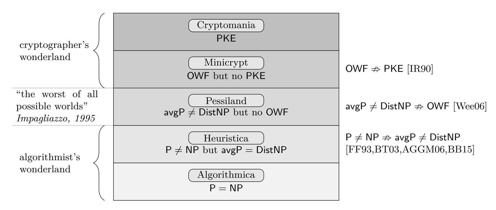
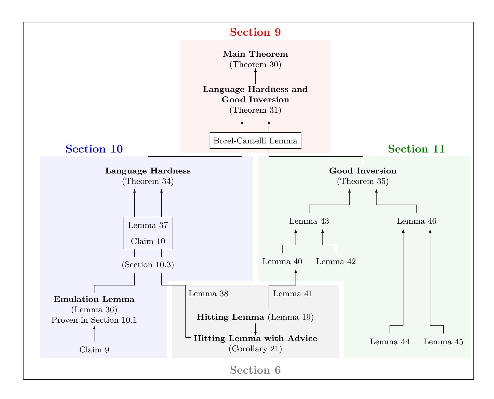
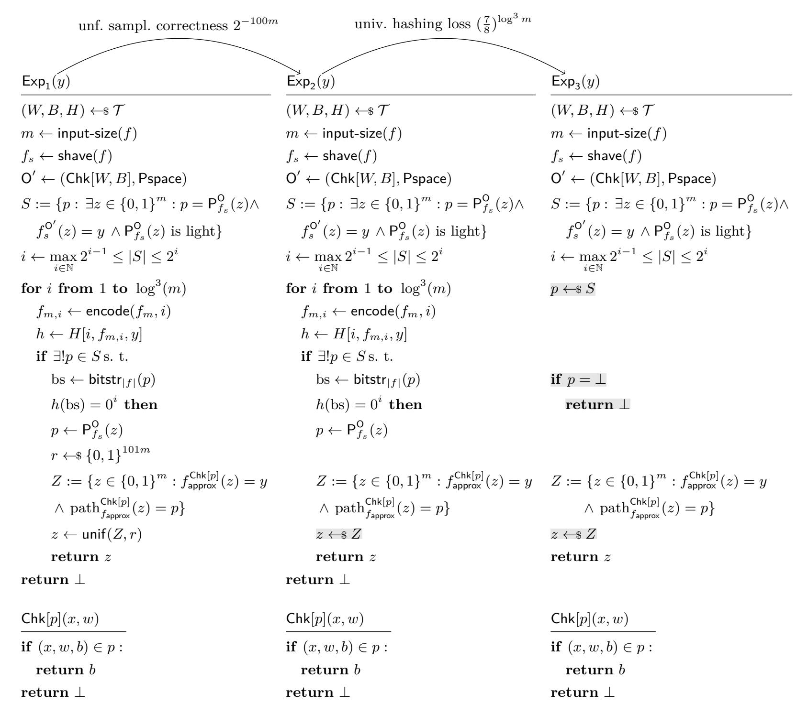

{0}------------------------------------------------

## **On Building Fine-Grained One-Way Functions from Strong Average-Case Hardness**

Chris Brzuska<sup>1</sup> , Geoffroy Couteau<sup>2</sup>

<sup>1</sup> Aalto University, Finland <sup>2</sup> CNRS, IRIF, Université de Paris, France

**Abstract.** Constructing one-way functions from average-case hardness is a long-standing open problem. A positive result would exclude Pessiland (Impagliazzo '95) and establish a highly desirable win-win situation: either (symmetric) cryptography exists unconditionally, or all NP problems can be solved efficiently on the average. Motivated by the lack of progress on this seemingly very hard question, we initiate the investigation of weaker yet meaningful candidate win-win results of the following type: either there are *fine-grained* one-way functions (FGOWF), or nontrivial speedups can be obtained for all NP problems on the average. FGOWFs only require a fixed polynomial gap (as opposed to superpolynomial) between the running time of the function and the running time of an inverter. We obtain three main results:

**Construction.** We show that if there is an NP language having a very strong form of averagecase hardness, which we call *block finding hardness*, then FGOWF exist. We provide heuristic support for this very strong average-case hardness notion by showing that it holds for a random language. Then, we study whether weaker (and more natural) forms of average-case hardness could already suffice to obtain FGOWF, and obtain two negative results:

**Separation I.** We provide a strong oracle separation for the implication (∃ exponentially average-case hard NP language =⇒ ∃ FGOWF).

**Separation II.** We provide a second strong negative result for an even weaker candidate win-win result. Namely, we rule out a relativizing proof for the implication (∃ exponentially average-case NP hard language *whose hardness amplifies optimally through parallel repetitions* =⇒ ∃ FGOWF). This separation forms the core technical contribution of our work.

**Keywords.** Oracle separation; fine-grained one-way function; average-case hardness; exponential hardness; Pessiland

## **1 Introduction**

In his celebrated 1995 position paper [\[Imp95\]](#page-46-0), Impagliazzo describes his personal view of the study of average-case complexity, an emergent (at the time) and fundamental area of computational complexity initiated in a seminal work of Levin [\[Lev86\]](#page-47-0), which aims to characterize NP problems which are not only hard for a worst-case choice of inputs, but also for natural distributions over the inputs. In Impagliazzo's view, our current understanding of the landscape of complexity theory is best described by considering five possible worlds we might live in, which are now commonly known as the *five worlds of Impagliazzo*, corresponding to the five possible outcomes regarding the existence of worst-case hardness in NP, average-case hardness in NP, one-way function, and public-key cryptography. The corresponding five worlds, Algorithmica, Heuristica, Pessiland, Minicrypt, and Cryptomania, and their relations are summarized on Figure [1.](#page-1-0) Algorithmica and Heuristica correspond to the "algorithmist's wonderland", where all NP languages can be decided efficiently on the average. Cryptomania and Minicrypt correspond to the "cryptographer's wonderland",[3](#page-0-0) where one-way functions (and therefore, stream ciphers, signatures, pseudorandom functions, etc.) exist. Eventually, Pessiland is what Impagliazzo describes as "the worst of all possible worlds": a world in which many NP problems might be untractable (even on natural instances), yet no one-way function (and thus no cryptography) exists.

**One-Way Functions based on Average-Case Hardness.** In this article, we study whether (the existence of) average-case hard NP problems imply (the existence of) one-way functions. Conceptually,

<span id="page-0-0"></span><sup>3</sup> Though we heard that lately, some cryptographers have been found dreaming of an even higher heaven, the mysterious land of Obfustopia.

{1}------------------------------------------------

<span id="page-1-0"></span>

Fig. 1: Impagliazzo's five worlds. Known (black-box or oracle) separations are indicated on the right.

a positive answer to this question rules out Pessiland, i.e., it constitutes a win-win result: Either all NP problems can be solved efficiently, on the average, or cryptographic one-way functions exist. Little progress has been made on this question in the past three decades. There is a partial explanation for this lack of success: we know that any construction of one-way functions from average-case hard NP problems must rely on *non-relativizing techniques* (Wee [\[Wee06\]](#page-47-2) attributes this simple observation to Impagliazzo and Rudich). In fact, similar separations [\[IR90,](#page-47-1)[FF93,](#page-46-1)[BT03,](#page-46-2)[AGGM06,](#page-46-3)[BB15\]](#page-46-4) are known between any two of Impagliazzo's worlds. However, outside of Pessiland, the situation is generally somewhat better. At the bottom of the hierarchy, some strong forms of exponential hardness are known to imply average-case hardness in NP (e.g. UP ̸⊆ DTIME(2*<sup>O</sup>*(*n/* log *<sup>n</sup>*) ) =⇒ DistNP ̸⊆ avgP [\[Hir21\]](#page-46-5); see also [\[CHV22\]](#page-46-6) for results on fine-grained average-case hardness within NP from weaker worst-case assumptions). At the top of the hierarchy, we know that *exponentially secure* one-way functions imply a weak, but useful notion of public-key cryptography, namely *fine-grained* public-key cryptography where there is a polynomial (rather than superpolynomial) gap between the time to encrypt and the time needed to break the cryptosystem [\[Mer78,](#page-47-3)[BGI08\]](#page-46-7). Interestingly, the very first publiclyknown work on public-key cryptography, the 1974 project proposal of Merkle[4](#page-1-1) (published much later in [\[Mer78\]](#page-47-3)) achieves exactly such a weak notion of security: Merkle shows that an ideal OWF (modeled as a random oracle) can be used to construct a key agreement protocol where the honest parties run in time *n*, while the best attack requires time *n* 2 . The assumption of an ideal OWF was later relaxed to the existence of exponentially hard OWFs by Biham, Goren and Ishai [\[BGI08\]](#page-46-7). Hence, in essence, Merkle establishes a *weak exclusion* of Minicrypt, by showing that strong hardness in Minicrypt already implies some nontrivial form of public-key cryptography, with a quadratic gap between the attacker's runtime and the honest parties' runtime.

#### **1.1 Our Contribution: Inbetween Heuristica and Pessiland**

The above result suggests a natural relaxation of Impagliazzo's program: rather than ruling out Pessiland entirely, one could hope to show that sufficiently strong forms of average-case hardness suffice to construct weak forms of cryptography. Such a result would still have a very desirable winwin flavor. For example, if one shows that *exponential* average-case hardness implies *fine-grained* one-way functions, it would show that either *all* NP problems admit nontrivial (subexponential) algorithms on the average, or there must exist *some* form of cryptography, with a polynomial security gap. As the computational power increases, such a gap translates to an increasingly larger runtime gap on concrete instances and thus a larger concrete security margin in realistic situations.

We can also consider starting from even stronger forms of average-case hardness. A very natural target is *non-amortizing* average-case hardness, which states (in essence) that deciding whether *k* words (*x*1*,* · · · *, xk*) belong to a language L is *k* times harder (on average) than deciding membership of a single word. This stronger form of average-case hardness is closely related to the widely studied

<span id="page-1-1"></span><sup>4</sup> Ralph Merkle, 1974 project proposal for CS 244 at U.C. Berkeley, <http://www.merkle.com/1974/>

{2}------------------------------------------------

notion of proofs of work [\[BRSV18\]](#page-46-8). Building fine-grained one-way functions from this strong form of average-case hardness would still be a very meaningful win-win result: it would show that either we can obtain nontrivial savings on average for all NP problems when amortizing over many instances (which would be an algorithmic breakthrough), or there must exist some weak form of cryptography.

In this work, we initiate the study of these intermediate layers between Heuristica and Pessiland, obtaining both positive and negative results.

**Fine-Grained OWFs from Block-Finding Hardness.** We mentioned above two natural strengthenings of average-case hardness: exponential average-case hardness, and non-amortizable average-case hardness (deciding whether *k* words (*x*1*,* · · · *, xk*) belong to L is *k* times harder that deciding membership of a single word). Here, we consider even stronger notions: we assume that there is a language where it is already hard to *decide*, given *k* random words (*x*1*,* · · · *, xk*), whether their language membership satisfies some local structure. As a simple example of such a notion, consider the following (average-case) *block-finding hardness* notion: given *k* random words *⃗x* = (*x*1*,* · · · *, xk*) and a *t* ≈ log *k*-bit string *s*, computed as the *t* language membership bits of a randomly chosen sequence of *t* consecutive words in *⃗x*, find these consecutive words. The notion states (informally) that finding such a sequence (when it exists, and with probability significantly better than a random guess) cannot be done much faster than by brute-forcing a significant fraction of all the language membership.

To get an intuition for this problem, it is helpful to consider an even simpler formulation: given *k* random words (*x*1*,* · · · *, xk*) with the promise that *t* consecutive words are not in the language, find these *t* consecutive words (with probability significantly better than 1*/k*). For a very hard language, it is not clear how to do this without naively brute-forcing the language membership of *Ω*(*k/t*) words. We show that this (very strong) average-case hardness notion already gets us outside of Pessiland: if there is a block-finding hard language, then there exists fine-grained one-way functions (with a quadratic hardness gap).

*Heuristically evaluating the assumption on random languages.* Given that this strong form of averagecase hardness is new, we provide some heuristic analysis to support the intuition that it plausibly holds for some hard languages. To do so, we introduce a convenient tool for this heuristic analysis, a *random language model* (RLM), analogous to how the random oracle model [\[BR93\]](#page-46-9) is used to heuristically study the security of constructions when instantiated with a sufficiently strong hash function. The RLM provides oracle access to a truly random NP-language L. In the RLM, each bitstring *x* ∈ {0*,* 1} *n* belongs to L with probability exactly 1*/*2, and the membership witness for a word *x* ∈ L ∩ {0*,* 1} *<sup>n</sup>* is a uniformly random bitstring from {0*,* 1} *n*. [5](#page-2-0) To check membership to the language, the parties have access to an oracle Chk which, on input a pair (*x, w*) ∈ {0*,* 1} *<sup>n</sup>* × {0*,* 1} *<sup>n</sup>*, returns 1 if *x* ∈ L and *w* is the right corresponding witness, and 0 otherwise. Finding out whether a random bitstring *x* ∈ {0*,* 1} *n* belongs to L requires 2 *n*−1 calls to Chk on the average.[6](#page-2-1)

The RLM captures an idealized hard language where it is not only (exponentially) hard to decide language membership, but also hard to sample an element of the language with probability significantly better than 1*/*2 (hence, in particular, it is also hard to generate a word together with the corresponding witness). This captures hard languages where no further structure is assumed beyond the ability to efficiently check a candidate witness; note that the ability to sample instances together with their witness is exactly the additional structure which implies the existence of one-way functions [\[Imp95\]](#page-46-0), hence the question of building one-way functions from average-case hardness asks precisely about whether this can be done without assuming this additional structure to start with.

In this work, we prove that a random language satisfies block-finding hardness, providing some heuristic support for this strong form of average-case hardness. Hence, we get as a corollary:

**Corollary 1 (Informal).** *In the Random Language model, there exists a fine-grained one-way function which can be evaluated with n oracle calls, but cannot be inverted with o*(*n* 2 ) *calls to the random language.*

<span id="page-2-0"></span><sup>5</sup> Of course, this heuristic is simplified: most real languages can have more than a single witness, and the choice of having |*w*| = |*x*| is a somewhat arbitrary way of tuning the hardness to make it exactly 2 *n* . Still, we believe that there is value in using a simple model to heuristically analyze the plausibility of an assumption – even though, as any heuristic model, it must fail on artificial counter examples.

<span id="page-2-1"></span><sup>6</sup> More precisely, it requires 2 *n*−1 calls to Chk on the average to find a witness of language membership if *x* is indeed in the language. In turn, it requires 2 *n* calls to confirm that there is indeed no witness if *x* is not in the language.

{3}------------------------------------------------

*Constructing a FGOWF from block-finding hardness.* At a (very) high level, the construction proceeds as follows: suppose that there exists *hard puzzles* where *sampling* a random puzzle *p* is easy (it takes time, say, *O*(1)), but *finding* the unique solution *s* = *s*(*p*) to the puzzle, and *verifying* that a candidate solution *s* to the puzzle is correct, are comparatively harder (they take some much larger respective times *N*<sup>1</sup> and *N*<sup>2</sup> with *N*<sup>1</sup> ≈ *N*2). For example, such puzzles can be constructed by sampling |*s*| words (*x*1*,* · · · *, x*|*s*|), and asking for the length-|*s*| bitstring of the bits indicating for each word *x<sup>i</sup>* whether it belongs to a given hard language L. Then we construct a fine-grained OWF as follows: an input to the function is a list of *n* puzzles (*p*1*,* · · · *, pn*) for some bound *n*, and an integer *i* ≤ *n*. The function *F*(*p*1*,* · · · *, pn, i*) first solves the puzzle *p<sup>i</sup>* , and outputs the solution *s*(*pi*) together with (*p*1*,* · · · *, pn*). Evaluating *F* takes time *O*(*n*) + *N*1; on the other hand, when L is an ideally hard language, inverting *F* requires brute-forcing many of the *p<sup>i</sup>* , which takes time *O*(*n* · *N*2). Setting *n* ≈ *N*<sup>1</sup> ≈ *N*<sup>2</sup> gives a quadratic hardness gap. We refer to Section [3](#page-8-0) for a technical overview and Section [7](#page-25-0) for a formal proof and analysis of block-finding hardness in the RLM.

**Average-Case Hard Languages and Fine-Grained OWF.** With the above, we know that a sufficiently strong form of average-case hardness suffices to construct fine-grained one-way functions. The natural next question is whether weaker forms of average-case hardness could possibly suffice. We consider the two natural notions we mentioned previously: exponential average-case hardness, and the stronger *non-amortizing* exponential average-case hardness. For both, our main results are negative and rule out relativizing (black-box) constructions.

For exponential average-case hard languages, we show that *any* construction of fine-grained OWF from an (even exponentially) average-case hard language, even with an arbitrarily small polynomial security gap *N*1+*<sup>ε</sup>* (for any absolute constant *ε >* 0), must make non-relativizing use of the language. We prove this by exhibiting an oracle relative to which there exists an exponentially hard language, but no fine-grained one-way functions:

**Theorem 2 (Informal).** *There is an oracle relative to which there exists an exponentially secure average-case hard language, but any candidate fine-grained OWF f can be inverted with probability O*(1) *and O*˜(*N*) *calls to the oracle, where N denotes the number of oracle calls to compute f in the forward direction.*

**Black-Box Separation Between Non-Amortizable Average-Case Hard Languages and Fine-Grained OWF.** We then investigate whether non-amortizability (which states, roughly, that deciding membership of *k* random instances to L should take *O*(*k*) times longer than deciding membership of a single instance to L) suffices to construct fine-grained OWFs. As we explained, this would still constitute a very interesting win-win result: it would show that either weak forms of cryptography exist unconditionally, or nontrivial speedups can be achieved for *all* NP problems *when amortizing over many random instances*. In Section [1.2,](#page-4-0) we sketch a few other motivations for considering nonamortizability.

Unfortunately, our result turns out to be negative: we prove that there is no black-box construction of an *N*1+*<sup>ε</sup>* -hard OWF (where *N* is the time it takes to evaluate the function in the forward direction), for an arbitrary constant *ε >* 0, even from an exponentially average-case hard language whose hardness amplifies at an exponential rate through parallel repetition. Conceptually, our second negative result separates fine-grained one-way functions from a much stronger primitive and can thus be seen as a much stronger result. Note, however, that technically, the two negative results are incomparable since the first one rules out relativizing reductions whereas the latter rules out black-box reductions, see the beginning of Section [3](#page-8-0) for a discussion.

**Theorem 3 (Informal).** *There is no black-box construction of an N*1+*<sup>ε</sup> -hard OWF f, for an arbitrary constant ε >* 0*, from exponentially average-case hard languages* L *whose hardness amplifies at an exponential rate through parallel repetition.*

In the nomenclature of Reingold, Vadhan and Trevisan [\[RTV04\]](#page-47-4), we rule out a ∀∃-weakly-reduction, a slightly weaker notion than a relativizing reduction. Namely, the reduction can access the adversary. Our result becomes a full oracle separation if the fine-grained one-way function *f* would be given black-box access to the adversary A as well. Reingold, Vadhan and Trevisan point out that in some cases, the adversary A can be embedded into the oracle O, but doing so did not seem straightforward

{4}------------------------------------------------

for our case and is left as an open question. In the CAP nomenclature of Baecher, Brzuska and Fischlin [BBF13], we rule out NNN reductions, since the construction f can depend on the language  $\mathcal{L}$ , and the reduction  $\mathcal{C}$  can depend on both, the adversary and the primitive, i.e., each of these dependencies can be seen as non-black-box, thus NNN.

#### <span id="page-4-0"></span>1.2 Why Study Non-Amortizability?

As we explained above, building fine-grained one-way functions from non-amortizable languages would still have interesting win-win implications. Below, we outline two further important reasons to study non-amortizable average-case hardness.

1. Non-amortizability helps circumvent black-box impossibilities. In the past, non-amortizability has proven to be a key feature to overcome black-box impossibility results for cryptographic primitives. For example, the Biham-Goren-Ishai construction [BGI08] of fine-grained key agreement from exponential OWFs only provides an inverse-polynomial bound on the probability that any (subquadratic-time) attacker retrieves the shared key when relying on Yao's XOR Lemma. In turn, when relying on a (plausible) version of the XOR Lemma stating that success probability decreases exponentially fast in the number of XORed instances, the adversary's success probability can be brought down to negligible. Yet, this "Dream XOR Lemma" cannot be proven under black-box reductions [BGI08]. An even more striking example is given by Simon's celebrated black-box separation between one-way functions and collision-resistant hash functions [Sim98]: Holmgren and Lombardi [HL18] recently showed that a one-way product function (i.e., a OWF that amplifies twice, meaning that inverting f on two random images  $(y_1, y_2)$  takes twice the time of inverting f on a single random image) suffices to circumvent Simon's impossibility result and to build a collision-resistant hash function (in a black-box way).

2. A natural and promising attempt towards fine-grained OWFs gets "stuck" at non-amortizable hardness. The goal (FGOWFs from "weaker" assumptions) was set forth in [BRSV17], with a promising path: starting from a worst-case assumption (the strong exponential time hypothesis (SETH)), one gets structured average-case hardness (through the orthogonal vector problem (OV)). Even more, a follow-up work [BRSV18] improved the result further to obtain non-amortizable average-case hardness from SETH via OV. The work of [BRSV17] explicitly asked the following question, which was the initial motivation of our work: can we push this OV-based construction further, up to FGOWFs?

In a bit more details, an OV instance is a pair of sets (U,V) of n vectors from  $\{0,1\}^{\log^2 n}$ , where the goal is to find if there exists  $u \in U$  and  $v \in V$  such that  $\langle u,v \rangle = 0$  over  $\mathbb{Z}$ . The result of [BRSV17] builds upon a polylog-degree polynomial  $P: \mathbb{F}^{2n \log^2 n} \mapsto \mathbb{F}$  over a field  $\mathbb{F}$  such that P(U,V) counts the number of orthogonal pairs (u,v) in (U,V). Then, they prove, via the Berlekamp-Welch algorithm, that if P can be computed on a random input  $x \in \mathbb{F}^{2n \log^2 n}$  in time  $O(n^{1+\varepsilon})$ , OV can be solved in time  $\tilde{O}(n^{1+\varepsilon})$  in the worst-case. [BRSV18] extends this to show that even amortizing the computation of P over many random inputs  $(x_1, \dots, x_\ell)$  is hard under the worst-case hardness of OV (which is implied by SETH).

One way to read our contributions is the following: our positive result can easily be framed as an OV-based construction, where solving a block x becomes computing P(x), where P is an explicit low-degree polynomial, and the hardness of inverting our candidate reduces to the hardness of finding, given  $(x_1, \dots, x_\ell)$  and  $y \in \mathbb{F}$ , an  $x_i$  such that  $P(x_i) = y$ . On the other hand, the key worst-case to average-case reduction in [BRSV17,BRSV18] builds upon the Berlekamp-Welch algorithm, which appears inherently stuck at showing the worst-case hardness (under SETH) of evaluating P on many random inputs  $(x_1, \dots, x_\ell)$  (that is, we get non-amortizing average case hardness for P). Blockfinding hardness formalizes what we would need to prove to achieve FG-OWF from SETH through this approach. Then, our last separation says: the further the Berlekamp-Welch techniques seems to get us (i.e., to non-amortizing hardness) will not suffice (in a black-box way) to obtain this form of hardness, with any candidate construction. In other words, we need new non-relativizing techniques that go beyond the Berlekamp-Welch algorithm.

On Basing FGOWF on the average-case hardness of a concrete NP-complete language. Our impossibility results rule out constructions of fine-grained one-way function that would work using black-box access to an arbitrary average-case hard language. However, it seems plausible that a construction of FGOWFs from the average-case hardness of an arbitrary language could proceed differently. Typically,

{5}------------------------------------------------

such a construction could first reduce the language to a SAT instance (or any other NP-complete problem) using a non-relativizing reduction. Then, the construction of FGOWF would build upon the concrete structure of SAT; such a construction would not be ruled out by our results.

In this setting, our negative results should be interpreted as saying that if such a construction is possible, then it must crucially rely on specific structural hardness properties of the chosen language, and not solely on natural properties such as its exponential hardness, or its non-amortizability. This is especially relevant in the context of the attempt of [\[BRSV17\]](#page-46-12) to get fine-grained OWF under SETH via the OV problem, which gets average-case hardness and proof of works, but gets "stuck" at a non-amortizable language, which we show does not suffice (in a relativizing way) to get all the way to fine-grained OWFs.

In fact, we initially designed the construction of FGOWF from block-finding hardness as a construction based on the average-case hard puzzles of [\[BRSV18\]](#page-46-8), and dedicated an important effort to trying to reduce its security to the non-amortizable average-case hardness of this puzzle, viewing this approach as the most promising direction to base FGOWFs on a worst-case hardness assumption such as SETH. After failing to prove it secure, we realized that our lack of success might be inherent, and turned this realization into a proof by demonstrating the impossibility of basing a FGOWF on non-amortizing hardness in a blackbox way. We hope and believe that our negative results will therefore guide future attempts of basing FGOWFs on weaker assumptions, even attempts that do not ultimately aim at building them from arbitrary hard languages.

#### **1.3 A Core Abstract Lemma: the Hitting Lemma**

At the heart of both our positive result and our black-box separations is an abstract lemma, which we call the *Hitting Lemma*. While the statement of the lemma is very intuitive, its proof is quite technical, and forms one of the core technical contributions of this work. In its abstract form, the Hitting Lemma is a very general probability statement about a simple two-player game between a challenger and an adversary. It shows up naturally on three seemingly unrelated occasions in our work, hence it seems likely that it can have other applications, and we believe it to be of independent interest.

At a high level, the Hitting Lemma provides a strong Chernoff-style bound on the number of witnesses which an adversary can possibly find given oracle access to the relation of a hard language. More precisely, we state the Hitting Lemma in an abstract way, as a game with the following structure:

- **–** First, the game chooses a list of sets *V<sup>i</sup>* . Each set *V<sup>i</sup>* has size bounded by some value 2 *<sup>n</sup>* and can be thought of as the set of *candidate witnesses* for a size-*n* word.
- **–** In each set *V<sup>i</sup>* , the game chooses a uniformly random witness *r<sup>i</sup>* . The sets *V<sup>i</sup>* are allowed to have different sizes, to capture the more general setting where the adversary already obtained preliminary information excluding candidate witnesses.
- **–** Eventually, the adversary interacts with an oracle Guess*r*1···*r<sup>ℓ</sup>* which, on input (*i, x*), returns 1 if *x* = *r<sup>i</sup>* and ⊥ otherwise.

We call a query (*i, x*) such that Guess*r*1···*r<sup>ℓ</sup>* (*i, x*) = 1 a *hitting query* (or a *hit*). The goal of the adversary is to get as many distinct hits as possible within a bounded number of queries. Intuitively, the most natural strategy to maximize the number of hits is to proceed as follows: first pick the smallest set *V<sup>i</sup>* , and query arbitrary positions one by one, until a hit is obtained. Then, pick the second smallest set *V<sup>j</sup>* and keep proceeding the same way, until all of the *r<sup>i</sup>* are found or the query budget is exhausted.

In essence, the Hitting Lemma states that the above natural strategy is really the best possible strategy, in a strong sense. Namely, denoting *m<sup>Q</sup>* the average number of hits obtained by a *Q*-query adversary following the above strategy, the Hitting Lemma shows that for *any* possible adversarial strategy, the probability of getting *O*(*mQ*)+*c* distinct hits using *Q* queries decreases exponentially with *c* (for some explicit constant in the *O*(·)). The proof combines a reduction to a simpler probabilistic statement, proven by induction over *Q*, with a tight concentration bound on the winning probability of the above natural strategy.

Interestingly, the Hitting Lemma extends directly to the non-uniform setting, where the adversary is allowed to receive an arbitrary *k*-bit advice about the Guess oracle; this property turns out to be crucial in some of our results. Our bound shows that this advice cannot provide more than *k* additional hits. More precisely, for any possible adversarial strategy where the adversary receives an arbitrary

{6}------------------------------------------------

*k*-bit advice about the oracle, the probability of getting *O*(*mQ*) + *k* + *c* hits decreases exponentially with *c*. We refer to Section [6](#page-17-0) for the full statement and analysis of the Hitting Lemma. Interestingly, the Hitting Lemma extends directly to the non-uniform setting, where the adversary is allowed to receive an arbitrary *k*-bit advice about the Guess oracle; this property turns out to be crucial in some of our results. Our bound shows that this advice cannot provide more than *k* additional hits. More precisely, for any possible adversarial strategy where the adversary receives an arbitrary *k*-bit advice about the oracle, the probability of getting *O*(*mQ*) + *k* + *c* hits decreases exponentially with *c*. We refer to Section [6](#page-17-0) for the full statement and analysis of the Hitting Lemma.

*Analogy with the ROM.* In the Random Oracle Model, a long line of work (see for example [\[Hel80\]](#page-46-13), [\[Unr07,](#page-47-6)[DGK17,](#page-46-14)[CDGS18\]](#page-46-15) and references therein) has established the hardness of inverting an idealized random function in a non-uniform setting, given a bounded-length advice about the oracle. These results have proven to be important and powerful tools to reason about the Random Oracle Model. At a high level, the hitting lemma provides a comparable tool in the Random Language Model and captures the hardness of *deciding language membership* for an idealized hard language, even given a non-uniform advice, and even when the adversary tries to amortize over many instances.

#### **1.4 Related Work**

*Fine-Grained Cryptography.* We already pointed out that Merkle's construction [\[Mer78\]](#page-47-3) provides the first example of fine-grained cryptography (as well as the first known example of public-key cryptography). It was further studied in [\[BGI08](#page-46-7)[,BM09\]](#page-46-16), and generalized to the quantum setting in [\[BS08,](#page-46-17)[BHK](#page-46-18)<sup>+</sup>11]. Fine-grained cryptography has only become a more active subject of study in recent years. The work of [\[BRSV17,](#page-46-12)[BRSV18\]](#page-46-8) constructs proofs of work from explicit fine-grained average-case hard languages which can be based on the strong exponential-time hypothesis (SETH), and explicitly poses the problem of building fine-grained one-way functions (while showing some barriers for basing them on SETH via natural approaches). The work of [\[DVV16\]](#page-46-19) studies a different form of fine-grained cryptography, showing cryptosystems secure against resource-bounded adversaries, such as adversaries in NC1, under a worst-case hardness assumption. Eventually, the work of [\[LLW19\]](#page-47-7) is the most closely related to ours: it shows constructions of fine-grained one-way functions and fine-grained encryption schemes from the average-case hardness of concrete problems, such as the Zero-*k*-Clique problem.

*Hardness in Pessiland.* While building one-way functions from average-case hardness has remained elusive, some works have investigated other useful forms of hardness which could possibly reside in Pessiland. In particular, Wee [\[Wee06\]](#page-47-2) shows that the existence of non-trivial succinct 2-round argument systems for some languages in NP cannot be excluded from Pessiland in a black-box way.

*Oracle Techniques.* Besides new ideas, our oracle separation relies on several established techniques. We use the *two-oracle* technique of [\[Sim98](#page-47-5)[,HR04\]](#page-46-20) where one oracle implements the base primitive and the second oracle breaks constructions built from this primitive. As we argue about the *efficiency* of the constructed one-way function, we use similar techniques to Gennaro and Trevisan [\[GT00\]](#page-46-21) who describe the emulation of a random oracle based on a bounded-length string, implicitly applying a compression argument. We use Borel-Cantelli to extract a single oracle from a distribution of random oracles as the seminal work on black-box separations by Impagliazzo and Rudich [\[IR89\]](#page-47-8). In order to make our oracle deterministic, we use the hashing trick of Valiant-Vazirani [\[VV85\]](#page-47-9) to obtain a unique value out of many pre-image for a one-way function. In particular, we hash *evaluation paths* similar to Bogdanov and Brzuska [\[BB15\]](#page-46-4) who separate size-verifiable one-way functions from NP-hardness.

*Relation to Pass-Venkitasubramaniam.* Pass and Venkitasubramaniam [\[PV20\]](#page-47-10) show that TFNP (the class of total NP search problems) is unconditionally hard in Pessiland. More precisely, they show the following: if there exists average-case hard languages, then either there exists average-case hard TFNP problems, or there exists one-way functions. We note that, since their constructions are blackbox, combining their result with our work further implies the following result stating that proving that *total search* average-case hardness suffices to construct fine-grained one-way functions is likely to be hard, since any such black-box proof would unconditionally imply the existence of (full-fledged) one-way functions:

{7}------------------------------------------------

**Theorem 4 (this work + [\[PV20\]](#page-47-10), informal).** *If there is a black-box construction of N*1+*<sup>ε</sup> -hard one-way function, for an arbitrary constant ε >* 0*, from average-case* TFNP *hardness, then one-way functions exist unconditionally.*

*Relation to Liu-Pass* Liu and Pass [\[LP20\]](#page-47-11) show that mild average-case hardness of computing timebounded Kolmogorov complexity already suffices to establish (in a black-box way) the existence of one-way functions. In particular, we note that, combined with our results, this implies that even exponentially-strong, self-amplifiable average-case hardness in NP does not imply (in a black-box way) mild average-case hardness of time-bounded Kolmogorov complexity.

**Theorem 5 (this work + [\[LP20\]](#page-47-11), informal).** *There is no black-box reduction from the mild average-case hardness of computing time-bounded Kolmogorov complexity to the existence of exponentially average-case hard languages whose hardness amplifies at an exponential rate via parallel repetition.*

## **2 Preliminaries**

#### **2.1 Notation, Computational Models and Oracles**

For any *n* ∈ N, [*n*] denotes the set {1*,* · · · *, n*}. Throughout this paper, we represent algorithms as families of boolean circuits (one for each input length), and use circuit size (i.e., the number of wires) as the main measure of efficiency. We model oracle access by allowing circuits to have oracle gates. We measure the size of such an oracle circuit as for a standard circuit, by the number of its wires. Typically, if an oracle takes an *n*-bit entry as input and outputs an *m*-bit response, this will be modeled by a fan-in-*n* fan-out-*m* oracle gate (hence this gate will contribute *n*+*m* to the total circuit size).

As in the standard model for boolean circuits, wires typically carry bit values. For simplicity and readability, we will generally allow the wires to directly carry other special symbols, such as ⊥ and err (converting a circuit in this model to a "purely boolean" circuit only introduces some constant blowup which has no impact on our asymptotic results). By default, even when we do not mention it explicitly, we allow all (standard and oracle) gates to receive the symbol err as one of their inputs. If a gate receives err as one of its inputs, it returns the err on all of its output wires. We use pseudo-code as a description language and only argue about the size of the corresponding circuit informally.

#### **2.2 Fine-Grained One-Way Functions**

We start by introducing the notion of a fine-grained one-way function (FG-OWF) *f* which we model as a family {*fm*}*<sup>m</sup>* of circuits, one for each input size, so that the runtime of *f<sup>m</sup>* is |*fm*|. At a high level, *f* is an (*ε, δ*)-FG-OWF if all circuits of (slightly higher) size *o*(|*fm*| 1+*δ* ) have probability at most *ε* to find a preimage of *fm*(*x*) for a random input *x*.

**Definition 6 (Fine-Grained One-Way Function).** *Let ε* : N 7→ R <sup>+</sup> *be a positive function and δ >* 0 *be a constant. A function f* : {0*,* 1} <sup>∗</sup> → {0*,* 1} ∗ *is an* (*ε, δ*)*-fine-grained one-way function if for all circuit families* C = {C*m*}*m*∈<sup>N</sup> *and all large enough m, if* |C*m*| *<* |*fm*| 1+*δ , then we have*

$$\Pr_{z \leftarrow \$\{0,1\}^m} \left[ \mathcal{C}_m(f(z), 1^m) \in f^{-1}(f(z)) \right] \le \varepsilon(m).$$

One can also consider a slightly weaker notion, namely a fine-grained one-way *function distribution* (FG-OWFD), were the hardness of inversion only holds with respect to a randomly sampled function *f* from a distribution *D*.

**Definition 7 (Fine-Grained One-Way Function Distribution).** *Let ε* : N 7→ R <sup>+</sup> *be a positive function and δ >* 0 *be a constant. A distribution D over functions f* : {0*,* 1} <sup>∗</sup> → {0*,* 1} ∗ *is an* (*ε, δ*) *fine-grained one-way function distribution if for all circuit families* C = {C*m*}*m*∈<sup>N</sup> *and all large enough m, if* |C*m*| *<* |*fm*| 1+*δ for all f in the support of D, then it holds that*

$$\Pr_{z \leftarrow \$\{0,1\}^m, f \leftarrow \$D} \left[ \mathcal{C}_m(f, f(z), 1^m) \in f^{-1}(f(z)) \right] \le \varepsilon(m).$$

Any distribution over FG-OWFs induces a FG-OWFD, but the converse need not hold in general.

{8}------------------------------------------------

#### 2.3 Languages

The class NP contains all languages  $\mathcal{L}$  of the form  $\mathcal{L} = \{x \mid \exists w, (|w| = \text{poly}(|x|)) \land (\mathcal{R}(x, w) = 1)\}$ , where  $\mathcal{R}$  is a relation computable by a polysize uniform circuit. This definition naturally extends to the case where an oracle O is available; in this case, we say that the oracle language  $\mathcal{L}^{O}$  is in NP<sup>O</sup> if it is of the above form, where  $\mathcal{R}$  is computable by a uniform oracle circuit with  $|\mathcal{R}| = \text{poly}(|x|)$ . When the oracle O is clear from the context, we will sometimes abuse this notation and simply say that the oracle language  $\mathcal{L}^{O}$  is in NP. For a string x, we will denote by  $\mathcal{L}(x)$  the bit which is 1 if  $x \in \mathcal{L}$ , and 0 otherwise. We will also extend this definition to vectors of strings  $\vec{x}$  in a natural way.

**Average-Case Hard Languages.** We now define (exponentially) average-case hard languages (EACHLs). Note that the exponential hardness in the following definition refers to the success probability of the algorithm.

**Definition 8 (Exponential Average-Case Hardness).** A language  $\mathcal{L}$  is exponentially average-case hard if for any circuit family  $\mathcal{C} = \{\mathcal{C}_n\}_{n \in \mathbb{N}}$  and all large enough n,

$$\Pr_{x \leftarrow \$\{0,1\}^n} [C_n(x) = \mathcal{L}(x)] \le \frac{1}{2} + \frac{|C_n|}{2^n}.$$

Note that in the most common definition of EACHLs, one does usually not consider an exact bound  $|\mathcal{C}_n|$ , and instead define a language to be exponentially hard if a polytime algorithm  $\mathcal{C}_n$  finds  $\mathcal{L}(x)$  with probability at most  $1/2 + \text{poly}(n)/2^n$  for a random word  $x \in \{0,1\}^n$ . However, since we will work in the fine-grained setting, we settle for a stricter definition, with an explicit relation between the running time of  $\mathcal{C}_n$  and the probability of finding  $\mathcal{L}(x)$ . Similarly as for FG-OWFs, we can also define a weaker notion of exponential average-case hard language distributions (EACHLD):

**Definition 9 (Exponential Average-Case Hard Language Distribution).** A distribution D over languages  $\mathcal{L}$  is exponentially average-case hard if for any circuit family  $\mathcal{C} = \{\mathcal{C}_n\}_{n \in \mathbb{N}}$  and all large enough n,

$$\Pr_{x \leftarrow \$\{0,1\}^n, \mathcal{L} \leftarrow \$D}[\mathcal{C}_n(x,\mathcal{L}) = \mathcal{L}(x)] \le \frac{1}{2} + \frac{|\mathcal{C}_n|}{2^n}.$$

Note that any distribution over EACHLs induces an EACHLD, but the converse need not hold in general.

#### 2.4 Pairwise independent hash-functions

**Definition 10.** For all  $j, i \in \mathbb{N}$ , we call a distribution  $\mathcal{H}_{j,i}$  over functions  $h : \{0,1\}^j \mapsto \{0,1\}^{i+2}$  a distribution of pairwise independent hash-functions, if for all  $p, p' \in \{0,1\}^j$  with  $p \neq p'$ , it holds that

$$\Pr_{h \leftarrow \$\mathcal{H}_{j,i+2}} \left[ h(p) = 0^{i+2} \right] = 2^{-i-2}$$

$$\Pr_{h \leftarrow \$\mathcal{H}_{j,i+2}} \left[ h(p') = 0^{i+2} \right] = 2^{-i-2}$$

$$\Pr_{h \leftarrow \$\mathcal{H}_{j,i+2}} \left[ h(p) = h(p') = 0^{i+2} \right] = 2^{-2i-4}$$

The following fact is used, e.g., by Valiant and Vazirani in their randomized reduction which solves SAT given a UniqueSAT oracle [VV85].

<span id="page-8-2"></span>Claim 1 For all sets  $S \subseteq \{0,1\}^j$  such that  $2^i \leq |S| \leq 2^{i+1}$ , it holds that

$$\Pr_{h \leftarrow \$\mathcal{H}_{j,i+2}} \left[ \exists! p \in S : \ h(p) = 0^{i+2} \right] \ge \frac{1}{8}.$$

## <span id="page-8-0"></span>3 Technical Overview: FGOWFs from Block-Finding Hardness

We first introduce the Random Language Model (RLM), which captures idealized average-case hard languages, in the same way that random oracles capture idealized one-way functions.<sup>7</sup> We will use this

<span id="page-8-1"></span><sup>&</sup>lt;sup>7</sup> More formally, since we consider an oracle sampled from a distribution over oracles, as for the Random Oracle Model, this captures average-case hard *language distributions*. I.e., the hardness of a language is averaged over the choice of the instance *and* the sampling of the oracle.

{9}------------------------------------------------

model as a heuristic tool to analyze the new form of average-case hardness which we will introduce next. We note that this model has limitations: it is a simplified model, and it is actually not too hard to directly build a fine-grained OWF in this model (e.g. one can define the function F which maps x to the list of language memberships of the words  $x||1, x \cdots, x||n'$ , for an appropriate choice of  $n'^8$ ). However, such simplified constructions do not correspond to any natural form of average-case hardness that could be formulated on standard NP languages. Rather, our goal is only to use the RLM as a heuristic rule of thumb to evaluate the plausibility of our new average-case hardness notion.

We define a random language  $\mathcal{L}$  as follows: for each integer n and each word  $x \in \{0,1\}^n$ , sample a uniformly random bit B[x]. Then the elements of  $\mathcal{L}$  are all x with B[x] = 1. For notational convenience, we extend this notation to vectors: given a vector  $\vec{x}$  of words,  $B(\vec{x})$  denotes the vector of the bits  $B[x_i]$ . For each  $x \in \{0,1\}^n$ , we also sample a uniformly random witness  $W[x] \leftarrow \{0,1\}^n$ . To check membership to the language, we introduce an oracle Chk defined as follows: on input a pair (x, w), the oracle checks whether B[x] = 0 or  $w \neq W[x]$ . If one of these conditions hold, it outputs  $\bot$ ; otherwise, it outputs 1 (See Figure 2). It is relatively easy to see that to check membership of a candidate word x to  $\mathcal{L}$  given access to Chk, the best possible strategy is to query (x, w) for all possible values  $w \in \{0,1\}^n$ , hoping to hit the uniformly random value W[x]. Hence, deciding membership of a word x to  $\mathcal{L}$  requires on the average  $2^{n-1}$  queries to Chk, which shows that  $\mathcal{L}$  is (exponentially) average-case hard.

We now define the notion of block-finding hardness. We will show that (1) block-finding hardness holds for a random language, and (2) if there is a block-finding hard language, then there is an explicit construction of a FG-OWF f such that every adversary running in time  $N(n)^{2-\nu}$  for an arbitrarily small constant  $\nu$  has only a negligible probability of inverting f (in n) – id est, there exists a (negl(n), 1 –  $\nu$ )-FG-OWF, where negl(n) denotes some negligible function of n.

<span id="page-9-1"></span>

| Distribution $\mathcal{T}$     | Chk[W,B](x,w)                            |
|--------------------------------|------------------------------------------|
| for $n \in \mathbb{N}$ :       | $\mathbf{if} \ W[x] = w \wedge B[x] = 1$ |
| for $x \in \{0,1\}^n$ :        | return 1                                 |
| $W[x] \leftarrow \$ \{0,1\}^n$ | else return $\perp$                      |
| $B[x] \leftarrow \$ \{0,1\}$   |                                          |
| $\mathbf{return}\ (W,B)$       |                                          |

Fig. 2: Distribution  $\mathcal{T}$  for sampling a random language  $\mathcal{L}^{\mathsf{O}} = \{x \in \{0,1\}^* \mid B[x] = 1\}$  with associated list of witnesses W. The oracle  $\mathsf{O} = \mathsf{Chk}[W,B]$  allows to check membership of a word  $x \in \mathcal{L}^{\mathsf{O}}$  given witness W[x].

#### 3.1 Block-Finding Hardness of $\mathcal{L}$

Informally, we say that a language satisfies block-finding hardness if for any adversary  $\mathcal{A}$  and any large enough n, the following holds: The adversary  $\mathcal{A}$  is given  $N \leq 2^n/k$  many length-k vectors  $\vec{x_i}$  of distinct words  $x_{i,j} \in \{0,1\}^n$  together with the string  $s = B[\vec{x_i}]$  (the vector of language membership bits for the words in  $\vec{x_i}$ ) for a uniformly random block index  $i \leftarrow [N]$ . If  $\mathcal{A}$  finds the block index i with probability significantly better than guessing, it must run in time  $\tilde{\Omega}(N \cdot 2^n)$  (in the RLM, this corresponds to making  $\tilde{\Omega}(N \cdot 2^n)$  queries to Chk). Intuitively, this means that (up to polylogarithmic factors) the best strategy to find i is to find out the language membership bits of some of the words in each of the blocks, by brute-forcing every possible witness for these words, until one finds membership bits that are consistent with s. Slightly more formally, we show the following:

Lemma 11 (Block-Finding Hardness of  $\mathcal{L}$  – Informal Version). For any adversary  $\mathcal{C}$ ,  $n \in \mathbb{N}$ , block size k, and number of blocks N (with  $k \cdot N \leq 2^n$ ), and any tuple of blocks  $(\vec{x_i})_{i \leq N} = (x_{i,1}, \dots, x_{i,k})_{i < N}$  such that all the  $x_{i,j}$  are distinct:

$$\Pr_{i \leftarrow \$[N]} [\mathcal{C}_n((\vec{x_j})_j, B[\vec{x_i}]) = i] \le \frac{1}{\tilde{O}(N)} \cdot \left(\frac{|\mathcal{C}_n|}{2^n} + 1\right) \cdot 2^{O(k)}.$$

In the RLM, the language  $\mathcal{L}$  satisfies block-finding hardness essentially because distinct words have truly independent witnesses and language membership bits. More formally, the above lemma will follow from a strong and generic concentration bound, the *hitting lemma*. We state and formally prove the hitting lemma separately in Section 6, Lemma 19, since it turns out that this lemma provides a very convenient and versatile tool to bound the success probability of an adversary which attempts

<span id="page-9-0"></span><sup>&</sup>lt;sup>8</sup> We thank an anonymous reviewer for pointing out this construction.

{10}------------------------------------------------

to decide membership of words in an oracle language (the hitting lemma will be needed on three different occasions in this paper). In the context of proving the block-finding hardness of  $\mathcal{L}$ , we will need a variant of the hitting lemma of the following form:

<span id="page-10-0"></span>Lemma 12 (Simplified Hitting Lemma with Advice – Informal Version). For every integers  $n, N, k \in \mathbb{N}$  with  $kN \leq 2^n$ , vector  $\vec{y}$  of kN words, adversary  $\mathcal{A}$  getting  $\vec{y}$  and  $B[\vec{y_i}]$  for a random i (where  $\vec{y_i}$  is a vector of k words), and for every integer  $c \geq 1$ ,

$$\Pr_{(W,B)\leftarrow\mathcal{T}}\left[\#\mathsf{Hit} \geq \frac{O(|\mathcal{A}|)}{2^n} + k + c\right] \leq 2^{-O(c)},$$

where #Hit counts the number of witnesses found by  $\mathcal{A}$  for distinct words of length n among the entries of  $\vec{y}$ .

At the same time, conditioned on making less than M hits in different blocks, it is straightforward to show that  $\mathcal{A}$  can find i with probability M/N: intuitively, this is because if i belongs to one of the N-M blocks where no hits were made, then the indices of all these blocks are perfectly equiprobable conditioned on the view of  $\mathcal{A}$ . Applying Bayes rule to combine the above bounds, the probability that  $\mathcal{A}$  finds i is upper bounded by the probability that  $\mathcal{A}$  finds i conditioned on making less than M hits, plus the probability of making more than M hits. Therefore, for any M, the probability that  $\mathcal{A}$  finds i is upper bounded by

$$\frac{M}{N} + 2^{-O(M-|\mathcal{A}|/2^n - k)}.$$

From there, an appropriate choice of M (depending on  $|\mathcal{A}|, N$ , and n) suffices to conclude that  $\mathcal{A}$  finds i with probability at most  $\frac{1}{\tilde{O}(N)} \cdot \left(\frac{|\mathcal{C}_n|}{2^n} + 1\right) \cdot 2^{O(k)}$ , which concludes the proof.

From Block-Finding Hardness to Fine-Grained One-Way Function. A block-finding hard language immediately leads to a FG-OWF with a quadratic hardness gap: the input to the function is a list of  $N=2^n/k$  blocks  $\vec{x}$  of distinct words  $\vec{x_i}$  together with an index i. Evaluating the function is done by brute-forcing the languages membership bits of the words in  $\vec{x_i}$ , which takes at most  $k \cdot 2^n$  queries to Chk, and outputting  $(\vec{x}, s = B[\vec{x_i}])$ . By the block finding hardness of  $\mathcal{L}$ , inverting the function on a random input, on the other hand, requires  $\tilde{O}(N \cdot 2^n) = \tilde{O}(2^{2n}/k)$  queries to Chk to succeed with constant probability when the index i is uniquely defined (i.e., there is a unique index i such that the block  $\vec{x_i}$  satisfies  $s = B[\vec{x_i}]$ ). This can be guaranteed to hold except with negligible probability, by choosing  $k = \omega(\log n)$ . Overall, this leads to a FG-OWF with quadratic hardness gap (up to polylogarithmic factors), with some small but non-negligible inversion probability  $\varepsilon$ . Parallel amplification can then be used to make the inversion probability negligible, leading to the following corollary:

Corollary 13. For any  $\varepsilon > 0$ , there exists a  $(\text{negl}(m), 1 - \varepsilon)$ -fine-grained one-way function distribution in the Random Language Model.

## 4 Overview: no FGOWFs from Average-Case Hardness

Next, we study the possibility of instantiating the above construction using an average-case hard language, instead of a block-finding hard language. At first sight, it is not clear that average-case hardness suffices, since our construction crucially relies on the block-finding hardness of the language, a seemingly much stronger property. Indeed, we show that there exists no construction of essentially any non-trivial FG-OWF making a black-box use of an exponentially average-case hard language. To do so, we exhibit an oracle distribution relative to which there is an exponentially average-case hard language, but no FG-OWF, even with arbitrarily small hardness gap. This proof is the only part of our paper that does not require the hitting lemma.

**Language Description.** We start by introducing our language. Our oracle defines a somewhat exotic language: for each integer k, we let all words  $x \in \{0,1\}^n$  such that  $k = \lceil \log n \rceil$  have the same random witness  $w \leftarrow \{0,1\}^{2^k}$ , and we put either all these words simultaneously inside or outside the

{11}------------------------------------------------

language, by picking the same random membership bit  $b_k$  for all of them. Intuitively, this provides an extreme example of a language which is still hard to decide (since given a word  $x \in \{0,1\}^n$ , one must still enumerate over  $2^{2^{\lceil \log n \rceil}} > 2^n$  candidate witnesses to find out whether  $x \in \mathcal{L}$ ), but whose hardness does not amplify at all (since finding a witness for a single word x gives the witness for all words whose bitlength is close to that of x). This aims at capturing the intuition that any candidate FG-OWF built from an average-case hard language  $\mathcal{L}$  must somehow leverage some amplification properties of the hardness of  $\mathcal{L}$ . Then, the oracle Chk is similar as before: on input (x, w), it returns  $\bot$  if  $x \notin \mathcal{L}$  or w is not the right witness for x, and 1 otherwise. We will show that any oracle adversary  $\mathcal{A}$  requires  $O(2^n)$  queries to decide membership of a word  $x \in \{0,1\}^n$  to  $\mathcal{L}$ . The proof is relatively straightforward and relies on the fact that the membership of x to  $\mathcal{L}$  remains random conditioned on the view of  $\mathcal{A}$  as long as  $\mathcal{A}$  did not make any hit, i.e., a query with the right witness for x.

Inexistence of FG-OWF Relative to Chk. Next, we show that for any constant  $\delta$ , there exists an oracle algorithm  $\mathcal{A}$  such that for any candidate FG-OWF f,  $\mathcal{A}$  (given access to Chk) of size bounded by  $|f|^{1+\delta}$  which inverts f with probability 0.99. The adversary works as follows: for any integer k, it checks whether the function will make "too many" queries of the form (x,w) with x of length n such that  $k = \lceil \log n \rceil$  (we call this a k-query), where "too many" is defined as  $(2^{2^k})^{\varepsilon}$  for a value  $\varepsilon = (1 + \delta/2)^{-1}$ . Intuitively, making more than this number of queries ensures that f will have a noticeable probability of making a hitting query. For all such "heavy queries",  $\mathcal{A}$  makes all possible  $(2^{2^k})$  queries to Chk with respect to some fixed word x, until he finds the witness.  $\mathcal{A}$  also does the same for all k-queries with  $k \leq B(\varepsilon)$  for some bound  $B(\varepsilon)$  to be determined later, even when they do not correspond to heavy query (this is to avoid some "border effects" of small queries in the probability calculations). Note that this allows  $\mathcal{A}$  to find the witness for all words of length n such that  $k = \lceil \log n \rceil$ , since they all share the same witness.  $\mathcal{A}$  defines the following oracle-less function f' that contains all the hardcoded witnesses that  $\mathcal{A}$  recovered. Now, on input x, f' runs exactly as f and if f makes a k-query (x, w) for some k, then f' proceeds as follows:

- If k corresponds to a heavy query, then, using  $(2^{2^k})$  queries,  $\mathcal{A}$  already computed the witness for all k-queries and thus f' contains the hardcoded witness to correctly answer the query.
- If k does not correspond to a heavy query, f' simulates the answer of the oracle as  $\perp$ .

We prove that with high probability (at least 0.999), the function f' agrees with f on a random input x; this is because f' disagrees with f only if there is a k-query with k > 10 where f makes less than  $(2^{2^k})^{\varepsilon}$  queries, yet hits a witness (for all other types of queries,  $\mathcal{A}$  finds the witness by brute-force, hence it can always simulate correctly the answer of the oracle). But this happens only with probability  $1 - \sum_{k=B(\varepsilon)+1}^{\infty} (2^{2^k})^{\varepsilon} \cdot 2^{-2^k}$ , which is bounded by 0.999 by picking a sufficiently large bound  $B(\varepsilon)$  such that  $(1-\varepsilon)2^{B(\varepsilon)} > B(\varepsilon)$ . Then, by a straightforward probability calculation, the probability that inverting f' (which  $\mathcal{A}$  can easily do locally since f' is oracle-less) corresponds to successfully inverting f on a random input x can be lower-bounded by 0.999<sup>2</sup> > 0.99, which concludes the proof.

#### <span id="page-11-0"></span>5 Overview: no FG-OWF from Non-Amortizable Hardness

Note that the techniques from our simpler oracle separation crucially exploit that the hardness of the average-case hard language implemented by Chk does not amplify well (in fact, this is the reason why the hitting lemma is not needed in the analysis). We are thus interested in understanding whether we can still provide a black-box impossibility result even when the underlying average-case hard language satisfies non-amortizable exponential hardness, or whether non-amortizable average-case hard languages suffice to construct a fine-grained one-way function.

We call a language  $\mathcal{L}$  (exponentially) self-amplifiable average-case hard if for any superlogarithmic (computable, total) function  $\ell(\cdot)$ , for any circuit family  $\mathcal{C} = \{\mathcal{C}_n : \{0,1\}^{\ell(n)\cdot n} \mapsto \{0,1\}^n\}_{n\in\mathbb{N}}$  of size at most  $2^{O(n)} \cdot \ell(n)$ , and for all large enough  $n \in \mathbb{N}$ ,

$$\Pr_{\vec{x} \leftarrow \$\{0,1\}^{\ell \cdot n}} [\mathcal{C}_n(\vec{x}) = \mathcal{L}(\vec{x})] \leq \mathsf{poly}(n) \cdot 2^{-\left(\ell(n) - \frac{\tilde{O}(|\mathcal{C}_n|)}{2^{O(n)}}\right)}.$$

Informally, this means that to find the language membership bits of  $\ell(n)$  challenge words, the best an adversary  $\mathcal{C}_n$  can do (up to polylogarithmic factors in  $|\mathcal{C}_n|$  and constant factors in n) is

{12}------------------------------------------------

to brute-force as many membership bits as it can (roughly,  $\tilde{O}(|\mathcal{C}_n|)/2^n$  since brute-forcing a single membership bit requires  $O(2^n)$  queries), and guessing the  $\ell(n) - \tilde{O}(|\mathcal{C}_n|)/2^n$  missing membership bits at random. Note that self-amplifiable average-case hardness is especially interesting when the circuit  $\mathcal{C}_n$  is allowed to run in time larger than  $2^n$  (for small circuits, of size much smaller than  $2^n$ , the standard average-case hardness notion already bounds their probability of guessing correctly a single entry of  $\mathcal{L}(\vec{x})$ ). In this range, the  $\mathsf{poly}(n)$  factor in our definition is absorbed in the  $\tilde{O}(|\mathcal{C}_n|)$  term in the exponent (note also that adversaries of size larger than  $2^{O(n)} \cdot \ell(n)$  can solve the full challenge by brute-force).

Our main result rules out black-box reductions from any exponentially self-amplifiable averagecase hard language to fine-grained one-way functions, with arbitrarily small hardness gap. Slightly more formally, we prove the following theorem:

<span id="page-12-0"></span>**Theorem 14 (Informal).** There exists an oracle O and an oracle language  $\mathcal{L}^{O}$  such that for any fine-grained one-way function f, there exists an (inefficient) adversary  $\mathcal{A}$  that inverts f with probability close to 1 such that  $\mathcal{L}$  remains exponentially self-amplifiable average-case hard against any candidate reduction  $\mathcal{C}$  given oracle access to both O and  $\mathcal{A}$ .

We prove Theorem 14 which is phrased in terms of reductions by establishing Theorem 15 which is phrased in terms of oracle worlds.

<span id="page-12-1"></span>Theorem 15 (Language Hardness and Good Inversion, Informal). There exists an oracle O and an oracle Inv such that for all oracle functions f, there exists an inverter  $\mathcal{A}$  of size  $|\mathcal{A}| = \tilde{O}(|f|)$  which, given oracle access to  $(\mathsf{O},\mathsf{Inv})$  and input (f,y), outputs a preimage of y with respect to  $f^\mathsf{O}$  with probability close to 1. Moreover, there exists an oracle language  $\mathcal{L}^\mathsf{O}$  which is exponentially self-amplifiable average case hard against any candidate reduction  $\mathcal{C}$  given oracle access to  $(\mathsf{O},\mathsf{Inv})$ .

Theorem 15 is slightly different from our main theorem: the inverter  $\mathcal{A}$  is now required to be efficient, but gets the help of an additional oracle Inv. Furthermore, the reduction  $\mathcal{C}$  is now given oracle access to  $(\mathsf{O},\mathsf{Inv})$  instead of  $(\mathsf{O},\mathcal{A})$ ; the implication follows from the fact that the code of  $\mathcal{A}$  is linear in its input size, and thus, its code can be hardcoded into the code of  $\mathcal{C}$ , hence the reduction  $\mathcal{C}^{\mathsf{O},\mathcal{A}}$  in our main theorem can be emulated by a reduction  $\mathcal{C}^{\mathsf{O},\mathsf{Inv}}_{\mathcal{A}}$  in Theorem 15, where  $|\mathcal{C}_{\mathcal{A}}| \approx |\mathcal{C}|$ . To prove Theorem 15, we rely on a standard method in oracle separations: we first prove a variant of Theorem 15 with respect to a distribution over oracles  $\mathsf{O}$ , Inv (where both the success probability of the inverter and the probability of breaking the self-amplifiable average-case hardness of  $\mathcal{L}$  will be over the random choice of  $\mathsf{O}$ , Inv as well). Then, we apply the Borel-Cantelli lemma to show that with measure 1 over the choice of the oracle, the oracle is "good" and thus, in particular, a single good oracle exists as required by Theorem 15. In summary, to prove Theorem 15 we prove two theorems relative to an explicit distribution  $\mathcal{T}$  over oracles  $\mathsf{O}$ , Inv:

<span id="page-12-2"></span>Theorem 16 (Language Hardness, Informal). For any  $\ell : \mathbb{N} \to \mathbb{N}$ , circuit family  $\mathcal{C} = \{\mathcal{C}_n\}_n$ , and for all large enough  $n \in \mathbb{N}$ ,

$$\Pr_{\vec{x} \leftarrow \$\{0,1\}^{\ell \cdot n}, (\mathsf{O}, \mathsf{Inv}) \leftarrow \$\mathcal{T}} \left[ \mathcal{C}_n^{\mathsf{O}, \mathsf{Inv}}(\vec{x}) = \mathcal{L}^{\mathsf{O}}(\vec{x}) \right] \leq \mathsf{poly}(n) \cdot 2^{-\left(\ell(n) - \frac{\tilde{O}(|\mathcal{C}_n|)}{2^{O(n)}}\right)}.$$

<span id="page-12-3"></span>**Theorem 17 (Efficient Inversion, Informal).** Let  $f: \{0,1\}^* \to \{0,1\}^*$  be an oracle function. There exists an efficient inverter  $\mathcal{A}^{\mathsf{O},\mathsf{Inv}}(f,.)$  for f. More precisely,  $\mathcal{A}$  is of size  $|\mathcal{A}| = \tilde{O}(|f|)$  and for sufficiently large  $m \in \mathbb{N}$ , it holds that

$$\Pr_{z \leftarrow \$\{0,1\}^m, (\mathsf{O},\mathsf{Inv}) \leftarrow \$\mathcal{T}} \left[ f^{\mathsf{O}}(\mathcal{A}^{\mathsf{O},\mathsf{Inv}}(f,f^{\mathsf{O}}(z))) = f^{\mathsf{O}}(z) \right] \approx 1.$$

#### 5.1 Defining the Oracle Distribution $\mathcal{T}$

The distribution  $\mathcal{T}$  samples a triple (W, B, H) where:

- B defines a random language  $\mathcal{L}$ : for every  $x \in \{0,1\}^*$ , B[x] is set to 0 or 1 with probability 1/2;
- W defines a set of random witnesses: for any  $n \in \mathbb{N}$  and  $x \in \{0,1\}^n$ , W[x] is set to a uniformly random bitstring  $w_x$  of length n.
- H contains a pairwise independent hash-function for each triple (i, C, y), where  $i \in \mathbb{N}$ , C is an encoding of a circuit and y is a bitstring.

{13}------------------------------------------------

A sample (W, B, H) from  $\mathcal{T}$  defines a pair of oracles (O, Inv), where the oracle O = (Chk, Pspace) is defined as follows:

- Chk is a membership checking oracle: on input (x, w), it returns  $\bot$  if  $W[x] \neq w$ , and B[x] otherwise. Note that this means that relative to Chk,  $\mathcal{L}$  is a random language in NP $\cap$ co-NP, since Chk allows to check both membership and non-membership in  $\mathcal{L}$ , given the appropriate witness. A *hit* is a query to Chk which does not output  $\bot$ . To emphasize the dependency of  $\mathcal{L}$  on O, we use the notation  $\mathcal{L}^{O}$ .
- Pspace is a PSPACE oracle which allows the caller to efficiently perform computations that do not involve calls to the oracles Chk, Inv.

We now turn our attention to the oracle Inv, which is the most involved component: Inv must be defined such that there is an efficient oracle algorithm  $\mathcal{A}$  which can, given access to O, Inv, invert any candidate one-way function  $f^O$ , yet no algorithm (reduction) can break the self-amplifiable average-case hardness of the language  $\mathcal{L}^O$  given access to O, Inv. Hence, the goal of Inv is, given an input (f, y), to help compute preimages z of y with respect to the oracle function  $f^O$ , but with carefully chosen safeguards to guarantee that Inv cannot be abused to decide the language  $\mathcal{L}^O$ . Our solution relies on two crucial safeguards, which we describe below.

First Safeguard: Removing Heavy Paths. The oracle Inv refuses to invert functions f on outputs g if the query-path from the preimage g to g in g is "too lucky" with respect to g. To understand this, consider the following folklore construction of a worst-case one-way function g: on input g in queries g chkg and outputs g and outputs g if the check succeeds, and g otherwise. Then, querying Inv on input g allows the adversary to find the witness g associated to g efficiently, since the function g makes only a single query and thus the inversion query g inversion g has small cost for g.

But since  $f^{\mathsf{O}}$  is a normal (average-case) one-way function, we can allow the oracle to not invert on a too lucky evaluation path, if we can show that it still inverts sufficiently often. Concretely, on input (f,y), the oracle Inv computes the set S of all paths from an input z to  $y=f^{\mathsf{O}}(z)$ , defined as the sequence of input-output pairs. Then, for all  $k \leq |f|$ , Inv discards from this set S all k-heavy paths, i.e., the paths along which the number of Chk hits on k-bit inputs is much higher than expected, i.e.,  $N(k)/2^{k-1}$ , where N(k) is the number of Chk gates with k-bit inputs in f.

If S is not empty, then Inv samples a uniformly random element from S and returns the set of queries made on the path to the adversary. Since oracles need to be deterministic, we derandomize the sampling via the use of the pairwise independent hash-function stored in the third output H of  $\mathcal{T}$  at  $H[\log |S|, f, y]$  by the Valiant-Vazirani [VV85] trick that ensures that with probability  $\frac{1}{8}$ , there is only a unique value in S that hashes to  $0^{\log(|S|-1)}$ . Note that it suffices to return the set of query-answer pairs, as the adversary can use the Pspace oracle to find an input z that leads to y with this set of query-answer pairs produced by  $f^{O}$ . I.e., the Pspace uses the set to emulate the answers to queries made by f and discards a candidate z as soon as it makes a query not in the set.

Let us return to the issue of k-lightness. Firstly, note that we need to check for lightness for all values k, since the oracle Inv accepts functions that make queries to Chk on different k-values, and the Inv-oracle does not "know" the length of the  $x_i$ -values for which  $\mathcal{C}$  tries to decide membership. Secondly, we now need to clarify that we consider the number of hits as too high above its expected value if there are more than  $O(N(k))/2^k + \log^2(|f|)$  k-hits on the evaluation path. In this case, if  $|f| = O(2^k)$ , then on input length k, the adversary could essentially get the same number of hits without Inv queries by using a circuit of slightly bigger size  $\tilde{O}(|f|)$  that only makes Chk queries. The point of the additive  $\log^2 |f|$  term is to ensure (via a concentration bound) that on a uniformly random input z, the probability that the path on z is light is at least  $1 - \frac{1}{\sup proby|f|}$  (while at the same time, the language hardness is maintained).

In turn, when |f| is smaller than, say,  $2^{\frac{k}{6}}$ , then the additive  $\log^2 |f|$  term turns out to allow for too many hits. In this case, the probability of making even a single hit is  $2^{-\frac{5(k-1)}{6}}$  and thus exponentially small in k whereas  $O(N(k))/2^k + \log^2 |f|$  might potentially allow for many hits. Thus, before performing all steps described in the first saveguard, we first replace f by a shaved function  $f_s$ , described below.

<span id="page-13-0"></span><sup>&</sup>lt;sup>9</sup> Determining an appropriate bound on *much higher* is crucial to avoid that deciding  $\mathcal{L}^{O}$  becomes too easy. We return to this issue shortly.

{14}------------------------------------------------

Second Safeguard: Shaving high levels. We shave all Chk-gates of |f| that are for large input length k, i.e., for all Chk-gates with input length k such that  $|f| \leq 2^{\frac{k}{6}}$ . To do so, we replace f by a shaved function  $f_s$  where the answers of such Chk queries are hardcoded to be  $\bot$ . The probability (over O and z) that this changes the behaviour of f is equal to the probability of making a hit on one of these high levels and thus  $2^{-\frac{5(k-1)}{6}}$  for the smallest k such that  $|f| \leq 2^{\frac{k}{6}}$ , i.e.,  $k \geq 6 \log(|f|)$ . Thus,  $2^{-\frac{5(k-1)}{6}} \leq m^{-3}$ , where m = |z|. Note that later, in the Borel-Cantelli Lemma, we need to sum over these bad events, and thus, it is important that the sum of  $m^{-3}$  over all m is a constant.

**Putting Everything Together.** Finally, with the above two safeguards, our oracle Inv works as follows: on input (f, y), it first shaves f of its higher-level Chk gates, computing  $f_s \leftarrow \mathsf{shave}(f)$ . Then, it constructs the set S of all paths from some input z to  $y = f_s^{\mathsf{O}}(z)$ , where a path is defined to be the set of all query pairs to  $\mathsf{O}$  made during the evaluation of  $f_s$  on z. Afterwards, it removes from S all paths which are too heavy, where a path is called heavy if there is a k such that it contains a number N(k) k-Chk queries, out of which more than  $O(N(k))/2^k + \log^2|f|$  are hits. Eventually, it returns a path from this set S of light paths using the hashing trick to derandomize the sampling.

As we already outlined, the last output H of  $\mathcal{T}$  is therefore a set which contains, for every possible triple (i, f, y) where i is an integer, f is an oracle function, and y is a bitstring, a hash function h = H[i, f, y]. The guarantee offered by h is that for any set S' of size  $2^{i-1} \leq |S'| \leq 2^i$ , the probability of the random choice of h = H[i, f, y] that S' contains exactly one entry s such that h(s) = 0 is at least 1/8. Hence, after it computes the set S of light paths, Inv compute the unique integer i such that  $2^{i-1} \leq |S| \leq 2^i$ , retrieves  $h \leftarrow H[i, f, y]$ , and output the unique path  $p \in S$  such that h(p) = 0, or  $\perp$  if there is no unique such path. Note that this oracle Inv can fail to return a valid path from an input z to the target output y in f for three reasons: because shaving caused  $f_s$ to differ from f on input z (we show that this is unliquely for a random z), because the path from z to y is heavy (again, we show that this is unlikely), and because there is not a unique  $p \in S$  such that h(p) = 0 (but with probability at least 1/8, there will be a unique such p). This last source of failure can be later removed by a straightforward parallel amplification, by querying Inv on many pairs  $(f_k, y)$  where the  $f_i$  are functionally equivalent variants of f (in which case the corresponding  $h_k = H[i, f_k, y]$  are independently random by construction). Note that we could have also hardcoded "true" randomness into Inv instead of using the hashing trick. However, as we will see, the hashing trick enables a compression argument since (a) the hash-functions are sampled independently from W and B and (b) the sampling can be emulated when only knowing a single element in the set as well as the size of the set S. Details follow in the next section.

#### 5.2 Proving Theorem 16

Fix a function  $\ell : \mathbb{N} \to \mathbb{N}$ , a circuit family  $\mathcal{C}$ , and an integer  $n \in \mathbb{N}$ . We want to bound the probability, over the choice of  $\vec{x} \leftarrow \{0,1\}^{\ell(n) \cdot n}$  and  $(\mathsf{O},\mathsf{Inv}) \leftarrow \mathcal{T}$ , that  $\mathcal{C}_n^{\mathsf{O},\mathsf{Inv}}(\vec{x}) = \mathcal{L}^{\mathsf{O}}(\vec{x})$ . We proceed in two steps:

- First, we prove an *emulation lemma* which states that there is an explicit algorithm  $\mathsf{Emu}^\mathsf{O}$  which emulates  $\mathcal{C}_n^{\mathsf{O},\mathsf{Inv}}$  without calling the oracle  $\mathsf{Inv}$ , but using instead some partial information g(W,B,H) about (W,B,H). By emulating, we mean that  $\mathsf{Emu}^\mathsf{O}(\vec{x},g(W,B,H)) = \mathcal{C}_n^{\mathsf{O},\mathsf{Inv}}(\vec{x})$ , and  $\mathsf{Emu}$  makes the same number of queries to  $\mathsf{O}$  as  $\mathcal{C}_n$ .
- Second, we use the *hitting lemma*, which we already mentioned in Section 3 (in the technical overview about the existence of FG-OWFs in the RLM), to bound the number of hits on  $\vec{x}$  that Emu can possibly make (where a hit on  $\vec{x}$  is a query of the form  $(x_i, W[x_i])$  to Chk, from which Emu learns whether  $x_i \in \mathcal{L}^{\mathsf{O}}$ ).

The Emulation Lemma. Concretely, we give an explicit algorithm Emu such that  $\mathsf{Emu}^{\mathsf{O}}(L, \vec{x}, \mathcal{C}_n) = \mathcal{C}_n^{\mathsf{O},\mathsf{Inv}}(\vec{x})$  and Emu makes the same queries to  $\mathsf{O}$  as  $\mathcal{C}_n$ , where the leakeage string L contains the following information:

- The sets H and  $(W_{\vec{x}}, B_{\vec{x}})$  of all witnesses and membership bits except for those corresponding to the entries of  $\vec{x}$  (intuitively, this corresponds to giving to Emu all information about Inv which is sampled independently of the  $W[x_i], B[x_i]$  and does not help with finding  $\mathcal{L}^{\mathsf{O}}(\vec{x})$ ).

{15}------------------------------------------------

- The sets  $(W^{\mathsf{Hit}}, B^{\mathsf{Hit}})$  which contains all Chk-hits on  $\vec{x}$  in paths obtained by  $\mathcal{C}_n$  through queries to Inv.
- The set  $W^{\overline{\text{Hit}}}$  which contains all other (non-hitting) Chk-query pairs in paths obtained by  $C_n$  through queries to Inv.
- A list I which for each query (f, y) of  $\mathcal{C}_n$  to Inv indicates whether this query returned  $\bot$  or not, and if it did not, the value i which was used to select the hash function h = H[i, f, y].

The emulation proceeds by using its information: Emu runs  $C_n$  internally on input  $\vec{x}$ , forwarding its queries to O. Each time  $C_n$  makes a query (f,y) to Inv, Emu first retrieves from I the information whether Inv outputs  $\bot$  or not. If it does not, Emu tries all possible inputs z to  $f^{\text{O}}$ , but without actually querying O: for each possible input z, Emu runs  $f^{\text{O}}(z)$  by retrieving the answers of O from the sets  $(W_{\bar{x}}, B_{\bar{x}}, W^{\text{Hit}}, B^{\text{Hit}}, W^{\overline{\text{Hit}}})$ . If  $f^{\text{O}}(z)$  makes a query whose answer is not contained in these sets or if  $f^{\text{O}}(z)$ , Emu discards candidate z.

After trying all inputs to f, Emu has a set S' of candidate inputs z, with a corresponding path. Then, it retrieves the index i from I and selects  $h \leftarrow H[i,f,y]$ , and sets the output of Inv on (f,y) to be the unique path p associated to some  $z \in S'$  such that h(p) = 0; by construction, there will be a unique such path. The correctness of the emulation follows by construction and by definition of the sets  $(W_{\bar{x}}, B_{\bar{x}}, W^{\mathsf{Hit}}, B^{\mathsf{Hit}}, W^{\mathsf{Hit}})$  which Emu gets as input.

This emulation highlights the rationale behind the design of Inv: the use of a hash function h to select the output guarantees that, on top of the sets  $(W_{\bar{x}}, B_{\bar{x}}, W^{\mathsf{Hit}}, B^{\mathsf{Hit}}, W^{\mathsf{Hit}})$ , Emu will only need to receive a relatively small amount of additional "leakage", corresponding to the list of all values i for each query to Inv. Now, by definition, i is at most  $\log |S|$ , where S is a set of paths in f, hence  $|S| \leq 2^{|f|}$ . Therefore,  $i \leq |f|$ , hence i can be represented using at most  $\log |f|$  bits. By construction, a query (f, y) to Inv can leak information about  $\vec{x}$  only if  $|f| \geq 2^{n/C}$ , because otherwise all n-Chk gates gets removed by  $\mathsf{shave}(f)$ . Hence, our emulator gets a total amount of leakage about  $\vec{x}$  bounded by  $|\mathcal{C}_n|/2^{O(n)}$ . From there, we want to prove that

<span id="page-15-0"></span>
$$\mathrm{Pr}_{\vec{x} \leftarrow \$\{0,1\}^{\ell \cdot n}, (\mathsf{O}, \mathsf{Inv}) \leftarrow \$\mathcal{T}} \big[ \mathcal{C}_n^{\mathsf{O}, \mathsf{Inv}}(\vec{x}) = \mathcal{L}^{\mathsf{O}}(\vec{x}) \big] \leq \mathsf{poly}(n) \cdot 2^{-\left(\ell(n) - \frac{\tilde{O}(|\mathcal{C}_n|)}{2^{O(n)}}\right)}.$$

We will do so by proving that  $\Pr_{\vec{x} \leftarrow \$\{0,1\}^{\ell \cdot n}, (\mathsf{O}, \mathsf{Inv}) \leftarrow \$\mathcal{T}} \left[ \mathsf{Emu}^{\mathsf{O}}(L, \vec{x}, \mathcal{C}_n) = \mathcal{L}^{\mathsf{O}}(\vec{x}) \right] \leq \mathsf{poly}(n) \cdot 2^{-\left(\ell(n) - \frac{\tilde{O}(|\mathcal{C}_n|)}{2^{O(n)}}\right)}. \tag{1}$ 

Bounding Equation 1 is the goal of the hitting lemma.

Applying the Hitting Lemma. The hitting lemma states that for any circuit  $C_n$ , any algorithm  $\mathcal{A}$  having only access to the inputs and oracles of  $C_n$ 's emulator (i.e.,  $\mathcal{B}$  has only access to the oracle O and L) cannot possibly make too many hit, even though the emulator gets  $|C_n|/2^{O(n)}$  bits of leakage about the oracle. Let  $\text{Hit}_{\mathcal{B}}^{\mathsf{O}}(L, \vec{x}, C_n)$  be the random variable that counts the number of hits on  $\vec{x}$  made by  $\mathcal{A}$  on input  $(L, \vec{x}, C_n)$ .

Lemma 18 (Hitting Lemma with Advice, Informal). For every  $\ell(\cdot)$ , positive integers q, large enough n, challenge  $\vec{x}$ , L with  $|W^{\overline{\text{Hit}}}| = q$  and list I represented by a string length  $|I| = |\mathcal{C}_n|/2^{O(n)}$ , adversaries  $\mathcal{C}_n$ ,  $\mathcal{B}$ , and for every integer  $c \geq 1$ ,

$$\Pr_{(W,B,H)\leftarrow \mathcal{T}|_{L_{\bar{I}}}}\left[\mathsf{Hit}^{\mathsf{O}}_{\mathcal{B}}(L,\vec{x},\mathcal{C}_n) \geq \frac{O(|\mathcal{C}_n|) + q}{2^n} + c + |I|\right] \leq \frac{1}{2^{\gamma \cdot c}},$$

where  $\gamma > 1$ , and where the probability is taken over the random sampling of  $(W, B, H) \leftarrow \mathcal{T}$ , conditioned on L.

We first explain how the hitting lemma implies Equation 1. First, if  $\mathsf{Emu}^\mathsf{O}$  got a total number of hits t on  $\vec{x}$ , either through queries to  $\mathsf{O}$  or through the hits contained in  $W^\mathsf{Hit}$ , then conditioned on all observation seen by  $\mathsf{Emu}$ ,  $\ell(n)-t$  bits of  $\mathcal{L}^\mathsf{O}(\vec{x})$  are truly undetermined. Hence,

$$\mathrm{Pr}_{\vec{x} \leftarrow \$\{0,1\}^{\ell \cdot n}, (\mathsf{O}, \mathsf{Inv}) \leftarrow \$\mathcal{T}} \Big[ \mathsf{Emu}^{\mathsf{O}}(L_{\bar{I}}, \vec{x}, \mathcal{C}_n) = \mathcal{L}^{\mathsf{O}}(\vec{x}) \; \big| \; \mathsf{Emu} \; \mathsf{gets} \leq t \; \mathsf{hits} \; \mathsf{on} \; \vec{x} \Big] \leq 2^{-(\ell - t)}.$$

Now, the number of hits seen by Emu is bounded by  $\operatorname{Hit}_{\mathsf{Emu}}^{\mathsf{O}}(L_{\bar{I}},\vec{x},\mathcal{C}_n) + |W^{\mathsf{Hit}}|$ , where  $|W^{\mathsf{Hit}}|$  is at most  $\mathsf{poly}(n) \cdot \frac{\tilde{O}(|\mathcal{C}_n|)}{2^n}$ : this follows from the fact that the number of hits in  $W^{\mathsf{Hit}}$  is bounded by design by the fact that  $\mathsf{Inv}$  on input (f,y) only returns light paths, which cannot contain more than  $\mathsf{poly}(n) \cdot \frac{\tilde{O}(|f|)}{2^n}$  hits. The result follows by relying on the fact that

{16}------------------------------------------------

$$\begin{split} & \operatorname{Pr}_{\vec{x} \leftarrow \$\{0,1\}^{\ell \cdot n}, (\mathsf{O}, \mathsf{Inv}) \leftarrow \$\mathcal{T}} \Big[ \mathsf{Emu}^\mathsf{O}(L_{\bar{I}}, \vec{x}, \mathcal{C}_n) = \mathcal{L}^\mathsf{O}(\vec{x}) \Big] \\ &= \sum_{t} \operatorname{Pr}[\mathsf{Emu} \ \mathsf{gets} \leq t \ \mathsf{hits} \ \mathsf{on} \ \vec{x}] \cdot \operatorname{Pr} \Big[ \mathsf{Emu}^\mathsf{O}(L_{\bar{I}}, \vec{x}, \mathcal{C}_n) = \mathcal{L}^\mathsf{O}(\vec{x}) \mid \mathsf{Emu} \ \mathsf{gets} \ t \ \mathsf{hits} \Big] \\ &\leq \sum_{t} 2^{-(\ell-t)} \cdot \operatorname{Pr}[\mathsf{Emu} \ \mathsf{gets} \leq t \ \mathsf{hits} \ \mathsf{on} \ \vec{x}]. \end{split}$$

Now, the bound of Equation 1 will be obtained by plugging the bound on

$$\Pr[\mathsf{Emu} \ \mathsf{gets} \le t \ \mathsf{hits} \ \mathsf{on} \ \vec{x}] \le \mathsf{Hit}^{\mathsf{O}}_{\mathsf{Emu}}(L, \vec{x}, \mathcal{C}_n) + |W^{\mathsf{Hit}}|,$$

by using the hitting lemma to bound  $\mathsf{Hit}^{\mathsf{O}}_{\mathsf{Emu}}(L,\vec{x},\mathcal{C}_n)$ . The proof then follows from the hitting lemma, to which we devote Section 6.

#### 5.3 Proving Theorem 17

Let  $f: \{0,1\}^* \to \{0,1\}^*$  be an oracle function. We exhibit an efficient inverter  $\mathcal{A}^{\mathsf{Inv}}(f,.)$  for f, such that

$$\Pr_{z \leftarrow \$\{0,1\}^m, (\mathsf{O},\mathsf{Inv}) \leftarrow \$\mathcal{T}} \left[ f^{\mathsf{O}}(\mathcal{A}^{\mathsf{O},\mathsf{Inv}}(f,f^{\mathsf{O}}(z))) = f^{\mathsf{O}}(z) \right] \approx 1.$$

 $\mathcal{A}$  works as follows: to invert a function  $f:\{0,1\}^m \mapsto \{0,1\}^*$  given an image y, it queries  $\operatorname{Inv} \log^3 m$  times on independent inputs  $(f_k,y)$ , where each  $f_k$  are syntactically different but functionally equivalent to f (this guarantees that the failure probabilities introduced by the choice of the hash function h are independent). Then, it takes a path p returned by any successful query to  $\operatorname{Inv}$  (if any), and returns a uniformly random preimage z consistent with this path (this requires a single query to the PSPACE oracle). The proof that  $\mathcal{A}$  is a successful inverter proceeds by a sequence of lemmas. First, we define  $f_{\operatorname{approx}}$  as  $f_s = \operatorname{shave}(f)$ , except that it outputs  $\bot$  on any input z such that the path in  $f_s^{\mathsf{O}}(z)$  is not light.

First Lemma. The first lemma states that

$$\mathrm{Pr}_{\mathsf{O},z \leftarrow \$\{0,1\}^m} \big[ f^{\mathsf{O}}_{\mathsf{approx}}(z) = f^{\mathsf{O}}_s(z) \big] \approx 1.$$

This lemma will follow again from the Hitting lemma, which provides a strong concentration bound on the probability that the path of  $f_s^{\mathsf{O}}(z)$  is light: by this concentration bound, it follows that the path is light with probability at least  $1 - \log |f| \cdot 2^{-O(\log^2 |f|)}$  (recall that a path is heavy if, for some k, it contains N(k) k-Chk queries, and more than  $O(N(k)) + \log^2 |f|$  hits).

Second Lemma. The second lemma states that

$$\Pr_{\mathsf{O},z\leftarrow \$\{0,1\}^m}\left[f_s^\mathsf{O}(z)=f^\mathsf{O}(z)\right]\approx 1.$$

This lemma follows from the definition of shaving: since only Chk gates with  $k \ge 6 \log |f|$  are shaved, the probability that  $f_s^{\mathsf{O}}(z) \ne f^{\mathsf{O}}(z)$  is bounded by the sum  $\sum_{k \ge 6 \log(|f|)} 2^{-\frac{5k}{6}} \le 4/m^3$ . Combining the above lemmas with an averaging argument, we will show that

$$\mathrm{Pr}_{z \leftarrow \$\{0,1\}^m} \left[ f(f_{\mathsf{approx}}^{-1}(f(z),1^m)) = f(z) \right] \approx 1.$$

When  $\mathcal{A}$  makes a single query to Inv, its overall success probability is approximately 1/8. Since all queries have independent probability of failing due to an unfortunate choice of h, we will show that  $\mathcal{A}$  inverts successfully with probability

$$\Pr_{z \leftarrow \$\{0,1\}^m, (\mathsf{O},\mathsf{Inv}) \leftarrow \$\mathcal{T}} \left[ f^\mathsf{O}(\mathcal{A}^{\mathsf{O},\mathsf{Inv}}(f,f^\mathsf{O}(x))) = f^\mathsf{O}(x) \right] \approx 1 - \left(\frac{7}{8}\right)^{\log^3 m}.$$

Note that  $\mathcal{A}$ , on input f, sends  $\log^3 m \leq \log^3 |f|$  queries to Inv, selects one of the path from the successful queries, and queries it to the PSPACE oracle to select the preimage z it outputs. Therefore, the size of  $\mathcal{A}$  is  $|\mathcal{A}| = \tilde{O}(|f|)$ .

{17}------------------------------------------------

#### <span id="page-17-0"></span>6 The Hitting Lemma

For any  $\vec{r} = r_1 \cdots r_\ell$ , we define an oracle  $\mathsf{Guess}_{\vec{r}}(i, r^*)$  as taking an input  $r^*$  and an index i and checking whether  $r_i = r^*$ . If so, the oracle returns 1. Else, the oracle returns  $\bot$ . We define  $\mathsf{Hit}^{\mathsf{Guess}_{\vec{r}}}(\mathcal{A})$  as the number of distinct queries  $\mathcal{A}$  makes which return something different than  $\bot$ .

<span id="page-17-1"></span>**Lemma 19 (Abstract Hitting Lemma).** For every positive integer q, large enough n,  $\ell = \ell(n)$ , sets  $V_1, \dots, V_\ell$  of size  $1 \leq |V_i| \leq 2^n$  such that  $q = \ell \cdot 2^n - \sum_{i=1}^{\ell} |V_i|$ , for every adversary  $\mathcal{A}$ , and for every integer  $c \geq 1$ ,  $\exists \alpha > 0$ ,  $\exists \gamma > 1$ :

$$\Pr_{\vec{r} \leftarrow \$V_1 \times \dots \times V_\ell} \left[ \mathsf{Hit}^{\mathsf{Guess}_{\vec{r}}}(\mathcal{A}) \geq \frac{16 \cdot \mathsf{qry}_{\mathcal{A}} + q}{2^n} + c \right] \leq \frac{\alpha}{2^{\gamma c}}.$$

The hitting lemma gives a strong Chernoff-style bound on the number of distinct hits which an arbitrary adversary  $\mathcal{A}$  can make using  $qry_{\mathcal{A}}$  queries. The strength of this bound allows to show that the bound degrades gracefully even if  $\mathcal{A}$  is additionally given an arbitrary *advice string* of bounded size about the truth table of the Guess oracle. We discuss applications and variants of the Hitting Lemma in Sections 6.3 and 6.4, respectively, and now turn to its proof.

#### 6.1 Proof of the Hitting Lemma – Proof Structure

The goal of  $\mathcal{A}$  is to find as many distinct  $r_i$ 's as possible, where each  $r_i$  is sampled randomly from a set  $V_i$  of size  $|V_i| \leq 2^n$ , given access to an oracle which indicates whether a guess is correct or not. Intuitively,  $\mathcal{A}$ 's best possible strategy is to first choose the smallest set  $V_{i_1}$ , query its elements to Guess (in arbitrary order) until it finds  $r_{i_1}$ , then move on to the second smallest set  $V_{i_2}$ , and so on. The proof of the abstract hitting lemma closely follows this intuition: we first show that this strategy is indeed the best possible strategy, then bound it's success probability using a second moment concentration bound. Formally, for any  $Q \geq 1$ , let  $\mathcal{B}_Q$  be a Q-

### Algorithm $\mathcal{B}_Q$

```
\begin{array}{l} \operatorname{\mathsf{qry}} \leftarrow 0; \ r_1^*, \cdots, r_\ell^* \leftarrow \bot \\ & \mathbf{for} \ i = 1 \ \mathbf{to} \ \ell : \\ & \mathbf{for} \ j \in [1, v_i] : \\ & \operatorname{\mathsf{qry}} \leftarrow \operatorname{\mathsf{qry}} + 1 \\ & \mathbf{if} \ \operatorname{\mathsf{qry}} = Q \ \mathbf{then} \ \mathbf{return} \ (r_1^*, \cdots, r_\ell^*) \\ & \mathbf{if} \ \operatorname{\mathsf{Guess}}_{\vec{r}}(i, f_i(j)) \ \mathbf{then} \ r_{\sigma(i)}^* \leftarrow f_i(j); \mathsf{break} \\ & \mathbf{return} \ (r_1^*, \cdots, r_\ell^*) \end{array}
```

Fig. 3: Q-query adversary  $\mathcal{B}_Q$ 

query adversary that implements the following simple strategy: order  $V_1, \dots, V_\ell$  by increasing size, as  $V_{\sigma(1)}, \dots, V_{\sigma(\ell)}$  for some fixed permutation  $\sigma$  such that  $|V_{\sigma(1)}| \leq \dots \leq |V_{\sigma(\ell)}|$ . For every  $i \leq \ell$ , let  $v_i \leftarrow |V_{\sigma(i)}|$ , and let  $f_i$  be an arbitrary bijection between  $[v_i]$  and  $V_{\sigma(i)}$ . The algorithm  $\mathcal{B}_Q$  is given on Figure 3.

The adversary  $\mathcal{B}_Q$  sequentially queries the values of the sets  $V_i$  ordered by increasing size, following an arbitrary ordering of the values inside each  $V_i$ , until it finds  $r_i$  (after which it moves to the next smallest larger set) or exhausts its budget of Q queries. To simplify notations, for any vector  $\vec{u} \in [v_1] \times \cdots \times [v_\ell]$ , we write  $\pi(\vec{u}) = f_1^{-1}(u_{\sigma^{-1}(1)}), \cdots, f_\ell^{-1}(u_{\sigma^{-1}(\ell)})$ . Observe that for any  $t \in \mathbb{N}$ ,

$$\begin{split} \Pr_{\vec{r} \leftarrow \$V_1 \times \dots \times V_\ell} \Big[ \mathsf{Hit}^{\mathsf{Guess}_{\vec{r}}}(\mathcal{B}_Q) \geq t \Big] &= \Pr_{\vec{u} \leftarrow \$[v_1] \times \dots \times [v_\ell]} \Big[ \mathsf{Hit}^{\mathsf{Guess}_{\pi(\vec{u})}}(\mathcal{B}_Q) \geq t \Big] \\ &= \Pr_{\vec{u} \leftarrow \$[v_1] \times \dots \times [v_\ell]} \Bigg[ \sum_{i=1}^t u_i \leq Q \Bigg], \end{split}$$

where the last equality follows from the fact that  $\mathcal{B}_Q$  queries the positions one by one in a fixed order, and needs exactly  $u_i$  queries to find  $r_{\sigma(i)} = f_{\sigma(i)}(u_i)$  for i = 1 to t. The proof of the hitting lemma derives directly from two claims. The first claim states that no Q-query adversary can make t distinct hits with probably better than that of  $\mathcal{B}_Q$ :

<span id="page-17-3"></span>Claim 2 ( $\mathcal{B}_Q$ 's strategy is the best possible strategy) For every integers  $n, Q, \ell = \ell(n)$ , sets  $V_1, ..., V_\ell$  of size  $1 \leq |V_i| \leq 2^n$ , and for any Q-query algorithm  $\mathcal{A}$  and integer t,

$$\Pr_{\vec{r} \leftarrow \$V_1 \times \dots \times V_\ell} \left[ \mathsf{Hit}^{\mathsf{Guess}_{\vec{r}}}(\mathcal{A}) \geq t \right] \leq \Pr_{\vec{u} \leftarrow \$[v_1] \times \dots \times [v_\ell]} \left[ \sum_{i=1}^t u_i \leq Q \right].$$

{18}------------------------------------------------

By construction, the average number of hits  $\mathbb{E}_{\vec{r}}[\mathsf{Hit}^{\mathsf{Guess}_{\vec{r}}}(\mathcal{B}_Q)]$  made by  $\mathcal{B}_Q$  is the largest value m such that  $\sum_{i=1}^m \frac{v_i+1}{2} \leq Q$ . Recall that  $q = \ell \cdot 2^n - \sum_{i=1}^\ell |V_i| = \ell \cdot 2^n - \sum_{i=1}^\ell v_i$  and  $v_i \leq 2^n$  for every i, which implies in particular that  $\sum_{i=1}^m v_i \geq m \cdot 2^n - q$ . We thus bound m as a function of Q, q, and  $2^n$ :

$$\sum_{i=1}^{m} \frac{v_i + 1}{2} \le Q \iff m + \sum_{i=1}^{m} v_i \le 2Q$$

$$\implies m + m \cdot 2^n - q \le 2Q \iff m \le \frac{2Q + q}{2^n + 1}.$$

The second claim states, in essence, that the probability over  $\vec{r}$  that  $\mathcal{B}_Q$  does t hits decreases exponentially with the distance of t to the mean m (up to some multiplicative constant).

<span id="page-18-0"></span>Claim 3 (Bounding  $\mathcal{B}_Q$ 's number of hits) There exists constants  $\alpha > 0$  and  $\gamma > 1$  such that for every  $\ell(\cdot)$ , positive integers q, Q, large enough n, integers  $v_1, \dots, v_\ell$  with  $1 \leq v_i \leq 2^n$  such that  $q = \ell \cdot 2^n - \sum_{i=1}^{\ell} v_i$ , and for every integer  $c \geq 1$ ,

$$\Pr_{\vec{u} \leftarrow \$[v_1] \times \dots \times [v_\ell]} \left[ \sum_{i=1}^t u_i \le Q \right] \le \frac{\alpha}{2^{\gamma c}}, \text{ where } t = \frac{16 \cdot Q + q}{2^n} + c.$$

We prove Claim 2 and Claim 3 below.

## 6.2 Proof of Claim 2: $\mathcal{B}_Q$ 's Strategy is the Best Possible Strategy

Fix an integer t and an arbitrary family of adversaries  $\mathcal{A} = \{\mathcal{A}_Q\}_{Q \in \mathbb{N}}$  for each possible number of query Q. We say that  $\mathcal{A}_Q$  is non-wasteful if it satisfies the following constraints:

- 1.  $\mathcal{A}_Q$  is deterministic;
- 2.  $\mathcal{A}_Q$  never makes the exact same query twice;
- 3. If any query of  $A_Q$  hits in a set  $V_i$ ,  $A_Q$  will never make any more query in  $V_i$ .

We call queries prohibited by items 2 and 3 forbidden queries. For item 1, observe that by a standard averaging argument, for any fixed t and any randomized adversary  $\mathcal{A}_Q$  with random tape R, there is a deterministic adversary  $\mathcal{A}'$  such that  $\Pr\left[\mathsf{Hit}^{\mathsf{Guess}_{\vec{r}}}(\mathcal{A}') \geq t\right] \geq \Pr\left[\mathsf{Hit}^{\mathsf{Guess}_{\vec{r}}}(\mathcal{A}_Q(R)) \geq t\right]$ . To see this, set  $R' \leftarrow \max_R \Pr\left[\mathsf{Hit}^{\mathsf{Guess}_{\vec{r}}}(\mathcal{A}_Q(R)) \geq t\right]$  and define  $\mathcal{A}'$  to be  $\mathcal{A}_Q$  with R' hardcoded in its circuit. For items 2 and 3, observe that for any adversary  $\mathcal{A}_Q$  that makes f forbidden queries, we can construct a (Q-f)-query adversary  $\mathcal{A}'$  such that  $\Pr\left[\mathsf{Hit}^{\mathsf{Guess}_{\vec{r}}}(\mathcal{A}') \geq t\right] = \Pr\left[\mathsf{Hit}^{\mathsf{Guess}_{\vec{r}}}(\mathcal{A}_Q) \geq t\right]$ , by letting  $\mathcal{A}'$  run  $\mathcal{A}_Q$  internally and retrieving locally the answers to any forbidden query (such answers are known by definition) rather than querying them to Guess. Therefore, without loss of generality, in the following, we can restrict our attention to non-wasteful adversaries when upper-bounding  $\Pr\left[\mathsf{Hit}^{\mathsf{Guess}_{\vec{r}}}(\mathcal{A}') \geq t\right]$ .

To simplify notations, for any Q and t, we let  $p_t(\mathcal{A}_Q)$  and  $p'_{t,Q}$  denote the left and right hand terms of the claim respectively, that is:

$$p_t(\mathcal{A}_Q) \leftarrow \Pr_{\vec{r} \leftarrow \$V_1 \times \dots \times V_\ell} \left[ \mathsf{Hit}^{\mathsf{Guess}_{\vec{r}}}(\mathcal{A}) \geq t \right], \text{ and}$$

$$p'_{t,Q} \leftarrow \Pr_{\vec{u} \leftarrow \$[v_1] \times \dots \times [v_\ell]} \left[ \sum_{i=1}^t u_i \leq Q \right] = p_t(\mathcal{B}_Q).$$

We prove Claim 2 by induction over Q:

**Base Case.** For Q = 1, there are three cases to distinguish: if t = 0, then  $p_0(A_1) = p'_{0,1} = 1$  vacuously; if t > 1, then  $p_t(A_1) = p'_{t,1} = 0$  vacuously. It remains to prove the bound for t = 1. Let (j, x) be  $A'_1s$  query (which is deterministically fixed given  $A_1$ ). Since  $A_1$  made no query before and  $r_j$  is uniformly random over  $V_j$ , the probability that  $x = r_j$  is exactly  $p_1(A_1) = 1/v_{\sigma^{-1}(j)}$ . Furthermore, since the  $v_i$ 's are monotonically increasing,

$$p'_{1,1} = \Pr_{\vec{u} \leftarrow \$[v_1] \times \dots \times [v_\ell]} \left[ \sum_{i=1}^1 u_i \le 1 \right] = \Pr[u_1 = 1] = 1/v_1 \ge 1/v_{\sigma^{-1}(j)} = p_1(\mathcal{A}_1).$$

{19}------------------------------------------------

**Induction.** Fix an integer Q. For the induction step, we make the following hypothesis: for every integer n,  $\ell = \ell(n)$ , sets  $V_1, ..., V_\ell$  of size  $1 \leq |V_i| \leq 2^n$ , and for any (Q-1)-query algorithm  $\mathcal{A}'$  and any integer t,

$$\Pr_{\vec{r} \leftarrow \$V_1 \times \dots \times V_\ell} \left[ \mathsf{Hit}^{\mathsf{Guess}_{\vec{r}}}(\mathcal{A}') \geq t \right] \leq \Pr_{\vec{u} \leftarrow \$[v_1] \times \dots \times [v_\ell]} \left[ \sum_{i=1}^t u_i \leq Q - 1 \right].$$

We bound the probability that  $\mathcal{A}_Q$  makes more than t distinct hits. Let (j,x) denote the first query of  $\mathcal{A}_Q$  (which is deterministically fixed given  $\mathcal{A}_Q$ ), and let  $j' \leftarrow \sigma^{-1}(j)$ . We first bound the probability conditioned on (j,x) being a hit: there exists a (Q-1)-query adversary  $\mathcal{A}'$  such that

$$\begin{aligned} & \Pr_{\vec{r} \leftarrow \$V_1 \times \dots \times V_{\ell}} \left[ \mathsf{Hit}^{\mathsf{Guess}_{\vec{r}}}(\mathcal{A}_Q) \geq t \mid x = r_j \right] \\ & = \Pr_{\vec{r}_{\vec{j}} \leftarrow \$V_1 \dots V_{j-1} \times V_{j+1} \dots V_{\ell}} \left[ \mathsf{Hit}^{\mathsf{Guess}_{\vec{r}_{\vec{j}}}}(\mathcal{A}') \geq t - 1 \right], \end{aligned}$$

where  $\vec{r}_{\bar{j}}$  denotes the length- $(\ell-1)$  vector  $r_1 \cdots r_{j-1} r_{j+1} \cdots r_{\ell}$ .  $\mathcal{A}'$  is given access to Guess $_{\vec{r}_{\bar{j}}}$  and is constructed as follows: it runs  $\mathcal{A}_Q$  internally, forwarding any query (i,y) to Guess $_{\vec{r}_{\bar{j}}}$  for any  $i \neq j$ . When  $\mathcal{A}_Q$  issues a query of the form (j,y),  $\mathcal{A}'$  inputs 1 to  $\mathcal{A}_Q$  on behalf of Guess (that is, it assumes that (j,y) is a hit). Observe that conditioned on  $\mathcal{A}_Q$ 's first query (j,x) being a hit (i.e., the event  $x=r_j$ ), since  $\mathcal{A}_Q$  is non-wasteful and will therefore never make any further query of the form (j,y),  $\mathcal{A}'$  perfectly emulates a valid run of  $\mathcal{A}_Q$  with access to Guess $_{\vec{r}}$ , hence it makes exactly the same number of hits minus one (the minus one corresponds to the first hit, which  $\mathcal{A}'$  does not actually query). Therefore, we have

$$\begin{split} & \operatorname{Pr}_{\vec{r} \leftarrow \$V_{1} \times \cdots \times V_{\ell}} \left[ \operatorname{Hit}^{\operatorname{Guess}_{\vec{r}}}(\mathcal{A}_{Q}) \geq t \wedge x = r_{j} \right] \\ & = \operatorname{Pr}_{\vec{r} \leftarrow \$V_{1} \times \cdots \times V_{\ell}} \left[ \operatorname{Hit}^{\operatorname{Guess}_{\vec{r}}}(\mathcal{A}_{Q}) \geq t \mid x = r_{j} \right] \cdot \operatorname{Pr}_{r_{j} \leftarrow \$V_{j}} [x = r_{j}] \\ & = \operatorname{Pr}_{\vec{r}_{\bar{j}} \leftarrow \$V_{1} \cdots V_{j-1} \times V_{j+1} \cdots V_{\ell}} \left[ \operatorname{Hit}^{\operatorname{Guess}_{\vec{r}_{\bar{j}}}}(\mathcal{A}') \geq t - 1 \right] \cdot \frac{1}{|V_{j}|} \\ & \leq \operatorname{Pr}_{\vec{u} \leftarrow \$[v_{1}] \times \cdots \times [v_{\ell}]} \left[ \sum_{i \in S} u_{i} \leq Q - 1 \right] \cdot \frac{1}{v_{j'}}, \end{split}$$

where the last inequality follows from the induction hypothesis, and S denote the first t-1  $u_i$ 's with  $i \neq j'$  (i.e., S = [t-1] if t < j', and  $S = [t] \setminus \{j'\}$  otherwise). Observe that

<span id="page-19-0"></span>
$$\Pr_{\vec{u} \leftarrow \$[v_1] \times \dots \times [v_\ell]} \left[ \sum_{i \in S} u_i \le Q - 1 \right] \cdot \frac{1}{v_{j'}} \\
= \Pr_{\vec{u} \leftarrow \$[v_1] \times \dots \times [v_\ell]} \left[ \sum_{i \in S} u_i \le Q - 1 \right] \cdot \Pr_{u_{j'} \leftarrow \$[v_{j'}]} [u_{j'} = 1] \\
= \Pr_{\vec{u} \leftarrow \$[v_1] \times \dots \times [v_\ell]} \left[ \sum_{i \in S} u_i \le Q - 1 \wedge u_{j'} = 1 \right] \text{ by independency } (j' \notin S).$$

We now distinguish two cases: either  $j' \leq t$ , in which case

$$\Pr_{\vec{u} \leftarrow \$[v_1] \times \dots \times [v_\ell]} \left[ \sum_{i \in S} u_i \le Q - 1 \wedge u_{j'} = 1 \right] = \Pr_{\vec{u} \leftarrow \$[v_1] \times \dots \times [v_\ell]} \left[ \sum_{i=1}^t u_i \le Q \wedge u_{j'} = 1 \right], \quad (2)$$

or j' > t, in which case S = [t-1]:

$$\Pr_{\vec{u} \leftarrow \$[v_1] \times \dots \times [v_\ell]} \left[ \sum_{i \in S} u_i \le Q - 1 \wedge u_{j'} = 1 \right] = \Pr_{\vec{u} \leftarrow \$[v_1] \times \dots \times [v_\ell]} \left[ \sum_{i=1}^{t-1} u_i \le Q - 1 \wedge u_{j'} = 1 \right]. \tag{3}$$

We now bound the probability that  $\mathcal{A}_Q$  makes at least t distinct hits conditioned on (j, x) not being a hit; let  $V'_j$  denote the set  $V_j \setminus \{x\}$ . There exists a (Q-1)-query adversary  $\mathcal{A}'$  such that

<span id="page-19-1"></span>
$$\Pr_{\vec{r} \leftarrow \$V_1 \times \dots \times V_\ell} \left[ \mathsf{Hit}^{\mathsf{Guess}_{\vec{r}}}(\mathcal{A}_Q) \ge t \mid x \ne r_j \right] = \Pr_{\vec{r}' \leftarrow \$V_1 \dots \times V_j' \times \dots V_\ell} \left[ \mathsf{Hit}^{\mathsf{Guess}_{\vec{r}'}}(\mathcal{A}') \ge t \right],$$

{20}------------------------------------------------

where  $\mathcal{A}'$  runs  $\mathcal{A}_Q$  internally, assumes that  $\mathcal{A}_Q$ 's first query (j,x) is not a hit, and forward all subsequent queries of  $\mathcal{A}_Q$  to  $\mathsf{Guess}_{\vec{r}'}$ . Since  $\mathcal{A}_Q$  is non-wasteful, it will never query x again, hence the probability that  $\mathcal{A}'$  makes at least t hits when  $r'_j$  is sampled from  $V'_j$  is exactly the conditional probability that  $\mathcal{A}_Q$  makes at least t hits when  $r_j$  is sampled from  $V_j = V'_j \cup \{x\}$ , conditioned on x not being a hit. Therefore, we have

$$\begin{split} & \operatorname{Pr}_{\vec{r} \leftarrow \$V_{1} \times \cdots \times V_{\ell}} \left[ \operatorname{Hit}^{\operatorname{Guess}_{\vec{r}}}(\mathcal{A}_{Q}) \geq t \wedge x \neq r_{j} \right] \\ & = \operatorname{Pr}_{\vec{r} \leftarrow \$V_{1} \times \cdots \times V_{\ell}} \left[ \operatorname{Hit}^{\operatorname{Guess}_{\vec{r}}}(\mathcal{A}_{Q}) \geq t \mid x \neq r_{j} \right] \cdot \operatorname{Pr}_{r_{j} \leftarrow \$V_{j}} [x \neq r_{j}] \\ & = \operatorname{Pr}_{\vec{r}' \leftarrow \$V_{1} \cdots \times V'_{j} \times \cdots \times V_{\ell}} \left[ \operatorname{Hit}^{\operatorname{Guess}_{\vec{r}'}}(\mathcal{A}') \geq t \right] \cdot \left( 1 - \frac{1}{|V_{j}|} \right) \\ & \leq \operatorname{Pr}_{\vec{u} \leftarrow \$[v_{1}] \times \cdots \times \left[v'_{j'}\right] \times \cdots \times \left[v_{\ell}\right]} \left[ \sum_{i=1}^{t} u_{i} \leq Q - 1 \right] \cdot \left( 1 - \frac{1}{v_{j'}} \right), \end{split}$$

where  $v'_{j'} = |V'_j| = |V_j| - 1 = v_{j'} - 1$ . This gives us

$$\Pr_{\vec{u} \leftarrow \$[v_1] \times \dots \times [v_{j'}-1] \times \dots \times [v_\ell]} \left[ \sum_{i=1}^t u_i \le Q - 1 \right] \cdot \left( 1 - \frac{1}{v_{j'}} \right)$$

$$= \Pr_{\vec{u} \leftarrow \$[v_1] \times \dots \times [v_{j'}-1] \times \dots \times [v_\ell]} \left[ \sum_{i=1}^t u_i \le Q - 1 \right] \cdot \Pr_{u_{j'} \leftarrow \$[v_{j'}]} [u_{j'} > 1].$$

We again distinguish two cases: either  $j' \leq t$ , in which case

$$\begin{split} & \operatorname{Pr}_{\vec{u} \leftarrow \$[v_1] \times \dots \times [v_{j'}-1] \times \dots \times [v_\ell]} \left[ \sum_{i=1}^t u_i \leq Q - 1 \right] \cdot \operatorname{Pr}_{u_{j'} \leftarrow \$[v_{j'}]} [u_{j'} > 1] \\ & = \operatorname{Pr}_{\vec{u} \leftarrow \$[v_1] \times \dots \times [v_{j'}-1] \times \dots \times [v_\ell]} \left[ u_{j'} \leftarrow u_{j'} + 1 : \sum_{i=1}^t u_i \leq Q \right] \cdot \operatorname{Pr}_{u_{j'} \leftarrow \$[v_{j'}]} [u_{j'} > 1] \\ & = \operatorname{Pr}_{\vec{u} \leftarrow \$[v_1] \times \dots \times [v_\ell]} \left[ \sum_{i=1}^t u_i \leq Q \mid u_{j'} > 1 \right] \cdot \operatorname{Pr}_{u_{j'} \leftarrow \$[v_{j'}]} [u_{j'} > 1] \\ & = \operatorname{Pr}_{\vec{u} \leftarrow \$[v_1] \times \dots \times [v_\ell]} \left[ \sum_{i=1}^t u_i \leq Q \wedge u_{j'} > 1 \right], \end{split}$$

since sampling  $u_{j'} \leftarrow \$ [v_{j'}-1]$  and setting  $u_{j'} \leftarrow u_{j'}+1$  is the same as sampling  $u_{j'} \leftarrow \$ [v_{j'}]$  conditioned on  $u_{j'} > 1$ . Recall that from Equation 2, we had that when  $j' \leq t$ ,

$$\Pr_{\vec{r} \leftarrow \$V_1 \times \dots \times V_\ell} \left[ \mathsf{Hit}^{\mathsf{Guess}_{\vec{r}}}(\mathcal{A}_Q) \geq t \land x = r_j \right] \leq \Pr_{\vec{u} \leftarrow \$[v_1] \times \dots \times [v_\ell]} \left[ \sum_{i=1}^t u_i \leq Q \land u_{j'} = 1 \right],$$

and we just showed that when  $j' \leq t$ ,

$$\Pr_{\vec{r} \leftarrow \$V_1 \times \dots \times V_\ell} \left[ \mathsf{Hit}^{\mathsf{Guess}_{\vec{r}}}(\mathcal{A}_Q) \geq t \land x \neq r_j \right] \leq \Pr_{\vec{u} \leftarrow \$[v_1] \times \dots \times [v_\ell]} \left[ \sum_{i=1}^t u_i \leq Q \land u_{j'} > 1 \right].$$

Combining the above inequalities gives

$$\Pr_{\vec{r} \leftarrow \$V_1 \times \dots \times V_\ell} \left[ \mathsf{Hit}^{\mathsf{Guess}_{\vec{r}}}(\mathcal{A}_Q) \ge t \right] \le \Pr_{\vec{u} \leftarrow \$[v_1] \times \dots \times [v_\ell]} \left[ \sum_{i=1}^t u_i \le Q \right].$$

It remains to address the case j' > t:

$$\Pr_{\vec{u} \leftarrow \$[v_1] \times \dots \times [v_{j'}-1] \times \dots \times [v_\ell]} \left[ \sum_{i=1}^t u_i \le Q - 1 \right] \cdot \Pr_{u_{j'} \leftarrow \$[v_{j'}]} [u_{j'} > 1]$$

{21}------------------------------------------------

$$= \Pr_{\vec{u} \leftarrow \$[v_1] \times \dots \times [v_\ell]} \left[ \sum_{i=1}^t u_i \le Q - 1 \right] \cdot \Pr_{u_{j'} \leftarrow \$[v_{j'}]} [u_{j'} > 1] \text{ since } j' > t$$

$$= \Pr_{\vec{u} \leftarrow \$[v_1] \times \dots \times [v_\ell]} \left[ \sum_{i=1}^t u_i \le Q - 1 \wedge u_{j'} > 1 \right]$$

$$\leq \Pr_{\vec{u} \leftarrow \$[v_1] \times \dots \times [v_\ell]} \left[ \sum_{i=1}^{t-1} u_i \le Q - 1 \wedge u_{j'} > 1 \right]$$

$$= \Pr_{\vec{u} \leftarrow \$[v_1] \times \dots \times [v_\ell]} \left[ \sum_{i \in [t-1] \cup \{j'\}} u_i \le Q \wedge u_{j'} > 1 \right].$$

Recall that from Equation 3, we had that when j' > t,

$$\Pr_{\vec{r} \leftarrow \$V_1 \times \dots \times V_{\ell}} \left[ \mathsf{Hit}^{\mathsf{Guess}_{\vec{r}}}(\mathcal{A}_Q) \ge t \wedge x = r_j \right] \le \Pr_{\vec{u} \leftarrow \$[v_1] \times \dots \times [v_{\ell}]} \left[ \sum_{i=1}^{t-1} u_i \le Q - 1 \wedge u_{j'} = 1 \right]$$

$$= \Pr_{\vec{u} \leftarrow \$[v_1] \times \dots \times [v_{\ell}]} \left[ \sum_{i \in [t-1] \cup \{j'\}} u_i \le Q \wedge u_{j'} = 1 \right].$$

Combining the two inequalities, we get

$$\Pr_{\vec{r} \leftarrow \$V_1 \times \dots \times V_{\ell}} \left[ \mathsf{Hit}^{\mathsf{Guess}_{\vec{r}}}(\mathcal{A}_Q) \ge t \right] \le \Pr_{\vec{u} \leftarrow \$[v_1] \times \dots \times [v_{\ell}]} \left[ \sum_{i=1}^{t-1} u_i \le Q - 1 \wedge u_{j'} = 1 \right]$$

$$\le \Pr_{\vec{u} \leftarrow \$[v_1] \times \dots \times [v_{\ell}]} \left[ \sum_{i \in [t-1] \cup \{j'\}} u_i \le Q \right]$$

$$\le \Pr_{\vec{u} \leftarrow \$[v_1] \times \dots \times [v_{\ell}]} \left[ \sum_{i=1}^{t} u_i \le Q \right] \text{ since } v_{j'} \ge v_t,$$

which concludes the proof by induction.

#### 6.3 Proof of Claim 3: Bounding B's Number of Hits

To complete the proof of the hitting lemma, it remains to bound the probability that  $\mathcal{B}_Q$  makes more than t hits (which is equal to  $\Pr_{\vec{u} \leftarrow s[v_1] \times \cdots \times [v_\ell]} \left[ \sum_{i=1}^t u_i \leq Q \right]$ ). The proof relies on the following second-moment concentration bound:

<span id="page-21-0"></span>**Lemma 20 (Bernstein).** Let  $X_1, \dots, X_m$  be independent zero-mean random variables, and let M be a bound such that  $|X_i| \leq M$  almost surely for i = 1 to m. Let X denote the random variable  $\sum_{i=1}^m X_i$ . It holds that

$$\Pr[X > B] \le \exp\left(-\frac{B^2}{2\sum_{i=1}^m \mathbb{E}[X_i^2] + \frac{2}{3}MB}\right).$$

We now introduce a few notations. For i=1 to m, we let  $u_i$  denote the random variable associated to  $u_i \leftarrow \mathbb{E}[v_i]$ ,  $X_i$  denote the zero-mean random variable  $\mathbb{E}[u_i] - u_i$ , and  $X \leftarrow \sum_{i=1}^m X_i$ . We let  $M \leftarrow (2^n - 1)/2$ . Note that  $\mathbb{E}[\sum_{i=1}^m u_i] = \sum_{i=1}^m (v_i + 1)/2 \le (m \cdot 2^n - q)/2 + m$ , and for any  $i \in [1, m]$ ,  $|X_i| \le |u_i - \mathbb{E}[u_i]| \le (v_i - 1)/2 \le M$ . Let

$$B \leftarrow \frac{m \cdot 2^n - q}{2} - (Q+1),$$

which satisfies  $B < \sum_{i=1}^{m} X_i \ge \mathbb{E}[\sum_{i=1}^{m} u_i] - Q$ .

Therefore, by the bound of Bernstein (Lemma 20),

$$\Pr_{\vec{u} \leftarrow \$[v_1] \times \dots \times [v_\ell]} \left[ \sum_{i=1}^m u_i \le Q \right] = \Pr\left[ \sum_{i=1}^m X_i \ge \mathbb{E} \left[ \sum_{i=1}^m u_i \right] - Q \right]$$

{22}------------------------------------------------

$$\leq \Pr\left[\sum_{i=1}^{m} X_i > B\right]$$

$$\leq \exp\left(-\frac{B^2}{2\sum_{i=1}^{m} \mathbb{E}[X_i^2] + \frac{2}{3}MB}\right).$$

Hence, to upper bound  $\Pr_{\vec{u} \leftarrow s[v_1] \times \cdots \times [v_\ell]} \left[ \sum_{i=1}^t u_i \leq Q \right]$ , it suffices to lower bound

$$\frac{B^2}{2\sum_{i=1}^m \mathbb{E}[X_i^2] + \frac{2}{3}MB}.$$

First, for i = 1 to m, denoting  $t_i = (v_i - 1)/2$ ,

$$\mathbb{E}[X_i^2] = \frac{1}{v_i} \cdot \sum_{k=-t_i}^{t_i} k^2 = \frac{2}{v_i} \cdot \frac{t_i(t_i+1)(2t_i+1)}{6} = \frac{t_i(t_i+1)}{3} = \frac{v_i^2-1}{12}.$$

Furthermore, since  $v_i \leq 2^n$  for i = 1 to m and  $\sum_{i=1}^m v_i \leq m \cdot 2^n - q$ ,

$$\sum_{i=1}^{m} v_i^2 \le (m \cdot 2^n - q) \cdot 2^n,$$

which gives

$$\sum_{i=1}^{m} \mathbb{E}[X_i^2] \le \frac{1}{12} \cdot ((m \cdot 2^n - q) \cdot 2^n - m) \le \frac{(m \cdot 2^n - q) \cdot 2^n}{12}.$$

Moreover,

$$MB \le \frac{2^n - 1}{2} \cdot \frac{(m \cdot 2^n - q) - 2(Q + 1)}{2}$$

hence, denoting by  $\mu > 0$  arbitrarily small constant, for every sufficiently large n, it holds that

$$\begin{split} \sum_{i=1}^m \mathbb{E}[X_i^2] + \frac{MB}{3} &\leq \frac{\left(m \cdot 2^n - q\right) \cdot 2^n + \left(\left(m \cdot 2^n - q\right) - 2(Q+1)\right) \cdot \left(2^n - 1\right)}{12} \\ &\leq \frac{\left(m \cdot 2^n - q\right) \cdot \left(2^{n+1} - 1\right) - \left(Q+1\right) \cdot \left(2^{n+1} - 2\right)}{12} \\ &\leq \left(2^{n+1} - 1\right) \cdot \frac{\left(m \cdot 2^n - q\right) - \left(Q+1\right) \cdot \left(1 - \mu\right)}{12}, \end{split}$$

where the last inequality uses the fact that

$$\frac{2^{n+1}-2}{2^{n+1}-1} \ge 1 - \mu \text{ for } n \ge \log\left(1 + \frac{1}{\mu}\right).$$

We therefore obtain

$$\frac{B^2}{2\sum_{i=1}^m \mathbb{E}[X_i^2] + \frac{2}{3}MB} \ge \frac{3}{(2^{n+2} - 2)} \cdot \frac{((m \cdot 2^n - q) - 2(Q+1))^2}{(m \cdot 2^n - q) - (Q+1) \cdot (1-\mu)}$$

Now, setting

$$m \leftarrow \frac{16 \cdot Q + q}{2^n} + c$$

where  $c \geq 1$ , we have  $m \cdot 2^n - q = 16 \cdot Q + 2^n c$ . Therefore,

$$\frac{(m \cdot 2^n - q) - 2(Q+1)}{(m \cdot 2^n - q) - (Q+1) \cdot (1-\mu)} = \frac{16 \cdot Q + 2^n c - 2(Q+1)}{16 \cdot Q + 2^n c - (Q+1) \cdot (1-\mu)}.$$

Now, we will show

#### <span id="page-22-0"></span>Claim 4

$$\frac{16 \cdot Q + 2^n c - 2(Q+1)}{16 \cdot Q + 2^n c - (Q+1) \cdot (1-\mu)} \ge \frac{16-2}{16 - (1-\mu)} = \frac{14}{15+\mu} = \delta.$$

{23}------------------------------------------------

Observe that for the claim to hold, it suffices to have

$$16 \cdot Q + 2^{n}c - 2(Q+1) \ge \delta \cdot (16 \cdot Q + 2^{n}c - (Q+1) \cdot (1-\mu))$$

$$\iff 0 \le (1-\delta) \cdot (16 \cdot Q + 2^{n}c) + (Q+1) \cdot (\delta(1-\mu) - 2)$$

$$\iff 0 \le (1-\delta) \cdot (16 \cdot Q) + Q(\delta(1-\mu) - 2) + (1-\delta)2^{n}c + \delta(1-\mu) - 2.$$

Now, since  $\delta = 14/(15 + \mu)$ , and  $1 > \mu > -1$ , we have  $0 < \delta < 1$ . Therefore, for every  $c \ge 1$  and every sufficiently large n, it holds that  $(1 - \delta)2^n c + \delta(1 - \mu) - 2 \ge 0$ , and the above becomes

$$0 \le Q(16(1-\delta) + \delta(1-\mu) - 2)$$

$$\iff 0 \le 16(1-\delta) + \delta(1-\mu) - 2$$

$$\iff \gamma \ge (16-2)/(16 - (1-\mu)) = 14/(15 + \mu),$$

and the claim follows. Therefore,

$$\begin{split} \frac{B^2}{2\sum_{i=1}^m \mathbb{E}[X_i^2] + \frac{2}{3}MB} &\geq \frac{3 \cdot \delta}{(2^{n+2} - 2)} \cdot (16 \cdot Q + 2^n c - 2(Q + 1)) \\ &\geq \frac{3 \cdot \delta}{(2^{n+2} - 2)} \cdot (14 \cdot Q + 2^n c - 2) \\ &\geq \frac{3 \cdot \delta}{(2^{n+2} - 2)} \cdot (2^n c - 2) \text{ since } Q \geq 0 \\ &\geq \frac{3 \cdot \delta}{4 - 2^{1-n}} c - \frac{6\delta}{2^{n+2} - 2} \\ &\geq \frac{3 \cdot \delta}{4} c - \frac{3\delta}{2} = \frac{3 \cdot \delta}{4} (c - 2) \end{split}$$

Eventually,

$$\exp\left(-\frac{B^2}{2\sum_{i=1}^m \mathbb{E}[X_i^2] + \frac{2}{3}MB}\right) \le \exp\left(\log e \cdot \frac{3 \cdot \delta}{4}(c-2)\right).$$

Now, denoting

$$\gamma \leftarrow \log e \cdot \frac{3 \cdot \delta}{4}.$$

Furthermore, choosing  $\mu < 1/13$  ( $\mu > 0$  is an arbitrarily small constant), we get  $13\mu + 15 < 16$ . Working out this inequality further, we get  $\delta = 14/(15 + \mu) > (3/4) \log e$ , hence  $\gamma > 1$ . Furthermore,

$$\exp\left(-\frac{3\cdot\delta}{2}\right) = \alpha > 0.$$

which concludes the proof of Claim 3 and of the hitting lemma.

#### <span id="page-23-0"></span>6.4 The hitting lemma with advice

The hitting lemma gives a strong Chernoff-style bound on the number of distinct hits which an arbitrary adversary  $\mathcal{A}$  can make using  $\mathsf{qry}_{\mathcal{A}}$  queries. The strength of this bound allows to derive almost immediately a useful corollary, which shows that the bound degrades gracefully even if  $\mathcal{A}$  is additionally given an arbitrary *advice string* of bounded size about the truth table of the Guess oracle:

<span id="page-23-1"></span>Corollary 21 (Abstract Hitting Lemma with Advice). For every positive integers (q, k), large enough n,  $\ell = \ell(n)$ , sets  $V_1, \dots, V_\ell$  of size  $1 \leq |V_i| \leq 2^n$  such that  $q = \ell \cdot 2^n - \sum_{i=1}^{\ell} |V_i|$ , for every pair of adversaries  $(\mathcal{A}_1, \mathcal{A}_2)$ , and for every integer  $c \geq 1$ ,

$$\Pr_{\vec{r} \leftarrow \$V_1 \times \dots \times V_\ell} \left[ a \leftarrow \mathcal{A}_1(\vec{r}) \ : \ |a| \leq k \wedge \operatorname{Hit}^{\mathsf{Guess}_{\vec{r}}}(\mathcal{A}_2(a)) \geq \frac{16 \cdot \mathsf{qry}_{\mathcal{A}} + q}{2^n} + c \right] \leq \frac{\alpha \cdot 2^k}{2^{\gamma_c}},$$

or equivalently

$$\Pr_{\vec{r} \leftarrow \$V_1 \times \dots \times V_\ell} \left[ a \leftarrow \mathcal{A}_1(\vec{r}) \ : \ |a| \leq k \wedge \operatorname{Hit}^{\mathsf{Guess}_{\vec{r}}}(\mathcal{A}_2(a)) \geq \frac{16 \cdot \mathsf{qry}_{\mathcal{A}} + q}{2^n} + k + c \right] \leq \frac{\alpha}{2^{\gamma c}},$$

for some  $\alpha > 0$ , and  $\gamma > 1$ .

{24}------------------------------------------------

*Proof.* The proof follows by reduction to the hitting lemma through a simple guessing argument: assume toward contradiction that the above bound does not hold; that is, there is an adversary  $(A_1, A_2)$  such that

$$\Pr_{\vec{r} \leftarrow \$V_1 \times \dots \times V_\ell} \left[ a \leftarrow \mathcal{A}_1(\vec{r}) \ : \ |a| \le k \wedge \mathsf{Hit}^{\mathsf{Guess}_{\vec{r}}}(\mathcal{A}_2(a)) \ge \frac{16 \cdot \mathsf{qry}_{\mathcal{A}} + q}{2^n} + k + c \right] > \frac{\alpha}{2^{\gamma c}}.$$

We construct an adversary  $\mathcal{A}[a]$  by sampling  $a \leftarrow \$ \{0,1\}^k$  and defining  $\mathcal{A}[a]$ , which has a hard-coded in its description, to compute  $\mathcal{A}_2(a)$ . Note that for any  $\vec{r} \in [v_1] \times \cdots \times [v_\ell]$ , it holds that  $\Pr_{a \leftarrow \$\{0,1\}^k}[\mathcal{A}_1(\vec{r}) = a] = 1/2^k$ . Therefore,

$$\Pr_{\vec{r} \leftarrow \$V_1 \times \dots \times V_\ell, \ a \leftarrow \$\{0,1\}^k} \left[ \mathsf{Hit}^{\mathsf{Guess}_{\vec{r}}}(\mathcal{A}[a]) \geq \frac{16 \cdot \mathsf{qry}_{\mathcal{A}} + q}{2^n} + k + c \right] > \frac{\alpha}{2^{\gamma_c}} \cdot \frac{1}{2^k}.$$

Let  $c' \leftarrow c + k$ . By a standard averaging argument, there must therefore exist a string  $a \in \{0,1\}^k$  such that

$$\Pr_{\vec{r} \leftarrow \$V_1 \times \dots \times V_{\ell}} \left[ \mathsf{Hit}^{\mathsf{Guess}_{\vec{r}}}(\mathcal{A}[a]) \ge \frac{16 \cdot \mathsf{qry}_{\mathcal{A}} + q}{2^n} + c' \right] > \frac{\alpha}{2^{\gamma c}} \cdot \frac{1}{2^k} = \frac{\alpha}{2^{\gamma c'}} \cdot \frac{2^{\gamma k}}{2^k} \\ > \frac{\alpha}{2^{\gamma c'}} \text{ since } \gamma > 1.$$

However, the above contradicts the hitting lemma, which concludes the proof.

Remark 22. Considering an adversary receiving an arbitrary length-k advice string about the truth table  $r_1 \cdots r_\ell$  of the oracle Guess is analogous to performing an analysis in the Random Oracle Model with Auxiliary Input. Starting with the celebrated work of Hellman on time-space trade-offs for inverting a random permutation [Hel80], this model developed into a long line of research (see [Unr07,DGK17,CDGS18] and references therein). The model allows the adversary to inspect the entire truth table of the random oracle in a preprocessing phase and to store a bounded-length auxiliary input string to help it with inverting the oracle. Our hitting lemma captures, in essence, the hardness of finding a witness in the Random Language Model (in a strong sense), analogous to the hardness of inverting the random function in the Random Oracle Model, and the above corollary extends this hardness result to adversaries with an arbitrary bounded auxiliary input.

#### 6.5 Application to Block-Finding Hardness

We rely on a hitting lemma to heuristically support the notion of block-finding hardness, by proving that it holds in the RLM (informally stated as Lemma 12, it omits the constants included the formal Lemma 24). It can be derived from the Abstract Hitting Lemma with Advice by making the following mapping of concepts:

- We can see  $V_i$  as the relevant set of witnesses for  $x_i$ , each of size  $2^n$ . In this case,  $q = \sum_{i=1}^{\ell} 2^n |V_i| = 0$ .
- The number of queries  $\mathsf{qry}_{\mathcal{A}}$  is upper bounded by  $|\mathcal{A}|.$
- The k-bit string  $B[\vec{y_i}]$  is treated as some arbitrary k-bit advice about the oracle which the adversary is given as input.

The other two applications concern our main separation result (Sections 9, 10, and 11) where we rely on the Hitting Lemma twice, to analyze the success probability of our inversion algorithm and to argue about language hardness.

#### 6.6 Application to Good Inversion

The proof of good inversion relies on a hitting lemma to show that "shaving off" the heavy queries and omitting "heavy paths" is a modification of the function which, with high probability over the choice of the oracle and the input to the function, does not change the output of the function. We later show that if the function values change with probability  $\nu$ , then inverting this  $\nu$ -close function yields a correct pre-image with probability  $1-2\nu$ . In order to use the Hitting Lemma to bound  $\nu$ , we need to calculate the probability over the choice of the oracle and a random input z that there are "too many" hits on the evaluation path of z. Formally stated in Lemma 41, this claim again views  $V_i$  as the relevant set of witnesses for  $x_i$ , each of size  $2^n$ . As before,  $q = \sum_{i=1}^{\ell} 2^n - |V_i| = 0$ . As before, we

{25}------------------------------------------------

might obtain a constant multiple D of the expected number h of hits. However, for any additional c hits we make, the probability of making this many hits decays exponentially in c, i.e. the probability of making Dh + c hits or more is upper bounded by  $2^{\frac{\alpha}{\gamma c}}$ .

We now turn to the main application of the hitting lemma which relies on it in its most general form.

#### 6.7 Application to Language Hardness

In the analysis of Language Hardness in the oracle setting, we will apply several transformation to our adversary before applying the hitting lemma. These transformations will allow our adversary to have a set of non-hitting queries and a set of hitting queries. For such an adversary, we will count as a hit only those queries which are "new", i.e., the already known hitting queries will not count towards the adversary's number of hits. I.e., as a first step, for the analysis of (additional) hits, we remove those  $x_i$  from the challenge, for which the adversary knows a hit already. For each of the other  $x_i$ , we consider  $V_i$  the set of all possible witnesses minus the set of witnesses already contained in the set of non-hitting queries for this  $x_i$ . Thus, in this case,  $q = \sum_{i=1}^{\ell} 2^n - |V_i|$  is equal to the number of non-hitting queries on the challenge values  $x_i$ . For our analysis, we need to sample the oracle conditioned on the knowledge which the adversary has, but this conditional sampling merely corresponds to sampling from smaller  $V_i$ , since each of the witnesses are sampled uniformly at random. In summary:

- Only count hits on  $x_i$  where the adversary does not know a hitting query a priori.
- Consider  $V_i$  as the set of potential witnesses for  $x_i$  minus the set of witness candidates ruled out by the set of non-hitting query. Thereby, q becomes equal to the set of non-hitting queries.
- Conditional sampling based on the knowledge which the adversary has merely means to sample a uniform witness for each  $x_i$  from the remaining (smaller) witness set (which is isomorphic to  $V_i$ ).

## <span id="page-25-0"></span>7 A Fine-Grained One-Way Function from Block-Finding Hardness

In this section, we formally introduce the Random Language Model (RLM), which captures the notion of an idealized average-case hard language, analogous to how the Random Oracle Model captures the notion of an idealized OWF (see Section 3 for a discussion about using the RLM as a heuristic tool to support our new assumption). In this model, a random language  $\mathcal{L}$  is initially sampled by putting each string  $x \in \{0,1\}^*$  inside or outside of  $\mathcal{L}$  with independent probability 1/2. Then, to each word  $x \in \mathcal{L}$  is associated a uniformly random witness  $w_x \leftarrow \{0,1\}^{|x|}$ . Eventually, an oracle Chk allows to check membership to  $\mathcal{L}$ : on input (x,w), it returns 1 if  $x \in \mathcal{L}$  and w = W[x], and  $\bot$  otherwise. The sampling procedure and the oracle O = Chk are represented on Figure 2. Observe that the sampling procedure  $\mathcal{T}$  induces a language distribution:

$$\mathcal{DL} = \{ \mathcal{L}^{\mathsf{O}} = \{ x \in \{0, 1\}^* \mid B[x] = 1 \} \mid (B, W) \leftarrow \$ \mathcal{T} \}.$$

#### 7.1 Average-Case Hardness of $\mathcal{DL}$

We prove that the language distribution  $\mathcal{DL}$  induced by the sampling procedure  $\mathcal{T}$  is an exponentially average-case hard language distribution. Actually, we prove a stronger statement (which we call strong average-case hardness of  $\mathcal{DL}$ ): the language distribution  $\mathcal{DL}$  satisfies exponential average-case hardness with respect to arbitrary words, and not simply random words. That is, for any circuit family  $\mathcal{C} = \{\mathcal{C}_n\}_{n \in \mathbb{N}}$  and all large enough n,

$$\Pr_{\mathcal{L} \leftarrow \$\mathcal{DL}}[\mathcal{C}_n(x) = \mathcal{L}(x)] \le \frac{1}{2} + \frac{|\mathcal{C}_n|}{2^n}.$$

*Proof.* Let  $n \in \mathbb{N}$  be an integer. Consider sampling an oracle  $O = \mathsf{Chk}[W, B]$ ; let  $\mathcal{C} = \{\mathcal{C}_n\}_n$  be a circuit family which, on input a string  $x \in \{0,1\}^n$ , makes up to  $|\mathcal{C}_n|$  queries to  $\mathsf{Chk}[W, B]$ , and outputs a guess b for the value of B(x). Let  $(W_{\overline{x}}, B_{\overline{x}})$  be (W, B) where the values of W[x] and B[x] are undetermined (and the oracle always returns  $\bot$  when queried on this x). Let  $\mathsf{Hit}(\mathsf{Chk}[W_{\overline{x}}, B_{\overline{x}}], x)$ 

{26}------------------------------------------------

be the event that on input x, and with access to oracle  $\mathsf{Chk}[W_{\overline{x}}, B_{\overline{x}}]$ ,  $\mathcal{C}_n$  queries the pair (x, W[x]) to its oracle. We have that for all  $x \in \{0, 1\}^*$ , for all  $\mathsf{Chk}[W_{\overline{x}}, B_{\overline{x}}]$ :

$$\Pr_{w \leftarrow \$\{0,1\}^n}[\mathsf{Hit}(\mathsf{Chk}[W_{\overline{x}},B_{\overline{x}}],x)] \leq |\mathcal{C}_n|/2^n.$$

Now, if no such hitting query occurred, the conditional probability of x being in the language is 1/2:

$$\Pr_{w \leftarrow \$\{0,1\}^n}[\mathcal{L}(x) = 1 \mid \neg \mathsf{Hit}(\mathsf{Chk}[W_{\overline{x}}, B_{\overline{x}}], x)] = \frac{1}{2}$$

Putting the two equations together, we obtain that

$$\begin{split} & \operatorname{Pr}_{x \leftarrow \$\{0,1\}^n, \mathcal{L} \leftarrow \$\mathcal{DL}}[\mathcal{C}_n(x) = \mathcal{L}(x)] \\ \leq & \operatorname{Pr}_{x \leftarrow \$\{0,1\}^n, \mathcal{L} \leftarrow \$\mathcal{DL}}[\mathcal{C}_n(x) = \mathcal{L}(x) \mid \neg \operatorname{Hit}(\operatorname{Chk}[W_{\overline{x}}, B_{\overline{x}}], x)] \cdot 1 \\ & + 1 \cdot \operatorname{Pr}_{x \leftarrow \$\{0,1\}^n, \mathcal{L} \leftarrow \$\mathcal{DL}}[\operatorname{Hit}(\operatorname{Chk}[W_{\overline{x}}, B_{\overline{x}}], x)] \\ \leq & \frac{1}{2} + \frac{|\mathcal{C}_n|}{2^n}, \end{split}$$

which concludes the proof.

#### 7.2 Block-Finding Hardness of $\mathcal{DL}$

We now establish a much stronger result about the hardness of  $\mathcal{DL}$ : suppose we are given many length-k blocks of inputs  $(\vec{x_i})_{i \leq N} = (x_{i,1}, \dots, x_{i,k})_{i \leq N}$ , together with the language membership bits  $B[x_{i,1}, \dots, x_{i,k}]$  of the i-th block, where i is a random block index. We prove, informally, that finding the index i (with probability significantly better than the random guess) requires of the order of  $N \cdot 2^n$  queries -id est, brute-forcing language membership of words from each of the N blocks - up to logarithmic factors. This is summarized in the following lemma:

**Lemma 23 (Block-Finding Hardness of**  $\mathcal{DL}$ ). For any circuit family  $\mathcal{C}$ , we have that for all  $n \in \mathbb{N}$ , any block size k, and number of blocks N (with  $k \cdot N \leq 2^n$ ), and any tuple of blocks  $(\vec{x_i})_{i \leq N} = (x_{i,1}, \dots, x_{i,k})_{i \leq N}$  such that all the  $x_{i,j}$  are distinct:

$$\Pr_{\mathcal{L} \leftarrow \$\mathcal{DL}, i \leftarrow \$[N]} [\mathcal{C}_n((\vec{x_j})_j, \mathcal{L}(\vec{x_i})) = i] \le \frac{1}{\tilde{O}(N)} \cdot \left(\frac{|\mathcal{C}_n|}{2^n} + 1\right) \cdot 2^{\gamma k},$$

for some explicit constant  $\gamma > 1$ .

Proof. Let  $n, N, k \in \mathbb{N}$  be integers with  $kN \leq 2^n$ . Let  $\mathcal{C} = \{\mathcal{C}_n\}_n$  be a family of circuits where  $\mathcal{C}_n$ , on input  $(\vec{x_j})_{j \leq N}, \mathcal{L}(\vec{x_i})$ , makes some number  $T \leq |\mathcal{C}_n|$  of queries to  $\mathsf{Chk}[W, B]$ , and outputs a guess i' for the value of i. Each time  $\mathcal{C}_n$  makes a query of the form  $(x_{i,j}, w)$  such that  $w = w_{x_{i,j}}$  (i.e., the adversary found the right witness for x), we say that the adversary made a hit. We first provide a concentration bound on the number of hits the adversary can make;  $\mathsf{Hit}_{\mathcal{C}_n}^{\mathsf{Chk}}(\vec{x})$  denote the random variable corresponding to the number of hits made by  $\mathcal{C}_n^{\mathsf{Chk}}(\vec{x})$  through queries to  $\mathsf{Chk}$ . Our concentration bound relies on the Advice-String version of the Hitting Lemma 21. We state its specialized version here:

Lemma 24 (Hitting Lemma – Specialized Version). For every integers  $n, N, k \in \mathbb{N}$  with  $kN \leq 2^n$ , vector  $\vec{y} = (y_1, \dots, y_{k \cdot N})$ , circuit family  $C = \{C_n\}_n$ , and for every integer  $c \geq 1$ ,

<span id="page-26-0"></span>
$$\Pr_{(W,B)\leftarrow\mathcal{T},i\leftarrow \$[N]}\left[\mathsf{Hit}^{\mathsf{Chk}}_{\mathcal{C}_n}(\vec{y},B[\vec{y_i}]) \geq \frac{D\cdot |\mathcal{C}_n|}{2^n} + k + c\right] \leq \frac{\alpha}{2^{\gamma c}},$$

with constants D = 16,  $\alpha > 0$ , and  $\gamma > 1$ .

To see that Hitting Lemma with Advice 21 implies Lemma 24, we see  $V_i$  (as defined in Lemma 21) as the relevant set of witnesses for  $y_i$ , each of size  $2^n$ , so that q = 0. The number of queries of  $\mathcal{C}_n$  are upper bounded by the size  $|\mathcal{C}_n|$  of  $\mathcal{C}_n$ . Finally, the advice string  $B[\vec{y_i}]$  is of length k.

In addition to the concentration bound in Lemma 24 in hand, observe that for any  $M \leq N$ , the probability that  $\mathcal{C}_n$  finds i conditioned on making at most M hits out of  $T \leq |\mathcal{C}_n|$  queries is upper bounded by

$$\Pr_{\mathcal{L} \leftarrow \$\mathcal{DL}, i \leftarrow \$[N]} \left[ \mathcal{C}_n((\vec{x_j})_j, \mathcal{L}(\vec{x_i})) = i \mid \mathsf{Hit}_{\mathcal{C}_n}^{\mathsf{Chk}}((\vec{x_j})_j, \mathcal{L}(\vec{x_i})) < M \right]$$

{27}------------------------------------------------

$$\leq \frac{N-M+1}{N} \cdot \frac{1}{N-M+1} + \frac{M-1}{N} = \frac{M}{N},$$

where M/N is the probability that i is the index of a block on which no hit is obtained, in which case all blocks were no hits have been made are equiprobable conditioned on the view of  $\mathcal{C}_n$ . Therefore, we have for any  $M \leq N$ ,

$$\Pr_{\mathcal{L} \leftarrow \$\mathcal{DL}, i \leftarrow \$[N]} [\mathcal{C}_n((\vec{x_j})_j, B[\vec{x_i}]) = i]$$

$$\leq \Pr_{\mathcal{L} \leftarrow \$\mathcal{DL}, i \leftarrow \$[N]} \Big[ \mathcal{C}_n((\vec{x_j})_j, B[\vec{x_i}]) = i \mid \mathsf{Hit}_{\mathcal{C}_n}^{\mathsf{Chk}}((\vec{x_j})_j, B[\vec{x_i}]) < M \Big] \cdot 1$$

$$+ 1 \cdot \Pr_{\mathcal{L} \leftarrow \$\mathcal{DL}, i \leftarrow \$[N]} \Big[ \mathsf{Hit}_{\mathcal{C}_n}^{\mathsf{Chk}}((\vec{x_j})_j, B[\vec{x_i}]) \geq M \Big]$$

$$\leq \frac{M}{N} + \alpha \cdot 2^{-\gamma(M - D \cdot |\mathcal{C}_n|/2^n - k)}.$$

In particular, when  $D\gamma |\mathcal{C}_n| > 2^n$ , using  $M = (\log N + 1) \cdot D \cdot |\mathcal{C}_n| / 2^n$ ,

$$\Pr_{\mathcal{L} \leftarrow \$\mathcal{DL}, i \leftarrow \$[N]} [\mathcal{C}_n((\vec{x_j})_j, B[\vec{x_i}]) = i]$$

$$\leq \frac{(\log N + 1) \cdot D \cdot |\mathcal{C}_n|}{N \cdot 2^n} + \alpha \cdot 2^{-\gamma(\log N \cdot D \cdot |\mathcal{C}_n|/2^n - k)}$$

$$= \frac{1}{\tilde{O}(N)} \cdot \frac{|\mathcal{C}_n|}{2^n} + \alpha \cdot \left(\frac{1}{N}\right)^{D\gamma \cdot \frac{|\mathcal{C}_n|}{2^n}} \cdot 2^{\gamma k}$$

$$\leq \frac{1}{\tilde{O}(N)} \cdot \left(\frac{|\mathcal{C}_n|}{2^n} + 1\right) \cdot 2^{\gamma k}.$$

When  $D\gamma |\mathcal{C}_n| \leq 2^n$ , using  $M = \log N$ ,

$$\Pr_{\mathcal{L} \leftarrow \$\mathcal{D}\mathcal{L}}[\mathcal{C}_{n}((\vec{x_{j}})_{j}, B[\vec{x_{i}}]) = i]$$

$$\leq \frac{\log N}{N} + \alpha \cdot 2^{-\gamma \log N + \gamma D \cdot |\mathcal{C}_{n}|/2^{n} - k}$$

$$\leq \frac{1}{\tilde{O}(N)} + \alpha \cdot \left(\frac{1}{N}\right)^{\gamma} \cdot 2^{\gamma D \cdot |\mathcal{C}_{n}|/2^{n}} \cdot 2^{\gamma k}$$

$$\leq \frac{1}{\tilde{O}(N)} + \alpha \cdot \left(\frac{1}{N}\right)^{\gamma} \cdot \left(\gamma D \cdot \frac{|\mathcal{C}_{n}|}{2^{n}} + 1\right) \cdot 2^{\gamma k} \text{ since } 2^{x} \leq x + 1 \text{ when } x \in [0, 1]$$

$$\leq \frac{1}{\tilde{O}(N)} \cdot \left(\frac{|\mathcal{C}_{n}|}{2^{n}} + 1\right) \cdot 2^{\gamma k} \text{ since } \gamma > 1.$$

This concludes the proof.

#### 7.3 A FG-OWFD from a Block-Finding Hard Language Distribution

We now show that the existence of a block-finding hard language distribution gives rise to a finegrained one-way function. The construction is relatively straightforward: fix an arbitrary constant  $1 > \varepsilon > 0$ , a security parameter  $\lambda = 2^n \in \mathbb{N}$ , a block size  $k(n) = \varepsilon \cdot n/(2\gamma)$ , and a number of blocks  $N(n) = 2^n/k$ . Let  $I \subset \{0,1\}^{n \cdot k \cdot N}$  denote the space of all N-tuples of length-k vectors  $(x_{j,1}, \dots, x_{j,k})$ over  $\{0,1\}^n$ , such that for any  $(j,j') \leq N$  and  $(\ell,\ell') \leq k$  with  $(j,\ell) \neq (j',\ell')$ , it holds that  $x_{j,\ell} \neq x_{j',\ell'}$ (i.e., no two vector components are equal, across all vectors in the N-tuple). The function  $F_{\mathcal{L}}$  takes inputs from  $I \times [N]$ . On input  $((\vec{x_j})_{j \leq N}, i) \in I \times [N]$ , it computes the value of  $\mathcal{L}(\vec{x_i})$  by trying all possible witnesses; this takes at most  $k \cdot 2^n$  oracle calls. Then, it outputs  $(\vec{x_j})_{j \leq N}$  together with  $\vec{s} = \mathcal{L}(\vec{x_i})$ . The function  $F_{\mathcal{L}}$  is represented on Figure 4.

**Security of F.** We prove that  $F_{\mathcal{L}}$  is a FG-OWFD with near-quadratic hardness gap in the Random Language Model.

**Theorem 25.** The function distribution  $F_{\mathcal{L}}$  is a  $(\operatorname{polylog}(\lambda) \cdot \lambda^{-\varepsilon/2}, 1-\varepsilon)$ -fine-grained one-way function distribution.

{28}------------------------------------------------

*Proof.* To invert F, the adversary  $\mathcal{A}$  must find some  $i^*$  such that  $\mathcal{L}(\vec{x_{i^*}}) = \vec{s}$ . Since all words in the input are distinct and belong to  $\mathcal{L}$  with independent uniform probability 1/2, the probability (over the randomness of  $\mathcal{DL}$ ) that there exists  $i^* \neq i$  with  $\mathcal{L}(\vec{x_i}) = \mathcal{L}(\vec{x_{i^*}})$  is upper bounded by  $(1/2)^k$ . Therefore, for any  $X = (\vec{x_j})_{j \leq N}$  and any adversary  $|\mathcal{A}|$  of size  $|\mathcal{A}| \leq |F_{\mathcal{L}}|^{2-\varepsilon}$ :

$$\begin{split} & \operatorname{Pr}_{\mathcal{L} \leftarrow \$\mathcal{DL}, i \leftarrow \$[N]} \left[ \mathcal{A}(F_{\mathcal{L}}(X, i), 1^{\lambda}) \in F_{\mathcal{L}}^{-1}(F_{\mathcal{L}}(X, i)) \right] \\ & \leq \operatorname{Pr}_{\mathcal{L} \leftarrow \$\mathcal{DL}, i \leftarrow \$[N]} \left[ \mathcal{A}(F_{\mathcal{L}}(X, i), 1^{\lambda}) = i \right] + \frac{1}{2^{k}} \\ & \leq \frac{1}{\tilde{O}(N)} \cdot \left( 1 + \frac{(k \cdot 2^{n})^{2 - \varepsilon}}{2^{n - 1}} \right) \cdot 2^{\gamma k} + \frac{1}{2^{k}} \\ & \leq \frac{1}{\tilde{O}(2^{n})} \cdot \left( 1 + \frac{n \cdot (\varepsilon n \cdot 2^{n - 1}/\gamma)^{2 - \varepsilon}}{2^{n - 1}} \right) \cdot 2^{\varepsilon n/2} + \frac{1}{2^{\varepsilon n/2\gamma}} \\ & = \operatorname{polylog}(\lambda) \cdot \lambda^{-\varepsilon/2}, \end{split}$$

which concludes the proof.

**Security Amplification.** The previous construction achieves a near-quadratic hardness gap, but only guarantee an inverse polynomial inversion probability. However, it is straighforward to strengthen the construction to achieve negligible inversion probability in the RLM. The idea, given the security parameter  $\lambda = 2^n$ , is to emulate  $n = \log \lambda$  independent random languages over  $\{0,1\}^n$ , as follows: define the language  $\mathcal{L}_u$ , for  $u \in \{1, \dots, n\}$ , to be the language  $\mathcal{L}_u = \{x \in \{0,1\}^n \mid u | | x \in \mathcal{L}\}$ . One can easily check that, in the Random Language Model, the  $\mathcal{L}_u$  are independent random languages over  $\{0,1\}^n$ . Then, a new FG-OWFD F' is obtained by using  $n = \log \lambda$  parallel instances of the previous construction F instantiated with  $k = n^2$  and  $N = 2^n/n^2$ , where each of the n instances uses a different language  $\mathcal{L}_u$ . A straightforward calculation shows that for any  $\varepsilon > 0$ , any adversary running in time bounded by  $(\mathsf{time}_{F'_{\mathcal{L}}}(X_1, i_1, \cdots, X_n, i_n))^{2-\varepsilon}$  inverts F' with probability at most  $\operatorname{\mathsf{polylog}}(\lambda) \cdot \lambda^{-\varepsilon \log \lambda}$ , which is negligible.

```
Function F_{\mathcal{L}}(X, i)

parse X as (\vec{x_j})_{j \leq N} \in I

for \ell \in [k]:

s_{\ell} \leftarrow 0

for w \in \{0, 1\}^n:
\nif \mathsf{Chk}[W, B](x_{i,\ell}, w) = 1

s_{\ell} \leftarrow 1

\vec{s} \leftarrow (s_1, \dots, s)

return (\vec{x}, \vec{s})
```

Fig. 4: Fine-grained OWF distribution  $F_{\mathcal{L}}$  in the RLM

**Corollary 26.** For any  $\varepsilon > 0$ , there exists a  $(\text{negl}(\lambda), 1-\varepsilon)$ -fine-grained one-way function distribution in the Random Language Model.

## 8 Oracle Separation Between Fine-Grained One-Way Functions and Average-Case Hardness

The result of the previous section shows that given a block-finding average-case hard language, one can construct a fine-grained one-way function with near-quadratic hardness gap. This provide the first positive result toward excluding Pessiland: it shows that in a *very strong* version of Pessiland, there exists a weak version of Minicrypt. However, this builds on a strong and exotic security requirement, namely, *block-finding* hardness. This is unsatisfying, as it does not seem that this results establishes an interesting win-win situation: the inexistence of weak Minicrypt implies the inexistence of languages with block-finding hardness, but it is not clear whether the latter implies any useful generic algorithmic improvements. A much more desirable result would be to show that the inexistence of weak Minicrypt rules out the existence of average-case hard languages generically. However, in this section, we establish a strong barrier toward obtaining such a result: we show that there is no black-box construction of FG-OWFs (represented as families of oracle circuits), even with arbitrarily small polynomial gap, from (even exponentially) average-case hard language. We prove this result by building an oracle relative to which there exists an exponentially hard average-case hard language in  $NP \cap co-NP$ , yet all functions which can be evaluated in time n can be inverted in time  $\tilde{O}(n)$ .

**Theorem 27.** There exists an oracle distribution O relative to which there exists a exponentially hard average-case language distribution in NP, but every family  $\{C_n\}_n$  of oracle circuits is not an  $(\varepsilon, 0.99)$ -fine-grained one-way function for any constant  $\varepsilon$ .

{29}------------------------------------------------

#### 8.1 The Oracle Distribution

<span id="page-29-0"></span>The sampling procedure and the oracle Chk are represented on Figure 5. We define the time of a query to Chk to be time(Chk(x, w)) = 1 for any (x, w). Observe that the sampling procedure  $\mathcal{T}$  induces a language distribution:

$$\mathcal{DL} = \{ \mathcal{L}^{O} = \{ x \in \{0, 1\}^* \mid B[x] = 1 \} \mid (B, W) \leftarrow \$ \mathcal{T} \}.$$

| Distribution $\mathcal{T}$                   | Chk[W,B](x,w)           |
|----------------------------------------------|-------------------------|
| for $k \in \mathbb{N}$ :                     | if $W[x] = w$           |
| $w_k \leftarrow \$ \{0,1\}^{2^k}$            | $\mathbf{return}\ B[x]$ |
| $b_k \leftarrow \$ \{0,1\}$                  | else return $\perp$     |
| for $n \in \mathbb{N}$ :                     |                         |
| for $x \in \{0,1\}^n$ :                      |                         |
| $W[x] \leftarrow w_{\lceil \log  x  \rceil}$ |                         |
| $B[x] \leftarrow b_k$                        |                         |
| $\boxed{\mathbf{return}\ (W,B)}$             |                         |

Fig. 5: Distribution  $\mathcal{T}$  for sampling a random language  $\mathcal{L}^{\mathsf{O}} = \{x \in \{0,1\}^* \mid B[x] = 1\}$  with the associated list of witnesses W. The oracle  $\mathsf{Chk}[W,B]$  allows to check membership of a word  $x \in \mathcal{L}^{\mathsf{O}}$  given the witness W[x].

#### 8.2 Average-Case Hardness of $\mathcal{DL}$

Claim 5 The language distribution  $\mathcal{DL}$  is exponentially average-case hard.

*Proof.* Let  $\mathcal{C}$  be an oracle circuit family. For  $k \in \mathbb{N}$ , we denote by  $\mathsf{Chk}_{\overline{k}}$  a  $\mathsf{Chk}$  oracle, where all witnesses are determined except for  $w_k$ . On x values such that  $k = \lceil \log |x| \rceil$ ,  $\mathsf{Chk}_{\overline{k}}$  returns  $\bot$  throughout; we denote by  $\mathcal{DL}_{\overline{k}}$  the corresponding language distribution. Let  $n \in \mathbb{N}$  be an integer. Let  $\mathsf{Hit}(\mathsf{Chk}_{\overline{k}}, w_k, x)$  be the event that on input x, and with access to oracle  $\mathsf{Chk}_{\overline{k}}$ ,  $\mathcal{C}_n$  queries a pair  $(x^*, w_k)$  to its oracle. We have that for all  $k \in \mathbb{N}$ , for all  $\mathsf{Chk}_{\overline{k}}$ , for all  $x \in \{0,1\}^*$  such that  $k = \lceil \log |x| \rceil$ ,

$$\Pr_{w_k}\left[\operatorname{Hit}(\operatorname{Chk}_{\overline{k}}, w_k, x)\right] \le |\mathcal{C}_n|/2^{|w_k|} \le |\mathcal{C}_n|/2^{|x|}.$$

Now, if such a hitting query does not occur, then the conditional probability of x being in the language is  $\frac{1}{2}$ :

$$\Pr_{w_k} \left[ \mathcal{L}(x) = 1 \mid \neg \mathsf{Hit}(\mathsf{Chk}_{\overline{k}}, w_k, x) \right] = \frac{1}{2}$$

Putting the two equations together, we obtain that for any  $x \in \{0,1\}^n$  and k such that  $k = \lceil \log n \rceil$ 

$$\begin{aligned} & \Pr_{\mathcal{L} \leftarrow \$\mathcal{DL}}[\mathcal{C}_{n}(x) = \mathcal{L}(x)] \\ \leq & \Pr_{\mathcal{L} \leftarrow \$\mathcal{DL}}[\mathcal{C}_{n}(x) = \mathcal{L}(x) \mid \neg \mathsf{Hit}(\mathsf{Chk}, x, r)] \cdot 1 + 1 \cdot \Pr_{\mathcal{L} \leftarrow \$\mathcal{DL}_{\bar{k}}, w_{k} \leftarrow \$\{0, 1\}^{2^{k}}} \left[ \mathsf{Hit}(\mathsf{Chk}_{\overline{k}}, w_{k}, x) \right] \\ \leq & \frac{1}{2} + \frac{|\mathcal{C}_{n}|}{2^{n}} \end{aligned}$$

as desired.

#### 8.3 Inexistence of FG-OWFD Relative to Chk

We now prove the following:

{30}------------------------------------------------

Claim 6 For any constant  $\delta > 0$ , there exists a family  $\mathcal{C} = \{\mathcal{C}_n\}_n$  of oracle circuits with the following properties: for any candidate one-way function  $f : \{0,1\}^* \to \{0,1\}^*$  represented as a family or oracle circuits  $\{f_n\}_n$ , for all large enough n,  $\mathcal{C}_n$  makes  $o(|f_n|^{1+\delta})$  queries and successfully inverts  $f_n$  on a random image with probability at least 0.99.

*Proof.* Let  $f: \{0,1\}^* \to \{0,1\}^*$  be a function computed by a family  $\{f_n\}_n$  or oracle circuits. Let  $\delta > 0$  be a constant. We set

$$\varepsilon := \frac{1}{1 + \frac{\delta}{2}}.$$

We first introduce some notations. We say that a query x to  $\mathsf{Chk}$  is a k-query if  $\lceil \log |x| \rceil = k$ . For  $k \in \mathbb{N}$ , we let  $q_k = q_k(n) \leq N$  denote the number of k-queries made by f on an input of length n (i.e., the number of  $\mathsf{Chk}$  gates with k-bit intputs in  $f_n$ ); note that  $|f_n| \geq \sum_k k \cdot q_k(n)$ . We now construct an inverter A for f. Before receiving the challenge y to invert, A does the following: define  $t = t(\varepsilon)$  to be the smallest integer above 10 such that  $(1 - \varepsilon) \cdot 2^t > t$  (which exists since  $\varepsilon < 1$ ). For every  $k \in [1, \dots, t]$ , as well as for every k > t such that  $q_k \geq (2^{2^k})^{\varepsilon}$ , A enumerates over all strings  $s_{k,i}$  ( $1 \leq i \leq 2^{2^k}$ ) of length  $2^k$ . For each string  $s_{k,i}$ , and queries  $\mathsf{Chk}(0^{2^k}, s_{k,i})$ . Observe that by definition of  $\mathsf{Chk}$ , there exists a single  $i^*$  such that  $\mathsf{Chk}(0^{2^k}, s_{k,i^*})$  does not return  $\bot$ . A identifies  $i^*$  and stores  $b_k \leftarrow \mathsf{Chk}(0^{2^k}, s_{k,i^*})$  and  $w_k \leftarrow s_{k,i^*}$ .

We define f' to be the following (oracle-less) function: on input x, f' runs  $f_{|x|}(x)$ . Each time f makes a k-query  $\mathsf{Chk}(u,v)$ , f' simulates the answer of  $\mathsf{Chk}$  as follows:

- if  $k \leq t(\varepsilon)$ , or if  $q_k \geq (2^{2^k})^{\varepsilon}$ , f' checks whether  $w_{\lceil \log |u| \rceil} = v$  and outputs  $b_{\lceil \log |u| \rceil}$  if the check succeeds, and  $\bot$  otherwise;
- else, f' sets the (simulated) answer of Chk to be 0.

On input a value y, which is the output of f on an n-bit input, A picks a uniformly random n-bit string x' in the set  $\{(f')^{-1}(y)\}$  (if there is none, A sets  $x' \leftarrow \bot$ ) and outputs x'.

Efficiency. For any k > t, observe that A makes exactly  $2^{2^k}$  queries if and only if  $q_k \ge (2^{2^k})^{\varepsilon}$ ; else, it makes no queries. Hence, it always holds that A makes at most  $q_k^{1/\varepsilon}$  queries for any given k > t. Therefore, the circuit size of A can be upper-bounded (up to a constant factor) by

$$\sum_{k>t} k \cdot q_k^{1/\varepsilon} + \sum_{k=1}^{t(\varepsilon)} 2^{2^k} \le \left(\sum_{k>t} k \cdot q_k\right)^{1/\varepsilon} + \sum_{k=1}^{t(\varepsilon)} 2^{2^k} = O(|f_n|^{1+\delta/2}) = o(|f_n|^{1+\delta}).$$

Success Probability. We now analyze the probability that our inverter succeeds, i.e., that  $f^{\mathsf{Chk}}(x') = y$ , over the random choice of y and the oracle  $\mathsf{Chk}$ . Let us denote

$$\alpha(n) := \Pr_{\mathsf{Chk}, x \leftarrow \$\{0,1\}^n} \left[ f^{\mathsf{Chk}}(x) = f'(x) \right].$$

We now bound  $\alpha(n)$ . First observe that f' perfectly simulates the answers of Chk for any k-query with  $k \leq t$ . Fix any k > t, and any k-query (u,v). Observe that if  $q_k \geq (2^{2^k})^{\varepsilon}$ , f' perfectly simulates the answer of Chk (since it uses the right witness  $w_k$ ). Else, if  $q_k < (2^{2^k})^{\varepsilon}$ , then since the probability over a random choice of Chk that  $\operatorname{Chk}(u,v) \neq \bot$  is equal to  $\operatorname{Pr}_{w_k \leftarrow \$\{0,1\}^{2^k}}[v=w_k]$ , which can be upper bounded by  $2^{-2^k}$ , we have the following: by a union bound, on any given input x, f'(x) correctly simulates all the calls of  $f^{\operatorname{Chk}}(x)$  to Chk with probability at least

$$\beta(n) = 1 - \sum_{k=11}^{\infty} (2^{2^k})^{\varepsilon} \cdot 2^{-2^k}.$$

Observe now that when this happens, it necessarily holds that  $f^{\mathsf{Chk}}(x) = f'(x)$ . Therefore, we have  $\alpha(n) \geq \beta(n)$ .

We now bound  $\beta(n)$  (recall that  $(1-\varepsilon)\cdot 2^t > t$  and t > 10 by definition of t):

$$\sum_{k=t+1}^{\infty} 2^{(\varepsilon-1)\cdot 2^k} < \sum_{k=11}^{\infty} 2^{-k} < 10^{-3}$$

{31}------------------------------------------------

which gives  $\alpha(n) > 0.999$ . Now, we conclude by observing that

$$\begin{aligned} & \Pr_{\mathsf{Chk}, x \leftarrow \$\{0,1\}^n, x' \leftarrow \$\{(f')^{-1}(f^{\mathsf{Chk}}(x))\}} \left[ f^{\mathsf{Chk}}(x') = f^{\mathsf{Chk}}(x) \right] \\ & \geq & \alpha(n) \cdot \Pr_{\mathsf{Chk}, x \leftarrow \$\{0,1\}^n, x' \leftarrow \$\{(f')^{-1}(f'(x))\}} \left[ f^{\mathsf{Chk}}(x') = f'(x) \right] \\ & \geq & \alpha(n)^2 \cdot \Pr_{x \leftarrow \$\{0,1\}^n, x' \leftarrow \$\{(f')^{-1}(f'(x))\}} \left[ f'(x') = f'(x) \right] \\ & = & \alpha(n)^2 > 0.99 \end{aligned}$$

where the second inequality follows by observing that

$$\{x': x \leftarrow \$ \{0,1\}^n, x' \leftarrow \$ \{(f')^{-1}(f'(x))\}\}$$

is just the uniform distribution.

# <span id="page-31-0"></span>9 Black-Box Separation Between **FG-OWF** and Self-Amplifiable Average-Case Hardness

#### 9.1 Self-Amplifying Average-Case Hard Language

<span id="page-31-1"></span>**Definition 28.** A language  $\mathcal{L}$  is (exponentially) self-amplifiable average-case hard if there is a constant c and a quasilinear function  $q(\cdot)$  such that for any superlogarithmic function  $\ell(\cdot)$ , for any uniform circuit family  $\mathcal{C} = \{\mathcal{C}_n : \{0,1\}^{\ell(n)\cdot n} \mapsto \{0,1\}^n\}_{n\in\mathbb{N}}$  such that  $q(|\mathcal{C}_n|) < 2^{c\cdot n} \cdot \ell(n)/2$ , and for all large enough  $n \in \mathbb{N}$ ,

$$\Pr_{\vec{x} \leftarrow \$\{0,1\}^{\ell \cdot n}} \left[ \mathcal{C}_n(\vec{x}) = \mathcal{L}(\vec{x}) \right] \le \mathsf{poly}(n) \cdot 2^{-\left(\ell(n) - \frac{q(|\mathcal{C}_n|)}{2^{c \cdot n}}\right)}.$$

To explain the meaning of Definition 28, consider a circuit  $C_n$  that implements the following trivial strategy: it only contains check gates and queries the challenge words at random (harcoded) positions, one by one, until it finds the corresponding witness and language membership bit, after which it moves to the next word. Then, for any challenge word  $x_i$  for which it found the corresponding witness and language membership bit  $b_i$ , it outputs  $b_i$ ; for all other words, it outputs a random guess. On average, this circuit should find  $\approx |\mathcal{C}_n|/(n2^n) = \tilde{O}(|\mathcal{C}_n|)/2^n$  language membership bits. By guessing uniformly at random the  $\ell(n) - \tilde{O}(|\mathcal{C}_n|)/2^n$  remaining membership bits of the challenge, it succeeds with probability

$$2^{-\left(\ell(n)-\frac{\tilde{O}(|\mathcal{C}_n|)}{2^n}\right)}$$

Therefore, Definition 28 states, in essence, that no adversary can do much better (note that if  $|\mathcal{C}_n| = O(2^n)$ , then the  $\mathsf{poly}(n)$  is already subsumed by the polylogarithmic leverage in  $|\mathcal{C}_n|$ ). The restriction on the size of circuits to  $q(|\mathcal{C}_n|) < 2^{c \cdot n} \cdot \ell(n)/2$  captures the fact that circuits of size  $\tilde{O}(\ell(n)) \cdot 2^{O(n)}$  are already large enough to solve the full challenge  $\vec{x}$  via brute-force queries, hence requiring hardness against such circuits is meaningless. The above definition can be also adapted to an oracle language  $\mathcal{L}^{\mathsf{O}}$ .

**Definition 29.** Let O be an oracle and let  $\mathcal{L}^{O}$  be an oracle language.  $\mathcal{L}^{O}$  is (exponentially) self-amplifiable average-case hard relative to O if there is a constant c and a quasilinear function  $q(\cdot)$  such that for any superlogarithmic function  $\ell(\cdot)$ , for any uniform circuit family  $\mathcal{C} = \{\mathcal{C}_n : \{0,1\}^{\ell(n) \cdot n} \mapsto \{0,1\}^n\}_{n \in \mathbb{N}}$  such that  $q(|\mathcal{C}_n|) < 2^{c \cdot n} \cdot \ell(n)/2$ , and for all large enough  $n \in \mathbb{N}$ ,

<span id="page-31-2"></span>
$$\mathrm{Pr}_{\vec{x} \leftarrow \$\{0,1\}^{\ell \cdot n}} \left[ \mathcal{C}_n^{\mathsf{O}}(\vec{x}) = \mathcal{L}^{\mathsf{O}}(\vec{x}) \right] \leq \mathsf{poly}(n) \cdot 2^{-\left(\ell(n) - \frac{q(|\mathcal{C}_n|)}{2^{cn}}\right)}.$$

## 9.2 Black-Box Separation Between Self-Amplifiable Average-Case Hard Languages and FG-OWF

We prove the following theorem which establishes a black-box separation between exponentially self-amplifying average-case hardness and fine-grained one-way functions.

{32}------------------------------------------------

<span id="page-32-1"></span>

Fig. 6: Structure of the proof of Theorem 30

**Theorem 30.** There exists an oracle O and an induced language  $\mathcal{L}^{\mathsf{O}}$  such that for all uniform candidate constructions  $f = (f_m)_{m \in \mathbb{N}}$  of a fine-grained one-way function there exists an (inefficient) adversary  $\mathcal{A}$  that inverts f with probability  $1 - \frac{1}{\mathsf{superpoly}(m)}$  on inputs z of length m, and such that there is a constant c and a quasilinear function  $q(\cdot)$  such that for all superlogarithmic function  $\ell : \mathbb{N} \to \mathbb{N}$  and uniform circuits  $\mathcal{C} = \{\mathcal{C}_n\}_{n \in \mathbb{N}}$  with  $q(|\mathcal{C}_n|) < 2^{c \cdot n} \cdot \ell(n)/2$ , and for all large enough  $n \in \mathbb{N}$ ,

<span id="page-32-2"></span>
$$\Pr_{\vec{x} \leftarrow \$\{0,1\}^{\ell \cdot n}} \left[ \mathcal{C}_n^{\mathsf{O},\mathcal{A}}(\vec{x}) = \mathcal{L}^{\mathsf{O}}(\vec{x}) \right] \le \mathsf{poly}(n) \cdot 2^{-\left(\ell(n) - \frac{\tilde{O}(|\mathcal{C}_n|)}{2^{O(n)}}\right)}. \tag{4}$$

The remainder of this paper will be devoted to the proof of Theorem 30. To help the reader with getting a bird eye view of the proof, we represent the general structure of the proof on Figure 6, with pointers to all relevant theorems, lemmas, claims and sections. Note that  $\mathcal{C}$  is typically called a reduction. The above statements constitutes a black-box separation since there exists a successful adversary  $\mathcal{A}$  which does not help the reduction  $\mathcal{C}$  to decide  $\mathcal{L}^{\mathsf{O}}$  when  $\mathcal{C}$  is given oracle access to  $\mathcal{A}$ . We now simplify the statement of Theorem 30 as follows.

Theorem 31 (Language Hardness and Good Inversion). There exists an oracle O and an oracle Inv such that for all uniform oracle functions  $f = (f_m)_{m \in \mathbb{N}}$ , there exists an inverter  $\mathcal{A}^{O,\text{Inv}}$  which satisfies, on input  $f_m$  and  $y \in Im(f_m)$  and for sufficiently large  $m \in \mathbb{N}$ ,

<span id="page-32-0"></span>
$$\Pr_{z \leftarrow \$\{0,1\}^m} \left[ f_m^{\mathsf{O}}(\mathcal{A}^{\mathsf{O},\mathsf{Inv}}(f_m, f_m^{\mathsf{O}}(z))) = f_m^{\mathsf{O}}(z) \right] \ge 1 - \frac{1}{\mathsf{poly}(m)}. \tag{5}$$

Furthermore,  $\mathcal{A}$  can be represented as a uniform family of circuits  $\mathcal{A} = \{\mathcal{A}_m\}_{m \in \mathbb{N}}$  such that for any  $m \in \mathbb{N}$ ,  $|\mathcal{A}_m| = \tilde{O}(|f_m|)$ . Moreover, there exists an oracle language  $\mathcal{L}^{\mathsf{O}}$  such that for any  $\ell : \mathbb{N} \to \mathbb{N}$ ,

{33}------------------------------------------------

any uniform circuit family  $C = \{C_n : \{0,1\}^{\ell(n) \cdot n} \mapsto \{0,1\}^n\}_{n \in \mathbb{N}}$ , and for all large enough  $n \in \mathbb{N}$ ,

<span id="page-33-1"></span>
$$\Pr_{\vec{x} \leftarrow \$\{0,1\}^{\ell \cdot n}} \left[ \mathcal{C}_n^{\mathsf{O},\mathsf{Inv}}(\vec{x}) = \mathcal{L}^{\mathsf{O}}(\vec{x}) \right] \le \mathsf{poly}(n) \cdot 2^{-\left(\ell(n) - \frac{\tilde{O}(|\mathcal{C}_n|)}{2^{O(n)}}\right)}. \tag{6}$$

Claim 7 Theorem 31 implies Theorem 30.

*Proof.* The oracle O and the language  $\mathcal{L}^{O}$  is the same in both theorems. Now, to prove Theorem 30, consider a candidate construction f. Then, by Theorem 31,  $\mathcal{A}^{O,\text{Inv}}$  is a good inverter for f. We can think of  $\mathcal{A}^{O,\text{Inv}}$  as  $(\mathcal{A}^{\text{Inv}})^{O}$  to emphasize that  $\mathcal{A}^{\text{Inv}}$  is a uniform oracle algorithm with oracle O.

Now, we need to show that no black-box reduction  $\mathcal{C}$  exists for f and  $(\mathcal{A}^{\mathsf{Inv}})^{\mathsf{O}}$ . Consider a black-box reduction  $\mathcal{C}^{\mathsf{O},(\mathcal{A}^{\mathsf{Inv}})^{\mathsf{O}}}$ . We build a reduction  $\mathcal{C}^{\mathsf{O},\mathsf{Inv}}_{\mathcal{A}}$  by "pushing the code of  $\mathcal{A}$  into  $\mathcal{C}$ ": each time  $\mathcal{C}$  queries  $\mathcal{A}$  on some input  $(f_m,y)$ ,  $\mathcal{C}_{\mathcal{A}}$  runs the size- $\tilde{O}(|f_m|)$  circuit  $\mathcal{A}^{\mathsf{Inv}}_m$  using the oracle Inv. Since this increases the size of  $\mathcal{C}_{\mathcal{A}}$  by at most  $\tilde{O}(|f_m|)$  each time  $\mathcal{C}$  makes a query  $(f_m,y)$  to  $\mathcal{A}$  (and the circuit size of  $|\mathcal{C}|$  is at least the sum of the length of all its queries to  $\mathcal{A}$ ), it holds that  $|\mathcal{C}_{\mathcal{A}}| = \tilde{O}(|\mathcal{C}|)$ . Hence, we can apply Inequality 6 to it which then yields Inequality 4.

#### 9.3 Oracle Definition

In Figure 7, we describe our oracle. For an intuitive explanation of the various components of this oracle, we refer the reader to the technical overview in Section 5.

**Paths and Light Paths.** The definition of the oracle Inv on Figure 7 involves the notion of a *light*  $path \ \mathsf{P}_{C_s}^{\mathsf{O}'}(z)$  from an input z in an oracle circuit  $C_s$  relative to an oracle  $\mathsf{O}'$ ; we define this notion below.

**Definition 32 (Path).** Given an oracle function  $f^{O'}$  with  $O' = (\mathsf{Chk'}, \mathsf{Pspace})$ , the evaluation path of f on an input z to its output with respect to O', denoted  $\mathsf{P}^{O'}_f(z)$ , is the set of all pairs (q, a) such that q was queried to  $\mathsf{Chk'}$  during the execution of  $f^{O'}(z)$  and  $a = \mathsf{Chk'}(q)$ .

Looking ahead, the oracle  $\mathsf{Chk'}$  in the above definition will correspond either to the actual oracle  $\mathsf{Chk}$  defined on Figure 7, or to alternative variants which will be introduced and used in our analysis. For any  $k \in \mathbb{N}$ , we denote by  $k \cdot \mathsf{P}_f^{\mathsf{O}'}(z)$  the set of  $k \cdot \mathsf{Chk'}$  queries in  $\mathsf{P}_f^{\mathsf{O}'}(z)$  (id est, the set of pairs  $(q, a) \in \mathsf{P}_f^{\mathsf{O}'}(z)$  with  $q \in \{0, 1\}^k \times \{0, 1\}^k$ ), and by  $k \cdot \mathsf{H}_f^{\mathsf{O}'}(z)$  the subset of  $k \cdot \mathsf{P}_f^{\mathsf{O}'}(z)$  of query pairs which are hits (id est of the form (q, a) with  $a \neq \bot$ ). Note that since f is specified via a circuit, the size of  $k \cdot \mathsf{P}_f^{\mathsf{O}'}(z)$  is independent from  $\mathsf{O}'$ .

<span id="page-33-3"></span>**Definition 33 (Light Path).** Given an oracle O' = (Chk', Pspace), an oracle function  $f^{O'}$ , and an input z, we say that the path  $P_f^{O'}(z)$  from z to  $f^{O'}(z)$  in f is k-light if

$$|k - \mathsf{H}_f^{\mathsf{O}'}(z)| \le D \cdot \frac{|k - \mathsf{P}_f^{\mathsf{O}'}(z)|}{2^{k-1}} + \log^2 |f|,$$

where D=16 is a constant. We say that a path is light if it is k-light for all  $k \in \mathbb{N}$ .

#### 9.4 Theorem Statement

Given (W, B, H) in the support of  $\mathcal{T}$ , we denote by  $\mathcal{L}^{\mathsf{O}} = \{x \in \{0, 1\}^* \mid B[x] = 1\}$  denote the associated hard language, where  $\mathsf{O} = (\mathsf{Chk}[B, W], \mathsf{Pspace})$ . We now first state our theorems regarding language hardness and good inversion probability of  $\mathcal{A}$  for distributions of oracles and then show via Borel-Cantelli that a single such oracle exists and, even stronger, that the measure of such good oracles is 1.

<span id="page-33-0"></span>**Theorem 34 (Language Hardness).** For any  $\ell : \mathbb{N} \to \mathbb{N}$ , uniform circuit family  $\mathcal{C} = \{\mathcal{C}_n\}_{n \in \mathbb{N}}$ , and for all large enough  $n \in \mathbb{N}$ ,

<span id="page-33-2"></span>
$$\Pr_{\vec{x} \leftarrow \$\{0,1\}^{\ell \cdot n}, (W,B,H) \leftarrow \$\mathcal{T}} \left[ \mathcal{C}_n^{\mathsf{O},\mathsf{Inv}}(\vec{x}) = \mathcal{L}^{\mathsf{O}}(\vec{x}) \right] \le \mathsf{poly}(n) \cdot 2^{-\left(\ell(n) - \frac{\tilde{O}(|\mathcal{C}_n|)}{2^{O(n)}}\right)}, \tag{7}$$

where O = (Chk[B, W], Pspace).

{34}------------------------------------------------

<span id="page-34-1"></span>

| Distribution $\mathcal{T}$                                     | Inv[W,B,H](C,y)                                                     |
|----------------------------------------------------------------|---------------------------------------------------------------------|
| for $n \in \mathbb{N}$ :                                       | $m \leftarrow input\text{-size}(C)$                                 |
| <b>for</b> $x \in \{0,1\}^n$ :                                 | $C_s \leftarrow shave(C)$                                           |
| $W[x] \leftarrow \$ \{0,1\}^n$                                 | $O' \leftarrow (Chk[W,B],Pspace)$                                   |
| $B[x] \leftarrow \$ \{0,1\}$                                   | $S := \{p : \exists z \in \{0,1\}^m : p = P_{C_s}^{O'}(z) \land \}$ |
| for $(i, C, y) \in$                                            | $C_s^{O'}(z) = y \wedge P_{C_s}^{O'}(z) \text{ is light} $          |
| $\mathbb{N} \times \{0,1\}^* \times \{0,1\}^* :$               | $i \leftarrow \max 2^{i-1} <  S  < 2^i$                             |
| $H[i,C,y] \leftarrow \mathcal{H}_{ C ,i}$                      | $i \in \mathbb{N}$                                                  |
| return $(W, B, H)$                                             | $h \leftarrow H[i, C, y]$                                           |
|                                                                | if $\exists ! p \in S $ s. t.                                       |
| shave(C)                                                       | $\mathrm{bs} \leftarrow bitstr_{ C }(p)$                            |
| $N \leftarrow \max_{k \in \mathbb{N}} 2^{\frac{k}{6}} \le  C $ | $h(\mathrm{bs}) = 0^i$ then                                         |
| for $k \in \{N,,  C \}$ :                                      | $\mathbf{return}P^{O'}_{C_s}(z)$                                    |
| $C \leftarrow bot_k(C)$                                        | else return $\perp$                                                 |
| return C                                                       |                                                                     |
|                                                                | $\frac{Chk[W,B](x,w)}{}$                                            |
|                                                                | if $W[x] = w$                                                       |
| $\mathbf{return}\ B[x]$                                        |                                                                     |
|                                                                | $\mathbf{return} \perp$                                             |

Fig. 7: Distribution  $\mathcal{T}$  for sampling a random language  $\mathcal{L}^{\mathsf{O}} = \{x \in \{0,1\}^* \mid B[x] = 1\}$  with the associated list of witnesses W. The oracle  $\mathsf{Chk}[W,B]$  allows to check membership of a word  $x \in \mathcal{L}^{\mathsf{O}}$  given the witness W[x], and  $\mathsf{Inv}$  allows to invert an arbitrary function. Here,  $\mathsf{Qry}_k(C)$  denotes the number of queries  $\mathsf{Chk}[W,B](x,w)$  for some x with |x|=k. The function  $\mathsf{bot}_k(C)$  returns a circuit C, where each queries of length k have been replaced by a hardcoded  $\bot$  answer symbol. The function  $\mathsf{bitstr}_{|C|}$  maps each set to a bitstring of length |C|.

The proof of Theorem 34 is given in Section 10.

<span id="page-34-0"></span>**Theorem 35 (Good Inversion).** Let  $f: \{0,1\}^* \to \{0,1\}^*$  be an oracle function. We show that  $\mathcal{A}^{\mathsf{Inv}}[W,B,H](f,.)$  is an efficient inverter for f, i.e., for sufficiently large  $m \in \mathbb{N}$ , it holds that

<span id="page-34-2"></span>
$$\Pr_{z \leftarrow \$\{0,1\}^m, (B,W,H) \leftarrow \$\mathcal{T}} \left[ f_m^{\mathsf{O}}(\mathcal{A}^{\mathsf{O},\mathsf{Inv}[W,B,H]}(f_m, f_m^{\mathsf{O}}(z))) = f_m^{\mathsf{O}}(z) \right] \ge 1 - \mu(m), \tag{8}$$

where O = (Chk[B, W], Pspace) and A is given in Figure 8 and  $\mu(m) = 1/m^{2.5}$ .

Intuitively, the adversary  $\mathcal{A}$  works as follows: to invert a function  $f_m : \{0,1\}^m \mapsto \{0,1\}^*$  given an image y, it queries  $\operatorname{Inv} \log^3 m$  times on independent inputs  $(f_m^k, y)$ , where the  $f_m^k$  are syntactically different but functionally equivalent to f, to ensure that the failure probability introduced by the hashing is independent across the instances. Then, it takes a path p returned by any successful query to  $\operatorname{Inv}$  (if any), and returns a uniformly random preimage z consistent with this path (this requires a single query to the PSPACE oracle). The proof of Theorem 35 is given in Section 11.

Claim 8 Theorem 34 and Theorem 35 imply Theorem 31.

*Proof.* We recall that the Borel-Cantelli Lemma states that for each sequence of events  $E_n$  with  $\sum_{n\in\mathbb{N}} \Pr_{(B,W,H)\leftarrow \$\mathcal{T}}[E_n] = O(1)$ , it holds that the measure of  $\limsup_{n\to\infty} E_n$  is 0, where

$$\limsup_{n\to\infty} E_n := \bigcup_{N\in\mathbb{N}} \bigcap_{n>N} E_n.$$

Using a standard averaging argument (see e.g. the splitting lemma from [PS96]), from Inequality 8, we obtain that

<span id="page-34-3"></span>
$$\Pr_{(B,W,H)\leftarrow \$\mathcal{T}}\left[\Pr_{z\leftarrow \$\{0,1\}^m}\left[f_m^{\mathsf{O}}(\mathcal{A}^{\mathsf{O},\mathsf{Inv}[W,B,H]}(f_m,f_m^{\mathsf{O}}(z))) \neq f_m^{\mathsf{O}}(z)\right] \geq \mu(m)/2\right] \leq \mu(m)/2, \tag{9}$$

{35}------------------------------------------------

```
 \frac{\mathcal{A}^{\mathsf{Inv}[W,B,H],\mathsf{Sample}}(y)}{\mathbf{for}\ i\ \mathbf{from}\ 1\ \mathbf{to}\ \log^3(m)} \\ f_{m,i} \leftarrow \mathsf{encode}(f_m,i) \\ p \leftarrow \mathsf{Inv}(f_{m,i},y) \\ \mathbf{if}\ p \neq \bot \\ r \leftarrow \$\left\{0,1\right\}^{101m} \\ z \leftarrow \mathsf{Sample}(f,y,p,r) \\ \mathbf{return}\ z \\ \mathbf{return}\ \bot \\ \frac{\mathsf{Chk}[p](x,w)}{\mathbf{if}\ (x,w,b) \in p} : \\ \mathbf{return}\ \bot \\ \frac{\mathsf{Sample}[p](f,y,p,r)}{Z := \{z \in \{0,1\}^m : f_{\mathsf{approx}}^{\mathsf{Chk}[p]}(z) = y\}} \\ \wedge \ \mathsf{path}_{f_{\mathsf{approx}}}^{\mathsf{Chk}[p]}(z) = p\} \\ z \leftarrow \mathsf{unif}(Z,r) \\ \mathbf{return}\ z
```

Fig. 8: Inverter  $\mathcal{A}$ . unif(Z, r) samples (approximately) uniformly from set Z using randomness r. encode $(f_m, i)$  returns an encoding  $f_{m,i}$  Sample can be implemented via a PSPACE oracle by asking for z bitwise with multiplicative overhead |z|.

and from Inequality 7, we obtain that there is a constant c and a quasilinear function  $q(\cdot)$  such that for any superlogarithmic function  $\ell(\cdot)$ , for any uniform circuit family  $\mathcal{C} = \{\mathcal{C}_n : \{0,1\}^{\ell(n)\cdot n} \mapsto \{0,1\}^n\}_{n\in\mathbb{N}}$  such that  $q(|\mathcal{C}_n|) < 2^{c \cdot n} \cdot \ell(n)/2$ , and for all large enough  $n \in \mathbb{N}$ ,

$$\Pr_{\vec{x} \leftarrow \$\{0,1\}^{\ell \cdot n}, (W,B,H) \leftarrow \$\mathcal{T}} \left[ \mathcal{C}_n^{\mathsf{Chk},\mathsf{Inv},\mathsf{Pspace}}(\vec{x}) = \mathcal{L}^{\mathsf{O}}(\vec{x}) \right] \leq \mathsf{poly}(n) \cdot 2^{-\left(\ell(n) - \frac{q(|\mathcal{C}_n|)}{2^{cn}}\right)}$$

$$\leq \frac{1}{\mathsf{superpoly}(n)}.$$

$$(10)$$

Let  $\mathcal{C}$  and f be as in Theorem 34 and Theorem 35. We define event  $E_n^{\mathcal{C},f}$  over the sampling of  $(W,B,H) \leftarrow \mathcal{T}$  as true when for  $O = (\mathsf{Chk}[B,W],\mathsf{Pspace})$  and  $\mathsf{Inv}[B,W,H]$ , it holds that

$$\Pr_{z \leftarrow \$\{0,1\}^m} \left[ f^{\mathsf{O}}(\mathcal{A}_m^{\mathsf{O},\mathsf{Inv}}(f_m, f_m^{\mathsf{O}}(z))) = f_m^{\mathsf{O}}(z) \right] \le \frac{1}{m^{2.5}}.$$

and

$$\Pr_{\vec{x} \leftarrow \$\{0,1\}^{\ell \cdot m}} \left[ \mathcal{C}_m^{\mathsf{O},\mathsf{Inv}}(\vec{x}) = \mathcal{L}^{\mathsf{O}}(\vec{x}) \right] \leq \frac{1}{\mathsf{superpoly}(m)}.$$

By Inequality 9 and Inequality 10, we then obtain that

<span id="page-35-1"></span>
$$\Pr_{(B,W,H) \leftarrow \$\mathcal{T}} \left[ E_m^{\mathcal{C},f} \right] \le \frac{1}{m^2}$$

and thus,

$$\Pr_{(B,W,H) \leftarrow \$\mathcal{T}} \left[ \limsup_{n \to \infty} E_n^{\mathcal{C},f} \right] = 0.$$

Hence, with probability 1 over the choice of (B, W, H), event  $E_n$  holds for all but finitely many n. As we regard uniform circuits  $\mathcal{C}$  and functions f, there is a countable number of them, and the measure of the union of countably many measure zero events is zero and thus, with measure 1 over  $\mathcal{T}$ , Inequality 7 and Inequality 8 holds for the induced oracles O = (Chk[B, W], Pspace) and Inv[B, W, H], respectively. Thus, in particular, oracles O and O and O and O and O are desired properties exist.

{36}------------------------------------------------

#### <span id="page-36-0"></span>10 Proof of the Self-Amplifiable Average-Case Hardness Theorem

The core of the proof consists of two lemmas:

- The emulation lemma states that for any adversary  $\mathcal{A}$  which, given access to O, makes a given number of hits, there exists another adversary  $\mathcal{B}$  which emulates  $\mathcal{A}$ , in the sense that  $\mathcal{B}$  makes exactly the same queries to  $\mathsf{Chk}$  as  $\mathcal{A}$  (and, in particular, makes the same number of hits), but is not given access to  $\mathsf{Inv}$ . Instead,  $\mathcal{B}$  receives an advice string, computed from the truth table T of O, which provably contains only a bounded amount of information about the witnesses and language membership bits of the challenge string.
- The hitting lemma gives a Chernoff-style bound on the number of hits that any adversary  $\mathcal{B}$ , which is only given access to Chk and receives in addition an advice string about T of which only a bounded part contains possible information about the challenge string, can make after doing at most Q queries to Chk. A generic formulation of the hitting lemma is given (and proven) in Section 6.

#### <span id="page-36-2"></span>10.1 The Emulation Lemma

For any  $u \in \{0,1\}^n$ , we define the table  $W_{\bar{x}}[u]$  as equal to W[u] if  $u \notin \vec{x}$  and as  $\bot$  if  $u \in \vec{x}$ . Analogously, for any  $u \in \{0,1\}^n$ , we define the table  $B_{\bar{x}}[u]$  as equal to B[u] if  $u \notin \vec{x}$  and as  $\bot$  if  $u \in \vec{x}$ . Given a list I, we denote I.append(x) the function which appends a value x at the end of the list I, and I.getlast() the function which returns the item at the end of the list I (and removes it from I).

<span id="page-36-1"></span>**Lemma 36 (Emulation Lemma).** There exists an emulator Emu such that for every function  $\ell: \mathbb{N} \to \mathbb{N}$ , every oracle circuit family  $\{\mathcal{C}_n: \{0,1\}^{n\cdot\ell(n)} \mapsto \{0,1\}^{\ell(n)}\}_{n\in\mathbb{N}}$  with access to  $\mathsf{O} = (\mathsf{Chk}, \mathsf{Inv}, \mathsf{Pspace})$ , every  $n \in \mathbb{N}$ , every  $\vec{x} \in \{0,1\}^{n\cdot\ell(n)}$ , and every (W,B,H) in the support of  $\mathcal{T}$ , the following conditions hold:

- 1.  $\operatorname{Emu}^{\operatorname{Chk},\operatorname{Pspace}}(\operatorname{Leak}^{\operatorname{Pspace}}(W,B,H,\vec{x},\mathcal{C}_n),W_{\bar{\vec{x}}},B_{\bar{\vec{x}}},\vec{x},\mathcal{C}_n)=\mathcal{C}_n^{\operatorname{O}}(\vec{x}),\ and$
- 2. Emu and  $C_n$  make exactly the same queries to Chk (hence in particular, the same number of queries to Chk),

where the function Leak is given on Figure 9.

Proof. The emulator Emu is represented on Figure 9. We now argue why properties 1 and 2 of Lemma 36 hold. Observe that Emu internally runs  $\mathcal{A}^{\mathsf{O}'}(\vec{x})$ , but using a new oracle  $\mathsf{O}'$  whose behavior it simulates. This oracle  $\mathsf{O}'$  is identical to  $\mathsf{O}$ , except that Emu replaces the standard inversion oracle lnv by a locally emulated version of lnv (denoted  $\mathsf{Inv}_{\mathsf{emu}}[L]$ ) which relies on the information about  $\mathsf{O}$  which are given to Emu in the form of a list L. Hence, it is clear that property 2 will hold if  $\mathsf{Inv}_{\mathsf{emu}}[L]$  correctly emulates  $\mathsf{Inv}$  during the computation of  $\mathcal{A}$ : if, for any call made by  $\mathcal{A}$  on input  $\vec{x}$  to the inversion oracle, the answer of  $\mathsf{Inv}_{\mathsf{emu}}[L]$  is the same as the answer of  $\mathsf{Inv}$ , then  $\mathcal{A}^{\mathsf{O}'}(\vec{x})$  will clearly return the same  $\vec{b}$  as  $\mathcal{A}^{\mathsf{O}}(\vec{x})$ , and will make exactly the same calls to  $\mathsf{Chk}$  in the process (which is provided as part of both  $\mathsf{O}$  and  $\mathsf{O}'$ ). It remains to argue the following:

<span id="page-36-3"></span>Claim 9 For any call made by A on input  $\vec{x}$  to the inversion oracle, the answer of  $Inv_{emu}[L]$  is the same as the answer of  $Inv_{emu}[L]$  is the

There are three differences between  $Inv_{emu}[L]$  and Inv, which are highlighted in blue on Figure 9. In both cases, the set S of candidate preimages is computed by looking at all bitstrings  $z \in \{0,1\}^n$  such that the path obtained by running  $C_s(z)$  (i.e., the list of all queries to Chk made by  $C_s$  on input z) is light (see Definition 33) and ends at y. The three differences are:

- for Inv, the path is computed by running  $C_s$  with oracle access to (Chk, Pspace), while for Inv<sub>emu</sub>[L], the path is computed by running  $C_s$  with oracle access to (Chk<sub>emu</sub>[L], Pspace).
- The values z whose corresponding path contains an err symbol are discarded from S in  $Inv_{emu}[L]$ .
- The value i is computed as  $\max_{i \in \mathbb{N}} 2^{i-1} \leq |S| \leq 2^i$  in Inv, while in  $\operatorname{Inv}_{\mathsf{emu}}[L]$ , it is taken from the end of the list I (and subsequently removed from the list).

{37}------------------------------------------------

```
\mathsf{Emu}^{\mathsf{Chk},\mathsf{Pspace}}(I,W^{\overline{\mathsf{Hit}}},W^{\mathsf{Hit}},B^{\mathsf{Hit}},H,W_{\bar{x}},B_{\bar{x}},\vec{x},\mathcal{A})
  \mathsf{Leak}(W,B,H,\vec{x},\mathcal{A})
 I \leftarrow \emptyset; \ W^{\overline{\mathsf{Hit}}} \leftarrow \emptyset
                                                                                                                                                                                                                    L \leftarrow (I, W^{\overline{\mathsf{Hit}}}, W^{\mathsf{Hit}}, B^{\mathsf{Hit}}, H, W_{\bar{x}}, B_{\bar{x}})
 W^{\mathsf{Hit}} \leftarrow \emptyset; \ B^{\mathsf{Hit}} \leftarrow \emptyset
                                                                                                                                                                                                                    \mathsf{O}' \leftarrow (\mathsf{Chk}, \mathsf{Inv}_{\mathsf{emu}}[L], \mathsf{Pspace})
 \mathsf{O}' \leftarrow (\mathsf{Chk}_{\mathsf{leak}}[W, B, \vec{x}], \mathsf{Inv}_{\mathsf{leak}}[W, B, \vec{x}], \mathsf{Pspace}) \quad \vec{b} \leftarrow \mathcal{A}^{\mathsf{O}'}(\vec{x})
 \vec{b} \leftarrow \mathcal{A}^{\mathsf{O}'}
                                                                                                                                                                                                                   {\bf return} \; \vec{b}
 return (I, W^{\overline{\mathsf{Hit}}}, W^{\mathsf{Hit}}, B^{\mathsf{Hit}}, H)
 \mathsf{Chk}_{\mathsf{leak}}[W\!,B,\vec{x}](u,w)
                                                                                                                                                                                                                     \mathsf{Chk}_{\mathsf{emu}}[L](u,w)
 if u \in \vec{x}
                                                                                                                                                                                                                    if u \in \vec{x}
        if W[u] \neq w:
                                                                                                                                                                                                                             if u \in W^{\overline{\mathsf{Hit}}}[u]:
                    W^{\overline{\mathsf{Hit}}}[u] \leftarrow W^{\overline{\mathsf{Hit}}}[u] \cup \{w\}
                                                                                                                                                                                                                                        return \perp
           if W[u] = w:
                                                                                                                                                                                                                             if u \in W^{\mathsf{Hit}}[u]:
                  B^{\mathsf{Hit}}[u] \leftarrow B[u]
                                                                                                                                                                                                                                       return B^{\mathsf{Hit}}[u]
                     W^{\mathsf{Hit}}[u] \leftarrow W[u]
                                                                                                                                                                                                                              return err
if W[u] = w:
                                                                                                                                                                                                                   if W_{\bar{x}}[u] = w:
           return B[u]
                                                                                                                                                                                                                             return B_{\bar{\vec{x}}}[u]
 {\bf return}\ \bot
                                                                                                                                                                                                                    return \perp
 \mathsf{Inv}_{\mathsf{leak}}[W,B,\vec{x},H](C,y)
                                                                                                                                                                                                                    Inv_{emu}[L](C,y)
                                                                                                                                                                                                                     a \leftarrow I.\mathsf{getlast}()
                                                                                                                                                                                                                    if a = \bot : \mathbf{return} \bot
 m \leftarrow \mathsf{input}\text{-}\mathsf{size}(C)
                                                                                                                                                                                                                    m \leftarrow \mathsf{input}\text{-}\mathsf{size}(C)
 C_s \leftarrow \mathsf{shave}(C)
                                                                                                                                                                                                                    C_s \leftarrow \mathsf{shave}(C)
\mathsf{O}' \leftarrow (\mathsf{Chk}[W,B],\mathsf{Pspace})
                                                                                                                                                                                                                    \mathsf{O}' \leftarrow (\mathsf{Chk}_{\mathsf{emu}}[L], \mathsf{Pspace})
S := \{p : \exists z \in \{0,1\}^m : C_s^{\mathsf{O}'}(z) = y \land \}
                                                                                                                                                                                                                   S := \{p : \exists z \in \{0, 1\}^m : C_s^{O'}(z) = y \land A_s^{O'}(z) = y \land A_s^{O'}(z) = y \land A_s^{O'}(z) = y \land A_s^{O'}(z) = y \land A_s^{O'}(z) = y \land A_s^{O'}(z) = y \land A_s^{O'}(z) = y \land A_s^{O'}(z) = y \land A_s^{O'}(z) = y \land A_s^{O'}(z) = y \land A_s^{O'}(z) = y \land A_s^{O'}(z) = y \land A_s^{O'}(z) = y \land A_s^{O'}(z) = y \land A_s^{O'}(z) = y \land A_s^{O'}(z) = y \land A_s^{O'}(z) = y \land A_s^{O'}(z) = y \land A_s^{O'}(z) = y \land A_s^{O'}(z) = y \land A_s^{O'}(z) = y \land A_s^{O'}(z) = y \land A_s^{O'}(z) = y \land A_s^{O'}(z) = y \land A_s^{O'}(z) = y \land A_s^{O'}(z) = y \land A_s^{O'}(z) = y \land A_s^{O'}(z) = y \land A_s^{O'}(z) = y \land A_s^{O'}(z) = y \land A_s^{O'}(z) = y \land A_s^{O'}(z) = y \land A_s^{O'}(z) = y \land A_s^{O'}(z) = y \land A_s^{O'}(z) = y \land A_s^{O'}(z) = y \land A_s^{O'}(z) = y \land A_s^{O'}(z) = y \land A_s^{O'}(z) = y \land A_s^{O'}(z) = y \land A_s^{O'}(z) = y \land A_s^{O'}(z) = y \land A_s^{O'}(z) = y \land A_s^{O'}(z) = y \land A_s^{O'}(z) = y \land A_s^{O'}(z) = y \land A_s^{O'}(z) = y \land A_s^{O'}(z) = y \land A_s^{O'}(z) = y \land A_s^{O'}(z) = y \land A_s^{O'}(z) = y \land A_s^{O'}(z) = y \land A_s^{O'}(z) = y \land A_s^{O'}(z) = y \land A_s^{O'}(z) = y \land A_s^{O'}(z) = y \land A_s^{O'}(z) = y \land A_s^{O'}(z) = y \land A_s^{O'}(z) = y \land A_s^{O'}(z) = y \land A_s^{O'}(z) = y \land A_s^{O'}(z) = y \land A_s^{O'}(z) = y \land A_s^{O'}(z) = y \land A_s^{O'}(z) = y \land A_s^{O'}(z) = y \land A_s^{O'}(z) = y \land A_s^{O'}(z) = y \land A_s^{O'}(z) = y \land A_s^{O'}(z) = y \land A_s^{O'}(z) = y \land A_s^{O'}(z) = y \land A_s^{O'}(z) = y \land A_s^{O'}(z) = y \land A_s^{O'}(z) = y \land A_s^{O'}(z) = y \land A_s^{O'}(z) = y \land A_s^{O'}(z) = y \land A_s^{O'}(z) = y \land A_s^{O'}(z) = y \land A_s^{O'}(z) = y \land A_s^{O'}(z) = y \land A_s^{O'}(z) = y \land A_s^{O'}(z) = y \land A_s^{O'}(z) = y \land A_s^{O'}(z) = y \land A_s^{O'}(z) = y \land A_s^{O'}(z) = y \land A_s^{O'}(z) = y \land A_s^{O'}(z) = y \land A_s^{O'}(z) = y \land A_s^{O'}(z) = y \land A_s^{O'}(z) = y \land A_s^{O'}(z) = y \land A_s^{O'}(z) = y \land A_s^{O'}(z) = y \land A_s^{O'}(z) = y \land A_s^{O'}(z) = y \land A_s^{O'}(z) = y \land A_s^{O'}(z) = y \land A_s^{O'}(z) = y \land A_s^{O'}(z) = y \land A_s^{O'}(z) = y \land A_s^{O'}(z) = y \land A_s^{O'}(z) = y \land A_s^{O'}(z) = y \land A_s^{O'}(z) = y \land A_s^{O'}(z) = y \land A_s^{O'}(z) = y \land A_s^{O'}(z) = y \land A_s^{O'}(z) = y \land A
        p = \mathsf{P}_{C_s}^{\mathsf{O}'}(z) \text{ is light} 
                                                                                                                                                                                                                             p = \mathsf{P}_{C_s}^{\mathsf{O}'}(z) \text{ is light } \land \mathsf{err} \notin \mathsf{P}_{C_s}^{\mathsf{O}'}(z) \}
i \leftarrow \max_{i \in \mathbb{N}} \{2^{i-1} \le |S| \le 2^i\}
                                                                                                                                                                                                                   i \leftarrow a
h \leftarrow H[i, C, y]
                                                                                                                                                                                                                    h \leftarrow H[i, C, y]
if \exists! p \in S s. t.
                                                                                                                                                                                                                   if \exists! p \in S s. t.
          bs \leftarrow \mathsf{bitstr}_{|C|}(p)
                                                                                                                                                                                                                             bs \leftarrow \mathsf{bitstr}_{|C|}(p)
          h(bs) = 0^i then
                                                                                                                                                                                                                             h(bs) = 0^i then
           \mathsf{O}' \leftarrow (\mathsf{Chk}_{\mathsf{leak}}[W, B, \vec{x}], \mathsf{Pspace})
           C_s^{\mathsf{O}'}(z)
           I \leftarrow I.\mathsf{append}(i)
          return \mathsf{P}_{C_s}^{\mathsf{O}'}(z)
                                                                                                                                                                                                                             return \mathsf{P}_{C_s}^{\mathsf{O}'}(z)
 I \leftarrow I.\mathsf{append}(\bot)
  else return \perp
                                                                                                                                                                                                                     else return err
```

Fig. 9: The left column contains an algorithmic description of Leak, and the right column contains an algorithmic description of Emu.

{38}------------------------------------------------

Let us first show that the value i obtained is the same for  $\mathsf{Inv_{emu}}[L]$  and  $\mathsf{Inv}$ . This follows from the way I is constructed: I is obtained as the first output of  $\mathsf{Leak}(W,B,H,\vec{x},\mathcal{A})$ . This leakage function fully simulates a run of  $\mathcal{A}$  on input  $\vec{x}$  internally (which it can do since it contains the full truth table W,B,H of the oracle  $\mathsf{O}$ , hence it can perfectly emulate its behavior), and stores some partial information during this simulated run. This is formalized by running internally  $\mathcal{A}$  on input  $\vec{x}$  with access to the modified oracle  $\mathsf{O}' = (\mathsf{Chk_{leak}}[W,B,\vec{x}],\mathsf{Inv_{leak}}[W,B,\vec{x}],\mathsf{Pspace})$ , where  $\mathsf{Chk_{leak}}[W,B,\vec{x}]$  and  $\mathsf{Inv_{leak}}[W,B,\vec{x}]$  behave exactly as  $\mathsf{Chk}$ ,  $\mathsf{Inv}$  from the viewpoint of  $\mathcal{A}$ , but store information in the sets  $W^{\mathsf{Hit}},W^{\mathsf{Hit}},B^{\mathsf{Hit}}$  and in the list I along the way. I is constructed through each call to  $\mathsf{Inv_{leak}}[W,B,\vec{x}]$  by appending the values i computed as  $\max_{i\in\mathbb{N}} 2^{i-1} \leq |S| \leq 2^i$  (exactly as in  $\mathsf{Inv}$ ). Hence, as long as  $\mathcal{A}$  (emulated by  $\mathsf{Emu}$ ) will, on input  $\vec{x}$ , make exactly the same calls to  $\mathsf{Inv_{emu}}[L]$  as it does to  $\mathsf{Inv}$  in the real execution,  $\mathsf{Inv_{emu}}[L]$  will use exactly the same values i (taken from i) as those computed by  $\mathsf{Inv}$ .

It remains to show that each call to  $\mathsf{Inv}_{\mathsf{emu}}[L]$  made by  $\mathcal{A}$  on input  $\vec{x}$  will return the same answer as what  $\mathsf{Inv}$  would have returned on the same query. We prove it by induction and consider a given call to  $\mathsf{Inv}_{\mathsf{emu}}[L]$ , assuming that all previous calls to  $\mathsf{Inv}_{\mathsf{emu}}[L]$  returned the same answer as  $\mathsf{Inv}$ . Let us denote S the set associated to  $\mathsf{Inv}$  and  $S_{\mathsf{emu}}$  the set associated to  $\mathsf{Inv}_{\mathsf{emu}}[L]$ . First, we show that  $S_{\mathsf{emu}} \subset S$ : any path included in  $S_{\mathsf{emu}}$  is, by definition, a path such that  $C_s^{O'}(z) = y$  for some z, where O' is the oracle ( $\mathsf{Chk}_{\mathsf{emu}}$ ,  $\mathsf{Pspace}$ ). This emulated  $\mathsf{Chk}$  oracle only answer queries whose answer is contained in either  $W^{\mathsf{Hit}}$  or  $W^{\mathsf{Hit}}$  (for all other queries, it answers err and the corresponding path is not added to  $S_{\mathsf{emu}}$ ). By construction, any query pair in either  $W^{\mathsf{Hit}}$  or  $W^{\mathsf{Hit}}$  has been added there when emulating a run of  $\mathcal A$  on input  $\vec x$  with access to  $\mathsf{Chk}_{\mathsf{leak}}$ , which answers queries exactly as the true oracle  $\mathsf{Chk}$  by definition ( $\mathsf{Chk}_{\mathsf{leak}}$  knows the full truth table of  $\mathsf{Chk}$ ; its only job is to store a subset of the queries in  $W^{\mathsf{Hit}}$  and  $W^{\mathsf{Hit}}$ , namely, those that query one of the words from the challenge vector  $\vec x$ ). Hence, any valid path from z to y with respect to  $\mathsf{O}'$  is a valid path from z to y with respect to  $\mathsf{O} = (\mathsf{Chk}, \mathsf{Pspace})$ , therefore  $S_{\mathsf{emu}} \subset S$ .

Next, we consider the path p from S that satisfies  $h(bs) = 0^i$  with  $bs \leftarrow \mathsf{bitstr}_{|C|}(p)$ ; there is a unique such path unless  $\mathsf{Inv}_{\mathsf{emu}}$  returns  $\mathsf{err}$ . By definition of  $\mathsf{Inv}_{\mathsf{emu}}$ , each time there is a unique such path from z to y in S, then the circuit  $C_s$  is ran on input z with the oracle  $(\mathsf{Chk}_{\mathsf{emu}}[L], \mathsf{Pspace})$  (see the lines in blue in the description of  $\mathsf{Inv}_{\mathsf{emu}}$  on Figure 9). This implies that all queries made along the path from z to y which are not already in  $W_{\overline{x}}$  will be added to the sets  $W^{\mathsf{Hit}}$  and  $W^{\mathsf{Hit}}$ . As a consequence, the oracle  $\mathsf{Chk}_{\mathsf{emu}}$  will never return  $\mathsf{err}$  on any query made along this path, but will instead return exactly the same answers as  $\mathsf{Chk}$ . This implies that p also belongs to the set  $S_{\mathsf{emu}}$ .

Summarizing, when there is a unique path  $p \in S$  such that  $h(bs) = 0^i$  with  $bs \leftarrow \mathsf{bitstr}_{|C|}(p)$ , then the same path p belongs to  $S_{\mathsf{emu}}$  as well, and since  $S_{\mathsf{emu}} \subset S$ , it is also the unique path in  $S_{\mathsf{emu}}$  such that  $h(bs) = 0^i$  (where, as we already argued, the value i is the same as with  $\mathsf{Inv}$ ). On the other hand, when there is no such unique path p, then  $\mathsf{Inv}$  returns  $\bot$ . This implies that when the function  $\mathsf{Leak}^{\mathsf{Pspace}}$  runs internally  $\mathcal{A}^{\mathsf{O}'}$  with the oracle  $\mathsf{O}' = (\mathsf{Chk}_{\mathsf{leak}}[W, B, \vec{x}], \mathsf{Inv}_{\mathsf{leak}}[W, B, \vec{x}], \mathsf{Pspace})$  to generate the emulation material  $(I, W^{\mathsf{Hit}}, W^{\mathsf{Hit}}, B^{\mathsf{Hit}}, H)$ , the oracle  $\mathsf{Inv}_{\mathsf{leak}}$  will add  $\bot$  to the list I (see the lines in blue in the description of  $\mathsf{Inv}_{\mathsf{leak}}$  on Figure 9), hence  $\mathsf{Inv}_{\mathsf{emu}}$  will retrieve  $\bot$  from I (see the lines in blue in the description of  $\mathsf{Inv}_{\mathsf{emu}}$  on Figure 9) by our induction hypothesis. Therefore, it will output  $\bot$  as well, which completes the induction.

Bounding the Length of the Emulation String. Fix  $\ell(\cdot)$ , n, a challenge vector  $\vec{x} \in (\{0,1\}^n)^\ell$ , and a circuit family  $\mathcal{C} = \{\mathcal{C}_n : \{0,1\}^{n \cdot \ell(n)} \mapsto \{0,1\}^n\}_{n \in \mathbb{N}}$ . For (W,B,H) in the support of  $\mathcal{T}$ , denoting  $(I,W^{\mathsf{Hit}},W^{\mathsf{Hit}},B^{\mathsf{Hit}},H) \leftarrow \mathsf{Leak}^{\mathsf{Pspace}}(W,B,H,\vec{x},\mathcal{C}_n)$ , we say that I is represented by a string rep if there is a deterministic algorithm Reconstruct which, given  $(H,W_{\bar{x}},B_{\bar{x}},\vec{x},\mathcal{C}_n)$ , outputs I. Observe that without loss of generality, if rep represents I, we can assume that  $\mathsf{Emu}^{\mathsf{Chk},\mathsf{Pspace}}$  gets rep instead of I as input (since it can recompute I locally, without any call to the oracles, from rep and its other inputs). We now bound the size of rep.

<span id="page-38-0"></span>**Lemma 37 (Emulation String Length).** There exists an algorithm Reconstruct such that for every function  $\ell(\cdot)$ , every circuit family

$$\mathcal{C} = \{\mathcal{C}_n : \{0, 1\}^{n \cdot \ell(n)} \mapsto \{0, 1\}^n\}_{n \in \mathbb{N}},$$

and every large enough  $n \in \mathbb{N}$ , for all  $\vec{x} \subseteq \{0,1\}^n$ , every (W,B,H) in the support of  $\mathcal{T}$ , denoting  $(I,W^{\overline{\mathsf{Hit}}},W^{\mathsf{Hit}},B^{\mathsf{Hit}},H) \leftarrow \mathsf{Leak}^{\mathsf{Pspace}}(W,B,H,\vec{x},\mathcal{C}_n)$ , it holds that  $I = \mathsf{Reconstruct}^{\mathsf{Pspace}}(\mathsf{rep},H,W_{\bar{\vec{x}}},\mathcal{C}_n)$ 

{39}------------------------------------------------

 $B_{\bar{x}}, \vec{x}, \mathcal{C}_n$ ), for some string rep satisfying

$$|\mathsf{rep}| = \frac{\tilde{O}(|\mathcal{C}_n|)}{2^{n/6}}.\tag{12}$$

*Proof.* Consider a query (C, y) to  $Inv_{leak}[W, B, \vec{x}, H]$ . Every such query will result in appending an integer i to the list I, where i is computed from the set S of path from some input z to y in  $C_s = \mathsf{shave}(C)$ . Assume that  $|C| < 2^{n/6}$ . Then, by definition of the shave function, it holds that  $C_s$ does not contain any n-Chk gate. Therefore, no path in  $C_s$  from any input z can possibly contain any query to  $\vec{x}$ . This implies that the S can be fully computed solely from  $C_s, y$  and  $W_{\bar{x}}, B_{\bar{x}}$  (i.e. the full information about the oracle Chk, except for all witnesses and languages membership bits for the words in  $\vec{x}$ ).

Now, the circuit  $C_n$  can contain at most  $|C_n|/2^{n/6}$  Inv gates which take as input a circuit C of size at least  $2^{n/6}$ . Furthermore, for every query (C, y) to  $Inv_{leak}[W, B, \vec{x}, H]$ , the integer i appended to the list I is of size at most  $\log |S|+1$ , where S is a set of paths from some input to y in  $C_s = \mathsf{shave}(C)$ , and the number of such path is trivially bounded by  $2^{|C_s|} \le 2^{|C|}$  (by definition of shave,  $|\operatorname{shave}(C)| \le |C|$ ). Therefore, the bitlength of i is at most

$$\log(\log|S|+1) \le \log(\log(2^{|C|})+1)$$
$$= \log(|C|+1) = O(\log|C_n|).$$

We now define the string rep that represents I: rep is a self-delimiting encoding (e.g. a prefix-free encoding) of the sub-list of I of all integer i appended to I through a query (C, y) to  $\mathsf{Inv}_{\mathsf{leak}}[W, B, \vec{x}, H]$ with  $|C| \geq 2^{n/6}$ . Using any efficient prefix-free encoding (it is well known that a list containing items of total length t can be prefix-free encoded with a string of length at most  $t + O(\log t)$ , the length of rep can therefore be bounded by

$$|\mathsf{rep}| \leq \frac{\tilde{O}(|\mathcal{C}_n|)}{2^{n/6}} \cdot O(\log |\mathcal{C}_n|)) = \frac{\tilde{O}(|\mathcal{C}_n|)}{2^{n/6}}.$$

Eventually, the reconstruction algorithm Reconstruct works as follows: on input (rep,  $H, W_{\bar{x}}, B_{\bar{x}}, \vec{x}, C_n$ ), it reconstructs I by running  $\mathsf{Leak}^{\mathsf{Pspace}}(W, B, H, \vec{x}, \mathcal{C}_n)$  internally. For each call to  $\mathsf{Inv}_{\mathsf{leak}}[W, B, \vec{x}, H]$ made by Leak Pspace, if the query (C, y) satisfies  $|C| < 2^{n/6}$ , Reconstruct can locally compute the value i to append to I solely from  $C_s$ , y and  $W_{\bar{x}}$ ,  $B_{\bar{x}}$ . Else, Reconstruct retrieves the value i from the string rep. This concludes the proof. 

#### Applying The Hitting Lemma 10.2

We want to apply the hitting lemma (Lemma 19) to prove the following: for any circuit  $C_n$ , any algorithm  $\mathcal{A}$  having only access to the inputs and oracles of  $\mathcal{C}_n$ 's emulator (i.e.,  $\mathcal{A}$  has only access to the oracles Chk, Pspace and  $W_{\overline{x}}, B_{\overline{x}}$ , Leak Pspace  $(W, B, H, \vec{x}, C_n)$ ) cannot possibly make too many hits out of Q queries, for any Q. Recall that the hitting lemma is a strong Chernoff-type bound, which shows that the probability of making c more hits than some number (that depends on Q and the information in  $W_{\overline{x}}, B_{\overline{x}}$ , Leak Pspace  $(W, B, H, \vec{x}, C_n)$  decreases exponentially with c. In the following lemma, we treat  $\mathsf{Leak}(W,B,H,\vec{x},\mathcal{C}_n)$  as a given and abstract properties of Emu into a class of adversaries that have access to a Chk oracle. Note that

$$\mathsf{Leak}^{\mathsf{Pspace}}(W,B,H,\vec{x},\mathcal{C}_n) = (I,W_I^{\overline{\mathsf{Hit}}},W_I^{\mathsf{Hit}},B_I^{\mathsf{Hit}},H).$$

We denote by  $I(W, B, \vec{x}, C_n)$  the first component of Leak.

*Notations.* Given an adversary  $\mathcal{A}$  with access to the oracles Chk, Pspace, we let:

- $-L \leftarrow (I, W^{\overline{\mathsf{Hit}}}, W^{\mathsf{Hit}}, B^{\mathsf{Hit}}, H, W_{\bar{x}}, B_{\bar{x}}),$   $-\mathsf{Hit}_{\mathcal{B}}^{\mathsf{Chk},\mathsf{Pspace}}(L, \vec{x}, \mathcal{C}_n) \text{ denote the random variable corresponding to the number of hits made by } \mathcal{B}^{\mathsf{Chk},\mathsf{Pspace}}(L, \vec{x}, \mathcal{C}_n) \text{ through queries to } \mathsf{Chk} \text{ of the form } (x_i, w), \text{ where } x_i \text{ is a component of } \vec{x} \text{ such } \vec{x} \text{ or } \vec{x} \text{ or } \vec{x} \text{ or } \vec{x} \text{ or } \vec{x} \text{ or } \vec{x} \text{ or } \vec{x} \text{ or } \vec{x} \text{ or } \vec{x} \text{ or } \vec{x} \text{ or } \vec{x} \text{ or } \vec{x} \text{ or } \vec{x} \text{ or } \vec{x} \text{ or } \vec{x} \text{ or } \vec{x} \text{ or } \vec{x} \text{ or } \vec{x} \text{ or } \vec{x} \text{ or } \vec{x} \text{ or } \vec{x} \text{ or } \vec{x} \text{ or } \vec{x} \text{ or } \vec{x} \text{ or } \vec{x} \text{ or } \vec{x} \text{ or } \vec{x} \text{ or } \vec{x} \text{ or } \vec{x} \text{ or } \vec{x} \text{ or } \vec{x} \text{ or } \vec{x} \text{ or } \vec{x} \text{ or } \vec{x} \text{ or } \vec{x} \text{ or } \vec{x} \text{ or } \vec{x} \text{ or } \vec{x} \text{ or } \vec{x} \text{ or } \vec{x} \text{ or } \vec{x} \text{ or } \vec{x} \text{ or } \vec{x} \text{ or } \vec{x} \text{ or } \vec{x} \text{ or } \vec{x} \text{ or } \vec{x} \text{ or } \vec{x} \text{ or } \vec{x} \text{ or } \vec{x} \text{ or } \vec{x} \text{ or } \vec{x} \text{ or } \vec{x} \text{ or } \vec{x} \text{ or } \vec{x} \text{ or } \vec{x} \text{ or } \vec{x} \text{ or } \vec{x} \text{ or } \vec{x} \text{ or } \vec{x} \text{ or } \vec{x} \text{ or } \vec{x} \text{ or } \vec{x} \text{ or } \vec{x} \text{ or } \vec{x} \text{ or } \vec{x} \text{ or } \vec{x} \text{ or } \vec{x} \text{ or } \vec{x} \text{ or } \vec{x} \text{ or } \vec{x} \text{ or } \vec{x} \text{ or } \vec{x} \text{ or } \vec{x} \text{ or } \vec{x} \text{ or } \vec{x} \text{ or } \vec{x} \text{ or } \vec{x} \text{ or } \vec{x} \text{ or } \vec{x} \text{ or } \vec{x} \text{ or } \vec{x} \text{ or } \vec{x} \text{ or } \vec{x} \text{ or } \vec{x} \text{ or } \vec{x} \text{ or } \vec{x} \text{ or } \vec{x} \text{ or } \vec{x} \text{ or } \vec{x} \text{ or } \vec{x} \text{ or } \vec{x} \text{ or } \vec{x} \text{ or } \vec{x} \text{ or } \vec{x} \text{ or } \vec{x} \text{ or } \vec{x} \text{ or } \vec{x} \text{ or } \vec{x} \text{ or } \vec{x} \text{ or } \vec{x} \text{ or } \vec{x} \text{ or } \vec{x} \text{ or } \vec{x} \text{ or } \vec{x} \text{ or } \vec{x} \text{ or } \vec{x} \text{ or } \vec{x} \text{ or } \vec{x} \text{ or } \vec{x} \text{ or } \vec{x} \text{ or } \vec{x} \text{ or } \vec{x} \text{ or } \vec{x} \text{ or } \vec{x} \text{ or } \vec{x} \text{ or } \vec{x} \text{ or } \vec{x} \text{ or } \vec{x} \text{ or } \vec{x} \text{ or } \vec{x} \text{ or } \vec{x} \text{ or } \vec{x} \text{ or } \vec{x} \text{ or } \vec{x} \text{ or } \vec{x} \text{ or } \vec{x} \text{ or } \vec{x} \text{ or } \vec{x} \text{ or } \vec{x} \text{ or } \vec$ that  $W^{\mathsf{Hit}}[x_i] = \bot$  (i.e., Hit counts the new hitting queries with respect to components of  $\vec{x}$ , which are not already contained in  $W^{\mathsf{Hit}}$ );
- $-\operatorname{\mathsf{qry}}_{\mathcal{A}}$  denote the number of  $\operatorname{\mathsf{Chk}}$  gates in the circuit  $\mathcal{A}$ .

{40}------------------------------------------------

With these notations, we can now state the version of the Hitting Lemma which we need in this section. Note that the notation  $(W, B, H) \leftarrow \mathcal{T}|_{L}$  means that (W, B, H) is sampled from  $\mathcal{T}$  conditioned on being consistent with L:

<span id="page-40-1"></span>Lemma 38 (Hitting Lemma with Advice – Specialized Version). For every  $\ell(\cdot)$ , positive integers q, large enough n, challenge  $\vec{x} = (x_1, \dots, x_{\ell(n)})$ , witness sets  $W_{\overline{x}}, W^{\mathsf{Hit}}$  with bit sets  $B_{\overline{x}}, B^{\mathsf{Hit}}$ , non-hitting set  $W^{\overline{\mathsf{Hit}}}$  of size q, function I, adversaries  $\mathcal{A}, \mathcal{C}_n$ , and for every integer  $c \geq 1$ ,

$$\Pr_{(W,B,H)\leftarrow \mathcal{T}|_L} \left[ \mathsf{Hit}_{\mathcal{A}}^{\mathsf{Chk},\mathsf{Pspace}}(L,\vec{x},\mathcal{C}_n) \geq \frac{D \cdot \mathsf{qry}_{\mathcal{B}} + q}{2^n} + c \right] \leq \frac{\alpha \cdot 2^{|\mathsf{rep}|}}{2^{\gamma c}},$$

with  $L = (I, W^{\overline{\mathsf{Hit}}}, W^{\mathsf{Hit}}, B^{\mathsf{Hit}}, H, W_{\bar{x}}, B_{\bar{x}}), |\mathsf{rep}| \leq \tilde{O}(|\mathcal{C}_n|)/2^{n/6}, \ constants \ D = 16, \ \alpha > 0, \ and \ \gamma > 1,$  where the probability is taken over the random sampling of  $(W, B, H) \leftarrow \mathcal{T}, \ conditioned \ on \ L.$ 

Lemma 38 follows from the abstract hitting lemma with advice (Corollary 21) by mapping the respective sets as follows: We first remove the  $x_i$  values for which hits are registered in  $W^{\rm Hit}$  from  $\vec{x}$ . Note that  ${\rm Hit}_{\mathcal{A}}^{\rm Chk, Pspace}(L, \vec{x}, \mathcal{C}_n)$  only counts hits not already contained in  $W^{\rm Hit}$ . Next, for each of the remaining  $x_i$ , we denote by  $V_i$  the set of witnesses which are not already contained as a non-hit in  $W^{\rm Hit}$ . Eventually, recall that the abstract hitting lemma with advice does not make any assumption about the power of the adversary (beyond the fact that it makes a bounded number of queries) and allows the adversary to be given a bounded length advice string which can depend arbitrarily on the truth table of the oracle. Therefore, we apply the abstract hitting lemma with to an adversary  $(\mathcal{A}')^{\rm Chk}$  which emulates  $\mathcal{A}^{\rm Pspace, Chk} = (\mathcal{A}^{\rm Pspace})^{\rm Chk}$ , locally emulating the Pspace oracle in exponential time.  $\mathcal{A}'$  has  $(W_I^{\rm Hit}, W_I^{\rm Hit}, B_I^{\rm Hit}, H)$  and the reconstruction string rep hardcoded in its description (by Lemma 37, the value of I can be reconstructed as Reconstruct properties are poolength bounded by  $\tilde{O}(|\mathcal{C}_n|)/2^{n/6}$ , and uses it to reconstruct I before running I0 on input I1, I2, I3, I3, I4, where the oracle Guess is defined with respect to the witness sets I4 given above, using the fact that sampling  $\vec{r}$  from I2, I3, I4 is identical to sampling the witnesses for each I4 from I6, I8 conditioned on the witnesses not being equal to any non-hit contained in I3.

#### <span id="page-40-0"></span>10.3 Proof of Theorem 34 from the Emulation Lemma and the Hitting Lemma

We now prove Theorem 34 assuming the Emulation Lemma (Lemma 36) and the Hitting Lemma with Advice (Lemma 38). Fix a function  $\ell(\cdot)$  and a uniform circuit family  $\mathcal{C} = \{\mathcal{C}_n : \{0,1\}^{\ell(n)\cdot n} \mapsto \{0,1\}^n\}_{n\in\mathbb{N}}$ . Given (W,B,H) in the support of  $\mathcal{T}$ , we let  $\mathcal{L}^{\mathsf{O}}$  denote the language  $\mathcal{L}^{\mathsf{O}} = \{x \in \{0,1\}^* : B[x] = 1\}$ . Let p denote the quantity

$$p = \Pr_{(W,B,H) \leftarrow \$\mathcal{T}, \vec{x} \leftarrow \$\{0,1\}^{\ell \cdot n}} \left[ \mathcal{C}_n^{\mathsf{Chk},\mathsf{Inv},\mathsf{Pspace}}(\vec{x}) = \mathcal{L}^{\mathsf{O}}(\vec{x}) \right].$$

By the Emulation Lemma (Lemma 36), there exists an algorithm Emu such that

$$p = \Pr_{(W,B,H) \leftarrow \$\mathcal{T}, \vec{x} \leftarrow \$\{0,1\}^{\ell \cdot n}} \begin{bmatrix} L \leftarrow \mathsf{Leak}^{\mathsf{Pspace}}(W,B,H,\vec{x},\mathcal{C}_n) : \\ \mathsf{Emu}^{\mathsf{Chk},\mathsf{Pspace}}(L,W_{\bar{x}},B_{\bar{x}},\vec{x},\mathcal{C}_n) = \mathcal{L}^{\mathsf{O}}(\vec{x}) \end{bmatrix};$$

furthermore,  $\mathsf{Emu}^{\mathsf{Chk},\mathsf{Pspace}}$ , on input  $(L,W_{\bar{x}},B_{\bar{x}},\vec{x},\mathcal{C}_n)$ , makes exactly the same number of queries to  $\mathsf{Chk}$  as  $\mathcal{C}_n^{\mathsf{Chk},\mathsf{Inv},\mathsf{Pspace}}(\vec{x})$  (in particular,  $\mathsf{Emu}$  makes at most  $|\mathcal{C}_n|$  queries to  $\mathsf{Chk}$ ). We now bound p. Let  $X_{\mathsf{Emu}} = X_{\mathsf{Emu}}(W,B,H,\vec{x},\mathcal{C}_n)$  be a random variable which counts the total number of hits (among the words of  $\vec{x}$ ) contained in  $W^{\mathsf{Hit}}$  and made by  $\mathsf{Emu}^{\mathsf{Chk},\mathsf{Pspace}}(L,W_{\bar{x}},B_{\bar{x}},\vec{x},\mathcal{C}_n)$ . Then for any  $t \in \mathbb{N}$ ,

$$\Pr_{(W,B,H) \leftarrow \$\mathcal{T}, \vec{x} \leftarrow \$\{0,1\}^{\ell \cdot n}} \left[ \mathsf{Emu}^{\mathsf{Chk},\mathsf{Pspace}}(L,W_{\bar{\vec{x}}},B_{\bar{\vec{x}}},\vec{x},\mathcal{C}_n) = \mathcal{L}^{\mathsf{O}}(\vec{x}) \; \middle| \; X_{\mathsf{Emu}} = t \; \middle] \leq 2^{t-\ell(n)}.$$

Indeed, conditioned on  $X_{\mathsf{Emu}} = t$  for some integer t, at most t bits of  $\mathcal{L}^{\mathsf{O}}(\vec{x})$  are fully determined, and all other remaining bits are truly undetermined (since all other information obtained by  $\mathsf{Emu}$  through queries to  $\mathsf{Chk}$  or contained in  $(W^{\mathsf{Hit}}, W_{\bar{x}}, B_{\bar{x}}, H)$  are sampled independently of  $\mathcal{L}^{\mathsf{O}}(\vec{x})$  by the distribution  $\mathcal{T}$ ), hence the bound. Furthermore, a trivial bound on  $X_{\mathsf{Emu}}$  is  $\ell(n)$  (the number of entries in  $\vec{x}$ ). Therefore,

$$p = \mathrm{Pr}_{(W,B,H) \leftarrow \$\mathcal{T}, \vec{x} \leftarrow \$\{0,1\}^{\ell \cdot n}} \Big[ \mathsf{Emu}^{\mathsf{Chk},\mathsf{Pspace}}(L,W_{\bar{\vec{x}}},B_{\bar{\vec{x}}},\vec{x},\mathcal{C}_n) = \mathcal{L}^{\mathsf{O}}(\vec{x}) \Big] =$$

{41}------------------------------------------------

$$\begin{split} &\sum_{t=1}^{\ell} \Pr_{(W,B,H) \leftarrow \$\mathcal{T}, \vec{x} \leftarrow \$\{0,1\}^{\ell \cdot n}} \Big[ \mathsf{Emu}^{\mathsf{Chk},\mathsf{Pspace}}(L,W_{\vec{x}},B_{\vec{x}},\vec{x},\mathcal{C}_n) = \mathcal{L}^{\mathsf{O}}(\vec{x}) \; \big| \; X_{\mathsf{Emu}} = t \Big] \cdot \Pr[X_{\mathsf{Emu}} = t] \\ &\leq \sum_{t=1}^{\ell} 2^{t-\ell(n)} \cdot \Pr_{(W,B,H) \leftarrow \$\mathcal{T}, \vec{x} \leftarrow \$\{0,1\}^{\ell \cdot n}} [X_{\mathsf{Emu}} = t]. \end{split}$$

Furthermore, the size of  $|W^{\mathsf{Hit}}|$  satisfies the following bound:

<span id="page-41-0"></span>Claim 10 For every function  $\ell(\cdot)$ , every circuit family  $\mathcal{C} = \{\mathcal{C}_n : \{0,1\}^{n \cdot \ell(n)} \mapsto \{0,1\}^n\}_{n \in \mathbb{N}}$ , and every large enough  $n \in \mathbb{N}$ , for all  $\vec{x} \subseteq \{0,1\}^n$ , every (W,B,H) in the support of  $\mathcal{T}$ , denoting  $(I,W^{\overline{\mathsf{Hit}}},W^{\mathsf{Hit}},B^{\mathsf{Hit}},H) \leftarrow \mathsf{Leak}(W,B,H,\vec{x},\mathcal{C}_n)$ , it holds that

$$|W^{\mathsf{Hit}}| = \mathsf{poly}(n) \cdot \frac{\tilde{O}(|\mathcal{C}_n|)}{2^n}.$$

*Proof.* The set  $W^{\mathsf{Hit}}$  contains all hits made through queries to Inv. More precisely, every hit contained in  $W^{\mathsf{Hit}}$  belongs to a light path from some input z to y in a circuit  $C_s = \mathsf{shave}(C)$ , where (C, y) is a query to Inv. By the definition of a light path, the number of hits contained in any given light path is at most

$$|n - \mathsf{H}_{C_s}^{\mathsf{O}'}(z)| \le \frac{|n - \mathsf{P}_{C_s}^{\mathsf{O}'}(z)|}{2^{n-1}} + \log^2 |C_s| \le \frac{|C_s|}{2^{n-1}} + \log^2 |C_s|.$$

Furthermore, by definition of shave, if  $|C| < 2^n$ , no hits will be added to  $W^{\mathsf{Hit}}$ , and  $|C_s| \leq |C|$ . Therefore, any query (C, y) can add at most  $\mathsf{poly}(n) \cdot \tilde{O}(|C|)/2^{n-1}$  hits to  $W^{\mathsf{Hit}}$ . Since the total size of all queries (C, y) to  $\mathsf{Inv}$  made by  $\mathcal{C}_n$  is at most  $|\mathcal{C}_n|$ , the bound follows.

Therefore,

$$\begin{split} & \Pr_{(W,B,H) \leftarrow \$\mathcal{T}, \vec{x} \leftarrow \$\{0,1\}^{\ell \cdot n}}[X_{\mathsf{Emu}} = t] \\ & \leq \Pr_{(W,B,H) \leftarrow \$\mathcal{T}, \vec{x} \leftarrow \$\{0,1\}^{\ell \cdot n}} \left[ \mathsf{Hit}_{\mathsf{Emu}}^{\mathsf{Chk},\mathsf{Pspace}}(L,\vec{x},\mathcal{C}_n) \geq t - \mathsf{poly}(n) \cdot \frac{\tilde{O}(|\mathcal{C}_n|)}{2^n} \right] \end{split}$$

Since  $\mathsf{Hit}_{\mathsf{Emu}}^{\mathsf{Chk},\mathsf{Pspace}}$  counts the number of hits made by  $\mathsf{Emu}^{\mathsf{Chk},\mathsf{Pspace}}(L,W_{\bar{x}},B_{\bar{x}},\vec{x},\mathcal{C}_n)$ , which means that  $\mathsf{Hit}_{\mathsf{Emu}}^{\mathsf{Chk},\mathsf{Pspace}} = X_{\mathsf{Emu}} - |W^{\mathsf{Hit}}|$  by definition. By the Hitting Lemma with Advice (Lemma 38), for every  $c \in \mathbb{N}$ , it holds that

$$\Pr_{(W,B,H)\leftarrow \mathcal{T}|_L} \left[ \mathsf{Hit}_{\mathsf{Emu}}^{\mathsf{Chk},\mathsf{Pspace}}(L,\vec{x},\mathcal{C}_n) \geq \frac{D \cdot \mathsf{qry}_{\mathcal{A}} + q}{2^n} + c \right] \leq \frac{\alpha \cdot 2^{|\mathsf{rep}|}}{2^{\gamma c}},$$

where D is some constant, q is the number of entries in  $W^{\overline{\text{Hit}}}$ ,  $\alpha > 0$  and  $\gamma > 1$ . Since  $\mathcal{A}$  makes exactly the same number of queries to  $\mathsf{Chk}$  as  $\mathcal{C}_n$ , a straightforward bound on  $\mathsf{qry}_{\mathcal{A}}$  is  $|\mathcal{C}_n|$ . Furthermore, it also holds that  $q \leq |\mathcal{C}_n|$ , since q is the number of non-hitting  $\mathsf{Chk}$  queries made by  $\mathcal{C}_n$  through queries to  $\mathsf{Inv}$ , and the total number of  $\mathsf{Chk}$  queries made by  $\mathcal{C}_n$  (directly or through calls to  $\mathsf{Inv}$ ) is at most  $|\mathcal{C}_n|$ . Hence,

$$\Pr_{(W,B,H)\leftarrow\mathcal{T}|_L}\left[\mathsf{Hit}_{\mathcal{A}}^{\mathsf{Chk},\mathsf{Pspace}}(L,\vec{x},\mathcal{C}_n) \geq \frac{O(|\mathcal{C}_n|)}{2^n} + c\right] \leq \frac{\alpha \cdot 2^{|\mathsf{rep}|}}{2^{\gamma c}},$$

and therefore for any  $t \in \mathbb{N}$ , since  $|\text{rep}| = \frac{O(|\mathcal{C}_n|)}{2^{n/6}} = \text{poly}(n) \cdot \frac{O(|\mathcal{C}_n|)}{2^{O(n)}}$ , setting

$$c \leftarrow t - \mathsf{poly}(n) \cdot \frac{\tilde{O}(|\mathcal{C}_n|)}{2^n} - \frac{O(|\mathcal{C}_n|)}{2^n} = t - \mathsf{poly}(n) \cdot \frac{\tilde{O}(|\mathcal{C}_n|)}{2^{O(n)}},$$

we get

$$\Pr_{(W,B,H) \leftarrow \$\mathcal{T}, \vec{x} \leftarrow \$\{0,1\}^{\ell \cdot n}}[X_{\mathsf{Emu}} = t] \leq \frac{\alpha \cdot 2^{\mathsf{poly}(n) \cdot \frac{\tilde{O}(|\mathcal{C}_n|)}{2^{O(n)}}}}{2^{\gamma t}}.$$

Eventually, this gives

$$p \leq \sum_{t=1}^{\ell} 2^{t-\ell(n)} \cdot \frac{\alpha \cdot 2^{\mathsf{poly}(n) \cdot \frac{\tilde{O}(|\mathcal{C}_n|)}{2^{O(n)}}}}{2^{\gamma t}} = \alpha \cdot 2^{\mathsf{poly}(n) \cdot \frac{\tilde{O}(|\mathcal{C}_n|)}{2^{O(n)}} - \ell(n)} \cdot \sum_{t=1}^{\ell} 2^{(1-\gamma)t}$$

{42}------------------------------------------------

$$\leq \beta \cdot 2^{\mathsf{poly}(n) \cdot \frac{\tilde{O}(|\mathcal{C}_n|)}{2^{O(n)}} - \ell(n)} \text{ for some constant } \beta = \alpha \cdot \sum_{t=1}^{\infty} 2^{(1-\gamma)t}, \text{ which exists since } \gamma > 1$$

$$\leq 2^{\mathsf{poly}(n) \cdot \frac{\tilde{O}(|\mathcal{C}_n|)}{2^{O(n)}} - \ell(n)} \text{ by absorbing the } \beta \text{ in the } \tilde{O}(),$$

which concludes the proof of Theorem 34.

#### <span id="page-42-0"></span>11 Proof of the Inversion Lemma

We now prove Theorem 35. The proof proceeds as follows. We first show that on a random input f and its shaved counterpart  $f_s$  return the same value with high probability over the choice of the oracle O. We define a function  $f_{approx}$  which returns an error when it is evaluating a heavy path and we bound the probability over a random choice of the input and the oracle O that  $f_s$  and  $f_{approx}$  return a different value. We then show that inverting  $f_{approx}$  uniformly suffices to invert f with overwhelming probability, essentially losing the error between f and  $f_{approx}$  twice, once in the forward and once in the backward direction. Additionally, we loose a small factor due to the universal hashing in the oracle. For convenience, we write f instead of  $f_m$ .

<span id="page-42-4"></span>**Definition 39 (approximate** f). Let f be an oracle circuit with O = (Chk, PSPACE). We define  $f_s := shave(f)$  and

$$f_{\mathsf{approx}}^{\mathsf{O}}(z) \mapsto \begin{cases} f_s^{\mathsf{O}} & \text{if } \mathsf{P}_{f_s}^{\mathsf{O}}(z) & \text{is light.} \\ \bot & else. \end{cases}$$

<span id="page-42-2"></span>Lemma 40  $(f_{\sf approx} \approx f_s)$ .

$$\Pr_{\mathsf{O},z \leftarrow \$\{0,1\}^m} \left[ f^\mathsf{O}_{\mathsf{approx}}(z) = f^\mathsf{O}_s(z) \right] \ge 1 - \frac{1}{\mathsf{superpoly}(|f|)},$$

where superpoly denotes some explicit superpolynomial function.

Proof.

<span id="page-42-3"></span>
$$\Pr_{\mathsf{O},z \leftarrow \$\{0,1\}^{m}} \left[ f_{\mathsf{approx}}^{\mathsf{O}}(z) \neq f_{s}^{\mathsf{O}}(z) \right] \\
= \Pr_{\mathsf{O},z \leftarrow \$\{0,1\}^{m}} \left[ \mathsf{P}_{f_{s}}^{\mathsf{O}}(z) \text{ is not light.} \right] \\
= \Pr_{\mathsf{O},z \leftarrow \$\{0,1\}^{m}} \left[ \exists k \geq 1 : \mathsf{P}_{f_{s}}^{\mathsf{O}}(z) \text{ is not } k\text{-light.} \right] \\
\leq \sum_{k=1}^{k'(f)} \Pr_{\mathsf{O},z \leftarrow \$\{0,1\}^{m}} \left[ \mathsf{P}_{f_{s}}^{\mathsf{O}}(z) \text{ is not } k\text{-light.} \right] \\
= \sum_{k=1}^{k'(f)} \Pr_{\mathsf{O},z \leftarrow \$\{0,1\}^{m}} \left[ |k\text{-H}_{f}^{\mathsf{O}}(z)| \geq \frac{|k\text{-P}_{f}^{\mathsf{O}}(z)|}{2^{k-1}} + \log^{2}|f| \right]. \tag{13}$$

We now prove that for each k, the probability over O and z that  $|k-\mathsf{H}_f^{\mathsf{O}}(z)| \leq \frac{|k-\mathsf{P}_f^{\mathsf{O}}(z)|}{2^{k-1}} + \log^2 |f|$  is upper bounded by  $2^{-O(\log^2|f|)}$ . To be able to show this, we use a specialized version of the abstract Hitting Lemma 19, stated below. We map the parameters as follows: For each  $k \in \mathbb{N}$ , we consider the hits made on any of the possible  $x \in \{0,1\}^k$ , i.e., for each  $x \in \{0,1\}^k$ , we consider a set  $V_i$  with  $2^k$  candidate witnesses, i.e.,  $\ell = 2^k$  and  $|V_1| = ... = |V_\ell| = 2^k$  and thus  $q = \ell \cdot k - \sum_{i=1}^{2^k} |V_i| = 0$ .

<span id="page-42-1"></span>The adversary  $\mathcal{A}$  in the hitting lemma corresponds to the function f. However, let us make the sampling of O explicit to fully appreciate the mapping between  $\mathcal{A}$  and f. Namely, O consists of a PSPACE oracle which we consider a part of  $\mathcal{A}$ . Since the Hitting Lemma does not have efficiency constraints,  $\mathcal{A}$  can simply emulate PSPACE inefficiently. Additionally, sampling O consists of sampling  $(W, B, H) \leftarrow \mathcal{T}$ . We consider the sampling of H as part of  $\mathcal{A}$  (since it is independent of the witnesses of length k). Additionally, denoting by  $W_{\{0,1\}^{-k}}$  and  $B_{\{0,1\}^{-k}}$  the set of witnesses and language membership bits for  $x \in \{0,1\}^k \setminus \{0,1\}^k$ , we can consider the sampling of  $W_{\{0,1\}^{-k}}$  and  $B_{\{0,1\}^{-k}}$  as part of  $\mathcal{A}$  since it is independent of the witnesses and membership bits sampled for  $x \in \{0,1\}^k$ . Let us denote by  $\operatorname{Hit}_{\mathcal{A}^{\mathsf{Pspace}}}^{\mathsf{Chk}}(f,\{0,1\}^k,H,W_{\{0,1\}^{-k}},B_{\{0,1\}^{-k}})$  the number of k-hits which the so-constructed adversary makes, and observe that this number is equal to  $|k - \mathsf{H}_f^{\mathsf{O}}(z)|$ , since  $\mathcal{A}$  merely runs f internally. Hence, we obtain the following customized Hitting Lemma from Lemma 19:

{43}------------------------------------------------

**Lemma 41.** *For any c, k* ∈ N*,*

$$\Pr_{(W,B,H)\leftarrow\mathcal{T},z\leftarrow\$\{0,1\}^m}\left[\mathsf{Hit}_{\mathcal{A}^{\mathsf{Pspace}}}^{\mathsf{Chk}}(f,\{0,1\}^k,H,W_{\{0,1\}^{\neg k}},B_{\{0,1\}^{\neg k}})\geq \frac{16\cdot|k\mathsf{-P}_f^{\mathsf{O}}(z)|}{2^k}+c\right]\leq \frac{\alpha}{2^{\gamma c}},$$

*for some α >* 0 *and γ >* 1*.*

Therefore, for any *c, k* ∈ N,

<span id="page-43-3"></span>
$$\Pr_{\mathsf{O},z \leftarrow \$\{0,1\}^m} \left[ |k - \mathsf{H}_f^{\mathsf{O}}(z)| \ge \frac{|k - \mathsf{P}_f^{\mathsf{O}}(z)|}{2^{k-1}} + c \right] \\
\le \Pr_{\mathsf{O},z \leftarrow \$\{0,1\}^m} \left[ |k - \mathsf{H}_f^{\mathsf{O}}(z)| \ge 16 \cdot \frac{|k - \mathsf{P}_f^{\mathsf{O}}(z)|}{2^k} + c \right] \le 2^{-O(c)}. \tag{14}$$

From Inequality [13](#page-42-3) and Inequality [14,](#page-43-3) we now obtain

$$\begin{split} & \Pr_{\mathsf{O},z \leftarrow \$\{0,1\}^m} \left[ f^{\mathsf{O}}_{\mathsf{approx}}(z) \neq f^{\mathsf{O}}_{s}(z) \right] \\ & \leq \sum_{k=1}^{k'(f)} \Pr_{\mathsf{O},z \leftarrow \$\{0,1\}^m} \left[ |k \text{-H}^{\mathsf{O}}_{f}(z)| \geq 16 \cdot \frac{|k \text{-P}^{\mathsf{O}}_{f}(z)|}{2^k} + \log^2 |f| \right] \\ & \leq \sum_{k=1}^{k'(f)} 2^{-O(\log^2 |f|)} \overset{*}{\leq} |f| \cdot 2^{-O(\log^2 |f|)} \end{split}$$

where inequality (∗) follows from the fact that *k* ′ ≤ |*f*|. This concludes the proof of Lemma [40.](#page-42-2) ⊓⊔

<span id="page-43-1"></span>**Lemma 42 (***f<sup>s</sup>* ≈ *f***).**

$$\Pr_{\mathsf{O},z \leftarrow \$\{0,1\}^m} \left[ f_s^{\mathsf{O}}(z) = f^{\mathsf{O}}(z) \right] \ge 1 - \frac{4}{m^3}$$

*Proof.*

$$\Pr_{\mathbf{O},z \leftarrow \$\{0,1\}^{m}} \left[ f_{s}^{\mathbf{O}}(z) \neq f^{\mathbf{O}}(z) \right] \\
= \Pr_{\mathbf{O},z \leftarrow \$\{0,1\}^{m}} \left[ \exists k \geq 6 \log(|C|) : k - \mathsf{H}_{f}^{\mathbf{O}}(z) \neq \emptyset \right] \\
\leq \sum_{k \geq 6 \log(|C|)} \Pr_{\mathbf{O},z \leftarrow \$\{0,1\}^{m}} \left[ k - \mathsf{H}_{f}^{\mathbf{O}}(z) \neq \emptyset \right] \\
\leq \sum_{k \geq 6 \log(|C|)} 2^{-\frac{5k}{6}} \leq \sum_{k \geq 6 \log(|C|)} 2^{-\frac{k}{2}} \leq 2^{2} \cdot 2^{-3 \log(|C|)} \leq \frac{4}{m^{3}}$$

Putting Lemma [40](#page-42-2) and Lemma [42](#page-43-1) together, we obtain

**Lemma 43 (***f*approx ≈ *f***).**

<span id="page-43-4"></span><span id="page-43-0"></span>
$$\Pr_{\mathbf{O}, z \leftarrow \$\{0,1\}^m} \left[ f_{\mathsf{approx}}^{\mathbf{O}}(z) = f^{\mathbf{O}}(z) \right] \ge 1 - \nu(m),$$
 (15)

*where ν*(*m*) = <sup>1</sup> superpoly(*m*) + 4 *<sup>m</sup>*<sup>3</sup> ≤ 1 *<sup>m</sup>*2*.*<sup>9</sup> *.*

An averaging argument yields from Inequality [15](#page-43-4) that

$$\Pr_{(B,W)\leftarrow \$\mathcal{T}}\left[\Pr_{z\leftarrow \$\{0,1\}^m}\left[f^{\mathsf{O}}(z) = f^{\mathsf{O}}_{\mathsf{approx}}(z)\right] \ge 1 - 2\nu(m)\right] \ge 1 - 2\nu(m),\tag{16}$$

where O denotes Chk[*B, W*]*,* Inv[*B, W*]. We say that such an oracle O is (1 − 2*ν*(*m*))-good and refer to the functions *f* <sup>O</sup> and *f* O approx as (1 − 2*ν*(*m*))-close w.r.t. O. We now show that if two functions *f* and *f*approx are (1 − 2*ν*(*m*))-close, then *f*approx can be used to approximately invert *f*, losing the approximation error *ν*(*m*) twice since we need to apply it to the original *x* as well as the inverse *x* ′ , see Inequality [19.](#page-44-2)

**Lemma 44 (Approximate Inversion).** *Let f and f*approx *be two* (1 − 2*ν*(*m*))*-close functions, then*

<span id="page-43-2"></span>
$$\Pr_{z \leftarrow \$\{0,1\}^m} \left[ f(f_{\mathsf{approx}}^{-1}(f(z), 1^m)) = f(z) \right] \ge 1 - 4\nu(m), \tag{17}$$

*where we denote by f* −1 approx(*f*(*z*)*,* 1 *<sup>m</sup>*) *a uniformly random sample from f* −1 approx(*f*(*z*)*,* 1 *<sup>m</sup>*)*.* 

{44}------------------------------------------------

*Proof* (Lemma 44). We first lower bound the probability by considering only the case where  $f(z) = f_{approx}(z)$ .

<span id="page-44-3"></span>
$$\operatorname{Pr}_{z \leftarrow \$\{0,1\}^{m}} \left[ f(f_{\mathsf{approx}}^{-1}(f(z), 1^{m})) = f(z) \right] \\
\geq \operatorname{Pr}_{z \leftarrow \$\{0,1\}^{m}} \left[ f(f_{\mathsf{approx}}^{-1}(f(z), 1^{m})) = f(z) \wedge f(z) = f_{\mathsf{approx}}(z) \right] \\
= \operatorname{Pr}_{z \leftarrow \$\{0,1\}^{m}} \left[ f(f_{\mathsf{approx}}^{-1}(f_{\mathsf{approx}}(z), 1^{m})) = f(z) \wedge f(z) = f_{\mathsf{approx}}(z) \right] \tag{18}$$

Observe that when z is uniformly distributed over  $\{0,1\}^m$ , then  $z' \leftarrow \$ f_{\mathsf{approx}}^{-1}(f_{\mathsf{approx}}(z),1^m)$  is uniformly distributed. By considering only the case that  $f(z') = f_{\mathsf{approx}}(z')$ , we lower bound (18) by the following term:

$$\begin{split} & \text{Pr}_{z \leftarrow \$\{0,1\}^m,z' \leftarrow \$f_{\mathsf{approx}}^{-1}(f_{\mathsf{approx}}(z),1^m)}[f(z') = f(z) \ \land \ f(z) = f_{\mathsf{approx}}(z)] \\ & \geq \text{Pr}_{z \leftarrow \$\{0,1\}^m,z' \leftarrow \$f_{\mathsf{approx}}^{-1}(f_{\mathsf{approx}}(z),1^m)}[f(z') = f(z) \ \land \ f(z) = f_{\mathsf{approx}}(z) \ \land \ f(z') = f_{\mathsf{approx}}(z')] \\ & = \text{Pr}_{z \leftarrow \$\{0,1\}^m,z' \leftarrow \$f_{\mathsf{approx}}^{-1}(f_{\mathsf{approx}}(z),1^m)}[f(z) = f_{\mathsf{approx}}(z) \ \land \ f(z') = f_{\mathsf{approx}}(z')] \end{split}$$

The last equation follows since, by definition of z', it holds that  $f_{\mathsf{approx}}(z') = f_{\mathsf{approx}}(z)$  and thus,  $f(z) = f_{\mathsf{approx}}(z)$  and  $f(z') = f_{\mathsf{approx}}(z')$  imply that also f(z) = f(z'). Using a union bound, we obtain Lemma 44:

$$\Pr_{z \leftarrow \$\{0,1\}^m, z' \leftarrow \$f_{\mathsf{approx}}^{-1}(f_{\mathsf{approx}}(z), 1^m)}[f(z) = f_{\mathsf{approx}}(z) \land f(z') = f_{\mathsf{approx}}(z')]$$

$$\geq 1 - 4\nu(m) \tag{19}$$

Figure 8 describes our inverter  $\mathcal{A}$  that inverts  $f_{\mathsf{approx}}$  uniformly provided that it returns an answer at all. We now show that  $for\ all\ y \in \mathrm{Im}(f)$ ,  $\mathcal{A}$  returns a uniformly random pre-image of y with probability at least  $1 - \left(\frac{7}{8}\right)^{\log^3(m)}$ .

<span id="page-44-1"></span>**Lemma 45 (Approximate Inversion II).** Let f be an oracle function with oracles O = (Chk, Pspace) and let  $f_{approx}$  be as in Definition 39. For all  $W_0$ ,  $B_0$ ,  $y \in Im(f)$  and  $z' \in \{0,1\}^m$ , it holds that

<span id="page-44-4"></span><span id="page-44-2"></span>
$$\Pr_{H \leftarrow \$\mathcal{H}, r \leftarrow \$\{0,1\}^{101m}} \left[ z' = \mathcal{A}^{\mathsf{Chk}[W_0, B_0], \mathsf{Inv}[W_0, B_0, H_0], \mathsf{Pspace}}(y) \right] \\
\ge \left( 1 - \frac{7}{8}^{\log^3(m)} - 2^{-100m} \right) \cdot \Pr \left[ z' = f_{\mathsf{approx}}^{-1, \mathsf{Chk}[W_0, B_0], \mathsf{Pspace}}(y) \right] \tag{20}$$

where, by abuse of notation, we denote by  $f_{\mathsf{approx}}^{-1,\mathsf{Chk}[W_0,B_0],\mathsf{Pspace}}(y)$  a uniformly random sample from said set.

*Proof.* For each y, sampling via  $z \leftarrow \mathsf{unif}(Z, r)$  might make y more or less likely than it should be by at most  $2^{-100m}$ , and each of the for loops succeeds with probability at least  $\frac{1}{8}$  by Claim 1 since  $\mathcal{H}$  is a pairwise independent hash-function distribution. We can thus prove Inequality 20 in two game-hops, bounding the difference each time, see Figure 10.

Putting Lemma 44 and Lemma 45 together, we obtain the following Lemma.

#### Lemma 46 ( $\mathcal{A}$ inverts quite uniformly).

$$\Pr_{(W,B,H) \leftarrow \$\mathcal{T},z \leftarrow \$\{0,1\}^m} \left[ f^{\mathsf{O}}(\mathcal{A}^{\mathsf{O},\mathsf{Inv}[W_0,B_0,H_0]}(f^{\mathsf{O}(z)})) = f^{\mathsf{O}}(z) \right] \geq (1 - \frac{7}{8}^{\log^3(m)} - 2^{-100m})(1 - 4\nu),$$

where O = (Chk[W, B], Pspace).

Proof (Lemma 46). Throughout the following, O = (Chk[W, B], Pspace),  $O_0 = (Chk[W_0, B_0], Pspace)$  and

<span id="page-44-0"></span>
$$\delta_{f^{\mathsf{O}_0}(z')=f^{\mathsf{O}_0}(z_0)} = \begin{cases} 1 \text{ if } f^{\mathsf{O}_0}(z') = f^{\mathsf{O}_0}(z_0) \\ 0 \text{ else.} \end{cases}$$

$$\Pr_{(W,B,H) \leftarrow \$\mathcal{T}, z \leftarrow \$\{0,1\}^m} \left[ f^{\mathsf{O}}(\mathcal{A}^{\mathsf{O},\mathsf{Inv}[W,B,H]}(f^{\mathsf{O}}(z))) = f^{\mathsf{O}}(z) \right]$$

{45}------------------------------------------------

$$= \sum_{W_0,B_0,z_0} 2^{-m} \Pr[(W_0,B_0,*) = (W,B,H) \leftarrow \$ \mathcal{T}] \cdot$$

$$\Pr_{H \leftarrow \$\mathcal{H},r \leftarrow \$\{0,1\}^{101m}} \left[ f^{\mathsf{O}_0}(\mathcal{A}^{\mathsf{O}_0,\mathsf{Inv}[W_0,B_0,H]}(f^{\mathsf{O}_0}(z_0))) = f^{\mathsf{O}_0}(z_0) \right]$$

$$= \sum_{W_0,B_0,z_0} 2^{-m} \Pr[(W_0,B_0,*) = (W,B,H) \leftarrow \$ \mathcal{T}] \cdot$$

$$\sum_{z'} \Pr_{H \leftarrow \$\mathcal{H},r \leftarrow \$\{0,1\}^{101m}} \left[ z' = \mathcal{A}^{\mathsf{O}_0,\mathsf{Inv}[W_0,B_0,H]}(f^{\mathsf{O}_0}(z_0)) \right] \cdot \delta_{f^{\mathsf{O}_0}(z') = f^{\mathsf{O}_0}(z_0)$$

$$\stackrel{Lem.}{\geq} \sum_{W_0,B_0,z_0} 2^{-m} \Pr[(W_0,B_0,*) = (W,B,H) \leftarrow \$ \mathcal{T}] \cdot$$

$$\sum_{z'} \left( 1 - \frac{7}{8}^{\log^3(m)} - 2^{-100m} \right) \Pr[z' = f_{\mathsf{approx}}^{-1,\mathsf{O}}(\mathcal{A}^{\mathsf{O},\mathsf{Inv}[W_0,B_0,H]}(f^{\mathsf{O}}(z_0))) \right] \cdot \delta_{f^{\mathsf{O}_0}(z') = f^{\mathsf{O}_0}(z_0)$$

$$= \left( 1 - \frac{7}{8}^{\log^3(m)} - 2^{-100m} \right) \sum_{W_0,B_0,z_0} 2^{-m} \Pr[(W_0,B_0,*) = (W,B,H) \leftarrow \$ \mathcal{T}]$$

$$\cdot \Pr[f^{\mathsf{O}}(f_{\mathsf{approx}}^{-1,\mathsf{O}}((f^{\mathsf{O}}(z_0)))) = f^{\mathsf{O}}(z_0)]$$

$$\stackrel{Lem.}{\geq} 4 \left( 1 - \frac{7}{8}^{\log^3(m)} - 2^{-100m} \right) (1 - 4\nu)$$

$$\geq 1 - 1/m^{2.5}.$$

<span id="page-45-0"></span>

Fig. 10: Proof of Lemma 45

{46}------------------------------------------------

## **Acknowledgements**

We thank Félix Richart for help with the experimental verification of some probability claims, and the anonymous Eurocrypt and Journal of Cryptology reviewers for their careful proofreading of the paper. C. Brzuska was supported by the Research Council of Finland grants No. 328698 and No. 358950. G. Couteau was supported by the ANR SCENE and by France 2030 ANR Project ANR-22-PECY-003 SecureCompute.

## **References**

- <span id="page-46-3"></span>AGGM06. A. Akavia, O. Goldreich, S. Goldwasser, and D. Moshkovitz. On basing one-way functions on NP-hardness. In *38th ACM STOC*, pages 701–710. ACM Press, May 2006.
- <span id="page-46-4"></span>BB15. A. Bogdanov and C. Brzuska. On basing size-verifiable one-way functions on NP-hardness. In *TCC 2015, Part I*, *LNCS* 9014, pages 1–6. Springer, Heidelberg, March 2015.
- <span id="page-46-10"></span>BBF13. P. Baecher, C. Brzuska, and M. Fischlin. Notions of black-box reductions, revisited. In *ASI-ACRYPT 2013, Part I*, *LNCS* 8269, pages 296–315. Springer, Heidelberg, December 2013.
- <span id="page-46-7"></span>BGI08. E. Biham, Y. J. Goren, and Y. Ishai. Basing weak public-key cryptography on strong one-way functions. In *TCC 2008*, *LNCS* 4948, pages 55–72. Springer, Heidelberg, March 2008.
- <span id="page-46-18"></span>BHK<sup>+</sup>11. G. Brassard, P. Høyer, K. Kalach, M. Kaplan, S. Laplante, and L. Salvail. Merkle puzzles in a quantum world. In *CRYPTO 2011*, *LNCS* 6841, pages 391–410. Springer, Heidelberg, August 2011.
- <span id="page-46-16"></span>BM09. B. Barak and M. Mahmoody-Ghidary. Merkle puzzles are optimal - an *O*(*n* 2 )-query attack on any key exchange from a random oracle. In *CRYPTO 2009*, *LNCS* 5677, pages 374–390. Springer, Heidelberg, August 2009.
- <span id="page-46-9"></span>BR93. M. Bellare and P. Rogaway. Random oracles are practical: A paradigm for designing efficient protocols. In *ACM CCS 93*, pages 62–73. ACM Press, November 1993.
- <span id="page-46-12"></span>BRSV17. M. Ball, A. Rosen, M. Sabin, and P. N. Vasudevan. Average-case fine-grained hardness. In *49th ACM STOC*, pages 483–496. ACM Press, June 2017.
- <span id="page-46-8"></span>BRSV18. M. Ball, A. Rosen, M. Sabin, and P. N. Vasudevan. Proofs of work from worst-case assumptions. In *CRYPTO 2018, Part I*, *LNCS* 10991, pages 789–819. Springer, Heidelberg, August 2018.
- <span id="page-46-17"></span>BS08. G. Brassard and L. Salvail. Quantum merkle puzzles. In *Second International Conference on Quantum, Nano and Micro Technologies (ICQNM 2008)*, pages 76–79. IEEE, 2008.
- <span id="page-46-2"></span>BT03. A. Bogdanov and L. Trevisan. On worst-case to average-case reductions for NP problems. In *44th FOCS*, pages 308–317. IEEE Computer Society Press, October 2003.
- <span id="page-46-15"></span>CDGS18. S. Coretti, Y. Dodis, S. Guo, and J. P. Steinberger. Random oracles and non-uniformity. In *EUROCRYPT 2018, Part I*, *LNCS* 10820, pages 227–258. Springer, Heidelberg, April / May 2018.
- <span id="page-46-6"></span>CHV22. L. Chen, S. Hirahara, and N. Vafa. Average-case hardness of np and ph from worst-case finegrained assumptions. In *13th Innovations in Theoretical Computer Science Conference (ITCS 2022)*. Schloss Dagstuhl-Leibniz-Zentrum für Informatik, 2022.
- <span id="page-46-14"></span>DGK17. Y. Dodis, S. Guo, and J. Katz. Fixing cracks in the concrete: Random oracles with auxiliary input, revisited. In *EUROCRYPT 2017, Part II*, *LNCS* 10211, pages 473–495. Springer, Heidelberg, April / May 2017.
- <span id="page-46-19"></span>DVV16. A. Degwekar, V. Vaikuntanathan, and P. N. Vasudevan. Fine-grained cryptography. In *CRYPTO 2016, Part III*, *LNCS* 9816, pages 533–562. Springer, Heidelberg, August 2016.
- <span id="page-46-1"></span>FF93. J. Feigenbaum and L. Fortnow. Random-self-reducibility of complete sets. *SIAM Journal on Computing*, 22(5):994–1005, 1993.
- <span id="page-46-21"></span>GT00. R. Gennaro and L. Trevisan. Lower bounds on the efficiency of generic cryptographic constructions. In *41st FOCS*, pages 305–313. IEEE Computer Society Press, November 2000.
- <span id="page-46-13"></span>Hel80. M. Hellman. A cryptanalytic time-memory trade-off. *IEEE transactions on Information Theory*, 26(4):401–406, 1980.
- <span id="page-46-5"></span>Hir21. S. Hirahara. Average-case hardness of NP from exponential worst-case hardness assumptions. In *53rd ACM STOC*, pages 292–302. ACM Press, June 2021.
- <span id="page-46-11"></span>HL18. J. Holmgren and A. Lombardi. Cryptographic hashing from strong one-way functions (or: Oneway product functions and their applications). In *59th FOCS*, pages 850–858. IEEE Computer Society Press, October 2018.
- <span id="page-46-20"></span>HR04. C.-Y. Hsiao and L. Reyzin. Finding collisions on a public road, or do secure hash functions need secret coins? In *CRYPTO 2004*, *LNCS* 3152, pages 92–105. Springer, Heidelberg, August 2004.
- <span id="page-46-0"></span>Imp95. R. Impagliazzo. A personal view of average-case complexity. In *Proceedings of Structure in Complexity Theory. Tenth Annual IEEE Conference*, pages 134–147. IEEE, 1995.

{47}------------------------------------------------

- <span id="page-47-8"></span>IR89. R. Impagliazzo and S. Rudich. Limits on the provable consequences of one-way permutations. In *21st ACM STOC*, pages 44–61. ACM Press, May 1989.
- <span id="page-47-1"></span>IR90. R. Impagliazzo and S. Rudich. Limits on the provable consequences of one-way permutations. In *CRYPTO'88*, *LNCS* 403, pages 8–26. Springer, Heidelberg, August 1990.
- <span id="page-47-0"></span>Lev86. L. A. Levin. Average case complete problems. *SIAM Journal on Computing*, 15(1):285–286, 1986.
- <span id="page-47-7"></span>LLW19. R. LaVigne, A. Lincoln, and V. V. Williams. Public-key cryptography in the fine-grained setting. In *CRYPTO 2019, Part III*, *LNCS* 11694, pages 605–635. Springer, Heidelberg, August 2019.
- <span id="page-47-11"></span>LP20. Y. Liu and R. Pass. On one-way functions and kolmogorov complexity. In *FOCS'20*, 2020.
- <span id="page-47-3"></span>Mer78. R. C. Merkle. Secure communications over insecure channels. *Communications of the ACM*, 21(4):294–299, 1978.
- <span id="page-47-12"></span>PS96. D. Pointcheval and J. Stern. Security proofs for signature schemes. In *EUROCRYPT'96*, *LNCS* 1070, pages 387–398. Springer, Heidelberg, May 1996.
- <span id="page-47-10"></span>PV20. R. Pass and M. Venkitasubramaniam. Is it easier to prove statements that are guaranteed to be true? In *FOCS'20*, 2020.
- <span id="page-47-4"></span>RTV04. O. Reingold, L. Trevisan, and S. P. Vadhan. Notions of reducibility between cryptographic primitives. In *TCC 2004*, *LNCS* 2951, pages 1–20. Springer, Heidelberg, February 2004.
- <span id="page-47-5"></span>Sim98. D. R. Simon. Finding collisions on a one-way street: Can secure hash functions be based on general assumptions? In *EUROCRYPT'98*, *LNCS* 1403, pages 334–345. Springer, Heidelberg, May / June 1998.
- <span id="page-47-6"></span>Unr07. D. Unruh. Random oracles and auxiliary input. In *CRYPTO 2007*, *LNCS* 4622, pages 205–223. Springer, Heidelberg, August 2007.
- <span id="page-47-9"></span>VV85. L. G. Valiant and V. V. Vazirani. NP is as easy as detecting unique solutions. In *17th ACM STOC*, pages 458–463. ACM Press, May 1985.
- <span id="page-47-2"></span>Wee06. H. Wee. Finding pessiland. In *TCC 2006*, *LNCS* 3876, pages 429–442. Springer, Heidelberg, March 2006.