{0}------------------------------------------------

# **On The Insider Security of MLS**

Jo¨el Alwen<sup>1</sup> , Daniel Jost2*<sup>⋆</sup>* , and Marta Mularczyk1*⋆⋆*

- <sup>1</sup> AWS Wickr, {alwenjo,mulmarta}@amazon.com
- <sup>2</sup> New York University, daniel.jost@cs.nyu.edu

**Abstract.** The *Messaging Layer Security* (MLS) protocol is an open standard for end-toend (E2E) secure group messaging being developed by the IETF, poised for deployment to consumers, industry, and government. It is designed to provide E2E privacy and authenticity for messages in long-lived sessions whenever possible, despite the participation (at times) of malicious insiders that can adaptively interact with the PKI at will, actively deviate from the protocol, leak honest parties' states, and fully control the network.

The core of the MLS protocol (from which it inherits essentially all of its efficiency and security properties) is a *Continuous Group Key Agreement* (CGKA) protocol. It provides asynchronous E2E *group management* by allowing group members to agree on a fresh independent symmetric key after every change to the group's state (e.g. when someone joins/leaves the group).

In this work, we make progress towards a precise understanding of the insider security of MLS (Draft 12). On the theory side, we overcome several subtleties to formulate the first notion of insider security for CGKA (or group messaging). Next, we isolate the core components of MLS to obtain a CGKA protocol we dub *Insider Secure TreeKEM* (ITK). Finally, we give a rigorous security proof for ITK. In particular, this work also initiates the study of insider secure CGKA and group messaging protocols.

Along the way we give three new (very practical) attacks on MLS and corresponding fixes. (Those fixes have now been included into the standard.) We also describe a second attack against MLS-like CGKA protocols proven secure under all previously considered security notions (including those designed specifically to analyze MLS). These attacks highlight the pitfalls in simplifying security notions even in the name of tractability.

*<sup>⋆</sup>* Research supported by the Swiss National Science Foundation (SNF) via Fellowship no. P2EZP2 195410. Work partially done while at ETH Zurich, Switzerland.

*<sup>⋆⋆</sup>* Research supported by the Zurich Information Security and Privacy Center (ZISC). Work partially done while at ETH Zurich, Switzerland.

{1}------------------------------------------------

# **Table of Contents**

| 1 | Introduction                                      | 3  |
|---|---------------------------------------------------|----|
|   | 1.1<br>Background and Motivation                  | 3  |
|   | 1.2<br>Our Contribution<br>                       | 4  |
|   | 1.3<br>Related Work                               | 4  |
|   | 1.4<br>Outline of the Rest of the Paper<br>       | 6  |
| 2 | Preliminaries                                     | 7  |
|   | 2.1<br>Notation                                   | 7  |
|   | 2.2<br>Universal Composability                    | 7  |
| 3 | Insider-Secure Continuous Group Key Agreement     | 7  |
|   | 3.1<br>Overview                                   | 7  |
|   | 3.2<br>PKI Setup                                  | 9  |
|   | 3.3<br>Interfaces of the CGKA Functionality       | 10 |
|   | 3.4<br>History Graph                              | 11 |
|   | 3.5<br>Details of the CGKA Functionality          | 12 |
| 4 | The Insider-secure TreeKEM Protocol               | 16 |
| 5 | Security of ITK                                   | 18 |
| 6 | Insider Attacks                                   | 21 |
|   | 6.1<br>An Attack on Authenticity in Certain Modes | 22 |
|   | 6.2<br>Breaking Agreement                         | 22 |
|   | 6.3<br>Inadequate Joiner Security (Tree-Signing)  | 23 |
|   | 6.4<br>IND-CPA Security Is Insufficient           | 25 |
| 7 | Sub-optimal Security of ITK                       | 27 |
| A | Preliminaries                                     | 30 |
|   | A.1<br>Notation                                   | 30 |
|   | A.2<br>Cryptographic Primitives                   | 30 |
|   |                                                   |    |
| B | Details of the Security Model                     | 31 |
|   | B.1<br>PKI Functionalities                        | 31 |
|   | B.2<br>The CGKA Functionality                     | 31 |
| C | Details on the ITK Protocol                       | 31 |
|   | C.1<br>Protocol State                             | 31 |
|   | C.2<br>Setup Algorithms<br>                       | 36 |
|   | C.3<br>Protocol Algorithms                        | 38 |
|   | C.4<br>Simplifications and Deviations             | 44 |
| D | Proof of Theorem 1: Security of ITK               | 45 |
|   | ITK∗ Guarantees Consistency<br>D.1                | 46 |
|   | D.2<br>A New Security Notion for PKE              | 47 |
|   | ITK∗ Guarantees Confidentiality<br>D.3            | 49 |
|   | ITK∗ Guarantees Authenticity<br>D.4               | 57 |
|   | D.5<br>Stronger Security of ITK                   | 58 |
| E | Details on the Attacks                            | 59 |
|   | E.1<br>An Attack on Authenticity in Certain Modes | 59 |
|   | E.2<br>Breaking Agreement                         | 61 |
|   | E.3<br>Inadequate Joiner Security (Tree-Signing)  | 62 |

{2}------------------------------------------------

# <span id="page-2-0"></span>**1 Introduction**

### <span id="page-2-1"></span>**1.1 Background and Motivation**

A *Continuous Group Key Agreement* (CGKA) protocol allows an evolving group of parties to agree on a continuous sequence of shared symmetric keys. Most CGKA protocols are designed to be truly practical even when used over an adversarial network by large groups of uncoordinated parties with little, if any, common points of trust.

CGKA protocols should be end-to-end (E2E) secure and use *asynchronous* communication (in contrast to older, highly interactive, Dynamic Group Key Agreement protocols). That is, no assumptions are made about when or for how long parties are online. Instead, an (untrusted) network is expected only to buffer packets for each party until they come online again. As a consequence, all actions a party might wish to take must be performed non-interactively. Moreover, protocols cannot rely on specially designated parties (like the group managers in broadcast encryption). To achieve E2E security, protocols shouldn't rely on trusted third parties including the PKI that distributes long and short term public keys.[3](#page-2-2)

Intuitively, CGKA protocols encapsulate the cryptographic core necessary to build higher-level distributed E2E secure group applications like secure messaging (not unlike how Key Encapsulation captures the core of Public Key Encryption). Any change to a group's state (e.g. parties joining/leaving) initiates a new *epoch* in a CGKA session. Each epoch *E* is equipped with its own uniform and independent epoch key *kE*, called the *application secret* of *E*, which can be derived by all group members in *E*. The term "application secret" reflects the expectation that *k<sup>E</sup>* will be used by a higher-level cryptographic application during *E*. [4](#page-2-3) For example, *k<sup>E</sup>* might seed a key schedule to derive (epoch specific) symmetric keys and nonces, allowing group members in *E* to use authenticated encryption for exchanging private and authenticated messages during *E*.

The Messaging Layer Security Protocol. Probably the most important family of CGKA protocols today is TreeKEM. An initial version was introduced in [\[37\]](#page-28-0). It was soon followed by a more precise description in [\[17\]](#page-27-0) and the improved version [\[13\]](#page-27-1). Another major revision came with the introduction of the "propose-and-commit" paradigm [\[16\]](#page-27-2). The product of this evolution (implicitly) makes up most of the cryptographic core of the latest draft (Draft 12) of the *Messaging Layer Security* (MLS) protocol [\[12\]](#page-27-3). It is this most recent version which is the main focus of this work.

MLS is being developed under the auspices of the IETF. It aims to set an open standard for E2E secure group messaging; in particular, for very large groups (e.g. 50K users). MLS is being developed by an international collaboration of academic cryptographers and industry actors including Cisco, Cloudflare, Facebook, Google, Twitter, Wickr, and Wire. Together, these already provide messaging services to over 2 billion users across all sectors of society. The IETF is currently soliciting more feedback from the cryptographic community in hopes of finalizing the current draft.

Insider Security. Intuitively, MLS is designed to provide security whenever possible in the face of a weak PKI and despite potential participation by malicious insiders with very powerful adaptive capabilities. These include full control of the network and repeatedly leaking the local states of honest users and even choosing their random coins[5](#page-2-4) . However, thus far it has remained open how to formally capture (let alone analyze) such a security notion for CGKA/group messaging. Instead, simplified security models have been used to analyze (various versions of) TreeKEM. See [Sec. 1.3](#page-3-1) for a thorough discussion. Most critically, none of these models let the adversary deliver *arbitrary* packets; a very natural capability for a real-world attacker controlling the network. Further, they do not let the adversary register public keys in the PKI (let alone without proving knowledge of the corresponding secret keys) or choose all random coins of corrupt parties.

<span id="page-2-2"></span><sup>3</sup> Concretely, the servers distributing keys are normally *not* trusted per se. Instead trust is established by, say, further equipping participants with tools to perform out-of-band audits of the responses they receive from the server.

<span id="page-2-3"></span><sup>4</sup> In the newest draft of MLS the term "application secret" has been changed to "encryption secret".

<span id="page-2-4"></span><sup>5</sup> We stress that adversarially chosen coins can lead to real-world attacks, see e.g. [\[21\]](#page-27-4).

{3}------------------------------------------------

## <span id="page-3-0"></span>**1.2 Our Contribution**

New Security Model. To further our understanding of how MLS behaves against such insider attacks, we first precisely define insider security of CGKA. In our new model, the adversary has all above-mentioned capabilities available to malicious insiders. Our notion captures correctness as well as the following security goals: security of epoch secret keys, authenticity and agreement on group state. Formally, our model extends the notions in [\[8\]](#page-27-5) to capture a more accurate and untrusted PKI (solving an open problem from [\[8\]](#page-27-5)). E.g., in our model the adversary can register arbitrary (even long term) public keys on behalf of parties and without proving knowledge of corresponding secrets. Of course, security is degraded for epochs in which such keys are used but, crucially, only those.

We note that our notion can be used to analyze different CGKA protocols and compare their security guarantees. We believe that it should be directly applicable to (propose/commit versions of) protocols like [\[10,](#page-27-6) [6,](#page-27-7) [31\]](#page-28-1). Further, in a subsequent work [\[30\]](#page-28-2) the authors use it (after small modification) to prove that their protocol enjoys the same security as TreeKEM.

Security of TreeKEM. Second, we isolate the core features of the full MLS protocol, Draft 12 (the most recent draft at the time of writing) sufficient for realizing an insider secure CGKA protocol. We call the result *Insider Secure TreeKEM* (ITK). Specifically, ITK augments TreeKEM with message authentication, tree-signing, confirmation keys and small parts of MLS's key schedule.

Third, we prove that ITK is secure in our model. Our analysis unveiled three new (and quite practical) attacks on MLS Draft 10. All attacks require the capabilities of malicious insiders, and hence they are outside the models used so far to analyze MLS, which explains why they went unnoticed until now. We proposed fixes for each of the three attacks. They have since been incorporated into to the IETF standard (in Draft 11) and are already reflected in ITK. In summary, the result of the attacks are as follows:

- 1. A malicious insider can invite a victim to an artificial group (that includes any number of other honest parties) such that the adversary can continue to derive epoch secrets in the group even after they were supposedly removed from the group by the victim.
- 2. A malicious insider can break agreement. That is, they can craft two packets delivering each to a different honest user with the result that they will both accept them, agree on their next epoch secret keys, but will in fact be out-of-sync and no longer accept each other's messages.
- 3. The mode of MLS where ITK packets are not encrypted provides weaker authenticity than intended.

The first attack is the most interesting, since it relies on the flawed design of the so-called tree-signing mechanism, adopted due to a lack of (even just intuitive) clarity around what it *should* do (which lead to differing constructions being proposed and significant debate on the topic within the MLS working group, e.g. [\[35,](#page-28-3) [1,](#page-26-1) [38\]](#page-28-4)). This work finally elucidates what is the goal of tree signing.

Justifying the New Model. Finally, to justify our model and the importance of formally capturing the *complete* adversarial capabilities against which CGKA protocols intend to defend, we formally prove the following: First, for each of the three fixes for the above mentioned attacks, ITK modified to undo the fix is *not* secure in our model. Second, we observe that all previous analyses of CGKA protocols (including TreeKEM and others) in simplified models assumed CPA security of the encryption schemes they use, implying that this is sufficient (see e.g. [\[6,](#page-27-7) [7,](#page-27-8) [10\]](#page-27-6)). We show that this is an oversimplification by demonstrating a practical attack on ITK modified to use a particular (contrived) CPA secure scheme, resulting in malicious insiders being able to compute epoch secrets after having been removed from the group. Again, we show that the above modification of ITK is not secure in our model. (Fortunately, as implied by [\[5\]](#page-27-9), the PKE used in MLS is indeed CCA secure which we show to be sufficient.)

### <span id="page-3-1"></span>**1.3 Related Work**

Analyses of MLS. A summary is given in [Table 1.](#page-4-0) The research on CGKA was initiated with the introduction of the Asynchronous Ratcheting Tree (ART) protocol by Cohn-Gordon et al. in [\[25\]](#page-28-5).

{4}------------------------------------------------

<span id="page-4-0"></span>

|                    | MLS Version | Part Analyzed                              |             | Adversarial Model Considers Group Splits Framework |                                   |
|--------------------|-------------|--------------------------------------------|-------------|----------------------------------------------------|-----------------------------------|
| [25]               |             | Draft 1 (ART) CGKA in static groups active |             | yes                                                | part game-based,<br>part symbolic |
| [6]                | Draft 6     | CGKA                                       | passive     | no                                                 | game-based                        |
| [18]               | Draft 7     | Messaging                                  | insider     | yes                                                | symbolic                          |
| [7]                | Draft 11    | Messaging                                  | semi-active | yes                                                | game-based                        |
| [20]               | Draft 11    | Key derivation                             | insider     | n/a                                                | game-based                        |
| [26]               | Draft 11    | Multi-group messaging n/a                  |             | n/a                                                | n/a                               |
| this work Draft 12 |             | CGKA                                       | insider     | yes                                                | UC                                |

Table 1: Related work: Analyses of MLS.

ART later was adopted as part of MLS Draft 1, before being replaced by TreeKEM as part of Draft 2. TreeKEM based MLS has been analyzed in the computational setting (using the game-based approach) in the works [\[6,](#page-27-7) [7,](#page-27-8) [20\]](#page-27-11). The work by [\[6\]](#page-27-7) analyzed the TreeKEM portion of MLS and, to this end, coined the respective CGKA abstraction. On the other hand, [\[7\]](#page-27-8) considers the full MLS protocol and, importantly, validates the soundness of the CGKA abstraction as an intermediate building block.

In contrast to this work, [\[6,](#page-27-7) [7\]](#page-27-8) however used simplified security models. In [\[6\]](#page-27-7) the adversary is forced to deliver packets in the same order to all parties and learns nothing about the coins of parties she has compromised. Meanwhile, [\[7\]](#page-27-8) permits arbitrary packet delivery scheduling and leaks the random coins of corrupt parties but still does not allow the adversary to choose corrupt parties' coins. Neither model allows fully active attacks. In [\[6\]](#page-27-7), the adversary cannot modify/inject packets at all while in [\[7\]](#page-27-8) she may only deliver modified/injected packets to an honest party if the party will reject the packet.

Further, [\[20\]](#page-27-11) focuses exclusively on the pseudorandomness of secrets produced by the key derivation process in MLS. So, unlike other works, they do not consider the general effects malformed protocol packets can have (e.g. as part of an arbitrary active attack). Instead they focus only on a specific set of effects such packets could have on the key derivation mechanism in MLS. (So for example, they make no statements about authenticity.) In contrast to the other two works, they also only allow for a limited type of adaptivity where adversaries must leak secrets at the moment they are first derived and no later. On the other hand, [\[20\]](#page-27-11) considers a more fine-grained leakage model where secrets can be individually leaked rather than the whole local state of the victim at once. Finally, the recent work of [\[26\]](#page-28-6) considers the PCS guarantees provided by MLS in the multi-session setting. Surprisingly, they identify significant inefficiencies in terms of the amount of bandwidth (and computation) required by a multi-session MLS client to return to a fully secure state after a state compromise. They present intuitive deficiencies of MLS-style constructions but they do not define a formal security model.

Complementing the above line of work, the paper [\[18\]](#page-27-10) analyzed the insider security of TreeKEM as of Draft 7 in the symbolic setting (in the sense of Dolev-Yao). Their model covers most intuitive adversary's abilities and security properties considered in this work. Actually, they even consider a slightly more fine-grained corruption model that allows the adversary to corrupt individual keys held by parties. It is noteworthy, however, that [\[18\]](#page-27-10) analyze a version of TreeKEM that does not yet have any tree-signing mechanism. Consequently, they find an attack on TreeKEM Draft 7 (that would also appear in our insider security model) and proposes a strong version of tree signing (aka. "tree-hash based parent hash") that prevents it. Unfortunately, that scheme soon became unworkable (i.e. not correct) as it conflicts with new mechanisms in subsequent drafts of TreeKEM, namely truncation and unmerged leaves. Thus, Draft 9 TreeKEM/MLS adopted a different, more efficient version of tree signing. In this work, we show however that the latter version is too weak and propose a new tree-signing mechanism providing the desired security.

Other CGKA Protocols. Numerous alternative CGKA protocols have been considered, in various security models, as summarized in [Table 2.](#page-5-1) First, the Tainted TreeKEM protocol [\[10\]](#page-27-6) exhibits a different complexity profile than TreeKEM, optimized for groups with a small set of "administrators" (i.e., parties making changes to the group roster). It was shown to enjoy the same security as TreeKEM, Draft 7, at least with regards to adaptive but passive adversaries.

{5}------------------------------------------------

<span id="page-5-1"></span>

|      | Protocol                    | Approach to Improving Efficiency                                         | Adversarial<br>Model | Considers<br>Group Splitting | Framework  |
|------|-----------------------------|--------------------------------------------------------------------------|----------------------|------------------------------|------------|
| [10] | Tainted TreeKEM             | Geared to a setting with administrators                                  | passive              | yes                          | game-based |
| [39] | Causal TreeKEM              | Concurrency (static groups, no PCS)                                      | passive              | yes                          | game-based |
| [19] | Concurrent Group Ratcheting | Concurrency (static groups)                                              | passive synchronous  | no                           | game-based |
| [4]  | CoCoA                       | Concurrency and partial views of the group state (*)                     | passive              | yes                          | game-based |
| [3]  | DeCAF                       | Concurrency and partial views of the group state (faster PCS than CoCoA) | passive              | yes                          | game-based |
| [30] | CmPKE                       | Server-aided CGKA: better bandwidth                                      | insider              | yes                          | UC         |
| [9]  | SAIK                        | Server-aided CGKA: better bandwidth                                      | active               | yes                          | UC         |
| [2]  | Grafting Key Trees          | Utilize multiple overlapping groups                                      | n/a                  | n/a                          | n/a        |
|      |                             | g g .1                                                                   | Adversarial          | Considers                    | D 1        |

|      | Protocol               | Security Goal                           | Adversarial<br>Model | Considers<br>Group Splitting | Framework  |
|------|------------------------|-----------------------------------------|----------------------|------------------------------|------------|
| [6]  | RTreeKEM               | Stronger PCFS                           | passive              |                              | game-based |
| [8]  | Optimally Secure       | Best-possible security                  | active               | yes                          | UC         |
| [29] | Membership Private ART | Hiding group roster and message senders | n/a                  | n/a                          | n/a        |

<sup>(\*)</sup> Partial views means that parties fetch parts of their state on demand from an untrusted server.

Table 2: Related work: Other CGKA protocols. Top: protocols that improve efficiency over TreeKEM. Bottom: protocols that improve security.

Another line of research aims for better efficiency than that of TreeKEM. First, the works [39, 19, 4, 3] achieve this by supporting (to various degrees) concurrent changes to the group state. Further, the works [30, 9] proposed a different communication model of CGKA: Instead of an untrusted broadcast channel, they consider a more general (untrusted) delivery service that processes the messages and delivers to each party only the part it needs, greatly improving bandwidth. We note that [9] uses a simplified security model based on [8], while [30] uses the model proposed in this work. Finally, the work [2] introduced new techniques to accommodate for multiple intersecting groups, which may enable to get better efficiency than running several CGKAs in parallel, partially remedying the issues uncovered by [26]. (They do not specify a CGKA protocol.)

From a different angle, various constructions aim to improve on the security guarantees of TreeKEM and MLS. First, the RTreeKEM construction of [6] improved on the forward secrecy properties of the TreeKEM family of protocols, albeit by making use of non-standard (but practically efficient) cryptographic components. Further, the three CGKA protocols in [8] eschew the constraint of practical efficiency to instead focus on exploring new mechanisms for achieving the increasingly stringent security notions introduced in that work. In particular, they introduce two notions of so-called robustness for CGKA. A weakly robust CGKA ensures that if a honest party in epoch E accepts an arbitrary packet p, then all other honest parties in epoch E either end up in the same state as that party or reject p. In a strongly robust CGKA it is further guaranteed that then all other parties currently in E will accept p. Note that neither ITK nor MLS (as a whole) are strongly robust.<sup>6</sup> A variant of strong robustness has also been considered by [27] who propose efficient zero-knowledge proofs with which a group member can prove to the delivery server that his message is well formed. They observe that in case the server behaves honestly, this allows the server to prevent group splitting attacks (a type of denial-of-service) caused by malicious insiders. Albeit, they do not introduce or analyze a full CGKA or messaging protocol. Finally, [29] presented CGKA with novel membership hiding properties. However, no security definitions are given.

#### <span id="page-5-0"></span>1.4 Outline of the Rest of the Paper

We define insider secure CGKA in Sec. 3. Next we specify the ITK protocol in Sec. 4. We then formalize the exact security properties achieved by ITK and sketch the respective security proof in Sec. 5. Finally, the four attacks are described in Sec. 6. A more detailed exposition of the proofs (and finer details of the security definition) can be found in the appendix.

<span id="page-5-2"></span><sup>&</sup>lt;sup>6</sup> E.g. a malformed (commit) packet can be constructed by an insider such that part of the group accepts it but the rest do not.

{6}------------------------------------------------

# <span id="page-6-0"></span>**2 Preliminaries**

### <span id="page-6-1"></span>**2.1 Notation**

We use *v* ← *x* to denote assigning the value *x* to the variable *v* and *v* ←\$ *S* to denote sampling an element u.a.r. from a set *S*. If *V* denotes a variable storing a set, then we write *V* +← *x* and *V* -← *x* as shorthands for *V* ← *V* ∪ {*x*} and *V* ← *V* \ {*x*}, respectively. We further make use of associative arrays and use *A*[*i*] ← *x* and *y* ← *A*[*i*] to denote assignment and retrieval of element *i*, respectively. Additionally, we denote by *A*[∗] ← *v* the initialization of the array to the default value *v*. Further, we use the following keywords: **req** *cond* denotes that if the condition *cond* is false, then the current function unwinds all state changes and returns ⊥. **assert** *cond* is used in the description of functionalities to validate inputs of the simulator. It means that if *cond* is false, then the given functionality permanently halts, making the real and ideal worlds trivially distinguishable.

# <span id="page-6-2"></span>**2.2 Universal Composability**

We use the Universal Composability (UC) framework [\[22\]](#page-28-10).

*The Corruption Model.* We use the — standard for CGKA/SGM but non-standard for UC corruption model of continuous state leakage (transient passive corruptions) and adversarially chosen randomness of [\[8\]](#page-27-5).[7](#page-6-5) In a nutshell, this corruption model allows the adversary to repeatedly corrupt parties by sending them two types of corruption messages: (1) a message Expose causes the party to send its current state to the adversary (once), (2) a message (CorrRand*, b*) sets the party's rand-corrupted flag to *b*. If *b* is set, the party's randomness-sampling algorithm is replaced by the adversary providing the coins instead. Ideal functionalities are activated upon corruptions and can adjust their behavior accordingly.

*Restricted Environments.* In order to avoid the so-called commitment problem caused by adaptive corruptions in simulation-based frameworks, we restrict the environment not to corrupt parties at certain times. (This roughly corresponds to ruling out "trivial attacks" in game-based definitions. In simulation-based frameworks, such attacks are no longer trivial, but security against them requires strong cryptographic tools and is not achieved by most protocols.) To this end, we use the technique used in [\[8\]](#page-27-5) (based on prior work by Backes et al. [\[11\]](#page-27-17) and Jost et al. [\[32\]](#page-28-11)) and consider a weakened variant of UC security that only quantifies over a restricted set of so-called admissible environments that do not exhibit the commitment problem. Whether an environment Z is admissible or not is defined as part of the ideal functionality F: The functionality can specify certain boolean conditions, and Z is then called admissible (for F), if it has negligible probability of violating any such condition when interacting with F.

# <span id="page-6-3"></span>**3 Insider-Secure Continuous Group Key Agreement**

This section defines security of CGKA protocols. For better readability, we skip some less crucial details. See [App. B](#page-30-0) for the precise definition.

## <span id="page-6-4"></span>**3.1 Overview**

*Security via Idealized Services.* We model security and correctness of CGKA in the Universal Composability (UC) framework [\[22\]](#page-28-10). At a high level, this means that a CGKA protocol is secure if no efficient environment Z can distinguish between the following two experiments: First, in the real world experiment, Z interacts with an instance of the CGKA protocol. It controls all parties, i.e., it chooses their inputs and receives their outputs and the adversary, i.e., it corrupts parties. Second, in the ideal world experiment, Z interacts with an ideal *CGKA functionality* Fcgka and a simulator S. Fcgka represents the idealized "CGKA service" a CGKA protocol should provide and

<span id="page-6-5"></span><sup>7</sup> Passive corruptions and full network control allow to emulate active corruptions.

{7}------------------------------------------------

is secure by design (like a trusted third party). S translates the real-world adversary's actions into corresponding ones in the ideal world. Since Fcgka is secure by definition, this implies that the real-world execution cannot exhibit any attacks either. Readers not familiar with UC should think of Z as the adversary attacking the protocol.

In our model, analogous to [\[8\]](#page-27-5), whenever Z instructs a party to perform some group operation (e.g. adding a new member) Fcgka simply hands back an idealized protocol message to that party it is then up to Z to deliver those protocol messages to the other group members, thus not making any assumptions on the underlying network or the architecture of the delivery service.

*The Attack Model.* In this work, we consider a powerful adversary that (a) fully controls the network (i.e., the delivery service), and (b) potentially colludes with malicious insiders. The former is captured by having Z (i.e., the attacker) deliver packets. The latter is captured by giving the adversary controlled by Z the following abilities: to register arbitrary PKI keys on behalf of any party, to repeatedly leak parties' states and to choose randomness used by parties. The first attack vector is reflected in our PKI functionalities in [Sec. 3.2.](#page-8-0) The latter two vectors are reflected in our choice of UC corruption model described in [Sec. 2.](#page-6-0)

We remark that additionally considering a model with malicious insider attacker but an honest delivery infrastructure is an interesting open problem. Generally speaking, however, it appears that in case of MLS an honest delivery server cannot prevent most of a malicious insider's attacks and stronger cryptographic primitives such as NIZK proofs would be needed to achieve meaningful additional guarantees (cf. [\[8\]](#page-27-5)).

*Security Guarantees.* Our model captures the following security properties: consistency, confidentiality and authenticity. They are reflected in different aspects of the ideal functionality Fcgka. We note that Fcgka maintains a symbolic representation of the group's evolution, including corruptions, in the form of a history graph [\[7\]](#page-27-8), where nodes represent epochs.

Intuitively, consistency means that all parties in the same epoch agree on the group state, including e.g. the history of the group's evolution. This is formalized by Fcgka outputting consistent information to all parties in the same node of the graph. Fcgka is parameterized by a predicate **safe** which identifies confidential epochs, i.e., ones for which the adversary must have no information about its group secret, for a given CGKA protocol and graph. For each confidential epoch, Fcgka chooses a random and independent secret (and outputs it to parties who decide to fetch it) while for other epochs the key is arbitrary, i.e., chosen by the simulator. Authenticity for a party *A* and epoch *E* holds if Z cannot inject messages on behalf of *A* in *E*. Fcgka is parameterized by a predicate **inj-allowed** which decides whether messages can be injected on behalf of the party.

*The PKI.* In the real-world experiment, the parties execute the protocol that furthermore interacts with the (untrusted) PKI. The latter is modeled as two UC functionalities: Authentication Service (AS) which manages long-term identity keys and Key Service (KS) that allows parties to upload single-use key packages, used by group members to non-interactively add them to the group (see [Sec. 3.2](#page-8-0) for details). Our model is agnostic to how these functionalities are realized, as long as the behavior we describe is implemented.

The primary interaction with the PKI is not group specific and, thus, it is assumed to be handled by the higher-level protocol embedding CGKA. Intuitively, this means that the protocol requires that the environment registers all keys necessary for a given group operation before performing it. As the PKI management is exposed to the environment in the real world, those operations also need to be available in the ideal world. We achieve this by having "ideal-world variants" of the AS and KS, which should be thought of as part of Fcgka. The ideal AS records which keys have been exposed, which is then used to define the predicates. The actual keys in the ideal world do not convey any particular meaning beyond serving as identifiers — thus in the ideal world we do not run key generation, but instead allow the simulator to choose all honest keys.

*Group-Splitting Attacks.* The following attack is inherent to any CGKA protocol: A malicious delivery service seletively forwards different packets to different group members, causing them to have inconsistent views of the group's evolution. Such members will never end up in the same epoch again (and so they will not be able to communicate), as this would contradict the consistency property. Our ideal functionality Fcgka accounts for this with the history graph forming a tree, with different branches representing different partitions.

{8}------------------------------------------------

We remark that there is another type of splitting attack where (the delivery service may be honest but) a malicious insider creates a message that is accepted by some but not other members of the group. (Note that all parties accepting the commit will end up in a consistent state.) MLS does not prevent this attack, and this is reflected in our model. We note that the only way to prevent such attacks that we are aware of relies on zero-knowledge proofs [\[8,](#page-27-5) [27\]](#page-28-9) which are not widely implemented primitives MLS is constrained to use.

*On the Choice of UC Security.* First, the UC framework lends itself well to strong and comprehensive security definitions. Indeed, UC definitions naturally gravitate towards strongest possible guarantees. In fact, formalizing weak guarantees typically takes extra effort: Each of a protocol's weaknesses must be explicitly accounted for by providing the simulator all the necessary capabilities to emulate the effect when interacting with the ideal functionality. In contrast, game-based notions lend themselves well to simple definitions that focus on the core of a problem — potentially deliberately ignoring certain attack vectors (such as active attacks in many of the secure group-messaging work) for the sake of simplicity.

Second, the UC framework provides plenty of useful conventions and building blocks, such as the interaction with complex setup functionalities. Third, the UC framework allows us to directly formalize the *guarantees*, independent of the concrete scheme. For instance, when an active attacker can inject messages, we care about the potential effects and not so much about which exact bit-string the attacker might craft has which effect — which is handled by the simulator in our UC-based notion. (Game-based formalizations, such as [\[7\]](#page-27-8), often circumvent this by augmenting the *primitive* to output additional information specially needed for formalizing the game, such as the interpretation of a given message.)

## <span id="page-8-0"></span>**3.2 PKI Setup**

In general, we model fully untrusted PKI, where the adversary can register arbitrary keys for any party (looking ahead, security guarantees degrade if such keys are used in the protocol). This especially models insider attacks.[8](#page-8-1) All functionalities are formally defined in [App. B.](#page-30-0)

*Authentication Service (AS).* The AS provides an abstract credential mechanism that maps from user identities, e.g. phone numbers, to long-term identity keys of the given user. Different credential mechanisms of MLS are abstracted by the functionality Fas, which maintains a set of registered pairs (id*,*spk), denoting that user id registered the key spk under their identity. It works as follows:

- **–** A party id can check if a pair (id′ *,*spk′ ) is registered.
- **–** id can register a new key. In this case, Fas generates a key pair (spk*,*ssk) (the key-generation algorithm is a parameter), sends spk to id and registers (id*,*spk). spk can be later retrieved at any time and then deleted.[9](#page-8-2) If id's randomness is corrupted, the adversary provides the key-generation randomness.
- **–** The adversary can register an arbitrary pair (id*,*spk).
- **–** When a party's state is exposed, all secret keys it has generated but not deleted yet are leaked to the adversary.

*Key Service (KS).* The KS allows parties to upload one-time key packages, used to add them to groups while they are offline. This is abstracted by the functionality Fks. Fks maintains pairs (id*,* kp), denoting a user's identity and a registered key package. For each (id*,* kp), Fks stores id's long-term key spk which authenticates the package and for some (id*,* kp), it stores the secret key. Fks works as follows:

**–** A party id can request a key package for another party id′ . Fks sends to id a kp chosen by the adversary in an arbitrary way, i.e. the KS is fully untrusted.

<span id="page-8-1"></span><sup>8</sup> In particular, we do not assume so-called key-registration with knowledge. This is a significantly stronger assumption, typically not achieved by the heuristic checks deployed in reality, and it is not needed for security of ITK.

<span id="page-8-2"></span><sup>9</sup> The secret key must be fetched separately, because the key is registered by the environment before the secret key is fetched by the protocol.

{9}------------------------------------------------

- id can register a new key package. To this end, id specifies a long-term key pair (spk, ssk) (reflecting that a key package may be signed),  $\mathcal{F}_{KS}$  generates a fresh package (kp, sk) for id (using a package-generation algorithm that takes as input (spk, ssk)), sends kp to id and registers (id, kp) with spk.
- id can retrieve all its secret keys (this accounts for the protocol not a priori knowing which key package has been used to add it to the group).
- id can delete one of its secret keys. When its state is exposed, all secret keys it generated but not deleted are leaked to the adversary.

Note that the adversary does not need to register its own packages, since it already determines all retrieved packages.

Ideal-world variants. The ideal-world variant of AS,  $\mathcal{F}_{AS}^{IW}$ , marks leaked and adversarially registered long-term keys as exposed. The ideal-world variant of KS,  $\mathcal{F}_{KS}^{IW}$ , stores the same mapping between key package and long-term key as  $\mathcal{F}_{KS}$ . Intuitively, each key package for which the long-term key spk is exposed (according to AS) is considered exposed. (For simplicity, our ideal world abstracts away key packages. We believe this to be a good trade-off between abstraction and fine-grained guarantees.) Both  $\mathcal{F}_{AS}^{IW}$  and  $\mathcal{F}_{KS}^{IW}$  are not parameterized by key-generation algorithms. Instead, on key registration, the adversary is asked to provide a key pair.

#### <span id="page-9-0"></span>3.3 Interfaces of the CGKA Functionality

This section explains different inputs to  $\mathcal{F}_{CGKA}$ , which defines the syntax of CGKA.

Proposals and commits. ITK is a so-called propose-and-commit variant of CGKA, where current group members can propose to add new members, remove existing ones, or update their own key material (for PCS) by sending out a corresponding proposal message. The proposals do not affect the group state immediately. Rather, they (potentially) take effect upon transitioning to the next epoch: The party initiating the transition collects a list of proposals in a commit message broadcast to the group. Upon receiving such a message, each party applies the indicated proposals and transitions to the new epoch. For simplicity, we delegate the buffering of proposals to the higher-level protocol.

Identity keys. In a real-world deployment, long-term identity keys maintained by the Authentication Service (AS) are likely to be shared across groups. Hence, we also delegate their handling to the higher-level messaging application invoking CGKA. In general, in each group a party uses one signing key at a time. Upon issuing an operation updating the CGKA secrets — i.e., proposing an update or committing — the higher-level may decide to update the signing key as well. Those operations, thus, explicitly take a signing public key spk as input.

Formal syntax. The functionality accepts the following inputs (for simplicity, we treat the party's identity id as implicitly known to the protocol):

- Group Creation: (Create, spk) creates a new group with id being the single member, using the signing public key spk. (This input is only allowed once.)
- Add, Remove Proposals:  $p \leftarrow (\text{Propose}, \text{add-id}_t)$  (resp.,  $p \leftarrow (\text{Propose}, \text{rem-id}_t)$ ) proposes to add (resp., remove) the party  $\text{id}_t$ . It outputs a proposal message p or  $\bot$  if either id is not in the group or  $\text{id}_t$  already is in the group (resp., is not in the group).
- **Update Proposal:**  $p \leftarrow (Propose, up-spk)$  proposes to update the member's key material, and optionally the long-term signature verification key spk. It outputs an update proposal message p (or  $\perp$  if id is not in the group).
- Commit:  $(c, w) \leftarrow (\texttt{Commit}, \vec{p}, \mathsf{spk})$  commits the vector of proposals  $\vec{p}$  and outputs the commit message c and the (optional) welcome message w. The operation optionally updates the signing public key of the committer.<sup>10</sup>

<span id="page-9-1"></span> $<sup>^{10}</sup>$  MLS considers a special type of "add-only" commits. For better clarity, we only consider them in the full definition App. B.

{10}------------------------------------------------

<span id="page-10-2"></span>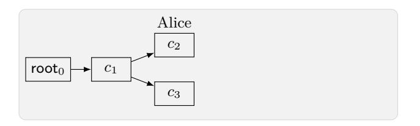

(a) The passive case. Alice processes *c*<sup>1</sup> and *c*2.

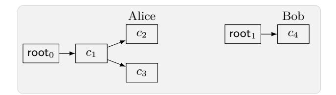

(c) Bob (honestly) commits, creating *c*<sup>4</sup> in a detached tree.

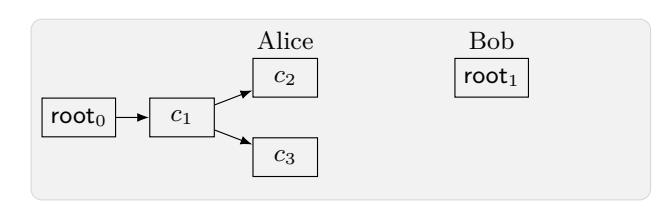

(b) Bob joins using injected *w* ′ . We don't know where to connect the detached root.

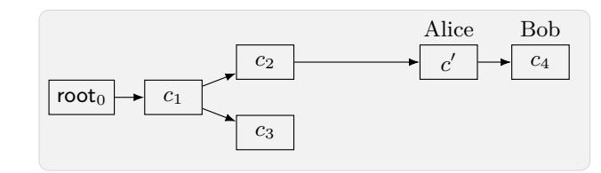

(d) Alice commits with bad randomness and re-computes *c* ′ corresponding to *w* ′ . We attach the root.

Fig. 1: An example execution with injections and bad randomness, and the corresponding history graph. For simplicity, proposal nodes are excluded.

- **– Process:** (id*c,* propSem) ← (Process*, c, ⃗p*) processes the message *c* committing proposals *⃗p* and advances id to the next epoch.[11](#page-10-1) It outputs the committer id*<sup>c</sup>* and a vector conveying the semantics of the applied proposals *⃗p*.
- **– Join:** (roster*,* id*c*) ← (Join*, w*) allows id (who is not yet a group member) to join the group using the welcome message *w*. It outputs the roster, i.e. the set of identities and long-term keys of all group members, and the identity id*<sup>c</sup>* of the member who committed the add proposal.
- **– Key:** *K* ← Key queries the current application secret. This can only be queried once per epoch by each group member (otherwise returning ⊥).

### <span id="page-10-0"></span>**3.4 History Graph**

The functionality Fcgka uses history graphs to symbolically represent a group's evolution. A history graph is a labeled directed graph. It has two types of nodes: *commit* and *proposal nodes*, representing all executed commit and propose operations, respectively. Note that each commit node represents an epoch. The nodes' labels, furthermore, keep track of all the additional information relevant for defining security. In particular, *all nodes* store the following values:

- **–** orig: the party whose action created the node, i.e., the message sender;
- **–** par: the parent commit node, representing the sender's current epoch;
- **–** stat ∈ {good*,* bad*,* adv}: a status flag indicating whether secret information corresponding to the node is known to the adversary. Concretely, adv means that the adversary created this node by injecting the message, bad means that it was created using adversarial randomness (hence it is well-formed but the adversary knows the secrets), and good means that it is secure.

*Proposal nodes* further store the following value:

**–** act ∈ {up-spk*,* add-id*t*-spk*<sup>t</sup> ,*rem-id*t*}: the proposed action. The also keeps track of the signature keys: add-id*t*-spk*<sup>t</sup>* means that id*<sup>t</sup>* is added with the public key spk*<sup>t</sup>* , and up-spk reflects the respective input to the update proposal.

*Commit nodes* further store the following values:

- **–** pro: the ordered list of committed proposals;
- **–** mem: the list of group members and their signature public keys;
- **–** key: the group key;

<span id="page-10-1"></span><sup>11</sup> For simplicity, we require that the higher-level protocol that buffers proposals also finds the list *p* matching *c*. This is without loss of generality, since ITK uses MLSPlaintext for sending proposals, and *c* includes hashes of proposals in *⃗p*.

{11}------------------------------------------------

- chall: a flag indicating whether the application secret has been challenged, i.e., chall is true if a random group key has been generated for this node, and false if the key was set by the adversary (or not generated);
- exp: a set keeping track of parties corrupted in this node, including whether only their secret state used to process the next commit message or also the current application secret leaked.

## <span id="page-11-0"></span>3.5 Details of the CGKA Functionality

This section presents a simplified version of  $\mathcal{F}_{CGKA}$ . Compared to the precise definition in App. B, we skip some less relevant border cases and details. A pseudo-code-like description is in Figs. 2 to 4 and an example history graph built by  $\mathcal{F}_{CGKA}$  is in Fig. 1. We next build some intuition about how  $\mathcal{F}_{CGKA}$  works.

The passive case. For the start, consider environments that do not inject or corrupt randomness (this relates to parts of the functionality not marked by [Inj] or [RndCor]). Here,  $\mathcal{F}_{CGKA}$  simply builds a history graph, where nodes are identified by messages, and the root is identified by the label root<sub>0</sub> (see Fig. 1a). Moreover,  $\mathcal{F}_{CGKA}$  stores for each party id a pointer Ptr[id] to its current history-graph node. If, for example, id proposes to add id<sub>t</sub>,  $\mathcal{F}_{CGKA}$  creates a new proposal node identified by a message p chosen by the adversary, and hands p to id. Some other party can now commit p (having received it from the environment), which, analogously, creates a commit node identified by c. Then, if a party processes c,  $\mathcal{F}_{CGKA}$  simply moves its pointer. The graph is initialized by a designated party id<sub>creator</sub>, who creates the group with itself as a single member and can then invite additional members.

If a party id is exposed,  $\mathcal{F}_{CGKA}$  records in the history graph which information inherently leaks from its state. This will be used by the predicate **safe** (recall that it determines if the epoch's key is random or arbitrary). In particular, two points are worth mentioning. First, we require that after outputting the group key, id removes it from its state (this is important for forward secrecy of the higher-level messaging protocol).  $\mathcal{F}_{CGKA}$  uses the flag HasKey[id] to keep track of whether id outputted the key. Second, id has to store in its state key material for updates and commits it created in the current epoch. Accordingly, upon id's exposure  $\mathcal{F}_{CGKA}$  sets the status stat of all such nodes to bad (note that leaking secrets has the same effect as choosing them with bad randomness).

Injections. The parts of  $\mathcal{F}_{CGKA}$  related to injections are marked by comments containing [Inj]. As an example, say the environment makes id process a commit message c' not obtained from  $\mathcal{F}_{CGKA}$ , and hence not identifying any node.  $\mathcal{F}_{CGKA}$  first asks the adversary if c' is simply malformed and, if this is the case, output  $\bot$  to id. If the message is not malformed, the functionality creates the new commit node, allowing the adversary to interpret the sender orig'. We guarantee agreement — if any other party transitions to this node, it will output the same committer orig', member set mem', group key etc. (recall that it is contained in the output of process). Note that we also guarantee correctness — if the input of process is an honest message c generated by  $\mathcal{F}_{CGKA}$ , then the adversary cannot make the commit fail.

A more challenging scenario is when the environment injects a welcome message w'. Now there are two possibilities. First, w' could lead to an existing node. In this case,  $\mathcal{F}_{CGKA}$  asks the adversary to provide the node c and records that w' leads to it. We require agreement — any party subsequently joining using w' transitions to c.

However, in general, we cannot expect that the adversary (i.e., simulator), given an arbitrary w' computed by the environment, can come up with the whole commit message c' and its position in the history graph. Therefore, in this case  $\mathcal{F}_{\text{CGKA}}$  creates a detached root, identified by a unique label  $\text{root}_{\text{rootCtr}}$ , where rootCtr is a counter. If at some later point, e.g. after an additional commit by the newly joined party, the environment injects c' corresponding to w', then the root is attached and re-labeled as c'. This scenario is depicted in Figs. 1c to 1d. We require consistency — when creating a detached root, the adversary chooses the member set, but when it is attached, we check that it matches the new parent.

<span id="page-11-1"></span><sup>&</sup>lt;sup>12</sup> For instance, say the environment computes a long chain of commits in its head and injects the last one. It is not clear how to construct a protocol for which it is possible to identify all ancestors, without including all their hashes in w.

{12}------------------------------------------------

```
Functionality \mathcal{F}_{\text{CGKA}}: Initialization
Parameters: predicate \mathbf{safe}(c) (are group secrets in c secure), predicate \mathbf{inj}-allowed(c, id) (is injecting allegedly
from id in c allowed), group creator's identity id<sub>creator</sub>.
Initialization
                                                                                                             Input (Create, spk) from idcreator
    // Pointers, commit nodes, proposal nodes
                                                                                                                 // The group can be created only once.
   \mathsf{Ptr}[*], \mathsf{Node}[*], \mathsf{Prop}[*] \leftarrow \bot
                                                                                                                 req Node[root_0] = \bot \land *usable-spk(id_{creator}, spk)
    // Welcome message to commit message mapping
                                                                                                                 // Create the root node and transition id<sub>creator</sub> there.
   Wel[*] \leftarrow \bot
                                                                                                                 \mathsf{Node}[\mathsf{root}_0] \leftarrow \mathrm{commit} \ \mathrm{node} \ \mathrm{with} \ \mathsf{orig} = \mathsf{id}_{\mathsf{creator}},
   RndCor[*] \leftarrow good; HasKey[*] \leftarrow false
                                                                                                                                        \mathsf{mem} = \{(\mathsf{id}_{\mathsf{creator}}, \mathsf{spk})\} \text{ and } \mathsf{stat} = \mathrm{RndCor}[\mathsf{id}_{\mathsf{creator}}].
   \mathsf{rootCtr} \leftarrow 0
                                                                                                                 \mathsf{Ptr}[\mathsf{id}_{\mathsf{creator}}] \leftarrow \mathsf{root}_0
                                                                                                                 \mathsf{HasKey}[\mathsf{id}_{\mathsf{creator}}] \leftarrow \mathtt{true}
```

```
Functionality \mathcal{F}_{\text{CGKA}}: Propose and Commit
Input (Propose, act), act \in {up-spk, add-id<sub>t</sub>, rem-id<sub>t</sub>} from id
                                                                                      Input (Commit, \vec{p}, spk) from id
  Send id and all inputs to the adv. and receive ack.
                                                                                         Send id and all inputs to the adv. and receive ack.
   // Adv. can reject invalid inputs.
                                                                                          // Adv. can reject invalid inputs.
  if ¬*require-correctness('prop', id, act) then
                                                                                         if \neg*require-correctness('comm', id, \vec{p}, spk) then
      req ack
                                                                                             req ack
   // Compute the proposal node this action creates.
                                                                                          // [Inj] Adv. interprets injected proposals.
  P \leftarrow \text{proposal node with par} = \text{Ptr[id]}, \text{ orig} = \text{id},
                                                                                         for p \in \vec{p} s.t. \mathsf{Prop}[p] = \bot \mathbf{do}
                                act = act, stat = RndCor[id].
                                                                                             \mathsf{Prop}[p] \leftarrow \mathsf{proposal} \ \mathsf{node} \ \mathsf{with} \ \mathsf{par} = \mathsf{Ptr}[\mathsf{id}],
  if act = add then
                                                                                                           stat = adv, and orig and act chosen
       // Adv. can choose the key package for adds.
                                                                                                          by the adversary.
                                                                                          // Compute the commit node this action creates.
      Receive \mathsf{spk}_t from the adversary
                                                                                         C \leftarrow \text{commit node with par} = Ptr[id], \text{ orig} = id,
      P.\mathsf{act} \leftarrow \mathsf{add}\text{-}\mathsf{spk}_t
  // Insert P into HG.
                                                                                                    stat = RndCor[id] pro = \vec{p}, and
  Receive p from the adversary.
                                                                                                    mem = *members(Ptr[id], id, \vec{p}, spk)
                                                                                         // Insert C into HG.
  if Prop[p] = \bot then
       // Passive case: created a new node.
                                                                                         Receive (c, rt) from the adversary.
                                                                                         if Node[c] = \bot \land rt = \bot then
      \mathsf{Prop}[p] \leftarrow P
                                                                                              // Passive case: create new node.
  else
       // [Inj] [RndCor] Re-computing existing p.
                                                                                             \mathsf{Node}[c] \leftarrow C
      assert *consistent-nodes(Prop[p], P)
                                                                                         else if Node[c] \neq \bot then
  if RndCor[id] then
                                                                                              // [Inj] [RndCor] Re-computing injected c.
       // [RndCor] Signed with bad randomness.
                                                                                             assert *consistent-nodes(Node[c], C)
      Notify \mathcal{F}_{AS}^{IW} that id's spk is compromised.
                                                                                         _{\rm else}
  return p
                                                                                              // [Inj] [RndCor] c explains a detached root.
                                                                                             Set Node[root_{rt}].par \leftarrow Ptr[id] and then replace
                                                                                                                       each occurrence of root_{rt} in the HG by c.
                                                                                             \mathbf{assert} \ \mathbf{*consistent-nodes}(\mathsf{Node}[c], C)
                                                                                          // [Inj] Check that inserting C does not violate authenticity and
                                                                                         HG-consistency.
                                                                                         assert *cons-invariant \wedge *auth-invariant
                                                                                         if RndCor[id] then
                                                                                              // [RndCor] Commit signed with bad rand.
                                                                                              Notify \mathcal{F}_{AS}^{IW} that id's current spk is compromised.
                                                                                         Receive w from the adversary.
                                                                                         if Wel[w] \neq \bot then
                                                                                             req *consistent-nodes(Wel[w], C)
                                                                                         \mathsf{Wel}[w] \leftarrow c.
                                                                                         return (c, w)
```

Fig. 2:  $\mathcal{F}_{CGKA}$ : initialization, propose and commit. Parts related to injections and randomness corruptions are marked by comments containing [Inj] and [RndCor], respectively.

{13}------------------------------------------------

```
Functionality \mathcal{F}_{\text{CGKA}}: Process and Join
Input (Process, c, \vec{p}) from id
                                                                                               Input (Join, w) from id
  Send id and all inputs to the adv. and receive ack.
                                                                                                  Send id and all inputs to the adv. and receive ack.
   // Adv. can reject invalid inputs.
                                                                                                  req ack
  if \neg*require-correctness('proc', id, c, \vec{p}) then
                                                                                                  // [Inj] If w is injected, then assign a commit node to it.
       req ack
                                                                                                  if Wel[w] = \bot  then
   // [Inj] Adv. interprets injected proposals.
                                                                                                       // If w leads to existing node, adv. can specify it.
  for p \in \vec{p} s.t. Prop[p] = \perp do
                                                                                                      Receive c from the adversary.
       \mathsf{Prop}[p] \leftarrow \mathsf{proposal} \ \mathsf{node} \ \mathsf{with} \ \mathsf{par} = \mathsf{Ptr}[\mathsf{id}],
                                                                                                      if c \neq \bot then
                     stat = adv, and orig and act chosen
                                                                                                           \mathsf{Wel}[w] \leftarrow c
                      by the adversary.
                                                                                                      else
   // Commit node id expects to transition to.
                                                                                                           // Create detached root.
   Receive from the adversary (orig', spk').
                                                                                                           rootCtr++
  C \leftarrow \text{commit node with } \mathsf{par} = \mathsf{Ptr}[\mathsf{id}], \, \mathsf{orig} = \mathsf{orig}',
                                                                                                           \mathsf{Wel}[w] \leftarrow \mathsf{root}_{\mathsf{rootCtr}}
                 pro = \vec{p}, mem = *members(Ptr[id], id, <math>\vec{p}, spk')
                                                                                                           Node[root_{rootCtr}] \leftarrow commit node with
   // [Inj] If c is injected, then assign a node to it.
                                                                                                                    par = \bot, pro = \bot, stat = adv, and orig
  if Node[c] = \bot then
                                                                                                                    and mem chosen by the adv.
       // If c explains detached root, let adv. specify it.
                                                                                                  // Transition id.
       Receive rt from the adversary.
                                                                                                  \mathsf{Ptr}[\mathsf{id}] \leftarrow \mathsf{Wel}[w]
       if rt \neq \bot then
                                                                                                  \mathsf{HasKey}[\mathsf{id}] \leftarrow \mathtt{true}
           Set Node[root<sub>rt</sub>].par \leftarrow Ptr[id] and then
                                                                                                  // Check that joining id does not violate authenticity and HG-
                  replace each occurrence of root_{rt} in
                                                                                                  consistency.
                  the HG by c.
                                                                                                  assert *cons-invariant \land *auth-invariant
       else
                                                                                                  return *output-join(Node[Wel[w]])
           \mathsf{Node}[c] \leftarrow C
           \mathsf{Node}[c].\mathsf{stat} \leftarrow \mathsf{adv}
   // Check that id transitions to expected node.
  assert consistent-nodes(Node[c], C)
   // Transition id.
  if \exists p \in \vec{p} : \mathsf{Prop}[p].\mathsf{act} = \mathsf{rem-id} \ \mathbf{then}
       \mathsf{Ptr}[\mathsf{id}] \leftarrow \bot
  else
       \mathsf{Ptr}[\mathsf{id}] \leftarrow c
       \mathsf{HasKey}[\mathsf{id}] \leftarrow \mathsf{true}
  // Check that processing c does not violate
   authenticity and HG-consistency.
  assert *cons-invariant \land *auth-invariant
  return *output-process(C)
```

```
Functionality \mathcal{F}_{\text{CGKA}}: Corruptions and Group Key
Input (Expose, id) from the adversary
                                                                                   Input Key from id
   // Record leaked information: if id is in the group, its state con-
                                                                                      // Only possible if id has the key.
                                                                                      \mathbf{req} \ \mathsf{Ptr}[\mathsf{id}] \neq \bot \land \mathsf{HasKey}[\mathsf{id}]
  tains:
  if Ptr[id] = \bot then
                                                                                      // Set the key if id is the first party fetching it in its node.
                                                                                      (Guarantees consistency across parties.)
       // 1) secrets needed to process other parties' messages and
       potentially the group key
                                                                                      if Node[Ptr[id]].key = \bot then
       Node[Ptr[id]].exp + \leftarrow (id, HasKey[id])
                                                                                          if safe(Ptr[id]) then
       // 2) secrets needed to process id's own messages
                                                                                              Set key to a fresh random key and chall to true.
       For each commit or update-proposal node with orig = id and
                                                                                          else
       par = Ptr[id], set stat \leftarrow bad.
                                                                                              Let the adversary choose key and set chall to false.
                                                                                       // id should remove the key from his state
       // 3) the signing key
       Notify \mathcal{F}_{AS}^{IW} that id's current spk is compromised.
                                                                                      \mathsf{HasKey}[\mathsf{id}] \leftarrow \mathtt{false}
   // Whether id is in the group or not, its state contains secrets
                                                                                      return Node[Ptr[id]].key
   needed to process welcome messages.
  for c s.t. *can-join(Node[c], id) do
       Node[c].exp + \leftarrow (id, true)
   // Disallow adaptive corruptions in some cases.
  This input is not allowed if \exists c \text{ s.t Node}[c].\mathsf{chall} = \mathsf{true} \text{ and } \neg \mathsf{safe}(c)
Input (CorrRand, id, b), b \in \{good, bad\} from the adversary
  \text{RndCor}[\mathsf{id}] \leftarrow b
```

Fig. 3:  $\mathcal{F}_{CGKA}$ : inputs process, join, key and corruptions. Parts related to injections are marked by comments containing [Inj].

{14}------------------------------------------------

#### <span id="page-14-0"></span>Functionality $\mathcal{F}_{\scriptscriptstyle \mathrm{CGKA}}$ : Helpers

#### helper \*require-correctness('comm', id, $c, \vec{p}$ )

Returns true if a) c and each  $p \in \vec{p}$  identifies a node with stat  $\neq$  adv, and b)  $\mathsf{Ptr}[\mathsf{id}] = \mathsf{Node}[c].\mathsf{par}$ , and c)  $\vec{p} = \mathsf{Node}[c].\mathsf{pro}$ .

#### **helper \*require-correctness**('proc', id, $\vec{p}$ , spk)

Returns true if \*usable-spk(id, spk) and  $\forall p \in \vec{p}$ : Prop $[p] \neq \bot$  and the vector can be committed by id (in its current node) according to MLS spec.

#### helper \*require-correctness('prop', id, act)

Returns true if act = up-spk and \*usable-spk(id, spk) or if  $act = rem\text{-id}_t$  and removing id<sub>t</sub> is allowed according to MLS spec.

#### helper \*usable-spk(id, spk)

Returns true if if either spk is id's current spk, or id has the secret key according to  $\mathcal{F}_{AS}^{IW}$ .

#### helper \*members $(C, id, \vec{p}, spk)$

Computes the member set after id, currently in C, calls commits with inputs  $\vec{p}$  and spk, according to MLS spec. For each member, the set contains a tuples (id', spk'), indicating the member's identity and his identity key.

#### helper \*can-join(C, id)

Returns true if C.pro adds id with spk and, according to  $\mathcal{F}_{KS}^{IW}$ , id has a secret key for some key-package registered together with spk.

#### $\mathbf{helper} *\mathbf{output} \cdot \mathbf{process}(C)$

Computes committer  $\mathrm{id}_c$  and proposal semantics propSem, returned by Process when transitioning into C.

#### helper \*output-join(C)

Computes roster and committer  $\mathsf{id}_c$ , returned when joining into C.

#### helper \*consistent-nodes(N, N')

Returns true if all values in proposal or commit nodes N and N' except status match.

#### helper \*auth-invariant

Returns true if there is no proposal or commit node with stat = adv and par s.t. inj-allowed(par,id) is false.

#### helper \*cons-invariant

Returns **true** if HG has no cycles, each id is in the member set of  $\mathsf{Ptr}[\mathsf{id}]$  and for each non-root c, the parent of each p in c's  $\mathsf{pro}$  vector is c's parent.

Fig. 4: Additional helpers for  $\mathcal{F}_{CGKA}$ .

Corrupted randomness. The relevant parts of  $\mathcal{F}_{CGKA}$  are marked by [RndCor]. Corrupted randomness leads to two adverse effects. First, the adversary can make parties re-compute existing messages, leading to the following scenarios:

- A party re-computes a message it already computed. In this case,  $\mathcal{F}_{CGKA}$  only checks that the previous message was computed with the same inputs.
- A party re-computes a message previously injected by the environment. Here,  $\mathcal{F}_{CGKA}$  verifies that the semantics of the existing node chosen by the adversary upon injection are consistent with the correct semantics computed using the party's inputs. (Technically, instead of creating a new node,  $\mathcal{F}_{CGKA}$  checks that the node it would have created is consistent with the existing one.)
- A party re-computes a commit c' corresponding to an injected welcome message (see Fig. 1d). In this case,  $\mathcal{F}_{CGKA}$  attaches the detached root, just like in case c' was injected into process.

Second, we note that each protocol message in MLS is signed, potentially using ECDSA, which reveals the secret key in case bad randomness is used. Therefore, every time a party id generates a message with bad randomness,  $\mathcal{F}_{CGKA}$  notifies  $\mathcal{F}_{AS}$ , which marks all long-term keys of id as exposed.

Adaptive corruptions. Adaptive corruptions become a problem if an exposure reveals secret keys that can be used to compute a key that has already been outputted by  $\mathcal{F}_{CGKA}$  at random, i.e. a "challenge" key. Since fully adaptive security is not achieved by TreeKEM (without resorting to programmable random oracles), we restrict the environment not to corrupt if for some nodes with the flag chall set to true this would cause safe to switch to false.<sup>13</sup>

Remark 1 (Correctness). Having the environment deliver messages is rather non-standard for interactive protocols. In a more "classical" UC treatment this would be done by the adversary. Our formulation, modeling arbitrary instead of worst-case network behavior, allows us to additionally consider correctness. In contrast, "classical" treatment typically permits trivial protocols that just reject all messages with the simulator just not delivering them in the ideal world.

<span id="page-14-1"></span><sup>&</sup>lt;sup>13</sup> In game based definitions, such corruptions are usually disallowed, as they allow to trivially distinguish. Our notion achieves the same level of adaptivity.

{15}------------------------------------------------

### <span id="page-15-0"></span>4 The Insider-secure TreeKEM Protocol

This section provides a (high-level) description of the Insider-Secure TreeKEM (ITK) protocol. A formal description of the protocol can be found in App. C.

Distributed state. The primary object constituting the distributed state of the ITK protocol is the ratchet tree  $\tau$ . The ratchet tree is a labeled binary tree (i.e., a binary tree where nodes have a number of named properties), where each group member is assigned to a leaf and each internal node represents the sub-group of parties whose leaves are part of the node's sub-tree.

To give a brief overview, each node has two (potentially empty) labels pk and sk, storing a key pair of a PKE scheme. Leaves have an additional label spk, storing a long-term signature public key of the leaf's owner. The root has a number of additional shared symmetric secret keys as labels (see below). See Fig. 5 for an example of a ratchet tree with the labels. The *public part* of  $\tau$  consists of the tree structure, the leaf assignment, as well as all public labels, i.e., those storing public keys. The *secret part* consists of the labels storing secret keys and the symmetric keys. The ITK protocol maintains two invariants:

**Invariant** (1): The public part of  $\tau$  is known to all parties.

**Invariant (2):** The secret labels in a node v are known only to the owners of leaves in the sub-tree rooted at v.

<span id="page-15-1"></span>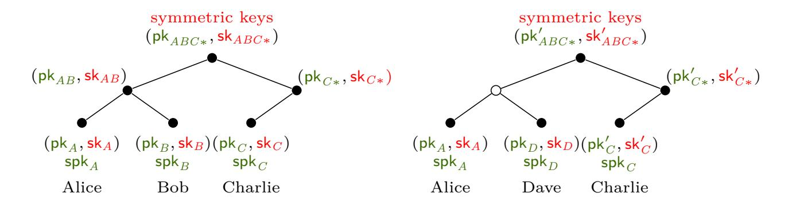

Fig. 5: (Left) An example ratchet tree  $\tau$  for a group with three members. For Invariant (1), the public labels (green) are known to all parties. For Invariant (2), the secret labels (red) in a node v are only known to parties in v's subtree, e.g. Bob knows  $\mathsf{sk}_B$ ,  $\mathsf{sk}_{AB}$  and  $\mathsf{sk}_{ABC*}$ . (Right) the tree after Charlie commits removing Bob and adding Dave. The empty node  $\circ$  is blank. Messages to Alice and Dave are encrypted under its resolution  $(\mathsf{pk}_A, \mathsf{pk}_D)$ .

Evolving the tree. Each epoch has one fixed ratchet tree  $\tau$ . Proposals represent changes to  $\tau$ , and a commit chooses which changes should be applied when advancing to the next epoch.

A remove proposal represents removing from  $\tau$  all keys known to the removed party (see Fig. 5). That is, its leaf is cleared, and all keys in its direct path — i.e., the path from the party's leaf to the root — are blanked, meaning that all their labels are cleared. This is followed by shrinking the tree by removing unneeded leaves from the right side of the tree. <sup>14</sup> Note that until a blanked node gets a new key pair assigned (as explained shortly), in order to encrypt to the respective subgroup one has to encrypt to the node's children instead (and recursing if either child is blanked as well). The minimal set of non-blanked nodes covering a given subgroup is called the subgroup's resolution.

An *update* proposes removing all keys currently known to the party (and hence possibly affected by state leakage), and replacing the public key in their leaf (and possibly the long-term verification key) by a fresh one, specified in the proposal. Hence,  $\tau$  is modified as in a remove proposal, but instead of clearing the leaf, its key is replaced.

Finally, an *add* proposal indicates the new member's identity (defined on a higher application level), its long-term public key from the AS, and an ephemeral public key from KS. It represents the following modification: First, a leaf has to be assigned, with the public label set according to

<span id="page-15-2"></span>The exact conditions under which truncation is performed are presented in App. C. Note that truncation is best-effort and may not lead to a tree of optimal depth.

{16}------------------------------------------------

the public key from the proposal. If there exists a currently unused leaf, then this can be reused, otherwise a new leaf is added to the tree. In order to satisfy invariant (2), the party committing the add proposal would then have to communicate to the new member all secret keys on its direct path. Unfortunately, it can only communicate the keys for nodes above the least common ancestor of its and the new member's leaves. For all other nodes, the new member is added to a so-called *unmerged leaf set*, which can be accounted for when determining the node's resolution.

*Re-keying.* Whenever a party *commits* a sequence of proposals, they additionally replace their leaf key (providing an implicit update) and re-key their direct path. In order to maintain invariant (1) on the group state, the committer includes all new public keys in the commit message.

To minimize the number of secret keys needed to be communicated as part of the commit message, the committer samples the fresh key pairs along the path by "hashing up the tree". That is, the committer derives a sequence of *path secrets s<sup>i</sup>* , one for each node on the path, where *s*<sup>0</sup> for the leaf is random and *si*+1 is derived from *s<sup>i</sup>* using the HKDF.Expand function (cf. [App. A.2\)](#page-29-2). Then, each *s<sup>i</sup>* is expanded again (with a different label) to derive random coins for the key generation. The secret *s<sup>n</sup>* for the root, called the *commit secret*, is not used to generate a key pair, but instead used to derive the epoch's symmetric keys (see below). This implies that each other party only needs to be able to retrieve the path secret of the least common ancestor of their and the committer's leaves. Hence, invariant (2) can be maintained by including in the commit each path secret encrypted to (the resolution of) the node's child not on the direct path.

Note that for PCS, the new secret keys must not be computable using the committer's state from before sending the commit (we want that a commit heals the committer from a state). Hence, the committer simply stores all new secrets explicitly until the commit is confirmed.

*Key schedule.* Each epoch has several associated symmetric keys, four of which are relevant for this paper: The *application secret* is the key exported to the higher-level protocol, the *membership key* is used for protecting message authenticity, the *init secret* is mixed into the next epoch's key schedule, and the *confirmation key* ensures agreement on the cryptographic material.

The epoch's keys are derived from the commit secret computed in the re-keying process, mixed with (some additional context and) the previous epoch's init secret. This ensures that only parties who knew the prior epoch's secrets can derive the new keys. One purpose of this is improving FS: corrupting a party in an epoch, say, 5 must not allow to derive the application secret for a prior epoch, say, 3. As, however, some internal nodes of the ratchet tree remain unchanged between epochs 3 and 5, it might be possible for the adversary to decrypt the commit secret of epoch 3, given the leakage from epoch 5. Mixing in the init secret of epoch 2 thus ensures that this is information is of no value per se (unless some party in epoch 2 was already corrupted.)

*Welcoming members.* Whenever a commit adds new members to the group, the committer must send a *welcome message* to the new members, providing them with the necessary state. First, the welcome message contains the public group information, such as the public part of the ratchet tree. Second, it includes (encrypted) *joiner secret*, which combines current commit secret and previous init secret and allows the new members to execute the key schedule. Finally, it contains the seed to derive the secrets on the joint path, which the committer just re-keyed. (Recall that for the other nodes on the new party's direct path they are simply added to the unmerged leaves set, indicating that they do not know the corresponding secrets.) The above seeds, as well as the joiner secret, are encrypted under the public key (obtained from KS), specified in the add proposal (which thus serves dual purposes).

*Security mechanisms.* All messages intended for existing group members — commit messages and proposals — are subject to *message framing*, which binds them to the group and epoch, indicates the sender, and protects the message's authenticity. The sender first signs the group identifier, the epoch, his leaf index, and the message using his private signing key. This in particular prevents impersonation by another (malicious) group member.

Since the signing key, however, is shared across groups and its replacement is also not tied to the PCS guarantees of the group, each package is additionally authenticated using shared key material. Proposals are MACed using the membership key, while commit messages are protected using the confirmation tag (see below). Further, commit messages that include remove proposals are additionally MACed using the membership key, since the confirmation tag cannot be verified 

{17}------------------------------------------------

by the removed members. In summary, to tamper or inject messages an adversary must both know at least the sender's signing key as well as the epoch's symmetric keys.

The protocol makes use of two (running) hashes on the communication transcript to authenticate the group's history. For authentication purposes, it uses the *confirmed transcript hash*, which is computed by hashing the previous epoch's *interim transcript hash*, the content of the commit message, and its signature. The interim transcript hash is then computed by hashing the confirmed transcript hash with the confirmation tag. Each commit message moreover contains a so-called confirmation tag that allows the receiving members to immediately verify whether they agree on the new epoch's key-schedule. To this end, the committer computes a MAC on the confirmed transcript hash under the new epoch's confirmation key.

Finally, ITK uses a mechanism called *tree signing* to achieve a certain level of insider security. We discuss this aspect in detail in Sec. 6.3.

Remark 2 (Simplifications and Deviations). While ITK closely follows the IETF MLS protocol draft, there are some small deviations as well as some omissions. In particular, our model assumes a fixed protocol version and ciphersuite, and omits features such as advanced meta-data protection, external proposals and commits, exporters, preshared keys, as well as extensions. We discuss those deviations and their implications on our results in more detail in App. C.4.

# <span id="page-17-0"></span>5 Security of ITK

Security of ITK is expressed by the predicates  $\mathbf{safe}(c, \mathsf{id})$  and  $\mathbf{inj\text{-}allowed}(c, \mathsf{id})$ , where c is a commit message identifying a history graph node and  $\mathsf{id}$  is a party. The predicates are formally stated in Fig. 6. They are defined using recursive deduction rules  $\mathsf{know}(c, \mathsf{id})$  and  $\mathsf{know}(c, \mathsf{'epoch'})$ , indicating that the adversary knows  $\mathsf{id}$ 's secrets (such as the leaf secret), and that it knows the epoch secrets (such as the init secret), respectively. In more detail:

- $\mathbf{know}(c, \mathsf{id})$  consists of three conditions, the last two being recursive. Condition a) is true if  $\mathsf{id}$ 's secrets in c are known to the adversary because they leaked as part of an exposure or were injected by the adversary in  $\mathsf{id}$ 's name (due to many attack vectors, this can happen in many ways, see Fig. 6). The conditions b) and c) reflect that in ITK only commits sent by or affect  $\mathsf{id}$  (id updates, is added, or removed) are guaranteed to modify all  $\mathsf{id}$ 's secrets. If c is not of this type, then  $\mathsf{know}(c,\mathsf{id})$  is implied by  $\mathsf{know}(\mathsf{Node}[c].\mathsf{par},\mathsf{id})$  (condition b)). If a child c' of c is not of this type, then it is implied by  $\mathsf{know}(c',\mathsf{id})$  (condition c)).
- know(c, 'epoch') takes into account the fact that ITK derives epoch secrets using the initSecret from the previous epoch, and hence achieves slightly better FS compared to parties' individual secrets.
  - In particular, the adversary knows the epoch secrets in c only if it corrupted a party in c, or knows the epoch secrets in c's parent and knows individual secret of some party id in c. The latter condition allows the adversary to process c using id's protocol and is formalized by the \*can-traverse predicate.
- The only difference between  $\neg \mathbf{safe}(c)$  and  $\mathbf{know}(c, '\mathsf{epoch'})$  is that the application secret is not leaked if id is exposed in c after outputting it.

Remark 3. Previous works (e.g. [6, 7]) defined a simpler **safe** predicate by defining the set of history graph nodes where application secrets are affected by an exposure. Then, a node's secret is secure if there is no exposure that affects it. However, in our setting a set of simultaneous exposures may leak information that is not leaked by any of the exposures alone, as illustrated in Fig. 7.

With the predicates **safe** and **inj-allowed**, we can now state the following security statement for ITK.

<span id="page-17-1"></span>**Theorem 1.** Assuming that PKE is IND-CCA secure, and that Sig is EUF-CMA secure, the ITK protocol securely realizes  $(\mathcal{F}_{AS}^{IW}, \mathcal{F}_{KS}^{IW}, \mathcal{F}_{CGKA})$  in the  $(\mathcal{F}_{AS}, \mathcal{F}_{KS}, \mathcal{G}_{RO})$ -hybrid model, where  $\mathcal{F}_{CGKA}$  uses the predicates safe and inj-allowed from Fig. 6 and calls to HKDF. Expand, HKDF. Extract and MAC functions are replaced by calls to the global random oracle  $\mathcal{G}_{RO}$ .

{18}------------------------------------------------

```
Predicate safe
Knowledge of parties' secrets.
know(c, id) ⇐⇒
 a) // id's state leaks directly e.g. via corruption (see below):
     *state-directly-leaks(c, id) ∨
 b) // know state in the parent:
     (Node[c].par ̸= ⊥ ∧ ¬*secrets-replaced(c, id) ∧ know(Node[c].par, id)) ∨
 c) // know state in a child:
     ∃c
       ′
         : (Node[c
                 ′
                  ].par = c ∧ ¬*secrets-replaced(c
                                                 ′
                                                  , id) ∧ know(c
                                                               ′
                                                                , id))
*state-directly-leaks(c, id) ⇐⇒
 a) // id has been exposed in c:
     (id, ∗) ∈ Node[c].exp ∨
 b) // c is in a detached tree and id's spk is exposed
     ∃rt : *ancestor(rootrt, c) ∧ ∃spk : (id, spk) ∈ Node[c].mem ∧ spk ∈ Exposed ∨
 c) // id's secrets in c are injected by the adversary:
     ((id, spk) ∈ Node[c].mem ∧ *secrets-injected(c, id))
*secrets-injected(c, id) ⇐⇒
 a) // id is the sender of c and c was injected or generated with bad randomness
     (Node[c].orig = id ∧ Node[c].stat ̸= good) ∨
 b) // c commits an update of id that is injected or generated with bad randomness
     ∃p ∈ Node[c].pro : (Prop[p].act = up- ∗ ∧ Prop[p].orig = id ∧ Prop[p].stat ̸= good) ∨
 c) // c adds id with corrupted spk
     ∃p ∈ Node[c].pro : (Prop[p].act = add-id-spk ∧ spk ∈ Exposed)
*secrets-replaced(c, id) ⇐⇒ Node[c].orig = id ∨ ∃p ∈ Node[c].pro :
     Prop[p].act ∈ {add-id-∗, rem-id} ∨ (Prop[p].act = up- ∗ ∧ Prop[p].orig = id)
Knowledge of epoch secrets.
know(c, 'epoch') ⇐⇒ Node[c].exp ̸= ∅ ∨ *can-traverse(c)
// Can the adversary process c using exposed individual secrets and parent's init secret?
*can-traverse(c) ⇐⇒
 a) // orphan root with a corrupted signature public key:
     (Node[c].par = ⊥ ∧ (∗, spk) ∈ Node[c].mem ∧ spk ∈ Exposed) ∨
 b) // commit to an add proposal that uses an exposed key package:
     (∃p ∈ Node[c].pro : Prop[p].act = add-id-spk ∧ spk ∈ Exposed) ∨
 c) // secrets encrypted in the welcome message under an exposed leaf key
     *leaf-welcome-key-reuse(c) ∨
 d) // know necessary info to traverse the edge:
     (know(c, ∗) ∧ (c = root∗ ∨ know(Node[c].par, 'epoch')))
*leaf-welcome-key-reuse(c) ⇐⇒ ∃id, p ∈ Node[c].pro : Prop[p].act = add-id- ∗ ∧∃cd : *ancestor(c, cd)
                                    ∧ (id, ∗) ∈ Node[cd].exp ∧ no node ch with *secrets-replaced(ch, id) on c-cd path
Safe and can-inject.
safe(c) ⇐⇒ ¬
                 (∗, true) ∈ Node[c].exp ∨ *can-traverse(c)

inj-allowed(c, id) ⇐⇒ Node[c].mem[id] ∈ Exposed ∧ know(c, 'epoch')
```

Fig. 6: The safety and injectability predicates for the CGKA functionality reflecting the sub-optimal security of the ITK protocol.

{19}------------------------------------------------

<span id="page-19-0"></span>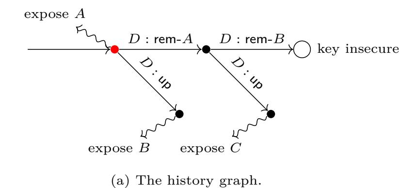

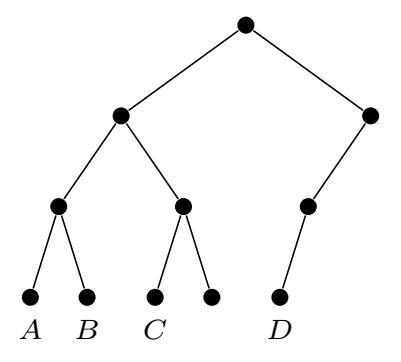

(b) The ratchet tree in the red node.

Fig. 7: An execution illustrating that many simultaneous corruptions leak information that cannot be deduced from any single corruption. Exposing *A* reveals the initSecret. Exposing *B* reveals secrets on his direct path (untouched by *D*'s update). Together this allows to process *D*'s commit removing *A* and compute the next initSecret. Together with *C*'s exposed secrets, this allows to process the commit removing *B* and compute the group key. Notice that states of *A* and *B* cannot be used to process the last commit (they are not group members).

*Proof (Sketch).* We here provide the high level proof idea; the complete proof is presented in [App. D.](#page-44-0) The proof proceeds in three steps. The first step is to show that various consistency mechanisms, such as MACing the group context, guarantee consistency of the distributed group state. More precisely, the real world (Hybrid 1) is indistinguishable from the following Hybrid 2: The experiment includes a modified CGKA functionality, F real cgka, which differs from Fcgka in that it uses **safe** = false and **inj-allowed** = true. The functionality interacts with the trivial simulator who sets all keys and messages according to the protocol. The second step is to show that IND-CCA of the PKE scheme guarantees confidentiality: Hybrid 2 is indistinguishable from Hybrid 3 where application and membership secrets in safe epochs are random, i.e. the original **safe** is restored. The final step is to show that unforgeability of the MAC and signature schemes implies that Hybrid 3 is indistinguishable from the ideal world, where the original **inj-allowed** is restored as well. (Considering confidentiality before integrity, while somewhat unusual, is necessary, because we must first argue secrecy of MAC keys. We note that IND-CPA would be anyway insufficient, because some injections are inherently possible.)

In this overview, we sketch the core of our proof, which is the second step concerning confidentiality. For simplicity, we do not consider randomness corruptions. We now proceed in two parts: first, we consider only passive environments, which do not inject messages. In the second part, we show how to modify the passive strategy to deal with active environments.

*Part 1: Passive security.* For simplicity, consider F rand cgka, which uses the original **safe** only for the first (safe) key it sets (think of the first step in the hybrid argument). The goal is to show that *IND-CPA* security of the PKE scheme implies that F real cgka and F rand cgka, both with the trivial simulator, are indistinguishable for *passive* environments.

Unfortunately, already the passive setting turns out challenging for the following reason: The path secrets in a (safe) commit *c* are encrypted under public keys created in another commit *c* ′ , which contains encryptions of the corresponding secret keys under public keys created in another commit *c* ′′, and so on. Moreover, the keys are related by hash chains (of path secrets). Even worse, the environment can adaptively choose who to corrupt, revealing some subset of the secret keys, which mean that we cannot simply apply the hybrid argument to replace encryptions of secret keys by encryptions of zeros.[15](#page-19-1)

To tackle adaptivity and related keys, we adapt the techniques of [\[36,](#page-28-12) [10\]](#page-27-6). Namely, we define a new security notion for PKE, called (modified) Generalized Selective Decryption (GSD),[16](#page-19-2) which generalizes the way ITK uses PKE together with the hash function to derive its secrets. Roughly speaking, the GSD game creates a graph, where each node stores a secret seed. The adversary can instruct the game to 1) create a node with a random seed, 2) create a node *v* where the seed is a

<span id="page-19-1"></span><sup>15</sup> Observe that at the time a ciphertext is created we do not know if the key it contains will be used to create a safe epoch, or if some receiver will be corrupted.

<span id="page-19-2"></span><sup>16</sup> GSD was first defined for symmetric encryption [\[36\]](#page-28-12) and then extended to prove security of TreeKEM [\[10\]](#page-27-6). Our notion is an extension of [\[10\]](#page-27-6).

{20}------------------------------------------------

hash of the seed of another node u, 3) use a (different) hash of the seed in a node u to derive a key pair, use the public key to encrypt the seed in a node v and send the public key and ciphertext to the adversary. Each of the actions 2) and 3) creates an edge (u, v) to indicate their relation. Moreover, the adversary can adaptively corrupt nodes and receive their seeds. For the challenge of the game, she receives either a seed from a sink node or a random value. (See the full proof for a precise definition.)<sup>17</sup> It remains to be shown that 1) GSD security implies secrecy of ITK keys, and 2) IND-CPA security implies GSD security. The latter proof is adapted from [10], so we now focus on 1).

To be a bit more concrete, assume an environment  $\mathcal{Z}$  distinguighes between  $\mathcal{F}_{CGKA}^{real}$  and  $\mathcal{F}_{CGKA}^{rand}$  (each with the trivial simulator). We construct an adversary  $\mathcal{A}$  against GSD security of the PKE scheme in the standard way:  $\mathcal{A}$  executes the code of  $\mathcal{F}_{CGKA}^{real}$  and the trivial simulator, except for all honest commits and updates, public keys and epoch keys are created using the GSD game. If a party is corrupted,  $\mathcal{A}$  corrupts all GSD nodes needed to compute its state. Finally,  $\mathcal{A}$  replaces the first key outputted by  $\mathcal{F}_{CGKA}^{real}$  by its challenge.

Part 2: Injections. We sketch the main points of how the strategy from the passive setting can be adapted to show that IND-CCA security of PKE implies secrecy of keys in the presence of active environments. There are three types of messages  $\mathcal{Z}$  can inject: proposals, commits and welcome messages. Proposals are the least problematic. Say  $\mathcal{Z}$  injects an update proposal p' with public key pk' on behalf of Alice. Since Alice will never process a commit containing p', allegedly from her, that she did not send (see Fig. 15 on Page 39), all epochs created by such commits and their descendants are not safe until Alice is removed. This also removes pk' and any secrets encrypted to it. So,  $\mathcal{A}$  can generate all secrets sent to pk' itself, as they don't matter for any safe epoch.

Now say  $\mathcal{Z}$  makes Bob process an injected commit c' and assume Bob uses an honest key, i.e., one created in the GSD game for an uncorrupted node. Say Bob's ciphertext in c' is ctxt. There are a few possible scenarios:

- $\mathcal{A}$  has never seen ctxt (e.g. because  $\mathcal{Z}$  computed a commit in his head). Clearly, IND-CPA is not sufficient here. Hence, we extend the GSD game by a decrypt oracle (which does not work on ciphertexts that allow to trivially compute the challenge) and prove that the new notion is implied by IND-CCA.
- $-\mathcal{A}$  generated ctxt using the GSD game, as part of a commit message c creating a safe epoch (note that c and c' may differ in places other than ctxt). Now the decrypt oracle cannot be used, but fortunately the confirmation tag comes to the rescue. Indeed, any tag accepted by Bob allows  $\mathcal{A}$  to extract the joiner in c from  $\mathcal{Z}$ 's RO queries (we soon explain how) and compute the application secret in c. Hence,  $\mathcal{A}$  can request GSD challenge for this secret and win. For simplicity, assume c and c' are siblings, i.e., Bob is currently in c's parent (see the full proof for other cases). Recall that the tag is a MAC under the new epoch's confirmation key over the transcript hash, and that the transcript hash contains the whole commit message c or c' (except the tag). The MAC is modeled as an RO call on input (confirmation key, transcript hash), so the only way for  $\mathcal{Z}$  to compute a valid tag for c' is to query the RO on input (confirmation key in c', transcript hash updated with c'). Moreover, the confirmation key is a hash of the joiner secret, so  $\mathcal{A}$  can extract the joiner secret in c' as well (note that the joiner secret is never encrypted). Now observe that the joiner secret is a hash of the init and commit secrets Moreover, the init secret is the same in c and c', since they are siblings, as is the commit secret due to ctxt being the same. Hence, the joiner secret of c is the same as the one extracted from c'.

## <span id="page-20-0"></span>6 Insider Attacks

We first discuss three insider attacks on the design of MLS Draft 10 (as it stood prior to applying the fixes proposed as part of this work). Each is practical, yet violates the design goals of MLS. Next, we present an insider attack on MLS made possible when its ciphersuite is replaced by a

<span id="page-20-1"></span><sup>&</sup>lt;sup>17</sup> The GSD game in the full proof is inherently more complex. For example, recall that joiner secret is a hash of init and commit secrets. Accordingly, the adversary is allowed to create nodes whose seeds are hashes of two other seeds.

{21}------------------------------------------------

weaker one that still meets assumptions deemed sufficient in previous analyses. Together these attacks highlight the limitations of prior security notions. In Sec. 7 we also discuss several areas where the security of MLS could (at least in principle) be further improved. While some of areas will likely soon be improved upon in MLS, other areas only have either incomplete solutions or incur significant external costs (like precluding a FIPS compliant mode for MLS).

### <span id="page-21-0"></span>6.1 An Attack on Authenticity in Certain Modes

MLS supports two wire formats for packets: MLSCiphertext, meant to provide extra metadata protection by applying an extra layer of authenticated symmetric encryption, and MLSPlaintext, allowing for additional server-assisted efficiency improvements. As part of our analysis, we realized that an MLSCiphertext (unintentionally) provides stronger authentication guarantees than an MLSPlaintext: Forging the latter requires only signature keys of a group member while the former also requires knowing the current epoch's key. This results in weaker than expected PCS since signature keys will be rotated much less frequently than epoch keys: Despite a party having issued an update proposal or a commit the adversary may, thus, still be able to forge certain types of messages, such as proposals. A more complete proof of the following theorem is given in App. E.1.

**Theorem 2.** The ITK<sub>Atk-1</sub> protocol that behaves like ITK but does not include membership tags does not securely realize ( $\mathcal{F}_{AS}^{IW}$ ,  $\mathcal{F}_{KS}^{IW}$ ,  $\mathcal{F}_{CGKA}^{IW}$ ) in the ( $\mathcal{F}_{AS}$ ,  $\mathcal{F}_{KS}$ ,  $\mathcal{G}_{RO}$ )-hybrid model when  $\mathcal{F}_{CGKA}$  uses the predicates safe and inj-allowed from Fig. 6. That is, for every simulator  $\mathcal{S}$ , there exists an environment  $\mathcal{Z}$  that has non-negligible advantage in distinguishing the ideal world from the hybrid world with the protocol running (and the dummy adversary).

Proof (Sketch). Let  $\mathcal{S}$  be an arbitrary simulator and consider the following environment  $\mathcal{Z}$  that initially sets up a group consisting of three parties A, B, and C in the same group state. In this state,  $\mathcal{Z}$  then corrupts party A, hence learns its signing key  $\mathsf{ssk}_A$ . Then,  $\mathcal{Z}$  instructs A to issue a commit message c with an empty list of proposals and the old  $\mathsf{spk}_A$ . (This causes A to update its ephemeral key and resample the compromised path in the ratchet tree, but keep its long-term signing key.) Now,  $\mathcal{Z}$  crafts a proposal message  $p^*$  that removes C on behalf of A, according to the (modified) protocol ITK<sub>Atk-1</sub>. Note that all the included values are public and thus known to the environment, and  $\mathcal{Z}$  can sign the proposal using the leaked  $\mathsf{ssk}_A$ . (Important: note that the environment does not instruct A do create such a proposal command, but forges it!) Finally,  $\mathcal{Z}$  instructs B to commit to this proposal  $p^*$  and lets B process the respective commit message  $c^*$ . If B accepts and outputs the correct semantics for  $p^*$ , then  $\mathcal{Z}$  returns 1, otherwise it returns 0.

It is easy to see that  $\mathcal{Z}$  outputs 1 when interacting with the hybrid world as  $p^*$  is a valid proposal created identically to how the honest party A would. Now consider the ideal world functionality and observe that after A issues the commit  $c_2$  all parties are in the same state, which is further marked as good, i.e., with  $\mathsf{stat} = \mathsf{good}$  for it is created by an honest party with good randomness. We now observe that  $\mathsf{auth}\text{-invariant}$  will fail at the end of B committing  $p^*$ , as  $\mathsf{inj}\text{-allowed}(c, A)$  (whether the adversary can inject on behalf of A) in the parent state (the one created by A's second commit) as  $\mathsf{know}(c, \text{`epoch'})$  will return false indicating that the adversary does not know the symmetric key of said state. Hence, when interacting with the ideal functionality the authenticity invariant prevents B from successfully committing to the proposal  $p^*$ , causing  $\mathcal Z$  to return 0 and hence distinguish for any simulator  $\mathcal S$ .

Fixing authenticity. To bring the authenticity guarantees in line, we proposed adding a MAC to MLSPlaintexts [14].

#### <span id="page-21-1"></span>6.2 Breaking Agreement

The way the transcript hash was computed and included in the confirmation tag in the original proposal of MLS lead to counter-intuitive behavior, where parties think they are in-sync and agree on all relevant state when they are not.

More concretely, the package's signature was not included into the confirmed transcript hash, but it was included into the interim transcript hash. Suppose that a malicious insider creates two

{22}------------------------------------------------

valid commit messages c and c', which only differ in the signatures, and sends them to Alice and Bob respectively. If both signatures check out (which for most signatures an insider can achieve) then Alice and Bob both end up with the same confirmed transcript hash and, thus, with the same confirmation tag. Therefore, they both transition to the new epoch, agree on all epoch secrets and can exchange application messages. However, MLS messages Alice sends now include confirmation tags computed using the mismatching interim transcript hash, and hence are not accepted by Bob.

In our security model this shows up as a break on the notion of a group state, as formalized by the history graph nodes. That is, in our model each history graph node is supposed to correspond to a well-defined and consistent group state. The way the transcript hash used to be computed violated this property, as on the one hand parties had the same key and could exchange messages (same state) while on the other hand parties would no longer be able to process each other's commit messages (different states). In particular, when processing two such related commit messages c and c' that only differ in the signature, in the ideal functionality  $\mathcal{F}_{CGKA}$  the parties end up in two distinct states. Yet, in the real world execution the parties would still accept each other's proposals, which in  $\mathcal{F}_{CGKA}$  is ruled out by the consistency invariant.

A more complete proof of the following theorem is given in App. E.2.

**Theorem 3.** Assume the signature scheme Sig does not have unique signatures (this strong property is not achieved by the schemes used by MLS). Then, the ITK<sub>Atk-2</sub> protocol, which behaves like ITK using Sig but does not include the package's signature into the confirmed transcript hash, does not securely realize ( $\mathcal{F}_{AS}^{IW}$ ,  $\mathcal{F}_{KS}^{IW}$ ,  $\mathcal{F}_{CGKA}$ ) in the ( $\mathcal{F}_{AS}$ ,  $\mathcal{F}_{KS}$ ,  $\mathcal{G}_{RO}$ )-hybrid model when  $\mathcal{F}_{CGKA}$  uses the predicates safe and inj-allowed from Fig. 6. That is, for every simulator  $\mathcal{S}$ , there exists an environment  $\mathcal{Z}$  that has non-negligible advantage in distinguishing the ideal world from the hybrid world with the protocol running (and the dummy adversary).

Proof (Sketch). Let S be an arbitrary simulator and consider the following environment Z that initially sets up a group consisting of parties A, B, and C that are in the same consistent state, as in the previous proof. Then, the environment acts as a malicious insider A sending semi-inconsistent commit messages to B and C. To this end, it corrupts party A and learns  $\operatorname{ssk}_A$ . Afterwards it computes a commit message  $c_1$  (to an empty proposal list) and another one  $c'_1$  by first copying  $c_1$  and then replacing the signature by a different valid one. It delivers  $c_1$  to B and  $c'_1$  to C. Finally, Z instructs B to create a proposal p that removes A from the group. Moreover, instruct both B and C to first commit to this proposal (creating commit messages  $c_2$  and  $c'_2$ , respectively) and have each of the parties process their own commit message. If both parties successfully process their commit messages, Z outputs 1, and 0 otherwise.

It is easy to see that when interacting with the hybrid world both B and C successfully process their own commits, as the interim transcript hash does not affect the proposal p, making it valid for both B and C whose views agree in everything but the interim transcript hash. In the ideal world, however, p is associated with B's node and as a result cannot be committed to by C, as enforced by the consistency invariant. (In our model two different ciphertexts  $c_1$  and  $c'_1$  cannot point to the same node.) As a result,  $\mathcal{Z}$  outputs 0 when interacting with the ideal world.

Fixing agreement. Our fix that moves the signature into the confirmed transcript hash has been incorporated into MLS [15].

### <span id="page-22-0"></span>6.3 Inadequate Joiner Security (Tree-Signing)

The role of the tree-signing mechanism of MLS is to provide additional guarantees for joiners by leveraging the long-term signature keys distributed by the PKI. Intuitively, we may hope for the following guarantee: A joiner (potentially invited by a malicious insider to a non-existing group) ends up in a secure epoch once all malicious parties have been removed. A bit more precisely, a key is corrupt if the secret key is registered by or leaked to a malicious actor.

Surprisingly, we can show that the initial tree signing mechanism introduced in MLS Draft 9 does not achieve this guarantee. Rather, it achieves something much weaker: A joiner ends up in a secure epoch once all members with the following types of long-term signature keys have been removed: (a) corrupt keys and (b) keys used in a different epoch that includes a key of type (a). We

{23}------------------------------------------------

<span id="page-23-1"></span>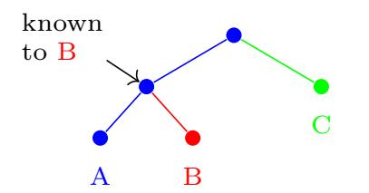

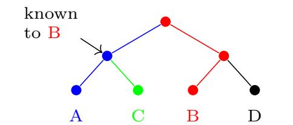

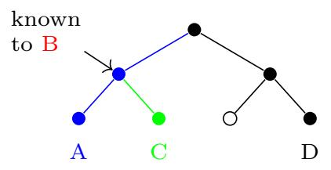

- (a) The ratchet tree in a real group.
- (b) The tree created by malicious B inviting D.
- (c) The tree after D commits removing B.

Fig. 8: The attack on the tree signing of ITK<sub>Atk-3</sub>.

believe this to be an unexpectedly weak guarantee. In particular, it means that malicious insiders can read messages after being removed.<sup>18</sup>

The attack on tree-signing. We call ITK using the tree-signing mechanism from MLS Draft 9 ITK<sub>Atk-3</sub>. We next present a simple and highly practical attack against ITK<sub>Atk-3</sub>. It results in groups with epochs containing no keys of type A) yet for which the epoch key is easy to compute by the malicious insiders.

We first recall the tree signing of  $\mathsf{ITK}_{\mathsf{Atk-3}}$ . It works by storing in each ratchet-tree node v a value  $v.\mathsf{parentHash}$  computed as follows.

```
if v.isroot then v.parentHash \leftarrow \epsilon else v.parentHash \leftarrow Hash(v.parent.pk, v.parent.parentHash)
```

Further, each leaf contains a signature over all its content, including its parentHash, under the long-term key of its owner. This means that during each commit the committer signs the new parentHash of their leaf, which binds all new PKE public keys they generated. We say that the committer's signature attests to the new PKE keys. Now joiners can verify that each PKE public key in the ratchet tree they receive in the welcome message is attested to by some group member who generated it. (The joiners check the validity of the long-term keys in the PKI.)

Intuitively, the issue is, however, that committers only attest to the key pairs they (honestly) generated, but *not* to which parties they informed of the secret keys. This allows a malicious insider to create his own ratchet tree, where they knows secrets of nodes that are not on his direct path. Therefore, removing them from the fake group doesn't cause removal of every key they knows, breaking Invariant (2) of the protocol. A more formal proof of the following theorem is presented in App. E.3.

**Theorem 4.** The ITK<sub>Atk-3</sub> protocol that behaves like ITK but with the old tree-signing mechanism does not securely realize  $(\mathcal{F}_{AS}^{IW}, \mathcal{F}_{KS}^{IW}, \mathcal{F}_{CGKA})$  in the  $(\mathcal{F}_{AS}, \mathcal{F}_{KS}, \mathcal{G}_{RO})$ -hybrid model when  $\mathcal{F}_{CGKA}$  uses the predicates safe and inj-allowed from Fig. 6. That is, for every simulator  $\mathcal{S}$ , there exists an environment  $\mathcal{Z}$  that has non-negligible advantage in distinguishing the ideal world from the hybrid world with the protocol running (and the dummy adversary).

Proof (Sketch). The attack is illustrated in Fig. 8. Assume that the environment  $\mathcal{Z}$  sets up a group with a group creator A adding parties B and C (in this order), leading in the hybrid world to ratchet tree depicted in Fig. 8a. In this state, the adversary corrupts party B, which henceforth is assumed to be malicious, while A and C are never corrupted and, thus, honest. In the following  $\mathcal{Z}$  acts on behalf of the corrupted B and builds the fake ratchet tree from Fig. 8b, meaning  $\mathcal{Z}$  swaps parties B and C (their public keys), then adds party D on behalf of B to the group, outputting a respective welcome message w using B's leaked signing key. Crucially, we observe that the ratchet tree from Fig. 8b represents a valid one that D will accept: In Fig. 8a C's leaf signature only attested to C's leaf key (the green one) as the parent hash field is empty. Second, A's leaf signature does not attests to B's leaf key (but only the blue ones) as the parent hash only includes the nodes on A's direct path to the root. Third,  $\mathcal{Z}$  can re-key B's new path and attest to the fresh keys (the red ones) using the leaked signing key.

The environment then delivers w to D, joining them to the fake group, and afterwards  $\mathcal{Z}$  instructs D remove B, i.e., to propose, commit, and then process the respective commit message c'.

<span id="page-23-0"></span><sup>18</sup> It also seems to contradict the (informal) notion of the "tree-invariant" often cited on the MLS mailing list.

{24}------------------------------------------------

Finally,  $\mathcal{Z}$  queries D's group key key and also computes the expected group key key' by taking D's commit message and using the secret key known to  $\mathcal{Z}$  marked in Fig. 8c and perform the same computation C would in the  $\mathsf{ITK}_{\mathsf{Atk-3}}$  protocol. If  $\mathsf{key} = \mathsf{key}'$ , then  $\mathcal{Z}$  outputs 1 and 0 otherwise.

It remains to convince ourselves that  $\mathcal{Z}$  distinguishes with non-negligible probability for any simulator  $\mathcal{S}$ . It is easy to see that when interacting with the hybrid world  $\mathcal{Z}$  outputs 1. Finally, consider the ideal-world. We argue that  $\mathbf{safe}(c') = \mathbf{true}$  meaning that the functionality outputs an independent and u.a.r. key and, thus,  $\mathcal{Z}$  outputs 0 with overwhelming probability. First, it is easy to see that  $\mathcal{S}$  has to join D to a detached root as no other group state matches, e.g., none has D as a member. Next, observe that D has not been corrupted implying that the node created by D's commit is marked with  $\mathsf{Node}[c'].\mathsf{stat} = \mathsf{good}$  and has no direct exposures, i.e.,  $\mathsf{Node}[c'].\mathsf{exp} = \emptyset$ . As a result, we have  $\mathsf{safe}(c') = \neg \mathsf{*can-traverse}(c')$  while  $\mathsf{*can-traverse}(c') = \mathsf{false}$  as clearly only case (d) might apply but  $\mathsf{know}(c',\mathsf{id}) = \mathsf{false}$  for all  $\mathsf{id} \in \{A,B,C,D\}$  for the following reasons: First, A, C, and D have never been corrupted, in particular implying  $\mathsf{*state-directly-leaks}(c',\mathsf{id}) = \mathsf{false}$  and  $\mathsf{know}(\mathsf{root}_1,\mathsf{id}) = \mathsf{false}$ , where  $\mathsf{root}_1$  denotes the detached root to which D joined. Second, for B, observe that  $\mathsf{*state-directly-leaks}(c',B) = \mathsf{false}$  as  $B \notin \mathsf{Node}[c'].\mathsf{mem}$  and  $B \notin \mathsf{Node}[c'].\mathsf{exp}$  while  $\mathsf{*secrets-replaced}(c',B) = \mathsf{true}$  as B has been removed from that state. Thus, we can deduce that  $\mathsf{safe}(c') = \mathsf{true}$ , concluding the proof.

Fixing tree signing. In essence, we can prevent the attack by modifying the parent hash such that committers attest to the key pairs they generated and to which parties were informed about the secret keys. In general, we can achieve this by computing the parent hash as  $v.\mathsf{parentHash} \leftarrow \mathsf{Hash}(w.\mathsf{pk}, w.\mathsf{parentHash}, w.\mathsf{memberCert})$  where w is v's parent and  $\mathsf{memberCert}$  attests to the set of parties informed about the  $w.\mathsf{sk}$ . It is left to find a good candidate for  $\mathsf{memberCert}$ ; one that is secure and easy to compute. We next discuss 3 candidates for  $\mathsf{memberCert}$ .

The first candidate is called the leaf parent hash. This is the most direct solution which simply sets w.memberCert to the list of all leaves in the subtree of v.sibling that are not unmerged at w. Observe that, by Invariant (2) of ITK, the owners of these leaves, and only they, were informed about w.sk (recall that the unmerged leaves are defined as those that do not know w.sk). One disadvantage of the leaf hash is that it is not very implementation-friendly.

The second candidate, called the tree parent hash, has been initially considered for MLS [38]. It basically sets w-memberCert to the tree hash of v-sibling with the unmerged leaves omitted (recall that ITK computes the tree hash as the Merkle hash of the ratchet tree). Observe that the tree hash binds strictly more than the leaf hash. The tree hash would be more straightforward to compute. Unfortunately, it is not workable due to other mechanisms of MLS.<sup>19</sup>

Therefore, we propose a new candidate called the resolution parent hash. It improves upon the leaf hash in 2 ways: it is more implementation-friendly and it has slightly better deniability properties. The resolution hash sets memberCert to the PKE public keys of nodes in u.origChildResolution where u.origChildResolution is the resolution of u with the unmerged leaves of u.parent omitted. Observe that u.origChildResolution is the resolution of u at the time the last committer in the subtree of v generated the key pair of w.

The reason this works is less direct than in the case of leaf and tree hashes. Intuitively, assume all long-term keys in the subtree of w are uncorrupted. The honest committer who generated w's key pair attests to w.pk and all PKE keys in u.origChildResolution, i.e. those they encrypted w.sk to. These PKE keys are in turn attested to by the honest members in their subtrees who generated them. Applying this argument recursively and relying on the security of the encryption scheme, we can conclude that all key pairs in the ratchet tree remain secure.

#### <span id="page-24-0"></span>6.4 IND-CPA Security Is Insufficient

Many prior analysis of MLS only assume IND-CPA security of the PKE scheme it uses. However, there are PKE schemes that are IND-CPA secure but that make MLS clearly insecure against active

<span id="page-24-1"></span>With adds and removes, the subtree of v can grow or shrink since the last commit, changing the tree hash. It is not clear how to revert these changes.

<span id="page-24-2"></span>With the leaf hash, members sign each other's credentials, thus attesting to being in a group together. The resolution hash gets rid of this side effect.

{25}------------------------------------------------

attackers — despite MLS employing signatures and MACs to protect authenticity — highlighting the inadequacies of those works' simplified security models to account for all relevant aspects (and the danger of analyzing too piecemeal protocols without considering their composition in general).

Consider the protocol  $\mathsf{ITK}_{\mathsf{cpa}}$  which behaves like  $\mathsf{ITK}$  but replaces its PKE scheme with  $\mathsf{PKE}^*$ . PKE\* is IND-CPA secure and has the following property: a ciphertext ctx containing a message m can be modified into  $ctx_i$ , s.t. decrypting  $ctx_i$  outputs  $\bot$  if and only if the i-th bit of m is 0, and otherwise decrypting  $ctx_i$  outputs m.<sup>21</sup> The following attack shows that  $\mathsf{ITK}_{\mathsf{cpa}}$  is clearly insecure in the setting with active attackers. In particular, a malicious insider can decrypt messages after being removed from the group. Let  $\kappa$  denote the length of a path secret used by MLS. The attack proceeds as follows:

- 1. An honest execution leads to an epoch  $E_1$  where the group has  $N = 4\kappa$  members  $P_1, \ldots, P_N$ , ordered according to their leaves from left to right. Further, the ratchet tree has no blanks.
- 2. The adversary corrupts  $P_1$  and  $P_N$ .
- 3.  $P_1$  (honestly) sends a commit  $c_1$ , creating an epoch  $E_2$ .  $P_{N-1}$  transitions to  $E_2$ , and sends a commit  $c_2$  that removes  $P_N$ , creating epoch  $E_3$ .
  - The expectation is that  $E_3$  is secure due to PCS and removing all corrupted members. The adversary will next compute group key in  $E_3$ .
- 4. The adversary has the following information:  $P_1$ 's signing key  $\mathsf{ssk}_1$  (the same in all epochs), the secret key  $\mathsf{sk}$  of the right child of the root in  $E_1$  (corrupted  $P_N$  knows  $\mathsf{sk}$ ), the init secret in  $E_1$  and the ciphertexts  $\mathsf{ctx}Root$  and  $\mathsf{ctx}L\mathsf{child}$  encrypting  $P_1$ 's two last path secrets in  $c_1$ . The adversary shouldn't know the path secret  $\mathsf{sencrypted}$  in  $\mathsf{ctx}L\mathsf{child}$ , since this breaks the tree invariant. He will next learn  $\mathsf{s}$  it bit by bit.
- 5. The members who will decrypt ctxLchild are  $P_{\kappa+1}$  to  $P_{2\kappa}$ . For i=1 to  $\kappa$ , the adversary injects to  $P_{\kappa+i}$  the packet  $c_1$  modified as follows:
  - (a) Replace ctxLchild by  $ctxLchild_i$  obtained using the PKE\* property.
  - (b) Update the confirmation tag accordingly: 1) Decrypt ctxRoot using sk. The result is the next path secret s' after s. 2) Use s' to compute the commit secret. 3) Compute the new key schedule using the init secret in  $E_1$  and the commit secret from 2). 4) Compute the tag.
  - (c) Update the signature using  $ssk_1$ .
- 6. Clearly, if  $P_{\kappa+i}$  accepts, then the *i*-th bit of *s* is 0, else 1. Now the adversary uses *s* to compute the key in  $E_3$ .
- 7. Using s, the adversary derives the secret key for the left child of the root in  $E_2$ . Since this node is in the copath of  $P_{N-1}$ , the adversary can use it to decrypt the commit secret from  $c_2$ . The adversary then computes the init secret in  $E_2$  by honestly running  $P_N$ 's protocol and mixes it with the commit to derive the key schedule in  $E_3$ .

Clearly, however, the **safe** predicate of our  $\mathcal{F}_{CGKA}$  functionality considers the resulting key from epoch  $E_3$  as secure. Hence, we get the following result.

**Theorem 5.** The ITK<sub>cpa</sub> protocol that behaves like ITK does not securely realize ( $\mathcal{F}_{AS}^{IW}$ ,  $\mathcal{F}_{KS}^{IW}$ ,  $\mathcal{F}_{CGKA}^{IW}$ ) in the ( $\mathcal{F}_{AS}$ ,  $\mathcal{F}_{KS}$ ,  $\mathcal{G}_{RO}$ )-hybrid model when  $\mathcal{F}_{CGKA}$  uses the predicates safe and inj-allowed from Fig. 6.

*Proof.* We show that for every simulator S, there exists an environment Z that has non-negligible advantage in distinguishing the ideal world from the real world with  $\mathsf{ITK}_{\mathsf{cpa}}$ . Let S be any simulator. The environment Z executes the attack described above, i.e., it gives appropriate instructions to honest parties and performs the adversary's attacks. Let  $\mathsf{key}'$  denote the group key computed at the end by the adversary. Z fetches the group key  $\mathsf{key}$  in  $E_3$  (via the  $\mathsf{Key}$  query to say  $P_5$ ). If  $\mathsf{key} = \mathsf{key}'$ , it outputs 1 else 0.

We will show that **safe** is true in  $E_3$ . Given this, we can conclude the proof with the following observations: Clearly, in the real world,  $\mathcal{Z}$  always outputs 1 (for simplicity we assume perfect correctness). In the ideal world, since **safe** is true, key is chosen by  $\mathcal{F}_{CGKA}$  random and independent of

<span id="page-25-0"></span><sup>&</sup>lt;sup>21</sup> PKE\* can be easily obtained as a straightforward adaptation of the artificial symmetric encryption scheme by Krawczyk [33] (used to show that the authenticate-then-encrypt paradigm is not secure in general) to the public key setting.

{26}------------------------------------------------

 $\mathcal{S}$ . Since key' is computed by  $\mathcal{Z}$  only from information given to  $\mathcal{S}$ , this means that with overwhelming probability key  $\neq$  key', and hence  $\mathcal{Z}$  outputs 0.

It remains to show that **safe** is true. Informally, the only corruptions are of  $P_1$  and  $P_N$  in  $E_1$ . Transitioning to  $E_1$  "heals" from  $P_1$ 's corruption, since this is an honest commit from them, and transitioning to  $E_3$  heals from  $P_N$ 's corruption, since they are removed.

Formally, we establish that **know** is false for all parties in  $E_3$ . To this end, we observe that \*can-traverse( $c_2$ ) = false (by inspection, all other conditions that can make it true do not occur). Hence, safe is true in  $E_3$ .

Observe that **know** can only be true for  $P_1$  and  $P_N$ , since \*state-directly-leaks is only true for these parties in  $E_1$ . First, \*secrets-replaced $(c_1, P_1)$  is true, since None $[c_1]$ .orig =  $P_1$ . Therefore, know $(c_1, P_1)$  = false and by recursion know $(c_2, P_1)$  = false. Second, \*secrets-replaced $(c_2, P_2)$  is true, since it includes a proposal with act = rem- $P_N$ . Therefore, know $(c_1, P_1)$  = false.

## <span id="page-26-0"></span>7 Sub-optimal Security of ITK

Our analysis uncovered a couple of aspects where security of ITK could be improved, but the changes were not adopted by MLS for non-cryptographic reasons.

Forward-secrecy. Forward-secrecy of ITK is sub-optimal for two reasons. First, when adding a party  $id_t$ , the same key pair is used for the leaf of  $id_t$  and to encrypt  $id_t$ 's secrets in the welcome message. As a result, if  $id_t$  is exposed before it updates its leaf, the key can be used to process the welcome message and recover secrets for all past epochs. (Using separate key pairs for the two tasks is a simple and cheap solution to this issue.)

Second, since a committer refreshes only keys on their direct path, exposing a party allows to recover past commit secrets. Now leaking a past init secret (e.g. by exposing some other party that is later removed) allows to recover past epoch secrets. Using a key-updatable encryption scheme would improve this [6] but doing this would require first designing a compatible tree-signing mechanism.

Protection against bad randomness. ITK supports ECDSA signatures, which leak the secret key in case randomness is reused. Independently, the effect of bad randomness on all operations can be (partly) mitigated by a so-called randomness pool, mixing the fresh randomness with the secret state. Then, bad randomness would not compromise a previously secure state but just hamper PCS. Unfortunately, not supporting ECDSA would leave MLS with no FIPS compliant mode which can be problematic in practice. <sup>22</sup>

Multi-group security. We prove security of ITK for a single group. In particular, this means that re-using PKI keys between groups is outside of our model. Interestingly, our statement would imply multi-group security by composition if we used a global PKI functionality in the sense of [23]. Unfortunately, this does not work for ITK for two reasons. First, GUC was envisioned to formalize strong deniability, where protocol executions can be simulated without the secret PKI keys and hence do not constitute a proof of participation. However, the fact that ITK signs messages makes it non-deniable.<sup>23</sup> Moreover, the typical techniques used to cope with non-deniable protocols in GUC (e.g. [24]) rely on strict domain separation on the cryptographic primitives, e.g., a values signed during the execution of one protocol instance cannot be used in another instance. However, this is not true for ITK, where for example, signed key packages can be used across groups. We leave proving or disproving multi-group security of ITK as an important open problem.

# References

<span id="page-26-1"></span>[1] Messagying layer security (mls) wg - meeting minutes for interim 2020-1, January 2020. https://datatracker.ietf.org/doc/minutes-interim-2020-mls-01-202001110900/.

<span id="page-26-2"></span>The non-FIPS compliant ciphersuites do not suffer from this issue and so, somewhat ironically, using them may result in a *more* secure insanitation than the FIPS ones.

<span id="page-26-3"></span><sup>&</sup>lt;sup>23</sup> Encrypting the signatures would not help, as corrupted parties leak decryption keys.

{27}------------------------------------------------

- <span id="page-27-16"></span>[2] Jo¨el Alwen, Benedikt Auerbach, Mirza Ahad Baig, Miguel Cueto Noval, Karen Klein, Guillermo Pascual-Perez, Krzysztof Pietrzak, and Michael Walter. Grafting key trees: Efficient key management for overlapping groups. In Kobbi Nissim and Brent Waters, editors, *TCC 2021, Part III*, volume 13044 of *LNCS*, pages 222–253. Springer, Heidelberg, November 2021.
- <span id="page-27-14"></span>[3] Jo¨el Alwen, Benedikt Auerbach, Miguel Cueto Noval, Karen Klein, Guillermo Pascual-Perez, and Krzysztof Pietrzak. DeCAF: Decentralizable continuous group key agreement with fast healing. Cryptology ePrint Archive, Report 2022/559, 2022. <https://eprint.iacr.org/2022/559>.
- <span id="page-27-13"></span>[4] Jo¨el Alwen, Benedikt Auerbach, Miguel Cueto Noval, Karen Klein, Guillermo Pascual-Perez, Krzysztof Pietrzak, and Michael Walter. CoCoA: Concurrent continuous group key agreement. In Orr Dunkelman and Stefan Dziembowski, editors, *EUROCRYPT 2022, Part II*, volume 13276 of *LNCS*, pages 815–844. Springer, Heidelberg, May / June 2022.
- <span id="page-27-9"></span>[5] Jo¨el Alwen, Bruno Blanchet, Eduard Hauck, Eike Kiltz, Benjamin Lipp, and Doreen Riepel. Analysing the HPKE standard. In Anne Canteaut and Fran¸cois-Xavier Standaert, editors, *EUROCRYPT 2021, Part I*, volume 12696 of *LNCS*, pages 87–116. Springer, Heidelberg, October 2021.
- <span id="page-27-7"></span>[6] Jo¨el Alwen, Sandro Coretti, Yevgeniy Dodis, and Yiannis Tselekounis. Security analysis and improvements for the IETF MLS standard for group messaging. In Daniele Micciancio and Thomas Ristenpart, editors, *CRYPTO 2020, Part I*, volume 12170 of *LNCS*, pages 248–277. Springer, Heidelberg, August 2020.
- <span id="page-27-8"></span>[7] Jo¨el Alwen, Sandro Coretti, Yevgeniy Dodis, and Yiannis Tselekounis. Modular design of secure group messaging protocols and the security of MLS. In Giovanni Vigna and Elaine Shi, editors, *ACM CCS 2021*, pages 1463–1483. ACM Press, November 2021.
- <span id="page-27-5"></span>[8] Jo¨el Alwen, Sandro Coretti, Daniel Jost, and Marta Mularczyk. Continuous group key agreement with active security. In Rafael Pass and Krzysztof Pietrzak, editors, *TCC 2020, Part II*, volume 12551 of *LNCS*, pages 261–290. Springer, Heidelberg, November 2020. Full version: [https://eprint.iacr.](https://eprint.iacr.org/2020/752.pdf) [org/2020/752.pdf](https://eprint.iacr.org/2020/752.pdf).
- <span id="page-27-15"></span>[9] Jo¨el Alwen, Dominik Hartmann, Eike Kiltz, and Marta Mularczyk. Server-aided continuous group key agreement. Cryptology ePrint Archive, Report 2021/1456, 2021. [https://eprint.iacr.org/](https://eprint.iacr.org/2021/1456) [2021/1456](https://eprint.iacr.org/2021/1456).
- <span id="page-27-6"></span>[10] Jo¨el Alwen, Margarita Capretto, Miguel Cueto, Chethan Kamath, Karen Klein, Guillermo Pascual-Perez, Krzysztof Pietrzak, and Michael Walter. Keep the dirt: Tainted treekem, adaptively and actively secure continuous group key agreement. In *2021 IEEE Symposium on Security and Privacy, S&P*, pages 268–284, 2021. Full version: <https://eprint.iacr.org/2019/1489>.
- <span id="page-27-17"></span>[11] Michael Backes, Markus D¨urmuth, Dennis Hofheinz, and Ralf K¨usters. Conditional reactive simulatability. In Dieter Gollmann, Jan Meier, and Andrei Sabelfeld, editors, *ESORICS 2006*, volume 4189 of *LNCS*, pages 424–443. Springer, Heidelberg, September 2006.
- <span id="page-27-3"></span>[12] R. Barnes, B. Beurdouche, , J. Millican, E. Omara, K. Cohn-Gordon, and R. Robert. The messaging layer security (mls) protocol (draft-ietf-mls-protocol-12). Technical report, IETF, Mar 2020. [https:](https://datatracker.ietf.org/doc/draft-ietf-mls-protocol/12/) [//datatracker.ietf.org/doc/draft-ietf-mls-protocol/12/](https://datatracker.ietf.org/doc/draft-ietf-mls-protocol/12/).
- <span id="page-27-1"></span>[13] Richard Barnes. Subject: [MLS] Remove without double-join (in TreeKEM). MLS Mailing List, 06 August2018 13:01UTC. [https://mailarchive.ietf.org/arch/msg/mls/](https://mailarchive.ietf.org/arch/msg/mls/Zzw2tqZC1FCbVZA9LKERsMIQXik) [Zzw2tqZC1FCbVZA9LKERsMIQXik](https://mailarchive.ietf.org/arch/msg/mls/Zzw2tqZC1FCbVZA9LKERsMIQXik).
- <span id="page-27-18"></span>[14] Richard Barnes. MLS Protocol Pull Requests #396: Authenticate group membership in MLSPlaintext, 18 August 2020. <https://github.com/mlswg/mls-protocol/pull/396>.
- <span id="page-27-19"></span>[15] Richard Barnes. MLS Protocol Pull Requests #416: Inlclude the signature in the confirmation tag, 18 August 2020. <https://github.com/mlswg/mls-protocol/pull/416>.
- <span id="page-27-2"></span>[16] Richard Barnes. Subject: [MLS] Proposal: Proposals (was: Laziness). MLS Mailing List, 22 August 2019 22:17UTC. [https://mailarchive.ietf.org/arch/msg/mls/5dmrkULQeyvNu5k3MV\\_sXreybj0/](https://mailarchive.ietf.org/arch/msg/mls/5dmrkULQeyvNu5k3MV_sXreybj0/).
- <span id="page-27-0"></span>[17] Karthikeyan Bhargavan, Richard Barnes, and Eric Rescorla. TreeKEM: Asynchronous Decentralized Key Management for Large Dynamic Groups, May 2018. Published at [https://mailarchive.ietf.](https://mailarchive.ietf.org/arch/msg/mls/e3ZKNzPC7Gxrm3Wf0q96dsLZoD8) [org/arch/msg/mls/e3ZKNzPC7Gxrm3Wf0q96dsLZoD8](https://mailarchive.ietf.org/arch/msg/mls/e3ZKNzPC7Gxrm3Wf0q96dsLZoD8).
- <span id="page-27-10"></span>[18] Karthikeyan Bhargavan, Benjamin Beurdouche, and Prasad Naldurg. Formal Models and Verified Protocols for Group Messaging: Attacks and Proofs for IETF MLS. Research report, Inria Paris, December 2019.
- <span id="page-27-12"></span>[19] Alexander Bienstock, Yevgeniy Dodis, and Paul R¨osler. On the price of concurrency in group ratcheting protocols. In Rafael Pass and Krzysztof Pietrzak, editors, *TCC 2020, Part II*, volume 12551 of *LNCS*, pages 198–228. Springer, Heidelberg, November 2020.
- <span id="page-27-11"></span>[20] Chris Brzuska, Eric Cornelissen, and Konrad Kohbrok. Security analysis of the mls key derivation. In *2022 IEEE Symposium on Security and Privacy, S&P*, pages 595–613, Los Alamitos, CA, USA, may 2022. IEEE Computer Society.
- <span id="page-27-4"></span>[21] Bushing, Marcan, Segher, and Sven. Console hacking 2010 — PS3 epic fail. In *27th Chaos Communication Congress — 27C3*, 2010. [https://fahrplan.events.ccc.de/congress/2010/Fahrplan/](https://fahrplan.events.ccc.de/congress/2010/Fahrplan/events/4087.en.html) [events/4087.en.html](https://fahrplan.events.ccc.de/congress/2010/Fahrplan/events/4087.en.html).

{28}------------------------------------------------

- <span id="page-28-10"></span>[22] Ran Canetti. Universally composable security: A new paradigm for cryptographic protocols. In *42nd FOCS*, pages 136–145. IEEE Computer Society Press, October 2001.
- <span id="page-28-14"></span>[23] Ran Canetti, Yevgeniy Dodis, Rafael Pass, and Shabsi Walfish. Universally composable security with global setup. In Salil P. Vadhan, editor, *TCC 2007*, volume 4392 of *LNCS*, pages 61–85. Springer, Heidelberg, February 2007.
- <span id="page-28-15"></span>[24] Ran Canetti, Daniel Shahaf, and Margarita Vald. Universally composable authentication and keyexchange with global PKI. In Chen-Mou Cheng, Kai-Min Chung, Giuseppe Persiano, and Bo-Yin Yang, editors, *PKC 2016, Part II*, volume 9615 of *LNCS*, pages 265–296. Springer, Heidelberg, March 2016.
- <span id="page-28-5"></span>[25] Katriel Cohn-Gordon, Cas Cremers, Luke Garratt, Jon Millican, and Kevin Milner. On ends-to-ends encryption: Asynchronous group messaging with strong security guarantees. In David Lie, Mohammad Mannan, Michael Backes, and XiaoFeng Wang, editors, *ACM CCS 2018*, pages 1802–1819. ACM Press, October 2018.
- <span id="page-28-6"></span>[26] Cas Cremers, Britta Hale, and Konrad Kohbrok. The complexities of healing in secure group messaging: Why cross-group effects matter. In Michael Bailey and Rachel Greenstadt, editors, *USENIX Security 2021*, pages 1847–1864. USENIX Association, August 2021.
- <span id="page-28-9"></span>[27] Julien Devigne, C´eline Duguey, and Pierre-Alain Fouque. MLS group messaging: How zero-knowledge can secure updates. In Elisa Bertino, Haya Shulman, and Michael Waidner, editors, *ESORICS 2021, Part II*, volume 12973 of *LNCS*, pages 587–607. Springer, Heidelberg, October 2021.
- <span id="page-28-16"></span>[28] Yevgeniy Dodis, Thomas Ristenpart, John P. Steinberger, and Stefano Tessaro. To hash or not to hash again? (In)differentiability results for *H*<sup>2</sup> and HMAC. In Reihaneh Safavi-Naini and Ran Canetti, editors, *CRYPTO 2012*, volume 7417 of *LNCS*, pages 348–366. Springer, Heidelberg, August 2012.
- <span id="page-28-8"></span>[29] Keita Emura, Kaisei Kajita, Ryo Nojima, Kazuto Ogawa, and Go Ohtake. Membership privacy for asynchronous group messaging. Cryptology ePrint Archive, Report 2022/046, 2022. [https:](https://eprint.iacr.org/2022/046) [//eprint.iacr.org/2022/046](https://eprint.iacr.org/2022/046).
- <span id="page-28-2"></span>[30] Keitaro Hashimoto, Shuichi Katsumata, Eamonn Postlethwaite, Thomas Prest, and Bas Westerbaan. A concrete treatment of efficient continuous group key agreement via multi-recipient pkes. In *Proceedings of the 2021 ACM SIGSAC Conference on Computer and Communications Security*, pages 1441–1462, 2021.
- <span id="page-28-1"></span>[31] Daniel Jost, Ueli Maurer, and Marta Mularczyk. Efficient ratcheting: Almost-optimal guarantees for secure messaging. In Yuval Ishai and Vincent Rijmen, editors, *EUROCRYPT 2019, Part I*, volume 11476 of *LNCS*, pages 159–188. Springer, Heidelberg, May 2019.
- <span id="page-28-11"></span>[32] Daniel Jost, Ueli Maurer, and Marta Mularczyk. A unified and composable take on ratcheting. In Dennis Hofheinz and Alon Rosen, editors, *TCC 2019, Part II*, volume 11892 of *LNCS*, pages 180–210. Springer, Heidelberg, December 2019.
- <span id="page-28-13"></span>[33] Hugo Krawczyk. The order of encryption and authentication for protecting communications (or: How secure is SSL?). In Joe Kilian, editor, *CRYPTO 2001*, volume 2139 of *LNCS*, pages 310–331. Springer, Heidelberg, August 2001.
- <span id="page-28-17"></span>[34] Hugo Krawczyk. Cryptographic extraction and key derivation: The HKDF scheme. In Tal Rabin, editor, *CRYPTO 2010*, volume 6223 of *LNCS*, pages 631–648. Springer, Heidelberg, August 2010.
- <span id="page-28-3"></span>[35] Matthew A. Miller. Messaging layer security (mls) wg - meeting minutes for ietf105, August 2019. <https://datatracker.ietf.org/doc/minutes-105-mls/>.
- <span id="page-28-12"></span>[36] Saurabh Panjwani. Tackling adaptive corruptions in multicast encryption protocols. In Salil P. Vadhan, editor, *TCC 2007*, volume 4392 of *LNCS*, pages 21–40. Springer, Heidelberg, February 2007.
- <span id="page-28-0"></span>[37] Eric Rescorla. Subject: [MLS] TreeKEM: An alternative to ART. MLS Mailing List, 03 May 2018 14:27UTC. <https://mailarchive.ietf.org/arch/msg/mls/WRdXVr8iUwibaQu0tH6sDnqU1no>.
- <span id="page-28-4"></span>[38] Nick Sullivan. Subject: [MLS] Virtual interim minutes. MLS Mailing List, 29 January 2020 21:39UTC. <https://mailarchive.ietf.org/arch/msg/mls/ZZAz6tXj-jQ8nccf7SyIwSnhivQ/>.
- <span id="page-28-7"></span>[39] Matthew Weidner. Group messaging for secure asynchronous collaboration. MPhil Dissertation, 2019. Advisors: A. Beresford and M. Kleppmann, 2019. <https://mattweidner.com/acs-dissertation.pdf>.

{29}------------------------------------------------

# <span id="page-29-0"></span>**A Preliminaries**

### <span id="page-29-1"></span>**A.1 Notation**

We denote the security parameter by *κ* and all our algorithms implicitly take 1*<sup>κ</sup>* as input. For an algorithm *A*, we write *A*(·; *r*) to denote that *A* is run with explicit randomness *r*. We use *v* ← *x* to denote assigning the value *x* to the variable *v* and *v* ←\$ *S* to denote sampling an element u.a.r. from a set *S*.

*Data structures.* If *V* denotes a variable storing a set, then we write *V* +← *x* and *V* -← *x* as shorthands for *V* ← *V* ∪ {*x*} and *V* ← *V* \ {*x*}, respectively. For vectors *x* := (*x*1*, . . . , xn*) and *y* := (*y*1*, . . . , ym*) we denote the concatenation by *x* ++ *y* = (*x*1*, . . . , xn, y*1*, . . . , ym*) and use *x* ++← *v* as a shorthand for *x* ← *x* ++ (*v*). Moreover, let *x.*reverse() := (*xn, xn*−1*, . . . , x*1) and let *x.*indexof(*z*) denote the smallest *i* ∈ **N** such that *x<sup>i</sup>* = *z* (or ⊥ if not such *i* exists). Finally, let zip(*x, y*) := ((*x*1*, y*1)*, . . . ,*(*xn, yn*)) if *n* = *m*, or ⊥ otherwise. We further make use of associative arrays and use *A*[*i*] ← *x* and *y* ← *A*[*i*] to denote assignment and retrieval of element *i*, respectively. Additionally, we denote by *A*[∗] ← *v* the initialization of the array to the default value *v*. In a slight abuse of notation, for sets of tuples *S* ⊆ X × Y, we define *S*[*x*] := {*y* | (*x, y*) ∈ *S*}, akin to associative arrays.

For simplicity we moreover use wildcard notation when dealing with sets of tuples and multiargument associative arrays. For instance, for an array with domain I × J , we write *A*[∗*, j*] := {*A*[*i, j*] | *i* ∈ I} and for a set *S* ⊆ I × J we write (*i,* ∗) ∈ *S* as a shorthand for the condition ∃*j* ∈ J : (*i, j*) ∈ *S*.

*Keywords.* In the pseudocode, we use the following keywords:

- **– req** *cond* denotes that if the condition *cond* is false, then the current function unwinds all state changes and immediately returns ⊥.
- **– parse** (*m*1*, . . . , mn*) ← *m* denotes an attempt to parse a message *m* as a tuple. If *m* is not of the correct format, the current function unwinds all state changes and immediately returns ⊥.
- **– try** *y* ← ∗func(*x*) is a shorthand notation for calling a helper ∗func and executing **req** *y* ̸= ⊥.
- **– assert** *cond* is only used to describe functionalities. It denotes that if *cond* is false, then the given functionality permanently halts, making the real and ideal worlds trivially distinguishable (this is used to validate inputs of the simulator).

## <span id="page-29-2"></span>**A.2 Cryptographic Primitives**

We introduce the basic cryptographic primitives used throughout this work.

*Signature Scheme.* A signature scheme is a tuple of PPT algorithms Sig := (Sig*.*kg*,* Sig*.*sign*,* Sig*.*vrf). For a public/secret key pair (spk*,*ssk) ← Sig*.*kg() from the key-generation algorithm, we denote signing by sig ← Sig*.*sign(ssk*, m*), and the verification by Sig*.*vrf(spk*,*sig*, m*). We require the standard existential unforgeability under chosen message attacks (EUF-CMA) notion.

*Public Key Encryption.* A public key encryption scheme is a tuple of algorithms PKE := (PKE*.*kg*,* PKE*.*enc*,* PKE*.*dec). For a public/secret key pair (pk*,*sk) ← pk() from the key-generation algorithm, we denote encryption by*c* ← PKE*.*enc(pk*, m*), and decryption by *m* ← PKE*.*dec(sk*, c*). We require the standard indistinguishability under chosen ciphertext (IND-CCA2) notion.

*Message Authentication Code.* A message authentication code (MAC) scheme is a tuple of algorithms MAC := (MAC*.*tag*,* MAC*.*vrf). For a uniformly random key *k*, we denote by *t* ← MAC*.*tag(*k, m*) the tagging algorithm and by MAC*.*vrf(*k, t, m*) the respective verification algorithm.

Proving ITK secure requires two non-standard assumptions on the MAC: *extractability* and *collision resistance*. The first assumption means that from a valid tag, it is possible to extract the corresponding message and key (in the sense of a proof of knowledge). The second assumption means that an adversary should not be able to come up with any collision MAC*.*tag(*k*1*, m*1) = MAC*.*tag(*k*2*, m*2) for (*k*1*, m*1) ̸= (*k*2*, m*2). Neither assumption is implied by EUF-CMA security.

To this end, we model the MAC in the random oracle model (ROM). That is, in the security proof we simply replace all calls to MAC*.*tag(*k, m*) by invocations of *RO*(*k, m*) and MAC*.*vrf simply 

{30}------------------------------------------------

comparing the tags. Note that for HMAC, as used by MLS, this assumption is valid if the underlying compression function is assumed to be a random oracle [28].

HKDF. The HMAC-based Extract-and-Expand Key Derivation Function is a tuple of algorithms HKDF = (HKDF.Extract, HKDF.Expand). The extraction algorithm  $k \leftarrow \text{HKDF.Extract}(s_0, s_1)$  outputs a u.a.r key if either  $s_0$  or  $s_1$  has high min-entropy. The expansion algorithm  $k_{\text{lbl}} \leftarrow \text{HKDF.Expand}(k, \text{lbl})$ , given a key k, outputs an independent u.a.r. key for each (public) label lbl.

We model its security in the ROM. Note that MLS's requirement of the extraction being secure if either input has high (conditional) min-entropy anyway deviates from the HKDF RFC and the respective standard security notion [34].

Hash Function. Finally, we use a generic hash function Hash, mapping from an arbitrary input space to a fixed length output. For security, we use the ROM as well.

## <span id="page-30-0"></span>B Details of the Security Model

## <span id="page-30-1"></span>**B.1** PKI Functionalities

The formal description of the Authentication Service and Keypackage Service functionalities can be found in Fig. 9.

Note that the ideal-world version of the Authentication Service,  $\mathcal{F}_{AS}^{IW}$ , the adversary gets to provide both the secret and public keys, whenever a party requests to register a spk. This reflects that those keys in the ideal world merely function as identifiers and do not convey any significance with respect to security. Indeed, whether a key is considered secure or not, is tracked via the Exposed set, which reflects whether a given key is known to the adversary in the real world (e.g., having leaked or having been sampled with bad randomness). Moreover, observe that the functionality treats keys registered by the adversary conservatively: it only treats keys from other honest parties as secure (e.g., when registering the spk of id, that has never leaked, also for id') and assumes for all other keys that the adversary might know the corresponding secret key.

For the Keypackage Service, observe that in the using an ssk to register a key package with bad randomness is assumed to leak ssk. As a result, the Authentication Service is notified of this leakage, and (in the real world) ssk is handed to the adversary. (In the ideal world, the adversary chose ssk in the first place.) This behavior reflects that the key package is (potentially) signed using ssk and that MLSallows to use of ECDSA that exhibits this leakage.

#### <span id="page-30-2"></span>**B.2** The CGKA Functionality

The formal description of the  $\mathcal{F}_{CGKA}$  functionality is depicted in Figs. 10 to 12. We refer to Sec. 3.5 for a high-level description thereof. One difference from Sec. 3.5 we would like to highlight is the functionality related to so-called "add-only" mode of commits in MLS. That is, if the committed proposal vector contains only adds (and is not empty), then MLS permits skipping the implicit update of the committer. We model this with the force-rekey flag inputted to commit: if force-rekey = false, then an add-only commit does not do the implicit update, whereas if either force-rekey = true or there are non-add proposals, then the implicit update is performed. (Skipping the update also implies ignoring the new spk.)

#### <span id="page-30-3"></span>C Details on the ITK Protocol

## <span id="page-30-4"></span>C.1 Protocol State

The ratchet tree. Formally, the ratchet tree  $\tau$  is a left-balanced binary tree with n nodes, LBBT<sub>n</sub>.

**Definition 1 (Left-Balanced Binary Tree).** For  $n \in \mathbb{N}$  the  $n^{th}$  left-balanced binary tree is denoted by LBBT<sub>n</sub>. Specifically, LBBT<sub>1</sub> is the tree consisting of one node. Furthermore, if  $m = \text{mp2}(n) \coloneqq \max\{2^p : p \in \mathbb{N} \land 2^p < n\}$ , then LBBT<sub>n</sub> is the (undirected) tree whose root has left and right subtrees LBBT<sub>m</sub> and LBBT<sub>n-m</sub>.

{31}------------------------------------------------

```
Functionality \mathcal{F}_{AS} and \mathcal{F}_{AS}^{IW}
The functionality is parameterized by a key generation algorithm gen-sk().
 Initialization
                                                                                    Input (verify-cert, id', spk)
                                                                                                                                                          Input (corRand, id, b),
                                                                                                                                                                                                    b \in \{\mathsf{good}, \mathsf{bad}\}
                                                                                       Send (id', spk) \in Registered to id.
     Registered \leftarrow \emptyset // registered identity-public
                                                                                                                                                             \text{RndCor}[\mathsf{id}] \leftarrow b
     key pairs
                                                                                    \mathbf{Input}\ (\mathtt{get-ssk}, \mathsf{spk})
    Exposed \leftarrow \emptyset // exposed public keys
                                                                                       Send SSK[id, spk] to the party id.
                                                                                                                                                          Inputs from \mathcal{F}_{\text{\tiny KS}}.
     \overline{\mathsf{SSK}[*,*]} \leftarrow \bot // honestly generated secret
     keys
                                                                                    Input (del-ssk, spk)
                                                                                                                                                          Input (exposed, id, spk)
     \operatorname{RndCor}[*] \leftarrow \operatorname{\mathsf{good}}
                                                                                       \mathsf{SSK}[\mathsf{id},\mathsf{spk}] \leftarrow \bot
                                                                                                                                                            Exposed +← spk
                                                                                                                                                             Send SSK[id, spk] to the adversary.
 Inputs from a party id
                                                                                    Inputs from the adversary
                                                                                                                                                          Inputs from \mathcal{F}_{\text{CGKA}}.
 Input (register-spk)
                                                                                    \mathbf{Input}\ (\mathtt{register}\mathtt{-spk}, \mathsf{id}, \mathsf{spk})
    if \operatorname{RndCor}[id] = good then
                                                                                       if (*, spk) ∉ Registered then
                                                                                                                                                          \mathbf{Input}\ (\mathtt{has-ssk},\mathsf{spk},\mathsf{id})
          (\mathsf{spk}, \mathsf{ssk}) \leftarrow \$ \mathsf{gen-sk}()
                                                                                             \mathsf{Exposed} + \leftarrow \mathsf{spk}
                                                                                                                                                             \overline{[\mathrm{Send}\;\mathsf{SSK}[\mathsf{id},\mathsf{spk}]} \neq \bot \;\mathrm{to}\;\mathcal{F}_{\scriptscriptstyle\mathrm{CGKA}}.
    else
                                                                                       Registered +\leftarrow (id, spk)
          Send (rnd, id) to the adversary and receive
                                                                                    Input (expose, id)
          (\mathsf{spk}, \mathsf{ssk}) \leftarrow \$ \mathsf{gen-sk}(r)
                                                                                       Exposed +\leftarrow \{spk \mid
     Send (sample-ssk, id) to the adversary and
                                                                                                                         \mathsf{SSK}[\mathsf{id},\mathsf{spk}] \neq \bot \}
     receive (spk, ssk).
                                                                                       Send SSK[id, *] to the adversary.
     |\mathbf{if} \operatorname{RndCor}[\mathsf{id}] \neq \mathsf{good} \ \mathbf{then}|
        Exposed +← spk
     \mathsf{SSK}[\mathsf{id},\mathsf{spk}] \leftarrow \mathsf{ssk}
     Registered +\leftarrow (id, spk)
     Send (register-spk, id, spk) to the adversary.
     Send spk to the party id.
```

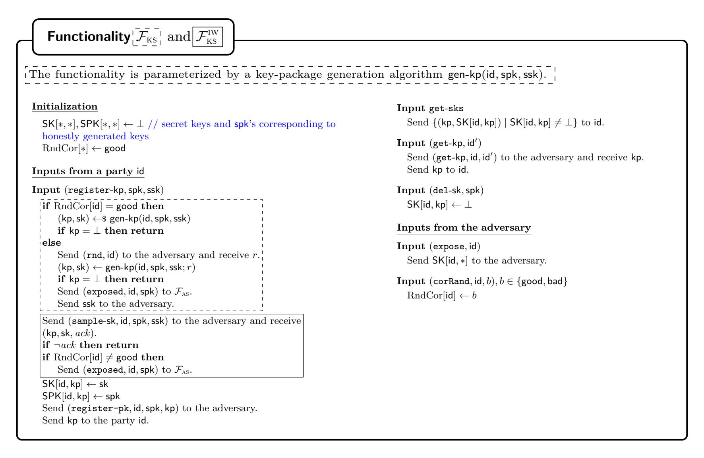

Fig. 9: The Authentication and Key Service functionalities  $\mathcal{F}_{AS}$  and  $\mathcal{F}_{KS}$ , and their ideal-world counterparts  $\mathcal{F}_{AS}^{IW}$  and  $\mathcal{F}_{KS}^{IW}$ . Code marked by solid or dashed boxes are executed only by the respective version, whereas code outside those boxes is shared by both variants.

{32}------------------------------------------------

#### Functionality $\mathcal{F}_{\text{cgka}}$

<span id="page-32-0"></span>The functionality expects as part of the instance's session identifier sid the group creator's identity  $id_{creator}$ . It is parameterized in the predicates safe(c), specifying which keys are confidential, and inj-allowed(c, id), specifying when authenticity is not guarantees.

```
Initialization
                                                                                                                                Input (Process, c, \vec{p})
                                                                                                                                    Send (Process, id, c, \vec{p}) to the adversary and
   Ptr[*], Node[*], Prop[*], Wel[*] \leftarrow \bot
                                                                                                                                            receive (ack, rt, orig', spk').
   \operatorname{RndCor}[*] \leftarrow \operatorname{good}; \operatorname{\mathsf{HasKey}}[*] \leftarrow \operatorname{\mathsf{false}}
                                                                                                                                    if \neg*req-correctness('proc', id, c, \vec{p}) then
   \mathsf{rootCtr} \leftarrow 0
                                                                                                                                          req ack
                                                                                                                                     *fill-props(id, \vec{p})
Inputs from id<sub>creator</sub>
                                                                                                                                    if Node[c] = \bot \land rt = \bot then
Input (Create, spk)
                                                                                                                                          mem \leftarrow *members(Ptr[id], orig', \vec{p}, spk')
   req Node[root_0] = \bot \land *valid-spk(id_{creator}, spk)
                                                                                                                                          assert mem \neq \bot \land inj-allowed(Ptr[id], id)
   \mathsf{mem} \leftarrow \{\mathsf{id}_{\mathsf{creator}}, \mathsf{spk}\}
                                                                                                                                          \mathsf{Node}[c] \leftarrow \mathbf{*create\text{-}child}(\mathsf{Ptr}[\mathsf{id}],\mathsf{orig}',\vec{p},\mathsf{mem},\mathsf{adv})
   \mathsf{Node}[\mathsf{root}_0] \leftarrow \textbf{*create-root}(\mathsf{id}_{\mathsf{creator}}, \mathsf{mem}, \mathsf{RndCor}[\mathsf{id}_{\mathsf{creator}}])
                                                                                                                                    else
   \mathsf{HasKey}[\mathsf{id}_{\mathsf{creator}}] \leftarrow \mathsf{true}; \, \mathsf{Ptr}[\mathsf{id}_{\mathsf{creator}}] \leftarrow \mathsf{root}_0
                                                                                                                                          if Node[c] = \bot then c' \leftarrow root_{rt}
                                                                                                                                          else c' \leftarrow c
Inputs from a party id
                                                                                                                                          id_c \leftarrow Node[c'].orig
                                                                                                                                          \mathsf{spk}_c \leftarrow \mathsf{Node}[c'].\mathsf{mem}[\mathsf{id}_c]
\mathbf{Input} \; (\mathsf{Propose}, \mathsf{act}), \mathsf{act} \in \{\mathsf{up\text{-}spk}, \mathsf{add\text{-}id}_t, \mathsf{rem\text{-}id}_t\}
                                                                                                                                          mem \leftarrow *members(Ptr[id], id_c, \vec{p}, spk_c)
   \mathbf{req} \; \mathsf{Ptr}[\mathsf{id}] \neq \bot
                                                                                                                                          assert mem \neq \bot
   Send (Propose, id, act) to the adversary and
                                                                                                                                          \textbf{*valid-successor}(c',\mathsf{id},\vec{p},\mathsf{mem})
               receive (p, \mathsf{spk}_t, ack).
                                                                                                                                          if c \neq c' then *attach(c, c', id, \vec{p})
   if ¬*req-correctness('prop', id, act) then req ack
                                                                                                                                    if \exists p \in \vec{p} : \mathsf{Prop}[p].\mathsf{act} = \mathsf{rem-id} \ \mathbf{then}
   if act = up\text{-spk then assert*valid-spk}(id, spk)
                                                                                                                                          \mathsf{Ptr}[\mathsf{id}] \leftarrow \bot
   if act = add-id<sub>t</sub> then act \leftarrow add-id<sub>t</sub>-spk<sub>t</sub>
                                                                                                                                    \mathbf{else}
   if Prop[p] = \bot then
                                                                                                                                          \mathbf{assert} \ \mathsf{id} \in \mathsf{Node}[c].\mathsf{mem}
         \mathsf{Prop}[p] \leftarrow \mathbf{*create\text{-}prop}(\mathsf{Ptr}[\mathsf{id}], \mathsf{id}, \mathsf{act}, \mathsf{RndCor}[\mathsf{id}])
                                                                                                                                          \mathsf{Ptr}[\mathsf{id}] \leftarrow c
   else
                                                                                                                                          HasKey[id] ← true
          *consistent-prop(p, id, act, RndCor[id])
                                                                                                                                    assert cons-invariant \wedge auth-invariant
   if RndCor[id] = bad then
                                                                                                                                    return *output-proc(c)
         Send (exposed, id, spk) to \mathcal{F}_{AS}.
   return p
                                                                                                                                Input (Join, w)
                                                                                                                                    Send (Join, id, w) to the adversary and
Input (Commit, \vec{p}, spk, force-rekey)
                                                                                                                                            receive (ack, c', orig', mem').
   \mathbf{req} \; \mathsf{Ptr}[\mathsf{id}] \neq \bot
                                                                                                                                    req ack
   Send (Commit, id, \vec{p}, \mathsf{spk}, \mathsf{force\text{-}rekey}) to the adversary
                                                                                                                                    c \leftarrow \mathsf{Wel}[w]
           and receive (ack, c, w, rt).
                                                                                                                                    if c = \bot then
   if \neg*req-correctness('comm', id, \vec{p}, spk, force-rekey) then req ack
                                                                                                                                          if Node[c'] \neq \bot then c \leftarrow c'
    *fill-props(id, \vec{p})
                                                                                                                                          else
   if \neg \text{force-rekey} \wedge *\text{only-adds}(\vec{p}) \text{ then}
                                                                                                                                               rootCtr++
         spk \leftarrow Node[Ptr[id]].mem[id]
                                                                                                                                               c \leftarrow \mathsf{root}_{\mathsf{rootCtr}}
   assert *valid-spk(id, spk)
                                                                                                                                               Node[c] \leftarrow *create-root(orig', mem', adv)
   mem \leftarrow *members(Ptr[id], id, \vec{p}, spk)
                                                                                                                                          \mathsf{Wel}[w] \leftarrow c
   \mathbf{assert} \ \mathsf{mem} \neq \bot \land (\mathsf{id}, \mathsf{spk}) \in \mathsf{mem}
                                                                                                                                    \mathsf{Ptr}[\mathsf{id}] \leftarrow c
   if Node[c] = \bot \land rt = \bot then
                                                                                                                                    \mathsf{HasKey}[\mathsf{id}] \leftarrow \mathsf{true}
         if \negforce-rekey \wedge *only-adds(\vec{p}) then
                                                                                                                                    assert id \in Node[c].mem \land cons-invariant
               \mathsf{stat} \leftarrow \mathsf{bad}
                                                                                                                                                 ∧ auth-invariant
         else stat \leftarrow \operatorname{RndCor}[id]
                                                                                                                                    return *output-join(c)
         \mathsf{Node}[c] \leftarrow \mathbf{*create\text{-}child}(\mathsf{Ptr}[\mathsf{id}], \mathsf{id}, \vec{p}, \mathsf{mem}, \mathsf{stat})
   else
         if Node[c] = \bot then c' \leftarrow root_{rt}
                                                                                                                                Corruptions
         else c' \leftarrow c
          *consistent-comm(c', id, \vec{p}, mem)
                                                                                                                                Input (Expose, id)
         if c \neq c' then *attach(c, c', id, \vec{p})
                                                                                                                                    if Ptr[id] \neq \bot then
    assert w \neq \bot iff \exists p \in \vec{p} : \mathsf{Node}[p].\mathsf{act} = \mathsf{add}\text{-}*
                                                                                                                                          Node[Ptr[id]].exp + \leftarrow (id, HasKey[id])
   if w \neq \bot then
                                                                                                                                          *update-stat-after-exp(id)
         \stackrel{\cdot}{\mathbf{assert}} \; \mathsf{Wel}[w] \in \{\bot, c\}
                                                                                                                                          Send (exposed, id, Node[Ptr[id]].mem[id]) to \mathcal{F}_{AS}.
         \mathsf{Wel}[w] \leftarrow c
                                                                                                                                    Send (get-sk) to \mathcal{F}_{KS} and receive SK and SPK.
    assert cons-invariant \wedge auth-invariant
                                                                                                                                    \mathbf{for}\ \mathbf{each}\ kp\ \mathbf{s.t.}\ \mathsf{SK}[\mathsf{id},\mathsf{kp}] \neq \bot \land \mathsf{SPK}[\mathsf{id},\mathsf{kp}] = \mathsf{spk}\ \mathbf{do}
   \mathbf{if} \ \mathrm{RndCor}[\mathsf{id}] = \mathsf{bad} \ \mathbf{then}
                                                                                                                                          for each c s.t. \exists p \in \mathsf{Node}[c].\mathsf{pro}:
         Send (exposed, id, Node[Ptr[id]].mem[id]) to \mathcal{F}_{AS}.
                                                                                                                                                                                     \mathsf{Prop}[p].\mathsf{act} = \mathsf{add}\mathsf{-id}\mathsf{-spk}\ \mathbf{do}
    return (c, w)
                                                                                                                                               Node[c].exp + \leftarrow (id, true)
                                                                                                                                    This input is disallowed if \exists c : \mathsf{Node}[c].\mathsf{chall} \land \neg \mathsf{safe}(c)
Input Key
                                                                                                                                Input (CorrRand, id, b), b \in \{good, bad\}
   \mathbf{req} \ \mathsf{Ptr}[\mathsf{id}] \neq \bot \land \mathsf{HasKey}[\mathsf{id}]
   \mathbf{if} \ \mathsf{Node}[\mathsf{Ptr}[\mathsf{id}]].\mathsf{key} = \bot \ \mathbf{then} \ \mathbf{*set\text{-}key}(\mathsf{Ptr}[\mathsf{id}])
                                                                                                                                    \operatorname{RndCor}[\operatorname{\sf id}] \leftarrow b
   \mathsf{HasKey}[\mathsf{id}] \leftarrow \mathsf{false}
   return Node[Ptr[id]].key
```

Fig. 10: The CGKA functionality. The helper functions are defined in Figs. 11 and 12. The safety predicates for ITK are defined in Fig. 6.

{33}------------------------------------------------

```
Functionality \mathcal{F}_{\text{CGKA}}: Bookkeeping Helpers
// Creating nodes
                                                                                                               // Is the (new) spk' valid for update or commit?
helper *create-child(c, id, \vec{p}, mem, stat)
                                                                                                               helper *valid-spk(id, spk')
   return new node with par \leftarrow c, orig \leftarrow id, pro \leftarrow \vec{p},
                                                                                                                   spk \leftarrow Node[Ptr[id]].mem[id]
                 \mathsf{mem} \leftarrow \mathsf{mem},\,\mathsf{stat} \leftarrow \mathsf{stat}.
                                                                                                                  if spk \neq \bot \land spk' = spk then return true
                                                                                                                   Send (has-ssk, spk', id) to \mathcal{F}_{AS} and receive ack
helper *create-root(id, mem, stat)
                                                                                                                   return ack
   return new node with par \leftarrow \bot, orig \leftarrow id,
                                                                                                               // Generating the group key (secure or insecure)
                 \mathsf{pro} \leftarrow \bot, \, \mathsf{mem} \leftarrow \mathsf{mem}, \, \mathsf{stat} \leftarrow \mathsf{stat}.
                                                                                                               helper *set-key(c)
helper *create-prop(c, id, act, stat)
                                                                                                                  if \neg \mathbf{safe}(c) then
                                                                                                                        Send (Key, id) to the adversary and receive I.
   return new proposal with par \leftarrow c, orig \leftarrow id,
                                                                                                                        \mathsf{Node}[c].\mathsf{key} \leftarrow I
                \mathsf{act} \leftarrow \mathsf{act},\, \mathsf{stat} \leftarrow \mathsf{stat}.
                                                                                                                        \mathsf{Node}[c].\mathsf{chall} \leftarrow \mathtt{false}
\mathbf{helper} \; \mathbf{*fill\text{-}props}(\mathsf{id}, \vec{p})
                                                                                                                   else
                                                                                                                        \mathsf{Node}[c].\mathsf{key} \leftarrow \$ \ \mathcal{I}
   for p \in \vec{p} s.t. \mathsf{Prop}[p] = \bot \ \mathbf{do}
                                                                                                                        \mathsf{Node}[c].\mathsf{chall} \leftarrow \mathsf{true}
        Send (Proposal, p) to the adversary and receive (orig, act).
        \mathsf{Prop}[p] \leftarrow \mathbf{*create\text{-}prop}(\mathsf{Ptr}[\mathsf{id}],\mathsf{orig},\mathsf{act},\mathsf{adv})
                                                                                                               // Corruptions
                                                                                                               helper *update-stat-after-exp(id)
// Does the vector of proposals create an add-only commit?
                                                                                                                   for each p s.t. Prop[p] \neq \bot and
helper *only-adds(\vec{p})
                                                                                                                         (a) \mathsf{Prop}[p].\mathsf{par} = \mathsf{Ptr}[\mathsf{id}] and
   return \vec{p} \neq () \land \forall p \in \vec{p} : \mathsf{Prop}[p] \neq \bot \land \mathsf{Prop}[p].\mathsf{act} = \mathsf{add}\text{-}*
                                                                                                                         (b) \mathsf{Prop}[p].\mathsf{orig} = \mathsf{id} and
                                                                                                                         (c) Prop[p].act = up
// Output of process and join
                                                                                                                   do \mathsf{Prop}[p].\mathsf{stat} \leftarrow \mathsf{bad}
helper *output-proc(c)
                                                                                                                   for each c s.t. Node[c] \neq \bot and
   (*, propSem) \leftarrow *apply-props(c, Node[c].pro)
                                                                                                                          (a) Node[c].par = Ptr[id] and
   return (Node[c].orig, propSem)
                                                                                                                          (b) \mathsf{Node}[c].\mathsf{orig} = \mathsf{id}
                                                                                                                   \mathbf{do} \ \mathsf{Node}[c].\mathsf{stat} \leftarrow \mathsf{bad}
helper *output-join(c)
    return (Node[c].mem, Node[c].orig)
```

#### <span id="page-33-17"></span><span id="page-33-16"></span><span id="page-33-15"></span><span id="page-33-8"></span><span id="page-33-5"></span>Functionality $\mathcal{F}_{\text{CGKA}}$ : Consistency Helpers **helper** \*consistent-prop(p, id, act, stat)helper \*consistent-comm $(c, id, \vec{p}, mem)$ // Preexisting p valid for id proposing act? // Preexisting c valid for id committing $\vec{p}$ ? $\mathbf{assert} \ \mathsf{Prop}[p].\mathsf{orig} = \mathsf{id} \land \mathsf{Prop}[p].\mathsf{act} = \mathsf{act}$ assert \*valid-successor(c, id, $\vec{p}$ , mem) $\land \mathsf{Prop}[p].\mathsf{par} = \mathsf{Ptr}[\mathsf{id}]$ assert $\operatorname{RndCor}[\operatorname{id}] \neq \operatorname{good} \wedge \operatorname{Node}[c].\operatorname{orig} = \operatorname{id}$ helper \*valid-successor(c, id, $\vec{p}$ , mem) helper \*attach $(c, c', id, \vec{p})$ // Preexisting node valid for id processing $(c, \vec{p})$ ? // Attach detached root c' under new name c as successor of id's node. **assert** $\mathsf{Node}[c] \neq \bot \land \mathsf{Node}[c].\mathsf{mem} = \mathsf{mem}$ assert $c' \neq \mathsf{root}_0$ $\land \mathsf{Node}[c].\mathsf{pro} \in \{\bot, \vec{p}\} \land \mathsf{Node}[c].\mathsf{par} \in \{\bot, \mathsf{Ptr}[\mathsf{id}]\}$ $\mathsf{Node}[c'].\mathsf{par} \leftarrow \mathsf{Ptr}[\mathsf{id}]; \, \mathsf{Node}[c'].\mathsf{pro} \leftarrow \vec{p}; \, \mathsf{Node}[c] \leftarrow \mathsf{Node}[c']; \, \mathsf{Node}[c'] \leftarrow \bot$

<span id="page-33-18"></span><span id="page-33-11"></span><span id="page-33-10"></span><span id="page-33-3"></span>for  $w : \mathsf{Wel}[w] = c' \text{ do } \mathsf{Wel}[w] \leftarrow c$ 

```
Functionality \mathcal{F}_{\text{CGKA}}: Correctness Helpers

helper *req-correctness('comm', id, \vec{p}, spk, force-rekey)

return *apply-props(id, \vec{p}, spk) \neq \perp //p is valid

\land (*valid-spk(id, spk) \lor (*only-adds(\vec{p}) \land ¬force-rekey))

// spk is usable, unless it's an add-only commit

helper *req-correctness('proc', id, c, \vec{p})

return Node[c] \neq \bot \land Node[c].par = Ptr[id]

\land Node[c].pro = \vec{p} \land Node[c].stat \neq adv \land \forall p \in \vec{p}: Prop[p].stat \neq adv
```

```
Functionality \mathcal{F}_{\text{CGKA}}: Invariants

// No injections when authenticity guaranteed.

helper auth-invariant

return true iff

a) \forall c \text{ with } c_p = \text{Node}[c].\text{par and id} = \text{Node}[c].\text{orig},
\nif \text{Node}[c].\text{stat} = \text{adv then inj-allowed}(c_p, \text{id}) and

b) \forall p \text{ with } c_p = \text{Prop}[p].\text{par and id} = \text{Prop}[p].\text{orig},
\nif \text{Prop}[p].\text{stat} = \text{adv then inj-allowed}(c_p, \text{id}).

// The history graph is consistent.

helper cons-invariant

return true iff

a) \forall c \text{ s.t. Node}[c].\text{par} \neq \bot : \text{Node}[c].\text{pro} \neq \bot \text{ and}

\forall p \in \text{Node}[c].\text{pro} : \text{Prop}[p].\text{par and id} = \text{Prop}[p].\text{orig},
\nif \text{Prop}[p].\text{stat} = \text{adv then inj-allowed}(c_p, \text{id}).

c) the graph contains no cycles
```

<span id="page-33-12"></span>Fig. 11: The helper functions for  $\mathcal{F}_{\text{CGKA}}$ .

{34}------------------------------------------------

#### <span id="page-34-2"></span><span id="page-34-1"></span><span id="page-34-0"></span>Functionality $\mathcal{F}_{\text{CGKA}}$ : Group State Helpers helper \*members $(c, id_c, \vec{p}, spk_c)$ for $p \in \vec{p}_{up}$ do $(\mathsf{id}_s, \mathsf{up\text{-}\mathsf{spk}}) \leftarrow (\mathsf{Prop}[p].\mathsf{orig}, \mathsf{Prop}[p].\mathsf{act})$ $(G, *) \leftarrow *apply-props(id_c, \vec{p}, spk_c)$ $\mathbf{req} \ \mathsf{id}_s \in G \setminus L$ if $(G,*) = \bot$ then return $\bot$ $G \leftarrow (\mathsf{id}_s, *); G \leftarrow (\mathsf{id}_s, \mathsf{spk})$ else return G $L + \leftarrow \mathsf{id}_s$ for $p \in \vec{p}_{\mathsf{rem}}$ do helper \*apply-props $(c, id_c, \vec{p}, spk_c)$ $(\mathsf{id}_s, \mathsf{rem}\text{-}\mathsf{id}_t) \leftarrow (\mathsf{Prop}[p].\mathsf{orig}, \mathsf{Prop}[p].\mathsf{act})$ // Returns group members G and proposal semantics P resulting $\operatorname{req} \operatorname{id}_s \in G \wedge \operatorname{id}_t \in G \setminus L$ from applying $\vec{p}$ to state Node[c], or $\perp$ if $\vec{p}$ is invalid. $G \leftarrow (\mathsf{id}_t, *)$ $req Node[c] \neq \bot \land (id_c, *) \in Node[c].mem$ for $p \in \vec{p}_{\mathsf{add}} \ \mathbf{do}$ $\mathbf{req} \ \forall p \in \vec{p} : \mathsf{Prop}[p] \neq \bot \land \mathsf{Prop}[p].\mathsf{par} = c$ $(id_s, add-id_t-spk_t) \leftarrow (Prop[p].orig, Prop[p].act)$ $\mathbf{req}\ \vec{p} = \vec{p}_{\mathsf{up}}\ +\!\!+ \vec{p}_{\mathsf{rem}}\ +\!\!+ \vec{p}_{\mathsf{add}}\ \mathrm{for\ some}\ \vec{p}_{\mathsf{up}},\ \vec{p}_{\mathsf{rem}},\ \vec{p}_{\mathsf{add}}$ $\mathbf{req} \ \mathsf{id}_s \in G \land \mathsf{id}_t \notin G$ with $\forall \mathsf{act} \, \forall p \in \vec{p}_\mathsf{act} : \mathsf{Node}[p].\mathsf{act} = \mathsf{act}\text{-}*$ $G + \leftarrow (\mathsf{id}_t, \mathsf{spk}_t)$ $G \leftarrow \mathsf{Node}[c].\mathsf{mem}; G \leftarrow (\mathsf{id}_c, *); G \leftarrow (\mathsf{id}_c, \mathsf{spk}_c)$ $P \leftarrow ((\mathsf{Prop}[p].\mathsf{orig}, \mathsf{Prop}[p].\mathsf{act}) : p \in \vec{p})$ $L \leftarrow \{\mathsf{id}_c\}$ // set of updated parties return (G, P)

Fig. 12: The helper functions for  $\mathcal{F}_{CGKA}$ .

<span id="page-34-3"></span>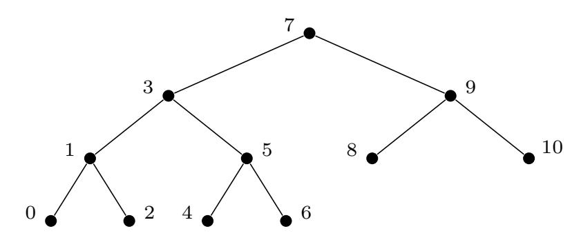

Fig. 13: The tree LBBT<sub>6</sub> with node indices.

We use the following indexing of nodes (see Fig. 13 for an example): all nodes are numbered left to right — i.e., according to an in-order depth-first traversal of the tree — starting with 0.

For a node v of a LBBT  $\tau$ , we use standard object oriented notation as outlined in Table 3. (Observe that every *internal* node always has both children.)

<span id="page-34-4"></span>

| $\tau.$ root | Returns the root.                                                     |
|--------------|-----------------------------------------------------------------------|
| $\tau.nodes$ | Returns the set of all nodes in the tree.                             |
| v.isroot     | Returns true iff $v = \tau$ .root.                                    |
| v.isleaf     | Returns true iff $v$ has no children.                                 |
| v.parent     | Returns the parent node of $v$ (or $\perp$ if $v$ .isroot).           |
| v.lchild     | Returns the left child of $v$ (or $\bot$ if $v$ .isleaf).             |
| v.rchild     | Returns the right child of $v$ (or $\perp$ if $v$ .isleaf).           |
| v.sibling    | Returns the unique node $u \neq v$ s.t. of $u$ .parent = $v$ .parent. |
| v.nodeldx    | Returns the node index of $v$ .                                       |

Table 3: Object oriented notation for LBBTs.

A basic operation of ITK requires adding leaves to (data structures that represent) LBBTs. We describe the algorithm addLeaf which takes as input an LBBT and a new leaf inserting it to obtain an output tree LBBT $_{n+1}$ .

**Definition 2** (addLeaf). The algorithm addLeaf $(\tau, v)$  takes input a tree  $\tau$  with root r and a fresh leaf v and returns a new tree  $\tau'$ . Let  $\tau_{\mathsf{L}}$  and  $\tau_{\mathsf{R}}$  be the left and right subtrees of r.

- If  $\tau = \mathsf{FT}_n$  (for some  $n \in \mathbb{N}$ ) then create a new root r' for  $\tau'$ . Attach r as the left child and v as the right child.
- Otherwise let  $\tau' = \tau$  except that  $\tau_{\mathsf{R}}$  is replaced by  $\mathsf{addLeaf}(\tau_{\mathsf{R}}, v)$ .

{35}------------------------------------------------

```
Lemma 1 (from [6]). τ = LBBTn =⇒ addLeaf(τ, v) = LBBTn+1.
```

Moreover, observe that addLeaf preserves node indices and, thus, in particular also leaf indices. This will turn out to be a crucial property for the ITK protocol, which addresses group members by leaf indices.

Second, ITK occasionally truncates the tree by pruning the right-most leaf, using the following operation.

**Definition 3 (**pruneRightmost**).** *The algorithm* pruneRightmost(*τ* ) *takes input a tree τ with rightmost node v*max *and returns a new tree τ* ′ *in which v*max *is removed and its parent v*max*.*parent *replaced by the parent's former left child v*max*.*parent*.*lchild*.*

```
Lemma 2. τ = LBBTn =⇒ pruneRightmost(τ ) = LBBTn−1.
```

*Proof.* This follows by realizing that pruneRightmost essentially undoes addLeaf.

*Node Labels.* Recall that each node *v* of the LBBT has several labels associated. They are outlined in [Table 4.](#page-35-1) To simplify the protocol's description, we will furthermore make use of the helper methods from [Table 5.](#page-36-0) Observe that the *direct path* of a leaf consists of the (ordered list) of all nodes on the path from the leaf to the root, without the leaf itself. The *co path*, on the other hand, consists of the children of the direct path's nodes that are not on the direct path themselves. That is, for every node on the direct path its sibling node is on the co path. Note that the co path contains the sibling leaves but not the root and, thus, is of equal length to the direct path. The *resolution* of a node *v* is the minimal set of descendant non-blank nodes that covers the whole sub-tree rooted at *v*, i.e., such that for every descendant *u* of *v* there exists node *w* in the resolution such that *w* is non-blank and *w* an ancestor of *u*.

*Additional State.* The protocol's state *γ* consists of the ratchet tree *γ.τ* and a number of additional variables, listed in [Table 6](#page-36-1) (recall that the protocol implicitly knows the party's identity id).

There are two aspects worth mentioning. First, the state contains three hashes: the tree hash of the LBBT's public part and two transcript hashes called *confirmed transcript hash* and *interim transcript hash*. The latter additionally contains the authentication data of the last commit message, which the confirmed transcript hash cannot contain yet to avoid cyclic dependencies. Second, if the member issued an update proposal or commit message that did not get confirmed by the delivery service yet, then the corresponding secret keys are stored in the *γ.*pendUp and *γ.*pendCom maps, respectively.

The so-called *group context* is comprised of the group id, the epoch number, the tree hash, and the confirmed transcript hash together. The corresponding helper method is defined in [Table 7.](#page-36-2)

### <span id="page-35-0"></span>**C.2 Setup Algorithms**

[Figure 14](#page-37-1) depicts the algorithms gen-sk and gen-kp, which are used by the Authentication Service and Key Service functionalities Fas and Fks, respectively.

<span id="page-35-1"></span>

| v.pk                                                                                                 | The public key of a public-key encryption scheme.                                                     |  |
|------------------------------------------------------------------------------------------------------|-------------------------------------------------------------------------------------------------------|--|
| v.sk<br>The corresponding secret key.                                                                |                                                                                                       |  |
| v.parentHash<br>A hash value binding the node to all of its ancestors.                               |                                                                                                       |  |
|                                                                                                      | v.unmergedLvs The set of leaf indices rooted below v, for which the corresponding party does not know |  |
| v.sk.                                                                                                |                                                                                                       |  |
| v.id                                                                                                 | If v.isleaf: the identity associated with that leaf.                                                  |  |
| v.leafId                                                                                             | If v.isleaf: a unique identifier of the leaf (set by the protocol).                                   |  |
| v.spk<br>If v.isleaf: an associated verification key of a signature scheme.                          |                                                                                                       |  |
| v.sig<br>If v.isleaf: A signature of the leaf's labels under the signing key corresponding to v.spk. |                                                                                                       |  |

Table 4: The node labels of the LBBTs.

{36}------------------------------------------------

<span id="page-36-0"></span>

| τ.clone()               | Returns and (independent) copy of τ .                                                                                                       |  |
|-------------------------|---------------------------------------------------------------------------------------------------------------------------------------------|--|
| τ.public()              | Returns a copy of τ for which all private labels (v.sk) are set to ⊥.                                                                       |  |
| τ.roster()              | Returns the identities of all parties in the tree.                                                                                          |  |
| τ.leaves[leafId]        | Returns the leaf with identifier leafId.                                                                                                    |  |
| τ.leafof(id)            | Returns the leaf identifier of the v for which v.id = id.                                                                                   |  |
| τ.allotLeaf(newId)      | Checks that no leaf with id newId exists (otherwise fails). Then, finds the leaf v                                                          |  |
|                         | with the lowest nodeIdx for which ¬v.inuse(), or adds a new leaf v using addLeaf.                                                           |  |
|                         | Finally, assigns v.leafId ← newId.                                                                                                          |  |
| τ.directPath(leafId)    | Returns the direct path, excluding the leaf, as an ordered list from the leaf to root.                                                      |  |
| τ.coPath(leafId)        | Returns the co-path to τ.directPath(leafId) as an ordered list.                                                                             |  |
| τ.lca(leafId1, leafId2) | Returns the least common ancestor of the two leafs.                                                                                         |  |
| τ.blankPath(leafId)     | Calls v.blank() on all v ∈ τ.directPath(leafId).                                                                                            |  |
|                         | τ.mergeLeaves(leafId) Sets v.unmergedLvs ← ∅<br>for all v ∈ τ.directPath(leafId)                                                            |  |
|                         | τ.unmergeLeaf(leafId) Sets v.unmergedLvs +← leafId for all v returned by τ.directPath(leafId)                                               |  |
| v.kp()                  | Returns (v.id, v.pk, v.spk, v.parentHash, v.sig) (undefined if ¬v.isleaf).                                                                  |  |
| v.assignKp(kp)          | Sets (v.id, v.pk, v.spk, v.parentHash, v.sig) from kp (only allowed if v.isleaf).                                                           |  |
| v.inuse()               | Returns false iff all labels except parentHash are ⊥.                                                                                       |  |
| v.blank()               | Sets all labels except parentHash to ⊥.                                                                                                     |  |
| v.resolution()          | <br>(v) ++ v.unmergedLvs<br>if v.inuse()<br><br>v.lchild.resolution()<br>Return<br>else if ¬v.isleaf<br>++ v.lchild.resolution()<br> |  |
|                         | ()<br>else.                                                                                                                                 |  |
| v.resolvent(u)          | For a descendant u of v, returns the (unique) node in v.resolution() which is an                                                            |  |
|                         | ancestor of u.                                                                                                                              |  |

Table 5: Helper methods defined on the LBBT nodes.

<span id="page-36-1"></span>

| γ.groupId       | An identifier of the group.                                                          |
|-----------------|--------------------------------------------------------------------------------------|
| γ.epoch         | The current epoch number.                                                            |
| γ.τ             | The labeled left-balanced binary tree.                                               |
| γ.treeHash      | A hash of (the public part) of τ .                                                   |
| γ.confTransHash | The confirmed transcript hash.                                                       |
|                 | γ.interimTransHash The interim transcript hash for the next epoch.                   |
| γ.ssk           | The current signing key.                                                             |
| γ.certSpks[∗]   | A mapping associating the set of validated signature verification keys to each party |
|                 | id′                                                                                  |
| γ.pendUp[∗]     | A mapping associating the secret keys for each pending update proposal issued by id. |
| γ.pendCom[∗]    | A mapping associating the new group state for each pending commit issued by id.      |
| γ.appSecret     | The current epoch's CGKA key.                                                        |
| γ.membKey       | The key used to MAC packages.                                                        |
| γ.initSecret    | The next epoch's init secret.                                                        |

Table 6: The protocol state.

<span id="page-36-2"></span>

| γ.leafId()                                                               | Returns γ.τ.leafof(id).leafId. |
|--------------------------------------------------------------------------|--------------------------------|
| γ.groupCtxt() Returns (γ.groupId, γ.epoch, γ.treeHash, γ.confTransHash). |                                |

Table 7: Helper method on the protocol state.

{37}------------------------------------------------

The algorithm gen-sk generates a new key pair of a signature scheme. The algorithm gen-kp samples a fresh key pair of a PKE scheme and outputs the secret-key and a so-called *key package*. The key package is a signed tuple consisting the party's identity id, the PKE public key pk, and the verification key spk. As the same key package format is also used as the data structure stored in leaves, it can optionally also contain a parent hash. We model this here as an optional input which is set to *ϵ* if not provided — in the MLS protocol draft, the parent hash is an extension of the key package.

<span id="page-37-1"></span>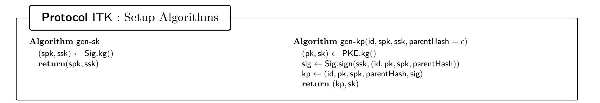

Fig. 14: The algorithms gen-sk and gen-kp, used by Fas and Fks, respectively.

## <span id="page-37-0"></span>**C.3 Protocol Algorithms**

The main (UC) protocol is depicted in [Fig. 15.](#page-38-0) The helper functions are depicted in [Figs. 16](#page-39-0) to [18.](#page-41-0) In contrast to the main protocol they handle state explicitly, clearly indicating what state they rely on (as input) and what state they modify (as return value).

*Group creation.* The group can be created (by the designated group creator idcreator in our UC model) using the input (Create*,*spk).This input sets up the state of a group with a single member, whose initial signature public key spk to be used is specified as part of the input. The creator then fetches the respective signing key ssk from the setup Fas using the helper method [\\*fetch-ssk-if-nec](#page-40-0) from [Fig. 17.](#page-40-1)

*Proposals.* To create an update proposal, the protocol generates a fresh key package kp together with the respective secret key sk. The key package kp is used as the proposal, whereas sk is stored in *γ.*pendUp to be used once the proposal is applied. In case a new signing key ssk is passed, the protocol furthermore fetches the respective secret key from Fas. To create an add proposal, the protocol fetches a key package for the added party from Fks. The proposal then simply consists of the key package, which includes the party's identity. A remove proposal simply consists of the removed party's leaf index.

All proposals are then *framed* using [\\*frameProp](#page-41-1) (see [Fig. 18\)](#page-41-0). Framing first signs the proposal *P* together with the string 'proposal′ , the group context, the group id, the epoch index, and the sender's leaf index to bind it to the current cryptographic context. This in particular prevents impersonation by another (malicious) group member. Since the signing key, however, is shared across groups and its replacement is also not tied to the PCS guarantees of the group, everything (including the signature) is additionally MACed using the membership key. In summary, to tamper or inject messages an adversary must both know at least the sender's signing key as well as the epoch's symmetric keys. The actual proposal package *p* then consists of everything except the group context.

*Commit.* Upon an input (Commit*, ⃗p,*spk*,* force-rekey), the protocol initializes the next epoch's state by copying the current one. It then proceeds to apply the proposals using [\\*apply-props](#page-39-1) (see [Fig. 16\)](#page-39-0). Alongside, it verifies the validity of each proposal, in particular their MACs and signatures.

If it is not an add-only commit (i.e, not all proposals are adds or force-rekey is true) the protocol then re-keys its direct path using the helper method [\\*rekey-path](#page-39-2). The keys are derived bottom to top using the HKDF*.*Expand function (cf. [App. A.2\)](#page-29-2) with the labels 'node′ and 'path′ for key's randomness and the next seed, respectively. The seeds are then encrypted to the resolution of the respective child in the co-path.

{38}------------------------------------------------

```
Protocol ITK
Input (Create, spk)
                                                                                                                                   Input (Process, c, \vec{p})
    \mathbf{req} \ \gamma = \bot \land \mathsf{id} = \mathsf{id}_{\mathsf{creator}}
                                                                                                                                       \mathbf{req} \ \gamma \neq \bot
    \gamma.groupId, \gamma.initSecret \leftarrow$ \{0,1\}^{\kappa}
                                                                                                                                       (senderId, C, confTag, sig, membTag)
    \gamma.\mathsf{epoch} \leftarrow 0
                                                                                                                                                                                                                   \leftarrow *unframeCommit(\gamma, c, sig)
    \gamma.\mathsf{interimTransHash} \leftarrow \epsilon
                                                                                                                                       id_c \leftarrow \gamma.\tau.leaves[senderId].ID
    \gamma.\mathsf{certSpks}[*], \gamma.\mathsf{pendUp}[*], \gamma.\mathsf{pendCom}[*] \leftarrow \bot
                                                                                                                                       if senderId = \gamma.leafId() then
                                                                                                                                             \mathbf{parse}\ (\gamma', \vec{p}', upd, rem, add) \leftarrow \gamma.\mathsf{pendCom}[c]
    \gamma.\tau \leftarrow \text{new LBBT}_1
    try \gamma.ssk \leftarrow *fetch-ssk-if-nec(\gamma, spk)
                                                                                                                                             \mathbf{req}\ \vec{p} = \vec{p}'
    (kp, sk) \leftarrow \$ gen-kp(id, spk, ssk, \epsilon)
                                                                                                                                             return (id_c, upd + rem + add)
    \gamma.\tau.\mathsf{leaves}[0].\mathsf{leafId} \leftarrow \mathsf{Hash}(\mathsf{kp})
                                                                                                                                       \mathbf{parse} (propIDs, updatePath) \leftarrow C
    \gamma.\tau.leaves[0].assignKp(kp)
                                                                                                                                       \mathbf{req} \ \forall i \in [\left| \vec{p} \right|] : \mathsf{Hash}(\vec{p}[i]) = \mathsf{propIDs}[i]
    \gamma.\tau.leaves[0].sk \leftarrow sk
                                                                                                                                       \gamma' \leftarrow *init-epoch(\gamma)
                                                                                                                                       \mathbf{try}\ (\gamma', upd, rem, add) \leftarrow *apply-props(\gamma, \gamma', \vec{p})
Input (Propose, up-spk)
                                                                                                                                       \mathbf{req}\ (*,\mathsf{id}_c) \notin rem \land (\mathsf{id}_c,*) \notin upd
    \operatorname{req} \gamma \neq \bot
                                                                                                                                       if (*, \text{`rem'-id}) \in rem \text{ then }
    \mathbf{try} \ \mathsf{ssk} \leftarrow \mathsf{*fetch} \mathsf{-ssk} \mathsf{-if} \mathsf{-nec}(\gamma, \mathsf{spk})
                                                                                                                                              \mathbf{req} \ \mathsf{MAC.vrf}(\gamma.\mathsf{membKey},c)
    (kp, sk) \leftarrow \$ gen-kp(id, spk, ssk, \epsilon)
                                                                                                                                              \gamma \leftarrow \bot
    P \gets (\text{`upd'}, \mathsf{kp})
                                                                                                                                       else
    p \leftarrow *frameProp(\gamma, P)
                                                                                                                                             if updatePath \neq \epsilon then
    \gamma.\mathsf{pendUp}[p] \leftarrow (\mathsf{ssk}, \mathsf{sk})
                                                                                                                                                    (\gamma', \mathsf{commitSec})
    return p
                                                                                                                                                                                         \leftarrow *apply-rekey(\gamma', senderId, updatePath)
                                                                                                                                              else
Input (Propose, add-id<sub>t</sub>)
                                                                                                                                                    \operatorname{req} \vec{p} \neq () \land upd = () \land rem = ()
    \operatorname{req} \gamma \neq \bot \wedge \operatorname{id}_t \notin \gamma.\tau.\operatorname{roster}()
                                                                                                                                                    \mathsf{commitSec} \leftarrow 0
    \mathsf{kp}_t \leftarrow \mathsf{query} \; (\mathsf{get}\text{-}\mathsf{pk}, \mathsf{id}_t) \; \mathsf{to} \; \mathcal{F}_{\scriptscriptstyle \mathrm{KS}}
                                                                                                                                              \gamma' \leftarrow *set-conf-trans-hash(\gamma, \gamma', senderld, C, sig)
    \mathbf{try} \ \gamma \leftarrow *validate-kp(\gamma, kp_t, id_t, \epsilon)
                                                                                                                                              (\gamma',*) \leftarrow *derive-keys(\gamma, confKey, \gamma', commitSec)
    P \leftarrow (\text{`add'}, \mathsf{kp}_t)
                                                                                                                                              \mathbf{req} * \mathtt{vrf-conf-tag}(\gamma', \mathsf{confKey}, \mathsf{confTag})
    p \leftarrow *\texttt{frameProp}(\gamma, P)
                                                                                                                                              \gamma' \leftarrow \texttt{*set-interim-trans-hash}(\gamma', \texttt{confTag})
                                                                                                                                       \mathbf{return}\ (\mathsf{id}_c, upd +\!\!\!\!\!\!\!\!\!\!\!\!\!\!\!\!\!\!\!\!\!\!\!\!\!\!\!\!\!\!\!\!\!\!\!\!
    return p
Input (Propose, rem-id<sub>t</sub>)
                                                                                                                                   Input (Join, w)
    \operatorname{req} \gamma \neq \bot \wedge \operatorname{id}_t \in \gamma.\tau.\operatorname{roster}()
                                                                                                                                       \mathbf{req} \ \gamma = \bot
    leafId_t \leftarrow \gamma.\tau.leafof(it_t)
                                                                                                                                       \mathbf{parse} \; (\mathsf{encGroupSecs}, \mathsf{groupInfo}) \leftarrow w
    P \leftarrow (\text{`rem'}, \text{leafId}_t)
                                                                                                                                       \gamma.\mathsf{certSpks}[*], \gamma.\mathsf{pendUp}[*], \gamma.\mathsf{pendCom}[*] \leftarrow \bot
    p \leftarrow *frameProp(\gamma, P)
                                                                                                                                       parse (groupInfoTBS, sig) \leftarrow groupInfo
    return p
                                                                                                                                       parse (\gamma.groupId, \gamma.epoch, \gamma.treeHash, \gamma.confTransHash,
                                                                                                                                                                                         \gamma.interimTransHash, \gamma.\tau, confTag, senderId)
Input (Commit, \vec{p}, spk, force-rekey)
                                                                                                                                                                                                                                          \leftarrow groupInfoTBS
    \mathbf{req} \ \gamma \neq \bot
                                                                                                                                       \mathbf{req}\ \mathsf{Sig.vrf}(\gamma.\tau.\mathsf{leaves}[\mathsf{senderId}].\mathsf{spk},\mathsf{sig},\mathsf{groupInfoTBS})
    \gamma' \leftarrow *init-epoch(\gamma)
                                                                                                                                       \mathbf{try} \ \gamma \leftarrow * \mathsf{vrf-tree-state}(\gamma)
    \mathbf{try}\ (\gamma', upd, rem, add) \leftarrow *apply-props(\gamma, \gamma', \vec{p})
                                                                                                                                       v \leftarrow \gamma.\tau.\mathsf{leaves}[\gamma.\mathsf{leafId}()]
    \mathbf{req} \ (*, \text{`rem'-id}) \notin rem \land (\mathsf{id}, *) \notin upd
                                                                                                                                       \mathbf{try} \ \gamma.\mathsf{ssk} \leftarrow *\mathsf{fetch} - \mathsf{ssk} - \mathsf{if} - \mathsf{nec}(\gamma, v.\mathsf{spk})
    if force-rekey \forall \vec{p} = () \lor upd \neq () \lor rem \neq () then
                                                                                                                                       \mathsf{kbs} \leftarrow \mathsf{query} \; \mathsf{get}\text{-}\mathsf{sks} \; \mathrm{to} \; \mathcal{F}_{\scriptscriptstyle \mathrm{KS}}
          \mathbf{try} (\gamma', commitSec, updatePath, pathSecs)
                                                                                                                                       joinerSec, pathSec \leftarrow \bot
                                                                       \leftarrow *rekey-path(\gamma', id, spk)
                                                                                                                                       \mathbf{for}\ e \in \mathsf{encGroupSecs}\ \mathbf{do}
    else
                                                                                                                                              parse (hash, cipher) \leftarrow e
          \mathsf{commitSec} \leftarrow 0; \, \mathsf{updatePath} \leftarrow \epsilon
                                                                                                                                              for (kp, sk) \in kbs do
          \mathsf{pathSecs}[*] \leftarrow \epsilon
                                                                                                                                                    if hash = Hash(kp) then
    propIDs \leftarrow ()
                                                                                                                                                          v.\mathsf{sk} \leftarrow \mathsf{sk}
    for p \in \vec{p} do
                                                                                                                                                          \mathbf{req}\ v.\mathsf{kp}() = \mathsf{kp}
          propIDs +\leftarrow Hash(p)
                                                                                                                                                          parse (joinerSec, pathSec) \leftarrow PKE.dec(sk, cipher)
    C \leftarrow (\mathsf{propIDs}, \mathsf{updatePath})
                                                                                                                                       \mathbf{req} \ \mathsf{joinerSec} \neq \bot
    sig \leftarrow *signCommit(\gamma, C)
                                                                                                                                       if pathSec \neq \epsilon then
    \gamma' \leftarrow *set-conf-trans-hash(\gamma, \gamma', \gamma.leafld(), C, sig)
                                                                                                                                             v \leftarrow \gamma.\tau.\operatorname{lca}(\gamma.\operatorname{leafld}(),\operatorname{senderld})
    (\gamma', \mathsf{confKey}, \mathsf{joinerSec})
                                                                                                                                              while v \neq \bot do
                                                         \leftarrow *derive-keys(\gamma, \gamma', commitSec)
                                                                                                                                                    \mathsf{nodeSec} \leftarrow \mathsf{HKDF}.\mathsf{Expand}(\mathsf{pathSec}, \mathsf{`node'})
    confTag \leftarrow *conf-tag(\gamma', confKey)
                                                                                                                                                    (\mathsf{sk}, v.\mathsf{sk}) \leftarrow \mathsf{PKE}.\mathsf{kg}(\mathsf{nodeSec})
    if rem \neq () then
                                                                                                                                                    req v.sk = sk
          \mathsf{membTag} \leftarrow \mathsf{MAC}.\mathsf{tag}(\gamma.\mathsf{membKey}, C)
                                                                                                                                                    pathSec \leftarrow HKDF.Expand(pathSec, 'path')
    \mathbf{else} \ \mathsf{membTag} \leftarrow \bot
                                                                                                                                                    v \leftarrow v.\mathsf{parent}
    c \leftarrow *frameCommit(\gamma, C, confTag, sig, membTag)
                                                                                                                                        (\gamma, \mathsf{confKey}) \leftarrow *\mathsf{derive-epoch-keys}(\gamma, \mathsf{joinerSec})
    if add \neq () then
                                                                                                                                       req *vrf-conf-tag(\gamma, confKey, confTag)
          (\gamma', w) \leftarrow *welcome-msg(\gamma', add, joinerSec,
                                                                                                                                       return (\gamma.\tau.\mathsf{roster}(), \gamma.\tau.\mathsf{leaves}[\mathsf{senderId}].\mathsf{id})
                                                                                       pathSecs, confTag)
                                                                                                                                   Input Key
    else w \leftarrow \bot
    \gamma' \leftarrow \texttt{*set-interim-trans-hash}(\gamma', \texttt{confTag})
                                                                                                                                       \mathbf{req} \ \gamma \neq \bot
    \gamma.pendCom[c] \leftarrow (\gamma', \vec{p}, upd, rem, add)
                                                                                                                                       (k, \gamma.\mathsf{appSecret}) \leftarrow (\gamma.\mathsf{appSecret}, \bot)
    return (c, w)
                                                                                                                                       return k
```

Fig. 15: The (UC) protocol ITK as run by party id. The group creator's identity id<sub>creator</sub> is encoded a part of the instance's session identifier.

{39}------------------------------------------------

```
Protocol ITK: Commit. Process, and Join Helpers
                                                                                                                     helper *apply-props(\gamma, \gamma', \vec{p})
helper *init-epoch(\gamma)
   \gamma' \leftarrow \gamma.\mathsf{clone}()
                                                                                                                         upd, rem, add \leftarrow ()
   \gamma'.\mathsf{epoch} \leftarrow \gamma'.\mathsf{epoch} + 1
                                                                                                                         for p \in \vec{p} do
   \gamma'.pendUp[*], \gamma'.pendCom[*] \leftarrow \bot
                                                                                                                               \mathbf{try} \; (\mathsf{senderId}, P) \leftarrow \mathtt{*unframeProp}(\gamma, p)
                                                                                                                               id_s \leftarrow \gamma.\tau.leaves[senderId].id
   return \gamma'
                                                                                                                               parse (type, val) \leftarrow P
helper *rekey-path(\gamma', id, spk)
                                                                                                                               if type = 'upd' then
   \mathsf{directPath} \leftarrow \gamma'.\tau.\mathsf{directPath}(\gamma'.\mathsf{leafld}())
                                                                                                                                    \mathbf{req} \ (\mathsf{id}_s, *) \notin upd \land rem = () \land add = ()
   coPath \leftarrow \gamma'.\tau.coPath(\gamma'.leafld())
                                                                                                                                    \mathbf{try} \ \gamma' \leftarrow *validate-kp(\gamma', val, id_s, \epsilon)
   updatePathNodes \leftarrow ()
                                                                                                                                     \gamma'.\tau.leaves[senderId].assignKp(val)
   \mathsf{pathSecs}[*] \leftarrow \bot
                                                                                                                                     \gamma'.\tau.blankPath(senderId)
   leafSec \leftarrow$ \{0,1\}^{\kappa}
                                                                                                                                    if senderId = \gamma.leafId() then
   leafNodeSec \leftarrow HKDF.Expand(leafSec, 'node')
                                                                                                                                           \mathbf{parse}\;(\mathsf{ssk},\mathsf{sk}) \leftarrow \gamma.\mathsf{pendUp}[p]
   pathSec \leftarrow HKDF.Expand(leafSec, 'path')
                                                                                                                                           \gamma'.\tau.leaves[senderId].sk \leftarrow sk
   for (v, c) \in zip(directPath, coPath) do
                                                                                                                                          \gamma'.\mathsf{ssk} \leftarrow \mathsf{ssk}
         \mathsf{pathSecs}[v] \leftarrow \mathsf{pathSec}
                                                                                                                                     \mathsf{spk} \leftarrow \gamma'.\tau.\mathsf{leaves}[\mathsf{senderId}].\mathsf{spk}
         \mathsf{nodeSec} \leftarrow \mathsf{HKDF}.\mathsf{Expand}(\mathsf{pathSec}, \mathsf{`node'})
                                                                                                                                    \operatorname{req} \gamma'.\tau.\operatorname{leaves}[\operatorname{\mathsf{Hash}}(\mathsf{kp})] = \bot
         (v.\mathsf{pk}, v.\mathsf{sk}) \leftarrow \mathsf{PKE}.\mathsf{kg}(\mathsf{nodeSec})
                                                                                                                                     \gamma'.\tau.leaves[senderId].leafId \leftarrow Hash(kp)
         encPathSecs \leftarrow ()
                                                                                                                                     upd +\leftarrow (id_s, `upd'-spk)
         for t \leftarrow c.resolution() do
                                                                                                                               else if type = 'rem' then
               encPathSecs +\leftarrow PKE.enc(t.pk, pathSec)
                                                                                                                                     id_t \leftarrow \gamma.\tau.leaves[val].id
         updatePathNodes +\leftarrow (v.pk, encPathSecs)
                                                                                                                                     \mathbf{req} \ \mathsf{val} \neq \mathsf{senderId} \land \gamma'.\tau.\mathsf{leaves[val]} \neq \bot
         \mathsf{pathSec} \leftarrow \mathsf{HKDF}.\mathsf{Expand}(\mathsf{pathSec}, \mathsf{`path'})
                                                                                                                                    \operatorname{req} \gamma'.\tau.\operatorname{leaves}[\operatorname{val}].\operatorname{inuse}() \wedge (\operatorname{id}_t,*) \notin upd \wedge add = ()
   \mathsf{commitSec} \leftarrow \mathsf{pathSec}
                                                                                                                                     \gamma'.\tau.leaves[val].blank()
   \gamma'.\tau.mergeLeaves(\gamma'.leafId())
                                                                                                                                     \gamma'.\tau.leaves[val].blankPath(val)
   \gamma' \leftarrow \texttt{*set-parent-hash}(\gamma', \gamma'. \mathsf{leafId}())
                                                                                                                                     \gamma' \leftarrow *truncate-tree(\gamma')
   \mathbf{try} \; \mathsf{ssk} \leftarrow \mathtt{*fetch}\mathtt{-ssk}\mathtt{-if}\mathtt{-nec}(\gamma', \mathsf{spk})
                                                                                                                                     rem +\leftarrow (id_s, `rem'-id_t)
   v \leftarrow \gamma'.\tau.\mathsf{leaves}[\gamma'.\mathsf{leafId}()]
                                                                                                                               else if type = 'add' then
   r \leftarrow \mathsf{leafNodeSec}
                                                                                                                                     parse (id_t, *, spk, *, *) \leftarrow val
   (kp, sk) \leftarrow gen-kp(id, spk, ssk, v.parentHash; r)
                                                                                                                                    \operatorname{req} \operatorname{id}_t \notin \gamma'.\tau.\operatorname{roster}()
   \operatorname{req} \gamma'.\tau.\operatorname{leaves}[\operatorname{\mathsf{Hash}}(\mathsf{kp})] = \bot
                                                                                                                                    \operatorname{try} \gamma' \leftarrow *\operatorname{validate-kp}(\gamma', \operatorname{val}, \operatorname{id}_t, \epsilon)
   v.\mathsf{leafId} \leftarrow \mathsf{Hash}(\mathsf{kp})
                                                                                                                                     \mathsf{newId} \leftarrow \mathsf{Hash}(\mathsf{val})
   v.assignKp(kp)
                                                                                                                                    \mathbf{try} \ \gamma'.\tau.\mathsf{allotLeaf}(\mathsf{newld})
   v.\mathsf{sk} \leftarrow \mathsf{sk}
                                                                                                                                     \gamma'.\tau.leaves[newld].assignKp(val)
   \gamma' \leftarrow *set-tree-hash(\gamma')
                                                                                                                                     \gamma'.\tau.unmergeLeaf(newld)
   \mathsf{updatePath} \gets (\mathsf{kp}, \mathsf{updatePathNodes})
                                                                                                                                     add +\leftarrow (id_s, `add'-id_t-spk)
   return (\gamma', commitSec, updatePath, pathSecs)
                                                                                                                               else return \perp
                                                                                                                         return (\gamma', upd, rem, add)
helper *apply-rekey(\gamma', senderId, updatePath)
   parse (kp, updatePathNodes) \leftarrow updatePath
                                                                                                                     \mathbf{helper} * \mathbf{welcome} - \mathbf{msg}(\gamma, \gamma', add, \mathsf{joinerSec}, \mathsf{pathSecs}, \mathsf{confTag})
   \mathsf{directPath} \leftarrow \gamma'.\tau.\mathsf{directPath}(\mathsf{senderId})
                                                                                                                         groupInfoTBS \leftarrow (\gamma'.groupId, \gamma'.epoch, \gamma'.treeHash,
   coPath \leftarrow \gamma'.\tau.coPath(senderId)
                                                                                                                                 \gamma'. \mathsf{confTransHash}, \gamma'. \mathsf{interimTransHash},
   lca \leftarrow \gamma'.\tau.lca(\gamma'.leafld(), senderld)
                                                                                                                                 \gamma'.\tau.\mathsf{public}(),\mathsf{confTag},\gamma'.\mathsf{leafId}())
   for (v, c, updatePathNode) \in zip(directPath,
                                                                                                                         \mathsf{sig} \leftarrow \mathsf{Sig.sign}(\gamma'.\mathsf{ssk},\mathsf{groupInfoTBS})
                                                    coPath, updatePathNodes) do
                                                                                                                         \mathsf{groupInfo} \leftarrow (\mathsf{groupInfoTBS}, \mathsf{sig})
         parse (v.pk, encPathSecs) \leftarrow updatePathNode
                                                                                                                         encGroupSecs \leftarrow ()
         if v = lca then
                                                                                                                         for (*, \text{`add'-id}_t\text{-spk}_t) \in add \text{ do}
               r \leftarrow c.\mathsf{resolvent}(\gamma'.\tau.\mathsf{leaves}[\gamma'.\mathsf{leafId}()])
                                                                                                                              \mathsf{leafId}_t \leftarrow \gamma'.\tau.\mathsf{leafof}(\mathsf{id}_t)
               i \leftarrow c.\mathsf{resolution}().\mathsf{indexof} r
                                                                                                                              v_t \leftarrow \gamma'.\tau.\mathsf{leaves}[\mathsf{leafId}_t]
               \mathsf{pathSec} \leftarrow \mathsf{PKE}.\mathsf{dec}(r.\mathsf{sk},\mathsf{encPathSecs}[i])
                                                                                                                              lca \leftarrow \gamma'.\tau.lca(\gamma'.leafld(), leafld_t)
         if pathSec \neq \bot then
                                                                                                                               encGroupSec \leftarrow PKE.enc(v_t.pk, (joinerSec, pathSecs[lca]]))
               nodeSec \leftarrow HKDF.Expand(pathSec, 'node')
                                                                                                                              encGroupSecs +\leftarrow (Hash(v_t.kp), encGroupSec)
               (pk, v.sk) \leftarrow PKE.kg(nodeSec)
                                                                                                                         w \leftarrow (\mathsf{encGroupSecs}, \mathsf{groupInfo})
               req v.pk = pk
                                                                                                                         return (\gamma', w)
               pathSec \leftarrow HKDF.Expand(pathSec,)
                                                                                                                     \mathbf{helper} \; \mathtt{*vrf-tree-state}(\gamma')
   commitSec \leftarrow pathSec
   \gamma'.\tau.mergeLeaves(senderId)
                                                                                                                         \mathbf{req} \ \gamma'.\mathsf{treeHash} = \mathsf{*tree-hash}(\gamma'.\tau.\mathsf{root})
   \gamma' \leftarrow \texttt{*set-parent-hash}(\gamma', \texttt{senderId})
                                                                                                                         for v \in \gamma'.\tau.nodes : v.inuse() \land \neg v.isleaf do
   v \leftarrow \gamma'.\tau.leaves[senderId]
                                                                                                                              lchild \leftarrow v.lchild
   \mathbf{try} \ \gamma' \leftarrow *validate-kp(\gamma', kp, v.id, v.parentHash)
                                                                                                                               rchild \leftarrow *origRChild(v.rchild)
   \mathbf{req} \ \gamma'.\tau.\mathsf{leaves}[\mathsf{Hash}(\mathsf{kp})] = \bot
                                                                                                                               phr \leftarrow *parent-hash-cochild(v, v.rchild)
   v.leafld \leftarrow Hash(kp)
                                                                                                                               phl \leftarrow *parent-hash-cochild(v, v.lchild)
   v.assignKp(kp)
                                                                                                                               \mathbf{req} (Ichild.inuse \land Ichild.parentHash = phr)
    \gamma' \leftarrow \texttt{*set-tree-hash}(\gamma')
                                                                                                                                        \lor (rchild.inuse \land rchild.parentHash = phl)
   return (\gamma', \mathsf{commitSec})
                                                                                                                         mem \leftarrow \emptyset
                                                                                                                         for v \in \gamma'.\tau.nodes : v.inuse() \land v.isleaf do
helper *truncate-tree(\gamma')
                                                                                                                              \mathbf{req}\ v.\mathsf{id} \notin \mathsf{mem}
   v \leftarrow \gamma'.\tau.\mathsf{leaves}[|\gamma'.\tau.\mathsf{leaves}|-1]
                                                                                                                              \mathsf{mem} +\leftarrow v.\mathsf{id}
   if \neg v.inuse()
                                                                                                                              \mathbf{try} \ \gamma' \leftarrow *validate-kp(\gamma', v.kp(), v.id, v.parentHash)
                   \land (\neg v.\mathsf{parent.inuse}() \lor v.\mathsf{parent} = \gamma'.\tau.\mathsf{root}) \ \mathbf{then}
                                                                                                                         return \gamma'
          \gamma'.\tau \leftarrow \tau.\mathsf{pruneRightmost}()
                                                                                                                     helper *origRChild(v)
         \gamma' \leftarrow *truncate-tree(\gamma')
                                                                                                                         if v.inuse \vee v.isleaf then return v
   return \gamma'
                                                                                                                         else return *origRChild(v.lchild)
```

<span id="page-39-8"></span><span id="page-39-7"></span><span id="page-39-6"></span><span id="page-39-5"></span><span id="page-39-4"></span>Fig. 16: The helper methods related to creating and processing the commit and welcome messages.

{40}------------------------------------------------

```
Protocol ITK : Tree-Hash
                                                                                                helper *set-tree-hash(\gamma')
helper *set-parent-hash(\gamma', leafld)
   \mathsf{path} \leftarrow \gamma'.\tau.\mathsf{directPath}(\mathsf{leafId})
                                                                                                    \gamma'.treeHash \leftarrow *tree-hash(\gamma'.\tau.root)
   path \leftarrow path.reverse()
                                                                                                    return \gamma'
   path +\leftarrow \gamma'.\tau.leaves[leafld]
                                                                                                helper *tree-hash(v)
   for v \in \mathsf{path} \ \mathbf{do}
                                                                                                    if v.isleaf then
       if v.isroot then
                                                                                                        return \mathsf{Hash}(v.\mathsf{nodeldx}, v.\mathsf{kp}())
            v.\mathsf{parentHash} \leftarrow \epsilon
                                                                                                    else
        else
                                                                                                         leftHash \leftarrow *tree-hash(v.lchild)
            v.\mathsf{parentHash} \leftarrow
                                                                                                        rightHash \leftarrow *tree-hash(v.rchild)
                                      *parent-hash-cochild(v.parent, v.sibling)
                                                                                                        return \mathsf{Hash}(v.\mathsf{nodeldx}, v.\mathsf{pk}, v.\mathsf{unmergedLvs},
   return \gamma'
                                                                                                                                                    v.parentHash, leftHash, rightHash)
\mathbf{helper} * \mathbf{parent-hash-cochild}(v, u)
   origChildResolution \leftarrow u.resolution() \setminus
                                                                  u.\mathsf{parent.unmergedLvs}
   return Hash(v.pk, v.parentHash, origChildResolution)
```

```
\begin{array}{c|ccccccccccccccccccccccccccccccccccc
```

```
Protocol ITK : Key-Schedule
                                                                                                                                                   Protocol ITK : Setup Interaction
                                                                                                                                              \mathbf{helper} \ \mathtt{*fetch} \mathtt{-ssk}\mathtt{-if}\mathtt{-nec}(\gamma, \mathsf{spk})
\mathbf{helper} \; *\mathtt{derive-keys}(\gamma, \gamma', \mathsf{commitSec})
                                                                                                                                                  if \gamma.\tau.leaves[\gamma.leafld()].spk \neq spk then
    s \leftarrow \mathsf{HKDF}.\mathsf{Extract}(\gamma.\mathsf{initSecret},\mathsf{commitSec})
   joinerSec \leftarrow HKDF.Expand(s, \gamma'.groupCtxt())
                                                                                                                                                        \mathsf{ssk} \leftarrow \mathsf{query} \; (\mathsf{get}\text{-}\mathsf{ssk}, \mathsf{spk}) \; \mathrm{to} \; \mathcal{F}_{\scriptscriptstyle{\mathrm{AS}}}
    (\gamma', \mathsf{confKey}) \leftarrow \mathtt{*derive-epoch-keys}(\gamma', \mathsf{joinerSec})
                                                                                                                                                  else
    return (\gamma', confKey, joinerSec)
                                                                                                                                                         \mathsf{ssk} \leftarrow \gamma.\mathsf{ssk}
                                                                                                                                                  return ssk
helper *derive-epoch-keys(\gamma', joinerSec)
    s \leftarrow \mathsf{HKDF}.\mathsf{Expand}(\gamma.\mathsf{joinerSec}, \mathsf{`member'})
                                                                                                                                              \mathbf{helper} * \mathbf{validate} - \mathbf{kp}(\gamma, \mathbf{kp}, \mathbf{id}, \mathbf{parentHash})
                                                                                                                                                  parse (id', pk, spk, parentHash', sig) \leftarrow kp
    memberSec \leftarrow HKDF.Extract(s, 0)
    e \leftarrow \mathsf{HKDF}.\mathsf{Expand}(\mathsf{memberSec}, \mathsf{`epoch'})
                                                                                                                                                  \mathbf{req} \ \mathsf{id} = \mathsf{id}' \land \mathsf{parentHash} = \mathsf{parentHash}'
                                                                                                                                                  \mathbf{if} \ \mathsf{spk} \notin \gamma.\mathsf{certSpks}[\mathsf{id}] \ \mathbf{then}
    epSec \leftarrow HKDF.Extract(e, \gamma'.groupCtxt())
                                                                                                                                                         succ \leftarrow \texttt{query} \; (\texttt{verify-cert}, \mathsf{id}', \mathsf{spk}) \; \mathrm{to} \; \mathcal{F}_{\scriptscriptstyle{\mathrm{AS}}}
    \mathsf{confKey} \leftarrow \mathsf{HKDF}.\mathsf{Expand}(\mathsf{epSec}, \mathsf{`confirm'})
                                                                                                                                                        \mathbf{req}\ succ
    \gamma'.\mathsf{appSecret} \leftarrow \mathsf{HKDF}.\mathsf{Expand}(\mathsf{epSec}, \mathsf{`app'})
    \gamma'.\mathsf{membKey} \leftarrow \mathsf{HKDF}.\mathsf{Expand}(\mathsf{epSec}, \mathsf{`membership'})
                                                                                                                                                         \gamma.\mathsf{certSpks[id]} + \leftarrow \mathsf{spk}
    \gamma'.initSecret \leftarrow HKDF.Expand(epSec, 'init')
                                                                                                                                                  req Sig.vrf(spk, sig, (id, pk, spk, parentHash))
    return (\gamma', confKey)
                                                                                                                                                  return \gamma
```

<span id="page-40-2"></span><span id="page-40-0"></span>Fig. 17: Various helper methods for the protocol ITK.

{41}------------------------------------------------

```
Protocol ITK : Message-Framing
helper *signCommit(\gamma, C)
                                                                                                                 helper *frameProp(\gamma, P)
   \mathsf{tbs} \leftarrow (\gamma.\mathsf{groupCtxt}(), \gamma.\mathsf{groupId}, \gamma.\mathsf{epoch}, \gamma.\mathsf{leafId}(),
                                                                                                                     \mathsf{tbs} \leftarrow (\gamma.\mathsf{groupCtxt}(), \gamma.\mathsf{groupId}, \gamma.\mathsf{epoch}, \gamma.\mathsf{leafId}(),
                                                                                         'commit', C)
                                                                                                                                                                                                         'proposal', P)
                                                                                                                     \mathsf{sig} \leftarrow \mathsf{Sig.sign}(\gamma.\mathsf{ssk},\mathsf{tbs})
   sig \leftarrow Sig.sign(\gamma.ssk, tbs)
                                                                                                                     \mathsf{tbm} \leftarrow (\mathsf{tbs}, \mathsf{sig})
   return sig
                                                                                                                     membTag \leftarrow MAC.tag(\gamma.membKey, tbm)
                                                                                                                     return (\gamma.groupld, , \gamma.epoch, \gamma.leafld(), 'proposal', P,
\mathbf{helper} \; \mathtt{*frameCommit}(\gamma, C, \mathsf{confTag}, \mathsf{sig}, \mathsf{membTag})
                                                                                                                                                                                                       sig, membTag)
   return (\gamma.groupld, \gamma.epoch, \gamma.leafld(), 'commit', C,
                                                                       confTag, sig, membTag)
                                                                                                                 helper *unframeProp(\gamma, p)
                                                                                                                     \mathbf{parse} (groupld, epoch, senderld, contentType, P, sig,
helper *unframeCommit(\gamma, c)
                                                                                                                                                                                                      membTag) \leftarrow p
                                                                                                                     \mathbf{req} \ \mathsf{contentType} = \mathsf{`proposal'} \land \mathsf{groupId} = \gamma.\mathsf{groupId}
   parse (groupld, epoch, senderld, content Type, C,
                                                                confTag, sig, membTag) \leftarrow c
                                                                                                                             \land epoch = \gamma.epoch
   \mathbf{req} \ \mathsf{contentType} = \mathsf{`commit'} \land \mathsf{groupId} = \gamma.\mathsf{groupId}
                                                                                                                     \mathsf{tbs} \leftarrow (\gamma.\mathsf{groupCtxt}(), \mathsf{groupId}, \mathsf{epoch}, \mathsf{senderId},
   reqepoch = \gamma.epoch
                                                                                                                                                                                                         'proposal', P)
   \mathsf{tbs} \leftarrow (\gamma.\mathsf{groupCtxt}(), \mathsf{groupId}, \mathsf{epoch}, \mathsf{senderId},
                                                                                                                     \mathsf{tbm} \leftarrow (\mathsf{tbs}, \mathsf{sig})
                                                                                         'commit', C)
                                                                                                                     \mathbf{req} \,\, \gamma.\tau.\mathsf{leaves}[\mathsf{senderId}] \neq \bot
   req \ \gamma.\tau.leaves[senderId] \neq \bot
                                                                                                                             \land \ \gamma.\tau.leaves[senderId].inuse()
           \land \gamma.\tau.leaves[senderId].inuse()
                                                                                                                             \land Sig.vrf(\gamma.\tau.leaves[senderId].spk, sig, tbs)
            \land Sig.vrf(\gamma.\tau.leaves[senderId].spk, sig, tbs)
                                                                                                                             \land MAC.vrf(\gamma.membKey, membTag, tbm)
   return (senderld, C, confTag, sig, membTag)
                                                                                                                     return (senderld, P)
```

<span id="page-41-5"></span>Fig. 18: The helper methods related to message framing.

To complete the implicit update, the protocol furthermore generates a new leaf key package. This leaf key package gets bound to its ancestor nodes (i.e., the committers freshly sampled direct path) by including a parent hash which is computed top to bottom by each node storing a hash of its parent node (see \*set-parent-hash from Fig. 17). This process is called tree signing. It is supposed to guarantee newly joining parties that each internal node has been sampled by one of the parties contained in its subtree. As a consequence, once all malicious parties have been removed from (an arbitrary) group, all keys have been generated by the remaining honest parties.

Next, ITK prepares a preliminary commit message C including hashes of the applied proposals and the updated direct path (including the leaf). This commit message is then signed alongside the cryptographic context (using \*signCommit) analogous to the framing of proposals. Afterwards, the protocol computes the so-called *confirmation tag* (see \*conf-tag) — a MAC on the confirmed transcript hash updated by C and the signature (see \*set-conf-trans-hash) under the new epoch's confKey. The confirmation tag also serves the purpose of a MAC included in framing of proposals.

Observe that removed members cannot verify confTag, because they do not know the new epoch's confKey. Therefore, if some members are removed, ITK additionally MAC's the commit message under the current epoch's membership key. The MAC is only verified by the removed members and serves the purpose of the MAC included in framing of proposals.

If new members were added, ITK generates a welcome message for them using \*welcome-msg. The welcome message contains the public group state — the group identifier, the current epoch, the public part of the ratchet tree, and the confirmed and interim transcript hashes — as well as for each party an encryption of the joiner secret (to derive the epoch secrets) and seed of the least common ancestor of the party and the committer.

Finally, ITK computes the next epoch's interim transcript hash by hashing the confirmed transcript hash and the confirmation tag. Moreover, the next epoch's state is stored in  $\gamma$ -pendCom.

*Process.* Consider an input (Process,  $c, \vec{p}$ ). If the party created this commit message c (and the proposals match), then the protocol can simply retrieve the new epoch's state from  $\gamma$ -pendCom. Otherwise, it proceeds as follows.

First, the protocol "unframes" the message, i.e., it verifies the signature and checks that it belongs to the correct group and epoch. Next, it verifies that  $\vec{p}$  match the proposals mentioned in c and, if so, applies them using \*apply-props.

Afterwards, ITK applies the re-key using \*apply-rekey (see Fig. 16). That is, it updates all the public keys and decrpyts the least common ancestor's seed to derive the secret keys shared between the direct paths of the committer and the processing party. Moreover, this updates the

{42}------------------------------------------------

A ratchet tree with four members.

After Alice committed the removal of Dave.

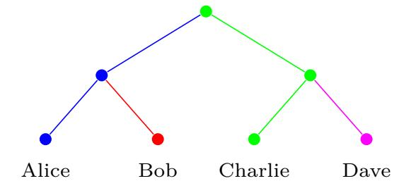

<span id="page-42-0"></span>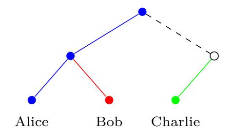

Fig. 19: An example of the tree-signing mechanism. In the left configuration, the keys in blue, red, green, and purple nodes have been sampled and certified by Alice, Bob, Charlie, and Dave, respectively. When Alice now commits the removal of Dave, first Dave's direct path gets blanked (including the root). Then Alice re-keys her direct path. Her leaf now contains a signature of the hash of the following things about the internal node shared with Bob: (1) the internal node's public-key, the list of public-keys to whom the corresponding secret key has been encrypted (in this case Bob's public key), and (3) the internal node's respective parent hash (of the root) binding the leaf to the entire direct path.

At this point, the parent hash of Charlie's leaf no longer matches the now blanked parent node, for which now neither child node has a valid parent hash. Note however that ITK always blanks a party's entire direct path. Hence, for each non-blank node, the binding child node is still in the tree. Thus, each non-blank internal node and the set of public key knowing its corresponding secret key is always bound by its child sampled by the same party, ultimately certified by the corresponding leaf node.

parent hash on the re-keyed path and in particular verifies that the one signed as part as the new leaf's key package matches.

The protocol then derives the new epoch's key schedule by first computing the confirmed transcript hash and then deriving the keys. Based on the new schedule, the confirmation tag is then verified. Finally, it completes the new epoch's state with the interim transcript hash.

*Join.* Upon input (Join*, w*), ITK sets up a new state and copies the public group information from the welcome message. This state is then verified by first verifying the sender's signature on the group information as well as verifying the public part of the ratchet tree.

Crucially, this entails verifying the tree-signing mechanism. Intuitively, we would like to maintain the following invariant:

**Invariant:** For each non-blank internal node *v*, either of its children is non-blank and has a parent hash (with co-path) stored that matches the [\\*parent-hash-cochild](#page-40-12)(*v, u*), where *u* denotes the other child.

See [Fig. 19](#page-42-0) for an explanation of the tree-signing mechanism and the invariant in particular.

Unfortunately, the above invariant is too idealistic for the following reason. If adding a member results in adding a leaf to *v*'s subtree, *v*'s right child *u* may be replaced by a fresh blank node *u* ′ in which case *u*, storing *v*'s parent hash, becomes the left child of *u* ′ — without re-keying *v*. (Recall the definition of left-balanced binary trees.) To account for this possibility, [\\*vrf-tree-state](#page-39-6) first (see [Fig. 16\)](#page-39-0) first searches for the "real" right child of *v* using the helper [\\*origRChild](#page-39-8).

For each leaf, [\\*vrf-tree-state](#page-39-6) furthermore verifies the signature on the key package, which includes the parent hash. Overall, this mechanism ensures that each internal node has been sampled by one of the parties in the respective sub-tree (or the party's signing key has been compromised).

ITK then proceeds by decrypting the private information — the joiner secret and the seed of the least common ancestor — from the welcome message. To this end, it fetches all its keypackage/secret-key pairs (kp*,*sk) from Fks and determines the one that has been used for the welcome message based on the hash of kp.

Analogous to Process it then derives the secret keys on the common path segment to the root and finally the next epoch's key schedule. It moreover also verifies the confirmation tag.

*Key.* The input Key outputs the current epoch's application secret and then deletes it from the local state.

{43}------------------------------------------------

### <span id="page-43-0"></span>**C.4 Simplifications and Deviations**

While ITK closely follows the IETF MLS protocol draft, there are a number of small deviations and omissions.

**Omitted modes and optional features.** The ITK protocol omits the following modes and optional features of the MLS protocol draft.

*Protocol versions and ciphersuites.* In the MLS draft, each group has a protocol version and a ciphersuite associated. Our analysis, on the other hand, simply assumes a single protocol version with a fixed set of underlying primitives. As they are specified upon group initialization by the group creator (rather than negotiated) and remain unchanged over the group's lifetime, we do not, a priori, see any major potential for downgrade and other attacks. Additionally, those parameters are incorporated into the key schedule, ensuring agreement. However, we leave a more complete analysis for future work.

*Meta-data protection.* The MLS draft supports two message framing formats: encrypted MLSCiphertexts and unencrypted MLSPlaintexts. While using the former is mandatory for protecting application messages' confidentiality, it is only recommended for handshake message to thwart basic meta-data analysis. Since we only consider handshake messages (not application messages) and do not take meta-data protection into account, we fix all frameing to be MLSPlaintexts. In particular, it is immediate that additionally encrypting the packets (as done by MLSCiphertext framing) does not undermine any of the security properties analyzed for MLSPlaintexts in this work.

*External proposals.* The MLS protocol draft allows for non-members to propose adding themselves to an existing group, and also allows for pre-provisioned parties to send (arbitrary) proposals, e.g., for a server to remove stale members. In both cases, it is up to the group policy to decide on the validity of such external proposals. We did not take either mechanism into consideration. *Extensions.* Similar to the TLS protocol, the MLS protocol draft is extensible in a number of places. We did not analyze any extensions.

*Preshared keys.* Groups which have an out-of-band mechanism to agree upon pre-shared keys can incorporate these into the MLS key schedule for additional security. We did not analyze this mechanism.

*Exporters.* The MLS key schedule provides a mechanism to export additional secrets to higher-level applications. As they are derived from the key schedule similarly to the application secret (and are otherwise unused by the protocol), their security should follow analogously.

**Minor simplifications.** Furthermore, our model of the protocol deviates from the draft in a number of minor aspects.

*No membership MAC on commits that do not include removes.* ITK uses an explicit MAC to ensure the authenticity of proposals. The MLS protocol also includes the MAC for commits (when using MLSPlaintext) [\[14\]](#page-27-18). For the security properties considered in this work this inclusion is redundant in case the commit does not include remove proposals, as the confTag already provides the same (and more) authenticity guarantees. But in practical terms, the MAC can provide somewhat better denial-of-service mitigation than relying only on confTag. In particular, verifying the MAC may allow quickly rejecting malformed commit packets without needing to first derive the next epoch's key schedule (a comparatively costly computation) needed to verify the confTag.

*Simplified primitives.* While the MLS protocol draft imposes a particular use of HKDF for key derivation (ExpandWithLabel), our model simply uses HKDF directly, not mixing in the same amount of context as in the spec. We note that this modification can only weaken security. So our results carry over to the more inclusive version in the RFC. For our analysis we treated HKDF's expand and extract functions as a random oracle. Moreover, in lieu of explicitly imposing the KEM-DEM paradigm (with the HPKECiphertext structure in commit messages) we simply model this as public-key encryption. Thus, formally speaking, it remains to show that HPKE, in the mode used in by MLS, implements a PKE scheme as modeled in our work

{44}------------------------------------------------

(from reasonable assumptions). (Given the simplicity of that mode of HPKE we believe this to be quite straight forward.)

Expiration of key packages and certificates. Key packages are mandated to have explicit lifetimes, which we do not account for. Neither does our model of the Authentication Service account for the expiration of certificates.

Simplified welcome message format. The protocol in the MLS draft always encrypts the (public) group context in welcome messages, analogously to MLSCiphertexts and not offering a mode analogous to MLSPlaintexts. As we do not take meta-data protection into account, our model forgoes this additional complexity. In particular, all of our results carry trivially cary over to the MLS variant that performs the extra encryption. Additionally, we always put the public part of the ratchet tree as part of the welcome message, not taking into account alternative means of delivery (e.g. via the DS). But here too, our model implies security for such delivery methods. Indeed, we use an insecure network (modeled by the environment) which means our model provides no guarantees on what is ultimately delivered to new joining members. Instead, it is up to the protocol to extract an guarantees from whatever packet is delivered.

More restrictive proposal lists. Our analysis assumes that the proposal vectors inside a commit message follow a strict ordering of first update proposals, then remove proposals, and finally add proposals. The current MLS draft (no longer) imposes such a restriction on the vector, but requires them to be applied respecting this order, i.e., not necessarily in the order specified. (We believe our techniques carry over essentially unchanged to this more permissive version of MLS.)

## <span id="page-44-0"></span>D Proof of Theorem 1: Security of ITK

**Theorem 1.** Assuming that PKE is IND-CCA secure, and that Sig is EUF-CMA secure, the ITK protocol securely realizes  $(\mathcal{F}_{AS}^{IW}, \mathcal{F}_{KS}^{IW}, \mathcal{F}_{CGKA})$  in the  $(\mathcal{F}_{AS}, \mathcal{F}_{KS}, \mathcal{G}_{RO})$ -hybrid model, where  $\mathcal{F}_{CGKA}$  uses the predicates safe and inj-allowed from Fig. 6 and calls to HKDF. Expand, HKDF. Extract and MAC functions are replaced by calls to the global random oracle  $\mathcal{G}_{RO}$ .

The proof is structured as follows. First, in Apps. D.2 to D.4 we prove that ITK\* which behaves like ITK but uses the weak tree-signing scheme from Draft 9 (called ITK<sub>Atk-3</sub> in Sec. 6) realizes  $\mathcal{F}_{CGKA}$  with a worse safety predicate **safe**\*. Then, in App. D.5 we extend the proof to show full security of ITK. The reason for this split is historical — we first attempted to prove full security of ITK\* but the proof failed and we discovered the attack on weak tree signing. At the time of writing it was still not clear if our fix would be incorporated.

Formally, **safe**\* differs from the original predicate in that condition b) of **\*state-directly-leaks** (cf. Fig. 6) is replaced by

```
b) // c is in a detached tree and id's spk appears in some exposed node: (\exists c_a : *ancestor(c_a, c) \land \mathsf{Node}[c_a].\mathsf{par} = \bot \land (\mathsf{id}, \mathsf{spk}) \in \mathsf{Node}[c].\mathsf{mem} \land (\mathsf{spk} \in \mathsf{Exposed} \lor \exists c_e : (*, \mathsf{spk}_e) \in \mathsf{Node}[c_e].\mathsf{mem} \land \mathsf{spk}_e \in \mathsf{Exposed})
```

The proof that ITK\* realizes the weakened  $\mathcal{F}_{CGKA}$  proceeds in a sequence of hybrids, transitioning from the real world to the ideal world. The simulator is introduced gradually together with the hybrids. Each hybrid introduces a different security property provided by ITK\*: the first hybrid is the real world, the second hybrid introduces consistency, the third – confidentiality and the fourth – authenticity. The fourth hybrid is the ideal world. Intuitively, if two consecutive hybrids are indistinguishable then ITK\* provides the introduced security property. Formally, we have

- **Hybrid 1.** This is the real world. We make a syntactic change: the simulator  $S_1$  interacts with a dummy functionality  $\mathcal{F}_{\text{DUMMY}}$ , which routs all inputs and outputs through  $S_1$ , who executes ITK\*.
- **Hybrid 2.** This hybrid introduces consistency.  $\mathcal{F}_{\text{DUMMY}}$  is replaced by  $\mathcal{F}_{AS}^{\text{IW}}$ ,  $\mathcal{F}_{KS}^{\text{IW}}$  and  $\mathcal{F}_{\text{CGKA}}$ , except  $\mathbf{safe}^*(\cdot) = \mathbf{false}$  and  $\mathbf{inj\text{-allowed}}(\cdot, \cdot) = \mathbf{true}$ . That is, all application secrets are set by the simulator and injections are always allowed. The simulator  $\mathcal{S}_2$  still sets all messages and keys according to the protocol.

{45}------------------------------------------------

**Hybrid 3.** This hybrid introduces confidentiality.  $\mathcal{F}_{CGKA}$  uses the original  $\mathbf{safe}^*$  predicate. The simulator  $\mathcal{S}_3$  sets only those application secrets for which  $\mathbf{safe}^*$  is false.

**Hybrid 4.** This hybrid introduces authenticity.  $\mathcal{F}_{CGKA}$  uses the original **inj-allowed**. The simulator remains the same. This is the ideal world.

In Apps. D.2 to D.4 we prove that each pair of consecutive hybrids is indistinguishable.

## <span id="page-45-0"></span>D.1 ITK\* Guarantees Consistency

Claim. Hybrids 1 and 2 are indistinguishable, that is ITK\* guarantees consistency.

To prove the claim, we describe in detail the simulator  $S_2$ , and argue that it does not violate any statements executed by  $\mathcal{F}_{CGKA}$  within **assert**, and that the outputs of ITK and  $\mathcal{F}_{CGKA}$  are the same. Observe that  $S_2$  knows the whole history graph, including the application secrets (since **safe**\* is false in Hybrid 2). Moreover, each history graph node has a unique **confTransHash**, because the transcript hash includes all messages c leading to it, i.e., all parents (except the last **confTag**, but this is uniquely determined by the last c).

PROPOSALS. When  $\mathcal{F}_{CGKA}$  sends (Propose, id, add) to  $\mathcal{S}_2$ , the simulator executes the ITK protocol to obtain the packet p. Recall that for proposals adding  $id_t$ , ITK fetches the key package  $kp_t$  for  $id_t$  from  $\mathcal{F}_{KS}$ , and that  $\mathcal{F}_{KS}$  asks  $\mathcal{Z}$  to provide  $kp_t$ .  $\mathcal{S}_2$  executes the code of both ITK and  $\mathcal{F}_{KS}$ , which means it uses  $kp_t$  provided by  $\mathcal{Z}$ .

If  $p = \bot$ ,  $S_2$  sends to  $\mathcal{F}_{CGKA}$  ack = false. Else, it sends  $(p, \mathsf{spk}_t, \mathsf{true})$ , where  $\mathsf{spk}_t$  is taken from  $\mathsf{kp}_t$  (by inspection, the protocol guarantees that  $\mathsf{kp}_t$  is well formed and contains  $\mathsf{spk}_t$ ). Assert statements: The only **assert** statement executed on proposals is a part of \*consistent-prop, which enforces that proposals computed by id in node c are different than those computed in node c' (even if id can never get to these nodes). This is guaranteed by including in proposals membTag — a MAC, modeled as a random oracle, over groupCtxt, which includes confTransHash (c.f. framing in Fig. 18).

COMMITS.  $S_2$  computes the packets c and w according to ITK and sets ack = false if  $c = \bot$ . If ack = true, it first checks if c corresponds to a detached root — if  $Node[c] = \bot$  and there exists a w such that  $Wel[w] = root_{rt}$  and confTransHash in w (included as a part of groupInfo) matches that in c (the latter can be computed), sends rt to  $\mathcal{F}_{CGKA}$  (alongside c and w). Then,  $\mathcal{F}_{CGKA}$  runs \*fill-props. For each proposal p without a node,  $S_2$  sets orig and act according p (the basic checks executed by ITK guarantee that p is well formed). Assert statements: \*consistent-comm succeeds for the same reason as \*consistent-prop. All other asserted statements trivially hold by inspection and the fact that all messages include

All other asserted statements trivially hold by inspection and the fact that all messages include a MAC over the transcript hash (note that in the invariant, **inj-allowed** is false in these hybrids).

<u>Process.</u>  $S_2$  executes the protocol to check if the receiver would accept the inputs and sends  $ack = \mathtt{false}$  if this is not the case. Else, it checks if c corresponds to a detached root exactly as in Committe above. If c creates a new node (i.e., there was no detached root and  $\mathsf{Node}[c] = \bot$ ,  $S_2$  retrieves  $\mathsf{orig}'$  and  $\mathsf{spk}'$  from c (the latter can be found in the committer's key package in the  $\mathsf{updatePath}$ .

The fact that all statements in **assert** are true follows easily by inspection. To see why the outputs of ITK and  $\mathcal{F}_{CGKA}$  are the same, observe first that since a commit contains hashes of all proposals, with overwhelming probability, for each c there is only one  $\vec{p}$  such that (Process,  $c, \vec{p}$ ). Second, the output of process is determined by  $\vec{p}$  and the member set in c's parent (moreover, this output is computed the same way by ITK and \*output-proc in  $\mathcal{F}_{CGKA}$ ). By the standard hybrid argument, this implies that outputs are the same.

<span id="page-45-1"></span>The claim is not implied by any standard security notion for MAC's. What we would need is that even given the secret key, it is hard to find two messages with the same tags. While possible to formalize, for simplicity we instead model the MAC as the RO (this is anyway necessary for the MAC used to compute the confirmation tag).

<span id="page-45-2"></span>Note that the epoch counter is not unique — it is in fact the same for all commit nodes with the same depth.

{46}------------------------------------------------

<u>JOIN.</u> When a party id joins using a welcome message w,  $S_2$  first executes id's protocol to determine if joining succeeds and sets the ack flag accordingly. If  $ack = \mathtt{false}$ , or if  $\mathsf{Wel}[w] \neq \bot$ , then  $S_2$  simply sends  $(ack, \bot, \bot, \bot)$  to  $\mathcal{F}_{\mathsf{CGKA}}$ . Note that in the latter case,  $\mathcal{F}_{\mathsf{CGKA}}$  already knows the semantics of w and ignores any values received from the simulator other than ack. Else,  $S_2$  sends to  $\mathcal{F}_{\mathsf{CGKA}}$  values c', orig' and mem' that interpret the (injected) w. It computes them as follows.

First,  $S_2$  parses w = (encGroupSecs, groupInfo) (if w was not of this format, joining would have failed) and determines orig' and mem' based on groupInfo. Then,  $S_2$  chooses c' as the history graph node for which confTransHash matches that in groupInfo, or sets  $c' = \bot$  if no such node exists (if  $c' = \bot$ ,  $\mathcal{F}_{CGKA}$  creates a new detached root).

It is left to argue that the joiner id ends up in a state that is consistent with the state of any other party id' transitioning into c' via process or join. For this, recall that both id and id' verify the confirmation tag, for which they derive the key from the joiner secret combined with the group context. This guarantees (assuming collision resistance) that they agree on the context, which in particular includes the tree hash and the confirmed transcript hash. The tree hash binds the whole ratchet tree, including its structure, spk's of all members and all public keys. In particular, this implies agreement on the member set mem'. Agreement on the transcript hash implies agreement on the history, including the last committer orig'. The agreement is maintained in descendants of c', since parties agree on the ratchet tree in c'.  $\Box$ 

## <span id="page-46-0"></span>D.2 A New Security Notion for PKE

Our proofs that ITK\* provides confidentiality and authenticity rely on security of the PKE scheme (for authenticity, PKE protects the MAC keys). In the setting with adaptive corruptions, reducing ITK\* security to the standard IND-CCA security is difficult for the following reason. Recall that ITK\* generates key pairs  $(pk_i, sk_i)$  and encrypts  $sk_i$  under different  $pk_j$  (without creating cycles). Say a secret message m is encrypted under  $pk_1$ . To argue that IND-CCA security implies confidentiality of m, we would have to first introduce a sequence of hybrids that replace encryptions of secret keys that allow to compute  $sk_i$  via a chain of decryptions by encryptions of some unrelated messages. It is important to replace only those, since replacing others allows to distinguish the experiments by corrupting secret keys. However, with adaptive adversaries we do not know if an encryption should be replaced at the moment it is created. Guessing this for each encryption incurs exponential loss.

To deal with this, we follow the strategy of [10] and define a stronger security notion for PKE, called (Modified) Generalized Selective Decryption (GSD). In contrast to [10], our version considers active attackers and takes into account the full key schedule. We then prove that IND-CCA security implies GSD security in the (non-programmable but observable) ROM. The proof is an adaptation of the proof in [10] showing that IND-CPA implies their weaker version of GSD.

The modified GSD game. GSD security is formalized by the game defined in Fig. 20. It is parameterized by a hash function Hash and a number N. In essence, the game maintains a (hyper)graph with N vertices, where each vertex u stores a seed  $s_u$  (initially  $\bot$ ), from which a key pair can be derived by running key generation with randomness set to the hash of  $s_u$ . Edges correspond to dependencies between seeds: one seed being a hash of another or being encrypted under a key derived from another. In general, if a vertex is a source of an edge, then the public key is known to the adversary (note that an outputted ciphertext may already reveal it). Otherwise, the public key is secret and the seed should be indistinguishable from random. (Note that a secure seed can be used as a symmetric key.) To put the definition in the context of a ITK execution, the GSD hypergraph created by a ITK commit is given in Fig. 21.

We now describe the GSD oracles in more detail.

- $\operatorname{Enc}(u,v)$  creates an edge from u to v with label  $\mathbf{e}$  and outputs an encryption of the seed  $s_v$  under the public key derived from  $s_u$ . This query also, if necessary, initializes  $s_u$  and  $s_v$  to random values. (ITK context: encrypting path secrets during rekey.)
- Hash $(u, v, \mathsf{IbI})$  creates an edge from u to v with label  $\mathsf{IbI}$  and computes v as  $\mathsf{Hash}(s_u, \mathsf{IbI})$ . Since the hash is deterministic, we require that  $s_v$  is not initialized yet and no other seed has been computed from  $s_u$  using  $\mathsf{IbI}$ . (ITK context: hash chain of path secrets.)

{47}------------------------------------------------

```
Game GSD_A
The game is parameterized by the number of vertices N, the security parameter \kappa and a hash function Hash.
   (V, E) \leftarrow ([N], \emptyset) // \text{GSD graph}
                                                                                                                    {\bf Oracle\ Join-Hash}(u,u',v,{\sf IbI})
   Corr, Ctxt \leftarrow \emptyset // corrupted vertices, ciphertexts
                                                                                                                       \operatorname{reg} s_v = \bot \land ((u, u', \mathsf{lbl}), *, \mathsf{h}\text{-}\mathsf{lbl}) \notin E
   s_u, \mathsf{pk}_u, \mathsf{sk}_u \leftarrow \bot for each u \in [N] // keys for vertex u
                                                                                                                       gen-key-if-nec(u); gen-key-if-nec(u')
   u \leftarrow \perp // \text{ challenge vertex}
                                                                                                                       s_v \leftarrow \mathsf{Hash}(s_u, s_{u'}, \mathsf{lbl})
   b \leftarrow \$ \{0, 1\}
                                                                                                                       gen-key-if-nec(v)
   s' \leftarrow \$ \begin{array}{l} \{0,1\}^{\kappa} \\ b' \leftarrow \mathcal{A}_{\mathsf{PKE}}^{\mathsf{Enc},\mathsf{Dec},\mathsf{Corr},\mathsf{Chal},\mathsf{Hash},\mathsf{Join-Hash} \end{array}
                                                                                                                       E + \leftarrow ((u, u'), v, h-lbl)
                                                                                                                       return (\mathsf{pk}_u, \mathsf{pk}_{u'})
   if (V, E) acyclic \wedge u is a sink \wedge \neg \mathbf{gsd\text{-}exp}(u) then
        return b = b'
                                                                                                                    Oracle \mathbf{Enc}(u, v)
   else return false
                                                                                                                       gen-key-if-nec(u); gen-key-if-nec(v)
                                                                                                                       E +\leftarrow (u, v, \mathbf{e})
Oracle Chal(u)
                                                                                                                       c \leftarrow \mathsf{PKE.enc}(\mathsf{pk}_u, s_v)
                                                                                                                       Ctxt +\leftarrow (u, c)
   \mathbf{req}\ u = \bot
                                                                                                                       return (pk_u, c)
   u \leftarrow u
   if b = 0 then return s_u
                                                                                                                    Oracle Dec(u, c)
   else return s'
                                                                                                                       \mathbf{req}\ s_u \neq \bot \land u \text{ not a sink}
Oracle \operatorname{Hash}(u, v, \operatorname{lbl})
                                                                                                                       \mathbf{req}\ (u,c) \notin \mathsf{Ctxt}
                                                                                                                       return PKE.dec(\mathsf{sk}_u, c)
   \operatorname{req} s_v = \bot \land (u, *, h\text{-lbl}) \notin E // \operatorname{hash} \text{ is deterministic}
   gen-key-if-nec(u)
   s_v \leftarrow \mathsf{Hash}(s_u, \mathsf{IbI})
                                                                                                                    gen-kev-if-nec(u)
   gen-key-if-nec(v)
                                                                                                                       if s_u = \bot then s_u \leftarrow \$ \{0,1\}^{\kappa}
   E +\leftarrow (u, v, h-lbl)
                                                                                                                       (\mathsf{pk}_u, \mathsf{sk}_u) \leftarrow \mathsf{PKE}.\mathsf{kg}(\mathsf{Hash}(s_u, \mathsf{node}))
   return pk_{y}
                                                                                                                       // in ITK, the label "node" is used for key generation
Oracle Corr(u)
                                                                                                                    gsd-exp(u)
   \operatorname{req} s_u \neq \bot
                                                                                                                       return u \in \mathsf{Corr}
   Corr +\leftarrow u
                                                                                                                          \vee \exists (v, u, *) \in E : \mathbf{gsd\text{-}exp}(v)
   return s_u
                                                                                                                           \vee \exists ((v, v'), u, *) \in E : \mathbf{gsd-exp}(v) \wedge \mathbf{gsd-exp}(v')
```

Fig. 20: The GSD game, modified to explain ITK executions.

- Join-Hash $(u, u', v, \mathsf{lbl})$  is similar to Hash, but instead of  $s_u$ , it uses the pair  $(s_u, s_{u'})$ . (ITK context: joiner secret is the hash of init and commit secrets.)
- Dec and Chal oracles are analogous to those in the IND-CCA game, except the restrictions
  which nodes can be queried. The Corr oracle outputs the seed and records it in the Corr set.

The crucial aspect of the game is the  $\mathbf{gsd\text{-}exp}(u)$  function, which determines if the seed in a vertex u is exposed due to corruptions, or its secrecy is guaranteed. That is,  $\mathbf{gsd\text{-}exp}$  for vertices is analogous to  $\neg\mathbf{safe}^*$  for application secrets. Specifically, u is exposed if it is corrupted, or if there is an edge to u that can be traversed. The latter is true iff all sources of the edge are exposed. (Notice the similarity to how our  $\mathbf{safe}^*$  is defined.)

**Definition 4.** Let  $Adv_{\mathsf{PKE},\mathcal{A}}^{\mathsf{GSD}} \coloneqq 2\Pr[\mathsf{GSD}_{\mathsf{PKE},\mathcal{A}} = \mathsf{true}] - 1$  denote the advantage of  $\mathcal{A}$  against the game defined in Fig. 20. A scheme PKE is GSD secure, if for all PPT adversaries  $\mathcal{A}$ ,  $Adv_{\mathsf{PKE},\mathcal{A}}^{\mathsf{GSD}}$  is negligible in  $\kappa$ .

IND-CCA security implies GSD security. We next show the following theorem.

**Theorem 6 (adapted from [10]).** If PKE is IND-CCA secure and Hash is modeled as a (observable, non-programmable) random oracle, then PKE is GSD secure.

Proof. The proof is adapted from [10]. There, the authors first show that IND-CPA implies in the ROM the standard GSD security, GSD<sup>-</sup>, i.e., the notion formalized by the game from Fig. 20 without the Hash, Join-Hash and Dec oracles. This proof solves the main technical challenges, and we refer the reader to [10] for the details. Then, [10] includes a proof sketch showing that the reduction for GSD<sup>-</sup> can be easily modified to account for certain additional hash queries, namely, the ones that in our game correspond to Hash queries with a fixed label lbl = 1. (While the proof sketch of [10] involves programming of the RO, we believe this is not necessary.) We show that additional Hash, Join-Hash and Dec queries do not affect (the modification of) the reduction.

{48}------------------------------------------------

Decryption. While [10] considers IND-CPA security, we note that their reduction generates the seeds in all GSD vertices except one "challenge" vertex itself. Hence, answers to decrypt queries for non-challenge vertices can simply be computed, and for the challenge vertex — sent to the IND-CCA oracle (requiring  $(u, c) \notin \text{Ctxt}$  makes sure that the IND-CCA challenge is valid).

Hash and Join-Hash. Here we need a bit more details of the reduction from [10]. Assume  $\mathcal{A}_{gsd}$  is a GSD adversary. The authors define an event E on the GSD execution with  $\mathcal{A}_{gsd}$  as follows (here adapted to our setting)

Event E. At some point,  $\mathcal{A}_{gsd}$  queries RO on a value that contains a seed  $s_u$  for a non-challenge vertex u for which gsd-exp is false (at the time of the RO query).

Then, [10] presents two reductions: the reduction (1) constructs an IND-CCA adversary  $\mathcal{A}_{\mathsf{cca}}$ , given a GSD adversary  $\mathcal{A}_{\mathsf{gsd}}^{\neg E}$  that triggers E with small probability, and the reduction (2) constructs a GSD adversary  $\mathcal{A}_{\mathsf{gsd}}^{\neg E}$  that triggers E with small probability, given a GSD adversary  $\mathcal{A}_{\mathsf{gsd}}^{E}$  which triggers E with large probability.

Reduction (1). We first argue that in the reduction (1),  $\mathcal{A}_{cca}$  can easily deal with the additional hash edges in the GSD experiment it simulates for  $\mathcal{A}_{gsd}^{\neg E}$ . In essence,  $\mathcal{A}_{cca}$  defined in [10] guesses an edge (v, u, e), where u is the GSD challenge issued by  $\mathcal{A}_{gsd}^{\neg E}$  (for now, just assume the edge is given; see [10] for details). Then,  $\mathcal{A}_{cca}$  samples seeds for all vertices except u itself, replaces the public key in v by its challenge key pk (unrelated to v's seed), and embeds the IND-CCA challenge in the encryption query creating the (v, u, e) edge. (The IND-CCA challenge is queried on two random seeds, and  $\mathcal{A}_{gsd}^{\neg E}$ 's challenge is answered with the first one.)

Clearly, any hash query that does not involve u or v can be simulated by evaluating the RO. Any query involving v is simulated by evaluating the RO on v's seed. Since u is a challenge and there is a v-u edge, gsd-exp is false for v. Hence, the fact that  $\mathcal{A}_{gsd}^{-E}$  does not trigger E implies that it does not query RO on v's seed and hence cannot verify that it is inconsistent with the public key. Finally, if u is created via a hash query (note that as a challenge, u is a sink),  $\mathcal{A}_{cca}$  can simply ignore this edge (i.e., choose u at random instead). Again, the inconsistency of this edge cannot be verified without triggering E. (Note that if u is created via join-hash of u, u', then for gsd-exp to be false in u, it must be false for at least one of u, u'. Since verifying the hash requires querying the RO on both u and u', it triggers E.)

Reduction(2). Second, consider the reduction (2). Given a GSD adversary  $\mathcal{A}_{\mathsf{gsd}}^E$  that triggers E, [10] defines  $\mathcal{A}_{\mathsf{gsd}}^{-E}$  that does not trigger E roughly as follows.  $\mathcal{A}_{\mathsf{gsd}}^{-E}$  simulates the experiment for  $\mathcal{A}_{\mathsf{gsd}}^E$  using its oracles, and halts as soon as E turns true (it can realize that E is true by checking each RO query of  $\mathcal{A}_{\mathsf{gsd}}^E$  against all public keys). Moreover, it guesses the vertex v corresponding to the RO query that makes E true. The idea is to challenge v as soon as its seed is defined (since now v must be a sink in  $\mathcal{A}_{\mathsf{gsd}}^{-E}$ 's game, outgoing edges from v and its public key are simulated using a special vertex N+1), obtain a seed s and search for s in  $\mathcal{A}_{\mathsf{gsd}}^E$ 's RO queries. If s is the real seed (and the guess for v is correct), then it is queried to the RO and  $\mathcal{A}_{\mathsf{gsd}}^{-E}$  outputs 0. Else, if s is random, then it is independent of  $\mathcal{A}_{\mathsf{gsd}}^E$ 's view, so with high probability it is not queried and, accordingly,  $\mathcal{A}_{\mathsf{gsd}}^{-E}$  outputs 1 (when E is triggered for a different node, or  $\mathcal{A}_{\mathsf{gsd}}^E$  halts).

We only need to argue that the additional (join-)hash queries do not affect the simulation before E is triggered, as afterwards the reduction halts. The reason this holds is analogous to the reasoning for the reduction (1) — the only inconsistency is in the vertex v, where edges (u, v, \*) are generated using v's actual seed, and edges (v, u, \*) are generated using the special vertex N+1. However, this inconsistency cannot be verified without querying the RO on the seed from v or N+1. As for both of these vertices  $\operatorname{gsd-exp}$  is false (for v by assumption that the guess was correct, and for N+1 since it is a source and cannot be corrupted, as it does not appear in  $\mathcal{A}_{\operatorname{gsd}}^E$ 's game), such query would trigger E.

#### <span id="page-48-0"></span>D.3 ITK\* Guarantees Confidentiality

Claim. If PKE is GSD secure, then Hybrids 2 and 3 are indistinguishable, that is, ITK\* guarantees confidentiality.

{49}------------------------------------------------

<span id="page-49-0"></span>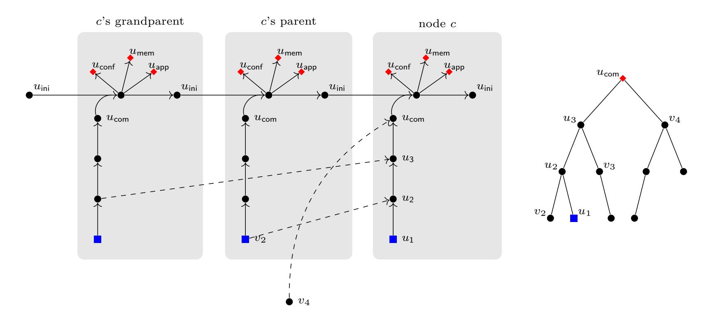

Fig. 21: An example commit creating a node c: (right) the ratchet tree in c and its parent, (left) the corresponding GSD graph created by the reduction  $\mathcal{A}$ . The sinks and sources are marked by • and •, respectively. The continuous and dashed edges denote hash and encryption edges, respectively. The rightmost gray area is created upon the commit. The committer id first generates a sequence of path secrets, while  $\mathcal{A}$  creates vertices  $u_1, ..., u_{\text{com}}$  connected by hash edges. Then id derives next-epoch secret from joinerSec obtained by combining commitSec and previous initSecret. Accordingly,  $\mathcal{A}$  creates  $u_{\text{joi}}$  as the destination of a join-hash edge from  $u_{\text{com}}$  and  $u_{\text{ini}}$ . Finally, id encrypts  $u_i$  under  $v_i$ , while  $\mathcal{A}$  obtains ciphertexts from encryption edges ( $v_4$  was created in a previous commit).

We define two sequences of hybrids:  $\mathcal{H}_i^{\mathsf{appSecret}}$  and  $\mathcal{H}_i^{\mathsf{membKey}}$  for  $i \in [N]$ .  $\mathcal{H}_i^{\mathsf{appSecret}}$  is the same as Hybrid 2, except the first i application secrets chosen by  $\mathcal{F}_{\mathsf{CGKA}}$  are sampled as in Hybrid 3, i.e. they are random if  $\mathsf{safe}^*$  is true.  $\mathcal{H}_i^{\mathsf{membKey}}$  is the same as  $\mathcal{H}_N^{\mathsf{appSecret}}$ , except the first i membership keys used by the simulator are as in Hybrid 3, i.e. they are random if  $\mathsf{safe}^*$  is true. In the following, we show that  $\mathcal{H}_{i-1}^{\mathsf{appSecret}}$  and  $\mathcal{H}_i^{\mathsf{appSecret}}$  are indistinguishable. The proof for  $\mathcal{H}_i^{\mathsf{membKey}}$  is analogous.

Assume that an environment  $\mathcal{Z}$  has a non-negligible advantage in distinguishing between hybrids  $\mathcal{H}_{i-1}^{\mathsf{appSecret}}$  and  $\mathcal{H}_{i}^{\mathsf{appSecret}}$ , and let M be an upper bound on the number of secret keys (including PKE secret keys and symmetric keys) created in an execution with  $\mathcal{Z}$ . We construct an adversary  $\mathcal{A}$  against the GSD game with M nodes as follows. On a high level,  $\mathcal{A}$  emulates for  $\mathcal{Z}$  the interaction with  $\mathcal{F}_{\mathsf{CGKA}}$ ,  $\mathcal{F}_{\mathsf{KS}}^{\mathsf{IW}}$ ,  $\mathcal{F}_{\mathsf{AS}}^{\mathsf{IW}}$  and the simulator. In particular,  $\mathcal{A}$  executes the code of all these functionalities and the simulator as defined in  $\mathcal{H}_{i-1}^{\mathsf{appSecret}}$ , except secure PKE key pairs are generated with the help of GSD oracles and the i-th group key embeds the GSD challenge. Note that if for the i-th application secret  $\mathsf{safe}^*$  is false, then the challenge is not embedded, but in this case the hybrids proceed exactly the same.

We now explain in detail how  $\mathcal{A}$  modifies the code of the functionalities and the simulator. First, instead of storing a separate state for each party (as the simulator executing the protocol would),  $\mathcal{A}$  keeps a single group state for each commit node and a separate state for each proposal. Relevant to the reduction, the group state contains a ratchet tree  $\tau$  with a key pair in each node and a number of symmetric keys, such as memberSec and appSecret. A proposal node's state contains a key package. In general, a secret key (symmetric or asymmetric) can have one of three values: (1) if it is unknown to  $\mathcal{Z}$ , then it is equal to (gsd, u), where  $u \in \mathbb{N}$  is a GSD vertex, (2) if it is known to both  $\mathcal{Z}$  and  $\mathcal{A}$ , then it is set to the actual value, and (3) if it known to  $\mathcal{Z}$  but unknown to  $\mathcal{A}$  (e.g. an injected public key), then it is set to  $\bot$ .

For bookkeeping,  $\mathcal{A}$  keeps a counter  $u_{\mathsf{ctr}}$  (initially 1), denoting the largest vertex in the GSD game used so far. We write  $\mathsf{pk} \leftarrow \mathsf{*get}\text{-}\mathsf{pk}(u)$  to denote that  $\mathcal{A}$  obtains the public key  $\mathsf{pk}$  for a vertex u by calling the oracle  $\mathsf{Enc}(u,0)$  (the special vertex 0 is only used here).

The remainder of the proof consists of three steps. First, we consider the simplified setting, where  $\mathcal{Z}$  never injects messages or key packages, and never corrupts randomness. In the next two steps, we remove the former and the latter assumption, respectively.

{50}------------------------------------------------

- Step 1: No Injections, No Bad Randomness We describe how  $\mathcal{A}$  modifies the code of the functionalities and the simulator. First, unlike  $\mathcal{F}_{KS}^{IW}$  and  $\mathcal{F}_{AS}^{IW}$ , it does not delete secret keys (but records the deletion event). Then, it processes different inputs as follows.
- <u>KEY-PACKAGE REGISTRATION.</u> When  $\mathcal{Z}$  instructs a party id to register a key package in the emulated  $\mathcal{F}_{KS}^{IW}$ ,  $\mathcal{A}$  creates a new GSD vertex by executing  $\mathsf{pk} \leftarrow \mathsf{*get-pk}(u_{\mathsf{ctr}})$ . It uses  $\mathsf{pk}$  to generate the public part of the key package  $\mathsf{kp}$ , sets the secret key  $\mathsf{SK}[\mathsf{id},\mathsf{kp}]$  to  $(\mathsf{gsd},u_{\mathsf{ctr}})$ , and sets  $u_{\mathsf{ctr}}++$ .
- PROPOSAL add-id<sub>t</sub> FROM id. Recall that whenever the protocol requests a key package for id<sub>t</sub> from  $\mathcal{F}_{KS}^{IW}$ ,  $\mathcal{Z}$  gets to choose it. Accordingly,  $\mathcal{A}$  stores in the new proposal node the pk taken from the key package chosen by  $\mathcal{Z}$ .
- PROPOSAL up FROM id. Analogous to registering key packages,  $\mathcal{A}$  creates the new key pair as \*get-pk( $u_{\text{ctr}}$ ) and (gsd,  $u_{\text{ctr}}$ ), stores it in the new proposal node and uses it to compute the message. It sets  $u_{\text{ctr}}$ ++.
- APPLYING PROPOSALS. The only difference from \*apply-props (executed by the simulator as part of the protocol) is that for each update proposal, the leaf's secret key is set to the value stored in the proposal node, and for each add proposal, its set to the value in the SK array.
- COMMIT FROM id. After applying the proposals,  $\mathcal{A}$  emulates \*rekey-path as follows (see Fig. 21 for an example). First, consider the case where for all public keys used by id in \*rekey-path, the secret keys stored in the ratchet tree are of the form (gsd, \*).
  - 1. Add vertices to the GSD graph:  $\mathcal{A}$  adds the following vertices:  $u_1, \ldots, u_n$  (path secrets),  $u_{\mathsf{joi}}$  (joiner secret),  $u_{\mathsf{app}}, u_{\mathsf{mem}}, u_{\mathsf{conf}}$  (their values are set to  $u_{\mathsf{ctr}}, u_{\mathsf{ctr}} + 1, \ldots$  and  $u_{\mathsf{ctr}}$  is incremented). The vertices are created as follows: for each  $i \in [n-1]$ , query  $\mathsf{Hash}(u_i, u_{i+1}, \mathsf{path})$ . Then, query  $\mathsf{Join}\text{-}\mathsf{Hash}(u_{\mathsf{par-ini}}, u_{\mathsf{n}}, .)$ , where  $(\mathsf{gsd}, u_{\mathsf{par-ini}})$  is stored in the initSecret of  $\mathsf{Ptr}[\mathsf{id}]$ . For  $\mathsf{lbl} \in \mathsf{app}$ ,  $\mathsf{mem}$ ,  $\mathsf{ini}$ ,  $\mathsf{conf}$ , query  $\mathsf{Hash}(u_{\mathsf{ioi}}, u_{\mathsf{lbl}}, \mathsf{lbl})$ .
  - 2. Create the packet: A creates encryptions of path secrets by creating corresponding encryption edges. Then, it corrupts  $u_{\text{mem}}$  and stores the result as the memberSec of the new node. Finally, it corrupts  $u_{\text{conf}}$ , which completes the set of values needed to compute the commit packet.
  - 3. Create the welcome message: The welcome message contains, for each new member  $\mathrm{id}_t$ , the encryptions of joinerSec and  $\mathrm{id}_t$ 's pathSec under the key in  $\mathrm{id}_t$ 's leaf in the new epoch's ratchet tree (obtained from KS by the party adding  $\mathrm{id}_t$ ). Let  $u_i$  be the GSD vertex corresponding to the pathSec sent to  $\mathrm{id}_t$ . If  $\mathrm{id}_t$ 's leaf key is of the form (gsd, u),  $\mathcal{A}$  obtains the encryptions by creating encryption edges from u to  $u_{\mathrm{joi}}$  and from u to  $u_i$ . Else, it corrupts  $u_i$  and  $u_{\mathrm{joi}}$  and encrypts the values itself.
  - Now assume that for some key used in \*rekey-path, the secret key is not (gsd,\*). Let  $u_i$  be the smallest that should be encrypted under such key. After adding the vertices,  $\mathcal{A}$  corrupts  $u_i$  and uses it to compute  $u_{i+1}, ..., u_n$  and encrypts  $u_i, ..., u_n$  itself. It creates the packet as before.
- <u>KEY IN NODE c.</u>  $\mathcal{A}$  modifies the \*set-key as follows. Assume this is the j-th call to \*set-key. If safe\*(c) is true and j < i, output a random value. Else, if safe\*(c) is true and j = i, let  $(gsd, u_{app})$  be the value stored in appSecret of c. Query challenge on  $u_{app}$  and output the result. Else, output the real group key, corrupting the GSD node if necessary.
- EXPOSE id. The state of id's contains the following secrets: 1) the secret key for each ratchet tree node on id's direct path such that id is not in unmerged leaves of this node, 2) epoch secrets, and 3) the key packages secret keys generated by id. For each of the above secrets, if the secret key that is equal to (gsd, u),  $\mathcal{A}$  corrupts u. Then, for each vertex v s.t. gsd-exp(v) becomes true,  $\mathcal{A}$  replaces all occurrences of (gsd, v) by the seed  $s_v$ , computed using previously obtained ciphertexts and corrupted seeds.

If a history graph node c stores a symmetric key (gsd,  $u_{lbl}$ ), we refer to the GSD vertex as  $(c, u_{lbl})$ . Assume  $\mathcal{A}$  queries challenge on a vertex  $(c, u_{app})$  (if  $\mathcal{A}$  does not query a challenge, i.e. safe\*(c) is flase, then the hybrids are exactly the same, so  $\mathcal{Z}$ 's advantage is 0). We now show that in the GSD execution with  $\mathcal{A}$ , safe\*(c) implies that gsd-exp $((c, u_{app}))$  is false, and hence  $\mathcal{A}$  can win the game by outputting whatever  $\mathcal{Z}$  outputs.

<span id="page-50-0"></span><sup>&</sup>lt;sup>26</sup> ITK actually encrypts both secrets together in one ciphertext, but without loss of generality here we treat them as two separate ciphertexts.

{51}------------------------------------------------

We first observe that for any commit c' with corresponding welcome message w', each party who could join using w' is equivalent to a current group member who already processed c' (ignoring encryptions of joinerSec in w', which we will consider separately). This is for the following reason: recall that for any joining  $\mathrm{id}_t$ , w' contains the encryption of the pathSec that  $\mathrm{id}_t$  would receive as part of c', was he a member in the parent epoch of c' with the ratchet tree leaf as in c'. Moreover, when  $\mathrm{id}_t$  is corrupted, he is immediately added to the corrupt set of any node where he could join,<sup>27</sup> including c' (see the "for each" loop in the Expose input). This is the same as if  $\mathrm{id}_t$  was a current group member, transitioned to c' and was corrupted. Therefore, we now only consider current group members.

Recalling the definition of **gsd-exp** (Fig. 20) and the GSD graph created by  $\mathcal{A}$  (Fig. 21), **gsd-exp**( $(c, u_{\mathsf{app}})$ ) can only be true in one of the three cases:

- (a)  $\mathcal{A}$  corrupts the vertex  $(c, u_{\mathsf{app}})$ . This happens iff  $\mathcal{A}$  computes the state of a party exposed in c, which immediately implies  $\neg \mathbf{safe}^*(c)$ .
- (b)  $\mathcal{A}$  corrupts the vertex  $(c, u_{joi})$ . This happens iff  $\mathcal{A}$  computes a welcome message for a party  $\mathrm{id}_t$  added with an exposed key bundle. Recall that if  $\mathrm{id}_t$  is exposed,  $\mathcal{F}_{CGKA}$  adds it to the exposed set  $\mathrm{exp}$  of each node where it can join using a currently held key package (the "for each" loop of input expose). Hence,  $\mathrm{id}_t$  must be in the  $\mathrm{exp}$  set of c and  $\mathrm{safe}^*$  is false.
- (c) Both  $\mathbf{gsd\text{-}exp}((c, u_{\mathsf{com}}))$  and  $\mathbf{gsd\text{-}exp}((\mathsf{Node}[c].\mathsf{par}, u_{\mathsf{ini}}))$  are true. For this case, we show below that  $\mathbf{gsd\text{-}exp}((c, u_{\mathsf{com}}))$  implies  $\mathsf{know}(c, *)$ . Then, the claim follows by condition d) of \*can-traverse.
  - It is easy to see (c.f. Fig. 21) that  $\mathbf{gsd\text{-}exp}((c, u_{\mathsf{com}}))$  is true if and only if  $\mathbf{gsd\text{-}exp}((c, u_i))$  is true for some path secret  $u_i$  created by  $\mathcal{A}$  when generating c. This, in turn, is true iff either
    - (1) during the commit,  $\mathcal{A}$  corrupts  $u_i$ , or
    - (2) during the commit,  $\mathcal{A}$  calls the Enc oracle to encrypt  $u_i$  under a key in (c, u) and  $\mathbf{gsd\text{-}exp}((c, u))$ ,
    - (3) during an exposure of an id storing  $u_i$ 's secret (after processing the commit).
  - For Case (3), notice that any action of id removes  $u_i$ 's secret from its state (it is blanked for id's proposals and rekeyed for its commits). Hence, if id is corrupted in c's descendant c' while still storing  $u_i$ 's secret, we clearly have  $\mathsf{know}(c',\mathsf{id})$  and  $\neg \mathsf{*secrets-replaced}(c'',\mathsf{id})$  for each c'' on the c-c' path.
  - Next, we consider Cases (1) and (2). Observe that (1) happens only if for some key used in \*rekey-path to encrypt  $u_i$ , the secret key stores a seed. This means that this key was created as a GSD node (c, u) and then set during exposure, because  $\mathbf{gsd-exp}((c, u))$  became true (c.f.  $\mathcal{A}$ 's behavior on expose). Hence, we only have to show that  $\mathbf{gsd-exp}((c, u))$  for some (c, u) stored in a vertex used in \*rekey-path implies  $\mathbf{know}(c, *)$ .
  - Let  $\tau.v$  be the ratchet tree node that stores the exposed vertex (c, u) and let  $\mathsf{id}_1, \ldots, \mathsf{id}_n$  be the parties with leaves in  $\tau.v$ 's subtree. Consider the subgraph G of the history graph containing all commit nodes (with incoming edges) where (c, u) is stored in  $\tau.v$ . Since there are no injections and no bad randomness, G is a tree (c.f. the example in Fig. 22).
  - First, consider the case where  $\tau.v$  is not a leaf. Then, the root of G is the commit that inserts (c, u) into the ratchet tree, i.e., the first ancestor of c where an  $\mathsf{id}_i$  is the committer. The leaves of G are commits that remove (c, u), i.e., any commits sent by an  $\mathsf{id}_i$  or commits that remove an  $\mathsf{id}_i$ .

There are two possible reasons for which (c, u) is exposed. First, this happens if some  $id_i$  is exposed in a node  $c_e$  in G and A has to compute its secret state. In this case, observe that by the definition of \*secrets-replaced, for each  $id_i$ , every non-leaf node in G is reachable from c via recursive evaluation of know(c, id). Moreover, we clearly have \*state-directly-leaks $(c_e, id_i)$ .

Second, this can happen if  $\operatorname{gsd-exp}((c',u'))$  is true for some u' used to encrypt the seed in (c,u). If  $\tau.v'$  is not a leaf, we repeat the above reasoning for (c',u') and the ratchet tree node  $\tau.v'$  storing (c',u') (the procedure terminates, since the protocol guarantees that  $\tau.v'$  is in  $\tau.v$ 's subtree of  $\tau.v$ , so the subtree of  $\tau.v'$  is smaller).

<span id="page-51-0"></span>Note that he cannot join to epochs where he was added using an old, deleted  $\mathsf{spk}_t$ .

{52}------------------------------------------------

<span id="page-52-0"></span>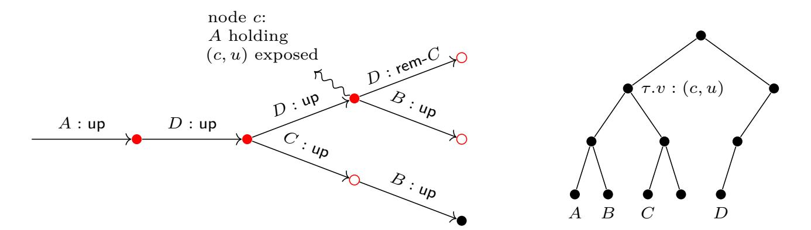

Fig. 22: An illustration for the proof that **gsd-exp**((*c, u*)) implies **know**(*c,* ∗): the history graph (left) and the ratchet tree in the exposed node *c* (right). The history graph subtree *G* is marked by and the leafs are marked by . In the root of *G*, the committer *A* inserts (*c, u*) as one of the path secrets created during the commit. The leaves of *G* remove (*c, u*) by either *B* replacing it during the commit, or *D* blanking it to remove *C*.

**–** Now consider the case where *τ.v* is a leaf and let id be its owner. Only id's actions affect *τ.v*. In particular, the root of *G* is a commit by id or one that includes a proposal updating or adding it. Similarly, leaves of *G* are commits by id, or ones that include proposals updating or removing it. In other words, these are exactly commits *c* ′ for which **\*secrets-replaced**(*c* ′ *,* id) is true.[28](#page-52-1) This means that *G* is exactly those nodes that are reachable from *c* via the recursive condition of **know**(·*,* id).

Now a leaf secret is always a source in the GSD graph (which A generates when id updates, commits, or registers a key package), and A only corrupts id's leaf when id holds the secret key (note that this secret is not encrypted during a commit), i.e. when id is in a node of *G*. Hence, there is a node *c* ′ in *G* where id is exposed, making **\*state-directly-leaks**(*c* ′ *,* id) true.

**Step 2: Allowing Injections** We extend A to deal with different types of injected messages as follows.

Injected proposals. A creates the new node using the public keys from the message and the secret key set to ⊥ (even if the public key is already stored somewhere else). Note that for add proposals, the secret key stored in the SK array may be ⊥.

Applying proposals. This works exactly the same, i.e. a secret key equal to ⊥ is copied to the ratchet tree leaf.

Note that a party id never enters a node where its leaf's key is injected (i.e., the secret is ⊥), as ITK trivially detects this situation. Hence, storing ⊥ has no effect, for leaf keys only being used by the party itself.

Commit from id. A proceeds the same as before. Secret keys equal to ⊥ are treated the same as those with known seeds, i.e, A corrupts the smallest *u<sup>i</sup>* that is encrypted under a public key, where the secret key is a seed or ⊥.

Commits injected to process. Assume Z makes id process an injected commit *c* from id*<sup>c</sup>* ̸= id, and that id accepts it. A attempts to build the new commit node's state as follows. First, it applies proposals (copying the ⊥ keys if necessary) to the ratchet tree in id' node. Then, it normally applies the rekey operation, except for each ciphertext *ctxt* that id would decrypt with keys in a ratchet-tree node *v*. To apply the rekey for those ciphertexts *ctxt*, A then does as follows.

- If the secret in *v* is not a GSD node, A simply decrypts *ctxt*. (Observe that the secret seed in *v* is not ⊥, as id's (real-world) protocol would reject *c* in that case.)
- If the secret is (gsd*, u*) and *ctxt* can be queried to the decrypt oracle, A decrypts it this way.
- The only reason why decrypting would not be possible, is that *ctxt* must had been copied from an "honest" commit *c* ′ , generated earlier by A, for which the GSD node *u* associated

<span id="page-52-1"></span><sup>28</sup> Note that a leaf of *G* cannot add id, since its already in the group, and similarly the root cannot remove id.

{53}------------------------------------------------

to appSecret is still a valid challenge. (Recall that upon exposure, A immediately computes all secrets it can given the new information.) We now argue that this situation cannot occur due the the (valid) confirmation tag included in *c* and, in fact, show that id accepting such a *c* would allow A to win the GSD game. To this end, let A challenge the GSD node *u*; and extract the correct seed from Z's random oracle calls as follows.

- 1. Observe that appSecret can be derived from joinerSec, which in turn is computed as joinerSec = Hash(initSecret*,* commitSec*, .*), modeling HKDF as a RO. Moreover, observe that commitSec must be the same in *c* and *c* ′ , due to the shared (honestly generated) *ctxt* accepted in both states.
- 2. We now proceed towards extracting joinerSec of *c* ′ . Recall to this end that the tag is a MAC, modeled as RO, of confKey and confTransHash, and that confTransHash includes the whole message *c* except the confirmation tag itself and the membership tag. Since the latter two are unique given the rest of *c*, confTransHash is unique for *c* as well. Hence, the only way for Z to compute a valid confirmation tag is to query RO on (confKey*,* confTransHash), and A can extract confKey. Analogously, as confKey is derived by hashing joinerSec with an appropriate label, it can extract joinerSec (of *c*) from the queries as well.
- 3. Now consider two cases. First, if initSecret is the same in *c* and *c* ′ , then joinerSec = Hash(initSecret*,* commitSec*, .*) is the same in *c* and *c* ′ (by commitSec being the same). Second, if initSecret is different, then joinerSec in *c* is the hash of an honestly generated commitSec with a different initSecret. Since the protocol only uses commitSec once with the correct initSecret, the only way for Z to compute the joiner is to query the RO, and commitSec can be extracted from the queries. Now A corrupts initSecret in *c* ′ and combines it with commitSec to compute joinerSec. Note that this does not affect *u* being a valid challenge, since the node corresponding to commitSec (of *c* ′ ) is not exposed.

In either case, A can now compute appSecret and compare it to the result from the GSD challenge to determine the bit *b*.

Injected welcome messages. In case Z makes id process an injected welcome message *w* = (encGroupSecs*,* groupInfo), A does as follows.

- 1. *Join to an existing node.* If there exists a node *c* with confTransHash matching that in groupInfo, A searches for a key package kp such that SK[id*,* kp] ̸= ⊥ and Hash(kp) matches an entry *e* ∈ encGroupSecs.
  - If *e* is copied from a welcome message generated by A while creating a commit node *c* and SK[id*,* kp] is a GSD node, A moves id to *c*. Else, it uses either the secret in SK[id*,* kp] or the GSD decrypt oracle to check if id would process the message and moves id if this is the case.
- 2. *Join a new node: create the public part.* If no *c* with matching transcript hash is found, and id accepts the message, A creates the new node with labels taken from groupInfo and the ratchet tree set to the public part of *τ* from groupInfo. Then, for any node of *τ* with a public key for which it has a secret key stored (in another ratchet tree or in SK), it copies the secret into *τ* (other secrets remain ⊥).
- 3. *Join a new node: decrypt the secrets.* A searches for a key package kp such that SK[id*,* kp] ̸= ⊥ and Hash(kp) matches an entry *e* ∈ encGroupSecs and aborts if no such kp exists. Similarly to injected commit messages, id will not accept *e* if it is copied from a welcome message generated by A while creating a commit node *c* and SK[id*,* kp] is a GSD node. To this end, observe that A could then use confTag from *w* to compute appSecret in *c* and win the GSD game as follows. Recall that confTag = Hash(confKey*,* confTransHash), where confKey is derived from joinerSec id decrypts and confTransHash is taken from *w*. Since *e* is copied, joinerSec used (implicitly) for the tag is the same as in *c*. On the other hand, confTransHash in *w* and *c* differ (else, id would have joined to *c*). Hence, joinerSec inn *c* can be extracted from Z's RO queries and used to compute appSecret in *c*.

Otherwise, A can obtains the encrypted joinerSec and pathSec using the stored secret or the Dec oracle. It updates ratchet tree secrets to those derived from pathSec (if any secret key was set to a GSD node, A uses pathSec to win the game), and computes the epoch secrets from joinerSec.

{54}------------------------------------------------

We argue that with the above changes,  $\mathcal{A}$ 's GSD challenge  $(c, u_{\mathsf{app}})$  is still valid, as long as  $\mathsf{safe}^*(c)$  is true. Assume towards a contradiction that  $\mathsf{gsd}\text{-}\mathsf{exp}((c, u_{\mathsf{app}}))$  is true.

The main tree. The proof is almost the same as in Step 1 (no injections). The only difference is in case (c), where we show that  $\mathbf{gsd\text{-}exp}((c,u_{\mathsf{com}}))$  implies  $\mathbf{know}(c,*)$ . We modify the proof of (c) as follows.

- $\mathbf{gsd\text{-}exp}((c,u_i))$  is true for some  $u_i$  in one of 3 cases:
  - (a) During an exposure of an id who (supposedly) stores  $u_i$ 's secret,
  - (b) (As in Step 1) the secret key in some ratchet tree node  $\tau.v$  used in \*rekey-path stores a seed from a GSD vertex (c, u) with  $\mathbf{gsd-exp}((c, u))$ ,
  - (c) The secret in  $\tau v$  is  $\perp$ .
  - We show that all cases imply know(c, \*).
- Case (a). Assume id is exposed in a commit node c' and a ratchet tree node  $\tau'.v'$  on its direct path has  $u_i$ 's public key  $\mathsf{pk}_i$ . This can occur in 2 cases. First, if id processed c and has not performed any action in this case, the reasoning is the same as in Step 1. Second,  $\mathsf{pk}_i$  can be injected into  $\tau'.v'$ . We claim that this case cannot occur, since id will never process a commit that injects an honestly generated (as part of c) key into its direct path. Indeed, if  $\tau'.v'$  is id's leaf, then the only way to inject  $\mathsf{pk}_i$  is via update or commit sent by id, or by adding id. However, id's protocol does not accept proposals or commits from id that were not actually sent (the corresponding secrets are indexed by the whole messages), and id
  - were not actually sent (the corresponding secrets are indexed by the whole messages), and id does not join a group with a key package it did not generate. If, on the other hand,  $\tau'.v'$  is an internal node, then pk must be a part of an injected commit. If any party in the subtree of  $\tau'.v'$  accepts such commit  $\mathcal{A}$  can use the confirmation tag to win the GSD game.
- Case (b). Similar to Step 1, we consider the subgraph G of the history graph, containing all commit nodes where  $\tau.v$  stores (c, u)'s public key  $\mathsf{pk}$ .

  Using the exact same argument as in Case (a), we can argue that (c, u) is not exposed in any

commit node outside of G. Hence, we use the same analysis as in Step 1.

- Case (c). The secret in  $\tau.v$  is set by  $\mathcal{A}$  to  $\bot$  only when the public key  $\mathsf{pk}$  in  $\tau.v$  is injected during a commit c', i.e., if (a)  $\mathcal{Z}$  injects c' on behalf of a party  $\mathsf{id}$  in  $\tau.v$ 's subtree, or (b)  $\tau.v$  is  $\mathsf{id}$ 's leaf and c' commits an update injected on behalf of  $\mathsf{id}$ , (c)  $\tau.v$  is  $\mathsf{id}$ 's leaf and c' commits an add proposal that uses an injected key package (either injected to KS, or directly to an injected commit).

The first two cases exactly correspond to the respective cases a) and b) of the predicate \*secrets-injected(c', id). In case (c), the add proposal must contain a key package for id with pk not generated by id. Since key packages are signed using id's spk (and the signature is always validated on process by \*validate-kp), this means that spk is exposed (or  $\mathcal{Z}$  can be used to break EUF-CMA), implying condition c) of \*secrets-injected(c', id).

Moreover, any commit c'' that heals id replaces all keys in its direct path, including  $\tau.v$ . Hence, c' is reachable from c via the recursive evaluation of **know**.

Orphan trees. Assume  $\mathcal{A}$  challenges  $(c, u_{\mathsf{app}})$  for a node c in a detached tree rooted at  $\mathsf{root}_{rt}$ . We show that if  $\mathsf{safe}^*(c)$  true, then the GSD challenge is valid.

First, observe that in a detached tree,  $\mathbf{safe}^*$  is true only if no  $\mathsf{spk}$  of a group member in c is exposed. This is because  $\mathsf{know}(\mathsf{root}_{rt}, \mathsf{'epoch'})$  is true (c.f. condition a) of \*can-traverse) and  $\mathsf{know}(c',\mathsf{id})$  is true for any c' in the detached tree as soon as  $\mathsf{id}$ 's  $\mathsf{spk}$  is exposed (c.f. condition b) of \*state-directly-leaks).

Second, we show that  $\mathbf{safe}^*(c)$ , in particular clause b) of \*state-directly-leaks, implies that each secret key in the ratchet tree  $\tau$  of c stores a GSD vertex. With this, it is easy to see that  $\mathbf{gsd-exp}((c, u_{\mathsf{app}}))$  implies  $\mathbf{know}(c, *)$ , where the argument is the same as for the main tree.

Take any node  $\tau.v$  in c's ratchet tree. If  $\tau.v$  is a leaf, then its public key is set to a value only if (1) its owner (with current spk) is corrupted or (2) a message (an update, a commit or a key package sent to KS) is injected on behalf of the owner. In case (1) the spk is explicitly marked as exposed. In case (2), it must have been marked as exposed, or  $\mathcal{Z}$  can be used to break EUF-CMA.

If  $\tau.v$  is an internal node, then its public key pk is included in the parentHash stored in the leaf of the party  $\mathrm{id}_c$  in  $\tau.v$ 's subtree whose commit introduced pk. (There is such leaf, since the protocol rejects any welcome or commit that introduces a ratchet tree without it. Note that  $\mathrm{id}_c$  is

{55}------------------------------------------------

still in the group, since otherwise  $\tau.v$  would have been blanked by the commit removing  $\mathsf{id}_c$ .) Let  $\mathsf{spk}_c$  denote  $\mathsf{id}_c$  current signature key. This  $\mathsf{parentHash}$  is signed by  $\mathsf{id}_c$  and (assuming  $\mathsf{safe}^*$ )  $\mathsf{spk}_c$  is not exposed,  $\mathsf{pk}$  was generated by  $\mathcal{A}$  as a GSD vertex for  $\mathsf{id}_c$ 's (honest) commit  $c_c$  (or  $\mathcal{Z}$  can be used to break EUF-CMA). Such  $\mathsf{pk}$  is set to a value only in two situations:

- 1. A party  $id_e$  is corrupted in a descendant  $c_e$  of  $c_c$  before  $id_c$  performs any action (in which case its direct path, including pk, would be blanked). In this case,  $c_e$ 's group contains  $id_c$  with (unchanged)  $spk_c$  and  $id_e$  with exposed  $spk_e$ , making \*state-directly-leaks true in c.
- 2. A secret key for a ratchet tree node  $\tau_c.v_c$  (in  $c_c$ ) involved in \*rekey-path executed while generating  $c_c$  is not a GSD node. In this case,  $\tau_e.v_e$ 's tree must have been injected by, or leaked upon corruption of a party  $\mathrm{id}_e$  in  $\tau_e.v_e$ 's subtree. Moreover,  $\mathrm{id}_e$  is still in the group and has not performed any action, else  $\tau_e.v_e$  would have been blanked or replaced. This means that his key  $\mathrm{spk}_e$  in  $c_c$  is exposed (it must have been exposed to enable the injection, or marked as exposed on corruption). Hence,  $c_c$  contains  $\mathrm{id}_e$  with  $\mathrm{spk}_c$  and  $\mathrm{id}_e$  with exposed  $\mathrm{spk}_e$ , making \*state-directly-leaks true in c.

Step 3: Allowing Bad Randomness Finally, we modify  $\mathcal{A}$  to deal with actions executed using bad randomness as follows.

<u>Proposal From id.</u>  $\mathcal{A}$  computes the proposal message p (and, in case of an update, the new key package (kp, sk)) using the randomness provided by  $\mathcal{Z}$ , the current membKey and the id's spk (all of which are always known to  $\mathcal{A}$ ). If p does not identify an existing node  $\mathcal{A}$  creates it. In case of an update proposal, it sets the secret key in p's node to sk.

COMMIT FROM id. Given the randomness provided by  $\mathcal{Z}$ ,  $\mathcal{A}$  computes the commit and welcome messages, and the secrets in the new commit node, as follows.

- 1.  $\mathcal{A}$  uses  $\mathcal{Z}$ 's randomness to execute \*rekey-path and obtains: all path secrets, the commitSec, and the intermediate commit packet C. Then, it signs C using id's spk (and, again,  $\mathcal{Z}$ 's randomness) and sets the confirmed transcript hash accordingly.
- 2.  $\mathcal{A}$  computes the new joinerSec, which is a hash of the current initSecret and the freshly computed commitSec: If initSecret stores a GSD node u,  $\mathcal{A}$  queries Hash with input  $(u, u_{\mathsf{ctr}}, \mathsf{commitSec})$ , corrupts  $u_{\mathsf{ctr}}$ , sets joinerSec to the result and increments  $u_{\mathsf{ctr}}$ . Else, if initSecret stores a value,  $\mathcal{A}$  computes joinerSec itself.
- 3. Using joinerSec and the transcript hash from Step 1,  $\mathcal{A}$  runs the key schedule, computes the confirmation tag, and finishes computing the commit message c and the welcome message w.

We claim that the above changes do not affect validity of  $\mathcal{A}$ 's challenge  $(c, u_{\mathsf{app}})$ . First, observe that a corruption of the GSD node needed to compute joinerSec during a commit c' with bad randomness does not affect  $(c, u_{\mathsf{app}})$ . This is because by condition a) of \*secrets-injected, safe\* is false in all descendants of c' until a commit is executed with good randomness. For this honest commit, commitSec corresponds to a GSD node with  $\mathsf{gsd}$ -exp false, and hence  $\mathsf{gsd}$ -exp is false for the joinerSec as well.

Second, we modify the proof that  $\mathbf{gsd\text{-}exp}((c, u_{\mathsf{com}}))$  implies  $\mathsf{know}(c, *)$ . For this, observe that now  $\mathbf{gsd\text{-}exp}((c, u_i))$  can be true also if the secret in a ratchet tree node  $\tau.v$  used in \*rekey-path stores a seed s generated during an action executed with bad randomness. Consider the commit c' that inserts s into  $\tau.v$ .

- If c' is generated by id with bad randomness, then by condition a) of \*secrets-injected,  $\mathbf{know}(c', \mathsf{id})$  if true. Moreover, since any commit c'' with \*secrets-replaced(c'', id) would replace the key in  $\tau.v$ , there is no such c'' on the c'-c path and  $\mathbf{know}(c, \mathsf{id})$  is true.
- If  $\tau.v$  is id's leaf and c' commits id's update executed with bad randomness, by condition b) of \*secrets-injected, know(c', id) is true and, for the same reason as above, know(c, id) is true as well.
- Finally, assume  $\tau.v$  is id's leaf and c' adds id using a key package kp generated with bad randomness. When kp was generated with bad randomness,  $\mathcal{F}_{\text{KS}}^{\text{IW}}$  marked the used spk as exposed. Hence, c' must be adding id with an exposed spk, which, by condition c) of \*secrets-injected, implies that know(c', id) is true. As before, this implies that know(c, id) is true as well.

{56}------------------------------------------------

Finally, we note that any action executed with bad randomness marks the used spk as exposed, and hence we no longer guarantee security in commit nodes in detached trees where the group contains a member with spk. Hence, the simulation becomes trivial in such nodes even if  $\mathcal{Z}$  learns ssk and injects arbitrary messages.

### <span id="page-56-0"></span>D.4 ITK\* Guarantees Authenticity

Claim. If Sig and MAC are EUF-CMA secure and PKE is GSD secure, then Hybrids 3 and 4 are indistinguishable, that is ITK\* guarantees authenticity.

Observe that the hybrids are identical unless in there exists an injected history graph node in  $\mathcal{F}_{CGKA}$  for which **inj-allowed** requires authenticity. (In Hybrid 3, the functionality ignores such nodes, while in Hybrid 4 it halts forever as soon as any such node appears.) More precisely, the hybrids are identical unless the following happens:

Event Bad. There exists a (commit or proposal) node with stat = adv and inj-allowed(c, id) = false for its parent c and creator id.

Further, recall that (see Fig. 6) **inj-allowed**(c, id) is **false** if either id's signature public key spk in c is not exposed, or the adversary "does not know" the epoch key in c. Accordingly, we define two sub-events of Bad:

Event  $\mathsf{Bad}_{\mathsf{sig}}$ . There exists a (commit or proposal) node with  $\mathsf{stat} = \mathsf{adv}$  and  $\mathsf{Node}[c].\mathsf{mem}[\mathsf{id}] \notin \mathsf{Exposed}$  for its parent c and creator id.

Event Bad<sub>MAC</sub>. There exists a (commit or proposal) node with stat = adv and  $\neg$ know(c, 'epoch') for its parent c.

We next show that if Sig is secure, then the probability of Bad<sub>sig</sub> is negligible. Further, if PKE is secure, then the probability of Bad<sub>MAC</sub> is negligible (recall that the PKE is used to encrypt MAC keys). In both statements, MAC is modeled as an RO.

<span id="page-56-1"></span>**Lemma 3.** For any environment  $\mathcal{Z}$ , there exists a reduction  $\mathcal{A}_{sig}$  who wins the EUF-CMA game with probability only polynomially smaller than the probability that  $\mathcal{Z}$  triggers  $\mathsf{Bad}_{sig}$ .

<span id="page-56-2"></span>**Lemma 4.** For any environment  $\mathcal{Z}$ , there exist reductions  $\mathcal{A}_{\mathsf{MAC}}$  and  $\mathcal{A}_{\mathsf{PKE}}$  such that the probability that  $\mathcal{Z}$  triggers  $\mathsf{Bad}_{\mathsf{MAC}}$  is upper bounded by  $p \cdot (\epsilon_{\mathsf{MAC}} + \epsilon_{\mathsf{PKE}})$ , where p is a polynomial,  $\epsilon_{\mathsf{MAC}}$  is the advantage of  $\mathcal{A}_{\mathsf{MAC}}$  against the security of MAC and  $\epsilon_{\mathsf{PKE}}$  is the advantage of  $\mathcal{A}_{\mathsf{PKE}}$  against the GSD security of PKE.

Proof (of Lemma 3). Let  $\mathcal{Z}$  be any environment.  $\mathcal{A}_{sig}$  emulates the functionalities and the simulator for  $\mathcal{Z}$  as in their definitions, except it embeds its challenge spk as one of the public keys honestly created during the experiment. To emulate commits and proposals signed under the challenge ssk,  $\mathcal{A}_{sig}$  uses the sign oracle. When  $\mathsf{Bad}_{sig}$  occurs,  $\mathcal{A}_{sig}$  stops the experiment and sends to its challenger the forgery consisting of the signature sig' and the signed content tbs' from the injected node c'. We assume c' is a commit node; the proof for proposals is analogous. We claim that  $\mathsf{Bad}_{sig}$  occurs and  $\mathsf{spk} = \mathsf{Node}[c].\mathsf{mem}[\mathsf{id}]$ , then  $\mathcal{A}_{sig}$  wins. Indeed, we have:

- sig' as a valid signature over tbs'. The reason is that the injected node was created when some party accepted c', which means that it verified sig' under spk = Node[c].mem[id].
- $\mathcal{A}_{sig}$  simulates the experiment perfectly until  $\mathsf{Bad}_{sig}$  occurs. Indeed, the only situation in which the simulation differs from the experiment is when  $\mathsf{spk} = \mathsf{Node}[c].\mathsf{mem}[\mathsf{id}]$  is corrupted. This does not happen, since the event guarantees  $\mathsf{spk} = \mathsf{Node}[c].\mathsf{mem}[\mathsf{id}] \notin \mathsf{Exposed}$ .
- $\mathcal{A}_{sig}$  did not query (sig', tbs') to the sign oracle. Indeed, assume that (sig', tbs') is the same as (sig\*, tbs\*) queried by  $\mathcal{A}_{sig}$  to the sign oracle for  $c^*$ . We will show that this implies  $c' = c^*$ . Since c' is injected and  $c^*$  is honestly generated by  $\mathcal{A}_{sig}$ , this is a contradiction. Recall that c' contains (groupId', epoch', senderId', 'commit', C', confTag', sig', membTag') and tbs' contains (groupCtxt', groupId', epoch', leafId', 'commit', C'), and  $c^*$  contains analogous values. This means that c' and  $c^*$  can only differ on confTag'  $\neq$  confTag\* or membTag'  $\neq$  membTag\*.

{57}------------------------------------------------

Recall further that by definition it holds that  $\mathsf{membTag}' = \mathsf{MAC}.\mathsf{tag}(\mathsf{membKey}', C')$  and  $\mathsf{membTag}^* = \mathsf{MAC}.\mathsf{tag}(\mathsf{membKey}^*, C^*)$ . We have  $C' = C^*$ , because they are included in  $\mathsf{tbs}' = \mathsf{tbs}^*$ . Moreover,  $\mathsf{tbs}' = \mathsf{tbs}^*$  includes  $\mathsf{groupCtxt}' = \mathsf{groupCtxt}^*$ . Since the group context uniquely determines the epoch and key schedule, it follows that  $\mathsf{membKey}' = \mathsf{membKey}^*$ . Therefore,  $\mathsf{membTag}' = \mathsf{membTag}^*$ . We can prove analogously that  $\mathsf{confTag}' = \mathsf{confTag}^*$ .

*Proof* (of Lemma 4). We consider the case where the injected packet triggering Bad<sub>MAC</sub> is a commit and that it does not remove any party, i.e., all receivers verify the MAC tag confTag and not membTag. The case for proposals and the removed parties who verify membTag is analogous.

Let  $\mathcal{Z}$  be any environment. The reduction  $\mathcal{A}_{\mathsf{MAC}}$  first guesses the node c that makes  $\mathsf{Bad}_{\mathsf{MAC}}$  occur. Further, it runs  $\mathcal{Z}$ , emulating the UC experiment exactly, except instead of the MAC key membKey in epoch c, it uses its oracles in the MAC EUF-CMA game. If  $\mathsf{Bad}_{\mathsf{MAC}}$  occurs for parent node c and injected child c',  $\mathcal{A}_{\mathsf{MAC}}$  stops the experiment and outputs the forgery (confTag', tbm'), denoting, respectively, the confirmation MAC tag and the MAC'ed content from c'. We claim that

- 1. The difference between the probability of  $\mathsf{Bad}_{\mathsf{MAC}}$  occurring for c in the experiment emulated by  $\mathcal{A}_{\mathsf{MAC}}$ 's and in Hybrid 3 (or 4) is upper-bounded by the advantage of a reduction  $\mathcal{A}_{\mathsf{PKE}}$  in the GSD game.
- 2. If  $\mathsf{Bad}_{\mathsf{MAC}}$  occurs for c, then  $\mathcal{A}_{\mathsf{MAC}}$  wins with  $(\mathsf{confTag}', \mathsf{tbm}')$ .

For the first claim, observe that  $\mathsf{Bad}_{\mathsf{MAC}}$  for c implies that  $\mathsf{safe}^*(c)$  is true until the event and no party in c is exposed. Therefore, we can construct  $\mathcal{A}_{\mathsf{PKE}}$  the same way as in the proof that  $\mathsf{ITK}^*$  guarantees confidentiality (indistinguishability of Hybrids 2 and 3). In particular,  $\mathcal{A}_{\mathsf{PKE}}$  embeds the challenge in the MAC key membKey in c and emulates the experiment as described in that proof, until  $\mathsf{Bad}_{\mathsf{MAC}}$  occurs for c. Then, it stops the experiment, since the rest of it has no effect on the probability of the event.<sup>29</sup>

For the second claim, we know that  $\mathsf{confTag}'$  is a valid tag on  $\mathsf{tbm}'$ , because it was verified by a party accepting the injected c'. It is left to show that  $(\mathsf{confTag}', \mathsf{tbm}')$  was not queried by  $\mathcal{A}_{\mathsf{MAC}}$  to the MAC oracle. Assume towards a contradiction that  $(\mathsf{confTag}', \mathsf{tbm}') = (\mathsf{confTag}^*, \mathsf{tbm}^*)$ , where  $(\mathsf{confTag}^*, \mathsf{tbm}^*)$  was queried by  $\mathcal{A}_{\mathsf{MAC}}$  to the oracle when it honestly generated a packet  $c^*$ . Recall that  $\mathsf{tbm}'$  and  $\mathsf{tbm}^*$  are equal to the confirmed transcript hashes  $\mathsf{confTransHash}'$  and  $\mathsf{confTransHash}^*$ . If  $\mathsf{confTransHash}'$  and  $\mathsf{confTransHash}^*$ , then  $c' = c^*$ , because the transcript is computed by hashing the last message. This is a contradiction, since  $c^*$  is honest and c' is injected.

## <span id="page-57-0"></span>D.5 Stronger Security of ITK

Notice that the only difference between **safe** and **safe**\* concerns how detached history-graph nodes are handled, so it suffices to consider these. Specifically, for a detached node c, **safe** only guarantees that the epoch doesn't include an exposed signing key spk. We argue that this implies that no node in the entire ratchet tree of c contains an exposed key pk (that is, the secret key to pk was not leaked to, or chosen by, the environment). In particular, that would mean that no ciphertext in the most recent commit (and/or welcome messages) leading to the epoch can be decrypted by the environment. (More formally, the plaintexts are indistinguishable from random to the environment.) Thus, the environment is essentially unable to query the RO at the points it would need to compute the new application secret, meaning it too would look random, meaning the epoch is indeed secure.

It remains to argue that **safe** returning true for epoch c implies that no node  $\tau.v$  in the epoch's ratchet tree  $\tau$  contains an exposed key pk. The proof is by (strong) induction on the height of  $\tau.v$ . We showed already in the proof of Theorem 1 that when  $\tau.v$  is a leaf with an exposed pk then spk

<span id="page-57-1"></span>Note that afterwards the emulation may be easily distinguishable. Indeed, if a party in the parent of c, i.e., one who can compute the real confKey used to authenticate c', is corrupted, then its state is inconsistent with the random key in the experiment emulated by  $\mathcal{A}_{\mathsf{PKE}}$ . In the proof of indistinguishability of Hybrids 2 and 3, such corruptions would be disallowed, in order to avoid the commitment problem. Here we can prove a stronger statement without restrictions, since the experiment after the event doesn't matter.

{58}------------------------------------------------

at v must also have been exposed, which contradicts **safe**. Now take any internal node  $\tau v$  and assume that for any node in  $\tau$  with height smaller than the height of  $\tau v$ , the pk is not exposed.

We first argue that all signatures in  $\tau$  must verify. Note that by definition for a history-graph node introduced by the simulator to exist, it must be that at least one party has accepted either a commit or welcome message leading to that node. Let  $c_a$  be the ancestor epoch of c referenced in the first two clauses of b) in **safe**. Since the node exists it must be that a party accepted a welcome message leading to the node.<sup>30</sup> Thus, it must be that all signatures at the leaves of  $c_a$  verify. For each of the subsequent epochs up to and including c, each new signature inserted into the group state not present in the previous epoch must have been verified, at least once; namely, by the party that accepted a commit message causing the epoch's history-graph node to be created. Thus, we can conclude that all signatures in  $\tau$  verify.

A similar argument lets us conclude that the parent hash of  $\tau.v$  is included (via a hash chain) in the parentHash value signed at some leaf in the subtree rooted at  $\tau.v$ . Let  $\mathsf{id}_s$  denote the owner of this leaf. (We can assume that  $\mathsf{id}_s$  is in  $\tau.v$ 's subtree, as otherwise no party would have accepted the commit or welcome message leading to this epoch.) Let  $\tau.u$  and  $\tau.w$  denote  $\tau.v$ 's children, where  $\mathsf{id}_s$  is in  $\tau.u$ 's subtree. The parent hash of  $\tau.v$  includes  $\tau.v.\mathsf{pk}$  and  $\tau.w.\mathsf{origChildResolution}$ .

By assumption  $\mathsf{id}_s$ 's signature public key  $\mathsf{spk}_s$  is not exposed so (due to the unforgeability of the signature scheme)  $\tau.v.\mathsf{pk}$  was generated honestly by  $\mathsf{id}_s$  as part of some commit message  $c_s$  (possibly for a different session). Moreover, committing with bad randomness would expose  $\mathsf{spk}_s$ , so  $c_s$  was generated with good randomness. This means that the secret key  $\tau.v.\mathsf{sk}$  is not chosen by the environment. Therefore, the only way  $\tau.v.\mathsf{pk}$  can be exposed is if  $\mathsf{id}_s$  used an exposed public key to encrypt a path secret for a node on the path from  $\mathsf{id}_s$ 's leaf to  $\tau.v.^{31}$ 

Let  $\tau_s$  denote the tree in epoch  $c_s$ . Due to unforgeability of the signature scheme, the path from id<sub>s</sub>'s leaf to  $\tau.v$  is the same in  $\tau_s$  and  $\tau$ . Similarly, the origChildResolution of  $\tau.w$  (including  $\tau.w$ ) in  $\tau$  is equal to  $\tau_s.w$ 's resolution in  $\tau_s$  (note that  $\tau_s.v$  has no unmerged leaves in  $\tau_s.$ )

Encrypting a path secret for a node on the path from  $id_s$ 's leaf to  $\tau.u$  under an exposed key would expose pk at  $\tau.u$ , which contradicts the induction hypothesis (since  $\tau.u$  is below  $\tau.v$ ). The only remaining path secret is the one for  $\tau.v$ , encrypted by  $id_s$  under all keys in  $\tau.w$ 's origChildResolution. However, exposing any of these nodes again contradicts the induction hypothesis. (Note that the induction hypothesis concerns only nodes in  $\tau$ , so we used unforgeability of the signature scheme to argue that the relevant nodes in  $\tau$  are the same as those in  $\tau_s$ , actually used by  $id_s$ . Note also that without the signature, we would not be able to assume anything about the height of nodes used by  $id_s$ .)

# <span id="page-58-0"></span>E Details on the Attacks

In this section, we expand on the attacks presented in Sec. 6.

#### <span id="page-58-1"></span>E.1 An Attack on Authenticity in Certain Modes

First, we consider the (unintentionally) provides stronger authentication guarantees than an MLSPlaintext provided before our fix [14] to bring them in line with those of MLSCiphertext.

Let  $\mathsf{ITK}_{\mathsf{Atk-1}}$  denote the protocol that behaves like  $\mathsf{ITK}$  but does not include membership tags as part of the message framing process. See Fig. 23 for the modified message-framing algorithms compared to  $\mathsf{ITK}$ .

**Theorem 7.** The ITK<sub>Atk-1</sub> protocol, which behaves like ITK but does not include membership tags, does not securely realize  $(\mathcal{F}_{AS}^{IW}, \mathcal{F}_{KS}^{IW}, \mathcal{F}_{CGKA})$  in the  $(\mathcal{F}_{AS}, \mathcal{F}_{KS}, \mathcal{G}_{RO})$ -hybrid model when  $\mathcal{F}_{CGKA}$  uses the predicates safe and inj-allowed from Fig. 6. That is, for every simulator  $\mathcal{S}$ , there exists an environment  $\mathcal{Z}$  that has non-negligible advantage in distinguishing the ideal world from the hybrid world with the protocol running (and the dummy adversary).

<span id="page-58-2"></span><sup>&</sup>lt;sup>30</sup> Since  $c_a$  has no parent no party accepted a commit message leading to  $c_a$  which only leaves a welcome message as having triggered the creation of  $c_a$ .

<span id="page-58-3"></span>Note that after  $c_s$  is sent,  $\tau.v$ 's secret key never leaves the local state of any party who knows it, that is any party in  $\tau.v$ 's subtree. This easily follows by inspection, for example, any commit by such party replaces  $\tau.v$ 's key pair.

{59}------------------------------------------------

```
Protocol ITK<sub>Atk-1</sub> : Message-Framing
\mathbf{helper} * \mathbf{signCommit}(\gamma, C)
                                                                                                                    helper *frameProp(\gamma, P)
   \mathsf{tbs} \leftarrow (\gamma.\mathsf{groupCtxt}(), \gamma.\mathsf{groupId}, \gamma.\mathsf{epoch},
                                                                                                                        \mathsf{tbs} \leftarrow (\gamma.\mathsf{groupCtxt}(), \gamma.\mathsf{groupId}, \gamma.\mathsf{epoch}, \gamma.\mathsf{leafId}(),
                                                                          \gamma.leafld(), 'commit', C)
                                                                                                                                                                                                                'proposal', P)
                                                                                                                        \mathsf{sig} \leftarrow \mathsf{Sig.sign}(\gamma.\mathsf{ssk},\mathsf{tbs})
   sig \leftarrow Sig.sign(\gamma.ssk, tbs)
                                                                                                                        return (\gamma.groupld, \gamma.epoch, \gamma.leafld(), 'proposal', P, sig)
   return sig
                                                                                                                    helper *unframeProp(\gamma, p)
\mathbf{helper} * \mathbf{frameCommit}(\gamma, C, \mathsf{confTag}, \mathsf{sig})
   return (\gamma.groupld, \gamma.epoch, \gamma.leafld(), 'commit',
                                                                                                                        parse (groupId, epoch, senderId, contentType,
                                                                                      C, confTag, sig)
                                                                                                                                                                                                                   P, \mathsf{sig}) \leftarrow p
                                                                                                                        \mathbf{req} contentType = 'proposal' \land groupId = \gamma.groupId
                                                                                                                        \mathbf{req} \ \mathsf{epoch} = \gamma.\mathsf{epoch}
\mathbf{helper} * \mathbf{unframeCommit}(\gamma, c)
                                                                                                                        \mathsf{tbs} \leftarrow (\gamma.\mathsf{groupCtxt}(), \mathsf{groupId}, \mathsf{epoch}, \mathsf{senderId}, \mathsf{`proposal'}, P)
   parse (groupId, epoch, senderId, contentType
                                                                                                                        \mathbf{req} \ \gamma.\tau.\mathsf{leaves}[\mathsf{senderId}] \neq \bot
                                                                              C, confTag, sig) \leftarrow c
                                                                                                                                \land \gamma.\tau.leaves[senderId].inuse()
   \mathbf{req} \ \mathsf{contentType} = \mathsf{`commit'} \land \mathsf{groupId} = \gamma.\mathsf{groupId}
                                                                                                                                \land Sig.vrf(\gamma.\tau.leaves[senderId].spk, sig, tbs)
   req epoch = \gamma.epoch
                                                                                                                        return (senderld, P)
   \mathsf{tbs} \leftarrow (\gamma.\mathsf{groupCtxt}(), \mathsf{groupId}, \mathsf{epoch}, \mathsf{senderId},
                                                                                           'commit', C)
   req \ \gamma.\tau.leaves[senderId] \neq \bot
           \land \gamma.\tau.leaves[senderId].inuse()
           \land Sig.vrf(\gamma.\tau.leaves[senderId].spk, sig, tbs)
   return (senderId, C, confTag, sig)
```

Fig. 23: The modified message framing of ITK<sub>Atk-1</sub>.

*Proof.* Let S be an arbitrary simulator. Consider the following environment Z and let A be the group creator.

**Group setup:** First, the environment  $\mathcal{Z}$  instructs A to create the group (providing a valid signing public-key  $\operatorname{spk}_A$  fetched from the PKI). Then, it instructs A to add parties B and C to the group by creating two respective proposals  $p_B$  and  $p_C$  and issuing a commit  $c_1$  with the respective welcome message  $w_1$ . It then delivers the commit message  $c_1$  to A and  $w_1$  to B and C. It checks that all parties accept the respective message and output the correct creator of the new epoch (party A) as well as semantics for the two proposals; otherwise  $\mathcal{Z}$  returns 0 and aborts.

**Corruption:** The environment now corrupts party A (via the dummy adversary) to learn its signing key  $\mathsf{ssk}_A$ . It verifies that the key matches with the public-key  $\mathsf{spk}_A$ ; otherwise  $\mathcal{Z}$  returns 0 and aborts.

**PCS:** Next,  $\mathcal{Z}$  instructs A to issue a commit command with an empty list of proposals and the old  $\mathsf{spk}_A$ . (This causes A to update its ephemeral key and resample the compromised path in the ratchet tree, but keep its long-term signing key.) It instructs A, B, and C to process the resulting commit message  $c_2$  and verifies that they move to the expected state (by verifying that the process succeeds and outputs A as the commit's originator). Otherwise  $\mathcal{Z}$  returns 0 and aborts.

Breaking authenticity: Now,  $\mathcal{Z}$  crafts a proposal message  $p^*$  that removes C on behalf of A, according to the (modified) protocol ITK<sub>Atk-1</sub>. Note that all the included values (such as the group context) are public and thus known to the environment, and  $\mathcal{Z}$  can sign the proposal using the leaked  $\operatorname{ssk}_A$ . (Important: note that the environment does *not* instruct A do create such a proposal command, but forges it!) Finally,  $\mathcal{Z}$  instructs B to commit to this proposal  $p^*$  and lets B process the respective commit message  $c_3$ . If B accepts and outputs the correct semantics for  $p^*$ , then  $\mathcal{Z}$  returns 1, otherwise it returns 0.

We now argue that when interacting with the hybrid world,  $\mathcal{Z}$  outputs 1 with overwhelming probability. To this end, simply observe that from the viewpoint of B and C, this corresponds to a regular execution in which A creates the group, adds B and C, and then proposes to again remove C that party B successfully commits. Hence, by correctness of  $\mathsf{ITK}_{\mathsf{Atk-1}}$  the environment outputs 1.

Finally, we consider  $\mathcal{Z}$  interacting with the ideal world and  $\mathcal{S}$ . First, observe that after successfully adding B and C, the history graph consists of two nodes, irrespective of the simulators actions: the root  $\mathsf{root}_0$  and a successor node  $\mathsf{Node}[c_1]$ , since the honest action by A creates a new node  $\mathsf{Node}[c_1]$  and each commit message uniquely identifies a node. Similarly, after A honestly committing (hence implicitly updating their state) and all processing the respective  $c_2$ , the history graph consists

{60}------------------------------------------------

of three nodes with all parties being in  $Node[c_2]$ , which has parent  $Node[c_1]$ . Note that since A honestly created the commit message,  $Node[c_2]$ .stat = good, i.e., the node is marked as good.

When B commits  $p^*$ , the simulator is asked to interpret the proposal. In order for  $\mathcal{Z}$  to not output 0 upon B outputting the respective semantics when processing  $c_3$ ,  $\mathcal{S}$  must put the right semantics (removal of C issued by A). This also means that  $\mathcal{S}$  has to choose  $p_A$  and  $p_B$  to be different from  $p^*$  as each proposal message uniquely identifies a proposal node that has fixed semantics. Moreover, this clearly means that  $\mathsf{Prop}[p^*]$  is a fresh node, not created by an honest action. As a result, the proposal is marked as adversarially created, i.e.,  $\mathsf{Prop}[p^*]$ .stat =  $\mathsf{adv}$ .

This, however, causes **auth-invariant** to fail at the end of B committing  $p^*$ , meaning that no matter what  $\mathcal{S}$  does,  $\mathcal{Z}$  always outputs 0 when interacting with the ideal world: Since  $\mathsf{Prop}[p^*].\mathsf{par} = c_2$  and  $\mathsf{Prop}[p^*].\mathsf{orig} = \mathsf{id}_A$ , we have that **auth-invariant** checks  $\mathsf{inj-allowed}(c_2,\mathsf{id}_A)$ , i.e., whether the adversary can inject messages on behalf of A in the state reached after processing  $c_2$ . The predicate  $\mathsf{inj-allowed}(c_2,\mathsf{id}_A)$  in turn checks  $\mathsf{know}(c_2,\mathsf{'epoch'})$ , i.e., only returns true if the adversary knows the associated symmetric key. It remains to argue that  $\mathsf{know}(c_2,\mathsf{'epoch'})$  returns false. First, note that \*state-directly-leaks( $c_2,\mathsf{id}_A$ ) is false, since A has been compromised in  $\mathsf{Node}[c_1]$  and not  $\mathsf{Node}[c_2]$ ,  $\mathsf{Node}[c_2]$  is not a detached node, and A's secrets have not been injected by the adversary. Second, while the adversary knows the state in the parent  $\mathsf{Node}[c_1]$ , we have that \*secrets-replaced due to the implicit update ( $\mathsf{Node}[c_2].\mathsf{orig} = \mathsf{id}_A$ ). Finally, there is no child state in the history graph. Hence, \*state-directly-leaks( $c_2,\mathsf{id}_A$ ) = false causing  $\mathcal Z$  to distinguish for all simulators.

### <span id="page-60-0"></span>E.2 Breaking Agreement

The way the transcript hash was computed and included in the confirmation tag — before our fix [15] — lead to counter-intuitive behavior, where parties think they are in-sync and agree on all relevant state when they are not.

Let ITK<sub>Atk-2</sub> denote the protocol that behaves like ITK but where the commit message's signature hasn't been included into the confirmed transcript hash but into the interim transcript hash instead. See Fig. 24 for a detailed description of the modified algorithms compared to ITK.

```
Protocol ITK<sub>Atk-2</sub>: Committing and Transcript Hashes
                                                                                                    helper *set-conf-trans-hash(\gamma, \gamma', senderld, C)
Input (Commit, \vec{p}, spk, force-rekey)
                                                                                                       commitContent
                                                                                                                                      \leftarrow (\gamma.\mathsf{groupld}, \gamma.\mathsf{epoch}, \mathsf{senderld}, \mathsf{`commit'}, C)
   req \gamma \neq \bot
                                                                                                       \gamma'.confTransHash
   \gamma' \leftarrow *init-epoch(\gamma)
                                                                                                                                     \leftarrow Hash(\gamma.interimTransHash, commitContent)
                                                                                                       return \gamma
   [Apply proposals, rekey, and prepare commit]
                                                                                                    helper *set-interim-trans-hash(\gamma', confTag, sig)
                                                                                                       \gamma'.interimTransHash
   C \leftarrow (\mathsf{propIDs}, \mathsf{updatePath})
                                                                                                                                             \leftarrow Hash(\gamma'.confTransHash, confTag, sig)
   \gamma' \leftarrow *set-conf-trans-hash(\gamma, \gamma', \gamma.leafld(), C)
   (\gamma', confKey, joinerSec)
                                                                                                       return \gamma'
                                               \leftarrow *derive-keys(\gamma, \gamma', commitSec)
   confTag \leftarrow *conf-tag(\gamma', confKey)
   if rem \neq () then
        \mathsf{membTag} \leftarrow \mathsf{MAC}.\mathsf{tag}(\gamma.\mathsf{membKey}, C)
   else
        membTag \leftarrow \bot
   \texttt{sig} \leftarrow \texttt{*signCommit}(\gamma, C)
   c \leftarrow *frameCommit(\gamma, C, confTag, sig, membTag)
   if add \neq () then
        (\gamma', w) \leftarrow *welcome-msg(\gamma', add, joinerSec,
                                                                      pathSecs, confTag)
   else w \leftarrow \bot
   \gamma' \leftarrow *set-interim-trans-hash(\gamma', confTag, sig)
   \gamma.pendCom[c] \leftarrow (\gamma', \vec{p}, upd, rem, add)
   return (c, w)
```

Fig. 24: The modified transcript hash computation of the ITK<sub>Atk-2</sub> protocol. (The processing is modified accordingly.)

{61}------------------------------------------------

**Theorem 8.** Assume the signature scheme Sig does not have unique signatures (this strong property is not achieved by the schemes used by MLS). Then, the ITK<sub>Atk-2</sub> protocol, which behaves like ITK using Sig but not include the package's signature into the confirmed transcript hash, does not securely realizes ( $\mathcal{F}_{AS}^{IW}$ ,  $\mathcal{F}_{KS}^{IW}$ ,  $\mathcal{F}_{CGKA}$ ) in the ( $\mathcal{F}_{AS}$ ,  $\mathcal{F}_{KS}$ ,  $\mathcal{G}_{RO}$ )-hybrid model when  $\mathcal{F}_{CGKA}$  uses the predicates safe and inj-allowed from Fig. 6. That is, for every simulator  $\mathcal{S}$ , there exists an environment  $\mathcal{Z}$  that has non-negligible advantage in distinguishing the ideal world from the hybrid world with the protocol running (and the dummy adversary).

*Proof.* Let  $\mathcal{S}$  be an arbitrary simulator. We next construct an environment  $\mathcal{Z}$  such that has non-negligible advantage in distinguishing the ideal world with  $\mathcal{S}$  from the hybrid world with the protocol running (and the dummy adversary). Let A denote the group creator.  $\mathcal{Z}$  behaves as follows.

**Group setup:** The environment  $\mathcal{Z}$  lets A create a group consisting of A, B, and C just as in the previous proof, letting all the parties end up in the same state having either processed the commit message  $c_1$  (in case of A) or the respective welcome message  $w_1$  (in case of B and C).

**Corruption:** The environment now corrupts party A (via the dummy adversary) to learn its signing key  $\mathsf{ssk}_A$ . It verifies that the key matches with the public-key  $\mathsf{spk}_A$ ; otherwise  $\mathcal Z$  returns 0 and aborts.

**Breaking agreement:** Now  $\mathcal{Z}$  computes a commit message  $c_2$  (to an empty proposal list). Further, it computes the commit message  $c'_2$  by first copying  $c_2$  and then replacing the signature by a different valid one (e.g. by re-signing using different randomness). It delivers  $c_2$  to B and  $c'_2$  to C.

Causing inconsistencies: Next,  $\mathcal{Z}$  instructs B to create a proposal p that removes A from the group. Moreover, instruct both B and C to first commit to this proposal (creating commit messages  $c_3$  and  $c'_3$ , respectively) and have each of the parties process their own commit message. If both parties successfully process their commit messages,  $\mathcal{Z}$  outputs 1, and 0 otherwise.

Next, we establish that when interacting with the hybrid world,  $\mathcal{Z}$  always outputs 1. (Assuming perfect correctness of the scheme.) To this end, observe that in ITK<sub>Atk-2</sub>, the confirmed transcript hash does not depend on the most recent signature. As a consequence, neither the confirmation tag nor any of the derived keys (e.g., membKey) does, and as a result neither does the group context. Hence, the states in with B and C are (after processing  $c_2$  and  $c'_2$ , respectively) agree in everything except for the interim transcript hash, leading to C considering B's proposal p valid (the proposal would be exactly the same had B processed  $c'_2$ ) and hence both parties end up in states (but different ones!) where A is removed.

Finally, consider the ideal world. First, we observe that B and C actually do end up in two distinct history graph nodes. By the consistency checks we know that the simulator S must have chosen  $c_1$  such that  $c_1 \neq c_2$  and  $c'_2$  (since the original commit has a parent in which neither B nor C has been a member). Moreover, the two commit messages also cannot correspond to the initial root (the only root) as this would create a cycle. Hence, when processing the two messages, the functionality ends up creating two distinct fresh nodes. When creating p, the functionality then records  $Prop[p].par = c_2$ . Having the party C successfully commit p, and process the respective commit message, would thus clearly violate the consistency invariant that requires  $Prop[p].par = c'_2$ , causing the environment to output 0, irrespective of the simulator's choices.

#### <span id="page-61-0"></span>E.3 Inadequate Joiner Security (Tree-Signing)

Let ITK<sub>Atk-3</sub> denote the protocol that behaves like ITK but with the tree-signing mechanism from MLS Draft 9, i.e., where the parent hash only attests the nodes up the direct path. See Fig. 25 for the modified parent-hashing algorithms compared to ITK.

**Theorem 4.** The ITK<sub>Atk-3</sub> protocol that behaves like ITK but with the old tree-signing mechanism does not securely realize  $(\mathcal{F}_{AS}^{IW}, \mathcal{F}_{KS}^{IW}, \mathcal{F}_{CGKA})$  in the  $(\mathcal{F}_{AS}, \mathcal{F}_{KS}, \mathcal{G}_{RO})$ -hybrid model when  $\mathcal{F}_{CGKA}$  uses the predicates safe and inj-allowed from Fig. 6. That is, for every simulator  $\mathcal{S}$ , there exists an environment  $\mathcal{Z}$  that has non-negligible advantage in distinguishing the ideal world from the hybrid world with the protocol running (and the dummy adversary).

{62}------------------------------------------------

```
Protocol ITK_{Atk-3}: Tree-Hash
helper *set-parent-hash(\gamma', leafld)
                                                                                                helper *vrf-tree-state(\gamma')
   \mathsf{path} \leftarrow \gamma'.\tau.\mathsf{directPath}(\mathsf{leafId})
                                                                                                   req \gamma'.treeHash = *tree-hash(\gamma'.\tau.root)
   path \leftarrow path.reverse()
                                                                                                   for v \in \gamma'.\tau.nodes : v.inuse() \land \neg v.isleaf do
   path +\leftarrow \gamma'.\tau.leaves[leafId]
                                                                                                       lchild \leftarrow v.lchild
   for v \in \mathsf{path} \ \mathbf{do}
                                                                                                       rchild \leftarrow *origRChild(v.rchild)
       if v.isroot then
                                                                                                        parentHash \leftarrow *parent-hash(v)
                                                                                                       req (Ichild.inuse \land Ichild.parentHash = parentHash)
            v.\mathsf{parentHash} \leftarrow \epsilon
                                                                                                             \lor (rchild.inuse \land rchild.parentHash = parentHash)
       else
                                                                                                   \mathsf{mem} \leftarrow \varnothing
            v.parentHash \leftarrow *parent-hash(v.parent)
   return \gamma'
                                                                                                   for v \in \gamma'.\tau.nodes : v.inuse() \land v.isleaf do
                                                                                                       req v.id \notin mem
helper *parent-hash(v)
                                                                                                       mem +\leftarrow v.id
  return Hash(v.pk, v.unmergedLvs, v.parentHash)
                                                                                                       \mathbf{try} \ \gamma' \leftarrow *validate-kp(\gamma', v.kp(), v.id, v.parentHash)
                                                                                                   return \gamma'
```

<span id="page-62-1"></span>Fig. 25: The modified transcript hash computation of the ITK<sub>Atk-2</sub> protocol and the respective verification by a joiner.

*Proof.* Recall the illustration of the in Fig. 8 on Page 24. Let  $\mathcal{S}$  be an arbitrary simulator. We next construct an environment  $\mathcal{Z}$  such that has non-negligible advantage in distinguishing the ideal world with  $\mathcal{S}$  from the hybrid world with the protocol running (and the dummy adversary). Let A denote the group creator.  $\mathcal{Z}$  behaves as follows.

**Group setup:** The environment  $\mathcal{Z}$  lets A create a group consisting of A, B, and C just as in the previous proof, letting all the parties end up in the same state having either processed the commit message  $c_1$  (in case of A) or the respective welcome message  $w_1$  (in case of B and C). In addition to verify that all parties end up in the desired state,  $\mathcal{Z}$  further checks that the public ratchet tree included in  $w_1$  matches the expected one from Fig. 8a (with respect to keys, parent hashes and leaf signatures) and aborts outputting 0 otherwise.

**Corruption:** The environment now corrupts party B (via the dummy adversary) to learn its signing key  $ssk_B$ . It verifies that the key matches with the public-key  $spk_B$ ; otherwise  $\mathcal{Z}$  returns 0 and aborts.

Forging a welcome message: In the following  $\mathcal{Z}$  forges a welcome message w that joins D on behalf of B to the group, but with the modified ratchet tree from Fig. 8b. That is,  $\mathcal{Z}$  swaps parties B and C (their public keys), then adds party D on behalf of B to the group by adding D's leaf and re-keying B's new direct path.  $\mathcal{Z}$  instructs D to join the group using w. If D does not accept the welcome message or not end up in the correct state (i.e., in a state that doesn't have the right group members) then  $\mathcal{Z}$  aborts and outputs 0.

**Removing B:** Next,  $\mathcal{Z}$  instructs D to remove B by creating a respective proposal p', commit to this proposal and process the respective commit message c'.  $\mathcal{Z}$  verifies that D ends up in the expected state and otherwise aborts and outputs 0.

Comparing Keys: Finally,  $\mathcal{Z}$  queries for D's group key key. At the same time,  $\mathcal{Z}$  also computes the expected group key key' by taking D's commit message c' and using the secret key known to  $\mathcal{Z}$  marked in Fig. 8c and perform the same computation C would in the ITK<sub>Atk-3</sub> protocol. If the keys match, i.e., key = key', then  $\mathcal{Z}$  outputs 1 and 0 otherwise.

It remains to convince ourselves that the attack does work, i.e.,  $\mathcal{Z}$  distinguishes with non-negligible probability for any simulator  $\mathcal{S}$ . First, we observe that in the hybrid world the ratchet tree from Fig. 8b represents a valid one that D will accept: In Fig. 8a C's leaf signature only attested to C's leaf key (the green one) as the parent hash field is empty. Second, A's leaf signature does not attests to B's leaf key (but only the blue ones) as the parent hash only includes the nodes on A's direct path to the root. Third,  $\mathcal{Z}$  can re-key B's new path and attest to the fresh keys (the red ones) using the leaked signing key. By correctness of the protocol, thus, D accepts w to join the fake group. Further, by correctness D accepts c' and key = key'. Hence, when interacting with the hybrid world then  $\mathcal{Z}$  outputs 1.

Finally, consider the ideal-world. First, we can observe that in order for  $\mathcal{Z}$  not to abort and output 1 the party D must be joined to a detached root root<sub>1</sub> as no other state matches to correct

{63}------------------------------------------------

members. The root will moreover remain detached for the rest of the operation as neither A,B, nor C create or process any further commit messages. We now argue that  $\operatorname{safe}(c') = \operatorname{true}$ . First, it is easy to see that  $\mathcal{S}$  has to join D to a detached root as no other group state matches, e.g., none has D as a member. ( $\mathcal{Z}$  can easily detect such a mismatch and simply output 0.) Next, observe that D has not been corrupted implying that the node created by D's commit is marked with  $\operatorname{Node}[c']$ .stat = good and has no exposures, i.e.,  $\operatorname{Node}[c']$ .exp =  $\varnothing$ . As a result, we have  $\operatorname{safe}(c') \iff \neg^*\operatorname{can-traverse}(c')$ . Moreover, clearly only case (d) of \*can-traverse(c') applies as c' has a parent state and no party has been added in the respective commit. Finally, we argue that  $\operatorname{know}(c',\operatorname{id}) = \operatorname{false}$  for all  $\operatorname{id} \in \{\operatorname{id}_A,\operatorname{id}_B,\operatorname{id}_C,\operatorname{id}_D\}$ :

- For A, observe that A has never been corrupted, i.e.,  $(A, *) \notin \mathsf{Node}[c']$ . exp and  $\mathsf{spk}_A \notin \mathsf{Exposed}$ . Moreover, \*secrets-injected $(c', \mathsf{id}_A) = \mathsf{false}$  as  $A \neq \mathsf{Node}[c']$ .orig, no update or add proposal belongs to c' (i.e,  $\mathsf{Prop}[p]$ .act  $\neq \mathsf{up-*}$  and  $\mathsf{Prop}[p]$ .act  $\neq \mathsf{add-id}_A$ -\* for all  $\mathsf{pro} \in \mathsf{Node}[c']$ .pro). Thus, we obtain \*state-directly-leaks $(c', \mathsf{id}_A) = \mathsf{false}$ , excluding branch (a). For branch (b) we observe that by the same argument \*secrets-injected(root\_1, \mathsf{id}\_A) = \mathsf{false} (where root\_1 denotes the detached node D has joined) which in turn implies  $\mathsf{know}(\mathsf{root}_1, \mathsf{id}_A) = \mathsf{false}$  as root\_1 has no parent node. Finally, we observe that c' does not have a child node, trivially excluding branch (c).
- $know(c', id_C)$  = false and  $know(c', id_D)$  = false follow analogously.
- For B, observe that  $B \notin \mathsf{Node}[c']$ .mem and, thus,  $B \notin \mathsf{Node}[c']$ .exp. (Recall that  $\mathsf{Node}[c']$ .exp only tracks direct corruptions in the given state.) As a result, \*state-directly-leaks $(c', \mathsf{id}_B) = \mathsf{false}$ . Further, since B has been removed from that state, i.e., there exists  $p \in \mathsf{Node}[c']$ .pro with p.act = rem-id $_B$  we obtain \*secrets-replaced $(c', \mathsf{id}_B) = \mathsf{true}$ .

Thus, we can conclude that when  $\mathcal{Z}$  interacts with the ideal-world functionality and any arbitrary simulator  $\mathcal{S}$ , that after D processes the final commit message c' and  $\mathcal{Z}$  queries for their key, it holds that  $\mathbf{safe}(c') = \mathbf{true}$ . Thus, the functionality samples  $\mathsf{Node}[c']$ .key fresh and uniformly at random, resulting in  $\mathsf{key} \neq \mathsf{key}'$  and hence  $\mathcal{Z}$  outputting 0 with overwhelming probability.