{0}------------------------------------------------

# SWiSSSE: System-Wide Security for Searchable Symmetric Encryption

Zichen Gui ETH Z¨urich\* Kenneth G. Paterson ETH Z¨urich

Sikhar Patranabis IBM Research India

Bogdan Warinschi University of Bristol and Dfinity

August 21, 2023

#### Abstract

This paper initiates a new direction in the design and analysis of searchable symmetric encryption (SSE) schemes. We provide the first comprehensive security model and definition for SSE that takes into account leakage from the entirety of the SSE system, including not only from access to encrypted indices but also from access to the encrypted database documents themselves. Such system-wide leakage is intrinsic in end-to-end SSE systems, and can be used to break almost all state-of-the-art SSE schemes (Gui et al., IEEE S&P 2023). We then provide static and dynamic SSE constructions targeting our new notions. Our constructions involve a combination of novel techniques: bucketization to hide volumes of responses to queries; delayed, pseudorandom write-backs to disrupt access patterns; and indistinguishable search and update operations. The oblivious operations make it easy to establish strong versions of forward and backward security for our dynamic SSE scheme and rule out file-injection attacks. We implement our schemes and demonstrate that they offer very strong security against general classes of (system-wide) leakage-abuse attacks with moderate overhead. Our schemes scale smoothly to databases containing hundreds of thousand of documents and millions of keyword-document pairs. To the best of our knowledge, these are the first end-to-end SSE schemes that effectively suppress system-wide leakage while maintaining practical efficiency.

<sup>\*</sup>Part of the work was done while the author was affiliated with University of Bristol.

Part of the work was done while the author was affiliated with ETH Z¨urich and VISA Research.

{1}------------------------------------------------

# Contents

| 1 |                                              | Introduction                                                | 4  |  |  |
|---|----------------------------------------------|-------------------------------------------------------------|----|--|--|
|   | 1.1                                          | Our Contributions<br>                                       | 5  |  |  |
|   | 1.2                                          | Related Work                                                | 8  |  |  |
| 2 |                                              | Preliminaries and Background                                | 11 |  |  |
|   | 2.1                                          | Notation                                                    | 11 |  |  |
|   | 2.2                                          | Key-value Stores<br>                                        | 12 |  |  |
|   | 2.3                                          | Databases                                                   | 12 |  |  |
| 3 |                                              | System-Wide Definitions for Searchable Symmetric Encryption |    |  |  |
|   | 3.1                                          | System-Wide Syntax for Static SSE<br>                       | 13 |  |  |
|   | 3.2                                          | System-Wide Security for Static SSE                         | 13 |  |  |
|   | 3.3                                          | System-Wide Correctness for Static SSE                      | 15 |  |  |
|   | 3.4                                          | System-Wide Definitions for Dynamic SSE                     | 16 |  |  |
| 4 |                                              | SWiSSSE for "Simple" Static Databases                       | 19 |  |  |
| 5 | Bucketization in SWiSSSE                     |                                                             |    |  |  |
| 6 |                                              | SWiSSSE for General Static Databases                        | 21 |  |  |
|   | 6.1                                          | Changes from the Simplified Case                            | 21 |  |  |
|   | 6.2                                          | The Setup Procedure of SWiSSSE                              | 23 |  |  |
|   | 6.3                                          | The KWQuery Procedure of SWiSSSE                            | 25 |  |  |
|   | 6.4                                          | System-Wide Correctness<br>                                 | 26 |  |  |
|   | 6.5                                          | System-Wide Leakage of SWiSSSE                              | 28 |  |  |
| 7 | System-Wide Leakage Cryptanalysis of SWiSSSE |                                                             |    |  |  |
|   | 7.1                                          | Discussion of the Leakage Profile<br>                       | 33 |  |  |

{2}------------------------------------------------

|   | 7.2 | Resistance to Traditional Leakage-Abuse Attacks         | 34 |
|---|-----|---------------------------------------------------------|----|
|   | 7.3 | Resistance to System-Wide Leakage-Abuse Attacks         | 34 |
|   | 7.4 | Discussion                                              | 37 |
| 8 |     | Asymptotic Performance Evaluation of SWiSSSE            | 38 |
| 9 |     | Experimental Evaluation                                 | 40 |
|   | 9.1 | Experimental Setup<br>                                  | 40 |
|   | 9.2 | Parameter Selection for SWiSSSE                         | 41 |
|   | 9.3 | Benchmarks                                              | 42 |
|   | 9.4 | Comparison to State-of-the-Art SSE Schemes<br>          | 46 |
|   |     | 10 Dynamic SWiSSSE                                      | 46 |
|   |     | 10.1 Overview of Dynamic SWiSSSE                        | 47 |
|   |     | 10.2 Dynamic SWiSSSE: Detailed Description<br>          | 50 |
|   |     | 10.3 System-Wide Leakage of Dynamic SWiSSSE             | 54 |
|   |     | 10.4 Dynamic SWiSSSE: Asymptotic Performance Evaluation | 62 |
|   |     | 10.5 Dynamic SWiSSSE: Experimental Evaluation           | 64 |
|   |     | 11 Discussion                                           | 64 |

{3}------------------------------------------------

# <span id="page-3-0"></span>1 Introduction

Searchable Symmetric Encryption (SSE). The goal of Searchable Symmetric Encryption (SSE) [\[24,](#page-67-0) [29,](#page-68-0) [31,](#page-68-1) [47,](#page-69-0) [99\]](#page-74-0) is two-fold: (a) to allow a server to execute keyword search queries directly on a collection of a client's encrypted documents in an efficient manner, and (b) to ensure client privacy by minimizing the amount of information "leakage" to the server in the process. Existing proposals for SSE in the literature can be broadly divided into two categories – static SSE schemes that support keyword searches for a fixed collection of documents [\[24,](#page-67-0)[29,](#page-68-0)[31\]](#page-68-1), and dynamic SSE schemes that also allow for updates of encrypted document collections [\[16,](#page-66-0) [19,](#page-67-1) [26,](#page-67-2) [28,](#page-68-2) [66\]](#page-71-0).

Leakage vs Efficiency. The most general notion of SSE with optimal privacy guarantees (wherein little or no information is leaked to the server) can be achieved using techniques like fully homomorphic encryption (FHE) [\[43\]](#page-69-1) and Oblivious RAM (ORAM) [\[49\]](#page-69-2). However, these techniques today incur significant computational and/or communication overheads. So designers of SSE currently opt for better practical performance at the cost of leaking some information to the server [\[24,](#page-67-0) [29,](#page-68-0) [31\]](#page-68-1). The main challenge in designing SSE schemes is ensuring the right balance between leakage and efficiency, especially because leakage can be exploited by an adversarial server to infer sensitive client information, resulting in privacy breaches [\[13,](#page-66-1) [21,](#page-67-3) [22,](#page-67-4) [32,](#page-68-3) [59,](#page-70-0) [61,](#page-71-1) [88,](#page-73-0) [90,](#page-73-1) [94\]](#page-73-2).

Leakage Mitigation in SSE. Defending SSE schemes against leakage-abuse attacks while maintaining acceptable search performance is difficult. The state-of-the-art is represented by recent work [\[34,](#page-68-4) [45,](#page-69-3) [65,](#page-71-2) [92\]](#page-73-3) giving SSE schemes that provably leak little or no information to the adversarial server. A common feature underlying these recent proposals (and indeed the majority of prior work) is that they only consider leakage from the encrypted search index, a specialized data structure for recovering the document identifiers matching a given query. Specifically, these proposals ignore leakage from the final step in processing a query, in which the client actually fetches the encrypted documents from the server. This leads to the question of whether one could transfer existing leakage-abuse attacks from the index to the document level, thereby breaking the privacy guarantees of the schemes in [\[34,](#page-68-4)[45,](#page-69-3)[65,](#page-71-2)[92\]](#page-73-3) when properly viewed from a system-wide perspective.

System-Wide Leakage. In a very recent paper, Gui et al. [\[54\]](#page-70-1) answer this question in the affirmative by demonstrating that end-to-end SSE systems built in a natural way by applying the volume-hiding EMMs in [\[34,](#page-68-4) [45,](#page-69-3) [65,](#page-71-2) [92\]](#page-73-3) to the search index only incur systemwide co-occurrence leakage during document retrieval that can be exploited to completely break the query privacy guarantees of these schemes in practice.[1](#page-3-1) These attacks affect the vast majority of SSE schemes proposed to date [\[16,](#page-66-0) [19,](#page-67-1) [23,](#page-67-5) [24,](#page-67-0) [26,](#page-67-2) [29,](#page-68-0) [31,](#page-68-1) [41,](#page-69-4) [62,](#page-71-3) [64,](#page-71-4) [66,](#page-71-0) [86,](#page-73-4) [101\]](#page-74-1), and highlight the importance of acknowledging that system-wide leakage is a major privacy issue in existing SSE schemes that needs to be addressed.

The authors of [\[54\]](#page-70-1) also demonstrate that known leakage mitigation techniques such as

<span id="page-3-1"></span><sup>1</sup>While Gui et al. [\[54\]](#page-70-1) show concrete attacks on the end-to-end SSE systems built from the volumehiding EMMs in [\[65,](#page-71-2)[92\]](#page-73-3), their attacks extend naturally to end-to-end SSE systems where only the encrypted index (and not the document retrieval step) is protected by dynamic volume-hiding EMMS [\[45\]](#page-69-3) or ORAMstyle techniques [\[34\]](#page-68-4).

{4}------------------------------------------------

volume-hiding EMMs cannot be efficiently scaled to the overall encrypted database. As one concrete example, the authors of [\[54\]](#page-70-1) show that for the Enron email database,[2](#page-4-1) applying state-of-the-art leakage-mitigation techniques (such as volume-hiding EMMs [\[34,](#page-68-4) [45,](#page-69-3) [65,](#page-71-2) [92\]](#page-73-3), Oblivious RAMs (ORAMs) [\[27,](#page-67-6) [102\]](#page-74-2), or private information retrieval (PIR) [\[3,](#page-65-0) [5\]](#page-65-1)) to encrypt whole database incurs storage overheads ranging from 4× to 800× and bandwidth overheads ranging from 20× to 110, 000×, as compared to a baseline SSE system with no leakage mitigation for document retrieval. To summarize, there exists no practically efficient and scalable end-to-end SSE system that provides system-wide security for both index and document retrieval.

# <span id="page-4-0"></span>1.1 Our Contributions

These observations motivate a change of perspective. Instead of focussing on securing only one component of an SSE system, namely the encrypted search index, we need to take a system-wide view of SSE and its leakage. In this paper, we propose a new approach to designing and analyzing low-leakage yet efficient SSE schemes supporting keyword searches over static databases. Crucially, we include in our model, construction and analysis for SSE both the (encrypted) index and the document retrieval component of a searchable encryption system.

System-wide Security Definition. We propose new security definitions for static and dynamic SSE schemes that take into account the system-wide leakage during setup, searches and updates. Our definition is for an honest-but-curious server[3](#page-4-2) and we model security using the real world/ideal world simulation paradigm with leakage profiles. Security consists of showing that, for every adversary, there is a simulator that given only the leakage profile, can provide an ideal world view for the adversary that is indistinguishable from what it would observe in the real world. Informally, this means that the adversary gains no information beyond the leakage profile. In contrast to previous analysis, we take a system-wide view, including in our execution model and leakage profile the action of retrieving encrypted documents from the data storage component as well as the leakage from the encrypted search index.

New Construction Techniques. We propose a new static SSE scheme named SWiSSSE that supports efficient keyword searches over large real-world document collections. Keyword searches in SWiSSSE require two rounds of communication between the client and the server. We prove that SWiSSSE is adaptively secure under our new system-wide security definition with respect to a well-defined leakage profile. To the best of our knowledge, SWiSSSE is the only end-to-end SSE system that is secure against the system-wide leakageabuse attacks proposed in [\[54\]](#page-70-1) while supporting practically efficient searches. At the heart of our construction are two techniques, keyword frequency bucketization and delayed, pseudorandom write-backs.

Bucketization. Keyword frequency bucketization refers to dividing the list of all keywords across multiple buckets such that each keyword in a given bucket is "padded" to have

<span id="page-4-1"></span><sup>2</sup><https://www.cs.cmu.edu/~enron/>

<span id="page-4-2"></span><sup>3</sup>This is standard in the SSE literature; see [\[16,](#page-66-0) [19,](#page-67-1) [23,](#page-67-5) [24,](#page-67-0) [26,](#page-67-2) [29,](#page-68-0) [31,](#page-68-1) [41,](#page-69-4) [62,](#page-71-3) [64,](#page-71-4) [66,](#page-71-0) [86,](#page-73-4) [101\]](#page-74-1).

{5}------------------------------------------------

the same frequency as the most frequent keyword in that bucket. This mitigates attacks based on volume leakage. Unlike worst case padding which either imposes a linear search overhead [\[63\]](#page-71-5) or a quadratic storage complexity, our technique imposes a search overhead proportional to the frequency of the most frequent keyword in each bucket, while retaining linear storage complexity. There is an interplay between the bucketization strategy, the padding overhead, and the security that we obtain. We explore this in detail subsequently.

We note here that a number of prior works on SSE have explored padding-based strategies to mitigate volume leakage (e.g., [\[17,](#page-66-2)[21,](#page-67-3)[22,](#page-67-4)[34,](#page-68-4)[65,](#page-71-2)[92\]](#page-73-3)). However, all of these works primarily consider index-only padding; more concretely, they only focus on hiding the volume leakage in the search index, with no clear guidelines on whether the same volume-hiding techniques are subsequently applied during document retrieval. When viewed from a system-wide perspective, volume leakage from the document retrieval phase can be used to launch query recovery attacks on any end-to-end SSE system built by using the aforementioned approaches in their original index-only form [\[54\]](#page-70-1). Unfortunately, in many cases (such as [\[65,](#page-71-2) [92\]](#page-73-3)), extending these padding strategies to document retrieval is practically infeasible due to the huge storage and communication overheads involved, as demonstrated by Gui et al. in [\[54\]](#page-70-1) and also in Section [9.4](#page-45-0) of this paper.

On the other hand, our padding strategy is designed for preventing volume leakage from a system-wide perspective (i.e., from both the index and document retrieval phases) in SWiSSSE, while (a) scaling in a communication- and storage-efficient manner to large databases (as demonstrated by our experiments evaluating the performance of SWiSSSE in Section [9.2,](#page-40-0) Table [1,](#page-40-1) and also Section [9.4\)](#page-45-0), and (b) resisting system-wide volume leakagebased cryptanalysis (as demonstrated by our cryptanalysis experiments on SWiSSSE over real-world databases in Section [7\)](#page-31-0). To the best of our knowledge, no existing padding-based strategy achieves both of these features simultaneously.

Write-backs. To mitigate access pattern leakage, we use a delayed, pseudorandom writeback strategy. After each search operation involving a given keyword, we update all locations pertaining to the keyword and the documents which contain it, throughout the entire encrypted search index and the encrypted database, in a pseudorandom manner. To limit the leakage from this "write-back" step, we store the information in a stash on the client side and flush a pseudorandomly chosen fraction of the stash back to the server at regular intervals. Data pertaining to one keyword then gets spread across multiple write-backs. This ensures that the server cannot correlate search operations through write-backs. Now, for correctness, search operations must also be done over the stash, since the server storage at a given moment no longer fully captures the state of the system. We design our scheme such that the latency of search operations is not affected by the latency of write-back operations. The two rounds of online communication needed to service search operations in SWiSSSE contrasts with the polylogarithmic round complexity of ORAM-style schemes [\[19,](#page-67-1) [26\]](#page-67-2).

Our write-back strategy also allows SWiSSSE to support significantly faster online query processing as compared to existing ORAM-style SSE solutions [\[19,](#page-67-1) [26\]](#page-67-2). This is because the additional pseudorandom write-backs in SWiSSSE do not happen during online query processing. This contrasts with existing ORAM-style solutions, where read and write operations are executed entirely during online query processing. In particular, SWiSSSE is designed such that the latency of searches is not affected by the latency of write-back opera

{6}------------------------------------------------

tions, which occur independently and periodically at pseudorandom time-stamps. We refer to Section [9.2](#page-40-0) (Table [2\)](#page-41-1) for an empirical evaluation of the security vs efficiency tradeoffs offered by a variety of write-back strategies (in particular, by varying the write-back rate and the mean stash size at the client).

System-Wide Leakage Analysis. We formally prove the security of SWiSSSE with respect to our system-wide security definition and specific leakage profile. This leaves open the important question of determining the security impact of that leakage. To answer that question, and as is common in the SSE literature, we perform a detailed cryptanalysis of our scheme. In particular, we show that the known leakage-abuse attacks [\[13,](#page-66-1) [21,](#page-67-3) [59,](#page-70-0) [88\]](#page-73-0) fail against our scheme. We also show that the highly refined system-wide leakage-abuse attacks of [\[54\]](#page-70-1) (that are powerful enough to break the query privacy of the vast majority of existing SSE schemes [\[16,](#page-66-0)[19,](#page-67-1)[23,](#page-67-5)[24,](#page-67-0)[26,](#page-67-2)[29,](#page-68-0)[31,](#page-68-1)[41,](#page-69-4)[62,](#page-71-3)[64,](#page-71-4)[66,](#page-71-0)[86,](#page-73-4)[101\]](#page-74-1)) also fail against SWiSSSE, provided we choose an appropriate bucketization strategy. We have made the cryptanalysis of our own scheme as "unfriendly" as possible but our scheme will benefit from further, independent analysis.

Extension to Dynamic Databases. Our system-wide security definitions for SSE and construction techniques for SWiSSSE can be extended in a natural way to handle dynamic databases. In Section [10,](#page-45-1) we detail a dynamic version of SWiSSSE, and prove its security against system-wide leakage-abuse attacks. Our two-phase approach of first focusing on static SWiSSSE before extending it to the dynamic setting allows for an easier exposition of our core ideas. We note here that such two-phase approaches are common in the SSE literature (e.g., volume hiding EMMs were first proposed and analyzed extensively in the static SSE setting [\[65,](#page-71-2) [92\]](#page-73-3) before being extended to dynamic searchable indices [\[45\]](#page-69-3)). In the rest of the paper, we use SWiSSSE as a shorthand for the static version of SWiSSSE (unless explicitly specified otherwise).

Oblivious Operations. For dynamic SSE, we additionally introduce a new system-wide security notion called "obliviousness of operations", which requires that search and update query operations should be computationally indistinguishable to the server. This brings several advantages. First of all, it naturally implies that search and update operations incur computationally indistinguishable leakage. This allows for a unified security definition with respect to searches and updates for dynamic SSE schemes, as opposed to the separate definitions in prior work. To the best of our knowledge, the dynamic version of SWiSSSE is the first dynamic SSE scheme to satisfy obliviousness of operations.

Recent works [\[16,](#page-66-0) [19,](#page-67-1) [26,](#page-67-2) [45\]](#page-69-3) have put forth two notions of security that any dynamic SSE scheme is expected to satisfy: (a) forward privacy (which requires that updating a document in the database should not reveal whether the updated document contains keywords that have been previously searched for) and (b) backward privacy (which requires that searching for a keyword should reveal no information about files previously containing this keyword that have subsequently been deleted from the database). It turns out that obliviousness of operations yields stronger notions of forward and backward privacy than considered in these recent works. For instance, it implies a notion of forward privacy that requires update operations (both inserts and deletes) to hide not only the content but also the size (in terms of number of keywords) of the document(s) being updated, something not addressed in previous work. Obliviousness of operations also implies a notion of backward privacy that 

{7}------------------------------------------------

requires searches to completely hide both the result pattern and the update history associated with the underlying keyword. This is a strong enough security guarantee to effectively rule out a powerful class of file injection attacks [\[110\]](#page-75-0) that can otherwise compromise all existing notions of backward privacy in the literature. See Section [10.1](#page-46-0) for a more detailed overview, and Sections [10.2](#page-49-0) and [10.3](#page-53-0) for rigorously formal definitions and analyses.

Implementation. We describe Java implementations of SWiSSSE and its dynamic version, and evaluate their performance. We used Redis[4](#page-7-1) as the underlying database system. For comparability with previous research in SSE, we use the Enron email corpus for our experiments. We experimented with a range of subsets of this corpus to gauge performance for different database and keyword set sizes. As a flavor of our results, for a database of 400K documents which corresponds to 1.3 GB of uncompressed plaintext storage, the client storage used by our scheme is less than 10 MB and the storage used by the server is about 3.6 GB; the throughput of our scheme is 2370 documents per second for setup and 8400 documents per second for search.[5](#page-7-2)

Ethics Discussion. We believe that it is justifiable to use Enron for our attack experiments given: (a) the lack of alternative realistic datasets for conducting experiments for our attack, (b) the extensive usage of this dataset for attack experiments in prior works [\[13,](#page-66-1) [59,](#page-70-0) [88\]](#page-73-0), (c) the fact that the data has long already been public, and (d) there has been an effort by the researchers curating the version of the dataset used in this paper to remove users upon request.[6](#page-7-3)

## <span id="page-7-0"></span>1.2 Related Work

In this section, we compare SWiSSSE with existing SSE schemes and other popular techniques for encrypted database search.

Leakage-Resilient Static/Dynamic SSE. SWiSSSE addresses a new threat model in the design of end-to-end SSE systems (namely system-wide SSE security), and attempts to thwart a new class of system-wide leakage cryptanalysis attacks, which were conceptualized for the first time in [\[54\]](#page-70-1) and have been formalized and refined further in this paper. A number of recent works in SSE (both static and dynamic) have focused on countering leakage cryptanalysis by using a variety of leakage-suppression mechanisms [\[4,](#page-65-2) [25,](#page-67-7) [33,](#page-68-5) [37,](#page-68-6) [45,](#page-69-3) [56,](#page-70-2) [57,](#page-70-3) [65,](#page-71-2) [92\]](#page-73-3). However, all of the (dynamic) SSE schemes proposed in these works fall under the category of index-only (dynamic) SSE schemes in the sense that they propose mechanisms to specifically suppress leakage from the encrypted search index, and do not specify how to realize an end-to-end SSE system by building upon such an encrypted index. Hence, when naturally extended to design end-to-end SSE systems (with no additional leakage suppression during actual document retrieval), these schemes incur exactly the same system-wide leakage as observed in [\[54\]](#page-70-1), and as considered in our security definitions for system-wide SSE as well as our system-wide leakage cryptanalysis experiments. As already demonstrated in [\[54\]](#page-70-1),

<span id="page-7-2"></span><span id="page-7-1"></span><sup>4</sup><https://redis.io/>

<sup>5</sup>The query response time for search queries depends on the queries themselves; here we assume a uniform query distribution.

<span id="page-7-3"></span><sup>6</sup>See <https://www.cs.cmu.edu/~enron/> for detailed documentation.

{8}------------------------------------------------

this system-wide leakage can be exploited to break the query privacy guarantees of end-toend SSE systems obtained by naturally extending the aforementioned index-only (dynamic) SSE schemes (with no additional protection for document retrieval). On the other hand, SWiSSSE (in both its static and dynamic versions) is an end-to-end SSE system by design with built-in protections against system-wide leakage abuse attacks. As demonstrated by our leakage cryptanalytic experiments, SWiSSSE is not broken by (highly refined versions of) the system-wide leakage cryptanalysis techniques proposed in [\[54\]](#page-70-1).

We believe that a fair comparison of the above index-only schemes with SWiSSSE can only be done by extending the leakage suppression mechanisms used by these index-only schemes to the document retrieval phase as well (so as to achieve system-wide leakage protection). Unfortunately, as already shown in [\[54\]](#page-70-1), the latest advances in leakage-resilient (dynamic) SSE cannot be used to design practically efficient end-to-end (dynamic) SSE systems with protection against system-wide leakage-abuse attacks. Indeed, as shown in [\[54\]](#page-70-1) and in our own experiments (see Table [3](#page-44-0) in Section [9.4\)](#page-45-0), end-to-end SSE systems where the document retrieval phase is also additionally protected using encrypted multi-maps [\[65,](#page-71-2)[92\]](#page-73-3) are extremely inefficient in practice due to large storage overheads and high computational/communication costs of query processing. This remains the same for both static and dynamic settings, and would hold despite the latest improvements achieved in leakage-resilient (dynamic) SSE when applied to the index-only setting. While such techniques and the improvements thereof may be practical and scalable when applied only to the index (which is typically small), they simply do not scale practically to the entire database, and hence cannot be used to protect document retrieval in and end-to-end SSE setting, which is the focus of SWiSSSE. We refer to [\[54\]](#page-70-1) and to Section [9.4](#page-45-0) of our paper for additional discussion.

ORAM and PIR. As the vast majority of SSE schemes in the literature are index-only schemes, it is natural to consider extending these schemes to end-to-end SSE schemes by adding an encrypted document retrieval step. There are two major primitives in the literature that study the document retrieval problem, namely ORAM and PIR. We compare these primitives with the document retrieval strategy of SWiSSSE in the discussion below. We refer the reader to Table [3](#page-44-0) in Section [9.4](#page-45-0) for a more concrete comparison.

Comparison with ORAM. As mentioned earlier in the introduction, an ORAM allows realizing SSE with little (access pattern) leakage to an untrusted server. Typically, in an ORAM-based solution for document retrieval, the client would outsource the documents to an untrusted server, and subsequently retrieve them on at a time. There is a long line of research on improving the efficiency of (multi-server) ORAMs [\[8,](#page-66-3)[9,](#page-66-4)[49,](#page-69-2)[98,](#page-74-3)[102,](#page-74-2)[109\]](#page-75-1). However, as pointed out by Larsen et al. [\[75\]](#page-72-0), the bandwidth lower bound for ORAMs (per document retrieval) is logarithmic in the number of documents. In addition, a typical ORAM scheme requires one round of interaction per document retrieved, leading to a linear (in the total number of documents being retrieved) round complexity and high latency. On the other hand, SWiSSSE achieves a constant bandwidth overhead for document retrieval and all documents are retrieved in a total of two rounds of interaction between the server and the client.

It is worth noting that there have been attempts to build SSE schemes from (multi-server) ORAM [\[10,](#page-66-5)[26,](#page-67-2)[34,](#page-68-4)[42\]](#page-69-5). Apart from being index-only schemes, these schemes have logarithmic bandwidth overheads which makes them less efficient than SWiSSSE. In addition, SWiSSSE 

{9}------------------------------------------------

supports significantly faster online query processing as compared to these ORAM-style SSE solutions. This is because the additional pseudorandom write-backs in SWiSSSE do not happen during online query processing. This contrasts with existing ORAM-style solutions, where read and write operations are executed entirely during online query processing. In particular, SWiSSSE is designed such that the latency of online operations (searches and updates) is not affected by the latency of write-back operations, which occur independently and periodically at pseudorandom times.

Comparison with PIR. We also present a comparison of SWiSSSE with solutions based on private information retrieval (PIR). Traditionally, the documents in a PIR scheme are assumed to be public. The PIR scheme only protects the privacy of the queries. However, a PIR scheme can be easily adapted to the encrypted document retrieval setting by encrypting the documents. There are many PIR schemes proposed in the single-server single-query (each query retrieves one document) setting [\[3,](#page-65-0) [5,](#page-65-1) [44,](#page-69-6) [69,](#page-71-6) [73,](#page-72-1) [80,](#page-72-2) [83\]](#page-73-5), single-server batchedquery setting [\[5,](#page-65-1) [58,](#page-70-4) [82\]](#page-72-3), and multi-server setting [\[30,](#page-68-7) [38,](#page-68-8) [46,](#page-69-7) [48\]](#page-69-8). The main research focus of PIR is on reducing the communication overhead. On the other hand, all (computational) PIR schemes need to access all documents per document retrieval to hide the access pattern, leading to high computational overhead. In comparison, SWiSSSE guarantees that the number of documents accessed by the client is linear in the number of documents to be retrieved. This makes SWiSSSE significantly more efficient than PIR schemes in terms of computational overhead.

Worst-Case Padding and Frequency Smoothing. We note that certain previous works (e.g., [\[59\]](#page-70-0)) suggest using "worst-case" padding, where the goal of the padding is to make all keywords in the database indistinguishable from each other in terms of frequency (i.e., if there are N keywords, then the attacker should not be able to guess the keyword underlying a query with probability better than 1/N from the number of matching outcomes). However, this padding strategy is inherently expensive as keywords typically follow a Zipf distribution in real-world databases. To reduce the overhead incurred by padding, we propose a "partial" padding strategy (namely, keyword bucketization) in SWiSSSE, where the attacker is allowed to guess the keyword corresponding to a query with probability higher than 1/N, but not much better than that (as shown by our cryptanalysis experiments). We experimentally validate that our padding strategy achieves good security-efficiency trade-offs (see Section [9](#page-39-0) and Section [7.4](#page-36-0) for experiments evaluating the performance and cryptanalysis-resistance of SWiSSSE for varying bucket sizes and number of buckets).

On a related note, we compare SWiSSSE with PANCAKE [\[50\]](#page-70-5) – a recently introduced system that protects key-value stores from access pattern leakage attacks using a technique called frequency smoothing that transforms plaintext accesses into uniformly distributed encrypted accesses to an encrypted data store. Technically, PANCAKE suppresses accesspattern leakage in encrypted key-value stores by using fake queries and query batching. While SWiSSSE shares a similar leakage-suppression goal, the underlying techniques used, namely keyword bucketization and introduction of fake documents, differ significantly from those used in PANCAKE. We leave it as an interesting open question to design an end-toend practically efficient SSE system with built-in protections against system-wide leakage cryptanalysis by using the same leakage-suppression techniques as in PANCAKE.

{10}------------------------------------------------

TEE-based Encrypted Search. An alternative line of works [\[6,](#page-65-3) [7,](#page-65-4) [12,](#page-66-6) [39,](#page-69-9) [81,](#page-72-4) [95,](#page-74-4) [108\]](#page-75-2) has explored the use of trusted execution environments (TEEs)/secure enclaves (such as such as Intel SGX [\[79\]](#page-72-5)) to design encrypted databases with advanced query capabilities. We note that these solutions crucially rely on the TEE behaving as a "black box" (an assumption that has been challenged by several recent attacks [\[15,](#page-66-7)[84,](#page-73-6)[96,](#page-74-5)[97,](#page-74-6)[106,](#page-75-3)[107\]](#page-75-4)). In addition, while these solutions typically avoid the inefficiencies associated with the usage of cryptographic techniques for encrypted search, they tend to incur high overheads in practice because of the multitude of read and write operations required to fetch the encrypted data into the enclave pre-query execution, and to write back to the database post-query execution. In this paper, we focus on designing end-to-end SSE systems where the security guarantees are derived purely from standard mathematical/cryptographic assumptions, as opposed to the hardware-based assumptions in the TEE-based solutions.

SSE for Alternative Query Types. An alternative line of works investigates SSE schemes supporting point, range and substring queries [\[34–](#page-68-4)[36,](#page-68-9)[41\]](#page-69-4), as well as SSE schemes supporting join and group-by queries over encrypted relational databases [\[34,](#page-68-4) [60,](#page-70-6) [64\]](#page-71-4). We note here that SSE schemes supporting range queries have been cryptanalyzed extensively, notably in [\[51–](#page-70-7)[53,](#page-70-8) [67,](#page-71-7) [74\]](#page-72-6). Similarly, there exists a large body of work on order-preserving and property-preserving encryption [\[1,](#page-65-5) [14,](#page-66-8) [68,](#page-71-8) [76,](#page-72-7) [93,](#page-73-7) [105\]](#page-75-5) supporting a rich class of SQL queries over encrypted relational databases, many of which have also been broken by leakage-abuse and inference attacks [\[85\]](#page-73-8). Our goal in this paper is to design SSE schemes keyword search over encrypted document collections, and we do not consider range (or other classes of) queries in the present version.

Leakage Cryptanalysis in SSE. Starting with the seminal work of Islam et al. [\[59\]](#page-70-0), leakage cryptanalysis has been studied extensively in the context of SSE for document collections [\[13,](#page-66-1) [21,](#page-67-3) [32,](#page-68-3) [55,](#page-70-9) [88,](#page-73-0) [91,](#page-73-9) [94\]](#page-73-2). Some of these works consider somewhat idealized and noise-free leakage profiles (such as the leakage inversion technique in [\[71\]](#page-72-8)), while others consider noisy access-pattern leakage (such as [\[88,](#page-73-0) [91\]](#page-73-9)). Our cryptanalysis of SWiSSSE works with noisy system-wide correlation leakage, and can be viewed as a highly refined version of the system-wide leakage cryptanalysis techniques of [\[54\]](#page-70-1).

# <span id="page-10-0"></span>2 Preliminaries and Background

In this section, we introduce notations and present preliminary background material.

# <span id="page-10-1"></span>2.1 Notation

Throughout the paper, λ is the security parameter and negl(λ) denotes a negligible function in λ. If X be a set or list, then we write x ℓ ←−\$ X to mean uniformly randomly sample ℓ elements from X without replacement. We omit ℓ from the notation when ℓ = 1.

We note that the keys for cryptographic functions are sometimes omitted from our notation for readability. So, if F is a pseudorandom function we simply write F(x) for the result of 

{11}------------------------------------------------

applying F to x – how and when the key is sampled will be obvious from context. We use a similar convention for symmetric encryption. For a pseudorandom function F we write  $Adv_{F,\mathcal{A}}^{PRF,t}$  for the advantage of an adversary  $\mathcal{A}$  in distinguishing between F and a truly random function with at most t queries.

# <span id="page-11-0"></span>2.2 Key-value Stores

The basic data structure used by our construction is a "key-value store". This data structure implements an associative array abstract data type that maps (non-cryptographic) keys to values. The data structure supports efficient execution of the following operations:

- init: initialises an empty key-value store.
- get: takes as input a key k and returns the associated value. We abuse the notation and use get for getting the values for a set of keys too.
- **put**: takes as input a key-value pair (k, v) and sets the value associated to k to v. We use **put** for putting a set of key-value pairs too.
- contains: takes as input a key k and returns a boolean indicating if k is one of the keys in the key-value store.
- **del**: takes as input a set of keys  $\mathcal{I}$  and removes the key-value pairs with the keys in  $\mathcal{I}$  from the key-value store.
- **pop**: takes as input a natural number n, selects n uniformly random key-value pairs from the store, removes them from the store, and returns them as the result.

We do not explicitly distinguish between the name of the data structure and its state (e.g., if S is a key-value store we write  $S.\mathbf{get}(k)$  for the result returned by  $\mathbf{get}(k)$  on the current state of S).

#### <span id="page-11-1"></span>2.3 Databases

Throughout the paper, when we use the term "database", we refer to a document collection, where each document is tagged with (one or more) keywords. We consider a setting where a client wants to outsource a database  $DB = \{d_i\}$  to a remote server, which it can later query using keywords. We omit a fully formal treatment of unencrypted databases, which is reasonably straightforward. We only make some conventions which are helpful to formalize our results. We write DB[i] to mean the i-th document in the database. We assume that each document d has a unique document identifier id(d). For simplicity, we assume that the document identifiers run from 0 to |DB| - 1. For each document d we write W(d) for the set of keywords contained in the document d. We write  $W\{DB\}$  for the multiset of keywords in the collection of documents DB. We write DB(w) to mean the set of documents which contains keyword w.

{12}------------------------------------------------

# <span id="page-12-0"></span>3 System-Wide Definitions for Searchable Symmetric Encryption

In this section, we present our first major contribution – new system-wide security definitions for SSE schemes. Our definitions take into account the leakage from both the encrypted index and the document retrieval phase during searches. This is in direct contrast to prior indexonly definitions used extensively in the SSE literature [\[24,](#page-67-0)[29,](#page-68-0)[31\]](#page-68-1) that only take into leakage from the encrypted index component of the overall SSE system.

# <span id="page-12-1"></span>3.1 System-Wide Syntax for Static SSE

We begin by formally defining our system-wide syntax for a static SSE scheme Σ consisting of two protocols Setup and KWQuery between a client and a server. A query q from the client to the server takes the form (op, args) where op is the operation of the query, and args are the additional arguments required for the query. We only focus on search queries over a single keyword w.

- Setup(1<sup>λ</sup> , DB) is a client-server protocol. The client takes as input a security parameter 1<sup>λ</sup> and a database DB, and outputs (EDB, stClt), where EDB is an encrypted database (including the encrypted search index as well as the encrypted documents) and stClt is the client's internal state. The client sends EDB to the server and the server runs Svr.Setup(EDB) to setup the encrypted database.
- KWQuery(sk, q, stClt; EDB) is a client-server protocol to support single-keyword query. The query q in this case is of the form (KWQuery, w), where w is the target keyword of the query. The client takes as input a secret key sk, a search query q, and its internal state stClt. The server takes as input the encrypted database EDB. The client and server interact with each other and by the end of the interaction, the client gets (r, stClt) where r is the result of the query (i.e., the actual documents matching the query) and stClt is the new state of the client; the server state EDB may also be modified following the execution.

Note that our syntax for static SSE takes into account the actual encrypted documents (as part of the encrypted database EDB output by Setup and as part of the query response r output by KWQuery) in addition to the encrypted index.

## <span id="page-12-2"></span>3.2 System-Wide Security for Static SSE

We now present our new system-wide security definitions for static SSE. As in prior indexonly definitions for static SSE [\[24,](#page-67-0) [29,](#page-68-0) [31\]](#page-68-1), we formulate system-wide security in terms of a leakage function which captures the information an adversary can unavoidably learn; however, in contrast to existing definitions, our definitions also capture the information leakage from the document retrieval phase. We say that a static SSE scheme is system-wide secure with respect to a leakage function L = (L Setup,L KWQuery) if no (honest-but-curious) 

{13}------------------------------------------------

adversary can distinguish between the real execution and an execution simulated given only the leakage, where the real and simulated executions are outlined below.

Definition 3.1 (System-Wide Security of Static SSE). Let Σ = (Setup, KWQuery) be a static SSE scheme and consider the following probabilistic experiment where A is a stateful, probabilistic polynomial time (PPT) honest-but-curious adversary, S is a stateful simulator and L is the leakage function.

#### RealΣ,A(1<sup>λ</sup> ) :

- 1. The adversary A selects a database DB and gives it to the challenger C.
- 2. The challenger C generates a key sk, and encrypts the database as EDB ← Setup(1<sup>λ</sup> , sk, DB). The challenger C sends the encrypted database EDB to the adversary A.
- 3. The adversary picks a polynomial number of keyword search queries q1, . . . , qpoly(λ) . For each query, the challenger C interacts with the adversary A to execute the search query protocol (including the final document retrieval phase), where the challenger plays the client and the adversary plays the server.
- 4. Finally, the adversary A outputs a bit b ∈ {0, 1}.

#### IdealΣ,A,<sup>S</sup> (1<sup>λ</sup> ,L = (L Setup,L KWQuery)) :

- 1. The adversary A selects a database DB and gives L Setup(DB) to the simulator S.
- 2. Using LSetup(DB), the simulator S generates EDB and returns it to the adversary A.
- 3. The adversary picks a polynomial number of search queries q1, . . . , qpoly(λ) . For each query, the simulator S computes the transcript of the query using L KWQuery (including the leakage from the document retrieval phase corresponding to the query), and sends it to the adversary A.
- 4. Finally, the adversary A outputs a bit b ∈ {0, 1}.

We say that Σ is L-secure if there exists a probabilistic polynomial-time (PPT) simulator S such that for all PPT adversaries A,

$$\left| \Pr \left[ \mathbf{Real}_{\Sigma, \mathcal{A}}(1^{\lambda}) = 1 \right] - \Pr \left[ \mathbf{Ideal}_{\Sigma, \mathcal{A}, \mathcal{S}}(1^{\lambda}, \mathcal{L}) = 1 \right] \right| \leq \mathsf{negl}(\lambda).$$

Differences with Index-Only Security Definitions. Unlike prior (index-only) SSE definitions [\[24,](#page-67-0) [29\]](#page-68-0), our security definition for static SSE takes into account the actual encrypted documents and the leakage from the document retrieval phase. This follows from the facts that: (a) the encrypted database EDB in both the real and ideal worlds includes the actual encrypted documents, and (b) the adversary A gains access to the leakage from the document retrieval phase in both the real and ideal worlds.

Comparison with [\[31\]](#page-68-1). The security definition for SSE in [\[31\]](#page-68-1) does account for leakage during document retrieval. However, their definition assumes a pre-specified "noise-free" 

{14}------------------------------------------------

access-pattern leakage by default and fails to capture SSE schemes with noisy/suppressed leakage, including index-only SSE schemes (e.g., [34, 45, 65, 92]) and end-to-end SSE systems (e.g., SWiSSSE). Additionally, the concrete schemes proposed in [31] are index-only with no leakage suppression, no specification of document retrieval (in Definition 4.1 of [31], the Search algorithm only outputs "a set X of (lexicographically-ordered) document identifiers"), and no enumeration of system-wide leakage. One could, of course, naturally extend these index-only schemes into end-to-end SSE systems matching the security definition of [31]. However, such systems would leak the exact access pattern anyway, and would be broken trivially by system-wide attacks [54].

Our system-wide definition of SSE is significantly more general. It is parameterized by a generic leakage function (as opposed to pre-specified leakage in [31]), and allows modeling a larger class of (end-to-end) SSE schemes with leakage suppression and/or stateful/probabilistic leakage profiles. Moreover, in contrast to the index-only SSE schemes in [31], SWiSSSE precisely specifies how to retrieve documents, and the leakage from document-retrieval is enumerated explicitly in its system-wide leakage profile.

Adaptive vs Non-adaptive Adversaries. In the security definition above, we can distinguish between non-adaptive and adaptive adversaries, depending on how the adversary chooses its queries. We say that  $\Sigma$  is non-adaptively secure if the adversary  $\mathcal{A}$  chooses all the queries before executing them. We say that  $\Sigma$  is adaptively secure if the adversary  $\mathcal{A}$  can choose each of his queries based on the transcripts resulting from his previous queries.

#### <span id="page-14-0"></span>3.3 System-Wide Correctness for Static SSE

To define correctness of static SSE in a system-wide setting, we build upon some of the formalism in our system-wide security definitions above. Concretely, consider a game between a challenger and a PPT adversary  $\mathcal{A}$  very similar to the the game  $\mathbf{Real}_{\Sigma,\mathcal{A}}(1^{\lambda})$  described above with the adversary  $\mathcal{A}$  issuing at most  $k = \mathsf{poly}(\lambda)$  single-keyword queries during the game, except that at the end of the game, a PPT distinguisher  $\mathcal{D}$  receives one of the following:

- the data obtained by executing the plaintext queries against the unencrypted/plaintext database (including the document retrieval phase), or
- the data obtained from the execution of the **KWQuery** protocol between the challenger C and the adversary A (once again, including the document retrieval phase).

Let  $Adv_{\Sigma,\mathcal{A},\mathcal{D}}^{corr,k}(1^{\lambda})$  denote the probability that the distinguisher  $\mathcal{D}$  distinguishes between the aforementioned data distributions. We say that the SSE scheme  $\Sigma$  is correct from a systemwide perspective if for any such PPT adversary  $\mathcal{A}$  and any such PPT distinguisher  $\mathcal{D}$ , we have  $Adv_{\Sigma,\mathcal{A},\mathcal{D}}^{corr,k}(1^{\lambda}) \leq \text{negl}(\lambda)$ .

Our correctness definition takes into account the actual encrypted documents returned by the query, as opposed to only the encrypted document identifiers resulting from querying the index considered by the prior (index-only) SSE definitions [24, 29, 31].

{15}------------------------------------------------

## <span id="page-15-0"></span>3.4 System-Wide Definitions for Dynamic SSE

In this section, we extend our system-wide definitions for static SSE to the setting of dynamic SSE. Our system-wide security definitions for dynamic SSE schemes take into account the system-wide leakage during setup, searches, and updates. Once again, are for an honestbut-curious server and we use the real world/ideal world simulation paradigm with leakage profiles to model security. In contrast to previous analysis for dynamic SSE [\[16,](#page-66-0) [19,](#page-67-1) [26,](#page-67-2) [45\]](#page-69-3), we take a system-wide view, including in our execution model and leakage profile the action of retrieving encrypted documents from the data storage component as well as the leakage from the encrypted search index.

System-Wide Syntax for Dynamic SSE. We begin by formally defining our systemwide syntax for a dynamic SSE scheme Σ consisting of four protocols: Setup, KWQuery Insert and Delete between a client and a server. A query q from the client to the server takes the form (op, args) where op is the operation of the query, and args are the additional arguments required for the query. We note that Setup and KWQuery are identical for static and dynamic SSE, but we repeat them below for the sake of completeness.

- Setup(1<sup>λ</sup> , DB) is a protocol between the client and the server. The client takes as input a security parameter 1<sup>λ</sup> and a database DB, and outputs (EDB, stClt), where EDB is an encrypted database (including the encrypted search index as well as the encrypted documents) and stClt is the client's internal state. The client sends EDB to the server and the server runs Svr.Setup(EDB) to setup the encrypted database.
- KWQuery(sk, q, stClt; EDB) is a protocol between the client and server to support single-keyword query. The query q in this case is of the form (KWQuery, w), where w is the target keyword of the query. The client takes as input a secret key sk, a search query q, and its internal state stClt. The server takes as input the encrypted database EDB. The client and server interact with each other and by the end of the interaction, the client gets (r, stClt) where r is the result of the query (i.e., the actual documents matching the query) and stClt is the new state of the client; the server state EDB may also be modified following the execution.
- Insert(sk, q, stClt; EDB) is a protocol between the client and server to support update on the database. An insertion query q takes the form (Insert, {w} , d), where d is the document to be inserted and {w} are the keywords associated to the document. The client takes as input a secret key sk, an update query q, and his internal state stClt. The server takes as input the encrypted database EDB. The client and server interact with each other and by the end of the interaction, the client gets (r, stClt) where r is the response from the server and stClt is the new state of the client; the server gets EDB where EDB is the encrypted database after the insertion operation.
- Delete(sk, q, stClt; EDB) is a protocol between the client and server to support update on the database. An insertion query q takes the form (Delete, d), where d is the document to be deleted. The client takes as input a secret key sk, an update query q, and his internal state stClt. The server takes as input the encrypted database EDB. The client and server interact with each other and by the end of the interaction, the client gets (r, stClt) where r is the response from the server and stClt is the new

{16}------------------------------------------------

state of the client; the server gets EDB where EDB is the encrypted database after the insertion operation.

Once again, note that unlike prior (index-only) dynamic SSE definitions [\[16,](#page-66-0) [19,](#page-67-1) [26,](#page-67-2) [45\]](#page-69-3), our syntax for dynamic SSE takes into account the actual encrypted documents (as part of the encrypted database EDB output by Setup and as part of the query response r output by KWQuery, Insert and Delete) in addition to the encrypted search index.

System-Wide Security of Dynamic SSE. We now present our new system-wide security definitions for dynamic SSE. Similar to its static counterpart in Section [3,](#page-12-0) we formulate system-wide security of dynamic SSE in terms of a leakage function. In contrast to existing definitions for dynamic SSE [\[16,](#page-66-0) [19,](#page-67-1) [26,](#page-67-2) [45\]](#page-69-3), our definitions also capture the information leakage from the document retrieval phase. We say that a dynamic SSE scheme is systemwide secure with respect to a leakage function L = (L Setup,L KWQuery ,L Insert ,L Delete) if no (honest-but-curious) adversary can distinguish between the real execution and an execution simulated given only the leakage, as outlined below.

Definition 3.2 (System-Wide Security of Dynamic SSE). Let Σ = (Setup, KWQuery, Insert, Delete) be a dynamic SSE scheme and consider the following probabilistic experiment where A is a stateful, probabilistic polynomial time (PPT) honest-but-curious adversary, S is a stateful simulator and L is the leakage function.

#### RealDynamic <sup>Σ</sup>,<sup>A</sup> (1<sup>λ</sup> ) :

- 1. The adversary A selects a database DB and gives it to the challenger C.
- 2. The challenger C generates a key sk, and encrypts the database as EDB ← Setup(1<sup>λ</sup> , sk, DB). The challenger C sends the encrypted database EDB to the adversary A.
- 3. The adversary picks a polynomial number of queries q1, . . . , qpoly(λ) (where each query could be either a keyword search query or an update query). For each query, the challenger C interacts with the adversary A to execute the corresponding query protocol (including the final document retrieval phase), where the challenger plays the client and the adversary plays the server.
- 4. Finally, the adversary A outputs a bit b ∈ {0, 1}.

$$\mathbf{Ideal}^{\mathsf{Dynamic}}_{\Sigma,\mathcal{A},\mathcal{S}}(1^{\lambda},\mathcal{L} = (\mathcal{L}^{\mathbf{Setup}},\mathcal{L}^{\mathbf{KWQuery}},\mathcal{L}^{\mathbf{Insert}},\mathcal{L}^{\mathbf{Delete}})):$$

- 1. The adversary A selects a database DB and gives L Setup(DB) to the simulator S.
- 2. Using LSetup(DB), the simulator S generates EDB and returns it to the adversary A.
- 3. The adversary picks a polynomial number of queries q1, . . . , qpoly(λ) (where each query could be either a keyword search query or an update query). For each query, the simulator S computes the transcript of the query using the appropriate component of the leakage function L (including the leakage from the document retrieval phase corresponding to the query), and sends it to the adversary A.

{17}------------------------------------------------

4. Finally, the adversary  $\mathcal{A}$  outputs a bit  $b \in \{0, 1\}$ .

We say that a dynamic SSE scheme  $\Sigma$  is  $\mathcal{L}$ -secure if there exists a probabilistic polynomial-time (PPT) simulator  $\mathcal{S}$  such that for all PPT adversaries  $\mathcal{A}$ , we have

$$\Big|\Pr\Big[\mathbf{Real}^{\mathsf{Dynamic}}_{\Sigma,\mathcal{A}}(1^{\lambda}) = 1\Big] - \Pr\Big[\mathbf{Ideal}^{\mathsf{Dynamic}}_{\Sigma,\mathcal{A},\mathcal{S}}(1^{\lambda},\mathcal{L}) = 1\Big] \Big| \leq \mathtt{negl}(\lambda).$$

Differences with Index-Only Security Definitions. Unlike prior (index-only) dynamic SSE definitions [16, 19, 26, 45], our security definition for dynamic SSE takes into account the actual encrypted documents and the leakage from the document retrieval phase. This follows from the facts that: (a) the encrypted database EDB in both the real and ideal worlds includes the actual encrypted documents, and (b) the adversary  $\mathcal{A}$  gains access to the leakage from the document retrieval phase of both search and update queries in the real and ideal worlds.

Adaptive vs Non-adaptive Adversaries. Finally, as in our system-wide definitions for static SSE, we can distinguish between non-adaptive and adaptive adversaries in the above definition, depending on how the adversary chooses its queries. We say that  $\Sigma$  is non-adaptively (resp. adaptively) secure if the adversary  $\mathcal{A}$  chooses all the queries before executing them (resp. chooses each of his queries based on the transcripts resulting from his previous queries).

System-Wide Correctness of Dynamic SSE. Our system-wide correctness definition for dynamic SSE is very similar in flavor to the corresponding definition for static SSE, except that we now consider correctness for both keyword search queries and update queries (including the correctness of the document retrieval/update phase for both classes of queries). Concretely, consider a game between a challenger and a PPT adversary  $\mathcal{A}$  very similar to the the game  $\mathbf{Real}_{\Sigma,\mathcal{A}}^{\mathsf{Dynamic}}(1^{\lambda})$  described above with the adversary  $\mathcal{A}$  issuing at most  $k = \mathsf{poly}(\lambda)$  keyword search or update queries during the game, except that at the end of the game, a PPT distinguisher  $\mathcal{D}$  receives one of the following:

- the data obtained by executing the plaintext queries against the unencrypted/plaintext database (including the document retrieval phase), or
- the data obtained from the execution of the **KWQuery** protocol (for keyword search queries) between the challenger  $\mathcal{C}$  and the adversary  $\mathcal{A}$  (once again, including the document retrieval phase).
- the data obtained from the execution of the **Insert** and **Delete** protocols (for update queries) between the challenger  $\mathcal{C}$  and the adversary  $\mathcal{A}$  (including the corresponding updates to the actual encrypted documents).

Let  $Adv_{\Sigma,\mathcal{A},\mathcal{D}}^{corr,k,\mathsf{Dynamic}}(1^{\lambda})$  denote the probability that the distinguisher  $\mathcal{D}$  distinguishes between the aforementioned data distributions. We say that the dynamic SSE scheme  $\Sigma$  is correct from a system-wide perspective if for any such PPT adversary  $\mathcal{A}$  and any such PPT distinguisher  $\mathcal{D}$ , we have

$$Adv^{corr,k,\mathsf{Dynamic}}_{\Sigma,\mathcal{A},\mathcal{D}}(1^{\lambda}) \leq \mathsf{negl}(\lambda).$$

Once again, our correctness definition for dynamic SSE takes into account the actual encrypted documents returned/updated by the query, as opposed to only the encrypted doc-

{18}------------------------------------------------

ument identifiers resulting from querying the index considered by the prior (index-only) dynamic SSE definitions [\[16,](#page-66-0) [19,](#page-67-1) [26,](#page-67-2) [45\]](#page-69-3).

# <span id="page-18-0"></span>4 SWiSSSE for "Simple" Static Databases

To highlight some of the key techniques underlying SWiSSSE, we first consider a highly "simplified" static database in which each document contains precisely one keyword. We explain how to extend this approach to the general case of arbitrarily many keywords per document in Section [6.](#page-20-0)

Server Storage. Our SSE scheme offloads the storage of two encrypted data structures to the server – an encrypted lookup table that is indexed by the set of keywords in the database, and an encrypted document array, which is indexed by the documents. For each keyword, the corresponding entry in the lookup table stores (in encrypted form) pointers to the corresponding entries in the document array. For each document, the document array stores (again in encrypted form) the contents of the document, the list of keywords it contains, and some auxiliary information necessary for searches. Both indices are implemented as key-value stores where keys are calculated using a pseudorandom function, and values are encryptions under a symmetric key owned by the client.

Bucketization. To limit keyword frequency leakage (i.e. in how many documents a keyword appears), we use a frequency bucketization strategy, i.e., we pad the outsourced database with fake occurrences of keywords as well as with additional fake documents. For each entry in the keyword lookup index we store a mix of pointers pointing to "real" and "fake" documents in the document array. Bucketization inherently introduces a tradeoff between security and efficiency, since the work done by the server is now proportional to the "bucket frequency" as opposed to the true frequency of the keyword. We expand on this in Section [5.](#page-19-0)

Local Stash and Write-backs. If the server-side data structures use static addresses (meaning that a given address in the keyword lookup index and/or the document array always corresponds to a fixed keyword and/or document), then the scheme inherently suffers from "access pattern leakage". To prevent such leakage (and hence the known attacks exploiting it), we ensure that all accesses, even those involving the same keyword, "touch" different parts of the server state. We achieve this through a delayed, pseudorandom write-back technique: after each operation involving a keyword we update the addresses of the keyword and of all documents containing it across the encrypted data structures.

More concretely, we first "locally stash" all the information returned by a server in response to a keyword search query at the client. This information includes the list of documents, the number of times the keyword has been accessed, and the number of times each document containing the keyword has been accessed. Then, at a later time, the client issues a "write-back operation", wherein it flushes out this information from its stash onto the encrypted data structures at the server, using fresh encryptions and to a new, pseudorandomly generated set of addresses. The next time the client issues a search query involving the same keyword, the server will access the new set of addresses in both the lookup in

{19}------------------------------------------------

dex and the document array, and will observe only the fresh encryptions of the same (or updated) content.

Note that addresses as described above correspond to keys in the server's key-value stores. The client need only assume that the server provides a correct implementation of the keyvalue store and to avoid using colliding addresses/keys. We defer a formal description of the stashing and write-back procedure to Section [6.](#page-20-0) Note also that, intuitively, a larger client stash leads to a larger storage requirement on the client, but lowers the frequency with which the client needs to flush its stash and trigger write-back operations. This allows flexibility in trading-off client storage with bandwidth requirements.

Search Queries. A search query involving a keyword w proceeds as follows. The client first checks its private stash to see if the transcript of a previous query involving w already exists in its stash. If yes, it directly obtains the search result from the stash and does not initiate any further interaction with the server. Otherwise, the client sends a search token to the server and receives back the entry corresponding to w in the encrypted lookup index. Next, the client decrypts the entry received from the server and retrieves the list of pointers to addresses in the encrypted document array. It sends this list to the server. The server retrieves the corresponding entries from the encrypted document array and sends these back to the client. Upon receiving the encrypted entries from the server, the client decrypts them, discards any fake documents and retains the real ones. Finally, the client caches the whole transcript of the search operation in its local stash, so that its contents may be written-back at a later point in time.

# <span id="page-19-0"></span>5 Bucketization in SWiSSSE

As mentioned in Section [4,](#page-18-0) we mitigate volume leakage in SWiSSSE through a frequency bucketization strategy over the set of keywords in the document collection. At a high level, this entails dividing the set of all keywords across multiple buckets such that each keyword in the same bucket is "padded" to have the same frequency as the most frequent keyword in that bucket (also referred to as "bucket frequency"). The core aim of bucketization is to prevent generic volume/frequency leakage-based attacks on SSE [\[13,](#page-66-1) [21,](#page-67-3) [22,](#page-67-4) [59,](#page-70-0) [94\]](#page-73-2).

Padding. Bucketization of keywords requires padding the original database with fake data. Our first padding strategy is to add "fake occurrences" of each keyword across the existing documents, such that the keyword frequencies grow to the desired bucket frequency. This approach incurs only moderate additional storage overheads at the server since the number of documents remains the same, and only the encrypted lookup index grows in size.

Note that we do not perform "worst-case padding" where every keyword is padded to have the same frequency. Although theoretically free of volume leakage, worst-case padding is extremely inefficient and either imposes a linear search overhead [\[63\]](#page-71-5) or a quadratic storage complexity, which we wish to avoid. Hence we opt for strategies that, while theoretically less secure, offer significantly better leakage versus efficiency tradeoffs in practice.

Bucket Sizes. We propose bucketing keywords using buckets of two different sizes – Bhigh

{20}------------------------------------------------

for the keywords with higher frequencies, and Blow for the keywords with lower frequencies. We pad the database with fake data so as to equalise the frequency of all keywords within a given bucket. Hence, the adversary can guess the queried keyword with probability at most 1/B for B ∈ {Bhigh, Blow}. The tradeoff here is that a larger B (i.e. larger but fewer buckets) enjoys lower leakage but incurs more padding and so greater search overheads. Note that the guessing probability of the adversary is independent of the real frequency of the queried keyword.

Our bucketization strategy is fundamentally motivated by the fact that most real-world document collections follow a Zipf power distribution [\[77\]](#page-72-9), wherein frequency of ranked keywords decays inversely. For document collections that follow a Zipf distribution, we recommend a bucketization strategy where only a small fraction of the buckets have size Bhigh, while most of the buckets have size Blow. This yields low storage overheads and good search efficiency in practice. Concretely, for SWiSSSE, we propose using Bhigh = 400 and Blow = 200. In its most general form, SWiSSSE is capable of handling any arbitrary vector of bucket sizes to partition the keywords. We choose two distinct bucket sizes because our experiments over real-world databases indicate that this yields a good tradeoff between efficiency and security in practice.

We refer to Section [9.2](#page-40-0) (Table [1\)](#page-40-1) for an empirical evaluation of the tradeoffs offered by a variety of bucketization strategies (in particular, by varying the number of buckets and the size of each bucket). Additionally, Section [7](#page-31-0) empirically evaluates the security offered by our bucketization strategy against co-occurrence leakage-based cryptanalysis over the Enron email corpus and the English Wikipedia.[7](#page-20-2) Our experiments over these real-world databases show that bucket sizes Bhigh = 400 and Blow = 200 suffice to thwart not only all existing leakage-based attacks [\[13,](#page-66-1) [21,](#page-67-3) [59\]](#page-70-0), but also highly refined system-wide leakage cryptanalysis techniques [\[54\]](#page-70-1), while retaining practically efficient searches over these real-world databases.

# <span id="page-20-0"></span>6 SWiSSSE for General Static Databases

We now formally describe SWiSSSE for general static databases.

## <span id="page-20-1"></span>6.1 Changes from the Simplified Case

Auxiliary Write-Backs. At a high level, we opt for the following strategy in the case of general databases: whenever a document d<sup>ℓ</sup> is scheduled to be flushed from the client's stash and written back to the encrypted document array, the client additionally schedules an auxiliary write-back for each keyword w<sup>i</sup> occurring in dℓ.

To understand why auxiliary write-backs ensure search correctness, consider the following three scenarios:

1. Suppose that a query on w<sup>i</sup> is issued before d<sup>ℓ</sup> is written back. At this point, the

<span id="page-20-2"></span><sup>7</sup><http://kopiwiki.dsd.sztaki.hu/>

{21}------------------------------------------------

client can directly retrieve  $d_{\ell}$  from its private stash.

- 2. Next, suppose that a query on  $w_i$  is issued after  $d_\ell$  has been written back but before the auxiliary write-back for  $w_i$  is executed. In this case, the pointer in the lookup index is invalid, but client can refer to its stash to check if an auxiliary write-back for  $w_i$  is scheduled. This allows it to recover the new pointer and use it for the search operation.
- 3. Finally, suppose that a query on  $w_i$  is issued after the auxiliary write-back for  $w_i$  has been executed. This again does not affect search correctness because the entry for  $w_i$  in the keyword lookup index now points to the "new" address for  $d_\ell$  in the document array.

Moreover, these write-backs impose no extra bookkeeping overhead at the client, since they do not need to be executed in sync with the original write-back for the document.

**Restructuring the Keyword Lookup Index.** To support auxiliary write-backs, we restructure the keyword lookup index. For simplicity of presentation, we present a simplified version of the restructuring. This incurs some undesirable leakage, which we address subsequently.

Instead of storing a single entry for each keyword  $w_i$ , we now store an entry for each keyword-document pair  $(w_i, d_\ell)$  such that  $d_\ell$  contains  $w_i$ . The address for this entry is generated as  $F(K, w_i||j||\mathsf{cnt}_{w_i})$ , where F is a PRF with key K, j is a counter that runs from 0 to  $|\mathsf{DB}(w_i)| - 1$  (where  $\mathsf{DB}(w_i)$  denotes the set of documents containing keyword  $w_i$ ), and  $\mathsf{cnt}_{w_i}$  is a per-key word counter held in the client's stash which records how many times  $w_i$  has appeared in search queries. Each entry stores a ciphertext encrypting a single pointer to the address of some  $d_\ell$  in the document array.

In keeping with our "frequency bucketization strategy", we also create and store in the lookup index additional "fake" entries of the form  $(w_i, \widetilde{d}_\ell)$ , where  $\widetilde{d}_\ell$  is a fake document. The address for each such fake entry is generated as  $F(K, w_i||j'||\mathsf{cnt}_{w_i})$ , where j' is a counter that runs from  $|\mathsf{DB}(w_i)|$  to one less than the bucket size for  $w_i$ . Each such entry again stores a single ciphertext, now encrypting a pointer from  $w_i$  to the fake document  $\widetilde{d}_\ell$ .

This makes the lookup index amenable to auxiliary write-backs. In particular, the auxiliary write-back for a keyword  $w_i$  occurring in  $d_\ell$  targets the address  $F(K, w_i||j||\mathsf{cnt}_{w_i})$ , and updates specifically the pointer from  $w_i$  to  $d_\ell$ .

Auxiliary Addresses for Auxiliary Write-Backs. To prevent the server from correlating auxiliary write-backs to the last normal write-back involving the same keyword, we choose to dissociate the two sets of addresses. More concretely, we generate separate sets of addresses for normal and auxiliary write-backs involving the same keyword:

$$\begin{split} \operatorname{addr}_{\operatorname{norm}}(w_i, d_\ell, \operatorname{cnt}_{w_i}) &= F(K, w_i || j || (2 * \operatorname{cnt}_{w_i})), \\ \operatorname{addr}_{\operatorname{aux}}(w_i, d_\ell, \operatorname{cnt}_{w_i}) &= F(K, w_i || j || (2 * \operatorname{cnt}_{w_i} + 1)), \end{split}$$

where j is again a counter that runs from 0 to  $|DB(w_i)| - 1$  and  $cnt_{w_i}$  is again the per-key word counter held in the client's stash which records how many times  $w_i$  has appeared in

{22}------------------------------------------------

search queries. Similarly, for the fake documents associated with w<sup>i</sup> , we generate separate sets of addresses for normal and auxiliary write-backs:

$$\begin{split} \mathsf{addr}_{\mathrm{norm}}(w_i,\widetilde{d}_\ell,\mathsf{cnt}_{w_i}) &= F(K,w_i||j||(2*\mathsf{cnt}_{w_i})),\\ \mathsf{addr}_{\mathrm{aux}}(w_i,\widetilde{d}_\ell,\mathsf{cnt}_{w_i}) &= F(K,w_i||j||(2*\mathsf{cnt}_{w_i}+1)), \end{split}$$

where j ′ is a counter that runs from |DB(wi)| to one less than the bucket size for the keyword wi .

Search Correctness. To ensure that a search query on the keyword w<sup>i</sup> correctly takes into account all auxiliary write-backs involving w<sup>i</sup> , the client now requests the server to access both sets of write-back addresses for w<sup>i</sup> – normal and auxiliary – in the keyword lookup index. If both sets of addresses exist for a particular document, the client uses the pointer stored in the auxiliary write-back address; otherwise it uses the pointer stored in the normal write-back address.

Remark 6.1 (Normal vs Auxiliary write-backs). For ease of understanding, we explain the distinction between normal and auxiliary write-backs in SWiSSSE using an example. Suppose that the client searches for keyword w and there is only one document d (stored in address addr in the encrypted document array) containing w. The search protocol in SWiSSSE has two stages. In the first stage, the client looks for the address of the document from the search index using a token computed from keyword w. In the second stage, the address can be used to retrieve the actual document. Note that in the write-back procedure, our goal is to flush document d to a completely new address addr′ in the encrypted document array. However, to retrieve the document d in future queries, we also need to update the search index to point to this new address addr′ in the encrypted document array. We summarize this distinction between normal and auxiliary write-backs below.

- Normal write-back: Updates the search index for the keyword w that has just been searched for. The entry corresponding to the searched keyword w in the search index now points to the new address addr′ after the update.
- Auxiliary write-back: A document d containing the keyword w may contain other keywords. Suppose, for simplicity, that d has one other keyword w ′ . We also need to update the address associated with the keyword w ′ in the search index to maintain consistency during future searches. Auxiliary updates help to achieve exactly that.

Remark 6.2 (Avoiding ever-growing storage). In SWiSSSE, post write-backs, the documents that are still stored in the old addresses can be safely deleted (since the encrypted lookup index consistently points to the latest updated address of a document in the encrypted document array). Since such deletions can be done periodically and the old addresses can be reused for future search operations, SWiSSSE does not suffer from ever-growing storage.

## <span id="page-22-0"></span>6.2 The Setup Procedure of SWiSSSE

Algorithm [1](#page-23-0) describes SWiSSSE.Setup – the setup procedure of SWiSSSE. The description uses a symmetric encryption scheme (KGen1, Enc, Dec) and a pseudorandom function F with key generation algorithm KGen2. For readability, we omit explicitly describing the keys used by these cryptographic functions.

{23}------------------------------------------------

#### <span id="page-23-0"></span>Algorithm 1 SWiSSSE.Setup

```
1: procedure Clt.Setup(1λ
                           , DB)
2: /* Key generation */
3: Clt.sk1 ← KGen1(1λ
                          )
4: Clt.sk2 ← KGen2(1λ
                          )
5: Generate map G : W → N
6: Clt.G ← G
7: /* Generate fake documents */
8: DB′ ← Fake Doc Gen(DB, Clt.G)
9: Clt.N ← |DB′
                  |
10: /* Clt.N allows the client to locally maintain the size of the padded database. This is used
   subsequently in the keyword search algorithm. */
11: EI, EA ← {}
12: for i ∈ 1, . . . , |DB′
                      | do
13: /* Get the set of keywords with counters */
14: x ← {(w, Clt.KWCtr[w]) | w ∈ W(DB′
                                          [i])}
15: /* Update the lookup index */
16: /* In the following expression, W(DB′
                                          [i]) denotes the set of keywords in the i-th document
   of the padded database. */
17: for w ∈ W(DB′
                       [i]) do
18: j ← Clt.KWCtr[w]
19: /* Insert the new lookup entry in the search index EI */
20: EI ← EI ∪ (F(w||j||0), Enc(id(DB′
                                           [i])))
21: /* Note that the zero at the end of the PRF input essentially indicates that the number
   of search operations involving w is initially 0 at setup */
22: Clt.KWCtr[w] ← Clt.KWCtr[w] + 1
23: /* Insert the encrypted document in EA */
24: EA ← EA ∪ (F(i||0), Enc(x||DB′
                                    [i]))
25: /* Reset the keyword counter */
26: for w ∈ W(DB′
                   ) do
27: Clt.KWCtr[w] ← 0
28: /* Initialise the stash */
29: Clt.I.init()
30: Clt.A.init()
31: Send (EI, EA) to the server
32: procedure Svr.Setup(EI, EA)
33: Svr.EI.init()
34: Svr.EA.init()
35: Svr.EI.put(EI)
36: Svr.EA.put(EA)
```

The server stores an encrypted lookup table Svr.EI (to store the map between the keywords and the document addresses in the encrypted form) and an encrypted document array Svr.EA (to store the map between the document addresses and the actual documents in encrypted form). The addressing mechanism and encrypted contents for these data structures are as described above.

Similarly, the client stores in its local stash a plaintext lookup index Clt.I (to store the map

{24}------------------------------------------------

#### <span id="page-24-1"></span>Algorithm 2 SWiSSSE.KWQuery: Address Retrieval Sub-Routine

```
1: procedure Clt.TokenGen(w)
2: L ← {}
3: /* Generate all lookup addresses for keyword w and store them in L */
4: for j ∈ 0, . . . , Clt.G(w) − 1 do
5: L ← L ∪ {F(w||j||2 ∗ Clt.KWCtr[w])}
6: L ← L ∪ {F(w||j||2 ∗ Clt.KWCtr[w] + 1)}
7: /* Roll forward the counter corresponding to w in preparation for the next query on w */
8: Clt.KWCtr[w] ← Clt.KWCtr[w] + 1
9: Send L to the server
10: procedure Svr.Index Lookup(L)
11: Send Svr.EI.get(L) to the client
```

between the keywords and where they are in the encrypted document array before they are written back to the server), and a plaintext document array Clt.A (to store the map between the document identifiers and the documents). In particular, the plaintext document array is used to store the documents retrieved from the previous queries and randomly select an appropriate number of documents for auxiliary write-backs.

To implement the keyword bucketization strategy, the client creates a "padded version" DB′ of the original database DB before encrypting and offloading it to the server. More concretely, the client selects a map G : W → N. This map assigns each keyword to a bucket, such that all keywords in the same bucket have the same frequency in the padded database DB′ .

Let |DB(w)| and |DB′ (w)| denote the frequency of the keyword w in the original and padded databases, respectively. The map G allows the client to determine a padding procedure Fake Doc Gen; the procedure pads the input database DB with "fake" documents to obtain a padded version DB′ such that |DB′ (w)| = G(w) for each keyword w. The client may use any padding strategy to achieve the desired keyword frequencies as specified by the function G.

Additionally, to suppress volume leakage, the document addresses and the document contents are padded to fixed lengths ℓ<sup>0</sup> and ℓ<sup>1</sup> respectively (both assumed to be public parameters) prior to encryption. Note, however, that we do not perform worst-case document padding, which would potentially incur huge storage and communication overheads. Instead we use a fragmentation strategy where each document is fragmented into sub-documents of size ℓ1; so we only really perform padding for the last fragment in case it has size less than ℓ1. We avoid these details in Algorithm [1](#page-23-0) for the sake of readability.

## <span id="page-24-0"></span>6.3 The KWQuery Procedure of SWiSSSE

We now describe SWiSSSE.KWQuery – the keyword query procedure for SWiSSSE. For ease of presentation, SWiSSSE.KWQuery is broken up into three sub-routines described in Algorithms [2,](#page-24-1) [3](#page-25-1) and [4.](#page-26-0) Again, for readability, we omit explicitly describing the keys used by the cryptographic functions in these algorithms.

{25}------------------------------------------------

#### <span id="page-25-1"></span>Algorithm 3 SWiSSSE.KWQuery: Encrypted Document Retrieval Sub-Routine

```
1: /* EL is a list containing all encrypted document addresses retrieved at the end of Algorithm 2
   */
2: procedure Clt.Document Retrieval(w, EL)
3: L ← the latest addresses of the keywords from Dec(EL) if they are not in Clt.I
4: Add random document identifiers between 0 and Clt.N − 1 that are not in the stash to L
   until |L| = 2 · Clt.G(w)
5: M ← {}
6: for id ∈ L do
7: /* Compute the document addresses and collect them in M */
8: M ← M ∪ F(id||Clt.ArrCtr[id])
9: /* Increase the counters */
10: Clt.ArrCtr[id] ← Clt.ArrCtr[id] + 1
11: Send M to the server
12: procedure Svr.Document Retrieval(M)
13: Send Svr.EA.get(M) to the client
```

These algorithms formally depict the following steps taken by the client during a keyword query:

- Algorithm [2:](#page-24-1) The client generates a search token to look up both the normal and auxiliary write-back addresses for w<sup>i</sup> in the encrypted keyword lookup index, receives the corresponding encrypted entries from the server, and decrypts the results locally to identify the relevant entries in the encrypted document array. It also updates the counter keeping track of the number of search operations involving w<sup>i</sup> (this helps generate the new write-back address for w<sup>i</sup> in the encrypted keyword lookup index).
- Algorithm [3:](#page-25-1) The client then generates a search token and retrieves the corresponding encrypted documents from the document array at the server, and decrypts the results locally to filter out the fake documents. For each accessed document, the client updates the local counter keeping track of the number of times the document has been addressed (this helps generate the new write-back address for w<sup>i</sup> in the encrypted document array).
- Algorithm [4:](#page-26-0) Finally, the client updates its local stash with the documents retrieved in the previous step. These will be written back to the encrypted document array at the server via normal auxiliary write-backs at a later point of time. Each write-back operation involves the client randomly sampling a certain proportion of the documents and the lookup indices from its local stash (created over multiple search operations in the past), and writing them back to the corresponding encrypted data structures at the server. For the specific instance described in Algorithm [4,](#page-26-0) this fraction is set to one-half; we justify the choice of the parameter in Section [9.2.](#page-40-0)

## <span id="page-25-0"></span>6.4 System-Wide Correctness

We state and prove the following theorem for the system-wide correctness of SWiSSSE.

{26}------------------------------------------------

#### <span id="page-26-0"></span>Algorithm 4 SWiSSSE.KWQuery: Auxiliary Write-Back Sub-Routine

```
1: /* EM is a list containing all encrypted documents retrieved at the end of Algorithm 3 */
 2: procedure CLT. Write_Back(EM, \bar{w})
        UA \leftarrow \{\}
 3:
        /* Get random documents from the stash, b_i is a bit to indicate if w_i was the leading keyword
 4:
    */
 5:
        D \leftarrow \mathtt{Clt.A.pop}(||\mathtt{Clt.A}|/2|)
        for (\{(w_i, j_i, b_i)\}, d) \in D do
 6:
            /* Encrypt the new documents */
 7:
            UA \leftarrow UA \cup \{(F(id(d)||\mathtt{Clt.ArrCtr}[id(d)]), \ \mathbf{Enc}(\{(w_i,j_i)\}||d))\}
 8:
            /* Update the stash for the lookup index */
 9:
10:
            for (w, j, b) \in \{(w_i, j_i, b_i)\} do
                \mathtt{Clt.I.put}((F(w||j||2 * \mathtt{Clt.KWCtr}[w] + b), \mathbf{Enc}(id(d))))
11:
        /* Decrypt the documents retrieved at the end of Algorithm 3 and insert them into the
12:
    document array */
        Clt.A.put(Dec(EM))
13:
14:
        Send (Clt.I.pop(||Clt.I|/2|), UA)
15: procedure SVR. Write_Back((UI, UA))
16:
        Svr.EI.put(UI)
        Svr.EA.put(UA)
17:
```

<span id="page-26-1"></span>**Theorem 6.3** (Correctness of SWiSSSE). Let |DB| and |W|  $\{DB\}$  denote the total number of documents and document-keyword pairs, respectively, in the database DB, and let l denote the output length of the PRF F used in SWiSSSE. Then the advantage of any adversary A, which issues at most k search queries, in breaking the system-wide correctness of SWiSSSE over the database DB is at most:

$$\frac{\left(\left|\mathrm{DB}\right|^{2}+4t_{0}\left|\mathrm{DB}\right|+\left|W\left\{\mathrm{DB}\right\}\right|^{2}+4t_{1}\left|W\left\{\mathrm{DB}\right\}\right|\right)}{2^{l+1}} \\ +Adv_{F,\mathcal{B}}^{PRF,\left|\mathrm{DB}\right|+2t_{0}}+Adv_{F,\mathcal{C}}^{PRF,\left|W\left\{\mathrm{DB}\right\}\right|+2t_{1}},$$

where  $t_0 = k \cdot \max_w |DB(w)|$ ,  $t_1 = k \cdot \max_w |w\{DB(w)\}|$ , and  $\mathcal{B}$  and  $\mathcal{C}$  denote probabilistic polynomial-time adversaries in independent security experiments against the PRF F.

Proof. We use standard game-hopping to reduce the correctness game G to finding a pair of collisions in a game where the adversary interacts with truly random functions. Let game  $G_2$  be the game where the PRF used to generate the addresses for the encrypted documents is replaced by a truly random function. The number of addresses used for the encrypted documents with k queries is at most  $|DB| + 2k \cdot \max_w |DB(w)|$ , so the difference in the advantages between game G and  $G_2$  is  $Adv_F^{PRF,|DB|+2k\cdot \max_w |DB(w)|}$ . For database DB, we use |DB| addresses to store the encrypted documents during initialisation; hence, the probability of a pair of collisions is upper-bounded by  $|DB|^2 \cdot 2^{-(l+1)}$ .

In the subsequent write-backs, the number of active addresses in the encrypted document array is at most |DB| and the number of new addresses we generate is upper bounded by  $2 \max_{w} |DB(w)|$ . This means that there are at most  $2|DB| \cdot \max_{w} |DB(w)|$  new potential pairs

{27}------------------------------------------------

of collisions for each query. Using the birthday bound, the probability of finding a collision in the addresses of the encrypted document array in each write-back is upper bounded by  $2|DB| \cdot \max_{w} |DB(w)| \cdot 2^{-l}$ .

Similarly, we define game  $G_3$  be the game where the PRF used to generate the addresses for the encrypted lookup table is replaced with a truly random function. The number of addresses used for the encrypted lookup table is at most  $|W\{DB\}| + 2k \max_w |DB\{w\}|$ , so the difference in the advantages between game  $G_2$  and  $G_3$  is  $Adv_F^{PRF,W\{DB\}+2k \max_w |DB\{w\}|}$ .

Using a similar argument as above, the probability of a pair of collision in the addresses for the encrypted lookup table during initialisation is at most  $|W\{DB\}|^2 \cdot 2^{-(l+1)}$ , and the probability of a pair of collision for the encrypted lookup table for each query is at most  $2|W\{DB\}| \cdot \max_{w} |DB\{w\}| \cdot 2^{-l}$ .

Combining everything together with a union bound on all k queries, we conclude that the failure probability of the construction is at most

$$\left( | \mathtt{DB} |^2 + 4t_0 | \mathtt{DB} | + | W \{ \mathtt{DB} \} |^2 + 4t_1 | W \{ \mathtt{DB} \} | \right) \cdot 2^{-(l+1)}$$
 
$$+ A dv_F^{PRF, |\mathtt{DB}| + 2t_0} + A dv_F^{PRF, W \{ \mathtt{DB} \} + 2t_1},$$

where  $t_0 = k \cdot \max_w |\mathtt{DB}(w)|$  and  $t_1 = k \cdot \max_w |w\{\mathtt{DB}(w)\}|$ . This completes the proof of Theorem 6.3.

#### <span id="page-27-0"></span>6.5 System-Wide Leakage of SWiSSSE

We now formally describe the leakage profile for SWiSSSE with respect to static databases. Following the approach introduced by previous works on SSE (such as [31] and [24]), we use a simulation-based framework where a PPT adversary is required to distinguish between the real world (where the adversary interacts with a real execution of SWiSSSE that uses the secret key) and the ideal world (where the adversary interacts with a simulator that only has access to the described leakage profile for SWiSSSE). The enumeration is provably sound if no PPT adversary can distinguish between these two worlds with non-negligible advantage over a random guess.

Unlike most prior SSE constructions, the leakage function for SWiSSSE is stateful. This follows naturally from the fact that the search protocol in SWiSSSE makes abundant usage of random address accesses across the encrypted data structures at the server. We use a stateful definition to capture the leakage from such random accesses.

Leakage at Setup. As summarized in Section 6, at setup, the client offloads the encrypted lookup index and the encrypted document array to the server. These data structures are essentially key-value stores with pseudorandomly generated keys/addresses and values/entries that are encrypted under an IND-CPA secure encryption scheme. Hence, at setup, the server learns no information about the original database DB other than the number of documents in the padded database DB' (including both real and fake documents), and the total number

{28}------------------------------------------------

#### <span id="page-28-0"></span>Algorithm 5 SWiSSSE: Leakage Function for Searches and Write-Backs

```
1: procedure L
                KWQuery
                Σ (q, StL)
2: (KWQuery, w) ← query
3: I, A, I
           ′
            , A
              ′
              , KWCtr, ArrCtr, IndHist, ArrHist ← StL
4: /* Leakage from the query tokens */
5: IndHist ← IndHist ∪ {(T(w, i, KWCtr[w]), 0, k), T(w, i, KWCtr[w] + 1), 0, k) | i ∈
   1, . . . , G(w)}
6: KWCtr[w] ← KWCtr[w] + 2
7: /* Leakage from document array access */
8: L ← I[w]
9: while |L| < 2 · Clt.G(w) do
10: id ← Rand(|A|)
11: if id /∈ {id(d) | d ∈ A
                            ′
                             } then
12: L ← L ∪ id
13: ArrCtr[L] ← ArrCtr[L] + 1
14: ArrHist ← ArrHist ∪ {(T(l, ArrCtr[l]), 0, k) | l ∈ L}
15: /* Leakage from write-back */
16: UI ← I
             ′
              .pop(|I
                     ′
                     |/2)
17: IndHist ← IndHist ∪ {(i, 1, k) | i ∈ UI}
18: UA ← A
              ′
              .Pop(⌊|UA|/2⌋)
19: ArrHist ← ArrHist ∪ {(T(id(d), ArrCtr[id(d)]), 1, k) | ({wi, ji, bi} , d) ∈ UA}
20: /* Update the stash for consistency */
21: I
       ′ ← I
            ′ ∪ Index(UA, KWCtr)
22: A
       ′ ← A
            ′ ∪ Retrieve(A[L], w)
23: StL ← (I, A, I
                   ′
                   , A
                     ′
                      , KWCtr, ArrCtr, IndHist, ArrHist)
24: Return (IndHist, ArrHist), StL
25: procedure Index(UA, KWCtr)
26: I ← {}
27: for ({wi, ji, bi} , d) ∈ UA do
28: I ← I ∪ {T(w, j, KWCtr[w] + b) | (w, j, b) ∈ {wi, ji, bi}}
29: Return I
30: procedure Retrieve(A, w)
31: A
       ′ ← {}
32: for ({wi, ji} , d) ∈ A do
33: A
          ′ ← A
               ′ ∪ {wi, ji,(wi = w)} , d)
34: Return A
               ′
```

of keyword-document pairs post-bucketization. Formally, we have:

$$\mathcal{L}_{\Sigma}^{\mathbf{Setup}}(\mathtt{DB},\mathtt{G}) = (|\mathtt{DB}'|,|W\left\{\mathtt{DB}'\right\}|,\mathbf{St}_{\mathcal{L}}),$$

where Σ denotes a concrete instance of SWiSSSE. Note that the leakage function is stateful; it maintains in St<sup>L</sup> a realisation of the padded database (used later by the leakage function for searches).

Leakage during Searches and Write-Backs. As summarized in Section [6,](#page-20-0) each search

{29}------------------------------------------------

query leaks the following to the server:

- 1. The set of normal and auxiliary write-back addresses in the encrypted keyword lookup index corresponding to the queried keyword (but not precisely which of these are normal and which of these are auxiliary).
- 2. The set of addresses in the encrypted document array for the real and fake documents containing the queried keyword (but not precisely the document identifiers, or even which of the addresses correspond to real documents and the fake documents, respectively).

Similarly, each write-back operation reveals to the server the set of addresses in the encrypted keyword lookup index and the encrypted document array that are written to using content from the stash.

We capture this leakage using a probabilistic and stateful leakage function  $\mathcal{L}_{\Sigma}^{\mathbf{KWQuery}}$ . The state of the leakage function contains a realisation of the padded database, everything in the stash of the client, and two data structures, namely the lookup history  $\mathbf{IndHist}$  and the array-access history  $\mathbf{ArrHist}$ , which is described formally in Algorithm 5, again for an instance  $\Sigma$  of the SWiSSSE scheme. The state of the leakage function contains a realisation of the padded database, everything in the stash of the client, and two data structures, namely the lookup history  $\mathbf{IndHist}$  and the array-access history  $\mathbf{ArrHist}$ , which we describe below.

The following theorem formalizes the security of SWiSSSE.

<span id="page-29-0"></span>Theorem 6.4 (Security of SWiSSSE). Let  $\mathcal{L}_{\Sigma}^{Setup}$  and  $\mathcal{L}_{\Sigma}^{KWQuery}$  be the leakage functions defined above. The instance  $\Sigma$  of SWiSSSE is  $\left(\mathcal{L}_{\Sigma}^{Setup}, \mathcal{L}_{\Sigma}^{KWQuery}\right)$ -secure.

Proof. The proof proceeds with a hybrid argument. Let DB be a database and  $q_1, \ldots, q_k$  be the set of single-keyword queries with the leading keywords  $w_1, \ldots, w_k$ . Let  $Adv_F^{PRF,t}(\lambda)$  be the PRF advantage of the PRF F with at most t evaluations used in the construction and  $Adv_{\Sigma'}^{IND-CPA}(\lambda)$  be the IND-CPA advantage of the scheme  $\Sigma'$  used for lookup address encryption and document content encryption. Finally, we assume the plaintext of the lookup addresses is padded to  $\ell_0$  and the plaintext of the document contents is padded to  $\ell_1$ . The simulator has access to  $\ell_0$  and  $\ell_1$  as they are public parameters.

(**Game 0.**) Let the real execution of the scheme on the database DB with queries  $q_1, \ldots, q_k$  be game  $G_0$ . Then we have that for any adversary  $\mathcal{A}$ ,

$$\Pr[\mathbf{Real}_{\Sigma,\mathcal{A}}(1^{\lambda})=1]=\Pr[G_0=1].$$

(Game 1.) We define game  $G_1$  by letting the leakage function generate the padded database and replace the addresses in the encrypted lookup index and the encrypted documents with outputs generated from a truly random function  $\mathbf{RF}$  with output length l. We omit the conversion between an integer to a string of appropriate length in the use of the random function for simplicity. In addition, the encryptions of the document addresses and the documents themselves are replaced with encryptions of zeros of length  $\ell_0$  and  $\ell_1$  respectively.

{30}------------------------------------------------

#### **Algorithm 6** Game $G_1$ . Only the setup step is changed.

```
1: procedure CLT.Setup(DB)
          (N, p, \mathbf{St}_{\mathcal{L}}) \leftarrow \mathcal{L}_{\Sigma}^{\mathbf{Setup}}(\mathtt{DB}, \mathtt{G})
 2:
          EI, EA \leftarrow []
 3:
          /* Generate the encrypted documents */
 4:
          for i = 0, ..., N - 1 do
 5:
               EA.Insert(\mathbf{RF}(i), \mathbf{Enc}(0^{l_0}))
 6:
          /* Generate the encrypted document addresses */
 7:
          for i = 0, ..., 2p do
 8:
               EI.Insert(\mathbf{RF}(2i+1), \mathbf{Enc}(0^{l_1}))
 9:
          Send (EI, EA) to the server
10:
```

The number of addresses that needs to be generated in the initialisation step is equal to  $t_0 = \sum_w \mathbf{G}(w) + |\mathtt{DB}|$ . An equal number of encryptions need to be created, so the difference in advantages between  $G_0$  and  $G_1$  is upper-bounded by  $Adv_F^{PRF,t_0} + t_0 \cdot Adv_{\Sigma'}^{IND-CPA}(\lambda)$ .

## Algorithm 7 $\overline{\text{Game } G_2}$ .

```
1: procedure CLT.KWQuery(q)
          (\mathbf{IndHist}, \mathbf{ArrHist}), \mathbf{St}_{\mathcal{L}} \leftarrow \mathcal{L}_{\Sigma}^{\mathbf{KWQuery}}(\mathtt{DB}, q, \mathbf{St}_{\mathcal{L}})
 2:
           /* Encrypted document array address retrieval */
 3:
           L \leftarrow \{\}
 4:
          t' \leftarrow the number of single-keyword queries executed
 5:
          for i \in \{i \mid (i, b, t) \in \mathbf{IndHist}, b = 0, t = t'\} do
 6:
 7:
               L \leftarrow L \cup \mathbf{RF}(2i+1)
 8:
          Send L to the server
           /* Encrypted document retrieval */
 9:
           L \leftarrow \{\}
10:
          for i \in \{i \mid (i, b, t) \in ArrHist, b = 0, t = t'\} do
11:
12:
               L \leftarrow L \cup \mathbf{RF}(2i)
13:
           Send L to the server
           /* Write-back */
14:
          UI, UA \leftarrow \{\}
15:
          for i \in \{i \mid (i, b, t) \in \text{IndHist}, b = 1, t = t'\} do
16:
               UI \leftarrow UI \cup (\mathbf{RF}(2i+1), \mathbf{Enc}(0^{l_0}))
17:
          for i \in \{i \mid (i, b, t) \in ArrHist, b = 1, t = t'\} do
18:
               UA \leftarrow UA \cup (\mathbf{RF}(2i), \mathbf{Enc}(0^{l_1}))
19:
20:
           Send (UI, UA) to the server
```

(Game 2.) In game  $G_2$ , we replace the single-keyword query algorithm with a simulator that has access to the output of the leakage function only. As before, the addresses are generated by applying the truly random function  $\mathbf{RF}$  on the indices provided by the leakage function. The encrypted documents and the encrypted document addresses are generated with encryptions of zeros of appropriate length. The way the addresses are generated is consistent with game  $G_1$  as the only difference between the two games is that the leakage function is responsible for randomising the write-backs.

{31}------------------------------------------------

The number of addresses the algorithm has to generate is upper-bounded by  $t_1 = 2\sum_i \mathsf{G}(W(q_i)) + 2\sum_i |\mathsf{DB}(W(q_i))|$ . The number of encryptions that need to be created is upper-bounded by the same  $t_1$ . This means the difference in advantages between  $G_1$  and  $G_2$  is upper-bounded by  $Adv_F^{PRF,t_1} + t_1 \cdot Adv_{\Sigma'}^{IND-CPA}(\lambda)$ .

(**Conclusion**.) By combining the two games above, we see that the difference in advantages between  $G_0$  and  $G_2$  is at most  $Adv_F^{PRF,t_0+t_1} + (t_0+t_1) \cdot Adv_{\Sigma'}^{IND-CPA}(\lambda)$ . This completes the proof of Theorem 6.4.

We give a more detailed discussion on the implications of the leakage in Section 7.1.

Remark 6.5 (Stateful Leakage Profiles). We used stateful leakage profiles to formally describe the security guarantees achieved by SWiSSSE. While stateful leakage profiles appear harder to analyze as compared to the more traditional stateless leakage profiles used in existing SSE schemes, they are seemingly more expressive and allow analyzing a larger class of SSE schemes as compared to stateful leakage profiles. It is an interesting open problem to develop frameworks allowing easier analysis and comparison of stateful leakage profiles for SSE.

# <span id="page-31-0"></span>7 System-Wide Leakage Cryptanalysis of SWiSSSE

In this section, we report a detailed cryptanalysis of the system-wide leakage of SWiSSSE on the Enron email corpus and the English Wikipedia dump. In particular, we show that for appropriate choices of bucket sizes (more precisely, 400 for the most frequent keywords and 200 for the remaining keywords), SWiSSSE is resilient to traditional leakage-abuse attack techniques [13, 21, 59, 88], as well as the system-wide leakage-based query recovery attacks proposed recently in [54]. The authors of [54] used their attacks to break all end-to-end SSE systems built in a natural way from a vast majority of the index-only SSE schemes in the literature [16,19,23,24,26,29,31,41,62,64,66,86,101], including those applying leakage-suppression techniques such as volume-hiding EMMs [65,92] to the search index. To the best of our knowledge, SWiSSSE is the only end-to-end SSE system to be secure against these system-wide leakage-abuse attacks while supporting practically efficient searches.

We begin by giving a brief discussion on the leakage profile of SWiSSSE. We then briefly argue that SWiSSSE is resilient to most well-known attack techniques, including the query recovery attacks proposed in [13,21,59,89], the document recovery attacks proposed in [21] and the file-injection attacks proposed in [110].

Finally, we analyze the security of SWiSSSE against a highly specialized query reconstruction attack based on system-wide leakage. The attack analysis is set up in a model that is as "unfriendly" for SWiSSSE as possible: (1) the attacker gets more information than is actually leaked from SWiSSSE; (2) the attacker observes all possible keyword queries; and (3) the auxiliary data used by the attacker is the same as the target database. The first two attack assumptions are, in fact, stronger than any of the previous attacks [13,21,59,88], and are unlikely to be realizable in practice. We demonstrate that, despite the strong attack setting, SWiSSSE resists this specialized query reconstruction attack so long as the buck-

{32}------------------------------------------------

etization parameters are chosen appropriately. The authors of [\[54\]](#page-70-1) actually used a refined version of this attack to break several state-of-the-art SSE schemes, albeit while relying on a significantly weaker attack model as compared to the one we use here (and as compared to existing attacks).

Remark 7.1 (Cryptanalysis of SWiSSSE). Our cryptanalysis of SWiSSSE can be viewed as a highly refined form of the attacks proposed originally in [\[54\]](#page-70-1) (which worked with more noisy versions of system-wide leakage). Our attacks assume a "worst-case" version of the (probabilistic) leakage of SWiSSSE, as well as very strong assumptions on the auxiliary information available to the adversary. In the real world, we expect the leakage from SWiSSSE to be significantly smaller than what we assume in our cryptanalysis, and hence the resistance of SWiSSSE to such attacks would be greater than reflected in our experiments. We opt for such an "unfriendly/pessimistic" leakage analysis to account for the worst-case leakage of SWiSSSE, but expect such leakage to occur with very small probability in practice.

## <span id="page-32-0"></span>7.1 Discussion of the Leakage Profile

Search Pattern Leakage. SWiSSSE leaks search pattern/query equality only probabilistically. Consider a query with response volume v at time t, the write-back after the query will contain about v/2 of the retrieved documents. If the same keyword is queried in the future, the server will be able to tell that about v/4 (the additional factor of 1/2 comes from dummy retrievals) of the documents came from time t and guess that the two queries have the same underlying keywords. However, this attack only works probabilistically as: (1) the write-backs are pseudo-random and it is possible that none of the documents retrieved at time t are written back immediately, and (2) the documents that have been written back may be touched by dummy document retrievals, thereby breaking the traceability of these documents (and hence the traceability of the query itself).

Volume Leakage. The bucketization strategy allows us to choose a trade-off between volume leakage and search efficiency. An extreme instantiation of the bucketization strategy is to place every keyword in the same bucket. This is equivalent to worst-case padding [\[63\]](#page-71-5) and inherently imposes a linear search overhead. Instead, we use a few well-spaced out buckets in the frequency spectrum to hide a significant fraction of the volume leakage, while retaining efficient searches in practice.

Access Pattern Leakage. As established formally in Theorem [6.4,](#page-29-0) the leakage function output for a search operation on keyword w does not reveal to the adversarial server the identifiers of documents containing w. In addition, all delayed pseudorandom write-backs allow the server to see freshly re-encrypted documents and pointers to documents. Hence, our scheme is free of access pattern leakage.

Co-occurrence Leakage. SWiSSSE effectively hides all forms of leakage that could allow the adversarial server to correlate queries executed by the client across time. Intuitively, the adversary learns the co-occurrence information of the keywords when queries for different keywords are made and there are documents returned in common between these queries. In SWiSSSE, any retrieved document is re-encrypted and written back to the server using a fresh address with a random delay from the time when the document was first retrieved, so 

{33}------------------------------------------------

only a small fraction of the the co-occurrence pattern can be inferred from the document access pattern at the best. Further, we update the encrypted document addresses for the auxiliary keywords of the documents written back, but this is done with fresh addresses so that the adversary cannot link these addresses to the previous queries. In other words, the adversary will find it hard to group these auxiliary keywords with the correct leading keywords to produce the co-occurrence information of the encrypted database.

## <span id="page-33-0"></span>7.2 Resistance to Traditional Leakage-Abuse Attacks

Traditional query recovery attacks (such as those proposed in [\[13,](#page-66-1) [21,](#page-67-3) [59,](#page-70-0) [88\]](#page-73-0)) and document recovery attacks (such as those proposed in [\[21\]](#page-67-3)) typically rely on a combination of three kinds of deterministic leakage – volume/frequency leakage, document access pattern leakage, and query equality/search pattern leakage. Through the use of keyword bucketization, SWiSSSE makes it possible to suppress volume leakage sufficiently to prevent these attacks (we subsequently discuss in detail the appropriate bucket-sizes needed). Similarly, the use of delayed pseudorandom write-backs corresponding to each query prevents the adversary from deterministically learning the document access patterns and the query equality patterns across multiple queries. In summary, existing cryptanalytic techniques for query and document recovery cannot be applied directly to cryptanalyze the leakage profile for SWiSSSE.

# <span id="page-33-1"></span>7.3 Resistance to System-Wide Leakage-Abuse Attacks

Since SWiSSSE resists the known cryptanalytic attacks, we tested its resistance against an even stronger query recovery attack in which we give the attacker access to a highly refined co-occurrence leakage. This setting strengthens that of [\[13,](#page-66-1)[21,](#page-67-3)[59\]](#page-70-0), as well as the system-wide leakage-based attack setting considered in [\[54\]](#page-70-1), where the attacker has access to leakage from both the index retrieval and document retrieval phases. We use this strong (and somewhat idealized) attack model to establish settings for various design parameters for SWiSSSE, and to compare the pros and cons of the various bucketization strategies discussed earlier.

Attack Assumption. Let M : {1, . . . , |DB|}<sup>2</sup> → N to be a two-dimensional "co-occurrence" matrix that maps pairs of keywords to the number of documents containing them both. Formally, we have Mi,j = |DB(wi) ∩ DB(w<sup>j</sup> )|. It is important to note that this matrix is defined with respect to the original database (before padding/bucketization). We assume here that at the beginning of the attack, the attacker has an exact copy of matrix M. This is a very strong assumption, because it is not obvious how the attacker might obtain this information.

We also simulate an "observed" co-occurrence matrix M¯ as follows: let M′ be the "cooccurrence" matrix for the padded version of the database. We simulate M¯ i,j as a value sampled according to a binomial distribution as follows:

$$\bar{M}_{i,j} \leftarrow \mathsf{Binom}(M'_{i,j}, 1/q),$$

where 1/q is a parameter of SWiSSSE denoting the fraction of the local stash flushed out by

{34}------------------------------------------------

the client in each write-back operation (we use q = 2 for our cryptanalysis experiments in keeping with the formal description of SWiSSSE in Section [6\)](#page-20-0). We assume that the attacker has access to a randomly permuted version of M¯ , which we abuse the notation M¯ to denote it.

Again, this is a very strong assumption. Inferring the matrix M¯ from the leakage profile of SWiSSSE is highly non-trivial, since the intermittent and pseudorandom nature of the write-back operations corresponding to each search query makes it very hard for the attacker to identify if the same document appears across multiple search queries.

Attack Strategy. The goal of the attacker is to identify the most likely assignment between the (unknown) queried keywords shown in M¯ and the actual keywords. Note that the randomized nature of write-backs in SWiSSSE rules out the deterministic approaches in previous works, such as count-based approaches [\[21\]](#page-67-3) and matrix/graph matching-based approaches [\[59,](#page-70-0) [94\]](#page-73-2). We opt for a simulated annealing-based approach [\[2\]](#page-65-6) to search for the most likely keyword assignment following the attack strategy in [\[54\]](#page-70-1), albeit using the somewhat idealized leakage model described above. We refer to [\[54\]](#page-70-1) for the details of the attack procedure.

Cryptanalysis Results on Enron Email Corpus. We run the simulated-annealing based attack against the Enron email corpus.[8](#page-34-0) We focus on the bucketization strategy in the experiments. We preprocess the documents in the same way we described in Section [9.1](#page-39-1) and generate co-occurrence matrices from 400K emails, with keywords from different frequency ranges. Specifically, we arranged the keywords in decreasing order of frequency and chose 800 of the most frequent keywords and 800 of the keywords from the 95-th to 75-th percentile frequencies respectively. We constructed the co-occurrence matrices M and M¯ with varying bucket sizes (in the range of 50 to 400) for each of these keyword sets. We repeated the attack for 100 times with freshly generated M¯ matrices, and the average recovery rates are reported in Figure [1a.](#page-35-0)

We observe that the keyword recovery rates do not follow a linear trend. For the most frequent keywords, we see very high query recovery rates, but as soon as we get to 85-th to 90-th percentile, the query recovery rate drops to almost zero. But as the keyword frequency decreases even further into the 80-th percentile, we begin to see significant query recovery rate for small bucket sizes again.

This phenomenon is likely due to the interaction between real and fake co-occurrence counts in different frequency ranges. For the Enron dataset with 400000 documents, the two most frequent keywords occurred 28919 and 28587 times respectively. So we expect about 2114 fake co-occurrence counts between these two keywords due to random padding. on the other hand, most of the real co-occurrence counts between these two keywords and other keywords are in the range of 4000 to 9000, and the amount of randomness in the fake co-occurrence counts is insufficient to hide the real ones.

For keywords with frequencies in the 85-th to 90-th percentile, the real frequencies are on the order of 10<sup>3</sup> , and one can expect fake co-occurrence counts on the order of tens. The later is exactly the range of values one expect to find the co-occurrence counts in, which

<span id="page-34-0"></span><sup>8</sup><https://www.cs.cmu.edu/~enron/>

{35}------------------------------------------------

<span id="page-35-0"></span>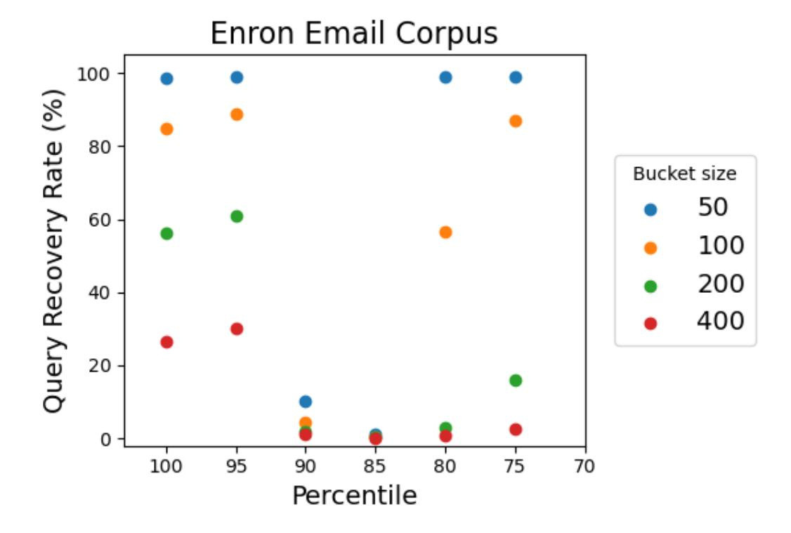

(a) The experimental results on the Enron email corpus.

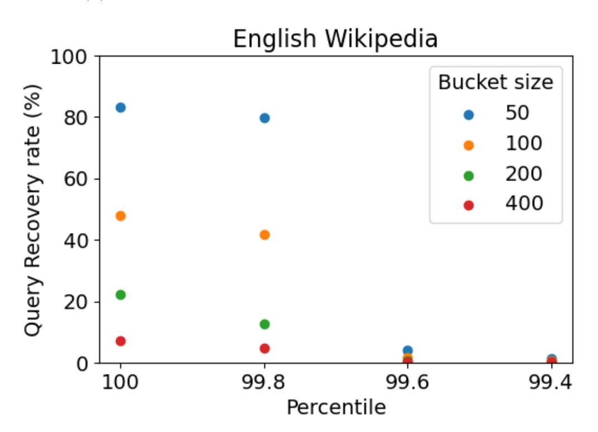

(b) Experimental results on the English Wikipedia dump.

Figure 1: Experimental results on the Enron email corpus and the English Wikipedia dump. The query recovery rate reported is averaged over 100 independent runs of the attack. Fixed bucket size is used for the experiment.

means that the noise is just right to mask the real co-occurrence counts.

Finally, for keywords with frequencies in the 80-th percentile and lower, the real frequencies are on the order of 10<sup>2</sup> , and one does not expect any fake co-occurrence counts between these keywords. This means that the attack is essentially trying to match the real co-occurrence count to itself (with padded keyword frequencies of course), so it is not at all surprising to see high query recovery rates for small bucket sizes. We argue that this is not a weakness of our construction as a real-world adversary will likely receive a noisy auxiliary co-occurrence 

{36}------------------------------------------------

matrix as opposed to the perfect one. In that case, an attack on these keywords will be much harder as the co-occurrence counts with these keywords are very small and contain very little information. In fact, the attacks have shown that using larger bucket sizes on these keywords is already enough to create enough ambiguity.

Additional Cryptanalysis on English Wikipedia. We repeat our cryptanalysis on the English Wikipedia dump[9](#page-36-1) from 2012. The articles in the English Wikipedia dump are much longer, so each "document" in the database contains a lot more keywords. This should, in theory, generate richer co-occurrence information. We sort the keywords in decreasing order of frequency just as before, and choose 800 of the most frequent keywords and 800 keywords from the 99.8-th, 99.6-th and 99.4-th percentile frequencies respectively. Our choices of keywords are significantly different from those for the Enron email corpus, but that is due to the fact that the keyword universe of the English Wikipedia dump is two orders of magnitude larger than that of the Enron email corpus, and over 60% of the keywords only appear once in the whole dataset. We test our attack with varying bucket sizes and repeat it 100 times for each set of attack just as before. The average query recovery rates reported in Figure [1b](#page-35-0) establish the resistance of SWiSSSE against system-wide leakage-abuse attacks.

## <span id="page-36-0"></span>7.4 Discussion

Interpreting the Experimental Results. Our cryptanalysis experiments assumed a very optimistic attack setting where the attacker has access to refined co-occurrence leakage. In practice, the leakage profile of SWiSSSE is significantly more "noisy"; it is not at all obvious how the attacker might obtain access to such refined leakage from a real implementation.

On the other hand, we acknowledge the need for further cryptanalysis of the leakage profile of SWiSSSE and welcome such studies from the community.

Security Versus Efficiency Tradeoffs for Bucketization. Our experiments reveal some interesting insights into the security versus efficiency trade-offs associated with choosing the bucket size. For example, we saw earlier that a bucket size of 50 for the most frequent keywords leads to almost 100% recovery, while a bucket size of 400 reduces this to around 30%. But what is the implication of using a larger bucket-size on the storage and bandwidth requirements for SWiSSSE?

In Figure [2,](#page-37-1) we demonstrate through concrete figures how variations in bucket sizes affect the storage and communication overheads of our construction. Here, the storage overhead only applies to the index as the number of documents is unaffected by bucketization in SWiSSSE. In general, the total number of (real and fake) keyword-document pairs grows essentially linearly with the bucket size. This implies that the search index overhead also grows linearly with bucket size.

Interestingly, the growth in overhead is more gradual when compared to the fall in recovery rate. When the initial bucket size varies from 50 to 400, the storage overhead varies between 1.04× and 1.36×. On the other hand, as demonstrated earlier, the keyword recovery rate

<span id="page-36-1"></span><sup>9</sup><http://kopiwiki.dsd.sztaki.hu/>

{37}------------------------------------------------

<span id="page-37-1"></span>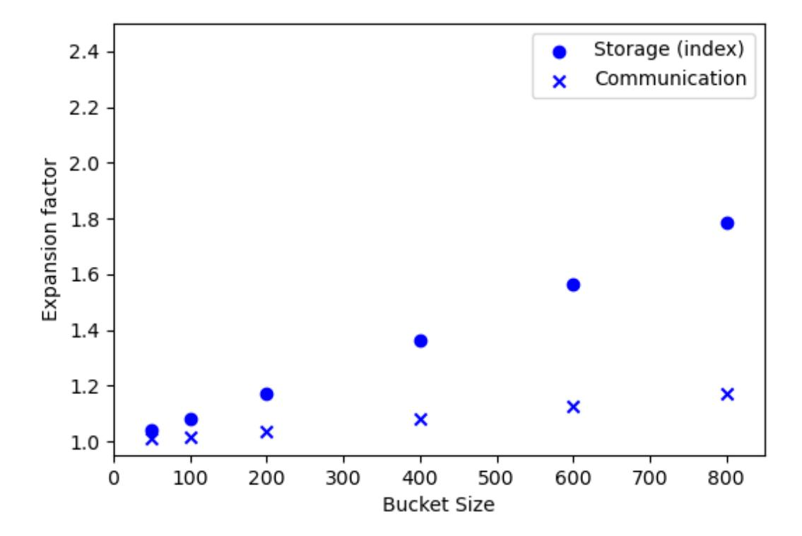

Figure 2: Overheads incurred by different bucket sizes on the Enron email corpus. The experiments are conducted with fixed bucket sizes.

falls from 100% to below 30%. This indicates that it is preferable to opt for a larger bucket size as long as the user can afford it, since it provides significantly stronger resistance to cryptanalysis while incurring only moderately larger overheads.

Parameter Selection. There are three tunable parameters in SWiSSSE that affect its security. These parameters are: (1) the size of the buckets, (2) the fraction of documents written back in the write-back step, and (3) the fraction of lookup indices written back in the write-back step. We have provided extensive cryptanalysis and performance experiments on bucketization in this section. Given these experiments, we give recommended bucket sizes in Section [9.2.](#page-40-0) We also perform additional experiments on the write-back rate and give our recommended write-back rate in the same section. Our recommendations take into account both the performance and security of SWiSSSE for various choices of parameters (and hence, we choose to defer the discussion on our parameter recommendations to [9.2](#page-40-0) following a description of the prototype implementation of SWiSSSE and the experimental setup for evaluating the performance of SWiSSSE).

# <span id="page-37-0"></span>8 Asymptotic Performance Evaluation of SWiSSSE

In this section, we provide an asymptotic performance analysis of SWiSSSE (summarized in Figure [3\)](#page-38-0).

Size of the Stash. For search queries, recall that the half of the stash is flushed every iteration and filled with the response from the latest query. Since the number of documents retrieved by any query is less than 2 · max<sup>w</sup> G(w) (half of that comes from randomly generated document addresses), there are at most 4 · max<sup>w</sup> G(w) documents in the stash. The

{38}------------------------------------------------

<span id="page-38-0"></span>

| Ctorogo       | Stash              | $ \mathcal{O}(\max_{w} G(w) + \max_{w}  W\{DB(w)\}) ) $       |  |
|---------------|--------------------|---------------------------------------------------------------|--|
| Storage       | EDB/DB             | $\mathcal{O}(\sum_{w} \mathtt{G}(w) +  \mathtt{DB} )$         |  |
| Time          | Document retrieval | $\mathcal{O}(\mathtt{G}(w))$                                  |  |
| complexity    | Write-back         | $\mathcal{O}(\max_{w} G(w) + \max_{w}  W\{\mathtt{DB}(w)\} )$ |  |
| Communication | Document retrieval | $\mathcal{O}(\mathtt{G}(w))$                                  |  |
| volume        | Write-back         | $\mathcal{O}(\max_{w} G(w) + \max_{w}  W\{\mathtt{DB}(w)\} )$ |  |

Figure 3: A summary of the performance parameters. Here, w denotes the leading keyword of a query, G(w) is the bucket size of keyword w,  $|W\{DB\}|$  is the total number of keyword-document pairs, and  $|W\{DB(w)\}|$  is the total number of keyword-document pairs for the documents that contain w.

documents are padded to a constant size, which means the storage of the documents in the stash requires  $\mathcal{O}(\max_w G(w))$  space.

The stash also stores a local lookup index. For a search query on keyword w, the number of lookup index locations that need to be updated is equal to the number of keyword-document pairs in the query response, or  $|W\{DB(w)\}|$ . Since the number of keywords in the document is much smaller than  $|W\{DB(w_1)\}|$ , it is reasonable to treat k as a constant in the asymptotic analysis. Recalling that half of the lookup index stored in the stash is flushed to the server after each query, it is not hard to see that the maximum number of lookup index locations stored by the client is  $\mathcal{O}(\max_w |W\{DB(w)\}|)$ .

In addition, the client needs to store two arrays of integers, namely an array for the groupings of the keywords and an array for the counters used to generate the document array addresses. These arrays are all small and of constant size, so they do not contribute to the asymptotic size of the stash. Combining everything, we get that the size of the stash is  $\mathcal{O}(\max_w G(w) + \max_w |W\{DB(w)\}|)$ .

Size of the Encrypted Database. The server stores an encrypted lookup index and an encrypted document array. The size of the encrypted lookup index is proportional to the total number of keyword-document pairs whereas the size of the encrypted document array is proportional to the number of documents. Hence, the size of the encrypted database is  $\mathcal{O}(\sum_w G(w) + |DB|)$ . Note that this order-of-magnitude calculation ignores the overhead from padding all documents to a constant size.

Time Complexity and Communication Volume of a Query. Suppose that the leading keyword for the query is w. The client first computes the encrypted lookup index addresses for the query. This involves  $\mathcal{O}(\mathsf{G}(w))$  computation and communication, as there are at most  $2 \cdot \mathsf{G}(w)$  addresses involved. The server then takes  $\mathcal{O}(\mathsf{G}(w))$  time to retrieve the encrypted document array addresses and send them to the client. Upon receiving the  $\mathcal{O}(\mathsf{G}(w))$  encrypted document array addresses, the client processes them and retrieves  $2 \cdot \mathsf{G}(w)$  encrypted documents from the server. The client decrypts the documents and filters the results locally to obtain the query response. The time complexity for the overall process is  $\mathcal{O}(\mathsf{G}(w))$ . It is also straightforward to see that the communication volume and the time complexity for the server are both  $\mathcal{O}(\mathsf{G}(w))$ .

Combining the analyses above, we conclude that the time complexity of a query for both

{39}------------------------------------------------

the client and the server is  $\mathcal{O}(\max_w G(w) + \max_w |W\{DB(w)\}|)$ , while the communication volume of a query is  $\mathcal{O}(\max_w G(w) + \max_w |W\{DB(w)\}|)$ . We note that stash handling is not relevant to the retrieval of documents and it can be performed whenever the client is free.

# <span id="page-39-0"></span>9 Experimental Evaluation

In this section, we describe a prototype implementation of SWiSSSE and report on its performance. We also present a detailed experimental comparison between the query performance of state-of-the-art SSE schemes with security against system-wide leakage, and the query performance of SWiSSSE. A theoretical performance evaluation of SWiSSSE can be found in Section 8.

Overview of Experiments. As target database we chose the Enron email corpus. It contains over 500K emails and over 30M keyword-document pairs which makes it a perfect database to experiment with the scalability of our SSE scheme. We run experiments on sub-databases of different sizes ranging from 10K documents to 400K documents.

#### <span id="page-39-1"></span>9.1 Experimental Setup

Choice of Primitives. We instantiate the PRF with HMAC-SHA-256 [72]. Only the first 16 bytes of the output are used as keys to reduce storage. We use AES-GCM [78,87] for symmetric-key encryption.

Implementation. We implement the client and server in Java [104], using the Java Cryptography Extension<sup>10</sup> as the underlying cryptographic library. We choose to use a single-thread implementation as it provides the most accurate measurements of performance. The server we implemented serves as a proxy between the client and the actual storage system. It is responsible for translating the queries into standard key-value store queries. We used Redis<sup>11</sup> as the underlying key-value store. For comparison, we also implement a plaintext database in Java. The database uses an inverted index for fast lookup, where the keys are the keywords, and the values are lists of document identifiers associated to the keywords.

**Document Preprocessing.** To prepare the documents for insertion, we extract keywords from them with the Natural Language Toolkit.<sup>12</sup> The English stop words and the keywords with frequency higher than 5% are removed from the set of keywords for each email. Emails that are larger than 1KB are partitioned into chunks of 1KB, taking care to associate all the keywords from a given email with each chunk.

**Experimental Environment.** We run our experiments on an AMD Ryzen 9 5900X CPU clocked at 3.7 GHz (4.8 GHz boost clock) and 32 GB DDR4 memory clocked at 2400 MHz.

<span id="page-39-2"></span><sup>&</sup>lt;sup>10</sup>https://docs.oracle.com/javase/8/docs/technotes/guides/security/crypto/CryptoSpec.html

<span id="page-39-3"></span><sup>11</sup>https://redis.io/

<span id="page-39-4"></span><sup>&</sup>lt;sup>12</sup>https://www.nltk.org/

{40}------------------------------------------------

For simplicity, the server and client are run on the same machine (so our results do not take into account network latency).

## <span id="page-40-0"></span>9.2 Parameter Selection for SWiSSSE

There are three tunable parameters in SWiSSSE that affect its security and performance. These parameters are: (1) the size of the buckets, (2) the fraction of documents written back in the write-back step, and (3) the fraction of lookup indices written back in the write-back step.

In this section, we investigate the relationship between the three parameters above and the performance and security of SWiSSSE experimentally. We give our recommended parameters at the end of the section.

Size of buckets. We perform thorough performance and cryptanalysis experiments to investigate the trade-offs between different bucketization strategies. These experiments are performed on the Enron email corpus and the write-back rate for the lookup indices and the documents are set to 50%. A full description of our cryptanalysis techniques and experimental results can be found in Section [7.3.](#page-33-1) Table [1](#page-40-1) summarises our experimental results. The query recovery rate shown in the table are for the most frequent keywords only.

<span id="page-40-1"></span>

| Bucket size<br>(# buckets) | Storage<br>overhead<br>(index) | Communication<br>overhead |       |
|----------------------------|--------------------------------|---------------------------|-------|
| 50 (668)                   | 3.9%                           | 0.9%                      | 98.7% |
| 100 (334)                  | 8.1%                           | 1.7%                      | 84.9% |
| 200 (167)                  | 17.0%                          | 3.6%                      | 56.3% |
| 400 (84)                   | 36.1%                          | 7.9%                      | 26.5% |

Table 1: Performance and cryptanalysis experiments on the size of the buckets.

It can be seen that bucket sizes smaller than 400 do not offer enough resilience against our new leakage cryptanalysis on the most frequent keywords. On the other hand, using a bucket size larger than 400 will incur significant overheads in terms of storage and communication (Figure [2](#page-37-1) in Section [7.3\)](#page-33-1).

Write-back rate. We also investigate alternative parameters for the fraction of documents written back and the fraction of lookup indices written back in the write-back step. We note that for any write-back rate r, r document write-backs and r lookup index write-backs produce equivalent leakage (since the leakage comes retrieving documents/indices that have been just written back). Therefore, we focus on parameter selection for the fraction of documents.

We perform performance experiments and cryptanalysis experiments with 50% to 90% lookup indices and documents write-back (in steps of 10%). The cryptanalysis experiments 

{41}------------------------------------------------

<span id="page-41-1"></span>(see Section [7.3\)](#page-33-1) are performed on the Enron email corpus only and uses bucket size of 400. We report the experimental results in Table [2.](#page-41-1)

|            | Mean Write-back | Mean Stash | Query Recovery |
|------------|-----------------|------------|----------------|
| Write-back | time (ms)       | Size (MB)  | Rate           |
| 50%        | 1571            | 0.978      | 26.5%          |
| 60%        | 1534            | 0.647      | 86.3%          |
| 70%        | 1584            | 0.422      | 91.4%          |
| 80%        | 1671            | 0.269      | 93.9%          |
| 90%        | 1690            | 0.179      | 94.5%          |

Table 2: Performance and cryptanalysis experiments on the write-back rate.

We observe that having a higher write-back rate does not help with the write-back time. This is because a higher write-back rate means more lookup indices and documents have to be written back in the write-back step. On the other hand, the mean stash size decreases significantly as the write-back rate increases, as expected. In terms of resilience to query reconstruction attacks, we observe that SWiSSSE is a lot more vulnerable to our highly refined leakage-abuse attack if we allow for a higher write-back rate. In particular, as soon as the write-back rate is set to 60%, our attack is able to recover 86.3% of the queries.

Recommended Parameters. We give our recommended parameters in this section. These parameters are used in the performance experiments in Section [9.3.](#page-41-0) We choose a bucket size of 400 for the most frequent 2400 keywords. For the other keywords, we find that a bucket size of 200 provides reasonable security and efficiency. A more detailed discussion of our bucketization strategy can be found in Section [7.4.](#page-36-0) As for the write-back rate, we set it to 50%.

Remark 9.1. For the bucket size of 400 and a write-back rate of 50%, our highly refined system-wide query recovery attacks achieve a query recovery rate of 26.5% (the identical figures in Tables [1](#page-40-1) and [2](#page-41-1) result from using an identical experimental parameters in both cases). While this appears to be a concern at first glance, we point out that our leakage analysis is rather "pessimistic" and assumes far more leakage than is actually leaked by a real implementation of SWiSSSE in practice. Hence, we recommend that using these parameters is safe from SWiSSSE in practical implementations. See Section [7.3](#page-33-1) for additional discussion.

# <span id="page-41-0"></span>9.3 Benchmarks

Setup Time. Figure [4a](#page-42-0) shows the setup time of the plaintext database and SWiSSSE. SWiSSSE is two orders of magnitude slower than a plaintext implementation which is expected due to its extensive use of encryption.

Query Response Time. Figure [4b](#page-42-0) shows the query response time of the plaintext database and SWiSSSE for the experiment with 400K documents. In each experiment, 1000 uniformly randomly picked keywords are queried. Here, real query response volume refers to the actual number of documents associated to the keywords and query response time is defined to be the

{42}------------------------------------------------

<span id="page-42-0"></span>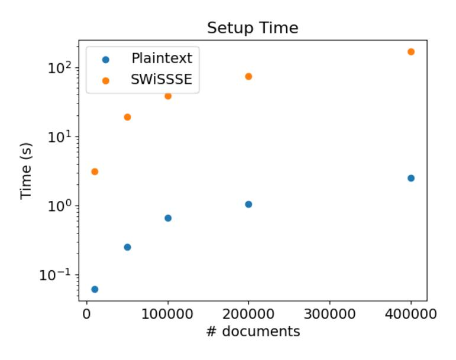

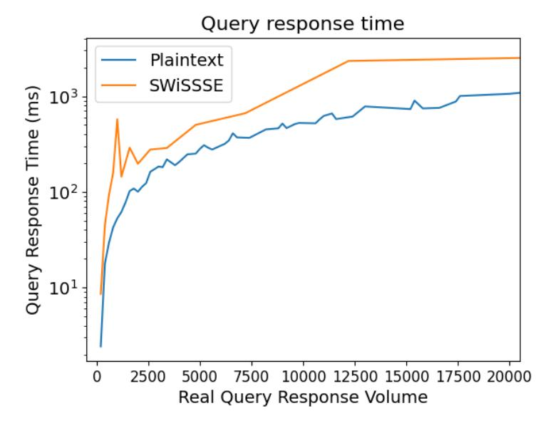

- (a) Setup time of the plaintext database and SWiSSSE (log scale).
- (b) Query response time of the plaintext database and SWiSSSE on 400K documents (log scale).

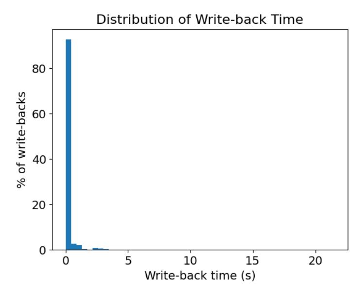

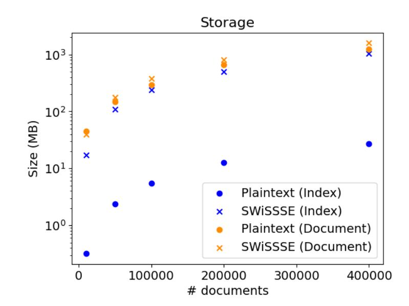

- (c) Distribution of write-back time of SWiSSSE on 400K documents.
  - (d) Storage required by the plaintext database and SWiSSSE (log scale).

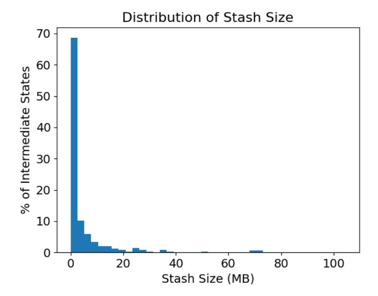

(e) Stash size of SWiSSSE on 400K documents.

Figure 4: Performance comparison between the plaintext database and SWiSSSE.

time from the start of a query to the point of time for which the client obtains the plaintext

{43}------------------------------------------------

documents. SWiSSSE is about 2-4 times slower than a plaintext database depending on the real frequency of the queried keyword and its padded frequency. This can be attributed to several factors. Firstly, SWiSSSE deploys a bucketization strategy which leads to more documents being retrieved than the real query response volume. Secondly, SWiSSSE uses the duplication technique on the inverted index, which means the amount of time required for index retrieval become linear in the bucket size of the queried keyword as opposed to a single query for the plaintext database. Finally, SWiSSSE has to search the stash to retrieve locally stored documents, and perform cryptographic operations.

We note that the query response time of SWiSSSE can be improved significantly with parallelisation and multi-threading. For example, the computation of search keys and decryption of documents can be parallelised. Computation of search tokens and decryption of documents can be separated from interactions with the server using different threads to reduce unnecessary blocking time between different commands.

Write-back Efficiency. We report write-back efficiency for the experiment with 400K documents in Figure [4c.](#page-42-0) As write-back time depends on the number of documents retrieved in previous queries, reporting an average value is not very informative. Here, we choose to show the distribution of write-back time for 1000 uniformly randomly distributed queries over the set of keywords. We observe that over 80% of the write-backs are completed in under 1 second; very long write-back times arise only occasionally.

The major bottle-neck of the write-back operation (over 70% of the execution time) comes from inserting the key-value pairs into the Redis database – a significant number of keyvalue pairs needs to be inserted in every write-back operation due to the use of duplication on the encrypted search index.

In practice, the client can simply transfer all the key-value pairs it wants to update and go offline; the server (with the help of the proxy if needed) can then insert these key-value pairs on its own. This yields a 5× reduction of the effective write-back time.

Server Storage. Storage of the plaintext database compared to SWiSSSE is reported in Figure [4d.](#page-42-0) The main source of overhead for SWiSSSE comes from the inverted index as can be seen clearly from the graph. This is because SWiSSSE uses duplication and many more keys need to be created for the inverted index. On the other hand, the overhead for document storage is minimal.

The Client Stash. The distribution of the stash size is shown in Figure [4e.](#page-42-0) The stash size was kept under 1 MB for over 80% of the queries. There were several occasions when the stash size grew to over 10 MB. This is due to queries on keywords with high frequencies. These can be expected to be rare in practice for typical query distributions. Furthermore, as half of the documents are written back to the server after each query, the stash size will only be high for a few queries. Therefore, we expect the stash size to stay reasonably small on the client most of the time. On the rare occasions where the stash size becomes large, the client can use data compression or can issue dummy queries on low frequency keywords causing the stash size to reduce more quickly.

We experimentally validate the data compression technique we proposed and report the

{44}------------------------------------------------

<span id="page-44-0"></span>

| Scheme          | Storage<br>(Client) | Storage<br>(Server) | Computation<br>(Client) | Communication<br>(C→S<br>S→C) |
|-----------------|---------------------|---------------------|-------------------------|-------------------------------|
| SWiSSSE         | 23.3 MB             | 1.4 GB              | 2.1K PRF                | 16 KB                         |
|                 |                     |                     | 2.1K DEC                | 1.0 MB                        |
| Duplication     | -                   | 42 GB (31×)         | 70K PRF                 | 1.1 MB (67×)                  |
|                 |                     |                     | 70K DEC                 | 68 MB (67×)                   |
|                 | -                   | 1.1TB (830×)        | 35K PRF                 | 0.53 MB (34×)                 |
| PRT-EMM [65]    |                     |                     | 35K DEC                 | 34 MB (34×)                   |
|                 | -                   | 110 GB (80×)        | 140K PRF                | 2.1 MB (130×)                 |
| VH-EMM [92]     |                     |                     | 140K DEC                | 140 MB (130×)                 |
|                 | -                   | 340 GB (250×)       | 70K ENC                 | 4.3 GB (270, 000×)            |
| SealPIR [5]*    |                     |                     | 70K DEC                 | 17 GB (17, 000×)              |
| Non-recursive   |                     | 5.3 GB (3.9×)       | 1.5M ENC                | 3.0 GB (190, 000×)            |
| Path ORAM [102] | 42.7 MB             |                     | 1.5M DEC                | 3.0 GB (2, 900×)              |

Table 3: Comparison of different document retrieval techniques. In the experiments, we used G = 522 as the query response volume (mean keyword frequency in the Enron email corpus) for calculating the overheads. As all of the schemes except SWiSSSE require full padding, only the performance numbers of SWiSSSE will be affected by the query response volume. The numbers in the brackets indicate overheads beyond the baseline provided by SWiSSSE. \*SealPIR also requires the server to perform 390 billion FHE operations per query. The client storage we report does not include cryptographic keys as they do not grow with the size of the database.

following performance metrics. The compression algorithm used in our experiment is GZIP at compression level 6. In terms of query response time, the compression technique results in an 17.9% overhead (due to compression). In terms of the write-back time, the compression technique results in a 4.3% overhead (due to decompression). On the other hand, in terms of the size of the stash for the documents, the compression technique saves 27.6% of the storage. We recommend using data compression when the stash size is high.

Optimizations and Extensions. While our experiments already demonstrate that SWiSSSE scales well in practice to very large databases, an implementation in a low-level language (such as C) should improve efficiency further. Another potential optimization is to switch to a specialised PRF such as SipHash [\[11\]](#page-66-9) in place of HMAC-SHA-256. A larger client stash would also allow batching the write-backs together to further improve efficiency. We conducted our experiments locally rather than over a network; further work is needed to characterise the impact of network latency on query response times. However, recall that each search operation only involves two round trips. In addition, latency from communication over a WAN would be on the order of 50 milliseconds [\[20\]](#page-67-8) and it is additive to the query processing time, which is typically on the order of 1k-10k milliseconds. Hence, network latency does not have a large impact on the performance.

{45}------------------------------------------------

## <span id="page-45-0"></span>9.4 Comparison to State-of-the-Art SSE Schemes

We now compare the performance of SWiSSSE with the state-of-the-art SSE schemes if they were made system-wide secure.[13](#page-45-2) For ease of comparison, we ignore the index retrieval phase and focus on the document retrieval phase only (the cost of index retrieval is only a small fraction of the cost of document retrieval for all of the schemes under consideration).We consider the same system-wide secure solutions as in [\[54\]](#page-70-1): (1) duplicate the documents so that there is no co-occurrence leakage any more, (2) apply the state-of-the-art SSE schemes on the documents directly, and (3) use off-the-shelf data retrieval techniques such as private information retrieval (PIR) and oblivious random-access memory (ORAM). Concretely, we choose Pseudo-Random Transform from [\[65\]](#page-71-2) (referred to as PRT-EMM) and the volumehiding EMM from [\[92\]](#page-73-3) (referred to as VH-EMM), as well as SealPIR [\[5\]](#page-65-1) and non-recursive Path ORAM [\[102\]](#page-74-2) as the PIR and ORAM schemes, respectively, for our comparison.

Parameter Choices. We use the following parameters in our experiments. All PRFs used in the experiments have 128-bit outputs. For PRT-EMM [\[65\]](#page-71-2), we use α = 0.5 as proposed in the original paper. For SealPIR [\[5\]](#page-65-1), we pick the degree of ciphertext to be N = 2048, the size of the coefficients to be 60 bits and represent the database in d = 2 dimensions as those are used in the original paper. For Path ORAM, we assume each block has size 1 KB and there are 4 blocks per bucket. We pad query response volume from the duplication scheme, SealPIR and Path ORAM to the maximum query response length to suppress volume leakage. For Path ORAM, we assume that all documents are of equal size. Note that leaking the length of retrieved documents is undesirable and the standard practice in the SSE literature is to either pad each document to the same length or to divide each document into equal-sized chunks/sub-documents associated with separate identifiers. Hence, we pick a fixed document-size, which may be viewed as either all documents being padded to the same length, or all documents split into equal-sized chunks.

Concrete Comparison. For the comparison experiments, we use the same 400K (preprocessed) documents from the Enron email corpus. We report storage, computation and communication costs in Table [3.](#page-44-0) Storage and communication costs are measured in total volumes. Additional overheads arising from how the data is structured and packaged are ignored. It is clear from the table that SWiSSSE is significantly more efficient than all of the alternatives that we consider. This is because SWiSSSE uses delayed write-backs with fresh addresses to suppress access-pattern leakage. That is significantly more efficient than creating physical duplications of documents as used in the duplication scheme and the state-of-the-art index-only SSE schemes [\[65,](#page-71-2) [92\]](#page-73-3). Furthermore, SWiSSSE uses keyword bucketization to suppress volume leakage. The resultant query response volume is much smaller than the worst-case padding strategies adopted by the other solutions.

# <span id="page-45-1"></span>10 Dynamic SWiSSSE

We chose to focus on the static version of SWiSSSE first for easy exposition of our core ideas. However, our approach naturally extends to the dynamic setting. In this section, we

<span id="page-45-2"></span><sup>13</sup>Recall that, as presented in their original forms, they are not [\[54\]](#page-70-1).

{46}------------------------------------------------

detail a dynamic version of SWiSSSE and prove its security against system-wide leakageabuse attacks. As in the case of static SWiSSSE, we design and analyze dynamic SWiSSSE while taking into account the leakage from both the (encrypted) index and the document retrieval component of a searchable encryption system.

Our two-phase approach of first focusing on static SWiSSSE before extending it to the dynamic setting is similar to much of the SSE literature, where the static version of a scheme is usually proposed and analyzed extensively before its dynamic counterpart is introduced.[14](#page-46-1)

Our dynamic SWiSSSE scheme achieves a new system-wide security notion called "obliviousness of operations", which requires that search and update query operations should be computationally indistinguishable to the server. This brings several advantages. First of all, it naturally implies that search and update operations incur computationally indistinguishable leakage, which allows for a unified system-wide security definition with respect to searches and updates for dynamic SSE schemes, as opposed to the separate index-only definitions in prior work. Secondly, as a consequence of this property, dynamic SWiSSSE achieves stronger forward and backward privacy guarantees than state-of-the-art SSE constructions in the literature, including those based on volume-hiding EMMs or ORAM [\[16,](#page-66-0) [19,](#page-67-1) [26,](#page-67-2) [45\]](#page-69-3). We achieve these stronger security guarantees by carefully accounting for system-wide leakage, which is otherwise ignored by existing dynamic SSE schemes [\[16,](#page-66-0) [19,](#page-67-1) [26,](#page-67-2) [45\]](#page-69-3). From a technical standpoint, we use natural extensions of our core techniques for static SWiSSSE: (a) delayed pseudorandom write-backs corresponding to both updates and searches, and (b) writing back (freshly encrypted) documents and document-pointers to a combination of real and dummy addresses.

## <span id="page-46-0"></span>10.1 Overview of Dynamic SWiSSSE

In this section, we present an informal overview how we extend SWiSSSE to handle dynamic databases. See Section [10.2](#page-49-0) for the detailed formal description.

We consider two kinds of updates to the database – document insertion and document deletion; a document update can be simulated via: (a) a deletion operation on the old document, followed by (b) an insertion operation on the modified document. We first present a simple idea for handling document insertions. At a high level, we use a technique similar to the auxiliary write-backs used in our static construction. This incurs some undesirable leakage, which we address subsequently.

Handling Insertions—Simple Version. When a document d<sup>ℓ</sup> is to be inserted, the client simply schedules: (a) a normal document write-back for d<sup>ℓ</sup> targeting a set of "insert write-backs" for every keyword w<sup>i</sup> ∈ dℓ. As with auxiliary write-backs, insert write-backs target a separate set of addresses to avoid any correlation with prior write-backs (normal and auxiliary) corresponding to the same keyword. More concretely, we now generate three separate sets of addresses for normal, auxiliary and update write-backs involving the same keyword:

$$\mathsf{addr}_{\mathsf{norm}}(w_i, d_\ell, \mathsf{cnt}_{w_i}) = F(K, w_i || j || (3 * \mathsf{cnt}_{w_i})),$$

<span id="page-46-1"></span><sup>14</sup>For instance, volume hiding EMMs were first proposed in the static SSE setting [\[65,](#page-71-2) [92\]](#page-73-3) before being extended to dynamic databases only recently [\[45\]](#page-69-3).

{47}------------------------------------------------

$$\begin{split} \operatorname{addr}_{\operatorname{aux}}(w_i,d_\ell,\operatorname{cnt}_{w_i}) &= F(K,w_i||j||(3*\operatorname{cnt}_{w_i}+1)), \\ \operatorname{addr}_{\operatorname{insert}}(w_i,d_\ell,\operatorname{cnt}_{w_i}) &= F(K,w_i||j||(3*\operatorname{cnt}_{w_i}+2)), \end{split}$$

where F is a PRF, j is a counter that runs from 0 to |DB(wi)| − 1 (where DB(wi) denotes the set of documents containing keyword wi), and cntw<sup>i</sup> is a per-key word counter held in the client's stash which records how many times w<sup>i</sup> has appeared in search and insertion queries.

In other words, during the time interval between the t th and (t + 1)th queries on keyword wi , we use three sets of write-back addresses – the set {addrnorm(w<sup>i</sup> , dℓ, j)} for normal writebacks, the set {addraux(w<sup>i</sup> , dℓ, j)} for auxiliary write-backs, and the set {addrinsert(w<sup>i</sup> , dℓ, j)} for insert write-backs. The insert write-backs happen intermittently and can be randomly interspersed with normal and auxiliary write-backs involving other keywords and documents.

During a search query involving w<sup>i</sup> , the client now requests the server to access all three sets of write-back addresses – normal, auxiliary and insert – in the keyword lookup index. The entries corresponding to the normal and insert write-back addresses allow the client to recover the pointers to already existing documents and freshly inserted documents, respectively, that contain w<sup>i</sup> . The entries corresponding to the auxiliary write-back addresses allow the client to identify if any of these pointers have been updated subsequently due to searches involving other keywords. Thus, search correctness is ensured. Finally, as before, we use additional pointers to fake documents to hide the exact frequency of the keyword wi , and reveal its bucket size instead.

Leakage. The solution outlined above leaks that a new document has been inserted: when the client executes a normal document write-back operation for the newly inserted document dℓ, the total number of actual and dummy addresses in the encrypted document array increases by one. While this leakage is currently incurred by all existing dynamic SSE schemes, it has some repercussions with respect to file injection attacks [\[110\]](#page-75-0). For this attack vector to work, the adversary needs to infer exactly when an insert operation corresponding to a maliciously constructed file occurs, as well as the effect of this insertion on subsequent keyword search operations.

This motivates hiding the occurrences of inserts from the server, and hence, masking the aforementioned leakage. We describe how to achieve this next.

Handling Insertions—Modified Version. An effective way to mask when a document is inserted is to avoid creating a fresh entry in the encrypted document array. Instead, we simply convert an (already existing) dummy entry into a real one.

Concretely, to insert a fresh document dℓ, the client first identifies a "leading keyword" w ∗ in dℓ. We assume without loss of generality that w ∗ is the keyword in d<sup>ℓ</sup> with the smallest occurrence frequency in the database. Next, the client issues a search query on w <sup>∗</sup> and retrieves a list of pointers to real and dummy locations in the document array. To insert the new document, the client schedules a normal document write-back targeting one of the dummy addresses, as opposed to a newly generated address. The insert write-backs are scheduled exactly as described in the simple version above, except they now encapsulate a pointer to the dummy address as opposed to some newly generated address.

{48}------------------------------------------------

Handling Deletions. Finally, deletions are handled in a manner that is complementary to the insertion procedure described above. Namely, when a document is to be deleted, we convert the real entry corresponding to this document in the document array into a dummy entry with some garbage ciphertext. More concretely, the client again issues a search query on w ∗ , and schedules a dummy document write-back targeting the address corresponding to the document to be deleted. The insert write-backs are scheduled exactly as for the inserts, except they now encapsulate pointers to random addresses in the document array.

Note that in the above strategy, there is the possibility that we run out of dummy addresses in the document array after a certain number of insert operations. For simplicity of presentation and analysis, we implicitly assume a cap (determined at setup) on the maximum number of new document insertions supported by the system. We refer the reader to Section [10.2](#page-49-0) for a more detailed discussion on how to generalize the above proposal to support an uncapped number of insertions.

We refer the reader to Section [10.2](#page-49-0) for a formal analysis of how dynamic SWiSSSE achieves correctness of searches and updates while handling insertions and deletions as outlined above.

Oblivious Operations. Dynamic SWiSSSE naturally supports "oblivious operations". Both keyword searches and document updates involve reading a set of entries from the encrypted data structures, followed by delayed write-backs. The only functional differences between searches and updates are reflected in how the client locally manages/updates its stash. From the point of view of the server, the output of the leakage function at the point of query is simply the accesses made to the encrypted data structures, which is unconditionally indistinguishable for searches and updates. We formalize the notion of oblivious operations and prove that our dynamic scheme achieves this notion in Section [10.3.](#page-53-0)

Forward Privacy. Dynamic SWiSSSE achieves stronger forward privacy guarantees than existing constructions in the literature, including those based on ORAM [\[16,](#page-66-0) [19,](#page-67-1) [26,](#page-67-2) [45\]](#page-69-3). Existing schemes satisfy a definition of forward privacy that only requires insertion and deletion operations to computationally hide the set of keywords in the target document. However, they do not hide the number of keywords an inserted/deleted document contains, which is potentially sensitive information. Our construction, on the other hand, achieves the stronger notion of forward privacy in which we also hide from the server the number of keywords in a document which is inserted/deleted. We formalize this in Section [10.3.](#page-53-0)

Backward Privacy. Dynamic SWiSSSE also achieves stronger backward privacy guarantees than existing constructions in the literature. The strongest notion of backward privacy achieved thus far is called Type-1 backward privacy [\[19\]](#page-67-1), and the only constructions to achieve it are based on full-fledged ORAM-style techniques [\[19,](#page-67-1) [26\]](#page-67-2). This notion allows the adversary to learn, for every search query, the corresponding result pattern and the timestamps at which the documents containing the queried keyword were inserted. We achieve a stronger notion of backward privacy that hides both these forms of leakage from the adversarial server.

To see why this is the case, recall that our construction computationally hides the result pattern for each query, since the adversarial server only sees encrypted documents and 

{49}------------------------------------------------

pointers to documents (in fact, the server sees fresh encryptions of these items for every write-back operation). Secondly, due to the delayed write-backs, the locations of keywords and documents change after every search and update operation. Therefore, it is difficult for the adversary to trace each encrypted document it accesses during a search query at timestamp t back to the timestamp t ′ < t when the document was originally inserted. We formally describe this in Section [10.3.](#page-53-0)

Resistance to Leakage Cryptanalysis. Finally, it turns out these stronger notions of forward and backward privacy makes SWiSSSE more resilient to known leakage-abuse and file-injection attacks as compared to existing dynamic schemes, including those based on ORAM-style techniques [\[19,](#page-67-1) [26\]](#page-67-2). We refer the reader to Section [10.3](#page-53-0) for a more detailed explanation.

## <span id="page-49-0"></span>10.2 Dynamic SWiSSSE: Detailed Description

In this section, we present a formal description of the various protocols involved in dynamic SWiSSSE.

Setup. The setup procedure for the dynamic construction is very similar to the static one. The only differences are that the client has to initialise an array Clt.InsCtr to keep track of the number of insertions for each keyword since the last time they have been queried as the leading keywords.

SWiSSSE.{KWQuery, Insert, Delete}. We now describe the keyword query, insert and delete procedures for dynamic SWiSSSE. For ease of representation, these procedures broken up into smaller sub-routines described subsequently.

Encrypted Document Array Address Retrieval. This sub-routine is the same for a search query, document insertion or document deletion, and is described in Algorithm [9,](#page-50-0) and is very similar to the corresponding sub-routine for document array address retrieval in the static version of SWiSSSE.KWQuery, except that the client now fetches three sets of addresses - normal, auxiliary and insert. For document insertion, the client simply queries the first keyword in the document he wants to insert. For document deletion, the client queries the first keyword in the document he wants to delete. As the index for the inserted keywords are stored by the server, the client has to compute some additional virtual addresses to retrieve the documents.

Encrypted Document Retrieval. The sub-routine is again identical for a search query, document insertion and document deletion, and works in the same way as the corresponding sub-routine for the static version of SWiSSSE (see Algorithm [3](#page-25-1) for the details of how this sub-routine works).

The final set of sub-routines are the write-back sub-routines corresponding to search queries, insertions and deletions. Unlike the previous sub-routines, write-backs are executed differently for each query type. We describe these next.

{50}------------------------------------------------

#### Algorithm 8 Dynamic SWiSSSE.Setup

```
1: procedure Clt.Setup(DB)
2: /* Generate fake documents */
3: DB′ ← Fake Doc Gen(DB, Clt.G)
4: Clt.N ← |DB′
                  |
5: EI, EA ← {}
6: for i = 1, . . . , |DB′
                     | do
7: /* Get the set of keywords with counters */
8: x ← {(w, Clt.KWCtr[w]) | w ∈ W(DB′
                                         [i])}
9: /* Update the lookup index */
10: for w ∈ W(DB′
                      [i]) do
11: EI ← EI ∪ (F(w||Clt.KWCtr[w]||0), Enc(id(DB′
                                                    [i])))
12: Clt.KWCtr[w] ← Clt.KWCtr[w] + 1
13: /* Insert the encrypted document */
14: EA ← EA ∪ (F(i||0), Enc(x||DB′
                                   [i]))
15: /* Reset the keyword counter */
16: for w ∈ W(DB′
                   ) do
17: Clt.KWCtr[w] ← 0
18: /* Initialise the stash */
19: Clt.I.init()
20: Clt.A.init()
21: Send (EI, EA) to the server
22: procedure Svr.Setup(EI, EA)
23: Svr.EI.init()
24: Svr.EA.init()
25: Svr.EI.put(EI)
26: Svr.EA.put(EA)
```

#### <span id="page-50-0"></span>Algorithm 9 Dynamic SWiSSSE.{KWQuery, Insert, Delete}: Encrypted Document Array Address Retrieval

```
1: procedure Clt.TokenGen(w)
2: L ← {}
3: for j ∈ 0, . . . , Clt.G(w) − 1 do
4: L ← L ∪ {F(w||j||3 ∗ Clt.KWCtr[w])},
5: L ← L ∪ {F(w||j||3 ∗ KWCtr[w] + 1)},
6: L ← L ∪ {F(w||j||3 ∗ Clt.KWCtr[w]) + 2}.
7: /* Roll forward the counter for the next query */
8: Clt.KWCtr[w] ← Clt.KWCtr[w] + 1
9: Send L to the server
10: procedure Svr.Index Lookup(L)
11: Send Svr.EI.get(L) to the client
```

Write-Back for Search Query. The write-back sub-routine under dynamic SWiSSSE.KWQuery is described in Algorithm [10.](#page-51-0) Technically, it is very similar to that under static SWiSSSE.KWQuery (Algorithm [4\)](#page-26-0), except that the client has to perform some maintenance on the lookup index for the queried keyword to relocate the addresses for the document insertions to the ones

{51}------------------------------------------------

#### <span id="page-51-0"></span>Algorithm 10 Dynamic SWiSSSE.KWQuery: Write-Back Sub-Routine

```
1: procedure Clt.Write Back Keyword Query(M, w¯)
2: Replace the lookup addresses of the newly inserted documents which contain ¯w with the
   addresses used for the fake documents.
3: UA ← {}
4: /* Get random documents from the stash */
5: D ← Clt.A.pop(|Clt.A|)
6: for ({(wi, ji, bi)} , d) ∈ UA do
7: /* Encrypt the new document addresses and documents */
8: UA ← UA ∪ {(F(id(d)||Clt.ArrCtr[id(d)]), Enc({(wi, ji)} ||d))}
9: /* Update the stash for the lookup index */
10: for (w, j, b) ∈ {(wi, ji, bi)} do
11: Clt.I.put((F(w||j||Clt.KWCtr[w] + b), Enc(id(d))))
12: /* Decrypt the documents retrieved and insert them into the document array */
13: Clt.A.put(Dec(M))
14: Send (Clt.I.pop(⌊|Clt.I|/2⌋), UA)
15: procedure Svr.Write Back((UI, UA))
16: Svr.EI.put(UI)
17: Svr.EA.put(UA)
```

used for fake documents.

We explain this idea in greater detail. Recall that during the encrypted document array address retrieval phase, we have obtained all the normal write-back addresses of the form F(w||j||3∗KWCtr[w]), the auxiliary write-back addresses of the form F(w||j||3∗KWCtr[w]+1) and insertion write-back addresses of the form F(w||j||3 ∗ KWCtr[w] + 2). Our goal is to remove the additional insertion addresses of the form F(w||j||KWCtr[w] + 2) by making use of the fake documents that contain the keyword w. In terms of the documents, this means for each newly inserted document, we find a fake document that contains w, remove the keyword from the fake document, and allocate it to the newly inserted document. We omit the low-level details of the procedure for readability.

Write-Back for Document Insertion. The write-back sub-routine under dynamic SWiSSSE.Insert is described in Algorithm [11.](#page-52-0) Technically, it is essentially identical to the corresponding sub-routine under dynamic SWiSSSE.KWQuery except that the client has to insert the document locally. This is done by scanning the query response for fake documents, and replace one of them by the document that is to be inserted. The keyword pointers are updated so as to maintain correctness of future searches.

Write-Back for Document Deletion. The write-back sub-routine under dynamic SWiSSSE.Delete is described in Algorithm [12.](#page-52-1) Technically, it is again identical to the corresponding subroutine under dynamic SWiSSSE.KWQuery except that the client has to overwrite the target document to a fake document in the stash.

Supporting Uncapped Number of Insertions. As one can clearly see from the bucketization strategy and the fake document generation procedure in our construction, there is a limit on how many documents the client can insert into the database. One possible

{52}------------------------------------------------

#### <span id="page-52-0"></span>Algorithm 11 Dynamic SWiSSSE.Insert: Write-Back Sub-Routine

```
1: procedure Clt.Write Back Insertion(M, {w¯j} , d¯)
2: Replace the lookup addresses of the newly inserted documents which contain ¯w with the
   addresses used for the fake documents.
3: UA ← {}
4: /* Get random documents from the stash */
5: D ← Clt.A.pop(|Clt.A|)
6: for ({(wi, ji, bi)} , d) ∈ UA do
7: /* Encrypt the new document addresses and documents */
8: UA ← UA ∪ {(F(id(d)||Clt.ArrCtr[id(d)]), Enc({(wi, ji)} ||d))}
9: /* Update the stash for the lookup index */
10: for (w, j, b) ∈ {(wi, ji, bi)} do
11: Clt.I.put((F(w||j||Clt.KWCtr[w] + b), Enc(id(d))))
12: /* Decrypt the documents retrieved and insert them into the document array */
13: Clt.A.Insert(Dec(M))
14: Insert document d¯ with keywords {w¯j} into Clt.A
15: Send (Clt.I.pop(⌊|Clt.I|/2⌋), UA)
16: procedure Svr.Write Back((UI, UA))
17: Svr.EI.put(UI)
18: Svr.EA.put(UA)
```

#### <span id="page-52-1"></span>Algorithm 12 Dynamic SWiSSSE.Delete: Write-Back Sub-Routine

```
1: procedure Clt.Write Back Deletion(M, d¯)
2: Replace the lookup addresses of the newly inserted documents which contain ¯w with the
   addresses used for the fake documents.
3: UA ← {}
4: /* Get random documents from the stash */
5: D ← Clt.A.pop(|Clt.A|)
6: for ({(wi, ji, bi)} , d) ∈ UA do
7: /* Encrypt the new document addresses and documents */
8: UA ← UA ∪ {(F(id(d)||Clt.ArrCtr[id(d)]), Enc({(wi, ji)} ||d))}
9: /* Update the stash for the lookup index */
10: for (w, j, b) ∈ {(wi, ji, bi)} do
11: Clt.I.put((F(w||j||2 ∗ Clt.KWCtr[w] + b), Enc(id(d))))
12: /* Decrypt the documents retrieved and insert them into the document array */
13: Clt.A.put(Dec(M))
14: Turn d¯ into a fake document in Clt.A
15: Send (Clt.I.pop(⌊|Clt.I|/2⌋), UA)
16: procedure Svr.Write Back((UI, UA))
17: Svr.EI.put(UI)
18: Svr.EA.put(UA)
```

work-around is to instantiate a new encrypted database every time the maximum quota is hit. This may not be practical for some systems as the client storage grows linearly in the number of instances of encrypted databases.

{53}------------------------------------------------

As an alternative, we can extend our dynamic construction to support uncapped document insertions at the cost of additional leakage. Without loss of generality, suppose that the client wants to store a documents more. He can simply insert a fake documents in the stash and redirect some of the pointers of the fake keywords (which he can obtain from normal queries) to these new fake documents. These new fake documents can then be written back to the server just like the normal documents. If the client wants to store a additional documents for a particular keyword w, he can make a search query on w to retrieve the documents associated to w, increase the address space of w by a keywords, and generate a fake documents and point the newly generated keyword pointers to the new fake documents. These pointers and documents can then be written-back to the server with normal write-back operations. On a side note, the client should choose a such that the new bucket size of w corresponds to the bucket size of some other keyword, so that the volume leakage does not trivially leak the identity of w in the future queries.

We leave it as an interesting future work to formalize the storage expansion process, and to analyze the additional leakage thereof.

Correctness. Similar to the static case, there is a possibility for our dynamic construction to fail if the client generates repeated addresses. We provide an upper bound of the failure probability of our dynamic construction with adversarially chosen queries below. As the proof is almost identical to the static case, we omit the proof from the paper.

**Theorem 10.1.** [Correctness of Dynamic SWiSSSE]

Let |DB| and |W|  $\{DB\}$  denote the total number of documents and document-keyword pairs, respectively, in the database DB at any given point of time, and let l denote the output length of the PRF F used in static SWiSSSE. Then the advantage of any adversary A, which issues at most k queries, in breaking the correctness of static SWiSSSE over the database DB is at most:

$$\frac{\left(\left|\mathrm{DB}\right|^{2}+4t_{0}\left|\mathrm{DB}\right|+9|W\left\{\mathrm{DB}\right\}|^{2}+18t_{1}|W\left\{\mathrm{DB}\right\}|\right)}{2^{l+1}} \\ +Adv_{F,\mathcal{B}}^{PRF,\left|\mathrm{DB}\right|+2t_{0}}+Adv_{F,\mathcal{C}}^{PRF,2|W\left\{\mathrm{DB}\right\}|+2t_{1}},$$

where  $t_0 = k \cdot \max_w |DB(w)|$ ,  $t_1 = k \cdot \max_w |w\{DB(w)\}|$  and  $\mathcal{B}$  and  $\mathcal{C}$  denote probabilistic polynomial-time adversaries in independent security experiments against the PRF F.

## <span id="page-53-0"></span>10.3 System-Wide Leakage of Dynamic SWiSSSE

**Setup.** At setup, the client offloads the encrypted lookup index and the encrypted document array to the server. These data structures are essentially key-value stores with pseudorandomly generated keys/addresses and values/entries that are encrypted under an IND-CPA secure encryption scheme. Hence, at setup, the server learns no information about the original database DB other than the number of documents in the padded database DB' (including both real and fake documents), and the total number of keyword-document pairs post-bucketization. Formally, we have:

$$\mathcal{L}_{\Sigma}^{\mathbf{Setup}}(\mathtt{DB},\mathtt{G}) = (|\mathtt{DB}'|,|W\left\{\mathtt{DB}'\right\}|,\mathbf{St}_{\mathcal{L}}).$$

{54}------------------------------------------------

#### <span id="page-54-0"></span>Algorithm 13 Dynamic SWiSSSE: Leakage Function for Keyword Queries

```
1: procedure L
                KWQuery(q, StL)
2: (KWQuery, w¯) ← q
3: I
       ′
        , A
          ′
           , KWCtr, ArrCtr ← StL
4: IndHist ← IndHist ∪ {(T( ¯w, i, KWCtr[ ¯w1]), 0, k), T( ¯w, i, KWCtr[ ¯w1] +
   1), 0, k), T( ¯w, i, KWCtr[ ¯w1] + 2), 0, k) | i ∈ 0, . . . , G( ¯w1) − 1}
5: KWCtr[ ¯w1] ← KWCtr[ ¯w] + 3
6: L ← I[ ¯w]
7: while |L| < 2 · Clt.G(w) do
8: id ← Rand(|A|)
9: if id /∈ {id(d) | d ∈ A
                             ′
                             } then
10: L ← L ∪ id
11: ArrCtr[L] ← ArrCtr[L] + 1
12: ArrHist ← ArrHist ∪ {(T(l, ArrCtr[l]), 0, k) | l ∈ L}
13: UI ← I
              ′
              .pop(|I
                     ′
                      |/2)
14: IndHist ← IndHist ∪ {(i, 1, k) | i ∈ UI}
15: State UA ← A
                ′
                 .Pop(⌊|UA|/2⌋)
16: ArrHist ← ArrHist ∪ {(T(id(d), ArrCtr[id(d)]), 1, k) | ({wi, ji, bi} , d) ∈ UA}
17: A
       ′ ← A
             ′ ∪ Merge Index(A[L], w¯)
18: StL ← (I
               ′
                , A
                  ′
                   , KWCtr, ArrCtr)
19: Return (IndHist, ArrHist), StL
```

Keyword Queries. As we have introduced virtual addresses for the inserted documents, the insertion history will be revealed by the keyword queries. As in the static case, we capture this leakage using a probabilistic and stateful leakage function, described formally in Algorithm [13.](#page-54-0)

Document Insertion. The leakage of a document insertion is identical to a single-keyword query except that the inserted document is processed in the state of the leakage. We capture this leakage using a probabilistic and stateful leakage function, described formally in Algorithm [14.](#page-55-0)

Document Deletion. The leakage of a document deletion is identical to a single-keyword query except that the target document to be deleted is marked as fake in the state of the leakage.We capture this leakage using a probabilistic and stateful leakage function, described formally in Algorithm [15.](#page-56-0)

Finally, we are ready to state the security of our dynamic construction and prove it.

<span id="page-54-1"></span>Theorem 10.2 (Security of Dynamic SWiSSSE). Let Σ be our proposed dynamic SSE scheme. Let L Setup Σ and L KWQuery Σ , L Insert, and L Delete be the leakage functions defined above, then Σ is (L Setup Σ , L KWQuery Σ ,L Insert ,L Delete)-secure.

Proof. We use a game-based argument to prove the security of the dynamic construction.

(Game 0) Let the real execution of the scheme on the database DB with queries q1, . . . , q<sup>k</sup>

{55}------------------------------------------------

#### <span id="page-55-0"></span>Algorithm 14 Dynamic SWiSSSE: Leakage Function for Insertion Queries

```
1: procedure \mathcal{L}^{\mathbf{Insert}}(q, \mathbf{St}_{\mathcal{L}})
  2:
              (\mathbf{Insert}, \{\bar{w_i}\}, d) \leftarrow q
              \mathtt{I}', \mathtt{A}', \mathtt{KWCtr}, \mathtt{ArrCtr} \leftarrow \mathbf{St}_{\mathcal{L}}
  3:
                                                          IndHist \cup \{(\mathbf{T}(\bar{w}, i, \mathtt{KWCtr}[\bar{w_1}]), 0, k), \}
                                                                                                                                                 \mathbf{T}(\bar{w}, i, \mathtt{KWCtr}[\bar{w_1}] +
              IndHist
                                          \leftarrow
  4:
       (1), 0, k), \mathbf{T}(\bar{w}, i, \mathtt{KWCtr}[\bar{w}_1] + 2), 0, k) \mid i \in \{0, \dots, \mathtt{G}(\bar{w}_1) - 1\}
              \mathtt{KWCtr}[\bar{w_1}] \leftarrow \mathtt{KWCtr}[\bar{w_1}] + 3
  5:
              L \leftarrow \mathtt{I}[w]
  6:
              while |L| < 2 \cdot \mathtt{Clt.G}(w) \ \mathbf{do}
  7:
  8:
                    id \leftarrow \mathbf{Rand}(|\mathtt{A}|)
 9:
                    if id \notin \{id(d) \mid d \in A'\} then
10:
                           L \leftarrow L \cup id
              ArrCtr[L] \leftarrow ArrCtr[L] + 1
11:
12:
              \mathbf{ArrHist} \leftarrow \mathbf{ArrHist} \cup \{(\mathbf{T}(l, \mathtt{ArrCtr}[l]), 0, k) \mid l \in L\}
              UI \leftarrow I'.\mathbf{pop}(|I'|/2)
13:
              IndHist ← IndHist \cup {(i, 1, k) | i \in UI}
14:
              UA \leftarrow A'.\mathbf{Pop}(||UA|/2|)
15:
              ArrHist \leftarrow ArrHist \cup \{(T(id(d), ArrCtr[id(d)]), 1, k) \mid (\{w_i, j_i, b_i\}, d) \in UA\}
16:
              I' \leftarrow I' \cup \mathbf{Index}(UA, \mathtt{KWCtr})
17:
              M \leftarrow \mathbf{Insert}(A[L], \{\bar{w}_i\}, d))
18:
              \mathtt{A}' \leftarrow \mathtt{A}' \cup \mathbf{Merge\_Index}(M, \bar{w_1})
19:
              \mathbf{St}_{\mathcal{L}} \leftarrow (\mathbf{I}', \mathbf{A}', \mathsf{KWCtr}, \mathsf{ArrCtr})
20:
21:
              Return (IndHist, ArrHist), St_{\mathcal{L}}
```

be game  $G_0$ . Then we have that for any adversary  $\mathcal{A}$ ,

$$\Pr\left[\mathbf{Real}_{\Sigma,\mathcal{A}}^{\mathsf{Dynamic}}(1^{\lambda})=1\right]=\Pr[G_0=1].$$

(Game 1) Let game  $G_1$  be the same game as  $G_0$  except that the execution of the setup step is replaced by the simulator. Clearly the simulator works the same way as the static case, so the difference in advantages between  $G_0$  and  $G_1$  is upper-bounded by  $Adv_F^{PRF,t_0} + t_0 \cdot Adv_{\Sigma'}^{IND-CPA}(\lambda)$ , where  $t_0 = 2\sum_w G(w) + |DB|$ .

(Game 2) In game  $G_2$ , we replace the query algorithms with the simulator. The algorithms look the same for all query types so we only show the one for the single-keyword query. The simulator looks the same as game  $G_2$  in the proof of security for the static case, but the lookup index tokens in the dynamic construction includes the addresses generated by the insertion queries too.

The number of addresses the algorithm has to generate is upper-bounded by  $t_1 = 2\sum_i \mathsf{G}(W(q_i)) + 2\sum_i |\mathsf{DB}(W(q_i))|$ , and the number of encryptions needs to be created is upper-bounded by the same  $t_1$ . This means the difference in advantages between  $G_1$  and  $G_2$  is upper-bounded by  $Adv_F^{PRF,t_1} + t_1 \cdot Adv_{\Sigma'}^{IND-CPA}(\lambda)$ .

(**Conclusion**.) By combining the two games above, we see that the difference in advantages between  $G_0$  and  $G_2$  is at most  $Adv_F^{PRF,t_0+t_1} + (t_0+t_1) \cdot Adv_{\Sigma'}^{IND-CPA}(\lambda)$ .

Oblivious Operations. We introduce here a new notion of security for dynamic SSE

{56}------------------------------------------------

#### <span id="page-56-0"></span>Algorithm 15 Dynamic SWiSSSE: Leakage Function for Deletion Queries

```
1: procedure \mathcal{L}^{\mathbf{Delete}}(q, \mathbf{St}_{\mathcal{L}})
              (Delete, \{\bar{w}_i\}, d) \leftarrow q
  2:
              \mathtt{I}', \mathtt{A}', \mathtt{KWCtr}, \mathtt{ArrCtr} \leftarrow \mathbf{St}_{\mathcal{L}}
 3:
                                                           IndHist \cup \{(\mathbf{T}(\bar{w}, i, \mathtt{KWCtr}[\bar{w_1}]), 0, k), \}
                                                                                                                                                  \mathbf{T}(\bar{w}, i, \mathtt{KWCtr}[\bar{w_1}] +
              IndHist
                                          \leftarrow
  4:
       (1), 0, k), \mathbf{T}(\bar{w}, i, \mathtt{KWCtr}[\bar{w}_1] + 2), 0, k) \mid i \in \{0, \dots, \mathtt{G}(\bar{w}_1) - 1\}
              \mathtt{KWCtr}[\bar{w_1}] \leftarrow \mathtt{KWCtr}[\bar{w_1}] + 3
  5:
 6:
              L \leftarrow \mathtt{I}[w]
  7:
              while |L| < 2 \cdot \text{Clt.G}(w) do
  8:
                    id \leftarrow \mathbf{Rand}(|\mathtt{A}|)
                    if id \notin \{id(d) \mid d \in A'\} then
 9:
                           L \leftarrow L \cup id
10:
              ArrCtr[L] \leftarrow ArrCtr[L] + 1
11:
12:
              \mathbf{ArrHist} \leftarrow \mathbf{ArrHist} \cup \{(\mathbf{T}(l, \mathtt{ArrCtr}[l]), 0, k) \mid l \in L\}
              UI \leftarrow I'.pop(|I'|/2)
13:
              IndHist \leftarrow IndHist \cup {(i, 1, k) \mid i \in UI}
14:
              UA \leftarrow A'.\mathbf{Pop}(||UA|/2|)
15:
              \mathbf{ArrHist} \leftarrow \mathbf{ArrHist} \cup \{(\mathbf{T}(id(d), \mathbf{ArrCtr}[id(d)]), 1, k) \mid (\{w_i, j_i, b_i\}, d) \in UA\}
16:
              I' \leftarrow I' \cup \mathbf{Index}(UA, \mathtt{KWCtr})
17:
              M \leftarrow \mathbf{Delete}(A[L], d))
18:
19:
              \mathtt{A}' \leftarrow \mathtt{A}' \cup \mathbf{Merge\_Index}(M, \bar{w_1})
              \mathbf{St}_{\mathcal{L}} \leftarrow (\mathbf{I}', \mathbf{A}', \mathsf{KWCtr}, \mathsf{ArrCtr})
20:
21:
              Return (IndHist, ArrHist), St_{\mathcal{L}}
```

#### **Algorithm 16** Game $G_1$ (dynamic construction). Only the setup step is changed.

```
1: procedure CLT.Setup(DB)
         (N, p, \mathbf{St}_{\mathcal{L}}) \leftarrow \mathcal{L}_{\Sigma}^{\mathbf{Setup}}(\mathtt{DB}, \mathtt{G})
 2:
 3:
         EI, EA \leftarrow []
          /* Generate the encrypted documents */
 4:
         for i = 0, ..., N - 1 do
 5:
              EA.Insert(\mathbf{RF}(2i), \mathbf{Enc}(0^{l_0}))
 6:
          /* Generate the encrypted document addresses */
 7:
 8:
         for i = 0, ..., 2p do
 9:
              EI.Insert(RF(2i+1), Enc(0^{l_1}))
10:
          Send (EI, EA) to the server
```

schemes called "oblivious operations". Informally, a dynamic SSE scheme supports oblivious operations if document updates and keyword searches are computationally indistinguishable to an adversarial server. The formal definition is presented below.

**Definition 10.3** (Oblivious Operations). Let  $\Sigma$  be a dynamic SSE scheme. Let DB be a database, G be the bucketization parameter,  $q_1, \ldots, q_{k-1}$  be a sequence of queries, and  $q_k$  and  $q_k'$  be two queries such that  $W(q_k) = W(q_k')$ . Let  $\ell_0, \mathbf{St}_{\mathcal{L}}^0 \leftarrow \mathcal{L}_{\Sigma}^{\mathbf{Setup}}(\mathtt{DB})$  and  $\ell_i, \mathbf{St}_{\mathcal{L}}^i \leftarrow \mathcal{L}_{\Sigma}^*(q_i, \mathbf{St}_{\mathcal{L}}^{i-1})$  for  $0 < i \le k$  where  $\mathcal{L}_{\Sigma}^*$  is the appropriate leakage function for the query  $q_i$ , and  $\ell_k', \mathbf{St}_{\mathcal{L}}^{\prime k} \leftarrow \mathcal{L}_{\Sigma}^*(q_k', \mathbf{St}_{\mathcal{L}}^{k-1})$ .

We say that  $\Sigma$  supports oblivious operations if  $\ell_k$  is computationally indistinguishable from  $\ell'_k$  for any choice of DB, G,  $q_1, \ldots, q_k$  and  $q'_k$ .

{57}------------------------------------------------

#### Algorithm 17 Game G<sup>2</sup> (dynamic construction).

```
1: procedure Clt.KWQuery(q)
2: (IndHist, ArrHist), StL ← LKWQuery
                                  Σ (DB, q, StL)
3: /* Encrypted document array address retrieval */
4: L ← {}
5: t
       ′ ← the number of single-keyword queries executed
6: for i ∈ {i | (i, b, t) ∈ IndHist, b = 0, t = t
                                            ′
                                            } do
7: L ← L ∪ RF(2i + 1)
8: Send L to the server
9: /* Encrypted document retrieval */
10: L ← {}
11: for i ∈ {i | (i, b, t) ∈ ArrHist, b = 0, t = t
                                            ′
                                            } do
12: L ← L ∪ RF(2i)
13: Send L to the server
14: /* Write-back */
15: UI, UA ← {}
16: for i ∈ {i | (i, b, t) ∈ IndHist, b = 1, t = t
                                            ′
                                            } do
17: UI ← UI ∪ (RF(2i + 1), Enc(0l0 ))
18: for i ∈ {i | (i, b, t) ∈ ArrHist, b = 1, t = t
                                            ′
                                            } do
19: UA ← UA ∪ (RF(2i), Enc(0l1 ))
20: Send (UI, UA) to the server
```

Note that the definition of oblivious operations only requires the outputs of the leakage functions (at the point where the query is executed) to be indistinguishable. It does not, however, require the states of the leakage function to be indistinguishable. This makes sense because the leakage output is available to the adversary as soon as the corresponding operation is executed, which makes for an easy mapping task. On the other hand, the information contained in the state of the leakage function may be revealed to the adversary at a later point of time (for instance, via delayed pseudorandom write-backs in our scheme), and it is computationally hard for the adversary to map it back in time to the exact query it corresponds to.

Our dynamic SSE scheme naturally satisfies the aforementioned definition of oblivious operations. Both keyword searches and document updates involve reading a set of entries from the encrypted data structures, followed by delayed write-backs. The only functional differences between searches and updated are reflected in how the client locally manages/updates its stash. From the point of view of the server, the output of the leakage function at the point of query are simply the accesses made to the encrypted data structures, which is unconditionally indistinguishable for searches and updates. This allows us to state the following theorem.

<span id="page-57-0"></span>Theorem 10.4 (Oblivious Operations). The dynamic variant SWiSSSE described above supports oblivious operations.

Forward Privacy. Forward private SSE was introduced by Chang and Mitzenmacher

{58}------------------------------------------------

in [\[28\]](#page-68-2), and has been subsequently studied in [\[16,](#page-66-0) [18,](#page-67-9) [19,](#page-67-1) [40,](#page-69-10) [42,](#page-69-5) [70,](#page-71-9) [100,](#page-74-7) [101\]](#page-74-1). An SSE scheme is said to be forward private if insertion and deletion operations computationally hide the set of keywords in the underlying document. Forward privacy has received much attention in light of leakage-abuse and file injection attacks [\[21,](#page-67-3)[110\]](#page-75-0), which are potentially devastating for SSE schemes that try to support updates without being forward private.

Observe that combining Theorems [10.2](#page-54-1) and [10.4](#page-57-0) allows us to claim that our dynamic SSE scheme achieves stronger forward privacy guarantees than existing constructions in the literature, including those based on ORAM [\[16,](#page-66-0)[19,](#page-67-1)[26,](#page-67-2)[42\]](#page-69-5). In particular, existing definitions of forward privacy do not hide the number of keywords an inserted/deleted document contains, which is potentially sensitive information. Our construction, on the other hand, achieves the stronger notion of forward privacy in which we also hide from the server the number of keywords in a document which is inserted/deleted.

We now present a more detailed argument. By Theorem [10.4,](#page-57-0) our dynamic SSE scheme satisfies indistinguishability of operations. Hence, the output of the leakage function for updates is computationally indistinguishable from the output of the leakage function for keyword searches. Next, by Theorem [10.2,](#page-54-1) the leakage function output for searches is the set of accesses made to the encrypted data structures at the server, which reveals no information to a computationally bounded adversary about the underlying keywords and documents Hence, at the point of an update operation, our dynamic scheme not only computationally hides the actual keywords in the target document, but also the number of keywords. As discussed later, this has important repercussions with respect to security against leakage-abuse and file-injection attacks.

Backward Privacy. The notion of backward privacy for dynamic SSE is comparatively more recent, and was first formalized by Bost et al. in [\[19\]](#page-67-1). Subsequently, Chamani et al. [\[26\]](#page-67-2) and Sun et al. [\[103\]](#page-74-8) proposed SSE schemes supporting single keyword search that are backward private under various leakage profiles. The strongest notion of backward privacy formalized in [\[19\]](#page-67-1) is called Type-1 backward privacy [\[19\]](#page-67-1). A dynamic SSE scheme is said to be Type-1 backward private if a search query on a keyword w reveals no information to the adversary beyond result pattern for w and the timestamps at which the documents containing w were inserted into the database. The only constructions to achieve this strong notion of backward privacy adopt ORAM-style techniques and require polylogarithmically many communication rounds for searches [\[19,](#page-67-1) [26\]](#page-67-2).

Once again, Theorem [10.2](#page-54-1) allows us to claim that our dynamic SSE scheme achieves stronger than Type-1 backward privacy guarantees. This is particularly notable given that our construction only require two rounds of communication between the client and the server for searches.

To begin with, observe that as per Theorem [10.2](#page-54-1) the leakage function output at the point of searches in our construction hides the result pattern and the update history for the underlying keyword from the server. If the adversary could monitor the state of the leakage function from the beginning of time up until the point of query, it could potentially learn the update history associated with a keyword. However, in the actual scheme, the adversary can only glean this through observing the delayed write-backs. However, given that the write-backs are mixed and matched and target pseudorandom locations, it is difficult for a

{59}------------------------------------------------

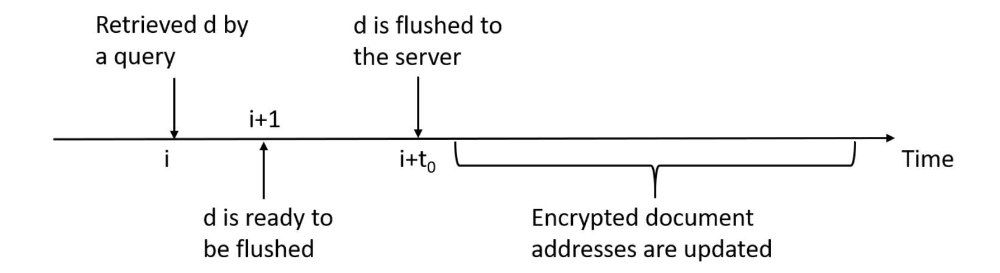

Figure 5: An illustration of the operations related to a document d in our construction. At time i, the document d is retrieved by a query. The document is in the stash and ready to be written back at time i + 1. The document itself is written back at time  $i + t_0$ , where  $t_0$  is a random delay due to randomised write-backs. The encrypted document addresses associated to d will be updated randomly in time later than  $i + t_0$ .

computationally bounded adversary to trace each encrypted document it accesses during a search query at timestamp t back to the timestamp t' < t when the document was originally inserted.

In the discussion below, we expand some more on delayed write-backs and their impact on the leakage of our dynamic scheme using an example.

File-Injection Attacks. Recall that file-injection attacks [110] are an extremely powerful class of query-recovery attacks where the adversary has the ability to additionally inject maliciously crafted files into the database. The adversary uses the occurrences of these files in query outputs to identify the keyword(s) underlying a given query. Once again, query recovery via file-injection relies crucially on the document access pattern leakage. In particular, it requires the adversary to identify which of the maliciously crafted files appear in the outcome of a given query (either from accesses to the search index or to the document array).

As was the case for static SWiSSSE, this leakage is also not available during search or update queries in dynamic SWiSSSE as the document identifiers matching a given query are never revealed in the clear, and the locations of documents in the encrypted document array change with every write-back operation (making it hard for the adversary to trace the occurrence of malicious documents across queries). Below, we explain in greater detail why the strong notion of backward privacy achieved by our scheme makes it more resilient to file-injection attacks than existing backward private SSE schemes. We illustrate this via a simple example.

Consider the following query-recovery attack strategy on a dynamic scheme: the adversary injects n maliciously created documents  $\widehat{d}_1, \widehat{d}_2, \ldots, \widehat{d}_n$  at timestamps  $t_1 < t_2 < \ldots < t_n$ , and at a later point in time  $t^* > t_n$  passively observes the outcome of a search operation involving an unknown keyword w. Also assume that it can identify (from some leakage source) which of the documents it injected earlier appeared in the search outcome. It can then exploit its knowledge of the keyword distributions across these documents to try to recover w.

{60}------------------------------------------------

To our knowledge, all existing dynamic SSE schemes are vulnerable to this attack despite their forward and backward security guarantees. In particular, a scheme that only satisfies Type-1 backward privacy is vulnerable to this attack, since the result pattern leakage trivially allows the server to learn which of the maliciously injected files appear in the search outcome. Perhaps surprisingly, dynamic SWiSSSE is able to thwart an attack as strong as this. In particular, by the arguments given above, our scheme makes it difficult for the adversary to map the outcome of the search operation on w at time  $t^*$  to any of the malicious document injections at the prior timestamps  $t_1, t_2, \ldots, t_n$ .

Remark 10.5 (Implications for Backward Privacy). We do not claim that the above file-injection attack compromises existing notions/definitions of backward privacy. The above example simply illustrates that standard notions of backward privacy are not sufficient to rule out some very strong instances of file-injection attacks. This motivates considering even stronger notions of backward privacy that would also rule out such powerful attacks. Such a stronger notion of backward privacy (implied by obliviousness of operations) is achieved by dynamic SWiSSSE.

Encrypted document write-back. Without loss of generality, let DB be the database and  $(q_1, \ldots, q_k)$  be the sequence of queries on the database. Let d be one of the documents retrieved in query  $q_i$  where  $1 \leq i < k$ . We are interested in the distribution of  $t_0$  for which query  $q_{i+t_0}$  triggers the write-back of document d. As half of the documents are written back from the stash after each query,  $t_0$  clearly follows a shifted geometric distribution with parameter  $\frac{1}{2}$ , unless that there is a query  $q_{i+j}$  that retrieves d. In the latter case, the write-back of document d will happen at query  $q_{i+j+t_0}$  with  $t_0$  following a shifted geometric distribution with parameter  $\frac{1}{2}$ .

Encrypted document address write-back. Under the same setting as above, let d be one of the documents retrieved in query  $q_i$  where  $1 \le i < k$  and w be one of the keywords of d. We are interested in the distribution of  $t_1$  for which query  $q_{i+t_1}$  triggers the write-back of the encrypted document address associated to keyword w. Recall that the write-backs for the encrypted document addresses are scheduled after the respective documents are written back to the server, and half of the encrypted document addresses are written back to the server in each query, this means that  $t_1$  follows the sum of a shifted geometric distribution and a geometric distribution both parameterized by  $\frac{1}{2}$ , or equivalently, one plus a negative binomial distribution with parameter  $(2, \frac{1}{2})$ . As before, if the document d is retrieved by another query  $q_{i+j}$  before it is written back, then we will write the encrypted document address in query  $q_{i+j+t_1}$ .

Resistance to Cryptanalysis. Finally, for appropriate parameter choices (e.g., bucket sizes and bucketization strategies), dynamic SWiSSSE achieves strong enough backward privacy guarantees in practice to resist a wide range of cryptanalytic attacks based on system-wide leakage, such as access pattern and query equality pattern based attacks [21,59], file injection attacks [110], and attacks based on highly refined leakage (such as the correlation-leakage based attack described in Section 7). Also noteworthy is the fact that SWiSSSE achieves such strong guarantees without compromising significantly on query performance and communication overheads. This makes it an attractive candidate for deployment in typical applications involving outsourced databases.

{61}------------------------------------------------

# <span id="page-61-0"></span>10.4 Dynamic SWiSSSE: Asymptotic Performance Evaluation

In this section, we revisit the asymptotic performance analysis of SWiSSSE from Section [8,](#page-37-0) with focus on the dynamic version.

Size of the Stash. Since search queries are processed exactly as in static SWiSSSE, the corresponding stash size required remains unchanged, i.e. the space complexity is O(max<sup>w</sup> G(w)). For document insertion queries, the documents to be inserted are processed with the responses, so the same analysis on the space complexity applies. Similarly, the size of the local lookup index also remains unchanged, and the client still needs to store O(max<sup>w</sup> |W{DB(w)}|) lookup index locations.

The main change from the static version is that, in dynamic SWiSSSE, the client needs to store three arrays of integers, namely an array for the groupings of the keywords, an array for the number of insertions of the keywords, and an array for the counters used to generate the document array addresses. However, these arrays are all small and of constant size, so they do not contribute to the asymptotic size of the stash. Combining everything together, we get that the size of the stash is O(max<sup>w</sup> G(w) + max<sup>w</sup> |W{DB(w)}|), which is the same as static SWiSSSE.

Size of the Encrypted Database. As in static SWiSSSE, the server stores an encrypted lookup index and an encrypted document array, with combined size O( P w G(w)+|DB|). Note that this order-of-magnitude calculation ignores the overhead from padding all documents to a constant size.

Time Complexity and Communication Volume of a Query. Asymptotically, the time complexity and communication volume of search and insertion/deletion queries in dynamic SWiSSSE are the same as that of a search query in static SWiSSSE. However, certain concrete constants differ due to the additional write-back addresses involved for handling updates, and we detail this for the sake of completeness. Suppose that the leading keyword for the query is w. In our construction, a query consists of three rounds of interaction. In the first round, the client computes the encrypted lookup index addresses for the query. This involves O(G(w)) computation and communication, as there are at most 3 · G(w) addresses involved. The server then takes O(G(w)) time to retrieve the encrypted document array addresses and send them to the client. This means that the overall communication volume is O(G(w)) for the first round.

Upon receiving the O(G(w)) encrypted document array addresses, the client processes them and retrieves 2 · G(w) encrypted documents from the server. The client decrypts the documents and filters the results locally to obtain the query response. The time complexity for the overall process is O(G(w)). It is also straightforward to see that the communication volume and the time complexity for the server are both O(G(w)).

Finally, after receiving the encrypted documents from the previous step, the client decrypts them in O(G(w)) time. If the query is a document insertion query, the client has to do at most O(G(w)) amount of work to turn one of the fake documents into the document intended for insertion. After that, the client randomly picks at most 2·max<sup>w</sup> G(w) documents from the stash, encrypts them and uploads them to the server. He also randomly picks

{62}------------------------------------------------

<span id="page-62-0"></span>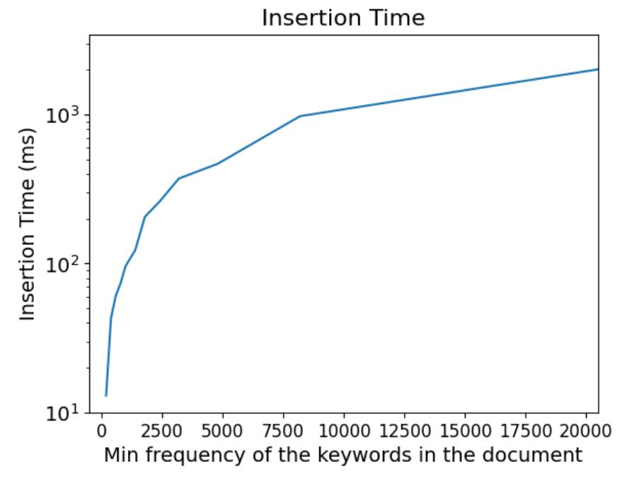

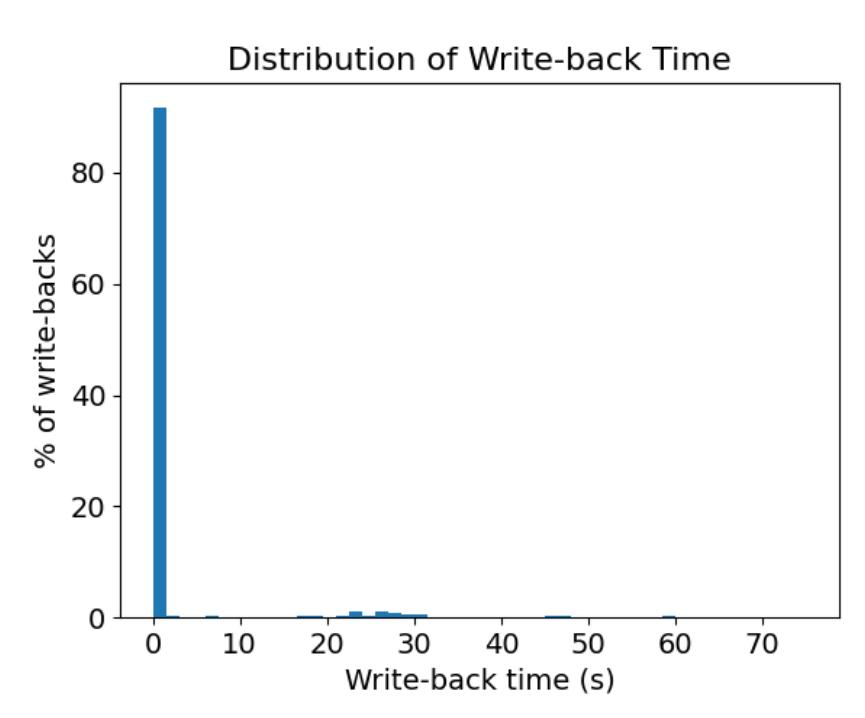

- (a) Insertion of dynamic SWiSSSE on 400K documents (log scale).
- (b) Distribution of write-back time of dynamic SWiSSSE on 400K documents.

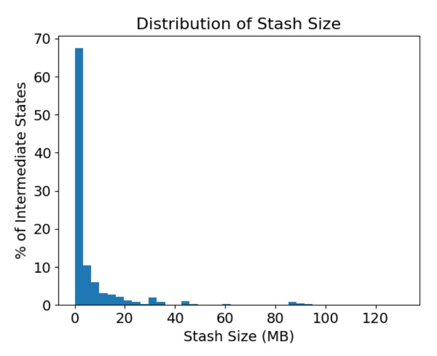

(c) Stash size of dynamic SWiSSSE on 400K documents.

Figure 6: Performance comparison between the plaintext database and dynamic SWiSSSE.

half of the lookup indices stored in the stash, encrypts them, and uploads them to the server. Using the analysis of the stash size above, we conclude that the time complexity and communication volume for this step is O(max<sup>w</sup> G(w) + max<sup>w</sup> |W{DB(w)}|). This means the overall time complexity of this step for the client and the communication volume is O(max<sup>w</sup> G(w) + max<sup>w</sup> |W{DB(w)}|). Similarly, we conclude that the time complexity of this step for the server is O(max<sup>w</sup> G(w) + max<sup>w</sup> |W{DB(w)}|).

Combining the analyses above together, we conclude that the time complexity of a query for both the client and the server is O(max<sup>w</sup> G(w) + max<sup>w</sup> |W{DB(w)}|), while the communication volume of a query is O(max<sup>w</sup> G(w) + max<sup>w</sup> |W{DB(w)}|). We note that stash handling is not relevant to the retrieval of documents and it can be performed whenever the client is free. With regards to document retrieval only, the time complexity for the client and the 

{63}------------------------------------------------

server is O(G(w)) and the communication volume is O(G(w)).

## <span id="page-63-0"></span>10.5 Dynamic SWiSSSE: Experimental Evaluation

In this section, we provide experimental results on dynamic SWiSSSE. We use the same experimental setup as we used for static SWiSSSE in Section [9.](#page-39-0) The only difference between the two set of experiments is that we create as many placeholder documents (and keywords) as the real ones for insertions. This doubles the setup time and storage cost of dynamic SWiSSSE as compared to the static version.

Insertion and Query Response Time. Figure [6a](#page-62-0) shows the insertion time for dynamic SWiSSSE. As expected, the insertion time grows linearly with respect to the minimum frequency of the keywords in the document to be inserted. The time for an insertion query and the time for a search query are the same by design for dynamic SWiSSSE.

Write-back Efficiency. We report write-back efficiency for the experiment with 400K documents in Figure [6b.](#page-62-0) As before, the majority of the write-back queries are completed in under one second.

The Client Stash. The distribution of the stash size is shown in Figure [6c.](#page-62-0) The stash size is under 10 MB for over 90% of the time. It gets large occasionally due to consecutive queries on high frequency keywords, but we believe that this will rarely happen in real deployments; it is also possible for the client to issue dummy queries to reduce the stash size rapidly.

# <span id="page-63-1"></span>11 Discussion

We conclude with some discussion on the salient features of SWiSSSE and how it compares with existing constructions/techniques in the SSE literature.

Comparison with ORAM-style Solutions. The key difference between SWiSSSE and existing SSE schemes based on ORAM-style techniques is that although SWiSSSE additionally uses delayed pseudorandom write-backs to hide access pattern leakage, these write-backs do not happen during online query processing. This contrasts with previous SSE schemes using traditional ORAM-style techniques [\[19,](#page-67-1) [26\]](#page-67-2) that perform a combination of read and write operations entirely during online query processing. Unlike these existing schemes, which typically incur polylogarithmically many rounds of communication for query processing, each query (either search or update) in SWiSSSE is processed online using exactly two rounds of communication between the client and the server. This makes SWiSSSE significantly more efficient from a practical query-processing point of view. In particular, SWiSSSE is designed such that the latency of online operations (searches and updates) is not affected by the latency of write-back operations, which occur independently and periodically at pseudorandom time-stamps.

We note here that some of our techniques such as the usage of a stash at the client-end, as

{64}------------------------------------------------

well as the usage of delayed pseudorandom write-backs for leakage-suppression have been used in other cryptographic contexts such as anonymous communication and anonymous blockchain transactions. But, to our knowledge, these ideas have not been used before to design SSE schemes that simultaneously achieve both high online query performance and strong security guarantees.

Stateful Leakage Profiles. We used stateful leakage profiles to formally describe the security guarantees achieved by static and dynamic SWiSSSE. This is in contrast to existing SSE schemes that are typically associated with stateless leakage profile descriptions. Stateless leakage profiles certainly allow for easier comparison of security guarantees across different SSE schemes, as exemplified by the simple and elegant gradation of backward privacy guarantees due Bost et al. [\[19\]](#page-67-1). While such comparisons are still possible in the case of stateful leakage profiles (by defining additional game-based security definitions for specific components of the leakage profile), it is likely to be more cumbersome.

However, stateful leakage profiles are naturally more expressive and allow analyzing a larger class of SSE schemes as compared to stateless leakage profiles. For example, in the case of static/dynamic SWiSSSE, we crucially rely on delayed pseudorandom write-backs; the leakage due to such write-backs is distributed across multiple points in time, is not part of the leakage from the online query execution transcript, and is not captured by traditional stateless leakage profiles. Indeed, the only way to achieve comparable security guarantees under a stateless leakage profile would be to use ORAM-style techniques, leading to higher latencies and/or greater communication bandwidth requirements during online query processing. In this regard, stateful leakage profiles are useful because they enable analyzing alternative design techniques that optimize query latencies and communication overheads in practice by offloading additional communication (such as due to write-backs) to subsequent query-independent timestamps, thereby improving online query efficiency.

To summarize, we believe that, while stateful leakage profiles appear harder to analyze and compare as compared to their traditional stateless counterparts, they allow for more efficient leakage-suppression techniques that achieve strong security guarantees in practice without incurring the high online computational/communication overheads inherent to traditional techniques such as ORAM. It is an interesting open problem to develop frameworks allowing easier analysis and comparison of stateful leakage profiles for SSE schemes.

Stronger Forward and Backward Privacy. Dynamic SWiSSSE actually achieves stronger forward and backward privacy guarantees than state-of-the-art SSE constructions in the literature, including those based on ORAM [\[16,](#page-66-0) [19,](#page-67-1) [26\]](#page-67-2). Existing dynamic SSE schemes do not hide the number of keywords an inserted/deleted document contains, which is potentially sensitive information. These schemes also incur system-wide leakage that allows the adversary to learn, for every keyword search query, the documents containing the queried keyword as well as the time-stamps when these documents were inserted into the database. By contrast, dynamic SWiSSSE hides all such system-wide leakage from the adversarial server without resorting to full-fledged ORAM-style techniques (this was formalized in Section [10.3\)](#page-53-0). This means that dynamic SWiSSSE achieves stronger forward and backward privacy guarantees as compared to existing dynamic SSE schemes.

From a technical standpoint, we achieve these stronger security guarantees by carefully ac-

{65}------------------------------------------------

counting for system-wide leakage in our construction, which is otherwise ignored by existing dynamic SSE schemes. In particular, we suppress this additional leakage via a combination of two main techniques: (a) delayed pseudorandom write-backs corresponding to updates and searches (which makes it difficult to trace each encrypted document it accesses during a search query back to the timestamp when the document was originally inserted), and (b) writing back (freshly encrypted) documents and document-pointers to a combination of real and dummy addresses (which computationally hides the result-pattern leakage from the overall SSE system, including document retrieval). The details of these techniques were presented in Section [10.2.](#page-49-0)

Extension to Multi-Client Setting. In the multi-client setting, a data owner outsources its encrypted data to an external server and enables other parties to perform queries on the encrypted data by providing them with search tokens for specific queries. The key requirement is that external parties should learn no information beyond what is revealed by the search tokens authorized to them. We leave it as an open question to extend SWiSSSE to the multi-client setting.

# References

- <span id="page-65-5"></span>[1] Rakesh Agrawal, Jerry Kiernan, Ramakrishnan Srikant, and Yirong Xu. Orderpreserving encryption for numeric data. In ACM SIGMOD 2004, pages 563–574. ACM, 2004.
- <span id="page-65-6"></span>[2] Hime Aguiar e Oliveira Junior, Lester Ingber, Antonio Petraglia, Mariane Rembold Petraglia, and Maria Augusta Soares Machado. Adaptive Simulated Annealing. Springer Berlin Heidelberg, Berlin, Heidelberg, 2012.
- <span id="page-65-0"></span>[3] Carlos Aguilar Melchor, Joris Barrier, Laurent Fousse, and Marc-Olivier Killijian. XPIR: Private information retrieval for everyone. Proceedings on Privacy Enhancing Technologies, 2016(2):155–174, April 2016.
- <span id="page-65-2"></span>[4] Ghous Amjad, Sarvar Patel, Giuseppe Persiano, Kevin Yeo, and Moti Yung. Dynamic volume-hiding encrypted multi-maps with applications to searchable encryption. Proc. Priv. Enhancing Technol., 2023.
- <span id="page-65-1"></span>[5] Sebastian Angel, Hao Chen, Kim Laine, and Srinath T. V. Setty. PIR with compressed queries and amortized query processing. In 2018 IEEE Symposium on Security and Privacy, pages 962–979, San Francisco, CA, USA, May 21–23, 2018. IEEE Computer Society Press.
- <span id="page-65-3"></span>[6] Panagiotis Antonopoulos, Arvind Arasu, Kunal D. Singh, Ken Eguro, Nitish Gupta, Rajat Jain, Raghav Kaushik, Hanuma Kodavalla, Donald Kossmann, Nikolas Ogg, Ravi Ramamurthy, Jakub Szymaszek, Jeffrey Trimmer, Kapil Vaswani, Ramarathnam Venkatesan, and Mike Zwilling. Azure SQL database always encrypted. In ACM SIGMOD 2020, pages 1511–1525, 2020.
- <span id="page-65-4"></span>[7] Arvind Arasu, Spyros Blanas, Ken Eguro, Raghav Kaushik, Donald Kossmann, Ravishankar Ramamurthy, and Ramarathnam Venkatesan. Orthogonal security with cipherbase. In CIDR 2013, 2013.

{66}------------------------------------------------

- <span id="page-66-3"></span>[8] Gilad Asharov, Ilan Komargodski, Wei-Kai Lin, Kartik Nayak, Enoch Peserico, and Elaine Shi. OptORAMa: Optimal oblivious RAM. In Anne Canteaut and Yuval Ishai, editors, Advances in Cryptology – EUROCRYPT 2020, Part II, volume 12106 of Lecture Notes in Computer Science, pages 403–432, Zagreb, Croatia, May 10–14, 2020. Springer, Heidelberg, Germany.
- <span id="page-66-4"></span>[9] Gilad Asharov, Ilan Komargodski, Wei-Kai Lin, and Elaine Shi. Oblivious RAM with worst-case logarithmic overhead. Journal of Cryptology, 36(2):7, April 2023.
- <span id="page-66-5"></span>[10] L´eonard Assouline and Brice Minaud. Weighted oblivious RAM, with applications to searchable symmetric encryption. In Carmit Hazay and Martijn Stam, editors, Advances in Cryptology – EUROCRYPT 2023, Part I, volume 14004 of Lecture Notes in Computer Science, pages 426–455, Lyon, France, April 23–27, 2023. Springer, Heidelberg, Germany.
- <span id="page-66-9"></span>[11] Jean-Philippe Aumasson and Daniel J. Bernstein. SipHash: A fast short-input PRF. In Steven D. Galbraith and Mridul Nandi, editors, Progress in Cryptology - IN-DOCRYPT 2012: 13th International Conference in Cryptology in India, volume 7668 of Lecture Notes in Computer Science, pages 489–508, Kolkata, India, December 9–12, 2012. Springer, Heidelberg, Germany.
- <span id="page-66-6"></span>[12] Sumeet Bajaj and Radu Sion. Trusteddb: A trusted hardware-based database with privacy and data confidentiality. IEEE Trans. Knowl. Data Eng., 26(3):752–765, 2014.
- <span id="page-66-1"></span>[13] Laura Blackstone, Seny Kamara, and Tarik Moataz. Revisiting leakage abuse attacks. In ISOC Network and Distributed System Security Symposium – NDSS 2020, San Diego, CA, USA, February 23–26, 2020. The Internet Society.
- <span id="page-66-8"></span>[14] Alexandra Boldyreva, Nathan Chenette, and Adam O'Neill. Order-preserving encryption revisited: Improved security analysis and alternative solutions. In Phillip Rogaway, editor, Advances in Cryptology – CRYPTO 2011, volume 6841 of Lecture Notes in Computer Science, pages 578–595, Santa Barbara, CA, USA, August 14–18, 2011. Springer, Heidelberg, Germany.
- <span id="page-66-7"></span>[15] Pietro Borrello, Andreas Kogler, Martin Schwarzl, Moritz Lipp, Daniel Gruss, and Michael Schwarz. ÆPIC leak: Architecturally leaking uninitialized data from the microarchitecture. In Kevin R. B. Butler and Kurt Thomas, editors, USENIX Security 2022: 31st USENIX Security Symposium, pages 3917–3934, Boston, MA, USA, August 10–12, 2022. USENIX Association.
- <span id="page-66-0"></span>[16] Raphael Bost. Σoϕoς: Forward secure searchable encryption. In Edgar R. Weippl, Stefan Katzenbeisser, Christopher Kruegel, Andrew C. Myers, and Shai Halevi, editors, ACM CCS 2016: 23rd Conference on Computer and Communications Security, pages 1143–1154, Vienna, Austria, October 24–28, 2016. ACM Press.
- <span id="page-66-2"></span>[17] Raphael Bost and Pierre-Alain Fouque. Thwarting leakage abuse attacks against searchable encryption – A formal approach and applications to database padding. Cryptology ePrint Archive, Report 2017/1060, 2017. [https://eprint.iacr.org/](https://eprint.iacr.org/2017/1060) [2017/1060](https://eprint.iacr.org/2017/1060).

{67}------------------------------------------------

- <span id="page-67-9"></span>[18] Raphael Bost, Pierre-Alain Fouque, and David Pointcheval. Verifiable dynamic symmetric searchable encryption: Optimality and forward security. Cryptology ePrint Archive, Report 2016/062, 2016. <https://eprint.iacr.org/2016/062>.
- <span id="page-67-1"></span>[19] Rapha¨el Bost, Brice Minaud, and Olga Ohrimenko. Forward and backward private searchable encryption from constrained cryptographic primitives. In Bhavani M. Thuraisingham, David Evans, Tal Malkin, and Dongyan Xu, editors, ACM CCS 2017: 24th Conference on Computer and Communications Security, pages 1465–1482, Dallas, TX, USA, October 31 – November 2, 2017. ACM Press.
- <span id="page-67-8"></span>[20] Jake Brutlag. Speed matters for google web search, 2009.
- <span id="page-67-3"></span>[21] David Cash, Paul Grubbs, Jason Perry, and Thomas Ristenpart. Leakage-abuse attacks against searchable encryption. In Indrajit Ray, Ninghui Li, and Christopher Kruegel, editors, ACM CCS 2015: 22nd Conference on Computer and Communications Security, pages 668–679, Denver, CO, USA, October 12–16, 2015. ACM Press.
- <span id="page-67-4"></span>[22] David Cash, Paul Grubbs, Jason Perry, and Thomas Ristenpart. Leakage-abuse attacks against searchable encryption. Cryptology ePrint Archive, Report 2016/718, 2016. <https://eprint.iacr.org/2016/718>.
- <span id="page-67-5"></span>[23] David Cash, Joseph Jaeger, Stanislaw Jarecki, Charanjit S. Jutla, Hugo Krawczyk, Marcel-Catalin Rosu, and Michael Steiner. Dynamic searchable encryption in verylarge databases: Data structures and implementation. In ISOC Network and Distributed System Security Symposium – NDSS 2014, San Diego, CA, USA, February 23–26, 2014. The Internet Society.
- <span id="page-67-0"></span>[24] David Cash, Stanislaw Jarecki, Charanjit S. Jutla, Hugo Krawczyk, Marcel-Catalin Rosu, and Michael Steiner. Highly-scalable searchable symmetric encryption with support for Boolean queries. In Ran Canetti and Juan A. Garay, editors, Advances in Cryptology – CRYPTO 2013, Part I, volume 8042 of Lecture Notes in Computer Science, pages 353–373, Santa Barbara, CA, USA, August 18–22, 2013. Springer, Heidelberg, Germany.
- <span id="page-67-7"></span>[25] Javad Ghareh Chamani, Dimitrios Papadopoulos, Mohammadamin Karbasforushan, and Ioannis Demertzis. Dynamic searchable encryption with optimal search in the presence of deletions. In USENIX Security 2022, pages 2425–2442, 2022.
- <span id="page-67-2"></span>[26] Javad Ghareh Chamani, Dimitrios Papadopoulos, Charalampos Papamanthou, and Rasool Jalili. New constructions for forward and backward private symmetric searchable encryption. In David Lie, Mohammad Mannan, Michael Backes, and XiaoFeng Wang, editors, ACM CCS 2018: 25th Conference on Computer and Communications Security, pages 1038–1055, Toronto, ON, Canada, October 15–19, 2018. ACM Press.
- <span id="page-67-6"></span>[27] T.-H. Hubert Chan, Kartik Nayak, and Elaine Shi. Perfectly secure oblivious parallel RAM. In Amos Beimel and Stefan Dziembowski, editors, TCC 2018: 16th Theory of Cryptography Conference, Part II, volume 11240 of Lecture Notes in Computer Science, pages 636–668, Panaji, India, November 11–14, 2018. Springer, Heidelberg, Germany.

{68}------------------------------------------------

- <span id="page-68-2"></span>[28] Yan-Cheng Chang and Michael Mitzenmacher. Privacy preserving keyword searches on remote encrypted data. In John Ioannidis, Angelos Keromytis, and Moti Yung, editors, ACNS 05: 3rd International Conference on Applied Cryptography and Network Security, volume 3531 of Lecture Notes in Computer Science, pages 442–455, New York, NY, USA, June 7–10, 2005. Springer, Heidelberg, Germany.
- <span id="page-68-0"></span>[29] Melissa Chase and Seny Kamara. Structured encryption and controlled disclosure. In Masayuki Abe, editor, Advances in Cryptology – ASIACRYPT 2010, volume 6477 of Lecture Notes in Computer Science, pages 577–594, Singapore, December 5–9, 2010. Springer, Heidelberg, Germany.
- <span id="page-68-7"></span>[30] Benny Chor, Oded Goldreich, Eyal Kushilevitz, and Madhu Sudan. Private information retrieval. In 36th Annual Symposium on Foundations of Computer Science, pages 41–50, Milwaukee, Wisconsin, October 23–25, 1995. IEEE Computer Society Press.
- <span id="page-68-1"></span>[31] Reza Curtmola, Juan A. Garay, Seny Kamara, and Rafail Ostrovsky. Searchable symmetric encryption: improved definitions and efficient constructions. In Ari Juels, Rebecca N. Wright, and Sabrina De Capitani di Vimercati, editors, ACM CCS 2006: 13th Conference on Computer and Communications Security, pages 79–88, Alexandria, Virginia, USA, October 30 – November 3, 2006. ACM Press.
- <span id="page-68-3"></span>[32] Marc Damie, Florian Hahn, and Andreas Peter. A highly accurate query-recovery attack against searchable encryption using non-indexed documents. In Michael Bailey and Rachel Greenstadt, editors, USENIX Security 2021: 30th USENIX Security Symposium, pages 143–160. USENIX Association, August 11–13, 2021.
- <span id="page-68-5"></span>[33] Emma Dauterman, Eric Feng, Ellen Luo, Raluca Ada Popa, and Ion Stoica. DORY: an encrypted search system with distributed trust. In OSDI 2020, pages 1101–1119, 2020.
- <span id="page-68-4"></span>[34] Ioannis Demertzis, Dimitrios Papadopoulos, Charalampos Papamanthou, and Saurabh Shintre. SEAL: Attack mitigation for encrypted databases via adjustable leakage. In Srdjan Capkun and Franziska Roesner, editors, USENIX Security 2020: 29th USENIX Security Symposium, pages 2433–2450. USENIX Association, August 12–14, 2020.
- [35] Ioannis Demertzis, Stavros Papadopoulos, Odysseas Papapetrou, Antonios Deligiannakis, and Minos N. Garofalakis. Practical private range search revisited. In ACM SIGMOD 2016, pages 185–198, 2016.
- <span id="page-68-9"></span>[36] Ioannis Demertzis, Stavros Papadopoulos, Odysseas Papapetrou, Antonios Deligiannakis, Minos N. Garofalakis, and Charalampos Papamanthou. Practical private range search in depth. ACM Trans. Database Syst., 43(1):2:1–2:52, 2018.
- <span id="page-68-6"></span>[37] Ioannis Demertzis, Charalampos Papamanthou, and Rajdeep Talapatra. Efficient searchable encryption through compression. Proc. VLDB Endow., 11(11):1729–1741, 2018.
- <span id="page-68-8"></span>[38] Casey Devet, Ian Goldberg, and Nadia Heninger. Optimally robust private information retrieval. In Tadayoshi Kohno, editor, USENIX Security 2012: 21st USENIX Security Symposium, pages 269–283, Bellevue, WA, USA, August 8–10, 2012. USENIX Association.

{69}------------------------------------------------

- <span id="page-69-9"></span>[39] Saba Eskandarian and Matei Zaharia. An oblivious general-purpose SQL database for the cloud. CoRR, abs/1710.00458, 2017.
- <span id="page-69-10"></span>[40] Mohammad Etemad, Alptekin K¨up¸c¨u, Charalampos Papamanthou, and David Evans. Efficient dynamic searchable encryption with forward privacy. PoPETs, 2018(1):5–20, 2018.
- <span id="page-69-4"></span>[41] Sky Faber, Stanislaw Jarecki, Hugo Krawczyk, Quan Nguyen, Marcel-Catalin Rosu, and Michael Steiner. Rich queries on encrypted data: Beyond exact matches. In G¨unther Pernul, Peter Y. A. Ryan, and Edgar R. Weippl, editors, ESORICS 2015: 20th European Symposium on Research in Computer Security, Part II, volume 9327 of Lecture Notes in Computer Science, pages 123–145, Vienna, Austria, September 21– 25, 2015. Springer, Heidelberg, Germany.
- <span id="page-69-5"></span>[42] Sanjam Garg, Payman Mohassel, and Charalampos Papamanthou. TWORAM: Efficient oblivious RAM in two rounds with applications to searchable encryption. In Matthew Robshaw and Jonathan Katz, editors, Advances in Cryptology – CRYPTO 2016, Part III, volume 9816 of Lecture Notes in Computer Science, pages 563–592, Santa Barbara, CA, USA, August 14–18, 2016. Springer, Heidelberg, Germany.
- <span id="page-69-1"></span>[43] C. Gentry. Fully homomorphic encryption using ideal lattices. In ACM STOC'09, pages 169–178, 2009.
- <span id="page-69-6"></span>[44] Craig Gentry and Zulfikar Ramzan. Single-database private information retrieval with constant communication rate. In Lu´ıs Caires, Giuseppe F. Italiano, Lu´ıs Monteiro, Catuscia Palamidessi, and Moti Yung, editors, Automata, Languages and Programming, pages 803–815, Berlin, Heidelberg, 2005. Springer Berlin Heidelberg.
- <span id="page-69-3"></span>[45] Marilyn George, Seny Kamara, and Tarik Moataz. Structured encryption and dynamic leakage suppression. In Anne Canteaut and Fran¸cois-Xavier Standaert, editors, Advances in Cryptology – EUROCRYPT 2021, Part III, volume 12698 of Lecture Notes in Computer Science, pages 370–396, Zagreb, Croatia, October 17–21, 2021. Springer, Heidelberg, Germany.
- <span id="page-69-7"></span>[46] Niv Gilboa and Yuval Ishai. Distributed point functions and their applications. In Phong Q. Nguyen and Elisabeth Oswald, editors, Advances in Cryptology – EURO-CRYPT 2014, volume 8441 of Lecture Notes in Computer Science, pages 640–658, Copenhagen, Denmark, May 11–15, 2014. Springer, Heidelberg, Germany.
- <span id="page-69-0"></span>[47] Eu-Jin Goh. Secure indexes. Cryptology ePrint Archive, Report 2003/216, 2003. <https://eprint.iacr.org/2003/216>.
- <span id="page-69-8"></span>[48] Ian Goldberg. Improving the robustness of private information retrieval. In 2007 IEEE Symposium on Security and Privacy, pages 131–148, Oakland, CA, USA, May 20–23, 2007. IEEE Computer Society Press.
- <span id="page-69-2"></span>[49] Oded Goldreich and Rafail Ostrovsky. Software protection and simulation on oblivious rams. J. ACM, 43(3):431–473, 1996.

{70}------------------------------------------------

- <span id="page-70-5"></span>[50] Paul Grubbs, Anurag Khandelwal, Marie-Sarah Lacharit´e, Lloyd Brown, Lucy Li, Rachit Agarwal, and Thomas Ristenpart. Pancake: Frequency smoothing for encrypted data stores. In Srdjan Capkun and Franziska Roesner, editors, USENIX Security 2020: 29th USENIX Security Symposium, pages 2451–2468. USENIX Association, August 12–14, 2020.
- <span id="page-70-7"></span>[51] Paul Grubbs, Marie-Sarah Lacharit´e, Brice Minaud, and Kenneth G. Paterson. Pump up the volume: Practical database reconstruction from volume leakage on range queries. In David Lie, Mohammad Mannan, Michael Backes, and XiaoFeng Wang, editors, ACM CCS 2018: 25th Conference on Computer and Communications Security, pages 315–331, Toronto, ON, Canada, October 15–19, 2018. ACM Press.
- [52] Paul Grubbs, Marie-Sarah Lacharit´e, Brice Minaud, and Kenneth G. Paterson. Learning to reconstruct: Statistical learning theory and encrypted database attacks. In 2019 IEEE Symposium on Security and Privacy, pages 1067–1083, San Francisco, CA, USA, May 19–23, 2019. IEEE Computer Society Press.
- <span id="page-70-8"></span>[53] Zichen Gui, Oliver Johnson, and Bogdan Warinschi. Encrypted databases: New volume attacks against range queries. In Lorenzo Cavallaro, Johannes Kinder, XiaoFeng Wang, and Jonathan Katz, editors, ACM CCS 2019: 26th Conference on Computer and Communications Security, pages 361–378, London, UK, November 11–15, 2019. ACM Press.
- <span id="page-70-1"></span>[54] Zichen Gui, Kenneth G. Paterson, and Sikhar Patranabis. Rethinking searchable symmetric encryption. In IEEE Symposium on Security and Privacy, SP 2023 (to appear), 2023. Available from <https://eprint.iacr.org/2021/879>.
- <span id="page-70-9"></span>[55] Zichen Gui, Kenneth G. Paterson, Sikhar Patranabis, and Bogdan Warinschi. SWiSSSE: System-wide security for searchable symmetric encryption. Cryptology ePrint Archive, Report 2020/1328, 2020. <https://eprint.iacr.org/2020/1328>.
- <span id="page-70-2"></span>[56] Thang Hoang, Muslum Ozgur Ozmen, Yeongjin Jang, and Attila A. Yavuz. Hardwaresupported ORAM in effect: Practical oblivious search and update on very large dataset. Proc. Priv. Enhancing Technol., 2019(1):172–191, 2019.
- <span id="page-70-3"></span>[57] Thang Hoang, Attila A. Yavuz, F. Bet¨ul Durak, and Jorge Guajardo. A multi-server oblivious dynamic searchable encryption framework. J. Comput. Secur., 27(6):649– 676, 2019.
- <span id="page-70-4"></span>[58] Yuval Ishai, Eyal Kushilevitz, Rafail Ostrovsky, and Amit Sahai. Batch codes and their applications. In L´aszl´o Babai, editor, 36th Annual ACM Symposium on Theory of Computing, pages 262–271, Chicago, IL, USA, June 13–16, 2004. ACM Press.
- <span id="page-70-0"></span>[59] Mohammad Saiful Islam, Mehmet Kuzu, and Murat Kantarcioglu. Access pattern disclosure on searchable encryption: Ramification, attack and mitigation. In ISOC Network and Distributed System Security Symposium – NDSS 2012, San Diego, CA, USA, February 5–8, 2012. The Internet Society.
- <span id="page-70-6"></span>[60] Charanjit S. Jutla and Sikhar Patranabis. Efficient searchable symmetric encryption for join queries. In ASIACRYPT 2022, volume 13793, pages 304–333, 2022.

{71}------------------------------------------------

- <span id="page-71-1"></span>[61] Seny Kamara, Abdelkarim Kati, Tarik Moataz, Thomas Schneider, Amos Treiber, and Michael Yonli. Cryptanalysis of encrypted search with LEAKER - A framework for LEakage AttacK evaluation on real-world data. Cryptology ePrint Archive, Report 2021/1035, 2021. <https://eprint.iacr.org/2021/1035>.
- <span id="page-71-3"></span>[62] Seny Kamara and Tarik Moataz. Boolean searchable symmetric encryption with worstcase sub-linear complexity. In Jean-S´ebastien Coron and Jesper Buus Nielsen, editors, Advances in Cryptology – EUROCRYPT 2017, Part III, volume 10212 of Lecture Notes in Computer Science, pages 94–124, Paris, France, April 30 – May 4, 2017. Springer, Heidelberg, Germany.
- <span id="page-71-5"></span>[63] Seny Kamara and Tarik Moataz. Encrypted multi-maps with computationally-secure leakage. Cryptology ePrint Archive, Report 2018/978, 2018. [https://eprint.iacr.](https://eprint.iacr.org/2018/978) [org/2018/978](https://eprint.iacr.org/2018/978).
- <span id="page-71-4"></span>[64] Seny Kamara and Tarik Moataz. SQL on structurally-encrypted databases. In Thomas Peyrin and Steven Galbraith, editors, Advances in Cryptology – ASIACRYPT 2018, Part I, volume 11272 of Lecture Notes in Computer Science, pages 149–180, Brisbane, Queensland, Australia, December 2–6, 2018. Springer, Heidelberg, Germany.
- <span id="page-71-2"></span>[65] Seny Kamara and Tarik Moataz. Computationally volume-hiding structured encryption. In Yuval Ishai and Vincent Rijmen, editors, Advances in Cryptology – EURO-CRYPT 2019, Part II, volume 11477 of Lecture Notes in Computer Science, pages 183–213, Darmstadt, Germany, May 19–23, 2019. Springer, Heidelberg, Germany.
- <span id="page-71-0"></span>[66] Seny Kamara, Charalampos Papamanthou, and Tom Roeder. Dynamic searchable symmetric encryption. In Ting Yu, George Danezis, and Virgil D. Gligor, editors, ACM CCS 2012: 19th Conference on Computer and Communications Security, pages 965–976, Raleigh, NC, USA, October 16–18, 2012. ACM Press.
- <span id="page-71-7"></span>[67] Georgios Kellaris, George Kollios, Kobbi Nissim, and Adam O'Neill. Generic attacks on secure outsourced databases. In Edgar R. Weippl, Stefan Katzenbeisser, Christopher Kruegel, Andrew C. Myers, and Shai Halevi, editors, ACM CCS 2016: 23rd Conference on Computer and Communications Security, pages 1329–1340, Vienna, Austria, October 24–28, 2016. ACM Press.
- <span id="page-71-8"></span>[68] Florian Kerschbaum. Frequency-hiding order-preserving encryption. In Indrajit Ray, Ninghui Li, and Christopher Kruegel, editors, ACM CCS 2015: 22nd Conference on Computer and Communications Security, pages 656–667, Denver, CO, USA, October 12–16, 2015. ACM Press.
- <span id="page-71-6"></span>[69] Aggelos Kiayias, Nikos Leonardos, Helger Lipmaa, Kateryna Pavlyk, and Qiang Tang. Optimal rate private information retrieval from homomorphic encryption. Proceedings on Privacy Enhancing Technologies, 2015(2):222–243, April 2015.
- <span id="page-71-9"></span>[70] Kee Sung Kim, Minkyu Kim, Dongsoo Lee, Je Hong Park, and Woo-Hwan Kim. Forward secure dynamic searchable symmetric encryption with efficient updates. In Bhavani M. Thuraisingham, David Evans, Tal Malkin, and Dongyan Xu, editors, ACM CCS 2017: 24th Conference on Computer and Communications Security, pages 1449–1463, Dallas, TX, USA, October 31 – November 2, 2017. ACM Press.

{72}------------------------------------------------

- <span id="page-72-8"></span>[71] Evgenios M. Kornaropoulos, Nathaniel Moyer, Charalampos Papamanthou, and Alexandros Psomas. Leakage inversion: Towards quantifying privacy in searchable encryption. In ACM CCS 2022, pages 1829–1842, 2022.
- <span id="page-72-10"></span>[72] H. Krawczyk, M. Bellare, and R. Canetti. HMAC: Keyed-Hashing for Message Authentication. RFC 2104 (Informational), February 1997. Updated by RFC 6151.
- <span id="page-72-1"></span>[73] Eyal Kushilevitz and Rafail Ostrovsky. Replication is NOT needed: SINGLE database, computationally-private information retrieval. In 38th Annual Symposium on Foundations of Computer Science, pages 364–373, Miami Beach, Florida, October 19–22, 1997. IEEE Computer Society Press.
- <span id="page-72-6"></span>[74] Marie-Sarah Lacharit´e, Brice Minaud, and Kenneth G. Paterson. Improved reconstruction attacks on encrypted data using range query leakage. In 2018 IEEE Symposium on Security and Privacy, pages 297–314, San Francisco, CA, USA, May 21–23, 2018. IEEE Computer Society Press.
- <span id="page-72-0"></span>[75] Kasper Green Larsen and Jesper Buus Nielsen. Yes, there is an oblivious RAM lower bound! In Hovav Shacham and Alexandra Boldyreva, editors, Advances in Cryptology – CRYPTO 2018, Part II, volume 10992 of Lecture Notes in Computer Science, pages 523–542, Santa Barbara, CA, USA, August 19–23, 2018. Springer, Heidelberg, Germany.
- <span id="page-72-7"></span>[76] Kevin Lewi and David J. Wu. Order-revealing encryption: New constructions, applications, and lower bounds. In Edgar R. Weippl, Stefan Katzenbeisser, Christopher Kruegel, Andrew C. Myers, and Shai Halevi, editors, ACM CCS 2016: 23rd Conference on Computer and Communications Security, pages 1167–1178, Vienna, Austria, October 24–28, 2016. ACM Press.
- <span id="page-72-9"></span>[77] Christopher D. Manning and Hinrich Sch¨utze. Foundations of statistical natural language processing. MIT Press, 2001.
- <span id="page-72-11"></span>[78] David A. McGrew and John Viega. The security and performance of the galois/counter mode of operation (full version). Cryptology ePrint Archive, Report 2004/193, 2004. <https://eprint.iacr.org/2004/193>.
- <span id="page-72-5"></span>[79] Frank McKeen, Ilya Alexandrovich, Alex Berenzon, Carlos V. Rozas, Hisham Shafi, Vedvyas Shanbhogue, and Uday R. Savagaonkar. Innovative instructions and software model for isolated execution. In HASP 2013, page 10, 2013.
- <span id="page-72-2"></span>[80] Samir Jordan Menon and David J. Wu. SPIRAL: Fast, high-rate single-server PIR via FHE composition. In 2022 IEEE Symposium on Security and Privacy, pages 930–947, San Francisco, CA, USA, May 22–26, 2022. IEEE Computer Society Press.
- <span id="page-72-4"></span>[81] Pratyush Mishra, Rishabh Poddar, Jerry Chen, Alessandro Chiesa, and Raluca Ada Popa. Oblix: An efficient oblivious search index. In 2018 IEEE Symposium on Security and Privacy, pages 279–296, San Francisco, CA, USA, May 21–23, 2018. IEEE Computer Society Press.
- <span id="page-72-3"></span>[82] M. Mughees and L. Ren. Vectorized batch private information retrieval. In IEEE Symposium on Security and Privacy 2023, pages 437–452, 2023.

{73}------------------------------------------------

- <span id="page-73-5"></span>[83] Muhammad Haris Mughees, Hao Chen, and Ling Ren. OnionPIR: Response efficient single-server PIR. In Giovanni Vigna and Elaine Shi, editors, ACM CCS 2021: 28th Conference on Computer and Communications Security, pages 2292–2306, Virtual Event, Republic of Korea, November 15–19, 2021. ACM Press.
- <span id="page-73-6"></span>[84] Kit Murdock, David Oswald, Flavio D. Garcia, Jo Van Bulck, Daniel Gruss, and Frank Piessens. Plundervolt: Software-based fault injection attacks against intel SGX. In 2020 IEEE Symposium on Security and Privacy, pages 1466–1482, San Francisco, CA, USA, May 18–21, 2020. IEEE Computer Society Press.
- <span id="page-73-8"></span>[85] Muhammad Naveed, Seny Kamara, and Charles V. Wright. Inference attacks on property-preserving encrypted databases. In Indrajit Ray, Ninghui Li, and Christopher Kruegel, editors, ACM CCS 2015: 22nd Conference on Computer and Communications Security, pages 644–655, Denver, CO, USA, October 12–16, 2015. ACM Press.
- <span id="page-73-4"></span>[86] Muhammad Naveed, Manoj Prabhakaran, and Carl A. Gunter. Dynamic searchable encryption via blind storage. In 2014 IEEE Symposium on Security and Privacy, pages 639–654, Berkeley, CA, USA, May 18–21, 2014. IEEE Computer Society Press.
- <span id="page-73-11"></span>[87] National Institute of Standards and Technology Gaithersburg MD. Specification for the Advanced Encryption Standard (AES). Federal Information Processing Standards Publication 197, 2001.
- <span id="page-73-0"></span>[88] Simon Oya and Florian Kerschbaum. Hiding the access pattern is not enough: Exploiting search pattern leakage in searchable encryption. In Michael Bailey and Rachel Greenstadt, editors, USENIX Security 2021: 30th USENIX Security Symposium, pages 127–142. USENIX Association, August 11–13, 2021.
- <span id="page-73-10"></span>[89] Simon Oya and Florian Kerschbaum. Hiding the access pattern is not enough: Exploiting search pattern leakage in searchable encryption. In USENIX Security 2021, pages 127–142. USENIX Association, 2021.
- <span id="page-73-1"></span>[90] Simon Oya and Florian Kerschbaum. IHOP: Improved statistical query recovery against searchable symmetric encryption through quadratic optimization, 2021.
- <span id="page-73-9"></span>[91] Simon Oya and Florian Kerschbaum. IHOP: improved statistical query recovery against searchable symmetric encryption through quadratic optimization. In USENIX Security 2022, pages 2407–2424, 2022.
- <span id="page-73-3"></span>[92] Sarvar Patel, Giuseppe Persiano, Kevin Yeo, and Moti Yung. Mitigating leakage in secure cloud-hosted data structures: Volume-hiding for multi-maps via hashing. In Lorenzo Cavallaro, Johannes Kinder, XiaoFeng Wang, and Jonathan Katz, editors, ACM CCS 2019: 26th Conference on Computer and Communications Security, pages 79–93, London, UK, November 11–15, 2019. ACM Press.
- <span id="page-73-7"></span>[93] Raluca A. Popa, Catherine M. S. Redfield, Nickolai Zeldovich, and Hari Balakrishnan. Cryptdb: protecting confidentiality with encrypted query processing. In SOSP 2011, pages 85–100, 2011.
- <span id="page-73-2"></span>[94] David Pouliot and Charles V. Wright. The shadow nemesis: Inference attacks on efficiently deployable, efficiently searchable encryption. In Edgar R. Weippl, Stefan

{74}------------------------------------------------

- Katzenbeisser, Christopher Kruegel, Andrew C. Myers, and Shai Halevi, editors, ACM CCS 2016: 23rd Conference on Computer and Communications Security, pages 1341– 1352, Vienna, Austria, October 24–28, 2016. ACM Press.
- <span id="page-74-4"></span>[95] Christian Priebe, Kapil Vaswani, and Manuel Costa. EnclaveDB: A secure database using SGX. In 2018 IEEE Symposium on Security and Privacy, pages 264–278, San Francisco, CA, USA, May 21–23, 2018. IEEE Computer Society Press.
- <span id="page-74-5"></span>[96] Hany Ragab, Alyssa Milburn, Kaveh Razavi, Herbert Bos, and Cristiano Giuffrida. CrossTalk: Speculative data leaks across cores are real. In 2021 IEEE Symposium on Security and Privacy, pages 1852–1867, San Francisco, CA, USA, May 24–27, 2021. IEEE Computer Society Press.
- <span id="page-74-6"></span>[97] Michael Schwarz, Moritz Lipp, Daniel Moghimi, Jo Van Bulck, Julian Stecklina, Thomas Prescher, and Daniel Gruss. ZombieLoad: Cross-privilege-boundary data sampling. In Lorenzo Cavallaro, Johannes Kinder, XiaoFeng Wang, and Jonathan Katz, editors, ACM CCS 2019: 26th Conference on Computer and Communications Security, pages 753–768, London, UK, November 11–15, 2019. ACM Press.
- <span id="page-74-3"></span>[98] Elaine Shi, T.-H. Hubert Chan, Emil Stefanov, and Mingfei Li. Oblivious RAM with O((log N) 3 ) worst-case cost. In Dong Hoon Lee and Xiaoyun Wang, editors, Advances in Cryptology – ASIACRYPT 2011, volume 7073 of Lecture Notes in Computer Science, pages 197–214, Seoul, South Korea, December 4–8, 2011. Springer, Heidelberg, Germany.
- <span id="page-74-0"></span>[99] Dawn Xiaodong Song, David Wagner, and Adrian Perrig. Practical techniques for searches on encrypted data. In 2000 IEEE Symposium on Security and Privacy, pages 44–55, Oakland, CA, USA, May 2000. IEEE Computer Society Press.
- <span id="page-74-7"></span>[100] Xiangfu Song, Changyu Dong, Dandan Yuan, Qiuliang Xu, and Minghao Zhao. Forward private searchable symmetric encryption with optimized I/O efficiency. Cryptology ePrint Archive, Report 2018/497, 2018. <https://eprint.iacr.org/2018/497>.
- <span id="page-74-1"></span>[101] Emil Stefanov, Charalampos Papamanthou, and Elaine Shi. Practical dynamic searchable encryption with small leakage. In ISOC Network and Distributed System Security Symposium – NDSS 2014, San Diego, CA, USA, February 23–26, 2014. The Internet Society.
- <span id="page-74-2"></span>[102] Emil Stefanov, Marten van Dijk, Elaine Shi, Christopher W. Fletcher, Ling Ren, Xiangyao Yu, and Srinivas Devadas. Path ORAM: an extremely simple oblivious RAM protocol. In Ahmad-Reza Sadeghi, Virgil D. Gligor, and Moti Yung, editors, ACM CCS 2013: 20th Conference on Computer and Communications Security, pages 299–310, Berlin, Germany, November 4–8, 2013. ACM Press.
- <span id="page-74-8"></span>[103] Shifeng Sun, Xingliang Yuan, Joseph K. Liu, Ron Steinfeld, Amin Sakzad, Viet Vo, and Surya Nepal. Practical backward-secure searchable encryption from symmetric puncturable encryption. In David Lie, Mohammad Mannan, Michael Backes, and XiaoFeng Wang, editors, ACM CCS 2018: 25th Conference on Computer and Communications Security, pages 763–780, Toronto, ON, Canada, October 15–19, 2018. ACM Press.

{75}------------------------------------------------

- <span id="page-75-6"></span>[104] SWiSSSE. System-wide Security for Symmetric Searchable Encryption, 2020. [https:](https://github.com/SWiSSSE-crypto/SWiSSSE) [//github.com/SWiSSSE-crypto/SWiSSSE](https://github.com/SWiSSSE-crypto/SWiSSSE).
- <span id="page-75-5"></span>[105] Anselme Tueno and Florian Kerschbaum. Efficient secure computation of orderpreserving encryption. In Hung-Min Sun, Shiuh-Pyng Shieh, Guofei Gu, and Giuseppe Ateniese, editors, ASIACCS 20: 15th ACM Symposium on Information, Computer and Communications Security, pages 193–207, Taipei, Taiwan, October 5–9, 2020. ACM Press.
- <span id="page-75-3"></span>[106] Jo Van Bulck, Marina Minkin, Ofir Weisse, Daniel Genkin, Baris Kasikci, Frank Piessens, Mark Silberstein, Thomas F. Wenisch, Yuval Yarom, and Raoul Strackx. Foreshadow: Extracting the keys to the intel SGX kingdom with transient out-oforder execution. In William Enck and Adrienne Porter Felt, editors, USENIX Security 2018: 27th USENIX Security Symposium, pages 991–1008, Baltimore, MD, USA, August 15–17, 2018. USENIX Association.
- <span id="page-75-4"></span>[107] Stephan van Schaik, Marina Minkin, Andrew Kwong, Daniel Genkin, and Yuval Yarom. CacheOut: Leaking data on intel CPUs via cache evictions. In 2021 IEEE Symposium on Security and Privacy, pages 339–354, San Francisco, CA, USA, May 24– 27, 2021. IEEE Computer Society Press.
- <span id="page-75-2"></span>[108] Dhinakaran Vinayagamurthy, Alexey Gribov, and Sergey Gorbunov. Stealthdb: a scalable encrypted database with full SQL query support. Proc. Priv. Enhancing Technol., 2019(3):370–388, 2019.
- <span id="page-75-1"></span>[109] Xiao Shaun Wang, Yan Huang, T.-H. Hubert Chan, abhi shelat, and Elaine Shi. SCO-RAM: Oblivious RAM for secure computation. In Gail-Joon Ahn, Moti Yung, and Ninghui Li, editors, ACM CCS 2014: 21st Conference on Computer and Communications Security, pages 191–202, Scottsdale, AZ, USA, November 3–7, 2014. ACM Press.
- <span id="page-75-0"></span>[110] Yupeng Zhang, Jonathan Katz, and Charalampos Papamanthou. All your queries are belong to us: The power of file-injection attacks on searchable encryption. In Thorsten Holz and Stefan Savage, editors, USENIX Security 2016: 25th USENIX Security Symposium, pages 707–720, Austin, TX, USA, August 10–12, 2016. USENIX Association.