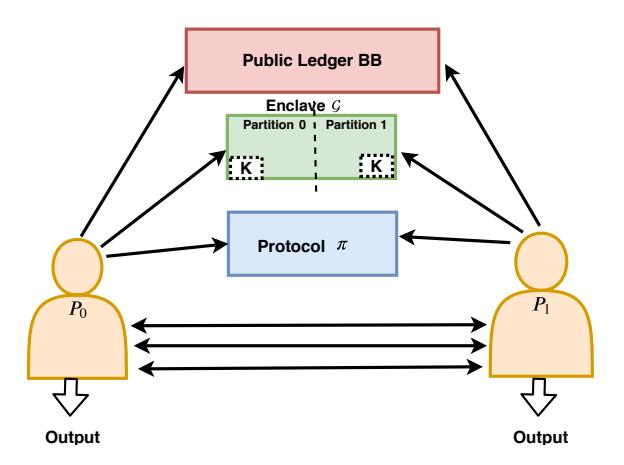
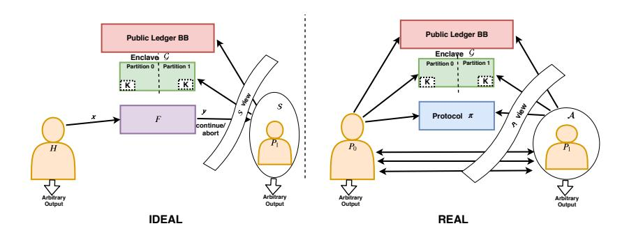
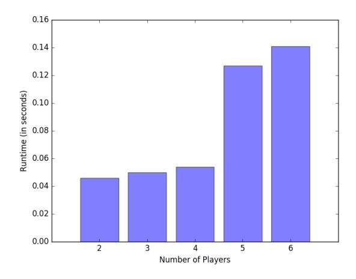

# Efficient Fair Multiparty Protocols using Blockchain and Trusted Hardware

Souradyuti Paul<sup>1</sup> and Ananya Shrivastava<sup>2</sup>

1 Indian Institute of Technology Bhilai, souradyuti@iitbhilai.ac.in 2 Indian Institute of Technology Gandhinagar, ananya.shrivastava@iitgn.ac.in

Abstract. In ACM CCS'17, Choudhuri et al. designed two fair publicledger-based multi-party protocols (in the malicious model with dishonest majority) for computing an arbitrary function f. One of their protocols is based on a trusted hardware enclave G (which can be implemented using Intel SGX-hardware) and a public ledger (which can be implemented using a blockchain platform, such as Ethereum). Subsequently, in NDSS'19, a stateless version of the protocol was published. This is the first time, (a certain definition of) fairness – that guarantees either all parties learn the final output or nobody does – is achieved without any monetary or computational penalties. However, these protocols are fair, if the underlying core MPC component guarantees both privacy and correctness. While privacy is easy to achieve (using a secret sharing scheme), correctness requires expensive operations (such as ZK proofs and commitment schemes). We improve on this work in three different directions: attack, design and performance.

Our first major contribution is building practical attacks that demonstrate: if correctness is not satisfied then the fairness property of the aforementioned protocols collapse. Next, we design two new protocols – stateful and stateless – based on public ledger and trusted hardware that are: resistant against the aforementioned attacks, and made several orders of magnitude more efficient (related to both time and memory) than the existing ones by eliminating ZK proofs and commitment schemes in the design.

Last but not the least, we implemented the core MPC part of our protocols using the SPDZ-2 framework to demonstrate the feasibility of its practical implementation.

Keywords: Blockchain, fairness, multi-party computation

# 1 Introduction

Background In a secure multiparty computation (MPC), a set of mutually distrusting parties can jointly execute an algorithm (or a program) without revealing their individual secrets. The notion of MPC was introduced in the seminal work of Yao in 1982 [22], and since then its applicability has grown from strength to strength. Multiparty protocols are used in, among others, various day-to-day applications such as Blockchain, e-auction, e-voting, e-lottery, smart contracts, privacy-preserving data mining, IoT-based applications, cloud-computing, grid computing, and identity/asset management [12, 19].

For real-life deployment, a multiparty protocol should have the fairness property that should guarantee: either all the parties learn the final output or nobody does. While unconditional fairness is impossible to achieve [9], based on the use cases, several weaker variants of this property have been proposed. For an elaborate discussion on this, see [6].

In [8], for the first time, a fair multiparty protocol in the malicious model with the dishonest majority has been proposed that depends neither on monetary nor computational penalties.<sup>3</sup> This protocol can be implemented using the existing (and easily available) infrastructure, such as Blockchain, Google's CT log and Intel SGX [1, 10, 19]. While this is an important piece of result with significant practical implications, there is still room for improvement.

Motivation We start with the fact that the protocols described in [8, 16] (denote them by Π) essentially consist of three generic components – a public ledger BB (a.k.a. bulletin board), a protective memory region G (a.k.a. enclave), and an underlying multi-party protocol π (modeled in Fig. 1).<sup>4</sup> We observe that the security of Π is proved (in the malicious model with dishonest majority) under the condition that π supports the privacy of the individual secrets, and the correctness of the output. While privacy is ensured using a secret-sharing scheme [21], achieving correctness of output requires expensive operations such as ZKP and commitment schemes [11, 14]. We now ask the following questions:

- 1. Can we break the fairness property of the protocols described in [8, 16], if π is allowed to output an incorrect value?
- 2. If the answer to the previous question is yes, can we design a new protocol Γ, which is fair as well as efficient even when π is allowed to output an incorrect value?

We now show that answers to the above questions are indeed in the affirmative.

Our Contribution Our first contribution is showing concrete attacks on the protocols described in CGJ+ and KMG [8, 16], when the underlying protocol π allows incorrect output to be returned (formalized in Def. 4).

Next, we design a new protocol Γ based on public ledger and trusted hardware (see Fig. 1 and Sect. 5), and prove that it is fair, even if π returns an incorrect value. We extended our work to design a stateless version of Γ, namely Υ, and also prove its fairness.

<sup>3</sup> See [6] and [7] for description of monetary and computational (a.k.a. ∆-fairness) penalties.

<sup>4</sup> G is implemented using Intel SGX hardware.



Fig. 1. Generic structure of the protocols of Table 1: public ledger BB, enclave G, and the underlying core MPC component π. K is the (identical) symmetric key stored in all partitions of the (tamper-resistant) hardware enclave G. Arrowhead denotes the direction in which a query is submitted. Thick arrowhead denotes the release of output.

Table 1. Comparison of multiparty protocols following the framework of Fig. 1. Cryptographic primitives: SSS = Shamir's secret sharing, MAC = Message authentication code, ZKPoPK = Zero-knowledge proof of plaintext knowledge, Comm. = CS.Com, Enc. = AE.Enc, Dec. = AE.Dec, OWF = One-way function, and PRF = Pseudo-random function. Here, k = size of encryption and λ = security parameter.

|     | Protocol Stateful/ | Primitives                       | ZKPoPK                         | π security |        |      | # of var. # of calls                                                  | Ref. |
|-----|--------------------|----------------------------------|--------------------------------|------------|--------|------|-----------------------------------------------------------------------|------|
|     | Stateless          | used in π                        | amortized compl. Def. 3 Def. 4 |            |        | in G | in G                                                                  |      |
| Π   | Stateful           | SSS<br>+ AE<br>+ MAC<br>+ ZKPoPK | O(k + λ) bits                  | Fair       | Attack | 13   | Comm.: 1<br>Enc.: 1<br>Dec.: 2<br>OWF: 2                              | [8]  |
| Γ   | Stateful           | SSS<br>+ AE                      | 0 bits                         | Fair       | Fair   | 8    | Comm.: 0 Sect. 5<br>Enc.: 1<br>Dec.: 2<br>OWF: 0                      |      |
| KMG | Stateless          | SSS<br>+ AE<br>+ MAC<br>+ ZKPoPK | O(k + λ) bits                  | Fair       | Attack | 2    | Comm.: 2<br>Encr.: 2<br>Dec.: 3<br>OWF: 2<br>PRF: 2<br>Hash: 3        | [16] |
| Υ   | Stateless          | SSS<br>+ AE                      | 0 bits                         | Fair       | Fair   | 2    | Comm.: 1 Sect. 5<br>Enc.: 2<br>Dec.: 3<br>OWF: 0<br>PRF: 2<br>Hash: 3 |      |

Finally, we establish that our protocols are not only better secure than the existing ones, they also require fewer variables and cryptographic operations in the hardware enclave, not to mention the elimination of the expensive ZK proofs and the commitment scheme (see Table 1 for details).

We conclude with an open question regarding how our strategy can be adapted to design a fair and efficient protocol based on witness encryption (rather than any protective hardware enclave), where the internal component π is allowed to release incorrect values.

Our results have been applied to 2-party protocols, nevertheless, they can be easily generalized to n-party protocols (with n > 2).

Related Work In the beginning of this section, we briefly discussed the works of Yao and Cleve [22, 9]. Other than them, we mentioned [8, 16] that form the basis of our work in this paper. In addition, the following papers, similar to ours, deal with the many other variants of the fairness property [4–6, 17, 18].

Organization We start with the overview of our main results in Sect. 2. In Sect. 3 we describe various security properties of a multiparty protocol as preliminaries. Thereafter, in Sect. 4, we design the fairness attacks on several constructions in [8, 16] under various realistic scenarios. We present the full description of our protocols along with their security proofs in Sect. 5. Then, we discuss the feasibility of practical implementation our protocols in Sect. 6. Finally, we conclude with an open problem in Sect. 7.

# 2 Overview of the Main Results

We improve on the existing works of [8, 16] on three different directions: attack, design and performance.

Attack We mount a fairness attack on the protocols described in [8, 16], where the underlying protocol π returns an incorrect encryption of the function f(·) to the honest party P<sup>0</sup> (see Fig. 1), but it returns the correct encryption to the dishonest party P1. Also note that, in these protocols, the parties are supplied with a protective memory region, known as enclave G, which nobody can tamper with. In addition, there is a public ledger BB that generates an authentication tag, given a random string. The gist of the attack is as follows (see Sect. 4 for details).

The protocols of [8, 16], denoted Π, essentially consist of three components Π = Π<sup>2</sup> ◦ π ◦ Π1. As usual, P<sup>i</sup> stores (x<sup>i</sup> , ki) as its secret. The first component Π<sup>1</sup> executes the Diffie-Hellman protocol to store the symmetric key K = (k0, k1) in the enclave G. The second component π computes the encryption of f using (k0, k1). Finally, the third component Π<sup>2</sup> decrypts f by submitting to G the random strings (a.k.a. release tokens) and the corresponding tags of all the parties obtained from the public ledger BB. Finally, the enclave G computes f, only if the release tokens and the corresponding tags of all the parties are valid. Our attack exploits the crucial fact that the release tokens are generated independently of the ciphertext, enabling the dishonest party P<sup>1</sup> with the correct output from π, to obtain from BB the correct release token and the corresponding tag of the honest party P<sup>0</sup> as well. The attack works because P<sup>0</sup> submits to BB his correct release token, without realizing that it received an incorrect encryption from π.

Design Next, using the lesson learnt from the aforementioned fairness attack on Π, we now design a new fair protocol Γ, which works even if the internal component π returns an incorrect value. We reiterate that the origin of the attack in Π is the release tokens being generated independently of the ciphertext. Therefore, our cardinal observation is as follows:

We remove the release token altogether from the protocol and generate a tag from BB using the ciphertext directly. Now, the enclave G decrypts in the following way: it computes f only if the ciphertext and the tag submitted by a party are both authenticated. (The full details of Γ can be found in Sect. 4.)

Now, we briefly explain why Γ is a fair protocol. Suppose, P<sup>0</sup> and P<sup>1</sup> receive incorrect and correct outputs from π. Then, as soon as P<sup>1</sup> posts the ciphertext to BB, it immediately becomes available to P<sup>0</sup> as well, enabling him to obtain f from G by submitting the correct ciphertext-tag pair. Thus, fairness is preserved.<sup>5</sup>

At a very high level, we achieved security as well as the improved performance of Γ by weakening the security property of the underlying sub-protocol π (thereby achieving high performance), while rescuing this lost security by better exploiting the existing hardware enclave G without any performance penalty.

Similar techniques can be used to construct a stateless version of Γ, denoted Υ. The full details are given in Sect. 5.

Performance In our new protocol Γ, we obtain reduction in costs, mainly, due to the following two factors: the inner protocol π is now stripped of the expensive functionalities ZK proofs and commitment schemes; the enclave G now works without commitments and one-way functions. The various details can be found in Table 1.

# 3 Preliminaries

## 3.1 Cryptographic Primitives

Due to space constraints, we refer the reader to [13] and [20] for the rigorous definitions of various well-known cryptographic schemes used in our constructions, namely, secret sharing scheme SSS, mesage authentication code MAC, one-way function OWF, pseudorandom function PRF, collision-resistant hash

<sup>5</sup> If P<sup>1</sup> posts an incorrect ciphertext to BB then he himself gets a wrong tag from BB, preventing him from obtaining the f from G.

function H, signature Σ = (Σ.Gen, Σ.Sign, Σ.Verify), and commitment CS = (CS.Setup, CS.Com, CS.Open). For Authentication scheme (with public verification) AS = (AS.Gen, AS.Tag, AS.Verify), and authenticated encryption AE = (AE.Gen, AE.Enc, AE.Dec), we refer the reader to [8]. Because of their critical nature in our protocol, we describe the following functionalities in detail.

Public Ledger (Bulletin Board BB) A Bulletin Board BB is a publicly verifiable database that allows parties to update arbitrary strings on it [8]. These strings of the BB are called release tokens. When a party submits a release token ρ to the BB, it returns an authentication tag σ corresponding to ρ, and an index to the database t. The σ is the proof of the submission of ρ by the party.

It is a 3-tuple of algorithms, BB={BB.getCurrCount, BB.post, BB.getCont}

- BB.getCurrCount() returns the current index t.
- On given a release token ρ, BB.post(ρ), computes the authentication tag σ = AS.Tag(t, ρ) and its corresponding index t and returns (σ, t) to the posting party.
- On given the index t 0 , BB.getCont(t 0 ) returns (σ, ρ) corresponding to t 0 , if t 0 is less than or equal to the current index t of BB. Otherwise it returns ⊥.
- AS.Verify(σ,(t, ρ)) returns 1, if the triplet (σ, t, ρ) is correct .

Enclaves G and G <sup>0</sup> They are the private regions of memory for running programs. An enclave provides confidentiality and integrity of a program in the presence of adversarial environment. This can establish a secure channel with other enclaves, as well as can remotely attest to its correct functioning [10]. An enclave can be practically implemented using Intel SGX-hardware.

Stateful enclave G. It is a 4-tuple of algorithms G = (G.Σ, G.getpk, G.install, G.resume) associated with a state State. We describe the individual algorithms and state as follows.

- G.Σ is a signature scheme with security parameter 1<sup>λ</sup> . G.Σ.Gen(1<sup>λ</sup> ) generates the pair of signing and verification keys (msk, mpk), and stores it locally.
- G.getpk() returns a copy of mpk.
- G.install(·): On input a party P, and the program prog, it does the following:
  - 1. generate enclave-id: eid \$← {0, 1} λ
  - 2. store in enclave: T[eid, P] := (prog, 0)
  - 3. return eid
- G.resume(·): On input a party P, the enclave-id eid, and the input inp, it does the following:
  - 1. If T[eid, P] 6= ∅ then (prog, mem) := T[eid, P] else abort.
  - 2. (outp, mem) := prog(inp, P, mem)
  - 3. update enclave: T[eid, P] := (prog, mem)
  - 4. signature generation: sig ← G.Σ.Sign(msk, eid, prog, outp )

- 5. return (outp, sig)
- The state State is defined to be  $S \cup T$ , where S = (msk, mpk). Initially, T and S are empty sets.

STATELESS ENCLAVE  $\mathcal{G}'$ . Unlike the stateful  $\mathcal{G}$ , as described above, here there is no persistent storage; nevertheless, the parties maintain a state in the encrypted form outside of  $\mathcal{G}'$  (for more details see [16]). We model it as a 2-tuple of algorithms  $\mathcal{G}' = (\mathcal{G}'.\mathsf{Setup}, \mathcal{G}'.\mathsf{execute})$  as follows [16].

- $-\mathcal{G}'$ . Setup(·): On input the security parameter  $1^{\lambda}$ :
  - 1. generates secret key for enclave:  $K \leftarrow \{0,1\}^{\lambda}$
  - 2. generates public commitment parameter:  $pp \leftarrow CS.Setup(1^{\lambda})$
  - 3. generates signing and verification key pair: (msk, mpk)  $\leftarrow \Sigma . Gen(1^{\lambda})$
  - 4. returns (mpk, pp)
- $-\mathcal{G}'$ .execute(·): On input program prog, round l, encrypted previous state  $S_{l-1}$ , program input  $I_l$ , random number  $r_l$ , commitment value  $C_l$ , BB's index  $t_l$ , and authentication tag  $\sigma_l$ , it does the following (initially, l = 0,  $S_0 = \emptyset$ ):
  - 1. Check if  $Verify_{BB}(C_l, t_l, \sigma_l) \neq 1$  then return  $\perp$
  - 2. Check if  $C_l \neq \mathsf{CS.Com}(\mathsf{pp},\mathsf{prog},l,S_{l-1},I_l,r_l)$  then return  $\perp$
  - 3. If  $l > 1 \land S_{l-1} = \emptyset$  then return  $\bot$
  - 4. Compute (l-1)th round encryption key  $k_{l-1} \leftarrow \mathsf{PRF}(K, t_{l-1})$
  - 5.  $(s_{l-1}, h) \leftarrow AE.Dec(k_{l-1}, S_{l-1})$
  - 6. Check if  $(s_{l-1}, h) = \perp$  then return  $\perp$
  - 7. Check if  $h \neq \mathsf{H}(\mathsf{prog}||l-1)$  then return  $\perp$
  - 8. Compute random number and  $l^{\text{th}}$  round encryption key:  $(k_l, r'_l) \leftarrow \mathsf{PRF}(K, t_l)$
  - 9. Execute program and determine:  $(s_l, \mathsf{out}_l) \leftarrow \mathsf{prog}(s_{l-1}, I_l, r'_l)$
  - 10. If  $(s_l, \mathsf{out}_l) = \perp$  then return  $\perp$

  - 10. If  $(s_l, \mathsf{out}_l) = \bot$  then recall  $\bot$ 11. Encrypt state:  $S_l \leftarrow \mathsf{AE}.\mathsf{Enc} \Big( k_l, s_l \| \mathsf{H}(\mathsf{prog} \| l) \Big)$ 12. Signature generation:  $sig_l \leftarrow \varSigma.\mathsf{Sign}(\mathsf{msk}, \underbrace{\mathsf{pp}, \mathsf{prog}, \mathsf{out}_l})$   $\underbrace{\mathsf{message}}_{\mathsf{message}}$
  - 13. return  $(S_l, \mathsf{out}_l, sig_l)$

**Enclave-Ledger Interaction (ELI)** An ELI is a 3-tuple of algorithms, ELI = (ELI.Setup, ELI.ExecEnc, , ELI.ExecApp), that allows a party to securely communicate with the enclave  $\mathcal{G}'$  and the public ledger BB [16]. The algorithmic descriptions of ELI.Setup and ELI.ExecEnc are identical to that of  $\mathcal{G}'$ .Setup and  $\mathcal{G}'$  execute. We now describe the algorithm ELI. Exec as follows.

- ELI.Exec(·): On input security parameter  $1^{\lambda}$ , public commitment parameter pp, program prog, round l, encrypted previous state  $S_{l-1}$ , and input  $I_l$ , it does the following.
  - 1. If  $I_l = \perp$  then return  $\perp$
  - 2. Choose random number:  $r_l \leftarrow \{0,1\}^{\lambda}$
  - 3. Compute commitment on input values:  $C_l \leftarrow \mathsf{CS}.\mathsf{Com}(\mathsf{pp}, \mathsf{prog}, l, S_{l-1}, I_l, r_l)$
  - 4. Invokes BB.Post( $C_l$ ) to receive  $(t_l, \sigma_l)$
  - 5. Invokes ELI.ExecEnc(prog, l,  $S_{l-1}$ ,  $I_l$ ,  $r_l$ ,  $C_l$ ,  $t_l$ ,  $\sigma_l$ ) to receive  $(S_l$ , out $_l$ ,  $sig_l$ )

**Definition 1** ([16]). A protocol ELI is said to be secure, if for every non-uniform p.p.t. adversary  $\mathcal{A}$ , security parameter  $1^{\lambda}$ , and non-negative integer n in the real world, there exists a non-uniform p.p.t. simulator  $\mathcal{S}$  in the ideal world such that,

$$IDEAL(S, 1^{\lambda}, n) \stackrel{c}{\equiv} REAL(A, 1^{\lambda}, n)$$

The IDEAL( $\cdot$ ) and REAL( $\cdot$ ) are described in [16].

**Theorem 1** ([16]). Suppose the following assumptions hold good: the commitment scheme CS is secure; the authenticated encryption scheme AE is INT-CTXT secure; the authentication scheme AS is unforgeable; the hash function H is collision-resistant; and PRF is pseudorandom. The ELI satisfies Def. 1.

### 3.2 Security Properties

Consider a set of parties  $\mathcal{P} = \{P_0, P_1\}$  executing a protocol  $\pi$  for computing a function f on  $x_0$  and  $x_1$ ;  $x_0$  and  $x_1$  are chosen according to some distributions from the sets  $X_{\kappa}$  and  $Y_{\kappa}$ , where  $\kappa$  is the security parameter. W.l.g., we assume  $P_0$  and  $P_1$  are the honest and corrupt parties respectively in the real world.  $\mathcal{H}$  and  $P_1$  are the honest and corrupt parties in the ideal world. Other than them, we will be using two more entities, attacker  $\mathcal{A}$  and a simulator  $\mathcal{S}$ , that control the corrupt party  $P_1$  in the real and the ideal worlds. Now,  $P_1$  has input  $x_1$ ; both  $\mathcal{H}$  and  $P_0$  has  $x_0$ ;  $\mathcal{A}$  and  $\mathcal{S}$  have  $x_1$ , and the auxiliary input f0 f1.

The adversary  $\mathcal{A}$ 's view consists of the following: the input of  $\mathcal{A}$ , the values sent to and received from  $P_0$ , and the content of its internal random tape. Similarly, the views of  $P_0$  and  $\mathcal{H}$  can be defined. The view of the simulator is a function of  $(x_1, z, f(x_0, x_1), \kappa)$ . The outputs of  $P_0$ ,  $\mathcal{H}$ ,  $\mathcal{A}$  and  $\mathcal{S}$  can be computed from there respective views.

 $(\mathcal{G},\mathsf{BB})$ -Fairness with abort Unconditional fairness is impossible to achieve [9];  $(\mathcal{G},\mathsf{BB})$ -fairness with abort is a variant of it. If a protocol – which is built on enclave  $\mathcal{G}$ , and the Bulletin Board BB – has  $(\mathcal{G},\mathsf{BB})$ -fairness with abort property then it is guaranteed that either all parties learn the final output or nobody does; the privacy property is preserved implicitly as well. We formally define this property in the spirit of semantic security which is based on designing appropriate real and ideal worlds. The pictorial description of the ideal and real worlds is given in Fig. 2.

The ideal world Here, F is the trusted party. Also, the view of  $\mathcal{S}$ , and the output of  $\mathcal{H}$  are denoted by view and  $\mathsf{out}_{\mathcal{H}}$  respectively. Let  $IDEAL^{\mathsf{SB-FAIR}}_{f(x_0,x_1),\mathcal{S}(x_1,z)}(x_0,x_1,\kappa)$  denote  $\mathsf{out}_{\mathcal{H}}\|\mathsf{view}$ . Here,  $\mathcal{S}$  has access to the honest oracles: the enclave  $\mathcal{G}$  and the public ledger BB in a similar fashion as described in [16]. The instructions

<sup>&</sup>lt;sup>6</sup> The auxiliary input is derived by the adversary (as well as the simulator) from the previous executions of the protocol.

executed in the *ideal* world are described below.

- **1.**  $\mathcal{H}$  sends  $x_0$  to F. Depending on  $x_1$  and the auxiliary information z,  $\mathcal{S}$  sends  $x'_1$  to F, where  $|x'_1| = |x_1|$ .
- **2.** F returns  $f(x_0, x'_1)$  to S.
- **3.** S sends either *continue* or *abort* to F, depending on its view.
- **4.** If S sends abort to F, then F, in turn, sends abort to H. If S sends continue to F, then F returns  $f(x_0, x_1')$  to H.
- **5.**  $\mathcal{H}$  outputs,  $\mathsf{out}_{\mathcal{H}}$ , which is whatever it obtained from F;  $P_1$  outputs nothing; and  $\mathcal{S}$  outputs  $\mathsf{out}$ , which is a function of view.

The real world Let  $REAL_{\pi,\mathcal{A}(x_1,z)}^{\mathrm{SB-FAIR}}(x_0,x_1,\kappa)$  denote  $\mathrm{out}_0\|\mathrm{view}_{\mathcal{A}}$ , where  $\mathrm{out}_0$  denote output of  $P_0$ , and  $\mathrm{view}_{\mathcal{A}}$  denote  $\mathcal{A}$ 's view.  $P_0$  and  $P_1$  execute  $\pi$  which consists of two honest oracles:  $\mathcal{G}$  and BB. Throughout the execution of  $\pi$ , as before,  $\mathcal{A}$  sends messages on behalf of  $P_1$ , while  $P_0$  correctly follows the protocol instructions. Finally,  $P_0$  outputs  $\mathrm{out}_0$ ;  $P_1$  outputs nothing; and  $\mathcal{A}$  outputs  $\mathrm{out}_{\mathcal{A}}$ , which is a function of  $\mathrm{view}_{\mathcal{A}}$ .



**Fig. 2.** Execution of *ideal* and *real* worlds of  $(\mathcal{G}, BB)$ -Fairness with abort. Arrowhead denotes the direction in which a query is submitted. Thick arrowhead denotes the release of output.

**Definition 2.** A protocol  $\pi$  is said to securely compute f with  $(\mathcal{G}, BB)$ -fairness with abort, if for every non-uniform PPT adversary  $\mathcal{A}$  in the real world, there exists a non-uniform PPT simulator  $\mathcal{S}$  in the ideal world such that

IDEAL<sub>f(x\_0,x\_1),S(x\_1,z)</sub><sup>c</sup>(x\_0,x\_1,\kappa) 
$$\stackrel{c}{=} \text{REAL}_{\pi,\mathcal{A}(x_1,z)}^{\text{SB-FAIR}}(x_0,x_1,\kappa),$$

for all  $(x_0, x_1) \in X_k \times Y_k, z \in \{0, 1\}^*, \kappa \in \mathbb{N}$ .

**Privacy-and-Correctness with abort** If a protocol has *privacy-and-correctness* with abort property then it guarantees that the honest party: (1) does not reveal its secret (privacy), and (2) outputs the correct value or  $\perp$ .

The ideal world Let  $IDEAL_{f(x_0,x_1),\mathcal{S}(x_1,z)}^{PRV-CORR}(x_0,x_1,\kappa)$  denote  $\mathsf{out}_{\mathcal{H}}\|\mathsf{view}$ . The instructions of the ideal world are identical to that of  $(\mathcal{G},\mathsf{BB})$ -fairness with abort.

The real world Let  $REAL_{\pi,\mathcal{A}(x_1,z)}^{PRV-CORR}(x_0,x_1,\kappa)$  denote  $\mathsf{out}_0\|\mathsf{view}_{\mathcal{A}}$ .  $P_0$  and  $P_1$  execute  $\pi$  without any trusted party. Throughout the execution of  $\pi$ ,  $\mathcal{A}$  sends messages on behalf of  $P_1$ , while  $P_0$  correctly follows the protocol instructions. Finally,  $P_0$  outputs  $\mathsf{out}_0$ ;  $P_1$  outputs nothing; and  $\mathcal{A}$  outputs  $\mathsf{out}_{\mathcal{A}}$ , which is a function of  $\mathsf{view}_{\mathcal{A}}$ .

**Definition 3.** A protocol  $\pi$  is said to securely compute f with privacy-and-correctness with abort, if for every non-uniform PPT adversary  $\mathcal{A}$  in the real world, there exists a non-uniform PPT simulator  $\mathcal{S}$  in the ideal world such that

$$\text{IDEAL}_{f(x_0, x_1), \mathcal{S}(x_1, z)}^{\text{\tiny PRV-CORR}}(x_0, x_1, \kappa) \stackrel{c}{\equiv} \text{REAL}_{\pi, \mathcal{A}(x_1, z)}^{\text{\tiny PRV-CORR}}(x_0, x_1, \kappa),$$

for all 
$$(x_0, x_1) \in X_k \times Y_k, z \in \{0, 1\}^*, \kappa \in \mathbb{N}$$
.

**Privacy Property** If a protocol has *privacy* property then it guarantees that the honest party does not reveal its secret. Note that this is a weaker property (and therefore, easy to achieve) than Def. 3.

The ideal world Let  $IDEAL_{f(x_0,x_1),\mathcal{S}(x_1,z)}^{PRV}(x_0,x_1,\kappa)$  denote the view whose instructions are described below.

- **1.**  $\mathcal{H}$  sends  $x_0$  to F. Depending on  $x_1$  and the auxiliary information z,  $\mathcal{S}$  sends  $x'_1$  to F, where  $|x'_1| = |x_1|$ .
- **2.** F returns  $f(x_0, x_1)$  to  $\mathcal{H}$  and  $\mathcal{S}$ .
- **3.**  $\mathcal{H}$  outputs  $\mathsf{out}_{\mathcal{H}}$ ;  $P_1$  outputs nothing; and  $\mathcal{S}$  outputs  $\mathsf{out}$ , which is a function of view.

The real world Let  $REAL_{\pi,\mathcal{A}(x_1,z)}^{PRV}(x_0,x_1,\kappa)$  denote view<sub> $\mathcal{A}$ </sub>. The  $P_0$  and  $P_1$  execute  $\pi$  without any trusted party. Throughout the execution of  $\pi$ ,  $\mathcal{A}$  sends messages on behalf of  $P_1$ , while  $P_0$  correctly follows the protocol instructions. Finally,  $P_0$  outputs out<sub>0</sub>;  $P_1$  outputs nothing; and  $\mathcal{A}$  outputs out<sub> $\mathcal{A}$ </sub>, which is a function of view<sub> $\mathcal{A}$ </sub>.

**Definition 4.** A protocol  $\pi$  is said to securely compute f with privacy property, if for every non-uniform PPT adversary  $\mathcal{A}$  in the real world, there exists a non-uniform PPT simulator  $\mathcal{S}$  in the ideal world such that

IDEAL<sup>PRV</sup><sub>$$f(x_0,x_1),\mathcal{S}(x_1,z)$$</sub> $(x_0,x_1,\kappa) \stackrel{c}{=} \text{REAL}^{PRV}_{\pi,\mathcal{A}(x_1,z)}(x_0,x_1,\kappa),$ 

for all  $(x_0, x_1) \in X_{\kappa} \times Y_{\kappa}, z \in \{0, 1\}^*, \kappa \in \mathbb{N}$ .

## 4 Fairness Attacks on CGJ+ and KMG protocols

The protocol of CGJ+ which is based on an enclave  $\mathcal{G}$  (implemented using SGX-hardware) is now denoted by  $\Pi$ . The description of  $\Pi$  is given in Fig. 3. The  $\Pi$ 

```
\boldsymbol{\Pi}[\Delta t, \boldsymbol{\pi}, \mathsf{BB}, \mathcal{G}, \boldsymbol{\lambda}, \mathcal{P}]
```

```
Input: For all i \in \{0,1\}, P_i inputs x_i.

Output: Both P_0 and P_1 output either f(x_0, x_1) or \bot.

[If \pi is replaced by \pi_0 then P_1 outputs f(x_0, x_1), and P_0 outputs f'(x_0, x_1) \neq f(x_0, x_1).]
```

- 1. [Setting up parameters (Offline)] For all  $i \in \{0, 1\}$ :
  - (a)  $P_i$  samples the release token  $\rho_i \stackrel{\$}{\leftarrow} \{0,1\}^{\lambda}$ , key share  $k_i \stackrel{\$}{\leftarrow} \{0,1\}^{\lambda}$ , and random number share  $r_i \stackrel{\$}{\leftarrow} \{0,1\}^{\lambda}$  [used in Steps 5 and 8].
  - (b)  $P_i$  invokes BB.getCurrCount() to obtain the current index  $t_i$  [used in Step 6].
- 2. [Exchange of enclaves' verification-keys (Offline+Online)] For all  $i \in \{0,1\}$ ,  $P_i$  invokes  $\mathcal{G}.\mathsf{getpk}()$  to receive  $\mathsf{mpk}_i$  which is then sent to  $P_j$  [used in Steps 4 and 6].
- 3. [Install prog in enclave (Offline)] For all  $i \in \{0,1\}$ , party  $P_i$  invokes  $\mathcal{G}$ .install(prog[ $\Delta t$ , vk<sub>BB</sub>,  $\mathcal{P}$ , i]) and receives output  $eid_i$  [used in Steps 4-7, 9(a) and 10].
- 4. [Diffie-Hellman key-exchange by enclaves (Offline+Online)] For all  $i \in \{0,1\}$ :  $P_i$  invokes  $\mathcal{G}$ .resume( $eid_i$ , keyex) to receive  $(g^{a_i}, sig_i^{(1)})$ , and broadcasts  $(eid_i, g^{a_i}, sig_i^{(1)})$ ;  $P_i$  checks, if  $\mathcal{G}.\mathcal{E}.\mathsf{Ver}_{\mathsf{mpk}_j}((eid_j, \mathsf{prog}[\Delta t, \mathsf{vk}_\mathsf{BB}, \mathcal{P}, j], g^{a_j}), sig_j^{(1)}) = 1$  then continue, else abort. (Thus, a secure channel is established between the enclaves using Diffie-Hellman key.) [used in Steps 6 and 7]
- 5. [Enclave stores  $(\rho_i, k_i, r_i)$  and returns each party's commitments (Offline)] For all  $i \in \{0, 1\}$ ,  $P_i$  invokes  $\mathcal{G}$ .resume $(eid_i, \text{init}, \rho_i, k_i, r_i)$  and receives  $(com_{ii}, sig_i^{(2)})$ . (The commitment  $com_{ii}$  on key share is used as one of the inputs in MPC protocol to ensure correctness property.) [used in Steps 6 and 8]
- 6. [Enclave stores  $t_i$  and returns ciphertext (Offline+Online)] For all  $i \in \{0,1\}$ :  $P_i$  invokes  $\mathcal{G}$ .resume( $eid_i$ , send,  $g^{a_j}$ ,  $t_i$ ) to receive ( $ct_{ij}$ ,  $sig_i^{(3)}$ ) which is then sent to  $P_j$ ;  $P_i$  checks if  $\mathcal{G}.\mathcal{E}.\mathsf{Ver}_{\mathsf{mpk}_j}((eid_j, \mathsf{prog}[\Delta t, \mathsf{vk}_{\mathsf{BB}}, \mathcal{P}, j], ct_{ij}), sig_j^{(3)}) = 1$  then continue, else abort [used in Step 7].
- 7. [Obtaining each other's commitments (Offline)] For all  $i \in \{0,1\}$ :  $P_i$  invokes  $\mathcal{G}$ .resume $(eid_i, receive, ct_{ji})$  and receives  $(com_{ji}, sig_i^{(4)})$ , where  $com_{ji}$  is the 4th component in the decryption of  $ct_{ji}$  under secret key  $\mathsf{sk}_{ji}$  (Here  $\mathsf{sk}_{ji} = \mathsf{sk}_{ij}$ ). (Note that in this step both the enclave stores other parties secret values securely.) [used in Step 8 and 9(a)]
- 8. [Execute  $\pi$  to obtain encryption of  $f(\cdot)$  (Online)] The a denotes  $\pi$ 's output (see Sect. 4) [used in Step 10].
- 9. [Parameters required to obtain  $f(\cdot)$  by decryption (Offline+Online)]
  - (a) For all  $i \in \{0,1\}$ ,  $P_i$  invokes  $\mathcal{G}$ .resume $(eid_i, \mathsf{getParams})$  and receives  $(T,y,sig_i^{(5)})$ , where  $T = \mathsf{max}(t_0,t_1)$ , and  $y = \mathsf{OWF}(\rho_0 \oplus \rho_1)$  [used in Step 9(b)].
  - (b) For all  $i \in \{0,1\}$ ,  $P_i$  sends  $\rho_i$  to  $P_j$ , and receives  $(\rho_j,t,\sigma)$  from BB. Here, T and y are used for verification of  $\rho_j$  and t. (see [8] for details) [used in Step 10].
- 10. [Computing  $f(\cdot)$  by decryption (Offline)] For all  $i \in \{0,1\}$ ,  $P_i$  invokes  $\mathcal{G}.\mathsf{resume}(eid_i,\mathsf{output},a,\rho_0\oplus\rho_1,t,\sigma)$  to receive  $f(\cdot)$ .

Fig. 3. Algorithmic description of  $\Pi$  in  $(\pi, \mathcal{G}, \mathsf{BB})$ -hybrid model. In all the cases, j = 1 - i. The program prog is described in Appendix A. It is parameterized by: cut-off time  $\Delta t$  (which is  $poly(\lambda)$ ), a 2-party protocol  $\pi$ , a Bulletin Board BB, an enclave  $\mathcal{G}$ , the security parameter  $1^{\lambda}$ , and a set of parties  $\mathcal{P} = \{P_0, P_1\}$ . The orange colored steps in the algorithm represent the local computation done by a party. The purple colored step in the algorithm represents the communication among the parties and BB.

works in (π, G, BB)-hybrid model, where π is a 2-party protocol computing the encryption of the given function f(·). Note that G and BB have already been described. Below we give the description of π.

Description of π: It is a 2-party protocol that computes an encryption of the given function f(x0, x1). Concretely:

$$\pi\Big(\big\{x_i, k_i, com_{0,i}, com_{1,i}\big\}_{i \in \{0,1\}}\Big) \stackrel{\text{def}}{=} a = \begin{cases} ct', & \text{if } P_1 \text{ is } malicious \\ ct, & \text{otherwise.} \end{cases}$$

Here, the private input x<sup>i</sup> , and the key share k<sup>i</sup> are generated by P<sup>i</sup> ; comj,i = CS.Com(k<sup>j</sup> , r<sup>j</sup> ), which is commitment of k<sup>j</sup> computed by P<sup>j</sup> and given to P<sup>i</sup> . Also, ct = AE.Enc ⊕<sup>1</sup> <sup>i</sup>=0 k<sup>i</sup> , f(x0, x1) , and ct<sup>0</sup> 6= ct.

We recall that such a π which is secure in terms of privacy-and-correctness with abort in the malicious model with dishonest majority – as defined in Def. 3 – can be obtained in the following way: first design a privacy secure semi-honest multi-party protocol π0, and then execute the GMW compiler on input π<sup>0</sup> to obtain π [15].<sup>7</sup> For such a π, ct<sup>0</sup> =⊥.

The components of π are: (1) (n, n)-secret sharing scheme; (2) AE scheme; (3) ZK proofs; and (4) CS scheme. The π inherits: (1) and (2) from π<sup>0</sup> which ensures privacy; it inherits (3) and (4) from the GMW compiler which ensures correctness [14].

Description of Π (see Fig. 3): It is a 2-party protocol such that:

$$\Pi(x_0, x_1) \stackrel{\text{def}}{=} \begin{cases} f'(x_0, x_1), & \text{if } P_1 \text{ is malicious} \\ f(x_0, x_1), & \text{otherwise.} \end{cases}$$

Here f(·) is an arbitrary function and f 0 (·) 6= f(·). From the standpoint of design, Π can be seen as the composition of the following 3 sub-protocols, all executed by the parties (P0, P1); note that each P<sup>i</sup> is inherently supplied with an enclave Gi :

$$\Pi = \Pi_2 \circ \pi \circ \Pi_1.$$

The Π<sup>1</sup> securely stores the internally generated symmetric key K = (k0, k1) (and various other auxiliary data) inside the enclave G = (G0, G1) using Diffie-Hellman key-exchange.<sup>8</sup> It returns k<sup>i</sup> along with the commitment values (com0,i, com1,i) on (k0, k1) to P<sup>i</sup> to be used in the next stage π. The description of Π<sup>1</sup> is in steps 1-7.

The second stage π – which is invoked in step 8 – has already been described in detail. It returns the symmetric encryption of f using (k0, k1) to all the parties to be used for the next stage Π2. At this point, there are two possible cases – P<sup>0</sup> receives either ⊥ (case 1), or the correct encryption of f (case 2). In the

<sup>7</sup> Another way of designing π is by using SPDZ directly [11].

<sup>8</sup> Note that none of the parties know the key K; P<sup>i</sup> knows only ki.

former case, P<sup>0</sup> stops execution, while in the latter, both the parties (P0, P1) start executing the final stage Π2.

The final stage Π<sup>2</sup> returns f after decrypting the output of π inside the enclave G, using the various data generated in Π1. It also uses the release tokens and the corresponding tags of both the parties obtained from BB. Note that any enclave in G would never decrypt, if any of the following five checks fails: the release tokens are incorrect; any pair of the release-tokens-tags is invalid; the authentication of the ciphertext fails; and the input is supplied after the cut-off time ∆t. Otherwise, it would allow the dishonest party P<sup>1</sup> to obtain f using G1, while the honest party P<sup>0</sup> is unable to obtain it, due to the occurrence of case 1 as above, or due to aborting the protocol after waiting for a time longer than ∆t; in either case it violates the fairness property. It is easy to observe that any attempt to attack the fairness property when case 2 has occurred can also be prevented by these aforementioned five checks. The description of Π<sup>2</sup> is in steps 9-10. In [8], it has been proved that if π satisfies the privacy-and-correctness with abort property (Def. 3), then Π satisfies (G, BB)-fairness with abort (Def. 2).

Attack on Π when π is replaced by π0: It is obvious from the previous discussion that π is more expensive than π0, although the input and output for both of them are identical. We note that, π<sup>0</sup> preserves privacy in the malicious model with dishonest majority, but may not guarantee correctness [14]. Now we show that setting π = π0, immediately leads to a fairness attack in Π. The attack works as follows: suppose π = π0; and the honest party P<sup>0</sup> receives incorrect ciphertext ct<sup>0</sup> 6=⊥ (see step 8), however, the dishonest party P<sup>1</sup> receives the correct output ct. Since, no parties receive ⊥ from π, they post the release tokens to get the tags from BB (step 9(b)). Now, P<sup>0</sup> invokes G<sup>0</sup> by supplying the incorrect ciphertext ct<sup>0</sup> (along with all the release tokens and the tags) only to receive ⊥, while P<sup>1</sup> receives the correct f(·). The fairness attack is now complete.

Attacks on WE-based CGJ+ and KMG protocols: In WE-based CGJ+, the enclave G is replaced with a witness encryption WE; in KMG, the state is stored by the parties, while the enclaves are stateless; nevertheless, both of them use π as described above. The attack follows from the fact that the last two steps of these protocols constitute a sub-protocol which is identical to the third stage of Π, namely, Π2. We note that the aforementioned fairness attack on Π takes place inside the sub-protocol Π2. From this observation, the similar attacks on WE-based CGJ+ and KMG protocols follow.

# 5 New Constructions

In this section, we design two new protocols – more efficient than the existing ones – that are also fair in the malicious model with dishonest majority. Our first protocol, denoted Γ (see Fig. 4), works in (π 0 , G, BB)-hybrid model, where π 0 is a 2-party protocol computing the encryption of the given function f(·). Following is the description of  $\pi'$ .

DESCRIPTION OF  $\pi'$ : It is a 2-party protocol that computes an *encryption* of the given function  $f(x_0, x_1)$ . Concretely:

$$\pi'\Big(\{x_i, k_i\}_{i \in \{0,1\}}\Big) \stackrel{def}{=} a = \begin{cases} ct', & \text{if } P_1 \text{ is malicious} \\ ct, & \text{otherwise.} \end{cases}$$

We can design such a  $\pi'$  – which is *privacy* secure in the malicious model with dishonest majority (as defined in Def. 4) – using known techniques in the existing literature [14]. The cryptographic components used in  $\pi'$  are: an (n,n)-secret sharing scheme and an AE scheme. Therefore, the differences between  $\pi$  (of protocol  $\Pi$ ) and  $\pi'$  are the following: (1) the input size is less since we do not have the commitments; (2) removed are the expensive components ZK proofs and CS scheme; (3) while  $\pi$  is secure under *privacy-and-correctness with abort* in the malicious model with dishonest majority,  $\pi'$  is only *privacy* secure in the same setting.

DESCRIPTION OF  $\Gamma$ : The  $\Gamma$  is a composition of 3 sub-protocols:

$$\Gamma = \Gamma_2 \circ \pi' \circ \Gamma_1.$$

The  $\Gamma_1$  securely stores the *internally generated* symmetric key  $K=(k_0,k_1)$  (and various other auxiliary data) inside the enclave  $\mathcal{G}=(\mathcal{G}_0,\mathcal{G}_1)$  using Diffie-Hellman key-exchange. It returns  $k_i$  to  $P_i$  to be used in the next stage  $\pi'$ . Unlike  $\Pi_1$ , the execution of  $\Gamma_1$  does not require the following components: the release tokens  $\rho_i$ 's, the commitments of the key-shares  $com_{j,i}$ 's and the OWF inside the enclave  $\mathcal{G}$  (see Appendix. A for more details). The description of  $\Gamma_1$  is in steps 1-7.

The second stage  $\pi'$  – which is invoked in step 8 – has already been described in detail. It returns the symmetric encryption of f using  $(k_0, k_1)$  to all the parties to be used for the next stage  $\Gamma_2$ . At this point, there are two possible cases –  $P_0$  receives either  $ct' \neq ct$  (case 1), or the correct encryption of f (case 2). Unlike in  $\pi$ , in both the cases, the parties  $(P_0, P_1)$  start executing the final stage  $\Gamma_2$ .

The final stage  $\Gamma_2$  returns f after decrypting the output of  $\pi'$  inside the enclave  $\mathcal{G}$ , using the various data generated in  $\Gamma_1$  along with the data obtained from BB. The protocol works as follows: Each party directly posts the ciphertext obtained in  $\pi'$  to BB, and gets the corresponding tag. Finally, each party submits the ciphertext-tag pair to the enclave  $\mathcal{G}$  to obtain the correct f. The enclave would never decrypt, if any of the following three checks fails: the ciphertext-tag pair is invalid; the authentication of the ciphertext fails; and the input is supplied after the cut-off time  $\Delta t$ . Otherwise, it would allow the dishonest party  $P_1$  to obtain f using  $\mathcal{G}_1$ , while the honest party  $P_0$  is unable to obtain it, due to the occurrence of case 1 as above, or due to aborting the protocol after waiting for a time longer than time  $\Delta t$ ; in either case it violates the fairness property. The description of  $\Gamma_2$  is in steps 9-10. The differences between  $\Gamma_2$  and  $\Pi_2$  are the following: (1) we post the ciphertext (as opposed to the release tokens) to BB; and (2) consequently, the release tokens verification inside the enclave  $\mathcal{G}$ 

are eliminated. The *fairness* property of  $\Gamma$  as argued so far is formalized in the following theorem.

 $\Gamma[\Delta t, \pi', \mathsf{BB}, \mathcal{G}, \lambda, \mathcal{P}]$ 

**Input:** For all  $i \in \{0, 1\}$ ,  $P_i$  inputs  $x_i$ .

**Output:** Both  $P_0$  and  $P_1$  output either  $f(\cdot)$  or  $\perp$ .

- 1. [Setting up parameters (Offline)] For all  $i \in \{0, 1\}$ :
  - (a)  $P_i$  samples key share  $k_i \stackrel{\$}{\leftarrow} \{0,1\}^{\lambda}$  [used in Steps 5 and 8].
  - (b)  $P_i$  invokes BB.getCurrCount() to obtain the current index  $t_i$  [used in Step 6].
- 2. [Exchange of enclaves' verification-keys (Offline+Online)] For all  $i \in \{0,1\}$ ,  $P_i$  invokes  $\mathcal{G}.\mathsf{getpk}()$  to receive  $\mathsf{mpk}_i$  which is then sent to  $P_j$  [used in Steps 4 and 6].
- 3. [Install prog' in enclave (Offline)] For all  $i \in \{0,1\}$ , party  $P_i$  invoke  $\mathcal{G}$ .install(prog'[ $\Delta t$ , vk<sub>BB</sub>,  $\mathcal{P}$ , i]) and receives output  $eid_i$  [used in Steps 4-7 and 9-10].
- 4. [Diffie-Hellman key-exchange by enclaves (Offline+Online)] For all  $i \in \{0,1\}$ :  $P_i$  invokes  $\mathcal{G}$ -resume( $eid_i$ , keyex) to receive  $(g^{a_i}, sig_i^{(1)})$ , and broadcasts  $(eid_i, g^{a_i}, sig_i^{(1)})$ ;  $P_i$  checks if  $\mathcal{G}.\mathcal{E}.\mathsf{Ver}_{\mathsf{mpk}_j}((eid_j, \mathsf{prog}'[\Delta t, \mathsf{vk}_\mathsf{BB}, \mathcal{P}, j], g^{a_j}), sig_j^{(1)}) = 1$  then continue, else abort. (Thus, a secure channel is established between the enclaves using Diffie-Hellman key.) [used in Steps 6 and 7]
- 5. [Enclave stores own key-share  $k_i$  (Offline)] For all  $i \in \{0,1\}$ ,  $P_i$  invokes  $\mathcal{G}$ .resume $(eid_i, \mathsf{init}, k_i)$  [used in Step 6].
- 6. [Enclave stores  $t_i$  and returns ciphertext (Offline+Online)] For all  $i \in \{0,1\}$ :  $P_i$  invokes  $\mathcal{G}$ .resume( $eid_i$ , send,  $g^{a_j}$ ,  $t_i$ ) to receive ( $ct_{ij}$ ,  $sig_i^{(3)}$ ) which is then sent to  $P_j$ ;  $P_i$  checks if  $\mathcal{G}.\mathcal{\Sigma}.\mathsf{Ver}_{\mathsf{mpk}_j}((eid_j,\mathsf{prog}'[\Delta t,\mathsf{vk}_{\mathsf{BB}},\mathcal{P},j],ct_{ij}),sig_j^{(3)})=1$  then continue, else abort [used in Step 7].
- 7. [Enclave stores other's key-share  $k_j$  (Offline)] For all  $i \in \{0,1\}$ ,  $P_i$  invokes  $\mathcal{G}$ .resume( $eid_i$ , receive,  $ct_{ji}$ ). If  $\mathcal{G}$  returns  $\bot$  then  $P_i$  abort, else continue. [Note that in this step both the enclave stores other parties secrets securely.] [used in Step 8 and 9]
- 8. [Execute  $\pi'$  to obtain encryption of  $f(\cdot)$  (Online)] The a denotes  $\pi'$  output (see Sect. 5) [used in Step 10].
- 9. [Enclave returns BB's index T (Offline)] For all  $i \in \{0,1\}$ ,  $P_i$  invokes  $\mathcal{G}$ .resume( $eid_i$ , getParams) and receives  $(T, sig_i^{(5)})$  [used in Step 10].
- 10. [Obtaining parameters and computing  $f(\cdot)$  (Online+Offline)] For all  $i \in \{0,1\}$ ,  $P_i$  posts a to BB and receives  $(t,\sigma)$  from it. Finally,  $P_i$  invokes  $\mathcal{G}$ .resume $(eid_i, \mathsf{output}, a, t, \sigma)$ , and receives  $f(x_0, x_1)$ .

Fig. 4. Description of  $\Gamma$  in  $(\pi', \mathcal{G}, \mathsf{BB})$ -hybrid model. In all the cases, j = 1 - i. The program  $\mathsf{prog}'$  is described in Appendix A. It is parameterized by: a cut-off time  $\Delta t$  (which is  $\mathsf{poly}(\lambda)$ ), a 2-party protocol  $\pi'$ , a  $\mathsf{Bulletin}$   $\mathsf{Board}$   $\mathsf{BB}$ , an enclave  $\mathcal{G}$ , the security parameter  $1^{\lambda}$ , and a set of parties  $\mathcal{P} = \{P_0, P_1\}$ . The orange colored steps in the algorithm represent the local computation done by a party. The purple colored steps in the algorithm represent the communication among the parties and the  $\mathsf{BB}$ .

**Theorem 2.** Suppose the following assumptions hold good: the signature scheme  $\Sigma$  is existentially unforgeable under chosen message attack; the authenticated encryption scheme AE is INT-CTXT secure; the authentication scheme AS is

unforgeable; the DDH assumption is valid in the underlying algebraic group  $\mathbb{Z}_p$ ; and  $\pi'$  is secure under Def. 4. The protocol  $\Gamma$  – as described in Fig. 4 – satisfies Def. 2 in the  $(\pi', \mathcal{G}, \mathsf{BB})$ -hybrid model.

Proof sketch. We first sketch the simulator  $\mathcal{S}$ , and prove that  $\Gamma$  is simulatable, that is, for all PPT adversary  $\mathcal{A}$ , the execution of  $\Gamma$  in the  $(\pi', \mathcal{G}, \mathsf{BB})$ -hybrid world and the simulated execution in the ideal world are indistinguishable. Briefly, in order to ensure fairness,  $\mathcal{S}$  needs to simulate the following abort conditions of the real world: (1) If  $P_1$  aborts immediately after receiving the output without  $P_0$  getting it, then  $\mathcal{S}$  sends abort to F, and continues to execute. If  $P_1$  queries  $\mathcal{G}$  for the output on a valid authentication tag, then  $\mathcal{S}$  aborts; (2) if  $P_1$  does not post correct  $ct_1$  (i.e. the ciphertext is not the same as received from  $\pi'(\cdot)$ ) during the interval T and  $T + \Delta t$ , but queries  $\mathcal{G}$  for the output on a valid authentication tag, then  $\mathcal{S}$  sends abort to F and aborts.

A new stateless protocol  $\Upsilon$  We now design a stateless protocol  $\Upsilon$  which is more efficient than the KMG stateless protocol [16]; although, both achieve fairness in the malicious model with dishonest majority.

We design  $\Upsilon$  by making changes to  $\Gamma$  which is described in Fig. 4: First, we replace  $\mathcal G$  with ELI (see Sect. 3); inside ELI we use  $\widetilde{\mathsf{prog}}$  instead of  $\mathsf{prog'}$  (see Appendix. A). The difference between  $\widetilde{\mathsf{prog}}$  and  $\mathsf{prog'}$  is that the stored state in  $\mathsf{prog'}$  is first encrypted which is then returned to the parties, along with the output of the function invoked. Therefore, the security of  $\Upsilon$  follows from the security of  $\Gamma$ , which is formalized in the theorem below.

Since KMG is derived from  $\Pi$  in the same way  $\Upsilon$  is derived from  $\Gamma$ ,  $\Upsilon$  is more efficient than KMG because  $\Gamma$  is more efficient than  $\Pi$ .

**Theorem 3.** Suppose the following assumptions hold good: the signature scheme  $\Sigma$  is existentially unforgeable under chosen message attack; the authenticated encryption scheme AE is INT-CTXT secure; the authentication scheme AS is unforgeable; the hash function H is collision-resistant; PRF is pseudorandom; the DDH assumption is valid in the underlying algebraic group  $\mathbb{Z}_p$ ;  $\pi'$  is secure under Def. 4; and ELI is secure under Def. 1. The  $\Upsilon$  satisfies Def. 2 in the  $(\pi', \text{ELI}, \text{BB})$ -hybrid model.

Proof sketch. We first divide the simulator S into two parts: (i) simulation for real-world interaction between party  $P_1$  and ELI, and (ii) simulation for real-world interaction between  $P_0$  and  $P_1$ . For case (i), the security follows directly from Theorem 1 (as described in Sect. 3.1). For case (ii), the proof is obtained from Theorem 2. Together, (i) and (ii) complete the proof of the theorem.

### 6 Feasibility of Implementing Our Protocols

In this section, we describe the feasibility of implementing  $\Gamma$  and  $\Upsilon$  (as described in Sect. 5). We will describe the implementation details for  $\Gamma$ ;  $\Upsilon$  can be implemented in a similar way.

The Γ consists of three components: the Bulletin Board BB implemented using Bitcoin, π 0 implemented using the SPDZ-2 framework, and an enclave G implemented using Intel SGX. The details are given below.

Bitcoin as a bulletin board. We are adapting the implementation of CGJ+ bulletin board for our construction. We can use the Bitcoin testnet which has a zero-value currency, but the functions are similar to that of the Bitcoin main network. The testnet also allows faster block generation and easier sandboxing. For our implementation, we will use Bitcoin script that supports a special instruction named OP RETURN, which allows a creator of a transaction to include up to 40 bytes of arbitrary data into a transaction. We can implement BB.post(·) in the following way: each party broadcasts a transaction, namely Tx, by including OP RETURNk"ct" in the output script, and the authentication tag σ = B||B1|| · · · ||B6, where B denotes the block containing Tx; and B1, · · · , B<sup>6</sup> denote six consecutive blocks after B in the consensus chain. In order to verify σ, one can simply check that the blocks B||B1|| · · · ||B<sup>6</sup> exist in the Blockchain.

Implementing π <sup>0</sup> using SPDZ-2. We have implemented the inner MPC component π 0 (·) in SPDZ-2 framework [2], where f(·) is Yao's circuit, and the encryption circuit is the AES. The SPDZ-2 is an MPC protocol that computes arbitrary function in the presence of a malicious adversary. The computation is done in two phases: an offline phase, where a party generates the preprocessed data, and an online phase where parties perform the actual computation.

We implemented millionaire's protocol to demonstrate the proof-of-concept of our results. We first fixed the offline phase parameters, which are then converted into SPDZ-2 format. Finally, these parameters were stored in their respective data files. Then, we executed the code for Yao's millionaire's protocol (embedded with the AES circuit) with the number of parties n = 2, 3, . . . , 6. Then, we ran 50 trials with as many distinct keys, and benchmarked the running times by computing their average. We have plotted the results in Fig. 5. We observed that the running time to execute the online phase increases with the number of parties, most likely because the total size of the key shares increases with n. However, it still adds only a fraction of a second; therefore, we conclude that π 0 is feasible to implement. Our implementation of π <sup>0</sup> differs from that of π of CGJ+ in the following way: π 0 's input does not contain commitments; π 0 's instructions do not have the commitment schemes and the ZK proofs.

Implementing enclave G using Intel SGX-hardware. To implement G, we adapt the existing SGX -BB client called Obscuro [3] that provides the interface to execute the program prog<sup>0</sup> inside the enclave. The Obscuro client is invoked by both P<sup>0</sup> and P1, and it returns the respective enclave id's to both the parties. The parties then interact with the client to store the secret values inside it. Finally, it returns T to both the parties. After the successful execution of π 0 , each party sends the received ciphertext along with the tag to the client by invoking the respective function securely residing inside it. The program then returns the function output f(·) upon successful verification of all the credentials. Our enclave implementation of G differs from that in [8] in the following way: the stored program for our enclave is prog<sup>0</sup> , where in their case it is prog (see Appendix A for details).



Fig. 5. Runtime of the online phase of the Yao's millionaire protocol embedded with the AES circuit vs. the number of players, implemented using the SPDZ-2 framework.

# 7 Conclusion

This paper has demonstrated attacks on the fairness properties of the various multiparty protocols described in [8, 16]; these attacks are only effective, if we weaken the security of their underlying sub-protocol. We provide techniques to avoid these attacks (even if the sub-protocols are weak). These techniques not only make our new protocols more secure, but also boost their performances, both with respect to memory and the number of operations. A possible future work will be extending this techniques to design highly efficient fair multiparty protocols based on witness-based encryption, instead of on the trusted hardware.

Acknowledgment Second author is supported by a research fellowship generously provided by Tata Consultancy Services (TCS). We thank the anonymous reviewers for their constructive comments.

# References

1. Certificate transparency. https://www.certificate-transparency.org/. Last accessed: 2019-02-25.

- 2. SPDZ, MASCOT, and Overdrive offline phases Github, 2017. https://github. com/bristolcrypto/SPDZ-2.
- 3. Obscuro. Github, 2017. https://github.com/BitObscuro/Obscuro.
- 4. Andrychowicz, M., Dziembowski, S., Malinowski, D., Mazurek, L.: Fair two-party computations via bitcoin deposits. In: International Conference on Financial Cryptography and Data Security, pp. 105–121. Springer (2014).
- 5. Bahmani, R., Barbosa, M., Brasser, F., Portela, B., Sadeghi, A.-R., Scerri, G., Warinschi, B.: Secure multiparty computation from SGX. In: International Conference on Financial Cryptography and Data Security, pp. 477–497. Springer (2017)
- 6. Bentov, I., Kumaresan, R.: How to use bitcoin to design fair protocols. In: International Cryptology Conference, pp. 421–439. Springer (2014)
- 7. Boneh, D., Naor, M.: Timed commitments. In: Annual International Cryptology Conference, pp. 236–254. Springer (2000)
- 8. Choudhuri, A. R., Green, M., Jain, A., Kaptchuk, G., Miers, I.: Fairness in an unfair world: Fair multiparty computation from public bulletin boards. In: Proceedings of the 2017 ACM SIGSAC Conference on Computer and Communications Security, pp. 719–728. ACM (2017)
- 9. Cleve, R.: Limits on the security of coin flips when half the processors are faulty. In: Proceedings of the eighteenth annual ACM symposium on Theory of computing, pp. 364–369. ACM (1986)
- 10. Costan, V., Devadas, S.: Intel SGX explained. In: IACR Cryptology ePrint Archive, 2016(086), pp. 1–118, 2016.
- 11. Damg˚ard, I., Keller, M., Larraia, E., Pastro, V., Scholl, P., Smart, N. P.: Practical covertly secure mpc for dishonest majority–or: breaking the spdz limits. In: European Symposium on Research in Computer Security, pp. 1–18. Springer (2013)
- 12. Du, W., Atallah, M. J.: Secure multi-party computation problems and their applications: a review and open problems. In: Proceedings of the 2001 workshop on New security paradigms, pp. 13–22. ACM (2001)
- 13. Goldreich, O.: Foundations of cryptography: volume 1, basic tools. Cambridge university press, 2007.
- 14. Goldreich, O.: Foundations of cryptography: volume 2, basic applications. Cambridge university press, 2009.
- 15. Goldreich, O., Micali, S., Wigderson, A.: How to play any mental game. In: Proceedings of the nineteenth annual ACM symposium on Theory of computing, pp. 218–229. ACM (1987)
- 16. Kaptchuk, G., Green, M., Miers, I.: Giving state to the stateless: Augmenting trustworthy computation with ledgers. In: 26th Annual Network and Distributed System Security Symposium, NDSS (2019)
- 17. Kiayias, A., Zhou, H.-S., Zikas, V.: Fair and robust multi-party computation using a global transaction ledger. In: Annual International Conference on the Theory and Applications of Cryptographic Techniques, pp. 705–734. Springer (2016)
- 18. Kumaresan, R., Moran, T., Bentov, I.: How to use bitcoin to play decentralized poker. In: Proceedings of the 22nd ACM SIGSAC Conference on Computer and Communications Security, pp. 195–206. ACM (2015)
- 19. Nakamoto, S.: Bitcoin: A peer-to-peer electronic cash system. Consulted, 1(2012):28, 2008.
- 20. Rogaway, P., Bellare, M., Black, J.: OCB: A block-cipher mode of operation for efficient authenticated encryption. In: ACM Transactions on Information and System Security (TISSEC), pp. 365–403 (2003)
- 21. Shamir, A.: How to share a secret. In: Communications of the ACM, pp. 612–613 (1979)

22. Yao, A. C.-C.: Protocols for secure computations. In: *FOCS*, pp. 160–164, IEEE (1982)

# A Program prog and prog' for $\mathcal{G}$

The algorithmic description of prog and prog' is given in Fig. 6.

```
\operatorname{prog}' \left[\operatorname{prog}\left[\Delta t, \operatorname{vk}_{\operatorname{BB}}, \mathcal{P}, i\right]\right]
                                                                                           5. \ \ \mathsf{If} \ \mathsf{inp} = (\mathsf{getParams}) \ \mathsf{then} :
1. If inp = (keyex) then:
                                                                                                        \begin{array}{ll} \text{assert init, send and receive} \\ \underline{T} & := & \max(\\ \end{array}
      (a) Choose a_i \overset{\$}{\leftarrow} \mathbb{Z}_p
(b) return g^{a_i}, where g is the primitive
                                                                                                                                               \max(t_0, t_1),
             root modu<u>lo p</u>
                                                                                                          y := \mathsf{OWF}(\rho_0 \oplus \rho_1)
2. If inp = (init, k, \rho, r) then:
                                                                                                  (c) \overline{K := (k_0 \oplus k_1)}
                                                                                                 (d) return T, y
      (a) k_i := k, | \rho_i := \rho, k_i := k, r_i := r
                                                                                           6. If inp = (output, ct, t, \sigma, \rho) then:
                com_{i,i} := \mathsf{CS}.\mathsf{Com}(k_i, r_i)
      (b)
                                                                                                 (a) assert getParams
              return comi,i
                                                                                                 (b) If t \notin \{T, \cdots, T + \Delta t\} then
                                                                                                         return ⊥
3. If inp = (send, g^{aj}, t) then:
                                                                                                  (c) If \operatorname{Ver}_{\operatorname{vk}_{\operatorname{BB}}}(t,ct,\sigma) \neq 1 then
      (a) t_i = t
      (b) \mathsf{sk}_{ij} = (g^{a_j})^{a_i} \bmod p
                                                                                                         return _
                                                                                                         If OWF(\rho) \neq y then return \perp
       (c) ct_{ij} := \mathsf{AE}.\mathsf{Enc}_{\mathsf{sk}_{ij}}(k_i, t)
                                                                                                         out = AE.Dec_K(ct)
                                                                                                  (e)
             (Here, com_{i,j} = com_{i,i})
                                                                                                  (f) If out \neq \perp then return out
      (d) return ct_{ij}
4. If inp = (receive, ct_{ii}) then:
      (a) assert init and send
                                                 ):=\mathsf{AE}.\mathsf{Dec}_{\mathsf{sk}_{ij}}(ct_{ji})
     (b) (k_j, t_j, | \rho_j, com_{j,i})
       (c) If (k_j, t_j,
                                                     ) = \perp then return \perp
                                \rho_j, com_{j,i}
               else return comi
```

Fig. 6. Algorithmic descriptions of prog and prog'. We get prog' by removing the boxed statements of prog. Here, j=1-i. It is parameterized by: a cut-off time  $\Delta t$ , the verification key  $\mathsf{vk}_\mathsf{BB}$  of  $Bulletin\ Board$ , a set of parties  $\mathcal{P}=\{P_0,P_1\}$ , and the party index i. It uses the following primitives: commitment  $\mathsf{Com}$ , the authenticated encryption scheme AE, a one-way function  $\mathsf{OWF}$ , and the  $Bulletin\ Board\ \mathsf{BB}$  (see Sect. 3 for more details). Here, the state variables are marked blue, and the variables that are not stored locally are marked  $\mathsf{purple}$ .