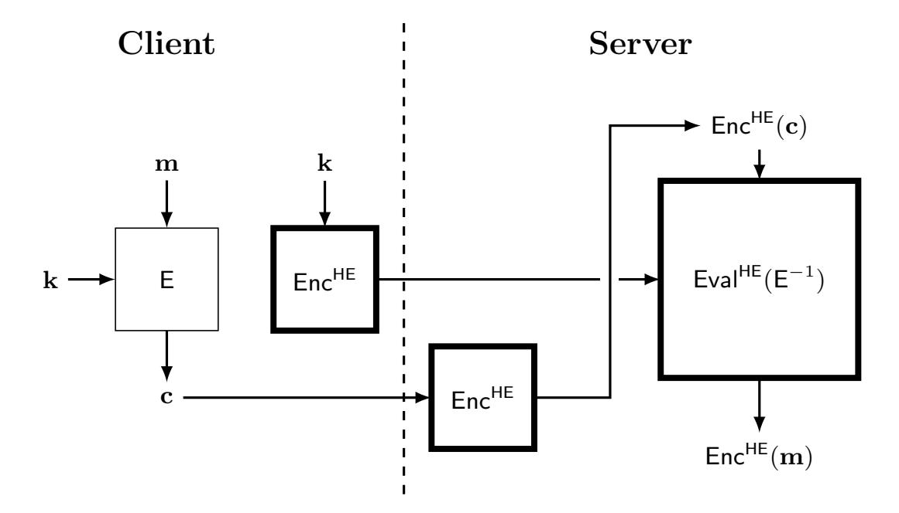
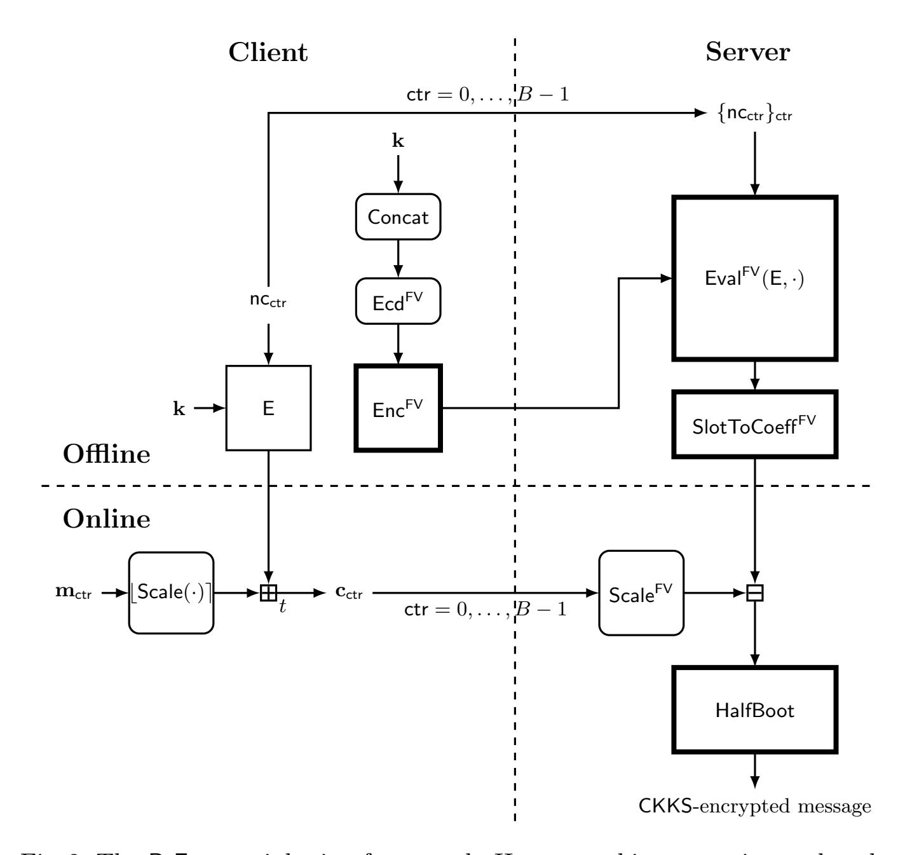
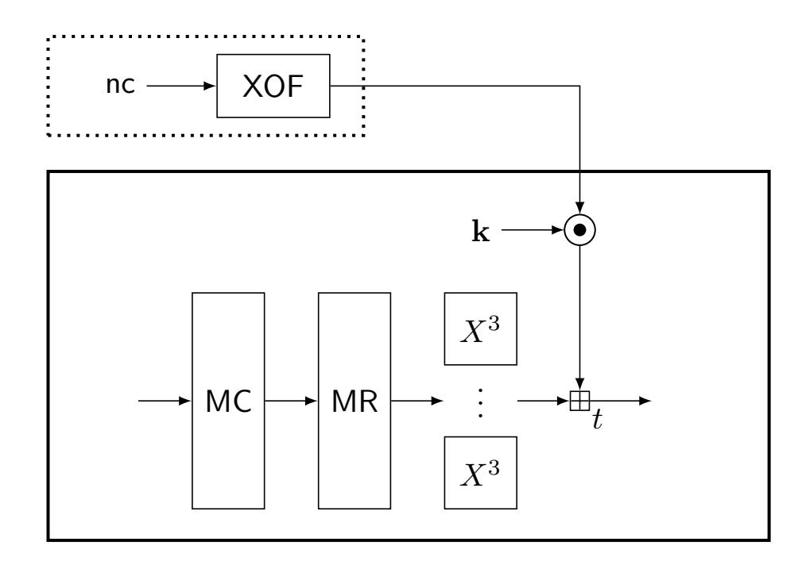
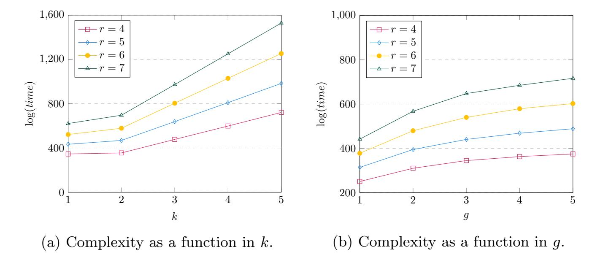
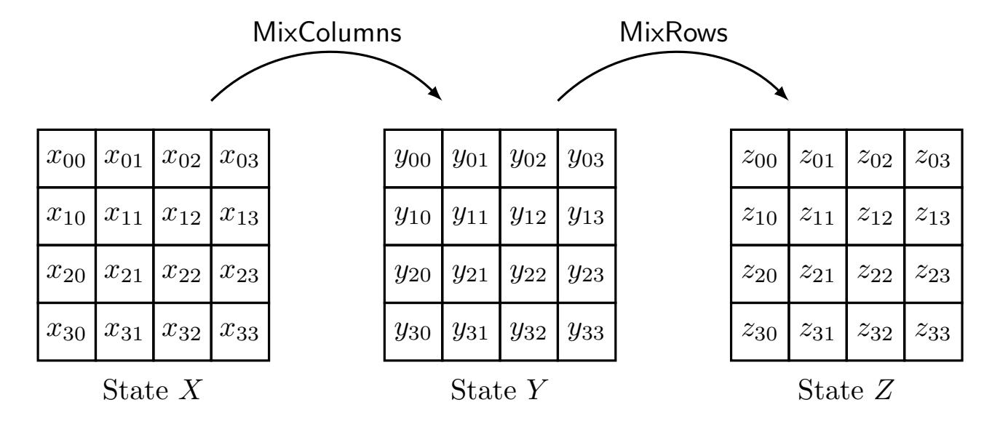
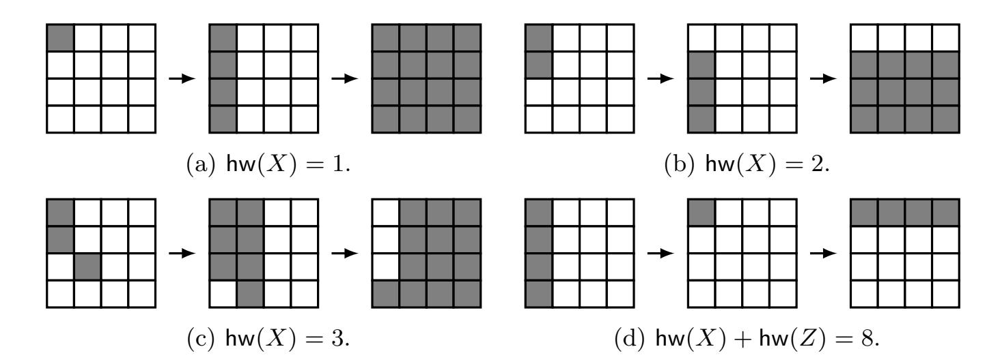

{0}------------------------------------------------

# <span id="page-0-0"></span>Transciphering Framework for Approximate Homomorphic Encryption (Full Version)

Jihoon Cho<sup>1</sup> , Jincheol Ha<sup>2</sup> , Seongkwang Kim<sup>2</sup> , Byeonghak Lee<sup>2</sup> , Joohee Lee<sup>1</sup> , Jooyoung Lee2? , Dukjae Moon<sup>1</sup> , and Hyojin Yoon<sup>1</sup>

<sup>1</sup> Samsung SDS, Seoul, Korea, {jihoon1.cho,joohee1.lee,dukjae.moon,hj1230.yoon}@samsung.com <sup>2</sup> KAIST, Daejeon, Korea, {smilecjf,ksg0923,lbh0307,hicalf}@kaist.ac.kr

Abstract. Homomorphic encryption (HE) is a promising cryptographic primitive that enables computation over encrypted data, with a variety of applications including medical, genomic, and financial tasks. In Asiacrypt 2017, Cheon et al. proposed the CKKS scheme to efficiently support approximate computation over encrypted data of real numbers. HE schemes including CKKS, nevertheless, still suffer from slow encryption speed and large ciphertext expansion compared to symmetric cryptography.

In this paper, we propose a novel hybrid framework, dubbed RtF (Real-to-Finite-field) framework, that supports CKKS. The main idea behind this construction is to combine the CKKS and the FV homomorphic encryption schemes, and use a stream cipher using modular arithmetic in between. As a result, real numbers can be encrypted without significant ciphertext expansion or computational overload on the client side.

As an instantiation of the stream cipher in our framework, we propose a new HE-friendly cipher, dubbed HERA, and extensively analyze its security and efficiency. The main feature of HERA is that it uses a simple randomized key schedule. Compared to recent HE-friendly ciphers such as FLIP and Rasta using randomized linear layers, HERA requires a smaller number of random bits. For this reason, HERA significantly outperforms existing HE-friendly ciphers on both the client and the server sides.

With the RtF transciphering framework combined with HERA at the 128-bit security level, we achieve small ciphertext expansion ratio with a range of 1.23 to 1.54, which is at least 23 times smaller than using (symmetric) CKKS-only, assuming the same precision bits and the same level of ciphertexts at the end of the framework. We also achieve 1.6 µs and 21.7 MB/s for latency and throughput on the client side, which are 9085 times and 17.8 times faster than the CKKS-only environment, respectively.

<sup>?</sup> This work was supported by the National Research Foundation of Korea (NRF) grant funded by the Korea government (MSIT) (No.2021R1F1A1047146).

{1}------------------------------------------------

Keywords: homomorphic encryption, transciphering framework, stream cipher, HE-friendly cipher

### 1 Introduction

Cryptography has been extensively used to protect data when it is stored (dataat-rest) or when it is being transmitted (data-in-transit). We also see increasing needs that data should be protected while it is being used, since it is often processed within untrusted environments. For example, organizations might want to migrate their computing environment from on-premise to public cloud, and to collaborate with their data without necessarily trusting each other. If data is protected by an encryption scheme which is homomorphic, then the cloud would be able to perform meaningful computations on the encrypted data, supporting a wide range of applications such as machine learning over a large amount of data preserving its privacy.

Homomorphic Encryption (for Approximate Computation). An encryption scheme that enables addition and multiplication over encrypted data without decryption key is called a homomorphic encryption (HE) scheme. Since the emergence of Gentry's blueprint [\[31\]](#page-28-0), there has been a large amount of research in this area [\[14,](#page-27-0) [29,](#page-28-1) [23,](#page-27-1) [33\]](#page-28-2). Various applications of HE to medical, genomic, and financial tasks have also been proposed [\[20,](#page-27-2) [22,](#page-27-3) [43,](#page-29-0) [51\]](#page-29-1).

However, real-world data typically contain some errors from their true values since they are represented by real numbers rather than bits or integers. Even in the case that input data are represented by exact numbers without approximation, one might have to approximate intermediate values during data processing for efficiency. Therefore, it would be practically relevant to support approximate computation over encrypted data. To the best of our knowledge, the CKKS encryption scheme [\[21\]](#page-27-4) is the only one that provides the desirable feature using an efficient encoder for real numbers. Due to this feature, CKKS achieves good performance in various applications, for example, to securely evaluate machine learning algorithms on a real dataset [\[13,](#page-27-5) [52\]](#page-29-2).

Unfortunately, HE schemes including CKKS commonly have two technical problems: slow encryption speed and large ciphertext expansion; the encryption/decryption time and the evaluation time of HE schemes are relatively slow compared to conventional encryption schemes. In particular, ciphertext expansion seems to be an intrinsic problem of homomorphic encryption due to the noise used in the encryption algorithm. Although the ciphertext expansion has been significantly reduced down to the order of hundreds in terms of the ratio of a ciphertext size to its plaintext size since the invention of the batching technique [\[32\]](#page-28-3), it does not seem to be acceptable from a practical view point. Furthermore, this ratio becomes even worse when it comes to encryption of a short message; encryption of a single bit might result in a ciphertext of a few megabytes.

Transciphering Framework for Exact Computation. To address the issue of the ciphertext expansion and the client-side computational overload, a hy-

{2}------------------------------------------------

<span id="page-2-0"></span>

Fig. 1: The (basic) transciphering framework. Homomorphic operations are performed in the boxes with thick lines.

brid framework, also called a transciphering framework, has been proposed [51] (see Figure 1). In the client-sever model, a client encrypts a message  $\mathbf{m}$  using a symmetric cipher E with a secret key  $\mathbf{k}$ ; this secret key is also encrypted using an HE algorithm  $\mathsf{Enc}^{\mathsf{HE}}$ . The resulting ciphertexts  $\mathbf{c} = \mathsf{E}_{\mathbf{k}}(\mathbf{m})$  and  $\mathsf{Enc}^{\mathsf{HE}}(\mathbf{k})$  are stored in the server.

When the server wants to compute  $\mathsf{Enc}^{\mathsf{HE}}(\mathbf{m})$  (for computation over encrypted data), it first computes  $\mathsf{Enc}^{\mathsf{HE}}(\mathbf{c})$  for the corresponding ciphertext  $\mathbf{c}$ . Then the server homomorphically evaluates  $\mathsf{E}^{-1}$  over  $\mathsf{Enc}^{\mathsf{HE}}(\mathbf{c})$  and  $\mathsf{Enc}^{\mathsf{HE}}(\mathbf{k})$ , securely obtaining  $\mathsf{Enc}^{\mathsf{HE}}(\mathbf{m})$ .

Given a symmetric cipher with low multiplicative depth and complexity, this framework has the following advantages on the client side.

- A client does not need to encrypt all its data using an HE algorithm (except the symmetric key). All the data can be encrypted using only a symmetric cipher, significantly saving computational resources in terms of time and memory.
- Symmetric encryption does not result in ciphertext expansion, so the communication overload between the client and the server will be significantly low compared to using any homomorphic encryption scheme alone.

All these merits come at the cost of computational overload on the server side. That said, this trade-off would be worth considering in practice since servers are typically more powerful than clients.

HE-FRIENDLY CIPHERS. Symmetric ciphers are built on top of linear and non-linear layers, and in a conventional environment, there has been no need to take different design principles for the two types of layers with respect to their implementation cost. However, when a symmetric cipher is combined with BGV/FV-style HE schemes in a transciphering framework, homomorphic addition becomes way cheaper than homomorphic multiplication in terms of computation time and

{3}------------------------------------------------

noise growth. With this observation, efficiency of an HE-friendly cipher is evaluated by its multiplicative complexity and depth. In an arithmetic circuit, its multiplicative complexity is represented by the number of multiplications (ANDs in the binary case). Multiplicative depth is the depth of the tree that represents the arithmetic circuit, closely related to the noise growth in the HE-ciphertexts. These two metrics have brought a new direction in the design of symmetric ciphers: to use simple nonlinear layers at the cost of highly randomized linear layers as adopted in the design of FLIP [50] and Rasta [25].

#### 1.1 Our Contribution

The main contribution of this paper is two-fold. First, we propose a new transciphering framework for the CKKS scheme that supports approximate computation over encrypted data. Second, we propose a new stream cipher, dubbed HERA (HE-friendly cipher with a RAndomized key schedule), to be built in our framework. Using our new transciphering framework combined with HERA, real numbers can be encrypted without significant ciphertext expansion or computational overload on the client side.

Rtf Transciphering Framework. The transciphering framework in Figure 1 does not directly apply to the CKKS scheme. The main reason is that it is infeasible to design an HE-friendly (deterministic) symmetric cipher E operating on real (or complex) numbers; if an HE-friendly symmetric cipher E over the real field exists, then E is given as a real polynomial map, and any ciphertext will be represented by a polynomial in the corresponding plaintext and the secret key over  $\mathbb{R}$ . Then, for given plaintext-ciphertext pairs  $(\mathbf{m}_i, \mathbf{c}_i)$ , an adversary will be able to establish a system of polynomial equations in the unknown key  $\mathbf{k}$ . The sum of  $\|\mathbf{E}_{\mathbf{k}}(\mathbf{m}_i) - \mathbf{c}_i\|_2^2$  over the plaintext-ciphertext pairs also becomes a real polynomial, where the actual key is the zero of this function. Since this polynomial is differentiable, its (approximate) zeros will be efficiently found by using iterative algorithms such as the gradient descent algorithm. By taking multiple plaintext-ciphertext pairs, the probability of finding any false key will be negligible.

In order to overcome this problem, we combine CKKS with FV which is a homomorphic encryption scheme using modular arithmetic [29], obtaining a novel hybrid framework, dubbed the RtF (Real-to-Finite-field) transciphering framework. This framework inherits a wide range of usability from the previous transciphering framework, such as efficient short message encryption or flexible repacking of data on the server side. Additionally, our framework does not require to use the complex domain for message spaces (as in the CKKS scheme), or any expertise of the CKKS parameter setting on the client side.

In brief, the RtF framework works as follows. First, the client scales up and rounds off real messages into  $\mathbb{Z}_t$ . Then it encrypts the messages using a stream cipher E over  $\mathbb{Z}_t$ . This "E-ciphertext" will be sent to the server with an FV-encrypted secret key of E, and stored there.

Whenever a "CKKS-ciphertext" is needed for any message **m**, the server encrypts the E-ciphertext of **m** in coefficients, using the FV scheme. With the

{4}------------------------------------------------

resulting FV-ciphertext, say C, and the FV-encrypted key, the server homomorphically evaluates the stream cipher E and moves the resulting keystreams from slots to coefficients using SlotToCoeffFV. By subtracting this ciphertext from C, the server obtains the FV-ciphertext of m in coefficients, not in slots. Finally, in order to translate this FV-ciphertext into the corresponding CKKS-ciphertext of m in slots, the server CKKS-bootstraps it. Since the message m should be moved from the coefficients to the slots, the last step of the bootstrapping, SlotToCoeffCKKS, can be omitted. As a result, the server will be able to approximately evaluate any circuit on the CKKS-ciphertexts. Details of the framework are given in Section [3.](#page-8-0)

Low-depth Stream Ciphers Using Modular Arithmetic. In the RtF transciphering framework, a stream cipher using modular arithmetic is required as a building block. There are only a few ciphers using modular arithmetic [\[2,](#page-26-0) [4,](#page-26-1) [5,](#page-26-2) [34\]](#page-28-4), and even such algorithms are not suitable for our transciphering framework due to their high multiplicative depths. In order to make our transciphering framework efficiently work, we propose a new HE-friendly cipher HERA, operating on a modular space with low multiplicative depth.

Recent constructions for HE-friendly ciphers such as FLIP and Rasta use randomized linear layers in order to reduce the multiplicative depth without security degradation. However, this type of ciphers spend too many random bits to generate random matrices, slowing down the overall speed on both the client and the server sides. Instead of generating random matrices, we propose to randomize the key schedule algorithm by combining the secret key with a (public) random value for every round.

Implementation. We implement the RtF transciphering framework with the stream cipher HERA in public repository[3](#page-0-0) . In Section [5.2,](#page-24-0) we present the benchmark of the client-side encryption in C++ and the server-side transciphering using the Lattigo library. We also compare our framework to PEGASUS [\[46\]](#page-29-4) and CKKS only. In Appendix [E,](#page-42-0) we compare HERA to existing HE-friendly ciphers using the HElib library.

In summary, we achieve small ciphertext expansion ratio with a range of 1.23 to 1.54 on the client side, which is 23 times smaller than the (symmetric) CKKSonly environment assuming similar precision and the same level of ciphertexts at the end of the framework. When it comes to latency and throughput, we achieve 1.6 µs and 21.7 MB/s on the client side, which is 9085 times and 17.8 times faster than the CKKS-only environment respectively. We refer to Section [5.2](#page-24-0) for more details.

### 1.2 Related Work

Homomorphic Evaluation of Symmetric Ciphers. Since the transciphering framework has been introduced [\[51\]](#page-29-1), early works have been focused on homomorphic evaluation of popular symmetric ciphers (e.g., AES [\[32\]](#page-28-3), SIMON [\[45\]](#page-29-5),

<sup>3</sup> <https://github.com/KAIST-CryptLab/RtF-Transciphering>

{5}------------------------------------------------

and PRINCE [\[27\]](#page-28-5)). Such ciphers have been designed without any consideration on their arithmetic complexity, so the performance of their homomorphic evaluation was not satisfactory. In this line of research, LowMC [\[3\]](#page-26-3) is the first construction that aims to minimize the depth and the number of AND gates. However, it turned out that LowMC is vulnerable to algebraic attacks [\[24,](#page-27-7) [26,](#page-28-6) [53\]](#page-29-6), so it has been revised later.[4](#page-0-0)

Canteaut et al. [\[15\]](#page-27-8) claimed that stream ciphers would be advantageous in terms of online complexity compared to block ciphers, and proposed a new stream cipher Kreyvium. However, its practical relevance is limited since the multiplicative depth (with respect to the secret key) keeps growing as keystreams are generated. The FLIP stream cipher [\[50\]](#page-29-3) is based on a novel design strategy that its permutation layer is randomly generated for every encryption without increasing the algebraic degree in its secret key. Furthermore, it has been reported that FiLIP [\[49\]](#page-29-7), a generalized instantiation of FLIP, can be efficiently evaluated with the TFHE scheme [\[39\]](#page-28-7). Rasta [\[25\]](#page-27-6) is a stream cipher aiming at higher throughput at the cost of high latency using random linear layers, which are generated by an extendable output function. Dasta [\[37\]](#page-28-8), a variant of Rasta using affine layers with lower entropy, boosts up the client-side computation. As another variant of Rasta, Masta [\[35\]](#page-28-9) operates on a modular domain, improving upon Rasta in terms of the throughput of homomorphic evaluation.

Compression of HE Ciphertexts. In order to reduce the memory overhead when encrypting short messages, Chen et al. [\[17\]](#page-27-9) also proposed an efficient LWEs-to-RLWE conversion method which enables transciphering to the CKKS ciphertexts: small messages can be encrypted by LWE-based symmetric encryption with a smaller ciphertext size (compared to RLWE-based encryption), and a collection of LWE ciphertexts can be repacked to an RLWE ciphertext to perform a homomorphic evaluation. Lu et al. [\[46\]](#page-29-4) proposed a faster LWEs-to-RLWE conversion algorithm in a hybrid construction of FHEW and CKKS, dubbed PEGASUS, where the conversion is not limited to a small number of slots.

Chen et al. [\[18\]](#page-27-10) proposed a hybrid HE scheme using the CKKS encoding algorithm and a variant of FV. This hybrid scheme makes the ciphertext size a few times smaller compared to using CKKS only, in particular, when the number of slots is small. However, the ciphertexts from this hybrid scheme are of size larger than tens of kilobytes, which limits its practical relevance.

### 2 Preliminaries

Notations. Throughout the paper, bold lowercase letters (resp. bold uppercase letters) denote vectors (resp. matrices). For a real number r, bre denotes the nearest integer to r, rounding upwards in case of a tie. For an integer q, we identify Z<sup>q</sup> with Z ∩ (−q/2, q/2], and for any real number z, [z]<sup>q</sup> denotes the mod q reduction of z into (−q/2, q/2]. The notation b·e and [·]<sup>q</sup> are extended

<sup>4</sup> [https://github.com/LowMC/lowmc/blob/master/determine\\_rounds.py](https://github.com/LowMC/lowmc/blob/master/determine_rounds.py)

{6}------------------------------------------------

to vectors (resp. polynomials) to denote their component-wise (resp. coefficient-wise) reduction. For a complex vector  $\mathbf{x}$ , its  $\ell_p$ -norm is denoted by  $\|\mathbf{x}\|_p$ . When we say  $\ell_p$ -norm of a polynomial, it means that the  $\ell_p$ -norm of the coefficient vector of the polynomial.

Usual dot products of vectors are denoted by  $\langle \cdot, \cdot \rangle$ . Throughout the paper,  $\zeta$  and  $\xi$  denote a 2N-th primitive root of unity over the complex field  $\mathbb{C}$ , and the finite field  $\mathbb{Z}_t$ , respectively, for fixed parameters N and t. We denote the multiplicative group of  $\mathbb{Z}_t$  by  $\mathbb{Z}_t^{\times}$ . The set of strings of arbitrary length over a set S is denoted by  $S^*$ . For two vectors (strings)  $\mathbf{a}$  and  $\mathbf{b}$ , their concatenation is denoted by  $\mathbf{a} \| \mathbf{b}$ . For a set S, we will write  $a \leftarrow S$  to denote that a is chosen from S uniformly at random. For a probability distribution  $\mathcal{D}$ ,  $a \leftarrow \mathcal{D}$  will denote that a is sampled according to the distribution  $\mathcal{D}$ . Unless stated otherwise, all logarithms are to the base 2.

### 2.1 Homomorphic Encryption

As the building blocks of our transciphering framework, we will briefly review the FV and CKKS homomorphic encryption schemes of which security is based on the hardness of Ring Learning With Errors (RLWE) problem [54, 47]. For more details, we refer to [29, 21].

It is remarkable that FV and CKKS use the same ciphertext space; for a positive integer q, an integer M which is a power of two, and N=M/2, both schemes use

$$\mathcal{R}_q = \mathbb{Z}_q[X]/(\Phi_M(X))$$

as their ciphertext spaces, where  $\Phi_M(X) = X^N + 1$ . They also use similar algorithms for key generation, encryption, decryption, and homomorphic addition and multiplication. However, the FV scheme supports *exact* computation modulo t (which satisfies  $t \equiv 1 \pmod{M}$ ) throughout this paper), while the CKKS scheme supports *approximate* computation over the real numbers by taking different strategies to efficiently encode messages.

ENCODERS AND DECODERS. The main difference between FV and CKKS comes from their methods to encode messages lying in distinct spaces. The encoder  $\operatorname{Ecd}_{\ell}^{\mathsf{FV}}: \mathbb{Z}_t^\ell \to \mathcal{R}_t$  of the FV scheme is the inverse of the decoder  $\operatorname{Dcd}_{\ell}^{\mathsf{FV}}$  defined by, for  $p(X) = \sum_{k=0}^{\ell-1} a_k X^{kN/\ell} \in \mathcal{R}_t$ ,

$$\mathsf{Dcd}^{\mathsf{FV}}_{\ell}(p(X)) = (p(\alpha_0), \cdots, p(\alpha_{\ell-1})) \in \mathbb{Z}_t^{\ell},$$

where  $\alpha_i = \xi^{5^i \cdot N/\ell} \pmod{t}$  for  $0 \le i \le \ell/2 - 1$  and  $\alpha_i = \xi^{-5^{i-\ell/2} \cdot N/\ell} \pmod{t}$  for  $\ell/2 \le i \le \ell - 1$ .

Let  $\Delta_{\mathsf{CKKS}}$  be a positive real number (called a scaling factor in [21]). The CKKS encoder  $\mathsf{Ecd}_{\ell/2}^{\mathsf{CKKS}}: \mathbb{C}^{\ell/2} \to \mathcal{R}$  is the (approximate) inverse of the decoder

<sup>&</sup>lt;sup>5</sup> A primitive root of unity  $\xi$  exists if the characteristic t of the message space is an odd prime such that  $t \equiv 1 \pmod{M}$ .

{7}------------------------------------------------

 $\mathsf{Dcd}_{\ell/2}^{\mathsf{CKKS}}: \mathcal{R} \to \mathbb{C}^{\ell/2}$ , where for  $p(X) = \sum_{k=0}^{\ell-1} a_k X^{kN/\ell} \in \mathcal{R}$ ,

$$\mathsf{Dcd}_{\ell/2}^{\mathsf{CKKS}}(p(X)) = \Delta_{\mathsf{CKKS}}^{-1} \cdot (p(\beta_0), p(\beta_1), \cdots, p(\beta_{\ell/2-1})) \in \mathbb{C}^{\ell/2},$$

where  $\beta_j = \zeta^{5^j \cdot N/\ell} \in \mathbb{C}$  for  $0 \le j \le \ell/2 - 1$ .

ALGORITHMS. FV and CKKS share a common key generation algorithm. The descriptions of those two schemes have also been merged, so that one can easily compare the differences between FV and CKKS.

- Key generation: given a security parameter  $\lambda > 0$ , fix integers N, P, and  $q_0, \ldots, q_L$  such that  $q_i$  divides  $q_{i+1}$  for  $0 \le i \le L-1$ , and distributions  $\mathcal{D}_{key}$ ,  $\mathcal{D}_{err}$  and  $\mathcal{D}_{enc}$  over  $\mathcal{R}$  in a way that the resulting scheme is secure against any adversary with computational resource of  $O(2^{\lambda})$ .
  - 1. Sample  $a \leftarrow \mathcal{R}_{q_L}$ ,  $s \leftarrow \mathcal{D}_{key}$ , and  $e \leftarrow \mathcal{D}_{err}$ .
  - 2. The secret key is defined as  $sk = (1, s) \in \mathbb{R}^2$ , and the corresponding public key is defined as  $pk = (b, a) \in \mathbb{R}^2_{q_L}$ , where  $b = [-a \cdot s + e]_{q_L}$ .
  - 3. Sample  $a' \leftarrow \mathcal{R}_{P \cdot q_L}$  and  $e' \leftarrow \mathcal{D}_{err}$ .
  - 4. The evaluation key is defined as  $evk = (b', a') \in \mathcal{R}^2_{P \cdot q_L}$ , where  $b' = [-a' \cdot s + e' + Ps']_{P \cdot q_L}$  for  $s' = [s^2]_{q_L}$ .
- $[-a' \cdot s + e' + Ps']_{P \cdot q_L}$  for  $s' = [s^2]_{q_L}$ . – Encryption: given a public key  $pk \in \mathcal{R}_{q_L}^2$  and a plaintext  $m \in \mathcal{R}$ ,
  - 1. Sample  $r \leftarrow \mathcal{D}_{enc}$  and  $e_0, e_1 \leftarrow \mathcal{D}_{err}$ .
  - 2. Compute  $\text{Enc}(pk, 0) = [r \cdot pk + (e_0, e_1)]_{q_L}$ .
  - For FV,  $\operatorname{Enc}^{\mathsf{FV}}(pk,m) = [\operatorname{Enc}(pk,0) + (\Delta_{\mathsf{FV}} \cdot [m]_t,0)]_{q_L}$ , where  $\Delta_{\mathsf{FV}} = \lfloor q_L/t \rfloor$ .
  - For CKKS,  $\operatorname{Enc}^{\operatorname{CKKS}}(pk,m) = [\operatorname{Enc}(pk,0) + (m,0)]_{q_L}$ .
- Decryption: given a secret key  $sk \in \mathbb{R}^2$  and a ciphertext  $ct \in \mathbb{R}^2_{q_l}$ ,

$$\mathsf{Dec}^{\mathsf{FV}}(sk,ct) = \left\lfloor \frac{t}{q_l} [\langle sk,ct \rangle]_{q_l} \right\rfloor;$$
$$\mathsf{Dec}^{\mathsf{CKKS}}(sk,ct) = [\langle sk,ct \rangle]_{q_l}.$$

- Addition: given ciphertexts  $ct_1$  and  $ct_2$  in  $\mathcal{R}_{q_l}^2$ , their sum is defined as

$$ct_{add} = [ct_1 + ct_2]_{a_1}$$

- Multiplication: given ciphertexts  $ct_1 = (b_1, a_1)$  and  $ct_2 = (b_2, a_2)$  in  $\mathcal{R}_{q_l}^2$  and an evaluation key evk, their product is defined as

$$ct_{mult} = \left[ (d_0, d_1) + \left\lfloor P^{-1} \cdot d_2 \cdot evk \right\rceil \right]_{q_l},$$

where  $(d_0, d_1, d_2)$  is defined by  $[(b_1b_2, a_1b_2 + a_2b_1, a_1a_2)]_{q_l}$  when using CKKS and  $\left[\left\lfloor \frac{t}{q_l}(b_1b_2, a_1b_2 + a_2b_1, a_1a_2)\right\rfloor\right]_{q_l}$  when using FV.

– Rescaling (Modulus switching): given a ciphertext  $ct \in \mathcal{R}^2_{q_l}$  and l' < l, its rescaled ciphertext is defined as

$$\mathsf{Rescale}_{l \to l'}(ct) = \left[ \left\lfloor \frac{q_{l'}}{q_l} \cdot ct \right\rceil_{q_{l'}}.$$

{8}------------------------------------------------

### 2.2 Some Notable Homomorphic Operations

Bootstrapping for CKKS. The bootstrapping procedure for CKKS has been actively studied recently [\[36,](#page-28-10) [12,](#page-27-11) [44,](#page-29-10) [19\]](#page-27-12). Let ct be a CKKS-ciphertext of m(Y ) ∈ Z[Y ]/(Y ` + 1) with respect to the secret key sk and the ciphertext modulus q, where Y = XN/`, namely, m(Y ) = [hct, ski]q. In this case, m(Y ) has `/2 slots. The CKKS bootstrapping aims to find a larger modulus Q > q and a ciphertext ct0 such that m(Y ) = [hct<sup>0</sup> , ski]Q. It consists of five steps: ModRaise, SubSum, CoeffToSlotCKKS , EvalMod, and SlotToCoeffCKKS .

- ModRaise: If we set t(X) = hct, ski ∈ R, then t(X) = q · I(X) + m(Y ) for some I(X) ∈ R. ModRaise raises the ciphertext modulus to Q q so that ct is regarded as an encryption of t(X) with respect to modulus Q.
- SubSum: If N 6= `, then SubSum maps I(X) to a polynomial in Y , that is, q · I(X) + m(Y ) to (N/`) · (q · ˜I(Y ) + m(Y )).
- CoeffToSlotCKKS: Since the message q · I(X) + m(Y ) is in the coefficient domain, it requires homomorphic evaluation of the encoding algorithm to enable slot-wise modulo q operation. CoeffToSlotCKKS performs homomorphic evaluation of the inverse Discrete Fourier Transform (DFT) to obtain the ciphertext(s) of EcdCKKS(q · I(X) + m(Y )).
- EvalMod: To approximate the modulo q operation, EvalMod homomorphically evaluates a polynomial approximation of f(t) = <sup>q</sup> 2π sin 2πt q . In recent works [\[12,](#page-27-11) [36\]](#page-28-10), Chebyshev polynomial approximations are used.
- SlotToCoeffCKKS: It performs homomorphic evaluation of DFT to output a ciphertext of m(Y ) back in its coefficient domain.

Operations in FV. In the FV scheme, there are two operations between slots and coefficients.

- CoeffToSlotFV: It is a homomorphic evaluation of FV-encoding function. It semantically puts the coefficients of a plaintext polynomial into the vector of slots. It is done by multiplying the inverse Number Theoretic Transform (NTT) matrix.
- SlotToCoeffFV: It is a homomorphic evaluation of FV-decoding function. It semantically puts the slot vector of a message into the coefficients of the plaintext polynomial. It is also done by multiplying the NTT matrix.

### <span id="page-8-0"></span>3 RtF Transciphering Framework

In this section, we describe how the RtF transciphering framework works, and analyze the message precision of the framework.

{9}------------------------------------------------

<span id="page-9-0"></span>

Fig. 2: The RtF transciphering framework. Homomorphic encryption and evaluation is performed in the boxes with thick lines. Operations in the boxes with rounded corners do not use any secret information. The vertical dashed line distinguishes the client-side and the server-side computation, while the horizontal dashed line distinguishes the offline and the online computation. The client sends ciphertexts block by block, while the server gathers B ciphertext blocks and recovers the CKKS-encrypted message of the ciphertexts.

{10}------------------------------------------------

### 3.1 Overview of the Framework

Our RtF transciphering framework aims to replace the (basic) transciphering framework in Figure [1](#page-2-0) to support CKKS, when equipped with any suitable stream cipher. The overall design is depicted in Figure [2.](#page-9-0) At a high level, we propose to use a stream cipher operating on Z n t to encrypt real number messages on the client side and to convert the ciphertexts into the corresponding CKKS ciphertexts on the server side. In this regard, it is required to employ an additional HE scheme which provides homomorphic evaluation of keystreams of the stream cipher over the modulo t spaces efficiently, and we use FV for this purpose.

The main idea of the RtF framework is to inject real messages into the coefficients of plaintext polynomials of FV and to delegate encoding/decoding to the server via SlotToCoeff and CoeffToSlot for FV and CKKS which is described more precisely as follows.

First, a message of real numbers mctr ∈ R <sup>n</sup> is scaled into Z n <sup>t</sup> by multiplying by a constant and rounding, and encrypted to cctr on the client side. After gathering symmetric ciphertexts cctr's from the client, the server generates a polynomial C ∈ R<sup>t</sup> whose coefficients are components of cctr's. Then the polynomial is scaled up into the FV ciphertext space by multiplying ∆FV, say C = (∆FV · C, 0).[6](#page-0-0) On the other hand, when the server evaluates the symmetric cipher, a bunch of the keystream is FV-encrypted in slots. In order to match the domain of computation, the server evaluates

$$\mathsf{SlotToCoeff}^{\mathsf{FV}} : \mathsf{Enc}^{\mathsf{FV}}(\mathsf{Ecd}^{\mathsf{FV}}(z_0, \dots, z_{N-1})) \mapsto \mathsf{Enc}^{\mathsf{FV}}(z_0 + \dots + z_{N-1}X^{N-1})$$

after evaluation of the cipher, where (z0, . . . , zN−1) is the concatenated keystream. Then, homomorphically computing

$$(\Delta_{\mathsf{FV}} \cdot C, 0) - \mathsf{Enc}^{\mathsf{FV}}(z_0 + \dots + z_{N-1}X^{N-1}),$$

we have EncFV(m<sup>0</sup> + · · · + mN−1XN−<sup>1</sup> ), where (m0, . . . , mN−1) is the concatenated message. The next step is to convert the type of encryption to CKKS and then to put the messages into slots, which can be done by HalfBoot.

In the bootstrapping procedure, there are five steps as follows:

$$\mathsf{ModRaise} \to \mathsf{SubSum} \to \mathsf{CoeffToSlot}^\mathsf{CKKS} \to \mathsf{EvalMod} \to \mathsf{SlotToCoeff}^\mathsf{CKKS}$$

.

HalfBoot basically follows the procedure of CKKS bootstrapping, except the final SlotToCoeffCKKS step. Since the input ciphertext of HalfBoot contains the original message (m0, . . . , mN−1) in coefficients rather than slots, it does not require to move data in slots back to coefficients after EvalMod. Furthermore, with an appropriate rescaling, HalfBoot gives an effect of full bootstrapping to enable further approximate computations on the output CKKS ciphertexts.

<sup>6</sup> We note that cctr's are in coefficients, not in slots.

{11}------------------------------------------------

#### 3.2Specification

For a fixed security parameter  $\lambda$ , all the other parameters for the FV and the CKKS schemes will be set accordingly, including the degree of the polynomial modulus N, the ciphertext moduli  $\{q_i\}_{i=0}^L$  (used for both FV and CKKS), and the FV plaintext modulus t. With these parameters fixed, we will describe how the framework works, distinguishing four parts; initialization, client-side computation, and offline/online server-side computation (see Figure 2). The client-side and server-side computations are described in Algorithm 1 and Algorithm 2, respectively.

**Algorithm 1:** Client-side symmetric key encryption of the RtF transciphering framework

### Input:

- Nonce  $\mathsf{nc}_{\mathsf{ctr}} \in \{0,1\}^{\lambda}$
- Symmetric key  $\mathbf{k} \in \mathbb{Z}_t^n$
- Tuple of messages  $\mathbf{m}_{\mathsf{ctr}} \in \mathbb{R}^n$
- Scaling factor  $\delta$

### Output:

- Symmetric ciphertext  $\mathbf{c}_{\mathsf{ctr}} \in \mathbb{Z}_t^n$ 

```
\mathbf{1} \ \mathbf{z}_{\mathsf{ctr}} \leftarrow \mathsf{E}(\mathbf{k}_{\mathsf{ctr}}, \mathsf{nc}_{\mathsf{ctr}})
\mathbf{2} \ \widetilde{\mathbf{m}}_{\mathsf{ctr}} \leftarrow \lfloor \delta \cdot \mathbf{m}_{\mathsf{ctr}} \rceil
```

- $\mathbf{c}_{\mathsf{ctr}} \leftarrow [\widetilde{\mathbf{m}}_{\mathsf{ctr}} + \mathbf{z}_{\mathsf{ctr}}]_t$
- <span id="page-11-0"></span>4 return c<sub>ctr</sub>

Initialization. We use FV and CKKS with the same cyclotomic polynomial of degree N, and the same public-private key pair (pk, sk). The public key pkis shared by the server and the client. Let  $\ell$  be the number of used slots per FV-ciphertext to encrypt  $\mathbf{k} \in \mathbb{Z}_t^n$  which satisfies  $n \mid \ell$  and  $\ell \mid N$ . To enable SIMD evaluation for keystreams, we consider the following matrix of B duplications of k.

$$\mathsf{Concat}(\mathbf{k}) \coloneqq \underbrace{(\mathbf{k} \| \mathbf{k} \| \cdots \| \mathbf{k})}_{B\text{-times}} \in \mathbb{Z}_t^{n \times B}.$$

The client can pack the coefficients of matrix Concat(k) column-wisely into one glued column vector in  $\mathbb{Z}_t^{nB}$  or row-by-row manner, which are called column-wise and row-wise packing, respectively. The number of keystreams calculated in a single ciphertext (resp. n ciphertexts) is  $B = \ell/n$  for column-wise packing (resp.  $B = \ell$  for row-wise packing). We refer to Appendix A for more details.

To summarize, the client computes

$$\mathcal{K} \coloneqq \mathsf{Enc}^{\mathsf{FV}}(pk, \mathsf{Ecd}^{\mathsf{FV}}(\mathsf{Concat}(\mathbf{k}))),$$

{12}------------------------------------------------

**Algorithm 2:** Server-side homomorphic evaluation of decryption of the RtF transciphering framework

### Input:

- Set of nonces  $\mathsf{nc}_0, \ldots, \mathsf{nc}_{B-1} \in \{0, 1\}^{\lambda}$
- Homomorphically encrypted keys  $\mathcal{K} = \mathsf{Enc}^{\mathsf{FV}}\left(\mathsf{Ecd}^{\mathsf{FV}}(\mathsf{Concat}(\mathbf{k}))\right)$
- Tuple of symmetric ciphertexts  $\mathbf{c} = (\mathbf{c}_0, \dots, \mathbf{c}_{B-1}) \in (\mathbb{Z}_t^n)^B$

### **Output:**

- CKKS-encrypted message  $\mathcal{M}$ 

```
\begin{array}{l} \mathbf{1} \ \mathcal{V} \leftarrow \mathsf{Eval}^{\mathsf{FV}}(\mathsf{E},\mathcal{K},\{\mathsf{nc}_{\mathsf{ctr}}\}_{\mathsf{ctr}}) \\ \mathbf{2} \ \mathcal{Z} \leftarrow \mathsf{SlotToCoeff}^{\mathsf{FV}}(\mathcal{V}) \\ \mathbf{3} \ \mathcal{C} \leftarrow \mathsf{VecToPoly}(\mathbf{c}) \\ \mathbf{4} \ \mathcal{C} \leftarrow (\Delta_{\mathsf{FV}} \cdot \mathcal{C},0) \\ \mathbf{5} \ \mathcal{X} \leftarrow [\mathcal{C} - \mathcal{Z}]_q \\ \mathbf{6} \ \mathcal{X} \leftarrow \mathsf{Rescale}_{\rightarrow 0}(\mathcal{X}) \\ \mathbf{7} \ \mathcal{M} \leftarrow \mathsf{HalfBoot}(\mathcal{X}) \\ \mathbf{8} \ \mathbf{return} \ \mathcal{M} \end{array}
```

<span id="page-12-0"></span>and sends  $\mathcal{K}$  to the server. We note that this initialization phase can be done only once at the beginning of the RtF framework. The client also generates a random value  $nc \in \{0,1\}^{\lambda}$  and sends it to the server.

CLIENT-SIDE COMPUTATION. Given a nonce  $\mathbf{nc} \in \{0,1\}^{\lambda}$ , a secret key  $\mathbf{k} \in \mathbb{Z}_t^n$  of E, an *n*-tuple of real messages  $\mathbf{m} = (m_0, \dots, m_{n-1}) \in \mathbb{R}^n$ , and a scaling factor  $\delta > 0$ , the client executes the following encryption algorithm as described in Algorithm 1.

The client computes keystream  $\mathbf{z} = \mathsf{E}_{\mathbf{k}}(\mathsf{nc}) \in \mathbb{Z}_t^n$ . Then, the client scales the message  $\mathbf{m}$  by multiplying  $\delta$  to every component of  $\mathbf{m}$ . Rounding it off gives a vector  $\widetilde{\mathbf{m}} \in \mathbb{Z}^n$ . If t and  $\delta$  are appropriately chosen, the norm  $\|\widetilde{\mathbf{m}}\|_{\infty}$  can be upper bounded by t/2. Finally, the client computes

$$\mathbf{c} \coloneqq [\widetilde{\mathbf{m}} + \mathbf{z}]_{t}$$
,

and sends it to the server.

OFFLINE SERVER-SIDE COMPUTATION. Given a tuple of nonces  $(nc_0, ..., nc_{B-1})$  and the FV-encrypted key  $\mathcal{K}$ , the server is able to construct a circuit for the homomorphic evaluation of E, denoted by  $\text{Eval}^{\text{FV}}(\mathsf{E}, \{\mathsf{nc}_{\text{ctr}}\}_{\text{ctr}}, \cdot)$ . The circuit constructed for column-wise (resp. row-wise) packing method returns 1 ciphertext (resp. n ciphertexts) which packs  $\ell/n$  keystreams (resp.  $\ell$  keystreams). With the FV-encrypted key  $\mathcal{K}$ , the server homomorphically computes  $\mathcal{V} := \text{Eval}^{\text{FV}}(\mathsf{E}, \{\mathsf{nc}_{\text{ctr}}\}_{\text{ctr}}, \mathcal{K})$ . For ease of notation, we explain the remaining parts with column-wise packing method. Denoting the concatenation of  $\ell/n$  keystreams by

{13}------------------------------------------------

 $(z_0,\ldots,z_{\ell-1})\in\mathbb{Z}_t^\ell$ , the resulting FV-ciphertext  $\mathcal{V}$  can be represented as

$$\mathsf{Enc}^\mathsf{FV}\left(\mathsf{Ecd}^\mathsf{FV}_\ell(z_0,\dots,z_{\ell-1})\right).$$

Finally, the server computes

$$\mathcal{Z} \coloneqq \mathsf{SlotToCoeff}^\mathsf{FV}(\mathcal{V}) = \mathsf{Enc}^\mathsf{FV}\left(\sum_{k=0}^{\ell-1} z_k X^{k\cdot N/\ell}\right).$$

Online Server-side Computation. Given a tuple of symmetric ciphertexts  $\mathbf{c} = (\mathbf{c}_0, \dots, \mathbf{c}_{\ell/n-1}) \in (\mathbb{Z}_t^n)^{\ell/n}$ , the server scales up  $\mathbf{c}$  into FV-ciphertext space to enable FV evaluation, namely

$$C := \mathsf{VecToPoly}(\mathbf{c}),$$
  
 $\mathcal{C} := (\Delta_{\mathsf{FV}} \cdot C, 0),$ 

where VecToPoly is defined by

VecToPoly: 
$$\mathbb{R}^\ell \longrightarrow \mathbb{R}[X]/(\Phi_{2N}(X))$$
  
 $(m_0,\ldots,m_{\ell-1})\mapsto \sum_{k=0}^{\ell-1} m_k X^{k\cdot N/\ell}.$ 

Then, server computes  $\mathcal{X} := [\mathcal{C} - \mathcal{Z}]_q$ , where q is the ciphertext modulus of  $\mathcal{Z}$ , and rescales it to the lowest level of CKKS.

Now, the only remaining procedure is HalfBoot, which combines ModRaise, SubSum, CoeffToSlot<sup>CKKS</sup>, and EvalMod sequentially. Denoting the scaled message by  $(\widetilde{\mathbf{m}}_0, \dots, \widetilde{\mathbf{m}}_{\ell/n-1}) := (\widetilde{m}_0, \dots, \widetilde{m}_{\ell-1}) \in \mathbb{Z}^{\ell}$ , the resulting ciphertext can be represented as

$$\mathcal{X} := \mathsf{Enc}^\mathsf{CKKS} \left( \sum_{k=0}^{\ell-1} \widetilde{m}_k X^{k \cdot N/\ell} \right).$$

Then, after ModRaise, we have

$$\mathcal{X}' := \mathsf{Enc}^{\mathsf{CKKS}} \left( \sum_{k=0}^{\ell-1} \widetilde{m}_k X^{k \cdot N/\ell} + q_0 \cdot I(X) \right)$$

for some polynomial  $I(X) = r_0 + \cdots + r_{N-1}X^{N-1} \in \mathcal{R}$ . By evaluating SubSum, the polynomial I(X) becomes sparsely packed

$$\widetilde{I}(X) = \frac{N}{\ell} \sum_{k=0}^{\ell-1} r_{k \cdot N/\ell} X^{k \cdot N/\ell}$$

and the message is scaled by  $N/\ell$ , say  $\widetilde{m}_k \leftarrow (N/\ell) \cdot \widetilde{m}_k$ . Evaluating CoeffToSlot<sup>CKKS</sup> gives two ciphertexts as follows.

$$\begin{split} \mathcal{Y}_0 &= \mathsf{Enc}^{\mathsf{CKKS}} \left( \mathsf{Ecd}^{\mathsf{CKKS}}_{\ell/2} (\widetilde{m}_0 + q_0 \widetilde{r}_0, \dots, \widetilde{m}_{\ell/2-1} + q_0 \widetilde{r}_{\ell/2-1}) \right) \\ \mathcal{Y}_1 &= \mathsf{Enc}^{\mathsf{CKKS}} \left( \mathsf{Ecd}^{\mathsf{CKKS}}_{\ell/2} (\widetilde{m}_{\ell/2} + q_0 \widetilde{r}_{\ell/2}, \dots, \widetilde{m}_{\ell-1} + q_0 \widetilde{r}_{\ell-1}) \right) \end{split}$$

{14}------------------------------------------------

where  $\tilde{r}_k = (N/\ell) \cdot r_{k \cdot N/\ell}$  for  $k = 0, 1, \dots, \ell - 1$ . If  $\ell \neq N$ , then those two ciphertexts can be packed in a ciphertext. As EvalMod evaluates the modulo- $q_0$  operation approximately, EvalMod operation results in what we want.

#### <span id="page-14-1"></span>3.3 Message Precision

As the CKKS scheme adds some noise for every arithmetic operation, it is important to analyze how close the output  $\mathcal{M}$  of Algorithm 2 is to the original message. In this section, we bound the error occurred in the RtF framework. First, we bound the error in the middle state  $\mathcal{X}$  in Algorithm 2.

Let  $\mathbf{m} \in \mathbb{R}^{\ell}$  be an  $(\ell/n)$ -concatenation of the client's message as an input to Algorithm 1 such that  $\widetilde{\mathbf{m}} = \lfloor \delta \cdot \mathbf{m} \rceil$  and  $\|\widetilde{\mathbf{m}}\|_{\infty} \leq \lfloor t/2 \rfloor$ , and let  $\mathcal{X}$  be the state in line 5 of Algorithm 2 before rescaling to zero level and HalfBoot in Algorithm 2. If  $e_{\text{eval}} \in \mathcal{R}$  is an error from homomorphic evaluation of E with FV such that  $\|e_{\text{eval}}\|_{\infty} < \Delta_{\text{FV}}/2$  (i.e., the ciphertext is correctly FV-decryptable), then we have

$$\left\| \mathsf{VecToPoly}(\mathbf{m}) - \frac{\mathsf{Dec}^{\mathsf{CKKS}}(\mathcal{X})}{\delta \Delta_{\mathsf{FV}}} \right\|_{\infty} \leq \frac{1}{2\delta} + \frac{\|e_{\mathsf{eval}}\|_{\infty}}{\Delta_{\mathsf{FV}}\delta}$$
$$\leq \frac{1}{2\delta} + \frac{1}{2\delta} = \frac{1}{\delta}$$

since  $\|\mathbf{m} - \widetilde{\mathbf{m}}/\delta\|_{\infty} \leq \frac{1}{2\delta}$  and  $[\widetilde{\mathbf{m}}]_t = \widetilde{\mathbf{m}}$ . We remark that  $e_{\text{eval}}$  depends on the construction of E, which will be bounded appropriately for our new stream cipher and proposed parameters for HE.

The change of the message precision in HalfBoot varies according to which specific algorithm is used. We basically follow the work of Bossuat et al. [12] of CKKS bootstrapping, and we describe the message precision using those results.

In the bootstrapping procedure, the most significant step is to approximate modular reduction, which corresponds to EvalMod. As modular reduction itself is not well-matched with polynomial approximation, the sine function is commonly used as a stepping-stone to evaluate modular reduction in bootstrapping algorithms. As a result, there are two kinds of error to be considered in EvalMod: one from distance between modular reduction and sine function, and the other from polynomial approximation of the sine function.

The first one, from distance between modular reduction and the sine function, is mainly determined by the ratio of the bootstrapping scaling factor  $\Delta'$  to the modulus  $q_0$ . Bootstrapping algorithms use scaling factor  $\Delta'$  larger than default scaling factor  $\Delta_{\mathsf{CKKS}}$  used for basic arithmetic, since approximating modular reduction induces much larger error. In this case, the distance between the modular reduction and the sine function is bounded by Taylor's theorem as follows.

<span id="page-14-0"></span>
$$\left| \frac{q_0}{\Delta'} \left[ \frac{\Delta'}{q_0} x \right]_1 - \frac{q_0}{2\pi\Delta'} \sin\left(\frac{2\pi\Delta'x}{q_0}\right) \right| \le \frac{q_0}{2\pi\Delta'} \cdot \frac{1}{3!} \left(\frac{2\pi\Delta'}{q_0}\right)^3 = \frac{2\pi^2}{3} \left(\frac{\Delta'}{q_0}\right)^2 \tag{1}$$

provided that  $|x| \leq 1$ .

{15}------------------------------------------------

The other error from polynomial approximation of the sine function is determined by the polynomial interpolation algorithms. In this step, Bossuat et al. [\[12\]](#page-27-11) adopt a specialized Chebyshev interpolation proposed by Han and Ki [\[36\]](#page-28-10) for sparse keys, and combine it with their optimization method, which is called errorless polynomial evaluation. The error bound is calculated based on the distribution of Chebyshev nodes which is empirically achieved, and we recommend to see [\[36\]](#page-28-10) for further discussion. Similarly to [\(1\)](#page-14-0), this error bound also decreases when ∆0/q<sup>0</sup> gets smaller. Thus, we present an experimental result of correlation between ∆0/q<sup>0</sup> and the message precision in Table [1.](#page-15-0)

<span id="page-15-0"></span>

| ∆0/q0   | −6    | −7    | −8    | −9    | −10   | −11   | −12   |
|---------|-------|-------|-------|-------|-------|-------|-------|
|         | 2     | 2     | 2     | 2     | 2     | 2     | 2     |
| − log ε | 11.29 | 13.29 | 15.30 | 17.29 | 19.28 | 21.24 | 22.73 |

Table 1: This table presents experimental error of HalfBoot for various ∆<sup>0</sup>/q0. The value ε is the mean error occurred by HalfBoot. The experiment is done by using parameter Par-128 in Table [4](#page-24-1) except ∆<sup>0</sup>/q0.

In our transciphering framework, the value ∆<sup>0</sup>/q<sup>0</sup> is approximately δ/t. The plaintext modulus t should be larger than the number of precision bits, which is the reason for ciphertext expansion in our framework. This expansion can be reduced when arcsin is evaluated after the sine function.

After HalfBoot, we obtain a refreshed CKKS ciphertext of pre-determined scale ∆CKKS as a result of RtF framework. Although we can freely choose the final scale ∆CKKS, the message precision of the RtF framework cannot exceed log δ bits. Hence it is enough to choose ∆CKKS δN to ensure maximum precision log δ against scaling error.

# 4 A New Stream Cipher over Z<sup>t</sup>

The RtF transciphering framework requires a stream cipher with a variable plaintext modulus. In this section, we propose a new stream cipher HERA using modular arithmetic, and analyze its security.

### 4.1 Specification

A stream cipher HERA for λ-bit security takes as input a symmetric key k ∈ Z 16 t , a nonce nc ∈ {0, 1} λ , and returns a keystream knc ∈ Z 16 t , where the nonce is fed to the underlying extendable output function (XOF) that outputs an element in (Z 16 t ) ∗ . In a nutshell, HERA is defined as follows.

$$\mathsf{HERA}[\mathbf{k},\mathsf{nc}] = \mathsf{Fin}[\mathbf{k},\mathsf{nc},r] \circ \mathsf{RF}[\mathbf{k},\mathsf{nc},r-1] \circ \cdots \circ \mathsf{RF}[\mathbf{k},\mathsf{nc},1] \circ \mathsf{ARK}[\mathbf{k},\mathsf{nc},0]$$

where the i-th round function RF[k, nc, i] is defined as

$$RF[\mathbf{k}, nc, i] = ARK[\mathbf{k}, nc, i] \circ Cube \circ MixRows \circ MixColumns$$

{16}------------------------------------------------

and the final round function Fin is defined as

 $\mathsf{Fin}[\mathbf{k},\mathsf{nc},r] =$ 

 $\mathsf{ARK}[\mathbf{k},\mathsf{nc},r] \circ \mathsf{MixRows} \circ \mathsf{MixColumns} \circ \mathsf{Cube} \circ \mathsf{MixRows} \circ \mathsf{MixColumns}$ 

for i = 1, 2, ..., r - 1 (see Figure 3).

<span id="page-16-0"></span>

Fig. 3: The round function of HERA. Operations in the box with dotted (resp. thick) lines are public (resp. secret). "MC" and "MR" represent MixColumns and MixRows, respectively.

KEY SCHEDULE. The round key schedule can be simply seen as component-wise product between a random value and the master key  $\mathbf{k}$ , where the uniformly random value in  $\mathbb{Z}_t^{\times}$  is obtained from a certain extendable output function XOF with an input nc. Given a sequence of the outputs from XOF, say  $\mathbf{rc} = (\mathbf{rc}_0, \dots, \mathbf{rc}_r) \in (\mathbb{Z}_t^{16})^{r+1}$ , ARK is defined as follows.

$$\mathsf{ARK}[\mathbf{k},\mathsf{nc},i](\mathbf{x}) = \mathbf{x} + \mathbf{k} \bullet \mathbf{rc}_i$$

for i = 0, ..., r, and  $\mathbf{x} \in \mathbb{Z}_t^{16}$ , where  $\bullet$  (resp. +) denotes component-wise multiplication (resp. addition) modulo t. The extendable output function XOF might be instantiated with a sponge-type hash function SHAKE256 [28].

LINEAR LAYERS. Each linear layer is the composition of MixColumns and MixRows. Similarly to AES, MixColumns multiplies a certain  $4 \times 4$ -matrix to each column of the state, where the state of HERA is also viewed as a  $4 \times 4$ -matrix over  $\mathbb{Z}_t$  (see Figure 4). MixColumns and MixRows are defined as in Figure 5a and Figure 5b, respectively. The only difference of our construction from AES is that each entry of the matrix is an element of  $\mathbb{Z}_t$ .

NONLINEAR LAYERS. The nonlinear map Cube is the concatenation of 16 copies of the same S-box, where the S-box is defined by  $x \mapsto x^3$  over  $\mathbb{Z}_t$ . So, for

{17}------------------------------------------------

| $x_{00}$ | $x_{01}$ | $x_{02}$ | $x_{03}$ |
|----------|----------|----------|----------|
| $x_{10}$ | $x_{11}$ | $x_{12}$ | $x_{13}$ |
| $x_{20}$ | $x_{21}$ | $x_{22}$ | $x_{23}$ |
| $x_{30}$ | $x_{31}$ | $x_{32}$ | $x_{33}$ |

<span id="page-17-1"></span><span id="page-17-0"></span>Fig. 4: State of HERA. Each square stands for the component in  $\mathbb{Z}_t$ .

$$\begin{bmatrix} y_{0c} \\ y_{1c} \\ y_{2c} \\ y_{3c} \end{bmatrix} = \begin{bmatrix} 2 & 3 & 1 & 1 \\ 1 & 2 & 3 & 1 \\ 1 & 1 & 2 & 3 \\ 3 & 1 & 1 & 2 \end{bmatrix} \cdot \begin{bmatrix} x_{0c} \\ x_{1c} \\ x_{2c} \\ x_{3c} \end{bmatrix} \qquad \begin{bmatrix} y_{c0} \\ y_{c1} \\ y_{c2} \\ y_{c3} \end{bmatrix} = \begin{bmatrix} 2 & 3 & 1 & 1 \\ 1 & 2 & 3 & 1 \\ 1 & 1 & 2 & 3 \\ 3 & 1 & 1 & 2 \end{bmatrix} \cdot \begin{bmatrix} x_{c0} \\ x_{c1} \\ x_{c2} \\ x_{c3} \end{bmatrix}$$

Fig. 5: Definition of MixColumns and MixRows. For  $c \in \{0, 1, 2, 3\}$ ,  $x_{ij}$  and  $y_{ij}$  are defined as in Figure 4.

(b) MixRows

$$\mathbf{x} = (x_0, \dots, x_{15}) \in \mathbb{Z}_t^{16}$$
, we have

(a) MixColumns

Cube(
$$\mathbf{x}$$
) =  $(x_0^3, \dots, x_{15}^3)$ .

For the bijectivity of S-boxes, it is required that gcd(3, t - 1) = 1.

ENCRYPTION MODE. When a keystream of k blocks (in  $(\mathbb{Z}_t^{16})^k$ ) is needed for some k > 0, the "inner-counter mode" can be used; for  $\mathsf{ctr} = 0, 1, \dots, k - 1$ , one computes

$$\mathbf{z}[\mathsf{ctr}] = \mathsf{HERA}\left[\mathbf{k}, \mathsf{nc} \| \mathsf{ctr} \right] (\mathbf{ic}),$$

where **ic** denotes a constant  $(1, 2, ..., 16) \in \mathbb{Z}_t^{16}$ .

### 4.2 Design Rationale

Symmetric cipher designs for advanced protocols so far have been targeted at homomorphic encryption as well as various privacy preserving protocols such as multiparty computation (MPC) and zero knowledge proof (ZKP). In such protocols, multiplication is significantly more expensive than addition, so a new design principle has begun to attract attention in the literature: to use simple nonlinear layers at the cost of highly randomized linear layers (e.g., FLIP [50] and Rasta [25]). However, to the best of our knowledge, most symmetric ciphers following this new design principle operate only on binary spaces, rendering it difficult to apply them to our hybrid framework.

One might consider literally extending FLIP [50] or Rasta [25] to modular spaces. This straightforward approach will degrade the overall efficiency of the cipher. Furthermore, unlike MPC and ZKP, linear maps over homomorphically encrypted data may not be simply "free". In order to use the batching techniques

{18}------------------------------------------------

for homomorphic evaluation, the random linear layers should be encoded into HE-plaintexts, and then applied to HE-ciphertexts. Since multiplication between (encoded) plaintexts and ciphertexts require  $O(N \log N)$  time (besides many HE rotations), randomized linear layers might not be that practical except that a small number of rounds are sufficient to mitigate algebraic attacks. For this reason, we opted for fixed linear layers.

In Table 2, we compare different types of linear maps to the (nonlinear) Cube map in terms of evaluation time and noise budget consumption. This experiment is conducted with the HE-parameters  $(N, \lceil \log q \rceil) = (32768, 275)$  using row-wise packing, where the noise budget after the initialization is set to 239 bits. In this table, "Fixed matrix" and "Freshly-generated matrix" represent a non-sparse fixed matrix, and a set of distinct matrices freshly generated over different slots, respectively, where all the matrices are  $16 \times 16$  square matrices and randomly generated. We see that a freshly-generated linear layer takes more time than Cube. A fixed linear layer is better than a freshly-generated one, but its time complexity is not negligible yet compared to Cube. On the other hand, our linear layer is even faster than (uniformly sampled) fixed linear layer due to its sparsity.

<span id="page-18-0"></span>

|                            | Time (ms) | Consumed Budget (bits) |
|----------------------------|-----------|------------------------|
| $MixRows \circ MixColumns$ | 23.55     | 4                      |
| Fixed matrix               | 461.68    | 27                     |
| Freshly-generated matrix   | 4006.03   | 34.9                   |
| Cube                       | 3479.07   | 86.4                   |

Table 2: Comparisons of different types of maps in terms of evaluation time and noise budget consumption.

The HERA cipher uses a sparse linear layer, whose design is motivated by the MixColumns layer in AES, enjoying a number of nice features; it is easy to analyze since its construction is based on an MDS (Maximum Distance Separable) matrix and needs a small number of multiplications due to the sparsity of the matrix. We design a  $\mathbb{Z}_t$ -variant of the matrix and use it in the linear layers; it turns out to be an MDS matrix over  $\mathbb{Z}_t$  when t is a prime number such that t > 17. Instead of using ShiftRows of AES, HERA uses an additional layer MixRows which is a "row version" of MixColumns to enhance the security against algebraic attacks; the composition of two linear functions generates all possible monomials, which makes algebraic attacks infeasible. Also, using MixRows mitigates linear cryptanalysis; the branch number of the linear layer is 8 (see Appendix D) so that HERA does not have a high-probability linear trail.

In the nonlinear layer, Cube takes the component-wise cube of the input. The cube map is studied from earlier multivariate cryptography [48], recently attracting renewed interest for the use in MPC/ZKP-friendly ciphers [2, 4]. The

{19}------------------------------------------------

cube map has good linear/differential characteristics, whose inverse is of high degree, mitigating meet-in-the-middle algebraic attacks.

As multiplicative depth heavily impacts on noise growth of HE-ciphertexts, it is desirable to design HE-friendly ciphers using a small number of rounds. One of the most threatening attacks on ciphers with low algebraic degrees is the higher order differential attack. For a λ-bit secure (possibly non-binary) cipher, the algebraic degree of the cipher should be at least λ − 1. However, the attack is not available on randomized ciphers such as FLIP and Rasta.

To balance between efficiency and security, we propose a new direction: randomizing the key schedule. A randomized key schedule (RKS) is motivated by the tweakey framework [\[42\]](#page-28-12). In the tweakey framework, a key schedule takes as input a public value (called a tweak) and a key, where an adversary is allowed to take control of tweaks. On the other hand, RKS is a key schedule which takes as input a randomized public value and a key together, where the random value comes from a certain pseudorandom function. So, in our design, an adversary is not able to freely choose the random value.

The design principle behind our RKS is simple: to use as small number of multiplications as possible. One might consider simply adding a fresh random value to the master key for every round. This type of key schedule might provide security against differential cryptanalysis, but it still might be vulnerable to algebraic attacks and linear cryptanalysis. It is important to enlarge the number of monomials in the first linear layer, while this candidate cannot obtain this effect since an adversary is able to use the linear change of variables (see Appendix [B.1\)](#page-31-0). Based on this observation, we opt for component-wise multiplication. It offers better security on algebraic attacks and linear cryptanalysis. For a traditional block cipher using fixed keys, outer affine layers do not affect its overall security; when it comes to HERA, the first and the last affine layers, combined with the randomized key schedule, increases the number of monomials.

The input constant ic = (1, 2, . . . , 16) consists of distinct numbers in Z 16 t ; it will make a larger number of monomials in the polynomial representation of the cipher (compared to using a too simple constant, say the all-zero vector), enhancing security against algebraic attacks.

### 4.3 Security Analysis of HERA

In this section, we provide a summary of the security analysis of HERA. All the details are given in Appendix [B.](#page-31-1) Table [3](#page-20-0) shows the number of rounds to prevent each of the attacks considered in this section according to the security level λ, where we assume that t > 2 16 .

Assumptions and the Scope of Analysis. We limit the number of encryptions under the same key up to the birthday bound with respect to λ, i.e., 2λ/<sup>2</sup> , since otherwise one would not be able to avoid a nonce collision (when nonces are chosen uniformly at random).

In this work, we will consider the standard "secret-key model", where an adversary arbitrarily chooses a nonce, and obtains the corresponding keystream

{20}------------------------------------------------

<span id="page-20-0"></span>

| $\frac{\lambda}{\text{Attack}}$ | 80             | 128 | 192 | 256 |
|---------------------------------|----------------|-----|-----|-----|
| Trivial Linearization           | $\overline{4}$ | 5   | 6   | 7   |
| GCD Attack                      | 1              | 1   | 1   | 7   |
| Gröbner Basis Attack            | 4              | 5   | 6   | 7   |
| Interpolation Attack            | 4              | 5   | 6   | 7   |
| Linear Cryptanalysis            | 2              | 4   | 4   | 6   |

Table 3: Recommended number of rounds with respect to each attack.

without any information on the secret key. The related-key and the known-key models are beyond the scope of this paper.

Since HERA takes as input counters, an adversary is not able to control the differences of the inputs. Nonces can be adversarially chosen, while they are also fed to the extendable output function, which is modeled as a random oracle. So one cannot control the difference of the internal variables. For this reason, we believe that our construction is secure against any type of chosen-plaintext attack including (higher-order) differential, truncated differential, invariant subspace trail and cube attacks. A recent generalization of an integral attack [10] requires only a small number of chosen plaintexts, while it is not applicable to HERA within the birthday bound.

The HERA cipher can be represented by a set of polynomials over  $\mathbb{Z}_t$  in unknowns  $k_0, \ldots, k_{15}$ , where  $k_i \in \mathbb{Z}_t$  denotes the *i*-th component of the secret key  $\mathbf{k} \in \mathbb{Z}_t^{16}$ . Since multiplication is more expensive than addition in HE schemes, most HE-friendly ciphers have been designed to have a low multiplicative depth. This property might possibly make such ciphers vulnerable to algebraic attacks. With this observation, our analysis will be focused on algebraic attacks.

TRIVIAL LINEARIZATION. Trivial linearization is to solve a system of linear equations by replacing all monomials by new variables. When applied to the r-round HERA cipher, the number of monomials appearing in this system is upper bounded by

$$S = \sum_{i=0}^{3^r} {16 + i - 1 \choose i}.$$

Therefore, at most S equations will be enough to solve this system of equations. All the monomials of degree at most  $3^r$  are expected to appear after r rounds of HERA (as explained in detail in Appendix C). Therefore, we can conclude that this attack requires O(S) data and  $O(S^{\omega})$  time, where  $2 \leq \omega \leq 3$ . An adversary might take the guess and determine strategy before trivial linearization. However, this strategy will not be useful when  $t > 2^{16}$  as seen in Appendix B.1.

GCD ATTACK. The GCD attack seeks to compute the greatest common divisor (GCD) of univariate polynomials, and it can be useful for a cipher operating on a large field with its representation being a polynomial in a single variable. This

{21}------------------------------------------------

attack can be extended to a system of multivariate polynomial equations by guessing all the key variables except one. For r-round HERA, the complexity of GCD attack is estimated as O(t <sup>15</sup>r 23 r ). For a security parameter λ ≤ 240, HERA will be secure against the GCD attack even with a single round as long as t > 2 <sup>16</sup>. If λ = 256, then the number of round should be at least 7.

Grobner Basis Attack. ¨ The Gr¨obner basis attack is to solve a system of equations by computing a Gr¨obner basis of the system. We analyze the security of HERA against the Gr¨obner basis attack under the semi-regular assumption, which is reasonable as conjectured in [\[30\]](#page-28-13).

The degree of regularity of the system can be computed as the degree of the first non-positive coefficient in the Hilbert series

$$HS(z) = \left(1 - z^{3^r}\right)^{m-16} \left(\sum_{i=0}^{3^r - 1} z^i\right)^{16}$$

where r is the number of rounds and m is the number of equations. Since the summation does not have any negative term, one easily see that the degree dreg of regularity cannot be smaller than 3<sup>r</sup> . Therefore, the time complexity of the Gr¨obner basis attack is lower bounded by

$$O\left(\left(\frac{16+3^r}{3^r}\right)^2\right).$$

Any variant based on the guess-and-determine strategy requires even higher complexity when r ≤ 6. Even for r = 7, there is no significant impact on the security.

Instead of a system of equations of degree 3<sup>r</sup> , one can establish a system of 16rk cubic equations in 16(r − 1)k + 16 variables, where k is the block length of each query. In this case, the complexity is estimated as

$$O\left(\binom{16(r-1)k+16+d_{reg}(r,k)}{d_{reg}(r,k)}^{\omega}\right).$$

In Appendix [B.3,](#page-33-0) we compute the degree dreg(r, k) of regularity and estimate the time complexity of the attack.

Interpolation Attack. The interpolation attack is to establish an encryption polynomial in plaintext variables without any information on the secret key and to distinguish it from a random permutation [\[41\]](#page-28-14). It is known that the data complexity of this attack depends on the number of monomials in the polynomial representation of the cipher.

For the r-round HERA cipher, let rc = (rc0, . . . , rcr) ∈ (Z 16 t ) <sup>r</sup>+1 be a sequence of the outputs from XOF. For i = 0, . . . , r, rc<sup>i</sup> is evaluated by a polynomial of degree 3<sup>r</sup>−<sup>i</sup> . As we expect that the r-round HERA cipher has almost all monomials of degree ≤ 3 r in its polynomial representation, the number of 

{22}------------------------------------------------

monomials is lower bounded by

$$\sum_{j=0}^{r} \sum_{i=0}^{3^{j}} {16+i-1 \choose i}.$$

One might try to recover the secret key using the interpolation attack on r-1 rounds. However, HERA uses the full key material for every round. It implies that the key recovery attack needs brute-force search for the full key space.

The inverse of the cube map is of degree (2t-1)/3, so the degree of the equation in the middle state will be too high to recover all its coefficients. So we conclude that the meet-in-the-middle approach is not applicable to HERA.

LINEAR CRYPTANALYSIS. Linear cryptanalysis typically applies to block ciphers operating on binary spaces. However, linear cryptanalysis can be extended to non-binary spaces [6]; for a prime t, the linear probability of a cipher  $\mathsf{E}:\mathbb{Z}^n_t\to\mathbb{Z}^n_t$  with respect to input and output masks  $\mathbf{a},\mathbf{b}\in\mathbb{Z}^n_t$  can be defined as

$$LP^{\mathsf{E}}(\mathbf{a}, \mathbf{b}) = \left| \mathbb{E}_{\mathbf{m}} \left[ \exp \left\{ \frac{2\pi i}{t} \left( -\langle \mathbf{a}, \mathbf{m} \rangle + \langle \mathbf{b}, \mathsf{E}(\mathbf{m}) \rangle \right) \right\} \right] \right|^{2},$$

where **m** follows the uniform distribution over  $\mathbb{Z}_t^n$ . When E is a random permutation, the expected linear probability is denoted by

$$ELP^{\mathsf{E}}(\mathbf{a}, \mathbf{b}) = \mathbb{E}_{\mathsf{E}}[LP^{\mathsf{E}}(\mathbf{a}, \mathbf{b})].$$

One might consider two different approaches in the application of linear cryptanalysis on HERA according to how to take the input variables: the XOF output variables or the key variables. In the first case, unlike traditional linear cryptanalysis, the probability of any linear trail of HERA depends on the key since it is multiplied to the input. It seems infeasible to make a plausible linear trail without any information on the key material.

In the second case, the attack is reduced to solving an LWE-like problem as follows; given pairs  $(nc_i, y_i)$  such that  $HERA(k, nc_i) = y_i$ , one can establish

$$\langle \mathbf{b}, \mathbf{y}_i \rangle = \langle \mathbf{a}, \mathbf{k} \rangle + e_i$$

for some vectors  $\mathbf{a} \neq \mathbf{0}, \mathbf{b} \in \mathbb{Z}_t^n$  and error  $e_i$  sampled according to a certain distribution  $\chi$ . It requires  $1/\operatorname{ELP^E}(\mathbf{a}, \mathbf{b})$  samples to distinguish  $\chi$  from the uniform distribution [6]. The linear probability of r-round HERA is upper bounded by  $(\operatorname{LP}^S)^{B_\ell \cdot \lfloor \frac{r}{2} \rfloor}$ , where  $\operatorname{LP}^S$  and  $B_\ell$  denote the linear probability of the S-box and the (linear) branch number of the linear layer, respectively. Therefore, the data complexity for linear cryptanalysis is lower bounded approximately by  $1/(\operatorname{LP}^S)^{B_\ell \cdot \lfloor \frac{r}{2} \rfloor}$ . Again, we have  $\operatorname{LP}^S \leq 4/t$  as seen in Appendix B.5. As the branch number of the linear layer of HERA is 8 (as shown in Appendix D), we can conclude that r-round HERA provides  $\lambda$ -bit security against linear cryptanalysis when

$$\left(\frac{t}{4}\right)^{8\cdot \lfloor \frac{r}{2}\rfloor} > 2^{\lambda}.$$

{23}------------------------------------------------

## 5 Implementation

In this section, we evaluate the performance of the RtF framework combined with the HERA cipher in terms of encryption speed and ciphertext expansion. The source codes of server-side computation are developed in Golang version 1.16.4 with Lattigo library [\[1\]](#page-26-6) which implements RNS variants of the FV and CKKS schemes. The source codes of client-side computation are developed in C++17, using GNU C++ 7.5.0 compiler with AVX2 instruction set. XOF is instantiated with SHAKE256 in XKCP library [\[55\]](#page-29-13). Our experiments are done in AMD Ryzen 7 2700X @ 3.70 GHz single-threaded with 64 GB memory.

Additionally, we evaluate the performance of HERA combined with BGV only in order to make a fair comparison with previous works. One can find the result in Appendix [E.](#page-42-0)

### 5.1 Parameter

The sets of parameters used in our implementation are given in Table [4,](#page-24-1) where

- λ is the security parameter;
- p is the number of precision bits of the RtF framework;
- L 0 is the ciphertext level at the end of the framework;
- t is the plaintext modulus;
- r is the number of rounds of the symmetric ciphers;
- N is the degree of the polynomial modulus in the HE schemes;
- ` is the number of slots in the FV scheme in the RtF framework;
- QP is the largest ciphertext modulus of the HE schemes including special primes.

For the CKKS scheme, the message space is C `/2 .

In Table [4,](#page-24-1) we recommend secure parameters of HERA when combined with the RtF framework. For the parameters related to bootstrapping, we follow the choice of bootstrapping parameters in [\[12\]](#page-27-11). Specifically,

- the hamming weight h of the secret key is 192;
- the range K of the sine evaluation is 25;
- the number R of the double angle formula is 2;
- the degree dsin of the sine evaluation is 63;
- the degree darcsin of the inverse sine evaluation is 7, if necessary.

We also experiment the effect of the inverse sine evaluation [\[44\]](#page-29-10). The parameter names ending with a stands for the evaluation of the inverse sine function. The parameter sets ending with s stands for a small number of slots. It uses 16 slots in order to evaluate HERA. Parameter q0/∆<sup>0</sup> is the ratio of the first ciphertext modulus q<sup>0</sup> to the bootstrapping scaling factor ∆<sup>0</sup> which is introduced in Section [3.3.](#page-14-1) We use 128-bit secure HE parameters for all parameter sets. If an application requires more depth with 80-bit security, then a few dozens of level can be appended without raising N and degradation of security.

{24}------------------------------------------------

<span id="page-24-1"></span>

| Set       | \                | SKE                    |   | HE       |             |                         |                  |               |              |
|-----------|------------------|------------------------|---|----------|-------------|-------------------------|------------------|---------------|--------------|
| per       | $\lambda$        | $\lceil \log t \rceil$ | r | $\log N$ | $\log \ell$ | $\lceil \log QP \rceil$ | $\Delta_{CKKS}$  | $q_0/\Delta'$ | arcsin       |
| Par-80    | 80               | 28                     | 4 | 16       | 16          | 1533                    | $2^{40}$         | 512           | X            |
| Par-80a   | 80               | 25                     | 4 | 16       | 16          | 1533                    | $2^{45}$         | 16            | $\checkmark$ |
| Par-80s   | 80               | 28                     | 4 | 16       | 4           | 1533                    | $2^{40}$         | 512           | X            |
| Par-80as  | 80               | 25                     | 4 | 16       | 4           | 1533                    | $2^{45}$         | 16            | ✓            |
| Par-128   | $\overline{128}$ | $-\frac{1}{28}$        | 5 | 16       | 16          | 1533                    | $-\frac{1}{2}40$ | 512           | <b>X</b>     |
| Par-128a  | 128              | 25                     | 5 | 16       | 16          | 1533                    | $2^{45}$         | 16            | ✓            |
| Par-128s  | 128              | 28                     | 5 | 16       | 4           | 1533                    | $2^{40}$         | 512           | X            |
| Par-128as | 128              | 25                     | 5 | 16       | 4           | 1533                    | $2^{45}$         | 16            | $\checkmark$ |

Table 4: Selected sets of parameters used in our implementation. The rest of the bootstrapping parameters is set to be  $(h, K, R, d_{\sin}, d_{\arcsin}) = (192, 25, 2, 63, 0/7)$ .

<span id="page-24-2"></span>

|                      |      | Client-side |                   | S       | Server-sic |        |       |               |
|----------------------|------|-------------|-------------------|---------|------------|--------|-------|---------------|
| $\operatorname{Set}$ | CER  | Lat.        | Thrp.             | Lat.    |            | Thrp.  | p     | $\log q_{L'}$ |
|                      |      | $(\mu s)$   | (MB/s)            | Off (s) | On (s)     | (KB/s) |       |               |
| Par-80               | 1.54 | 1.520       | 22.86             | 98.56   | 16.84      | 5.066  | 17.22 | 500           |
| Par-80a              | 1.24 | 1.443       | 26.62             | 91.09   | 20.68      | 5.412  | 19.13 | 375           |
| Par-80s              | 1.53 | 1.520       | 22.95             | 71.89   | 13.23      | 0.0019 | 17.29 | 500           |
| Par-80as             | 1.23 | 1.443       | 26.77             | 68.31   | 14.14      | 0.0020 | 19.25 | 375           |
| Par-128              | 1.54 | 1.599       | $\frac{1}{21.73}$ | 128.7   | 19.00      | 4.738  | 17.22 | 500           |
| Par-128a             | 1.24 | 1.520       | 25.26             | 120.7   | 20.88      | 5.077  | 19.13 | 375           |
| Par-128s             | 1.54 | 1.599       | 21.72             | 89.62   | 13.34      | 0.0018 | 17.21 | 500           |
| Par-128as            | 1.23 | 1.520       | 25.26             | 84.02   | 14.31      | 0.0019 | 19.35 | 375           |

Table 5: Performance of the RtF transciphering framework with HERA.

#### <span id="page-24-0"></span>5.2 Benchmarks

We measure the performance of the RtF framework, distinguishing two different parts: the client-side and the server-side as separated in Figure 2. On the client-side, the latency includes time for generating pseudorandom numbers (needed to generate a single keystream in  $\mathbb{Z}_t^{16}$ ), keystream generation from HERA, message scaling, rounding and vector addition over  $\mathbb{Z}_t$ . The extendable output function is instantiated with SHAKE256 in XKCP.

The server-side offline latency includes time for the randomized key schedule, homomorphic evaluation of HERA, and SlotToCoeff<sup>FV</sup>. HERA is homomorphically evaluated by using row-wise packing. The online latency includes scaling up to FV-ciphertext space, the homomorphic subtraction, rescaling to the lowest level, and HalfBoot. We measure the latency until the first HE-ciphertext comes out, while the throughput is measured until all the 16 HE-ciphertexts come out. We

{25}------------------------------------------------

note that our evaluation does not take into account key encryption since the encrypted key will be used over multiple sessions once it is computed. For the same reason, the initialization process of the HE schemes is not considered.

We summarize our implementation results in Table [5.](#page-24-2) This table includes ciphertext expansion ratio (CER), time-relevant measurements, precision, and homomorphic capacity. One can see that the parameters with arcsin (Par-a) offer smaller CER while the remaining levels are less than other parameters. On the other hand, the parameters with small slots (Par-s) take less time for evaluation since the complexity of evaluating SlotToCoeffFV and CoeffToSlotCKKS is affected by the number of slots.

Comparison. We compare the result to the recent implementation of LWEs-to-RLWE conversions [\[46\]](#page-29-4) and CKKS itself. The comparison is summarized in Table [6.](#page-26-7) We run all those schemes by ourselves except the †-marked one. The source codes of LWEs-to-RLWE conversion is taken from the OpenPegasus library[7](#page-0-0) . As OpenPegasus library does not include symmetric LWE encryption, we implement (seeded) symmetric LWE encryption with AVX2-optimized SHAKE256. We use Lattigo library for CKKS encryption.

In this table, the security parameter λ is set to 128. For the fairness of comparison, we try to make L 0 equal. Regardless of `, the number of real number messages encrypted on the client side using RtF and LWE is 16 and 1 respectively. We evaluate the LWE encryption in LWEs-to-RLWE and the CKKS encryption in CKKS-only environment as (seeded) symmetric encryptions since they offer smaller ciphertext expansion ratio. For all experiments, we sample the domain of each component of the message vector from uniform distribution over (−1, 1). When computing the ciphertext expansion ratio, we use the formula log t/(p+1), which excludes the effect of sending a public nonce. Multiple use of different nonces can be dealt with a counter so that the effect of nonce to the ratio is asymptotically zero.

Since the OpenPegasus library supports only selected sets of parameters in terms of the number of slots and the ciphertext modulus (at the point of submission), we implemented LWEs-to-RLWE for N = 2<sup>16</sup> and ` = 2<sup>10</sup> which does not provide exactly the same functionality as ours with full available slots; we additionally implemented the RtF framework with HERA using the parameter ` = 2<sup>9</sup> which processes the same number of data in order to make a fair comparison.

One can see that our RtF framework outperforms the LWEs-to-RLWE conversion and the CKKS-only environment with respect to CER and client-side performance, achieving the main purpose of the transciphering framework. On the server-side, the RtF framework enjoys larger throughput at the cost of larger latency due to the highly nonlinear structure of the HERA compared to LWE encryption. We note that the CKKS-only environment requires no additional computation since it uses CKKS-ciphertexts with nonzero level.

<sup>7</sup> <https://github.com/Alibaba-Gemini-Lab/OpenPEGASUS>

{26}------------------------------------------------

<span id="page-26-7"></span>

|           |              |         | Ctxt. Exp. |       | Client |        | Server |        |         |    |
|-----------|--------------|---------|------------|-------|--------|--------|--------|--------|---------|----|
| Scheme    | N            | `       | Ctxt.      |       | Lat.   | Thrp.  | Lat.   | Thrp.  | p       | L0 |
|           |              |         | (KB)       | Ratio | (µs)   | (MB/s) | (s)    | (KB/s) |         |    |
| RtF       | 16<br>2      | 16<br>2 | 0.055      | 1.54  | 1.599  | 21.73  | 147.68 | 4.738  | 17.2 11 |    |
| RtF       | 16<br>2      | 9<br>2  | 0.055      | 1.53  | 1.599  | 21.78  | 117.71 | 0.051  | 17.2 11 |    |
| LWE [46]  | 16(210)<br>2 | 10<br>2 | 0.007      | 4.84  | 21.60  | 0.051  | 89.61  | 0.006  | 9.2     | 11 |
| LWE [46]† | 16(210)<br>2 | 13<br>2 | 0.007      | -     | -      | -      | 51.71  | -      | -       | 6  |
| CKKS      | 14<br>2      | 14<br>2 | 640        | 35.31 | 14527  | 1.218  |        | none   | 17.1 11 |    |

<sup>†</sup>: data is directly from the paper.

Table 6: Comparison of the RtF transciphering framework with HERA to LWEsto-RLWE conversion (denoted by LWE) and the CKKS-only environment. All the experiments are done with 128-bit security. Parameter N in parentheses implies the dimension of LWE. The parameter p stands for the bits of precision. "-" indicates that the previous work did not report the value.

## References

- <span id="page-26-6"></span>[1] Lattigo v2.1.1. Online: <http://github.com/ldsec/lattigo> (Dec 2020), ePFL-LDS
- <span id="page-26-0"></span>[2] Albrecht, M., Grassi, L., Rechberger, C., Roy, A., Tiessen, T.: MiMC: Efficient Encryption and Cryptographic Hashing with Minimal Multiplicative Complexity. In: Cheon, J.H., Takagi, T. (eds.) Advances in Cryptology – ASIACRYPT 2016. vol. 10031, pp. 191–219. Springer (2016)
- <span id="page-26-3"></span>[3] Albrecht, M.R., Rechberger, C., Schneider, T., Tiessen, T., Zohner, M.: Ciphers for MPC and FHE. In: Oswald, E., Fischlin, M. (eds.) Advances in Cryptology – EUROCRYPT 2015. vol. 9056, pp. 430–454. Springer (2015)
- <span id="page-26-1"></span>[4] Aly, A., Ashur, T., Ben-Sasson, E., Dhooghe, S., Szepieniec, A.: Design of Symmetric-Key Primitives for Advanced Cryptographic Protocols. IACR Transactions on Symmetric Cryptology 2020(3) (Sep 2020)
- <span id="page-26-2"></span>[5] Ashur, T., Dhooghe, S.: MARVELlous: a STARK-Friendly Family of Cryptographic Primitives. IACR Cryptology ePrint Archive, Report 2018/1098 (2018), <https://eprint.iacr.org/2018/1098>
- <span id="page-26-5"></span>[6] Baign`eres, T., Stern, J., Vaudenay, S.: Linear Cryptanalysis of Non Binary Ciphers. In: Adams, C., Miri, A., Wiener, M. (eds.) Selected Areas in Cryptography. vol. 4876, pp. 184–211. Springer (2007)
- <span id="page-26-9"></span>[7] Bardet, M., Faug`ere, J.C., Salvy, B.: Asymptotic Behaviour of the Index of Regularity of Semi-Regular Quadratic Polynomial Systems. In: MEGA 2005 - 8th International Symposium on Effective Methods in Algebraic Geometry (2005)
- <span id="page-26-10"></span>[8] Bettale, L., Faugere, J.C., Perret, L.: Hybrid Approach for Solving Multivariate Systems over Finite Fields. Journal of Mathematical Cryptology 3(3), 177–197 (2009)
- <span id="page-26-8"></span>[9] Bettale, L., Faug`ere, J.C., Perret, L.: Solving Polynomial Systems over Finite Fields: Improved Analysis of the Hybrid Approach. In: Proceedings of the 37th International Symposium on Symbolic and Algebraic Computation. ISSAC '12, Association for Computing Machinery, New York, NY, USA (2012)
- <span id="page-26-4"></span>[10] Beyne, T., Canteaut, A., Dinur, I., Eichlseder, M., Leander, G., Leurent, G., Naya-Plasencia, M., Perrin, L., Sasaki, Y., Todo, Y., Wiemer, F.: Out of Oddity – New

{27}------------------------------------------------

- Cryptanalytic Techniques Against Symmetric Primitives Optimized for Integrity Proof Systems. In: Micciancio, D., Ristenpart, T. (eds.) Advances in Cryptology – CRYPTO 2020. vol. 12172, pp. 299–328. Springer (2020)
- <span id="page-27-14"></span>[11] Biham, E., Shamir, A.: Differential Cryptanalysis of DES-like Cryptosystems. In: Menezes, A.J., Vanstone, S.A. (eds.) Advances in Cryptology – CRYPTO '90. vol. 537, pp. 2–21. Springer (1991)
- <span id="page-27-11"></span>[12] Bossuat, J.P., Mouchet, C., Troncoso-Pastoriza, J., Hubaux, J.P.: Efficient Bootstrapping for Approximate Homomorphic Encryption with Non-sparse Keys. In: Canteaut, A., Standaert, F.X. (eds.) Advances in Cryptology – EUROCRYPT 2021. pp. 587–617. Springer (2021)
- <span id="page-27-5"></span>[13] Boura, C., Gama, N., Georgieva, M., Jetchev, D.: Simulating Homomorphic Evaluation of Deep Learning Predictions. In: Dolev, S., Hendler, D., Lodha, S., Yung, M. (eds.) Cyber Security Cryptography and Machine Learning. vol. 11527, pp. 212–230. Springer (2019)
- <span id="page-27-0"></span>[14] Brakerski, Z., Gentry, C., Vaikuntanathan, V.: (Leveled) Fully Homomorphic Encryption without Bootstrapping. In: Proceedings of the 3rd Innovations in Theoretical Computer Science Conference. p. 309–325. ACM (2012)
- <span id="page-27-8"></span>[15] Canteaut, A., Carpov, S., Fontaine, C., Lepoint, T., Naya-Plasencia, M., Paillier, P., Sirdey, R.: Stream ciphers: A Practical Solution for Efficient Homomorphic-Ciphertext Compression. Journal of Cryptology 31(3), 885–916 (2018)
- <span id="page-27-13"></span>[16] Carlitz, L., Uchiyama, S.: Bounds for Exponential Sums. Duke mathematical Journal 24(1), 37–41 (1957)
- <span id="page-27-9"></span>[17] Chen, H., Dai, W., Kim, M., Song, Y.: Efficient Homomorphic Conversion Between (Ring) LWE Ciphertexts. In: Sako, K., Tippenhauer, N.O. (eds.) Applied Cryptography and Network Security. pp. 460–479. Springer (2021)
- <span id="page-27-10"></span>[18] Chen, H., Iliashenko, I., Laine, K.: When HEAAN Meets FV: a New Somewhat Homomorphic Encryption with Reduced Memory Overhead. IACR Cryptology ePrint Archive, Report 2020/121 (2020), <https://eprint.iacr.org/2020/121>
- <span id="page-27-12"></span>[19] Cheon, J.H., Han, K., Kim, A., Kim, M., Song, Y.: Bootstrapping for Approximate Homomorphic Encryption. In: Nielsen, J.B., Rijmen, V. (eds.) Advances in Cryptology – EUROCRYPT 2018. vol. 10820, pp. 360–384. Springer (2018)
- <span id="page-27-2"></span>[20] Cheon, J.H., Jeong, J., Lee, J., Lee, K.: Privacy-Preserving Computations of Predictive Medical Models with Minimax Approximation and Non-Adjacent Form. In: Brenner, M., Rohloff, K., Bonneau, J., Miller, A., Ryan, P.Y., Teague, V., Bracciali, A., Sala, M., Pintore, F., Jakobsson, M. (eds.) Financial Cryptography and Data Security. vol. 10323, pp. 53–74. Springer (2017)
- <span id="page-27-4"></span>[21] Cheon, J.H., Kim, A., Kim, M., Song, Y.: Homomorphic Encryption for Arithmetic of Approximate Numbers. In: Takagi, T., Peyrin, T. (eds.) Advances in Cryptology – ASIACRYPT 2017. vol. 10624, pp. 409–437. Springer (2017)
- <span id="page-27-3"></span>[22] Cheon, J.H., Kim, M., Lauter, K.: Homomorphic Computation of Edit Distance. In: Brenner, M., Christin, N., Johnson, B., Rohloff, K. (eds.) Financial Cryptography and Data Security. vol. 8976, pp. 194–212. Springer (2015)
- <span id="page-27-1"></span>[23] Chillotti, I., Gama, N., Georgieva, M., Izabach`ene, M.: TFHE: Fast Fully Homomorphic Encryption Over the Torus. Journal of Cryptology 33(1), 34–91 (2020)
- <span id="page-27-7"></span>[24] Dinur, I., Liu, Y., Meier, W., Wang, Q.: Optimized Interpolation Attacks on LowMC. In: Iwata, T., Cheon, J.H. (eds.) Advances in Cryptology – ASIACRYPT 2015. vol. 9453, pp. 535–560. Springer (2015)
- <span id="page-27-6"></span>[25] Dobraunig, C., Eichlseder, M., Grassi, L., Lallemand, V., Leander, G., List, E., Mendel, F., Rechberger, C.: Rasta: A Cipher with Low ANDdepth and Few ANDs per Bit. In: Shacham, H., Boldyreva, A. (eds.) Advances in Cryptology – CRYPTO 2018. vol. 10991, pp. 662–692. Springer (2018)

{28}------------------------------------------------

- <span id="page-28-6"></span>[26] Dobraunig, C., Eichlseder, M., Mendel, F.: Higher-Order Cryptanalysis of LowMC. In: Kwon, S., Yun, A. (eds.) Information Security and Cryptology – ICISC 2015. vol. 9558, pp. 87–101. Springer (2016)
- <span id="page-28-5"></span>[27] Dor¨oz, Y., Shahverdi, A., Eisenbarth, T., Sunar, B.: Toward Practical Homomorphic Evaluation of Block Ciphers Using Prince. In: B¨ohme, R., Brenner, M., Moore, T., Smith, M. (eds.) Financial Cryptography and Data Security. vol. 8438, pp. 208–220. Springer (2014)
- <span id="page-28-11"></span>[28] Dworkin, M.J.: SHA-3 Standard: Permutation-Based Hash and Extendable-Output Functions. Tech. rep., National Institute of Standards and Technology (2015)
- <span id="page-28-1"></span>[29] Fan, J., Vercauteren, F.: Somewhat Practical Fully Homomorphic Encryption. IACR Cryptology ePrint Archive, Report 2012/144 (2012), [https://eprint.](https://eprint.iacr.org/2012/144) [iacr.org/2012/144](https://eprint.iacr.org/2012/144)
- <span id="page-28-13"></span>[30] Fr¨oberg, R.: An Inequality for Hilbert Series of Graded Algebras. MATHEMAT-ICA SCANDINAVICA 56 (Dec 1985)
- <span id="page-28-0"></span>[31] Gentry, C.: Fully Homomorphic Encryption Using Ideal Lattices. In: Proceedings of the Forty-First Annual ACM Symposium on Theory of Computing. p. 169–178. ACM (2009)
- <span id="page-28-3"></span>[32] Gentry, C., Halevi, S., Smart, N.P.: Homomorphic Evaluation of the AES Circuit. In: Safavi-Naini, R., Canetti, R. (eds.) Advances in Cryptology – CRYPTO 2012. vol. 7417, pp. 850–867. Springer (2012)
- <span id="page-28-2"></span>[33] Gentry, C., Sahai, A., Waters, B.: Homomorphic Encryption from Learning with Errors: Conceptually-Simpler, Asymptotically-Faster, Attribute-Based. In: Canetti, R., Garay, J.A. (eds.) Advances in Cryptology – CRYPTO 2013. vol. 8042, pp. 75–92. Springer (2013)
- <span id="page-28-4"></span>[34] Grassi, L., Rechberger, C., Rotaru, D., Scholl, P., Smart, N.P.: MPC-Friendly Symmetric Key Primitives. In: Proceedings of the 2016 ACM SIGSAC Conference on Computer and Communications Security. p. 430–443. ACM (2016)
- <span id="page-28-9"></span>[35] Ha, J., Kim, S., Choi, W., Lee, J., Moon, D., Yoon, H., Cho, J.: Masta: An HE-Friendly Cipher Using Modular Arithmetic. IEEE Access 8, 194741–194751 (2020)
- <span id="page-28-10"></span>[36] Han, K., Ki, D.: Better Bootstrapping for Approximate Homomorphic Encryption. In: Jarecki, S. (ed.) Topics in Cryptology – CT-RSA 2020. vol. 12006, pp. 364–390. Springer (2020)
- <span id="page-28-8"></span>[37] Hebborn, P., Leander, G.: Dasta – Alternative Linear Layer for Rasta. IACR Transactions on Symmetric Cryptology 2020(3), 46–86 (Sep 2020)
- <span id="page-28-16"></span>[38] HElib (release 2.0.0). <https://github.com/homenc/HElib> (Jan 2021)
- <span id="page-28-7"></span>[39] Hoffmann, C., M´eaux, P., Ricosset, T.: Transciphering, Using FiLIP and TFHE for an Efficient Delegation of Computation. In: Bhargavan, K., Oswald, E., Prabhakaran, M. (eds.) Progress in Cryptology – INDOCRYPT 2020. pp. 39–61. Springer (2020)
- <span id="page-28-15"></span>[40] Hong, S., Lee, S., Lim, J., Sung, J., Cheon, D., Cho, I.: Provable Security against Differential and Linear Cryptanalysis for the SPN Structure. In: Goos, G., Hartmanis, J., van Leeuwen, J., Schneier, B. (eds.) Fast Software Encryption – FSE 2000. vol. 1978. Springer (2001)
- <span id="page-28-14"></span>[41] Jakobsen, T., Knudsen, L.R.: The Interpolation Attack on Block Ciphers. In: Biham, E. (ed.) Fast Software Encryption – FSE '97. vol. 1267, pp. 28–40. Springer (1997)
- <span id="page-28-12"></span>[42] Jean, J., Nikoli´c, I., Peyrin, T.: Tweaks and Keys for Block Ciphers: The TWEAKEY Framework. In: Sarkar, P., Iwata, T. (eds.) Advances in Cryptology – ASIACRYPT 2014. vol. 8874, pp. 274–288. Springer (2014)

{29}------------------------------------------------

- <span id="page-29-0"></span>[43] Juvekar, C., Vaikuntanathan, V., Chandrakasan, A.: GAZELLE: A Low Latency Framework for Secure Neural Network Inference. In: Proceedings of the 27th USENIX Conference on Security Symposium. p. 1651–1668. USENIX Association (2018)
- <span id="page-29-10"></span>[44] Lee, J.W., Lee, E., Lee, Y., Kim, Y.S., No, J.S.: High-Precision Bootstrapping of RNS-CKKS Homomorphic Encryption Using Optimal Minimax Polynomial Approximation and Inverse Sine Function. In: Canteaut, A., Standaert, F.X. (eds.) Advances in Cryptology – EUROCRYPT 2021. pp. 618–647. Springer (2021)
- <span id="page-29-5"></span>[45] Lepoint, T., Naehrig, M.: A Comparison of the Homomorphic Encryption Schemes FV and YASHE. In: Pointcheval, D., Vergnaud, D. (eds.) Progress in Cryptology – AFRICACRYPT 2014. vol. 8469, pp. 318–335. Springer (2014)
- <span id="page-29-4"></span>[46] Lu, W., Huang, Z., Hong, C., Ma, Y., Qu, H.: PEGASUS: Bridging Polynomial and Non-polynomial Evaluations in Homomorphic Encryption. In: 2021 2021 IEEE Symposium on Security and Privacy (SP). pp. 1057–1073. IEEE Computer Society (may 2021)
- <span id="page-29-9"></span>[47] Lyubashevsky, V., Peikert, C., Regev, O.: On Ideal Lattices and Learning with Errors over Rings. In: Gilbert, H. (ed.) Advances in Cryptology – EUROCRYPT 2010. vol. 6110, pp. 1–23. Springer (2010)
- <span id="page-29-12"></span>[48] Matsumoto, T., Imai, H.: Public Quadratic Polynomial-Tuples for Efficient Signature-Verification and Message-Encryption. In: Barstow, D., Brauer, W., Brinch Hansen, P., Gries, D., Luckham, D., Moler, C., Pnueli, A., Seegmüller, G., Stoer, J., Wirth, N., Günther, C.G. (eds.) Advances in Cryptology – EURO-CRYPT '88. vol. 330, pp. 419–453. Springer (1988)
- <span id="page-29-7"></span>[49] Méaux, P., Carlet, C., Journault, A., Standaert, F.X.: Improved Filter Permutators for Efficient FHE: Better Instances and Implementations. In: Hao, F., Ruj, S., Sen Gupta, S. (eds.) Progress in Cryptology – INDOCRYPT 2019. vol. 11898, pp. 68–91. Springer (2019)
- <span id="page-29-3"></span>[50] Méaux, P., Journault, A., Standaert, F.X., Carlet, C.: Towards Stream Ciphers for Efficient FHE with Low-Noise Ciphertexts. In: Fischlin, M., Coron, J.S. (eds.) Advances in Cryptology – EUROCRYPT 2016. vol. 9665, pp. 311–343. Springer (2016)
- <span id="page-29-1"></span>[51] Naehrig, M., Lauter, K., Vaikuntanathan, V.: Can Homomorphic Encryption be Practical? In: Proceedings of the 3rd ACM Workshop on Cloud Computing Security Workshop. p. 113–124. ACM (2011)
- <span id="page-29-2"></span>[52] Park, S., Byun, J., Lee, J., Cheon, J.H., Lee, J.: HE-Friendly Algorithm for Privacy-Preserving SVM Training. IEEE Access 8, 57414–57425 (2020)
- <span id="page-29-6"></span>[53] Rechberger, C., Soleimany, H., Tiessen, T.: Cryptanalysis of Low-Data Instances of Full LowMCv2. IACR Transactions on Symmetric Cryptology **2018**(3), 163–181 (2018)
- <span id="page-29-8"></span>[54] Regev, O.: On Lattices, Learning with Errors, Random Linear Codes, and Cryptography. J. ACM **56**(6) (Sep 2009)
- <span id="page-29-13"></span>[55] XKCP: eXtended Keccak Code Package. https://github.com/XKCP/XKCP (Aug 2020)

### <span id="page-29-11"></span>A Packing Methods for Evaluating Symmetric Cipher

When homomorphically evaluating a symmetric cipher, an appropriate packing method will lead to better performance. Suppose that we want to evaluate a substitution-permutation cipher  $\mathsf{E}:\mathbb{Z}^n_t\to\mathbb{Z}^n_t$  with matrix  $\mathbf{A}\in\mathbb{Z}^{n\times n}_t$  in the

{30}------------------------------------------------

permutation layer and  $S: \mathbb{Z}_t^n \to \mathbb{Z}_t^n$  in the S-box layer, where  $n \mid \ell$  for the number of slots  $\ell$ . Typically, encryption of long messages involves repeated application of fixed **A** and S for different data. To homomorphically multiply by matrix **A** to a large amount of data, we can consider two different packing methods on the server side: row-wise, and column-wise packing.

A straightforward approach is to evaluate  $\ell$  input vectors by homomorphically computing

$$\mathbf{A} \cdot \begin{pmatrix} \mathcal{C}_0 \ \mathcal{C}_1 \ \vdots \ \mathcal{C}_{n-1} \end{pmatrix}$$

for encrypted arrays  $C_i = \mathsf{Enc}(\mathsf{Ecd}([m_0^{(i)}, \dots, m_{\ell-1}^{(i)}])), i = 0, \dots, n-1$ . This is to semantically evaluate

$$\mathbf{A} \cdot \begin{pmatrix} m_0^{(0)} & m_1^{(0)} & \cdots & m_{\ell-1}^{(0)} \\ m_0^{(1)} & m_1^{(1)} & \cdots & m_{\ell-1}^{(1)} \\ & \vdots & \ddots & \vdots \\ m_0^{(n-1)} & m_1^{(n-1)} & \cdots & m_{\ell-1}^{(n-1)} \end{pmatrix}$$

by applying homomorphic addition and multiplication, where  $m_j^{(i)} \in \mathbb{Z}_t$  for  $0 \le j \le \ell - 1$ . We call this method row-wise packing.

Alternatively, we can evaluate  $\ell/n$  input vectors by  $\mathsf{HE.Mul}(\mathbf{A},\mathcal{C})$  where it semantically evaluates

$$\begin{pmatrix} \mathbf{A} & \mathbf{0} & \dots & \mathbf{0} \\ \mathbf{0} & \mathbf{A} & \dots & \mathbf{0} \\ \vdots & \ddots & \vdots \\ \mathbf{0} & \mathbf{0} & \mathbf{0} & \mathbf{A} \end{pmatrix} \cdot \begin{pmatrix} m_0 \\ m_1 \\ \vdots \\ m_{\ell-1} \end{pmatrix}$$

in a single ciphertext by applying rotation as well as homomorphic operations to an encrypted array

$$C = \mathsf{Enc}(\mathsf{Ecd}([m_0, \dots, m_{\ell-1}])).$$

We call this method *column-wise packing*. Not only linear layers, but also non-linear layers can be evaluated by any of these methods.

As row-wise packing inputs and outputs n HE-ciphertexts, column-wise packing outperforms row-wise packing in terms of latency. On the other hand, matrix multiplication with column-wise packing requires additional rotations so row-wise packing outperforms column-wise packing in terms of throughput. One can choose an appropriate packing method given its application.

{31}------------------------------------------------

### <span id="page-31-1"></span>B Security Analysis of HERA in Detail

### <span id="page-31-0"></span>B.1 Trivial Linearization

Trivial linearization is to make a system of polynomial equations linear by replacing all monomials by new variables, and solve it. When the cipher is represented by a system of polynomial equations of degree d over Z<sup>t</sup> in n unknowns (and d < t), the number of monomials appearing in this system is upper bounded by

$$S = \sum_{i=0}^{d} \binom{n+i-1}{i}.$$

Therefore, at most S equations will be enough to solve this system of equations. If the system is sparse, then it would require less equations to solve the system. In Appendix [C,](#page-39-0) we explain the reason that all the monomials of degree ≤ 3 r are expected to appear after r rounds of HERA. Therefore, we can conclude that this attack requires O(S) data and O(S <sup>ω</sup>) time, where 2 ≤ ω ≤ 3.

An adversary might take the guess and determine strategy before trivial linearization. By guessing g variables, the number of possible monomials is reduced down to

$$S_g = \sum_{i=0}^d \binom{n-g+i-1}{i}.$$

This approach will be useful in particular when almost every monomial appears in the system. In this case, the overall time complexity becomes O(t gS ω g ).

Parameters. With respect to the trivial linearization attack, the recommended number of rounds is given in Table [7](#page-31-2) for various security levels. It has been computed by the above estimation for S <sup>ω</sup> with ω = 2. Guessing variables will not affect the security of HERA when t > 2 16 .

| Security (bit) | 80 | 128 | 192 | 256 |
|----------------|----|-----|-----|-----|
| Round          | 4  | 5   | 6   | 7   |

<span id="page-31-2"></span>Table 7: Recommended number of rounds with respect to trivial linearization.

On the First and the Last Affine Layers. A classic substitution-permutation block cipher does not begin with nor end with affine layers since they do not affect the overall security of the cipher. However, this is not the case for HERA. In the following, we give a trivial linearization attack for a variant of HERA where either the first or the last affine layer is missing.

If the first affine layer is missing, then the output of the first nonlinear layer will be of the form

$$(a_0(k_0+1)^3, a_1(k_1+2)^3, \dots, a_{15}(k_{15}+16)^3)$$

{32}------------------------------------------------

for public coefficients  $a_0, \ldots, a_{15}$ , and unknowns (key variables)  $k_0, \ldots, k_{15}$ . An adversary can try trivial linearization with respect to the variables  $(k'_0, \ldots, k'_{15})$  where  $k'_i = (k_i + i + 1)^3$  for  $i = 0, \ldots, 15$ . The maximum number of all monomials is

$$S = \sum_{i=0}^{3^{r-1}} {16 + i - 1 \choose i}$$

which is much smaller than expected with the first affine layer.

On the other hand, if the last affine layer is missing, the input to the last nonlinear layer will be of the form

$$((c_0-a_0k_0)^{\alpha},(c_1-a_1k_1)^{\alpha},\ldots,(c_{15}-a_{15}k_{15})^{\alpha})$$

where  $\alpha$  is the inverse of 3 modulo (t-1),  $c = (c_0, \ldots, c_{15})$  is a keystream, and  $a_i$  is the *i*-th component of  $\mathbf{rc}_r$ . It can be converted to the form

$$(a_0^{\alpha}(b_0-k_0)^{\alpha}, a_1^{\alpha}(b_1-k_1)^{\alpha}, \dots, a_{15}^{\alpha}(b_{15}-k_{15})^{\alpha})$$

where  $b_i = c_i a_i^{-\alpha}$ . Setting new variables  $k_{i,j} = k_i - j$  for  $0 \le j \le t - 1$ , for r-round HERA<sup>r</sup>, we can establish a meet-in-the-middle (MitM) equation

$$\mathsf{HERA}^{r-1}[k,\mathsf{nc}] = (-a_i^{\alpha} k_{i,b_i}^{\alpha})_{0 \le i \le 15}.$$

When the number of equations is sufficiently large, the maximum number of monomials is given as

$$S = 16(t-1) + \sum_{i=0}^{3^{r-1}} {16+i-1 \choose i}$$

which is also much smaller than expected with the last affine layer.

#### B.2 GCD Attack

The GCD attack is one of the major threats to symmetric ciphers over large fields (e.g., MiMC [2]). Let  $E: \mathbb{F}_q \times \mathbb{F}_q \to \mathbb{F}_q$  be an encryption function, where  $\mathbb{F}_q$  is the key and the plaintext/ciphertext spaces. Given two plaintext-ciphertext pairs  $(x_1, y_1), (x_2, y_2) \in \mathbb{F}_q^2$ , one can establish univariate polynomial equations  $E(K, x_1) = y_1$  and  $E(K, x_2) = y_2$  in an unknown K. Then,

$$\gcd(E(K, x_1) - y_1, E(K, x_2) - y_2)$$

includes (K - k) as a factor, where k denotes the actual secret key. It is known that the complexity of finding the GCD of two univariate polynomials of degree d is  $O(d \log^2 d)$ .

This attack can be extended to a system of multivariate polynomial equations by guessing all the key variables except one. For r-round HERA, the complexity of the GCD attack is estimated as  $O(t^{15}r^23^r)$ . For a security parameter  $\lambda \leq 240$ , HERA will be secure against the GCD attack even with a single round as long as  $t > 2^{16}$ . If  $\lambda = 256$ , then the number of round should be at least 7.

{33}------------------------------------------------

### <span id="page-33-0"></span>B.3 Gr¨obner Basis Attack

The Gr¨obner basis attack is an attack by solving a system of equations by computing a Gr¨obner basis of the system. If such a Gr¨obner basis is found, then the variables can be eliminated one by one after carefully converting the order of monomials. We refer to [\[4\]](#page-26-1) for details. In the literature, security against Gr¨obner basis attack is bounded by the time complexity for Gr¨obner basis computing.

Suppose that an attacker wants to solve a system of m polynomial equations in n variables over a field Fq,

$$f_1(x_1,\ldots,x_n) = f_2(x_1,\ldots,x_n) = \cdots = f_m(x_1,\ldots,x_n) = 0.$$

The complexity of computing a Gr¨obner basis of such system is known to be

$$O\left(\binom{n+d_{reg}}{d_{reg}}^{\omega}\right)$$

in terms of the number of operations over the base field, where 2 ≤ ω ≤ 3 is the linear algebra constant and dreg is the degree of regularity [\[9\]](#page-26-8). With the degree of regularity, one can see how much degree of polynomial multiples will be needed to find the Gr¨obner basis. Unfortunately, it is hard to compute the exact degree of regularity for a generic system of equations. On the other hand, there is the Macaulay bound

$$d_{reg} = 1 + \sum_{i=1}^{m} (d_i - 1)$$

for a regular sequence (with m = n) where d<sup>i</sup> is the degree of f<sup>i</sup> [\[7\]](#page-26-9). When the number of equations is larger than the number of variables, the degree of regularity of a semi-regular sequence can be computed as the degree of the first non-positive coefficient in the Hilbert series

$$HS(z) = \frac{1}{(1-z)^n} \times \prod_{i=1}^m (1-z^{d_i}).$$

As it is conjectured that most sequences are semi-regular [\[30\]](#page-28-13), we analyze the security of HERA against the Gr¨obner basis attack under the (semi-)regular assumption.

Hybrid Approach. One can take a hybrid approach between the guess-anddetermine attack and the algebraic attack [\[8\]](#page-26-10). Guessing some variables makes the system of equations overdetermined. An overdetermined system becomes easier to solve; the complexity of the hybrid approach after g guesses is given as

$$O\left(q^g \binom{n-g+d_g}{d_g}^{\omega}\right)$$

where d<sup>g</sup> is the degree of regularity after g guesses.

Application to HERA. For the Gr¨obner basis attack, re-arranging equations may lead to a significant impact on the attack complexity. For example, one 

{34}------------------------------------------------

may set a system of equations using only plaintext-ciphertext pairs, or set an equation with new variables standing for internal states. The former will be a higher-degree system in a fewer variables, while the latter will be a lower-degree system in more variables.

From a set of nonce-plaintext-ciphertext triples {(nc<sup>i</sup> , m<sup>i</sup> , ci)}, an attacker will be able to establish an over-determined system of equation

$$f_1(k_0,\ldots,k_{15})=f_2(k_0,\ldots,k_{15})=\cdots=f_m(k_0,\ldots,k_{15})=0$$

where k<sup>i</sup> ∈ Z<sup>t</sup> is i-th component of the key variable. The degree of regularity of the system is computed as the degree of the first non-positive coefficient in

$$\left(1 - z^{3^r}\right)^{m-16} \left(\sum_{i=0}^{3^r - 1} z^i\right)^{16}$$

where r is the number of rounds. Since the summation does not have any negative term, one easily see that the degree dreg of regularity cannot be smaller than 3<sup>r</sup> . So, in this case, the time complexity is lower bounded by

$$O\left(\left(\frac{16+3^r}{3^r}\right)^2\right).$$

Note that the hybrid approach has worse complexity when r ≤ 6 and t > 2 16 . Even for r = 7, there is no significant impact on the security.

Instead of a system of equations of degree 3<sup>r</sup> , one can establish a system of 16rk cubic equations in 16(r − 1)k + 16 variables, where k is the block length of each query. Then, the complexity is

$$O\left(\binom{16(r-1)k+16+d_{reg}(r,k)}{d_{reg}(r,k)}^{\omega}\right).$$

We compute the degree dreg(r, k) of regularity assuming semi-regular sequences in Table [8,](#page-35-0) and give a plot of complexity according to k in Figure [6a.](#page-36-0) We see that the degree of regularity increases from k = 2 as k grows. It seems too costly to attack HERA with this method.

Suppose that one takes the hybrid approach. As the degree of regularity differs with a huge gap between m = n and m = n + 1, we arrange the degrees d 0 reg(r, g) of regularity when k = 1 and the number g of guesses is positive in Table [9,](#page-35-1) and give a plot of complexity depending g in Figure [6b.](#page-36-0) Provided that the complexity is

$$O\left(t^g {16r - g + d'_{reg}(r,g) \choose d'_{reg}(r,g)}^{\omega}\right),$$

we see that HERA provides at least 256-bit level of security for any set of parameters.

Parameters. With respect to the Gr¨obner basis attack, the recommended number of rounds is given in Table [10](#page-35-2) for a various security level. It has been computed by the above estimation for 16+3<sup>r</sup> 3 r 2 . Guessing variables will not affect the security of HERA when t > 2 16 .

{35}------------------------------------------------

<span id="page-35-0"></span>

| r | 1   | 2   | 3   | 4                        | 5   |
|---|-----|-----|-----|--------------------------|-----|
| 4 | 129 | 75  | 95  | 115                      | 136 |
| 5 | 161 | 100 | 129 | 159                      | 190 |
| 6 | 193 | 124 | 165 | 206                      | 247 |
| 7 | 235 | 151 | 202 | 115<br>159<br>206<br>254 | 306 |

<span id="page-35-1"></span>Table 8:  $d_{reg}(r, k)$  for a semi-regular system of 16rk cubic equations in 16(r - 1)k + 16 variables.

| r | 1   | 2   | 3   | 4  | 5  |
|---|-----|-----|-----|----|----|
| 4 | 65  | 59  | 55  | 51 | 48 |
| 5 | 81  | 74  | 69  | 65 | 62 |
| 6 | 97  | 89  | 84  | 80 | 76 |
| 7 | 113 | 105 | 101 | 94 | 90 |

Table 9:  $d'_{reg}(r,g)$  for a semi-regular system of 16r cubic equations in 16r variables with g guesses.

#### B.4 Interpolation Attack

The interpolation attack is to establish an encryption polynomial in plaintext variables without any information on the secret key and to distinguish it from a random permutation [41].

Suppose that encryption with a fixed key can be represented as a permutation on  $\mathbb{F}_q^n$  (i.e., the plaintext and the ciphertext spaces are  $\mathbb{F}_q^n$ ). Then a single word of the ciphertext can be written as a function, say  $E: \mathbb{F}_q^n \to \mathbb{F}_q$ . We can also consider its polynomial representation as follows.

$$E(\mathbf{X}) = \sum_{\mathbf{e} \in \mathcal{I}} a_{\mathbf{e}} \mathbf{X}^{\mathbf{e}},$$

<span id="page-35-2"></span>where  $\mathcal{I} \subset \mathbb{Z}_{\geq 0}^n$  denotes the index set, and  $\mathbf{X}^{\mathbf{e}} = \prod_{i=1}^n X_i^{e_i}$  for  $\mathbf{X} = (X_1, \dots, X_n) \in \mathbb{F}_q^n$  and  $\mathbf{e} = (e_1, \dots, e_n) \in \mathcal{I}$ . Given plaintext-ciphertext pairs  $(\mathbf{X}_j, Y_j)_j$  such that

| Security (bit) | 80 | 128 | 192 | 256 |
|----------------|----|-----|-----|-----|
| Round          | 4  | 5   | 6   | 7   |

Table 10: Recommended number of rounds with respect to the Gröbner basis attack.

{36}------------------------------------------------

<span id="page-36-0"></span>

Fig. 6: Complexity of the Gröbner basis attack with  $\omega = 2$  and  $t = 2^{16} + 1$ .

 $Y_j = E(\mathbf{X}_j)$ , this attack seeks to recover all the (key-related) coefficients  $a_{\mathbf{e}}$ 's (i.e., a polynomial equivalent to E). It is known that the data complexity of this attack depends on the number of monomials in the polynomial representation of this cipher.

For the r-round HERA cipher, let  $\mathbf{rc} = (\mathbf{rc}_0, \dots, \mathbf{rc}_r) \in (\mathbb{Z}_t^{16})^{r+1}$  be a sequence of the outputs from XOF. For  $i = 0, \dots, r$ ,  $\mathbf{rc}_i$  is evaluated by a polynomial of degree  $3^{r-i}$ . As we expect that the r-round HERA cipher has almost all monomials of degree  $\leq 3^r$  in its polynomial representation, the number of monomials is lower bounded by

$$\sum_{j=0}^{r} \sum_{i=0}^{3^{j}} {16+i-1 \choose i}.$$

<span id="page-36-1"></span>Considering the data limit up to the birthday bound, the recommended number of rounds with respect to this attack is summarized in Table 11.

| Security (bit) | 80 | 128 | 192 | 256 |
|----------------|----|-----|-----|-----|
| Round          | 4  | 5   | 6   | 7   |

Table 11: Recommended number of rounds with respect to the interpolation attack.

One might try to recover the secret key using the interpolation attack on r-1 rounds. However, HERA uses the full key material for every round. It implies that the key recovery attack needs brute-force search for all the key space.

MEET-IN-THE-MIDDLE APPROACH. In the basic approach, one considers a polynomial equivalent to the output, while one might try to find a polynomial equa-

{37}------------------------------------------------

tion in the middle state. However, the inverse of the cube map is of degree (2t-1)/3, so the degree of the equation in the middle state will be too high to recover all its coefficients. So we conclude that the meet-in-the-middle approach is not applicable to HERA.

### <span id="page-37-0"></span>**B.5** Linear Cryptanalysis

LINEAR CRYPTANALYSIS ON NON-BINARY CIPHERS. Linear cryptanalysis is typically applied to block ciphers operating on binary spaces. However, linear cryptanalysis can be extended to non-binary spaces [6]; similarly to binary ciphers, for a prime t, the linear probability of a cipher  $\mathsf{E}:\mathbb{Z}^n_t\to\mathbb{Z}^n_t$  with respect to input and output masks  $\mathbf{a},\mathbf{b}\in\mathbb{Z}^n_t$  can defined as

$$LP^{\mathsf{E}}(\mathbf{a}, \mathbf{b}) = \left| \mathbb{E}_{\mathbf{m}} \left[ \exp \left\{ \frac{2\pi i}{t} \left( -\langle \mathbf{a}, \mathbf{m} \rangle + \langle \mathbf{b}, \mathsf{E}(\mathbf{m}) \rangle \right) \right\} \right] \right|^{2},$$

where **m** follows the uniform distribution over  $\mathbb{Z}_t^n$ . When E is a random permutation, the expected linear probability is defined by

$$ELP^{\mathsf{E}}(\mathbf{a}, \mathbf{b}) = \mathbb{E}_{\mathsf{E}}[LP^{\mathsf{E}}(\mathbf{a}, \mathbf{b})].$$

Then the number of samples required for linear cryptanalysis is known to be

$$\frac{1}{\text{ELP}^{\mathsf{E}}(\mathbf{a},\mathbf{b})}.$$

In order to ensure the security against linear cryptanalysis, it is sufficient to bound the maximum linear probability  $\max_{\mathbf{a}\neq 0,\mathbf{b}} \mathrm{ELP}^\mathsf{E}(\mathbf{a},\mathbf{b})$ .

APPLICATION TO HERA. One might consider two different approaches in the application of linear cryptanalysis on HERA according to how to take the input variables: the XOF output variables or the key variables. In the first case, unlike traditional linear cryptanalysis, the probability of any linear trail of HERA depends on the key since it is multiplied to the input. It seems infeasible to make a plausible linear trail without any information on the key material.

In the second case, the attack is reduced to solving an LWE-like problem as follows; given pairs  $(nc_i, y_i)$  such that  $HERA(k, nc_i) = y_i$ , one can establish

$$\langle \mathbf{b}, \mathbf{y}_i \rangle = \langle \mathbf{a}, \mathbf{k} \rangle + e_i$$

for some vectors  $\mathbf{a} \neq \mathbf{0}$ ,  $\mathbf{b} \in \mathbb{Z}_t^n$  and error  $e_i$  sampled according to a certain distribution  $\chi$ . It requires  $1/\operatorname{ELP^E}(\mathbf{a}, \mathbf{b})$  samples to distinguish  $\chi$  from the uniform distribution [6]. The linear probability of r-round HERA is upper bounded by  $(\operatorname{LP}^S)^{B_\ell \cdot \lfloor \frac{r}{2} \rfloor}$ , where  $\operatorname{LP}^S$  and  $B_\ell$  denote the linear probability of the S-box and the (linear) branch number of the linear layer, respectively. Therefore, the data complexity for linear cryptanalysis is lower bounded approximately by

<span id="page-37-1"></span>
$$\frac{1}{(\mathrm{LP}^S)^{B_\ell \cdot \lfloor \frac{r}{2} \rfloor}}.$$

The linear probability  $\operatorname{LP}^S$  is upper bounded as follows.

{38}------------------------------------------------

**Lemma 1.** For an odd prime t, let  $S : \mathbb{Z}_t \to \mathbb{Z}_t$  be a permutation such that  $S(x) = x^3$ . Then, for any pair  $(\alpha, \beta) \in \mathbb{Z}_t^2$  such that  $\alpha \neq 0$ , we have

$$LP^S(\alpha, \beta) \le \frac{4}{t}.$$

*Proof.* By the definition of LP, we have

$$LP^{S}(\alpha,\beta) = \left| \mathbb{E}_{m} \left[ -\alpha m + \beta S(m) \right] \right|^{2} = \left| \frac{1}{t} \sum_{m=0}^{t-1} \exp \left\{ \frac{2\pi i}{t} \left( -\alpha m + \beta m^{3} \right) \right\} \right|^{2}.$$

Carlitz and Uchiyama [16] proved that

$$\left| \sum_{x=0}^{t-1} \exp\left(\frac{2\pi i}{t} \cdot p(x)\right) \right| \le (r-1)\sqrt{t}$$

for any polynomial p(x) of degree r over  $\mathbb{Z}_t$ . Therefore, we have

$$LP^{S}(\alpha,\beta) = \left| \frac{1}{t} \sum_{m=0}^{t-1} \exp\left\{ \frac{2\pi i}{t} \left( -\alpha m + \beta m^{3} \right) \right\} \right|^{2} \le \frac{1}{t^{2}} \left( 2\sqrt{t} \right)^{2} = \frac{4}{t}. \quad \Box$$

The branch number of the linear layer of HERA is 8 (as shown in Appendix D). Combined with Lemma 1, we can conclude that an r-round HERA cipher provides  $\lambda$ -bit security against linear cryptanalysis when

$$\left(\frac{t}{4}\right)^{8\cdot \lfloor \frac{r}{2}\rfloor} > 2^{\lambda}.$$

<span id="page-38-0"></span>PARAMETERS. Based on the evaluation given as above, the recommended number of rounds is summarized in Table 12 for various security levels. This table assumes that  $t > 2^{16}$ .

| Security (bit) | 80 | 128 | 192 | 256 |
|----------------|----|-----|-----|-----|
| Round          | 2  | 4   | 4   | 6   |

Table 12: Recommended number of rounds with respect to linear cryptanalysis.

#### B.6 Differential Cryptanalysis and Its Variants

Since HERA takes as input counters, an adversary is not able to control the differences of its inputs. Nonces can be adversarially chosen, while they are also fed to the extendable output function, which is modeled as a random oracle. So one

{39}------------------------------------------------

cannot control the difference of the internal variables. For the reason, we believe that our construction will be secure against any type of chosen-plaintext attack including (higher-order) differential, truncated differential, invariant subspace trail and cube attacks.

Nonetheless, for an unsuspected differential-related attack, we present a computation of differential characteristic in the following. Resistance of a substitution-permutation cipher against differential cryptanalysis is typically estimated by the maximum probability of differential trails [11]. Let  $S: \mathbb{Z}_t \to \mathbb{Z}_t$  be the nonlinear map (S-box) used in Cube. Given a pair  $(\alpha, \beta) \in \mathbb{Z}_t^{\times} \times \mathbb{Z}_t$ , the differential probability of S is defined by

$$\mathrm{DP}^{S}(\alpha,\beta) = \frac{1}{t} \cdot |\{x \in \mathbb{Z}_{t} | S(x+\alpha) - S(x) = \beta\}|.$$

So  $\mathrm{DP}^S(\alpha,\beta)$  is determined by the number of solutions to  $S(x+\alpha)-S(x)=\beta$ , which is a quadratic equation in x since  $S(x)=x^3$ . Therefore, there are at most two solutions to this equation, which implies  $\mathrm{DP}^S(\alpha,\beta)\leq \frac{2}{t}$ .

Since the branch number of the linear layer of HERA is 8 (as shown in Appendix D), an r-round HERA cipher provides  $\lambda$ -bit security against differential cryptanalysis when

$$\left(\frac{t}{2}\right)^{8\cdot \lfloor \frac{r}{2}\rfloor} > 2^{\lambda}.$$

Since this inequality is similar to one for linear cryptanalysis, the required number of rounds is same as in Table 12.

### <span id="page-39-0"></span>C On The Number of Monomials in **HERA**

The round function of HERA is defined by

$$RF = ARK \circ Cube \circ MixRows \circ MixColumns$$
,

where the two linear maps MixColumns and MixRows can be represented by  $16 \times 16$ -matrices over  $\mathbb{Z}_t$ . Their product represents MixRows  $\circ$  MixColumns as follows.

{40}------------------------------------------------

$$\mathsf{MixRows} \circ \mathsf{MixColumns} = \begin{pmatrix} 4 & 6 & 2 & 2 & 6 & 9 & 3 & 3 & 2 & 3 & 1 & 1 & 2 & 3 & 1 & 1 \\ 2 & 4 & 6 & 2 & 3 & 6 & 9 & 3 & 1 & 2 & 3 & 1 & 1 & 2 & 3 & 1 \\ 2 & 2 & 4 & 6 & 3 & 3 & 6 & 9 & 1 & 1 & 2 & 3 & 1 & 1 & 2 & 3 \\ 6 & 2 & 2 & 4 & 9 & 3 & 3 & 6 & 3 & 1 & 1 & 2 & 3 & 1 & 1 & 2 \\ 2 & 3 & 1 & 1 & 4 & 6 & 2 & 2 & 6 & 9 & 3 & 3 & 2 & 3 & 1 & 1 \\ 1 & 2 & 3 & 1 & 2 & 4 & 6 & 2 & 3 & 6 & 9 & 3 & 1 & 2 & 3 & 1 \\ 1 & 1 & 2 & 3 & 2 & 2 & 4 & 6 & 3 & 3 & 6 & 9 & 1 & 1 & 2 & 3 \\ 3 & 1 & 1 & 2 & 6 & 2 & 2 & 4 & 9 & 3 & 3 & 6 & 3 & 1 & 1 & 2 \\ 2 & 3 & 1 & 1 & 2 & 3 & 1 & 1 & 4 & 6 & 2 & 2 & 6 & 9 & 3 & 3 \\ 1 & 2 & 3 & 1 & 1 & 2 & 3 & 1 & 2 & 4 & 6 & 2 & 3 & 6 & 9 & 3 \\ 1 & 1 & 2 & 3 & 1 & 1 & 2 & 3 & 2 & 2 & 4 & 6 & 3 & 3 & 6 & 9 \\ 3 & 1 & 1 & 2 & 3 & 1 & 1 & 2 & 6 & 2 & 2 & 4 & 9 & 3 & 3 & 6 \\ 6 & 9 & 3 & 3 & 2 & 3 & 1 & 1 & 2 & 3 & 1 & 1 & 4 & 6 & 2 & 2 \\ 3 & 6 & 9 & 3 & 1 & 2 & 3 & 1 & 1 & 2 & 3 & 1 & 2 & 4 & 6 & 2 & 2 \\ 3 & 3 & 6 & 9 & 1 & 1 & 2 & 3 & 1 & 1 & 2 & 3 & 2 & 2 & 4 & 6 & 2 \\ 9 & 3 & 3 & 6 & 3 & 1 & 1 & 2 & 3 & 1 & 1 & 2 & 6 & 2 & 2 & 4 \end{pmatrix}$$

.

We see that the matrix representation of MixRows ◦ MixColumns has no zero entry. It implies that MixRows ◦MixColumns contains all the linear monomials in its polynomial representation, and hence RF contains all the cubic monomials. More precisely, if a<sup>i</sup> 6= 0 for i = 0, 1, . . . , n − 1, then we have

$$(a_0x_0 + a_1x_1 + \dots + a_{n-1}x_{n-1} + b)^3$$

$$= \sum_{i,j,k} a_i a_j a_k x_i x_j x_k + \sum_{i,j} 3a_i a_j b x_i x_j + \sum_i 3a_i b^2 x_i + b^3$$

$$= \sum_{i \le j \le k} \alpha(i,j,k) a_i a_j a_k x_i x_j x_k + \sum_{i \le j} \beta(i,j) a_i a_j b x_i x_j + \sum_i 3a_i b^2 x_i + b^3,$$

where

$$\alpha(i, j, k) = \begin{cases} 1 & \text{if } i = j = k; \\ 3 & \text{if either } i = j < k \text{ or } i < j = k; \\ 6 & \text{if } i < j < k, \end{cases}$$

and

$$\beta(i,j) = \begin{cases} 3 & \text{if either } i = j; \\ 6 & \text{if } i < j. \end{cases}$$

Since the plaintext modulus t is prime and t > 2 <sup>16</sup>, every monomial of degree 3 has a nonzero coefficient.

We can estimate the number of monomials in HERA with more rounds. Let b = (b0, . . . , b15) be the output of the first round function. The second round function will contain all the cubic monomials in b. When we view the second round function as a polynomial in b0, . . . , b15, some coefficients might become 

{41}------------------------------------------------

zero, while this happens only with probability of 1/t. Heuristically (with the independence assumption), each monomial will remain at the second round with probability  $1 - (1/t)^{16}$ . This heuristic is confirmed by our computation, showing all possible monomials at the end of the second round. We conjecture that this property will hold for more than two rounds.

### <span id="page-41-0"></span>D Branch Number of the Linear Layer in **HERA**

In this section, we compute the branch number of the linear layer of HERA. Given a square matrix  $\mathbf{M}$  over a finite field, its linear branch number  $B_{\ell}$  and differential branch number  $B_d$  are defined by

$$B_{\ell}(\mathbf{M}) = \min_{\mathbf{x} \neq 0} \{ \mathsf{hw}(\mathbf{x}) + \mathsf{hw}(\mathbf{M}^T \mathbf{x}) \},$$
  $B_{d}(\mathbf{M}) = \min_{\mathbf{x} \neq 0} \{ \mathsf{hw}(\mathbf{x}) + \mathsf{hw}(\mathbf{M}\mathbf{x}) \},$ 

respectively, where hw denotes the word-wise hamming weight function. For example, the differential branch number of the  $4 \times 4$  submatrix

$$\mathbf{L} = \begin{bmatrix} 2 & 3 & 1 & 1 \\ 1 & 2 & 3 & 1 \\ 1 & 1 & 2 & 3 \\ 3 & 1 & 1 & 2 \end{bmatrix} \tag{2}$$

used in MixColumns is 5, which means that at least five nonzero components (active S-boxes) exist in a nonzero input and its output of  $\mathbf{L}$ . It is easily seen that  $2 \leq B_{\ell}(\mathbf{M}), B_d(\mathbf{M}) \leq n+1$  for an invertible  $n \times n$ -matrix  $\mathbf{M}$ . It has also been proved that  $B_{\ell}(\mathbf{M}) = n+1$  if and only if  $B_d(\mathbf{M}) = n+1$  [40]. A matrix  $\mathbf{M}$  such that  $B_{\ell}(\mathbf{M}) = B_d(\mathbf{M}) = n+1$  is called a maximum distance separable (MDS) matrix.

One can computationally prove that **L** is an MDS matrix over  $\mathbb{Z}_t$  when t is prime and t > 17. It implies that the linear and the differential branch numbers of MixColumns and MixRows are all 5. Now we present the branch number of MixRows  $\circ$  MixColumns.

**Theorem 1.** The linear and the differential branch numbers of

#### <span id="page-41-1"></span>MixRows o MixColumns

are all 8.

*Proof.* We will prove that the differential branch number of MixRowsoMixColumns is 8. The linear branch number is computed similarly. We use the notations in Figure 7.

Suppose that the branch number  $B_d$  of MixRows  $\circ$  MixColumns is less than 8. It means that there exists a triple of nonzero states (X, Y, Z) such that  $hw(X) + hw(Z) \leq 7$ . Assuming  $hw(X) \leq 3$ , we distinguish the following three cases.

{42}------------------------------------------------

<span id="page-42-1"></span>

Fig. 7: Diagram of state change in HERA.

- hw(X) = 1: all the components of Z are nonzero as seen in Figure [8a.](#page-43-0)
- hw(X) = 2: two nonzero components might be in the same column or not. For either case, hw(Z) ≥ 12 (see Figure [8b](#page-43-0) for the first subcase).
- hw(X) = 3: we need to consider three subcases: three nonzero components are in the same column, only two are in the same column, or all three nonzero components are in different columns. hw(Z) ≥ 8 for the first subcase, hw(Z) ≥ 13 for the second subcase, and hw(Z) ≥ 8 for the third subcase (see Figure [8c](#page-43-0) for the second subcase).

Next, we assume that hw(X) ≥ 4; it implies hw(Z) ≤ 3. By the symmetry between MixColumns and MixRows, it should be possible to draw a state change diagram (like Figure [8a, 8b, 8c\)](#page-43-0) such that hw(X) ≤ 3 and hw(X) +hw(Z) ≤ 7 if there is a triple of states (X, Y, Z) such that hw(Z) ≤ 3 and hw(X)+hw(Z) ≤ 7. So, there is no triple of states (X, Y, Z) such that hw(X) + hw(Z) ≤ 7.

Finally, we complete the proof by giving an example satisfying hw(X) + hw(Z) = 8 (see Figure [8d\)](#page-43-0). A specific example of Figure [8d](#page-43-0) can be obtained by fixing an intermediate state Y such that hw(Y ) = 1, and then applying MixColumns<sup>−</sup><sup>1</sup> and MixRows, respectively, to Y . ut

### <span id="page-42-0"></span>E Performance of HERA with BGV

We implemented HERA in the regular transciphering framework using the BGV scheme in HElib version 2.0.0 [\[38\]](#page-28-16). Table [13](#page-44-0) and [14](#page-45-0) summarize the comparison of client-side and server-side performance of selected HE-friendly ciphers. Since we assume exact homomorphic encryption in this case, some parameters are different from those in the RtF framework. The LowMCv3 implementations were taken from the publicly available repositories[8](#page-0-0) . The client-side implementations

<sup>8</sup> Client-side implementation is from <https://github.com/LowMC/lowmc> and serverside implementation is from <https://bitbucket.org/malb/lowmc-helib>.

{43}------------------------------------------------

<span id="page-43-0"></span>

Fig. 8: Pictorial representation of four cases appearing in the proof of Theorem [1.](#page-41-1) A gray-colored cell represents a nonzero component.

of FLIP were built from the publicly available repository[9](#page-0-0) . The benchmarks of Rasta, Masta and HERA are obtained from our implementation using AVX2 instructions.

We note that Trivium and Kreyvium have not been included in the comparison since they are not suitable for generation of a sufficiently long keystream from a single key. Dasta is included only in Table [13.](#page-44-0) The main purpose of Dasta is to improve client-side performance, while it does not outperform Rasta on the server side. So we compare only its client-side performance using the data from the original paper [\[37\]](#page-28-8).

In Table [13,](#page-44-0) we compare the client-side performance of HE-friendly ciphers. For FLIP and Rasta, we only measured the time of "randomizing element" (in the permutation generator for FLIP, and XOF for Rasta) so that the benchmark might look better than practice, as marked by the inequality signs. For the parameters of the symmetric ciphers, we remark the following.

- For LowMCv3(r, n, m), r, n and m denote the number of rounds, the block size, and the number of S-boxes in one round, respectively.
- For FLIP(n1, n2, nb∆<sup>k</sup> ), n1, n2, nb and k denote the number of bits in the linear part, the number of bits in the quadratic part, the number of triangular functions and their degree, respectively.
- For Rasta(r, n, t), Dasta(r, n, t), Masta(r, n, t) and HERA(r, n, t), r, n and t denote the number of rounds, the block size (in the number of words), and the plaintext modulus, respectively.

In Table [14,](#page-45-0) we compare the server-side performance of HE-friendly ciphers. The ciphertext modulus q is chosen with tight capacity, namely, homomorphic evaluation after transciphering is almost infeasible. In this table, "Packing Method" stands for how we homomorphically evaluate ciphers. In this column, "row" (resp. "col") means row-wise packing (resp. column-wise packing) and "no" represents no packing at all. The parameter λ 0 is the security level of the

<sup>9</sup> <https://github.com/CEA-LIST/Cingulata>.

{44}------------------------------------------------

<span id="page-44-0"></span>

|                           | Latency       | Throughput    |  |  |  |  |  |
|---------------------------|---------------|---------------|--|--|--|--|--|
| Cipher(Parameters)        | (cycles)      | (C/B)         |  |  |  |  |  |
| 80-bit                    |               |               |  |  |  |  |  |
| LowMCv3(13, 128, 31)      | 6.118 × 104   | 3824          |  |  |  |  |  |
| LowMCv3(13, 256, 49)      | 1.757 × 105   | 5492          |  |  |  |  |  |
| 8∆9<br>FLIP(42, 128,<br>) | ≥ 4.303 × 106 | ≥ 3.443 × 107 |  |  |  |  |  |
| Rasta(4, 327, 2)          | ≥ 2.224 × 107 | ≥ 5.440 × 105 |  |  |  |  |  |
| Rasta(6, 219, 2)          | ≥ 1.320 × 107 | ≥ 4.822 × 105 |  |  |  |  |  |
| Dasta(4, 327, 2)†         | 8.648 × 104   | 2116          |  |  |  |  |  |
| Dasta(6, 219, 2)†         | 7.246 × 104   | 2647          |  |  |  |  |  |
| Masta(4, 32, 65537)       | 1.212 × 104   | 189.4         |  |  |  |  |  |
| Masta(5, 16, 65537)       | 6004          | 187.6         |  |  |  |  |  |
| HERA(4, 16, 65537)        | 4803          | 150.1         |  |  |  |  |  |
| 128-bit                   |               |               |  |  |  |  |  |
| LowMCv3(14, 196, 63)      | 1.496 × 105   | 6106          |  |  |  |  |  |
| LowMCv3(14, 256, 63)      | 1.947 × 105   | 6085          |  |  |  |  |  |
| 8∆16)<br>FLIP(82, 224,    | ≥ 1.080 × 107 | ≥ 8.643 × 107 |  |  |  |  |  |
| Rasta(5, 525, 2)          | ≥ 7.393 × 107 | ≥ 1.127 × 106 |  |  |  |  |  |
| Rasta(6, 351, 2)          | ≥ 3.523 × 107 | ≥ 8.029 × 106 |  |  |  |  |  |
| Dasta(5, 525, 2)†         | 1.538 × 105   | 2344          |  |  |  |  |  |
| Dasta(6, 351, 2)†         | 1.131 × 105   | 2579          |  |  |  |  |  |
| Masta(6, 32, 65537)       | 1.373 × 104   | 214.5         |  |  |  |  |  |
| Masta(7, 16, 65537)       | 6488          | 202.8         |  |  |  |  |  |
| HERA(5, 16, 65537)        | 4911          | 153.5         |  |  |  |  |  |

<sup>†</sup>: These values are directly computed from the data in [\[37\]](#page-28-8).

Table 13: Comparison of client-side performance between various HE-friendly ciphers.

BGV scheme. The shape of slots represents a hypercube of a certain dimension which inherently supports rotation along any axis. With column-wise packing adopted, this shape affects the throughput.

{45}------------------------------------------------

<span id="page-45-0"></span>

| Cipher(Parameters)        | dlog qe | N     | Shape of    | 0<br>λ | Latency     | Throughput   | Packing |
|---------------------------|---------|-------|-------------|--------|-------------|--------------|---------|
|                           |         |       | Slots       |        | (s)         | (KB/s)       | Method  |
| 80-bit                    |         |       |             |        |             |              |         |
| LowMCv3(13, 128, 31)      | 380     | 18000 | 120 × 6     | 94.94  | 332.8       | 3.380 × 10−2 | row     |
| LowMCv3(13, 256, 49)      | 410     | 18000 | 120 × 6     | 87.02  | 558.8       | 4.027 × 10−2 | row     |
| 8∆9<br>FLIP(42, 128,<br>) | 60      | 4050  | 81          | 81.23  | 98.49       | 1.004 × 10−4 | row     |
| 8∆9<br>FLIP(42, 128,<br>) | 110     | 15004 | 682         | 345.1  | 55.90       | 2.184 × 10−6 | col     |
| 8∆9<br>FLIP(42, 128,<br>) | 60      | 4050  | 1           | 81.23  | 5.504       | 2.218 × 10−5 | no      |
| Rasta(4, 327, 2)          | 170     | 7500  | 150         | 83.93  | 1822        | 3.286 × 10−3 | row     |
| Rasta(4, 327, 2)          | 260     | 15004 | 682         | 115.9  | 265.7       | 3.005 × 10−4 | col     |
| Rasta(4, 327, 2)          | 140     | 7500  | 1           | 89.98  | 72.83       | 5.481 × 10−4 | no      |
| Rasta(6, 219, 2)          | 250     | 12000 | 60 × 10     | 88.63  | 3255        | 4.928 × 10−3 | row     |
| Rasta(6, 219, 2)          | 320     | 15004 | 682         | 100.5  | 271.7       | 2.952 × 10−4 | col     |
| Rasta(6, 219, 2)          | 180     | 12000 | 1           | 125.7  | 132.8       | 2.013 × 10−4 | no      |
| Masta(4, 32, 65537)       | 400     | 16384 | 8192 × 2    | 115.5  | 261.3       | 3.919        | row     |
| Masta(4, 32, 65537)       | 420     | 16384 | 8192 × 2    | 80.23  | 36.87       | 0.8679       | col     |
| Masta(5, 16, 65537)       | 380     | 32768 | 16384 × 2   | 195.4  | 178.9       | 5.724        | row     |
| Masta(5, 16, 65537)       | 500     | 32768 | 16384 × 2   | 144.8  | 57.95       | 1.104        | col     |
| HERA(4, 16, 65537)        | 380     | 32768 | 16384 × 2   | 195.4  | 28.69       | 35.69        | row     |
| 128-bit                   |         |       |             |        |             |              |         |
| LowMCv3(14, 196, 63)      | 450     | 27000 | 150 × 6 × 2 | 132.2  | 1191        | 3.615 × 10−2 | row     |
| LowMCv3(14, 256, 63)      | 450     | 27000 | 150 × 6 × 2 | 132.2  | 1337        | 4.206 × 10−2 | row     |
| 8∆16)<br>FLIP(82, 224,    | 110     | 7500  | 150         | 162.2  | 1195        | 1.532 × 10−5 | row     |
| 8∆16)<br>FLIP(82, 224,    | 120     | 49500 | 1650        | 714.9  | 736.1       | 1.658 × 10−7 | col     |
| 8∆16)<br>FLIP(82, 224,    | 110     | 7500  | 1           | 162.2  | 36.71       | 3.325 × 10−6 | no      |
| Rasta(5, 525, 2)          | 230     | 14112 | 252 × 2     | 139.3  | 1.332 × 104 | 2.425 × 10−3 | row     |
| Rasta(5, 525, 2)          | 320     | 43690 | 600 × 2     | 331.2  | 1517        | 8.449 × 10−5 | col     |
| Rasta(5, 525, 2)          | 150     | 14112 | 1           | 187.1  | 310.9       | 2.061 × 10−4 | no      |
| Rasta(6, 351, 2)          | 270     | 18000 | 120 × 6     | 140.1  | 1.198 × 104 | 2.576 × 10−3 | row     |
| Rasta(6, 351, 2)          | 370     | 54000 | 360 × 6     | 334.2  | 1834        | 1.402 × 10−4 | col     |
| Rasta(6, 351, 2)          | 190     | 18000 | 1           | 198.9  | 378.9       | 1.131 × 10−4 | no      |
| Masta(6, 32, 65537)       | 450     | 32768 | 16384 × 2   | 169.5  | 768.7       | 2.664        | row     |
| Masta(7, 16, 65537)       | 500     | 32768 | 16384 × 2   | 144.8  | 241.0       | 4.249        | row     |
| HERA(5, 16, 65537)        | 490     | 32768 | 16384 × 2   | 147.9  | 36.64       | 27.95        | row     |

Table 14: Comparison of server-side performance between various HE-friendly ciphers.