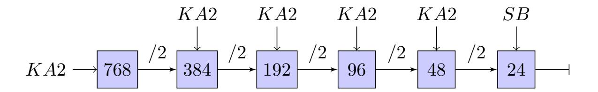
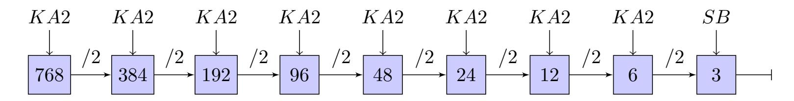
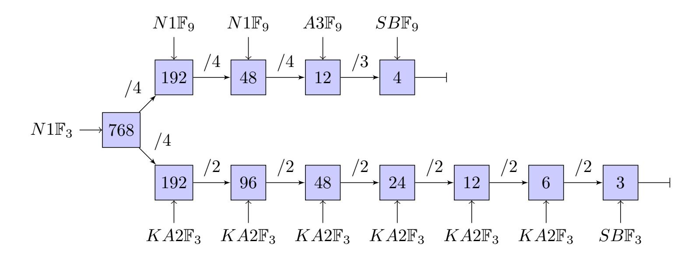
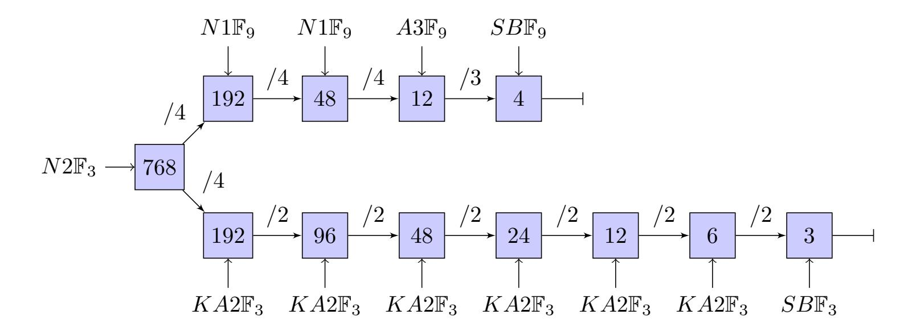
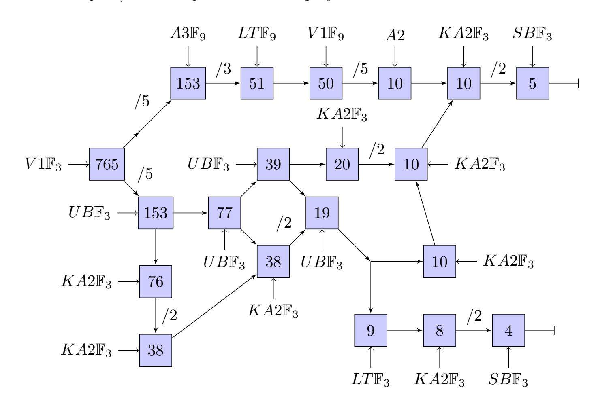
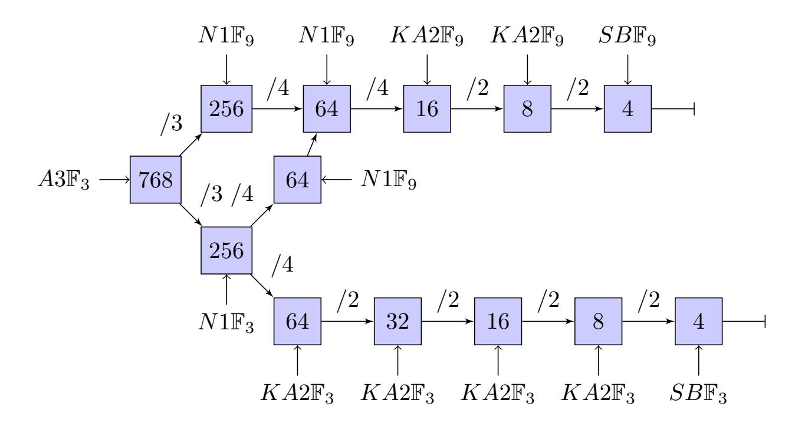
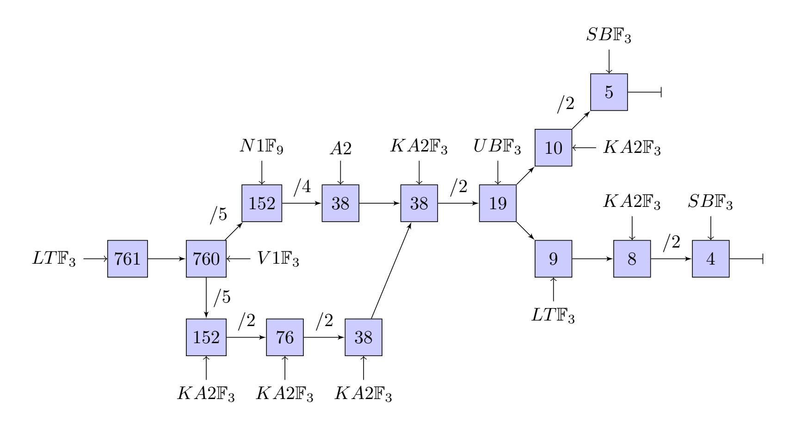

{0}------------------------------------------------

# Faster Characteristic Three Polynomial Multiplication and Its Application to NTRU Prime Decapsulation

Esra Yeniaras1, 2, Murat Cenk<sup>1</sup>

1 Institute of Applied Mathematics, Middle East Technical University, Ankara, Turkey <sup>2</sup>MEB, Ankara, Turkey

yeniaras.esra@metu.edu.tr, mcenk@metu.edu.tr

#### Abstract

Efficient computation of polynomial multiplication for characteristic three fields, F3<sup>n</sup> for n ≥ 1, is an important attribute for many cryptographic protocols. In this paper, we propose three new polynomial multiplication algorithms over F3[x] and show that they are more efficient than the current state-of-the-art algorithms. We first examine through the well-known multiplication algorithms in F3[x] including Karatsuba-2-way and 3-way split formulas along with the recent enhancements. Then, we propose a new 4-way split polynomial multiplication algorithm and an improved version of it which are both derived by using interpolation in F9. Moreover, we propose a 5-way split multiplication algorithm, and then compare the efficiencies of these algorithms altogether. We apply the proposed algorithms to the NTRU Prime protocol, a post-quantum key encapsulation mechanism (KEM), submitted to the NIST PQC Competition by Bernstein et al., performing polynomial multiplication in characteristic three fields in its decapsulation phase. We observe that the new hybrid algorithms provide a 12.9% reduction in the arithmetic complexity. Furthermore, we implement these new hybrid methods on Intel (R) Core (TM) i7- 9750H architecture using C and obtain a 37.3% reduction in the implementation cycle count.

Keywords Polynomial multiplication, Karatsuba, Characteristic three fields, Key encapsulation, NTRU Prime, Lattice-based cryptography, Post-quantum cryptography

# 1 Introduction

Quantum computers [\[22,](#page-32-0)[27\]](#page-32-1) are believed to be able to solve some of the tough computational problems such as the Integer Factorization Problem (IFP) [\[9\]](#page-31-0) and the Discrete Logarithm Problem (DLP) [\[30,](#page-32-2)[31\]](#page-32-3) both of which underpin the most widespread cryptographic protocols. With Shor's quantum factoring algorithm [\[32,](#page-32-4) [33\]](#page-32-5) the most prevalent asymmetric cryptographic systems such as RSA [\[29\]](#page-32-6), Diffie-Hellman [\[18,](#page-32-7) [23\]](#page-32-8) and Elliptic Curve Diffie-Hellman [\[1,](#page-30-0) [2,](#page-30-1) [17,](#page-31-1) [25,](#page-32-9) [28\]](#page-32-10) protocols are vulnerable to attacks by sufficiently powerful quantum computers. Grover's Algorithm [\[20\]](#page-32-11) improves brute force attacks by significantly reducing the search spaces for private keys. These algorithms are used to protect secure web pages, encrypted e-mails, and other sensitive data. Thus, breaking these systems would have substantial consequences for digital security and privacy. In the recent years, research and investment 

{1}------------------------------------------------

in the quantum computing have risen in all sectors. These advances urge researchers to develop reliable quantum-resistant cryptographic protocols. NTRU Prime is one of those quantum-resistant key encapsulation protocols which is submitted to the NIST PQC Standardization Process and has advanced to the third round as an alternate candidate [\[3\]](#page-31-2).

Polynomial multiplication in characteristic three fields is used in some Post-Quantum cryptographic protocols such as NTRU Prime Key Encapsulation Mechanism (KEM) [\[5–](#page-31-3)[7\]](#page-31-4). The decapsulation stage of the Streamlined NTRU Prime KEM performs a polynomial multiplication in Z3[x]/(x <sup>p</sup> − x − 1) where p is prime. In order to perform the polynomial multiplication step in Z3[x]/(x <sup>p</sup> − x − 1), the result of the multiplication is reduced modulo x <sup>p</sup> − x − 1 in Z3[x]. In most sources, array representations of the polynomials are used to conduct the multiplication operation. The fact that the cost of the polynomial multiplication step is subquadratic in the input size, whereas the reduction step is linear with it, exhibits the importance of reducing the cost of the multiplication step. Thus, we need faster polynomial multiplication methods in characteristic three fields to improve the efficiency of the cryptographic protocols.

Inspired by the above concerns, we develop three novel polynomial multiplication algorithms in Z3[x] by using the known methods such as the interpolation and hybrid use of different algorithms [\[8,](#page-31-5)[10,](#page-31-6)[11,](#page-31-7)[16,](#page-31-8)[21\]](#page-32-12). The new algorithms outperforms the known ones in both arithmetical complexity and the implemetation performance. The first two of our proposed algorithms N1 and N2 are 4-way split ones, with seven 1/4 sized multiplications, whereas the latter one, V1, uses a 5-way approach with nine 1/5 sized multiplications in characteristic three fields. All proposed algorithms use interpolation in F9. To compare the algorithms, we implement them along with their hybrid versions on Intel (R) Core (TM) i7-9750H architecture using C language and get promising results in implementation efficiency. We then applied those new methods into the decapsulation phase of the Streamlined NTRU Prime KEM [\[3,](#page-31-2) [7\]](#page-31-4) and tested our novel methods for several input sizes. Different combinations of several multiplication methods are used to get the best results. Finally, the results indicate a 12.98% reduction in arithmetical complexity and a 37.39% reduction in cycle count.

Availability of the software All of the software described in this paper will be available online at [https://github.com/esrayeniaras/NTRUPrimePolyMultF3.](https://github.com/esrayeniaras/NTRUPrimePolyMultF3)

Organization of this paper In Section 2, the notation and preliminaries that are used throughout this paper are introduced. A comprehensive investigation of the well-known polynomial multiplication algorithms over characteristic three fields is presented in Section 3. Section 4, 5, and 6 are dedicated to introducing our newly proposed 4-way and 5-way split algorithms, N1, N2, and V1 respectively. In Section 7, the arithmetical complexity comparison results for the three proposed algorithms and the others, are presented. Various hybrid applications of the proposed algorithms to the Streamlined NTRU Prime Key Encapsulation Mechanism [\[5](#page-31-3)[–7\]](#page-31-4) and their C implementation test results are explained in Section 8. Finally, the paper is concluded in Section 9.

# 2 Preliminaries

In this section, we presented the notations that are used throughout the paper followed by the description of the NTRU Prime Key Encapsulation Mechanism (KEM). In the remainder of this paper, we assume that the fields used to multiply the polynomials are all of characteristic three unless otherwise specified.

{2}------------------------------------------------

### 2.1 Notation

- SB: Schoolbook polynomial multiplication algorithm.
- KA2: Improved Karatsuba 2-way polynomial multiplication algorithm [8].
- A3: A 3-way split polynomial multiplication algorithm, first described in [16].
- A2: Another polynomial multiplication algorithm over  $\mathbb{F}_9[x]$ , first described [16].
- UB: Unbalanced Refined Karatsuba polynomial multiplication algorithm [8] for odd values of n, where n refers to the input size.
- LT: Schoolbook recursion algorithm [8]. We refer to it as the last term method (LT).
- N1: New 4-way split polynomial multiplication algorithm, described in this paper.
- N2: Improved 4-way split polynomial multiplication algorithm, described in this paper.
- V1: New 5-way split polynomial multiplication algorithm, described in this paper.
- Special Notation: Let X represents one of the algorithms above, then  $X\mathbb{F}_3$  notation corresponds to the X algorithm that is used to multiply polynomials over  $\mathbb{F}_3[x]$  and  $X\mathbb{F}_9$  corresponds to a polynomial multiplication over  $\mathbb{F}_9[x]$ . (See Section 8)
- $M_{3,\oplus}(n)$ : Number of  $\mathbb{F}_3$  additions (or substractions) required for the multiplication of two degree n-1 polynomials over  $\mathbb{F}_3$ .
- $M_{3,\otimes}(n)$ : Number of  $\mathbb{F}_3$  multiplications required for the multiplication of two degree n-1 polynomials over  $\mathbb{F}_3$ .
- $M_3(n)$ : Total number of  $\mathbb{F}_3$  operations required for the multiplication of two degree n-1 polynomials over  $\mathbb{F}_3$ , i.e.,  $M_3(n) = M_{3,\oplus}(n) + M_{3,\otimes}(n)$ .
- $M_{9,\oplus}(n)$ : Number of  $\mathbb{F}_9$  additions (or substractions) required for the multiplication of two degree n-1 polynomials over  $\mathbb{F}_9$ .
- $M_{9,\otimes}(n)$ : Number of  $\mathbb{F}_9$  multiplications required for the multiplication of two degree n-1 polynomials over  $\mathbb{F}_9$ .
- $M_9(n)$ : Total number of  $\mathbb{F}_9$  operations required for the multiplication of two degree n-1 polynomials over  $\mathbb{F}_9$ , i.e.,  $M_9(n) = M_{9,\oplus}(n) + M_{9,\otimes}(n)$ .

Remark 1 gives a quick result of *Master Theorem* [4, 16] which is used to calculate the arithmetical complexity of recursive algorithms.

**Remark 1** Let M(n) be a recursive algorithm,  $a, b, \mu \in \mathbb{Z}$ ,  $n = b^{\mu}$ ,  $a \neq 1$ ,  $a, b, \mu > 0$  and M(1) = e such that

$$M(n) = aM(n/b) + cn + d + fn^{\kappa}$$

(i) If  $a \neq b$  and f = 0 then the associated complexity is given by

$$M(n) = \left(e + \frac{bc}{a-b} + \frac{d}{a-1}\right)n^{\log_b a} - \frac{bc}{a-b}n + \frac{d}{a-1}$$

(ii) If a = b, then M(n) is given by

$$M(n) = \frac{fb^{\kappa}}{b^{\kappa} - a}n^{\kappa} + \left(e - \frac{fb^{\kappa}}{b^{\kappa} - a} + \frac{d}{a - 1}\right)n + cn\log_b n - \frac{d}{a - 1}$$

{3}------------------------------------------------

(iii) If  $a \neq b$ , then the associated complexity is given by

$$M(n) = \frac{fb^{\kappa}}{b^{\kappa} - a}n^{\kappa} + \left(e + \frac{bc}{a - b} - \frac{fb^{\kappa}}{b^{\kappa} - a} + \frac{d}{a - 1}\right)n^{\log_b a} - \left(\frac{bc}{a - b}\right)n - \frac{d}{a - 1}$$

One can refer to [13, 16, 19] for the details of the proof.

Since  $x^2 + 1$  is an irreducible polynomial over  $\mathbb{F}_9$ , then  $\mathbb{F}_9 \cong \mathbb{F}_3[x]/(x^2 + 1)$ , thus we can represent the elements of  $\mathbb{F}_9$  as polynomials of degree less than 2. Let's define  $\omega \in \mathbb{F}_9$  such that  $\omega^2 + 1 = 0$ .

Table 1: Cost of Operation Comparison for  $\mathbb{F}_9$  and  $\mathbb{F}_3$ 

| Operation                                          | $\mathbb{F}_3$ Cost | $\mathbb{F}_9$ Cost |
|----------------------------------------------------|---------------------|---------------------|
| $(a+b\omega) + (c+d\omega) = (a+c) + (b+d)\omega$  | 2 Adds              | 1 Add               |
| $(a+b\omega)(c+d\omega) = (ac-bd) + (bc+ad)\omega$ | 2 Adds+4 Mults      | 1 Mult              |
| $\omega.a, 1.a, (-1).a$                            | 0                   | 0                   |

For  $a, b, c, d \in \mathbb{F}_3$ , one can convey from Table 1 that one addition in  $\mathbb{F}_9$  corresponds to two additions in  $\mathbb{F}_3$  whereas one multiplication corresponds to two additions and four multiplications in it. We also assume that multiplication of an element in  $\mathbb{F}_9$  by  $\omega$ , 1, or -1 is cost-free.

### 2.2 NTRU Prime Key Encapsulation Mechanism

NTRU Prime [6] by Bernstein et al., is a lattice-based, quantum-resistant key encapsulation protocol submitted and advanced through the Rounds 1-3 of the NIST Post-Quantum Standardization Process [3,5,7]. There are two components of the NTRU Prime, one is Streamlined NTRU Prime and the other one is NTRU LPRime. In the decapsulation phase, the Streamlined NTRU Prime Key Encapsulation Mechanism performs multiplication in  $\mathbb{Z}_3[x]/(x^p-x-1)$  so that we can apply the proposed multiplication methods to it. Below, we explain the details of the protocol.

#### Streamlined NTRU Prime Key Encapsulation Mechanism

**Parameters.** Streamlined NTRU Prime is a family of cryptosystems that uses the parameters  $(p, q, \omega)$  with the following constraints: p and q are prime numbers,  $q \ge 17$ ,  $0 < \omega \le p$ ,  $2p \ge 3\omega$ ,  $q \ge 16\omega + 1$  and  $x^p - x - 1$  is an irreducible polynomial in the polynomial ring  $\mathbb{Z}_q[x]$ .

The rings  $\mathbb{Z}[x]/(x^p-x-1)$ ,  $\mathbb{Z}_3[x]/(x^p-x-1)$  and the field  $\mathbb{Z}_q[x]/(x^p-x-1)$  are abbreviated as  $\mathcal{R}$ ,  $\mathcal{R}/3$ , and  $\mathcal{R}/q$  respectively. If the parameters are p=761, q=4591 and  $\omega=286$  then the cryptosystem is represented as sntrup761.

- Small is described as a type of polynomial with all of its coefficients are in  $\{-1,0,1\}$ .
- Short is defined as a small, weight— $\omega$  polynomial of  $\mathcal{R}$ . A weight— $\omega$  polynomial is a polynomial with exactly  $\omega$  of its coefficients are nonzero.
- **Rounded** is defined as the set of polynomials  $a_0 + a_1x + ... + a_{p-1}x^{p-1} \in \mathcal{R}$  such that, if  $q \in 1 + 3\mathbb{Z}$  then for each i,  $a_i$  is in  $\{-(q-1)/2, ..., -6, -3, 0, 3, 6, ..., (q-1)/2\}$  and if  $q \in 2 + 3\mathbb{Z}$  then for each i,  $a_i$  is in  $\{-(q+1)/2, ..., -6, -3, 0, 3, 6, ..., (q+1)/2\}$ .
- Rounded() is a function that takes any polynomial in  $\mathcal{R}/q$  to a rounded polynomial in  $\mathcal{R}$ .
- Round() is a function that takes the coefficients of any polynomial in  $\mathcal{R}/q$  to an integer between -(q-1)/2 and (q-1)/2 (i.e., to a rounded polynomial) then, to the nearest multiple of 3, producing a polynomial in  $\mathcal{R}$ .

{4}------------------------------------------------

- Lift() is a function that maps any polynomial of R/3 to a small polynomial in R/q by simply reducing it modulo q.
- Encode()/Decode() Let M = (m0, ..., mn−1) and R = (r0, ..., rn−1) be sequences of integers and assume that for each i, 0 ≤ r<sup>i</sup> ≤ m<sup>i</sup> ≤ 2 <sup>14</sup>. Then S = Encode(R, M) is a sequence of bytes and Decode(Encode(R, M), M) = R. In other words, Encode() converts the ring elements to strings and Decode() converts the strings to the ring elements vice versa. One can refer to [\[7\]](#page-31-4) for the algorithmic details of the encoding and decoding parameters.
- Hashing Hash(z) is defined as the first 32 bits of SHA-512(z). Hash<sup>b</sup> for b ∈ {0, 1, ..., 255} is Hash with the input prefixed by one byte value b, i.e., Hash(b, z) = Hashb(z). Another function HashConfirm(r, h) is defined as Hash2(Hash3(r), Hash4(h)). Moreover the function HashSession(b, r, C) is defined as Hashb(Hash3(r), C) for b ∈ {0, 1} [\[7\]](#page-31-4).

Streamlined NTRU Prime key generation, encapsulation, and decapsulation algorithms are presented in Algorithm 1, 2, and 3 respectively.

### Algorithm 1 Streamlined NTRU Prime Key Generation - KeyGen()

```
Output: (Pk, Sk)
 1: do
 2: g
         $
         ←− small
 3: while g
           −1 6∈ R/3
 4: f ←short
 5: h ← g/(3f) ∈ R/q
 6: h ← Encode(h)
 7: k ← Encode((f, 1/g))
 8: ρ ←short
 9: return (Pk, Sk) = (h,(k, h, ρ))
```

#### Algorithm 2 Streamlined NTRU Prime Key Encapsulation - Encap(h)

```
Input: Pk = h
Output: C = (C, HashSession(1,r, C))
 1: h ← Decode(h)
 2: r
      $
     ←−short
 3: r ← Encode(r)
 4: c ← Round(h.r) ∈ R
 5: c ← Encode(c)
 6: C ← (c, HashConfirm(r, h))
 7: return C = (C, HashSession(1,r, C))
```

{5}------------------------------------------------

## Algorithm 3 Streamlined NTRU Prime Decapsulation - Decap(C, Sk)

```
Input: (C, Sk)
Output: HashSession(1,r, C) or HashSession(0, ρ, C))
 1: c ← Decode(c)
 2: c.(3f) ∈ R/q
 3: e ← (Rounded(c.(3f)) mod 3) ∈ R/3
 4: e.(1/g) ∈ R/3
 5: r
     0 ← Lift(e.(1/g)) ∈ R/q
 6: h.r0 ∈ R/q
 7: c
    0 ← Round(h.r0
                    )
 8: c
    0 ← Encode(c
                  0
                   )
 9: C
     0 ← (c
           0
            , HashConfirm(r
                            0
                             , h))
10: if C
        0 == C then
11: return HashSession(1,r, C)
12: else
13: return HashSession(0, ρ, C))
```

It is stated in [\[7\]](#page-31-4) that "NTRU Prime has two layers. The inner layer is Streamlined NTRU Prime Core, a perfectly correct deterministic PKE. The outer layer is Streamlined NTRU Prime, a perfectly correct KEM". In this paper, we focus on the outer layer, i.e., the Streamlined NTRU Prime Key Encapsulation Mechanism.

# 3 Recent Multiplication Algorithms and Improvements

In this section, we summarize the well-known polynomial multiplication algorithms and their improved versions in characteristic three fields. We will examine 2-way split algorithms, 3-way split ones, and the other types of algorithms in each subsection, respectively. We also assume that the polynomial size n is a multiple of 2 for 2-way split algorithms and a multiple of 3 for the 3-way split ones, if not, we simply pad the polynomials with an appropriate number of zeros, i.e., one or at most two zeros. For the sake of clarity, we assume that n is a power of 2 for 2-way split algorithms and a power of 3 for 3-way split ones.

### 3.1 Karatsuba 2-Way Algorithm

Assume that,

$$A(x) = a_0 + a_1 x + a_2 x^2 + \dots + a_{n-1} x^{n-1}$$

$$B(x) = b_0 + b_1 x + b_2 x^2 + \dots + b_{n-1} x^{n-1}$$

$$(1)$$

are two polynomials of degree n − 1 and n = 2<sup>k</sup> for some k ≥ 0. Also let's define y = x n/<sup>2</sup> and C(x) = A(x)B(x). 2-way multiplication methods basically depend on dividing the polynomials into two equivalent parts and perform the multiplication recursively on these equally halve-sized parts as below:

{6}------------------------------------------------

$$A_{0} = a_{0} + a_{1}x + \dots + a_{\frac{n}{2}-1}x^{\frac{n}{2}-1}$$

$$A_{1} = a_{\frac{n}{2}} + a_{\frac{n}{2}+1}x + \dots + a_{n-1}x^{\frac{n}{2}-1}$$

$$B_{0} = b_{0} + b_{1}x + \dots + b_{\frac{n}{2}-1}x^{\frac{n}{2}-1}$$

$$B_{1} = b_{\frac{n}{2}} + b_{\frac{n}{2}+1}x + \dots + b_{n-1}x^{\frac{n}{2}-1}$$

$$(2)$$

then

$$A(x) = A_0 + yA_1 
 B(x) = B_0 + yB_1$$

and the multiplication becomes A(x)B(x) = (A<sup>0</sup> + yA1)(B<sup>0</sup> + yB1) so that it can be done with the half-sized polynomials, using Karatsuba 2-way algorithm as follows:

Let's define the products of the half-sized polynomials as P0, P<sup>1</sup> and P<sup>2</sup> then,

$$P_{0} = A_{0}B_{0}$$

$$P_{1} = (A_{0} + A_{1})(B_{0} + B_{1})$$

$$P_{2} = A_{1}B_{1}$$

$$(4)$$

and the final result of the multiplication C(x) = A(x)B(x) can be found as,

$$C(x) = P_0 + (P_1 - P_0 - P_2)x^{n/2} + P_2x^n$$
(5)

The recursive representation of the algorithm can be given by:

$$M_{3}(n) = 3M_{3}(n/2) + 4n - 4, M_{3}(1) = 1$$

$$M_{3,\otimes}(n) = 3M_{3,\otimes}(n/2), M_{3,\otimes}(1) = 1$$

$$M_{3,\oplus}(n) = 3M_{3,\oplus}(n/2) + 4n - 4, M_{3,\oplus}(1) = 0$$

$$(6)$$

Using Remark 1, we can explicitly calculate the complexity as follows,

$$M_{3}(n) = 7n^{\log_{2} 3} - 8n + 2$$

$$M_{3,\otimes}(n) = n^{\log_{2} 3}$$

$$M_{3,\oplus}(n) = 6n^{\log_{2} 3} - 8n + 2$$

$$(7)$$

### 3.2 Improved Karatsuba 2-Way Algorithm (KA2)

Bernstein [\[8\]](#page-31-5) introduced an improved version of the Karatsuba 2-way algorithm by using the same settings given in (1)-(4) but following a different approach in the rest, more precisely this time C(x) is defined as,

$$C(x) = (y-1)(yP_2 - P_0) + yP_1$$
(8)

then, recursive representation and the complexities for the improved Karatsuba 2-way algorithm (KA2) can be found as:

$$M_{3}(n) = 3M_{3}(n/2) + 7.(n/2) - 3, M_{3}(1) = 1$$

$$M_{3,\otimes}(n) = 3M_{3,\otimes}(n/2), M_{3,\otimes}(1) = 1$$

$$M_{3,\oplus}(n) = 3M_{3,\oplus}(n/2) + 7.(n/2) - 3, M_{3,\oplus}(1) = 0$$

$$(9)$$

{7}------------------------------------------------

by Remark 1 we get the complexity as follows,

$$M_{3}(n) = 6.5n^{\log_{2} 3} - 7n + 1.5$$

$$M_{3,\otimes}(n) = n^{\log_{2} 3}$$

$$M_{3,\oplus}(n) = 5.5n^{\log_{2} 3} - 7n + 1.5$$

$$(10)$$

As we compare the arithmetic complexities in (7) and (10), we can observe that, the improved version of Karatsuba 2-way algorithm is 7% more efficient than the previous one.

### 3.3 Unbalanced Refined Karatsuba 2-way Algorithm (UB)

This method [\[8\]](#page-31-5) can be used when the input size n ≥ 1 is odd. Since the 2-way split can also be done within two unequal parts, an odd n value would fit in this situation. Assume that A(x) and B(x) are defined as in (1), in this case, instead of equal ones, we divide A(x) and B(x) into two unequal pieces, as follows:

$$A_{0} = a_{0} + a_{1}x + \dots + a_{\frac{n-1}{2}}x^{\frac{n-1}{2}}$$

$$A_{1} = a_{\frac{n+1}{2}} + a_{\frac{n+3}{2}}x + \dots + a_{n-1}x^{\frac{n-3}{2}}$$

$$B_{0} = b_{0} + b_{1}x + \dots + b_{\frac{n-1}{2}}x^{\frac{n-1}{2}}$$

$$B_{1} = b_{\frac{n+1}{2}} + b_{\frac{n+3}{2}}x + \dots + b_{n-1}x^{\frac{n-3}{2}}$$

$$(11)$$

One can observe that the polynomial A<sup>0</sup> contains one more element than the polynomial A1. By using the (4) and (8), we get the following complexities for Unbalanced Refined Karatsuba 2-way Algorithm UB:

$$M_{3}(n) = 2M_{3}((n+1)/2) + M_{3}((n-1)/2) + 7.(n-1)/2$$

$$M_{3,\otimes}(n) = 2M_{3,\otimes}((n+1)/2) + M_{3,\otimes}((n-1)/2)$$

$$M_{3,\oplus}(n) = 2M_{3,\oplus}((n+1)/2) + M_{3,\oplus}((n-1)/2) + 7.(n-1)/2$$

$$(12)$$

Remark 2 Observe from (4) that the highest degree coefficients of both P<sup>0</sup> and P<sup>1</sup> are the same, thus one multiplication gets cost-free.

### 3.4 Schoolbook Recursion or the Last Term Method (LT)

This algorithm [\[8\]](#page-31-5) is the recursive version of schoolbook algorithm. Assume that A(x) and B(x) are defined as in (1), we can write A(x) and B(x) as follows:

$$A(x) = A_{n-2}(x) + a_{n-1}x^{n-1} 
B(x) = B_{n-2}(x) + b_{n-1}x^{n-1}$$
(13)

where

$$A_{n-2}(x) = a_0 + a_1 x + a_2 x^2 + \dots + a_{n-2} x^{n-2}$$

$$B_{n-2}(x) = b_0 + b_1 x + b_2 x^2 + \dots + b_{n-2} x^{n-2}$$
(14)

then the algorithm recursively perform the following multiplication

$$A(x)B(x) = A_{n-2}(x)B_{n-2}(x) + b_{n-1}x^{n-1}A_{n-2}(x) + a_{n-1}x^{n-1}B_{n-2}(x) + a_{n-1}b_{n-1}x^{2n-2}$$
 (15)

{8}------------------------------------------------

Note that,  $A_{n-2}(x)$  and  $B_{n-2}(x)$  are obtained by deleting the last terms of A(x) and B(x). Therefore, for the schoolbook recursion, we use the abbreviation LT referring to these last terms.

The complexity of the LT algorithm is,

$$M_{3}(n) = M_{3}(n-1) + (4n-4)$$

$$M_{3,\otimes}(n) = M_{3,\otimes}(n-1) + (2n-1)$$

$$M_{3,\oplus}(n) = M_{3,\oplus}(n-1) + (2n-3)$$

$$(16)$$

### 3.5 Karatsuba Like 3-way Algorithm

Let A(x) and B(x) are two degree n-1 polynomials, defined as in (1), with  $n=3^k$  for  $k \ge 0$ . Also let  $y=x^{n/3}$  and C(x)=A(x)B(x). We divide both A(x) and B(x) into three parts as follows:

$$A_{0} = a_{0} + a_{1}x + \dots + a_{\frac{n}{3}-1}x^{\frac{n}{3}-1}$$

$$A_{1} = a_{\frac{n}{3}} + a_{\frac{n}{3}+1}x + \dots + a_{\frac{2n}{3}-1}x^{\frac{n}{3}-1}$$

$$A_{2} = a_{\frac{2n}{3}} + a_{\frac{2n}{3}+1}x + \dots + a_{n-1}x^{\frac{n}{3}-1}$$

$$B_{0} = b_{0} + b_{1}x + \dots + b_{\frac{n}{3}-1}x^{\frac{n}{3}-1}$$

$$B_{1} = b_{\frac{n}{3}} + b_{\frac{n}{3}+1}x + \dots + b_{\frac{2n}{3}-1}x^{\frac{n}{3}-1}$$

$$B_{2} = b_{\frac{2n}{3}} + b_{\frac{2n}{3}+1}x + \dots + b_{n-1}x^{\frac{n}{3}-1}$$

$$B_{2} = b_{\frac{2n}{3}} + b_{\frac{2n}{3}+1}x + \dots + b_{n-1}x^{\frac{n}{3}-1}$$

$$(17)$$

then

$$\begin{array}{l}
A(x) = A_0 + yA_1 + y^2 A_2 \\
B(x) = B_0 + yB_1 + y^2 B_2
\end{array} (18)$$

thus the multiplication becomes  $A(x)B(x) = (A_0 + yA_1 + y^2A_2)(B_0 + yB_1 + y^2B_2)$  with three 1/3 sized polynomials in a recursive manner by using the products below [34],

$$P_{0} = A_{0}B_{0}$$

$$P_{1} = A_{1}B_{1}$$

$$P_{2} = A_{2}B_{2}$$

$$P_{3} = (A_{0} + A_{1})(B_{0} + B_{1})$$

$$P_{4} = (A_{0} + A_{2})(B_{0} + B_{2})$$

$$P_{5} = (A_{1} + A_{2})(B_{1} + B_{2})$$

$$(19)$$

and with the help of the Chinese Remainder Theorem [35] and [24] the result becomes,

$$C(x) = P_0 + (P_3 - P_0 - P_1)x^{n/3} + (P_4 + P_1 - P_0 - P_2)x^{2n/3} + (P_5 - P_1 - P_2)x^{3n/3} + P_2x^{4n/3}$$
(20)

this algorithm is associated with the following complexity:

$$M_{3}(n) = 6M_{3}(n/3) + 8n - 11, M_{3}(1) = 1$$

$$M_{3,\otimes}(n) = 6M_{3,\otimes}(n/3), M_{3,\otimes}(1) = 1$$

$$M_{3,\oplus}(n) = 6M_{3,\oplus}(n/3) + 8n - 11, M_{3,\oplus}(1) = 0$$

$$(21)$$

{9}------------------------------------------------

by Remark 1 we get,

$$M_{3}(n) = 6.8n^{\log_{3} 6} - 8n + 2.2$$

$$M_{3,\otimes}(n) = n^{\log_{3} 6}$$

$$M_{3,\oplus}(n) = 5.8n^{\log_{3} 6} - 8n + 2.2$$

$$(22)$$

### 3.6 Improved Karatsuba Like 3-way Algorithm

By reconstructing the Karatsuba 3-way algorithm in a similar way that is described in [\[36\]](#page-33-0), we get the Improved Karatsuba 3-way Algorithm. Let P<sup>i</sup> = PiL +x n/3PiH for 0 ≤ i ≤ 5 such that the degree of each P<sup>i</sup> is 2n/3 − 2, inserting these values in (19) we get the following:

$$C = P_{0L} + x^{n/3} (P_{0H} - P_{0L} - P_{1L} + P_{3L})$$

$$+ x^{2n/3} (-P_{0L} - P_{0H} + P_{1L} - P_{1H} - P_{2L} + P_{3H} + P_{4L})$$

$$+ x^{3n/3} (-P_{0H} + P_{1H} - P_{2L} - P_{2H} + P_{4H} + P_{5L} - P_{1L})$$

$$+ x^{4n/3} (-P_{1H} + P_{2L} - P_{2H} + P_{5H}) + x^{5n/3} P_{2H}$$

$$(23)$$

and the associated complexity for the algorithm is given as,

$$M_{3}(n) = 6M_{3}(n/3) + 22.(n/3) - 9, M_{3}(1) = 1$$

$$M_{3,\otimes}(n) = 6M_{3,\otimes}(n/3), M_{3,\otimes}(1) = 1$$

$$M_{3,\oplus}(n) = 6M_{3,\oplus}(n/3) + 22.(n/3) - 9, M_{3,\oplus}(1) = 0$$

$$(24)$$

thus by Remark 1, the complexity is,

$$M_{3}(n) = 6.53n^{\log_{3} 6} - 7.33n + 1.8$$

$$M_{3,\otimes}(n) = n^{\log_{3} 6}$$

$$M_{3,\oplus}(n) = 5.53n^{\log_{3} 6} - 7.33n + 1.8$$
(25)

Note that, the complexity in (25) is approximately 4% less than the one in (22), which shows that the improved Karatsuba 3-way algorithm is more arithmetically efficient than the original version.

### 3.7 3-way Algorithm with Five Multiplications (A1)

3-way algorithm with five multiplications is first described in [\[16\]](#page-31-8). We call this algorithm A1. It is derived by the interpolation method and has similar results to that of Toom-Cook's Formula [\[12–](#page-31-12)[15,](#page-31-13)[35\]](#page-32-15). Remember that, F<sup>9</sup> ∼= F3[x]/(x <sup>2</sup> + 1) and since F<sup>3</sup> does not have enough points for the interpolation method with five multiplications, we borrow an element, namely ω such that ω <sup>2</sup> = −1, from F9. Then evaluating C(x) = A(x)B(x) at 0, 1, −1, ω, ∞ gives us the following system of linear equations in F9:

For 
$$x = 0 \Rightarrow P_0 = A_0 B_0 = C_0$$
  
For  $x = 1 \Rightarrow P_1 = (A_0 + A_1 + A_2)(B_0 + B_1 + B_2) = C_0 + C_1 + \dots + C_4$   
For  $x = -1 \Rightarrow P_2 = (A_0 - A_1 + A_2)(B_0 - B_1 + B_2) = C_0 - C_1 + C_2 + \dots + C_4$   
For  $x = \omega \Rightarrow P_3 = [(A_0 + A_1\omega - A_2)(B_0 + B_1\omega - B_2) = C_0 + C_1\omega - \dots + C_4$   
For  $x = \infty \Rightarrow P_4 = A_2 B_2 = C_4$ 

{10}------------------------------------------------

Solving this equation system yields

$$C_{0} = P_{0}$$

$$C_{1} = (P_{1} - P_{2}) - (-P_{0} + P_{1} + P_{2} - P_{3} - P_{4})\omega$$

$$C_{2} = -(P_{0} + P_{1} + P_{2} + P_{4})$$

$$C_{3} = (P_{1} - P_{2}) + (-P_{0} + P_{1} + P_{2} - P_{3} - P_{4})\omega$$

$$C_{4} = P_{4}$$
(26)

where C(x) = C<sup>0</sup> + C1x n/<sup>3</sup> + C2x <sup>2</sup>n/<sup>3</sup> + C3x <sup>3</sup>n/<sup>3</sup> + C4x 4n/3 .

Complexity associated with this algorithm in F<sup>9</sup> is,

$$M_{9}(n) = 5M_{9}(n/3) + 20n - 24, M_{9}(1) = 6$$

$$M_{9,\otimes}(n) = 5M_{9,\otimes}(n/3), M_{9,\otimes}(1) = 4$$

$$M_{9,\oplus}(n) = 5M_{9,\oplus}(n/3) + 20n - 24, M_{9,\oplus}(1) = 2$$

$$(27)$$

Applying Remark 1 we get,

$$M_{9}(n) = 30n^{\log_{3} 5} - 30n + 6$$

$$M_{9,\otimes}(n) = 4n^{\log_{3} 5}$$

$$M_{9,\oplus}(n) = 26n^{\log_{3} 5} - 30n + 6$$

$$(28)$$

Complexity associated with this algorithm in F<sup>3</sup> is,

$$M_{3}(n) = 4M_{3}(n/3) + M_{9}(n/3) + 8n - 10, M_{3}(1) = 1$$

$$M_{3,\otimes}(n) = 4M_{3,\otimes}(n/3) + M_{9,\otimes}(n/3), M_{3,\otimes}(1) = 1$$

$$M_{3,\oplus}(n) = 4M_{3,\oplus}(n/3) + M_{9,\oplus}(n/3) + 8n - 10, M_{3,\oplus}(1) = 0$$

$$(29)$$

by Remark 1,

$$M_{3}(n) = 30n^{\log_{3} 5} - 36.33n^{\log_{3} 4} + 6n + 1.33$$

$$M_{3,\otimes}(n) = 4n^{\log_{3} 5} - 3n^{\log_{3} 4}$$

$$M_{3,\oplus}(n) = 26n^{\log_{3} 5} - 33.33n^{\log_{3} 4} + 6n + 1.33$$

$$(30)$$

Algorithm A1 is more efficient than the Karatsuba 3-way improved algorithm after n = 729. The percentage of cost reduction increases significantly when the polynomial-size increases. For n = 3<sup>7</sup> the reduction is 4%, for n = 3<sup>8</sup> the reduction is 14% and for n = 3<sup>10</sup> the reduction reaches up to 55%.

### 3.8 Improved 3-way Algorithm with Five Multiplications (A3)

A3 is also a 3-way algorithm [\[16\]](#page-31-8) with five multiplications and it's an improved version of the A1 algorithm. If we switch the interpolation points of A1 from {0, 1, −1, ω, ∞} to {0, 1, ω, −ω, ∞} then what we get is a more efficient algorithm than A1, namely A3.

For 
$$x = 0 \Rightarrow P_0 = A_0 B_0 = C_0$$
  
For  $x = 1 \Rightarrow P_1 = (A_0 + A_1 + A_2)(B_0 + B_1 + B_2) = C_0 + C_1 + \dots + C_4$   
For  $x = \omega \Rightarrow P_2 = [(A_0 + A_1\omega - A_2)(B_0 + B_1\omega - B_2) = C_0 + C_1\omega - \dots + C_4$   
For  $x = -\omega \Rightarrow P_3 = [(A_0 - A_1\omega - A_2)(B_0 - B_1\omega - B_2) = C_0 - C_1\omega - \dots + C_4$   
For  $x = \infty \Rightarrow P_4 = A_2 B_2 = C_4$ 

{11}------------------------------------------------

Assume that P<sup>2</sup> = P2,<sup>0</sup> + ωP2,<sup>1</sup> and P<sup>3</sup> = P3,<sup>0</sup> + ωP3,<sup>1</sup> then one can observe that P2,<sup>0</sup> = P3,<sup>0</sup> and P2,<sup>1</sup> = −P3,1. By using these equalities we get the following formula for C(x),

$$C_{0} = P_{0}$$

$$C_{1} = -P_{0} - P_{1} - P_{2,0} - P_{4} - P_{2,1}$$

$$C_{2} = P_{0} - P_{2,0} + P_{4}$$

$$C_{3} = -P_{0} - P_{1} - P_{2,0} - P_{4} + P_{2,1}$$

$$C_{4} = P_{4}$$
(31)

where, C(x) = C<sup>0</sup> + C1x n/<sup>3</sup> + C2x <sup>2</sup>n/<sup>3</sup> + C3x <sup>3</sup>n/<sup>3</sup> + C4x 4n/3 .

The complexity associated with A3 over F9[x] is exactly the same as the complexity of A1 over F9[x]. On the other hand, the complexity of A3 over F3[x] is given by (32)-(33) and it is less than that of A1.

$$M_{3}(n) = 3M_{3}(n/3) + M_{9}(n/3) + 22.(n/3) - 10, M_{3}(1) = 0$$

$$M_{3,\otimes}(n) = 3M_{3,\otimes}(n/3) + M_{9,\otimes}(n/3), M_{3,\otimes}(1) = 1$$

$$M_{3,\oplus}(n) = 3M_{3,\oplus}(n/3) + M_{9,\oplus}(n/3) + 22.(n/3) - 10, M_{3,\oplus}(1) = 0$$

$$(32)$$

again by Remark 1,

$$M_{3}(n) = 15n^{\log_{3} 5} - 2.66n\log_{3} n - 16n + 2$$

$$M_{3,\otimes}(n) = 2n^{\log_{3} 5} - n$$

$$M_{3,\oplus}(n) = 13n^{\log_{3} 5} - 2.66n\log_{3} n - 15n + 2$$

$$(33)$$

A3 algorithm outperforms KA2 when n ≥ 400. For n = 709 the percentage of reduction in arithmetic complexity is 7%.

### 3.9 Another Multiplication Algorithm (A2)

As mentioned in [\[16\]](#page-31-8), when the coefficients of the polynomials are in F9, we can use another algorithm called A2. Let A(x), B(x) ∈ F9[x] then we can re-write both A(x) and B(x) as a sum of their w parts and w −free parts. Let A0, A1, B0, B<sup>1</sup> ∈ F3[x] and let each of them be degree n−1 polynomials such that:

$$A = A_0 + \omega A_1 
B = B_0 + \omega B_1$$
(34)

then,

$$AB = (A_0 + A_1\omega)(B_0 + B_1\omega) = A_0B_0 - A_1B_1 + ((A_0 + A_1)(B_0 + B_1) - A_0B_0 - A_1B_1)\omega$$
 (35)

the complexity of the A2 algorithm can be found as,

$$M_9(n) = 3M_3(n) + 8n - 3 (36)$$

Through sections 3.1 - 3.9, we have covered nine recent algorithms that can be used for polynomial multiplication in characteristic three fields. Now we will describe our new 4-way and 5-way split formulas that are more efficient than all of the algorithms we've discussed above.

{12}------------------------------------------------

# 4 New 4-way Split Multiplication Algorithm (N1)

In this section, we propose a new 4-way multiplication algorithm N1, with seven 1/4 sized multiplications, which is derived by using the interpolation method in  $\mathbb{F}_9$ . Assume that,

$$A(x) = a_0 + a_1 x + a_2 x^2 + \dots + a_{n-1} x^{n-1}$$

$$B(x) = b_0 + b_1 x + b_2 x^2 + \dots + b_{n-1} x^{n-1}$$
(37)

are two polynomials of degree n-1 where  $n=4^k$  for some  $k \geq 0$ . Also let  $y=x^{n/4}$ , C(x)=A(x)B(x) and,

$$A_{0} = a_{0} + a_{1}x + \dots + a_{\frac{n}{4}-1}x^{\frac{n}{4}-1}$$

$$A_{1} = a_{\frac{n}{4}} + a_{\frac{n}{4}+1}x + \dots + a_{\frac{2n}{4}-1}x^{\frac{n}{4}-1}$$

$$A_{2} = a_{\frac{2n}{4}} + a_{\frac{2n}{4}+1}x + \dots + a_{\frac{3n}{4}-1}x^{\frac{n}{4}-1}$$

$$A_{3} = a_{\frac{3n}{4}} + a_{\frac{3n}{4}+1}x + \dots + a_{\frac{4n}{4}-1}x^{\frac{n}{4}-1}$$

$$B_{0} = b_{0} + b_{1}x + \dots + b_{\frac{n}{4}-1}x^{\frac{n}{4}-1}$$

$$B_{1} = b_{\frac{n}{4}} + b_{\frac{n}{4}+1}x + \dots + b_{\frac{2n}{4}-1}x^{\frac{n}{4}-1}$$

$$B_{2} = a_{\frac{2n}{4}} + b_{\frac{2n}{4}+1}x + \dots + b_{\frac{4n}{4}-1}x^{\frac{n}{4}-1}$$

$$B_{3} = a_{\frac{3n}{4}} + b_{\frac{3n}{4}+1}x + \dots + b_{\frac{4n}{4}-1}x^{\frac{n}{4}-1}$$

then,

$$\begin{cases}
A(x) = A_0 + yA_1 + y^2A_2 + y^3A_3 \\
B(x) = B_0 + yB_1 + y^2B_2 + y^3B_3
\end{cases}$$
(39)

thus, the result of the multiplication becomes,

$$C(x) = (A_0 + yA_1 + y^2A_2 + y^3A_3)(B_0 + yB_1 + y^2B_2 + y^3B_3)$$

$$= C_0 + C_1y + C_2y^2 + C_3y^3 + C_4y^4 + C_5y^5 + C_6y^6$$
(40)

We use  $\{\omega, -\omega, \omega + 1, -\omega + 1, -\omega - 1, \omega - 1, \infty\}$  as the points of evaluation for interpolation and we get,

$$P_{0} = [(A_{0} - A_{2}) + \omega(A_{1} - A_{3})][(B_{0} - B_{2}) + \omega(B_{1} - B_{3})] = C(\omega)$$

$$P_{1} = [(A_{0} - A_{2}) - \omega(A_{1} - A_{3})][(B_{0} - B_{2}) - \omega(B_{1} - B_{3})] = C(-\omega)$$

$$P_{2} = [(A_{0} + A_{1} + A_{3}) + \omega(A_{1} - A_{2} - A_{3})][(B_{0} + B_{1} + B_{3}) + \omega(B_{1} - B_{2} - B_{3})] = C(\omega + 1)$$

$$P_{3} = [(A_{0} + A_{1} + A_{3}) + \omega(-A_{1} + A_{2} + A_{3})][(B_{0} + B_{1} + B_{3}) + \omega(-B_{1} + B_{2} + B_{3})] = C(-\omega + 1)$$

$$P_{4} = [(A_{0} - A_{1} - A_{3}) + \omega(-A_{1} - A_{2} + A_{3})][(B_{0} - B_{1} - B_{3}) + \omega(-B_{1} - B_{2} + B_{3})] = C(-\omega - 1)$$

$$P_{5} = [(A_{0} - A_{1} - A_{3}) + \omega(A_{1} + A_{2} - A_{3})][(B_{0} - B_{1} - B_{3}) + \omega(B_{1} + B_{2} - B_{3})] = C(\omega - 1)$$

$$P_{6} = A_{3}B_{3} = C_{6}$$

{13}------------------------------------------------

Let,

$$P_{0} = P_{0,0} + \omega P_{0,1}$$

$$P_{1} = P_{1,0} + \omega P_{1,1}$$

$$P_{2} = P_{2,0} + \omega P_{2,1}$$

$$P_{3} = P_{3,0} + \omega P_{3,1}$$

$$P_{4} = P_{4,0} + \omega P_{4,1}$$

$$P_{5} = P_{5,0} + \omega P_{5,1}$$

$$(41)$$

then one can observe that,

$$P_{0,0} = P_{1,0}$$

$$P_{0,1} = -P_{1,1}$$

$$P_{2,0} = P_{3,0}$$

$$P_{2,1} = -P_{3,1}$$

$$P_{4,0} = P_{5,0}$$

$$P_{4,1} = -P_{5,1}$$

$$(42)$$

With the help of (42), we avoid three unnecessary multiplications. Instead of calculating all of the six multiplications in (41), it will be sufficient to just calculate P0, P2, and P4, in this way, three multiplications over F9[x] get cost-free. Using the interpolation we get the following results for the N1 Algorithm:

$$C_{0} = P_{0} + P_{1} - P_{2} - P_{3} - P_{4} - P_{5} + P_{6} + \omega(-P_{2} + P_{3} - P_{4} + P_{5})$$

$$C_{1} = -P_{2} - P_{3} + P_{4} + P_{5} + \omega(-P_{0} + P_{1})$$

$$C_{2} = P_{6} + \omega(P_{2} - P_{3} + P_{4} - P_{5})$$

$$C_{3} = -P_{2} - P_{3} + P_{4} + P_{5} + \omega(-P_{2} + P_{3} + P_{4} - P_{5})$$

$$C_{4} = P_{0} + P_{1} + P_{2} + P_{3} + P_{4} + P_{5} + P_{6} + \omega(-P_{2} + P_{3} - P_{4} + P_{5})$$

$$C_{5} = \omega(-P_{0} + P_{1} - P_{2} + P_{3} + P_{4} - P_{5})$$

$$C_{6} = P_{6}$$

$$(43)$$

Inserting the equalities of (42) into (43) we get,

$$C_{0} = -P_{0,0} + P_{2,0} + P_{4,0} + P_{6} - P_{2,1} - P_{4,1}$$

$$C_{1} = P_{2,0} - P_{4,0} - P_{0,1}$$

$$C_{2} = P_{6} + P_{2,1} + P_{4,1}$$

$$C_{3} = P_{2,0} - P_{4,0} - P_{2,1} + P_{4,1}$$

$$C_{4} = -P_{0,0} - P_{2,0} - P_{4,0} + P_{6} - P_{2,1} - P_{4,1}$$

$$C_{5} = -P_{0,1} - P_{2,1} + P_{4,1}$$

$$C_{6} = P_{6}$$

$$(44)$$

Table 2 and Tables 3-4 demonstrate the costs of multi-evaluation and reconstruction for N1 algorithm over F3[x] and F9[x] respectively. From those tables, we get the associated complexities of N1 algorithm for F3[x] and F9[x] as follows:

{14}------------------------------------------------

$$M_{9}(n) = 7M_{9}(n/4) + 36n - 52, M_{9}(1) = 6$$

$$M_{9,\otimes}(n) = 7M_{9,\otimes}(n/4), M_{9,\otimes}(1) = 4$$

$$M_{9,\oplus}(n) = 7M_{9,\oplus}(n/4) + 36n - 52, M_{9,\oplus}(1) = 2$$

$$M_{3}(n) = M_{3}(n/4) + 3M_{9}(n/4) + 11n - 18, M_{3}(1) = 1$$

$$M_{3,\otimes}(n) = M_{3,\otimes}(n/4) + 3M_{9,\otimes}(n/4), M_{3,\otimes}(1) = 1$$

$$M_{3,\oplus}(n) = M_{3,\oplus}(n/4) + 3M_{9,\oplus}(n/4) + 11n - 18, M_{3,\oplus}(1) = 0$$

$$(45)$$

then we get explicit complexities as,

$$M_{9}(n) = 45.33n^{\log_4 7} - 48n - 8.66$$

$$M_{9,\oplus}(n) = 6n^{\log_4 7}$$

$$M_{9,\oplus}(n) = 39.33n^{\log_4 7} - 48n - 8.66$$

$$M_{3}(n) = 22.66n^{\log_4 7} - 33.33n - 44\log_4 n + 11.66$$

$$M_{3,\otimes}(n) = 22.66n^{\log_4 7} - 48n - 26\log_4 n + 26.33$$

$$M_{3,\oplus}(n) = 14.67n - 18\log_4 n - 14.67$$

$$(46)$$

N1 algorithm is less costly than KA2 for n ≥ 280 in F3[x] and for n ≥ 28 in F9[x]. N1 is also more efficient than A3 for n ≥ 1020 in F3[x] and for n ≥ 84 in F9[x]. Table 7 and Table 8 show that, for n = 1020, the reduction percentage in complexity is 10.45% compared with KA2 and 2.24% for A3 in F3[x], the reduction becomes 16.61% and 5.41% for KA2 and A3 respectively in F9[x]. As for the A2 algorithm, which is only defined in F9[x], N1 is better than it beginning from n ≥ 28. It can also be observed that N1 has a better performance over F9[x] than it has over F3[x].

{15}------------------------------------------------

Table 2: Cost of Evaluation and Reconstruction for N1 in  $\mathbb{F}_3[x]$ 

| Computations                                                  | Cost for Multiplication in $\mathbb{F}_3[x]$ |
|---------------------------------------------------------------|----------------------------------------------|
| $R_0 = A_0 - A_2, R'_0 = B_0 - B_2$                           | 2n/4                                         |
| $R_1 = A_1 - A_3, R'_1 = B_1 - B_3$                           | 2n/4                                         |
| $R_2 = A_1 + A_3, R_2' = B_1 + B_3$                           | 2n/4                                         |
| $R_3 = A_0 + R_2, R_3' = B_0 + R_2'$                          | 2n/4                                         |
| $R_4 = R_1 - A_2, R_4' = R_1' - B_2$                          | 2n/4                                         |
| $R_5 = A_0 - R_2, R_5' = B_0 - R_2'$                          | 2n/4                                         |
| $R_6 = -A_2 - R_1, R_6' = -B_2 - R_1'$                        | 2n/4                                         |
| $R_7 = R_0 + \omega R_1, R_7' = R_0' + \omega R_1'$           | 0                                            |
| $R_8 = R_3 + \omega R_4, R_8' = R_3' + \omega R_4'$           | 0                                            |
| $R_9 = R_5 + \omega R_6, R'_9 = R'_5 + \omega R'_6$           | 0                                            |
| $R_{10} = R_0 - \omega R_1, R'_{10} = R'_0 - \omega R'_1$     | 0                                            |
| $R_{11} = R_3 - \omega R_4, R'_{11} = R'_3 - \omega R'_4$     |                                              |
| $R_{12} = R_5 - \omega R_6, R'_{12} = R'_5 - \omega R'_6$     |                                              |
| $P_0 = R_7 R_7'$                                              | $M_9(n/4)$                                   |
| $P_1 = R_{10} R'_{10}$                                        |                                              |
| $P_2 = R_8 R_8'$                                              | $M_9(n/4)$                                   |
| $P_3 = R_{11}R'_{11}$                                         |                                              |
| $P_4 = R_9 R_9'$                                              | $M_9(n/4)$                                   |
| $P_5 = R_{12}R'_{12}$                                         | 0                                            |
| $P_6 = A_3 B_3$                                               | $M_3(n/4)$                                   |
| $U_0 = P_{2,1} + P_{4,1}$                                     | (n/2-1)                                      |
| $U_1 = P_{4,1} - P_{2,1}$                                     | (n/2-1)                                      |
| $U_2 = P_{2,0} + P_{4,0}$                                     | (n/2-1)                                      |
| $U_3 = P_{2,0} - P_{4,0}$                                     | (n/2-1)                                      |
| $U_4 = P_6 - P_{0,0}$                                         | (n/2-1)                                      |
| $U_5 = U_4 - U_0$                                             | (n/2-1)                                      |
| $C_0 = U_5 + U_2$                                             | (n/2-1)                                      |
| $C_1 = U_3 - P_{0,1}$                                         | (n/2-1)                                      |
| $C_2 = U_0 + P_6$                                             | (n/2-1)                                      |
| $C_3 = U_1 + U_3$                                             | (n/2-1)                                      |
| $C_4 = U_5 - U_2$                                             | (n/2-1)                                      |
| $C_5 = U_1 - P_{0,1}$                                         | (n/2-1)                                      |
| $C = C_0 + C_1 x^{n/4} + C_2 x^{2n/4} + \dots + C_6 x^{6n/4}$ | 6(n/4-1)                                     |
| TOTAL:                                                        | $M_3(n) = M_3(n/4) + 3M_9(n/4) + 11n - 18$   |
|                                                               |                                              |

{16}------------------------------------------------

Table 3: Cost of Evaluation and Reconstruction for N1 in  $\mathbb{F}_9[x]$ 

| Computations                                              | Cost for Multiplication in $\mathbb{F}_9[x]$ -Part 1 |
|-----------------------------------------------------------|------------------------------------------------------|
| $R_0 = A_0 - A_2, R'_0 = B_0 - B_2$                       | 4n/4                                                 |
| $R_1 = A_1 - A_3, R'_1 = B_1 - B_3$                       | 4n/4                                                 |
| $R_2 = A_1 + A_3, R_2 = B_1 + B_3$                        | 4n/4                                                 |
| $R_3 = A_0 + R_2, R_3' = B_0 + R_2'$                      | 4n/4                                                 |
| $R_4 = R_1 - A_2, R'_4 = R'_1 - B_2$                      | 4n/4                                                 |
| $R_5 = A_0 - R_2, R_5' = B_0 - R_2'$                      | 4n/4                                                 |
| $R_6 = -A_2 - R_1, R'_6 = -B_2 - R'_1$                    | 4n/4                                                 |
| $R_7 = R_0 + \omega R_1, R_7' = R_0' + \omega R_1'$       | 4n/4                                                 |
| $R_8 = R_3 + \omega R_4, R_8' = R_3' + \omega R_4'$       | 4n/4                                                 |
| $R_9 = R_5 + \omega R_6, R'_9 = R'_5 + \omega R'_6$       | 4n/4                                                 |
| $R_{10} = R_0 - \omega R_1, R'_{10} = R'_0 - \omega R'_1$ | 4n/4                                                 |
| $R_{11} = R_3 - \omega R_4, R'_{11} = R'_3 - \omega R'_4$ | 4n/4                                                 |
| $R_{12} = R_5 - \omega R_6, R'_{12} = R'_5 - \omega R'_6$ | 4n/4                                                 |
| $P_0 = R_7 R_7'$                                          | $M_9(n/4)$                                           |
| $P_1 = R_{10}R'_{10}$                                     | $M_9(n/4)$                                           |
| $P_2 = R_8 R_8'$                                          | $M_9(n/4)$                                           |
| $P_3 = R_{11}R'_{11}$                                     | $M_9(n/4)$                                           |
| $P_4 = R_9 R_9'$                                          | $M_9(n/4)$                                           |
| $P_5 = R_{12}R'_{12}$                                     | $M_9(n/4)$                                           |
| $P_6 = A_3 B_3$                                           | $M_9(n/4)$                                           |
| $U_1 = P_0 + P_1$                                         | 2(n/2-1)                                             |
| $U_2 = -P_0 + P_1$                                        | 2(n/2-1)                                             |
| $U_3 = P_2 + P_3$                                         | 2(n/2-1)                                             |
| $U_4 = -P_2 + P_3$                                        | 2(n/2-1)                                             |
| $U_5 = P_4 + P_5$                                         | 2(n/2-1)                                             |
| $U_6 = -P_4 + P_5$                                        | 2(n/2-1)                                             |
| $U_7 = U_3 + U_5$                                         | 2(n/2-1)                                             |
| $U_8 = -U_3 + U_5$                                        | 2(n/2-1)                                             |
| $U_9 = U_4 + U_6$                                         | 2(n/2-1)                                             |
| $U_{10} = U_4 - U_6$                                      | 2(n/2-1)                                             |
| $U_{11} = U_1 - U_7$                                      | 2(n/2-1)                                             |
| $U_{12} = U_{11} + P_6$                                   | 2(n/2-1)                                             |
| $U_{13} = U_1 + U_7$                                      | 2(n/2-1)                                             |
| $U_{14} = U_{13} + P_6$                                   | 2(n/2-1)                                             |

{17}------------------------------------------------

Table 4: Cost of Evaluation and Reconstruction for N1 in F9[x]

| Computations                                               | Cost for Multiplication in F9[x]-Part 2 |
|------------------------------------------------------------|-----------------------------------------|
| C0<br>= U12<br>+ ωU9                                       | 2(n/2 − 1)                              |
| C1<br>= U8<br>+ ωU2                                        | 2(n/2 − 1)                              |
| − ωU9<br>C2<br>= P6                                        | 2(n/2 − 1)                              |
| C3<br>= U8<br>+ ωU10                                       | 2(n/2 − 1)                              |
| C4<br>= U14<br>+ ωU9                                       | 2(n/2 − 1)                              |
| C5<br>= ω(U2<br>+ U10)                                     | 2(n/2 − 1)                              |
| n/4 +<br>2n/4 +<br>6n/4<br>C = C0<br>+ C1x<br>C2x<br>+ C6x | 12(n/4 − 1)                             |
| TOTAL:                                                     | M9(n) = 7M9(n/4) + 36n − 52             |
|                                                            |                                         |

# 5 Another 4-way Multiplication Algorithm with Different Interpolation Points (N2)

The new 4-way algorithm N1 from the previous section can be improved if we choose different interpolation points. This time we use {0, 1, ω+ 1, −ω+ 1, −ω−1, ω−1, ∞} as the interpolation evaluation points. Consider the same settings through (37)-(40), we get the products of 1/4 sized polynomials as follows,

$$\begin{split} P_0 &= A_0 B_0 = C(0) \\ P_1 &= (A_0 + A_1 + A_2 + A_3)(B_0 + B_1 + B_2 + B_3) = C(1) \\ P_2 &= [(A_0 + A_1 + A_3) + \omega(A_1 - A_2 - A_3)][(B_0 + B_1 + B_3) + \omega(B_1 - B_2 - B_3)] = C(\omega + 1) \\ P_3 &= [(A_0 + A_1 + A_3) + \omega(-A_1 + A_2 + A_3)][(B_0 + B_1 + B_3) + \omega(-B_1 + B_2 + B_3)] = C(-\omega + 1) \\ P_4 &= [(A_0 - A_1 - A_3) + \omega(-A_1 - A_2 + A_3)][(B_0 - B_1 - B_3) + \omega(-B_1 - B_2 + B_3)] = C(-\omega - 1) \\ P_5 &= [(A_0 - A_1 - A_3) + \omega(A_1 + A_2 - A_3)][(B_0 - B_1 - B_3) + \omega(B_1 + B_2 - B_3)] = C(\omega - 1) \\ P_6 &= A_3 B_3 = C_6 \end{split}$$

Assume that the conditions in (41) are satisfied, then,

$$P_{2,0} = P_{3,0} 
P_{2,1} = -P_{3,1} 
P_{4,0} = P_{5,0} 
P_{4,1} = -P_{5,1}$$
(47)

From (47) P<sup>3</sup> and P<sup>5</sup> can be derived out of P<sup>2</sup> and P<sup>4</sup> thus, it is sufficient to calculate the latter two multiplications only. In this way, we save two F9[x] multiplications. Interpolation regarding the N2 algorithm gives us the following results,

{18}------------------------------------------------

$$C_{0} = P_{0}$$

$$C_{1} = -P_{0} - P_{1} - P_{2} - P_{3} - P_{4} - P_{5} - P_{6} + \omega(-P_{2} + P_{3})$$

$$C_{2} = P_{6} + \omega(P_{2} - P_{3} + P_{4} - P_{5})$$

$$C_{3} = -P_{2} - P_{3} + P_{4} + P_{5} + \omega(-P_{2} + P_{3} + P_{4} - P_{5})$$

$$C_{4} = P_{0} - P_{2} - P_{3} - P_{4} - P_{5}$$

$$C_{5} = -P_{0} - P_{1} + P_{4} + P_{5} - P_{6} + \omega(P_{2} - P_{3} + P_{4} - P_{5})$$

$$C_{6} = P_{6}$$

$$(48)$$

inserting the equalities from (47) into (48) we get,

$$C_{0} = P_{0}$$

$$C_{1} = -P_{0} - P_{1} + P_{2,0} + P_{4,0} - P_{6} - P_{2,1}$$

$$C_{2} = P_{6} + P_{2,1} + P_{4,1}$$

$$C_{3} = P_{2,0} - P_{4,0} - P_{2,1} + P_{4,1}$$

$$C_{4} = P_{0} + P_{2,0} + P_{4,0}$$

$$C_{5} = -P_{0} - P_{1} - P_{4,0} - P_{6} + P_{2,1} + P_{4,1}$$

$$C_{6} = P_{6}$$

$$(49)$$

By using the cost of multi-evaluation and reconstruction tables for N2 similar to Tables 2-4, we calculate the complexities associated with N2 as follows,

$$M_{9}(n) = 7M_{9}(n/4) + 33n - 48, M_{9}(1) = 6$$

$$M_{9,\otimes}(n) = 7M_{9,\otimes}(n/4), M_{9,\otimes}(1) = 4$$

$$M_{9,\oplus}(n) = 7M_{9,\oplus}(n/4) + 33n - 48, M_{9,\oplus}(1) = 2$$

$$M_{3}(n) = 3M_{3}(n/4) + 2M_{9}(n/4) + (25/2)n - 20, M_{3}(1) = 1$$

$$M_{3,\otimes}(n) = 3M_{3,\otimes}(n/4) + 2M_{9,\otimes}(n/4), M_{3,\otimes}(1) = 1$$

$$M_{3,\oplus}(n) = 3M_{3,\oplus}(n/4) + 2M_{9,\oplus}(n/4) + (25/2)n - 20, M_{3,\oplus}(1) = 0$$

$$(50)$$

And by Remark 1, we get the following explicit complexities:

$$M_{9}(n) = 42n^{\log_{4} 7} - 44n - 8$$

$$M_{9,\otimes}(n) = 6n^{\log_{4} 7}$$

$$M_{9,\oplus}(n) = 36n^{\log_{4} 7} - 44n - 8$$

$$M_{3}(n) = 21n^{\log_{4} 7} - 38n + 18$$

$$M_{3,\otimes}(n) = 21n^{\log_{4} 7} + 60n^{\log_{4} 3} - 88n + 8$$

$$M_{3,\oplus}(n) = 50n - 60n^{\log_{4} 3} + 10$$

$$(51)$$

N2 becomes faster than KA2 for n ≥ 60 in F3[x] and for n ≥ 20 in F9[x]. N2 is more efficient than A3 beginning from n ≥ 180 in F3[x] and for n ≥ 72 in F9[x]. Moreover, N2 is more efficient than the algorithm A2 for n ≥ 20.

{19}------------------------------------------------

# 6 New 5-way Multiplication Algorithm (V1)

This section is devoted to V1 which is a new 5-way multiplication algorithm with nine 1/5 sized multiplications. This algorithm is also based on the interpolation technique. Assume that,

$$A(x) = a_0 + a_1 x + a_2 x^2 + \dots + a_{n-1} x^{n-1}$$

$$B(x) = b_0 + b_1 x + b_2 x^2 + \dots + b_{n-1} x^{n-1}$$
(52)

are two polynomials of degree n-1 and  $n=5^k$  for some  $k \ge 0$ . Let  $y=x^{n/5}$  and C(x)=A(x)B(x). Given,

$$A_{0} = a_{0} + a_{1}x + \dots + a_{\frac{n}{5}-1}x^{\frac{n}{5}-1}$$

$$A_{1} = a_{\frac{n}{5}} + a_{\frac{n}{5}+1}x + \dots + a_{\frac{2n}{5}-1}x^{\frac{n}{5}-1}$$

$$A_{2} = a_{\frac{2n}{5}} + a_{\frac{2n}{5}+1}x + \dots + a_{\frac{3n}{5}-1}x^{\frac{n}{5}-1}$$

$$A_{3} = a_{\frac{3n}{5}} + a_{\frac{3n}{5}+1}x + \dots + a_{\frac{4n}{5}-1}x^{\frac{n}{5}-1}$$

$$A_{4} = a_{\frac{4n}{5}} + a_{\frac{4n}{5}+1}x + \dots + a_{\frac{5n}{5}-1}x^{\frac{n}{5}-1}$$

$$B_{0} = b_{0} + b_{1}x + \dots + b_{\frac{n}{5}-1}x^{\frac{n}{5}-1}$$

$$B_{1} = b_{\frac{n}{5}} + b_{\frac{n}{5}+1}x + \dots + b_{\frac{2n}{5}-1}x^{\frac{n}{5}-1}$$

$$B_{2} = b_{\frac{2n}{5}} + b_{\frac{2n}{5}+1}x + \dots + b_{\frac{3n}{5}-1}x^{\frac{n}{5}-1}$$

$$B_{3} = b_{\frac{3n}{5}} + b_{\frac{3n}{5}+1}x + \dots + b_{\frac{4n}{5}-1}x^{\frac{n}{5}-1}$$

$$B_{4} = b_{\frac{4n}{5}} + b_{\frac{4n}{5}+1}x + \dots + b_{\frac{5n}{5}-1}x^{\frac{n}{5}-1}$$

then,

$$\begin{array}{l}
A(x) = A_0 + yA_1 + y^2A_2 + y^3A_3 + y^4A_4 \\
B(x) = B_0 + yB_1 + y^2B_2 + y^3B_3 + y^4B_4
\end{array} (54)$$

and the result of the multiplication becomes,

$$C(x) = (A_0 + yA_1 + y^2A_2 + y^3A_3 + y^4A_4)(B_0 + yB_1 + y^2B_2 + y^3B_3 + y^4B_4)$$
  
=  $C_0 + C_1y + C_2y^2 + C_3y^3 + C_4y^4 + C_5y^5 + C_6y^6 + C_7y^7 + C_8y^8$  (55)

This time we use nine interpolation points  $\{0,1,\omega,-\omega,\omega+1,-\omega+1,-\omega-1,\omega-1,\infty\}$  and we get,

$$\begin{split} P_0 &= A_0 B_0 \\ P_1 &= (A_0 + A_1 + A_2 + A_3 + A_4)(B_0 + B_1 + B_2 + B_3 + B_4) \\ P_2 &= [(A_0 + A_4 - A_2) + \omega(A_1 - A_3)][(B_0 + B_4 - B_2) + \omega(B_1 - B_3)] \\ P_3 &= [(A_0 + A_4 - A_2) - \omega(A_1 - A_3)][(B_0 + B_4 - B_2) - \omega(B_1 - B_3)] \\ P_4 &= [(A_0 + A_1 + A_3 - A_4) + \omega(A_1 - A_2 - A_3)][(B_0 + B_1 + B_3 - B_4) + \omega(B_1 - B_2 - B_3)] \\ P_5 &= [(A_0 + A_1 + A_3 - A_4) + \omega(-A_1 + A_2 + A_3)][(B_0 + B_1 + B_3 - B_4) + \omega(-B_1 + B_2 + B_3)] \\ P_6 &= [(A_0 - A_1 - A_3 - A_4) + \omega(-A_1 - A_2 + A_3)][(B_0 - B_1 - B_3 - B_4) + \omega(-B_1 - B_2 + B_3)] \\ P_7 &= [(A_0 - A_1 - A_3 - A_4) + \omega(A_1 + A_2 - A_3)][(B_0 - B_1 - B_3 - B_4) + \omega(B_1 + B_2 - B_3)] \\ P_8 &= A_4 B_4 \end{split}$$

{20}------------------------------------------------

Let,

$$P_{2} = P_{2,0} + \omega P_{2,1}$$

$$P_{3} = P_{3,0} + \omega P_{3,1}$$

$$P_{4} = P_{4,0} + \omega P_{4,1}$$

$$P_{5} = P_{5,0} + \omega P_{5,1}$$

$$P_{6} = P_{6,0} + \omega P_{6,1}$$

$$P_{7} = P_{7,0} + \omega P_{7,1}$$

$$(56)$$

then one can observe that,

$$P_{2,0} = P_{3,0}$$

$$P_{2,1} = -P_{3,1}$$

$$P_{4,0} = P_{5,0}$$

$$P_{4,1} = -P_{5,1}$$

$$P_{6,0} = P_{7,0}$$

$$P_{6,1} = -P_{7,1}$$
(57)

Note that (57) helps us saving three F9[x] multiplications. Finally, interpolation gives us the following results,

$$C_{0} = P_{0}$$

$$C_{1} = -P_{0} + P_{1} - P_{2} - P_{3} + P_{6} + P_{7} - P_{8} + \omega(P_{2} - P_{3} - P_{4} + P_{5} + P_{6} - P_{7})$$

$$C_{2} = P_{0} - P_{2} - P_{3} + P_{4} + P_{5} + P_{6} + P_{7} + P_{8} + \omega(-P_{4} + P_{5} - P_{6} + P_{7})$$

$$C_{3} = -P_{0} + P_{1} - P_{2} - P_{3} + P_{6} + P_{7} - P_{8} + \omega(-P_{2} + P_{3} + P_{4} - P_{5} - P_{6} + P_{7})$$

$$C_{4} = P_{0} - P_{4} - P_{5} - P_{6} - P_{7} + P_{8}$$

$$C_{5} = -P_{0} + P_{1} - P_{2} - P_{3} + P_{4} + P_{5} - P_{8} + \omega(P_{2} - P_{3} + P_{4} - P_{5} - P_{6} + P_{7})$$

$$C_{6} = P_{0} - P_{2} - P_{3} + P_{4} + P_{5} + P_{6} + P_{7} + P_{8} + \omega(P_{4} - P_{5} + P_{6} - P_{7})$$

$$C_{7} = -P_{0} + P_{1} - P_{2} - P_{3} + P_{4} + P_{5} - P_{8} + \omega(-P_{2} + P_{3} - P_{4} + P_{5} + P_{6} - P_{7})$$

$$C_{8} = P_{8}$$

$$(58)$$

Inserting the equalities from (57) into (58) gives,

$$C_{0} = P_{0}$$

$$C_{1} = -P_{0} + P_{1} + P_{2,0} - P_{6,0} - P_{8} + P_{2,1} - P_{4,1} + P_{6,1}$$

$$C_{2} = P_{0} + P_{2,0} - P_{4,0} - P_{6,0} + P_{8} - P_{4,1} - P_{6,1}$$

$$C_{3} = -P_{0} + P_{1} + P_{2,0} - P_{6,0} - P_{8} - P_{2,1} + P_{4,1} - P_{6,1}$$

$$C_{4} = P_{0} + P_{4,0} + P_{6,0} + P_{8}$$

$$C_{5} = -P_{0} + P_{1} + P_{2,0} - P_{4,0} - P_{8} + P_{2,1} + P_{4,1} - P_{6,1}$$

$$C_{6} = P_{0} + P_{2,0} - P_{4,0} - P_{6,0} + P_{8} + P_{4,1} + P_{6,1}$$

$$C_{7} = -P_{0} + P_{1} + P_{2,0} - P_{4,0} - P_{8} - P_{2,1} - P_{4,1} + P_{6,1}$$

$$C_{8} = P_{8}$$

$$(59)$$

{21}------------------------------------------------

Associated complexities of the algorithm V1 over F3[x] and F9[x] are given as follows,

$$M_{9}(n) = 9M_{9}(n/5) + (196/5)n - 72, M_{9}(1) = 6$$

$$M_{9,\otimes}(n) = 9M_{9,\otimes}(n/5), M_{9,\otimes}(1) = 4$$

$$M_{9,\oplus}(n) = 9M_{9,\oplus}(n/5) + (196/5)n - 72, M_{9,\oplus}(1) = 2$$

$$M_{3}(n) = 3M_{3}(n/5) + 3M_{9}(n/5) + (72/5)n - 29, M_{3}(1) = 1$$

$$M_{3,\otimes}(n) = 3M_{3,\otimes}(n/5) + 3M_{9,\otimes}(n/5), M_{3,\otimes}(1) = 1$$

$$M_{3,\oplus}(n) = 3M_{3,\oplus}(n/5) + 3M_{9,\oplus}(n/5) + (72/5)n - 29, M_{3,\oplus}(1) = 0$$

$$(60)$$

by Remark 1 we get,

$$M_{9}(n) = 47n^{\log_{5} 9} - 49n - 9$$

$$M_{9,\otimes}(n) = 6n^{\log_{5} 9}$$

$$M_{9,\oplus}(n) = 41n^{\log_{5} 9} - 49n - 9$$

$$M_{3}(n) = 23.5n^{\log_{5} 9} - 13n^{\log_{5} 3} - 37.5n + 28$$

$$M_{3,\otimes}(n) = 23.5n^{\log_{5} 9} + 37.5n^{\log_{5} 3} - 73.5n + 13.5$$

$$M_{3,\oplus}(n) = -50.5n^{\log_{5} 3} + 36n + 14.5$$

$$(61)$$

V1 becomes more efficient than KA2 for n ≥ 100 over F3[x] and for n ≥ 20 over F9[x]. Note that, V1 is better than A3 for n ≥ 60 over F3[x] and for n ≥ 15 over F9[x]. Also, V1 outperforms A2 beginning from n ≥ 15.

# 7 Results and Comparison

The arithmetic complexity comparisons for the minimum total number of operations before and after our newly proposed algorithms N1, N2, and V1 are presented in Table 5 and Table 6 over F9[x] and F3[x] respectively. As we can convey from Table 5 that the algorithm which gives the minimum number of operations changes from A3 to V1 at n = 15 with a reduction percentage of 1.85%. The reduction percentage increases as n gets bigger and reaches up to 40.35% at n = 1024 with a switch from KA2 to N2. V1 takes the place of LT with a reduction percentage of 40.14% earlier at n = 625. As for Table 6, the first improvement comes with the V1 algorithm at n = 125 as it takes the place of UB with a reduction percentage of 1.83%. The reduction rate becomes larger as the input size gets bigger and it becomes 16.61% with a switch from KA2 to N2 at n = 1024. V1 reduces the minimum cost for n = 960 around 23.12% as it the takes place of KA2.

One can convey from Table 7 and Table 8 that, in general, V1 is the most efficient among all algorithms for the input sizes that are multiples of 60. The reduction percentage between V1 and N1 is 12.7% for n = 60 and 4.5% for n = 780. It becomes 5.64% at n = 60 and 1.51% at n = 780 between V1 and N2. We observe that N2 outperforms N1 with a reduction percentage of 3, 03% in F3[x] and 0.51% in F9[x] for n = 1024. However, for n = 60, the reduction percentage becomes 7, 48% in F3[x] and 1, 85% in F9[x]. These results indicate that as n gets bigger the reduction percentage becomes smaller. In general, N2 is always more efficient than N1 for all input sizes.

{22}------------------------------------------------

Table 5: Comparison of Minimun Number of Operations in F<sup>9</sup>

| n    | # Prev. Min. | Algorithm          | # New Min. | Algorithm         | % Saving |
|------|--------------|--------------------|------------|-------------------|----------|
| 1    | 6            | SB                 | 6          | SB                |          |
| 2    | 26           | KA2, M9(1)         | 26         | KA2, M9(1)        | 0        |
| 3    | 60           | A2, M3(3)          | 60         | A2, M3(3)         | 0        |
| 4    | 100          | KA2, M9(2)         | 100        | KA2, M9(2)        | 0        |
| 5    | 160          | A2, M3(5)          | 160        | A2, M3(5)         | 0        |
| 6    | 216          | A2, M3(6)          | 216        | A2, M3(6)         | 0        |
| 7    | 296          | A2, M3(7)          | 296        | A2, M3(7)         | 0        |
| 8    | 350          | KA2, M9(4)         | 350        | KA2, M9(4)        | 0        |
| 9    | 456          | A3, M9(3)          | 456        | A3, M9(3)         | 0        |
| 10   | 542          | A2, M3(10)         | 542        | A2, M3(10)        | 0        |
| 11   | 652          | A2, M3(11)         | 652        | A2, M3(11)        | 0        |
| 12   | 716          | A3, M9(4)          | 716        | A3, M9(4)         | 0        |
| 13   | 875          | A2, M3(13)         | 875        | A2, M3(13)        | 0        |
| 14   | 976          | A2, M3(14)         | 976        | A2, M3(14)        | 0        |
| 15   | 1076         | A3, M9(5)          | 1056       | V1, M9(3)         | 1.85%    |
| 16   | 1156         | KA2, M9(8)         | 1156       | KA2, M9(8)        | 0        |
| 17   | 1368         | UB, M9(9), M9(8)   | 1368       | UB, M9(9), M9(8)  | 0        |
| 18   | 1416         | A3, M9(6)          | 1416       | A3, M9(6)         | 0        |
| 19   | 1660         | UB, M9(10), M9(9)  | 1660       | UB, M9(10), M9(9) | 0        |
| 20   | 1753         | A2, M3(20)         | 1612       | V1, M9(4)         | 8.04%    |
| 25   | 2594         | LT, M9(24)         | 2348       | V1, M9(5)         | 9.48%    |
| 32   | 3686         | KA2, M9(16)        | 3458       | N2, M9(8)         | 6.18%    |
| 48   | 6716         | A3, M9(16)         | 6548       | N2, M9(12)        | 2.50%    |
| 60   | 9941         | A3, M9(20)         | 8724       | V1, M9(12)        | 12.24%   |
| 64   | 11500        | KA2, M9(32)        | 10156      | N2, M9(16)        | 11.68%   |
| 96   | 20326        | A3, M9(32)         | 18562      | N2, M9(24)        | 8.67%    |
| 125  | 33298        | UB, M9(63), M9(62) | 25960      | V1, M9(25)        | 22.03%   |
| 128  | 35390        | KA2, M9(64)        | 28382      | N2, M9(32)        | 19.80%   |
| 192  | 61316        | A3, M9(64)         | 52124      | N2, M9(48)        | 14.99%   |
| 240  | 90101        | A3, M9(80)         | 68268      | V1, M9(48)        | 24.23%   |
| 256  | 107956       | KA2, M9(128)       | 79492      | N2, M9(64)        | 26.36%   |
| 384  | 184606       | A3, M9(128)        | 142558     | N2, M9(96)        | 22.77%   |
| 512  | 327446       | KA2, M9(256)       | 215522     | N2, M9(128)       | 34.18%   |
| 625  | 431144       | LT, M9(624)        | 258068     | V1, M9(125)       | 40.14%   |
| 960  | 813041       | A3, M9(320)        | 506676     | V1, M9(192)       | 37.68%   |
| 1024 | 989500       | KA2, M9(512)       | 590188     | N2, M9(256)       | 40.35%   |

{23}------------------------------------------------

Table 6: Comparison of Minimun Number of Operations in F<sup>3</sup>

| n    | # Prev. Min. | Algorithm            | # New Min. | Algorithm         | % Saving |
|------|--------------|----------------------|------------|-------------------|----------|
| 1    | 1            | SB                   | 1          | SB                | 0        |
| 2    | 5            | SB                   | 5          | SB                | 0        |
| 3    | 13           | SB                   | 13         | SB                | 0        |
| 4    | 25           | SB                   | 25         | SB                | 0        |
| 5    | 41           | SB                   | 41         | SB                | 0        |
| 6    | 57           | KA2, M3(3)           | 57         | KA2, M3(3)        | 0        |
| 7    | 81           | LT, M3(6)            | 81         | LT, M3(6)         | 0        |
| 8    | 100          | KA2, M3(4)           | 100        | KA2, M3(4)        | 0        |
| 9    | 132          | LT, M3(8)            | 132        | LT, M3(8)         | 0        |
| 10   | 155          | KA2, M3(5)           | 155        | KA2, M3(5)        | 0        |
| 11   | 189          | UB, M3(6), M3(5)     | 189        | UB, M3(6), M3(5)  | 0        |
| 12   | 210          | KA2, M3(6)           | 210        | KA2, M3(6)        | 0        |
| 13   | 258          | LT, M3(12)           | 258        | LT, M3(12)        | 0        |
| 14   | 289          | KA2, M3(7)           | 289        | KA2, M3(7)        | 0        |
| 15   | 329          | UB, M3(8), M3(7)     | 329        | UB, M3(8), M3(7)  | 0        |
| 16   | 353          | KA2, M3(8)           | 353        | KA2, M3(8)        | 0        |
| 17   | 417          | LT, M3(16)           | 417        | LT, M3(16)        | 0        |
| 18   | 456          | KA2, M3(9)           | 456        | KA2, M3(9)        | 0        |
| 19   | 504          | UB, M3(10), M3(9)    | 504        | UB, M3(10), M3(9) | 0        |
| 20   | 532          | KA2, M3(10)          | 532        | KA2, M3(10)       | 0        |
| 25   | 807          | LT, M3(24)           | 807        | LT, M3(24)        | 0        |
| 32   | 1168         | KA2, M3(16)          | 1168       | KA2, M3(16)       | 0        |
| 48   | 2298         | KA2, M3(24)          | 2298       | KA2, M3(24)       | 0        |
| 60   | 3474         | KA2, M3(30)          | 3474       | KA2, M3(30)       | 0        |
| 64   | 3725         | KA2, M3(32)          | 3725       | KA2, M3(32)       | 0        |
| 96   | 7227         | KA2, M3(48)          | 7227       | KA2, M3(48)       | 0        |
| 125  | 11446        | UB, M3(63), M3(62)   | 11236      | V1, M3(25)        | 1.83%    |
| 128  | 11620        | KA2, M3(64)          | 11620      | KA2, M3(64)       | 0        |
| 192  | 22350        | KA2, M3(96)          | 22350      | KA2, M3(96)       | 0        |
| 240  | 33354        | KA2, M3(120)         | 29965      | V1, M3(48)        | 10.16%   |
| 256  | 35753        | KA2, M3(128)         | 34667      | N2, M3(64)        | 3.03%    |
| 384  | 68391        | KA2, M3(192)         | 63585      | N2, M3(96)        | 7.02%    |
| 512  | 109048       | KA2, M3(256)         | 98004      | N2, M3(128)       | 10.12%   |
| 625  | 155883       | UB, M3(313), M3(312) | 120559     | V1, M3(125)       | 22.66%   |
| 960  | 308574       | KA2, M3(480)         | 237217     | V1, M3(192)       | 23.12%   |
| 1024 | 330725       | KA2, M3(512)         | 275765     | N2, M3(256)       | 16.61%   |

{24}------------------------------------------------

Table 7: Comparison of Complexities for Different Algorithms in F<sup>3</sup>

| n    | KA2    | A3     | N1     | N2     | V1     |
|------|--------|--------|--------|--------|--------|
| 60   | 3474   | 3638   | 4139   | 3829   | 3613   |
| 120  | 10839  | 10715  | 11535  | 10843  | 10450  |
| 180  | 21039  | 20456  | 21514  | 20314  | 19864  |
| 240  | 32187  | 31646  | 32268  | 30850  | 29965  |
| 300  | 44673  | 44075  | 45529  | 43867  | 40885  |
| 360  | 60849  | 58466  | 59346  | 57292  | 56041  |
| 420  | 79266  | 76169  | 76303  | 73837  | 72010  |
| 480  | 91572  | 89291  | 89170  | 86302  | 84250  |
| 540  | 113364 | 109010 | 110155 | 106741 | 104812 |
| 600  | 124752 | 119936 | 120844 | 117586 | 113419 |
| 660  | 159504 | 148889 | 149545 | 144919 | 142636 |
| 720  | 170640 | 163433 | 164170 | 159508 | 157711 |
| 780  | 207237 | 192134 | 193087 | 187048 | 184213 |
| 1020 | 312495 | 286247 | 279832 | 272242 | 271036 |

Table 8: Comparison of Complexities for Different Algorithms in F<sup>9</sup>

| n    | A2     | KA2    | A3     | N1     | N2     | V1     |
|------|--------|--------|--------|--------|--------|--------|
| 60   | 10899  | 9558   | 9236   | 9500   | 9324   | 8724   |
| 120  | 32307  | 27006  | 25606  | 25604  | 25248  | 24486  |
| 180  | 61029  | 49854  | 47196  | 47000  | 46464  | 45468  |
| 240  | 91812  | 75132  | 72116  | 69656  | 68940  | 68268  |
| 300  | 125052 | 101814 | 97756  | 97352  | 96456  | 90204  |
| 360  | 171000 | 138918 | 129606 | 126308 | 125232 | 124200 |
| 420  | 219387 | 181206 | 168116 | 161564 | 160308 | 159096 |
| 480  | 256587 | 208158 | 196186 | 188630 | 187194 | 185802 |
| 540  | 318753 | 254982 | 238116 | 232076 | 230460 | 228888 |
| 600  | 345054 | 274806 | 259886 | 254228 | 252432 | 243822 |
| 660  | 433185 | 361158 | 324496 | 313928 | 311952 | 310020 |
| 720  | 478890 | 377634 | 355716 | 344144 | 341988 | 339876 |
| 780  | 558876 | 469359 | 416861 | 404285 | 401949 | 399657 |
| 1020 | 821265 | 699180 | 616396 | 583046 | 579990 | 576978 |

# 8 New Hybrid Algorithms for NTRU Prime Decapsulation

### 8.1 NTRU Prime Key Encapsulation Mechanism

The decapsulation phase of the Streamlined NTRU Prime Key Encapsulation Mechanism (KEM) conducts a polynomial multiplication operation for multiplying the elements of Z3[x]/(x <sup>761</sup> − x − 1). 

{25}------------------------------------------------

Thus, we can apply the proposed 4-way and 5-way polynomial multiplication algorithms N1, N2, and V1 to it (See Algorithm 3, in Section 2). One can refer to [5–7] for the full explanation of the protocol.

### 8.2 New Hybrid Algorithms

In this section, we construct different combined versions of the new algorithms N1, N2, and V1 along with KA2, A2, A3, UB, LT, and SB so that they provide efficiency gain in Streamlined NTRU Prime Decapsulation phase.

#### 8.2.1 Hybrid-1 Multiplication Algorithm: 5 KA2 then SB (n=768)

Bernstein et al. use a combination of five layers of KA2 and then SB [6] for multiplying the input size n=768 polynomials in the Streamlined NTRU Prime decapsulation phase. We call this algorithm as Hybrid-1 and our main purpose is to construct a faster alternative to this one. In the NTRU Prime NIST submission package, Hybrid-1 is implemented by using Haswell AVX2 instructions, and for the selected parameters, it gives the best implementation efficiency amongst all other combinations. However, this result is obtained in the absence of the proposed N1, N2, and V1 algorithms. We believe that new hybrid algorithms containing N1, N2, and V1 can potentially provide better performances than that of Hybrid-1.



Figure 1: Hybrid-1 Algorithm requires a total # of 303600 arithmetic operations

Figure 1 is a visual representation of the Hybrid-1 after each recursive call for the combining functions of it. It ends up with the non-recursive SB algorithm. By SB, we refer to the SB-Comba Multiplication algorithm [26]. Hybrid-1 costs a total of 303600 many arithmetic operations including both multiplications and summations.

#### 8.2.2 Hybrid-2 Multiplication Algorithm: 8 KA2 then SB (n=768)

Hybrid-2 uses eight layers of KA2 and then SB, for n = 768 as represented in Figure 2. In the absence of N1, N2, and V1, Hybrid-2 is the most arithmetically efficient combination of all other algorithms. It costs 207858 total number of operations which is better than Hybrid-1 and all other possible combinations. Therefore we take its cost as the **arithmetic reference threshold** in Table 9. We aim to construct arithmetically cheaper hybrid algorithms than Hybrid-2 by using new N1, N2, and V1 algorithms.



Figure 2: Hybrid-2 Algorithm requires a total # of 207858 arithmetic operations

{26}------------------------------------------------

It's important to point out that, arithmetic complexity and implementation complexity may not always be compatible as Hybrid-1 and Hybrid-2 can be an example of this case. Even though Hybrid-2 is more efficient than Hybrid-1 arithmetically, when it comes to computer implementation, the cycle count, and the runtime, Hybrid-2 is much worse than Hybrid-1. This is the reason why Bernstein et al. [5–7] selected Hybrid-1 over Hybrid-2 for the multiplication in NTRU Prime.

#### 8.2.3 N1-Hybrid Multiplication Algorithm (n=768)

N1-Hybrid is the first hybrid algorithm that our new method N1 is used in. It takes a total number of 187152 arithmetic operations to multiply the polynomials of input sizes n = 768. According to Table 9 the reduction percentage in the arithmetic cost compared with the reference Hybrid-2 method is 9.96%.



Figure 3: N1-Hybrid Algorithm requires a total # of 187152 arithmetic operations

Figure 3 is a visual representation of the N1-Hybrid. Note that the branches represent the multiplications that are performed over  $\mathbb{F}_3[x]$  and  $\mathbb{F}_9[x]$ , respectively.

**Remark 3** To obtain a reduced cycle count in the implementation, we modify the N1-Hybrid algorithm in a way that it calls  $SB\mathbb{F}_9$  at n=12 instead of  $A3\mathbb{F}_9$  over  $\mathbb{F}_9[x]$  (See the upper branch of the Figure 3). We also make it call  $SB\mathbb{F}_3$  at n=48 instead of  $KA2\mathbb{F}_3$  over  $\mathbb{F}_3[x]$  (See the lower branch of the Figure 3). We call this new hybrid method **N1-Hybrid2**.

#### 8.2.4 N2-Hybrid Multiplication Algorithm (n=768)

Recall that the N2 Algorithm is an improved version of N1. Multiplying polynomials in  $\mathbb{Z}_3[x]$  for n = 768 takes 180878 total number of operations with N2-Hybrid which is visually represented in the Figure 4. Table 9 indicates that the reduction percentage in arithmetic cost is 12.98% compared with the reference Hybrid-2 algorithm.

{27}------------------------------------------------



Figure 4: N2-Hybrid Algorithm requires a total # of 180878 arithmetic operations

#### 8.2.5 V1-Hybrid Multiplication Algorithm (n=765)

This hybrid algorithm contains the new 5-way split multiplication algorithm V1 in it. We can see from Tables 7-8 that V1 is faster than both of the N1 and N2 algorithms for the n values that are multiples of 20. Notice that 768 is not divisible by 5 that's why we pick n = 765 (zero-padded from the 761-coefficient inputs) as the input sizes of the polynomials.



Figure 5: V1-Hybrid Algorithm requires a total # of 182647 arithmetic operations

Figure 5 displays the flowchart representation of V1-Hybrid for n=765. The total arithmetic operation cost for this algorithm is 182647. One can convey from Table 9 that the reduction percentage in the arithmetic cost is 12.12% compared with the reference Hybrid-2 method.

{28}------------------------------------------------

#### 8.2.6 A3-Hybrid Multiplication Algorithm (n=768)

As represented in the Figure 6, A3-Hybrid algorithm has a total arithmetic cost of 189115. One can convey from Table 9 that the reduction percentage in the arithmetic cost is 9.01% compared with the reference Hybrid-2 algorithm.



Figure 6: A3-Hybrid Algorithm requires a total # of 189115 arithmetic operations

**Remark 4** To achieve more efficiency in the implementation rather than the arithmetical operations, we modify the A3-Hybrid algorithm so that it calls  $SB\mathbb{F}_9$  at n=16 instead of  $KA2\mathbb{F}_9$  over  $\mathbb{F}_9[x]$  (See the upper branch of the Figure 6). Yet again we make it call  $SB\mathbb{F}_3$  at n=32 instead of  $KA2\mathbb{F}_3$  over  $\mathbb{F}_3[x]$  (See the lower branch of the Figure 6). We call this new hybrid method **A3-Hybrid2**.

#### 8.2.7 LT-Hybrid Multiplication Algorithm (n=761)

For the LT algorithm we just pick n=761 so that no padding would be necessary for the input polynomials. Observe from Table 9 that LT-Hybrid has an arithmetical complexity of 186914 with a reduction percentage of 10.07% compared with the reference Hybrid-2 method. Figure 7 shows the steps of LT-Hybrid for n=761.

{29}------------------------------------------------



Figure 7: LT-Hybrid Algorithm requires a total # of 186914 arithmetic operations

Table 9: Comparison of Arithmetical Complexities for the Hybrid Algorithms

| $\overline{\mathbf{n}}$ | Algorithm | Arithmetic Cost | Improvement | Source                              |
|-------------------------|-----------|-----------------|-------------|-------------------------------------|
| 768                     | Hybrid-1  | 303600          | -           | method used in <b>sntrup761</b> [6] |
| 768                     | Hybrid-2  | 207858          | Reference   | min. cost: before this paper        |
| 768                     | A3-Hybrid | 189115          | 9.01%       | this paper                          |
| 768                     | N1-Hybrid | 187152          | 9.96%       | this paper                          |
| 761                     | LT-Hybrid | 186914          | 10.07%      | this paper                          |
| 765                     | V1-Hybrid | 182647          | 12.12%      | this paper                          |
| 768                     | N2-Hybrid | 180878          | 12.98%      | min. cost: after this paper         |

### 8.3 Implementation Results

Benchmark tests for all implementations are performed on an Intel (R) Core (TM) i7-9750H processor running at 2600 MHz. The operating system is Ubuntu 20.04.1 LTS and Linux Kernel 5.4.0. All software is compiled with gcc-9.3.0. Note that the reference and the optimized implementations of the Streamlined NTRU Prime Protocol use SB-Comba [26] algorithm for the polynomial multiplication over  $\mathbb{Z}_3[x]$ . However, the NTRU Prime submission package contains a separate folder including the implementation of the Hybrid-1 algorithm in Haswell x86 architecture using AVX2 vector instructions. We implement our new hybrid methods in C without using AVX/AVX2 instructions. Therefore, for the comparison purposes, we implement the Hybrid-1 algorithm in C without using Haswell AVX/AVX2 instructions as well. We report the median of 100000 executions of the corresponding algorithm for cycle counts.

It's concluded from Table 10 that the N1-Hybrid, A3-Hybrid, N1-Hybrid2, and the A3-Hybrid2 algorithms are all faster than the Hybrid-1 method which is used in the NTRU Prime protocol. Although it is not the most arithmetically efficient one, the N1-Hybrid2 algorithm is the fastest of

{30}------------------------------------------------

all, with a significant reduction percentage of 37.39% in the cycle count. The A3-Hybrid2 algorithm is again much faster than the Hybrid-1 method with a reduction percentage of 34.04%.

Table 10: Implementation Results for Hybrid Algorithms (without AVX/AVX2)

| Algorithm  | n   | Cycle Count | Time     | Improvement                  |
|------------|-----|-------------|----------|------------------------------|
| Hybrid-1   | 768 | 481 688     | 0.000186 | method used in sntrup761 [6] |
| Hybrid-2   | 768 | 2 028 918   | 0.000783 | -                            |
| LT-Hybrid  | 761 | 1 312 231   | 0.000506 | -                            |
| N2-Hybrid  | 768 | 758 611     | 0.000293 | -                            |
| V1-Hybrid  | 765 | 561 386     | 0.000217 | -                            |
| A3-Hybrid  | 768 | 469 257     | 0.000181 | 2.58%                        |
| N1-Hybrid  | 768 | 456 071     | 0.000176 | 5.31%                        |
| A3-Hybrid2 | 768 | 317 692     | 0.000123 | 34.04%                       |
| N1-Hybrid2 | 768 | 301 571     | 0.000116 | 37.39%                       |

# 9 Conclusion

We show that the new 4-way and 5-way split polynomial multiplication algorithms N1, N2, and V1 introduced in this paper are more efficient than the current state-of-the-art algorithms over the characteristic three fields. The proposed algorithms outperform the current ones in both arithmetical and implementational perspectives. Considering the arithmetical efficiency, N2-Hybrid provides a 12.98% reduction in the current minimum cost, i.e., the cost of the Hybrid-2 algorithm, for the input size n = 768. With the presence of N1, N2, and V1 the reduction percentage regarding the minimum total number of arithmetic operations reaches up to 40.35% for n = 1024. Moreover, the new hybrid methods such as A3-Hybrid, N1-Hybrid, N1-Hybrid2, and A3-Hybrid2 surpass the implementation performance of the Hybrid-1 algorithm which is the one implemented in the NTRU Prime submission package. The reduction percentage regarding the implementation performance is 37.39% for the N1-Hybrid2 algorithm whereas it is 34.04% for A3-Hybrid2. Therefore N1-Hybrid2 or A3-Hybrid2 can be better alternatives for the polynomial multiplication in the Streamlined NTRU Prime Key Encapsulation Mechanism. It should also be noted that implementing the new hybrid methods using Haswell x86 architecture with AVX/AVX2 instructions has a potential of improving the performance of the Streamlined NTRU Prime Key Encapsulation Protocol.

# References

- <span id="page-30-0"></span>[1] D. Adrian, K. Bhargavan, Z. Durumeric, P. Gaudry, M. Green, J. A. Halderman, N. Heninger, D. Springall, E. Thom´e, L. Valenta, B. VanderSloot, E. Wustrow, S. Zanella-B´eguelin, and P. Zimmermann. Imperfect Forward Secrecy: How Diffie-Hellman Fails in Practice. Association for Computing Machinery, pages 5–17, 2015.
- <span id="page-30-1"></span>[2] U. S. National Security Agency. Commercial national security algorithm suite and quantum computing faq. 2016. [https://cryptome.org/2016/01/CNSA-Suite-and-Quantum-Computing-](https://cryptome.org/2016/01/CNSA-Suite-and-Quantum-Computing-FAQ.pdf)[FAQ.pdf.](https://cryptome.org/2016/01/CNSA-Suite-and-Quantum-Computing-FAQ.pdf)

{31}------------------------------------------------

- <span id="page-31-2"></span>[3] G. Alagic, J. Alperin-Sheriff, D. Apon, D. Cooper, Q. Dang, J. Kelsey, Y. Liu, C. Miller, D. Moody, R. Peralta, R. Perlner, A. Robinson, and D. Smith-Tonel. Status report on the second round of the nist post-quantum cryptography standardization process, july 2020. [https://nvlpubs.nist.gov/nistpubs/ir/2020/NIST.IR.8309.pdf.](https://nvlpubs.nist.gov/nistpubs/ir/2020/NIST.IR.8309.pdf)
- <span id="page-31-9"></span>[4] J. L. Bently, D. Haken, and J. B. Saxe. A general method for solving divide-and-conquer recurrences. ACM SIGACT News, 12(3):36–44, 1980.
- <span id="page-31-3"></span>[5] D. J. Bernstein, C. Chuengsatiansup, T. Lange, and C. van Vredendaal. Ntru prime. NIST Post-Quantum Cryptography Standardization Process-Round-1, 2017. [https://ntruprime.cr.yp.](https://ntruprime.cr.yp.to/nist/ntruprime-20171130.pdf) [to/nist/ntruprime-20171130.pdf.](https://ntruprime.cr.yp.to/nist/ntruprime-20171130.pdf)
- <span id="page-31-11"></span>[6] D. J. Bernstein, C. Chuengsatiansup, T. Lange, and C. van Vredendaal. NTRU Prime: reducing attack surface at low cost. In International Conference on Selected Areas in Cryptography, 24, pages 235–260, august 2017.
- <span id="page-31-4"></span>[7] D. J. Bernstein, C. Chuengsatiansup, T. Lange, and C. van Vredendaal. Ntru prime. NIST Post-Quantum Cryptography Standardization Process-Round-2, 2019. [https://ntruprime.cr.yp.](https://ntruprime.cr.yp.to/nist/ntruprime-20190330.pdf) [to/nist/ntruprime-20190330.pdf.](https://ntruprime.cr.yp.to/nist/ntruprime-20190330.pdf)
- <span id="page-31-5"></span>[8] D.J. Bernstein. Batch Binary Edwards. In Advances in Cryptology - CRYPTO 2009, volume 5677 of LNCS, pages 317–336, 2009.
- <span id="page-31-0"></span>[9] F. Boudot, P. Gaudry, A. Guillevic, N. Heninger, E. Thom´e, and P. Zimmermann. 2019. [https:](https://lists.gforge.inria.fr/pipermail/cado-nfs-discuss/2019-December/001139.html) [//lists.gforge.inria.fr/pipermail/cado-nfs-discuss/2019-December/001139.html.](https://lists.gforge.inria.fr/pipermail/cado-nfs-discuss/2019-December/001139.html)
- <span id="page-31-6"></span>[10] M. Cenk. Karatsuba-like formulae and their associated techniques. J. Cryptogr. Eng., 8(3):259– 269, 2018.
- <span id="page-31-7"></span>[11] M. Cenk and M. A. Hasan. Some new results on binary polynomial multiplication. J. Cryptogr. Eng., 5(4):289–303, 2015.
- <span id="page-31-12"></span>[12] M. Cenk, C¸ .K. Ko¸c, and F. Ozbudak. Polynomial multiplication over finite fields using field ¨ extensions and interpolation. IEEE symposium on computer arithmetic, pages 84–91, 2009.
- <span id="page-31-10"></span>[13] M. Cenk, C. Negre, and M. A. Hasan. Improved three-way split formulas for binary polynomial multiplication. Selected areas in cryptography, pages 384–398, 2011.
- [14] M. Cenk, C. Negre, and M. A. Hasan. Improved 3-way split formulas for binary polynomial and toeplitz matrix vector products. In IEEE Transactions on Computers, volume 62, pages 1345–1361, 2013.
- <span id="page-31-13"></span>[15] M. Cenk and F. Ozbudak. Efficient Multiplication in F<sup>3</sup> lm, m ≥ 1 and 5 ≤ l ≤ 18. In AFRICACRYPT, pages 406–414, 2008.
- <span id="page-31-8"></span>[16] M. Cenk, F. H. Zadeh, and M. A. Hasan. New Efficient Algorithms for Multiplication Over Fields of Characteristic Three. J. Sign. Process Syst., 90(3):285–294, march 2018.
- <span id="page-31-1"></span>[17] NSA Suite B Cryptography. Suit b implementers' guide to nist sp 800-56a. 2009. [https:](https://web.archive.org/web/20160306033416/http://www.nsa.gov/ia/_files/SuiteB_Implementer_G-113808.pdf) [//web.archive.org/web/20160306033416/http://www.nsa.gov/ia/](https://web.archive.org/web/20160306033416/http://www.nsa.gov/ia/_files/SuiteB_Implementer_G-113808.pdf) files/SuiteB Implementer G-[113808.pdf.](https://web.archive.org/web/20160306033416/http://www.nsa.gov/ia/_files/SuiteB_Implementer_G-113808.pdf)

{32}------------------------------------------------

- <span id="page-32-7"></span>[18] W. Diffie and M. Hellman. New directions in cryptography. IEEE Transactions on Information Theory, 22(6):644–654, 1976.
- <span id="page-32-13"></span>[19] H. Fan and M. A. Hasan. A new approach to subquadratic space complexity parallel multipliers for extended binary fields. In IEEE Transactions on Computers, volume 56, pages 224–233, 2007.
- <span id="page-32-11"></span>[20] Lov K. Grover. A Fast Quantum Mechanical Algorithm for Database Search. Proceedings of the Twenty-Eighth Annual ACM Symposium on the Theory of Computing, pages 212–219, 1996.
- <span id="page-32-12"></span>[21] M. B. Ilter and M.Cenk. Efficient Big Integer Multiplication in Cryptography. International Journal of Information Security Science, 6(4):70–78, december 2017.
- <span id="page-32-0"></span>[22] J. Martinis and S. Boixo. Quantum supremacy using a programmable superconducting processor. October 2019. [https://ai.googleblog.com/2019/10/quantum-supremacy-using-programmable.](https://ai.googleblog.com/2019/10/quantum-supremacy-using-programmable.html) [html.](https://ai.googleblog.com/2019/10/quantum-supremacy-using-programmable.html)
- <span id="page-32-8"></span>[23] R. C. Merkle. Secure Communications over Insecure Channels. Association for Computing Machinery, 21(4):294–299, 1978.
- <span id="page-32-16"></span>[24] P. L. Montgomery. Five, six and seven-term karatsuba-like formulae . In IEEE Transactions on Computers, volume 54, pages 362–369, 2005.
- <span id="page-32-9"></span>[25] NIST. Recommendation for pair-wise key establishment schemes using discrete logarithm cryptography. 2006. [https://csrc.nist.gov/publications/detail/sp/800-56a/revised/archive/2007-03-14.](https://csrc.nist.gov/publications/detail/sp/800-56a/revised/archive/2007-03-14)
- <span id="page-32-17"></span>[26] M. Oneill and C. Rafferty. Evaluation of Large Integer Multiplication Methods on Hardware. In IEEE Transactions on Computers, volume 66, pages 1369–1382, august 2017.
- <span id="page-32-1"></span>[27] E. Pednault, J. Gunnels, D. Maslov, and J. Gambetta. On Quantum Supremacy. IBM Research Blog, 2019.
- <span id="page-32-10"></span>[28] Certicom Research. Standards for efficient cryptography, sec 1: Elliptic curve cryptography, version 2.0. 2009. [https://www.secg.org/sec1-v2.pdf.](https://www.secg.org/sec1-v2.pdf)
- <span id="page-32-6"></span>[29] R. L. Rivest, A. Shamir, and L. Adleman. A Method for Obtaining Digital Signatures and Public-Key Cryptosystems. Association for Computing Machinery, 21(2):120–126, 1978.
- <span id="page-32-2"></span>[30] K. H. Rosen. Elementary Number Theory and Its Application 6th ed. Addison-Wesley, 2011.
- <span id="page-32-3"></span>[31] P. Shor. Polynomial-Time Algorithms for Prime Factorization and Discrete Logarithms on a Quantum Computer. SIAM Journal on Computing, 26(5):1484–1509, 1997.
- <span id="page-32-4"></span>[32] P. W. Shor. Refined analysis and improvements on some factoring algorithms. Journal of Algorithms, 3(2):101–127, 1982.
- <span id="page-32-5"></span>[33] P. W. Shor. Algorithms for quantum computation: discrete logarithms and factoring. Proceedings 35th Annual Symposium on Foundations of Computer Science, pages 124–134, 1994.
- <span id="page-32-14"></span>[34] A. Weimerskirch and C. Paar. Generalizations of the Karatsuba Algorithm for Efficient Implementations. IACR Cryptol. ePrint Arch., page 224, 2006.
- <span id="page-32-15"></span>[35] S. Winograd. Arithmetic Complexity of Computations. Society For Industrial & Applied Mathematics, U.S., 1980.

{33}------------------------------------------------

<span id="page-33-0"></span>[36] Gang Zhou and Harald Michalik. Comments on a new architecture for a parallel finite field multiplier with low complexity based on composite field. IEEE Trans. Computers, 59(7):1007– 1008, 2010.