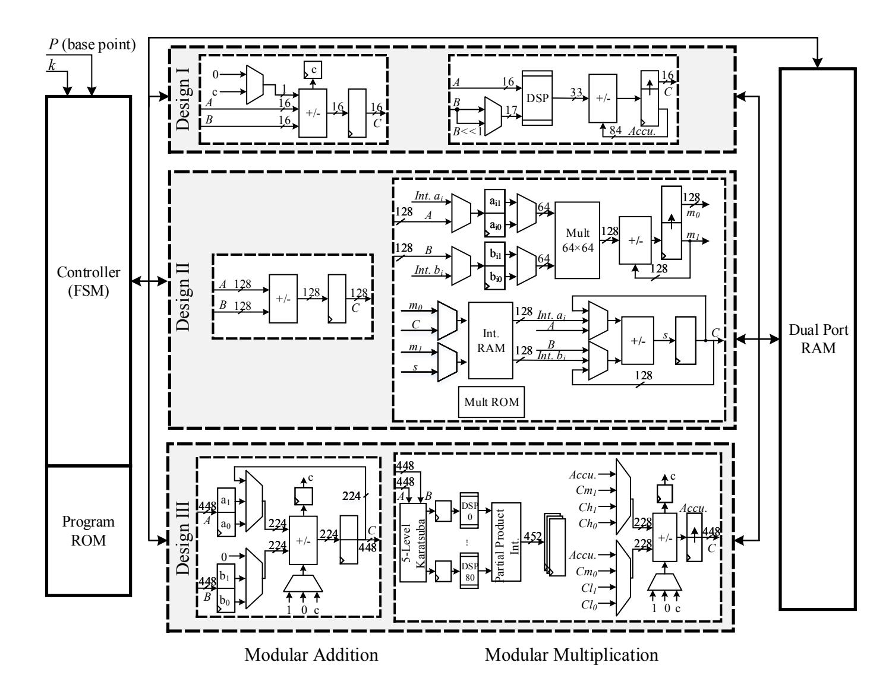
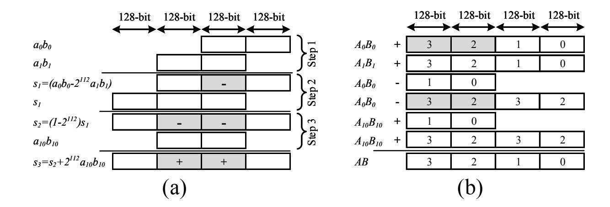
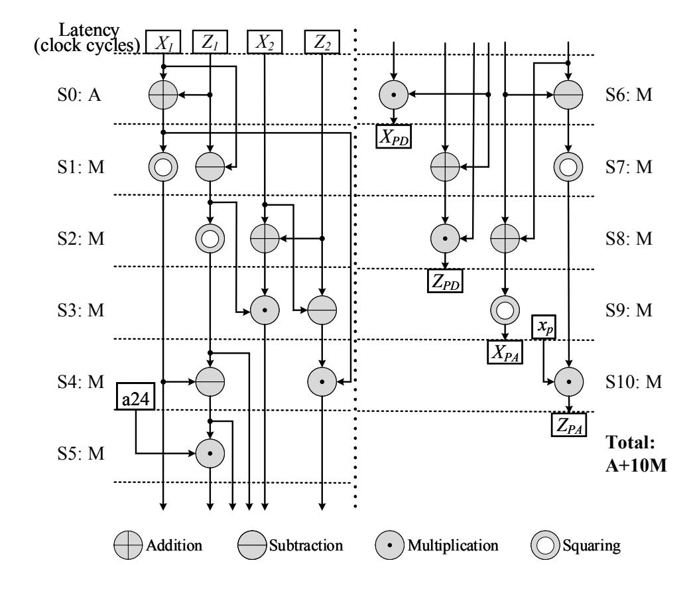
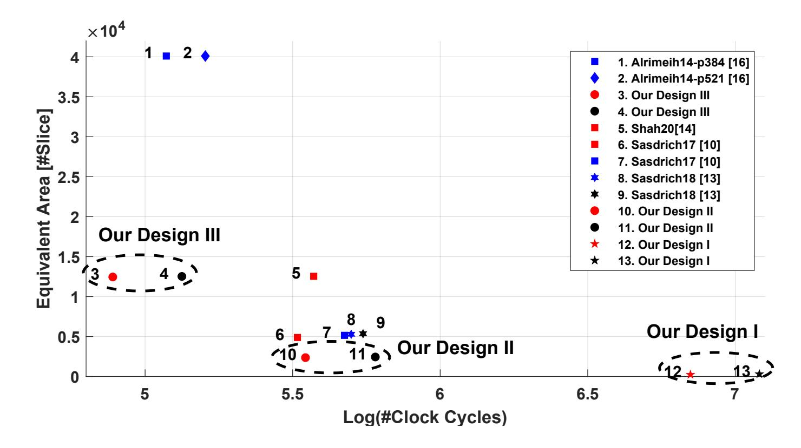

{0}------------------------------------------------

# **Optimized Architectures for Elliptic Curve Cryptography over Curve448**

Mojtaba Bisheh Niasar1 , Reza Azarderakhsh1*,*2 , and Mehran Mozaffari Kermani3

1 Department of Computer and Electrical Engineering and Computer Science, Florida Atlantic University, FL, USA

{mbishehniasa2019,razarderakhsh}@fau.edu

- 2 PQSecure Technologies, LLC, Boca Raton, FL , USA
- 3 Department of Computer Science and Engineering, University of South Florida, FL, USA

mehran2@usf.edu

**Abstract.** In this paper, we present different implementations of point multiplication over Curve448. Curve448 has recently been recommended by NIST to provide 224-bit security over elliptic curve cryptography. Although implementing high-security cryptosystems should be considered due to recent improvements in cryptanalysis, hardware implementation of Curve488 has been investigated in a few studies. Hence, in this study, we propose three variable-base-point FPGA-based Curve448 implementations, i.e., lightweight, area-time efficient, and high-performance architectures, which aim to be used for different applications. Synthesized on a Xilinx Zynq 7020 FPGA, our proposed high-performance design increases 12% throughput with executing 1,219 point multiplication per second and increases 40% efficiency in terms of required clock cycles×utilized area compared to the best previous work. Furthermore, the proposed lightweight architecture works in 250 MHz and saves 96% of resources with the same performance. Additionally, our area-time efficient design considers a trade-off between time and required resources, which shows a 48% efficiency improvement with 52% fewer resources. Finally, effective side-channel countermeasures are added to our proposed designs, which also outperform previous works.

**Keywords:** Curve448, elliptic curve cryptography, FPGA, hardware security, implementation, point multiplication, side-channel

### **1 Introduction**

Elliptic curve cryptography (ECC) has gained prominent attention among asymmetric cryptographic algorithms due to its short key size. ECC is mostly implemented in Internet-of-Thing (IoT) devices considering their limited power resources and processing units. Recently, to address some backdoor issues in ECC constructions due to advances in the strong cryptanalysis and classical attacks, new NIST [1] and IETF [2] recommendations make Curve25519 and Curve448 suitable for higher-level security requirements.

{1}------------------------------------------------

Although we are confident with the security of ECC over prime fields, there is always the possibility that algorithmic improvements reduce the required computation to break ECC. Therefore, moving to a higher level of security will help to keep a margin against unknown attack improvements. However, higher security levels come with the performance penalty and industry often resists them. Hence, we need to provide a level of security that can be feasible subject to the performance requirement of the target application such as high-end servers of constrained devices.

According to Shor's algorithm [3], most of the current cryptosystems will be broken by quantum computing. Hence, Post-Quantum Cryptography (PQC) algorithm are going to replace the classic public key cryptography algorithms. PQC based on elliptic curves is available for example in [4,5,6]. However, the transition to PQC includes an emerging field called hybrid systems, which require both classic and PQC [7]. Hence, ECC is going to be used in the hybrid mode for maintaining accordance with industry or government regulations, while PQC updates will be applied completely. Therefore, classical cryptosystems cannot be eliminated even if PQC will significantly be developed, so designing high-security ECC is crucial.

As a part of the Transport Layer Security (TLS) [8], Curve448 provides 224-bit security designed by Hamburg in 2015 [9,10]. Moreover, Curve448 belongs to [11], and Safe-Curve policies are considered in its design procedures. Although Curve25519 is highly investigated in recent years for different applications [12,13,14,15], there are few FPGA-based Curve448 implementations due to its optimal software-based design.

The closest related works that can be directly compared to ours are proposed by Sasdrich and Güneysu in [16], and the protected architecture in [13] by adding re-randomization countermeasure to design the resistant scheme against horizontal attacks. In these works, a field arithmetic unit based on schoolbook multiplication is designed by cascading arithmetic and reduction core employing 28 and 5 DSP blocks, respectively. These architectures heavily rely on the DSP blocks which leads to work in high operating frequency (i.e. 357 and 341 MHz). Furthermore, Shah *et al.* in [17] proposed a LUT-based scheme for highperformance point multiplication employing the most significant digit multiplier. Other FPGA implementations of ECC for Montgomery curves in the literature cannot be directly compared to ours, because they target different curves. Ananyi *et al.* in [18] introduced a flexible hardware ECC processor over several NIST prime fields. Furthermore, Alrimeih *et al.* designed an enhanced architecture over different NIST prime fields up to 521-bit in [19] including several countermeasures.

Based on the aforementioned discussions, implementation gaps are identified in: (i) the need for exploration of the different trade-offs between resource utilization and performance considering different optimization goals, and (ii) the lack of employing the Karatsuba-friendly property of Curve448.

{2}------------------------------------------------

*Our contributions:* To the best of our knowledge, there appear to be extremely few hardware implementations that focus only on Curve448 and make the best of all its features. The main contributions of this work are as follows:

- **–** We Investigate three design strategies to port Curve448 to various platforms with different design goals (i.e., time-constrained, area-constrained, and areatime trade-off applications) using a precise schedule corresponding to each architecture. Hence, different modular multiplication and addition/subtraction modules are developed particularly tailored on a Xilinx Zynq 7020 FPGA to perform variable-base-point point multiplications. Furthermore, all schemes are extended by side-channel countermeasures.
- **–** The proposed architectures are combined with interleaved multiplication and reduction employing redundant number presentation and refined Karatsuba multiplication to increase efficiency in comparison with those presented in previous.
- **–** Our proposed architectures outperform the counterparts available in the literature.

The rest of this paper is organized as follows: In Sec. 2, some relevant mathematical background and side-channel considerations are reviewed. In Sec. 3, the proposed architectures are investigated. In Sec. 4, our proposed FPGA implementations are detailed. In Sec. 5, the results and comparison with other works are discussed. Eventually, we conclude this paper in Sec. 6.

### **2 Preliminaries**

In this section, the mathematical background of ECC will be covered briefly. Additionally, Curve448 and its specifications will be introduced. Then, the respective side-channel analysis attack protection will be described.

#### **2.1 Field Arithmetic and ECDH Key Exchange**

The Galois Field *GF*(*p*) is described by finite elements including {0*,* 1*, . . . , p*−1} to define a finite field. Curve448 over *GF*(*p*) is defined by *E* : *y* 2 + *x* 2 ≡ 1 + *dx*2*y* 2 mod *p* where *p* = 2448 − 2 224 − 1 and *d* = −39081. This curve is a Montgomery curve and also an untwisted Edwards curve which is called Edwards448 [2].

Curve448 specifications can be employed to speed up the elliptic curve Diffie-Hellman (ECDH) Key-Exchange. Using the advantage of 448 = 7 × 64 = 14 × 32 = 28 × 16 = 56 × 8 provides more flexibility to design efficient architecture for different platforms. Additionally, due to its Solinas prime with golden ratio *φ* = 2224, fast Karatsuba multiplication can be performed as follows:

$$C = A \cdot B = (a_1\phi + a_0) \cdot (b_1\phi + b_0)$$

$$= a_1b_1\phi^2 + a_0b_0 + ((a_1 + a_0) \cdot (b_1 + b_0) - a_1b_1 - a_0b_0)\phi$$

$$\equiv (a_1b_1 + a_0b_0) + ((a_1 + a_0) \cdot (b_1 + b_0) - a_0b_0)\phi \pmod{p} \tag{1}$$

{3}------------------------------------------------

**Table 1.** Comparison of different ECC specifications over prime fields

| Curve                            | Ref. | Prime Shape                                | Security Level | Public Key Size (bits) | Private Key Size (bits) |
|----------------------------------|------|--------------------------------------------|-------------------|---------------------------|----------------------------|
| Curve25519                       | [2]  | $2^{255} - 19$                             | 127-bit           | 255                       | 255                        |
| $\operatorname{Four} \mathbb{Q}$ | [20] | $2^{127} - 1$                              | 128-bit           | $2\times127$              | $2\times127$               |
| NIST P-256                       | [21] | $2^{256} - 2^{224} + 2^{192} + 2^{96} - 1$ | 128-bit           | 256                       | 256                        |
| BrianpoolP320rl                  | [22] | Not Specific                               | 160-bit           | 320                       | 320                        |
| NIST P-384                       | [21] | $2^{384} - 2^{128} - 2^{96} + 2^{32} - 1$  | 192-bit           | 384                       | 384                        |
| BrianpoolP384r1                  | [22] | Not Specific                               | 192-bit           | 384                       | 384                        |
| Secp384r1                        | [23] | $2^{384} - 2^{128} - 2^{96} + 2^{32} - 1$  | 192-bit           | 384                       | 384                        |
| Curve448                         | [2]  | $2^{448} - 2^{224} - 1$                    | 224-bit           | 448                       | 448                        |
| NIST P-521                       | [21] | $2^{521} - 1$                              | 260-bit           | 521                       | 521                        |

where  $A = (a_1 \phi + a_0), B = (b_1 \phi + b_0), \text{ and } A, B, C \in GF(p).$ 

To implement modular inversion over GF(p) using Fermat's Little Theorem (FLT),  $a^{-1} \equiv a^{p-2} \mod p$  is computed by consecutive operations including 447 squaring and 15 multiplications.

To generate a shared secret key Q between two parties through an insecure channel, i.e., internet, ECDH Key-Exchange protocol can be implemented using elliptic curve point multiplication (ECPM)  $Q = k \cdot P$  over Curve448 where k and P are a secret scalar and a known base point, respectively. Moreover, public keys of Curve448 are reasonably short and do not require validation as long as the resulting shared secret is not zero.

Table 1 lists security level, public key size, private key size, and prime shape for security level in the range of about 128 to 256-bit.

#### 2.2 Group Arithmetic and Montgomery Ladder

Scalar multiplication is broken down into 448 iterations considering bit values of k. To perform efficient scalar multiplication over the Montgomery curve, the Montgomery ladder was introduced [24] to perform one point addition (PA) and one point doubling (PD) in each iteration. Furthermore, using this method in projective coordinate increases efficiency. If  $P = (x_p, y_p)$  is a base point in affine coordinate, it can be transmitted to projective coordinate such that P = (X, Y, Z) where  $x_p = X/Z$  and  $y_p = Y/Z$ . Suppose  $P_1 = (X_1, Z_1)$  and  $P_2 = (X_2, Z_2)$  are two points in projective coordinates. Therefore,  $P_1 + P_2$  and  $P_3$  are computed by following equations:

$$X_{PD} = (X_1 - Z_1)^2 \cdot (X_1 + Z_1)^2 \tag{2}$$

$$Z_{PD} = 4X_1 Z_1 \cdot (X_1^2 + 39081 X_1 Z_1 + Z_1^2) \tag{3}$$

$$X_{PA} = 4(X_1 X_2 - Z_1 Z_2)^2 \tag{4}$$

$$Z_{PA} = 4x_p(X_1Z_2 - Z_1X_2)^2 (5)$$

{4}------------------------------------------------

#### **2.3 Side-Channel Protection**

To implement a resistant architecture against side-channel analysis (SCA) attacks, different considerations are taken into account. Hence, several countermeasures should be embedded in the cryptographic implementations to prevent information leakage. Two basic protection including (i) constant-time implementation against timing attack, and (ii) secret-independent implementation against simple power analysis (SPA) can be achieved by performing inherently resistant algorithms. Hence, the proposed architecture is resistant against timing attacks and SPA attacks due to performing a constant number of operations in each iteration of the Montgomery ladder and employing constant-time FLT Inversion. Furthermore, some countermeasures which were introduced by Coron [25] are considered to avoid differential power analysis (DPA) attacks. These countermeasures include point randomization and scalar blinding which change both terms in the scalar multiplication *Q* = *k* · *P*.

**Point Randomization:** Point randomization can be achieved by adding a degree of freedom to represent a base point using projective coordinate representations. In this method, the base point *P* = (*X, Z*) is projected from affine coordinates using a random value *λ* ∈ Z2 448 \ {0} such that *Pr* = (*λ* · *X, λ* · *Z*). However, the scalar multiplication output is not changed, as proven in (6).

$$x_p = \frac{X}{Z} = \frac{\lambda X}{\lambda Z} \tag{6}$$

Point randomization provides different point representations corresponding to random value *λ* to avoid any information extraction employing statistical analysis.

**Scalar Blinding:** The second term in scalar multiplication is randomized in scalar blinding. In this method, multiple group order #*E* is added to *k* such that *kr* = *k* + *r* × #*E* where *r* is a random value. According to the fact that adding group order times of base point results in the point in infinity, the correctness of the scalar blinding approach can be proven as follows:

$$k_r \cdot P = (k + r \times \#E) \cdot P = k \cdot P + r \cdot O = k \cdot P \tag{7}$$

This computation takes away data dependency between the swap function in the Montgomery ladder and the corresponding bit in *k*.

### **3 Proposed Algorithm and Architecture**

In this section, the proposed algorithms for three different performance levels including lightweight, area-time efficient, and high-performance designs are covered. Moreover, their architectures and modular arithmetic units are investigated.

{5}------------------------------------------------

The top-level architecture used in our schemes for different design strategies is illustrated in Fig. 1 composed of three stages: (i) the dedicated controller stage including an FSM and program ROM, (ii) the field arithmetic units in the middle stage including modular addition/subtraction and modular multiplication, and (iii) a memory stage to store the intermediate results. All stages are customized based on the corresponding design strategy for increasing efficiency.

In lightweight and area-time efficient design, a major determinant of efficiency is matching the compute power to the memory bandwidth, so that most cycles the compute units and the memory units are used to accomplish as much work as possible. However, in high-performance design, more resources are utilized to reduce the required time for computation.

Implementing the Karatsuba multiplication requires a complex memory access pattern. Therefore, in lightweight architecture, the product scanning approach is proposed to perform repetitive operations with shared resources. In Design II and III, Karatsuba-based modular multiplication is employed.

### **3.1 Design I: Lightweight Architecture**

The proposed architecture for lightweight design is shown in Fig. 1. This design includes a controller, modular addition/subtraction, modular multiplication, ROM, and dual-port RAM in the top-level architecture. Program ROM consists of 2183 instruction lines (28 lines for Montgomery ladder, 1233 lines for multiplication, and 922 lines for inversion) for modular arithmetic units and memory addresses. Each line of ROM is 15-bit wide: 1 bit for modular multiplication, 2 bits for modular addition, and three 4-bit operand addresses for the RAM. The controller is connected to the ROM to read the instruction code for each cycle. Additionally, the controller sets required addresses for arithmetic units considering the corresponding bit of chosen scalar *k* and the instruction code. The intermediate data is stored into a dual-port RAM to decrease the required resources. A 448-bit data is stored by splitting to 28 words in 16-bit chunks due to DSP block input size. Therefore, the RAM bit width is 16-bit. To reduce the utilized resources in the proposed lightweight architecture, all required computations are performed sequentially.

**Modular Addition/Subtraction:** Two 16-bit data are loaded from RAM in each iteration, and addition/subtraction is performed between them. Then, the result is stored into RAM in the next iteration. The carry/borrow should be propagated to the next digit which is shown in the proposed architecture. Thus, modular addition/subtraction takes 56 cycles of which 28 are required for the computation and the remaining ones for reading/storing data. Moreover, the last carry/borrow is considered for the reduction procedure. To design a constant time computation, addition/subtraction is interleaved by a reduction based on the fact that 2 448 ≡ 2 224 + 1 mod *p*. Eventually, this computation requires another 56 iterations to complete for reduction.

{6}------------------------------------------------

**Fig. 1.** Proposed hardware architecture for different performance levels over Curve448: (Design I) The arithmetic units architecture in the lightweight design with 16-bit datapath, (Design II) The arithmetic units architecture in the area-time efficient design with 128-bit datapath, and (Design III) The arithmetic units architecture in the high-performance design with 448-bit datapath. A and B are read from the memory unit, and C are stored in the memory unit.

Modular Multiplication: Modular multiplication is designed based on the product scanning approach. To perform this approach, 28 multiplications are required for each 16-bit digit. In [16], the authors introduced a schoolbook multiplication with interleaved reduction performed in parallel using 28 DSPs. In lightweight architecture, only one DSP is utilized to perform multiplication sequentially. Due to the proposed interleaved reduction, different numbers of multiplication are performed corresponding to each product digit. Besides, several multiplications are duplicated for some operands. Thus, considering 1 bit free of DSP input, one bit shifted of the second operand can be selected to accelerate computation. For example, the fourteenth digit of the final product requires 54  $16 \times 16$ -bit multiplications of which 26 are duplicated. Hence, they can be performed in 28  $16 \times 16$ -bit and 13  $17 \times 16$ -bit multiplications. The partial product is accumulated in a register shown by  $Accu_{i+1} \times 2^{16} + C_i$  where  $Accu_i$  and  $C_i$  are carry and product digit of  $i^{th}$  element. The  $C_i$  is stored in the RAM, and the

{7}------------------------------------------------

*Accui* is shifted 16 bits to propagate to the next product digit. However, *Accu*28 should be considered for the second stage of reduction.

In the proposed lightweight design, each multiplication is followed by modular addition to implement an efficient reduction algorithm. Due to the special form of the prime, the addition between *Accu*28 ×2 14×16 +*Accu*28 and *C*27 ×2 27×16 + *. . .* + *C*0 leads to modular multiplication result.

#### **3.2 Design II: Area-Time Efficient Architecture**

The proposed area-time efficient design is shown in Fig. 1. This scheme is derived from our previous work presented in [26]. Program ROM consists of 480 instruction lines (18 lines for Montgomery ladder and 462 lines for inversion) for modular arithmetic units and memory addresses. Each line of ROM is 15-bit wide: 1 bit for modular multiplication, 2 bits for modular addition, and three 4-bit operand addresses for the RAM. For efficient resource utilization, the multiplication is performed based on a dedicated ROM consists of 69 lines of 17-bit width to generate the control commands.

The most important advantage of special form *p* is the implementation of the fast Karatsuba multiplication based on (1) [9]. In an area-time efficient design, a 448×448-bit multiplication in the first level can be converted by the Karatsuba method [27] to three 225×255-bit multiplications considering the addition carry. Furthermore, Bernstein in [28] introduced the refined Karatsuba identity as follows:

$$(a_0 + a_1 t^n) \cdot (b_0 + b_1 t^n) = (1 - t^n) \cdot (a_0 b_0 - t^n a_1 b_1) + t^n (a_0 + a_1) \cdot (b_0 + b_1)$$
(8)

A 448-bit data is represented in four integer pieces in radix 2 448*/*4 = 2112, i.e. , *A* is written as *A* = *a*0 +*a*1 ×2 112 +*a*2 ×2 224 +*a*3 ×2 336, and *B* is decomposed similarly to *A*. Applying Karatsuba multiplication provides *A*0*B*0, *A*1*B*1, and *A*10*B*10 such that:

$$A \times B = (A_0 B_0 + A_1 B_1) + 2^{224} (A_{10} B_{10} - A_0 B_0)$$
(9)

where:

$$A_0 B_0 = (a_0 + a_1 \times 2^{112}) \cdot (b_0 + b_1 \times 2^{112}) \tag{10}$$

$$A_1 B_1 = (a_2 + a_3 \times 2^{112}) \cdot (b_2 + b_3 \times 2^{112}) \tag{11}$$

$$A_{10}B_{10} = (a_0 + a_2 + (a_1 + a_3) \times 2^{112}) \cdot (b_0 + b_2 + (b_1 + b_3) \times 2^{112})$$
 (12)

For the second level, refined Karatsuba identity is applied where *t n* is equal to 2 112. Hence, for example, *A*0*B*0 is decomposed such that:

$$A_0 B_0 = (1 - 2^{112}) \cdot (a_0 b_0 - 2^{112} a_1 b_1) + 2^{112} (a_0 + a_1) \cdot (b_0 + b_1)$$
  
=  $(1 - 2^{112}) \cdot (a_0 b_0 - 2^{112} a_1 b_1) + 2^{112} (a_{10} b_{10})$  (13)

{8}------------------------------------------------

Therefore, three 114×114-bit multiplications are required (i.e., *a*0*b*0, *a*1*b*1, and *a*10*b*10) which are implemented by schoolbook method with 64-bit digit size.

To diminish the cost of the carry propagation, redundant representation is employed in the proposed architecture. Datapath is considered 128-bit to provide a more 16 bits for each digit. Moreover, in [29], the authors used reduced refined Karatusba technique in top-level to decrease the number of additions. Based on [26], we employ the interleaved reduction technique into the first Karatsuba level. Hence, we reduce the second term in (9), i.e., 2 224 × (*A*10*B*10 − *A*0*B*0), before adding with (*A*0*B*0 + *A*1*B*1).

**Addition/Subtraction:** In the area-time efficient architecture, addition/subtraction is designed non-modular. Based on the Montgomery ladder, addition/subtraction units are followed by multiplication. Due to redundant representation in this architecture, the reduction stage can be postponed to the multiplication stage. Moreover, carry propagation is removed between digits considering redundancy in representation. Addition/subtraction is computed in four cycles between two 128-bit data in parallel with multiplication. Thus, its latency is absorbed by multiplication cycles to increase performance.

**Modular Multiplication:** Modular multiplication includes a 64×64-bit multiplication using 16 DSPs. The multiplier is designed pipelined with 8 stages to increase throughput. Two 128-bit data are stored in its input registers. Furthermore, a register is considered in its output to accumulate partial products. The throughput of the proposed architecture is 1 multiplication per 4 cycles employing the pipeline architecture. Hence, in 3 × 4 = 12 clock cycles, three required multiplications in (13), i.e., *a*1*b*1*,a*0*b*0, and *a*10*b*10, are computed.

The proposed middle-level recombination is shown in Fig. 2-(a). After computing the three lowest-level products, i.e., *a*0*b*0, *a*1*b*1, and *a*10*b*10, we need only 5 additions performed in 3 steps to compute *A*0*B*0 which are pipelined with *A*1*B*1 computing. We obtain *A*0*B*0 as follows:

- **–** *Step 1: Compute s*1 = (*a*0*b*0 − 2 112*a*1*b*1)*.* We subtract the first digit *a*1*b*1 from the second digit *a*0*b*0. Note that the second digit *a*1*b*1 is not actually subtracted from 0. Hence, it should be implicitly negated during the recombination.
- **–** *Step 2: Compute s*2 = (1−2 112)*s*1. Multiplying *s*1 by (1−2 112) is equivalent to subtracting the shifted *s*1 from itself. Therefore, we align the first digit of *s*1 with the second digit and subtract.
- **–** *Step 3: Compute s*3 = *s*2 + 2112(*a*10*b*10). We align the first digit of *a*10*b*10 with the second digit of *s*2. Hence, this level of computation is finished by performing two additions between the first and second digits of *a*10*b*10, and the second and third digits of *s*2, respectively.

Moreover, *A*1*B*1 and *A*10*B*10 can be computed in the same way as *A*0*B*0. The total cost for these three steps is 15 128-bit additions.

{9}------------------------------------------------

**Fig. 2.** Proposed recombination in efficient modular multiplication. (a) middle-level recombination: only five highlighted operations are performed. (b) top-level recombination: applying interleaved reduction cancels the highlighted digits.

Fig. 2-(b) illustrates the top-level recombination. According to this figure, the two most significant digits of *A*0*B*0, i.e., the third and forth digits, cancel themselves considering the reduction algorithm. Then, several consecutive additions between partial products for the carry propagation and reduction are performed.

For efficient control of the operation sequences, a dedicated controller and an internal RAM are considered in this unit. Eventually, modular multiplication latency is 69 clock cycles employing the pipelined architecture.

#### **3.3 Design III: High-Performance Architecture**

The proposed high-performance design is shown in Fig. 1. Program ROM consists of 1554 instruction lines (168 lines for Montgomery ladder and 1386 lines for inversion) for modular arithmetic units and memory addresses. Each line of ROM is 12-bit wide: 1 bit for modular multiplication, 2 bits for modular addition, 1 bit for storing data on RAM, and two 4-bit memory addresses for the RAM

There are different multiplication methods for designing high-performance architecture, e.g., Schoolbook or Toom-3 approach. For Curve448, Karatsuba multiplication has a special advantage due to its golden ratio. Different levels of Karatsuba multiplication can be applied in 448×448-bit multiplication. In this design, 5-level Karatsuba multiplication is considered to decrease multiplier latency considering DPS block input size. Although increasing the number of Karatsuba level drops operating frequency due to expanding addition tree, parallelization in the lowest level of computation reduces considerably the required cycles to speed up the computation. According to this approach, high-performance architecture is designed which is illustrated in Fig. 1. This architecture includes a controller, modular addition/subtraction, modular multiplication, ROM, and dual-port RAM. To decrease loading/storing latency from/to RAM, datapath is implemented with 448-bit wide.

{10}------------------------------------------------

**Modular Addition/Subtraction:** Addition/subtraction is implemented between two 224-bit to decrease critical path delay (CPD). The data is loaded from RAM and stored in its input registers. Then, *a*0 + *b*0 and *a*1 + *b*1 are performed and the results are stored in a register, while the first carry/borrow is propagated and the second one is considered for reduction. Then, an interleaved reduction follows the addition/subtraction operation. Therefore, multiplexers are designed for selecting operands, carry/borrow bit, and inputs. Finally, although modular addition/subtraction requires 4 clock cycles for operation and 3 cycles for data transmission, its latency is entirely absorbed by modular multiplication.

**Modular Multiplication:** Modular multiplication splits a 448×448-bit multiplication into 3 5 = 243 partial multiplications employing 5 levels of Karatsuba. Due to the number of available DSP blocks in the proposed FPGA (i.e., 220 DSPs), the first level is designed pipeline, while the rest of the multiplications are performed parallel using 81 DSP blocks. Then, an addition tree is implemented, and its achieved results are stored into three registers including *Ch* = *A*1*B*1, *Cl* = *A*0*B*0, and *Cm* = *A*10*B*10. There are registers between different stages of multiplier and addition tree to design pipeline architecture. Therefore, a next multiplication (i.e., *A*0*B*0) is exactly started after that the first stage of previous multiplication (i.e., *A*1*B*1) is completed. Thus, all three registers are filled in 5 clock cycles with 452-bit wide.

An addition/subtraction circuit is build to compute the top-level addition and interleaved reduction. Therefore, computing *C*0 = *Ch*0 + *Cl*0 + *Cm*1 − *Cl*1 and *C*1 = *Ch*1 + *Cl*1 + *Cm*0 − *Cl*0 leads to the proposed result. Multiplexers determine inputs, carry/borrow propagation, and operands in each iteration. Eventually, the last reduction stage is computed considering *C*1 carry. This procedure takes 9 cycles. However, its first stages are arranged with the last stages of multiplication. Thus, modular multiplication is completed in 15 cycles considering RAM interfacing.

### **4 FPGA Implementations**

In this section, we present details of the proposed ECPM, in particular the Montgomery ladder, its scheduling, and latency. Second, SCA considerations for implementing enhanced architecture are discussed.

#### **4.1 ECPM implementation**

Point multiplication is implemented employing field arithmetic units including modular addition, subtraction, multiplication, and inversion. Modular addition, modular subtraction, and modular multiplication are entirely explained corresponding to each optimization goals. Furthermore, modular inversion is implemented based on the FLT constant-time algorithm using consecutive modular multiplications performed after point multiplication.

{11}------------------------------------------------

**Fig. 3.** Design II and III data dependency diagram for one step Montgomery ladder execution over Curve448. The total latency is *A* + 10*M* where *A* and *M* are modular addition and multiplication latency, respectively. Furthermore, a24 is equal to 39081 for Curve448.

Montgomery ladder is implemented using precis scheduling of arithmetic units. It consists of 8 additions (or subtraction) and 10 multiplications (or squaring). Fig. 3 shows the data dependency diagram for executing a step Montgomery ladder in area-time efficient and high-performance architectures. As one can see, the total latency is *A*+ 10*M* where *A* and *M* are modular addition and multiplication latency, respectively. In other words, addition latency is absorbed by multiplication employing parallel computing. However, in our proposed lightweight architecture each multiplication is followed by an additional addition to perform reduction which leads to an increase in its latency.

#### **4.2 Side-Channel Protected Implementation**

Different SCA countermeasures are embedded for the proposed designs to provide enhanced architecture against DPA. As it is explained earlier, three different approaches are considered including scalar blinding, base point randomization, and continuous point randomization. Designing a random number generator (RNG) is not in the scope of this study, so we assume the randomized numbers are provided externally.

**Scalar Blinding:** According to [30], at least half of the field size is recommended to be used for scalar blinding. Therefore, *r* with 224-bit length builds *kr* with 672-bit which makes longer execution time compared to unprotected design. 

{12}------------------------------------------------

However, it does not change resource utilization considering externally provided *kr* assumption.

**Base Point Randomization:** Base point randomization is achieved by using randomized base point *Pr* = (*λ* · *xp, λ*). We assume *Pr* is externally delivered to the ECPM core. Due to implementing variable-base-point architecture, base point randomization is achieved without any cost.

**Continues Point Randomization:** Although exploiting of randomized base point provides more resistance against DPA, point randomization can also be applied consecutively to prevent horizontal attacks. In this approach, two more modular multiplications (i.e., *λ*·*xP A* and *λ*·*zP A*) are performed to re-randomized Montgomery ladder outputs. Hence, continuous point randomization increases Montgomery ladder latency, and consequently total latency.

## **5 Implementation Results and Comparison**

Our three different performance level architectures are synthesized and implemented with Xilinx Vivado 2019.2 on a Xilinx Zynq-7020 FPGA device. All given results are obtained after place-and-route (PAR). Furthermore, several test vectors have been tested to verify our implementations, and the results for suggested vectors by [2] are reported in Appendix A.

#### **5.1 Performance Results**

Table 2 summarizes the number of clock cycles and latency requirements for all proposed architectures in our unprotected schemes broken down into the group and field arithmetic operations. According to this table, the operating frequency for high-performance design compared to other schemes is dropped as expected to 95 MHz due to the increasing level of Karatsuba multiplication. As described before, the most time-consuming operation in Design III is modular multiplication with 15 clock cycles which absorb addition/subtraction latency. Furthermore, modular inversion is implemented in the last stage of ECPM for back transformation from projective coordinates to affine coordinates at the cost of about 10% of the clock cycles. In total, the unprotected core can execute 35, 363, and 1,219 ECDH operations per second for lightweight, area-efficient, and high-performance architectures, respectively.

#### **5.2 Comparison**

Recently, there are considerable efforts to implement ECC using instruction set processors [31]. It makes the design smaller, slower, and more controllable/programmable at cost of implementing a software-based processor. However, pure hardware implementations are better as it is faster and could be any time integrated with hardware/software co-design techniques.

{13}------------------------------------------------

**Table 2.** FPGA implementation results for different performance level architectures in terms of clock cycles and latency requirements

|             | Proposed Architecture Clock Freq. [MHz] | Design I 250 | 127     | Design II Design III 95 |
|-------------|--------------------------------------------|-----------------|---------|----------------------------|
| FpOperation | Addition                                   | 112             | 8       | 7                          |
|             | Subtraction                                | 112             | 8       | 7                          |
|             | Multiplication                             | 1,233           | 69      | 15                         |
|             | Inversion                                  | 620,047         | 32,272  | 6,917                      |
| Unprotected | Mont. step                                 | 14,346          | 708     | 158                        |
|             | Point Multiplication                       | 7,047,055       | 349,546 | 77,702                     |
|             | Latency [ms]                               | 28.19           | 2.75    | 0.82                       |

Additionally, our target is optimization based on the area-time trade-offs point of view, while other trade-offs from a time-memory perspective can be investigated. However, the latter method relies on the pre-computation over a fixed-base-point, while we focus on variable-base-point architectures.

To the best of our knowledge, there are only a few FPGA implementations for security level more than 128-bit. For comparison, we have selected point multiplications presented in [16] and [13] with the same platform, and [17] mapped to a Xilinx Virtex FPGA. Additionally, we have opted [19] and [18] for NIST P-384 and P-521, since they are in the same security level as Curve448. Moreover, to estimate area equivalent for efficiency computing, we force the Vivado synthesis tool to implement DSP block employing only LUTs, so we investigate each DSP is equivalent to almost 100 occupied Slices.

The area and time specifications for our proposed work and comparison to the counterparts are reported in Table 3. Three different levels of protection are considered including no protection, protection with scalar blinding and point randomization, and high protection with scalar blinding and point re-randomization countermeasures.

**Design I** requires only a few resources on our target device, i.e., 137 (1%) of the Slices, 1 (0.5%) of DSP block, and 2 (1.4%) BlockRAM. It occupies at least 96% fewer resources compared to other works while decreasing utilized resources increases latency by more than 7 million cycles.

**Design II** utilizes the available resources more than Design I and less than Design III, i.e., 760 of the Slices, 16 of DSPs, and 9 of BlockRAM. Our proposed Design II saves 52% of Slice utilization compared to the unprotected scheme in [16]. Furthermore, the critical resource in FPGA is the DSP component which has a significant effect on performance. So, the proposed architecture for an areatime efficient scheme saves 52% of DSP utilization at the cost of longer execution time compared to [16] and [13], respectively. Thus, this design can be considered for some applications which need a trade-off between area and time. Moreover, the protected scheme of Design II saves 60%, 52%, and 36% Slices, DSPs, and BRAM compared to the high-protected scheme presented in [13], while the total time is 3× slower.

{14}------------------------------------------------

**Table 3.** FPGA implementation results for different ECPM cores over prime fields above 128-bit security

|                                                                        |      |                         | Area |             |     |                   | Time       |       |                      |        |
|------------------------------------------------------------------------|------|-------------------------|------|-------------|-----|-------------------|------------|-------|----------------------|--------|
| Work                                                                   | SCA4 | LUTs                    | FFs  |             |     | Slices DSPs BRAMs | Latency    |       | Freq Total time OP/s |        |
|                                                                        |      |                         |      |             |     |                   | [CCs]      | [MHz] | [ms]                 |        |
| NIST P-384 (192-bit security)                                          |      |                         |      |             |     |                   |            |       |                      |        |
| [19]1                                                                  | (+)  | 32900                   | ~    | 11,200      | 289 | 128               | ~          | 100   | 1.18                 | 847    |
| [18]2                                                                  | (-)  | 31946                   | ~    | 20,793      | 32  | 1                 | ~          | 60    | 17.50                | 57     |
| NIST P-521 (260-bit security)                                          |      |                         |      |             |     |                   |            |       |                      |        |
| [19]1                                                                  | (+)  | 32900                   | ~    | 11,200      | 289 | 128               | ~          | 100   | 1.60                 | 625    |
| [18]2                                                                  | (-)  | 31946                   | ~    | 20,793      | 32  | 1                 | ~          | 60    | 39.90                | 25     |
| Curve448 (224-bit security)                                            |      |                         |      |             |     |                   |            |       |                      |        |
| [16]3                                                                  | (-)  | 2,555                   |      | 7,049 1,580 | 33  | 14                | 328,286    | 357   | 0.92                 | 1,087  |
|                                                                        | (+)  | 3,583                   |      | 7,423 1,648 | 35  | 14                | 473,926    | 335   | 1.41                 | 708    |
|                                                                        |      |                         |      |             |     |                   |            |       |                      |        |
| [13]3                                                                  | (+)  | 4,624                   |      | 8,209 1,985 | 33  | 14                | 499,344    | 341   | 1.46                 | 685    |
|                                                                        | (++) | ~                       | ~    | 2,056       | 33  | 14                | 547,728    | 341   | 1.61                 | 622    |
| [17]4                                                                  | (-)  | 50,143                  | ~    | ~           | 0   | ~                 | 372,742    | 325   | 1.15                 | 869    |
|                                                                        |      |                         |      |             |     |                   |            |       |                      |        |
|                                                                        | (-)  | 321                     | 174  | 137         | 1   | 2                 | 7,047,055  | 250   | 28.19                | 35     |
| Design I3                                                              | (++) | 509                     | 438  | 203         | 1   | 2                 | 12,068,239 | 250   | 48.27                | 21     |
|                                                                        |      |                         |      |             |     |                   |            |       |                      |        |
| Design II3                                                             | (-)  | 2,233 1,152             |      | 760         | 16  | 9                 | 349,546    | 127   | 2.75                 | 363    |
|                                                                        |      | (++) 2,587 1,629        |      | 842         | 16  | 9                 | 602,801    | 127   | 4.75                 | 211    |
|                                                                        | (-)  | 13,132 4,035 4,354      |      |             | 81  | 0                 | 77,702     | 95    | 0.82                 | 1,219  |
| Design III3                                                            |      | (++) 13,415 4,610 4,424 |      |             | 81  | 0                 | 133,254    | 95    | 1.40                 | 713    |
|                                                                        |      |                         |      |             |     |                   |            |       |                      | 4 Plat |
| 1 Platform: XC6VLX760 2 Platform: XC4VFX100 3 Platform: XC7Z7020 |      |                         |      |             |     |                   |            |       |                      |        |

form: Virtex-7

**Design III** is implemented employing 4,354 of the Slices, 81 DSPs, and no BlockRAM. It is designed based on 5-level Karatsuba multiplication employing the distributed memory to reduce total latency. Design III generates 1,219 ECPM per second which leads to 76% and 12% improvement in terms of the required clock cycles and throughput compared to [16], respectively. Besides, its protected scheme improves 76% and 15% of the required clock cycles and throughput compared to the high-protected scheme in [13] at the cost of utilizing 2.1× and 2.5× more Slices and DSPs, respectively.

We also report NIST P-384 and NIST P-521 hardware implementations. Most of these results are hard to compare since the implementations differ in various ways. According to Table 3, [18] in both field size 384 and 521-bit utilizes almost 20,800 Slices and 32 DSPs on a Virtex4 FPGA (2LUTs per Slice) to generate 57 and 25 ECPM per second. Moreover, [19] uses 11,200 Slices and 289 DSPs to

4 (-): no protection, (+): scalar blinding and point randomization countermeasures, (++): scalar blinding and point re-randomization countermeasures

{15}------------------------------------------------

**Fig. 4.** Efficiency comparison between FPGA-based ECPM architectures in terms of  $A \cdot T$  (Area×Time). Area is considered as Slices + DSPs equivalent, while each DSP is assumed equivalent to 100 Slices based on the Vivado synthesis tool. A fixed low-frequency is considered for all architectures, hence, the required clock cycle is used rather than time. It should be notified that a low-frequency is employed for IoT devices to reduce power consumption. (red: unprotected, blue: protected, black: high-protected)

compute 847 and 625 ECPM per second over 384 and 521-bit NIST prime on a Virtex-6 FPGA, respectively.

It is worth mentioning that the aforementioned references (i.e., [16] and [13]) take advantage of the high operating frequency, thanks to designing a novel architecture with the optimized critical path. They implement an arithmetic core and a reduction core using pipelined DSPs with different configurations corresponding to the required operations.

One of the most important challenges in developing IoT devices is reducing power consumption due to their resource constraints. Although area utilization has an undeniable role to decrease power consumption, increasing operating frequency grows the required dynamic power. Hence, considering a fixed low-frequency to reduce the required power, we compare the efficiency of our proposed architectures to other works in terms of  $A \cdot T$  (Area×Time). Fig. 4 illustrates the efficiency of different FPGA-based point multiplication architectures. According to this figure, our proposed Design I utilizes minimum resources. Our proposed Design III achieves the lowest latency, while more resources are employed compared to [16,13]. Eventually, the proposed Design II stands between these two designs with better performance in comparison with the previous works.

According to the target platform each scheme can be implemented which addresses the restrictions of the system. The proposed architecture in [16] and

{16}------------------------------------------------

[13] result in 3× speedup compared to our Design II, when they work in 357 and 341 MHz, respectively. However, a more technology-independent measurement is the required cycle. An operating frequency in a limited range is mostly considered to reduce the required power. Thus, efficiency can be computed by the required clock cycles×area. In this case, the efficiency of the proposed lightweight design is almost equal to the best previous work, while unprotected and high-protected Design II improve 48% and 50% efficiency compared to [16] and [13], respectively. Furthermore, Design III increases efficiency by 40% and 43% compared to [16] and [13], respectively.

### **6 Conclusion**

In this work, three hardware implementations for security level 224-bit are presented for area-constrained, time-constrained, and area and time trade-off applications. All proposed architectures are implemented on a mid-range Xilinx FPGA XC7Z7020, while side-channel countermeasures are simultaneously investigated. We choose efficient techniques for each application, which include interleaved reduction, consecutive Karatsuba multiplication, refined Karatsuba identity, and pipelined architecture. These architectures can compute 1219, 363, and 35 ECDH operations per second for high-performance, area-time efficient, and lightweight designs, respectively.

### **Acknowledgment**

The authors would like to thank the reviewers for their comments. Also, we thank Mike Hamburg for his constructive comments. This work is supported by a grant from ARO W911NF-17-1-0311.

### **References**

- 1. Chen, L., Moody, D., Regenscheid, A., Randall, K.: Recommendations for discrete logarithm-based cryptography: Elliptic curve domain parameters. Computer Security, Draft NIST Special Publication, National Institute of Standards and Technology 800-186, (2019)
- 2. Langley, A., Hamburg, M., Turner, S.: Elliptic curves for security (2016)
- 3. Shor, P.W.: Algorithms for quantum computation: Discrete logarithms and factoring. In: 35th Annual Symposium on Foundations of Computer Science, Santa Fe, New Mexico, USA, 20-22 November 1994. 124–134 (1994)
- 4. Elkhatib, R., Azarderakhsh, R., Mozaffari Kermani, M.: Highly optimized montgomery multiplier for SIKE primes on FPGA. In: 27th IEEE Symposium on Computer Arithmetic, ARITH 2020, Portland, OR, USA, June 7-10, 2020. 64–71 (2020)

{17}------------------------------------------------

- 5. Seo, H., Sanal, P., Jalali, A., Azarderakhsh, R.: Optimized implementation of SIKE round 2 on 64-bit ARM cortex-a processors. IEEE Trans. Circuits Syst. I Regul. Pap. 67-I(8), 2659–2671 (2020)
- 6. Seo, H., Anastasova, M., Jalali, A., Azarderakhsh, R.: Supersingular isogeny key encapsulation (SIKE) round 2 on ARM cortex-m4. IACR Cryptol. ePrint Arch. 2020, 410 (2020)
- 7. Bindel, N., Herath, U., McKague, M., Stebila, D.: Transitioning to a quantumresistant public key infrastructure. IACR Cryptology ePrint Archive 2017, 460
- 8. Rescorla, E.: The Transport Layer Security (TLS) Protocol Version 1.3. RFC 8446 (2018)
- 9. Hamburg, M.: Ed448-goldilocks, a new elliptic curve. IACR Cryptology ePrint Archive 2015, 625 (2015)
- 10. Mike Hamburg: Ed448-goldilocks, a new high-strength curve and implementation. url: https://csrc.nist.gov/csrc/media/events/workshop-on-elliptic-curvecryptography-standards/documents/presentations/session7-hamburg-michael.pdf (June 2015)
- 11. Bernstein, D.J., Lange., T.: Safecurves: choosing safe curves for elliptic-curve cryptography. url: https://safecurves.cr.yp.to/. (2016)
- 12. Sasdrich, P., Güneysu, T.: Efficient elliptic-curve cryptography using curve25519 on reconfigurable devices. In Goehringer, D., Santambrogio, M.D., Cardoso, J.M.P., Bertels, K., eds.: Reconfigurable Computing: Architectures, Tools, and Applications - 10th International Symposium, ARC 2014, Proceedings. 25–36 (2014, Vilamoura, Portugal)
- 13. Sasdrich, P., Güneysu, T.: Exploring RFC 7748 for hardware implementation: Curve25519 and curve448 with side-channel protection. J. Hardware and Systems Security 2(4), 297–313 (2018)
- 14. Bisheh Niasar, M., Elkhatib, R., Azarderakhsh, R., Mozaffari Kermani, M.: Fast, small, and area-time efficient architectures for key-exchange on curve25519. In: 27th IEEE Symposium on Computer Arithmetic, ARITH 2020, Portland, OR, USA, June 7-10, 2020. 72–79 (2020)
- 15. Salarifard, R., Sarmadi, S.B.: An efficient low-latency point-multiplication over curve25519. IEEE Trans. on Circuits and Systems 66-I(10), 3854–3862 (2019)
- 16. Sasdrich, P., Güneysu, T.: Cryptography for next generation TLS: implementing the RFC 7748 elliptic curve448 cryptosystem in hardware. In: Proceedings of the 54th Annual Design Automation Conference, DAC 2017, Austin, TX, USA, June 18-22, 2017. 16:1–16:6 (2017)
- 17. Shah, Y.A., Javeed, K., Shehzad, M.I., Azmat, S.: Lut-based high-speed point multiplier for goldilocks-curve448. IET Computers Digital Techniques 14(4), 149– 157 (2020)
- 18. Ananyi, K., Alrimeih, H., Rakhmatov, D.: Flexible hardware processor for elliptic curve cryptography over nist prime fields. IEEE Transactions on Very Large Scale Integration (VLSI) Systems 17(8), 1099–1112 (2009)
- 19. Alrimeih, H., Rakhmatov, D.: Fast and flexible hardware support for ecc over multiple standard prime fields. IEEE Transactions on Very Large Scale Integration (VLSI) Systems 22(12), 2661–2674 (2014)
- 20. Järvinen, K., Miele, A., Azarderakhsh, R., Longa, P.: FourQ on FPGA: new hardware speed records for elliptic curve cryptography over large prime characteristic fields. In Gierlichs, B., Poschmann, A.Y., eds.: Cryptographic Hardware and Embedded Systems - CHES 2016 - 18th International Conference, Proceedings. 517–537 (2016, Santa Barbara, CA, USA)

{18}------------------------------------------------

- 21. U.S. Department of Commerce/National Institute of Standards and Technology: Digital signature standard (DSS) (2013)
- 22. Lochter, M., Merkle, J.: Elliptic curve cryptography (ecc) brainpool standard curves and curve generation (2010)
- 23. Brown, D.R.L.: Sec 2: Recommended elliptic curve domain parameters (2010)
- 24. Montgomery, P.L.: Speeding the pollard and elliptic curve methods of factorization. Mathematics of Computation 48, 243–264 (1987)
- 25. Coron, J.: Resistance against differential power analysis for elliptic curve cryptosystems. In Koç, Ç.K., Paar, C., eds.: Cryptographic Hardware and Embedded Systems, CHES'99. 292–302 (1999, Worcester, MA, USA)
- 26. Bisheh Niasar, M., Azarderakhsh, R., Mozaffari Kermani, M.: EdDSA for hardware implementation: Highly optimized Ed25519 and Ed448 signatures. Accepted in IEEE Transactions on Circuits and Systems I: Regular Papers, (2020)
- 27. Karatsuba, A., Ofman, Y.: Multiplication of multidigit numbers on automata. Soviet physics doklady 7, 595 (1963)
- 28. Bernstein, D.J.: Batch binary edwards. In: Advances in Cryptology CRYPTO 2009, 29th Annual International Cryptology Conference, Santa Barbara, CA, USA, August 16-20, 2009. Proceedings. 317–336 (2009)
- 29. Bernstein, D.J., Chuengsatiansup, C., Lange, T.: Curve41417: Karatsuba revisited. In: Cryptographic Hardware and Embedded Systems - CHES 2014 - 16th International Workshop, Busan, South Korea, September 23-26, 2014. Proceedings. 316–334 (2014)
- 30. Schindler, W., Wiemers, A.: Efficient side-channel attacks on scalar blinding on elliptic curves with special structure. NIST Workshop on ECC standards, (2015)
- 31. Ogawa, H.S., Luther, T.E., Ricardini, J.E., Cunha, H., Jr., M.S., Aranha, D.F., Derwig, R., Kupwade-Patil, H.: Accelerated v2x provisioning with extensible processor platform. Cryptology ePrint Archive, Report 2019/1039 (2019)