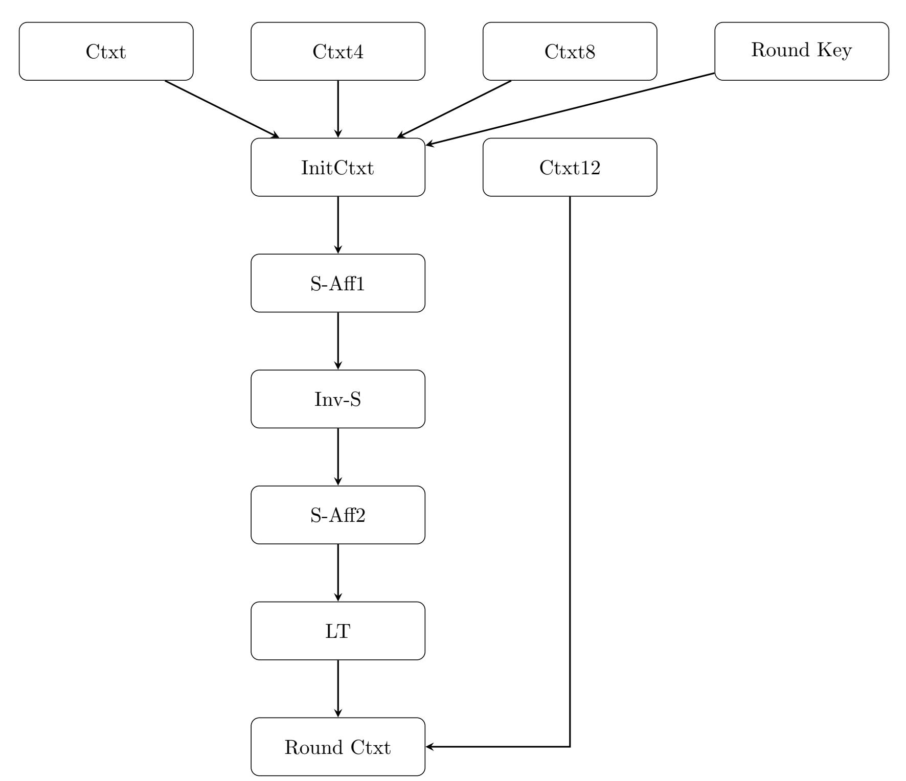

{0}------------------------------------------------

# Homomorphic Evaluation of the SM4

# $\begin{array}{c} {\rm Yu~Xue} \\ {\rm xueyu7452@hotmail.com} \end{array}$

October 25, 2020

#### Abstract

We report the homomorphic evaluation of the SM4 symmetric block-cipher based on BGV homomorphic encryption scheme. We implement bootstrapping and non-bootstrapping homomorphic evaluation of the 32-rounds SM4 based on HELib with about 128-bit security level. Our ways refer to and are similar as the AES homomorphic evaluation[1]. The implementation uses packed ciphertexts and bytes in slots. The S-Box evaluation is similar as the AES evaluation method, and the Linear Transform layer uses the permutation of the bytes in states. Since the rounds are more than the AES and the SM4's feistel structer is different with the AES, the depths and levels of homomorphic evaluation of the SM4 are much more than AES, so need larger parameter(non-bootstrapping) and more bootstrapping. Our bootstrapping implementaion(3 ciphertexts, 360 blocks) runs about 1.5 hours on Macbook Pro(MacOS catalina 10.15, 16G), and the non-bootstrapping(1 ciphertext, 480 block) implementation runs about 6 hours on Macbook Pro(MacOS catalina 10.15, 16G).

# 1 Introduction

Homomorphic Encryption [2] enables computation of arbitrary functions on encrypted data without decrypting the data. Gentry's breakthrough result[3] demonstrated that fully homomorphic encryption was theoretically possible, assuming the hardness of lattices problems. Since then there are many different algorithms to make kinds of improments. Among them BGV[4], BFV[5] and CKKS[6] etc are algorithms which are implemented in several commonly used homomorphic encryption software lib such as HELib[7], SEAL[8] and PALISADE[9] etc. We use the BGV scheme based on HELib to homomorphic evaluate SM4 like AES homomorphic evaluation.

#### 1.1 BGV Scheme

The BGV-type[10] ring-LWE-based scheme we used is defined over a ring  $R \stackrel{def}{=} \mathbb{Z}[X]/(\Phi_m(X))$ , where  $\Phi_m(X)$  is the *m*th cyclotomic polynomial. A ciphertext  $\boldsymbol{c}$  is decrypted using the current secret key  $\boldsymbol{s}$  by taking inner product over  $R_q$ 

{1}------------------------------------------------

(with q the current modulus) and then reducing modulo 2 in coefficient representation. Namely, the decryption formula is

$$a \leftarrow [\ [\langle c, s \rangle \ mod \ \Phi_m(X)\ ]_q\ ]_2$$

The polynomial  $[\langle c, s \rangle \mod \Phi_m(X)]_q$  is called the "noise" in the ciphertext c. Noise should be sufficiently small to make c is valid. The main operations are addition, multiplication, automorphism, rotation, key-switching and modulus-switching etc. The BGV scheme is leveled with finite depth without bootstrapping. bootstrapping 11 could be applied to refresh ciphertext to run more depth. Key switching enables converting a valid ciphertext with respect to one key into a valid ciphertext encrypting the same plaintext with respect to another key. For example, after multiplication key switching reduces the high demension key back to a ciphertext with respect to the low dimension key. The modulus switching operation is intended to reduce the norm of the noise to compensate for the noise increase that results from all the other operations. A BGV-type cryptosystem has a chain of moduli,  $q_0 < q_1 \dots < q_{L-1}$ , where initial ciphertexts are with repect to the largest modulus  $q_{L-1}$ . During homomorphic evaluation when the noise grows too large we apply modulus switching from  $q_i$ to  $q_{i-1}$  in order to decrease it back. Automorphism is also a useful operation, the effect of which is either applying the transformation to each slot separately when using the power of two or shifting the values between the different slots.

### 1.2 SM4

SM4 is a Chinese block cipher standard with 128-bit key and 128-bit input/output block. Encryption and decryption takes 32 rounds, each of which generates a new block by a round function. The round function contains a non-linear substitution  $\tau$  and a linear substitution L. Let the plaintext input be  $(X_0, X_1, X_2, X_3) \in (Z_2^{32})^4$ , and the encrypting key be  $rk_i \in Z_2^{32}$ , i = 0, 1, 2...31. Then the encryption proceeds as following:

$$X_{i+4} = F(X_i, X_{i+1}, X_{i+2}, X_{i+3}, rk_i)$$
  
=  $X_i \oplus L(\tau(X_{i+1} \oplus X_{i+2} \oplus X_{i+3} \oplus rk_i)), i = 0, 1...31$ 

where  $\tau$  is non-linear substitution and L is linear substitution.

The ciphertext output would be  $(Y_0, Y_1, Y_2, Y_3) \in (\mathbb{Z}_2^{32})^4$ :

$$(Y_0, Y_1, Y_2, Y_3) = R(X_{32}, X_{33}, X_{34}, X_{35}) = (X_{35}, X_{34}, X_{33}, X_{32})$$

where R is reverse operation.

Encryption and decryption have the same structure except the order in which the round keys are used is reversed.

The non-linear substitution  $\tau$  applies 4 S-boxes in parallel. Let the 32-bit input word be  $A = (a_0, a_1, a_2, a_3) \in (Z_2^8)^4$  then the 32-bit output word  $B = (b_0, b_1, b_2, b_3) \in (Z_2^8)^4$  is:

$$(b_0, b_1, b_2, b_3) = \tau(A) = (Sbox(a_0), Sbox(a_1), Sbox(a_2), Sbox(a_3))$$

{2}------------------------------------------------

The implementation of Sbox is to first perform affine transformation on GF(2), then carry out inversion in  $GF(2^8)$ , followed by the second affine transformation over GF(2). The Sbox then could be computed as:

$$S(x) = A_2(A_1 \cdot x + C_1)^{-1} + C_2$$

where  $C_1$  is a vector  $(11001011)_2$  and  $C_2$  is a vector  $(11010011)_2$ .  $A_1$  and  $A_2$  are cyclic matrices as below:

$$A_{1} = \begin{bmatrix} 1 & 0 & 1 & 0 & 0 & 1 & 1 & 1 \\ 0 & 1 & 0 & 0 & 1 & 1 & 1 & 1 \\ 1 & 0 & 0 & 1 & 1 & 1 & 1 & 0 \\ 0 & 0 & 1 & 1 & 1 & 1 & 0 & 1 \\ 0 & 1 & 1 & 1 & 1 & 0 & 1 & 0 \\ 1 & 1 & 1 & 1 & 0 & 1 & 0 & 0 \\ 1 & 1 & 1 & 0 & 1 & 0 & 0 & 1 \\ 1 & 1 & 0 & 1 & 0 & 0 & 1 & 1 \end{bmatrix}, A_{2} = \begin{bmatrix} 1 & 1 & 0 & 0 & 1 & 0 & 1 & 1 \\ 1 & 0 & 0 & 1 & 0 & 1 & 1 & 1 & 1 \\ 0 & 0 & 1 & 0 & 1 & 1 & 1 & 1 & 0 \\ 1 & 0 & 1 & 1 & 1 & 1 & 1 & 0 & 0 \\ 0 & 1 & 1 & 1 & 1 & 1 & 0 & 0 & 1 \\ 1 & 1 & 1 & 1 & 0 & 0 & 1 & 0 \\ 1 & 1 & 1 & 1 & 0 & 0 & 1 & 0 \end{bmatrix}$$

The irreducible primitive polynomial in  $GF(2^8)is$ :

$$f(x) = (x^8 + x^7 + x^6 + x^5 + x^4 + x^2 + 1)$$

Let  $B\in Z_2^{32}$  be the 32-bit output word of the non-linear substitution  $\tau$  which will be the input of the linear substitution L. Let  $C\in Z_2^{32}$  be the 32-bit ouptut of L. Then

$$C = L(B) = B \oplus (B < << 2) \oplus (B < << 10) \oplus (B < << 18) \oplus (B <<< 24)$$

### 1.3 HELib

HELib[7] is an open-source (Apache License) C++ software library that implements BGV scheme with bootstrapping and the Approximate Number scheme of CKKS, along with many optimization using Smart-Vercauteren ciphertext packing[12] and the Gentry-Halevi-Smart optimizations[1] etc. It also includes permutations, shift-networks, replication and linear algebra etc homomorphic evaluation algorithms[13]. bootstrapping[11] involves a recryption routine where the scheme's decryption algorithm is evaluated homomorphically. The routines we used include add, multiplication, rotation, applyLinPolyLL, net-permutation, recrypte etc.

# 2 Homomorphic Evaluation of SM4

The overall process of SM4 encryption is as the following graph. The Ctxt4, Ctxt8 and Ctxt12 are the rotation 4, 8 and 12 of Ctxt. From InitCtxt to LT only the last four bytes are valid. S-Aff1, Inv-S, S-Aff2 are the S-Box and after LT it need make the bytes from the first to the twelve to be zero and only keep

{3}------------------------------------------------

the last four bytes, then add Ctxt12 to get the next round ctxt.

## 2.1 S-Box

SBox consists of two affine transformations and one inversion transformation. The  $F_2$  affine transformations can be computed as a  $F_2^8$  affine transformation over the conjugates. We could get constants  $\gamma_0, \gamma_1, ..., \gamma_7, \delta, \mathbb{F}_2^8$  such that affine transformation S-Aff1 and S-Aff2 can be expressed as  $\delta + \sum_{j=0}^{7} \gamma_j \cdot \beta^{2^j}$ . For inverse transformation we use method of AES SBox inverse[1]. For ciphertext c, the  $c_{254} = c^{-1}$  can be computed as:

{4}------------------------------------------------

$$c_{2} = c \gg 2$$

$$c_{3} = c \times c_{2}$$

$$c_{12} = c_{3} \gg 4$$

$$c_{14} = c_{12} \times c_{2}$$

$$c_{15} = c_{12} \times c_{3}$$

$$c_{240} = c_{15} \gg 16$$

$$c_{254} = c_{240} \times c_{14}$$

### 2.2 Linear Transformation

The linear transformation is a  $32 \times 32$  bit matrix multiplication. Since the slots are bytes we could split the matrix as  $8 \times 8$  block matrices. We set  $A_1, A_2, A_3$  as the flowwing:

$$A_{1} = \begin{bmatrix} 1 & 0 & 1 & 0 & 0 & 0 & 0 & 0 \\ 0 & 1 & 0 & 1 & 0 & 0 & 0 & 0 \\ 0 & 0 & 1 & 0 & 1 & 0 & 0 & 0 \\ 0 & 0 & 0 & 1 & 0 & 1 & 0 & 0 \\ 0 & 0 & 0 & 0 & 1 & 0 & 1 & 0 \\ 0 & 0 & 0 & 0 & 0 & 1 & 0 & 1 \\ 0 & 0 & 0 & 0 & 0 & 1 & 0 & 1 \\ 0 & 0 & 0 & 0 & 0 & 0 & 0 & 1 \end{bmatrix} A_{2} = \begin{bmatrix} 0 & 0 & 1 & 0 & 0 & 0 & 0 & 0 \\ 0 & 0 & 0 & 1 & 0 & 0 & 0 & 0 \\ 0 & 0 & 0 & 0 & 1 & 0 & 0 & 0 \\ 0 & 0 & 0 & 0 & 0 & 0 & 1 & 0 \\ 0 & 0 & 0 & 0 & 0 & 0 & 0 & 1 \\ 1 & 0 & 0 & 0 & 0 & 0 & 0 & 0 \end{bmatrix}$$

$$A_3 = \begin{bmatrix} 1 & 0 & 0 & 0 & 0 & 0 & 0 & 0 \\ 0 & 1 & 0 & 0 & 0 & 0 & 0 & 0 \\ 0 & 0 & 1 & 0 & 0 & 0 & 0 & 0 \\ 0 & 0 & 0 & 1 & 0 & 0 & 0 & 0 \\ 0 & 0 & 0 & 0 & 1 & 0 & 0 & 0 \\ 0 & 0 & 0 & 0 & 0 & 1 & 0 & 0 \\ 1 & 0 & 0 & 0 & 0 & 0 & 0 & 1 \end{bmatrix}$$

Then the block matrix for byte multiplication is:

$$\begin{bmatrix}
A_1 & A_2 & A_2 & A_3 \\
A_3 & A_1 & A_2 & A_2 \\
A_2 & A_3 & A_1 & A_2 \\
A_2 & A_2 & A_3 & A_1
\end{bmatrix}$$
(1)

One optimization is that we could merge the second affine transformation of S-BOX(S-Aff2) and the linear transformation(LT) as one process. Assume  $A_1, A_2, A_3$  are block matrices after the merged affine transformations, we apply them to get three ciphertexts. Assuming the last four bytes of transformation

{5}------------------------------------------------

input are c0, c1, c2, c3, then the last four bytes of the three ciphertexts after applying affine transformations are respectively:

$$\begin{bmatrix} b_0 \\ b_1 \\ b_2 \end{bmatrix} = \begin{bmatrix} c_0 A_1 & c_1 A_1 & c_2 A_1 & c_3 A_1 \\ c_0 A_2 & c_1 A_2 & c_2 A_2 & c_3 A_2 \\ c_0 A_3 & c_1 A_3 & c_2 A_3 & c_3 A_3 \end{bmatrix}$$
 (2)

Then the whole transformation is actually b0+(b1 ≪ 1)+(b1 ≪ 2)+(b2 ≪ 3), so we could permutate bytes of b0, b1 and b2.

### 2.3 Parameter Selection

For bootstraing version, we choose the parameters p = 2, m = 53261, d = 24. Since at the end of each round the beginning ciphertext at each round need to be added(rotate 12), bootstrap should be evaluated at end of round. We use bootstrap after rounds 9,15,21,27 to reduce time. For non-bootstrapping version, we choose the very large parameters p = 2, m = 266305, d = 24

### 2.4 Implementation

Our implementation could be available at GitHub[14]. The bootstrapping version encrypts/decrypts 3 ciphertexts, each of which has 1920 slots that is 360 blocks totally, running about 1 hours 35 minute on MacBook Pro(macOS Catalina, 2.4GHz four cores, Intel Core i5, 16G memory). The non-bootstrapping version which has 7680 slots and encrypt/decrypt 1 ciphertext runs about 6 hours on the same machine.

# References

- [1] C. Gentry, S. Halevi, and N. P.Smart, "Homomorphic evaluation of the aes circuit," IACR eprint, https: // eprint. iacr. org/ 2012/ 099. pdf , 2015.
- [2] L. A. R. Rivest and M. Dertouzos, "On data banks and privacy homomorphisms," Foundations of Secure Computation, 1978.
- [3] C. Gentry, "Fully homomorphic encryption using ideal lattices.," In STOC 2009, 2009.
- [4] Z. Brakerski, C. Gentry, and V. Vaikuntanathan, "Fully homomorphic encryption without bootstrapping," In Innovations in Theoretical Computer Science (ITCS'12),, 2012.
- [5] J. Fan and F. Vercauteren, "Somewhat practical fully homomorphic encryption," IACR eprint, http: // eprint. iacr. org/ 2012/ 144 , 2012.
- [6] J. H. Cheon, A. Kim, M. Kim, and Y. Song, "Homomorphic encryption for arithmetic of approximate numbers," IACR eprint, https: // eprint. iacr. org/ 2016/ 421. pdf , 2016.

{6}------------------------------------------------

- [7] homenc, "Helib." https://github.com/homenc/HElib.
- [8] Microsoft, "Seal." https://github.com/microsoft/SEAL.
- [9] "Palisade." https://palisade-crypto.org/.
- [10] S. H. Craig Gentry and N. Smart, "Fully homomorphic encryption with polylog overhead," In EUROCRYPT, Springer 2012, http: // eprint. iacr. org/ 2011/ 566 , 2012.
- [11] S. Halevi and V. Shoup, "Bootstrapping for helib," IACR eprint, http: // eprint. iacr. org/ 2014/ 873 , 2014.
- [12] N. Smart and F. Vercauteren, "Fully homomorphic simd operations," IACR eprint, http: // eprint. iacr. org/ 2011/ 133 , 2011.
- [13] S. Halevi and V. Shoup, "Algorithms in helib," IACR eprint, http: // eprint. iacr. org/ 2014/ 106 , 2014.
- [14] Y. Xue, "Homosm4." https://github.com/xueyumusic/homosm4.