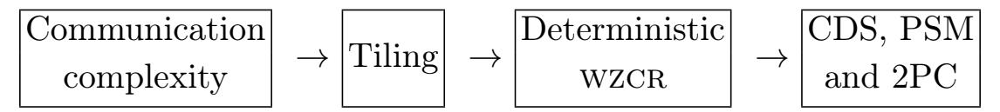
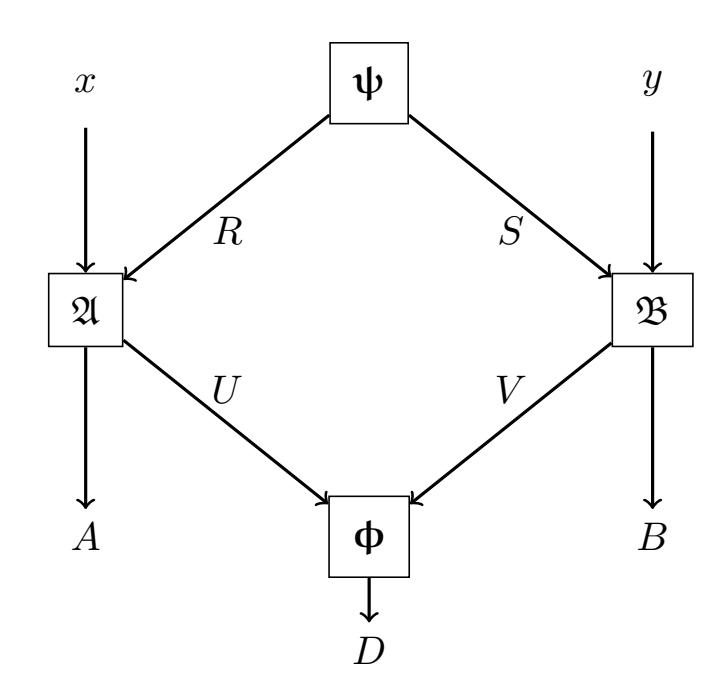
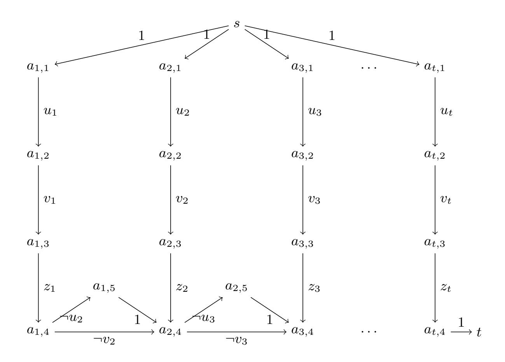

{0}------------------------------------------------

# **Zero-Communication Reductions**

Varun Narayanan<sup>1</sup>, Manoj Prabhakaran<sup>2</sup>, and Vinod M. Prabhakaran<sup>1</sup>

<sup>1</sup> TIFR, Mumbai ⊠ {varun.narayanan, vinodmp}@tifr.res.in
<sup>2</sup> IIT Bombay ⊠ mp@cse.iitb.ac.in

**Abstract.** We introduce a new primitive in information-theoretic cryptography, namely *zero-communication* reductions (ZCR), with different levels of security. We relate ZCR to several other important primitives, and obtain new results on upper and lower bounds.

In particular, we obtain new upper bounds for PSM, CDS and OT complexity of functions, which are exponential in the information complexity of the functions. These upper bounds complement the results of Beimel et al. [BIKK14] which broke the circuit-complexity barrier for "high complexity" functions; our results break the barrier of input size for "low complexity" functions.

We also show that lower bounds on secure ZCR can be used to establish lower bounds for OT-complexity. We recover the known (linear) lower bounds on OT-complexity [BM04] via this new route. We also formulate the lower bound problem for secure ZCR in purely linear-algebraic terms, by defining the invertible rank of a matrix.

We present an **Invertible Rank Conjecture**, proving which will establish super-linear lower bounds for OT-complexity (and if accompanied by an explicit construction, will provide explicit functions with super-linear circuit lower bounds).

#### 1 Introduction

Modern cryptography has developed a remarkable suite of information-theoretic primitives, like secret-sharing and its many variants, secure multi-party computation (MPC) in a variety of information-theoretic settings, (multi-server) private information retrieval (PIR), randomness extractors, randomized encoding, private simultaneous messages (PSM) protocols, conditional disclosure of secrets (CDS), and non-malleable codes, to name a few. Even computationally secure primitives are often built using these powerful tools. Further, a rich web of connections tie these primitives together.

Even as these primitives are often simple to define, and even as a large body of literature has investigated them over the years, many open questions remain. For instance, the efficiency of secret-sharing, communication complexity in MPC, PIR, and CDS, characterization of functions that admit MPC (without honest majority or setups) all pose major open problems. Interestingly, recent progress in some of these questions have arisen from surprising new connections across primitives (e.g., MPC from PIR [BIKK14], CDS from PIR [LVW17], and secret-sharing from CDS [LVW18,AA18]).

In this work, we introduce a novel information-theoretic primitive called Zero-Communication Reductions (ZCR) that fits right into this toolkit, and provides a bridge to information theoretic tools which were so far not brought to bear on cryptographic applications. The goal of a ZCR scheme is to let two parties compute a function on their joint inputs, without communicating with each other! Instead, in a ZCR from a function f to a predicate  $\phi$ , each party locally produces an output candidate along with an input to the predicate. The correctness requirement is that when the predicate outputs 1 ("accepts"), then the output candidates produced by the two parties should be correct; when the predicate outputs 0, correctness is not guaranteed. The non-triviality requirement places a (typically exponentially small) lower bound on the acceptance probability. We also define a natural security notion for ZCR, resulting in a primitive that is challenging to realize, and requires predicates with cryptographic structure.

Thanks to its minimalistic nature, ZCR emerges as a fundamental primitive. In this work we develop a theory that connects it with other fundamental cryptographic and information-theoretic notions. We highlight two classes of important applications of ZCR to central questions in information-theoretic cryptography – one for upper bounds and one for lower bounds. On the former front, we derive new upper bounds for

{1}------------------------------------------------

communication in PSM and CDS protocols and for "OT-complexity" of a function – i.e., the number of OTs needed by an information-theoretically secure 2-Party Computation (2PC) protocol for the function – in terms of (internal) information complexity, a fundamental complexity measure of a 2-party function closely related to its communication complexity. On the other hand, we present a new potential route for strong lower bounds for OT-complexity, via Secure zcr (szcr), which has a much simpler combinatorial and linear algebraic structure compared to 2PC protocols.

Barriers: Avoiding and Confronting. One of the key questions that motivates our work is that of lower bounds for "cryptographic complexity" of 2-party functions – i.e., the number of accesses to oblivious transfer (or any other finite complete functionality) needed to securely evaluate the function (say, against honestbut-curious adversaries). Proving such lower bounds would imply lower bounds on representations that can be used to construct protocols. Specifically, small circuits and efficient private information retrieval (PIR) schemes imply low cryptographic complexity. As such, establishing strong lower bounds for cryptographic complexity will entail showing breakthrough results on circuit complexity and also on PIR lower bounds (which in turn has implications to Locally Decodable Codes).

Nevertheless, there is room to pursue cryptographic complexity lower bound questions without necessarily breaking these barriers. Firstly, there are existential questions of cryptographic complexity lower bounds that remain open, while the corresponding questions for circuit lower bounds are easy and pose no barrier by themselves. Secondly, when perfect correctness is required, the cryptographic lower bound questions are interesting and remain open for randomized functions with very fine-grained probability values. In these cases, since the input (or index) must be long enough to encode the random choice, the corresponding circuit lower bounds and PIR lower bounds are already implied.

Finally, cryptographic complexity provides a non-traditional route — though still difficult — to attack these barriers. In fact, this work could be seen as providing a step along this path. We formulate szcr lower bounds as a linear algebraic question of lower bounding what we call the invertible rank, which in turn implies cryptographic complexity and hence circuit complexity and PIR lower bounds. We conjecture that there exist matrices (representing the truth table of functions) that have a high invertible rank. Attacking the circuit complexity lower bound question translates to finding such matrices explicitly.

## 1.1 Our Results

We summarize our main contributions, and elaborate on them below.

- New Primitives. We define zero-communication reductions with different levels of security (zcr, wzcr, and szcr). We kick-start a theory of zero-communication reductions with several basic feasibility and efficiency results.
- New Upper Bounds via Information Complexity. Building on results of [\[BW16](#page-25-3)[,KLL](#page-25-4)<sup>+</sup>15] which related information complexity of functions to communication complexity and "partition" complexity, we obtain constructions of zcr whose complexity is upper bounded by the information complexity of the function. This in turn lets us obtain new upper bounds for statistically secure PSM, CDS, and OT complexity, which are exponential in the information complexity of the functions. As a concrete illustration of our upper bounds based on information complexity, for the "bursting noise function" of Ganor, Kol and Raz [\[GKR15\]](#page-25-5), we obtain an exponential improvement over all existing constructions.
- A New Route to Lower Bounds. We show that an upper bound on OT-complexity of a function f implies an upper bound on the complexity of a szcr from f to a predicate corresponding to OT. Hence lower bounding the latter would provide a potential route to lower bounding OT-complexity.
- We motivate the feasibility of this new route in a couple of ways:
  - We recover the known (linear) lower bounds on OT-complexity [\[BM04\]](#page-25-1) via this new route by providing lower bounds on szcr complexity.
  - We formulate the lower bound problem for szcr in purely linear-algebraic terms, by defining the invertible rank of a matrix. We present our Invertible Rank Conjecture, proving which will establish super-linear lower bounds for OT-complexity (and if accompanied by an explicit construction, will provide explicit functions with super-linear circuit lower bounds).

{2}------------------------------------------------

Defining zCR and sZCR. Our first contribution is definitional. The zero-communication model that we introduce is a powerful framework that, on the one hand, is convenient to analyze and, on the other hand, has close connections to a range of cryptographic primitives. Our definition builds on a line of work that used zero-communication protocols for studying communication and information complexity, in classical and quantum settings (see, e.g., [KLL+15] and references therein), but we extend the model significantly to enable the cryptographic connections we seek. In Section 3, we define three variants – zCR, wzCR, and szCR– with three levels of security (none, weak, and standard or strong). All these reductions relate a function f to a predicate φ, and, optionally, a correlation ψ, with the primary complexity measure being "non-triviality" or "acceptance probability" of the reduction: A μ-zCR (or μ-wzCR, or μ-szCR) needs to accept the outputs produced by the non-communicating parties with probability at least  $2^{-μ}$ , and may abort otherwise.

(In) Feasibility Results. We follow up on the definitions with several basic positive and negative results about SZCR, presented in Section 4. In particular, we show that every function f has a non-trivial SZCR to some predicate  $\phi_f$  (using no correlation); also every function f has a SZCR to the AND predicate, using some correlation  $\psi_f$ . Complementing these results, we show that for many natural choices of the predicate (AND, OR, or XOR), there are functions f which do not have a SZCR to the predicate, if no correlation is used. In fact, we completely characterize all functions that have a SZCR to these predicates.

On the other hand, there are predicates which are *complete* in the sense that any function f has a SZCR to it (possibly using a common random string). In a dual manner, a correlation  $\psi$  can be considered complete if any function f can be reduced to a constant-sized predicate like AND using  $\psi$ . Our results (discussed below) show that the predicate  $\phi_{\text{supp}(OT^+)}$ —which checks if its inputs are in the support of one or more instances of the oblivious transfer (OT) correlation — is a complete predicate (Theorem 3) and OT is a complete correlation (Theorem 12). These results rely on OT being complete for secure 2-party computation and having a "regularity" structure.

We also consider reducing randomized functionalities without inputs to randomized predicates; in this case, we characterize the optimal non-triviality achievable (Theorem 9).

Upper Bounds. Our upper bounds for CDS, PSM and 2PC for a function f are obtained by first constructing a ZCR (or WZCR) from f to a simple predicate. We offer two sets of results – perfectly secure constructions with complexity exponential in the communication complexity of f, and statistically secure constructions with complexity exponential in the information complexity.

The first set of results presented in Section 6.1, may be informally stated as follows.

**Theorem 1 (Informal).** For a deterministic function  $f: \mathcal{X} \times \mathcal{Y} \to \{0,1\}$ , with communication complexity  $\ell$ , there exist perfectly secure protocols for CDS, PSM and 2PC using OTs, all with communication complexity  $O(2^{\ell})$ . Further, the 2PC protocol uses  $O(2^{\ell})$  invocations of OT.

They follow from a sequence of connections illustrated below:

<span id="page-2-0"></span>

Here tiling refers to partitioning the function's domain  $\mathcal{X} \times \mathcal{Y}$  into monochromatic rectangles – i.e., sets  $\mathcal{X}' \times \mathcal{Y}'$  on which the function's value remains constant.

We significantly improve on these results (while sacrificing perfect security) in our second set of constructions presented in Section 6.2. They follow the outline below.

<span id="page-2-1"></span>

Note that now, instead of a tiling of f, we only require a (relaxed) partition of f [JK10,KLL+15], which allows overlapping monochromatic rectangles with fractional weights. The connection between information complexity and relaxed partition is a non-trivial result of Kerenidis et al. [KLL+15], that builds on [BW16]. We then construct a WZCR from a relaxed partition, and finally show how a WZCR (in fact, a ZCR) can be turned into a CDS, PSM or 2PC protocol. This leads us to the following theorem, stated in terms of the information complexity of f,  $IC_{\epsilon}(f)$ , and statistical PSM, CDS and 2PC.

{3}------------------------------------------------

Theorem 2 (Informal). Let f : X × Y → {0, 1} be a deterministic function. For any constant > 0, the communication complexity of -PSM of f, communication complexity of -CDS for predicate f, and OT and communication complexity of -secure 2PC of f are upperbounded by 2 O(IC/8(f)) .

This result is all the more interesting because it is known that information complexity can be exponentially smaller than communication complexity. In particular, Ganor, Kol and Raz described an explicit (partial) function in [\[GKR15\]](#page-25-5), called the "bursting noise function," which on inputs of size n, have a communication complexity lower bound of Ω(log log n) and an information complexity upper bound of O(log log log n). Note that the existing general 2PC techniques do not achieve sub-linear OT-complexity. [Theorem 1](#page-2-0) would allow O(log n) OT-complexity, whereas [Theorem 2](#page-2-1) brings it down to O(log log n).

Our results can be seen as complementing [\[BIKK14\]](#page-25-0) which offered improvements over the circuit size for "very high complexity" functions. We offer the best known protocols, improving over the input size, and even the communication complexity, for "very low complexity" functions.

Constructions of szcr and Connection to Lower Bounds. We show that for a function f with OTcomplexity m, there is a µ-szcr from f to the constant-depth predicate φsupp(OT+) (which checks if its inputs are in the support of oblivious transfer (OT) correlations), where µ is roughly m:

Theorem 3 (Informal). If a deterministic functionality f with domain {0, 1} <sup>n</sup> × {0, 1} <sup>n</sup> and has OTcomplexity m, then there exists an (m + O(n))-szcr from f to φsupp(OTm+1) , possibly using a common random string.

This result is proved more generally in [Theorem 11,](#page-15-0) where it is also shown that the common random string can be avoided for a natural class of functions f (which are "common-information-free"). The results also extend to a "dual version" where the reduction is to a simple AND predicate, but uses a correlation that provides m copies of OT [\(Theorem 12\)](#page-16-0).

A consequence of [Theorem 3](#page-3-0) is that it can recover the best known lower bound for OT-complexity in terms of one-way communication complexity [\[BM04\]](#page-25-1). We show

```
One-way communication
     complexity ≤
                            Predicate-domain
                           complexity of szcr
                                              ≤ OT-complexity
```

where the first bound is shown using a simple support based argument [\(Lemma 3\)](#page-20-0), and the second one follows from the upper bound on the domain size of the predicate φsupp(OTk) in [Theorem 3.](#page-3-0) This is formally stated and proved as [Corollary 2.](#page-20-1)

Invertible Rank. [Theorem 3](#page-3-0) provides a new potential route for lower bounding OT-complexity of f, by lower bounding µ or k in a µ-szcr from f to φsupp(OTk) . In turn, this problem can be formulated as a purely linear-algebraic question of what we term "invertible rank" [\(Section 5.1\)](#page-13-1). Compared to previous paths for lower bounding OT-complexity [\[BM04,](#page-25-1)[PP14\]](#page-26-2), this new route is not known to be capped at linear bounds, and could even be seen as a stepping stone towards a fresh line of attack on circuit complexity lower bounds (as they are implied by OT-complexity lower bounds).

Invertible rank characterizes the best complexity – in terms of non-triviality and predicate-domain complexity – achievable by a szcr from f to φ<sup>+</sup> (conjunction of one or more instances of φ). Specifically, for a matrix M<sup>f</sup> encoding a function f and a matrix P<sup>φ</sup> encoding a predicate, we have:

Theorem 4 (Informal). If a function f has a perfect µ-szcr to φ<sup>k</sup> then the invertible rank of M<sup>f</sup> w.r.t. P<sup>φ</sup> is at most µ + k.

This characterization, combined with [Theorem 3](#page-3-0) implies that if a deterministic n-bit input functionality f has OT-complexity m, then its invertible rank w.r.t. POT is O(m + n). Hence, a super-linear lower bound on invertible rank w.r.t. POT would imply super-linear OT-complexity, and consequently, super-linear circuit complexity for f. We conjecture the existence of function families f with super-linear invertible rank, and leave it as an important open problem to resolve it.

{4}------------------------------------------------

## 1.2 Related Work

As mentioned above, zero-communication protocols have been used to study communication and information complexity, in classical and quantum settings. The model can be traced back to the work of Gisin and Gisin [\[GG99\]](#page-25-7), who proposed it as a local-hidden variable model (i.e., no quantum effects) that could explain apparent violation of the Bell inequality, when there is a significant probability of abort (i.e., missed detection) built into the system. More recently, Kerenidis et al. [\[KLL](#page-25-4)+15], using a compression lemma by Braverman and Weinstein [\[BW16\]](#page-25-3), presented a zero-communication protocol with non-abort probability of at least 2 −O(IC) , given a protocol for computing f with information complexity IC.

OT-complexity was explicitly introduced as a fundamental measure of complexity of a function f by Beimel and Malkin [\[BM04\]](#page-25-1), who also presented a lower bound for f's OT-complexity in terms of the one-way communication complexity of f. In [\[PP14\]](#page-26-2) an information-theoretic measure called tension was developed, and was shown to imply lower bounds for OT-complexity, among other things. Unfortunately, both these techniques can yield lower bounds on OT-complexity that are at most the length of the inputs. On the other hand, the best known feasibility result for OT-complexity, achieved via connections to PIR, by Beimel et al. [\[BIKK14\]](#page-25-0), is sub-exponential (a.k.a. weakly exponential) in the input length. Closing this gap, even existentially, is an open problem.

In the PSM model, all functions are computable [\[FKN94\]](#page-25-8) and efficient protocols are known when the function has small non-deterministic branching programs [\[FKN94,](#page-25-8)[IK97\]](#page-25-9). Upper bounds on communication complexity were studied by Beimel et al. [\[BIKK14\]](#page-25-0). See [\[AHMS18\]](#page-25-10) and references therein for lower bounds. In CDS, protocols have been constructed with communication complexity linear in the formula size [\[GIKM00\]](#page-25-11). Efficient protocols were later developed for branching programs [\[KN97\]](#page-26-3) and arithmetic span programs [\[AR17\]](#page-25-12). Liu et al. [\[LVW17\]](#page-26-0) obtained an upper bound of 2 O( √ k log k) for arbitrary predicates with domain {0, 1} <sup>k</sup> × {0, 1} k . Applebaum et al. [\[AA18\]](#page-25-2) showed that amortized complexity over very long secrets can be brought down to a constant.

#### <span id="page-4-0"></span>1.3 Technical Overview

We discuss some of the technical aspects of a few of our contributions mentioned above.

A New Model of Secure Computation. zcr and its secure variants present a fundamentally new cryptographic primitive, highlighting aspects of secure computation common to many seemingly disparate notions like PSM, CDS and secure 2PC using correlated randomness.

Recall that in a zcr from a function f to a predicate φ, each party locally produces an output candidate along with an input to the predicate. The output candidates produced by the two parties should be correct when the predicate outputs 1. Instances of zero-communication models have appeared in the communication complexity literature (see [\[KLL](#page-25-4)<sup>+</sup>15]), but they typically prescribed a specific predicate as part of the model (e.g., the equality predicate). By allowing an arbitrary predicate rather than one that is fixed as part of the model, we view our protocols as reductions from 2-party functionalities to predicates. This generalization is key to obtaining the various connections we develop.

Secondly, we add security requirements to the model. One may expect that a zero-communication protocol is naturally secure, as neither party receives any information about the other party's input or output. While that is the case for honest parties, we shall allow the adversary to learn the outcome of the predicate as well. This is the "right" definition, in that it allows interpreting a zero-communication protocol as a standard secure computation protocol when the predicate is implemented by a trusted party, who announces its result to the two parties. The secure version of zcr – called szcr – admits stronger lower bounds (and even impossibility results), as discussed below.

We further generalize the notion of zero-communication reduction to allow the two parties access to a correlation ψ, rather than just common randomness as in the original models in the literature.

In [Figure 1,](#page-5-0) we illustrate a zero communication reduction from a functionality f = (fA, fB) to a predicate φ, using a correlation ψ.

{5}------------------------------------------------

The reduction is specified as a pair of randomized algorithms  $(\mathfrak{A},\mathfrak{B})$  executed by two parties, Alice and Bob. Alice, given input x and her part of the correlation R, samples  $(A,U) \leftarrow \mathfrak{A}(x,R)$ , where A is her proposed output for the functionality f, and U is her input to  $\mathbf{\Phi}$ . Similarly, Bob computes  $(B,V) \leftarrow \mathfrak{B}(y,S)$ . The non-triviality guarantee is that  $\mathbf{\Phi}(U,V) = 1$  with a positive probability  $2^{-\mu}$ , and correctness guarantee is that conditioned on  $\mathbf{\Phi}(U,V) = 1$ , the outputs of Alice and Bob are (almost always) correct.

The security definitions we attach to WZCR and SZCR could be seen as based on the standard simulation paradigm. However, when defining statistical (rather than perfect) security in the case of SZCR, a novel aspect emerges for us. Note that a  $\mu$ -SZCR needs to accept an execution with probability only  $2^{-\mu}$ , which can be negligible. As such, allowing a negligible statistical error in security would allow one to have no security guarantees



<span id="page-5-0"></span>Fig. 1. The random variables involved in a ZCR.

at all whenever the execution is not aborting, and would render SZCR no different from WZCR. The "right" security definition of SZCR with statistical security is to require security to hold *conditioned on acceptance* (as well as over all).

**PSM, CDS, and 2PC from zcr.** Due to its minimalistic nature, a zcr can be used as a reduction in the context of PSM, CDS, and 2PC. At a high-level, a zcr from f to a predicated  $\phi$  could be thought of as involving a "trusted party" which implements  $\phi$ . Since the reduction itself involves no communication, it can easily be turned into a PSM, CDS or 2PC scheme for the function f, if we can "securely implement" a trusted party for  $\phi$  in the respective model. One complication however, is that a zcr can abort with a high probability. This is handled by repeating the execution several times (inversely proportional to the acceptance probability), and using the answer produced in an execution that is accepted.

While it may appear at first that ZCR with a security guarantee will be needed here, we can avoid it. This is done by designing the secure component (PSM, CDS, or 2PC) to not implement the predicate  $\boldsymbol{\phi}$  directly, but to implement a selector function as described below. Recall that in an execution of the ZCR protocol, Alice and Bob will generate candidate outputs (a, b) as well as inputs (u, v) for  $\boldsymbol{\phi}$ . The parties will now carry out this protocol n times in parallel, to generate  $(a_i, b_i)$  and  $(u_i, v_i)$ , for i = 1 to n. The selector function accepts all  $(a_i, b_i, u_i, v_i)$  as inputs and outputs a pair  $(a_i, b_i)$  such that  $\boldsymbol{\phi}(u_i, v_i) = 1$ , without revealing i itself (we choose n sufficiently large as to guarantee that there will be at least one such instance, except with negligible probability; if multiple such i exist, then, say, the largest index is selected).

The overall communication complexity of the resulting protocol is exactly determined by the PSM, CDS, or 2PC protocol for the selector function (as the zcr itself adds no communication overhead). By instantiating our results for the predicate  $\phi_{AND}$ , the selector function has a small *formula complexity*, and hence efficient PSM, CDS, and 2PC protocols.

**ZCR and Information Complexity.** WZCR and the notion of relaxed partition [JK10,KLL+15] are intimately connected to each other. A relaxed partition of a 2-input function f could be seen as a tiling of the function table with fractionally weighted tiles such that each cell in the table is covered by (almost) 1 unit worth of tiles, (almost) all of them having the same color (i.e., output value) as the cell itself. The goal of a partition is to use as few tiles as possible – or more precisely, to minimize the total weight of all the tiles used. In Lemma 5, we show that a relaxed partition can be turned into a WZCR of f to the predicate  $\phi_{AND}$ , with acceptance probability roughly equal to the reciprocal of the total weights of the tile. (In fact, if no error were to be allowed, a WZCR with maximum acceptance probability exactly corresponds to a partition with minimum total weight.) A result of [KLL+15] can then be used to relate this acceptance probability to the information complexity of f.

{6}------------------------------------------------

Thus, via ZCR, we can upper bound PSM, CDS, and OT-complexity of functions by a quantity exponential in their information complexity. While this upper bound is rather loose in the worst case, in general, it appears incomparable to all other known upper bounds.

<u>SZCR from 2PC.</u> Any boolean function f has a SZCR to a predicate  $\phi_f$  with acceptance probability of at least 1/4 (Theorem 5). However, the computational complexity (measured in size or depth) of  $\phi_f$  is as much as that of f. An important question is whether – and how well can – a function be reduced to a *universal*, constant-depth predicate.

We show that if the predicate is  $\phi_{AND}$ , and no correlations are used (except possibly common randomness), then only *simple* functions have a SZCR to the predicate. (Simple functions are those that are not complete [MPR13].)

On the other hand, there is a universal constant-depth predicate  $\phi_{\text{supp}(OT^+)}$ , which simply checks if its inputs are in the support of several copies of oblivious transfer correlations, such that every function f has a SZCR to it. In fact, we show that f has a  $\mu$ -SZCR (i.e., a SZCR with acceptance probability  $2^{-\mu}$ ) to  $\phi_{\text{supp}(OT^+)}$  where  $\mu$  is at most the OT complexity of f. (Corollary 1). (In this result, OT can be replaced by a general class of correlations, called "regular correlations.")

The idea is to transform a 2-party protocol  $\Pi^{\mathsf{OT}}$  that (against passive corruption) perfectly securely realizes f using OT correlations, into a SZCR from f to  $\Phi_{\mathsf{supp}(\mathsf{OT}^+)}$ . The transformation relies on the fact that any protocol admits transcript factorization: i.e., the probability of a transcript q occurring in an execution of  $\Pi^{\mathsf{OT}}$ , given inputs (x, y) and OT correlation (u, v) to the two parties respectively, can be written as

$$\mathsf{Pr}_{\mathsf{\Pi}^{\mathsf{O}\mathsf{T}}}(q|x,y,u,v) = \rho(x,u,q) \cdot \sigma(y,v,q),$$

for some functions  $\rho$  and  $\sigma$ . This could be exploited by the parties to non-interactively sample an instance of the protocol execution, and derive their outputs from it. One issue here is that since the parties have access to OTs, the product structure on the transcript distribution applies only conditioned on their respective views from the OT. Thus, it is in fact the views in the OT, u and v that the two parties sample locally, conditioned on their own inputs and a transcript q that is determined by a common random string.  $\Phi_{\text{supp}(OT^+)}$  is used to check if the two views of the OT correlations sampled thus are compatible with each other.

Several technical complications arise in the above plan. In particular, ensuring that the abort event does not reveal any information beyond the input and output to each party, requires a careful choice of probabilities with which each party selects its view of the OT correlations; also, each party unilaterally forces an abort with some probability (implemented using a couple of extra OTs included in the input to  $\phi_{\text{supp}(OT^+)}$ ). For simplicity, here we summarize the scheme for a common-information-free function f. In this case, there will be no common random string. We fix an arbitrary transcript  $q^*$  (which has a non-zero probability of occurring), and define

$$\rho^{\dagger} := \max_{x} \sum_{u} \rho(x, u, q^*), \qquad \sigma^{\dagger} := \max_{y} \sum_{v} \sigma(y, v, q^*). \tag{1}$$

Recall that a SZCR is given by a pair of algorithms  $(\mathfrak{A},\mathfrak{B})$  which, respectively, take x and y as inputs, and output (U,A) and (V,B) (Figure 1). We define these algorithms below. In addition to the quantities mentioned above, we also refer to the algorithms  $\Pi_A^{\text{out}}$  and  $\Pi_B^{\text{out}}$  which are the output computation algorithms of the protocol  $\Pi$ .

 $\mathfrak{A}(x)$ : For each  $u \in \mathcal{U}$ , let  $(U, A) = (u, \Pi_A^{\text{out}}(x, u, q^*))$  with probability  $\frac{\rho(x, u, q^*)}{\rho^{\dagger}}$ , and  $(\bot, \bot)$  with remaining probability (if any).

 $\mathfrak{B}(y)$ : For each  $u \in \mathcal{U}$ , let  $(V, B) = (v, \Pi_B^{\text{out}}(y, v, q^*))$  with probability  $\frac{\sigma(y, v, q^*)}{\sigma^{\dagger}}$ , and  $(\bot, \bot)$  with remaining probability (if any).

Note that for x which maximizes the expression defining  $\rho^{\dagger}$ ,  $\mathfrak{A}(x)$  does not set  $(u,a)=(\bot,\bot)$ , but in general, this costs the SZCR in terms of non-triviality. This sacrifice in acceptance probability is needed for

<span id="page-6-0"></span><sup>&</sup>lt;sup>3</sup> For secure protocols for common-information-free functions, a transcript can be fixed, avoiding the need for a common random string.

{7}------------------------------------------------

Alice to even out the acceptance probability across her different inputs, so that Bob's view combined with the acceptance event, does not reveal information about x (beyond f(x,y)). Nevertheless, we can show that the probability of acceptance is lower bounded by  $2^{-(m+n)}$ , where m is the number of OTs (so u, v are each 2m-bit strings) and the combined input of f is n bits long.

The construction is somewhat more delicate when f admits common-information. This means that there is some common information that Alice and Bob could agree on if they are given  $(x, f_A(x, y))$  and  $(y, f_B(x, y))$  respectively. For such functions, the SZCR construction above is modified so that a candidate value for the common information is given as a common random string; it is arranged that the execution is rejected by the predicate if the common information in the common random string is not correct. Also, in this case, we can no more choose an arbitrary transcript (even after fixing the common information); instead we argue that there is a "good" transcript for each value of common information, that would let us still obtain a similar non-triviality guarantee as in the case of common-information-free f.

We give an analogous result for SZCR to  $\phi_{AND}$ , but using OT correlations. Here, each party locally checks if their input is consistent with a given transcript (determined by common randomness) and their share of OT correlations. Here also, for the sake of security, even if it is consistent, the party aborts with a carefully calibrated probability.

In both the above transformations from a secure 2PC protocol  $\Pi$  for f to a SZCR, an important consideration is the probability of not aborting. To establish our connection with OT-complexity, we need a  $\mu$ -SZCR where  $\mu$  is directly related to the number of OTs used in  $\Pi$ , and not the length of the transcripts. One element in establishing such a SZCR is an analysis of the given 2PC protocol when it is run with correlations drawn using a wrong distribution. We refer the reader to Theorem 11 and its proof for further details.

<u>Invertible Rank.</u> The conditions of a SZCR (from a possibly randomized function to a possible randomized predicate) without correlations can be captured purely in linear algebraic terms, leading to the definition of a new linear-algebraic complexity measure for functions.

The correctness condition for  $\mu$ -SZCR of f to  $\Phi$  has the form  $A^{\dagger}PB = 2^{-\mu}M$ , where M and P are matrices that encode the function f and the predicate  $\Phi$  in a natural way. If P were to be replaced with the identity matrix, and  $\mu$  by 0, the smallest possible size of P would correspond to the rank of M. In defining invertible rank with respect to a finite matrix  $P_{\Phi}$ , we let  $P = P_{\Phi}^{\otimes k}$  and ask for the smallest k possible, for a given  $\mu$  (thus the invertible rank is analogous to log-rank). Also, A, B are required to satisfy natural stochasticity properties so that they correspond to valid probabilistic actions.

In addition to the correctness guarantees, we also incorporate the security guarantees of SZCR into our complexity measure. This takes the form of the existence of simulators, which are again captured using linear transformations. The "invertibility" in the term invertible rank refers to the existence of such simulators.

We remark that linear-algebraic complexity measures have been prevalent in studying the computational or communication complexity of functions – matrix rigidity [Val77], sign rank [PS86], the "rank measure" of Razborov [Raz90], approximate rank [ALSV13] and probabilistic rank [AW17] have all led to important advances in our understanding of functions. In particular, Razborov's rank measure was instrumental in establishing exponential lower bounds for linear secret-sharing schemes [RPRC16,PR17]. Invertible rank provides a new linear-algebraic complexity measure that is closely related to secure two-party computation, via our results on SZCR; this is in contrast with the prior measures which were motivated by computational complexity, (insecure) two-party communication complexity, or secret-sharing (which does not address the issues of secure two-party computation),

#### Organization of the Rest of the Paper

We summarize some notation and relevant background information in Section 2. We present the formal definitions of ZCR, WZCR and SZCR in Section 3. The basic feasibility results in our model are presented in Section 4. The connections with lower bounds are given in Section 5, and the upper bounds on CDS, PSM and 2PC are given in Section 6. Several proof details are given in the appendix.

{8}------------------------------------------------

## <span id="page-8-0"></span>2 Preliminaries

**Probability Notation.** The probability assigned by a distribution D (or a probabilistic process D) to a value x is denoted as  $\Pr_D(x)$ , or simply  $\Pr(x)$ , when the distribution is understood. We write  $x \leftarrow D$  to denote sampling a value according to the distribution D. Given two distributions  $D_1, D_2$ , we write  $|D_1 - D_2|$  to denote the statistical difference (a.k.a. total variation distance) between the two.

For a random variable X, we write  $\mathfrak{p}(X)$  to denote the probability distribution associated with it. We write  $\mathfrak{p}(X|Y=y)$  (or simply  $\mathfrak{p}(X|y)$ , letting the lower case y signify that it is the value of the random variable Y), to denote the distribution of a random variable X, conditioned on the value y for a random variable Y that is jointly distributed with X.

Functionalities. We denote a 2-party functionality as  $f: \mathcal{X} \times \mathcal{Y} \to \mathcal{A} \times \mathcal{B}$ , to indicate that the functionality accepts an input  $x \in \mathcal{X}$  from Alice and  $y \in \mathcal{Y}$  from Bob, computes (a, b) = f(x, y), and sends a to Alice and b to Bob. We allow f to be a randomized function too, in which case f(x, y) stands for a probability distribution over  $\mathcal{A} \times \mathcal{B}$ , for each  $(x, y) \in \mathcal{X} \times \mathcal{Y}$ ; for readability, we write  $\Pr_f(a, b|x, y)$  instead of  $\Pr_{f(x, y)}(a, b)$  to denote the probability of f(x, y) outputting (a, b). We write  $f = (f_A, f_B)$ , where  $f_A : \mathcal{X} \times \mathcal{Y} \to \mathcal{A}$  and  $f_B : \mathcal{X} \times \mathcal{Y} \to \mathcal{B}$  are such that (making the randomness  $\xi$  used by f explicit),  $f(x, y; \xi) = (f_A(x, y; \xi), f_B(x, y; \xi))$ . If  $f_B$  is a constant function, we identify f with  $f_A$  and refer to it as a one-sided functionality. Similarly, if  $f_A = f_B$ , then we may use f to refer to either of these functions; in this case, we refer to f as a symmetric functionality.

Correlations. A correlation  $\psi$  over a domain  $\mathcal{R} \times \mathcal{S}$  is the same as a 2-party randomized functionality  $\psi: \{\bot\} \times \{\bot\} \to \mathcal{R} \times \mathcal{S}$  (i.e., a functionality with no inputs).  $\mathsf{supp}(\psi) = \{(r,s)|\mathsf{Pr}_{\psi}(r,s) > 0\}$  is the support of  $\psi$ . We say that a correlation is  $\mathit{regular}$  if  $(1) \ \forall (r,s) \in \mathsf{supp}(\psi), \ \mathsf{Pr}_{\psi}(r,s) = \frac{1}{|\mathsf{supp}(\psi)|}, \ (2) \ \forall r \in \mathcal{R}, \ \sum_{s \in \mathcal{S}} \mathsf{Pr}_{\psi}(r,s) = \frac{1}{|\mathcal{R}|}, \ \text{and} \ (3) \ \forall s \in \mathcal{S}, \ \sum_{r \in \mathcal{R}} \mathsf{Pr}_{\psi}(r,s) = \frac{1}{|\mathcal{S}|}. \ \text{Common examples of regular correlations are those corresponding to Oblivious Transfer (OT) and Oblivious Linear Function Evaluation (OLE), and their <math>n$ -fold repetitions. Another regular correlation of interest is the common randomness correlation  $\psi^{\mathsf{CRS}}$ , in which  $(r,s) \in \mathsf{supp}(\psi^{\mathsf{CRS}})$  if only if r = s.

We denote t independent copies of a correlation  $\psi$  by  $\psi^t$ . It will be convenient to denote  $\psi^t$  for an unspecified t by  $\psi^+$ .

**Predicates.** We shall also refer to predicates of the form  $\mathbf{\Phi}: \mathcal{U} \times \mathcal{V} \to \{0,1\}$ . Again, as in the case of functionalities above, a predicate could be randomized. Given a correlation  $\mathbf{\psi}$  over  $\mathcal{U} \times \mathcal{V}$ , we define the predicate  $\mathbf{\Phi}_{\mathsf{supp}(\mathbf{\psi})}$  so that  $\mathbf{\Phi}_{\mathsf{supp}(\mathbf{\psi})}(u,v) = 1$  iff  $(u,v) \in \mathsf{supp}(\mathbf{\psi})$ . The predicate  $\mathbf{\Phi}_{\mathsf{supp}^*(\mathbf{\psi})}$  is defined identically, except that we allow the domain of  $\mathbf{\Phi}_{\mathsf{supp}^*(\mathbf{\psi})}$  to be  $(\mathcal{U} \cup \{\bot\}) \times (\mathcal{V} \cup \{\bot\})$  where  $\bot$  is a symbol not in  $\mathcal{U} \cup \mathcal{V}$ .

It will also be convenient to define  $supp(\psi^+) := \bigcup_{t=1}^{\infty} supp(\psi^t)$ .

**Evaluation Graph**  $G_f$ . For a functionality f, it is useful to define a bipartite graph  $G_f$  [MPR13].

**Definition 1.** For a randomized functionality  $f: \mathcal{X} \times \mathcal{Y} \to \mathcal{A} \times \mathcal{B}$ , the weighted graph  $G_f$  is defined as the bipartite graph on vertices  $(\mathcal{X} \times \mathcal{A}) \cup (\mathcal{Y} \times \mathcal{B})$  with weight on edge  $((x, a), (y, b)) = \Pr_f(a, b|x, y)$ .

Note that for deterministic f, the graph  $G_f$  is unweighted (all edges have weight 1 or 0). If f is a correlation, with no inputs, the nodes in the graph  $G_f$  can be identified with  $\mathcal{A} \cup \mathcal{B}$ .

**Definition 2.** In an evaluation graph  $G_f$ , a connected component is a set of edges that form a connected component in the unweighted graph consisting only of edges in  $G_f$  with positive weight. A function f is said to be common-information-free if all the edges in  $G_f$  belong to the same connected component.

For each connected component C in  $G_f$ , we define  $\mathcal{X}_C \subseteq \mathcal{X}$  as the set  $\{x | \exists y, a, b \text{ s.t. } ((x, a), (y, b)) \in C\};$  $\mathcal{Y}_C \subseteq \mathcal{Y}$  is defined analogously. Also, we define  $C|_{\mathcal{X} \times \mathcal{Y}} := \{(x, y) | \exists (a, b) \text{ s.t. } ((x, a), (y, b)) \in C\}.$ 

For a correlation  $\psi$ , we will denote by  $\psi|_C$  the restriction of  $\psi$  to the connected component C. That is,  $\Pr_{\psi|_C}(a,b) \propto \Pr_{\psi}(a,b)$  for  $(a,b) \in C$  and 0 otherwise.

A simple functionality [MPR12,MPR13] is one whose graph  $G_f$  consists of connected components that are all *product graphs*. For deterministic functionalities, it can be defined as follows:

{9}------------------------------------------------

**Definition 3.** A deterministic functionality  $f = (f_A, f_B)$  with domain  $\mathcal{X} \times \mathcal{Y}$  is a simple functionality if there exist no  $x, x' \in \mathcal{X}$  and  $y, y' \in \mathcal{Y}$  such that  $f_A(x, y) = f_A(x, y')$  and  $f_B(x, y) = f_B(x', y)$  but either  $f_A(x', y) \neq f_A(x', y')$  or  $f_B(x, y') \neq f_B(x', y')$ .

<span id="page-9-2"></span>Simple functionalities satisfy the following (see [MPR12]).

**Lemma 1.** If  $(f_A, f_B)$  is a simple deterministic functionality, then there exists a partition  $\mathcal{X} \times \mathcal{Y}$  into k rectangles  $(A_i \times B_i)_{i \in [k]}$  for some number k such that the following properties are satisfied.

- 1. For each  $i \in [k]$ , for any  $x \in A_i$ , whenever  $y, y' \in B_i$ ,  $f_A(x, y) = f_A(x, y')$ . Similarly, for each  $y \in B_i$  whenever  $x, x' \in A_i$ ,  $f_B(x, y) = f_B(x', y)$ .
- 2. For distinct  $i, j \in [k]$ , if  $A_i \cap A_j \neq \emptyset$  (in this case  $B_i$  and  $B_j$  are disjoint), if  $x \in A_i \cap A_j$  and  $y \in B_i$  and  $y' \in B_j$  then  $f_A(x, y) \neq f_A(x, y')$ .
- 3. For distinct  $i, j \in [k]$ , if  $B_i \cap B_j \neq \emptyset$ , if  $y \in B_i \cap B_j$  and  $x \in A_i$  and  $x' \in A_j$  then  $f_B(x, y) \neq f_B(x', y)$ .

Secure Protocols and OT Complexity. A standard (interactive) 2-party protocol using a correlation  $\psi$ , denoted as  $\Pi^{\psi}$ , consists of a pair of computationally unbounded randomized parties Alice and Bob. We write  $(r, s, q, a, b) \leftarrow \Pi^{\psi}(x, y)$  to denote the outcome of an execution of  $\Pi^{\psi}$  on inputs (x, y), as follows: Sample  $(r, s) \leftarrow \psi$ , and give r to Alice and s to Bob. Then they exchange messages to (probabilistically) generate a transcript q. Finally, Alice samples a based on her view (x, r, q) and outputs it; similarly, Bob outputs b based on (y, s, q).

We are interested in *passive secure* protocols for computing a 2-party function  $f: \mathcal{X} \times \mathcal{Y} \to \mathcal{A} \times \mathcal{B}$ , possibly with a statistical error. For formal definition of secure 2-party computation protocols that use correlations, see Definition 12, in Appendix A.

It is well-known that there are correlations – like  $randomized\ oblivious\ transfer\ (OT)\ correlation$  – that can be used to perfectly securely compute any function f using its circuit representation (see [Gol04]) or sometimes more efficiently using its truth table [BIKK14]. The OT-complexity of a functionality f is the smallest number of independent instances of OT-correlations needed by a perfectly secure 2-party protocol that securely realizes f against passive adversaries.

**Transcript Factorization.** An important and well-known property (e.g., [CK91]) of a protocol  $\Pi^{\Psi}$  is that the probability of generating the transcript, as a function of (x, y, r, s), can be factorized into separate functions of (x, r) and (y, s). More formally, there exist transcript factorization functions  $\rho : \mathcal{X} \times \mathcal{R} \times \mathcal{Q} \to [0, 1]$  and  $\sigma : \mathcal{Y} \times \mathcal{S} \times \mathcal{Q} \to [0, 1]$ , such that

<span id="page-9-0"></span>
$$\mathsf{Pr}_{\Pi\Psi}(q|x,y,r,s) = \rho(x,r,q) \cdot \sigma(y,s,q). \tag{2}$$

To see this, note that a transcript  $q = (m_1, \ldots, m_N)$  is generated by  $\Pi^{\Psi}(x, y)$ , given (r, s) from  $\Psi$ , if Alice produces the message  $m_1$  given (x, r), and then Bob produces  $m_2$  given (y, s) as well as  $m_1$ , and so forth. That is,

$$\Pr_{\Pi^{\Psi}}(m_1,\ldots,m_N|x,y,r,s) = \Pr(m_1|x,r) \cdot \Pr(m_2|y,s,m_1) \cdot \Pr(m_3|x,r,m_1,m_2) \cdot \ldots$$

We get (2) by collecting the products of odd factors and of even factors separately as  $\rho(x, r, m_1, \ldots, m_N)$  and  $\sigma(y, s, m_1, \ldots, m_N)$ .

We remark that the only property regarding the nature of a protocol we shall need in our results is the transcript factorization property. As such, our results stated for protocols in Theorem 11 and Theorem 12 are applicable more broadly to "pseudo protocols" which are distributions over transcripts satisfying (2), without necessarily being realizable using protocols [PP16].

The following claim about protocols (which holds for pseudo protocols as well) would be useful in our proofs. The proof for the same is provided in Appendix A.1.

<span id="page-9-1"></span>Claim 1. Let  $\Pi^{\Psi}$  be a perfectly secure protocol for computing a deterministic functionality f. For any two edges  $((x_1, a_1), (y_1, b_1))$  and  $((x_2, a_2), (y_2, b_2))$  in the same connected component of  $G_f$ , for all transcripts  $q \in \mathcal{Q}$ , it holds that  $\mathsf{Pr}_{\Pi^{\Psi}}(q|x_1, y_1, a_1, b_1) = \mathsf{Pr}_{\Pi^{\Psi}}(q|x_2, y_2, a_2, b_2)$ .

{10}------------------------------------------------

Private Simultaneous Messages The private simultaneous messages (PSM) model was introduced by Feige, Kilian and Noar [\[FKN94\]](#page-25-8) as a minimal non-interactive model for secure computation. Alice (resp. Bob) holding input x (resp. y) computes m<sup>A</sup> (resp. mB) using their input and a random string available to Alice and Bob, but not to Carol. Given mA, mB, Carol should be able to recover f(x, y) without learning any additional information about (x, y). The communication complexity of a PSM protocol is the sum of the lengths of message m<sup>A</sup> and m<sup>B</sup> in the worst case. PSM complexity of a f is the smallest communication complexity of a PSM protocol for f.

We consider a statistically secure version. An -secure PSM protocol (represented as -PSM) guarantees that for every input (x, y), Carol recovers f(x, y) with at least 1− probability and that whenever f evaluates to the same value for two different inputs, Carol's view for these inputs are at most far in statistical distance. When = 0, we recover the definition of a perfectly secure PSM, which we simply denote by PSM instead of 0-PSM. For a formal definition of -secure PSM, see [Definition 13](#page-27-2) in [Appendix A.](#page-27-1)

Conditional Disclosure of Secrets Conditional disclosure of secrets (CDS) [\[GIKM00\]](#page-25-11) may be thought of as special case of PSM. In this model, Alice and Bob hold inputs x and y, respectively, to a predicate φ and additionally, both possess a secret bit s ∈ {0, 1}. A random string is available to both of them, but not to Carol. Alice and Bob compute m<sup>A</sup> and mB, respectively, using their respective inputs, the secret s and the random string. Given mA, m<sup>B</sup> and x, y, Carol should be able to recover s only if φ(x, y) = 1, otherwise, no information about s may be inferred. The worst case sum of the lengths of the messages m<sup>A</sup> and m<sup>B</sup> of a CDS protocol is called its communication complexity. The smallest communication complexity of a CDS protocol for φ is called its CDS complexity.

We consider a statistically secure version of this setting. An -secure CDS protocol (represented as -CDS) guarantees that for every (x, y) that satisfies φ, Carol recovers s with at least 1 − probability and that whenever the predicate is not satisfied, Carol's view for two distinct values of the secret are at most far in statistical distance. Setting = 0, we recover perfectly secure CDS; we denote this by CDS instead of 0-CDS. For a formal description of -secure CDS, see [Definition 14](#page-27-3) in [Appendix A.](#page-27-1)

## <span id="page-10-0"></span>3 Defining Zero-Communication Secure Reductions

We refer the reader to [Figure 1,](#page-5-0) which illustrates the random variables involved in a zero communication reduction from a functionality f = (fA, fB) to a predicate φ, using a correlation ψ. The reduction is specified as a pair of randomized algorithms (A, B) executed by two parties, Alice and Bob. Alice, given input x and her part of the correlation R, samples (A, U) ← A(x, R), where A is her proposed output for the functionality f, and U is her input to φ. Similarly, Bob computes (B, V ) ← B(y, S). The non-triviality guarantee is that φ(U, V ) = 1 with a positive probability 2 <sup>−</sup><sup>µ</sup>, and correctness guarantee is that conditioned on φ(U, V ) = 1, the outputs of Alice and Bob are almost always correct.

We shall define three notions of such a reduction (zcr, wzcr and szcr) depending on the level of security implied (no security, weak security and standard security).

Notation: Below, p (R) denotes the distribution of a random variable R, Pr(r, s) stands for Pr(R = r, S = s), where R, S are random variables, and PrA(α|β) denotes the probability that a probabilistic process A outputs α on input β. |D<sup>1</sup> − D2| denotes the statistical difference between two distributions D1, D2. (Further notes on notation are given in [Section 2.](#page-8-0))

<span id="page-10-1"></span>Definition 4. Let f : X × Y → A × B and φ : U × V → {0, 1} be randomized functions, and let ψ be a distribution over R × S. For any µ, ≥ 0, a (µ, )-zero-communication reduction (zcr) from f to the predicate φ using ψ is a pair of probabilistic algorithms A : X × R → U × A and B : Y × S → V × B such that the following holds.

Define jointly distributed random variables (R, S, U, V, A, B, D), conditioned on each (x, y) ∈ X × Y, as

$$\Pr(r, s, u, v, a, b, d | x, y) = \Pr_{\mathbf{\Psi}}(r, s) \cdot \Pr_{\mathbf{\mathfrak{A}}}(u, a | x, r) \cdot \Pr_{\mathbf{\mathfrak{B}}}(v, b | y, s) \cdot \Pr_{\mathbf{\Phi}}(d | u, v).$$

– Non-Triviality: ∀(x, y) ∈ X × Y, Pr(D = 1|x, y) ≥ 2 <sup>−</sup><sup>µ</sup>. 

{11}------------------------------------------------

- Correctness:  $\forall (x,y) \in \mathcal{X} \times \mathcal{Y}, |\mathfrak{p}((A,B)|x,y,D=1) - f(x,y)| \leq \epsilon.$ 

In other words, in a zcr, Alice and Bob compute "candidate outputs" a and b, as well as two messages u and v, respectively, such that correctness (i.e., f(x,y)=(a,b)) is required only when  $\phi$  "accepts" (u,v). We allow Alice and Bob to coordinate their actions using the output of  $\psi$ . We also allow a small error probability of  $\epsilon$ . To be non-trivial, we require a lower bound  $2^{-\mu}$  on the probability of  $\phi$  accepting. Note that as  $\mu$  increases from 0 to  $\infty$ , the non-triviality constraint gets relaxed.

Next, we add a weak security condition to ZCR as follows: Consider an "eavesdropper" who gets to observe whether the predicate  $\phi$  accepts or not. We require that this reveals (almost) no information about the inputs (x, y) to the eavesdropper. Technically, we require the probability of accepting to remain within a multiplicative factor of  $(1 - \epsilon)^{\pm 1}$  as the inputs are changed.

**Definition 5.** For any  $\mu \geq 0$ ,  $\epsilon \geq 0$ ,  $a(\mu, \epsilon)$ -ZCR  $(\mathfrak{A}, \mathfrak{B})$  from f to  $\phi$  using  $\psi$  is  $a(\mu, \epsilon)$ -weakly secure zero-communication reduction (WZCR) if the following condition holds.

- Weak Security:  $\forall (x,y), (x',y') \in \mathcal{X} \times \mathcal{Y}$ ,

<span id="page-11-5"></span>
$$\Pr(D = 1|x, y) \ge (1 - \epsilon)\Pr(D = 1|x', y'),$$

where D is the random variable corresponding to the output of  $\mathbf{\Phi}$ , as defined in Definition 4.

Finally, we present our strongest notion of security, SZCR. The definition corresponds to security against passive corruption of one of Alice and Bob in a secure computation protocol (using  $\phi$  and  $\psi$  as trusted parties) that realizes the following functionality  $f_{\mu'}$  (for some  $\mu' \leq \mu$ ): After computing  $(a,b) \leftarrow f(x,y)$ , with probability  $2^{-\mu'}$  the functionality sends the respective outputs to the two parties ("accepting" case); with the remaining probability, it sends the output only to the corrupt party. The definition of SZCR involves a refinement not present in (statistical) security of secure computation: We require that even conditioned on the execution "accepting" – which could occur with a negligible probability – security holds. The formal definition of SZCR includes the correctness and (weak) security properties of a WZCR, and further requires the existence of two simulators  $\hat{S}_A$  (for corrupt Alice) and  $\hat{S}_B$  (for corrupt Bob), with separate conditions for the accepting and non-accepting cases. We formalize these conditions below.

**Definition 6.** For any  $\mu \geq 0$ ,  $\epsilon \geq 0$ ,  $a(\mu, \epsilon)$ -wzcr  $(\mathfrak{A}, \mathfrak{B})$  from f to  $\phi$  using  $\psi$  is  $a(\mu, \epsilon)$ -secure zerocommunication reduction (SZCR) if the following conditions hold.

- **Security:**  $\forall x \in \mathcal{X}, y \in \mathcal{Y}, \text{ and } a, b \text{ s.t. } \Pr_f(a, b|x, y) > 0$ 

<span id="page-11-3"></span>
$$\left| \mathfrak{p}\left( R, U | x, y, a, b, D = 1 \right) - \hat{S}_A(x, a, 1) \right| \le \epsilon,$$

$$\left| \mathfrak{p}\left( S, V | x, y, a, b, D = 1 \right) - \hat{S}_B(y, b, 1) \right| \le \epsilon,$$

$$(3)$$

<span id="page-11-4"></span><span id="page-11-2"></span><span id="page-11-1"></span><span id="page-11-0"></span>
$$\left| \mathfrak{p}\left( S, V | x, y, a, b, D = 1 \right) - \hat{S}_B(y, b, 1) \right| \le \epsilon, \tag{4}$$

$$\left| \mathfrak{p}\left( R, U | x, y, D = 0 \right) - \hat{S}_A(x, f_A(x, y), 0) \right| \le \epsilon, \tag{5}$$

$$\left| \mathfrak{p}\left( S, V | x, y, D = 0 \right) - \hat{S}_B(y, f_B(x, y), 0) \right| \le \epsilon. \tag{6}$$

where the random variables R, S, U, V, D are as defined in Definition 4, and  $\hat{S}_A : \mathcal{X} \times \mathcal{A} \times \mathcal{D} \to \mathcal{R} \times \mathcal{U}$  and  $\hat{S}_B: \mathcal{Y} \times \mathcal{B} \times \mathcal{D} \to \mathcal{S} \times \mathcal{V}$  are randomized functions.

Above, (3) and (5) correspond to corrupting Alice, with the first one being the accepting case. (The other two equations correspond to corrupting Bob.) Note that in these cases the adversary's view consists of (R, U), in addition to the input x and the boolean variable D (accepting or not), which are given to the environment as well. In the accepting case, the environment also observes the outputs (a, b). In either case,  $\hat{S}_A$  is given  $(x, f_A(x, y), D)$  as inputs; in the accepting case, we naturally require that the simulated view has the same output a as  $f_A(x,y)$  given to  $\hat{S}_A$ .

{12}------------------------------------------------

**Special Cases.** A few special cases of the above definitions will be of interest, and we use specialized notation for them. A perfect reduction guarantees *perfect* correctness and security, wherein  $\epsilon = 0$ . In this case instead of  $(\mu, 0)$ -zcr (Wzcr, szcr), we simply say  $\mu$ -zcr (Wzcr, szcr).

For deterministic f, when  $\epsilon = 0$ , the security conditions (3)-(6) in Definition 6 can be replaced with the following equivalent conditions:  $\forall x, y, r, s, u, v, d$ ,

<span id="page-12-3"></span><span id="page-12-2"></span>
$$Pr(r, u, d|x, y_1) = Pr(r, u, d|x, y_2), \text{ if } f_A(x, y_1) = f_A(x, y_2),$$
(7)

<span id="page-12-1"></span>
$$Pr(s, v, d|x_1, y) = Pr(s, v, d|x_2, y), \text{ if } f_B(x_1, y) = f_B(x_2, y).$$
(8)

A formal proof of this equivalence is provided in Appendix B.

We would consider perfect SZCR of a functionality f to a predicate  $\phi$  using no correlation. This notion of reduction still suffices for many of our connections (e.g., to lower bounds on OT complexity), while being simpler to analyze. A correlation  $\psi$  which only offers a common random string to the two parties is denoted as  $\psi^{\mathsf{CRS}}$ . Indeed, for ZCR and WZCR,  $\psi^{\mathsf{CRS}}$  is the only non-trivial correlation one may consider.

## <span id="page-12-0"></span>4 Feasibility Results

In this section, we present several feasibility and infeasibility results for our various models. For want of space, we defer the proofs of these results to Appendix C. Note that all our feasibility results are backward compatible and all the the impossibility results are forward compatible. That is, a SZCR implies a WZCR which in turn implies a ZCR, whereas, impossibility of a ZCR implies impossibility of WZCR which implies impossibility of SZCR. We define a simple predicate of interest,  $\phi_{AND}$ :  $\{0,1\} \times \{0,1\} \rightarrow \{0,1\}$ , which refers to the AND predicate. The following show that any functionality has a SZCR with  $\epsilon = 0$ , i.e., perfect correctness and security, to appropriate predicates using no correlation.

**Theorem 5.** For every (possibly randomized) functionality  $f: \mathcal{X} \times \mathcal{Y} \to \mathcal{A} \times \mathcal{B}$ , there exists a predicate  $\phi_f$  such that f has a perfect  $\log(|\mathcal{A}||\mathcal{B}|)$ -SZCR to  $\phi_f$  using no correlation.

<span id="page-12-5"></span>Following theorem establishes that any functionality has a perfect SZCR to  $\phi_{\mathsf{AND}}$  using an appropriate correlation.

**Theorem 6.** For every deterministic functionality  $f: \mathcal{X} \times \mathcal{Y} \to \mathcal{A} \times \mathcal{B}$ , there exists a correlation  $\psi_f$  such that f has a perfect  $\log(|\mathcal{X}||\mathcal{Y}|)$ -SZCR to  $\varphi_{\mathsf{AND}}$  using  $\psi_f$ .

We next look at the computational power of the predicate  $\phi_{AND}$  in the context of reductions using common randomness ( $\psi^{CRS}$ ). As we shall see in Lemma 4, every deterministic functionality has a perfect WZCR to  $\phi_{AND}$ . In contrast, the next theorem shows that only simple functionalities have perfect SZCR to  $\phi_{AND}$  using common randomness.

<span id="page-12-4"></span>**Theorem 7.** A deterministic functionality f has a perfect  $\mu$ -SZCR to  $\phi_{AND}$  using  $\psi^{CRS}$ , for some  $\mu < \infty$ , if and only if it is simple.

<span id="page-12-6"></span>An even simpler predicate  $\phi_{XOR}$ :  $\{0,1\} \times \{0,1\} \to \{0,1\}$  refers to the XOR predicate. The following theorem shows that it has very limited power and even the AND function does not have a reduction to  $\phi_{XOR}$ .

**Theorem 8.** A deterministic functionality  $f = (f_A, f_B)$  has a perfect  $\mu$ -SZCR to  $\phi_{XOR}$  using  $\psi^{CRS}$ , for some  $\mu < \infty$ , if and only if there exists sets  $A \subseteq \mathcal{X}$  and  $B \subseteq \mathcal{Y}$  such that,

- 1. For all  $x \in \mathcal{X}$ ,  $f_A(x,y) = f_A(x,y')$  if and only if  $y, y' \in B$  or  $y, y' \in \overline{B}$ .
- 2. For all  $y \in \mathcal{Y}$ ,  $f_B(x,y) = f_B(x',y)$  if and only if  $x, x' \in A$  or  $x, x' \in \bar{A}$ .

Finally, we consider reducing a randomized functionality without inputs (i.e., a correlation) to a randomized predicate. To state our result, we define a measure of "productness" of a correlation  $\psi$  over  $\mathcal{R} \times \mathcal{S}$ :

<span id="page-12-7"></span>
$$K(\mathbf{\psi}) = \max_{(\lambda_1, \lambda_2)} \min_{r \in \mathcal{R}, s \in \mathcal{S}} \frac{\mathsf{Pr}_{\lambda_1}(r) \mathsf{Pr}_{\lambda_1}(s)}{\mathsf{Pr}_{\mathbf{\psi}}(r, s)},\tag{9}$$

{13}------------------------------------------------

where the maximum<sup>4</sup> is taken over all pairs of distributions  $\lambda_1, \lambda_2$  over  $\mathcal{R}$  and  $\mathcal{S}$  respectively.

<span id="page-13-0"></span>**Theorem 9.** For any correlation  $\psi$  there exists a predicate  $\varphi_{\psi}$  such that  $\psi$  has a perfect  $\mu$ -SZCR to  $\varphi_{\psi}$  using no correlation, where  $\mu = -\log(K(\psi))$ . Further, if  $\psi$  has a perfect  $\mu'$ -SZCR to any predicate  $\varphi$  using no correlation, then  $\mu' \geq \mu$ .

## <span id="page-13-2"></span>5 Lower Bounds via SZCR

SZCR provides a new route for approaching lower bound proofs. The high-level approach, for showing a lower bound for a certain complexity measure is in two parts:

- First show that an upper bound on that complexity measure implies an upper bound on a complexity measure related to SZCR.
- Then showing a lower bound for SZCR implies the desired lower bound.

The complexity measure related to SZCR that we use is what we call the invertible rank of a matrix associated with the function. In Section 5.2, we upper bound invertible rank by OT complexity. While invertible rank of a matrix (with respect to another matrix) is easy to define, establishing super-linear lower bounds for it is presumably difficult (circuit complexity lower bounds being a barrier). But currently, even showing the existence of functions whose matrices have super-linear invertible rank remains open. One may wonder if invertible rank would turn out to not have interesting lower bounds at all. In Section 5.3, we present some evidence that invertible rank has non-trivial lower bounds, as it is an upper bound on communication complexity, and use it to recover the best known lower bounds on OT complexity.

## <span id="page-13-1"></span>5.1 Linear algebraic characterization of SZCR

Conditions for SZCR naturally yield a linear algebraic characterization. In this section, we focus on perfect SZCR using no correlation (i.e.,  $(\mu, 0)$ -SZCR).

A brief introduction to invertible rank was given in Section 1.3. Below, we shall formally define this quantity. But first, we set up some notation. It will be convenient to consider matrices as having elements indexed by pairs of elements  $(a,b) \in \mathcal{A} \times \mathcal{B}$  for arbitrary finite sets  $\mathcal{A}$  and  $\mathcal{B}$ . Below, for clarity, we write M(a,b) instead of  $M_{a,b}$  to denote the element indexed by (a,b) in the matrix M. For a matrix M indexed by  $\mathcal{A} \times \mathcal{B}$ ,  $[M]_{\triangleright}$  be the matrix indexed by  $\mathcal{A} \times (\mathcal{B} \times \mathcal{A})$  and  $[M]_{\triangleleft}$  be the matrix indexed by  $\mathcal{A} \times (\mathcal{A} \times \mathcal{B})$  defined as follows: For all  $a, a' \in \mathcal{A}$  and  $b \in \mathcal{B}$ ,

$$[M]_{\triangleright}(a,(b,a')) = [M]_{\triangleleft}(a,(a',b)) = \begin{cases} M(a,b) & \text{if } a = a', \\ 0 & \text{otherwise.} \end{cases}$$

A matrix M with non-negative entries indexed by  $\mathcal{A} \times \mathcal{B}$ , is said to be stochastic if  $\forall a \in \mathcal{A}$ ,  $\sum_{b \in \mathcal{B}} M(a, b) = 1$ . A matrix M indexed by  $\mathcal{A} \times (\mathcal{B} \times \mathcal{C})$ , is said to be  $\mathcal{B}$ -block stochastic if  $\forall b \in \mathcal{B}$ ,  $\sum_{a \in \mathcal{A}, c \in \mathcal{C}} M(a, (b, c)) = 1$ .

Though we shall define invertible rank generally for a matrix (w.r.t. another matrix), our motivation is to use it as a complexity measure of a possibly randomized function (w.r.t. a predicate). Towards this, we represent a function f using a matrix  $M_f$ , and also define a 0-1 matrix  $P_{\Phi}$  for a predicate  $\Phi$ .

**Definition 7.** For a (possibly randomized) function  $f: \mathcal{X} \times \mathcal{Y} \to \mathcal{A} \times \mathcal{B}$ ,  $M_f$  is the matrix indexed by  $(\mathcal{X} \times \mathcal{A}) \times (\mathcal{Y} \times \mathcal{B})$ , defined as follows: For all  $(x, a) \in \mathcal{X} \times \mathcal{A}$  and  $(y, b) \in \mathcal{Y} \times \mathcal{B}$ ,

$$M_f((x,a),(y,b)) = \mathsf{Pr}_f(a,b|x,y).$$

For a predicate  $\mathbf{\Phi}: \mathcal{U} \times \mathcal{V} \to \{0,1\}$ , the matrix  $P_{\mathbf{\Phi}}$  indexed by  $\mathcal{U} \times \mathcal{V}$  is defined as follows. For all  $(u,v) \in \mathcal{U} \times \mathcal{V}$ ,

$$P_{\mathbf{\Phi}}(u,v) = \mathbf{\Phi}(u,v)$$

<span id="page-13-3"></span><sup>&</sup>lt;sup>4</sup> The supremum is achieved since we are maximizing a continuous function over a compact set.

{14}------------------------------------------------

Given a matrix P indexed by  $\mathcal{U} \times \mathcal{V}$ , the tensor-power  $P^{\otimes k}$  is a matrix indexed by  $\mathcal{U}^k \times \mathcal{V}^k$ , where  $P^{\otimes k}((u_1,\ldots,u_k),(v_1,\ldots,v_k)) = \prod_{i=1}^k P(u_i,v_i)$ . We note that for the k-fold conjunction  $\boldsymbol{\Phi}^k$  of a predicate  $\boldsymbol{\Phi}$ , we have  $P_{\boldsymbol{\Phi}^k} = P_{\boldsymbol{\Phi}}^{\otimes k}$ .

Now, we are ready to define the invertible rank of a matrix M w.r.t. a matrix P. To motivate the definition, consider M to be of the form  $M_f$  for a function  $f: \mathcal{X} \times \mathcal{Y} \to \mathcal{A} \times \mathcal{B}$ , and P to be of the form  $P_{\Phi}$  for some predicate  $\Phi: \mathcal{U} \times \mathcal{V} \to \{0,1\}$ . Suppose  $(\mathfrak{A},\mathfrak{B})$  is a (perfect)  $\mu$ -ZCR from f to  $\Phi$ . Consider a  $\mathcal{U} \times (\mathcal{X} \times \mathcal{A})$  dimensional matrix A and a  $\mathcal{V} \times (\mathcal{Y} \times \mathcal{B})$  dimensional matrix B corresponding to  $\mathfrak{A}$  and  $\mathfrak{B}$ , respectively, as follows:

$$A(u,(x,a)) = \mathsf{Pr}_{\mathfrak{A}}(u,a|x) \qquad B(v,(y,b)) = \mathsf{Pr}_{\mathfrak{B}}(v,b|y).$$

Note that A is  $\mathcal{X}$ -block stochastic and B is  $\mathcal{Y}$ -block stochastic. Given a 0-1 matrix Q indexed by  $\mathcal{U} \times \mathcal{V}$ , with  $Q(u,v) = \mathbf{\Phi}(u,v)$  for a predicate  $\mathbf{\Phi}$ , we can write the function implemented by the ZCR as a matrix  $W = A^{\mathsf{T}}QB$ , indexed by  $(\mathcal{X} \times \mathcal{A}) \times (\mathcal{Y} \times \mathcal{B})$ . The probability of the ZCR accepting, given input (x,y), is  $\sum_{a,b} W((x,a),(y,b))$ . If  $(\mathfrak{A},\mathfrak{B})$  is a (perfect)  $\mu$ -wzcr from f to  $\mathbf{\Phi}$ , then we have  $W = 2^{-\mu'}M_f$  for some  $\mu' \leq \mu$ . This corresponds to the condition (10) below.

Now, if  $(\mathfrak{A}, \mathfrak{B})$  is a SZCR, we also have a security guarantee when either party is corrupt. Note that when both parties are honest, the *environment's* view of the protocol, consisting of (x, y, a, b), is specified by the matrix W above. But when Bob, say, is corrupt, the view also includes the message v that Bob sends to  $\mathbf{\Phi}$ , and hence it would be specified by a matrix indexed by  $(\mathcal{X} \times \mathcal{A}) \times (\mathcal{Y} \times \mathcal{B} \times \mathcal{V})$ . This matrix can be written as  $A^{\mathsf{T}} \cdot Q \cdot [B]_{\triangleright}$  (where  $[B]_{\triangleright}$  "copies" the row index information of B to the column index, corresponding to v becoming visible outside the protocol). On the other hand, the security condition says that this view can be simulated by having  $\hat{S}_B$  sample v given (y, b);  $\hat{S}_B$  can be encoded in a stochastic matrix H indexed by  $(\mathcal{Y} \times \mathcal{B}) \times \mathcal{V}$ . The view of the environment in the simulated execution, taking into account the fact that it aborts with probability  $1-2^{-\mu}$ , can be written as  $2^{-\mu} M_f \cdot [H]_{\lhd}$  (where  $[H]_{\lhd}$  is derived from H by adding the row index information (y, b) to the column index v). This aspect of SZCR is reflected in (12) in the definition below. Similarly, (11) corresponds to security against corruption of Alice.

Thus the linear algebraic conditions in the definition below correspond to the existence of a  $\mu$ -SZCR from f to  $\Phi^k$ . The invertible rank of  $M_f$  w.r.t.  $P_{\Phi}$  corresponds to minimizing  $\mu$  and k simultaneously (or more concretely, their sum).

<span id="page-14-4"></span>**Definition 8.** Given a matrix M indexed by  $(\mathcal{X} \times \mathcal{A}) \times (\mathcal{Y} \times \mathcal{B})$  and matrix P indexed by  $\mathcal{U} \times \mathcal{V}$ , the  $\mu^*$ -invertible rank of M w.r.t. P is defined as

<span id="page-14-0"></span>
$$\mathsf{IR}_P^{(\mu^*)}(M) = \min_{A,B,G,H,\mu} k$$

subject to  $\mu \leq \mu^*$  and

<span id="page-14-2"></span><span id="page-14-1"></span>
$$A^{\mathsf{T}} \cdot P^{\otimes k} \cdot B = 2^{-\mu} M,\tag{10}$$

$$[A]^{\mathsf{T}}_{\triangleright} \cdot P^{\otimes k} \cdot B = 2^{-\mu} [G]^{\mathsf{T}}_{\leq} \cdot M, \tag{11}$$

$$A^{\mathsf{T}} \cdot P^{\otimes k} \cdot [B]_{\triangleright} = 2^{-\mu} M \cdot [H]_{\triangleleft}, \tag{12}$$

where A is a  $\mathcal{X}$ -block stochastic matrix indexed by  $\mathcal{U}^k \times (\mathcal{X} \times \mathcal{A})$ , B is a  $\mathcal{Y}$ -block stochastic matrix indexed by  $\mathcal{V}^k \times (\mathcal{Y} \times \mathcal{B})$ , G is a stochastic matrix indexed by  $(\mathcal{X} \times \mathcal{A}) \times \mathcal{U}^k$ , and H is a stochastic matrix indexed by  $(\mathcal{Y} \times \mathcal{B}) \times \mathcal{V}^k$ .

The invertible rank of M w.r.t. P is defined as

<span id="page-14-3"></span>
$$\mathsf{IR}_P(M) = \min_{\mu} \; \mathsf{IR}_P^{(\mu)}(M) + \mu.$$

As discussed above, a  $(\mu, 0)$ -SZCR from f to  $\Phi^k$  (using no correlation) corresponds to the existence of matrices A, B, G, H that satisfy the conditions (10)-(12). Then the invertible rank of  $M_f$  w.r.t.  $P_{\Phi}$  would be upper bounded by  $\mu + k$ . This is captured in the following theorem (proven in Appendix D.1).

{15}------------------------------------------------

Theorem 10. For a (possibly randomized) functionality  $f: \mathcal{X} \times \mathcal{Y} \to \mathcal{A} \times \mathcal{B}$  and a predicate  $\boldsymbol{\Phi}: \mathcal{U} \times \mathcal{V} \to \{0,1\}$ , f has a perfect  $\mu$ -SZCR to  $\boldsymbol{\Phi}$  using no correlation if and only if  $\mathsf{IR}_{P_{\boldsymbol{\Phi}}}^{(\mu)}(M_f) \leq 1$ . Further, if f has a perfect  $\mu$ -SZCR to  $\boldsymbol{\Phi}^k$  using no correlation then  $\mathsf{IR}_{P_{\boldsymbol{\Phi}}}(M_f) \leq \mu + k$ .

Invertible Rank w.r.t. OT. Let  $P_{\text{OT}}$  denote the matrix that corresponds to the predicate  $\phi_{\text{supp}(\text{OT})}$ .<sup>5</sup> It can be written as the following circulant matrix:

<span id="page-15-1"></span>
$$P_{\mathsf{OT}} = \begin{bmatrix} 1 & 0 & 0 & 1 \\ 1 & 1 & 0 & 0 \\ 0 & 1 & 1 & 0 \\ 0 & 0 & 1 & 1 \end{bmatrix}$$

We present a conjecture on the existence of functions f which have super-linear invertible ranks with respect to  $P_{\mathsf{OT}}$ .

Conjecture 1 (Invertible Rank Conjecture). There exists a family of functions  $f_n: \{0,1\}^n \times \{0,1\}^n \to \{0,1\} \times \{0,1\}$  such that  $\mathsf{IR}_{P_\mathsf{OT}}(M_{f_n}) = \omega(n)$ .

Proving this conjecture, for a family of common-information-free functions, would imply super-linear lower bounds for OT complexity, thanks to Corollary 1 in the sequel. Finding such an explicit family  $f_n$  would be a major breakthrough, as it would give a function family with super-linear circuit complexity.

On the other hand, a weakly exponential upper bound of  $2^{\tilde{O}(\sqrt{n})}$  exists on invertible rank of *n*-bit input functions, as implied by an upper bound on OT-complexity [BIKK14], re-instantiated using the 2-server PIR protocols of [DG16].

The following corollary of Theorem 10 and Theorem 3 gives a purely linear algebraic problem – namely, lower bounding invertible rank – that can yield OT complexity lower bounds.

Corollary 1. If a deterministic common-information-free functionality  $f: \{0,1\}^n \times \{0,1\}^n \to \mathcal{A} \times \mathcal{B}$  has OT-complexity m, then  $\mathsf{IR}_{P_{\mathsf{OT}}}(M_f) = O(m+n)$ .

Proof: Recall that by Theorem 3, there exists a  $\mu$ -SZCR from f to  $\Phi_{\text{supp}(OT^{m+1})}$ , where  $\mu = m + O(n)$ . We will use the further guarantee that, since f is common-information-free, this SZCR does not use any correlation. Then, by Theorem 10, we have  $\mathsf{IR}_{P_{OT}}(M_f) \leq (m+1) + \mu = O(m+n)$ .

#### <span id="page-15-2"></span>5.2 SZCR vs. OT Complexity

In this section we prove Theorem 3 and its extensions, that show that SZCR lower bounds translate to lower bounds for OT-complexity, or more generally, 2PC complexity w.r.t. any regular correlation  $\psi$  (see Section 2). Our main result in this section is Theorem 11, where we transform a perfectly secure 2PC protocol for a general deterministic functionality f using a regular correlation  $\psi$ , into a SZCR from f to the predicate  $\phi_{\text{supp}^*(\psi)}$ . (Recall from Section 2 that  $\phi_{\text{supp}^*(\psi)}$  is a predicate that evaluates to 1 on inputs  $(u, v) \in \text{supp}(\psi)$ ; it allows u or v to be the symbol  $\bot$ , in which case it evaluates to 0.) Theorem 3 follows from this result when  $\psi$  is taken as  $\mathsf{OT}^m$ .

<span id="page-15-0"></span>**Theorem 11.** If protocol  $\Pi^{\psi}$  using regular correlation  $\psi$  distributed over  $\mathcal{U} \times \mathcal{V}$  computes a deterministic functionality  $f: \mathcal{X} \times \mathcal{Y} \to \mathcal{A} \times \mathcal{B}$  with perfect security, then f has a  $\mu$ -SZCR to  $\varphi_{\mathsf{supp}^*(\psi)}$  using  $\psi^{\mathsf{CRS}}$ , where  $\mu = \log \frac{|\mathcal{U}| |\mathcal{V}| |\mathcal{X}|^2 |\mathcal{Y}|^2}{|\mathsf{supp}(\psi)|}$ .

Additionally, if f is common-information-free, then f has a  $\mu'$ -SZCR to  $\Phi_{\mathsf{supp}^*(\psi)}$  using no correlation, where  $\mu' = \log \frac{|\mathcal{U}| \ |\mathcal{V}| |\mathcal{X}| |\mathcal{Y}|}{|\mathsf{supp}(\psi)|}$ .

<span id="page-15-3"></span>More generally, for a correlation  $\psi$ , the 0-1 matrix corresponding to the associated predicate  $\phi_{\mathsf{supp}(\psi)}$  will be denoted as  $P_{\psi}$ .

<span id="page-15-4"></span><sup>&</sup>lt;sup>6</sup> Using the sharper statement from Theorem 11, we would have  $\mu = m + 2n$ , and hence we have  $\mathsf{IR}_{P_{\mathsf{OT}}}(M_f) \leq 2(m+n)+1$ .

{16}------------------------------------------------

We prove this theorem below, in Section 5.2.1. Theorem 3 is obtained by specializing the above result to the correlation of OT.

Proof: [Proof of Theorem 3] A single instance of OT is a regular correlation with its support being a 1/2 fraction of its entire domain (see the matrix  $P_{\text{OT}}$ ). Hence m independent OTs form a regular correlation  $OT^m$  distributed over  $\mathcal{U} \times \mathcal{V} = \{0,1\}^{2m} \times \{0,1\}^{2m}$  such that  $\frac{|\mathsf{supp}(OT^m)|}{|\mathcal{U}||\mathcal{V}|} = \frac{1}{2^m}$ . Invoking Theorem 11 for  $|\mathcal{X}| = |\mathcal{Y}| = 2^n$ , we get a  $\mu$ -SZCR from f to  $\Phi_{\mathsf{supp}^*(OT^m)}$  using  $\Psi^{\mathsf{CRS}}$ , where  $\mu = \log \frac{|\mathcal{U}||\mathcal{V}||\mathcal{X}|^2|\mathcal{Y}|^2}{|\mathsf{supp}(OT^m)|} = m + 4n$ . (If f is common-information-free, i.e., it has a single connected component in  $G_f$ , then  $\Psi^{\mathsf{CRS}}$  is not needed and  $\mu = m + 2n$ .)

Recall that the domain of  $\Phi_{\mathsf{supp}^*(\mathsf{OT}^m)}$  contains a special symbol  $\bot$ , in addition to 2m bit long strings that are in the support of  $\mathsf{OT}^m$ . It is not hard to see that we can implement the functionality of this symbol  $\bot$  using an additional instance of  $\mathsf{OT}$ . That is, every (u,v) in the domain of  $\Phi_{\mathsf{supp}^*(\mathsf{OT}^m)}$  can be encoded as  $(\hat{u},\hat{v})$  in the domain of  $\Phi_{\mathsf{supp}(\mathsf{OT}^{m+1})}$  so that  $\Phi_{\mathsf{supp}^*(\mathsf{OT}^m)}(u,v) = \Phi_{\mathsf{supp}(\mathsf{OT}^{m+1})}(\hat{u},\hat{v})$ . Hence, f has a  $\mu$ -SZCR to  $\Phi_{\mathsf{supp}(\mathsf{OT}^{m+1})}$  using a  $\Psi^{\mathsf{CRS}}$  (or, if f is common-information-free, using no correlation).

We also prove Theorem 12, which is a "dual version" of Theorem 11: Here, when the protocol  $\Pi^{\psi}$  is transformed into a SZCR, instead of  $\psi$  transforming into the predicate, it remains a correlation that is used by the reduction; this reduction is to the constant-sized predicate  $\phi_{AND}$ .

<span id="page-16-0"></span>**Theorem 12.** Suppose  $\Pi^{\psi}$  is a perfectly secure protocol for a deterministic functionality  $f: \mathcal{X} \times \mathcal{Y} \to \mathcal{A} \times \mathcal{B}$ , that uses a regular correlation  $\psi$  over  $\mathcal{R} \times \mathcal{S}$ . Then f has a  $\mu$ -SZCR to  $\varphi_{\mathsf{AND}}$  using  $\psi$ , where  $\mu = \log |\mathcal{X}||\mathcal{Y}||\mathcal{R}||\mathcal{S}|$ .

The reduction and its analysis is similar to that in Theorem 11. A detailed proof is provided in Appendix D.3.

<span id="page-16-1"></span>**5.2.1** Proof of Theorem 11 We start by defining the following quantities, which turn out to be important in constructing the SZCR in this section and proving its security.

<span id="page-16-3"></span>**Definition 9.** Let  $\Pi^{\psi}$  be a protocol that uses correlation  $\psi$  distributed over  $\mathcal{R} \times \mathcal{S}$  to compute a deterministic function  $f: \mathcal{X} \times \mathcal{Y} \to \mathcal{A} \times \mathcal{B}$ , with transcript set  $\mathcal{Q}$  and transcript factorization functions  $\rho: \mathcal{X} \times \mathcal{R} \times \mathcal{Q} \to [0,1]$  and  $\sigma: \mathcal{Y} \times \mathcal{S} \times \mathcal{Q} \to [0,1]$ . For each connected component C in the evaluation graph  $G_f$  and each transcript  $q \in \mathcal{Q}$ , we define  $\rho_C^{\dagger}(q)$  and  $\sigma_C^{\dagger}(q)$  as follows.

$$\rho_C^{\dagger}(q) := \max_{x \in \mathcal{X}_C} \sum_{u \in \mathcal{U}} \rho(x, u, q), \qquad \sigma_C^{\dagger}(q) := \max_{y \in \mathcal{Y}_C} \sum_{v \in \mathcal{V}} \sigma(y, v, q). \tag{13}$$

<span id="page-16-2"></span>**Lemma 2.** Suppose  $\Pi^{\Psi}$  is a perfectly secure protocol for a deterministic functionality  $f: \mathcal{X} \times \mathcal{Y} \to \mathcal{A} \times \mathcal{B}$ , using a regular correlation  $\Psi$  distributed over  $\mathcal{U} \times \mathcal{V}$  with transcript factorization functions  $(\rho, \sigma)$ . Let C be a connected component in the evaluation graph  $G_f$ . Then, there exists a transcript  $q^* \in \mathcal{Q}$  such that for all  $(x,y) \in C|_{\mathcal{X} \times \mathcal{Y}}$ , it holds that  $\mathsf{Pr}_{\Pi\Psi}(q^*|x,y) > 0$  and

$$\rho_C^{\dagger}(q^*) \cdot \sigma_C^{\dagger}(q^*) \leq |\mathcal{X}_C| |\mathcal{Y}_C| |\mathcal{U}| |\mathcal{V}| \operatorname{Pr}_{\Pi^{\Psi}}(q^*|x, y).$$

The proof of this claim is provided in Appendix D.2.

Now we turn to describing the SZCR promised in Theorem 11. Let  $\rho: \mathcal{X} \times \mathcal{R} \times \mathcal{Q} \to [0,1]$  and  $\sigma: \mathcal{Y} \times \mathcal{S} \times \mathcal{Q} \to [0,1]$  be the transcript factorization functions of the protocol  $\Pi^{\Psi}$ . Suppose  $G_f$  can be partitioned into k connected components  $C_1, \ldots, C_k$ . For each  $i \in [k]$ , let

$$q_i^* = \mathop{\arg\min}_{q: \Pr_{\Pi \Psi} \left( q \mid x, y \right) > 0} \frac{\rho_{C_i}^\dagger(q) \cdot \sigma_{C_i}^\dagger(q)}{\Pr_{\Pi \Psi} \left( q \mid x, y \right)}.$$

{17}------------------------------------------------

Here on, we will use  $\rho_i^{\dagger}$  and  $\sigma_i^{\dagger}$  to represent  $\rho_{C_i}^{\dagger}(q_i^*)$  and  $\sigma_{C_i}^{\dagger}(q_i^*)$ , respectively, for brevity. Further, (u, v) in the domain of a distribution  $\psi$  is said to be related as  $u \sim v$  if  $(u, v) \in \text{supp}(\psi)$ . Note that, by Lemma 2, for any  $(x, y) \in C_i|_{\mathcal{X} \times \mathcal{Y}}$ ,

<span id="page-17-2"></span><span id="page-17-1"></span>
$$\rho_i^{\dagger} \cdot \sigma_i^{\dagger} \le |\mathcal{X}_{C_i}| |\mathcal{Y}_{C_i}| |\mathcal{U}| |\mathcal{V}| \operatorname{Pr}_{\Pi^{\Psi}}(q_i^*|x, y). \tag{14}$$

Let  $\lambda$  be a distribution over [k] described as follows. Since  $\Pi^{\Psi}$  is perfectly secure, for any transcript q, by Claim 1,  $\Pr_{\Pi^{\Psi}}(q|x,y) = \Pr_{\Pi^{\Psi}}(q|x',y')$  for all  $(x,y), (x',y') \in C_i|_{\mathcal{X} \times \mathcal{Y}}$ . For all  $i \in [k]$ , for some  $(x_i,y_i) \in C_i$ , define  $c_i$  as

$$c_i := \frac{\rho_i^{\dagger} \cdot \sigma_i^{\dagger}}{\mathsf{Pr}_{\Pi^{\Psi}}(q_i^*|x_i, y_i)} \qquad \text{then} \qquad \mathsf{Pr}_{\lambda}(i) = \frac{c_i}{\sum_{j \in [k]} c_j}. \tag{15}$$

Let  $\Pi_A^{\text{out}}: \mathcal{X} \times \mathcal{U} \times \mathcal{Q} \to \mathcal{A}$  and  $\Pi_B^{\text{out}}: \mathcal{Y} \times \mathcal{V} \times \mathcal{Q} \to \mathcal{B}$  be the deterministic maps used by Alice and Bob, respectively, to compute the outputs from the view of the protocol. That is, for all (u, v) such that  $\mathsf{Pr}_{\Psi}(u, v) > 0$  and  $\mathsf{Pr}_{\Pi\Psi}(q|x, y, u, v) > 0$ ,

$$\Pi_A^{\text{out}}(x, u, q) = f_A(x, y)$$
  $\Pi_B^{\text{out}}(y, v, q) = f_B(x, y).$ 

That both these maps are necessarily deterministic follows from f being deterministic and the perfect correctness of  $\Pi^{\psi}$ . Let  $\psi^{\mathsf{CRS}}$  be a common randomness correlation distributed over  $[k] \times [k]$  such that  $\mathsf{Pr}_{\psi^{\mathsf{CRS}}}(i,i) = \mathsf{Pr}_{\lambda}(i)$ . Define  $\Theta(\mathfrak{A},\mathfrak{B})$  that uses  $\psi^{\mathsf{CRS}}$  as follows.

Let the inputs be  $x \in \mathcal{X}$  and  $y \in \mathcal{Y}$ , and  $(i, i) \leftarrow \psi^{CRS}$  for some  $i \in [k]$ .

 $\mathfrak{A}(x,i)$ : Sample  $\hat{u} \in \mathcal{U}$  with probability  $\frac{\rho(x,\hat{u},q_i^*)}{\rho_i^{\dagger}}$ , and with remaining probability set  $\hat{u} = \bot$ . If  $\hat{u} \neq \bot$  and there exists y' such that  $(x,y') \in C_i|_{\mathcal{X} \times \mathcal{Y}}$  and  $\Pi_A^{\text{out}}(x,\hat{u},q_i^*) = f_A(x,y')$ , then set (U,A) to  $(\hat{u},\Pi_A^{\text{out}}(x,\hat{u},q_i^*))$ , else to  $(\bot,\bot)$ .

 $\mathfrak{B}(y,i)$ : Sample  $\hat{v} \in \mathcal{V}$  with probability  $\frac{\sigma(y,\hat{v},q_i^*)}{\sigma_i^{\dagger}}$ , and with remaining probability set  $\hat{v} = \bot$ . If  $\hat{v} \neq \bot$  and there exists x' such that  $(x',y) \in C_i|_{\mathcal{X} \times \mathcal{Y}}$  and  $\Pi_B^{\text{out}}(y,\hat{v},q_i^*) = f_B(x',y)$ , then set (V,B) to  $(\hat{v},\Pi_B^{\text{out}}(y,\hat{v},q_i^*))$ , else to  $(\bot,\bot)$ .

We prove that  $(\mathfrak{A}, \mathfrak{B})$  is a  $\mu$ -SZCR from f to  $\phi_{\mathsf{supp}^*(\psi)}$  using  $\psi^{\mathsf{CRS}}$ , via the following three claims.

<span id="page-17-0"></span>Claim 2 (Correctness).  $Pr_{\Theta}(A = f_A(x, y), B = f_B(x, y)|x, y, D = 1) = 1$ , for all x, y.

Proof: We will show that if  $\Pr_{\Theta}(a, b|x, y, D = 1) > 0$ , then,  $a = f_A(x, y)$  and  $b = f_B(x, y)$  by showing that  $\Pr_{\Pi^{\Psi}}(a, b|x, y) > 0$ , and then appealing to the perfect correctness of  $\Pi^{\Psi}$ . If  $\Pr_{\Theta}(a, b|x, y, D = 1) > 0$ , by the construction of  $\Theta(\mathfrak{A}, \mathfrak{B})$ , there exist i, u, v such that  $u \sim v$ ,  $\rho(x, u, q_i^*) > 0$  and  $\sigma(y, v, q_i^*) > 0$ . Furthermore,  $f_A(x, u, q_i^*) = a$  and  $f_A(y, v, q_i^*) = b$ . But then,

$$\begin{split} \mathsf{Pr}_{\Pi^{\Psi}}(a,b,u,v,q_i^*|x,y) \\ &= \mathsf{Pr}_{\Psi}(u,v) \cdot \mathsf{Pr}(q_i^*|x,y,u,v) \cdot \mathsf{Pr}(\Pi_A^{\mathrm{out}}(x,u,q_i^*) = a) \cdot \mathsf{Pr}(\Pi_A^{\mathrm{out}}(y,v,q_i^*) = b) \\ &= \mathsf{Pr}_{\Psi}(u,v) \cdot \rho(x,u,q_i^*) \cdot \sigma(y,v,q_i^*) > 0. \end{split}$$

The above inequality implies that  $\mathsf{Pr}_{\Pi\Psi}(a,b|x,y) > 0$ , as required for the contradiction. This proves the claim.

Claim 3 (Security). Reduction  $\Theta$  satisfies security conditions (7) and (8). That is, for all  $x, y, a, b, i \in [k], u \in \mathcal{U} \cup \{\bot\}$ , and  $d \in \{0, 1\}$ ,

$$\begin{aligned} & \mathsf{Pr}_{\Theta}(i, u, d, a | x, y_1) = \mathsf{Pr}_{\Theta}(i, u, d, a | x, y_2), & \text{if } f_A(x, y_1) = f_A(x, y_2), \\ & \mathsf{Pr}_{\Theta}(i, v, d, b | x_1, y) = \mathsf{Pr}_{\Theta}(i, v, d, b | x_2, y), & \text{if } f_B(x_1, y) = f_B(x_2, y). \end{aligned}$$

{18}------------------------------------------------

*Proof:* We prove the first statement, with the second statement following analogously. We will show that if  $f_A(x, y_1) = f_A(x, y_2)$ , then

$$Pr_{\Theta}(i, u, D = 1|x, y_1) = Pr_{\Theta}(i, u, D = 1|x, y_2).$$

When  $a = f_A(x, y_1) = f_A(x, y_2)$ , by perfect correctness of  $\Theta$  (Claim 2) and the above statement,

$$\begin{split} \Pr_{\Theta}(i, u, D = 1, a | x, y_1) &= \Pr_{\Theta}(i, u, D = 1 | x, y_1) \\ &= \Pr_{\Theta}(i, u, D = 1 | x, y_2) = \Pr_{\Theta}(i, u, D = 1, a | x, y_2). \end{split}$$

When,  $a' \neq f_A(x, y_1) = f_A(x, y_2)$ , by perfect correctness of  $\Theta$  (Claim 2),

$$\operatorname{Pr}_{\Theta}(i, u, D = 0, a'|x, y_1) = \operatorname{Pr}_{\Theta}(i, u, a'|x, y_1) = \operatorname{Pr}_{\lambda}(i) \cdot \operatorname{Pr}_{\mathfrak{A}}(u, a'|x, i) \text{ and}$$
  
$$\operatorname{Pr}_{\Theta}(i, u, D = 0, a'|x, y_2) = \operatorname{Pr}_{\Theta}(i, u, a'|x, y_2) = \operatorname{Pr}_{\lambda}(i) \cdot \operatorname{Pr}_{\mathfrak{A}}(u, a'|x, i).$$

This proves the first statement of the claim. It remains to argue that if  $f_A(x, y_1) = f_A(x, y_2)$ , then  $\Pr_{\Theta}(i, u, D = 1 | x, y_1) = \Pr_{\Theta}(i, u, D = 1 | x, y_2)$ .

By the perfect correctness of  $\Theta$  (Claim 2), if f(x,y) = (a,b),

<span id="page-18-1"></span><span id="page-18-0"></span>
$$\Pr_{\Theta}(i, u, D = 1 | x, y) = \Pr_{\Theta}(i, u, D = 1, a, b | x, y)$$
$$= \Pr_{\lambda}(i) \cdot \Pr_{\Theta}(u, D = 1, a, b | i, x, y). \tag{16}$$

 $\Pr_{\Theta}(u, D = 1, a, b | i, x, y) = 0$  if either  $\rho(x, u, q_i^*) = 0$  or  $\Pi_A^{\text{out}}(x, u, q_i^*) \neq a$  (due to correctness). Hence, we need only consider u such that  $\rho(x, u, q_i^*) > 0$  and  $\Pi_A^{\text{out}}(x, u, q_i^*) = a$ :  $\Pr_{\Theta}(D = 1, a, b | u, i, x, y)$  is given by the probability that  $\mathfrak{B}(y, i)$  chooses a v such that  $u \sim v$ , and  $\Pi_B^{\text{out}}(y, v, q_i^*) = b$ . Define  $\hat{\mathcal{V}} = \{v : u \sim v \text{ and } \Pi_B^{\text{out}}(y, v, q_i^*) = b\}$ . Then,

$$\operatorname{Pr}_{\Theta}(u, D = 1, a, b | i, x, y) \\
= \operatorname{Pr}_{\mathfrak{A}}(u | i, x) \cdot \operatorname{Pr}_{\Theta}(D = 1, a, b | u, i, x, y) \\
\stackrel{(a)}{=} \frac{\rho(x, u, q_i^*)}{\rho_i^{\dagger}} \cdot \sum_{v \in \hat{\mathcal{V}}} \frac{\sigma(y, v, q_i^*)}{\sigma_i^{\dagger}} = \frac{1}{\rho_i^{\dagger} \cdot \sigma_i^{\dagger}} \cdot \sum_{v \in \hat{\mathcal{V}}} \sigma(y, v, q_i^*) \cdot \rho(x, u, q_i^*) \\
= \frac{\sum_{v \in \hat{\mathcal{V}}} \operatorname{Pr}_{\Pi^{\Psi}}(q_i^* | u, v, x, y)}{\rho_i^{\dagger} \cdot \sigma_i^{\dagger}} \stackrel{(b)}{=} \frac{\sum_{v \sim u} \operatorname{Pr}_{\Pi^{\Psi}}(q_i^* | u, v, x, y)}{\rho_i^{\dagger} \cdot \sigma_i^{\dagger}}. \tag{17}$$

Since,  $\Pi_A^{\text{out}}(x,u,q_i^*)=a, u$  is 'accepted' when it is sampled by  $\mathfrak{A}(x,i)$ , which happens with probability  $\frac{\rho(x,u,q_i^*)}{\rho_i^\dagger}$ . Similarly, for all  $v\in\hat{\mathcal{V}},v$  is accepted when it is sampled by  $\mathfrak{B}(y,i)$ , which happens with probability  $\frac{\sigma(y,v,q_i^*)}{\sigma_i^\dagger}$ ; (a) follows from this observation. Since  $\Pi^{\Psi}$  is perfectly correct,  $\Pr_{\Pi^{\Psi}}(q_i^*|u,v,x,y)=0$  whenever  $v\sim u$  and  $\Pi_B^{\text{out}}(y,v,q_i^*)\neq b$ , (b) follows from this. We focus on the numerator of the RHS.

$$\sum_{v \sim u} \mathsf{Pr}_{\Pi^{\Psi}}(q_{i}^{*}|u, v, x, y) = \sum_{v \sim u} \frac{\mathsf{Pr}_{\Pi^{\Psi}}(q_{i}^{*}, v|u, x, y)}{\mathsf{Pr}_{\Pi^{\Psi}}(v|u, x, y)} \stackrel{(a)}{=} \sum_{v \sim u} \frac{\mathsf{Pr}_{\Pi^{\Psi}}(q_{i}^{*}, v|u, x, y)}{\mathsf{Pr}_{\Pi^{\Psi}}(v|u)}$$

$$\stackrel{(b)}{=} \frac{|\mathsf{supp}(\Psi)|}{|\mathcal{U}|} \sum_{v \sim u} \mathsf{Pr}_{\Pi^{\Psi}}(q_{i}^{*}, v|u, x, y) = \frac{|\mathsf{supp}(\Psi)|}{|\mathcal{U}|} \mathsf{Pr}_{\Pi^{\Psi}}(q_{i}^{*}|u, x, y). \tag{18}$$

Here (a) holds since  $\psi$  is independent of the inputs to the protocol, and (b) holds since  $\psi$  is a regular correlation. Hence, from (16), (17) and (18), we have,

<span id="page-18-2"></span>
$$\mathrm{Pr}_{\Theta}(i,u,D=1|x,y) = \frac{|\mathrm{supp}(\pmb{\psi})| \cdot \mathrm{Pr}_{\pmb{\lambda}}(i)}{|\mathcal{U}| \; \rho_i^{\dagger} \cdot \sigma_i^{\dagger}} \mathrm{Pr}_{\Pi^{\pmb{\psi}}}(q_i^*|u,x,y).$$

{19}------------------------------------------------

Since  $\Pi^{\Psi}$  is perfectly secure, if  $f_A(x,y_1) = f_A(x,y_2)$ , then for all  $q \in \mathcal{Q}$ 

$$\Pr_{\Pi^{\Psi}}(q|u, x, y_1) = \Pr_{\Pi^{\Psi}}(q|u, x, y_2).$$

Hence,  $\Pr_{\Theta}(i, u, D = 1 | x, y_1) = \Pr_{\Theta}(i, u, D = 1 | x, y_2)$  if  $\rho(x, u, q_i^*) > 0$  and  $\Pi_A^{\text{out}}(x, u, q_i^*) = f_A(x, y_1)$ . This concludes the proof of the claim.

Claim 4 (Weak Security and Non-triviality).  $\Theta$  satisfies weak security and  $\Pr_{\Theta}(D=1|x,y) \geq 2^{-\mu}$  for all x, y, where  $\mu \leq \log \frac{|\mathcal{U}| |\mathcal{V}| |\mathcal{X}|^2 |\mathcal{Y}|^2}{|\operatorname{supp}(\psi)|}$ .

Proof: First, we will show that  $\Pr_{\Theta}(D=1|j,x,y)=0$ , when  $(x,y)\in C_i|_{\mathcal{X}\times\mathcal{Y}}$ , and  $j\neq i$ . Suppose  $(x,y)\in C_i|_{\mathcal{X}\times\mathcal{Y}}$ ,  $i\neq j$  and  $\Pr_{\Theta}(D=1|x,y,j)>0$ . By the construction of  $\Theta(\mathfrak{A},\mathfrak{B})$ , the above inequality implies that there exist u,v, such that  $u\sim v$ ,  $\rho(x,u,q_j^*)>0$  and  $\sigma(y,v,q_j^*)>0$ . Moreover, there exists y' such that,  $(x,y')\in C_i|_{\mathcal{X}\times\mathcal{Y}}$  and  $\prod_A^{\text{out}}(x,u,q_j^*)=f_A(x,y')$ . Hence,

$$\mathsf{Pr}_{\Pi^{\Psi}}(q_i^*|x,y,u,v) = \rho(x,u,q_i^*) \cdot \sigma(y,v,q_i^*) > 0 \text{ and } \Pi_A^{\mathrm{out}}(x,u,q_i^*) = f_A(x,y').$$

By perfect correctness of  $\Pi^{\Psi}$ ,  $\Pi_A^{\text{out}}(x, u, q_j^*) = f_A(x, y)$  by the first inequality. But,  $f_A(x, y) \neq f_A(x, y')$  since (x, y) and (x, y') fall in different connected components of  $G_f$ ; a contradiction.

By the above observation,  $\Pr_{\Theta}(D=1|x,y) = \Pr_{\Theta}(i,D=1|x,y)$ , when  $(x,y) \in C_i|_{\mathcal{X} \times \mathcal{Y}}$ . We have already seen that,  $\Pr_{\Theta}(D=1,a,b|i,x,y)$  is given by the probability that  $\mathfrak{A}(x,i)$  and  $\mathfrak{B}(y,i)$  choose u and v, respectively, such that  $u \sim v$ ,  $\prod_{A}^{\text{out}}(x,u,q_i^*) = f_A(x,y)$  and  $\prod_{B}^{\text{out}}(y,v,q_i^*) = f_B(x,y)$ . Define  $\mathcal{S} = \{(u,v) : u \sim v, \prod_{A}^{\text{out}}(x,u,q_i^*) = f_A(x,y), \prod_{B}^{\text{out}}(y,v,q_i^*) = f_B(x,y)\}$ . Then,

$$\begin{split} \Pr_{\Theta}(D=1,i|x,y) &= \Pr_{\pmb{\lambda}}(i) \cdot \Pr_{\Theta}(D=1|i,x,y) = \Pr_{\pmb{\lambda}}(i) \cdot \sum_{(u,v) \in \mathcal{S}} \Pr_{\Theta}(u,v|i,x,y) \\ &\stackrel{\underline{(a)}}{=} \frac{\Pr_{\pmb{\lambda}}(i)}{\rho_i^{\dagger}\sigma_i^{\dagger}} \sum_{u \sim v} \Pr_{\Pi^{\Psi}}(q_i^*|u,v,x,y) = \frac{\Pr_{\pmb{\lambda}}(i)}{\rho_i^{\dagger}\sigma_i^{\dagger}} \sum_{u \sim v} \frac{\Pr_{\Pi^{\Psi}}(u,v,q_i^*|x,y)}{\Pr_{\Pi^{\Psi}}(u,v|x,y)} \\ &\stackrel{\underline{(b)}}{=} \frac{\Pr_{\pmb{\lambda}}(i) \cdot |\mathrm{supp}(\pmb{\Psi})|}{\rho_i^{\dagger}\sigma_i^{\dagger}} \sum_{u \sim v} \Pr_{\Pi^{\Psi}}(q_i^*,u,v|x,y) \\ &= \frac{\Pr_{\pmb{\lambda}}(i) \cdot |\mathrm{supp}(\pmb{\Psi})|}{\rho_i^{\dagger}\sigma_i^{\dagger}} \Pr_{\Pi^{\Psi}}(q_i^*|x,y) \\ &\stackrel{\underline{(c)}}{=} \frac{|\mathrm{supp}(\pmb{\Psi})|}{\sum_{i \in [k]} c_i}. \end{split}$$

The perfect correctness of  $\Pi^{\Psi}$  guarantees that  $\Pr_{\Pi^{\Psi}}(q_i^*|u,v,x,y) = 0$  when  $v \sim u$ , and  $\Pi_B^{\text{out}}(y,v,q_i^*) \neq b$  or  $\Pi_B^{\text{out}}(y,v,q_i^*) \neq b$ . Furthermore, for all u,v such that  $\rho(x,u,q_i^*) > 0$ ,  $\sigma(y,v,q_i^*) > 0$  and  $(\Pi_A^{\text{out}}(x,u,q_i^*),\Pi_B^{\text{out}}(y,v,q_i^*)) = f(x,y)$ ,

$$\mathsf{Pr}_{\Theta}(u,v|i,x,y) = \frac{\rho(x,u,q_i^*)\sigma(y,v,q_i^*)}{\rho_i^{\dagger}\sigma_i^{\dagger}} = \frac{\mathsf{Pr}_{\Pi^{\Psi}}(q_i^*|x,y,u,v)}{\rho_i^{\dagger}\sigma_i^{\dagger}}.$$

(a) follows from these two observations. (b) follows from  $\psi$  being regular and independent of inputs (x, y) to  $\Pi^{\psi}$ . Finally, (c) follows from (15) in the definition of  $\lambda$  and Claim 1. This proves that  $\mathfrak{A}, \mathfrak{B}$  satisfies weak security condition and non-triviality.

Next we bound the value of  $\mu$  for this reduction. From (14), for all  $i \in [k]$ ,

$$c_i = \frac{\rho_j^\dagger \sigma_j^\dagger}{\mathsf{Pr}_{\Pi^\Psi}(q_i^*|x,y)} \leq |\mathcal{U}||\mathcal{V}||\mathcal{X}_{C_i}||\mathcal{Y}_{C_i}| \leq |\mathcal{U}||\mathcal{V}||\mathcal{X}||\mathcal{Y}|$$

Hence, for all (x, y),  $\Pr_{\Theta}(D = 1|x, y) \ge \frac{1}{k|\mathcal{U}||\mathcal{V}||\mathcal{X}||\mathcal{Y}|} \ge \frac{1}{|\mathcal{U}||\mathcal{V}||\mathcal{X}|^2|\mathcal{Y}|^2}$  since the number of connected components is at most  $|\mathcal{X}||\mathcal{Y}|$ . This proves that f has a  $\mu$ -SZCR to  $\mathbf{\phi}_{\mathsf{supp}^*(\psi)}$  using  $\mathbf{\psi}^{\mathsf{CRS}}$ , where  $\mu \le \log \frac{|\mathcal{U}||\mathcal{V}||\mathcal{X}|^2|\mathcal{Y}|^2}{|\mathsf{supp}(\psi)|}$ .

{20}------------------------------------------------

Finally, if f is common-information-free, i.e.,  $G_f$  has a single connected component, then k=1 and  $\lambda$  is a point distribution. Hence, in this case, we get  $\mu$ -SZCR of f to  $\Phi_{\mathsf{supp}^*(\psi)}$  using no correlation, where  $\mu \leq \log \frac{|\mathcal{U}||\mathcal{V}||\mathcal{X}||\mathcal{Y}|}{|\mathsf{supp}(\psi)|}$  as required. This completes the proof of the theorem.

## <span id="page-20-3"></span>5.3 Communication Complexity vs. szcr

In this section, we lower bound the domain size of a predicate  $\phi$  to which a functionality has a non-trivial SZCR. In combination with Theorem 11, which provides an upper bound on the domain size of the predicate in terms of OT complexity, we obtain a lower bound on OT complexity in terms of (one-way) communication complexity, reproducing a result of [BM04].

More precisely, the connection between the domain size of  $\phi$  and the communication complexity of f is captured below. To be able to base the lower bound on the *one-way communication complexity* of f, we consider a one-sided functionality f.

<span id="page-20-0"></span>**Lemma 3.** Let  $f: \mathcal{X} \times \mathcal{Y} \to \mathcal{A} \times \{\bot\}$  be a deterministic one-sided functionality such that for all y, y' there exists some x such that  $f_A(x, y) \neq f_A(x, y')$ . For any predicate  $\mathbf{\Phi}: \mathcal{U} \times \mathcal{V} \to \{0, 1\}$ , and  $\mu > 0$ , f has a perfect  $\mu$ -SZCR to  $\mathbf{\Phi}$  using no correlation only if  $|\mathcal{V}| \geq |\mathcal{Y}|$ .

*Proof:* We will show that if f has a perfect  $\mu$ -SZCR to  $\phi$  using no correlation, then there exists a one-way communication protocol for computing  $f_A$ , where the message is an element of the set  $\mathcal{V}$ . By our assumption, no two inputs of Bob are equivalent w.r.t.  $f_A$ . Hence in a one-way communication protocol for  $f_A$ , Bob must communicate his exact input to Alice. This implies that  $|\mathcal{V}| \geq |\mathcal{Y}|$ .

Suppose  $(\mathfrak{A},\mathfrak{B})$  is a  $\mu$ -SZCR from f to the predicate  $\phi$  using no correlation. Consider the jointly distributed random variables (U,A,V,D) (as described in Figure 1), conditioned on input (x,y). Since  $f_B(x,y) = \bot$  for all (x,y), the security condition (4) (for  $\epsilon = 0$ ) guarantees that  $\Pr(v|x,y,D=1) = \Pr(\hat{S}_B(y,\bot,1)=v)$ , for all x,y,v.

The one-way communication protocol for computing f when Alice and Bob have inputs x and y, respectively can be described as follows. Bob picks a v in the support of the distribution  $\hat{S}_B(y, \perp, 1)$ , and sends it to Alice. Alice, chooses  $(u, a) \in \mathcal{U} \times \mathcal{A}$  such that  $\Pr_{\mathfrak{A}}(u, a|x) > 0$  and  $\phi(u, v) = 1$ , and outputs a. Existence of such a pair (u, a) is argued as follows. By non-triviality of the SZCR,  $\Pr(D = 1|x, y) > 0$  and since v is in the support of  $\hat{S}_B(y, \perp, 1)$ ,

$$\Pr(v|x, y, D = 1) = \Pr(\hat{S}_B(y, \bot, 1) = v) > 0.$$

Hence,  $\Pr(D=1|x,y,v)>0$ . This implies that there exists (u,a) such that  $\Pr(a,u,v,D=1|x,y)>0$ . The new one-way communication protocol is correct since the perfect correctness of  $(\mathfrak{A},\mathfrak{B})$  implies that  $a=f_A(x,y)$ .

<span id="page-20-1"></span>Corollary 2. If f is a deterministic functionality with one-sided output, such that for all y, y' there exists some x such that  $f_A(x,y) \neq f_A(x,y')$ , then its OT complexity is lower bounded by its one-way computation complexity.

*Proof:* Since f is a one-sided (hence common-information-free) functionality, by Theorem 11 f has a perfect non-trivial SZCR to  $\phi_{\text{supp}(OT^{m+1})}$  using no correlation if the OT complexity of f is m. Since f is one-sided, by Lemma 3,  $2^{m+1}$  is at least the size of the domain of the non-computing user. This proves the claim.  $\square$ 

# <span id="page-20-2"></span>6 Upper Bounds

In this section, we show that ZCR provides a new path to protocols in different secure computation models. In Section 6.1, we obtain upper bounds on CDS, PSM and 2PC, in terms of the *communication complexity* of the functions being computed, followed by improved upper bounds in Section 6.2 which leverage ZCR and its connections to information complexity.

{21}------------------------------------------------

#### <span id="page-21-0"></span>6.1 Upper Bounds using Communication Complexity

In this section, we follow the outline below to prove Theorem 1.

For a deterministic function  $f: \mathcal{X} \times \mathcal{Y} \to \mathcal{Z}$ , a k-tiling is the partition of  $\mathcal{X} \times \mathcal{Y}$  into k monochromatic rectangles – i.e., sets  $R_1, \ldots, R_k$  such that  $R_i = \mathcal{X}_i \times \mathcal{Y}_i$  and  $\exists z_i \in \mathcal{Z} \text{ s.t.}$ ,  $\forall (x,y) \in R_i$ ,  $f(x,y) = z_i$ . (Then, abusing the notation, we write  $f(R_i)$  to denote  $z_i$ .) We refer to the smallest number k such that f has a k-tiling, as the tiling number of f. The first step above is standard: Communication complexity of  $\ell$  implies a protocol with at most  $2^{\ell}$  transcripts, and the inputs consistent with each transcript corresponds to a monochromatic tile.

The last step requires a (non-trivial) perfect deterministic WZCR from f to (say)  $\phi_{AND}$  using  $\psi^{CRS}$ . If  $\ell$  is the length of the common random string supplied by  $\psi^{CRS}$ , the resulting CDS, PSM or 2PC (in the OT-hybrid model) protocols for f, will have  $O(2^{\ell})$  communication complexity (as well as OT complexity, in the case of 2PC). Further, we show that such a WZCR can be readily constructed from a tiling for f, with  $2^{\ell}$  tiles. Below, Lemma 4 summarizes these two steps.

<span id="page-21-1"></span>**Lemma 4.** For a deterministic function  $f: \mathcal{X} \times \mathcal{Y} \to \mathcal{Z}$ , if f admits a k-tiling, then the following exist.

- 1. A perfectly secure CDS for predicate f (when  $\mathcal{Z} = \{0,1\}$ ) with O(k) communication.
- 2. A perfectly secure PSM for f with  $O(k \log |\mathcal{Z}|)$  communication.
- 3. A perfectly secure 2-party symmetric secure function evaluation protocol for f, against passive corruption, with  $O(k \log |\mathcal{Z}|)$  communication and OT invocations.

Proof: We prove this theorem in Appendix E.1 by constructing a  $(\log k)$ -wzcr  $(\mathfrak{A}, \mathfrak{B})$  from the one-sided functionality f to  $\phi_{\mathsf{AND}}$  using common randomness  $\psi^{\mathsf{CRS}}$  that is distributed uniformly over the set [k]. Since  $\psi^{\mathsf{CRS}}$  is uniform over [k] and  $(\mathfrak{A}, \mathfrak{B})$  is a pair of deterministic functions such that  $\mathsf{Pr}(D=1|x,y)=\frac{1}{k}$  for all  $(x,y)\in\mathcal{X}\times\mathcal{Y}$ , it must be true that for each (x,y), there exists a unique  $i\in[k]$  such that  $u_i=v_i=1$  where  $(u_i,a_i)=\mathfrak{A}(x,i)$  and  $(v_i,b_i)=\mathfrak{B}(y,i)$ . For  $i\in[k]$ , let Alice and Bob compute  $(u_i,a_i)=\mathfrak{A}(x,i)$  and  $(v_i,b_i)=\mathfrak{B}(y,i)$ .

- **CDS.** It is sufficient to arrange that the secret, say  $s \in \{0,1\}$  is revealed to Carol only if the unique i for which  $u_i = v_i = 1$  is such that  $f(R_i) = 1$ . This is achieved by iterating through all  $i \in [k]$  such that  $f(R_i) = 1$  and executing CDS with predicate  $u_i \cdot v_i$  and secret s which has complexity O(1).
- **PSM.** It is sufficient to reveal  $a_i$  to Carol for the unique i such that  $u_i = v_i = 1$  without revealing the value of i for which  $a_i$  is revealed. This is achieved by iterating through all  $i \in [k]$  in a random order and executing PSM of function that maps  $(u_i, v_i, a_i)$  to  $(u_i \cdot v_i, a_i \cdot u_i \cdot v_i)$ , which has complexity  $O(\log |\mathcal{Z}|)$ .
- **2PC.** Here, it is sufficient to reveal  $a_i$  to Alice and Bob for the unique i for which  $u_i = v_i = 1$  and without revealing the value of i for which  $a_i$  is revealed. We achieve this using selector function described in Definition 11 and showing that they are efficient.

The detailed construction of all the protocols are relegated to the appendix.

Remark 1. In our proof in Appendix E.1, we show a  $(\mu, 0)$ -wzcr for any deterministic functionality  $g: \mathcal{X} \times \mathcal{Y} \to \mathcal{A} \times \mathcal{B}$  to  $\phi_{\mathsf{AND}}$  (with  $\mu = \log(k_1 \cdot k_2)$  where  $k_1$  and  $k_2$  are the tiling numbers of  $g_A$  and  $g_B$ , respectively). This is in contrast with Theorem 7 where we showed that only simple functions have a  $(\mu, 0)$ -szcr to  $\phi_{\mathsf{AND}}$  for any  $\mu > 0$ .

Lemma 4, combined with the fact that a communication complexity of  $\ell$  implies a tiling with at most  $2^{\ell}$  tiles, proves Theorem 1.

{22}------------------------------------------------

#### <span id="page-22-0"></span>6.2 Upper Bounds using Information Complexity

In this section we follow the outline below to prove Theorem 2.

In Section 6.2.1, we present the definitions as well as the first step from [KLL $^+$ 15]. In Section 6.2.2, we show how a relaxed partition of f can be turned into a WZCR for f. Finally, in Section 6.2.3, we show how a WZCR (in fact, a ZCR) can be transformed into (statistically secure) PSM, CDS, and 2PC protocols. A detailed form of the final result is presented in Theorem 13 (from which Theorem 2 follows).

# <span id="page-22-1"></span>**6.2.1** Information Complexity and Relaxed Partition First, we define information complexity and relaxed partition bound.

Information Complexity. Consider a deterministic function  $f: \mathcal{X} \times \mathcal{Y} \to \mathcal{Z}$  and a possibly randomized non-secure protocol  $\Pi$  for computing f. When  $\Pi$  is executed with  $x \in \mathcal{X}$  and  $y \in \mathcal{Y}$ , respectively, as inputs of Alice and Bob, let  $\Pi(x,y)$  be the random variable for the transcript of the protocol, and let A and B denote the outputs of Alice and Bob, respectively. For jointly distributed random variables (X,Y) over  $\mathcal{X} \times \mathcal{Y}$ , the error of the protocol  $\text{error}_{X,Y}^f(\Pi) = \Pr[A \neq f(X,Y) \text{ or } B \neq f(X,Y)]$ . For  $\epsilon \geq 0$ , information complexity of a function is defined as

<span id="page-22-2"></span>
$$\mathsf{IC}_{\epsilon}(f) = \max_{\mathfrak{p}(X,Y)} \ \min_{\Pi: \mathsf{error}_{X,Y}^f(\Pi) \leq \epsilon} I(X; \Pi(X,Y)|Y) + I(Y; \Pi(X,Y)|X).$$

**Relaxed Partition.** Relaxed partition bound was originally defined in [KLL<sup>+</sup>15], extending partition bound defined in [JK10]. Here we provide an equivalent definition of the relaxed partition bound that makes the connection with WZCR clearer.

**Definition 10 (Relaxed partition bound).** Consider a deterministic function  $f: \mathcal{X} \times \mathcal{Y} \to \mathcal{Z}$ . For every rectangle  $R \in 2^{\mathcal{X}} \times 2^{\mathcal{Y}}$  and  $z \in \mathcal{Z}$ , let  $w(R, z) \in [0, 1]$ . The relaxed partition bound for  $\epsilon \geq 0$ , denoted by  $\bar{\mathsf{prt}}_{\epsilon}(f)$ , is defined as  $\min \frac{1}{n}$  subject to:

$$\sum_{R:(x,y)\in R} w(R, f(x,y)) \ge \eta(1-\epsilon), \qquad \forall (x,y) \in \mathcal{X} \times \mathcal{Y}$$

$$\sum_{R:(x,y)\in R} \sum_{z\in \mathcal{Z}} w(R,z) \le \eta, \qquad \forall (x,y) \in \mathcal{X} \times \mathcal{Y}$$

$$w(R,z) \ge 0, \qquad \forall R \in 2^{\mathcal{X}} \times 2^{\mathcal{Y}}, z \in \mathcal{Z}$$

$$\sum_{R:z} w(R,z) = 1.$$

<span id="page-22-3"></span>The following proposition restates a theorem due to Kerenidis et al. [KLL+15] that gives a connection between relaxed partition bound and information complexity. The statement has been modified for our purposes.

**Proposition 1 (Theorem 1.1 in [KLL+15]).** There is a positive constant C such that for every function  $f: \mathcal{X} \times \mathcal{Y} \to \mathcal{Z}$  and  $\epsilon > 0$ ,

$$\log \bar{\mathsf{prt}}_{2\epsilon}(f) \leq \left(\frac{9C \cdot \mathsf{IC}_{\epsilon}(f)}{\epsilon^2} + \frac{3C}{\epsilon} + \log |\mathcal{Z}|\right).$$

See Appendix E.3 for details on the modification of [KLL+15, Theorem 1.1] which gives the above form. Interestingly, this result is established in [KLL+15] via a notion of zero communication protocols, which is similar to (albeit more restricted than) our notion of ZCR. This is not surprising given the close connection between relaxed partition bound and WZCR that we establish below.

{23}------------------------------------------------

#### <span id="page-23-0"></span>6.2.2 WZCR and Relaxed Partition Bound

**Lemma 5.** For any  $f: \mathcal{X} \times \mathcal{Y} \to \mathcal{Z}$ , functionality (f, f) has a  $(\mu, \epsilon)$ -WZCR to  $\varphi_{\mathsf{AND}}$  using  $\psi^{\mathsf{CRS}}$ , where  $\mu = \log \frac{\bar{\mathsf{prt}}_{\epsilon}(f)}{1-\epsilon}$ .

*Proof:* The formal proof is provided in Appendix E.2; an overview follows. For  $R \in 2^{\mathcal{X}} \times 2^{\mathcal{Y}}$  and  $z \in \mathcal{Z}$ , consider assignment of probabilities w(R,z) that satisfy the constraints in Definition 10 for  $\eta = \frac{1}{\bar{\mathsf{prt}}_{\epsilon}(f)}$ . Define the distribution  $\psi$  such that  $\mathsf{Pr}_{\psi}(R,z) = w(R,z)$  for  $R \in 2^{\mathcal{X}} \times 2^{\mathcal{Y}}$  and  $z \in \mathcal{Z}$ . Reduction  $(\mathfrak{A},\mathfrak{B})$  from (f,f) to  $\phi_{\mathsf{AND}}$  that uses common randomness  $\psi$  can be described as follows. For inputs  $(x,y) \in \mathcal{X} \times \mathcal{Y}$  and  $(R,z) \leftarrow \psi$ ,

$$\mathfrak{A}(x,(R,z))$$
: If  $x \in R$  set  $(U,A) = (1,z)$ , else set  $(U,A) = (0,\bot)$ .  $\mathfrak{B}(y,(R,z))$ : If  $y \in R$  set  $(V,B) = (1,z)$ , else set  $(V,B) = (0,\bot)$ .

Here, by an abuse of notation, we write  $x \in R$  if  $(x, y') \in R$  for some y' and  $y \in R$  if  $(x', y) \in R$  for some x'. In the full proof, we show that  $(\mathfrak{A}, \mathfrak{B})$  is a  $(\mu, \epsilon)$ -wzcr, when  $\mu = -\log \eta(1 - \epsilon)$ .

<span id="page-23-2"></span>**6.2.3 From zcr to Secure Computation** In this section we use zcr to construct protocols for statistically secure PSM, CDS and secure 2PC. To accomplish this, the parties carry out the zcr protocol n times, for n sufficiently large as to guarantee (except with negligible probability) that there will be at least one instance which would accept. Amongst these n executions, a selector function selects the candidate outputs corresponding to a reduction in which the predicate is accepted, without revealing the the execution itself. For this we use the notion of selector functions, which we next define. We conclude this section with Theorem 13, which formally states and proves the claim in Theorem 2.

<span id="page-23-1"></span>**Definition 11.** For a predicate  $\phi : \mathcal{U} \times \mathcal{V} \to \{0,1\}$ , finite set  $\mathcal{Z}$  and  $t \in \mathbb{N}$ , we define selector function  $\mathsf{Sel}^{\phi,\mathcal{Z},t} : \mathcal{U}^t \times \mathcal{Z}^t \times \mathcal{V}^t \to \mathcal{Z}$  as follows.

For 
$$u^t := (u_1, \ldots, u_t) \in \mathcal{U}^t, v^t := (v_1, \ldots, v_t) \in \mathcal{V}^t$$
 and  $z^t := (z_1, \ldots, z_t) \in \mathcal{Z}^t$ ,

<span id="page-23-3"></span>
$$\mathsf{Sel}^{\Phi,\mathcal{Z},t}(u^t,v^t,z^t) = \begin{cases} z_i & \text{if } \exists i \text{ s.t. } \mathbf{\Phi}(u_i,v_i) = 1, \forall j > i, \mathbf{\Phi}(u_j,v_j) = 0, \\ z^* & \text{otherwise.} \end{cases}$$

Here,  $z^*$  is a fixed arbitrary member of  $\mathcal{Z}$ . For the specific case where  $\mathcal{Z} = \{0,1\}$ , we will set  $z^* = 0$ .

Selector function for the predicate  $\phi_{\mathsf{AND}}$  is of special interest. The following lemma shows that for  $t \in \mathbb{N}$  and finite set  $\mathcal{Z}$ , there is an efficient PSM protocol and a secure 2-party protocol that compute  $\mathsf{Sel}^{\phi_{\mathsf{AND}},\mathcal{Z},t}$ , when Alice and Bob get inputs  $(u^t, z^t) \in \mathcal{U}^t \times \mathcal{Z}^t$  and  $v^t \in \mathcal{V}^t$ , respectively. When  $\mathcal{Z} = \{0, 1\}$ , there is an efficient protocol for CDS with predicate  $\mathsf{Sel}^{\phi_{\mathsf{AND}},\mathcal{Z},t}$ . We use this to show upper bounds for communication complexity of statistically secure PSM and CDS protocols, and for OT complexity and communication complexity of statistically secure 2PC.

**Lemma 6.** The following statements hold for the predicate  $\phi_{AND}$ ,  $t \in \mathbb{N}$  and a finite set  $\mathcal{Z}$ .

- 1.  $\mathsf{Sel}^{\Phi_{\mathsf{AND}},\mathcal{Z},t}: (\mathcal{U}^t \times \mathcal{Z}^t) \times \mathcal{V}^t \to \mathcal{Z} \ has \ perfect \ PSM \ with \ communication \ complexity \ O(t^2 \cdot \log |\mathcal{Z}|).$
- 2. CDS for the predicate  $\mathsf{Sel}^{\Phi_{\mathsf{AND}},\{0,1\},t}: (\mathcal{U}^t \times \{0,1\}^t) \times \mathcal{V}^t \to \{0,1\} \ and \ domain \ \{0,1\} \ has \ communication \ complexity \ O(t).$
- 3. The functionality  $\left(\mathsf{Sel}^{\Phi_{\mathsf{AND}},\mathcal{Z},t},\mathsf{Sel}^{\Phi_{\mathsf{AND}},\mathcal{Z},t},\right): (\mathcal{U}^t \times \mathcal{Z}^t) \times \mathcal{V}^t \to \mathcal{Z} \times \mathcal{Z} \text{ has a perfectly secure } 2PC \text{ protocol } with communication complexity and } OT \text{ complexity } O(t \cdot \log |\mathcal{Z}|).$

Since there are efficient PSM protocols for branching programs, the first statement is shown by providing a small branching program for  $\mathsf{Sel}^{\Phi_{\mathsf{AND}},\mathcal{Z},t}$ . Statements (2) and (3) are proved by showing that  $\mathsf{Sel}^{\Phi_{\mathsf{AND}},\{0,1\},t}$  and  $\mathsf{Sel}^{\Phi_{\mathsf{AND}},\mathcal{Z},t}$ , respectively, have small formulas [FKN94], [IK97]. The detailed proof is provided in Appendix E.4.

{24}------------------------------------------------

We now proceed to give constructions for *statistically secure* PSM, CDS and 2PC using zcr. All the three constructions follow the same framework. We start with zcr of a functionality f to predicate  $\phi$ . The zcr is executed (independently) sufficiently many times to guarantee that at least one of the executions satisfy the predicate but with negligible probability. The output of a reduction in which the predicate was accepted is securely chosen using the selector function for the predicate. An informal description of the construction of PSM protocol from zcr follows.

Let  $f: \mathcal{X} \times \mathcal{Y} \to \mathcal{Z}$  be a deterministic function. When  $\bot$  denotes a constant function with domain  $\mathcal{X} \times \mathcal{Y}$ , let  $(\mathfrak{A}, \mathfrak{B})$  be a  $(\mu, \epsilon)$ -zcr of  $(f, \bot)$  to  $\mathbf{\phi}$  using  $\mathbf{\psi}^{\mathsf{CRS}}$ . We build a  $4\epsilon$ -PSM protocol  $\Pi^f$  for computing f with complexity at most the PSM complexity of  $\mathsf{Sel}^{\Phi,\mathcal{Z},t}: (\mathcal{U}^t \times \mathcal{Z}^t) \times \mathcal{V}^t \to \mathcal{Z}$ , where  $t = 2^{\mu} \ln \frac{1}{\epsilon}$ . The protocol proceeds as follows. Alice and Bob with inputs x, y, respectively, execute t independent copies of  $(\mathfrak{A}, \mathfrak{B})$ . For  $1 \le i \le t$ , let  $(U_i, Z_i)$  and  $(V_i, \bot)$  be the outputs of  $\mathfrak{A}$  and  $\mathfrak{B}$ , respectively, of the independent execution i of  $(\mathfrak{A}, \mathfrak{B})$  for input (x, y). Alice, Bob and Carol execute a perfectly secure PSM protocol for  $\mathsf{Sel}^{\Phi,\mathcal{Z},t}$  with  $(U^t, V^t)$  as Alice's input and  $Z^t$  as Bob's input. Carol outputs the result of the inner PSM protocol for selector function.

Since ZCR is non-interactive, the communication complexity of  $\Pi^f$  is the same as the PSM complexity of  $\mathsf{Sel}^{\Phi,\mathcal{Z},t}$ . Since the selector function is computed with perfect correctness,  $\Pi^f$  is incorrect only if  $\Phi$  rejects all the t executions of ZCR or if the ZCR is incorrect conditioned on the predicate getting accepted. When  $t = 2^{\mu} \ln \frac{1}{\epsilon}$ , first event happens with probability at most  $\epsilon$  and the second event occurs with probability  $\epsilon$  by the definition of  $(\mu, \epsilon)$ -ZCR. This shows that  $\Pi^f$  is  $2\epsilon$ -correct. Since the selector function is implemented using a perfectly secure PSM protocol, Carol's view reveals only the output of the selector function. Hence,  $4\epsilon$ -security of  $\Pi^f$  follows from its  $2\epsilon$ -correctness.

Following lemma summarizes the upper bounds we obtain for statistically secure PSM, CDS and 2PC via. constructions using ZCR. Detailed proof of the lemma is provided in Appendix E.5.

**Lemma 7.** Let  $f: \mathcal{X} \times \mathcal{Y} \to \mathcal{Z}$  be a deterministic function and  $\bot$  be a constant function with the same domain If  $(f, \bot)$  has a  $(\mu, \epsilon)$ -ZCR to  $\varphi$  using  $\psi^{\mathsf{CRS}}$ , then for  $t = 2^{\mu} \ln \frac{1}{\epsilon}$ , we obtain the following upper bound.

- 1. The  $4\epsilon$ -PSM complexity of f is at most the PSM complexity of the selector function  $\mathsf{Sel}^{\Phi,\mathcal{Z},t}: (\mathcal{U}^t \times \mathcal{Z}^t) \times \mathcal{V}^t \to \mathcal{Z}$ .
- 2. The communication complexity of  $4\epsilon$ -CDS for predicate f (when  $\mathcal{Z} = \{0,1\}$ ) is at most that of CDS for predicate  $\mathsf{Sel}^{\Phi,\mathcal{Z},t} : (\mathcal{U}^t \times \mathcal{Z}^t) \times \mathcal{V}^t \to \mathcal{Z}$ .
- 3. The communication complexity (respectively, OT complexity) of  $4\epsilon$ -secure computation of the functionality (f, f) is at most the communication complexity (respectively, OT complexity) of perfectly secure computation of the symmetric functionality  $\left(\mathsf{Sel}^{\Phi,\mathcal{Z},t},\mathsf{Sel}^{\Phi,\mathcal{Z},t}\right): (\mathcal{U}^t \times \mathcal{Z}^t) \times \mathcal{V}^t \to \mathcal{Z} \times \mathcal{Z}$ .

<span id="page-24-0"></span>**Theorem 13.** Let  $f: \mathcal{X} \times \mathcal{Y} \to \mathcal{Z}$  be a deterministic function and  $\epsilon > 0$ . There exists a positive constant C such that for

<span id="page-24-1"></span>
$$K = 2^{\left(\frac{9C \cdot |\mathsf{C}_{\epsilon}(f)|}{\epsilon^2} + \frac{3C}{\epsilon} + \log|\mathcal{Z}|\right)} \cdot \left(\frac{\ln(1/2\epsilon)}{1 - 2\epsilon}\right),$$

we have the following:

- 1. The communication complexity of  $8\epsilon$ -PSM of f is  $O(K^2 \log |\mathcal{Z}|)$ .
- 2. The communication complexity of  $8\epsilon$ -CDS for predicate f (when  $\mathcal{Z} = \{0,1\}$ ) and domain  $\{0,1\}$  is O(K).
- 3. The OT complexity and communication complexity of  $8\epsilon$ -secure computation of f is  $O(K \log |\mathcal{Z}|)$ .

*Proof:* The statistically secure protocols described in the above lemma taken together with the connection between WZCR and information complexity allow us to prove our upper bounds on complexities in terms of information complexity for these models. Specifically, it follows from Proposition 1 and Lemma 5 that (f, f) (hence  $(f, \bot)$ ) has a  $(\mu, 2\epsilon)$ -ZCR to  $\Phi_{\mathsf{AND}}$  using  $\Psi^{\mathsf{CRS}}$ , where

$$\mu \le \log \frac{1}{1 - 2\epsilon} \cdot \left( \frac{9C \cdot \mathsf{IC}_{\epsilon}(f)}{\epsilon^2} + \frac{3C}{\epsilon} + \log |\mathcal{Z}| \right).$$

{25}------------------------------------------------

Using the statement 1 in Lemma 7 along with Lemma 6, we can now show that there exists an  $8\epsilon$ -PSM protocol for f with communication complexity  $O\left(\left(2^{\mu} \cdot \log \frac{1}{2\epsilon}\right)^2 \cdot \log |\mathcal{Z}|\right)$ . Similarly, using statement 2 in Lemma 7 and Lemma 6, we can show that there is an  $8\epsilon$ -CDS protocol for predicate f with communication complexity  $O\left(2^{\mu} \cdot \log \frac{1}{2\epsilon} \cdot \log |\{0,1\}|\right)$ . And using statement 3 in Lemma 7 and Lemma 6, we can show that there is an  $8\epsilon$ -secure 2-party protocol for f with communication complexity  $O\left(2^{\mu} \cdot \log \frac{1}{2\epsilon} \cdot \log |\mathcal{Z}|\right)$ . This proves the theorem.

## Acknowledgements

This research was supported by Ministry of Science and Technology, Israel and Department of Science and Technology, Government of India, under Joint Indo-Israel Project DST/INT/ISR/P-16/2017. V. Narayanan and V. Prabhakaran were supported by the Department of Atomic Energy, Government of India, under project no. RTI4001; M. Prabhakaran was supported by the Dept. of Science and Technology, India via the Ramanujan Fellowship; V. Narayanan acknowledges discussions with Tulasi Mohan Molli on various topics in communication complexity.

## References

- <span id="page-25-2"></span>AA18. Benny Applebaum and Barak Arkis. On the power of amortization in secret sharing: d-uniform secret sharing and cds with constant information rate. In *Theory of Cryptography*, pages 317–344, 2018.
- <span id="page-25-10"></span>AHMS18. Benny Applebaum, Thomas Holenstein, Manoj Mishra, and Ofer Shayevitz. The communication complexity of private simultaneous messages, revisited. In *EUROCRYPT*, pages 261–286, 2018.
- <span id="page-25-13"></span>ALSV13. Noga Alon, Troy Lee, Adi Shraibman, and Santosh S. Vempala. The approximate rank of a matrix and its algorithmic applications. In *STOC*, pages 675–684, 2013.
- <span id="page-25-12"></span>AR17. Benny Applebaum and Pavel Raykov. From private simultaneous messages to zero-information arthurmerlin protocols and back. *Journal of Cryptology*, 30:961–988, 2017.
- <span id="page-25-14"></span><span id="page-25-0"></span>AW17. Josh Alman and R. Ryan Williams. Probabilistic rank and matrix rigidity. In STOC, pages 641–652, 2017.
- BIKK14. Amos Beimel, Yuval Ishai, Ranjit Kumaresan, and Eyal Kushilevitz. On the cryptographic complexity of the worst functions. In *Theory of Cryptography*, pages 317–342, 2014.
- <span id="page-25-1"></span>BM04. Amos Beimel and Tal Malkin. A quantitative approach to reductions in secure computation. In *TCC*, pages 238–257, 2004.
- <span id="page-25-3"></span>BW16. Mark Braverman and Omri Weinstein. A discrepancy lower bound for information complexity. *Algorithmica*, pages 846–864, 2016.
- <span id="page-25-16"></span>CK91. Benny Chor and Eyal Kushilevitz. A zero-one law for boolean privacy. SIAM J. Discrete Math., 4(1):36–47, 1991.
- <span id="page-25-17"></span>DG16. Zeev Dvir and Sivakanth Gopi. 2-server PIR with subpolynomial communication. J. ACM, 63(4):39:1–39:15, 2016.
- <span id="page-25-8"></span>FKN94. Uriel Feige, Joe Kilian, and Moni Naor. A minimal model for secure computation (extended abstract). In STOC, pages 554–563, 1994.
- <span id="page-25-7"></span>GG99. Nicolas Gisin and Bernard Gisin. A local hidden variable model of quantum correlation exploiting the detection loophole. Physics Letters A, 260(5):323–327, 1999.
- <span id="page-25-11"></span>GIKM00. Yael Gertner, Yuval Ishai, Eyal Kushilevitz, and Tal Malkin. Protecting data privacy in private information retrieval schemes. J. Comput. Syst. Sci., 60(3):592–629, 2000.
- <span id="page-25-5"></span>GKR15. Anat Ganor, Gillat Kol, and Ran Raz. Exponential separation of information and communication for boolean functions. In *STOC*, pages 557–566, 2015.
- <span id="page-25-15"></span>Gol04. Oded Goldreich. Foundations of Cryptography: Basic Applications. Cambridge University Press, 2004.
- <span id="page-25-9"></span>IK97. Yuval Ishai and Eyal Kushilevitz. Private simultaneous messages protocols with applications. In *ISTCS*, pages 174–184, 1997.
- <span id="page-25-6"></span>JK10. Rahul Jain and Hartmut Klauck. The partition bound for classical communication complexity and query complexity. In *CCC*, pages 247–258, 2010.
- <span id="page-25-4"></span>KLL<sup>+</sup>15. Iordanis Kerenidis, Sophie Laplante, Virginie Lerays, Jérémie Roland, and David Xiao. Lower bounds on information complexity via zero-communication protocols and applications. *SIAM Journal on Computing*, 44(5):1550–1572, 2015.

{26}------------------------------------------------

- <span id="page-26-3"></span>KN97. Eyal Kushilevitz and Noam Nisan. Communication complexity. Cambridge University Press, New York, 1997.
- <span id="page-26-0"></span>LVW17. Tianren Liu, Vinod Vaikuntanathan, and Hoeteck Wee. Conditional disclosure of secrets via non-linear reconstruction. In CRYPTO, pages 758–790, 2017.
- <span id="page-26-1"></span>LVW18. Tianren Liu, Vinod Vaikuntanathan, and Hoeteck Wee. Towards breaking the exponential barrier for general secret sharing. In EUROCRYPT, pages 567–596, 2018.
- <span id="page-26-10"></span>MPR12. Hemanta Maji, Manoj Prabhakaran, and Mike Rosulek. A unified characterization of completeness and triviality for secure function evaluation. In INDOCRYPT, pages 40–59, 2012.
- <span id="page-26-4"></span>MPR13. Hemanta Maji, Manoj Prabhakaran, and Mike Rosulek. Complexity of Multi-Party Computation Functionalities, volume 10 of Cryptology and Information Security Series, pages 249 – 283. IOS Press, Amsterdam, 2013.
- <span id="page-26-2"></span>PP14. Vinod Prabhakaran and Manoj Prabhakaran. Assisted common information with an application to secure two-party sampling. Information Theory, IEEE Transactions on, 60(6):3413–3434, 2014.
- <span id="page-26-11"></span>PP16. Manoj M. Prabhakaran and Vinod M. Prabhakaran. Rényi information complexity and an information theoretic characterization of the partition bound. In ICALP, pages 88:1–88:14, 2016.
- <span id="page-26-9"></span>PR17. Toniann Pitassi and Robert Robere. Strongly exponential lower bounds for monotone computation. In STOC, pages 1246–1255, 2017.
- <span id="page-26-6"></span>PS86. Ramamohan Paturi and Janos Simon. Probabilistic communication complexity. J. Comput. Syst. Sci., 33(1):106–123, 1986.
- <span id="page-26-7"></span>Raz90. Alexander A. Razborov. Applications of matrix methods to the theory of lower bounds in computational complexity. Combinatorica, 10(1):81–93, 1990.
- <span id="page-26-8"></span>RPRC16. Robert Robere, Toniann Pitassi, Benjamin Rossman, and Stephen A. Cook. Exponential lower bounds for monotone span programs. In FOCS, pages 406–415, 2016.
- <span id="page-26-5"></span>Val77. Leslie G. Valiant. Graph-theoretic arguments in low-level complexity. In Mathematical Foundations of Computer Science, pages 162–176, 1977.

{27}------------------------------------------------

# <span id="page-27-1"></span>A Details omitted from [Section 2](#page-8-0)

Secure Protocols. Below we define 2-party communication protocols that use a correlation to securely compute a functionality.

Definition 12. Given a correlation ψ over a domain R × S, a protocol Π <sup>ψ</sup> with transcript set Q is said to be an -secure protocol for a (possibly randomized) functionality f : X ×Y → A×B if the following conditions hold.

For each (x, y) ∈ X × Y, let (R, S, Q, A, B) ← Π <sup>ψ</sup>(x, y). Then,

- Correctness: Pr(f(x, y) = (A, B)|x, y) ≥ 1 − .
- Security: For each (a, b) s.t. Pr<sup>f</sup> (a, b|x, y) > 0,

<span id="page-27-0"></span>
$$|\mathfrak{p}(Q, R|x, y, a, b) - \hat{S}_A(x, a)| \le \epsilon, \quad |\mathfrak{p}(Q, S|x, y, a, b) - \hat{S}_B(y, b)| \le \epsilon,$$

where SˆA(x, a) and SˆB(y, b) are distributions that are functions of (x, a) and (y, b) respectively.

A 0-secure protocol for f is called a perfectly secure protocol for f.

Private Simultaneous Messages and Conditional Disclosure of Secrets. We recall the definitions of Private Simultaneous Messages (PSM) Protocols and Conditional Disclosure of Secret (CDS) schemes.

Definition 13. Let f : X × Y → Z be a deterministic function and let ψ be a distribution over a finite set W. For ≥ 0, a -PSM protocol Π f that uses ψ as shared randomness is a triplet of probabilistic algorithms

$$\mathfrak{A}_{\mathsf{psm}}: \mathcal{X} \times \mathcal{W} \to \mathcal{M}_A, \mathfrak{B}_{\mathsf{psm}}: \mathcal{Y} \times \mathcal{W} \to \mathcal{M}_B, \mathfrak{C}_{\mathsf{psm}}: \mathcal{M}_A \times \mathcal{M}_B \to \mathcal{Z}$$

such that the following conditions are met. Define joint distribution of random variables (Z, MA, MB, W) conditioned on each (x, y) ∈ X × Y as

$$\Pr(z, m_A, m_B, w | x, y) = \Pr_{\psi}(w) \cdot \Pr_{\mathfrak{A}_{psm}}(m_A | x, w)$$

<span id="page-27-2"></span>
$$\cdot \operatorname{Pr}_{\mathfrak{B}_{\mathsf{psm}}}(m_B|y,w) \cdot \operatorname{Pr}_{\mathfrak{C}_{\mathsf{psm}}}(z|m_A,m_B).$$

- Correctness: ∀(x, y) ∈ X × Y, Pr(Z = f(x, y)|x, y) ≥ 1 −
- Security: ∀(x, y),(x 0 , y<sup>0</sup> ) ∈ X × Y

$$|\mathfrak{p}(M_A, M_B|x, y) - \mathfrak{p}(M_A, M_B|x', y')| \le \epsilon.$$

When = 0, we retrieve the definition of a perfectly secure PSM, which we would simply denote by PSM instead of 0-PSM.

<span id="page-27-3"></span>Definition 14. For a predicate f : X × Y → {0, 1}, a -CDS protocol Π f , that uses shared randomness ψ distributed over W, is a triplet of probabilistic algorithms

$$\mathfrak{A}_{\mathsf{cds}}: \mathcal{X} \times \mathcal{W} \times \{0,1\} \to \mathcal{M}_A, \mathfrak{B}_{\mathsf{cds}}: \mathcal{Y} \times \mathcal{W} \to \mathcal{M}_B, \mathfrak{C}_{\mathsf{cds}}: \mathcal{M}_A \times \mathcal{M}_B \to \{0,1\}$$

such that the following conditions are met. Define joint distribution of random variables (S, Mˆ <sup>A</sup>, MB, W) conditioned on each (x, y, s) ∈ X × Y × {0, 1} as

$$\Pr(\hat{s}, m_A, m_B, w | x, y, s) = \Pr_{\psi}(w) \cdot \Pr_{\mathfrak{A}_{\mathsf{cds}}}(m_A | x, w, s)$$

$$\cdot \operatorname{Pr}_{\mathfrak{B}_{\mathsf{cds}}}(m_B|y,w) \cdot \operatorname{Pr}_{\mathfrak{C}_{\mathsf{cds}}}(\hat{s}|m_A,m_B).$$

– Correctness: ∀(x, y) ∈ X × Y such that f(x, y) = 1, and s ∈ {0, 1},

$$\Pr(\hat{S} = s | x, y, s) \ge 1 - \epsilon.$$

– Security: ∀(x, y) ∈ X × Y such that f(x, y) = 0,

$$|\mathfrak{p}(M_A, M_B|x, y, s = 0) - \mathfrak{p}(M_A, M_B|x, y, s = 1)| \le \epsilon.$$

When = 0, we retrieve the definition of a perfectly secure CDS, which we would simply denote by CDS instead of 0-CDS.

{28}------------------------------------------------

#### <span id="page-28-0"></span>A.1 Proof of Claim 1

Suppose there are two edges in  $G_f$  which are incident on the same node (x, a). Let the edges be ((x, a), (y, b)) and ((x, a), (y', b')). By the security guarantee of  $\Pi^{\Psi}$  against  $\mathfrak{A}$ , we have  $\mathsf{Pr}_{\Pi^{\Psi}}(q|x, a, y, b) = \mathsf{Pr}_{\Pi^{\Psi}}(q|x, a, y', b')$  for every  $q \in \mathcal{Q}$ . Similarly, for any two edges incident on a node of the form (y, b), applying the security guarantee against  $\mathfrak{B}$ , we have that the transcript distributions are the same conditioned on either edge. Using these two properties alternatingly, the distribution of the transcript is the same for two edges  $((x_1, a_1), (y_1, b_1))$  and  $((x_2, a_2), (y_2, b_2))$  with a path connecting them.

# <span id="page-28-1"></span>B Details omitted from Section 3

Claim 5. For deterministic f and  $\epsilon = 0$ , the security conditions (3)-(6) in Definition 6 can be replaced with the following equivalent conditions:  $\forall x, y, r, s, u, v, d$ ,

$$Pr(r, u, d|x, y_1) = Pr(r, u, d|x, y_2), \quad if \ f_A(x, y_1) = f_A(x, y_2), \tag{19}$$

$$Pr(s, v, d|x_1, y) = Pr(s, v, d|x_2, y), \text{ if } f_B(x_1, y) = f_B(x_2, y).$$
(20)

*Proof:* Note that since f is deterministic,  $a = f_A(x, y)$  and  $b = f_B(x, y)$  in (3),(4); further by perfect correctness we can drop a, b from (3) and (4). Then, (3)-(6) simplifies to:  $\forall x, y, \forall d \in \{0, 1\}$ ,

<span id="page-28-6"></span><span id="page-28-5"></span><span id="page-28-4"></span><span id="page-28-3"></span>
$$Pr(r, u|x, y, d) = Pr(\hat{S}_A(x, f_A(x, y), d) = (r, u))$$
(21)

$$Pr(s, v|x, y, d) = Pr(\hat{S}_B(y, f_B(x, y), d) = (s, v)).$$
(22)

Now, (19) implies (21) by defining  $\hat{S}_A(x, a, d)$  to sample (r, u) with probability  $\Pr(r, u | x, y, d)$  for an arbitrary y such that  $f_A(x, y) = a$ . Conversely, (21) implies that, for  $x, y_1, y_2$  such that  $f_A(x, y_1) = f_A(x, y_2) = a$  (say),

$$\begin{split} \Pr(r,u,d|x,y_1) &= \Pr(d|x,y_1) \cdot \Pr(r,u|x,y_1,d) \\ &\stackrel{a}{=} \Pr(d|x,y_2) \cdot \Pr(\hat{S}_A(x,a,d) = (r,u)) \\ &= \Pr(d|x,y_2) \cdot \Pr(r,u|x,y_2,d) = \Pr(r,u,d|x,y_2) \end{split}$$

where (a) follows from the perfect weak security condition; so Pr(r, u, d|x, y) does not vary with y if  $f_A(x, y)$  remains constant, as is stated in (19). That is, (21) is equivalent to (19) (given perfect weak security). Similarly (22) is equivalent to (20).

## <span id="page-28-2"></span>C Details omitted from Section 4

#### C.1 Proof of Theorem 5

To prove the security conditions in Definition 6, we define  $\hat{S}_A$  as follows ( $\hat{S}_B$  is analogous):  $\hat{S}_A(x, a, 1) = (x, a)$  and  $\hat{S}_A(x, a, 0) = (x, a^*)$ , where  $a^*$  is independent of (x, a) and uniform over its alphabet. It is easy to verify that conditions (3) and (5) hold with  $\epsilon = 0$ .

{29}------------------------------------------------

#### C.2 Proof of Theorem 6

Let  $\psi_f$  be as follows: To sample (r, s), it first samples  $(x^*, y^*) \leftarrow \mathcal{X} \times \mathcal{Y}$  uniformly, and lets  $(a^*, b^*) = f(x^*, y^*)$ . It outputs  $r = (x^*, a^*)$  and  $s = (y^*, b^*)$ . The reduction  $(\mathfrak{A}, \mathfrak{B})$  works as follows: When  $r = (x^*, a^*)$ ,  $\mathfrak{A}(x, r) = (u, a)$ , where  $a = a^*$  and u = 1, iff  $x = x^*$ , and otherwise u = 0. Similarly, when  $s = (y^*, b^*)$ ,  $\mathfrak{B}(y, s) = (v, b)$  where  $b = b^*$  and v = 1 iff  $y = y^*$ . Non-triviality and correctness are easy to see:  $\phi_{\mathsf{AND}}(u, v) = 1$  iff  $x^* = x$  and  $y^* = y$ , and, conditioned on that event, (a, b) = f(x, y). Weak security condition is satisfied since

$$\Pr(D = 1|x, y) = \Pr(x^* = x, y^* = y|x, y) = \frac{1}{|\mathcal{X}||\mathcal{Y}|} \text{ for all } x, y.$$

To see that this meets the security condition (7), notice that for all x, y,

$$Pr(r, u, d|x, y) = Pr(r)Pr(u|r, x)Pr(d|r, x, u, y).$$

If  $r = (x^*, a^*)$  is such that  $x^* \neq x$ , then U = 0 and (hence) D = 0. Hence, it is enough to consider the case where  $r = (x, a^*)$  and (hence) U = 1. Security follows from the fact  $\Pr(D = 1 | r = (x, a^*), x, U = 1, y)$  is  $\Pr(y^* = y) = \frac{1}{|\mathcal{Y}|}$ , for all values of x, y.

#### C.3 Proof of Theorem 7

If the functionality  $f = (f_A, f_B)$  is simple, consider the partition of  $\mathcal{X} \times \mathcal{Y}$ , into k rectangles  $\{A_i \times B_i\}_{i \in [k]}$  guaranteed by Lemma 1. The reduction  $(\mathfrak{A}, \mathfrak{B})$  of f to  $\phi_{\mathsf{AND}}$  works as follows: Let  $\psi^{\mathsf{CRS}}$  be uniformly distributed over [k]. For  $i \in [k]$ , if there exists y' such that  $(x, y') \in A_i \times B_i$ , then set  $\mathfrak{A}(x, i)$  to  $(1, f_A(x, y'))$ , else set it to  $(0, \bot)$ . Similarly, if there exists x' such that  $(x', y) \in A_i \times B_i$ , then set  $\mathfrak{B}(y, i)$  to  $(1, f_B(x', y))$ , else set it to  $(0, \bot)$ . By Lemma 1,  $f_A(x, y) = f_A(x, y')$  if and only if (x, y), (x, y') are in the same rectangle. This implies correctness (w.r.t. Alice) and implies that condition (7) is satisfied. The analogous condition for  $f_B$  implies correctness (w.r.t. Bob) and implies that condition (8) is satisfied. Since  $\psi^{\mathsf{CRS}}$  is uniform in [k], the predicate accepts with probability  $\frac{1}{k}$ , for all x, y. Hence,  $(\mathfrak{A}, \mathfrak{B})$  is a perfect log k-SZCR of f to  $\phi_{\mathsf{AND}}$  using  $\psi^{\mathsf{CRS}}$ .

Next, we show that if  $f = (f_A, f_B)$  is not simple, it has no SZCR to  $\phi_{AND}$ . If f is not simple, there exist x, x' and y, y' such that

$$f_A(x,y) = f_A(x,y') \text{ and } f_B(x,y) = f_B(x',y)$$
  
but  $f_A(x',y) \neq f_A(x',y') \text{ or } f_B(x,y') \neq f_B(x',y').$ 

To prove a contradiction, suppose  $(\mathfrak{A},\mathfrak{B})$  is a  $\mu$ -SZCR of f to  $\phi_{\mathsf{AND}}$  using  $\psi^{\mathsf{CRS}}$  for some  $\mu < \infty$ . By the non-triviality of  $(\mathfrak{A},\mathfrak{B})$ , there must be some realization q of  $\psi^{\mathsf{CRS}}$  such that  $\mathsf{Pr}(D=1|x,y,q)>0$ . D=1 only if U=1 and V=1; furthermore, by perfect correctness,  $A=f_A(x,y), B=f_B(x,y)$  if D=1. Hence,

$$Pr(U = 1, V = 1, A = f_A(x, y), B = f_B(x, y)|x, y, q) > 0.$$

Since  $f_B(x,y) = f_B(x',y)$ , security condition (8) requires that, Pr(q, D = 1|x,y) is the same as Pr(q, D = 1|x',y). Additionally, correctness requires that A and B are correctly assigned when D = 1. Hence, the above inequality implies that

$$\Pr(U = 1, V = 1, A = f_A(x', y), B = f_B(x', y)|x', y, q) > 0$$
  
$$\Rightarrow \Pr(U = 1, A = f_A(x', y)|x', q) > 0.$$

Similarly, since  $f_A(x,y) = f_A(x,y')$ , by security condition (7),

$$\Pr(U = 1, V = 1, A = f_A(x, y'), B = f_B(x, y') | x, y', q) > 0$$

$$\Rightarrow \Pr(V = 1, B = f_A(x, y') | y', q) > 0.$$

By our assumption,  $f_A(x',y) \neq f_A(x',y')$  or  $f_B(x,y') \neq f_B(x',y')$ . This leads to the following contradiction.

$$Pr(D = 1, A = f_A(x', y), B = f_A(x, y')|x', y', q)$$

$$= Pr(U = 1, A = f_A(x', y)|x', q) Pr(V = 1, B = f_B(x, y')|y', q) > 0.$$

Hence, with non-zero probability the protocol  $(\mathfrak{A},\mathfrak{B})$  errs conditioned on the predicate being satisfied.  $\Box$ 

{30}------------------------------------------------

#### C.4 Proof of Theorem 8

For  $x \in A$ , by condition 1, there exists  $z_A(x,B) \in \mathcal{Z}_A$  such that  $f_A(x,y) = z_A(x,B), \forall y \in B$  and there exists  $z_A(x,\bar{B}) \in \mathcal{Z}_A$  such that  $f_A(x,y) = z_A(x,\bar{B}), \forall y \in \bar{B}$ . Similarly, by condition 2, for all y, there exists  $z_B(y,A) \in \mathcal{Z}_B$  such that  $f_B(x,y) = z_B(y,A), \forall x \in A$  and there exists  $z_B(y,\bar{A}) \in \mathcal{Z}_B$  such that  $f_B(x,y) = z_B(y,\bar{A}), \forall x \in \bar{A}$ . The reduction  $\Theta(\mathfrak{A},\mathfrak{B})$  works as follows: Let the common randomness W be a uniformly random bit.

- When W = 0, if  $x \in A$  (resp.  $x \notin A$ ), choose some  $y \in B$  (resp.  $y \notin B$ ) and set  $A = f_A(x, y)$  and U = 0 (resp 1). When W = 1, if  $x \in A$  (resp.  $x \notin A$ ), choose some  $y \notin B$  (resp.  $y \in B$ ) and set  $A = f_A(x, y)$  and U = 0 (resp 1).
- $\mathfrak{B}$  When W=0, if  $y\in B$  (resp.  $y\notin B$ ), choose some  $x\in A$  (resp.  $x\notin A$ ) and set  $B=f_B(x,y)$  and V=0 (resp 1). When W=1, if  $y\notin B$  (resp.  $y\in B$ ), choose some  $x\in A$  (resp.  $x\notin A$ ) and output  $B=f_B(x,y)$  and V=0 (resp 1).

When W=0, predicate is satisfied if and only if  $x \in A$  and  $y \in B$  or  $x \in \overline{A}$  and  $y \in B$ . The A is correct when predicate is true since  $\mathfrak{A}$  sets  $A=z_A(x,B)$  (resp.  $z_A(x,\overline{B})$ ) when  $x \in A$  (resp.  $x \notin A$ ). The correctness  $\mathfrak{B}$  can be argued similarly. When W=1, predicate is satisfied if and only if  $x \in A$  and  $y \in \overline{B}$  or  $x \in A$  and  $y \in B$ . Here also, when predicate is satisfied,  $A=z_A(x,\overline{B})$  (resp.  $z_A(x,B)$ ) when  $x \in A$  (resp.  $x \notin A$ ). The correctness  $\mathfrak{B}$  can be argued similarly. Security is guaranteed by the fact that for all x,  $f_A(x,y)$  is same across all y in B and distinct from  $f_A(x,y)$  for y outside B and vice versa.

Next, we show that if  $f_A$  and  $f_B$  do not satisfy these properties, then f has no SZCR to  $\phi_{XOR}$ . If both  $f_A$  and  $f_B$  are non-trivial, there exists a realization of common randomness w for which there are nonempty sets  $A \subsetneq \mathcal{X}$  and  $B \subsetneq \mathcal{Y}$  for which send U = 0, V = 1 with non-zero probability. For correctness of  $\mathfrak{A}$ , it is necessary that if  $x \in A$ , then for all  $y, y' \in B$ ,  $f_A(x,y) = f_A(x,y')$  and that if  $x \notin A$ , then for all  $y, y' \notin B$ ,  $f_A(x, y) = f_A(x, y')$ . The privacy condition requires that for all x, if  $y \in A, y' \notin B$  then  $f_A(x,y) \neq f_A(x,y')$ . Similar observations can be made w.r.t.  $\mathfrak{B}$ . By the correctness of the protocol, there must exist a realization w' of non-zero probability for which U=0, V=1 to the checker for some  $x\in A$  and  $y \in B$  respectively with non-zero probability. When the common randomness is w', let  $A' \subseteq \mathcal{X}$  and  $B' \subseteq \mathcal{Y}$ be the set of inputs for which U=0, V=1 with non-zero probability. We would now show that A' has to be compliment of A and B' has to be the same as B, in which case  $f_A$  and  $f_B$  satisfy the given conditions. By our assumptions, there exists  $x \in A' \cap A$ . To show a contradiction suppose  $A' \neq A$ . Then, either there exists  $x' \in A' \setminus \bar{A}$  or there exists  $x' \in \bar{A} \setminus A'$ . W.l.o.g. suppose there exists  $x' \in A' \setminus \bar{A}$ . Since for common randomness w', Alice sends 1 with non-zero probability for both x and x', by the correctness conditions, for all  $y' \in B'$ ,  $f_B(x,y) = f_B(x',y)$ . This is because for common randomness w', Bob sends 1 with non-zero probability for all y in B'. When the common randomness is w, Alice sends 1 with non-zero probability for input x but always sends 0 to the checker when the input is x'. Then, privacy against Bob requires that, for all  $y, f_B(x,y) \neq f_B(x',y)$ . This is a contradiction. 

#### C.5 Proof of Theorem 9

Let  $\psi_{\times}$  denote the product distribution  $\psi_{\times}(r,s) = \lambda_1(r)\lambda_2(s)$ , where  $(\lambda_1,\lambda_2)$  is the pair of distributions that achieves the maximum in (9). Then  $\phi_{\psi}$  over  $\mathcal{R} \times \mathcal{S}$  is defined as follows.  $\phi_{\psi}(r,s)$  is 1 with probability  $\frac{\mathsf{Pr}_{\psi}(r,s)}{\mathsf{Pr}_{\psi_{\times}}(r,s)} \cdot K(\psi)$ , and 0 otherwise. Note that this probability indeed is a value that is at most 1 for all (r,s).

The reduction  $(\mathfrak{A},\mathfrak{B})$  is as follows:  $\mathfrak{A}$  samples  $r \leftarrow \lambda_1$ , and sends it to  $\phi_{\psi}$  and also outputs it locally; similarly,  $\mathfrak{B}$  samples  $s \leftarrow \lambda_2$ , and sends it to  $\phi_{\psi}$  and sets it as its output. Thus,  $\phi_{\psi}$  receives a sample (r,s) from  $\psi_{\times}$ ; so,  $\Pr((A,B)=(r,s),D=1)=\Pr_{\psi_{\times}}(r,s)\cdot\frac{\Pr_{\psi}(r,s)}{\Pr_{\psi_{\times}}(r,s)}\cdot K(\psi)=\Pr_{\psi}(r,s)\cdot K(\psi)$ . The probability  $\Pr(D=1)=K(\psi)$  satisfies the claimed non-triviality of the reduction, and correctness follows because  $\Pr((A,B)=(r,s)|D=1)=\Pr_{\psi}(r,s)$ . Also, for such reductions (where (U,V)=(A,B)), security is automatically satisfied whenever correctness is.

To see that this yields the best possible value for Pr(D=1) for any protocol, we note that w.l.o.g., one can consider  $\mathfrak{A}$  and  $\mathfrak{B}$  to be of the above form, where they sample r, s to output (from some product

{31}------------------------------------------------

distribution  $\psi_{\times}$ ), and forward the same values to the predicate  $\phi$ . (This is because, being computationally unbounded,  $\phi$  can locally sample any values u, v that  $\mathfrak A$  and  $\mathfrak B$  would have liked to send, conditioned on r, s.) Then, for correctness to hold, we require  $\Pr_{\psi_{\times}}(r,s)\Pr(D=1|r,s)=\Pr_{\psi}(r,s)\cdot\Pr(D=1)$ . Hence,  $\Pr(D=1)=\Pr_{\psi_{\times}}(r,s)\Pr(D=1|r,s)/\Pr_{\psi}(r,s)$  for all (r,s). Since  $\Pr(D=1|r,s)\leq 1$  for all (r,s), we have  $\Pr(D=1)\leq \min_{r,s}\Pr_{\psi_{\times}}(r,s)/\Pr_{\psi}(r,s)\leq K(\psi)$ .

## D Details omitted from Section 5

## <span id="page-31-0"></span>D.1 Proof of Theorem 10

(only if): Suppose there is a  $\mu$ -SZCR  $(\mathfrak{A},\mathfrak{B})$  from f to the predicate  $\Phi$ . Then we argue that  $\mathsf{IR}_{P_{\Phi}}^{(\mu)}(M_f) \leq 1$  – i.e., there are matrices A, B, G, H that satisfy the conditions in Definition 8, with k = 1. In the SZCR, we have that for each  $(x, y) \in \mathcal{X} \times \mathcal{Y}$ ,

$$\Pr(a, u, v, b, D = 1 | x, y) = \Pr_{\mathfrak{A}}(u, a | x) \cdot \Pr_{\mathfrak{B}}(v, b | y) \cdot \mathbf{\Phi}(u, v).$$

Define  $\mathcal{U} \times (\mathcal{X} \times \mathcal{A})$  dimensional matrix A as  $A(u,(x,a)) = \mathsf{Pr}_{\mathfrak{A}}(u,a|x)$  for all (x,a,u) and  $\mathcal{V} \times (\mathcal{Y} \times \mathcal{B})$  dimensional matrix B as  $B(v,(y,b)) = \mathsf{Pr}_{\mathfrak{B}}(v,b|y)$  for all (v,y,b). It may be easily verified that A is  $\mathcal{X}$ -block stochastic and B is  $\mathcal{Y}$ -block stochastic. For all  $(x,y) \in \mathcal{X} \times \mathcal{Y}$  and  $(a,b) \in \mathcal{A} \times \mathcal{B}$ ,

<span id="page-31-3"></span>
$$(A^{\mathsf{T}} \cdot P_{\mathbf{\Phi}} \cdot B) ((x, a), (y, b))$$

$$= \sum_{(u, v) \in \mathcal{U} \times \mathcal{V}} A^{\mathsf{T}}((x, a), u) \cdot P_{\mathbf{\Phi}}(u, v) \cdot B(v, (y, b))$$

$$= \sum_{(u, v) \in \mathcal{U} \times \mathcal{V}} \mathsf{Pr}_{\mathfrak{A}}(u, a | x) \cdot \Phi(u, v) \cdot \mathsf{Pr}_{\mathfrak{B}}(v, b | y)$$

$$= \sum_{(u, v) \in \mathcal{U} \times \mathcal{V}} \mathsf{Pr}(a, u, v, b, D = 1 | x, y) = \mathsf{Pr}(a, b, D = 1 | x, y)$$

$$\stackrel{(a)}{=} 2^{-\mu} \mathsf{Pr}(a, b | x, y, D = 1) \stackrel{(b)}{=} 2^{-\mu} M_f((x, a), (y, b)). \tag{23}$$

For all  $(x,y) \in \mathcal{X} \times \mathcal{Y}$  by weak security condition  $\Pr(D=1|x,y) = 2^{-\mu}$ . Equality (a) follows from this observation and (b) from the correctness condition of the reduction and the definition of  $M_f$ .

Next, we prove equation (11). Since  $(\mathfrak{A}, \mathfrak{B})$  is a perfect SZCR, there exists a simulator  $\hat{S}_A : \mathcal{X} \times \mathcal{A} \times \mathcal{D} \to \mathcal{U}$  such that for all  $(x, y) \in \mathcal{X} \times \mathcal{Y}$  and  $(a, b) \in \mathcal{A} \times \mathcal{B}$ ,

$$\begin{aligned} \Pr(u, D &= 1, a, b | x, y) \\ &= \Pr(D = 1 | x, y) \cdot \Pr(a, b | x, y, D = 1) \cdot \Pr(u | x, y, a, b, D = 1) \\ &= 2^{-\mu} \cdot \Pr_f(a, b | x, y) \cdot \Pr_{\hat{S}_A}(u | x, a, D = 1) \end{aligned} \tag{24}$$

Here, the last equality follows from  $\Pr(D=1|x,y)=2^{-\mu}$  by weak security (Definition 5),  $\Pr(a,b|x,y,D=1)=\Pr_{f}(a,b|x,y)$  by correctness (Definition 4) and  $\Pr(u|x,y,a,b,D=1)=\Pr_{\hat{S}_{A}}(u|x,a,D=1)$  by security (Definition 6). Recollect that for all  $(x,a)\in\mathcal{X}\times\mathcal{A}$  and  $u,u'\in\mathcal{U},[A]_{\triangleright}(u,(x,a,u')))=A(u,(x,a))$  whenever u=u' and 0 otherwise. For all (x,a,u,y,b),

<span id="page-31-2"></span><span id="page-31-1"></span>
$$([A]_{\triangleright}^{\mathsf{T}} \cdot P_{\mathbf{\Phi}} \cdot B) ((x, a, u), (y, b)))$$

$$= \sum_{(u', v') \in \mathcal{U} \times \mathcal{V}} [A]_{\triangleright}^{\mathsf{T}} ((x, a, u), u') \cdot P_{\mathbf{\Phi}}(u', v') \cdot B(v', (y, b))$$

$$= \sum_{v' \in \mathcal{V}} [A]_{\triangleright}^{\mathsf{T}} ((x, a, u), u) \cdot P_{\mathbf{\Phi}}(u, v') \cdot B(v', (y, b))$$

$$= \sum_{v' \in \mathcal{V}} \mathsf{Pr}_{\mathfrak{A}}(u, a | x) \cdot \Phi(u, v') \cdot \mathsf{Pr}_{\mathfrak{B}}(v, b | y)$$

$$= \mathsf{Pr}(u, D = 1, a, b | x, y). \tag{25}$$

{32}------------------------------------------------

Define  $(\mathcal{X} \times \mathcal{A}) \times \mathcal{U}$  dimensional stochastic matrix G as  $G((x,a),u) = \mathsf{Pr}_{\hat{S}_A}(u|x,a,D=1)$  for all (x,a,u). For all (x,a,u,y,b),

<span id="page-32-1"></span>
$$([G]_{\triangleleft}^{\mathsf{T}} \cdot M_{f}) ((x, a, u), (y, b))$$

$$= \sum_{(x', a') \in \mathcal{A} \times \mathcal{B}} [G]_{\triangleleft}^{\mathsf{T}} ((x, a, u), (x', a')) \cdot M_{f} ((x', a'), (y, b))$$

$$= [G]_{\triangleleft}^{\mathsf{T}} ((x, a, u), (x, a)) \cdot M_{f} ((x, a), (y, b))$$

$$= \mathsf{Pr}_{\hat{S}_{A}} (u|x, a, D = 1) \cdot \mathsf{Pr}_{f} (a, b|x, y). \tag{26}$$

Equation (11) now follows from (24), (25) and (26). (12) can be shown analogously.

(further): Applying the above to  $\Phi^k$  instead of  $\Phi$ , we obtain that a  $\mu$ -SZCR  $(\mathfrak{A}, \mathfrak{B})$  from f to  $\Phi^k$  implies that  $\mathsf{IR}_{P_{\Phi^k}}^{(\mu)}(M_f) \leq 1$ . Since  $P_{\Phi^k} = P_{\Phi}^{\otimes k}$ , this implies that  $\mathsf{IR}_{P_{\Phi}}^{(\mu)}(M_f) \leq k$ . Hence,  $\mathsf{IR}_{P_{\Phi}}(M_f) \leq \mu + k$ .

(if): Suppose matrices A, B, G and H satisfy (10), (11) and (12). We construct a  $\mu$ -SZCR ( $\mathfrak{A}, \mathfrak{B}$ ) as follows. For all  $(x, a, u) \in \mathcal{X} \times \mathcal{A} \times \mathcal{U}$  and  $(y, b, v) \in \mathcal{Y} \times \mathcal{V}$ , set

$$Pr_{\mathfrak{A}}(u, a|x) = A(u, (x, a)), \qquad Pr_{\mathfrak{B}}(v, b|y) = B(v, (y, b)).$$

Here we used the fact that A and B are  $\mathcal{X}$ -block stochastic and  $\mathcal{Y}$ -block stochastic, respectively. From the arguments in the proof of (10), it is clear that for all (x, y, a),  $\Pr(a, b, D = 1 | x, y) = 2^{-\mu} \cdot \Pr_f(a, b | x, y)$  (See (23)). This implies that  $(\mathfrak{A}, \mathfrak{B})$  satisfies the weak security condition and correctness condition for perfect SZCR.

We would show the security by constructing simulators. Define  $\hat{S}_A: \mathcal{X} \times \mathcal{A} \times \mathcal{D} \to \mathcal{U}$  and  $\hat{S}_B: \mathcal{Y} \times \mathcal{B} \times \mathcal{D} \to \mathcal{V}$  as follows. For (x, y, a, b, u, v),

$$\mathsf{Pr}_{\hat{S}_A}(u|x,a,D=1) = G((x,a),(x,a,u)) \qquad \mathsf{Pr}_{\hat{S}_B}(v|y,b,D=1) = H((y,b),(y,b,v)).$$

Since G, H are stochastic matrices, this is a valid assignment. It is clear from the argument for the proof of (11) (See (25) and (25)) that,

$$\Pr(u, a, b, D = 1 | x, y) = 2^{-\mu} \Pr_f(a, b | x, y) \cdot \Pr_{\hat{S}_A}(u | x, a, D = 1).$$

Since  $Pr(D=1|x,y)=2^{-\mu}$  and  $Pr(a,b|x,y,D=1)=Pr_f(a,b|x,y)$ , the above equality implies that,

$$\left| \mathfrak{p}(U|x, y, a, b, D = 1) - \hat{S}_A(x, a, 1) \right| = 0.$$
$$\left| \mathfrak{p}(V|x, y, a, b, D = 1) - \hat{S}_B(y, b, 1) \right| = 0.$$

can be shown similarly. Since  $\Pr(D=1|x,y)=2^{-\mu}$  for all (x,y) and  $(u,a)=\mathfrak{A}(x)$ ,  $\Pr(u|x,y,D=0)$  is fully determined by  $\mathfrak{A}$  and  $\Pr(u|x,y,D=1)$ , similarly for  $\Pr(u|x,y,D=0)$ . Hence,  $\Pr_{\hat{S}_A}(u|x,a,D=0)$  for all (x,a,u) and  $\Pr_{\hat{S}_B}(v|y,b,D=0)$  for all (y,b,v) can be defined to satisfy the security conditions. This proves the theorem.

#### <span id="page-32-0"></span>D.2 Proof of Lemma 2

Let  $\rho: \mathcal{X} \times \mathcal{R} \times \mathcal{Q} \to [0,1]$  and  $\sigma: \mathcal{Y} \times \mathcal{S} \times \mathcal{Q} \to [0,1]$  be the transcript factorization functions of the protocol  $\Pi^{\psi}$ . Consider the distribution induced by the protocol  $\Pi^{\widetilde{\psi}}$ , where the distribution  $\widetilde{\psi}$  is defined to be uniform over  $\mathcal{U} \times \mathcal{V}$ :

$$\mathsf{Pr}_{\Pi\widetilde{\Psi}}(q,u,v|x,y) = \mathsf{Pr}_{\widetilde{\Psi}}(u,v) \; \mathsf{Pr}_{\Pi\widetilde{\Psi}}(q|u,v,x,y) = \frac{\rho(x,u,q) \; \sigma(y,v,q)}{|\mathcal{U}||\mathcal{V}|}.$$

{33}------------------------------------------------

Then, by summing this equation over all  $(u, v) \in \mathcal{U} \times \mathcal{V}$ , we have

<span id="page-33-1"></span>
$$\sum_{(u,v)} \frac{\rho(x,u,q) \ \sigma(y,v,q)}{|\mathcal{U}||\mathcal{V}|} = \sum_{(u,v)} \mathsf{Pr}_{\Pi\widetilde{\Psi}}(q,u,v|x,y) = \mathsf{Pr}_{\Pi\widetilde{\Psi}}(q|x,y). \tag{27}$$

Now we extend  $\Pr_{\Pi\widetilde{\Psi}}$  and  $\Pr_{\Pi\Psi}$  to define distributions over  $\mathcal{Q}$  by imposing a distribution over the inputs, namely, the uniform distribution over  $\mathcal{X}_C \times \mathcal{Y}_C$ . Then, there exists  $q^* \in \mathcal{Q}$  such that  $\Pr_{\Pi\widetilde{\Psi}}(q^*) \leq \Pr_{\Pi\Psi}(q^*)$ . Hence, for any  $(x,y) \in C|_{\mathcal{X} \times \mathcal{Y}}$ , and any  $(x^*,y^*) \in \mathcal{X}_C \times \mathcal{Y}_C$ ,

$$\operatorname{Pr}_{\Pi\Psi}(q^{*}|x,y) \stackrel{(a)}{=} \operatorname{Pr}_{\Pi\Psi}(q^{*}) \geq \operatorname{Pr}_{\Pi\widetilde{\Psi}}(q^{*}) = \sum_{(x',y')\in\mathcal{X}_{C}\times\mathcal{Y}_{C}} \operatorname{Pr}_{\Pi\widetilde{\Psi}}(q^{*},x',y')$$

$$= \sum_{(x',y')\in\mathcal{X}_{C}\times\mathcal{Y}_{C}} \frac{\operatorname{Pr}_{\Pi\widetilde{\Psi}}(q^{*}|x',y')}{|\mathcal{X}_{C}||\mathcal{Y}_{C}|} \geq \frac{\operatorname{Pr}_{\Pi\widetilde{\Psi}}(q^{*}|x^{*},y^{*})}{|\mathcal{X}_{C}||\mathcal{Y}_{C}|}, \tag{28}$$

where (a) follows by Claim 1 (specialized to deterministic functions). Now, the lemma can be established as follows. Let

<span id="page-33-2"></span>
$$x^* = \underset{x \in \mathcal{X}_C}{\operatorname{arg \, max}} \sum_{u \in \mathcal{U}} \rho(x, u, q^*)$$
 and  $y^* = \underset{y \in \mathcal{Y}_C}{\operatorname{arg \, max}} \sum_{v \in \mathcal{V}} \sigma(y, v, q^*).$ 

Then,

$$\begin{split} \rho_C^\dagger(q^*) \; \sigma_C^\dagger(q^*) &= \sum_{(u,v) \in \mathcal{U} \times \mathcal{V}} \rho(x^*,u,q^*) \; \sigma(y^*,v,q^*) \\ &\stackrel{(a)}{=} |\mathcal{U}||\mathcal{V}| \mathsf{Pr}_{\Pi\widetilde{\Psi}}(q^*|x^*,y^*) \stackrel{(b)}{\leq} |\mathcal{X}_C| \; |\mathcal{Y}_C| \; |\mathcal{U}| \; |\mathcal{V}| \; \mathsf{Pr}_{\Pi\Psi}(q^*|x,y), \end{split}$$

for any (x, y) such that  $((x, f_A(x, y)), (y, f_B(x, y))) \in C$ ; here (a) follows from (27) and (b) from (28).

#### <span id="page-33-0"></span>D.3 Proof of Theorem 12

For simplicity, we prove this for a functionality f with a single connected component in its evaluation graph  $G_f$ . The extension to  $G_f$  with multiple connected components is similar to that in the proof of Theorem 11, by including an index i of a connected component  $C_i$  of  $G_f$  as a common randomness part of  $\psi$ .

Since  $G_f$  has a single connected component, by Claim 1, for  $q \in \mathcal{Q}$ ,  $\Pr_{\Pi^{\Psi}}(q)$  can be defined as  $\Pr_{\Pi^{\Psi}}(q|x,y)$  for any(x,y). For each transcript  $q \in \mathcal{Q}$ , we define the following quantities.

$$\rho^{\star}(q) = \max_{x \in \mathcal{X}} \max_{r \in \mathcal{R}} \rho(x, r, q) \qquad \sigma^{\star}(q) = \max_{y \in \mathcal{Y}} \max_{s \in \mathcal{S}} \sigma(y, s, q).$$
$$q^{\star} = \underset{q: \Pr_{\Pi \Psi}(q) > 0}{\arg \min} \frac{\rho^{\star}(q) \cdot \sigma^{\star}(q)}{\Pr_{\Pi \Psi}(q)}.$$

Note that  $\rho^{\star}(q) \leq \rho_C^{\dagger}(q)$  and  $\sigma^{\star}(q) \leq \sigma_C^{\dagger}(q)$ , where C denotes the single component of  $G_f$  (see Definition 9). Hence, by Lemma 2,

<span id="page-33-3"></span>
$$\rho^{\star}(q^*) \cdot \sigma^{\star}(q^*) \le |\mathcal{X}| |\mathcal{Y}| |\mathcal{R}| |\mathcal{S}| \operatorname{Pr}_{\Pi\Psi}(q^*). \tag{29}$$

The reduction  $\Theta = (\mathfrak{A}, \mathfrak{B})$  works as follows for the realization (r, s) of the correlation  $\psi$ .

 $\mathfrak{A}(x,r)$ : With probability  $\frac{\rho(x,r,q^*)}{\rho^*(q^*)}$ , set (U,A)=(1,a), where a is the output according to  $\Pi^{\Psi}$  for the view  $(q^*,r,x)$ . With the remaining probability, set U=0 (and A arbitrarily).

 $\mathfrak{B}(y,s)$ : With probability  $\frac{\sigma(y,s,q^*)}{\sigma^*(q^*)}$ , set (V,B)=(1,b), where b is the output according to  $\Pi^{\Psi}$  for the view  $(q^*,s,y)$ . With the remaining probability, set V=0 (and B arbitrarily).

{34}------------------------------------------------

We will show that  $\Theta$  is a  $\mu$ -SZCR from f to  $\phi_{AND}$  using  $\psi$ . Note that,

<span id="page-34-1"></span>
$$\Pr_{\Theta}(U=1, V=1|r, s, x, y) = \frac{\rho(x, r, q^*)\sigma(q^*, s, y)}{\rho^*(q^*)\sigma^*(q^*)} = \frac{\Pr_{\Pi^{\Psi}}(q^*|r, s, x, y)}{\rho^*(q^*)\sigma^*(q^*)}.$$
 (30)

**Security:** We shall prove that if  $f_A(x, y_1) = f_A(x, y_2)$ , then for all r, u, d,  $\Pr_{\Theta}(r, u, d | x, y_1) = \Pr_{\Theta}(r, u, d | x, y_2)$  (security against  $\mathfrak{B}$  follows analogously). We need to prove this only for d = 1. Further, note that for u = 0, d = 1, the LHS and RHS are both 0. For u = 1, d = 1, we have

$$\begin{split} \Pr_{\Theta}(r,u,d|x,y) &= \Pr_{\Theta}(r,U=V=1|x,y) = \sum_{s \in \mathcal{S}} \Pr_{\mathbf{\psi}}(r,s) \Pr_{\Theta}(U=V=1|r,s,x,y) \\ &= \sum_{s \in \mathcal{S}} \Pr_{\mathbf{\psi}}(r,s) \frac{\Pr_{\Pi^{\mathbf{\psi}}}(q^*|r,s,x,y)}{\rho^{\star}(q^*)\sigma^{\star}(q^*)} = \frac{\sum_{s \in \mathcal{S}} \Pr_{\Pi^{\mathbf{\psi}}}(q^*,r,s|x,y)}{\rho^{\star}(q^*)\sigma^{\star}(q^*)} \\ &= \frac{\Pr_{\Pi^{\mathbf{\psi}}}(q^*,r|x,y)}{\rho^{\star}(q^*)\sigma^{\star}(q^*)}. \end{split}$$

Now, if  $f_A(x,y_1) = f_A(x,y_2)$ , by the security of  $\Pi^{\Psi}$ ,  $\mathsf{Pr}_{\Pi^{\Psi}}(q^*,r|x,y_1) = \mathsf{Pr}_{\Pi^{\Psi}}(q^*,r|x,y_2)$ . Hence, in this case too,  $\mathsf{Pr}_{\Theta}(r,u,d|x,y_1) = \mathsf{Pr}_{\Theta}(r,u,d|x,y_2)$ .

**Correctness.** We shall see below that  $Pr_{\Theta}(D=1|x,y)>0$  for all x,y. Hence it is enough to show that  $Pr_{\Theta}(a,b,D=1|x,y)>0$  only if (a,b)=f(x,y). Note that, by (30)

$$\Pr_{\Theta}(a, b, D = 1 | x, y) = \sum_{(r, s)} \Pr_{\Psi}(r, s) \frac{\Pr_{\Pi^{\Psi}}(q^* | r, s, x, y)}{\rho^{\star}(q^*) \sigma^{\star}(q^*)} \Pr_{\Pi^{\Psi}}(a, b | q^*, r, s, x, y) 
= \sum_{(r, s)} \frac{\Pr_{\Pi^{\Psi}}(q^*, a, b, r, s | x, y)}{\rho^{\star}(q^*) \sigma^{\star}(q^*)} = \frac{\Pr_{\Pi^{\Psi}}(q^*, a, b | x, y)}{\rho^{\star}(q^*) \sigma^{\star}(q^*)}.$$
(31)

Hence  $\Pr_{\Theta}(a, b, D = 1|x, y) > 0$  only if  $\Pr_{\Pi^{\Psi}}(q^*, a, b|x, y) > 0$ , which, by the perfect correctness of  $\Pi^{\Psi}$ , holds only if (a, b) = f(x, y).

Non-Triviality. We have

<span id="page-34-2"></span>
$$\mathsf{Pr}_{\Theta}(D=1|x,y) = \frac{\mathsf{Pr}_{\Pi^{\Psi}}(q^*|x,y)}{\rho^{\star}(q^*)\sigma^{\star}(q^*)} \ge \frac{1}{|\mathcal{X}||\mathcal{Y}||\mathcal{R}||\mathcal{S}|},$$

where the equality follows from (31) and the inequality from (29). Hence we have,  $\mu \leq \log |\mathcal{X}||\mathcal{Y}||\mathcal{R}||\mathcal{S}|$ , as claimed.

## E Details omitted from Section 6

#### <span id="page-34-0"></span>E.1 Proof of Lemma 4

For a deterministic functionality  $g: \mathcal{X} \times \mathcal{Y} \to \mathcal{A} \times \mathcal{B}$ , let the tiling number of  $g_A$  and  $g_B$  be  $k_1$  and  $k_2$  respectively. We construct a  $\log k_1 \cdot k_2$ -wzcr from g to  $\phi_{\mathsf{AND}}$ . Let  $R_1, \ldots, R_{k_1}$  be a tiling for the function  $g_A$  and  $S_1, \ldots, S_{k_2}$  be a tiling for the function  $g_B$ . Let  $\psi^{\mathsf{CRS}}$  be uniform over the set  $[k_1] \times [k_2]$ . The reduction works as follows: for  $(i,j) \leftarrow \psi^{\mathsf{CRS}}$  and inputs  $(x,y) \in \mathcal{X} \times \mathcal{Y}, \mathfrak{A}(x,(i,j))$ : sets (U,A) to  $(1,g_A(R_i))$  if x is in the rectangles  $R_i$  and  $S_j$  and to  $(0,g_A(R_i))$  otherwise. Similarly,  $\mathfrak{B}(y,(i,j))$  sets (V,B) to  $(1,g_B(S_j))$  if y is in rectangles  $R_i$  and  $S_j$  and to  $(0,f(R_i))$  otherwise. Clearly,  $\Pr(D=1|x,y) = \frac{1}{k_1 \cdot k_2}$  for all (x,y) and whenever D=1, A=B=f(x,y). Hence  $(\mathfrak{A},\mathfrak{B})$  is a  $\log k_1 \cdot k_2$ -wzcr. Since  $\psi^{\mathsf{CRS}}$  is uniform over  $[k_1] \times [k_2]$  and  $(\mathfrak{A},\mathfrak{B})$  is a pair of deterministic functions such that  $\Pr(D=1|x,y) = \frac{1}{k_1 \cdot k_2}$  for all  $(x,y) \in \mathcal{X} \times \mathcal{Y}$ , it must be true that for each (x,y), there exists a unique  $(i,j) \in [k_1] \times [k_2]$  such that  $u_{(i,j)} = v_{(i,j)} = 1$  where  $(u_{(i,j)}, a_{(i,j)}) = \mathfrak{A}(x,(i,j))$  and  $(v_{(i,j)}, b_{(i,j)}) = \mathfrak{B}(y,(i,j))$ .

{35}------------------------------------------------

**CDS.** Let  $\bot$  be a constant function with domain  $\mathcal{X} \times \mathcal{Y}$  and consider  $\log k$ -wzcr  $(\mathfrak{A}, \mathfrak{B})$  of the functionality  $(f, \bot)$  to  $\phi_{\mathsf{AND}}$  guaranteed by the above construction. When Alice and Bob get x, y, respectively, as inputs to the predicate f and the secret is  $s \in \{0, 1\}$ , our protocol proceeds as follows. For  $1 \le i \le k$  such that  $f(R_i) = 1$  (set of tiles that evaluate to 1), Alice and Bob first compute  $(u_i, a_i) = \mathfrak{A}(x, i)$  and  $(v_i, b_i) = \mathfrak{B}(y, i)$ , respectively. This is followed by Alice, Bob and Carol conducting a perfectly secure protocol for CDS with predicate that maps  $(u_i, v_i)$  to  $u_i \cdot v_i$  (the AND predicate) and secret s. Note that  $u_i, v_i$  are known to Carol since she knows x, y and i. Since the CDS with AND predicate is of complexity O(1), the complexity of the new protocol is O(k). If f(x, y) = 1, there is a unique  $i \in [k]$  for which  $f(R_i) = 1$  and  $f(u_i, v_i) = 1$ , hence Carol recovers the secret in round i. Whereas, if f(x, y) = 0, for all  $i \in [k]$  such that  $f(R_i) = 1$ ,  $f(u_i, v_i) = 0$ , hence Carol remains oblivious to the secret. This proves statement 1.

**PSM.** Let  $\Pi^{\mathsf{AND}}$  be a PSM protocol for computing AND function. We construct the PSM protocol  $\Pi^f$  as follows: Let the inputs of Alice and Bob be x and y, respectively. Alice and Bob sample a random permutation, say  $\sigma$ , of the set [k] from the common randomness. For  $1 \leq i \leq k$ , Alice computes  $(u_i, a_i) = \mathfrak{A}(x, \sigma_i)$  and Bob computes  $(v_i, b_i) = \mathfrak{B}(y, \sigma_i)$ , where  $\sigma_i$  is the the member i in the permutation  $\sigma$ . Alice, Bob and Carol execute  $\Pi^{\mathsf{AND}}$  with input  $u_i$  and  $v_i$  from Alice and Bob, respectively. Additionally, for  $1 \leq i \leq 2$ , Alice and Bob sample  $z_i$  uniformly from  $\mathcal{Z}$  from the common randomness. Alice sends  $l_i = u_i \cdot a_i + z_i$  to Carol and Bob sends  $r_i$  to Carol, where  $r_i = z_i$  if  $v_i = 1$  and  $r_i \leftarrow [k]$  otherwise. Carol finds the unique index i for which the  $\Pi^{\mathsf{AND}}$  outputs 1 and outputs  $l_i - r_i$ . It can be easily verified that the above protocol is secure. The communication complexity of the protocol is  $k(2\log |\mathcal{Z}| + 4)$  since there exist PSM protocols for AND with communication complexity 4.

**2PC.** When Alice and Bob get inputs x, y, respectively, our 2-party protocol using OT proceeds as follows. For  $1 \leq i \leq k$ , Alice and Bob first compute  $(u_i, a_i) = \mathfrak{A}(x, i)$  and  $(v_i, b_i) = \mathfrak{B}(y, i)$ , respectively. This is followed by Alice, Bob conducting a perfectly secure 2-party protocol using OT to compute the selector functionality  $\left(\mathsf{Sel}^{\Phi_{\mathsf{AND}},\mathcal{Z},k},\mathsf{Sel}^{\Phi_{\mathsf{AND}},\mathcal{Z},k}\right)$ , where  $\mathsf{Sel}^{\Phi_{\mathsf{AND}},\mathcal{Z},k} : (\mathcal{U}^k \times \mathcal{Z}^k) \times \mathcal{V}^k \to \mathcal{Z}$  is as defined in Definition 11, with Alice's input being  $((u_1,\ldots,u_k),(z_1,\ldots,z_k))$  and Bob's input being  $(v_1,\ldots,v_k)$ . The communication complexity (and OT complexity) of (f,f) is the same as that of the selector functionality, which by statement 3 in Lemma 6, is  $O(k \cdot \log |\mathcal{Z}|)$ . The protocol inherits its perfect security from that of the protocol computing selector functionality. This proves statement 3, concluding the lemma.

#### <span id="page-35-0"></span>E.2 Proof of Lemma 5

Consider assignment of probabilities w(R,z) for  $R \in 2^{\mathcal{X}} \times 2^{\mathcal{Y}}$  and  $z \in \mathcal{Z}$  such that the constraints in Definition 10 are satisfied for  $\eta = \frac{1}{\bar{\mathsf{prt}}_{\epsilon}(f)}$ . Let  $\psi$  be the distribution over  $2^{\mathcal{X}} \times 2^{\mathcal{Y}} \times \mathcal{Z}$  such that when  $R \in 2^{\mathcal{X}} \times 2^{\mathcal{Y}}$  and  $z \in \mathcal{Z}$ ,  $\mathsf{Pr}_{\psi}(R,z) = w(R,z)$ . Define reduction  $(\mathfrak{A},\mathfrak{B})$  from (f,f) to  $\phi_{\mathsf{AND}}$  that uses common randomness  $\psi$  as follows. For inputs  $(x,y) \in \mathcal{X} \times \mathcal{Y}$  and  $(R,z) \leftarrow \psi$ ,

$$\mathfrak{A}(x,(R,z))$$
: If  $x \in R$  set  $(U,A) = (1,z)$ , else set  $(U,A) = (0,\bot)$ .  $\mathfrak{B}(y,(R,z))$ : If  $y \in R$  set  $(V,B) = (1,z)$ , else set  $(V,B) = (0,\bot)$ .

Here, by an abuse of notation, we mean  $x \in R$  if  $(x, y') \in R$  for some  $y' \in \mathcal{Y}$  and  $y \in R$  if  $(x', y) \in R$  for some x'. In this reduction, for every (x, y),

$$\Pr(D=1|x,y) = \sum_{(x,y)\in R} \sum_{z\in\mathcal{Z}} w(R,z) \leq \eta,$$
 
$$\Pr(D=1,A=B=f(x,y)|x,y) = \sum_{(x,y)\in R} w(R,f(x,y)) \geq \eta(1-\epsilon).$$

Hence,

$$\eta \ge \Pr(D = 1 | x, y) \ge \Pr(A = B = f(x, y), D = 1 | x, y) \ge \eta(1 - \epsilon).$$

{36}------------------------------------------------

Thus, for all (x, y),

$$\Pr(D = 1 | x, y) \ge \eta(1 - \epsilon), \Pr(A = B = f(x, y) | x, y, D = 1) \ge 1 - \epsilon,$$
  
and  $\Pr(D = 1 | x, y) \ge (1 - \epsilon) \Pr(D = 1 | x', y')$  for all  $(x', y')$ .

Hence, when  $2^{-\mu} = \eta(1-\epsilon)$ , f has a  $(\mu, \epsilon)$ -WZCR to  $\phi_{AND}$  using  $\psi^{CRS}$ . This proves the theorem.

#### <span id="page-36-0"></span>E.3 Proof of Proposition 1

This follows from [KLL<sup>+</sup>15, Theorem 1.1] which is stated below in its original form.

**Proposition 2.** There is a positive constant C such that for all functions  $f: \mathcal{X} \times \mathcal{Y} \to \mathcal{Z}$ , all  $\epsilon, \delta \in (0, \frac{1}{2}]$  and all distributions  $\alpha$  over  $\mathcal{X} \times \mathcal{Y}$ , we have  $\mathsf{IC}^{\alpha}_{\epsilon}(f) \geq \frac{\delta^2}{C} \cdot \left(\log \bar{\mathsf{prt}}^{\alpha}_{\epsilon+3\delta}(f) - \log |\mathcal{Z}|\right) - \delta$ .

Setting  $\delta = \frac{\epsilon}{3}$  and rearranging the above inequality we get

$$\log \bar{\mathsf{prt}}_{2\epsilon}^{\alpha}(f) \leq \left(\frac{9C}{\epsilon^2} \mathsf{IC}_{\epsilon}^{\alpha}(f) + \frac{3C}{\epsilon} + \log |\mathcal{Z}|\right).$$

Claim A.2 of [KLL<sup>+</sup>15] establishes that  $\bar{\mathsf{prt}}_{2\epsilon}(f) = \max_{\alpha} \bar{\mathsf{prt}}_{2\epsilon}^{\alpha}(f)$ , where  $\bar{\mathsf{prt}}_{2\epsilon}(f)$  is as defined in Definition 10. Then there exists a distribution  $\alpha^*$  such that

$$\begin{split} \log \bar{\mathsf{prt}}_{2\epsilon}(f) &= \log \bar{\mathsf{prt}}_{2\epsilon}^{\alpha^*}(f) \leq \left(\frac{9C}{\epsilon^2} \mathsf{IC}_{\epsilon}^{\alpha^*}(f) + \frac{3C}{\epsilon} + \log |\mathcal{Z}|\right) \\ &\leq \left(\frac{9C}{\epsilon^2} \mathsf{IC}_{\epsilon}(f) + \frac{3C}{\epsilon} + \log |\mathcal{Z}|\right) \end{split}$$

The second inequality follows from  $IC_{\epsilon}(f)$  being defined as  $\max_{\alpha} IC_{\epsilon}^{\alpha}(f)$ .

#### <span id="page-36-1"></span>E.4 Proof of Lemma 6

To prove statements (ii) and (iii), we show that  $\mathsf{Sel}^{\Phi_{\mathsf{AND}},\{0,1\},t}$  has a formula of size 5t. It is known that the CDS for predicate  $\mathsf{Sel}^{\Phi_{\mathsf{AND}},\{0,1\},t}$  has communication complexity linear in formula size. The OT complexity and communication complexity of the functionality  $\left(\mathsf{Sel}^{\Phi_{\mathsf{AND}},\{0,1\},t},\mathsf{Sel}^{\Phi_{\mathsf{AND}},\{0,1\},t}\right)$  is also upper bounded by the formula size (in fact the circuit size). Since  $\mathsf{Sel}^{\Phi_{\mathsf{AND}},\mathcal{Z},t}$  can be computed by computing each bit independently, the OT complexity and communication complexity can be upper bounded by  $O(t \cdot \log |\mathcal{Z}|)$ .

Claim 6. Sel $^{\Phi_{AND},\{0,1\},t}$  has a formula of size 5t+2.

*Proof:* Let  $W_0 \dots W_t$  be a family of formulas with  $W_0$  being a formula that outputs 0. For  $1 \le i \le t$ , let  $W_i$  be obtained from  $W_{i-1}$  as follows

$$W_i = (W_{i-1} \vee (u_i \wedge v_i)) \wedge (z_i \vee \neg (u_i \wedge v_i)).$$

It may be easily verified that  $W_t$  computes  $\mathsf{Sel}^{\Phi_{\mathsf{AND}},\{0,1\},t}$ . The size of the formula is 5t. This proves the claim.

It is known that PSM complexity of a function with branching program of size k is  $O(k^2)$  [FKN94] and [IK97]. Hence, (i) would follow from showing that  $\mathsf{Sel}^{\Phi_{\mathsf{AND}},\mathcal{Z},t}$  has a small branching program. This follows from generic results transforming formulas to branching programs, and appealing to the above claim. But for concreteness, we show a branching program of size 5t for  $\mathsf{Sel}^{\Phi_{\mathsf{AND}},\{0,1\},t}$ . (Since  $\mathsf{Sel}^{\Phi_{\mathsf{AND}},\mathcal{Z},t}$  can be computed by computing each bit of the output independently, the PSM complexity of  $\mathsf{Sel}^{\Phi_{\mathsf{AND}},\mathcal{Z},t}$  is  $O(t^2) \cdot \log |\mathcal{Z}|$ .)

Recall that a branching program BP for  $\mathsf{Sel}^{\Phi_{\mathsf{AND}},\mathcal{Z},t}$  is a tuple  $(G,\phi)$  where G(V,E) is a directed acyclic graph with two special vertices s,t and  $\phi$  is a labeling function that labels each edge  $e \in E$  with a variable, say  $u_i, v_i$  or  $z_i$  for  $i \in [t]$  or with the negation of a variable, say  $\neg u_i, \neq v_i$  or  $\neq z_i$  for  $i \in [t]$  or with a constant, say 1. For each input  $(u^t, v^t, z^t) \in \{0, 1\}^t \times \{0, 1\} \times \{0, 1\}^t$ , define  $G_{(u^t, v^t, z^t)}$  as the subgraph of G containing only edges  $e \in E$  such that  $\phi(e) = 1$ . Then, there must be a path from s to t in  $G_{(u^t, v^t, z^t)}$  if and only if  $\mathsf{Sel}^{\Phi_{\mathsf{AND}},\mathcal{Z},t}(u^t, v^t, z^t) = 1$ . The size of the branching program is the number of vertices in G.

{37}------------------------------------------------

Claim 7. Sel $^{\Phi_{AND},\{0,1\},t}$  has a branching program of size 5t+2.

*Proof:* Consider the branching program G(V, E),  $\phi$  described in Figure 2. The number of vertices in the graph (other than s, t) is 5t. This proves the claim.



<span id="page-37-1"></span>**Fig. 2.** A branching program for  $\mathsf{Sel}^{\Phi_{\mathsf{AND}},\{0,1\},t}$ . For input  $(u^t,v^t,z^t) \in \{0,1\}^t \times \{0,1\}^t \times \{0,1\}^t$ , if  $\Phi_{\mathsf{AND}}(u_i,v_i) = 0$ ,  $\forall i \in [t]$ , then there is no path from s to  $a_{i,4}$  for any  $i \in [t]$ . Hence, in this case there is no path from s to t and  $\mathsf{Sel}^{\Phi_{\mathsf{AND}},\{0,1\},t}(u^t,v^t,z^t) = 0$ . Suppose there exists i such that  $\Phi_{\mathsf{AND}}(u_i,v_i) = 1$  and for all j > i,  $\Phi_{\mathsf{AND}}(u_j,v_j) = 0$ , it is easy to see that there is a path from s to t if and only if  $z_i = 1$ .

This completes the proof of the lemma.

#### <span id="page-37-0"></span>E.5 Proof of Lemma 7

**PSM.** Let  $(\mathfrak{A},\mathfrak{B})$  be a  $(\mu,\epsilon)$ -ZCR of f to  $\Phi$  using  $\Psi^{\mathsf{CRS}}$  and let  $(\mathfrak{A}_{\mathsf{psm}},\mathfrak{B}_{\mathsf{psm}},\mathfrak{C}_{\mathsf{psm}})$  be a perfectly secure PSM protocol for  $\mathsf{Sel}^{\Phi,\mathcal{Z},t}$ . We define a PSM protocol  $\Pi^f$  for computing f as follows. For input (x,y) and  $1 \leq i \leq t$ , let  $(U_i, Z_i)$  and  $(V_i, Z_i')$  be the outputs of  $\mathfrak{A}$  and  $\mathfrak{B}$ , respectively, of the  $i^{th}$  independent execution of  $(\mathfrak{A},\mathfrak{B})$  with input x,y, respectively. Execute the  $(\mathfrak{A}_{\mathsf{psm}},\mathfrak{B}_{\mathsf{psm}},\mathfrak{C}_{\mathsf{psm}})$  with input  $(U^t,V^t,Z^t)$ . Let  $M_A$  and  $M_B$  be the outputs of  $\mathfrak{A}_{\mathsf{psm}}$  and  $\mathfrak{B}_{\mathsf{psm}}$ , respectively, in this execution. The output of the protocol  $\Pi^f$  is  $\mathfrak{C}_{\mathsf{psm}}(M_A,M_B)$ .

Communication complexity of this protocol is the same as the communication complexity of  $\Pi^{\mathsf{Sel}^{\Phi,\mathcal{Z},t}}$ . It remains to show that it satisfies the correctness and security conditions. Define OUT as  $\mathfrak{C}_{\mathsf{psm}}(M_A, M_B)$  and for inputs (x,y), define  $\mathsf{VIEW}_{(x,y)}$  as the distribution  $\mathfrak{p}(M_A, M_B|x,y)$ . It is sufficient to show that for all (x,y) and (x',y') such that f(x',y') = f(x,y),

$$\Pr\left(\text{OUT} = f(x, y) | x, y\right) \ge 1 - 4\epsilon,$$
$$\left|\text{VIEW}_{(x, y)} - \text{VIEW}_{(x', y')}\right| \le 4\epsilon.$$

We show this using the following claim. Statement (i) and (ii) in the claim are direct consequences of the definition of  $\Pi^{\mathsf{Sel}^{\Phi,\mathcal{Z},t}}$  and perfect security of  $\Pi^{\mathsf{Sel}^{\Phi,\mathcal{Z},t}}$ , respectively.

<span id="page-37-2"></span>Claim 8. For  $U^t, V^t$  and  $Z^t$  as defined in  $\Pi^f$ , the following statements are true.

{38}------------------------------------------------

- (i).  $P\left(\mathsf{Sel}^{\Phi,\mathcal{Z},t}(U^t,V^t,Z^t)=f(x,y)|x,y\right)\geq 1-2\epsilon \ \text{for all } (x,y)\in\mathcal{X}\times\mathcal{Y}.$
- (ii). For all  $(x,y), (x',y') \in \mathcal{X} \times \mathcal{Y}$  such that f(x,y) = f(x',y'), statistical distance between  $VIEW_{(x,y)}$  and  $VIEW_{(x',y')}$  is equal to

$$\left| \mathfrak{p}\left( \mathsf{Sel}^{\Phi,\mathcal{Z},t}(U^t,V^t,Z^t) | x,y \right) - \mathfrak{p}\left( \mathsf{Sel}^{\Phi,\mathcal{Z},t}(U^t,V^t,Z^t) | x',y' \right) \right|.$$

*Proof:* We prove the first claim as follows. When  $\Pi^f$  is executed with input (x, y), by the definition of  $\mathsf{Sel}^{\Phi, \mathcal{Z}, t}$ ,

$$P\left(\mathsf{Sel}^{\Phi,\mathcal{Z},t}(U^t, V^t, Z^t) \neq f(x, y)\right) = P\left((U^t, V^t, Z^t) \in E_1\right) + P\left((U^t, V^t, Z^t) \in E_2\right)$$

where,

$$E_1 := \{ (u^t, v^t, z^t) : \mathbf{\phi}(u_i, v_i) = 0 \text{ for } 1 \le i \le t \}$$

$$E_2 := \{ (u^t, v^t, z^t) : \exists i \text{ such that } \mathbf{\phi}(u_i, v_i) = 1, z_i \ne f(x, y) \text{ and } \forall j > i, \mathbf{\phi}(u_j, v_j) = 0 \}.$$

For  $1 \leq i \leq t$ , an independent execution of  $(\mathfrak{A}, \mathfrak{B})$  produces  $(U_i, V_i, Z_i)$ . Since  $(\mathfrak{A}, \mathfrak{B})$  guarantees that  $\mathsf{Pr}(\boldsymbol{\Phi}(U_i, V_i) = 1) \geq 2^{-\mu}$ , we have

$$P((U^t, V^t, Z^t) \in E_1) \le (1 - 2^{-\mu})^t \le \epsilon.$$

Since  $t = 2^{\mu} \ln \frac{1}{\epsilon}$ , (a) follows from the inequality  $(1-x)^{\frac{k}{x}} \le e^{-k}$ , for 0 < x < 1. We bound the second term as follows.

$$P\left((U^t, V^t, Z^t) \in E_2\right) = P\left((U^t, V^t, Z^t) \notin E_1\right)$$

$$\cdot P\left((U^t, V^t, Z^t) \in E_2 | (U^t, V^t, Z^t) \notin E_1\right)$$

$$\leq P\left((U^t, V^t, Z^t) \in E_2 | (U^t, V^t, Z^t) \notin E_1\right)$$

$$\stackrel{(a)}{=} P\left(Z \neq f(x, y) | \mathbf{\Phi}(U, V) = 1\right) \leq \epsilon.$$

Here, (a) follows from each execution of  $(\mathfrak{A},\mathfrak{B})$  being independent. The first claim is implied by the above two bounds. Since  $\Pi^{\mathsf{Sel}^{\Phi,\mathcal{Z},t}}$  is a PSM protocol, the security condition implies that  $\mathsf{VIEW}_{(x,y)}$  can be simulated from  $\mathsf{Sel}^{\Phi,\mathcal{Z},t}(U^t,V^t,Z^t)$ . The second claim follows from this observation.

From the perfect correctness of  $\Pi^{\mathsf{Sel}^{\Phi,\mathcal{Z},t}}$  and statement (i) in the above claim,

$$P\left(\text{OUT} \neq f(x,y)|x,y\right) = P\left(\mathsf{Sel}^{\Phi,\mathcal{Z},t}(U^t,V^t,Z^t) \neq f(x,y)|x,y\right) \leq 2\epsilon.$$

When  $(x, y), (x', y') \in \mathcal{X} \times \mathcal{Y}$  are such that f(x, y) = f(x', y'), from (ii) in the above claim, the statistical distance between  $VIEW_{(x,y)}$  and  $VIEW_{(x',y')}$  is upper bounded by

$$\begin{split} \left| \mathfrak{p} \left( \mathsf{Sel}^{\Phi, \mathcal{Z}, t}(U^t, V^t, Z^t) | x, y \right) - \mathfrak{p} \left( \mathsf{Sel}^{\Phi, \mathcal{Z}, t}(U^t, V^t, Z^t) | x', y' \right) \right| \\ & \leq \mathsf{Pr} (\mathsf{Sel}^{\Phi, \mathcal{Z}, t}(U^t, V^t, Z^t) \neq f(x, y) | x, y) \\ & + P \left( \mathsf{Sel}^{\Phi, \mathcal{Z}, t}(U^t, V^t, Z^t \neq f(x, y) | x', y' \right) \overset{(a)}{\leq} 4\epsilon. \end{split}$$

Here, (a) follows from (i) in the above claim. This proves the statement 1.

**CDS.** The proof follows the same line of argument used in statements 1. Let  $(\mathfrak{A},\mathfrak{B})$  be a  $(\mu,\epsilon)$ -ZCR of f to  $\phi$  using  $\psi^{\mathsf{CRS}}$  and let  $(\mathfrak{A}_{\mathsf{cds}},\mathfrak{B}_{\mathsf{cds}},\mathfrak{C}_{\mathsf{cds}})$  be a CDS protocol for the predicate  $\mathsf{Sel}^{\Phi,\{0,1\},t}$ . Protocol  $\Pi^f$  for

{39}------------------------------------------------

CDS with predicate f and domain  $\{0,1\}$  can be described as follows. Let x,y be Alice's and Bob's inputs, respectively, to the predicate f and let the secret be s. For  $1 \le i \le t$ , let  $(U_i, Z_i)$  and  $(V_i, Z_i')$  be the outputs of  $\mathfrak{A}$  and  $\mathfrak{B}$ , respectively, of an independent execution of  $(\mathfrak{A},\mathfrak{B})$  with input (x,y). Execute the protocol  $(\mathfrak{A}_{cds},\mathfrak{B}_{cds},\mathfrak{C}_{cds})$  with  $(U^t,V^t,Z^t)$  as input to the predicate  $\mathsf{Sel}^{\Phi,\{0,1\},t}$  and s as the secret. Let  $M_A$  and  $M_B$  be the the outputs of  $\mathfrak{A}_{cds}$  and  $\mathfrak{B}_{cds}$ , respectively, in this execution. The output of the protocol  $\Pi^f$  is  $\mathfrak{C}_{cds}(M_A,M_B)$ .

Communication complexity of this protocol is the same as the communication complexity of  $(\mathfrak{A}_{\mathsf{cds}}, \mathfrak{B}_{\mathsf{cds}}, \mathfrak{C}_{\mathsf{cds}})$ . Along the lines of our proof of statement 1, we show that  $\Pi^f$  is a  $4\epsilon$ -CDS protocol. Output of the protocol, represented by OUT, is the random variable  $\mathfrak{C}_{\mathsf{cds}}(M_A, M_B)$ . For  $(x, y, s) \in \mathcal{X} \times \mathcal{Y} \times \mathcal{S}$ , define  $\mathsf{VIEW}_{(x, y, s)}$  as the distribution  $\mathfrak{p}(M_A, M_B | x, y, s)$ . It is sufficient to show that for all  $(x, y) \in \mathcal{X} \times \mathcal{Y}$ ,

$$P(\text{OUT} = s | x, y) \ge 1 - 4\epsilon, \forall s \in \mathcal{S} \text{ if } f(x, y) = 1$$
  
 $\left| \text{VIEW}_{(x, y, s)} - \text{VIEW}_{(x, y, s')} \right| \le 4\epsilon, \forall s, s' \in \mathcal{S} \text{ if } f(x, y) = 0.$ 

Since  $(\mathfrak{A}_{\mathsf{cds}}, \mathfrak{B}_{\mathsf{cds}}, \mathfrak{C}_{\mathsf{cds}})$  is a CDS protocol,  $\mathsf{OUT}_{(x,y,s)}$  is s when  $(U^t, V^t, Z^t)$  satisfies the predicate  $\mathsf{Sel}^{\Phi,\{0,1\},t}$  and when  $(U^t, V^t, Z^t)$  does not the predicate,  $\mathsf{VIEW}_{(x,y,s)}$  is identical to  $\mathsf{VIEW}_{(x,y,s')}$  for all  $s, s' \in \mathcal{S}$ . Hence, to prove the above two inequalities, it is sufficient to show that,

$$P\left(\mathsf{Sel}^{\Phi,\{0,1\},t}(U^t,V^t,Z^t) = f(x,y)|x,y\right) \ge 1 - 2\epsilon \text{ for all } (x,y) \in \mathcal{X} \times \mathcal{Y}.$$

But this is already shown by Claim 8. This proves statement 2.

**2PC.** The proof follows the same line of argument used in statements 1 and 2. Let  $(\mathfrak{A},\mathfrak{B})$  be a  $(\mu,\epsilon)$ -ZCR of f to  $\Phi$  using  $\Psi^{\mathsf{CRS}}$  and  $\Pi^{\mathsf{Sel}^{\Phi,\mathcal{Z},t}}$  be a perfectly secure 2-party protocol for computing the functionality  $(\mathsf{Sel}^{\Phi,\mathcal{Z},t},\mathsf{Sel}^{\Phi,\mathcal{Z},t})$ . The protocol  $\Pi^f$  for computing the required functionality can be described as follows. For input  $(x,y) \in \mathcal{X} \times \mathcal{Y}$ , and  $1 \leq i \leq t$ , let  $(U_i,Z_i)$  and  $(V_i,Z_i')$  be the outputs of  $\mathfrak{A}$  and  $\mathfrak{B}$ , respectively, of an independent execution of  $(\mathfrak{A},\mathfrak{B})$  for input (x,y). Execute the protocol  $\Pi^{\mathsf{Sel}^{\Phi,\mathcal{Z},t}}$  with  $(U^t,V^t,Z^t)$  as input.

Clearly, the communication complexity (respectively OT complexity) of this protocol is the same as the communication complexity (respectively OT complexity) of  $\Pi^{\mathsf{Sel}^{\Phi,\mathcal{Z},t}}$ . Define  $\mathsf{OUT}^A$  and  $\mathsf{OUT}^B$  as the random variables corresponding to the outputs of Alice and Bob respectively on execution of  $\Pi^{\mathsf{Sel}^{\Phi,\mathcal{Z},t}}$  with inputs  $(U^t,V^t,Z^t)$ . For input  $(x,y)\in\mathcal{X}\times\mathcal{Y}$ , the view of Alice, represented by  $\mathsf{VIEW}^A_{(x,y)}$ , is the distribution  $\mathfrak{p}\left(W^t,U^t,Z^t,\mathsf{VIEW}^A_{U^t,V^t,Z^t}|x,y\right)$ , where  $W^t$  is the common randomness used in the t independent executions of  $(\mathfrak{A},\mathfrak{B})$  and  $\mathsf{VIEW}^A_{U^t,V^t,Z^t}$  (by a slight abuse of notation) is the view of Alice on execution of  $\Pi^{\mathsf{Sel}^{\Phi,\mathcal{Z},t}}$  with inputs  $(U^t,V^t,Z^t)$ . Similarly, the view of Bob, represented by  $\mathsf{VIEW}^B_{(x,y)}$ , is the distribution  $\mathfrak{p}\left(W^t,V^t,Z^{tt},\mathsf{VIEW}^B_{U^t,V^t,Z^t}|x,y\right)$ . It is sufficient to show that for all  $(x,y)\in\mathcal{X}\times\mathcal{Y}$ ,

$$P\left(\text{OUT}^A = f(x,y)|x,y\right) \ge 1 - 4\epsilon,\tag{32}$$

<span id="page-39-3"></span><span id="page-39-2"></span><span id="page-39-1"></span><span id="page-39-0"></span>

$$P\left(\text{OUT}^B = f(x, y)|x, y\right) \ge 1 - 4\epsilon,\tag{33}$$

$$\left| \text{VIEW}_{(x,y)}^A - \text{VIEW}_{(x,y')}^A \right| \le 4\epsilon, \forall y' \in \mathcal{Y} \text{ s.t. } f(x,y) = f(x,y'), \tag{34}$$

$$\left| \text{VIEW}_{(x,y)}^B - \text{VIEW}_{(x',y)}^B \right| \le 4\epsilon, \forall x' \in \mathcal{X} \text{ s.t. } f(x,y) = f(x',y).$$
 (35)

Since  $\Pi^{\text{Sel}^{\Phi,\mathcal{Z},t}}$  is perfectly secure,  $\text{OUT}^A = \text{OUT}^B = f(x,y)$  whenever  $\text{Sel}^{\Phi,\mathcal{Z},t}$  evaluates to f(x,y) for input  $(U^t, V^t, Z^t)$ . Hence, to prove the bounds (32) and (33), it is sufficient to show that for all  $(x,y) \in \mathcal{X} \times \mathcal{Y}$ ,

$$P\left(\mathsf{Sel}^{\Phi,\mathcal{Z},t}(U^t,V^t,Z^t)|x,y=f(x,y)\right) \geq 1-2\epsilon \text{ for all } (x,y) \in \mathcal{X} \times \mathcal{Y}.$$

But this is already shown by Claim 8.

{40}------------------------------------------------

Perfect security of  $\Pi^{\mathsf{Sel}^{\Phi,\mathcal{Z},t}}$  implies that  $\mathsf{VIEW}^A_{(U^t,V^t,Z^t)}$  can be simulated from  $(U^t,Z^t)$ ,  $\mathsf{Sel}^{\Phi,\mathcal{Z},t}(U^t,V^t,Z^t)$  and  $\mathsf{VIEW}^B_{(U^t,V^t,Z^t)}$  can be simulated from  $V^t$ ,  $\mathsf{Sel}^{\Phi,\mathcal{Z},t}(U^t,V^t,Z^t)$ . Furthermore, for each  $i \in [t]$ ,  $(U_i,Z_i) = \mathfrak{A}(W_i,x)$  and  $(V_i,Z_i') = \mathfrak{B}(W_i,y)$ . Hence, to prove (34), it is sufficient to show that for all  $x \in \mathcal{X}$  and  $y,y' \in \mathcal{Y}$  such that f(x,y) = f(x,y'),

$$\left| \mathfrak{p}\left( \mathsf{Sel}^{\Phi,\mathcal{Z},t}(U^t, V^t, Z^t), W^t | x, y \right) - \mathfrak{p}\left( \mathsf{Sel}^{\Phi,\mathcal{Z},t}(U^t, V^t, Z^t), W^t | x, y' \right) \right| \le 2\epsilon, \tag{36}$$

and to prove (35), it is sufficient to show that for all  $x, x' \in \mathcal{X}$  and  $y \in \mathcal{Y}$  such that f(x, y) = f(x', y),

$$|\mathfrak{p}\left(\mathsf{Sel}^{\Phi,\mathcal{Z},t}(U^t,V^t,Z^t),W^t|x,y\right) - \mathfrak{p}\left(\mathsf{Sel}^{\Phi,\mathcal{Z},t}(U^t,V^t,Z^t),W^t|x',y\right)| \le 2\epsilon. \tag{37}$$

Below, we show the inequality (36). Since  $\mathfrak{p}(W|x,y)$  is identically distributed as  $\mathfrak{p}(W|x',y')$  i.e.,  $\mathfrak{p}(W|x,y) \equiv \mathfrak{p}(W|x',y')$  for all  $(x,y),(x',y') \in \mathcal{X} \times \mathcal{Y}$ , and, as already established,  $P\left(\mathsf{Sel}^{\Phi,\mathcal{Z},t}(U^t,V^t,Z^t)|x,y=f(x,y)\right) \geq 1-2\epsilon$ . Inequality (36) follows form the following claim.

Claim 9. Let (A, B) and (A', B') be a pair of random variables that take value in some finite set  $A \times B$ . If Pr(B = b) and Pr(B' = b) are lower bounded by  $1 - 2\epsilon$ , and  $\mathfrak{p}(A) \equiv \mathfrak{p}(A')$ , then  $|\mathfrak{p}(A, B) - \mathfrak{p}(A', B')| \leq 4\epsilon$ .

*Proof:* It is sufficient to show that there exists a coupling  $(\hat{A}, \hat{B}, \hat{A}', \hat{B}')$  such that

$$\mathfrak{p}\left(\hat{A},\hat{B}\right) \equiv \mathfrak{p}\left(A,B\right), \mathfrak{p}\left(\hat{A}',\hat{B}'\right) \equiv \mathfrak{p}\left(A',B'\right), P\left(\left(\hat{A},\hat{B}\right) \neq \left(\hat{A}',\hat{B}'\right)\right) \leq 4\epsilon.$$

Since  $\mathfrak{p}(A) \equiv \mathfrak{p}(A')$ , consider the coupling

$$\Pr(\hat{a}, \hat{b}, \hat{a}', \hat{b}') = \Pr_{\mathfrak{p}(A)}(a) \cdot \Pr_{\mathfrak{p}(A,B)}(b|a) \cdot \Pr_{\mathfrak{p}(A',B')}(b'|a).$$

Clearly,  $\mathfrak{p}\left(\hat{A},\hat{B}\right) \equiv \mathfrak{p}\left(A,B\right)$  and  $\mathfrak{p}\left(\hat{A}',\hat{B}'\right) \equiv \mathfrak{p}\left(A',B'\right)$ . Since  $\hat{A}=\hat{A}'$ ,

$$\begin{split} \Pr((\hat{A},\hat{B}) \neq (\hat{A}',\hat{B}')) &= \Pr(\hat{B} \neq \hat{B}') \leq 1 - \Pr(\hat{B} = \hat{B}' = b) \\ &\overset{(a)}{\leq} \Pr(\hat{B} \neq b) + \Pr(\hat{B}' \neq b) \leq 4\epsilon. \end{split}$$

Here (a) follows from a union bound. This proves the claim.

Inequality (36) follows directly from the above claim. Inequality (37) can be show in a similar way. This proves the statement 3, concluding the proof of the lemma.  $\Box$ 

<span id="page-40-1"></span><span id="page-40-0"></span>