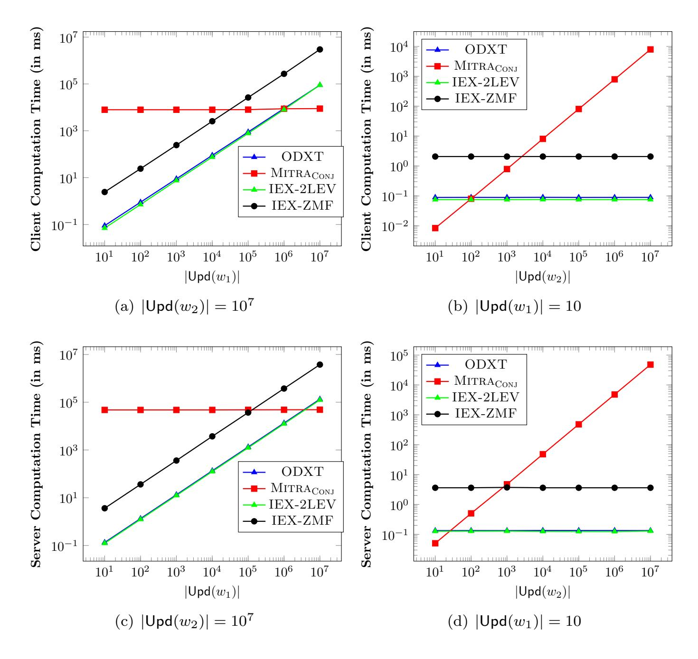
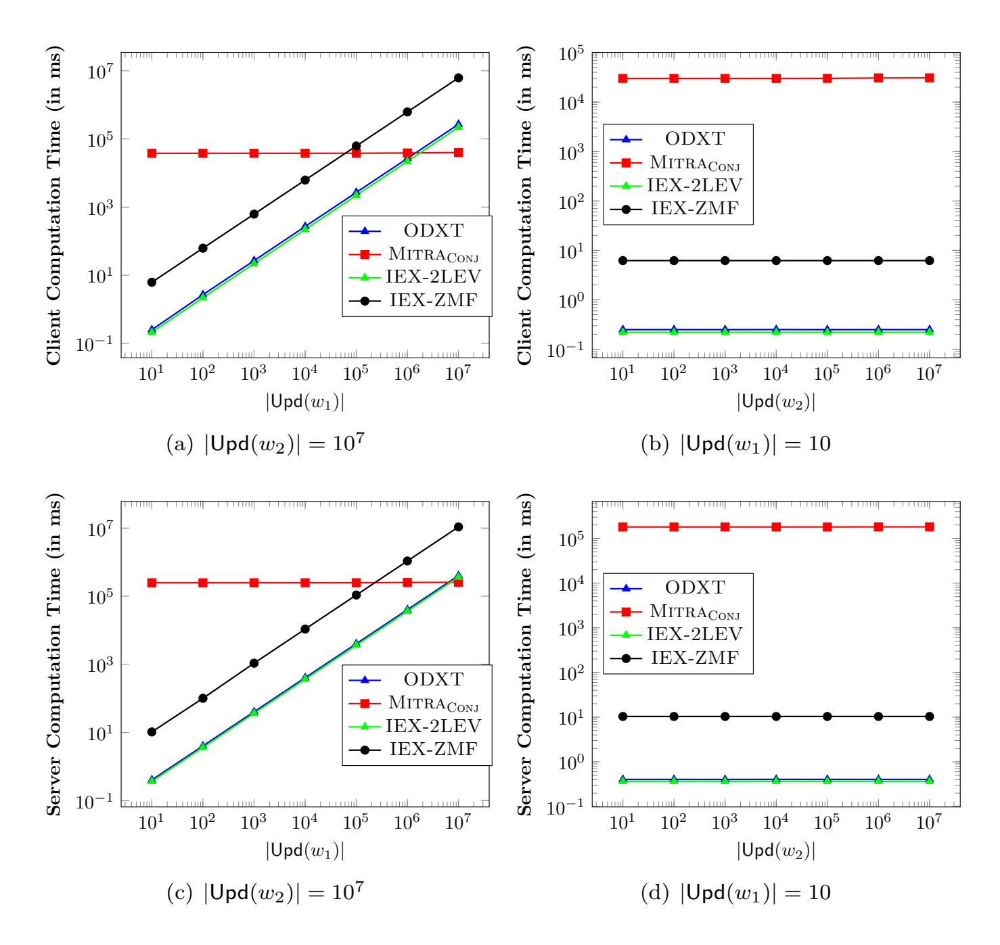
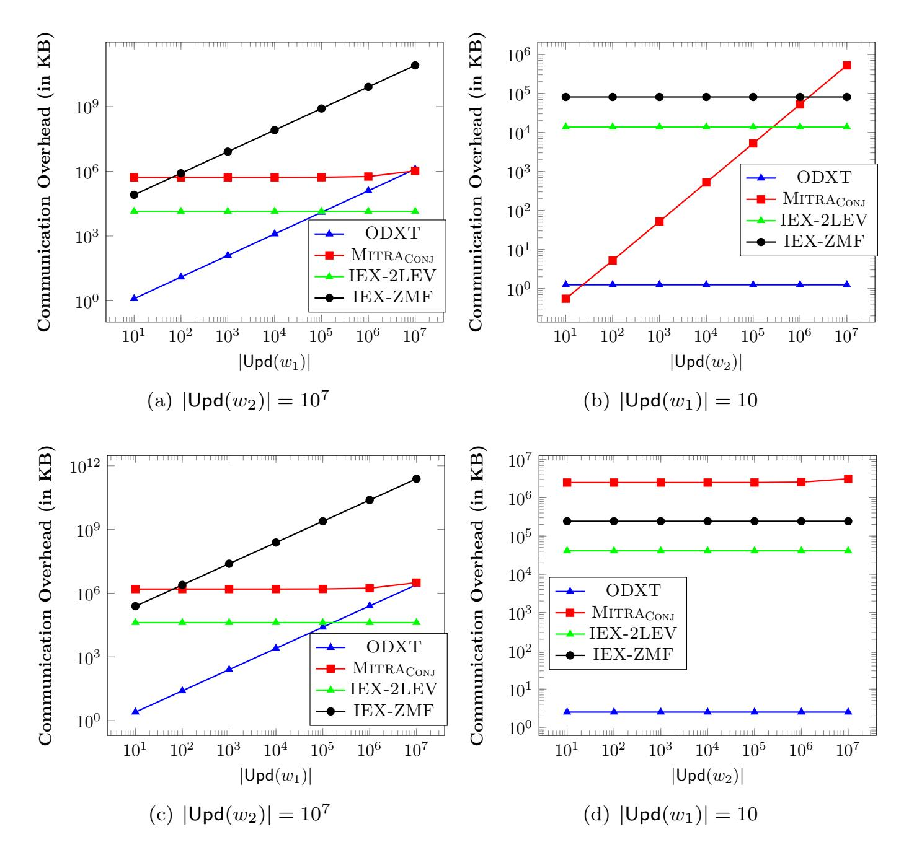
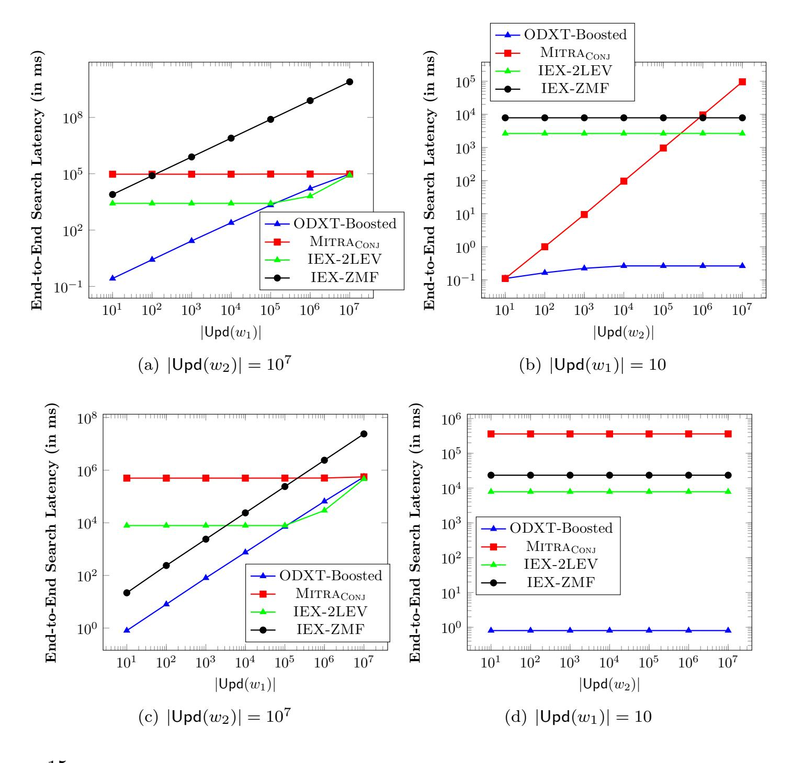
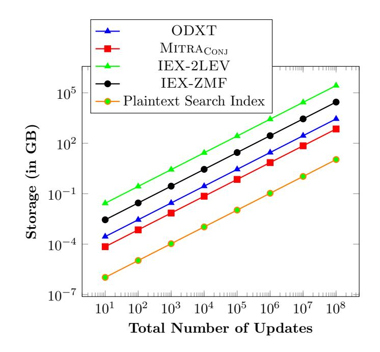
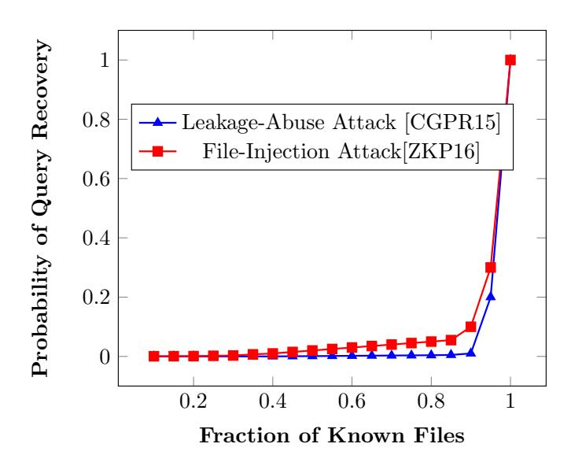
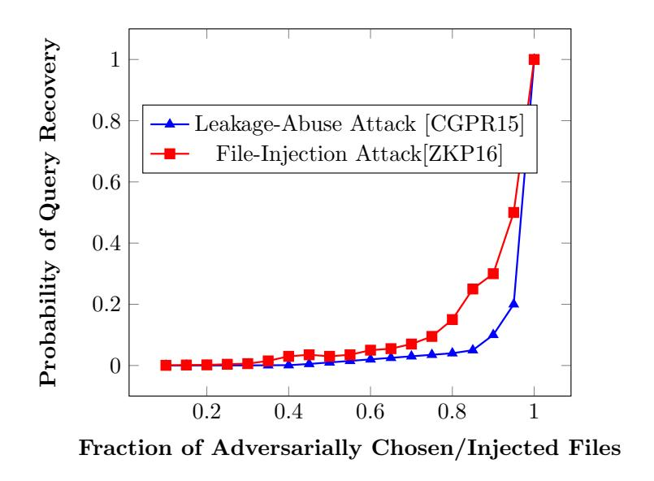

{0}------------------------------------------------

# Forward and Backward Private Conjunctive Searchable Symmetric Encryption

Sikhar Patranabis ETH Z¨urich

Debdeep Mukhopadhyay IIT Kharagpur

October 30, 2020

#### Abstract

Dynamic searchable symmetric encryption (SSE) supports updates and keyword searches in tandem on outsourced symmetrically encrypted data, while aiming to minimize the information revealed to the (untrusted) host server. The literature on dynamic SSE has identified two crucial security properties in this regard - forward and backward privacy. Forward privacy makes it hard for the server to correlate an update operation with previously executed search operations. Backward privacy limits the amount of information learnt by the server about documents that have already been deleted from the database.

To date, work on forward and backward private SSE has focused mainly on single keyword search. However, for any SSE scheme to be truly practical, it should at least support conjunctive keyword search. In this setting, most prior SSE constructions with sub-linear search complexity do not support dynamic databases. The only exception is the scheme of Kamara and Moataz (EUROCRYPT'17); however it only achieves forward privacy. Achieving both forward and backward privacy, which is the most desirable security notion for any dynamic SSE scheme, has remained open in the setting of conjunctive keyword search.

In this work, we develop the first forward and backward private SSE scheme for conjunctive keyword searches. Our proposed scheme, called Oblivious Dynamic Cross Tags (or ODXT in short) scales to very large arbitrarily-structured databases (including both attribute-value and free-text databases). ODXT provides a realistic trade-off between performance and security by efficiently supporting fast updates and conjunctive keyword searches over very large databases, while incurring only moderate access pattern leakages to the server that conform to existing notions of forward and backward privacy. We precisely define the leakage profile of ODXT, and present a detailed formal analysis of its security. We then demonstrate the practicality of ODXT by developing a prototype implementation and evaluating its performance on real world databases containing millions of documents.

{1}------------------------------------------------

# 1 Introduction

The advent of cloud computing potentially allows individuals and organizations to outsource storage and processing of large volumes of data to third party servers. However, this leads to privacy concerns - clients typically do not trust service providers to respect the confidentiality of their data [\[CZH](#page-49-0)+13]. This lack of trust is often fortified by threats from malicious insiders and external attackers.

Consider, for instance, a client that offloads an encrypted database of (potentially sensitive) emails to an untrusted server. At a later point of time, the client might want to issue a query of the form "retrieve all emails received from xyz@foobar.org or "retrieve all emails with the keyword "research" in the subject field". Ideally, the client should be able to perform this task without revealing any sensitive information to the server, such as the sources and contents of the emails, the keywords underlying a given query, the distribution of keywords across emails, etc. Unfortunately, techniques such as fully homomorphic encryption [\[Gen09\]](#page-50-0), that potentially allow achieving such an "ideal" notion of privacy, are unsuitable for practical deployment due to large performance overheads.

Searchable Symmetric Encryption. Searchable symmetric encryption (SSE) [\[SWP00,](#page-51-0) [Goh03,](#page-50-1) [CGKO06,](#page-49-1) [PRZB11,](#page-51-1) [CJJ](#page-49-2)+13, [CJJ](#page-49-3)+14, [FJK](#page-50-2)+15, [SLS](#page-51-2)+16, [KM17,](#page-50-3) [LPS](#page-50-4)+18] is the study of provisioning symmetric-key encryption schemes with search capabilities. Consider again a client that offloads an encrypted database of emails to an untrusted server and later issues a query of the form "retrieve all emails with the keyword "research" in the subject field". The goal of SSE is to allow the client to perform this task without revealing any sensitive information to the server, such as the contents of emails, the keywords underlying a given query, the distribution of keywords across emails, etc.

Leakage Versus Efficiency. The most general notion of SSE with optimal security guarantees can be achieved using the work of Ostrovsky and Goldreich on Oblivious RAMs [\[GO96\]](#page-50-5). More precisely, using these techniques, one can evaluate a functionally rich class of queries on encrypted data without leaking any information to the server. However, such an ideal notion of privacy comes at the cost of significant computational or communication overhead. A large number of existing SSE schemes prefer to trade-off security for practical efficiency by allowing the server to learn "some" information during query execution. The information learnt by the server is referred to as leakage. Some examples of leakage include the database size, query pattern (which queries correspond to the same keyword w) and the access pattern (the set of file identifiers matching a given query). Practical implementations of such schemes can be made extremely efficient and scalable using specially designed data structures.

Some recent works [\[MPC](#page-51-3)<sup>+</sup>18] have attempted to design low-leakage searchable indices using special forms of Oblivious RAMs such as Path Oblivious RAM [\[SvDS](#page-51-4)<sup>+</sup>18] and additional oblivious data structures [\[Mic97,](#page-51-5) [WNL](#page-51-6)<sup>+</sup>14]. These schemes achieve strong security guarantees in the sense that they do not leak access patterns and hide the result sizes of searches. However, they are typically enabled by hardware enclaves such as Intel SGX [\[MAB](#page-51-7)<sup>+</sup>13] with security properties that are not necessarily well-understood [\[BPS17,](#page-49-4) [BMW](#page-49-5)<sup>+</sup>18, [BOM](#page-49-6)<sup>+</sup>19]. In this paper, we focus on SSE schemes that do not assume the presence of such secure 

{2}------------------------------------------------

enclaves.

Dynamic SSE. An important line of works (e.g., [\[CM05,](#page-49-7) [KPR12,](#page-50-6) [KP13,](#page-50-7) [CJJ](#page-49-3)+14, [Bos16,](#page-49-8) [BMO17,](#page-49-9) [EKPE18\]](#page-50-8)) have studied dynamic SSE schemes that support updates on the database without the need to re-initialize the entire protocol. To formally address the additional privacy concerns that arise when supporting the update operations, two new notions of security for SSE have been proposed in these works - (a) forward privacy (which requires that adding a new file f to a database should not reveal whether f contains keywords that have been previously searched for) and (b) backward privacy (which requires that searching for a keyword w should reveal no information about files containing w that have already been deleted from the database).

Forward private SSE was introduced by Chang and Mitzenmacher in [\[CM05\]](#page-49-7), and has been subsequently studied in [\[SPS14,](#page-51-8) [Bos16,](#page-49-8) [GMP16,](#page-50-9) [KKL](#page-50-10)+17, [BMO17,](#page-49-9) [EKPE18,](#page-50-8) [SDY](#page-51-9)+18]. Forward privacy has received much attention in light of file injection attacks [\[CGPR15,](#page-49-10) [ZKP16\]](#page-51-10), which are potentially devastating for SSE schemes that try to support updates without being forward private. The notion of backward privacy is comparatively more recent, and was first formalized by Bost et al. in [\[BMO17\]](#page-49-9). Subsequently, Chamani et al. [\[CPPJ18\]](#page-49-11) and Sun et al. [\[SYL](#page-51-11)+18] proposed SSE schemes supporting single keyword search that are backward private under various leakage profiles.

However, existing dynamic SSE schemes, that satisfy both forward and backward privacy, support only single keyword search. As a result, despite their efficiency and security, these schemes are often severely limited in terms of the expressiveness of queries they support. Consider, for example, a client that can only specify a single keyword to search on, and receives all the documents containing this keyword. In real-life applications, such as querying large remotely stored email databases, a single keyword query would potentially return a large number of matching records/documents that the client would need to download and filter locally. For any SSE scheme to be truly practical, it should at least support conjunctive keyword search, i.e., given a set of keywords (w1, . . . , wn), it should be able to find and return the set of documents that contain all of these keywords.

Conjunctive Keyword Search. For any SSE scheme to be truly practical, it should at least support conjunctive keyword search, i.e., given a set of keywords (w1, . . . , wn), it should be able to find and return the set of documents that contain all of these keywords. In the case of static datasets, dedicated SSE schemes have been developed to support conjunctive, disjunctive and general Boolean queries [\[CJJ](#page-49-2)<sup>+</sup>13, [KM17,](#page-50-3) [LPS](#page-50-4)<sup>+</sup>18]. Some of these proposals can also be extended to achieve forward private SSE supporting conjunctive queries [\[CJJ](#page-49-3)<sup>+</sup>14, [KM17\]](#page-50-3).

However, backward private SSE schemes for conjunctive queries are largely unstudied so far. As observed by Bost et al. [\[BMO17\]](#page-49-9) and a number of subsequent works [\[CPPJ18,](#page-49-11) [SYL](#page-51-11)<sup>+</sup>18], any meaningful notion of security for SSE in the dynamic setting must include both forward and backward privacy. This motivates the need for dynamic SSE schemes that support conjunctive keyword search while achieving both forward and backward privacy.

At this point, a natural question to ask is the following:

{3}------------------------------------------------

Can we trivially extend existing forward and backward private SSE schemes that support single keyword search to also support conjunctive keyword search?

The answer, unfortunately, is no. Consider, for instance, the following na¨ıve idea for reducing the problem of conjunctive keyword search to that of single keyword search: on input a conjunctive query, the client and the server run the single keyword search protocol in parallel for each keyword in the conjunction. At the end of the search protocol, the client recovers a document list corresponding to each keyword, and retains only those documents that are in the intersection of all the lists. From an efficiency point of view, this approach suffers if one or more keywords in the conjunction have very high-frequency of occurrence. Consider, for example, the following query on a relational database of company employees:

$$(department = accounts) \land (gender = male).$$

For the na¨ıve approach mentioned above, such a query would result in the server retrieving approximately half the records in the database, even though the final output would consist of significantly fewer records. This is undesirable for real-world applications.

Goals and Challenges. In this paper, we aim to design a dynamic SSE scheme with both forward and backward privacy, and with search complexity proportional to the number of documents containing the least frequent term in the conjunction. This is indeed the best possible search complexity achieved by plaintext information retrieval algorithms, as well as by conjunctive SSE schemes in the static setting [\[CJJ](#page-49-2)+13, [LPS](#page-50-4)+18]. However, this is non-trivial to achieve in the dynamic SSE setting, where we need to additionally support updates and ensure forward and backward privacy. For instance, existing conjunctive SSE schemes in the static setting [\[CJJ](#page-49-2)+13, [LPS](#page-50-4)+18] facilitate fast conjunctive searches by heavily pre-processing the dataset during setup. Such pre-processing at setup is impossible in the dynamic setting, where the dataset is updated on-the-fly.

Handling conjunctive searches also makes the analysis of leakage significantly more challenging. Existing definitions for forward and backward privacy [\[Bos16,](#page-49-8) [BMO17,](#page-49-9) [CPPJ18,](#page-49-11) [SYL](#page-51-11)+18] assume leakage profiles that are tuned specifically towards single keyword search, and are insufficient to cover general conjunctive searches. For example, suppose that we design a dynamic SSE scheme that has the following leakage profile: given a conjunctive query over the keywords (w1, w2, w3), it leaks to the server, in addition to the actual outcome of the query, the outcome of the sub-query (w1, w2). Note that this partial leakage is not meaningful when searching for a single keyword; so the aforementioned SSE scheme might well be secure according to forward/backward privacy definitions that cover only single keyword search. But for general conjunctive queries, such partial leakages could have devastating consequences [\[ZKP16\]](#page-51-10).

## 1.1 Our Contributions

We develop the first dynamic SSE scheme supporting conjunctive keyword searches that is both forward and backward private. Our scheme is named Oblivious Dynamic Cross-Tags, or ODXT in short. The performance of ODXT scales to very large arbitrarily-structured databases, including both attribute-value and free-text databases.

{4}------------------------------------------------

Techniques Developed. The technical centerpiece of ODXT is a search protocol executed between the client and the server, where server takes as input a set of encrypted records corresponding to update operations on the database, while the client takes as input a conjunction of keywords and some secret state information. The outcome of this protocol is a filtered, significantly smaller set of encrypted records, which the client can then locally decrypt to compute the identifiers for documents containing all of the queried keywords.

A straightforward realization of this protocol, however, requires multiple rounds of communication between the client and the server, which does not satisfy our desired level of performance. In order to enable this search protocol with a single round of communication, we design a novel update mechanism based on dynamic cross-tags that pre-computes parts of the protocol messages, and stores these in encrypted form at the server. Then, during the actual search protocol, the client only sends across some auxiliary information that allows the server to unlock these pre-computed messages from the relevant update records, without any further interaction.

Differences with Static Cross-Tags. Our idea of pre-computing search protocol messages using cross-tags is inspired by conjunctive SSE schemes for static databases [\[CJJ](#page-49-2)+13, [LPS](#page-50-4)+18]. However, applying this technique to the dynamic setting is not straightforward. In static SSE schemes, the pre-computation typically happens at setup, when the client has access to the entire database in the clear. Also, since the database is never updated, the pre-computed messages do not need to change with time. This is impossible to emulate in the dynamic setting, where the database is continuously updated. Finally, these schemes use specially designed data structures that are inherently static with no provisions for updates such as insertions/deletions.

This makes dynamic conjunctive SSE with appropriate performance and security guarantees non-trivial to achieve; in particular, prior attempts to do so have been found to be vulnerable to different classes of attacks such as leakage-abuse and file-injection attacks [\[CGPR15,](#page-49-10) [ZKP16\]](#page-51-10).

Novelty of Our Approach. We introduce two novel techniques to tackle this issue that differ significantly from existing design-paradigms:

- A specialized data structure for "dynamic cross-tags" that can be efficiently updated and searched in tandem while ensuring both forward and backward-privacy.
- A round-reduction technique for conjunctive keyword searches that combines message pre-computation with the update operations, and requires no pre-processing at setup.

At a high level, if an update operation (insertion/deletion) affects the outcome of some future search, we ensure that the corresponding message pre-computation for this search is also updated simultaneously. This combination of message pre-computation with normal update operations is done in a manner that: (a) leaks as little information as possible to the server, and (b) does not degrade the online efficiency of update and search operations.

Performance. Some of the performance benefits of ODXT are summarized below.

{5}------------------------------------------------

Fast Conjunctive Searches. Conjunctive keyword searches in ODXT entail only a single round of communication between the client and the server. The search complexity is independent of the total number of documents in the database. For a conjunctive query over a set of keywords (w1, . . . , wn), the search complexity of ODXT scales linearly with the number of update operations involving the least frequent keyword in the conjunction.

More specifically, the best possible search complexity for any conjunctive-SSE scheme is O(n · |DB(w1)|), where n is the number of keywords involved in the conjunction, w<sup>1</sup> is the least frequent of these keywords, and |DB(w1)| is the number of files currently containing w1. ODXT incurs slightly higher computational complexity, namely O(n.|Upd(w1)|), where |Upd(w1)| is the number update operations involving files containing w<sup>1</sup> (this is primarily a tradeoff for achieving both forward and backward privacy). Our experiments reveal that |Upd(w1)| typically exceeds |DB(w1)| by around 10%. In particular, any keyword that occurs in very few files is naturally expected to be involved in very few update operations.

In summary, ODXT achieves a search performance level "reasonably close" to the best possible search complexity achieved by plaintext information retrieval algorithms, as well as by conjunctive SSE schemes in the static setting [\[CJJ](#page-49-2)+13, [LPS](#page-50-4)+18].

Fast Updates. Updates in ODXT are extremely fast and lightweight. Each update operation entails only a constant amount of computation at the client and the server, and a single message transmission from the client to the server. This matches closely the update efficiency of existing forward and backward private SSE schemes for single keyword search [\[BMO17,](#page-49-9) [CPPJ18,](#page-49-11) [SYL](#page-51-11)+18].

Efficient Storage. The server storage requirements for ODXT scale linearly with the number of update operations executed on the database until a given point of time, while the client is required to maintain a small amount of local storage that scales only logarithmically with the number of update operations executed on the database until a given point of time. This closely matches some of the most storage-efficient forward and backward private SSE schemes that support only single keyword search [\[BMO17,](#page-49-9) [CPPJ18,](#page-49-11) [SYL](#page-51-11)+18].

Security. We establish security by: (a) precisely enumerating the leakage profile for our scheme, including leakages from updates as well as leakages from conjunctive keyword searches, and then (b) by proving formally that this is indeed the entire leakage incurred by our scheme. Our formal proof of security follows the same simulation-based framework as existing forward and backward private SSE schemes for single keyword queries [\[BMO17,](#page-49-9) [CPPJ18,](#page-49-11) [SYL](#page-51-11)<sup>+</sup>18], and assumes an adaptive adversarial model. In this framework, we establish formally that a probabilistic polynomial-time simulation algorithm can simulate the view of the adversarial server (in a computationally indistinguishable manner) given access to only the leakage profile for our scheme.

Leakage Analysis. We also present a detailed analysis of the leakage profile incurred by our scheme, and compare it with the leakages incurred by existing forward and backward private SSE schemes supporting single keyword search, as well as existing conjunctive SSE schemes for static datasets. We broadly categorize the leakage from our scheme into two categories described below.

{6}------------------------------------------------

Update Leakages. These are leakages incurred during updates. The design of our scheme ensures that update operations reveal nothing to the adversary, including the nature of the update operation (insertion/deletion), as well as the document/keyword pair involved in the update operation.

Conjunctive Search Leakages. These are leakages incurred during conjunctive keyword searches. Examples of such leakages incurred by our scheme include the access pattern, the timestamps corresponding to updates involving the least frequent term in the conjunction, and the timestamps corresponding to updates involving other terms in the conjunction and the files containing the least frequent term. Some of these leakages are also incurred by existing forward and backward private in the single keyword search setting. Other leakages are very specific to the case of conjunctive queries, and we draw parallels with conjunctive SSE schemes in the static setting to justify their presence as a necessary performance trade-off.

**Prototype Implementation.** Finally, we present a prototype implementation of ODXT, and compare its search performances with the naïve adaptation of MITRA [CPPJ18] to the conjunctive search setting, as well as IEX-2LEV and IEX-ZMF due to Kamara and Moataz [KM17]. The evaluations are carried out on 60.92GB-sized real world dataset obtained from Wikimedia downloads [Fou17], consisting of 16 million documents, 43 million keywords and 100 million update operations.

#### 1.2 Related Work

SSE for single keyword searches was first introduced by Song et al. in [SWP00], and was subsequently equipped with formal security definitions by Goh in [Goh03] and by Curtmola et al. in [CGKO06]. The literature on SSE that is relevant to this work can be broadly divided into two categories - dynamic SSE schemes that are forward and backward private but only support single keyword queries, and conjunctive SSE schemes that are either static or only forward private. We summarize them below.

Forward and Backward Private Dynamic SSE. The first SSE schemes to efficiently support updates [KPR12, KP13] were neither forward nor backward private. The notion of forward privacy was introduced formally in [CM05]. Since then, numerous works have proposed improved dynamic SSE schemes with forward privacy, albeit with support for single keyword searches [SPS14, Bos16, GMP16, KKL<sup>+</sup>17, BMO17, EKPE18, SDY<sup>+</sup>18]. Backward privacy was introduced in [SPS14], albeit without a formal security definition or construction. Bost *et al.* [BMO17] introduced the first formal definitions of backward privacy for single keyword search, and proposed SSE constructions satisfying these notions. More efficient constructions of backward private SSE have been proposed subsequently in [SYL<sup>+</sup>18, CPPJ18].

To the best of our knowledge, all forward and backward private SSE constructions till date *only* support single keyword searches. In particular, they *do not support* conjunctive keyword searches, which is the goal of this paper.

{7}------------------------------------------------

Conjunctive SSE. A completely disjoint set of works have attempted to design SSE schemes that support expressive queries such as conjunctions, disjunctions and general Boolean formulae over keywords. The seminal work of Cash et al. [CJJ<sup>+</sup>13] and a subsequent work of Lai et al. [LPS<sup>+</sup>18] enable efficient conjunctive keyword searches, albeit on static datasets with no provisions for updates. The work of Kamara and Moataz [KM17] enables conjunctive keyword searches over dynamic databases, but is only forward private.

In this work, we address the open question of designing an SSE scheme for conjunctive keyword searches over dynamic databases while *simultaneously* achieving both forward and backward privacy.

## 2 Preliminaries

In this section we introduce the notations used in the rest of the paper. We also present necessary cryptographic background material and definitions for dynamic SSE.

#### 2.1 Notations

We write  $x \stackrel{R}{\leftarrow} \chi$  to represent that an element x is sampled uniformly at random from a set/distribution  $\mathcal{X}$ . The output x of a deterministic algorithm  $\mathcal{A}$  is denoted by  $x = \mathcal{A}$  and the output x' of a randomized algorithm  $\mathcal{A}'$  is denoted by  $x' \leftarrow \mathcal{A}'$ . For  $a \in \mathbb{N}$  such that  $a \geq 1$ , we denote by [a] the set of integers lying between 1 and a (both inclusive). We refer to  $\lambda \in \mathbb{N}$  as the security parameter, and denote by  $\mathsf{poly}(\lambda)$  and  $\mathsf{negl}(\lambda)$  any generic (unspecified) polynomial function and negligible function in  $\lambda$ , respectively. <sup>1</sup>

**Databases.** Let  $\Delta = \{w_1, \dots, w_K\}$  be a dictionary of keywords, and let  $\mathcal{F} = \{f_1, \dots, f_D\}$  be a collection of files, such that each  $f_i$  is associated with a unique identifier  $\mathrm{id}_i$  and contains keywords from  $\Delta$ . We denote by  $\mathbf{DB}$  a database of identifier-keyword pairs, such that a given pair  $(\mathrm{id}, w) \in \mathbf{DB}$  if and only if the file with identifier id contains the keyword w. We denote by  $\mathcal{W} \subseteq \Delta$  the set of all keywords that appear at least once in  $\mathbf{DB}$ , and by  $\mathbf{DB}(w)$  the set of all identifiers corresponding to files containing w. We denote by  $|\mathcal{W}|$  the number of distinct keywords in  $\mathbf{DB}$ , by  $|\mathbf{DB}|$  the number of distinct identifier-keyword pairs in  $\mathbf{DB}$ , by  $|\mathbf{DB}(w)|$  the number of files containing the keyword w, and by  $|\mathbf{Upd}(w)|$  the number of update operations involving the keyword w.

Conjunctive Queries. We represent a conjunctive query over n distinct keywords  $w_1, \ldots, w_n$  as  $q = (w_1 \land w_2 \land \ldots \land w_n)$  and define the set  $\mathbf{DB}(q)$  as  $\mathbf{DB}(q) = \bigcap_{i=1}^n \mathbf{DB}(w_i)$ . Depending on the context, the keyword  $w_1$  is assumed to have either the least frequency of occurrence or to have the least frequency of updates among all keywords in the conjunction q.

<span id="page-7-0"></span>Note that a function  $f: \mathbb{N} \to \mathbb{N}$  is said to be negligible in  $\lambda$  if for every positive polynomial  $p, f(\lambda) < 1/p(\lambda)$  when  $\lambda$  is sufficiently large.

{8}------------------------------------------------

### 2.2 Cryptographic Background

This section presents the definitions and security notions for various cryptographic primitives used in the rest of the paper.

**Pseudorandom functions.** A pseudorandom function (PRF) is a polynomial-time computable function

$$F: \{0,1\}^{\lambda} \times \{0,1\}^{\ell} \longrightarrow \{0,1\}^{\ell'},$$

such that for all PPT algorithms  $\mathcal{A}$ , we have

$$\left| \Pr \left[ \mathcal{A}^{F(K,\cdot)} = 1 \right] - \Pr \left[ \mathcal{A}^{G(\cdot)} = 1 \right] \right| \le \mathsf{negl}(\lambda),$$

where  $K \stackrel{R}{\leftarrow} \{0,1\}^{\lambda}$  and G is uniformly sampled from the set of all functions that map  $\{0,1\}^{\ell}$  to  $\{0,1\}^{\ell'}$ .

**Symmetric-Key Encryption.** A symmetric-key encryption scheme SKE consists of the following polynomial-time algorithms:

- Gen( $\lambda$ ): A probabilistic algorithm that takes the security parameter  $\lambda$  as input and outputs a secret-key sk.
- Enc(sk, x): A probabilistic algorithm that takes as input a key sk and a plaintext x. Outputs a ciphertext c.
- Dec(K,c): A deterministic algorithm that takes as input a key sk and a ciphertext c. Outputs the decrypted plaintext x.

A symmetric-key encryption scheme is said to be CPA-secure if for all PPT algorithms  $\mathcal{A}$  and any two arbitrary plaintext messages  $x_0$  and  $x_1$ , we have

$$|\Pr\left[\mathcal{A}\left(\mathrm{Enc}(\mathsf{sk},x_0)\right)=1\right]-\Pr\left[\mathcal{A}\left(\mathrm{Enc}(\mathsf{sk},x_1)\right)=1\right]|\leq \mathsf{negl}(\lambda),$$

where  $sk \leftarrow \text{Gen}(\lambda)$ .

## 2.3 Computational Assumptions

This section introduces the computational hardness assumptions used in the rest of the paper.

**Decisional Diffie-Hellman Assumption.** Let  $\mathbb{G}$  be a cyclic group of prime order p, and let g be any uniformly sampled generator for  $\mathbb{G}$ . The decisional Diffie-Hellman (DDH) assumption is that for all PPT algorithms  $\mathcal{A}$ , we have

$$\left|\Pr\left[\mathcal{A}\left(g,g^{\alpha},g^{\beta},g^{\alpha\cdot\beta}\right)=1\right]-\Pr\left[\mathcal{A}\left(g,g^{\alpha},g^{\beta},g^{\gamma}\right)=1\right]\right|\leq\mathsf{negl}(\lambda),$$

{9}------------------------------------------------

where  $\alpha, \beta, \gamma \stackrel{R}{\leftarrow} \mathbb{Z}_p^*$ 

**Extended DDH Assumption.** Let  $\mathbb{G}$  be a cyclic group of prime order p, and let g be any uniformly sampled generator for  $\mathbb{G}$ . For any arbitrary  $m, n \in \mathbb{N}$ , define the matrix of group elements

$$M := \begin{bmatrix} g^{\alpha_1 \cdot \beta_1} & g^{\alpha_1 \cdot \beta_2} & \dots & g^{\alpha_1 \cdot \beta_n} \\ g^{\alpha_2 \cdot \beta_1} & g^{\alpha_2 \cdot \beta_2} & \dots & g^{\alpha_2 \cdot \beta_n} \\ \vdots & \vdots & \ddots & \vdots \\ g^{\alpha_m \cdot \beta_1} & g^{\alpha_m \cdot \beta_2} & \dots & g^{\alpha_m \cdot \beta_n} \end{bmatrix},$$

where  $\{\alpha_i \stackrel{R}{\leftarrow} \mathbb{Z}_p^*\}_{i \in [m]}$  and  $\{\beta_j \stackrel{R}{\leftarrow} \mathbb{Z}_p^*\}_{j \in [n]}$ . The extended DDH assumption is that for all PPT algorithms  $\mathcal{A}$ , we have

$$|\Pr[\mathcal{A}(g, M) = 1] - \Pr[\mathcal{A}(g, M') = 1]| \le \mathsf{negl}(\lambda),$$

where M is distributed as described above and M' is distributed as follows:

$$M' := \begin{bmatrix} g^{\gamma_{1,1}} & g^{\gamma_{1,2}} & \dots & g^{\gamma_{1,n}} \ g^{\gamma_{2,1}} & g^{\gamma_{2,2}} & \dots & g^{\gamma_{2,n}} \ \vdots & \vdots & \ddots & \vdots \ g^{\gamma_{m,1}} & g^{\gamma_{m,2}} & \dots & g^{\gamma_{m,n}} \end{bmatrix},$$

where  $\{\gamma_{i,j} \stackrel{R}{\leftarrow} \mathbb{Z}_p^*\}_{i \in [m], j \in [n]}$ .

We state and prove the following lemma:

**Lemma 2.1.** The extended DDH assumption holds over a group  $\mathbb{G}$  iff the DDH assumption holds over the same group  $\mathbb{G}$ .

*Proof.* It is easy to see that any PPT algorithm  $\mathcal{A}$  that breaks the DDH assumption can be used to break the extended DDH assumption, since  $\mathcal{A}$  can distinguish any  $2 \times 2$  sub-matrix of the  $m \times n$  matrix M defined above from random. This is because any  $2 \times 2$  sub-matrix of M is of the form

$$M_{2\times 2} = \begin{bmatrix} g^{\alpha_i \cdot \beta_j} & g^{\alpha_i \cdot \beta_{j'}} \\ g^{\alpha_{i'} \cdot \beta_j} & g^{\alpha_{i'} \cdot \beta_{j'}} \end{bmatrix}$$

and is hence a valid DDH tuple. In other words, the DDH assumption holds over  $\mathbb{G}$  if the extended DDH assumption holds over  $\mathbb{G}$ .

The reverse direction is also true, i.e., the extended DDH assumption holds over  $\mathbb{G}$  if the DDH assumption holds over  $\mathbb{G}$ . The proof proceeds via a hybrid argument over the columns of the matrix M. For each  $j \in [0, n]$ , in the  $j^{\text{th}}$  hybrid, the matrix is distributed as follows:

- The first j columns are distributed as in M', i.e., thy consist of elements sampled independently and uniformly from the group  $\mathbb{G}$ .
- The remaining (n-j) columns are distributed as in M.

{10}------------------------------------------------

We now show that for each j ∈ [0, n − 1], the distributions of the matrix in hybrids j and (j +1) are computationally indistinguishable. Given a DDH tuple of the form (g, gα, g<sup>β</sup> , g<sup>γ</sup> ), where γ is either α·β or uniformly random in Z ∗ p , a PPT algorithm A can uniformly sample a set of scalars {x<sup>i</sup> , y<sup>i</sup> R ←− Z ∗ <sup>p</sup>}i∈[m] , and create two tuples of the form

$$\{g_i = g^{x_i} \cdot (g^{\alpha})^{y_i}\}_{i \in [m]}, \{h_i = (g^{\beta})^{x_i} \cdot (g^{\gamma})^{y_i}\}_{i \in [m]}.$$

The algorithm A creates the first column of the matrix using the tuple (g1, . . . , gm) and the (j + 1)th column using the tuple (h1, . . . , hm). It sets the remaining columns as follows:

- For each ` ∈ [2, j], it creates the ` th column of the matrix using a tuple of uniformly sampled group elements.
- For each ` ∈ [j + 1, n], it samples β` R ←− Z ∗ <sup>p</sup> and a set of scalars {xi,`, yi,` R ←− Z ∗ <sup>p</sup>}i∈[m] , and creates the ` th column of the matrix using the tuple (h1,`, . . . , hm,`), where

$$\left\{h_{i,\ell} = (g^{\beta_\ell})^{x_{i,\ell}} \cdot (g^{\alpha \cdot \beta_\ell})^{y_{i,\ell}}\right\}_{i \in [m]}.$$

We note that if γ = α · β, then the matrix is distributed as in hybrid j, since the (j + 1)th column is distributed exactly as in the matrix M. On the other hand, if γ is uniformly random, then the matrix is distributed as in hybrid (j + 1), since the (j + 1)th column is distributed uniformly and is statistically independently of every other column.

Since the number of columns n is poly-sized, it follows that if there exists a PPT algorithm that breaks the extended DDH assumption with non-negligible advantage, then there exists a second poly-sized algorithm that breaks the DDH assumption, albeit with a polynomial loss in advantage.

## 2.4 Dynamic SSE

A dynamic searchable symmetric encryption (SSE) scheme consists of a polynomial-time algorithm Setup executed by the client, and protocols Search and Update executed jointly by the client and the server:

- Setup(λ): A probabilistic algorithm that takes the security parameter λ. It outputs the tuple (sk,st, EDB), where sk is the client's secret-key, st is the client's internal state, and EDB is an empty encrypted database.
- Update(sk,st, op,(id, w); EDB): A client-server protocol, where the client takes as input the secret-key sk, its state st, an operation op ∈ {add, del} and an identifierkeyword pair (id, w), while the server takes as input the encrypted database EDB. The protocol outputs a modified client state st<sup>0</sup> and a modified encrypted database EDB<sup>0</sup> so as to reflect the outcome of the addition/deletion operation.

{11}------------------------------------------------

• SEARCH(sk, st, q; **EDB**): A client-server protocol, where the client takes as input the secret-key sk, its state st and a query q, while the server takes as input the encrypted database **EDB**. At the end of the protocol, the client outputs **DB**(q).

In the above, we adopted the definition of dynamic SSE used by Chamani *et al.* [CPPJ18]. There exist other definitions of dynamic SSE in the literature [KKL<sup>+</sup>17, EKPE18] where the UPDATE operation takes an entire file for addition/deletion, which is functionally equivalent to executing multiple addition/deletion operations on the relevant identifier/keyword pairs in our framework. Finally, we make the implicit assumption that upon obtaining the set of file identifiers corresponding to a query, the client performs an additional interaction with the server to actually retrieve the files with these identifiers.

**Correctness.** A dynamic SSE is said to be correct if for every database **DB** and for every query q, the Search protocol outputs **DB**(q) with all but negligible probability.

**Security.** The security of a dynamic SSE scheme is parameterized by a leakage function

$$\mathcal{L} = \left(\mathcal{L}^{\text{Setup}}, \mathcal{L}^{\text{Search}}, \mathcal{L}^{\text{Upd}}\right),$$

where  $\mathcal{L}^{\text{Setup}}$  encapsulates the leakage to an adversarial server during the setup phase,  $\mathcal{L}^{\text{Search}}$  encapsulates the leakage to an adversarial server during each execution of the search protocol, and  $\mathcal{L}^{\text{Upd}}$  encapsulates the leakage to an adversarial server during each execution of the update protocol.

Informally, a dynamic SSE scheme is secure with respect to a leakage function  $\mathcal{L}$  if the adversarial server provably learns no more information about **DB** other than that encapsulated by  $\mathcal{L}$ . Formally, a dynamic SSE scheme is said to be adaptively-secure with respect to a leakage function  $\mathcal{L}$  if for any stateful PPT adversary  $\mathcal{A}$  that issues a maximum of  $Q = \mathsf{poly}(\lambda)$  queries, there exists a stateful probabilistic polynomial-time simulator SIM = (SIMSETUP, SIMSEARCH, SIMUPDATE) such that the following holds:

$$\left| \Pr \left[ \mathbf{Real}_{\mathcal{A}}^{\mathsf{Dy-SSE}}(\lambda, Q) = 1 \right] - \Pr \left[ \mathbf{Ideal}_{\mathcal{A}, \mathsf{SIM}}^{\mathsf{Dy-SSE}}(\lambda, Q) = 1 \right] \right| \leq \mathsf{negl}(\lambda),$$

where the "real" experiment  $\mathbf{Real}^{\mathsf{Dy-SSE}}$  and the "ideal" experiment  $\mathbf{Ideal}^{\mathsf{Dy-SSE}}$  are as described in Figure 1.

# 3 Dynamic Conjunctive SSE Schemes

#### <span id="page-11-1"></span>3.1 A Naïve Solution

To motivate our solutions, we begin with a straightforward extension of the dynamic SSE scheme MITRA introduced by Chamani et al. [CPPJ18] from single keyword queries to conjunctive queries.<sup>2</sup> The idea is as follows: on input of a conjunctive query  $q = (w_1 \wedge \ldots \wedge w_n)$ ,

<span id="page-11-0"></span><sup>&</sup>lt;sup>2</sup>We choose MITRA because it has the best update and search performances in practice among existing forward and backward private SSE scheme. However, conceptually, the extension works for all forward and backward private SSE schemes supporting single keyword search.

{12}------------------------------------------------

```
Experiment RealDy−SSE(λ, Q):
   1. N ← A(λ).
   2. (sk, st0, EDB0) ← Setup(λ, N).
   3. For k = 1 to Q:
         (a) If Query-Type = Search
                                           qk ← A(λ, EDBk−1, τ1, . . . , τk−1).
                                (stk, EDBk, DB(qk)) ← Search(sk, stk−1, qk; EDBk−1).
        (b) Else If Query-Type = Update
                                    (opk, (idk, wk)) ← A(λ, EDBk−1, τ1, . . . , τk−1).
                               (stk, EDBk) ← Update(sk, stk−1, opk, (idk, wk); EDBk−1).
         (c) End If
        (d) Let τk denote the view of the adversary after the k
                                                                th query.
   4. End For
   5. b ← A(λ, EDBQ, τ1, . . . , τQ).
Experiment IdealDy−SSE(λ, Q, L):
   1. Parse the leakage function L as:
                                           L =

                                                 L
                                                   Setup
                                                       , L
                                                          Search
                                                               , L
                                                                 Upd
                                                                      .
   2. N ← A(λ).
   3. (stSim, EDB0) ← SimSetup(L
                                   Setup(λ, N)).
   4. For k = 1 to Q:
         (a) If Query-Type = Search
                                           qk ← A(λ, EDBk−1, τ1, . . . , τk−1).
                              (stSim, EDBk, τk) ← SimSearch(stSim, L
                                                                     Search(qk); EDBk−1).
        (b) Else If Query-Type = Update
                                    (opk, (idk, wk)) ← A(λ, EDBk−1, τ1, . . . , τk−1).
                        (stk, EDBk, τk) ← SimUpdate(stSim, L
                                                              Upd(opk, (idk, wk)); EDBk−1).
         (c) End If
        (d) Let τk denote the view of the adversary after the k
                                                                th query.
   5. End For
   6. b ← A(λ, EDBQ, τ1, . . . , τQ).
```

Figure 1: The Real and Ideal Experiments for Dynamic SSE

{13}------------------------------------------------

#### <span id="page-13-0"></span>Client

- 1. Sample a uniformly random key  $K_T$  for PRF F
- 2. Initialize UpdateCnt, TSet to empty maps
- 3. Set  $sk = K_T$  and st = UpdateCnt
- 4. Set EDB = TSet
- 5. Send **EDB** to the server

Figure 2: MITRACONJ. SETUP  $(\lambda)$ 

#### <span id="page-13-1"></span>Client

- 1. Parse  $sk = K_T$  and st = UpdateCnt
- 2. If UpdateCnt[w] is NULL then set UpdateCnt[w] = 0
- 3. Set UpdateCnt[w] = UpdateCnt[w] + 1
- 4. Set  $addr = F(K_T, w||UpdateCnt[w]||0)$
- 5. Set  $val = (id||op) \oplus F(K_T, w||UpdateCnt[w]||1)$
- 6. Send (addr, val) to the server

#### **Server**

- 1. Parse EDB = TSet
- $2. \ \operatorname{Set} \ \mathsf{TSet}[\mathsf{addr}] = \mathsf{val}$

Figure 3: MITRA<sub>CONJ</sub>. UPDATE ( $\mathsf{sk}, \mathsf{st}, \mathsf{op}, (\mathsf{id}, w); \mathbf{EDB}$ )

the client and the server run the original MITRA search protocol in parallel for each keyword  $w_i$ . At the end of the search protocol, the client receives a list of encrypted file identifiers corresponding to each keyword, decrypts each such list, and retains only the file identifiers in the intersection of all the lists.

We refer to this naïve adaptation of MITRA for conjunctive queries as MITRA<sub>CONJ</sub>. The corresponding setup, update and search algorithms are described in Figures 2, 3 and 4, respectively. Below, we provide a brief technical overview of how MITRA<sub>CONJ</sub> handles conjunctive queries. For more details on the original MITRA scheme, the reader may refer to [CPPJ18].

Construction Overview. The construction of MITRA<sub>CONJ</sub> is based on a key-value dictionary called a TSet designed as follows: for each keyword w, the TSet dictionary stores encrypted transcripts corresponding to each operation involving w. The keys for TSet (which are addresses in the dictionary storing encrypted values) are generated using a PRF.

{14}------------------------------------------------

```
Client
   1. Parse sk = KT and st = UpdateCnt
   2. Initialize tokenList1, . . . ,tokenListn to empty lists
   3. For i = 1 to n:
       (a) For j = 1 to UpdateCnt[wi]:
              i. Set addri,j = F(KT , wi||j||0)
             ii. Set tokenListi = tokenListi ∪ {addri,j}
       (b) End For
   4. End For
   5. Send tokenList1, . . . ,tokenListn to the server
Server
   1. Parse EDB = TSet
   2. Initialize EOpList1
                         , . . . , EOpListn to empty lists
   3. For i = 1 to n:
       (a) For j = 1 to tokenListi.size:
              i. Set vali,j = TSet[tokenListi[j]]
             ii. Set EOpListi = EOpListi ∪ {vali,j}
       (b) End For
   4. End For
   5. Send EOpList1
                     , . . . , EOpListn to the client
Client: Final Output Computation
   1. Initialize IdList1, . . . , IdListn to empty lists
   2. For i = 1 to n:
       (a) For j = 1 to UpdateCnt[wi]:
              i. Set:
                                   (idi,j ||opi,j ) = EOpListi
                                                           [j] ⊕ F(KT , wi||j||1)
             ii. If opi,j is add then set IdListi = IdListi ∪ {idi,j}
             iii. Else set IdListi = IdListi \ {idi,j}
       (b) End For
   3. End For
   4. Output IdList = ∩
                         n
                         i=1IdListi
```

Figure 4: MitraConj. Search (sk,st, q = (w<sup>1</sup> ∧ . . . ∧ wn); EDB)

During an update operation of the form [op(id, w)], the client generates the appropriate keyvalue pair for the TSet dictionary, and sends it over to the server. The server updates the 

{15}------------------------------------------------

dictionaries accordingly. Under the assumption that file identifiers are never repeated<sup>3</sup>, the use of PRFs ensures that these key-value pairs reveal no information to the server about the underlying operation op, the identifier id or the keyword w. Since updates are leakage-free, forward privacy follows immediately.

Finally, let  $q = (w_1 \land w_2 \land \ldots \land w_n)$  be a conjunctive query issued by the client. For each keyword  $w_i$  (in parallel), the client recovers  $\mathbf{DB}(w_i)$  via the following steps. The client efficiently generates the appropriate keys for the TSet dictionary corresponding to each operation involving the keyword  $w_i$ , and sends these across to the server. The server retrieves the encrypted transcripts corresponding to each operation involving  $w_i$  and sends these back to the client. Upon receiving the encrypted transcripts, the client decrypts them to recover each update operation involving  $w_i$ . Given this information, constructing  $\mathbf{DB}(w_i)$  is straightforward. Eventually, the client computes  $\mathbf{DB}(q) = \bigcap_{i=1}^n \mathbf{DB}(w_i)$ .

**Search Performance.** It is straightforward to observe that the computational and communication complexity of this search protocol is proportional to  $\sum_{i=1}^{n} |\mathsf{Upd}(w_i)|$ , which is at least as large as  $\sum_{i=1}^{n} |\mathsf{DB}(w_i)|$ . This may be reasonable in practice if each keyword  $w_i$  is low-frequency, but is definitely rather poor if one or more keywords have very high-frequency of occurrence.

**Leakage.** Although this scheme inherits many of the forward and backward privacy properties of the original MITRA scheme, it incurs an additional undesirable leakage: a search operation over keywords  $w_1, \ldots, w_n$  allows the server to learn  $|\mathsf{Upd}(w_i)|$  (i.e., the total number of update operations) for each keyword  $w_i$ , including those involving files that are not relevant to the query, and the corresponding timestamp associated with each such update operation.

Our goal is to reduce both the computational overheads as well as the leakages in the protocol by tying these to only the less frequent keywords in the queried conjunction.

### 3.2 Basic Dynamic Cross-Tags

To achieve the above goal, we introduce the idea of "dynamic cross-tags". For ease of understanding, we exemplify the idea via a simplified protocol, called Basic Dynamic Cross-Tags, or BDXT in short. The corresponding algorithms for setup, updates and search are described in Figures 5, 6 and across Figures 7 and 8, respectively. The main changes from MITRA<sub>CONJ</sub> are highlighted in red.

Assume that, given a conjunctive query  $q = (w_1 \wedge \ldots \wedge w_n)$ , the client can choose the keyword with the least frequency of occurrence (at the cost of small additional storage). Assume without loss of generality that this keyword is  $w_1$ . We will refer to  $w_1$  as the sterm (where s stands for "special") and to each of the remaining keywords  $w_2, \ldots, w_n$  as a x-term (where x stands for "cross").

<span id="page-15-0"></span><sup>&</sup>lt;sup>3</sup> This assumption is made in several existing forward and backward private SSE schemes for single keyword search, most notably in the constructions of Bost *et al.* [BMO17] and Chamani *et al.* [CPPJ18], including the original MITRA scheme.

{16}------------------------------------------------

Handling the s-Term. In our simplified protocol presented below, the client still runs an instance of the Mitra search protocol, albeit only for the s-term w1, following which the client is able to retrieve the set of all identifiers corresponding to files currently containing w1. In the process, the computational overheads incurred by the client and the server are both proportional to DB(w1), and the server only learns |DB(w1)| (assuming no padding for now).

At this point, an obvious solution is as follows: the client downloads all the files containing w1, parses them locally and retains only those files that contain all the other keywords w2, . . . , wn. This is extremely inefficient from a performance point of view, since it requires downloading and parsing many more files than actually necessary. In order to handle this more efficiently, we introduce the idea of "dynamic cross-tags" below.

Dynamic Cross-Tags. Concretely, in addition to the TSet dictionary in the previous scheme, we use an additional dictionary called the XSet that has a pair of designated addresses for each possible identifier-keyword pair (id, w). At any given time, this address pair is populated with one of the following value pairs:

- (⊥, ⊥) : (id, w) was neither inserted nor deleted
- (1, ⊥) : (id, w) was inserted but not yet deleted
- (1, 1) : (id, w) was inserted and later deleted

where ⊥ denotes the corresponding address is empty. The keys pointing to these addresses are referred to as "dynamic cross-tags", and represent a major technical contribution of this work. Unlike the "cross-tags" in the scheme of Cash et al. [\[CJJ](#page-49-2)+13] which can only determine the presence/absence of any identifier-keyword pair in a static dataset, the keys for our XSet dictionary can determine the presence/absence of any identifier-keyword pair in a dynamic dataset across any number of update operations.

These dynamic cross-tags are generated using PRFs, so that they may be efficiently reproduced by the client during update/search queries. More concretely, for an identifier-keyword pair (id<sup>j</sup> , wi), the corresponding "insertion-cross-tag" and "deletion-cross-tag" are generated as:

$$\mathsf{xtag}_{i,j,\mathsf{add}} = F(K_X, w_i || \mathsf{id}_j || \mathsf{add}) , \mathsf{xtag}_{i,j,\mathsf{del}} = F(K_X, w_i || \mathsf{id}_j || \mathsf{del}).$$

This is illustrated in Figure [6.](#page-17-1)

Handling Updates. The update procedure for BDXT is described in Figure [6.](#page-17-1) The TSet dictionary is updated as in the previous scheme MitraConj, and hence incurs no leakages. The XSet dictionary is updated as follows: when an identifier-keyword pair (id, w) is inserted, the entry at the "insertion cross-tag" corresponding to (id, w) is updated to 1. At a later time, when (id, w) is deleted, the entry at the "deletion-cross-tag" corresponding to (id, w) is updated to 1.

Differences with Static Cross-Tags. A key difference in our approach as compared to conjunctive SSE schemes for static databases [\[CJJ](#page-49-2)<sup>+</sup>13, [LPS](#page-50-4)<sup>+</sup>18] is that our cross-tags are computed on-the-fly with every update operation, and not at setup. In the works of Cash

{17}------------------------------------------------

# <span id="page-17-0"></span>Client 1. Sample a uniformly random key K<sup>T</sup> , K<sup>X</sup> for PRF F 2. Initialize UpdateCnt, DBCnt, TSet, XSet to empty maps 3. Set sk = (K<sup>T</sup> , KX) and st = (UpdateCnt, DBCnt) 4. Set EDB = (TSet, XSet) 5. Send EDB to the server

Figure 5: BDXT. Setup (λ)

```
Client
   1. Parse sk = (KT , KX) and st = (UpdateCnt, DBCnt)
   2. If UpdateCnt[w] is NULL then set:
                                  UpdateCnt[w] = DBCnt[w] = 0
   3. Set UpdateCnt[w] = UpdateCnt[w] + 1
   4. If op is add then set DBCnt[w] = DBCnt[w] + 1
   5. Else set DBCnt[w] = DBCnt[w] − 1
   6. Set addr = F(KT , w||UpdateCnt[w]||0)
   7. Set val = (id||op) ⊕ F(KT , w||UpdateCnt[w]||1)
   8. Set xtag = F(KX, w||id||op)
   9. Send (addr, val, xtag) to the server
Server
   1. Parse EDB = (TSet, XSet)
   2. Set TSet[addr] = val
   3. Set XSet[xtag] = 1
```

Figure 6: BDXT. Update (sk,st, op,(id, w); EDB)

et al. [\[CJJ](#page-49-2)<sup>+</sup>13] and Lai et al. [\[CJJ](#page-49-2)<sup>+</sup>13], the presence or absence of a cross tag in the XSet simply indicated whether a given file contains a certain keyword or not. By involving the operation op ∈ {add, del} in the generation of the cross-tag, we have extended its semantic meaning to now indicate whether a certain operation (either addition or deletion) involving a given keyword-file pair has occurred or not. As a result, the XSet data structure, which was an inherently static data structure in the previous works, is now transformed into a dynamic data structure that can be updated without any additional pre-computation at setup. We managed to do this while maintaining forward privacy (because a cross-tag does not reveal any information about the underlying operation, file identifier or keyword), which is crucial for achieving resistance against leakage-abuse attacks [\[CGPR15\]](#page-49-10) and file-injection

{18}------------------------------------------------

```
Client: Round 1
   1. Parse sk = (KT , KX) and st = (UpdateCnt, DBCnt)
   2. Use DBCnt to identify the least frequent keyword (assumed to be w1 w.l.o.g)
   3. Initialize stokenList to an empty list
   4. For j = 1 to |Upd(w1)|:
       (a) Set saddrj = F(KT , w1||j||0)
       (b) Set stokenList = stokenList ∪ {saddrj}
   5. End For
   6. Send stokenList to the server
Server: Round 1
   1. Parse EDB = (TSet, XSet)
   2. Initialize sEOpList to an empty list
   3. For j = 1 to stokenList.size:
       (a) Set svalj = TSet[stokenList[j]]
       (b) Set sEOpList = sEOpList ∪ {svalj}
   4. End For
   5. Send sEOpList to the client
```

Figure 7: BDXT. Search (sk,st, q = (w<sup>1</sup> ∧ . . . ∧ wn); EDB) (Part-1)

attacks [\[ZKP16\]](#page-51-10).

In addition, as we demonstrate subsequently, our dynamic cross-tags are both forward and backward private, in the sense that they also incur minimal leakages during conjunctive searches. In particular, our technique of treating additions and deletions in a symmetric manner by generating cross-tags for them using the same PRF operation ensures that the adversary also cannot infer additional information about the deletion history of keywords (it is computationally indistinguishable from the insertion history), which is the primary requirement for backward privacy. Achieving simultaneously forward and backward private dynamic cross-tags constitutes the key technical innovation of our work and has not, to our knowledge, been achieved by prior works.

Handling Conjunctive Searches. The conjunctive search procedure for BDXT is described in Figure [7](#page-18-0) and Figure [8.](#page-19-0) Let q = (w<sup>1</sup> ∧ w<sup>2</sup> ∧ . . . ∧ wn) be a conjunctive query issued by the client, and let w<sup>1</sup> be the keyword with the least frequency. In our simplified protocol, the search operation involves two rounds of communication between the client and the server.

Round-1 allows the client to recover DB(w1) as mentioned above. More concretely, the client

{19}------------------------------------------------

```
Client: Round 2
   1. Initialize sIdList to an empty list
   2. For j = 1 to |Upd(w1)|:
       (a) Set (idj ||opj
                         ) = sEOpList[j] ⊕ F(KT , w1||j||1)
       (b) If opj
                   is add then set sIdList = sIdList ∪ {idj}
        (c) Else set sIdList = sIdList \ {idj}
   3. End For
   4. Let m = sIdList.size (=|DB(w1)|).
   5. Initialize xtagList1
                         , . . . , xtagListm to empty lists
   6. For j = 1 to m:
       (a) Let idj = sIdList[j]
       (b) For i = 2 to n:
              i. Set xtagi,j,add = F(KX, wi||idj ||add)
             ii. Set xtagi,j,del = F(KX, wi||idj ||del)
             iii. Set xtagListj = xtagListj ∪ {(xtagi,j,add, xtagi,j,del)}
        (c) Randomly permute the tuple-entries of xtagListj
   7. End For
   8. Send (xtagList1
                      , . . . , xtagListm) to the server
Server: Round 2
   1. For j = 1 to m:
       (a) Set bj = 1
       (b) For i = 2 to n:
              i. Set (xtagi,j,add, xtagi,j,del) = xtagListj
                                                       [i]
             ii. If XSet[xtagi,j,add] = ⊥, then set bj = 0
             iii. Else If XSet[xtagi,j,del] = 1, then set bj = 0
        (c) End For
   2. End For
   3. Send (b1, . . . , bm) to the client
Client: Final Output Computation
   1. Initialize IdList to an empty list
   2. For j = 1 to m:
       (a) Let idj = sIdList[j]
       (b) If bj = 1, then set IdList = IdList ∪ {idj}
   3. End For
   4. Output IdList
```

Figure 8: BDXT. Search (sk,st, q = (w<sup>1</sup> ∧ . . . ∧ wn); EDB) (Part-2) 20

{20}------------------------------------------------

first efficiently generates all relevant addresses in the TSet related to w<sup>1</sup> and sends them across to the server. The server then retrieves the encrypted (id, op) pairs and transmits them back to the client. At this point, the client can locally decrypt and recover DB(w1). This is very similar to the search algorithm in MitraConj. This is described in Figure [7.](#page-18-0)

Round-2 is based on the following observation: at a given point of time, an identifier-keyword pair (id<sup>j</sup> , wi) ∈ DB iff the following conditions hold simultaneously: (a) the "insertion-crosstag" corresponding to (id<sup>j</sup> , wi) is currently set to 1 (meaning that (id<sup>j</sup> , wi) has been inserted), and (b) the "deletion-cross-tag" corresponding to (id<sup>j</sup> , wi) is currently set to ⊥ (meaning that (id<sup>j</sup> , wi) is not yet deleted).

Based on this observation, it is natural to execute Round-2 of the conjunctive search via the following steps:

- 1. For each identifier id<sup>j</sup> ∈ DB(w1), the client efficiently computes the cross-tag-pairs corresponding to (id<sup>j</sup> , w2), . . . ,(id<sup>j</sup> , wn), and sends these (n − 1) cross-tag-pairs across to the server (in randomly permuted order).
- 2. For each j ∈ |DB(w1)|, the server receives a set of (n − 1) cross-tag-pairs from the client and retrieves the corresponding XSet entries. If for each pair, the first entry is 1 and second entry is ⊥, the server returns b<sup>j</sup> = 1, otherwise it returns b<sup>j</sup> = 0.
- 3. For each id<sup>j</sup> ∈ DB(w1), if the corresponding bit b<sup>j</sup> received from the server is 1, the client includes the identifier id<sup>j</sup> in the final list of identifiers to be output. Otherwise, it discards the identifier id<sup>j</sup> .

This is described in Figure [8.](#page-19-0) Correctness of the search protocol follows immediately from the aforementioned observation.

Implementing XSet. The XSet dictionary is represented equivalently using a set SXSet that is history-independent (i.e., it is independent of the order in which the elements of the set were inserted), and supports: (a) efficient element insertion and (b) efficient membership test for a random element. For a dynamic cross-tag xtagi,j,op corresponding to an identifierkeyword pair (id<sup>j</sup> , wi) and an operation op ∈ {add, del}, we interpret its corresponding value in the XSet dictionary as:

$$\mathsf{XSet}[\mathsf{xtag}_{i,j,\mathsf{op}}] = \begin{cases} 1 & \text{if } \mathsf{xtag}_{i,j,\mathsf{op}} \in \mathcal{S}_{\mathsf{XSet}} \\ \bot & \text{otherwise} \end{cases}$$

During an update operation, setting a XSet entry to 1 can be realized by simply adding the corresponding cross-tag to the set SXSet. As long as SXSet supports efficient element insertion, an update operation can thus be realized efficiently. Similarly, as long as SXSet supports efficient membership testing, the XSet dictionary can be efficiently looked up by the server during conjunctive searches.

Server Storage. The server stores the dictionaries TSet and XSet. Note that during setup, the TSet and XSet dictionaries are both initialized to empty. After N updates, the storage 

{21}------------------------------------------------

requirement at the server grows linearly as  $O(N\lambda)$ , since each update operation adds a  $O(\lambda)$ -sized entry of the form (addr, val) to TSet and a  $O(\lambda)$ -sized cross-tag entry of the form (xtag, 1) to XSet. In other words, the storage requirement at the server grows *linearly* with the number of update operations on the dataset.

Client Storage. The client locally stores the arrays UpdateCnt and DBCnt. Note that during setup, both arrays are initialized to empty. After N updates, the storage requirement at the client grows as  $O(|\mathcal{W}| \cdot \log N)$ ,  $|\mathcal{W}|$  is the size of the keyword dictionary, which is typically upper-bounded by some large pre-defined constant. In other words, the storage requirement at the client grows logarithmically with the number of update operations on the dataset.

**Search Performance.** The computational overhead at both the client and the server scales with  $(|\mathsf{Upd}(w_1)| + (n-1) \cdot |\mathbf{DB}(w_1)|)$ . This is clearly a significant improvement over the naïve adaptation over MITRA whenever there is a query term in the conjunction with relatively small frequency of occurrence. The communication overhead also scales with  $(|\mathsf{Upd}(w_1)| + (n-1) \cdot |\mathbf{DB}(w_1)|)$ , which is again a significant improvement over the naïve adaptation over MITRA whenever  $\mathbf{DB}(w_1)$  is small. In particular, this matches our original goal of reducing the computational and communication overheads by tying these to the s-term  $w_1$  that has the lowest frequency of occurrence.

An undesirable feature of BDXT from the point of view of search performance is the extra round of communication with consequent latency. For some applications, low latency might be a more crucial requirement and having a single round of communication during searches might be preferable, even if at the cost of additional computation at the client and/or server. Having multiple rounds of interaction during searches also limits the applicability of BDXT to some settings, such as the multi-client SSE setting. We expand on this subsequently.

**Leakage.** In terms of leakage, BDXT again improves substantially upon the naïve adaptation of MITRA by tying the leakage from conjunctive searches to the s-term  $w_1$  that has the least frequency of occurrence. Recall that in MITRACONJ, a search operation allows the server to learn partial information about every update operation involving every keyword in the conjunction. On the other hand, in BDXT, for each x-term in  $\{w_2, \ldots, w_n\}$ , the information gained by the adversary is only restricted to update operations involving files in  $\mathbf{DB}(w_1)$ . To see this, observe that if a file with identifier id contains some x-term (say,  $w_2$ ) but does not contain the s-term  $w_1$ , then in BDXT, the server does not receive any cross-tag corresponding to id, and hence learns no information about the pair (id,  $w_2$ ).

However, BDXT still leaks more information than desirable. To begin with, BDXT allows the server to learn the frequency of the s-term, i.e.,  $|\mathbf{DB}(w_1)|$ , in addition to the number of update operations involving the s-term, i.e.,  $|\mathbf{Upd}(w_1)|$ . This immediately leaks the exact number of insertion and deletion operations involving  $w_1$ . Note that the naïve adaptation of MITRA to the conjunctive setting does not suffer from this leakage, as it only reveals  $|\mathbf{Upd}(w_1)|$  to the server.

BDXT also allows the server to learn cross-tag pairs in the XSet dictionary that correspond to the *same* identifier-keyword pair, as well as the update history for this pair. Although the server cannot immediately identify which keyword among the  $\mathbf{x}$ -terms  $w_2, \ldots, w_n$  a given

{22}------------------------------------------------

cross-tag pair corresponds to (since the cross-tag pairs are uniformly randomly permuted for each file identifier in  $\mathbf{DB}(w_1)$ ), it can test each cross-tag pair for membership in the XSet dictionary to learn the exact number of keywords among  $w_2, \ldots, w_n$  that each file in  $\mathbf{DB}(w_1)$  contains.

We present in the next subsection an improved version of BDXT that achieves significantly smaller leakage; hence, we avoid a formal analysis of the leakage of BDXT.

### <span id="page-22-0"></span>3.3 Oblivious Dynamic Cross-Tags

We address the drawbacks of BDXT with respect to both search performance and leakage by presenting an alternative realization of dynamic cross-tags called Oblivious Dynamic Cross-Tags, or ODXT in short. The corresponding algorithms for setup, updates and search are described in Figures 9, 10 and 11, respectively. The main changes from BDXT are highlighted in red.

The key technical difference between ODXT and BDXT is that ODXT uses an oblivious shared computation between the client and the server to allow conjunctive searches with a single round of communication. To enable this oblivious shared computation, we resort to using *blinded exponentiations* (as in the Diffie-Hellman based oblivious PRF) in a cyclic group of prime order. ODXT also improves upon BDXT in terms of search privacy by reducing the information leakage to the server during conjunctive searches.

The Idea. In order to elucidate the core idea behind ODXT, we focus on why our simpler scheme, namely BDXT, requires two rounds of communication between the server and the client. Note that in the first round, the client executes a single keyword search on the s-term to recover  $\mathbf{DB}(w_1)$ . Consequently, in the second round, it generates a pair of crosstags ( $\mathsf{xtag}_{i,j,\mathsf{add}}, \mathsf{xtag}_{i,j,\mathsf{del}}$ ) for each keyword  $w_i \in \{w_2, \ldots, w_n\}$  and each document identifier  $\mathsf{id}_j \in \mathbf{DB}(w_1)$  recovered in the first round. If the client could allow the server to compute these cross-tags without explicitly recovering  $\mathbf{DB}(w_1)$ , the additional round communication could be avoided.

Our goal is to enable an oblivious evaluation of the cross-tag pair without explicitly recovering  $\mathbf{DB}(w_1)$ , thereby avoiding an additional round of interaction between the client and the server.

Change Cross-Tags in XSet. The first step in realizing this goal is to change the manner in which the cross-tags are generated. For a keyword  $w_i$ , a document identifier  $id_j$  and an operation  $op \in \{add, del\}$ , the client now generates the corresponding cross-tag  $xtag_{i,j,op}$  as

$$\mathsf{xtag}_{i,j,\mathsf{op}} = g^{F_p(K_X,w_i)\cdot F_p(K_Y,\mathsf{id}_j||\mathsf{op})},$$

where g is a generator for a cyclic group  $\mathcal{G}$  of prime order p,  $F_p$  is a PRF with range  $Z_p^*$ , and  $K_X$  and  $K_Y$  are uniformly sampled keys for the PRF  $F_p$ .

Note that conceptually, the xtag is split into two parts, one pertaining to  $w_i$  and the other pertaining to the pair  $(id_i, op)$ , which are combined multiplicatively in the exponent of g.

{23}------------------------------------------------

#### <span id="page-23-0"></span>Client

- 1. Sample a uniformly random key  $K_T$  for PRF F
- 2. Sample uniformly random keys  $K_X, K_Y, K_Z$  for PRF  $F_p$
- 3. Initialize UpdateCnt, TSet, XSet to empty maps
- 4. Set  $sk = (K_T, K_X, K_Y, K_Z)$  and st = UpdateCnt
- 5. Set  $\mathbf{EDB} = (\mathsf{TSet}, \mathsf{XSet})$
- 6. Send **EDB** to the server

Figure 9: ODXT. SETUP  $(\lambda)$ 

This is the key change from how the xtag was generated in BDXT (in BDXT, these two parts were combined into a single PRF evaluation). As we shall see, this is crucial to enabling the oblivious computation.

Note: The tag calculation mechanism works even when a given document is being updated with the same keyword(s) multiple times. As stated earlier in footnote 3, we assume that update operations involving the same file identifier are never repeated. In particular, when an existing file is to be updated, it is deleted and re-inserted (in modified form) under a fresh file identifier. This assumption is made in several existing forward and backward private SSE schemes for single keyword search, most notably in the constructions of Bost et al. [BMO17] and Chamani et al. [CPPJ18], including the original MITRA scheme.

**Dynamic Blinding Factors in TSet.** The client also computes and stores in the TSet dictionary a *dynamic blinding element* corresponding to each update operation. For example, let  $(\mathsf{op}, (\mathsf{id}_j, w_i))$  be the  $\mathsf{cnt}^{\mathsf{th}}$  update operation involving the keyword  $w_i$  (the client can keep track of this count for each keyword using the UpdateCnt data structure). In the TSet address corresponding to this update operation, the client additionally stores the following blinding element:

$$\alpha_{i,j,\mathsf{op}} = F_p(K_Y,\mathsf{id}_j||\mathsf{op}) \cdot (F_p(K_Z,w_i||\mathsf{cnt}))^{-1},$$

where g,  $F_p$  and  $K_Y$  are as defined before, and  $K_Z$  is again a uniformly sampled key for the PRF  $F_p$ .

Note again that conceptually, the blinding factor  $\alpha$  is also split into two parts, one pertaining to the keyword-count pair  $(w_i, \mathsf{cnt})$  and the other pertaining to the pair  $(\mathsf{id}_j, \mathsf{op})$ , which are combined multiplicatively in  $Z_p^*$ . Also note that the part pertaining to the pair  $(\mathsf{id}_j, \mathsf{op})$  is the same in both the xtag and the blinding factor  $\alpha$ . This is an intentional design choice. Looking ahead, during a search operation, the server will be provided with a "search token" that, when "obliviously" combined with the blinding term  $\alpha$ , will give rise to an expression that matches the corresponding xtag. The presence or absence of this xtag in the XSet will then determine the outcome of the search. We present the details of this oblivious combination mechanism next.

Differences with Static Cross-Tags and Static Blinding Factors. Once again, unlike previous works [CJJ<sup>+</sup>13, LPS<sup>+</sup>18], our cross-tags are computed on-the-fly with every update

{24}------------------------------------------------

```
Client

1. Parse sk = (K_T, K_X, K_Y, K_Z) and st = UpdateCnt

2. If UpdateCnt[w] is NULL then set UpdateCnt[w] = 0

3. Set UpdateCnt[w] = UpdateCnt[w] + 1

4. Set addr = F(K_T, w||UpdateCnt[w]||0)

5. Set val = (id||op) \oplus F(K_T, w||UpdateCnt[w]||1)

6. Set \alpha = F_p(K_Y, id||op) \cdot (F_p(K_Z, w||UpdateCnt[w]))^{-1}

7. Set val = val(addr, val, \alpha, val) \cdot val(addr, val, \alpha, val) \cdot val(addr, val, \alpha, val)

8. Send val(addr, val, \alpha, val) \cdot val(addr, val, \alpha, val) \cdot val(addr, val, \alpha, val)

1. Parse val(addr, val, \alpha, val) \cdot val(addr, val, \alpha, val)

2. Set val(addr, val, \alpha, val, \alpha, val) \cdot val(addr, val, \alpha, val, \alpha, val, \alpha, val, \alpha, val, \alpha, val, \alpha, val, \alpha, val, \alpha, val, \alpha, val, \alpha, val, \alpha, val, \alpha, val, \alpha, val, \alpha, val, \alpha, val, \alpha, val, \alpha, val, \alpha, val, \alpha, val, \alpha, val, \alpha, val, \alpha, val, \alpha, val, \alpha, val, \alpha, val, \alpha, val, \alpha, val, \alpha, val, \alpha, val, \alpha, val, \alpha, val, \alpha, val, \alpha, val, \alpha, val, \alpha, val, \alpha, val, \alpha, val, \alpha, val, \alpha, val, \alpha, val, \alpha, val, \alpha, val, \alpha, val, \alpha, val, \alpha, val, \alpha, val, \alpha, val, \alpha, val, \alpha, val, \alpha, val, \alpha, val, \alpha, val, \alpha, val, \alpha, val, \alpha, val, \alpha, val, \alpha, val, \alpha, val, \alpha, val, \alpha, val, \alpha, val, \alpha, val, \alpha, val, \alpha, val, \alpha, val, \alpha, val, \alpha, val, \alpha, val, \alpha, val, \alpha, val, \alpha, val, \alpha, val, \alpha, val, \alpha, val, \alpha, val, \alpha, val, \alpha, val, \alpha, val, \alpha, val, \alpha, val, \alpha, val, \alpha, val, \alpha, val, \alpha, val, \alpha, val, \alpha, val, \alpha, val, \alpha, val, \alpha, val, \alpha, val, \alpha, val, \alpha, val, \alpha, val, \alpha, val, \alpha, val, \alpha, val, \alpha, val, \alpha, val, \alpha, val, \alpha, val, \alpha, val, \alpha, val, \alpha, val, \alpha, val, \alpha, val, \alpha, val, \alpha, val, \alpha, val, \alpha, val, \alpha, val, \alpha, val, \alpha, val, \alpha, val, \alpha, val, \alpha, val, \alpha, val, \alpha, val, \alpha, val, \alpha, val, \alpha, val, \alpha, val, \alpha, val, \alpha, val, \alpha, val, \alpha, val, \alpha, val, \alpha, val, \alpha, val, \alpha, val, \alpha, val, \alpha, val, \alpha, val, \alpha, val, \alpha, val, \alpha, val, \alpha, val, \alpha, val, \alpha, val, \alpha, val, \alpha, val, \alpha, val, \alpha, val, \alpha, val, \alpha, val, \alpha, val, \alpha, val, \alpha, val, \alpha, val, \alpha, val, \alpha, val, \alpha, val, \alpha, val, \alpha, val, \alpha, val, \alpha, val, \alpha, val, \alpha, val, \alpha, val, \alpha, val, \alpha, val, \alpha, val, \alpha, val, \alpha, val, \alpha, val, \alpha, val, \alpha, val, \alpha, val, \alpha, val, \alpha, val, \alpha, val, \alpha, val, \alpha, val, \alpha, val, \alpha, val, \alpha, val, \alpha, val, \alpha, val, \alpha, val,
```

Figure 10: ODXT. UPDATE (sk, st, op, (id, w); EDB)

operation, and not at setup. In the OXT scheme of  $et~al.~[\mathrm{CJJ}^+13]$  and the HXT scheme of Lai  $et~al.~[\mathrm{CJJ}^+13]$ , a static cross tag was conceptually divided into two parts, one corresponding to the keyword  $w_i$  and the other corresponding to only the document identifier  $\mathrm{id}_j$ . In ODXT, we additionally involve the operation  $\mathsf{op} \in \{\mathsf{add}, \mathsf{del}\}$  in the generation of the cross-tag, and combine it with the document identifier  $\mathrm{id}_j$ . Similar to BDXT, this allows a cross-tag to indicate whether a certain operation (either addition or deletion) involving a given keyword-file pair has occurred or not, which in turn allows the XSet to be dynamic and forward privacy-preserving.

However, where we improve over BDXT is in achieving a stronger notion of backward privacy by minimizing leakages during searches, as discussed subsequently. A crucial role in this regard is played by the dynamic blinding factor  $\alpha$  in ODXT, which can also be computed on-the-fly with every update operation. In other words, unlike OXT [CJJ<sup>+</sup>13] and HXT'[LPS<sup>+</sup>18], we completely avoid the need for any pre-computation at setup. By involving the operation op  $\in$  {add, del} in the generation of both the cross tags and the blinding factors, we now allow both the TSet and XSet to be updated dynamically in tandem while preserving forward privacy. In particular, our TSet now differs significantly from that in MITRACONJ in its contents and also the manner in which it is updated. The concept of dynamic blinding factors does not appear in MITRA, or for that matter, any existing dynamic conjunctive SSE scheme.

As demonstrated subsequently, dynamic blinding factors additionally allow oblivious reconstruction of cross tags during conjunctive searches, which suppresses leakages and paves the way for strong backward privacy guarantees. Hence, the introduction of dynamic blinding factors is another novel technical contribution of this work.

{25}------------------------------------------------

Oblivious Conjunctive Search. We now elucidate the overall idea for oblivious conjunctive search. Unlike in BDXT, where the s-term in a conjunctive query was chosen to be the keyword with the least frequency, in ODXT, we choose the s-term to be the keyword involved in the least number of update operations. We note, however, that in real-life databases a keyword that occurs across fewer documents is also likely to be involved in fewer update operations, especially in systems where an update operation takes an entire file for addition/deletion. Additionally, the client no longer needs two separate data structures UpdateCnt and DBCnt to keep track of both the number of update operations involving a keyword and the number of documents actually containing it.

Suppose that in a conjunctive query  $q = (w_1 \wedge ... \wedge w_n)$ ,  $w_1$  is the keyword involved in the least number of update operations. Let  $(\mathsf{op}, (\mathsf{id}_j, w_1))$  be the  $\mathsf{cnt}^{\mathsf{th}}$  update operation involving  $w_1$  and suppose that the server is able to compute each cross-tag  $\mathsf{xtag}_{i,j,\mathsf{op}}$  for  $w_i \in \{w_2, ..., w_n\}$ . In that case, the server is able to check each such cross-tag for membership in the XSet dictionary, and let the client know the corresponding outcomes.

For example, if the  $\mathsf{cnt}^{\mathsf{th}}$  update operation was an *insert* operation, the client learns exactly how many insertion operations involving  $\mathsf{id}_j$  and keywords among  $w_1, \ldots, w_n$  have been executed so far. Similarly, if this was a *deletion* operation, the client learns exactly how many deletion operations involving  $\mathsf{id}_j$  and keywords among  $w_1, \ldots, w_n$  have been executed.

Once the client gets this information from the server, it can compute the final list of document identifiers as follows: among all document identifiers that appear in operations involving  $w_1$ , retain those that satisfy both of the following:

- It has been *inserted* for every keyword  $w_1, \ldots, w_n$ ,
- It has not been deleted for any keyword  $w_1, \ldots, w_n$

The challenge is to allow the server to compute the cross-tags obliviously, i.e., without explicitly learning the actual identifier-operation pair  $(id_j, op)$ , via a single message received from the client.

Oblivious Cross-Tag Computation. To enable this, the client does the following: for the cnt<sup>th</sup> update operation involving the keyword  $w_1$ , it sends to the server the corresponding TSet address (same as in BDXT) along with an additional (permuted) set of *cross-tokens*  $\{xtoken_{i,cnt}\}_{i\in[n]}$  where for each  $i\in[n]$ , we have

$$\mathsf{xtoken}_{i,\mathsf{cnt}} = q^{F_p(K_X,w_i)\cdot F_p(K_Z,w_1||\mathsf{cnt})}.$$

Now recall that the TSet address corresponding to the  $cnt^{th}$  update operation involving  $w_1$  stores an additional pre-computed blinding factor  $\alpha$ , where

$$\alpha = F_n(K_Y, \mathsf{id}_i||\mathsf{op}) \cdot (F_n(K_Z, w_1||\mathsf{cnt}))^{-1}.$$

It is easy to see that given a cross-token  $\mathsf{xtoken}_{i,\mathsf{cnt}}$  and the blinding factor  $\alpha$ , the server can compute the cross-tag as:

$$\mathsf{xtag}_{i,j,\mathsf{op}} = g^{F_p(K_X,w_i)\cdot F_p(K_Y,\mathsf{id}_j||\mathsf{op})} = (\mathsf{xtoken}_{i,\mathsf{cnt}})^\alpha.$$

{26}------------------------------------------------

```
Client
   1. Parse sk = (KT , KX) and st = UpdateCnt
   2. Use UpdateCnt to identify keyword with least updates (assumed to be w1 w.l.o.g)
   3. Initialize stokenList to an empty list
   4. Initialize xtokenList1, . . . , xtokenListUpdateCnt[w1] to empty lists
   5. For j = 1 to UpdateCnt[w1]:
       (a) Set saddrj = F(KT , w1||j||0)
       (b) Set stokenList = stokenList ∪ {saddrj}
       (c) For i = 2 to n:
              i. Set xtokeni,j = g
                                  Fp(KX,wi)·Fp(KZ ,w1||j)
             ii. Set xtokenListj = xtokenListj ∪ {xtokeni,j}
       (d) End For
       (e) Randomly permute the tuple-entries of xTagListj
   6. End For
   7. Send (stokenList, xtokenList1, . . . , xtokenListUpdateCnt[w1]) to the server
Server
   1. Parse EDB = (TSet, XSet)
   2. Initialize sEOpList to an empty list
   3. For j = 1 to stokenList.size:
       (a) Set cntj = 1
       (b) Set (svalj , αj ) = TSet[stokenList[j]]
       (c) For i = 2 to n:
              i. Set xtokeni,j = xtokenListj [i]
             ii. Compute xtagi,j = (xtokeni,j )
                                               αj
             iii. If XSet[xtagi,j ] = 1, then set cntj = cntj + 1
       (d) End For
       (e) Set sEOpList = sEOpList ∪ {(j,svalj , cntj )}
   4. End For
   5. Send sEOpList to the client
Client: Final Output Computation
   1. Initialize IdList to an empty list
   2. For ` = 1 to sEOpList.size:
       (a) Let (j,svalj , cntj ) = sEOpList[`]
       (b) Recover (idj ||opj
                             ) = svalj ⊕ F(KT , w1||j||1)
       (c) If opj
                   is add and cntj = n then set sIdList = sIdList ∪ {idj}
       (d) Else if opj
                        is del and cntj > 0 then set sIdList = sIdList \ {idj}
   3. End For
```

4. Output IdList

{27}------------------------------------------------

In other words, without ever learning what the underlying identifier  $\mathsf{id}_j$  or the underlying operation  $\mathsf{op}$  was, the server *obliviously* computes the relevant cross-tag involving the keyword  $w_i$  and the pair  $(\mathsf{id}_j, \mathsf{op})$ . Note that we explicitly use the fact that  $\mathsf{xtag}_{i,j,\mathsf{op}}$  and  $\alpha$  share the same sub-terms pertaining to the pair  $(\mathsf{id}_j, \mathsf{op})$  to enable this oblivious computation.

To see why this is useful, recall that in BDXT, the second round of communication between the client and the server essentially involved the client explicitly computing and sending across the relevant xtag values to the server. In ODXT, we save this additional round of communication by allowing the client and the server to engage in a specially designed single-round protocol where the server directly gets the xtag values. The oblivious computation described above constitutes the core of this protocol. Beyond this, the rest of the search operation proceeds along the same lines as BDXT.

Putting these ideas together, we get the ODXT protocol, as described across Figures 9, 10 and 11.

Server Storage. The server stores the dictionaries TSet and XSet. Note that during setup, the TSet and XSet dictionaries are both initialized to be empty. After N updates, the storage requirement at the server grows linearly to  $O(N\lambda)$ , since each update operation adds a  $O(\lambda)$ -sized entry of the form (addr,  $\alpha$ , val) to TSet and a  $O(\lambda)$ -sized cross-tag entry of the form (xtag, 1) to XSet. In other words, the storage requirement at the server grows linearly with the number of update operations on the dataset. This is exactly as in the BDXT scheme described earlier.

Client Storage. ODXT approximately halves the local storage requirement at the client as compared to BDXT. In ODXT, the client locally stores only a single array UpdateCnt, as opposed to both UpdateCnt and DBCnt in BDXT. This makes the client storage requirements for ODXT comparable to the naïve adaptation of MITRA, as well as other dynamic SSE schemes supporting single keyword search [Bos16, BMO17, CPPJ18, SYL<sup>+</sup>18].

Note that during setup, this array is initialized to empty. After N updates, the storage requirement at the client grows as  $O(|\mathcal{W}| \cdot \log N)$ ,  $|\mathcal{W}|$  is the size of the keyword dictionary, which is typically upper-bounded by some large pre-defined constant. In other words, the storage requirement at the client grows logarithmically with the number of update operations.

**Search Performance.** ODXT requires a *single* round of communication between the client and the server during conjunctive searches. The computational overheads at both the client and the server, as well as the communication overheads, scale with  $O(n \cdot |\mathsf{Upd}(w_1)|)$ . First of all, this is still a significant improvement over the naïve adaptation over MITRA whenever there is a query term in the conjunction with relatively small frequency of updates.

While searches in BDXT incur lower computational overhead in the asymptotic sense, it is worth observing that in real-life databases, a keyword that occurs across fewer documents is also likely to be involved in fewer update operations, especially in systems where an update operation takes an entire file for addition/deletion. So for real-life databases, the s-terms for BDXT and ODXT are likely to be the same for most conjunctive queries, and the number of updates on the s-term is unlikely to be significantly larger than the number of documents currently containing it.

{28}------------------------------------------------

From an implementation point of view, the biggest cost for updates and searches in ODXT lies in the group exponentiation operations. However, this cost can be made practical for very large databases via a combination of efficient elliptic-curve choices and fixed-base exponentiations. We elaborate more on this when we present a prototype implementation for ODXT in Section 4.

## 3.4 Leakage Profile of ODXT (Informal)

We now present an informal overview of the leakage profile for ODXT. Due to lack of space in the main body, we defer the formal enumeration and simulation-based proof of the leakage profile of ODXT to Appendix 3.5. Additionally, an in-depth analysis of the leakage profile for ODXT during conjunctive searches and its implications is presented in Appendix 3.8.

**Update Leakages.** Updates in ODXT are leakage-free. This is because during updates, the server only sees a TSet (address, value) pair and a cross-tag, all of which are generated using PRFs and appear only once under the assumption that file identifiers are never repeated<sup>4</sup>. This in turn implies that ODXT is forward private.

**Search Leakages.** Next, we informally summarize the leakages incurred by ODXT during conjunctive searches.

Output Leakage: The server learns the final set of document identifiers in the conjunction, since we assume that the client sends these in the clear to retrieve the corresponding documents.

s-term Leakage: The server learns the number of update operations involving the s-term  $w_1$ , as well as the time stamp for each such operation.

Common s-Term Leakage: The server learns if two (or more) conjunctive queries have the same s-term  $w_1$ . This is because, for all queries where the s-term is  $w_1$ , the client sends across the same set of (or a superset of the same set of) stoken values corresponding to update records involving  $w_1$  in the TSet dictionary.

x-term Leakage: For each update operation  $(\mathsf{op}_j, (\mathsf{id}_j, w_1))$  involving the s-term  $w_1$ , the server learns the total number of update operations of the form  $(\mathsf{op}_j, (\mathsf{id}_j, w_i))$  for each x-term  $w_i \in \{w_2, \ldots, w_n\}$ , as well the corresponding time stamp for each such operation.

Common x-Term Leakage: The server learns if two queries with (possibly distinct) s-terms  $w_1$  and  $w'_1$  share a common x-term  $w_i$ , provided that the update histories for  $w_1$  and  $w'_1$  involve at least one common document identifier  $\mathsf{id}_j$ . This is because when processing these queries, the server would encounter a common cross-tag  $\mathsf{xtag}_{i,j}$ .

Improvements over BDXT. It is easy to see that ODXT improves significantly over BDXT in terms of leakage. To begin with, in ODXT, the server does not learn the frequency

<span id="page-28-0"></span><sup>&</sup>lt;sup>4</sup>This assumption is made in several existing forward and backward private SSE schemes for single keyword search, most notably in the constructions of Bost *et al.* [BMO17] and Chamani *et al.* [CPPJ18], including the original MITRA scheme.

{29}------------------------------------------------

of the s-term, i.e.,  $|\mathbf{DB}(w_1)|$ ; it only learns the number of update operations involving the s-term, i.e.,  $|\mathsf{Upd}(w_1)|$ . This is exactly as in the naïve adaptation of MITRA to the conjunctive setting. On the other hand, in BDXT, the server learns both  $|\mathsf{Upd}(w_1)|$  and  $|\mathsf{DB}(w_1)|$ .

Moreover, in ODXT, the server does not learn which cross-tag pairs in the XSet dictionary correspond to the *same* identifier-keyword pair. Learning this information would require the server to be able to correlate cross-tags generated across different update operations, which is computationally infeasible since the PRF  $F_p$  hides any such correlation. Consequently, it does not learn the exact number of keywords among  $w_2, \ldots, w_n$  that each document in  $\mathbf{DB}(w_1)$  contains. This is a major improvement over BDXT, where the server was able to learn this information.

Suitability to the Multi-Client Setting. As already discussed, ODXT removes the need for an additional round of communication between the client and the server during conjunctive searches. Beyond the obvious savings in terms of search latency, this also potentially expands the applicability of ODXT to settings where multiple rounds of interaction are unsuitable, such as the multi-client SSE setting. We expand more on this subsequently in Section 3.9.

### <span id="page-29-0"></span>3.5 Formalizing the Leakage Profile of ODXT

In this section, we formally describe the leakage profile for ODXT and prove its forward and backward privacy. Intuitively, a dynamic conjunctive SSE scheme is forward and backward private if: (a) an update operation reveals no additional information about a conjunctive search operation that took place at an earlier time, and (b) if a search operation on a conjunction  $q = (w_1 \wedge \ldots \wedge w_n)$  reveals no information about certain deletion operations on  $(w_1, \ldots, w_n)$  that took place at an earlier time. We formally establish below that ODXT achieves this notion of forward and backward privacy.

Let  $\mathcal{Q}$  be a list with the following types of entries:

- (t, w): search query on keyword w at timestamp t.
- $(t, \mathsf{op}, (\mathsf{id}, w))$ : update query  $\mathsf{op} \in \{\mathsf{add}, \mathsf{del}\}$  on identifier-keyword pair  $(\mathsf{id}, w)$  at timestamp t.

**Output Leakages.** For any keyword w, we define  $\mathsf{TimeDB}(w)$  to be the function that returns the list of all file identifiers containing w that have not yet been deleted, along with their respective timestamps of insertion. More formally, we have

$$\mathsf{TimeDB}(w) = \{(t,\mathsf{id}) \mid (t,\mathsf{add},(\mathsf{id},w)) \in \mathcal{Q} \\ and \quad \forall t' : (t',\mathsf{del},(\mathsf{id},w)) \notin \mathcal{Q} \}$$

We overload notation to define TimeDB(q) for any conjunctive query  $q = (w_1 \wedge \ldots \wedge w_n)$  as

$$\begin{aligned} \mathsf{TimeDB}(q) &= & \{(\{t_i\}_{i \in [n]}, \mathsf{id}) \mid (t_i, \mathsf{add}, (\mathsf{id}, w_i)) \in \mathcal{Q} \\ & and & \forall t' : (t', \mathsf{del}, (\mathsf{id}, w_i)) \notin \mathcal{Q} \} \end{aligned}$$

{30}------------------------------------------------

In other words, TimeDB(q) returns the list of identifiers corresponding to documents containing w1, . . . , w<sup>n</sup> that have not yet been deleted, along with their respective timestamps of insertion. Intuitively, TimeDB(q) captures the output leakage for q.

s-Term Leakages. For any keyword w, we define Upd(w) to be the function that returns the timestamps of all update operations on w. More formally, we have

$$\mathsf{Upd}(w) = \{t \mid \exists (\mathsf{op}, \mathsf{id}) : (t, \mathsf{op}, (\mathsf{id}, w)) \in \mathcal{Q}\}.$$

Intuitively, for a conjunctive query q = (w<sup>1</sup> ∧ . . . ∧ wn), where w<sup>1</sup> is the s-term, Upd(w1) captures all s-term leakages for q.

x-Term Leakages. Next, we again overload notation to define Upd(w1, w2) for any pair of keywords (w1, w2) as

$$\mathsf{Upd}(w_1, w_2) = \{(t_1, t_2) \mid \exists (\mathsf{op}, \mathsf{id}) : (t_1, \mathsf{op}, (\mathsf{id}, w_1)) \in \mathcal{Q} \}$$
 
$$and \quad (t_2, \mathsf{op}, (\mathsf{id}, w_2)) \in \mathcal{Q} \}$$

In other words, Upd(w1, w2) returns the timestamps of all update operations on w<sup>1</sup> and w<sup>2</sup> that involve the same document identifier. Intuitively, for a conjunctive query q = (w<sup>1</sup> ∧ . . . ∧ wn), where w<sup>1</sup> is the s-term, {Upd(w1, wi)}i∈[n] captures all x-term leakages for q.

For ease of representation, we combine the s-term and x-term leakages from a given query as follows: we further overload notation to define Upd(q) for q = (w<sup>1</sup> ∧ . . . ∧ wn), where w<sup>1</sup> is the s-term, as

$$\mathsf{Upd}(q) = \mathsf{Upd}(w_1) \cup \left( \bigcup_{i=2}^n \mathsf{Upd}(w_1, w_i) \right).$$

We are now ready to formally define the leakage profile for ODXT as:

$$\mathcal{L}_{\mathrm{ODXT}} = \left(\mathcal{L}_{\mathrm{ODXT}}^{\mathrm{Setup}}, \mathcal{L}_{\mathrm{ODXT}}^{\mathrm{Search}}, \mathcal{L}_{\mathrm{ODXT}}^{\mathrm{Upd}}\right),$$

where

- L Setup ODXT = ⊥.
- L Upd ODXT(op,(id, w)) = ⊥.
- L Search ODXT (q) = (TimeDB(q),Upd(q)).

Finally, we state the following theorem for the security of ODXT.

Theorem-1 (Security of ODXT). Assuming that F and F<sup>p</sup> are secure PRFs and the decisional Diffie-Hellman assumption holds over the group G, ODXT is adaptively-secure with respect to a leakage function LODXT.

We prove Theorem 1 via a sequence of experiments between a challenger and an adversary, where the first experiment is identical to the real experiment RealDy−SSE(λ, Q), while 

{31}------------------------------------------------

the final experiment is identical to the simulation experiment  $Sim^{Dy-SSE}(\lambda, Q)$ . We establish formally that the view of the adversary  $\mathcal{A}$  in each pair of consecutive experiments is computationally indistinguishable.

**Experiment-0.** This experiment is identical to the real experiment  $\mathbf{Real}^{\mathsf{Dy-SSE}}(\lambda, Q)$ . In other words, the challenger generates the transcript corresponding to each update operation using the ODXT.UPD algorithm and the transcript corresponding to each conjunctive search query using the ODXT.SEARCH algorithm.

**Experiment-1.** This experiment is identical to Experiment-0, except that when generating the transcripts for each update and conjunctive search operation, the challenger replaces each PRF evaluation of the form  $F(K_T, \cdot)$  with a function evaluation of the form  $G_T(\cdot)$ , where the function  $G_T$  is uniformly sampled from the set of all functions that map  $\lambda$ -bit strings onto  $\lambda$ -bit strings.

**Lemma 3.1.** Assuming that F is a secure PRF, the view of the adversary  $\mathcal{A}$  in Experiment-1 is computationally indistinguishable from the view of the adversary  $\mathcal{A}$  in Experiment-0.

Proof. Suppose that there exists a probabilistic polynomial-time algorithm  $\mathcal{B}_1$  that can distinguish between the views of the adversary  $\mathcal{A}$  in Experiment-0 and Experiment-1. Then it is easy to see that  $\mathcal{B}_1$  can be used to design a probabilistic polynomial-time adversary  $\mathcal{B}'_1$  that can distinguish a set of PRF evaluations of the form  $F(K_T, \cdot)$  from a set of function evaluations of the form  $G_T(\cdot)$ , where the function  $G_T$  is uniformly sampled from the set of all functions that map  $\lambda$ -bit strings onto  $\lambda$ -bit strings. By definition,  $\mathcal{B}'_1$  breaks the pseudorandomness of F, which is a contradiction.

**Experiment-2a.** This experiment is identical to Experiment-1, except that when generating the transcripts for each update and conjunctive search operation, the challenger replaces each PRF evaluation of the form  $F_p(K_X, \cdot)$  with a function evaluation of the form  $G_X(\cdot)$ , where the function  $G_X$  is uniformly sampled from the set of all functions that map  $\lambda$ -bit strings onto elements in  $\mathbb{Z}_p^*$ .

<span id="page-31-0"></span>**Lemma 3.2.** Assuming that  $F_p$  is a secure PRF, the view of the adversary  $\mathcal{A}$  in Experiment-2a is computationally indistinguishable from the view of the adversary  $\mathcal{A}$  in Experiment-1.

Proof. Suppose that there exists a probabilistic polynomial-time algorithm  $\mathcal{B}_2$  that can distinguish between the views of the adversary  $\mathcal{A}$  in Experiment-1 and Experiment-2a. Then it is easy to see that  $\mathcal{B}_2$  can be used to design a probabilistic polynomial-time adversary  $\mathcal{B}'_2$  that can distinguish a set of PRF evaluations of the form  $F_p(K_X, \cdot)$  from a set of function evaluations of the form  $G_X(\cdot)$ , where the function  $G_X$  is uniformly sampled from the set of all functions that map  $\lambda$ -bit strings onto elements in  $\mathbb{Z}_p^*$ . By definition,  $\mathcal{B}'_2$  breaks the pseudorandomness of  $F_p$ , which is a contradiction.

**Experiment-2b.** This experiment is identical to Experiment-2a, except that when generating the transcripts for each update and conjunctive search operation, the challenger replaces each PRF evaluation of the form  $F_p(K_Y, \cdot)$  with a function evaluation of the form

{32}------------------------------------------------

 $G_Y(\cdot)$ , where the function  $G_Y$  is uniformly sampled from the set of all functions that map  $\lambda$ -bit strings onto elements in  $\mathbb{Z}_p^*$ .

**Lemma 3.3.** Assuming that  $F_p$  is a secure PRF, the view of the adversary  $\mathcal{A}$  in Experiment-2b is computationally indistinguishable from the view of the adversary  $\mathcal{A}$  in Experiment-2a.

The proof of this lemma is identical to the proof of Lemma 3.2, and is hence not detailed.

**Experiment-2c.** This experiment is identical to Experiment-2b, except that when generating the transcripts for each update and conjunctive search operation, the challenger replaces each PRF evaluation of the form  $F_p(K_Z, \cdot)$  with a function evaluation of the form  $G_Z(\cdot)$ , where the function  $G_Z$  is uniformly sampled from the set of all functions that map  $\lambda$ -bit strings onto elements in  $\mathbb{Z}_p^*$ .

**Lemma 3.4.** Assuming that  $F_p$  is a secure PRF, the view of the adversary  $\mathcal{A}$  in Experiment-2c is computationally indistinguishable from the view of the adversary  $\mathcal{A}$  in Experiment-2b.

The proof of this lemma is identical to the proof of Lemma 3.2, and is hence not detailed.

**Experiment-3.** This experiment is identical to Experiment-2c, except that when generating the transcripts for each conjunctive search operation, the challenger changes the manner in which each xtoken value is generated. More specifically, for a conjunctive query  $q = (w_1 \wedge \ldots \wedge w_n)$ , the challenger first looks up the history of update queries made by the adversary  $\mathcal{A}$  to retrieve the set of update operations  $\{(\mathsf{op}_j, (\mathsf{id}_j, w_1))\}$  involving the s-term  $w_1$ . Next, for each keyword  $w_i$  in the conjunction and each update operation  $(\mathsf{op}_j, (\mathsf{id}_j, w_1))$ , it locally computes the corresponding TSet blinding factor  $\alpha_{i,j}$  and the corresponding crosstag  $\mathsf{xtag}_{i,j}$  exactly as in the real ODXT scheme, and generates the corresponding  $\mathsf{xtoken}_{i,j}$  as:  $\mathsf{xtoken}_{i,j} = \mathsf{xtag}_{i,j}^{1/\alpha_{i,j}}$ .

**Lemma 3.5.** The view of the adversary  $\mathcal{A}$  in Experiment-3 is identical to the view of the adversary  $\mathcal{A}$  in Experiment-2c.

*Proof.* The proof of this lemma follows immediately from the fact that the distribution of each xtoken value in Experiment-2c is identical to the distribution of each xtoken value in Experiment-3. In Experiment-2c, for any triplet  $(\alpha_{i,j}, \mathsf{xtag}_{i,j}, \mathsf{xtoken}_{i,j})$ , we have  $\mathsf{xtag}_{i,j} = \mathsf{xtoken}_{i,j}^{\alpha_{i,j}}$ , i.e., in other words,  $\mathsf{xtoken}_{i,j} = \mathsf{xtag}_{i,j}^{1/\alpha_{i,j}}$ , which is also the case in Experiment-3. Hence, the view of the adversary  $\mathcal{A}$  in Experiment-3 is identical to the view of the adversary  $\mathcal{A}$  in Experiment-2c.

**Experiment-4.** This experiment is identical to Experiment-3, except that when generating the transcripts for each update operation, the challenger changes the manner in which each pre-computed blinding factor  $\alpha$  value is generated. More specifically, instead of computing  $\alpha$  as in Experiment-3, it simply samples  $\alpha \leftarrow \mathbb{Z}_p^*$ .

**Lemma 3.6.** The view of the adversary  $\mathcal{A}$  in Experiment-4 is statistically indistinguishable from the view of the adversary  $\mathcal{A}$  in Experiment-3.

{33}------------------------------------------------

Proof. Recall that the function  $G_Z$  is uniformly randomly sampled from the set of all functions that map  $\lambda$ -bit strings onto elements in  $\mathbb{Z}_p^*$ . Also note that due to the changes made in Experiment-3 to the generation of xtoken values, the function  $G_Z$  is only evaluated once during each update operation (to generate the blinding factor  $\alpha$  to be stored in the TSet dictionary), and is never re-evaluated during any of the conjunctive search queries. Finally, the function  $G_Z$  is never evaluated on the same input in two different update operations, and each evaluation of  $G_Z$  is independent of the random coins used by the challenger in the rest of the experiment.

Now observe that in Experiment-3, each pre-computed blinding factor  $\alpha$  value in  $\mathbb{Z}_p^*$  is generated as the product of an evaluation of  $G_Y$  in  $\mathbb{Z}_p^*$  with the inverse of an evaluation of  $G_Z$  in  $\mathbb{Z}_p^*$ . This fact, combined with the aforementioned observations, immediately implies that the distribution of each  $\alpha$  value in Experiment-4 is statistically indistinguishable from that in Experiment-3.

**Experiment-5.** This experiment is identical to Experiment-4, except that when generating the transcripts for each update operation, the challenger changes the manner in which each xtag value is generated. More specifically, instead of computing each xtag value as in Experiment-4, it simply samples  $\gamma \leftarrow \mathbb{Z}_p^*$  and sets xtag =  $g^{\gamma}$ , where g is the generator for the group  $\mathcal{G}$ .

<span id="page-33-0"></span>**Lemma 3.7.** Assuming that the DDH assumption holds in the group  $\mathcal{G}$ , the view of the adversary  $\mathcal{A}$  in Experiment-5 is computationally indistinguishable from the view of the adversary  $\mathcal{A}$  in Experiment-4.

Instead of directly proving this lemma, we prove the following equivalent lemma:

<span id="page-33-1"></span>**Lemma 3.8.** Assuming that the extended DDH assumption holds in the group  $\mathcal{G}$ , the view of the adversary  $\mathcal{A}$  in Experiment-5 is computationally indistinguishable from the view of the adversary  $\mathcal{A}$  in Experiment-4.

where the equivalence of Lemmas 3.7 and 3.8 follows from the (polynomial) equivalence of the DDH assumption and the extended DDH assumption over any group  $\mathcal{G}$ .

*Proof.* We begin by observing that in Experiment-4, the distribution of any xtag value corresponding to an update operation  $(\mathsf{op}, (\mathsf{id}_i, w_i))$  is as follows:

$$\mathsf{xtag}_{i,j,\mathsf{op}} = g^{G_X(w_i) \cdot G_Y(\mathsf{id}_j||\mathsf{op})},$$

where g is the generator for the group  $\mathcal{G}$ , and the functions  $G_X$  and  $G_Y$  are uniformly randomly sampled from the set of all functions that map  $\lambda$ -bit strings onto elements in  $\mathbb{Z}_p^*$ . Setting  $\alpha_i = G_X(w_i)$  and  $\beta_{j,op} = (\mathsf{id}_j||\mathsf{op})$ , the distribution can be re-written as:

$$\mathsf{xtag}_{i,j,\mathsf{op}} = g^{\alpha_i \cdot \beta_{j,\mathsf{op}}}.$$

On the other hand, in Experiment-5, the distribution of any xtag value corresponding to an update operation  $(op, (id_i, w_i))$ :

$$\mathsf{xtag}_{i,j,\mathsf{op}} = g^{\gamma_{i,j,\mathsf{op}}},$$

{34}------------------------------------------------

where 
$$\gamma_{i,j,\mathsf{op}} \xleftarrow{R} \mathbb{Z}_p^*$$
.

Now suppose that there exists a probabilistic polynomial-time algorithm  $\mathcal{B}_5$  that can distinguish between the views of the adversary  $\mathcal{A}$  in Experiment-4 and Experiment-5. Then it is easy to see that  $\mathcal{B}_5$  can be used to design a probabilistic polynomial-time adversary  $\mathcal{B}_5'$  that can distinguish between the aforementioned distributions of xtag values in the group  $\mathcal{G}$ . By definition,  $\mathcal{B}_5'$  breaks the extended DDH assumption over the group  $\mathcal{G}$ , which is a contradiction.

**Experiment-6.** This experiment is identical to Experiment-5 except that when generating the transcript for each update operation, the challenger replaces each function evaluation of the form  $G_T(w||\text{cnt}||b)$  for  $b \in \{0,1\}$  with a function evaluation of the form  $G_T(t)$ , where t is the timestamp at which the update operation is executed. Similarly, when generating the transcript for each conjunctive search operation, the challenger replaces each function evaluation of the form  $G_T(w||\text{cnt}||0)$  with a function evaluation of the form  $G_T(t)$ , where t is the timestamp corresponding to the operation that this evaluation is meant to address in the TSet dictionary.

**Lemma 3.9.** The view of the adversary  $\mathcal{A}$  in Experiment-6 is identical to the view of the adversary  $\mathcal{A}$  in Experiment-5.

Proof. Note that in Experiment-5, the function  $G_T$  is never evaluated on the same input at two different time-stamps due to the presence of the monotonically increasing counter variable. In addition, the function  $G_T$  is uniformly randomly sampled from the set of all functions that map  $\lambda$ -bit strings onto  $\lambda$ -bit strings. This immediately implies that the distribution of  $G_T$  evaluations in Experiments 5 and 6 are identical from the point of view of the adversary A.

**Experiment-7.** This experiment is identical to Experiment-6 except that we now replace the challenger with a simulator SIM that does not have access to the actual queries made by the adversary  $\mathcal{A}$ . Instead, SIM only has access to the following leakage profile for each update/conjunctive query issued by the adversary  $\mathcal{A}$ .

**Update Leakages:** SIM has access to an empty update leakage function, i.e., it gains no information about any of the update queries issued by the  $\mathcal{A}$ . It uses the time stamp of the update query to generate the TSet (address, value) pair, as done by the challenger in Experiment-6. It generates a uniformly random blinding factor  $\alpha$ , as done by the challenger in Experiment-6. Finally, it samples  $\gamma \xleftarrow{R} \mathbb{Z}_p^*$  and sets  $\mathsf{xtag} = g^\gamma$ , where g is the generator for the group  $\mathcal{G}$ , as done by the challenger in Experiment-6.

Intra-Query Leakages: SIM has access to the following intra-query leakages.

s-term Leakage: SIM learns the number of update operations involving the s-term  $w_1$ , as well as the time stamp for each such operation, which it uses to simulate the set of stoken values using the function  $G_X$  as done by the challenger in Experiment-6.

{35}------------------------------------------------

x-term Leakage: For each update operation  $(\mathsf{op}_j, (\mathsf{id}_j, w_1))$  involving the s-term  $w_1$ , SIM learns the total number of update operations of the form  $(\mathsf{op}_j, (\mathsf{id}_j, w_i))$  for each x-term  $w_i \in \{w_2, \ldots, w_n\}$ , as well the corresponding time stamp for each such operation. It uses this information to determine the corresponding  $\mathsf{xtag}_{i,j}$  value and the corresponding blinding factor  $\alpha_{i,j}$ , and then generates the  $\mathsf{xtoken}_{i,j}$  value as  $\mathsf{xtoken}_{i,j} = \mathsf{xtag}_{i,j}^{1/\alpha_{i,j}}$ , as done by the challenger in Experiment-6.

Output Leakage: SIM learns the final set of document identifiers in the conjunction, and uses these to retrieve the corresponding documents.

Inter-Query Leakages: SIM has access to the following inter-query leakages.

Common s-Term Leakage: SIM learns if two (or more) conjunctive queries have the same s-term  $w_1$ , and generates the stoken values to be consistent across these queries by evaluating the function  $G_X$  on the same set of time stamps.

Common x-Term Leakage: SIM learns if two queries with (possibly distinct) s-terms  $w_1$  and  $w'_1$  share a common x-term  $w_i$ , provided that the update histories for  $w_1$  and  $w'_1$  involve at least one common document identifier  $\mathsf{id}_j$ . When processing these queries, SIM makes sure to generate the same cross-tag  $\mathsf{xtag}_{i,j}$ .

**Lemma 3.10.** The view of the adversary  $\mathcal{A}$  in Experiment-7 is identical to the view of the adversary  $\mathcal{A}$  in Experiment-6.

*Proof.* The proof of this lemma follows immediately from the fact that the transcripts generated by SIM corresponding to each update and conjunctive keyword query issued by the adversary  $\mathcal{A}$  are identical to the corresponding transcripts generated by the challenger in Experiment-6.

**Experiment-8.** This experiment is identical to Experiment-7 except that we now replace the simulator Sim with a simulator Sim' that has access to a leakage function

$$\mathcal{L} = \left(\mathcal{L}^{\text{Setup}}, \mathcal{L}^{\text{Search}}, \mathcal{L}^{\text{Upd}}\right),$$

such that

$$\mathcal{L}^{\text{UPD}}(\mathsf{op},(\mathsf{id},w)) = \bot, \ \mathcal{L}^{\text{Search}}(q) = (\mathsf{TimeDB}(q),\mathsf{Upd}(q)),$$

where for any conjunctive query q, the functions  $\mathsf{TimeDB}(q)$  and  $\mathsf{Upd}(q)$  are as defined in Appendix 3.5. The simulator  $\mathsf{SIM}'$  runs the simulator  $\mathsf{SIM}$  in Experiment 7 as a sub-routine when interacting with the adversary  $\mathcal{A}$ .

<span id="page-35-0"></span>**Lemma 3.11.** The view of the adversary  $\mathcal{A}$  in Experiment-8 is identical to the view of the adversary  $\mathcal{A}$  in Experiment-7.

The proof of this lemma follows in turn from the following lemma.

{36}------------------------------------------------

Lemma 3.12. The simulator Sim<sup>0</sup> in Experiment-8 can efficiently run the simulator Sim in Experiment 7 as a sub-routine.

Proof. We prove this by demonstrating that the leakage profile that Sim has access to is subsumed by the leakage function that Sim<sup>0</sup> has access to:

1. Update Leakages: Sim has access to an empty update leakage function, same as Sim0 .

#### 2. Intra-Query Leakages:

- (a) s-term Leakage: By definition, this leakage is subsumed by Upd(w1), which is a part of Upd(q).
- (b) x-term Leakage: By definition, this leakage is subsumed by Upd(q).
- (c) Output Leakage: By definition, this leakage is subsumed by TimeDB(q).

#### 3. Inter-Query Leakages:

- (a) Common s-Term Leakage: By definition, this leakage is subsumed by Upd(q1) and Upd(q2) for conjunctive keyword queries q<sup>1</sup> and q2.
- (b) Common x-Term Leakage: By definition, this leakage is reflected in the form of a common timestamp ti,j appearing in Upd(q1) and Upd(q2) for conjunctive keyword queries q<sup>1</sup> and q2.

This completes the proof of Lemma [3.11,](#page-35-0) and hence the proof of Theorem 1.

## 3.6 Forward Privacy of ODXT

In this section, we formally describe the forward privacy guarantees of ODXT. According to the formal definition introduced by Bost et al. [\[BMO17\]](#page-49-9), a dynamic conjunctive SSE scheme that is adaptively secure with respect to a leakage profile

$$\mathcal{L} = \left(\mathcal{L}^{\text{Setup}}, \mathcal{L}^{\text{Search}}, \mathcal{L}^{\text{Upd}}\right),$$

is said to be adaptively forward private if there exists a stateless function L 0 such that for any arbitrary triplet (op, id, w), we have

$$\mathcal{L}^{\mathrm{UPD}}(\mathsf{op},(\mathsf{id},w)) = \mathcal{L}'(\mathsf{op},\mathsf{id}).$$

{37}------------------------------------------------

Intuitively, this captures the fact that an update operation computationally hides the underlying keyword w, and hence it cannot be correlated with any previous search query involving w by a computationally bounded adversary.

We now examine whether ODXT is forward private as per this definition. Since  $\mathcal{L}_{\text{ODXT}}^{\text{UPD}}(\mathsf{op},(\mathsf{id},w)) = \bot$ , an update operation in ODXT hides not only the underlying keyword w, but also the identifier id and the operation  $\mathsf{op}$ . In other words, the following is a natural corollary of Theorem-1:

Corollary-1 (Forward Privacy of ODXT). Assuming that F and  $F_p$  are secure PRFs and the decisional Diffie-Hellman assumption holds over the group  $\mathcal{G}$ , ODXT is adaptively forward private.

## 3.7 Backward Privacy of ODXT

Next, we formally describe the backward privacy guarantees of ODXT. According to the formal definition introduced by Bost et al. [BMO17], a dynamic SSE scheme that supports single keyword searches and is adaptively secure with respect to some leakage function  $\mathcal{L} = (\mathcal{L}^{\text{Setup}}, \mathcal{L}^{\text{Search}}, \mathcal{L}^{\text{Upd}})$  is adaptively Type-II backward private if there exist stateless functions  $\mathcal{L}''$  and  $\mathcal{L}'''$  such that for any (op, id, w), we have

$$\mathcal{L}^{\text{UPD}}(\mathsf{op},(\mathsf{id},w)) = \mathcal{L}''(\mathsf{op},\mathsf{id})), \quad \text{and}$$
  $\mathcal{L}^{\text{SEARCH}}(w) = \mathcal{L}'''(\mathsf{TimeDB}(w),\mathsf{Upd}(w)).$ 

We now examine whether ODXT is forward backward as per this definition. Recall that we have

$$\mathcal{L}_{\text{ODXT}}^{\text{UPD}}(\mathsf{op},(\mathsf{id},w)) = \bot, \mathcal{L}_{\text{ODXT}}^{\text{SEARCH}}(q) = (\mathsf{TimeDB}(q),\mathsf{Upd}(q)),$$

for any conjunctive query q. This is a natural generalization of the aforementioned leakage profile for Type-II backward privacy from the setting of single keyword searches to our setting of conjunctive keyword searches. Hence, the following is also a natural corollary of Theorem-1:

Corollary-2 (Backward Privacy of ODXT). Assuming that F and  $F_p$  are secure PRFs and the decisional Diffie-Hellman assumption holds over the group  $\mathcal{G}$ , ODXT is adaptively Type-II backward private.

## <span id="page-37-0"></span>3.8 Discussion on the Leakage Profile of ODXT

In this subsection, we present a more in-depth analysis of the leakage profile for ODXT during conjunctive searches and its implications.

Output Leakage. We begin by noting that the output leakage (alternatively, the result pattern leakage) is incurred by nearly all existing SSE schemes, including static and

{38}------------------------------------------------

dynamic schemes, in the setting of both single and conjunctive keyword searches (such as in [CGKO06, CJJ<sup>+</sup>13, LPS<sup>+</sup>18, BMO17, CPPJ18, SYL<sup>+</sup>18]). This is usually considered acceptable in the SSE literature; indeed the few known data/query recovery attacks that manage to exploit this leakage ([IKK12, CGPR15, ZKP16, BKM20]) assume extremely strong adversarial models where the adversary has partial knowledge of the plaintext database/queries.

s-Term Leakages. We focus next on the leakages related to the s-term, namely, the total number of operations on the s-term and the timestamps corresponding to these operations. We begin by noting that these leakages are somewhat inherent in our design paradigm, which attempts to tie both the search complexity and the leakage to the s-term, as it has the least frequency of occurrence. We draw parallels with conjunctive SSE schemes in the static setting, most notably the scheme of Cash et al. [CJJ<sup>+</sup>13] and the more recent scheme of Lai et al. [LPS<sup>+</sup>18], which incur similar s-term leakages.

In the setting of single keyword search, existing forward and Type-II backward private SSE schemes [BMO17, CPPJ18, SYL<sup>+</sup>18] also incur leakages of update patterns; the only constructions not to incur such leakages seem to rely on the use of ORAM-style data structures [BMO17, CPPJ18]. Fortifying ODXT with such data structures in an attempt to prevent this leakage is an interesting open challenge, although this would probably have to trade-off with some degradation in search performance (mostly in terms of communication complexity and number of rounds of communication during searches).

It is also possible (and perhaps conceptually simpler) to mask this leakage by using volume-hiding techniques such as padding [CGKO06, KM19] where for the s-term  $w_1$ , the client additionally sends a randomly chosen set of dummy stoken keys to the server, such that the total number of stoken keys sent is the same for all queries. This would incur a degradation in search performance, and it is up to the designer to decide on a suitable trade-off between performance and leakage.

However, we would like to point out that there are no known data/query recovery attacks on either static or dynamic conjunctive SSE schemes that specially exploit leakages related to the s-term. So we believe that even without the aforementioned fortifications, it appears that our ODXT scheme is not vulnerable to any known attacks due to the leakages related to the s-term.

x-Term Leakages. Next, we focus on the x-term leakages. We again draw parallels with conjunctive SSE schemes in the static setting, most notably the scheme of Cash et al. [CJJ<sup>+</sup>13] and the more recent scheme of Lai et al. [LPS<sup>+</sup>18], which incur similar x-term leakages. The only known attack on conjunctive SSE schemes that exploits a form of x-term leakages is the file injection attack proposed by Zhang et al. in [ZKP16]. More concretely, the adversarial server must be able to compute  $|\mathbf{DB}(w_1) \cap \mathbf{DB}(w_i)|$  when processing the search query.

We note however that for file injection attacks to work efficiently, the adversarial server must recover, for every x-term  $w_i$ , the result size corresponding to each sub-query of the form  $w_1 \cap w_i$ . However, the x-term leakage profile of ODXT is not sufficient to compute this term, since the set of xtoken values sent to the server is randomly permuted precisely to mask such inference-style attacks. In addition, in ODXT, the server only learns update

{39}------------------------------------------------

histories, and not the exact correspondences between insertions and deletions on the same identifier-keyword pair, which is also necessary for inferring the aforementioned information.

Once again, either implementing the XSet using ORAM-style data structures or adopting volume-hiding techniques such as padding may be useful in masking this leakage even further; however, even without such additional fortifications, it appears that our ODXT scheme is not vulnerable to file injection attacks, or any other known attacks for that matter, due to the leakages related to the x-terms in a conjunctive query.

## <span id="page-39-0"></span>3.9 ODXT in the Multi-Client Setting

In this section, we discuss why ODXT is significantly more amenable to the multi-client setting as compared to BDXT. In the multi-client setting, a data owner outsources its encrypted data to an external server and enables other parties to perform queries on the encrypted data by providing them with search tokens for specific queries. The key requirement is that external parties should learn no information beyond what is revealed by the search tokens authorized to them.

Unfortunately, schemes such as BDXT with search operations involving multiple rounds of client-server communication are inherently unsuited to the multi-client setting. This is because such schemes potentially allow the untrusted server to collude with malicious clients and recover sensitive information about queries issued by honest clients [\[CJJ](#page-49-2)+13]. In particular, a malicious client could gain access to intermediate messages exchanged between the server and the honest clients, and exploit them to learn outcomes of queries involving conjuncts that it was not originally authorized for.

On the other hand, ODXT involves a single round of communication during searches. Hence, it is inherently resistant to such attacks. In particular, since the only message from the server to each client is the final list of file identifiers corresponding to the client's query, there are no intermediate messages that a malicious client could observe/manipulate to infer unauthorized information. Consequently, ODXT can be combined with well-established authorization techniques for controlled disclosure (such as discussed in [\[CK10,](#page-49-12) [KPR12,](#page-50-6) [JJK](#page-50-14)+13]) and deployed in the multi-client setting. Additionally, using techniques introduced by the authors of [\[JJK](#page-50-14)+13], ODXT can be extended to hide client-issued queries not only from the server but also from the token issuing authority.

As a concrete example, when ODXT is implemented in the multi-client setting, the token generation algorithm can be implemented using a secure two-party oblivious transfer (OT) protocol [\[AIR01,](#page-48-1) [NP01\]](#page-51-12) between the client and the token issuing authority. For simplicity, we can assume that the token issuing authority is the data owner itself (the same assumption is made in [\[JJK](#page-50-14)<sup>+</sup>13].

In this protocol, the data owner's input would be the secret key used to generate search tokens, while the client's input would be the keyword(s) that is wishes to search for. At the end of the protocol, the client would learn the search token(s) corresponding to its query without gaining any additional information about the secret key, while the data owner would learn no information about the query issued by the client. After this, the client can simply 

{40}------------------------------------------------

forward this search token to the server, and the search process would be executed exactly as in the ODXT protocol described in Section 3.3. We can also argue that this affords the client precisely the same query privacy guarantees against the server as the original ODXT protocol.

We would also implement an authentication mechanism that would allow the server to verify that any search token that it receives from a client was actually issued by the data owner, and was not forged by the client. This is important to prevent query privilege escalation attacks wherein a client could try and issue queries beyond those authorized by the data owner. Since we are in the semi-honest setting, any standard authentication mechanism (e.g., existentially unforgeable digital signatures) would suffice for this purpose.

Finally, using techniques from [JJK<sup>+</sup>13], we can also boost the security of ODXT in the multi-client setting to withstand arbitrarily malicious behavior from both the data owner as well as from a group of (potentially colluding) clients. Such techniques would not compromise the core security and efficiency guarantees of ODXT.

## <span id="page-40-0"></span>4 Evaluating Storage and Search Performance of ODXT

In this section, we report on a prototype implementation of ODXT and compare it with a prototype implementation of  $\rm MITRA_{\rm CONJ}$ , which is a naïve adaptation of the MITRA scheme for conjunctive queries, as well as prototype implementations of dynamic variants of IEX-2LEV and IEX-ZMF proposed by Kamara and Moataz [KM17], which are *not* backward private.

Implementation Details. Our prototype implementations are developed in Python (version-3.8) using the PyCrypto library<sup>5</sup> for symmetric-key operations and the Sagemath library<sup>6</sup> for group-based operations. More specifically, we realize all PRF operations using AES-256 in counter mode, and all group operations in ODXT over the elliptic curve Curve25519 [Ber06]. We implement the TSet data structure using Riak<sup>7</sup>, which provides APIs for realizing distributed NoSQL key-value dictionaries, while the XSet dictionary is realized using a Bloom filter [Blo70].

**Platform and Dataset Used.** For our experiments, we used a cluster of four 64-bit Intel Xeon E5-2690 v4 2.60GHz processors, running Ubuntu 18.04.1 LTS, with 128GB RAM and 1TB SSD hard disk, connected over a 10MBps wide-area network (WAN).

We used a 60.92GB-sized real world dataset from Wikimedia downloads [Fou17], with 16 million documents and 43 million keywords. We simulated updates by randomly inserting and deleting documents from the original dataset into an empty dataset. Overall, we performed a total of  $10^8$  update operations, 30% of which were deletions. Our experiments were designed to ensure that each file in the 61GB dataset was inserted at least once; hence the entire database was effectively used.

<span id="page-40-1"></span> $<sup>^5 {\</sup>rm https://pycryptodome.readthedocs.io/en/latest/}$ 

<span id="page-40-2"></span><sup>6</sup>http://www.sagemath.org/

<span id="page-40-3"></span><sup>&</sup>lt;sup>7</sup>http://basho.com/products/riak-kv/

{41}------------------------------------------------

<span id="page-41-4"></span><span id="page-41-2"></span><span id="page-41-1"></span><span id="page-41-0"></span>

<span id="page-41-3"></span>Figure 12: Two-conjunctive search query  $q = (w_1 \wedge w_2)$ : (a) computation time v/s variable  $|\mathsf{Upd}(w_1)|$  (Client), (b) computation time v/s variable  $|\mathsf{Upd}(w_2)|$  (Client), (c) computation time v/s variable  $|\mathsf{Upd}(w_1)|$  (Server), and (d) computation time v/s variable  $|\mathsf{Upd}(w_2)|$  (Server). The only cases where MITRACONJ either matches or outperforms ODXT is when all terms in the conjunction have nearly the same frequency, i.e., either the s-term has very high frequency of updates, or all x-terms have very low frequency of updates. However, such queries relatively rarely in practice. For most commonly encountered queries, ODXT offers significantly faster searches.

Multi-Threaded Implementations. Our experiments use multi-threaded implementations of the client and the server. In particular, for MITRA<sub>CONJ</sub>, the search operation corresponding to each keyword in the queried conjunction is executed in parallel. Hence, the search latency for MITRA<sub>CONJ</sub> in our experiments is determined purely by the frequency of the most frequent keyword(s). Similarly, for ODXT, the search operations corresponding to the x-terms are executed in parallel; however by design, the search latency in our experiments depends only on the frequency of the least frequent keyword.

Search Latency v/s Computational Complexity. Note that in the setting of multithreaded implementations, the variation of search latency with the frequency of keywords in the queried conjunction do not exactly correspond to the asymptotic expressions for computational overhead mentioned in Sections 3.1 and 3.3. In particular, the expressions for computational overhead take into account the *total work done* across all the keywords in

{42}------------------------------------------------

<span id="page-42-4"></span><span id="page-42-2"></span><span id="page-42-1"></span><span id="page-42-0"></span>

<span id="page-42-3"></span>Figure 13: Multi-conjunctive search query  $q = (w_1 \wedge \ldots \wedge w_6)$  with  $|\mathsf{Upd}(w_\ell)| = 10^7$  for  $\ell \in [3, 6]$ : (a) computation time v/s variable  $|\mathsf{Upd}(w_1)|$  (Client), (b) computation time v/s variable  $|\mathsf{Upd}(w_2)|$  (Client), (c) computation time v/s variable  $|\mathsf{Upd}(w_1)|$  (Server), and (d) computation time v/s variable  $|\mathsf{Upd}(w_2)|$  (Server)

the conjunction. Nonetheless, the core advantage of ODXT over MITRA<sub>CONJ</sub> is also reflected in our experiments evaluating search latency.

Client and Server Latency. Figures 12 and 13 compare the various schemes with respect to the computational overheads at the client and the server for conjunctive searches involving two and six keywords, respectively. ODXT closely matches IEX-2LEV (despite achieving stronger security guarantees) and outperforms MITRA $_{\text{CoNJ}}$  and IEX-ZMF in most cases. The only cases where MITRA $_{\text{CoNJ}}$  either matches or outperforms ODXT is when all terms in the conjunction have nearly the same frequency, i.e., either the s-term has very high frequency of updates, or all x-terms have very low frequency of updates. However, such queries occur relatively rarely in practice. For most commonly encountered queries, ODXT offers significantly faster searches.

A simple observation is that in the extreme cases, the performance for ODXT can be boosted by using only the TSet to search for every keyword in the conjunction in parallel. This eliminates the usage of the heavier elliptic machinery, and achieve performance comparable

{43}------------------------------------------------

<span id="page-43-4"></span><span id="page-43-2"></span><span id="page-43-1"></span><span id="page-43-0"></span>

<span id="page-43-3"></span>Figure 14: Two-conjunctive search query  $q = (w_1 \wedge w_2)$ : (a) communication overhead v/s variable  $|\mathsf{Upd}(w_1)|$ , (b) communication overhead v/s variable  $|\mathsf{Upd}(w_2)|$ . Multi-conjunctive search query  $q = (w_1 \wedge \ldots \wedge w_6)$  with  $|\mathsf{Upd}(w_\ell)| = 10^7$  for  $\ell \in [3, 6]$ : (c) communication overhead v/s variable  $|\mathsf{Upd}(w_1)|$ , (d) communication overhead v/s variable  $|\mathsf{Upd}(w_2)|$ 

with MITRA<sub>CONJ</sub>. We illustrate this when we compare the end-to-end search latency of ODXT with the other benchmarks in Figure 15.

Communication Overheads. Figure 14 compares the various schemes with respect to the communication overheads for conjunctive searches involving two and multiple keywords, respectively. For ODXT and IEX-ZMF, the communication overheads scale with the update-frequency for the least frequent keyword, while in  $MITRA_{CONJ}$ , the communication overheads grow cumulatively with the frequency of each queried keyword. Note that IEX-ZMF has a constant communication overhead, but as we show later in Figure 16, this is achieved at the cost of nearly 100x greater storage as compared to ODXT.

**Note:** Observe that the flat lines corresponding to MITRA<sub>CONJ</sub> in Figure 14 have some "bumps" when the frequency of  $w_1$  jumps from  $10^6$  to  $10^7$ . For the two-keyword case, this is explained as follows: since the queries for  $w_1$  and  $w_2$  are executed in parallel, the

{44}------------------------------------------------

<span id="page-44-2"></span><span id="page-44-1"></span><span id="page-44-0"></span>

<span id="page-44-4"></span><span id="page-44-3"></span>Figure 15: Experimental results with boosted ODXT: Two-conjunctive search query  $q = (w_1 \wedge w_2)$ : (a) end-to-end search latency v/s variable  $|\mathsf{Upd}(w_1)|$ , (b) end-to-end search latency v/s variable  $|\mathsf{Upd}(w_2)|$ . Multi-conjunctive search query  $q = (w_1 \wedge \ldots \wedge w_6)$  with  $|\mathsf{Upd}(w_\ell)| = 10^7$  for  $\ell \in [3, 6]$ : (c) end-to-end search latency v/s variable  $|\mathsf{Upd}(w_1)|$ , (d) end-to-end search latency v/s variable  $|\mathsf{Upd}(w_2)|$ 

contributions of  $w_1$  and  $w_2$  towards the overall communication overhead are proportional to their respective update-frequencies. The bumps indicate a transition point between "small" and "large" update-frequencies of  $w_1$ , relative to the update-frequency of  $w_2$ .

End-to-End Search Latency. Figure 15 compares ODXT (with the modification as mentioned above for boosting search performance in extreme cases) and the other schemes with respect to their end-to-end latency for conjunctive searches involving two and multiple keywords over a 10MBps wide-area network (WAN). As in our micro-benchmarks involving only the client or the server, the end-to-end search latency for ODXT scales only with the update-frequency of the least frequent keyword. It also outperforms all of the remaining schemes across queries involving keywords from all frequency ranges. In particular, the modification proposed above allows ODXT to be competitive with MITRA<sub>CONJ</sub> even in the extreme cases where all terms in the conjunction have nearly the same frequency.

{45}------------------------------------------------

<span id="page-45-0"></span>

Figure 16: Server storage v/s number of updates

Note that the end-to-end conjunctive search latency for ODXT is less than 10 seconds even when the frequency of the least frequent keyword  $w_1$  is as high as  $10^5$ . For example, the average end-to-end search latency of a conjunctive query of the form "Find all emails containing the keywords stock, consensus, infrastructure and cash" over a database of size 60.92GB is only 0.75 seconds, which is comparable in practice with the search latency over plaintext databases.

Storage Overheads. Figure 16 compares the schemes with respect to the storage overhead at the server. In all cases, the storage overhead grows linearly with the number of updates. The storage overhead for  $MITRA_{CONJ}$  is approximately 75x that of the plaintext search index. Despite the additional storage required for the XSet dictionary, ODXT requires only 3x more storage compared to  $MITRA_{CONJ}$ , which seems to be a reasonable trade-off for the vast improvements in search performance. Finally, the storage overheads for IEX-ZMF and IEX-2LEV are 10x and 100x larger than that for ODXT.

# 5 Cryptanalysis of Search Leakage in ODXT

In analyzing the leakage profile for ODXT, we followed a two-step process:

- 1. **Step 1:** Provably establishing the leakage using a simulation-based framework (see Appendix 3.5).
- 2. **Step-2:** Analyzing its impact with respect to well-known attacks such as leakage-abuse and file-injection attacks (please see Appendix 3.8 for a detailed discussion on why the leakage profile of ODXT is highly resistant to a large class of existing attacks).

Unfortunately, the SSE literature does not currently have well-defined metrics for *experimentally* evaluating the leakage of a scheme over real-world databases. This is why the two-step approach of leakage enumeration and analysis as mentioned above is accepted widely as the

{46}------------------------------------------------

<span id="page-46-0"></span>

Figure 17: Leakage Analysis of ODXT: Two-Keyword Conjunctive Searches in the "Known Files" Setting

norm in the SSE literature (notably [\[CGKO06,](#page-49-1) [CJJ](#page-49-2)+13, [CJJ](#page-49-3)+14, [Bos16,](#page-49-8) [BMO17,](#page-49-9) [LPS](#page-50-4)+18, [CPPJ18\]](#page-49-11). In particular, the simulation-based proof in Appendix [3.5](#page-29-0) provides a formal guarantee that ODXT does not leak any more information about a real-world database to a computationally bounded adversary than enumerated formally in the statement of Theorem 1. This guarantee holds irrespective of the size and distribution of the underlying database, since we allow both of these to be chosen by the honest-but-curious adversary in the simulation-based framework.

In Appendix [3.8,](#page-37-0) we claimed the following: conjunctive search operations in ODXT incur leakages that are almost identical to those incurred by OXT [\[CJJ](#page-49-2)+13] and HXT [\[LPS](#page-50-4)+18], and are quite benign in practice based on analysis already done in prior works. In this section, we support these statements by experimental cryptanalysis results. The experiments were conducted over the same 60.92GB-sized real world dataset from Wikimedia downloads [\[Fou17\]](#page-50-11) as was used for the performance evaluation experiments in Section [4.](#page-40-0) Recall that the dataset contains 16 million documents and 43 million keywords. The experiments were conducted on the same platform as in Section [4.](#page-40-0)

Our cryptanalysis experiments target the leakage from the conjunctive search protocol in ODXT. We evaluate the probability that the adversary guesses correctly the keywords w<sup>1</sup> and w<sup>2</sup> underlying a two-conjunction query q = (w<sup>1</sup> ∧ w2) by one of two well-known and extensively studied cryptanalysis methodologies in the SSE literature- the leakage-abuse attack of Cash et al. [\[CGPR15\]](#page-49-10) and the file-injection attack of Zhang et al. [\[ZKP16\]](#page-51-10). These attacks operate in two models - the known file model (where the adversary knows the contents of a certain fraction of the files in the database) and the chosen/injected file model (where a certain fraction of the files in the database are adversarially generated).

Similarly, figure [17](#page-46-0) illustrates the success probability of the adversary for both kinds of attacks in the "chosen/injected file" attack setting. The results again establish that even when the fraction of injected files in the database is as high as 60% (which is quite unlikely in any real world database), the success probability of the adversary in recovering the keywords underlying a conjunction (w<sup>1</sup> ∧ w2) is less than 5%.

Our experiments thus re-establish our claims in Appendix [3.8](#page-37-0) that the leakages incurred by the conjunctive search protocol in ODXT are benign and are resistant to even the

{47}------------------------------------------------



Figure 18: Leakage Analysis of ODXT: Two-Keyword Conjunctive Searches in the "Chosen Files" Setting

most powerful leakage-based cryptanalysis techniques in the SSE literature over real-world databases.

Naturally, when the adversary knows (or has injected) all the documents in the database, query recovery is trivial. However, this is a very strong attack model and is practically infeasible. What we want in a real-life application is that when the adversary knows only a small fraction of the files in the database, or has managed to inject a small fraction of files into the database, query recovery should happen with a very small probability. This would essentially indicate that the adversary has access to no additional leakage (about either the keywords underlying the query or the files in the database) from the search protocol beyond the benign leakage profile that was formally enumerated in Appendix [3.5.](#page-29-0)

Figure [17](#page-46-0) illustrates the success probability of the adversary for both kinds of attacks in the "known file" attack setting. The results clearly establish that even when the fraction of known files in the database is as high as 50%, the success probability of the adversary in recovering the keywords underlying a conjunction (w<sup>1</sup> ∧ w2) is less than 5%.

# 6 Conclusion and Open Problems

In this work, we proposed the first dynamic SSE scheme supporting conjunctive keyword search that achieves both forward and backward privacy. Prior to this work, the study of forward and backward private SSE was restricted almost exclusively to single keyword search. On the other hand, in the setting of conjunctive keyword search, most prior SSE constructions with sub-linear search complexity only supported static databases.

Our main construction, called Oblivious Cross-Tags (ODXT in short), supports both updates and conjunctive keyword searches in tandem over very large arbitrarily-structured databases, including both attribute-value and free-text databases. All operations in ODXT involve only a single round of communication between the client and the server. This makes it amenable to deployment in a variety of settings such as single-client and multi-client 

{48}------------------------------------------------

SSE. Updates in ODXT are leakage-free, while searches incur only moderate access pattern leakages to the server that conform to existing notions of forward and backward privacy.

Our work gives rise to a number of interesting open problems. We outline some of these below.

Leakage Suppression. We leave it open to design dynamic conjunctive SSE schemes with even smaller leakage profiles. For example, an attractive goal is to construct a scheme that only reveals the update history pertaining to the final query outcome, and hides all the information pertaining to the least frequent keyword. Other potential goals could be to suppress access pattern and volume leakages by resorting to the use of trusted hardware enclaves such as Intel SGX and enclave-based ORAM-style data structures [\[MAB](#page-51-7)+13, [MPC](#page-51-3)+18, [SvDS](#page-51-4)+18].

General Boolean Queries. Extending ODXT beyond conjunctions to support general Boolean queries is an interesting direction of future work. In the static setting, Cash et al. [\[CJJ](#page-49-2)+13] discuss some general strategies to extend SSE schemes for conjunctive keyword searches to support more general Boolean queries; however extending these techniques to the dynamic setting and analyzing the corresponding impact on privacy and performance seems non-trivial.

(Quasi-) Optimal Search Complexity. The optimal search complexity for any conjunctive-SSE scheme is O(n · |DB(w1)|), where n is the number of keywords involved in the conjunction, w<sup>1</sup> is the least frequent of these keywords, and |DB(w1)| is the number of files currently containing w1. As explained in our asymptotic analysis, ODXT incurs slightly higher computational complexity, namely O(n · |Upd(w1)|). This leaves open the question of achieving forward and backward private SSE schemes with (quasi-) optimal conjunctive keyword search complexity.

We note that question has indeed been addressed in the single keyword search setting by Chamani et al. [\[CPPJ18\]](#page-49-11) in the form of Orion and Horus - two elegant SSE constructions with quasi-optimal single keyword search complexity. These schemes use ORAM-style techniques and incur logarithmically-many rounds of client-server communication during searches. It would be interesting to explore if one could combine the concept of dynamic cross-tags introduced in this paper with the original constructions of Orion and Horus to build an SSE scheme that achieves quasi-optimal conjunctive keyword search complexity.

# References

- <span id="page-48-1"></span>[AIR01] William Aiello, Yuval Ishai, and Omer Reingold. Priced oblivious transfer: How to sell digital goods. In EUROCRYPT 2001, pages 119–135, 2001.
- <span id="page-48-2"></span>[Ber06] Daniel J. Bernstein. Curve25519: New diffie-hellman speed records. In PKC 2006, pages 207–228, 2006.
- <span id="page-48-0"></span>[BKM20] Laura Blackstone, Seny Kamara, and Tarik Moataz. Revisiting leakage abuse attacks. In NDSS 2020, 2020.

{49}------------------------------------------------

- <span id="page-49-13"></span>[Blo70] Burton H. Bloom. Space/time trade-offs in hash coding with allowable errors. Commun. ACM, 13(7):422–426, 1970.
- <span id="page-49-9"></span>[BMO17] Rapha¨el Bost, Brice Minaud, and Olga Ohrimenko. Forward and backward private searchable encryption from constrained cryptographic primitives. In ACM CCS 2017, pages 1465–1482, 2017.
- <span id="page-49-5"></span>[BMW+18] Jo Van Bulck, Marina Minkin, Ofir Weisse, Daniel Genkin, Baris Kasikci, Frank Piessens, Mark Silberstein, Thomas F. Wenisch, Yuval Yarom, and Raoul Strackx. Foreshadow: Extracting the keys to the intel SGX kingdom with transient out-of-order execution. In USENIX 2018, pages 991–1008, 2018.
- <span id="page-49-6"></span>[BOM+19] Jo Van Bulck, David Oswald, Eduard Marin, Abdulla Aldoseri, Flavio D. Garcia, and Frank Piessens. A tale of two worlds: Assessing the vulnerability of enclave shielding runtimes. In ACM CCS 2019, pages 1741–1758, 2019.
- <span id="page-49-8"></span>[Bos16] Raphael Bost. Poϕoς: Forward secure searchable encryption. In ACM CCS 2016, pages 1143–1154, 2016.
- <span id="page-49-4"></span>[BPS17] Jo Van Bulck, Frank Piessens, and Raoul Strackx. Sgx-step: A practical attack framework for precise enclave execution control. In SysTEX@SOSP 2017, pages 4:1–4:6, 2017.
- <span id="page-49-1"></span>[CGKO06] Reza Curtmola, Juan A. Garay, Seny Kamara, and Rafail Ostrovsky. Searchable symmetric encryption: improved definitions and efficient constructions. In ACM CCS 2006, pages 79–88, 2006.
- <span id="page-49-10"></span>[CGPR15] David Cash, Paul Grubbs, Jason Perry, and Thomas Ristenpart. Leakage-abuse attacks against searchable encryption. In ACM CCS 2015, pages 668–679, 2015.
- <span id="page-49-2"></span>[CJJ+13] David Cash, Stanislaw Jarecki, Charanjit S. Jutla, Hugo Krawczyk, Marcel-Catalin Rosu, and Michael Steiner. Highly-scalable searchable symmetric encryption with support for boolean queries. In CRYPTO 2013, pages 353–373, 2013.
- <span id="page-49-3"></span>[CJJ+14] David Cash, Joseph Jaeger, Stanislaw Jarecki, Charanjit S. Jutla, Hugo Krawczyk, Marcel-Catalin Rosu, and Michael Steiner. Dynamic searchable encryption in very-large databases: Data structures and implementation. In NDSS 2014, 2014.
- <span id="page-49-12"></span>[CK10] Melissa Chase and Seny Kamara. Structured encryption and controlled disclosure. In ASIACRYPT 2010, pages 577–594, 2010.
- <span id="page-49-7"></span>[CM05] Yan-Cheng Chang and Michael Mitzenmacher. Privacy preserving keyword searches on remote encrypted data. In ACNS 2005, pages 442–455, 2005.
- <span id="page-49-11"></span>[CPPJ18] Javad Ghareh Chamani, Dimitrios Papadopoulos, Charalampos Papamanthou, and Rasool Jalili. New constructions for forward and backward private symmetric searchable encryption. In ACM CCS 2018, pages 1038–1055, 2018.
- <span id="page-49-0"></span>[CZH<sup>+</sup>13] Cheng-Kang Chu, Wen Tao Zhu, Jin Han, Joseph K. Liu, Jia Xu, and Jianying Zhou. Security concerns in popular cloud storage services. IEEE Pervasive Computing, 12(4):50–57, 2013.

{50}------------------------------------------------

- <span id="page-50-8"></span>[EKPE18] Mohammad Etemad, Alptekin K¨up¸c¨u, Charalampos Papamanthou, and David Evans. Efficient dynamic searchable encryption with forward privacy. PoPETs, 2018(1):5–20, 2018.
- <span id="page-50-2"></span>[FJK+15] Sky Faber, Stanislaw Jarecki, Hugo Krawczyk, Quan Nguyen, Marcel-Catalin Rosu, and Michael Steiner. Rich queries on encrypted data: Beyond exact matches. In ESORICS 2015, pages 123–145, 2015.
- <span id="page-50-11"></span>[Fou17] Wikimedia Foundation. Wikimedia downloads. [https://dumps.wikimedia.](https://dumps.wikimedia.org) [org](https://dumps.wikimedia.org), 2017.
- <span id="page-50-0"></span>[Gen09] C. Gentry. Fully homomorphic encryption using ideal lattices. In ACM STOC'09, pages 169–178, 2009.
- <span id="page-50-9"></span>[GMP16] Sanjam Garg, Payman Mohassel, and Charalampos Papamanthou. TWORAM: efficient oblivious RAM in two rounds with applications to searchable encryption. In CRYPTO 2016, pages 563–592, 2016.
- <span id="page-50-5"></span>[GO96] Oded Goldreich and Rafail Ostrovsky. Software protection and simulation on oblivious rams. J. ACM, 43(3):431–473, 1996.
- <span id="page-50-1"></span>[Goh03] Eu-Jin Goh. Secure indexes. IACR Cryptology ePrint Archive, 2003:216, 2003.
- <span id="page-50-12"></span>[IKK12] Mohammad Saiful Islam, Mehmet Kuzu, and Murat Kantarcioglu. Access pattern disclosure on searchable encryption: Ramification, attack and mitigation. In NDSS 2012, 2012.
- <span id="page-50-14"></span>[JJK+13] Stanislaw Jarecki, Charanjit S. Jutla, Hugo Krawczyk, Marcel-Catalin Rosu, and Michael Steiner. Outsourced symmetric private information retrieval. In ACM CCS 2013, pages 875–888, 2013.
- <span id="page-50-10"></span>[KKL+17] Kee Sung Kim, Minkyu Kim, Dongsoo Lee, Je Hong Park, and Woo-Hwan Kim. Forward secure dynamic searchable symmetric encryption with efficient updates. In ACM CCS 2017, pages 1449–1463, 2017.
- <span id="page-50-3"></span>[KM17] Seny Kamara and Tarik Moataz. Boolean searchable symmetric encryption with worst-case sub-linear complexity. In EUROCRYPT 2017, pages 94–124, 2017.
- <span id="page-50-13"></span>[KM19] Seny Kamara and Tarik Moataz. Computationally volume-hiding structured encryption. In EUROCRYPT 2019, pages 183–213, 2019.
- <span id="page-50-7"></span>[KP13] Seny Kamara and Charalampos Papamanthou. Parallel and dynamic searchable symmetric encryption. In FC 2013, pages 258–274, 2013.
- <span id="page-50-6"></span>[KPR12] Seny Kamara, Charalampos Papamanthou, and Tom Roeder. Dynamic searchable symmetric encryption. In ACM CCS 2012, pages 965–976, 2012.
- <span id="page-50-4"></span>[LPS<sup>+</sup>18] Shangqi Lai, Sikhar Patranabis, Amin Sakzad, Joseph K. Liu, Debdeep Mukhopadhyay, Ron Steinfeld, Shifeng Sun, Dongxi Liu, and Cong Zuo. Result pattern hiding searchable encryption for conjunctive queries. In ACM CCS 2018, pages 745–762, 2018.

{51}------------------------------------------------

- <span id="page-51-7"></span>[MAB+13] Frank McKeen, Ilya Alexandrovich, Alex Berenzon, Carlos V. Rozas, Hisham Shafi, Vedvyas Shanbhogue, and Uday R. Savagaonkar. Innovative instructions and software model for isolated execution. In HASP 2013, page 10, 2013.
- <span id="page-51-5"></span>[Mic97] Daniele Micciancio. Oblivious data structures: Applications to cryptography. In ACM STOC 1997, pages 456–464, 1997.
- <span id="page-51-3"></span>[MPC+18] Pratyush Mishra, Rishabh Poddar, Jerry Chen, Alessandro Chiesa, and Raluca Ada Popa. Oblix: An efficient oblivious search index. In IEEE S&P 2018, pages 279–296, 2018.
- <span id="page-51-12"></span>[NP01] Moni Naor and Benny Pinkas. Efficient oblivious transfer protocols. In SODA 2001, pages 448–457, 2001.
- <span id="page-51-1"></span>[PRZB11] Raluca A. Popa, Catherine M. S. Redfield, Nickolai Zeldovich, and Hari Balakrishnan. Cryptdb: protecting confidentiality with encrypted query processing. In ACM SOSP 2011, pages 85–100, 2011.
- <span id="page-51-9"></span>[SDY+18] Xiangfu Song, Changyu Dong, Dandan Yuan, Qiuliang Xu, and Minghao Zhao. Forward private searchable symmetric encryption with optimized I/O efficiency. IACR Cryptology ePrint Archive, 2018:497, 2018.
- <span id="page-51-2"></span>[SLS+16] Shifeng Sun, Joseph K. Liu, Amin Sakzad, Ron Steinfeld, and Tsz Hon Yuen. An efficient non-interactive multi-client searchable encryption with support for boolean queries. In ESORICS 2016, pages 154–172, 2016.
- <span id="page-51-8"></span>[SPS14] Emil Stefanov, Charalampos Papamanthou, and Elaine Shi. Practical dynamic searchable encryption with small leakage. In NDSS 2014, 2014.
- <span id="page-51-4"></span>[SvDS+18] Emil Stefanov, Marten van Dijk, Elaine Shi, T.-H. Hubert Chan, Christopher W. Fletcher, Ling Ren, Xiangyao Yu, and Srinivas Devadas. Path ORAM: an extremely simple oblivious RAM protocol. J. ACM, 65(4):18:1–18:26, 2018.
- <span id="page-51-0"></span>[SWP00] Dawn Xiaodong Song, David A. Wagner, and Adrian Perrig. Practical techniques for searches on encrypted data. In IEEE S&P 2000, pages 44–55, 2000.
- <span id="page-51-11"></span>[SYL+18] Shifeng Sun, Xingliang Yuan, Joseph K. Liu, Ron Steinfeld, Amin Sakzad, Viet Vo, and Surya Nepal. Practical backward-secure searchable encryption from symmetric puncturable encryption. In ACM CCS 2018, pages 763–780, 2018.
- <span id="page-51-6"></span>[WNL<sup>+</sup>14] Xiao Shaun Wang, Kartik Nayak, Chang Liu, T.-H. Hubert Chan, Elaine Shi, Emil Stefanov, and Yan Huang. Oblivious data structures. In ACM CCS 2014, pages 215–226, 2014.
- <span id="page-51-10"></span>[ZKP16] Yupeng Zhang, Jonathan Katz, and Charalampos Papamanthou. All your queries are belong to us: The power of file-injection attacks on searchable encryption. In USENIX Security Symposium 2016, pages 707–720, 2016.