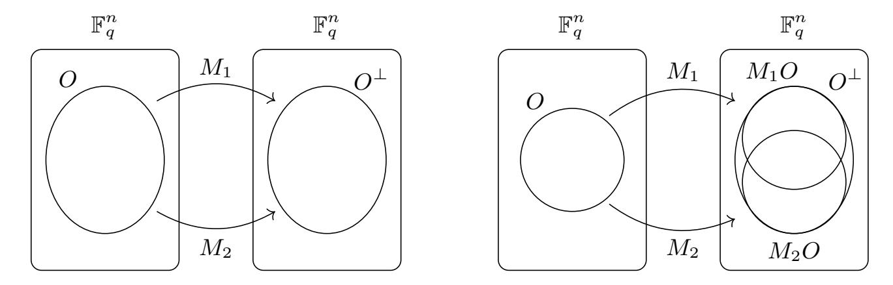
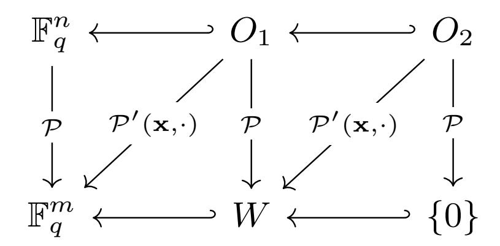

{0}------------------------------------------------

# Improved cryptanalysis of UOV and Rainbow

### Ward Beullens

imec-COSIC, KU Leuven, Belgium

Abstract. The contributions of this paper are twofold. First, we simplify the description of the Unbalanced Oil and Vinegar scheme (UOV) and its Rainbow variant, which makes it easier to understand the scheme and the existing attacks. We hope that this will make UOV and Rainbow more approachable for cryptanalysts. Secondly, we give two new attacks against the UOV and Rainbow signature schemes; the intersection attack that applies to both UOV and Rainbow and the rectangular MinRank attack that applies only to Rainbow. Our attacks are more powerful than existing attacks. In particular, we estimate that compared to previously known attacks, our new attacks reduce the cost of a key recovery by a factor of 217, 253, and 273 for the parameter sets submitted to the second round of the NIST PQC standardization project targeting the security levels I, III, and V respectively. For the third round parameters, the cost is reduced by a factor of 220, 240, and 255 respectively. This means all these parameter sets fall short of the security requirements set out by NIST.

## 1 Introduction

The Oil and Vinegar scheme and its Rainbow variant are two of the oldest and most studied signature schemes in multivariate cryptography. The Oil and Vinegar scheme was proposed by Patarin in 1997 [\[16\]](#page-25-0). Soon thereafter, Kipnis and Shamir discovered that the original choice of parameters was weak and could be broken in polynomial time [\[14\]](#page-25-1). However, it is possible to pick parameters differently, such that the scheme resists the Kipnis-Shamir attack. This variant is called the Unbalanced Oil and Vinegar scheme (UOV), and has withstood all cryptanalysis since 1999 [\[13\]](#page-25-2).

The rainbow signature scheme can be seen as multiple layers of UOV stacked on top of each other. This was proposed by Ding and Schmidt in 2005 [\[8\]](#page-25-3). The design philosophy is that by iterating the UOV construction, the Kipnis-Shamir attack becomes less powerful, which allows for a more efficient choice of parameters. However, the additional complexity opened up more attack strategies, such

This work was supported by CyberSecurity Research Flanders with reference number VR20192203 and the Research Council KU Leuven grants C14/18/067 and STG/17/019. Ward Beullens is funded by FWO fellowship 1S95620N.

{1}------------------------------------------------

#### 2 Ward Beullens

as the MinRank attack, the Billet-Gilbert attack [\[3\]](#page-24-0), and the Rainbow Band Separation attack [\[9\]](#page-25-4). Even though our understanding of the complexity of these attacks has been improving over the last decade, there have been no new attacks since 2008.

Multivariate cryptography is believed to resist attacks from adversaries with access to large scale quantum computers, which is why there has been renewed interest in this field of research during recent years. Seven out of the nineteen signature schemes that were submitted to the NIST post-quantum cryptography standardization project were multivariate signature schemes. From those seven schemes, four were allowed to proceed to the second round [\[2,](#page-24-1) [4,](#page-24-2) [17,](#page-25-5) [7\]](#page-25-6), and only the Rainbow submission was selected as a finalist. The UOV scheme was not submitted to the NIST PQC project.

Contributions. As a first contribution, we simplify the description of the UOV and Rainbow schemes. Traditionally, the public key is a multivariate quadratic map P, and the secret key is a factorization P = S ◦ F ◦ T where S and T are invertible linear maps, and F is a so-called central map. Our description avoids the use of a central map and only talks about properties of P instead. This new perspective makes it easier to understand the scheme and the existing attacks.

Secondly, we introduce two new key-recovery attacks: the intersection attack and the rectangular MinRank attack. The intersection attack relies on the idea behind the Kipnis-Shamir attack and applies to both the UOV scheme and the Rainbow scheme. The rectangular MinRank attack reduces key recovery to an instance of the MinRank problem. In this problem the task is, given a number of matrices, to find a linear combination of these matrices with exceptionally low rank. When Ding and Schmidt designed the Rainbow scheme in 2005 they were already aware that Rainbow was susceptible to MinRank attacks. However, our new attack shows that there was another instance of the MinRank problem lurking in the Rainbow public keys that went undiscovered until now. We call our attack the rectangular MinRank attack because unlike previous attacks, the matrices in the new MinRank instance are rectangular instead of square.

Roadmap. After giving some necessary background in Sect. [2,](#page-2-0) we introduce our simplified description of the Oil and Vinegar scheme and the existing attacks in Sect. [3.](#page-4-0) In Sect. [4](#page-9-0) we introduce our intersection attack on UOV. In Sect. [5](#page-12-0) we give a simplified description of the Rainbow scheme, and we review the existing attacks. The following sections [6](#page-16-0) and [7](#page-19-0) introduce the intersection attack for Rainbow and the rectangular MinRank attack respectively. We conclude in Sect. [8](#page-23-0) with an overview of our attack complexities and new parameter sets for UOV and Rainbow.

{2}------------------------------------------------

### 2 Preliminaries

#### 2.1 Notation.

For a vector space  $V \subset K^n$  over a field K, we define its orthogonal complement  $V^{\perp}$  as the space of vectors that are orthogonal to all the vectors in V, i.e.  $V^{\perp} = \{\mathbf{w} | \langle \mathbf{w}, \mathbf{v} \rangle = 0, \forall \mathbf{v} \in V\}$ . For a linear subspace  $W \subset V$ , we denote by V/W the quotient space of V by W. This is the vector space whose elements are the cosets of W in V:

$$V/W = \{ \overline{\mathbf{x}} := \mathbf{x} + W \mid \mathbf{x} \in V \} .$$

Let  $\mathbf{x} = x_1, \dots, x_{n_x}$  and  $\mathbf{y} = y_1, \dots, y_{n_y}$  be two groups of variables in  $\mathbb{F}_q$ . We denote by  $\mathcal{M}(a, b)$  the number of monomial functions of degree a in the  $\mathbf{x}$  variables and degree b in the  $\mathbf{y}$  variables. We denote by  $\overline{\mathcal{M}}(a, b)$  the number of monomial functions of degree at most a in  $\mathbf{x}$  and at most b in  $\mathbf{y}$ . If a and b are lower than a we have

$$\mathcal{M}(a,b) = \binom{a+n_x-1}{a} \binom{b+n_y-1}{b} \text{ and } \overline{\mathcal{M}}(a,b) = \binom{a+n_x}{a} \binom{b+n_y}{b}$$

#### 2.2 Multivariate quadratic maps

The central object in Multivariate Quadratic cryptography is the multivariate quadratic map. A multivariate quadratic map  $\mathcal{P}$  with m components and n variables is a sequence  $p_1(\mathbf{x}), \dots, p_m(\mathbf{x})$  of m multivariate quadratic polynomials in n variables  $\mathbf{x} = (x_1, \dots, x_n)$ , with coefficients in a finite field  $\mathbb{F}_q$ .

To evaluate the map  $\mathcal{P}$  at a value  $\mathbf{a} \in \mathbb{F}_q^n$ , we simply evaluate each of its component polynomials in  $\mathbf{a}$  to get a vector  $\mathbf{b} = (b_1 = p_1(\mathbf{a}), \dots, b_m = p_m(\mathbf{a}))$  of m output elements. We denote this by  $\mathcal{P}(\mathbf{a}) = \mathbf{b}$ .

**MQ problem** The main source of computational hardness for multivariate cryptosystems is the Multivariate Quadratic (MQ) problem. Given a multivariate quadratic map  $\mathcal{P}: \mathbb{F}_q^n \to \mathbb{F}_q^m$ , and given a target  $\mathbf{t} \in \mathbb{F}_q^m$ , the MQ problem asks to find a solution  $\mathbf{s}$  such that  $\mathcal{P}(\mathbf{s}) = \mathbf{t}$ . This problem is NP-hard, and it is believed to be exponentially hard on average, even for quantum adversaries. Currently, the best algorithms to solve instances of this problem (for cryptographically relevant parameters) are algorithms such as  $F_4/F_5$  or XL that use a Gröbner-basis-like approach [10, 5].

**Polar forms.** For a multivariate quadratic polynomial  $p(\mathbf{x})$ , we can define its polar form

$$p'(\mathbf{x}, \mathbf{y}) := p(\mathbf{x} + \mathbf{y}) - p(\mathbf{x}) - p(\mathbf{y}) + p(0).$$

Similarly, for a multivariate quadratic map  $\mathcal{P}(\mathbf{x}) = p_1(\mathbf{x}), \dots, p_m(\mathbf{x})$ , we define its polar form as  $\mathcal{P}'(\mathbf{x}, \mathbf{y}) = p_1'(\mathbf{x}, \mathbf{y}), \dots, p_m'(\mathbf{x}, \mathbf{y})$ . This polar form will allow

{3}------------------------------------------------

us to simplify the descripion of the UOV and Rainbow schemes, and will play a major role in the attacks on UOV and Rainbow. The multivariate quadratic maps of interest in this paper are homogenous, so we will often omit the  $\mathcal{P}(0)$  term.

**Theorem 1.** Given a multivariate quadratic map  $\mathcal{P}(\mathbf{x}) : \mathbb{F}_q^n \to \mathbb{F}_q^m$ , its polar form  $\mathcal{P}'(\mathbf{x}, \mathbf{y}) : \mathbb{F}_q^n \times \mathbb{F}_q^n \to \mathbb{F}_q^m$  is a symmetric and bilinear map.

*Proof.* We can write  $p(\mathbf{x}) = \mathbf{x}^{\top} Q \mathbf{x} + \mathbf{v} \cdot \mathbf{x} + c$ , where Q is an upper triangular matrix that contains the coefficients of the quadratic coefficients of p, where  $\mathbf{v}$  contains the coefficients of the linear terms of  $p(\mathbf{x})$ , and where c is the constant term of  $p(\mathbf{x})$ . Then we have

$$p'(\mathbf{x}, \mathbf{y}) := p(\mathbf{x} + \mathbf{y}) - p(\mathbf{x}) - p(\mathbf{y}) + p(0)$$

$$= (\mathbf{x} + \mathbf{y})^{\top} Q(\mathbf{x} + \mathbf{y}) - \mathbf{y}^{\top} Q \mathbf{y} - \mathbf{x}^{\top} Q \mathbf{x} + \mathbf{v} \cdot (\mathbf{x} + \mathbf{y}) - \mathbf{v} \cdot \mathbf{x} - \mathbf{v} \cdot \mathbf{y}$$

$$= \mathbf{x}^{\top} Q \mathbf{y} + \mathbf{y}^{\top} Q \mathbf{x}$$

$$= \mathbf{x}^{\top} (Q + Q^{\top}) \mathbf{y}.$$

#### 2.3 Solving MinRank with Support Minors Modeling

The MinRank problem asks, given k matrices  $L_1, \dots, L_k$  with n rows and m columns and a target rank r, to find coefficients  $y_i \in \mathbb{F}_q$  for i from 1 to k, not all zero, such that the linear combination  $\sum_{i=1}^k y_i L_i$  has rank at most r.

Recently, Bardet *et al.* introduced the Support Minors Modeling algorithm for solving this problem [1]. Let  $\mathbf{y} \in \mathbb{F}_q^k$  be a solution, and let C be a matrix whose rows form a basis for the rowspan of  $L_{\mathbf{y}} = \sum_{i=1}^k y_i L_i$ . For each subset  $S \subset \{1, \dots, m\}$  of size |S| = r, let  $c_S$  be the determinant of the r-by-r submatrix of C whose columns are the columns of C with index in S.

The Support Minors Modeling approach considers for each  $j \in \{1, \dots, n\}$  the matrix

$$C_j = \begin{pmatrix} r_j \\ C \end{pmatrix} ,$$

where  $r_j$  is the j-th row of  $L_{\mathbf{y}}$ . Then the rank of  $C_j$  is at most r, which implies that all its (r+1)-by-(r+1) minors vanish. Using cofactor expansion on the first row, each minor gives a bilinear equation in the  $y_i$  variables and the  $c_S$  variables. The Support Minors Modeling algorithm then uses the XL algorithm to find a solution to this system of  $n\binom{m}{r+1}$  bilinear equations.

Analysis. The attack constructs the Macaulay matrix  $M_b$  at bi-degree (b, 1), a large sparse matrix, whose columns correspond to the monomials of degree b in the  $y_i$  variables, and of degree 1 in the  $c_S$  variables. So at degree (b, 1), the matrix has  $\mathcal{M}(b, 1)$  columns. The rows of the matrix contain the degree (b, 1) polynomials of the form  $\mu(\mathbf{y}) \cdot f(\mathbf{y}, \mathbf{c})$ , where  $\mu(\mathbf{y})$  is a monomial of degree b-1,

{4}------------------------------------------------

and  $f(\mathbf{y}, \mathbf{c})$  is one of the bilinear equations of the Support Minors Modeling system. The goal of the attack is then to use the Wiedemann algorithm to find a non-trivial solution to the linear system  $M_b \mathbf{x} = 0$ , so that  $\mathbf{x}$  reveals a solution to the MinRank problem. This approach works if the rank of  $M_b$  is  $\mathcal{M}(b,1) - 1$ , so that there is only a one-dimensional solution space that corresponds to the unique (up to a scalar) solution of the MinRank problem.

Bardet et al. calculate that whenever b < r + 2, the rank of the Macaulay matrix is

$$R_{k,n,m,r}(b) = \sum_{i=1}^{b} (-1)^{i+1} \binom{m}{r+i} \binom{n+i-1}{i} \binom{k+b-i-1}{b-i}, \qquad (1)$$

unless  $R_{k,n,m,r}(b') > \mathcal{M}(b',1) - 1$  for some  $b' \leq b$ , in which case the rank is equal to  $\mathcal{M}(b,1) - 1$ . This allows to calculate for which b the attack will succeed.

If  $b_{min}$  is the smallest integer for which the attack will succeed, then solving the XL system with the Wiedemann algorithm requires

$$3\mathcal{M}(b_{min},1)^2(r+1)k$$

field multiplications. Bardet *et al.* found that it is often advantageous to ignore a number of columns of the  $L_i$  matrices and only consider the first m' columns of the matrices, for some optimal value of m' in the range [r+1, m]. For more details on the Support Minors Modeling algorithm, we refer to [1].

### 3 The UOV signature scheme

The Oil and Vinegar signature scheme, introduced in 1997 by Patarin [16], is based on an elegant MQ-based trapdoor function. The trapdoor function is a multivariate quadratic map  $\mathcal{P}: \mathbb{F}_q^n \to \mathbb{F}_q^m$  for which it is assumed that finding preimages (i.e. solving the MQ problem) is hard. However, if one knows some extra information (called the trapdoor), then it is easy to find preimages for any arbitrary output. Originally, Patarin proposed to use the system with n=2m. This parameter choice was cryptanalyzed by Kipnis and Shamir [14], which is why current proposals use n>2m. This is known as the Unbalanced Oil and Vinegar (UOV) signature scheme.

The UOV signature scheme is created from the UOV trapdoor function with the Full Domain Hash approach: The public key is the trapdoor function  $\mathcal{P}$ :  $\mathbb{F}_q^n \to \mathbb{F}_q^m$ , the secret key contains the trapdoor information, and a signature on a message M is simply an input  $\mathbf{s}$  such that  $\mathcal{P}(\mathbf{s}) = \mathcal{H}(M||\mathbf{salt})$ , where  $\mathcal{H}$  is a cryptographic hash function that outputs elements in the range of  $\mathcal{P}$  and where salt is a fixed-length bit string chosen uniformly at random for every signature. Therefore, to understand the UOV signature scheme, we only need to understand how the UOV trapdoor function works.

{5}------------------------------------------------

#### 3.1 UOV trapdoor function

The UOV trapdoor function is a multivariate quadratic map  $\mathcal{P}: \mathbb{F}_q^n \to \mathbb{F}_q^m$  that vanishes on a secret linear subspace  $O \subset \mathbb{F}_q^n$  of dimension  $\dim(O) = m$ , i.e.

$$\mathcal{P}(\mathbf{o}) = 0$$
 for all  $\mathbf{o} \in O$ .

The trapdoor information is nothing more than a description of O. To generate the trapdoor function one first picks the subspace O uniformly at random and then one picks  $\mathcal{P}$  uniformly at random from the set of multivariate quadratic maps with m components in n variables that vanish on O. Note that on top of the  $q^m$  "artificial" zeros in the subspace O, we expect roughly  $q^{n-m}$  "natural" zeros that do not lie in O.

Given a target  $\mathbf{t} \in \mathbb{F}_q^m$ , how do we use this trapdoor to find  $\mathbf{x} \in \mathbb{F}_q^n$  such that  $\mathcal{P}(\mathbf{x}) = \mathbf{t}$ ? To do this, one picks a vector  $\mathbf{v} \in \mathbb{F}_q^n$  and solves the system  $\mathcal{P}(\mathbf{v} + \mathbf{o}) = \mathbf{t}$  for a vector  $\mathbf{o} \in O$ . This can simply be done by solving a linear system for  $\mathbf{o}$ , because

$$\mathcal{P}(\mathbf{v} + \mathbf{o}) = \underbrace{\mathcal{P}(\mathbf{v})}_{\text{fixed by choice of } \mathbf{v}} + \underbrace{\mathcal{P}(\mathbf{o})}_{=0} + \underbrace{\mathcal{P}'(\mathbf{v}, \mathbf{o})}_{\text{linear function of } \mathbf{o}} = \mathbf{t}$$
.

With probability roughly 1 - 1/q over the choice of  $\mathbf{v}$  the linear map  $\mathcal{P}'(\mathbf{v}, \cdot)$  will be non-singular, in which case the linear system  $\mathcal{P}(\mathbf{v} + \mathbf{o}) = \mathbf{t}$  has a unique solution. If this is not the case, one can simply pick a new value for  $\mathbf{v}$  and try again.

#### 3.2 Traditional description of UOV

Traditionally, the UOV signature is described as follows: The secret key is a pair  $(\mathcal{F}, \mathcal{T})$ , where  $\mathcal{T} \in GL(n, q)$  is a random invertible linear map, and  $\mathcal{F} : \mathbb{F}_q^n \to \mathbb{F}_q^m$  is the so-called central map, whose components  $f_1, \dots, f_m$  are chosen uniformly at random of the form

$$f_i(\mathbf{x}) = \sum_{i=1}^n \sum_{j=i}^{n-m} \alpha_{i,j} x_i x_j.$$

Note that the second sum only runs from i to n-m. So all the terms have at least one variable in  $x_1, \dots, x_{n-m}$ .

The public key that corresponds to  $(\mathcal{F}, \mathcal{T})$  is the multivariate quadratic map  $\mathcal{P} = \mathcal{F} \circ \mathcal{T}$ . To sign a message M, the strategy is to first solve for  $\mathbf{s}' \in \mathbb{F}_q^n$  such that  $\mathcal{F}(\mathbf{s}') = \mathcal{H}(M)$ , and then the final signature is  $\mathbf{s} = \mathcal{T}^{-1}(\mathbf{s}')$ , such that  $\mathcal{P}(\mathbf{s}) = \mathcal{F}(\mathbf{s}') = \mathcal{H}(M)$ .

The description in Sect. 3.1 is just a slightly different way of thinking about the same scheme. In particular, the distribution of public keys for this signature scheme is the same: The central map  $\mathcal{F}$  is chosen uniformly from the set of maps

{6}------------------------------------------------

that vanish on the m-dimensional space of vectors O0 that consists of all the vectors whose first n−m entries are zero, i.e. O0 = {v | vi = 0 for all i ≤ n−m}. After composing with T , we get a public key P = F ◦ T that vanishes on some secret linear subspace O = T −1 (O0 ).

### 3.3 Attacks on UOV

A straightforward approach to attack the UOV signature scheme is to completely ignore the existence of the oil subspace and directly try to solve the system P(x) = H(M||salt) to produce a signature for the message M. This can be done with a Gr¨obner basis-like approach such as XL or F4/F5 [\[10,](#page-25-7) [5\]](#page-24-3). This is called a direct attack.

More interestingly, the attacker can first try to find the oil space O. After O is found, the attacker can sign any message as if he was a legitimate signer. Two attacks in the literature take this approach.

Reconciliation attack. The reconciliation attack was developed by Ding et al. as a stepping stone towards the Rainbow Band Separation (RBS) attack on Rainbow [\[9\]](#page-25-4). As an attack on UOV, the reconciliation attack is not very useful, since it never outperforms a direct attack on UOV for properly chosen parameters. Nevertheless, we describe the attack here, since it can also be seen as a precursor to our intersection attack of Sect. [4.](#page-9-0)

The attack tries to find a vector o ∈ O by solving the system P(o) = 0. We know that dim(O) = m, so if we impose m affine constraints on the entries of o, we still expect a unique solution o ∈ O.

If n − m ≤ m, then we expect P(o) = 0 to have a unique solution after fixing m entries of o. This is a system of m equations in fewer than m variables, so solving this system is more efficient than a direct attack.

If n − m > m then P(o) = 0 will have a lot of solutions, only one of which corresponds to an o ∈ O. Enumerating all the solutions is too costly, and the attack will not outperform a direct attack. We can try to solve the following system to find multiple vectors o1, · · · , ok in O simultaneously:

$$\begin{cases} \mathcal{P}(\mathbf{o}_i) = 0 & \forall i \in \{1, \dots, k\} \\ \mathcal{P}'(\mathbf{o}_i, \mathbf{o}_j) = 0 & \forall i < j \in \{1, \dots, k\} \end{cases}.$$

However, this increases the number of variables that appear in the system, and therefore the attack will usually not outperform a direct attack.

{7}------------------------------------------------

Once a first vector in O is found, finding subsequent vectors is much easier. If  $\mathbf{o}$  is the first vector that we found, then a second vector  $\mathbf{o}' \in O$  will satisfy

$$\begin{cases} \mathcal{P}(\mathbf{o}') = 0 \\ \mathcal{P}'(\mathbf{o}, \mathbf{o}') = 0 \end{cases},$$

which means we get m linear equations on  $\mathbf{o}'$  for free. Therefore, the complexity of the attack is dominated by the complexity of finding the first vector in O.

**Kipnis-Shamir attack.** Historically, the first attack on the OV signature scheme was given by Kipnis and Shamir [14]. The basic version of this attack works when n = 2m, which was the case for the parameter sets initially proposed by Patarin.

Attack if  $\mathbf{n} = 2\mathbf{m}$ . The attack looks at the m components of  $\mathcal{P}'(\mathbf{x}, \mathbf{y})$ . Each component  $p'_i(\mathbf{x}, \mathbf{y}) = p_i(\mathbf{x} + \mathbf{y}) - p_i(\mathbf{x}) - p_i(\mathbf{y})$ , defines a matrix  $M_i$  such that  $p'_i(\mathbf{x}, \mathbf{y}) = \mathbf{x}^{\top} M_i \mathbf{y}$ . Kipnis and Shamir observed the following useful property of  $M_i$ .

**Lemma 2.** For each  $i \in \{1, \dots, m\}$ , we have that  $M_iO \subset O^{\perp}$ . That is, each  $M_i$  sends O into its own orthogonal complement  $O^{\perp}$ .

*Proof.* For any  $\mathbf{o}_1, \mathbf{o}_2 \in O$  we need to prove that  $\langle \mathbf{o}_2, M_i \mathbf{o}_1 \rangle = 0$ . This follows from the assumption that  $p_i$  vanishes on O:

$$\langle \mathbf{o}_2, M_i \mathbf{o}_1 \rangle = \mathbf{o}_2^{\top} M_i \mathbf{o}_1 = p_i'(\mathbf{o}_1, \mathbf{o}_2) = p_i(\mathbf{o}_1 + \mathbf{o}_2) - p_i(\mathbf{o}_1) - p_i(\mathbf{o}_2) = 0.$$

If n = 2m, then  $\dim(O^{\perp}) = n - m = m$ , so if  $M_i$  is nonsingular (which happens with high probability1), then Lemma 2 turns into an equality  $M_iO = O^{\perp}$ . This means that for any pair of invertible  $M_i, M_j$ , we have that  $M_j^{-1}M_iO = O$ , i.e. that O is an invariant subspace of  $M_j^{-1}M_i$ . It turns out that finding a common invariant subspace of a large number of linear maps can be done in polynomial time, so this gives an efficient algorithm for finding O. For more details we refer to [14]

Remark 3. Note that, as a map from  $\mathbb{F}_q^n$  to itself,  $M_i$  implicitly depends on a choice of basis for  $\mathbb{F}_q^n$ . A more natural approach would be to define  $M_i$  as a map from  $\mathbb{F}_q^n$  to its dual  $\mathbb{F}_q^{n\vee}$  given by  $\mathbf{x}\mapsto p_i'(\mathbf{x},\cdot)$ . Lemma 2 would then say

In fields of characteristic 2 and in case n is odd, the  $M_i$  are never invertible, because  $M_i$  is skew-symmetric and with zeros on the diagonal and therefore has even rank. (Recall that  $M_i = Q_i + Q_i^{\perp}$  as in the proof of Theorem 1.) To avoid this case we can always set one of the variables to zero. This has the effect of reducing n by one (which gets us back to the case where n is even), and it also reduces the dimension of O by one, which makes the attack slightly less powerful. Since this trick is always possible, we will assume that n is even in the remainder of the paper.

{8}------------------------------------------------

 $M_iO \subset O^0$ , where  $O^0 \subset \mathbb{F}_q^{n\vee}$  is the annihilator of O. We chose not to take this approach to avoid the dual vector space and annihilators, which some readers might not be familiar with.

**Fig. 1.** Behavior of O under  $M_1$  and  $M_2$ , in case n = 2m (on the left) and 2m < n < 3m (on the right).

Attack if n > 2m. If n > 2m, then it is still the case that  $M_i$  sends O into  $O^{\perp}$ , but because  $\dim(O^{\perp}) = n - m > m = \dim(O)$  the equality  $M_iO = M_jO$  may no longer hold. Therefore,  $M_i^{-1}M_j$  is no longer guaranteed to have O as an invariant subspace and the basic attack fails. However, even though in general  $M_iO \neq M_jO$ , they still have an unusually large intersection (see Figure 1):  $M_iO$  and  $M_jO$  are both subspaces of  $O^{\perp}$ , so their intersection has dimension at least  $\dim(M_iO) + \dim(M_jO) - \dim(O^{\perp}) = 3m - n$ . Kipnis et al. [13] realized that this means that vectors in O are more likely to be eigenvectors of  $M_i^{-1}M_i$ .

Heuristically, for  $\mathbf{x} \in O$ , the probability that it gets mapped by  $M_i$  to some point in the intersection  $M_iO \cap M_iO$  is approximately

$$\frac{|M_iO\cap M_jO|}{|M_iO|}=q^{2m-n}.$$

If this happens, then the probability that  $M_j^{-1}$  maps  $M_i \mathbf{x}$  back to a multiple of  $\mathbf{x}$  is expected to be  $(q-1)/|O| \approx q^{1-m}$ . Therefore, we can estimate that the probability that a vector in O is an eigenvector of  $M_j^{-1}M_i$  is approximately  $q^{1+m-n}$ , and the expected number of eigenvectors in O is therefore  $q^{1+2m-n}$ .

The same analysis holds when you replace  $M_i$  and  $M_j$  by arbitrary invertible linear combinations of the  $M_i$ . The attacker can repeatedly compute the eigenvectors of  $F^{-1}G$ , where F and G are random invertible linear combinations of the  $M_i$ . After  $q^{n-2m}$  attempts he can expect to find a vector in O (he can verify whether a given eigenvector  $\mathbf{x}$  is in O by checking that  $\mathcal{P}(\mathbf{x}) = 0$ ). The complexity of the attack is  $\tilde{O}(q^{n-2m})$ , so the attack runs in polynomial time if n = 2m,

{9}------------------------------------------------

but quickly becomes infeasible for unbalanced instances of the OV construction2. For more details on the attack, we refer to [13].

### 4 Intersection attack on UOV

In this section, we introduce a new attack that uses the ideas behind the Kipnis-Shamir attack, in combination with a system-solving approach such as in the reconciliation attack. We first describe a basic version of the attack that works as long as n < 3m. Then we also give a more efficient version of the attack that works if n < 2.5m.

#### 4.1 Attack if n < 3m

Like in the Kipnis-Shamir attack, we consider for each  $i \in \{1, \dots, m\}$  the matrix  $M_i$  such that  $p_i'(\mathbf{x}, \mathbf{y}) = \mathbf{x}^\top M_i \mathbf{y}$ , and we choose two indices  $i, j \in \{1, \dots, m\}$  such that  $M_i$  and  $M_j$  are invertible matrices. The goal of our attack is to find a vector  $\mathbf{x}$  in the intersection  $M_iO \cap M_jO$ . Recall from Sect. 3.3 that this intersection has dimension at least 3m-n, so non-trivial solutions exist if n < 3m.

If **x** is in the intersection  $M_iO \cap M_jO$ , then both  $M_i^{-1}\mathbf{x}$  and  $M_j^{-1}\mathbf{x}$  are in O. Therefore, **x** is a solution to the following system of quadratic equations

$$\begin{cases} \mathcal{P}(M_i^{-1}\mathbf{x}) = 0 \\ \mathcal{P}(M_j^{-1}\mathbf{x}) = 0 \\ \mathcal{P}'(M_i^{-1}\mathbf{x}, M_j^{-1}\mathbf{x}) = 0 \end{cases}$$
 (2)

Since there is a 3m-n dimensional subspace of solutions, we can impose 3m-n affine constraints on  $\mathbf{x}$ , so that we expect a unique solution. The attack is then to simply use the XL algorithm to find a solution to this system of 3m quadratic equations in n-(3m-n)=2n-3m variables.

Once  $\mathbf{x}$  is found, we know 2 vectors  $M_i^{-1}\mathbf{x}$  and  $M_j^{-1}\mathbf{x}$  in O, and the remaining vectors in O can be found more easily with the approach described in Sect. 3.3.

#### 4.2 Attack when n < 2.5m

If n is small enough compared to m we can make the attack more efficient by solving for an  $\mathbf{x}$  in the intersection of more than 2 subspaces  $M_iO$  at the same time. Suppose  $n < \frac{2k-1}{k-1}m$  for an integer  $k \geq 1$ , and let  $L_1, \dots, L_k$  be krandomly chosen invertible linear combinations of the  $M_i$ , then the intersection  $L_1O \cap \dots \cap L_kO$  will have dimension at least km - (k-1)(n-m) > 0, which

The  $\tilde{O}$ -notation ignores polynomial factors.

{10}------------------------------------------------

means there is a nonzero  $\mathbf{x}$  such that  $L_i^{-1}\mathbf{x} \in O$  for all i from 1 to k. We can then solve the following system of equations:

$$\begin{cases}
\mathcal{P}(L_i^{-1}\mathbf{x}) = 0, & \forall i \in \{1, \dots, k\} \\
\mathcal{P}'(L_i^{-1}\mathbf{x}, L_j^{-1}\mathbf{x}) = 0, & \forall i < j \in \{1, \dots, k\}
\end{cases}$$
(3)

We expect to find a unique solution after imposing km - (k-1)(n-m) linear conditions on  $\mathbf{x}$  to random values, so the complexity of the attack is dominated by the complexity of solving a system of  $\binom{k+1}{2}m$  quadratic equations in nk - (2k-1)m variables.

Remark 4. Note that in the case n=2m the requirement  $n<\frac{2k-1}{k-1}m$  is satisfied for every k>1. If we pick  $k\approx \sqrt{m}$ , then we have more than  $\binom{m+1}{2}$  equations in m variables, which means we can linearize the system and solve it with Gaussian elimination in polynomial time. This is not surprising, because Kipnis and Shamir have already shown that UOV can be broken in polynomial time if n=2m.

### 4.3 Complexity analysis of the attack

We noticed that the equations of system (3) are not linearly independent: even though there are  $\binom{k+1}{2}m$  equations they only span a subspace of dimension  $\binom{k+1}{2}m - 2\binom{k}{2}$ . This is because if we have  $L_i = \sum_{l=1}^m \alpha_{il} M_i$ , for all i from 1 to k, then for all  $1 \le i < j \le k$  we have

$$\sum_{l=1}^{m} \alpha_{il} \mathcal{P}'_l(L_i^{-1} \mathbf{x}, L_j^{-1} \mathbf{x}) = \sum_{l=1}^{m} \alpha_{il} (L_i^{-1} \mathbf{x})^{\perp} M_l L_j^{-1} \mathbf{x})$$
$$= (L_i^{-1} \mathbf{x})^{\perp} L_i L_j^{-1} \mathbf{x})$$
$$= \mathbf{x}^{\perp} L_j^{-1} \mathbf{x} = \sum_{l=1}^{m} \alpha_{jl} \mathcal{P}_l(L_j^{-1} \mathbf{x})$$

Similarly, we have

$$\sum_{l=1}^{m} \alpha_{jl} \mathcal{P}'_l(L_i^{-1} \mathbf{x}, L_j^{-1} \mathbf{x}) = \mathbf{x}^{\perp} L_i^{-1} \mathbf{x} = \sum_{l=1}^{m} \alpha_{il} \mathcal{P}_l(L_i^{-1} \mathbf{x}),$$

so for each choice of  $0 \le i < j \le k$  there are two linear dependencies between the equations of system (3). This explains why they only span a subspace of dimension  $\binom{k+1}{2}m - 2\binom{k}{2}$ .

Our experiments show that, after removing the  $2\binom{k}{2}$  redundant equations, the systems (2) and (3) behave like random systems of  $M = \binom{k+1}{2}m-2\binom{k}{2}$  quadratic equations in N = nk - (2k-1)m variables. For some small UOV systems, we computed the ranks of the Macaulay matrices at various degrees, and we found that they exactly match the ranks of generic systems (see Table 1). That is, at

{11}------------------------------------------------

degree d, the rank is equal to the coefficient of  $t^d$  in the power series expansion of

$$\frac{1 - (1 - t^2)^M}{(1 - t)^{N+1}} \,,$$

assuming that this coefficient does not exceed the number of columns of the Macaulay matrix.

We can use the standard methodology for estimating the complexity of system solving with an XL Wiedemann approach as

$$3\binom{N+d_{reg}}{d_{reg}}^2\binom{N+2}{2}$$

field multiplications, where the degree of regularity  $d_{reg}$  is the first d such that the coefficient of  $t^d$  in

$$\frac{(1-t^2)^M}{(1-t)^{N+1}}$$

is non-positive [7].

**Table 1.** The rank and the number of columns of the Macaulay matrices for the system of equations of the intersection attack. The rank at degree d always matches the coefficients of  $t^d$  the corresponding generating function, except if the coefficient is larger or equal to the number of columns. In this case (marked by boldface in the table) the rank equals the number of columns minus 1, and the XL system can be solved at that degree d.

| pa | ramet | ers |          | Mac | Generating |                 |       |                                           |      |    |     |     |      |                  |
|----|-------|-----|----------|-----|------------|-----------------|-------|-------------------------------------------|------|----|-----|-----|------|------------------|
| n  | m     | k   |          | d=2 | d = 3      | d = 4           | d = 5 | function                                  |      |    |     |     |      |                  |
| 8  | 4     | 2   | Rank     | 10  | <b>34</b>  | $\overline{34}$ |       | $\frac{1-(1-t^2)^{10}}{(1-t)^5}$          |      |    |     |     |      |                  |
| O  | 4     | ۷   | #Columns | 15  | 35         |                 |       | $(1-t)^{\frac{5}{5}}$                     |      |    |     |     |      |                  |
| 10 | 4     | 2   | Rank     | 10  | 90         | 405             | 1245  | $\frac{1 - (1 - t^2)^{10}}{(1 - t)^9}$    |      |    |     |     |      |                  |
| 10 | 4     | 2   | #Columns | 45  | 165        | 495             | 1287  | $(1-t)^{9}$                               |      |    |     |     |      |                  |
| 12 | 5     | 2   | Rank     | 13  | 130        | 673             | 2001  | $\frac{1 - (1 - t^2)^{13}}{(1 - t)^{10}}$ |      |    |     |     |      |                  |
| 14 | 9     |     | #Columns | 55  | 220        | 715             | 2002  | $(1-t)^{10}$                              |      |    |     |     |      |                  |
| 12 | 5     | 3   | Rank     | 24  | 288        | 1364            |       | $1-(1-t^2)^{24}$                          |      |    |     |     |      |                  |
| 12 | 9     | 9   | #Columns | 78  | 364        | 1365            |       | $\frac{1 - (1 - t^2)^{24}}{(1 - t)^{12}}$ |      |    |     |     |      |                  |
| 14 | 14 6  | 2   | 2        | 2   | 2          | 2               | 2     | 2                                         | Rank | 16 | 176 | 936 | 3002 | $1-(1-t^2)^{16}$ |
| 14 | U     |     | #Columns | 66  | 286        | 1001            | 3003  | $\frac{1 - (1 - t^2)^{16}}{(1 - t)^{11}}$ |      |    |     |     |      |                  |
| 14 | 6     | 3   | Rank     | 30  | 390        | 1819            |       | $1-(1-t^2)^{30}$                          |      |    |     |     |      |                  |
| 14 | O     | 3   | #Columns | 91  | 455        | 1820            |       | $\frac{1 - (1 - t^2)^{30}}{(1 - t)^{13}}$ |      |    |     |     |      |                  |

Concrete costs To demonstrate that the new attack is more efficient than existing attacks, we apply it to the UOV parameters proposed by Czypek et

{12}------------------------------------------------

al. [6]. They proposed to use q = 256, n = 103, m = 44, targeting 128 bits of security. More precisely, they estimate that the direct attack requires  $2^{130}$  field multiplications and that the Kipnis-Shamir attack requires  $2^{136}$  multiplications.

Their parameter choice satisfies n < 2.5m, so we can use the more efficient version of the attack with k = 3 (i.e. where we solve for  $\mathbf{x}$  in the intersection of 3 subspaces of the form  $M_iO$ ). This results in a system of  $M = \binom{3+1}{2}m-2\binom{3}{2}=258$  equations in N = nk - (2k-1)m = 89 variables. The complexity of finding a solution is  $2^{95}$  multiplications ( $d_{reg} = 9$ ), which is lower than the claimed security level of  $2^{128}$  multiplications.

### 5 The Rainbow signature scheme

The Rainbow signature scheme is a variant of the UOV signature scheme proposed in 2004 by Ding and Schmidt [8]. The Rainbow trapdoor function is a multivariate quadratic map  $\mathcal{P}: \mathbb{F}_q^n \to \mathbb{F}_q^m$ . The trapdoor consists of a sequence of nested subspaces  $\mathbb{F}_q^n = O_0 \supset O_1 \supset \cdots \supset O_l$  of the input space, and a sequence of nested subspaces  $\mathbb{F}_q^m = W_0 \supset W_1 \supset \cdots \supset W_l = \{0\}$  of the output space, with  $\dim O_1 = m$ , and  $\dim O_i = \dim W_{i-1}$  for i > 1 and such that the following hold:

- 1.  $\mathcal{P}(\mathbf{x}) \in W_i$  for all  $\mathbf{x} \in O_i$ , and
- 2.  $\mathcal{P}'(\mathbf{x}, \mathbf{y}) \in W_{i-1}$  for all  $\mathbf{x} \in \mathbb{F}_q^n$ , all  $\mathbf{y} \in O_i$ .

Rainbow with one layer (i.e. l=1) is nothing more than UOV. In the rest of the paper, we focus on Rainbow with two layers (i.e. l=2), because this results in the most efficient schemes and because this covers all the parameter sets submitted to the NIST PQC standardization project. In this case, there are 3 secret subspaces:  $O_1, O_2$  and W (see Figure 2). An instantiation of Rainbow is then described by 4 parameters:

- -q: the size of the finite field
- -n: the number of variables
- m: the number of equations in the public key, also the dimension of  $O_1$ .
- $-o_2$ : the dimension of  $O_2$ , also the dimension of W.

Given the trapdoor information (i.e.  $O_1, O_2$  and W), a solution  $\mathbf{s}$  to  $\mathcal{P}(\mathbf{s}) = \mathbf{t}$  can be found with an efficient 2-step algorithm.

1. In the first step, pick  $\mathbf{v} \in \mathbb{F}_q^n$  uniformly at random, and solve for  $\overline{\mathbf{o}}_1 \in O_1/O_2$ , such that  $\mathcal{P}(\mathbf{v} + \overline{\mathbf{o}}_1) + W = \mathbf{t} + W$ . This can be rewritten as

$$\underbrace{\mathcal{P}(\mathbf{v})}_{\text{fixed by choice of }\mathbf{v}} + \underbrace{\mathcal{P}(\overline{\mathbf{o}}_1)}_{\in W} + \underbrace{\mathcal{P}'(\mathbf{v}, \overline{\mathbf{o}}_1)}_{\text{linear in }\mathbf{o}_1} + W = \mathbf{t} + W.$$

This is a system of linear equations in the quotient space  $\mathbb{F}_q^m/W$ , so we can efficiently sample a solution with Gaussian elimination. Note that the system has  $m - \dim W$  constraints and  $m - \dim W$  degrees of freedom, so we expect there to be a unique solution (mod  $O_2$ ) with probability approximately 1 - 1/q. If there is no unique solution we pick a new value of  $\mathbf{v}$  and start over.

{13}------------------------------------------------

**Fig. 2.** The structure of a Rainbow public key with 2 layers. The polar form  $\mathcal{P}'(\mathbf{x},\cdot)$  maps  $O_2$  to W for every  $\mathbf{x} \in \mathbb{F}_q^n$ .

2. In the second step, we solve for  $\mathbf{o}_2 \in O_2$ , such that  $\mathcal{P}(\mathbf{v} + \mathbf{o}_1 + \mathbf{o}_2) = \mathbf{t}$ . Writing it as

$$\underbrace{\mathcal{P}(\mathbf{v} + \mathbf{o}_1) - \mathbf{t}}_{\text{fixed}, \in W} + \underbrace{\mathcal{P}(\mathbf{o}_2)}_{=0} + \underbrace{\mathcal{P}'(\mathbf{v} + \mathbf{o}_1, \mathbf{o}_2)}_{\text{linear in } \mathbf{o}_2, \in W} = 0,$$

we see that this is a system of dim W linear equations (because all the values are in W) in dim W variables, so we expect to find a unique solution with Gaussian elimination with probability 1 - 1/q. If no unique solution exists we return to step 1 with a new guess of  $\mathbf{v}$ .

Remark 5. If we put  $W = \mathbb{F}_q^m$  and  $O_1 = O_2$ , or if we put  $O_2 = \{0\}$  and  $W = \{0\}$  then we get back the original UOV construction.

#### 5.1 Traditional description of Rainbow

Traditionally, a Rainbow public key is generated as  $\mathcal{P} = \mathcal{S} \circ \mathcal{F} \circ \mathcal{T}$ , where  $\mathcal{S} \in GL(m,q)$  and  $\mathcal{T} \in GL(n,q)$  are uniformly random invertible linear maps, and where  $\mathcal{F}(\mathbf{x}) = f_1(\mathbf{x}), \dots, f_m(\mathbf{x})$  is the so-called central map, whose first  $o_1$  components  $f_1(\mathbf{x}), \dots, f_{o_1}(\mathbf{x})$  are of the form

$$f_i(\mathbf{x}) = \sum_{j=1}^{n-o_1} \sum_{k=1}^{n-m} \alpha_{ijk} x_j x_k,$$

and whose remaining components  $f_{o_1+1}(\mathbf{x}), \dots, f_m(\mathbf{x})$  are of the form

$$f_i(\mathbf{x}) = \sum_{j=1}^n \sum_{k=1}^{n-o_1} \alpha_{ijk} x_j x_k.$$

Let  $O'_1$  be the subspace of  $\mathbb{F}_q^n$  consisting of all the vectors whose first n-m entries are zeros, and let  $O'_2$  be the subspace consisting of the vectors whose first

{14}------------------------------------------------

 $n-o_2$  entries are zero. Then all the polynomials in the central map vanish on  $O_2'$ , and the first  $o_1$  polynomials also vanish on  $O_1'$ . In other words,  $\mathcal{F}(O_2') = 0$  and  $\mathcal{F}(O_1') \subset W'$ , where W' is the subspace of  $\mathbb{F}_q^m$  consisting of the vectors whose first  $o_1$  entries are zero. Moreover,  $\mathcal{F}'(\mathbf{x}, \mathbf{y}) \in W'$  for any  $\mathbf{x} \in \mathbb{F}_q^n$  and any  $\mathbf{y} \in O_2$ . Therefore, the central map  $\mathcal{F}$  satisfies the diagram in Figure 2 with the publicly known subspaces  $O_1'$ ,  $O_2'$  and W' taking the roles of  $O_1, O_2$  and W. This means that after composing  $\mathcal{F}$  with secret random linear maps  $\mathcal{S}$  and  $\mathcal{T}$  we obtain a public key  $\mathcal{P} = \mathcal{S} \circ \mathcal{F} \circ \mathcal{T}$  that satisfies the diagram in Figure 2 for uniformy random secret subspaces  $O_1 = \mathcal{T}^{-1}O_1'$ ,  $O_2 = \mathcal{T}^{-1}O_2'$  and  $W = \mathcal{S}^{-1}W'$ .

### 5.2 Rainbow NIST PQC parameter sets

In this paper, we focus on the Rainbow parameter sets that were proposed to the second round and the finals of the NIST PQC standardization project [7]. These parameter sets and the corresponding key and signature sizes are displayed in Table 2.

| Table 2. The Rainbow parameter sets that were submitted to the second round and | $\mathbf{b}$ |
|---------------------------------------------------------------------------------|--------------|
| the finals of the NIST PQC standardization project.                             |              |

| Paran           | Parameters $q n m o_2$ |                  |                  | pk             | sk             | sig                |                   |                  |
|-----------------|------------------------|------------------|------------------|----------------|----------------|--------------------|-------------------|------------------|
| se              |                        |                  |                  | (kB)           | (kB)           | (Bytes)            |                   |                  |
| Second Round | Ia IIIc Vc       | 16 256 256 | 96 140 188 | 64 72 96 | 32 36 48 | 149 710 1705 | 93 511 1227 | 64 156 204 |
| Finals          | Ia                     | 16               | 100              | 64             | 32             | 157                | 101               | 66               |
|                 | IIIc                   | 256              | 148              | 80             | 48             | 861                | 611               | 164              |
|                 | Vc                     | 256              | 196              | 100            | 64             | 1885               | 1376              | 212              |

### 5.3 Attacks on Rainbow

A straightforward method to forge a signature is to simply try to find a solution  $\mathbf{s}$  to the system  $\mathcal{P}(\mathbf{s}) = \mathcal{H}(M||\mathbf{salt})$ . This is called a direct attack. More interesting attacks try to exploit the hidden structure of the Rainbow trapdoor.

**OV** attack. The OV attack of Kipnis and Shamir to find the subspace O in the OV construction can be used against Rainbow to find  $O_2$ . The complexity of the attack is  $\tilde{O}(q^{n-2o_2})$ .

When  $O_2$  is found, it is easy to find W, because

$$\{\mathcal{P}'(\mathbf{x}, \mathbf{y}) \mid \mathbf{x} \in \mathbb{F}_a^n, \mathbf{y} \in O_2\} \subset W$$

{15}------------------------------------------------

and with overwhelming probability this will be an equality. Once W is found, we have reduced the problem to a small UOV instance with parameters  $n' = n - o_2$  and  $m' = m - o_2$ , so the Kipnis and Shamir attack can be used again to find  $O_1$ , with complexity  $\tilde{O}(q^{n'-2m'}) = \tilde{O}(q^{n+o_2-2m})$ , which is negligible compared to the complexity of the first step.

MinRank/HighRank attack. For all  $i \in \{1, \dots, m\}$ , we define  $M_i \in \mathbb{F}_q^{n \times n}$  like we did in the description of the OV attack. For  $\mathbf{v} \in \mathbb{F}_q^m$  we define the linear combination  $M_{\mathbf{v}} := \sum_{i=0}^m v_i M_i$ . Then it follows that  $\langle \mathbf{v}, \mathcal{P}'(\mathbf{x}, \mathbf{y}) \rangle = \mathbf{x}^\top M_{\mathbf{v}} \mathbf{y}$ . The second property of the Rainbow public key says that if  $\mathbf{v} \in W^\perp$ , then  $\langle \mathbf{v}, \mathcal{P}'(\mathbf{x}, \mathbf{y}) \rangle = \mathbf{x}^\top M_{\mathbf{v}} \mathbf{y} = 0$  for all values of  $\mathbf{x}$  and all  $\mathbf{y} \in O_2$ . This implies that  $O_2$  is in the kernel of  $M_{\mathbf{v}}$ , so  $M_{\mathbf{v}}$  has an exceptionally small rank of at most  $n - \dim O_2$ .

The MinRank attack attempts to exploit this property to find a vector in  $W^{\perp}$ . The problem is, given the  $M_i$  for  $i \in \{1, \dots, m\}$ , to find a linear combination of these maps that has rank  $n - \dim O_2$ . This can be done with 2 strategies:

Guessing strategy [12]. Repeatedly pick  $\mathbf{v} \in \mathbb{F}_q^m$ . With probability  $q^{-o_2}$ , we have  $\mathbf{v} \in W^{\perp}$ . To check if a guess is correct, we simply check if the rank of  $M_{\mathbf{v}}$  is at most  $n - \dim O_2$ . The complexity of the attack is  $\tilde{O}(q^{o_2})$ . There is a more efficient version of this attack by Billet and Gilbert, that runs in time  $\tilde{O}(q^{2n-3m+o_2+1})$  [3].

Algebraic strategy. One expresses  $\operatorname{rank}(M_{\mathbf{v}}) \leq n - \dim O_2$  as a system of multivariate polynomial equations in the entries of  $\mathbf{v}$  and uses an algorithm such as XL to find a solution. There exist several methods to translate the rank condition into a system of polynomial equations, such as the Kipnis-Shamir modeling, and Minors modeling [15, 11]. Recently, a more efficient approach by Bardet *et al.* called "Support Minors Modeling" drastically improved the efficiency of this attack (see Sec. 2.3 and [1]). The algebraic approach is asymptotically more efficient than the guessing strategy.

As soon as a single vector  $\mathbf{v} \in W^{\perp}$  is found, the attacker knows  $O_2$ , because it is the kernel of  $M_{\mathbf{v}}$ . Then, once  $O_2$  is known he can finish the key recovery attack as described in the previous section on the UOV attack.

Rainbow band separation attack This attack, proposed by Ding *et al.* [9], tries to simultaneously find a vector  $\mathbf{o} \in O_2$ , and a vector  $\mathbf{v} \in W^{\perp}$ . This gives rise to the following system of equations

$$\begin{cases} \mathcal{P}(\mathbf{o}) = 0 \\ \langle \mathbf{v}, \mathcal{P}'(\mathbf{o}, \mathbf{x}) \rangle = 0, \quad \forall \mathbf{x} \in \mathbb{F}_q^n \end{cases}$$
 (4)

{16}------------------------------------------------

To get a unique solution, we can impose  $o_2$  linear relations on the entries of  $\mathbf{o}$  and  $m-o_2$  linear relations on the entries of  $\mathbf{v}$ . This results in a system with  $n-o_2$  variables for  $\mathbf{o}$  and  $o_2$  variables for  $\mathbf{v}$ , which makes a total of n variables. It looks like we get  $q^n$  bilinear equations (one for each choice of  $\mathbf{x} \in \mathbb{F}_q^n$ ), but these equations are obviously not independent. Extend  $\mathbf{o}$  to a basis  $\mathbf{x}_1 = \mathbf{o}, \mathbf{x}_2, \dots, \mathbf{x}_n$  for  $\mathbb{F}_q^n$  (since we fixed some entries of  $\mathbf{o}$ , we can pick the  $\mathbf{x}_i$  with i > 1 without having to know the precice value of  $\mathbf{o}$ ). We can rewrite system (4) as

$$\begin{cases} \mathcal{P}(\mathbf{o}) = 0 \\ \langle \mathbf{v}, \mathcal{P}'(\mathbf{o}, \mathbf{x}_i) \rangle = 0, \quad \forall i \in \{1, \dots, n\} \end{cases}$$
 (5)

Note that the first bilinear equation is  $\langle \mathbf{v}, \mathcal{P}'(\mathbf{o}, \mathbf{o}) \rangle = 0$ , which is equivalent to  $\langle \mathbf{v}, 2\mathcal{P}(\mathbf{o}) \rangle = 0$ , so this equation is already implied by the  $\mathcal{P}(\mathbf{o}) = 0$  equations. This leaves us with a system of m quadratic equations in  $\mathbf{o}$ , and n-1 bi-linear equations in the entries of  $\mathbf{o}$  and  $\mathbf{v}$ . The complexity of this attack is studied in detail in [18], where they introduce a variant of the XL algorithm that exploits the bi-homogenous structure of the system.

## 6 Intersection attack on Rainbow

In this section we introduce a new key-recovery attack against the Rainbow signature scheme that is similar to our intersection attack on UOV from Sect. 4. Let k be such that  $n < \frac{2k-1}{k-1}o_2$ , and pick invertible matrices  $L_1, \dots, L_k$  from the span of the  $M_i$ . Our goal is to find a vector  $\mathbf{x}$  in the intersection

$$\mathbf{x} \in \bigcap_{i=1}^k L_i O_2.$$

This intersection has dimension at least  $ko_2 - (k-1)(n-o_2) > 0$ , so non-zero vectors in the intersection exist. We could try to find  $\mathbf{x}$  by solving the system (3). However, similar to the RBS attack, we can improve the efficiency of the attack by simultaneously looking for a vector  $\mathbf{v} \in W^{\perp}$ . Let  $\mathbf{e}_1, \dots, \mathbf{e}_n$  be a basis for  $\mathbb{F}_q^n$ , where all the entries of  $\mathbf{e}_i$  are zero, except the *i*-th entry which equals 1. Then we get the following system of quadratic equations:

$$\begin{cases}
\mathcal{P}(L_i^{-1}\mathbf{x}) = 0, & \forall i \in \{1, \dots, k\} \\
\mathcal{P}'(L_i^{-1}\mathbf{x}, L_j^{-1}\mathbf{x}) = 0, & \forall i < j \in \{1, \dots, k\} \\
\langle \mathbf{v}, \mathcal{P}'(L_i^{-1}\mathbf{x}, \mathbf{e}_j) \rangle = 0, & \forall i \in \{1, \dots, k\} \text{ and } \forall j \in \{1, \dots, n\}
\end{cases}$$
(6)

If we impose  $ko_2 - (k-1)(n-o_2)$  affine constraints on the entries of  $\mathbf{x}$ , and  $m-o_2$  affine constraints on the entries of  $\mathbf{v}$  we expect to have a unique solution.

It looks like we get  $\binom{k+1}{2}m$  quadratic equations in the **x** variables and kn equations that are linear in the **x** variables and the **v** variables. However, the quadratic equations are the same set of equations as in the Intersection attack on UOV,

{17}------------------------------------------------

so we know that they give only  $\binom{k+1}{2}m - 2\binom{k}{2}$  linearly independent equations. We can then use the Bilinear XL variant of Smith-Tone and Perlner [18] to find the unique solution to the system of equations.

Remark 6. If we put k = 1 then we recover the Rainbow Band Separation attack (see Sect. 5.3), so our attack can be seen as a generalization of the RBS attack. However, note that previous works have assumed that only n - 1 out of the n bilinear equations are useful. We find that this is not quite correct. Even though there is a syzygy at degree (2,1) (which we will discuss later) it is still useful to consider all n bilinear equations.

### 6.1 Extending to $n \geq 3o_2$

If  $n \geq 3o_3$ , then we expect there to be no non-trivial intersection, so the attack is not guaranteed to succeed with k = 2. However, if we model  $L_1O_2$  and  $L_2O_2$  as uniformly random subspaces of  $O_2^{\perp}$ , then the probability that they intersect non-trivially is approximately  $q^{-n+3o_2-1}$ . Therefore, we can expect the attack to succeed after  $q^{n-3o_2+1}$  guesses for  $(L_1, L_2)$ .

### 6.2 Complexity analysis of the attack

The system of equations (6) is clearly not generic, since the first  $\binom{k+1}{2}m$  equations only contain the entries of  $\mathbf{x}$  as variables, and the remaining k(n-k) equations are bi-linear in the entries of  $\mathbf{x}$  and  $\mathbf{v}$ . This is the same structure as the systems that appear in the RBS attack (Sec. 5.3). Smith-Tone and Perlner investigated the complexity of solving such systems, and they proposed a variant of the XL algorithm that exploits the bi-homogeneous structure of the system [18]. Their algorithm works for systems of polynomial equations in  $n_x + n_y$  variables, where  $m_x$  equations are quadratic in the first  $n_x$  variables, and  $m_{xy}$  equations are bi-linear in the first  $n_x$  and last  $n_y$  variables respectively. Under a maximal rank assumption, their XL variant terminates at bi-degree (A, B) if the coefficient corresponding to  $t^a s^b$  in

$$\frac{(1-t^2)^{m_x}(1-ts)^{m_{xy}}}{(1-t)^{n_x+1}(1-s)^{n_y+1}}\tag{7}$$

is non-positive for some a, b with  $a \leq A$  and  $b \leq B$ . If this is the case, an upper bound for the number of multiplications in the attack is given by

$$3\overline{\mathcal{M}}(A,B)^2 \binom{n_x+2}{2},\tag{8}$$

where  $\overline{\mathcal{M}}(A,B)$  is the number of monomials with bi-degree bounded by (A,B).

{18}------------------------------------------------

The maximal rank assumption is not valid for small instances of Rainbow, because there are  $k^2$  non-trivial syzygies: For each  $(i, j) \in \{1, \dots, k\}^2$  we have

$$\langle \mathbf{v}, \mathcal{P}'(L_i^{-1}\mathbf{x}, L_j^{-1}\mathbf{x}) \rangle = \sum_{l=1}^m v_l \cdot \mathcal{P}'_l(L_i^{-1}\mathbf{x}, L_j^{-1}\mathbf{x})$$
$$= \sum_{t=1}^m \langle \mathbf{v}, \mathcal{P}'(L_i^{-1}\mathbf{x}, \mathbf{e}_t) \rangle \cdot (L_j^{-1}\mathbf{x})_t,$$

which gives a non-trivial syzygy for the system (6) at bi-degree (2,1).

Since adding an equation with bi-degree (a, b) to the polynomial system corresponds to an extra factor  $(1 - t^a s^b)$  in the generating function (7), it seems natural that a syzygy at degree (a, b) results in a factor  $(1 - t^a s^b)^{-1}$ . We therefore conjecture that the generating function for the system (6) is

$$\frac{(1-t^2)^{m_x}(1-ts)^{m_{xy}}(1-t^2s)^{-k^2}}{(1-t)^{n_x+1}(1-s)^{n_y+1}}$$
(9)

where

$$n_x = \min(nk - (2k - 1)o_2, n - 1),$$
  $n_y = o_2,$   $m_x = \binom{k+1}{2}m - 2\binom{k}{2},$  and  $m_{xy} = kn.$ 

We experimentally verified that this generating function exactly predicts the ranks of the Macaulay matrices for small instances of Rainbow (see Table 4). That is, we found that the rank of the Macaulay matrix at bi-degree (A, B) equals  $\overline{\mathcal{M}}(A, B)$  minus the coefficient of  $t^A s^B$  in (9), unless one of the coefficient of  $t^a s^b$  with  $a \leq A$  and  $b \leq B$  is non-positive, in which case the rank is  $\overline{\mathcal{M}}(A, B) - 1$ , and the bilinear XL algorithm will succeed at bi-degree (A, B).

Under our assumption, we can estimate the cost of our attack by iterating over all minimal bi-degrees (A, B) for which the attack will succeed (i.e. for which the coefficient of  $t^A s^B$  in the generating function is non-positive), and picking the bi-degree (A, B) that minimizes the cost (8).

### 6.3 Application to Rainbow NIST submissions

We now estimate the complexity of our attack on the Rainbow parameter sets that were submitted to the NIST PQC project. For all the proposed parameter sets we have  $n \geq 3o_2$ , which means the basic attack will need to be repeated multiple times before we expect to recover the secret key. For the Ia parameter set on the second-round submission, we have n = 3m, and for all the parameter sets of the final round submission we have n = 3m + 4. In these cases, we need to repeat the attack q and  $q^5$  times respectively. For the IIIc and Vc parameter

{19}------------------------------------------------

Vc

195

set of the second-round submission, n is much larger than 3m, so the attack is very inefficient in these cases.

Table 3 reports the estimated gate count of our attack. To convert from the number of multiplications to the gate count, we use the model that is standard in the MQ literature; each multiplication costs  $2(\log_2(q)^2 + \log_2(q))$  gates. We see that our attack outperforms the best known attacks for 4 out of the 6 proposed parameter sets. The improvement is the largest for the Ia parameter set of the first round and the Vc parameter set of the finals, where we improve on existing attacks by almost 20 bits.

| Parame               |                  |                  | Attack         | New               | Known             |                           |                           |                         |                                                                                                      |
|----------------------|------------------|------------------|----------------|-------------------|-------------------|---------------------------|---------------------------|-------------------------|------------------------------------------------------------------------------------------------------|
| $\operatorname{set}$ |                  | $n_x$            | $n_y$          | $m_x$             | $m_{xy}$          | guesses                   | (A, B)                    | attack                  | attacks                                                                                              |
| Second round      | Ia IIIc Vc | 95 139 187 | 32 36 48 | 190 214 286 | 192 280 376 | $q^1 \\ q^{33} \\ q^{45}$ | (10,1) (6,9) (6,15) | $\frac{123}{412}$ $548$ | $     \begin{array}{r}       140 \\       \underline{204} \\       \underline{264}     \end{array} $ |
| Finals               | Ia IIIc       | 99 147        | 32 48       | 190 238        | 200 296        | $q^5\\q^5$                | (7,4) $(10,6)$            | $\frac{140}{213}$       | 147 217                                                                                           |

392

298

 $q^5$ 

(10,12)

<u>262</u>

281

**Table 3.** The estimated gate count of our Intersection attack on Rainbow compared to the best known attacks.

### 7 The Rectangular MinRank Attack

64

In this section we introduce a new MinRank attack that exploits the property that for  $\mathbf{y} \in O_2$ , we have that  $\mathcal{P}'(\mathbf{x}, \mathbf{y}) \in W$  for all  $\mathbf{x} \in \mathbb{F}_q^n$ . Let  $\mathbf{e}_1, \dots, \mathbf{e}_n$  be the basis for  $\mathbb{F}_q^n$  where  $\mathbf{e}_i$  is a vector whose entries are zero, except for the *i*-th entry which equals one. For a vector  $\mathbf{x} \in \mathbb{F}_q^n$ , we define the matrix

$$L_{\mathbf{x}} = \begin{pmatrix} \mathcal{P}'(\mathbf{e}_1, \mathbf{x}) \\ \cdots \\ \mathcal{P}'(\mathbf{e}_n, \mathbf{x}) \end{pmatrix}.$$

If  $\mathbf{y} \in O_2$ , then all the rows of  $L_{\mathbf{y}}$  are in W, which implies that the matrix has rank at most dim  $W = o_2$ . Moreover, it follows from the bilinearity of  $\mathcal{P}'$  that

$$L_{\mathbf{y}} = \sum_{i=1}^{n} y_i L_{\mathbf{e}_1} .$$

Since the  $L_{\mathbf{e}_i}$  matrices are public information, it follows that finding  $\mathbf{y} \in O$  reduces to an instance of a rectangular MinRank problem; if an attacker can find a linear combination  $\sum_{i=1}^{n} L_{\mathbf{e}_i} y_i$  with rank at most  $o_2$ , then we can assume that  $\mathbf{y}$ 

{20}------------------------------------------------

**Table 4.** The rank and the number of columns of the Macaulay matrices for the system of equations of the intersection attack. The rank at degree (A, B) always matches the coefficient of  $t^A s^B$  in  $\frac{1-(1-t^2)^{m_x}(1-ts)^{m_xy}(1-t^2s)^{-k^2}}{(1-t)^{n_x}(1-s)^{n_y}}$ , except if the coefficient is larger or equal to the number of columns. In this case (marked by boldface in the table) the rank equals the number of columns minus 1, and the XL system can be solved at bi-degree (A, B).

| parameters |       |       | Macaulay matrix at bi-degree $(A, B)$ |        |       |        |       |       |        |       |        |       |
|------------|-------|-------|---------------------------------------|--------|-------|--------|-------|-------|--------|-------|--------|-------|
| n          | m     | $o_2$ | k                                     |        | (2,0) | (1, 1) | (3,0) | (2,1) | (1, 2) | (3,1) | (2, 2) | (1,3) |
| 8          | 6     | 3     | 2                                     | rank   | 16    | 12     | 119   | 143   | 64     |       |        | 159   |
| 0          | 8 0   | 3     |                                       | cols   | 36    | 32     | 120   | 144   | 80     |       |        | 160   |
| 10         | 6     | 3     | 1                                     | rank   | 6     | 10     | 48    | 103   | 40     | 479   | 331    | 100   |
| 10         | 10 0  |       | 1                                     | cols   | 36    | 32     | 120   | 144   | 80     | 480   | 360    | 160   |
| 12         | 8     | 4     | 1                                     | rank   | 8     | 12     | 72    | 147   | 60     | 795   | 589    | 180   |
| 12         | 0     | 4     | 1                                     | cols   | 45    | 45     | 165   | 225   | 135    | 825   | 675    | 315   |
| 12         | 12 8  | 1     | 4 2                                   | rank   | 22    | 24     | 264   | 389   | 120    |       |        | 360   |
| 12         | O     | 4     | <i>\( \( \)</i>                       | cols   | 78    | 60     | 364   | 390   | 180    |       |        | 420   |
| 14         | 14 10 |       | 5 1                                   | rank   | 10    | 14     | 100   | 199   | 84     | 1220  | 953    | 294   |
| 14         | 10    | 5     |                                       | cols   | 55    | 60     | 220   | 330   | 210    | 1320  | 1155   | 650   |
| 14         | 10    | 5     | 5 2                                   | rank   | 28    | 28     | 392   | 556   | 168    | 3359  | 2204   | 588   |
| 14         | 10    | 9     | 4                                     | $\cos$ | 105   | 84     | 560   | 630   | 294    | 3360  | 2205   | 784   |

is in  $O_2$ . If we set  $o_2 - 1$  entries of  $\mathbf{y}$  to zero, we still expect a non-trivial solution, so it suffices to look for a linear combinations of only the matrices  $L_{\mathbf{e}_1}$  up to  $L_{\mathbf{e}_{n-o_2+1}}$ . Note that this MinRank instance is fundamentally different from the one that was already known in the literature (see Table 5).

**Table 5.** Comparison of the new MinRank instance with the known instance of the MinRank problem.

|                            | Known instance of MinRank problem | New instance of MinRank problem |
|----------------------------|--------------------------------------|------------------------------------|
| Size of matrices           | n-by- $n$                            | n-by-m                             |
| Number of matrices         | $o_2 + 1$                            | $n - o_2 + 1$                      |
| Rank of linear combination | m                                    | $o_2$                              |
| Solution                   | vector in $W^{\perp}$                | vector in $O_2$                    |

We can use generic algorithms to solve this instance of the MinRank problem, such as the guessing strategy, or the algebraic methods of Sect. 5.3. However, in our case we can do slightly better because we have more information about  $\mathbf{y}$ ; on top of knowing that  $L_{\mathbf{y}}$  has low rank, we also know that  $\mathcal{P}(\mathbf{y}) = 0$ . Note that the variables  $y_i$  already appear in the system of equations that model the

{21}------------------------------------------------

rank condition  $\operatorname{rank}(L_{\mathbf{y}}) \leq o_2$ . Therefore, we can add the equations  $\mathcal{P}(\mathbf{y}) = 0$  to the system without having to introduce additional variables. This will make the attack slightly more efficient.

### 7.1 Complexity Analysis

We first estimate the complexity of solving the pure MinRank problem with the support minors modeling approach of Sect. 2.3, without using the additional equations  $\mathcal{P}(\mathbf{y}) = 0$ . From experiments it seems that in case we are working in a field of odd characteristic, the MinRank instance behaves like a generic instance of the MinRank problem, so we can use the methodology of Bardet *et al.* to estimate the complexity of a random MinRank instance with  $n - o_2 + 1$  matrices of size n-by-m with target rank  $o_2$  (see Sect. 2.3). However, in case of a field with characteristic 2 (which includes all the Rainbow parameters submitted to NIST), there are some syzygies that do not appear in the case of random MinRank instances. This stems from the fact that, in characteristic 2, we have

$$\mathcal{P}'(\mathbf{y}, \mathbf{y}) = \mathcal{P}(2\mathbf{y}) - \mathcal{P}(\mathbf{y}) - \mathcal{P}(\mathbf{y}) = 2\mathcal{P}(\mathbf{y}) = 0$$

so the (r+1)-by-r+1 minors of

$$\begin{pmatrix} \mathcal{P}'(\mathbf{y}, \mathbf{y}) \\ C \end{pmatrix} = \sum_{i=0}^{n} y_i \begin{pmatrix} \mathcal{P}'(\mathbf{e}_i, \mathbf{y}) \\ C \end{pmatrix}$$

all vanish, which gives  $\binom{m}{r+1}$  non-trivial linear relation between the equations at degree (2,1). It is possible to carefully count how many linearly independent equations we have at each degree (b,i), with an analysis similar to the analysis of Bardet *et al.* [1].

However, to simplify the analysis, we can side-step the syzygies by ignoring one of the rows of the  $L_1, \dots, L_{n-o_2+1}$  matrices; since all the syzygies use all the rows of the  $L_i$ , the syzygies do not occur anymore if we omit a row from all the  $L_i$  matrices. Experimentally, we find that after removing a row, the instance behaves exactly like a random instance of the MinRank problem with  $n-o_1+1$  matrices of size (n-1)-by-m and with rank  $o_2$ . We can therefore use the methodology of Bardet et al. to estimate the complexity of the attack (see Sect. 2.3). The first half of Table 6 reports on the estimated complexities for the Rainbow parameter sets that were submitted to the second round and the finals of the NIST PQC standardization project.

The attack using  $\mathcal{P}(\mathbf{y}) = 0$ . We use the notation of Sect. 2.3, where  $M_b$  is the Macaulay matrix at bi-degree (b, 1), and where  $\mathcal{M}(b, 1)$  is the number of monomials of degree b in the  $y_i$  variables and of degree 1 in the  $c_S$  variables. Let I' be the ideal generated by the Support Minors Modeling equations (omitting one row of the  $L_i$  matrices, as discussed earlier), and let  $I = I' + \langle p_i(\mathbf{y}) \rangle_{i \in \{1, \dots, m\}}$  be the ideal generated by the Support Minors Modelling equations and the  $\mathcal{P}(\mathbf{y}) = 0$ 

{22}------------------------------------------------

**Table 6.** The optimal attack parameters of the new MinRank attack, and the corresponding gate complexity for the Rainbow parameter sets submitted to the second round and the finals of the NIST PQC standardization project.

| Parameter       |                  | Plain MinRank  |             |                   | MinRank and $\mathcal{P}(\mathbf{y}) = 0$ |             |                   |
|-----------------|------------------|----------------|-------------|-------------------|-------------------------------------------|-------------|-------------------|
| se              | $\mathbf{t}$     | m'             | b           | $\log_2$ gates    | m'                                        | b           | $\log_2$ gates    |
| Second round | Ia IIIc Vc | 51 59 80 | 2 2 2 | 131 153 197 | 40 52 74                            | 6 4 3 | 124 151 191 |
| Finals          | Ia IIIc Vc | 51 72 95 | 2 3 4 | 131 184 235 | 44 68 87                            | 4 4 6 | 127 177 226 |

equations. We let  $I'_b$  and  $I_b$  be the space of equations of bi-degree (b, 1) in I' and I respectively. We want to figure out the minimal value of b, such that the dimension of  $I_b$  is equal to  $\mathcal{M}(b, 1) - 1$ , because in that case the system  $M_b \mathbf{x} = 0$  will have a one-dimensional solution space that corresponds to the solutions of the MinRank problem.

Bardet et al. already computed the dimension of  $I'_b$ , so we only need to figure out how much the dimension increases by including the  $\mathcal{P}(\mathbf{y}) = 0$  equations. Let G'(t) be a generating function for the dimension of  $\mathbb{F}_q[\mathbf{y}, \mathbf{c}]_{(b,1)}/I'_b$ , and G(t) a generating function for the dimension of  $\mathbb{F}_q[\mathbf{y}, \mathbf{c}]_{(b,1)}/I_b$ , where  $\mathbb{F}_q[\mathbf{y}, \mathbf{c}]_{(b,1)}$  is the space of multivariate polynomials in  $\mathbf{y}, \mathbf{c}$  with bi-degree (b, 1). Note that, even though we do not have a nice expression for G'(t), we can compute its coefficients from the expression of Bardet et al. for the dimension of  $I'_b$ . Under some genericity assumptions we have that  $G(t) = (1 - t^2)^m G'(t)$ , from which we can get the dimension of  $I_b$ .

Experimentally, we found that for small instances of Rainbow this predicts the dimension of  $I_b$  exactly (see Table 7).

To estimate the complexity of the attack, we compute the first few terms of G(t) until we encounter the first non-positive coefficient. If the first non-positive coefficient corresponds to  $t^b$ , then we assume the bilinear XL algorithm will work at bi-degree (b,1) and we can estimate its cost as

$$3\mathcal{M}(b_{min},1)^2(o_2+1)(n-o_2+1)$$

multiplications. We found that, as already observed by Bardet  $et\ al.$ , it is helpful to consider only the first m' columns of the matrices  $L_{\mathbf{e}_i}$ . For each value of  $m' \in [r+1,m]$  we estimate the attack cost, and we pick the value of m' that results in the smallest cost. The optimal attack parameters (m',b) and the corresponding costs (in terms of gate count) are reported in Table 6. We see that adding the

{23}------------------------------------------------

Table 7. The rank and the number of columns of the Macaulay matrices for the system of equations of the rectangular MinRank attack. The rank at bi-degree (b, 1) always matches the predicted values, except if the prediction is larger or equal to the number of columns. In this case (marked by boldface in the table) the rank equals the number of columns minus 1, and the XL system can be solved at bi-degree (b, 1).

| parameters |                   |                   |     | Macaulay matrix at bi-degree (b, 1) |       |       |       |       |
|------------|-------------------|-------------------|-----|-------------------------------------|-------|-------|-------|-------|
| n          | m                 | o2                | m0  |                                     | b = 1 | b = 2 | b = 3 | b = 4 |
|            |                   |                   |     | rank                                | 40    | 244   | 839   |       |
| 9          | 6                 | 3                 | 5   | rank with P(y) = 0                  | 40    | 279   |       |       |
|            | number of columns | 70                | 280 | 840                                 |       |       |       |       |
|            |                   |                   |     | rank                                | 66    | 528   | 2376  | 7424  |
| 12         | 8                 | 4                 | 6   | rank with P(y) = 0                  | 66    | 648   | 2474  |       |
|            | number of columns | 135               | 675 | 2475                                | 7425  |       |       |       |
|            |                   |                   |     | rank                                | 14    | 154   | 924   | 4004  |
|            | 15 10             | 5                 | 6   | rank with P(y) = 0                  | 14    | 214   | 1444  | 6005  |
|            |                   | number of columns | 66  | 396                                 | 1716  | 6006  |       |       |
|            |                   |                   |     | rank                                | 136   | 1615  | 10387 |       |
|            | 18 12             | 6                 | 8   | rank with P(y) = 0                  | 136   | 1951  | 12739 |       |
|            |                   |                   |     | number of columns                   | 364   | 2548  | 12740 |       |

P(y) = 0 equations to the Support minors modeling system reduces the attack complexity by a modest factor between 22 and 29 for the NIST parameter sets.

## 8 Conclusion

This paper offers a new perspective on the UOV and Rainbow signature schemes that avoids the use of a central map. This makes it easier to understand the existing attacks on these schemes, and allowed us to discover some new, more powerful, attacks. We hope that our simpler perspective will encourage more researchers to scrutinize the UOV and Rainbow signature schemes.

We introduce two new attacks: the intersection attack, which applies to both the UOV and the Rainbow signature schemes, and the rectangular MinRank Attack that applies only to the Rainbow scheme. Although methods for solving systems of multivariate quadratic equations (and our understanding of their complexity) have been improving over the last decades, the intersection attack is the first improvement in the cryptanalysis of UOV that is specific to the structure of the UOV public keys since 1999. Similarly, even though our understanding of the complexity of attacks on Rainbow has been improving (recent examples are [\[18\]](#page-25-12) and [\[1\]](#page-24-4)), there had not been any fundamentally new attacks on Rainbow since 2008.

New parameters for UOV and Rainbow. Both of our attacks reduce the security level of the Rainbow NIST submission below the requirements set out

{24}------------------------------------------------

**Table 8.** An overview of the estimated gate counts of our attacks versus known attacks and the target security level for the six Rainbow parameter sets submitted to the second round and the finals of the NIST PQC standardization project.

| Parame          | ter set          | Intersection attack     | New MinRank attack               | Known attacks  | Security target   |
|-----------------|------------------|-------------------------|-------------------------------------|-------------------|-------------------|
| Second round | Ia IIIc Vc | $\frac{123}{412}$ $548$ | 124 <u>151</u> <u>191</u>     | 140 204 264 | 143 207 272 |
| Finals          | Ia IIIc Vc | 140 213 262       | $\frac{127}{177}$ $\frac{226}{226}$ | 147 217 281 | 143 207 272 |

by NIST (see Table 8). However, our attacks are still exponential, and Rainbow can be saved by increasing the parameter sizes by a relatively small amount. For example, using  $q=16, n=109, m=68, o_2=36$  would presumably reach NIST security level I and would result in a signature size of 71 Bytes (a 10 % increase) an key size of roughly 203 KB (an increase of 25 %). Alternatively, one could use the UOV scheme with q=64, n=118, m=47, which results in 89 Byte signatures and a key size of 242 Kilobytes. It seems questionable whether the small performance advantage of Rainbow over UOV is worth the additional complexity. We leave a more carefully optimized parameter choice for UOV and Rainbow for future work.

### References

- [1] Magali Bardet, Maxime Bros, Daniel Cabarcas, Philippe Gaborit, Ray Perlner, Daniel Smith-Tone, Jean-Pierre Tillich, and Javier Verbel. Improvements of algebraic attacks for solving the rank decoding and MinRank problems. In *International Conference on the Theory and Application of Cryptology and Information Security*, 2020.
- [2] Ward Beullens, Bart Preneel, Alan Szepieniec, and Frederik Vercauteren. LUOV. Technical report, National Institute of Standards and Technology, 2019. available at https://csrc.nist.gov/projects/post-quantum-cryptography/round-2-submissions.
- [3] Olivier Billet and Henri Gilbert. Cryptanalysis of Rainbow. In Roberto De Prisco and Moti Yung, editors, SCN 06, volume 4116 of LNCS, pages 336–347. Springer, Heidelberg, September 2006.
- [4] Antoine Casanova, Jean-Charles Faugère, Gilles Macario-Rat, Jaques Patarin, Ludovic Perret, and Jocelyn Ryckeghem. GeMSS. Technical report, National Institute of Standards and Technology, 2019. available at https://csrc.nist.gov/projects/post-quantum-cryptography/round-2-submissions.
- [5] Nicolas Courtois, Alexander Klimov, Jacques Patarin, and Adi Shamir. Efficient algorithms for solving overdefined systems of multivariate polynomial equations. In Bart Preneel, editor, *EUROCRYPT 2000*, volume 1807 of *LNCS*, pages 392–407. Springer, Heidelberg, May 2000.

{25}------------------------------------------------

- [6] Peter Czypek, Stefan Heyse, and Enrico Thomae. Efficient implementations of MQPKS on constrained devices. In Emmanuel Prouff and Patrick Schaumont, editors, CHES 2012, volume 7428 of LNCS, pages 374–389. Springer, Heidelberg, September 2012.
- [7] Jintai Ding, Ming-Shing Chen, Albrecht Petzoldt, Dieter Schmidt, and Bo-Yin Yang. Rainbow. Technical report, National Institute of Standards and Technology, 2019. available at [https://csrc.nist.gov/projects/](https://csrc.nist.gov/projects/post-quantum-cryptography/round-2-submissions) [post-quantum-cryptography/round-2-submissions](https://csrc.nist.gov/projects/post-quantum-cryptography/round-2-submissions).
- [8] Jintai Ding and Dieter Schmidt. Rainbow, a new multivariable polynomial signature scheme. In International Conference on Applied Cryptography and Network Security, pages 164–175. Springer, 2005.
- [9] Jintai Ding, Bo-Yin Yang, Chia-Hsin Owen Chen, Ming-Shing Chen, and Chen-Mou Cheng. New differential-algebraic attacks and reparametrization of Rainbow. In Steven M. Bellovin, Rosario Gennaro, Angelos D. Keromytis, and Moti Yung, editors, ACNS 08, volume 5037 of LNCS, pages 242–257. Springer, Heidelberg, June 2008.
- [10] Jean Charles Faug`ere. A new efficient algorithm for computing gr¨obner bases without reduction to zero (F5). In Proceedings of the 2002 international symposium on Symbolic and algebraic computation, pages 75–83, 2002.
- [11] Jean-Charles Faug`ere, Mohab Safey El Din, and Pierre-Jean Spaenlehauer. Computing loci of rank defects of linear matrices using gr¨obner bases and applications to cryptology. In Proceedings of the 2010 International Symposium on Symbolic and Algebraic Computation, pages 257–264, 2010.
- [12] Louis Goubin and Nicolas Courtois. Cryptanalysis of the TTM cryptosystem. In Tatsuaki Okamoto, editor, ASIACRYPT 2000, volume 1976 of LNCS, pages 44–57. Springer, Heidelberg, December 2000.
- [13] Aviad Kipnis, Jacques Patarin, and Louis Goubin. Unbalanced oil and vinegar signature schemes. In Jacques Stern, editor, EUROCRYPT'99, volume 1592 of LNCS, pages 206–222. Springer, Heidelberg, May 1999.
- [14] Aviad Kipnis and Adi Shamir. Cryptanalysis of the oil & vinegar signature scheme. In Hugo Krawczyk, editor, CRYPTO'98, volume 1462 of LNCS, pages 257–266. Springer, Heidelberg, August 1998.
- [15] Aviad Kipnis and Adi Shamir. Cryptanalysis of the HFE public key cryptosystem by relinearization. In Michael J. Wiener, editor, CRYPTO'99, volume 1666 of LNCS, pages 19–30. Springer, Heidelberg, August 1999.
- [16] Jacques Patarin. The oil and vinegar signature scheme. In Dagstuhl Workshop on Cryptography September, 1997, 1997.
- [17] Simona Samardjiska, Ming-Shing Chen, Andreas H¨ulsing, Joost Rijneveld, and Peter Schwabe. MQDSS. Technical report, National Institute of Standards and Technology, 2019. available at [https://csrc.nist.gov/projects/](https://csrc.nist.gov/projects/post-quantum-cryptography/round-2-submissions) [post-quantum-cryptography/round-2-submissions](https://csrc.nist.gov/projects/post-quantum-cryptography/round-2-submissions).
- [18] Daniel Smith-Tone and Ray Perlner. Rainbow band separation is better than we thought. Technical report, Cryptology ePrint Archive preprint, 2020.