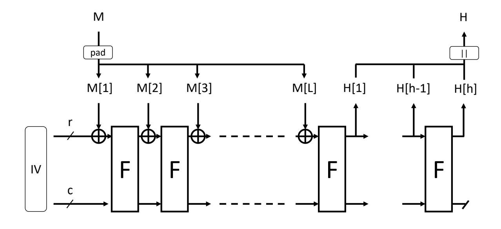
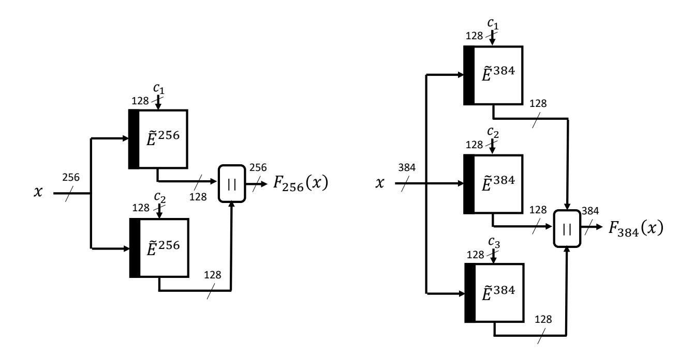
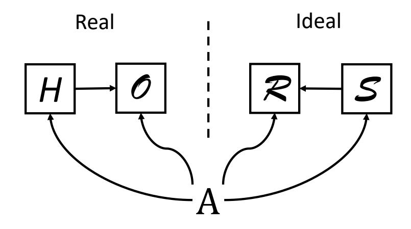

{0}------------------------------------------------

# Indifferentiability of SKINNY-HASH Internal Functions

Akinori Hosoyamada1,2 and Tetsu Iwata<sup>2</sup>

<sup>1</sup>NTT Secure Platform Laboratories, NTT Corporation, Tokyo, Japan akinori.hosoyamada.bh@hco.ntt.co.jp <sup>2</sup>Department of Information and Communication Engineering, Nagoya University, Nagoya, Japan {hosoyamada.akinori,tetsu.iwata}@nagoya-u.jp

#### Abstract

We provide a formal proof for the indifferentiability of SKINNY-HASH internal function from a random oracle. SKINNY-HASH is a family of function-based sponge hash functions, and it was selected as one of the second round candidates of the NIST lightweight cryptography competition. Its internal function is constructed from the tweakable block cipher SKINNY. The construction of the internal function is very simple and the designers claim n-bit security, where n is the block length of SKINNY. However, a formal security proof of this claim is not given in the original specification of SKINNY-HASH. In this paper, we formally prove that the internal function of SKINNY-HASH has n-bit security, i.e., it is indifferentiable from a random oracle up to O(2<sup>n</sup> ) queries, substantiating the security claim of the designers.

Keywords: symmetric-key cryptography, provable security, sponge construction, indifferentiability, SKINNY, SKINNY-HASH

# 1 Introduction

The sponge construction is one of the most basic constructions to convert a function or permutation into a cryptographic hash function. It is used in many modern cryptographic hash functions including SHA-3 [\[Nat15\]](#page-14-0).

The sponge construction based on F : {0, 1} <sup>b</sup> → {0, 1} b , where F is a public permutation or a public function, has two positive parameters r and c such that r + c = b. Given an input M ∈ {0, 1} ∗ , the hash value is computed as follows: First, M is padded so that its length is a multiple of r. Let M[1]|| · · · ||M[L] ∈ {0, 1} rL be the message after padding, where M[i] ∈ {0, 1} r for each i. Second, the internal states st0, . . . , st<sup>L</sup> ∈ {0, 1} <sup>b</sup> are computed in a sequential order as st<sup>0</sup> := IV and st<sup>i</sup> := F(sti−<sup>1</sup> ⊕ (M[i]||0 c )) for 1 ≤ i ≤ L, where IV ∈ {0, 1} b is an initialization vector. (This phase is called the absorbing phase.) Third, the 

{1}------------------------------------------------

internal states  $st_{L+1}, \ldots, st_{L+h-1}$  and the output value  $H = H[1] \cdots ||H[h] \in \{0,1\}^{rh}$   $(H[i] \in \{0,1\}^r)$  are computed as  $st_{L+i} := F(st_{L+i-1})$  for  $1 \le i \le h-1$  and H[i] := (the most significant r bits of  $st_{L+i-1}$ ). (This phase is called the squeezing phase<sup>1</sup>.) H is truncated if necessary. See Fig. 1.



<span id="page-1-1"></span>Figure 1: The sponge construction.

The sponge construction is proven to be indifferentiable from a random oracle up to  $O(2^{c/2})$  queries when F is a random oracle or an ideal permutation [BDPA08], and an appropriate padding function is chosen. That is, if a cryptosystem is proven to be secure in the random oracle model, the security of the cryptosystem does not decrease even if we replace the random oracle with the sponge construction, as long as the number of queries made to F through the sponge construction or the direct computation of F (and  $F^{-1}$ , if F is a permutation) is  $O(2^{c/2})$ .

Since the sponge construction is proven to be secure, to realize a secure cryptographic hash function, it is sufficient to construct a secure function or permutation F. There are two possible ways to realize such F.

One approach is to design a dedicated function or permutation from scratch. Most sponge-based hash functions including SHA-3 take this approach. For instance, SHA-3 uses a dedicated 1600-bit permutation as F. The other approach is to construct F from well-established primitives such as block ciphers or tweakable block ciphers, which is taken by the SKINNY-HASH function family.

<span id="page-1-0"></span><sup>&</sup>lt;sup>1</sup>In some concrete hash functions, the parameters r and c are changed to other parameters r' and c' such that r' + c' = b in the squeezing phase.

{2}------------------------------------------------

#### 1.1 SKINNY-HASH Internal Functions

SKINNY-HASH [BJK<sup>+</sup>20] is a family of function-based sponge constructions, which is one of the second round candidates of the NIST lightweight cryptography competition [NIS]. It consists of SKINNY-tk2-Hash and SKINNY-tk3-Hash, which are the sponge constructions with b=256 and b=384, and the internal functions are built with the tweakable block ciphers SKINNY-128-256 and SKINNY-128-384 [BJK<sup>+</sup>16], respectively.

SKINNY-128-256 is a tweakable permutation  $\tilde{E}_{tk}^{256}:\{0,1\}^{128} \to \{0,1\}^{128}$ , where the tweakey tk is chosen from  $\{0,1\}^{256}$ . Similarly, SKINNY-128-384 is a tweakable permutation  $\tilde{E}_{tk}^{384}$  on  $\{0,1\}^{128}$ , where the tweakey tk is chosen from  $\{0,1\}^{384}$ .  $\tilde{E}_{tk}^{256}$  and  $\tilde{E}_{tk}^{384}$  are expected to be secure and suitable to instantiate ideal ciphers of which the block length is 128 bits and the key lengths are 256 bits and 384 bits, respectively.

The internal functions  $F_{256}: \{0,1\}^{256} \to \{0,1\}^{256}$  and  $F_{384}: \{0,1\}^{384} \to \{0,1\}^{384}$  of SKINNY-tk2-Hash and SKINNY-tk3-Hash are defined by

$$F_{256}(x) := \tilde{E}_x^{256}(c_1) || \tilde{E}_x^{256}(c_2)$$

and

$$F_{384}(x) := \tilde{E}_x^{384}(c_1) || \tilde{E}_x^{384}(c_2) || \tilde{E}_x^{384}(c_3),$$

respectively, where  $c_1, c_2, c_3$  are distinct 128-bit constants (see Fig. 2).



<span id="page-2-0"></span>Figure 2: The SKINNY-HASH internal functions  $F_{256}$  and  $F_{384}$ .

In the specification of SKINNY-HASH, the designers claim that "The function  $F_{256}$  is indifferentiable from a 256-bit random function up to  $O(2^{128})$  queries." and "The same intuitive argument applies to  $F_{384}$ . However, the bound is worse than the one for  $F_{256}$  by a factor of 3...".

{3}------------------------------------------------

Their design and security claim are notable since F<sup>256</sup> and F<sup>384</sup> achieve nbit security from an n-bit tweakable block cipher although the designs of the functions are quite simple (just a few parallel applications of tweakable block ciphers). On the other hand, when we build a compression function (to be used in the Merkle-Damg˚ard construction) based on (tweakable) block ciphers, even the known approaches to achieve the same level of security require more complex constructions [\[Nai11,](#page-14-2) [HK14\]](#page-13-3).

Observe that F<sup>256</sup> and F<sup>384</sup> do not give a perfect random function. If we write F256(x) = Y1||Y2, then Y<sup>1</sup> = Y<sup>2</sup> never happens. Similarly, if we write F384(x) = Y1||Y2||Y3, then for any i 6= j, Y<sup>i</sup> = Y<sup>j</sup> is impossible. The n-bit security claim comes from the intuition that these are the only events that make them different from a truly random function. However, there is no formal proof for the n-bit security claim. Generally, it is highly favorable that a mode of operation of (tweakable) block ciphers has formal security proofs when a security claim is provided.

#### 1.2 Our Contributions

In this paper, we give a formal proof of the indifferentiability of the SKINNY-HASH internal functions F<sup>256</sup> and F<sup>384</sup> in the ideal cipher model. In fact, we show a more general theorem: Let E be an n-bit block cipher with `n-bit key, where ` is a small constant. Define F <sup>E</sup> : {0, 1} `n → {0, 1} `n be the function defined by

<span id="page-3-2"></span>
$$F^{E}(x) := E_{x}(c_{1})||\cdots||E_{x}(c_{\ell}),$$
 (1)

where c1, . . . , c` are fixed distinct n-bit constants. We call F <sup>E</sup> the SHI function ("SHI function" is an abbreviation of SKINNY-HASH Internal function). We show the following theorem.

<span id="page-3-0"></span>Theorem 1 (Main theorem, informal). If E is an ideal cipher, the SHI function F <sup>E</sup> is indifferentiable from a random oracle as long as the total number of queries made to E and its inverse E<sup>−</sup><sup>1</sup> are in o(2n).

This theorem shows that the SHI function has n-bit security, as claimed by the designers. Since the structure of SKINNY-HASH internal functions and the generalization F <sup>E</sup> is quite simple and the security is very high, we believe that more and more function-based sponge constructions will be developed and used in practical situations relying on the SHI construction and our security proof.

Intuition of the proof for Theorem [1.](#page-3-0) Intuitively, we construct a simulator S as follows[2](#page-3-1) .

When an adversary A queries a value (K, X) to E that A has already queried before, S just returns the previous result stored in a list LK.

<span id="page-3-1"></span><sup>2</sup>Our intuition for the simulator is based on "Rationale of F<sup>256</sup> and F384" in the original specification [\[BJK](#page-13-1)+20]. Note that the original explanation in [\[BJK](#page-13-1)+20] is very rough (only two paragraphs) and it is not trivial how to derive a formal security proof from that.

{4}------------------------------------------------

When  $\mathcal{A}$  queries a fresh value (K,X) to E such that  $\mathcal{A}$  has never queried (K,Z) for any Z to E nor  $E^{-1}$ ,  $\mathcal{S}$  first queries K to the random oracle  $\mathsf{RO}$ :  $\{0,1\}^{n\ell} \to \{0,1\}^{n\ell}$ , and simulates the values  $E_K(c_1), \ldots, E_K(c_\ell)$  as  $E_K(c_1)||\cdots$   $||E_K(c_\ell) := \mathsf{RO}(K)$ .  $\mathcal{S}$  stores the pairs  $(c_1, E_K(c_1)), \ldots, (c_\ell, E_K(c_\ell))$  into  $L_K$ . If  $X = c_i$  for some i, then  $\mathcal{S}$  returns the value  $E_K(c_i)$  to  $\mathcal{A}$ . If  $X \neq c_i$  for all i, then  $\mathcal{S}$  picks a value Y from  $\{0,1\}^n \setminus \{E_K(c_1), \ldots, E_K(c_\ell)\}$  uniformly at random, simulates the value  $E_K(X)$  as  $E_K(X) := Y$ , stores the pair (X,Y) into the list  $L_K$ , and returns Y to  $\mathcal{A}$ .

When  $\mathcal{A}$  queries a value (K, X) to E such that  $\mathcal{A}$  has already queried (K, Z) for some Z to E or  $E^{-1}$  before but  $(X, Y) \not\in L_K$  for any Y,  $\mathcal{S}$  chooses Y from  $\{0, 1\}^{n\ell}$  randomly in such a way that  $Y \neq Y'$  holds for every pair  $(X', Y') \in L_K$ , stores the pair (X, Y) into the list  $L_K$ , and returns Y to  $\mathcal{A}$ .

Queries to  $E^{-1}$  are simulated in the same way.

The above simulation fails only when S queries K to the random oracle RO, and RO(K) =  $Y_1 || \cdots || Y_\ell$  ( $Y_i \in \{0,1\}^n$  for each i) happens to satisfy  $Y_i = Y_j$  for some  $i \neq j$ . Roughly speaking, the probability of this event can be upper bounded by  $O(1/2^n)$  for each K, and thus the failure probability of S is always negligibly small if the number of queries made by A is smaller than  $2^n$ . Note that such an event never holds in the real world since, if we divide  $F^E(K) \in \{0,1\}^{n\ell}$  into n-bit blocks as  $F^E(K) = Y_1 || \cdots || Y_\ell$ , then  $Y_i = E_K(c_i)$  never matches  $Y_j = E_K(c_j)$  for  $i \neq j$ , for arbitrary K.

The main contribution of the paper is to provide a formal proof that the above intuition is correct.

#### 1.3 Related Work

The SHI function is quite similar to a function proposed in a previous work [CNL<sup>+</sup>08, Section 4.4]. The difference of the SHI function from the function in [CNL<sup>+</sup>08] is that, while the domain and the range of the SHI function are the same since it is supposed to be used in the sponge construction, the domain of the function in [CNL<sup>+</sup>08] is larger than its range since it is supposed to be used as a compression function in the Merkle-Damgård construction. In addition, while the previous work shows collision-resistance, this paper shows the indifferentiability.

#### 1.4 Paper Organization

Section 2 gives basic notations and definitions. Section 3 shows a formal proof for the SKINNY-HASH internal function. Section 4 concludes the paper.

### <span id="page-4-0"></span>2 Preliminaries

We say that a function  $f: \mathbb{Z}_{\geq 0} \to \mathbb{R}$  is negligible if, for arbitrary constant c > 0, there exists a sufficiently large integer N such that  $|f(n)| \leq 1/n^c$  for all  $n \geq N$ .

{5}------------------------------------------------

Block ciphers. An *n*-bit block cipher with *k*-bit keys is a keyed permutation  $E: \{0,1\}^k \times \{0,1\}^n \to \{0,1\}^n$ . In other words, the function *E* is called a block cipher when  $E(K,\cdot): \{0,1\}^n \to \{0,1\}^n$  is a permutation for all  $K \in \{0,1\}^k$ . Let  $E^{-1}$  denote the inverse of *E* defined by  $E^{-1}(K, E(K, M)) = M$  for all  $M \in \{0,1\}^n$ . We often write  $E_K(\cdot)$  and  $E_K^{-1}(\cdot)$  instead of  $E(K,\cdot)$  and  $E^{-1}(K,\cdot)$ , respectively.

Ideal primitive models. The random oracle model is the model in which there exists the oracle of a random function RO (either of fixed input-length and variable input-lengths), and adversaries have access to RO(·). The ideal permutation model is the model in which there exists the oracle of a random permutation P and its inverse  $P^{-1}$ , and adversaries have access to  $P(\cdot)$  and  $P^{-1}(\cdot)$  (we sometimes refer to P as an ideal permutation). The ideal cipher model is the model in which there exists the oracle of an ideal cipher E (an ideal cipher is a block cipher such that, for each key K,  $E(K, \cdot)$  is chosen independently at random) and its inverse  $E^{-1}$ , and adversaries have access to  $E(\cdot, \cdot)$  and  $E^{-1}(\cdot, \cdot)$ . In what follows, we refer to (i) a random oracle (either of fixed input length and variable input lengths), (ii) an ideal permutation, and (iii) an ideal cipher as ideal primitives.

Indifferentiability. Let  $\mathcal{R}$  be an ideal primitive. Let H be a function that accesses to the oracle of another ideal primitive  $\mathcal{O}$ , and suppose that the input and output lengths of H are the same as those of  $\mathcal{R}$ . Let  $\mathcal{S}$  be an algorithm that has the same interface of input and output as  $\mathcal{O}$  and has an oracle access to  $\mathcal{R}$ . Let  $\mathbf{Real}^{H,\mathcal{O},\mathcal{A}}$  be the game that runs  $\mathcal{A}$  relative to  $(H^{\mathcal{O}},\mathcal{O})$ , and finally returns what  $\mathcal{A}^{H^{\mathcal{O}},\mathcal{O}}$  outputs. In addition, let  $\mathbf{Ideal}_{\mathcal{S}}^{\mathcal{R},\mathcal{A}}$  be the game that runs  $\mathcal{A}$  relative to  $(\mathcal{R},\mathcal{S}^{\mathcal{R}})$ , and finally returns what  $\mathcal{A}^{\mathcal{R},\mathcal{S}^{\mathcal{R}}}$  outputs. We define the indifferentiability advantage of an adversary  $\mathcal{A}$  against  $(H^{\mathcal{O}},\mathcal{O})$  and  $\mathcal{R}$  with respect to the simulator  $\mathcal{S}$  by

$$\mathsf{Adv}^{\mathrm{indiff}}_{(H^{\mathcal{O}},\mathcal{O}),\mathcal{R},\mathcal{S}}(\mathcal{A}) := \left| \Pr \left[ 1 \leftarrow \mathbf{Real}^{H,\mathcal{O},\mathcal{A}} \right] - \Pr \left[ 1 \leftarrow \mathbf{Ideal}^{\mathcal{R},\mathcal{A}}_{\mathcal{S}} \right] \right|.$$

See also Fig. 3.

**Definition 1** (Indifferentiability [MRH04]). The function  $H^{\mathcal{O}}$  is said to be  $(t_{\mathcal{S}}, t_{\mathcal{A}}, q_{\mathcal{A}}, Q_{\mathcal{A}}, \epsilon)$ -indifferentiable from  $\mathcal{R}$  if there exists a simulator  $\mathcal{S}$  such that (1)  $\mathcal{S}$  runs in time at most  $t_{\mathcal{S}}$ , and (2) for any adversary  $\mathcal{A}$  that runs in time  $t_{\mathcal{A}}$ , makes at most  $q_{\mathcal{A}}$  queries to  $\mathcal{O}$  (resp.,  $\mathcal{S}^{\mathcal{R}}$ ), and  $Q_{\mathcal{A}}$  queries to  $H^{\mathcal{O}}$  (resp.,  $\mathcal{R}$ ),

$$\mathsf{Adv}^{\mathrm{indiff}}_{(H^{\mathcal{O}},\mathcal{O}),\mathcal{R},\mathcal{S}}(\mathcal{A}) \leq \epsilon$$

holds.

We ambiguously say that  $H^{\mathcal{O}}$  is indifferentiable from  $\mathcal{R}$  up to x queries if there exists a simulator  $\mathcal{S}$  such that, for arbitrary adversary  $\mathcal{A}$  such that  $q_{\mathcal{A}}, Q_{\mathcal{A}} \ll x$ ,  $\mathsf{Adv}^{\mathsf{indiff}}_{(H^{\mathcal{O}}, \mathcal{O}), \mathcal{R}, \mathcal{S}}(\mathcal{A})$  is negligible.

The following composition theorem assures that, if (i) the security of a primitive  $\mathcal{Q}$  is defined with a single-stage game, and (ii)  $H^{\mathcal{O}}$  is indifferentiable from

{6}------------------------------------------------



Figure 3: Indifferentiability games.

<span id="page-6-1"></span>a random oracle, then it suffice to prove the security of  $\mathcal{Q}^{\mathcal{R}}$  in the setting that adversaries can access to  $\mathcal{R}$  to prove the security of  $\mathcal{Q}^{H^{\mathcal{O}}}$  in the setting that adversaries can access to  $(H^{\mathcal{O}}, \mathcal{O})$ .

<span id="page-6-3"></span>**Theorem 2** (Composition theorem [RSS11]). Let G be a single-stage game. Let H and  $\mathcal{O}$  as above. Then, for any adversary  $\mathcal{A}$  and simulator  $\mathcal{S}$ , there exist adversaries  $\mathcal{B}$  and  $\mathcal{C}$  such that

$$\Pr\left[G^{H^{\mathcal{O}},\mathcal{A}^{\mathcal{O}}} \Rightarrow x\right] \leq \Pr\left[G^{\mathcal{R},\mathcal{B}} \Rightarrow x\right] + \mathsf{Adv}^{\mathsf{indiff}}_{(H^{\mathcal{O}},\mathcal{O}),\mathcal{R},\mathcal{S}}(\mathcal{C})$$

and  $Q_{\mathcal{B}} \leq Q_{\mathcal{A}} + Q_{\mathcal{S}} \cdot q_{\mathcal{A}}$ ,  $Q_{\mathcal{C}} \leq Q_{G} + n_{G,\mathcal{A}} \cdot Q_{\mathcal{A}}$ ,  $q_{\mathcal{C}} \leq n_{G,\mathcal{A}} \cdot q_{\mathcal{A}}$ ,  $t_{\mathcal{B}} \leq t_{\mathcal{A}} + q_{\mathcal{A}} \cdot \tilde{t}_{\mathcal{S}}$ ,  $t_{\mathcal{C}} \leq t_{G} + n_{G,\mathcal{A}} \cdot t_{\mathcal{A}} \ hold^{3}$ . Here,  $Q_{X}$  denotes the maximum number of queries to  $\mathcal{R}$  or  $H^{\mathcal{O}}$  made by X for  $X = \mathcal{A}, \mathcal{B}, \mathcal{C}, G$ , and  $Q_{\mathcal{S}}$  denotes the maximum number of queries to  $\mathcal{O}$  or  $\mathcal{S}^{\mathcal{R}}$  made by X for  $X = \mathcal{A}, \mathcal{C}$ .  $t_{X}$  denotes the maximum running times of X for  $X = \mathcal{A}, \mathcal{B}, \mathcal{C}, G$ , and  $\tilde{t}_{\mathcal{S}}$  denotes the maximum time that  $\mathcal{S}$  spends at each invocation of  $\mathcal{S}$ .  $n_{G,\mathcal{A}}$  denotes the number of invocations of  $\mathcal{A}$  by G.

# <span id="page-6-0"></span>3 Security Proofs of the SHI Function

Let E denote an n-bit ideal cipher with  $\ell n$ -bit keys, where  $\ell$  is a small constant. Let  $F^E$  be the SHI function defined as in (1). The goal of this section is to prove the following theorem, which shows that the SHI function is indifferentiable from a random oracle up to  $O(2^n)$  queries. Together with Theorem 2, the following theorem assures that the security of the sponge construction does not decrease when its internal function is instantiated with the SHI function up to  $O(2^n)$  queries.

<span id="page-6-2"></span><sup>&</sup>lt;sup>3</sup>The claim on the number of queries and running times (the inequalities on  $Q_{\mathcal{B}}$ ,  $Q_{\mathcal{C}}$ ,  $q_{\mathcal{C}}$ ,  $t_{\mathcal{B}}$ . and  $t_{\mathcal{C}}$ ) are a little bit different from the original statement in [RSS11], but they can be deduced from the arguments in the original proof.

{7}------------------------------------------------

**Theorem 3.** There exists a simulator S that satisfies the following conditions.

- 1. S makes at most 1 query to RO and returns an output in time O(1) at each invocation of S.
- 2. For an arbitrary adversary A that makes at most  $Q_A$  queries to  $H^E$  and makes  $q_A$  queries to E and  $E^{-1}$  in total,

$$\mathsf{Adv}^{\mathrm{indiff}}_{(F^E,(E,E^{-1})),\mathsf{RO},\mathcal{S}}(\mathcal{A}) \leq \frac{\ell^2(q_{\mathcal{A}} + \ell Q_{\mathcal{A}})}{2^n}$$

holds.

*Proof.* We show the theorem with the code-based game-playing proof technique [BR06], by introducing 6 games  $G_1, \ldots, G_6$ . See the explanation below Theorem 1 for intuition of the proof.

**Game**  $G_1$ .  $G_1$  is the *real* game, where the adversary  $\mathcal{A}$  runs relative to the oracles  $F^E$ , E, and  $E^{-1}$ . We assume that the oracle of the ideal cipher E is implemented by using lazy sampling. See Fig. 4 for details.

**Games**  $G_2$  and  $G_3$ .  $G_2$  is identical to  $G_1$  except that, when a value (K, X) (resp., (K, Y)) is queried to E (resp.,  $E^{-1}$ ) such that (K, Z) has not been queried to E nor  $E^{-1}$  for any Z, the values  $E_K(c_1), \ldots, E_K(c_\ell)$  are sampled before answering to the query. In addition, the sampling of  $E_K(c_1), \ldots, E_K(c_\ell)$  are performed as follows:

- 1. Choose  $Y_1, \ldots, Y_\ell \in \{0,1\}^n$  independently and uniformly at random.
- 2. If  $Y_i = Y_j$  holds for some  $i \neq j$ , set flag to be bad, and re-sample  $Y_1, \ldots, Y_\ell$  in such a way that  $Y_i \neq Y_j$  holds for all  $i \neq j$ .
- 3. Set  $E_K(c_i) := Y_i \text{ for } i = 1, ..., \ell$ .

The procedure  $F^E$  is not changed from  $G_1$ .  $G_3$  is identical to  $G_2$  except that the re-sampling of  $Y_1, \ldots, Y_\ell$  is not performed even if flag is set to be bad. See Fig. 5 for details.

**Games**  $G_4$  and  $G_5$ . In the game  $G_4$ , compared to  $G_3$ , a random oracle RO is introduced, and the sampling of  $Y_1, \ldots, Y_\ell$  in E and  $E^{-1}$  when  $L_K$  is empty is replaced with the query of K to the random oracle RO.  $F^E$  is not changed in  $G_4$ . The game  $G_5$  is identical to  $G_4$  except that  $F^E$  is modified in such a way that  $F^E(T) := RO(T)$ . See Fig. 6 for details.

**Game**  $G_6$ .  $G_6$  is the ideal game. In  $G_6$ ,  $\mathcal{A}$  runs relative to RO and  $\mathcal{S}^{\mathsf{RO}}$  instead of  $F^E$  and  $(E, E^{-1})$ , where  $\mathcal{S}$  is a simulator defined as in Fig.7. Given an input  $(b, K, Z) \in \{0, 1\} \times \{0, 1\}^{n\ell} \times \{0, 1\}^n$ ,  $\mathcal{S}$  simulates E(K, Z) if b = 0 and  $E^{-1}(K, Z)$  if b = 1. The behavior of  $\mathcal{S}$  is the same as that of E and  $E^{-1}$  in the games  $G_4$  and  $G_5$ .

{8}------------------------------------------------

$$\begin{aligned} & \frac{\mathbf{Game} \ G_1^A}{x \leftarrow \mathcal{A}^{F^E,(E,E^{-1})}} \\ & \text{return } x \end{aligned} \\ & \frac{\mathbf{Procedure} \ E(K,X)}{\text{if there exists} \ Y \ \text{such that}} \ (X,Y) \in L_K \\ & \text{return } Y \end{aligned} \\ & \mathbf{else} \\ & Y \overset{\$}{\leftarrow} \{0,1\}^n \setminus L_{K,\text{out}} \\ & L_{K,\text{in}} \leftarrow L_{K,\text{in}} \cup \{X\} \\ & L_{K,\text{out}} \leftarrow L_{K,\text{out}} \cup \{Y\} \\ & L_K \leftarrow L_K \cup \{(X,Y)\} \end{aligned} \\ & \frac{\mathbf{Procedure} \ E^{-1}(K,Y)}{\text{if there exists} \ X \ \text{such that}} \ (X,Y) \in L_K \\ & \text{return} \ X \end{aligned} \\ & \mathbf{else} \\ & X \overset{\$}{\leftarrow} \{0,1\}^n \setminus L_{K,\text{in}} \\ & L_{K,\text{in}} \leftarrow L_{K,\text{in}} \cup \{X\} \\ & L_{K,\text{out}} \leftarrow L_{K,\text{out}} \cup \{Y\} \\ & L_K \leftarrow L_K \cup \{(X,Y)\} \end{aligned} \\ & \frac{\mathbf{Procedure} \ F^E(T)}{S \leftarrow E(T,c_1)||\dots||E(T,c_\ell)} \\ & \text{return} \ S \end{aligned}$$

<span id="page-8-0"></span>Figure 4: The real game  $G_1$ . The lists  $L_K$ ,  $L_{K,\text{in}}$ , and  $L_{K,\text{out}}$  (for  $K \in \{0,1\}^{n\ell}$ ) are set to be empty at the beginning of the game.

Below we give an upper bound of the indifferentiability advantage  $\mathsf{Adv}^{\mathrm{indiff}}_{(F^E,(E,E^{-1})),\mathsf{RO},\mathcal{S}}(\mathcal{A})$ . First, by definition of the games,

<span id="page-8-1"></span>
$$\left| \Pr \left[ 1 \leftarrow G_i^{\mathcal{A}} \right] - \Pr \left[ 1 \leftarrow G_{i+1}^{\mathcal{A}} \right] \right| = 0$$
 (2)

holds for i = 1, 3, 4, 5.

On the difference between  $G_2$  and  $G_3$ , let  $\mathsf{SetBad}(i)$  denote the event that flag is set to be  $\mathsf{bad}$  at the i-th query to E or  $E^{-1}$  (note that  $1 \leq i \leq q_{\mathcal{A}} + \ell \cdot Q_{\mathcal{A}}$ 

{9}------------------------------------------------

```
Procedure E(K, X)
if LK is empty
     Y1, . . . , Y`
                $←− {0, 1}
                         n
     if Yi = Yj for some i 6= j
          flag ← bad
      for i = 1, . . . , ` do:
           Yi
              $←− {0, 1}
                        n \ {Y1, . . . , Yi−1}
     LK,in ← LK,in ∪ {c1, . . . , c`}
     LK,out ← LK,out ∪ {Y1, . . . , Y`}
     LK ← LK ∪ {(c1, Y1), . . . ,(c`, Y`)}
else if there exists Y such that (X, Y ) ∈ LK
     return Y
else
     Y
       $←− {0, 1}
                 n \ LK,out
     LK,in ← LK,in ∪ {X}
     LK,out ← LK,out ∪ {Y }
     LK ← LK ∪ {(X, Y )}
Procedure E−1
                  (K, Y )
if LK is empty
     Y1, . . . , Y`
                $←− {0, 1}
                         n
     if Yi = Yj for some i 6= j
          flag ← bad
      for i = 1, . . . , ` do:
           Yi
              $←− {0, 1}
                        n \ {Y1, . . . , Yi−1}
     LK,in ← LK,in ∪ {c1, . . . , c`}
     LK,out ← LK,out ∪ {Y1, . . . , Y`}
     LK ← LK ∪ {(c1, Y1), . . . ,(c`, Y`)}
else if there exists X such that (X, Y ) ∈ LK
     return X
else
     X
        $←− {0, 1}
                 n \ LK,in
     LK,in ← LK,in ∪ {X}
     LK,out ← LK,out ∪ {Y }
     LK ← LK ∪ {(X, Y )}
```

<span id="page-9-0"></span>Figure 5: The modified versions of E(K, X) and E<sup>−</sup><sup>1</sup> (K, Y ) in the games G<sup>2</sup> and G3. The steps surrounded by a square is performed in G<sup>3</sup> but not performed in G2.

{10}------------------------------------------------

```
Procedure RO(T)
if there exists W s.t. (T, W) ∈ LRO
    return W
else
    W
        $←− {0, 1}
                 n`
    LRO ← LRO ∪ {(T, W)}
    return W
Procedure E(K, X)
if LK is empty
    Y1|| · · · ||Y` ← RO(K) (here, Yi ∈ {0, 1}
                                              n for each i)
    LK,in ← LK,in ∪ {c1, . . . , c`}
    LK,out ← LK,out ∪ {Y1, . . . , Y`}
    LK ← LK ∪ {(c1, Y1), . . . ,(c`, Y`)}
else if there exists Y such that (X, Y ) ∈ LK
    return Y
else
    Y
       $←− {0, 1}
                n \ LK,out
    LK,in ← LK,in ∪ {X}
    LK,out ← LK,out ∪ {Y }
    LK ← LK ∪ {(X, Y )}
Procedure E−1
                 (K, Y )
if LK is empty
    Y1|| · · · ||Y` ← RO(K) (here, Yi ∈ {0, 1}
                                              n for each i)
    LK,in ← LK,in ∪ {c1, . . . , c`}
    LK,out ← LK,out ∪ {Y1, . . . , Y`}
    LK ← LK ∪ {(c1, Y1), . . . ,(c`, Y`)}
else if there exists X such that (X, Y ) ∈ LK
    return X
else
    X
       $←− {0, 1}
                n \ LK,in
    LK,in ← LK,in ∪ {X}
    LK,out ← LK,out ∪ {Y }
    LK ← LK ∪ {(X, Y )}
Procedure F
               E(T)
S ← E(T, c1)|| . . . ||E(T, c`)
 S ← RO(T)
return S
```

<span id="page-10-0"></span>Figure 6: The procedure RO and the modified versions of E(K, X), E<sup>−</sup><sup>1</sup> (K, Y ), and F <sup>E</sup> in the games G<sup>4</sup> and G5. The list LRO is set to be empty at the beginning of the game. The step surrounded by a square is included in G<sup>5</sup> but not included in G4.

{11}------------------------------------------------

```
Game GA
         6
x ← ARO,S
           RO
return x
Procedure S(0, K, Z)
if LK is empty
    Y1|| · · · ||Y` ← RO(K) (here, Yi ∈ {0, 1}
                                              n for each i)
    LK,in ← LK,in ∪ {c1, . . . , c`}
    LK,out ← LK,out ∪ {Y1, . . . , Y`}
    LK ← LK ∪ {(c1, Y1), . . . ,(c`, Y`)}
else if there exists Y such that (X, Y ) ∈ LK
    return Y
else
    Y
       $←− {0, 1}
                n \ LK,out
    LK,in ← LK,in ∪ {X}
    LK,out ← LK,out ∪ {Y }
    LK ← LK ∪ {(X, Y )}
Procedure S(1, K, Y )
if LK is empty
    Y1|| · · · ||Y` ← RO(K) (here, Yi ∈ {0, 1}
                                              n for each i)
    LK,in ← LK,in ∪ {c1, . . . , c`}
    LK,out ← LK,out ∪ {Y1, . . . , Y`}
    LK ← LK ∪ {(c1, Y1), . . . ,(c`, Y`)}
else if there exists X such that (X, Y ) ∈ LK
    return X
else
    X
       $←− {0, 1}
                n \ LK,in
    LK,in ← LK,in ∪ {X}
    LK,out ← LK,out ∪ {Y }
    LK ← LK ∪ {(X, Y )}
```

<span id="page-11-0"></span>Figure 7: The ideal game G<sup>6</sup> and the simulator S. The procedure RO is the same as that of G<sup>4</sup> and G5. The procedures S(0, K, X) and S(1, K, X) are described separately so that the notations will be compatible with those in G<sup>4</sup> and G5. S(0, ·, ·) simulates E(·, ·) and S(1, ·, ·) simulates E<sup>−</sup><sup>1</sup> (·, ·).

{12}------------------------------------------------

holds since one invocation of  $F^E$  makes  $\ell$  queries to E). Then, for each i,

$$\begin{split} \Pr\left[\mathsf{SetBad}(i)\right] &= \Pr_{Y_1, \dots, Y_{\ell} \overset{\$}{\longleftarrow} \{0, 1\}^n} [Y_j = Y_k \text{ for some } 1 \leq j < k \leq \ell] \\ &\leq \sum_{1 \leq j < k \leq \ell} \Pr_{Y_j, Y_k \overset{\$}{\longleftarrow} \{0, 1\}^n} [Y_j = Y_k] \\ &= \sum_{1 \leq j < k \leq \ell} \sum_{W \in \{0, 1\}^n} \Pr_{Y_j, Y_k \overset{\$}{\longleftarrow} \{0, 1\}^n} [Y_j = W \land Y_k = W] \\ &= \sum_{1 \leq j < k \leq \ell} \sum_{W \in \{0, 1\}^n} \frac{1}{2^{2n}} \leq \frac{\ell^2}{2^n} \end{split}$$

holds. Therefore

<span id="page-12-1"></span>
$$\begin{aligned} \left| \Pr\left[ 1 \leftarrow G_2^{\mathcal{A}} \right] - \Pr\left[ 1 \leftarrow G_3^{\mathcal{A}} \right] \right| &\leq \Pr\left[ \mathsf{flag} \leftarrow \mathsf{bad} \text{ in } G_2 \right] \\ &\leq \sum_{1 \leq i \leq q_{\mathcal{A}} + \ell Q_{\mathcal{A}}} \Pr\left[ \mathsf{SetBad}(i) \right] \\ &\leq \frac{\ell^2(q_{\mathcal{A}} + \ell Q_{\mathcal{A}})}{2^n} \end{aligned} \tag{3}$$

holds.

From (2) and (3),

$$\begin{aligned} \mathsf{Adv}^{\mathrm{indiff}}_{(F^E,(E,E^{-1})),\mathsf{RO},\mathcal{S}}(\mathcal{A}) &= \left| \Pr\left[ 1 \leftarrow G_1^{\mathcal{A}} \right] - \Pr\left[ 1 \leftarrow G_6^{\mathcal{A}} \right] \right| \\ &\leq \sum_{1 \leq i \leq 5} \left| \Pr\left[ 1 \leftarrow G_i^{\mathcal{A}} \right] - \Pr\left[ 1 \leftarrow G_{i+1}^{\mathcal{A}} \right] \right| \\ &\leq \frac{\ell^2(q_{\mathcal{A}} + \ell Q_{\mathcal{A}})}{2^n} \end{aligned}$$

follows.

By definition of the simulator S (Fig. 7), at each invocation of S, it makes at most one query to RO and returns an output in time O(1). Therefore the claim of the theorem holds.

# <span id="page-12-0"></span>4 Concluding Remarks

In this paper, we provided a formal security proof of the indifferentiability of the SKINNY-HASH internal function (SHI). In the original specification of SKINNY-HASH, the SHI function is claimed to have n-bit security without a formal proof. We showed that they are in fact indifferentiable from a random oracle up to  $O(2^n)$  queries, as claimed by the designers. Though its construction is quite simple, the SHI function achieves very high security. We hope that more and more function-based sponge constructions will be developed and used in practical situations relying on the SHI function and our security proof.

{13}------------------------------------------------

# Acknowledgments

We would like to thank Dr. Donghoon Chang for informing us of the related work [\[CNL](#page-13-4)+08]. This work was supported in part by JSPS KAKENHI Grant Number JP20K11675.

# References

- <span id="page-13-0"></span>[BDPA08] Guido Bertoni, Joan Daemen, Micha¨el Peeters, and Gilles Van Assche. On the indifferentiability of the sponge construction. In Nigel P. Smart, editor, Advances in Cryptology - EUROCRYPT 2008, 27th Annual International Conference on the Theory and Applications of Cryptographic Techniques, Istanbul, Turkey, April 13-17, 2008. Proceedings, volume 4965 of Lecture Notes in Computer Science, pages 181–197. Springer, 2008.
- <span id="page-13-2"></span>[BJK+16] Christof Beierle, J´er´emy Jean, Stefan K¨olbl, Gregor Leander, Amir Moradi, Thomas Peyrin, Yu Sasaki, Pascal Sasdrich, and Siang Meng Sim. The SKINNY family of block ciphers and its low-latency variant MANTIS. In Matthew Robshaw and Jonathan Katz, editors, Advances in Cryptology - CRYPTO 2016 - 36th Annual International Cryptology Conference, Santa Barbara, CA, USA, August 14- 18, 2016, Proceedings, Part II, volume 9815 of Lecture Notes in Computer Science, pages 123–153. Springer, 2016.
- <span id="page-13-1"></span>[BJK+20] Christof Beierle, J´er´emy Jean, Stefan K¨olbl, Gregor Leander, Amir Moradi, Thomas Peyrin, Yu Sasaki, Pascal Sasdrich, and Siang Meng Sim. SKINNY-AEAD and skinny-hash. IACR Trans. Symmetric Cryptol., 2020(S1):88–131, 2020.
- <span id="page-13-5"></span>[BR06] Mihir Bellare and Phillip Rogaway. The security of triple encryption and a framework for code-based game-playing proofs. In Serge Vaudenay, editor, Advances in Cryptology - EUROCRYPT 2006, 25th Annual International Conference on the Theory and Applications of Cryptographic Techniques, St. Petersburg, Russia, May 28 - June 1, 2006, Proceedings, volume 4004 of Lecture Notes in Computer Science, pages 409–426. Springer, 2006.
- <span id="page-13-4"></span>[CNL<sup>+</sup>08] Donghoon Chang, Mridul Nandi, Jesang Lee, Jaechul Sung, Seokhie Hong, Jongin Lim, Haeryong Park, and Kilsoo Chun. Compression function design principles supporting variable output lengths from a single small function. IEICE Trans. Fundam. Electron. Commun. Comput. Sci., 91-A(9):2607–2614, 2008.
- <span id="page-13-3"></span>[HK14] Shoichi Hirose and Hidenori Kuwakado. A block-cipher-based hash function using an mmo-type double-block compression function. In

{14}------------------------------------------------

- Sherman S. M. Chow, Joseph K. Liu, Lucas Chi Kwong Hui, and Siu-Ming Yiu, editors, Provable Security - 8th International Conference, ProvSec 2014, Hong Kong, China, October 9-10, 2014. Proceedings, volume 8782 of Lecture Notes in Computer Science, pages 71–86. Springer, 2014.
- <span id="page-14-3"></span>[MRH04] Ueli M. Maurer, Renato Renner, and Clemens Holenstein. Indifferentiability, impossibility results on reductions, and applications to the random oracle methodology. In Moni Naor, editor, Theory of Cryptography, First Theory of Cryptography Conference, TCC 2004, Cambridge, MA, USA, February 19-21, 2004, Proceedings, volume 2951 of Lecture Notes in Computer Science, pages 21–39. Springer, 2004.
- <span id="page-14-2"></span>[Nai11] Yusuke Naito. Blockcipher-based double-length hash functions for pseudorandom oracles. In Ali Miri and Serge Vaudenay, editors, Selected Areas in Cryptography - 18th International Workshop, SAC 2011, Toronto, ON, Canada, August 11-12, 2011, Revised Selected Papers, volume 7118 of Lecture Notes in Computer Science, pages 338–355. Springer, 2011.
- <span id="page-14-0"></span>[Nat15] National Institute of Standards and Technology. SHA-3 Standard: Permutation-Based Hash and Extendable-Output Functions. NIST FIPS PUB 202, U.S. Department of Commerce, August 2015.
- <span id="page-14-1"></span>[NIS] NIST. Round 2 candidates of the lightweight cryptography standardization process. See https://csrc.nist.gov/projects/lightweightcryptography/round-2-candidates (2020/9/18).
- <span id="page-14-4"></span>[RSS11] Thomas Ristenpart, Hovav Shacham, and Thomas Shrimpton. Careful with composition: Limitations of the indifferentiability framework. In Kenneth G. Paterson, editor, Advances in Cryptology - EUROCRYPT 2011 - 30th Annual International Conference on the Theory and Applications of Cryptographic Techniques, Tallinn, Estonia, May 15-19, 2011. Proceedings, volume 6632 of Lecture Notes in Computer Science, pages 487–506. Springer, 2011.