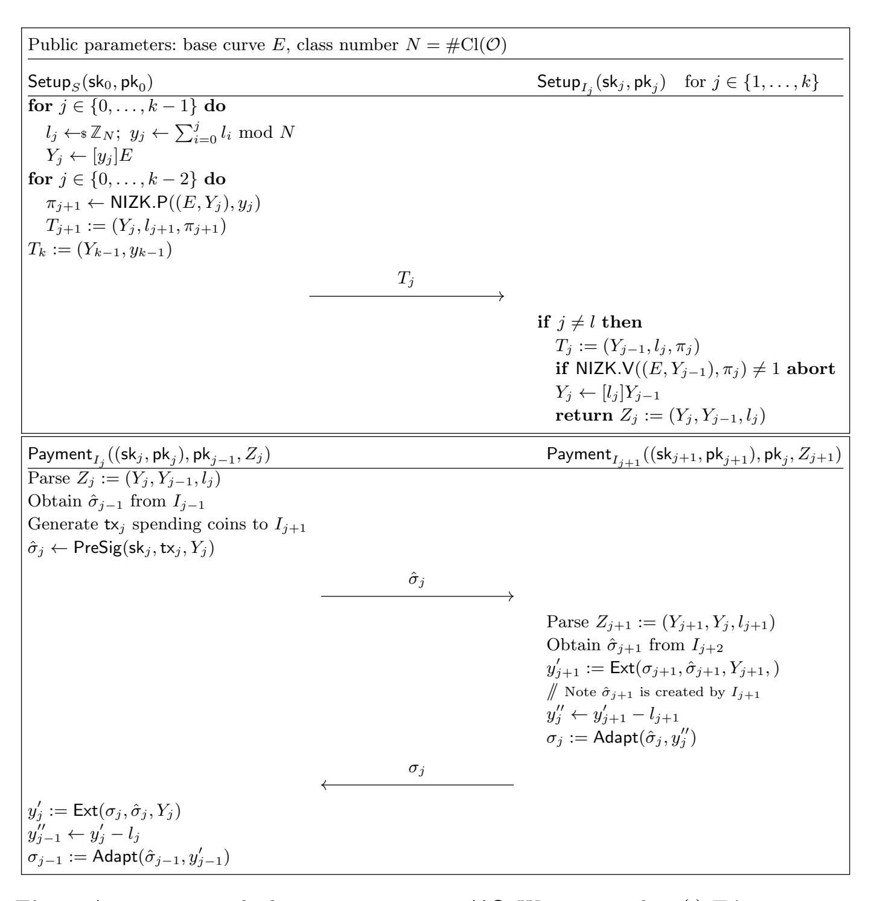

{0}------------------------------------------------

# Post-Quantum Adaptor Signature for Privacy-Preserving Off-Chain Payments?

Erkan Tairi<sup>1</sup> , Pedro Moreno-Sanchez<sup>2</sup> , and Matteo Maffei<sup>1</sup>

> <sup>1</sup> TU Wien {erkan.tairi,matteo.maffei}@tuwien.ac.at 2 IMDEA Software Institute pedro.moreno@imdea.org

Abstract. Adaptor signatures (AS) are an extension of digital signatures that enable the encoding of a cryptographic hard problem (e.g., discrete logarithm) within the signature itself. An AS scheme ensures that (i) the signature can be created only by the user knowing the solution to the cryptographic problem; (ii) the signature reveals the solution itself; (iii) the signature can be verified with the standard verification algorithm. These properties have made AS a salient building block for many blockchain applications, in particular, off-chain payment systems such as payment-channel networks, payment-channel hubs, atomic swaps or discrete log contracts. Current AS constructions, however, are not secure against adversaries with access to a quantum computer.

In this work, we present IAS, a construction for adaptor signatures that relies on standard cryptographic assumptions for isogenies, and builds upon the isogeny-based signature scheme CSI-FiSh. We formally prove the security of IAS against a quantum adversary. We have implemented IAS and our evaluation shows that IAS can be incorporated into current blockchains while requiring ∼ 1500 bytes of storage size on-chain and ∼ 140 milliseconds for digital signature verification. We also show how IAS can be seamlessly leveraged to build post-quantum off-chain payment applications without harming their security and privacy.

# <span id="page-0-0"></span>1 Introduction

Bitcoin and many other cryptocurrencies rely on the blockchain, a data structure that logs every single transaction deemed valid by miners through a decentralized consensus protocol. Each transaction is defined in terms of a scripting language that encodes the rules that make a transaction valid. Some cryptocurrencies (e.g., Bitcoin) support just a few operations to encode simple coin transfers authorized by digital signatures, whereas others (e.g., Ethereum) provide a Turing-complete scripting language enabling clients to encode more complex transaction logics.

While logging each single transaction on the blockchain allows for public verifiability, it also introduces evident scalability problems. First, the permissionless

<sup>?</sup> This is the full version of the work. The extended abstract appeared at Financial Cryptography and Data Security 2021

{1}------------------------------------------------

nature of the consensus protocol highly limits the transaction rate to few transactions per second – about three orders of magnitude less than traditional credit card-based systems [\[1\]](#page-22-0) – which highly hinders a wider adoption of these cryptocurrencies. Second, miners charge a transaction fee proportional to the size of the scripts included in each transaction and to the computation required by the miners for its validation, which can rapidly become a financial bottleneck.

A promising approach to reduce the transaction size is to manage some of the transaction logic off-chain, that is, encoding the logic as a peer-to-peer protocol between sender and receiver instead of directly in the transaction script. In this setting, A. Polestra introduced the notion of scriptless scripts [\[24\]](#page-23-0), which has been later formalized as adaptor signatures [\[2,](#page-22-1) [17\]](#page-22-2).

Adaptor Signatures (AS). AS can be seen as an extended form of a standard digital signature, where one can create a "pre-signature" that can converted into a (full) signature with respect to an instance of a hard relation (e.g., the discrete logarithm). The resulting signature can then be verified by the miners using the standard verification algorithm from the digital signature scheme. AS provide the following two intuitive properties: (i) only the user knowing the witness of the hard relation can convert the pre-signature into a valid signature; and (ii) anybody with access to the pre-signature and the corresponding signature can extract the witness of the hard relation. This building block has been shown highly useful in practice to build off-chain payment applications such as generalized payment channels [\[2\]](#page-22-1), payment-channel networks [\[21\]](#page-23-1), payment-channel hubs [\[27\]](#page-23-2), and many others, being adopted in real-world blockchain protocols, such as the Lightning Network, the COMIT Network, ZenGo<sup>x</sup> and others.

Related Work and Limitations. Aumayr et al. [\[2\]](#page-22-1) provides instances of AS based on Schnorr and ECDSA digital signatures. Malavolta et al. [\[21\]](#page-23-1) show an instance of AS from any one-way homomorphic function and describe how to construct payment-channel networks from AS. Moreno-Sanchez et al. [\[22\]](#page-23-3) shows an instance of AS based on the linkable ring signature supported in Monero. Tairi et al. [\[27\]](#page-23-2) leverage AS to build payment-channel hubs.

All these works do not provide security in the post-quantum setting where the discrete logarithm assumption no longer holds against a post-quantum adversary. Therefore, given the relevance in practice of AS, there is a need to design postquantum instances of them. For instance, there exist several efforts from NIST to standardize quantum resistant algorithms. The blockchain community has also shown interest in migrating towards post-quantum secure alternatives. For example, Ethereum 2.0 Serenity upgrade [\[5\]](#page-22-3) is planned to have an option for a post-quantum signature and Zcash developers plan to update their protocol with post-quantum alternatives when they are mature enough [\[16\]](#page-22-4).

Esgin et al. [\[13\]](#page-22-5) recently came up with a seminal contribution in this field, proposing the first instance of a post-quantum AS, called LAS, which is based on the standard lattice assumptions, such as Module-SIS and Module-LWE. This construction, however, presents a few limitations with regards to correctness, communication overhead, and privacy. From the correctness point of view, LAS requires to use two hard relations, R and R<sup>0</sup> , where R is the base relation and 

{2}------------------------------------------------

R0 is the extended relation that defines the relation for extracted witnesses. The reason for this is due to the inherent knowledge/soundness gap in latticebased zero-knowledge proofs [\[15\]](#page-22-6). Hence, as mentioned by the authors, LAS only achieves weak pre-signature adaptability, which guarantees that only the statement/witness pairs satisfying R are adaptable, and not those satisfying R<sup>0</sup> . In practice, this implies that the applications that use LAS as a building block require a zero-knowledge proof to guarantee that the extracted witness is of sufficiently small norm and belongs to the relation R, which in turn guarantees that the pre-signature adaptability would work. However, the currently most efficient variant of such a proof has size of 53KB [\[14\]](#page-22-7), which would incur significant (off-chain) communication overhead to the applications using LAS.

From the privacy point of view, when LAS is used inside certain applications, such as building payment-channel networks (PCNs), it can leak non-trivial information that hinders the privacy of the overall construction. In a nutshell, the reason for that is that the witness for adapting the pre-signature in LAS is a vector whose infinity norm is 1. Privacy-preserving applications such as PCNs require to encode a randomization factor at each hop, which in LAS is encoded by adding a new vector whose infinity norm is 1 for each hop [\[13,](#page-22-5) Section 4.2]. However, this leads to a situation where a node at position k in the payment path receives a vector with infinity norm k with high probability, learning at least how many parties are before it on the path. Moreover, if an intermediary observes that the norm is 1, then it knows that (with high probability) the party before it is the sender. Encoding a vector of random but small norm (i.e., padding) for each hop does not help either, as each sender-receiver pair would use a unique norm, breaking thus relationship anonymity (see Section [6](#page-17-0) for more details).

Finally, given the ongoing standardizations efforts of NIST, we find it interesting to have several candidates of quantum-resistant AS building upon different cryptographic assumptions to aid the related discussion (e.g., if one assumption gets broken, we may still have standing post-quantum constructions). The current state of affairs leads to the following question: Is it possible to design a quantum resistant AS that preserves the security and privacy guarantees of the off-chain applications built on top of the current non post-quantum alternatives?

Our Contributions. We affirmatively answer the previous question and propose IAS, the first construction for post-quantum AS that preserves the security and privacy guarantees required by off-chain applications. In particular,

- We design IAS, a construction for AS that builds upon the post-quantum signature scheme CSI-FiSh, and relies on hardness of standard cryptographic assumptions from isogenies. We formally prove the security of IAS.
- We provide a parallelized implementation of IAS and evaluate its performance, showing that it requires ∼ 1500 bytes of storage on-chain (with a parameter set optimized for lower combined public key and signature size) and 140 milliseconds to verify a signature on average (i.e., the computation time for miners). We compare with LAS and observe that the on-chain storage size is 3x smaller than LAS while requiring higher computation time.

{3}------------------------------------------------

— We describe how to build payment-channel networks (PCNs) from IAS, and show that IAS does not diminish the security or privacy guarantees of PCNs. Thus, IAS seamlessly enables post-quantum off-chain applications as soon as the underlying blockchains support the post-quantum signature scheme CSI-FiSh.

### 2 Preliminaries

**Notation.** We denote by  $1^{\lambda}$ , for  $\lambda \in \mathbb{N}$ , the security parameter. We assume this is given as an implicit input to every function, and all our algorithms run in polynomial time in  $\lambda$ . We denote by  $x \leftarrow_{\$} \mathcal{X}$  the uniform sampling of the variable x from the set  $\mathcal{X}$ . We write  $x \leftarrow \mathsf{A}(y)$  to denote that a probabilistic polynomial time (PPT) algorithm A on input y, outputs x. We use the same notation also for the assignment of the computational results, for example,  $s \leftarrow s_1 + s_2$ . If A is a deterministic polynomial time (DPT) algorithm, we use the notation  $x := \mathsf{A}(y)$ . We use the same notation for the projection of tuples, e.g., we write  $\sigma := (\sigma_1, \sigma_2)$  for a tuple  $\sigma$  composed of two elements  $\sigma_1$  and  $\sigma_2$ . A function  $\mathsf{negl} : \mathbb{N} \to \mathbb{R}$  is  $\mathsf{negligible}$  in n if for every  $k \in \mathbb{N}$ , there exists  $n_0 \in \mathbb{N}$ , such that for every  $n \geq n_0$  it holds that  $\mathsf{negl}(n) \leq 1/n^k$ . Throughout the paper we implicitly assume that  $\mathsf{negligible}$  functions are negligible in the security parameter (i.e.,  $\mathsf{negl}(\lambda)$ ).

We review the cryptographic primitives of interest. The definitions and security experiments for adaptor signatures are taken from [2] with minor changes to fit our notation.

#### 2.1 Non-Interactive Zero-Knowledge Proofs

We first recall the definition of a hard relation.

**Definition 1 (Hard Relation).** Let R be a relation with statement/witness pairs (Y, y). Let us denote  $L_R$  the associated language defined as  $L_R := \{Y \mid \exists y \ s.t. \ (Y, y) \in R\}$ . We say that R is a hard relation if the following holds:

- There exists a PPT sampling algorithm  $GenR(1^{\lambda})$  that on input the security parameter  $\lambda$  outputs a statement/witness pair  $(Y, y) \in R$ .
  - The relation is poly-time decidable.
  - For all PPT adversaries A there exists a negligible function negl, such that:

$$\Pr\left[ (Y, y^*) \in R \, \left| \, \begin{matrix} (Y, y) \leftarrow \mathsf{GenR}(1^{\lambda}), \\ y^* \leftarrow \mathcal{A}(Y) \end{matrix} \right| \leq \mathsf{negl}(\lambda) \,,$$

where the probability is taken over the randomness of GenR and A.

A pair (P, V) of PPT algorithms is called a non-interactive zero-knowledge proof of knowledge (NIZKPoK) with an online extractor for a relation R, random oracle  $\mathcal{H}$  and security parameter  $\lambda$  (in the random oracle model) if the following holds:

- Completeness: For any  $(Y, y) \in R$  and any  $\pi \leftarrow \mathsf{P}^{\mathcal{H}}(Y, y)$  there exists a negligible function negl such that it holds that  $\mathsf{Pr}[\mathsf{V}^{\mathcal{H}}(Y, \pi) = 1] \geq 1 - \mathsf{negl}(\lambda)$ .

{4}------------------------------------------------

- Zero Knowledge: There exists a PPT algorithm S, the zero knowledge simulator, such that for any pair (Y, y) and any PPT algorithm D the following distributions are computationally indistinguishable:
  - Let π ← P <sup>H</sup>(Y, y) if (Y, y) ∈ R and π ← ⊥ otherwise. Output D <sup>H</sup>(Y, y, π).
  - Let π ← S(Y, 1) if (Y, y) ∈ R and π ← S(Y, 0) otherwise. Output D <sup>H</sup>(Y, y, π).
- Online Extractor: There exist a PPT algorithm K, the online extractor, such that the following holds for any algorithm A. Let (Y, π) ← A <sup>H</sup>(λ) and H<sup>A</sup> be the sequence of queries of A to H and H's answers. Let y ← K(Y, π, HA). Then it holds that

$$\Pr[(Y, y) \notin R \wedge \mathsf{V}^{\mathcal{H}}(Y, \pi) = 1] \le \mathsf{negl}(\lambda),$$

where negl(λ) is a negligible function in the security parameter.

### 2.2 Adaptor Signatures

We first recall the definition and security notions of digital signatures. A signature scheme consists of three algorithms Σ = (KeyGen, Sig, Ver) defined as follows:

KeyGen(1<sup>λ</sup> ): is a PPT algorithm that on input a security parameter λ, outputs a key pair (sk, pk).

Sig(sk, m): is a PPT algorithm that on input a secret key sk and message m ∈ {0, 1} ∗ , outputs a signature σ.

Ver(pk, m, σ): is a DPT algorithm that on input a public key pk, message m ∈ {0, 1} <sup>∗</sup> and signature σ, outputs a bit b.

Every signature scheme must satisfy signature correctness meaning that for every λ ∈ **N** and every message m ∈ {0, 1} ∗ :

$$\Pr\left[\mathsf{Ver}(\mathsf{pk}, m, \mathsf{Sig}(\mathsf{sk}, m)) = 1 \mid (\mathsf{sk}, \mathsf{pk}) \leftarrow \mathsf{KeyGen}(1^{\lambda})\right] = 1.$$

The most common security requirement of a signature scheme is existential unforgeability under chosen message attack (EUF-CMA security for short). On high level, it guarantees a malicious party, that does not know the private key, cannot produce a valid signature on a message m even if he knows polynomially many valid signatures on messages of his choice (but different from m). We recall this notion in Definition [2.](#page-4-0)

<span id="page-4-0"></span>Definition 2 (EUF-CMA Security). A signature scheme Σ is EUF-CMA secure if for every PPT adversary A there exists a negligible function negl such that

$$\Pr[\mathsf{SigForge}_{\mathcal{A},\Sigma}(\lambda) = 1] \leq \mathsf{negl}(\lambda),$$

where the experiment SigForge<sup>A</sup>,Σ is defined as follows:

{5}------------------------------------------------

```
SigForgeA,Σ(λ)
1 : Q ← ∅
2 : (sk, pk) ← KeyGen(1λ
                         )
3 : (m, σ) ← AOS(·)
                    (pk)
4 : return (m 6∈ Q ∧ Ver(pk, m, σ))
                                         OS(m)
                                         1 : σ ← Sig(sk, m)
                                         2 : Q := Q ∪ {m}
                                         3 : return σ
```

Existential unforgeability does not say anything about the difficulty of transforming a valid signature on m into another valid signature on m. Hardness of such transformation is captured by a stronger notion, called strong existential unforgeability under chosen message attack (or SUF-CMA for short), which we recall next.

Definition 3 (SUF-CMA Security). A signature scheme Σ is SUF-CMA secure if for every PPT adversary A there exists a negligible function negl such that

$$\Pr[\mathsf{StrongSigForge}_{\mathcal{A},\varSigma}(\lambda) = 1] \leq \mathsf{negl}(\lambda)\,,$$

where the experiment StrongSigForge<sup>A</sup>,Σ is defined as follows:

| StrongSigForgeA,Σ(λ)                    | OS(m)              |
|-----------------------------------------|--------------------|
| 1 :Q ← ∅                                | 1 :σ ← Sig(sk, m)  |
| 2 : (sk, pk) ← KeyGen(1λ<br>)           | 2 :Q := Q ∪ {m, σ} |
| 3 : (m, σ) ← AOS(·)<br>(pk)             | 3 :return σ        |
| 4 :return ((m, σ) 6∈ Q ∧ Ver(pk, m, σ)) |                    |

The advantage of the adversary A playing the game StrongSigForge is defined as follows:

$$\mathsf{Adv}^{\mathsf{StrongSigForge}}_{\mathcal{A}} = \Pr[\mathsf{StrongSigForge}_{\mathcal{A}, \Sigma}(\lambda) = 1]$$

Next, we give a formal description of an adaptor signature and its properties. Adaptor signatures have been introduced by the cryptocurrency community to tie together the authorization of a transaction with leakage of a secret value. Due to its utility, adaptor signatures have been used in previous works for various applications like atomic swaps or payment channel networks [\[21\]](#page-23-1). An adaptor signature scheme is essentially a two-step signing algorithm bound to a secret: first a partial signature is generated such that it can be completed only by a party that knows a certain secret, where the completion of the signature reveals the underlying secret.

More precisely, we define an adaptor signature scheme with respect to a standard signature scheme Σ and a hard relation R. In an adaptor signature scheme, for any statement Y ∈ LR, a signer holding a secret key is able to produce a pre-signature w.r.t. Y on any message m. Such pre-signature can be adapted into a full valid signature on m if and only if the adaptor knows a witness for Y . Moreover, if such a valid signature is produced, it must be possible to extract the witness for Y given the pre-signature and the adapted signature. This is formalized as follows, where we take the message space M to be {0, 1} ∗ . 

{6}------------------------------------------------

**Definition 4 (Adaptor Signature Scheme).** An adaptor signature scheme w.r.t. a hard relation R and a signature scheme  $\Sigma = (\text{KeyGen}, \text{Sig}, \text{Ver})$  consists of four algorithms  $\Xi_{R,\Sigma} = (\text{PreSig}, \text{Adapt}, \text{PreVer}, \text{Ext})$  defined as:

PreSig(sk, m, Y): is a PPT algorithm that on input a secret key sk, message  $m \in \{0,1\}^*$  and statement  $Y \in L_R$ , outputs a pre-signature  $\hat{\sigma}$ .

PreVer(pk,  $m, Y, \hat{\sigma}$ ): is a DPT algorithm that on input a public key pk, message  $m \in \{0, 1\}^*$ , statement  $Y \in L_R$  and pre-signature  $\hat{\sigma}$ , outputs a bit b.

Adapt $(\hat{\sigma}, y)$ : is a DPT algorithm that on input a pre-signature  $\hat{\sigma}$  and witness y, outputs a signature  $\sigma$ .

Ext $(\sigma, \hat{\sigma}, Y)$ : is a DPT algorithm that on input a signature  $\sigma$ , pre-signature  $\hat{\sigma}$  and statement  $Y \in L_R$ , outputs a witness y such that  $(Y, y) \in R$ , or  $\bot$ .

We note that an adaptor signature scheme  $\Xi_{R,\Sigma}$  also inherits the KeyGen and Ver algorithms from the underlying signature scheme  $\Sigma$ . In addition to the standard signature correctness, an adaptor signature scheme has to satisfy pre-signature correctness. Informally, an honestly generated pre-signature w.r.t. a statement  $Y \in L_R$  is a valid pre-signature and can be adapted into a valid signature from which a witness for Y can be extracted.

<span id="page-6-0"></span>**Definition 5 (Pre-signature Correctness).** An adaptor signature scheme  $\Xi_{R,\Sigma}$  satisfies pre-signature correctness if for every  $\lambda \in \mathbb{N}$ , every message  $m \in \{0,1\}^*$  and every statement/witness pair  $(Y,y) \in R$ , the following holds:

$$\Pr\left[ \begin{array}{c|c} \mathsf{PreVer}(\mathsf{pk}, m, Y, \hat{\sigma}) = 1 \\ \wedge \\ \mathsf{Ver}(\mathsf{pk}, m, \sigma) = 1 \\ \wedge \\ (Y, y') \in R \end{array} \right. \left. \begin{array}{c} (\mathsf{sk}, \mathsf{pk}) \leftarrow \mathsf{KeyGen}(1^{\lambda}) \\ \hat{\sigma} \leftarrow \mathsf{PreSig}(\mathsf{sk}, m, Y) \\ \sigma := \mathsf{Adapt}(\hat{\sigma}, y) \\ y' := \mathsf{Ext}(\sigma, \hat{\sigma}, Y) \end{array} \right] = 1.$$

Next, we define the security properties of an adaptor signature scheme. We start with the notion of unforgeability, which is similar to existential unforgeability under chosen message attacks (EUF-CMA) but additionally requires that producing a forgery  $\sigma$  for some message m is hard even given a pre-signature on m w.r.t. a random statement  $Y \in L_R$ . We note that allowing the adversary to learn a pre-signature on the forgery message m is crucial as for our applications unforgeability needs to hold even in case the adversary learns a pre-signature for m without knowing a witness for Y. We now formally define the existential unforgeability under chosen message attack for adaptor signature (aEUF-CMA).

**Definition 6** (aEUF-CMA Security). An adaptor signature scheme  $\Xi_{R,\Sigma}$  is aEUF-CMA secure if for every PPT adversary  $\mathcal A$  there exists a negligible function negl such that:  $\Pr[\mathsf{aSigForge}_{\mathcal A,\Xi_{R,\Sigma}}(\lambda)=1] \leq \mathsf{negl}(\lambda)$ , where the experiment  $\mathsf{aSigForge}_{\mathcal A,\Xi_{R,\Sigma}}$  is defined as follows:

{7}------------------------------------------------

```
\begin{array}{lll} \operatorname{aSigForge}_{\mathcal{A},\Xi_{R,\Sigma}}(\lambda) & \mathcal{O}_{\operatorname{S}}(m) \\ & 1:\mathcal{Q}:=\emptyset & 1:\sigma \leftarrow \operatorname{Sig}(\operatorname{sk},m) \\ & 2:(\operatorname{sk},\operatorname{pk}) \leftarrow \operatorname{KeyGen}(1^{\lambda}) & 2:\mathcal{Q}:=\mathcal{Q} \cup \{m\} \\ & 3:m \leftarrow \mathcal{A}^{\mathcal{O}_{\operatorname{S}}(\cdot),\mathcal{O}_{\operatorname{pS}}(\cdot,\cdot)}(\operatorname{pk}) & 3:\operatorname{\mathbf{return}} \sigma \\ & 4:(Y,y) \leftarrow \operatorname{GenR}(1^{\lambda}) & \mathcal{O}_{\operatorname{pS}}(m,Y) \\ & 5:\hat{\sigma} \leftarrow \operatorname{PreSig}(\operatorname{sk},m,Y) & 1:\hat{\sigma} \leftarrow \operatorname{PreSig}(\operatorname{sk},m,Y) \\ & 6:\sigma \leftarrow \mathcal{A}^{\mathcal{O}_{\operatorname{S}}(\cdot),\mathcal{O}_{\operatorname{pS}}(\cdot,\cdot)}(\hat{\sigma},Y) & 2:\mathcal{Q}:=\mathcal{Q} \cup \{m\} \\ & 7:\operatorname{\mathbf{return}} & (m \not\in \mathcal{Q} \wedge \operatorname{Ver}(\operatorname{pk},m,\sigma)) & 3:\operatorname{\mathbf{return}} & \hat{\sigma} \end{array}
```

An additional property that we require from adaptor signatures is pre-signature adaptability, which states that any valid pre-signature w.r.t. Y (possibly produced by a malicious signer) can be adapted into a valid signature using the witness y with  $(Y,y) \in R$ . We note that this property is stronger than the pre-signature correctness property from Definition 5, since we require that even maliciously produced pre-signatures can always be completed into valid signatures. The following definition formalizes this property.

**Definition 7 (Pre-signature Adaptability).** An adaptor signature scheme  $\Xi_{R,\Sigma}$  satisfies pre-signature adaptability if for any  $\lambda \in \mathbb{N}$ , any message  $m \in \{0,1\}^*$ , any statement/witness pair  $(Y,y) \in R$ , any key pair  $(\mathsf{sk},\mathsf{pk}) \leftarrow \mathsf{KeyGen}(1^\lambda)$  and any pre-signature  $\hat{\sigma} \leftarrow \{0,1\}^*$  with  $\mathsf{PreVer}(\mathsf{pk},m,Y,\hat{\sigma})=1$ , we have:  $\mathsf{Pr}[\mathsf{Ver}(\mathsf{pk},m,\mathsf{Adapt}(\hat{\sigma},y))=1]=1$ .

The last property that we are interested in is witness extractability. Informally, it guarantees that a valid signature/pre-signature pair  $(\sigma, \hat{\sigma})$  for a message/statement pair (m, Y) can be used to extract the corresponding witness y of Y.

**Definition 8 (Witness Extractability).** An adaptor signature scheme  $\Xi_{R,\Sigma}$  is witness extractable if for every PPT adversary  $\mathcal{A}$ , there exists a negligible function negl such that the following holds:  $\Pr[\mathsf{aWitExt}_{\mathcal{A},\Xi_{R,\Sigma}}(\lambda)=1] \leq \mathsf{negl}(\lambda)$ , where the experiment  $\mathsf{aWitExt}_{\mathcal{A},\Xi_{R,\Sigma}}$  is defined as follows

```
 \begin{array}{c|ccccccccccccccccccccccccccccccccccc
```

{8}------------------------------------------------

Although, the witness extractability experiment aWitExt looks similar to the experiment aSigForge, there is one important difference, namely, the adversary is allowed to choose the forgery statement Y. Hence, we can assume that the adversary knows a witness for Y, and therefore, can generate a valid signature on the forgery message m. However, this is not sufficient to win the experiment. The adversary wins only if the valid signature does not reveal a witness for Y.

Combining the three properties described above, we can define a secure adaptor signature scheme as follows.

**Definition 9 (Secure Adaptor Signature Scheme).** An adaptor signature scheme  $\Xi_{R,\Sigma}$  is secure, if it is aEUF-CMA secure, pre-signature adaptable and witness extractable.

#### 2.3 Elliptic Curves and Isogenies

Let E be an elliptic curve over a finite field  $\mathbb{F}_p$  with p a large prime, and let  $\mathbf{0}_E$  be the point at infinity on E. An elliptic curve is called supersingular iff its number of rational points satisfies  $\#E(\mathbb{F}_p) = p+1$ . Otherwise, an elliptic curve is called ordinary. We note that in this work we are considering supersingular curves. An isogeny between two elliptic curves E and E' is a rational map  $\phi \colon E \to E'$ , such that  $\phi(\mathbf{0}_E) = \mathbf{0}_{E'}$ , and which is also a homomorphism with respect to the natural group structure of E and E'. An isomorphism between two elliptic curves is an injective isogeny. The j-invariant of an elliptic curve, which is a simple algebraic expression in the coefficients of the curve, is an algebraic invariant under isomorphism (i.e., isomorphic curves have the same j-invariant). As isogenies are group homomorphisms, any isogeny comes with a subgroup of E, which is its kernel. Any subgroup  $S \subset E(\mathbb{F}_{p^k})$  yields a unique (up to automorphism) separable isogeny  $\phi \colon E \to E/S$  with  $\ker \phi = S$ . The equation for the quotient E and the isogeny  $\phi$  can be computed using Vélu's formulae [28].

The ring of endomorphisms  $\operatorname{End}(E)$  consists of all isogenies from E to itself, and  $\operatorname{End}_{\mathbb{F}_p}(E)$  denotes the ring of endomorphisms defined over  $\mathbb{F}_p$ . For an ordinary curve  $E/\mathbb{F}_p$  we have that  $\operatorname{End}(E) = \operatorname{End}_{\mathbb{F}_p}(E)$ , but for a supersingular curve over  $\mathbb{F}_p$  we have a strict inclusion  $\operatorname{End}_{\mathbb{F}_p}(E) \subsetneq \operatorname{End}(E)$ . In particular, for supersingular elliptic curves the ring  $\operatorname{End}(E)$  is an order of a quarternion algebra defined over  $\mathbb{Q}$ , while  $\operatorname{End}_{\mathbb{F}_p}(E)$  is isomorphic to an order of the imaginary quadratic field  $\mathbb{Q}(\sqrt{-p})$ . We will identify  $\operatorname{End}_{\mathbb{F}_p}(E)$  with the isomorphic order which we will denote by  $\mathcal{O}$ .

The ideal class group of  $\mathcal{O}$  is the quotient of the group of fractional invertible ideals in  $\mathcal{O}$  by the principal fractional invertible ideals, and will be denoted as  $\mathrm{Cl}(\mathcal{O})$ . There is a natural action of the class group on the class of elliptic curves defined over  $\mathbb{F}_p$  with order  $\mathcal{O}$ . Given an ideal  $\mathfrak{a} \subset \mathcal{O}$ , we can consider the subgroup defined by the intersection of the kernels of the endomorphisms in  $\mathfrak{a}$ , more precisely,  $S_{\mathfrak{a}} = \bigcap_{\alpha \in \mathfrak{a}} \ker \alpha$ . As this is a subgroup of E, we can divide out by  $S_{\mathfrak{a}}$  and get the isogenous curve  $E/S_{\mathfrak{a}}$ , which we denote by  $\mathfrak{a} \star E$ . This isogeny is well-defined and unique up to  $\mathbb{F}_p$ -isomorphism and the group  $\mathrm{Cl}(\mathcal{O})$  acts via the operator  $\star$  on the set  $\mathcal{E}$  of  $\mathbb{F}_p$ -isomorphism classes of elliptic curves

{9}------------------------------------------------

with  $\mathbb{F}_p$ -rational endomorphism ring  $\mathcal{O}$ . One can show that  $\mathrm{Cl}(\mathcal{O})$  acts freely and transitively on  $\mathcal{E}$  (i.e.,  $\mathcal{E}$  is a principal homogeneous space for  $\mathrm{Cl}(\mathcal{O})$ ).

**Notation.** Following [3], we see  $Cl(\mathcal{O})$  as a cyclic group with generator  $\mathfrak{g}$ , and we write  $\mathfrak{a} = \mathfrak{g}^a$  with a random in  $\mathbb{Z}_N$  for  $N = \#Cl(\mathcal{O})$  the order of the class group. We write [a] for  $\mathfrak{g}^a$  and [a]E for  $\mathfrak{g}^a \star E$ . We note that under this notation [a][b]E = [a+b]E.

### 2.4 Security Assumptions: GAIP and MT-GAIP

The main hardness assumption underlying group actions based on isogenies is that it is hard to invert the group action.

**Definition 10 (Group Action Inverse Problem (GAIP)** [9]). Given two elliptic curves E and E' over the same finite field and with  $\operatorname{End}(E) = \operatorname{End}(E') = \mathcal{O}$ , find an ideal  $\mathfrak{a} \subset \mathcal{O}$  such that  $E' = \mathfrak{a} \star E$ .

The CSI-FiSh signature scheme (see Section 3) relies on the hardness of random instance of a multi-target version of GAIP, called MT-GAIP. In [9] it is shown that MT-GAIP reduces tightly to GAIP when the class group structure is known (which is the case for CSI-FiSh).

**Definition 11 (Multi-Target GAIP (MT-GAIP) [9]).** Given k elliptic curves  $E_1, \ldots, E_k$  over the same field, with  $\operatorname{End}(E_1) = \cdots = \operatorname{End}(E_k) = \mathcal{O}$ , find an ideal  $\mathfrak{a} \subset \mathcal{O}$  s.t.  $E_i = \mathfrak{a} \star E_j$  for some  $i, j \in \{0, \ldots, k\}$  with  $i \neq j$ .

The best known classical algorithm to solve the GAIP (and in this case also the MT-GAIP) has time complexity  $O(\sqrt{N})$ , where  $N = \#\text{Cl}(\mathcal{O})$ . On the other hand, the best known quantum algorithm is Kuperberg's algorithm for the hidden shift problem [19, 20]. It has a subexponential complexity with the concrete security estimates still being an active area of research [4, 23].

### <span id="page-9-0"></span>3 CSI-FiSh

Isogeny-based cryptography goes back to the works of Couveignes, Rostovtsev and Stolbunov [7, 25], with the first isogeny-based signature scheme being proposed by Stolbunov in his thesis [26]. The signature scheme was a Fiat-Shamir transform applied to a standard three-round isogeny-based identification scheme. However, the problem with Stolbunov's scheme is that it required an efficient method to sample in the class group, and that each element of class group should have an efficiently computable unique representation. The roadblock to both of these problems is that the structure of the class group is unknown. Recently, Buellens et al. [3] computed the class group of the quadratic imaginary field corresponding to the CSIDH-512 parameter set from [6], which allowed them to construct a more efficient isogeny-based signature scheme, called CSI-FiSh.

Next, we briefly describe the CSI-FiSh signature scheme from [3]. CSI-FiSh is a signature scheme obtained by applying Fiat-Shamir transform to an identification scheme. First, we recall the interactive zero-knowledge identification

{10}------------------------------------------------

#### <span id="page-10-0"></span>Algorithm 1. CSI-FiSh Signature

```
1: Public parameters: base curve E_0, class number N = \#Cl(\mathcal{O}), security parameters
     \lambda, t_S, S, hash function \mathcal{H}: \{0,1\}^* \to \{-S+1,\ldots,S-1\}^{t_S}
                                                                           r_i \leftarrow b_i - \mathsf{sign}(c_i) a_{|c_i|} \mod N
 2: procedure KeyGen(1^{\lambda})
                                                           17:
          for i \in \{1, ..., S-1\} do
 3:
                                                                      \mathbf{return}\,\sigma := (r_1, \dots, r_{t_S}, c_1, \dots, c_{t_S})
                                                           18:
               a_i \leftarrow \mathbb{Z}_N
 4:
                                                           19: procedure Ver(pk, m, \sigma)
               E_i \leftarrow [a_i]E_0
 5:
                                                           20:
                                                                      Parse pk as (E_1, \ldots, E_{S-1})
          Set sk := [a_i : i \in \{1, \dots, S-1\}]
 6:
                                                           21:
                                                                      Parse \sigma as (r_1, \ldots, r_{t_S}, c_1, \ldots, c_{t_S})
          Set pk := [E_i : i \in \{1, ..., S-1\}]
 7:
                                                           22:
                                                                      Define E_{-i} := E_i^t for all i \in [1, S-1]
 8:
          return (sk, pk)
                                                            23:
                                                                      for i \in \{1, ..., t_S\} do
 9: procedure Sig(sk, m)
                                                            24:
                                                                           E_i' \leftarrow [r_i]E_{c_i}
          Parse sk as (a_1, \ldots, a_{S-1})
                                                                      (c'_1,\ldots,c'_t) = \mathcal{H}(E'_1||\cdots||E'_{t_S}||m)
10:
                                                            25:
11:
          a_0 \leftarrow 0
                                                                      if (c_1, \ldots, c_{t_S}) = (c'_1, \ldots, c'_{t_S})
                                                            26:
          for i \in \{1, ..., t_S\} do
12:
                                                                 then
               b_i \leftarrow \mathbb{Z}_N
13:
                                                           27:
                                                                           return 1
               E_i' \leftarrow [b_i]E_0
14:
                                                            28:
                                                                      else
          (c_1,\ldots,c_{t_S}) = \mathcal{H}(E_1'\|\cdots\|E_{t_S}'\|m) 29:
15:
                                                                           return 0
          for i \in \{1, ..., t_S\} do
16:
```

scheme, where a prover wants to convince a verifier that it knows a secret element  $\mathfrak{a} \in \mathrm{Cl}(\mathcal{O})$  of its public key  $E_a = \mathfrak{a} \star E_0$ , for  $\mathfrak{a} = \mathfrak{g}^a$  and  $a \in \mathbb{Z}_N$ , where  $E_0$  is a publicly known base curve. The scheme is as follows:

- Prover samples a random  $\mathfrak{b} = \mathfrak{g}^b$  for  $b \in \mathbb{Z}_N$  and commits to  $E_b = [b]E_0$  (this corresponds to  $E_b = \mathfrak{b} \star E_0$  with our notation).
  - Verifier samples a random challenge bit  $c \in \{0, 1\}$ .
- If c = 0, prover replies with r = b, otherwise it replies with  $r = b a \mod N$  (reducing modulo N to avoid any leakage on a).
  - If c=0, verifier verifies that  $E_b=[r]E_0$ , otherwise verifies that  $E_b=[r]E_a$ .

This scheme is clearly correct, and it has soundness 1/2. For the zero-knowledge property, it is important that elements in  $Cl(\mathcal{O})$  can be sampled uniformly, and that they have unique representation.

In order to improve soundness, the authors of [3] increased the size of the public key. For a positive integer S, the secret key becomes the vector  $(a_1, \ldots, a_{S-1})$  of dimension S-1, and public key is set to  $(E_0, E_1 = [a_1]E_0, \ldots, E_{S-1} = [a_{S-1}]E_0)$ . Then, the prover proves to the verifier that it knows an  $s \in \mathbb{Z}_N$ , such that  $[s]E_i = E_j$  for some pair of curves in the public key (with  $i \neq j$ ). In order to further increase the challenge space, one can exploit the fact that given a curve  $E = [a]E_0$ , its quadratic twist  $E^t$ , which can be computed very efficiently, is  $\mathbb{F}_p$ -isomorphic to  $[-a]E_0$ . Therefore, one can almost double the set of public key curves going from  $E_0, E_1, \ldots, E_{S-1}$  to  $E_{-S+1}, \ldots, E_0, \ldots, E_{S-1}$ , where  $E_{-i} = E_i^t$ , without any increase in communication cost. Combining all these the soundness error drops to  $\frac{1}{2S-1}$ . To achieve security level  $\lambda$  (i.e.,  $2^{-\lambda}$  soundness error), we need to repeat the protocol  $t_S = \lambda/\log_2(2S-1)$  times.

The described identification scheme when combined with the Fiat-Shamir heuristic, for a hash function  $\mathcal{H}: \{0,1\}^* \to \{-S+1,\ldots,S-1\}^{t_S}$ , gives the

{11}------------------------------------------------

<span id="page-11-0"></span>**Algorithm 2.** Non-interactive zero-knowledge proof for  $L_j$ 

```
1: Public parameters: class number N = \#Cl(\mathcal{O}), hash function \mathcal{F} \colon \{0,1\}^* \to \{0,1\}
2: procedure NIZK.P(x, s)
                                                              10: procedure NIZK.V(x,\pi)
         Parse x as (E_1, E'_1, ..., E_j, E'_j)
                                                                         Parse x as (E_1, E'_1, ..., E_i, E'_i)
3:
                                                              11:
                                                                         Parse \pi as ((\hat{E}_1, \dots, \hat{E}_j), r)
         b \leftarrow \mathbb{Z}_N
4:
                                                              12:
         for i \in \{1, ..., j\} do
                                                                         c = \mathcal{F}(E_1 || E_1' || \hat{E}_1 || \cdots || E_j || E_j' || \hat{E}_j)
5:
                                                              13:
6:
              E_i \leftarrow [b]E_i
                                                                         if c = 0 then
                                                              14:
                                                                              return \bigwedge_{i=1}^{j}([r]E_i=\hat{E}_i)
         c = \mathcal{F}(E_1 || E_1' || \hat{E_1} || \cdots || E_j || E_j' || \hat{E_j}) 15:
7:
                                                                         else if c = 1 then
         r \leftarrow b - c \cdot s \mod N
                                                              16:
8:
                                                                              return \bigwedge_{i=1}^{j}([r]E'_i=\hat{E}_i)
         return \pi := ((\hat{E}_1, \dots, \hat{E}_i), r)
                                                              17:
9:
```

CSI-FiSh signature scheme shown in Algorithm 1, where sign denotes the sign of the integer. In [3] it is shown that CSI-FiSh is SUF-CMA secure under the MT-GAIP assumption, when  $\mathcal{H}$  is modeled as a quantum random oracle, hence, it is strongly unforgeable in the quantum random oracle model (QROM) [11].

### <span id="page-11-1"></span>3.1 Zero-Knowledge Proof for Group Actions

Cozzo and Smart [8] showed how to prove knowledge of a secret isogeny generically. In detail, they showed a zero-knowledge proof for the following relation:

$$L_j := \left\{ \left( (E_1, E'_1, \dots, E_j, E'_j), s \right) : \bigwedge_{i=1}^j \left( E'_i = [s] E_i \right) \right\}.$$

Intuitively, the prover wants to prove in zero-knowledge that it knows a unique witness s for j simultaneous instances of the GAIP. In [8] two variants of such a proof are given, one when  $E_1 = \cdots = E_j = E_0$ , called Special case with soundness error 1/3, and another one when that condition does not hold, called General case with soundness error 1/2. In our paper we only need the General case for j=2. Since the proof has soundness error of 1/2, we need to repeat it  $t_{ZK} = \lambda$  times to achieve a security level of  $\lambda$ . Using a "slow" hash function  $\mathcal{F}$ , as in CSI-FiSh, which is  $2^k$  times slower than a normal hash function we can reduce the number of repetitions to  $t_{ZK} = \lambda - k$ . For example, when setting  $\lambda = 128$  and k = 16, as in the fastest CSI-FiSh parameters, we get  $t_{ZK} = 112$ . In the random oracle model the proof can be made non-interactive using a hash function  $\mathcal{F}$  with codomain  $\{0,1\}^{t_{ZK}}$ . For brevity, we only present the non-interactive single iteration (i.e.,  $t_{ZK} = 1$ ) variant of the proof for  $L_j$  in Algorithm 2.

# <span id="page-11-2"></span>4 IAS: An Adaptor Signature from Isogenies

Despite the fact that CSI-FiSh is simply a signature scheme obtained by applying Fiat-Shamir to multiple repetitions of Schnorr-type identification scheme from isogenies, one cannot trivially construct a Schnorr-type AS as described in [2].

{12}------------------------------------------------

**Strawman approach.** Let us consider a single iteration of the identification scheme (i.e.,  $t_S = 1$ ), and a hard relation  $R_{E_0}^1 \subseteq \mathcal{E} \times \text{Cl}(\mathcal{O})$ , for a set of elliptic curves  $\mathcal{E}$ , to be defined as  $R_{E_0}^1 := \{(E_Y, y) \mid E_Y = [y]E_0\}$ . A naïve approach to construct an AS from a single-iteration CSI-FiSh, following the Schnorr AS from [2], is to compute the randomness inside the pre-signature algorithm as  $E' \leftarrow [b]E_Y$  instead of doing  $E' \leftarrow [b]E_0$  as in the original construction, and leave the rest of the algorithm identical to the signing algorithm of CSI-FiSh. However, later during the pre-verification, given the pre-signature  $\hat{\sigma} := (\hat{r}, c)$ , the statement  $E_Y$  and c-th public key  $E_c$ , one cannot verify the correctness of the pre-signature  $\hat{\sigma}$ . More concretely, we have that  $\hat{r} = b - \operatorname{sign}(c)a_{|c|} \mod N$ ,  $E_c =$  $[\operatorname{sign}(c)a_{|c|}]E_0$  and  $E_Y=[y]E_0$ . Now, using these values we can compute  $\hat{E}'=$  $[\hat{r}]E_c = [b]E_0$ , but then we cannot combine  $\hat{E}'$  with  $E_Y$  to obtain  $E' = [b]E_Y$ , which we need for verification. Analogous problem happens if we first compute the group action  $\hat{E}' = [r]E_Y$ , and then try to combine it with  $E_c$  to obtain the desired E'. The reason behind this problem is that we have a limited algebraic structure. More precisely, the group action is defined as  $\star$ : Cl( $\mathcal{O}$ )  $\times \mathcal{E} \to \mathcal{E}$ , for class group  $Cl(\mathcal{O})$  and set of elliptic curves  $\mathcal{E}$ . This implies that we can pair a class group element with an elliptic curve to map it to a new elliptic curve, however, we do not have any meaningful operation over the set  $\mathcal{E}$  that would allow us to purely pair two elliptic curves and map to a third one.

### 4.1 Our Construction

On a high-level, we have to circumvent the limited algebraic structure of CSI-FiSh, which prevents us from extracting the randomness. We solve this problem by means of a zero-knowledge proof showing the validity of the pre-signature construction. This might remind of the ECDSA-based AS construction by Aumayr et al. [2], where a zero-knowledge proof is also used to prove the consistency of the randomness, which would not be otherwise possible due to the lack of linearity of ECDSA. Besides not being post-quantum secure, their cryptographic construction (i.e., the underlying signature scheme and thus the resulting zero-knowledge proof) is, however, fundamentally different because the issue in CSI-FiSh is a limited algebraic structure as opposed to a lack of linearity as in ECDSA.

More concretely, to compute the pre-signature for  $E_Y$ , the signer samples a random  $b \leftarrow_{\$} \mathbb{Z}_N$ , computes  $\hat{E}' \leftarrow [b]E_0$  and  $E' \leftarrow [b]E_Y$ . Then, the signer uses E' as input to the hash function to compute the challenge c, and also includes E' as part of the pre-signature. Lastly, to ensure that the same value b is used in computation of both  $\hat{E}'$  and E', a zero-knowledge proof  $\pi$  that  $(E_0, \hat{E}', E_Y, E') \in L_2$  is attached to the pre-signature (see Section 3.1 for such a proof). So, the pre-signature looks like  $\hat{\sigma} := (\hat{r}, c, \pi, E')$ . The pre-signature verification of  $\hat{\sigma}$  then involves extracting  $\hat{E}'$  by computing the group actions  $[\hat{r}]E_c$ , using it to verify the proof  $\pi$ , and finally, checking that the hash of E' produces the expected challenge c. The pre-signature adaptation is done by adding the corresponding witness g to g of the pre-signature to obtain the full valid signature g is the valid signature from g of the pre-signature.

{13}------------------------------------------------

Since CSI-FiSh involves multiple iterations (more concretely  $t_S$  iterations), we extend the hard relation  $R_{E_0}^1$  to  $R_{E_0}^{t_S} \subseteq \mathcal{E}^{t_S} \times \text{Cl}(\mathcal{O})^{t_S}$ , to be defined as  $R_{E_0}^{t_S} := \{(\vec{E}_Y := (E_Y^1, \dots, E_Y^{t_S}), \vec{y} := (y_1, \dots, y_{t_S})) \mid E_Y^i = [y_i]E_0 \text{ for all } i \in [1, t_S]\}$ , and apply the above described method to every iteration with a different  $E_Y^i$ .

Although, the described scheme achieves correctness, one cannot prove its security directly. As we would like to reduce both the unforgeability and witness extractability of the scheme to the strong unforgeability of CSI-FiSh, inside the reduction we need a way to answer the pre-signature queries by only relying on the signing oracle of CSI-FiSh, and without access to the secret key sk or the witness  $(y_1,\ldots,y_{t_S})$ . In order to overcome this issue, we use a modified hard relation. Let  $R_{E_0}^*$  consist of pairs  $I_Y:=(\vec{E}_Y,\pi_Y)$ , where  $\vec{E}_Y\in L_{R_{E_0}^{t_S}}$  is as previously defined, and  $\pi_Y$  is a non-interactive zero-knowledge proof that  $\vec{E}_Y\in L_{R_{E_0}^{t_S}}$ . Formally, we have that  $R_{E_0}^*:=\{((\vec{E}_Y,\pi_Y),\vec{y})\mid \vec{E}_Y\in L_{R_{E_0}^{t_S}}\wedge \mathsf{NIZK.V}(\vec{E}_Y,\pi_Y)=1\}$ . Due to the soundness of the proof system, if  $R_{E_0}^{t_S}$  is a hard relation, then so is  $R_{E_0}^*$ . Since we are in the random oracle model, the reduction then can use the random oracle query table to extract a witness from the proof  $\pi_Y$ , and answer the pre-signature oracle queries using this witness.

The resulting AS scheme, which we denote as  $\Xi_{R_{E_0}^*, \Sigma_{CSI-FiSh}}$  and call as IAS, is depicted in Algorithm 3. The security of our construction is captured by the following theorem, which we formally prove in Appendix A.

<span id="page-13-0"></span>**Theorem 1.** Assuming that the CSI-FiSh signature scheme  $\Sigma_{\mathsf{CSI-FiSh}}$  is SUF-CMA secure and  $R_{E_0}^*$  is a hard relation, the adaptor signature scheme  $\Xi_{R_{E_0}^*,\Sigma_{\mathsf{CSI-FiSh}}}$ , as defined in Algorithm 3, is secure in QROM.

**Optimization.** Our construction, as defined in Algorithm 3, makes sure that all  $t_S$  parts of the signature are adapted (i.e., each  $r_i$ , for  $i \in \{1, \ldots, t_S\}$ , is adapted). This is due to the fact that IAS is based on CSI-FiSh, which in turn is constructed from multiple iterations of a Schnorr-type identification scheme as described in Section 3. However, this also points to the fact that CSI-FiSh is just a much less efficient version of Schnorr. Therefore, one can have a more efficient variant of IAS by only adapting one of the iterations (e.g., the first iteration). In this variant, during the pre-signature algorithm we compute  $\pi_1$  and  $E'_1$  using  $E_Y^1$  as defined in Algorithm 3, and attach them to the pre-signature  $\hat{\sigma}$  as before. But, for the rest of the iterations (i.e., for  $i \in \{2, ..., t_S\}$ ), we do not compute any zero-knowledge proof, and compute  $E'_i$  using  $E_0$  as done in the signing algorithm of CSI-FiSh (see Algorithm 1). This means that the pre-signature  $\hat{\sigma}$ is only incomplete in the first component (i.e., only  $\hat{r}_1$  needs to be adapted to obtain a valid signature). Hence, the extraction and adaptation only depend on the first component of the pre-signature/signature pair. Using this approach we revert back from the hard relation  $R_{E_0}^{t_S}$  to  $R_{E_0}^1$ , and define a new modified relation  $R_{E_0}^{\dagger}$ , which consists of pairs  $I_Y := (E_Y, \pi_Y)$ , such that  $E_Y \in L_{R_{E_0}^1}$ 

{14}------------------------------------------------

<span id="page-14-0"></span>**Algorithm 3.** Adaptor Signature  $\mathcal{Z}_{R_{E_0}^*, \mathcal{\Sigma}_{\mathsf{CSI-FiSh}}}$  (IAS)

```
1: Public parameters: base curve E_0, class number N = \#Cl(\mathcal{O}), security parameters
      \lambda, t_S, S, hash function \mathcal{H} \colon \{0,1\}^* \to \{-S+1, \dots, S-1\}^{t_S}
                                                                                          Set x_i := (E_0, E'_i, E'_Y, E'_i)
 2: procedure PreSig(sk, m, I_Y)
                                                                       27:
                                                                       28:
                                                                                         if NIZK.V(x_i, \pi_i) \neq 1 then
            Parse sk as (a_1, \ldots, a_{S-1})
 3:
           Parse I_Y as (E_Y, \pi_Y)
                                                                       29:
                                                                                               return 0
 4:
           Parse \vec{E}_Y as (E_Y^1, \dots, E_Y^{t_S})
                                                                                   if (c_1, \ldots, c_{t_S}) == \mathcal{H}(E_1' || \cdots || E_{t_S}' || m)
                                                                       30:
 5:
 6:
            a_0 \leftarrow 0
                                                                             then
            for i \in \{1, ..., t_S\} do
 7:
                                                                       31:
                                                                                          return 1
                 b_i \leftarrow \mathbb{Z}_N
 8:
                                                                       32:
                                                                                    else
                 \hat{E}_i' \leftarrow [b_i] E_0
 9:
                                                                       33:
                                                                                          return 0
                  E_i' \leftarrow [b_i] E_Y^i
10:
                                                                       34: procedure \operatorname{Ext}(\sigma, \hat{\sigma}, I_Y)
                                                                                    Parse \sigma as (r_1, \ldots, r_{t_S}, c_1, \ldots, c_{t_S})
                  Set x_i := (E_0, \hat{E}'_i, E_Y^i, E'_i)
11:
                                                                       35:
                 \pi_i \leftarrow \mathsf{NIZK.P}(x_i, b_i)
                                                                                    Parse \hat{\sigma} as (\hat{r}_1, \ldots, \hat{r}_{t_S}, c_1, \ldots, c_{t_S},
12:
                                                                       36:
            (c_1,\ldots,c_{t_S}) = \mathcal{H}(E_1'\|\cdots\|E_{t_S}'\|m)^{37}:
                                                                                                       \pi_1, \ldots, \pi_{t_S}, E'_1, \ldots, E'_{t_S}
13:
                                                                       38:
                                                                                    for i \in \{1, ..., t_S\} do
            for i \in \{1, ..., t_S\} do
14:
                                                                       39:
                                                                                         y_i' \leftarrow r_i - \hat{r}_i
                 \hat{r}_i \leftarrow b_i - \mathsf{sign}(c_i) a_{|c_i|} \mod N
15:
                                                                                    Set \vec{y}' := [y_i' : i \in \{1, ..., t_S\}]
                                                                       40:
            return \hat{\sigma} := (\hat{r}_1, \dots, \hat{r}_{t_S}, c_1, \dots,
16:
                                                                       41:
                                                                                    if (I_Y, \vec{y}') \not\in R_{E_0}^* then
17:
                    c_{t_S}, \pi_1, \dots, \pi_{t_S}, E'_1, \dots, E'_{t_S}
                                                                       42:
                                                                                          \operatorname{return} \perp
18: procedure PreVer(pk, m, I_Y, \hat{\sigma})
                                                                       43:
                                                                                    return \vec{y}'
            Parse pk as (E_1, \ldots, E_{S-1})
19:
                                                                       44: procedure Adapt(\hat{\sigma}, \vec{y})
            Parse I_Y as (\vec{E}_Y, \pi_Y)
20:
                                                                       45:
                                                                                    Parse \hat{\sigma} as (\hat{r}_1, \ldots, \hat{r}_{t_S}, c_1, \ldots, c_{t_S})
            Parse \vec{E}_Y as (E_Y^1, \dots, E_Y^{t_S})
21:
                                                                       46:
                                                                                                       (\pi_1, \ldots, \pi_{t_S}, E'_1, \ldots, E'_{t_S})
            Parse \hat{\sigma} as (\hat{r}_1, \dots, \hat{r}_{t_S}, c_1, \dots, c_{t_S}, \pi_1, \dots, \pi_{t_S}, E'_1, \dots, E'_{t_S})

Set E_{-i} = E_i^t for all i \in [1, S-1]
22:
                                                                       47:
                                                                                    Parse \vec{y} as (y_1, \ldots, y_{t_S})
23:
                                                                       48:
                                                                                    for i \in \{1, ..., t_S\} do
24:
                                                                       49:
                                                                                          r_i \leftarrow \hat{r}_i + y_i \mod N
            for i \in \{1, ..., t_S\} do
25:
                                                                                    return \sigma := (r_1, \ldots, r_{t_S}, c_1, \ldots, c_{t_S})
                                                                       50:
                  E_i' \leftarrow [\hat{r}_i] E_{c_i}
26:
```

and  $\pi_Y$  is a zero-knowledge proof that  $E_Y \in L_{R_{E_0}^1}$ . More formally, we have that  $R_{E_0}^{\dagger} := \{((E_Y, \pi_Y), y) \mid E_Y \in L_{R_{E_0}^1} \land \mathsf{NIZK.V}(E_Y, \pi_Y) = 1\}$ . Due to the soundness of the proof system, if  $R_{E_0}^1$  is a hard relation, then so is  $R_{E_0}^{\dagger}$ . We call this optimized variant  $\mathsf{O}\mathsf{-IAS}$ , and capture its security with the following theorem, which we formally proof in Appendix A.

<span id="page-14-1"></span>**Theorem 2.** Assuming that the CSI-FiSh signature scheme  $\Sigma_{CSI-FiSh}$  is SUF-CMA secure and  $R_{E_0}^{\dagger}$  is a hard relation, the adaptor signature scheme  $\Xi_{R_{E_0}^{\dagger},\Sigma_{CSI-FiSh}}$ , is secure in QROM.

Remark 1. Although in this work we specifically focused on CSI-FiSh signature scheme, we note that our techniques to construct an adpaptor signature scheme can also be applied to other isogeny-based signatures that have similar algebraic limitations, such as the recently proposed SQISign [10] signature scheme.

{15}------------------------------------------------

# 5 Performance Evaluation

In order to evaluate IAS we extended the commit 7a9d30a version of the proof-ofconcept implementation of CSI-FiSh ([https://github.com/KULeuven-COSIC/](https://github.com/KULeuven-COSIC/CSI-FiSh) [CSI-FiSh](https://github.com/KULeuven-COSIC/CSI-FiSh)). The implementation depends on the eXtended Keccak Code Package (<https://github.com/XKCP/XKCP> for the implementation of SHAKE256, which is used as the underlying hash function and to expand the randomness. We also use the GMP library [\[18\]](#page-22-17) for high precision arithmetic. We implemented the optimized variant O−IAS as explained in Section [4.](#page-11-2) Since O−IAS and CSI-FiSh are composed of multiple independent iterations of a non-interactive identification scheme, they are amenable to parallelization. Hence, we provided a parallelized implementation using OpenMP. The source code is available at <https://github.com/etairi/Adaptor-CSI-FiSh>.

Parameters. CSI-FiSh signature scheme is instantiated with the following parameters: i) S, the number of public keys to use, ii) tS, the number of repetitions to perform, and iii) k, the rate of the slow hash function (e.g., k = 16 means that the used hash function is a factor 2<sup>16</sup> slower than a standard hash function, such as SHA-3). In order to ensure λ bits of soundness security it suffices to take the parameters such that S <sup>−</sup>t<sup>S</sup> ≤ 2 −λ+k . As is described in [\[3\]](#page-22-8), the parameter S controls the trade-off between on the one hand small public key and fast key generation (when S is small), and on the other hand small signature and fast signing/verification (when S is large).

Testbed. All benchmarks were taken on a KVM-based VM with 2.0GHz AMD EPYC 7702 processor with 16 cores and 32GB RAM, running Ubuntu 18.04 LTS, and the code was compiled with gcc 7.5.0.

### 5.1 Evaluation Results

In this section, we present our evaluation results and discuss the communication size and computation time of O−IAS (i.e., sizes of objects and running times of the algorithms). The results of our evaluation are summarized in Table [1.](#page-16-0) As shown, playing with the parameters we can obtain different trade-offs, which we explain next. We divide our discussion on: (i) on-chain analysis (i.e., overhead imposed on the blockchain to support O−IAS) and (ii) off-chain analysis (i.e., overhead for peers at the application level).

On-Chain Analysis. In order to support O−IAS, the blockchain only needs to verify that each transaction is accompanied by a signature that correctly verifies under a given public key according to the logic of the verification algorithm of CSI-FiSh. Thus, the storage size imposed by CSI-FiSh is dominated by the signature and public key sizes and the goal is thus to minimize these values. As was already described above, the parameter S can be set to a small value to achieve compact public keys. This, however, yields larger signatures. For instance, we can observe from Table [1](#page-16-0) that by setting S = 2 one can have public keys of only 128 bytes, but at the cost of signatures of size 1880 bytes.

Similarly, the computation time of IAS for the miners is represented by the running time of the verification algorithm of CSI-FiSh. In our evaluation, we 

{16}------------------------------------------------

observe that increasing the value of S reduces the verification time of CSI-FiSh. However, as was already noted, this increases the public key sizes. Nevertheless, the technique of using Merkle trees to obtain compact and constant size public keys (but large secret keys) as described in [3] can also be applied to our construction. Using that technique one can have public keys of size 32 bytes, signatures of size 1995 bytes and verification algorithm running time of 370 milliseconds with no parallelization, as shown in [3, Table 4], or 60 milliseconds with our parallelized implementation.

Off-Chain Analysis. The operations of O-IAS defined in Algorithm 3 are carried out off-chain, meaning that the creation and verification of pre-signatures is done in a peer-to-peer manner and thus do not need to be stored in the blockchain, nor to be verified by the miners. Yet, we discuss here the computation time and communication size for this part as it illustrates the overhead for applications building upon O-IAS.

In terms of communication size, a pre-signature  $\hat{\sigma}$  in IAS has size of  $\sim 19 \text{KB}$ on average. We can observe from Table 1 that the pre-signature size only varies slightly the change in parameters. The reason for this is that the pre-signature size is dominated by the expensive zero-knowledge proof for  $L_2$  (see Section 3.1) that is required during pre-signature computation, which has size  $\sim 18 \text{KB}$  and it varies slightly with parameter k (bigger k implies smaller proof size). On the other hand the running times of the pre-signature and pre-verification algorithms decrease with the increased S value, meaning with the decreased number of iterations  $t_S$ . The reason for this is that during pre-signature and pre-verification computation our implementation only parallelizes the computation of the zeroknowledge proof for  $L_2$ , but all the  $t_S$  iterations are computed by a single thread. We opted for this approach as the zero-knowledge proof is the dominating cost in IAS, and it requires  $\sim 750$  milliseconds to compute and verify. On the other hand, extraction and adaptation are generally extremely fast operations for our construction, however, we point out that the time for extraction in Table 1 does not include the verification that the extracted witness  $\vec{y}$ , which is a vector of size 1 for O-IAS, satisfies  $(I_Y, \vec{y}) \in R_{E_0}^*$  (line 49 in Algorithm 3). We note that in practice one can just extract the witness, adapt the pre-signature and then check that the signature verifies, which is more efficient than actually checking

| $S$ $t_S$ $k$ | sk | pk      | $ \hat{\sigma} $ | $ \sigma $ | KeyGen | Sig  | Ver  | PreSig | PreVer | Ext   | Adapt |
|---------------|----|---------|------------------|------------|--------|------|------|--------|--------|-------|-------|
| $2^1 56 16$   | 16 | 128     | 19944            | 1880       | 0.05   | 0.24 | 0.23 | 3.59   | 3.55   | 0.005 | 0.005 |
| $2^2 38 14$   | l  | 256     | 19672            | 1286       | 0.06   | 0.16 | 0.16 | 2.75   | 2.68   | 0.005 | 0.005 |
| $2^3 28 16$   |    | 512     | 19020            | 956        | 0.07   | 0.13 | 0.14 | 2.21   | 2.15   | 0.005 | 0.005 |
| $2^4 23 13$   |    | 1024    | 19338            | 791        | 0.07   | 0.11 | 0.11 | 1.99   | 1.94   | 0.005 | 0.005 |
| $2^6 16 16$   |    | 4096    | 18624            | 560        | 0.29   | 0.08 | 0.09 | 1.61   | 1.56   | 0.005 | 0.005 |
| $2^8 1311$    | _  | 16384   | 19330            | 461        | 1.00   | 0.08 | 0.08 | 1.50   | 1.44   | 0.005 | 0.005 |
| $2^{10} 11 7$ | 16 | 65536   | 19908            | 395        | 3.21   | 0.06 | 0.06 | 1.40   | 1.36   | 0.005 | 0.005 |
| $2^{12} 9 11$ |    | 262144  |                  |            |        | 0.06 | 0.06 | 1.30   | 1.25   | 0.005 | 0.005 |
| $2^{15} 7 16$ | 16 | 2097152 | 18327            | 263        | 102.02 | 0.06 | 0.06 | 1.16   | 1.11   | 0.005 | 0.005 |

<span id="page-16-0"></span>**Table 1.** Performance of O-IAS. Time is shown in seconds and size in bytes.

{17}------------------------------------------------

in  $R_{E_0}^*$ , which requires verifying an expensive zero-knowledge proof. Lastly, we note that even though the communication size is a bit high these operations are handled off-chain, and the pre-signatures are not stored in the blockchain.

### 5.2 Comparison with LAS

We compare our evaluation results with those of LAS [13], which is the only other known post-quantum AS, regarding on-chain and off-chain overhead. The authors of [13] did not provide any implementation, but they estimated the size of their signature and pre-signature as 2701 and 3210 bytes, respectively. From this we can observe that our signature sizes are 1.5-10x smaller depending on the parameter choices, however, our pre-signature sizes are  $\sim 6x$  larger. However, due to the weak pre-signature adaptability property of LAS (as described in Section 1), the applications that use LAS require an expensive zero-knowledge proof to ensure that the extracted witness is of correct norm. In |14| it is shown that such a proof has size of 53KB, which signifies that our construction is more efficient with respect to both on-chain and off-chain communication size. Moreover, LAS has public key size of 1472 bytes (observed from [12, Table 2]), which implies that using the Merkle tree technique we can have public key sizes that are 42x times smaller. In terms of computation time, LAS is an AS scheme based on Dilithium [12], and thus, it can perform more than hundred sign/verify operations per second, as these operations take less than one millisecond for Dilithium, thereby offering better computational performance than O-IAS.

In summary, our evaluation shows that it is feasible to adopt IAS to extend current blockchains with post-quantum AS at the cost of  $\sim 1500$  bytes (for combined public key and signature size using parameters  $S=2^3, t_S=28, k=16$ ) of communication size, which will be  $\sim 3x$  smaller than LAS, and requiring only  $\sim 100$  milliseconds of computation time (for signature verification using the same parameters). Analogous results and reduction in communication size also applies to the off-chain setting, which greatly benefits the off-chain applications using AS as building block, such as payment channels, payment-channel networks, atomic swaps or payment-channel hubs, which are performed over a WAN network, and thus, a reduction in communication is desirable.

### <span id="page-17-0"></span>6 Building Payment-Channel Networks from IAS

In this section we describe how to use adaptor signatures (AS) and IAS to build post-quantum payment-channel networks (PCNs). In particular, we give the background on PCNs, describe the atomic multi-hop locks (AMHLs) [21], show the current implementation (i.e., one susceptible to post-quantum adversaries), then we explain how to leverage IAS to build post-quantum resistant PCN that achieves both security and privacy, and lastly discuss the privacy challenges of LAS-based PCN from [13].

During our discussion, we assume that the verification algorithm in the underlying cryptocurrency is replaced by the verification algorithm of CSI-FiSh

{18}------------------------------------------------

given in Algorithm 1. We further assume that the scripting language supports other application-dependent functionality such as timing conditions, which are available in virtually all cryptocurrencies today.

Background on PCN. Payment channels are a promising and practically relevant approach to mitigate the low throughput provided by permissionless cryptocurrencies such as Bitcoin. In a nutshell, two users Alice and Bob create a payment channel between them by means of a Bitcoin transaction where they lock coins into a deposit Bitcoin address controlled by both of them. Afterwards, Alice and Bob can pay each other by exchanging signed transactions that distribute the coins at the deposit address. These off-chain payments are exchanged in a peer-to-peer manner and stored locally by the users. Only when Alice and Bob decide to close the channel, they include the last transaction that they have agreed on to the Bitcoin blockchain, therefore releasing the coins from the deposit address.

A PCN naturally extends the notion of payment channel to route payments between two users that do not have a payment channel directly between them. Instead, these two users can pay each other by means of multi-hop payments that leverage the payment channels available between intermediaries. A crucial property required in a multi-hop payment is the synchronization of the channels in the path, meaning that either all channels are successfully updated to process the payment or no channel is updated.

The Lightning Network uses the hash-time lock contract (HTLC) for such synchronization task. However, this mechanism presents security (i.e., it is prone to the wormhole attack) and privacy issues (i.e., it leaks who pays to whom). Recently, Malavolta et al. [21] have proposed Anonymous Multi-Hop Locks (AMHL) as an alternative synchronization protocol for multi-hop payments that overcomes the aforementioned security and privacy issues. The proposed constructions are, however, based on Schnorr and ECDSA digital signatures, both based on the discrete logarithm problem, and thus, insecure against quantum attackers. Our approach is thus to realize the functionality of AMHL leveraging IAS instead.

**Background on AMHL.** A multi-hop payment from sender S to receiver R through intermediaries  $\{I\}_{1...k}$ , which is synchronized with AMHL is divided in three steps: setup, commit and release. During the setup phase, S chooses random strings  $l_0, \ldots, l_{k-1}$  and computes  $y_j := \sum_{i=0}^j l_i$  and  $Y_j := f(y_j)$  for  $j := 0 \ldots k-1$  where f is an additively homomorphic one-way function. The setup ends when S sends the tuple  $(Y_{j-1}, Y_j, l_j)$  to each intermediary  $I_j$  and the tuple  $(Y_{k-1}, y_{k-1})$  to the receiver R. At this point, each intermediary can check the correctness of the tuple received from the sender by checking that  $f(l_j) \oplus Y_{j-1} = Y_j$ , where  $\oplus$  denotes the operation in the range of f.

After the setup, the commit phase starts when S makes a conditional payment to  $I_1$  requiring that  $I_1$  provides the pre-image of  $Y_0$ . Similarly, each intermediary  $I_j$  makes a conditional payment to  $I_{j+1}$  with the condition  $Y_j$  after they have received the corresponding payment from  $I_{j-1}$ . Finally, the release phase is triggered by the receiver R that reveals  $y_{k-1}$  to  $I_{k-1}$  to claim the coins in the

{19}------------------------------------------------

conditional payment previously set during the commit phase. Then, each intermediary claims the coins from the previous neighbor in the path by computing  $y_{j-1} := y_j - l_j$ . When the release phase is finished, all channels are updated and the payment is finished.

Realizing AMHL with IAS. IAS allows for a smooth realization of AMHL in a post-quantum setting. The random strings  $l_j$  in our case are sampled from  $\mathbb{Z}_N$  for  $N = \#\mathrm{Cl}(\mathcal{O})$  being the order of the class group. The pre-images of the one-way function f in our case are computed as  $y_j \leftarrow \sum_{i=0}^{j} l_i$ .

The function f becomes the group action computation, and hence, we compute  $Y_j \leftarrow [y_j]E$ , for the public base curve E. Then, the setup phase continues as described above. We note that analogous to other AMHL realizations [21, 13], S also needs to send a zero-knowledge proof  $\pi_{j+1}$  to each intermediary  $I_{j+1}$ , for  $j \in \{0, \ldots, k-2\}$ , which proves that S knows a witness  $y_j$  for  $Y_j$ . Although, this corresponds to the  $L_1$  variant of the proof described in Section 3.1, one can just run an instance of the underlying basic CSI-FiSh identification scheme to prove this statement more efficiently, as it corresponds to a proof of a single secret group action.

Once the setup phase is finalized, the parties proceed to the commit and release phases, which we combine them here under a single phase called payment for brevity. We denote by  $\mathsf{tx}_i$  the transaction transferring coins from  $I_j$  to  $I_{j+1}$ . During the payment phase S creates a pre-signature  $\hat{\sigma}_0 \leftarrow \mathsf{PreSig}(\mathsf{sk}_0, \mathsf{tx}_0, Y_0)$ , and shares it with  $I_1$ . Then, for  $j \in \{1, \ldots, k-1\}$ , each intermediary  $I_j$  creates its own pre-signature  $\hat{\sigma}_j \leftarrow \mathsf{PreSig}(\mathsf{sk}_j, \mathsf{tx}_j, Y_j)$ . Once all pre-signature are generated and shared, R adapts the pre-signature  $\hat{\sigma}_{k-1}$  into a valid full signature  $\sigma_{k-1}$  using the witness  $y_{k-1}$  that it receives from S. Then, R shares  $\sigma_{k-1}$  with  $I_{k-1}$ , which extracts the witness  $y'_{k-1}$  using  $\hat{\sigma}_{k-1}$  and  $\sigma_{k-1}$ , computes  $y''_{k-2} \leftarrow y'_{k-1} - l_{k-1}$ , and uses it to adapt its own pre-signature  $\hat{\sigma}_{k-2}$ . This process continues backwards until S receives  $\sigma_0$ . This anonymous multi-hop payment construction is shown in Fig. 1.

**Security and privacy discussion.** In terms of security, Malavolta et al. [21] showed that when AMHL is constructed using an AS, the security reduces to the security of the underlying AS scheme. As proved in Appendix A, IAS is a secure AS, hence, the security of our AMHL realization follows consequently.

Regarding privacy, we observe that each witness  $y_j$  (pre-image of f) is computed as the sum of j+1 elements that are uniformly sampled from  $\mathbb{Z}_N$ . Hence, the resulting value  $y_j$  is also uniformly distributed in  $\mathbb{Z}_N$ . Therefore, when a witness  $y_j$  is revealed to an intermediary, it does not leak any information that might be used to harm the privacy. As explained in Section 1, this is in contrast with the AMHL construction of LAS [13], where the norm of  $y_j$  increases (with high probability) as j increases (i.e., as we move further along the path). This in turn leaks non-trivial information regarding the path, which can be used to break the privacy notions of interest for an AMHL that are described in [21].

**Privacy challenges with LAS in PCNs.** Interestingly, Esgin et al. [13] also describe how to realize a post-quantum PCN building on LAS. As the authors of this work point out, LAS is a post-quantum adaptor signature scheme that relies

{20}------------------------------------------------



<span id="page-20-0"></span>**Fig. 1.** Anonymous multi-hop payments using IAS. We assume that (i)  $T_j$ 's are transmitted confidentially, (ii) pre-signature transmission from  $I_j$  to  $I_{j+1}$  happens only if that from  $I_{j-1}$  to  $I_j$  already happened, and (iii) signature transmission from  $I_{j+1}$  to  $I_j$  happens only if that from  $I_{j+2}$  to  $I_{j+1}$  already happened.

on hardness assumptions from lattices, a design choice that requires to carefully handle challenge inherent to the lattice setting that makes the realization of applications in a secure manner difficult. We refer to [13, Section 4.2] or more details. We observe that the lattice setting (and thus LAS) also presents severe challenges in terms of privacy.

In LAS-based PCN, the sender S during the setup samples k vectors  $r_j$  with infinity norm equal 1 [13, Fig.2]. Then, S sets a vector  $s_j := \sum_{i=0}^j r_i$  for each intermediary  $I_j$ . Thus, each vector  $s_j$  has an infinity norm equal j with high probability. This pattern leaks information that allows an honest-but-curious adversarial intermediary to deduce sensitive information. First, if the adversary receives a vector  $s_j$  with norm equal 1, then the adversary trivially learns that

{21}------------------------------------------------

the sender of the payment is the left neighbor in the path. Second, if an adversary receives a vector with norm k ∗ , it learns that it is in the k ∗ -th position within the payment path.

As a possible countermeasure, one could imagine that the sender, during the setup, could set the norm of the vector s<sup>0</sup> (i.e., the first vector in the series s<sup>j</sup> ) to a value other than 1 chosen at random. This na¨ıve approach has two disadvantages. First, increasing the norm of the vector s<sup>j</sup> decreases the efficiency of the signature scheme. In fact, Esgin et al. suggest to keep this value below 50 for practical purposes. Second, this approach also breaks relationship anonymity [\[21\]](#page-23-1), meaning that an adversarial intermediary can link who pays to whom in a PCN. In particular, as required in the definition of relationship anonymity, assume that two senders S<sup>0</sup> and S<sup>1</sup> simultaneously pay to receiver R<sup>0</sup> and R<sup>1</sup> correspondingly, through a path I1, I2, I<sup>3</sup> where I<sup>1</sup> and I<sup>3</sup> are controlled by the adversary. In this setting, when I<sup>1</sup> receives the vector s<sup>0</sup> from sender S<sup>0</sup> with a certain norm x, the adversary can compare it with the norm of the vector s<sup>2</sup> that sends to R0. If the norm of s<sup>2</sup> is x+2, the adversary knows that R<sup>0</sup> is the intended receiver of the payment from S0. Otherwise, the intended receiver is R1. We leave the design of a modified version of LAS that preserves the privacy properties of off-chain applications such as PCNs as an interesting future work.

# 7 Conclusion

Adaptor signatures (AS) are an extension of digital signatures that enable the encoding of a cryptographic hard problem within the signature itself, a functionality that has emerged as a key building block for off-chain applications. However, virtually all current AS constructions are prone to attacks from an adversary with a quantum computer. The recently proposed post-quantum AS construction LAS constitutes a breakthrough in this sense, suffering however from limitations when it comes to performance, communication overhead and, most notably, privacy of the off-chain applications that use it as a building block.

In this work we designed IAS, the first construction for AS that is provably secure in the post-quantum setting that additionally provides the security and privacy notions of interest for off-chain applications built upon it. Our performance evaluation showed that IAS can be incorporated into current blockchains while requiring ∼1500 bytes of storage size on-chain and 140 milliseconds for digital signature verification. When compared to LAS, IAS requires 3x small storage while requiring higher computation time, thereby posing a different performance trade-off. Finally, we showed how to build post-quantum PCN from IAS.

Acknowledgements. This work has been partially supported by the European Research Council (ERC) under the European Unions Horizon 2020 research (grant agreement No 771527-BROWSEC); by Netidee through the project EtherTrust (grant agreement 2158) and PROFET (grant agreement P31621); by the Austrian Research Promotion Agency through the Bridge-1 project PR4DLT (grant agreement 13808694); by COMET K1 SBA, ABC; by Chaincode Labs 

{22}------------------------------------------------

through the project SLN: Scalability for the Lightning Network; by the Austrian Science Fund (FWF) through the Meitner program (project M-2608) and project W1255-N23.

# References

- <span id="page-22-0"></span>1. Stress test prepares visanet for the most wonderful time of the year, [https://](https://tinyurl.com/ya35s3uo) [tinyurl.com/ya35s3uo](https://tinyurl.com/ya35s3uo)
- <span id="page-22-1"></span>2. Aumayr, L., Ersoy, O., Erwig, A., Faust, S., Hostakova, K., Maffei, M., Moreno-Sanchez, P., Riahi, S.: Generalized bitcoin-compatible channels. Cryptology ePrint Archive, Report 2020/476 (2020), <https://eprint.iacr.org/2020/476>
- <span id="page-22-8"></span>3. Beullens, W., Kleinjung, T., Vercauteren, F.: Csi-fish: Efficient isogeny based signatures through class group computations. In: ASIACRYPT (2019)
- <span id="page-22-11"></span>4. Bonnetain, X., Schrottenloher, A.: Quantum security analysis of csidh. In: Canteaut, A., Ishai, Y. (eds.) Advances in Cryptology – EUROCRYPT 2020. pp. 493– 522 (2020)
- <span id="page-22-3"></span>5. Buterin, V.: Understanding serenity, part i: Abstraction (2015), [https://blog.](https://blog.ethereum.org/2015/12/24/understanding-serenity-part-i-abstraction/) [ethereum.org/2015/12/24/understanding-serenity-part-i-abstraction/](https://blog.ethereum.org/2015/12/24/understanding-serenity-part-i-abstraction/)
- <span id="page-22-13"></span>6. Castryck, W., Lange, T., Martindale, C., Panny, L., Renes, J.: Csidh: An efficient post-quantum commutative group action. In: ASIACRYPT (2018)
- <span id="page-22-12"></span>7. Couveignes, J.M.: Hard homogeneous spaces. Cryptology ePrint Archive, Report 2006/291 (2006), <https://eprint.iacr.org/2006/291>
- <span id="page-22-15"></span>8. Cozzo, D., Smart, N.P.: Sashimi: Cutting up csi-fish secret keys to produce an actively secure distributed signing protocol. In: PQCrypto (2020)
- <span id="page-22-9"></span>9. De Feo, L., Galbraith, S.D.: Seasign: Compact isogeny signatures from class group actions. In: Ishai, Y., Rijmen, V. (eds.) EUROCRYPT (2019)
- <span id="page-22-16"></span>10. De Feo, L., Kohel, D., Leroux, A., Petit, C., Wesolowski, B.: Sqisign: Compact post-quantum signatures from quaternions and isogenies. In: Moriai, S., Wang, H. (eds.) Advances in Cryptology – ASIACRYPT 2020 (2020)
- <span id="page-22-14"></span>11. Don, J., Fehr, S., Majenz, C., Schaffner, C.: Security of the fiat-shamir transformation in the quantum random-oracle model. In: CRYPTO (2019)
- <span id="page-22-18"></span>12. Ducas, L., Lepoint, T., Lyubashevsky, V., Schwabe, P., Seiler, G., Stehle, D.: Crystals – dilithium: Digital signatures from module lattices. Cryptology ePrint Archive, Report 2017/633 (2017), <https://eprint.iacr.org/2017/633>
- <span id="page-22-5"></span>13. Esgin, M.F., Ersoy, O., Erkin, Z.: Post-quantum adaptor signatures and payment channel networks. In: ESORICS (2020)
- <span id="page-22-7"></span>14. Esgin, M.F., Nguyen, N.K., Seiler, G.: Practical exact proofs from lattices: New techniques to exploit fully-splitting rings. Cryptology ePrint Archive, Report 2020/518 (2020), <https://eprint.iacr.org/2020/518>
- <span id="page-22-6"></span>15. Esgin, M.F., Steinfeld, R., Sakzad, A., Liu, J.K., Liu, D.: Short lattice-based oneout-of-many proofs and applications to ring signatures. In: ACNS (2019)
- <span id="page-22-4"></span>16. Foundation, Z.: Frequently asked questions, [https://z.cash/support/faq/](https://z.cash/support/faq/#quantum-computers) [#quantum-computers](https://z.cash/support/faq/#quantum-computers)
- <span id="page-22-2"></span>17. Fournier, L.: One-time verifiably encrypted signatures a.k.a. adaptor signatures, <https://github.com/LLFourn/one-time-VES/blob/master/main.pdf>
- <span id="page-22-17"></span>18. Granlund, T., the GMP development team: GNU MP: The GNU Multiple Precision Arithmetic Library, 6.1.2 edn. (2019)
- <span id="page-22-10"></span>19. Kuperberg, G.: A subexponential-time quantum algorithm for the dihedral hidden subgroup problem. SIAM J. Comput. 35(1), 170–188 (Jul 2005)

{23}------------------------------------------------

- <span id="page-23-5"></span>20. Kuperberg, G.: Another subexponential-time quantum algorithm for the dihedral hidden subgroup problem. In: TQC 2013. pp. 20–34 (2013)
- <span id="page-23-1"></span>21. Malavolta, G., Moreno-Sanchez, P., Schneidewind, C., Kate, A., Maffei, M.: Anonymous Multi-Hop Locks for Blockchain Scalability and Interoperability. In: NDSS (2019)
- <span id="page-23-3"></span>22. Moreno-Sanchez, P., Blue, A., Le, D.V., Noether, S., Goodell, B., Kate, A.: DL-SAG: Non-interactive Refund Transactions for Interoperable Payment Channels in Monero. In: FC (2020)
- <span id="page-23-6"></span>23. Peikert, C.: He gives c-sieves on the csidh. In: Canteaut, A., Ishai, Y. (eds.) Advances in Cryptology – EUROCRYPT 2020. pp. 463–492 (2020)
- <span id="page-23-0"></span>24. Poelstra, A.: Scriptless scripts. Presentation Slides, [https://download.](https://download.wpsoftware.net/bitcoin/wizardry/mw-slides/2017-05-milan-meetup/slides.pdf) [wpsoftware.net/bitcoin/wizardry/mw-slides/2017-05-milan-meetup/](https://download.wpsoftware.net/bitcoin/wizardry/mw-slides/2017-05-milan-meetup/slides.pdf) [slides.pdf](https://download.wpsoftware.net/bitcoin/wizardry/mw-slides/2017-05-milan-meetup/slides.pdf)
- <span id="page-23-7"></span>25. Rostovtsev, A., Stolbunov, A.: Public-key cryptosystem based on isogenies. Cryptology ePrint Archive, Report 2006/145 (2006), [https://eprint.iacr.org/2006/](https://eprint.iacr.org/2006/145) [145](https://eprint.iacr.org/2006/145)
- <span id="page-23-8"></span>26. Stolbunov, A.: Cryptographic schemes based on isogenies (2012)
- <span id="page-23-2"></span>27. Tairi, E., Moreno-Sanchez, P., Maffei, M.: A<sup>2</sup> l: Anonymous atomic locks for scalability in payment channel hubs. Cryptology ePrint Archive, Report 2019/589 (2019), <https://eprint.iacr.org/2019/589>
- <span id="page-23-4"></span>28. V´elu, J.: Isog´enies entre courbes elliptiques. CR Acad. Sci. Paris S´er. AB 273(A238-A241), 5 (1971)

{24}------------------------------------------------

### <span id="page-24-0"></span>A Security Proof

In this section we formally prove the security of IAS. We recall the theorem stated in Section 4, which we prove here.

**Theorem 1.** Assuming that the CSI-FiSh signature scheme  $\Sigma_{CSI-FiSh}$  is SUF-CMA secure and  $R_{E_0}^*$  is a hard relation, the adaptor signature scheme  $\Xi_{R_{E_0}^*,\Sigma_{CSI-FiSh}}$ , as defined in Algorithm 3, is secure in QROM.

*Proof.* We begin by proving that the adaptor signature scheme  $\Xi_{R_{E_0}^*,\Sigma_{\text{CSI-FiSh}}}$  (IAS) satisfies pre-signature adaptability. In fact, we prove a slightly stronger statement, which says that any valid pre-signature adapts to a valid signature with probability 1.

<span id="page-24-1"></span>Lemma 1 (Pre-signature Adaptability). The adaptor signature scheme  $\Xi_{R_{E_0}^*, \Sigma_{CSI-FiSh}}$  satisfies pre-signature adaptability.

*Proof.* Let us fix some arbitrary  $(I_Y, \vec{y}) \in R_{E_0}^*$ ,  $m \in \{0, 1\}^*$ ,  $\mathsf{pk} := (E_1, \dots, E_{S-1}) \in \mathcal{E}^{S-1}$  and  $\hat{\sigma} := (\hat{r}_1, \dots, \hat{r}_{t_S}, c_1, \dots, c_{t_S}, \pi_1, \dots, \pi_{t_S}, E'_1, \dots, E'_{t_S}) \in \mathbb{Z}_N^{t_S} \times \{-S + 1, \dots, S - 1\}^{t_S} \times (\{0, 1\}^*)^{t_S} \times \mathcal{E}^{t_S}$ . Let  $(c_1, \dots, c_{t_S}) = \mathcal{H}(E'_1 \| \dots \| E'_{t_S} \| m)$  and for all  $i \in \{1, \dots, t_S\}$ ,

$$\hat{E}_i' \leftarrow [\hat{r}_i] E_{c_i}$$
.

Assuming that  $\operatorname{\mathsf{PreVer}}(\operatorname{\mathsf{pk}}, m, I_Y, \hat{\sigma}) = 1$ , we know that there exists  $(b_1, \ldots, b_{t_S}) \in \mathbb{Z}_N^{t_S}$  s.t. for all  $i \in \{1, \ldots, t_S\}$ ,  $\hat{E}_i' := [b_i]E_0$  and  $E_i' := [b_i]E_Y^i$  for  $I_Y := (\vec{E}_Y) := (E_Y^1, \ldots, E_Y^{t_S}), \pi_Y$ . Moreover, by the definition of Adapt, we know that  $\operatorname{\mathsf{Adapt}}(\hat{\sigma}, \vec{y} := (y_1, \ldots, y_{t_S})) = (r_1, \ldots, r_{t_S}, c_1, \ldots, c_{t_S})$  for  $r_i := \hat{r}_i + y_i$  for all  $i \in \{1, \ldots, t_S\}$ . Hence, we have

$$\mathcal{H}([r_{1}]E_{c_{1}}\| \cdots \|[r_{t_{S}}]E_{c_{t_{S}}}\|m) = \mathcal{H}([y_{1}][\hat{r}_{1}]E_{c_{1}}\| \cdots \|[y_{t_{S}}][\hat{r}_{t_{S}}]E_{c_{t_{S}}}\|m)$$

$$= \mathcal{H}([y_{1}]\hat{E}'_{1}\| \cdots \|[y_{t_{S}}]\hat{E}'_{t_{S}}\|m)$$

$$= \mathcal{H}(E'_{1}\| \cdots \|E'_{t_{S}}\|m)$$

$$= (c_{1}, \dots, c_{t_{S}}).$$

Lemma 2 (Pre-signature Correctness). The adaptor signature scheme  $\Xi_{R_{E_0}^*, \Sigma_{CSI-FiSh}}$  satisfies pre-signature correctness.

*Proof.* Let us fix some arbitrary  $(\mathsf{sk} := (a_1, \ldots, a_{t_S}), \vec{y}) \in \mathbb{Z}_N^{2 \cdot t_S}$  and  $m \in \{0, 1\}^*$ , compute  $E_i \leftarrow [a_i] E_0$  and  $E_Y^i \leftarrow [y_i] E_0$  for all  $i \in \{1, \ldots, t_S\}$ , set  $\mathsf{pk} := (E_1, \ldots, E_{t_S})$ , compute  $\pi_Y \leftarrow \mathsf{NIZK.P}((E_0, E_Y^1, \ldots, E_0, E_Y^{t_S}), y)$  and set  $I_Y := (\vec{E}_Y, \pi_Y)$ . For  $\hat{\sigma} := (\hat{r}_1, \ldots, \hat{r}_{t_S}, c_1, \ldots, c_{t_S}, \pi_1, \ldots, \pi_{t_S}, E_1', \ldots, E_{t_S}') \leftarrow \mathsf{PreSig}(\mathsf{sk}, T_1, \ldots, T_{t_S})$ 

{25}------------------------------------------------

 $m, I_Y$ ), and for all  $i \in \{1, ..., t_S\}$ , it holds that  $\hat{E}'_i = [b_i]E_0$ ,  $E'_i = [b_i]E^i_Y$ ,  $(c_1, ..., c_{t_S}) = \mathcal{H}(E'_1 || \cdots || E'_{t_S} || m)$  and  $\hat{r}_i = b_i - \operatorname{sign}(c_i)a_{|c_i|} \mod N$ . Set for all  $i \in \{1, ..., t_S\}$ ,

$$\hat{E}_i' := [\hat{r}_i] E_{c_i} = [b_i] E_0.$$

By correctness of NIZK we know that NIZK.V( $(E_0, \hat{E}_i, E_i', E_i'), \pi_i) = 1$ , and hence, we have that  $\mathsf{PreVer}(\mathsf{pk}, m, I_Y, \hat{\sigma}) = 1$ . By Lemma 1, this implies that  $\mathsf{Ver}(\mathsf{pk}, m, \sigma) = 1$  for  $\sigma = (r_1, \ldots, r_{t_S}, c_1, \ldots, c_{t_S}) := \mathsf{Adapt}(\hat{\sigma}, \vec{y} := (y_1, \ldots, y_{t_S}))$ . By definition of Adapt, we know that  $r_i = \hat{r}_i + y_i$  for all  $i \in \{1, \ldots, t_S\}$ , and hence,

$$\operatorname{Ext}(\sigma, \hat{\sigma}, I_Y) = r_i - \hat{r}_i = (\hat{r}_i + y_i) - \hat{r}_1 = y_i \text{ for all } i \in \{1, \dots, t_S\}.$$

<span id="page-25-0"></span>Lemma 3 (aEUF-CMA Security). Assuming that the CSI-FiSh signature scheme  $\Sigma_{\text{CSI-FiSh}}$  is SUF-CMA secure and  $R_{E_0}^*$  is a hard relation, the adaptor signature scheme  $\Xi_{R_{E_0}^*,\Sigma_{\text{CSI-FiSh}}}$ , as defined in Algorithm 3, is aEUF-CMA secure.

*Proof.* We prove the unforgeability by reduction to strong unforgeability of the CSI-FiSh signatures scheme, which was proved in [3] to hold in quantum random oracle model (QROM) [11]. We consider an adversary  $\mathcal{A}$  who plays the aSigForge game, and then we build a simulator  $\mathcal{S}$  who plays the strong unforgeability experiment for the CSI-FiSh signature scheme and uses  $\mathcal{A}$ 's forgery in aSigForge to win its own experiment.  $\mathcal{S}$  has access to the signing oracle Sig<sup>CSI-FiSh</sup> and the random oracle  $\mathcal{H}^{\text{CSI-FiSh}}$ , which it uses to simulate oracle queries for  $\mathcal{A}$ , namely random oracle ( $\mathcal{H}$ ), signing ( $\mathcal{O}_{\text{S}}$ ) and pre-signing ( $\mathcal{O}_{\text{PS}}$ ) queries.

The main challenges in the oracle simulations arise when simulating  $\mathcal{O}_{pS}$  queries, since  $\mathcal{S}$  can only get full signatures from its own signing oracle, and hence, needs a way to transform the full signatures into pre-signatures for  $\mathcal{A}$ . In order to do so, the simulator faces two challenges: 1)  $\mathcal{S}$  needs to learn the witness  $\vec{y}$  for the statement  $\vec{E}_Y$  for which the pre-signature is supposed to be generated, and 2)  $\mathcal{S}$  needs to simulate the zero-knowledge proofs  $\pi_i$ , for  $\{1, \ldots, t_S\}$ , which proves the consistency of the randomnesses in the pre-signature.

More precisely, upon receiving a  $\mathcal{O}_{pS}$  query from  $\mathcal{A}$  on input a message m and an instance  $I_Y = (\vec{E}_Y, \pi_Y)$ , the simulator queries its signing oracle to obtain a full signature on m. Then,  $\mathcal{S}$  needs to learn a witness  $\vec{y}$ , s.t.  $E_Y^i = [y_i]E_0$  for  $\{1, \ldots, t_S\}$ , in order to transform the full signature into a pre-signature for  $\mathcal{A}$ . We make use of the extractability property of the zero-knowledge proof  $\pi_Y$ , in order to extract  $\vec{y}$ , and consequently transform a full signature into a valid pre-signature. Additionally, since a valid pre-signature contains  $t_s$  zero-knowledge proofs for  $L_2$  (see Section 3.1), the simulator has to simulate these proof without knowledge of the corresponding witness. In order to achieve this, we make use of the zero-knowledge property, which allows for simulation of a proof for a statement without knowing the corresponding witness.

{26}------------------------------------------------

```
G0
 1 : Q := ∅
 2 : H := [⊥]
 3 : (sk, pk) ← KeyGen(1λ
                            )
 4 : m ← AOS(·),OpS(·,·)
                         (pk)
 5 : (IY , ~y) ← GenR(1λ
                         )
 6 : ˆσ ← PreSig(sk, m, IY )
 7 : σ
      ∗ ← A(ˆσ, IY )
 8 : b := Ver(pk, m, σ
                       ∗
                        )
 9 : return (m 6∈ Q ∧ b)
OS(m)
 1 : σ ← Sig(sk, m)
 2 : Q := Q ∪ {m}
 3 : return σ
                              H(x)
                               1 : if H[x] = ⊥
                               2 : C := {−S + 1, . . . , S − 1}
                               3 : H[x] ←$ C
                                                tS
                               4 : return H[x]
                              OpS(m, IY )
                               1 : ˆσ ← PreSig(sk, m, IY )
                               2 : Q := Q ∪ {m}
                               3 : return σˆ
```

```
G1
 1 : Q := ∅
 2 : H := [⊥]
 3 : (sk, pk) ← KeyGen(1λ
                            )
 4 : m
       ∗ ← AOS(·),OpS(·,·)
                           (pk)
 5 : (IY , ~y) ← GenR(1λ
                         )
 6 : ˆσ ← PreSig(sk, m
                        ∗
                         , IY )
 7 : σ
      ∗ ← A(ˆσ, IY )
 8 : if Adapt(ˆσ, ~y) = σ
                         ∗
 9 : abort
10 : b := Ver(pk, m
                    ∗
                     , σ
                        ∗
                         )
11 : return (m
                 ∗
                   6∈ Q ∧ b)
OS(m)
 1 : σ ← Sig(sk, m)
 2 : Q := Q ∪ {m}
 3 : return σ
                                H(x)
                                 1 : if H[x] = ⊥
                                 2 : C := {−S + 1, . . . , S − 1}
                                 3 : H[x] ←$ C
                                                  tS
                                 4 : return H[x]
                               OpS(m, IY )
                                1 : ˆσ ← Sig(sk, m, IY )
                                2 : Q := Q ∪ {m}
                                3 : return σˆ
```

Game G0: This game corresponds to the original aSigForge game, where the adversary A has to come up with a valid forgery for a message m of its choice, while having access to oracles H, OpS and OS. Since we are in the random oracle 

{27}------------------------------------------------

model, we explicitly write the random oracle code  $\mathcal{H}$ . It trivially follows that

$$\Pr[G_0=1] = \Pr[\mathsf{aWitExt}_{\mathcal{A}, \varXi_{R_{E_0}^*, \varSigma_{\mathsf{CSI-FiSh}}}}(\lambda) = 1].$$

Game  $G_1$ : This game works exactly as  $G_0$  with the exception that upon the adversary outputting a forgery  $\sigma^*$ , the game checks if completing the presignature  $\hat{\sigma}$  using the witness  $\vec{y}$  results in  $\sigma^*$ . In that case, the game aborts.

Claim: Let  $\mathsf{Bad}_1$  be the event that  $G_1$  aborts, then it holds that  $\mathsf{Pr}[\mathsf{Bad}_1] \leq \mathsf{negl}(\lambda)$ .

*Proof:* We prove this claim using a reduction to the hardness of the relation  $R_{E_0}^*$ . More precisely, we construct a simulator  $\mathcal{S}$  that breaks the hardness of the relation assuming it has access to an adversary  $\mathcal{A}$  that causes  $G_1$  to abort with non-negligible probability. The simulator gets a challenge  $I_Y^*$ , upon which it generates a key pair  $(\mathsf{sk}, \mathsf{pk}) \leftarrow \mathsf{KeyGen}(1^\lambda)$  in order to simulate  $\mathcal{A}$ 's queries to the oracles  $\mathcal{H}$ ,  $\mathcal{O}_{\mathrm{pS}}$  and  $\mathcal{O}_{\mathrm{S}}$ . The simulation of the oracles works as described in  $G_1$ .

Eventually, upon receiving the challenge message m from  $\mathcal{A}$ ,  $\mathcal{S}$  computes a pre-signature  $\hat{\sigma} \leftarrow \mathsf{PreSig}(\mathsf{sk}, m, I_Y^*)$  and returns the pair  $(\hat{\sigma}, I_Y^*)$  to the adversary which outputs a forgery  $\sigma$ . Assuming that  $\mathsf{Bad}_1$  happened (i.e.,  $\mathsf{Adapt}(\hat{\sigma}, \vec{y}) = \sigma$ ), we know that due to the correctness property, the simulator can extract  $\vec{y}^*$  by executing  $\mathsf{Ext}(\sigma, \hat{\sigma}, I_Y^*)$  to obtain a valid statement/witness pair for the relation  $R_{E_0}^*$  (i.e.,  $(I_Y^*, \vec{y}^*) \in R_{E_0}^*$ ).

We note that the view of  $\mathcal{A}$  is indistinguishable to his view in  $G_1$ , since the challenge  $I_Y^*$  is an instance of the hard relation  $R_{E_0}^*$ , and therefore, equally distributed to the public output of GenR. Hence, the probability of  $\mathcal{S}$  breaking the hardness of the relation is equal to the probability of the event  $\mathsf{Bad}_1$  happening. By our assumption, this is non-negligible, which is a contradiction to the hardness of  $R_{E_0}^*$ .

Since games  $G_1$  and  $G_0$  are equivalent except when event  $\mathsf{Bad}_1$  happens, it holds that

$$\Pr[G_1 = 1] \le \Pr[G_0 = 1] + \operatorname{negl}(\lambda)$$
.

{28}------------------------------------------------

```
\begin{array}{lll} & \mathcal{G}_{\mathbf{2}} & \mathcal{H}(x) \\ & 1: \mathcal{Q} := \emptyset & 1: \mathbf{if} \ H[x] = \bot \\ & 2: H := [\bot] & 2: \mathcal{C} := \{-S+1, \ldots, S-1\} \\ & 3: (\mathsf{sk}, \mathsf{pk}) \leftarrow \mathsf{KeyGen}(1^{\lambda}) & 3: H[x] \leftarrow \mathsf{s} \mathcal{C}^{t_S} \\ & 4: m^* \leftarrow \mathcal{A}^{\mathcal{O}_{\mathbf{S}}(\cdot), \mathcal{O}_{\mathbf{pS}}(\cdot, \cdot)}(\mathsf{pk}) & 4: \mathbf{return} \ H[x] \\ & 5: (I_Y, \vec{y}) \leftarrow \mathsf{GenR}(1^{\lambda}) \\ & 6: \hat{\sigma} \leftarrow \mathsf{PreSig}(\mathsf{sk}, m^*, I_Y) & \\ & 7: \sigma^* \leftarrow \mathcal{A}(\hat{\sigma}, I_Y) & 1: \mathsf{Parse} \ I_Y \ \mathsf{as} \ (\vec{E}_Y, \pi_Y) \\ & 8: \mathbf{if} \ \mathsf{Adapt}(\hat{\sigma}, \vec{y}) = \sigma^* & 2: \vec{y} := \mathsf{K}(\vec{E}_Y, \pi_Y, H) \\ & 9: \ \ \mathbf{abort} & 3: \mathbf{if} \ ((\vec{E}_Y, \pi_Y), \vec{y}) \not\in R_{E_0}^* \\ & 10: b: = \mathsf{Ver}(\mathsf{pk}, m^*, \sigma^*) & 4: \ \ \ \mathbf{abort} \\ & 11: \mathbf{return} \ (m^* \not\in \mathcal{Q} \land b) & 5: \hat{\sigma} \leftarrow \mathsf{PreSig}(\mathsf{sk}, m, I_Y) \\ & 6: \mathcal{Q} := \mathcal{Q} \cup \{m\} \\ & 0: \mathcal{Q} := \mathcal{Q} \cup \{m\} \\ & 0: \mathcal{Q} := \mathcal{Q} \cup \{m\} \\ & 0: \mathcal{Q} := \mathcal{Q} \cup \{m\} \\ & 0: \mathcal{Q} := \mathcal{Q} \cup \{m\} \\ & 0: \mathcal{Q} := \mathcal{Q} \cup \{m\} \\ & 0: \mathcal{Q} := \mathcal{Q} \cup \{m\} \\ & 0: \mathcal{Q} := \mathcal{Q} \cup \{m\} \\ & 0: \mathcal{Q} := \mathcal{Q} \cup \{m\} \\ & 0: \mathcal{Q} := \mathcal{Q} \cup \{m\} \\ & 0: \mathcal{Q} := \mathcal{Q} \cup \{m\} \\ & 0: \mathcal{Q} := \mathcal{Q} \cup \{m\} \\ & 0: \mathcal{Q} := \mathcal{Q} \cup \{m\} \\ & 0: \mathcal{Q} := \mathcal{Q} \cup \{m\} \\ & 0: \mathcal{Q} := \mathcal{Q} \cup \{m\} \\ & 0: \mathcal{Q} := \mathcal{Q} \cup \{m\} \\ & 0: \mathcal{Q} := \mathcal{Q} \cup \{m\} \\ & 0: \mathcal{Q} := \mathcal{Q} \cup \{m\} \\ & 0: \mathcal{Q} := \mathcal{Q} \cup \{m\} \\ & 0: \mathcal{Q} := \mathcal{Q} \cup \{m\} \\ & 0: \mathcal{Q} := \mathcal{Q} \cup \{m\} \\ & 0: \mathcal{Q} := \mathcal{Q} \cup \{m\} \\ & 0: \mathcal{Q} := \mathcal{Q} \cup \{m\} \\ & 0: \mathcal{Q} := \mathcal{Q} \cup \{m\} \\ & 0: \mathcal{Q} := \mathcal{Q} \cup \{m\} \\ & 0: \mathcal{Q} := \mathcal{Q} \cup \{m\} \\ & 0: \mathcal{Q} := \mathcal{Q} \cup \{m\} \\ & 0: \mathcal{Q} := \mathcal{Q} \cup \{m\} \\ & 0: \mathcal{Q} := \mathcal{Q} \cup \{m\} \\ & 0: \mathcal{Q} := \mathcal{Q} \cup \{m\} \\ & 0: \mathcal{Q} := \mathcal{Q} \cup \{m\} \\ & 0: \mathcal{Q} := \mathcal{Q} \cup \{m\} \\ & 0: \mathcal{Q} := \mathcal{Q} \cup \{m\} \\ & 0: \mathcal{Q} := \mathcal{Q} \cup \{m\} \\ & 0: \mathcal{Q} := \mathcal{Q} \cup \{m\} \\ & 0: \mathcal{Q} := \mathcal{Q} \cup \{m\} \\ & 0: \mathcal{Q} := \mathcal{Q} \cup \{m\} \\ & 0: \mathcal{Q} := \mathcal{Q} \cup \{m\} \\ & 0: \mathcal{Q} := \mathcal{Q} \cup \{m\} \\ & 0: \mathcal{Q} := \mathcal{Q} \cup \{m\} \\ & 0: \mathcal{Q} := \mathcal{Q} \cup \{m\} \\ & 0: \mathcal{Q} := \mathcal{Q} \cup \{m\} \\ & 0: \mathcal{Q} := \mathcal{Q} \cup \{m\} \\ & 0: \mathcal{Q} := \mathcal{Q} \cup \{m\} \\ & 0: \mathcal{Q} := \mathcal{Q} \cup \{m\} \\ & 0: \mathcal{Q} := \mathcal{Q} \cup \{m\} \\ & 0: \mathcal{Q} := \mathcal{Q} \cup \{m\} \\ & 0: \mathcal{Q} := \mathcal{Q} \cup \{m\} \\ & 0: \mathcal{Q} := \mathcal{Q} \cup \{m\} \\ & 0: \mathcal{Q} := \mathcal{Q} \cup \{m\} \\ & 0: \mathcal{Q} := \mathcal{Q} \cup \{m\} \\ & 0: \mathcal{Q} := \mathcal{Q} \cup \{
```

Game  $G_2$ : The only changes between  $G_1$  and  $G_2$  are for the  $\mathcal{O}_{pS}$  oracle. More precisely, during the  $\mathcal{O}_{pS}$  queries, this game extracts a witness  $\vec{y}$  by executing the extractor algorithm K on input the statement  $\vec{E}_Y$ , the proof  $\pi_Y$  and the list of random oracle queries H. If for the extracted witness  $\vec{y}$  it does not hold that  $((\vec{E}_Y, \pi_Y), \vec{y}) \in R_{E_0}^*$ , then the game aborts.

Claim: Let  $\mathsf{Bad}_2$  be the event that  $G_2$  aborts during an  $\mathcal{O}_{pS}$  execution, then it holds that  $\Pr[\mathsf{Bad}_2] \leq \mathsf{negl}(\lambda)$ .

Proof: According to the *online extractor* property of NIZK, for a witness  $\vec{y}$  extracted from a proof  $\pi_Y$  of statement  $\vec{E}_Y$  such that NIZK.V $(\vec{E}_Y, \pi_Y) = 1$ , it holds that  $((\vec{E}_Y, \pi_Y), \vec{y}) \in R_{E_0}^*$ , except with negligible probability in the security parameter  $\lambda$ .

Since games  $G_2$  and  $G_1$  are equivalent except if event  $\mathsf{Bad}_2$  happens, it holds that

$$\Pr[\mathbf{G_2} = 1] \leq \Pr[\mathbf{G_1} = 1] + \mathsf{negl}(\lambda).$$

{29}------------------------------------------------

| $G_3$                                                                                                       | $\mathcal{H}(x)$                                                             |
|-------------------------------------------------------------------------------------------------------------|------------------------------------------------------------------------------|
| $_1:\mathcal{Q}:=\emptyset$                                                                                 | 1: if $H[x] = \bot$                                                          |
| $2:H:=[\bot]$                                                                                               | $2:  \mathcal{C} := \{-S+1, \dots, S-1\}$                                    |
| $3:(sk,pk) \leftarrow KeyGen(1^\lambda)$                                                                    | $3:  H[x] \leftarrow \mathcal{C}^{t_S}$                                      |
| $4:m^* \leftarrow \mathcal{A}^{\mathcal{O}_{\mathrm{S}}(\cdot),\mathcal{O}_{\mathrm{pS}}(\cdot,\cdot)}(pk)$ | $_{)}$ 4: <b>return</b> $H[x]$                                               |
| $5: (I_Y, \vec{y}) \leftarrow GenR(1^{\lambda})$<br>$6: \hat{\sigma} \leftarrow PreSig(sk, m^*, I_Y)$       | $\mathcal{O}_{\rm pS}(m,I_Y)$                                                |
| $7: \sigma^* \leftarrow \mathcal{A}(\hat{\sigma}, I_Y)$                                                     | 1: Parse $I_Y$ as $(\vec{E}_Y, \pi_Y)$                                       |
| $8: \mathbf{if} \ Adapt(\hat{\sigma}, \vec{y}) = \sigma^*$                                                  | $2: \vec{y} := K(\vec{E}_Y, \pi_Y, H)$                                       |
| 9: <b>abort</b>                                                                                             | $3: \mathbf{if} \ ((\vec{E}_Y, \pi_Y), \vec{y}) \not\in R_{E_0}^*$           |
| $_{10}:b:=Ver(pk,m^*,\sigma^*)$                                                                             | 4: abort                                                                     |
| 11: <b>return</b> $(m^* \notin \mathcal{Q} \land b)$                                                        | $5: \sigma \leftarrow Sig(sk, m)$                                            |
| $\mathcal{O}_{\mathcal{O}}$                                                                                 | 6: Parse $\sigma$ as $(r_1,, r_{t_S}, c_1,, c_{t_S})$                        |
| $\mathcal{O}_{\mathrm{S}}(m)$                                                                               | 7 : Parse pk as $(E_1,, E_{S-1})$                                            |
| $1:\sigma \leftarrow Sig(sk,m)$                                                                             | 8: Parse $\vec{E}_Y$ as $(E_Y^1, \dots, E_Y^{t_S})$                          |
| $2:\mathcal{Q}:=\mathcal{Q}\cup\{m\}$                                                                       | 9: Parse $\vec{y}$ as $(y_1, \ldots, y_{t_S})$                               |
| 3 : $\mathbf{return} \ \sigma$                                                                              | 10: <b>for</b> $i \in \{1,, t_S\}$ <b>do</b>                                 |
|                                                                                                             | $11:  \hat{r}_i \leftarrow r_i - y_i$                                        |
|                                                                                                             | $12:  \hat{E}_i' \leftarrow [r_i] E_{c_i}$                                   |
|                                                                                                             | $13:  E_i' \leftarrow [y_i] \hat{E}_i'$                                      |
|                                                                                                             | 14: $\pi_i^{S} \leftarrow S((E_0, \hat{E}_i', E_Y^i, E_i'), 1)$              |
|                                                                                                             | 15: $Q := Q \cup \{m\}$                                                      |
|                                                                                                             | 16: <b>return</b> $(\hat{r}_1, \ldots, \hat{r}_{t_S}, c_1, \ldots, c_{t_S},$ |
|                                                                                                             | 17: $\pi_1^{S}, \dots, \pi_{t_S}^{S} E_1', \dots, E_{t_S}'$                  |

Game  $G_3$ : This game extends the changes of the previous game to the  $\mathcal{O}_{pS}$  oracle by first creating a valid full signature  $\sigma$  by executing the Sig algorithm, and then converting  $\sigma$  into a valid pre-signature using the extracted witness  $\vec{y}$ . Furthermore, the game computes the randomnesses  $(\hat{E}'_1, \ldots, \hat{E}'_{t_S})$  and  $(E'_1, \ldots, E'_{t_S})$  from  $\sigma$ , and simulates the zero-knowledge proofs  $(\pi_1^{\mathsf{S}}, \ldots, \pi_{t_S}^{\mathsf{S}})$  using the  $\hat{E}'_i$  and  $E'_i$  values.

Due to the zero-knowledge property of NIZK, the simulator can produce a proof  $\pi_i^{\mathsf{S}}$  that is computationally indistinguishable from an honest proof  $\pi_i \leftarrow \mathsf{NIZK.P}((E_0,\hat{E}_i',E_Y^i,E_i'),b_i)$ . Hence, this game is indistinguishable from the previous game, and it holds that

$$\Pr[\boldsymbol{G_3} = 1] \leq \Pr[\boldsymbol{G_2} = 1] + \mathsf{negl}(\lambda) \,.$$

Game  $G_4$ : In this game, upon receiving the challenge message  $m^*$  from A, the game creates a full signature  $\sigma$  by executing the Sig algorithm, and

{30}------------------------------------------------

transforming the resulting signature into a valid pre-signature in the same way as was done in the previous game during the  $\mathcal{O}_{pS}$  execution. Hence, the same indistinguishability argument as in the previous game holds in this game as well, and it holds that

$$\Pr[\mathbf{G_4} = 1] \le \Pr[\mathbf{G_3} = 1] + \mathsf{negl}(\lambda).$$

```
G_4
                                                                                              \mathcal{H}(x)
   1:\mathcal{Q}:=\emptyset
                                                                                                1: if H[x] = \bot
 1 \cdot \mathcal{Q} \cdot - \mathcal{V}
2 : H := [\bot]
2 : C := \{-S+1, \dots, K\}
3 : (\mathsf{sk}, \mathsf{pk}) \leftarrow \mathsf{KeyGen}(1^{\lambda})
4 : m^* \leftarrow \mathcal{A}^{\mathcal{O}_{\mathbf{S}}(\cdot), \mathcal{O}_{\mathbf{pS}}(\cdot, \cdot)}(\mathsf{pk})
5 : (I_Y, \vec{y}) \leftarrow \mathsf{GenR}(1^{\lambda})
6 : \sigma \leftarrow \mathsf{Sig}(\mathsf{sk}, m^*, I_Y)
7 : \mathsf{Parse} \ \sigma \ \mathsf{as} \ (r_1, \dots, r_{t_S}, c_1, \dots, c_{t_S})
1 : \mathsf{Parse} \ I_Y \ \mathsf{as} \ (\vec{E}_Y, \pi_Y)
                                                                                                2: \quad \mathcal{C} := \{-S+1, \dots, S-1\}
   8 : Parse pk as (E_1, ..., E_{S-1})
                                                                                 2: \vec{y} := \mathsf{K}(\vec{E}_{Y}, \pi_{Y}, H) 3: \mathbf{if} \ ((\vec{E}_{Y}, \pi_{Y}), \vec{y}) \not \in R_{E_{0}}^{*}
   9 : Parse I_Y as (\vec{E}_Y, \pi_Y)
 10: Parse \vec{E}_Y as (E_Y^1, \dots, E_Y^{t_S})
                                                                                              4: abort
 11 : Parse \vec{y} as (y_1, \ldots, y_{t_S})
                                                                                              5: \sigma \leftarrow \mathsf{Sig}(\mathsf{sk}, m)
                                                                                              6: Parse \sigma as (r_1, ..., r_{t_S}, c_1, ..., c_{t_S})
 12: {\bf for} \ i \in \{1, \ldots, t_S\} \ {\bf do}
                                                                                              7 : Parse pk as (E_1, ..., E_{S-1})
 13: \hat{r}_i \leftarrow r_i - y_i
                                                                                              8: Parse \vec{E}_Y as (E_Y^1, \dots, E_Y^{t_S})
 14: \quad \hat{E}_i' \leftarrow [r_i] E_{c_i}
                                                                                              9 : Parse \vec{y} as (y_1, \ldots, y_{t_S})
 15: E_i' \leftarrow [y_i] \hat{E}_i'
                                                                                             10: for i \in \{1, ..., t_S\} do
 16: \pi_i^{\mathsf{S}} \leftarrow \mathsf{S}((E_0, \hat{E}_i', E_Y^i, E_i'), 1)
                                                                                            11: \hat{r}_i \leftarrow r_i - y_i
17: \hat{\sigma} := (\hat{r}_1, \dots, \hat{r}_{t_S}, c_1, \dots, c_{t_S},
                                                                                            12: \quad \hat{E}_i' \leftarrow [r_i] E_{c_i}
 18: \pi_1^{\mathsf{S}}, \dots, \pi_{t_S}^{\mathsf{S}} E_1', \dots, E_{t_S}'
                                                                                            13: E_i' \leftarrow [y_i]\hat{E}_i'
 19: \sigma^* \leftarrow \mathcal{A}(\hat{\sigma}, I_Y)
                                                                                            14: \pi_i^{\mathsf{S}} \leftarrow \mathsf{S}((E_0, \hat{E}_i', E_Y^i, E_i'), 1)
 20 : if Adapt(\hat{\sigma}, \vec{y}) = \sigma^*
                                                                                            15: \mathcal{Q} := \mathcal{Q} \cup \{m\}
           abort
  21:
 22:b:={\sf Ver}({\sf pk},m^*,\sigma^*)
                                                                                            16: return (\hat{r}_1, \ldots, \hat{r}_{t_S}, c_1, \ldots, c_{t_S},
                                                                                                                           \pi_1^{\mathsf{S}}, \dots, \pi_{t_S}^{\mathsf{S}} E_1', \dots, E_{t_S}'
 23 : return (m^* \notin \mathcal{Q} \land b)
                                                                                            17:
\mathcal{O}_{\mathrm{S}}(m)
 1: \sigma \leftarrow \mathsf{Sig}(\mathsf{sk}, m)
 2:\mathcal{Q}:=\mathcal{Q}\cup\{m\}
  3 : return \sigma
```

Having shown that the transition from the original aSigForge game (Game  $G_0$ ) to Game  $G_4$  is indistinguishable, it remains to show that there exists a simulator that perfectly simulates  $G_4$ , and uses  $\mathcal A$  to win the StrongSigForge game.

{31}------------------------------------------------

In the following we describe in a concise way the simulator code.

```
\mathcal{S}^{\mathsf{Sig}^{\mathsf{CSI-FiSh}},\mathcal{H}^{\mathsf{CSI-FiSh}}}(\mathsf{pk})
                                                                                                                                                                                                                      \mathcal{H}(x)
 1: \mathcal{Q} := \emptyset
2: H := [\bot]
3: (\mathsf{sk}, \mathsf{pk}) \leftarrow \mathsf{KeyGen}(1^{\lambda})
4: m^* \leftarrow \mathcal{A}^{\mathcal{O}_{\mathrm{S}}(\cdot), \mathcal{O}_{\mathrm{pS}}(\cdot, \cdot)}(\mathsf{pk})
5: (I_Y, \vec{y}) \leftarrow \mathsf{GenR}(1^{\lambda})
6: \sigma \leftarrow \mathsf{Sig}^{\mathsf{CSI-FiSh}}(m^*)
7: \mathsf{Parse} \ \sigma \ \mathsf{as} \ (r_1, \dots, r_{t_S}, c_1, \dots, c_{t_S})
2: \ H[x] \leftarrow \mathcal{H}^{\mathsf{CSI-FiSh}}(x)
0: \ H[x] \leftarrow \mathcal{H}^{\mathsf{CSI-FiSh}}(x)
1: \mathsf{Parse} \ H[x]
1: \mathsf{Parse} \ H[x]
1: \mathsf{Parse} \ H[x]
1: \mathsf{Parse} \ H[x]
1: \mathsf{Parse} \ H[x]
1: \mathsf{Parse} \ H[x]
1: \mathsf{Parse} \ H[x]
1: \mathsf{Parse} \ H[x]
1: \mathsf{Parse} \ H[x]
1: \mathsf{Parse} \ H[x]
1: \mathsf{Parse} \ H[x]
1: \mathsf{Parse} \ H[x]
1: \mathsf{Parse} \ H[x]
1: \mathsf{Parse} \ H[x]
1: \mathsf{Parse} \ H[x]
1: \mathsf{Parse} \ H[x]
1: \mathsf{Parse} \ H[x]
1: \mathsf{Parse} \ H[x]
1: \mathsf{Parse} \ H[x]
1: \mathsf{Parse} \ H[x]
1: \mathsf{Parse} \ H[x]
1: \mathsf{Parse} \ H[x]
1: \mathsf{Parse} \ H[x]
1: \mathsf{Parse} \ H[x]
1: \mathsf{Parse} \ H[x]
1: \mathsf{Parse} \ H[x]
1: \mathsf{Parse} \ H[x]
1: \mathsf{Parse} \ H[x]
1: \mathsf{Parse} \ H[x]
1: \mathsf{Parse} \ H[x]
1: \mathsf{Parse} \ H[x]
1: \mathsf{Parse} \ H[x]
1: \mathsf{Parse} \ H[x]
1: \mathsf{Parse} \ H[x]
1: \mathsf{Parse} \ H[x]
1: \mathsf{Parse} \ H[x]
1: \mathsf{Parse} \ H[x]
1: \mathsf{Parse} \ H[x]
1: \mathsf{Parse} \ H[x]
1: \mathsf{Parse} \ H[x]
1: \mathsf{Parse} \ H[x]
1: \mathsf{Parse} \ H[x]
1: \mathsf{Parse} \ H[x]
1: \mathsf{Parse} \ H[x]
1: \mathsf{Parse} \ H[x]
1: \mathsf{Parse} \ H[x]
1: \mathsf{Parse} \ H[x]
1: \mathsf{Parse} \ H[x]
1: \mathsf{Parse} \ H[x]
1: \mathsf{Parse} \ H[x]
1: \mathsf{Parse} \ H[x]
1: \mathsf{Parse} \ H[x]
1: \mathsf{Parse} \ H[x]
1: \mathsf{Parse} \ H[x]
1: \mathsf{Parse} \ H[x]
1: \mathsf{Parse} \ H[x]
1: \mathsf{Parse} \ H[x]
1: \mathsf{Parse} \ H[x]
1: \mathsf{Parse} \ H[x]
1: \mathsf{Parse} \ H[x]
1: \mathsf{Parse} \ H[x]
1: \mathsf{Parse} \ H[x]
1: \mathsf{Parse} \ H[x]
1: \mathsf{Parse} \ H[x]
1: \mathsf{Parse} \ H[x]
1: \mathsf{Parse} \ H[x]
1: \mathsf{Parse} \ H[x]
1: \mathsf{Parse} \ H[x]
1: \mathsf{Parse} \ H[x]
1: \mathsf{Parse} \ H[x]
1: \mathsf{Parse} \ H[x]
1: \mathsf{Parse} \ H[x]
1: \mathsf{Parse} \ H[x]
1: \mathsf{Parse} \ H[x]
1: \mathsf{Parse} \ H[x]
1: \mathsf{Parse} \ H[x]
1: \mathsf{Parse} \ H[x]
1: \mathsf{Parse} \ H[x]
1: \mathsf{Parse} \ H[x]
1: \mathsf{Parse} \ H[x]
1: \mathsf{Parse} \ H[x]
1: \mathsf{Parse}
 9 : Parse I_Y as (\vec{E}_Y, \pi_Y)
                                                                                                                                                                                                                   4: abort
                                                                                                                                                                                                                   5: \sigma \leftarrow \mathsf{Sig}^{\mathsf{CSI-FiSh}}(m)
  10: Parse \vec{E}_Y as (E_Y^1, \dots, E_Y^{t_S})
                                                                                                                                                                                                                   6: Parse \sigma as (r_1, \ldots, r_{t_S}, c_1, \ldots, c_{t_S})
   11 : Parse \vec{y} as (y_1, \ldots, y_{t_S})
                                                                                                                                                                                                                    7 : Parse pk as (E_1, ..., E_{S-1})
   12: {\bf for} \ i \in \{1, \ldots, t_S\} \ {\bf do}
                                                                                                                                                                                                                    8: Parse \vec{E}_Y as (E_Y^1, \dots, E_Y^{t_S})
   13: \hat{r}_i \leftarrow r_i - y_i
   14: \quad \hat{E}_i' \leftarrow [r_i] E_{c_i}
                                                                                                                                                                                                                    9 : Parse \vec{y} as (y_1, \ldots, y_{t_S})
15: E'_{i} \leftarrow [y_{i}]\hat{E}'_{i}

16: \pi_{i}^{S} \leftarrow S((E_{0}, \hat{E}'_{i}, E'_{Y}, E'_{i}), 1)

17: \hat{\sigma} := (\hat{r}_{1}, \dots, \hat{r}_{t_{S}}, c_{1}, \dots, c_{t_{S}}, c_{t_{S}})
                                                                                                                                                                                                                10: for i \in \{1, ..., t_S\} do
                                                                                                                                                                                                                11: \hat{r}_i \leftarrow r_i - y_i
                                                                                                                                                                                                             12: \quad \hat{E}_i' \leftarrow [r_i] E_{c_i}
                                                                                                                                                                                                              13: \quad E_i' \leftarrow [y_i] \hat{E}_i'
   18: \pi_1^{\mathsf{S}}, \dots, \pi_{t_S}^{\mathsf{S}} E_1', \dots, E_{t_S}'
                                                                                                                                                                                                              14: \pi_i^{\mathsf{S}} \leftarrow \mathsf{S}((E_0, \hat{E}_i', E_Y^i, E_i'), 1)
 19: \sigma^* \leftarrow \mathcal{A}(\hat{\sigma}, I_Y)
   20 : return (m^*, \sigma^*)
                                                                                                                                                                                                                15: \mathcal{Q} := \mathcal{Q} \cup \{m\}
                                                                                                                                                                                                                16: return (\hat{r}_1, \ldots, \hat{r}_{t_S}, c_1, \ldots, c_{t_S},
                                                                                                                                                                                                                                                                                    \pi_1^{\mathsf{S}},\ldots,\pi_{t_S}^{\mathsf{S}}E_1',\ldots,E_{t_S}')
\mathcal{O}_{\mathrm{S}}(m)
                                                                                                                                                                                                                  17:
 1: \sigma \leftarrow \mathsf{Sig}^{\mathsf{CSI-FiSh}}(m)
    2:\mathcal{Q}:=\mathcal{Q}\cup\{m\}
     3: \mathbf{return} \ \sigma
```

### Simulation of oracle queries.

**Signing queries:** Upon  $\mathcal{A}$  querying the oracle  $\mathcal{O}_{S}$  on input m,  $\mathcal{S}$  forwards m to its oracle  $\mathsf{Sig}^{\mathsf{CSI-FiSh}}$  and returns its response to  $\mathcal{A}$ .

Random oracle queries: Upon  $\mathcal{A}$  querying the oracle  $\mathcal{H}$  on input x, if  $H[x] = \bot$ , then  $\mathcal{S}$  queries  $\mathcal{H}^{\mathsf{CSI-FiSh}}(x)$ , otherwise the simulator returns H[x]. Pre-signing queries:

1. Upon  $\mathcal{A}$  querying the oracle  $\mathcal{O}_{pS}$  on input  $(m, I_Y)$ , the simulator extracts  $\vec{y}$  using the extractability of NIZK, forwards m to the oracle  $\mathsf{Sig}^{\mathsf{CSI-FiSh}}$ , and parses the signature that is generated as  $\sigma := (r_1, \ldots, r_{t_S}, c_1, \ldots, c_{t_S})$ .

{32}------------------------------------------------

- 2. S generates a pre-signature from  $(r_1, \ldots, r_{t_S}, c_1, \ldots, c_{t_S})$  by computing  $\hat{r}_i \leftarrow r_i y_i$ , for all  $i \in \{1, \ldots, t_S\}$ .
- 3. Finally, S simulates the zero-knowledge proofs  $\pi_i^{\mathsf{S}}$ , for  $i \in \{1, \ldots, t_S\}$ , proving that  $\hat{E}_i'$  and  $E_i'$  have the same group action. The simulator outputs  $\hat{\sigma} := (\hat{r}_1, \ldots, \hat{r}_{t_S}, c_1, \ldots, c_{t_S}, \pi_1^{\mathsf{S}}, \ldots, \pi_{t_S}^{\mathsf{S}}, E_1', \ldots, E_{t_S}')$ .

#### Challenge phase:

- 1. Upon  $\mathcal{A}$  outputting the message  $m^*$  as the challenge message,  $\mathcal{S}$  generates  $(I_Y, \vec{y}) \leftarrow \mathsf{GenR}(1^{\lambda})$ , forwards  $m^*$  to the oracle  $\mathsf{Sig}^{\mathsf{CSI-FiSh}}$ , and parses the signature that is generated as  $\sigma := (r_1, \ldots, r_{t_S}, c_1, \ldots, c_{t_S})$ .
- 2. S generates the required pre-signature  $\hat{\sigma}$  in the same way as during  $\mathcal{O}_{pS}$  queries.
- 3. Upon  $\mathcal{A}$  outputting a forgery  $\sigma^*$ , the simulator outputs  $(m^*, \sigma^*)$  as its own forgery.

We emphasize that the main difference between the simulation and  $G_4$  are syntactical. More concretely, instead of generating the secret/public keys and running the algorithms Sig and  $\mathcal{H}$ , the simulator  $\mathcal{S}$  uses its oracles Sig<sup>CSI-FiSh</sup> and  $\mathcal{H}^{CSI-FiSh}$ . It remains to show that the forgery output by  $\mathcal{A}$  can be used by the simulator to win the StrongSigForge game.

Claim:  $(m^*, \sigma^*)$  constitutes a valid forgery in the StrongSigForge game.

*Proof:* In order to prove this claim, we have to show that the tuple  $(m^*, \sigma^*)$  has not been output by the oracle  $\operatorname{Sig}^{\operatorname{CSI-FiSh}}$  before. We note that the adversary  $\mathcal{A}$  has not previously made a query on the challenge message  $m^*$  to either  $\mathcal{O}_{\operatorname{pS}}$  or  $\mathcal{O}_{\operatorname{S}}$ . Hence,  $\operatorname{Sig}^{\operatorname{CSI-FiSh}}$  is only queried on  $m^*$  during the challenge phase. As shown in game  $G_1$ , the adversary outputs a forgery  $\sigma^*$  which is equal to the signature  $\sigma$  output by  $\operatorname{Sig}^{\operatorname{CSI-FiSh}}$  during the challenge phase only with negligible probability. Therefore,  $\operatorname{Sig}^{\operatorname{CSI-FiSh}}$  has never output  $\sigma^*$  on query  $m^*$  before, and consequently  $(m^*, \sigma^*)$  constitutes a valid forgery for the  $\operatorname{StrongSigForge}$  game.

From the games  $G_0 - G_4$  we get that  $\Pr[G_0 = 1] \leq \Pr[G_4 = 1] + \operatorname{negl}(\lambda)$ . Since S provides a perfect simulation of game  $G_4$ , we obtain

$$\begin{split} \mathsf{Adv}^{\mathsf{aSigForge}}_{\mathcal{A}} &= \Pr[\textbf{\textit{G}}_{\textbf{0}} = 1] \\ &\leq \Pr[\textbf{\textit{G}}_{\textbf{4}}] + \mathsf{negl}(\lambda) \\ &\leq \mathsf{Adv}^{\mathsf{StrongSigForge}}_{\mathcal{S}} + \mathsf{negl}(\lambda) \,. \end{split}$$

Since CSI-FiSh is secure in QROM with  $\mathcal{H}^{\text{CSI-FiSh}}$  modeled as a quantum random oracle, this implies that IAS is a EUF-CMA secure in QROM. This concludes the proof of Lemma 3.

<span id="page-32-0"></span>Lemma 4 (Witness Extractability). Assuming that the CSI-FiSh signature scheme  $\Sigma_{\text{CSI-FiSh}}$  is SUF-CMA secure and  $R_{E_0}^*$  is a hard relation, the adaptor signature scheme  $\Xi_{R_{E_0}^*,\Sigma_{\text{CSI-FiSh}}}$ , as defined in Algorithm 3, is witness extractable.

{33}------------------------------------------------

*Proof.* First, we start with the main intuition behind the witness extractability proof. In overall this proof is very similar to the proof of Lemma 3. Our goal is to reduce the witness extractability of  $\Xi_{R_{E_0}^*, \Sigma_{\text{CSI-FiSh}}}$  to the strong unforgeability of the CSI-FiSh signature scheme. More concretely, assuming that there exists a PPT adversary  $\mathcal A$  who wins the aWitExt experiment, we design another PPT adversary  $\mathcal S$  that wins the StrongSigForge experiment.

Similar to the unforgeability proof, the main challenge arises during the simulation of pre-sign queries. Hence, the simulation is done exactly as in the proof of Lemma 3. However, unlike in the aSigForge experiment, in aWitExt,  $\mathcal{A}$  outputs the statement  $I_Y$  for the relation  $R_{E_0}^*$  alongside the challenge message  $m^*$ . This means that the game does not choose the pair  $(I_Y, \vec{y})$ . Therefore,  $\mathcal{S}$  does not learn the witness  $\vec{y}$ , and hence, cannot transform a valid full signature to a presignature by computing  $\hat{r}_i \leftarrow r_i - y_i$ , for all  $i \in \{1, \ldots, t_S\}$ . Though, it is possible to extract  $\vec{y}$  from the zero-knowledge proof embedded in  $I_Y$ . After extracting  $\vec{y}$ , the same approach used in Lemma 3 to simulate the pre-sign queries can be taken here as well.

Next, we continue with the sequence of games needed for the proof.

Game  $G_0$ : This game corresponds to the original aWitExt game, where the adversary  $\mathcal{A}$  has to come up with a valid signature  $\sigma$  for a message m of its choice, given a pre-signature  $\hat{\sigma}$  and a statement/witness pair  $(I_Y := (\vec{E}_Y, \pi_Y), \vec{y})$ , while having access to oracles  $\mathcal{H}$ ,  $\mathcal{O}_{pS}$  and  $\mathcal{O}_{s}$ , such that  $(I_Y, \mathsf{Ext}(\sigma, \hat{\sigma}, I_Y)) \not\in R_{E_0}^*$ . Since we are in the random oracle model, we explicitly write the random oracle code  $\mathcal{H}$ . It trivially follows that

$$\Pr[G_0=1] = \Pr[\mathsf{aWitExt}_{\mathcal{A}, \Xi_{R_{E_0}^*, \Sigma_{\mathsf{CSI-FiSh}}}}(\lambda) = 1].$$

Game  $G_1$ : This game only applies changes to the  $\mathcal{O}_{pS}$  oracle compared to the previous game. More precisely, during the  $\mathcal{O}_{pS}$  queries, this game extracts a witness  $\vec{y}$  by executing the extractor algorithm K on inputs the statement  $\vec{E}_Y$ , the proof  $\pi_Y$  and the list of random oracle queries H. The game aborts, if for the extracted witness  $\vec{y}$  it does not hold that  $(I_Y := (\vec{E}_Y, \pi_Y), \vec{y}) \in R_{E_0}^*$ .

Claim: Let  $\mathsf{Bad}_1$  be the event that  $G_1$  aborts during an execution of  $\mathcal{O}_{pS}$ , then it holds that  $\Pr[\mathsf{Bad}_1] \leq \mathsf{negl}(\lambda)$ .

*Proof:* According to the *online extractor* property of NIZK, for a witness  $\vec{y}$  extracted from a proof  $\pi_Y$  for statement  $\vec{E}_Y$  such that NIZK.V $(\vec{E}_Y, \pi_Y) = 1$ , it holds that  $((\vec{E}_Y, \pi_Y), \vec{y}) \in R_{E_0}^*$ , except with negligible probability.

Since games  $G_1$  and  $G_0$  are equivalent except when the event  $\mathsf{Bad}_1$  happens, it holds that

$$\Pr[\mathbf{G_0} = 1] \leq \Pr[\mathbf{G_1} = 1] + \mathsf{negl}(\lambda).$$

{34}------------------------------------------------

```
G0
  1 : Q := ∅
  2 : H := [⊥]
  3 : (sk, pk) ← KeyGen(1λ
                            )
  4 : (m, IY ) ← AOS(·),OpS(·,·)
                                (pk)
  5 : ˆσ ← PreSig(sk, m, IY )
  6 : σ ← AOS(·),OpS(·,·)
                         (ˆσ)
  7 : ~y0
        := Ext(σ, σ, I ˆ Y )
  8 : b1 := Ver(pk, m, σ)
  9 : b2 := m 6∈ Q
10 : b3 := (IY , ~y0
                  ) 6∈ R
                        ∗
                        E0
11 : return (b1 ∧ b2 ∧ b3)
OS(m)
 1 : σ ← Sig(sk, m)
 2 : Q := Q ∪ {m}
 3 : return σ
                                     H(x)
                                      1 : if H[x] = ⊥
                                      2 : C := {−S + 1, . . . , S − 1}
                                      3 : H[x] ←$ C
                                                       tS
                                      4 : return H[x]
                                    OpS(m, IY )
                                     1 : ˆσ ← PreSig(sk, m, IY )
                                     2 : Q := Q ∪ {m}
                                     3 : return σˆ
```

```
G1
  1 : Q := ∅
  2 : H := [⊥]
  3 : (sk, pk) ← KeyGen(1λ
                             )
  4 : (m
        ∗
         , IY ) ← AOS(·),OpS(·,·)
                                  (pk)
  5 : ˆσ ← PreSig(sk, m
                        ∗
                          , IY )
  6 : σ
       ∗ ← AOS(·),OpS(·,·)
                           (ˆσ)
  7 : ~y0
        := Ext(σ
                  ∗
                   , σ, I ˆ Y )
  8 : b1 := Ver(pk, m
                      ∗
                        , σ
                          ∗
                           )
  9 : b2 := m
              ∗
                6∈ Q
10 : b3 := ((IY , ~y0
                    ) 6∈ R
                          ∗
                          E0
11 : return (b1 ∧ b2 ∧ b3)
OS(m)
 1 : σ ← Sig(sk, m)
 2 : Q := Q ∪ {m}
 3 : return σ
                                        H(x)
                                         1 : if H[x] = ⊥
                                         2 : C := {−S + 1, . . . , S − 1}
                                         3 : H[x] ←$ C
                                                          tS
                                         4 : return H[x]
                                       OpS(m, IY )
                                        1 : Parse IY as (E~Y , πY )
                                        2 : ~y := K(E~Y , πY , H)
                                        3 : if ((E~Y , πY ), ~y) 6∈ R
                                                                  ∗
                                                                  E0
                                        4 : abort
                                        5 : ˆσ ← PreSig(sk, m, IY )
                                        6 : Q := Q ∪ {m}
                                        7 : return σˆ
```

Game G2: This game extends the changes to the OpS oracle from the previous game. In the OpS execution, this game first creates a valid full signature σ 

{35}------------------------------------------------

by executing the Sig algorithm, and converts  $\sigma$  into a pre-signature using the extracted witness  $\vec{y}$ . Moreover, the game computes the randomnesses  $(\hat{E}'_1, \dots, \hat{E}'_{t_S})$  and  $(E'_1, \dots, E'_{t_S})$  from  $\sigma$ , and simulates the zero-knowledge proofs  $(\pi_1^{\mathsf{S}}, \dots, \pi_{t_S}^{\mathsf{S}})$  using the  $\hat{E}'_i$  and  $E'_i$  values.

Due to the zero-knowledge property of NIZK, the simulator can generate a proof  $\pi_i^{\mathsf{S}}$  that is computationally indistinguishable from an honest proof  $\pi_i \leftarrow \mathsf{NIZK.P}((E_0, \hat{E}_i', E_Y, E_i'), b_i)$ . Hence, this game is indistinguishable from the previous game, and it holds that

$$\Pr[\mathbf{G_1} = 1] \leq \Pr[\mathbf{G_2} = 1] + \mathsf{negl}(\lambda).$$

```
\mathcal{H}(x)
       G_2
        1:\mathcal{Q}:=\emptyset
1: \mathcal{Q} := \emptyset
2: H := [\bot]
3: (\mathsf{sk}, \mathsf{pk}) \leftarrow \mathsf{KeyGen}(1^{\lambda})
4: (m^*, I_Y) \leftarrow \mathcal{A}^{\mathcal{O}_{\mathbf{S}}(\cdot), \mathcal{O}_{\mathbf{pS}}(\cdot, \cdot)}(\mathsf{pk})}
4: (m^*, I_Y) \leftarrow \mathcal{A}^{\mathcal{O}_{\mathbf{S}}(\cdot), \mathcal{O}_{\mathbf{pS}}(\cdot, \cdot)}(\mathsf{pk})}
5: \hat{\sigma} \leftarrow \mathsf{PreSig}(\mathsf{sk}, m^*, I_Y)
6: \sigma^* \leftarrow \mathcal{A}^{\mathcal{O}_{\mathbf{S}}(\cdot), \mathcal{O}_{\mathbf{pS}}(\cdot, \cdot)}(\hat{\sigma})}
7: \vec{y}' := \mathsf{Ext}(\sigma^*, \hat{\sigma}, I_Y)
8: b_1 := \mathsf{Ver}(\mathsf{pk}, m^*, \sigma^*)
9: b_2 := m^* \notin \mathcal{Q}
10: b_3 := ((I_Y, \vec{y}') \notin R_{E_0}^*)
1: \mathsf{Parse}\ I_Y \text{ as } (\vec{E}_Y, \pi_Y, H)
3: \mathsf{if}\ ((\vec{E}_Y, \pi_Y), \vec{y}) \notin R_{E_0}^*
4: \mathsf{abort}
11: \mathsf{return}\ (b_1 \wedge b_2 \wedge b_3)
5: \sigma \leftarrow \mathsf{Sig}(\mathsf{sk}, m)
                                                                                                                                1: if H[x] = \bot
      11: return (b_1 \wedge b_2 \wedge b_3)
                                                                                                                               5: \sigma \leftarrow \mathsf{Sig}(\mathsf{sk}, m)
                                                                                                                               6: Parse \sigma as (r_1, \ldots, r_{t_S}, c_1, \ldots, c_{t_S})
    \mathcal{O}_{\mathrm{S}}(m)
                                                                                                                               7 : Parse pk as (E_1, ..., E_{S-1})
     1: \sigma \leftarrow \mathsf{Sig}(\mathsf{sk}, m)
                                                                                                                               8: Parse \vec{E}_Y as (E_Y^1, \dots, E_Y^{t_S})
      2:\mathcal{Q}:=\mathcal{Q}\cup\{m\}
                                                                                                                               9 : Parse \vec{y} as (y_1, \ldots, y_{t_S})
       3: \mathbf{return} \ \sigma
                                                                                                                             10: for i \in \{1, ..., t_S\} do
                                                                                                                             11: \hat{r}_i \leftarrow r_i - y_i
                                                                                                                            12: \hat{E}'_i \leftarrow [r_i] E_{c_i}
                                                                                                                            13: \quad E_i' \leftarrow [y_i]\hat{E}_i'
                                                                                                                            14: \pi_i^{\mathsf{S}} \leftarrow \mathsf{S}((E_0, \hat{E}_i', E_Y^i, E_i'), 1)
                                                                                                                            15: \mathcal{Q} := \mathcal{Q} \cup \{m\}
                                                                                                                            16: return (\hat{r}_1, \ldots, \hat{r}_{t_S}, c_1, \ldots, c_{t_S},
                                                                                                                                                                  \pi_1^{\mathsf{S}},\ldots,\pi_{t_S}^{\mathsf{S}}E_1',\ldots,E_{t_S}')
                                                                                                                              17
```

Game  $G_3$ : In this game we apply the exact same changes made in the game  $G_1$  for  $\mathcal{O}_{pS}$  oracle to the challenge phase of the game. During the challenge phase, this game extracts a witness  $\vec{y}$  by executing the extractor algorithm K on inputs the statement  $\vec{E}_Y$ , the proof  $\pi_Y$  and the list of random oracle queries H.

{36}------------------------------------------------

If for the extracted witness y it does not hold that  $((\vec{E}_Y, \pi_Y), \vec{y}) \in R_{E_0}^*$ , then the game aborts.

| $G_3$                                                                                                                        | $\mathcal{H}(x)$                                                             |
|------------------------------------------------------------------------------------------------------------------------------|------------------------------------------------------------------------------|
| $1: \mathcal{Q} := \emptyset$                                                                                                | $1: \mathbf{if} \ H[x] = \bot$                                               |
| $2: H := [\bot]$                                                                                                             | $2:  C := \{-S+1, \dots, S-1\}$                                              |
| $3: (sk, pk) \leftarrow KeyGen(1^{\lambda})$                                                                                 | $3: H[x] \leftarrow \mathcal{C}^{t_S}$                                       |
| $4:(m^*,I_Y)\leftarrow\mathcal{A}^{\mathcal{O}_{\mathrm{S}}(\cdot),\mathcal{O}_{\mathrm{pS}}(\cdot,\cdot)}(p$                |                                                                              |
| $5: \operatorname{Parse}\ I_Y \ \operatorname{as}\ (\vec{E}_Y, \pi_Y)$                                                       |                                                                              |
| $6: \vec{y} := K(\vec{E}_Y, \pi_Y, H)$                                                                                       | $\mathcal{O}_{\mathrm{pS}}(m, I_Y)$                                          |
|                                                                                                                              | 1: Parse $I_Y$ as $(\vec{E}_Y, \pi_Y)$                                       |
| $7: \mathbf{if} \ ((\vec{E}_Y, \pi_Y), \vec{y}) \not \in R_{E_0}^*$ $8: \mathbf{abort}$                                      | $2:\vec{y}:=K(\vec{E}_Y,\pi_Y,H)$                                            |
| 9: $\hat{\sigma} \leftarrow PreSig(sk, m, I_Y)$                                                                              | $3: \mathbf{if} \ ((\vec{E}_Y, \pi_Y), \vec{y}) \not \in R_{E_0}^*$          |
| $10: \sigma \leftarrow \mathcal{A}^{\mathcal{O}_{\mathbf{S}}(\cdot), \mathcal{O}_{\mathbf{pS}}(\cdot, \cdot)}(\hat{\sigma})$ | 4: abort                                                                     |
| $11: \vec{y}' := Ext(\sigma^*, \hat{\sigma}, I_Y)$                                                                           | $5: \sigma \leftarrow Sig(sk, m)$                                            |
| $12:b_1:=Ver(pk,m^*,\sigma^*)$                                                                                               | 6: Parse $\sigma$ as $(r_1, \ldots, r_{t_S}, c_1, \ldots, c_{t_S})$          |
| $13:b_2:=m^*\not\in\mathcal{Q}$                                                                                              | 7 : Parse pk as $(E_1,, E_{S-1})$                                            |
| $14: b_3:=((E_Y,\pi_Y),\vec{y}') \not\in R_{E_0}^*$                                                                          | 8: Parse $\vec{E}_Y$ as $(E_Y^1, \dots, E_Y^{t_S})$                          |
| 15: <b>return</b> $(b_1 \wedge b_2 \wedge b_3)$                                                                              | 9 : Parse $\vec{y}$ as $(y_1, \ldots, y_{t_S})$                              |
|                                                                                                                              | 10 : for $i \in \{1,\ldots,t_S\}$ do                                         |
| $\mathcal{O}_{\mathrm{S}}(m)$                                                                                                | $11:  \hat{r}_i \leftarrow r_i - y_i$                                        |
| $1: \sigma \leftarrow Sig(sk, m)$                                                                                            | $12:  \hat{E}_i' \leftarrow [r_i] E_{c_i}$                                   |
| $2:\mathcal{Q}:=\mathcal{Q}\cup\{m\}$                                                                                        | $13:  E_i' \leftarrow [y_i] \hat{E}_i'$                                      |
| $3: \mathbf{return} \ \sigma$                                                                                                | 14: $\pi_i^{S} \leftarrow S((E_0, \hat{E}_i', E_Y^i, E_i'), 1)$              |
|                                                                                                                              | $15: \mathcal{Q} := \mathcal{Q} \cup \{m\}$                                  |
|                                                                                                                              | 16: <b>return</b> $(\hat{r}_1, \ldots, \hat{r}_{t_S}, c_1, \ldots, c_{t_S},$ |
|                                                                                                                              | 17: $\pi_1^{S}, \dots, \pi_{t_S}^{S} E_1', \dots, E_{t_S}'$                  |

Claim: Let  $\mathsf{Bad}_2$  be the event that  $G_3$  aborts during the challenge phase, then it holds that  $\Pr[\mathsf{Bad}_2] \leq \mathsf{negl}(\lambda)$ .

*Proof:* This proof is analogous to the proof of  $G_1$  in the proof of Lemma 4.

Since games  $G_2$  and  $G_3$  are identical except if event  $\mathsf{Bad}_2$  occurs, it holds that

$$\Pr[\textbf{\textit{G}}_{\textbf{2}}=1] \leq \Pr[\textbf{\textit{G}}_{\textbf{3}}=1] + \mathsf{negl}\left(\lambda\right).$$

{37}------------------------------------------------

| $G_4$                                                                                                                          | $\mathcal{H}(x)$                                                        |
|--------------------------------------------------------------------------------------------------------------------------------|-------------------------------------------------------------------------|
| $1:\mathcal{Q}:=\emptyset$                                                                                                     | $1: \mathbf{if} \ H[x] = \bot$                                          |
| $2:H:=[\perp]$                                                                                                                 | $2:  \mathcal{C} := \{-S+1, \dots, S-1\}$                               |
| $3:(sk,pk) \leftarrow KeyGen(1^{\lambda})$                                                                                     | $3:  H[x] \leftarrow \mathcal{C}^{t_S}$                                 |
| $4:(m^*,I_Y)\leftarrow \mathcal{A}^{\mathcal{O}_{\mathrm{S}}(\cdot),\mathcal{O}_{\mathrm{pS}}(\cdot,\cdot)}(pk)$               | $4:\mathbf{return}\ H[x]$                                               |
| $5: \mathrm{Parse}\ I_Y \ \mathrm{as}\ (\vec{E}_Y, \pi_Y)$                                                                     | $\mathcal{O}_{\mathrm{pS}}(m,I_Y)$                                      |
| $6: \vec{y} := K(\vec{E}_Y, \pi_Y, H)$                                                                                         |                                                                         |
| $7: \mathbf{if} \ ((\vec{E}_Y, \pi_Y), \vec{y}) \not\in R_{E_0}^*$                                                             | 1: Parse $I_Y$ as $(\vec{E}_Y, \pi_Y)$                                  |
| 8: abort                                                                                                                       | $2: \vec{y} := K(\vec{E}_Y, \pi_Y, H)$                                  |
| $9:\sigma \leftarrow Sig(sk,m)$                                                                                                | $3: \mathbf{if} \ ((\vec{E}_Y, \pi_Y), \vec{y}) \not\in R_{E_0}^*$      |
| 10: Parse $\sigma$ as $(r_1,, r_{t_S}, c_1,, c_t)$                                                                             |                                                                         |
| 11 : Parse pk as $(E_1,, E_{S-1})$                                                                                             | $5: \sigma \leftarrow Sig(sk, m)$                                       |
| 12: Parse $\vec{E}_Y$ as $(E_Y^1, \dots, E_Y^{t_S})$                                                                           | 6: Parse $\sigma$ as $(r_1, \ldots, r_{t_S}, c_1, \ldots, c_{t_S})$     |
| 13 : Parse $\vec{y}$ as $(y_1, \ldots, y_{t_S})$                                                                               | 7: Parse pk as $(E_1, \ldots, E_{S-1})$                                 |
| 14: <b>for</b> $i \in \{1,, t_S\}$ <b>do</b>                                                                                   | 8: Parse $\vec{E}_Y$ as $(E_Y^1, \dots, E_Y^{t_S})$                     |
| $15:  \hat{r}_i \leftarrow r_i - y_i$                                                                                          | 9: Parse $\vec{y}$ as $(y_1, \ldots, y_{t_S})$                          |
| $16:  \hat{E}_i' \leftarrow [r_i] E_{c_i}$                                                                                     | 10: <b>for</b> $i \in \{1,, t_S\}$ <b>do</b>                            |
| $17:  E_i' \leftarrow [y_i] \hat{E}_i'$                                                                                        | $11:  \hat{r}_i \leftarrow r_i - y_i$                                   |
| 18: $\pi_i^{S} \leftarrow S((E_0, \hat{E}_i', E_Y^i, E_i'), 1)$                                                                | $12:  \hat{E}_i' \leftarrow [r_i] E_{c_i}$                              |
| 19: $\hat{\sigma} := (\hat{r}_1, \dots, \hat{r}_{t_S}, c_1, \dots, c_{t_S},$                                                   | $13:  E_i' \leftarrow [y_i] \hat{E}_i'$                                 |
| $ \pi_1^{S}, \dots, \pi_{t_S}^{S} E_1', \dots, E_{t_S}') $                                                                     | 14: $\pi_i^{S} \leftarrow S((E_0, \hat{E}_i', E_Y^i, E_i'), 1)$         |
| $21: \sigma^* \leftarrow \mathcal{A}^{\mathcal{O}_{\mathrm{S}}(\cdot), \mathcal{O}_{\mathrm{pS}}(\cdot, \cdot)}(\hat{\sigma})$ | $15: \mathcal{Q} := \mathcal{Q} \cup \{m\}$                             |
| $22:\vec{y}':=Ext(\sigma^*,\hat{\sigma},I_Y)$                                                                                  | 16: <b>return</b> $(\hat{r}_1,\ldots,\hat{r}_{t_S},c_1,\ldots,c_{t_S},$ |
| $23:b_1:=Ver(pk,m^*,\sigma^*)$                                                                                                 | 17: $\pi_1^{S}, \dots, \pi_{t_S}^{S} E_1', \dots, E_{t_S}'$             |
| $24:b_2:=m^*\not\in\mathcal{Q}$                                                                                                |                                                                         |
| $25: b_3:=((E_Y,\pi_Y),\vec{y}') \not\in R_{E_0}^*$                                                                            |                                                                         |
| $26: \mathbf{return} \ (b_1 \ \wedge \ b_2 \ \wedge \ b_3)$                                                                    |                                                                         |
| $\bigg _{\mathcal{O}_{\mathrm{S}}(m)}$                                                                                         |                                                                         |
| $1: \sigma \leftarrow Sig(sk, m)$                                                                                              |                                                                         |
| $2:\mathcal{Q}:=\mathcal{Q}\cup\{m\}$                                                                                          |                                                                         |
| $3: \mathbf{return} \ \sigma$                                                                                                  |                                                                         |
| J. I COULTI O                                                                                                                  |                                                                         |

Game  $G_4$ : In this game we apply the exact same changes made in the game  $G_2$  for  $\mathcal{O}_{pS}$  oracle to the challenge phase of the game. In the challenge phase, this game first creates a valid full signature  $\sigma$  by executing the Sig algorithm, and converts  $\sigma$  into a pre-signature using the extracted witness  $\vec{y}$ . Moreover, the game computes the randomness and zero-knowledge proofs as described in the

{38}------------------------------------------------

game  $G_2$ , and hence, the same arguments also apply here. Therefore, this game is indistinguishable from the previous game, and it holds that

$$\Pr[\mathbf{G_3} = 1] \leq \Pr[\mathbf{G_4} = 1] + \mathsf{negl}(\lambda).$$

```
\overline{\mathcal{S}^{\mathsf{Sig}^{\mathsf{CSI-FiSh}},\mathcal{H}^{\mathsf{CSI-FiSh}}}}(\mathsf{pk})
                                                                                                   \mathcal{H}(x)
    1:\mathcal{Q}:=\emptyset
                                                                                                     1: if H[x] = \bot
 2: H := [\bot]
2: H[x] \leftarrow \mathcal{H}^{\mathsf{CSI-FiSh}}(x)
3: (\mathsf{sk}, \mathsf{pk}) \leftarrow \mathsf{KeyGen}(1^{\lambda})
4: (m^*, I_Y) \leftarrow \mathcal{A}^{\mathcal{O}_{\mathbf{S}}(\cdot), \mathcal{O}_{\mathsf{pS}}(\cdot, \cdot)}(\mathsf{pk})
5: \mathsf{Parse}\ I_Y\ \mathsf{as}\ (\vec{E}_Y, \pi_Y)
6: \vec{y} := \mathsf{K}(\vec{E}_Y, \pi_Y, H)
7: \mathbf{if}\ ((\vec{E}_Y, \pi_Y), \vec{y}) \not\in R_{E_0}^*
2: H[x] \leftarrow \mathcal{H}^{\mathsf{CSI-FiSh}}(x)
3: \mathbf{return}\ H[x]
1: \mathsf{Parse}\ I_Y\ \mathsf{as}\ (\vec{E}_Y, \pi_Y)
2: \vec{y} := \mathsf{K}(\vec{E}_Y, \pi_Y, H)
   2:H:=[\bot]
                                                                                                     2: H[x] \leftarrow \mathcal{H}^{\mathsf{CSI-FiSh}}(x)
                                                                                                  3: \mathbf{if} \ ((\vec{E}_Y, \pi_Y), \vec{y}) \not\in R_{E_0}^*
    8: abort
  9: \sigma \leftarrow \mathsf{Sig}^{\mathsf{CSI-FiSh}}(m^*)
                                                                                                   4: abort
10: Parse \sigma as (r_1, \ldots, r_{t_S}, c_1, \ldots, c_{t_S}) 5: \sigma \leftarrow \mathsf{Sig}^{\mathsf{CSI-FiSh}}(m)
11 : Parse pk as (E_1, \ldots, E_{S-1})
                                                                                                  6: Parse \sigma as (r_1, ..., r_{t_S}, c_1, ..., c_{t_S})
                                                                                                  7 : Parse pk as (E_1, ..., E_{S-1})
12 : Parse \vec{E}_Y as (E_Y^1, \dots, E_Y^{t_S})
                                                                                                  8: Parse \vec{E}_Y as (E_Y^1, \dots, E_Y^{t_S})
13 : Parse \vec{y} as (y_1, ..., y_{t_S})
                                                                                                  9 : Parse \vec{y} as (y_1, \ldots, y_{t_S})
14: for i \in \{1, ..., t_S\} do
                                                                                                10: for i \in \{1, ..., t_S\} do
 15: \hat{r}_i \leftarrow r_i - y_i
16: \hat{E}'_i \leftarrow [r_i] E_{c_i}
                                                                                                11: \hat{r}_i \leftarrow r_i - y_i
                                                                                                12: \hat{E}_i' \leftarrow [r_i] E_{c_i}
17: \quad E_i' \leftarrow [y_i] \hat{E}_i'
18: \pi_i^{\mathsf{S}} \leftarrow \mathsf{S}((E_0, \hat{E}_i', E_Y^i, E_i'), 1)
                                                                                                13: \quad E_i' \leftarrow [y_i] \hat{E}_i'
                                                                                                14: \pi_i^{\mathsf{S}} \leftarrow \mathsf{S}((E_0, \hat{E}_i', E_Y^i, E_i'), 1)
19: \hat{\sigma} := (\hat{r}_1, \dots, \hat{r}_{t_S}, c_1, \dots, c_{t_S},
                                                                                               15: \mathcal{Q} := \mathcal{Q} \cup \{m\}
 20: \pi_1^{\mathsf{S}}, \dots, \pi_{t_S}^{\mathsf{S}} E_1', \dots, E_{t_S}'
                                                                                                16: return (\hat{r}_1, \ldots, \hat{r}_{t_S}, c_1, \ldots, c_{t_S},
 21: \sigma^* \leftarrow \mathcal{A}^{\mathcal{O}_{\mathrm{S}}(\cdot), \mathcal{O}_{\mathrm{pS}}(\cdot, \cdot)}(\hat{\sigma})
                                                                                                                  \pi_1^{\mathsf{S}},\ldots,\pi_{t_S}^{\mathsf{S}}E_1',\ldots,E_{t_S}')
                                                                                                 17:
 22 : return (m^*, \sigma^*)
\mathcal{O}_{\mathrm{S}}(m)
 1: \sigma \leftarrow \mathsf{Sig}^{\mathsf{CSI-FiSh}}(m)
 2:\mathcal{Q}:=\mathcal{Q}\cup\{m\}
  3:\mathbf{return}\ \sigma
```

Having shown that the transition from the original aWitExt game (Game  $G_0$ ) to Game  $G_4$  is indistinguishable, it remains to show that there exists a simulator that perfectly simulates  $G_4$ , and uses  $\mathcal A$  to win the StrongSigForge game. In the following we describe in a concise way the simulator code.

{39}------------------------------------------------

#### Simulation of oracle queries.

**Signing queries:** Upon  $\mathcal{A}$  querying the oracle  $\mathcal{O}_{S}$  on input m,  $\mathcal{S}$  forwards m to its oracle  $\operatorname{Sig}^{CSI-FiSh}$  and returns its response to  $\mathcal{A}$ .

Random oracle queries: Upon  $\mathcal{A}$  querying the oracle  $\mathcal{H}^{\mathsf{CSI-FiSh}}$  on input x, if  $H[x] = \bot$ , then  $\mathcal{S}$  queries  $\mathcal{H}^{\mathsf{CSI-FiSh}}(x)$ , otherwise the simulator returns H[x].

### Pre-signing queries:

- 1. Upon  $\mathcal{A}$  querying the oracle  $\mathcal{O}_{pS}$  on input  $(m, I_Y)$ , the simulator extracts  $\vec{y}$  using the extractability of NIZK, forwards m to oracle  $\operatorname{Sig}^{\mathsf{CSI-FiSh}}$  and parses the signature that is generated as  $\sigma := (r_1, \ldots, r_{t_S}, c_1, \ldots, c_{t_S})$ .
- 2. S generates a pre-signature from  $(r_1, \ldots, r_{t_S}, c_1, \ldots, c_{t_S})$  by computing  $\hat{r}_i \leftarrow r_i y_i$ , for all  $i \in \{1, \ldots, t_S\}$ .
- 3. Finally, S simulates the zero-knowledge proofs  $\pi_i^{\mathsf{S}}$ , for  $i \in \{1, \ldots, t_S\}$ , proving that  $\hat{E}_i'$  and  $E_i'$  have the same group action. The simulator outputs  $\hat{\sigma} := (\hat{r}_1, \ldots, \hat{r}_{t_S}, c_1, \ldots, c_{t_S}, \pi_1^{\mathsf{S}}, \ldots, \pi_{t_S}^{\mathsf{S}}, E_1', \ldots, E_{t_S}')$ .

#### Challenge phase:

- 1. Upon  $\mathcal{A}$  outputting the message  $(m^*, I_Y)$  as the challenge message,  $\mathcal{S}$  extracts  $\vec{y}$  using the extractability of NIZK, forwards  $m^*$  to the oracle  $\operatorname{Sig}^{\mathsf{CSI-FiSh}}$  and parses the signature that is generated as  $\sigma := (r_1, \ldots, r_{t_S}, c_1, \ldots, c_{t_S})$ .
- 2. S generates the required pre-signature  $\hat{\sigma}$  in the same way as during  $\mathcal{O}_{pS}$  queries.
- 3. Upon  $\mathcal{A}$  outputting a forgery  $\sigma$ , the simulator outputs  $(m^*, \sigma^*)$  as its own forgery.

We emphasize that the main difference between the simulation and  $G_4$  are syntactical. More precisely, instead of generating the secret/public keys and running the algorithms Sig and  $\mathcal{H}$ , the simulator  $\mathcal{S}$  uses its oracles Sig<sup>CSI-FiSh</sup> and  $\mathcal{H}^{CSI-FiSh}$ . It remains to show that the signature output by  $\mathcal{A}$  can be used by the simulator to win the StrongSigForge game.

Claim:  $(m^*, \sigma^*)$  constitutes a valid forgery in the StrongSigForge game.

Proof: In order to prove this claim, we have to show that the tuple  $(m^*, \sigma^*)$  has not been output by the oracle  $\operatorname{Sig}^{\operatorname{CSI-FiSh}}$  before. We note that the adversary  $\mathcal A$  has not previously made a query on the challenge message  $m^*$  to either  $\mathcal O_{\operatorname{pS}}$  or  $\mathcal O_{\operatorname{S}}$ . Hence,  $\operatorname{Sig}^{\operatorname{CSI-FiSh}}$  is only queried on  $m^*$  during the challenge phase. If the adversary outputs a forgery  $\sigma^*$ , which is equal to the signature  $\sigma$  output by  $\operatorname{Sig}^{\operatorname{CSI-FiSh}}$  during the challenge phase, the extracted  $\vec{y}$  would be in relation with the given public statement  $I_Y$ . Therefore,  $\operatorname{Sig}^{\operatorname{CSI-FiSh}}$  has never output  $\sigma^*$  on query  $m^*$  before and consequently  $(m^*, \sigma^*)$  constitutes a valid forgery for the  $\operatorname{StrongSigForge}$  game.

{40}------------------------------------------------

From the games  $G_0 - G_4$  we get that  $\Pr[G_0 = 1] \leq \Pr[G_4 = 1] + \operatorname{negl}(\lambda)$ . Since S provides a perfect simulation of game  $G_4$ , we obtain

$$\begin{split} \mathsf{Adv_{\mathsf{aWitExt}}} &= \Pr[\pmb{G_0} = 1] \\ &\leq \Pr[\pmb{G_4} = 1] \mathsf{negl}(\lambda) \\ &\leq \mathsf{Adv}_{\mathcal{S}}^{\mathsf{StrongSigForge}} + \mathsf{negl}(\lambda) \,. \end{split}$$

Since CSI-FiSh is secure in QROM with  $\mathcal{H}^{CSI-FiSh}$  modeled as a quantum random oracle, this implies that IAS achieves witness extractability even against quantum adversaries. This concludes the proof of Lemma 4.

This concludes the proof of Theorem 1.

Next, we continue with the proof of the optimized variant of IAS (O-IAS), as defined in Section 4. More concretely, we prove the following theorem.

**Theorem 2.** Assuming that the CSI-FiSh signature scheme  $\Sigma_{CSI-FiSh}$  is SUF-CMA secure and  $R_{E_0}^{\dagger}$  is a hard relation, the adaptor signature scheme  $\Xi_{R_{E_0}^{\dagger},\Sigma_{CSI-FiSh}}$ , is secure in QROM.

Proof. The proof is analogous to the proof of Theorem 1, with the only changes being to the underlying hard relation and the adaptation procedure. More concretely, the hard relation  $R_{E_0}^*$ , which consists of pairs  $I_Y := (\vec{E}_Y, \pi_Y)$ , such that  $\vec{E}_Y \in L_{R_{E_0}^{t_S}}$  and  $\pi_Y$  is a zero-knowledge proof that  $\vec{E}_Y \in L_{R_{E_0}^{t_S}}$ , is replaced with the hard relation  $R_{E_0}^{\dagger}$ , which consists of pairs  $I_Y := (E_Y, \pi_Y)$ , such that  $E_Y \in L_{R_{E_0}^1}$  and  $\pi_Y$  is a zero-knowledge proof that  $E_Y \in L_{R_{E_0}^1}$ . Since both  $R_{E_0}^*$  and  $R_{E_0}^{\dagger}$  are hard relations, this proof goes through exactly as the proof of Theorem 1, with the single caveat being that in the O-IAS construction only the first iteration of the pre-signature needs to be adapted. Hence, when the simulator S transforms a full signature into a pre-signature for the adversary A, it only needs to modify the first part of the signature (i.e.,  $r_1$ ). This concludes the proof of Theorem 2.