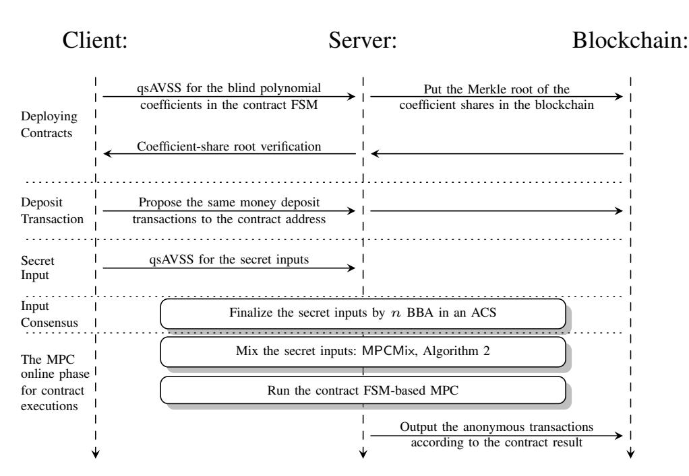
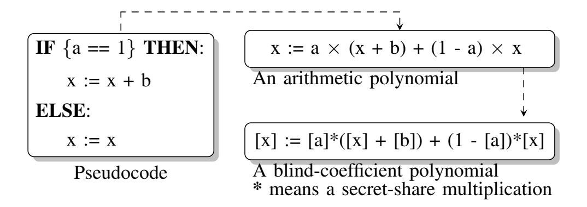
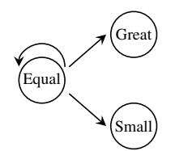
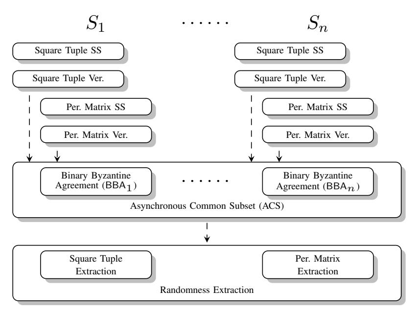
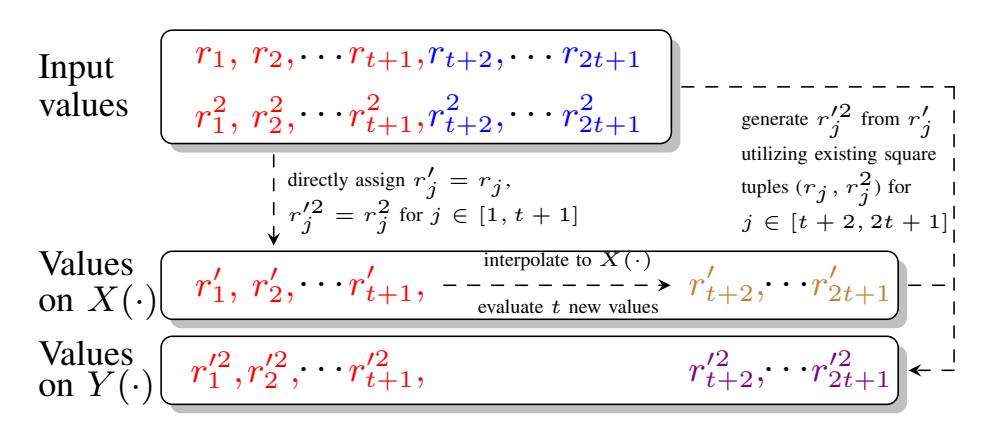
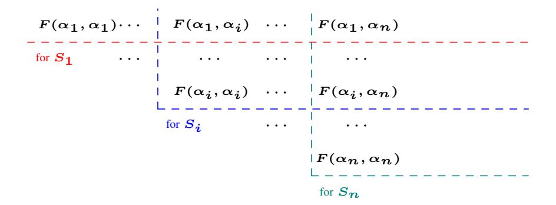
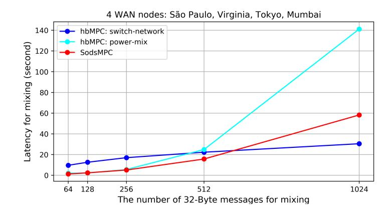

{0}------------------------------------------------

# SodsMPC: FSM based Anonymous and Private Quantum-safe Smart Contracts

Shlomi Dolev Ben-Gurion University of the Negev, Beer-Sheva, Israel dolev@cs.bgu.ac.il

Ziyu Wang Beihang University, Beijing, China Ben-Gurion University of the Negev, Beer-Sheva, Israel wangziyu@buaa.edu.cn

*Abstract*—SodsMPC is a quantum-safe smart contract system. SodsMPC permissioned servers (verification nodes) execute contracts by secure multi-party computation (MPC) protocols. MPC ensures the contract execution correctness while trivially keeping the *data privacy*. Moreover, SodsMPC accomplishes the contract *business logic privacy* while protecting the contract user *anonymous identity* simultaneously. We express the logic of a contract by a finite state machine (FSM). A state transition of the FSM is represented by a *blind polynomial* with secretshared coefficients. When using MPC to compute this blind polynomial, the contract business logic privacy is obtained. These coefficients which control the logic are binary secret shares. We also propose a base conversion method among binary and integer secret shares by MPC. Our contract anonymity comes from the "mixing-then-contract" paradigm. The online phase of the SodsMPC mixing is a multiplication between a preprocessed permutation matrix and an input vector in the form of secret sharing, which accomplishes a fully randomized shuffle of the inputs and keeps the secret share form for the following contract execution. All SodsMPC components, including a verifiable secret sharing scheme, are quantum-safe, asynchronous, coping with t < n/3 compromised servers, and robust (tolerates Byzantine servers) in both preprocessing and online phases.

*Index Terms*—Multi-party Computation, Private Smart Contract, Finite State Machine, Anonymous Mixing, Quantum-safety

# I. INTRODUCTION

Anonymity, Business Logic Privacy, and Data Privacy Smart Contract. Supporting smart contracts has become one of the most attractive properties of blockchain besides decentralization. In Ethereum [1], each contract could be executed by a miner according to the contract code. After calculating the final state, the miner packages several contract results, i.e., the updated blockchain state, as a block, and propagate this block. Other miners recognize this block after verifying whether the block creator follows the contract code. The deterministic contract executing result ensures a consistent blockchain state updating. However, the public verifiable contract execution reveals the user anonymity and privacy in a contract including: (1) who joins a contract? (2) what is the business logic of a contract? (3) what intermediate data is in a contract?

The user anonymity problem is not limited to smart contract. Blockchain publishes all transaction history, which reveals the payer and payee identity for all transactions including the users who interact with a contract. Mixing technology is one of the solutions to break the linkage connections between blockchain pseudonyms and protects the payer and the payee's identities.

Several permissionless blockchain private contract systems [2]–[4] cope with the contract privacy problem relying on zero-knowledge proof (ZKP). In these systems, contract users off-chainly execute the contract (with or without privacy protection). Later, the execution result proof is included in the blockchain, which may not reveal the contract executions. However, most deployed ZKP schemes are not quantum-safe in private contract systems [2]–[4].

The MPC advantages for tackling contract privacy problems in a permissioned blockchain. A permissioned blockchain consensus relies on the Byzantine fault-tolerance algorithm executed by n servers. In this architecture, we can further require these servers to execute contract-oriented MPC programs so that the contract execution correctness and data privacy are naturally obtained. Compared with some trusted execution environment (TEE) based private smart contract systems [5], MPC protocols can be deployed over standard computers without extra requirements for special hardware. Most deployed Ethereum contracts are financial-oriented [6] and do not have very complicated logic. Besides, the current preprocessing MPC protocols show that executing millions of multiplication gates can be finished in a reasonable time [7].

Most efficient MPC protocols are "secure-with-abort" against malicious adversaries. If the contract execution correctness and data privacy are based on the MPC correctness and privacy, aborting and re-running may bring more financial disagreements and leak client inputs. In some sense, robustness is the combination of fairness (there is no case in which malicious servers know the MPC result while other honest servers do not) and guaranteed output delivery (an MPC must output the desired result regardless of the Byzantine behavior) [8]. A non-robust preprocessing may require nonconstant rounds to reset when there are malicious servers [9]. 1 SodsMPC is fully robust in both preprocessing and online MPC phases, and does not offload the computational burden to the contract users, as done in some client-enhanced MPC protocols like Blinder [12].

Secure and private distributing computation in cloud computing is a key application area of MPC. Dolev et al. [13]– [16] have accomplished abundant computation functionalities based on the shared secrets in cloud servers. However,

1The player-elimination based protocols [10], [11] for a non-robust preprocessing have O(n) round complexity.

{1}------------------------------------------------

these computation models (universal Turing machine [13], automata [14], one instruction computer set [16]) are not designed to efficiently fit MPC-based contracts, which requires intensive condition checks.

A finite state machine (FSM) suits the contract application better, since a transition in a state machine must be under a specific condition and a contract requires intensive condition checks. Also, an FSM can be blindly computed by an MPC protocol [17]. Besides, the FSM pattern is recommended by the most popular contract coding language, Solidity [18]. Mavridou and Laszka [19] create an FSM contract language to decrease the number of Solidity implemented flaws in Ethereum. A contract is first designed as an FSM, which can be automatically compiled to a Solidity contract.

Quantum-safety Requirement. MPC-based contracts also reflect a security advantage in the upcoming quantum era. Most MPC protocols are perfect or statistic information-theoretical (I.T.), which can be proved to resist an adversary who has unbound computation power including a quantum adversary. In practice, some symmetric cryptography schemes (like AES or SHA) are computational, but still are believed to be quantumsafe if the security parameter is well-tuned, which enhances some I.T. schemes in the efficiency aspect.

## *A. Our Contribution*

A quantum-safe permissioned blockchain contract system protecting the contract logic privacy. In SodsMPC, the expressions of two contracts can be padded (with secret shared zero coefficients) into two polynomials with the same length. The key coefficients (logic control flags) are binary secretshared so that servers execute the same computation steps without knowing which parts of the computation will be regarded as the result. SodsMPC specially utilizes finite state machines to encode a contract to state transitions for efficiency concerns, which saves a lot of multiplication overhead.

We instantiate some FSM building blocks including a binary comparator and a binary adder. Besides, we also propose a protocol to blindly and more efficiently convert integer secret shares to binary shares by FSM-based comparators and adders. The arithmetic comparator implementation reflects reasonable running latency evaluated in AWS cloud, which can be regarded as a key component of most contract logic.

Simultaneously keeping the contract user identity anonymous. When enforcing the "mixing-then-contract" paradigm, the secret-shared inputs of a contract are first mixed in SodsMPC and then the mixing results are regarded as contract inputs for user anonymity. Our robust online phase is only one matrix-vector multiplication consuming a secret shared random permutation matrix and several Beaver tuples, which executes in only one round, keeps the secret share form outputs, and achieves a full randomized shuffle. The robustly preprocessing jobs cover the validity check and randomness extraction for permutation matrices and square tuples. We also implement the MPC mixing in AWS to reflect its practical performance, which is better than the previous MPC mixing work, HoneybadgerMPC [8], in the same cloud settings.

An efficient quantum-safe asynchronous verifiable secret sharing (qsAVSS). SodsMPC has an efficient qsAVSS scheme embodying a Merkle tree enhanced hash commitment for verifying a bivariate sharing polynomial. Our qsAVSS scheme consumes less communication overhead than the computational secure (quantum-unsafe) CKL+02 AVSS scheme [20] utilizing Pedersen commitments [21], and than the perfect I.T. secure CHP13 AVSS scheme [9] relying on broadcast channels.

## *B. Related Work*

We compare SodsMPC with previous private contract systems in Tab. I. In these permissionless blockchain contract systems, Enigma [22] utilizes blockchain to store Pedersen commitments [21] for verifying the off-chain MPC-based contract correctness. Hawk [2] compiles an off-chain computation into a ZKP-protected circuit, so that the on-chain activities verify the proof utilizing the circuit without knowing the inputs, which protects the data privacy. Arbitrum [23] puts the hashes of off-chain computation steps in the blockchain without proofs, and uses penalty to punish dishonest users. Ekiden [5] efficiently executes contracts in TEE to protect the contract data privacy. While the TEE result verification also requires the contract logic. Zether [3] supports confidential transactions since its on-chain interval ZKPs can prove the transaction input and output amounts are equal in publicly known contracts. The anonymous identity is also kept in Zether when introducing an anonymous set in each transaction. ZEXE [4] follows the Zcash [24] design and the on-chain ZKPs ensure any off-chain computations (logic and data privacy, and user identity) are not exposed in blockchain.

Moreover, the ZKP, signature, and encryption schemes (e.g., Pedersen commitments [21] and zkSNARKs [25]) used in these schemes are not quantum-safe. SodsMPC contract system has a different working flow. SodsMPC contract users only act as clients, and contracts are executed by permissioned blockchain servers via quantum-safe MPC protocols to ensure correctness and protect business logic and data privacy without relying on quantum-unsafe ZKPs.

TABLE I: The anonymous and private smart contract system comparison (Q.S.: quantum-safety. I.A.: identity anonymity. L.P.: business logic privacy. D.P. data privacy).

| Scheme        | Q.S.   | I.A. | L.P. | D.P. |
|---------------|--------|------|------|------|
| Enigma [22]   | No     | No   | No   | Yes  |
| Hawk [2]      | No     | No   | No   | Yes  |
| Arbitrum [23] | N.A. 2 | No   | Yes  | No   |
| Ekiden [5]    | No     | No   | No   | Yes  |
| Zether [3]    | No     | Yes  | No   | Yes  |
| ZEXE [3]      | No     | Yes  | Yes  | Yes  |
| SodsMPC       | Yes    | Yes  | Yes  | Yes  |

Besides, SodsMPC also includes a constant round MPCbased mixing protocol for the input anonymity before running the contract, which achieves robust preprocessing and online phases for n = 3t + 1 servers and against t adversaries in asynchronous settings. The output of a SodsMPC mixing 

{2}------------------------------------------------

would be a full randomized shuffle of the inputs in secret sharing. Every possible result of the N! input permutations, has the same probability of appearing in the output.

Compared with PowerMix [8], we break the online  $O(N^3)$  computation overhead bottleneck for servers. Each server in PowerMix [8] locally calculates all the N-power shares for all N client inputs. PowerMix outputs the plaintext of the input secrets in a lexicographic order, which is a deterministic mixing. SwitchNet [8] swaps every pair of N inputs for  $O(\log^2 N)$  layers of a butterfly network, which has  $2^{N\log^2 N}$  output combinations, smaller than N!, i.e., a partly randomized shuffle. Blinder [12] outputs a client-defined shuffle in a synchronous network by a fully robust and n = 4t + 1 MPC. The mixing comparison is shown in Tab. II.

TABLE II: MPC mixing protocols (syn.& asyn.: synchronous and asynchronous. SwitchNet and PowerMix are introduced by HoneybadgerMPC [8]. rand.: randomized.)

| Scheme        | Resi- lience | Synch- rony | Robust- ness | Shuffle            | Output            |
|---------------|-----------------|----------------|-----------------|--------------------|-------------------|
| Blinder [12]  | n = 4t + 1      | syn.           | full            | client defined  | secret sharing |
| SwitchNet [8] | n = 3t + 1      | asyn.          | online          | partly rand.       | secret sharing |
| PowerMix [8]  | n = 3t + 1      | asyn.          | online          | deter- ministic | plain- text    |
| SodsMPC       | n = 3t + 1      | asyn.          | full            | fully rand.        | secret sharing |

The rest of the paper is organized as follows. Section II introduces the settings and building blocks. Section III overviews SodsMPC, and Section IV explains how a blind-coefficient polynomial protects the contract logic privacy enhanced by FSMs. Section V details the online and preprocessing phases of the MPC-based mixing to protect the anonymity. Section VI proposes a quantum-safe asynchronous verifiable secret sharing scheme. Section VII and Section VIII demonstrates the SodsMPC efficiency and concludes this paper, respectively. In Appendix A, we detail an auction contract to see how SodsMPC protects the privacy and anonymity. We also introduce a complicated FSM use case for blind computation, a tournament sorting algorithm in Appendix B.

#### II. PRELIMINARY

System settings: entities, channel, and network. Our contract system runs in a permissioned blockchain having n verification nodes, named *server*. The number of *users* or *clients* a contract can support is unlimited. n servers are connected with private and authenticated channels, while every client connects to all n servers, i.e., a classical client-server MPC architecture [8]. At most  $t < \frac{n}{3}$  servers can be Byzantine who have quantum computation power. The adversaries can schedule the message orders from honest servers, which satisfies the definition of an asynchronous environment [26]. A message sent by an honest server will be eventually delivered

to its destination after a finite (but unknown) delay 3. Hybrid blockchain also works when the basic Proof-of-work or Proof-of-stake elects several permissionless verification nodes to form a consensus committee.

**Notation.** We denote a set of n servers by  $\mathcal{S} = \{S_1, \cdots, S_n\}$ , and the N users/clients in a contract by  $\mathcal{C} = \{C_1, \cdots, C_N\}$ . The MPC is defined over a finite prime field  $\mathbb{F}_p$ . p should be larger than  $\max\{N, 2n \cdot 2^\kappa, n+t+1\}$ . p>N is due to our permutation matrix verification algorithm, while  $p>2n\cdot 2^\kappa$  originates from the need to verify a claimed Beaver tuple [9] and a square tuple (SqrtVer, Algorithm 4).  $\kappa$  is the statistic secure parameter used to limit the error probability under  $2^{-\kappa}$ . Note that the value of  $\kappa$  does not affect a statistical I.T. secure protocol to resist a quantum adversary. We select publicly known distinct elements  $\{\alpha_1, \cdots, \alpha_n\}$  and  $\{\beta_1, \cdots, \beta_t, \beta\}$  from  $\mathbb{F}_p$  as the server identities and secret identities, respectively. Thus, p>n+t+1 ensures that the assignment is not in conflict. For a secret s, we denote a share of s by [s], or the specific share  $[s]_i$  for a server  $S_i$ .

## A. Existing MPC building blocks

Beaver triple tuple and its robust preprocessing: SodsMPC will handle a multiplication gate for secret shares during the protocols, utilizing a preprocessing Beaver tuple [27]. For two secret shares [x] and [y] and a tuple, ([a], [b], [ab] = [c]), servers reconstruct two masked inputs d = x - a and e = y - b, and locally derive the multiplication shares of the inputs [xy] = de + d[b] + e[a] + [c]. Choudhury et al. [9] have achieved robustly preprocessing Beaver tuples.

Asynchronous consensus for consistent MPC inputs: A binary Byzantine agreement (BBA) [28] tackles the asynchronous barrier with randomization. The asynchronous common subset (ACS) [26] is significant in asynchronous MPC, which agrees on the input values from all n servers and outputs an agreed subset ACSResult. ACSResult includes at least n-t servers, each of which is related to a BBA instant having 1-output. Since an asynchronous permissioned blockchain also adopts this ACS architecture, SodsMPC is adaptive to the blockchain projects like Honeybadger [29] and BEAT [30].

## III. SODSMPC WORKING FLOW

The SodsMPC working flow (Fig. 1) starts from the contract deployment process. One of the N contract clients/users is assigned to be the contract creator,  $C_{\text{creator}}$ .  $C_{\text{creator}}$  shares all coefficients (including zero coefficients) of a blind polynomial, by qsAVSS (Algorithm 7) for the t+1 reconstructed threshold.  $C_{\text{creator}}$  will extra create a special transaction including the Merkle tree roots of all the coefficient shares. After at least n-t servers verify this transaction and put this transaction in the blockchain, the contract is well-deployed. At the same time,  $C_{\text{creator}}$  also communicates with other N-1 contract clients for the actual polynomials and for the shares distributed by  $C_{\text{creator}}$ , which helps  $C_1, \cdots, C_{N-1}$  to verify the coefficient

&lt;sup>2Arbitrum [23] does not emphasize the used signature scheme for a contract correctness attestation.

&lt;sup>3A quantum-safe private and authenticated channel is feasible utilizing quantum-safe symmetric cryptography. The first time symmetric key distribution can be achieved by QKD or the lattice-based asymmetric cryptography.

{3}------------------------------------------------

share roots. Then,  $C_1, \dots, C_{N-1}$  decide whether to join the contract created by  $C_{\text{creator}}$ . Note that we do not make extra requirements for whether  $C_1, \dots, C_{N-1}$  and  $C_{\text{creator}}$  are honest. We can only guarantee that a contract creator deploys a consistent contract, while a meaningless contract without the client participating will be disregarded eventually.

Fig. 1: SodsMPC anonymous and private contract workflow.

For a contract execution, N clients first deposit (typically a fixed amount of) money to the contract address. Next, Nclients offer their secret inputs to the contract MPC program by secret sharing (qsAVSS, Algorithm 7). Note that there is an asynchronous consensus for the inputs each server receives. Next, SodsMPC servers run MPCMix (Algorithm 2) for mixing the secret inputs before executing the contract logic, which obeys the "mixing-then-contract" paradigm we propose. After mixing, at most t malicious servers (and other clients and blockchain observers) cannot infer the permutation relation between the contract inputs and the outputs. Note that the anonymous level depends on how many honest clients join the contract (i.e., mixing). If at least two of the N clients are honest, it is sufficient to keep the identity private for the mixing output. To ensure "mixing-then-contract", SodsMPC does not reveal the mixed inputs after mixing, while in contrast, other MPC-based mixing implementations, in particular, the mixing operation in HoneybadgerMPC-PowerMix [8] must reconstruct the mixing outputs. HoneybadgerMPC-SwitchNet [8] has a limited amount of random permutations by only swapping part of input pairs in a butterfly permutation network.

After mixing, servers would keep the integer secret share form for the mixed inputs according to the requirement of an actual contract, or convert the inputs to binary on demand by integerToBinary (Algorithm 1).

## IV. THE PRIVATE CONTRACT BUSINESS LOGIC

In this section, Sect. IV-A details how to express a contract by a blind-coefficient polynomial to protect the contract business logic, and introduces how to use a finite state machine (FSM) to make the polynomial computation more efficient. Next, Sect. IV-B instantiates several significant FSM constructions for a contract, including a binary comparator and a binary adder. Sect. IV-C describes how to blindly convert integerbinary secret shares to each other. For clarity, we assume that each secret is correctly shared under the t+1 threshold to all n servers in this section.

#### A. Blind-coefficient Polynomials and Finite State Machine

A smart contract can be a mutual-execution distributed protocol run by distrusted entities [31]. Roughly speaking, if this contract (a computer program) can be expressed by an arithmetic circuit, we can use an MPC protocol to compute this contract. Furthermore, an arithmetic polynomial is a natural representative of an arithmetic circuit [32], so that a polynomial is expressive enough to reflect a contract having arithmetic logic. A boolean logic can be converted to an arithmetic logic when assigning 1/0 for True/False, respectively.

If the coefficients of the polynomial are also secret-shared, the contract business logic is also kept. Servers execute the computation steps without knowing which parts of the computation will be regarded as the result, so that they cannot know the contract business logic. For two contracts having different business logic, it is possible that these two contract polynomials have different computation overheads (different numbers of addition and multiplication gates). Hence, we can pad the polynomial of the simpler contract as long as the polynomial of the more complex contract, by adding some dummy computations (e.g., adding zero or multiplying one, in secret shares). So that servers still cannot distinguish the business logic of two contracts because computing these two polynomials spends the same overhead.

However, directly computing a contract polynomial may not be efficient. For instance, a three-input millionaire problem (find the maximum input index in the field GF(11)) can be encoded to a very long polynomial f(x,y,z), which has 909 monomials from 0 to  $x^{10}y^{10}z^{10}$  (the coefficients of some terms are zero). Directly solving this polynomial (with all secret-shared coefficients) requires 30 rounds and around 20,000 multiplication gates [33]  $^4$ , which is not efficient.

For the logic of a contract, we can first use a finite state machine (FSM) to model the contract logic, and then represent this FSM by an arithmetic polynomial with binary condition control flags. Roughly speaking, SWITCH-CASE pseudocode can show the state transitions in an FSM, so that different conditions will lead the state to transit to different CASE branches. An IF-THEN-ELSE logic is the simplest SWITCH-CASE architecture with only two branches (THEN and ELSE), i.e., a two-state FSM. We can use one binary flag to control an IF-THEN-ELSE logic, i.e., to control the state transition in the two-state FSM. When assigning more bits to the control flags, the computation can support more complex logic as a SWITCH-CASE architecture (a more complex FSM).

Fig. 2 exhibits how to convert an IF-THEN-ELSE logic into an arithmetic polynomial, in which we assign 1/0 for boolean

&lt;sup>4The free item does not need a multiplication. The one-degree item requires one multiplication for the secret shared coefficient and the secret shared variable x. So on and so forth, the  $x^{10}y^{10}z^{10}$  item requires 30 multiplication rounds. In total, they require 19,965 multiplication gates [33].

{4}------------------------------------------------

Fig. 2: Different expression methods for a contract logic.

TRUE/FALSE, respectively. So that a boolean predicate can be converted to a binary control flag a. The arithmetic polynomial computes two branches of this logic (THEN and ELSE), but only one branch is indeed enabled depending on the a value. Next, when all internal variables in Fig. 2 are secretly shared (include the control flag a) and we compute the polynomial by an MPC protocol, we keep the logic privacy to the MPC execution entities, i.e., *n* servers. Still, these servers actually execute both THEN and ELSE branches, but they do not know which branch the contract designer specifies in the result. Note that the multiplication for two secret shares (denoted by \*) require an extra degree reduction, which can be avoided by a Beaver tuple (see Sect. II-A).

Expressing the logic of a contract by an FSM is not only due to an efficiency concern. Using an FSM to design a smart contract also assists a contract programmer to express the correct design logic with fewer bugs [19], so that the FSM pattern is officially recommended to contract developers by the Ethereum community in the Solidity (the most popular contract programming language) tutorial documents [18].

## B. Instantiating FSMs for contract logic

In this subsection, we use concrete examples to show how to execute FSM state transitions when servers holding the secret shares of binary states and input symbols. We first illustrate an FSM-based three-case comparator (equal to, smaller than, greater than), binComp $_3$  in Fig. 3, for two binary 1-bit inputs in secret shares, which can be simplified to a two-case comparator (not greater than, greater than), binComp $_2$ . We also offer an FSM-based binary adder with a carried bit binAdder in Fig. 4, in which there is an extra output symbol for each transition. Note that when servers blindly compute the FSMs, servers will obtain the shares of updated states and output symbols. At most  $t < \frac{n}{3}$  malicious servers do not know the state transitions and the value of output symbols.

FSM comparator: equal to, smaller than, and greater than. Suppose Alice has  $Input_a$  and Bob has  $Input_b$ . Their inputs can be regarded as a 2-bits Input, as the shares of 00, 01, 10 or 11. The transition result (comparison result) is also in the binary format. We assign two binary bits for updated states, by encoding  $P_{equal} = 00$ ,  $P_{small} = 01$ , and  $P_{great} = 10$ . The default initial state is  $P_{equal}$ . Although we define this comparator from two 1-bit inputs, this comparator also works for longer binary inputs when the comparison starts from the Most Significant Bit (MSB). If there is an unequal bit, the state

will transit to  $P_{\text{small}}$  or  $P_{\text{great}}$  and keep staying in this state. Note that servers who execute an FSM-based comparator do not know the state transition for each bit.

| state\input         | Q=00  | Q=01  | Q=10  | Q=11  |
|---------------------|-------|-------|-------|-------|
| $P_{\sf equal}$ =00 | equal | small | great | equal |
| $P_{small} = 01$    | small | small | small | small |
| $P_{great} = 10$    | great | great | great | great |

Fig. 3: binComp3 (3 cases): the equal to, smaller than, and greater than comparator for two 1-bit binary shared inputs.

We denote the *i*-th bit of a current state by  $P_i$ , the *i*-th bit of an input symbol by  $Q_i$ , for  $i \in [1,2]$ , respectively. After the encoding, the new state representative, denoted by  $\overline{P_i}$ , is:

$$\overline{P_1} = P_1 + (1 - P_1) \cdot (1 - P_2) \cdot [Q_1 \cdot (1 - Q_2)] 
= P_1 + [1 - P_1 - P_2 + P_1 \cdot P_2] \cdot [Q_1 - Q_1 \cdot Q_2], 
\overline{P_2} = P_2 + (1 - P_1) \cdot (1 - P_2) \cdot [(1 - Q_1) \cdot Q_2] 
= P_2 + [1 - P_1 - P_2 + P_1 \cdot P_2] \cdot [Q_2 - Q_1 \cdot Q_2].$$

In the 1st round, servers compute  $P_1 \cdot P_2$  and  $Q_1 \cdot Q_2$ . In the 2nd round,  $[1-P_1-P_2+P_1\cdot P_2]\cdot [Q_2-Q_1\cdot Q_2]$  and  $[1-P_1-P_2+P_1\cdot P_2]\cdot [Q_1-Q_1\cdot Q_2]$  are computed. Hence, a transition of binComp3 consumes 2 rounds and 4 multiplications.

Recall the three-input millionaire problem example defined in the field GF(11). We can use four binary bits to represent a value in GF(11). Thus, using binComp3 twice for four bits only spends 16 rounds and 32 multiplications, which saves a lot of multiplication invocations compared with the overhead to solving a directly encoded blind polynomial.

FSM comparator: not greater than, and greater than. A three-case FSM comparator can be simplified to two-case, e.g.,  $P_{\mathsf{nGreat}} = 1$  for not greater than and  $P_{\mathsf{great}} = 0$  for greater than. We use 1 to substract the first bit of the final state of binComp3 as binComp2, i.e.,  $\overline{P_{\mathsf{binComp}_2}} = 1 - \overline{P_{\mathsf{binComp}_3}}(1)$ .

When  $\operatorname{Input}_a \leq \operatorname{Input}_b$ ,  $\overline{P_{\operatorname{binComp}_3}(1)} = 0$  and  $\overline{P_{\operatorname{binComp}_2}} = P_{\operatorname{nGreat}} = 1$ . When  $\operatorname{Input}_a > \operatorname{Input}_b$ ,  $\overline{P_{\operatorname{binComp}_3}(1)} = 1$  and  $\overline{P_{\operatorname{binComp}_2}} = P_{\operatorname{Great}} = 0$ . Therefore,  $\operatorname{binComp}_2$  also spends 2 rounds and 4 multiplications.

FSM computation: a binary adder with carry bits. The states of binAdder can be encoded as whether the current addition requires a previous bit, i.e.,  $P_{nCarry} = 0$  for no carry bit and  $P_{carry} = 1$  for a carry bit. When binAdder has two binary inputs from the Least Significant Bit (LSB), the state transits to an updated case according to if an addition renders a carry bit. The output symbol represents the additive result of two input bits without a carry bit. The FSM transition table is depicted in Fig. 4. The update state and output symbol are

$$\begin{split} \overline{P} &= (1-P) \cdot [Q_1 \cdot Q_2] + P \cdot [1 - (1-Q_1) \cdot (1-Q_2)] \\ &= Q_1 \cdot Q_2 - 2P \cdot Q_1 \cdot Q_2 + P \cdot (Q_1 + Q_2) \\ \overline{Q} &= (1-P) \cdot [(1-Q_1) \cdot Q_2 + Q_1 \cdot (1-Q_2)] \\ &+ P \cdot [(1-Q_1) \cdot (1-Q_2) + Q_1 \cdot Q_2] \\ &= P + Q_1 + Q_2 - 2Q_1 \cdot Q_2 + 4P \cdot Q_1 \cdot Q_2 - 2P \cdot (Q_1 + Q_2). \end{split}$$

{5}------------------------------------------------

In the 1st round, servers compute  $Q_1 \cdot Q_2$  and  $P \cdot (Q_1 + Q_2)$ . In the 2nd round,  $P \cdot Q_1 \cdot Q_2$  would be calculated. In total, one transition of binAdder costs 2 rounds and 3 multiplications.

|         | nCarry |
|---------|--------|
| <u></u> | carry  |

| state\input      | Q=00     | Q=01     | Q=10     | Q=11    |
|------------------|----------|----------|----------|---------|
| $P_{nCarry} = 0$ | nCarry,0 | nCarry,1 | nCarry,1 | carry,0 |
| $P_{carry} = 1$  | nCarry,1 | carry,0  | carry,0  | carry,1 |

Fig. 4: binAdder: an adder with a carry bit

Here we only instantiate individual subroutine FSM for comparison and adder. When parallelizing the execution of many subroutine FSMs, we can speed up the blind execution for achieving abundant functionalities, such as a tournament sorting example we describe in Appendix B.

#### C. Secret Sharing Base Conversion: Binary and Integer

In this subsection, an integer secret x in the prime finite field  $\mathbb{F}_p$  is denoted by the binary representation  $x_{l-1}, \dots, x_0$  (from MSB to LSB) when  $l = \lceil log_2 p \rceil$ . The notation for all the binary secret shares is  $\lceil x \rceil_B = (\lceil x_{l-1} \rceil, \dots, \lceil x_0 \rceil)$ .

**Binary to Integer.** The base conversion from binary secret shares to integer shares can be done locally and blindly without an interaction. The secret shares of integer x from the shares of binary bits  $[x_{l-1}], \dots, [x_0]$  are  $[x] = \sum_{i=0}^{l-1} 2^i \cdot [x_i]$ .

Integer to Binary. Since there is not a *mod 2* operation in a prime finite field, blindly converting an integer secret share to a binary share cannot be accomplished locally. We propose an integer-binary conversion protocol in Algorithm 1, which is enlightened by [34]. Compared with [34], our integerToBinary is more efficient in communication complexity (counting by the number of multiplication invocations) for the FSM usage.

In the online phase of Algorithm 1, servers first locally and blindly convert the binary shares  $[r_{l-1}], \cdots, [r_0]$  to the integer shares [r]. Next, the servers publicly reconstruct the masking secret R = x - r and convert to binary  $R_{l-1}, \cdots, R_0$ . If  $x \ge r$ , we can easily obtain the shares of each bit  $[x_i]$  utilizing the binary adder for  $R_i$  and  $[r_i]$  for  $i \in [0, l-1]$ . If  $-p \le x - r < 0$  or x - r < -p, the reconstruct R actually equals x - r + p or x - r + 2p in the field  $\mathbb{F}_p$ , respectively. Therefore, the conversion protocol tries to blindly remove the  $0 \times p$ ,  $1 \times p$  or  $2 \times p$  addition. Note that when we compare an input in the secret sharing form with another input in the plaintext form, the shares of the plaintext input are the dummy shares (i.e., every share equals the secret).

We take an integer x=1 as an example in GF(13)  $(p=13,\ l=4)$  to describe the secret share conversion from integer to binary, utilizing preprocessed binary secret shares, r=15 (binary 1111). In the first step of Algorithm 1, servers reconstruct R=x-r=-14=12 in GF(13) and publicly convert R=12 to the binary representations 1100. After adding R with  $[r]_B$  by a binary adder with carry bits, servers withhold  $[R']_B$  as the shares of 1\_1011. Then,  $[R']_B$  is blindly compared with p and p leading to the result shares p and p and p leading to the result shares p and p as binary 0011 corresponding to the integer p and p and set

**Input**: The shares of an integer, [x]. **Preprocessing**: The shares of l bits,  $[r_{l-1}], \dots, [r_0]$ . **Online procedure**:

- 1. Reconstruct  $[R] = [x] \sum_{i=0}^{l-1} 2^i \cdot [r_i]$ , publicly convert R to binary  $R_{l-1}, \dots, R_0$ . Let  $[R']_B$  as  $([R'_l], [R'_{l-1}], \dots, [R'_0]) \leftarrow \mathsf{binAdder}(R_i, [r_i])$ , for  $i \in [0, l-1]$ .
- 2. Let  $[p]_B = ([p_l], \dots, [p_0])$  as the dummy shares of the prime p binary representations. The imaginary MSB  $p_l$  of p must be zero. Similarly, let  $[p']_B$  as the dummy shares of the binary representations of 2p.
- 3.  $[\operatorname{res}_1] \leftarrow \operatorname{binComp}_2([p]_B, [R']_B)$ ,  $[\operatorname{res}_2] \leftarrow \operatorname{binComp}_2([p']_B, [R']_B)$ . If  $p \leq R'$ ,  $\operatorname{res}_1 = 1$ ; otherwise  $\operatorname{res}_1 = 0$ . If  $2p \leq R'$ ,  $\operatorname{res}_2 = 1$ ; otherwise  $\operatorname{res}_2 = 0$ . Let binary  $f_{l-1}, \cdots, f_0$  stand for the integer  $2^l p$ , then set  $[g_i] = f_i \cdot [\operatorname{res}_1]$  and  $[g'_i] = f_i \cdot [\operatorname{res}_2]$  for  $i \in [0, l-1]$ .

  4.  $([R''_{l+1}], \cdots, [R''_0]) \leftarrow \operatorname{binAdder}([g_i], [R'_i])$  for  $i \in [0, l]$ ,  $g_l = 0$ .  $([R'''_{l+2}], \cdots, [R''']) \leftarrow \operatorname{binAdder}([g'_i], [R''_i])$  for

 $i \in [0, l+1], g'_l = g'_{l+1} = 0.$  **Output**: The lower l bits of  $R'''_i$  shares, i.e.,  $[R'''_{l-1}], \cdots, [R'''_0].$ 

**Algorithm 1:** integer ToBinary: blindly converting the secret shares of an integer to the shares of the binary bits.

TABLE III: The integer-binary secret share conversion overhead. (Prep.: preprocessing. Multi.: one invocation of a secret share multiplication protocol. Err. prob.: error probability.)

| Scheme     | DFK+-06 [34]                                                                             | integerToBinary (Algorithm 1)         |  |
|------------|------------------------------------------------------------------------------------------|------------------------------------------|--|
| Prep. Bits | 2 rounds, 2l Multi. (Er                                                                  | r. prob.: 1/p) [34].                     |  |
| Check Bits | 19 rounds, $22l$ Multi. (Err. prob.: $1 - p/2^l$ )                                    | No need                                  |  |
| Comparison | 19 rounds, 22l Multi.                                                                    | 2l rounds, 4l Multi. (run two times)     |  |
| Adder      | $37 \text{ rounds,}$ $55l \log_2 l \text{ Multi.}$ (run two times)                       | 2l rounds, $3l$ Multi. (run three times) |  |
| Total      | $\begin{array}{c} 114 \text{ rounds,} \\ 46l + 110l \log_2 l \text{ Multi.} \end{array}$ | 2 + 10l rounds, 19l Multi.            |  |

 $[g_i] = f_i[\operatorname{res}_1]$  for  $i \in [0,3]$ . Adding  $[R']_B$  with  $[g]_B$  renders  $[R'']_B$ , which is the shares of  $01\_1110$ .  $[R'']_B$  is added with  $[g']_B$  leading to  $[R''']_B$  as the shares of  $010\_0001$ . Finally, the output results are the 4 lower bits of  $[R''']_B$  as  $[0], [0], [0], [1]_B$  corresponding to the integer x = 1.

We summary the overhead of integerToBinary (Algorithm 1) in Tab. III, which is compared with the previous work [34] about the round complexity and the communication complexity (counting by the number of multiplication invocations). By the FSM-based comparator and adder, we achieve much less overhead for the number of multiplication invocations while keeping the round complexity linear to the binary length of a field  $l = \lceil \log_2 p \rceil$ . Although we follow the method in [34] to preprocess secret shares of binary bits, we extra remove the r < p requirement.

{6}------------------------------------------------

#### V. MPC MIXING FOR THE USER ANONYMITY

## A. The SodsMPC Online Phase

Our MPC for transaction mixing in the online phase is very simple as it requires only one matrix-vector multiplication (Algorithm 2). Assume there would be N inputs to be mixed (in the secret share form), denoted as a vector  $\vec{I} = \{\text{input}_1, \cdots, \text{input}_N\}$ . A preprocessed permutation matrix  $\mathbf{M}$  is also in the form of secret shares. The mixing outputs the shares of the input random permutation,  $\pi(\vec{I}) = \vec{I} \cdot \mathbf{M}$ .

Input: The secret shares of N inputs  $\vec{I} = \{ \text{input}_1, \cdots, \text{input}_N \}$  are denoted by  $\{ [\text{input}_1]_k, \cdots, [\text{input}_N]_k \}$  for server  $S_k$   $(k \in [1, n])$ . **preprocessed secret shares**:  $N^2$  Beaver tuples  $[a_{i,j}], [b_{i,j}], [c_{i,j}]$   $(i,j \in [1,N])$ . One secret shared random permutation matrix  $\mathbf{M} = \{m_{i,j}\}, (i,j \in [1,N])$ . Online: // (For each server  $S_k \in \mathcal{S}, k \in [1,n]$ )
1. Reconstruct  $2N^2$  maskings,  $d_{i,j} = m_{i,j} - a_{i,j}$ ,  $e_{i,j} = \text{input}_i - b_{i,j}$   $(i,j \in [1,N])$ .

- 2. Locally construct the intermediate secret shares,  $[\mathsf{temp}_{i,j}]_k = d_{i,j}e_{i,j} + d_{i,j}[b_{i,j}]_k + e_{i,j}[a_{i,j}]_k + [c_{i,j}]_k$ .
- 3. Output the permutation,  $[\operatorname{output}_i]_k = \sum_{j=1}^N [\operatorname{temp}_{j,i}]_k$ ,  $[\pi(\vec{I})]_k = \{[\operatorname{output}_1]_k, \cdots, [\operatorname{output}_N]_k\}.$

Algorithm 2: MPCMix: the online phase for MPC mixing (n): the server number. N: the input number for mixing.  $\pi$ : the random permutation.)

#### B. Ingredients of the SodsMPC Preprocessing

The preprocessing components of SodsMPC include random integer numbers, random binary bits, Beaver tuples, square tuples, and permutation matrices. All these secrets are shared by the novel quantum-safe asynchronous verifiable secret sharing scheme (qsAVSS, Algorithm 7) for ensuring the t+1 reconstruct threshold. The randomness extraction for a random integer number is a very simple accumulation of t+1 random numbers from t+1 distinct dealers. However, the verification and randomness generation for other components are more complicated. Beaver tuples can be robustly handled by the protocol in [9]. The shares of random bits can be coped with by another protocol in [34].

In the sequel, we detail the more challenging tasks and techniques, for the verification (verifying whether the generated value from a dealer is valid) and randomness extraction (extracting randomness from t+1 or 2t+1 dealers to avoid at most t malicious dealers to know the random value) for square tuples and permutation matrices. All our preprocessed ingredients are robust. In an asynchronous network, the whole preprocessing should perform after the servers agree on which secret sharing protocols (and their verifications) are finalized. Utilizing ACS [26], at least n-t=2t+1 server related BBAs would output one, and these servers are included in the ACS result set ACSResult, in which the contributions of every server are finalized from the view of all honest severs. Hence, the contributions from the servers in ACSResult will

Fig. 5: The SodsMPC robust preprocessing phase MPCPrep, Algorithm 3. ( $S_i$ : Servers. SS: Secret sharing. Per.: Permutation. Ver.: Verification.)

Secret sharing:  $S_i$  shares secrets by qsAVSS (Algorithm 7).

**Tuple and matrix verification**: All servers check if: (1) The square tuples generated by  $S_i$  are square tuples by SqrtVer (Algorithm 4). (2) The matrix generated by  $S_i$  is a permutation matrix by MatVer (Algorithm 6).

**Asynchronous common subset**:  $S_i$  inputs its opinion about  $\mathsf{SqrtVer}_j$  and  $\mathsf{MatVer}_j$  to  $\mathsf{BBA}_j$  related to  $S_j$ , 1 for valid and 0 for invalid. The ACS protocol will outputs at least 2t+1 BBA 1-results in a common subset ACSResult.

**Randomness extraction**: // (Every server will extract randomness from the contributions of t+1 or 2t+1 distinct dealers in ACSResult.)

- 1. A square tuple from every 2t + 1 valid square tuple by SqrtExt (Algorithm 5).
- 2. A matrix from every t+1 valid permutation matrices by  $\mathbf{M} = \Pi_{i=1}^{i=t+1} \mathbf{M}_i$ , consuming t rounds and  $tN^2$  Beaver tuples.

**Algorithm 3:** MPCPrep: the robust preprocessing phase (n): the server number. N: the input number for mixing. t: the number of the maximum malicious servers)

be recognized for further randomness extractions. The overall preprocessing phase is described in MPCPrep (Algorithm 3) and depicted in Fig. 5.

Square Tuple Verification and Randomness Extraction. Similar to a Beaver tuple, the shares of a square tuple  $(r, r^2)$  helps a square calculation of secret shares [x], by  $[x^2] = [r^2] + (x - r)([x] + [r])$ . For preprocessing a square tuple, we propose the square tuple verification and randomness extraction protocols enlightened by the ones for a Beaver tuple [9]. However, the overhead for verifying a square tuple is smaller than the one of a Beaver tuple.

The general idea is to construct two new t and 2t degree polynomials,  $X(\cdot)$  and  $Y(\cdot)$  using input 2t+1 claimed square tuples. Then, the servers utilize a random evaluating value  $\alpha$ ,

{7}------------------------------------------------

to test whether  $X(\alpha) \cdot X(\alpha) \stackrel{?}{=} Y(\alpha)$ . Fig. 6 depicts how input 2t+1 claimed square tuples can be converted to 2t+1 values, which decides the testing polynomials  $X(\cdot)$  and  $Y(\cdot)$ .

Fig. 6: The square tuple conversion used in the verification and randomness extraction protocols (SqrtVer, Algorithm 4 and SqrtExt, Algorithm 5). Better read in colors.

After a dealer VSS distributes the t+1 reconstruction threshold shares of 2t+1 claimed square tuples  $(r_j, r_j^2)$  for  $j \in [1, 2t+1]$ , the servers use the first t+1 input r values to interpolate a t-degree polynomial  $X(\cdot)$ , then evaluate another t new points in  $X(\cdot)$ , i.e.,  $X(\beta_1), \cdots, X(\beta_t)$ . Hence, the output 2t+1 values of r' are constituted by the first t+1 input r values and the new evaluated t points. All 2t+1 output r' pass the polynomial  $X(\cdot)$ . Next, the remained last t inputs  $(r, r^2)$  will be regarded as square tuples to create the last t output t' values for the square of the new evaluated t output t' values. The t generated t' values construct a t-degree polynomial t values tuple conversion is detailed in the verification protocol SqrtVer, Algorithm 4 and Fig. 6.

**Input**: 2t + 1 claimed square tuples  $r_j, r_j^2$ , and every server  $S_i$  has shares of these tuples,  $[r_j]_i, [r_j^2]_i$  for  $j \in [1, 2t + 1]$ . Public known values  $\beta_k$  for  $k \in [1, t]$ . **The square tuple conversion**:

(The first t+1 outputs):  $S_i$  set the first t+1 output square tuples  $[r'_j]_i, [r'^2_j]_i$  for  $j \in [1, t+1]$  as the same as the first t+1 input tuples. Then,  $S_i$  interpolates  $[r'_j]_i$   $(j \in [1, t+1])$  and gets an t-degree polynomials  $X(\cdot)$ . (The last t outputs):  $S_i$  evaluates  $\beta_k$  in  $X(\cdot), [r'_j]_i = [X(\beta_k)]_i$  for  $k \in [1, t], j \in [t+2, 2t+1]$ . Then,  $S_i$  sets the remained t outputs for  $[r'^2_j]_i$  by calculating the square share of  $r'_j$  utilizing  $(r_j, r^2_j)$  for  $j \in [t+2, 2t+1]$  as existed square tuples. After that, all 2t+1  $r'^2_j$  could define a 2t-degree polynomial  $Y(\cdot)$ .

The square tuple verification: All servers reconstruct a common random value  $\alpha$ , reconstruct  $X(\alpha), Y(\alpha)$ , and check whether  $X(\alpha) \cdot X(\alpha) \stackrel{?}{=} Y(\alpha)$ .

**Algorithm 4:** SqrtVer: verifying square tuples.

Algorithm 4 is a statistic information-theoretical secure verification method whose correctness is based on the random  $\alpha$  choice from the finite field  $\mathbb{F}_p$ . It is trivially true that  $(r'_j, r'^2_j)$  is a square tuple if and only if  $(r_j, r^2_j)$  is a square tuple for  $j \in [1, t+1]$ . For  $j \in [t+2, 2t+1]$ ,  $r'^2_j$  is calculated from  $r'_j$ .

Hence,  $(r'_j, r'^2_j)$  is satisfied if and only if  $(r_j, r^2_j)$  is a square tuple for  $j \in [t+2, 2t+1]$ . For a random point  $\alpha$  and the testing equation  $X(\alpha) \cdot X(\alpha) \stackrel{?}{=} Y(\alpha)$ , if the equation is satisfied but the claimed square tuples are not satisfied,  $\alpha$  must be a root of the testing polynomials, i.e.,  $X(\alpha) = 0$  and  $Y(\alpha) = 0$ . Therefore, when the random  $\alpha$  is uniformly selected from  $\mathbb{F}_p$ , the error possibility is at most  $\frac{2t}{|\mathbb{F}_p|}$  since  $Y(\cdot)$  is at most 2t-degree and has at most 2t roots. From  $\frac{2t}{|\mathbb{F}_p|} < \frac{2n}{|\mathbb{F}_p|} < 2^{-\kappa}$ , we have  $|\mathbb{F}_p| = p > 2n \cdot 2^{\kappa}$ .

Extracting a new random square tuple (SqrtExt, Algorithm 5) also requires converting the 2t+1 tuples as we verify 2t+1 claimed square tuples (Fig. 6). Compared with the collection of 2t+1 claimed square tuples from one dealer in Algorithm 4, Algorithm 5 collects 2t+1 valid square tuples from 2t+1 distinct servers. These 2t+1 servers are inside the ACS common subset ACSResult. Instead of evaluating a random point like  $\alpha$  in Algorithm 4, SqrtExt will output a square tuple from a specific point  $\beta$  in the new t and 2t degree polynomial  $t = X(\beta)$  and  $t = Y(\beta)$  in Algorithm 5.

Input: 2t+1 square tuples  $r_j, r_j^2$  for  $j \in [1, 2t+1]$ . Each creator  $S_j$  is included in one round ACSResult, and each tuple passes the check SqrtVer (Algorithm 4). There are public known values  $\beta_k$  for  $k \in [1, t]$  and  $\beta$ . Converting the tuples and constructing two output polynomials: Servers creates t-degree polynomials  $X(\cdot)$  and 2t-degree polynomial  $Y(\cdot)$  utilizing the 2t+1 inputs as the similar way of SqrtVer (Algorithm 4). Extracting a new random square tuple:  $S_i$  outputs the share of the new square tuple as  $[r]_i = [X(\beta)]_i, [r^2]_i = [Y(\beta)]_i$ .

**Algorithm 5:** SqrtExt: extracting random square tuples.

**Permutation Matrix Verification and Randomness Extraction.** In MPCPrep (Algorithm 3), each  $S_i$  checks that a matrix generated by  $S_j$  is a valid permutation matrix by MatVer (Algorithm 6). The basic idea is from the permutation matrix definition. Our verification algorithm works when all values come from the finite field  $\mathbb{F}_p$ . The p value should be larger than the number of inputs N to be mixed (p > N).

- (1) Every row or every column of a permutation matrix has and only has one 1 element, and the remained  $N^2 N$  elements should be 0. Hence, we first reconstruct the sums of each row and each column to make sure the sum of each row or column is 1.
- (2) Moreover, each matrix item should be a 1 or 0 secret. Otherwise, the fact that the row sum or the column sum is 1 cannot ensure the remained  $N^2 N$  elements in a matrix are 0. So that in the second step, we extra blindly test whether the shares of each matrix item [x] satisfying  $[x^2] [x] = [0]$  utilizing a preprocessed square tuple. If the reconstruction is 0, then x must be 0 or 1.

For extracting a random permutation matrix, the direct way is to multiply t+1 valid permutation matrices generated by t+1 distinct dealers, i.e.,  $\mathbf{M} = \prod_{i=1}^{i=t+1} \mathbf{M}_i$ .

{8}------------------------------------------------

**Input**: The secret shares of a claimed permutation matrix,  $\mathbf{M} = \{[m_{i,j}]\}\ (i, j \in [1, N])$ , in the finite field  $\mathbb{F}_p \ (p > N). \ N^2 \ \text{square tuples} \ [r_{i,j}], [r_{i,j}^2] \ (i, j \in [1, N]).$ Row and column sum verification: // (For  $S_k \in \mathcal{S}$ ) The sum of the *i*-th row and column shares are denoted by  $\operatorname{rowSum}_i = \sum_{j=1}^N [m_{i,j}]$  and  $\operatorname{colSum}_i = \sum_{j=1}^N [m_{j,i}]$ , respectively.  $S_k$  reconstructs all rowSum1,  $\cdots$ ,  $\mathsf{rowSum}_N$  and  $\mathsf{colSum}_1, \cdots, \mathsf{colSum}_N$  to check if all these values equal 1.

Finite field element verification: // (For  $S_k \in \mathcal{S}$ )

1. Reconstructing  $N^2$  masking secrets,  $r_{i,j}^{\star} = m_{i,j} - r_{i,j}$ for  $i, j \in [1, N]$ , and locally constructing the secret shares for all elements in **M** by  $[m_{i,j}^2 - m_{i,j}] =$  $[m_{i,j}^2] - [m_{i,j}] = r_{i,j}^2 + r_{i,j}^{\star} \cdot ([m_{i,j}] + [r_{i,j}]) - [m_{i,j}].$ 2. Reconstructing all  $m_{i,j}^2 - m_{i,j}$  elements for

 $i, j \in [1, N]$ . If every result is zero, then **M** is valid.

**Algorithm 6:** MatVer: verifying a permutation matrix.

## VI. QUANTUM-SAFE ASYNCHRONOUS VERIFIABLE SECRET SHARING (QSAVSS)

We propose a quantum-safe AVSS (qsAVSS) scheme based on a quantum-safe hash-based commitment. Instead of encoding polynomial coefficients, we require a dealer to commit the interactive checking points in a bivariate polynomial. For our qsAVSS scheme, we define security as follows.

- Correctness: If the dealer is honest then the honest parties reconstruct the same secret.
- Strong commitment: If an honest party delivers a share related to a secret s, even if a dealer is dishonest, all honest parties would eventually deliver the shares of s at the end of a sharing phase 5.

A Hash-based Merkle Tree Commitment. A dealer evaluates the  $\frac{n(n+1)}{2}$  points  $([\alpha_1, \dots, \alpha_n]$  for x and y) in a t-degree symmetric bivariate polynomial F(x,y). The dealer removes the overlap points due to the polynomial symmetry property, i.e., F(x,y) = F(y,x). All these points construct a hash up-triangle matrix as depicted in Fig. 7. We further deploy a Merkle tree to compress the commitment by arranging these  $\frac{n(n+1)}{2}$  points in the leaves, so that every leaf could be verified by a Merkle proof sizing  $O(\log_2 \frac{n(n+1)}{2}) = O(\log n)$  branch nodes. The Merkle tree root is denoted by Root.

**qsAVSS** Protocol. The basic verification idea of the qsAVSS protocol in the sharing stage deploys a hash-based commitment (in a Merkle tree format) to bind all necessary points in the bivariate polynomial, instead of a Pedersen commitment for quantum-safety. The sharing phase for the commitment is similar to the Bracha asynchronous reliable broadcast (RBC) [36], in which even a malicious broadcaster cannot make part of servers deliver a message while the remained servers deliver another message or nothing. The Merkle tree usage is enlightened by the RBC in Honeybadger BFT [29].

Fig. 7: Points to be put in a Merkle tree hash commitment (a half of matrix, the up-triangle part). Better read in colors.

In the first sharing step, a dealer  $S_{\text{dealer}}$  encodes a secret s in a t-degree symmetric bivariate polynomial F(x, y), i.e., F(0,0) = s.  $S_{\text{dealer}}$  commits all  $\frac{n(n+1)}{2}$  points in a hash uptriangle matrix, and converts the matrix to a Merkle tree.  $S_{\mathsf{dealer}}$ sends every univariate polynomial  $f_i(x) \stackrel{def.}{=} F(x, \alpha_i) =$  $F(\alpha_i, x)$  to server  $S_i$  with a set of Merkle tree proofs, Branchi.

In echo and ready, servers verify if receiving the same bivariate polynomial by echoing and ready-broadcasting the Merkle root. Unlike the hash-based AVSS protocol in [35], we rely on the interactive points even when servers agree on the same Merkle root of the committed points, which is necessary for "slow but honest" servers to deliver the shares when a dealer is dishonest. Also, at least t+1 honest servers ensure that the interactive points are identical, which guarantees that the threshold is at most t+1.

If  $S_{\text{dealer}}$  wants to succeed in running a qsAVSS instance,  $S_{\text{dealer}}$  has to send correct messages to at least t+1 honest servers. If  $S_{\text{dealer}}$  is dishonest, at most t adversaries may assist  $S_{\text{dealer}}$  to convince t+1 "fast and honest" servers. The remained at most t "slow but honest" servers may receive incorrect messages or nothing from at most t adversaries (including  $S_{\text{dealer}}$ ). According to the ready broadcast rule (receiving t+1 but not broadcast yet), t "slow but honest" servers still deliver the same Root as "fast and honest" servers. "slow but honest" servers can use Root to locate the correct t+1 echo messages, and interpolate them to obtain the shares. The qsAVSS algorithm sharing phase is detailed in Algorithm 7.

The reconstruction phase of qsAVSS follows the standard robust reconstruction way enhanced by error correction code like Berlekamp-Welch [9]. We describe the robust reconstruction phase of qsAVSS in Algorithm 8.

Theorem 1: Algorithm 7 (and Algorithm 8) satisfies the correctness properties of a qsAVSS scheme.

*Proof:* Considering three cases: (1)  $S_i$  and  $S_j$  deliver shares directly. (2)  $S_i$  and  $S_j$  deliver shares directly and indirectly, respectively. (3)  $S_i$  and  $S_j$  deliver shares indirectly. Correctness: Assume towards contradiction that an honest server  $S_i$  delivers a share  $[s]_i$  for secret s while another honest server  $S_j$  delivers a share  $[s']_j$  for another secret s'. (1) If  $S_i$  directly delivers  $|s|_i$ ,  $S_i$  receives at least 2t+1 ready messages for Root, which originate from at least t+1 honest servers who receive 2t+1 echo messages. At least t+1 echo messages are from honest servers. If another honest  $S_j$  delivers

&lt;sup>5In a (weak) commitment VSS scheme, if a dealer is dishonest and a sharing is finished, honest parties may reconstruct a default value [35].

{9}------------------------------------------------

**Public Input**: Identity elements  $\alpha_i$  for  $S_i$ ,  $i \in [1, n]$ . Sharing: // (For a dealer  $S_{\text{dealer}}$ )

 $S_{\text{dealer}}$  generates a random t-degree symmetric bivariate polynomial F(x,y), for which the secret is s=F(0,0). A univariate polynomial  $f_i(x) \stackrel{def.}{=} F(x,\alpha_i) = F(\alpha_i,x)$  could be derived for  $S_i$ . The  $\frac{n(n+1)}{2}$  points,  $F(\alpha_i,\alpha_j)$   $(i,j\in[1,n],\ i\leq j)$ , construct a hash commitment matrix, which is further converted to a Merkle tree having a root, Root. The Merkle branch proof for the hash of  $F(\alpha_i,\alpha_j)$  is denoted by branch $_{i,j}$ . Branch $_i$  is a set of n Merkle branch proofs for  $S_i$ , including branch $_{1,i},\cdots$ , branch $_{i,i},\cdots$ , branch $_{i,i},\cdots$ , for the hashes of n points  $F(\alpha_1,\alpha_i),\cdots,F(\alpha_i,\alpha_i),\cdots,F(\alpha_i,\alpha_n)$ .  $S_{\text{dealer}}$  sends  $\langle \text{sharing}, f_i(x), \text{Branch}_i \rangle$  to  $S_i, \forall S_i \in \mathcal{S}$ . **Echo**: // (For each server  $S_i \in \mathcal{S}$ )

Upon receiving a sharing message,  $S_i$  checks if Branchi helps  $f_i(\alpha_j)$  get the same Root, for  $j \in [1, n]$ . If so,  $S_i$  echoes  $\langle \text{echo}, \text{Root}, f_i(\alpha_j), \text{branch}_{i,j} \rangle$  to  $\forall S_j \in \mathcal{S}$ .

Upon receiving an echo message from  $S_j$ ,  $S_i$  checks if the received  $f_{\text{rev},j}(\alpha_i)$  satisfies  $f_{\text{rev},j}(\alpha_i) = f_i(\alpha_j)$ . If so,  $S_i$  counts this echo message including  $f_{\text{rev},j}(\alpha_i)$  and branchj,i.

Upon receiving n-t counted echo messages having the same Root,  $S_i$  broadcasts  $\langle \text{ready}, \text{Root} \rangle$ .

**Ready**: // (For each server  $S_i \in \mathcal{S}$ )

Upon receiving t+1 (ready, Root) messages,  $S_i$  broadcasts (ready, Root) if  $S_i$  does not broadcast a ready message.

Upon receiving  $n\text{-}t\ \langle \text{ready}, \text{Root} \rangle$  messages,  $S_i$  delivers Root.

// (directly delivery)

If  $S_i$  received a correct  $f_i(x)$  in sharing corresponding to the delivered Root,  $S_i$  delivers  $[s]_i = f_i(0)$ .

// (indirectly delivery)

If  $S_i$  does not receive a correct polynomial in sharing,  $S_i$  uses the delivered Root and the Merkle branches in received echo messages to locate t+1 correct points,  $f_{j_1}(\alpha_i), \dots, f_{j_{t+1}}(\alpha_i)$ , which can be interpolated to  $[s]_i = f_0(\alpha_i) = f_i(0)$ .

**Algorithm 7:** The quantum-safe asynchronous verifiable secret sharing scheme (qsAVSS), the sharing stage.

 $[s']_j$ , at least t+1 honest participants send echo for Root'. This is a contradiction that one honest participant sends two different echo messages or the hash is not collision-resilient. (2 & 3) Similarly, if  $S_i$  and  $S_j$  deliver shares corresponding to two Merkle roots, it is also a contraction.

**Strong commitment**: Assume that honest  $S_i$  delivers a share  $[s]_i$  for secret s. We prove that every honest server delivers a share for s eventually. (1 & 2) If  $S_i$  directly delivers  $[s]_i$ ,  $S_i$  receives at least 2t+1 ready messages for Root originating from at least t+1 honest servers. These t+1 honest servers can help every honest participant deliver Root. If  $S_j$  receives

**Send**:  $S_i$  broadcasts  $\langle \text{reconstruct}, [s]_i \rangle$ . **Receive**:

Upon receiving 2t + 1 shares (including the share of  $S_i$ ),  $S_i$  reconstruct a polynomial from t + 1 shares, and checks if the remained t shares satisfy the reconstructed polynomial. If so,  $S_i$  returns s. Otherwise,  $S_i$  keeps waiting for more shares.

Upon receiving more shares,  $S_i$  tries to reconstruct the secret using Berlekamp-Welch to correct errors.  $S_i$  returns the secret after a successful reconstruction. In the most pessimistic case,  $S_i$  waits for all the n=3t+1 shares and returns the secret s.

**Algorithm 8:** The quantum-safe asynchronous verifiable secret sharing scheme (qsAVSS), the reconstruction stage.

a correct sharing message satisfying Root,  $S_j$  directly delivers  $[s]_j$ . Otherwise,  $S_j$  utilizes Root and Merkle branch proofs to locate t+1 correct echo messages and indirectly delivers  $[s]_j$  by interpolation. (3) If  $S_i$  indirectly delivers  $[s]_i$ ,  $S_i$  locates at least t+1 correct echo messages utilizing the delivered Root from at least 2t+1 ready messages. Since the distribution of Root has totality,  $S_j$  can also deliver Root, locate correct points and indirectly deliver  $[s]_i$ .

Since at least t+1 honest servers have verified the interactive points in the sharing phase, the t+1 reconstruction threshold of the secret s is ensured. When reconstructing, an error correction code method can correct at most t errors to guarantee the recovered secret s, since at least 2t+1 honest servers will broadcast their shares.

Efficiency analysis. We summary the communication overhead of the qsAVSS sharing stage. Polynomial coefficients and points belong to the field  $\mathbb{F}_p$ . We use another field  $\mathbb{F}_H$  to denote a quantum-safe hash function like SHA-256. The first step requires a dealer to send a univariate polynomial (t+1 coefficients for  $f_i(x)$ ) and Branchi to  $S_i$ . The size of a proof set Branch is  $O(|\mathbb{F}_H|n\log_2\frac{n(n+t)}{2}) = O(|\mathbb{F}_H|n\log n)$ . The overhead for the sharing step is  $O(|\mathbb{F}_p|n^2) + O(|\mathbb{F}_H|n^2\log n)$ . Then, the echo and ready stages consume  $O(|\mathbb{F}_p|n^2) + O(|\mathbb{F}_H|n^2\log n) + O(|\mathbb{F}_H|n^2\log n) + O(|\mathbb{F}_H|n^2\log n)$  when  $|\mathbb{F}_H|$  is much larger than  $|\mathbb{F}_p|$ .

We compare our qsAVSS (Algorithm 7) with other AVSS schemes in Tab. IV. In the echo step of the non-quantum-safe scheme CKL+02 [20], every server broadcasts the coefficient matrix encoded in Pedersen commitments. That matrix has t+1 rows and t+1 columns. Each element belongs to a discrete logarithm (DL) secure field  $\mathbb{F}_{DL}$ . Hence, the overall overhead is  $O(|\mathbb{F}_{DL}|n^2(t+1)^2) = O(|\mathbb{F}_{DL}|n^4)$ . The perfect I.T. AVSS scheme CHP13 [9] can share t+1 secrets in a polynomial, so that the amortized overhead for one secret is  $O(|\mathbb{F}_p|n)$ . But CHP13 broadcasts  $O(n^2)$  field elements via broadcast channels in the last step. One broadcast channel invocation requires  $O(n^2)$  overhead in a point-to-point network leading to the total  $O(|\mathbb{F}_p|n^4)$  overhead. hbAVSS [37] deploys an "encrypt-and-

{10}------------------------------------------------

TABLE IV: Communication complexity for AVSS schemes.

| Scheme        | Security | Resilience | Comm. Comp.                                 |  |
|---------------|----------|------------|---------------------------------------------|--|
| CKL+02 [20]   | Quantum  | n =        | $O( \mathbb{F}_{DL} n^4)$                   |  |
|               | unsafe   | 3t + 1     |                                             |  |
| CHP13 [9]     | Perfect  | n =        | $O( \mathbb{F}_p n) + O( \mathbb{F}_p n^4)$ |  |
|               | I.T.     | 4t+1       | $O( \mathbb{F}_p n) + O( \mathbb{F}_p n)$   |  |
| hbAVSS [37]   | Quantum  | n =        | $O( \mathbb{F}_{DL} n)+$                    |  |
| 110AV 33 [3/] | unsafe   | 3t + 1     | $O( \mathbb{F}_H n\log n)$                  |  |
| Algorithm 7   | Quantum  | n =        | $O( \mathbb{F}_H n^2\log n)$                |  |
| (This work)   | safe     | 3t+1       | $O( \mathbb{F}_H H \log n)$                 |  |

disperse" paradigm to amortize t+1 shares in one time dispersal. The dispersal overhead is  $O(|\mathbb{F}_{DL}|n^2) + O(|\mathbb{F}_{H}|n^2\log n)$ , in which the  $O(|\mathbb{F}_{DL}|n^2)$  item comes from t+1 constantsize commitments in a DL secure field. So that the one-secret amortized overhead is  $O(|\mathbb{F}_{DL}|n) + O(|\mathbb{F}_{H}|n\log n)$ . However, hbAVSS is still not quantum-safe.

#### VII. IMPLEMENTATION

In addition to the fact that SodsMPC has many theoretic innovations that may be of independent interest in the field of secure multi-party computation, our implementation indicates its usefulness in practice. We implemented some SodsMPC core components for demonstrating the performance. We deploy n=4 servers in the AWS t2.medium type. The servers are arranged in São Paulo, Virginia, Tokyo, and Mumbai, which keeps the same settings as HoneybadgerMPC [8]. Due to the overlapping requirement for some asynchronous protocols, like BBA and ACS, our SodsMPC demo runs in the SodsBC platform, which is an asynchronous and quantum-safe blockchain consensus [38].

We run the FSM-based comparator  $binComp_3$  (see Sect. IV-B) for two input vectors  $lnput_A$  and  $lnput_B$ . Each vector entry  $a_i$  in  $lnput_A$  (or  $b_i$  in  $lnput_B$ , resp.) has 8 binary bits. Every bit is secretly shared in the finite field GF(251). Thus, the comparison will cost 8 rounds. We execute a parallel test by changing the number of vector entries from 256 to 131,072. In other words, we run parallel 256 (to 131,072) eight-round comparators. The resulting latency for these comparisons is exhibited in Tab. V. Our results show that the basic FSM component, a bitwise comparator can be computed by MPC in a reasonable time.

TABLE V: The latency of FSM-based comparators binComp3 in a four-node-WAN AWS t2.medium network.

| ſ | Comparator amount | 256  | 8,192 | 32,768 | 65,536 | 131,072 |
|---|-------------------|------|-------|--------|--------|---------|
| ſ | Latency (second)  | 1.62 | 8.57  | 33.32  | 62.16  | 108.60  |

Besides, we also run our MPC mixing (online) to compare the previous HoneybadgerMPC mixing (online) protocols [8]. We mix 32-Byte secret shares in the prime finite field as same as the ones of HoneybadgerMPC [8] 6. As depicted in Fig. 8, SodsMPC performs better than both HoneybadgerMPC-PowerMix and HoneybadgerMPC-SwitchNet when the number of input shares ranges from

N=64 to 512. Especially for N=1,024, SodsMPC still keeps in a regularly increased latency, while PowerMix spends an intensive time due to its  $O(N^3)$  computation. Note that the output of PowerMix is a deterministic lexicographic order in the plaintext form. Compared with the partly randomized shuffle protocol SwitchNet, the fully randomized shuffle of SodsMPC finishes in a shorter time when N=64 to 512.

Fig. 8: SodsMPC mixing compared with the two mixing protocols in HoneybadgerMPC [8]. Better read in colors.

#### VIII. CONCLUSION

We have presented SodsMPC, an efficient smart contract system protecting business logic privacy, data privacy, and user anonymity simultaneously. The contract logic in SodsMPC is defined by a blind-coefficient polynomial which can be efficiently computed by finite state machine based computations. The SodsMPC anonymity originates from the fully shuffled mixing protocol, which mixes the contract inputs before executions utilizing a preprocessed random permutation matrix. We also detail a quantum-safe asynchronous verifiable secret sharing scheme. All SodsMPC components are asynchronous, robust, and quantum-safe. Our implementation for FSM-based comparator and mixing demonstrates the SodsMPC efficiency.

#### REFERENCES

- [1] V. Buterin, "Ethereum whitepaper," 2013, https://github.com/ethereum/wiki/wiki/White-Paper.
- [2] A. E. Kosba, A. Miller, E. Shi, Z. Wen, and C. Papamanthou, "Hawk: The blockchain model of cryptography and privacy-preserving smart contracts," in *S&P* 2016, pp. 839–858.
- [3] B. Bünz, S. Agrawal, M. Zamani, and D. Boneh, "Zether: Towards privacy in a smart contract world," in FC 2020, pp. 423–443.
- [4] S. Bowe, A. Chiesa, M. Green, I. Miers, P. Mishra, and H. Wu, "ZEXE: enabling decentralized private computation," in *S&P* 2020, pp. 947–964.
- [5] R. Cheng, F. Zhang, J. Kos, W. He, N. Hynes, N. M. Johnson, A. Juels, A. Miller, and D. Song, "Ekiden: A platform for confidentiality-preserving, trustworthy, and performant smart contracts," in *EuroS&P* 2019, pp. 185–200.
- [6] M. Jansen, F. Hdhili, R. Gouiaa, and Z. Qasem, "Do smart contract languages need to be turing complete?" in *Blockchain 2019*, pp. 19–26.
- [7] K. Chida, D. Genkin, K. Hamada, D. Ikarashi, R. Kikuchi, Y. Lindell, and A. Nof, "Fast large-scale honest-majority MPC for malicious adversaries," in *CRYPTO 2018*, pp. 34–64.
- [8] D. Lu, T. Yurek, S. Kulshreshtha, R. Govind, A. Kate, and A. K. Miller, "Honeybadgermpc and asynchromix: Practical asynchronous MPC and its application to anonymous communication," in *CCS* 2019, pp. 887–903.
- [9] A. Choudhury, M. Hirt, and A. Patra, "Asynchronous multiparty computation with linear communication complexity," in *DISC 2013*, pp. 388–402.
- [10] Z. Beerliová-Trubíniová and M. Hirt, "Perfectly-secure MPC with linear communication complexity," in *TCC 2008*, pp. 213–230.

&lt;sup>6The prime in hexadecimal is 0x73EDA753299D7D483339D80809A1D80 553BDA402FFFE5BFEFFFFFF00000001.

{11}------------------------------------------------

- [11] I. Damgard and J. B. Nielsen, "Scalable and unconditionally secure ˚ multiparty computation," in *CRYPTO 2007*, pp. 572–590.
- [12] I. Abraham, B. Pinkas, and A. Yanai, "Blinder: MPC based scalable and robust anonymous committed broadcast," IACR ePrint 2020.248.
- [13] S. Dolev, J. A. Garay, N. Gilboa, V. Kolesnikov, and M. V. Kumaramangalam, "Perennial secure multi-party computation of universal turing machine," *Theor. Comput. Sci.*, vol. 769, pp. 43–62, 2019.
- [14] S. Dolev, N. Gilboa, and X. Li, "Accumulating automata and cascaded equations automata for communicationless information theoretically secure multi-party computation," *Theor. Comput. Sci.*, vol. 795, pp. 81– 99, 2019.
- [15] H. Avni, S. Dolev, N. Gilboa, and X. Li, "SSSDB: database with private information search," in *ALGOCLOUD 2015*, 2015, pp. 49–61.
- [16] S. Dolev and Y. Li, "Secret shared random access machine," in *ALGO-CLOUD 2015*, 2015, pp. 19–34.
- [17] S. Dolev, K. Eldefrawy, J. A. Garay, M. V. Kumaramangalam, R. Ostrovsky, and M. Yung, "Brief announcement: Secure self-stabilizing computation," in *PODC 2017*, pp. 415–417.
- [18] Ethereum community, "Common patterns," 2018, https://solidity.readthedocs.io/en/v0.4.24/common-patterns.html.
- [19] A. Mavridou and A. Laszka, "Designing secure ethereum smart contracts: A finite state machine based approach," in *FC 2018*, pp. 523–540.
- [20] C. Cachin, K. Kursawe, A. Lysyanskaya, and R. Strobl, "Asynchronous verifiable secret sharing and proactive cryptosystems," in *CCS 2002*, pp. 88–97.
- [21] T. P. Pedersen, "Non-interactive and information-theoretic secure verifiable secret sharing," in *CRYPTO 1991*, pp. 129–140.
- [22] G. Zyskind, O. Nathan, and A. Pentland, "Enigma: Decentralized computation platform with guaranteed privacy," Arxiv 1506.03471, 2015.
- [23] H. A. Kalodner, S. Goldfeder, X. Chen, S. M. Weinberg, and E. W. Felten, "Arbitrum: Scalable, private smart contracts," in *USENIX Security 2018*, pp. 1353–1370.
- [24] E. Ben-Sasson, A. Chiesa, C. Garman, M. Green, I. Miers, E. Tromer, and M. Virza, "Zerocash: Decentralized anonymous payments from bitcoin," in *S&P 2014*, pp. 459–474.
- [25] N. Bitansky, A. Chiesa, Y. Ishai, R. Ostrovsky, and O. Paneth, "Succinct non-interactive arguments via linear interactive proofs," in *TCC 2013*, pp. 315–333.
- [26] M. Ben-Or, B. Kelmer, and T. Rabin, "Asynchronous secure computations with optimal resilience (extended abstract)," in *PODC 1994*, pp. 183–192.
- [27] D. Beaver, "Efficient multiparty protocols using circuit randomization," in *CRYPTO 1991*, pp. 420–432.
- [28] A. Mostefaoui, M. Hamouma, and M. Raynal, "Signature-free asyn- ´ chronous byzantine consensus with t 2<n/3 and o(n2) messages," in *PODC 2014*, pp. 2–9.
- [29] A. Miller, Y. Xia, K. Croman, E. Shi, and D. Song, "The honey badger of BFT protocols," in *CCS 2016*, pp. 31–42.
- [30] S. Duan, M. K. Reiter, and H. Zhang, "BEAT: asynchronous BFT made practical," in *Proceedings of the 2018 ACM SIGSAC Conference on Computer and Communications Security, CCS 2018*, 2018, pp. 2028– 2041.
- [31] A. Shamir, "How to share a secret," *Commun. ACM*, vol. 22, no. 11, pp. 612–613, 1979.
- [32] J. von zur Gathen and G. Seroussi, "Boolean circuits versus arithmetic circuits," *Inf. Comput.*, vol. 91, no. 1, pp. 142–154, 1991.
- [33] D. Bitan and S. Dolev, "Optimal-round preprocessing-mpc via polynomial representation and distributed random matrix (extended abstract)," IACR ePrint 2019.1024.
- [34] I. Damgard, M. Fitzi, E. Kiltz, J. B. Nielsen, and T. Toft, "Uncon- ˚ ditionally secure constant-rounds multi-party computation for equality, comparison, bits and exponentiation," in *TCC 2006*, pp. 285–304.
- [35] M. Backes, A. Kate, and A. Patra, "Computational verifiable secret sharing revisited," in *ASIACRYPT 2011*, pp. 590–609.
- [36] G. Bracha, "Asynchronous byzantine agreement protocols," *Inf. Comput.*, vol. 75, no. 2, pp. 130–143, 1987.
- [37] A. Kate, A. K. Miller, and T. Yurek, "Brief note: Asynchronous verifiable secret sharing with optimal resilience and linear amortized overhead," Arxiv 1902.06095, 2019.
- [38] S. Dolev and Z. Wang, "SodsBC: Stream of distributed secrets for quantum-safe blockchain," IACR ePrint 2020.205.
- [39] A. Hulsing, "WOTS+ shorter signatures for hash-based signature ¨ schemes," *IACR Cryptology ePrint Archive*, vol. 2017, p. 965, 2017.

## APPENDIX A

# AN ANONYMOUS AND PRIVATE CONTRACT AUCTION EXAMPLE

We use an N = 3 blind auction as an example to explain SodsMPC, Algorithm 9. Alice, Bob, and Carol would like to run a blind auction to buy from a seller.

Business logic privacy: They do not want others (except Alice, Bob, and Carol) to know what logic they use, i.e., find the greatest input among the three inputs.

Data privacy: They do not want others (include each other) to know the bid value except for the actual paying price.

Anonymity: They want to keep the anonymity of the winner.

The contract is deployed by one of the clients, e.g., Alice. After negotiating with Bob and Carol, Alice deploys all polynomial coefficients by t + 1-threshold qsAVSS secret sharing. At least n − t servers will reveal the Merkle tree root of all the polynomial coefficient shares. Next, Alice communicates with Bob and Carol, to convince them that the contract is welldeployed. After everybody satisfies the deployment, all three clients deposit transactions.

We follow the Bitcoin transaction construction but replace the quantum-sensitive ECDSA scheme by a quantum-safe and hash-based signature scheme like WOTS+ [39]. A client signs the transaction content (value and payee) under the input public key rendering a signature sig. The money will be paid to the payee's public key address, add. Fig. 9 depicts the three deposit transactions.

Then, three clients offer their bids and the refund addresses in the secret-shared form. After receiving the input, n servers run the "mixing-then-contract" MPC for the three secretshared bids. Our mixing program breaks the linkage of the MPC input/output order, which avoids the malicious servers to learn the exact identity of a refund account address. The mixed N bids in a new order, are the actual inputs to the FSM-based contract MPC program.

For this three-bid auction (Algorithm 9), the contract invocates two FSM-based comparators. The first comparator compares the first two bids (after mixing) and outputs the larger input, while the second comparator compares the previous larger input with the third (after mixing) input and outputs the larger one, which is the largest bid (the auction winner). Note that the mixed integer bids have to be converted to binary for comparison, and the program would convert them back to integer after two FSM-based comparators. Finally, the servers output the auction result (the result transaction in Fig. 9) in which Alice pays \$60 to the seller and withdraws \$40, and Bob and Carol both withdraw \$100. Note that the output payment is not a standard Bitcoin transaction with a payer signature. However, this MPC output cannot be modified (forged) by malicious servers, because of the MPC correctness.

From the final output, only Alice knows that she wins. Bob or Carol does not know who the winner is (only know the winner is not himself/herself). The other bids keep secret against other blockchain observers and the (at most) t < n 3 malicious servers who execute the contract MPC program.

{12}------------------------------------------------

$$\begin{array}{c|ccccccccccccccccccccccccccccccccccc$$

The deposit transactions in the former block

$$- \rightarrow \begin{bmatrix} \$60 \\ \mathsf{add}_{\mathsf{conftract}} & --- \rightarrow \mathsf{add}_{\mathsf{seller}} \\ - \$100 \\ ----- \rightarrow \mathsf{add}_C \\ ------ \rightarrow \mathsf{add}_A \\ -\$100 \\ ----- \rightarrow \mathsf{add}_B \end{bmatrix} - - \rightarrow$$

The result transaction in the latter block

$$\begin{aligned} & \mathsf{input}_A = \{\mathsf{bid}_A = \$60, \mathsf{add}_A\}, \\ & \mathsf{input}_B = \{\mathsf{bid}_B = \$40, \mathsf{add}_B\}, \\ & \mathsf{input}_C = \{\mathsf{bid}_C = \$50, \mathsf{add}_C\}. \end{aligned}$$

Fig. 9: The deposit/result transactions and the secret inputs.

(// Omit the contract deployment.)

**Deposit**: Every client  $C_j$  (Alice, Bob, and Carol) sends a transaction having the \$100 deposit money to the contract address addcontract.

**Secret input**: Every client  $C_j$  secret-shares inputj by qsAVSS (Algorithm 7). inputj = {bidj, addj} includes a secret bid bidj and a refund address addj.

Input consensus: Every server  $S_i$  reliable broadcasts its input view Inputi having several inputs. Utilizing n BBAs to finalize n RBCs, the ACS outputs the common subset of the input views, leading to the agreed Input = {inputA, inputB, inputC}.

# **MPC** online:

- 1. Servers mix the secret bits  $\{\mathsf{input}_A, \mathsf{input}_B, \mathsf{input}_C\}$  by MPCMix (Algorithm 2) and obtain the shares of the random permutation  $\pi(\mathsf{input}_A, \mathsf{input}_B, \mathsf{input}_C)$ . Assume  $\pi(\mathsf{input}_A, \mathsf{input}_B, \mathsf{input}_C) = \{\mathsf{input}_C, \mathsf{input}_A, \mathsf{input}_B\}$ .
- 2. Servers run the MPC for the contract FSM by inputting  $\{\mathsf{input}_C, \mathsf{input}_A, \mathsf{input}_B\}$ .
- (1) Compare  $bid_C$  and  $bid_A$  in the first  $binComp_2$ , and output the larger one  $bid_1$ .
- (2) Compare  $bid_1$  and  $bid_B$  in the second  $binComp_2$ , and output the larger one  $bid_2$ .
- 3. Servers reconstruct  $\operatorname{bid}_2$ =\$60 and  $\operatorname{add}_2$  =  $\operatorname{add}_A$ , and the refund addresses in the mixed order  $\{\operatorname{add}_C,\operatorname{add}_A,\operatorname{add}_B\}$ , and then put a transaction on the blockchain, which outputs  $\operatorname{bid}_2$  to  $\operatorname{add}_{\operatorname{seller}}$ , outputs \$100- $\operatorname{bid}_2$ =\$40 to the related address  $\operatorname{add}_2$  =  $\operatorname{add}_A$ , and outputs \$100 to  $\operatorname{add}_C$  and  $\operatorname{add}_B$ .

**Algorithm 9:** SodsMPC Blind Auction Example

Everybody (except for the client himself/herself) cannot link the refund addresses  $(\mathsf{add}_C, \mathsf{add}_A, \mathsf{add}_B)$  with the input signatures  $(\mathsf{sig}_A, \mathsf{sig}_B, \mathsf{sig}_C)$ , which keeps the winner anonymous. The business logic (i.e., the auction) also keeps secret to all but the three clients. The only known fact is that a \$60 payment from an unknown payer is paid to the seller.

#### APPENDIX B

#### PARALLEL FSM EXECUTION: TOURNAMENT SORTING

In this section, we demonstrate the usefulness of the parallel FSM execution, where several FSM state transitions can be done concurrently on different (sub)set of inputs. This technique allows us to share batches of inputs and outputs in their secret share form, and the shared outputs can serve as inputs to the next parallel FSM to process.

A concrete example is a blind sorting of N distinct inputs spending  $O(N \log N)$  time units and  $O(N^2)$  blind comparisons. One time unit is the time overhead for a l-bit comparison. l is the length of the prime finite field  $\mathbb{F}_p$ ,  $l = \lceil \log_2 p \rceil$ .

The sorting is based on the tournament structure, in which pairs (the first two, the third and fourth, and so on) of the original inputs are blindly compared. The greater value among each pair can be blindly chosen by a 2-condition comparison FSM (similar to binComp2 in Sect. IV-B, but in different encoding), by blindly multiplying the inputs with the resulting state, one input by (blind) zero and the other by blind one. Thus, the first parallel FSM step output is (approximately, as N can be odd) the half inputs, i.e., the half that won over their pairs. In turn, these outputs are partitioned into new pairs. Next, the procedure repeats to find the N/4 winners among the pairs of winners. This iterative process repeats itself for log N times to blindly get the first largest value.

The first largest value is then stored in the first place of an output array, which will be blindly compared with each entry of the original N inputs. Whenever it is an equality, the original input is blindly set to zero, as a preparation for finding the second largest. After that, a new (blind) tournament with  $\log N$  time units is executed resulting in the second largest value, which is assigned to the second place of the output array. Again the second largest value will be compared with every input and sets the appearance of it to be zero, as a preparation for the third parallel tournament execution. Finally, the output array is filled with new values one by one until it reaches the N-th value. Thus, the sorting costs  $O(N \log N)$  time units in total.

In each time unit, the program consumes O(N) blind comparisons. We spend  $\frac{N}{2}$  parallel comparisons in the beginning layer of one tournament, and the second layer costs  $\frac{N}{4}$  parallel comparisons, and so on. In addition, there are N blind comparisons for zeroing the found (current) greatest in the input array, as a preparation for finding the next greatest. Thus, the total number of comparisons is  $\frac{N}{2} + \frac{N}{4} + \cdots + 2 + N = O(N)$  parallel comparisons in one tournament. Hence, N tournaments consume  $O(N^2)$  parallel comparisons in total.