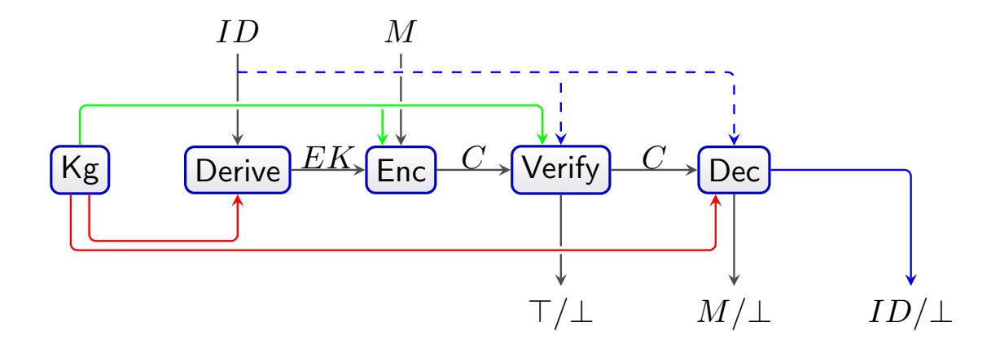
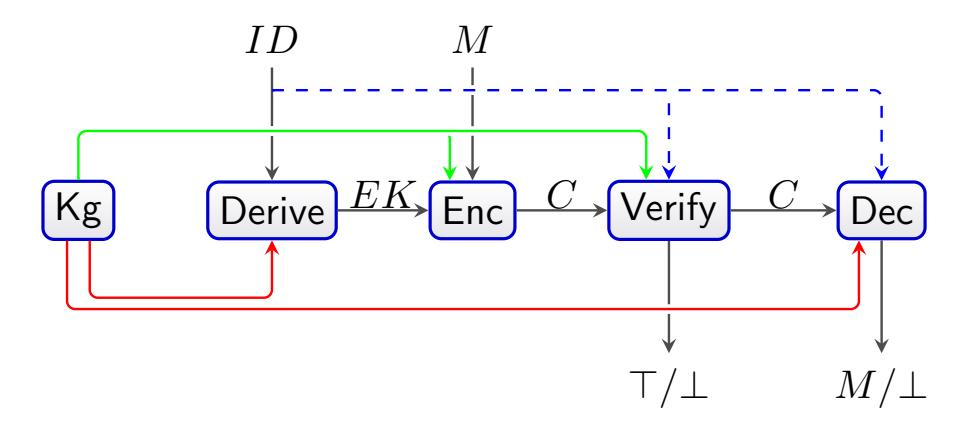
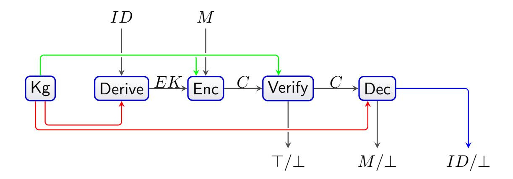
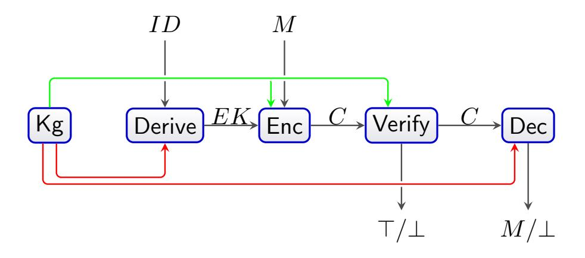

{0}------------------------------------------------

# Vetted Encryption ★

Martha Norberg Hovd1,<sup>2</sup> and Martijn Stam<sup>1</sup>

> <sup>1</sup> Simula UiB Merkantilen (3rd oor) Thormøhlensgate 53D N-5006 Bergen, Norway. martha,martijn@simula.no <sup>2</sup> University of Bergen Høyteknologisenteret i Bergen Thormøhlensgate 55 N-5008 Bergen, Norway.

Abstract. We introduce Vetted Encryption (VE), a novel cryptographic primitive, which addresses the following scenario: a receiver controls, or vets, who can send them encrypted messages. We model this as a lter publicly checking ciphertext validity, where the overhead does not grow with the number of senders. The lter receives one public key for verication, and every user receives one personal encryption key.

We present three versions: Anonymous, Identiable, and Opaque VE (AVE, IVE and OVE), and concentrate on formal denitions, security notions and examples of instantiations based on preexisting primitives of the latter two. For IVE, the sender is identiable both to the lter and the receiver, and we make the comparison with identity-based signcryption. For OVE, a sender is anonymous to the lter, but is identied to the receiver. OVE is comparable to group signatures with message recovery, with the important additional property of condentiality of messages.

Keywords: Encryption · Group Signatures · Signcryption

# 1 Introduction

Spam and phishing messages are a bane of modern communication methods, especially email. These days, most email still happens in the clear without end-to-end cryptographic protection. Yet, there are standards, such as S/MIME and OpenPGP, that aim to secure email using a combination of public key and symmetric key condentiality and authentication primitives. Intuitively, the primitive that best models secure email is signcryption [47, 28]. Although signcryption allows receivers to verify locally whether an email was from its purported sender or not, this ability does not immediately lead to an ecient mechanism to lter spam centrally.

A dierent, though not completely unrelated, scenario arrises with electronic voting systems and eligibility veriability. This notion informally states that it should be possible to publicly verify that only those with the right to vote have done so. For obvious reasons, voters should still be anonymous, and so whitelisting is not a viable option to prevent ballot stung by the bulletin board, for instance.

In this work we propose an alternative primitive called vetted encryption, which is closely related to both signcryption and group signatures. Vetted encryption lets a user, the recipient, to restrict who can send them encrypted messages by enabling an outside lter to detect which users are and are not vetted. The key features of vetted encryption are that a recipient only needs to vet each sender once (with out-of-band communication), yet does not need to tell the lter which users they have vetted.

Vetted encryption comes in dierent avours, depending on whether senders should be identied and authenticated or, in contrast, should remain anonymous. This choice of authentication versus anonymity can be made with respect to the outside lter and the intended receiver independently of each other, leading to a total of four possible congurations. One congurarion, where the lter would learn the identity of a ciphertext, yet the receiver could not, runs counter to our perspective that the lter is working on behalf of the recipient. Thus, only three settings remain:

1. Anonymous vetted encryption (AVE) where the sender remains anonymous to both the lter and the recipient; this scenario can be relevant for a voting system using a bulletin board, on which only eligible users should be able to post, anonymously. For example, the system Belenios [24] applies signatures and credentials to attain eligibility veriability, which is not too dissimilar from AVE.

<sup>★</sup> An extended abstract of this paper will appear at Indocrypt 2020 [34]; this is the full version. The nal authenticated version is available online at https://doi.org/10.1007/978-3-030-65277-7\_22.

{1}------------------------------------------------



Fig. 1. The algorithms and options involved in vetted encryption for the three options: anonymous includes neither dashed nor solid blue lines; identiable adds the dashed blue lines only; opaque adds the solid blue lines only and distinguishes between the two red "secret" master keys for derivation resp. decryption.

- 2. Identiable vetted encryption (IVE) where the sender is identied for both the lter and the recipient; this scenario is typical for email spam, where the lter gets to see the email-address (or other identifying information) of the sender.
- 3. Opaque vetted encryption (OVE) where the sender is anonymous to the lter, yet can be identied by the recipient. This primitive is relevant for identiable communication over an anonymous channel, for example between a trusted anonymous source and a journalist, where the source is anonymous to the newspaper, but identiable to the reporter. OVE may also be used in an auction setting, where the seller vets who gets to bid. During bidding, the auctioneer may lter the bids, only forwarding bids from vetted participants. However, only the seller knows the identity of the active bidders in the auction.

Our contribution. Fig. 1 provides an overview of the algorithms that constitute a vetted encryption scheme, where we endeavoured to surface all three variants in the picture. The private key material from the key generation (the red lines emanating at the bottom) feeds into two distinct functionalities: rstly to vet users by issuing them an encryption key, and secondly to decrypt ciphertexts. Thus one consideration to make is the possible orthogonality of the corresponding private keys. For both AVE and IVE (Def. 2) we opted for the simplest scenario where both keys are identical, whereas for OVE (Def. 3) we opted for the more challenging scenario where the keys are separate. This choice aects the security denitions and the design space for suitable constructions.

AVE is the simplest variant of vetted encryption and we present it in Appendix D, where we also discuss similarities with signcryption. It turns out all senders can be given the same signing key to encrypt then sign a message. Although this mechanism ensures full anonymity, a malicious sender could make everybody a vetted sender by simply forwarding her key. We therefore focus on IVE and OVE here.

IVE is most closely related to a simplied form of identity-based signcryption with public veriability. As far as we are aware, the related signcryption avour is virtually unstudied. We give a full comparison of IVE and signcryption in H. Our use case for IVE allows us in Section 3 to navigate carefully through the possible denitional choices, esp. quite how much power is available to an adversary trying to break condentiality, resp. integrity. Our choice allows us to use the novel primitive of "outsider-unique" identity-based signatures, which we show can be constructed by a combination of derandomisation and unique signatures (see Appendix C). The unique property is fundamental to provide non-malleability and hence condentiality against chosen ciphertext attacks for our encrypt-then-IBsign construction (Fig. 6).

OVE bears similarities with group signatures with message recovery, where additionally the message should remain condential. However, as we will argue in Section 4, our use case allows us to relax security slightly, which in turn enables a slight simplication of the well-known sign-encrypt-proof paradigm for group signatures [13] which we dub veriably encrypted certicates (Fig. 13). We also give a thorough comparison with group signatures in J.

# 1.1 Related Work

Comparison with signcryption. Both AVE and IVE are most closely related to signcryption in its various guises. For the original signcryption concept [47], two users Anna and Bob might want to communicate together in a manner that is simultaneously condential and authenticated. In a public key setting, if Anna knows Bob's 

{2}------------------------------------------------

public encryption key and Bob knows Anna's public verication key, then Anna can combine digital signing and public encryption of a message using the signcryption primitive.

Signcryption security is best studied in the multi-user setting, but let us consider just the two user scenario [4]. Condentiality can be captured by left-or-right indistinguishability under adaptive chosen ciphertext attacks, where an important modelling choice has to be made with respect to the adversary's control over keys. If the adversary is an outsider, only public key information is available. If the adversary knows private keys (e.g. Anna's signing key when attacking condentiality or Bob's decryption key when attacking authenticity), we speak of insider security. Insider-secure condentiality is essential to achieve forward secrecy, that is if Anna's signing key gets compromised, past messages should still remain condential. Insider-secure authenticity is needed for non-repudiation, where receiver Bob can convince a third party a message really originated from Anna (and wasn't cooked up by Bob himself). Indeed, for most realistic use cases, insider security is required [8].

Clearly insider security is harder to achieve than outsider security. The natural way for Anna and Bob to attempt signcryption would be to combine a public key encryption scheme with a digital signature scheme using generic composition. There are essentially two ways of doing so sequentially: either rst encrypt and then sign the ciphertext (encrypt-then-sign) or rst sign and then encrypt both message and signature (signthen-encrypt). The third, parallel alternative of encrypting the message and signing the message is more problematic from a generic composition perspective.

Signcryption with public veriability [32] could be used as an alternative solution to anonymous vetted encryption, but the precise avour of signcryption needed is not immediate (see Appendix D.3 for details). Signcryption appears to be unsuitable for OVE (Section J): although it is possible to achieve for instance IB-signcryption with anonymity [20, 22] [10, Section 5.4], crucially these schemes cannot support public veriability, ruling out the ability to outsource their verication to a lter. Signcryption with public veriability and explicit whitelisting could be used as a less ecient alternative to IVE, in addition to identity based signcryption with transferable public veriability, see Section H for further discussions.

Comparison with group signatures. The setting for group signatures is the following: a group, with a single manager, consist of various members, all with their own secret signing key to sign messages. It may be publicly veried that a signature belongs to a member of the group without revealing which member has signed the message. Only the group manager, who possesses a secret opening key, may identify the signer, given a signature on a message.

The classic security notions of group signature schemes encompass both anonymity and traceability [13]. Informally, this means that a signature does not reveal the identity of a signer to anyone who does not possess the opening key, and that one cannot forge someone's signature unless one has their secret key.

With regards to AVE and IVE, the comparison is somewhat natural in the big picture: in both cases, the sender has to verify membership of a group (of vetted senders). The similarities end here, though, as the notion of revealing the identity of the sender runs counter to AVE, and hiding the identity from the lter does not line up with the intention of IVE. However, the setting overlaps to a great extent with desireable features of OVE, with the important exception of condentiality of messages.

A straightforward, but naive, x to this would be to simply encrypt the message, then sign the ciphertext using the group signature scheme. Although this seems to add condentiality to the scheme, it also introduces the following weakness: any group member Eve may intercept a ciphertext, (group)signature pair from Alice, sign the ciphertext using her own key, and thus pass Alice's condential message o as her own. In particular, if Eve has access to a decryption oracle, she may ask to have the ciphertext decrypted, and by that read the message Alice sent. Thus, we provide a construction of OVE motivated by group signatures, rather than using them as a primitive.

Comparison with matchmaking encryption. Matchmaking encryption (ME) allows, in a sense, for a sender and receiver to vet each other: both may specify policies the other party must satisfy in order for the sent message to be revealed to the recipient. The sender may specify what properties the receiver must have in order to read the message, and the receiver may specify the requirements a sender must meet in order to send the receiver a message. Furthermore, the only information leaked is whether or not a policy match occured, that is: whether or not the recipient received the decrypted message [7].

The set up relies on a trusted authority to generate both encryption and decryption keys for the sender and receiver, respectively, both associated with attributes. In addition, there is a decryption key associated 

{3}------------------------------------------------

with the policy a sender should satisfy, which is also generated by the trusted authority. Finally, a sender can specify a policy which a reciever must satisfy to be able to decrypt the sent message.

There is an identity based version of ME, which bears some reseblance to OVE. In this version, the more general attributes of the sender and receiver are replaced with a simple identity, so that the sender specifies the identity of the desired recipient, and the identity of the sender is an explicit input of the decryption procedure.

The latter point is an important difference to the OVE primitive, where the identity of the sender is an output of decryption, rather than an input. In other words: we do not assume that the reciever knows who has sent a message before it has been decrypted. Another important difference is that we do not allow the sender to demand any certain attributes of the receiver, though the identity of the receiver is indirectly determined by the sender during encryption, as this involves an encryption key unique to the recipient. We also note that in OVE, the keys are derived and distributed by the recipient, not a third party.

Finally: in ME, determining whether or not a match will occur, that is, if the recipient and sender have vetted each other, is not publicly verifiable. This requires the decryption key of the recipent and the key related to the policy of the sender. This is in contrast with OVE, where determining whether a message has been sent from a vetted sender is possible using only a public key.

Comparison with access control encryption. Access control encryption (ACE) allows for different reading and writing rights to be assigned to different senders and receivers, for example the right to read messages classified as 'Secret', and ensuring a sender with clearance 'Top Secret' cannot send messages classified as 'Public'. This is achieved by introducing a sanitizer into the network, who manipulates every message before it is published on the network, we note in particular that a message is not sent directly to its intended recipient. Now, if a recipient tries to decrypt a message he does not have the right to read, the ciphertext will decrypted into a random string [26].

Although both ACE and OVE in some sense deal with the notion of vetting senders, there are several differences. First of all: an honest filter in OVE does not change the ciphertext in any way, it simply checks whether a sender has been vetted. In particular, if a received ciphertext decrypts to gibberish, it is because the sender intended it so. Furthermore: the sender is always identifiable to the receiver, assuming a message was received. Finally, a sent message is forwarded to the intended recipient, as opposed to published on a network.

We also note that the power dynamic in the two primitives differ. In ACE, the sanitizer enforces a security protocol, typically on behalf of a third party, and determines which subset of a public set of messages anyone is able to read. In OVE, however, all power lies with the recipient, by generating and distributing all the keys. The filter is merely doing the recipient's bidding, as it were, by only allowing messages from vetted senders to reach the recipient.

#### 2 Preliminaries

When defining security, we will use concrete advantages throughout. Moreover, these advantages are defined in terms of an adversary interacting with a game or experiment. While these experiments depend on the schemes at hand, there will be no additional quantifications (e.g. over high entropy sources, simulators, or extractors). We use  $\Pr[Code : Event]$  to denote probabilities where the Code is used to induce a probability distribution over which Event is defined (not to be confused with conditional probabilities). We write  $\mathbb{A}^O$  for an adversary  $\mathbb{A}$  having access to oracle(s) O in security games and reductions.

We use a number of standard primitives and their associated security notions. For completeness, and for the avoidance of any ambiguities in our notation, these are recapitulated below.

- A *public key encryption* scheme PKE consists of a triple of algorithms (Pke.Kg, Pke.Enc, Pke.Dec). The default security notion we consider is single-user multi-query left-or-right indistinguishability under chosen ciphertext attacks (IND-CCA).
- A signature scheme SIG consists of a triple of algorithms (Sig.Kg, Sig.Sign, Sig.Verify). The default security notion we consider is single-user strong existential unforgeability under chosen message attacks (EUF-CMA). We often require the SIG to be *unique* (USS), which means that given the verification key, for every message there is only a single signature that verifies.
- A *signcryption* scheme SCR consist of six algorithms (Scr.Kgr, Scr.Kgs, Scr.Signcrypt, Scr.Verify, Scr.Unsigncrypt), where Scr.Kgr generates the receiver's keys and Scr.Kgs the sender's keys.

{4}------------------------------------------------

– An *identity-based signature scheme* IBS consists of the four algorithms (Ibs.Kg, Ibs.Derive, Ibs.Sign, Ibs.Verify), where Ibs.Kg derives a master signing key MSK and a verification key vk. The derivation algorithm Ibs.Derive takes the master signing key and an identity ID as input, and outputs a user signing key USK. The signing takes a message m, an identity ID and a user signing key USK as input, and outputs a signature  $\sigma$ . Finally, verification takes the verification key vk, a message m, an identity ID and a signature  $\sigma$  as input, and outputs  $\top$  or  $\bot$ . As with signature schemes, we consider EUF-CMA as the default security notion for IBS schemes.

**QA-NIZKs.** Non-Interactive Zero-Knowledge (NIZK) proofs are defined for families of languages with associated binary relations R, such that for pairs  $(\phi, \omega) \in R$  a prover may convince a verifier that the statement  $\phi$  is part of the language, without revealing anything else (such as the witness  $\omega$ ). For the proof to be non-interactive, we require that the only necessary communication between the prover and verifier is the sending of the proof  $\pi$ . This non-interaction requirement disregards the communication required for the set-up of the scheme, which involves the prover and verifier sharing a common reference string (CRS). For Quasi-Adaptive NIZKs (QA-NIZKs) [36], we allow this CRS to depend on the parameters defining the language and its witness relation R. In the following, we let the relation R be given as input to the set-up algorithm and various adversaries, this is to be understood as the parameters defining said relation. Moreover, we let R be a distribution over the family of languages for which the NIZK is suited.

**Definition 1 (Quasi-Adaptive Non-Interactive Zero-Knowledge (QA-NIZK) proofs).** An efficient prover publicly verifiable Quasi-Adaptive Non-Interactive Zero-Knowledge (QA-NIZK) for R is a quadruple of probabilistic algorithms (Nizk.Setup, Nizk.Prove, Nizk.Verify, Nizk.Sim) such that

- − Nizk.Setup *produces a CRS*  $\sigma$  *and a simulation trapdoor*  $\tau$  *for the relation R:*  $(\sigma, \tau) \leftarrow$ \$ Nizk.Setup(R).
- Nizk.Prove takes as input a CRS  $\sigma$  and a tuple  $(\phi, \omega) \in R$  and returns a proof  $\pi$ :  $\pi \leftarrow \$$  Nizk.Prove $(\sigma, \phi, \omega)$
- Nizk. Verify either rejects ( $\perp$ ) or accepts ( $\top$ ) a proof  $\pi$  for a statement  $\phi$  when given these, as well as a CRS  $\sigma$ :  $\top/\bot\leftarrow$  Nizk. Verify ( $\sigma,\phi,\pi$ ).
- Nizk.Sim takes as input a simulation trapdoor  $\tau$ , and a statement  $\phi$  and returns a proof  $\pi$ :  $\pi \leftarrow \$$  Nizk.Sim $(\tau, \phi)$ .

Completeness. The notion of perfect completeness states that, for any true statement  $\phi$ , an honest prover should be able to convince an honest verifier. More formally, we require that for all  $R \in \mathcal{R}$  and  $(\phi, \omega) \in R$ :

$$\Pr[(\sigma, \tau) \leftarrow \text{$Nizk.Setup}(R); \pi \leftarrow \text{$Nizk.Prove}(\sigma, \phi, \omega) : \text{$Nizk.Verify}(\sigma, \phi, \omega) \rightarrow \top] = 1.$$

Soundness. For a QA-NIZK to achieve *computational soundness*, we require that it is computationally infeasible for an adversary  $\mathbb A$  given the relation R and the CRS  $\sigma$ , to output a pair  $(\phi, \pi)$  that satisfy the following conditions: 1)  $\phi$  does not lie in the language defined by R, that is: there does not exist a witness  $\bar{\omega}$  such that  $(\phi, \bar{\omega}) \in R$ , and 2) Nizk.Verify $(\sigma, \phi, \omega) \to \top$ . Formally, we define the advantage:

$$\mathsf{Adv}^{\mathsf{sound}}_{\mathsf{QANIZK}}(\mathbb{A}) = \mathsf{Pr} \begin{bmatrix} R \leftarrow \$ \mathcal{R} \\ (\sigma, \tau) \leftarrow \$ \, \mathsf{Nizk.Setup}(R) \, : \, \phi \not\in L_R \land \, \mathsf{Nizk.Verify}(\sigma, \phi, \omega) \to \top \\ (\phi, \pi) \leftarrow \$ \, \mathbb{A}(R, \sigma) \end{bmatrix}.$$

*Zero-knowledge*. Informally, a QA-NIZK is *zero-knowledge* if nothing other than the truth of the statement may be inferred by the proof. We formally define the distinguishing advantage using a real and a sim experiment (Fig. 17), and define the advantage of the adversary  $\mathbb{A}$  as

$$\mathsf{Adv}_{\mathrm{QANIZK}}^{\mathrm{zk}}(\mathbb{A}) = \Pr\Big[\mathsf{Exp}_{\mathrm{QANIZK}}^{\mathrm{zk-real}}(\mathbb{A}) \ : \ \hat{b} = 0\Big] - \Pr\Big[\mathsf{Exp}_{\mathrm{QANIZK}}^{\mathrm{zk-sim}}(\mathbb{A}) \ : \ \hat{b} = 0\Big].$$

We speak of *perfect* zero-knowledge if  $Adv_{\mathrm{QANIZK}}^{\mathrm{zk}}(\mathbb{A}) = 0$  for all adversaries. Perfect zero-knowledge can alternatively be characterized with a single query and a universal quantifier for the choice of language and statement to prove. Many known NIZKs achieve perfect zero-knowledge, facilitating their composability.

{5}------------------------------------------------

| $Exp^{\mathrm{zk-real/sim}}_{\mathrm{QANIZK}}(\mathrm{A})$ | prove-real $(\phi, \omega)$                             | prove-sim $(\phi, \omega)$                  |
|------------------------------------------------------------|---------------------------------------------------------|---------------------------------------------|
| $R \leftarrow \$ \mathcal{R}$                              | require $(\phi, \omega) \in R$                          | require $(\phi, \omega) \in R$              |
| $(\sigma, \tau) \leftarrow $ \$ Nizk.Setup $(R)$           | $\pi \leftarrow \$$ Nizk.Prove $(\sigma, \phi, \omega)$ | $\pi \leftarrow \$$ Nizk.Sim $(\tau, \phi)$ |
| $\hat{b} \leftarrow \mathbb{A}^O(R, \sigma)$               | return $\pi$                                            | return $\pi$                                |

Fig. 2. The real and simulated zero-knowledge experiments.



Fig. 3. The algorithms and their inputs/outputs for identifiable vetted encryption.

Unbounded simulation-soundness. A QA-NIZK achieves unbounded simulation-soundness if an adversary  $\mathbb A$  is unable to simulate proofs of any false statement, even after having seen such proofs of arbitrary statements. We define the advantage of the adversary  $\mathbb A$  as

$$\mathsf{Adv}_{\mathsf{QANIZK}}^{\mathsf{uss}}(\mathbb{A}) = \mathsf{Pr} \begin{bmatrix} R \leftarrow \$ \mathcal{R} \\ (\sigma, \tau) \leftarrow \$ \, \mathsf{Nizk.Setup} \\ (\phi, \pi) \leftarrow \mathbb{A}^{\mathsf{Nizk.Sim}(\sigma, \tau, \cdot)}(R, \sigma) \end{bmatrix} : \begin{matrix} (\phi, \pi) \notin Q \land \phi \notin L_R \\ \land \, \mathsf{Nizk.Verify}(\sigma, \phi, \pi) \rightarrow \top \end{matrix},$$

where Q is the set of query–response pairs  $(\phi, \pi)$  to the simulator.

After the introduction of QANIZK protocols [36], a large number of protocols for a large variety of languages (or distributions thereof) has appeared in the literature. They are particularly efficient for linear subspaces, which facilitates pairing based constructions (see [3] and the references contained therein).

# 3 Identifiable Vetted Encryption (IVE)

#### 3.1 Syntax and Security of IVE

**The algorithms.** For identifiable vetted encryption, both the filter and the recipient may learn the identity of the sender, which we assume have received the identity via out-of-band communication. An IVE scheme consists of five algorithms, see Def. 2. The identity ID is not only an explicit input to the derivation algorithm, but also to both the verification and decryption algorithm, modelling the out-of-band communication. However, encryption does not take ID as an input, instead relying on a user's encryption key EK implicitly encoding said identity.

We allow encryption to fail, modelled by  $\bot$  as output. As we will see, for honestly generated encryption keys, we insist encryption never fails, but for adversarially generated encryption keys, allowing for explicit encryption failure turns out to be useful. One could alternatively introduce a separate algorithm to verify the validity of a private encryption key for a given public encryption/verification key; our approach looks simpler.

**Definition 2 (Identifiable Vetted Encryption (IVE)).** *An* identifiable vetted encryption *scheme* IVE *consists of a 5-tuple of algorithms* (Ive.Kg, Ive.Derive, Ive.Enc, Ive.Verify, Ive.Dec), *which behave as follows:* 

- Ive.Kg generates a key pair (pk, sk), where pk is the public encryption (and verification) key and sk is the private derivation and decryption key. We allow Ive.Kg to depend on parameters param and write (pk, sk)  $\leftarrow$ \$ Ive.Kg(param). Henceforth, we will assume that pk can be uniquely and efficiently computed given sk.
- Ive.Derive derives an encryption key EK based on the private derivation key SK and a user's identity ID. Thus,  $EK \leftarrow S$  Ive.Derive<sub>SK</sub>(ID).

{6}------------------------------------------------

- Ive.Enc encrypts a message m given the public encryption key pk and using the private encryption key EK, creating a ciphertext c or producing a failed encryption symbol  $\bot$ . So,  $c \leftarrow \$$  Ive.Enc<sub>pk,EK</sub>(m) where possibly  $c = \bot$ .
- Ive. Verify verifies the validity of a ciphertext c given the public verification key pk and a user's identity ID. With a slight abuse of notation,  $\top/\bot\leftarrow$  Ive. Verify $_{pk}^{ID}(c)$ .
- Ive.Dec decrypts a ciphertext c using the private key sk, given the user's identity ID. The result can either be a message m or the invalid-ciphertext symbol  $\bot$ . In short,  $m/\bot \leftarrow \text{Ive.Dec}_{sk}^{ID}(c)$ .

The first three algorithms are probabilistic, the final two deterministic.

**Correctness and consistency.** For correctness, we require that all honestly generated ciphertexts are received as intended, that is, for all parameters *param*, identities *ID* and messages *m*, we have that

$$\Pr\begin{bmatrix} (\mathsf{pk},\mathsf{sk}) \leftarrow \$ \, \mathsf{Ive}.\mathsf{Kg}(\mathit{param}) & c \neq \bot \\ EK \leftarrow \$ \, \mathsf{Ive}.\mathsf{Derive}_{\mathsf{sk}}(\mathit{ID}) & : \land \mathsf{Ive}.\mathsf{Verify}_{\mathsf{pk}}^{\mathit{ID}}(c) = \top \\ c \leftarrow \$ \, \mathsf{Ive}.\mathsf{Enc}_{\mathsf{pk},\mathit{EK}}(m) & \land \mathsf{Ive}.\mathsf{Dec}_{\mathsf{sk}}^{\mathit{ID}}(c) = m \end{bmatrix} = 1 \; .$$

Conceptually, a ciphertext may be rejected at two different stages: the filter using Ive.Verify might reject or decryption using Ive.Dec might fail. Thus, we can consider two possible sets of 'valid' ciphertexts: those accepted by verification, and those accepted by decryption. Ideally, these sets coincide, but a priori this cannot be guaranteed. We call a scheme *consistent* if any ciphertext accepted by decryption will also be accepted by the filter verification, whereas we say the scheme is *strict* if any ciphertext that passes the filter, will decrypt to a message.

Formally, we define both strictness and consistency in terms of rejected 'invalid' ciphertexts, thus flipping the order of Ive. Verify and Ive. Dec in the implications below (compared to the intuitive notion described above). That is for all possible keys (pk, sk) output by Ive. Kg and all ciphertexts c, we have

- Consistency: Ive. Verify $_{pk}^{ID}(c) = \perp \Rightarrow \text{Ive.Dec}_{sk}^{ID}(c) = \perp$ ;
- Strictness: Ive.  $\operatorname{Dec}_{\operatorname{sk}}^{ID}(c) = \bot \Longrightarrow \operatorname{Ive.Verify}_{\operatorname{pk}}^{ID}(c) = \bot$ .

Fortunately, it is relatively easy to guarantee consistency; the trivial transformation that runs verification as part of decryption takes care of this. Henceforth we will concentrate on consistent schemes.

On the other hand, strictness is harder to guarantee a priori. Thus we will allow ciphertexts to pass the filter that are subsequently deemed invalid by decryption. Note that, for *honestly generated* ciphertexts, correctness ensures that decryption will actually succeed, so this scenario can only occur for 'adulterine' ciphertexts.

**Security.** The security of IVE comprises of two components: *integrity* to ensure the filter cannot be fooled, and *confidentiality* of the messages to outsiders. With reference to the games defined in Fig. 4 and Fig. 5, the advantages are defined as follows:

- *Integrity*:

$$\mathsf{Adv}^{\mathsf{int}}_{\mathsf{IVE}}(\mathbb{A}) = \mathsf{Pr} \left[ \mathsf{Exp}^{\mathsf{int}}_{\mathsf{IVE}}(\mathbb{A}) : \frac{\hat{ID} \notin \mathcal{E} \land (\hat{ID}, \hat{c}) \notin \mathcal{C}}{\land \mathsf{Ive.Verify}^{\hat{ID}}_{\mathsf{pk}}(\hat{c}) = \top} \right].$$

- Confidentiality:

$$\mathsf{Adv}^{\mathsf{conf}}_{\mathsf{IVE}}(\mathbb{A}) = \mathsf{Pr} \Big[ \mathsf{Exp}^{\mathsf{conf}^{\mathsf{-}0}}_{\mathsf{IVE}}(\mathbb{A}) \ : \ \hat{b} = 0 \Big] - \mathsf{Pr} \Big[ \mathsf{Exp}^{\mathsf{conf}^{\mathsf{-}1}}_{\mathsf{IVE}}(\mathbb{A}) \ : \ \hat{b} = 0 \Big] \ .$$

Integrity. A server running the verification algorithm to filter out invalid ciphertexts should not be easily fooled by an adversary: unless one is in possession of an encryption key (i.e. has been vetted), it should not be possible to construct a valid ciphertext. Even a *vetted* sender should not be able to construct a ciphertext which is considered valid under a different identity. We formally capture integrity in a game (Fig. 4) where we use the output of the verification algorithm as an indication of validity. For consistent schemes this choice is the strongest, as a forgery with respect to decryption will always be a forgery with respect to verification.

{7}------------------------------------------------

| IVE(A)<br>Expint                       | derive(𝐼𝐷)                      | encrypt(𝐻,𝑚)                         |
|----------------------------------------|---------------------------------|--------------------------------------|
| (pk,sk) ←\$<br>Ive.Kg                  | 𝐸𝐾[ℎ] ←<br>Ive.Derivesk<br>(𝐼𝐷) | 𝑐<br>←\$ Ive.Encpk,𝐸𝐾<br>(𝑚)<br>[𝐻 ] |
| ℎ<br>← 0; C ← ∅; E ← ∅                 | ℎ<br>← ℎ<br>+ 1                 | C ← C ∪ {(𝐻 .𝐼𝐷, 𝑐)}                 |
| AO (pk)<br>ˆ𝐼𝐷,𝑐ˆ) ←<br>(              | return ℎ                        | return 𝑐                             |
| ˆ𝐼𝐷<br>∉ E ∧ ( ˆ𝐼𝐷,𝑐ˆ)<br>∉ C<br>winif |                                 |                                      |
| ˆ𝐼𝐷<br>∧ Ive.Verify<br>pk (𝑐ˆ)<br>= >  | corrupt(𝐻)                      | decrypt(𝐼𝐷, 𝑐)                       |
|                                        | E ← E ∪ 𝐻 .𝐼𝐷                   | ← Ive.Dec𝐼𝐷<br>𝑚<br>sk (𝑐)           |
|                                        | return 𝐸𝐾[𝐻]                    | return 𝑚                             |

Fig. 4. The integrity game for IVE.

The adversary is given the verication key as well as encryptions of messages of her own choosing under honest encryption keys. We use handles to grant an adversary control over the encryption keys that are used: an adversary can trigger the creation of an arbitrary number of keys for chosen identities and then indicate which key (by order of creation) should be used for a particular encryption query.

Additionally, an adversary can adaptively ask for encryption keys from a corruption oracle. Obviously, a corrupted encryption key trivially allows for the construction of further valid ciphertexts for the underlying identity, so we exclude corrupted identities from the win condition. Similarly, ciphertexts resulting from an encryption query do not count as a win under the original query's identity.

Finally, an adversary has access to a decryption oracle. This oracle is superuous for uncorrupted encryption keys, but an adversary could potentially use it to her advantage by querying it with ciphertext created under a corrupted identity. These ciphertexts will, of course, not help her win the integrity game directly, as the corresponding identity is corrupted. Yet, the oracle response might leak information about sk, which could help the adversary construct a valid ciphertext for an uncorrupted identity, hence giving an advantage in winning the integrity game. Constructing a non-strict pathological IVE scheme exploiting this loophole is easy: simply allow ciphertexts outside the support of the encryption algorithm to gradually leak the secret key based on their validity under decryption. We stress that in our instantiation of IVE we do not face this issue.

Condentiality. We adopt the CCA security notion for public key encryption to the setting of identiable vetted encryption (Fig. 5). An adversary can, repeatedly, ask its challenge oracle for the encryption of one of two messages under an adversarially chosen encryption key. We give the adversary an oracle to derive and immediately learn encryption keys; moreover these known honest keys may be fed to the challenge encryption oracle.

We want to avoid the decryption oracle being used by an adversary to win trivially, namely by simply querying a challenge ciphertext under the corresponding identity. But what is this corresponding identity? The encryption algorithm only takes as input an encryption key that may or may not allow easy extraction of an identity . One solution would be to only allow the adversary to ask for challenge encryptions on honestly derived encryption keys (so the game can keep track of the identity when is derived). Instead, we opted for a stronger version where the adversary provides the challenge encryption oracle with both an encryption key and a purported identity . If verication shows that the freshly generated challenge ciphertext does not correspond to , which can only happen for dishonestly generated pairs (, ), then the encryption oracle rejects the query by outputting `.

Intuitively, the decryption oracle is mainly relevant for identities that the adversary has previously queried to its derivation oracle: after all, if the decryption oracle would return anything but ⊥ for a fresh ciphertext under a fresh identity, this would constitute a break of the integrity game.

#### 3.2 Encrypt-then-IBS

An obvious rst attempt to create an identiable vetted encryption scheme is to combine the condentiality provided by a public key encryption scheme with the authenticity of that of an identity based signature scheme. There are three basic methods for the generic composition: sign-then-encrypt, encrypt-then-sign, and encrypt-and-sign. For the rst option, the signature ends up being encrypted, which destroys public veriability as required for the lter to do its work. The parallel encrypt-and-sign is well-known to be problematic,

{8}------------------------------------------------

```
\mathsf{Exp}^{\mathrm{ind\text{-}cca}\text{-}b^*}_{\mathrm{IVE}}(\mathbb{A})
                                                 encrypt(ID, EK, m_0, m_1)
                                                                                                               decrypt(ID, c)
                                                 c^* \leftarrow \$ \text{ Ive.Enc}_{\mathsf{pk}.EK}(m_{b^*})
(pk, sk) \leftarrow \$ lve.Kg
                                                                                                              require (ID, c) \notin C
C \leftarrow \emptyset
                                                 if Ive. Verify_{\rm pk}^{ID}(c^*) = \perp then
                                                                                                              m \leftarrow \text{Ive.Dec}_{\mathsf{sk}}^{ID}(c)
\hat{b} \leftarrow \mathbb{A}^O(\mathsf{pk})
                                                      return `
                                                                                                               return m
                                                 \mathcal{C} \leftarrow \mathcal{C} \cup \{(\mathit{ID}, c^*)\}
derive(ID)
                                                 return c^*
EK \leftarrow Ive.Derive_{sk}(ID)
return EK
```

**Fig. 5.** The confidentiality game for IVE.

```
Ive.Kg()
                                                     lve.Derive_{(DK,MSK)}(ID)
(pk, DK) \leftarrow Pke.Kg
                                                     USK \leftarrow Uibss.Derive_{MSK}(ID)
(MVK, MSK) \leftarrow Uibss.Kg
                                                     return USK
return ((pk, MVK), (DK, MSK))
                                                     Ive.\mathrm{Dec}_{DK,MSK}^{ID}(c,\sigma)
lve.Enc_{(pk,MVK),USK,ID}(m)
                                                    if Uibss.Verify_{MVK}^{ID}(c,\sigma) = \perp then
c \leftarrow \mathsf{Pke}.\mathsf{Enc}_{\mathsf{pk}}(m \| ID)
                                                        return ⊥
                                                     if Pke.Dec_{DK}(c) = \perp then
\sigma \leftarrow \text{Uibss.Sign}_{USK}(c)
if Uibss.Verify_{MVK}^{ID}(c,\sigma) = \perp then
                                                        return ⊥
                                                     if Pke.Dec<sub>DK</sub>(c) \rightarrow m || I\bar{D} \wedge I\bar{D} \neq ID then
   return ⊥
                                                        return ⊥
return (c, \sigma)
                                                     return m
Ive. Verify_{\mathsf{pk},MVK}^{ID}(c,\sigma)
return Uibss. Verify_{MVK}^{ID}(c,\sigma)
```

**Fig. 6.** Encrypt-then-IBSign (EtIBS): A straightforward composition of public key encryption and an identity-based signature scheme.

as the unencrypted signature directly on the message inevitably leaks information on the message, even when the signatures are confidential [27] (as the signature allows for an easy check whether a given plaintext was encrypted or not). Thus only encrypt-then-sign remains as option, and we specify the construction in Fig. 6.

We show the scheme achieves integrity and confidentiality in Lemmas 1 and 2, respectively. Integrity of the construction follows from the unforgeability of the underlying signature scheme. However, for IVE to inherit the confidentiality of the encryption scheme, we use an identity-based signature scheme with *outsider unique* signatures.

Without unique signatures, an adversary who has received a challenge ciphertext  $(c, \sigma)$  could simply create a new tuple  $(c, \sigma')$  with a secondary valid signature  $\sigma'$ . This tuple will be accepted by a decryption oracle, and hence the adversary will learn the encrypted message, breaking confidentiality. To the best of our knowledge, unique identity-based signatures have not been studied before. It turns out that for our purposes, a computational version of uniqueness suffices (the details are in Appendix C).

**Correctness and consistency.** Both correctness and consistency follow easily by inspection. The signature verification as part of decryption is needed for consistency, cf. the transformation mentioned previously.

**Integrity.** Integrity of the Encrypt-then-IBS construction boils down to the unforgeability of the underlying identity-based signature scheme. As the decryption key of the underlying encryption scheme is unrelated to the issuing key of the signature scheme (so an adversary cannot hope to learn any useful information about the issuing key by querying the decryption oracle with ciphertexts of corrupted identities), the reduction is fairly straightforward.

{9}------------------------------------------------

| $Exp^{\mathrm{int}}_{\mathrm{IVE}}(\mathbb{A})$                            | derive(ID)                                                                                                   | encrypt(H, m)                                            |
|----------------------------------------------------------------------------|--------------------------------------------------------------------------------------------------------------|----------------------------------------------------------|
| $(pk, DK) \leftarrow \$ Pke.Kg$                                            | $ID_h \leftarrow ID$                                                                                         | $c \leftarrow \$ \operatorname{Pke.Enc}_{pk}(m    ID_H)$ |
| $(vk, MSK) \leftarrow \$$ Uibss.Kg                                         | $h \leftarrow h + 1$                                                                                         | $\sigma \leftarrow Uibss.Sign_{EK_H}(c)$                 |
| $h \leftarrow 0; C \leftarrow \emptyset; \mathcal{E} \leftarrow \emptyset$ | return h                                                                                                     | $C \leftarrow C \cup \{(c, \sigma), ID_H\}$              |
| $(\hat{\mathit{ID}},\hat{c}) \leftarrow \mathbb{A}^O(pk)$                  |                                                                                                              | return $(c, \sigma)$                                     |
| winif $\hat{ID} \notin \mathcal{E} \land (\hat{ID}, \hat{c}) \notin C$     | $\frac{\operatorname{corrupt}(H)}{EK_H \leftarrow \operatorname{Uibss.Derive}_{MSK}(ID_H)}$                  | $\operatorname{decrypt}((c,\sigma),ID)$                  |
| $\land$ Ive.Verify $_{pk}^{ID}(\hat{c}) = \top$                            | $\mathcal{E}_H \leftarrow \text{Oibss.Derive}_{MSK}(ID_H)$<br>$\mathcal{E} \leftarrow \mathcal{E} \cup ID_H$ | if Uibss.Verify $_{vk}^{ID}(c, \sigma) = \perp$          |
|                                                                            | return $EK_H$                                                                                                | return ⊥                                                 |
|                                                                            |                                                                                                              | $m  ID \leftarrow Pke.Dec_{DK}(c)$                       |
|                                                                            |                                                                                                              | if decryption or parsing fails                           |
|                                                                            |                                                                                                              | return ⊥                                                 |
|                                                                            |                                                                                                              | return m                                                 |

Fig. 7. The game for the proof of integrity for the Encrypt-then-IBS construction

**Lemma 1** (Integrity of Encrypt-then-IBS). For all adversaries  $\mathbb{A}_{int}$  there exists a similarly efficient adversary  $\mathbb{B}_{euf\text{-}cma}$  such that

$$\mathsf{Adv}^{int}_{\mathrm{IVE}}(\mathbb{A}_{int}) \leq \mathsf{Adv}^{euf\text{-cma}}_{\mathrm{UIBSS}}(\mathbb{B}_{euf\text{-cma}})$$
.

*Proof.* The integrity game defined in Fig. 4 applied to our construction is shown in Fig. 27. Based on this game, we may construct a reduction to a forging game of the underlying identity based signature scheme. An adversary  $\mathbb{B}_{\text{euf-cma}}$  is given the verification key vk of the signature scheme. She constructs an encryption scheme and generates the keys  $(pk, DK) \leftarrow Pke.Kg$ , and sends (pk, vk) to  $\mathbb{A}_{\text{int}}$ . Whenever  $\mathbb{A}_{\text{int}}$  makes a derivation query on an identity ID,  $\mathbb{B}_{\text{euf-cma}}$  simply does the administrative work herself, by ascribing the identity with a handle, and returning this. Any encryption queries on a message m under a handle H is managed by  $\mathbb{B}_{\text{euf-cma}}$  first producing  $c \leftarrow Pke.Enc_{pk}(m||ID_H)$ , and then querying her own signature oracle on  $(c, ID_H)$ , receiving the signature  $\sigma$ . She then sends  $(c, \sigma)$  to  $\mathbb{A}_{\text{int}}$ . Any corruption queries on H is answered by  $\mathbb{B}_{\text{euf-cma}}$  querying her own corruption oracle on  $ID_H$ , and forewarding the given signing key. Finally, all decryption queries from  $\mathbb{A}_{\text{int}}$  are handled solely by  $\mathbb{B}_{\text{euf-cma}}$ , as she can perform all the checks and decryptions herself. When  $\mathbb{A}_{\text{int}}$  outputs  $((\hat{c}, \hat{\sigma}), \hat{ID})$ ,  $\mathbb{B}_{\text{euf-cma}}$  simply copies this as her own answer. It is clear that  $\mathbb{B}_{\text{euf-cma}}$  will win in precisely the same cases as  $\mathbb{A}_{\text{int}}$ , and so the claim follows.

**Confidentiality.** The confidentiality of the Encrypt-then-IBS hinges on both the confidentiality of the encryption scheme and the computational hardness of finding a signature collision in the IBS scheme. As the IVE adversary does not have access to the master private key of the underlying IBS scheme, it suffices that signatures are unique with respect to individual signing keys (that can be obtained through the derive oracle). That allows us to rule out mauling of a challenge ciphertext  $(c, \sigma)$  through the signature component, leaving the adversary with the only option of breaking the confidentiality of the encryption scheme.

**Lemma 2** (Confidentiality of Encrypt-then-IBS). For all adversaries  $\mathbb{A}_{conf}$  there exist similarly efficient adversaries  $\mathbb{B}_{cca}$  and  $\mathbb{B}_{ou}$  such that

$$\mathsf{Adv}^{conf}_{\mathrm{IVE}}(\mathbb{A}_{conf}) \leq \mathsf{Adv}^{conf}_{\mathrm{PKE}}(\mathbb{B}_{conf}) + \mathsf{Adv}^{ou}_{\mathrm{UIBSS}}(\mathbb{B}_{ou}) \; .$$

*Proof.* We introduce a series of games for the adversary  $\mathbb{A}_{conf}$  to play, gradually changing the original game into a distinguishing game against the underlying encryption scheme.

**Game**  $G_0^{b^*}$ : This is the original game applied to our construction, presented in Fig. 28.The advantage of  $\mathbb{A}_{\text{conf}}$  may be expressed as  $\operatorname{Adv}^{\text{conf}}_{\text{IVE}}(\mathbb{A}_{\text{conf}}) = \Pr \left[ G_0^0 : \mathbb{A}_{\text{conf}} \to 1 \right] - \Pr \left[ G_0^1 : \mathbb{A}_{\text{conf}} \to 1 \right]$ .

**Game**  $G_1^{b^*}$ : Here, we change the decryption procedure, so that instead of demanding that a query  $((c, \sigma), ID) \notin C$ , we require only that c has not been part of a challenge recieved from the encryption oracle. An adversary able to distinguish between these two games would also be able to find two distinct and verifying signatures

{10}------------------------------------------------

| Game $G_0^{b^*}$                           | encrypt( $(m_0, ID, USK), (m_1, ID, USK)$ )                                       | $\operatorname{decrypt}(c,\pi)$                     |
|--------------------------------------------|-----------------------------------------------------------------------------------|-----------------------------------------------------|
| $(pk, DK) \leftarrow \$ Pke.Kg$            | $c_{b^*} \leftarrow \$ \operatorname{Pke.Enc}_{\operatorname{pk}}(m_{b^*}    ID)$ | require $(c, \sigma) \notin C$                      |
| $(vk, sk) \leftarrow Uibss.Kg$             | $\sigma_{b^*} \leftarrow \$  Uibss.Sign_{USK}(c_{b^*})$                           | if Uibss. Verify $_{\rm vk}^{ID}(c,\sigma) = \perp$ |
| $C \leftarrow \emptyset$                   | $c^* \leftarrow ((c_{b^*}, \sigma_{b^*}), ID)$                                    | return ⊥                                            |
| $\hat{b} \leftarrow \mathbb{A}^O((pk, vk)$ | $C \leftarrow C \cup \{c^*\}$ return $c^*$                                        | $m  ID \leftarrow Pke.Dec_{DK}(c)$                  |
|                                            | derive( <i>ID</i> )                                                               | if decryption or parsing fails                      |
|                                            |                                                                                   | return ⊥                                            |
|                                            | $USK \leftarrow Uibss.Derive_{MSK}(ID)$                                           | return m                                            |
|                                            | return <i>USK</i>                                                                 |                                                     |

**Fig. 8.** Game  $G_1^{b^*}$  for the confidentiality proof of the Encrypt-then-IBS construction.

on the same message. It follows that the difference between  $G_0^{b^*}$  and  $G_1^{b^*}$  may be bounded by the advantage an adversary has of breaking the outsider unicity of the underlying signature scheme.

Given this, we may construct a reduction from  $G_1^{b^*}$  to a standard indistinguishability game of the underlying public key encryption scheme in the following way: an adversary  $\mathbb{B}_{cca}$  given the public key pk of an encryption scheme generates the keys (vk, MSK) for an unique identity based signature scheme, and sends (pk, vk) to the adversary  $\mathbb{A}_{conf}$ . Any derivation queries may be answered by  $\mathbb{B}_{cca}$  alone, seeing as she possesses MSK. Whenever  $\mathbb{A}_{conf}$  sends a challenge query  $(m_0, m_1, ID, USK)$ ,  $\mathbb{B}_{cca}$  sends  $(m_0 || ID, m_1 || ID)$  to her encryption oracle, and when she gets the challenge ciphertext back, she signs it using the user secret key USK before sending the tuple to  $\mathbb{A}_{conf}$ . Any decryption query is handled by  $\mathbb{B}_{cca}$  first verifying the signature  $\sigma$ , and sending c to her own decyrption oracle if the signature verifies, and passing on the response from the oracle to  $\mathbb{A}_{conf}$ . Once  $\mathbb{A}_{conf}$  guesses  $\hat{b}$ ,  $\mathbb{B}_{cca}$  copies it, and so it follows that  $\mathsf{Adv}^{conf}_{IVE}(\mathbb{A}_{conf}) \leq \mathsf{Adv}^{conf}_{PKE}(\mathbb{B}_{conf}) + \mathsf{Adv}^{ou}_{UIBSS}(\mathbb{B}_{ou})$ .

#### 3.3 Discussion of IVE

IVE resembles identity-based signcryption in many ways, as both primitives offer confidentiality of messages and integrity of communication between two individuals identifiable to each other. In both cases, this concerns insider security: reading the message requires nothing less than the secret key/decryption key of the recipient, and forging the signature of a sender requires the user key/private key of that particular sender. There is also a notion of verification in identity based signcryption, which guarantees that a decrypted message was in fact written by the sender [21].

In addition, it is common for identity based signcryption to satisfy the security notion of ciphertext unlinkability: it is not possible to link a sender to a specific ciphertext, even if the ciphertext decrypts to a message signed by the sender in question. Another security notion relevant for identity based signcryption is insider ciphertext anonymity, which informally means that deducing either the sender or recipient of a given ciphertext requires the private key of the recipient [21].

It is obvious that the two latter security notions do not combine with a central feature of IVE, namely public verification that a sender has in fact been vetted, seeing as the verification algorithm takes the sender identity as input. To filter out messages sent from unvetted individuals is an essential part of IVE, and this does require a public verification algorithm.

There are identity based signcryption schemes that offer such public verification. However, several of the schemes require the receiver to collaborate by supplying the verification algorithm with additional information. For example, in the signcryption scheme proposed by Libert and Quisquater, the receiver has to supply the verifier with an ephemeral key [39]. Again, this runs counter to the idea of IVE, namely that the filter is able to do the filtering without assistance from the recipient. Querying the recipient to check whether a message is sent from a vetted sender renders the filter pointless.

Finally, there does exist identity based signcryption schemes which offer *transferable public verification*. In these schemes, it is possible for a third party to verify that a ciphertext has indeed been signed by the alleged sender, without help from the receiver. To the best of our knowledge, there are only two such schemes, and both of them adopt an encrypt-and-sign approach [43, 45], where the former does not have a proof of security.

{11}------------------------------------------------



Fig. 9. The algorithms and their inputs/outputs for opaque vetted encryption.

The scheme which is provably secure is based on bilinear pairings, requires very large public parameters, and produces ciphertexts of a large size. We believe that our more general approach might result in a concrete scheme with more favourable sizes, both with regards to parameters and ciphertext size.

# 4 Opaque Vetted Encryption (OVE)

# 4.1 Syntax and Security of OVE

The algorithms. For opaque vetted encryption, we are in the most challenging, 'asymmetric' scenario where the lter does not learn the identity of the sender, yet the recipient does. In the denition below, we model this change by letting the identity be output as part of decryption, in addition to the message of course. Having two outputs also aects how invalid ciphertexts are dealt with: for our syntax and security we deal with the general case where either component can lead to rejection, independently of each other. Thus we allow a large number of error messages, unlike the AVE or IVE case, where only a single error message was modeled.

As we will see, OVE is quite similar to a group signature with message recovery, which seems to be an overlooked primitive. In line with the literature on group signatures, in Denition 3 we split the private key in two: an issuing key to derive identity-specic encryption keys and a master decryption key sk to decrypt ciphertexts. Throughout we will also borrow group signature terminology, for instance by referring to the derivation of an encryption key as 'issuing' (of course, in the group signature setting, said key would be a signing key instead), or use 'opening' to extract the identity from a ciphertext as part of decryption.

Denition 3 (Opaque Vetted Encryption (OVE)). An opaque vetted encryption scheme OVE is a 5-tuple of algorithms (Ove.Kg, Ove.Derive, Ove.Enc, Ove.Verify, Ove.Dec) that satisfy

- Ove.Kg generates a key triple (pk,sk, ), where pk is the public encryption (and verication) key, sk is the private decryption key, and is the issuing key. We allow Ove.Kg to depend on parameters and write (pk,sk, ) ←\$ Ove.Kg(). Henceforth, we will assume that pk can be uniquely and eciently computed given either sk or .
- Ove.Derive issues an encryption key based on the issuing key and a user's identity . We write ←\$ Ove.Derive ().
- Ove.Enc encrypts a message given the public encryption key pkand private encryption key , producing a ciphertext or a failed encryption symbol ⊥. So, ←\$ Ove.Encpk, () with maybe =⊥.
- Ove.Verify veries the validity of a ciphertext given the public verication key pk. With a slight abuse of notation, >/⊥← Ove.Verifypk ().
- Ove.Dec decrypts a ciphertext using the private key sk, resulting in a message–identity pair (, ). Both the message and the identity may, independently of each other, result in a rejection, ⊥. Again, with a slight abuse of notation, (/⊥, /⊥) ← Ove.Decsk ().

The rst three algorithms are probabilistic, the nal two deterministic.

Correctness and consistency. As is the case for AVE and IVE, correctness captures that honest usage of the scheme ensures that messages are received as intended, and assigned to the actual sender. For all parameters , identities and messages we have

{12}------------------------------------------------

| $Exp^{trac}_{OVE}(\mathbb{A})$                                                        | derive(ID)                                           | encrypt( <i>H</i> , <i>m</i> )               |
|---------------------------------------------------------------------------------------|------------------------------------------------------|----------------------------------------------|
| $(pk, sk, IK) \leftarrow \$ Ove.Kg$                                                   | $EK[h] \leftarrow \text{Ove.Derive}_{IK}(ID)$        | $c \leftarrow \text{$Ove.Enc}_{pk,EK[H]}(m)$ |
| $h \leftarrow 0; C \leftarrow \emptyset$                                              | $h \leftarrow h + 1$                                 | $C \leftarrow C \cup \{c\}$                  |
| $\mathcal{CU} \leftarrow \{\bot\}$                                                    | return h                                             | return c                                     |
| $\hat{c} \leftarrow \mathbb{A}^{O}(pk)$<br>$(m, ID) \leftarrow Ove.Dec_{sk}(\hat{c})$ | corrupt( <i>H</i> )                                  | decrypt(c)                                   |
| winif $\hat{c} \notin C \land ID \notin C\mathcal{U}$                                 | $C\mathcal{U} \leftarrow C\mathcal{U} \cup \{H.ID\}$ | $(m, ID) \leftarrow Ove.Dec_{sk}(c)$         |
| $\land$ Ove.Verify <sub>pk</sub> $(\hat{c}) = \top$                                   | $\mathbf{return}\; EK[H]$                            | return $(m, ID)$                             |

Fig. 10. The traceability game for OVE.

```
\begin{split} &\frac{\mathsf{Exp}^{\mathsf{int}}_{\mathsf{OVE}}(\mathbb{A})}{(\mathsf{pk},\mathsf{sk},\mathit{IK}) \leftarrow \$ \, \mathsf{Ove}.\mathsf{Kg}} \\ &\hat{c} \leftarrow \mathbb{A}^{O}(\mathsf{pk},\mathsf{sk},\mathit{IK}) \\ &(\mathit{m},\mathit{ID}) \leftarrow \mathsf{Ove}.\mathsf{Dec}_{\mathsf{sk}}(\hat{c}) \\ &\mathbf{winif} \, \, \mathsf{Ove}.\mathsf{Verify}_{\mathsf{pk}}(\hat{c}) = \top \wedge (\mathit{m} = \bot \, \lor \mathit{ID} = \bot) \end{split}
```

**Fig. 11.** The integrity game for OVE.

$$\Pr\begin{bmatrix} (\mathsf{pk}, \mathsf{sk}, IK) \leftarrow \$ \, \mathsf{Ove}. \mathsf{Kg}(\mathit{param}) & c \neq \bot \\ EK \leftarrow \$ \, \mathsf{Ove}. \mathsf{Derive}_{IK}(ID) & : & \land \, \mathsf{Ove}. \mathsf{Verify}_{\mathsf{pk}}(c) = \top \\ c \leftarrow \$ \, \mathsf{Ove}. \mathsf{Enc}_{\mathsf{pk}, EK}(m) & \land \, \mathsf{Ove}. \mathsf{Dec}_{\mathsf{sk}}(c) = (m, ID) \end{bmatrix} = 1.$$

As with the previously presented schemes, *consistency* means that any ciphertext which decrypts to a valid message and identity, will also pass the filter. Thus we treat any occurrence of  $\bot$  in the decryption, as either message or identity, as an invalid ciphertext. Again, we can easily transform a correct scheme into one that is consistent as well: as part of decryption, run the verification, and if verification returns  $\bot$ , then decryption returns  $(\bot, \bot)$ .

**Security.** The security of OVE is an amalgam of the vetted encryption notions we have encountered so far and those for group signatures, primarily the static "BMW" notions [13]. The integrity component we saw earlier now splits into two: on the one hand, we want that ciphertexts that pass the filter (so verify) can be pinned to a user after decryption, yet on the other hand we want to avoid users being falsely suspected of spamming (by an honest recipient). We relabel the first notion integrity and strengthen it slightly, so it becomes essentially a computational equivalent of strictness. The second notion is traceability, known from group signatures. We also require confidentiality of the messages and anonymity of the senders, but it turns out we can fold these two concepts into a single notion, dubbed privacy. Formally, we define the following advantages, with specifications and explanations of the corresponding experiments described below:

```
 \begin{split} &-\textit{Traceability} : \mathsf{Adv}^{\mathsf{trac}}_{\mathsf{OVE}}(\mathbb{A}) = \mathsf{Pr}\big[\mathsf{Exp}^{\mathsf{trac}}_{\mathsf{OVE}}(\mathbb{A}) : \mathbb{A} \; \mathsf{wins}\big]. \\ &-\mathit{Integrity} : \mathsf{Adv}^{\mathsf{int}}_{\mathsf{OVE}}(\mathbb{A}) = \mathsf{Pr}\big[\mathsf{Exp}^{\mathsf{int}}_{\mathsf{OVE}}(\mathbb{A}) : \mathbb{A} \; \mathsf{wins}\big]. \\ &-\mathit{Privacy} : \mathsf{Adv}^{\mathsf{priv}}_{\mathsf{OVE}}(\mathbb{A}) = \mathsf{Pr}\Big[\mathsf{Exp}^{\mathsf{priv} - 0}_{\mathsf{OVE}}(\mathbb{A}) : \hat{b} = 0\Big] - \mathsf{Pr}\Big[\mathsf{Exp}^{\mathsf{priv} - 1}_{\mathsf{OVE}}(\mathbb{A}) : \hat{b} = 0\Big]. \end{split}
```

Traceability. This notion (Fig. 10) ensures that a colluding group of vetted users cannot successfully create a ciphertext that opens to the identity of another user (outside the collusion). As we do not incorporate a PKI in our model (cf. the dynamic "BSZ" notions for group signatures [16]), we need to exclude the issuing key *IK* from the adversary's grasp. Furthermore, in contrast to BMW's traceability, we also do not provide the decryption key *DK* to the adversary. Our weakening is motivated by the intended use case: the main purpose of the scheme is to trace messages which pass the filter back to an identity and the recipient has no motive to try and create ciphertexts that it will then subsequently open and trace incorrectly. Of course, in order to provide forward security, one could also consider *strong traceability*, where an adversary does have access to the decryption key sk.

{13}------------------------------------------------

| $Exp^{\mathrm{priv}\text{-}b^*}_{\mathrm{OVE}}(\mathbb{A})$ | encrypt( $EK_0$ , $EK_1$ , $m_0$ , $m_1$ )         | $\operatorname{encrypt}_{X}(EK_{0}, EK_{1}, m_{0}, m_{1})$ |
|-------------------------------------------------------------|----------------------------------------------------|------------------------------------------------------------|
| $(pk, sk, IK) \leftarrow \$ Ove.Kg$                         | $c_0 \leftarrow \$ \text{Ove.Enc}_{pk,EK_0}(m_0)$  | $c_0 \leftarrow \$ \text{Ove.Enc}_{pk, EK_0}(m_0)$         |
| $C \leftarrow \emptyset$                                    | $c_1 \leftarrow \$ \text{Ove.Enc}_{pk, EK_1}(m_1)$ | $c_1 \leftarrow \$ \text{Ove.Enc}_{pk, EK_1}(m_1)$         |
| $\hat{b} \leftarrow \mathbb{A}^O(pk, IK)$                   | if $c_0 \neq \perp \land c_1 \neq \perp$ then      | $c_x \leftarrow \$ \text{Ove.Enc}_{pk,EK_1}(m_0)$          |
|                                                             | $c^* \leftarrow c_{b^*}$                           | if $c_0 \neq \perp \land c_1 \neq \perp$ then              |
| decrypt(c)                                                  | $\mathcal{C} \leftarrow \mathcal{C} \cup \{c^*\}$  | if $c_x = \perp$ then set bad                              |
| require $c \notin C$                                        | else                                               | $c^* \leftarrow c_x$                                       |
| $(m, ID) \leftarrow \text{Ove.Dec}_{sk}(c)$                 | $c^* \leftarrow \perp$                             | $C \leftarrow C \cup \{c^*\}$                              |
| return $(m, ID)$                                            | return c*                                          | else                                                       |
| ictuin (m, 1D)                                              |                                                    | $c^* \leftarrow \perp$                                     |
|                                                             |                                                    | return $c^*$                                               |

**Fig. 12.** The privacy game for OVE (first three columns); the final column is used in the proof of Lemma 3.

Finally, we initialize CU to contain  $\bot$  as we consider the case where the ciphertext opens to an invalid identity, so Ove.  $Dec_{sk}(c) = (m, \bot)$ , only as a breach of integrity, not of traceability. Again, this fits the intended use case: an adversary being able to pass the filter without being identified afterwards can effectively "spam" the receiver, who then does not know which sender to have a word with. As the protection against spamming is the raison d'être of our scheme, we will put much stronger guarantees in place to prevent it (as part of integrity).

*Integrity.* In stark contrast to traceability, *integrity* ensures that even an adversary in possession of all the keys of the scheme cannot create a message which verifies, so Ove.Verify<sub>pk</sub>(c) =  $\top$ , yet does not open to a valid message–identity pair, i.e. leads to Ove.Dec<sub>sk</sub>(c) = ( $\bot$ , ID), Ove.Dec<sub>sk</sub>(c) = (m, m) or Ove.Dec<sub>sk</sub>(m) or Ove.Dec<sub>sk</sub>(m). Thus any ciphertext that passes the verification, is opened without a failure message.

We reiterate that we treat Ove.  $Dec_{sk}(c) = (m, \perp)$  as a breach of integrity rather than traceability. One interpretation is that c decrypted successfully to an anonymous message. Yet allowing for anonymous messages would clearly defeat the purpose of opaque vetted encryption, namely that any ciphertext which verifies can be attributed to a vetted sender.

*Privacy, confidentiality, and anonymity.* Any party not in possession of the decryption key should be unable to determine who is the sender of a ciphertext, and also what the ciphertext decrypts to. Note that we allow an adversary access to the issuing key *IK*. This is seemingly a contradiction to the discussed honest use case, where the recipient both issues keys and decrypts messages, which was after all the reasoning for denying the adversary the opening key in the traceability case. However, there is a possible separation of authorities, and even though we regard the recipient as the "owner" of the scheme, they may choose to delegate the authority of issuing keys to another authority. We require that even this party should not be able to infer the sender or the content when given a ciphertext.

We formalize this notion as *privacy* (Fig. 12), which we model with a challenge encryption oracle that an adversary can query on two pairs of encryption keys and messages:  $(EK_0, m_0)$  and  $(EK_1, m_1)$ . The oracle either returns an encryption of the left, 0-subscripted or the right, 1-subscripted key-message pair; the adversary should figure out which one. To avoid trivial wins based on faulty encryption keys, we encrypt both pairs, and reject the query if one of the encryptions fail. Privacy should hold even against adversaries knowing the issuing key IK. Our notion of *privacy* encompasses both *anonymity* and *confidentiality* of encryption schemes. We define anonymity as the privacy game with the restriction that for all challenge queries  $m_0 = m_1$ , and confidentiality as the privacy game where we insist  $EK_0 = EK_1$  for all challenge queries.

The resulting anonymity game resembles anonymity known from group signatures. One notable difference is the additional mechanism we put in place by encrypting under both encryption keys and only output the ciphertext if both encryptions are successful. We are not aware of a similar mechanism to define anonymity of group signatures, i.e. where you would sign under both user signing keys and only release the group signature if both are successful: BMW only deal with honestly generated keys and BSZ have a join protocol that alleviates the need for an additional check.

For confidentiality, arguably one could consider a stronger game where one directly encrypts the relevant challenge message under the adversarially chosen key. Yet, this strenghtening is not entirely without gain 

{14}------------------------------------------------

of generality, as one could concoct a pathological counterexample where for some fake encryption key some messages are more likely to result in an encryption error than others. Henceforth, we will ignore this subtlety.

By definition, privacy obviously implies anonymity and confidentiality (with a small caveat for the latter, as explained above). The converse is true as well, namely that *jointly* anonymity and confidentiality imply privacy. However, in general this is not true, as can be shown by a simple, pathological counterexample.

Consider a scheme that is secure, now modify the scheme so that key derivation prepends keys with a 0-bit. Encryption with a key starting with a 0-bit removes this bit and behaves as before. This fully describes the honest behaviour of the scheme and we proceed to describe behaviour that could only be triggered by an adversary: namely, our modified scheme's encryption with a key starting with a 1-bit outputs the message iff that message equals the key, and rejects otherwise. Essentially, all 1-keys are fake, but it is possible to make each key accept on a single message (and each message can only be used for a single fake key). For the confidentiality and anonymity games, these fake keys cannot be exploited as the reject-filtering mechanism causes the oracle to reject; for the privacy game however it's easy to win exploiting these fake keys.

For schemes that behave nicely however, we show in Lemma 3 that the privacy game is implied by combination of anonymity and confidentiality. Here 'nicely' refers to the property that an encryption key is either always successful on the full message space, or it always rejects.

**Lemma 3 (OVE-Anonymity + OVE-Confidentiality implies OVE-Privacy).** Let OVE sport encryption keys EK with the property that for all messages m in the message space, Ove.  $Enc_{pk,EK}(m) = \bot$ , or every message encrypts to a ciphertext with probability 1. Then for any privacy adversary  $\mathbb{A}_{priv}$  against an OVE scheme, there exist anonymity and confidentiality adversaries  $\mathbb{B}_{conf}$  and  $\mathbb{B}_{anon}$  of comparable efficiency such that

$$\mathsf{Adv}^{priv}_{\mathrm{OVE}}(\mathbb{A}_{priv}) \leq \mathsf{Adv}^{anon}_{\mathrm{OVE}}(\mathbb{B}_{anon}) + \mathsf{Adv}^{conf}_{\mathrm{OVE}}(\mathbb{B}_{conf}) \; .$$

*Proof.* First, we define the games we will use throughout the proof. In all cases, the challenge oracle receives  $((EK_0, m_0), (EK_1, m_1))$ , but different inputs are selected for encryption as the challenge ciphertext:

- $G_0$ : the challenge oracle chooses ( $EK_0, m_0$ );
- $G_1$ : the challenge oracle chooses ( $EK_1, m_1$ );
- $G_x$ : the challenge oracle chooses  $(EK_1, m_0)$ .

Furthermore all three games, including  $G_x$  use the first two cases to decide whether to reject a query (output  $\bot$ ) or not. In the case of  $G_x$ , if the encryption itself fails but the check is passed, we set a flag bad. The code for the encryption oracle of  $G_x$  is provided in Fig. 12.

We may express the advantage of  $\mathbb{A}_{priv}$  as:

$$\begin{split} \mathsf{Adv}^{\mathrm{priv}}_{\mathrm{OVE}}(\mathbb{A}_{\mathrm{priv}}) &= \Pr\big[G_0 \,:\, \mathbb{A}_{\mathrm{priv}} \to 0\big] - \Pr\big[G_1 \,:\, \mathbb{A}_{\mathrm{priv}} \to 0\big] \\ &= \Pr\big[G_0 \,:\, \mathbb{A}_{\mathrm{priv}} \to 0\big] - \Pr\big[G_x \,:\, \mathbb{A}_{\mathrm{priv}} \to 0\big] \\ &+ \Pr\big[G_x \,:\, \mathbb{A}_{\mathrm{priv}} \to 0\big] - \Pr\big[G_1 \,:\, \mathbb{A}_{\mathrm{priv}} \to 0\big]. \end{split}$$

We claim existence of  $\mathbb{B}_{anon}$  and  $\mathbb{B}_{conf}$  such that

$$\text{Pr}\big[G_0\,:\,\mathbb{A}_{\text{priv}}\to 0\big]-\text{Pr}\big[G_x\,:\,\mathbb{A}_{\text{priv}}\to 0\big]\leq \text{Adv}_{\mathrm{OVE}}^{\text{anon}}(\mathbb{B}_{\text{anon}})$$

as well as

$$\text{Pr}\big[G_x\,:\,\mathbb{A}_{\text{priv}}\to 0\big]-\text{Pr}\big[G_1\,:\,\mathbb{A}_{\text{priv}}\to 0\big]\leq \text{Adv}_{\mathrm{OVE}}^{\text{conf}}(\mathbb{B}_{\text{conf}})\;.$$

We prove the first claim: given a privacy adversary  $\mathbb{A}_{priv}$ , we may construct an anonymity adversary in the following way:  $\mathbb{B}_{anon}$  gets input (pk, IK), which she passes along to  $\mathbb{A}_{priv}$ . When  $\mathbb{A}_{priv}$  sends her challenge request  $((EK_0, m_0), (EK_1, m_1))$ ,  $\mathbb{B}_{anon}$  first encrypts  $(EK_1, m_1)$  herself. If this results in  $\bot$ , she sends a rejection to  $\mathbb{A}_{priv}$ , simulating the response from a privacy encryption oracle. If Ove.  $\mathsf{Enc}_{\mathsf{pk},EK_1}(m_1) \neq \bot$ , then  $\mathbb{B}_{anon}$  sends the requests  $((EK_0, m_0), (EK_1, m_0))$  to her challenge oracle. By the assumption that an encryption key will either encrypt all messages or none, this cannot result in the bad event Ove.  $\mathsf{Enc}_{\mathsf{pk},EK_1}(m_0) = \bot$ . Thus, if the encryption oracle returns  $\bot$ , this is caused by  $(EK_0, m_0)$ , and the rejection is therefore in line with a privacy encryption oracle. Once  $\mathbb{B}_{anon}$  receives the challenge ciphertext, she passes it to  $\mathbb{A}_{priv}$ . Any decryption query made by  $\mathbb{A}_{priv}$  is answered by  $\mathbb{B}_{anon}$ 's decryption oracle. When  $\mathbb{A}_{priv}$  outputs a bit b,  $\mathbb{B}_{anon}$  answers the same, and will thus have the same advantage in her game as  $\mathbb{A}_{priv}$  has in hers. The claim follows.

{15}------------------------------------------------

The second claim is proven anologously: given a privacy adversary  $\mathbb{A}_{priv}$ , we may construct a confidentiality adversary as follows:  $\mathbb{B}_{conf}$  gets input (pk, IK), which she passes along to  $\mathbb{A}_{priv}$ . When  $\mathbb{A}_{priv}$  queries a challenge by sending  $((EK_0, m_0), (EK_1, m_1))$ ,  $\mathbb{B}_{conf}$  encrypts  $(EK_0, m_0)$  herself, and rejects the query if the encryption results in  $\bot$ . This simulates the rejection from a privacy encryption oracle. If she does not reject,  $\mathbb{B}_{conf}$  sends the requests  $((EK_1, m_0), (EK_1, m_1))$  to her challenge oracle, and sends the challenge ciphertext she receives to  $\mathbb{A}_{priv}$ . Again, if the encryption oracle rejects, this is caused by  $(EK_1, m_1)$ , and is in line with the behaviour of a privacy encryption oracle. Given the assumption of valid or invalid encryption keys, the bad event Ove. $\mathbb{E}_{nc}(m_0) = \bot$  does not happen. Any decryption query made by  $\mathbb{A}_{priv}$  is answered by  $\mathbb{B}_{conf}$ 's decryption oracle. When  $\mathbb{A}_{priv}$  outputs a bit b,  $\mathbb{B}_{conf}$  answers the same, and will thus have the same advantage in her game as  $\mathbb{A}_{priv}$  has in hers. The claim follows.

Based on these steps, we have:

$$\mathsf{Adv}^{priv}_{\mathrm{OVE}}(\mathbb{A}_{priv}) \leq \mathsf{Adv}^{anon}_{\mathrm{OVE}}(\mathbb{B}_{anon}) + \mathsf{Adv}^{conf}_{\mathrm{OVE}}(\mathbb{B}_{conf}) \; .$$

### 4.2 Generic Construction: Verifiably Encrypted Certificates

Our construction is inspired by the sign-encrypt-proof construction for group signature schemes [13]. This provenance is natural, given the close relationship between OVE and group signatures (albeit with message recovery). The most important difference, aside from having to keep the message confidential, is our weakening of traceability, by not availing the adversary with the decryption key. We reflect on the difference between our scheme and known group signature schemes in Section J.

Our scheme uses an IND-CCA secure PKE, an EUF-CMA secure SIG and a simulation-sound QANIZK; the construction is fleshed out in Fig. 13. The key generation algorithm generates the key pairs (pk, DK), (vk, sk) for the PKE and SIG respectively, as well as the crs  $\sigma$  and trapdoor  $\tau$  for the QANIZK scheme. The public key for the OVE is the triple (pk, vk,  $\sigma$ ), the derivation key is sk, and finally the decryption key is DK. We stress that the trapdoor  $\tau$  is discarded after derivation: it is used only in the security reductions, not in the actual scheme itself, and accidentally including it in the private derivation or decryption key would actually invalidate integrity!

For a given user with identity ID, the derivation issues a certificate  $CERT_{ID}$  by signing ID using the signature scheme. The certificate may then be regarded as the encryption key of the user with identity ID.

To encrypt a message m, on input the public key of the OVE as well as the identity ID and certificate  $CERT_{ID}$  of the encryptor, first the validity of the certificate is checked to guard against dishonest certificates. If the certificate passes, the concatenated string  $m\|CERT_{ID}\|ID$  is encrypted to c using the underlying encryption scheme. Next, a QANIZK proof  $\pi$  is generated for the statement that the ciphertext is created honestly, specifically that it contains a valid ID,  $CERT_{ID}$  pair. The OVE encryption algorithm finally outputs  $(c, \pi)$ .

Formally, for the QANIZK proof, the language  $L_{(pk,vk)}$  is determined by the public key (pk,vk) and consists of valid ciphertexts, i.e.,

$$L_{(pk,vk)} = \{c : \exists_{m,r,CERT_{ID},ID} \ c = Pke.Enc_{pk}(m||CERT_{ID}||ID;r) \land Sig.Verify_{vk}(ID,CERT_{ID}) = \top\}.$$

Thus the message m and the randomness r used to encrypt are additional witnesses used to create the QANIZK proof  $\pi$ ; the full witness is the tuple  $(r, m, CERT_{ID}, ID)$ .

For the filter to verify a pair  $(c, \pi)$ , it simply runs the verification algorithm of the QANIZK scheme, with the public key of the OVE scheme as well as  $(c, \pi)$  as input.

Finally, in order to decrypt an OVE ciphertext  $(c, \pi)$ , the receiver first verifies the proof  $\pi$  using the verification algorithm of the QANIZK. If the QANIZK verification fails, the receiver rejects. Otherwise, it decrypts c and attempts to parse the output as  $m\|CERT_{ID}\|ID \leftarrow \text{Pke.Dec}_{DK}(c)$ . If either decryption or parsing fails, the receiver rejects. If both succeed, it returns (m, ID). There is no need to explicitly run the verification algorithm of the signature scheme on the certificate as its validity is already implicitly checked by the QANIZK verification. Note that we output the rejection symbol  $(\bot, \bot)$  in all cases (failure of the verification, decryption, or parsing), and in particular that we do not distinguish between a failure to decrypt the message m or the identity ID, as the syntax (Fig. 9) allows for.

{16}------------------------------------------------

| Ove.Kg()                                                                   | Ove. $Enc^{ID}_{pk,vk,\sigma,ID,CERT_{ID}}(m)$                                    |  |
|----------------------------------------------------------------------------|-----------------------------------------------------------------------------------|--|
| $(pk, DK) \leftarrow \$ Pke.Kg$                                            | if Sig.Verify <sub>vk</sub> ( $ID$ , $CERT_{ID}$ ) = $\bot$ , return $\bot$       |  |
| $(vk, sk) \leftarrow \$ Sig.Kg$                                            | $c \leftarrow \$ \text{Pke.Enc}_{\text{pk}}(m    CERT_{ID}    ID; r)$             |  |
| $(\sigma, \tau) \leftarrow $ \$ Nizk.Setup                                 | $\pi \leftarrow Nizk.Prove_{pk,vk,\sigma}(r, m, \mathit{CERT}_{ID}, \mathit{ID})$ |  |
| <b>return</b> $((pk, vk, \sigma), DK, sk)$                                 | return $(c,\pi)$                                                                  |  |
| Ove. $Derive_{sk}(ID)$                                                     | Ove. $Dec_{DK}(c,\pi)$                                                            |  |
| $CERT_{ID} \leftarrow \$ \operatorname{Sig.Sign}_{sk}(ID)$                 | if Nizk. Verify <sub>pk,vk,<math>\sigma</math></sub> (c, $\pi$ ) = $\bot$         |  |
| $\mathbf{return}\ CERT_{ID}$                                               | return $(\bot, \bot)$                                                             |  |
|                                                                            | $m \  CERT_{ID} \  ID \leftarrow Pke.Dec_{DK}(c)$                                 |  |
| Ove. Verify <sub>pk,vk</sub> $(c, \pi)$                                    | if decryption or parsing fails                                                    |  |
| <b>return</b> Nizk. Verify <sub>pk,vk,<math>\sigma</math></sub> $(c, \pi)$ | return $(\bot, \bot)$                                                             |  |
|                                                                            | $\mathbf{return}\ (m, ID)$                                                        |  |

Fig. 13. Our "Verifiably Encrypted Certificate" construction for OVE.

| Game $G_0$                                                                    | derive(ID)                                           | encrypt(H, m)                                                                             |
|-------------------------------------------------------------------------------|------------------------------------------------------|-------------------------------------------------------------------------------------------|
| $(pk, DK) \leftarrow \$ Pke.Kg$                                               | $ID_h = ID$                                          | $c \leftarrow \$ \operatorname{Pke.Enc}_{\operatorname{pk}}(m \  CERT_{ID_H} \  ID_H; r)$ |
| $(vk, sk) \leftarrow Sig.Kg$                                                  | $CERT_{ID_h} \leftarrow Sig.Sign_{sk}(ID_h)$         | $\pi \leftarrow Nizk.Prove_{pk,vk,\sigma}(r,m,\mathit{CERT}_{ID_H},\mathit{ID}_H)$        |
| $(\sigma, \tau) \leftarrow \$$ Nizk.Setup                                     | $h \leftarrow h + 1$                                 | $C \leftarrow C \cup \{(c,\pi)\}$                                                         |
| $h \leftarrow 0; C \leftarrow \emptyset$                                      | return h                                             | return $(c,\pi)$                                                                          |
| $\mathcal{CU} \leftarrow \emptyset$                                           |                                                      |                                                                                           |
| $(\hat{c}, \hat{\pi}) \leftarrow \mathbb{A}^O(pk, vk, \sigma)$                | corrupt(H)                                           | $\operatorname{decrypt}(c,\pi)$                                                           |
| $(m, ID) \leftarrow \text{Ove.Dec}_{pk}(\hat{c})$                             | $C\mathcal{U} \leftarrow C\mathcal{U} \cup \{ID_H\}$ | if Nizk.Verify <sub>pk,vk,<math>\sigma</math></sub> $(c, \pi) = \perp$                    |
| winif $(\hat{c}, \hat{\pi}) \notin C \land ID \notin CU \land$                | return $CERT_{ID_H}$                                 | return $(\bot, \bot)$                                                                     |
| Ove. Verify <sub>pk,vk,<math>\sigma</math></sub> $(\hat{c},\hat{\pi}) = \top$ |                                                      | $m  CERT_{ID}  ID \leftarrow Pke.Dec_{DK}(c)$                                             |
|                                                                               |                                                      | if decryption or parsing fails                                                            |
|                                                                               |                                                      | return $(\bot, \bot)$                                                                     |
|                                                                               |                                                      | return (m, ID)                                                                            |

**Fig. 14.** The initial traceability game  $G_0$  for our Verifiably Encrypted Certificate construction for OVE.

Correctness and consistency. Correctness follows from the correctness of the underlying PKE and SIG, as well as the completeness of the QANIZK. Consistency is guaranteed by checking the proof in decryption, as this ensures that any ciphertext which decrypts also passes the filter.

**Traceability.** Intuitively, the traceability of the scheme boils down to the unforgeability of the signature scheme used as a building block. The other properties of the PKE and QANIZK ensure that the encryption oracle is harmless, i.e. that the returned components  $(c, \pi)$  do not leak any information about the valid and potentially honest certificate used.

**Lemma 4** (Traceability of OVE). For all adversaries  $\mathbb{A}_{trac}$ , there exist similarly efficient adversaries  $\mathbb{B}_{sound}$ ,  $\mathbb{B}_{zk}$ ,  $\mathbb{B}_{cca}$  and  $\mathbb{B}_{euf\text{-}cma}$  such that

$$\begin{split} \mathsf{Adv}^{trac}_{\mathrm{OVE}}(\mathbb{A}_{trac}) \leq & \mathsf{Adv}^{sound}_{\mathrm{QANIZK}}(\mathbb{B}_{sound}) + \mathsf{Adv}^{zk}_{\mathrm{QANIZK}}(\mathbb{B}_{zk}) \\ & + \mathsf{Adv}^{cca}_{\mathrm{PKE}}(\mathbb{B}_{cca}) + \mathsf{Adv}^{euf\text{-}cma}_{\mathrm{SIG}}(\mathbb{B}_{euf\text{-}cma}). \end{split}$$

*Proof.* We introduce a series of games which the adversary  $\mathbb{A}_{trac}$  plays, rendering the encryption oracle less and less potent. We bound the advantage between the games using various reductions  $\mathbb{B}_{...}$ , to finally conclude with a reduction linking the advantage in the final game to the EUF-CMA-advantage against the signature scheme.

{17}------------------------------------------------

**Game**  $G_0$ : This is the original traceability game as presented in Fig. 10, see Fig. 30 for the adaption to our OVE scheme. We note that

$$\begin{aligned} \mathsf{Adv}_{\mathrm{OVE}}^{\mathrm{trac}}(\mathbb{A}_{\mathrm{trac}}) &= \Pr[\mathbb{A}_{\mathrm{trac}} \text{ wins } G_0] \\ &= \Pr[\mathbb{A}_{\mathrm{trac}} \text{ wins } G_0 \land c \in L_{(\mathsf{pk},\mathsf{vk})}] + \Pr[\mathbb{A}_{\mathrm{trac}} \text{ wins } G_0 \land c \notin L_{(\mathsf{pk},\mathsf{vk})}], \end{aligned}$$

where the final probability can be bounded by the advantage of a soundness adversary  $\mathbb{B}_{\text{sound}}$  attacking the underlying QANIZK scheme. Henceforth we assume that  $\mathbb{A}_{\text{trac}}$  only wins with a valid ciphertext,  $c \in L_{(pk,vk)}$ .

**Game**  $G_1$ : This is the same as  $G_0$ , except for the generation of  $\pi$  during the encryption query. Instead of generating it using Nizk.Prove, the challenger now uses a simulator. The difference in the perception of  $G_0$  and  $G_1$  for the adversary may be bounded by the advantage of a zero-knowledge adversary  $\mathbb{B}_{zk}$  attacking the underlying QANIZK scheme:  $\Pr[\mathbb{A}_{trac} \text{ wins } G_0 \land c \in L_{(pk,vk)}] - \Pr[\mathbb{A}_{trac} \text{ wins } G_1] \leq \mathsf{Adv}_{QANIZK}^{zk}(\mathbb{B}_{zk})$ .

**Game**  $G_2$ : For this game, we change the decryption oracle so that after the Nizk.Verify check is performed, it checks to see whether there is a  $\pi'$  such that  $(c, \pi') \in C$ . If so, the oracle also knows which query (H, m) this was a result of, and so outputs  $(m, ID_H)$  (without further processing of c). If c is not part of a previous output of the encryption oracle, then decryption proceeds as normal. This modification does not change the adversary's view, so  $\Pr[A_{\text{trac}} \text{ wins } G_2] = \Pr[A_{\text{trac}} \text{ wins } G_2]$ .

**Game**  $G_3$ : This game differs from the previous games in the encryption oracle. Instead of encrypting the plaintext  $m\|CERT_{ID_H}\|ID_H$ , it encrypts a plaintext of the same length drawn at random from the message space. The different views of the adversary in  $G_2$  and  $G_3$  is then bound by  $Adv_{PKE}^{ror-cca}(\mathbb{B}_{ror-cca})$ , where ror-cca denotes the real-or-random security notion for public key encryption schemes. Real-or-random security is well-known to be implied by left-or-right indistinguishability [12], namely  $Adv_{PKE}^{ror-cca}(\mathbb{B}_{ror-cca}) \leq Adv_{PKE}^{cca}(\mathbb{B}_{cca})$ . It follows that  $Pr[A_{trac} \text{ wins } G_2] - Pr[A_{trac} \text{ wins } G_3] \leq Adv_{PKE}^{cca}(\mathbb{B}_{cca})$ .

We may now create a reduction from EUF-CMA to traceability by constructing an adversary  $\mathbb{B}_{\text{euf-cma}}$  playing  $G_3$  with  $\mathbb{A}_{\text{trac}}$ , and using the output to solve her own challenge.  $\mathbb{B}_{\text{euf-cma}}$  is given the verification key vk of a signature scheme, and she generates  $(\text{pk}, DK) \leftarrow \text{Pke.Kg}$  and  $(\sigma, \tau) \leftarrow \text{Nizk.Setup}$  herself, and finally sends  $(\text{pk}, \text{vk}, \sigma)$  to  $\mathbb{A}_{\text{trac}}$ . Whenever  $\mathbb{A}_{\text{trac}}$  queries the derivation oracle on an identity,  $\mathbb{B}_{\text{euf-cma}}$  queries her signing oracle, and forwards the signature to  $\mathbb{A}_{\text{trac}}$ . Any other query she makes,  $\mathbb{B}_{\text{euf-cma}}$  can answer using the decryption key DK and QANIZK trapdoor  $\tau$ . When  $\mathbb{A}_{\text{trac}}$  outputs  $(\hat{c}, \hat{\pi})$  as her answer,  $\mathbb{B}_{\text{euf-cma}}$  decrypts  $\hat{c}$ , parses  $m\|CERT\|ID \leftarrow \text{Pke.Dec}_{DK}(\hat{c})$ , and passes (CERT, ID) as her forgery. Whenever  $\mathbb{A}_{\text{trac}}$  wins, so does  $\mathbb{B}_{\text{euf-cma}}$ .

From all this, it follows that

$$\mathsf{Adv}^{trace}_{\mathrm{OVE}}(\mathbb{A}_{trace}) \leq \mathsf{Adv}^{sound}_{\mathrm{QANIZK}}(\mathbb{B}_{sound}) + \mathsf{Adv}^{zk}_{\mathrm{QANIZK}}(\mathbb{B}_{zk}) + \mathsf{Adv}^{cca}_{\mathrm{PKE}}(\mathbb{B}_{cca}) + \mathsf{Adv}^{euf\text{-}cma}_{\mathrm{SIG}}(\mathbb{B}_{euf\text{-}cma}).$$

**Integrity.** The integrity of the OVE scheme follows from the zero-knowledge property of the QANIZK scheme, as well as the correctness of the PKE scheme. Informally, there are only two ways the adversary can win the game: either c has a witness, or it does not. If it does not, the adversary has been able to generate a verifiable proof for an invalid statement, which breaches the soundness of the QANIZK scheme. If c has a witness, it is generated by encrypting a plaintext, and such a ciphertext will decrypt correctly by correctness of PKE, so winning this way is not possible.

**Lemma 5** (Integrity of OVE). For all adversaries  $\mathbb{A}_{int}$ , there exist an equally efficient adversary  $\mathbb{B}_{sound}$  such that

$$\mathsf{Adv}^{int}_{\mathrm{OVE}}(\mathbb{A}_{int}) \leq \mathsf{Adv}^{sound}_{\mathrm{QANIZK}}(\mathbb{B}_{sound}) \; .$$

*Proof.* We present the integrity game for the OVE scheme in Fig. 31. The advantage of  $\mathbb{A}_{int}$  is

$$\begin{split} \Pr \big[ \mathsf{Exp}_{\mathrm{OVE}}^{\mathrm{int}}(\mathbb{A}_{\mathrm{int}}) &= 1 \big] &= \Pr \big[ \mathsf{Exp}_{\mathrm{OVE}}^{\mathrm{int}}(\mathbb{A}_{\mathrm{int}}) = 1 \land \ \hat{c} \in L_{(\mathsf{pk,vk})} \big] \\ &+ \Pr \big[ \mathsf{Exp}_{\mathrm{OVE}}^{\mathrm{int}}(\mathbb{A}_{\mathrm{int}}) = 1 \land \ \hat{c} \not\in L_{(\mathsf{pk,vk})} \big] \,, \end{split}$$

where the latter probability may be bounded by the advantage of a soundness adversary against the  ${\rm QANIZK}$  scheme, as the definition of the two adversaries match.

With regards to the former probability,  $\hat{c} \in L_{(pk,vk)}$  implies that, for some m,  $CERT_{ID}$ , and ID,  $\hat{c} = Pke.Enc_{pk}(m||CERT_{ID}||$ Correctness of the encryption scheme ensure that decryption will uniquely recover m,  $CERT_{ID}$ , and ID, and Ove.Dec will not reject. Thus the corresponding probability is zero.

{18}------------------------------------------------

```
\begin{split} & \frac{\mathsf{Exp}^{\mathsf{int}}_{\mathsf{OVE}}(\mathbb{A})}{(\mathsf{pk},DK) \leftarrow \$ \, \mathsf{Pke.Kg}} \\ & (\mathsf{vk},\mathsf{sk}) \leftarrow \$ \, \mathsf{Pke.Kg} \\ & (\mathsf{vk},\mathsf{sk}) \leftarrow \$ \, \mathsf{Nizk.Setup} \\ & h \leftarrow 0; C \leftarrow \emptyset \\ & \mathcal{CU} \leftarrow \emptyset \\ & (\hat{c},\hat{\pi}) \leftarrow \mathbb{A}^{O}((\mathsf{pk},\mathsf{vk},\sigma),\mathsf{sk},DK) \\ & \mathsf{Ove.Verify}_{\mathsf{pk}}(\hat{c}) = \top \wedge \mathsf{Ove.Dec}_{DK}(\hat{c},\hat{\pi}) = (\bot,\bot) \end{split}
```

Fig. 15. The integrity game for our Verifiably Encrypted Certificate construction for OVE.

| Game $G_1^{b^*}$                                          | $\operatorname{encrypt}((m_0, CERT_{ID_0}, ID_0), (m_1, CERT_{ID_1}, ID_1))$                                  | $\operatorname{decrypt}(c,\pi)$                                        |
|-----------------------------------------------------------|---------------------------------------------------------------------------------------------------------------|------------------------------------------------------------------------|
| $(pk, DK) \leftarrow \$ Pke.Kg$                           | $c_{b^*} \leftarrow \$ \operatorname{Pke.Enc}_{\operatorname{pk}}(m_{b^*} \  CERT_{ID_{b^*}} \  ID_{b^*}; r)$ | require $(c, \pi) \notin C$                                            |
| $(vk, sk) \leftarrow Sig.Kg$                              | $\pi_{b^*} \leftarrow Nizk.Prove_{pk,vk,\sigma}(r,m_{b^*},\mathit{CERT}_{ID_{b^*}},\mathit{ID}_{b^*})$        | if Nizk.Verify <sub>pk,vk,<math>\sigma</math></sub> $(c, \pi) = \perp$ |
| $(\sigma, \tau) \leftarrow $ \$ Nizk.Setup                | $c^* \leftarrow (c_{b^*}, \pi_{b^*})$                                                                         | return $(\bot, \bot)$                                                  |
| $C \leftarrow \emptyset$                                  | $C \leftarrow C \cup \{c^*\}$ return $c^*$                                                                    | $m  CERT_{ID}  ID \leftarrow Pke.Dec_{DK}(c)$                          |
| $\hat{b} \leftarrow \mathbb{A}^{O}((pk, vk, \sigma), sk)$ |                                                                                                               | if decryption or parsing fails                                         |
|                                                           |                                                                                                               | return $(\bot, \bot)$                                                  |
|                                                           |                                                                                                               | return (m, ID)                                                         |

**Fig. 16.** Game  $G_1^{b^*}$  for the privacy proof of our Verifiably Encrypted Certificate construction for OVE.

**Privacy.** The notion of privacy for the OVE rests on the security of the underlying encryption scheme and QANIZK protocol. In essence, the CCA notion of the PKE ensures that the c component does not leak any information about the message or the identity, whilst the zk notion of the QANIZK protocol guards against the proof  $\pi$  revealing anything useful to an adversary. Finally, the simulation soundness of the QANIZK helps guarantee that the adversary cannot forge a proof  $\pi'$ , and thus take advantage of a decryption oracle.

**Lemma 6** (Privacy of OVE). For all adversaries  $\mathbb{A}_{priv}$ , there exist similarly efficient adversaries  $\mathbb{B}_{uss}$ ,  $\mathbb{B}_{zk}$  and  $\mathbb{B}_{cca}$  such that

$$\mathsf{Adv}^{priv}_{\mathrm{OVE}}(\mathbb{A}_{priv}) \leq 2\mathsf{Adv}^{zk}_{\mathrm{QANIZK}}(\mathbb{B}_{zk}) + 2\mathsf{Adv}^{uss}_{\mathrm{QANIZK}}(\mathbb{B}_{uss}) + 3\mathsf{Adv}^{cca}_{\mathrm{PKE}}(\mathbb{B}_{cca}) \; .$$

*Proof.* Just as in the traceability game, we introduce a series of games for the adversary  $\mathbb{A}_{priv}$  to play, which gradually changes the original game into a reduction to the CCA game against the underlying encryption scheme.

**Game**  $G_0^{b^*}$ : This is the original game, presented in Fig. 12, applied to our construction. The advantage of  $\mathbb{A}_{\text{priv}}$  may be expressed as  $\text{Adv}_{\text{OVE}}^{\text{priv}}(\mathbb{A}_{\text{priv}}) = \text{Pr}\big[G_0^0: \mathbb{A}_{\text{priv}} \to 1\big] - \text{Pr}\big[G_0^1: \mathbb{A}_{\text{priv}} \to 1\big].$ 

**Game**  $G_1^{b^*}$ : In this game, we assume that the adversary will only forward valid encryption queries, i.e., all queried certificates validates as signatures for identities. We therefore do not need any checks of the validity of signatures in the game and can simplify accordingly, see Fig. 32. The restriction is without loss of generality, as an adversary can check the validity of the certificates. Thus, for  $b^* \in \{0, 1\}$ , we have  $\Pr[G_0^{b^*}: \mathbb{A}_{priv} \to 1] = \Pr[G_1^{b^*}: \mathbb{A}_{priv} \to 1]$ .

**Game**  $G_2^{b^*}$ : Here, we change the generation of  $\pi$  during the encryption query, so that  $\pi \leftarrow \text{Nizk.Sim}_{\tau}(c)$ . For both possible values of  $b^*$ , the difference in the adversary's view between  $G_1^{b^*}$  and  $G_2^{b^*}$  may be bounded by the advantage of an adversary  $\mathbb{B}_{zk}$  attacking the zero-knowledge property of the underlying QANIZK scheme, i.e.,  $\Pr[G_1^{b^*}: \mathbb{A}_{\text{priv}} \to 1] - \Pr[G_2^{b^*}: \mathbb{A}_{\text{priv}} \to 1] \leq \text{Adv}_{\text{QANIZK}}^{\text{zk}}(\mathbb{B}_{zk})$ .

**Game**  $G_3^{b^*}$ : In the final game, we replace the decryption procedure, so that any decryption query of the format  $(c, \pi)$  where c has been part of a challenge output, yet  $\pi$  was not, is rejected. In other words: we do not allow the privacy adversary to query challenge ciphertexts with new, valid proofs (obviously invalid proofs would be rejected regardless). The games  $G_2^{b^*}$  and  $G_3^{b^*}$  are therefore identical-until-bad, and we will analyse the probability of the bad event in the final step of the proof.

Given an adversary distinguishing between  $G_3^0$  and  $G_3^1$ , we may construct a reduction to the CCA-security of the PKE as follows. An adversary  $\mathbb{B}^2_{cca}$  who is given the public key pk of an encryption scheme PKE

{19}------------------------------------------------

sets up a signature scheme with keys  $(vk, sk) \leftarrow Sig.Kg$  and a QANIZK with  $(\sigma, \tau) \leftarrow Sizk.Setup$ , and sends  $((pk, vk, \sigma), sk)$  to  $\mathbb{A}_{priv}$ . Encryption queries for  $((m_0, CERT_{ID_0}, ID_0), (m_1, CERT_{ID_1}, ID_1))$  are answered by  $\mathbb{B}_{cca}$  querying her decryption oracle with  $(m_0 \| CERT_{ID_0} \| ID_0, m_1 \| CERT_{ID_1} \| ID_1)$  then simulating a proof  $\pi$  on the received challenge ciphertext c, and sending  $(c, \pi)$  to  $\mathbb{A}_{priv}$ . For any decryption query of  $(c', \pi')$  by  $\mathbb{A}_{priv}$ ,  $\mathbb{B}^2_{cca}$  rejects the query if  $\pi'$  does not verify, or c = c'. Otherwise, she sends c' to her decryption oracle: if it returns  $\bot$ , then  $\mathbb{B}^2_{cca}$  returns  $(\bot, \bot)$ ; if not,  $\mathbb{B}^2_{cca}$  parses the received plaintext as  $m \| CERT_{ID} \| ID$  and returns (m, ID). When  $\mathbb{A}_{priv}$  outputs  $\hat{b}$ ,  $\mathbb{B}^2_{cca}$  copies it, and thus it follows that  $\Pr[G_3^1 : \mathbb{A}_{priv} \to 1] - \Pr[G_3^0 : \mathbb{A}_{priv} \to 1] \le Adv_{PKE}^{cca}(\mathbb{B}^2_{cca})$ .

Finally, we bound the probability of the bad event in game  $G_3^{b^*}$ , where the adversary queries the decryption oracle with a tuple consisting of a challenge ciphertext c and a new, valid proof  $\pi'$ . We introduce a new game,  $G_{\mathbf{x}}^{b^*}$  where any encryption query is answered as follows: draw a plaintext at random from the plaintext space, of the same length as a plaintext from an honest query. The plaintext is then encrypted to c, and a proof  $\pi$  for it is simulated, and  $(c,\pi)$  is sent to  $\mathbb{A}_{\text{priv}}$ . For both values of  $b^*$ , we then have  $\Pr[G_3^{b^*}: \text{Bad}] - \Pr[G_{\mathbf{x}}^{b^*}: \text{Bad}] \leq \text{Adv}_{\text{PKE}}^{\text{ror-cca}}(\mathbb{B}_{\text{ror-cca}})$ , where ror-cca denotes the real-or-random security notion for public key encryption schemes. It is well-known that real-or-random security is implied by left-or-right indistinguishability [12]:  $\operatorname{Adv}_{\text{PKE}}^{\text{ror-cca}}(\mathbb{B}_{\text{ror-cca}}) \leq \operatorname{Adv}_{\text{PKE}}^{\text{cca}}(\mathbb{B}_{\text{cca}})$ . Furthermore,  $\Pr[G_{\mathbf{x}}^{b^*}: \text{Bad}] \leq \operatorname{Adv}_{\text{QANIZK}}^{\text{uss}}(\mathbb{B}_{\text{uss}})$ , and so the following inequality  $\Pr[G_3^{b^*}: \text{Bad}] \leq \operatorname{Adv}_{\text{PKE}}^{\text{cca}}(\mathbb{B}_{\text{cca}}) + \operatorname{Adv}_{\text{PKE}}^{\text{uss}}(\mathbb{B}_{\text{uss}})$  holds for both values of  $b^*$ .

A final detail is combining the three different CCA adversaries from game  $G_3$ ,  $\mathbb{B}^0_{cca}$ ,  $\mathbb{B}^1_{cca}$  and  $\mathbb{B}^2_{cca}$  by constructing a 'master' adversary  $\mathbb{B}_{cca}$ . This adversary plays the CCA game by uniformly at random picking which sub-reduction to run. We therefore have:  $\mathsf{Adv}^{cca}_{PKE}(\mathbb{B}_{cca}) = \frac{1}{3}\mathsf{Adv}^{cca}_{PKE}(\mathbb{B}^0_{cca}) + \frac{1}{3}\mathsf{Adv}^{cca}_{PKE}(\mathbb{B}^1_{cca}) + \frac{1}{3}\mathsf{Adv}^{cca}_{PKE}(\mathbb{B}^2_{cca})$ . We finally conclude that:

$$\mathsf{Adv}^{priv}_{\mathrm{OVE}}(\mathbb{A}_{priv}) \leq 2\mathsf{Adv}^{zk}_{\mathrm{QANIZK}}(\mathbb{B}_{zk}) + 2\mathsf{Adv}^{uss}_{\mathrm{QANIZK}}(\mathbb{B}_{uss}) + 3\mathsf{Adv}^{cca}_{\mathrm{PKE}}(\mathbb{B}_{cca}).$$

We note that our bound is not as tight as the corresponding one for anonymity in BMW. The difference is primarily due to the proof strategy: instead of game hops, Bellare et al. directly provided the code of two CCA adversaries that integrated a bad event and a hop between two games  $G^0$  and  $G^1$ , coupled with a refined analysis of the relevant advantages. The integrated approach allowed for some terms in the derivation to cancel, leading to the slighlty tighter bound. We opted for simplicity instead, also as we deal with multiquery games as opposed to the single-query games in the BMW construction. Thus we can potentially avoid a tightness loss as a result of a hybrid argument by plugging in appopriate multi-query secure primitives.

#### 4.3 Discussion of OVE

To the best of our knowledge, OVE schemes offer a combination of functionality and security hitherto unstudied. However, as mentioned before, there are great similarities with group signatures, with the crucial distinction that group signatures do not offer message recovery, nor confidentiality of messages. Our construction was directly inspired by the BMW construction for group signatures [13], with some notable differences. In the following, we explore these differences and also address how ideas from other group signature schemes might apply to OVE. Finally, we briefly compare signcryption to OVE.

A significant difference between our construction and BMW's sign-encrypt-proof is the use of signatures. In the BMW group signature scheme, the user signing key consists of a personal key pair for the signature scheme in addition to a certificate binding the personal verification key to the identifying index. When signing a message, the sender first signs the message using their personal signing key, and then encrypts *this* signature, along with the certificate and personal verification key. This may be regarded as a signature tree of depth two, as the certificate is a signature on the verification key. This indirection enables full traceability, so that even an adversary with access to the group master opening key is unable to forge a signature of an uncompromised group member.

We flattened the construction by removing the personal signature key-pair. The gain in efficiency results in our weaker notion of traceability: an adversary in possession of the secret key of our scheme can readily decrypt a ciphertext to learn the identity and certificate of an honest user, and subsequently send any message in the name of this user. As discussed previously, this weaker notion suits the intended use of the OVE scheme, where the recipient who holds the secret key has no motivation of sending spam to themselves. Our

{20}------------------------------------------------

perspective is that the recipient, holding the decryption key "owns" the system yet might wish to delegate the vetting: thus we introduce separate keys and insist privacy holds against the issuer, but traceability need not hold against the decryptor. A further weakening would completely identify issuer and decryptor as Kiayias and Yung considered for group signatures [37]. If the stronger version of traceability is deemed desirable for OVE, a closer t with BMW should work.

One dierence between OVE and the BMW framework is how the identity of the sender, resp. group member, is treated. For OVE, the identity itself, as input to the key derivation, is retrieved during decryption. For BMW, the identity is linked to an index instead, and it is this index which is part of the various algorithms. In order to get the actual identity of the group member, an additional look up table is required, necessitating further coordination between the issuing of keys and the opening of signatures. With some abuse of naming, we will nevertheless refer to this index as (part of) the identity in what follows. A side-eect of BMW's use of indices is that they do not model a separate key derivation algorithm, instead generating all user keys as part of the initial key generation. One implication is that, syntactically, users can no longer be added to the group after set-up: this would require regenerating new keys for everyone. Obviously for the construction, it is straightforward to isolate an issuing algorithm, and adding users on the y is not an issue.

Separate key derivation, or issuing, algorithms are known from dynamic group signature schemes [16, 19], where a useful distinction can be made between partially dynamic schemes where users can join but may never leave, and fully dynamic where a user's credentials may be revoked. A noticeable dierence between the dynamic group signatures and OVE is that the former binds signatures to a PKI, providing non-repudiation and requiring the opener to output a proof to demonstrate publicly that the purported identity of signer of the message is correct. These dierences render adaptation of the known group signature schemes less immediate as simplications can likely be made—with the appropriate care. For instance, Groth [33] suggests increasing the depth of the signature tree to three by incorporating an additional one-time secure signature scheme. The advantage of his approach is much more ecient instantiations of the underlying primitives, including the NIZK, resulting in constant size group signatures. Similar ideas might be useful for optimizing OVE.

A more challenging inspiration for OVE arises from a brand new paradigm to construct compact and e cient group signatures based on structure preserving signatures (SPS) and signatures of knowledge (SoK) [2, 38, 29]. Here the signing algorithm does not involve an encryption scheme. Instead, the SPS is used to nd a new representative of the user key, which is then signed along with the message using a SoK. Adaption to the OVE setting likely requires some additional tweaking, for example letting the SoK sign an encryption of the desired message, rather than the message itself.

So far we have only looked at the Hotel California situation where users are added dynamically, but they can never leave. The most challenging scenario for OVE is one where senders may become unvetted, such that their ciphertexts no longer pass the lter. This corresponds to fully dynamic group signatures [19], which can be achieved based on an accountable ring signature scheme (the signing of the message is simply applying the signing algorithm of said ring signature scheme). Adding unvetting would be a useful feature to OVE, but ideally without incurring the overhead of ring signatures: black listing at the lter is probably easier to achieve than the white listing at the senders (implicit when using ring signatures).

Finally, we note that generic transforms from either group signatures or signcryption to OVE are less obvious. For signcryption schemes, as we observed before, the combination of hiding the sender while still allowing for public verication appear mutually exclusive. On the other hand, a simple encrypt-then-groupsign transform fails privacy, as user Eve can simply intercept user Anna's ciphertext and supplant the group signature with one of her own, and ask for it to be decrypted. Where for IVE, unicity of signatures prevented such an attack, here no such protection is possible. Also a group signature's implicit encryption capacity [1, 31] appears hard to unlock generically to serve OVE.

# 5 Conclusion

We introduced vetted encryption, which allows a recipient to specify who is allowed to send them messages and outsource the ltering to any third party. We concentrated on only a single receiver in two distinct scenarios: the lter would or would not learn the identity of the sender. Either way, the sender would remain identiable to the recipient. OVE has the potential to facilitate condential communication with whistleblowers, sources for journalists and other scenarios for anonymous communication where an organization wants to lter the anonymous trac, yet the individual needs to be identied to the recipient in a way that is convincing to the recipient while allowing repudiation by the sender.

{21}------------------------------------------------

When considering multiple receivers, a possible extension would be to allow a single lter in such a way that the intended recipient remains anonymous to the lter as well. Such an extension could be relevant for all three types of vetted encryption, though it is possibly more natural in the AVE and OVE setting. We have, after all, already lifted anonymity from the lter altogether in the IVE setting, which at the very least opens up the possibility to use the recipient's identity.

For identiable vetted encryption we made the link with signcryption; one could further try to extend this link by considering an alternative multi-recipient scenario where a single sender wants to transmit the same message to multiple recipients simultaneously. This is quite common in email applications and one expects some performance benets due to amortization (though the security denitions might become more complex, cf. multi-user signcryption).

Finally, for our constructions we concentrated on proofs of concepts. For both IVE and OVE we leave open the challenge of designing the most ecient scheme, either by suitably instantiating our generic construction or by taking further inspiration from, respectively, signcryption and group signatures, and beyond. Another possible feature for either primitive would be to revoke the right to send.

{22}------------------------------------------------

# References

- 1. Michel Abdalla and Bogdan Warinschi. On the minimal assumptions of group signature schemes. In Javier López, Sihan Qing, and Eiji Okamoto, editors, ICICS 04, volume 3269 of LNCS, pages 1–13. Springer, Heidelberg, October 2004.
- 2. Masayuki Abe, Georg Fuchsbauer, Jens Groth, Kristiyan Haralambiev, and Miyako Ohkubo. Structure-preserving signatures and commitments to group elements. In Tal Rabin, editor, CRYPTO 2010, volume 6223 of LNCS, pages 209–236. Springer, Heidelberg, August 2010.
- 3. Masayuki Abe, Charanjit S. Jutla, Miyako Ohkubo, Jiaxin Pan, Arnab Roy, and Yuyu Wang. Shorter QA-NIZK and SPS with tighter security. In Steven D. Galbraith and Shiho Moriai, editors, ASIACRYPT 2019, Part III, volume 11923 of LNCS, pages 669– 699. Springer, Heidelberg, December 2019.
- 4. Jee Hea An, Yevgeniy Dodis, and Tal Rabin. On the security of joint signature and encryption. In Lars R. Knudsen, editor, EUROCRYPT 2002, volume 2332 of LNCS, pages 83–107. Springer, Heidelberg, April / May 2002.
- 5. Jee Hea An and Tal Rabin. Security for signcryption: The two-user model. In Dent and Zheng [28], pages 21–42.
- 6. Elena Andreeva, Andrey Bogdanov, Atul Luykx, Bart Mennink, Nicky Mouha, and Kan Yasuda. How to securely release unveried plaintext in authenticated encryption. In Palash Sarkar and Tetsu Iwata, editors, ASIACRYPT 2014, Part I, volume 8873 of LNCS, pages 105–125. Springer, Heidelberg, December 2014.
- 7. Giuseppe Ateniese, Danilo Francati, David Nuñez, and Daniele Venturi. Match me if you can: Matchmaking encryption and its applications. In Alexandra Boldyreva and Daniele Micciancio, editors, CRYPTO 2019, Part II, volume 11693 of LNCS, pages 701–731. Springer, Heidelberg, August 2019.
- 8. Christian Badertscher, Fabio Ban, and Ueli Maurer. A constructive perspective on signcryption security. In Dario Catalano and Roberto De Prisco, editors, SCN 18, volume 11035 of LNCS, pages 102–120. Springer, Heidelberg, September 2018.
- 9. Feng Bao and Robert H. Deng. A signcryption scheme with signature directly veriable by public key. In Hideki Imai and Yuliang Zheng, editors, PKC'98, volume 1431 of LNCS, pages 55–59. Springer, Heidelberg, February 1998.
- 10. Paulo S. L. M. Barreto, Benoît Libert, Noel McCullagh, and Jean-Jacques Quisquater. Signcryption schemes based on bilinear maps. In Dent and Zheng [28], pages 71–97.
- 11. Mihir Bellare, Alexandra Boldyreva, Anand Desai, and David Pointcheval. Key-privacy in public-key encryption. In Colin Boyd, editor, ASIACRYPT 2001, volume 2248 of LNCS, pages 566–582. Springer, Heidelberg, December 2001.
- 12. Mihir Bellare, Anand Desai, Eric Jokipii, and Phillip Rogaway. A concrete security treatment of symmetric encryption. In 38th FOCS, pages 394–403. IEEE Computer Society Press, October 1997.
- 13. Mihir Bellare, Daniele Micciancio, and Bogdan Warinschi. Foundations of group signatures: Formal denitions, simplied requirements, and a construction based on general assumptions. In Eli Biham, editor, EUROCRYPT 2003, volume 2656 of LNCS, pages 614–629. Springer, Heidelberg, May 2003.
- 14. Mihir Bellare, Chanathip Namprempre, and Gregory Neven. Security proofs for identity-based identication and signature schemes. In Christian Cachin and Jan Camenisch, editors, EUROCRYPT 2004, volume 3027 of LNCS, pages 268–286. Springer, Heidelberg, May 2004.
- 15. Mihir Bellare and Phillip Rogaway. The exact security of digital signatures: How to sign with RSA and Rabin. In Ueli M. Maurer, editor, EUROCRYPT'96, volume 1070 of LNCS, pages 399–416. Springer, Heidelberg, May 1996.
- 16. Mihir Bellare, Haixia Shi, and Chong Zhang. Foundations of group signatures: The case of dynamic groups. In Alfred Menezes, editor, CT-RSA 2005, volume 3376 of LNCS, pages 136–153. Springer, Heidelberg, February 2005.
- 17. Tor E. Bjørstad. Hybrid signcryption. In Dent and Zheng [28], pages 121–147.
- 18. Tor E. Bjørstad and Alexander W. Dent. Building better signcryption schemes with tag-KEMs. In Moti Yung, Yevgeniy Dodis, Aggelos Kiayias, and Tal Malkin, editors, PKC 2006, volume 3958 of LNCS, pages 491–507. Springer, Heidelberg, April 2006.
- 19. Jonathan Bootle, Andrea Cerulli, Pyrros Chaidos, Essam Ghada, and Jens Groth. Foundations of fully dynamic group signatures. In Mark Manulis, Ahmad-Reza Sadeghi, and Steve Schneider, editors, ACNS 16, volume 9696 of LNCS, pages 117–136. Springer, Heidelberg, June 2016.
- 20. Xavier Boyen. Multipurpose identity-based signcryption (a swiss army knife for identity-based cryptography). In Dan Boneh, editor, CRYPTO 2003, volume 2729 of LNCS, pages 383–399. Springer, Heidelberg, August 2003.
- 21. Xavier Boyen. Identity-based signcryption. In Dent and Zheng [28], pages 195–216.
- 22. Liqun Chen and John Malone-Lee. Improved identity-based signcryption. In Serge Vaudenay, editor, PKC 2005, volume 3386 of LNCS, pages 362–379. Springer, Heidelberg, January 2005.
- 23. Jean-Sébastien Coron. On the exact security of full domain hash. In Mihir Bellare, editor, CRYPTO 2000, volume 1880 of LNCS, pages 229–235. Springer, Heidelberg, August 2000.
- 24. Véronique Cortier, Pierrick Gaudry, and Stéphane Glondu. Belenios: A simple private and veriable electronic voting system. In Foundations of Security, Protocols, and Equational Reasoning, volume 11565 of LNCS, pages 214–238. Springer, Heidelberg, 2019.
- 25. Ronald Cramer and Victor Shoup. Design and analysis of practical public-key encryption schemes secure against adaptive chosen ciphertext attack. SIAM Journal on Computing, 33(1):167–226, 2003.
- 26. Ivan Damgård, Helene Haagh, and Claudio Orlandi. Access control encryption: Enforcing information ow with cryptography. In Martin Hirt and Adam D. Smith, editors, TCC 2016-B, Part II, volume 9986 of LNCS, pages 547–576. Springer, Heidelberg, October / November 2016.
- 27. Alexander W. Dent, Marc Fischlin, Mark Manulis, Martijn Stam, and Dominique Schröder. Condential signatures and deterministic signcryption. In Phong Q. Nguyen and David Pointcheval, editors, PKC 2010, volume 6056 of LNCS, pages 462–479. Springer, Heidelberg, May 2010.
- 28. Alexander W. Dent and Yuliang Zheng, editors. Practical Signcryption. ISC. Springer, Heidelberg, 2010.
- 29. David Derler and Daniel Slamanig. Highly-ecient fully-anonymous dynamic group signatures. In Jong Kim, Gail-Joon Ahn, Seungjoo Kim, Yongdae Kim, Javier López, and Taesoo Kim, editors, ASIACCS 18, pages 551–565. ACM Press, April 2018.
- 30. Yevgeniy Dodis and Aleksandr Yampolskiy. A veriable random function with short proofs and keys. In Serge Vaudenay, editor, PKC 2005, volume 3386 of LNCS, pages 416–431. Springer, Heidelberg, January 2005.

{23}------------------------------------------------

- 31. Keita Emura, Goichiro Hanaoka, and Yusuke Sakai. Group signature implies PKE with non-interactive opening and threshold PKE. In Isao Echizen, Noboru Kunihiro, and Ryôichi Sasaki, editors, IWSEC 10, volume 6434 of LNCS, pages 181–198. Springer, Heidelberg, November 2010.
- 32. Chandana Gamage, Jussipekka Leiwo, and Yuliang Zheng. Encrypted message authentication by rewalls. In Hideki Imai and Yuliang Zheng, editors, PKC'99, volume 1560 of LNCS, pages 69–81. Springer, Heidelberg, March 1999.
- 33. Jens Groth. Simulation-sound NIZK proofs for a practical language and constant size group signatures. In Xuejia Lai and Kefei Chen, editors, ASIACRYPT 2006, volume 4284 of LNCS, pages 444–459. Springer, Heidelberg, December 2006.
- 34. Martha Norberg Hovd and Martijn Stam. Vetted encryption. In INDOCRYPT 2020, volume 12578 of LNCS, pages 488–507. Springer, Heidelberg, 2020.
- 35. Ik Rae Jeong, Hee Yun Jeong, Hyun Sook Rhee, Dong Hoon Lee, and Jong In Lim. Provably secure encrypt-then-sign composition in hybrid signcryption. In Pil Joong Lee and Chae Hoon Lim, editors, ICISC 02, volume 2587 of LNCS, pages 16–34. Springer, Heidelberg, November 2003.
- 36. Charanjit S. Jutla and Arnab Roy. Shorter quasi-adaptive NIZK proofs for linear subspaces. In Kazue Sako and Palash Sarkar, editors, ASIACRYPT 2013, Part I, volume 8269 of LNCS, pages 1–20. Springer, Heidelberg, December 2013.
- 37. Aggelos Kiayias and Moti Yung. Group signatures: Provable security, ecient constructions and anonymity from trapdoorholders. Cryptology ePrint Archive, Report 2004/076, 2004. http://eprint.iacr.org/2004/076.
- 38. Benoît Libert, Thomas Peters, and Moti Yung. Short group signatures via structure-preserving signatures: Standard model security from simple assumptions. In Rosario Gennaro and Matthew J. B. Robshaw, editors, CRYPTO 2015, Part II, volume 9216 of LNCS, pages 296–316. Springer, Heidelberg, August 2015.
- 39. Benoît Libert and Jean-Jacques Quisquater. New identity based signcryption schemes from pairings. Cryptology ePrint Archive, Report 2003/023, 2003. http://eprint.iacr.org/2003/023.
- 40. Benoît Libert and Jean-Jacques Quisquater. Ecient signcryption with key privacy from gap Die-Hellman groups. In Feng Bao, Robert Deng, and Jianying Zhou, editors, PKC 2004, volume 2947 of LNCS, pages 187–200. Springer, Heidelberg, March 2004.
- 41. Benoît Libert and Jean-Jacques Quisquater. Improved signcryption from q-Die-Hellman problems. In Carlo Blundo and Stelvio Cimato, editors, SCN 04, volume 3352 of LNCS, pages 220–234. Springer, Heidelberg, September 2005.
- 42. Anna Lysyanskaya. Unique signatures and veriable random functions from the DH-DDH separation. In Moti Yung, editor, CRYPTO 2002, volume 2442 of LNCS, pages 597–612. Springer, Heidelberg, August 2002.
- 43. Noel McCullagh and Paulo S. L. M. Barreto. Ecient and forward-secure identity-based signcryption. Cryptology ePrint Archive, Report 2004/117, 2004. http://eprint.iacr.org/2004/117.
- 44. Kenneth G. Paterson and Jacob C. N. Schuldt. Ecient identity-based signatures secure in the standard model. In Lynn Margaret Batten and Reihaneh Safavi-Naini, editors, ACISP 06, volume 4058 of LNCS, pages 207–222. Springer, Heidelberg, July 2006.
- 45. S. Sharmila Deva Selvi, S. Sree Vivek, Dhinakaran Vinayagamurthy, and C. Pandu Rangan. ID based signcryption scheme in standard model. In Tsuyoshi Takagi, Guilin Wang, Zhiguang Qin, Shaoquan Jiang, and Yong Yu, editors, ProvSec 2012, volume 7496 of LNCS, pages 35–52. Springer, Heidelberg, September 2012.
- 46. Shiuan-Tzuo Shen, Amir Rezapour, and Wen-Guey Tzeng. Unique signature with short output from CDH assumption. In Man Ho Au and Atsuko Miyaji, editors, ProvSec 2015, volume 9451 of LNCS, pages 475–488. Springer, Heidelberg, November 2015.
- 47. Yuliang Zheng. Digital signcryption or how to achieve cost(signature & encryption) cost(signature) + cost(encryption). In Burton S. Kaliski Jr., editor, CRYPTO'97, volume 1294 of LNCS, pages 165–179. Springer, Heidelberg, August 1997.

# A Building Blocks

We use a number of standard primitives and their associated security notions. For completeness, and for the avoidance of any ambiguities in our notation, these are recapitulated below.

- A public key encryption scheme PKE consists of a triple of algorithms (Pke.Kg, Pke.Enc, Pke.Dec). The default security notion we consider is single-user multi-query left-or-right indistinguishability under chosen ciphertext attacks (IND-CCA).
- A signature scheme SIG consists of a triple of algorithms (Sig.Kg, Sig.Sign, Sig.Verify). The default security notion we consider is single-user strong existential unforgeability under chosen message attacks (EUF-CMA). We often require the SIG to be unique (USS), which means that given the verication key, for every message there is only a single signature that veries.
- Asigncryption scheme SCR consist of six algorithms (Scr.Kgr, Scr.Kgs, Scr.Signcrypt, Scr.Verify, Scr.Unsigncrypt), where Scr.Kgr generates the receiver's keys and Scr.Kgs the sender's keys.
- An identity-based signature scheme IBS consists of the four algorithms (Ibs.Kg, Ibs.Derive, Ibs.Sign, Ibs.Verify), where Ibs.Kg derives a master signing key and a verication key vk. The derivation algorithm Ibs.Derive takes the master signing key and an identity as input, and outputs a user signing key . The signing takes a message , an identity and a user signing key as input, and outputs a signature . Finally, verication takes the verication key vk, a message , an identity and a signature as input, and outputs > or ⊥. As with signature schemes, we consider EUF-CMA as the default security notion for IBS schemes.

{24}------------------------------------------------

| $\operatorname{Exp}^{\operatorname{zk-real/sim}}_{\operatorname{QANIZK}}(\mathbb{A})$ | prove-real $(\phi, \omega)$                             | $\operatorname{prove-sim}(\phi,\omega)$     |
|---------------------------------------------------------------------------------------|---------------------------------------------------------|---------------------------------------------|
| $R \leftarrow \$ \mathcal{R}$                                                         | require $(\phi, \omega) \in R$                          | require $(\phi, \omega) \in R$              |
| $(\sigma, \tau) \leftarrow $ \$ Nizk.Setup $(R)$                                      | $\pi \leftarrow \$$ Nizk.Prove $(\sigma, \phi, \omega)$ | $\pi \leftarrow \$$ Nizk.Sim $(\tau, \phi)$ |
| $\hat{b} \leftarrow \mathbb{A}^O(R, \sigma)$                                          | return $\pi$                                            | return $\pi$                                |

**Fig. 17.** The real and simulated zero-knowledge experiments.

**QA-NIZKs.** Non-Interactive Zero-Knowledge (NIZK) proofs are defined for families of languages with associated binary relations R, such that for pairs  $(\phi, \omega) \in R$  a prover may convince a verifier that the statement  $\phi$  is part of the language, without revealing anything else (such as the witness  $\omega$ ). For the proof to be non-interactive, we require that the only necessary communication between the prover and verifier is the sending of the proof  $\pi$ . This non-interaction requirement disregards the communication required for the set-up of the scheme, which involves the prover and verifier sharing a common reference string (CRS). For Quasi-Adaptive NIZKs (QA-NIZKs) [36], we allow this CRS to depend on the parameters defining the language and its witness relation R. In the following, we let the relation R be given as input to the set-up algorithm and various adversaries, this is to be understood as the parameters defining said relation. Moreover, we let R be a distribution over the family of languages for which the NIZK is suited.

**Definition 4 (Quasi-Adaptive Non-Interactive Zero-Knowledge (QA-NIZK) proofs).** An efficient prover publicly verifiable Quasi-Adaptive Non-Interactive Zero-Knowledge (QA-NIZK) for R is a quadruple of probabilistic algorithms (Nizk.Setup, Nizk.Prove, Nizk.Verify, Nizk.Sim) such that

- Nizk.Setup *produces a CRS*  $\sigma$  *and a simulation trapdoor*  $\tau$  *for the relation R:* ( $\sigma$ ,  $\tau$ ) ←\$ Nizk.Setup(R).
- Nizk.Prove takes as input a CRS  $\sigma$  and a tuple  $(\phi, \omega) \in R$  and returns a proof  $\pi$ :  $\pi \leftarrow \$$  Nizk.Prove $(\sigma, \phi, \omega)$
- Nizk. Verify either rejects ( $\perp$ ) or accepts ( $\top$ ) a proof  $\pi$  for a statement  $\phi$  when given these, as well as a CRS  $\sigma$ :  $\top/\bot\leftarrow$  Nizk. Verify( $\sigma,\phi,\pi$ ).
- Nizk.Sim takes as input a simulation trapdoor  $\tau$ , and a statement  $\phi$  and returns a proof  $\pi$ :  $\pi \leftarrow \$$  Nizk.Sim $(\tau, \phi)$ .

Completeness. The notion of perfect completeness states that, for any true statement  $\phi$ , an honest prover should be able to convince an honest verifier. More formally, we require that for all  $R \in \mathcal{R}$  and  $(\phi, \omega) \in R$ :

$$\Pr[(\sigma, \tau) \leftarrow \text{$Nizk.Setup}(R); \pi \leftarrow \text{$Nizk.Prove}(\sigma, \phi, \omega) : \text{$Nizk.Verify}(\sigma, \phi, \omega) \rightarrow \top] = 1.$$

Soundness. For a QA-NIZK to achieve computational soundness, we require that it is computationally infeasible for an adversary  $\mathbb A$  given the relation R and the CRS  $\sigma$ , to output a pair  $(\phi, \pi)$  that satisfy the following conditions: 1)  $\phi$  does not lie in the language defined by R, that is: there does not exist a witness  $\bar{\omega}$  such that  $(\phi, \bar{\omega}) \in R$ , and 2) Nizk.Verify $(\sigma, \phi, \omega) \to \top$ . Formally, we define the advantage:

$$\mathsf{Adv}^{\mathsf{sound}}_{\mathsf{QANIZK}}(\mathbb{A}) = \Pr \begin{bmatrix} R \leftarrow \$ \mathcal{R} \\ (\sigma, \tau) \leftarrow \$ \, \mathsf{Nizk.Setup}(R) : \phi \notin L_R \land \mathsf{Nizk.Verify}(\sigma, \phi, \omega) \to \top \\ (\phi, \pi) \leftarrow \$ \, \mathbb{A}(R, \sigma) \end{bmatrix}.$$

*Zero-knowledge*. Informally, a QA-NIZK is *zero-knowledge* if nothing other than the truth of the statement may be inferred by the proof. We formally define the distinguishing advantage using a real and a sim experiment (Fig. 17), and define the advantage of the adversary  $\mathbb{A}$  as

$$\mathsf{Adv}_{\mathrm{QANIZK}}^{\mathrm{zk}}(\mathbb{A}) = \Pr\Big[\mathsf{Exp}_{\mathrm{QANIZK}}^{\mathrm{zk-real}}(\mathbb{A}) \ : \ \hat{b} = 0\Big] - \Pr\Big[\mathsf{Exp}_{\mathrm{QANIZK}}^{\mathrm{zk-sim}}(\mathbb{A}) \ : \ \hat{b} = 0\Big].$$

We speak of *perfect* zero-knowledge if  $Adv_{\mathrm{QANIZK}}^{\mathrm{zk}}(A) = 0$  for all adversaries. Perfect zero-knowledge can alternatively be characterized with a single query and a universal quantifier for the choice of language and statement to prove. Many known NIZKs achieve perfect zero-knowledge, facilitating their composability.

{25}------------------------------------------------

Unbounded simulation-soundness. A QA-NIZK achieves unbounded simulation-soundness if an adversary  $\mathbb A$  is unable to simulate proofs of any false statement, even after having seen such proofs of arbitrary statements. We define the advantage of the adversary  $\mathbb A$  as

$$\mathsf{Adv}_{\mathsf{QANIZK}}^{\mathsf{uss}}(\mathbb{A}) = \mathsf{Pr} \begin{bmatrix} R \leftarrow \$ \mathcal{R} \\ (\sigma, \tau) \leftarrow \$ \, \mathsf{Nizk.Setup} \\ (\phi, \pi) \leftarrow \mathbb{A}^{\mathsf{Nizk.Sim}(\sigma, \tau, \cdot)}(R, \sigma) \end{bmatrix} : \begin{matrix} (\phi, \pi) \notin Q \land \phi \notin L_R \\ \land \mathsf{Nizk.Verify}(\sigma, \phi, \pi) \rightarrow \top \end{bmatrix},$$

where Q is the set of query–response pairs  $(\phi, \pi)$  to the simulator.

After the introduction of QANIZK protocols [36], a large number of protocols for a large variety of languages (or distributions thereof) has appeared in the literature. They are particularly efficient for linear subspaces, which facilitates pairing based constructions (see [3] and the references contained therein).

#### **B** Related Work

Comparison with signcryption. Both AVE and IVE are most closely related to signcryption in its various guises. For the original signcryption concept [47], two users Anna and Bob might want to communicate together in a manner that is simultaneously confidential and authenticated. In a public key setting, if Anna knows Bob's public encryption key and Bob knows Anna's public verification key, then Anna can combine digital signing and public encryption of a message using the signcryption primitive.

Signcryption security is best studied in the multi-user setting, but let's consider just the two user scenario [4]. Confidentiality can be captured by left-or-right indistinguishability under adaptive chosen ciphertext attacks, where an important modelling choice has to be made with respect to the adversary's control over keys. If the adversary is an outsider, only public key information is available. If the adversary knows private keys (e.g. Anna's signing key when attacking confidentiality or Bob's decryption key when attacking authenticity), we speak of insider security. Insider-secure confidentiality is essential to achieve forward secrecy, that is if Anna's signing key gets compromised, past messages should still remain confidential. Insider-secure authenticity is needed for non-repudiation, where receiver Bob can convince a third party a message really originated from Anna (and wasn't cooked up by Bob himself). Indeed, for most realistic use cases, insider security is required [8].

Clearly insider security is harder to achieve than outsider security. The natural way for Anna and Bob to attempt signcryption would be to combine a public key encryption scheme with a digital signature scheme using generic composition. There are essentially two ways of doing so sequentially: either first encrypt and then sign the ciphertext (encrypt-then-sign) or first sign and then encrypt both message and signature (sign-then-encrypt). The third, parallel alternative of encrypting the message and signing the message is more problematic from a generic composition perspective.

Signcryption with public verifiability [32] could be used as an alternative solution to anonymous vetted encryption, but the precise flavour of signcryption needed is not immediate (see D.3 for details). Signcryption appears to be unsuitable for OVE (Section J): although it is possible to achieve for instance IB-signcryption with anonymity [20, 22] [10, Section 5.4], crucially these schemes cannot support public verifiability, ruling out the ability to outsource their verification to a filter. Signcryption with public verifiability and explicit whitelisting could be used as a less efficient alternative to IVE, in addition to identity based signcryption with transferable public verifiability, see H for further discussions.

**Comparison with group signatures.** Group signatures are applied in the following setting: a group is made up of various members, with a single manager. Every member of the group has their own secret key to sign messages. It may be publicly verified that a signature belongs to a member of the group without revealing *which* member has signed the message. Only the group manager, who possesses a secret opening key, may identify the signer, given a signature on a message.

The classic security notions of group signature schemes encompass both anonymity and traceability [13]. Informally, this means that a signature does not reveal the identity of a signer to anyone who does not possess the opening key, and that one cannot forge someone's signature unless one has their secret key.

With regards to AVE and IVE, the comparison is somewhat natural in the big picture: in both cases, the sender has to verify membership of a group (of vetted senders). The similarities end here, though, as the notion of revealing the identity of the sender runs counter to AVE, and hiding the identity from the filter does not

{26}------------------------------------------------

line up with the intention of IVE. However, the setting overlaps to a great extent with desireable features of OVE, with the important exception of condentiality of messages.

A straightforward, but naive, x to this would be to simply encrypt the message, then sign the ciphertext using the group signature scheme. Although this seems to add condentiality to the scheme, it also introduces the following weakness: any group member Eve may intercept a ciphertext, (group)signature pair from Alice, sign the ciphertext using her own key, and thus pass Alice's condential message o as her own. In particular, if Eve has access to a decryption oracle, she may ask to have the ciphertext decrypted, and by that read the message Alice sent. Thus we provide a construction of OVE motivated by group signatures, rather than using them as a primitive.

Comparison with matchmaking encryption. Matchmaking encryption (ME) allows, in a sense, for a sender and receiver to vet each other: they may both specify policies the other party must satisfy in order for the sent message to be revealed to the recipient. Furthermore, the only information leaked is whether or not a policy match occured, that is: whether or not the recipient received the decrypted message [7].

The set up relies on a trusted authority to generate both encryption and decryption keys for the sender and receiver, respectively, both associated with attributes. In addition, there is a decryption key associated with the policy a sender should satisfy, which is also generated by the trusted authority. Finally, a sender can specify a policy which a reciever must satisfy to be able to decrypt the sent message.

There is an identity based version of ME, which bears some reseblances to OVE. In this setting, the more general attributes of the sender and receiver are replaced with a simple identity, so that the sender species the identity of the desired recipient, and the identity of the sender is an explicit input of the decryption procedure.

The latter point is an important dierence to the OVE primitive, where the identity of the sender is an output of decryption, rather than an input. In other words: we do not assume that the reciever knows who has sent a message before it has been decrypted. Another important dierence is that we do not allow the sender to demand any certain attributes of the receiver, though the identity of the receiver is indirectly determined by the sender during encryption, as this involves an encryption key unique to the recipient. We also note that in OVE, the keys are derived and distributed by the recipient, not a third party.

Finally: in ME, determining whether or not a match will occur, that is, if the recipient and sender have vetted each other, is not publicly veriable. This requires the decryption key of the recipent and the key related to the policy of the sender. This is in contrast with OVE, where determining whether a message has been sent from a vetted sender is possible using only a public key.

Comparison with access control encryption. Access control encryption (ACE) allows for dierent reading and writing rights to be assigned to dierent senders and receivers, for example the right to read messages classied as 'Secret', and ensuring a sender with clearance 'Top Secret' cannot send messages classied as 'Public'. This is achieved by introducing a sanitizer into the network, who manipulates every message before it is published on the network, we note in particular that a message is not sent directly to its intended recipient. Now, if a recipient tries to decrypt a message he does not have the right to read, the ciphertext will decrypted into a random string. [26]

Although both ACE and OVE in some sense deal with the notion of vetting senders, there are several dierences. First of all: an honest lter in OVE does not change the ciphertext in any way, it simply checks whether a sender has been vetted. In particular, if a received ciphertext decrypts to gibberish, it is because the sender intended it so. Furhtermore: the sender is always identiable to the receiver, assuming a message was received. Finally, a sent message is forwarded to the intended recipient, as opposed to published on a network.

We also note that the power dynamic in the two primitives dier. In ACE, the sanitizer enforces a security protocol, typically on behalf of a third party, and determines which subset of a public set of messages anyone is able to read. In OVE, however, all power lies with the recipient, by generating and distributing all the keys. The lter is merely doing the recipient's bidding, as it were, by only allowing messages from vetted senders to reach the recipient.

# C Unique Identity Based Signature Scheme

We construct an identity based signature scheme with unique signatures (UIBSS) by using the known certi cate based transformation on an unique signature scheme [14]. We generate a master signing and verication

{27}------------------------------------------------

```
Uibss.Kg()
                                                            Uibss.Sign_{USK,ID}(m)
(MSK, MVK) \leftarrow Uss.Kg()
                                                            \sigma \leftarrow \mathsf{Uss}.\mathsf{Sign}(\mathsf{sk},m)
k \leftarrow \mathsf{Prf}.\mathsf{Kg}()
                                                            return \varsigma \leftarrow (\sigma, \text{vk}, CERT_{ID})
return ((MSK, k), MVK)
                                                            Uibss. Verify_{MVK.ID}(m, \varsigma)
Uibss.Derive(MSK,k) (ID)
                                                           \mathbf{if} \ \mathsf{Uss.Verify}_{MVK}(\mathsf{vk} || \mathit{ID}, \mathit{CERT}_{\mathit{ID}}) = \perp
R \leftarrow \mathsf{PRF}(k, ID)
                                                                return ⊥
(sk, vk) \leftarrow Uss.Kg(; R)
                                                            if Uss. Verify<sub>vk</sub>(m, \sigma) = \bot
CERT_{ID} \leftarrow Uss.Sign(MSK, vk||ID)
                                                                return ⊥
return USK \leftarrow (sk, vk, CERT_{ID})
                                                            else
                                                                return ⊤
```

**Fig. 18.** The construction of an identity based signature scheme with unique signatures using a unique signature scheme (USS) and a psuedo random function (PRF). Note that we denote the signing and verification key generated by Uss.Kg during Uibss.Kg as (MSK, MVK) solely to distinguish these keys from the signing and verification keys that constitute the USK of a particular ID.

Fig. 19. The outsider unicity game for unique identity based signature schemes.

key for a USS scheme, as well as set up a PRF. Given an identity ID we use the PRF to derive randomness, which is then fed into the key generation algorithm of a USS scheme. In other words: the key generation of the USS is derandomised, with the given randomness depending on a given identity. The resulting key pair (sk, vk) are components of the user key USK of ID. The key USK also includes a certificate, which is vk|ID signed under the master signing key. A signature of a message m in the UIBSS scheme is simply  $(\sigma, vk, CERT_{ID})$ , where  $\sigma \leftarrow Uss.Sign(sk, m)$ . Finally, verification requires that both signatures  $\sigma$  and  $CERT_{ID}$  verifies on m and vk|ID, respectively. We present the construction of our UIBSS in Fig. 18, see 2 for the syntax of IBS schemes.

We adopt the security notion of existential unforgeability of identity based signature schemes to our scheme [44]. Informally, the notion states that given access to a signing oracle and a corruption oracle, an adversary should not be able to find a tuple  $(m, ID, \sigma)$  which passes the verification algorithm, where she has not asked to corrupt ID, and not asked for a signature on (m, ID). Since the general certificate construction has been proven to produce identity-based signature schemes that satisfy this notion of security, it follows that our scheme is secure with respect to existential unforgeability [14].

For unique signature schemes Uss.Verify<sub>vk</sub>(m,  $\sigma$ ) = Uss.Verify<sub>vk</sub>(m,  $\sigma'$ ) implies  $\sigma = \sigma'$  [46]. However, we will relax this requirement, and rather require that it is computationally hard for an adversary to win the following game: given the verification key, and access to a derivation oracle, find a tuple (m, ID,  $\varsigma$ ,  $\varsigma'$ ) such that Uibss.Verify<sub>vk,ID</sub>(m,  $\varsigma$ ) =  $\top$  = Uibss.Verify<sub>vk,ID</sub>(m,  $\varsigma'$ ), yet  $\varsigma \neq \varsigma'$ . We define this security notion as *outsider unicity*, with the game formally defined in Fig. 19. As always, the advantage of the adversary is her probability of winning the game.

Our certificate based UIBSS scheme achieves outsider unicity due to the unicity property of the underlying unique signature scheme, as well as it's notion of unforgeability. Informally, the unicity of signatures forces an adversary to find a forgery on vk|ID.

**Lemma 7 (Outsider unicity of** UIBSS **construction).** For all adversaries  $\mathbb{A}_{ou}$ , there exists an adversary  $\mathbb{B}_{euf\text{-cma}}$  such that

$$\mathsf{Adv}^{ou}_{\mathrm{UIBSS}}(\mathbb{A}_{ou}) \leq \mathsf{Adv}^{euf\text{-}cma}_{\mathrm{USS}}(\mathbb{B}_{euf\text{-}cma}).$$

{28}------------------------------------------------



Fig. 20. The algorithms and their inputs/outputs for anonymous vetted encryption.

*Proof.* The adversary  $\mathbb{B}_{\text{euf-cma}}$  is given a verification key MVK, which she passes on to  $\mathbb{A}_{\text{ou}}$ , and creates a key k from Prf.Kg. Whenever  $\mathbb{A}_{\text{ou}}$  sends a derivation query for an identity ID,  $\mathbb{B}_{\text{euf-cma}}$  generates  $R \leftarrow \text{PRF}(k, ID)$ , which she uses to derive (sk, vk)  $\leftarrow$  Uss.Derive(; R). She then queries her signing oracle with the message vk||ID, and uses the received signature as  $CERT_{ID}$ . She then sends (sk, vk,  $CERT_{ID}$ ) to  $\mathbb{A}_{\text{ou}}$ . Eventually,  $\mathbb{A}_{\text{ou}}$  will output a tuple ( $m, ID, \varsigma, \varsigma'$ ), where  $\varsigma = (\sigma, \text{vk}, CERT_{ID})$ . Assuming  $\varsigma \neq \varsigma'$ , at least one of the three components must differ. Due to the unicity of signatures in USS, we cannot have that  $\varsigma = (\sigma, \text{vk}, CERT_{ID})$ ,  $\varsigma' = (\sigma', \text{vk}, CERT_{ID})$ . Similarly, we cannot have  $\varsigma = (\sigma, \text{vk}, CERT_{ID})$ ,  $\varsigma' = (\sigma, \text{vk}, CERT'_{ID})$ , as this would mean vk||ID has two distinct signatures. It must therefore be the case that there are two different verification keys vk and vk', and that s most one of them has been issued by s0 and s1 and s2 are signing oracle at most one of vk||s2. Assuming she queried vk||s3 and the answer to her challenge. It is clear that s3 are given by s4 and s5 are probability as s5 as the answer to her challenge. It is clear that s6 are given by s6 and s7 are probability as s6 and s6 are probability as s6 answer to her challenge. It is clear that s6 are probability as s6 answer to her challenge.

### D Anonymous Vetted Encryption (AVE)

#### D.1 Syntax and Security of AVE

**The algorithms.** For anonymous vetted encryption, neither the filter nor the recipient should be able to identify who encrypted a message. An AVE scheme consists of five algorithms, as listed in Definition 5 below. We remark on two slightly less obvious definitional choices.

Firstly, the input of the identity ID to Ave.Derive is not really needed, and any decent anonymous system would simply ignore this input. However, for full generality and ease of comparison with IVE and OVE that do require ID as input in order to derive an encryption key, we allow Ave.Derive to depend on a user's identity ID.

Secondly, we allow encryption to fail, as captured by the  $\bot$  output. As we will see, for honestly generated encryption keys, we insist encryption never fails, but for adversarially generated encryption keys, it turns out useful to allow for explicit encryption failure. Of course, one could alternatively introduce a separate algorithm to verify the validity of a private encryption key for a given public encryption/verification key, but our approach appears simpler.

**Definition 5 (Anonymous Vetted Encryption (AVE)).** *An* anonymous vetted encryption *scheme* AVE *consists of a 5-tuple of algorithms* (Ave.Kg, Ave.Derive, Ave.Enc, Ave.Verify, Ave.Dec) *that satisfy* 

- Ave.Kg generates a key pair (pk, sk), where pk is the public encryption (and verification) key and sk is the private derivation and decryption key. We allow Ave.Kg to depend on parameters param and write  $(pk, sk) \leftarrow s$  Ave.Kg(param). Henceforth, we will assume that pk can be uniquely and efficiently computed given sk.
- Ave.Derive derives an encryption key EK based on the private derivation key SK and a user's identity SK write SK SK Ave.Derive<sub>SK</sub> SK SK SK SK SK SK SK SK
- Ave.Enc encrypts a message m given the public encryption key pkand using the private encryption key EK, creating a ciphertext c or producing a failed encryption symbol  $\bot$ . In other words,  $c \leftarrow \$$  Ave.Enc<sub>pk,EK</sub>(m) where possibly  $c = \bot$ .
- Ave. Verify verifies the validity of a ciphertext c given the public verification key pk, leading to either accept ' $\top$ ' or reject ' $\bot$ '. With a slight abuse of notation,  $\top/\bot \leftarrow$  Ave. Verify<sub>pk</sub>(c).
- Ave. Dec decrypts a ciphertext c using the private key sk. The result can either be a message m or the invalid-ciphertext symbol  $\perp$ . In short,  $m/\perp \leftarrow$  Ave.  $Dec_{sk}(c)$ .

{29}------------------------------------------------

The first three algorithms are probabilistic, whereas we assume that the final two algorithms are deterministic.

**Correctness and consistency.** *Correctness* captures that honest usage results in messages being received as intended. That is, for all parameters *param*, identities *ID* and messages *m*, we have that

$$\Pr\begin{bmatrix} (\mathsf{pk},\mathsf{sk}) \leftarrow \$ \, \mathsf{Ave}. \mathsf{Kg}(\mathit{param}) \\ EK \leftarrow \$ \, \mathsf{Ave}. \mathsf{Derive}_{\mathsf{sk}}(\mathit{ID}) & : c \neq \bot \, \land \mathsf{Ave}. \mathsf{Verify}_{\mathsf{pk}}(c) = \top \, \land \, \mathsf{Ave}. \mathsf{Dec}_{\mathsf{sk}}(c) = m \\ c \leftarrow \$ \, \mathsf{Ave}. \mathsf{Enc}_{\mathsf{pk},EK}(m) \end{bmatrix} = 1$$

As with IVE and OVE, *consistency* ensures that any ciphertext which decrypts to a valid message also passes the filter. We guarantee consistency of an AVE scheme by running verification as part of decryption, which is the same transformation we applied to IVE. We note here as well that correctness ensures that all honestly generated ciphertexts will decrypt to a valid message

**Security.** The security of AVE comprises three components: integrity to ensure the filter cannot be fooled, confidentiality of the message to outsiders, and finally sender anonymity even from the recipient. With reference to the games defined in Figures 21, 22, and 23, the relevant advantages are defined as follows:

- Integrity

$$\mathsf{Adv}^{\mathsf{int}}_{\mathsf{AVE}}(\mathbb{A}) = \Pr \Big[ \mathsf{Exp}^{\mathsf{int}}_{\mathsf{AVE}}(\mathbb{A}) \ : \ \hat{c} \not\in \mathcal{C} \ \land \ \mathsf{Ave.Verify}_{\mathsf{pk}}(\hat{c}) = \top \Big].$$

- Confidentiality

$$\mathsf{Adv}^{\mathsf{conf}}_{\mathsf{AVE}}(\mathbb{A}) = \mathsf{Pr} \Big[ \mathsf{Exp}^{\mathsf{conf}\text{-}0}_{\mathsf{AVE}}(\mathbb{A}) \ : \ \hat{b} = 0 \Big] - \mathsf{Pr} \Big[ \mathsf{Exp}^{\mathsf{conf}\text{-}1}_{\mathsf{AVE}}(\mathbb{A}) \ : \ \hat{b} = 0 \Big].$$

- Anonymity

$$\mathsf{Adv}_{\mathsf{AVE}}^{\mathsf{anon}}(\mathbb{A}) = \Pr \Big[ \mathsf{Exp}_{\mathsf{AVE}}^{\mathsf{anon-0}}(\mathbb{A}) \ : \ \hat{b} = 0 \Big] - \Pr \Big[ \mathsf{Exp}_{\mathsf{AVE}}^{\mathsf{anon-1}}(\mathbb{A}) \ : \ \hat{b} = 0 \Big].$$

Integrity. Integrity may informally be stated as: unless one has been vetted and is in possession of an encryption key, it should not be possible to furnish a valid ciphertext. We capture this integrity security notion in a game (Fig. 21), where the goal of the adversary is to create a valid ciphertext. As with IVE, we use the output of the verification algorithm as the indicator of validity. We note that for consistent AVE schemes, this choice of integrity is the strongest, as a forgery w.r.t. decryption will always be a forgery w.r.t. verification.

The adversary is given the verification key and additionally can ask for encryptions of messages of its choosing. We use the same *handle* mechanism as previously, so the adversary has some control over the encryption keys that are used: an adversary can trigger the game into the creation of an arbitrary number of keys (given an identity) and then indicate which key (by order of creation) to use for a particular encryption query. Obviously, the adversary does *not* receive any encryption keys themselves.

For full generality, we also grant access to a decryption oracle. One could also consider a weaker flavour of integrity without this oracle access. For consistent schemes, the decryption oracle is essentially pointless: if querying it on a fresh ciphertext c were to result in some message (so not  $\bot$ ), then Ave.Verify<sub>pk</sub>(c) =  $\top$  would already constitute a valid forgery.

Note that if decryption would somehow leak information—say when there are multiple possible decryption failures [25, Remark 14] or unverified plaintext is released early [6]—the decryption oracle would increase an adversary's power. As became evident in the treatment of IVE and OVE, the introduction of identities for the decryption algorithm also renders the corresponding decryption oracle more powerful and relevant.

Confidentiality. In Fig. 22, we adapt the well-trodden IND–CCA notion for public key encryption to the setting of anonymmous vetted encryption. An adversary can (repeatedly) ask its challenge oracle for the encryption of one of two messages. However, our new syntax requires an encryption key in addition to the verification key. We allow the adversary to specify the encryption key to use, which may or may not be honestly generated. In contrast to the integrity game, the key derivation oracle here does provide the adversary with encryption keys for its chosen identities.

Weaker definitions are possible by insisting an adversary can only query the challenge encryption oracle on honest encryption keys (as provided by the derivation oracle), or even hiding said keys using a similar handle-based mechanism as for the integrity game. We believe the stronger notion with adversarially chosen keys is easier to deal with and, as we will see in D.2, still relatively easy to achieve based on standard public key primitives. For IVE and especially OVE, the stronger notion is the more natural one as well.

{30}------------------------------------------------

| $Exp^{\mathrm{int}}_{\mathrm{AVE}}(\mathbb{A})$                | derive(ID)                             | encrypt( <i>H</i> , <i>m</i> )                                                                 |
|----------------------------------------------------------------|----------------------------------------|------------------------------------------------------------------------------------------------|
| $(pk, sk) \leftarrow \$ Ave.Kg$                                | $EK[h] \leftarrow Ave.Derive_{sk}(ID)$ | $c \leftarrow $Ave.Enc_{pk,EK[H]}(m)$                                                          |
| $h \leftarrow 0; C \leftarrow \emptyset$                       | $h \leftarrow h + 1$                   | $C \leftarrow C \cup \{c\}$                                                                    |
| $\hat{c} \leftarrow \mathbb{A}^O(pk)$                          | $return\;h$                            | return c                                                                                       |
| winif $\hat{c} \notin C \land Ave.Verify_{pk}(\hat{c}) = \top$ |                                        | $\frac{\operatorname{decrypt}(c)}{m \leftarrow \operatorname{Ave.Dec}_{\operatorname{sk}}(c)}$ |
|                                                                |                                        | return <i>m</i>                                                                                |

Fig. 21. The integrity game for AVE.

| $Exp^{\mathrm{ind\text{-}cca}\text{-}b^*}_{\mathrm{AVE}}(\mathbb{A})$ | derive(ID)                          | encrypt( $EK, m_0, m_1$ )                       | decrypt(c)                     |
|-----------------------------------------------------------------------|-------------------------------------|-------------------------------------------------|--------------------------------|
| $(pk, sk) \leftarrow \$ Ave.Kg$                                       | $EK \leftarrow Ave.Derive_{sk}(ID)$ | $c^* \leftarrow \$$ Ave. $Enc_{pk,EK}(m_{b^*})$ | require $c \notin C$           |
| $C \leftarrow \emptyset$                                              | return EK                           | $C \leftarrow C \cup \{c^*\}$                   | $m \leftarrow Ave.Dec_{sk}(c)$ |
| $\hat{b} \leftarrow \mathbf{A}^O(pk)$                                 |                                     | return c*                                       | return m                       |

Fig. 22. The confidentiality game for AVE.

Anonymity. The idea of anonymity is that a recipient has no clue from which of the vetted people a ciphertext originated, as anonymity towards the recipient implies anonymity towards the filter. Here anonymity extends beyond not being able to extract or link a specific identity *ID* to a ciphertext: we also want to ensure that ciphertexts created using the same encryption key *EK* remain unlinkable.

We model our notion of anonymity using a distinguishing game, where the adversary knows the private key sk and gets to choose the encryption keys EK to use. If it cannot tell apart which encryption key EK was used (by the challenge encryption oracle), we deem the scheme anonymous. There is one caveat though: the game is likely winnable by deriving one true encryption key  $EK_0$  (using knowledge of sk) and creating one fake  $EK_1$ . Assuming integrity, the challenge ciphertext will verify iff  $b^* = 0$ . To avoid these trivial wins, we only output a challenge ciphertext if it is valid irrespective of the challenge bit. Our game implements this mechanic by creating possible ciphertexts for both challenge bits and, rather than check based on verification, we put the onus on the encryption itself.

Anonymity is reminiscent of key privacy for public key encryption schemes [11] or its "ciphertext anonymity" adaptation to signcryption (which we will discuss later in D.3).

#### D.2 Generic Composition: Encrypt-then-Sign

As with IVE, an obvious first attempt to create an anonymous vetted encryption scheme is to combine the confidentiality provided by a public key encryption scheme with the authenticity of a signature scheme. Based on the reasoning as for IVE, we opt for the encrypt-then-sign approach.

The general construction is described in Fig. 24. First, the receiving party generates two key pairs: one for a PKE scheme and one for a signature scheme. It hands out the same signing key to whomever it wants to

$$\frac{\operatorname{Exp_{\mathrm{AVE}}^{\mathrm{anon-}b^*}}(\mathbb{A})}{(\operatorname{pk},\operatorname{sk}) \leftarrow \$ \operatorname{Ave.Kg}} \qquad \frac{\operatorname{encrypt}(EK_0,EK_1,m)}{c_0 \leftarrow \$ \operatorname{Ave.Enc_{\operatorname{pk},EK_0}}(m)}$$

$$C \leftarrow \emptyset \qquad c_1 \leftarrow \$ \operatorname{Ave.Enc_{\operatorname{pk},EK_1}}(m)$$

$$\hat{b} \leftarrow \mathbb{A}^O(\operatorname{pk},\operatorname{sk}) \qquad \text{if } c_0 \neq \bot \land c_1 \neq \bot \text{ then }$$

$$c^* \leftarrow c_{b^*}$$

$$\operatorname{else}$$

$$c^* \leftarrow \bot$$

$$\operatorname{return} c^*$$

**Fig. 23.** The anonymity game for AVE.

{31}------------------------------------------------

vet, so any vetted party can use the public encryption key and the received signing key to first encrypt, then sign. Verification by the filter consists of a simple signature verification.

The scheme inherits its authenticity from the signature scheme and its confidentiality from the encryption scheme. The latter inheritance only works when the signature scheme is *unique*. The signature is also verified as part of encryption and decryptions, which at first sight might appear superfluous. However, signature verification at decryption time is required for consistency (in line with the generic transform to achieve consistency), whereas the signature verification at encryption time is required to ensure anonymity even against malicious receivers.

**Correctness and consistency.** Both correctness and consistency follow easily by inspection. The signature verification as part of decryption is needed for consistency, in line with the transformation from before.

**Integrity.** Integrity of the scheme follows from the unforgeability of the underlying signature scheme. The proof is by a simple black-box reduction  $\mathbb{B}_{\text{euf-cma}}$  where the PKE-ciphertexts in the int-game become messages in the EUF-CMA game. The overhead of  $\mathbb{B}_{\text{euf-cma}}$  is running Pke.Kg once, plus one public-key encryption per encryption query posed by  $\mathbb{A}_{\text{int}}$ . As EtS is consistent, without loss of generality we assume  $\mathbb{A}_{\text{int}}$  does not make any decryption queries.

**Lemma 8 (Integrity of EtS).** For all adversaries  $\mathbb{A}_{int}$ , there exists an equally efficient adversary  $\mathbb{B}_{euf\text{-}cma}$  such that

$$\mathsf{Adv}^{int}_{\mathrm{AVE}}(\mathbb{A}_{int}) \leq \mathsf{Adv}^{euf\text{-}cma}_{\mathrm{SIG}}(\mathbb{B}_{euf\text{-}cma})$$
.

*Proof.* Upon receiving a verification key vk,  $\mathbb{B}_{\text{euf-cma}}$  generates a key pair (pk, DK) ←\$ Pke.Kg and runs  $\mathbb{A}_{\text{int}}$  on input (pk, vk). Whenever  $\mathbb{A}_{\text{int}}$  makes an encryption query,  $\mathbb{B}_{\text{euf-cma}}$  performs the public-key encryption to obtain a ciphertext on which it uses its own signing oracle to obtain a signature. When  $\mathbb{A}_{\text{int}}$  manages to create a forgery, then it has to create a valid PKE-ciphertext–signature pair that has not been returned by its encryption oracle. From  $\mathbb{B}_{\text{euf-cma}}$ 's perspective, this means a valid message–signature pair that has not been returned by its signature oracle. The claim follows.

Confidentiality. Confidentiality of the scheme follows from that of the public key encryption scheme, provided the signature scheme has unique signatures. Unicity of the signature scheme appears necessary. After all, an adversary  $A_{conf}$  knows the signing key and thus if there are multiple valid signatures, it will be able to generate these and knowing a second signature for a challenge ciphertext would lead to a valid ciphertext to the decryption oracle, learning  $m_{b^*}$  and thus  $b^*$ , breaking confidentiality. In particular, derandomising a probabilistic signature scheme would be insufficient as  $A_{conf}$  could simply ignore the derandomisation and generate a signature using fresh randomness, exploiting that verification does not—and usually cannot—check whether the randomness used was constructed deterministically as prescribed by the derandomisation.

With unique signatures in place, the proof is by a simple black-box reduction  $\mathbb{B}_{\text{ind-cca}}$ , whose overhead is running Sig.Kg once, plus one signature per challenge encryption query and one signature verification per decryption query posed by  $\mathbb{A}_{\text{conf}}$ .

**Lemma 9** (Confidentiality of EtS). Let SIG be a unique signature scheme. Then for all adversaries  $\mathbb{A}_{conf}$ , there exists an equally efficient adversary  $\mathbb{B}_{ind\text{-}cca}$  such that

$$\mathsf{Adv}^{conf}_{\mathrm{AVE}}(\mathbb{A}_{conf}) \leq \mathsf{Adv}^{ind\text{-}cca}_{\mathrm{PKE}}(\mathbb{B}_{ind\text{-}cca}) \; .$$

| Ave.Kg()                            | Ave. $Enc_{(pk,vk),sk}(m)$                                      | Ave. Verify <sub>pk,vk</sub> $(c, \sigma)$             |
|-------------------------------------|-----------------------------------------------------------------|--------------------------------------------------------|
| $(pk, DK) \leftarrow \$ Pke.Kg$     | $c \leftarrow \$ \operatorname{Pke.Enc}_{\operatorname{pk}}(m)$ | <b>return</b> Uss. Verify <sub>vk</sub> $(c, \sigma)$  |
| $(vk, sk) \leftarrow \$ Uss.Kg$     | $\sigma \leftarrow Uss.Sign_{sk}(c)$                            |                                                        |
| return $((pk, vk), (DK, sk))$       | if Uss.Verify <sub>vk</sub> $(c, \sigma) = \bot$ then           | Ave. $Dec_{DK,sk}(c,\sigma)$                           |
| 4 D : (ID)                          | return ⊥                                                        | if Uss. Verify <sub>vk</sub> $(c, \sigma) = \bot$ then |
| $\frac{Ave.Derive_{(DK,sk)}(ID)}{}$ | return $(c, \sigma)$                                            | return ⊥                                               |
| return sk                           |                                                                 | return Pke.Dec $_{DK}(c)$                              |

Fig. 24. Encrypt-then-Sign (EtS): A straightforward composition of public key encryption and signature scheme.

{32}------------------------------------------------

*Proof.* Upon receiving a public key pk,  $\mathbb{B}_{ind\text{-}cca}$  generates a key pair (vk, sk)  $\leftarrow$ \$ Sig.Kg and runs  $\mathbb{A}_{conf}$  on input (pk, vk). Whenever  $\mathbb{A}_{conf}$  makes a challenge encryption query,  $\mathbb{B}_{ind\text{-}cca}$  uses its own challenge encryption query to get a PKE-ciphertext, which it subsequently signs using sk. Thus by design, the challenge bits in the PKE and AVE games coincide.

The only potential complication is answering decryption queries  $(c, \sigma)$  by  $\mathbb{A}_{conf}$ . If  $(c, \sigma)$  was returned by  $\mathbb{B}_{ind-cca}$  to  $\mathbb{A}_{conf}$  as a previous challenge ciphertext, then the query may be ignored. So let us assume that  $(c, \sigma)$  is fresh. Then  $\mathbb{B}_{ind-cca}$  first verifies whether  $\sigma$  is a valid signature on c. If not, return  $\bot$ , otherwise there are two possibilities: either c itself if fresh, i.e. it has not been returned by the game as a challenge ciphertext to  $\mathbb{B}_{ind-cca}$ , or it is not fresh, meaning it is a challenge ciphertext. In the former case,  $\mathbb{B}_{ind-cca}$  can forward c to its own decryption oracle, receive a message c as result, and forward c to c in the latter case, c cannot realistically forward c to its own decryption oracle (as it would be rejected). Luckily, the latter case cannot actually occur due to the unicity of signatures.

**Anonymity.** Intuitively, anonymity follows from all encryption keys being the same, so independent of any identity or any additional randomness. However, in our security model an adversary is allowed to provide the encryption keys and thus deviate from honestly generated ones. Luckily, the unique-signatures property coupled with signature verification as part of the encryption routine, ensures an adversary can gain no benefit from such deviations, allowing us to show that anonymity of the scheme holds unconditionally.

**Lemma 10** (Anonymity of EtS). Let SIG be a unique signature scheme. Then for all adversaries A,

$$Adv_{AVE}^{anon}(A) = 0$$
.

*Proof.* The standard anonymity game for AVE allows multiple queries, but by a straightforward hybrid argument we can consider a single query only; as we target advantage 0 anyway, this hybrid will not incur a tightness loss. So consider  $\mathbb{A}$ 's single query  $\mathsf{sk}_0$ ,  $\mathsf{sk}_1$ , m. The first part of EtS encryption calculates  $c \leftarrow \mathsf{Pke}.\mathsf{Enc}_{\mathsf{pk}}(m)$ . The resulting random variable c is clearly indepedent of the challenge bit. Next, a signature on c is produced, using either the signing key  $\mathsf{sk}_0$  or  $\mathsf{sk}_1$ . If either of the signatures produced is invalid, the verification step as part of the encryption will notice and the game ensures the challenge oracle will output  $\bot$  (making distinguishing impossible). Thus assume that both signatures pass the verification step. Then unicity of the signature scheme implies the signatures are in fact the same, thus the output of the challenge encryption oracle is independent of the challenge bit  $b^*$ : even an information theoretic adversary  $\mathbb{A}$  cannot do better than random guessing.  $\square$ 

**Instantiations.** There is an abundance of efficient IND-CCA-secure PKE schemes available, based on a wide variety of cryptographic hardness assumptions. Unique signatures are rarer, especially in the standard model [42, 30]. In the random oracle model, an obvious candidate would be RSA-FDH [15, 23].

*Remark 1.* In practice a sender could of course "precompute" the signature verification by checking whether the signing key received as part of the *EK*-derivation routine is valid for the public verification key. Such a precomputation is not entirely without loss of generality as it requires a signing-key checking algorithm that cannot be fooled (namely that once a signing key is accepted, acceptance of the resulting signatures is guaranteed for *all* messages).

#### **D.3** Alternative Approaches

**Signcryption.** In many ways, AVE is reminiscent of signcryption, thus a natural question is whether one can turn a signcryption scheme into an AVE scheme. In order to answer this question, we need to zoom in on the right kind of signcryption scheme: which functionality does it need to support and which security does it need to provide?

From a functional perspective, the main restriction is the need for public verifiability [9,32] as for AVE the filter needs to be able to verify ciphertexts without access to private key material. Thus, we consider a signcryption scheme to consist of six algorithms (Scr.Kgr, Scr.Kgs, Scr.Signcrypt, Scr.Verify, Scr.Unsigncrypt), where Scr.Kgr generates the receiver's keys and Scr.Kgs the sender's keys. We can transform such a signcryption scheme into an AVE scheme by simply letting Ave.Kg run both (pk, DK)  $\leftarrow$ \$ Scr.Kgr and (vk, sk)  $\leftarrow$ \$ Scr.Kgs,

{33}------------------------------------------------

```
 \begin{array}{ll} & \underline{\operatorname{Exp^{anon-}_{SCR}^{b^*}}(\mathbb{A})} & \underline{\operatorname{signcrypt}}(\operatorname{sk}_{s0},\operatorname{sk}_{s1},m) \\ & (\operatorname{pk}_r,\operatorname{sk}_r) \leftarrow \operatorname{\$} \operatorname{Scr}.\operatorname{Kgr} & c_0 \leftarrow \operatorname{\$} \operatorname{Scr}.\operatorname{Signcrypt}_{\operatorname{pk},\operatorname{sk}_{s0}}(m) \\ & C \leftarrow \emptyset & c_1 \leftarrow \operatorname{\$} \operatorname{Scr}.\operatorname{Signcrypt}_{\operatorname{pk},\operatorname{sk}_{s1}}(m) \\ & \hat{b} \leftarrow \mathbb{A}^O(\operatorname{pk}_r,\operatorname{sk}_r) & \text{if } c_0 \neq \bot \land c_1 \neq \bot \text{ then} \\ & c^* \leftarrow c_{b^*} \\ & \text{else} \\ & c^* \leftarrow \bot \\ & \text{return } c^* \end{array}
```

Fig. 25. The anonymity game needed when constructing AVE from signcryption.

and setting (pk, vk) to the public key of the AVE, keeping (DK, sk) private. The sender private key sk will serve as the encryption key and is therefore returned by Ave.Derive (irrespective of the identity). For the final three algorithms, there is a clean correspondence:

```
- Ave.\operatorname{Enc}_{(\operatorname{pk,vk}),\operatorname{sk}}(m) = \operatorname{Scr.Signcrypt}_{(\operatorname{pk,vk}),\operatorname{sk}}(m);

- Ave.\operatorname{Verify}_{\operatorname{pk,vk}}(c) = \operatorname{Scr.Verify}_{\operatorname{vk}}(c);

- Ave.\operatorname{Dec}_{DK,\operatorname{sk}}(c) = \operatorname{Scr.Unsigncrypt}_{DK}(c).
```

For the resulting AVE scheme, *correctness* is directly inherited from that of the signcryption scheme and *consistency* is satisfied provided the signcryption satisfies a similar notion (between verification and unsign-cryption). For the security notions, our AVE setting only has two users, which implies the two-user model for signcryption suffices [5, Section 2.2]. In that case, *integrity* is a consequence of strong outsider secure unforgeability under chosen message attacks [5, Section 2.2.1.2]. Here outside security suffices as, in the AVE integrity game, an adversary does not have access to the derived encryption keys (which would correspond to a sender's private signcryption key). In contrast, for confidentiality we do need *insider* secure indistinguishability under chosen ciphertext attacks, as the sender's private signcryption key will be readily available to an adversary in the corresponding AVE confidentiality game (through the derive oracle).

Finally, *anonymity* is hardest to place, so let's look at anonymity notions for signcryption. The original ciphertext anonymity [20] captures only indistinguishability for honestly generated keys; moreover it attempts to hide both sender and receiver (the latter is irrelevant for us). Later incarnations of ciphertext anonymity [40, 41], do consider adversarially generated sender-keys. However, the syntax does not explicitly allow signcryption failure (even though signcryption can fail for some constructions). Moreover, the corresponding security game does not seem to care if challenge signcryption fails for only one of the two "left-or-right" adversarially provided sender signcryption keys (cf. [10, Section 5.6.2]), as we do in our anonymity game. It is relatively straighforward to derive the matching anonymity game for signcryption needed for the signcryption-to-AVE transform to work (see Fig. 26).

As an aside, although encrypt-then-sign has been studied in the signcryption literature, we are not aware of the potential of using unique signatures in order to achieve insider IND-CCA security (cf. [5, Theorem 2.2]).

**Hybrid encryption.** The typical operations associated with public key primitives are typically considerably more expensive than their symmetric counterparts. Hybrid encryption allows one to leverage the speed of symmetric cryptography, while maintaining the functionality and security of public key cryptography. A natural question is how applicable the concepts of hybrid encryption are for AVE.

Obviously, in the EtS transform it is possible to use a hybrid PKE. A natural question is whether our transform could then deal with distinct decryption failures from the KEM, resp. the DEM [25, Remark 14]. As we mentioned, for the integrity game, the decryption oracle might come into play, but for the EtS construction they do not cause any trouble (the reduction knows the PKE decryption key and the signing key isn't use by the AVE decryption). For the other two security properties, the proofs go through as is.

Potentially even more relevant and potent is the idea of hybrid signcryption [35, 17]. Here the signcryption KEM takes as input the receiver's public signcryption key and the sender's private signcryption key, returning a signcryptext as well as an ephemeral key for the (standard) DEM. The problem of the resulting construction is that it does not provide insider security and it is easy to see how the resulting AVE fails to provide proper integrity: after observing a valid pair (c, c') where c is the signcryptext and c' the DEM-ciphertext, simply

{34}------------------------------------------------

substitute the second component. An alternative is the use of signcryption tag-KEMs [18], which do provide insider security. The signcryption scheme with public verifiability [32] can be cast this way and thus would be a good candidate for AVE (not entirely surprising given the original design goal).

#### **E** Security Claims of AVE Scheme EtS

**Lemma 11 (Integrity of EtS).** For all adversaries  $\mathbb{A}_{int}$  against the integrity of the EtS construction of AVE, there exists an equally efficient adversary  $\mathbb{B}_{euf\text{-cma}}$  such that

$$\mathsf{Adv}^{int}_{\mathrm{AVE}}(\mathbb{A}_{int}) \leq \mathsf{Adv}^{euf\text{-}cma}_{\mathrm{USS}}(\mathbb{B}_{euf\text{-}cma})$$
 .

*Proof.* Upon receiving a verification key vk,  $\mathbb{B}_{\text{euf-cma}}$  generates a key pair (pk, DK) ←\$ Pke.Kg and runs  $\mathbb{A}_{\text{int}}$  on input (pk, vk). Whenever  $\mathbb{A}_{\text{int}}$  makes an encryption query,  $\mathbb{B}_{\text{euf-cma}}$  performs the public-key encryption to obtain a ciphertext on which it uses its own signing oracle to obtain a signature. For  $\mathbb{A}_{\text{int}}$  to create a forgery, it has to create a valid PKE-ciphertext–signature pair that has not been returned by its encryption oracle. From  $\mathbb{B}_{\text{euf-cma}}$ 's perspective, this means a valid message–signature pair that has not been returned by its signature oracle, meaning as long as  $\mathbb{B}_{\text{euf-cma}}$  merely copies  $\mathbb{A}_{\text{int}}$ 's answer, they win their respective games with the same probability.

**Lemma 12 (Confidentiality of EtS).** For all adversaries  $\mathbb{A}_{conf}$  against the confidentiality of the EtS construction of AVE, there exists an equally efficient adversary  $\mathbb{B}_{ind\text{-}cca}$  such that

$$Adv_{AVE}^{conf}(\mathbb{A}_{conf}) \leq Adv_{PKE}^{ind-cca}(\mathbb{B}_{ind-cca})$$
.

*Proof.* Upon receiving a public key pk,  $\mathbb{B}_{\text{ind-cca}}$  generates a key pair (vk, sk)  $\leftarrow$ \$ Uss.Kg and runs  $\mathbb{A}_{\text{conf}}$  on input (pk, vk). Whenever  $\mathbb{A}_{\text{conf}}$  makes a challenge encryption query,  $\mathbb{B}_{\text{ind-cca}}$  uses its own challenge encryption query to get a PKE-ciphertext, which it subsequently signs using sk. Thus by design, the challenge bits in the PKE and AVE games coincide, and the adversaries have equal advantage in their respective games.

The only potential complication is answering decryption queries  $(c, \sigma)$  by  $\mathbb{A}_{conf}$ . If  $(c, \sigma)$  is a challenge ciphertext, the query is rejected. Assume a query  $(c, \sigma)$  is *not* identical to a challenge. Then  $\mathbb{B}_{ind-cca}$  first verifies whether  $\sigma$  is a valid signature on c. If it is not, she returns  $\bot$ . If the signature verifies, there are two possibilities: the first one being that c itself has not been part of a challenge ciphertext. In this case,  $\mathbb{B}_{ind-cca}$  simply forwards c to her decryption oracle, and returns the response she receives. The other possibility is that c is part of a challenge ciphertext. However, this would mean that  $\mathbb{A}_{conf}$  has queried a pair  $(c, \sigma')$ , where  $\sigma'$  is not equal to the signature in the challenge ciphertext. By the unicity of the underlying signature scheme, this is impossible.

**Lemma 13 (Anonymity of EtS).** For for all adversaries Against the anonymity of the EtS construction of AVE,

$$Adv_{AVE}^{anon}(A) = 0$$
.

*Proof.* The standard anonymity game for AVE allows multiple queries, but by a straightforward hybrid argument we can consider a single query only; as we target advantage 0 anyway, this hybrid will not incur a tightness loss. So consider  $\mathbb{A}$ 's single query  $\mathsf{sk}_0$ ,  $\mathsf{sk}_1$ , m. The first part of EtS encryption calculates  $c \leftarrow \mathsf{Pke}.\mathsf{Enc}_{\mathsf{pk}}(m)$ . The resulting random variable c is clearly indepedent of the challenge bit. Next, a signature on c is produced, using either the signing key  $\mathsf{sk}_0$  or  $\mathsf{sk}_1$ . If either of the signatures produced is invalid, the verification step as part of the encryption will notice and the game ensures the challenge oracle will output  $\bot$  (making distinguishing impossible). Thus assume that both signatures pass the verification step. Then unicity of the signature scheme implies the signatures are in fact the same, thus the output of the challenge encryption oracle is independent of the challenge bit  $b^*$ : even an information theoretic adversary  $\mathbb{A}$  cannot do better than random guessing.  $\Box$ 

{35}------------------------------------------------

# **F** Anonymity Game for Signcryption

$$\begin{array}{ll} \underline{\operatorname{Exp}_{\operatorname{SCR}}^{\operatorname{anon-}b^*}(\mathbb{A})} & \underline{\operatorname{signcrypt}}(\operatorname{sk}_{s0},\operatorname{sk}_{s1},m) \\ \\ (\operatorname{pk}_r,\operatorname{sk}_r) \leftarrow \operatorname{\$} \operatorname{Scr}.\operatorname{Kgr} & c_0 \leftarrow \operatorname{\$} \operatorname{Scr}.\operatorname{Signcrypt}_{\operatorname{pk},\operatorname{sk}_{s0}}(m) \\ \\ C \leftarrow \emptyset & c_1 \leftarrow \operatorname{\$} \operatorname{Scr}.\operatorname{Signcrypt}_{\operatorname{pk},\operatorname{sk}_{s1}}(m) \\ \\ \hat{b} \leftarrow \mathbb{A}^O(\operatorname{pk}_r,\operatorname{sk}_r) & \text{if } c_0 \neq \bot \land c_1 \neq \bot \text{ then} \\ \\ & c^* \leftarrow c_{b^*} \\ \\ \text{else} \\ \\ & c^* \leftarrow \bot \\ \\ & \text{return } c^* \\ \end{array}$$

Fig. 26. The anonymity game needed when constructing AVE from signcryption.

{36}------------------------------------------------

### **G** Security Claims for IVE scheme

**Lemma 1** (Integrity of Encrypt-then-IBS). For all adversaries  $\mathbb{A}_{int}$  there exists a similarly efficient adversary  $\mathbb{B}_{euf\text{-}cma}$  such that

$$Adv_{\mathrm{IVE}}^{\mathrm{int}}(\mathbb{A}_{\mathrm{int}}) \leq Adv_{\mathrm{UIBSS}}^{\mathrm{euf\text{-}cma}}(\mathbb{B}_{\mathrm{euf\text{-}cma}}).$$

*Proof.* The integrity game defined in Fig. 4 applied to our construction is shown in Fig. 27. Based on this game, we may construct a reduction to a forging game of the underlying identity based signature scheme. An adversary  $\mathbb{B}_{\text{euf-cma}}$  is given the verification key vk of the signature scheme. She constructs an encryption scheme and generates the keys  $(\text{pk}, DK) \leftarrow \text{Pke.Kg}$ , and sends (pk, vk) to  $\mathbb{A}_{\text{int}}$ . Whenever  $\mathbb{A}_{\text{int}}$  makes a derivation query on an identity ID,  $\mathbb{B}_{\text{euf-cma}}$  simply does the administrative work herself, by ascribing the identity with a handle, and returning this. Any encryption queries on a message m under a handle H is managed by  $\mathbb{B}_{\text{euf-cma}}$  first producing  $c \leftarrow \text{Pke.Enc}_{\text{pk}}(m||ID_H)$ , and then querying her own signature oracle on  $(c, ID_H)$ , receiving the signature  $\sigma$ . She then sends  $(c, \sigma)$  to  $\mathbb{A}_{\text{int}}$ . Any corruption queries on H is answered by  $\mathbb{B}_{\text{euf-cma}}$  querying her own corruption oracle on  $ID_H$ , and forewarding the given signing key. Finally, all decryption queries from  $\mathbb{A}_{\text{int}}$  are handled solely by  $\mathbb{B}_{\text{euf-cma}}$ , as she can perform all the checks and decryptions herself. When  $\mathbb{A}_{\text{int}}$  outputs  $((\hat{c}, \hat{\sigma}), \hat{ID})$ ,  $\mathbb{B}_{\text{euf-cma}}$  simply copies this as her own answer. It is clear that  $\mathbb{B}_{\text{euf-cma}}$  will win in precisely the same cases as  $\mathbb{A}_{\text{int}}$ , and so the claim follows.

**Lemma 2** (Confidentiality of Encrypt-then-IBS). For all adversaries  $\mathbb{A}_{conf}$  there exist similarly efficient adversaries  $\mathbb{B}_{cca}$  and  $\mathbb{B}_{ou}$  such that

$$\mathsf{Adv}^{\mathsf{conf}}_{\mathsf{IVE}}(\mathbb{A}_{\mathsf{conf}}) \leq \mathsf{Adv}^{\mathsf{conf}}_{\mathsf{PKE}}(\mathbb{B}_{\mathsf{conf}}) + \mathsf{Adv}^{\mathsf{ou}}_{\mathsf{UIBSS}}(\mathbb{B}_{\mathsf{ou}}).$$

*Proof.* We introduce a series of games for the adversary  $\mathbb{A}_{conf}$  to play, gradually changing the original game into a distinguishing game against the underlying encryption scheme.

**Game**  $G_0^{b^*}$ : This is the original game applied to our construction, presented in Fig. 28.The advantage of  $\mathbb{A}_{\mathrm{conf}}$  may be expressed as  $\mathrm{Adv_{IVE}^{conf}}(\mathbb{A}_{\mathrm{conf}}) = \mathrm{Pr}\big[G_0^0: \mathbb{A}_{\mathrm{conf}} \to 1\big] - \mathrm{Pr}\big[G_0^1: \mathbb{A}_{\mathrm{conf}} \to 1\big]$ .

**Game**  $G_1^{b^*}$ : Here, we change the decryption procedure, so that instead of demanding that a query  $((c, \sigma), ID) \notin C$ , we require only that c has not been part of a challenge recieved from the encryption oracle. An adversary able to distinguish between these two games would also be able to find two distinct and verifying signatures on the same message. It follows that the difference between  $G_0^{b^*}$  and  $G_1^{b^*}$  may be bounded by the advantage an adversary has of breaking the outsider unicity of the underlying signature scheme.

Given this, we may construct a reduction from  $G_1^{b^*}$  to a standard indistinguishability game of the underlying public key encryption scheme in the following way: an adversary  $\mathbb{B}_{cca}$  given the public key pk of an encryption scheme generates the keys (vk, MSK) for an unique identity based signature scheme, and sends (pk, vk) to the adversary  $\mathbb{A}_{conf}$ . Any derivation queries may be answered by  $\mathbb{B}_{cca}$  alone, seeing as she possesses MSK. Whenever  $\mathbb{A}_{conf}$  sends a challenge query  $(m_0, m_1, ID, USK)$ ,  $\mathbb{B}_{cca}$  sends  $(m_0 || ID, m_1 || ID)$  to her encryption oracle, and when she gets the challenge ciphertext back, she signs it using the user secret key USK before sending the tuple to  $\mathbb{A}_{conf}$ . Any decryption query is handled by  $\mathbb{B}_{cca}$  first verifying the signature  $\sigma$ , and sending c to her own decyrption oracle if the signature verifies, and sending on the response from oracle to  $\mathbb{A}_{conf}$ . Once  $\mathbb{A}_{conf}$  guesses  $\hat{b}$ ,  $\mathbb{B}_{cca}$  copies it, and so it follows that  $\mathsf{Adv}^{conf}_{IVE}(\mathbb{A}_{conf}) \leq \mathsf{Adv}^{conf}_{PKE}(\mathbb{B}_{conf}) + \mathsf{Adv}^{ou}_{UIBSS}(\mathbb{B}_{ou})$ .

{37}------------------------------------------------

| IVE(A)<br>Expint                                                                | derive(𝐼𝐷)                            | encrypt(𝐻,𝑚)                         |
|---------------------------------------------------------------------------------|---------------------------------------|--------------------------------------|
| (pk, 𝐷𝐾) ←\$<br>Pke.Kg                                                          | 𝐼𝐷ℎ<br>← 𝐼𝐷                           | 𝑐<br>←\$ Pke.Encpk<br>(𝑚k𝐼𝐷𝐻<br>)    |
| (vk, 𝑀𝑆𝐾) ←\$Uibss.Kg                                                           | ℎ<br>← ℎ<br>+ 1                       | 𝜎<br>← Uibss.Sign𝐸𝐾𝐻<br>(𝑐)          |
| ℎ<br>← 0; C ← ∅; E ← ∅                                                          | return ℎ                              | C ← C ∪ {(𝑐, 𝜎), 𝐼𝐷𝐻<br>}            |
| AO (pk)<br>ˆ𝐼𝐷,𝑐ˆ) ←<br>(                                                       | corrupt(𝐻)                            | return (𝑐, 𝜎)                        |
| ˆ𝐼𝐷<br>∉ E ∧ ( ˆ𝐼𝐷,𝑐ˆ)<br>∉ C<br>winif<br>ˆ𝐼𝐷<br>∧ Ive.Verify<br>pk (𝑐ˆ)<br>= > | 𝐸𝐾𝐻<br>← Uibss.Derive𝑀𝑆𝐾<br>(𝐼𝐷𝐻<br>) | decrypt((𝑐, 𝜎), 𝐼𝐷)                  |
|                                                                                 | E ← E ∪ 𝐼𝐷𝐻                           | if Uibss.Verify𝐼𝐷<br>vk (𝑐, 𝜎)<br>=⊥ |
|                                                                                 | return 𝐸𝐾𝐻                            | return ⊥                             |
|                                                                                 |                                       | 𝑚k𝐼𝐷<br>← Pke.Dec𝐷𝐾<br>(𝑐)           |
|                                                                                 |                                       | if decryption or parsing fails       |
|                                                                                 |                                       | return ⊥                             |
|                                                                                 |                                       | return 𝑚                             |

Fig. 27. The game for the proof of integrity for the Encrypt-then-IBS construction

| 𝑏<br>∗<br>Game G0        | encrypt((𝑚0, 𝐼𝐷,𝑈 𝑆𝐾),<br>(𝑚1, 𝐼𝐷,𝑈 𝑆𝐾)) | decrypt(𝑐, 𝜋)                        |
|--------------------------|------------------------------------------|--------------------------------------|
| (pk, 𝐷𝐾) ←\$<br>Pke.Kg   | 𝑐𝑏<br>∗ ←\$ Pke.Encpk<br>(𝑚𝑏<br>∗ k𝐼𝐷)   | require (𝑐, 𝜎)<br>∉ C                |
| (vk,sk) ←<br>Uibss.Kg    | 𝜎𝑏<br>∗ ←\$Uibss.Sign𝑈 𝑆𝐾<br>(𝑐𝑏<br>∗ )  | if Uibss.Verify𝐼𝐷<br>vk (𝑐, 𝜎)<br>=⊥ |
| C ← ∅                    | ∗ ← ( (𝑐𝑏<br>𝑐<br>∗ , 𝜎𝑏<br>∗ ), 𝐼𝐷)     | return ⊥                             |
| ← AO ( (pk,<br>ˆ𝑏<br>vk) | ∗<br>∗<br>C ← C ∪ {𝑐<br>}return 𝑐        | 𝑚k𝐼𝐷<br>← Pke.Dec𝐷𝐾<br>(𝑐)           |
|                          | derive(𝐼𝐷)                               | if decryption or parsing fails       |
|                          |                                          | return ⊥                             |
|                          | 𝑈 𝑆𝐾<br>← Uibss.Derive𝑀𝑆𝐾<br>(𝐼𝐷)        | return 𝑚                             |
|                          | return 𝑈 𝑆𝐾                              |                                      |

Fig. 28. Game G ∗ 1 for the IVE condentiality proof.

# H Discussion of IVE

IVE resembles identity-based signcryption in many ways, as both primitives oer condentiality of messages and integrity of communication between two individuals identiable to each other. In both cases, this concerns insider security: reading the message requires nothing less than the secret key/decryption key of the recipient, and forging the signature of a sender requires the user key/private key of that particular sender. There is also a notion of verication in identity based signcryption, which guarantees that a decrypted message was in fact written by the sender [21].

In addition, it is common for identity based signcryption to satisfy the security notion of ciphertext unlinkability: it is not possible to link a sender to a specic ciphertext, even if the ciphertext decrypts to a message signed by the sender in question. Another security notion relevant for identity based signcryption is insider ciphertext anonymity, which informally means that deducing either the sender or recipient of a given ciphertext requires the private key of the recipient [21].

It is obvious that the two latter security notions do not combine with a central feature of IVE, namely public verication that a sender has in fact been vetted, seeing as the verication algorithm takes the sender identity as input. To lter out messages sent from unvetted individuals is an essential part of IVE, and this does require a public verication algorithm

There are identity based signcryption schemes that oer such public verication. However, several of the schemes require the receiver to collaborate by supplying the verication algorithm with additional information. For example, in the signcryption scheme proposed by Libert and Quisquater, the receiver has to supply the verier with an ephemeral key [39]. Again, this runs counter to the idea of IVE, namely that the lter is able to do the ltering without assistance from the recipient. Querying the recipient to check whether a message is sent from a vetted sender renders the lter pointless.

Finally, there does exist identity based signcryption schemes which oer transferable public verication. In these schemes, it is possible for a third party to verify that a ciphertext has indeed been signed by the alleged 

{38}------------------------------------------------

sender, without help from the receiver. To the best of our knowledge, there are only two such schemes, and both of them adopt an encrypt-and-sign approach [43], [45], where the former does not have a proof of security. The scheme which is provable secure is based on bilinear pairings, and requires very large public parameters, and produces ciphertexts of a large size. We believe that our more general approach might result in a concrete scheme with more favourable sizes, both with regards to parameters and ciphertext size.

### I Security Claims of OVE Scheme

**Lemma 3 (OVE-Anonymity + OVE-Confidentiality implies OVE-Privacy).** Let OVE sport encryption keys EK that are either valid or invalid, meaning that for all messages m in the message space, Ove.  $Enc_{pk,EK}(m) = \perp$ , or every message encrypts to a ciphertext with probability 1. Then for any privacy adversary  $A_{priv}$  against an OVE scheme, there exist anonymity and confidentiality adversaries  $B_{conf}$  and  $B_{anon}$  of comparable efficiency such that

$$\mathsf{Adv}^{priv}_{\mathrm{OVE}}(\mathbb{A}_{priv}) \leq \mathsf{Adv}^{anon}_{\mathrm{OVE}}(\mathbb{B}_{anon}) + \mathsf{Adv}^{conf}_{\mathrm{OVE}}(\mathbb{B}_{conf}) \; .$$

*Proof.* First, we define the games we will use throughout the proof. In all cases, the challenge oracle receives  $((EK_0, m_0), (EK_1, m_1))$ , but different inputs are selected for encryption as the challenge ciphertext:

- $G_0$ : the challenge oracle chooses ( $EK_0, m_0$ );
- $G_1$ : the challenge oracle chooses ( $EK_1, m_1$ );
- $G_x$ : the challenge oracle chooses  $(EK_1, m_0)$ .

Furthermore all three games, including  $G_x$  use the first two cases to decide whether to reject a query (output  $\bot$ ) or not. In the case of  $G_x$ , if the encryption itself fails but the check is passed, we set a flag bad. The code for the encryption oracle of  $G_x$  is provided in Fig. 29.

We may express the advantage of  $\mathbb{A}_{\text{priv}}$  as:

$$\begin{split} \mathsf{Adv}^{\mathrm{priv}}_{\mathrm{OVE}}(\mathbb{A}_{\mathrm{priv}}) &= \Pr\big[\mathsf{G_0} \,:\, \mathbb{A}_{\mathrm{priv}} \to 0\big] - \Pr\big[\mathsf{G_1} \,:\, \mathbb{A}_{\mathrm{priv}} \to 0\big] \\ &= \Pr\big[\mathsf{G_0} \,:\, \mathbb{A}_{\mathrm{priv}} \to 0\big] - \Pr\big[\mathsf{G_x} \,:\, \mathbb{A}_{\mathrm{priv}} \to 0\big] \\ &+ \Pr\big[\mathsf{G_x} \,:\, \mathbb{A}_{\mathrm{priv}} \to 0\big] - \Pr\big[\mathsf{G_1} \,:\, \mathbb{A}_{\mathrm{priv}} \to 0\big]. \end{split}$$

We claim existence of  $\mathbb{B}_{anon}$  and  $\mathbb{B}_{conf}$  such that

$$\text{Pr}\big[G_0\,:\,\mathbb{A}_{\text{priv}}\to 0\big]-\text{Pr}\big[G_x\,:\,\mathbb{A}_{\text{priv}}\to 0\big]\leq \text{Adv}_{\mathrm{OVE}}^{\text{anon}}(\mathbb{B}_{\text{anon}})$$

as well as

$$\text{Pr}\big[G_x\,:\,\mathbb{A}_{\text{priv}}\to 0\big]-\text{Pr}\big[G_1\,:\,\mathbb{A}_{\text{priv}}\to 0\big]\leq \text{Adv}_{\mathrm{OVE}}^{\text{conf}}(\mathbb{B}_{\text{conf}})\;.$$

We prove the first claim: given a privacy adversary  $\mathbb{A}_{\text{priv}}$ , we may construct an anonymity adversary in the following way:  $\mathbb{B}_{\text{anon}}$  gets input (pk, IK), which she passes along to  $\mathbb{A}_{\text{priv}}$ . When  $\mathbb{A}_{\text{priv}}$  sends her challenge request (( $EK_0, m_0$ ), ( $EK_1, m_1$ )),  $\mathbb{B}_{\text{anon}}$  first encrypts ( $EK_1, m_1$ ) herself. If this results in  $\bot$ , she sends a rejection to  $\mathbb{A}_{\text{priv}}$ , simulating the response from a privacy encryption oracle. If Ove.  $\text{Enc}_{\text{pk},EK_1}(m_1) \neq \bot$ , then  $\mathbb{B}_{\text{anon}}$  sends the requests (( $EK_0, m_0$ ), ( $EK_1, m_0$ )) to her challenge oracle. By the assumption that an encryption key will either encrypt all messages or none, this cannot result in the bad event Ove.  $\text{Enc}_{\text{pk},EK_1}(m_0) = \bot$ . Thus, if the encryption oracle returns  $\bot$ , this is caused by ( $EK_0, m_0$ ), and the rejection is therefore in line with a privacy encryption oracle. Once  $\mathbb{B}_{\text{anon}}$  receives the challenge ciphertext, she passes it to  $\mathbb{A}_{\text{priv}}$ . Any decryption query made by  $\mathbb{A}_{\text{priv}}$  is answered by  $\mathbb{B}_{\text{anon}}$ 's decryption oracle. When  $\mathbb{A}_{\text{priv}}$  outputs a bit b,  $\mathbb{B}_{\text{anon}}$  answers the same, and will thus have the same advantage in her game as  $\mathbb{A}_{\text{priv}}$  has in hers. The claim follows.

The second claim is proven anologously: given a privacy adversary  $\mathbb{A}_{priv}$ , we may construct a confidentiality adversary as follows:  $\mathbb{B}_{conf}$  gets input (pk, IK), which she passes along to  $\mathbb{A}_{priv}$ . When  $\mathbb{A}_{priv}$  queries a challenge by sending (( $EK_0$ ,  $m_0$ ), ( $EK_1$ ,  $m_1$ )),  $\mathbb{B}_{conf}$  encrypts ( $EK_0$ ,  $m_0$ ) herself, and rejects the query if the encryption results in  $\bot$ . This simulates the rejection from a privacy encryption oracle. If she does not reject,  $\mathbb{B}_{conf}$  sends the requests (( $EK_1$ ,  $m_0$ ), ( $EK_1$ ,  $m_1$ ) to her challenge oracle, and sends the challenge ciphertext she receives to  $\mathbb{A}_{priv}$ . Again, if the encryption oracle rejects, this is caused by ( $EK_1$ ,  $m_1$ ), and is in line with the behaviour of a privacy encryption oracle. Given the assumption of valid or invalid encryption keys, the bad event Ove. $\mathbb{E}_{n_0}$  encryption oracle. Any decryption query made by  $\mathbb{A}_{priv}$  is answered by  $\mathbb{B}_{conf}$ 's

{39}------------------------------------------------

| $Exp^{priv\text{-}b^*}_{OVE}(\mathbb{A})$   | $\underline{\text{encrypt}(EK_0, EK_1, m_0, m_1)}$ | $\underline{\text{encrypt}_{x}(EK_{0}, EK_{1}, m_{0}, m_{1})}$ |
|---------------------------------------------|----------------------------------------------------|----------------------------------------------------------------|
| $(pk, sk, IK) \leftarrow \$ Ove.Kg$         | $c_0 \leftarrow \$ \text{Ove.Enc}_{pk, EK_0}(m_0)$ | $c_0 \leftarrow \$ \text{Ove.Enc}_{pk, EK_0}(m_0)$             |
| $C \leftarrow \emptyset$                    | $c_1 \leftarrow \$ \text{Ove.Enc}_{pk, EK_1}(m_1)$ | $c_1 \leftarrow \$ \text{Ove.Enc}_{pk, EK_1}(m_1)$             |
| $\hat{b} \leftarrow \mathbb{A}^O(pk, IK)$   | if $c_0 \neq \perp \land c_1 \neq \perp$ then      | $c_x \leftarrow \$ \text{Ove.Enc}_{pk,EK_1}(m_0)$              |
|                                             | $c^* \leftarrow c_{b^*}$                           | if $c_0 \neq \perp \land c_1 \neq \perp$ then                  |
| decrypt(c)                                  | $C \leftarrow C \cup \{c^*\}$                      | if $c_x = \perp$ then set bad                                  |
| require $c \notin C$                        | else                                               | $c^* \leftarrow c_{\mathcal{X}}$                               |
| $(m, ID) \leftarrow \text{Ove.Dec}_{sk}(c)$ | $c^* \leftarrow \perp$                             | $C \leftarrow C \cup \{c^*\}$                                  |
| return $(m, ID)$                            | return c*                                          | else                                                           |
| (m,1D)                                      |                                                    | $c^* \leftarrow \perp$                                         |
|                                             |                                                    | return $c^*$                                                   |

Fig. 29. The privacy game for OVE (first three columns); the final column is used in the proof of Lemma 3.

| Game $G_0$                                                                            | derive(ID)                                                               | encrypt(H, m)                                                                                                           |
|---------------------------------------------------------------------------------------|--------------------------------------------------------------------------|-------------------------------------------------------------------------------------------------------------------------|
| $(pk, DK) \leftarrow \$ Pke.Kg$                                                       | $ID_h = ID$                                                              | $c \leftarrow \$ \operatorname{Pke.Enc}_{\operatorname{pk}}(m \  \operatorname{CERT}_{ID_H} \  \operatorname{ID}_H; r)$ |
| $(vk, sk) \leftarrow Sig.Kg$                                                          | $CERT_{ID_h} \leftarrow Sig.Sign_{sk}(ID_h)$                             | $\pi \leftarrow Nizk.Prove_{pk,vk,\sigma}(r,\mathit{m},\mathit{CERT}_{ID_H},\mathit{ID}_H)$                             |
| $(\sigma, \tau) \leftarrow \$$ Nizk.Setup                                             | $h \leftarrow h + 1$                                                     | $C \leftarrow C \cup \{(c,\pi)\}$                                                                                       |
| $h \leftarrow 0; C \leftarrow \emptyset$                                              | return h                                                                 | return $(c,\pi)$                                                                                                        |
| $\mathcal{C}\mathcal{U} \leftarrow \emptyset$                                         |                                                                          |                                                                                                                         |
| $(\hat{c}, \hat{\pi}) \leftarrow \mathbb{A}^O(pk, vk, \sigma)$                        | corrupt(H)                                                               | $\frac{\mathrm{decrypt}(c,\pi)}{-}$                                                                                     |
| $(m, ID) \leftarrow \text{Ove.Dec}_{pk}(\hat{c})$                                     | $\overline{\mathcal{CU} \leftarrow \mathcal{CU} \cup \{\mathit{ID}_H\}}$ | if Nizk.Verify <sub>pk,vk,<math>\sigma</math></sub> $(c, \pi) = \perp$                                                  |
| winif $(\hat{c}, \hat{\pi}) \notin C \wedge ID \notin CU \wedge$                      | return $\mathit{CERT}_{\mathit{ID}_{H}}$                                 | return $(\bot, \bot)$                                                                                                   |
| Ove. Verify <sub>pk,vk,<math>\sigma</math></sub> ( $\hat{c}$ , $\hat{\pi}$ ) = $\top$ |                                                                          | $m  CERT_{ID}  ID \leftarrow Pke.Dec_{DK}(c)$                                                                           |
|                                                                                       |                                                                          | if decryption or parsing fails                                                                                          |
|                                                                                       |                                                                          | return $(\bot, \bot)$                                                                                                   |
|                                                                                       |                                                                          | return $(m, ID)$                                                                                                        |

Fig. 30. The initial traceability game  $G_0$  for OVE.

decryption oracle. When  $\mathbb{A}_{priv}$  outputs a bit b,  $\mathbb{B}_{conf}$  answers the same, and will thus have the same advantage in her game as  $\mathbb{A}_{priv}$  has in hers. The claim follows.

Based on these steps, we have:

$$\mathsf{Adv}^{priv}_{\mathrm{OVE}}(\mathbb{A}_{priv}) \leq \mathsf{Adv}^{anon}_{\mathrm{OVE}}(\mathbb{B}_{anon}) + \mathsf{Adv}^{conf}_{\mathrm{OVE}}(\mathbb{B}_{conf}) \; .$$

**Lemma 4** (Traceability of OVE). For all adversaries  $\mathbb{A}_{trac}$ , there exist similarly efficient adversaries  $\mathbb{B}_{sound}$ ,  $\mathbb{B}_{zk}$ ,  $\mathbb{B}_{cca}$  and  $\mathbb{B}_{euf\text{-}cma}$  such that

$$\mathsf{Adv}^{trac}_{\mathrm{OVE}}(\mathbb{A}_{trac}) \leq \mathsf{Adv}^{sound}_{\mathrm{QANIZK}}(\mathbb{B}_{sound}) + \mathsf{Adv}^{zk}_{\mathrm{QANIZK}}(\mathbb{B}_{zk}) + \mathsf{Adv}^{cca}_{\mathrm{PKE}}(\mathbb{B}_{cca}) + \mathsf{Adv}^{euf\text{-}cma}_{\mathrm{SIG}}(\mathbb{B}_{euf\text{-}cma}).$$

*Proof.* We introduce a series of games which the adversary  $\mathbb{A}_{trac}$  plays, rendering the encryption oracle less and less potent. We bound the advantage between the games using various reductions  $\mathbb{B}_{...}$ , to finally conclude with a reduction linking the advantage in the final game to the EUF-CMA-advantage against the signature scheme.

**Game**  $G_0$ : This is the original traceability game as presented in Fig. 10, see Fig. 30 for the adaption to our OVE scheme. We note that

$$\begin{aligned} \mathsf{Adv}_{\mathrm{OVE}}^{\mathrm{trac}}(\mathbb{A}_{\mathrm{trac}}) &= \Pr[\mathbb{A}_{\mathrm{trac}} \text{ wins } G_0] \\ &= \Pr[\mathbb{A}_{\mathrm{trac}} \text{ wins } G_0 \land c \in L_{(\mathsf{pk,vk})}] + \Pr[\mathbb{A}_{\mathrm{trac}} \text{ wins } G_0 \land c \notin L_{(\mathsf{pk,vk})}], \end{aligned}$$

where the final probability can be bounded by the advantage of a soundness adversary  $\mathbb{B}_{\text{sound}}$  attacking the underlying QANIZK scheme. Henceforth we assume that  $\mathbb{A}_{\text{trac}}$  only wins with a valid ciphertext,  $c \in L_{(pk,vk)}$ .

{40}------------------------------------------------

```
\begin{split} & \frac{\mathsf{Exp}^{\mathsf{int}}_{\mathsf{OVE}}(\mathbb{A})}{(\mathsf{pk},DK) \leftarrow \$ \, \mathsf{Pke.Kg}} \\ & (\mathsf{vk},\mathsf{sk}) \leftarrow \$ \, \mathsf{Pke.Kg} \\ & (\mathsf{vk},\mathsf{sk}) \leftarrow \$ \, \mathsf{Nizk.Setup} \\ & h \leftarrow 0; \mathcal{C} \leftarrow \emptyset \\ & \mathcal{C}\mathcal{U} \leftarrow \emptyset \\ & (\hat{c},\hat{\pi}) \leftarrow \mathbb{A}^{O}((\mathsf{pk},\mathsf{vk},\sigma),\mathsf{sk},DK) \\ & \mathsf{Ove.Verify}_{\mathsf{pk}}(\hat{c}) = \top \wedge \mathsf{Ove.Dec}_{DK}(\hat{c},\hat{\pi}) = (\bot,\bot) \end{split}
```

Fig. 31. The integrity game for OVE.

**Game**  $G_1$ : This is the same as  $G_0$ , except for the generation of  $\pi$  during the encryption query. Instead of generating it using Nizk.Prove, the challenger now uses a simulator. The difference in the perception of  $G_0$  and  $G_1$  for the adversary may be bounded by the advantage of a zero-knowledge adversary  $\mathbb{B}_{zk}$  attacking the underlying QANIZK scheme:  $\Pr\left[\mathbb{A}_{trac} \text{ wins } G_0 \land c \in L_{(pk,vk)}\right] - \Pr\left[\mathbb{A}_{trac} \text{ wins } G_1\right] \leq \mathsf{Adv}_{QANIZK}^{zk}(\mathbb{B}_{zk})$ .

**Game**  $G_2$ : For this game, we change the decryption oracle so that after the Nizk.Verify check is performed, it checks to see whether there is a  $\pi'$  such that  $(c, \pi') \in C$ . If so, the oracle also knows which query (H, m) this was a result of, and so outputs  $(m, ID_H)$  (without further processing of c). If c is not part of a previous output of the encryption oracle, then decryption proceeds as normal. This modification does not change the adversary's view, so  $\Pr[A_{trac} \text{ wins } G_2] = \Pr[A_{trac} \text{ wins } G_2]$ .

**Game**  $G_3$ : This game differs from the previous games in the encryption oracle. Instead of encrypting the plaintext  $m\|CERT_{ID_H}\|ID_H$ , it encrypts a plaintext of the same length drawn at random from the message space. The different views of the adversary in  $G_2$  and  $G_3$  is then bound by  $Adv_{PKE}^{ror-cca}(\mathbb{B}_{ror-cca})$ , where ror-cca denotes the real-or-random security notion for public key encryption schemes. Real-or-random security is well-known to be implied by left-or-right indistinguishability [12], namely  $Adv_{PKE}^{ror-cca}(\mathbb{B}_{ror-cca}) \leq Adv_{PKE}^{cca}(\mathbb{B}_{cca})$ . It follows that  $Pr[A_{trac} \text{ wins } G_2] - Pr[A_{trac} \text{ wins } G_3] \leq Adv_{PKE}^{cca}(\mathbb{B}_{cca})$ .

We may now create a reduction from EUF-CMA to traceability by constructing an adversary  $\mathbb{B}_{\text{euf-cma}}$  playing  $G_3$  with  $\mathbb{A}_{\text{trac}}$ , and using the output to solve her own challenge.  $\mathbb{B}_{\text{euf-cma}}$  is given the verification key vk of a signature scheme, and she generates  $(\mathsf{pk}, DK) \leftarrow \mathsf{pke}$ .  $\mathsf{kg}$  and  $(\sigma, \tau) \leftarrow \mathsf{nizk}$ . Setup herself, and finally sends  $(\mathsf{pk}, \mathsf{vk}, \sigma)$  to  $\mathbb{A}_{\text{trac}}$ . Whenever  $\mathbb{A}_{\text{trac}}$  queries the derivation oracle on an identity,  $\mathbb{B}_{\text{euf-cma}}$  queries her signing oracle, and forwards the signature to  $\mathbb{A}_{\text{trac}}$ . Any other query she makes,  $\mathbb{B}_{\text{euf-cma}}$  can answer using the decryption key DK and QANIZK trapdoor  $\tau$ . When  $\mathbb{A}_{\text{trac}}$  outputs  $(\hat{c}, \hat{\pi})$  as her answer,  $\mathbb{B}_{\text{euf-cma}}$  decrypts  $\hat{c}$ , parses  $m\|CERT\|ID \leftarrow \text{Pke.Dec}_{DK}(\hat{c})$ , and passes (CERT, ID) as her forgery. Whenever  $\mathbb{A}_{\text{trac}}$  wins, so does  $\mathbb{B}_{\text{euf-cma}}$ .

From all this, it follows that

$$\mathsf{Adv}^{trace}_{\mathrm{OVE}}(\mathbb{A}_{trace}) \leq \mathsf{Adv}^{sound}_{\mathrm{QANIZK}}(\mathbb{B}_{sound}) + \mathsf{Adv}^{zk}_{\mathrm{QANIZK}}(\mathbb{B}_{zk}) + \mathsf{Adv}^{cca}_{\mathrm{PKE}}(\mathbb{B}_{cca}) + \mathsf{Adv}^{euf\text{-}cma}_{\mathrm{SIG}}(\mathbb{B}_{euf\text{-}cma}).$$

**Lemma 5** (Integrity of OVE). For all adversaries  $\mathbb{A}_{int}$ , there exist an equally efficient adversary  $\mathbb{B}_{sound}$  such that

$$\mathsf{Adv}^{int}_{\mathrm{OVE}}(\mathbb{A}_{int}) \leq \mathsf{Adv}^{sound}_{\mathrm{QANIZK}}(\mathbb{B}_{sound}) \; .$$

*Proof.* We present the integrity game for the OVE scheme in Fig. 31. The advantage of  $\mathbb{A}_{int}$  is

$$\begin{split} \Pr \big[ \mathsf{Exp}_{\mathrm{OVE}}^{\mathrm{int}}(\mathbb{A}_{\mathrm{int}}) &= 1 \big] &= \Pr \big[ \mathsf{Exp}_{\mathrm{OVE}}^{\mathrm{int}}(\mathbb{A}_{\mathrm{int}}) = 1 \land \ \hat{c} \in L_{(\mathsf{pk},\mathsf{vk})} \big] \\ &+ \Pr \big[ \mathsf{Exp}_{\mathrm{OVE}}^{\mathrm{int}}(\mathbb{A}_{\mathrm{int}}) = 1 \land \ \hat{c} \notin L_{(\mathsf{pk},\mathsf{vk})} \big] \,, \end{split}$$

where the latter probability may be bounded by the advantage of a soundness adversary against the  ${\rm QANIZK}$  scheme, as the definition of the two adversaries match.

With regards to the former probability,  $\hat{c} \in L_{(pk,vk)}$  implies that, for some m,  $CERT_{ID}$ , and ID,  $\hat{c} = Pke.Enc_{pk}(m||CERT_{ID}||$ Correctness of the encryption scheme ensure that decryption will uniquely recover m,  $CERT_{ID}$ , and ID, and Ove.Dec will not reject. Thus the corresponding probability is zero.

{41}------------------------------------------------

| Game G <sub>1</sub> <sup>b*</sup>                       | $\operatorname{encrypt}((m_0, CERT_{ID_0}, ID_0), (m_1, CERT_{ID_1}, ID_1))$                                  | $\operatorname{decrypt}(c,\pi)$                                        |
|---------------------------------------------------------|---------------------------------------------------------------------------------------------------------------|------------------------------------------------------------------------|
| $(pk, DK) \leftarrow \$ Pke.Kg$                         | $c_{b^*} \leftarrow \$ \operatorname{Pke.Enc}_{\operatorname{pk}}(m_{b^*} \  CERT_{ID_{b^*}} \  ID_{b^*}; r)$ | require $(c,\pi) \notin C$                                             |
| $(vk, sk) \leftarrow Sig.Kg$                            | $\pi_{b^*} \leftarrow Nizk.Prove_{pk,vk,\sigma}(r,m_{b^*},\mathit{CERT}_{ID_{b^*}},\mathit{ID}_{b^*})$        | if Nizk.Verify <sub>pk,vk,<math>\sigma</math></sub> $(c, \pi) = \perp$ |
| $(\sigma, \tau) \leftarrow $ \$ Nizk.Setup              | $c^* \leftarrow (c_{b^*}, \pi_{b^*})$                                                                         | return $(\bot,\bot)$                                                   |
| $C \leftarrow \emptyset$                                | $C \leftarrow C \cup \{c^*\}$ return $c^*$                                                                    | $m  CERT_{ID}  ID \leftarrow Pke.Dec_{DK}(c)$                          |
| $\hat{b} \leftarrow \mathbb{A}^O((pk, vk, \sigma), sk)$ |                                                                                                               | if decryption or parsing fails                                         |
|                                                         |                                                                                                               | return $(\bot, \bot)$                                                  |
|                                                         |                                                                                                               | return (m, ID)                                                         |

**Fig. 32.** Game  $G_1^{b^*}$  for the OVE privacy proof.

**Lemma 6** (Privacy of OVE). For all adversaries  $\mathbb{A}_{priv}$ , there exist similarly efficient adversaries  $\mathbb{B}_{uss}$ ,  $\mathbb{B}_{zk}$  and  $\mathbb{B}_{cca}$  such that

```
\mathsf{Adv}^{priv}_{\mathrm{OVE}}(\mathbb{A}_{priv}) \leq 2\mathsf{Adv}^{zk}_{\mathrm{QANIZK}}(\mathbb{B}_{zk}) + 2\mathsf{Adv}^{uss}_{\mathrm{QANIZK}}(\mathbb{B}_{uss}) + 3\mathsf{Adv}^{cca}_{\mathrm{PKE}}(\mathbb{B}_{cca}) \; .
```

*Proof.* Just as in the traceability game, we introduce a series of games for the adversary  $\mathbb{A}_{priv}$  to play, which gradually changes the original game into a reduction to the CCA game against the underlying encryption scheme.

**Game**  $G_0^{b^*}$ : This is the original game, presented in Fig. 29, applied to our construction. The advantage of  $\mathbb{A}_{\text{priv}}$  may be expressed as  $\text{Adv}_{\text{OVE}}^{\text{priv}}(\mathbb{A}_{\text{priv}}) = \text{Pr}\big[G_0^0: \mathbb{A}_{\text{priv}} \to 1\big] - \text{Pr}\big[G_0^1: \mathbb{A}_{\text{priv}} \to 1\big]$ .

**Game**  $G_1^{b^*}$ : In this game, we assume that the adversary will only forward valid encryption queries, i.e., all queried certificates validates as signatures for identities. We therefore do not need any checks of the validity of signatures in the game and can simplify accordingly, see Fig. 32. The restriction is without loss of generality, as an adversary can check the validity of the certificates. Thus, for  $b^* \in \{0, 1\}$ , we have  $\Pr[G_0^{b^*}: \mathbb{A}_{priv} \to 1] = \Pr[G_1^{b^*}: \mathbb{A}_{priv} \to 1]$ .

**Game**  $G_2^{b^*}$ : Here, we change the generation of  $\pi$  during the encryption query, so that  $\pi \leftarrow \text{Nizk.Sim}_{\tau}(c)$ . For both possible values of  $b^*$ , the difference in the adversary's view between  $G_1^{b^*}$  and  $G_2^{b^*}$  may be bounded by the advantage of an adversary  $\mathbb{B}_{zk}$  attacking the zero-knowledge property of the underlying QANIZK scheme, i.e.,  $\Pr[G_1^{b^*}: \mathbb{A}_{\text{priv}} \to 1] - \Pr[G_2^{b^*}: \mathbb{A}_{\text{priv}} \to 1] \leq \text{Adv}_{\text{QANIZK}}^{\text{zk}}(\mathbb{B}_{zk})$ .

**Game**  $G_3^{b^*}$ : In the final game, we replace the decryption procedure, so that any decryption query of the format  $(c, \pi)$  where c has been part of a challenge output, yet  $\pi$  was not, is rejected. In other words: we do not allow the privacy adversary to query challenge ciphertexts with new, valid proofs (obviously invalid proofs would be rejected regardless). The games  $G_2^{b^*}$  and  $G_3^{b^*}$  are therefore identical-until-bad, and we will analyse the probability of the bad event in the final step of the proof.

Given an adversary distinguishing between  $G_3^0$  and  $G_3^1$ , we may construct a reduction to the CCA-security of the PKE as follows. An adversary  $\mathbb{B}^2_{cca}$  who is given the public key pk of an encryption scheme PKE sets up a signature scheme with keys (vk, sk)  $\leftarrow$ \$ Sig.Kg and a QANIZK with  $(\sigma, \tau) \leftarrow$ \$ Nizk.Setup, and sends ((pk, vk,  $\sigma$ ), sk) to  $\mathbb{A}_{priv}$ . Encryption queries for (( $m_0$ ,  $CERT_{ID_0}$ ,  $ID_0$ ), ( $m_1$ ,  $CERT_{ID_1}$ ,  $ID_1$ )) are answered by  $\mathbb{B}_{cca}$  querying her decryption oracle with ( $m_0 \| CERT_{ID_0} \| ID_0$ ,  $m_1 \| CERT_{ID_1} \| ID_1$ ) then simulating a proof  $\pi$  on the received challenge ciphertext c, and sending  $(c, \pi)$  to  $\mathbb{A}_{priv}$ . For any decryption query of  $(c', \pi')$  by  $\mathbb{A}_{priv}$ ,  $\mathbb{B}^2_{cca}$  rejects the query if  $\pi'$  does not verify, or c = c'. Otherwise, she sends c' to her decryption oracle: if it returns  $\bot$ , then  $\mathbb{B}^2_{cca}$  returns  $(\bot, \bot)$ ; if not,  $\mathbb{B}^2_{cca}$  parses the received plaintext as  $m \| CERT_{ID} \| ID$  and returns (m, ID). When  $\mathbb{A}_{priv}$  outputs  $\hat{b}$ ,  $\mathbb{B}^2_{cca}$  copies it, and thus it follows that  $\Pr[G_3^1 : \mathbb{A}_{priv} \to 1] - \Pr[G_3^0 : \mathbb{A}_{priv} \to 1] \le \text{Adv}_{PKE}^{cca}(\mathbb{B}^2_{cca})$ .

Finally, we bound the probability of the bad event in game  $G_3^{b^*}$ , where the adversary queries the decryption oracle with a tuple consisting of a challenge ciphertext c and a new, valid proof  $\pi'$ . We introduce a new game,  $G_{\mathbf{x}}^{b^*}$  where any encryption query is answered as follows: draw a plaintext at random from the plaintext space, of the same length as a plaintext from an honest query. The plaintext is then encrypted to c, and a proof  $\pi$  for it is simulated, and  $(c,\pi)$  is sent to  $\mathbb{A}_{\text{priv}}$ . For both values of  $b^*$ , we then have  $\Pr[G_3^{b^*}: \text{Bad}] - \Pr[G_{\mathbf{x}}^{b^*}: \text{Bad}] \leq \text{Adv}_{\text{PKE}}^{\text{ror-cca}}(\mathbb{B}_{\text{ror-cca}})$ , where ror-cca denotes the real-or-random security notion for public key encryption schemes. It is well-known that real-or-random security is implied by left-or-right indistinguishability [12]:  $\operatorname{Adv}_{\text{PKE}}^{\text{ror-cca}}(\mathbb{B}_{\text{ror-cca}}) \leq \operatorname{Adv}_{\text{PKE}}^{\text{cca}}(\mathbb{B}_{\text{cca}})$ . Furthermore,  $\Pr[G_{\mathbf{x}}^{b^*}: \text{Bad}] \leq \operatorname{Adv}_{\text{QANIZK}}^{\text{uss}}(\mathbb{B}_{\text{uss}})$ , and so the following inequality  $\Pr[G_3^{b^*}: \text{Bad}] \leq \operatorname{Adv}_{\text{PKE}}^{\text{cca}}(\mathbb{B}_{\text{cca}}) + \operatorname{Adv}_{\text{PKE}}^{\text{uss}}(\mathbb{B}_{\text{uss}})$  holds for both values of  $b^*$ .

{42}------------------------------------------------

A final detail is combining the three different CCA adversaries from game  $G_3$ ,  $\mathbb{B}^0_{cca}$ ,  $\mathbb{B}^1_{cca}$  and  $\mathbb{B}^2_{cca}$  by constructing a 'master' adversary  $\mathbb{B}_{cca}$ . This adversary plays the CCA game by uniformly at random picking which sub-reduction to run. We therefore have:  $\mathsf{Adv}^{cca}_{PKE}(\mathbb{B}_{cca}) = \frac{1}{3}\mathsf{Adv}^{cca}_{PKE}(\mathbb{B}^0_{cca}) + \frac{1}{3}\mathsf{Adv}^{cca}_{PKE}(\mathbb{B}^1_{cca}) + \frac{1}{3}\mathsf{Adv}^{cca}_{PKE}(\mathbb{B}^2_{cca})$ .

#### J Discussion of OVE

To the best of our knowledge, OVE schemes offer a combination of functionality and security hitherto unstudied. However, as mentioned before, there are great similarities with group signatures, with the crucial distinction that group signatures do not offer message recovery, nor confidentiality of messages. Our construction was directly inspired by the BMW construction for group signatures [13], with some notable differences. In the following, we explore these differences and also address how ideas from other group signature schemes might apply to OVE. Finally, we briefly compare signcryption to OVE.

A significant difference between our construction and BMW's sign-encrypt-proof is the use of signatures. In the BMW group signature scheme, the user signing key consists of a personal key pair for the signature scheme in addition to a certificate binding the personal verification key to the identifying index. When signing a message, the sender first signs the message using their personal signing key, and then encrypts *this* signature, along with the certificate and personal verification key. This may be regarded as a signature tree of depth two, as the certificate is a signature on the verification key. This indirection enables full traceability, so that even an adversary with access to the group master opening key is unable to forge a signature of an uncompromised group member.

We flattened the construction by removing the personal signature key-pair. The gain in efficiency results in our weaker notion of traceability: an adversary in possession of the secret key of our scheme can readily decrypt a ciphertext to learn the identity and certificate of an honest user, and subsequently send any message in the name of this user. As discussed previously, this weaker notion suits the intended use of the OVE scheme, where the recipient who holds the secret key has no motivation of sending spam to themselves. Our perspective is that the recipient, holding the decryption key "owns" the system yet might wish to delegate the vetting: thus we introduce separate keys and insist privacy holds against the issuer, but traceability need not hold against the decryptor. A further weakening would completely identify issuer and decryptor as Kiayias and Yung considered for group signatures [37]. If the stronger version of traceability is deemed desirable for OVE, a closer fit with BMW should work.

One difference between OVE and the BMW framework is how the identity of the sender, resp. group member, is treated. For OVE, the identity itself, as input to the key derivation, is retrieved during decryption. For BMW, the identity is linked to an index instead, and it is this index which is part of the various algorithms. In order to get the actual identity of the group member, an additional look up table is required, necessitating further coordination between the issuing of keys and the opening of signatures. With some abuse of naming, we will nevertheless refer to this index *i* as (part of) the identity in what follows. A side-effect of BMW's use of indices is that they do not model a separate key derivation algorithm, instead generating all user keys as part of the initial key generation. One implication is that, syntactically, users can no longer be added to the group after set-up: this would require regenerating new keys for everyone. Obviously for the construction, it is straightforward to isolate an issuing algorithm and adding users on the fly is not an issue.

Separate key derivation, or issuing, algorithms are known from dynamic group signature schemes [16, 19], where a useful distinction can be made between partially dynamic schemes where users can join but may never leave, and fully dynamic where a user's credentials may be revoked. A noticeable difference between the dynamic group signatures and OVE is that the former binds signatures to a PKI, providing non-repudiation and requiring the opener to output a proof to demonstrate publicly that the purported identity of signer of the message is correct. These differences render adaptation of the known group signature schemes less immediate as simplifications can likely be made—with the appropriate care. For instance, Groth [33] suggests increasing the depth of the signature tree to three by incorporating an additional one-time secure signature scheme. The advantage of his approach is much more efficient instantiations of the underlying primitives, including the NIZK, resulting in constant size group signatures. Similar ideas might be useful for optimizing OVE.

A more challenging inspiration for OVE arises from a brand new paradigm to construct compact and efficient group signatures based on structure preserving signatures (SPS) and signatures of knowledge (SoK) [2, 38, 29]. Here the signing algorithm does not involve an encryption scheme. Instead, the SPS is used to find a

{43}------------------------------------------------

new representative of the user key, which is then signed along with the message using a SoK. Adaption to the OVE setting likely requires some additional tweaking, for example letting the SoK sign an encryption of the desired message, rather than the message itself.

So far we have only looked at the Hotel California situation where users are added dynamically, but they can never leave. The most challenging scenario for OVE is one where senders may become unvetted, such that their ciphertexts no longer pass the filter. This corresponds to fully dynamic group signatures [19], which can be achieved based on an accountable ring signature scheme (the signing of the message is simply applying the signing algorithm of said ring signature scheme). Adding unvetting would be a useful feature to OVE, but ideally without incurring the overhead of ring signatures: black listing at the filter is probably easier to achieve than the white listing at the senders (implicit when using ring signatures).

Finally, we note that generic transforms from either group signatures or signcryption to OVE are less obvious. For signcryption schemes, as we observed before, the combination of hiding the sender while still allowing for public verification appear mutually exclusive. On the other hand, a simple encrypt-then-groupsign transform fails privacy as user Eve can simply intercept user Anna's ciphertext and supplant the group signature with one of her own, and ask for it to be decrypted. Where for IVE, unicity of signatures prevented such an attack, here no such protection is possible. Also a group signature's implicit encryption capacity [1, 31] appears hard to unlock generically to serve OVE.

#### **K** Security Claim for UIBSS

**Lemma 7 (Outsider unicity of** UIBSS **construction).** For all adversaries  $\mathbb{A}_{ou}$ , there exists an adversary  $\mathbb{B}_{euf\text{-cma}}$  such that

$$\mathsf{Adv}^{ou}_{\mathrm{UIBSS}}(\mathbb{A}_{ou}) \leq \mathsf{Adv}^{euf\text{-}cma}_{\mathrm{USS}}(\mathbb{B}_{euf\text{-}cma}).$$

*Proof.* The adversary  $\mathbb{B}_{\text{euf-cma}}$  is given a verification key MVK, which she passes on to  $\mathbb{A}_{\text{ou}}$ , and creates a key k from Prf.Kg. Whenever  $\mathbb{A}_{\text{ou}}$  sends a derivation query for an identity ID,  $\mathbb{B}_{\text{euf-cma}}$  generates  $R \leftarrow \text{PRF}(k, ID)$ , which she uses to derive (sk, vk) ← Uss.Derive(; R). She then queries her signing oracle with the message vk $\|ID$ , and uses the received signature as  $CERT_{ID}$ . She then sends (sk, vk,  $CERT_{ID}$ ) to  $\mathbb{A}_{\text{ou}}$ . Eventually,  $\mathbb{A}_{\text{ou}}$  will output a tuple ( $m, ID, \varsigma, \varsigma'$ ), where  $\varsigma = (\sigma, \text{vk}, CERT_{ID})$ . Assuming  $\varsigma \neq \varsigma'$ , at least one of the three components must differ. Due to the unicity of signatures in USS, we cannot have that  $\varsigma = (\sigma, \text{vk}, CERT_{ID})$ ,  $\varsigma' = (\sigma', \text{vk}, CERT_{ID})$ . Similarly, we cannot have  $\varsigma = (\sigma, \text{vk}, CERT_{ID})$ ,  $\varsigma' = (\sigma, \text{vk}, CERT_{ID}')$ , as this would mean vk $\|ID$  has two distinct signatures. It must therefore be the case that there are two different verification keys vk and vk', and that  $\alpha$  most one of them has been issued by  $\mathbb{B}_{\text{euf-cma}}$ , meaning she has queried her signing oracle at most one of vk $\|ID$ , vk' $\|ID$ . Assuming she queried vk $\|ID$ , she outputs (vk' $\|ID$ ,  $CERT'_{ID}$ ) as the answer to her challenge. It is clear that  $\mathbb{B}_{\text{euf-cma}}$  wins with the same probability as  $\mathbb{A}_{\text{ou}}$ .