{0}------------------------------------------------

# Key Dependency of Differentials: Experiments in the Differential Cryptanalysis of Block Ciphers Using Small S-boxes

Howard M. Heys

Department of Electrical and Computer Engineering Memorial University of Newfoundland St. John's, Newfoundland, Canada hheys@mun.ca

Keywords: differential cryptanalysis, block ciphers, substitution-permutation networks, S-boxes

Abstract. In this paper, we investigate the key dependency of differentials in block ciphers by examining the results of numerous experiments applied to the substitution-permutation network (SPN) structure using 4-bit S-boxes. In particular, we consider two cipher structures: a toy 16-bit SPN and a realistic 64-bit SPN. For both ciphers, we generate many different experimental results by inserting the S-boxes used in many lightweight cipher proposals and applying different forms of round key generation. It is demonstrated that, in most circumstances, with enough rounds in the cipher, the probability distribution (across all keys) of the differential probability follows the distribution expected in the theoretically ideal scenario. However, this does not occur consistently for all S-boxes and all approaches to round key generation. Consequently, it is possible that a cipher may have more susceptibility to differential cryptanalysis for some subset of the cipher keys than is implied when employing the standard assumptions used in analyzing a cipher's security.

# 1 Introduction

Differential cryptanalysis was first proposed and applied to the Data Encryption Standard by Biham and Shamir [1]. In the years since its introduction, many block ciphers have been proposed and analyzed for resistance to differential cryptanalysis and its many variations. In recent years, a large number of lightweight block ciphers have been proposed such as PRESENT [2], ICEBERG [3], PUFFIN [4], Piccolo [5], KLEIN [6], PRINCE [7], PRIDE [8], Midori [9], SKINNY [10], and Mysterion [11]. The ciphers PRESENT and PUFFIN belong to the architectural category of the basic substitution-permutation network (SPN), while other ciphers mentioned can be thought of as modified SPNs<sup>1</sup> . In all cases, the ciphers are constructed using a nonlinear mapping of a 4-bit S-box, which maps a 4-bit input to a 4 bit output. Small 4-bit S-boxes are typically preferred in lightweight ciphers because they require fewer hardware resources, such as area and energy, than larger S-boxes, like the 8-bit S-boxes used in the Advanced Encryption Standard (AES) [12]. Variants of AES, based on a 4-bit S-box have been described in [13] and we refer to this work as "Small AES".

Although differential cryptanalysis is well understood and its application to various block cipher proposals considered many times, the analyses typically make some generalizing assumptions, which

<sup>1</sup> Such ciphers involve linear transformations in place of the simple permutation and the Piccolo cipher further belongs to the category of generalized Feistel networks.

{1}------------------------------------------------

do not necessarily reflect the exact behaviour of the system. For example, the notion of stochastic equivalence [14] is assumed, implying that all selections for the cipher key result in the same differential probability. Indeed, comparatively few papers have explored more realistic models for the behaviour of differential cryptanalysis and, in particular, the dependence of the attack on the specific key used in the cipher. In this paper, we focus on investigating experimentally the relationship between the key of the cipher and the differential probability computed for the differential attack of practical ciphers. To do this, we consider two basic SPN cipher constructions (one for a 16-bit block cipher and one for a 64-bit block cipher), different round key generation approaches, and numerous S-box mappings, based on S-boxes selected from many proposed lightweight block ciphers.

# 2 Background

In this section, we very briefly review differential cryptanalysis and present the cipher structures we study.

#### 2.1 Differential Cryptanalysis

After its introduction in 1990 by Biham and Shamir [1], there have been hundreds of papers written on differential cryptanalysis and many good descriptions of how to apply the attack. Hence, here we only present a very brief overview.

Differential cryptanalysis is a chosen plaintext attack where a large number of pairs of plaintext blocks are applied to the cipher input and the corresponding output pairs are processed in a manner which results in the extraction of some key information. Here, we use "output" to mean the output block after R rounds of the encryption process and this does not necessarily mean the ciphertext block. The unordered plaintext pair {P1, P2} is selected so that the values have a specific difference, ∆<sup>I</sup> = P<sup>1</sup> ⊕ P2, where "⊕" represents a bitwise XOR operation. In ciphers susceptible to differential cryptanalysis, using a specific difference of plaintext pairs can lead to a highly likely occurrence of a particular difference for the output pairs, ∆<sup>O</sup> = C<sup>1</sup> ⊕ C2, where {C1, C2} represents the output pair generated by the input plaintexts. The pair of input and output differences, (∆<sup>I</sup> , ∆O), is referred to as a differential. Loosely speaking, the differential probability is the probability that a given output difference will occur for a given input difference. For our work, we need more precise definitions.

## Definition: Fixed-Key Differential Probability (DPK)

The fixed-key differential probability of a block cipher is defined as the probability that a given output difference will occur for a given input difference and a specific fixed cipher key, K. That is, DP<sup>K</sup> = Pr(∆O|∆<sup>I</sup> , K), where Pr(·) represents the probability of the argument.

#### Definition: Average Differential Probability (ADP)

The average differential probability of a block cipher is the average value of DP<sup>K</sup> across all keys. That is, ADP = EK{DPK}, where EK{·} is the expectation operator applied across all keys.<sup>2</sup>

<sup>2</sup> Note that this is close to the definition of expected differential probability found in [15]. However, our definition averages over all cipher keys, not over the long keys defined in [15].

{2}------------------------------------------------

Ideally, if two outputs are randomly generated in response to two distinct inputs, the probability of a particular given output difference occurring would be 2−B, where B is the blocksize.<sup>3</sup> In a practical block cipher, if Pr(∆O|∆<sup>I</sup> ) 2 <sup>−</sup><sup>B</sup> for all keys, this information can be utilized to extract information on key bits using differential cryptanalysis. For example, in the basic attack on SPN ciphers, knowledge of a highly probable differential (∆<sup>I</sup> , ∆O), where ∆<sup>O</sup> is taken from the penultimate round, can be used to extract information on the key bits applied in the last round of the cipher [16]. Highly probable differentials can be found by analyzing the cipher components (namely, S-boxes and permutations for an SPN) and making generalizing assumptions about how the differential probability can be estimated.

In the original work on differential cryptanalysis [1], highly likely output differences were determined by concatenating highly likely one round differentials, so that a highly likely R round differential was determined by a specific set of input and output differences for each round. This is referred to as a differential characteristic or differential trail. The probability of a differential trail was then calculated by multiplying the individual round differential probabilities using the assumption that all round differentials occur independently. The probability of a differential trail was taken to be a good approximation of the fixed-key differential probability, DPK, for all keys and therefore also the average differential probability, ADP.

## Definition: Differential Trail Probability (DPtrail)

The differential trail probability of a block cipher is the probability generated by the multiplication of individual round differential probabilities.

For the cipher structures discussed in this paper, the probability of a specific output difference of an individual round given a specific input difference to the round is not dependent on the key. However, in reality, the round differentials making up a trail are not independent as they are all dependent on the specific data flowing through the cipher. Also, since a differential is only defined by its overall input and output differences, many different trails of round differentials can contribute to the overall differential probability. That is, many differential trails can generate a specific differential and, hence, it is well known ADP 6= DPtrail and, in fact, it is expected ADP > DPtrail. Indeed, it is expected that DP<sup>K</sup> 6= DPtrail for some keys and for some keys DP<sup>K</sup> > DPtrail. Further, it is possible that, for some keys DP<sup>K</sup> DPtrail (while for other keys, it is even possible DP<sup>K</sup> DPtrail). The assumption that trail probabilities can be calculated assuming independent round differentials can be seen as equivalent to assuming that every round of encryption uses an randomly generated independent key for each plaintext and is consistent with the concept of stochastic equivalence [14].

In the experimental results presented in this paper, we apply plaintext differences to ciphers over a number of fixed keys and examine the resulting likelihoods of specific differentials, not differential trails. In some cases the keys will be randomly selected samples, while at other times, the keys are selected exhaustively from the available set. Since the resulting differential probability will be calculated with a fixed key, we are experimentally determining DP<sup>K</sup> for each key selected. We do not expect the principle of stochastic equivalence to apply and the probabilities determined for given keys can vary, resulting in a distribution of differential probability across all possible keys for the cipher under study.

<sup>3</sup> All block ciphers are bijective. Hence, if two random outputs are generated from two distinct inputs, then strictly, the probability of an output difference of 0 is 0 (that is, Pr(∆<sup>O</sup> = 0|∆<sup>I</sup> 6= 0) = 0) and the probability of a specific non-zero output difference is 1/(2<sup>B</sup> − 1) (that is, for δ 6= 0, Pr(∆<sup>O</sup> = δ|∆<sup>I</sup> 6= 0) = 1/(2<sup>B</sup> − 1)). For large B, this small difference is insignificant.

{3}------------------------------------------------

### 2.2 Previous Work on the Fixed-Key Differential Probability

There are many hundreds of papers exploring the differential cryptanalysis of block ciphers. We do not provide an exhaustive review of the work here but highlight a few papers that are of direct relevance to our work as they discuss theory or practical issues of the probability distribution of the fixed-key differential probability. The motivation for this work is that consideration of differential probabilities without the expectation of stochastic equivalence have not been extensively studied, even though stochastic equivalence clearly does not apply to practical cipher structures like SPNs.

In [15], Daemen and Rijmen examine the probability distributions of differentials expected in block ciphers structured with key mixing applied to iterative ciphers using XOR operations between rounds of cryptographic operations. The substitution-permutation networks studied in this paper fall into this category of cipher. In particular, they consider the implications for characteristics of fixed-key differential probabilities, not just idealized ciphers which assume the expected behaviour across all keys is the same. However, their analysis does include some assumptions that mean results are still generalizations. One conclusion of their work is that the idealized models form a good basis for understanding the behaviour of the fixed-key behaviour of the cipher. However, as we shall see in our experimental results, it is clear specific cipher components and keying approaches can lead to dramatic deviations from idealized results, especially if the block size and number of rounds of the ciphers is not large enough.

Experimental work on differential cryptanalysis was undertaken by Blondeau and Gerard [17], with the focus being the same 16-bit cipher structure that we consider in our work. In their experiments, the authors use the PRESENT cipher S-box exclusively [2], whereas in our work we shall apply a broad range of S-boxes to our ciphers and will find a variety of behaviours across the different S-boxes. In [17], the experimental confirmation of differential trails is undertaken for a small number of rounds and a specific focus is given to finding good differentials by combining differential trails. In addition, key dependency of the differential probability is investigated with experimental results consistent with a distribution of the differential probability across the keys being shaped like a binomial probability distribution. It should be noted that this is the resulting outcome for one very specific cipher construction and, as we shall see, our results contain a much larger set of ciphers under study with a much more variable outcome for the distribution of the differential probability.

In [18], the authors develop methods for determining the best differentials of various block ciphers, using combinations of differential trails which satisfy a differential input and output differences. As expected, this leads to differential probabilities that are larger than the differential trail probability. Further, the authors present experimental results for differential analysis of reduced round versions of various block ciphers using encryption of many plaintext pairs for several thousand different cipher keys. This results in an experimental plot of the probability distribution of the count of good differential pairs (where a good differential pair refers to the occurrence of the output difference, given the input difference, consistent with the targeted differential). The probability is determined by the fraction of keys which result in the value of the count. In several circumstances, the results give unexpectedly interesting distributions that do not follow the theoretical binomial distribution (or it's approximation of the Poission distribution). The results of this paper were, in fact, the inspiration of the studies in our work.

#### 2.3 Application of Binomial Distribution to the Fixed-Key Differential Probability

Consider a B-bit block cipher with a fixed key for which Npairs plaintext pairs, {P1, P2}, are selected in an experiment so that they satisfy the input difference, ∆<sup>I</sup> = P<sup>1</sup> ⊕ P2, of a differential. Assume that the output difference of the differential, ∆O, is produced with a probability of p. Now, letting random

{4}------------------------------------------------

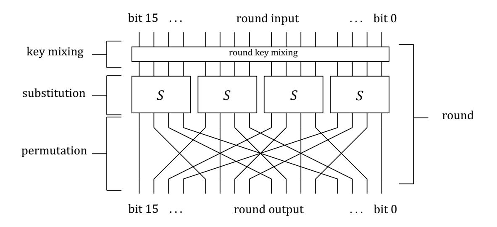

Fig. 1: 16-bit SPN

variable t represent the number of times the correct ∆<sup>O</sup> is generated by Npairs input pairs, if we treat the block cipher as a random function, the probability distribution of t can be assumed to be given by the binomial distribution (similar to Theorem 1 in [15]):

$$\Pr(t) = \binom{N_{pairs}}{t} p^t (1-p)^{N_{pairs}-t} \tag{1}$$

which has a mean of µ<sup>t</sup> = Npairs ·p and a standard deviation of σ<sup>t</sup> = p Npairs · p · (1 − p). We can convert t into a random variable representing the differential probability of t/Npairs. For the distribution of the differential probability, the mean is given as µt/Npairs = p and the standard deviation is given by

$$\sigma_{DP} = \sigma_t / N_{pairs} = \sqrt{p \cdot (1-p) / N_{pairs}}.$$
 (2)

#### 2.4 Cipher Structures Under Consideration

In this paper, we shall present the results of experiments on two SPN block cipher structures: a 16-bit cipher and a 64-bit cipher. In both cases, the ciphers make use of 4-bit S-boxes, which is a commonly used S-box size, especially in the design of lightweight block ciphers. As we shall see, various ciphers will be considered, characterized by using different S-boxes. Except for one scenario where we consider the PRESENT block cipher directly, the ciphers investigated are not proposed ciphers: although they do use S-box components from real ciphers (eg. Piccolo, PRINCE, ICEBERG, etc.), they use these components in different structures than the original ciphers. Hence, we cannot conclude anything about the original ciphers from our analysis and we do not make any claims to this. However, since the 64-bit SPN structure studied is realistic (it is the structure used in PRESENT and PUFFIN, for example), the ciphers investigated give us insight into practical cipher design.

16-bit SPN Round The first SPN considered is a toy system with a 16-bit block size and is illustrated in Figure 1. The cipher is comprised of a number of rounds, where one round of the SPN consists of (1) round key mixing, (2) substitution (provided by a layer of four 4-bit S-boxes), and (3) a permutation. Rounds are concatenated to produce the ciphertext output from the plaintext input. The round key

{5}------------------------------------------------

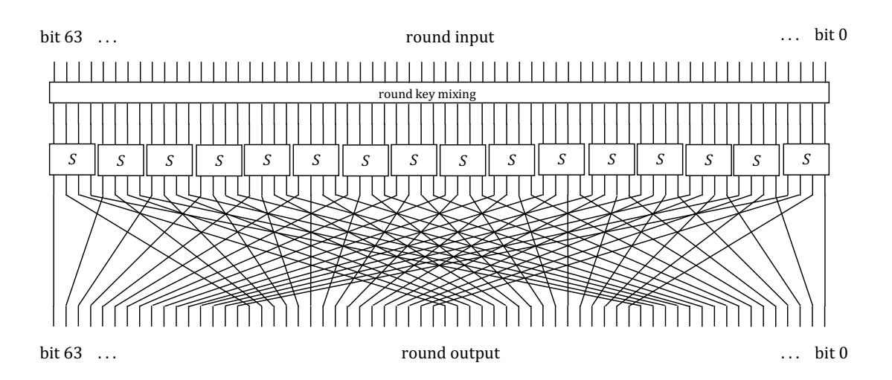

Fig. 2: 64-bit SPN Round

mixing takes a 16-bit round key, generated from the cipher key via the key scheduling algorithm (which is not illustrated), and performs a bitwise XOR with the cipher data block. The cipher uses one mapping for all S-boxes, but in our experiments we will consider many different ciphers by applying for each, one of many different 4-bit S-boxes from various proposed ciphers. The permutation layer is shown in the diagram and summarized in Table 1, where bit 15 is the leftmost bit in the block and bit 0 is the rightmost bit. Although the 16-bit SPN is not a realistic size for a practical cipher, it is of interest because we are able to run experiments with exhaustive sets of data. For example, all  $2^{16}$  plaintexts (and, hence, all  $2^{15}$  plaintext pairs of a specific differential) can be used as experimental inputs.

| input                       | 15 | 14 | 13 | 12 | 11 | 10 | 9 | 8 | 7  | 6 | 5 | 4 | 3  | 2 | 1 | 0 |
|-----------------------------|----|----|----|----|----|----|---|---|----|---|---|---|----|---|---|---|
| output                      | 15 | 11 | 7  | 3  | 14 | 10 | 6 | 2 | 13 | 9 | 5 | 1 | 12 | 8 | 4 | 0 |
| Table 1: 16-bit Permutation |    |    |    |    |    |    |   |   |    |   |   |   |    |   |   |   |

**64-bit SPN** The second SPN upon which we run experiments is modelled after the PRESENT cipher structure and is illustrated in Figure 2. Again, the cipher consists of multiple rounds with each round having 3 layers consisting of key mixing, substitution, and a permutation. The substitution uses 16 4-bit S-boxes, each with the same mapping as selected from various S-boxes for different experiments, and the permutation layer is identical to the PRESENT cipher permutation given in Table 2. For this cipher structure, each round mixes 64 bits of round key using a bitwise XOR with the cipher block data. Round keys are generated from the cipher key using a key scheduling algorithm.

#### 2.5 Round Key Generation

In order to generate the round keys from the cipher key, block ciphers apply a key schedule. Key schedules are public algorithms which can generate round key bits using the cipher key as the seed. Such algorithms tend to be simple, but can vary from generating round key bits as simple selections of cipher key bits to more complicated functions involving permutation of bits, mixing of round-variable constants, and

{6}------------------------------------------------

| input 63 62 61 60 59 58 57 56 55 54 53 52 51 50 49 48  |  |  |  |   |   |   |   |                                                    |   |   |   |   |
|--------------------------------------------------------|--|--|--|---|---|---|---|----------------------------------------------------|---|---|---|---|
| output 63 47 31 15 62 46 30 14 61 45 29 13 60 44 28 12 |  |  |  |   |   |   |   |                                                    |   |   |   |   |
| input 47 46 45 44 43 42 41 40 39 38 37 36 35 34 33 32  |  |  |  |   |   |   |   |                                                    |   |   |   |   |
| output 59 43 27 11 58 42 26 10 57 41 25 9 56 40 24 8   |  |  |  |   |   |   |   |                                                    |   |   |   |   |
| input 31 30 29 28 27 26 25 24 23 22 21 20 19 18 17 16  |  |  |  |   |   |   |   |                                                    |   |   |   |   |
| output 55 39 23 7 54 38 22 6 53 37 21 5 52 36 20 4     |  |  |  |   |   |   |   |                                                    |   |   |   |   |
| input 15 14 13 12 11 10 9                              |  |  |  | 8 | 7 | 6 | 5 | 4                                                  | 3 | 2 | 1 | 0 |
|                                                        |  |  |  |   |   |   |   | output 51 35 19 3 50 34 18 2 49 33 17 1 48 32 16 0 |   |   |   |   |

Table 2: 64-bit Permutation

application of nonlinear mappings (i.e., S-boxes) to produce round key bits from the original cipher key bits. Examples of the second category include AES and PRESENT.

As there is no standard method for generating the round keys, in our experiments we will consider three possibilities for the generation of the round keys:

- 1. repeated round keys where one round key is generated and then used for every round,
- 2. random round keys where a new random round key is generated for every round, and
- 3. scheduled round keys where a PRESENT-like key schedule is applied to the cipher key to generate the round keys.

In the first case, the round keys will simply be a repeat of the cipher key, implying a cipher key of 16 bits or 64 bits for the two cipher structures considered. In the second case, we will generate random, independent round keys (using a pseudorandom bit generator unrelated to the cipher under study) resulting in an implied cipher key size of B · R bits for R rounds of a cipher, where B is the size of the block. Finally, in the third case, the round keys are generated by applying a key schedule and, for the 64-bit cipher, we use directly the PRESENT key schedule for the 80-bit cipher key scenario, which produces 64-bit round keys, while, for the 16-bit SPN, we use a key schedule, similar in structure to the PRESENT key schedule, that takes a 20-bit cipher key and generates 16-bit round keys. In the appendix, we present a description of a generalized key schedule based on the PRESENT cipher and give the exact specifications of the key schedules used in our experiments.

In the case of repeated round keys, for the 16-bit SPN, only 2<sup>16</sup> cipher keys (and the corresponding round keys) are possible. Hence, it is practical to exhaustively test all 2<sup>31</sup> combinations of keys and unordered plaintext pairs {P1, P2}, of which there are 2<sup>15</sup> corresponding to the input difference of the differential. For the larger, 64-bit SPN, exhaustive testing over the complete set of 2<sup>63</sup> plaintext pairs is not practical, nor is exhaustive testing over the complete set of 2<sup>64</sup> keys for the repeated round key scenario.

For the random round key scenario, there are a total of 2<sup>B</sup>·<sup>R</sup> cipher keys to test making it not possible to exhaustively test over all keys for either the 16-bit or 64-bit SPN and, hence, in our experiments, we generate a random sample of random round keys.

Using the key schedule, for the 16-bit SPN, we assume a 20-bit cipher key which is used to generate each 16-bit round key, thereby requiring the examination of 2<sup>20</sup> · 2 <sup>15</sup> = 2<sup>35</sup> plaintext pairs in order to exhaustively test, which is practically achievable on a single computer. Of course, for the 64-bit SPN, using an 80-bit cipher key, exhaustive testing is not possible and we rely on generating a random selection of cipher keys and plaintext pairs in our experiments.

{7}------------------------------------------------

In addition to our experiments generating the distribution of the differential probability across keys, in this paper, we present an algorithm to generate keys that give high differential probabilities. Specifically, our algorithm is targeted to finding keys comprised of random round keys, that is, the scenario where round keys are not constrained by the key scheduling algorithm or the requirement of repeated round keys.

It is not our intention to study specific existing ciphers, but instead we explore the general behaviour in an SPN relating differential cryptanalysis to applied keys. We conjecture that the poorest key schedules could be mimicked by the repeated round key approach, while the best key schedules would provide round keys that appear random and independent, as in our model of the random round keys. The simple key schedule derived from PRESENT represents, perhaps, a key schedule somewhere between the worst and best possible.

#### 2.6 S-box

The S-box is the key component in determining the resistance of an SPN block cipher to differential cryptanalysis. In particular, the difference probabilities found in an S-box and the input-output differences to which they apply are critical in the consideration of the differential probabilities of the overall cipher. Initially, cipher differential probabilities were derived by using differential characteristics or trails of active S-boxes [1][16]. The product of the probabilities of the input-output differences of the S-boxes used in constructing the trail give an approximation of the differential probability of the overall cipher in cases where a differential is dominated by a high probability trail. The probability of a differential trail, DPtrail, is approximated by

$$DP_{trail} = \prod_{i=1}^{m} p_{S_i} \tag{3}$$

where pS<sup>i</sup> represents the difference probability of the i-th S-box used in the trail and the expression presumes there are m active S-boxes involved in the trail.

More realistically, many trails lead to the differential and, hence, the dominant trail approach to determining the differential probability is necessarily conservative. The differential trail probability, DPtrail, is an approximation of a lower bound on the differential probability, which is typically assumed to be the same for all keys (by the hypothesis of stochastic equivalence). In addition, the determination of the trail probability assumes the independence of the differences of the S-boxes in the trail, which is not strictly true. Nevertheless, this heuristic approach to characterizing differential cryptanalysis is thought to provide a good estimate of the attack complexity (taken to be proportional to 1/DPtrail) and has been used to justify many ciphers' resistance to differential cryptanalysis. See [16] for an example of how differential cryptanalysis can be applied to an SPN.

Every possible input-output difference of an S-box has a probability, implying that there are 2<sup>n</sup> · 2 n such probability values for an n-bit S-box. Let ∆x = x<sup>1</sup> ⊕x<sup>2</sup> (∆y = y<sup>1</sup> ⊕y2) represent the input (output) difference as the bitwise XOR of two n-bit S-box inputs, x<sup>1</sup> and x<sup>2</sup> (outputs, y<sup>1</sup> and y2). For a given input-output difference pair (∆x, ∆y), we define the S-box difference probability as:

$$p_S(\Delta x, \Delta y) = \sum_{x \in \mathbb{Z}_2^n} \Gamma_{\Delta y}(S(x), S(x \oplus \Delta x))/2^n$$
(4)

where S(x) represents the S-box operation on input x and

$$\Gamma_{\Delta y}(y_1, y_2) = \begin{cases} 1, & \text{if } y_1 \oplus y_2 = \Delta y \\ 0, & \text{if } y_1 \oplus y_2 \neq \Delta y. \end{cases}$$
(5)

{8}------------------------------------------------

For the S-boxes studied in this paper, n = 4, and due to the bijectivity of the S-box, pS(∆x = 0, ∆y 6= 0) = 0, pS(∆x 6= 0, ∆y = 0) = 0, and pS(∆x = 0, ∆y = 0) = 1. Also, since there are only 8 unordered input pairs corresponding to a specific input difference, pS(∆x 6= 0, ∆y 6= 0) ∈ {0, 1/8, 1/4, 3/8, 1/2, 5/8, 3/4, 7/8, 1} and, across all (∆x, ∆y), at least half of the values have pS(∆x, ∆y) = 0.

To guard against differential cryptanalysis, an objective in cipher design is usually to minimize DPtrail. Considering (3), this can be done by maximizing the number of S-boxes used in the trail, m, and minimizing the difference probabilities of those S-boxes, pS<sup>i</sup> . If we can employ an S-box which has the smallest maximum difference probability, this minimizes the possible pS<sup>i</sup> used for that S-box in a trail. The number of S-boxes, m, is a function of the number of input and output bits used in the S-box inputoutput difference pair which is used to generate the trail. In cipher design, it is therefore desirable in the determination of possible trails to maximize γ where

$$\gamma = wt(\Delta x) + wt(\Delta y) \tag{6}$$

where wt(·) represents the Hamming weight operator and ∆x and ∆y represent the S-box input and output differences used in a differential trail. Many papers have investigated the construction of S-boxes with the best properties to minimize DPtrail and many recently proposed lightweight block ciphers use S-boxes that have similar properties to provide resistance to differential cryptanalysis. These ciphers often have different structures into which the S-boxes are inserted and the S-boxes are also selected for a variety of other cryptographic and implementation properties.

In view of the cipher designer's desire to minimize the S-box difference probabilities used in the differential trail, using the strategy to minimize the maximum possible value of an S-box difference probability, it is possible to construct 4-bit S-boxes for which:

$$p_S(\Delta x, \Delta y) \le 1/4, \forall (\Delta x \ne 0, \Delta y \ne 0).$$
 (7)

We refer to this as a flattened difference distribution and all S-boxes studied in this paper satisfy this constraint.

Further S-box properties can be defined to assist in mitigating susceptibility to differential cryptanalysis. Whether these properties are applied often depends on the cipher structure within which the S-box is implemented. We define one such property to reflect an S-box's resistance to differential cryptanalysis as follows.

#### Definition: Guaranteed Avalanche (GA)

If an S-box satisfies pS(∆x, ∆y) = 0 for all (∆x, ∆y) such that wt(∆x) = wt(∆y) = 1, then the S-box is said to satisfy guaranteed avalanche.

In fact, this is similar to the definition of guaranteed avalanche of order 2 found in [19]. The definition of GA also relates to the often used notion of differential branch number [20] [21] and GA is equivalent to saying that the S-box must have a differential branch number of at least 3. Also, it is a known property of the DES S-boxes [22] and is a defined property of the PRESENT S-box [2]. It can be shown that satisfying GA ensures that all differential trails in any SPN have at least 1.5 active S-boxes per round, on average. This can be easily seen for the 16-bit SPN and can be shown to be true for any permutations used in any SPN which satisfies the basic property that no 2 output bits of an S-box are connected to the same S-box in the next round. For the permutation of the 64-bit cipher in Table 2, if the S-boxes satisfy GA, it can be shown that all differential trails have at least 2 active S-boxes per round. Since the 

{9}------------------------------------------------

PRESENT S-box satisfies GA, this fact is used in the discussion of the security of the PRESENT cipher [2].

In addition to satisfying GA, the S-box used in the PRESENT cipher has a flattened difference distribution. Hence, when used in the 16-bit SPN, since the minimum number of active S-boxes for R rounds is 1.5 · R, the differential trail probability for R rounds is upper bounded by 2−3R. When the PRESENT S-box is used in the 64-bit SPN structure, the differential trail probability is upper bounded by 2−4R, using the fact that there is at least 2 active S-boxes per round. Since DPtrail depends on the probabilities associated with the specific S-box input and output differences used in the trail, the maximum DPtrail may be less than the upper bound and for the PRESENT cipher, no trail has been found that achieves the upper bound. In fact, the best differential trail probability based on an iterative trail in the original PRESENT proposal [2] was found to be 2−5R, although it is possible to improve on this using non-iterative trails, as is discussed for small R in [2]. For the 16-bit SPN, using the PRESENT S-box, it is possible to find a differential trail with a probability of 2−3.75R, which is less than the upper bound of 2−3<sup>R</sup>.

Other S-boxes which we investigate in this paper (such as PRINCE, Midori, ICEBERG, and Piccolo), do not satisfy GA and it possible to derive trails consisting of one active S-box per round based on S-box differences for which wt(∆x) = wt(∆y) = 1, with an S-box difference probability of pS(∆x, ∆y) = 1/4. This results in differential trail probabilities of 2<sup>−</sup>2<sup>R</sup> for R rounds when these S-boxes are used in the 16-bit SPN or the 64-bit SPN.

Closely related to GA, we now define the notion of strong avalanche.

# Definition: Strong Avalanche (SA)

If an n-bit S-box satisfies pS(∆x, ∆y) ≤ 1/2 n−1 for all (∆x, ∆y) such that wt(∆x) = wt(∆y) = 1, then the S-box is said to satisfy strong avalanche.

If an S-box satisfies SA, even though differential trails may exist which have only one S-box per round, the difference probability of the active S-boxes is no more than the smallest non-zero value possible for an S-box difference, resulting in a low DPtrail. For example, for 4-bit S-boxes satisfying SA, the difference probability is either 0 or 1/8 for all cases of wt(∆x) = wt(∆y) = 1. Hence, in both the 16-bit SPN and the 64-bit SPN, an R-round differential trail with one S-box per round has a DPtrail upper bounded by 2 <sup>−</sup>3R, which is lower than the maximum differential trail probability of 2<sup>−</sup>2<sup>R</sup> that is possible for S-boxes which do not satisfy GA or SA but which have a flattened difference distribution.

A summary of differential trail probability upper bounds for R rounds of an SPN using the 4-bit Sboxes with various properties is given in Table 3. For convenience in presenting the values, it is assumed that R is a multiple of 2. The "flattened distribution" characterization refers to the S-box having the property that the maximum difference probability is 1/4 across all input-output differences for the Sbox, while the "SA + Flat Dist." label refers to any general SPN structure with S-boxes that satisfy strong avalanche and a flattened distribution. Guaranteed avalanche in the S-box of an SPN (along with a flattened difference distribution) results in differential probabilities no more than the value specified for "general SPN" which can have any permutation structure<sup>4</sup> (not just the ones described in this paper for the 16-bit and 64-bit ciphers), while for some specific permutation structures, like the permutation of the PRESENT cipher (and presented as our 64-bit permutation), the DPtrail can be no more than the entry "PRESENT-like SPN", a tighter upper bound facilitated by the nature of the permutation.

<sup>4</sup> We assume the trivial expectation that no two output bits of one S-box are fed into the same S-box in the next round.

{10}------------------------------------------------

| S-box Property         | DPtrail<br>Upper Bound      |
|------------------------|-----------------------------|
|                        | (R rounds)                  |
| Flattened Distribution | −2R<br>2                    |
| SA + Flat Dist.        | −3R<br>2                    |
| GA + Flat Dist.        | −3R (general SPN)<br>2      |
|                        | −4R (PRESENT-like SPN)<br>2 |

Table 3: Upper Bounds on Differential Trail Probability

| S-Box Source      | Outputs                             | Properties |
|-------------------|-------------------------------------|------------|
|                   | corresponding to                    |            |
|                   | input sequence:                     |            |
|                   | 0123456789ABCDEF                    |            |
| PRESENT [2]       | C56B90AD3EF84712                    | GA         |
| ICEBERG s0        | [3] D7329AC1F45E60B8                | involution |
| ICEBERG s1        | [3] 4AFC0D9BE6173582 SA, involution |            |
|                   | Small AES [13] 6B542E7A9DFC3108     | -          |
| Piccolo [5]       | E4B238091A7F6C5D                    | -          |
| KLEIN [6]         | 74A91FB0C3268ED5 SA, involution     |            |
| PRINCE [7]        | BF32AC916780E5D4                    | -          |
| PRIDE [8]         | 048F15E927ACBD63                    | involution |
| Midori Sb0<br>[9] | CAD3EBF789150246                    | involution |
| Mysterion [11]    | 02A964ED17F8BC35                    | -          |

Table 4: S-boxes Under Consideration (All S-box values are in hexadecimal.

Another property often found in S-boxes is the involution property, which implies that S((x)) = x for all x. This property is found in many ciphers and it is convenient in practical terms, as it implies that the same S-box component can be used for both encryption and decryption implementation. The involution property results in the following differential property:

$$p_S(\Delta x = a, \Delta y = b) = p_S(\Delta x = b, \Delta y = a). \tag{8}$$

This property can sometimes be helpful to the cryptanalyst in constructing or finding good differential trails.

In this paper, we insert many different 4-bit S-boxes selected from a number of lightweight block ciphers into both the 16-bit SPN and the 64-bit SPN and examine experimentally the key dependency of differential probabilities. That is, we experimentally determine and plot the probability distribution across the keys. In Table 4, we present a list of the S-boxes examined with a characterization of the cryptographic properties related to differential cryptanalysis. Note that all S-boxes have flattened difference distributions, i.e., the largest S-box difference probability is 1/4. Some of the S-boxes considered for our experiments are also used in ciphers other than the original proposal. For example, the LED cipher [23] uses the PRESENT S-box, PUFFIN [4] uses the ICEBERG s<sup>0</sup> S-box, and MANTIS [10] uses the Midori Sb<sup>0</sup> S-box. The block cipher SKINNY [10] uses an S-box that is very similar to the Piccolo S-box and has identical differential properties.

{11}------------------------------------------------

### 2.7 Categories of Differential Trails Used in Experiments

Our experiments will study differential probabilities, considering both the fixed-key differential probability DP<sup>K</sup> and average differential probability ADP. However, for convenience, we shall use high values of differential trail probabilities as a guide to selecting which differentials to examine. As a result, although we expect the differentials selected will have high probabilities, we do not claim that they are the highest probability differentials that are existing in the cipher.

Based on the properties of the S-boxes in the experiments (all of which have a flattened distribution), the differential trails utilized can be considered to fall into the following categories:

- 1. Highly Diffusive Trails S-boxes which satisfy GA are guaranteed to have, at best, a 2-round iterative trail with 3 active S-boxes (for a general SPN) or 2 active S-boxes per round (for a PRESENT-like SPN) resulting in upper bounds on differential trail probabilities of 2−3<sup>R</sup> or 2−4R, respectively. The only S-box we consider for this category is the PRESENT S-box.
- 2. Moderately Diffusive Trails S-boxes which satisfy SA can have trails using an S-box difference probability of 1/8 which result in an R-round trail with probability as high as 2<sup>−</sup>3R, which can be realized with one active S-box in each round of the trail. For a general SPN, it may also be possible that an R-round trail can be constructed by concatenating 2-round iterative differential trails comprised of 3 active S-boxes, which could have S-box differential probabilities of 1/4, resulting in the same maximum trail probability of 2<sup>−</sup>3R. S-boxes considered for this category are the S-box from the KLEIN cipher and S-box s<sup>1</sup> from the ICEBERG cipher.
- 3. Poorly Diffusive Trails S-boxes in this category allow for trails constructed by concatenating 1 round differentials (which may, in some cases, be iterated) based on 1 active S-box with a differential probability of 1/4. As a result, the R-round differential trail probability can be as high as 2<sup>−</sup>2R. This is the highest possible probability for an SPN constructed with an S-box using a flattened difference distribution for which the largest S-box difference probability is 1/4. The remaining S-boxes under consideration fall into this category and are from ciphers ICEBERG (S-box s0), Small AES, Piccolo, PRINCE, PRIDE, Midori (S-box Sb0), and Mysterion.

In our experimental studies, it is most interesting to focus on simulations of ciphers which use poorly diffusive S-boxes. In doing so, we can examine SPNs with more rounds since the differential probabilities are higher and take fewer plaintexts to observe the occurrence of the correct output difference. For example, using a poorly diffusive S-box in a 12-round 64-bit SPN results in differential trail probabilities of up to 2<sup>−</sup>24, while using a moderately or highly diffusive S-box could result differential trail probabilities no higher that 2<sup>−</sup>36. This means that, for the first case, we might expect to recognize the occurrence of the correct output difference using about 17 million plaintext pairs, while for the second case, it can be expected to take 70 billion plaintext pairs or more, before the correct output difference is likely to occur. For the 64-bit permutation used in this paper, for highly diffusive trails, the upper bound on the differential trail probability is even lower at 2<sup>−</sup><sup>48</sup>, requiring about 280 trillion plaintext pairs to observe the correct output difference.<sup>5</sup>

It should be emphasized that, while we are labelling numerous S-boxes as poorly diffusive, this is not meant to be a comment on the strength of the ciphers from which they are drawn. We have taken these S-boxes out of the context of their cipher structure and put them in an SPN structure for which they were not intended. Hence, it is not fair to characterize the original ciphers from any perceived weakness

<sup>5</sup> As previously mentioned, in fact, for the PRESENT S-box, DPtrail based on a 2-round iterative differential can be shown to be even smaller at 2<sup>−</sup><sup>60</sup>, implying the need for more than a quintillion plaintext pairs.

{12}------------------------------------------------

in this new context. In fact, it is quite possible that a poorly diffusive S-box is compensated for in its original cipher structure by a highly diffusive linear transformation layer. In a basic SPN which uses a simple permutation, the permutation is easily applied but can be very poor at diffusion. Our goal is not to comment specifically on the original ciphers, but to examine and characterize differential cryptanalysis in relation to distribution across keys. In order to do this, we explore feasible ciphers based on the SPN structure and investigate their characteristics through experimentation. We do not advocate for the practical application of the ciphers we examine for either the 16-bit or the 64-bit SPN structures.

# 3 Differential Probability Distributions for 16-bit SPNs

We begin our presentation of the experimental outcomes by focusing on the results of the 16-bit SPN. Given the large number of S-boxes used as candidates, we do not present all results in the paper, but use some sample results as the basis for discussion. First we layout some necessary background for interpretation of the experiments.

### 3.1 Differentials Used in the Experiments

In Table 5, the differential trails for the various S-boxes that were used in our experiments on the 16-bit cipher are presented. The illustrated trails are all based on iterating a differential trail of only a few (often just one) rounds. The full trail probability DPtrail for the PRESENT S-box case assumes that R is a multiple of 4 and for the ICEBERG s<sup>1</sup> S-box (differential trail 2) assumes that R is a multiple of 2.

### 3.2 Experimental Data Collection

In the execution of the experiments, the appropriate differential trail defined in Table 5 for the S-box under consideration was used to determine the appropriate differential to examine. A number of cipher keys were selected (as discussed below) and, for each cipher key, plaintext pairs corresponding to the input difference of the trail were generated and output pairs were examined after the number of rounds of interest. From the output pairs, the output difference is determined and the number of times the correct output difference from the differential trail occurs is counted for each key. The resulting fixed-key differential probability for the given key is determined from

$$DP_K = \# \text{ occurrences of correct output difference } / \# \text{ plaintext pairs}$$
 (9)

For the 16-bit SPN, the plaintext space only consists of 2<sup>16</sup> distinct plaintexts, resulting in 2<sup>15</sup> distinct plaintext pairs corresponding to a specific input difference (since the ordering of the plaintexts in the pair generating an input difference is not relevant). Hence, it is quite practical to exhaustively search the plaintext input space for a given input difference for each key.

In our experiments, we have generally considered the 3 methods of deriving round keys discussed in Section 2.5: a 16-bit key repeated in each round, a randomly generated round key for each round, and round keys generated using a PRESENT-like key schedule (described in the appendix) using a cipher key of 20 bits (for the 16-bit SPN). Using a repeated round key, it is quite feasible to exhaustively test the full plaintext space for the full key space. Similarly, for the 20-bit cipher key applied as input to the key schedule, it is also possible to test the full space of 2<sup>15</sup> plaintext pairs × 2 <sup>20</sup> keys. However, using randomly generated round keys, it quickly becomes infeasible to do an exhaustive test as the number of

{13}------------------------------------------------

| S-Box                  | S-box                                                                                                                                                                                                                                                                                                                                                                                                                                                                                                                                                                                                                                                                                                                                                                                                                                                                                                                                                                                                                                                                                                                                                                                                                                                                                                                                                                                                                                                                                                                                                                                                                                                                                                                                                                                                                                                                                                                                                                                                                                                                                                                          | Iterative Trail                     | DD.          |
|------------------------|--------------------------------------------------------------------------------------------------------------------------------------------------------------------------------------------------------------------------------------------------------------------------------------------------------------------------------------------------------------------------------------------------------------------------------------------------------------------------------------------------------------------------------------------------------------------------------------------------------------------------------------------------------------------------------------------------------------------------------------------------------------------------------------------------------------------------------------------------------------------------------------------------------------------------------------------------------------------------------------------------------------------------------------------------------------------------------------------------------------------------------------------------------------------------------------------------------------------------------------------------------------------------------------------------------------------------------------------------------------------------------------------------------------------------------------------------------------------------------------------------------------------------------------------------------------------------------------------------------------------------------------------------------------------------------------------------------------------------------------------------------------------------------------------------------------------------------------------------------------------------------------------------------------------------------------------------------------------------------------------------------------------------------------------------------------------------------------------------------------------------------|-------------------------------------|--------------|
| S-DOX                  | \-\frac{1}{2} \cdot \frac{1}{2} \cdot \frac{1}{2} \cdot \frac{1}{2} \cdot \frac{1}{2} \cdot \frac{1}{2} \cdot \frac{1}{2} \cdot \frac{1}{2} \cdot \frac{1}{2} \cdot \frac{1}{2} \cdot \frac{1}{2} \cdot \frac{1}{2} \cdot \frac{1}{2} \cdot \frac{1}{2} \cdot \frac{1}{2} \cdot \frac{1}{2} \cdot \frac{1}{2} \cdot \frac{1}{2} \cdot \frac{1}{2} \cdot \frac{1}{2} \cdot \frac{1}{2} \cdot \frac{1}{2} \cdot \frac{1}{2} \cdot \frac{1}{2} \cdot \frac{1}{2} \cdot \frac{1}{2} \cdot \frac{1}{2} \cdot \frac{1}{2} \cdot \frac{1}{2} \cdot \frac{1}{2} \cdot \frac{1}{2} \cdot \frac{1}{2} \cdot \frac{1}{2} \cdot \frac{1}{2} \cdot \frac{1}{2} \cdot \frac{1}{2} \cdot \frac{1}{2} \cdot \frac{1}{2} \cdot \frac{1}{2} \cdot \frac{1}{2} \cdot \frac{1}{2} \cdot \frac{1}{2} \cdot \frac{1}{2} \cdot \frac{1}{2} \cdot \frac{1}{2} \cdot \frac{1}{2} \cdot \frac{1}{2} \cdot \frac{1}{2} \cdot \frac{1}{2} \cdot \frac{1}{2} \cdot \frac{1}{2} \cdot \frac{1}{2} \cdot \frac{1}{2} \cdot \frac{1}{2} \cdot \frac{1}{2} \cdot \frac{1}{2} \cdot \frac{1}{2} \cdot \frac{1}{2} \cdot \frac{1}{2} \cdot \frac{1}{2} \cdot \frac{1}{2} \cdot \frac{1}{2} \cdot \frac{1}{2} \cdot \frac{1}{2} \cdot \frac{1}{2} \cdot \frac{1}{2} \cdot \frac{1}{2} \cdot \frac{1}{2} \cdot \frac{1}{2} \cdot \frac{1}{2} \cdot \frac{1}{2} \cdot \frac{1}{2} \cdot \frac{1}{2} \cdot \frac{1}{2} \cdot \frac{1}{2} \cdot \frac{1}{2} \cdot \frac{1}{2} \cdot \frac{1}{2} \cdot \frac{1}{2} \cdot \frac{1}{2} \cdot \frac{1}{2} \cdot \frac{1}{2} \cdot \frac{1}{2} \cdot \frac{1}{2} \cdot \frac{1}{2} \cdot \frac{1}{2} \cdot \frac{1}{2} \cdot \frac{1}{2} \cdot \frac{1}{2} \cdot \frac{1}{2} \cdot \frac{1}{2} \cdot \frac{1}{2} \cdot \frac{1}{2} \cdot \frac{1}{2} \cdot \frac{1}{2} \cdot \frac{1}{2} \cdot \frac{1}{2} \cdot \frac{1}{2} \cdot \frac{1}{2} \cdot \frac{1}{2} \cdot \frac{1}{2} \cdot \frac{1}{2} \cdot \frac{1}{2} \cdot \frac{1}{2} \cdot \frac{1}{2} \cdot \frac{1}{2} \cdot \frac{1}{2} \cdot \frac{1}{2} \cdot \frac{1}{2} \cdot \frac{1}{2} \cdot \frac{1}{2} \cdot \frac{1}{2} \cdot \frac{1}{2} \cdot \frac{1}{2 |                                     | $DP_{trail}$ |
|                        | $Input \rightarrow Output Differences$                                                                                                                                                                                                                                                                                                                                                                                                                                                                                                                                                                                                                                                                                                                                                                                                                                                                                                                                                                                                                                                                                                                                                                                                                                                                                                                                                                                                                                                                                                                                                                                                                                                                                                                                                                                                                                                                                                                                                                                                                                                                                         | (Sequence of                        | (R  rounds)  |
|                        | (Probability)                                                                                                                                                                                                                                                                                                                                                                                                                                                                                                                                                                                                                                                                                                                                                                                                                                                                                                                                                                                                                                                                                                                                                                                                                                                                                                                                                                                                                                                                                                                                                                                                                                                                                                                                                                                                                                                                                                                                                                                                                                                                                                                  | Input Differences)                  |              |
| PRESENT                | $1 \to 3 \ (1/4)$                                                                                                                                                                                                                                                                                                                                                                                                                                                                                                                                                                                                                                                                                                                                                                                                                                                                                                                                                                                                                                                                                                                                                                                                                                                                                                                                                                                                                                                                                                                                                                                                                                                                                                                                                                                                                                                                                                                                                                                                                                                                                                              | $0001 \to 0011 \to 0033$            | $2^{-3.75R}$ |
|                        | $3 \to 1 \ (1/8)$                                                                                                                                                                                                                                                                                                                                                                                                                                                                                                                                                                                                                                                                                                                                                                                                                                                                                                                                                                                                                                                                                                                                                                                                                                                                                                                                                                                                                                                                                                                                                                                                                                                                                                                                                                                                                                                                                                                                                                                                                                                                                                              | $\rightarrow 0003 \rightarrow 0001$ |              |
| ICEBERG $s_0$          | $4 \to 4 \ (1/4)$                                                                                                                                                                                                                                                                                                                                                                                                                                                                                                                                                                                                                                                                                                                                                                                                                                                                                                                                                                                                                                                                                                                                                                                                                                                                                                                                                                                                                                                                                                                                                                                                                                                                                                                                                                                                                                                                                                                                                                                                                                                                                                              | $0400 \to 0400$                     | $2^{-2R}$    |
| ICEBERG $s_1$          | $8 \to 8 \ (1/8)$                                                                                                                                                                                                                                                                                                                                                                                                                                                                                                                                                                                                                                                                                                                                                                                                                                                                                                                                                                                                                                                                                                                                                                                                                                                                                                                                                                                                                                                                                                                                                                                                                                                                                                                                                                                                                                                                                                                                                                                                                                                                                                              | $8000 \to 8000$                     | $2^{-3R}$    |
| (Differential Trail 1) |                                                                                                                                                                                                                                                                                                                                                                                                                                                                                                                                                                                                                                                                                                                                                                                                                                                                                                                                                                                                                                                                                                                                                                                                                                                                                                                                                                                                                                                                                                                                                                                                                                                                                                                                                                                                                                                                                                                                                                                                                                                                                                                                |                                     |              |
| ICEBERG $s_1$          | $1 \to 6 \ (1/4)$                                                                                                                                                                                                                                                                                                                                                                                                                                                                                                                                                                                                                                                                                                                                                                                                                                                                                                                                                                                                                                                                                                                                                                                                                                                                                                                                                                                                                                                                                                                                                                                                                                                                                                                                                                                                                                                                                                                                                                                                                                                                                                              | $0001 \to 0110 \to 0660$            | $2^{-3R}$    |
| (Differential Trail 2) | $6 \to 1 \ (1/4)$                                                                                                                                                                                                                                                                                                                                                                                                                                                                                                                                                                                                                                                                                                                                                                                                                                                                                                                                                                                                                                                                                                                                                                                                                                                                                                                                                                                                                                                                                                                                                                                                                                                                                                                                                                                                                                                                                                                                                                                                                                                                                                              | $\rightarrow 0006 \rightarrow 0001$ |              |
| Small AES              | $4 \to 4 \ (1/4)$                                                                                                                                                                                                                                                                                                                                                                                                                                                                                                                                                                                                                                                                                                                                                                                                                                                                                                                                                                                                                                                                                                                                                                                                                                                                                                                                                                                                                                                                                                                                                                                                                                                                                                                                                                                                                                                                                                                                                                                                                                                                                                              | $0400 \to 0400$                     | $2^{-2R}$    |
| Piccolo                | $1 \to 8 \; (1/4)$                                                                                                                                                                                                                                                                                                                                                                                                                                                                                                                                                                                                                                                                                                                                                                                                                                                                                                                                                                                                                                                                                                                                                                                                                                                                                                                                                                                                                                                                                                                                                                                                                                                                                                                                                                                                                                                                                                                                                                                                                                                                                                             | $0001 \to 1000 \to 8000$            | $2^{-2R}$    |
|                        | $8 \to 4 \ (1/4)$                                                                                                                                                                                                                                                                                                                                                                                                                                                                                                                                                                                                                                                                                                                                                                                                                                                                                                                                                                                                                                                                                                                                                                                                                                                                                                                                                                                                                                                                                                                                                                                                                                                                                                                                                                                                                                                                                                                                                                                                                                                                                                              | $\rightarrow 0800 \rightarrow 0400$ |              |
|                        | $4 \to 2 \ (1/4)$                                                                                                                                                                                                                                                                                                                                                                                                                                                                                                                                                                                                                                                                                                                                                                                                                                                                                                                                                                                                                                                                                                                                                                                                                                                                                                                                                                                                                                                                                                                                                                                                                                                                                                                                                                                                                                                                                                                                                                                                                                                                                                              | $\rightarrow 0040 \rightarrow 0020$ |              |
|                        | $2 \to 1 \ (1/4)$                                                                                                                                                                                                                                                                                                                                                                                                                                                                                                                                                                                                                                                                                                                                                                                                                                                                                                                                                                                                                                                                                                                                                                                                                                                                                                                                                                                                                                                                                                                                                                                                                                                                                                                                                                                                                                                                                                                                                                                                                                                                                                              | $\rightarrow 0002 \rightarrow 0001$ |              |
| KLEIN                  | $8 \to 8 \ (1/8)$                                                                                                                                                                                                                                                                                                                                                                                                                                                                                                                                                                                                                                                                                                                                                                                                                                                                                                                                                                                                                                                                                                                                                                                                                                                                                                                                                                                                                                                                                                                                                                                                                                                                                                                                                                                                                                                                                                                                                                                                                                                                                                              | $8000 \to 8000$                     | $2^{-3R}$    |
| PRINCE                 | $1 \to 1 \ (1/4)$                                                                                                                                                                                                                                                                                                                                                                                                                                                                                                                                                                                                                                                                                                                                                                                                                                                                                                                                                                                                                                                                                                                                                                                                                                                                                                                                                                                                                                                                                                                                                                                                                                                                                                                                                                                                                                                                                                                                                                                                                                                                                                              | $0001 \to 0001$                     | $2^{-2R}$    |
| PRIDE                  | $8 \to 8 \; (1/4)$                                                                                                                                                                                                                                                                                                                                                                                                                                                                                                                                                                                                                                                                                                                                                                                                                                                                                                                                                                                                                                                                                                                                                                                                                                                                                                                                                                                                                                                                                                                                                                                                                                                                                                                                                                                                                                                                                                                                                                                                                                                                                                             | $8000 \to 8000$                     | $2^{-2R}$    |
| Midori Sb <sub>0</sub> | $1 \to 2 \; (1/4)$                                                                                                                                                                                                                                                                                                                                                                                                                                                                                                                                                                                                                                                                                                                                                                                                                                                                                                                                                                                                                                                                                                                                                                                                                                                                                                                                                                                                                                                                                                                                                                                                                                                                                                                                                                                                                                                                                                                                                                                                                                                                                                             | $0001 \to 0010 \to 0020$            | $2^{-2R}$    |
|                        | $2 \to 1 \ (1/4)$                                                                                                                                                                                                                                                                                                                                                                                                                                                                                                                                                                                                                                                                                                                                                                                                                                                                                                                                                                                                                                                                                                                                                                                                                                                                                                                                                                                                                                                                                                                                                                                                                                                                                                                                                                                                                                                                                                                                                                                                                                                                                                              | $\rightarrow 0002 \rightarrow 0001$ |              |
| Mysterion              | $4 \to 4 \ (1/4)$                                                                                                                                                                                                                                                                                                                                                                                                                                                                                                                                                                                                                                                                                                                                                                                                                                                                                                                                                                                                                                                                                                                                                                                                                                                                                                                                                                                                                                                                                                                                                                                                                                                                                                                                                                                                                                                                                                                                                                                                                                                                                                              | $0400 \rightarrow 0400$             | $2^{-2R}$    |

Table 5: Differentials for 16-bit SPN (All differences in hexadecimal.)

rounds increases and we are therefore only able to sample the key space (although for each sample key, the full plaintext pairs space is tested). As we shall see, in some cases there is a clear difference between distributions for the scenario of repeated round keys and the application of the key schedule. However, we found little difference between the cases of random round keys and scheduled round keys and, hence, generally do not present the random round key results.

#### 3.3 Ideal Distribution

For an ideal cipher, we are interested in a behaviour mimicking randomly generated data and in thwarting differential cryptanalysis we want to minimize the differential probability at least to the point that it is indistinguishable from a random result. It would seem in the ideal case, all output differences of the cipher,  $\Delta_O$ , would be equally likely given a particular  $\Delta_I$  and, hence,  $\Pr(\Delta_O|\Delta_I) = 1/2^B$  for all  $\Delta_O$ . Although this is a reasonable assumption if one averages across all keys (that is, for ADP), this is not true when considering the behaviour of the cipher with a fixed key (that is, for  $DP_K$ ). In fact, due to the bijective nature of a cipher, for a fixed key and a given input difference,  $\Delta_I$ , all output differences,  $\Delta_O$ , must occur a multiple of 2 times when counting across all  $2^B$  values of input  $P_1$ , which is combined with a second input,  $P_2 = P_1 \oplus \Delta_I$ , to produce the two outputs generating  $\Delta_O$ . Across all the  $2^B$  resulting pairs, both ordered input pairs  $(P_1, P_2)$  and  $(P_2, P_1)$  will produce the same output difference  $\Delta_O$ . So rather than  $2^B$  ordered pairs, we can instead consider  $2^{B-1}$  unordered pairs  $\{P_1, P_2\}$  used to generate  $2^{B-1}$  output differences out of a total possible  $2^B$  values. Now, assuming that output differences occur randomly and independently for each input difference (as ideal random behaviour would imply), letting

{14}------------------------------------------------

t represent the number of times a particular  $\Delta_O$  is generated by one of the possible  $2^{B-1}$  unordered input pairs, the probability of t is given by the binomial distribution of (1) where we let  $N_{pairs} = 2^{B-1}$  and  $p = 2^{-B}$ . In the ideal case, across all  $2^{B-1}$  possible unordered plaintext pairs satisfying the input difference, the expected value of t is  $\mu_t = 2^{B-1} \cdot p = 0.5$  and the standard deviation of the distribution of t is given by  $\sigma_t = \sqrt{2^{B-1} \cdot p \cdot (1-p)} \approx 2^{-0.5} = .707$ . Note that the random variable, t, representing the number of occurrences of a particular output difference can be converted to a random variable representing the differential probability by dividing by  $2^{B-1}$ . As a result, the differential probability becomes  $\mu_t/2^{B-1} = p$  and the standard deviation of the ideal distribution of the differential probability is  $\sigma_{DP} = \sigma_t/2^{B-1} \approx 2^{-B+0.5}$ , where it is assumed all possible plaintext pairs are tried for inputs to the differential with random output differences resulting.

For the 16-bit SPN in our experiments, for each key, we generate the count of occurrences of  $\Delta_O$  for a given  $\Delta_I$  derived from  $2^{B-1}=2^{15}$  unordered pairs of plaintexts and compute the resulting differential probability. For comparison, the ideal distribution is generated using (1) with  $p=2^{-16}$  and  $N_{pairs}=2^{15}$ , with the resulting mean of the differential probability being  $2^{-16}$ , which we refer to as the *ideal probability*, and the standard deviation being  $\sigma_{DP}\approx 2^{-15.5}$ . It is intuitive that as we simulate SPNs and the number of rounds increases, the cipher output behaves more randomly and the distribution of the experimental results should approach the ideal distribution. Although it frequently does, as we shall observe, in some cases, the experimental results perplexingly do not seem to converge to the ideal.

#### 3.4 PRESENT S-box

Since the PRESENT S-box is targeted to a basic SPN (and, in fact, the 64-bit SPN to be studied is exactly the PRESENT cipher structure), we begin our study with the application of the PRESENT S-box to the 16-bit SPN. Since the PRESENT S-box satisfies the GA property, the trail is highly diffusive and the differential probability decreases rapidly as the number of rounds increases. In Figure 3, the resulting probability distribution across the keys is presented for 4 rounds and 8 rounds. In all cases, we have used the key schedule to generate round keys and have generated all possible 20-bit cipher keys in the experiments. In each plot, there are 4 curves presented:

- 1. Distribution from experimental results labelled "Experimental"
- 2. Binomial distribution using the mean from experimental results labelled "Binomial (Experimental)"
- 3. Binomial distribution using differential trail probability labelled "Binomial (Trail)"
- 4. Ideal distribution labelled "Ideal"

The differential trail probabilities are given in Table 5. The experimental probability of a particular differential probability for a fixed key,  $DP_K$ , is determined by counting the number of occurrences of the expected  $\Delta_O$  given the fixed  $\Delta_I$  and then dividing by the number of input pairs applied. The distribution from the experimentally derived result is the true distribution since all  $2^{20}$  keys and  $2^{15}$  plaintext pairs are exhaustively tried.

In order to derive the distribution based on the binomial distribution using the experimental mean, we let  $\mu$  represent the experimental average, taken across all keys, of the total number of output pairs which satisfy the correct output difference,  $\Delta_O$ , across all plaintext pairs which satisfy the input difference,  $\Delta_I$ . Using all  $2^{15}$  unordered pairs to generate  $\Delta_I$ , the binomial distribution of (1) can be used to generate the curve, with  $N_{pairs} = 2^{15}$  and now  $p = \mu/2^{15}$  (meaning that p is actually the average differential probability, ADP). The resulting probability for the random variable, t, representing the number of pairs satisfying output difference  $\Delta_O$ , can be converted to the probability of the random variable of differential

{15}------------------------------------------------

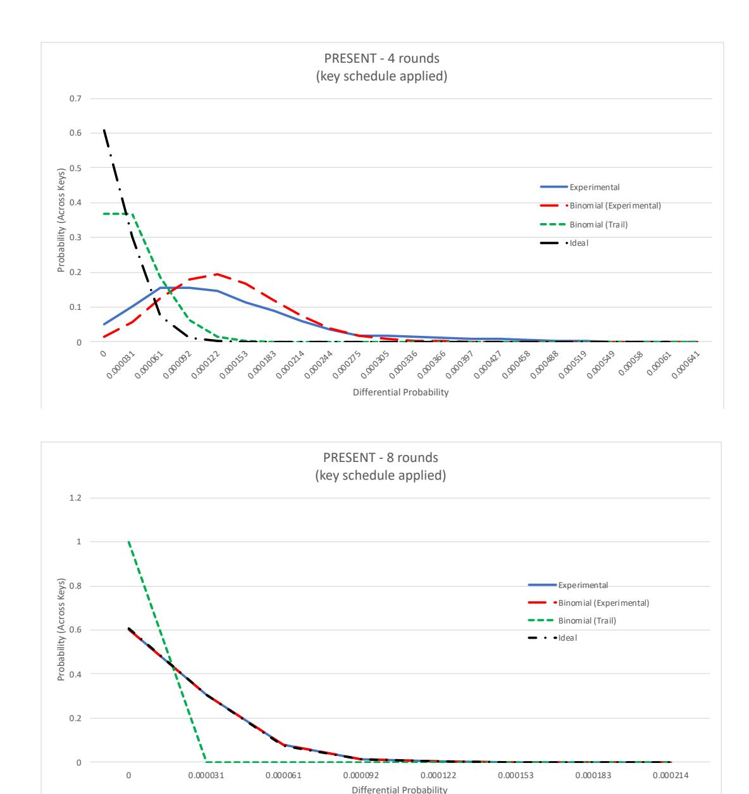

Fig. 3:  $DP_K$  Distribution for PRESENT S-box (16-bit SPN, R = 4 and 8)

probability given as  $t/2^{15}$ . For the binomial distribution derived from the trail probability, we simply use  $p = DP_{trail}$  in (1) to derive the differential probability distribution, while the ideal distribution is based on (1) with ideal probability  $p = 2^{-16}$ .

In the graph representing the results for a 4 round SPN, we can see the experimental (true) distribution is only roughly approximated by the binomial distribution. Not surprisingly, the average differential probability<sup>6</sup>, ADP, is higher than the differential trail probability,  $DP_{trail}$ , since, as predicted by theory, the differential probability has more contributions than just the trail probability. Both  $DP_{trail}$  and ADP are larger than the ideal probability of  $2^{-16} = 1.53 \times 10^{-5}$ , implying that it is possible to extract key information using differential cryptanalysis methods. In fact, the distribution based on the differential trail probability is clearly centred to the left (with smaller values) than the experimental distribution, and the ideal distribution is centred even further to the left. It can be concluded that the differential probability of a cipher with a fixed key,  $DP_K$ , is likely be higher than predicted by  $DP_{trail}$ . Indeed, in the worst case,

<sup>&</sup>lt;sup>6</sup> Since the experimental distribution is the true distribution, the experimentally determined average differential probability across all keys, is, in fact, precisely the average differential probability.

{16}------------------------------------------------

for some keys, differential probabilities might be significantly higher than the trail probability. (Observe that the tail of the experimental distribution is to the right of the mean of the binomial probability based on the trail.) As well, differential probabilities for some keys can be significantly higher than expected under the ideal distribution, implying perhaps significant susceptibility to differential cryptanalysis for this trivially small network.

For the 8 round SPN, as can be seen in the graph, the experimental distribution is now very well approximated by a binomial distribution generated using the experimental mean. On this graph, the binomial probability from the trail probability is now based on a trail probability that is lower than expected for the ideal scenario. Hence, it is no longer meaningful to consider the trail-based distribution and instead the comparison of interest is to the ideal distribution. In fact, the experimental distribution is now visually indistinguishable from the ideal distribution, implying that the 8 round version of the cipher does not have obvious key-dependent vulnerabilities to differential cryptanalysis. However, as we discuss below, since experimental occurrences of high values of DP<sup>K</sup> represent deterministic results, specific keys are associated with these high values.

For further consideration, we have also plotted the average differential probability, ADP, and the maximum of all fixed-key differential probabilities versus the number of rounds in Figure 4. In both graphs, we have given 3 plots: the experimental plot for a cipher with repeated round keys, the experimental plot for a cipher with the key schedule applied, and a plot of the larger of either the trail probability or the ideal probability. For R = 3 or R = 4, the trail probability is greater than the ideal probability, but for 5 rounds and up, the ideal probability is larger. The two experimental plots are derived using all possible plaintext and key values and, hence, these curves reflect the true distributions.

It can be observed in the plots of Figure 4, for a small number of rounds, for both keying approaches, the average differential probability is clearly larger than the trail or ideal probability. However, as the number of rounds increases, the average differential probability decreases dramatically and visually approaches the ideal probability value by R = 8. In the case of the maximum differential probability, it is clear that, while this probability decreases as R increases, it does not approach the ideal probability value and, hence, for some keys, the differential probability can be significantly higher than the ideal probability. This would seem to be statistically not surprising since the spread of the ideal distribution implies some higher values will occur even if different keys are generating random results. However, since these experimental results represent true values, some specific keys do have much higher differential probabilities for both keying approaches. In other words, these maximum values from the experiments represent true differential probability values for specific keys, not simply random statistical outliers that will change if we run the experiments again. Although it may not be possible to determine which keys will have higher differential probabilities, the results suggest that some keys may be considered weak in relation to differential cryptanalysis. Nevertheless, distinguishing these keys may be a challenge, because we expect differential probabilities higher than the ideal probability of 2<sup>−</sup><sup>16</sup> will statistically appear even if the cipher was behaving randomly.

The results presented for the PRESENT S-box are somewhat as expected and are of limited interest since statistical anomalies are only visible for a small number of rounds. That is, for more than 8 rounds or so, the distributions and their parameters fit very much the ideal distribution. In subsequent sections, we shall explore many more cipher constructions with different S-boxes placed into the 16-bit SPN and will see unusual behaviour of some ciphers in the context of differential cryptanalysis.

{17}------------------------------------------------

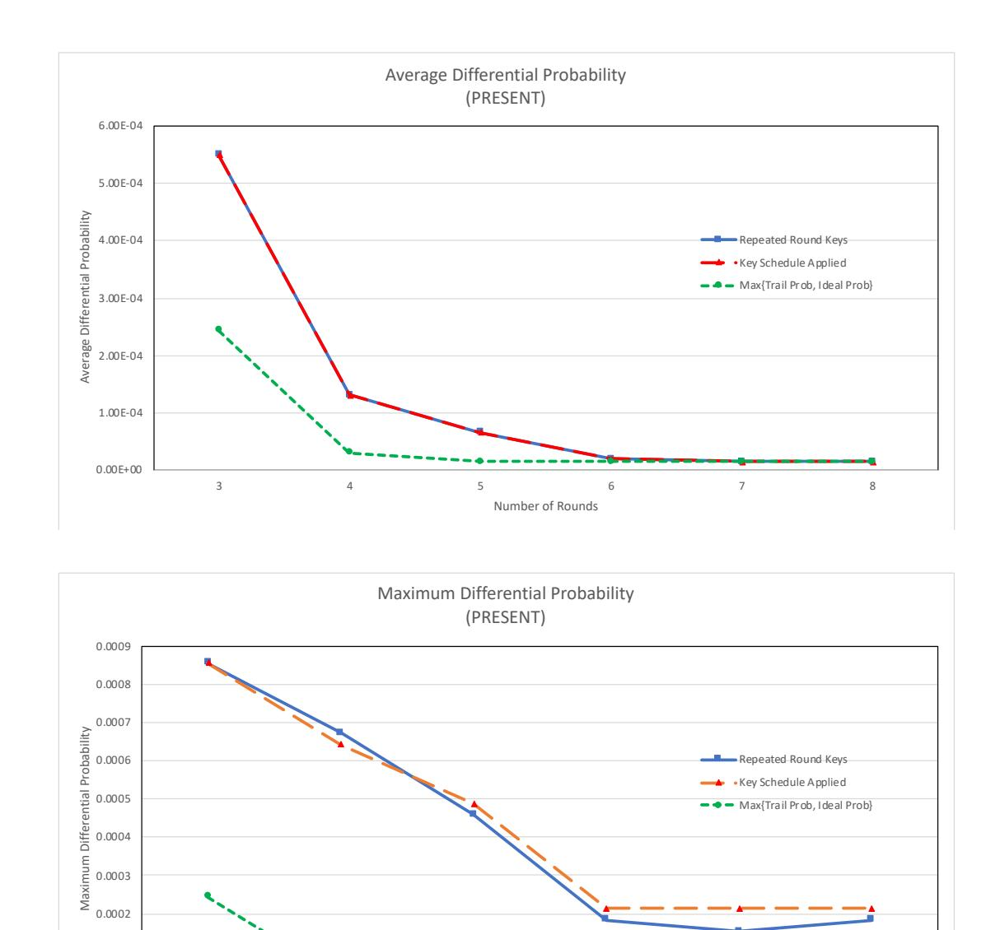

Fig. 4: Average and Maximum DP<sup>K</sup> vs. R for PRESENT S-box (16-bit SPN)

3 4 5 6 7 8

Number of Rounds

# 3.5 Results for Different S-boxes

0.0001

Rather than presenting comprehensively the results for all S-boxes that we have investigated, in this section, we instead select results to present based on conclusions that can be drawn and interesting points that can be made. All of the S-boxes discussed in this section lead to poorly diffusive trails and this allows us to examine the differential behaviour of the resulting SPNs for a larger number of rounds than was possible for the SPN based on the PRESENT S-box.

Binomial Distribution Fit In many cases, as the number of rounds R increases, the experimental distribution fits very well to a binomial distribution, using the experimental mean to determine the parameter as p = ADP. For example, consider the PRINCE S-box and the distributions for 4, 8, and 12 rounds when the key schedule is applied to all possible 20-bit cipher keys as shown in Figure 5. In the figure, we display the plots for the true distribution based on experimental results, the binomial distribution based on the experimental mean, and either the binomial distribution based on the trail 

{18}------------------------------------------------

probability (p = DPtrail) or the ideal distribution (p = 2−16). The trail probability, which is given by DPtrail = 2−2<sup>R</sup> is higher than the ideal probability of 2−<sup>16</sup> for R < 8. For R = 8, DPtrail = 2−<sup>16</sup> (equal to the ideal probability), while for R > 8, the trail probability falls below the ideal probability and, hence, is not included since it becomes meaningless to expect such low values.

For a small number of rounds, like R = 4, the experimental (true) distribution is clearly very different than the binomial distribution. However, for R = 8 the fit is getting better and for R = 12, the fit of the experimental data to a binomial distribution is visually very good. This example is based on the PRINCE S-box, but many other S-boxes also resulted in distributions which fit well to the binomial distribution. For example, for R = 12, for experiments applying the key schedule, the distributions based on ICEBERG s0, Piccolo, Small AES, and Mysterion, are visually indistiguishable from a binomial distribution, while Midori Sb<sup>0</sup> and PRIDE fit reasonably well with a binomial distribution although clearly visually distinguishable. It should be noted, as we shall see, when repeated round keys are applied, in some cases, the resulting fit to a binomial distribution is very poor.

It is quite expected that a distribution resembles the binomial distribution with the parameter p equal to the average differential probability, ADP. If we took random sample sets of plaintext pairs satisfying ∆<sup>I</sup> (with random keys), then we would expect the resulting experimental differential probabilities to follow a binomial distribution. There would be some occurrences of extreme cases of high differential probabilities due to the natural statistics that would not necessarily correlate to any particular data of the cipher, such as a specific key. However, in our experiments on the 16-bit SPN, the sets of plaintext pairs that determine the distribution of the differential probability correspond to all possible specific fixed keys and are generated for each key by trying all possible plaintexts. Hence, the tails of the experimental distributions represent actual fixed-key differential probabilities, DPK, not just randomly occurring outcomes independent of the key. This means that cases of high DP<sup>K</sup> do actually represent circumstances of weak keys, where the keys are more susceptible to detection due to differential cryptanalysis than is expected by the average differential probability ADP. As a result, we are able to infer a weakness of the 16-bit SPN cipher for specific keys. As we shall see, when we examine the 64-bit SPN, we are only able to generate experimental results by taking samples of keys and samples of plaintext pairs and, hence, we cannot find the true distribution of the fixed-key differential probability and cannot as easily infer that the outcomes are more than expected statistical results.

Unusual Distributions Although many versions of the SPN with different S-boxes have distributions that are fit by a binomial distribution, especially as the number of rounds increases, in some cases, there are distributions that are dramatically different than the expected binomial shape. Some such examples are given in Figures 6 and 7. Again, in this section, we are considering the distribution of the differential probabilities by considering all possible keys, where we have generated all 20-bit cipher keys and then applied the key schedule to generate 16-bit round keys. As can be seen in these graphs for 4-round ciphers, the shape of the distributions for the ICEBERG s<sup>0</sup> S-box and the Small AES S-box are quite different than the binomial distribution, with multiple peaks and a wide spread of values. Interestingly, for the graphs of Piccolo and PRIDE, the graphs appear as histograms and clearly do not fit closely to the binomial distribution. The histogram nature appears because there are many possible values of the differential probability (that is, multiples of 2<sup>−</sup><sup>15</sup>) which have zero likelihood. These zero values are interspersed with non-zero values, giving the plots an envelope which is still quite a poor fit to the binomial curve. It should be noted that R = 4 is a very small number of rounds and it is not surprising that, as a result, there are many dependencies within the data which keep it from becoming like the random nature

{19}------------------------------------------------

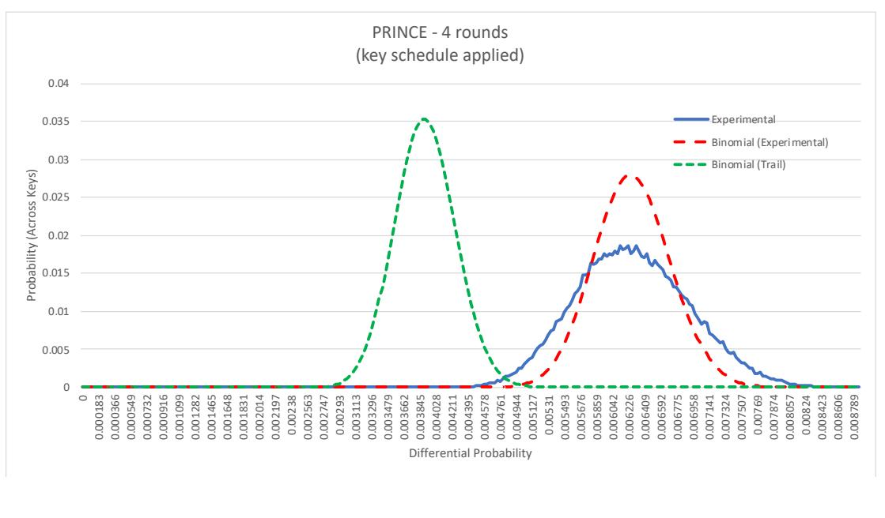

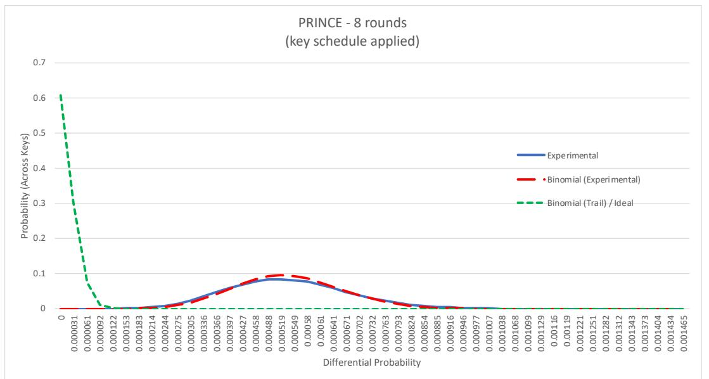

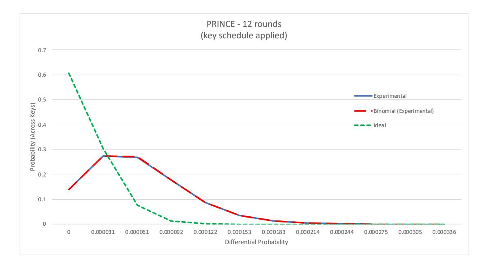

Fig. 5: DP<sup>K</sup> Distribution for PRINCE S-box (16-bit SPN, R = 4, 8, and 12)

{20}------------------------------------------------

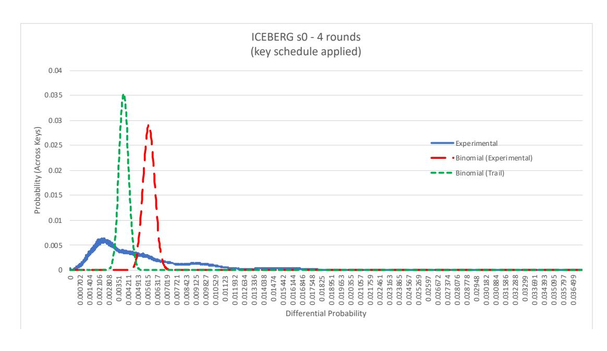

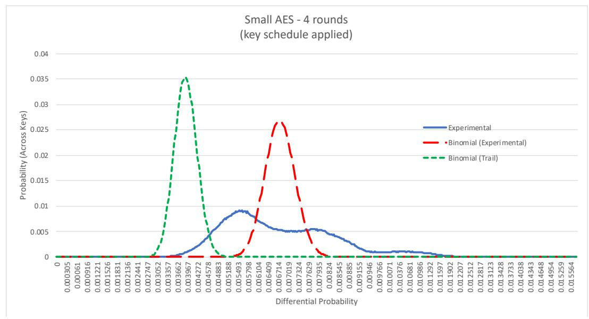

Fig. 6: DP<sup>K</sup> Distribution for ICEBERG s<sup>0</sup> and Small AES S-boxes (16-bit SPN, R = 4)

of the binomial distribution. As the number of rounds increases for all these S-boxes, the shape of the experimental distribution does begin to resemble a binomial distribution.

Another S-box which provides a very interesting result is the Mysterion S-box, where the distribution for 4-round and 8-round ciphers are given in Figure 8 based on the application of the key schedule and applying all 20-bit cipher keys. It can be seen that the case for R = 4 is dramatically different than the expectation of a binomial distribution. In fact, the experimental distribution involves 8 equally weighted spikes, with a very large spread. This means that 1/8 of the keys result in the highest differential probability of 0.015, which is about 4 times the value of the trail probability. We have no explanation for this unusual behaviour, but note that the Mysterion has the unusual characteristic that not all output bits are a function of all input bits. We do not know whether there is a correlation between this property and the unusual differential characteristics. It is also significant to note that this unusual behaviour disappears as the number of rounds in the SPN increases. In the figure, the experimental distribution for R = 8 clearly is smoother (with no evident spikes) and, although the fit is not perfect, it is tending towards

{21}------------------------------------------------

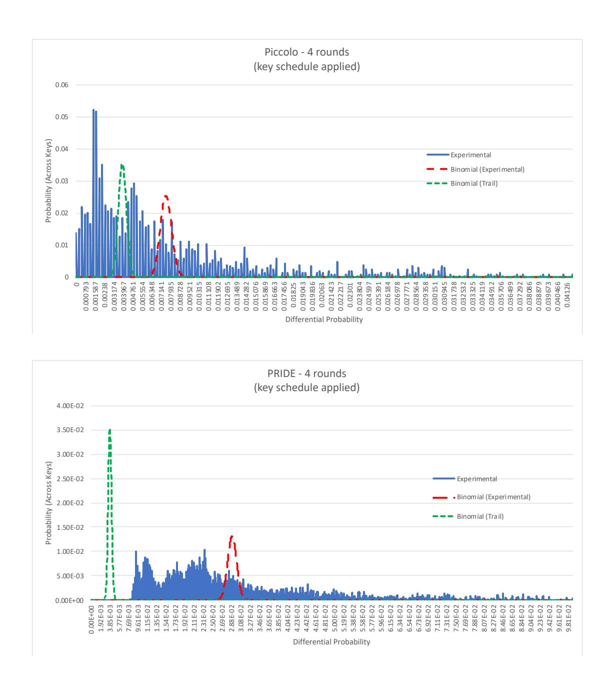

Fig. 7: DP<sup>K</sup> Distribution for Piccolo and PRIDE S-boxes (16-bit SPN, R = 4)

the binomial distribution. For R = 12 (which is not shown), the experimental distribution is visually indistinguishable from the binomial curve.

Distributions with a Large Spread When considering the distribution of differential probabilities across keys, of particular interest is whether any keys result in a large differential probability. As previously discussed, the experimental distributions for the 16-bit SPN represent the true distribution of DP<sup>K</sup> and, hence, large differential probabilities that occur with non-zero probability represent differential probabilities for specific fixed keys. If a key or subset of keys results in a differential probability significantly greater than the trail probability, then the idea that the trail probability can be used as a heuristic metric of the cipher's security for all keys may be misplaced thinking.

In the distributions shown in the previous subsection which are based on a key schedule applied to a 20-bit key, where the number of rounds was small, it is not surprising that cases of keys with large DP<sup>K</sup> can be seen to exist. For example, for the PRINCE cipher, for R = 4, there are 8 keys (out of 2<sup>20</sup>)

{22}------------------------------------------------

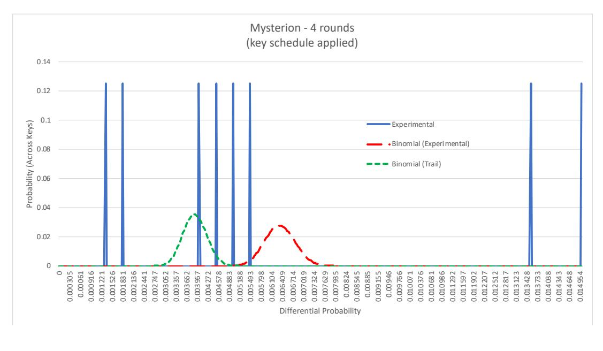

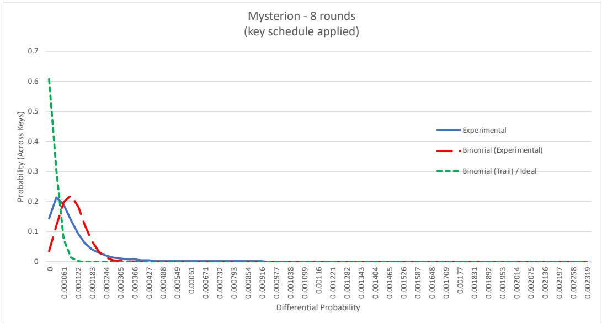

Fig. 8: DP<sup>K</sup> Distribution for Mysterion S-box (16-bit SPN, R = 4 and 8)

which result in 290 pairs of plaintexts leading to the correct output difference generating a differential probability of 290/2 <sup>15</sup> = 8.85×10<sup>−</sup><sup>3</sup> , which can be compared to the trail probability of 2<sup>−</sup><sup>8</sup> = 3.91×10<sup>−</sup><sup>3</sup> . This implies these keys would require 8.85 × 10<sup>−</sup>3/3.91 × 10<sup>−</sup><sup>3</sup> = 2.26 times fewer chosen plaintexts to implement the attack than predicted by the trail probability. This is not a big improvement, but if we consider R = 8, the ratio of the maximum fixed-key differential probability to trail probability becomes (48/2 <sup>15</sup>)/2 <sup>−</sup><sup>16</sup> = 1.47 × 10<sup>−</sup><sup>3</sup>/1.53 × 10<sup>−</sup><sup>5</sup> = 96 (which occurs for one key) implying that a successful differential attack requires about 100 times fewer chosen plaintexts for the one key. For R = 12, the ratio of the maximum DP<sup>K</sup> to the ideal probability<sup>7</sup> is (11/2 <sup>15</sup>)/2 <sup>−</sup><sup>16</sup> = 3.36 × 10<sup>−</sup><sup>4</sup>/1.53 × 10<sup>−</sup><sup>5</sup> = 22 (which occurs for 6 keys), implying that a differential attack is possible requiring about 3000 chosen plaintexts, although the trail probability implies that a differential attack is not possible (since the differential trail probability is much less than the ideal probability).

<sup>7</sup> Since the trail probability is now less than the ideal probability, the ideal probability becomes the meaningful comparison.

{23}------------------------------------------------

Again, we note that even if we assume that the trail probability represents the differential probability (although it is often significantly smaller), the differential probability is expected to be a random variable that will vary when computed across different sets of plaintext pairs satisfying ∆<sup>I</sup> and in our experiments the sets are differentiated by the fact that different fixed keys are used. If we treat the distribution as a binomial distribution with a parameter p equal to the trail probability DPtrail, we expect there is a non-zero probability that some key sets will have much higher differential probability (based on the probabilities in the upper tail of the distribution). Similarly, even for the ideal distribution, where it is assumed that p = 2−16, there is a non-zero likelihood that a differential probability, computed from a trial of a randomly selected set of plaintext pairs satisifying the plaintext difference, will imply the cipher is susceptible to differential cryptanalysis. For example, for 2<sup>20</sup> trials drawn from the ideal distribution based on 2<sup>15</sup> plaintext pairs, there is expected to be one trial for which the computed differential probability is expected to be at least 7/2 <sup>15</sup> = 2.14 × 10−<sup>4</sup> , which is equivalent to a ratio of 14 to the ideal probability. This ratio can be compared to the outcome for the 12-round SPN based on the PRINCE S-box where the ratio of 22 was derived from the experiments for the true probability across the keys applied with the key schedule.

In fact, while we have used PRINCE in our above description, other S-boxes can lead to much greater spreads, implying greater susceptibility to differential cryptanalysis. Consider Figure 9 which contains 3 graphs of the following parameters (as determined by experiment) by round: average differential probability, maximum differential probability, and standard deviation of differential probability. Plots are given for 3 S-boxes: PRIDE, Midori Sb0, and PRINCE. In all cases, the key schedule is applied. Consider first the average differential probability. It is clear as the number of rounds increases, the average differential probability decreases and appears to approach the ideal value of 2<sup>−</sup><sup>16</sup> = 1.53×10<sup>−</sup><sup>5</sup> . However, close observation for R = 10 and R = 12, would reveal that PRIDE and Midori Sb0, in particular, are still substantially above the ideal probability, implying that they are susceptible to differential cryptanalysis for many keys. Considering now the graph of the maximum differential probability, we can see that, for some keys, the differential probability is substantially higher than the ideal probability even for larger R. The plots for the standard deviation give an indication of the size of the spread for the distributions of the differential probability. For comparison, the standard deviation for the ideal distribution, as discussed in Section 3.3, is σDP ≈ 2 <sup>−</sup>15.<sup>5</sup> = 2.16 × 10<sup>−</sup><sup>5</sup> .

For further consideration, we present Tables 6, 7, and 8 which tabulate data similar to the graphs of Figure 9 but for larger values of R. Again, the key schedule is applied to generate round keys in the experiments. We have presented results for ciphers which have large spreads, specifically SPNs with S-boxes from PRIDE, Midori Sb0, and PRINCE. For the distribution of each cipher, we present the average differential probability, the maximum differential probability in the distribution, and the standard deviation of the distribution.

Consider first the average differential probability. For all values of R ≥ 8, the trail probability of the differential is less than or equal to the ideal differential probability of 2<sup>−</sup><sup>16</sup> = 1.53 × 10<sup>−</sup><sup>5</sup> . For a small number of rounds (eg. R = 8), the average differential probability is quite a bit larger than the ideal probability. Probabilities much larger than the ideal probability imply that a large number of keys are susceptible to the method of differential cryptanalysis. As R increases, unsurprisingly the average differential probability decreases and, for 20 rounds, the value for all ciphers is close to the ideal probability.

For the ideal distribution described in Section 3.3, we can determine the cumulative distribution probability and compute the probability that a differential probability (drawn from the ideal distribution) is greater than 3.05×10<sup>−</sup><sup>4</sup> is 7.73×10<sup>−</sup><sup>12</sup>. Assuming that each of the 2<sup>20</sup> keys applied in the key schedule

{24}------------------------------------------------

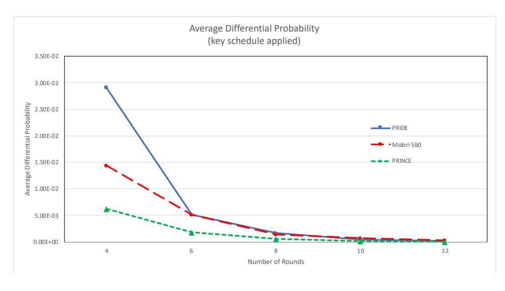

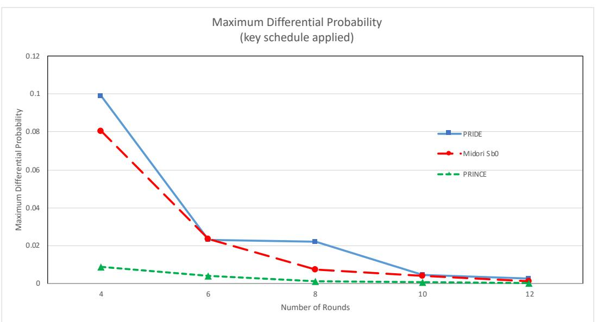

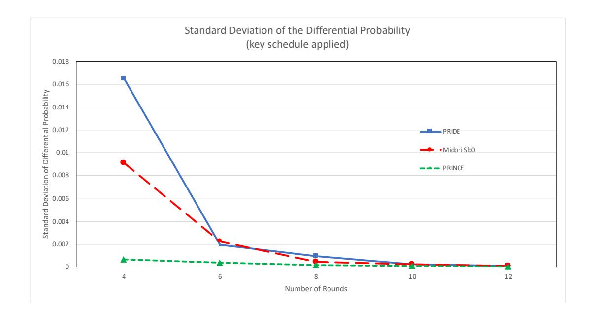

Fig. 9: DP<sup>K</sup> Distribution Parameters vs. R for Various S-boxes (16-bit SPN)

{25}------------------------------------------------

| S-Box      | 8 rounds    | 12 rounds   | 16 rounds   | 20 rounds   |
|------------|-------------|-------------|-------------|-------------|
| Ideal      | 1.53 × 10−5 | 1.53 × 10−5 | 1.53 × 10−5 | 1.53 × 10−5 |
| PRIDE      | 1.66 × 10−3 | 1.32 × 10−4 | 2.44 × 10−5 | 1.60 × 10−5 |
| Midori Sb0 | 1.44 × 10−3 | 2.22 × 10−4 | 4.85 × 10−5 | 2.08 × 10−5 |
| PRINCE     | 5.37 × 10−4 | 6.02 × 10−5 | 1.95 × 10−5 | 1.56 × 10−5 |

Table 6: Average Differential Probability (ADP) vs. R for Various S-boxes (16-bit SPN)

| S-Box      | 8 rounds    | 12 rounds   | 16 rounds   | 20 rounds   |
|------------|-------------|-------------|-------------|-------------|
| Ideal      | 3.05 × 10−4 | 3.05 × 10−4 | 3.05 × 10−4 | 3.05 × 10−4 |
| PRIDE      | 2.22 × 10−2 | 2.87 × 10−3 | 2.44 × 10−4 | 2.14 × 10−4 |
| Midori Sb0 | 7.39 × 10−3 | 1.13 × 10−3 | 3.36 × 10−4 | 2.44 × 10−4 |
| PRINCE     | 1.47 × 10−3 | 3.36 × 10−4 | 2.14 × 10−4 | 2.14 × 10−4 |

Table 7: Maximum DP<sup>K</sup> vs. R for Various S-boxes (16-bit SPN)

| S-Box      | 8 rounds    | 12 rounds   | 16 rounds   | 20 rounds   |
|------------|-------------|-------------|-------------|-------------|
| Ideal      | 2.16 × 10−5 | 2.16 × 10−5 | 2.16 × 10−5 | 2.16 × 10−5 |
| PRIDE      | 9.56 × 10−4 | 9.02 × 10−5 | 2.78 × 10−5 | 2.21 × 10−5 |
| Midori Sb0 | 4.68 × 10−4 | 9.8 × 10−5  | 3.91 × 10−5 | 2.53 × 10−5 |
| PRINCE     | 1.45 × 10−4 | 4.30 × 10−5 | 2.44 × 10−5 | 2.19 × 10−5 |

Table 8: Standard Deviation of DP<sup>K</sup> vs. R for Various S-boxes (16-bit SPN)

scenario gives a random, independent sample of a differential probability means that the probability that the maximum differential probability, as determined from across the keys, has a negligible probability of 2 <sup>20</sup>×7.73×10<sup>−</sup><sup>12</sup> = 8.10×10<sup>−</sup><sup>6</sup> of being greater that 3.05×10<sup>−</sup><sup>4</sup> . Hence, we could consider 3.05×10<sup>−</sup><sup>4</sup> as a rule-of-thumb upper limit on the maximum value we expect to see as the maximum differential probability across keys. (Of course, arguments could be made for other values being an upper limit, based on how low one wants to ascribe to the probability of the maximum value not occurring.) From the table, we can see that for small R, the maximum differential probabilities exceed the upper limit, implying that the behaviour of the ciphers is not compatible with an ideal distribution. However, as the number of rounds increases to R = 20, all ciphers have maximum values around 2 × 10<sup>−</sup><sup>4</sup> and the occurrence of such a value would be quite a bit more likely in an ideal distribution (where the probability of the maximum is greater than 1.83 × 10<sup>−</sup><sup>4</sup> is close to 1, while the probability of the maximum greater than 2.14 × 10<sup>−</sup><sup>4</sup> is about 6-7%). Hence, the maximum values for R = 20 are not inconsistent with the expectation for an ideal distribution.

Lastly, consider the data on the standard deviation obtained from experimental results. As discussed above, the standard deviation of the ideal distribution for the differential probability should approach σDP ≈ 2.16 × 10<sup>−</sup><sup>5</sup> . As with the other metrics, clearly for small values of R = 8 and 12, the experimental results have a much larger standard deviation than for the ideal distribution. However, for R = 20, in all cases, the standard deviation of the experimental results is approaching the standard deviation of the ideal distribution.

{26}------------------------------------------------

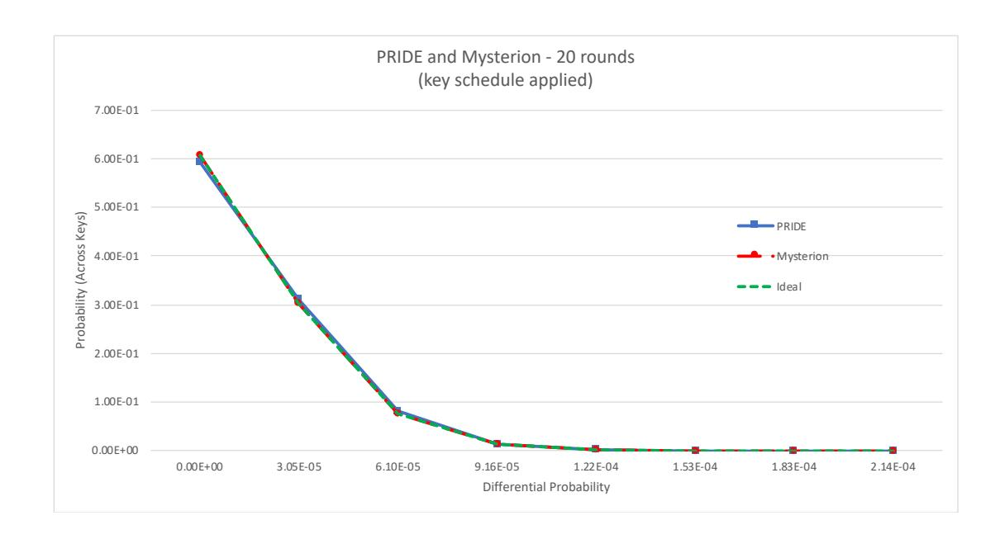

Fig. 10: DP<sup>K</sup> Distribution for PRIDE and Mysterion S-boxes (16-bit SPN, R = 20)

### 3.6 Convergence to Ideal Distribution

For ciphers which apply the key schedule to obtain the round keys, we have observed that, for all Sboxes, as the number of rounds increases, the distribution approaches the ideal distribution. We have already discussed this phenomenon in the previous section in our discussion of Tables 6, 7, and 8. It was noted that the parameters of the average differential probability, the maximum differential probability, and the standard deviation of the differential probability tend towards the values expected for the ideal distribution. The ciphers in these tables had notably large maximum values and a large spread of values for a small number of rounds, but seem to converge towards the ideal distribution after about 20 rounds.

As further evidence of this convergence to the ideal, we present the experimental distributions of the PRIDE-based cipher and the Mysterion-based cipher for R = 20. The PRIDE-base cipher is notable, because it has very large values for the maximum differential probability for a modest number of rounds, while the cipher based on the Mysterion S-box has an extremely unusual distribution for a small number of rounds, as discussed in Section 3.5. The results for the two ciphers are presented in Figure 10 and on the same graph, the ideal distribution for the differential probability is also presented. It is clear both experimental results fall almost exactly on top of the ideal distribution. So even for these ciphers with somewhat unusual distributions for a small number of rounds, it seems that enough rounds will result in a convergence to the ideal distribution.

The general implication is that, for 16-bit SPN ciphers constructed using round keys generated using the key schedule, after enough rounds (we conjecture on the order of 20 rounds), the distribution of the differential probability across all keys becomes indistinguishable from the ideal distribution. Hence, there is reason to conjecture that differential cryptanalysis will not be applicable to SPNs which use a good key schedule (generating good pseudorandom round keys) with enough rounds.<sup>8</sup> Surprisingly, as we shall see, this intuitive conjecture does not appear generally applicable to ciphers with a repeated round key.

<sup>8</sup> Although the tails of the experimentally-derived (true) distribution correspond to specific keys, it is not clear that such knowledge could be used effectively in an attack if the true distribution follows the ideal distribution.

{27}------------------------------------------------

#### 3.7 Round Key Generation

Different approaches for round key generation appear to lead to different results. As noted in Section 2.5, we consider 3 approaches to generation of round keys. The simplest approach is to generate one random 16-bit key and then repeat this key for every round key. The approach of applying a key schedule on a 20-bit cipher key to generate different 16-bit round keys is described in the appendix and most results presented to this point are based on this approach. Lastly, the generation of the round keys can be accomplished using a pseudorandom number generator to produce different, random round keys for each round.

Comparison of Round Key Approaches For discussion, in Figure 11, we present results for the 4 round cipher based on the ICEBERG s<sup>0</sup> S-box. We can see that the results for the key schedule approach and the randomly generated round keys are visually very similar. Note that the experimental result for the key schedule approach is the true distribution since all 2<sup>20</sup> keys are exhaustively tested, while the randomly generated scenario uses a sample of 2<sup>20</sup> from the set of all 216·<sup>R</sup> keys and is thus an experimental approximation and not the true distribution. In general, we have tried several experiments for different S-boxes and numbers of rounds and found that the key schedule results are similar to randomly generated round keys.

In contrast, the sample result for ICEBERG s<sup>0</sup> in Figure 11 using the repeated round key approach looks dramatically different. Recall that in this approach, all keys can be exhaustively tested and, hence, the figure represents the true distribution. In numerous other cases, testing ciphers with various S-boxes, we have found that the repeated round key produces results that look worse (that is, move away from the ideal distribution) than the key schedule or random round key experimental results.

Hence, we conjecture that the key schedule approach produces results similar to randomly generated round keys, while the repeated round key approach can produce extremely poor results, with unusual distributions which poorly fit a binomial distribution and which do not always converge to the ideal distribution as R increases. We explore this in more detail in the next section.

Repeated Round Keys In experimental studies of the differential properties of 16-bit SPNs, we discovered in some cases that the behaviour of the system configured with repeated round keys was significantly different than systems which used a key schedule but which were otherwise equivalent (i.e., used the same S-box). In particular, it was noted that in many circumstances, the experimental distribution for the repeated round key fit a binomial distribution much more poorly than for the key scheduled system. Often the repeated round key system resulted in a much larger spread of the distribution and a large maximum differential probability for one or more keys.

As an example, consider Figure 12 which contains plots of the distribution for the 20-round PRIDEbased SPN, with both a repeated round key and a key schedule applied. As can be seen in the graph, the key schedule curve fits very well the ideal distribution. This is not a surprise, since we have already discussed that as R increases we expect to converge to the ideal distribution and, since the trail probability for 20 rounds is 2<sup>−</sup><sup>40</sup> which is significantly less than the ideal probability of 2<sup>−</sup><sup>16</sup>, we do not expect differential cryptanalysis to be applicable. However, the curve for the distribution generated using a repeated round key does not fit the ideal distribution (nor even a binomial distribution) at all. We speculate that this reflects a weakness that might make some keys susceptible to a differential attack.

Further examples of anomalies for repeated round keys are illustrated in Figure 13. In these graphs, we have plotted experimentally derived parameters - the differential probability average, maximum, and

{28}------------------------------------------------

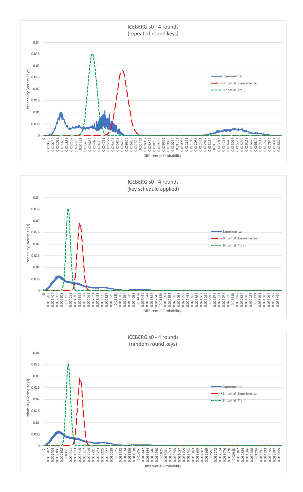

Fig. 11: Comparison of Round Key Generation for ICEBERG s<sup>0</sup> S-box (16-bit SPN, R = 4)

{29}------------------------------------------------

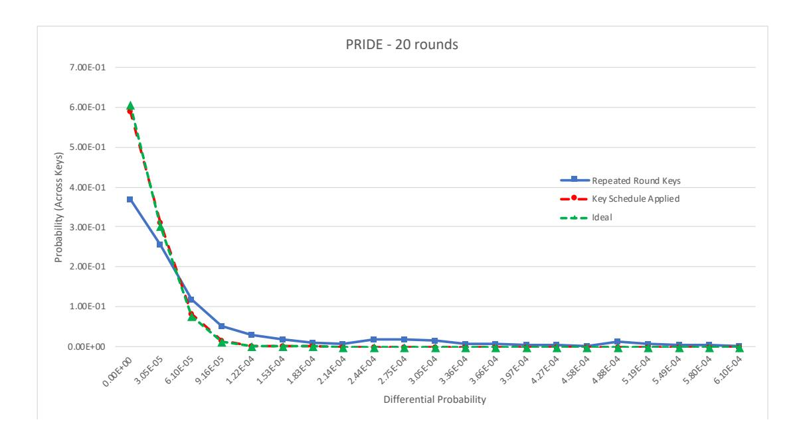

Fig. 12: Comparison of Key Schedule and Repeated Round Keys for PRIDE S-box (16-bit SPN, R = 20)

standard deviation for the distribution across keys - for S-boxes with results which deviate dramatically from the key schedule approach and from the ideal distribution as R increases. These parameters are plotted as a function of rounds for cases where the number of rounds is very large - 10, 20, 30, and 40.

The results in these graphs can be seen to differ dramatically from the graphs of Figure 9, which are plots of ciphers with fewer rounds, 8 to 20, using a key scheduling approach. Specially, we can see for the curves in Figure 13 that the average differential probability does not converge towards the ideal value of 2 <sup>−</sup>16. For the PRIDE-based cipher, even at 40 rounds, the average differential probability is significantly higher (in fact, over an order of magnitude) than the ideal probability. This implies that many keys of the cipher may indeed result in susceptibility to differential cryptanalysis.

For the graph showing the maximum DP<sup>K</sup> of each cipher, we also present the upper limit on the differential probability of 3.05 × 10<sup>−</sup><sup>4</sup> as discussed previously.<sup>9</sup> All ciphers have maximums which exceed this limit, even as R approaches 40. Again, the PRIDE-based cipher in particular has a very large maximum value and this hints at potentially dramatic vulnerability to differential cryptanalysis for a subset of keys, since DP<sup>K</sup> for these keys is much higher than the ideal differential probability of 2<sup>−</sup><sup>16</sup> . With R = 40, for Midori Sb0, the maximum value is 800 times the ideal probability and for PRIDE, the maximum value is about 2300 times the ideal probability. The implication is that, for a 40-round PRIDE-based SPN using repeated round keys, there is one or more keys that could be distinguished with a few dozen chosen plaintexts in a differential attack!

Similar to the maximum value, the standard deviation of DP<sup>K</sup> for these ciphers is much larger than the expected standard deviation of the ideal distribution, implying a wide spread of differential probability values across the keys and potential vulnerability for many keys.

{30}------------------------------------------------

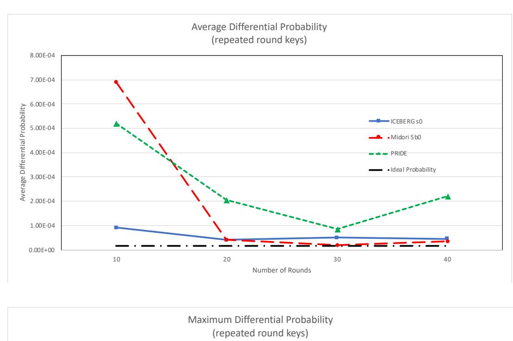

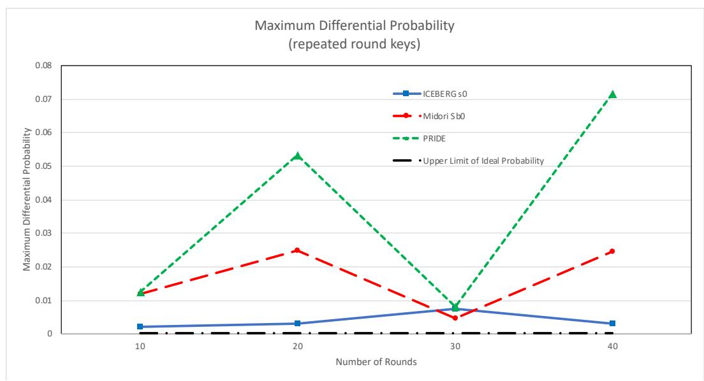

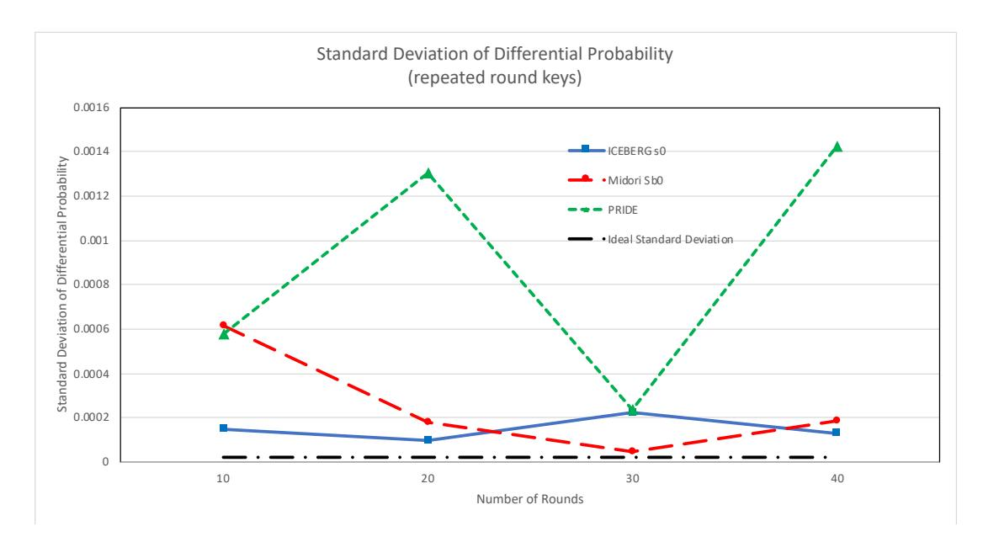

Fig. 13: DP<sup>K</sup> Distribution Parameters for Repeated Round Keys for Various S-boxes (16-bit SPN)

{31}------------------------------------------------

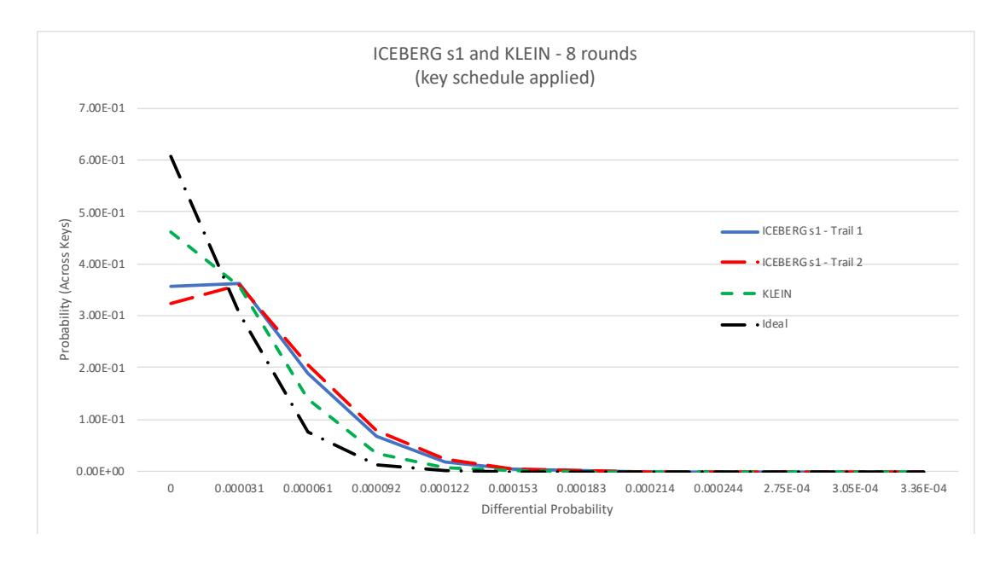

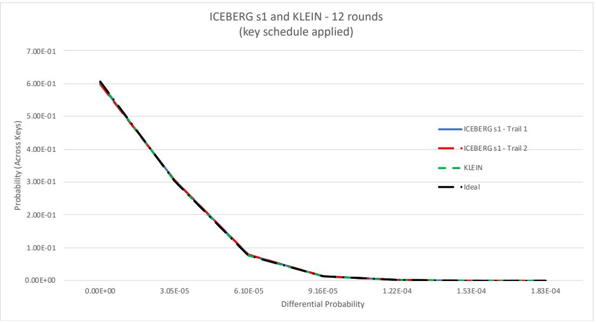

Fig. 14: DP<sup>K</sup> Distribution for ICEBERG s<sup>1</sup> and KLEIN S-boxes (16-bit SPN, R = 8 and 12)

### 3.8 Effect of Differential Properties in S-box

In the previous sections, we have presented experimental results for S-boxes which resulted in poorly diffusive trails. As a last point of discussion on 16-bit SPNs, we consider characteristics of ciphers built with S-boxes that have properties (specifically, SA or GA) that result in moderately diffusive or strongly diffusive differential trails. In Section 3.4, we have presented the results for a cipher based on the PRESENT S-box. The PRESENT S-box is the only S-box we have studied which has the GA property, resulting in strongly diffusive trails. It is clear from the results presented that the PRESENT-based cipher appears resistant to differential cryptanalysis. In Figure 4, we see that as the number of rounds increases, the average differential probability quickly converges to the ideal distribution probability of 2 <sup>−</sup><sup>16</sup>, making use of the differential impossible for most keys. Further, from the plot of the maximum

<sup>9</sup> In this case, however, since the repeated round key approach only considers 2<sup>16</sup> keys, the probability of drawing a value from the ideal distribution above this upper limit is now even smaller and is equal to 2<sup>16</sup>×7.73×10<sup>−</sup><sup>12</sup> = 5.07 × 10<sup>−</sup><sup>7</sup> .

{32}------------------------------------------------

| S-Box              | R | ADP                    | Maximum DPK | Std. Dev. of DPK |
|--------------------|---|------------------------|-------------|------------------|
| Ideal Distribution |   | 1.53 × 10−5            | 3.05 × 10−4 | 2.16 × 10−5      |
| ICEBERG s1         |   | Trail 1 8 3.21 × 10−5  | 3.36 × 10−4 | 3.21 × 10−5      |
| ICEBERG s1         |   | Trail 2 8 3.50 × 10−5  | 3.05 × 10−4 | 3.33 × 10−5      |
| KLEIN              |   | 8 2.37 × 10−5          | 2.44 × 10−4 | 2.70 × 10−5      |
| ICEBERG s1         |   | Trail 1 12 1.56 × 10−5 | 1.83 × 10−4 | 2.18 × 10−5      |
| ICEBERG s1         |   | Trail 2 12 1.56 × 10−5 | 1.83 × 10−4 | 2.18 × 10−5      |
| KLEIN              |   | 12 1.54 × 10−5         | 1.83 × 10−4 | 2.17 × 10−5      |

Table 9: Parameters for DP<sup>K</sup> Distribution for ICEBERG s<sup>1</sup> and KLEIN S-boxes (16-bit SPN)

differential probability, it is clear the maximum differential probability becomes small as R increases and for small R falls within the rule-of-thumb upper limit of 3.05×10<sup>−</sup><sup>4</sup> , developed for the ideal distribution.

We have also investigated two S-boxes which have the SA property and which, therefore, have moderately diffusive trails. In Figure 14, we present the experimental results of the distribution of the differential probability for KLEIN and ICEBERG s<sup>1</sup> for 8 rounds and 12 rounds. For ICEBERG s1, we have presented two possible differentials as described in Table 5 with the trail probability for both being the same. In all cases, the key schedule is applied to the cipher to generate the round keys. Clearly, for the 8 round scenario, all 3 experimental distributions are clearly distinguishable from the ideal distribution. This is a bit surprising: since the trail probability for R = 8 is 2<sup>−</sup>24, which is substantially less than the ideal probability of 2<sup>−</sup>16, we might expect that the distributions would approach the ideal. For R = 12, the distributions are now very similar to the ideal distribution. The data associated with the experimental results (based on the use of the key schedule) is presented in Table 9. For comparison, the values associated with the ideal distribution are included. The value for the maximum differential probability of the ideal distribution is the rule-of-thumb upper limit of 3.05 × 10<sup>−</sup><sup>4</sup> previously discussed.

## 3.9 Conclusions and Conjectures

We now present a summary of conclusions to be drawn, based on the experimental results for the 16-bit SPN. In general, unless otherwise stated, our conclusions apply to the SPN based on round keys generated using the key scheduling algorithm described in the appendix. In the list below, we label our points as either FACT, when we can conclusively know that a statement is true as shown by our experiments, or CONJECTURE, when the experimental results support the statement, but it cannot be known to be generally true.

- 1. FACT 1: The differential trail probability, DPtrail, is pessimistic for predicting the average differential probability, ADP, which can be much larger.
  - This is already a well established truth but is clearly confirmed by our experiments.
- 2. FACT 2: For a small number of rounds, the distribution of differential probability across keys, does not necessarily follow a binomial distribution.
  - Depending on the number of rounds and S-box properties, the variation from the binomial distribution can be dramatic. Further, in some instances, this results in unexpectedly large differential probabilities for some keys. This may take the form of either a very large DP<sup>K</sup> for a small number of keys or large DP<sup>K</sup> for a large number of keys.

{33}------------------------------------------------

- 3. FACT 3: For some S-boxes, for an SPN using a repeated round key, the distribution of the differential probability is more poorly behaved than if the key schedule is applied. By "poorly behaved", we mean that the distribution is not fit well by the binomial distribution, has a significant tail of keys with large fixed-key differential probability, at least one key with a very large differential probability, and/or does not converge to the ideal distribution as the number of rounds
- 4. CONJECTURE 1: For all S-boxes, as the number of rounds is increased, the distribution of the differential probability is well represented by a binomial distribution with p = ADP.
- 5. CONJECTURE 2: For all S-boxes, for a large number of rounds, the distribution of the differential probability approaches the ideal distribution.
- 6. CONJECTURE 3: S-boxes that produce moderately and strongly diffusive differential trails approach the ideal distribution with fewer rounds than S-boxes that produce poorly diffusive trails. This is not at all surprising and is consistent with cipher design paradigms.
- 7. CONJECTURE 4: For all S-boxes, for an SPN using round keys generated by the key schedule specified in the appendix, the distribution of the differential probability is very similar to the distribution based on random round keys.

In the following section, we examine the experimental results for the more-realistic 64-bit SPN (using different S-boxes) and we determine whether the same facts and conjectures can be applied.

# 4 Differential Probability Distributions for 64-bit SPNs

For experiments on 64-bit SPNs, we study the same S-boxes previously considered and listed in Table 4. Again, we also consider the three forms of round key generation - repeated round keys, random round keys, and scheduled round keys. The key schedule applied for the 64-bit SPN is exactly the key schedule used in PRESENT (with an 80-bit key) and is described in the appendix. (Hence, the SPN using the PRESENT S-box and the PRESENT key schedule is precisely the PRESENT cipher structure.) SPNs with other S-boxes are PRESENT-like in structure and they can have very different properties in relation to differential cryptanalysis, as we shall see in our experiments.

# 4.1 Differentials Used in the Experiments

In determining which differentials to use, we again base our study on convenient iterative differential trails. In this way, we can use the differential trail probability, DPtrail, as a basis for our understanding of the average differential probability, ADP, and the fixed-key differential probability, DPK. We apply the same S-box input/output differences used in the 16-bit SPNs, leading to the differential trails listed in Table 10.

### 4.2 Experimental Data Collection

becomes large.

Some aspects of the experimental data collection for the larger 64-bit SPN differ from the 16-bit SPN discussed in the previous section. For the 16-bit SPN, it was possible to exhaustively try all plaintext pairs satisfying a given difference (since there was only 2<sup>16</sup> plaintexts) for all keys in both cases of the repeated round keys (which only had 2<sup>16</sup> possible keys) and the key scheduled cipher (which had only 2<sup>20</sup> cipher keys). Hence, it was experimentally possible to determine the true distribution of the differential

{34}------------------------------------------------

| S-Box                  | S-box Input → Output | Iterative Trail    | DPtrail    |
|------------------------|----------------------|--------------------|------------|
|                        | Differences          | (Sequence of       | (R rounds) |
|                        | (Probability)        | Input Differences) |            |
| PRESENT                | 1 → 3 (1/4)          | 0000000000000011   | −5R<br>2   |
|                        | 3 → 1 (1/8)          | → 0000000000030003 |            |
|                        |                      | → 0000000000000011 |            |
| ICEBERG s0             | 4 → 4 (1/4)          | 0000040000000000   | −2R<br>2   |
|                        |                      | → 0000040000000000 |            |
| ICEBERG s1             | 8 → 8 (1/8)          | 8000000000000000   | −3R<br>2   |
| (Differential Trail 1) |                      | → 8000000000000000 |            |
| ICEBERG s1             | 1 → 6 (1/4)          | 0000000000000110   | −4R<br>2   |
| (Differential Trail 2) | 6 → 1 (1/4)          | → 0000000600060000 |            |
|                        |                      | → 0000000000000110 |            |
| Small AES              | 4 → 4 (1/4)          | 0000040000000000   | −2R<br>2   |
|                        |                      | → 0000040000000000 |            |
| Piccolo                | 1 → 8 (1/4)          | 0000000000000001   | −2R<br>2   |
|                        | 8 → 4 (1/4)          | → 0001000000000000 |            |
|                        | 4 → 2 (1/4)          | → 1000000000000000 |            |
|                        | 2 → 1 (1/4)          | → 8000000000000000 |            |
|                        |                      | → 0000800000000000 |            |
|                        |                      | → 0000080000000000 |            |
|                        |                      | → 0000040000000000 |            |
|                        |                      | → 0000000004000000 |            |
|                        |                      | → 0000000000400000 |            |
|                        |                      | → 0000000000200000 |            |
|                        |                      | → 0000000000000020 |            |
|                        |                      | → 0000000000000002 |            |
|                        |                      | → 0000000000000001 |            |
| KLEIN                  | 8 → 8 (1/8)          | 8000000000000000   | −3R<br>2   |
|                        |                      | → 8000000000000000 |            |
| PRINCE                 | 1 → 1 (1/4)          | 0000000000000001   | −2R<br>2   |
|                        |                      | → 0000000000000001 |            |
| PRIDE                  | 8 → 8 (1/4)          | 8000000000000000   | −2R<br>2   |
|                        |                      | → 8000000000000000 |            |
| Midori Sb0,            | 1 → 2 (1/4)          | 0000000000000001   | −2R<br>2   |
|                        | 2 → 1 (1/4)          | → 0000000000010000 |            |
|                        |                      | → 0000000000100000 |            |
|                        |                      | → 0000000000200000 |            |
|                        |                      | → 0000000000000020 |            |
|                        |                      | → 0000000000000002 |            |
|                        |                      | → 0000000000000001 |            |
| Mysterion              | 4 → 4 (1/4)          | 0000040000000000   | −2R<br>2   |
|                        |                      | → 0000040000000000 |            |
|                        |                      |                    |            |

Table 10: Differentials for 64-bit SPN (All differences in hexadecimal.)

{35}------------------------------------------------

probability across all keys. For the keying scenario of a different random round key for every round, a true distribution was not achievable, but as we discussed we found little experimental difference between the random round key approach and the approach using round keys generated by the key schedule.

For the larger 64-bit SPN, in no scenario is it possible to determine the true distribution of the differential probability by experiment since it is not possible to exhaustively search through all plaintexts pairs for a given difference (since there are  $2^{63}$  such pairs). Also, the number of possible keys for the repeated round key approach is  $2^{64}$  and for the key schedule approach based on the PRESENT key schedule for the 80-bit key results in  $2^{80}$  keys. For the random round keys, the number of possible keys is even larger. Hence, for all keying approaches, it is not possible to test all keys to determine a precise distribution. Instead sample keys are randomly selected and, for each key, sample pairs of plaintext (satisfying the input difference) are randomly selected and used to determine an experimental differential probability. For the selection of  $N_{keys}$  keys, trying  $N_{pairs}$  pairs of plaintexts requires the encryption of a total of  $N_{total} = N_{keys} \cdot N_{pairs}$  plaintext pairs. We have found that, for our computing environment <sup>10</sup>, letting  $N_{total} = 10^{10}$  requires several hours of processing (dependent linearly on the number of rounds of the cipher). Hence, this is a computationally practical value of  $N_{total}$  to select to explore a number of possible scenarios (eg. varying S-boxes and number of rounds). It is reasonable to expect that one or more occurrences of the correct output difference will be observed if  $N_{total} \geq 1/ADP$ . We have found that this constraint has allowed us to discover several scenarios of differential probabilities where we find that  $ADP > 10^{-10}$ , even though the differential trail probability satisfies  $DP_{trail} \ll 10^{-10}$ .

Consider now the effect of varying  $N_{keys}$  and  $N_{pairs}$  while keeping  $N_{total}$  fixed at  $10^{10}$ . If  $ADP \gg$  $1/N_{pairs}$ , then we can expect that each random key sample will likely have many occurrences of the correct output difference and, for each key, we will get an accurate experimental estimate of  $DP_K$ . For a modest number of rounds  $(R \le 12)$ , we have typically let  $N_{pairs} = 10^6$  (resulting in  $N_{keys} = 10^4$ ), since the average differential probability ADP is greater than, and often significantly greater than, the trail probability  $DP_{trail}$ . The average differential probability can be determined across all keys by adding up all occurrences of the correct output difference and dividing by  $N_{total}$ . As the number of rounds increases (that is, R > 12), if  $ADP \ll 1/N_{pairs}$ , then the distribution of the differential probability across keys is skewed towards 0 since  $DP_K$  is zero for most keys. If this is the case, it is hard to perceive a difference between the experimental distribution of the fixed-key differential probability and the distribution implied by the trail distribution, where by "trail distribution", we mean the binomial distribution of (1) using  $p = DP_{trail}$ . (See the following section's discussion on why the trail distribution is used for comparison in place of the ideal distribution, which uses  $p = 2^{-64}$  in (1)). Hence, in order to generate a better perspective on the experimental distribution, it is possible to decrease the number of keys,  $N_{keys}$ , used in the experiments in favour of increasing the number of plaintext pairs,  $N_{pairs}$ . For example, for large R, our experiments sometimes used  $N_{keys} = 10^3$  and  $N_{pairs} = 10^7$  or even  $N_{keys} = 10^2$  and  $N_{pairs} = 10^8$ . Large  $N_{pairs}$  makes the occurrence of the correct output difference more likely for an individual key, but means that the distribution of  $DP_K$  is based on fewer key samples and is therefore a rougher approximation of the distribution. Also, using a smaller  $N_{keys}$  and larger  $N_{pairs}$  means that is it less likely to find a key with a large differential probability, since fewer keys are tested. In our experiments, for a large number of rounds of  $R \ge 20$ , we have tried 3 values of  $(N_{keys}, N_{pairs})$ :  $(10^4, 10^6), (10^3, 10^7), \text{ and } (10^2, 10^8)$ . By default, unless otherwise mentioned, all experiments are based on  $N_{keys} = 10^4$  and  $N_{pairs} = 10^6$ .

<sup>&</sup>lt;sup>10</sup> MacBook Pro with 2.3 GHz Intel Core i5

{36}------------------------------------------------

#### 4.3 Ideal Distribution

For the ideal distribution of the differential probability, consider a random variable representing the experimentally determined differential probability based on the ideal differential probability of  $2^{-64}$  in the 64-bit SPN. We can apply the binomial distribution of (1) with parameter  $p = 2^{-64}$  and letting  $N_{pairs}$  represent the number of plaintext pairs used to compute the experimental differential probability. The mean of the ideal distribution for differential probability (which is derived by dividing t of (1) by  $N_{pairs}$  is given by p and the standard deviation of the differential probability computed from  $N_{pairs}$  is given by (2).

For the 64-bit ciphers to which we apply our experiments, for a modest number of rounds, the differential trail probability is typically larger than the probability used in the ideal distribution, that is,  $DP_{trail} > 2^{-64}$ . For example, for most differentials of Table 10, the trail probability is  $2^{-2R}$  and, if R = 20, the trail probability is  $2^{-40}$  (which, for the trail distribution, can be used as the value for p in (1) to determine the probability of t occurrences of the the correct output difference) which is much greater than the ideal probability of  $2^{-64}$ . Similarly, the standard deviation of the ideal distribution is much smaller than the standard deviation of the trail distribution. As a result, in making comparisons of our experimentally derived distributions, we typically use the trail distribution, based on (1) with  $p = DP_{trail}$  and divided by  $N_{pairs}$ , rather than the ideal distribution for which  $p = 2^{-64}$ .

#### 4.4 PRESENT S-box

In this section, we examine the distribution for the 64-bit SPN using the PRESENT S-box. Since the PRESENT S-box has the GA property and a flattened difference distribution, the SPN has strongly diffusive differential trails. When we apply the key schedule (as described in the appendix), since it is precisely the PRESENT key schedule, we are studying the PRESENT cipher exactly. As discussed in [2], the best iterative 2-round differential trail for PRESENT is the one given in Table 10. Using this as our guide for determining differentials to investigate, we have run experiments and the resulting distribution for the 4-round cipher using the key schedule is presented in Figure 15, along with the trail distribution based on the binomial distribution parameterized by the trail probability. Note that the distribution of  $DP_K$  for the 64-bit SPN is expected to be very different from the 16-bit results of Figure 3 since the differential trail probabilities are very different - the trail probability for 4 rounds of the 16-bit cipher is  $2^{-15}$ , while for the 64-bit cipher, it is  $2^{-20}$ . From the plot, we can see that the experimental distribution skews to slightly higher differential probabilities than is predicted by the distribution of the trail probability. In fact, the experimental average differential probability is  $1.11 \times 10^{-6}$ , which is only just slightly higher than the trail probability of  $9.54 \times 10^{-7}$ . Hence, it appears that the average differential probability and the fixed-key differential probability distribution are well predicted by the trail probability and the corresponding binomial distribution.

We have not bothered to plot the resulting distribution for R=8, since the experimental results produced the simple outcome that the differential probability was 0 for all keys. Since our experiment used  $N_{pairs}=10^6$  plaintext pairs for each of  $N_{keys}=10^4$  keys tried, the results failed to find the correct output difference in  $N_{total}=10^{10}$  total pairs, implying the average differential probability ADP is likely less than  $10^{-10}$ . This is not surprising since  $DP_{trail}=2^{-40}=9.09\times10^{-13}$  for 8 rounds.

As a better summary of the results for PRESENT, consider Figure 16, which plots the experimental average differential probability across all keys and the maximum differential probability from all keys versus the number of rounds. The scenarios of repeated round keys and scheduled round keys are both shown. In both cases, the values converge quickly to very small values as predicted when compared to the

{37}------------------------------------------------

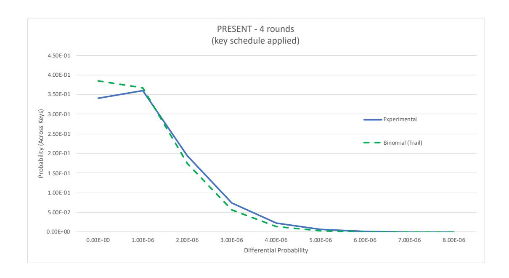

Fig. 15: DP<sup>K</sup> Distribution for PRESENT S-box (64-bit SPN, R = 4)

trail probability DPtrail (which is also plotted in both graphs of the figure). Similar to our conclusions for the 16-bit SPN using PRESENT S-boxes, we observe that the 64-bit PRESENT SPN seems to have good resistance to differential cryptanalysis for a small number of rounds.

### 4.5 Results for Different S-boxes

We now consider the behaviour of various 64-bit ciphers, which are constructed by using the various Sboxes within the 64-bit SPN structure. In this section, all the S-boxes considered result in poorly diffusive trails and all experiments apply the key schedule described in the appendix.

Binomial Distribution Fit As we saw with the results from the 16-bit SPN, although we usually find that the average differential probability ADP is larger than the trail probability DPtrail, for ciphers with different S-boxes and different numbers of rounds, we often find that the distribution of the differential probability across keys is reasonably well approximated by the binomial distribution.

Consider, for example, the experimental distribution for an SPN using the PRINCE S-box for various numbers of rounds, R = 4, 8, and 12, as shown in Figure 17. It is easy to recognize from the graphs for all R, that the average differential probability from the experiments is greater than the trail probability. Indeed, the experimental distribution in each case is skewed to larger values than the trail distribution. It can also be seen that the experimental distribution is well fitted by a binomial distribution based on the experimental average differential probability, such that p = ADP.

Unusual Distributions Although in some cases the binomial distribution fits well on the experimental distribution, in other cases, this is not true, with the experimental results giving unusually shaped distributions. This is similar in general to what was observed with the smaller 16-bit cipher. In Figures 18 and 19, we have presented experimental results for 8 round ciphers based on S-boxes ICEBERG s<sup>0</sup> and Small AES and S-boxes Piccolo and PRIDE, respectively.

{38}------------------------------------------------

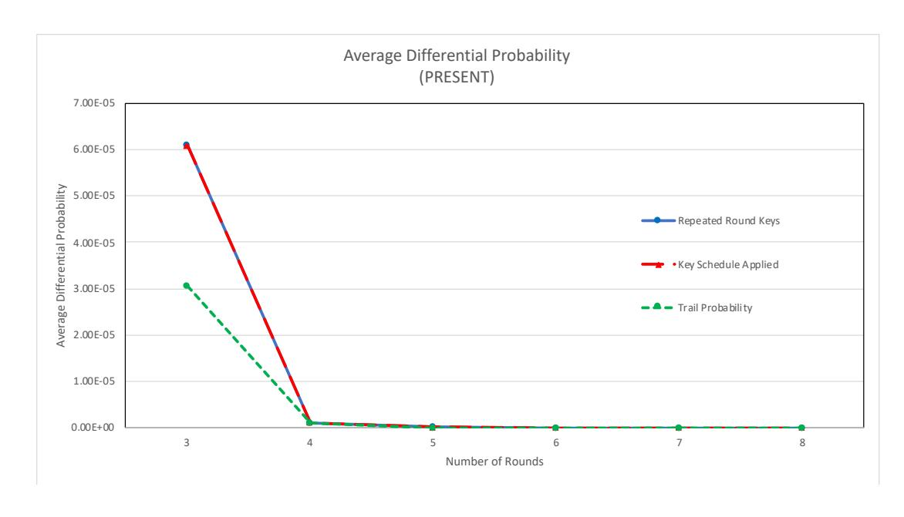

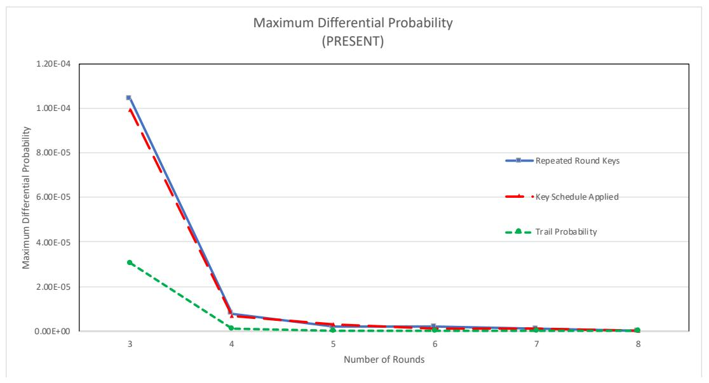

Fig. 16: DP<sup>K</sup> Distribution Parameters vs. R for PRESENT S-box (64-bit SPN)

For ICEBERG s<sup>0</sup> and Piccolo, the modes of the experimental distributions are clearly skewed left and the experimental distributions have large tails to the right, with larger values of DP<sup>K</sup> having higher probability when compared to the binomial distribution (based on the experimental ADP) and the trail distribution. As a result, it can be concluded that many keys have a differential probability that is higher than what is expected from the trail distribution, but also many keys have lower differential probability than predicted by the trail distribution.

For the Small AES and PRIDE ciphers, the experimental distributions are flatter than the binomial distribution based on the experimental ADP, meaning that there is a greater spread of differential probabilities across the keys. As expected, the experimental distribution is shifted to the right of the trail distribution, reflecting that the average differential probability is higher than the differential trail probability.

One other cipher for which there is an interesting distribution is the cipher based on the Mysterion S-box, which has its experimental distributions plotted for 4, 8, and 12 rounds in Figure 20. For R = 4, the distribution of the Mysterion cipher is distinctly bi-modal, with a number of keys having differential

{39}------------------------------------------------

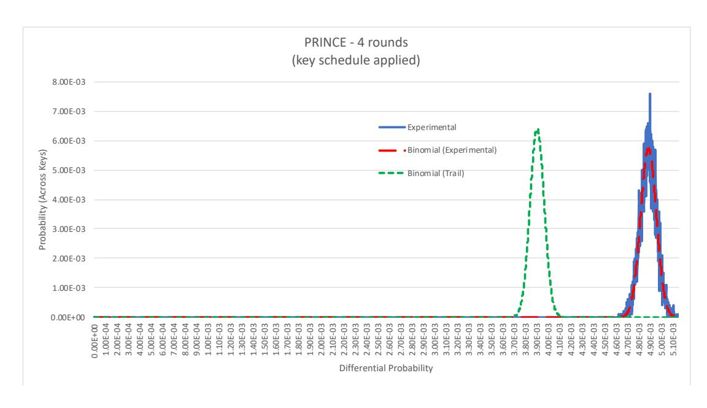

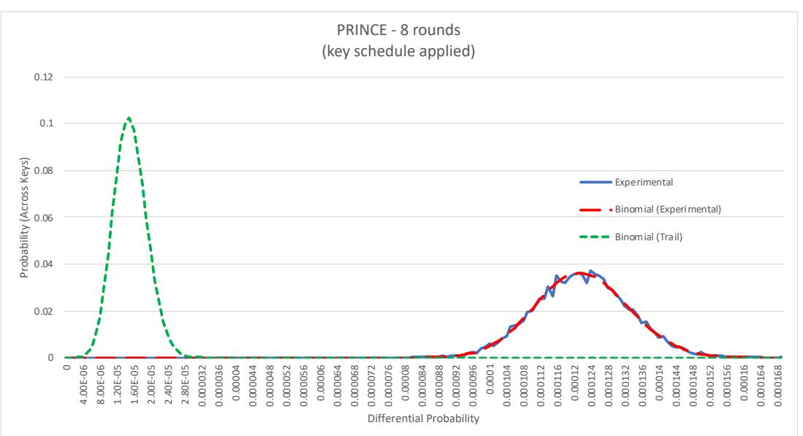

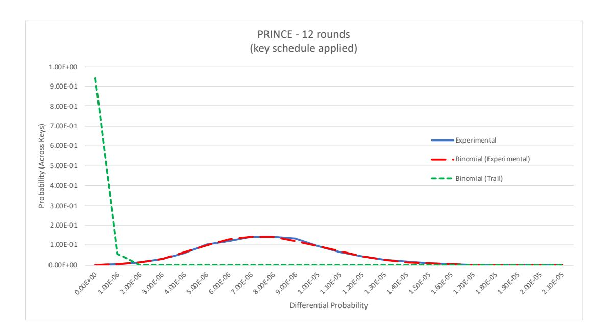

Fig. 17:  $DP_K$  Distribution for PRINCE S-box (64-bit SPN,  $R=4,\,8,\,\mathrm{and}\,12$ )

{40}------------------------------------------------

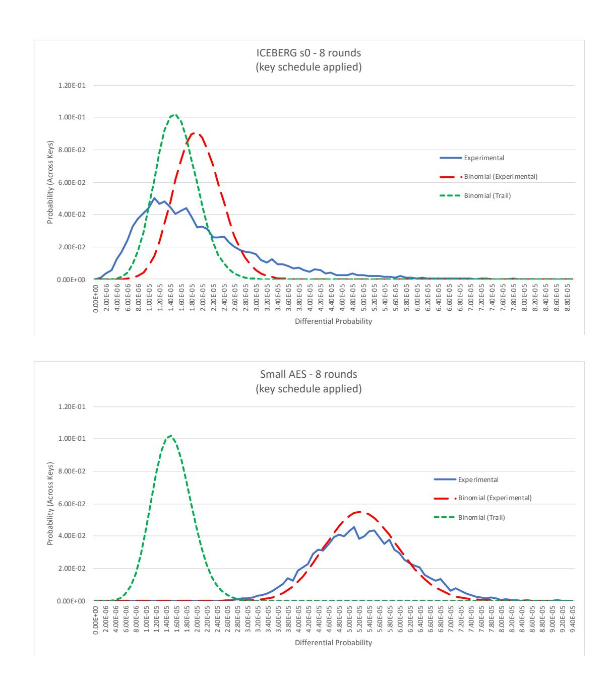

Fig. 18: DP<sup>K</sup> Distribution for ICEBERG s<sup>0</sup> and Small AES S-boxes (64-bit SPN, R = 8)

probabilities above the trail probability and a number of keys having differential probabilities below the trail probability. As R increases to 8, the experimental distribution has now gelled into one shape, which is somewhat flattened with the mode skewed left relative the binomial distribution using the experimental ADP and the trail distribution. Finally, as R increases to 12, the experimental distribution of DP<sup>K</sup> is now tightly fit by a binomial distribution and the curve is approaching the trail distribution.

Distributions with a Large Spread Several ciphers presented results with very large spreads that are quite distinguishable as the number of rounds increase. To best see the deviation from the trail distribution, it is most convenient to plot experimental distributions based on a large number of plaintext pairs, Npairs = 10<sup>8</sup> , across a small number of keys, Nkeys = 10<sup>2</sup> . This gives a rougher graph, but a more distinguishable shape than using a smaller number of plaintext pairs for a large number of keys. Consider for example, the graphs of experiment distributions for a 20-round SPN using PRIDE, Midori Sb0, and PRINCE S-boxes as shown in Figure 21. We can see that for each cipher, the distribution falls quite clearly to the right (with more keys with higher values of the differential probability) than for the trail

{41}------------------------------------------------

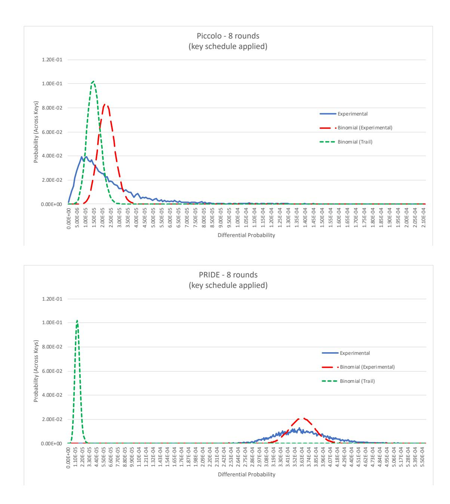

Fig. 19:  $DP_K$  Distribution for Piccolo and PRIDE S-boxes (64-bit SPN, R=8)

distribution. In particular, the differential probability values for Midori Sb<sub>0</sub> are very much higher than expected based on the trail distribution. Since this reflects data for a 20-round cipher which is getting into the realm of a realistic number of rounds for a practical cipher, such a trivially visual result is perhaps surprising.

The results in Figure 21 are based on skewing the total plaintext pairs,  $N_{total}$ , to fewer keys and more plaintext pairs with  $N_{keys} = 10^2$  and  $N_{pairs} = 10^8$  (versus our default experiments which use  $N_{keys} = 10^4$  and  $N_{pairs} = 10^6$ ). The effect of this is that any one key is more likely to have an occurrence of the correct output difference. However, the likelihood of testing a key with a large differential probability is smaller since the number of keys tested is reduced.

For further consideration of the large spread of differential probabilities across keys, we present Figure 22 which illustrates the average differential probability across all keys and maximum differential probability found across keys as a function of the number of rounds for several ciphers.  $DP_{trail}$  is also plotted for reference. The results are based on  $N_{keys} = 10^4$  and  $N_{pairs} = 10^6$ . For a smaller number of rounds, all ciphers have clear distinguishability from the trail probability. As the number of rounds

{42}------------------------------------------------

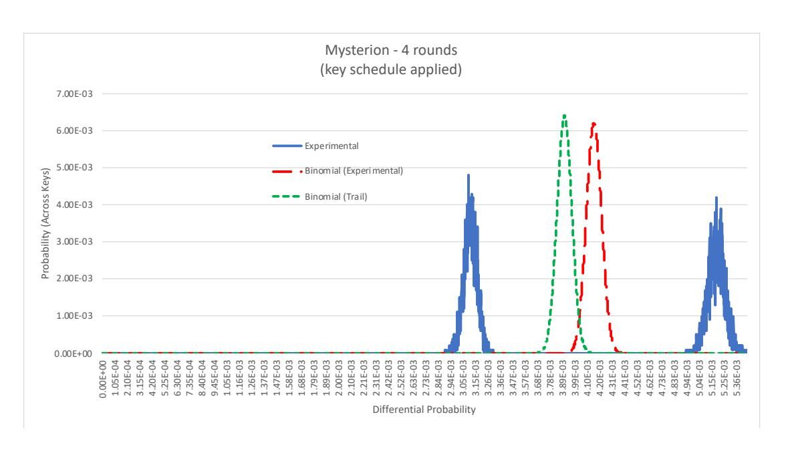

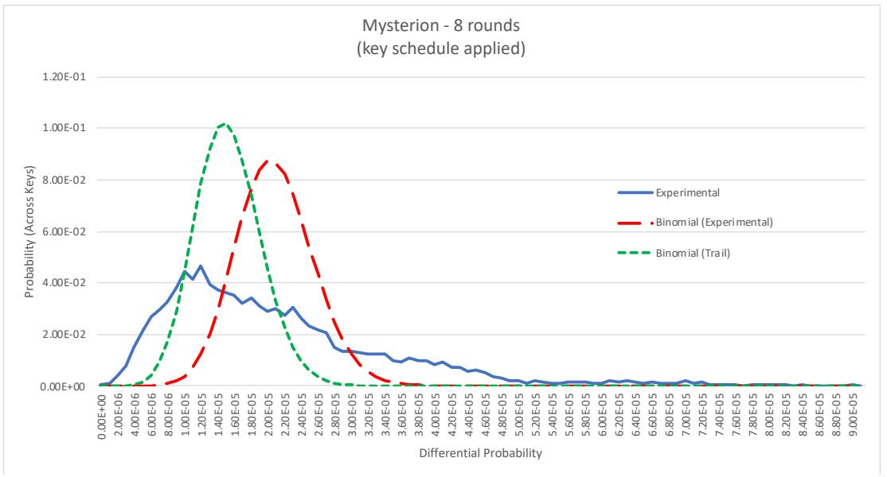

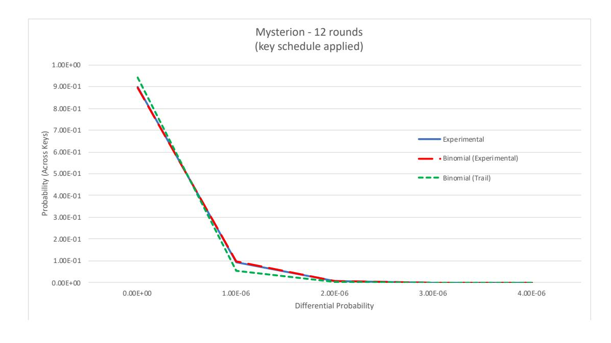

Fig. 20: DP<sup>K</sup> Distribution for Mysterion S-box (64-bit SPN, R = 4, 8, and 12 )

{43}------------------------------------------------

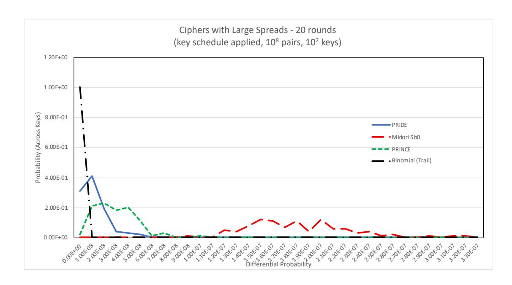

Fig. 21:  $DP_K$  Distribution for 3 S-boxes (64-bit SPN, R = 20)

increases, the average differential probabilities tend to approach the trail probability, at least visually. As seen previously in Figure 21, however, if we look in detail at the case for 20 rounds, we can still see a significant variation from the trail distribution.

To get a more precise picture, we present the data in Tables 11, 12, and 13 which give the experimental results for the average differential probability, the maximum differential probability, and the standard deviation, again using  $N_{keys} = 10^4$  and  $N_{pairs} = 10^6$ . For comparison, the average and standard deviation of the trail distribution, based on (1) using  $p = DP_{trail}$ , is also presented. In the table, we can clearly see that all values decrease as the number of rounds increase. In all cases shown, even as R increases, the experimentally derived ADP and maximum  $DP_K$  are clearly much higher than the trail probability and the standard deviation is higher than the trail distribution standard deviation. This implies for these ciphers that they have differential probability distributions clearly distinguishable from the trail distribution and many keys have differential probabilities much higher than predicted by the trail probability.

#### 4.6 Convergence to Ideal Distribution

As discussed in Section 4.3, with the block size of B = 64, the ideal distribution uses parameter  $p = 2^{-64}$  and it is not possible for our experimental results to incorporate enough data to explore the convergence of experimental distributions to the ideal distribution. Instead, we can observe how close the experimental distribution, and its parameters, get to the fit of the binomial distribution of (1) based on  $p = DP_{trail}$ . This is previously discussed in Section 4.5.

#### 4.7 Round Key Generation

We now consider the effects of the 3 approaches to the generation of round keys for the 64-bit SPN. Sample results from our experiments are presented in Figure 23. In the figure, results are presented for an 8 round SPN using ICEBERG  $s_0$  and Mysterion S-boxes, for the approaches of a repeated round keys,

{44}------------------------------------------------

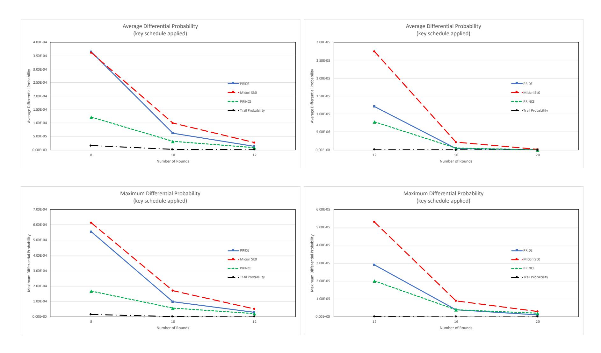

Fig. 22: DP<sup>K</sup> Distribution Parameters vs. R for Various S-boxes (64-bit SPN)

random round keys, and round keys generated by applying the key schedule (detailed in the appendix). These results are representative of the results seen for other S-boxes.

First, we can see that the results for the case of random round keys have a very similar shape to the distribution generated by the key schedule. Recall, this was also the phenomenon observed for the 16-bit SPN. This encourages us to conjecture that a good key schedule, which mixes key bits significantly between rounds, can cause the SPN to behave very much like the round keys were independently, randomly generated.

Secondly, the distribution generated for the scenario of the repeated round key is dramatically different than the other round key generation approaches. For example, the ICEBERG s<sup>0</sup> cipher has a peak centred around small differential probabilities (actually, below the values expected by the trail distribution) and smaller peaks at higher DP<sup>K</sup> values than are likely for the other round key generation approaches and the trail distribution. Similarly, the Mysterion cipher has a clear bimodal nature, with one peak skewed to the left and one skewed to the right of the other round key generations and the trail distribution.

The sample results described above illustrate a somewhat dramatic difference that can occur between the distribution of the repeated round key and the other round key generation approaches. However, in general, we did not observe the results to be as dramatic as these examples and speculate that as the number of rounds increases, there is less obvious difference between the repeated round key approach and the other approaches.

{45}------------------------------------------------

| S-Box                  |                       |                       | 16 rounds              |                        |
|------------------------|-----------------------|-----------------------|------------------------|------------------------|
| Trail                  | $1.53 \times 10^{-5}$ | $5.96 \times 10^{-8}$ | $2.33 \times 10^{-10}$ | $9.09 \times 10^{-13}$ |
| PRIDE                  | $3.64 \times 10^{-4}$ | $1.21 \times 10^{-5}$ | $3.82 \times 10^{-7}$  | $1.21 \times 10^{-8}$  |
| Midori Sb <sub>0</sub> | $3.61 \times 10^{-4}$ | $2.75 \times 10^{-5}$ | $2.14 \times 10^{-6}$  | $1.76 \times 10^{-7}$  |
| PRINCE                 | $1.22 \times 10^{-4}$ | $7.82 \times 10^{-6}$ | $4.59 \times 10^{-7}$  | $2.68 \times 10^{-8}$  |

Table 11: Average Differential Probability (ADP) vs. R for Various S-boxes (64-bit SPN)

| S-Box                  | 8 rounds              | 12 rounds             | 16 rounds             | 20 rounds             |
|------------------------|-----------------------|-----------------------|-----------------------|-----------------------|
| Trail                  | -                     | -                     | -                     | -                     |
|                        |                       |                       |                       | $1.00 \times 10^{-6}$ |
| Midori Sb <sub>0</sub> | $6.12 \times 10^{-3}$ | $5.30 \times 10^{-5}$ | $9.00 \times 10^{-6}$ | $3.00 \times 10^{-6}$ |
| PRINCE                 | $1.69 \times 10^{-4}$ | $2.00 \times 10^{-5}$ | $4.00 \times 10^{-6}$ | $2.00 \times 10^{-6}$ |

Table 12: Maximum  $DP_K$  vs. R for Various S-boxes (64-bit SPN)

| S-Box  | 8 rounds              | 12 rounds             | 16 rounds             | 20 rounds              |
|--------|-----------------------|-----------------------|-----------------------|------------------------|
|        |                       | -                     |                       | $9.54 \times 10^{-10}$ |
|        |                       |                       |                       | $1.09 \times 10^{-7}$  |
|        |                       |                       |                       | $4.21 \times 10^{-7}$  |
| PRINCE | $1.11 \times 10^{-5}$ | $2.77 \times 10^{-6}$ | $6.70 \times 10^{-7}$ | $1.63 \times 10^{-7}$  |

Table 13: Standard Deviation of  $DP_K$  vs. R for Various S-boxes (64-bit SPN)

#### 4.8 Effect of Differential Properties in S-box

The differentials considered in the previous results, except for the results for PRESENT, are all based on poorly diffusive differential trails with one S-box per round with an S-box difference probability of 1/4, resulting in a differential trail probability of  $2^{-2R}$  for R rounds. As discussed, the differential considered for PRESENT is influenced by the guaranteed avalanche property of the S-box which results in a highly diffusive trail with a much lower probability. The ICEBERG  $s_1$  and KLEIN S-boxes create moderately diffusive trails since they both satisfy the strong avalanche property (but not GA). Hence, the differential trail probabilities must be  $< 2^{-2R}$  and it is expected that the differentials will have much lower probabilities than for other S-boxes which do not satisfy GA or SA.

To explore the distribution of the differential probability for 64-bit SPNs based on the ICEBERG  $s_1$  and KLEIN S-boxes, we consider the differential trails in Table 10. In Figure 24, we present the results derived for ICEBERG  $s_1$  using Differential Trail 2 from the table, which makes use of 2 active S-boxes per round and results in a trail probability of  $2^{-4R}$ . Data in the figure is generated using  $N_{pairs} = 10^8$  plaintext pairs across  $N_{keys} = 10^2$  keys with the key schedule applied to generate the round keys. It is obvious that for R = 8, the distribution is dramatically different than the trail distribution, being much more spread out, with a maximum differential probability much larger than predicted from the trail probability. As the number of rounds is increased to R = 12, the distribution begins to fit the trail distribution and for larger R (not shown), the trail probability becomes very small and it becomes difficult experimentally to obtain a non-zero differential probability for any key.

{46}------------------------------------------------

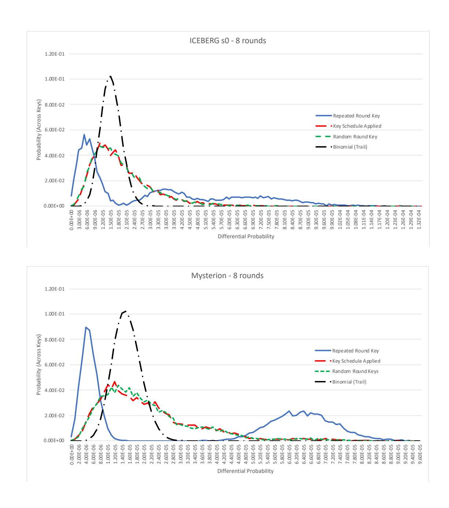

Fig. 23: Comparison of Round Key Generation for ICEBERG s<sup>0</sup> and Mysterion (64-bit SPN, R = 8)

In Figure 25, we present the results for ICEBERG s<sup>1</sup> using Differential Trail 1 and for KLEIN. In both cases, the differential trail uses one active S-box (with difference probability of 1/8) per round, which results in a trail probability of 2<sup>−</sup>3R. Data using Npairs plaintext pairs across Nkeys keys as indicated in the plot title is shown, generated using the key schedule. For both R = 8 and R = 12, the curves for ICEBERG s<sup>1</sup> and KLEIN are similar and clearly distinct from the trail distribution, with differential probabilities appearing for some keys to be much larger than predicted by the trail. As R increases, it becomes difficult to observe the correct output difference of the differential and the experimental curves cannot be distinguished from the trail distribution, which is based on a very small trail probability.

### 4.9 Conclusions and Conjectures

Let us now consider the conclusions drawn for the 16-bit SPN and determine their applicability to the 64-bit SPN. In general, the behaviour observed for the 16-bit SPN was also found to hold true for the

{47}------------------------------------------------

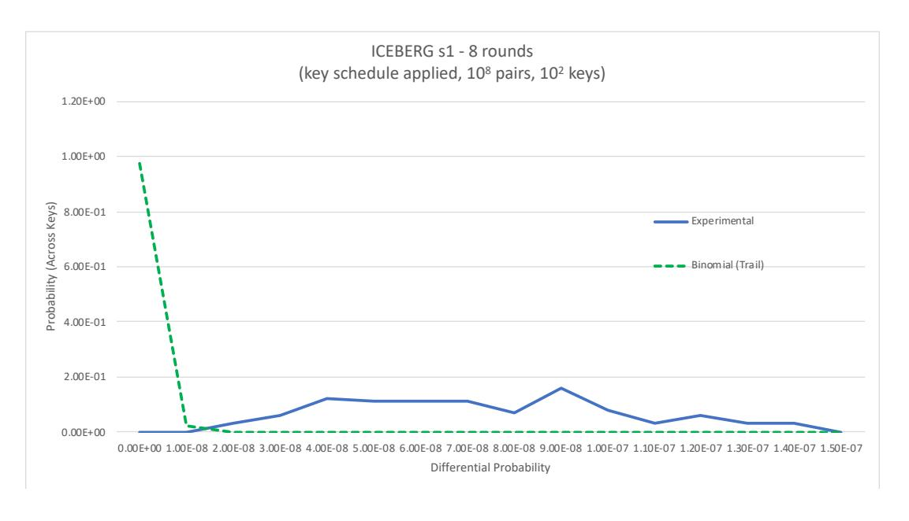

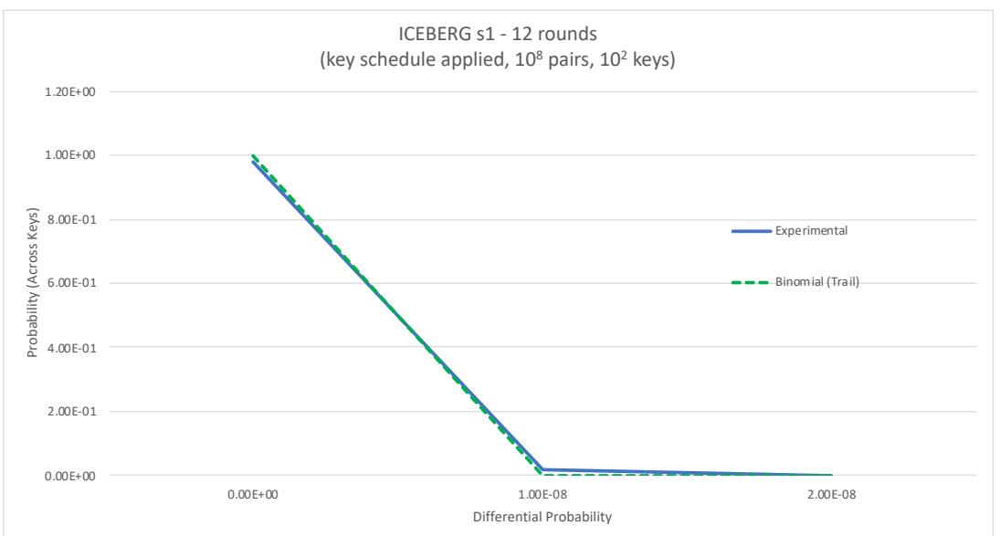

Fig. 24: DP<sup>K</sup> Distribution for ICEBERG s<sup>1</sup> (Differential Trail 2) (64-bit SPN, R = 8 and 12)

64-bit SPN. The following statements are based on the application of the key schedule to generate round keys, unless otherwise stated.

- 1. FACT 1: The differential trail probability, DPtrail, is pessimistic for predicting the average differential probability, ADP, which can be much larger. As expected this was found to be true for the 64-bit SPN.
- 2. FACT 2: For a small number of rounds, the distribution of differential probability across keys, does not necessarily follow a binomial distribution.
  - Again, as with the 16-bit SPN, for the 64-bit SPN, depending on the number of rounds and S-box properties, the variation from the binomial distribution can be dramatic and, in some instances, this results in unexpectedly large differential probabilities for some keys.
- 3. FACT 3: For some S-boxes, for an SPN using a repeated round key, the distribution of the differential probability is more poorly behaved than if the key schedule is applied.

{48}------------------------------------------------

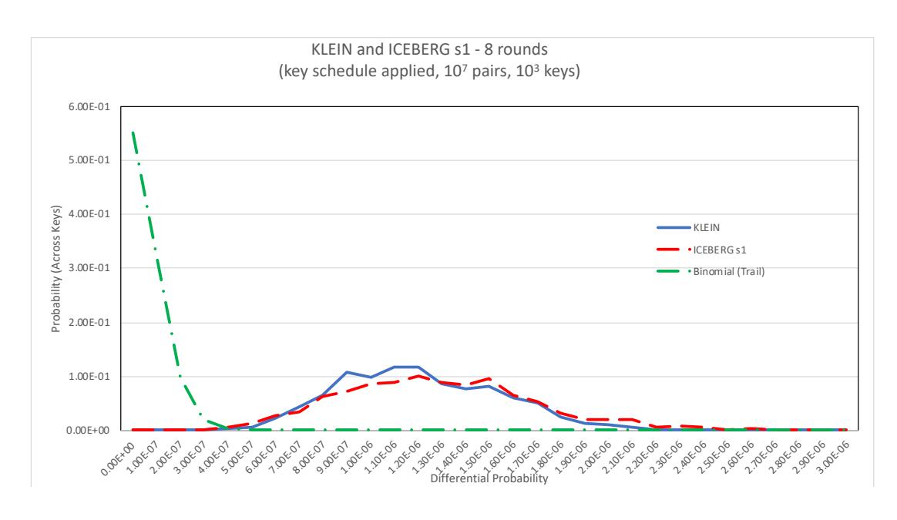

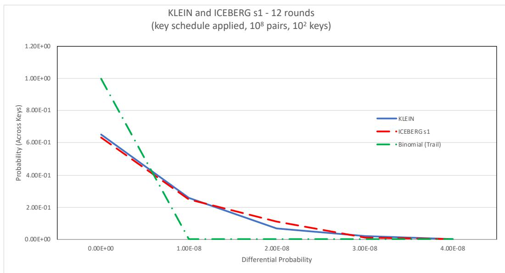

Fig. 25:  $DP_K$  Distribution for ICEBERG  $s_1$  (Diff. Trail 1) and KLEIN (64-bit SPN, R=8 and 12)

a significant tail of keys with large fixed-key differential probability, at least one key with a very large differential probability, and/or does not converge to the ideal distribution as the number of rounds becomes large. The evidence of this being broadly the case for the 64-bit SPN is weak. It is true for a small number of rounds for ICEBERG  $s_0$  and Mysterion, but it has not been observed to be true for a large number of rounds (as was the case for some S-boxes for the 16-bit SPN). Hence, we leave further study of the applicability of this statement to the 64-bit SPN as an open problem.

- 4. CONJECTURE 1: For all S-boxes, as the number of rounds is increased, the distribution of the differential probability is well represented by a binomial distribution with p = ADP.

  This was found to be consistent for the 64-bit SPN, as well as the 16-bit SPN.
- 5. CONJECTURE 2: For all S-boxes, for a large number of rounds, the distribution of the differential probability approaches the ideal distribution.

  This could not be verified for the 64-bit SPN since the differential probability for the ideal case is so small. Hence, the applicability of this conjecture to the 64-bit SPN is still an open problem.

{49}------------------------------------------------

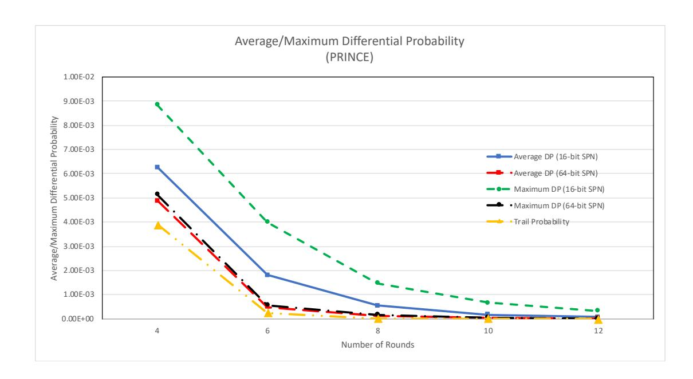

Fig. 26: Comparison of DP<sup>K</sup> for PRINCE for R = 4 → 12 (16-bit SPN and 64-bit SPN)

- 6. CONJECTURE 3: S-boxes that produce moderately and strongly diffusive differential trails approach the ideal distribution with fewer rounds than S-boxes that produce poorly diffusive trails. Again, it is not possible to verify in relation to the ideal distribution, which is based on such a small
  - differential probability, and we are therefore not able to confirm the validity of this conjecture. It does seem experimentally that, for 64-bit SPNs, S-boxes in moderately and strongly diffusive trails result in distributions well represented by the binomial distribution with p = DPtrail for a modest number of rounds. Hence, as the number of rounds increases and DPtrail becomes on the order of the ideal probability, we expect this conjecture to hold true. Its precise verification, we leave as an open problem.
- 7. CONJECTURE 4: For all S-boxes, for an SPN using round keys generated by the key schedule specified in the appendix, the distribution of the differential probability is very similar to the distribution based on random round keys.

This conjecture appears to hold true for the cases considered for the 64-bit SPN.

# 5 Comparison of 16-bit and 64-bit SPNs

It is worth reflecting on the implications of the block size when studying the properties of the differential cryptanalysis. In this section, we briefly comment on the comparison of ciphers which have the same S-box and similar key scheduling approaches, but which differ in block size. It is perhaps surprising to discover that the block size has a dramatic effect on the nature of the differential probability distribution, even when the differential trail probability is the same.

Consider Figure 26 and Table 14 which depict the average differential probability and the maximum differential probability for a 16-bit SPN and a 64-bit SPN, both of which use the PRINCE S-box. For the figure, results for R = 4 to 12 are presented, while results for R = 8 to 20 are listed in the table. For the 16-bit SPN, round keys are generated using the key schedule of the appendix on a 20-bit cipher key, while for the 64-bit SPN, the key schedule is applied to an 80-bit cipher key. For the 16-bit SPN, all plaintext pairs satisfying the input difference are applied (that is, Npairs = 2<sup>15</sup>) and all keys are applied (that is, Nkeys = 2<sup>20</sup>) which results in the generation of the true distribution of DP<sup>K</sup> and, hence,

{50}------------------------------------------------

|                                         | 8 rounds    | 12 rounds   | 16 rounds         | 20 rounds   |
|-----------------------------------------|-------------|-------------|-------------------|-------------|
| DPtrail                                 | 1.53 × 10−5 | 5.96 × 10−8 | 2.33 × 10−10 9.09 | × 10−13     |
| Average DP (16-bit SPN)                 | 5.37 × 10−4 | 6.02 × 10−5 | 1.95 × 10−5       | 1.56 × 10−5 |
| Average DP (64-bit SPN)                 | 1.22 × 10−4 | 7.82 × 10−6 | 4.59 × 10−7       | 2.68 × 10−8 |
| (16-bit SPN) 1.47 × 10−3<br>Maximum DPK |             | 3.36 × 10−4 | 2.14 × 10−4       | 2.14 × 10−4 |
| (64-bit SPN) 1.69 × 10−4<br>Maximum DPK |             | 2.00 × 10−5 | 4.00 × 10−6       | 2.00 × 10−6 |

Table 14: Comparison of DP<sup>K</sup> for PRINCE for R = 8 → 20 (16-bit SPN and 64-bit SPN)

the average and maximum differential probabilities plotted for the different rounds are exact. For the 64-bit SPN, Npairs = 10<sup>6</sup> plaintext pairs satisfying the required input difference are randomly generated and Nkeys = 10<sup>4</sup> random cipher keys are applied to derive experimental estimates of the average and maximum differential probabilities.

From the figure, we can see that, as expected, for both block sizes, the average differential probabilities are larger than the trail probability, DPtrail. However, the average differential probability is substantially higher for the 16-bit SPN, than for the 64-bit SPN and this is visually obvious for smaller values of R. This may be surprising because the differential trail probability is identical for both block sizes and, hence, it may be reasonable to expect similar differential probabilities. The fact that this does not occur is likely due to a much higher dependency between the bits of the smaller block than the bits of the larger block. Hence, DPtrail is an even worse predictor of the differential probability for the small block than for the large block. Recall, the determination of the trail probability is dependent on the concept that each active S-box operates independently and this assumption applies very poorly in the 16-bit cipher.

From the table, we can also see, as R increases, the average differential probability for both cases is much larger than the DPtrail. Further, the differential probability for the 16-bit SPN is much larger than for the 64-bit SPN. For example, for R = 20, the average differential probability of the 16-bit SPN is 3 orders of magnitude larger than for the 64-bit SPN, which is 4 orders of magnitude larger than DPtrail. This occurs because the 16-bit SPN approaches the ideal distribution with B = 16 and, hence, the average differential probability approaches 2<sup>−</sup><sup>16</sup> but does not get smaller. However, for the 64-bit SPN, the ideal distribution uses B = 64 and the differential probability does not approach 2<sup>−</sup><sup>64</sup> since DPtrail > 2 <sup>−</sup><sup>64</sup> for the values of R considered.

Consider now the plot and data values of the maximum differential probability in the figure and the table, respectively. For small values of R, it is clear that the maximum is quite different than the average for the 16-bit SPN, while there is visually little difference for the 64-bit SPN. As R increases, the maximum differential probability becomes 2 orders of magnitude smaller for the 64-bit SPN than for the 16-bit SPN, while the relative ratio between the maximum and average values becomes larger for the 64-bit SPN at larger values of R. It should also be noted that, while the maximum differential probability for the 16-bit SPN is a true value, the maximum value for 64-bit SPN is an experimental value affected by the number of keys, Nkeys = 10<sup>4</sup> , and number of plaintext pairs, Npairs = 10<sup>6</sup> , used in the experiment. Keeping the runtime of the experiment fixed by fixing Ntotal = Nkeys · Npairs and increasing Nkeys (and decreasing Npairs) is likely to result in a larger value for the maximum differential probability for the 64-bit SPN since more keys are tested, while increasing Npairs (and decreasing Nkeys) will tend to decrease the maximum differential probability, since fewer keys are tested.

{51}------------------------------------------------

### **Algorithm 1** Algorithm to Search for Keys with High $DP_K$

```
function KEY_SEARCH(R, n_1, n_2)
                                                         \triangleright Inputs: number of rounds R, parameters n_1 and n_2, n_1 > n_2
                                                                  \triangleright Generates round keys RK_4, ..., RK_R with high DP_K
    Randomly set [RK_1, RK_2, RK_3]
    Generate n_1 random RK_4 to form round key sequences: [RK_1, RK_2, RK_3, RK_4^{(j)}], j \in \{1, 2, ..., n_1\}
   Select n_2 round key sequences with highest DP_K and store as [RK_1, RK_2, RK_3, RK_4^{(i)}], i \in \{1, 2, ..., n_2\}
    for r = 5 to R do
        for i = 1 to n_2 do
            Generate n_1 random RK_r^{(j)}, j \in \{1, 2, ..., n_1\}
                 and store as [RK_1, RK_2, RK_3, ..., RK_{r-1}^{(i)}, RK_r^{(j)}], i \in \{1, 2, ..., n_2\}, j \in \{1, 2, ..., n_1\}
        end for
                                                \triangleright Total of n_2 \times n_1 round key sequences of r rounds stored by for loop
       Select n_2 round key sequences from stored set with highest DP_K
             and store as [RK_1, RK_2, RK_3, ..., RK_{r-1}^{(i)}, RK_r^{(i)}], i \in \{1, 2, ..., n_2\}
    end for
   return [RK_1, RK_2, RK_3, ..., RK_{R-1}^{(i)}, RK_R^{(i)}], i \in \{1, 2, ..., n_2\}
                                                                \triangleright Output: set of n_2 round key sequences with high DP_K
end function
```

# 6 Key Search Algorithm

Since some distributions of  $DP_K$  have keys with high differential probabilities, it is of interest to develop an efficient algorithm to find such keys, without the need for an extensive random search. For the 16-bit SPN, both the repeated round key and the key schedule approaches have small enough key spaces that it is possible to exhaustively search the full set of keys. In addition, due to the limited size of the plaintext space, it is possible to test all plaintext pairs for each of these keys. Hence, the keys with the largest  $DP_K$ values can be found for these two keying approaches. However, it is not known whether other round key generations might lead to deficient round keys which also give very high (perhaps even higher) differential probabilities. For the 64-bit SPN, it is not possible to execute exhaustive search on the full key space of 64 bits for the repeated round key or 80 bits for the key schedule approach. For these round key generation approaches, we must rely on the results of a random sampling of the key space.

To fully explore whether it is possible to systematically search for and find round key values with high differential probabilities for both 16-bit and 64-bit SPNs, we have developed a greedy algorithm and it is presented as Algorithm 1. Let  $RK_r$  represent the round key applied to the round r. The basic concept of the algorithm is to extend a set of round key sequences (where each element in the set is identified by a sequence of round keys listed from round 1 to round r-1,  $[RK_1, RK_2, ..., RK_{r-1}]$ ) known to have high differential probability for r-1 rounds. By testing a number  $(n_1)$  of randomly selected candidates for the r-th round key concatenated to the round keys of the first r-1 rounds and then selecting a subset consisting of  $n_2$  candidate round key sequences with the highest differential probability over all r rounds, we can identify a set of round key sequences for an r-round which have high differential probability. Then, having selected the best  $n_2$  candidates for the round key sequences for r rounds, we can proceed to determine good candidates for the (r+1)-th round, by testing  $n_1$  candidates for  $RK_{r+1}$  for each of the  $n_2$  round key sequences selected for r rounds, followed by the selection of the best  $n_2$  candidates. This process can continue until the required number of rounds is reached. For the step of the algorithm representing round r, the encryption (of r rounds) of  $N_{total} = n_2 \times n_1 \times N_{pairs}$  plaintext pairs would need to be executed. For example, in our execution of the algorithm for the 64-bit SPN, we have typically used  $n_1 = 200, n_2 = 20, \text{ and } N_{pairs} = 10^6, \text{ so that execution of the algorithm finishes in a practical time (i.e.,$ a few hours) for a reasonable number of rounds (perhaps, 20). This means that a set of 20 good round

{52}------------------------------------------------

key sequences are saved at each round and for each of these good keys, 200 random round keys are tried in the next round, from which the best 20 are kept as a set of good round key sequences, etc. Keeping  $N_{pairs}$  at a reasonably modest value limits the applicability of the algorithm, since we would need to have fairly large values of  $DP_K$  in order for a good number of occurrences of the correct output difference to be observed. As the number of rounds increases and  $DP_K$  decreases,  $N_{pairs}$  would need to be increased at either the expense of the execution time of the algorithm or by adjusting  $n_1$  and  $n_2$  so that  $n_1 \times n_2$  is reduced proportionally to the increase in  $N_{pairs}$ .

The algorithm presented as Algorithm 1 is presented to find the best round key sequences for  $[RK_4, ..., RK_R]$ , having randomly set the sequence of the first 3 round keys,  $[RK_1, RK_2, RK_3]$ . This constrains the search space and it is possible to run the algorithm multiple times with different values for the first 3 round keys to try different search spaces for the best round key sequences of R rounds. Also, the algorithm presented strictly represents the approach taken for the 64-bit SPN. For the 16-bit SPN, in implementing the algorithm, we randomly set only the first 2 round keys and find good round sequences for a cipher of 3 rounds or more.

To explore the effectiveness of the algorithm, we have applied it to both the 16-bit and 64-bit SPNs. In Table 15, we have presented the results of a search for the best keys of a 16-bit SPN based on the PRIDE S-box, using parameter values  $n_1 = 1000$  and  $n_2 = 50$ . We have chosen to apply the algorithm to the PRIDE S-box, because PRIDE has really distinct high values for  $DP_K$  for both the repeated round key and the key schedule approaches to round key generation. The results in the table represent the largest values found using one execution of the algorithm. Results for the algorithm from R=8 to 20 are presented. For comparison, the results derived from exhaustive search of all keys for the repeated round key and the scheduled round key approaches are presented. In all cases, the  $DP_K$  values represent true values, since for each key tested the complete set of  $N_{pairs} = 2^{15}$  plaintext pairs generating an input difference are applied. As can be seen from the table, the algorithm, while capable of finding large values of  $DP_K$ , does not find values that are significantly larger than the values found by the exhaustive test of the two keying approaches. In particular, the repeated round key results in bad keys (with very high  $DP_K$ ) and these keys (or keys with similarly high  $DP_K$ ) are not found by the algorithm. This is not surprising, because while the algorithm is capable of finding many keys with  $DP_K$  larger than the average differential probability, ADP, it still works within a limited area of the key space (starting from a randomly selected starting point for the first 2 round keys).

In Table 16, results from the search are presented for the 64-bit SPN based on the Midori Sb<sub>0</sub> S-box. Parameter values of  $n_1 = 200$ ,  $n_2 = 20$ , and  $N_{pairs} = 10^6$  (to calculate  $DP_K$  values) are used when running the algorithm and the algorithm is executed 5 times (with different values for the first 3 round keys), with the best outcome from across the runs being listed. The value of the largest  $DP_K$  found by the algorithm, as well as the results from the experiments for the repeated round key and scheduled round key experiments are given. Since the algorithm's calculation of  $DP_K$  is only based on  $10^6$  pairs, it is clear that the  $DP_K$  values will not be accurate when  $DP_{trail}$  and ADP become small due to the potential for a lot of statistical variation. Hence, we calculate a more accurate value of  $DP_K$  for the key that results in the largest  $DP_K$  from the algorithm, by using many more pairs (in fact,  $10^9$  pairs) for just the one specific key<sup>11</sup>. This accurate value is given in brackets. Again the algorithm is able to find large values of  $DP_K$ , larger than the average differential probability, although not substantially so for R = 16 and R = 20. The value of  $N_{pairs}$  is too small to give an accurate computation of  $DP_K$  for larger R since

Actually, the largest  $DP_K$  value found by the algorithm often corresponds to several keys. We arbitrarily select one key from the set of keys which have the largest  $DP_K$  from the algorithm.

{53}------------------------------------------------

| R  | Largest DPK | Largest DPK                                                                   | Largest DPK | ADP         | Ideal       |
|----|-------------|-------------------------------------------------------------------------------|-------------|-------------|-------------|
|    |             | from Algorithm (Repeated Round Key) (Key Schedule) (Key Schedule) Probability |             |             |             |
| 8  | 1.23 × 10−2 | 7.56 × 10−2                                                                   | 2.22 × 10−2 | 1.66 × 10−3 | 1.53 × 10−5 |
| 12 | 1.83 × 10−3 | 5.87 × 10−2                                                                   | 2.87 × 10−3 | 1.32 × 10−4 | 1.53 × 10−5 |
| 16 | 4.58 × 10−4 | 6.54 × 10−2                                                                   | 2.44 × 10−4 | 2.44 × 10−5 | 1.53 × 10−5 |
| 20 | 2.14 × 10−4 | 5.33 × 10−2                                                                   | 2.14 × 10−4 | 1.60 × 10−5 | 1.53 × 10−5 |

Table 15: Largest DP<sup>K</sup> Found from Algorithm for PRIDE S-box (16-bit SPN)

| R | Largest DPK                         | Largest DPK                                        | Largest DPK | ADP         | DPtrail      |
|---|-------------------------------------|----------------------------------------------------|-------------|-------------|--------------|
|   | from Algorithm                      | (Repeated Round Key) (Key Schedule) (Key Schedule) |             |             |              |
|   | (accurate value)                    |                                                    |             |             |              |
|   | 8 9.46 × 10−4<br>(8.66 × 10−4<br>)  | 6.70 × 10−4                                        | 6.12 × 10−4 | 3.61 × 10−4 | 1.53 × 10−5  |
|   | 12 8.30 × 10−5<br>(6.18 × 10−5<br>) | 5.70 × 10−5                                        | 5.30 × 10−5 | 2.75 × 10−5 | 5.96 × 10−8  |
|   | 16 1.60 × 10−5<br>(4.45 × 10−6<br>) | 1.10 × 10−5                                        | 9.00 × 10−6 | 2.14 × 10−6 | 2.33 × 10−10 |
|   | 20 4.00 × 10−6<br>(2.41 × 10−7<br>) | 4.00 × 10−6                                        | 3.00 × 10−6 | 1.76 × 10−7 | 9.09 × 10−13 |

Table 16: Largest DP<sup>K</sup> Found from Algorithm for Midori Sb<sup>0</sup> S-box (64-bit SPN)

DPtrail and ADP become very small. Increasing Npairs would likely improve the algorithm success for these cases but at the expense of the algorithm run time.

In general, the algorithm does seem to work well for a small number of rounds where the differential probabilities are reasonably high. However, the algorithm is only somewhat successful in finding keys with large differential probabilities as the number of rounds increases. Although it is able to find a set of keys with high DPK, it does not seem to perform substantially better than exhaustive or random searches as was done in our experiments. In fact, in the case of repeated round keys, which can have quite high values of differential probabilities for some keys, it may be possible to find much larger values of DP<sup>K</sup> by searching this restricted space, rather than applying the algorithm. It is possible the success of the algorithm could be improved by modifying the parameters n<sup>1</sup> and n<sup>2</sup> and increasing the number of pairs, Npairs, used as a basis for the search. However, in this case, the algorithm may not be able to complete the search in a practical time.

# 7 Conclusions

In this paper, we have presented experimental results on the distribution of the differential probability as a function of keys for SPNs based on different 4-bit S-box mappings. We have done this for both a small-sized basic SPN of 16 bits, where we are able to test exhaustively, and the realistically-sized PRESENT-like SPN of 64 bits, which has the value of being modelled after practical ciphers. The differentials explored are taken from high probability differential trails. We find that the results vary dramatically based on the selection of S-box, the method of round key generation, and the number of rounds. In some cases, the distribution of differential probabilities are dramatically different than the theoretically expected distribution of the binomial distribution. This may be cause for concern, because it clearly illustrates that the usual assumptions (namely, stochastic equivalence and differential trail domination) used in 

{54}------------------------------------------------

determining the differential probability can lead to inaccurate characterizations. While experiments show that there can be significant deviations from the expected differential distribution, with reasonable cipher design practice incorporating a large security margin (in terms of number of rounds) and a good key schedule, we still expect practical ciphers can be designed to be secure against these anomalies found in the differential distribution.

# References

- 1. Eli Biham and Adi Shamir. Differential cryptanalysis of des-like cryptosystems. In Alfred Menezes and Scott A. Vanstone, editors, Advances in Cryptology - CRYPTO '90, 10th Annual International Cryptology Conference, Santa Barbara, California, USA, August 11-15, 1990, Proceedings, volume 537 of Lecture Notes in Computer Science, pages 2–21. Springer, 1990.
- 2. Andrey Bogdanov, Lars R. Knudsen, Gregor Leander, Christof Paar, Axel Poschmann, Matthew J. B. Robshaw, Yannick Seurin, and C. Vikkelsoe. PRESENT: an ultra-lightweight block cipher. In Pascal Paillier and Ingrid Verbauwhede, editors, Cryptographic Hardware and Embedded Systems - CHES 2007, 9th International Workshop, Vienna, Austria, September 10-13, 2007, Proceedings, volume 4727 of Lecture Notes in Computer Science, pages 450–466. Springer, 2007.
- 3. Fran¸cois-Xavier Standaert, Gilles Piret, Ga¨el Rouvroy, Jean-Jacques Quisquater, and Jean-Didier Legat. ICEBERG : An involutional cipher efficient for block encryption in reconfigurable hardware. In Bimal K. Roy and Willi Meier, editors, Fast Software Encryption, 11th International Workshop, FSE 2004, Delhi, India, February 5-7, 2004, Revised Papers, volume 3017 of Lecture Notes in Computer Science, pages 279–299. Springer, 2004.
- 4. Huiju Cheng, Howard M. Heys, and Cheng Wang. PUFFIN: A novel compact block cipher targeted to embedded digital systems. In Luca Fanucci, editor, 11th Euromicro Conference on Digital System Design: Architectures, Methods and Tools, DSD 2008, Parma, Italy, September 3-5, 2008, pages 383–390. IEEE Computer Society, 2008.
- 5. Kyoji Shibutani, Takanori Isobe, Harunaga Hiwatari, Atsushi Mitsuda, Toru Akishita, and Taizo Shirai. Piccolo: An ultra-lightweight blockcipher. In Bart Preneel and Tsuyoshi Takagi, editors, Cryptographic Hardware and Embedded Systems - CHES 2011 - 13th International Workshop, Nara, Japan, September 28 - October 1, 2011. Proceedings, volume 6917 of Lecture Notes in Computer Science, pages 342–357. Springer, 2011.
- 6. Zheng Gong, Svetla Nikova, and Yee Wei Law. KLEIN: A new family of lightweight block ciphers. In Ari Juels and Christof Paar, editors, RFID. Security and Privacy - 7th International Workshop, RFIDSec 2011, Amherst, USA, June 26-28, 2011, Revised Selected Papers, volume 7055 of Lecture Notes in Computer Science, pages 1–18. Springer, 2011.
- 7. Julia Borghoff, Anne Canteaut, Tim G¨uneysu, Elif Bilge Kavun, Miroslav Knezevic, Lars R. Knudsen, Gregor Leander, Ventzislav Nikov, Christof Paar, Christian Rechberger, Peter Rombouts, Søren S. Thomsen, and Tolga Yal¸cin. PRINCE - A low-latency block cipher for pervasive computing applications - extended abstract. In Xiaoyun Wang and Kazue Sako, editors, Advances in Cryptology - ASIACRYPT 2012 - 18th International Conference on the Theory and Application of Cryptology and Information Security, Beijing, China, December 2-6, 2012. Proceedings, volume 7658 of Lecture Notes in Computer Science, pages 208–225. Springer, 2012.
- 8. Martin R. Albrecht, Benedikt Driessen, Elif Bilge Kavun, Gregor Leander, Christof Paar, and Tolga Yal¸cin. Block ciphers - focus on the linear layer (feat. PRIDE). In Juan A. Garay and Rosario Gennaro, editors, Advances in Cryptology - CRYPTO 2014 - 34th Annual Cryptology Conference, Santa Barbara, CA, USA, August 17-21, 2014, Proceedings, Part I, volume 8616 of Lecture Notes in Computer Science, pages 57–76. Springer, 2014.
- 9. Subhadeep Banik, Andrey Bogdanov, Takanori Isobe, Kyoji Shibutani, Harunaga Hiwatari, Toru Akishita, and Francesco Regazzoni. Midori: A block cipher for low energy. In Tetsu Iwata and Jung Hee Cheon, editors, Advances in Cryptology - ASIACRYPT 2015 - 21st International Conference on the Theory and Application of

{55}------------------------------------------------

- Cryptology and Information Security, Auckland, New Zealand, November 29 December 3, 2015, Proceedings, Part II, volume 9453 of Lecture Notes in Computer Science, pages 411–436. Springer, 2015.
- 10. Christof Beierle, J´er´emy Jean, Stefan K¨olbl, Gregor Leander, Amir Moradi, Thomas Peyrin, Yu Sasaki, Pascal Sasdrich, and Siang Meng Sim. The SKINNY family of block ciphers and its low-latency variant MANTIS. In Matthew Robshaw and Jonathan Katz, editors, Advances in Cryptology - CRYPTO 2016 - 36th Annual International Cryptology Conference, Santa Barbara, CA, USA, August 14-18, 2016, Proceedings, Part II, volume 9815 of Lecture Notes in Computer Science, pages 123–153. Springer, 2016.
- 11. Anthony Journault, Fran¸cois-Xavier Standaert, and Kerem Varici. Improving the security and efficiency of block ciphers based on ls-designs. Des. Codes Cryptogr., 82(1-2):495–509, 2017.
- 12. Joan Daemen and Vincent Rijmen. The Design of Rijndael: AES The Advanced Encryption Standard. Information Security and Cryptography. Springer, 2002.
- 13. Carlos Cid, Sean Murphy, and Matthew J. B. Robshaw. Small scale variants of the AES. In Henri Gilbert and Helena Handschuh, editors, Fast Software Encryption: 12th International Workshop, FSE 2005, Paris, France, February 21-23, 2005, Revised Selected Papers, volume 3557 of Lecture Notes in Computer Science, pages 145–162. Springer, 2005.
- 14. Xuejia Lai, James L. Massey, and Sean Murphy. Markov ciphers and differential cryptanalysis. In Donald W. Davies, editor, Advances in Cryptology - EUROCRYPT '91, Workshop on the Theory and Application of of Cryptographic Techniques, Brighton, UK, April 8-11, 1991, Proceedings, volume 547 of Lecture Notes in Computer Science, pages 17–38. Springer, 1991.
- 15. Joan Daemen and Vincent Rijmen. Probability distributions of correlation and differentials in block ciphers. J. Mathematical Cryptology, 1(3):221–242, 2007.
- 16. Howard M. Heys. A tutorial on linear and differential cryptanalysis. Cryptologia, 26(3):189–221, 2002.
- 17. C´eline Blondeau and Benoˆıt G´erard. Links between theoretical and effective differential probabilities: Experiments on PRESENT. IACR Cryptol. ePrint Arch., 2010:261, 2010.
- 18. Ralph Ankele and Stefan K¨olbl. Mind the gap A closer look at the security of block ciphers against differential cryptanalysis. In Carlos Cid and Michael J. Jacobson Jr., editors, Selected Areas in Cryptography - SAC 2018 - 25th International Conference, Calgary, AB, Canada, August 15-17, 2018, Revised Selected Papers, volume 11349 of Lecture Notes in Computer Science, pages 163–190. Springer, 2018.
- 19. Howard M. Heys and Stafford E. Tavares. Avalanche characteristics of substitution-permutation encryption networks. IEEE Trans. Computers, 44(9):1131–1139, 1995.
- 20. Markku-Juhani O. Saarinen. Cryptographic analysis of all 4 x 4-bit s-boxes. In Ali Miri and Serge Vaudenay, editors, Selected Areas in Cryptography - 18th International Workshop, SAC 2011, Toronto, ON, Canada, August 11-12, 2011, Revised Selected Papers, volume 7118 of Lecture Notes in Computer Science, pages 118– 133. Springer, 2011.
- 21. Markus Ullrich, Christophe De Canni`ere, Sebastiaan Indesteege, Ozg¨ul K¨u¸c¨uk, Nicky Mouha, and Bart ¨ Preneel. Finding Optimal Bitsliced Implementations of 4 x 4-bit S-boxes. In Symmetric Key Encryption Workshop, page 20, Copenhagen,DK, 2011.
- 22. Ernest F. Brickell, Judy H. Moore, and M. R. Purtill. Structure in the s-boxes of the DES. In Andrew M. Odlyzko, editor, Advances in Cryptology - CRYPTO '86, Santa Barbara, California, USA, 1986, Proceedings, volume 263 of Lecture Notes in Computer Science, pages 3–8. Springer, 1986.
- 23. Jian Guo, Thomas Peyrin, Axel Poschmann, and Matthew J. B. Robshaw. The LED block cipher. In Bart Preneel and Tsuyoshi Takagi, editors, Cryptographic Hardware and Embedded Systems - CHES 2011 - 13th International Workshop, Nara, Japan, September 28 - October 1, 2011. Proceedings, volume 6917 of Lecture Notes in Computer Science, pages 326–341. Springer, 2011.
- 24. Eli Biham. New types of cryptanalytic attacks using related keys. J. Cryptology, 7(4):229–246, 1994.

{56}------------------------------------------------

# Appendix: Key Schedule Applied in the Experiments

Most of the results presented in this paper are based on the application of a key schedule to derive the keys applied to each round from the cipher key. There is no typical key schedule algorithm, but we have chosen to model our approach to a realistic key schedule after the key schedule of the PRESENT cipher [2]. To this end, we describe a generalized version of the key schedule and then define the parameters applied to both the 16-bit SPN and the 64-bit SPN.

Consider a cipher key  $K = k_{\kappa-1}k_{\kappa-2}...k_1k_0$  of size  $\kappa$  bits, used for an SPN cipher with a block size of B bits and n-bit S-boxes. It is assumed that  $\kappa \geq B$ . Let  $K' = k'_{\kappa-1}k'_{\kappa-2}...k'_1k'_0$  represent the key state bits that are processed during the key schedule. Let R represent the number of round keys generated and assume that R < 32 and, hence, the round number can be represented in binary by 5 bits. To represent the round number, we use variable r, referred to as the round count, where the 5 bits of r are given by  $[r_4r_3r_2r_1r_0]$ . Variable  $\alpha$  represents a rotational value used during the key schedule. The key schedule (derived from the PRESENT key schedule), illustrated in Figure 27, consists of the following steps:

1. Let r = 1 and assign the bits of cipher key K to key state K':

$$[k'_{\kappa-1}k'_{\kappa-2}...k'_1k'_0] \leftarrow [k_{\kappa-1}k_{\kappa-2}...k_1k_0]$$

- 2. If r > R, then **stop**.
- 3. Use the leftmost  $\hat{B}$  bits of K',  $[k'_{\kappa-1}k'_{\kappa-2}...k'_{\kappa-B+1}k'_{\kappa-B}]$  as round key r,  $RK_r$ .
- 4. Update K' as follows:
  - (a) Rotate K' left by  $\alpha$  positions:

$$[k'_{\kappa-1}k'_{\kappa-2}...k'_1k'_0] \leftarrow [k'_{\kappa-\alpha-1}k'_{\kappa-\alpha-2}...k'_{\kappa-\alpha+1}k'_{\kappa-\alpha}]$$

(b) Process the leftmost n bits with the n-bit S-box:

$$[k'_{\kappa-1}k'_{\kappa-2}...k'_{\kappa-n}] \leftarrow S(k'_{\kappa-1}, k'_{\kappa-2}, ..., k'_{\kappa-n})$$

(c) XOR the round count into round key bits from position  $\gamma$  down to  $\gamma - 4$ :

$$\begin{array}{l} [k'_{\gamma}k'_{\gamma-1}k'_{\gamma-2}k'_{\gamma-3}k'_{\gamma-4}] \\ \leftarrow [k'_{\gamma}k'_{\gamma-1}k'_{\gamma-2}k'_{\gamma-3}k'_{\gamma-4}] \oplus [r_4r_3r_2r_1r_0] \end{array}$$

5. Increment r and return to step 2.

Note that operation " $\oplus$ " represents the bitwise XOR operation and  $S(\cdot)$  represents the S-box mapping. In this paper, we make use of two versions of the key schedule. For the 16-bit SPN using 4-bit S-boxes (i.e., B=16 and n=4), we let  $\kappa=20$ ,  $\alpha=13$ , and  $\gamma=8$  for the experiments where a key schedule is applied to generate the round keys. For the 64-bit SPN using 4-bit S-boxes (i.e., B=64 and n=4), similarly to the PRESENT cipher with an 80-bit key, we let  $\kappa=80$ ,  $\alpha=61$ , and  $\gamma=19$ . Overall this key schedule derives informational content in a balanced way from all cipher key bits, mixes in a complex nonlinear operation on the bits through the S-box, and ensures that each round has a distinct operation by adding a constant derived from the round number (thereby preventing attacks such as related key attacks [24]).

The limit of 32 rounds is a reasonable limit satisfied by practical ciphers. However, it is a trivial matter to extend the size of the round count to more bits if necessary.

{57}------------------------------------------------

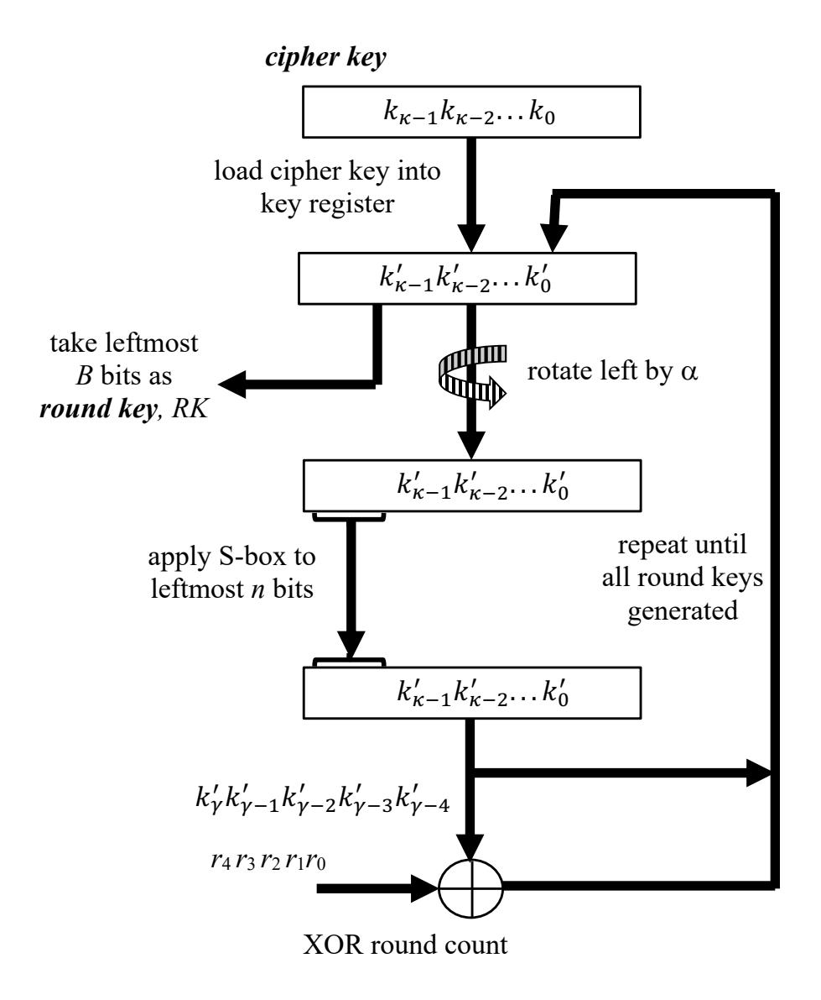

Fig. 27: Key Schedule Structure