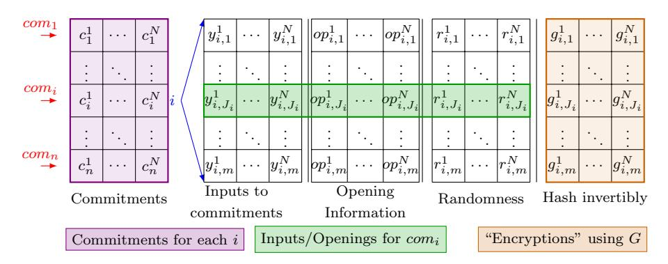

# Threshold Ring Signatures: New Definitions and Post-Quantum Security

Abida Haque? and Alessandra Scafuro?

{ahaque3, ascafur}@ncsu.edu North Carolina State University

Abstract. A t-out-of-N threshold ring signature allows t parties to jointly and anonymously compute a signature on behalf on N public keys, selected in an arbitrary manner among the set of all public keys registered in the system.

Existing definitions for t-out-of-N threshold ring signatures guarantee security only when the public keys are honestly generated, and many even restrict the ability of the adversary to actively participate in the computation of the signatures. Such definitions do not capture the open settings envisioned for threshold ring signatures, where parties can independently add themselves to the system, and join other parties for the computation of the signature. Furthermore, known constructions of threshold ring signatures are not provably secure in the post-quantum setting, either because they are based on non-post quantum secure problems (e.g. Discrete Log, RSA), or because they rely on transformations such as Fiat-Shamir, that are not always secure in the quantum random oracle model (QROM).

In this paper, we provide the first definition of t-out-of-N threshold ring signatures against active adversaries who can participate in the system and arbitrarily deviate from the prescribed procedures. Second, we present a post-quantum secure realization based on any (post-quantum secure) trapdoor commitment, which we prove secure in the QROM. Our construction is black-box and it can be instantiated with any trapdoor commitment, thus allowing the use of a variety of hardness assumptions.

Keywords: Threshold Ring Signatures · QROM · PQ-Security

## 1 Introduction

A threshold cryptographic scheme enforces that a certain cryptographic action is performed only if a quorum of users agree to proceed. For instance, in a threshold signature scheme, a signature for a message msg should be accepted only if at least t signers within a larger group of N signers used their secret keys to compute it. One benefit of a threshold scheme is the tolerance to failures: even if an adversary learns some (less than t) keys of compromised machines, she still

<sup>?</sup> Research Supported by NSF grants #1012798,#1764025, Cisco Research Program Award CG#1194107

will not be able to generate valid signatures. A threshold scheme is also tolerant to benign misbehavior of users: if a set of nodes is off-line, signatures can still be produced, as long as at least t users are active. Due to these additional robustness properties of threshold signatures, there is interest from real applications (e.g., multi-signatures in Bitcoin). Threshold signatures are also target of the latest NIST standardization effort [\[28\]](#page-29-0).

In this paper, we describe a threshold ring signature scheme, where in addition to a quorum of t-out-of-N secret keys, one requires that: (1) the identity of the t signers remains private (from anyone who did not participate in the signing process) within the N public keys of the ring and (2) the set of N public keys is established in an ad-hoc manner among the set of all available public keys in the system (which can be more than N). There is no group manager, nor a centralized join procedure: parties join the system freely with keys of their choice, hence the name ring instead of group [1](#page-1-0) .

Threshold ring signatures [\[10\]](#page-28-0) suit decentralized settings where parties dynamically join and leave the system, the number of active parties at any point is not known, and there is an interest in protecting the identity of the parties that endorse a certain statement. For example, in a trust blockchain, one could impose that certain transactions are added to the blockchain only if at least t trustees approved the operation, without revealing their identity. Threshold ring signatures can be applied to any scenario where a statement must be endorsed by a quorum, but parties need to protect their identities.

We want two security properties in a threshold ring signature: unforgeability and anonymity. Unforgeability requires that fewer than t users together cannot compute a signature on behalf of any ring. Anonymity requires that if a signature is associated to a ring R of N users, then any possible subset of t users is equally likely to be the set of signers. This can be modeled as: given a signature over a ring R, any either of the two subsets S<sup>0</sup> and S<sup>1</sup> of R are equally likely to be the set of keys used for computing the signature. We call S<sup>0</sup> (S1) the signing set.

Since ring signatures target open settings where keys are generated independently by each party, when evaluating the security of the scheme one should take into account that some keys can be generated maliciously and possibly adaptively on the public keys already present in the system and the signatures already produced. For example, an adversary could try to join a system with a key that is generated adaptively based on the other keys generated so far, with the purpose of being able to sign a message even if she controls less than t signers, or she can craft her public keys in such a way that if it is included in a ring R by set of signers S, she will be able to learn some information about the signing set S. This observation was already made by Bender, Katz and Morselli in [\[4\]](#page-27-0) for the case of 1-out-N ring signatures. Note that in the threshold setting, t people must collaborate to obtain the signature, thus the adversary has the additional capabilities of interacting with the honest parties when computing a signature.

<span id="page-1-0"></span><sup>1</sup> In group signatures [\[14\]](#page-28-1), a group manager computes the keys for the users, and posseses the trapdoors to violate the anonymity of a signer.

#### 1.1 Limitations of Previous Work

Security Definitions Capture only Passive Adversaries. Several threshold ring signature schemes have been provided in literature but, somewhat surprisingly, most consider adversaries with the following restrictions. First, the adversary cannot create keys maliciously, that is, an adversary can only obtain honestly generated keys, and in some cases, cannot even choose to receive more (honest) keys, since all public keys are created once and for all and given to her (e.g., [\[5](#page-27-1)[,31\]](#page-29-1)). Second, the adversary cannot corrupt parties (e.g. [\[30,](#page-29-2)[31](#page-29-1)[,5\]](#page-27-1)), or, if corruption is allowed, the adversary never participates in the signing process as a member of the signing set. Only Abe et. al [\[1,](#page-27-2)[2\]](#page-27-3) consider the possibility of an adversary who can add their own keys to the ring, but only for the unforgeability property. Anonymity still relies on all keys being generated honestly.

In the real world, the above restrictions mean that no anonymity (and in most work no unforgeability) guarantee is provided when the adversary is able to observe honest parties' keys (or signatures) before generating her public key, and can be involved in the computation of some of the signatures.

Bender, Katz and Morselli observed in [\[4\]](#page-27-0) that such restrictions on the adversary do not reflect the setting for which 1-out-N ring signatures were devised in the first place, which is a decentralized open systems where parties can join dynamically. In the case of threshold ring signatures where t parties need to collaborate to produce a signature, definitions that precisely capture the capability of an active adversary are crucial. Specifically, while it is true that anonymity of a signature σ ∗ for a ring R can be guaranteed only as long as the adversary did not participate in computing σ ∗ , one should take into account that the adversary can still participate in the computation of other signatures σ1, σ2, . . ., with some of the same signers that computed σ ∗ , and can use this knowledge to infer information about the signers who compute σ ∗ . To the best of our knowledge there seem to be no definition in literature that captures all of the above adversarial (and realistic) capabilities.

No Provable Post-quantum Security. Existing threshold ring signature schemes do not present a provably post-quantum secure analysis. They are either based on hard problems that are not post-quantum resistant [\[10,](#page-28-0)[25,](#page-28-2)[30,](#page-29-2)[34,](#page-29-3)[41\]](#page-29-4) (e.g., Discrete Log, RSA, bilinear maps), or, when based on post-quantum resistant hardness assumptions [\[27,](#page-29-5)[5,](#page-27-1)[11,](#page-28-3)[31\]](#page-29-1) (e.g., lattices, multivariate code) they use the Fiat-Shamir transform [\[18\]](#page-28-4), the security of which is not known to hold in general in the quantum random oracle model (QROM) [\[7,](#page-27-4)[3\]](#page-27-5). Exciting recent work [\[17](#page-28-5)[,26\]](#page-29-6) show that for Sigma-protocols with special properties the Fiat-Shamir transform is secure even in the QROM, however it is not known whether this result can be applied to the existing threshold signatures. We note that it is possible that Abe et al.'s [\[2\]](#page-27-3) scheme could be instantiated using post-quantum Sigma-protocols (and thus be post-quantum secure), but it is not clear whether this is the case. We discuss previous signatures in more detail in Section. [2.](#page-7-0)

#### 1.2 Our Contribution

Our contributions are security definitions and provable post-quantum security. We elaborate on each contribution below.

Security Definitions in presence of Active Adversaries. We provide the first definitions for threshold ring signatures that capture realistic adversarial capabilities. The adversary may deviate arbitrarily from any of the signature procedures (i.e, key generation and signature generation). This is in contrast with previous work that considered passive adversaries who follow the prescribed procedures.

Provably Post-Quantum Secure Threshold Ring Signature in QROM. We provide a general construction of threshold ring signatures in the QROM based on any post-quantum secure trapdoor commitment scheme. The trapdoor commitment scheme is treated as a black-box and therefore can be instantiated with various hardness assumptions. Our construction is an abstraction and generalization of previous approaches. Post-quantum security in the QROM is achieved by applying the Unruh's transform [\[36\]](#page-29-7). For completeness, we also discuss an implementation of post-quantum secure trapdoor commitment from any (post-quantum secure) one-way-function using the circuit of the one-wayfunction and a folklore transformation from Sigma-protocols to trapdoor commitments.

Security Definitions in presence of Active Adversaries. We define new security games for capturing anonymity and unforgeability for threshold ring signatures in presence of adversaries that are actively participating in the system. In our anonymity definition, our adversary can actively participate by adding keys that she maliciously crafted, and by participating in the signing process. More specifically, in the anonymity game, the adversary is given access to oracles that allow her to generate new public keys (on behalf of honest parties), corrupt a party by learning her secret key, and compute signatures for rings R and signings sets S of her choice that can contain arbitrarily malicious keys, added on the fly in the system. The adversary can use these oracles to train by participating in many joint signature computation with other honest parties.

In the challenge phase, the adversary chooses a ring R that can contain malicious or corrupted keys, and two candidate signing sets S0, S1. These signing sets must contain only honest keys. She queries the signing oracle with R, S0, S<sup>1</sup> and a message msg and obtains a signature σ ∗ , computed using signing set Sb, and she wins the game if she guesses b.

The main difference with existing definitions is that in previous work the adversary could only query the signing oracle with keys honestly generated (via the key generation oracle) and could not participate with malicious keys in the signing process. Such definitions only anonymity guarantee security against an external observer who does not actively interact with the system. Our definitions are inspired by Bender et al. [\[4\]](#page-27-0) but they are not a straightforward extensions of theirs. They are provided in Section [3.](#page-9-0)

Post-Quantum Threshold Ring-Signature from any Trapdoor Commitment A well known paradigm to construct a t-out-of-N threshold signature schemes is to use a t-out-of-N threshold Secret Sharing scheme (e.g. Shamir [\[33\]](#page-29-8) secret sharing scheme[2](#page-4-0) ) and leverage the unpredictability properties of a random oracle H to force t parties to use their secret keys to "adjust" their shares so that they match the output of H.

We follow such a paradigm and use trapdoor commitments to allow signers to adjust the t shares. More specifically, recall that a trapdoor commitment scheme is defined by some public key pk that anyone can use to compute a commitment c of a message y i.e., c ← Compk(y) such that c is hiding, that is, it reveals nothing about y; and binding, that is, later c can only be opened as y. However, if one knows a secret trapdoor sk associated to the parameters pk, she can compute a "fake" commitment c ← TCompk(sk) that can be later opened as any message y <sup>0</sup> using the trapdoor.

At a high level, our threshold ring signature works as follows: the public key of a signer corresponds to the public key pk of a trapdoor commitment T C (as well as a field element α used for Shamir's secret sharing); the signing key is the trapdoor sk. When t parties want to jointly sign a message msg, they choose N − t other keys (pks<sup>1</sup> , pks<sup>2</sup> , . . . , pksN−<sup>t</sup> ) from the set of all keys published so far [3](#page-4-1) ; they then choose N − t points (y s1 , ys<sup>2</sup> , . . . , ysN−<sup>t</sup> ) and use the non-signer public keys to commit to each point, thus obtaining N −t commitments. For the remaining t commitments, each signer pk<sup>s</sup> will prepare his own fake commitment. The result of this step is a vector of N commitments (c 1 , . . . , c<sup>N</sup> ) of which t are trapdoor (and thus can be equivocated later), and N − t are binding.

Next, the random oracle is evaluated on the vector of all N commitments to obtain another point (0, z) where z = H(msg, c<sup>1</sup> , . . . , c<sup>N</sup> ). Now, the signers have (N − t + 1) points that uniquely identify a polynomial P of degree N − t. Once P is defined, each signer pk<sup>s</sup> can compute y <sup>s</sup> = P(α s ) and use the trapdoor sk<sup>s</sup> to equivocate commitment c s so that it opens to y s . The final signature simply consists of the N commitments and openings. The verifier will simply check that the openings are valid and lead to points (α 1 , y<sup>1</sup> ), . . . ,(α <sup>N</sup> , y<sup>N</sup> ),(0, z) that lie on the same N −t-degree polynomial P. The verifier will also check that z = H(msg, c<sup>1</sup> , . . . , c<sup>N</sup> ).

For unforgeability, due to the unpredictability of H, the value z is known to an adversary only after the points have been committed in (c 1 , . . . , c<sup>N</sup> ). If the adversary controls less than t signers—and thus knows less than t trapdoors—she cannot adjust t points, unless she is breaking the (post-quantum[4](#page-4-2) ) binding property of the underlying commitments. For anonymity, recall that the difference

<span id="page-4-0"></span><sup>2</sup> In (t, N)- Shamir Secret Sharing, to share a secret s, a dealer compute a random polynomial P of degree t − 1 with constant term s. The i-th share of the secret is computed as y <sup>i</sup> = P(α i ), for some field element α i . Given t shares the secret can be reconstructed using polynomial interpolation

<span id="page-4-1"></span><sup>3</sup> In practice we will have a leader choosing such points. We stress that the leader does not have to be trusted.

<span id="page-4-2"></span><sup>4</sup> In Section [6.1](#page-26-0) we discuss in more detail why the issue of binding in presence of quantum adversaries, discussed in [\[3\]](#page-27-5), does not affect our construction.

between a signature computed by signers in set  $S_0$  versus  $S_1$  is in the positions of the trapdoor commitments. Thus, an adversary winning the anonymity game is able to distinguish which commitments are computed using the trapdoor, therefore violating the (post-quantum) trapdoor property of the commitment.

These security arguments are straightforward at a high level. However, in the formal proof via hybrid arguments one has to switch from the case where the trapdoors are used (and signers and non-signers behave differently) to the case where no trapdoor is used, and thus the adversary has no advantage in breaking anonymity. This is possible by leveraging the programmability of the random oracle  $\mathcal{H}$  that would allow the reductions to know the point (0, z) of the polynomial before computing the commitments (thus, such commitments do not need to be equivocated). Similarly, when reducing unforgeability to the binding of the underlying trapdoor commitment, we need the reduction to simulate the signing oracle without knowing the trapdoor (otherwise, it would not possible to break binding). In particular, to break binding the reduction needs to know two openings of at least one commitment. In the classical case, this can be done by rewinding the adversary and adaptively programming the random oracle. However, this proof technique is not directly applicable when the adversary has quantum access to the random oracle. As shown by Unruh in [36], rewinding a quantum-capable adversary and programming the random oracle impacts the state of the adversary, and does not guarantee extraction.

In our construction, we obtain *on-line* extractability by applying the Unruh transform [36]. The main idea of this transform is not to extract by rewinding the adversary. Rather, all the outputs that are needed are contained in the signature. In the proof, we replace  $\mathcal H$  with a 2q-wise independent function (where q is the maximum number of oracle queries), which is indistinguishable from the random oracle. Thus, the extractor can invert the function and find two openings.

The signature is modified so the same vector of commitments  $(c^1,\ldots,c^N)$  is associated to multiple points  $z_1,\ldots,z_m$  and therefore will require m different openings. The signers will then encrypt, using a random permutation G, modeled as a random oracle, m multiple openings of the same commitments  $c^s$ . Namely, for a commitment  $c^s$ , the signer additionally sends m encryptions  $(g_1^s,\ldots,g_m^s)$  where  $g_j=\mathcal{G}(y_j^s||op_j^s||r_j^s)$  and where  $y_j^s,op_j^s$  is the j-th opening of  $c^s$  and  $r_j^s$  is a random key used for encryption. Here m is the statistical security parameter. Among the m encrytions, each signers will only provide the decryption of one opening  $(y_j^s,op_j^s)$  for a single  $j\in[m]$  (chosen via a random oracle). Note that for the non-signers, the openings will all be the same value. This technique allow the reduction, who sees all encryptions, to "invert" the values random permutation G and obtain at least two openings  $(y_j^s,op_j^s)$ ,  $(\tilde{y}_j^s,\tilde{o}p_j^s)$  for the same commitment  $c^s$ .

To amplify the probability of inverting and extracting enough openings, this is repeated n times, using cut-and-choose techniques. To sum up, the value n is the number of commitments (of a single ring member) and m is the number of openings a signer makes for each. For each of the n commitments and their m

possible openings, in the signature, one will see only one "line" of openings. For programmability, we also use a indistinguishability lemma shown in Unruh [36].

While the secret sharing and Random Oracle paradigm is common to construct ring and threshold ring signatures, our construction presents two novel benefits. First, it is black-box in any trapdoor commitment, and thus it can be instantiated under any assumption that allows one to construct trapdoor commitments (e.g., lattice-based or hash-based trapdoor commitments) and it generalizes previous constructions [1]. In particular, this allows parties to potentially use different trapdoor commitment schemes, as long as they publish the corresponding public key and the procedure to commit. This does not violate security, since the security of honest parties should not depend on the quality of the other's parties key. Indeed, in the security game, anonymity is guaranteed as long as there are two subsets  $S_0$  and  $S_1$  containing all honest keys, while unforgeability is guaranteed as long as  $\leq t$  keys are corrupted. In the other cases, security cannot be guaranteed. Second, our construction is the first to be analyzed in the quantum random oracle model, and therefore provides provably post-quantum security guarantees.

Trapdoor Commitment from Post-Quantum secure One-way Function For completeness, we informally discuss a possible implementation of post-quantum secure trapdoor commitment (details are provided in Section 6). It is folklore that trapdoor commitment schemes can be constructed from any honest-verifier zero-knowledge (HVZK) Sigma-protocol [16], for a language L. Let f be a post-quantum secure one-way function (e.g., SHA-3), let  $C_f$  be the associated arithmetic of boolean circuit. Let  $(\Sigma.P_1, \Sigma.V, \Sigma.P_2)$  be the 3 moves of a (postquantum secure) Sigma protocol, with a transcript (c, e, z) and let  $\Sigma$ . Sim be the HVZK simulator associated to  $\Sigma$ . Let  $X \in L$  if there exists an W such that  $X = C_f(W)$ . The public key of a party is X. The trapdoor key is W. To commit to a message msg honestly, a party simply runs SIM(X, msg) and obtain c, zwhere c is the commitment and z, msg will be the opening. To create a trapdoor commitment, a party computes  $c \leftarrow \Sigma P_1(X, W)$  and then to open to a message  $m^*$  she will simply run  $\Sigma P_2(X, Y, c, \mathsf{msg}^*)$  and obtain the opening z. A post-quantum secure  $\Sigma$  protocol can be based for example on Blum's protocol for Graph Hamiltonicity instantiated with a statistically binding commitment. ZkBoo [21] is another example of post-quantum secure Sigma-protocol.

Discussion on Our Contribution and Previous Work. A natural question is whether previous constructions of threshold ring signatures also satisfy our stronger security definition – at least classically.

As most previous constructions assume only honest participants, at the very least they lack the appropriate consistency checks. It may be the case that if these schemes are modified to check for malicious participants, they would preserve their security in the presence of active adversaries.

However, we stress that this should not suggest that previous security definitions are sufficient. Indeed, one could devise a threshold ring signature scheme that satisfies all of the security properties in the presence of passive adversaries but that are completely insecure in the presence of active adversaries.

## <span id="page-7-0"></span>2 Related Work

In this section, we review previous work. We first describe (threshold) ring signatures, pointing out the definitions of security as well as whether their work considered post-quantum security. We summarize the schemes in Table [1.](#page-8-0) The purpose of the table is not to argue efficiency of our construction, but to highlight the stronger security guarantees that we provide, while achieving asymptotically comparable efficiency. Next, we describe thresholdization techniques, finally, and how to ensure post-quantum security.

(Threshold) Ring Signatures. Threshold ring signatures were introduced by Bresson, Stern and Szydlo (BSS) in [\[10\]](#page-28-0) as an extension of the ring signatures introduced by Rivest, Shamir and Tauman (RST) [\[32\]](#page-29-9) to the t-out-of-N case. Schemes such as BSS, Liu et al., Okamoto et al., and Yuen et al. [\[10,](#page-28-0)[24,](#page-28-8)[29,](#page-29-10)[41\]](#page-29-4) are based on hard problems that are not post-quantum secure. Moreover, their security definitions do not allow adversarially chosen keys.

More recently Bettaieb and Schrek [\[5\]](#page-27-1) (improving on Aguilar et al. [\[27\]](#page-29-5)) showed a lattice-based threshold signature. However, the security game they consider is weak: the adversary cannot create nor corrupt keys before choosing the signing sets and the ring for the challenge phase. Furthermore, the security of their scheme is not formally analyzed in the post-quantum setting. Katz, Kolesnikov, and Wang [\[23\]](#page-28-9) showed a method for building efficient ring signatures using symmetric-key primitives only, it is an interesting question how to extend it to the threshold case, while preserving the efficiency.

Thresholdizing. The concept of trapdoor commitments comes from Brassard et al. [\[9\]](#page-28-10), and is used by Jakobsson et al. [\[22\]](#page-28-11) for designated verifier signatures. It is possible to thresholdize their scheme using the ideas of Cramer et al. [\[15\]](#page-28-12). Cramer et al. show how to build a threshold scheme in which the prover shows he knows at least t out of N solutions without revealing which t solutions are involved. This concept has obvious parallels with the techniques in our scheme, although it uses different terminology. Many threshold schemes use the same techniques as set forth by Cramer et al.

The basic concept is the use of a secret sharing scheme, in which a secret is distributed among the N parties so that any t of them can recreate the secret. In the first ring signature scheme RST [\[32\]](#page-29-9), the authors suggested the idea of using [\[15\]](#page-28-12) to thresholdize their scheme, which was later done by BSS [\[10\]](#page-28-0).

Related to our work are Boldyreva [\[6\]](#page-27-6), which discusses threshold and multisignature schemes though does not focus on anonymity, and the "thresholdizers" shown by Boneh et al. in [\[8\]](#page-28-13). However, both works focus on systems that have a centralized setup and group managers; moreover, the work of [\[6\]](#page-27-6) is based on non-post-quantum secure assumptions such as DDH and RSA.

Post-Quantum Security. The Fiat-Shamir transformation [\[18\]](#page-28-4) is a method to turn a Sigma-protocol into a non-interactive signature. Many of the threshold ring signatures described above utilize Fiat-Shamir. However, as Ambainis et al. [\[3\]](#page-27-5) showed, the Fiat-Shamir construction is not secure against quantum adversaries in general.

<span id="page-8-0"></span>Table 1: Comparison of other threshold ring signature schemes. Other schemes may not use post-quantum secure problems. t, N are the threshold and ring size.

|                     |                                       | <u> </u>     |              |                                          |
|---------------------|---------------------------------------|--------------|--------------|------------------------------------------|
| Work                | Hardness Assumption/<br>PQ-Secure?    | <b>Q</b> ROM | Adv.<br>Keys | Signature Size                           |
| Our work            | Trapdoor Commitment ✓                 | Yes          | Yes          | 3Nn + Nmn <sup>†</sup>                   |
| Abe et al. [2]      | Trapdoor OWPs, $\Sigma$ -Prot $\star$ | No           | Yes          | (N-t)+N                                  |
| Aguilar et al. [27] | Syndrome Decoding ✓                   | No (FS)      | No           | Nk †                                     |
| Bettaieb et al. [5] | Lattice ✓                             | No (FS)      | No           | 1 + 3t + Nt                              |
| Bresson et al. [10] | RSA X                                 | No           | No           | $1^{O(t)} \lceil \log_1(N) \rceil (t+N)$ |
| Chang et al. [12]   | T-OWP; Σ-Prot *                       | No           | No           | 1(N-t) + N, cf. [2]                      |
| Liu et al. [25]     | Bilinear Maps 🗡                       | No           | No           | N-t+N                                    |
| Okamoto [30]        | Discrete Log X                        | No           | No           | O(kN)                                    |
| Petzoldt [31]       | Quadratic MQ Problem ✓                | No (FS)      | No           | O(N)                                     |
| Wong et al. [40]    | Trapdoor OWPs *                       | No           | No           | N + 1N cf. [10]                          |
| Yuen et al. [41]    | CDH, subgroup 🗶                       | No           | No           | 1N+1                                     |

<sup>✓</sup> Post-quantum secure problem

To show the security of a scheme using the Fiat-Shamir transformation, one typically uses rewinding. This means that a simulation measures the output from an adversary, rewinds him, and then runs another execution from some save point onwards. However, a quantum adversary may notice that a simulation has measured his output, and this changes his quantum state.

Another possible transformation is Fischlin [20], but Ambainis et al. [3] also showed that Fischlins's scheme is insecure in general. The transformation does not require rewinding, but has a concept of saving the list of all query inputs. In the quantum setting, this list is not well-defined. Furthermore, Fischlin's transformation has the condition that the Sigma-protocols must have "unique responses", which means that it cannot transform all Sigma-protocols. On the other hand, Fiat-Shamir can transform arbitrary Sigma-protocols.

Applying the quantum rewinding technique introduced by Watrous [39] to Sigma-protocols with a "strict soundness" property, Unruh [35] was able to create quantum proofs of knowledge. Requiring strict soundness is stringent, and yields inefficient schemes. Recently, Don et al. [17] and Zhandry/Liu [26] proved some less restrictive settings. Both works find methods that allow reprogramming of the QROM by using "collapsing" Sigma-protocols. The notion of collapsing comes from Unruh [38]. The idea is that it is not possible to tell whether a superposition of responses in a Sigma-protocol were measured or not. While it may be possible to pick settings such that Fiat-Shamir (or Fischlin) remains

X Not post-quantum secure

<sup>\*</sup> Shows instances where the generic hardness assumption Trapdoor One-Way Permutations (T-OWP) could be post-quantum secure, although no candidate of PQ-secure T-OWP currently exists. They instantiated their scheme with a discrete logarithm/RSA type of function.

 $<sup>^{\</sup>dagger}$  n, m and k statistical security parameters.

secure even in the post-quantum setting, the Unruh transformation [\[36\]](#page-29-7) is a generic quantum-secure construction and can be applied to any Sigma-protocol.

Chase et al. [\[13\]](#page-28-16) also proposed post-quantum digital signature schemes, in which they showed two variants of a signature scheme. The first, named Fish, was created using the Fiat-Shamir transformation, whereas the second, Picnic, used the Unruh transformation.

## <span id="page-9-0"></span>3 Preliminaries

In the following, we describe the basic notation. Then we describe the concepts needed to create our threshold ring signature scheme.

Notation. When not explicitly stated, we assume that the algorithms are parameterized by a security parameter λ. We write [N] = {1, . . . , N}, and (ai)i∈[N] to indicate a sequence of values indexed by i. A negligible function negl(n) : N → R is a function such that for every positive polynomial poly(n) there exists an N such that for all n > N, negl(n) (n) < 1 poly(n) . Most algorithms we describe are classical and probabilistic polynomial time (PPT). Other algorithms are quantum polynomial time (QPT), which is a quantum algorithm that runs in polynomial time. In this paper, a QPT adversary is one who can locally run quantum computation and may have quantum access to the random oracle. We use the notation s ←\$ S to say that s is randomly chosen from a set S. We use the notation y ← f(x) to show that f is a randomized algorithm. For deterministic algorithms we use y := f(x). We may make randomness explicit and write y := f(x; r). Finally, a family of functions F is k-wise-independent if for any distinct x1, . . . , xk, it is the case that for any f ←\$ F, f(x1), . . . , f(xk) are independent and uniform random values. Random polynomials of degree k − 1 are a k−wise-independent family.

Trapdoor Commitment Scheme A commitment scheme involves two parties, a sender and a receiver. A sender sends some commitment of a message to the receiver. The commitment is hiding, meaning the receiver cannot discover what the message is. Later, the sender may open their commitment by sending the message and some auxiliary opening information, which acts as evidence. The commitment is binding, meaning that the sender cannot change what the original message is.

Trapdoor commitment schemes are commitment schemes [\[19\]](#page-28-17) where if the user knows some trapdoor, then he can open a commitment to any message he wishes. In contrast, without a trapdoor, a user can only open the original message he committed to.

A trapdoor commitment scheme has four security properties: completeness, hiding, binding, and trapdoor indistinguishability. Completeness demands that the receiver always accepts any honest execution of the commitment and opening phase. That is, for any message, the receiver is convinced by any correctly computed commitment and opening. Hiding is the same as for a commitment scheme, and binding is the same for users without access to the trapdoor (thus we omit more detailed description). Finally, trapdoor indistinguishability (or trapdoor for short) means that, upon opening, it should be infeasible for the receiver to distinguish whether the original commitment was honest or a counterfeit. We formalize this property in Experiment 1.

**Definition 1 (Trapdoor Commitment Scheme.).** A trapdoor commitment scheme is a tuple of PPT algorithms  $\mathcal{TC} = (Setup, KGen, Com, TCom, TOpen, VerifyOpen) for a messages space <math>\mathcal{M}$  where:

- $-pp \leftarrow \mathsf{Setup}(1^{\lambda})$ . On input the security parameter  $\lambda$ ,  $\mathsf{Setup}$  returns public parameters pp. In some commitment schemes this algorithm may not be needed.
- $-(pk, trap) \leftarrow \mathsf{KGen}(1^{\lambda}, pp)$ . On input the security parameter  $\lambda$  and (possibly empty) public parameters pp, outputs a public key pk and a trapdoor trap.
- $-(c,op) \leftarrow \mathsf{Com}_{pk}(m)$ : On input a public key pk and a message m,  $\mathsf{Com}$  returns a commitment c to message m and opening information op.
- $-(state, c) \leftarrow \mathsf{TCom}_{pk}(trap)$ . On input a public key pk, a trapdoor trap,  $\mathsf{TCom}$  returns a counterfeit commitment c, and a state state.
- op  $\leftarrow$  TOpen(trap, state, c, m). On input a trapdoor trap, state, a commitment c, and a message m, TOpen returns an opening op.
- $-b := \mathsf{VerifyOpen}_{pk}(c, op, m).$  Given a commitment c, a public key pk, auxiliary opening information op, and a message m, outputs a bit b.
- -b := Valid(pp, pk): On input public parameters pp and a public key pk, returns whether pk is well-formed.

<span id="page-10-0"></span>Experiment 1 (Trapdoor Indistinguishability  $\operatorname{Trap}_{\mathcal{A}}^{\mathcal{TC}}(\lambda)$ .) We define an oracle  $\operatorname{TrapReal}^{b}$  which on input  $m_{i}$ , outputs a commitment and opening for  $m_{i}$ . If b=0,  $\operatorname{TrapReal}^{0}$  computes  $(c_{i},op_{i}) \leftarrow \operatorname{Com}_{pk}(m_{i})$ . If b=1, then  $\operatorname{TrapReal}^{1}$  computes  $(state,c_{i}) \leftarrow \operatorname{TCom}_{pk}(trap)$  and  $op_{i} \leftarrow \operatorname{TOpen}(trap,state,c,m_{i})$ .

Let A be a QPT with classical access to the challenger. Training Phase

- 1. The challenger runs  $pp \leftarrow \mathsf{Setup}(1^{\lambda})$  and  $(pk, trap) \leftarrow \mathsf{KGen}(1^{\lambda}, pp)$  and gives pp and pk to  $\mathcal{A}$ .
- 2. A uniform bit  $b \in \{0,1\}$  is chosen.
- 3. A can (classically) query TrapReal<sup>b</sup> on input messages  $m_i$  and obtain  $c_i$ ,  $op_i$  for polynomially many i.

#### Challenge Phase

- 1. Finally, A outputs b'.
- 2. If b = b', then the output of the experiment 1 (and we say A wins the game). Else, output 0.

**Definition 2 (Trapdoor Indistinguishability).** A trapdoor commitment scheme TC satisfies post-quantum secure trapdoor indistinguishability if for all QPT adversaries A, there exists a negligible function negl such that:

$$Pr[\mathsf{Trap}_{\mathcal{A}}^{\mathcal{TC}}(\lambda) = 1] \leq \frac{1}{2} + \mathsf{negl}(\lambda)$$

#### 3.1 Threshold Ring Signatures in Presence of Active Adversaries

We provide our new definition of a t-out-of-N ring signature scheme which considers active (and thus more realistic) adversaries. We denote the set of all public keys which are added to the system as  $P = (vk^1, vk^2, vk^3, ...)$ . We call P a ring. The notation R denotes the indices of the keys chosen from P, which we call a subring, where |R| = N. A signer s is represented by their public-private key pair  $(vk^s, sk^s)$ . We always enumerate the members of R as 1, ..., N. The signers are represented by the subset  $S \subseteq R$ , while the non-signers are denoted as  $NS \subseteq R$ . We have  $S \sqcup NS = R$ , where  $\sqcup$  represents the disjoint union. We use T to represent the secret keys of the signers, that is:  $T = \{sk^s | s \in S\}$ .

**Definition 3** ((t, N)-Threshold Ring Signature Scheme). A(t, N)-threshold ring signature scheme is a 4-tuple of algorithms (Setup, KGen, ThSign, Vfy). A set of signers  $S \subset P$  signs the message msg with respect to a subring  $R \subset P$  with  $|S| \geq t$ .

- $-pp \leftarrow \mathsf{Setup}(1^{\lambda})$ . On input the security parameter, generates public parameters pp.
- $-(vk^s, sk^s) \leftarrow \mathsf{KGen}(pp, 1^{\lambda})$ : On input the security parameter  $\lambda$  and the public parameters pp generates a public-private keypair for ring member s.
- $\sigma \leftarrow \mathsf{ThSign}_{pp}(\mathsf{msg}, T, R)$ . This is a possibly interactive procedure. The players owning the secret keys in set T interact in order to jointly produce a ring signature  $\sigma$  on a message m and subring  $P \subseteq P$ , where  $|T| \geq t$ .
- $-b := \mathsf{Vfy}_{pp}(\mathsf{msg}, R, \sigma)$ . Verifier checks that  $\sigma$  is a correct threshold signature on message  $\mathsf{msg}$  with respect to R. If the signature is valid, then b=1, otherwise b=0.

A threshold ring signature scheme satisfies completeness, t-unforgeability, and t-anonymity. Completeness means that if the signers follow the ThSign algorithm correctly, an honest verifier should accept their proof. Formally:

<span id="page-11-0"></span>**Definition 4 (Perfect completeness).** (Setup, KGen, ThSign, Vfy) is complete if for  $QPT \ \mathcal{A}$  it holds:

$$Pr\begin{bmatrix}pp \leftarrow \mathsf{Setup}(1^\lambda)\\ \{(vk^s, sk^s) \leftarrow \mathsf{KGen}(pp)\}_{s \in P}\\ (\mathsf{msg}, S, R) \leftarrow \mathcal{A}(pp, \{(vk_s, sk_s)\}_{s \in P})\\ \sigma \leftarrow \mathsf{ThSign}_{pp}(\mathsf{msg}, T(S), R)\end{bmatrix} : S \subseteq P \Longrightarrow \mathsf{Vfy}(\mathsf{msg}, R, \sigma) = 1\end{bmatrix} = 1$$

<span id="page-11-1"></span>Classical Oracles For the security properties of unforgeability and anonymity, we give the adversary the ability to (classically) query three different types of oracles in arbitrary interleaf during training. The only difference between an adversary to anonymity and to unforgeability is in the challenge phase.

-  $\mathsf{OKGen}(s)$ : The oracle produces  $(vk^s, sk^s)$  for player s using KGen and returns  $vk^s$  to  $\mathcal{A}$ . The set of honestly generated keys is updated by  $P = P \cup \{vk^s\}$ .

- OSign(msg, S, R):  $\mathcal{A}$  requests a signature on message msg with signers S with respect to a ring R, where |R| = N and  $R \subset P$ . S could contain both honestly generated keys or adversarially generated keys, hence,  $S = S_{corr} \sqcup S_{hon}$  (the disjoint union of corrupted and honest members), where  $S_{corr}$  denotes the set of corrupted members and  $S_{hon}$  is the set of honest members. T is the set of private keys of signers in  $S_{hon}$ . The oracle follows the algorithm for OSign with the secret keys that he controls. R and S may include adversarially chosen keys or keys of corrupted parties. To produce a signature,  $\mathcal{A}$  must cooperate with the oracle and participate in the signing procedure. Then the oracle outputs  $\sigma \leftarrow \mathsf{ThSign}(\mathsf{msg}, T, R)$ .
- Corrupt(s): Let  $P_{corr}$  be the set of corrupted keys. If  $vk^s \notin P_{corr}$  then return the secret key  $sk^s$  to  $\mathcal{A}$ . Update  $P_{corr} = P_{corr} \cup \{vk^s\}$ .
- ORegister(s, vk): On input a signer s and a public key vk, if  $vk \in P$ , return  $\bot$ . Otherwise, the oracle adds  $vk^s = vk$  to P and  $P_{corr}$ .

<span id="page-12-1"></span>Experiment 2 (t-Unforgeability Game SigForge $_{\mathcal{F}}^{\mathsf{TRS}}(t,\lambda)$ ) . On a (t,N)- threshold ring signature scheme TRS = (Setup, KGen, ThSign, Vfy) we define a game for a QPT adversary  $\mathcal{A}$  and security parameter is  $\lambda$ .

Training Phase

- 1. The challenger runs  $pp \leftarrow \mathsf{Setup}(1^{\lambda})$  and forwards pp to  $\mathcal{A}$ .
- 2. Initially, the ring  $P = \emptyset$  and the set of corrupted users is  $P_{corr} = \emptyset$ .
- 3. The adversary  $\mathcal{F}$  is given (classical) access to a key generation oracle OKGen, a signing oracle OSign, and a corruption oracle Corrupt, and may add keys using ORegister.

Challenge Phase  $\mathcal{F}$  produces  $\sigma^*$ ,  $msg^*$  and  $R^*$ .  $\mathcal{F}$  wins the game if

- 1.  $|R^*| \ge t$
- 2.  $|P_{corr} \cap R^*| < t$
- 3.  $(msg^*, R^*)$  is new
- 4. Vfy $(msg^*, R^*, \sigma^*) = 1$

**Definition 5** (t-Unforgeability wrt Insider Corruption). A(t, N)- threshold ring signature scheme TRS satisfies t-Unforgeability wrt Insider Corruption if for all QPT adversaries  $\mathcal{F}$ , there exists a negligible function negl such that:

$$Pr[\mathsf{SigForge}_{\mathcal{F}}^{\mathsf{TRS}}(t,\lambda) \to 1] \leq \mathsf{negl}(\lambda)$$

<span id="page-12-0"></span>Experiment 3 (t-Anonymity wrt adversarial keys) On a(t, N)-threshold ring signature scheme TRS, we define the t-anonymity game AnonKey<sup>TRS</sup><sub>A</sub>(t,  $\lambda$ ) for a QPT adversary A.

#### Training Phase

- 1. The challenger runs  $pp \leftarrow \mathsf{Setup}(1^{\lambda})$  and forwards pp to  $\mathcal{A}$ .
- 2. Initially, the ring  $P = \emptyset$  and the set of corrupted users is  $P_{corr} = \emptyset$ .

3. The adversary A is given (classical) access to a key generation oracle OKGen, a signing oracle OSign, and a corruption oracle Corrupt, and may add keys using ORegister.

## Challenge Phase

- 1. A requests a signature on message  $\mathsf{msg}^*$  from one of two signing sets  $S_0, S_1$  with respect to a ring R, where  $|S_0| = |S_1| = t$  and  $S_0 \cup S_1 \cap P_{corr} = \emptyset$  (i.e., signing sets do not contain corrupted parties). However, the remaining keys in R may contain corrupted parties.
- 2. The challenger returns  $\sigma^* \leftarrow \mathsf{ThSign}(\mathsf{msg}^*, T_b, R)$ , for a random bit b. Here  $T_b$  represents the secret keys corresponding to  $S_b$ .
- 3. A returns the bit b'. A is said to win the game if b' = b.

**Definition 6 (Anonymity wrt adversarial Keys).** A(t, N)-threshold ring signature scheme TRS satisfies t-Anonymity wrt Adversarial Keys if for all QPT adversaries A, there exists a negligible function negl such that:

$$Pr[\mathsf{AnonKey}^{\mathsf{TRS}}_{\mathcal{A}}(\mathsf{t},\lambda) \to 1] \leq \frac{1}{2} + \mathsf{negl}(\lambda)$$

## 4 Post-Quantum Secure Threshold Ring Signatures

<span id="page-13-0"></span>

Fig. 1: Graphical representation of a signature.

We describe our (t, N)-threshold ring signature scheme TRS. For reference, all notation in the protocol is in Table 2. We call an ordered list of public keys a ring P, where  $P = (vk^1, vk^2, \ldots)$ . We denote a subring of P as R. We always enumerate the R as  $1, \ldots, N$ . This allows us to avoid more cumbersome notation such as  $vk^{i_s}$ . Finally, we reference a signer by their index s, so that he is the

s-th public key in R. A ring member  $s \in [N]$  is represented by their public-private key pair  $(vk^s, sk^s)$ . In TRS each ring member s has their public key as  $vk^s = (pk^s, \alpha^s)$ , where  $pk^s$  is the public key for  $\mathcal{TC}$  and  $\alpha^s \in \mathbb{F}$  is a random element of  $\mathbb{F}$ . Their private key  $sk^s$  is their trapdoor for  $\mathcal{TC}$ . To simplify the indexing in the construction and proof we denote the set S as a set of indices, that is  $S \subseteq [N]$ .

Our building blocks are a post-quantum secure trapdoor commitment scheme  $\mathcal{TC}$ , a (t, N) Shamir secret sharing scheme, a random oracle  $H = (H_1, H_2)$  and a random permutation G. The index 1 or 2 for H informs the random oracle which type of query is being made. H and G are fixed in the Setup phase.

Suppose that a set of t parties, which we call signers, would like to sign a message msg on behalf of a subring  $R \subseteq P$ . Let S be the set of indices denoting the signers. Let the remaining members of the subring be denoted as  $NS = R \setminus S$ .

At a high level, a signature for message msg will consist of N commitments  $(c^1,\ldots,c^N)$  – one for each public key  $pk^i$  in the ring R – to N points  $y^1,\ldots,y^N$  that interpolate to (N-t)-degree random polynomial rpoly with constant term z (i.e., such that  $\operatorname{rpoly}(0)=z$ ). The value z is chosen as  $H_1(\operatorname{msg},c^1,\ldots,c^N)$ . The commitments are computed as follows. Among the signers there is one distinguished member known as the leader, who is chosen by some arbitrary process. Each of the signers creates a trapdoor commitment, under they public key  $pk^s$ , which they can later open to any message. For each of the non-signers in NS the leader creates an honest commitment to a random point y. Using the

<span id="page-14-0"></span>

| Sym                      | Meaning                                                                                                                            |
|--------------------------|------------------------------------------------------------------------------------------------------------------------------------|
| t                        | Threshold                                                                                                                          |
| N                        | Number of members of the ring.                                                                                                     |
| P                        | Ordered list of public keys $P = (vk^1, vk^2, \dots)$ .                                                                            |
| R                        | Subring $R \subseteq P$ .                                                                                                          |
| S                        | Set of indices identifying the signers in $R$ .                                                                                    |
| T                        | Secret keys to signers in $S$ , $T = \{sk^s\}_{s \in S}$ .                                                                         |
| NS                       | Set of indices denoting non-signers where $NS \subseteq [N]$                                                                       |
| n                        | Number of commitments each signer will make.                                                                                       |
| i                        | Indexing over $n$                                                                                                                  |
| m                        | Number of openings each signer will make.                                                                                          |
| j                        | Indexing over m                                                                                                                    |
| Lagrange                 | Lagrange interpolation.                                                                                                            |
| $\mathcal{M}$            | Message space over field $\mathbb{F}$ .                                                                                            |
| $\mathcal{C}$            | Commitment space over some field $\mathbb{F}$ .                                                                                    |
| $\overline{G}$           | $G \leftarrow_{\$} RO. \ G : \mathcal{M} \times \mathbb{F} \times \mathbb{F} \to \mathcal{M} \times \mathbb{F} \times \mathbb{F}.$ |
| H                        | $H = (H_1, H_2)$ where $H \leftarrow s RO$ .                                                                                       |
| $H_1$                    | $H_1: \mathcal{M} \times \mathcal{C}^N \times [m] \to \mathbb{F}$                                                                  |
| $H_2$                    | $H_2: \mathcal{M} \times \mathcal{C}^N \times (ran(G))^{N \times m} \to [m]$                                                       |
| $\mathcal{TC}$           | Trapdoor commitment scheme.                                                                                                        |
| $\lambda \in \mathbb{N}$ | Security parameter.                                                                                                                |

Table 2: Notation.

N-t points committed in the non-signer's commitment and the output of the random oracle z, the leader has N-t+1 points to interpolate a polynomial rpoly using Lagrange interpolation (that we denote by Lagrange). Then each signer uses rpoly to compute the point  $y^s := \text{rpoly}(\alpha^s)$ . Finally, they use their trapdoor  $sk^s$  to equivocate their commitment  $c^s$  to  $y^s$ .

The signature will consist of all commitments  $(c^1, \ldots, c^N)$  and openings  $(y^1,\ldots,y^N)$  for polynomial rpoly. However, since for the security proof we need to extract two openings (and thus violate binding), we must force the signers to generate many openings for the same trapdoor commitment. This is where we use the Unruh transformation [36]. This is done by having m points  $z_1, \ldots, z_m$ and thus m distinct polynomials that should be interpolated using the same set of points committed in  $com=(c^1,\ldots,c^N)$ . The signers therefore prepare m set of openings, one for each polynomial  $\mathsf{rpoly}_1, \ldots, \mathsf{rpoly}_m$ . All these openings are "encrypted" using the one-way permutation G (which is invertible by the reduction during the proof), producing the line  $(g_i^1, \ldots, g_i^N)$  for each point  $z_i$ . Only one set of openings, denoted by J, is eventually revealed to the verifier. Jis chosen using another random oracle  $H_2$ , computed by  $(com, g_i^s)$  for all  $i \in [n]$ . To amplify the probability of extraction, the above process is repeated n times in parallel. The values n and m are statistical security parameters. The description of the leader and signer procedures is provided in Fig. 2 and 3. Finally, the verification is described in Fig. 4.

To sum up our (t,N) ring signature signature  $\sigma$  consists of the following elements. n "lines" of commitments  $com_i$  where  $com_i = (c_i^s)_{s \in [N]}$ . For each line we have m rows that represent possible "openings" of the same commitments:  $\sigma_i = (\{(c_i^s, y_{i,J_i}^s, op_{i,J_i}^s, r_{i,J_i}^s)\}_{s=1}^N, \{g_{i,j}^s\}_{s=1,j=1}^{N,m})$ . We will only reveal one of these m rows. See Figure 1 for a pictorial representation of the final signature.

```
(t,N)- Threshold Ring Signature TRS
```

**Setup:** Setup( $1^{\lambda}$ ).

Chooses  $G \leftarrow_{\$} \mathsf{Perm}$  and  $H \leftarrow_{\$} \mathsf{RO}$ , where H is diversified as  $H_1, H_2$ . Returns pp = (H, G).

### Key Generation: KGen(pp).

For the s-th member joining the ring, running the key generation yields  $(pk^s, sk^s) \leftarrow \mathcal{TC}$ . Setup and  $\alpha_s \leftarrow_{\$} \mathbb{F}$ . Set  $vk^s = (pk^s, \alpha^s)$ .

## $\textbf{Threshold Signing Procedure: } \mathsf{ThSign}_{pp}(\mathsf{msg}, T, R)$

This is an interactive procedure run among the parties in the set S to jointly sign a message msg on behalf of the ring R, with |R| = N and  $|S| \ge t$ . The non-signers are indexed as NS, so that  $R = S \sqcup NS$ . Before starting the protocol, all participants check whether the other keys in the chosen ring are valid using Valid. The procedure starts with one party in S (chosen arbitrarily) running the **Leader** procedure (Fig. 2). Every party in S runs the **Signer** procedure (Fig. 3). The two algorithms **Leader** and **Signer** run in parallel.

**Verification:** Vfy(msg, R,  $\sigma$ ) Calculate for each  $\sigma_i$ , i = 1, ..., n:

```
\begin{aligned} b &\stackrel{?}{=} \mathsf{Valid}(pk^s) \forall s \in R \\ 1 &\stackrel{?}{=} \mathsf{VerifyOpen}_{pk_s}(c_i^s, op_{i,J_i}^s, y_{i,J_i}^s) \forall s \in R \\ &com_i = \{c_i^s\}_{s \in [N]} \\ J_i &:= H_2(\mathsf{msg}, com_i, \{g_{sij}\}_{s=1,j=1}^{N,m}) \\ z_{i,J_i} &:= H_1(\mathsf{msg}, com_i, J_i) \\ g_{i,J_i}^s &\stackrel{?}{=} G(y_{i,J_i}^s || op_{i,J_i}^s || r_{i,J_i}^s) \forall s \in R \\ \mathsf{rpoly}(\cdot) &= \mathsf{Lagrange}(\{(\alpha^s, y_{i,J_i}^s) || s \in R\} \cup (0, z_{i,J_i})) \\ &\deg(\mathsf{rpoly}) &\stackrel{?}{\leq} N - t \\ \mathsf{rpoly}_{i,J_i}(\alpha^s) &\stackrel{?}{=} y_{i,J_i}^s \text{ for all } s \in R \end{aligned}
```

If the values match on all checks, then the verifier outputs 1. Otherwise, 0.

## 5 Post-Quantum Security of TRS

**Theorem 1.** If  $\mathcal{TC} := (\text{Setup, Com, TCom, TOpen, VerifyOpen})$  is a post-quantum secure Trapdoor Commitment Scheme, and  $H_1, H_2, G$  are modeled as quantum-accessible random oracles then TRS achieves perfect completeness (per definition 4), t-Anonymity wrt to Adversally Chosen Keys (per Definition 3) and t-Unforgeability w.r.t to Insider Corruption (per Definition 2) in the quantum random oracle model in presence of QPT adversaries.

Our threshold ring signature scheme has the properties of completeness, signer anonymity, and unforgeability for a threshold t-out-of-N. The anonymity and unforgeability proofs are similar. The difference is in the challenge phase. For unforgeability, the adversary produces a threshold ring signature; in anonymity, the adversary chooses between two signing sets. Anonymity is proven via reduction to trapdoor indistinguishability, while unforgeability is proven via reduction to binding of the underlying trapdoor commitment scheme.

In both proofs, the QPT adversary has quantum access to the random oracles  $H_1, H_2, G$ , to the underlying trapdoor commitment procedure, and classical access to the oracles OSign, Corrupt, and OKGen. This captures the fact that honest parties run classically.

#### 5.1 Proofs

Completeness. Completeness is the idea that honest signers produce a signature which is accepted by an honest verifier, and is proven using the guarantees

```
\mathsf{ThSign}_{pp}(\mathsf{msg},T,R)
   Leader
                                                                              Signer
       for i = 1 to n do
                                                                                  for i = 1 to n do
                                                                                         state_i^s, c_i^s \leftarrow \mathsf{TCom}(sk^s).
              for q \in NS do
                      y_i^q \leftarrow \mathbb{F} \\ (c_i^q, op_i^q) \leftarrow \mathsf{Com}_{pk^q}(y^q) 
                                                                                         Wait: Get y_i^q, c_i^q, op_i^q of q \in NS
                                                                                  from Leader, then verify.
                                                                                         for q \in NS do
                     MULTICAST: Send c_i^q, y_i^q,
       op_i^q to all s \in S.
                                                                                                1 \stackrel{?}{=} \mathsf{VerifyOpen}_{pk^s}(c^q_i, op^q_i)
              for s \in S do
                                                                                         MULTICAST: Send c_i^s to \forall s \in S
               Wait: Get c_i^s from s \in S.
                                                                                         Wait: Get c_i^s \forall s \in S

com_i = (c_i^s)_{s=1}^N
              com_i := (c_i^s)_{s=1}^N
              for j = 1 to m do
                                                                                         for j = 1 to m do
               z_{i,j} := H_1(\mathsf{msg}, com_i, j)
                                                                                          z_{i,j} := H_1(\mathsf{msg}, com_i, j)
                               \mathsf{rpoly}_{i,j}(\cdot)
                                                                                   \begin{array}{c|c} & \operatorname{rpoly}_{i,j}(\cdot) & := \\ \operatorname{Lagrange}(\{(\alpha^q,y^q_i)|q \in NS\} \ \cup \end{array} 
       \mathsf{Lagrange}(\{(\alpha^q, y_i^q)|q \ \stackrel{\text{\tiny $J$}}{=} \ NS\} \ \cup
        (0,z_{i,j})
                                                                                  (0,z_{i,j})
                      for s \in S do
                                                                                         y_{ij}^{\prime s} := \operatorname{rpoly}_{ij}(\alpha^s)
                      Wait: Get g_{i,j}^s \ \forall s \in S.
                                                                                     op_{i,j}^s \leftarrow \mathsf{TOpen}(sk^s, state^s,
                      for q \in NS do
                                                                                  c_i^s, y_{i,j}^{\prime s}).
                         r_{i,j}^q \leftarrow \mathbb{F}
                                                                                                r_{i,j}^s \leftarrow \mathbb{F}
                      g_{i,j}^{q^{\prime}} := G(y_i^q || op_i^q || r_{i,j}^q)
                                                                                                g_{i,j}^s := G(y_{i,j}'^s || op_{i,j}^s || r_{i,j}^s)
                  MULTICAST: Sends g_{i,j}^q, r_{i,j}^q
                                                                                                MULTICAST: Send g_{ij}^s.
       for q \in NS.
                                                                                               Wait: Get g_{i,j}^s for all s \in S.
       H_2(\mathsf{msg}, com_i, (g^s_{ij})_{s=1,j=1}^{N,m})
                                                                                         Wait: Get from leader \forall q \in
                                                                                  NS g_{i,j}^s and r_{i,j}^s.
              Wait: Get openings on index
                                                                                          J_i
                                                                                                                      H_2(\mathsf{msg}, com_i,
        J_i from \forall s \in S.
                                                                                  (g_{i,j}^s)_{s=1,j=1}^{N,m})
                 if VerifyOpen<sub>pk^s</sub> (c_i^s, op_{i,J_i}^s,
                                                                                              Check
                                                                                                                     g_{i,J_i}^q
        y_{i,J_i}^s \stackrel{?}{=} 1 \ \forall s \in S \ \mathbf{then}
                                                                                  \begin{aligned} &G(y_{i,J_i}^q||op_{i,J_i}^q||r_{i,J_i}^q) & \text{for } q \in NS \\ &\mathbf{Return} \ (c_{i,J_i}^s,y_{i,J_i}^sop_{i,J_i}^s,r_{i,J_i}^s)_{i=1}^n \end{aligned}
       (\{(c_i^s, y_{i,J_i}^s, op_{i,J_i}^s, r_{i,J_i}^s)\}_{s=1}^N,
        \{g_{i,j}^s\}_{s=1,j=1}^{N,m})
              else
                     Aborts if a signer
       does not give correct opening.
       Return \sigma = ((\sigma_i)_{i=1}^n, R)
```

Fig. 2: The Leader is chosen arbitrarily Fig. 3: The Signer algorithm works in from among the signers.
\nparallel with the Leader algorithm.

of Shamir's secret sharing and the commitment scheme. Completeness demands that any t honest parties can compute an accepting signature on any message msg with respect to a subring  $R \subseteq P(|R| = N)$  of which they are members. We assume that the public keys of the underlying trapdoor commitment scheme  $\mathcal{TC}$  have the correct format and can be used by anyone to compute valid commitments and openings; the signers may check this using Valid on all public keys of the chosen subring. The t signers can compute valid commitments for the N-t non-signers as well as themselves.

For the ring members from s = 1, ..., N, consider the vector of commitments  $com_i$  and the associated The inputs and openings for  $com_i$  at  $J_i$ :

$$\begin{bmatrix} c_{i,j}^1 \cdots c_{i,j}^t \ c_{i,j}^{t+1} \cdots c_{i,j}^N \end{bmatrix} \\ \begin{bmatrix} (y_{i,1}^1, op_{i,1}^1) \cdots (y_{i,1}^t, op_{i,1}^t) \ (y_{i,1}^{t+1}, op_{i,1}^{t+1}) \cdots (y_{i,1}^N, op_{i,1}^N) \end{bmatrix}$$

For the inputs  $(y_{i,J_i}^s)_{s=1,i=1}^{N,n}$ , the Leader picks and commits to random points  $(y_{i,J_i}^q)_{q\in NS}$ . With up to N-t non-signers, there are N-t+1 points  $\{(\alpha^q,y_{i,J_i}^q)|q\in NS\}\cup (0,z_{i,J_i})$ . Lagrange interpolation on these points yields a polynomial  $\operatorname{\mathsf{rpoly}}_{i,J_i}$  such that  $\operatorname{\mathsf{deg}}(\operatorname{\mathsf{rpoly}}_{i,J_i}) \leq N-t$ . Using  $\operatorname{\mathsf{rpoly}}_{i,J_i}$ , the  $s\in S$  use their trapdoors to find points  $y_{i,J_i}^s$  that fit on  $\operatorname{\mathsf{rpoly}}_{i,J_i}$ . The commitments computed with both non-signers and signers are valid, so all the openings provided as part of the signature will correctly verify.

Because  $\operatorname{rpoly}_{i,J_i}$  is the unique polynomial that fits on all points  $(y_{i,J_i}^s)_{s=1}^N$ , it does not matter which points the verifier uses to recalculate  $\operatorname{rpoly}_{i,J_i}$ . The verifier will see that  $\operatorname{deg}(\operatorname{rpoly}_{i,J_i}) \leq N-t$  and  $\operatorname{rpoly}_{iJ_i}(\alpha_s) = y_{i,J_i}^s$  for all i and for all s and for any  $J_i$ .

Hybrids (Common for both Anonymity and Unforgeability). We recall that in the t-Anonymity 3 and t-Unforgeability Experiment 2, the adversary has access to the same oracles in the training phase. It is only in the challenge phase that the experiments differ: an adversary  $\mathcal{A}_{anon}$  to anonymity produces two signing sets and must distinguish between them, and a forger  $\mathcal{F}$  must produce a t-out-of-N threshold ring signature (knowing only t-1 secret keys).

For both proofs, we replace each trapdoor commitment with an honest commitment over a sequence of arguments. Each step is computationally indistinguishable from the previous step due to trapdoor indistinguishability. To show this formally, we use a hybrid argument where we move from hybrid  $H_0$  where honest signers use their trapdoor to compute their commitments, to hybrid  $H_{N+5}$  where all commitments are computed honestly.

In the last hybrid  $\mathsf{H}_{N+5}$  no honest keys involved in the signatures use the trapdoor. We change how the OSign oracle behaves in order to remove usage of trapdoors in an indistinguishable manner. We denote as  $\mathsf{OSign}_{\mathsf{H}_\ell}$  as the modified  $\mathsf{OSign}$  algorithm in the hybrid sequence.

The proof is divided into two stages. In the first stage, we show a sequence of hybrids to program the output of the random oracles  $\mathcal{H}_1$  and  $\mathcal{H}_2$ . In particular, we program the values  $J_i$  and  $z_{i,j}$  ahead of time so that for the unopened rows, we no longer use valid openings. Once we have the possibility of not having to use trapdoors anywhere (since we need to provide only one opening, that we

know ahead of time), we move to the second stage of hybrids, where we replace trapdoor commitments with honest commitments.

In order to do this, the random oracle  $\mathcal{H}$  must be *programmed* such that  $\mathcal{H}(x) = z$  for a particular x and z, so long as the values still look random for the adversary. By knowing the point z ahead of time, an oracle can produce a valid signature using only honest commitments.

We define  $\mathsf{H}_{\ell+5}$  for  $\ell \in [N]$  so that on a signature request, ring members  $s \in [\ell]$  are always calculated using an honest commitment, regardless of whether  $vk^s$  is in the signing set. We use the OSign described in  $\mathsf{H}_{N+5}$  in both proofs of unforgeability and anonymity. We describe the list of hybrids below, changing the OSign oracle.

- $H_0$ : The original game with OSign (and H) as defined in section 3.1.
- $\mathsf{H}_1$ : Instead of getting  $J_i$ ,  $i \in [n]$  from the random oracle, the challenger chooses  $J_i$  at random and programs the random oracle H to return the values for  $J_i$ . This allows the challenger to know ahead of time which of the lines he needs to open. To show  $\mathsf{H}_0$  and  $\mathsf{H}_1$  are computationally indistinguishable in presence of a QPT adversary who makes q-queries to the QRO, we use a result by Unruh (see Sec. 3 of [36]).
- $H_2$ : (Bridging step). Because  $J_i$  is known ahead of time now, we add an ifstatement to note when the iteration  $j=J_i$  occurs and continue. The challenger is going through the same steps for the inner loop, so this makes no difference.
- $\mathsf{H_3}$ : The challenger replaces the intercept value  $z_{i,J_i}$  with a randomly chosen value and programs H to return  $z_{i,J_i}$  on query  $H_1(\mathsf{msg},com_i,J_i)$ . Since  $H_1$  is chosen from RO, it is indistinguishable from random by a QPT algorithm. Programming H to return  $z_{i,J_i}$  is indistinguishable to a QPT algorithm. We use the fact that that  $com_i$  has superlogarithmic entropy.
- $\mathsf{H}_4$ : As  $z_{i,J_i}$  is picked before commitments are created, when the challenger knows the openings for the non-signers, he can calculate the polynomial  $\mathsf{rpoly}_{i,J_i}$ . If the leader is honest, the challenger can simply pick the inputs for the commitments (the  $y^s_{i,J_i}$ ). Even if the adversary controls the leader and selects inputs in an adversarial way, the use of  $z_{i,J_i}$  ensures that the polynomial is random. For corrupted parties, the challenger waits for the adversary to give the inputs. In both  $\mathsf{H}_3$  and  $\mathsf{H}_4$ , Lagrange gives a random polynomial. We only change the order of when the polynomial is calculated. Now that  $z_{i,J_i}$  is chosen even before commitments are created,
- $H_5$ : Since the values for  $j \neq J_i$  of  $y_{i,j}^s$ ,  $op_{i,j}^s$ ,  $r_{i,j}^s$  are never to be opened, instead of calculating these points using the normal system, the challenger simply picks the inputs and other values at random for all  $s \in [N]$ . G is hiding, so it is not feasible for any QPT adversary to learn anything more about the pre-image to G. Even when the adversary knows what the openings to the commitments are, G is salted with a random value.
- $\mathsf{H}_{\ell+5}$ : For  $\ell=1,\ldots,N$ . For hybrid  $\mathsf{H}_{\ell+5}$ , on a signature query, ring members  $s=1,\ldots,\ell$  are always calculated using an honest commitment, whether s is in the signing set or not. To show  $\mathsf{H}_{(\ell+1)+5}$  is indistinguishable from

 $\mathsf{H}_{\ell+5}$ : On a signing query, in  $\mathsf{H}_{(\ell+1)+5}$ , the commitment for signer  $\ell+1$  is calculated using an honest commitment. In  $\mathsf{H}_{\ell+5}$ , the commitment for ring member  $\ell+1$  is calculated by using a trapdoor commitment. These two cases are computationally indistinguishable if trapdoor commitments and honest commitments are computationally indistinguishable. We see that for all  $\ell=1,\ldots,N+5$  where |R|=N, the probability of distinguishing between  $\mathsf{H}_\ell$  and  $\mathsf{H}_{(\ell-1)}$  is negligible.

Anonymity. Following Figure 1, a signature  $\sigma$  parses into n lines:  $com_i$  (where  $com_i = (c_i^s)_{s \in [N]}$ ) and for each line there are m associated rows. The difference between the signers and non-signers is in the columns. A non-signer column contains the same openings across all m rows; a signer column instead will have a different opening on each row. We note that  $\mathcal{A}_{anon}$  is given only one row (among the m) of openings. For other rows he is only given  $g_{i,j}^s$ , which is calculated as  $g_{i,j}^s := G(y_{i,j}^s)|op_i^s||r_{i,j}^s$ ). If  $\mathcal{A}_{anon}$  can distinguish between the signing sets simply observing the openings that were made available, then either it is possible to (1) learn something about the pre-image of  $g_{i,j}^s$  or (2) to distinguish between trapdoor and honest commitments. Such an  $\mathcal{A}_{anon}$  is therefore either violating the hiding properties of G or the trapdoor indistinguishability of  $\mathcal{TC}$ . Note that following hybrids  $H_{\ell+5}$  for  $\ell=1,\ldots,N$ , an adversary who could distinguish between the signing sets could also distinguish between trapdoor and honest commitments. In  $H_5$ , we use the hiding properties of G.

In the t-Anonymity Experiment 3, the QPT adversary  $\mathcal{A}_{anon}$  submits a message msg and two signing sets  $S_0, S_1$  from a subring R.  $S_0$  and  $S_1$  must not be corrupted, but R may contain malicious keys. The challenger flips a bit  $b \in \{0, 1\}$  and computes the signature  $\sigma$  on msg with the keys of  $S_b$ . Then  $\mathcal{A}_{anon}$  will guess which of  $S_0, S_1$  was used.

Suppose that an adversary in  $H_0$  wins with advantage  $\nu$ . We change OSign via the hybrids as described before. In  $H_{N+5}$ , all honest keys involved in the signature no longer use a trapdoor. This means that regardless of which sets  $S_0$  and  $S_1$   $\mathcal{A}_{anon}$  picks, the signature will be calculated in exactly the same way. Thus the probability of  $\mathcal{A}_{anon}$  winning the anonymity game in  $H_{N+5}$  must be  $\frac{1}{2}$ . We conclude that the probability of  $\mathcal{A}_{anon}$  winning in  $H_0$  must be at most  $\frac{1}{2} + \nu(\lambda)$ . Using the fact that each hybrid is computationally indistinguishable from the previous one, we can conclude that no adversary can win the original t-Anonymity game in  $H_0$  except with negligible advantage  $\nu(\lambda)$ .

To be more specific, here we show the reduction for each step in hybrids  $\mathsf{H}_{\ell+5}$  for  $\ell=1,\ldots,N+5$ . Let  $\mathcal{A}_{anon}$  be playing in  $\mathsf{H}_{\ell+5}$  such that on on each request for  $\mathsf{OSign}$ , the challenger will return  $\mathsf{OSign}_{\mathsf{H}_{\ell+5}}$ . Suppose that  $\mathcal{A}_{anon}$  wins  $\mathsf{H}_{\ell+5}$  with probability  $p_{\ell}(\lambda)$  for all  $\ell \in [N]$ , i.e.,

$$\begin{split} |Pr[\mathcal{A}_{anon}(\sigma) = 1 | \sigma \leftarrow \mathsf{ThSign}(\mathsf{msg}^*, S_0, R)] - \\ Pr[\mathcal{A}_{anon}(\sigma) = 1 | \sigma \leftarrow \mathsf{ThSign}(\mathsf{msg}^*, S_1, R)]| = p_\ell(\lambda). \end{split}$$

We write the difference between the probability of  $\mathcal{A}_{anon}$  winning when playing in  $\mathsf{H}_{\ell+5}$  and in  $\mathsf{H}_{(\ell+1)+5}$  as  $|p_{\ell+1}-p_{\ell}|$ . Assume that  $|p_{\ell+1}-p_{\ell}|$  is non-

negligible. Next, we construct an adversary to trapdoor  $A_{tr}$  who uses  $A_{anon}$ .

## Reduction 1: $A_{tr}$

- 1.  $A_{tr}$  is given a public parameter pk from his challenger.
- 2.  $\mathcal{A}_{tr}$  picks a random index  $\ell \in [N]$  and sets  $pk^{\ell} := pk$ .
- 3.  $\mathcal{A}_{tr}$  activates  $\mathcal{A}_{anon}$ . Then on each query:
  - OKGen(s): if  $\ell \neq s$ ,  $\mathcal{A}_{tr}$  generates  $(pk^s, sk^s)$  and  $\alpha^s \leftarrow_s \mathbb{F}$ . He forwards  $vk^s = (pk^s, \alpha^s)$  to  $\mathcal{A}_{anon}$ . For  $s = \ell$ ,  $\mathcal{A}_{tr}$  forwards  $pk^\ell := pk$  and some  $\alpha^\ell \leftarrow_s \mathbb{F}$ .
  - Corrupt(s):  $\mathcal{A}_{anon}$  requests  $sk^s$ , which  $\mathcal{A}_{tr}$  sends. If  $s = \ell$ ,  $\mathcal{A}_{tr}$  will ABORT.
  - OSign(msg, S, R),  $A_{tr}$  will follow OSign<sub>H(\ell-1)+5</sub> (msg, S, R), except for signer  $\ell$ . If  $\ell$  is in the signing set, then  $A_{tr}$  will query his challenger  $y_{\ell}$  and receive  $(c^{\ell}, op^{\ell})$  in return. Otherwise, he calculates  $(c^{\ell}, op^{\ell}) \leftarrow \mathsf{Com}(y^{\ell})$ .
- 4. When  $\mathcal{A}_{anon}$  requests two signing sets,  $S_0$  and  $S_1$ ,  $\mathcal{A}_{tr}$  picks a bit b and signs with respect to  $S_b$ .  $\mathcal{A}_{tr}$  follows his same strategy as in the training phase, sending a request out to his challenger if  $\ell \in S_b$ .
- 5.  $\mathcal{A}_{anon}$  responds with b.
- 6. When D outputs b,  $A_{tr}$  outputs the same.

Probability Analysis Case 1.  $A_{tr}$  is playing with the trapdoor oracle,  $O_t$ .

Then for each  $y^{\ell}$  requested from  $O_t$ ,  $A_{tr}$  receives  $c^{\ell}$  and  $op^{\ell}$  back, where  $state^{\ell}, c^{\ell} \leftarrow \mathsf{TCom}(sk_i)$  and  $op^{\ell} \leftarrow \mathsf{TOpen}(sk_{\ell}, state^{\ell}, c^{\ell}, y^{\ell})$ . Then  $c^{\ell}$  is a trapdoor if  $vk^{\ell} \in S$ . Thus to D, the view looks exactly the same as the game for  $\mathsf{H}_{\ell+5}$ , i.e.,

$$Pr[\mathcal{A}_{anon} \text{ wins } | \mathsf{H}_{\ell+5}] = Pr[\mathcal{A}_{tr}^{O_t} = 1]$$

Case 2.  $\mathcal{A}_{tr}$  is playing with the commitment oracle,  $O_c$ . For each request  $y^{\ell}$ ,  $\mathcal{A}_{tr}$  receives  $(c^{\ell}, op^{\ell}) \leftarrow \mathsf{Com}_{pk^{\ell}}(y^{\ell})$  back. Then  $c^{\ell}$  is always an honest commitment regardless of whether  $vk^{\ell} \in S$ . Thus to  $\mathcal{A}_{anon}$ , the view looks exactly the same as the game with a challenger for  $\mathsf{H}_{(\ell+1)+5}$ , i.e.,

$$\begin{split} Pr[\mathcal{A}_{anon} \text{ wins } |\mathsf{H}_{\ell+1+5}] &= Pr[\mathcal{A}_{tr}^{O_c} = 1] \implies \\ |Pr[\mathcal{A}_{anon} \text{ wins } |\mathsf{H}_{\ell+5}] - Pr[\mathcal{A}_{anon} \text{ wins } |\mathsf{H}_{\ell+1+5}]| &= \\ |Pr[\mathcal{A}_{tr}^{O_c} = 1] - Pr[\mathcal{A}_{tr}^{O_t} = 1]| &= |p_{\ell+1} - p_{\ell}| \end{split}$$

Then  $\mathcal{A}_{tr}$  can win the trapdoor indistinguishability game with non-negligible probability, a contradiction. We see that  $\mathcal{A}_{anon}$  cannot win  $\mathsf{H}_{\ell+5}$  and  $\mathsf{H}_{(\ell+1)+5}$  with non-negligible differences for  $\ell=1$  to N.

**Unforgeability.** A successful forgery verifies for t signers, but the adversary has knowledge of only up to t-1 secret keys. As in the anonymity proof, we swap each trapdoor commitment out with an honest commitment over a sequence of arguments. In the final step, the forger receives only honest commitments for all

signing queries. The commitments  $com = c^1, \ldots, c^N$  must be produced before learning the value z, which is necessary to produce the unique polynomial rpoly of degree N-t. In a valid signature, all the openings must somehow fall onto rpoly. As H is unpredictable, the forger cannot guess what z is ahead of time, so she also cannot guess the inputs such that they all fall on rpoly. This means the forger must be able to open the commitments to a different value after learning z. Thus, if the forger is able to produce a valid signature, then with high probability she must have broken the binding of an honest commitment.

In the t-Unforgeability Experiment 2, the adversary has access to the same oracles as in the Anonymity game in the training phase. To win the game she needs to provide a valid signature  $\sigma^*$ , computed on a ring of her choice, and the only restriction is that the ring contains at most t-1 corrupted keys. If the adversary provides a valid signature where fewer than t keys were corrupted, then at least one commitment was created using an uncorrupted key (the adversary was not given the corresponding trapdoor). Two openings of that commitment can be extracted using the permutation G.

In addition to the hybrids described above, we write a hybrid in which G is replaced by a uniformly random polynomial of degree  $2q_O-1$ . Such a polynomial is a  $2q_O$  independent function, and is indistinguishable from G (per Zhandry [42]) in presence of a quantum adversary making at most  $q_O$  queries to the G. On a successful forgery, the simulation can invert the values using G and obtain many openings  $(y_j^s, op_j^s)$ ,  $(\tilde{y}_j^s, \tilde{o}p_j^s)$  for the same commitment  $c^s$ . With high probability, at least one commitment must have two valid openings. As all commitments are honest now, the two valid openings for the same commitment break binding.

In the reduction 2, we show  $\mathcal{B}$  that uses a successful forgery by  $\mathcal{F}$  to break the binding property of  $\mathcal{TC}$ . Recall that in the binding experiment, an adversary is given public parameters pk, and their goal is to compute a commitment under pk and two different openings  $\mathsf{msg}$ , op and  $\mathsf{msg'}$ , op' where  $\mathsf{msg} \neq \mathsf{msg'}$ . The idea is that  $\mathcal{B}$  will place the public pk as the answer of the idx-th query to the key generation oracle.

 $\mathcal{B}$  will simulate all the oracles to  $\mathcal{F}$ .  $\mathcal{B}$  will abort only when  $\mathcal{F}$  asks to corrupt key pk. When  $\mathcal{F}$  provides a forgery  $\sigma^*$  for a ring containing pk,  $\mathcal{B}$  checks if pk was chosen by  $\mathcal{F}$  as as one of the signers in the forgery. Then  $\mathcal{B}$  will try to extract the openings for the commitments computed under key pk by inverting G.

## Reduction 2: $\mathcal{B}(1^{\lambda}, pk)$

- 1.  $\mathcal{B}$  picks an index  $idx \in [q_{KG}]$  at random.
- 2.  $\mathcal{B}$  picks G to be a random polynomial of degree  $2q_O-1$ , and gets  $H \leftarrow s$  RO. Then pp=(H,G).
- 3.  $\mathcal{B}$  activates  $\mathcal{F}$ .  $\mathcal{B}$  forwards pp to  $\mathcal{F}$ .  $\mathcal{F}$  has (quantum) access to  $\mathcal{H}$  and  $\mathcal{G}$ .  $\mathcal{B}$  emulates the oracles to  $\mathcal{F}$  as follows:
  - (a) On each  $\mathsf{OKGen}(s)$  request from  $\mathcal{F}$ ,  $\mathcal{B}$  calculates  $(vk^s, sk^s) \leftarrow \mathsf{KGen}(pp)$  and forwards  $vk^s$  to  $\mathcal{F}$ . On the idx th query,  $\mathcal{B}$  will send the pk she received along with some  $\alpha^{idx} \leftarrow \mathbb{F}$ .

- (b) On each Corrupt(s) query,  $\mathcal{B}$  returns  $sk^s$ . If  $\mathcal{F}$  requests Corrupt(idx), ABORT.
- (c) For  $\mathsf{OSign}_{\mathsf{H}_{N+6}}(\mathsf{msg},S,R)$ :  $\mathcal{B}$  returns  $\sigma \leftarrow \mathsf{OSign}_{\mathsf{H}_{N+6}}(\mathsf{msg},S,R)$  (i.e., using all honest commitments). Note that if  $\mathcal{F}$  does not cooperate, then  $\mathcal{B}$  must ABORT
- 4.  $\mathcal{F}$  has to query H and G for its forgery. For queries to H,  $\mathcal{B}$  will answer as H would (except where H has been reprogrammed).  $\mathcal{B}$  will calculate answers for G herself.
- 5. Finally,  $\mathcal{F}$  will output a forgery  $(\sigma^*, \mathsf{msg}^*, R^*)$ . The forged signature contains for  $i = 1, \ldots, n$ :

$$\sigma_i = (\{(c_i^s, y_{i,J_i}^s, op_{i,J_i}^s, r_{i,J_i}^s)\}_{s=1}^N, \{g_{i,j}^s\}_{s=1,j=1}^{N,m})$$

<span id="page-23-0"></span>6. If  $\mathcal{F}$  has a successful forgery, and  $idx \in \mathbb{R}^*$ ,  $\mathcal{B}$  will for i = 1, ..., n, take  $\sigma_i$  and for j = 1, ..., m calculate

$$y_{i,j}^{idx}||op_{i,j}^{idx}||r_{i,j}^{idx}| = G^{-1}(g_{i,j}^{idx}).$$

For all j,  $\mathcal{B}$  will scan  $(y_{ij}^{idx}, op_{ij}^{idx})$ . If there exist j, j'  $(j \neq j')$  such that:

$$\begin{split} (y_{i,j}^{idx},op_{i,j}^{idx}) \neq (y_{i,j}^{idx},op_{i,j}^{idx}) \\ 1 = \mathsf{VerifyOpen}_{pk}(c_i^{idx},op_{i,j}^{idx},y_{i,j}^{idx}) \\ 1 = \mathsf{VerifyOpen}_{pk}(c_i^{idx},op_{i,j}^{idx},y_{i,j}^{idx}) \end{split}$$

Then  $\mathcal{B}$  will output  $(y_{i,j}^{idx}, op_{i,j}^{idx}), (y_{i,j'}^{idx}, op_{i,j'}^{idx}), c_i^{idx}$ .

Suppose  $\mathcal{F}$  makes  $q_{\mathsf{KG}}(\lambda)$  queries to KGen,  $q_S(\lambda)$  queries to OSign, and  $q_O(\lambda)$  to the random oracle H and G. For shorthand, we will write  $q_{\mathsf{KG}}$ ,  $q_S$ ,  $q_O$  without the security parameter. Consider the following cases where  $\mathcal{F}$  has a forgery

$$\sigma^* = \{\sigma_i = (\{(c_i^s, y_{i,J_i}^s, op_{i,J_i}^s, r_{i,J_i}^s)\}_{s=1}^N, \{g_{i,j}^s\}_{s=1,j=1}^{N,m})\}_{i \in [N]}.$$

Since  $\mathcal{B}$  is capable of inverting all of G,  $\mathcal{B}$  can see all the openings for every commitment for each ring member.

Probability Analysis.  $\mathcal{B}$  will for i = 1, ..., n take  $\sigma_i$  and for j = 1, ..., m calculate

$$y_{i,j}^{idx}||op_{i,j}^{idx}||r_{ij}^{idx} = G^{-1}(g_{i,j}^{idx}).$$

For all j,  $\mathcal{B}$  will scan  $(y_{ij}^{idx}, op_{ij}^{idx})$ . We note that  $\mathcal{B}$  wins if there exists an i for which idx has two valid openings on  $c_i^{idx}$ .  $\mathcal{B}$  does not win if for all i, idx has one or fewer valid openings. We can describe these outcomes as one of the three following cases:

- 1. (Good: idx is in the signing set and openings are correct) For some i, idx has two valid openings to the commitment  $c_i^{idx}$  which are given by  $(y_{ij}^{idx}, op_{ij}^{idx})$  and  $(y_{ij}^{idx}, op_{ij}^{idx})$ . We call idx a signer in this case.
- 2. (Bad: idx is non-signer.) If for all i,  $(y_{i,j}^s, op_{i,j}^s)$ ,  $j \in [m]$  are all equal, or we have that  $idx \notin R^*$ . In this case we call idx a non-signer. Then  $\mathcal{B}$  fails.

3. (Bad: idx has invalid openings) The signature verifies, but  $\forall j \neq J_i$ , if  $(y_{i,j}^{idx}, op_{i,j}^{idx}) \neq (y_{i,J_i}^{idx}, op_{i,J_i}^{idx})$ , then it is not true that

$$1 = \mathsf{VerifyOpen}_{pk_{idx}}(c_i^{idx}, op_{i,j}^{idx}, y_{i,j}^{idx}).$$

Case 2: There is a threshold requirement that there must be at least t distinct signers. There are at most  $q_{KG}$  ring members.  $\mathcal{B}$  picks index idx at random from  $[q_{KG}]$ . That means  $\mathcal{B}$  picked an index inside  $\mathcal{F}$ 's eventual signing set for his ring signature with probability  $\frac{t}{q_{KG}}$ . The probability of not being a signer covers both the case of idx being in the ring but not a signer, as well as idx not being in the ring at all. This means  $\mathcal{B}$  fails to pick a member of the signing set with probability  $1 - \frac{t}{dx} = \frac{q_{KG} - t}{dx}$ .

probability  $1-\frac{t}{q_{\text{KG}}}=\frac{q_{\text{KG}}-t}{q_{\text{KG}}}$ . Case 3: The signature verifies, but for all  $j\neq J_i$ , if  $(y_{i,j}^{idx},op_{i,j}^{idx})\neq (y_{i,J_i}^{idx},op_{i,J_i}^{idx})$ , then  $1\neq \text{VerifyOpen}_{pk^{idx}}(c_i^{idx},op_{i,j}^{idx},y_{i,j}^{idx})$ . This means  $\mathcal F$  picked the point  $y_{i,J_i}^{idx}$  to commit to such that  $(\alpha^{idx},y_{i,J_i}^{idx})$  would be on a polynomial  $\text{rpoly}_{i,J_i}$ . Recall that  $\text{rpoly}_{i,J_i}$  has the point  $(0,z_{iJ_i})$ , where  $z_{i,J_i}=H_1(\text{msg},com_i,J_i)$ . Furthermore,  $z_{i,J_i}$  completely determines the polynomial. Even knowing every other coefficient of  $\text{rpoly}_{i,J_i}$ ,  $\mathcal F$  cannot determine any points on the polynomial.

As  $z_{i,J_i}$  is random,  $\mathcal{F}$  can determine the correct value of  $(\alpha^{idx}, y_{i,J_i}^{idx})$  with probability no better than  $\frac{1}{\mathbb{F}}$ . Also,  $\mathcal{F}$  would also have to know the point  $J_i$  where the commitments would be opened. The value of  $J_i$  comes from  $H_2$ , which is a random oracle.  $\mathcal{F}$  would have to have guessed  $J_i$  in advance and his probability of doing so is  $\frac{1}{m}$ . Finally,  $\mathcal{F}$  must guess  $J_i$  for all  $i \in [n]$ . Uniformly choosing a correct random  $J_i$  and a point  $(\alpha^{idx}, y_{i,J_i}^{idx})$  for  $i \in [n]$  occurs with probability  $\frac{1}{mn} \frac{1}{\mathbb{F}}$ .

The bad cases occur with probability:  $\frac{q_{\mathsf{KG}} - t}{q_{\mathsf{KG}}} + \frac{1}{mn} \cdot \frac{1}{\mathbb{F}} \leq \frac{q_{\mathsf{KG}} - t}{q_{\mathsf{KG}}} + \mathsf{negl}(\lambda)$ . If  $\mathcal{F}$  forges with probability  $p(\lambda)$ ,  $\mathcal{B}$  breaks binding with probability

$$p(\lambda) \cdot \left(\frac{t}{q_{\rm KG}} - {\rm negl}(\lambda)\right).$$

This means that if  $p(\lambda)$  is non-negligible, then  $\mathcal{B}$  is able to break binding with non-negligible probability. We conclude that no adversary  $\mathcal{F}$  can produce a successful forgery except with negligible probability.

## <span id="page-24-0"></span>6 Trapdoor Commitments from OWFs

In this section, we discuss a possible instantiation of a post-quantum secure trapdoor commitment from any post-quantum secure one-way function (OWF). The idea is to leverage a folklore transformation of  $\Sigma$ -protocol into a trapdoor commitment. We start by describing a  $\Sigma$ -protocol and then show how to create a trapdoor commitment scheme from a  $\Sigma$ -protocol. Second, we show how to use any OWF to create an efficiently decidable language L. Finally, we show that how to construct post-quantum  $\Sigma$ -protocols on the language of L.

**Description of**  $\Sigma$ -protocol. Let L be an NP language, with a witness relation  $\mathcal{R}_L$ . For our purposes, relation  $\mathcal{R}_L$  is hard, meaning that for any  $(x,y) \in \mathcal{R}_L$ , given only the statement x it is hard to find the witness y. A  $\Sigma$ -protocol [16] for a language L is a three-message proof system between two interactive algorithms, a prover  $\mathcal{P}$  and a verifier  $\mathcal{V}$ .  $\mathcal{P}$  knows (x,y) which is a statement and witness where  $(x,y) \in \mathcal{R}_L$ .  $\mathcal{V}$  is given x. The interaction for a  $\Sigma$ -protocol goes as follows:

- 1.  $\Sigma P_1$ :  $\mathcal{P}$  starts the interaction by sending a commitment c to the verifier.
- 2.  $\Sigma V$ : Upon receipt of c,  $\mathcal{V}$  sends a challenge e.
- 3.  $\Sigma P_2$ :  $\mathcal{P}$  calculates the response z and sends z to  $\mathcal{V}$ .

 $\mathcal{V}$  uses the the transcript (c, e, z) and statement  $x \in L$  and outputs a bit to either accept or reject.

A  $\Sigma$ -protocol for a relation  $\mathcal{R}_L$  has three security properties: completeness, special soundness, and special honest verifier zero-knowledge (SHVZK). The completeness property of a  $\Sigma$ -protocol guarantees that if the prover knows a witness y for  $x \in L$ , then for a commitment c, he is able to answer to any challenge e in the challenge space with z such that the transcript (c, e, z) and  $x \in L$  is accepting. Secondly, special soundness guarantees that from any two transcripts for  $x \in L$  with the same commitment, i.e., (c, e, z) and (c, e', z') one can extract the witness y. Finally, the SHVZK property guarantees that, if the challenge e is given in advance (that is, before computing c), then a simulator can compute an accepting transcript (c, e, z) in polynomial time without knowing the witness. The transcript computed by the simulator has the same distribution as that of a transcript produced by an interaction between the prover and verifier. We denote the simulator by SIM(x, e) which outputs (c, z).

Let  $\Sigma$  be a  $\Sigma$ -protocol associated with the language L with prover and verifier  $(\mathcal{P}, \mathcal{V})$ . Let Sim be a SHVZK simulator for  $\Sigma$ . Let  $\mathcal{M}$  be the challenge space for  $\Sigma$ . Then  $\Sigma = (\Sigma.P_1, \Sigma.V, \Sigma.P_2)$ .  $\Sigma.P_1$  is the first step where  $\mathcal{P}$  sends a commitment c,  $\Sigma.V$  has  $\mathcal{V}$  send a challenge, and  $\Sigma.P_2$  is the response from  $\mathcal{P}$ .

At a high level, the challenge of the  $\Sigma$ -protocol will correspond to the message that a committer wants to commit to. A committer who knows the witness can answer any challenge, meaning he can open to any message he wants. A committer without knowledge of the witness can still create a transcript using SIM, using their desired input as the challenge. Then we define a trapdoor commitment scheme  $\mathcal{TC}$  which is parameterized by a language L and  $(\Sigma.P_1, \Sigma.P_2, \Sigma.V)$  for L, simulator SIM.

#### $\mathcal{TC}|\Sigma|$

- $-pp \leftarrow \mathsf{Setup}(1^{\lambda})$ . On input the security parameter  $\lambda$ , generates public parameters: the NP language L for instances of size  $\mathsf{poly}(\lambda)$  and the associated proof system  $(\Sigma.P_1, \Sigma.P_2, \Sigma.V, \Sigma.\mathsf{SIM})$ .
- $-(pk, \operatorname{trap}) \leftarrow \operatorname{\mathsf{KGen}}(1^{\lambda}, pp)$ . Generates an instance  $(x, y) \in \mathcal{R}$  and sets pk = x and  $\operatorname{\mathsf{trap}} = y$ .

- $-(c, op) \leftarrow \mathsf{Com}_{pk}(m)$ : To commit to a message m, run  $(c, op) \leftarrow \mathsf{SIM}(pk, m)$ . Output commitment c. The opening op is the response.
- $(state, c) \leftarrow \mathsf{TCom}_x(\mathsf{trap})$ . Output (c, state) from  $\Sigma.P_1(x, y)$  where state is the internal randomness used by  $\Sigma.P_1$ .
- $op \leftarrow \mathsf{TOpen}(\mathsf{trap}, state, c, m')$ . On a message and commitment m', c output  $op = \Sigma . P_2(x, c, m', y, state)$ .
- $-b := \mathsf{VerifyOpen}_x(c, m, op).$  Output  $\mathcal{V}(x, c, m, op).$

**Theorem 2.** If  $\Sigma$  is a  $\Sigma$ -protocol over a hard relation  $\mathcal{R}$ , then  $\mathcal{TC}[\Sigma]$  is hiding, binding, and trapdoor indistinguishable.

Proof. (Sketch)

Binding. Binding follows from special soundness, since one commitment and two openings, i.e., (c, m, op) and (c, m', op') allows one to extract the witness. Trapdoor and Hiding. Hiding follows from trapdoor indistinguishability. Informally, trapdoor indistinguishability follows from the SHVZK property that guarantees that the simulated transcript (honest commitment) is indistinguishable from the prover's transcript (trapdoor commitment).

How to instantiate a Post-Quantum Secure Relation Let f be a post-quantum secure OWF. An hard relationship  $\mathcal R$  can be instantiated with f as follows:  $(x,w)\in\mathcal R$  if x=f(w). Statement-witness pairs can be generated as follows: let  $f:\{0,1\}^{poly(\lambda)}\to\{0,1\}^{poly(\lambda)}$  be an OWF. Pick a random  $w\in\{0,1\}^{poly(\lambda)}$  and compute x=f(w). Concretely, one can instantiate f with a collision-resistant hash function such as SHA-3, which is currently considered post-quantum secure.

Post-quantum secure  $\Sigma$ -Protocol A post-quantum secure  $\Sigma$ -Protocol must maintain special soundness and HVZK in presence of quantum adversaries. A possible instantiation of such a  $\Sigma$ -Protocol is from the Blum protocol for Hamiltonian Graph (which is NP-complete) when the first round is computed using a statistically binding commitment and the hiding of which is preserved in presence of quantum adversaries. As we discussed in Section 6.1, while in the quantum case, the definition of binding does not protect the case in which the adversary might not be actually committed to the message until the actual opening, this does not affect the 2-special soundness property, which simply states that if two transcripts (and thus two openings) are provided, then a witness can be extracted.

#### <span id="page-26-0"></span>6.1 On the Notion of Binding in Presence of Quantum Adversaries

In order to allow signers to be able to change their inputs to the commitments, we use a computationally binding commitment scheme. Computational binding (classical style) intuitively covers the idea that an adversary cannot change

his mind on what the input message is. It is hard to find c, where (m, op) and (m', op') are valid openings for c but  $m \neq m'$ . Unruh posits [37] that this definition is no good in the quantum realm because of the following attack:

- 1.  $\mathcal{A}$  creates c, a commitment.
- 2.  $\mathcal{A}$  receives a random m from his challenger.
- 3. A produces the op s.t. (m, op) is a valid opening to c.

This breaks the intuitive idea that  $\mathcal{A}$  can't "change his mind". Is a trapdoor commitment-based ring signature scheme in fact secure against quantum adversaries? Because of the way the ThSign algorithm is constructed, if a trapdoor commit scheme has only the property of classical binding, the threshold ring signature is secure against quantum adversaries.

The Leader is required to come up with inputs and commitments for the non-signers. If the underlying TCom is susceptible to the attack, the Leader could create  $c_i^q$  for some non-signer q. However, then he must somehow produce  $y_i^q, op_i^q$  that opens  $c_i^q$ . As only up to t-1 other signers are corrupt, at least one of the other signers will not accept  $c_i^q$  unless he also sees some valid message and opening for it. Thus, the attack of producing any new message and opening (m', op') happens only after the corrupted signer has produced (m, op) as some valid message and opening ahead of time. Producing the original (m, op) collapses the quantum state. We conclude that a commitment scheme which is computationally binding against quantum polynomial time adversaries is sufficient for the security of our threshold ring signature scheme.

#### References

- <span id="page-27-2"></span>1. Abe, M., Ohkubo, M., Suzuki, K.: 1-out-of-n signatures from a variety of keys. In: International Conference on the Theory and Application of Cryptology and Information Security. pp. 415–432. Springer (2002)
- <span id="page-27-3"></span> Abe, M., Ohkubo, M., Suzuki, K.: Efficient threshold signer-ambiguous signatures from variety of keys. IEICE Transactions on Fundamentals of Electronics, Communications and Computer Sciences 87(2), 471–479 (2004)
- <span id="page-27-5"></span>3. Ambainis, A., Rosmanis, A., Unruh, D.: Quantum attacks on classical proof systems: The hardness of quantum rewinding. In: Foundations of Computer Science (FOCS), 2014 IEEE 55th Annual Symposium on. pp. 474–483. IEEE (2014)
- <span id="page-27-0"></span>Bender, A., Katz, J., Morselli, R.: Ring signatures: Stronger definitions, and constructions without random oracles. In: Theory of Cryptography Conference. pp. 60–79. Springer (2006)
- <span id="page-27-1"></span> Bettaieb, S., Schrek, J.: Improved lattice-based threshold ring signature scheme. In: International Workshop on Post-Quantum Cryptography. pp. 34–51. Springer (2013)
- <span id="page-27-6"></span>6. Boldyreva, A.: Threshold signatures, multisignatures and blind signatures based on the gap-diffie-hellman-group signature scheme. In: International Workshop on Public Key Cryptography. pp. 31–46. Springer (2003)
- <span id="page-27-4"></span> Boneh, D., Dagdelen, Ö., Fischlin, M., Lehmann, A., Schaffner, C., Zhandry, M.: Random oracles in a quantum world. In: International Conference on the Theory and Application of Cryptology and Information Security. pp. 41–69. Springer (2011)

- <span id="page-28-13"></span>8. Boneh, D., Gennaro, R., Goldfeder, S., Jain, A., Kim, S., Rasmussen, P.M., Sahai, A.: Threshold cryptosystems from threshold fully homomorphic encryption. In: Annual International Cryptology Conference. pp. 565–596. Springer (2018)
- <span id="page-28-10"></span>9. Brassard, G., Chaum, D., Cr´epeau, C.: Minimum disclosure proofs of knowledge. Journal of computer and system sciences 37(2), 156–189 (1988)
- <span id="page-28-0"></span>10. Bresson, E., Stern, J., Szydlo, M.: Threshold ring signatures and applications to adhoc groups. In: Annual International Cryptology Conference. pp. 465–480. Springer (2002)
- <span id="page-28-3"></span>11. Cayrel, P.L., Lindner, R., R¨uckert, M., Silva, R.: A lattice-based threshold ring signature scheme. In: International Conference on Cryptology and Information Security in Latin America. pp. 255–272. Springer (2010)
- <span id="page-28-14"></span>12. Chang, Y.F., Chang, C.C., Lin, P.Y.: A concealed t-out-of-n signer ambiguous signature scheme with variety of keys. Informatica 18(4), 535–546 (2007)
- <span id="page-28-16"></span>13. Chase, M., Derler, D., Goldfeder, S., Orlandi, C., Ramacher, S., Rechberger, C., Slamanig, D., Zaverucha, G.: Post-quantum zero-knowledge and signatures from symmetric-key primitives. In: Proceedings of the 2017 ACM SIGSAC Conference on Computer and Communications Security. pp. 1825–1842. ACM (2017)
- <span id="page-28-1"></span>14. Chaum, D., Van Heyst, E.: Group signatures. In: Workshop on the Theory and Application of of Cryptographic Techniques. pp. 257–265. Springer (1991)
- <span id="page-28-12"></span>15. Cramer, R., Damg˚ard, I., Schoenmakers, B.: Proofs of partial knowledge and simplified design of witness hiding protocols. In: Annual International Cryptology Conference. pp. 174–187. Springer (1994)
- <span id="page-28-6"></span>16. Damgaard, I.: On σ-protocols
- <span id="page-28-5"></span>17. Don, J., Fehr, S., Majenz, C., Schaffner, C.: Security of the fiat-shamir transformation in the quantum random-oracle model. Cryptology ePrint Archive, Report 2019/190 (2019), <https://eprint.iacr.org/2019/190>
- <span id="page-28-4"></span>18. Fiat, A., Shamir, A.: How to prove yourself: Practical solutions to identification and signature problems. In: Advances in Cryptology, CRYPTO 86. pp. 186–194. Springer (1986)
- <span id="page-28-17"></span>19. Fischlin, M.: Trapdoor commitment schemes and their applications (2001)
- <span id="page-28-15"></span>20. Fischlin, M.: Communication-efficient non-interactive proofs of knowledge with online extractors. In: Annual International Cryptology Conference. pp. 152–168. Springer (2005)
- <span id="page-28-7"></span>21. Giacomelli, I., Madsen, J., Orlandi, C.: Zkboo: Faster zero-knowledge for boolean circuits. In: 25th {USENIX} Security Symposium ({USENIX} Security 16). pp. 1069–1083 (2016)
- <span id="page-28-11"></span>22. Jakobsson, M., Sako, K., Impagliazzo, R.: Designated verifier proofs and their applications. In: International Conference on the Theory and Applications of Cryptographic Techniques. pp. 143–154. Springer (1996)
- <span id="page-28-9"></span>23. Katz, J., Kolesnikov, V., Wang, X.: Improved non-interactive zero knowledge with applications to post-quantum signatures. In: Proceedings of the 2018 ACM SIGSAC Conference on Computer and Communications Security, CCS 2018, Toronto, ON, Canada, October 15-19, 2018. pp. 525–537 (2018). [https://doi.org/10.1145/3243734.3243805,](https://doi.org/10.1145/3243734.3243805) [https://doi.org/10.1145/3243734.](https://doi.org/10.1145/3243734.3243805) [3243805](https://doi.org/10.1145/3243734.3243805)
- <span id="page-28-8"></span>24. Liu, J.K., Wei, V.K., Wong, D.S.: A separable threshold ring signature scheme. In: International Conference on Information Security and Cryptology. pp. 12–26. Springer (2003)
- <span id="page-28-2"></span>25. Liu, J.K., Wong, D.S.: On the security models of (threshold) ring signature schemes. In: International Conference on Information Security and Cryptology. pp. 204–217. Springer (2004)

- <span id="page-29-6"></span>26. Liu, Q., Zhandry, M.: Revisiting post-quantum fiat-shamir. Cryptology ePrint Archive, Report 2019/262 (2019), <https://eprint.iacr.org/2019/262>
- <span id="page-29-5"></span>27. Melchor, C.A., Cayrel, P.L., Gaborit, P., Laguillaumie, F.: A new efficient threshold ring signature scheme based on coding theory. IEEE Transactions on Information Theory 57(7), 4833–4842 (2011)
- <span id="page-29-0"></span>28. NIST: Threshold schemes for cryptographic primitives. [https://csrc.nist.gov/](https://csrc.nist.gov/News/2019/threshold-schemes-for-crypto-primitives-nistir8214) [News/2019/threshold-schemes-for-crypto-primitives-nistir8214](https://csrc.nist.gov/News/2019/threshold-schemes-for-crypto-primitives-nistir8214), online
- <span id="page-29-10"></span>29. Okamoto, T., Tso, R., Yamaguchi, M., Okamoto, E.: A k-out-of-n ring signature with flexible participation for signers
- <span id="page-29-2"></span>30. Okamoto, T., Tso, R., Yamaguchi, M., Okamoto, E.: A k-out-of-n ring signature with flexible participation for signers. IACR Cryptology ePrint Archive 2018, 728 (2018), <https://eprint.iacr.org/2018/728>
- <span id="page-29-1"></span>31. Petzoldt, A., Bulygin, S., Buchmann, J.: A multivariate based threshold ring signature scheme. Applicable Algebra in Engineering, Communication and Computing 24(3-4), 255–275 (2013)
- <span id="page-29-9"></span>32. Rivest, R.L., Shamir, A., Tauman, Y.: How to leak a secret. In: International Conference on the Theory and Application of Cryptology and Information Security. pp. 552–565. Springer (2001)
- <span id="page-29-8"></span>33. Shamir, A.: How to share a secret. Communications of the ACM 22(11), 612–613 (1979)
- <span id="page-29-3"></span>34. Tsang, P.P., Wei, V.K., Chan, T.K., Au, M.H., Liu, J.K., Wong, D.S.: Separable linkable threshold ring signatures. In: International Conference on Cryptology in India. pp. 384–398. Springer (2004)
- <span id="page-29-13"></span>35. Unruh, D.: Quantum proofs of knowledge. In: Annual International Conference on the Theory and Applications of Cryptographic Techniques. pp. 135–152. Springer (2012)
- <span id="page-29-7"></span>36. Unruh, D.: Non-interactive zero-knowledge proofs in the quantum random oracle model. In: Annual International Conference on the Theory and Applications of Cryptographic Techniques. pp. 755–784. Springer (2015)
- <span id="page-29-16"></span>37. Unruh, D.: Collapse-binding quantum commitments without random oracles. In: International Conference on the Theory and Application of Cryptology and Information Security. pp. 166–195. Springer (2016)
- <span id="page-29-14"></span>38. Unruh, D.: Post-quantum security of fiat-shamir. Cryptology ePrint Archive, Report 2017/398 (2017), <https://eprint.iacr.org/2017/398>
- <span id="page-29-12"></span>39. Watrous, J.: Zero-knowledge against quantum attacks. SIAM Journal on Computing 39(1), 25–58 (2009)
- <span id="page-29-11"></span>40. Wong, D.S., Fung, K., Liu, J.K., Wei, V.K.: On the rs-code construction of ring signature schemes and a threshold setting of rst. In: International Conference on Information and Communications Security. pp. 34–46. Springer (2003)
- <span id="page-29-4"></span>41. Yuen, T.H., Liu, J.K., Au, M.H., Susilo, W., Zhou, J.: Threshold ring signature without random oracles. In: Proceedings of the 6th ACM Symposium on Information, Computer and Communications Security. pp. 261–267. ASIACCS '11, ACM, New York, NY, USA (2011). [https://doi.org/10.1145/1966913.1966947,](https://doi.org/10.1145/1966913.1966947) <http://doi.acm.org/10.1145/1966913.1966947>
- <span id="page-29-15"></span>42. Zhandry, M.: Secure identity-based encryption in the quantum random oracle model. International Journal of Quantum Information 13(04), 1550014 (2015)