{0}------------------------------------------------

# Senate: A Maliciously-Secure MPC Platform for Collaborative Analytics

Rishabh Poddar Sukrit Kalra Avishay Yanai<sup>∗</sup> Ryan Deng Raluca Ada Popa Joseph M. Hellerstein

*UC Berkeley* <sup>∗</sup>*VMware Research*

## Abstract

Many organizations stand to benefit from pooling their data together in order to draw mutually beneficial insights *e.g.*, for fraud detection across banks, better medical studies across hospitals, etc. However, such organizations are often prevented from sharing their data with each other by privacy concerns, regulatory hurdles, or business competition.

We present Senate, a system that allows multiple parties to collaboratively run analytical SQL queries without revealing their individual data to each other. Unlike prior works on secure multi-party computation (MPC) that assume that all parties are semi-honest, Senate protects the data even in the presence of malicious adversaries. At the heart of Senate lies a new *MPC decomposition protocol* that decomposes the cryptographic MPC computation into smaller units, some of which can be executed by *subsets* of parties and in *parallel*, while preserving its security guarantees. Senate then provides a *new query planning algorithm* that decomposes and plans the cryptographic computation effectively, achieving a performance of up to 145× faster than the state-of-the-art.

## 1 Introduction

A large number of services today collect valuable sensitive user data. These services could benefit from pooling their data together and jointly performing query analytics on the aggregate data. For instance, such collaboration can enable better medical studies [\[4,](#page-16-0) [47\]](#page-17-0); identification of criminal activities (*e.g.*, fraud) [\[73\]](#page-17-1); more robust financial services [\[1,](#page-16-1)[10,](#page-16-2)[67,](#page-17-2)[73\]](#page-17-1); and more relevant online advertising [\[44\]](#page-17-3). However, many of these institutions cannot share their data with each other due to privacy concerns, regulations, or business competition.

Secure multi-party computation [\[9,](#page-16-3)[39,](#page-17-4)[81\]](#page-17-5) (MPC) promises to enable such scenarios by allowing *m* parties, each having secret data *d<sup>i</sup>* , to compute a function *f* on their aggregate data, and to share the result *f*(*d*1,...,*dm*) amongst themselves, *without* learning each other's data beyond what the function's result reveals. At a high level, MPC protocols work by having each party encrypt its data, and then perform joint computations on encrypted data leading to the desired result.

Despite the pervasiveness of data analytics workloads, there are very few works that consider secure collaborative analytics. While closely related works such as SMCQL [\[4\]](#page-16-0) and Conclave [\[77\]](#page-17-6) make useful first steps in the direction of secure collaborative analytics, their main limitation is their weak security guarantee: *semi-honest security*. Namely, these works

<span id="page-0-0"></span>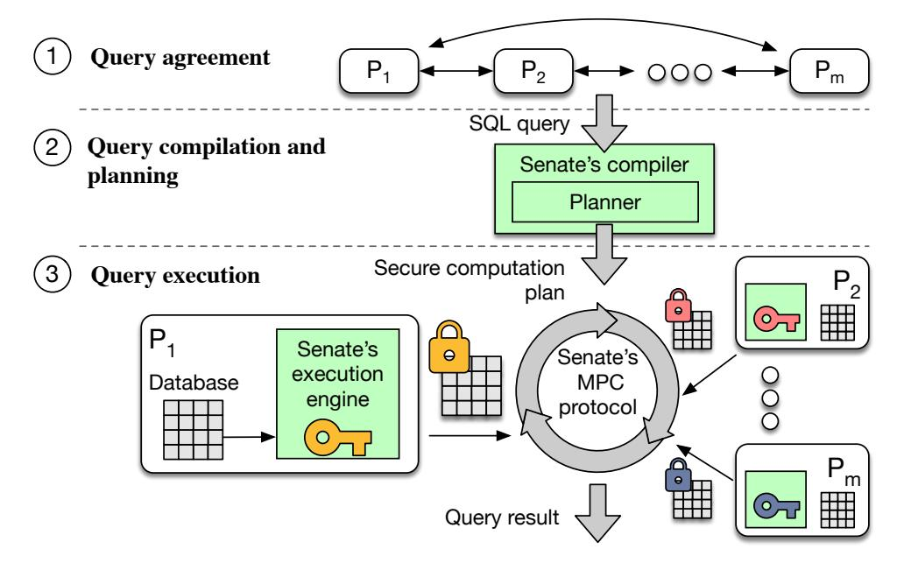

Fig. 1: Overview of Senate's workflow.

assume that each party, even if compromised, follows the protocol faithfully. If any party deviates from the protocol, it can, in principle, extract information about the sensitive data of other parties. This is an unrealistic assumption in many scenarios for two reasons. First, each party running the protocol at their site has full control over what they are actually running. For example, it requires a bank to place the confidentiality of its sensitive business data in the hands of its competitors. If the competitors secretly deviate from the protocol, they could learn information about the bank's data without its knowledge. Second, in many real-world attacks [\[68\]](#page-17-7), attackers are able to install software on the server or obtain control of a server [\[26\]](#page-16-4), thus allowing them to alter the server's behavior.

## <span id="page-0-1"></span>1.1 Senate overview

We present Senate, a platform for secure collaborative analytics with the strong guarantee of *malicious security*. In Senate, even if *m*−1 out of *m* parties fully misbehave and collude, an honest party is guaranteed that nothing leaks about their data other than the result of the agreed upon query. Our techniques come from a synergy of new cryptographic design and insights in query rewriting and planning. A high level overview of Senate's workflow (as shown in [Figure](#page-0-0) 1) is as follows:

Agreement stage. The *m* parties agree on a shared schema for their data, and on a query for which they are willing to share the computation result. This happens before invoking Senate and may involve humans.

Compilation and planning stage. Senate's compiler takes the query and certain size information (described in [§2\)](#page-2-0) as input and outputs a cryptographic execution plan. It runs at each party, deterministically producing the same plan. In particu-

{1}------------------------------------------------

<span id="page-1-0"></span>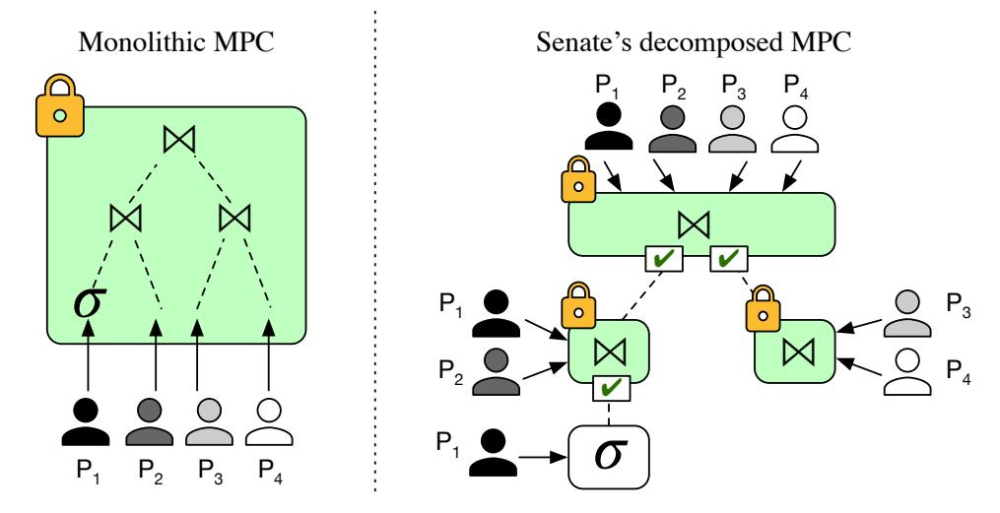

Fig. 2: Query execution in the baseline (monolithic MPC) vs. Senate (decomposed MPC). σ represent a filtering operation, and on is a join. Green boxes with locks denote MPC operations; white boxes denote plaintext computation. X represents additional verification operations added by Senate.

lar, the compiler employs our *consistent and verifiable query splitting* technique in order to minimize the amount of joint computation performed by the parties. Then, the compiler plans the execution of the joint computation using our *circuit decomposition* technique, which can produce a significantly more efficient execution plan.

Execution stage. An execution engine at each party runs the cryptographic execution plan by coordinating with the other parties and routing encrypted intermediate outputs based on the plan. This is done using our efficient *MPC decomposition protocol*, which outputs the query result to all the parties.

## 1.2 Senate's techniques

Designing a maliciously-secure collaborative analytics system is challenging due to the significant overheads of such strong security. Consider simply using a state-of-the-art *m*party maliciously-secure MPC tool such as AGMPC [\[30\]](#page-17-8) which implements the protocol of Wang *et al.* [\[80\]](#page-17-9); we refer to this as the *baseline*. When executing a SQL query with this baseline, the query gets transformed into a single, large Boolean circuit (*i.e.*, a circuit of AND, OR, XOR gates) taking as input the data of the *m* parties. The challenge then is that the *m* parties need to execute a *monolithic* cryptographic computation *together* to evaluate this circuit.

Minimizing joint computation. Prior work [\[4,](#page-16-0) [77\]](#page-17-6) in the semi-honest setting shows that one can significantly improve performance by splitting a query into local computation (the part of the query that touches only one party's data) and the rest of the computation. The former can be executed locally at the party on plaintext, and the latter in MPC; *e.g.*, if a query filters by "disease = flu", the parties need to input only the records matching the filter into MPC as opposed to the entire dataset. In the semi-honest setting, the parties are trusted to perform such local computation faithfully. Unfortunately, this technique no longer works with malicious parties because a malicious party *M* can perform the local computation:

• *incorrectly*. For example, *M* can input records with "disease = HIV" into MPC. This can reveal information

- about another party's "HIV" records, *e.g.*, via a later join operation, when this party might have expected the join to occur only over rows with the value "flu".
- *inconsistently*. For example, if one part of a query selects patients with "age = 25" and another with "age ∈ [20,30]", the first filter's outputs should be included within the second's. However, *M* might provide inconsistent sets of records as the outputs of the two filters.

Senate's *verifiable and consistent query splitting* technique allows Senate to take advantage of local computation via a different criteria than in the semi-honest case. Given a query, Senate's compiler splits the query into a special type of local computation—one that does not introduce inconsistencies and a joint computation, which it annotates with verification of the local computation, in such a way that the verification is faster to execute than the actual computation. For example, [Figure](#page-1-0) 2 shows a 4-party query in which party *P*1's inputs are first filtered (denoted σ). Unlike the baseline execution, Senate enables *P*<sup>1</sup> to evaluate the filter locally on plaintext, and the secure computation proceeds from there on the smaller filtered results; these results are then jointly verified.

Decomposing MPC. In order to decompose the joint computation (instead of evaluating a single, large circuit using MPC) one needs to open up the cryptographic black box. Consider a 4-way join operation (on) among tables of 4 parties, as shown in [Figure](#page-1-0) 2. With the baseline, all 4 parties have to execute the whole circuit. However, if privacy were not a concern, *P*<sup>1</sup> and *P*<sup>2</sup> could join their tables without involving the other parties, *P*<sup>3</sup> and *P*<sup>4</sup> do the same *in parallel*, and then everyone performs the final join on the smaller intermediate results. This is not possible with existing state-of-the-art protocols for MPC, which execute the computation in a *monolithic* fashion.

To enable such decomposition, we design a new cryptographic protocol we call *secure MPC decomposition* ([§4\)](#page-3-0), which may be of broader interest beyond Senate. In the example above, our protocol enables parties *P*<sup>1</sup> and *P*<sup>2</sup> to evaluate their join obtaining an encrypted intermediate output, and then to *securely reshare* this output with parties *P*<sup>3</sup> and *P*<sup>4</sup> as they all complete the final join. The decomposed circuits include verifications of prior steps needed for malicious security. We also develop more efficient Boolean circuits for expressing common SQL operators such as joins, aggregates and sorting ([§6\)](#page-8-0), using a small set of Boolean circuit primitives which we call *m*-SI, *m*-SU and *m*-Sort ([§5\)](#page-7-0).

Efficiently planning query execution. Finally, we develop a new *query planner*, which leverages Senate's MPC decomposition protocol ([§7.1\)](#page-10-0). Unsurprisingly, the circuit representation of a complex query can be decomposed in many different ways. However, the rules governing the cost of each execution plan differ significantly from regular computation. Hence, we develop a *cost model* for our protocol which estimates the cost given a circuit configuration ([§7.2\)](#page-11-0). Senate's query planner selects the most efficient plan based on the cost model.

{2}------------------------------------------------

#### 1.3 Evaluation summary

We implemented Senate and evaluate it in [§8.](#page-12-0) Our decomposition and planning mechanisms result in a performance improvement of up to 10× compared to the monolithic circuit baseline, with up to 11× less resource consumption (memory / network communication), on a set of representative queries. Senate's query splitting technique for local computation can *further* increase performance by as much as 10×, bringing the net improvement to up to 100×. Furthermore, to stress test Senate on more complex query structures, we also evaluate its performance on the TPC-H analytics benchmark [\[76\]](#page-17-10); we find that Senate's improvements range from 3× to 145×.

Though MPC protocols have improved steadily, they still have notable overhead. Given that such collaborative analytics do not have to run in real time, we believe that Senate can already be used for simpler workloads and / or relatively small databases, but is not yet ready for big data analytics. However, we expect faster MPC protocols to continue to appear. The systems techniques in Senate will apply independently of the protocol, and the cryptographic decomposition will likely have a similar counterpart.

## <span id="page-2-0"></span>2 Senate's API and example queries

Senate exposes a SQL interface to the parties. To reason about which party supplies which table in a collaborative setting, we augment the query language with the simple notation *R*|*P* to indicate that table *R* comes from party *P*. Hence, *R*|*P*<sup>1</sup> ∪ *R*|*P*<sup>2</sup> indicates that each party holds a *horizontal* partition of table *R*. One can obtain a *vertical* partitioning, for example, by joining two tables from different parties *R*1|*P*<sup>1</sup> and *R*2|*P*2. Here, we use the ∪ operator to denote a simple concatenation of the tables, instead of a set union (which removes duplicates).

In principle, Senate can support arbitrary queries because it builds on a generic MPC tool. The performance improvement of our techniques, though, is more relevant to joins, aggregates, and filters. We now give three use cases and queries, each from a different domain, which we use as running examples. Query 1. Medical study [\[4\]](#page-16-0). Clostridium difficile (cdiff) is an infection that is often antibiotic-resistant. As part of a clinical research study, medical institutions *P*<sup>1</sup> ...*P<sup>m</sup>* wish to collectively compute the most common diseases contracted by patients with cdiff. However, they cannot share their databases with each other to run this query due to privacy regulations. SELECT diag, COUNT(\*) AS cnt

FROM diagnoses|*P*<sup>1</sup> ∪...∪ diagnoses|*P<sup>m</sup>* WHERE has\_cdiff = 'True' GROUP BY diag ORDER BY cnt LIMIT 10;

Query 2. Prevent password reuse [\[78\]](#page-17-11). Many users unfortunately reuse passwords across different sites. If one of these sites is hacked, the attacker could compromise the account of these users at other sites. As studied in [\[78\]](#page-17-11), sites wish to identify which users reuse passwords across the sites, and can arrange for the salted hashes of the passwords to match if the underlying passwords are the same (and thus be compared to

identify reuse using the query below). However, these sites do not wish to share what other users they have or the hashed passwords of these other users (because they can be reversed).

```
SELECT user_id
FROM passwords|P1 ∪...∪ passwords|Pm
      GROUP BY CONCAT(user_id, password)
      HAVING COUNT(*) > 1;
```

Query 3. Credit scoring agencies do not want to share their databases with each other [\[77\]](#page-17-6) due to business competition, yet they want to identify records where they have a significant discrepancy in a particular financial year. For example, an individual could have a low score with one agency, but a higher score with another; the individual could take advantage of the higher score to obtain a loan they are not entitled to.

```
SELECT c1.ssn
FROM credit_scores|P1 AS c1
...
JOIN credit_scores|Pm AS cm ON c1.ssn = cm.ssn
WHERE GREATEST(c1.credit, ..., cm.credit) -
  LEAST(c1.credit, ..., cm.credit) > threshold
  AND c1.year = 2019 ... AND cm.year = 2019;
```

#### 2.1 Sizing information

Given a query, Senate's compiler first splits the query into local and joint computation. Each party then specifies to the compiler an upper bound on the number of records it will provide as input to the joint computation, following which the compiler maps the joint computation to circuits. These upper bounds are useful because we do not want to leak the size of the parties' inputs, but also want to improve performance by not defaulting to the worst case, *e.g.*, the maximum number of rows in each table. For example, for Query 1, Senate transforms the query so that the parties group their records locally by the column diag and compute local counts per group. In this case, Senate asks for the upper bound on the number of diagnoses per party. In many cases, deducing such upper bounds is not necessarily hard: *e.g.*, it is simple for Query 1 because there is a fixed number of known diseases [\[17\]](#page-16-5). Further, meaningful upper bounds significantly improve performance.

## 3 Threat model and security guarantees

Senate adopts a strong threat model in which a malicious adversary can corrupt *m*−1 out of *m* parties. The corrupted parties may arbitrarily deviate from the protocol and collude with each other. As long as one party is honest, the only information the compromised parties learn about the honest party is the final global query result (in addition to the upper bounds on data size provided to the compiler by the parties, and the query itself).

More formally, we define an ideal functionality FMPC·tree [\(Functionality](#page-6-0) 2, [§4.3\)](#page-5-0) for securely executing functions represented as a tree of circuits, while placing some restrictions on the structure of the tree. We then develop a protocol that realizes this functionality and prove the security of our protocol

{3}------------------------------------------------

(per Theorem 2, §4.3) according to the definition of security for (standalone) maliciously secure MPC [38], as captured formally by the following definition:

<span id="page-3-1"></span>**Definition 1.** Let  $\mathcal{F}$  be an m-party functionality, and let  $\Pi$  be an m-party protocol that computes  $\mathcal{F}$ . Protocol  $\Pi$  is said to securely compute  $\mathcal{F}$  in the presence of static malicious adversaries if for every non-uniform PPT adversary A for the real model, there exists a non-uniform PPT adversary  $\mathcal{S}$  for the ideal model, such that for every  $I \subset [m]$ 

$$\{ \text{IDEAL}_{\mathcal{F},I,\mathcal{S}(z)}(\bar{x}) \}_{\bar{x},z} \stackrel{\text{c}}{=} \{ \text{REAL}_{\Pi,I,\mathcal{A}(z)}(\bar{x}) \}_{\bar{x},z}$$
where  $\bar{x} = (x_1, \dots, x_m)$  and  $x_i \in \{0,1\}^*$ .

Here,  $IDEAL_{\mathcal{F},I,\mathcal{S}(z)}(\bar{x})$  denotes the joint output of the honest parties and  $\mathcal{S}$  from the ideal world execution of  $\mathcal{F}$ ; and  $REAL_{\Pi,I,\mathcal{A}(z)}(\bar{x})$  denotes the joint output of the honest parties and  $\mathcal{A}$  from the real world execution of  $\Pi$  [38].

As with malicious MPC, we cannot control what data a party chooses to input. The parties can, if they wish, augment the query to run tests on the input data (e.g., interval checks). Senate also does not intend to maintain consistency of the datasets input by a party across different queries as the dataset could have changed in the meantime. If this is desired, Senate could in principle support this by writing multiple queries as part of a single bigger query, at the expense of performance.

Note that the query result might leak information about the underlying datasets, and the parties should choose carefully what query results they are willing to share with each other. Alternatively, it may be possible to integrate techniques such as differential privacy [28,45] with Senate's MPC computation, to avoid leaking information about any underlying data sample; we discuss this aspect in more detail in §9.

### <span id="page-3-0"></span>4 Senate's MPC decomposition protocol

In this section we present Senate's *secure MPC decomposition* protocol, the key enabler of our compiler's planning algorithm. Our protocol may be of independent interest, and we present the cryptography in a self-contained way.

Suppose that m parties,  $P_1, \ldots, P_m$ , wish to securely compute a function f, represented by a circuit C, on their private inputs  $x_i$ . This can be done easily given a state-of-the-art MPC protocol by having all the parties collectively evaluate the entire circuit using the protocol. However, the key idea in Senate is that if f can be "nicely" decomposed into multiple sub-circuits, we can achieve a protocol with a significantly better concrete efficiency, by having only a *subset* of the parties participate in the secure evaluation of each sub-circuit.

For example, consider a function  $f(x_1,...,x_m)$  that can be evaluated by separately computing  $y_1 = h_1(x_1,...,x_i)$  on the inputs of parties  $P_1...P_i$ , and  $y_2 = h_2(x_{i+1},...,x_m)$  on the inputs of parties  $P_{i+1}...P_m$ , followed by  $\tilde{f}(y_1,y_2)$ . That is,

$$f(x_1,...,x_m) = \tilde{f}(h_1(x_1,...,x_i),h_2(x_{i+1},...,x_m)).$$

Such a decomposition of f allows parties  $P_1, \ldots, P_i$  to securely evaluate  $h_1$  on their inputs (using an MPC protocol)

and obtain output  $y_1$ . In parallel, parties  $P_{i+1}, \ldots, P_m$  securely evaluate  $h_2$  to get  $y_2$ . Finally, all parties securely evaluate  $\tilde{f}$  on  $y_1, y_2$  and obtain the final output y. We observe that such a decomposition may lead to a more efficient protocol for computing f, since the overall communication and computation complexity of state-of-the-art concretely efficient MPC protocols (e.g., [49, 80]) is at least quadratic in the number of involved parties. Furthermore, sub-circuits involving disjoint sets of parties can be evaluated in parallel.

Although appealing, this idea has some caveats:

- 1. In a usual ("monolithic") secure evaluation of f, the intermediate values  $y_1, y_2$  remain secret, whereas the decomposition above reveals them to the parties as a result of an intermediate MPC protocol.
- 2. Suppose that  $h_1$  is a *non-easily-invertible* function (*e.g.*, pre-image resistant hash function). If all of  $P_1, \ldots, P_i$  collude, they can pick an arbitrary "output"  $y_1$ , even without evaluating  $h_1$ , and input it to  $\tilde{f}$ . Since  $h_1$  is non-invertible, it is infeasible to find a pre-image of  $y_1$ ; thus, such behavior is not equivalent to the adversary's ability to provide an input of its choice (as allowed in the malicious setting). In addition, such functions introduce problems in the proof's simulation as a PPT simulator cannot extract the corrupted parties' inputs with high probability. This attack, however, would not have been possible if f had been computed entirely by all of  $P_1, \ldots, P_m$  in a *monolithic* MPC.
- 3. If one party is involved in multiple sub-circuits and is required to provide the same input to all of them, then we have to make sure that its inputs are consistent.

In this section we show how to deal with the above problems, by building upon the MPC protocol of Wang *et al.* [80].

First, we show how to securely transfer the output of one garbled circuit as input to a subsequent garbled circuit, an action called *soldering* (§4.2). Our soldering is inspired by previous soldering techniques proposed in the MPC literature [2, 13, 33–36, 42, 50, 53, 56, 65, 70]. Here, we make the following contributions. To the best of our knowledge, Senate is the first work to design a soldering technique for the state-of-the-art protocol of Wang *et al.* [80]. More importantly, whereas previous uses of soldering were limited to cases in which the *same set of parties* participate in both circuits, we show how to solder circuits when the first set of parties *is a subset of* the set of parties involved in the second circuit. This property is crucial for the performance of the individual subcircuits in our overall protocol, as most of them can now be evaluated by non-overlapping subsets of parties, in parallel.

Second, as observed above, the decomposition of a function for MPC cannot be arbitrary. We therefore formalize the class of decompositions that are *admissible* for MPC ( $\S4.3$ ). Informally, we require that every sub-computation evaluated by less than m parties must be efficiently invertible. This fits the ability of a malicious party to choose its input before providing it to the computation.

Furthermore, we define the admissible circuit structures

{4}------------------------------------------------

to be *trees* rather than directed acyclic graphs. That is, the function's decomposition may only take the form of a tree of sub-computations, and not an arbitrary graph. This is because if a node provides input to more than one parent node and all the parties at the node are corrupted, they may collude to provide inconsistent inputs to the different parents. We therefore circumvent this input consistency problem by restricting valid decompositions to trees alone. Even so, as we show in later sections, this model fits SQL queries particularly well, since many SQL queries can be naturally expressed as a tree of operations.

#### 4.1 Background

We start by briefly introducing the cryptographic tools that our MPC protocol builds upon. In particular, we build upon the maliciously-secure garbled circuit protocol of Wang *et al.* [80] (hereafter referred to as the WRK protocol).

Information-theoretic MACs (IT-MACs). IT-MACs [64] enable a party  $P_j$  to authenticate a bit held by another party  $P_i$ . Suppose  $P_i$  holds a bit  $x \in \{0,1\}$ , and  $P_j$  holds a key  $\Delta_j \in \{0,1\}^{\kappa}$  (where  $\kappa$  is the security parameter).  $\Delta_j$  is called a *global key* and  $P_j$  can use it to authenticate multiple bits across parties. Now, for  $P_j$  to be able to authenticate x,  $P_j$  is given a random *local key*  $K_j[x] \in \{0,1\}^{\kappa}$  and  $P_i$  is given the corresponding MAC tag  $M_j[x]$  such that:

$$M_j[x] = K_j[x] \oplus x\Delta_j$$
.

 $P_j$  does not know the bit x or the MAC, and  $P_i$  does not know the keys; thus,  $P_i$  can later reveal x and its MAC to  $P_j$  to prove it did not tamper with x. In this manner,  $P_i$ 's bit x can be authenticated to more than one party—each party j holds a global key  $\Delta_j$  and local key for x,  $K_j[x]$ .  $P_i$  holds all the corresponding MAC tags  $\{M_j[x]\}_{j\neq i}$ . We write  $[x]^i$  to denote such a bit where x is known to  $P_i$ , and is authenticated to all other parties. Concretely,  $[x]^i$  means that  $P_i$  holds  $(x, \{M_j[x]\}_{j\neq i})$ , and every other party  $P_j \neq P_i$  holds  $K_j[x]$  and  $\Delta_j$ .

Note that  $[x]^i$  is XOR-homomorphic: given two authenticated bits  $[x]^i$  and  $[y]^i$ , it is possible to compute the authenticated bit  $[z]^i$  where  $z = x \oplus y$  by simply having each party compute the XOR of the MAC / keys locally.

Authenticated secret shares. In the above construction, x is known to a single party and authenticated to the rest. Now suppose that x is *shared* amongst all parties such that no subset of parties knows x. In this case, each  $P_i$  holds  $x^i$  such that  $x = \bigoplus_i x^i$ . To authenticate x, we can use IT-MACs on each share  $x^i$  and distribute the authenticated shares  $[x^i]^i$ . We write  $\langle x \rangle_{\Delta}$  to denote the collection of authenticated shares  $\{[x^i]^i\}_i$  under the global keys  $\Delta = \{\Delta_i\}_i$ . We omit the subscript in  $\langle x \rangle_{\Delta}$  if the global keys are clear from context. One can show that  $\langle x \rangle$  is XOR-homomorphic, *i.e.*, given  $\langle x \rangle$  and  $\langle y \rangle$  the parties can locally compute  $\langle z \rangle$  where  $z = x \oplus y$ .

Garbled circuits and the WRK protocol. Garbled circuits [6,7,82] are a commonly used cryptographic primitive in MPC constructions. Formally, an m-party garbling scheme

is a pair of algorithms (Garble, Eval) that allows a secure evaluation of a (typically Boolean) circuit C. To do so, the parties first invoke Garble with C, and obtain a garbled circuit G(C) and some extra information (each party may obtain its own secret extra information). Then, given the input  $x_i$  to party  $P_i$ , the parties invoke Eval with  $\{x_i\}_i$  and obtain the evaluation output y. (This is a simplification of a garbling scheme in many ways, but this abstraction suffices to understand the WRK protocol below.) Typically, constructions utilizing a garbling scheme are in the *offline-online* model, in which they may invoke Garble offline when they agree on the circuit C, and only later they learn their inputs  $\{x_i\}_i$  to the computation.

The WRK protocol [80] is the state-of-the-art garbled circuit protocol that is maliciously-secure even when m-1 out of m parties are corrupted. WRK follows the same abstraction described above, with its own format for a garbled circuit; thus, we denote its garbling scheme by (WRK · Garble, WRK · Eval). Our construction does not modify the inner workings of the protocol; therefore, we describe only its input and output layers, but elide internal details for simplicity.

WRK · Garble: Given a Boolean circuit C, the protocol outputs a garbled circuit G(C). The garbling scheme authenticates the circuit by maintaining IT-MACs on all input/output wires, as follows. Each party  $P_i$  obtains a global key  $\Delta_i$  for the circuit. In addition, each wire w in the circuit is associated with a random "masking" bit  $\lambda_w$  which is output to the parties as  $\langle \lambda_w \rangle_{\Delta}$ .

WRK · Eval: The protocol is given a garbled circuit G(C). Then, for a party  $P_i$  who wishes to input  $b_w$  to input wire w, we have the parties input  $\hat{b}_w = b_w \oplus \lambda_w$  instead; in addition, instead of receiving the real output bit  $b_v$  the parties receive a masked bit  $\hat{b}_v = b_v \oplus \lambda_v$ . Note that  $\lambda_w$  and  $\lambda_v$  should be kept secret from the parties (except from the party who inputs  $b_w$  or receives  $b_v$ , respectively). The procedures by which parties privately translate masked values to real values and vice versa are simple and not part of the core functionality, as we describe below.

Using the above abstractions, the overall WRK protocol is simple and can be described as follows:

- 1. *Offline*. The parties invoke WRK · Garble on C and obtain G(C) and  $\langle \lambda_w \rangle$  for every input/output wire w.
- 2. Online.
  - (a) *Input*. If an input wire w is associated with party  $P_i$ , who has the input bit  $b_w$ , then the parties reconstruct  $\lambda_w$  to  $P_i$ . Then,  $P_i$  broadcasts the bit  $\hat{b}_w = b_w \oplus \lambda_w$ .
  - (b) *Evaluation*. The parties invoke WRK · Eval on G(C) and the bit  $\hat{b}_w$  for every input wire w. They obtain a bit  $\hat{b}_v = b_v \oplus \lambda_v$  for every output wire v.
  - (c) *Output*. To reveal bit  $b_v$  of an output wire v, the parties publicly reconstruct  $\lambda_v$  and compute  $b_v = \hat{b}_v \oplus \lambda_v$ .

<span id="page-4-1"></span><span id="page-4-0"></span><sup>&</sup>lt;sup>1</sup>In fact, it does so for all the wires in the circuit; we omit this detail as we focus on the input / output interface.

{5}------------------------------------------------

#### 4.2 Soldering wires of WRK garbled circuits

The primary technique in Senate is to securely transfer the *actual value* that passes through an output wire of one circuit, without revealing that value, to the input wire of another circuit. This action is called *soldering* [65]. We observe that the WRK protocol enjoys the right properties that enable soldering of its wires *almost for free*. In addition, we show how to extend the soldering notion even to cases where the set of parties who are engaged in the 'next' circuit is a superset of the set of parties engaged in the current one. This was not known until now. We believe this extension is of independent interest and may have more applications beyond Senate.

Specifically, we wish to securely transfer the (hidden) output  $b_v = \hat{b}_v \oplus \lambda_v$  on output wire v of  $G(C_1)$  to the input wire u of  $G(C_2)$ . 'Securely' means that  $b_v = b_u$  should hold while keeping both  $b_u$  and  $b_v$  secret from the parties. To achieve this, the parties need to securely compute the masked value of the input to the next circuit, as expected by the WRK protocol:

$$\hat{b}_u = \lambda_u \oplus b_u = \lambda_u \oplus b_v = \lambda_u \oplus \lambda_v \oplus \hat{b}_v$$

and input it to WRK · Eval for the next circuit.

Note that the parties already hold the three terms on the right hand side of the above equation—WRK · Eval outputs  $\hat{b}_{\nu}$  to the parties as a masked output when evaluating  $G(C_1)$ , and the parties hold  $\langle \lambda_{\nu} \rangle$  and  $\langle \lambda_{u} \rangle$  as output from WRK · Garble on  $C_1$  and  $C_2$  respectively. Thus, one attempt to obtain  $\hat{b}_{u}$  might be to have the parties compute the shares of  $\langle \lambda_{u} \oplus \lambda_{\nu} \oplus \hat{b}_{\nu} \rangle$  using XOR-homomorphism, and then publicly reconstruct it. However, this operation is *not defined* unless the global key that each party uses in the constituent terms is the *same*. Since we do not modify the construction of WRK · Garble and WRK · Eval, the global keys in the two circuits (and hence in  $\langle \lambda_{\nu} \rangle$  and  $\langle \lambda_{u} \rangle$ ) are different with high probability.

We overcome this limitation using the functionality  $\mathcal{F}_{\mathsf{Solder}}$ :

### **FUNCTIONALITY 1.** $\mathcal{F}_{Solder}(v, u) - Soldering$

**Inputs.** Parties in set  $\mathcal{P}_1$  agree on  $\hat{b}_{\nu}$  and have  $\langle \lambda_{\nu} \rangle_{\Delta}$  authenticated under global keys  $\{\Delta_i\}_{i \in \mathcal{P}_1}$ . Parties in set  $\mathcal{P}_2$  (where  $\mathcal{P}_1 \subseteq \mathcal{P}_2$ ) have  $\langle \lambda_u \rangle_{\tilde{\Delta}}$  authenticated under global keys  $\{\tilde{\Delta}_i\}_{i \in \mathcal{P}_2}$ .

**Outputs.** Compute  $\hat{b}_u = \lambda_u \oplus \lambda_v \oplus \hat{b}_v$ . Then,

- Output  $\delta_i = \Delta_i \oplus \tilde{\Delta}_i$  for all  $P_i \in \mathcal{P}_1$  to parties in  $\mathcal{P}_1$ .
- Output  $\lambda_v^i \oplus \lambda_u^i$  for all  $P_i \in \mathcal{P}_1$  to parties in  $\mathcal{P}_1$ .
- Output  $\lambda_u^i$  for all  $P_i \in \mathcal{P}_2 \setminus \mathcal{P}_1$  to everyone.
- If  $\langle \lambda_{\nu} \rangle_{\Delta}$  and  $\langle \lambda_{u} \rangle_{\tilde{\Delta}}$  are valid then output  $\hat{b}_{u}$  to parties in  $\mathcal{P}_{2}$ .
- Otherwise, output  $\hat{b}_u$  to the adversary and  $\perp$  to the honest parties.

Before proceeding, note that  $\mathcal{F}_{Solder}$  satisfies our needs:  $\mathcal{P}_1$  and  $\mathcal{P}_2$  are engaged in evaluating garbled circuits  $\mathsf{G}(C_1)$  and  $\mathsf{G}(C_2)$  respectively. v is an output wire of  $\mathsf{G}(C_1)$ , and u is an input wire of  $\mathsf{G}(C_2)$ . The parties in  $\mathcal{P}_2$  want to transfer the actual value that passes through v, namely  $b_v$ , to  $\mathsf{G}(C_2)$ . That is, they want the actual value that would pass through u to be  $b_v$  as well. However, they do not know  $b_v$ , but only the masked

value  $\hat{b}_v$ . Thus, by using  $\mathcal{F}_{Solder}$ , they can obtain exactly what they need in order to begin evaluating  $G(C_2)$  with  $b_u = b_v$ .

Along with the soldered result  $\hat{b}_u$ , functionality  $\mathcal{F}_{\mathsf{Solder}}$  also reveals additional information to the parties—specifically, the values of  $\delta_i$  (for all  $P_i \in \mathcal{P}_1$ );  $\lambda_v^i \oplus \lambda_u^i$  (for all  $P_i \in \mathcal{P}_1$ ); and  $\lambda_u^i$  (for all  $P_i \in \mathcal{P}_2 \setminus \mathcal{P}_1$ ). We model this extra leakage in the functionality as this information is revealed by our protocol that instantiates  $\mathcal{F}_{\mathsf{Solder}}$ . However, we will show that this does not affect the security of our overall MPC protocol.

**Instantiating**  $\mathcal{F}_{Solder}$ . We start by defining a procedure for XOR-ing authenticated shares under *different* global keys, which we denote  $\boxplus$ . That is,  $\langle x \rangle_{\Delta} \boxplus \langle y \rangle_{\tilde{\Delta}}$  outputs  $\langle x \oplus y \rangle_{\tilde{\Delta}}$ .

We observe that it is possible to implement  $\boxplus$  in a very simple manner: every party  $P_i$  only needs to broadcast the difference of the two global keys:  $\delta_i = \Delta_i \oplus \tilde{\Delta}_i$ . Using this, the parties can switch the underlying global keys of  $\langle x \rangle$  from  $\Delta_i$  to  $\tilde{\Delta}_i$  by having each party  $P_i$  compute new authentications of  $x^i$ , denoted  $M'_i[x^i]$ , as follows. For every  $j \neq i$ ,  $P_i$  computes

$$M'_{j}[x^{i}] = M_{j}[x^{i}] \oplus x^{i}\delta_{j}$$
  
=  $K_{j}[x^{i}] \oplus x^{i}\Delta_{j} \oplus x^{i}\delta_{j} = K_{j}[x^{i}] \oplus x^{i}\tilde{\Delta}_{j}$ 

So now, x is shared and authenticated under the new global keys  $\{\tilde{\Delta}_i\}_i$ . Given this procedure, we can realize  $\mathcal{F}_{\mathsf{Solder}}$  as follows: the parties first compute  $\langle b_v \rangle_{\Delta} = \langle \lambda_v \rangle_{\Delta} \oplus \hat{b}_v$ ; <sup>2</sup> the parties then compute  $\langle \hat{b}_u \rangle_{\tilde{\Delta}} = \langle b_v \rangle_{\Delta} \boxplus \langle \lambda_u \rangle_{\tilde{\Delta}}$ , and reconstruct  $\hat{b}_u$  by combining their shares.

Note that the description above (implicitly) assumes that  $\mathcal{P}_1 = \mathcal{P}_2$ ; however, if  $\mathcal{P}_1 \subset \mathcal{P}_2$  then the  $\boxplus$  protocol does not make sense because parties in  $\mathcal{P}_2$  that are not in  $\mathcal{P}_1$  do not have a global key  $\Delta_i$  corresponding to  $\langle x \rangle_{\Delta}$ . Forcing them to participate in the  $\boxplus$  protocol with  $\Delta_i = 0$  would result in a complete breach of security as it would reveal  $\delta_i = \Delta_i \oplus \tilde{\Delta}_i = \tilde{\Delta}_i$ , which must remain secret! We resolve this problem in the protocol  $\Pi_{\mathsf{Solder}}$  (Protocol 1) which extends  $\boxplus$  to the case where  $\mathcal{P}_1 \subset \mathcal{P}_2$ .

**Theorem 1.** Protocol  $\Pi_{Solder}$  securely computes functionality  $\mathcal{F}_{Solder}$  (per Definition 1) in the presence of a static adversary that corrupts an arbitrary number of parties.

We defer the proof to an extended version of our paper.

### <span id="page-5-0"></span>4.3 Secure computation of circuit trees

Given a SQL query, Senate decomposes the query into a tree of circuits, where each *non-root* node (circuit) in the tree involves only a subset of the parties. We now describe how the soldering technique can be used to evaluate trees of circuits, while preserving the security of the overall computation. To this end, we first formalize the class of circuit trees that represent valid decompositions with respect to our protocol; then, we concretely describe our protocol for executing such trees.

We start with some preliminary definitions and notation. A *circuit tree T* is a tree whose internal nodes are circuits,

<span id="page-5-1"></span><sup>&</sup>lt;sup>2</sup>XOR homomorphism works also when one literal is a constant, rather than an authenticated sharing.

{6}------------------------------------------------

#### <span id="page-6-1"></span>**PROTOCOL 1.** $\Pi_{Solder}$ – *Soldering*

Denote by  $\langle \lambda_u^{\mathcal{P}_1} \rangle_{\tilde{\Delta}}$  the authenticated secret shares of  $\lambda_u$  held by parties in  $\mathcal{P}_1$  only. That is  $\lambda_u^{\mathcal{P}_1} = \bigoplus_{i:P_i \in \mathcal{P}_1} \lambda_u^i$ .

1. The parties in  $\mathcal{P}_1$  reconstruct  $\langle \hat{b}_u^{\mathcal{P}_1} \rangle_{\tilde{\Delta}} = (\hat{b}_v \oplus \langle \lambda_v \rangle_{\Delta}) \boxplus \langle \lambda_u^{\mathcal{P}_1} \rangle_{\tilde{\Delta}}$ . Specifically, each party  $P_i \in \mathcal{P}_1$  broadcasts: (a) the bit  $\hat{b}_u^i = \lambda_v^i \oplus \lambda_u^i$ , and (b) the difference  $\delta_i = \Delta_i \oplus \tilde{\Delta}_i$ . After receiving  $\hat{b}_u^j$  and  $\delta_j$  from every  $P_j \in \mathcal{P}_1$ , it computes

$$\hat{b}_{u}^{\mathcal{P}_{1}} = \hat{b}_{v} \oplus \bigoplus_{i:P_{i} \in \mathcal{P}_{1}} \hat{b}_{u}^{i}, 
M_{j}[\hat{b}_{u}^{i}] = M_{j}[\lambda_{v}^{i} \oplus \lambda_{u}^{i}] = M_{j}[\lambda_{v}^{i}] \oplus M_{j}[\lambda_{u}^{i}] \oplus \lambda_{v}^{i} \cdot \delta_{j} = (K_{j}[\lambda_{v}^{i}] \oplus \lambda_{v}^{i} \cdot \Delta_{j}) \oplus (K_{j}[\lambda_{u}^{i}] \oplus \lambda_{u}^{i} \cdot \tilde{\Delta}_{j}) \oplus (\lambda_{v}^{i} \cdot \delta_{j}) 
= K_{j}[\lambda_{v}^{i}] \oplus K_{j}[\lambda_{u}^{i}] \oplus \lambda_{v}^{i} \cdot (\Delta_{j} \oplus \delta_{j}) \oplus \lambda_{u}^{i} \cdot \tilde{\Delta}_{j} = K_{j}[\lambda_{v}^{i}] \oplus K_{j}[\lambda_{u}^{i}] \oplus (\lambda_{v}^{i} \oplus \lambda_{u}^{i}) \cdot \tilde{\Delta}_{j} \text{ and} 
K_{i}[\hat{b}_{u}^{j}] = K_{i}[\lambda_{v}^{j}] \oplus K_{i}[\lambda_{u}^{j}]$$

for every  $j \in \mathcal{P}_1$  and broadcasts  $M_j[\hat{b}_u^i]$ .

- 2. Parties  $P_i \in \mathcal{P}_2 \setminus \mathcal{P}_1$  broadcast  $\lambda_u^i$  and  $M_i[\lambda_u^i]$  for all  $j \in \mathcal{P}_2$ .
- 3. Parties  $P_i \in \mathcal{P}_1$  verify that  $K_i[\hat{b}_u^j] \oplus \hat{b}_u^j \cdot \tilde{\Delta}_i = M_i[\hat{b}_u^j]$  for all  $j \in \mathcal{P}_1$ .
- 4. Parties  $P_i \in \mathcal{P}_2$  verify that  $K_i[\lambda_u^j] \oplus \lambda_u^j \cdot \tilde{\Delta}_i = M_i[\lambda_u^j]$  for all  $j \in \mathcal{P}_2 \setminus \mathcal{P}_1$ .
- 5. If verification fails, output  $\perp$  and abort. Otherwise, output

$$\hat{b}_u = \left(\bigoplus_{P_i \in \mathcal{P}_2} \lambda_u^i\right) \oplus b_u = \left(\bigoplus_{P_i \in \mathcal{P}_1} \lambda_u^i\right) \oplus \left(\bigoplus_{P_i \in \mathcal{P}_2 \setminus \mathcal{P}_1} \lambda_u^i\right) \oplus b_u = \hat{b}_u^{\mathcal{P}_1} \oplus \left(\bigoplus_{P_i \in \mathcal{P}_2 \setminus \mathcal{P}_1} \lambda_u^i\right)$$

and the leaves are the tree's input wires (which are also input wires to some circuit in the tree). Each node that provides input to an internal node C in the tree is a child of C. Since T is a tree, this implies that all of a child's output wires may only be fed as input to a single parent node in the tree.

We denote a circuit C's and a tree T's input wires by  $\mathcal{I}(C)$  and  $\mathcal{I}(T)$  respectively. Each wire  $w \in \mathcal{I}(T)$  is associated with one party  $P_i$ , in which case we write  $\operatorname{parties}(w) = P_i$ . Let  $G_1, \ldots, G_k$  be C's children, we define  $\operatorname{parties}(C) = \bigcup_{i=1}^k \operatorname{parties}(G_i)$ . Note that we assume, without loss of generality, that the root circuit  $C \in T$  has  $\operatorname{parties}(C) = \{P_1, \ldots, P_m\}$  (*i.e.*, it involves inputs from all parties). Our goal is to achieve secure computation for circuit trees; however, as discussed earlier, our construction does not support arbitrary trees. We now describe formally what can be achieved.

**Definition 2.** A circuit  $C : \mathcal{D} \to \mathcal{R}$  (where  $\mathcal{D} \subseteq \{0,1\}^k$  is C's domain and  $\mathcal{R} \subseteq \{0,1\}^\ell$  is the range) is invertible if there is a polynomial time algorithm  $\mathcal{A}$  (in the size of the circuit |C|) such that given  $y \in \{0,1\}^\ell$ :

$$\mathcal{A}(y) = \begin{cases} x \text{ such that } x \in \mathcal{D} \text{ and } C(x) = y & \text{if } y \in \mathcal{R} \\ \bot & \text{if } y \notin \mathcal{R} \end{cases}$$

Note that in the definition above, the circuit C need not be "full range", *i.e.*, its range may be a subset of  $\{0,1\}^{\ell}$ . In such cases, we require that it is "easy" to verify that a given value  $y \in \{0,1\}^{\ell}$  is also in  $\mathcal{R}$ . By easy we mean that it can be verified by a polynomial-size circuit. We also denote by  $\operatorname{ver}_C(y)$  the circuit that checks whether a value  $y \in \{0,1\}^{\ell}$  is in  $\mathcal{R}$  and returns 0 or 1 accordingly. Note that given a tree of circuits, the range of an intermediate circuit depends not

only on the circuit's computation, but also on the ranges of its children because they limit the circuit's domain. Thus, these ranges need to be deduced topologically for the tree, using which the  $ver_C$  circuit is manually crafted.

<span id="page-6-2"></span>**Definition 3.** For t < m, the class of t-admissible circuit trees, denoted T(t), contains all circuit trees T, such that C is invertible for all  $C \in T$  where  $|\mathsf{parties}(C)| \le t$ . In addition, each circuit C that is parent to circuits  $G_1, \ldots, G_k$  has  $\mathsf{ver}_{G_1}, \ldots, \mathsf{ver}_{G_k}$  embedded within it as sub-circuits, and  $\mathsf{parties}(C) = \bigcup_{i=1}^k \mathsf{parties}(G_i)$ .

The above suggests that there may indeed be non-invertible circuits (e.g., a preimage resistant hash) in the tree; the only restriction is that such a circuit should be evaluated by more than t parties. The definition of MPC for circuit trees follows the general definition of MPC [38], as presented below.

### <span id="page-6-0"></span>**FUNCTIONALITY 2.** $\mathcal{F}_{MPC\text{-tree}}$ – MPC for circuit trees

**Parameters.** A circuit tree T and parties  $P_1, \ldots, P_m$ . **Inputs.** For each  $w \in \mathcal{I}(T)$  where  $P_i = \mathsf{parties}(w)$ , wait for an input bit  $b_w$  from  $P_i$ .

**Outputs.** The bit  $b_w$  for every w in T's output wires, given by evaluating T in a topological order from leaves to root.

We realize  $\mathcal{F}_{\mathsf{MPC}\cdot\mathsf{tree}}$  using the protocol  $\Pi_{\mathsf{MPC}\cdot\mathsf{tree}}$  (Protocol 2), which is our overall protocol for securely executing circuit trees. The protocol works as follows. In the offline phase the parties simply garble all circuits using WRK · Garble; each circuit is garbled independently from the others. Then, beginning from the tree's leaf nodes, the parties evaluate the

{7}------------------------------------------------

### <span id="page-7-2"></span>PROTOCOL 2. ΠMPC·tree *- MPC for circuit trees*

Parameters. The circuit tree *T*. Parties *P*1,...,*Pm*. Inputs. For *w* ∈ I(*T*), *P<sup>i</sup>* = parties(*w*) has *b<sup>w</sup>* ∈ {0,1}. Protocol.

- 1. *Offline.* For every circuit *C* ∈ *T*, parties(*C*) run WRK·Garble(*C*) to obtain G(*C*) along with hλ*w*i for all input and output wires *w*.
- 2. *Online.* For each circuit *C* in *T* (topologically) do:
  - (a) *Input.* For every *u* ∈ I(*C*): If *u* ∈ I(*T*) and *P<sup>i</sup>* = parties(*u*) then parties(*C*) reconstruct λ*u* to *Pi* . Else, if *u* is connected to an output wire *v* of a child circuit *C* 0 then run FSolder(*v*,*u*), by which parties(*C*) obtain *b*ˆ *u*.
  - (b) *Evaluate.* Run WRK·Eval on G(*C*) and *b*ˆ *u* for every *u* ∈ I(*C*), by which parties(*C*) obtain *b*ˆ *v* for every *C*'s output wire *v*. If *G*1,...,*G<sup>c</sup>* are *C*'s children then abort if an intermediate value ver(*Gi*) = 0 for some *i* ∈ [*c*].
  - (c) *Output.* If *C* is the root of *T*, reconstruct hλ*w*i for every *w* ∈ O(*C*), by which all parties obtain *b<sup>w</sup>* = *w*ˆ ⊕λ*w*.

circuits using WRK·Eval, such that each circuit *C* is evaluated only by parties(*C*) (not all the parties). When a value on an output wire of some circuit *C* 0 should travel privately to the input wire of the next circuit *C* then parties(*C*) run the soldering protocol. As discussed above, parties(*C* 0 ) may be a subset of parties(*C*). Once all the nodes have been evaluated, the parties operate exactly as in the WRK protocol in order to reveal the actual value on the output wire.

We prove the security of protocol ΠMPC·tree per the following theorem in an extended version of our paper. We remark that our protocol inherits the random oracle assumption from its use of the WRK protocol.

<span id="page-7-1"></span>Theorem 2. *Let t* < *m be the number of parties corrupted by a static adversary. Then, protocol* ΠMPC·tree *securely computes* FMPC·tree *(per [Definition](#page-3-1) 1) for any T* ∈ T (*t*)*, in the random oracle model and the* FSolder*-hybrid model.*

We stress that intermediate values (output wires of internal nodes) are authenticated secret shares, each using fresh randomness, and thus kept secret from the adversary. In particular, the adversary's input is independent of these values.

Note that by our construction, if there is a sub-tree rooted at a circuit *C* such that parties(*C*) are all corrupted, then the adversary may skip the 'secure computation' of that subtree and simply provide inputs directly to *C*'s parent. This, however, does not form a security issue because a malicious adversary may change its input anyway, and the sub-tree is invertible—hence, whatever input is given to *C*'s parent, it can be used to extract *some* possible adversary's input to the tree's input wires (and hence to the functionality) that leads to the target output from the functionality.

<span id="page-7-0"></span>In the following sections, we describe how Senate executes SQL queries by transforming them into circuit trees that can be securely executed using our protocol.

## 5 Senate's circuit primitives

Senate executes a query by first representing it as a tree of Boolean circuits, and then processing the circuit tree using its efficient MPC protocol. To construct the circuits, Senate uses a small set of circuit primitives which we describe in turn. In later sections, we describe how Senate composes these primitives to represent SQL operations and queries.

#### 5.1 Filtering

Our first building block is a simple circuit (Filter) that takes a list of elements as input, and passes each element through a sub-circuit that compares it with a specified constant. If the check passes, it outputs the element, else it outputs a zero.

#### 5.2 Multi-way set intersection

Next, we describe a circuit for computing a *multi-way* set intersection. Prior work has mainly focused on designing Boolean circuits for two-way set intersections [\[12,](#page-16-11) [43\]](#page-17-25); here we design optimized circuits for intersecting multiple sets. Our circuit extends the two-way SCS circuit of Huang *et al.* [\[43\]](#page-17-25). We start by providing a brief overview of the SCS circuit, and then describe how we extend it to multiple sets.

The two-way set intersection circuit (2-SI). The sortcompare-shuffle circuit of Huang *et al.* [\[43\]](#page-17-25) takes as input two sorted lists of size *n* each with *unique* elements, and outputs a list of size *n* containing the intersection of the lists interleaved with zeros (for elements that are not in the intersection). (1) The circuit first merges the sorted lists. (2) Next, it filters intersecting elements by comparing adjacent elements in the list, producing a list of size *n* that contains all filtered elements interleaved with zeros. (3) Finally, it shuffles the filtered elements to hide positional information about the matches.

In Senate's use cases, set intersection results are often not the final output of an MPC computation, and are instead intermediate results upon which further computation is performed. In such cases, the shuffle operation is not performed.

A multi-way set intersection circuit (*m*-SI). Suppose we wish to compute the intersection over three sets *A*,*B* and *C*. A straightforward approach is to compose two 2-SI circuits together into a larger circuit (*e.g.*, as 2-SI(2-SI(*A*,*B*),*C*)). However, such an approach doesn't work out-of-the-box because the intermediate output *O* = 2-SI(*A*,*B*) needs to be sorted before it can be intersected with *C*, as expected by the next 2-SI circuit. While one can accomplish this by sorting the output, it comes at the cost of an extra *O*(*n*log<sup>2</sup> *n*) gates.

Instead of performing a full-fledged sort, we exploit the observation that, essentially, the output *O* of 2-SI is the *sorted* result of *A*∩*B* interleaved with zeros. So, we transform *O* into a *sorted multiset* via an intermediate *monotonizer* circuit Mono that replaces each zero in *O* with the nearest preceding non-zero value. Concretely, given *O* = (*a*<sup>1</sup> ...*an*) as input, Mono outputs *M* = (*b*<sup>1</sup> ...*bn*), such that *b<sup>i</sup>* = *a<sup>i</sup>* if *a<sup>i</sup>* 6= 0, else *b<sup>i</sup>* = *bi*−1. For example, if *O* = (1,0,2,3,0,4), then Mono converts it to *M* = (1,1,2,3,3,4).

{8}------------------------------------------------

Since *M* now also contains duplicates, for correctness of the overall computation, the next 2-SI that intersects *M* with *C* needs to be able to discard these duplicates. We therefore modify the next 2-SI circuit: (i) the circuit tags a bit to each element in the input lists that identifies which list the element belongs to, *i.e.*, it appends 0 to every element in the first list, and 1 to every element in the second; (ii) the comparison phase of the circuit additionally verifies that elements with equal values have different tags. These modifications ensure that duplicates in the same intermediate list aren't added to the output. We refer to this modified 2-SI circuit as 2-SI∗.

The described approach generalizes to multiple input sets in an identical manner. Note that in general, there can be many ways of constructing the binary tree of 2-SI circuits (*e.g.*, a left-deep vs. balanced tree). In [§7](#page-10-1) we describe how Senate's compiler picks the optimal design when executing queries.

## <span id="page-8-1"></span>5.3 Multi-way sort

Given *m* sorted input lists of size *n* each, a multi-way sort circuit *m*-Sort merges the lists into a single sorted list of size *m* × *n*, using a binary tree of bitonic merge operations (implemented as the Merge circuit).

## <span id="page-8-2"></span>5.4 Multi-way set union

Our next building block is a circuit for multi-way set unions. In designing the circuit, we extend the two-way set union circuit of Blanton and Aguiar [\[12\]](#page-16-11).

The two-way set union circuit (2-SU). Given two sorted input lists of size *n* each with unique elements, the 2-SU circuit produces a list of size 2*n* containing the set union of the inputs. Blanton and Aguiar [\[12\]](#page-16-11) proposed a 2-SU circuit similar to 2-SI: (1) It first merges the input lists into a single sorted list. (2) Next, it removes duplicate elements from the list: for every two consecutive elements *e<sup>i</sup>* and *ei*+1, if *e<sup>i</sup>* 6= *ei*+<sup>1</sup> it outputs *ei* , else it outputs 0. (3) Finally, the circuit randomly shuffles the filtered elements to hide positional information.

A multi-way set union circuit (*m*-SU). It might be tempting to construct a multi-way set union circuit by composing multiple 2-SU circuits together, similar to *m*-SI. However, such an approach is sub-optimal: unlike the intersection case where intermediate lists remain size *n*, in unions the intermediate result size grows as more input lists are added. This leads to an unnecessary duplication of work in subsequent circuits. Instead, we construct a multi-way analogue of the 2-SU circuit, as follows: (1) We first merge all *m* input lists together into a single sorted list using an *m*-Sort circuit. (2) We then remove duplicate elements from the sorted list, in a manner identical to 2-SU. We refer to the de-duplication sub-circuit in *m*-SU as Dedup. The *m*-SU circuit may thus alternately be expressed as a composition of circuits: Dedup ◦*m*-Sort.

### 5.5 Input verification

Our description of the circuits thus far (*m*-SI, *m*-SU, and *m*-Sort) assumes that their inputs are sorted. While this assumption is safe in the case of semi-honest adversaries, it fails

in the presence of malicious adversaries who may arbitrarily deviate from the MPC protocol. For malicious security, we need to additionally *verify* within the circuits that the inputs to the circuit are indeed sorted sets. To this end, we augment the circuits with *input verifiers* Ver, that scan each input set comparing adjacent elements *e<sup>i</sup>* and *ei*+<sup>1</sup> in pairs to check if *ei*+<sup>1</sup> > *e<sup>i</sup>* for all *i*; if so, it outputs a 1, else 0. When a given circuit is augmented with input verifiers, it additionally outputs a logical AND over the outputs of all constituent Ver circuits. This enables all parties involved in the computation to verify that the other parties did not cheat during the MPC protocol.

# <span id="page-8-0"></span>6 Decomposable circuits for SQL operators

Given a SQL query, Senate decomposes it into a tree of SQL operations and maps individual operations to Boolean circuits. For some operations—namely, joins, group-by, and order-by operations—the Boolean circuits can be *further decomposed* into a tree of sub-circuits, which results in greater efficiency. In this section, we show how Senate expresses individual SQL operations as circuits using the primitives described in [§5,](#page-7-0) decomposing the circuits further when possible. Later in [§7,](#page-10-1) we describe the overall algorithm for transforming queries into circuit trees and executing them using our MPC protocol.

Notation. We express Senate's transformation rules using traditional relational algebra [\[20\]](#page-16-12), augmented with the notion of parties to capture the collaborative setting. Let {*P*1,...,*Pm*} be the set of parties in the collaboration. Recall that we write *R*|*P<sup>i</sup>* to denote a relation *R* (*i.e.*, a set of rows) held by *P<sup>i</sup>* . We also repurpose ∪ to denote a simple concatenation of the inputs, as opposed to the set union operation. The notation for the remaining relational operators are as follows: σ filters the input; τ performs a sort; on is an equijoin; and γ is group-by.

## 6.1 Joins

Consider a collaboration of *m* parties, where each party *P<sup>i</sup>* holds a relation *R<sup>i</sup>* and wishes to compute an *m*-way join:

$$\bowtie (R_1|P_1,\ldots,R_m|P_m)$$

Senate converts *equijoin* operations—joins conditioned on an equality relation between two columns—to set intersection circuits. Specifically, Senate maps an *m*-way equijoin operation to an *m*-SI circuit. For all other types of join operations, such as joins based on column comparisons or compound logical expressions, Senate expresses the join using a simple Boolean circuit that performs a series of operations per pairwise combination of the inputs. However, a recent study [\[45\]](#page-17-13) notes that the vast majority of joins in real-world queries (76%) are equijoins. Thus, a majority of join queries can benefit from our optimized design of set intersection circuits.

Decomposing joins across parties. If parties don't care about privacy, the simplest way to execute the join would be to perform a series of 2-way joins in the form of a tree. For example, one way to evaluate a 4-way join is to order the constituent joins as ((*R*1on*R*2)on(*R*3on*R*4)). To mimic this decomposition, Senate starts by designing an *m*-SI Boolean

{9}------------------------------------------------

circuit to compute the operation (with m=4). Senate then evaluates the m-SI circuit by decomposing it into its constituent sub-circuits as follows:

- 1. First, each party locally sorts its input sets (as required by the *m*-SI circuit).
- 2. Next, parties  $P_1$  and  $P_2$  jointly compute a 2-SI operation over  $R_1$  and  $R_2$ , followed by the monotonizer Mono. In parallel, parties  $P_3$  and  $P_4$  compute a similar circuit over  $R_3$  and  $R_4$ . The 2-SI circuits are augmented with Ver subcircuits that verify that the input sets are sorted.
- 3. Finally, all four parties evaluate a 2-SI\* circuit over the outputs of the previous step; as before, the circuit includes a Ver sub-circuit to check that the inputs are sorted. Note that though the evaluated circuit takes two sets as input, the circuit computation involves all four parties.

In general, multiple tree structures are possible for decomposing an *m*-way join. Senate's compiler (which we describe in §7) derives the best plan for the query using a cost model.

**Joins over multisets.** Senate's *m*-SI circuit can be extended to support joins over multisets in a straightforward manner. We defer the details to an extended version of our paper.

#### <span id="page-9-0"></span>6.2 Order-by limit

In the collaborative setting, the m parties may wish to perform an order-by operation (by some column c) on the union of their results, optionally including a limit l:

$$\tau_{c,l}(\bigcup_i R_i | P_i)$$

Senate maps order-by operations directly to the m-Sort circuit. If the operation includes a limit l, then the circuit only outputs the wires corresponding to the first l results.

Recall from §5.3 that m-Sort is a composition of Merge sub-circuits (that perform bitonic merge operations). If the operation includes a limit l, then we make an optimization that reduces the size of the overall circuit. We note that since the circuit's output only contains wires corresponding to the first l elements of the sorted result, any gates that do not impact the first l elements can be discarded from the circuit. Hence, if an element is outside the top l choices for any intermediate Merge, then we discard the corresponding gates.

**Decomposing order-by across parties.** Since the *m*-Sort circuit is composed of a tree of Merge sub-circuits, it can be straightforwardly decomposed across parties by distributing the constituent Merge sub-circuits. For example, one way to construct a 4-party sort circuit is:  $Merge(R_1, R_2)$ ,  $Merge(R_3, R_4)$ ). To decompose this:

- 1. Each party first sorts their input locally (as expected by the *m*-Sort circuit).
- 2. Parties  $P_1$  and  $P_2$  compute a Merge sub-circuit;  $P_3$  and  $P_4$  do the same in parallel.
- 3. All 4 parties finally Merge the previous outputs.

<span id="page-9-1"></span>Once again, multiple tree structures are possible for distributing the Merge circuits, and the Senate compiler's planning algorithm picks the best structure based on a cost model.

#### 6.3 Group-by with aggregates

Suppose the parties wish to compute a group-by operation over the union of their relations (on some column c), followed by an aggregate  $\Sigma$  per group:

$$\gamma_{c,\Sigma}(\cup_i R_i|P_i)$$

Senate starts by mapping the operator to a  $\Sigma \circ m$ -SU circuit that computes the aggregate function  $\Sigma = \text{SUM}$ . To do so, we extend the m-SU circuit with support for aggregates. Recall from §5.4 that the m-SU circuit is a composition of subcircuits Dedup  $\circ m$ -Sort.

Let the input to the group-by operation be a list of tuples of the form  $t_i = (a_i, b_i)$ , such that the  $a_i$  values represent the columns over which groups are made, and the  $b_i$  values are then aggregated per group.

- 1. In the m-Sort phase, Senate evaluates the m-Sort subcircuit over the  $a_i$  values per tuple, while ignoring  $b_i$ .
- 2. In the Dedup phase, for every two consecutive tuples  $(a_i,b_i)$  and  $(a_{i+1},b_{i+1})$ , the circuit outputs  $(a_i,b_i)$  if  $a_i \neq a_{i+1}$ , else it outputs  $(0,b_i)$
- 3. In addition, we augment the Dedup phase to compute aggregates over the  $b_i$  values. The circuit makes another pass over the tuples  $(a'_i, b_i)$  output by Dedup while maintaining a running aggregate agg: if  $a'_i = 0$  then it updates agg with  $b_i$  and outputs (0,0); otherwise, it outputs  $(a'_i, agg)$ .

**Decomposing group-by across parties.** Senate decomposes group-by operations in two ways. First, group-by operations with aggregates can typically be split into two parts: local aggregates per party, followed by a joint group-by aggregate over the union of the results. This is a standard technique in database theory. For example, suppose  $\Sigma = \text{COUNT}$ . In this case, the parties can first compute local counts per group, and then evaluate a joint sum per group over the local results. Rewriting the operation in this manner helps Senate reduce the amount of joint computation performed using a circuit, and is thus beneficial for performance.

Second, we note that the joint group-by computation can be further decomposed across parties. Specifically, the m-Sort phase of the overall m-SU circuit (as described above) can also be distributed across the parties in a manner identical to order-by (as described in  $\S6.2$ ).

#### **6.4** Filters and Projections

Filtering is a common operation in queries (*i.e.*, the WHERE clause in SQL), and parties in a collaboration may wish to compute a filter on the union of their input relations:

$$\sigma_f(\bigcup_i R_i | P_i)$$

where f is the condition for filtering. Senate maps the operation to a Filter circuit. Filtering operations at the start of a query can be straightforwardly distributed by evaluating the filter locally at each party, before performing the union.

As regards projections, typically, these operations simply exclude some columns from the relation. Given a relation, Senate performs a projection by simply discarding the wires

{10}------------------------------------------------

<span id="page-10-1"></span>corresponding to the non-projected columns.

# 7 Query execution

We now describe how Senate executes a query by decomposing it into a tree of circuits. In doing so, Senate's compiler ensures that the resulting tree satisfies the requirements of our MPC protocol (per [Definition](#page-6-2) 3)—namely, that each circuit in the tree is invertible.

#### <span id="page-10-0"></span>7.1 Query decomposition and planning

We start by describing the Senate compiler's query decomposition algorithm. Given a query, the compiler transforms the query into a circuit tree in four steps, as illustrated in [Figure](#page-11-1) 3. We use the medical query from [§1.1](#page-0-1) as a running example.

Step 1 : Construction of tree of operators. Senate first represents the query as a *tree* of relational operations. The leaves of the tree are the input relations of individual parties, and the root outputs the final query result. Each non-leaf node represents an operation that will be jointly evaluated only by the parties whose data the node takes as input. Thus, the set of parties evaluating a node is always a superset of its children.

While a query can naturally be represented as a directed acyclic graph (DAG) of relational operators, Senate recasts the DAG into a tree to satisfy the *input consistency* requirements of our MPC protocol. Specifically, Senate ensures that the outputs of no intermediate node (or the input tables at the leaves) are fed to more than one parent node. This is because in such cases, if any two parents are evaluated by disjoint sets of parties, then this leads to a potential input inconsistency—that is, if all the parties at the current node collude, then there is no guarantee that they provide the same input to both parents. A tree representation resolves this problem.

[Figure](#page-11-1) 3 illustrates the query tree for the medical query and comprises the following sequence of operator nodes—the input tables of the parties (in the leaves) are first concatenated into a single relation which is then processed jointly using a filter, a group-by aggregate, and an order-by limit operator.

Step 2 : Query splitting. Next, Senate logically rewrites the query tree, splitting it such that the parties perform as much computation as possible locally over their plaintext data, (*i.e.*, filters and aggregates), thereby reducing the amount of computation that need to be performed jointly using MPC. To do so, it applies traditional relational equivalence rules that (i) push down selections past joins and unions, and (ii) decomposes group-by aggregates into local aggregates followed by a joint aggregate.

For example, as shown in [Figure](#page-11-1) 3, Senate rewrites the medical query in both these ways. Instead of performing the filtering jointly (after concatenating the parties' inputs), Senate pushes down the filter past the union and parties apply it locally. In addition, it further splits the group-by aggregate parties first compute local counts per group, and the local counts are jointly summed up to get the overall counts.

Though such an approach has also been explored in prior

work [\[4,](#page-16-0) [77\]](#page-17-6), an important difference in Senate is that while prior approaches assume a semi-honest threat model, Senate targets security against malicious adversaries who may arbitrarily deviate from the specified protocol. To protect against malicious behavior, Senate's split is different than the semihonest split; Senate performs two actions: (i) additionally verifies that all local computations are valid; and (ii) ensures that the splitting does not introduce input consistency problems. We describe how Senate tackles these issues next.

Step 3 : Verifying intermediate operations. We need to take a couple of additional steps before we can execute the tree of operations securely using our MPC protocol. As [§4.3](#page-5-0) points out, to be maliciously secure, the tree of circuits needs to be "admissible" (per [Definition](#page-6-2) 3), *i.e.*, each intermediate operation in the tree must be invertible, and each intermediate node must also be able to verify that the output produced by its children is possible given the query.

Thus, in transforming a query to a circuit tree, Senate's compiler deduces the set of outputs each intermediate operation can produce, while ensuring the operation is invertible. For example, a filter of the type "WHERE 5 < age < 10" requires that in all output records, each value in column age must be between 5 and 10. Note that the values of intermediate outputs also vary based on the set of preceding operations. For more complex queries, the constraints imposed by individual operators accumulate as the query tree is executed.

Senate's compiler traverses the query tree upwards from the leaves to the root, and identifies the constraints at every level of the tree. For simplicity, we limit ourselves to the following types of constraints induced by relational operators: (i) each column in a relation can have range constraints of the type *n*<sup>1</sup> ≤ *a* ≤ *n*2, where *n*<sup>1</sup> and *n*<sup>2</sup> are constants; (ii) the records are ordered by a single column; or (iii) the values in a column are distinct. If the cumulative constraints at an intermediate node in the tree are limited to the above, then Senate's compiler marks the node as *verifiable*. If a node produces outputs with different constraints, then the compiler marks it as *unverifiable*—for such nodes, Senate *merges* the node with its parent into a single node and proceeds as before.

If a node / leaf feeds input to more than one parent (perhaps as a result of the query rewriting in the previous step), then the compiler once again merges the node and all its parents into a single node, in order to avoid input consistency problems.

At the end of the traversal, the root node is the only potentially unverifiable node in the tree, but this does not impact security. Since all parties compute the root node jointly, the correctness of its output is guaranteed.

As an example, in [Figure](#page-11-1) 3, the local nodes at every party locally evaluate the filter σhas\_cdiff=True, which constrains the column has\_cdiff to the value 'True', and satisfies condition (i) above. The subsequent group-by aggregate operation γdiag,count does not impose any constraint on either diag or count (since parties are free to provide inputs of their choice, assuming there are no constraints on the input

{11}------------------------------------------------

<span id="page-11-1"></span>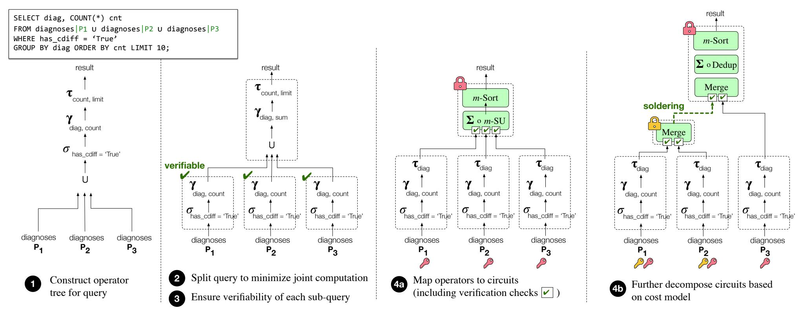

Fig. 3: Query execution in Senate. Colored keys and locks indicate which parties are involved in which MPC circuits.

columns). The local nodes are thus marked verifiable. All remaining operations are performed jointly by all parties at the root node, and thus do not need to be checked for verifiability.

In our extended paper, we work out in detail how Senate's compiler deduces the range constraints imposed by various relational operations (*i.e.*, what needs to be verified). Then, we show the invertibility of relational operations given these constraints. This ensures that the resulting tree is admissible, and satisfies the requirements of Senate's MPC protocol.

Step 4: Mapping operators to circuits. The final step is to map each jointly evaluated node in the query tree to a circuit (per §6):  $\sigma$  maps to the Filter circuit,  $\bowtie$  maps to m-SI, group-by aggregate maps to  $\Sigma \circ m$ -SU, and order-by-limit maps to m-Sort. In doing so, Senate's compiler uses a planning algorithm that *further decomposes* each circuit into a tree of circuits based on a cost model (described shortly).

For example, for the medical query in Figure 3, Senate maps the group-by aggregate operation  $\gamma_{\text{diag,sum}}$  to a  $\Sigma \circ m\text{-SU}$  circuit. Note that m-SU requires its inputs to be sorted; therefore, the compiler augments the children nodes with sort operations  $\tau_{\text{diag}}$ . It then further decomposes the m-Sort phase of m-SU into a tree of Merge sub-circuits, per §6.3

This tree of circuits is finally evaluated securely using our MPC protocol. Note that at each node, only the parties that provide the node input are involved in the MPC computation.

### <span id="page-11-0"></span>7.2 Cost model for circuit decomposition

The planning algorithm models the latency cost of evaluating a circuit tree in terms of the constituent cryptographic operations. It then enumerates possible decomposition plans, assigns a cost to each plan, and picks the optimal plan for decomposing the circuit.

Recall from §4 that the cost of executing a circuit via MPC can be divided into an offline phase (for generating the circuits), and an online phase (for evaluating the circuits). Given a circuit tree T, let the root circuit be C with children  $C_0$  and

 $C_1$ . Let  $T_0$  and  $T_1$  refer to the subtrees rooted at nodes  $C_0$  and  $C_1$  respectively. Then, Senate's compiler models the total latency cost C of evaluating T as:

$$\begin{split} \mathcal{C}(T) &= \max(\mathcal{C}(T_0), \mathcal{C}(T_1)) + \ \max(\mathcal{C}_{\mathsf{solder}}(T_0), \mathcal{C}_{\mathsf{solder}}(T_1)) \\ &+ \ \mathcal{C}_{\mathsf{offline}}(C) + \mathcal{C}_{\mathsf{online}}(C) \end{split}$$

Essentially, since subtrees can be computed in parallel, the cost model counts the maximum of these two costs, followed by the cost of soldering the subtrees with the root node. It adds this to the cost of the offline and online phases for T's root circuit C, C<sub>offline</sub> and C<sub>online</sub> respectively.

We break down each cost component in terms of two unit costs by examining the MPC protocol: the unit computation cost  $L_s$  of performing a single symmetric key operation, and the unit communication cost  $L_{i,j}$  (pairwise) between parties  $P_i$  and  $P_j$ . Senate profiles these unit costs during system setup. In addition, the costs also depend on the size of the circuit being computed |C| (*i.e.*, the number of gates in the circuit), the size of each party's input set |I|, and the number of parties m computing the circuit. For simplicity, the analysis below assumes that each party has identical input set size; however, the model can be extended in a straightforward manner to accommodate varying input set sizes as well.

The soldering cost  $C_{\text{solder}}$  can be expressed as  $(m-1)|I| \cdot \max_{i,j}(L_{i,j})$  (since it involves a single round of communication between all parties). Next, we analyze the WRK protocol to obtain the following equations:

$$C_{\text{offline}}(C) = (m-1)|C| \cdot \max(L_{i,j}) + 4|C| \cdot L_s + |C| \cdot \max(L_{1,i})$$
  
In more detail, in the offline phase, each party (in parallel with the others) communicates with the  $m-1$  other parties to create a garbled version of each gate in the circuit; each gate requires 4 symmetric key operations (one per row in the truth table representing the gate); they then send their individual garbled gates (in parallel) to the evaluator. Our analysis here is a simplification in that we ignore the cost of some function-independent preprocessing steps from the offline phase. This

{12}------------------------------------------------

<span id="page-12-1"></span>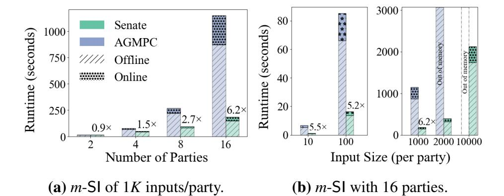

Fig. 4: Performance of *m*-SI in LAN.

<span id="page-12-4"></span>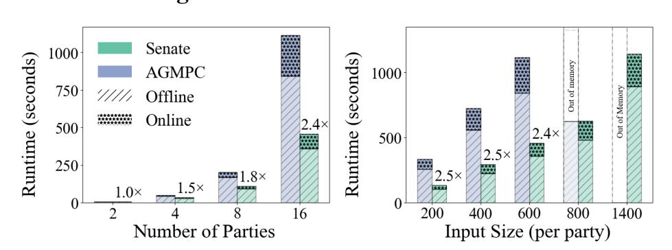

(a) *m*-Sort of 600 inputs/party. (b) *m*-Sort with 16 parties. Fig. 5: Performance of *m*-Sort in LAN.

is because these steps are independent of the input query, and thus do not lie in the critical path of query execution.

Similarly, the cost of the online phase can be expressed as Conline(*C*) = (*m*−1)|*I*|·max(*Li*, *<sup>j</sup>*)

$$+(m-1)|I|\cdot \max(L_{1,i})+(m-1)|C|\cdot L_s$$

In this phase, the garblers communicate with all other parties to compute and send their encrypted inputs to the evaluator; in addition, the evaluator communicates with each garbler to obtain encrypted versions of its own inputs. The evaluator then evaluates the gates per party. The size of the circuit |*C*| depends on the function that the circuit evaluates (per [§5\)](#page-7-0), the number of inputs, and the bit length of each input.

## <span id="page-12-0"></span>8 Evaluation

In this section, we demonstrate Senate's improvements over running queries as monolithic cryptographic computations. We use vanilla AGMPC (with monolithic circuit execution) as the baseline. The highlights are as follows. On the set of representative queries from [§2,](#page-2-0) we observe runtime improvements of up to 10× of Senate's building blocks, with a reduction in resource consumption of up to 11×. These results translate into runtime improvements of up to 10× for the joint computation in the benchmarked queries. Senate's query splitting technique provides a further improvement of up to 10×, bringing the net improvement to over 100×. Furthermore, on the TPC-H analytics benchmark [\[76\]](#page-17-10), Senate's improvements range from 3× to 145×.

Implementation. We implemented Senate on top of the AGMPC framework [\[30\]](#page-17-8), a state-of-the-art implementation of the WRK protocol [\[80\]](#page-17-9) for *m*-party garbled circuits with malicious security. Our compiler works with arbitrary bit lengths for inputs; in our evaluation, we set the data field size to be integers of 32 bits, unless otherwise specified.

<span id="page-12-2"></span>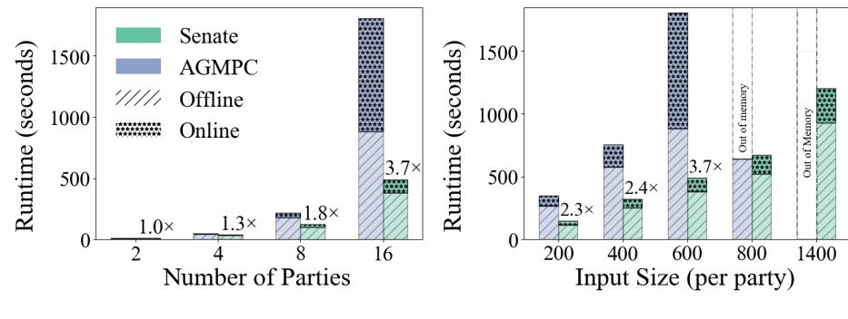

(a) *m*-SU of 600 inputs/party. (b) *m*-SU with 16 parties.

Fig. 6: Performance of *m*-SU in LAN.

<span id="page-12-3"></span>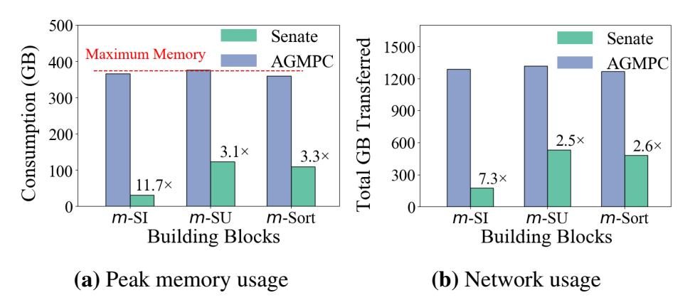

Fig. 7: Resource consumption of building blocks (16 parties).

Experimental Setup. We perform our experiments using r5.12xlarge Amazon EC2 instances in the Northern California region. Each instance offers 48 vCPUs and 384 GB of RAM, and was additionally provisioned with 20 GB of swap space, to account for transient spikes in memory requirements. We allocated similar instances in the Ohio, Northern Virginia and Oregon regions for wide-area network experiments.

#### 8.1 Senate's building blocks

We evaluate Senate's building blocks described in [§5—](#page-7-0)*m*-SI, *m*-Sort, and *m*-SU. For each building block, we compare the runtimes of each phase of the computation of Senate's efficient primitives to a similar implementation of the operator as a single circuit in both LAN and WAN settings [\(Figures](#page-12-1) 4 to [6,](#page-12-2) and [Figure](#page-13-0) 8). We observe substantial improvements for our operators owing to reduced number of parties evaluating each sub-circuit and the evaluation of various such circuits in parallel (per [§6\)](#page-8-0). We also measure the improvement in resource consumption due to Senate in [Figure](#page-12-3) 7.

Multi-way set intersection circuit (*m*-SI). We compare the evaluation time of an *m*-SI circuit across 16 parties with varying input sizes in [Figure](#page-12-1) 4b and observe runtime improvements ranging from 5.2×–6.2×. This is because our decomposition enables the input size to stay constant for each sub-computation, allowing us to reduce the input set size to the final 16-party computation. Note that, while Senate can compute a set intersection of 10*K* integers, AGMPC is unable to compute it for 2*K* integers, and runs out of memory during the offline phase. [Figures](#page-12-1) 4a and [8](#page-13-0) plot the runtime of a circuit with varying number of parties in LAN and WAN settings respectively, and observe an improvement of up to 10×. This can be similarly attributed to our decomposable circuits, which reduce the data transferred across all the parties, leading to significant improvements in the WAN setting.

[Figures](#page-12-3) 7a and [7b](#page-12-3) plot the trend of the peak memory and

{13}------------------------------------------------

<span id="page-13-0"></span>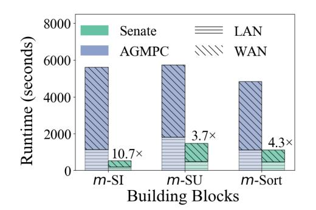

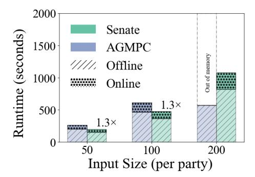

Fig. 8: Building blocks in WAN. Fig. 9: Query 1 with 16 parties. Fig. 10: Query 2 with 16 parties. Fig. 11: Query 3 with 16 parties.

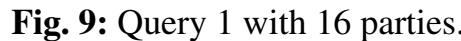

<span id="page-13-1"></span>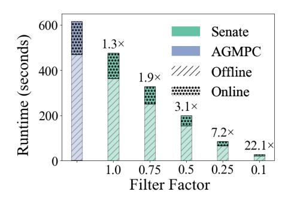

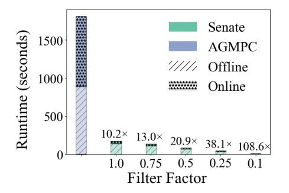

- (a) Query 1 with 100 inputs/party. (b) Query 3 with 600 inputs/party.

Fig. 12: Effect of query splitting on runtime.

<span id="page-13-2"></span>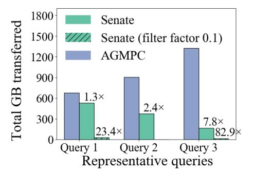

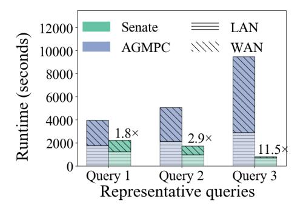

Fig. 13: Network usage. Fig. 14: Queries in WAN.

total network consumption of Senate compared to AGMPC with 1*K* integers across varying number of parties.

Multi-way Sort circuit (*m*-Sort). [Figures](#page-12-4) 5a and [5b](#page-12-4) illustrate the runtimes of a sorting circuit with varying number of parties and varying input sizes respectively. We observe that Senate's implementation is up to 4.3× faster for 16 parties, and can scale to twice as many inputs as AGMPC. This is also corroborated by the 3.3× reduction in peak memory requirement for 600 integers and ∼780 GB reduction in the amount of data transferred, as shown in [Figures](#page-12-3) 7a and [7b.](#page-12-3)

Multi-way set union circuit (*m*-SU). [Figure](#page-12-2) 6b plots the runtime of a set union circuit with varying input sizes and 16 parties. As discussed in [§5,](#page-7-0) an *m*-SU circuit can be expressed as Dedup ◦ *m*-Sort. Hence, we expect to trends similar to the *m*-Sort circuit. However, we observed a stark increase in runtime for the single circuit evaluation of 600 integers across 16 parties due to the exhaustion of the available memory in the system and subsequent use of swap space (see [Figure](#page-12-3) 7a). We observe a similar trend in [Figures](#page-12-2) 6a and [8.](#page-13-0)

## 8.2 End-to-end performance

#### 8.2.1 *Representative queries*

We now evaluate the performance of Senate on the three representative queries discussed in [§2](#page-2-0) with a varying number of parties [\(Figures](#page-13-0) 9 to [11\)](#page-13-0). In addition, we quantify the benefit of Senate's query splitting for different filter factors, *i.e.*, the fraction of inputs filtered as a result of any local computation

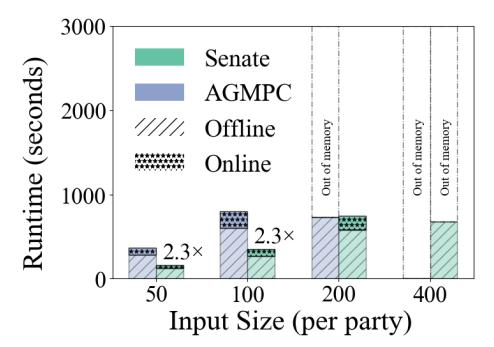

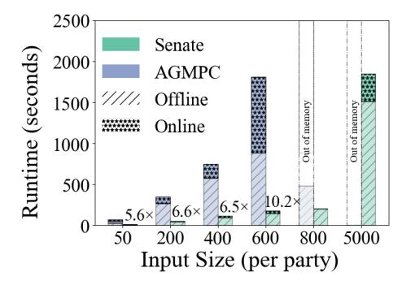

[\(Figure](#page-13-1) 12). We also measure the total network usage of the queries in [Figure](#page-13-2) 13; and [Figure](#page-13-2) 14 plots the performance of the queries in a WAN setting.

Query 1 (Medical study). [Figure](#page-13-0) 9 plots the runtime of Senate and AGMPC on the medical example query with varying input sizes. Note that, the input to the circuit for a query consists of all the values in the row required to compute the final result. We observe a performance improvement of 1.3× for an input size of 100 rows, and are also able to scale to higher input sizes. [Figure](#page-13-1) 12a illustrates the benefit of Senate's consistent and verified query splitting for different filter factors. We compare the single circuit implementation of the query for 100 inputs per party, and are able to achieve a runtime improvement of 22× for a filter factor of 0.1. The improvement in network consumption follows a similar trend, reducing usage by ∼23× with a filter factor of 0.1 [\(Figure](#page-13-2) 13).

Query 2 (Prevent password reuse). [Figure](#page-13-0) 10 plots the runtime of Senate and AGMPC with varying input sizes. Each row in this query consists of a 32 bit user identifier, and a 256 bit password hash. Since the query involves a group-by with aggregates, which is mapped to an extended *m*-SU (per [§5\)](#page-7-0), we observe a trend similar to [Figure](#page-12-2) 6b. We remark that this query does not benefit from Senate's query splitting.

Query 3 (Credit scoring). We evaluate the third query with 16 parties and varying input sizes in [Figure](#page-13-0) 11, and observe that Senate is 10× faster than AGMPC for 600 input rows, and is able to scale to almost 10 times the input size. The introduction of a local filter into the query, with a filter factor of 0.1 reduces the runtime by 100×. We attribute this to our efficient *m*-SI implementation which optimally splits the set intersection and parallelizes its execution across parties. The reduction in network usage [\(Figure](#page-13-2) 13) is also similar.

In the WAN setting, the improvement in query performance with Senate largely mimics the LAN setting; [Figure](#page-13-2) 14 plots the results in the absence of query splitting (*i.e.*, filter factor of 1). Overall, we find that Senate MPC decomposition protocol alone improves performance by up to an order of magnitude over the baseline. In addition, Senate's query splitting technique can further improve performance by another order of magnitude, depending on the filter factor.

#### <span id="page-13-3"></span>8.2.2 *TPC-H benchmark*

To stress test Senate on more complex query structures, we repeat the performance experiment by evaluating Senate on the TPC-H benchmark [\[76\]](#page-17-10), an industry-standard analytics

{14}------------------------------------------------

<span id="page-14-0"></span>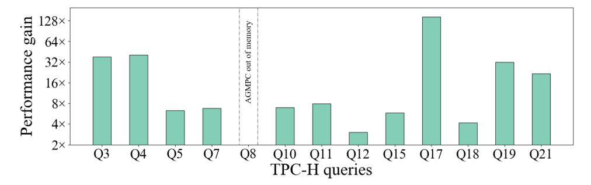

Fig. 15: Senate's performance on TPC-H queries.

<span id="page-14-1"></span>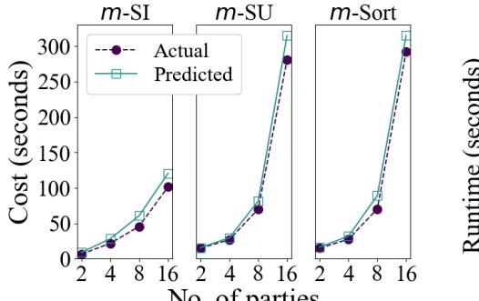

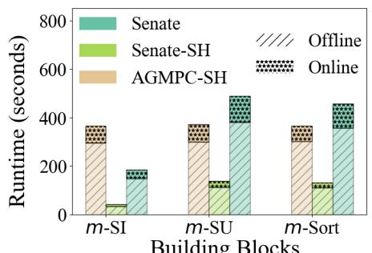

Fig. 16: Accuracy of cost model. Fig. 17: Semi-honest baselines

benchmark. The benchmark comprises a rich set of 22 queries on data split across 8 tables. The query structures are complex: for example, query 5 involves 5 joins across 6 tables, several filters, cross-column multiplications, aggregates over groups, and a sort. Existing benchmarks for analytical queries (including TPC-H) have no notion of collaborations of parties, so we created a multi-party version of TPC-H by assuming that each table is held by a different party.

We measure Senate's performance on 13 out of these 22 queries; the other queries are either single-table queries, or perform operations that Senate currently does not support (namely, substring matching, regular expressions, and UDFs). For parity, we assume 1*K* inputs per party across all queries, and a filter factor of 0.1 for local computation that results from Senate's query splitting. [Figure](#page-14-0) 15 plots the results. Overall, Senate improves performance by 3× to 145× over the AGMPC baseline across 12 of the 13 queries; query 8 runs out of memory in the baseline.

### 8.3 Accuracy of Senate's cost model

We evaluate our cost model (from [§7.2\)](#page-11-0) using Senate's circuit primitives. We compute the costs predicted by the cost model for the primitives, and compare them with the measured cost of an actual execution. As detailed in [§7.2,](#page-11-0) the cost model does not consider the function independent computation in the offline phase of the MPC protocol as it does not lie in the critical path of query evaluation; we therefore ignore the function independent components from the measured cost. [Figure](#page-14-1) 16 shows that our theoretical cost model approximates the actual costs well, with an average error of ∼20%.

# 8.4 Senate versus other protocols

Custom PSI protocols. There is a rich literature on custom protocols for PSI operations. While custom protocols are faster than general-purpose systems like Senate, their functionality naturally remains limited. We quantify the tradeoff between generality and performance by comparing Senate's PSI cost to that of custom PSI protocols. We compare Senate with the protocol of Zhang *et al.* [\[83\]](#page-17-26), a state-of-the-art protocol for multiparty PSI with malicious security.[3](#page-14-2) The protocol implementation is not available, so we compare it with Senate based on the performance numbers reported by the authors, and replicate Senate's experiments on similar capacity servers. Overall, we find that a 4-party PSI of 2 <sup>12</sup> elements per party takes ∼3 s using the custom protocol in the online phase, versus ∼30 s in Senate, representing a 10× overhead.

Arithmetic MPC. Senate builds upon a Boolean MPC framework instead of arithmetic MPC. We validate our design choice by comparing the performance of Senate with that of SCALE-MAMBA [\[74\]](#page-17-27), a state-of-the-art arithmetic MPC framework. We find that though arithmetic MPC is 3× faster than Senate for aggregation operations *alone* (as expected), this benefit doesn't generalize. In Senate's target workloads, aggregations are typically performed on top of operations such as joins and group by, as exemplified by our representative queries and the TPC-H query mix. For these queries (which also represent the general case), Senate is over two orders of magnitude faster. More specifically, we measure the latency of (i) a join with sum operation, and (ii) a group by with sum operation, across 4 parties with 256 inputs per party; we find that Senate is faster by 550× and 350× for the two operations, respectively. The reason for this disparity is that joins and group by operations rely almost entirely on logical operations such as comparisons, for which Boolean MPC is much more suitable than arithmetic MPC.

Semi-honest systems. We quantify the overhead of malicious security by comparing the performance of Senate with semi-honest baselines. To the best of our knowledge, we do not know of any modern *m*-party semi-honest garbled circuit frameworks faster than AGMPC (even though it's maliciously secure). Therefore, we implement and evaluate a semi-honest version of AGMPC ourselves, and compare Senate against it in [Figure](#page-14-1) 17. AGMPC-SH refers to the semi-honest baseline with monolithic circuit execution. We additionally note that Senate's techniques for decomposing circuits translate naturally to the semi-honest setting, without the need for verifying intermediate outputs. Hence, we also implement a semihonest version of Senate atop AGMPC-SH that decomposes queries across parties. We do not compare Senate to prior semi-honest multi-party systems SMCQL and Conclave, as their current implementations only support 2 to 3 parties.

[Figure](#page-14-1) 17 plots the runtime of *m*-SI, *m*-SU and *m*-Sort across 16 parties, with 1*K*, 600 and 600 inputs per party respectively. We observe that Senate-SH yields performance benefits ranging from 2.7–8.7× when compared to AGMPC-

<span id="page-14-2"></span><sup>3</sup>We note that the protocol of Zhang *et al.* provides malicious security only against adversaries that do not simultaneously corrupt two parties, while Senate is secure against arbitrary corruptions. However, the only custom protocols we're aware of that tolerate arbitrary corruptions (for more than two parties) either rely on expensive public-key cryptography (and are slower than general-purpose MPC, which have improved tremendously since these proposals) [\[18,](#page-16-13) [24\]](#page-16-14), or do not provide an implementation [\[41\]](#page-17-28).

{15}------------------------------------------------

SH. Senate's malicious security, however, comes with an overhead of  $4.4\times$  compared to Senate-SH. We also measure the end-to-end performance of the three sample queries, and find that Senate-SH yields performance benefits similar to Figures 9 to 11 when compared to AGMPC-SH. At the same time, we observe a maximum overhead of  $3.6\times$  when running the queries in a maliciously-secure setting.

#### <span id="page-15-0"></span>**9** Limitations and Discussion

Applicability of Senate's techniques. Senate works best for operations that can be naturally decomposed into a tree. While many SQL queries fit this structure, not all of them do. A general case is one where the same relation is fed as input to two different operations (or nodes in the query tree). For example, consider a collaboration of 3 parties, where each party  $P_i$  holds a relation  $R_i$ , who wish to compute the join  $(R_1 \cup R_2) \bowtie R_3$ . In the unencrypted setting, we can decompose the operation by computing pairwise joins  $R_1 \bowtie R_3$  and  $R_2 \bowtie R_3$ , and then take the union of the results. Unfortunately, this decomposition doesn't work in Senate because it produces a DAG (a node with two parents) and not a tree. Hence, a malicious  $P_3$  may use different values for  $R_3$  across the pairwise joins, leading to an input consistency issue. In such cases, Senate falls back to monolithic MPC for the operation.

Overall, Senate's techniques do not universally benefit all classes of computations, yet they encompass important and common analytics queries, as our sample queries exemplify. **Verifiability of SQL operators.** As described in §7, for simplicity, Senate's compiler requires that each node in the query tree outputs values that adhere to a well-defined set of constraints. If a node constrains its outputs in any other way, the compiler marks it as unverifiable. The reason is that additional constraints restrict the space of possible inputs for future nodes in the tree (and thereby, their outputs), making it harder to deduce what needs to be verified.

For example, consider a group by operation over column a, with a sum over column b per group. If the values in b also have a range constraint, then deducing the possible values for the sums per group is non-trivial (though technically possible). Generalizing Senate's compiler to accept a richer (or possibly, arbitrary) set of constraints is interesting future work.

Additional SQL functionality. Senate does not support SQL operations such as UDFs, substring matching, or regular expressions, as we discuss in our analysis of the TPC-H benchmark §8.2.2. Adding support for missing operations requires augmenting Senate's compiler to (i) translate the operation into a Boolean circuit; and (ii) verify the invertibility of the operation as required by the MPC decomposition protocol. While this is potentially straightforward for operations such as substring matching and (some limited types of) regular expressions, verifying the invertibility of arbitrary UDFs is computationally a hard problem. Overall, extending Senate to support wider SQL functionality (including a well-defined class of UDFs) is an interesting direction for future work.

**Differential privacy.** Senate reveals the query results to all the parties, which may leak information about the underlying data samples. This leakage can potentially be mitigated by extending Senate to support techniques such as differential privacy (DP) [28] (which prevents leakage by adding noise to the query results), similar to prior work [5,62].

In principle, one can use a general-purpose MPC protocol to implement a given DP mechanism for computing noised queries in the standard model [27,29]—each party contributes a share of the randomness, which is combined within MPC to generate noise and perturb the query results, depending on the mechanism. However, an open question is how the MPC decomposition protocol of Senate interacts with a given DP mechanism. The mechanism governs where and how the noise is added to the computation, e.g., Chorus [46] rewrites SQL queries to transform them into intrinsically private versions. On the other hand, Senate decomposes the computation across parties, which suggests that existing mechanisms may not be directly transferable to Senate in the presence of malicious adversaries while maintaining DP guarantees. As a result, designing DP mechanisms that are compatible with Senate is a potentially interesting direction for future work.

### 10 Related work

Secure multi-party computation (MPC) [9,39,81]. A variety of MPC protocols have been proposed for malicious adversaries and dishonest majority, with SPDZ [25,48,49] and WRK [80] being the state-of-the-art for arithmetic and Boolean (and for multi/constant rounds) settings, respectively. WRK is more suited to our setting than SPDZ because relational queries map to Boolean circuits more efficiently. These protocols execute a given computation as a monolithic circuit. In contrast, Senate decomposes a circuit into a tree, and executes each sub-circuit only with a subset of parties.

MPC frameworks. There are several frameworks for compiling and executing programs using MPC, in malicious [30, 61, 74] as well as semi-honest [8, 14, 55, 57, 63, 72, 84] settings. Senate builds upon the AGMPC framework [30] that implements the maliciously secure WRK protocol.

**Private set operations.** A rich body of work exists on custom protocols for set operations (*e.g.*, [22,23,32,51,52,54,69]). Senate's circuit primitives build upon protocols that express the set operation as a Boolean circuit [12,43] in order to allow further MPC computation over the results, rather than using other primitives like oblivious transfer, oblivious PRFs, etc.

**Secure collaborative systems.** Similar to Senate, recent systems such as SMCQL [4] and Conclave [77] also target privacy for collaborative query execution using MPC. Other proposals [3, 19] support such computation by outsourcing it to two non-colluding servers. However, all these systems assume the adversaries are semi-honest and optimize for this use case, while Senate provides security against malicious adversaries. Prio [21], Melis *et al.* [59], and Prochlo [11]

{16}------------------------------------------------

collect aggregate statistics across many users, as opposed to general-purpose SQL. Further, the first two target semi-honest security, while Prochlo uses hardware enclaves [\[58\]](#page-17-44).

Similar objectives have been explored for machine learning (*e.g.*, [\[15,](#page-16-27)[37,](#page-17-45)[40,](#page-17-46)[60,](#page-17-47)[66,](#page-17-48)[75,](#page-17-49)[86\]](#page-17-50)). Most of these proposals target semi-honest adversaries. Others are limited to specific tasks such as linear regression, and are not applicable to Senate.

Trusted hardware. An alternate to cryptography is to use systems based on trusted hardware enclaves (*e.g.*, [\[31,](#page-17-51)[71,](#page-17-52)[85\]](#page-17-53)). Such approaches can be generalized to multi-party scenarios as well. However, enclaves require additional trust assumptions, and suffer from many side-channel attacks [\[16,](#page-16-28) [79\]](#page-17-54).

Systems with differential privacy. DJoin [\[62\]](#page-17-29) and DStress [\[67\]](#page-17-2) use black-box MPC protocols to compute operations over multi-party databases, and use differential privacy [\[28\]](#page-16-6) to mask the results. Shrinkwrap [\[5\]](#page-16-15) improves the efficiency of SMCQL by using differential privacy to hide the sizes of intermediate results (instead of padding them to an upper bound, as in Senate). Flex [\[45\]](#page-17-13) enforces differential privacy on the results of SQL queries, though not in the collaborative case. In general, differential privacy solutions are complementary to Senate and can possibly be added atop Senate's processing by encoding them into Senate's circuits (as discussed in [§9\)](#page-15-0).

# 11 Conclusion

We presented Senate, a system for securely computing analytical SQL queries in a collaborative setup. Unlike prior work, Senate targets a powerful adversary who may arbitrarily deviate from the specified protocol. Compared to traditional cryptographic solutions, Senate improves performance by securely decomposing a big cryptographic computation into smaller and parallel computations, planning an efficient decomposition, and verifiably delegating a part of the query to local computation. Our techniques can improve query runtime by up to 145× when compared to the state-of-the-art.

## Acknowledgments

We thank the reviewers for their insightful feedback. We also thank members of the RISELab at UC Berkeley for their helpful comments on earlier versions of this paper; Charles Lin for his assistance in the early phases of this project; and Carmit Hazay for valuable discussions. This work was supported in part by the NSF CISE Expeditions Award CCF-1730628, and gifts from the Sloan Foundation, Bakar Program, Alibaba, Amazon Web Services, Ant Group, Capital One, Ericsson, Facebook, Futurewei, Google, Intel, Microsoft, Nvidia, Scotiabank, Splunk, and VMware.

## References

- <span id="page-16-1"></span>[1] E. A. Abbe, A. E. Khandani, and A. W. Lo. Privacy-Preserving Methods for Sharing Financial Risk Exposures. *American Economic Review*, 2012.
- <span id="page-16-7"></span>[2] A. Afshar, Z. Hu, P. Mohassel, and M. Rosulek. How to efficiently evaluate RAM programs with malicious security. In *EUROCRYPT*, 2015.

- <span id="page-16-23"></span>[3] G. Aggarwal, M. Bawa, P. Ganesan, H. Garcia-Molina, K. Kenthapadi, R. Motwani, U. Srivastava, D. Thomas, and Y. Xu. Two can keep A secret: A distributed architecture for secure database services. In *CIDR*, 2005.
- <span id="page-16-0"></span>[4] J. Bater, G. Elliott, C. Eggen, S. Goel, A. Kho, and J. Rogers. SMCQL: Secure Querying for Federated Databases. In *VLDB*, 2017.
- <span id="page-16-15"></span>[5] J. Bater, X. He, W. Ehrich, A. Machanavajjhala, and J. Rogers. Shrinkwrap: Differentially-Private Query Processing in Private Data Federations. In *VLDB*, 2018.
- <span id="page-16-9"></span>[6] D. Beaver, S. Micali, and P. Rogaway. The round complexity of secure protocols (extended abstract). In *STOC*, 1990.
- <span id="page-16-10"></span>[7] M. Bellare, V. T. Hoang, and P. Rogaway. Foundations of garbled circuits. In *CCS*, 2012.
- <span id="page-16-19"></span>[8] A. Ben-David, N. Nisan, and B. Pinkas. FairplayMP: A System for Secure Multi-party Computation. In *CCS*, 2008.
- <span id="page-16-3"></span>[9] M. Ben-Or, S. Goldwasser, and A. Wigderson. Completeness theorems for non-cryptographic fault-tolerant distributed computation (extended abstract). In *STOC*, 1988.
- <span id="page-16-2"></span>[10] D. Bisias, M. Flood, A. W. Lo, and S. Valavanis. A Survey of Systemic Risk Analytics. *Annual Review of Financial Economics*, 2012.
- <span id="page-16-26"></span>[11] A. Bittau et al. Prochlo: Strong Privacy for Analytics in the Crowd. In *SOSP*, 2017.
- <span id="page-16-11"></span>[12] M. Blanton and E. Aguiar. Private and oblivious set and multiset operations. In *AsiaCCS*, 2012.
- <span id="page-16-8"></span>[13] T. Boelter, R. Poddar, and R. A. Popa. A Secure One-Roundtrip Index for Range Queries. Cryptology ePrint Archive, Report 2016/568, 2016. <https://eprint.iacr.org/2016/568>.
- <span id="page-16-20"></span>[14] D. Bogdanov, S. Laur, and J. Willemson. Sharemind: A framework for fast privacy-preserving computations. In *ESORICS*, 2008.
- <span id="page-16-27"></span>[15] K. Bonawitz et al. Practical Secure Aggregation for Privacy-Preserving Machine Learning. In *CCS*, 2017.
- <span id="page-16-28"></span>[16] J. V. Bulck et al. Foreshadow: Extracting the Keys to the Intel SGX Kingdom with Transient Out-of-Order Execution. In *USENIX Security*, 2018.
- <span id="page-16-5"></span>[17] Center for Disease Control and Prevention (CDC): Diseases and Conditions A-Z Index, 2017. <https://www.cdc.gov/DiseasesConditions>.
- <span id="page-16-13"></span>[18] J. H. Cheon, S. Jarecki, and J. H. Seo. Multi-party privacy-preserving set intersection with quasi-linear complexity. *IEICE Transactions*, 95-A(8):1366–1378, 2012.
- <span id="page-16-24"></span>[19] S. S. M. Chow, J. Lee, and L. Subramanian. Two-party computation model for privacy-preserving queries over distributed databases. In *NDSS*, 2009.
- <span id="page-16-12"></span>[20] E. F. Codd. A Relational Model of Data for Large Shared Data Banks. *Commun. ACM*, 1970.
- <span id="page-16-25"></span>[21] H. Corrigan-Gibbs and D. Boneh. Prio: Private, Robust, and Scalable Computation of Aggregate Statistics. In *NSDI*, 2017.
- <span id="page-16-21"></span>[22] E. D. Cristofaro, P. Gasti, and G. Tsudik. Fast and Private Computation of Cardinality of Set Intersection and Union. In *CANS*, 2012.
- <span id="page-16-22"></span>[23] E. D. Cristofaro, J. Kim, and G. Tsudik. Linear-Complexity Private Set Intersection Protocols Secure in Malicious Model. In *ASIACRYPT*, 2010.
- <span id="page-16-14"></span>[24] D. Dachman-Soled, T. Malkin, M. Raykova, and M. Yung. Secure Efficient Multiparty Computing of Multivariate Polynomials and Applications. In *ACNS*, 2011.
- <span id="page-16-18"></span>[25] I. Damgård, M. Keller, E. Larraia, V. Pastro, P. Scholl, and N. P. Smart. Practical covertly secure MPC for dishonest majority - or: Breaking the SPDZ limits. In *ESORICS*, 2013.
- <span id="page-16-4"></span>[26] Privilege Escalation in Ubuntu Linux, 2019. [https:](https://shenaniganslabs.io/2019/02/13/Dirty-Sock.html) [//shenaniganslabs.io/2019/02/13/Dirty-Sock.html](https://shenaniganslabs.io/2019/02/13/Dirty-Sock.html).
- <span id="page-16-16"></span>[27] C. Dwork, K. Kenthapadi, F. McSherry, I. Mironov, and M. Naor. Our Data, Ourselves: Privacy via Distributed Noise Generation. In *EUROCRYPT*, 2006.
- <span id="page-16-6"></span>[28] C. Dwork and A. Roth. The Algorithmic Foundations of Differential Privacy. *Found. Trends Theor. Comput. Sci.*, 2014.
- <span id="page-16-17"></span>[29] F. Eigner, A. Kate, M. Maffei, F. Pampaloni, and I. Pryvalov. Differentially private data aggregation with optimal utility. In *ACSAC*, 2014.

{17}------------------------------------------------

- <span id="page-17-8"></span>[30] AGMPC Framework. <https://github.com/emp-toolkit/emp-agmpc>.
- <span id="page-17-51"></span>[31] S. Eskandarian and M. Zaharia. ObliDB: Oblivious Query Processing using Hardware Enclaves. 2020.
- <span id="page-17-38"></span>[32] B. H. Falk, D. Noble, and R. Ostrovsky. Private Set Intersection with Linear Communication from General Assumptions. In *WPES*, 2019.
- <span id="page-17-15"></span>[33] T. K. Frederiksen, T. P. Jakobsen, J. B. Nielsen, P. S. Nordholt, and C. Orlandi. MiniLEGO: Efficient Secure Two-Party Computation from General Assumptions. In *EUROCRYPT*, 2013.
- [34] T. K. Frederiksen, T. P. Jakobsen, J. B. Nielsen, and R. Trifiletti. TinyLEGO: An Interactive Garbling Scheme for Maliciously Secure Two-party Computation. Cryptology ePrint Archive, Report 2015/309, 2015. <https://eprint.iacr.org/2015/309>.
- [35] S. Garg, D. Gupta, P. Miao, and O. Pandey. Secure multiparty RAM computation in constant rounds. In *TCC*, 2016.
- <span id="page-17-16"></span>[36] S. Garg, S. Lu, R. Ostrovsky, and A. Scafuro. Garbled RAM from one-way functions. In *STOC*, 2015.
- <span id="page-17-45"></span>[37] A. Gascón, P. Schoppmann, B. Balle, M. Raykova, J. Doerner, S. Zahur, and D. Evans. Privacy-Preserving Distributed Linear Regression on High-Dimensional Data. In *PETS*, 2017.
- <span id="page-17-12"></span>[38] O. Goldreich. *The Foundations of Cryptography - Volume 2: Basic Applications*. Cambridge University Press, 2004.
- <span id="page-17-4"></span>[39] O. Goldreich, S. Micali, and A. Wigderson. How to Play ANY Mental Game. In *STOC*, 1987.
- <span id="page-17-46"></span>[40] Google AI. Federated Learning: Collaborative Machine Learning without Centralized Training Data. [https://ai.googleblog.com/2017/04/federated](https://ai.googleblog.com/2017/04/federated-learning-collaborative.html)[learning-collaborative.html](https://ai.googleblog.com/2017/04/federated-learning-collaborative.html).
- <span id="page-17-28"></span>[41] C. Hazay and M. Venkitasubramaniam. Scalable Multi-Party Private Set-Intersection. In *PKC*, 2017.
- <span id="page-17-17"></span>[42] C. Hazay and A. Yanai. Constant-round maliciously secure two-party computation in the RAM model. In *TCC*, 2016.
- <span id="page-17-25"></span>[43] Y. Huang, D. Evans, and J. Katz. Private Set Intersection: Are Garbled Circuits Better than Custom Protocols? In *NDSS*, 2012.
- <span id="page-17-3"></span>[44] M. Ion et al. Private Intersection-Sum Protocol with Applications to Attributing Aggregate Ad Conversions. Cryptology ePrint Archive, Report 2017/738, 2017. <https://eprint.iacr.org/2017/738>.
- <span id="page-17-13"></span>[45] N. Johnson, J. P. Near, and D. Song. Towards Practical Differential Privacy for SQL Queries. In *VLDB*, 2018.
- <span id="page-17-30"></span>[46] N. M. Johnson, J. P. Near, J. M. Hellerstein, and D. Song. Chorus: Differential Privacy via Query Rewriting. *arXiv:1809.07750*, 2018.
- <span id="page-17-0"></span>[47] L. Kamm, D. Bogdanov, and J. Vilo. A new way to protect privacy in large-scale genome-wide association studies. *Bioinformatics*, 2013.
- <span id="page-17-31"></span>[48] M. Keller, E. Orsini, and P. Scholl. MASCOT: faster malicious arithmetic secure computation with oblivious transfer. In *CCS*, 2016.
- <span id="page-17-14"></span>[49] M. Keller, V. Pastro, and D. Rotaru. Overdrive: Making SPDZ Great Again. In *EUROCRYPT*, 2018.
- <span id="page-17-18"></span>[50] M. Keller and A. Yanai. Efficient maliciously secure multiparty computation for RAM. In *EUROCRYPT*, 2018.
- <span id="page-17-39"></span>[51] L. Kissner and D. Song. Privacy-Preserving Set Operations. In *CRYPTO*, 2005.
- <span id="page-17-40"></span>[52] V. Kolesnikov, N. Matania, B. Pinkas, M. Rosulek, and N. Trieu. Practical Multi-party Private Set Intersection from Symmetric-Key Techniques. In *CCS*, 2017.
- <span id="page-17-19"></span>[53] V. Kolesnikov, J. B. Nielsen, M. Rosulek, N. Trieu, and R. Trifiletti. DUPLO: unifying cut-and-choose for garbled circuits. In *CCS*, 2017.
- <span id="page-17-41"></span>[54] V. Kolesnikov, M. Rosulek, N. Trieu, and X. Wang. Scalable Private Set Union from Symmetric-Key Techniques. In *ASIACRYPT*, 2019.
- <span id="page-17-33"></span>[55] C. Liu, X. S. Wang, K. Nayak, Y. Huang, and E. Shi. ObliVM: A Programming Framework for Secure Computation. In *IEEE S&P*, 2015.
- <span id="page-17-20"></span>[56] S. Lu and R. Ostrovsky. Black-box parallel garbled RAM. In *CRYPTO*, 2017.
- <span id="page-17-34"></span>[57] D. Malkhi, N. Nisan, B. Pinkas, and Y. Sella. Fairplay – A Secure Two-party Computation System. In *USENIX Security*, 2004.
- <span id="page-17-44"></span>[58] F. McKeen et al. Innovative Instructions and Software Model for Isolated Execution. In *HASP*, 2013.
- <span id="page-17-43"></span>[59] L. Melis, G. Danezis, and E. D. Cristofaro. Efficient Private Statistics

- with Succinct Sketches. In *NDSS*, 2016.
- <span id="page-17-47"></span>[60] P. Mohassel and Y. Zhang. SecureML: A System for Scalable Privacy-Preserving Machine Learning. In *IEEE S&P*, 2019.
- <span id="page-17-32"></span>[61] B. Mood, D. Gupta, H. Carter, K. R. B. Butler, and P. Traynor. Frigate: A Validated, Extensible, and Efficient Compiler and Interpreter. In *EuroS&P*, 2016.
- <span id="page-17-29"></span>[62] A. Narayan and A. Haeberlen. DJoin: Differentially Private Join Queries over Distributed Databases. In *OSDI*, 2012.
- <span id="page-17-35"></span>[63] K. Nayak, X. S. Wang, S. Ioannidis, U. Weinsberg, N. Taft, and E. Shi. GraphSC: Parallel Secure Computation Made Easy. In *IEEE S&P*, 2015.
- <span id="page-17-23"></span>[64] J. B. Nielsen, P. S. Nordholt, C. Orlandi, and S. S. Burra. A New Approach to Practical Active-Secure Two-Party Computation. In *CRYPTO*, 2012.
- <span id="page-17-21"></span>[65] J. B. Nielsen and C. Orlandi. LEGO for two-party secure computation. In *TCC*, 2009.
- <span id="page-17-48"></span>[66] V. Nikolaenko, U. Weinsberg, S. Ioannidis, M. Joye, D. Boneh, and N. Taft. Privacy-Preserving Ridge Regression on Hundreds of Millions of Records. In *IEEE S&P*, 2013.
- <span id="page-17-2"></span>[67] A. Papadimitriou, A. Narayan, and A. Haeberlen. DStress: Efficient Differentially Private Computations on Distributed Data. In *EuroSys*, 2017.
- <span id="page-17-7"></span>[68] N. Perlroth. Security Experts Expect 'Shellshock' Software Bug in Bash to Be Significant, 2014. [https://www.nytimes.com/2014/](https://www.nytimes.com/2014/09/26/technology/security-experts-expect-shellshock-software-bug-to-be-significant.html) [09/26/technology/security-experts-expect-shellshock](https://www.nytimes.com/2014/09/26/technology/security-experts-expect-shellshock-software-bug-to-be-significant.html)[software-bug-to-be-significant.html](https://www.nytimes.com/2014/09/26/technology/security-experts-expect-shellshock-software-bug-to-be-significant.html).
- <span id="page-17-42"></span>[69] B. Pinkas, T. Schneider, O. Tkachenko, and A. Yanai. Efficient Circuit-Based PSI with Linear Communication. In *EUROCRYPT*, 2019.
- <span id="page-17-22"></span>[70] R. Poddar, T. Boelter, and R. A. Popa. Arx: An Encrypted Database using Semantically Secure Encryption. In *VLDB*, 2019.
- <span id="page-17-52"></span>[71] C. Priebe, K. Vasawani, and M. Costa. EnclaveDB: A Secure Database Using SGX. In *IEEE S&P*, 2018.
- <span id="page-17-36"></span>[72] A. Rastogi, M. A. Hammer, and M. Hicks. Wysteria: A Programming Language for Generic, Mixed-Mode Multiparty Computations. In *IEEE S&P*, 2014.
- <span id="page-17-1"></span>[73] A. Sangers, M. van Heesch, T. Attema, T. Veugen, M. Wiggerman, J. Veldsink, O. Bloemen, and D. Worm. Secure multiparty PageRank algorithm for collaborative fraud detection. In *FC*, 2019.
- <span id="page-17-27"></span>[74] SCALE-MAMBA Framework. <https://homes.esat.kuleuven.be/~nsmart/SCALE/>.
- <span id="page-17-49"></span>[75] R. Shokri and V. Shmatikov. Privacy-Preserving Deep Learning. In *CCS*, 2015.
- <span id="page-17-10"></span>[76] TPC-H Benchmark. <http://www.tpc.org/tpch/>.
- <span id="page-17-6"></span>[77] N. Volgushev, M. Schwarzkopf, B. Getchell, M. Varia, A. Lapets, and A. Bestavros. Conclave: Secure Multi-Party Computation on Big Data. In *EuroSys*, 2019.
- <span id="page-17-11"></span>[78] K. C. Wang and M. K. Reiter. How to end password reuse on the web. In *NDSS*, 2019.
- <span id="page-17-54"></span>[79] W. Wang, G. Chen, X. Pan, Y. Zhang, X. Wang, V. Bindschaedler, H. Tang, and C. A. Gunter. Leaky Cauldron on the Dark Land: Understanding Memory Side-Channel Hazards in SGX. In *CCS*, 2017.
- <span id="page-17-9"></span>[80] X. Wang, S. Ranellucci, and J. Katz. Global-Scale Secure Multiparty Computation. In *CCS*, 2017.
- <span id="page-17-5"></span>[81] A. C. Yao. Protocols for secure computations. In *Symposium on Foundations of Computer Science (SFCS)*, 1982.
- <span id="page-17-24"></span>[82] A. C. Yao. How to generate and exchange secrets (extended abstract). In *FOCS*, 1986.
- <span id="page-17-26"></span>[83] E. Zhang, F.-H. Liu, Q. Lai, G. Jin, and Y. Li. Efficient Multi-Party Private Set Intersection Against Malicious Adversaries. In *CCSW*, 2019.
- <span id="page-17-37"></span>[84] Y. Zhang, A. Steele, and M. Blanton. PICCO: A General-purpose Compiler for Private Distributed Computation. In *CCS*, 2013.
- <span id="page-17-53"></span>[85] W. Zheng, A. Dave, J. G. Beekman, R. A. Popa, J. E. Gonzalez, and I. Stoica. Opaque: An Oblivious and Encrypted Distributed Analytics Platform. In *NSDI*, 2017.
- <span id="page-17-50"></span>[86] W. Zheng, R. A. Popa, J. Gonzalez, and I. Stoica. Helen: Maliciously Secure Coopetitive Learning for Linear Models. In *IEEE S&P*, 2019.