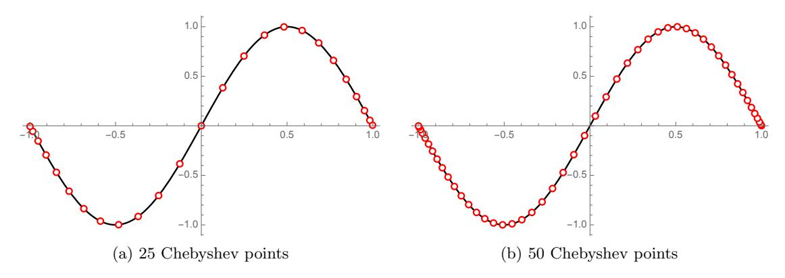
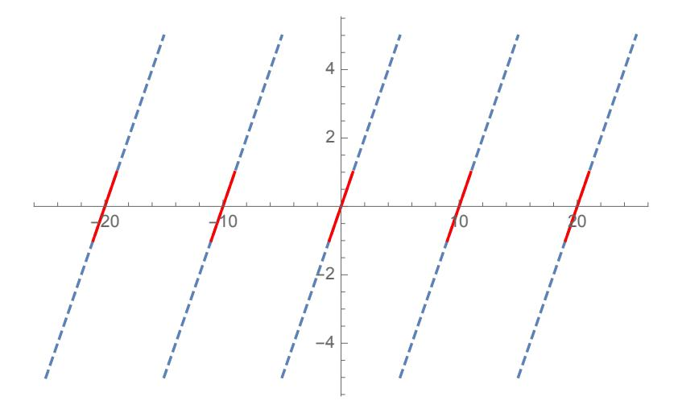
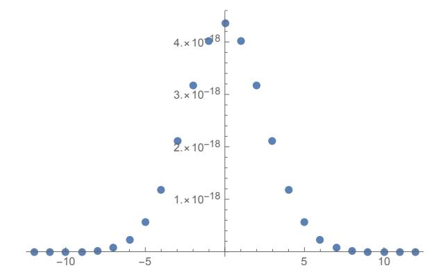

# Modular Lagrange Interpolation of the Mod Function for Bootstrapping of Approximate HE

Charanjit S. Jutla IBM T. J. Watson Research Center Nathan Manohar UCLA

#### Abstract

We introduce a novel variant of Lagrange interpolation called modular Lagrange interpolation that allows us to obtain and prove error bounds for explicit low-degree polynomial approximations of a function on a union of equally-spaced small intervals even if the function overall is not continuous. We apply our technique to the mod function and obtain explicit low-degree polynomial approximations with small error. In particular, for every k and N >> k, we construct low-degree polynomials that approximate f(x) = x mod N, for |f(x)| ≤ 1 and |x| ≤ kN, to within O(1/N) additive approximation. For k = O(log N), the result is generalized to give O(d)-degree polynomial approximations to within O(N <sup>−</sup><sup>d</sup> ) error for any d ≥ 1. Literature in approximation theory allows for arbitrary precision polynomial approximation of only smooth functions, whereas the mod function is only piecewise linear.

These polynomials can be used in bootstrapping for approximate homomorphic encryption, which requires computing the mod function near multiples of the modulus. Our work bypasses the fundamental error of approximation in prior works caused by first approximating the mod function by a scaled sine function. We implement the bootstrapping of HEAAN using our polynomials and profile various parameter settings. For example, we demonstrate bootstrapping that can achieve 67 bit message precision, larger than the precision of a double variable, whereas the most advanced prior work was only capable of up to 40 bit message precision.

## <span id="page-0-0"></span>1 Introduction

Polynomial interpolation is a fundamental problem in mathematics. It is well known that given n + 1 distinct points x0, x1, . . . , x<sup>n</sup> and their corresponding values y0, y1, . . . , yn, there is a unique polynomial p(x) of degree at most n such that p(xi) = y<sup>i</sup> for all i ∈ {0, 1, . . . , n}. Using Lagrange interpolation, it is possible to easily determine this unique polynomial p(x). Polynomial interpolation's utility goes beyond finding polynomials that pass through points in

a dataset. Suppose we are given some arbitrary smooth function f(x) on a contiguous interval. Then, using Lagrange interpolation, we can hope to find a low-degree polynomial that is a good approximation of f on this interval. This immediately raises two questions: 1) How many points should we use for interpolation? and 2) How should these points be chosen?

It is well-known that Lagrange interpolation of even a smooth function (on a contiguous interval) where the interpolation points are chosen as equally spaced points leads to bad approximations (see e.g. [\[5\]](#page-31-0)). This is known as the "Runge phenomenon", and a more technical explanation can be found in Section [3.](#page-9-0) However, it is also known that such smooth functions can be asymptotically approximated with high precision if the density of the points in the contiguous interval, say [−1, 1], is proportional to (1 − x 2 ) −1/2 (that is, the density of points is higher near the edges of the interval, see e.g. [\[11,](#page-31-1) [5\]](#page-31-0)). A common choice of points are the Chebyshev nodes or roots of the nth Chebyshev polynomial Tn(x), which asymptotically satisfy this density function, which we will refer to as the Chebyshev density function. These lie in the interval [−1, 1] and are defined by the formula

$$x_j = \cos\left(\pi \frac{2(j+1)}{2n}\right)$$

for j = 0, 1, . . . , n − 1. Figure [1](#page-1-0) shows the function sin(πx) on the interval [−1, 1] with points chosen according to the above formula for n = 25 and 50. For an arbitrary interval [a, b], one can simply scale the distribution of points on [−1, 1] to this interval.

<span id="page-1-0"></span>

Figure 1: Plots of sin(πx) on [−1, 1] with Chebyshev points.

In fact, for a polynomial f(x) that is n + 1 times differentiable on an interval [a, b], the polynomial p<sup>n</sup> of degree ≤ n obtained via Lagrange interpolation at n + 1 distinct points  $t_0, t_1, \ldots, t_n \in [a, b]$  will have error at any point  $x \in [a, b]$  given by the formula

$$f(x) - p_n(x) = \frac{f^{(n+1)}(\psi_x)}{(n+1)!} \cdot \prod_{i=0}^{n} (x - t_i),$$

where  $\psi_x$  is some point in [a, b] depending on x. Since determining  $\psi_x$  is difficult, error analysis typically proceeds by upper bounding  $f^{(n+1)}(\cdot)$  on [a, b] and then bounding  $|\prod_{i=0}^n (x - t_i)|$ . It is known that setting the  $t_i$ 's as the Chebyshev nodes scaled to [a, b] minimizes this latter quantity. Thus, for a single contiguous interval, it is known how to obtain a good low-degree polynomial approximation and prove a good bound on the error. Algorithmic search methods that determine the minimax polynomial approximation of a continuous function on a closed interval are also well-studied, e.g. the Remez Algorithm [21]. However, in this work we will focus on constructive methods as that leads to better understanding of the tradeoffs in target applications. This is discussed in more detail in Section 9.

In this work, we ask a related question, motivated by its applications to cryptography. Suppose we have many far apart, equally spaced, (contiguous) intervals and a piecewise smooth function f on these intervals, such that f is not continuous on a single closed interval *containing* these set of intervals. Is it possible to obtain a low-degree polynomial that approximates f well, restricted to the set of small intervals?

We show how to achieve the above and prove good error bounds for bounded piecewise linear (or low-degree) functions using a new technique that we call modular Lagrange interpolation. If we simply tried to apply standard Lagrange interpolation, we would immediately run into problems trying to prove an error bound, since the Lagrange interpolation theorem requires the function to be n+1 times differentiable, but the piece-wise smooth function is not continuous (or even necessarily defined) on a closed interval that contains these intervals. A common approach in previous works has been to approximate the piecewise linear function with a continuous function such as the sine function. But, this limits the approximation possible due to the error inherent in the continuous approximation. However, as discussed above, on a *single* interval, we know how to use Lagrange interpolation to find a low-degree polynomial approximation. Modular Lagrange interpolation refers to the method of "combining" these low-degree polynomials that work well on one specific interval into a single low-degree polynomial that simultaneously approximates the function well on all intervals. Crucial to the modular Lagrange interpolation technique is that the construction allows one to prove good error bounds. We remark that it is not equivalent to Lagrange interpolation on judiciously picked points in the intervals, e.g. those approximating the Chebyshev density function. However, our "combiners" will mimic the Chebyshev density function. The combiners behave similarly to Lagrange basis polynomials, which have the "delta function" property meaning that they evaluate to one at a specific point and to zero at all other points. However, the combiners must still approximate this delta function by a low-degree polynomial over intervals that are small but not negligible. To keep the degree small, we leverage the trade-off between the number of unit-sized intervals k and the size N separating these intervals, and a strategy similar to the Chebyshev density function works well to avoid the Runge phenomenon.

While this strategy of making the "combiners" similar to Chebyshev-weighted Lagrange basis polynomials works well for simple approximations, to get approximations of O(N <sup>−</sup><sup>c</sup> ) (for c > 1) we must use a more advanced application of Lagrange interpolation, which approximates the function in each interval by at least (c + 1) points, and the combiners now depend on each such point rather than just the whole interval. A more technical introduction to modular Lagrange interpolation is given in Section [3.](#page-9-0)

#### <span id="page-3-0"></span>1.1 Application to Cryptography

The problem of finding a single low-degree polynomial approximation to a piece-wise function over many intervals is a natural math question and interesting in its own right. However, it turns out that this problem also has a major application to cryptography with regards to FHE bootstrapping, which we will now describe.

The work of [\[9,](#page-31-2) [8\]](#page-31-3) presented a new homomorphic encryption (HE) scheme for approximate arithmetic (called the CKKS HE scheme) over real/complex numbers. The CKKS HE scheme was considerably more efficient than other schemes for evaluating arithmetic circuits and leveraged properties of approximate arithmetic to achieve these efficiency gains. It has found many applications, among them privacy-preserving machine learning and secure genome analysis (see [\[15,](#page-31-4) [20,](#page-32-1) [4,](#page-31-5) [17,](#page-32-2) [23,](#page-32-3) [16\]](#page-32-4) for some examples). However, the initial CKKS HE scheme lacked a bootstrapping procedure, and, thus, it was not a fully homomorphic encryption (FHE) scheme. This was remedied when [\[7\]](#page-31-6) introduced the first bootstrapping procedure for the CKKS HE scheme, which followed the general template introduced by Gentry [\[12\]](#page-31-7) of evaluating the decryption circuit homomorphically. The challenge here is that the decryption procedure for CKKS requires computing the mod function, which is not easily representable via an arithmetic circuit. In fact, the mod function modulo q on the interval [−Kq, Kq] for some integer K is not even a continuous function. However, [\[7\]](#page-31-6) made the clever observation that in the CKKS HE scheme, we have an upper bound m on the size of the message, which can be made much smaller than q. In this situation, we actually only need to be able to compute the mod function on points in [−Kq, Kq] that are a distance at most m from a multiple of q. In this case, the mod function is periodic with period q and is linear on each of the small intervals around a multiple of q. Figure [2](#page-4-0) shows the mod function along with the small intervals for approximation.

The work of [\[7\]](#page-31-6) observed that the mod function [t]<sup>q</sup> on these intervals can be approximated

<span id="page-4-0"></span>

Figure 2: The mod function with modulus q = 10. The solid red lines represent the small intervals on which we need to approximate.

via a scaled sine function  $S(t) = \frac{q}{2\pi} \sin\left(\frac{2\pi t}{q}\right)$ . This approximation introduces an inherent error that depends on the message upper bound m. Let  $\epsilon$  denote the ratio  $\frac{m}{q}$ . Then, it can be shown that

$$|[t]_q - S(t)| \le \frac{2\pi^2}{3} q\epsilon^3.$$

If  $\epsilon$  is small enough, then this error can be sufficiently small for use in bootstrapping provided that S(t) can be well-approximated by a low degree polynomial. The work of [7] along with several followup works [6, 14, 18] proceeded to provide methods of approximating this scaled sine function (or scaled cosine function in the case of [14] and scaled sine/cosine and inverse sine in the case of [18]) by a low-degree polynomial, which can then be plugged into the bootstrapping procedure of [7]. However, due to the inherent error between the mod function  $[t]_q$  and the scaled sine function S(t), this approach has a "fundamental error" that will occur regardless of how S(t) is approximated. One of the problems with this is that in order for the error to be O(1) (and, therefore, not destroy the message), m must be  $O(q^{2/3})$ . This means that we must begin bootstrapping while the size of the encrypted message is considerably smaller than q, which is a source of inefficiency in the bootstrapping procedure, particularly in applications that require high precision. Compounding this problem is the fact that for large q, the size of the coefficients of the approximation of S(t) grow. This requires the basis polynomials to be computed to higher precision and affects the stability of the computation, where the errors introduced by the approximate arithmetic are amplified due to the large

coefficients. As a consequence, arbitrarily high-precision bootstrapping for CKKS is unknown.

The reason obtaining high-precision bootstrapping for CKKS is important is that one of the main applications for CKKS is privacy-preserving machine learning. However, many ML algorithms require high precision computation in order to converge. This may be especially true during the learning phase of neural networks, which involves back propagation and integer division by private integers. Additional nonlinear steps involve pooling functions, threshold functions, etc. Moreover, due to their high depth, computing these ML algorithms homomorphically without bootstrapping is infeasible. Thus, for privacy-preserving ML applications, high-precision bootstrapping is required.

Finding polynomial approximations of the mod function with error smaller than the "fundamental error" (by directly approximating the mod function instead of first approximating it via a scaled sine function) is one of the main ways one can hope to obtain high-precision bootstrapping for approximate homomorphic encryption. Finding such a method was explicitly posed as an open problem in [\[14\]](#page-31-9), which stated that they believe "finding another approximation of [·]<sup>q</sup> operation ... can be a new breakthrough of improving the bootstrapping."

#### 1.2 This Work

In this work, we introduce a method called modular Lagrange interpolation that can be used to obtain explicit low-degree polynomials that are provably good approximations of the mod function on small intervals around multiples of q, exactly what is required for bootstrapping for approximate homomorphic encryption. Moreover, by avoiding approximating the mod function by a scaled sine function, our approximation does not inherently have a flat error associated with this approximation, and we are able to obtain more accurate approximations. Furthermore, we can explicitly upper bound the size of the coefficients of the polynomial in the Chebyshev polynomial basis, which is the preferred basis as it leads to a more stable calculation. The size of the coefficients in the Chebyshev polynomial basis directly affects the precision required for computing the approximating polynomial itself. This is the first work to give a comprehensive and robust solution to approximating the mod function by even bounding the size of the Chebyshev polynomial coefficients

In particular, we give a degree sixty-three polynomial that approximates the mod function to O(N <sup>−</sup><sup>1</sup> ) on intervals of size one, modulo N. The constants hide the dependence on the number of intervals k, but we show that these polynomials work well for k = 12, a common parameter setting of current HE schemes, with N = 10<sup>6</sup> . We generalize this result to obtain O(N <sup>−</sup><sup>d</sup> ) error-approximation for any d ≥ 1, with O(d)-degree polynomials. For d = 4, we get a polynomial of degree 127 with an approximation error of 2−72, which improves upon the fundamental error of 2−<sup>57</sup> associated with the sine approximation found in previous approaches. A degree 127 polynomial can be computed by a circuit with multiplicative depth 7 and having low-depth is crucial, as it affects the HE-levels consumed during bootstrapping. For k = 12, polynomials that work well for smaller N, i.e. N ≥ 128, are shown with degree sixtynine. Similarly, the result generalizes to O(N <sup>−</sup><sup>d</sup> ) error-approximation for any d ≥ 1. Once again, we find that setting d = 4 is sufficient to obtain an approximation error of 2−22, which improves upon the fundamental error of 2−<sup>18</sup> associated with the sine approximation. This degree 159 polynomial can be computed by a circuit with multiplicative depth 8. Even better approximations can be found in Tables [1](#page-25-0) through [4](#page-26-0) in Section [9.](#page-20-0)

We implement and report CKKS bootstrapping using our polynomials and demonstrate that they enable high-precision bootstrapping for a variety of parameter settings. For example, our bootstrapping achieves 67 bit message precision, larger than the precision of a double variable, whereas prior work was only capable of up to 40 bit message precision. Our full bootstrapping results can be found in Table [6.](#page-28-0)

#### 1.3 Organization

In Section [2,](#page-6-0) we provide some background on Lagrange interpolation and the Chebyshev basis polynomials and show lemmas that will be useful in proving error bounds. In Section [3,](#page-9-0) we introduce our modular Lagrange interpolation for the mod function by considering the simpler setting of only 3 intervals. In Section [4,](#page-12-0) we increase the number of intervals to be parameterized by k and show an O(1/N)-approximation for large N. In Section [5,](#page-16-0) we show a more general method that leads to O(N <sup>−</sup><sup>d</sup> ) approximations for each d ≥ 1. In Section [6,](#page-17-0) we show how to obtain O(N <sup>−</sup><sup>d</sup> ) approximations for small N (≈ 100). In Section [7,](#page-18-0) we provide an upper bound on the magnitude of coefficients of our polynomials in the Chebyshev basis. In Section [8,](#page-20-1) we show that using standard error analysis for Lagrange interpolation cannot lead to as good of error bounds as modular Lagrange interpolation. In Section [9,](#page-20-0) we describe the application to bootstrapping for approximate homomorphic encryption in more detail and evaluate the performance of our polynomials for typical parameter settings. In Section [10,](#page-27-0) we give our implementation results for CKKS bootstrapping using our polynomials for a variety of parameter settings and show that they enable high-precision bootstrapping. In Section [11,](#page-29-0) we discuss how to apply modular Lagrange interpolation to functions other than the mod function.

## <span id="page-6-0"></span>2 Preliminaries

For integers a, b, we use the notation [a..b] to represent the set {a, a + 1, . . . , b}. For reals a, b, the notation [a, b] will represent the usual closed interval.

We recall some background on Lagrange interpolation and relevant lemmas that will be useful when proving error bounds.

#### 2.1 Lagrange Interpolation

Given m + 1 distinct points t0, ..., tm, the jth Lagrange basis polynomial ` (m) j (x) is given by

$$\ell_{j;t_0,\dots,t_m}^{(m)}(\mathbf{x}) \stackrel{\triangle}{=} \prod_{i \in [0..m] \setminus \{j\}} \frac{\mathbf{x} - t_i}{t_j - t_i} \tag{1}$$

When m is clear from context, we drop the superscript. Similarly, when t0, ..., t<sup>m</sup> is clear from context, we drop these from the subscript. When t0, ..., t<sup>m</sup> are collectively referred to as a set S, we also abuse notation and write, for any z ∈ S,

$$\ell_{z;S}^{(m)}(\mathbf{x}) \stackrel{\triangle}{=} \prod_{t \in S \setminus \{z\}} \frac{\mathbf{x} - t}{z - t} \tag{2}$$

The Lagrange interpolation theorem states that for any polynomial f(x) (over a unique factorization domain) of degree m

$$f(\mathbf{x}) = \sum_{j \in [0..m]} f(t_j) * \ell_j^{(m)}(\mathbf{x}).$$

Using the Lagrange interpolation theorem, we can prove the following lemma [2,](#page-7-0) which will be useful later in proving our error bounds. We start by proving a simpler version of the lemma.

Lemma 1 Let R be a unique-factorization domain. If m ≥ 1, then for any distinct t0, ..., t<sup>m</sup> in R, P j∈[0..m] (x − t<sup>j</sup> ) ∗ ` (m) j;t0,...,t<sup>m</sup> (x) is identically zero.

Proof: This follows from the fact that

$$\sum_{j \in [0..m]} (\mathbf{x} - t_j) * \ell_{j;t_0,...,t_m}^{(m)}(\mathbf{x})$$

$$= \mathbf{x} * \sum_{j \in [0..m]} \ell_j^{(m)}(\mathbf{x}) - \sum_{j \in [0..m]} t_j * \ell_j^{(m)}(\mathbf{x})$$

$$= \mathbf{x} * 1 - \mathbf{x} = 0,$$

where we use the Lagrange interpolation theorem twice, as both 1 and x are polynomials of degree ≤ m.

<span id="page-7-0"></span>The above lemma generalizes as follows.

Lemma 2 Let R be a unique-factorization domain. Let F(x, y) be a bivariate polynomial (over R) of degree m<sup>0</sup> in y and with a factor (x − y). In other words F(x, y) can be written as

$$F(\mathbf{x}, \mathbf{y}) = (\mathbf{x} - \mathbf{y}) * \sum_{k \in [0..m'-1]} a_k(\mathbf{x}) \mathbf{y}^k$$

where ak(x) are polynomials (over R) in x. If m<sup>0</sup> ≤ m, then for any distinct t0, ..., t<sup>m</sup> in R, P <sup>j</sup>∈[0..m] F(x, t<sup>j</sup> ) ∗ ` (m) j;t0,...,t<sup>m</sup> (x) is identically zero.

Proof: We have

$$\sum_{j \in [0..m]} F(\mathbf{x}, t_j) * \ell_{j;t_0, \dots, t_m}^{(m)}(\mathbf{x})$$

$$= \sum_{j \in [0..m]} (\mathbf{x} - t_j) * \ell_j^{(m)}(\mathbf{x}) * \sum_{k \in [0..m'-1]} a_k(\mathbf{x}) t_j^k$$

$$= \sum_{k \in [0..m'-1]} a_k(\mathbf{x}) * \sum_{j \in [0..m]} (\mathbf{x} - t_j) * \ell_j^{(m)}(\mathbf{x}) * t_j^k$$

$$= \sum_{k \in [0..m'-1]} a_k(\mathbf{x}) * \left[ \mathbf{x} * \sum_{j \in [0..m]} \ell_j^{(m)}(\mathbf{x}) * t_j^k - \sum_{j \in [0..m]} \ell_j^{(m)}(\mathbf{x}) * t_j^{k+1} \right]$$

$$= \sum_{k \in [0..m'-1]} a_k(\mathbf{x}) * [\mathbf{x} * \mathbf{x}^k - \mathbf{x}^{k+1}]$$

$$= 0$$

where the second last equality follows by Lagrange interpolation theorem, recalling that m<sup>0</sup> ≤ m.

The following is a well-known bound on the error of polynomial interpolation on an interval [a, b].

Theorem 3 (Polynomial Interpolation) Let f be an n + 1 times differentiable function on [a, b] and p<sup>n</sup> be a polynomial of degree ≤ n that interpolates f at n + 1 distinct points t0, t1, . . . , t<sup>n</sup> ∈ [a, b], meaning pn(ti) = f(ti) for all 0 ≤ i ≤ n. Then, for each t ∈ [a, b], there exists a point ψ<sup>t</sup> ∈ [a, b] such that

$$f(t) - p_n(t) = \frac{f^{(n+1)}(\psi_t)}{(n+1)!} \cdot \prod_{i=0}^{n} (t - t_i).$$

#### <span id="page-9-2"></span>2.2 Chebyshev Basis Polynomials and Nodes

Instead of the standard polynomial basis  $\{1, \mathbf{x}, \mathbf{x}^2, \ldots\}$ , one can instead work with the Chebyshev basis  $\{T_0(\mathbf{x}), T_1(\mathbf{x}), T_2(\mathbf{x}), \ldots\}$ . The Chebyshev basis polynomials mimic the double-angle cosine formula. We have  $e^{i\mathbf{x}} = \cos \mathbf{x} + i \sin \mathbf{x}$ , and hence  $e^{2i\mathbf{x}} = \cos 2\mathbf{x} + i \sin 2\mathbf{x} = (e^{i\mathbf{x}})^2$   $= \cos^2 \mathbf{x} - \sin^2 \mathbf{x} + 2i \sin \mathbf{x} \cos \mathbf{x}$ . The real part of this is the same as  $2\cos^2 \mathbf{x} - 1$ . In general,  $\text{Re}(e^{ni\mathbf{x}}) = \cos(n\mathbf{x})$  and  $\text{Im}(e^{ni\mathbf{x}}) = \sin(n\mathbf{x})$ . The *n*-th Chebyshev basis polynomial  $T_n(\mathbf{x})$  is defined to be  $\cos(n \arccos(\mathbf{x}))$ . Thus,  $T_0(\mathbf{x}) = 1$ ,  $T_1(\mathbf{x}) = \mathbf{x}$ ,  $T_2(\mathbf{x}) = 2x^2 - 1$ , and so on. Inductively we have,  $T_{2n}(\mathbf{x}) = 2T_n(\mathbf{x})^2 - 1$  and  $T_{2n+1}(\mathbf{x}) = 2\mathbf{x}T_{2n}(\mathbf{x}) - T_{2n-1}(\mathbf{x})$ . The Chebyshev basis polynomials form an orthogonal basis under the following inner product.

$$\langle T_i, T_j \rangle = \sum_{k=0}^{D-1} T_i(\mathbf{x}_k) T_j(\mathbf{x}_k) = \begin{cases} 0 & \text{if } i \neq j \text{ and } i, j < D \\ D & \text{if } i = j = 0 \\ \frac{D}{2} & \text{if } i = j \neq 0 \text{ and } i < D \end{cases}$$

where  $\mathbf{x}_k$  are Chebyshev nodes (roots) of  $T_{\mathrm{D}}(\mathbf{x})$ , i.e.

$$\mathbf{x}_k = \cos\left(\pi \frac{2k+1}{2D}\right) \text{ for } k = 0, 1, ..., D-1.$$

The orthogonality relation is proved using trigonometric identities (see e.g. [10] or see [24] for an alternate proof).

Polynomials expressed in the Chebyshev basis also have the nice property that the Chebyshev basis polynomials always evaluate to within -1 and 1 on the interval [-1,1] (just like the standard polynomial basis). For numerical stability of evaluation, it is well known that using the Chebyshev basis polynomials leads to smaller coefficients, which determines required precision of evaluation of the basis polynomials.

## <span id="page-9-0"></span>3 Good Polynomial Approximation of the Mod Function

In this section, we describe modular Lagrange interpolation and show how to obtain a good polynomial approximation of the mod function on small intervals in the simpler case where we only care about 3 intervals. Let the three intervals be the intervals of size one centered at -N, 0, and N, with  $N >> 1^1$ . More precisely, the three intervals are -N + [-1/2, 1/2], [-1/2, 1/2], and N + [-1/2, 1/2]. For any  $d \ge 1$ , consider d + 1 (possibly equally-spaced) points in each of the three intervals. For each  $\ell \in \{-1, 0, 1\}$ , define  $S_{\ell}$  to be the set containing the d + 1 points in the  $\ell$ -th interval. We will let S stand for the union of these sets, i.e.  $S_{-1} \cup S_0 \cup S_1$ .

<span id="page-9-1"></span><sup>&</sup>lt;sup>1</sup>Earlier works consider intervals of size  $2\epsilon$  with mod taken with respect to 1. Thus, N can be viewed as  $1/2\epsilon$ .

Let  $f_N$  be the mod function modulo N. In other words,  $f_N(z) = z - \ell N$  for z in the  $\ell$ -th interval.

For any  $c \geq 1$ , define the polynomial  $g_{c,d}$  (of degree 3d + 2c) as

<span id="page-10-1"></span>
$$g_{c,d}(\mathbf{x}) = \sum_{\ell \in \{-1,0,1\}} \sum_{z \in S_{\ell}} f_N(z) * \left( \prod_{w \in S_{\ell} \setminus \{z\}} \frac{\mathbf{x} - w}{z - w} \right) * \prod_{\substack{\ell' \in \{-1,0,1\}\\ \ell' \neq \ell}} \left( \frac{\mathbf{x} - \ell' N}{z - \ell' N} \right)^{d+c}$$
(3)

Observe that if c is set to one, then  $g_{d,1}(\mathbf{x})$  is almost the degree 3d+2 polynomial that is the Lagrange interpolation of  $f_N(\mathbf{x})$  at the 3(d+1) points S. This follows since  $g_{d,1}(\mathbf{x})$  can then be written as

<span id="page-10-0"></span>
$$g_{d,1}(\mathbf{x}) = \sum_{\ell \in \{-1,0,1\}} \sum_{z \in S_{\ell}} f_{N}(z) * \left(\prod_{w \in S_{\ell} \setminus \{z\}} \frac{\mathbf{x} - w}{z - w}\right) * \prod_{\ell' \in \{-1,0,1\}} \left(\frac{\mathbf{x} - \ell' N}{z - \ell' N}\right)^{d+1}$$

$$= \sum_{\ell \in \{-1,0,1\}} \sum_{z \in S_{\ell}} f_{N}(z) * \left(\prod_{w \in S_{\ell} \setminus \{z\}} \frac{\mathbf{x} - w}{z - w}\right) * \prod_{\ell' \in \{-1,0,1\}} \prod_{w \in S_{\ell'}} \left(\frac{\mathbf{x} - \ell' N}{z - \ell' N}\right)$$

$$\approx \sum_{\ell \in \{-1,0,1\}} \sum_{z \in S_{\ell}} f_{N}(z) * \left(\prod_{w \in S_{\ell} \setminus \{z\}} \frac{\mathbf{x} - w}{z - w}\right) * \prod_{\ell' \in \{-1,0,1\}} \prod_{w \in S_{\ell'}} \left(\frac{\mathbf{x} - w}{z - w}\right)$$

$$= \sum_{z \in S} f_{N}(z) * \left(\prod_{w \in S \setminus \{z\}} \frac{\mathbf{x} - w}{z - w}\right). \tag{5}$$

Note, the last expression (5) is the degree 3d+2 polynomial that is the Lagrange interpolation of  $f_N(\mathbf{x})$  at the 3(d+1) points  $\mathcal{S}$ . Observe that the difference from  $g_{d,1}$  is that when adding in the term for Lagrange interpolation with respect to some z, for points w that are not in the same interval as z, we consider the ratio  $\frac{\mathbf{x}-\ell'N}{z-\ell'N}$  instead of  $\frac{\mathbf{x}-w}{z-w}$  (that is, we replace w with the central point  $\ell'N$  of the interval that w is in). The reason for this alteration is that, as we will soon discuss, c will not be a constant, and will be required to depend on  $\ell'$ . In particular, c can be much larger than d, and hence more than the number of points chosen in each interval. Experiments we have conducted show that low-degree Lagrange interpolation on points chosen in the intervals, even mimicking an overall Chebyshev density, does not lead to good approximation, and especially so when we are seeking approximations of error  $O(N^{-c})$ , for

c > 1. Moreover, the standard error analysis also does not produce good bounds. See Section [8](#page-20-1) for a lower bound on the standard error analysis for low-degree Lagrange interpolation.

We will refer to the above interpolation gd,c(x), as well as its slight variations that we will consider later, as the modular Lagrange interpolation of the 3(d + 1) points.

It is easy to see that for x ∈ S` (` ∈ {−1, 0, 1}), the summand in the definition of gd,1(x) corresponding to ` is still equal to f<sup>N</sup> (x) (as in Lagrange interpolation). However, the other summands are no longer zero. Nevertheless, we will show that the other summands are close to zero. Thus, in this simple case, modular-Lagrange interpolation is almost the polynomial interpolation of the 3(d + 1) points. We now discuss, why keeping c constant does not lead to a good approximation, especially when the number of intervals is increased to more than three. To this end, we first discuss why Lagrange interpolation of a smooth function is a bad approximation if the points are chosen equally-spaced.

The contributions of the denominator in the Lagrange interpolation [\(5\)](#page-10-0) are known as the barycentric weights, i.e. for each z ∈ S, the barycentric weight is

$$\mathbf{w}_z = \frac{1}{\prod_{w \in \mathcal{S} \setminus z} (z - w)}.$$

When interpolating a smooth function over a contiguous interval, if the interpolation points, e.g. S above, are chosen equally spaced then the barycentric weights are lopsided. In particular, they are larger near the center (when z ∈ S is near the center of the contiguous interval) compared to at the edges (when z ∈ S is near the edge of the contiguous interval) by a factor of 2<sup>d</sup> , where d is the number of points. Now, the evaluation of the Lagrange interpolation [\(5\)](#page-10-0) at x near the edge, and in particular near a point z <sup>0</sup> ∈ S near the edge, is supposed to approximate f(x) (which for a smooth function should be close to f(z 0 )). Indeed, the summand in [\(5\)](#page-10-0) corresponding to (z =) z 0 is close to f(z 0 ). Additional error in the approximation comes from the other summands, i.e. for z 6= z 0 . This error, for any z 6= z 0 , is proportional to the product of w<sup>z</sup> and Q w∈S,w6=z (x − w), the latter being more or less independent of z. Also, this latter product is large when x is near the edge, as compared to when it is near the center. Since the barycentric weights are large when z is near the center, this then implies that the summand corresponding to z near the center, for x near the edge, has a significantly larger error. This is in contrast to the error for x near the center, and any z, whether near the center or near the edge. The reader may wonder if the different summands may have opposing signs and some cancellation of error may ensue. While there is some such cancellation, the overall lopsided error accumulation continues to hold. This is known as the "Runge phenomenon". To get a good approximation to the smooth function, the points are therefore chosen using the Chebyshev density function.

In the modular-Lagrange interpolation above, the barycentric weights can be defined as (for



Figure 3: The barycentric weights w<sup>z</sup> for the point set [−12..12].

$$z \in S_{\ell}$$
), 
$$\mathbf{w}_{z} = \frac{1}{\prod_{w \in S_{\ell} \setminus z} (z - w) * \prod_{\substack{\ell' \in \{-1,0,1\} \\ \ell' \neq \ell}} (z - \ell' N)^{d+1}}$$

With N >> 1, these are almost the same as the original barycentric weights, and hence the lopsided nature of these weights continues to hold, especially when there are many more intervals than the simple case of three intervals we have considered so far. Thus, instead of keeping c constant as in definition [\(3\)](#page-10-1), we will make it vary with the interval number, with larger values for intervals at the edges. The idea is similar to choosing points for Lagrange interpolation with density proportional to (1 −x 2 ) −1/2 ; however, the rate at which c increases, especially at the edges, will be less drastic as we also capitalize on both the intervals being tiny compared to N as well as the number of intervals being small. Thus, we will be able to keep the degree of the polynomial reasonably low.

## <span id="page-12-0"></span>4 O(1/N)-approximation for Large N

If one is satisfied with O(1/N)-error approximation, then there is an even simpler polynomial than gd,c(x) given above. Moreover, the analysis is also considerably simpler. So, in this section, we first define this simpler polynomial, but generalized to 2k + 1 intervals, and prove approximation bounds for it. In later sections, we will define polynomials that are generalizations of definition [\(3\)](#page-10-1) and give better approximations with error O(N <sup>−</sup><sup>d</sup> ), for any d > 1.

For the simpler polynomial, it suffices to take d = c = 1 and also remove the dependence on z in the multiplicative term with power (d + c) in definition [\(3\)](#page-10-1).

Let the (2k+1) intervals be -kN+[-1/2,1/2] to kN+[-1/2,1/2]. For each integer  $\ell \in \{-k,-k+1,\ldots,k\}$ , consider (d+1=)2 distinct points  $S_{\ell}=\{z_0^{\ell},z_1^{\ell}\}$  in each of the (2k+1) intervals. In particular,  $z_i^{\ell}=\ell*N+i/2$  for  $i\in[0..1]$ . In other words,  $S_{\ell}=\{\ell*N,\ell*N+1/2\}$ .

We will now define a polynomial of degree  $(4k+1)+\nu$ , that approximates the mod function on these intervals. The value  $\nu$  is defined below. Recall, the mod function f is defined as  $f_N(\mathbf{x}) = \mathbf{x} - \ell N$  for all  $\mathbf{x} \in \ell N + [-1/2, 1/2]$ .

Let  $\mathcal{L} = \{-k, -k+1, \dots, k\}$ . Define

$$\hat{g}(\mathbf{x}) = \sum_{\ell \in \mathcal{L}} \sum_{z \in S_{\ell}} f_N(z) * \prod_{w \in S_{\ell} \setminus \{z\}} \frac{\mathbf{x} - w}{z - w} * \prod_{\substack{\ell' \in \mathcal{L} \\ \ell' \neq \ell}} \left( \frac{\mathbf{x} - \ell' N}{(\ell - \ell') N} \right)^{2 + p(\ell')}$$
(6)

where  $p(\ell')$  is defined as

<span id="page-13-0"></span>
$$p(\ell') = \begin{cases} 0 & \text{for } |\ell'| \le \lfloor k/2 \rfloor \\ 1 & \text{for } \lfloor (11/12) * k \rfloor \ge |\ell'| > \lfloor k/2 \rfloor \\ 2 & \text{for } |\ell'| > \lfloor (11/12) * k \rfloor \end{cases}$$

With Lagrange interpolation on each  $S_{\ell}$ , the above definition (6) simplifies to

<span id="page-13-2"></span>
$$\hat{g}(\mathbf{x}) = \sum_{\ell \in \mathcal{L}} (\mathbf{x} - \ell N) * \prod_{\substack{\ell' \in \mathcal{L} \\ \ell' \neq \ell}} \left( \frac{\mathbf{x} - \ell' N}{(\ell - \ell') N} \right)^{2 + p(\ell')}$$
(7)

The value  $\nu$  is defined to be the sum of  $p(\ell')$  over all  $\ell' \in \mathcal{L}$ . With the above definition of  $p(\ell')$ ,  $\nu = 4*k-2*\lfloor k/2 \rfloor - 2*\lfloor 11/12*k \rfloor$ . If k is a multiple of 12, then the degree of  $\hat{g}$  is  $\frac{31}{6}k+1$  (=  $4k+1+\nu$ ). It is not difficult to check that  $\hat{g}$  is an odd polynomial, i.e.  $\hat{g}(-\mathbf{x}) = -\hat{g}(\mathbf{x})$ . We make k a multiple of 12 since k = 12 is a typical parameter setting that results in bootstrapping for approximate homomorphic encryption. By defining  $p(\ell')$  with 12 in the denominator and setting k to be a multiple of 12, we make the analysis simpler by ensuring that the values in the definition of  $p(\ell')$  are all integers. This can easily be generalized to arbitrary values of k.

<span id="page-13-1"></span>We will show that  $\hat{g}(\mathbf{x})$  is a good approximation to the mod function via two lemmas. First, Lemma 4 shows that the error between the summand corresponding to the interval that  $\mathbf{x}$  is in and the mod function is small. Then, Lemma 5 shows that the summand corresponding to the interval that  $\mathbf{x}$  is not in is close to 0. Combining Lemmas 4 and 5, we immediately arrive at Theorem 6, which shows that  $\hat{g}(\mathbf{x})$  approximates the mod function well on all the intervals.

**Lemma 4** For N > k, for every  $\ell \in [-k..k]$ , if **x** is in the  $\ell$ -th interval, then

$$\left| f_N(\mathbf{x}) - f_N(\mathbf{x}) * \prod_{\substack{\ell' \in \mathcal{L} \\ \ell' \neq \ell}} \left( \frac{\mathbf{x} - \ell' N}{(\ell - \ell') N} \right)^{2 + p(\ell')} \right| \le \frac{2 * \ln(e * k)}{N} + \frac{2 * k^2}{N^2}$$

<span id="page-14-0"></span>**Lemma 5** For N > k, and k a multiple of 12, for every  $t \in [-k..k]$  and **x** in the t-th interval,

$$\left| \sum_{\substack{\ell \in \mathcal{L} \\ \ell \neq t}} (\mathbf{x} - \ell N) * \prod_{\substack{\ell' \in \mathcal{L} \\ \ell' \neq \ell}} \left( \frac{\mathbf{x} - \ell' N}{\ell N - \ell' N} \right)^{2 + p(\ell')} \right| \leq \frac{1}{2} * \ln(e * k) * \max\{0.924 * k^{\frac{1}{2}} * \frac{1.1221^{k}}{N}, \ 0.098 * k^{\frac{3}{2}} * \frac{3.81^{k}}{N^{2}}, \ 0.014 * k^{2} * \frac{9.813^{k}}{N^{3}} \}$$

A brief proof sketch of Lemma 5 follows below in section 4.1. The detailed proofs of Lemmas 4 and 5 can be found in Supplementary Material B and C, respectively. Combining the above lemmas gives the following theorem.

<span id="page-14-1"></span>**Theorem 6** For N > k, and for k a multiple of 12, for the mod function  $f_N(\cdot)$ , for any  $\mathbf{x}$  such that  $|\mathbf{x} - t * N| \le 1/2$  with  $t \in \{-k, -k+1, \dots, k\}$ , we have

$$|\hat{g}(\mathbf{x}) - f_N(\mathbf{x})| < N^{-1} * \left( 2 * \ln(e * k) + \frac{2 * k^2}{N} + 0.462 * \ln(e * k) * \sqrt{k} * 1.1221^k * max \{1, 0.106 * k * \frac{3.4^k}{N}, 0.015 * k^{\frac{3}{2}} * \frac{8.745^k}{N^2} \} \right)$$

Focusing on the typical parameter setting k = 12, we obtain the following corollary.

**Corollary 7** For the mod function  $f_N(\cdot)$ , for k = 12, N > 12, for any  $\mathbf{x}$  such that  $|\mathbf{x} - t * N| \le 1/2$  with  $t \in \{-k, -k+1, \ldots, k\}$ , we have that  $\hat{g}$  is an odd polynomial with  $deg(\hat{g}) = 63$ , and

$$|\hat{g}(\mathbf{x}) - f_N(\mathbf{x})| < N^{-1} * \left(7 + \frac{300}{N} + 22.3 * max\{1, \frac{3.03 * 10^6}{N}, \frac{1.25 * 10^{11}}{N^2}\}\right)$$

With  $N \geq 10^6$ , we get the following corollary.

**Corollary 8** For the mod function  $f_N(\cdot)$ , for k = 12,  $N \ge 10^6$ , for any **x** such that  $|\mathbf{x} - t * N| \le 1/2$  with  $t \in \{-k, -k+1, \ldots, k\}$ , we have that  $\hat{g}$  is an odd polynomial with  $deg(\hat{g}) = 63$ , and

$$|\hat{g}(\mathbf{x}) - f_N(\mathbf{x})| < 75/N$$

Remark. If we want good bounds for  $N \approx 100$  with the degree of  $\hat{g}$  only marginally higher than 63, then we need a more complicated definition of  $\hat{g}$  (in particular,  $p(\ell')$ ), which we describe in a later section (Section 6).

#### <span id="page-15-0"></span>4.1 Proof Sketch of Lemma 5

While the detailed proof of Lemma 5 can be found in Supplementary Material C, we give a brief sketch of the proof here. We start by analyzing, for every  $t, \ell \in [-k..k], t \neq \ell$ , and  $\mathbf{x}$  in the t-th interval (writing  $\mathbf{x} = \mathbf{x}' + tN$ ), the quantity

$$(\mathbf{x} - \ell N) * \prod_{\substack{\ell' \in \mathcal{L} \\ \ell' \neq \ell}} \left( \frac{\mathbf{x} - \ell' N}{\ell N - \ell' N} \right)^2 = (\mathbf{x}' + (t - \ell) N) * \prod_{\substack{\ell' \in \mathcal{L} \\ \ell' \neq \ell}} \left( \frac{\mathbf{x}' + (t - \ell') N}{(\ell - \ell') N} \right)^2$$

i.e. when  $p(\ell')$  is removed from the exponent. Since  $|\mathbf{x}'| \le 1/2$  and N >> 1, the absolute value of the above is approximately

$$|(t-\ell)|N*\left(\frac{1/2}{|\ell-t|N}\right)^2*\prod_{\substack{\ell'\in\mathcal{L}\\\ell'\neq\ell\\\ell'\neq t}}\left(\frac{|t-\ell'|}{|\ell-\ell'|}\right)^2=\frac{1/4}{|\ell-t|N}*\prod_{\substack{\ell'\in\mathcal{L}\\\ell'\neq\ell\\\ell'\neq t}}\left(\frac{|t-\ell'|}{|\ell-\ell'|}\right)^2.$$

When t = k and  $\ell = 0$ , the denominator in the big product is close to  $(k!k!)^2$ , whereas the numerator is close to  $(2k!)^2$ , making the product about  $(2k!/k!k!)^2$ , which is well approximated by  $2^{4k}$ . Even with  $N \approx 2^{20}$ , this then leads to an error of  $2^{48-20}$ , for k = 12. Note however, if t = 1 and  $\ell = 0$ , then the product is close to 1, and we get an error of about 1/N. This is indeed the lopsided barycentric weight problem, also known as the Runge phenomenon, described earlier. So, to correct this phenomenon, we add more weights in the exponent for larger  $|\ell'|$ , and this is the function  $p(\ell')$ . For example, since p(k) = 2, then the above expression for t = k will now be close to

$$|(k-\ell)|N*\left(\frac{1/2}{|\ell-k|N}\right)^{2+2}*\prod_{\substack{\ell'\in\mathcal{L}\\\ell'\neq\ell\\\ell'\neq t}}\left(\frac{|k-\ell'|}{|\ell-\ell'|}\right)^{2+p(\ell')}$$

If the big product at  $\ell=0$  remained as before, i.e.  $(2k!/k!k!)^2\approx 2^{4k}$ , then the above quantity is now approximately  $2^{4k}/N^3$ . With k=12 and  $N=2^{20}$ , this quantity is less than 1. However, the big product is not exactly  $(2k!/k!k!)^2$  anymore, because of the  $p(\ell')$  in the exponent. However, using good upper and lower bounds on the factorial function, we can upper bound

this quantity by about  $10^k$ , which is even better than the previous  $2^{4k} = 16^k$ . It is possible that this product changes for the worse for other values of t and  $\ell$ . However, we can show that this quantity behaves in a fairly smooth fashion, with only one local minimum and one local maximum as t varies from 0 to k (while  $\ell$  is kept fixed at 0). The quantity is also lower bounded by 1, and, thus, the upper bound also holds for any  $\ell$ .

When k is fixed, such as k=12, one can also explicitly calculate all possible 12\*25 values of the above product, say, conveniently using a computer. However, since we can prove a general bound for arbitrary k, we state the result in general terms, since other or future applications may require larger k, say for enhanced security. However, we do report this computer-assisted bound in Appendix C.2, which shows an improvement of a factor of ten from the more general analysis. We also take this computer-assisted approach in Section 6 where more complicated  $p(\cdot)$  functions are considered.

## <span id="page-16-0"></span>5 General Case: Obtaining an $O(N^{-d})$ -error Upper Bound

In this section, we give a modular Lagrange interpolation that leads to an approximation of the mod function with error  $O(N^{-d})$  for each  $d \ge 1$ . As opposed to the interpolation in Section 4, specifically definition (6), where the second product was independent of z, to get the improved bound we must have the second product depend on z, similar to that in (3).

Let  $\mathcal{L} = \{-k, -k+1, \dots, k\}$ . Let the 2k+1 intervals be  $\ell N + [-1/2, +1/2]$  for  $\ell \in L$ . For each  $\ell \in L$ , consider d+1 distinct points  $S_{\ell} = \{z_0^{\ell}, \dots, z_d^{\ell}\}$  in each of the (2k+1) intervals (chosen symmetrically around  $\ell N$ ).

With the aim of obtaining a polynomial approximation of the mod function with error  $O(N^{-d})$  for every  $d \ge 1$ , we now define polynomials of degree O(kd). The mod function  $f_N$  is defined as  $f_N(\mathbf{x}) = \mathbf{x} - \ell N$  for all  $\mathbf{x} \in [\ell N - 1/2, \ell N + 1/2]$ .

For any  $b, d \ge 1$  and  $c \ge 0$ , let

<span id="page-16-1"></span>
$$g_{b,c,d}(\mathbf{x}) = \sum_{\ell \in \mathcal{L}} \sum_{z \in S_{\ell}} f_N(z) * \prod_{w \in S_{\ell} \setminus \{z\}} \frac{\mathbf{x} - w}{z - w} * \prod_{\substack{\ell' \in \mathcal{L} \\ \ell' \neq \ell}} \left(\frac{\mathbf{x} - \ell' N}{z - \ell' N}\right)^{d + c + b * p(\ell')}$$
(8)

where  $p(\ell')$  is defined as before in Section 4. When  $b = \lceil d/2 \rceil$  and d+c=2b, we refer to the polynomial simply as  $g_d(\mathbf{x})$ . Since the points  $S_\ell$  are chosen symmetrically around  $\ell N$ , and the intervals are also symmetric around zero, and further  $p(\ell') = p(|\ell'|)$ , it is an easy exercise to check that  $g_{b,c,d}(\mathbf{x})$  is an odd function, i.e.  $g_{b,c,d}(-\mathbf{x}) = -g_{b,c,d}(\mathbf{x})$ .

<span id="page-16-2"></span>Note that the degree of the polynomial  $g_d(\mathbf{x})$  is  $d+b*(4k+\boldsymbol{\nu})$ , where the value  $\boldsymbol{\nu}$  is defined to be the sum of  $p(\ell')$  over all  $\ell' \in \mathcal{L}$ . Let  $\mathbf{m} = b*(4k+\boldsymbol{\nu})$ .

Theorem 9 For the mod function f<sup>N</sup> (·), for any d > 0, N > 0.22 ∗ k ∗ 3.4 <sup>k</sup> and N > (m + d + 1)/(d + 1), k ≥ 12 and k a multiple of twelve, for any x such that |x − t ∗ N| ≤ 1/2 with t ∈ {−k, −k + 1, . . . , k}, we have

$$|g_{2d}(\mathbf{x}) - f_N(\mathbf{x})| < N^{-2d} * 2^{2d} * \left(1 + \frac{e\mathbf{m}}{d}\right)^{2d} + N^{-2d} * \left(4k * N + (4d + 6) * (33 * k^2)^d\right) * \left(\sqrt{k} * 1.1221^k/2\right)^d$$

and

$$|g_{2d+1}(\mathbf{x}) - f_N(\mathbf{x})| < N^{-2d-1} * 2^{2d+1} * \left(1 + \frac{2e\mathsf{m}}{2d+1}\right)^{2d+1} + N^{-2d-1} * \left(4k + (4d+10) * (33 * k^2)^{d+1}/N\right) * \left(\sqrt{k} * 1.1221^k/2\right)^{d+1}$$

The proof of this theorem is similar to the proof of Theorem [6,](#page-14-1) but now it uses the more advanced Lagrange interpolation lemma [2.](#page-7-0) The detailed proof can be found in Supplementary Material [D.](#page-44-1)

Note that a small calculation shows that, for k ≥ 12, (17k 2+1/21.1221<sup>k</sup> ) < (.22∗k ∗3.4 k ) 1/4 , hence the above is upper bounded by N <sup>−</sup>2<sup>d</sup> (N ∗ Nd/<sup>4</sup> + (4d + 10)Nd/<sup>4</sup> ), which in turn is upper bounded by (4d + 10) ∗ N <sup>−</sup>7/4d+1. Thus, if N is exponential in 2k + 1, more precisely N > e2k+1 > 0.22 ∗ k ∗ 3.4 k , then the density of the points need not grow as drastically as (1 − x 2 ) −1/2 , and the error can still approach zero, asymptotically as N <sup>−</sup>(7/4)∗d+1, with degree at most 3(d+ 1)k. Note that the above is referring to the weights of p(` 0 ) for modular Lagrange interpolation, and not the number of points per interval as in standard Lagrange interpolation.

## <span id="page-17-0"></span>6 Enhanced Interpolation for Small N

While the modular Lagrange interpolation defined in Section [4](#page-12-0) works well for large N, and in particular N ≥ 10<sup>6</sup> , to get a good approximation that works for smaller N, e.g. N ≈ 100, we need to make the p(` 0 ) function rise faster with ` 0 . Thus, we can define a new modular Lagrange interpolation with the following p(` 0 ) function to get a better approximation.

$$p(\ell') = \begin{cases} 0 & \text{for } |\ell'| \le \lfloor k/2 \rfloor \\ 1 & \text{for } \lfloor (10/12) * k \rfloor \ge |\ell'| > \lfloor k/2 \rfloor \\ 2 & \text{for } \lfloor (11/12) * k \rfloor \ge |\ell'| > \lfloor (10/12) * k \rfloor \\ 4 & \text{for } |\ell'| > \lfloor 11/12 * k \rfloor \end{cases}$$

A theorem bounding the approximation-error similar to Theorem [6](#page-14-1) can be proven, but the case analysis is proportionately more complicated. Instead, we will restrict ourselves to k = 12, and then a proof can be given by explicitly calculating (say, using a computer) the ratios Pt/P` for all t, ` ∈ [−12..12].

<span id="page-18-2"></span>Theorem 10 For the mod function f<sup>N</sup> (·), for k = 12, N > 12, for any x such that |x−t∗N| ≤ 1/2 with t ∈ {−k, −k + 1, . . . , k}, we have that gˆ defined in [\(6\)](#page-13-0) using above p(` 0 ) is an odd polynomial with deg(ˆg) = 69, and

$$|\hat{g}(\mathbf{x}) - f_N(\mathbf{x})| < \frac{1}{N} * \left(\frac{1}{4} + \frac{3.5}{N} + \frac{144}{N^2}\right) * \left(2 + \max\left\{1, \frac{60}{N}, \frac{2919}{N^2}, \frac{1.23 * 10^7}{N^4}\right\}\right)$$

The proof along with pseudocode can be found in Supplementary Material [E.](#page-53-0)

To get approximation error of O(N <sup>−</sup><sup>d</sup> ), we generalize the above definition of ˆg as in Section [5.](#page-16-0) We define a polynomial of degree (25 ∗ d + 24 ∗ c + 20 ∗ b), for b, d ≥ 1 and c ≥ 0, as in [\(8\)](#page-16-1). When b = dd/2e and d + c = 2b, we just write gb,c,d(x) as gd(x).

We have the following upper bound on the approximation-error of gd(x).

Theorem 11 For the mod function f<sup>N</sup> (·), for any d > 0, b = dd/2e, k = 12, and N > 60, for any x such that |x − t ∗ N| ≤ 1/2 with t ∈ {−k, −k + 1, . . . , k}, we have for g<sup>d</sup> defined in [\(8\)](#page-16-1) using above p(` 0 ),

<span id="page-18-1"></span>
$$|g_d(\mathbf{x}) - f_N(\mathbf{x})| \le N^{-d} * (744)^d + (24 * N + 1 + (2d + 3) * (2310)^d) * N^{-2b}$$

The proof of Theorem [11](#page-18-1) in Appendix [E.1](#page-55-0) is a generalization of the proof of Theorem [10](#page-18-2) and is analogous to the proof of Theorem [9](#page-16-2) generalizing Theorem [6.](#page-14-1) While the theorem as stated would only give useful bounds for N > 2310, the number 2310 above was obtained by a very loose analysis. As experiments described in Section [9](#page-20-0) show, for N = 1024, the polynomials described have maximum error close to N <sup>−</sup>2/3∗<sup>d</sup> for d = 3..9.

## <span id="page-18-0"></span>7 Upper Bounding the Coefficients in the Chebyshev Basis

The modular Lagrange interpolation as described previously is in the usual polynomial basis {1, x, x 2 , . . .}. However, for the stability of evaluation of this polynomial at points in the various intervals, it is better to first transform the polynomial into the Chebyshev basis. The transformed polynomial will be referred to as the Chebyshev transform. Recall that polynomials expressed in the Chebyshev basis also have the nice property that the Chebyshev basis

polynomials always evaluate to within −1 and 1 on the interval [−1, 1], and hence the precision to which these basis values need to be calculated is dictated by the magnitude of the coefficients of the Chebyshev transform.

The Chebyshev transform of f(x) of degree d is then given by {a`}`∈[0..d] P such that f(x) = d `=0 a` ∗ T`(x). Using the orthogonality relations of the Chebyshev basis polynomials (see Section [2\)](#page-6-0), we can obtain

$$a_{\ell} = \frac{\langle T_{\ell}, f \rangle}{\langle T_{\ell}, T_{\ell} \rangle}.$$

Moreover, by Cauchy-Schwartz inequality, for each `, |a` <sup>2</sup> ≤ hf, fi/(d/2). Thus, the coefficients of the Chebyshev transform (of f) are upper bounded by a fraction of the L2-norm of f evaluated at the Chebyshev nodes, which then is at most two times the max-norm of f. While Theorem [6](#page-14-1) and other similar theorems bound ˆg (more precisely, the difference from the mod function) on the specified small intervals, here we need the max-norm of ˆg at the Chebyshev nodes, or more conservatively, at any point in [−kN − 1/2, kN + 1/2] (this range being normalized to be [−1, 1] before obtaining the Chebyshev transform). So, we now estimate the maximum value of ˆg(x) for any x ∈ [−kN − 1/2, kN + 1/2]. In the proof of Lemma [5,](#page-14-0) while bounding [\(13\)](#page-36-1) by [\(15\)](#page-36-2), now instead of x <sup>0</sup> being small, i.e. |x 0 | ≤ 1/2, we now have that |x 0 | < N/2. Thus, in [\(15\)](#page-36-2), the factor x <sup>0</sup>2+p(t) ∗ N <sup>−</sup>1−p(t) now becomes N. Thus, we get the following upper bound on absolute value of each coefficient a` (for all ` ∈ {0, . . . , d}) of Chebyshev transform of [\(6\)](#page-13-0):

$$(\frac{31}{6}k+1)*0.5*\ln(e*k)*$$

$$\max\{0.924*k^{\frac{1}{2}}*1.1221^{k}*N, 0.098*k^{\frac{3}{2}}*3.81^{k}*N, 0.014*k^{2}*9.813^{k}*N\},$$

which is easily seen to be less than 0.007 ∗ ( 31 6 k + 1) ∗ ln(e ∗ k) ∗ k <sup>2</sup> ∗ 9.813<sup>k</sup> ∗ N. A simple calculation shows that for k = 12, N = 10<sup>6</sup> , this value is 1.8 ∗ 10<sup>20</sup> .

Similarly, we get the following upper bound on absolute value of each coefficient a` (for all ` ∈ {0, . . . , d}) of Chebyshev transform of polynomials of Section [6:](#page-17-0) 69 ∗ N ∗ 1.23 ∗ 10<sup>7</sup> , which for N = 2<sup>10</sup> (and k set to 12), is about 10<sup>12</sup> .

The size of the coefficients of the Chebyshev transform is important as one can round these coefficients to be integers (or to the nearest decimal upto which approximation-error is sought), and then the Chebyshev basis polynomials (which take values in [−1, 1]) need to be computed to a precision which is same as the precision of the rounded coefficients.

## <span id="page-20-1"></span>8 Lower Bound on Standard Error Analysis for Lagrange Interpolation

In this section, we provide an argument that using standard Lagrange interpolation as in [\[14\]](#page-31-9) to approximate the mod function on multiple small intervals cannot be improved to obtain as good of error bounds as our modular Lagrange interpolation when using the standard error analysis for Lagrange interpolation. They had the clever idea of using Lagrange interpolation, but instead of picking the points for interpolation via the Chebyshev method (which would end up picking points over the entire space), they only picked points inside the small intervals on which we wish to approximate the mod function. The points in each interval were picked according to the Chebyshev method, and the number of points to pick inside each interval was determined via a greedy algorithm. We will show that it is not possible to allocate numbers of points to these small interval and then pick points inside these small intervals and obtain error bounds that match our modular Lagrange interpolation using the standard error analysis.

We note that standard Lagrange interpolation can only be applied to a continuous function. Thus, in [\[14\]](#page-31-9), they first approximate the mod function [t]<sup>q</sup> by a scaled sine function[2](#page-20-2) . We will ignore the inherent error associated with approximating the mod function by the scaled sine function and, instead, focus on the error that occurs when the scaled sine function is approximated by a degree n polynomial. We show that even this error cannot be as good as our bounds using standard Lagrange interpolation using the standard error analysis. We defer this section to Supplementary Material [F.](#page-55-1)

## <span id="page-20-0"></span>9 Application to Bootstrapping for Approximate HE

In Section [1.1,](#page-3-0) we explained that approximating the mod function on small intervals around the modulus is a necessary step in bootstrapping for approximate homomorphic encryption (CKKS). In this section, we will briefly overview the bootstrapping procedure for the CKKS-FHE scheme introduced in [\[7\]](#page-31-6) and explain how our modular Lagrange interpolation leads to explicit polynomials that enable high-precision bootstrapping. We evaluate the performance of our polynomials for various typical settings of parameters and find that they bypass the fundamental error introduced by approximating the mod function with a scaled sine function even for low-degree polynomials computable in depth 7 or 8.

<span id="page-20-2"></span><sup>2</sup>By shifting the center of the intervals, [\[14\]](#page-31-9) approximates the mod function by a scaled cosine function. We will perform our analysis on the scaled sine function and not shift the center of the intervals

Notation and Necessary Preliminaries: Let M be a power of 2 and  $\Phi_M(X) = X^N + 1$  be the Mth cyclotomic polynomial of degree N = M/2. Let  $\mathcal{R} = \mathbb{Z}[X]/\Phi_M(X)$ . For an integer q, let  $\mathcal{R}_q = \mathbb{Z}_q[X]/\Phi_M(X)$ . Using the canonical embedding  $\sigma$ , it is possible to map an element  $m(X) \in \mathcal{R}$  into  $\mathbb{C}^N$  by evaluating m(X) at the Mth primitive roots of unity. Using the same canonical embedding, it is also possible to define an isometric ring isomorphism between  $\mathcal{S} = \mathbb{R}[X]/\Phi_M(X)$  and  $\mathbb{C}^{N/2}$ , where for an element  $m(X) \in \mathcal{S}$ , it has the canonical embedding norm  $||m||_{\mathbf{can}}^{\mathbf{can}} = ||\sigma(m)||_{\infty}$ .

<span id="page-21-1"></span>Overview of the CKKS-FHE Scheme: The CKKS-FHE scheme [9] is an FHE scheme for approximate arithmetic over real/complex numbers. Its security is based on the ring-LWE (RLWE) assumption. The message space of the scheme is polynomials m(X) in  $\mathcal{R}$  with  $||m||_{\infty}^{\operatorname{can}} < q/2$  for a prime q. Using the canonical embedding and appropriate scaling, one can map a vector in  $\mathbb{C}^{N/2}$  of fixed precision into  $\mathcal{R}$ . The fact that canonical embedding induces an isometric ring isomorphism between  $\mathcal{S}$  and  $\mathbb{C}^{N/2}$  implies that operations on the message space  $\mathcal{R}$  map to the same operations performed coordinate-wise on  $\mathbb{C}^{N/2}$ . Thus, the CKKS-FHE scheme supports packing N/2 complex numbers into a single plaintext and operating on them in single instruction multiple data (SIMD) manner. Please refer to [9] for more details on this encoding procedure. We will refer to  $m(X) \in \mathcal{R}$  as the plaintext/message and the corresponding vector in  $\mathbb{C}^{N/2}$  as the plaintext "slots."

A ciphertext ct encrypting a message  $m \in \mathcal{R}$  is an element of  $\mathcal{R}^2_{q_\ell}$  for some  $\ell \in \{0,\dots,L\}$ .  $\ell$  refers to the "level" of the ciphertext. In [9],  $q_\ell = p^\ell * q$  for primes p and q. However,  $q_\ell$  can be set in other ways (such as via an RNS basis [8]). The decryption structure is  $\langle \mathsf{ct}, \mathsf{sk} \rangle \mod q_\ell = m + e$  for some small error  $e \in \mathcal{R}$ . Observe that there is no way to remove e and some of the least significant bits of m are unrecoverable. A fresh ciphertext is generated at the highest level L. Homomorphic operations increase the magnitude of the error and the message and one must apply a rescaling procedure or modular reduction to bring a ciphertext to a lower level to continue homomorphic computation. Eventually, a ciphertext is at the lowest level (an element of  $\mathcal{R}^2_q$ ), and no further operations can be performed.

<span id="page-21-0"></span>Bootstrapping Procedure for CKKS-FHE: [7] introduced the first bootstrapping procedure for the CKKS-FHE scheme. Subsequent works [6, 13, 14] improved various aspects of bootstrapping, but the overall procedure remains the same. The goal is to take a ciphertext at the lowest level and bring it up to a higher level so that homomorphic computation can continue. Thus, given a ciphertext ct at the lowest level, we want to obtain another ciphertext ct' such that

$$\langle \mathsf{ct}, \mathsf{sk} \rangle \bmod q \approx \langle \mathsf{ct}', \mathsf{sk} \rangle \bmod q_\ell$$

for some ` > 1. For simplicity in the following, we will include the starting decryption error in the message m. That is, we will assume that hct,ski mod q = m.

Bootstrapping is done via the following sequence of steps:

- 1. Modulus Raising: By simply considering ct as a ciphertext at the highest level, it follows that hct,ski mod q<sup>L</sup> = qI + m for some I ∈ R.
- 2. Coefficients to Slots: We need to perform the modular reduction on the polynomial coefficients of t = qI + m. However, recall that homomorphic computations evaluate coordinate-wise on the plaintext "slots," not the polynomial coefficients. Thus, we need to transform our ciphertext so that the polynomial coefficients are in the "slots." This can be done by evaluating a linear transformation homomorphically.
- 3. Compute the Mod Function: We need a procedure to compute/approximate the mod function homomorphically. This is a significant challenge since we can only compute arithmetic operations homomorphically.
- 4. Slots to Coefficients: Finally, we need to undo the coefficients to slots step. This can be done by homomorphically evaluating the inverse of the previous linear transform.

Observe that if we can approximate the mod function, then the above procedure will give us a ct<sup>0</sup> at some higher level ` that decrypts to m + e for some small error e. Since we are dealing with approximate arithmetic, this error from bootstrapping can be absorbed into the other errors that occur during approximate arithmetic and homomorphic evaluation.

<span id="page-22-0"></span>Prior Approaches to Approximating the Mod Function: We can upper bound |I| < K for some integer K (a typical value is K = 12) so that we only need to approximate the mod function on the interval [−Kq −m, Kq +m], where we have overloaded notation to make m an upper bound on the size of the message for consistency of notation with prior works. However, finding a good polynomial approximation for the mod function on this interval is difficult since it is not even a continuous function.

As described in the introduction, [\[7\]](#page-31-6) observed that if m is sufficiently small, then the mod function [t]<sup>q</sup> can be approximated by the scaled sine function S(t) = <sup>q</sup> 2π sin 2πt q . This approximation introduces a "fundamental error" of <sup>2</sup><sup>π</sup> 2 3 q<sup>3</sup> , where = m/q. Thus, to obtain O(1) error, we require m = O(q 2/3 ), meaning that we must begin bootstrapping prior to m becoming too large.

The work [\[7\]](#page-31-6) then proceeded by approximating S(t) using a Taylor expansion to degree O(Kq) so that the error of approximation with S(t) is about the same as the error between S(t) and [t]q. Since they are approximating a scaled sine function, they are able to use double-angle formulas for sine to reduce the computational cost of evaluating the approximation polynomial by first approximating a scaled-down version sin 2πt 2 <sup>r</sup>∗q to a degree d<sup>0</sup> = O(1) and then using this approximation to approximate S(t). The required setting of r is O(log Kq) and so the multiplicative depth (alternatively, the ciphertext levels consumed) remains the same.

The work [\[6\]](#page-31-8) improved upon this method by instead using Chebyshev interpolation to approximate S(t), which lowered the error of approximation and the required degree. In Chebyshev interpolation, instead of working with the polynomial basis {1, x, x<sup>2</sup> , . . .}, one works with the Chebyshev basis {T0(x), T1(x),

T2(x), . . .} and uses the Chebyshev nodes as points for interpolation. Approximating S(t) via Chebyshev interpolation pn(t) of degree ≤ n gives an error of

$$|S(t) - p_n(t)| \le qK^{n+1} \frac{\pi^n}{(n+1)!}.$$

Observe that the above error does not depend on (that is, it is a good approximation on the entire space [−Kq, Kq] and does not utilize the fact that we only need a good approximation close to multiples of q). However, for a typical parameter setting K = 12, this error bound only improves on the trivial bound of q for degree n ≥ 98.

The work [\[14\]](#page-31-9) improved on the approximation of the scaled sine function by leveraging the fact that we only care that our approximation is good near multiples of q. To do this, [\[14\]](#page-31-9) uses Chebyshev interpolation on the union of these small intervals instead of the entire space [−Kq, Kq]. Implicit in this, they consider the ratio between the maximum size of a message and q. This procedure allows them to reduce the degree of the polynomial required for approximation and allows the error of approximation to depend on the ratio = m/q. For approximating the scaled sine function on 2K + 1 intervals near multiples of q (near −Kq, . . . , Kq), the error of approximation in any particular interval is O d , where d is the number of points chosen for Chebyshev interpolation in that interval. However, due to the constants hidden in the big-O notation (which can depend exponentially on K), choosing the same number of points for Chebyshev interpolation in all intervals does not give the best approximation, and the authors choose d for each interval via a greedy algorithm.

The above approaches all require first approximating [t]<sup>q</sup> via a scaled sine function, and, therefore, will always at least have error <sup>2</sup><sup>π</sup> 2 3 q<sup>3</sup> . If we want to have a smaller error, it is necessary to use a different method that avoids the scaled sine function. A pair of recent works by the same authors [19, 18] attempt to avoid the scaled sine function by instead trying to find the optimal minimax polynomial of a fixed degree that approximates the mod function via algorithmic search. [19] uses L2-norm minimization and [18] uses a variant of the Remez algorithm [21] to obtain an approximation to the optimal minimax polynomial of a given degree that approximates the modular reduction function on the union of intervals containing points close to multiples of q. However, in both of these works, the polynomial is found via algorithmic search. Moreover, the degree of the polynomial is fixed a priori before any approximation is computed. Without any bounds showing trade-offs between the polynomial degree, size of the coefficients, and the error of approximation, it is hard to develop strategies for picking the degree. Unfortunately, as observed by [18], the size of the coefficients of these polynomials are too large to enable high-precision bootstrapping. By using a composition of sine/cosine and the inverse sine function, [18] are able to improve on [14], but their bootstrapping is only capable of up to 40 bit message precision.

Our Approach to Approximating the Mod Function: In contrast to the above approaches, using modular Lagrange interpolation, we give explicit low-degree polynomials that directly approximate the mod function on intervals around multiples of the modulus to arbitrarily small error. We are able to formally prove error bounds for our polynomials and bounds on the magnitudes of the coefficients in the Chebyshev basis. Our approach avoids the "fundamental error" associated with using the scaled sine function as an intermediate approximation, and, therefore, the restriction that  $m = O(q^{2/3})$  is removed. Moreover, the size of the coefficients of our polynomials are sufficiently small, so the Chebyshev basis polynomials are capable of being evaluated homomorphically to the required precision during bootstrapping. As we demonstrate in Section 10, this enables high-precision bootstrapping, which was previously unknown.

In previous sections, the  $p(\ell')$  function weighting the various intervals was chosen with the setting K=12 in mind. However, our approach is general, and for a different value of K, one could define an appropriate  $p(\ell')$  function to obtain good approximations. Our polynomials are defined in terms of a modulus N and intervals of length 1. Thus, to evaluate  $[t]_q$  for bootstrapping, where t=qI+m' for some |m'|< m and |I|< K, one would first compute  $\frac{t}{2m}=\frac{q}{2m}I+\frac{m'}{2m}$ . Setting  $N=\frac{q}{2m}$  and evaluating the appropriate polynomial gives an approximation to  $\frac{m'}{2m}$ , which can then be multiplied by 2m to obtain an approximation of m' as desired.

Tables 1, 2, 3, and 4 show experimental results of implementations of polynomials obtained using Macaulay2 for various settings of  $m/q = \epsilon$ . For all polynomials, we set c = 0 since experimental results show that this performs best. Consistent with prior works, we set K = 12

Table 1: Polynomials for m/q = 2−<sup>7</sup>

<span id="page-25-0"></span>

| Degree | Points/Interval (d<br>+ 1) | b | c | Depth | Precision†  | Error††  |
|--------|----------------------------|---|---|-------|-------------|----------|
| 69     | 3                          | 1 | 0 | 7     | 30<br>bits  | −11<br>2 |
| 89     | 3                          | 2 | 0 | 7     | 20<br>bits  | −12<br>2 |
| 115    | 4                          | 2 | 0 | 7     | 37<br>bits  | −15<br>2 |
| 139    | 5                          | 2 | 0 | 8     | 39<br>bits  | −21<br>2 |
| 159    | 5                          | 3 | 0 | 8     | 40<br>bits  | −22<br>2 |
| 185    | 6                          | 3 | 0 | 8     | 60<br>bits  | −26<br>2 |
| 229    | 7                          | 4 | 0 | 8     | 63<br>bits  | −30<br>2 |
| 255    | 8                          | 4 | 0 | 8     | 83<br>bits  | −34<br>2 |
| 299    | 9                          | 5 | 0 | 9     | 83<br>bits  | −37<br>2 |
| 325    | 10                         | 5 | 0 | 9     | 107<br>bits | −37<br>2 |

<sup>†</sup> This is the precision at which the Chebyshev polynomials need to be evaluated.

Table 2: Polynomials for m/q = 2−<sup>10</sup>

<span id="page-25-1"></span>

| Degree | Points/Interval (d<br>+ 1) | b | c | Depth | Precision   | Error    |
|--------|----------------------------|---|---|-------|-------------|----------|
| 69     | 3                          | 1 | 0 | 7     | 37<br>bits  | −17<br>2 |
| 115    | 4                          | 2 | 0 | 7     | 40<br>bits  | −24<br>2 |
| 139    | 5                          | 2 | 0 | 8     | 67<br>bits  | −34<br>2 |
| 185    | 6                          | 3 | 0 | 8     | 73<br>bits  | −40<br>2 |
| 209    | 7                          | 3 | 0 | 8     | 97<br>bits  | −49<br>2 |
| 255    | 8                          | 4 | 0 | 8     | 103<br>bits | −57<br>2 |
| 279    | 9                          | 4 | 0 | 9     | 127<br>bits | −65<br>2 |
| 325    | 10                         | 5 | 0 | 9     | 133<br>bits | −72<br>2 |
| 349    | 11                         | 5 | 0 | 9     | 155<br>bits | −90<br>2 |

<sup>††</sup> The error is relative to q in line with earlier conventions.

Table 3: Polynomials for m/q = 2−<sup>15</sup>

<span id="page-26-1"></span>

| Degree | Points/Interval (d<br>+ 1) | b | c | Depth | Precision   | Error     |
|--------|----------------------------|---|---|-------|-------------|-----------|
| 63     | 3                          | 1 | 0 | 6     | 50<br>bits  | −22<br>2  |
| 77     | 3                          | 2 | 0 | 7     | 50<br>bits  | −28<br>2  |
| 103    | 4                          | 2 | 0 | 7     | 83<br>bits  | −40<br>2  |
| 141    | 5                          | 3 | 0 | 8     | 103<br>bits | −56<br>2  |
| 167    | 6                          | 3 | 0 | 8     | 130<br>bits | −65<br>2  |
| 205    | 7                          | 4 | 0 | 8     | 153<br>bits | −81<br>2  |
| 231    | 8                          | 4 | 0 | 8     | 177<br>bits | −86<br>2  |
| 269    | 9                          | 5 | 0 | 9     | 203<br>bits | −105<br>2 |
| 295    | 10                         | 5 | 0 | 9     | 220<br>bits | −107<br>2 |

Table 4: Polynomials for m/q = 2−<sup>20</sup>

<span id="page-26-0"></span>

| Degree | Points/Interval (d<br>+ 1) | b | c | Depth |     | Precision | Error     |
|--------|----------------------------|---|---|-------|-----|-----------|-----------|
| 63     | 3                          | 1 | 0 | 6     | 67  | bits      | −36<br>2  |
| 103    | 4                          | 2 | 0 | 7     | 93  | bits      | −55<br>2  |
| 127    | 5                          | 2 | 0 | 7     | 127 | bits      | −72<br>2  |
| 167    | 6                          | 3 | 0 | 8     | 153 | bits      | −92<br>2  |
| 191    | 7                          | 3 | 0 | 8     | 187 | bits      | −106<br>2 |
| 231    | 8                          | 4 | 0 | 8     | 213 | bits      | −129<br>2 |
| 255    | 9                          | 4 | 0 | 8     | 247 | bits      | −140<br>2 |
| 295    | 10                         | 5 | 0 | 9     | 277 | bits      | −166<br>2 |

<span id="page-26-2"></span>Table 5: Fundamental Error Between the Scaled Sine and Mod Functions

| m/q | Error |
|-----|-------|
| −7  | −18   |
| 2   | 2     |
| −10 | −27   |
| 2   | 2     |
| −15 | −42   |
| 2   | 2     |
| −20 | −57   |
| 2   | 2     |

and evaluate the scaled down mod function that takes an input in a small interval [I − , I + ] for I ∈ {−K, . . . , K}. The precision refers to the number of bits of precision we need to evaluate the Chebyshev basis polynomials in order to obtain the best error. The polynomials in Tables [1](#page-25-0) and [2](#page-25-1) were obtained using the enhanced interpolation from Section [6,](#page-17-0) while the polynomials in Tables [3](#page-26-1) and [4](#page-26-0) are from Section [5](#page-16-0) (Section [4](#page-12-0) for the degree 63 polynomials)[3](#page-27-1) . Table [5](#page-26-2) shows the fundamental error between the scaled sine function and the mod function for various settings of m/q. We observe that once we take d + 1 = 5 points per interval (and set b to 2 or 3), our polynomials have smaller error than this fundamental error by many orders of magnitude. This gain is only increased as we increase the number of points per interval. These polynomials are computable in depth 7 for m/q = 2−<sup>20</sup> and in depth 8 for m/q = 2−<sup>7</sup> , 2 −10 , 2 <sup>−</sup>15. If one is willing to use a depth 8 circuit for m/q = 2−<sup>20</sup> or a depth 9 circuit for m/q = 2−<sup>7</sup> , 2 −10 , 2 <sup>−</sup>15, then the error decreases even further.

## <span id="page-27-0"></span>10 Implementation

To demonstrate the applicability of our polynomials to high precision bootstrapping for approximate homomorphic encryption, we updated the bootstrapping procedure of the HEAAN library [\[1\]](#page-30-0) to utilize our polynomials during the "Compute the Mod Function" step (see Section [9\)](#page-20-0). Additionally, we updated HEAAN to use the quadmath library, since we wanted to achieve bootstrapping error smaller than the precision of a double. We ran our implementation using a PC with an AMD Ryzen 5 3600 3.6 GHz Six-Core CPU.

Table [6](#page-28-0) gives our bootstrapping results for various settings of parameters. As before, represents the ratio m/q, where m is an upper bound on the size of the message (including any errors associated from the approximate arithmetic and prior homomorphic operations) and q is the size of the modulus prior to bootstrapping. q<sup>L</sup> denotes the modulus of the largest level, which is the modulus of a fresh ciphertext prior to any homomorphic operations. N denotes the ring dimension, which we increase as q<sup>L</sup> increases to maintain 128-bit security [\[2,](#page-30-1) [3\]](#page-31-12). All of our results were obtained using 8 slots. We observe that we could have utilized N/4 slots (out of a possible N/2) without affecting the running time of the "Compute the Mod Function" step that we updated in the bootstrapping procedure since the (up to) N/2 coefficients of the message polynomial could fit into the slots of a single ciphertext. However, we opted to use a fixed number of slots since the runtimes of the "Coefficients To Slots" and the "Slots to Coefficients" steps in the bootstrapping procedure (which we did not modify) scale with the number of slots and would perform poorly if the number is too large. q` <sup>0</sup> denotes the

<span id="page-27-1"></span><sup>3</sup>The polynomials in these Tables [3](#page-26-1) and [4](#page-26-0) used the enhanced strategy as described in Section [6](#page-17-0) where p(` 0 ) is forced to zero if |`| ≥ |` 0 |.

Table 6: High-Precision Bootstrapping Results

<span id="page-28-0"></span>

| Can               | Input                  | Modulus      | Ding Ding | Degree  | Depth   | Modulus            | Error            | Output    | Runtime <sup>††</sup> |
|-------------------|------------------------|--------------|-----------|---------|---------|--------------------|------------------|-----------|-----------------------|
| Gap               | Precision <sup>†</sup> | (Fresh)      | Ring Dim. | of poly | of poly | (After)            | (Bootstrap)      | Precision | (secs)                |
| $-\log_2\epsilon$ | $\log_2 m$             | $\log_2 q_L$ | N         |         |         | $\log_2 q_{\ell'}$ | $\beta_{\sf bs}$ |           |                       |
| 7                 | 21                     | 1200         | $2^{16}$  | 139     | 8       | 519                | $2^{-14}$        | 13        | 75                    |
| 10                | 30                     | 1600         | $2^{16}$  | 139     | 8       | 665                | $2^{-24}$        | 23        | 114                   |
| 10                | 43                     | 2400         | $2^{17}$  | 209     | 8       | 1148               | $2^{-37}$        | 36        | 613                   |
| 10                | 63                     | 2400         | $2^{17}$  | 279     | 9       | 603                | $2^{-55}$        | 54        | 693                   |
| 10                | 50                     | 3000         | $2^{17}$  | 349     | 9       | 1274               | $2^{-46}$        | 45        | 1244                  |
| 10                | 70                     | 3000         | $2^{17}$  | 349     | 9       | 1002               | $2^{-58}$        | 57        | 1206                  |
| 10                | 90                     | 3000         | $2^{17}$  | 349     | 9       | 720                | $2^{-68}$        | 67        | 1071                  |
| 15                | 30                     | 1600         | $2^{16}$  | 103     | 7       | 627                | $2^{-25}$        | 24        | 85                    |
| 15                | 58                     | 2400         | $2^{17}$  | 167     | 8       | 708                | $2^{-53}$        | 52        | 494                   |
| 20                | 20                     | 1200         | $2^{16}$  | 63      | 6       | 393                | $2^{-15}$        | 14        | 40                    |
| 20                | 20                     | 1600         | $2^{16}$  | 63      | 6       | 793                | $2^{-15}$        | 14        | 63                    |
| 20                | 20                     | 3600         | $2^{18}$  | 63      | 6       | 2791               | $2^{-15}$        | 14        | 949                   |
| 20                | 56                     | 2400         | $2^{17}$  | 127     | 7       | 806                | $2^{-51}$        | 50        | 411                   |
| 20                | 76                     | 3000         | $2^{17}$  | 167     | 8       | 752                | $2^{-64}$        | 63        | 640                   |
| 20                | 76                     | 3600         | $2^{18}$  | 167     | 8       | 1351               | $2^{-64}$        | 63        | 1893                  |

<sup>&</sup>lt;sup>†</sup> The modulus  $q_{\ell}$  of the ciphertext prior to bootstrapping is  $m/\epsilon$ . The number of bits of  $q_{\ell}$  is the sum of the first two entries in a row in the table.

 $<sup>^{\</sup>dagger\dagger}$  Includes runtime of "Coefficients to Slots" and "Slots to Coefficients" steps. Number of slots fixed to be 8 so that the "Compute the Mod Function" step dominates runtime. Results reported are from a 3.6 GHz six-core AMD CPU using quadmath, NTL and GMP software libraries.

modulus of the ciphertext after bootstrapping. The reported error is the decryption error after performing bootstrapping<sup>4</sup>. We see that our polynomials are capable of achieving high precision bootstrapping, with the resulting message precision as large as 67 bits, larger even than the precision of a double variable. Prior to our work, the highest precision bootstrapping of CKKS was the recent work of [18] which could achieve a resulting message precision of up to 40 bits. Thus, we view our result as a substantial improvement for bootstrapping in settings where high precision is required, such as the inference step of a convolution neural network or even the learning stage of the neural network. As mentioned earlier, since CKKS is for approximate arithmetic, it is only possible to have unlimited computation for stable computations that do not lose precision. However, even such stable computations lose precision in early stages prior to convergence. Thus, it is important to begin such computations with high precision and, later, one can switch to smaller precision during the stable regime.

#### <span id="page-29-0"></span>11 Modular Lagrange Interpolation Beyond the Mod Function

The techniques developed in earlier sections also apply to other bounded piecewise smooth functions, especially of low-degree. However, many times, a more judicious algebraic manipulation can lead to a smaller degree or better approximation interpolation. For example, for  $x \in \ell N + [-1/2, 1/2], \ \ell \in [-k..k],$  define I(x) to be  $\ell$ . Then the mod function  $f_N(x)$  on these intervals can be written as x - I(x) \* N. and  $I(x) = (x - f_N(x))/N$ . Thus, an  $O(N^{-1})$ -approximation g(x) of  $f_N(x)$  gives us a  $O(N^{-2})$  approximation of I(x), as (x-g(x))/N. This is not surprising, as a linear function already approximates I(x) to  $O(N^{-1})$  and, thus, the modular interpolation is likely to give a much better approximation, i.e. an  $O(N^{-2})$ -approximation, whereas the bounds in Theorem 6 only give  $O(N^{-1})$ .

We have the following generalization of Theorem 9. Let  $\{f_\ell\}_{\ell\in[-k..k]}$  be a set of functions each of degree s, with  $|f_\ell(\mathbf{x})|$  bounded by B when  $\mathbf{x}$  is in the  $\ell$ -th interval  $\ell N + [-1/2, 1/2]$ . Define, for  $b, d \geq 1$ , and  $c \geq 0$ ,

$$g_{b,c,d}(\mathbf{x}) = \sum_{\ell \in \mathcal{L}} \sum_{z \in S_{\ell}} f_{\ell}(z) * \prod_{w \in S_{\ell} \setminus \{z\}} \frac{\mathbf{x} - w}{z - w} * \prod_{\substack{\ell' \in \mathcal{L} \\ \ell' \neq \ell}} \left( \frac{\mathbf{x} - \ell' N}{z - \ell' N} \right)^{d + c + b * p(\ell')}$$
(9)

where  $p(\ell')$  is defined as before in Section 4. When  $b = \lceil d/2 \rceil$  and d + c = 2b, we refer to the polynomial simply as  $g_d(\mathbf{x})$ .

<span id="page-29-1"></span>In other words, if the decryption before bootstrapping would have resulted in message slot value m, then the decryption after bootstrapping would result in a message slot value m' such that  $|m'-m| \leq \beta_{\mathsf{bs}}|m|$ . Thus, the resulting precision of m' is  $-\log_2\beta_{\mathsf{bs}}-1$  bits.

Theorem 12 For any k, d > 0, N > 0.22 ∗ k ∗ 3.4 <sup>k</sup> and N > (m + d + 1)/(d + 1), k ≥ 12, and k a multiple of twelve, for any x such that |x − `N| ≤ 1/2 with ` ∈ {−k, −k + 1, . . . , k}, we have

$$|g_{2d}(\mathbf{x}) - f_{\ell}(\mathbf{x})| < N^{-2d+s} * B * 2^{2d} * \left(1 + \frac{e\mathbf{m}}{d}\right)^{2d} + N^{-2d+s} * \left(4k * N + (4d+6) * (33 * k^2)^d\right) * \left(\sqrt{k} * 1.1221^k/2\right)^d$$

and

$$|g_{2d+1}(\mathbf{x}) - f_{\ell}(\mathbf{x})| < N^{-2d-1+s} * B * 2^{2d+1} * \left(1 + \frac{2e\mathsf{m}}{2d+1}\right)^{2d+1} + N^{-2d-1+s} * \left(4k + (4d+10) * (33 * k^2)^{d+1}/N\right) * \left(\sqrt{k} * 1.1221^k/2\right)^{d+1}$$

## 12 Conclusion

In this work, we introduced a novel technique called modular Lagrange interpolation that allows one to find low-degree polynomial approximations of a function on the union of small intervals even if the function is not continuous. By using modular Lagrange interpolation, we are able to prove explicit error bounds on these polynomials. We demonstrated the efficacy of our technique by constructing explicit low-degree polynomials that approximate the mod function well on intervals around the modulus. These polynomials have major applications to bootstrapping for approximate homomorphic encryption and allow us to bypass the fundamental error of approximation inherent in prior works which first used a scaled sine function to approximate the mod function on these intervals. We implemented the bootstrapping of HEAAN using our polynomials and gave performance results for various parameter settings. We found that our polynomials enable high-precision bootstrapping and, as an example, achieved bootstrapping with 67 bit message precision. Further improvements to the floating point precision of the CKKS embedding in implementations can lead to even higher precision with our techniques.

## References

- <span id="page-30-0"></span>[1] Heaan, <https://github.com/snucrypto/HEAAN> [10](#page-27-0)
- <span id="page-30-1"></span>[2] Albrecht, M.R.: On dual lattice attacks against small-secret lwe and parameter choices in helib and seal. In: Coron, J.S., Nielsen, J.B. (eds.) Advances in Cryptology – EURO-CRYPT 2017. pp. 103–129. Springer International Publishing, Cham (2017) [10](#page-28-0)

- <span id="page-31-12"></span>[3] Albrecht, M.R., Player, R., Scott, S.: On the concrete hardness of learning with errors. J. Math. Cryptol. 9(3), 169–203 (2015), [http://www.degruyter.com/view/j/jmc.2015.9.](http://www.degruyter.com/view/j/jmc.2015.9.issue-3/jmc-2015-0016/jmc-2015-0016.xml) [issue-3/jmc-2015-0016/jmc-2015-0016.xml](http://www.degruyter.com/view/j/jmc.2015.9.issue-3/jmc-2015-0016/jmc-2015-0016.xml) [10](#page-28-0)
- <span id="page-31-5"></span>[4] Bergamaschi, F., Halevi, S., Halevi, T.T., Hunt, H.: Homomorphic training of 30,000 logistic regression models. In: Deng, R.H., Gauthier-Uma˜na, V., Ochoa, M., Yung, M. (eds.) Applied Cryptography and Network Security. pp. 592–611. Springer International Publishing, Cham (2019) [1.1](#page-3-0)
- <span id="page-31-0"></span>[5] Berrut, J.P., Trefethen, L.N.: Barycentric lagrange interpolation. SIAM Review 46, No. 3, 501–517 (2004) [1](#page-0-0)
- <span id="page-31-8"></span>[6] Chen, H., Chillotti, I., Song, Y.: Improved bootstrapping for approximate homomorphic encryption. In: EUROCRYPT. pp. 34–54 (2019) [1.1,](#page-4-0) [9,](#page-21-0) [9](#page-22-0)
- <span id="page-31-6"></span>[7] Cheon, J., Han, K., Kim, A., Kim, M., Song, Y.: Bootstrapping for approximate homomorphic encryption. In: EUROCRYPT. pp. 360–384 (01 2018) [1.1,](#page-3-0) [1.1,](#page-4-0) [9,](#page-20-0) [9,](#page-21-0) [9](#page-22-0)
- <span id="page-31-3"></span>[8] Cheon, J.H., Han, K., Kim, A., Kim, M., Song, Y.: A full rns variant of approximate homomorphic encryption. In: Selected Areas in Cryptography – SAC 2018 (2018) [1.1,](#page-3-0) [9](#page-21-1)
- <span id="page-31-2"></span>[9] Cheon, J.H., Kim, A., Kim, M., Song, Y.: Homomorphic encryption for arithmetic of approximate numbers. In: ASIACRYPT (2017) [1.1,](#page-3-0) [9](#page-21-1)
- <span id="page-31-10"></span>[10] Fike, C.: Computer evaluation of mathematical functions. Princeton Hall (1968) [2.2](#page-9-2)
- <span id="page-31-1"></span>[11] Fornberg, B.: A practical guide to pseudospectral methods. Cambridge univ. Press (1996) [1](#page-0-0)
- <span id="page-31-7"></span>[12] Gentry, C.: Fully homomorphic encryption using ideal lattices. In: STOC. pp. 169–178 (2009) [1.1](#page-3-0)
- <span id="page-31-11"></span>[13] Han, K., Hhan, M., Cheon, J.H.: Improved homomorphic discrete fourier transforms and fhe bootstrapping. IEEE Access 7, 57361–57370 (2019) [9](#page-21-0)
- <span id="page-31-9"></span>[14] Han, K., Ki, D.: Better bootstrapping for approximate homomorphic encryption. In: Jarecki, S. (ed.) Topics in Cryptology – CT-RSA 2020. pp. 364–390. Springer International Publishing, Cham (2020) [1.1,](#page-4-0) [8,](#page-20-1) [2,](#page-20-2) [9,](#page-21-0) [9](#page-22-0)
- <span id="page-31-4"></span>[15] Kim, A., Song, Y., Kim, M., Lee, K., Cheon, J.H.: Logistic regression model training based on the approximate homomorphic encryption. BMC Medical Genomics 11(4), 83 (2018), <https://doi.org/10.1186/s12920-018-0401-7> [1.1](#page-3-0)

- <span id="page-32-4"></span>[16] Kim, M., Harmanci, A., Bossuat, J.P., Carpov, S., Cheon, J., Chilotti, I., Cho, W., Froelicher, D., Gama, N., Georgieva, M., Hong, S., Hubaux, J.P., Kim, D., Lauter, K., Ma, Y., Ohno-Machado, L., Sofia, H., Son, Y., Song, Y., Jiang, X.: Ultra-fast homomorphic encryption models enable secure outsourcing of genotype imputation. bioRxiv (2020) [1.1](#page-3-0)
- <span id="page-32-2"></span>[17] Kim, M., Song, Y., Wang, S., Xia, Y., Jiang, X.: Secure logistic regression based on homomorphic encryption: Design and evaluation. JMIR Med Inform 6(2), e19 (Apr 2018), <http://www.ncbi.nlm.nih.gov/pubmed/29666041> [1.1](#page-3-0)
- <span id="page-32-5"></span>[18] Lee, J., Lee, E., Lee, Y., Kim, Y., No, J.: High-precision bootstrapping of rns-ckks homomorphic encryption using optimal minimax polynomial approximation and inverse sine function. IACR Cryptol. ePrint Arch. 2020, 552 (2020) [1.1,](#page-4-0) [9,](#page-22-0) [10](#page-28-0)
- <span id="page-32-7"></span>[19] Lee, Y., Lee, J., Kim, Y., No, J.: Near-optimal polynomial for modulus reduction using l2-norm for approximate homomorphic encryption. IEEE Access 8, 144321–144330 (2020) [9](#page-22-0)
- <span id="page-32-1"></span>[20] Masters, O., Hunt, H., Steffinlongo, E., Crawford, J., Bergamaschi, F., Rosa, M.E.D., Quini, C.C., Alves, C.T., de Souza, F., Ferreira, D.G.: Towards a homomorphic machine learning big data pipeline for the financial services sector. In: RWC (2020) [1.1](#page-3-0)
- <span id="page-32-0"></span>[21] Remez, E., G.: Sur la determination des polynomes d'approximation de degre' donnee'. Comm. of the Kharkov Math. Soc. 10(196), 41–63 (1934) [1,](#page-1-0) [9](#page-22-0)
- <span id="page-32-8"></span>[22] Robbins, H.: A remark on stirling's formula. The American Mathematical Monthly 62(1), 26–29 (Jan 1955) [C](#page-38-0)
- <span id="page-32-3"></span>[23] Sav, S., Pyrgelis, A., Troncoso-Pastoriza, J.R., Froelicher, D., Bossuat, J.P., Sousa, J.S., Hubaux, J.P.: Poseidon: Privacy-preserving federated neural network learning (2020) [1.1](#page-3-0)
- <span id="page-32-6"></span>[24] Strang, G.: The discrete cosine transform. SIAM Review 41, No. 1, 135–147 (2004) [2.2](#page-9-2)

## Supplementary Material

## <span id="page-32-9"></span>A Upper Bound on Lagrange Basis Polynomial

In this section, we will determine an upper bound on the absolute value of the Lagrange basis polynomials ` (m) j;t0,...,t<sup>m</sup> (x) when t0, . . . , t<sup>m</sup> are evenly spaced points in the closed interval [−1/2, 1/2] and x ∈ [−1/2, 1/2]. We can write these points as t<sup>i</sup> = i <sup>m</sup> − 1 2 for i ∈ {0, . . . , m}. First, we will consider the denominator of  $\ell_{j;t_0,...,t_m}^{(m)}(\mathbf{x})$ , which is independent of  $\mathbf{x}$ . For the jth Lagrange basis polynomial, the denominator is given by

$$\prod_{i \in \{0,\dots,m\} \setminus \{j\}} t_j - t_i.$$

The term  $t_j - t_i = \frac{j-i}{m}$ . Thus, the absolute value of the denominator can be written as

$$\frac{j!(m-j)!}{m^m}.$$

Now, we will consider the numerator. For the jth Lagrange basis polynomial, the numerator can be written as

$$\prod_{i \in \{0,\dots,m\} \setminus \{j\}} \mathbf{x} - t_i = \prod_{i \in \{0,\dots,m\} \setminus \{j\}} \mathbf{x} - \left(\frac{i}{m} - \frac{1}{2}\right)$$

for  $\mathbf{x} \in [-1/2, 1/2]$ . Setting  $\mathbf{y} = \mathbf{x} + \frac{1}{2}$ , we have

$$\prod_{i \in \{0,\dots,m\} \backslash \{j\}} \mathbf{y} - \frac{i}{m}$$

for  $\mathbf{y} \in [0,1]$ . Consider the m+1 points  $0, \frac{1}{m}, \frac{2}{m}, \ldots, 1$ . The maximum possible value of the numerator occurs when  $\mathbf{y}$  is set to maximize the product of the distances between  $\mathbf{y}$  and all but one these points. First, we observe that for any fixed  $\mathbf{y}$ , the value is maximized when we exclude the point closest to  $\mathbf{y}$ . Having done this, we observe that the maximum occurs when  $\mathbf{y}=1$  and we remove the point 1. This follows from the fact that the nearest point is  $\frac{1}{m}$  away, which is the maximum possible. The second nearest point is  $\frac{2}{m}$  away, which, again, is the maximum possible and so forth. Thus, the maximum absolute value of the numerator can be bounded by  $\frac{m!}{m^m}$ . Dividing the numerator and denominator, we arrive at the bound

$$\frac{m!}{j!(m-j)!} = \binom{m}{j}$$

for the jth Lagrange basis polynomial.

#### <span id="page-34-0"></span>B Proof of Lemma 4

For any  $\ell \in [-k..k]$ , and  $\mathbf{x} \in [-1/2 + \ell N, +1/2 + \ell N]$ ,

$$\sum_{z \in S_{\ell}} f_{N}(z) * \left( \prod_{w \in S_{\ell} \setminus \{z\}} \frac{\mathbf{x} - w}{z - w} \right) * \prod_{\substack{\ell' \in \mathcal{L} \\ \ell' \neq \ell}} \left( \frac{\mathbf{x} - \ell' N}{(\ell - \ell') N} \right)^{2 + p(\ell')}$$

$$= \prod_{\substack{\ell' \in \mathcal{L} \\ \ell' \neq \ell}} \left( \frac{\mathbf{x} - \ell' N}{(\ell - \ell') N} \right)^{2 + p(\ell')} * \sum_{z \in S_{\ell}} f_{N}(z) * \left( \prod_{w \in S_{\ell} \setminus \{z\}} \frac{\mathbf{x} - w}{z - w} \right)$$

$$= (\mathbf{x} - \ell N) * \prod_{\substack{\ell' \in \mathcal{L} \\ \ell' \neq \ell}} \left( \frac{\mathbf{x} - \ell' N}{(\ell - \ell') N} \right)^{2 + p(\ell')}$$

$$= (\mathbf{x} - \ell N) * \prod_{\substack{\ell' \in \mathcal{L} \\ \ell' \neq \ell}} \left( 1 - (\mathbf{x} - \ell N) / ((\ell' - \ell) N) \right)^{2 + p(\ell')}$$

$$= \mathbf{x}' * \prod_{\substack{\ell' \in \mathcal{L} \\ \ell' \neq \ell}} \left( 1 - \mathbf{x}' / ((\ell' - \ell) N) \right)^{2 + p(\ell')}$$
(10)

where we let  $\mathbf{x}'$  stand for  $(\mathbf{x} - \ell N)$ . If  $\ell$  is zero, then the big product above can be simplified, by noting that  $p(\ell') = p(-\ell')$ , to

<span id="page-34-1"></span>
$$\prod_{\ell' \in [1..k]} \left( 1 - (\mathbf{x})^2 / (\ell' N)^2 \right)^{2 + p(\ell')}$$

When  $\ell \neq 0$ , we can still try to pairoff  $(\ell' - \ell)$  around  $\ell$  as much as possible, but we must address the slight complication due to  $p(\ell')$ . So, define  $\mathcal{L}^{(1)}$  to be subset of  $\mathcal{L}$  where  $p(\ell') \geq 1$ , and similarly  $\mathcal{L}^{(2)}$  to be subset of  $\mathcal{L}$  where  $p(\ell') \geq 2$ . Then, we have

$$\begin{split} & \prod_{\substack{\ell' \in \mathcal{L} \\ \ell' \neq \ell}} \left(1 - \mathbf{x}' / ((\ell' - \ell)N)\right)^{2 + p(\ell')} \\ & = \prod_{\substack{\ell' \in \mathcal{L} \\ \ell' \neq \ell}} \left(1 - \frac{\mathbf{x}'}{(\ell' - \ell)N}\right)^2 * \prod_{\substack{\ell' \in \mathcal{L}^{(1)} \\ \ell' \neq \ell}} \left(1 - \frac{\mathbf{x}'}{(\ell' - \ell)N}\right) * \prod_{\substack{\ell' \in \mathcal{L}^{(2)} \\ \ell' \neq \ell}} \left(1 - \frac{\mathbf{x}'}{(\ell' - \ell)N}\right) \end{split}$$

Since, the above is one plus or minus other terms involving  $\mathbf{x}'/N$ , it follows that the quantity (10) differs from  $f_N(\mathbf{x}) = \mathbf{x}'$  (with  $\mathbf{x}$  in the  $\ell$ -th interval) in absolute value by at most

$$\frac{1}{2} * \left( -1 + \prod_{\substack{\ell' \in \mathcal{L} \\ \ell' \neq \ell}} \left( 1 + \frac{|\mathbf{x}'|}{|\ell' - \ell| * N} \right)^2 * \prod_{\substack{\ell' \in \mathcal{L}^{(1)} \\ \ell' \neq \ell}} \left( 1 + \frac{|\mathbf{x}'|}{|\ell' - \ell| * N} \right) * \prod_{\substack{\ell' \in \mathcal{L}^{(2)} \\ \ell' \neq \ell}} \left( 1 + \frac{|\mathbf{x}'|}{|\ell' - \ell| * N} \right) \right)$$

$$(11)$$

Focusing just on one of these products we have, and assuming N > k,

<span id="page-35-1"></span><span id="page-35-0"></span>
$$\prod_{\substack{\ell' \in \mathcal{L} \\ \ell' \neq \ell}} \left( 1 + \frac{|\mathbf{x}'|}{|\ell' - \ell| * N} \right) \\
\leq \prod_{i \in [1..k]} \left( 1 + \frac{|\mathbf{x}'|}{i * N} \right)^{2} \\
\leq \left( 1 + \sum_{i \in [1..k]} \frac{|\mathbf{x}'|}{i * N} + \sum_{j \in [2..k]} {k \choose j} \left( \frac{|\mathbf{x}'|}{N} \right)^{j} \right)^{2} \\
\leq \left( 1 + \ln(ek) * \frac{|\mathbf{x}'|}{N} + \sum_{j \in [2..k]} k^{j} * \left( \frac{|\mathbf{x}'|}{N} \right)^{j} \right)^{2} \\
\leq \left( 1 + \ln(ek) * \frac{|\mathbf{x}'|}{N} + \sum_{j \in [2..k]} \left( \frac{|\mathbf{x}'| * k}{N} \right)^{j} \right)^{2} \\
\leq \left( 1 + \ln(ek) * \frac{|\mathbf{x}'|}{N} + \left( \frac{|\mathbf{x}'| * k}{N} \right)^{2} * \frac{1}{1 - |\mathbf{x}'| * k/N} \right)^{2} \\
\leq \left( 1 + 2 * \ln(ek) * \frac{|\mathbf{x}'|}{N} + 4 * \left( \frac{|\mathbf{x}'| * k}{N} \right)^{2} \right) \\
\leq \left( 1 + 2 * \ln(ek) * \frac{|\mathbf{x}'|}{N} + \frac{k^{2}}{N^{2}} \right) \tag{12}$$

Thus, using (11), it follows that the quantity (10) differs from  $f_N(\mathbf{x}) = \mathbf{x}'$  (with  $\mathbf{x}$  in the  $\ell$ -th interval) in absolute value by at most

<span id="page-36-1"></span>
$$\frac{2*\ln(ek)}{N} + \frac{2k^2}{N^2}$$

#### <span id="page-36-0"></span>C Proof of Lemma 5

**Proof:** With  $|\mathbf{x} - tN| \le 1/2$  for  $t \in \{-k, -k+1, \dots, k\}$ , we now analyze the other summands (i.e.  $\ell \ne t$ ) of (7). Let  $\mathbf{x} = \mathbf{x}' + tN$ , with  $|\mathbf{x}'| \le 1/2$ . We have (recalling  $\ell \ne t$ ),

$$\sum_{z \in S_{\ell}} f_{N}(z) * \prod_{w \in S_{\ell} \setminus \{z\}} \frac{\mathbf{x}' + t * N - w}{z - w} * \prod_{\substack{\ell' \in \mathcal{L} \\ \ell' \neq \ell}} \left( \frac{\mathbf{x}' + t * N - \ell' N}{\ell N - \ell' N} \right)^{2 + p(\ell')}$$

$$= (\mathbf{x}' - (\ell - t)N) * \prod_{\substack{\ell' \in \mathcal{L} \\ \ell' \neq \ell}} \left( \frac{\mathbf{x}' - (\ell' - t)N}{(\ell - \ell')N} \right)^{2 + p(\ell')} \tag{13}$$

For N >> 1, the absolute value of the above is upper bounded by approximately

<span id="page-36-2"></span>
$$(\mathbf{x}')^{2+p(t)} * N^{-1-p(t)} * |t - \ell|^{-1-p(t)} * \prod_{\substack{\ell' \in \mathcal{L} \\ \ell' \neq \ell \\ \ell' \neq t}} \left( \frac{|\ell' - t|}{|\ell' - \ell|} \right)^{2+p(\ell')}$$
(14)

We can be more precise and use (10), (11) and (12) to get that expression 13 is upper bounded by

$$(\mathbf{x}')^{2+p(t)} * (1+4*\frac{\ln(ek)}{N} + \frac{4k^2}{N^2}) * N^{-1-p(t)} * |t-\ell|^{-1-p(t)} * \prod_{\substack{\ell' \in \mathcal{L} \\ \ell' \neq \ell \\ \ell' \neq t}} \left(\frac{|\ell'-t|}{|\ell'-\ell|}\right)^{2+p(\ell')}$$
(15)

We now upper bound this quantity for different values of t and  $\ell$ . Along the way, we will show that the denominator above is smallest when  $\ell$  is zero. We will split the analysis according to the three cases depending on the value of p(t). So, we first consider  $t \leq k/2$ , where p(t) = 0. In this case the above quantity has factor  $N^{-1}$ , i.e. has no additional negative powers of N.

Thus, we would like to prove that, for  $\ell = 0$  and  $t \le k/2$ , the following quantity is small:

<span id="page-37-0"></span>
$$|t - \ell|^{-1-p(t)} * \prod_{\substack{\ell' \in \mathcal{L} \\ \ell' \neq t}} \left( \frac{|\ell' - t|}{|\ell' - \ell|} \right)^{2+p(\ell')}$$

$$= |t - \ell|^{-1-p(t)} * |t - \ell|^{p(t)-p(\ell)} * \frac{P_t}{P_\ell} = |t - \ell|^{-1-p(\ell)} * \frac{P_t}{P_\ell}$$
(16)

where  $P_i = \prod_{\ell' \in \mathcal{L}, \ell' \neq i} |\ell' - i|^{2 + p(\ell')}$ .

Consider the following sequence of integers:  $a_0 = 0$ ,  $a_1 = \lfloor k/2 \rfloor$ ,  $a_2 = \lfloor (11/12) * k \rfloor$ , and  $a_3 = k$ . Since, we assume that k is a multiple of 12,  $a_1 = k/2$  and  $a_2 = (11/12) * k$ . Then,  $p(\ell') = k$  for integers  $\ell'$  in the range  $[a_k + 1...a_{k+1}]$ , for all  $k \in [0..2]$ . Also,  $p(a_0) = 0$ . Thus, for  $i \leq a_1$ ,

$$P_i = ((a_3 - i)!(a_3 + i)!)^4 * ((a_1 - i)!(a_1 + i)!)^{-1} * ((a_2 - i)!(a_2 + i)!)^{-1}$$

and for  $a_1 < i \le a_2$ ,

$$P_i = ((a_3 - i)!(a_3 + i)!)^4 * ((a_1 + i)!/(i - a_1)!)^{-1} * ((a_2 - i)!(a_2 + i)!)^{-1},$$

and for  $a_2 < i \le a_3 = k$ ,

$$P_i = ((a_3 - i)!(a_3 + i)!)^4 * ((a_1 + i)!/(i - a_1)!)^{-1} * ((a_2 + i)!/(i - a_2)!)^{-1}$$

In Lemma 13 below we show that for all  $|\ell| \leq k$  and all  $|t| \leq k/2$ , we have

$$P_t/P_\ell < 0.924 * \sqrt{k} * (1.1221)^k$$

and, for all  $|\ell| \leq k$  and all  $|t| \leq 11/12 * k$ , we have

$$P_t/P_\ell < 0.098 * \sqrt{k^3} * (3.81)^k$$

and, for all  $|\ell| \leq k$  and all  $|t| \leq k$ , we have

$$P_t/P_\ell < e * 0.0051 * k^2 * (9.813)^k \le 0.014 * k^2 * 9.813^k.$$

Thus, in definition 6 of  $\hat{g}(\mathbf{x})$ , using 15, and well-known bound on harmonic series, and assuming  $N > \max\{k, 80*\ln(ek)\}$ , we have for all  $t \in \mathcal{L}$ , and for all  $\mathbf{x} \in [-1/2+t*N, 1/2+t*N]$ ,

$$\left| \sum_{\substack{\ell \in \mathcal{L} \\ \ell \neq t}} \sum_{z \in S_{\ell}} f_{N}(z) * \prod_{\substack{w \in S_{\ell} \setminus \{z\}}} \frac{\mathbf{x} - w}{z - w} * \prod_{\substack{\ell' \in \mathcal{L} \\ \ell' \neq \ell}} \left( \frac{\mathbf{x} - \ell' N}{z - \ell' N} \right)^{2d + p(\ell')} \right|$$
(17)

$$\leq (1/4)*1.1*2*\ln(ek)* \ \max\{0.9*k^{\frac{1}{2}}*\frac{1.1221^k}{N}, 0.24*k^{\frac{3}{2}}*\frac{3.81^k}{N^2}, 0.014*k^2*\frac{9.813^k}{N^3}\}$$

<span id="page-38-0"></span>Lemma 13 For k a multiple of twelve, and k ≥ 12, for all |`| ≤ k and all |t| ≤ k/2, we have

$$P_t/P_\ell < 0.924 * \sqrt{k} * (1.1221)^k,$$

and, for all |`| ≤ k and all |t| ≤ 11/12 ∗ k, we have

$$P_t/P_\ell < 0.098 * \sqrt{k^3} * (3.81)^k,$$

and, for all |`| ≤ k and all |t| ≤ k, we have

$$P_t/P_\ell < e * 0.0051 * k^2 * (9.813)^k \le 0.014 * k^2 * 9.813^k.$$

Proof: We will prove the lemma by upper bounding Pt/P<sup>0</sup> in each of the three regions. Along the way, we will also prove that Pt/P<sup>0</sup> is lower bounded by one, for all t, 0 ≤ t ≤ k. We first focus on t ≤ a<sup>1</sup> = k/2. Then,

$$\begin{split} \frac{P_t}{P_0} &= \left(\frac{(a_3-t)!(a_3+t)!}{a_3!a_3!}\right)^4 * \left(\frac{(a_1-t)!(a_1+t)!}{a_1!a_1!}\right)^{-1} * \left(\frac{(a_2-t)!(a_2+t)!}{a_2!a_2!}\right)^{-1} \\ &= \left(\frac{(a_3-t)!(a_3+t)!}{a_3!a_3!}\right)^4 * \frac{a_1!a_1!}{(a_1-t)!(a_1+t)!} * \frac{a_2!a_2!}{(a_2-t)!(a_2+t)!}, \end{split}$$

To upper bound this quantity, we will use Robbins inequalities [\[22\]](#page-32-8), which are explicit bound versions of Sterling's approximation of the factorial function.

$$\sqrt{2\pi} \ n^{n+\frac{1}{2}} e^{-n} e^{\frac{1}{12n+1}} < n! < \sqrt{2\pi} \ n^{n+\frac{1}{2}} e^{-n} e^{\frac{1}{12n}}. \tag{18}$$

Using the fact that t ≤ k/2, we get

$$\frac{P_t}{P_0} \le e^{\frac{12}{12 \cdot 1}} * \left( \frac{((k+t)(k-t))^4}{k^8} * \frac{a_1^2}{(a_1-t)(a_1+t)} * \frac{a_2^2}{(a_2-t)(a_2+t)} \right)^{1/2} * \tag{19}$$

$$\left(\frac{((k-t)^{k-t}(k+t)^{k+t})^4}{(a_1-t)^{a_1-t}(a_1+t)^{a_1+t}*(a_2-t)^{a_2-t}(a_2+t)^{a_2+t}}\right) * \left(\frac{k^{8k}}{a_1^{2a_1}*a_2^{2a_2}}\right)^{-1}$$
(20)

Writing the second factor in [\(19\)](#page-38-1) as C<sup>t</sup> and the quantity [\(20\)](#page-38-2) as Q<sup>t</sup> , the above inequality can be written as

<span id="page-38-3"></span><span id="page-38-2"></span><span id="page-38-1"></span>
$$\frac{P_t}{P_0} \le C_t * Q_t \tag{21}$$

The same inequalities [\(18\)](#page-38-3) also yield

<span id="page-39-0"></span>
$$\frac{P_t}{P_0} \ge e^{\frac{12}{12 \cdot 1 + 1}} * C_t * Q_t \tag{22}$$

For <sup>t</sup> <sup>=</sup> <sup>a</sup><sup>1</sup> <sup>=</sup> k/2 In section [C.1,](#page-42-0) we show that 1 <sup>≤</sup> <sup>C</sup><sup>t</sup> <sup>≤</sup> <sup>0</sup>.34<sup>√</sup> k. As for Q<sup>t</sup> , we have

$$Q_{t} = \left(\frac{((k-t)^{k-t}(k+t)^{k+t})^{4} * (a_{1})^{2a_{1}}(a_{2})^{2a_{2}}}{(a_{1}-t)^{a_{1}-t}(a_{1}+t)^{a_{1}+t} * (a_{2}-t)^{a_{2}-t}(a_{2}+t)^{a_{2}+t} * k^{8k}}\right)$$

$$= \left(\frac{((1-\tau)^{k-t}(1+\tau)^{k+t})^{4}}{(\alpha_{1}-\tau)^{a_{1}-t}(\alpha_{1}+\tau)^{a_{1}+t} * (\alpha_{2}-\tau)^{a_{2}-t}(\alpha_{2}+\tau)^{a_{2}+t}} * (\alpha_{1})^{2a_{1}} * (\alpha_{2})^{2a_{2}}\right)$$

$$= \left(\frac{((1-\tau^{2})(\frac{1+\tau}{1-\tau})^{\tau})^{4}}{(\alpha_{1}^{2}-\tau^{2})^{\alpha_{1}}(\frac{\alpha_{1}+\tau}{\alpha_{1}-\tau})^{\tau} * (\alpha_{2}^{2}-\tau^{2})^{\alpha_{2}}(\frac{\alpha_{2}+\tau}{\alpha_{2}-\tau})^{\tau}} * (\alpha_{1})^{2\alpha_{1}} * (\alpha_{2})^{2\alpha_{2}}\right)^{k},$$
(23)

where α<sup>1</sup> = a1/k = 1/2 and α<sup>2</sup> = a2/k = 11/12. In order to find the value of τ , 0 < τ ≤ 1/2, where the above quantity is maximized, we take the derivative of the logarithm of the above quantity [\(23\)](#page-39-0) w.r.t. τ , using the fact that

$$\frac{d}{dt}\left(a*\log(a^2-t^2)+t*\log\left(\frac{a+t}{a-t}\right)\right) = \log\left(\frac{a+t}{a-t}\right).$$

The required derivative (w.r.t. τ ) is then

$$k * \left(4 * \log\left(\frac{1+\tau}{1-\tau}\right) - \log\left(\frac{\alpha_1+\tau}{\alpha_1-\tau}\right) - \log\left(\frac{\alpha_2+\tau}{\alpha_2-\tau}\right)\right)$$

Thus, the derivative is zero at roots of

$$(1+\tau)^4(\alpha_1-\tau)(\alpha_2-\tau) - (1-\tau)^4(\alpha_1+\tau)(\alpha_2+\tau)$$
  
= \tau \* (124 \* \tau^4 - 128 \* \tau^2 + 20)

Thus, the roots are 0, ± q (16 <sup>±</sup> <sup>10</sup><sup>√</sup> 1.01)/31. Other than zero, the only root in the region [0, <sup>1</sup>/2] is <sup>q</sup> (16 <sup>−</sup> <sup>10</sup><sup>√</sup> 1.01)/31 which is approximately 0.438109. It is not difficult to check that this value of τ makes a local maxima of [\(23\)](#page-39-0). Using this value of τ in [\(23\)](#page-39-0), we get that for t ≤ k/2,

$$Q_t < (1.1221)^k$$

Since, the above had a single maxima at  $\tau$  is 0.438109, one can also calculate this expression at  $\tau = 1/2$ . In that case, the expression has declined to  $(1.067)^k$ . Thus,  $Q_t$  is lower bounded in this region by 1 (i.e. its value at t = 0).

Hence, for t > 0,

$$1 \le P_t/P_0 \le e * 0.34\sqrt{k} * (1.1221)^k$$

Thus, for all  $|\ell| \le k/2$  and all  $|t| \le k/2$ , we have

<span id="page-40-0"></span>
$$P_t/P_{\ell} < 0.34 * \sqrt{k} * e * (1.1221)^k$$

In the region  $a_1 \leq |t| \leq a_2$ , we have

$$\frac{P_t}{P_0} \le e * \left( \frac{((k+t)(k-t))^4}{k^8} * \frac{a_1^2(t-a_1)}{(a_1+t)} * \frac{a_2^2}{(a_2-t)(a_2+t)} \right)^{1/2} * \tag{24}$$

$$\left(\frac{((k-t)^{k-t}(k+t)^{k+t})^4}{(t-a_1)^{a_1-t}(a_1+t)^{a_1+t} * (a_2-t)^{a_2-t}(a_2+t)^{a_2+t}}\right) * \left(\frac{k^{8k}}{a_1^{2a_1} * a_2^{2a_2}}\right)^{-1}$$
(25)

Writing the second factor in (24) as  $C_t^{(1)}$  and the quantity in (25) as  $Q_t^{(1)}$ , we can write the above as (in the region  $a_1 \le t \le a_2$ )

<span id="page-40-1"></span>
$$C_t^{(1)} * Q_t^{(1)} \le \frac{P_t}{P_0} \le e * C_t^{(1)} * Q_t^{(1)}$$
(26)

Using the same techniques as above, one can show that in the region  $a_1 \leq |t| \leq a_2$ , the above expression (23) (but, with  $(1/2-\tau)$  now replaced by  $(\tau-1/2)$ ) has a (single) local minima at  $\tau=0.5335$  (where the value is  $(1.0285)^k$ , which is more than  $Q_0$  (= 1)), and attains its maximum value at |t|=(0.916644)\*k of  $(3.81)^k$ . Moreover, at  $\tau=8/12$ , its value is 1.256. As for  $C_t^{(1)}$ , we show in Section C.1 that for  $a_1 \leq t \leq 8/12$ ,  $0.26*\sqrt{k} \leq C_t^{(1)} \leq 0.036*\sqrt{k^3}$ , and for  $8/12 \leq t \leq 11/12$ ,  $0.011*k \leq C_t^{(1)} \leq 0.036*\sqrt{k^3}$ .

Thus, in this region  $(a_1 \le t \le a_2)$ , the upper bound is given by

$$P_t/P_0 \le e * 0.036\sqrt{k^3} * 3.81^k$$
.

As for the lower bound, we have for  $a_1 \le t \le 8/12$ ,

$$0.26 * \sqrt{k} * 1.0285^k \le P_t/P_0,$$

and for  $8/12 \le t \le 11/12$ ,

$$0.011 * k * 1.256^k \le P_t/P_0.$$

Now, for  $k \ge 12$ , both these lower bounds are more than 1, and hence in this entire region  $P_t/P_0 > 1$ .

Thus, for all  $|\ell| \le 11/12 * k$  and all  $|t| \le k/2$ , we have

$$P_t/P_\ell < e * 0.34 * \sqrt{k} * (1.1221)^k \le 0.924 * \sqrt{k} * (1.1221)^k$$

and, for all  $|\ell| \leq 11/12 * k$  and all  $|t| \leq 11/12 * k$ , we have

<span id="page-41-1"></span><span id="page-41-0"></span>
$$P_t/P_\ell < 0.098 * \sqrt{k^3} * (3.81)^k$$

Next, in the region  $a_2 \leq |t| \leq a_3$ , we have

$$\frac{P_t}{P_0} \le e * \left(\frac{((k+t)(k-t))^4}{k^8} * \frac{a_1^2(t-a_1)}{(a_1+t)} * \frac{a_2^2(t-a_2)}{(a_2+t)}\right)^{1/2} * \tag{27}$$

$$\left(\frac{((k-t)^{k-t}(k+t)^{k+t})^4}{(t-a_1)^{a_1-t}(a_1+t)^{a_1+t}*(t-a_2)^{a_2-t}(a_2+t)^{a_2+t}}\right) * \left(\frac{k^{8k}}{a_1^{2a_1}*a_2^{2a_2}}\right)^{-1}$$
(28)

Writing the second factor in (27) as  $C_t^{(2)}$  and the quantity in (28) as  $Q_t^{(2)}$ , we can write the above as (in the region  $a_2 \le t \le a_3$ )

$$e^{\frac{8}{12k+1} + \frac{4}{13}} * C_t^{(2)} * Q_t^{(2)} \le \frac{P_t}{P_0} \le e * C_t^{(2)} * Q_t^{(2)}$$
(29)

Using the same techniques as above, the above expression (23) (but, now additionally  $(11/12 - \tau)$  replaced by  $(\tau - 11/12)$ ) is strictly increasing, attaining its maximum value at |t| = k of  $(9.813)^k$ . Moreover, in Section C.1 we show that in this region,  $0.7/\sqrt{k} \le C_t^{(2)} \le .0051 * k^2$ . Thus, in this region  $P_t/P_0 > e^{\frac{8}{12k+1} + \frac{4}{13}} * 0.7/\sqrt{k} * 3.81^k$  which is greater than 1 (for  $k \ge 12$ ).

Thus, for all  $|\ell| \leq k$  and all  $|t| \leq k/2$ , we have

$$P_t/P_\ell < 0.924 * \sqrt{k} * (1.1221)^k$$

and, for all  $|\ell| \le k$  and all  $|t| \le 11/12 * k$ , we have

$$P_t/P_\ell < 0.098 * \sqrt{k^3} * (3.81)^k$$

and, for all  $|\ell| \leq k$  and all  $|t| \leq k$ , we have

$$P_t/P_\ell < e * 0.0051 * k^2 * (9.813)^k \le 0.014 * k^2 * (9.813)^k$$

#### <span id="page-42-0"></span>C.1 Analysis of Ct, C (1) <sup>t</sup> and C (2) t

Ct : Recall, for 0 ≤ t ≤ a<sup>1</sup> = k/2, we defined

$$C_t = \left(\frac{((k+t)(k-t))^4}{k^8} * \frac{a_1^2}{(a_1-t)(a_1+t)} * \frac{a_2^2}{(a_2-t)(a_2+t)}\right)^{1/2}$$

Robbin's bounds [\(18\)](#page-38-3) only apply for n ≥ 1, and for n = 0, we have n! = 1. Thus, C<sup>t</sup> is more correctly defined as follows[5](#page-42-1) .

$$C_t = \left(\frac{((k+t)(k-t))^4}{k^8} * \frac{a_1^2}{\mu(a_1-t)*(a_1+t)} * \frac{a_2^2}{(a_2-t)(a_2+t)}\right)^{1/2}$$

where µ(x) = x for x ≥ 1, and µ(x) = 1 for x < 1. Now, at the boundaries we have C<sup>0</sup> = 1 and Ca<sup>1</sup> = Ck/<sup>2</sup> = ((3/4)<sup>4</sup> ∗ (1/4)k ∗ 1/(1 − (6/11)<sup>2</sup> ))1/<sup>2</sup> = 0.34 ∗ √ k. For the intermediate region, one can calculate that the roots of the derivative of C<sup>t</sup> lie outside this intermediate region. Thus, for k ≥ 12, the minimum value of C<sup>t</sup> is 1 and the maximum value is 0.34 ∗ √ k.

C (1) t : We have, for t such that k/2 = a<sup>1</sup> ≤ t ≤ a<sup>2</sup> = 11/12 ∗ k,

$$C_t^{(1)} = \left(\frac{((k+t)(k-t))^4}{k^8} * \frac{a_1^2 * \mu(t-a_1)}{(a_1+t)} * \frac{a_2^2}{\mu(a_2-t)*(a_2+t)}\right)^{1/2}.$$

Again, at the boundaries we have, C (1) k/<sup>2</sup> = 0.34 ∗ √ k, and

$$C_{11/12*k}^{(1)} = \left( (1 - (11/12)^2)^4 * (1/4) * \frac{11/12 - 1/2}{11/12 + 1/2} * \frac{k^3}{k} * \frac{(11/12)^2 * k}{11/12 + 11/12} \right)^{1/2}$$
  
= 0.005 \*  $k^{3/2}$ 

In the intermediate region, instead of computing the roots of the derivative of C (1) t , we compute the extremum of both the numerator and the denominator to bound C (1) t . The derivative of the numerator has a root at t = 0.623 ∗ k, whereas the derivative of the denominator has no root in the region. At t = 0.623k, the numerator is (0.00357k <sup>13</sup>) 1/2 , which is a local maxima. For k ≥ 12, the denominator has minimum value at t = a2,

<span id="page-42-1"></span><sup>5</sup> No such correction is required in the definition of Qt, as it is well known that limit of n n , as n tends to 0, is one.

which is ((a<sup>2</sup> + 1/2) ∗ (a<sup>2</sup> + a2)k <sup>10</sup>) 1/2 . Thus, C (1) t is upper bounded in the intermediate region by 0.036 ∗ k 3/2 . Note that for k ≥ 12, 0.036 ∗ k > 0.34. Thus, the maximum value in the whole region is upper bounded by 0.036 ∗ k 3/2 .

The minimum value is lower bounded by splitting the region into two parts: (a) from a<sup>1</sup> to 10/12∗k, and (b) from 8/12∗k to a2. In each region, the minimum is lower bounded by taking the ratio of the minimum of the numerator and the maximum of the denominator. Note, that the numerator has a single local extremum (maxima) at 0.623 ∗ k, and hence the minimum of the numerator in both regions is at the boundaries.

- At t = 11/12 ∗ k, the numerator is (5.7 ∗ 10−<sup>5</sup> ∗ k <sup>13</sup>) 1/2 .
- At t = 8/12 ∗ k, the numerator is (0.0033 ∗ k <sup>13</sup>) 1/2 . Thus, the minimum of the numerator in region (b) is at t = 11/12 ∗ k.
- At t = k/2, the numerator is ((0.0665/k) ∗ k <sup>13</sup>) 1/2 . Since, for k ≥ 12, 0.0033 ∗ k = 0.04, in region (a) the numerator is lower bounded by ((0.04/k) ∗ k <sup>13</sup>) 1/2

Again, since the denominator's derivative has no zeroes in the entire region, it is a strictly decreasing function for k ≥ 12. At t = 8/12 ∗ k, the denominator is (0.462 ∗ k <sup>11</sup>) 1/2 . At t = k/2, the denominator is (0.59 ∗ k <sup>11</sup>) 1/2 .

Thus, the minimum is lower bounded in region (a) by 0.26 ∗ √ k. And the minimum is lower bounded in region (b) by 0.011 ∗ k.

To summarize, for a<sup>1</sup> ≤ t ≤ 8/12,

$$0.011 * k \le C_t^{(1)} \le 0.036 * \sqrt{k^3},$$

and for 8/12 ≤ t ≤ a2,

$$0.26 * \sqrt{k} \le C_t^{(1)} \le 0.036 * \sqrt{k^3}.$$

C (2) t : We have, for t such that 11/12 ∗ k = a<sup>2</sup> ≤ t ≤ a<sup>3</sup> = k,

$$C_t^{(2)} = \left(\frac{((k+t)\mu(k-t))^4}{k^8} * \frac{a_1^2 * \mu(t-a_1)}{(a_1+t)} * \frac{a_2^2 * \mu(t-a_2)}{(a_2+t)}\right)^{1/2}.$$

Again, at the boundaries we have, C (2) <sup>11</sup>/12∗<sup>k</sup> = 0.005 ∗ k 3/2 , and C (2) <sup>k</sup> = ((2k) <sup>4</sup>/k<sup>8</sup> ∗ k <sup>2</sup>/12 ∗ (11/12)2k <sup>2</sup> ∗ (1/23))1/<sup>2</sup> = 0.221.

Since, k ≥ 12, the numerator is upper bounded in the region by ((2k) <sup>4</sup> ∗ (k/12)<sup>4</sup> ∗ k <sup>3</sup>/8 ∗ (11/12)2k <sup>2</sup> ∗ (k/12))1/<sup>2</sup> . The denominator is lower bounded by (k <sup>8</sup> ∗ (17/12) ∗ k ∗  $(22/12)*k)^{1/2}$ . Thus,  $C_t^{(2)}$  is upper bounded by  $.0051*k^2$ . Similarly, it is lower bounded by  $(((1+11/12)k)^4*k^3/8*(11/12)^2*k^2)^{1/2}$  divided by  $(k^8*(3/2)*k*(23/12*k))^{1/2}$ , which is  $0.7*k^{-1/2}$ . Since, this is less than 0.221 for  $k \ge 12$ , we have, for  $a_2 \le t \le a_3$ ,

$$0.7/\sqrt{k} \le C_t^{(2)} \le .0051 * k^2$$

#### <span id="page-44-0"></span>C.2 Alternate Computer Assisted Proof for k = 12

When k is fixed, for example k = 12, we can compute all possible 12 \* 25 possibilities in (15). The computer-assisted proof leads to the following upper bound.

For N > k, and k = 12, for every  $t \in [-k..k]$  and  $\mathbf{x}$  in the t-th interval,

$$\begin{split} & \left| \sum_{\substack{\ell \in \mathcal{L} \\ \ell \neq t}} (\mathbf{x} - \ell N) * \prod_{\substack{\ell' \in \mathcal{L} \\ \ell' \neq \ell}} \left( \frac{\mathbf{x} - \ell' N}{\ell N - \ell' N} \right)^{2 + p(\ell')} \right| \leq \\ & N^{-1} * \frac{1}{2} * \ln(e * k) * 1.622 * \max\{1, \frac{4.5 * 10^5}{N}, \frac{1.68 * 10^9}{N^2}\} \end{split}$$

## <span id="page-44-1"></span>D Proof of General Case Theorem

**Proof:** (of Theorem 9)

In this section we prove the counterpart of Lemma 4 for the general case. In the next subsection we prove the counterpart of Lemma 5 for the general case.

Let's analyze the  $\ell$ -th summand in  $g_{b,c,d}(\mathbf{x})$  defined in (8), assuming  $|\mathbf{x} - \ell N| \le 1/2$  (and noting  $z \in S_{\ell}$  implies  $|\mathbf{x} - z| \le 1$ , and writing  $\mathbf{x}'$  for  $(\mathbf{x} - \ell N)$  and z' for  $(z - \ell N)$ )

<span id="page-44-2"></span>
$$\sum_{z \in S_{\ell}} f_N(z) * \left( \prod_{w \in S_{\ell} \setminus \{z\}} \frac{\mathbf{x} - w}{z - w} \right) * \prod_{\substack{\ell' \in \mathcal{L} \\ \ell' \neq \ell}} \left( 1 + \frac{\mathbf{x}' - z'}{z' + (\ell - \ell')N} \right)^{d + c + b * p \ell'}$$
(30)

Focusing on the second product we have

$$\prod_{\substack{\ell' \in \mathcal{L} \\ \ell' \neq \ell}} \left( 1 + \frac{\mathbf{x}' - z'}{z' + (\ell - \ell')N} \right)^{d + c + b * p \ell')}$$

$$\prod_{\substack{\ell' \in \mathcal{L} \\ \ell' \neq \ell}} \left( 1 + \frac{z' - \mathbf{x}'}{(\ell' - \ell)N(1 - z'/((\ell - \ell')N))} \right)^{d + c + b * p \ell')}$$

$$\prod_{\substack{\ell' \in \mathcal{L} \\ \ell' \neq \ell}} \left( 1 + \frac{(z' - \mathbf{x}')}{(\ell' - \ell)N} * (1 - z'/((\ell - \ell')N))^{-1} \right)^{d + c + b * p \ell')}$$
(31)

Since  $f_N(z) = 0$ , for  $z' = z - \ell N = 0$ , we can exclude such z from the sum in (30), and then the power series expansion of  $(1 - z'/((\ell - \ell')N))^{-1}$  is convergent. So, suppose the above (31) is

<span id="page-45-0"></span>
$$1 + \sum_{i>0} \sum_{j>0} a_{i,j} (z' - \mathbf{x}')^i * (z')^j * N^{-i-j}$$

Then, (30) can be written as

$$\sum_{z \in S_{\ell}} f_{N}(z) * \left( \prod_{w \in S_{\ell} \setminus \{z\}} \frac{\mathbf{x} - w}{z - w} \right) * \left( 1 + \sum_{i > 0} \sum_{j \geq 0} a_{i,j} (z' - \mathbf{x}')^{i} * (z')^{j} * N^{-i-j} \right) \\
= \sum_{z \in S_{\ell}} f_{N}(z) * \left( \prod_{w \in S_{\ell} \setminus \{z\}} \frac{\mathbf{x} - w}{z - w} \right) * \left( 1 + \sum_{i > 0} \sum_{j \geq 0, i + j \geq d} a_{i,j} (z' - \mathbf{x}')^{i} * (z')^{j} * N^{-i-j} \right) \\
= (\mathbf{x} - \ell N) + \sum_{z \in S_{\ell}} f_{N}(z) * \left( \prod_{w \in S_{\ell} \setminus \{z\}} \frac{\mathbf{x} - w}{z - w} \right) * \sum_{i > 0} \sum_{j \geq 0, i + j \geq d} a_{i,j} (z' - \mathbf{x}')^{i} * (z')^{j} * N^{-i-j},$$

where the first equality follows from Lemma 2, and the second by Lagrange interpolation over

 $S_{\ell}$ . Now, consider the following alternate expression (instead of (31))

$$\prod_{\substack{\ell' \in \mathcal{L} \\ \ell' \neq \ell}} \left( 1 + \frac{z' - \mathbf{x}'}{N} * (1 - z'/N)^{-1} \right)^{d + c + b * p \ell'}$$

$$= \left( 1 + \frac{z' - \mathbf{x}'}{N} * (1 - z'/N)^{-1} \right)^{(d + c) * 2k + b * \sum_{\ell' \neq \ell} p(\ell')}$$

$$= 1 + \sum_{i>0} \sum_{j>0} b_{i,j} (z' - \mathbf{x}')^{i} * (z')^{j} * N^{-i-j}$$

for some  $b_{i,j}$ . Since  $|(\ell - \ell')| \ge 1$ , it follows that for all  $i, j, |b_{i,j}| \ge |a_{i,j}|$ . Then (30) differs from  $(\mathbf{x} - \ell N)$  in absolute value by at most

$$\sum_{z \in S_{\ell}} |f_{N}(z)| * \left| \prod_{w \in S_{\ell} \setminus \{z\}} \frac{\mathbf{x} - w}{z - w} \right| * \sum_{i > 0} \sum_{j \ge 0, i + j \ge d} |a_{i,j}| * |z' - \mathbf{x}'|^{i} * |z'|^{j} * N^{-i - j}$$

$$\le \sum_{z \in S_{\ell}} |f_{N}(z)| * \left| \prod_{w \in S_{\ell} \setminus \{z\}} \frac{\mathbf{x} - w}{z - w} \right| * \sum_{i > 0} \sum_{j \ge 0, i + j \ge d} |b_{i,j}| * |z' - \mathbf{x}'|^{i} * |z'|^{j} * N^{-i - j} \tag{32}$$

Now,  $|b_{i,j}|$  is itself upper bounded by (let  $m = (d+c) * 2k + b * \nu \ge d$ )

<span id="page-46-0"></span>
$$\binom{\mathsf{m}}{i}\binom{i-1+j}{j}$$

Thus, we have the following inequalities

$$\begin{split} &\sum_{i>0} \sum_{j\geq 0, i+j\geq d} |b_{i,j}| * |z' - \mathbf{x}'|^i * |z'|^j * N^{-i-j} \\ &\leq \sum_{\substack{m\geq i>0}} \sum_{j\geq 0, i+j\geq d} \binom{\mathsf{m}}{i} \binom{i-1+j}{j} * 2^{-j} * N^{-i-j} \\ &= \sum_{j\geq 0} \sum_{\substack{m\geq i>0, i+j\geq d}} \binom{\mathsf{m}}{i} \binom{i-1+j}{j} * 2^{-j} * N^{-i-j} \\ &= \sum_{j\geq 0} \sum_{\substack{m+j\geq i+j>j, i+j\geq d}} \binom{\mathsf{m}}{i} \binom{i-1+j}{j} * 2^{-j} * N^{-i-j} \\ &= \sum_{j\geq 0} \sum_{\substack{m+j\geq i>j, i\geq d}} \binom{\mathsf{m}}{i-j} \binom{i-1}{j} * 2^{-j} * N^{-i} \\ &= \sum_{j\geq 0} N^{-i} * \sum_{\substack{m+j\geq i>j\geq 0}} \binom{\mathsf{m}}{i-j} \binom{i-1}{j} * 2^{-j} * N^{-i} \\ &\leq \sum_{i\geq d} N^{-i} * \sum_{\substack{m+j\geq i>j\geq 0}} \frac{(\mathsf{m})^{i-j}}{(i-j)!} \binom{i}{j} * 2^{-j} \\ &\leq \sum_{i\geq d} N^{-i} * \sum_{\substack{i\geq j\geq 0}} \frac{(\mathsf{m})^{i-j}}{(i-j)!} * 2^{i-j} \\ &\leq \sum_{i\geq d} N^{-i} * \sum_{\substack{i\geq j\geq 0}} \frac{j!}{i!} * \binom{i}{j} * (2\mathsf{m})^{i-j} \\ &\leq \sum_{i\geq d} N^{-i} * \sum_{\substack{i\geq j\geq 0}} \binom{i}{j} * \binom{e}{i}^{i-j} * (2\mathsf{m})^{i-j} \\ &\leq \sum_{i\geq d} N^{-i} * \binom{1+\frac{2e\mathsf{m}}{d}}{i} \leq \sum_{i\geq d} N^{-i} * \binom{1+\frac{2e\mathsf{m}}{d}}{i}^{i} \\ &\leq N^{-d} * \binom{1+\frac{2e\mathsf{m}}{d}}{i} \sum_{i\geq 0} N^{-i} * \binom{1+\frac{2e\mathsf{m}}{d}}{i}^{d} \\ &\leq 2*N^{-d} * \binom{1+\frac{2e\mathsf{m}}{d}}{d}^{d} \end{split}$$

Thus, using (32), and the upper bound on Lagrange basis polynomials (see Section A), we

have that (30) differs from  $(\mathbf{x} - \ell N)$  in absolute value by at most

<span id="page-48-1"></span>
$$(d+1) * 2^d * N^{-d} * \left(1 + \frac{2e\mathsf{m}}{d}\right)^d,$$
 (33)

where  $\mathbf{m} = (d+c) * 2k + b * \mathbf{\nu}$ . This proves the counterpart of Lemma 4 for the general case.

#### D.1 General Upper Bound on x in another interval

In this subsection we prove the counterpart of Lemma 5 for the general case. For this part of the prove, we will assume that d + c = 2b, as that makes the proof simpler.

Let **x** be in the t-th interval,  $|\mathbf{x} - t * N| < 1/2$ , and let  $\ell \neq t$ , for  $t, \ell \in \mathcal{L}$ . Let

$$R_{\ell}(\mathbf{x}) \stackrel{\triangle}{=} \prod_{\substack{\ell' \in \mathcal{L} \\ \ell' \neq \ell}} \left( \frac{\mathbf{x} - \ell' N}{(\ell - \ell') N} \right)^{d + c + b * p(\ell')},$$

and

<span id="page-48-0"></span>
$$L_{\ell,z}(\mathbf{x}) \stackrel{\triangle}{=} f_N(z) * \prod_{w \in S_{\ell} \setminus \{z\}} \frac{\mathbf{x} - w}{z - w}.$$

Then, for  $z \in S_{\ell}$ , writing  $z = z' + \ell N$ ,

$$\sum_{z \in S_{\ell}} f_{N}(z) * \prod_{\mathbf{w} \in S_{\ell} \setminus \{z\}} \frac{\mathbf{x} - \mathbf{w}}{z - \mathbf{w}} * \prod_{\substack{\ell' \in \mathcal{L} \\ \ell' \neq \ell}} \left( \frac{\mathbf{x} - \ell' N}{z' + (\ell - \ell') N} \right)^{d + c + b * p(\ell')}$$

$$= R_{\ell}(\mathbf{x}) * \sum_{z \in S_{\ell}} L_{\ell,z}(\mathbf{x}) * \prod_{\substack{\ell' \in \mathcal{L} \\ \ell' \neq \ell}} \left( \frac{1}{1 + z'/((\ell - \ell') N)} \right)^{d + c + b * p(\ell')}$$

$$= R_{\ell}(\mathbf{x}) * \left( (\mathbf{x} - \ell N) + \sum_{z \in S_{\ell}} L_{\ell,z}(\mathbf{x}) * \left( -1 + \prod_{\substack{\ell' \in \mathcal{L} \\ \ell' \neq \ell}} \left( \frac{1}{1 + z'/((\ell - \ell') N)} \right)^{d + c + b * p(\ell')} \right) \right) (34)$$

where the last equality follows by Lagrange interpolation of  $(\mathbf{x} - \ell N)$ .

Now consider the second summand inside the big parenthesis:

$$\sum_{z \in S_{\ell}} L_{\ell,z}(\mathbf{x}) * \left( -1 + \prod_{\substack{\ell' \in \mathcal{L} \\ \ell' \neq \ell}} \left( 1 + z' / ((\ell - \ell')N) \right)^{-(d+c+b*p(\ell'))} \right)$$

Since  $f_N(\ell N) = 0$ , in the above sum we can exclude z such that  $z = \ell N$ , i.e. z' = 0. Moreover, |z'|/N < 1, and hence the power series of the big product above is convergent. Suppose the power series of the above product is  $1 + \sum_{i>0} a_i * (z'/N)^i$ , then the absolute value of above can be written as

<span id="page-49-0"></span>
$$\left| \sum_{z \in S_{\ell}} L_{\ell,z}(\mathbf{x}) * \sum_{i>0} a_{i} * (z'/N)^{i} \right|$$

$$= \left| \sum_{d>i>0} a_{i} * (\mathbf{x} - \ell N)^{i} * N^{-i} + \sum_{z \in S_{\ell}} L_{\ell,z}(\mathbf{x}) * \sum_{i \geq d} a_{i} * (z'/N)^{i} \right|$$

$$\leq \sum_{d>i>0} |a_{i}| * |\mathbf{x} - \ell N|^{i} * N^{-i} + \sum_{z \in S_{\ell}} |L_{\ell,z}(\mathbf{x})| * \sum_{i>d} |a_{i}| * |z'/N|^{i}$$
(35)

Now, consider an alternate expression, where  $\mathbf{m} = (d+c) * 2k + b * \boldsymbol{\nu} \ge d$ ,

$$\sum_{z \in S_{\ell}} L_{\ell,z}(\mathbf{x}) * \left( -1 + \prod_{\substack{\ell' \in \mathcal{L} \\ \ell' \neq \ell}} \left( 1 - z'/N \right)^{-(d+c+b*p(\ell'))} \right) = \sum_{z \in S_{\ell}} L_{\ell,z}(\mathbf{x}) * \left( -1 + \left( 1 - z'/N \right)^{-\mathsf{m}} \right)$$

and let the convergent power series of the second factor above be  $\sum_{i>0} b_i * (z'/N)^i$ . Note for every  $i, b_i \geq 0$ . Indeed,  $b_i = \binom{\mathsf{m}+i-1}{\mathsf{m}}$ . Also, for each  $i, b_i = |b_i| \geq |a_i|$ , as  $|\ell - \ell'| \geq 1$ .

Thus, [\(35\)](#page-49-0) is upper bounded as follows, for N > m+d+1 (d+1) ,

$$\begin{split} &\sum_{d>i>0} |a_i| * |\mathbf{x} - \ell N|^i * N^{-i} + \sum_{z \in S_\ell} |L_{\ell,z}(\mathbf{x})| * \sum_{i \geq d} |a_i| * |z'/N|^i \\ &\leq \sum_{d>i>0} b_i * |\mathbf{x} - \ell N|^i * N^{-i} + \sum_{z \in S_\ell} |L_{\ell,z}(\mathbf{x})| * \sum_{i \geq d} b_i * |z'/N|^i \\ &\leq \sum_{d>i>0} b_i * |1 + (t-\ell)N|^i * N^{-i} + 2^d * |1 + (t-\ell)N|^d * \sum_{i \geq d} b_i * |z'/N|^i \\ &\leq \sum_{d>i>0} \binom{\mathsf{m}+i-1}{\mathsf{m}} * |N^{-1} + (t-\ell)|^i + (d+1) * 2^d * |1 + (t-\ell)N|^d * \sum_{i \geq d} N^{-i} * \binom{\mathsf{m}+i-1}{\mathsf{m}} * 2^{-i} \\ &\leq \sum_{d>i>0} \binom{\mathsf{m}+i-1}{i-1} * |N^{-1} + (t-\ell)|^i + (d+1) * |N^{-1} + (t-\ell)|^d * \sum_{i \geq 0} N^{-i} * \binom{\mathsf{m}+d+i-1}{\mathsf{m}} * 2^{-i} \\ &\leq \binom{\mathsf{m}+d-2}{d-2} * \sum_{d>i>0} |N^{-1} + (t-\ell)|^i \\ &+ (d+1) * |N^{-1} + (t-\ell)|^d * \sum_{i \geq 0} (2N)^{-i} * \binom{\mathsf{m}+d}{\mathsf{m}} * \binom{\mathsf{m}+d+1}{d+1}^{i-1} \\ &\leq \binom{\mathsf{m}+d-2}{d-2} * |N^{-1} + (t-\ell)|^d + (d+1) * |N^{-1} + (t-\ell)|^d * \binom{\mathsf{m}+d}{\mathsf{m}} * \frac{1}{1 - \frac{\mathsf{m}+d+1}{(d+1)*2N}} \\ &\leq (2d+3) * |N^{-1} + (t-\ell)|^d * \binom{\mathsf{m}+d}{\mathsf{m}} \\ &\leq (2d+3) * (2k+1)^d * \binom{\mathsf{m}+d}{d} \end{split}$$

where we used bounds on Lagrange basis polynomials from Section [A](#page-32-9) and the following inequality (which is easily proved by induction on i ≥ 0), for m ≥ s,

<span id="page-50-0"></span>
$$\binom{\mathsf{m}+i}{s} \ \leq \ \left(\frac{\mathsf{m}+1}{\mathsf{m}+1-s}\right)^i * \binom{\mathsf{m}}{s}.$$

Thus, [34](#page-48-0) is upper bounded by

$$|R_{\ell}(\mathbf{x})| * \left( (\mathbf{x} - \ell N) + (2d+3) * (2k+1)^{d} * {\binom{\mathsf{m} + d}{d}} \right)$$

$$\leq |R_{\ell}(\mathbf{x})| * \left( 2k * N + 1 + (2d+3) * ((2k+1) * e * (\mathsf{m} + d)/d)^{d} \right)$$
(36)

Now,  $R_{\ell}(\mathbf{x})$  is same as 13 in proof of Lemma 5. So, it is bounded similarly as follows, by writing  $\mathbf{x} = \mathbf{x}' + tN$ , and recalling  $t \neq \ell$ ,

$$R_{\ell}(\mathbf{x}) = \prod_{\substack{\ell' \in \mathcal{L} \\ \ell' \neq \ell}} \left( \frac{\mathbf{x} - \ell' N}{(\ell - \ell') N} \right)^{d + c + b * p(\ell')}$$

$$= \left( \frac{\mathbf{x}'}{(\ell - t) N} \right)^{d + c + b * p(t)} * \prod_{\substack{\ell' \in \mathcal{L} \\ \ell' \neq \ell \\ \ell' \neq t}} \left( \frac{\mathbf{x} - \ell' N}{(\ell - \ell') N} \right)^{d + c + b * p(\ell')}$$

$$= \left( \frac{\mathbf{x}'}{(\ell - t) N} \right)^{d + c + b * p(t)} * \prod_{\substack{\ell' \in \mathcal{L} \\ \ell' \neq \ell \\ \ell' \neq t}} \left( \frac{(t - \ell') N}{(\ell - \ell') N} \right)^{d + c + b * p(\ell')} * \prod_{\substack{\ell' \in \mathcal{L} \\ \ell' \neq \ell \\ \ell' \neq t}} \left( \frac{\mathbf{x}' + (t - \ell') N}{(t - \ell') N} \right)^{d + c + b * p(\ell')}$$

$$(37)$$

Now, we upper bound the third product as in Lemma 4, and the second product as in Lemma 5. Here we will assume that d+c=2b, as that makes the proof simpler. Starting with the third product, just as in the proof of Lemma 4 (even though one factor is missing now, namely  $\ell'=t$ )

$$\prod_{\substack{\ell' \in \mathcal{L} \\ \ell' \neq \ell \\ \ell' \neq t}} \left( \frac{\mathbf{x}' + (t - \ell')N}{(t - \ell')N} \right)^{b(2 + *p(\ell'))} \le \left( 1 + \frac{4 * \ln(ek)}{N} + \frac{4k^2}{N^2} \right)^b$$
(38)

For the first two products above, following proof of Lemma 5, and in particular (16), we have

$$\left(\frac{\mathbf{x}'}{(\ell-t)N}\right)^{2d+d*p(t)} * \prod_{\substack{\ell' \in \mathcal{L} \\ \ell' \neq \ell \\ \ell' \neq t}} \left(\frac{(t-\ell')N}{(\ell-\ell')N}\right)^{2b+b*p(\ell')} \\
\leq (1/2)^{2b+b*p(t)} \left(\frac{1}{|\ell-t|N}\right)^{2b+b*p(\ell)} * \left(\frac{P_t}{P_\ell}\right)^b \\
\leq (2|l-t|N)^{-2b} * \left(\frac{P_t}{N^{p(\ell)}P_\ell}\right)^b \\
\leq (2|l-t|N)^{-2b} * \left(\max\{0.9*k^{\frac{1}{2}}*1.1221^k, 0.24*k^{\frac{3}{2}}*\frac{3.81^k}{N}, 0.014*k^2*\frac{9.813^k}{N^2}\}\right)^b$$

Thus, R`(x) is upper bounded by

$$\left(\frac{1+\frac{4*\ln(ek)}{N}+\frac{4k^2}{N^2}}{4|l-t|^2N^2}\right)^b*\left(\max\{0.9*k^{\frac{1}{2}}*1.1221^k,0.24*k^{\frac{3}{2}}*\frac{3.81^k}{N},0.014*k^2*\frac{9.813^k}{N^2}\}\right)^b$$

Thus, using [\(36\)](#page-50-0) we have that [\(34\)](#page-48-0) is upper bounded by

$$\left(2k*N+1+(2d+3)*((2k+1)*e*(\mathsf{m}+d)/d)^d\right)*\left(\frac{1+\frac{4*\ln(ek)}{N}+\frac{4k^2}{N^2}}{4|l-t|^2N^2}\right)^b* \\ \left(\max\{0.9*k^{\frac{1}{2}}*1.1221^k,0.24*k^{\frac{3}{2}}*\frac{3.81^k}{N},0.014*k^2*\frac{9.813^k}{N^2}\}\right)^b$$

This completes the proof of the counterpart of Lemma [5](#page-14-0) for the general case. To simplify the presentation of the above result, note that

$$\begin{split} & \max\{0.9*k^{\frac{1}{2}}*1.1221^k, 0.24*k^{\frac{3}{2}}*\frac{3.81^k}{N}, 0.014*k^2*\frac{9.813^k}{N^2} \\ &= 0.9*\sqrt{k}*1.1221^k*\max\{1,\ 0.22*k*\frac{3.4^k}{N},\ 0.015*k^{\frac{3}{2}}*\frac{8.745^k}{N^2}\} \end{split}$$

Thus, if we assume N > 0.22∗k ∗3.4 k , k ≥ 12, b = dd/2e, and also noting that m = b∗(4k+ν), the above upper bound simplifies to

$$\left(2k*N + (2d+3)*(33*k^2)^d\right)*\left(\frac{\sqrt{k}*1.1221^k}{2|l-t|^2N^2}\right)^b$$

Combining with the upper bound [\(33\)](#page-48-1), we have that for the mod function f<sup>N</sup> (·), for any d > 0, N > 0.22 ∗ k ∗ 3.4 k , k ≥ 12, k a multiple of twelve, for any x such that |x − t ∗ N| ≤ 1/2 with t ∈ {−k, −k + 1, . . . , k}, we have

$$|g_{2d}(\mathbf{x}) - f_N(\mathbf{x})| < 2^{2d} * N^{-2d} * \left(1 + \frac{2e\mathsf{m}}{2d}\right)^{2d} + N^{-2d} * \left(4k * N + (4d+6) * (33 * k^2)^d\right) * \left(\sqrt{k} * 1.1221^k/2\right)^d$$

and

$$\begin{split} |g_{2d+1}(\mathbf{x}) - f_N(\mathbf{x})| &< 2^{2d+1} * N^{-2d-1} * \left(1 + \frac{2e\mathsf{m}}{2d+1}\right)^{2d+1} + \\ &N^{-2d-1} * \left(4k + (4d+10) * (33*k^2)^{d+1}/N\right) * \left(\sqrt{k} * 1.1221^k/2\right)^{d+1} \end{split}$$

#### <span id="page-53-0"></span>E Proof of Theorem 10 for Small N

**Proof:** (of Theorem 10)

The proof that

<span id="page-53-1"></span>
$$\sum_{z \in S_{\ell}} f_N(z) * \left( \prod_{w \in S_{\ell} \setminus \{z\}} \frac{\mathbf{x} - w}{z - w} \right) * \prod_{\substack{\ell' \in \mathcal{L} \\ \ell' \neq \ell}} \left( \frac{\mathbf{x} - \ell' N}{(\ell - \ell') N} \right)^{2 + p(\ell')}$$
(39)

differs from  $f_N(\mathbf{x}) = \mathbf{x}'$  (with  $\mathbf{x}$  in the  $\ell$ -th interval) in absolute value by at most  $\frac{2*\ln(ek)}{N} + \frac{2k^2}{N^2}$  (now with k = 12), remains the same as the proof of Lemma 4.

The proof of a lemma similar to Lemma 5 is also similar except for the bounds on  $P_t/P_\ell$ , for  $t, \ell \in [-12..12]$ .

Just as in the proof of Lemma 5, we have similar to (15) (recalling,  $|\mathbf{x} - tN| \le 1/2$  for  $t \in \{-k..k\}, t \ne \ell$ , and  $\mathbf{x} = \mathbf{x}' + tN$ , and now k = 12)

$$\sum_{z \in S_{\ell}} f_{N}(z) * \prod_{w \in S_{\ell} \setminus \{z\}} \frac{\mathbf{x}' + t * N - w}{z - w} * \prod_{\substack{\ell' \in \mathcal{L} \\ \ell' \neq \ell}} \left( \frac{\mathbf{x}' + t * N - \ell' N}{\ell N - \ell' N} \right)^{2 + p(\ell')}$$

$$\leq \frac{1}{4} * \left( 1 + 4 * \frac{\ln(ek)}{N} + \frac{4k^{2}}{N^{2}} \right) * N^{-1 - p(\ell, t)} * |t - \ell|^{-1 - p(t)} * \prod_{\substack{\ell' \in \mathcal{L} \\ \ell' \neq \ell}} \left( \frac{|\ell' - t|}{|\ell' - \ell|} \right)^{2 + p(\ell')} \tag{40}$$

For each of m = 0..4, for all t such that p(t) = m, we can calculate the upper bound on

<span id="page-53-2"></span>
$$\Gamma_m \stackrel{\triangle}{=} |t - \ell|^{-1 - p(t)} * \prod_{\substack{\ell' \in \mathcal{L} \\ \ell' \neq \ell \\ \ell' \neq t}} \left( \frac{|\ell' - t|}{|\ell' - \ell|} \right)^{2 + p(\ell')}$$

A simple computer program (given at the end of this section) shows that  $\Gamma_0 \leq 1$ ,  $\Gamma_1 \leq 60$ ,  $\Gamma_2 \leq 2919$  and  $\Gamma_4 \leq 1.23 * 10^7$ . Note  $\Gamma_3$  is undefined. Thus,

$$\sum_{z \in S_{\ell}} f_{N}(z) * \prod_{w \in S_{\ell} \setminus \{z\}} \frac{\mathbf{x}' + t * N - w}{z - w} * \prod_{\substack{\ell' \in \mathcal{L} \\ \ell' \neq \ell}} \left( \frac{\mathbf{x}' + t * N - \ell' N}{\ell N - \ell' N} \right)^{2 + p(\ell')}$$

$$\leq N^{-1} * \left( \frac{1}{4} + \frac{3.5}{N} + \frac{144}{N^{2}} \right) * \max \left\{ 1, \frac{60}{N}, \frac{2919}{N^{2}}, \frac{1.23 * 10^{7}}{N^{4}} \right\} \tag{41}$$

Combining [\(39\)](#page-53-1) and [\(41\)](#page-53-2) we have For the mod function f<sup>N</sup> (·), for k = 12, N ≥ 320, for any x such that |x − t ∗ N| ≤ 1/2 with t ∈ {−k, −k + 1, . . . , k}, we have that ˆg defined in [\(6\)](#page-13-0) is an odd polynomial with deg(ˆg) = 69, and

$$|\hat{g}(\mathbf{x}) - f_N(\mathbf{x})| < \frac{1}{N} * \left(\frac{1}{4} + \frac{3.5}{N} + \frac{144}{N^2}\right) * \left(2 + \max\{1, \frac{60}{N}, \frac{2919}{N^2}, \frac{1.23 * 10^7}{N^4}\}\right)$$

Below we provide the computer program written in the language Macaulay 2 to upper bound the various Γ.

```
k=12;
for i from 0 to 4 do gamma_(i) =0;
for t from 0 to k do (
    plt = 0;
    if (t > 6) then plt = plt +1;
    if (t > 10) then plt = plt +1;
    if (t > 11) then plt = plt +2;
    p_t = plt;
);
for ell from -k to k do (
    for t from 0 to k do (
        f = 1;
        for ellp from -1*k to k do (
            absl = abs(ellp);
            if ((ellp !=ell) and ( ellp !=t)) then (
                f = f * (abs(ellp - t)/abs(ellp-ell))^(2+p_(absl));
            );
        );
        f = f/(abs(t -ell))^(1 + p_t);
        if (f > gamma_(p_t) ) then gamma_(p_t) = f;
    );
);
for i from 0 to 4 do
<< "max Gamma at " << i << " is " << toRR(32,gamma_(i)) << "\n";
```

#### <span id="page-55-0"></span>E.1 General Case

Following the proof in section D, we also have in the general case that the mod function  $f_N(\cdot)$ , for any d > 0,  $b = \lceil d/2 \rceil$ , N > 60, k = 12, for any  $\mathbf{x}$  such that  $|\mathbf{x} - t * N| \leq 1/2$  with  $t \in \{-k, -k+1, \ldots, k\}$ , we have

$$|g_d(\mathbf{x}) - f_N(\mathbf{x})| \le 2^d * N^{-d} * \left(1 + \frac{2e\mathsf{m}}{d}\right)^d + \\ \left(2k * N + 1 + (2d+3) * ((2k+1) * e * (\mathsf{m} + d)/d)^d\right) * \left(\frac{1 + \frac{4*\ln(ek)}{N} + \frac{4k^2}{N^2}}{4|l-t|^2N^2}\right)^b * \\ \left(\max\{1, \frac{60}{N}, \frac{2919}{N^2}, \frac{1.23 * 10^7}{N^4}\}\right)^b \\ \le 2^d * N^{-d} * (372b/d)^d + \left(24 * N + 1 + (2d+3) * (2310)^d\right) * N^{-2b}$$

## <span id="page-55-1"></span>F Lower Bound on the Standard Error Analysis for Lagrange Interpolation (cont'd)

Recall the following well-known theorem regarding the error of polynomial interpolation from Section 2.

**Theorem 14 (Polynomial Interpolation)** Let f be an n+1 times differentiable function on [a,b] and  $p_n$  be a polynomial of degree  $\leq n$  that interpolates f at n+1 distinct points  $t_0,t_1,\ldots,t_n\in[a,b]$ , meaning  $p_n(t_i)=f(t_i)$  for all  $0\leq i\leq n$ . Then, for each  $t\in[a,b]$ , there exists a point  $\psi_t\in[a,b]$  such that

$$f(t) - p_n(t) = \frac{f^{(n+1)}(\psi_t)}{(n+1)!} \cdot \prod_{i=0}^{n} (t - t_i).$$

Error analysis for Lagrange interpolation proceeds by upper bounding  $f^{(n+1)}(\cdot)$  on [a,b] and then bounding  $\prod_{i=0}^{n} (t-t_i)$ . We are interested in approximating

$$S(t) = \sin(2\pi kt)$$

on the 2k+1 intervals of width  $2\epsilon/k$  centered at (1/k) \* [-k, ..., k]. Observe that since  $\sin x$  and  $\cos x$  lie between -1 and 1, we can bound

$$|S^{(n+1)}(\psi_t)| \le (2\pi k)^{n+1}$$

for any  $\psi_t$ . So the error analysis will be able to bound the error between S(t) and the polynomial  $p_n(t)$  by

$$|S(t) - p_n(t)| \le \frac{(2\pi k)^{n+1}}{(n+1)!} \cdot \left| \prod_{i=0}^n (t-t_i) \right|.$$

We will now show that no matter how the  $t_i$ 's are chosen in these small intervals<sup>6</sup>, the resulting error bound will be worse than that obtained via modular Lagrange interpolation.

Let  $d_i$  be the number of points for interpolation chosen in the interval centered at i/k for  $i \in \{-k, ..., k\}$ . Then, the points in the *i*th interval can be written as  $t_{i,j} = i/k + \delta_{i,j}$  for  $\delta_{i,j} \in [-\epsilon/k, \epsilon/k]$  and  $1 \le j \le d_i$ . It follows that  $n+1 = \sum_{-k}^k d_i$ . Consider an arbitrary point  $t_\ell = \ell/k + \delta$  in the interval centered around  $\ell/k$ . Then,

$$\left| \prod_{i=-k}^{k} \prod_{j=1}^{d_i} (t_{\ell} - t_{i,j}) \right| = \prod_{i=-k}^{k} \prod_{j=1}^{d_i} \left| (\ell/k - i/k + \delta - \delta_{i,j}) \right|$$

$$\geq \left( \prod_{j=1}^{d_{\ell}} \left| (\delta - \delta_{\ell,j}) \right| \right) \left( \prod_{i=-k, i \neq \ell}^{k} \prod_{j=1}^{d_i} (1/k) * (|\ell - i| - 2\epsilon) \right)$$

$$\geq \left( \frac{\epsilon}{k * d_{\ell}} \right)^{d_{\ell}} \left( \prod_{i=-k, i \neq \ell}^{k} \prod_{j=1}^{d_i} (1/k) * (|\ell - i| - 2\epsilon) \right)$$

for the worst-case  $\delta \in [-\epsilon/k, \epsilon/k]$  when  $d_{\ell} \geq 1$ . Considering only the highest order in  $\epsilon$  error term, we will approximate  $(|\ell - i| - 2\epsilon)$  with  $|\ell - i|$ .

To obtain an  $O(\epsilon^2)$  approximation (consistent with our O(1/N) approximation), we must set  $d_i \geq 2$  for all i. However, if we set  $d_i \geq 3$ , then we exceed the degree of our O(1/N) approximation in Section 4. Let w(i) be a function that represents the number of points beyond 2 that are in the ith interval. That is,  $w(i) = d_i - 2$ . Let  $\boldsymbol{\nu} = \sum_{i=-k}^k w(i)$ . Thus,  $n+1=2*(2k+1)+\boldsymbol{\nu}$ . Then, for a worst-case interval  $\ell$  (one where  $d_{\ell}=2$ ), the above error approximation gives

$$\frac{(2\pi)^{n+1}}{(n+1)!} * \left(\frac{\epsilon}{2}\right)^2 * \left(\prod_{i=-k, i\neq \ell}^k (|\ell-i|)^2\right) * \left(\prod_{i=-k, i\neq \ell}^k (|\ell-i|)^{w(i)}\right).$$

<span id="page-56-0"></span><sup>&</sup>lt;sup>6</sup>One could consider taking points not inside these intervals, but this can be seen to be suboptimal if the number of points is even. Since approximations to the mod function are odd polynomials, the number of points chosen for interpolation will be even.

Since  $\left(\prod_{i=-k,i\neq\ell}^k(|\ell-i|)^2\right)$  is minimized when  $\ell=0$  and increases as  $|\ell|$  increases, a reasonable assumption to minimize the error across all intervals is that w(i) is an increasing function with |i| and is symmetric (w(i)=w(-i)). Let  $\alpha$  denote the largest |i| for which w(i)=0. Then, the error in the 0th interval can be bounded by

$$\frac{(2\pi)^{4k+2+\boldsymbol{\nu}}}{(4k+2+\boldsymbol{\nu})!} * \left(\frac{\epsilon}{2}\right)^{2} * (k!)^{4} * \left(\frac{k!}{\alpha!}\right)^{2} * (\alpha+1)^{\boldsymbol{\nu}-2(k-\alpha)}$$

$$\geq \frac{(2\pi)^{4k+2+\boldsymbol{\nu}}}{(4k+2+\boldsymbol{\nu})^{2+\boldsymbol{\nu}}} * \left(\frac{\epsilon}{2}\right)^{2} * \frac{(k!)^{4}}{(4k)!} * \left(\frac{k!}{\alpha!}\right)^{2} * (\alpha+1)^{\boldsymbol{\nu}-2(k-\alpha)}$$

$$\approx \frac{(2\pi)^{4k+2+\boldsymbol{\nu}}}{(4k+2+\boldsymbol{\nu})^{2+\boldsymbol{\nu}}} * \left(\frac{\epsilon}{2}\right)^{2} * \frac{1}{4^{4k}} * \left(\frac{k!}{\alpha!}\right)^{2} * (\alpha+1)^{\boldsymbol{\nu}-2(k-\alpha)}$$

$$= \epsilon^{2} * \frac{\pi^{4k+2+\boldsymbol{\nu}}}{2^{4k-\boldsymbol{\nu}} * (4k+2+\boldsymbol{\nu})^{2+\boldsymbol{\nu}}} * \left(\frac{k!}{\alpha!}\right)^{2} * (\alpha+1)^{\boldsymbol{\nu}-2(k-\alpha)}$$

When k is a multiple of 12, we give polynomials in Section 4 with  $\nu = 14(k/12)$ . Thus, the minimum possible value of  $\alpha$  is k - 7(k/12) = 5(k/12). The lower bound then becomes

$$\epsilon^2 * \frac{\pi^{(31k/6)+2}}{2^{(17k/6)}*((31k/6)+2)^{2+7(k/6)}}* \left(\frac{k!}{(5k/12)!}\right)^2.$$

For k = 12, this gives a lower bound of  $769137\epsilon^2$ . For comparison, we obtained a bound of  $75\epsilon^2$ . Note that this lower bound only focused on the error for the 0th interval, and this error is already larger than the error of our polynomials.

## G Explicit Polynomials

In this section, we give some explicit polynomials for approximating the mod function obtained via modular Lagrange interpolation. The following (odd) polynomials are listed with the constant term first and the highest degree term last.

Suppose q = N \* M, where M is the maximum size of the message m, and the input x is of the form I \* q + m, for  $I \in [-12..12]$ . Then, the input x should be first normalized by dividing by 12q + 1, so as to be evaluated by Chebyshev polynomials. Call the normalized input x'. Next, the various (odd) Chebyshev basis polynomials  $T_{2j+1}$ , with  $1 \le 2j + 1 \le D$ , should be evaluated on x' upto the prescribed precision. Here, D is the degree of the polynomial. The result, which approximates m, is  $\sum_{j=0}^{(D-1)/2} a_{2j+1} * T_{2j+1}$ .

#### G.1 N = 1024

Polynomial for N = 1024, d = 7, c = 0, b = 3, max-error = 2−<sup>49</sup> (additive to m/q), degree d = 209, precision required for Cheby polys: 109 bits, for message space of precision 43 bits (i.e. log M). (the following odd polynomial is listed with the constant term first and the highest degree term last):

- , 1168086454234386721728786093, 0, 857343731807213129276527371,
- , −817558357077948111433871545, 0, −1115078287892665095295847460,
- , −1110902683997716285124711721, 0, −815466383301985986929060172,

- , 321577746951483724417855166, 0, −292231639690436254023249313,
- , −318118048203314366189979744, 0, 240336163193778344064042767,
- , 708546663412296489590609529, 0, 966802652802823190347418980,
- , 958410990971409284025257086, 0, 701859806234615738681506707,
- , 281315417920828815838724026, 0, −180619100645381391833095478,

```
-559074895353411112211879488,
                                       -761193870352871464575970113,
                                    0.
0.
   -748961547193141244456643106
                                    0,
                                       -545019098411792243865207141,
   -221182605886666986588184985,
                                    0.
                                       125631214744033173329756970,
0,
   402176605497046862164911192,
                                    0,
                                       543822384945637454963785227,
0.
   529041122166502663418034057,
                                    0.
                                       380454231175936390963182110,
   153583874550410836778346038,
                                    0.
                                       -82158926416441517047319102
   -264016877090445503291895215.
                                       -352017418757438912124391674
0.
   -336726247305874507782050670,
                                    0.
                                       -237542040580981854329586741,
0.
   -93285861002735563557789426,
                                    0.
                                       51203641438492931279476695.
0.
   158138557109275412094214802,
                                    0.
                                       205902506436761190012091838,
0.
   192272901361176496521724271,
                                    0.
                                       131771332034736267678084566,
0.
   48836718997887305615420090,
                                    0.
                                       -30567669476018418201737430
0.
   -86288586492669414092635654
                                       -108382466605506825823721887,
   -97870349385353469283431522
                                       -64308240709636355867793447
0.
   -21461468941244398795157840,
                                    0.
                                       17326592921743672239788373,
0.
   42700061643388303938158218,
                                    0.
                                       50996981335404100973959652,
0,
   43999901398812509501638598,
                                    0,
                                       27218306023500888628165559,
0.
   7511351204331858459027720.
                                    0.
                                       -9124894335827475847590487.
0,
   -19011264986878466920308735
                                    0,
                                       -21240027011005272177515640
0,
                                    0,
                                       -9762047684096432167581061,
   -17235488182308094169059958,
   -1801405931639871012067336,
                                    0.
                                       4343202668899288644999705,
   7513256624328692928829408.
                                    0,
                                       7707337571415601635186575,
0.
   5756436611224478681862020,
                                    0.
                                       2848796879491757763177843,
0.
   85869737980867178544936,
                                    0.
                                       -1808098547283706804642313
   -2580773528142545311733665,
0.
                                    0.
                                       -2379644644727334869970039
0.
   -1584099449739462886296632
                                    0.
                                       -620801233570437909456226
                                    0.
0,
   177002015939962120138178,
                                       637322616908069820961416,
   746708447295636591621208,
                                       600320533243730473229437,
0,
   335551277339171148995831,
                                    0.
                                       75303469471198484934870.
0.
   -104484715159419839814631,
                                    0.
                                       -181085471349235784144282,
0.
   -172186740047558875429158,
                                    0.
                                       -114989546962237138479380,
   -46933405878291066774262
0,
                                    0,
                                       6278911197203248699968,
0.
   34210824196182898522253,
                                    0.
                                       38872665499010244728055,
0,
   28960040671209758802896,
                                    0.
                                       14214605200094274586116,
0,
   1734974669062679927928,
                                    0,
                                       -5301450813792947532094
0.
   -7037641220180290308568
                                    0.
                                       -5423997599405783363784
0,
   -2702130219676810140085,
                                    0,
                                       -440520134223430783698
                                    0.
0.
   745852086848961038498,
                                       975349130781356798319,
0.
   687152308562330003311,
                                    0.
                                       294829853406611648652,
                                  60^{0},
0.
   23932836640143372608,
                                       -83474940988996328415,
0.
   -83385665165129747914,
                                    0.
                                       -46136189137266827627
0.
                                    0.
                                       932967800085450602,
   -14190050009111049552.
                                       2677340276445438938,
   4059717598672962384,
```

256678428266378497,

0.

1049770524170609837,

31549863120212428.

#### G.2 N = 2<sup>20</sup>

Polynomial for N = 2<sup>20</sup> , d = 3, c = 0, b = 1, max-error = 2−<sup>36</sup> (additive to m/q), degree d = 63, precision required for Cheby polys: 145 bits, for message space of precision 20 bits (i.e. log M). (the following odd polynomial is listed with the constant term first and the highest degree term last):

> , −1018138773718856523, 0, −792255707788299537, , −398036457380237928, 0, 65464815475745761, , 485190908761807690, 0, 765021604222736345, , 850929892529953988, 0, 742813330658976390, , 489822309534211986, 0, 171645897353125137, , −127102284142356358, 0, −340499429680023172, , −435817908378521076, 0, −416018785796205163, , −311821255067144991, 0, −167840365987534680, , −27972299265682149, 0, 75830917899224394, , 129111891480935373, 0, 134457712479775307, , 106377864700523206, 0, 63925757517659405, , 23779346922819549, 0, −4084115434202789, , −17254849720858790, 0, −18883394301970980, , −14376926743580044, 0, −8506558748904986, , −3962809189252832, 0, −1406881258274829, , −347428595975786, 0, −46018339611917.