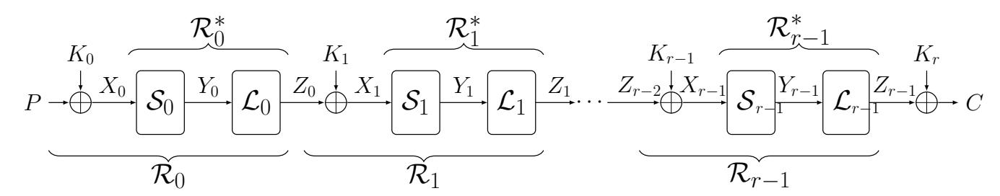
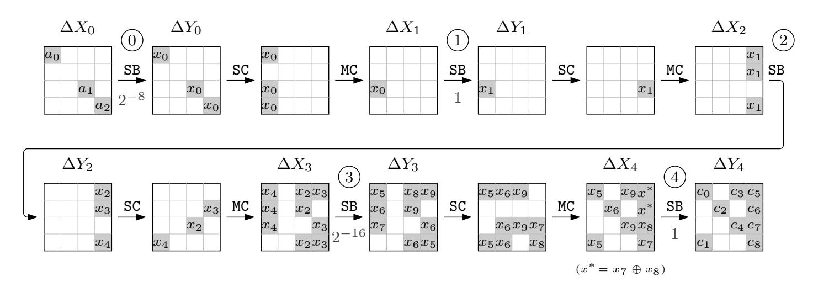
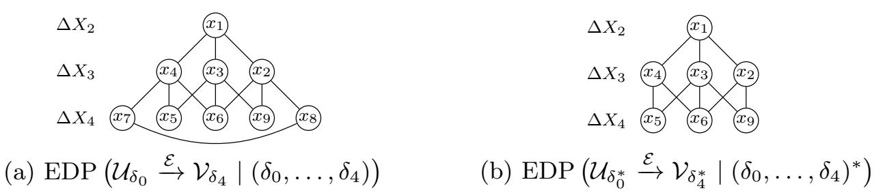
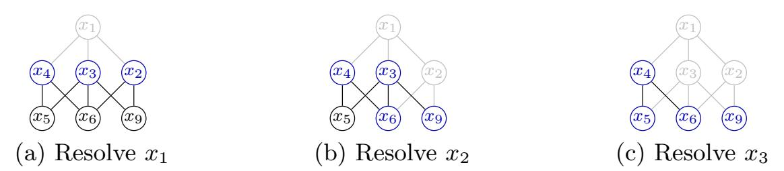
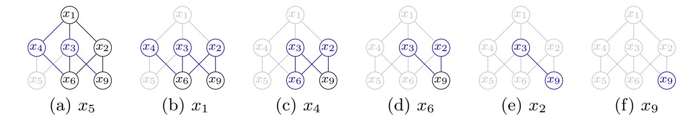
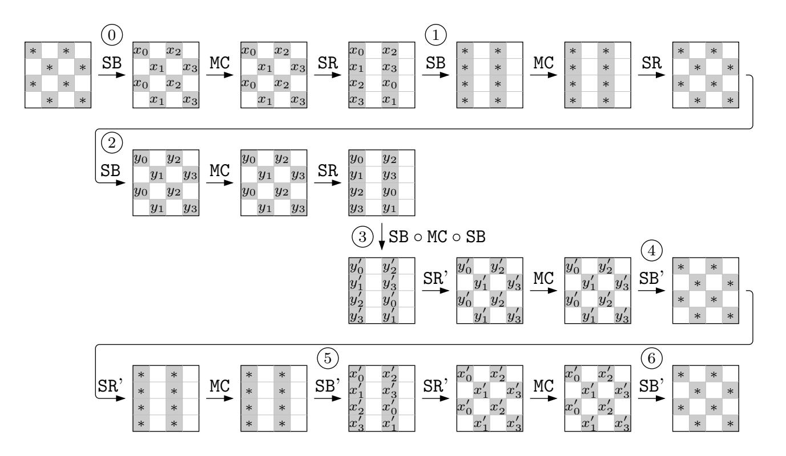

{0}------------------------------------------------

# Computing Expected Differential Probability of (Truncated) Differentials and Expected Linear Potential of (Multidimensional) Linear Hulls in SPN Block Ciphers<sup>∗</sup>

Maria Eichlseder1,<sup>2</sup> , Gregor Leander<sup>1</sup> , and Shahram Rasoolzadeh<sup>1</sup>

<sup>1</sup> Ruhr University Bochum, Horst G¨ortz Institute for IT Security, Bochum, Germany firstname.lastname@rub.de <sup>2</sup> Graz University of Technology, Graz, Austria firstname.lastname@iaik.tugraz.at

Abstract. In this paper we introduce new algorithms that, based only on the independent round keys assumption, allow to practically compute the exact expected differential probability of (truncated) differentials and the expected linear potential of (multidimensional) linear hulls. That is, we can compute the exact sum of the probability or the potential of all characteristics that follow a given activity pattern. We apply our algorithms to various recent SPN ciphers and discuss the results.

Keywords: truncated differential · multidimensional linear hull · SPN cipher

# 1 Introduction

Differential and linear cryptanalysis are two powerful statistical attacks in symmetric-key cryptography. Differential cryptanalysis was first introduced by Biham and Shamir in 1990 [\[BS90\]](#page-21-0) and linear cryptanalysis by Matsui in 1993 [\[Mat93\]](#page-23-0). Although the first target of both attacks was DES [\[Nat77\]](#page-23-1), they were applied to numerous other block ciphers. Due to their wide applicability, it is necessary to evaluate the security of all block ciphers against these two attacks.

To analyze a cipher's susceptibility to these attacks, evaluating or at least approximating the quality of a differential or linear approximation is an essential, but difficult step. While both were originally (and are still most often) evaluated based on differential or linear characteristics, it was soon observed that the relevant metrics are rather the probability of a differential [\[LMM91\]](#page-22-0) or the correlation of a linear hull [\[Nyb94\]](#page-23-2). The first specifies the difference or linear mask in every intermediate state of the cipher, while the latter determines only those in the input and output states. Thus, many characteristics contribute to one differential or linear hull. While individual characteristics (under some assumptions [\[LMM91\]](#page-22-0)) can easily be evaluated, precisely evaluating a differential or linear hull is generally infeasible.

{1}------------------------------------------------

Numerous variants and improvements of differential and linear cryptanalysis have been proposed, including truncated differentials [\[Knu94\]](#page-22-1) and multiple and multidimensional linear cryptanalysis [\[JR94,](#page-22-2)[HCN19\]](#page-22-3). Both consider collections of many differentials or linear masks to make the attack more efficient. Again, exactly computing their probability is usually impossible. When applied to substitution-permutation-network (SPN) ciphers, the notion of activity patterns becomes key. An activity pattern specifies for each round which S-boxes have a zero and which have a non-zero difference/mask (active), but does not specify the exact value. A truncated characteristic is thus the collection of all characteristics that follow the given activity pattern. Even though a truncated characteristic contains only a subset of all characteristics of a differential resp. a linear hull, it is still in general infeasible to compute their probability.

As truncated characteristics are the essential objects for assessing the security of many modern SPN ciphers against differential and linear cryptanalysis, the absence of suitable algorithms to tackle this problem was – and still is – an interesting research area within symmetric cryptography.

Related Work Several algorithms have been developed in the past. We provide a detailed discussion of related work in Section [3](#page-5-0) after having fixed the notation. Here we limit ourselves to note that a variety of methods for estimating the expected probability of truncated differential (characteristics) have been proposed, e.g. [\[KB96,](#page-22-4)[MSAK99](#page-23-3)[,MG00,](#page-23-4)[AL12](#page-21-1)[,K¨ol14,](#page-22-5)[CFG](#page-22-6)+14[,Leu15,](#page-22-7)[AK18,](#page-21-2)[EK18\]](#page-22-8). One general approach is to treat a truncated differential characteristic as a collection of individual differential characteristics, and to derive an estimate by enumerating and evaluating the individual characteristics based on the transition probabilities for the nonlinear layer. A second direction is to focus on local properties such as the conditions imposed by the truncated differential characteristic, and to derive an estimate based on these conditions.

Unfortunately, those algorithms either add additional assumptions to be efficient or work only in very specific cases. In the former case they result only in approximations of the probabilities instead of exact values. Even more problematic, it is often not possible to determine if this approximation under- or overestimates the correct value.

Our Contribution In this paper, we introduce new methods to compute the exact expected probability of truncated differential characteristics and the potential of truncated linear characteristics for SPN block ciphers. As all previous work, our algorithms rely on the independent round keys assumption.[3](#page-1-0) However, due to a careful analysis of the involved structures, we achieve efficiency without making additional simplifications or further assumptions. For most ciphers of interest, the running time of the algorithm is a few minutes on a standard desktop computer.

By applying our ideas to concrete instances, we are (i) able to show how well previous methods approximate the exact values and (ii) derive interesting

<span id="page-1-0"></span><sup>3</sup> It is also known as Markov cipher assumptions.

{2}------------------------------------------------

results on a list of modern SPN ciphers. Concerning (i), we in particular show that although Moriai's et al. method [MSAK99] for approximating probability of a truncated differential characteristic is fast, since it is independent of the underlying S-box, the given value can be very different from the correct value. With respect to (ii) we like to highlight several results: For PRINCE, we find many 6-round differentials with comparable probability to the ones in [CFG<sup>+</sup>14] which is suitable for similar attacks. For Skinny64, we identify differentials with higher probability or for one more round than previous analysis based on enumerating characteristics [AK18]. For Midori64, we find truncated differentials covering more rounds than a recently proposed MILP-based approach [MA19].

Outline In Section 2, we introduce background on differentials. In Section 3, we discuss previous methods for computing the probability of truncated differentials and their limitations. In Section 4, we propose a new method to compute the probability of truncated differential characteristics together with optimization techniques. We apply our algorithms to several block ciphers and discuss the results in Section 5.

# <span id="page-2-0"></span>2 Preliminaries

A block cipher is a function  $\mathcal{E}: \mathbb{F}_2^k \times \mathbb{F}_2^n \to \mathbb{F}_2^n$  with  $C = \mathcal{E}(K, P)$  such that for each fixed  $K, \mathcal{E}_K(\cdot) := \mathcal{E}(K, \cdot)$  is a permutation of  $\mathbb{F}_2^n$ . K, P, and C are the master key, plaintext, and ciphertext, with bit-sizes k, n, and n, resp. In this paper, we focus on key-alternating SPN ciphers. The cipher's state is separated into m words of s bits each, where  $n = s \cdot m$ . Each round includes three layers (see Fig. 1):

- Key addition  $(A_{K_i})$ : xor the *n*-bit round key  $K_i$  to the whole state.
- Non-linear layer  $(S_i)$ : apply m parallel bijective s-bit S-boxes  $S_i$  to the words.
- Linear layer  $(\mathcal{L}_i)$ : multiply an  $n \times n$  bijective binary matrix  $L_i$  to the state.

The *i*-th round  $(0 \le i < r)$  is denoted by  $\mathcal{R}_i = \mathcal{L}_i \circ \mathcal{S}_i \circ \mathcal{A}_{K_i}$ , and rounds i to j by  $\mathcal{R}_{i\cdots j} = \mathcal{R}_j \circ \ldots \circ \mathcal{R}_i$ . After r rounds, the ciphertext is  $\mathcal{E}_K(P) = \mathcal{A}_{K_r} \circ \mathcal{R}_{r-1} \circ \cdots \circ \mathcal{R}_0(P)$ . We use  $\mathcal{R}_i^*$  to denote round operations excluding the key addition, i.e.,  $\mathcal{R}_i^* = \mathcal{L}_i \circ \mathcal{S}_i$ . By  $X_i$ ,  $Y_i$ , and  $Z_i$ , we denote the states before  $\mathcal{S}_i$ , before  $\mathcal{L}_i$ , and after  $\mathcal{L}_i$  layers.  $X_i[j]$  denotes the corresponding j-th word of the state  $X_i$ .

<span id="page-2-1"></span>

Fig. 1: Structure of the considered block cipher in this paper.

{3}------------------------------------------------

#### 2.1 Differential Cryptanalysis

In differential cryptanalysis, the attacker wants to find non-uniformity in the occurrence of plaintext differences  $\Delta P = P \oplus P'$  and the corresponding ciphertext differences  $\Delta C = C \oplus C'$ , usually by finding a high-probability pair  $(\Delta P, \Delta C)$ , to distinguish the cipher from a random permutation. We denote the intermediate states in the computation of C, C' by X, X' and their difference by  $\Delta X = X \oplus X'$ .

**Definition 1 (Differential Probability of**  $\mathcal{E}_K$ ). For a block cipher  $\mathcal{E}_K$  and  $\alpha, \beta \in \mathbb{F}_2^n$ , the fixed-key differential probability of the differential  $(\alpha, \beta)$  is

$$\mathbb{P}(\alpha \xrightarrow{\mathcal{E}_K} \beta) = 2^{-n} \cdot | \{ P \in \mathbb{F}_2^n \mid \mathcal{E}_K(P) \oplus \mathcal{E}_K(P \oplus \alpha) = \beta \} |.$$

Since the attacker has no knowledge of the key in  $\mathcal{E}_K$ , he wants to find a differential with fixed-key probability significantly higher than  $2^{-n}$  for most keys in  $\mathbb{F}_2^{\kappa}$ . Thus, he wants to find a differential with a high expected differential probability (EDP).

**Definition 2 (EDP of**  $\mathcal{E}$ ). For any  $\alpha, \beta \in \mathbb{F}_2^n$ , the EDP of the differential  $(\alpha, \beta)$  for the encryption  $\mathcal{E}$  over a uniformly distributed random key  $K \in \mathbb{F}_2^{\kappa}$  is

$$EDP(\alpha \xrightarrow{\mathcal{E}} \beta) := 2^{-\kappa} \cdot \sum_{K \in \mathbb{F}_2^{\kappa}} \mathbb{P}(\alpha \xrightarrow{\mathcal{E}_K} \beta).$$

**Definition 3 (Differential Characteristics).** An r-round differential characteristic of differences  $(\alpha_0, \ldots, \alpha_r) \in (\mathbb{F}_2^n)^{r+1}$  between the rounds has probability

$$\mathbb{P}(\alpha_0 \xrightarrow{\mathcal{R}_0} \alpha_1 \to \dots \to \alpha_{r-1} \xrightarrow{\mathcal{R}_{r-1}} \alpha_r) = 2^{-n} \cdot |\{P \in \mathbb{F}_2^n \mid \forall i, \ \mathcal{R}_i \circ \dots \circ \mathcal{R}_0(P) \oplus \mathcal{R}_i \circ \dots \circ \mathcal{R}_0(P \oplus \alpha_0) = \alpha_{i+1}\}|.$$

It follows that for a key alternating cipher, the probability of a differential is the sum of the probability of all containing characteristics whose plaintext and ciphertext differences are the same as in the differential, i.e.,

$$\mathbb{P}(\alpha_0 \xrightarrow{\mathcal{E}_K} \alpha_r) = \sum_{\alpha_1, \dots, \alpha_{r-1}} \mathbb{P}(\alpha_0 \xrightarrow{\mathcal{R}_0} \alpha_1 \to \dots \to \alpha_{r-1} \xrightarrow{\mathcal{R}_{r-1}} \alpha_r).$$

Computing these probabilities is not an easy task; since for a given differential (characteristic), they need computation over all the message and the key space, i.e., the computation complexity is  $\mathcal{O}(2^{n+\kappa})$ .

Even for the smallest applied values of n and  $\kappa$ , this is an unapproachable complexity. Therefore, it comes to mind how efficiently one can compute the probability of a differential (characteristic). One assumption that makes it easier to compute EDP of differential characteristic is known as the *independent round keys* assumption that it is assumed that the all r+1 round keys are independent of each other<sup>4</sup>.

<span id="page-3-1"></span><span id="page-3-0"></span><sup>&</sup>lt;sup>4</sup> In [LMM91], the authors used the term *Markov cipher* assumption.

{4}------------------------------------------------

Theorem 1. [\[LMM91\]](#page-22-0) In a key alternating cipher with independent round keys,

<span id="page-4-0"></span>
$$EDP(\alpha_0 \xrightarrow{\mathcal{R}_0} \alpha_1 \to \dots \to \alpha_{r-1} \xrightarrow{\mathcal{R}_{r-1}} \alpha_r) = \prod_{i=0}^{r-1} \mathbb{P}(\alpha_i \xrightarrow{\mathcal{R}_i^*} \alpha_{i+1}), \quad (1)$$

<span id="page-4-1"></span>
$$EDP(\alpha_0 \xrightarrow{\mathcal{E}} \alpha_r) = \sum_{\alpha_1, \dots, \alpha_{r-1}} \prod_{i=0}^{r-1} \mathbb{P}(\alpha_i \xrightarrow{\mathcal{R}_i^*} \alpha_{i+1}).$$
 (2)

Theorem [1](#page-3-1) shows that the independent round keys assumption makes the computation much easier, especially if the round functions are quite simple ones. In differential cryptanalysis of key alternating ciphers, it is common to assume that the all round keys are independent. Then, EDP of a differential (characteristic) can be computed as given in Eq.[\(1\)](#page-4-0) and Eq.[\(2\)](#page-4-1). This assumption allows to compute EDP without considering the value of the master key. Using this assumption, it is easy to compute EDP of a differential characteristic, however, computing EDP of a differential using this assumption remains challenging since it requires considering all differential characteristics with different α1, . . . , αr−1.

Using Theorem [1,](#page-3-1) for an r-round SPN block cipher with independent round keys, the EDP of characteristic (α0, . . . , αr) is equal to

$$EDP(\alpha_0 \xrightarrow{\mathcal{R}_0} \alpha_1 \to \dots \to \alpha_{r-1} \xrightarrow{\mathcal{R}_{r-1}} \alpha_r) = \prod_{i=0}^{r-1} \prod_{j=0}^{m-1} \mathbb{P}(\alpha_i[j] \xrightarrow{S_i} \beta_i[j]), \quad (3)$$

where β<sup>i</sup> := L −1 i (αi+1) with 0 ≤ i < r. Furthermore,

$$EDP(\alpha_0 \xrightarrow{\mathcal{E}} \alpha_r) = \sum_{\alpha_1, \dots, \alpha_{r-1}} \prod_{i=0}^{r-1} \prod_{j=0}^{m-1} \mathbb{P}(\alpha_i[j] \xrightarrow{S_i} \beta_i[j]). \tag{4}$$

The differential probability of the nonlinear layer S<sup>i</sup> is the product of the individual differential probabilities of all S-boxes, as indicated in the S-box's differential distribution table (DDT); in particular, of all S-boxes with non-zero input difference, which we denote as active S-boxes. We denote the activity in X using the activity function δ(X), where δ(X)[i] = 1 if and only if X[i] 6= 0, else δ(X)[i] = 0. We use the shorthand δ<sup>i</sup> = δ(∆Xi) = δ(∆Yi) and refer to (δ0, . . . , δr−1) as the activity pattern of the characteristic.

Truncated Differential We consider truncated differentials, where the plaintext difference is chosen from a set U and the ciphertext one from a set V. Its probability is defined as follows, assuming all differences in U occur uniformly:

$$EDP(\mathcal{U} \xrightarrow{\mathcal{E}} \mathcal{V}) = \frac{1}{|\mathcal{U}|} \cdot \sum_{\alpha \in \mathcal{U}, \beta \in \mathcal{V}} EDP(\alpha_0 \xrightarrow{\mathcal{E}} \alpha_r).$$

Note that in classical truncated differentials, only differences in some bits of the plaintext and ciphertext are determined, while the other bits can take any values. In this case, U and V are a special kind of linear subspaces excluding 

{5}------------------------------------------------

the zero value. In this paper, we use the general definition for the truncated differential.

If the attacker finds  $\mathcal{U}$  and  $\mathcal{V}$  such that  $EDP(\mathcal{U} \xrightarrow{\mathcal{E}} \mathcal{V})$  is significantly larger than  $|\mathcal{V}| \cdot 2^{-n}$ , he can use this to distinguish  $\mathcal{E}$  from a random permutation. We define the *Expected Differential Distinguishability* (EDD) as the average differential probability in the truncated differential, which must be significantly larger than  $2^{-n}$  to distinguish:

$$EDD(\mathcal{U} \xrightarrow{\mathcal{E}} \mathcal{V}) = \frac{1}{|\mathcal{U}| \cdot |\mathcal{V}|} \cdot \sum_{\alpha \in \mathcal{U}, \beta \in \mathcal{V}} EDP(\alpha \xrightarrow{\mathcal{E}} \beta).$$

# <span id="page-5-0"></span>3 Related Work on Probability of Truncated Differentials

Enumerating Characteristics. A simple, but inefficient approach to evaluate the EDP follows directly from its definition as in Eq.(2). We can compute or approximate this probability by enumerating and individually evaluating all or many of the compatible differential characteristics  $(\alpha_0, \ldots, \alpha_r)$  based on their S-box transition probabilities. This works well when there are only few compatible characteristics which dominate this probability and these can be identified efficiently. However, in practice, this is often not the case, limiting the applicability of this approach, particularly for larger sets  $\mathcal{U}, \mathcal{V}$ . A heuristic automated approach for enumerating compatible characteristics is implemented in the SAT-based tool CRYPTOSMT [Köl14] and was evaluated on differentials  $(\alpha_0, \alpha_r)$  for a large selection of ciphers [AK18].

**Transition Probabilities Matrices.** We consider the  $2^n \times 2^n$  transition matrix of differential probabilities from each input difference to each output difference for one round, i.e., the scaled DDT of a round. Under the independent round keys assumption, the powers of this matrix describe the differential behavior of more rounds. Correlation matrices [DGV94] similarly model linear cryptanalysis.

Explicitly computing or multiplying the full  $2^n \times 2^n$  matrices is, however, only feasible in very particular cases, i.e.  $n \leq 32$  and a transition matrix that is very sparse, such as KATAN32 [AL12] or Speck32 [Goh19]. Usually, the transition matrices must be reduced by considering only the submatrices for specific differences, or by taking marginal distributions for groups of differences.

Some fine-grained approaches have been proposed, for example the transition probabilities matrices for a stochastic analysis of CRYPTON block cipher [MG00] or the differential analysis of LAC's underlying block cipher, LBLOCK-s [Leu15].

It has also been proposed to apply different marginalization criteria for different layers of the cipher, for example in the semi-truncated differential analysis of Mantis [EK18]. Sometimes, it is possible to derive a precise closed-form expression for the powers of the matrix, as in the analysis of Prince by [CFG+14]. These approaches represent trade-offs between the previously discussed two main approaches: Enumerating characteristics and evaluating local constraints.

One way to make this computation efficient is to partition the underlying characteristics by their activity patterns. By partitioning over activity patterns,

{6}------------------------------------------------

EDP  $(\alpha_0 \xrightarrow{\mathcal{E}} \alpha_r \mid (\delta_0, \dots, \delta_{r-1}))$  is used to denote the sum of probabilities of characteristics whose activity pattern is  $(\delta_0, \ldots, \delta_{r-1})$ . Thereby,

$$EDP(\alpha_0 \xrightarrow{\mathcal{E}} \alpha_r) = \sum_{\delta_1, \dots, \delta_{r-2}} EDP(\alpha_0 \xrightarrow{\mathcal{E}} \alpha_r \mid (\delta_0, \dots, \delta_{r-1})) \text{ where,}$$

$$EDP(\alpha_0 \xrightarrow{\mathcal{E}} \alpha_r) = \sum_{\substack{\delta_1, \dots, \delta_{r-2} \\ \delta_1, \dots, \delta_{r-2}}} EDP(\alpha_0 \xrightarrow{\mathcal{E}} \alpha_r \mid (\delta_0, \dots, \delta_{r-1})) \text{ where,}$$

$$EDP(\alpha_0 \xrightarrow{\mathcal{E}} \alpha_r \mid (\delta_0, \dots, \delta_{r-1})) = \sum_{\substack{\alpha_1, \dots, \alpha_{r-1} \\ \forall i \ \alpha_i \in A_i}} \prod_{i=0}^{r-1} \mathbb{P}(\alpha_i \xrightarrow{\mathcal{S}_i} \mathcal{L}_i^{-1}(\alpha_{i+1})),$$

and  $A_i$  is the set of all  $\alpha_i \in \mathbb{F}_2^n$  with  $\delta(\alpha_i) = \delta_i, \delta(\mathcal{L}_i^{-1}(\alpha_i)) = \delta_{i-1}$ . Similarly, for truncated differentials, we use the notation EDP  $(\mathcal{U} \xrightarrow{\mathcal{E}} \mathcal{V} \mid (\delta_0, \dots, \delta_{r-1}))$ .

**Definition 4 (Truncated Differential Characteristic).** For a given activity pattern  $(\delta_0, \ldots, \delta_{r-1})$ , the truncated differential characteristic is the set of all differential characteristics that follow the activity pattern, i.e., all  $(\alpha_0, \ldots, \alpha_r)$  with  $\delta(\alpha_0) \in \delta_0$ ,  $\delta(\alpha_r) \in \delta_{r-1}$ , and  $\delta(\alpha_i) = \delta_i$ ,  $\delta(\mathcal{L}_i^{-1}(\alpha_i)) = \delta_{i-1}$  with 0 < i < r.

We denote the set of all  $(2^s-1)^{\text{hw}(\delta_i)}$  values for  $\alpha_i$  such that  $\delta(\alpha_i) = \delta_i$  by  $\mathcal{U}_{\delta_i}$ and the set of all  $(2^s-1)^{\text{hw}(\delta_i)}$  values for  $\alpha_{i+1}$  such that  $\delta(\mathcal{L}_i^{-1}(\alpha_{i+1})) = \delta_i$  by  $\mathcal{V}_{\delta_i}$ . Therefore, for a truncated differential characteristic,  $\mathcal{U}$  is the same as  $\mathcal{U}_{\delta_0}$ and  $\mathcal{V}$  is the same as  $\mathcal{V}_{\delta_{r-1}}$ , and EDP  $(\mathcal{U}_{\delta_0} \xrightarrow{\mathcal{E}} \mathcal{V}_{\delta_{r-1}} \mid (\delta_0, \dots, \delta_{r-1}))$  denotes its EDP. Note that this is different from the typical definition of truncated differentials where  $\mathcal{U}$  and  $\mathcal{V}$  cover all the corresponding linear subspaces (excluding zero) where  $|\mathcal{U}| = 2^{s \cdot \text{hw}(\delta_0)} - 1$  and  $|\mathcal{V}| = 2^{s \cdot \text{hw}(\delta_{r-1})} - 1$ . We denote the probability of this notion of truncated characteristics by EDP  $(\mathcal{U}_{\delta_0^*} \xrightarrow{\mathcal{E}} \mathcal{V}_{\delta_{r-1}^*} \mid (\delta_0, \dots, \delta_{r-1})^*)$ an it is defined as

efined as
$$\sum_{\substack{\delta'_0, \dots, \delta'_{r-1} \\ \forall i, \ \delta'_i \leq \delta_i}} \frac{(2^s - 1)^{\text{hw}(\delta'_0)}}{2^{s \cdot \text{hw}(\delta_0)} - 1} \cdot \text{EDP}\left(\mathcal{U}_{\delta'_0} \xrightarrow{\mathcal{E}} \mathcal{V}_{\delta'_{r-1}} \mid (\delta'_0, \dots, \delta'_{r-1})\right),$$

which is described over uniformly distributed differences in  $\mathcal{U}_{\delta_0^*}$ .

Partitioning a (truncated) differential over the truncated characteristics makes it possible to give a close lower estimation by only considering the ones which has prominent role in the EDP of the (truncated) differential, those are usually the truncated characteristics with less number of active S-boxes or the ones with less number of conditions in the linear layers.

Approach by Moriai et al. |MSAK99| introduced an estimation of the EDP of a truncated differential for SPN block ciphers, assuming independent round keys. It has since been widely applied due to its simple evaluation and good accuracy for AES-like designs with highly uniform S-boxes and strong diffusion.

It assumes uniform differential probabilities for the s-bit S-box S, i.e., that  $\mathbb{P}(a \xrightarrow{S} b)$  is either 1 (if a = b = 0) or  $p = (2^s - 1)^{-1}$  (if  $a \neq 0, b \neq 0$ ) or 0

<span id="page-6-0"></span> $<sup>\</sup>overline{\phantom{a}^{5}}$  hw( $\delta_{i}$ ) is the Hamming weight of  $\delta_{i}$  and it is equal to the number of active S-boxes in the i-th round.

<span id="page-6-1"></span><sup>&</sup>lt;sup>6</sup> For  $x, y \in \mathbb{F}_2^m$ , we use  $x \leq y$  to denote that for all i with  $0 \leq i < m$ ,  $x[i] \leq y[i]$ .

{7}------------------------------------------------

<span id="page-7-0"></span>

Fig. 2: 5-round Truncated Characteristic for MIDORI-64 from [MA19]. Note that the final linear layer is omitted.

otherwise. Note that no S-box fulfills this assumption, but it allows to easily evaluate truncated characteristics based on the probability  $\mathbb{P}(\delta_i \xrightarrow{\delta \mathcal{L}_i} \delta_{i+1})$  that  $\beta_i$  with  $\delta(\beta_i) = \delta_i$  maps to a value with activity pattern  $\delta_{i+1}$  over each linear layer  $\mathcal{L}_i$ . However, the results may both under- or overestimate the real probabilities.

<span id="page-7-1"></span>Example 1. Fig. 2 shows a truncated characteristic for 5-round MIDORI which is borrowed from [MA19]. The EDP of this truncated characteristic, EDP ( $\mathcal{U}_{\delta_0} \to \mathcal{V}_{\delta_4} \mid (\delta_0, \dots, \delta_4)$ ) is equal to

$$15^{-3} \cdot \sum \left( \mathbb{P}(a_0 \xrightarrow{S} x_0) \cdot \mathbb{P}(a_1 \xrightarrow{S} x_0) \cdot \mathbb{P}(a_2 \xrightarrow{S} x_0) \cdot \mathbb{P}(x_0 \xrightarrow{S} x_1) \cdot \mathbb{P}(x_1 \xrightarrow{S} x_2) \cdot \mathbb{P}(x_1 \xrightarrow{S} x_3) \cdot \mathbb{P}(x_1 \xrightarrow{S} x_4) \cdot \mathbb{P}(x_4 \xrightarrow{S} x_5) \cdot \mathbb{P}(x_4 \xrightarrow{S} x_6) \cdot \mathbb{P}(x_4 \xrightarrow{S} x_7) \cdot \mathbb{P}(x_2 \xrightarrow{S} x_8) \cdot \mathbb{P}(x_2 \xrightarrow{S} x_9) \cdot \mathbb{P}(x_2 \xrightarrow{S} x_6) \cdot \mathbb{P}(x_3 \xrightarrow{S} x_9) \cdot \mathbb{P}(x_3 \xrightarrow{S} x_6) \cdot \mathbb{P}(x_3 \xrightarrow{S} x_5) \cdot \mathbb{P}(x_5 \xrightarrow{S} c_0) \cdot \mathbb{P}(x_5 \xrightarrow{S} c_1) \cdot \mathbb{P}(x_6 \xrightarrow{S} c_2) \cdot \mathbb{P}(x_9 \xrightarrow{S} c_3) \cdot \mathbb{P}(x_9 \xrightarrow{S} c_4) \cdot \mathbb{P}(x_8 \xrightarrow{S} c_7) \cdot \mathbb{P}(x_7 \xrightarrow{S} c_8) \cdot \mathbb{P}(x_7 \oplus x_8 \xrightarrow{S} c_5) \cdot \mathbb{P}(x_7 \oplus x_8 \xrightarrow{S} c_6) \right)$$

where sum is over  $a_0, a_1, a_2, x_0, \dots, x_9, c_0, \dots, c_8 \in \mathbb{F}_2^4 \setminus \{0\}.$ 

To compute the exact value of this EDP, we need to do 25 (number of active S-boxes) table look-ups and arithmetic operations for each  $15^{22}$  value of  $a_0, \ldots, c_8$  which is about  $2^{90.60}$  table look-ups and arithmetic operations.

On the other hand, using Moriai's et al. method, it is enough to multiply  $\mathbb{P}(\delta_0 \xrightarrow{\delta \mathcal{L}} \delta_1) = 15^{-2}, \quad \mathbb{P}(\delta_1 \xrightarrow{\delta \mathcal{L}} \delta_2) = 1, \quad \mathbb{P}(\delta_2 \xrightarrow{\delta \mathcal{L}} \delta_3) = 1, \quad \mathbb{P}(\delta_3 \xrightarrow{\delta \mathcal{L}} \delta_4) = 14 \cdot 15^{-5},$  resulting in  $14 \cdot 15^{-7} \approx 2^{-23.54}$ .

To compute EDP  $(\mathcal{U}_{\delta_0^*} \to \mathcal{V}_{\delta_4^*} \mid (\delta_0, \dots, \delta_4)^*)$ , we need to consider all other possible underlying activity patterns  $(\delta'_0, \dots, \delta'_4)$ . There is only one such activity pattern  $(\delta_0, \dots, \delta'_4)$ , where  $\delta_4$  and  $\delta'_4$  are different on the corresponding S-boxes for  $c_5$  and  $c_6$ .  $(\delta_0, \dots, \delta'_4)$  occurs if and only if  $x_7 = x_8$ , then  $\mathbb{P}(\delta_3 \xrightarrow{\delta \mathcal{L}} \delta'_4) = 15^{-5}$  and EDP  $(\mathcal{U}_{\delta_0} \to \mathcal{V}_{\delta_4} \mid (\delta_0, \dots, \delta'_4)) = 15^{-7} \approx 2^{-27.35}$ . In this way, EDP  $(\mathcal{U}_{\delta_0^*} \to \mathcal{V}_{\delta_4^*} \mid (\delta_0, \dots, \delta_4)^*) = 15^{-3}/(16^3 - 1) \approx 2^{-23.72}$ , approximated as  $2^{-24}$  in [MA19].

Using the techniques in the next section, we compute the exact value of EDP  $(\mathcal{U}_{\delta_0^*} \to \mathcal{V}_{\delta_4^*} \mid (\delta_0, \dots, \delta_4)^*)$  for the S-box given in the specification of MIDORI, which is  $2^{-20.60}$ . Thus, there is a gap between the exact value and the

{8}------------------------------------------------

<span id="page-8-2"></span>Table 1: Minimum and maximum probability of the truncated differential in Fig. 2 among the Golden S-boxes. The probability p is shown as  $-\log_2 p$ .

|     | $G_0$ | $G_1$ | $G_2$ | $G_3$ | $G_4$ | $G_5$ | $G_6$ | $G_7$ | $G_8$ | $G_9$ | $G_{10}$ | $G_{11}$ | $G_{12}$ | $G_{13}$ | $G_{14}$ | $G_{15}$ |
|-----|-------|-------|-------|-------|-------|-------|-------|-------|-------|-------|----------|----------|----------|----------|----------|----------|
| min | 21.55 | 21.60 | 21.61 | 22.30 | 22.36 | 22.26 | 22.28 | 22.32 | 21.62 | 22.07 | 22.10    | 22.27    | 22.36    | 22.31    | 22.06    | 22.06    |
| max | 20.77 | 20.60 | 20.79 | 22.11 | 21.77 | 21.95 | 21.70 | 21.74 | 20.44 | 21.41 | 21.40    | 21.58    | 21.69    | 21.78    | 21.60    | 21.64    |

value given by the method of Moriai et al.. To show that changes of the S-box can make a significant difference in the value of EDP, all 4-bit bijective S-boxes are tried and the EDP of the same characteristic is computed<sup>7</sup>. The minimum observed value is  $2^{-22.36}$  for the following two S-boxes:

(0,8,3,b,6,5,2,9,e,4,a,c,7,1,d,f) and (0,7,9,e,2,b,a,4,5,8,d,f,1,c,3,6), while the maximum is  $2^{-8.09}$  for any linear S-box. Clearly, the EDP of a truncated differential depends not only on the linear layer of the cipher, but also on its S-boxes. To show that this EDP can be different for S-boxes within an Affine equivalence class, all S-boxes within the 16 Affine equivalence classes with minimum possible uniformity and linearity, which are known as Golden S-boxes [LP07], are checked. The minimum and maximum value for the EDP within S-boxes of the same class are given in the Table 1. Interestingly, the smallest logarithmic difference between minimum and maximum EDP is for  $G_3$ , which is the Affine equivalence class of the inversion in  $\mathbb{F}_{2^4}$ . The DDTs of the S-boxes in this class are those closest to uniformly distributed. Also note that the two S-boxes given above are golden S-boxes.

## <span id="page-8-0"></span>4 Our Methods for Computing EDP of Differentials

In this section, we present our methods to compute the EDP of differentials with a given activity pattern under the independent round keys assumption. Then, we extend it to compute EDP of truncated differentials. We also discuss several techniques to reduce the time and/or memory complexity of the algorithms and finally present an efficient algorithm for computing EDP of truncated characteristic. We use two different approaches, one based on a state-view on the differences and one based on a word-view. While the state based method is easier to apply, the word based method in many cases outperforms the former by better minimizing the dependency between parts of the differential characteristics.

#### 4.1 State-by-State Method

To compute EDP  $(\alpha_0 \xrightarrow{\mathcal{E}} \alpha_r \mid (\delta_0, \dots, \delta_{r-1}))$ , first we need to find all possible  $\alpha_i$ s such that  $\delta(\alpha_i) = \delta_i$  and  $\delta(\mathcal{L}_i^{-1}(\alpha_i)) = \delta_{i-1}$  for each i and save them in a table  $A_i$ . We use  $A_i[j]$  to denote j-th possible value for  $\alpha_i$ .

<span id="page-8-1"></span><sup>&</sup>lt;sup>7</sup> Due to the structure of the MIDORI cipher, it is enough to check for representative S-boxes of Affine equivalence classes together with a bijective  $4 \times 4$  matrix in the output of S-box, i.e.,  $302 \times 20160 \approx 2^{22.5}$  S-boxes.

{9}------------------------------------------------

By expanding the product and separating the sum, we get

$$\sum_{\substack{\alpha_1, \dots, \alpha_{r-1} \\ \forall i \ \alpha_i \in A_i}} \prod_{i=0}^{r-1} P\left(\alpha_i \xrightarrow{\mathcal{S}_i} \mathcal{L}_i^{-1}(\alpha_{i+1})\right) = \sum_{\alpha_{r-1} \in A_{r-1}} \mathbb{P}\left(\alpha_{r-1} \xrightarrow{\mathcal{S}_{r-1}} \mathcal{L}_{r-1}^{-1}(\alpha_r)\right) \cdot \left(\sum_{\alpha_1 \in A_1} \mathbb{P}\left(\alpha_1 \xrightarrow{\mathcal{S}_1} \mathcal{L}_1^{-1}(\alpha_2)\right) \cdot \mathbb{P}\left(\alpha_0 \xrightarrow{\mathcal{S}_0} \mathcal{L}_0^{-1}(\alpha_1)\right)\right) \cdot \cdots\right)$$

This equation offers a round-by-round method to compute the probability. For the  $S_0$  layer and for each  $0 \le j < |A_1|$ , we compute

$$\mathbb{P}\left(\alpha_0 \xrightarrow{\mathcal{S}_0} \mathcal{L}_0^{-1}(A_1[j])\right)$$

and insert it in a table as  $T_1[j]$ . Then, for the  $S_1$  layer and  $0 \le j < |A_2|$ , compute

$$\sum_{k=0}^{|A_1|-1} T_1[k] \cdot \mathbb{P}\left(A_1[k] \xrightarrow{\mathcal{S}_1} \mathcal{L}_1^{-1}(A_2[j])\right)$$

and insert it in  $T_2[j]$ . Continuing the same way for  $S_i$  and  $0 \le j < |A_{i+1}|$ , get

$$\sum_{k=0}^{|A_i|-1} T_i[k] \cdot \mathbb{P}\left(A_i[k] \xrightarrow{\mathcal{S}_i} \mathcal{L}_i^{-1}(A_{i+1}[j])\right)$$

and insert it in  $T_{i+1}[j]$ . Finally, for the last round, we compute

$$\sum_{k=0}^{|A_{r-1}|-1} T_{r-1}[k] \cdot \mathbb{P}\left(A_{r-1}[k] \xrightarrow{\mathcal{S}_{r-1}} \mathcal{L}_{r-1}^{-1}(\alpha_r)\right) = \text{EDP}\left(\alpha_0 \xrightarrow{\mathcal{E}} \alpha_r \mid (\delta_0, \dots, \delta_{r-1})\right).$$

Regarding the complexity, in round i with 0 < i < r-1 (i.e., all of the rounds except the first and last ones), we need to do multiplication and addition for  $|A_i| \cdot |A_{i+1}|$  times. Hence, computation complexity of this method in multiplication and addition operations is about

$$|A_1| + |A_{r-1}| + \sum_{i=1}^{r-2} |A_i| \cdot |A_{i+1}|.$$

In each round, we only need to keep two tables, one for the current round to save and one from the previous round to use, so the memory complexity is about

$$\max_{1 \le i < r-1} (|A_i| + |A_{i+1}|).$$

Note that this method can be also applied for computing other EDPs with small modification as explained in the following. To compute EDP  $(\alpha_0 \xrightarrow{\mathcal{E}} \alpha_r \mid (\delta_0, \dots, \delta_{r-1})^*)$ , we only need to modify the set of  $\alpha_i$ s with  $1 \leq i < r-1$ . Thereby,  $A_i^*$ s are defined as the set of all  $\alpha_i$ s such that  $\delta(\alpha_i) \leq \delta_i$  and  $\delta(\mathcal{L}_i^{-1}(\alpha_i)) \leq \delta_{i-1}$ .

To compute EDP  $(\mathcal{U} \xrightarrow{\mathcal{E}} \mathcal{V} \mid (\delta_0, \dots, \delta_{r-1}))$  with general  $\mathcal{U}$  and  $\mathcal{V}$  sets but with restriction that the activity pattern of all elements in  $\mathcal{U}$  is  $\delta_0$  and the activity pattern of elements in  $\mathcal{V}$  transformed by  $\mathcal{L}^{-1}$  is  $\delta_{r-1}$ , we use a similar method. There, we need to change computations in the first and the last S-box layers. In the first and last layer, we compute

$$\sum_{\alpha_0 \in \mathcal{U}} \mathbb{P}\left(\alpha_0 \xrightarrow{\mathcal{S}_0} \mathcal{L}_0^{-1}(A_1[j])\right), \text{ and } \frac{1}{\mathcal{U}} \sum_{\alpha_r \in \mathcal{V}} \sum_{k=0}^{|A_{r-1}|-1} T_{r-1}[k] \cdot \mathbb{P}\left(A_{r-1}[k] \xrightarrow{\mathcal{S}_{r-1}} \mathcal{L}_{r-1}^{-1}(\alpha_r)\right).$$

The above extensions and modifications to compute can be combined together to make it possible to compute the other remaining EDPs. Except the computation complexity of the extension to truncated EDP, memory and computation

{10}------------------------------------------------

complexity of the extensions stays the same, while for computation complexity of the extension to truncated EDP we have

$$|\mathcal{U}| \cdot |A_1| + |\mathcal{V}| \cdot |A_{r-1}| + \sum_{i=1}^{r-2} |A_i| \cdot |A_{i+1}|$$
.

Algorithm 1 in lists our method for computing EDP  $(\alpha_0 \xrightarrow{\mathcal{E}} \alpha_r \mid (\delta_0, \dots, \delta_{r-1}))$  in detail. For saving spaces in the equations, we use  $x \leftarrow +y$  notation instead of  $x \leftarrow x + y$ . Note that this algorithm only needs the knowledge about the linear layers and DDT of the S-boxes applied in the block cipher. In case that all the linear layers are the same or all the S-boxes are the same, this algorithm can be optimized. More important, the FINDALLBETAS procedure can be replace to a complicated one which by using linear algebra techniques reduces the computation cost of this procedure.

Besides, to compute EDP  $(\alpha_0 \xrightarrow{\mathcal{E}} \alpha_r \mid (\delta_0, \dots, \delta_{r-1})^*)$ , we can use the same algorithm by only modifying lines 20, 22, 27, and 29: instead of checking  $\delta(\cdot) = \delta_{I/O}$ , we check  $\delta(\cdot) \leq \delta_{I/O}$ .

To compute EDP  $(\mathcal{U} \xrightarrow{\mathcal{E}} \mathcal{V} \mid (\delta_0, \dots, \delta_{r-1}))$  with general  $\mathcal{U}$  and  $\mathcal{V}$  sets, where the activity pattern of all elements in  $\mathcal{U}$  is  $\delta_0$  and the activity pattern of elements in  $\mathcal{V}$  transformed by  $\mathcal{L}_{r-1}^{-1}$  is  $\delta_{r-1}$ , we use a similar method as in Algorithm 1, iterating over all elements of  $\mathcal{U}$  and  $\mathcal{V}$ . Algorithm 2 lists the updated procedure in detail. We can again use the same modifications as for Algorithm 1 to compute EDP  $(\mathcal{U} \xrightarrow{\mathcal{E}} \mathcal{V} \mid (\delta_0, \dots, \delta_{r-1})^*)$ .

**Performance Improvements by Eliminating S-boxes** We can improve the complexity of this method for computing EDP of a truncated characteristic by eliminating some unnecessary computations. For a bijective s-bit S-box S, we know that for any non-zero  $a \in \mathbb{F}_2^s$  and any  $b \in \mathbb{F}_2^s$ ,

$$\sum_{x \in \mathbb{F}_2^s \setminus \{0\}} \mathbb{P}(x \xrightarrow{S} a) = 1, \sum_{x \in \mathbb{F}_2^s \setminus \{0\}} \mathbb{P}(a \xrightarrow{S} x) = 1, \sum_{x \in \mathbb{F}_2^s} \mathbb{P}(x \xrightarrow{S} b) = 1, \sum_{x \in \mathbb{F}_2^s} \mathbb{P}(b \xrightarrow{S} x) = 1.$$

Using this property, for an S-box layer S which is application of m parallel s-bit bijective S-boxes, and for any  $\alpha, \beta \in \mathbb{F}_2^{s \cdot m}$  with  $\delta(\alpha) = \delta_i$  and  $\delta(\beta) \leq \delta_i$ , we have

$$\sum_{\substack{x \in \mathbb{F}_2^{s \cdot m} \\ \delta(x) = \delta_i}} \mathbb{P}(x \xrightarrow{\mathcal{S}} \alpha) = 1, \sum_{\substack{x \in \mathbb{F}_2^{s \cdot m} \\ \delta(x) = \delta_i}} \mathbb{P}\left(\alpha \xrightarrow{\mathcal{S}} x\right) = 1, \sum_{\substack{x \in \mathbb{F}_2^{s \cdot m} \\ \delta(x) \leq \delta_i}} \mathbb{P}\left(\beta \xrightarrow{\mathcal{S}} x\right) = 1.$$

This simplification eliminates the computations for the first and last S-box layers when we are computing EDP of a truncated characteristic:

EDP 
$$(\mathcal{U}_{\delta_0} \xrightarrow{\mathcal{E}} \mathcal{V}_{\delta_{r-1}} \mid (\delta_0, \dots, \delta_{r-1})) = (2^s - 1)^{-\operatorname{hw}(\delta_0)}.$$

$$\sum_{\substack{\alpha_1, \dots, \alpha_{r-1} \\ \forall i \ \alpha_i \in A_i}} \prod_{i=1}^{r-2} \mathbb{P} \left( \alpha_i \xrightarrow{\mathcal{S}_i} \mathcal{L}^{-1}(\alpha_{i+1}) \right),$$

Algorithm 3 lists the detailed procedure for computing EDP of a truncated characteristic and it can be modified similarly to the previous algorithms to compute EDP  $(\mathcal{U}_{\delta_0} \xrightarrow{\mathcal{E}} \mathcal{V}_{\delta_{r-1}} \mid (\delta_0, \dots, \delta_{r-1})^*)$ .

{11}------------------------------------------------

Example 2. With this technique, the EDP of the characteristic in Example 1 is

EDP 
$$\left(\mathcal{U}_{\delta_{0}} \xrightarrow{\mathcal{E}} \mathcal{V}_{\delta_{4}} \mid (\delta_{0}, \dots, \delta_{4})\right) = 15^{-3} \cdot \sum_{\substack{x_{0}, \dots, x_{9} \in \mathbb{F}_{2}^{4} \setminus \{0\}\\ x_{7} \neq x_{8}}} \left(p_{01} \cdot p_{12} \cdot p_{13} \cdot p_{14} \cdot p_{45} \cdot p_{46} \cdot p_{47} \cdot p_{28} \cdot p_{29} \cdot p_{26} \cdot p_{39} \cdot p_{36} \cdot p_{35}\right)$$

where  $p_{ij} = \mathbb{P}(x_i \xrightarrow{S} x_j)$ . If we want to compute EDP  $(\mathcal{U}_{\delta_0^*} \xrightarrow{\mathcal{E}} \mathcal{V}_{\delta_4^*} \mid (\delta_0, \dots, \delta_4)^*)$ , the factor is  $(16^3 - 1)^{-1}$  and the sum is over  $x_0, \dots, x_9 \in \mathbb{F}_2^4$  with no conditions. To compute these equations without the proposed state-by-state method, we would need 13 table look-ups and arithmetic operations for all  $14 \cdot 15^9$  and  $16^{10}$  values of  $x_0, \dots, x_9$  which are about  $2^{42.67}$  and  $2^{43.70}$  computations, resp.

On the other hand, computing EDP  $(\mathcal{U}_{\delta_0} \xrightarrow{\mathcal{E}} \mathcal{V}_{\delta_4} \mid (\delta_0, \dots, \delta_4))$  with our stateby-state method needs 2 table look-ups and arithmetic operation for each  $15^2$  values for  $x_0$  and  $x_1$  in  $\mathcal{S}_1$  layer, 4 table look-ups and arithmetic operations for each  $15^4$  values for  $x_1, x_2, x_3, x_4$  in  $\mathcal{S}_2$  layer and 10 table look-ups and arithmetic operations for each  $14 \cdot 15^7$  values for  $x_2, x_3, \dots, x_9$  in  $\mathcal{S}_3$  layer that in total it is about  $2^{34.48}$  table look-ups and arithmetic operations. Note that this method, in each round needs  $\text{hw}(\delta_i) + 1$  (with  $1 \leq i < r-1$ ) table look-ups, one for calling the reduced-round probability from Table  $T_i$  and the rest for active S-boxes of current (i-th) round. Computing EDP  $(\mathcal{U}_{\delta_0^*} \xrightarrow{\mathcal{E}} \mathcal{V}_{\delta_4^*} \mid (\delta_0, \dots, \delta_4)^*)$  in a similar way needs  $2 \cdot 16^2 + 4 \cdot 16^4 + 10 \cdot 16^8 \approx 2^{35.32}$  table look-ups and arithmetic operations. Both computations need about  $16^5 = 2^{20}$  blocks of memory.

Not only the active S-boxes in the first and the last rounds can be simplified, but also some in the second and second-to-last rounds. This is possible if there is an active nibble of  $\Delta X_1$  (or  $\Delta Y_{r-2}$ ) that is linearly independent of the other active nibbles of the state to satisfy the conditions of the activity pattern.

Example 3. In the previous example, in  $\Delta X_1$ , there is only one active S-box (corresponding to  $x_0$ ) and it can be removed from both above equations:

$$EDP \left(\mathcal{U}_{\delta_0} \xrightarrow{\mathcal{E}} \mathcal{V}_{\delta_4} \mid (\delta_0, \dots, \delta_4)\right) = \frac{1}{15^3} \cdot \sum_{\substack{x_0, \dots, x_9 \\ x_7 \neq x_8}} (p_{01} \cdot p_{12} \cdot \dots \cdot p_{35})$$

$$= \frac{1}{15^3} \cdot \sum_{\substack{x_1, \dots, x_9 \\ x_7 \neq x_8}} ((\sum_{x_0} p_{01}) \cdot p_{12} \cdot \dots \cdot p_{35})$$

$$= \frac{1}{15^3} \cdot \sum_{\substack{x_1, \dots, x_9 \\ x_7 \neq x_8}} (p_{12} \cdot \dots \cdot p_{35}),$$

$$EDP \left(\mathcal{U}_{\delta_0^*} \xrightarrow{\mathcal{E}} \mathcal{V}_{\delta_4^*} \mid (\delta_0, \dots, \delta_4)^*\right) = \dots = \frac{1}{(16^3 - 1)} \cdot \sum_{x_1, \dots, x_9} (p_{12} \cdot \dots \cdot p_{35}).$$

Although  $x_7, x_8$  appear only once in  $\Delta Y_3$ , due to the condition  $x_7 \neq x_8$ , we cannot remove them for EDP  $(\mathcal{U}_{\delta_0} \xrightarrow{\mathcal{E}} \mathcal{V}_{\delta_4} \mid (\delta_0, \dots, \delta_4))$ . But since there is no

{12}------------------------------------------------

such condition in EDP  $(\mathcal{U}_{\delta_0^*} \xrightarrow{\mathcal{E}} \mathcal{V}_{\delta_4^*} | (\delta_0, \dots, \delta_4)^*)$ , we can remove them both:

<span id="page-12-0"></span>EDP 
$$\left(\mathcal{U}_{\delta_0^*} \xrightarrow{\mathcal{E}} \mathcal{V}_{\delta_4^*} \mid (\delta_0, \dots, \delta_4)^*\right) = \frac{1}{(16^3 - 1)} \cdot \sum_{x_1, \dots, x_6, x_9} \left( p_{12} \cdot p_{13} \cdot p_{14} \cdot p_{45} \cdot p_{46} \cdot p_{29} \cdot p_{26} \cdot p_{39} \cdot p_{36} \cdot p_{35} \right).$$
 (5)

To compute these probabilities without the state-by-state method, we would need  $12 \cdot 14 \cdot 15^8 \approx 2^{38.65}$  table look-ups and  $10 \cdot 16^7 \approx 2^{31.32}$  arithmetic operations with a negligible memory. With the state-by-state method, after removing unnecessary S-boxes, we need  $15^4 + 14 \cdot 15^7 \approx 2^{31}$  operations with  $2^{20}$  blocks of memory and to compute EDP  $(\mathcal{U}_{\delta_0^*} \xrightarrow{\mathcal{E}} \mathcal{V}_{\delta_4^*} \mid (\delta_0, \dots, \delta_4)^*)$ , it is  $16^4 + 16^6 \approx 2^{24}$  operations with  $2 \cdot 16^3 = 2^{13}$  blocks of memory.

Thus, there might be unnecessary S-boxes that can be simplified in computing EDP  $(\mathcal{U}_{\delta_0} \xrightarrow{\mathcal{E}} \mathcal{V}_{\delta_4} \mid (\delta_0, \dots, \delta_{r-1}))$  and EDP  $(\mathcal{U}_{\delta_0^*} \xrightarrow{\mathcal{E}} \mathcal{V}_{\delta_{r-1}^*} \mid (\delta_0, \dots, \delta_{r-1})^*)$ . Since the number of such S-boxes may be higher in the second case, the computation cost of EDP  $(\mathcal{U}_{\delta_0^*} \xrightarrow{\mathcal{E}} \mathcal{V}_{\delta_{r-1}^*} \mid (\delta_0, \dots, \delta_{r-1})^*)$  might be lower.

Finding Partially Independent S-boxes To find possible S-boxes to remove from the computation, first we need to formulate the input and output difference of each active S-box under the conditions of linear layer to fulfill the activity pattern, as in the Example 1. Recall that the size of each word is s bits, the same as the S-box bit-size. For each active S-box, we assign two variables, one for its input and one for its output, and find the linear relations of variables through the linear layer by considering the activity pattern conditions. We obtain a set of linear equations for relations between the variables. We also consider one set for all active S-boxes and one set for all variables. Then, we need to find the S-boxes where either the input variable or the output one is independent of all input/output variables of other remaining active S-boxes. If we found such an S-box, we remove the S-box from set of active S-boxes. Also, if there are some linear equations involving the corresponding variable for other side of this active S-box, we simplify these equations in a Gaussian way to remove this variable. We repeat this procedure until there is no longer any removable S-box. If in the beginning there were  $n_S$  active S-boxes, the number of steps to reach the final set of active S-boxes cannot exceed  $n_S \cdot (n_S + 1)/2$ .

In this way, by removing some of the active S-boxes and variables, the complexity of proposed state-by-state method will be improved because removing independent variables may decrease the number of possible states in each round.

#### 4.2 Simple Word-by-Word Method

In the previous method, we considered the entire S-box layer together and computed the differential transition through it, i.e., we compute the table of probabilities  $(T_i s)$  state by state. An alternative technique to reduce the time complexity

{13}------------------------------------------------

is to consider each S-box of the layer separately and update the probability tables by each active S-box.

Assume that  $\Delta X_i$  and  $\Delta Y_i$ , the states before and after the *i*-th S-box layer, and we have a table where the probability of the reduced *i*-round differential is saved for all possible  $\Delta X_i$ . If we consider the entire  $\mathcal{S}_i$ -layer together and compute the probability of the (i+1)-round differential, then we need  $|A_i| \cdot |A_{i+1}|$  computations. But instead, we can separate the  $\mathcal{S}_i$  layer differential transition into m smaller steps where the j-th step considers the j-th S-box transition. I.e., in step 0, we consider all possible differential transitions from  $(\Delta X_i[0], \Delta X_i[1], \ldots, \Delta X_i[m-1])$  to  $(\Delta Y_i[0], \Delta X_i[1], \ldots, \Delta X_i[m-1])$ . Then in step 1, we consider all transitions from  $(\Delta Y_i[0], \Delta Y_i[1], \ldots, \Delta X_i[m-1])$  to  $(\Delta Y_i[0], \Delta Y_i[1], \ldots, \Delta X_i[m-1])$  and so on. In the last step, all transitions from  $(\Delta Y_i[0], \ldots, \Delta Y_i[m-2], \Delta X_i[m-1])$  are considered. Here, we assumed that all S-boxes of the round are active. If an S-box is inactive, we can just go to the next step without updating the tables.

<span id="page-13-0"></span>Example 4. Consider Eq.(5) which is the simplified EDP after removing unnecessary active S-boxes for Example 1. We have 10 S-boxes to compute the probability. First, for each  $\Delta X_2 = (0, \dots, 0, x_1, x_1, 0, x_1)$ , we initialize table  $T_0[x_1]$  with value 1. For the first S-box, for each  $(0, \dots, 0, x_2, x_1, 0, x_1)$ , we initialize  $T_1[x_1, x_2]$  with zero and then for each  $[x_1, x_2]$ , we compute  $p_{12} \cdot T_0[x_1]$  and add it to  $T_1[x_1, x_2]$ . For the second S-box, for each  $(0, \dots, 0, x_2, x_3, 0, x_1)$ , we initialize  $T_2[x_1, x_2, x_3]$  with zero and then for each  $[x_1, x_2, x_3]$ , we compute  $p_{13} \cdot T_1[x_1, x_2]$  and add it to  $T_2[x_1, x_2, x_3]$ . For the third S-box, for each  $(0, \dots, 0, x_2, x_3, 0, x_4)$ , we initialize  $T_3[x_2, x_3, x_4]$  with zero and then for each  $[x_1, x_2, x_3, x_4]$ , we compute  $p_{14} \cdot T_2[x_1, x_2, x_3]$  and add it to  $T_3[x_2, x_3, x_4]$ . We repeat computing the probability tables for the other S-boxes. Finally, after computing  $T_{10}[x_5, x_6, x_9]$ , we need to sum all the values of this table and divide it by  $16^3$  –1 to have the value of EDP  $(\mathcal{U}_{\delta_0^*} \xrightarrow{\mathcal{E}} \mathcal{V}_{\delta_4^*} \mid (\delta_0, \dots, \delta_4)^*)$ . Thus, the steps are:

```
\begin{array}{l} 1. \ \forall x_1: \ T_0[x_1] \leftarrow 1. \\ 2. \ \forall x_1, x_2: \ T_1[x_1, x_2] \leftarrow + \ T_0[x_1] \cdot p_{12}. \\ 3. \ \forall x_1, x_2, x_3: \ T_2[x_1, x_2, x_3] \leftarrow + \ T_1[x_1, x_2] \cdot p_{13}. \\ 4. \ \forall x_1, x_2, x_3, x_4: \ T_3[x_2, x_3, x_4] \leftarrow + \ T_2[x_1, x_2, x_3] \cdot p_{14}. \\ 5. \ \forall x_2, x_3, x_4, x_5: \ T_4[x_2, x_3, x_4, x_5] \leftarrow + \ T_3[x_2, x_3, x_4] \cdot p_{45}. \\ 6. \ \forall x_2, x_3, x_4, x_5, x_6: \ T_5[x_2, x_3, x_5, x_6] \leftarrow + \ T_4[x_2, x_3, x_4, x_5] \cdot p_{46}. \\ 7. \ \forall x_2, x_3, x_5, x_6, x_9: \ T_6[x_2, x_3, x_5, x_6, x_9] \leftarrow + \ T_5[x_2, x_3, x_5, x_6] \cdot p_{29} \\ 8. \ \forall x_2, x_3, x_5, x_6, x_9: \ T_7[x_3, x_5, x_6, x_9] \leftarrow + \ T_6[x_2, x_3, x_5, x_6, x_9] \cdot p_{26}. \\ 9. \ \forall x_3, x_5, x_6, x_9: \ T_8[x_3, x_5, x_6, x_9] \leftarrow + \ T_7[x_3, x_5, x_6, x_9] \cdot p_{39}. \\ 10. \ \forall x_3, x_5, x_6, x_9: \ T_9[x_3, x_5, x_6, x_9] \leftarrow + \ T_8[x_3, x_5, x_6, x_9] \cdot p_{36}. \\ 11. \ \forall x_3, x_5, x_6, x_9: \ T_{10}[x_5, x_6, x_9] \leftarrow + \ T_{9}[x_3, x_5, x_6, x_9] \cdot p_{35}. \\ 12. \ p \leftarrow 0 \ \text{and} \ \forall x_3, x_5, x_6, x_9: \ p \leftarrow + \ T_{10}[x_5, x_6, x_9]. \ \text{Then return} \ p \cdot 2^{-12}. \end{array}
```

Here, we assumed each table is initialized to 0. It is worth noting that in each step, we need to keep only two consecutive tables. This computation needs about  $3 \cdot 16^5 + 5 \cdot 16^4 \approx 2^{22}$  arithmetic operations and  $2 \cdot 16^5 = 2^{21}$  blocks of memory.

{14}------------------------------------------------

Updating the probability tables using this word-by-word method instead of state-by-state might increase the memory complexity, but decrease the computational time. For the given example, this improvement of time is not a good trade-off. In Section 5, using the the simple word-by-word method, we are able to compute the EDP of truncated differential characteristics for Klein block cipher while it is very expensive using the state-by-state method.

For a cipher which is not using a word-wise linear layer, using the word-by-word method in an efficient way is ad-hoc. On the other hand, for a cipher with AES-like linear layer that the linear layer is word-wise, this method can be improved to reduce the computational complexity significantly.

#### 4.3 First Advanced Word-by-Word Method

Assume that for a given activity pattern in a cipher with AES-like linear layer that the linear layer is word-wise, we already formulated the input and output difference of each active S-box under the conditions of the linear layer and removed the partially independent S-boxes. Now, we have variables and S-boxes which can not be further simplified. We define an undirected graph for the EDP equation, where each vertex determines one of the remaining variables and each edge determines if there is a relation between the corresponding two variables either through the conditions of linear layer or because both variables are in an input/output equation for a remaining S-box.

To compute EDP of a truncated characteristic, we need to multiply all remaining S-boxes' probability for each possible value of all remaining variables and then sum them. If there is an S-box probability which does not depend on all variables, one can separate the summing into several steps to reduce the computation cost. However, note that when we sum over variable  $x_i$ , the value of all neighbor variables of  $x_i$  in the corresponding graph must be considered. When we sum over a variable, it means that this variable does not appear in the next steps of the computation, which may help reduce the costs of the next steps. For now, assume that we are summing over variables by their lexicographic order.

To sum over the first variable, for each possible value of its neighbor variables, we compute the sum of multiplication of S-box probabilities corresponding to this variable and save it in table  $T_0$  indexed by value of neighbor variables. We denote this index with  $I_0$  and the set of corresponding variables with  $\mathcal{I}_0$ ; i.e.,  $I_0$  determines the value of  $\mathcal{I}_0$ . Then, we can remove this variable and the involved S-boxes or linear conditions from the set of remaining variables or S-boxes. We can update the graph by removing the first variable and all its connecting edges.

Then, to update the probability table and sum over the second variable, we need to consider its neighbor variables. But since we already computed the probabilities involving first variable and saved them in table  $T_0$ , we need to consider the variables in  $\mathcal{I}_0$ . I.e., to sum over the second variable, we need to consider all neighbor variables of the second variable in the updated graph together with the variables of  $\mathcal{I}_0$  except the second variable itself. We denote this set with  $\mathcal{I}_1$  and the corresponding value for all its variables with  $I_1$ . Then, for each value of  $I_1$  and the second variable, we compute the sum of multiplication of remaining

{15}------------------------------------------------

<span id="page-15-0"></span>

Fig. 3: Graph representation of the variable relations in the previous example.

S-box probabilities corresponding to the second variable together multiplied by value of index  $T_0[I_0]$  and save it in the index  $I_1$  of table  $T_1$ . Then, we can again remove this variable and the involved S-boxes or linear conditions from the corresponding sets and update the graph. We continue these steps until the last variable in the set of remaining variables.

<span id="page-15-2"></span>Example 5. We illustrate the graphs for EDP  $(\mathcal{U}_{\delta_0} \xrightarrow{\mathcal{E}} \mathcal{V}_{\delta_4} \mid (\delta_0, \dots, \delta_4))$  and EDP  $(\mathcal{U}_{\delta_0^*} \xrightarrow{\mathcal{E}} \mathcal{V}_{\delta_4^*} \mid (\delta_0, \dots, \delta_4)^*)$  of the previous example in Fig. 3. For instance, in Fig. 3b, we first sum over  $x_1$ , then  $x_2$ ,  $x_3$ ,  $x_4$ ,  $x_5$ ,  $x_6$  and at the end  $x_9$ . This way, we can write the sum of equation from Example 4 as

$$\sum_{x_5, x_6, x_9} \sum_{x_4} \left( p_{45} \cdot p_{46} \cdot \sum_{x_3} \left( p_{39} \cdot p_{36} \cdot p_{35} \cdot \sum_{x_2} \left( p_{29} \cdot p_{26} \cdot \sum_{x_1} (p_{12} \cdot p_{13} \cdot p_{14}) \right) \right) \right)$$

For the same graph, if we want to sum over  $x_1$ , we must consider the values for  $x_2$ ,  $x_3$ , and  $x_4$ . Therefore, we compute  $\sum_{x_1} (p_{12} \cdot p_{13} \cdot p_{14})$  and save it in  $T_0[x_2, x_3, x_4]$  with  $\mathcal{I}_0 = [x_2, x_3, x_4]$ . In the next step  $\mathcal{I}_1 = [x_3, x_4, x_6, x_9]$  and we compute  $\sum_{x_2} (p_{29} \cdot p_{26} \cdot T_0[x_2, x_3, x_4])$ . We summarize each step of the computation for this example in the following and the first steps of updating the corresponding graph in Fig. 4.

```
1. \mathcal{I}_{0} = [x_{2}, x_{3}, x_{4}] , \forall I_{0} \ T_{0}[I_{0}] \leftarrow \sum_{x_{1}} (p_{12} \cdot p_{13} \cdot p_{14})).

2. \mathcal{I}_{1} = [x_{3}, x_{4}, x_{6}, x_{9}] , \forall I_{1} \ T_{1}[I_{1}] \leftarrow \sum_{x_{2}} (p_{29} \cdot p_{26} \cdot T_{0}[I_{0}]).

3. \mathcal{I}_{2} = [x_{4}, x_{5}, x_{6}, x_{9}] , \forall I_{2} \ T_{2}[I_{2}] \leftarrow \sum_{x_{3}} (p_{39} \cdot p_{36} \cdot p_{35} \cdot T_{1}[I_{1}]).

4. \mathcal{I}_{3} = [x_{5}, x_{6}, x_{9}] , \forall I_{3} \ T_{3}[I_{3}] \leftarrow \sum_{x_{4}} (p_{45} \cdot p_{46} \cdot T_{2}[I_{2}]).

5. \mathcal{I}_{4} = [x_{6}, x_{9}] , \forall I_{4} \ T_{4}[I_{4}] \leftarrow \sum_{x_{5}} T_{3}[I_{3}].

6. \mathcal{I}_{5} = [x_{9}] , \forall I_{5} \ T_{5}[I_{5}] \leftarrow \sum_{x_{6}} T_{4}[I_{4}].

7. \mathcal{I}_{6} = \emptyset , return 2^{-12} \cdot \sum_{x_{9}} T_{5}[I_{5}].
```

Complexity of the Method Each step of this method needs  $2^{s \cdot (|\mathcal{I}_i|+1)}$  computations together with  $2^{s \cdot |\mathcal{I}_i|}$  blocks of memory. But since we need to keep only

<span id="page-15-1"></span>

Fig. 4: First Advanced Word-by-Word Method for Example 5.

{16}------------------------------------------------

<span id="page-16-0"></span>

Fig. 5: First Advanced Word-by-Word Method for Example 5 with an Optimum Order for the Variables.

two consecutive tables, the general memory complexity is about  $2^{s \cdot \max_i |\mathcal{I}_i| + 1}$  while its computational cost is  $2^s \cdot \sum_i 2^{s \cdot |\mathcal{I}_i|}$ .

Thus, to reduce the complexity, it is important to keep the size of  $\mathcal{I}_i$  as small as possible, which is highly dependent on the order of variables that we are summing over. When number of variables is low, we can check for all  $n_v$ ! possible orders, where  $n_v$  is the number of remaining variables. Then we can choose the one which gives the minimum complexity. But if we have more than 15 variables, we need to check at least  $2^{40}$  orders, which is expensive.

Example 6. For the previous example,  $x_5, x_1, x_4, x_6, x_2, x_3$  and  $x_9$  is one of the orders with minimum complexity, illustrated in Fig. 5. Then,  $\max_i |\mathcal{I}_i| = 3$  and the corresponding computation needs  $2^{13}$  operations and  $2^{13}$  memory blocks.

Order of Variables in the First Advanced Method We use a greedy method to choose the order of variables. The first variable is chosen among those with the minimum number of neighbors. Then, for each choice of the first variable, we go to the next step. In the second step, for each remaining variable, we compute the corresponding  $\mathcal{I}_1$  and choose the second one from the ones with minimum  $\mathcal{I}_1$ . Then, for each choice of the second variable, we go to the next step. We continue until the last variable is chosen and the order is complete. Then, we compute the complexity and keep the order if it has the minimum complexity between the orders that we already checked.

This approach does not guarantee that the final result is the general minimum through all  $n_v!$  possible choices, but it is comparably fast. In particular, if in a step the minimum cost s higher than an upper bound, we can cut the branch and return to the previous step. In this way, we can save the time and just go through the orders whose complexity is less than the upper bound.

#### 4.4 Second Advanced Word-by-Word Method

Previous method of computing EDP for AES-like ciphers, updates the probability tables only using the previous one. In the new method that we are explaining now, we compute each probability table by using multiple of the previously computed tables. Same as the previous method, we assume that the input and output difference equations of each active S-box is given and all the unnecessary S-boxes and variables are removed. We define the corresponding graph same before.

Now, for each remaining active S-box, we assign a table with its transition probability. I.e., for each possible value for all variables involving in the input

{17}------------------------------------------------

and output difference equations of the S-box, we compute the input and output difference values and take the corresponding probability from DDT. That means, to this point, we need  $n_s$  tables  $T_0, \ldots, T_{n_s-1}$ , where each determines the transition probability over one S-box. We denote the corresponding index in table  $T_i$  as  $I_i$  and the set of corresponding variables as  $\mathcal{I}_i$ .

In the second part, we use the corresponding graph and update it step by step with a greedy approach similar to the one in the first advanced word-by-word method. We take the first variable with minimum degree in the graph and do sum over this variable for each possible value of its neighbor variables. To doing this we use all previous tables  $T_0, \ldots, T_{n_s-1}$  which this variable is involved. For each value of neighbor variables and this variable itself, we get the corresponding values from those tables and multiply them together and then add this value to a new table  $T_{n_s}$  indexed by value of all neighbor variables of the chosen variable, i.e.,  $\mathcal{I}_{n_s}$ . Then we remove all the tables that we used for computing  $T_{n_s}$  and also we update the graph in a way that we remove the chosen variable and all the connecting edges. But we connect all the neighbor variables of the removed variable to each other. Note that this updating is different than the previous one. We continue this step, until the point that the graph is an empty one. Algorithm 4 explains all the details of this method in pseudo-code.

Example 7. For instance, in Example 5 with the given graph in Fig. 3b, variable  $x_5$  is chosen as the first one and when we update the graph after removing its edges, we add an extra edge between  $x_3$  and  $x_4$ . We summarize each step of this method for this example in the following.

```
0. \forall x_1, x_2 : T_0[x_1, x_2] \leftarrow p_{12}, \quad \forall x_1, x_3 : T_1[x_1, x_3] \leftarrow p_{13},
      \forall x_1, x_4: T_2[x_1, x_4] \leftarrow p_{14}, \quad \forall x_4, x_5: T_3[x_4, x_5] \leftarrow p_{45},
      \forall x_4, x_6: T_4[x_4, x_6] \leftarrow p_{46}, \quad \forall x_2, x_9: T_5[x_2, x_9] \leftarrow p_{29},
      \forall x_2, x_6 : T_6[x_2, x_6] \leftarrow p_{26}, \quad \forall x_3, x_9 : T_7[x_3, x_9] \leftarrow p_{39},
      \forall x_3, x_6: T_8[x_3, x_6] \leftarrow p_{36}, \quad \forall x_3, x_5: T_9[x_3, x_5] \leftarrow p_{35}.
1. \forall x_3, x_4 : T_{10}[x_3, x_4] \leftarrow \sum_{x_5} (T_3[x_4, x_5] \cdot T_9[x_3, x_5]).
2. \forall x_2, x_3 : T_{11}[x_2, x_3] \leftarrow \sum_{x_9} (T_5[x_2, x_9] \cdot T_7[x_3, x_9]).
3. \forall x_2, x_3, x_4 : T_{12}[x_2, x_3, \overline{x_4}] \leftarrow \sum_{x_1} (T_0[x_1, x_2] \cdot T_1[x_1, x_3] \cdot T_2[x_1, x_4]).

4. \forall x_3, x_4, x_6 : T_{13}[x_3, x_4, x_6] \leftarrow \sum_{x_2} (T_6[x_2, x_6] \cdot T_{11}[x_2, x_3] \cdot T_{12}[x_2, x_3, x_4]).
5. \forall x_4, x_6 : T_{14}[x_4, x_6] \leftarrow \sum_{x_3} (T_8[x_3, x_6] \cdot T_{10}[x_3, x_4] \cdot T_{13}[x_3, x_4, x_6]).
6. \forall x_6: T_{15}[x_6] \leftarrow \sum_{x_4} (T_4[x_4, x_6] \cdot T_{14}[x_4, x_6]). return 2^{-12} \cdot \sum_{x_6} T_{15}[x_6].
```

Complexity of the Method Each step in the second part of the method needs  $2^{s \cdot (|\mathcal{I}_i|+1)}$  computations and  $2^{s \cdot |\mathcal{I}_i|}$  blocks of memory where  $|\mathcal{I}_i|$  is the degree of the corresponding vertex in the updated graph for variable we are summing over.

We assign a table for each active S-box, but one can use a complicated code to compute these tables on the fly without using a memory to allocate. This technique does not have extra computational cost. Therefore, the general memory complexity is  $\sum_{i=n_s}^{n_s+n_v-1} 2^{s\cdot |\mathcal{I}_i|}$  and its computational cost is  $2^s \cdot \sum_{i=0}^{n_s+n_v-1} 2^{s\cdot |\mathcal{I}_i|}$ . Similar to the first method, to reduce the complexity of this method, it is

important to keep  $|\mathcal{I}_i|$  as minimal as possible and this is highly dependent on

{18}------------------------------------------------

the order of variables that we are summing over. Again for lower number of variables, we can check for all  $n_v!$  possible orders, but for higher number of of variables, we suggest to use the above mentioned greedy method.

#### 4.5 EDP of Differentials within a Truncated Characteristic

Computing EDP  $(\mathcal{U}_{\delta_0} \xrightarrow{\mathcal{E}} \mathcal{V}_{\delta_{r-1}} \mid (\delta_0, \dots, \delta_{r-1}))$  has the same or less computational complexity than the one for EDP  $(\alpha_0 \xrightarrow{\mathcal{E}} \alpha_r \mid (\delta_0, \dots, \delta_{r-1}))$  with  $\alpha_0 \in \mathcal{U}_{\delta_0}$  and  $\alpha_r \in \mathcal{V}_{\delta_{r-1}}$ . To find differentials of a given activity pattern which have maximum EDP, we need to search through all differentials with in the truncated characteristic. This means complexity of finding such differentials, increase complexity of computing an EDP with factor of  $|\mathcal{U}_{\delta_0}| \cdot |\mathcal{V}_{\delta_{r-1}}| = (2^s - 1)^{\text{hw}(\delta_0) + \text{hw}(\delta_{r-1})}$ .

Here, we provide an inequality between EDP of a truncated characteristic and EDP of differentials within the same activity pattern. That is by having value of EDP  $(\mathcal{U}_{\delta_0} \xrightarrow{\mathcal{E}} \mathcal{V}_{\delta_{r-1}} \mid (\delta_0, \dots, \delta_{r-1}))$ , this inequality gives an upper-bound for

$$\max_{\alpha_0 \in \mathcal{U}_{\delta_0}, \alpha_r \in \mathcal{V}_{\delta_{r-1}}} EDP \left( \alpha_0 \xrightarrow{\mathcal{E}} \alpha_r \mid (\delta_0, \dots, \delta_{r-1}) \right).$$

Using Theorem 2, once we computed EDP of the truncated characteristic, we have an upper-bound for EDP of underlying differentials. In case that the value for this upper-bound is smaller than  $2^{-n}$ , we can conclude that there is no differential within this activity pattern that is useful as a distinguisher.

<span id="page-18-1"></span>**Theorem 2.** For a given r-round activity pattern  $(\delta_0, \ldots, \delta_{r-1})$ , we have

$$\max_{\alpha_0 \in \mathcal{U}_{\delta_0}, \alpha_r \in \mathcal{V}_{\delta_{r-1}}} EDP\left(\alpha_0 \xrightarrow{\mathcal{E}} \alpha_r \mid (\delta_0, \dots, \delta_{r-1})\right) \leq \\
\left(\operatorname{uni}(S) \cdot 2^{-s}\right)^{\operatorname{hw}(\delta_0) + \operatorname{hw}(\delta_{r-1})} \cdot (2^s - 1)^{\operatorname{hw}(\delta_0)} \cdot EDP\left(\mathcal{U}_{\delta_0} \xrightarrow{\mathcal{E}} \mathcal{V}_{\delta_{r-1}} \mid (\delta_0, \dots, \delta_{r-1})\right).$$

This assumes that the differential uniformity of all active S-boxes in the first and the last layer is uni(S). This is only for the simplicity and does not add any restrictions to the theorem. The proof of the theorem is given in Appendix A.

# <span id="page-18-0"></span>5 Results on some SPN Block Ciphers

In this section, we report on the results of applying our methods to MIDORI, SKINNY, CRAFT, KLEIN, and PRINCE. Our algorithms are all written in C++ language and are publicly available at

Midori, Skinny, Craft. We first target MIDORI-64, SKINNY-64, and CRAFT. Since they are similar, we only need to change the linear matrix and DDT/LAT.

{19}------------------------------------------------

Truncated Differential Characteristics. First, for each cipher, we find all the activity patterns with (close to) the minimum number of active S-boxes for different number of rounds. For each activity pattern, we run our program to: 1. compute the equations for input and output differences in each active Sbox, 2. remove the partially independent S-boxes, 3. compute the complexity of the computation for the first and second advanced word-by-by methods (it computes the max  $|\mathcal{I}_i|$ , 4. if max  $|\mathcal{I}_i| \leq 8$ , it computes the EDP and the EDD of the truncated characteristic. Note that for order of the variables, we only choose the first choice from the greedy method. Also max  $|\mathcal{I}_i| = 8$  corresponds to about  $2^{32}$  blocks of memory and  $2^{36}$  computations and this is the reason that we use this restriction. It is important to mention that if  $\max |\mathcal{I}_i| = 8$  the time for evaluating EDP/EDD is about 10 to 15 minutes, while for max  $|\mathcal{I}_i| < 8$ , it takes less than a minute in a normal PC with single-tread computation. We summarize the results in Table 3 by showing the maximum and minimum EDP p and EDD q for the activity patterns with the same number of rounds and active S-boxes. We denote the number of rounds by  $n_r$  and number of active S-boxes by  $n_s$  and note that instead of p or q, we show  $-\log_2 p$  or  $-\log_2 q$ .

One interesting observation is that we found several 7-round truncated characteristics for MIDORI whose EDD is larger than  $2^{-64}$  while using Moriai's et al. method, there is no such characteristic. For SKINNY and CRAFT, the maximum number of rounds where we found characteristics with (near) minimum number of S-boxes and q greater than  $2^{-64}$  is 10 and 12, resp. which is the same number of rounds using Moriai's et al. method. For CRAFT, the EDD for some of the characteristics with  $n_r = 13$  and  $n_s = 48$  is  $2^{-63.15}$  which is slightly better than  $2^{-64}$ . Another important, but not very surprising, observation that happens in all the three ciphers, for the same number of rounds, having fewer active S-boxes does not promise a better probability or distinguishability.

We also used the activity patterns suggested by Moriai's et al. method. For this, we first find all the activity patterns with (near) minimum number of conditions  $n_c$ , where

$$n_c = \text{hw}(\delta_{r-1}) + \frac{1}{m} \cdot \sum_{i=0}^{r-2} -\log_2 \mathbb{P}(\delta_i \xrightarrow{\delta \mathcal{L}} \delta_{i+1}),$$

for 5-round MIDORI, 8- to 10-round SKINNY and 10- to 13-round CRAFT. Then with the same approach as for the activity pattern with minimum number of active S-boxes, we compute the EDP/EDD of the truncated characteristic. Using Moriai's et al. method, the EDD of a characteristic with  $n_c$  conditions is equal to  $2^{-s \cdot n_c}$ . But we observed that the exact value can be both higher or lower than this value. We summarized the results in Table 4. For instance, for 11-round CRAFT characteristics with  $n_c = 15$ , the maximum observed value for q is  $2^{-55.58}$  and the minimum is  $2^{-68.03}$ , while Moriai's et al. method suggests  $2^{-60}$  for all of these characteristics. Clearly, there is a significant gap between the exact value and the one suggested by previous method.

Specific Input and Output Differences/Masks. For each activity pattern used as truncated characteristic, we checked some of input/output differences or linear masks to find those with maximum EDP or ELP. We summarized the best results for each number of rounds and number of active S-boxes in Table 5.

{20}------------------------------------------------

Again, an observation from this table is that for the same number of rounds, having less active S-boxes do not promise a better probability or correlation. For example, we found 7-round Midori differentials with 37 active S-boxes and probability 2−55.75, while best found probability for characteristics with 35 or 36 active S-boxes are 2−58.<sup>37</sup> and 2−59.96, resp.

The maximum number of rounds for which we found a differential with EDP higher than 2−<sup>64</sup> for Midori, Skinny and Craft are 8, 9 and 14, resp. For the linear hull case, these number are 6, 8 and 13, resp.

Comparing to results from [\[AK18\]](#page-21-2), they found an 8-round Skinny differential with probability 2−56.<sup>55</sup> based on 821896 characteristics (that not necessarily follow a same activity pattern), while we have 8-round differentials with higher probability 2−49.<sup>50</sup> and also 9-round differential with probability 2−59.24. In case of Midori, there is an 8 round differential with probability <sup>−</sup>60.<sup>86</sup> based con 693730 characteristics in [\[AK18\]](#page-21-2) which is higher than the probability for differential patterns that we checked.

Related-Tweak Differentials of Craft. Since tweakey schedule of Craft is linear and makes it possible to separate tweak and key schedules, we can use similar equations for the EDP of a related-tweak differential under the independent round key assumption.

Using the related-tweak characteristics with minimum active S-boxes, we computed the EDP of all differentials for each activity pattern and the values we found are the same as the ones given in the Craft proposal paper.

It is important to mention that finding the best differential within one of the mentioned related-tweak truncated characteristics (which needs to go through all input/output/tweak differentials) takes less than 5 minutes in normal PC with single-tread computation, while in [\[HSN](#page-22-13)+19] using the CryptoSMT tool of [\[K¨ol14\]](#page-22-5), they were not able to finish the computations even for some specific given differentials in more than a day.

<span id="page-20-0"></span>Klein. In [\[LNP14\]](#page-22-14), Lallemand and Naya-Plasencia presented a truncated differential cryptanalysis of Klein based on 4 truncated differential characteristics, denoted as cases I–IV. The probability for r > 3 rounds is estimated as 2<sup>−</sup>6r+2.<sup>5</sup> , 2 −6r+12.5 , 2<sup>−</sup>6r+6 and 2<sup>−</sup>6r+11 .

We used our simple word-by-word method to compute the exact probability of these truncated differential characteristics up to 15 rounds. The results are given in the Table [2.](#page-32-0) Interestingly, the difference between the estimated value in [\[LNP14\]](#page-22-14) and our computed value is rather small. These differences in logarithmic scale are +0.29, +0.55, +0.00 and −0.12, resp. for truncated characteristics denoted by cases I, II, III and VI.

In all cases, each round (after third round) includes 2<sup>26</sup> possible states, which needs 2<sup>52</sup> computations with the state-by-state method. But using our simple word-by-word method, by separating each round to 8 steps for each active Sbox in the round, one round needs about 2<sup>33</sup> computations. Each round of our programming takes 6 minutes and it needs to save 2<sup>33</sup> 64-bit blocks, i.e. 64 GB. 

{21}------------------------------------------------

**Prince.** Fig. 6 in Appendix D illustrates an 8-round PRINCE truncated differential characteristic, where \* denotes any value in  $\mathbb{F}_2^4$  and  $x_0, x_3, y_0, y_3, x'_0, x'_3, y'_0, y'_3 \in \{0, 2, 8, a\}$  and  $x_1, x_2, y_1, y_2, x'_1, x'_2, y'_1, y'_2 \in \{0, 1, 4, 5\}$ . Using Moriai's et al. method, the probability of the linear layer for rounds indexed as 0, 2, 3 and 5 is estimated as  $2^{-24}$  and for the rounds indexed as 1 and 4, it is 1. In total, the approximated EDP using this method is  $2^{-96}$ . Similar to Fig. 6, there are 7 other truncated differential characteristics with the same input and output activity patterns and the same approximated probability,  $2^{-96}$ .

Using our state-by-state method to compute the exact probability, we derive that the correct value is actually either  $2^{-83}$  or  $2^{-84}$  (four times the first case and four times the later one), which is significantly higher. Note that due to the partially independent S-box technique, the computation of first and last rounds are for free. Then, the simple state-by-state method needs  $2^8 \cdot 2^{32}$  computation per round. One can compute the corresponding probability for two consecutive rounds for each of the  $2^{8\cdot 2}$  different possible states and save it in a large DDT. In other words, for each of the 256 possible  $X = [x_0x_1x_2x_3]$  and 256 possible  $Y = [y_0y_1y_2y_3]$ , we compute the probability of two corresponding rounds and in the same way for each  $Y = [y_0y_1y_2y_3]$  and  $Y' = [y'_0y'_1y'_2y'_3]$ . Each such a table needs  $2^8 \cdot 2^{16} = 2^{24}$  computation. Thus, using the state-by-state technique will need  $3 \cdot 2^{2 \cdot 8}$  computations, less than the previous step. Note that to compute the middle round difference transition, we must use 16-bit Super S-boxes.

In [CFG<sup>+</sup>14], the authors introduced several 6-round differentials based on activity patterns with four active S-boxes per round (covered by our characteristic). The highest differential probability that they could compute is  $3 \cdot 2^{-58} \approx 2^{-56.42}$  while the second highest one is  $13 \cdot 2^{-61} \approx 2^{-57.30}$ . For each 6-round differentials covered by our truncated differential characteristic, we compute the probability and find out that the two highest ones are about  $2^{-55.83}$  and  $2^{-57.25}$  for the same differentials as in [CFG<sup>+</sup>14]. Beyond the differentials in [CFG<sup>+</sup>14], we find others with probability significantly higher than  $2^{-64}$ .

We like to mention that similar to the attack in [CFG<sup>+</sup>14], one can use this differentials to attack 10-round PRINCE by adding two rounds before and two rounds after the pattern. The key recovery part and the plaintext/ciphertext differences are the same as the one in [CFG<sup>+</sup>14], but using the patterns given here, the time and data complexity of the attack improves slightly.

# References

- <span id="page-21-2"></span>AK18. Ralph Ankele and Stefan Kölbl. Mind the gap – A closer look at the security of block ciphers against differential cryptanalysis. In Carlos Cid and Michael J. Jacobson Jr., editors, Selected Areas in Cryptography – SAC 2018, volume 11349 of LNCS, pages 163–190. Springer, 2018.
- <span id="page-21-1"></span>AL12. Martin R. Albrecht and Gregor Leander. An all-in-one approach to differential cryptanalysis for small block ciphers. In Lars R. Knudsen and Huapeng Wu, editors, Selected Areas in Cryptography – SAC 2012, volume 7707 of LNCS, pages 1–15. Springer, 2012.
- <span id="page-21-0"></span>BS90. Eli Biham and Adi Shamir. Differential cryptanalysis of DES-like cryptosystems. In Alfred Menezes and Scott A. Vanstone, editors, *Advances*

{22}------------------------------------------------

- in Cryptology CRYPTO '90, volume 537 of LNCS, pages 2–21. Springer, 1990.
- <span id="page-22-6"></span>CFG<sup>+</sup>14. Anne Canteaut, Thomas Fuhr, Henri Gilbert, Mar´ıa Naya-Plasencia, and Jean-Ren´e Reinhard. Multiple differential cryptanalysis of round-reduced PRINCE. In Carlos Cid and Christian Rechberger, editors, Fast Software Encryption – FSE 2014, volume 8540 of LNCS, pages 591–610. Springer, 2014.
- <span id="page-22-10"></span>DGV94. Joan Daemen, Ren´e Govaerts, and Joos Vandewalle. Correlation matrices. In Bart Preneel, editor, Fast Software Encryption – FSE 1994, volume 1008 of LNCS, pages 275–285. Springer, 1994.
- <span id="page-22-15"></span>DR02. Joan Daemen and Vincent Rijmen. The Design of Rijndael: AES - The Advanced Encryption Standard. Information Security and Cryptography. Springer, 2002.
- <span id="page-22-8"></span>EK18. Maria Eichlseder and Daniel Kales. Clustering related-tweak characteristics: Application to MANTIS-6. IACR Trans. Symmetric Cryptol., 2018(2):111– 132, 2018.
- <span id="page-22-11"></span>Goh19. Aron Gohr. Improving attacks on round-reduced Speck32/64 using deep learning. In Alexandra Boldyreva and Daniele Micciancio, editors, Advances in Cryptology – CRYPTO 2019, volume 11693 of LNCS, pages 150–179. Springer, 2019.
- <span id="page-22-3"></span>HCN19. Miia Hermelin, Joo Yeon Cho, and Kaisa Nyberg. Multidimensional linear cryptanalysis. J. Cryptology, 32(1):1–34, 2019.
- <span id="page-22-13"></span>HSN<sup>+</sup>19. Hosein Hadipour, Sadegh Sadeghi, Majid M. Niknam, Ling Song, and Nasour Bagheri. Comprehensive security analysis of CRAFT. IACR Trans. Symmetric Cryptol., 2019(4):290–317, 2019.
- <span id="page-22-2"></span>JR94. Burton S. Kaliski Jr. and Matthew J. B. Robshaw. Linear cryptanalysis using multiple approximations. In Yvo Desmedt, editor, Advances in Cryptology – CRYPTO '94, volume 839 of LNCS, pages 26–39. Springer, 1994.
- <span id="page-22-4"></span>KB96. Lars R. Knudsen and Thomas A. Berson. Truncated differentials of SAFER. In Dieter Gollmann, editor, Fast Software Encryption – FSE 1996, volume 1039 of LNCS, pages 15–26. Springer, 1996.
- <span id="page-22-1"></span>Knu94. Lars R. Knudsen. Truncated and higher order differentials. In Bart Preneel, editor, Fast Software Encryption – FSE 1994, volume 1008 of LNCS, pages 196–211. Springer, 1994.
- <span id="page-22-5"></span>K¨ol14. Stefan K¨olbl. CryptoSMT: An easy to use tool for cryptanalysis of symmetric primitives, 2014. <https://github.com/kste/cryptosmt>.
- <span id="page-22-7"></span>Leu15. Ga¨etan Leurent. Differential forgery attack against LAC. In Orr Dunkelman and Liam Keliher, editors, Selected Areas in Cryptography – SAC 2015, volume 9566 of LNCS, pages 217–224. Springer, 2015.
- <span id="page-22-0"></span>LMM91. Xuejia Lai, James L. Massey, and Sean Murphy. Markov ciphers and differential cryptanalysis. In Donald W. Davies, editor, Advances in Cryptology – EUROCRYPT '91, volume 547 of LNCS, pages 17–38. Springer, 1991.
- <span id="page-22-14"></span>LNP14. Virginie Lallemand and Mar´ıa Naya-Plasencia. Cryptanalysis of KLEIN. In Carlos Cid and Christian Rechberger, editors, Fast Software Encryption – FSE 2014, volume 8540 of LNCS, pages 451–470. Springer, 2014.
- <span id="page-22-12"></span>LP07. Gregor Leander and Axel Poschmann. On the classification of 4 bit S-boxes. In Claude Carlet and Berk Sunar, editors, Arithmetic of Finite Fields – WAIFI 2007, volume 4547 of LNCS, pages 159–176. Springer, 2007.
- <span id="page-22-9"></span>MA19. AmirHossein E. Moghaddam and Zahra Ahmadian. New automatic search method for truncated-differential characteristics: Application to Midori, SKINNY and CRAFT. IACR Cryptology ePrint Archive, 2019:126, 2019.

{23}------------------------------------------------

- <span id="page-23-0"></span>Mat93. Mitsuru Matsui. Linear cryptanalysis method for DES cipher. In Tor Helleseth, editor, Advances in Cryptology – EUROCRYPT '93, volume 765 of LNCS, pages 386–397. Springer, 1993.
- <span id="page-23-4"></span>MG00. Marine Minier and Henri Gilbert. Stochastic cryptanalysis of Crypton. In Bruce Schneier, editor, Fast Software Encryption – FSE 2000, volume 1978 of LNCS, pages 121–133. Springer, 2000.
- <span id="page-23-3"></span>MSAK99. Shiho Moriai, Makoto Sugita, Kazumaro Aoki, and Masayuki Kanda. Security of E2 against truncated differential cryptanalysis. In Howard M. Heys and Carlisle M. Adams, editors, Selected Areas in Cryptography – SAC'99, volume 1758 of LNCS, pages 106–117. Springer, 1999.
- <span id="page-23-5"></span>MY92. Mitsuru Matsui and Atsuhiro Yamagishi. A new method for known plaintext attack of FEAL cipher. In Rainer A. Rueppel, editor, Advances in Cryptology – EUROCRYPT 1992, volume 658 of LNCS, pages 81–91. Springer, 1992.
- <span id="page-23-1"></span>Nat77. National Bureau of Standards. Data Encryption Standard. In U.S. Department of Commerce, Federal Information Processing Standards Publication, pages 46–2, 1977.
- <span id="page-23-2"></span>Nyb94. Kaisa Nyberg. Linear approximation of block ciphers. In Alfredo De Santis, editor, Advances in Cryptology – EUROCRYPT '94, volume 950 of LNCS, pages 439–444. Springer, 1994.
- <span id="page-23-6"></span>Nyb01. Kaisa Nyberg. Correlation theorems in cryptanalysis. Discret. Appl. Math., 111(1-2):177–188, 2001.

{24}------------------------------------------------

# Supplementary Material

# <span id="page-24-0"></span>A Proof of Theorem 2

*Proof.* Since

$$\prod_{i=0}^{r-1} \mathbb{P}\left(\alpha_{i} \xrightarrow{\mathcal{S}_{i}} \mathcal{L}_{i}^{-1}(\alpha_{i+1})\right) \leq \prod_{i=1}^{r-2} \mathbb{P}\left(\alpha_{i} \xrightarrow{\mathcal{S}_{i}} \mathcal{L}_{i}^{-1}(\alpha_{i+1})\right) \cdot \max_{\alpha_{1}} \mathbb{P}\left(\alpha_{0} \xrightarrow{\mathcal{S}_{0}} \mathcal{L}_{0}^{-1}(\alpha_{1})\right) \cdot \max_{\alpha_{r-1}} \mathbb{P}\left(\alpha_{r-1} \xrightarrow{\mathcal{S}_{r-1}} \mathcal{L}_{r-1}^{-1}(\alpha_{r})\right),$$

we have

$$\sum_{\substack{\alpha_{1}, \dots, \alpha_{r-1} \\ \forall i \ \alpha_{i} \in A_{i}}} \prod_{i=0}^{r-1} \mathbb{P}\left(\alpha_{i} \xrightarrow{\mathcal{S}_{i}} \mathcal{L}_{i}^{-1}(\alpha_{i+1})\right) \leq \sum_{\substack{\alpha_{1}, \dots, \alpha_{r-1} \\ \forall i \ \alpha_{i} \in A_{i}}} \left(\prod_{i=1}^{r-2} \mathbb{P}\left(\alpha_{i} \xrightarrow{\mathcal{S}_{i}} \mathcal{L}_{i}^{-1}(\alpha_{i+1})\right) \cdot \max_{\substack{\alpha'_{1} \in A_{i}}} \mathbb{P}\left(\alpha_{i} \xrightarrow{\mathcal{S}_{r-1}} \mathcal{L}_{i}^{-1}(\alpha_{i+1})\right)\right)$$

Therefore

$$\operatorname{EDP}\left(\alpha_{0} \xrightarrow{\mathcal{E}} \alpha_{r} \mid (\delta_{0}, \dots, \delta_{r-1})\right) \leq \left(\sum_{\substack{\alpha_{1}, \dots, \alpha_{r-1} \\ \forall i \ \alpha_{i} \in A_{i}}} \prod_{i=1}^{r-2} \mathbb{P}\left(\alpha_{i} \xrightarrow{\mathcal{S}_{i}} \mathcal{L}_{i}^{-1}(\alpha_{i+1})\right)\right) \cdot \max_{\alpha_{1} \in A_{1}} \mathbb{P}\left(\alpha_{0} \xrightarrow{\mathcal{S}_{0}} \mathcal{L}_{0}^{-1}(\alpha_{1})\right) \cdot \max_{\alpha_{r-1} \in A_{r-1}} \mathbb{P}\left(\alpha_{r-1} \xrightarrow{\mathcal{S}_{r-1}} \mathcal{L}_{r-1}^{-1}(\alpha_{r})\right).$$

We know that for any  $\alpha_0 \in \mathcal{U}_{\delta_0}$  and any  $\alpha_r \in \mathcal{V}_{\delta_{r-1}}$ 

$$\max_{\alpha_1 \in A_1} \mathbb{P}\left(\alpha_0 \xrightarrow{S_0} \mathcal{L}_0^{-1}(\alpha_1)\right) \le \left(uni(S) \cdot 2^{-s}\right)^{\operatorname{hw}(\delta_0)},$$

$$\max_{\alpha_{r-1} \in A_{r-1}} \mathbb{P}\left(\alpha_{r-1} \xrightarrow{S_{r-1}} \mathcal{L}_{r-1}^{-1}(\alpha_r)\right) \le \left(uni(S) \cdot 2^{-s}\right)^{\operatorname{hw}(\delta_{r-1})}.$$

That means for any  $\alpha_0 \in \mathcal{U}_{\delta_0}$  and any  $\alpha_r \in \mathcal{V}_{\delta_{r-1}}$ , we have

EDP 
$$\left(\alpha_0 \xrightarrow{\mathcal{E}} \alpha_r \mid (\delta_0, \dots, \delta_{r-1})\right) \leq \left(uni(S) \cdot 2^{-s}\right)^{\operatorname{hw}(\delta_0) + \operatorname{hw}(\delta_{r-1})} \cdot \left(\sum_{\substack{\alpha_1, \dots, \alpha_{r-1} \\ \forall i \ \alpha_i \in A_i}} \prod_{i=1}^{r-2} \mathbb{P}\left(\alpha_i \xrightarrow{\mathcal{S}_i} \mathcal{L}_i^{-1}(\alpha_{i+1})\right)\right).$$

# B Extending to Computing ELP of Linear Hulls

The general idea of this attack is to approximate a linear relation between bits of the plaintext, ciphertext, and the master key [MY92,Mat93]. More precisely, the attacker is interested in the correlation of  $\langle \alpha, P \rangle \oplus \langle \beta, \mathcal{E}_K(P) \rangle \oplus \langle \gamma, K \rangle$ , where  $\alpha, \beta \in \mathbb{F}_2^n$  and  $\gamma \in \mathbb{F}_2^\kappa$  are *linear masks* of the plaintext, ciphertext, and key.

**Definition 5 (Correlation).** The correlation of a Boolean function  $f: \mathbb{F}_2^n \to \mathbb{F}_2$  is

$$c_f = 2^{-n} \cdot (|\{X \in \mathbb{F}_2^n \mid f(X) = 0\}| - |\{X \in \mathbb{F}_2^n \mid f(X) = 1\}|).$$

{25}------------------------------------------------

**Definition 6 (Linear Approximation).** Let  $F: \mathbb{F}_2^{n_1} \to \mathbb{F}_2^{n_2}$  be a vectorial Boolean function. For any  $\alpha \in \mathbb{F}_2^{n_1}$  and any  $\beta \in \mathbb{F}_2^{n_2}$ ,  $\langle \alpha, X \rangle \oplus \langle \beta, F(X) \rangle$  is a linear approximation of F and  $Cor(\alpha \xrightarrow{F} \beta)$  is used to denote  $c_{\langle \alpha, X \rangle \oplus \langle \beta, F(X) \rangle}$ .

If an adversary can find a linear approximation which holds with significantly high absolute correlation  $|\operatorname{Cor}(\alpha \xrightarrow{\mathcal{E}_K} \beta)| > 2^{-n/2}$ , for some values of K, then he can distinguish the encryption  $\mathcal{E}_K$  from a random permutation. By querying the oracle for enough known inputs and by checking if the linear approximation occurs as often as the one expected by the correlation of the linear approximation, he decides whether the oracle is the encryption or a random permutation.

The correlation of a linear approximation is a key-dependent value. Nyberg [Nyb01][Theorem 3] showed that the correlation of a linear approximation over  $\mathcal{E}_K$  can be given as a signed sum of correlations over  $\mathcal{E}(\cdot,\cdot)$ , i.e.,

$$\operatorname{Cor}(\alpha \xrightarrow{\mathcal{E}_K} \beta) = \sum_{\gamma \in \mathbb{F}_2^{\kappa}} (-1)^{\langle \gamma, K \rangle} \operatorname{Cor}((\gamma, \alpha) \xrightarrow{\mathcal{E}} \beta),$$

where  $\operatorname{Cor}\left((\gamma,\alpha) \xrightarrow{\mathcal{E}} \beta\right)$  is the fixed-key correlation  $c_{\langle\alpha,P\rangle\oplus\langle\gamma,K\rangle\oplus\langle\beta,\mathcal{E}_K(P)\rangle}$ . The attacker wants to find an approximation such that the fixed-key correlation is higher than  $2^{-n/2}$  for most keys, i.e., approximations with a high expected linear approximation correlation (ELC).

**Definition 7 (ELC of**  $\mathcal{E}$ ). For any  $\alpha, \beta \in \mathbb{F}_2^n$ , the ELC of the linear approximation  $(\alpha, \beta)$  for  $\mathcal{E}$  over uniformly distributed keys  $K \in \mathbb{F}_2^{\kappa}$  is

$$\operatorname{ELC}(\alpha \xrightarrow{\mathcal{E}} \beta) := 2^{-\kappa} \cdot \sum_{K \in \mathbb{F}_2^{\kappa}} \operatorname{Cor}(\alpha \xrightarrow{\mathcal{E}_K} \beta).$$

Similar to the differential case, Matsui [Mat93] assumed the *Hypothesis of Stochastic Equivalence* that the fixed-key linear approximation correlation for almost all the keys is about the same as the ELC.

**Definition 8 (Linear Characteristics).** An r-round linear characteristic  $(\alpha_0, \ldots, \alpha_r)$  is a vector of r+1 elements in  $\mathbb{F}_2^n$  denoting the masks before each round. For a key-alternating cipher, its correlation is

$$\operatorname{Cor}(\alpha_0 \xrightarrow{\mathcal{R}_0} \alpha_1 \to \dots \xrightarrow{\mathcal{R}_{r-1}} \alpha_r) = (-1)^{\bigoplus_{i=0}^r \langle K_i, \alpha_i \rangle} \cdot \prod_{i=0}^{r-1} \operatorname{Cor}(\alpha_i \xrightarrow{\mathcal{R}_i^*} \alpha_{i+1}).$$

This implies that the absolute correlation of a linear characteristic is independent of the actual round keys and the master key. For a key-alternating cipher, the correlation of a linear approximation over an encryption, or *linear hull*, is the sum of the correlation of all containing characteristics whose plaintext and ciphertext linear masks are the same as the ones for encryption [Nyb94,DGV94]. In this way, the ELC of a linear approximation is equal to

$$ELC(\alpha_0 \xrightarrow{\mathcal{E}} \alpha_r) = \sum_{\alpha_1, \dots, \alpha_{r-1}} \left( \sum_{K \in \mathbb{F}_2^{\kappa}} (-1)^{\bigoplus_{i=0}^r \langle K_i, \alpha_i \rangle} \right) \cdot \prod_{i=0}^{r-1} Cor(\alpha_i \xrightarrow{\mathcal{R}_i^*} \alpha_{i+1}).$$

Computing this correlation is usually infeasible. Considering independent round keys does not help because, for any non-zero linear characteristic,

$$\sum_{K \in \mathbb{F}_2^{n \cdot (r+1)}} (-1)^{\bigoplus_{i=0}^r \langle K_i, \alpha_i \rangle} = 0.$$

{26}------------------------------------------------

To compare the strength of linear approximations over an encryption, Nyberg [Nyb94] introduced the Expected Linear Hull Potential:

$$ELP(\alpha_0 \xrightarrow{\mathcal{E}} \alpha_r) = 2^{-\kappa} \cdot \sum_{K \in \mathbb{F}_2^{\kappa}} Cor(\alpha_0 \xrightarrow{\mathcal{E}_K} \alpha_r)^2.$$

In a key alternating cipher with independent round keys, this can be computed from the square correlations of all compatible characteristics [DR02, Theorem 7.9.1]:

$$\operatorname{ELP}(\alpha_0 \xrightarrow{\mathcal{E}} \alpha_r) = \sum_{\alpha_1, \dots, \alpha_{r-1}} \prod_{i=0}^{r-1} \operatorname{Cor}(\alpha_i \xrightarrow{\mathcal{R}_i^*} \alpha_{i+1})^2$$

For r-round SPN block ciphers with independent round keys and  $\beta_i := \mathcal{L}_i^T(\alpha_{i+1})$ ,

$$ELP(\alpha_0 \xrightarrow{\mathcal{E}} \alpha_r) = \sum_{\alpha_1, \dots, \alpha_{r-1}} \prod_{i=0}^{r-1} \prod_{j=0}^{m-1} Cor(\alpha_i[j] \xrightarrow{S_i} \beta_i[j])^2.$$

The linear approximation table (LAT) indicates (a multiple of) the relevant S-box correlations.

Multidimensional Linear Hulls Similarly to truncated differentials, in multiple and multidimensional linear hull analysis, the plaintext/ciphertext masks are chosen from sets  $\mathcal{U}, \mathcal{V}$ . The ELC and ELP of a multidimensional linear hull  $\mathcal{U}, \mathcal{V}$  is the average over all linear hulls, assuming uniformly random masks in  $\mathcal{U}$ :

$$ELP(\mathcal{U} \xrightarrow{\mathcal{E}} \mathcal{V}) = \frac{1}{|\mathcal{U}|} \cdot \sum_{\alpha \in \mathcal{U}, \beta \in \mathcal{V}} ELP(\alpha_0 \xrightarrow{\mathcal{E}} \alpha_r).$$

In the classical multidimensional linear hulls,  $\mathcal{U}$  and  $\mathcal{V}$  are a special kind of linear subspaces excluding the zero value. The more general case where  $\mathcal{U}$  and  $\mathcal{V}$  are arbitrary sets can be handled similarly, but care has to be taken due to additional dependencies. In this paper, we use the general multidimensional linear hull definition and will mention explicitly when the sets are linear subspaces.

Computing ELP of Linear Hulls with Our Methods Our methods introduced in 4 is not only applicable to compute the EDP of a (truncated) differential, it can be easily modified to compute ELP of (multidimensional) linear hulls. To do so, we need to replace  $\mathbb{P}\left(A_i[k] \xrightarrow{\mathcal{S}_i} \mathcal{L}_i^{-1}(A_{i+1}[j])\right)$  by Cor  $\left(A_i[k] \xrightarrow{\mathcal{S}_i} \mathcal{L}_i^T(A_{i+1}[j])\right)^2$  in the algoritms and define  $A_i$  sets where each  $A_i$  with  $1 \leq i < r-1$  is the set of all  $\alpha_i$ s with  $\delta(\alpha_i) = \delta_i$  and  $\delta\left(\mathcal{L}_i^T(\alpha_i)\right) = \delta_{i-1}$  where  $\mathcal{L}^T$  denotes the tronspose operation of the linear layer.

It is important to mention that, in case of computing ELP of a multidimensional linear hull, the partially independent S-boxes technique is not easily applicable. The reason for this is that for a given  $a \in \mathbb{F}_2^s$ , the  $\sum_{x \in \mathbb{F}_2^s} \operatorname{Cor}(x \xrightarrow{S} a)^2$  is not a constant value and it varies for different as. Instead, we can compute  $\sum_{x \in \mathbb{F}_2^s} \operatorname{Cor}(x \xrightarrow{S} a)^2$  for each  $a \in \mathbb{F}_2^s$ , save it in a table, then use it for  $S_0$  and again in the last step for  $S_{r-1}$ .

# C Algorithms

{27}------------------------------------------------

### <span id="page-27-0"></span>Algorithm 1 Computing EDP of a Differential with Given Activity Pattern

```
\alpha_0, \alpha_r and (\delta_0, \dots, \delta_{r-1})
Input:
Output: EDP (\alpha_0 \xrightarrow{\mathcal{E}} \alpha_r \mid (\delta_0, \dots, \delta_{r-1}))
 1: procedure COMPUTEEDP
 2:
           [B_0, A_0, n_0] \leftarrow \text{FINDALLBETAS}(\delta_0, \delta_1, 0)
 3:
           for 0 \le j < n_0 do
 4:
                T_0[j] \leftarrow \text{SBoxProb}(\alpha_0, B_0[j], \delta_0, 0)
 5:
           for 1 \le i < r - 1 do
                [B_1, A_1, n_1] \leftarrow \text{FINDALLBETAS}(\delta_i, \delta_{i+1}, i)
 6:
 7:
                for 0 \le j < n_1 do
                     T_1[j] \leftarrow 0
 8:
 9:
                     for 0 \le k < n_0 do
                           T_1[j] \leftarrow + T_0[k] \cdot \text{SBoxProb}(A_0[k], B_1[j], \delta_i, i)
10:
                 [B_0, A_0, n_0] \leftarrow [B_1, A_1, n_1]
11:
                                                                             ▶ It is just a binary index swapping!
12:
           p \leftarrow 0
           \alpha_r \leftarrow \mathcal{L}_{r-1}^{-1}(\alpha_r)
13:
           for 0 \le k < n_0 do
14:
                p \leftarrow + T_0[k] \cdot \text{SBoxProb}(A_0[k], \alpha_r, \delta_{r-1}, r-1)
15:
           return p
16:
```

#### Finding All Beta Values Fitting to the Activity Pattern of $\mathcal{L}_i$ Layer

```
17: procedure FINDALLBETAS(\delta_I, \delta_O, i)
18:
            n \leftarrow 0
19:
            if hw(\delta_I) \leq hw(\delta_O) then
20:
                  for all \beta s.t. \delta(\beta) = \delta_I do
                        \alpha \leftarrow \mathcal{L}_i(\beta)
21:
22:
                        if \delta(\alpha) = \delta_O then
                              B[n] \leftarrow \beta
23:
24:
                              A[n] \leftarrow \alpha
25:
                              n \leftarrow + 1
26:
            else
27:
                  for all \alpha s.t. \delta(\alpha) = \delta_O do
                        \beta \leftarrow \mathcal{L}_i^{-1}(\alpha)
28:
                        if \delta(\beta) = \delta_I then
29:
                              B[n] \leftarrow \beta
30:
31:
                              A[n] \leftarrow \alpha
32:
                              n \leftarrow + 1
33:
            return [B, A, n]
```

#### Computing Differential Probability of $S_i$ Layer

```
34: procedure SBOXPROB(\Delta X, \Delta Y, \delta, i)
35: d \leftarrow 1
36: for 0 \le j < s do
37: if \delta[j] = 1 then
38: d \leftarrow d \cdot \mathrm{DDT}(S_i)[\Delta X[j]][\Delta Y[j]]
39: return d \cdot 2^{-s \cdot \mathrm{hw}(\delta)}
```

{28}------------------------------------------------

# <span id="page-28-0"></span>**Algorithm 2** Computing EDP of a General Truncated Differential with Given Activity Pattern

```
Input:
                 \mathcal{U}, \mathcal{V} \text{ and } (\delta_0, \dots, \delta_{r-1})
Output: EDP (\mathcal{U} \xrightarrow{\mathcal{E}} \mathcal{V} \mid (\delta_0, \dots, \delta_{r-1}))
 1: procedure COMPUTEEDP
 2:
            [B_0, A_0, n_0] \leftarrow \text{FINDALLBETAS}(\delta_0, \delta_1, 0)
 3:
            for 0 \le j < n_0 do
 4:
                  T_0[j] \leftarrow 0
                  for 0 \le k < |\mathcal{U}| do
 5:
 6:
                        T_0[j] \leftarrow + \operatorname{SBoxProb}(\mathcal{U}[k], B_0[j], \delta_0, 0)
 7:
            for 1 \le i < r - 1 do
                  [B_1, A_1, n_1] \leftarrow \text{FINDALLBETAS}(\delta_i, \delta_{i+1}, i)
 8:
 9:
                  for 0 \le j < n_1 do
                        T_1[j] \leftarrow 0
10:
                        for 0 \le k < n_0 do
11:
                              T_1[j] \leftarrow + T_0[k] \cdot \operatorname{SBoxProb}(A_0[k], B_1[j], \delta_i, i)
12:
                  [B_0, A_0, n_0] \leftarrow [B_1, A_1, n_1]
13:
14:
            p \leftarrow 0
            for 0 \le j < |\mathcal{V}| do
15:
                  \mathcal{V}[j] \leftarrow \mathcal{L}_{r-1}^{-1}(\mathcal{V}[j])
16:
                  for 0 \le k < n_0 do
17:
                        p \leftarrow + T_0[k] \cdot \text{SBoxProb}(A_0[k], \mathcal{V}[j], \delta_{r-1}, r-1)
18:
            return p \cdot |\mathcal{U}|^{-1}
19:
```

# <span id="page-28-1"></span>Algorithm 3 Computing EDP of a Truncated Differential Characteristic

```
(\delta_0,\ldots,\delta_{r-1})
Input:
Output: EDP (\mathcal{U}_{\delta_0} \xrightarrow{\mathcal{E}} \mathcal{V}_{\delta_{r-1}} \mid (\delta_0, \dots, \delta_{r-1}))
 1: procedure ComputeEDP
 2:
            [B_0, A_0, n_0] \leftarrow \text{FINDALLBETAS}(\delta_0, \delta_1, 0)
 3:
           for 0 \le j < n_0 do
                 T_0[j] \leftarrow 1
 4:
           for 1 \le i < r - 1 do
 5:
                 [B_1, A_1, n_1] \leftarrow \text{FINDALLBETAS}(\delta_i, \delta_{i+1}, i)
 6:
 7:
                 for 0 \le j < n_1 \ do
                       T_1[j] \leftarrow 0
 8:
 9:
                       for 0 \le k < n_0 do
10:
                             T_1[j] \leftarrow + T_0[k] \cdot \text{SBoxProb}(A_0[k], B_1[j], \delta_i, i)
11:
                  [B_0, A_0, n_0] \leftarrow [B_1, A_1, n_1]
12:
           p \leftarrow 0
           for 0 \le j < n_0 \ do
13:
                 p \leftarrow + T_0[j]
14:
           return p \cdot (2^s - 1)^{-\operatorname{hw}(\delta_0)}
15:
```

{29}------------------------------------------------

<span id="page-29-0"></span>Algorithm 4 Computing Probability of Truncated Differential in Ciphers with Word-wise Linear Layer using the Second Advanced Word-by-Word Method

```
Input: ns, nv, IE[ns][nv], OE[ns][nv]
Output: EDP
                 Uδ0
                     E−→ Vδr−1
                              | (δ0, . . . , δr−1)
```

#### Computing the EDP of the Truncated Characteristic

```
1: procedure ComputeEDP
2: IT ← DetermineIndexingTable(IE, OE)
3: G ← ComputeGraphMatrix(IT)
4: dmin ← nv
5: for 0 ≤ i < ns do
6: d ← GetDegree(G[i])
7: if dmin > d then
8: dmin ← d
9: for 0 ≤ I < 2
               m·d do
10: V ← GetVariablesValue(I, IT[i])
11: x ← GetXorValue(V, IE[i])
12: y ← GetXorValue(V, OE[i])
13: T[i][I] ← DDT[x][y] · 2
                        −s
14: k ← ns
15: r[] ← {1}
          ns+nv
16: for 0 ≤ i < nv do
17: d ← GetDegree(G[i])
18: if d = dmin then
19: dmin ← d
20: IT[k] ← G[i]
21: r
          0
          [] ← {0}
               k
22: for 0 ≤ j < k do
23: if r[j]&IT[i][j] then
24: r
              0
              [j] ← 1
25: for 0 ≤ I < 2
                  m·d do
26: T[k][I] ← 0
27: V ← GetVariablesValue(I, IT[k])
28: for 0 ≤ x < 2
                    m do
29: V [i] ← x
30: p ← 1
31: for 0 ≤ j < k do
32: if r
                  0
                  [j] then
33: J ← GetCompleteIndex(V, IT[j])
34: p ← p × T[j][J]
35: T[k][I] ← T[k][I] + p
36: (G, dmin) ← UpdateGraphMatrix(G, i)
37: for 0 ≤ j < k do
38: if r
             0
              [j] then
39: r[j] ← 0
40: i ← 0
41: k ← k + 1
42: if k = (ns + nv) then
43: break;
```

{30}------------------------------------------------

#### Algorithm [4](#page-29-0) (continued)

#### Determining Which Variables Are Involved in Each Probability Table

```
44: procedure DetermineIndexingTable(IE[ns][nv], OE[ns][nv])
45: IT[][] ← {0}
                (ns+nv)×nv
46: for 0 ≤ i < ns do
47: for 0 ≤ j < nv do
48: IT[i][j] ← IE[i][j] ∨ OE[i][j]
49: return IT
```

#### Computing The Connectivity Matrix of the Graph

```
50: procedure ComputeGraphMatrix(IT[ns][nv])
51: G[][] ← {0}
              nv×nv
52: for 0 ≤ i < ns do
53: for 0 ≤ j < nv do
54: if IT[i][j] then
55: G[i][j] ← 1
56: G[j][i] ← 1
57: return G
```

#### Computes Degree of a Vertex in the Graph

```
58: procedure GetDegree(A[nv])
59: d ← 0
60: for 0 ≤ i < nv do
61: d ← d + A[i]
62: return d
```

#### Get Variables Value From the Complete Index

```
63: procedure GetVariablesValue(X, A[nv])
64: V [] ← {0}
              nv
65: for 0 ≤ i < nv do
66: if A[i] then
67: V [i] ← last word of X
68: X get shifted to right by one word
69: return V
```

#### Get Complete Index From Variables Value

```
70: procedure GetCompleteIndex(V [nv], A[nv])
71: X ← 0
72: for 0 ≤ i < nv do
73: if A[i] then
74: X get shifted to left by one word
75: X ← X ⊕ V [i]
76: return X
```

### Get Xor Value From Variables Value

```
77: procedure GetXorValue(V [nv], A[nv])
78: X ← 0
79: for 0 ≤ i < nv do
80: if A[i] then
81: X ← X ⊕ V [i]
82: return X
```

{31}------------------------------------------------

#### Algorithm [4](#page-29-0) (continued)

#### Updating the Graph Matrix by Removing the Given Variable

```
83: procedure UpdateGraphMatrix(G, v)
84: for 0 ≤ i < nv − 1 do
85: if G[v][i] then
86: for i + 1 ≤ j < nv do
87: if G[v][j] then
88: G[i][j] ← 1
89: G[j][i] ← 1
90: for 0 ≤ i < nv do
91: G[i][v] ← 0
92: G[v][i] ← 0
93: dmin ← nv
94: for 0 ≤ i < nv do
95: d ← 0
96: for 0 ≤ j < nv do
97: if G[i][j] then
98: d ← d + 1
99: if 0 < d < dmin then
100: dmin ← d
101: return G, dmin
```

{32}------------------------------------------------

# <span id="page-32-2"></span>D Results and Characteristics

# D.1 Klein

<span id="page-32-0"></span>Table 2: Comparing our results with the ones given in [LNP14] for KLEIN truncated differentials. Note that instead of the probability p, we show  $-\log_2 p$ . Besides, each case corresponds to one of the truncated characteristics introduced in [LNP14].

| r        | 4     | 5     | 6     | 7     | 8     | 9     | 10    | 11    | 12    | 13    | 14    |         |
|----------|-------|-------|-------|-------|-------|-------|-------|-------|-------|-------|-------|---------|
| Case I   | 21.5  | 27.5  | 33.5  | 39.5  | 45.5  | 51.5  | 57.5  | 63.5  | 69.5  | 75.5  | 81.5  | [LNP14] |
| Case 1   | 21.42 | 27.75 | 33.79 | 39.79 | 45.79 | 51.79 | 57.79 | 63.79 | 69.79 | 75.79 | 81.79 | Ours    |
| Case II  | 11.5  | 17.5  | 23.5  | 29.5  | 35.5  | 41.5  | 47.5  | 53.5  | 59.5  | 65.5  | 71.5  | [LNP14] |
|          | 12.04 | 18.05 | 24.05 | 30.05 | 36.05 | 42.05 | 48.05 | 54.05 | 60.05 | 66.05 | 72.05 | Ours    |
| Case III | 18    | 24    | 30    | 36    | 42    | 48    | 54    | 60    | 66    | 72    | 78    | [LNP14] |
| Case III | 18    | 24    | 30    | 36    | 42    | 48    | 54    | 60    | 66    | 72    | 78    | Ours    |
| Case VI  | 13    | 19    | 25    | 31    | 37    | 43    | 49    | 55    | 61    | 67    | 73    | [LNP14] |
| Case VI  | 12.9  | 18.88 | 24.88 | 30.88 | 36.88 | 42.88 | 48.88 | 54.88 | 60.88 | 66.88 | 72.88 | Ours    |

# D.2 Prince

<span id="page-32-1"></span>

Fig. 6: Truncated differential characteristic for Prince.

# D.3 Midori, Skinny, Craft

{33}------------------------------------------------

<span id="page-33-0"></span>Table 3: Minimum and maximum EDP p and EDD q of the truncated differentials for r rounds with n<sup>s</sup> active S-boxes.

# (a) Midori-64

| r                                                                          |    |       | 6  |    |                         | 7  |                                                 | 8  | 9     |    |
|----------------------------------------------------------------------------|----|-------|----|----|-------------------------|----|-------------------------------------------------|----|-------|----|
| ns                                                                         | 30 | 32    | 33 | 34 | 35                      | 36 | 37                                              | 38 | 40    | 41 |
| max p 43.70 35.94 38.64 37.18 46.57 54.19 43.70 52.91 57.44 61.00<br>min p | –  |       |    |    |                         |    | 54.84 50.64 62.91 52.91 54.41 59.42 61.00 61.00 |    |       | –  |
| max q 55.70 58.44 62.64 61.98 56.81 62.18 62.00 64.91 70.09 73.00<br>min q | –  | 75.35 | –  |    | 82.52 66.57 62.40 67.98 |    |                                                 | –  | 77.44 | –  |

# (b) Skinny-64

| r                                                                                         | 8  |    |    |    |    |    |    | 9  |    | 10 |    |                                                                                     |    |    |
|-------------------------------------------------------------------------------------------|----|----|----|----|----|----|----|----|----|----|----|-------------------------------------------------------------------------------------|----|----|
| ns                                                                                        | 36 | 37 | 38 | 39 | 40 | 41 | 42 | 43 | 44 | 45 | 46 | 47                                                                                  | 48 | 50 |
| max p 33.31 40.74 26.31 23.97 23.12 46.72 43.41 41.42 42.12 36.74 50.73 50.21 46.72 48.70 |    |    |    |    |    |    |    |    |    |    |    |                                                                                     |    |    |
| min p                                                                                     |    |    |    |    |    |    |    |    |    |    |    | 49.57 53.57 59.61 63.61 62.54 50.73 54.73 55.97 59.97 62.07 54.72 62.20 66.20 55.39 |    |    |
| max q 61.24 57.38 54.63 54.17 53.01 62.72 63.41 58.60 62.17 57.98 70.72 66.62 66.07 67.10 |    |    |    |    |    |    |    |    |    |    |    |                                                                                     |    |    |
| min q                                                                                     |    |    |    |    |    |    |    |    |    |    |    | 79.63 75.59 79.59 82.65 76.35 62.73 67.42 77.57 76.12 77.33 70.73 74.73 79.00 75.39 |    |    |

# (c) Craft

| r                                                                                                  |    |             | 9  |    | 10                                        |    |    |    |          | 11 | 12                |          |                   |       |
|----------------------------------------------------------------------------------------------------|----|-------------|----|----|-------------------------------------------|----|----|----|----------|----|-------------------|----------|-------------------|-------|
| ns                                                                                                 | 32 | 33          | 34 | 35 | 36                                        | 37 | 38 | 39 | 40       | 41 | 42                | 43       | 44                | 45    |
| max p 35.57 32.11 31.92 27.96 39.61 36.15 35.70 31.99 43.65 40.18 39.62 36.01 47.68 44.21<br>min p | –  |             |    |    | 39.57 40.48 47.48 39.62 43.62 47.72 51.72 |    |    |    | –        |    | 50.85 54.85 55.61 |          | –                 | 51.68 |
| max q 47.57 48.11 47.70 47.96 51.61 50.86 49.91 51.99 55.65 56.18 55.97 56.01 59.68 60.21          |    |             |    |    |                                           |    |    |    |          |    |                   |          |                   |       |
| min q                                                                                              | –  |             |    |    | 51.57 59.51 67.01 51.62 55.62 59.72 63.72 |    |    |    | –        |    | 62.85 66.85 67.72 |          | –                 | 63.68 |
|                                                                                                    | 12 |             |    |    |                                           |    |    |    |          |    |                   |          |                   |       |
|                                                                                                    |    |             |    |    |                                           |    |    |    |          |    |                   |          |                   |       |
| r<br>ns                                                                                            | 46 | 47          | 48 | 49 | 13<br>50                                  | 51 | 52 | 53 | 14<br>54 | 55 | 56                | 15<br>57 | 58                | 59    |
| max p 43.99 40.03 51.70 48.23 48.02 44.05 55.73 52.25 52.04 48.07 59.77 56.29 56.08 52.10          |    |             |    |    |                                           |    |    |    |          |    |                   |          |                   |       |
| min p                                                                                              |    | 54.08 59.65 | –  |    | 55.70 56.95 63.68 57.92 61.92 66.02 70.02 |    |    |    |          |    | –                 |          | 69.15 73.15 72.18 |       |
| max q 59.99 60.03 63.70 64.23 64.02 64.05 67.73 68.25 72.25 68.07 71.77 72.28 72.06 72.10<br>min q |    |             |    |    |                                           |    |    |    |          |    |                   |          |                   |       |

{34}------------------------------------------------

<span id="page-34-0"></span>Table 4: Minimum and maximum EDP p and EDD q of the truncated differentials for r rounds with n<sup>c</sup> conditions.

| (a) Midori                 | (b) Skinny                                                     |                     | (c) Craft |                |                                                                      |                |             |  |  |  |  |
|----------------------------|----------------------------------------------------------------|---------------------|-----------|----------------|----------------------------------------------------------------------|----------------|-------------|--|--|--|--|
| r<br>5<br>nc<br>14         | r<br>8<br>nc<br>14<br>15                                       | 9<br>10<br>15<br>15 | r<br>nc   | 10<br>12<br>13 | 11<br>14<br>15                                                       | 12<br>14<br>15 | 13<br>16    |  |  |  |  |
| max p 17.76<br>min p 34.52 | max p 37.00 16.78 40.19 49.88<br>min p 49.62 56.50 56.33 55.98 |                     | min p     | –              | max p 36.26 28.23 36.27 32.24 44.46 36.27 44.21<br>44.54 52.46 57.99 | –              | 52.64 56.27 |  |  |  |  |
| max q 57.20<br>min q 62.07 | max q 52.63 57.64 52.63 57.68<br>min q 57.29 61.43 57.29 59.88 |                     | min q     | –              | max q 48.26 49.90 55.34 55.34 56.46 58.65 63.15<br>56.55 64.46 68.59 | –              | 64.63 68.64 |  |  |  |  |

<span id="page-34-1"></span>Table 5: Maximum EDP of differentials and ELP of linear hulls for r rounds with n<sup>s</sup> active S-boxes.

|                                                                     |    |                               |    |    | (a) Midori-64 |    |    |                         |    |    |
|---------------------------------------------------------------------|----|-------------------------------|----|----|---------------|----|----|-------------------------|----|----|
| r                                                                   |    |                               | 6  |    |               | 7  |    |                         | 8  | 9  |
| ns                                                                  | 30 | 32                            | 33 | 34 | 35            | 36 | 37 | 38                      | 40 | 41 |
| max EDP 44.04 47.98 51.75 51.59 58.37 59.96 55.75 62.37 65.19 67.13 |    |                               |    |    |               |    |    |                         |    |    |
| max ELP                                                             |    | 59.68 65.47 66.87 70.64 72.02 |    |    |               | –  |    | 76.96 76.11 78.59 80.17 |    |    |

# (b) Skinny-64

| r                                                 | 7  |    |    |    |    |    | 8  |    |    |                                     |    |       |    | 9  | 10 |                               |    |    |
|---------------------------------------------------|----|----|----|----|----|----|----|----|----|-------------------------------------|----|-------|----|----|----|-------------------------------|----|----|
| ns                                                | 26 | 27 | 29 | 32 | 33 | 34 | 35 | 32 | 33 | 34                                  | 35 | 36    | 37 | 38 | 39 | 44                            | 48 | 49 |
| max EDP 38.29 36.87 39.60 44.57 45.27 46.35 47.03 |    |    |    |    |    |    |    | –  | –  | –                                   | –  | 49.50 | –  |    |    | 52.24 50.94 59.24 67.23 65.28 |    |    |
| max ELP                                           | –  | –  | –  | –  | –  | –  | –  |    |    | 59.87 57.01 64.70 57.39 58.93 61.48 |    |       |    | –  | –  | –                             | –  | –  |

# (c) Craft

| r                                                                               |    |    |    | 11 |    | 12 |    |                                                                         |    |    |    |    |
|---------------------------------------------------------------------------------|----|----|----|----|----|----|----|-------------------------------------------------------------------------|----|----|----|----|
| ns                                                                              | 36 | 37 | 38 | 39 | 40 | 41 | 42 | 43                                                                      | 44 | 45 | 46 | 47 |
| max EDP 42.32 42.18 41.97 45.76 48.22 49.46 49.81 49.62 52.39 53.62 53.24 53.91 |    |    |    |    |    |    |    |                                                                         |    |    |    |    |
| max ELP                                                                         |    |    |    |    |    |    |    | 47.72 48.01 48.23 49.11 52.01 52.24 52.49 53.32 56.22 56.48 56.71 57.30 |    |    |    |    |
|                                                                                 |    |    |    |    |    |    |    |                                                                         |    |    |    |    |
|                                                                                 |    |    |    |    |    |    |    |                                                                         |    |    |    |    |
| r                                                                               |    |    | 13 |    |    |    | 14 |                                                                         |    | 15 |    |    |
| ns                                                                              | 48 | 49 | 50 | 51 | 52 | 53 | 54 | 55                                                                      | 56 | 57 | 58 | 59 |
| max EDP 56.55 57.22 57.03 58.54 60.12 59.92 59.72 62.65 64.72 65.78 65.95 66.66 |    |    |    |    |    |    |    |                                                                         |    |    |    |    |