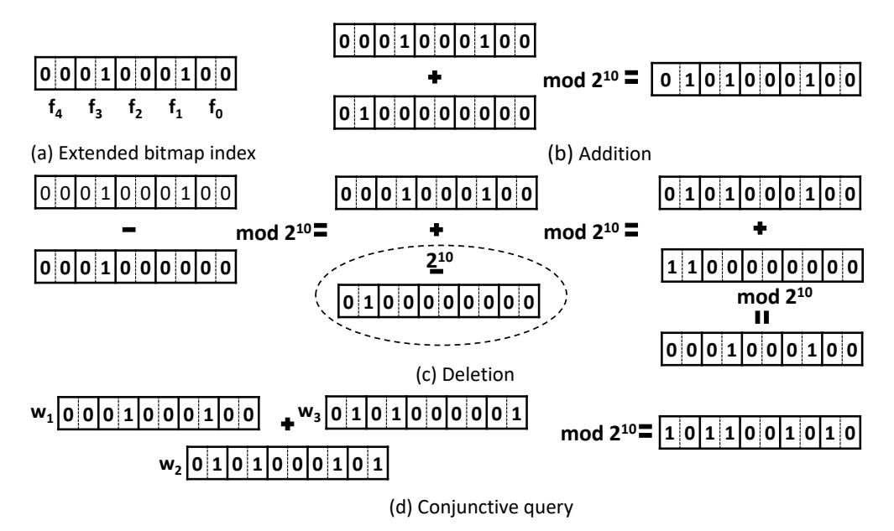
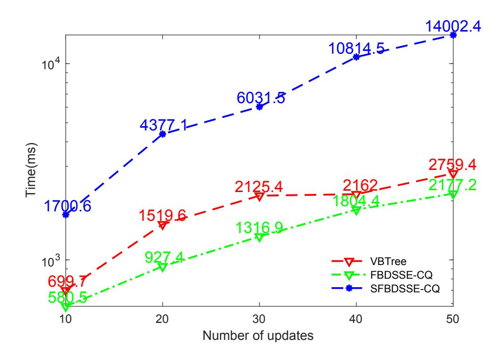
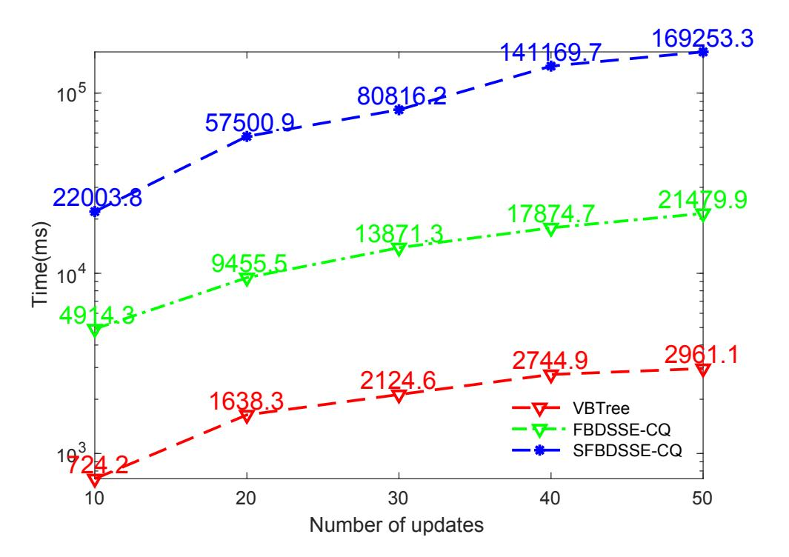
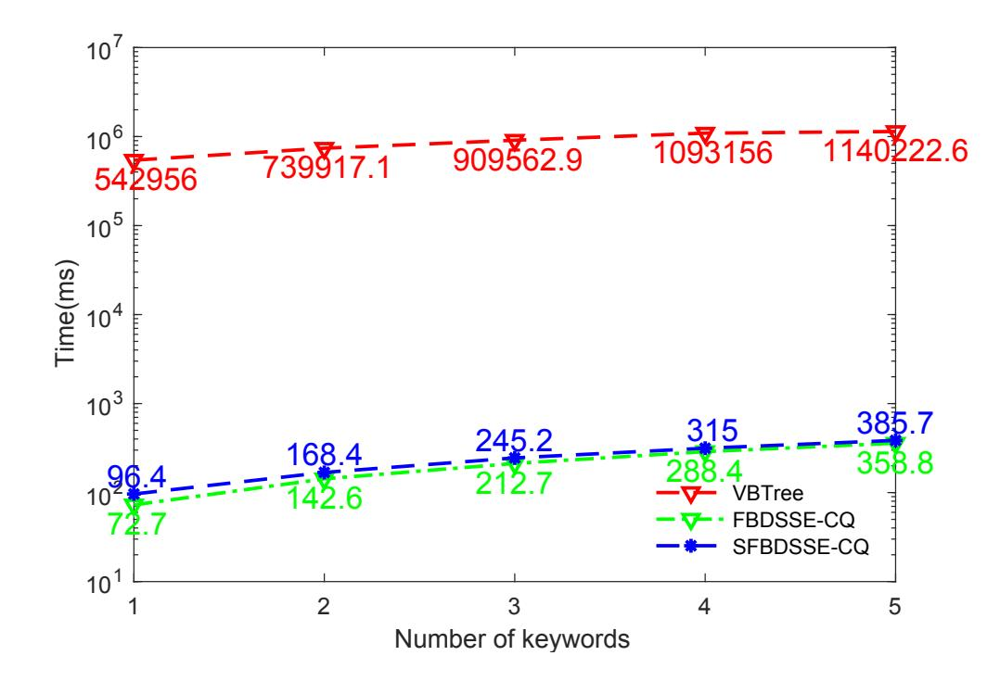
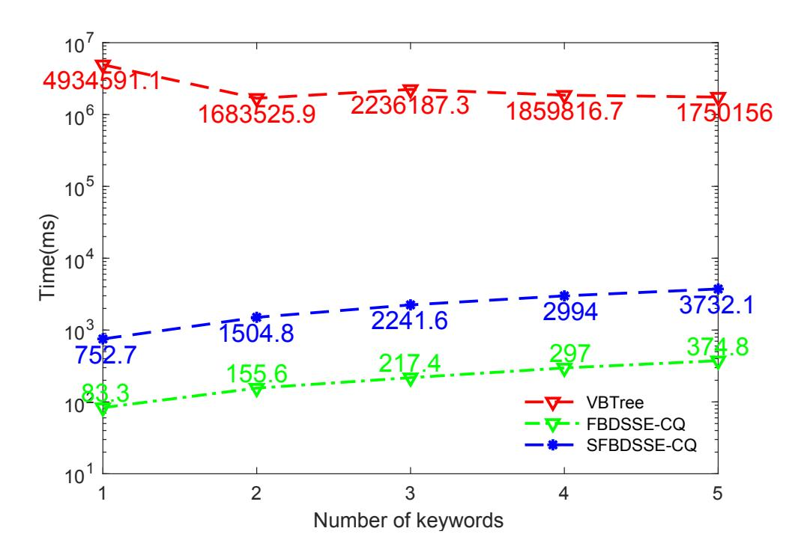

{0}------------------------------------------------

# Forward and Backward Private Dynamic Searchable Symmetric Encryption for Conjunctive Queries

Cong Zuo Monash University Clayton, VIC, Australia Data61, CSIRO Melbourne, Australia zuocong10@gmail.com

Shi-Feng Sun Monash University Clayton, VIC, Australia shifeng.sun@monash.edu

Joseph K. Liu Monash University Clayton, VIC, Australia joseph.liu@monash.edu

Jun Shao Zhejiang Gongshang University Hangzhou, China chn.junshao@gmail.com

Josef Pieprzyk Data61, CSIRO Sydney, Australia Polish Academy of Sciences 01-248 Warsaw, Poland josef.pieprzyk@data61.csiro.au

Guiyi Wei Zhejiang Gongshang University Hangzhou, China weigy@zjgsu.edu.cn

# ABSTRACT

Recent research in Dynamic Searchable Symmetric Encryption (DSSE) focuses on efficient search over encrypted data while allowing updates. Unfortunately, as demonstrated by many attacks, updates can be a source of information leakage that can compromise DSSE privacy. To mitigate these attacks, forward and backward privacy of DSSE schemes have been introduced. A concerted effort of the research community has resulted in the publication of many DSSE schemes. To the best of our knowledge, however, there is no DSSE scheme supporting conjunctive queries, which achieves both forward and backward privacy.

We give two DSSE schemes with forward and backward privacy, which support conjunctive queries, and they are suitable for different applications. In particular, we first introduce a new data structure termed the extended bitmap index. Then we describe our forward and backward private DSSE schemes, which support conjunctive queries. Our security analysis proves the claimed privacy characteristics, and experiments show that our schemes are practical. Compared to the state-of-the-art DSSE VBTree supporting conjunctive queries (but not backward privacy), our schemes offer search time that is a few orders of magnitude faster. Besides, our schemes claim better security (called Type-C backward privacy).

#### PVLDB Reference Format:

Cong Zuo, Shi-Feng Sun, Joseph K. Liu, Jun Shao, Josef Pieprzyk, and Guiyi Wei. Forward and Backward Private Dynamic Searchable Symmetric Encryption for Conjunctive Queries. PVLDB, 14(1): XXX-XXX, 2021. [doi:XX.XX/XXX.XX](https://doi.org/XX.XX/XXX.XX)

This work is licensed under the Creative Commons BY-NC-ND 4.0 International License. Visit<https://creativecommons.org/licenses/by-nc-nd/4.0/> to view a copy of this license. For any use beyond those covered by this license, obtain permission by emailing [info@vldb.org.](mailto:info@vldb.org) Copyright is held by the owner/author(s). Publication rights licensed to the VLDB Endowment.

Proceedings of the VLDB Endowment, Vol. 14, No. 1 ISSN 2150-8097. [doi:XX.XX/XXX.XX](https://doi.org/XX.XX/XXX.XX)

# 1 INTRODUCTION

There is a growing interest in cloud computing, which is instigated by the availability of large and cheap cloud storage services that offer access to data from everywhere anytime. Although cloud storage is cheap and convenient, it brings new security problems when user data are stored in the plaintext form. A trivial solution to this problem is encryption. In particular, a user uploads the encrypted data to the cloud. However, once encrypted, the user cannot retrieve certain files with specific keywords or contents.

To tackle the above obstacle, Song et al. [\[23\]](#page-12-0) introduced searchable symmetric encryption (SSE), which enables search over encrypted data. Later, many research efforts have been devoted to improving different aspects of SSE, such as efficiency, query expressiveness, multi-client services, and security, to name a few [\[5,](#page-11-0) [10,](#page-11-1) [12,](#page-11-2) [21,](#page-12-1) [26\]](#page-12-2). However, SSE schemes work in the static setting only. In other words, they do not support the update operations of encrypted data. As user data are changing over time, this has become a major weakness of static SSE.

To support data updates, dynamic SSE (DSSE) has been introduced [\[20\]](#page-12-3). Unfortunately, during the update, DSSE leaks some information, which can be exploited by adversaries [\[3,](#page-11-3) [31\]](#page-12-4). For example, Zhang et al. [\[31\]](#page-12-4) introduced file-injection attacks. Specifically, the adversary can insert several carefully designed files to comprise the privacy of user queries. To address the leakage problem, Stefanov et al. [\[24\]](#page-12-5) informally introduced two security notions, namely forward and backward privacy. Informally, forward privacy guarantees that the server cannot learn if newly added files matching previously issued queries. Correspondingly, during two same search queries, backward privacy ensures that the server cannot learn files previously added and later deleted. Bost [\[1\]](#page-11-4) formalized the forward privacy definition, and the formal definition for backward privacy is formalized by Bost et al. [\[2\]](#page-11-5). Later, many forward/backward DSSE schemes with different improvements have been designed [\[1,](#page-11-4) [2,](#page-11-5) [8,](#page-11-6) [27,](#page-12-6) [33\]](#page-12-7). For example, Zuo et al. [\[33\]](#page-12-7) proposed a very efficient DSSE with forward and stronger backward privacy. The aforementioned DSSE schemes and security definitions only

{1}------------------------------------------------

support single keyword queries. However, as we know, expressive queries, such as conjunctive queries, are more desired in practice.

To support conjunctive queries in DSSE, a natïve solution is to issue the single keyword query multiple times. This simple solution, however, significantly increases communication overhead and introduces extra leakages. To avoid these drawbacks of the simple solution, Wu et al. [30] proposed a DSSE for conjunctive queries with forward privacy (called VBTree), which is based on a tree structure. To further reduce the leakages of VBTree, Wang et al. [29] deployed the OXT framework [5] to propose a new DSSE with forward privacy, which supports conjunctive queries. As far as we know, there is no DSSE for conjunctive queries, which achieves both forward and backward privacy.

**Our Contributions.** Aiming at the above problem, we give two DSSE schemes with forward and backward privacy, which support conjunctive queries. The schemes called FBDSSE-CQ and SFBDSSE-CQ require  $O(|\mathbf{W}|)$  and O(1) client storage, respectively. Table 1 compares our results with the ones published so far. In particular, we list the following contributions:

**Table 1: Comparison of Results** 

<span id="page-1-0"></span>

| Scheme                             | Forward<br>Privacy | Backward<br>Privacy | Query<br>Type | Client<br>Storage |
|------------------------------------|--------------------|---------------------|---------------|-------------------|
| FIDES [2]                          | ✓                  | Type-II             | Single        | $O( \mathbf{W} )$ |
| $\overline{\text{DIANA}_{del}[2]}$ | ✓                  | Type-III            | Single        | $O( \mathbf{W} )$ |
| Janus [2]                          | ✓                  | Type-III            | Single        | $O( \mathbf{W} )$ |
| Janus++ [27]                       | ✓                  | Type-III            | Single        | $O( \mathbf{W} )$ |
| MONETA [2]                         | ✓                  | Type-I              | Single        | O(1)              |
| FB-DSSE [33]                       | ✓                  | Type-I <sup>-</sup> | Single        | $O( \mathbf{W} )$ |
| $SD_a$ [11]                        | <b>✓</b>           | Type-II             | Single        | O(1)              |
| VBTree [30]                        | ✓                  | Х                   | Conjunctive   | $O( \mathbf{W} )$ |
| FBDSSE-CQ                          | ✓                  | Type-C              | Conjunctive   | $O( \mathbf{W} )$ |
| SFBDSSE-CQ                         | ✓                  | Type-C              | Conjunctive   | O(1)              |

Single means single keyword queries, and Conjunctive stands for conjunctive queries.  $|\mathbf{W}|$  denotes the number of all distinct keywords.

- We design two DSSE schemes supporting conjunctive queries, which achieve both forward and backward privacy. They are suitable for different applications. As far as we know, they are the first in the literature to support both forward and backward privacy as well as conjunctive queries simultaneously. In particular, we revisit and improve the frameworks from [11, 33], which support single keyword queries only. The first scheme called FBDSSE-CQ is derived from the framework of FB-DSSE [33], while it requires O(|W|) client storage. To reduce the client storage, we give our second scheme called SFBDSSE-CQ by revisiting and improving the framework of SD<sub>a</sub> [11]. Compared with FBDSSE-CQ, SFBDSSE-CQ only requires O(1) client storage, while it requires more time for updates and search. See Section 4, 5 and 7 for more details.
- To prove the backward privacy of our schemes with conjunctive queries, we define the Type-C backward privacy notion for the first time. It is a little bit tricky to define the

- backward privacy for conjunctive queries. This is due to the fact that conjunctive queries are more complicated than single keyword queries. Specifically, for a conjunctive query  $q = (w_1, \dots, w_d)$ , it leaks the number of repetitions and the update time of every keyword and the final results for the query<sup>1</sup>. See Section 3 for more details.
- To handle conjunctive queries with reduced communication cost and leakages, we introduce an extended bitmap index data structure, which is an extension of the bitmap index [33]. In particular, we denote the existence of a file through several bits in the extended bitmap index instead of one bit in the bitmap index [33]. Moreover, we believe that the extended bitmap index can be of independent interest.
- Finally, security analysis and experimental evaluation demonstrate that the schemes achieve claimed security goals and are practical. Compared to VBTree [30] (which only supports conjunctive queries with forward privacy but not backward privacy), search for FBDSSE-CQ is about 3000 and 4000 times faster than for Enron Email and Chicago Crime dataset, respectively. Similarly, the search for SFBDSSE is also roughly 3000x and 400x faster than for VBTree [30]. The detailed analyses are given in Section 7.

#### 1.1 Related Work

Song et al. [23] have initiated research in searchable symmetric encryption. However, search time in their SSE scheme is linear with the total number of file/keyword pairs. To improve the search efficiency, Goh [19] introduced the secure encrypted index, where search time is linear with the total number of files. To further improve the search efficiency, Curtmola et al. [10] gave a new SSE by deploying the inverted index data structure, where the search time is sublinear. Besides, they formalized the SSE security model for the first time, and follow-up papers deployed this security model. Later, many SSE schemes with different improvements have been proposed (e.g., rich queries, multi-client setting, dynamism, locality, etc.) [4–6, 10, 15, 20–22, 26, 32].

Early SSE schemes do not allow encrypted data to be updated by a user. To support updates, researchers [4, 20] introduced the dynamic SSE (DSSE). Unfortunately, updates of these schemes leak extra information about data, and this information can be abused by adversaries to compromise data privacy [3, 31]. For example, the privacy of the user queries can be compromised by file-injection attacks [31]. In [31], the authors also emphasized that new DSSE schemes need to achieve forward privacy. Stefanov et al. [24] first informally defined forward and backward privacy. Later, Bost [1] formally defined forward privacy. Shortly, Bost et al. [2] gave three formal backward privacy definitions (called Type-I, Type-II, and Type-III), where Type-I is securer than Type-II and Type-II is securer than Type-III. Moreover, they gave several schemes that achieve different levels of backward privacy. In particular, they designed a DSSE with Type-I backward privacy called MONETA using the ORAM [18], which is not practical. Then they gave a Type-II backward privacy DSSE named FIDES. Their DIANA<sub>del</sub> and Janus attain Type-III backward privacy. To improve the efficiency of Janus, Sun et al. [27]

<span id="page-1-1"></span><sup>&</sup>lt;sup>1</sup>If q = w, the leakages are equal to the leakages of single keyword queries.

{2}------------------------------------------------

gave a new Type-III backward private DSSE called Janas++. In particular, they introduced a new symmetric puncturable encryption (SPE) and replaced the (public-key) puncturable encryption (PE) of Janas with SPE. Later, Zuo et al. [33] introduced a new efficient forward and backward private DSSE scheme called FB-DSSE. In particular, their scheme achieves Type-I<sup>-</sup> backward privacy, which is defined in [33] and is somewhat<sup>2</sup> stronger than Type-I. These schemes, however, only support single keyword queries.

To support richer queries, Zuo et al. [32] introduced two DSSE schemes with forward/backward privacy (named SchemeA and SchemeA), which support range queries. In particular, SchemeA) achieves forward privacy, and SchemeB is backward private. Motivated by SchemeA, Wang et al. [28] gave a generic forward private DSSE, which supports range queries. Moreover, they extended the scheme, so it achieves backward privacy by using a technique from [2]. However, the scheme requires two roundtrips. To reduce the roundtrips, Zuo et al. [34] introduced a new DSSE with forward and backward private privacy (called FBDSSE-RQ), which supports range queries. It applies the framework from FB-DSSE [33], which requires one roundtrip only. Concurrently, Wu et al. [30] constructed a DSSE supporting conjunctive queries (VBTree), which achieves forward privacy. Later, Wang et al. [29] reduced the leakages of VBTree and introduced a new DSSE with forward privacy, which also supports conjunctive queries. It is based on the OXT [5] framework, which leaks less information. As far as we know, there is no DSSE scheme supporting conjunctive queries, which achieves both forward and backward privacy.

Required client storage is an important criterion of DSSE. The client storage of many existing DSSE schemes with forward/backward privacy depends on the keyword numbers. There are, however, some forward/backward private DSSE schemes [2, 8] that achieve optimal client storage by deploying the ORAM technique [18, 25]. Unfortunately, they are not efficient for large databases. To circumvent this obstacle, Demertzis et al. [11] introduced an efficient DSSE with small client storage (named  $SD_a$ ). However, it supports single keyword queries only.

# **2 PRELIMINARIES**

In this section, we first present the extended bitmap index. To securely operate the bitmaps, we further introduce the simple symmetric encryption with homomorphic addition. Moreover, we list the notations at the end of this section.

### 2.1 Extended Bitmap Index

Recently, Zuo et al. [33] introduced an efficient DSSE scheme (named FB-DSSE) by deploying the bitmap index data structure, which achieves both forward and backward privacy. In particular, they used the bit string to denote the file identifiers, where each bit indicates the existence of a specific file. Note that their DSSE supports single keyword queries only. To support conjunctive queries, a naïve solution is to issue single keyword queries for each keyword in a conjunctive query. The solution, however, attracts punishing communication overhead and leaks more information related to the query. To circumvent the problems, we propose to apply an

extended bitmap index, which uses multiple bits to indicate the existence of a file.

<span id="page-2-2"></span>

Figure 1: Illustration of operations for extended bitmap index

Assume a dataset contains  $\ell$  files, we initiate an all 0 bit string bs with length  $a\ell$ , where a is the number of bits used to denote a file<sup>3</sup>. The maximum number of keywords b for the conjunctive queries is  $2^a - 1$ . The *ia*-th bit of *bs* is set to 1, if the dataset contains file  $f_i$ . In Figure 1, we demonstrate the setup, addition, deletion and conjunctive queries for the dataset, where  $\ell = 5$  and a = 2. Specifically, Figure 1(a) illustrates an extended bitmap index data structure with two existing files  $f_1$  and  $f_3$ . Figure 1(b) shows that file  $f_4$  has been added to the dataset (the bit string 0100000000 is added to original bit string 0001000100). Figure 1(c) displays file deletion operation, when  $f_3$  is deleted from the database. Similarly to [33], subtraction can be done by modular addition. The conjunctive query for keyword  $w_1, w_2, w_3$  is shown in Figure 1(d). The server first retrieves the extended bitmap indices for keywords  $w_1, w_2, w_3$ and adds them together. Finally, the server sends the sum to the client. If ia-th to (ia + 1)-th bits of the final bit string equal to 11, then it means that file  $f_i$  contains keywords  $w_1, w_2, w_3$ , where  $i \in \{0, 1, cdots, 4\}.$ 

# 2.2 Simple Symmetric Encryption with Homomorphic Addition

In the previous subsection, we introduced the extended bitmap index. To efficiently and securely operate the bit strings, we need a simple symmetric encryption with homomorphic addition, which has been detailed in [33, 34]. For completeness and ease the understanding of this paper, we take the definition of the simple symmetric encryption with homomorphic addition  $\Pi = (\text{Setup}, \text{Enc}, \text{Dec}, \text{Add})$  from Section 2.1 of [34] and put it here. Specifically,

- $c \leftarrow \text{Enc}(sk, m, n)$ : On input a message m ( $0 \le m < n$ ), a random secret key sk ( $0 \le sk < n$ ) and a big integer n, it outputs a ciphertext  $c = sk + m \mod n$ , where the secret key sk can be used only once and needs to be kept for decryption.
- $m \leftarrow \text{Dec}(sk, c, n)$ : On input the secret key sk, the ciphertext c and the big integer n, it computes message  $m = c sk \mod n$

3

n.

<span id="page-2-0"></span> $<sup>^2\</sup>mathrm{Type}\text{-}\mathrm{I}$  leaks the insertion time of matching files, while  $\mathrm{Type}\text{-}\mathrm{I}^-$  does not.

<span id="page-2-1"></span><sup>&</sup>lt;sup>3</sup>If a = 1, then the extended bitmap index is same as the bitmap index [33].

{3}------------------------------------------------

•  $\hat{c} \leftarrow \mathsf{Add}(c_0, c_1, n)$ : On input two ciphertexts  $c_0, c_1$  and the big integer n, it generates  $\hat{c} = c_0 + c_1 \mod n$ , where  $c_0 \leftarrow \mathsf{Enc}(sk_0, m_0, n), c_1 \leftarrow \mathsf{Enc}(sk_1, m_1, n)$  and  $0 \le sk_0, sk_1 < n$ .

**Homomorphic Addition**. We claim that  $\Pi$  supports homomorphic addition, because anyone can compute  $\hat{c} = c_0 + c_1 \mod n$  with the knowledge of the two ciphertexts  $c_0 = m_0 + sk_0 \mod n$  and  $c_1 = m_1 + sk_1 \mod n$ . In addition, one needs to know  $s\hat{k} = sk_0 + sk_1 \mod n$  to decrypt  $\hat{c}$ . Its correctness can be checked by the following equation:

$$Dec(\hat{sk}, \hat{c}, n) = \hat{c} - \hat{sk} \mod n = m_0 + m_1 \mod n,$$
 where  $\hat{sk} = sk_0 + sk_1 \mod n$ .

It is easy to find that  $\Pi$  is perfectly secure if we use secret keys only once. This is true because, for every message,  $\Pi$  chooses a new secret key to encrypt the message, which is similar to the one-time pad (OTP). The formal definition is given below.

**Perfect Security** [7]. We say  $\Pi$  is perfectly secure if for any adversary  $\mathcal{A}$ , its advantage

$$\mathbf{Adv}_{\Pi,\,\mathcal{A}}^{\mathsf{PS}}(\lambda) = |\Pr[\mathcal{A}(\mathsf{Enc}(sk,m_0,n)) = 1] - \\ \Pr[\mathcal{A}(\mathsf{Enc}(sk,m_1,n)) = 1]|$$

is negligible, where n is a big integer, the secret key sk ( $0 \le sk < n$ ) is kept secret and  $\mathcal{A}$  chooses  $m_0, m_1$  s.t.  $0 \le m_0, m_1 < n$ .

#### 2.3 Notations

To simplify the reading of this paper, in Table 2, we list the notations used throughout this paper.

**Table 2: Notations** 

<span id="page-3-1"></span>

| Notation     | Description                                                             |  |  |  |
|--------------|-------------------------------------------------------------------------|--|--|--|
| λ            | Security parameter                                                      |  |  |  |
|              | Concatenation of strings                                                |  |  |  |
| a            | Number of bits used to denote a file                                    |  |  |  |
| b            | Maximum number of keywords for conjunctive queries, where $b = 2^a - 1$ |  |  |  |
| $\ell$       | Maximum number of files for a database                                  |  |  |  |
| n            | Big integer, which is determined by the underlying scheme               |  |  |  |
| $f_{i}$      | <i>i</i> -th file                                                       |  |  |  |
| DB           | Database                                                                |  |  |  |
| $\mathbf{W}$ | Set of all distinct keywords for DB                                     |  |  |  |
| EDB          | Encrypted database                                                      |  |  |  |
| bs           | Bit string for the extended bitmap index, where <i>ia</i> -th           |  |  |  |
|              | bit is set to 1, if DB contains file $f_i$                              |  |  |  |
| $a\ell$      | Length of bs                                                            |  |  |  |
| e            | Encrypted bit string                                                    |  |  |  |
| q            | Conjunctive query, where $q = (w_1, \dots, w_d)$                        |  |  |  |
| F            | Secure PRF                                                              |  |  |  |
| gc           | The global counter, which is the position of a map                      |  |  |  |
| GC           | Set of global counters                                                  |  |  |  |
| sk           | Secret key of $\Pi$ , which can be used once only                       |  |  |  |

### <span id="page-3-0"></span>3 DSSE AND SECURITY DEFINITIONS

In this section, we give the necessary model and security definitions, which formalizes the security goals of our DSSE schemes. In addition, we give the forward and backward privacy definitions for our conjunctive queries. Again, for the completeness of this paper, we take the DSSE definition, its security model, and the forward privacy definition from Section 3 and 4.1 of [34]. Note that we give a new backward privacy definition (named Type-C), which is suitable for our conjunctive queries.

We define a database DB =  $(f_i, \mathbf{W}_i)_{i=0}^{y-1}$ , where  $f_i$  is the file identifier,  $\mathbf{W}_i$  is the set of keywords and y is all files in DB (0 <  $y \le \ell$ ).  $\mathbf{W} = \bigcup_{i=0}^{y-1} \mathbf{W}_i$  denotes all distinct keywords in DB, and its number is denoted by  $|\mathbf{W}|$ . DB(q) stands for the matching files of a conjunctive query q.

In this paper, we parse the database DB into the extended bitmap index. Then a conjunctive query and update query are denoted by  $q = (w_1, \dots, w_d)$  and u = (op, (w, bs)), respectively. Similar to other works [2, 5, 10], we mainly focus on the update and search of the indexes. Hence, search and update of metadata involve manipulation of bit strings representing file identifiers.

#### 3.1 DSSE Definition

Generally speaking, a DSSE scheme usually consists of one **Setup** algorithm and two interactive protocols between a client and a server (**Search** and **Update**). Formally,

- (EDB,  $\sigma$ )  $\leftarrow$  **Setup**(1 $^{\lambda}$ , DB): On input the security parameter  $\lambda$  and DB, it returns a state  $\sigma$  and an encrypted database EDB. The state  $\sigma$  is secretly kept by the client, and the EDB is publicly stored by the server.
- (I, ⊥) ← Search(q, σ; EDB): On input the state σ, a query q, the client produces the search token and sends it to the server. Then the server retrieves EDB with the search token. Finally, the server returns nothing, and the client outputs the matching file identifiers I.
- $(\sigma', \mathsf{EDB'}) \leftarrow \mathsf{Update}(\sigma, \mathit{op}, \mathit{in}; \mathsf{EDB})$ : On input the operation  $\mathit{op} \in \{\mathit{add}, \mathit{del}\}\$ , the state  $\sigma$  and a list of file-identifier/keyword-set pairs  $\mathit{in} = (f, \mathbf{w})$ , the client generates the update token and sends it to the server. Then the server updates  $\mathsf{EDB}$  with the update token. Finally, the server outputs an updated encrypted database  $\mathsf{EDB'}$ , and the client gets an updated state  $\sigma'$ .

Remark. There are two models for handling query results by the server in SSE literature. For the first model (e.g., [5]), the server outputs the encrypted file identifiers to the client. Finally, the client will decrypt the encrypted file identifiers. For the second model (e.g., [1]), the client gets the file identifiers (plaintext) from the server directly. In this work, we deploy the first model. In particular, the server outputs the encrypted file identifiers to the client.

#### <span id="page-3-2"></span>3.2 Security Model

To formalize the security goal of DSSE schemes, we give the security model for DSSE schemes. Security of DSSE is modeled by two worlds named REAL and IDEAL, respectively. The REAL word is equal to the original DSSE scheme, and the IDEAL world is simulated by a simulator  ${\cal S}$  with the leakages of the original scheme. The leakages

{4}------------------------------------------------

are formally defined by a function  $\mathcal{L} = (\mathcal{L}^{Setup}, \mathcal{L}^{Search}, \mathcal{L}^{Update})$ , which contains the leakages leaked during the **Setup**, **Search**, and **Update** phase. If the advantage of  $\mathcal{A}$  distinguishing REAL from IDEAL is negligible, we can conclude that there is no other leakage except the leakages defined in  $\mathcal{L}$ .

Assume  $\mathcal{A}$  interacts with a single world that can be either REAL or IDEAL. The goal of  $\mathcal{A}$  is to guess the world. If its guess is REAL,  $\mathcal{A}$  returns 0. Otherwise, it outputs 1. Formally, the security game is defined as follows:

- REAL $_{\mathcal{A}}(\lambda)$ :  $\mathcal{A}$  selects a database DB. On input the security parameter  $\lambda$  and the database DB, it returns the encrypted database EDB to  $\mathcal{A}$  by running the **Setup**( $\lambda$ , DB).  $\mathcal{A}$  can interact with this world by issuing queries (either search queries q or update queries (op, in)). Finally,  $\mathcal{A}$  returns a bit z, where  $z \in \{0, 1\}$ .
- IDEAL  $\mathcal{A}, \mathcal{S}(\lambda)$ : For this world, the encrypted database EDB is simulated by the simulator  $\mathcal{S}$  with the setup leakages  $\mathcal{L}^{Setup}(\lambda, DB)$ ). To response the queries (either search queries q or update queries (op, in)) issued by  $\mathcal{A}$ , the simulator  $\mathcal{S}$  needs to use the leakages (either search leakages  $\mathcal{L}^{Search}(q)$  or update leakages  $\mathcal{L}^{Update}(op, in)$ ) to simulate the corresponding replies. Finally,  $\mathcal{A}$  returns a bit z, where  $z \in \{0, 1\}$ .

Definition 3.1. We say a DSSE scheme is  $\mathcal{L}$ -adaptively-secure if for every probabilistic polynomial time (PPT) adversary  $\mathcal{A}$ , there exists an efficient simulator  $\mathcal{S}$  (with the input  $\mathcal{L}$ ) such that,

$$|\Pr[\mathsf{REAL}_{\mathcal{A}}(\lambda) = 1] - \Pr[\mathsf{IDEAL}_{\mathcal{A},\mathcal{S}}(\lambda) = 1]| \le negl(\lambda).$$

**Leakage Function**. In SSE literature [10], there are two common leakages, named result pattern and search pattern. Search pattern sp leaks the repetition of search keywords, and result pattern rp leaks the final result for a search query. They are formally defined as follows:

$$sp(q) = \{t : \{t, w\}_{w \in q}\}_{q \in Q},$$

where t is the timestamp, Q is a collection of conjunctive queries.

$$rp(q) = \{bs\}_{q \in Q},$$

where bs is the final result, which denotes the files that matching the conjunctive query q. Similar to [33], we implicitly assume that the final result bs is revealed to the server<sup>4</sup>.

# 3.3 Forward Privacy

In practice, the interactions between the client and the server may be consecutively observed by the an adversary  $\mathcal{A}$ . Forward privacy requires that the server (or the adversary  $\mathcal{A}$ ) cannot match the new update operation to the previously issued search queries. Formally,

Definition 3.2. (see [1]) An  $\mathcal{L}$ -adaptively-secure DSSE scheme is forward private if an update leakage function  $\mathcal{L}^{Update}$  can be written as

$$\mathcal{L}^{Update}(op,in) = \mathcal{L}'(op,\{(f_i,\mu_i)\}),$$

where  $f_i$  is the file identifier,  $\mu_i$  is the number of modified keywords in file  $f_i$  and  $\mathcal{L}'$  is stateless.

Note that, for our conjunctive queries, the leakage function will be

$$\mathcal{L}^{Update}(op, w, bs) = \mathcal{L}'(op, bs),$$

where  $\mathcal{L}'$  is stateless.

# 3.4 Backward Privacy

Informally, backward privacy guarantees that the server (or the adversary  $\mathcal{A}$ ) cannot learn the files previously added and later deleted<sup>5</sup>. Previous backward privacy definition supports single keyword queries only, which is not suitable for our conjunctive queries. Then we introduce a new backward privacy definition named Type-C, which supports conjunctive queries.

• Type-C: During two same consecutive conjunctive queries q, Type-C leaks files that currently matching q, the total number of updates for each w and the corresponding update times, where  $w \in q$ .

To formalize the notion, we need to introduce a new leakage function Time(q). In particular, for a conjunctive query q, it shows update times t for each w, where  $w \in q$ . In particular, it contains the update times for each keyword Time(w). Formally,

Time
$$(q) = \{t : \{t, op, (w, bs)\}_{w \in q}\}.$$

Definition 3.3. An  $\mathcal{L}$ -adaptively-secure DSSE scheme is Type-C backward private if the leakage functions  $\mathcal{L}^{Search}$  and  $\mathcal{L}^{Update}$  can be written as:

$$\mathcal{L}^{Update}(op, w, bs) = \mathcal{L}'(op, bs),$$
 
$$\mathcal{L}^{Search}(q) = \mathcal{L}''(\operatorname{sp}(q), \operatorname{rp}(q), \operatorname{Time}(q)),$$

where  $\mathcal{L}'$  and  $\mathcal{L}''$  are stateless.

# <span id="page-4-0"></span>4 FORWARD AND BACKWARD PRIVATE DSSE FOR CONJUNCTIVE QUERIES

In this section, we introduce our first DSSE scheme for conjunctive queries (called FBDSSE-CQ), which supports both forward and backward privacy. In particular, it is based on the framework of FB-DSSE from [33]. In addition, FBDSSE-CQ deploys the  $\Pi$  = (Setup, Enc, Dec, Add) as well as the extended bitmap index, and it is described in Algorithm 1. From a bird's-eye view, the scheme works as follows. For a conjunctive query q, a client issues single keyword queries for each keyword w in the conjunctive query q, which is similar to FB-DSSE [33]. Then a server adds all the results together and sends a final result to the client. The details are described below.

• (EDB,  $\sigma = (n, K, \mathbf{CT})$ )  $\leftarrow$  **Setup**( $1^{\lambda}$ ): On input the security parameter  $\lambda$ , the client outputs a random secret key K for keyed hash function F and a big integer n, where  $n = 2^{a\ell}$ . In particular, a is the number of bits used to denote a file, which means this scheme can support the maximum of  $b = 2^a - 1$  conjunctive keyword.  $\ell$  denotes the maximum number of files that this scheme can support. Furthermore, he/she initializes two maps **CT** and **M**. Specifically, **CT** is used to store the newest search token and the corresponding number of updates c for every keyword w in the database, and **M** holds the encrypted database EDB. Eventually, the client returns

<span id="page-4-1"></span> $<sup>^4</sup>$ The client will decrypt the final bit string and retrieve the corresponding file identifiers denoted by bs. Hence, the final bit string is revealed to the server.

<span id="page-4-2"></span> $<sup>^5</sup>$ Note that the files are added and deleted during two same conjunctive queries q.

{5}------------------------------------------------

```
Setup(1^{\lambda})
                                                                                                              6: end for
Client:
                                                                                                              7: Send \{(K_w, ST_c, c)\}_{w \in q} to the server.
  1: K \stackrel{\$}{\leftarrow} \{0,1\}^{\lambda}, n \leftarrow big integer
                                                                                                            Server:
                                                                                                             8: Sum \leftarrow 0
  2: CT, M \leftarrow empty map
                                                                                                             9: for each (K_w, ST_c, c) do
  3: return (EDB = \mathbf{M}, \sigma = (n, K, \mathbf{CT}))
                                                                                                                       Sum_e \leftarrow 0
                                                                                                            10:
Update(w, bs, \sigma; EDB)
                                                                                                                       \mathbf{for}\ i = c\ \mathsf{to}\ 0\ \mathbf{do}
                                                                                                            11:
Client:
                                                                                                                            UT_i \leftarrow H_1(K_w, ST_i), (e_i, C_{ST_{i-1}}) \leftarrow \mathbf{M}[UT_i]
                                                                                                            12:
  1: K_w||K_w' \leftarrow F_K(w), (ST_c, c) \leftarrow \mathbf{CT}[w]
                                                                                                                             Sum_e \leftarrow Add(Sum_e, e_i, n), Remove M[UT_i]
                                                                                                            13:
  2: if (ST_c, c) = \perp then
                                                                                                                            if C_{ST_{i-1}} = \perp then
                                                                                                            14:
           c \leftarrow -1, ST_c \leftarrow \{0, 1\}^{\lambda}
  3:
                                                                                                            15:
                                                                                                                                  Break
  4: end if
                                                                                                                             end if
                                                                                                            16:
  5: ST_{c+1} \leftarrow \{0,1\}^{\lambda}, CT[w] \leftarrow (ST_{c+1}, c+1)
                                                                                                                            ST_{i-1} \leftarrow H_2(K_w, ST_i) \oplus C_{ST_{i-1}}
                                                                                                            17:
  6: UT_{c+1} \leftarrow H_1(K_w, ST_{c+1}), C_{ST_c} \leftarrow H_2(K_w, ST_{c+1}) \oplus ST_c
                                                                                                                       end for
                                                                                                            18:
  7: sk_{c+1} \leftarrow H_3(K'_w, c+1), e_{c+1} \leftarrow \text{Enc}(sk_{c+1}, bs, n)
                                                                                                                       \mathbf{M}[UT_c] \leftarrow (Sum_e, \perp), Sum \leftarrow \mathrm{Add}(Sum, Sum_e, n)
                                                                                                            19:
  8: Send (UT_{c+1}, (e_{c+1}, C_{ST_c})) to the server.
                                                                                                            20: end for
Server:
                                                                                                            21: Send Sum to the client.
  9: Upon receiving (UT_{c+1}, (e_{c+1}, C_{ST_c}))
                                                                                                            Client:
 10: Set \mathbf{M}[UT_{c+1}] \leftarrow (e_{c+1}, C_{ST_c})
                                                                                                            22: Sum_{sk} \leftarrow 0
Search(q, \sigma; EDB)
                                                                                                            23: for w \in q do
Client:
                                                                                                                       for i = c to 0 do
                                                                                                            24:
  1: for w \in q do
                                                                                                                            sk_i \leftarrow H_3(K'_w, i), Sum_{sk} \leftarrow Sum_{sk} + sk_i \mod n
                                                                                                            25:
           K_w||K_w' \leftarrow F_K(w), (ST_c, c) \leftarrow \mathbf{CT}[w]
                                                                                                                       end for
  2:
                                                                                                            26:
           if (ST_c, c) = \perp then
                                                                                                            27: end for
  3:
                 return 1
                                                                                                            28: bs \leftarrow Dec(Sum_{sk}, Sum, n)
  4:
           end if
  5:
                                                                                                            29: return bs
```

the state  $\sigma = (n, K, \mathbf{CT})$  and the encrypted database EDB. Note that the client needs to keep  $(K, \mathbf{CT})$  private.

- $(\sigma', EDB') \leftarrow Update(w, bs, \sigma; EDB)$ : On input a keyword w, a bit string  $bs^6$  and the state  $\sigma$ , the client first generates the secret key  $K_w$  and  $K'_w$  corresponding to w by using the key K and retrieves the current search token  $ST_c$  and the correspond counter *c*. After that, he/she chooses a new random search token  $ST_{c+1}$  and increases the counter. To get a new state  $\sigma'$ , he/she updates CT. Moreover, he/she generates the update token  $UT_{c+1}$  through the hash function  $H_1$  and the ciphertext of previous search token  $C_{ST_c}$  by using the hash function  $H_2$ . To save client storage, he/she uses  $H_3$ to generate the one time secret key  $sk_{c+1}$  with the input of the counter c + 1. With the secret key, he/she can use the Enc of  $\Pi$  to encrypt the bit string bs and outputs the ciphertext e. Eventually, he/she sends the update token  $UT_{c+1}$ , e and  $C_{ST_a}$  to the server, and the server will update the encrypted database to output EDB'.
- $bs \leftarrow \mathbf{Search}(q, \sigma; \mathsf{EDB})$ : On input a conjunctive query q, the state  $\sigma$ , the client retrieves CT to get the current search token  $ST_c$  as well as the counter c and generates  $K_w$  and  $K'_w$  for each keyword w in the conjunctive query q. Then the client sends these search tokens to the server. Next, for

each search token (or keyword w), the server searches EDB to get the ciphertexts e (the searched entries will be removed by the server to reduce the server storage). After that, the server adds these ciphertexts together by using Add of  $\Pi$ , and the final result Sum is sent to the client. Eventually, the final result c can be decrypted by the client to get the final bit string bs, which denotes the matching file identifiers.

FBDSSE-CQ supports conjunctive queries and achieves both forward and backward privacy, which is more secure and expressive for practical use. However, the client storage of FBDSSE-CQ is  $O(|\mathbf{W}|)$ , where  $|\mathbf{W}|$  is the number of distinct keywords in a database. If a database has a large number of distinct keywords, the client requires large storage. Then we need a DSSE scheme supporting small client storage without sacrificing the aforementioned properties.

# <span id="page-5-0"></span>**5 SMALL CLIENT STORAGE**

As mentioned before, the client storage of FBDSSE-CQ grows linearly with the number of keywords. In this section, we give a new DSSE with small client storage (called SFBDSSE-CQ), which achieves both forward and backward privacy and supports conjunctive queries. In particular, we deploy the technique of  $SD_a$  from [11], where the authors use the static SSE from [4] that supports single keyword queries only. In Algorithm 2, we describe a static SSE that supports conjunctive queries (named SSE-CQ) based on

<span id="page-5-2"></span> $<sup>^6</sup>$ Note that the bit string bs can denote many files. In other words, we can update many files during a single update.

{6}------------------------------------------------

```
Setup(1^{\lambda}, DB, n)
                                                                                                       15: end for
Client:
                                                                                                       16: Send (Sum, {\mathbf{GC}_w}_{w \in \{K_w\}}) to the client.
  1: K \stackrel{\$}{\leftarrow} \{0,1\}^{\lambda}, \mathbf{M} \leftarrow empty map, gc \leftarrow 0
                                                                                                      Client:
  2: for w \in \mathbf{W} do
                                                                                                       17: Sum_{sk, w} \leftarrow 0
                                                                                                       18: for w \in q do
           c \leftarrow 0, K_w \leftarrow F_K(w)
  3:
                                                                                                                 for qc \in GC_w do
           for bs \in DB(w) do
                                                                                                       19:
  4:
                                                                                                                      K_{qc} \leftarrow F_K(gc), Sum_{K, w} \leftarrow Sum_{K, w} + K_{qc} + w \mod n
                K_{qc} \leftarrow F_K(gc), l \leftarrow H_1(K_w, c), e \leftarrow \text{Enc}(K_{qc}, bs||w, n)
                                                                                                       20:
  5:
                                                                                                                 end for
                GC \leftarrow \text{empty set}, GC \leftarrow GC \cup gc
                                                                                                       21:
  6:
                                                                                                       22: end for
                Put M[l] = (e, GC) to the gc-th position of M
  7:
                                                                                                       23: bs||0s \leftarrow Dec(Sum_{K,w}, Sum, n)|
  8:
                c \leftarrow c + 1, gc \leftarrow gc + 1
          end for
                                                                                                       24: return bs
  9:
 10: end for
                                                                                                      Decrypt(K, M)
 11: return (\mathbf{M}, K)
                                                                                                      Client:
Search(q, K; M)
                                                                                                        1: \mathbf{R} \leftarrow \text{empty set}
Client:
                                                                                                        2: for c = 0 to |M| do
                                                                                                                 Get the c-th non-empty element (e, GC) of M
                                                                                                        3:
  1: for w \in q do
                                                                                                                 if GC has one element qc then
           K_{w} \leftarrow F_{K}(w)
                                                                                                        4:
  2:
                                                                                                                      K_{qc} \leftarrow F_K(gc), bs||w \leftarrow \text{Dec}(K_{qc}, e, n)
                                                                                                        5:
  3: end for
                                                                                                                      \mathbf{R} \leftarrow \mathbf{R} \cup bs||w|
  4: Send \{K_w\}_{w \in q} to the server.
                                                                                                        6:
                                                                                                                 else
                                                                                                        7:
Server:
                                                                                                                      Sum_{K,w} \leftarrow 0
                                                                                                        8:
  5: Sum ← 0
                                                                                                                      for each gc \in GC_w do
                                                                                                        9:
  6: for each K_w do
                                                                                                                           K_{qc} \leftarrow F_K(gc)
                                                                                                       10:
           c \leftarrow 0, Sum_e \leftarrow 0, GC_w \leftarrow \text{empty set}
  7:
                                                                                                                           Sum_{K,w} \leftarrow Sum_{K,w} + K_{gc} + w \mod n
                                                                                                       11:
           (e, \mathbf{GC}) \leftarrow \mathbf{M}[H_1(K_w, c)]
  8:
                                                                                                       12:
                                                                                                                      end for
           while (e, GC) \neq \perp do
  9:
                                                                                                                      bs||0s \leftarrow Dec(Sum_{K, w}, e, n)
                                                                                                       13:
                Sum_e \leftarrow Add(Sum_e, e, n), GC_w \leftarrow GC_w \cup GC
 10:
                                                                                                                      \mathbf{R} \leftarrow \mathbf{R} \cup bs||w \triangleright \text{Note that, if } \mathbf{GC}_w \text{ has more than one}
                                                                                                       14:
                Remove \mathbf{M}[H_1(K_w,c)]
11:
                                                                                                            element, it means that the keyword has been searched before.
                c \leftarrow c + 1, (e, \mathbf{GC}) \leftarrow \mathbf{M}[H_1(K_w, c)]
 12:
                                                                                                            Hence, the client knew the corresponding keyword.
           end while
 13:
                                                                                                                 end if
                                                                                                       15:
           Put \mathbf{M}[H_1(K_w, 0)] = (Sum_e, \mathbf{GC}_w) to the smallest empty
 14:
                                                                                                       16: end for
     slot of M, Sum \leftarrow Add(Sum, Sum_e, n)
                                                                                                       17: return R
```

the scheme from [4]. In [11], the authors added a new algorithm to the static SSE named **Decrypt**, which is operated by the client with the secret key. This new algorithm is used to instantiate the update operation.

For each bit string *bs*, we additionally append the keyword *w* to the end of the bit string. Then the client can decrypt all encrypted bit strings and re-encrypt them along with the corresponding keyword *w* for new updates. Details are given below.

- ( $\mathbf{M}$ , K)  $\leftarrow$  **Setup**( $\mathbf{1}^{\lambda}$ , DB, n): On input the security parameter  $\lambda$ , a big integer n (it is the output of the **Setup** of SFBDSSE-CQ, which will be explained later) and a database DB<sup>7</sup>, the client chooses a random secret key K and uses it to encrypt the keyword/bit string pairs. Moreover, he/she sets an empty map  $\mathbf{M}$ , which stores the encrypted bit strings. Eventually, the client outputs  $\mathbf{M}$  and the client keeps K secret.
- $bs \leftarrow \mathbf{Search}(q, K; \mathbf{M})$ : On input a conjunctive query q and the secret key K, the client produces the search token  $K_w$  for

each keyword w in the conjunctive query q and sends the tokens to the server. Then the server searches M to get the results e and adds them together by using Add of  $\Pi$ . The final result Sum and the global counters GC are sent to the client. In addition, to save server storage, the server removes the searched entries and stores the final result  $Sum_e$  and global counters  $GC_w$  to the smallest empty slot of M. Eventually, the client decrypts Sum to get the final result bs.

R ← Decrypt(K, M): On inputs the secret key K and the encrypted bit strings M, the client first generates one time secret key K<sub>gc</sub> by applying the secret key K and the global counters GC. Now he/she can decrypt each encrypted bit string e by applying the corresponding one time secret key to Dec of Π. Eventually, the client outputs R, which is a set of bit strings concatenated with the corresponding keywords.

Now, we are ready to introduce SFBDSSE-CQ in Algorithm 3. Details are as follows:

<span id="page-6-1"></span><sup>&</sup>lt;sup>7</sup>DB is a database with keyword/bit string pairs.

{7}------------------------------------------------

### <span id="page-7-0"></span>Algorithm 3 SFBDSSE-CQ

```
Setup(1^{\lambda})
                                                                                                                            \mathbf{for}\ i = 0\ \mathsf{to}\ j - 1\ \mathbf{do}
                                                                                                                 11:
Client:
                                                                                                                                  \mathbf{R} \leftarrow \mathbf{R} \cup
                                                                                                                 12:
                                                                                                                      SSE-CQ \cdot \mathbf{Decrypt}(K_i, \mathbf{M}_i)
  1: A set of keys K_0, \dots, K_{s-1} \leftarrow \perp
                                                                                                                            end for
                                                                                                                 13:
  2: n \leftarrow \text{big integer}
                                                                                                                            \mathbf{R} \leftarrow \mathbf{R} \cup bs||w|
                                                                                                                 14:
  3: A set of Map \mathbf{M}_0, \cdots \mathbf{M}_{s-1}, the size of \mathbf{M}_i = 2^i, where
                                                                                                                 15: end if
      i\in\{0,\cdots,s-1\}.
                                                                                                                 16: Parse R into DB.
  4: \mathbf{M}_i \leftarrow \text{empty map}, i \in \{0, 1, \dots, s-1\}
                                                                                                                 17: (\mathbf{M}_{i}', K_{i}') \leftarrow
  5: return (EDB = \{M_i\}, \sigma = (n, \{K_i\}))
                                                                                                                      SSE-CQ · Setup(1^{\lambda}, DB, n)
Update(w, bs, \sigma; EDB)
                                                                                                                 18: Update K_j with the new key K'_i, and send \mathbf{M}'_i to the server.
Server:
                                                                                                                Server:
  1: Find the minimum j such that \mathbf{M}_j = \emptyset or \mathbf{M}_j is not full.
  2: if M_i = \emptyset then
                                                                                                                 19: Set \mathbf{M}_j \leftarrow \mathbf{M}_i'
            Send M_0, \dots, M_{j-1} to the client, and set them to the
  3:
                                                                                                                Search(q, \sigma; EDB)
      empty at the server.
                                                                                                                Client and Server:
  4: else
                                                                                                                  1: bs \leftarrow 0
            Send M_i to the client.
  5:
                                                                                                                  2: for all i such that M_i \neq \emptyset do
  6: end if
                                                                                                                            bs_i||0s \leftarrow
                                                                                                                  3:
Client:
                                                                                                                      SSE-CQ \cdot Search(q, K_i; \mathbf{M}_i)
  7: Set \mathbf{R} \leftarrow empty set
                                                                                                                            bs \leftarrow bs + bs_i \mod n
                                                                                                                  4:
  8: if M_i is not full then
                                                                                                                  5: end for
            \mathbf{R} \leftarrow \mathsf{SSE}\text{-}\mathsf{CQ} \cdot \mathbf{Decrypt}(K_i, \mathbf{M}_i) \cup bs||w|
  9:
                                                                                                                  6: return bs
 10: else
```

- (EDB =  $\{\mathbf{M}_i\}$ ,  $\sigma = (n, \{K_i\})$ )  $\leftarrow$  **Setup**( $1^{\lambda}$ ): On input the security parameter  $\lambda$ , the client outputs a set of random secret keys  $\{K_i\}$  and a set of empty maps  $\{\mathbf{M}_i\}$ , where  $i \in \{0, \dots, s-1\}$  and s is the number of maps. The number of maps s means that this scheme can support the maximum of  $2^s 1$  updates. Moreover, he/she outputs an integer n, where  $n = 2^{a\ell + |w|}$ , a and  $\ell$  are the same as the values in Algorithm 1 and |w| is the length of the fixed length keyword  $w^8$ . Eventually, the client outputs EDB =  $\{\mathbf{M}_i\}$  and the state  $\sigma = (n, \{K_i\})$ . The client keeps the set of keys  $\{K_i\}$  secret.
- (σ', EDB') ← Update(w, bs, σ; EDB): On input a keyword w, a bit string bs and the state σ, the client first retrieves certain maps from the server according to the technique of SDa. Then he/she decrypts the maps by using Decrypt of SSE-CQ with the secret keys, parse them and the new keyword/bit string to DB. Next he/she chooses new secret keys and re-encrypts DB using Setup of SSE-CQ. Eventually, the client gets a new state σ' and keeps it secret. The server gets a new encrypted database EDB'.
- bs ← Search(q, σ; EDB): On input a conjunctive query q and the state σ, the client and server execute Search of SSE-CQ and gets the result bit string bs<sub>i</sub> for each non-empty map M<sub>i</sub> ∈ EDB. Eventually, the client adds these bit strings together to get the final result, which denotes all matching files.

# **6 SECURITY ANALYSIS**

This section gives the proofs for our proposed schemes in the DSSE security model, which is defined in Section 3.2.

Theorem 6.1. (Adaptive forward and Type-C backward privacy of FBDSSE-CQ). Let  $\Pi = (\text{Setup}, \text{Enc}, \text{Dec}, \text{Add})$  be a perfectly secure simple symmetric encryption with homomorphic addition, F be a secure PRF and  $H_1$ ,  $H_2$  and  $H_3$  be random oracles. We define  $\mathcal{L}_{\text{FBDSSE-CQ}} = (\mathcal{L}_{\text{FBDSSE-CQ}}^{\text{Search}}, \mathcal{L}_{\text{FBDSSE-CQ}}^{\text{Update}})$ , where  $\mathcal{L}_{\text{FBDSSE-CQ}}^{\text{Search}}(q) = (\text{sp}(q), \text{rp}(q), \text{Time}(q))$  and  $\mathcal{L}_{\text{FBDSSE-CQ}}^{\text{Update}}(op, w, bs) = \bot$ . FBDSSE-CQ is  $\mathcal{L}_{\text{FBDSSE-CQ}}$ -adaptively forward and Type-C backward private.

PROOF. As mentioned before, FBDSSE-CQ is based on the framework of FB-DSSE [33]. Then we follow a similar method of security proof from [33]. As a result, we take some parts of the security proof from [33] for the completeness of the proof. At a high level, we set a series of games from REAL to IDEAL and prove the indistinguishability of every two consecutive games. In particular, REAL is exactly the same as the original scheme, and IDEAL is simulated with the defined leakages.

**Game**  $G_0$ : It is equal to the original scheme (see Algorithm 1). Then we have

$$\Pr[\mathsf{REAL}_{\mathcal{A}}^{\mathsf{FBDSSE-CQ}}(\lambda) = 1] = \Pr[G_0 = 1].$$

**Game**  $G_1$ : We replace the hash function F with a truly random function. For a new keyword, we choose a random key with uniform probability for the keyword w and store the key as well as the corresponding keyword w in table Key for consistency. For a queried keyword, we retrieve the key from table Key. Then we can establish

<span id="page-7-1"></span> $<sup>^8</sup>$ We can use any hash functions to get the fixed length keyword.

{8}------------------------------------------------

# <span id="page-8-0"></span>Algorithm 4 Simulator ${\cal S}$

```
Setup(1^{\lambda})
                                                                                                                                    (ST_c, c) \leftarrow \mathbf{CT}[w]
                                                                                                                         5:
                                                                                                                                    Parse Time(w) into (t_0, \dots, t_c)
                                                                                                                         6:
                                                                                                                                                                                                 \rightharpoonup \mathsf{Time}(w) \in \mathsf{Time}(\hat{q})
  1: n \leftarrow \text{big integer}, CT, M \leftarrow \text{empty map}
                                                                                                                                    if (ST_c, c) = \perp then
                                                                                                                         7:
  2: return (EDB = \mathbf{M}, \mathbf{CT}, n)
                                                                                                                                          return ⊥
                                                                                                                         8:
Update()
                                                                                                                         9:
                                                                                                                                    end if
Client:
                                                                                                                                    for i = c to 0 do
                                                                                                                        10:
  1: \mathsf{sk}[t] \leftarrow \{0,1\}^{\lambda}
                                                                                                                                         ST_{i-1} \leftarrow \{0,1\}^{\lambda}
                                                                                                                        11:
  2: e[t] \leftarrow Enc(sk[t], 0s, n)
                                                                                                                                         Program H_1(K_w, ST_i) \leftarrow \mathsf{UT}[t_i]
                                                                                                                        12:
  3: C[t] \leftarrow \{0,1\}^{\lambda}
                                                                                                                                          Program H_2(K_w, ST_i) \leftarrow C[t_i] \oplus ST_{i-1}
                                                                                                                        13:
  4: \mathsf{UT}[t] \leftarrow \{0,1\}^{\lambda}
                                                                                                                                          if w is the last keyword in \hat{q} \& i = c then
                                                                                                                        14:
  5: Send (UT[t], (e[t], C[t])) to the server.
                                                                                                                                                Program H_3(K'_w, i) \leftarrow \operatorname{sk}[t_i] - bs
                                                                                                                        15:
  6: t \leftarrow t + 1
                                                                                                                                          else
                                                                                                                        16:
\mathbf{Search}(\operatorname{sp}(q),\operatorname{rp}(q),\operatorname{Time}(q))
                                                                                                                                                Program H_3(K'_w, i) \leftarrow \mathsf{sk}[t_i]
                                                                                                                        17:
Client:
                                                                                                                                          end if
                                                                                                                        18:
                                                                                                                                    end for
  1: \hat{q} \leftarrow \min \operatorname{sp}(q)
                                                                                                                        19:
                                                                                                                        20: end for
  2: Parse rp(\hat{q}) into bs.
                                                                                                                        21: Send \{(K_w, ST_c, c)\}_{w \in \hat{q}} to the server.
  3: for w \in \hat{q} do
             K_w||K_w' \leftarrow \mathsf{Key}(w)|
  4:
```

an adversary  $\mathcal{B}_1$  to distinguish F from a truly random function if an adversary  $\mathcal{A}$  can distinguish  $G_0$  from  $G_1$ . Formally,

$$\Pr[G_0 = 1] - \Pr[G_1 = 1] \le \mathbf{Adv}_{F, \mathcal{B}_1}^{\mathsf{prf}}(\lambda).$$

**Game**  $G_2$ : We replace the hash function  $H_1$  with a random oracle. In particular, we pick a random value for every new update token UT. Moreover, we store it in table UT for the **Update**. To make it consistent with the **Search**, we generate the random tokens through the random oracle  $H_1$  such that  $H_1(K_w, ST_c) = \mathsf{UT}[w, c]$ . In addition, we store  $(K_w, ST_c)$  in table  $\mathsf{H}_1$  for future queries. If an adversary already queried the c+1-th entry, then  $\mathsf{H}_1$  stores  $(K_w, ST_{c+1})$ , which means we cannot choose a random token that is equal to an existing value (namely  $H_1(K_w, ST_{c+1}) = \mathsf{UT}[w, c+1]$ ). Hence, the game terminates, which is negligible. If an adversary wants to queried the c+1-th entry, the adversary needs to guess the c+1-th search token  $ST_{c+1}$ , and the probability is  $1/2^{\lambda}$  due to the fact that every search token ST is randomly chosen. Assuming the adversary makes  $p(\lambda)$  (polynomial number) queries, then

$$\Pr[G_1 = 1] - \Pr[G_2 = 1] \le p(\lambda)/2^{\lambda}.$$

**Game**  $G_3$ : We replace  $H_2$  with a random oracle, which is similar to  $G_2$ . Then assuming the adversary makes  $p(\lambda)$  (polynomial number) queries, then

$$\Pr[G_2 = 1] - \Pr[G_3 = 1] \le p(\lambda)/2^{\lambda}$$
.

**Game**  $G_4$ : We replace  $H_2$  with a random oracle. Similarly, the adversary needs to guess the key  $K'_w$ , and the probability of successfully guess the key is  $1/2^{\lambda}$  (assume the length of  $K'_w$  is  $\lambda$ ). Assuming the adversary makes  $p(\lambda)$  (polynomial number) queries, then

$$\Pr[G_3 = 1] - \Pr[G_4 = 1] \le p(\lambda)/2^{\lambda}.$$

**Game**  $G_5$ : We replace bs with all zeros bit string. If  $\mathcal{A}$  can distinguish  $G_5$  from  $G_4$ , then we can establish an adversary  $\mathcal{B}_2$  to break

the perfect security of  $\Pi$ . Then we have

$$\Pr[G_4 = 1] - \Pr[G_5 = 1] \le \mathbf{Adv}_{\Pi, \mathcal{B}_2}^{\mathsf{PS}}(\lambda).$$

**Simulator** In this game, we simulate the IDEAL with the defined leakages in Algorithm 4. Specifically, we first replace the conjunctive query q with sp(q) in  $G_5$  and remove some parts of the original algorithm, which does not influence the adversary view. Note that, for the conjunctive query q, we use the timestamp when it queried for the first time (namely  $\hat{q} \leftarrow \min sp(q)$ ).

Now, we are ready to show that  $G_5$  and **Simulator** are indistinguishable. We first can easily find that the **Update** of these two games is indistinguishable since the values are randomly chosen for every update operation in both games. To simulate the **Search**, the simulator  ${\cal S}$  needs to embed the previous search token to the current ciphertext C. Hence, S first chooses two search tokens. One is for the latest search token  $ST_c$ , and the other one is for its previous search token  $ST_{c-1}$ , which is embedded into the current ciphertext C via  $H_2$ . This operation is consecutively executed until the first search token  $ST_0$ . In addition, S embeds the final result bsinto the encrypted bit string corresponding to the latest  $ST_c$  of the last keyword in q and all zero bit strings into encrypted bit strings corresponding to the remaining search tokens via  $H_3$ , respectively. After that, the pairs (w, i) are mapped to the global update count t, which helps us to map the values randomly chosen in the Update to the corresponding values in the **Search**. So we have,

$$\Pr[G_5 = 1] = \Pr[\mathsf{IDEAL}_{\mathcal{A}, \mathcal{S}}^{\mathsf{FBDSSE-CQ}}(\lambda) = 1].$$

Finally,

$$\begin{split} \Pr[\mathsf{REAL}^{\mathsf{FBDSSE-CQ}}_{\mathcal{A}}(\lambda) &= 1] - \Pr[\mathsf{IDEAL}^{\mathsf{FBDSSE-CQ}}_{\mathcal{A},\,\mathcal{S}}(\lambda) = 1] \\ &\leq \mathbf{Adv}^{\mathsf{prf}}_{F,\,\mathcal{B}_1}(\lambda) + \mathbf{Adv}^{\mathsf{PS}}_{\Pi,\,\mathcal{B}_2}(\lambda) + 3p(\lambda)/2^{\lambda}. \end{split}$$

{9}------------------------------------------------

Before proving the forward and Type-C backward privacy of SFBDSSE-CQ, we need to prove the adaptive security of SSE-CQ, since SFBDSSE-CQ is based on the static scheme SSE-CQ.

<span id="page-9-1"></span>Theorem 6.2. (Adaptive security of SSE-CQ). Let  $\Pi$  = (Setup, Enc, Dec, Add) be a perfectly secure simple symmetric encryption with homomorphic addition, F be a secure PRF and  $H_1$  be a random oracle. Given  $\mathcal{L}_{SSE-CQ} = (\mathcal{L}_{SSE-CQ}^{Setup}, \mathcal{L}_{SSE-CQ}^{Search})$ , where  $\mathcal{L}_{SSE-CQ}^{Setup}(DB, n) = |DB|$ , and  $\mathcal{L}_{SSE-CQ}^{Search}(q) = (sp(q), rp(q), Time(q))$ . Then SSE-CQ is  $\mathcal{L}_{SSE-CQ}$ -adaptively private.

PROOF. Similarly, we set a series of games from REAL to IDEAL and prove that every two consecutive games are indistinguishable.

**Game**  $G_0$ : This game is equal to the original scheme, which is described in Algorithm 2. Then

$$\Pr[\mathsf{REAL}_{\mathcal{A}}^{\mathsf{SSE-CQ}}(\lambda) = 1] = \Pr[G_0 = 1].$$

**Game**  $G_1$ : We replace the function F by choosing random keys. Similarly, if an adversary  $\mathcal{A}$  can distinguish between  $G_0$  and  $G_1$ , then we can establish an adversary  $\mathcal{B}_1$  to distinguish F from a truly random function. Formally,

$$\Pr[G_0 = 1] - \Pr[G_1 = 1] \le \mathbf{Adv}_{F, \mathcal{B}_1}^{\mathsf{prf}}(\lambda).$$

**Game**  $G_2$ : We model  $H_1$  as a random oracle same as above. So we have

$$\Pr[G_1 = 1] - \Pr[G_2 = 1] \le p(\lambda)/2^{\lambda}.$$

**Game**  $G_3$ : We encrypt all zeros bit string instead of the actual bit string. If the adversary  $\mathcal{A}$  can distinguish between  $G_3$  and  $G_2$ , then we can establish an adversary  $\mathcal{B}_2$  to break the perfect security of  $\Pi$ . Then

$$\Pr[G_2 = 1] - \Pr[G_3 = 1] \le \mathbf{Adv}_{\Pi, \mathcal{B}_2}^{\mathsf{PS}}(\lambda).$$

**Simulator** We can build a simulator by replacing the conjunctive query q with sp(q) in  $G_3$ , which is similar to Algorithm 4. **Setup** is similar to **Update**. With the input |DB|, we can simulate the encrypted database. Note that, Time(q) denotes the insertion order of the setup phase. With the search leakages, we can simulate the **Search** protocol, which is similar to Algorithm 4. Hence,

$$Pr[G_3 = 1] = Pr[IDEAL_{\mathcal{H}, S}^{SSE-CQ}(\lambda) = 1].$$

Finally,

$$\begin{split} \Pr[\mathsf{REAL}_{\mathcal{A}}^{\mathsf{SSE-CQ}}(\lambda) &= 1] - \Pr[\mathsf{IDEAL}_{\mathcal{A},\,\mathcal{S}}^{\mathsf{SSE-CQ}}(\lambda) &= 1] \\ &\leq \mathbf{Adv}_{F,\,\mathcal{B}_1}^{\mathsf{prf}}(\lambda) + \mathbf{Adv}_{\Pi,\,\mathcal{B}_2}^{\mathsf{PS}}(\lambda) + p(\lambda)/2^{\lambda}. \end{split}$$

COROLLARY 6.3. (Adaptive forward and Type-C backward privacy of SFBDSSE-CQ). Given SFBDSSE-CQ with a leakage function  $\mathcal{L}_{\text{SFBDSSE-CQ}} = (\mathcal{L}_{\text{SFBDSSE-CQ}}^{Search}, \mathcal{L}_{\text{SFBDSSE-CQ}}^{Update}), \text{ where } \mathcal{L}_{\text{SFBDSSE-CQ}}^{Search}(q) = (\operatorname{sp}(q), \operatorname{rp}(q), \operatorname{Time}(q)) \text{ and } \mathcal{L}_{\text{SFBDSSE-CQ}}^{Update}(op, w, bs) = \bot. \text{ Then SFBDSSE-CQ} \text{ is forward and Type-C backward private.}$ 

We can infer that SFBDSSE-CQ achieves forward and Type-C backward privacy from Theorem 6.2, w. The leakage function  $\mathcal{L}^{Update}$  of SFBDSSE-CQ does not leak any information, which is similar to the leakage function  $\mathcal{L}^{Setup}$  of SSE-CQ<sup>9</sup>. This is due to

the fact that, for every update, the client chooses a new secret key and re-encrypts all the entries. The leakage function  $\mathcal{L}^{Search}$  of SFBDSSE-CQ is the same as the search leakage function of SSE-CQ, except that SFBDSSE-CQ has multiple SSE-CQ instances. Hence, SFBDSSE-CQ is forward and Type-C backward private.

#### <span id="page-9-0"></span>7 EXPERIMENTAL ANALYSIS

This section gives the experimental analysis of our schemes and VBTree [30]. As we know, VBTree [30] is the most efficient and secure DSSE supporting conjunctive queries. Hence, we evaluate the performance of VBTree [30] and compare it to the performance of our schemes. Experiments are executed using two datasets (that are introduced later). We deploy a distributed computing platform (hadoop-2.7.1 [16]) together with a distributed database (hbase-1.4.13 [17]). We use ten machines (called node0 to node9) to instantiate the hadoop and hbase platforms. In particular, node0 serves as the master node, which is used to distribute tasks to other nodes and monitor their status. The hardware and software specification of these machines is listed in Table 3.

**Datasets.** Following [13], we also consider the same two different real datasets, which have a different number of files and keywords. The first one is Enron Email Dataset [9] (Enron), which consists of 517401 different files. We parse it into the inverted index, where we extract 1900576 different keywords. For our schemes, we set the maximum number of files  $\ell$  to 517408.

The second dataset is Chicago crime dataset [14] (Crime), which consists of reported crime incidents in Chicago. In particular, it has 7120931 tuples with 22 attributes. To get a dataset with fewer keywords, we choose the location description attribute, which has 228 keywords. So, we set the maximum number of files  $\ell$  to 7120936.

**Experimental Evaluation.** We evaluate the update and search time of the schemes for the aforementioned two datasets. In particular, we first focus on the time required to update a dataset for the three schemes. The results of experiments are presented in Figure 2 and 3 for the Enron and Crime datasets, respectively. Then the search time of the three schemes for the Enron and Crime datasets is demonstrated in Figure 4 and 5, respectively. Finally, we give a short conclusion about our experimental analysis.

The file identifiers are denoted by the extended bitmap index, so we convert bit strings to their "BigInteger" equivalents throughout the experiments  $^{10}$ . Update time includes the client token generation and server update time. We set the parameter a to 3. Then the bit length of bs is chosen to be 1552224 and 21362808 bits for Enron and Crime, respectively. For SFBDSSE-CQ, we need to concatenate a keyword to a bit string. We use SHA-1 to produce a fixed length keyword  $^{11}$ . In addition, we need to get a positive number when we convert the hashed keyword to an integer. Then we add one more byte to a hashed keyword. As a result, the bit length of bs is 1552392 and 21362976 bits for Enron and Crime, respectively.

Figure 2 shows update time with the different number of updates for the three schemes when the Enron dataset is used. We can see that update times of VBTree and FBDSSE-CQ are linear

<span id="page-9-2"></span> $<sup>^{9}\</sup>mathcal{L}^{Setup}$  leaks update numbers. Note that it is also leaked in FBDSSE-CQ.

<span id="page-9-3"></span> $<sup>^{10}\</sup>mathrm{The}$  retrieval of the actual files that denoted by bit strings is not crucial and ignored in the paper

<span id="page-9-4"></span><sup>&</sup>lt;sup>11</sup>The output length of SHA-1 is 20 bytes.

{10}------------------------------------------------

**Table 3: Machines** 

<span id="page-10-0"></span>

| Name  | RAM | CPU Model                                 | <b>Operation System</b> |
|-------|-----|-------------------------------------------|-------------------------|
| node0 | 64G | Intel(R) Xeon(R) CPU E5-2609 v4 @ 1.70GHz | Ubuntu 20.04 LTS        |
| node1 | 4G  | Intel(R) Xeon(R) CPU E3-1220 V2 @ 3.10GHz | Ubuntu 20.04 LTS        |
| node2 | 16G | Intel(R) Xeon(R) CPU E5-2603 v4 @ 1.70GHz | Ubuntu 16.04.3 LTS      |
| node3 | 16G | Intel(R) Xeon(R) CPU E5-2603 v4 @ 1.70GHz | Ubuntu 20.04 LTS        |
| node4 | 56G | AMD Opteron(TM) Processor 6276            | Ubuntu 20.04 LTS        |
| node5 | 16G | Intel(R) Xeon(R) CPU E5-2603 v4 @ 1.70GHz | Ubuntu 16.04.6 LTS      |
| node6 | 32G | Intel(R) Xeon(R) CPU E5-2609 v4 @ 1.70GHz | Ubuntu 20.04 LTS        |
| node7 | 32G | Intel(R) Xeon(R) CPU E5-2609 v4 @ 1.70GHz | Ubuntu 20.04 LTS        |
| node8 | 32G | Intel(R) Xeon(R) CPU E5-2620 v4 @ 2.10GHz | Ubuntu 20.04 LTS        |
| node9 | 16G | Intel(R) Xeon(R) CPU E5-2603 v4 @ 1.70GHz | Ubuntu 18.04.3 LTS      |

with the number of updates, and the update time of VBTree is larger than the time needed by FBDSSE-CQ. In contrast, the update time of SFBDSSE-CQ increases dramatically. This is because, for SFBDSSE-CQ, the client needs to retrieve all encrypted bit strings from the server and decrypt them at certain updates. Similar behavior can be observed for experiments based on the Crime dataset – see Figure 3. Note that update time for FBDSSE-CQ is larger than the time needed for VBTree. This can be explained by the fact that the modular addition takes more and more time when binary strings grow. Although the update of our schemes is not as efficient as the update for VBTree, search time for our schemes is much shorter than the search time for VBTree. This aspect is discussed next. Moreover, our schemes achieve better privacy (Type-C backward privacy) than the privacy provided by VBTree.

<span id="page-10-1"></span>

Figure 2: Update time for the Enron dataset

In Figure 4 and 5, we evaluate search time for our schemes with different number of keywords for the two datasets. For encryption of the two datasets, we use the aforementioned distributed computing platform. As before, we set the parameter a to 3, which means

<span id="page-10-2"></span>

Figure 3: Update time for the Crime dataset

that we can support the maximum of  $b = 2^3 - 1 = 7$  conjunctive keywords. In fact, we test the search for a maximum of 5 conjunctive keywords. This is due to the fact that five keywords are sufficient in practice<sup>12</sup>. Search time for our schemes includes the time necessary to generate a token, to search, and finally to decrypt. From Figure 4 and 5, it can be seen that search for a larger number of keywords results in a longer search time with some exceptions. When using the Crime dataset, search time for VBTree decreases if the number of keywords increases from 1 to 2 and from 3 to 5 keywords. This is due to the fact that fewer files satisfy a search query with a bigger number of keywords. In other words, the search would stop at a certain depth of the tree and consequently saving time. From Figure 4, we can observe that our schemes share a similar search time. In contrast, search time for VBTree is much longer. Search time for our schemes is approximately 3000 times shorter than for VBTree. In a similar vein, as shown in Figure 5, search time for FBDSSE-CQ is roughly 10 times shorter than for SFBDSSE-CQ. Search times for

<span id="page-10-3"></span> $<sup>\</sup>overline{^{12}}$ In [30], the authors only tested three conjunctive keywords search.

{11}------------------------------------------------

FBDSSE-CQ and SFBDSSE-CQ are around 4000 times and 400 times shorter than for VBTree, respectively.

<span id="page-11-17"></span>

Figure 4: Search time for the Enron dataset

<span id="page-11-18"></span>

Figure 5: Search time for the Crime dataset

According to our experimental results, we conclude that our schemes perform better than the VBTree scheme, except for the update. Although updates for our scheme require a slightly longer time, search for our schemes is more efficient than for VBTree. In addition, our schemes achieve Type-C backward privacy, while VBTree does not.

Consider our schemes only. They both support conjunctive queries and achieve forward and Type-C backward privacy. Update and search for FBDSSE-CQ perform better than for SFBDSSE-CQ. Note, however, that SFBDSSE-CQ requires smaller client storage. This means that if the update operations of a dataset are frequent or the number of keywords is small, then FBDSSE-CQ is a better option. On the other hand, if a dataset has a large number of keywords and update operation is not frequent, then SFBDSSE-CQ offers a better solution.

### **8 CONCLUSIONS**

To make DSSE more secure and support more expressive queries (conjunctive queries), we proposed two DSSE schemes supporting conjunctive queries named FBDSSE-CQ and SFBDSSE-CQ, which achieve both forward and backward privacy, and they are suitable for different applications. The FBDSSE-CQ scheme is suitable for applications with frequent updates or/and a small number of keywords. The SFBDSSE-CQ scheme offers better client storage for applications with a large number of keywords and infrequent updates. Besides, the existing backward privacy definition is not suitable for conjunctive queries. To circumvent this obstacle, we introduced a new backward privacy definition for conjunctive queries, called Type-C backward privacy, and gave the security proofs for our schemes. In addition, the performance of our schemes was evaluated, and we compared them to the VBTree scheme. Although update time for our schemes is slightly longer than for VBTree, our schemes achieve better security (Type-C backward privacy) and much faster search time. As to future research, we aim to upgrade our schemes so they are able to support a collection of richer queries.

#### REFERENCES

- <span id="page-11-4"></span>[1] Raphael Bost. 2016.  $\Sigma \circ \varphi \circ \varsigma$ : Forward Secure Searchable Encryption. In *CCS 2016*. ACM, 1143–1154.
- <span id="page-11-5"></span>[2] Raphaël Bost, Brice Minaud, and Olga Ohrimenko. 2017. Forward and backward private searchable encryption from constrained cryptographic primitives. In *CCS* 2017. ACM, 1465–1482.
- <span id="page-11-3"></span>[3] David Cash, Paul Grubbs, Jason Perry, and Thomas Ristenpart. 2015. Leakage-abuse attacks against searchable encryption. In *CCS 2015*. ACM, 668–679.
- <span id="page-11-8"></span>[4] David Cash, Joseph Jaeger, Stanislaw Jarecki, Charanjit S Jutla, Hugo Krawczyk, Marcel-Catalin Rosu, and Michael Steiner. 2014. Dynamic Searchable Encryption in Very-Large Databases: Data Structures and Implementation.. In NDSS 2014. The Internet Society.
- <span id="page-11-0"></span>[5] David Cash, Stanislaw Jarecki, Charanjit Jutla, Hugo Krawczyk, Marcel-Cătălin Roşu, and Michael Steiner. 2013. Highly-scalable searchable symmetric encryption with support for boolean queries. In *CRYPTO 2013*. Springer, 353–373.
- <span id="page-11-9"></span>[6] David Cash and Stefano Tessaro. 2014. The locality of searchable symmetric encryption. In *EUROCRYPT 2014*. Springer, 351–368.
- <span id="page-11-11"></span>[7] Claude Castelluccia, Einar Mykletun, and Gene Tsudik. 2005. Efficient aggregation of encrypted data in wireless sensor networks. In *MobiQuitous 2005*. IEEE Computer Society, 109–117.
- <span id="page-11-6"></span>[8] Javad Ghareh Chamani, Dimitrios Papadopoulos, Charalampos Papamanthou, and Rasool Jalili. 2018. New Constructions for Forward and Backward Private Symmetric Searchable Encryption. In *CCS 2018*. ACM, 1038–1055.
- <span id="page-11-15"></span>[9] William W. Cohen. 2020. Enron Email Dataset. https://www.cs.cmu.edu/~./enron/ (Accessed Aug 23, 2020).
- <span id="page-11-1"></span>[10] Reza Curtmola, Juan Garay, Seny Kamara, and Rafail Ostrovsky. 2006. Searchable symmetric encryption: improved definitions and efficient constructions. In *CCS* 2006. ACM, 79–88.
- <span id="page-11-7"></span>[11] Ioannis Demertzis, Javad Ghareh Chamani, Dimitrios Papadopoulos, and Charalampos Papamanthou. 2020. Dynamic Searchable Encryption with Small Client Storage. In *NDSS 2020*. The Internet Society.
- <span id="page-11-2"></span>[12] Ioannis Demertzis, Stavros Papadopoulos, Odysseas Papapetrou, Antonios Deligiannakis, Minos Garofalakis, and Charalampos Papamanthou. 2018. Practical private range search in depth. *ACM TODS* 43, 1 (2018), 2:1–2:52.
- <span id="page-11-14"></span>[13] Ioannis Demertzis, Charalampos Papamanthou, and Rajdeep Talapatra. 2018. Efficient Searchable Encryption Through Compression. *Proc. VLDB Endow.* 11, 11 (2018), 1729–1741.
- <span id="page-11-16"></span>[14] Chicago Police Department. 2020. Crimes - 2001 to Present. https://data.cityofchicago.org/Public-Safety/Crimes-2001-to-Present/ijzp-q8t2 (Accessed May 25, 2020).
- <span id="page-11-10"></span>[15] Sky Faber, Stanislaw Jarecki, Hugo Krawczyk, Quan Nguyen, Marcel Rosu, and Michael Steiner. 2015. Rich queries on encrypted data: Beyond exact matches. In ESORICS 2015. Springer, 123–145.
- <span id="page-11-12"></span>[16] The Apache Software Foundation. 2020. Apache Hadoop. https://hadoop.apache.org/ (Accessed Aug 22, 2020).
- <span id="page-11-13"></span>[17] The Apache Software Foundation. 2020. Apache HBase. https://hbase.apache.org/(Accessed Aug 22, 2020).

{12}------------------------------------------------

- <span id="page-12-13"></span>[18] Sanjam Garg, Payman Mohassel, and Charalampos Papamanthou. 2016. TWORAM: Efficient oblivious RAM in two rounds with applications to searchable encryption. In CRYPTO 2016. Springer, 563–592.
- <span id="page-12-10"></span>[19] Eu-Jin Goh. 2003. Secure Indexes. Cryptology ePrint Archive, Report 2003/216. [http://eprint.iacr.org/2003/216/.](http://eprint.iacr.org/2003/216/)
- <span id="page-12-3"></span>[20] Seny Kamara, Charalampos Papamanthou, and Tom Roeder. 2012. Dynamic searchable symmetric encryption. In CCS 2012. ACM, 965–976.
- <span id="page-12-1"></span>[21] Shangqi Lai, Sikhar Patranabis, Amin Sakzad, Joseph K. Liu, Debdeep Mukhopadhyay, Ron Steinfeld, Shifeng Sun, Dongxi Liu, and Cong Zuo. 2018. Result Pattern Hiding Searchable Encryption for Conjunctive Queries. In CCS 2018. ACM, 745– 762.
- <span id="page-12-11"></span>[22] Ian Miers and Payman Mohassel. 2017. IO-DSSE: Scaling Dynamic Searchable Encryption to Millions of Indexes By Improving Locality. In NDSS 2017. The Internet Society.
- <span id="page-12-0"></span>[23] Dawn Xiaodong Song, David Wagner, and Adrian Perrig. 2000. Practical techniques for searches on encrypted data. In S&P 2000. IEEE, 44–55.
- <span id="page-12-5"></span>[24] Emil Stefanov, Charalampos Papamanthou, and Elaine Shi. 2014. Practical Dynamic Searchable Encryption with Small Leakage. In NDSS 2014, Vol. 71. The Internet Society.
- <span id="page-12-16"></span>[25] Emil Stefanov, Marten van Dijk, Elaine Shi, Christopher W. Fletcher, Ling Ren, Xiangyao Yu, and Srinivas Devadas. 2013. Path ORAM: an extremely simple oblivious RAM protocol. In CCS 2013. ACM, 299–310.
- <span id="page-12-2"></span>[26] Shi-Feng Sun, Joseph K. Liu, Amin Sakzad, Ron Steinfeld, and Tsz Hon Yuen. 2016. An efficient non-interactive multi-client searchable encryption with support for

- boolean queries. In ESORICS 2016. Springer, 154–172.
- <span id="page-12-6"></span>[27] Shi-Feng Sun, Xingliang Yuan, Joseph K. Liu, Ron Steinfeld, Amin Sakzad, Viet Vo, and Surya Nepal. 2018. Practical Backward-Secure Searchable Encryption from Symmetric Puncturable Encryption. In CCS 2018. ACM, 763–780.
- <span id="page-12-14"></span>[28] Jiafan Wang and Sherman S. M. Chow. 2019. Forward and Backward-Secure Range-Searchable Symmetric Encryption. IACR ePrint 2019 (2019), 497. [https:](https://eprint.iacr.org/2019/497) [//eprint.iacr.org/2019/497](https://eprint.iacr.org/2019/497)
- <span id="page-12-9"></span>[29] Yunling Wang, Jianfeng Wang, Shifeng Sun, Meixia Miao, and Xiaofeng Chen. 2019. Toward Forward Secure SSE Supporting Conjunctive Keyword Search. IEEE Access 7 (2019), 142762–142772.
- <span id="page-12-8"></span>[30] Zhiqiang Wu and Kenli Li. 2019. VBTree: forward secure conjunctive queries over encrypted data for cloud computing. VLDB J. 28, 1 (2019), 25–46.
- <span id="page-12-4"></span>[31] Yupeng Zhang, Jonathan Katz, and Charalampos Papamanthou. 2016. All Your Queries Are Belong to Us: The Power of File-Injection Attacks on Searchable Encryption.. In USENIX-Security 2016. 707–720.
- <span id="page-12-12"></span>[32] Cong Zuo, Shi-Feng Sun, Joseph K. Liu, Jun Shao, and Josef Pieprzyk. 2019. Dynamic Searchable Symmetric Encryption Schemes Supporting Range Queries with Forward/Backward Privacy. CoRR abs/1905.08561 (2019).
- <span id="page-12-7"></span>[33] Cong Zuo, Shi-Feng Sun, Joseph K. Liu, Jun Shao, and Josef Pieprzyk. 2019. Dynamic Searchable Symmetric Encryption with Forward and Stronger Backward Privacy. In ESORICS 2019. Springer, 283–303.
- <span id="page-12-15"></span>[34] Cong Zuo, Shi-Feng Sun, Joseph K. Liu, Jun Shao, Josef Pieprzyk, and Lei Xu. 2020. Forward and Backward Private DSSE for Range Queries. IEEE TDSC, Early Access.