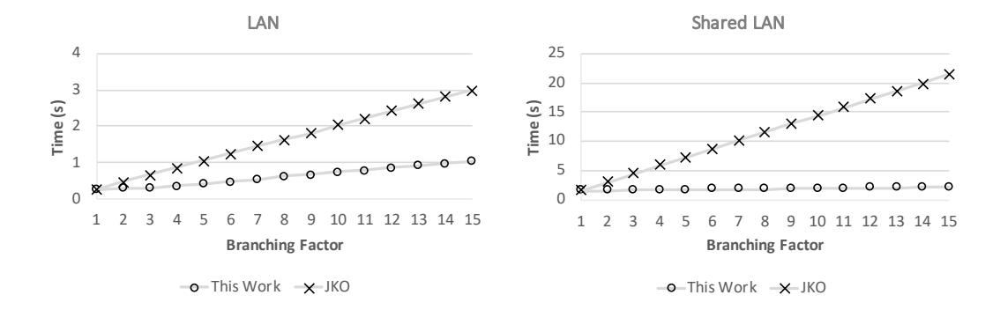

# **Stacked Garbling for Disjunctive Zero-Knowledge Proofs**

David Heath and Vladimir Kolesnikov

Georgia Institute of Technology, Atlanta, GA, USA {heath.davidanthony,kolesnikov}@gatech.edu

**Abstract.** Zero-knowledge (ZK) proofs receive wide attention, especially with respect to non-interactivity, small proof size, and fast verification. We instead focus on fast total proof time, in particular for large Boolean circuits. Under this metric, Garbled Circuit (GC)-based ZK, originally proposed by Jawurek et al. ([JKO], CCS 2013), remains state-of-the-art due to the low-constant linear scaling of garbling.

We improve GC-ZK for proof statements with conditional clauses. Our communication is proportional to the longest clause rather than to the entire proof statement. This is most useful when the number of branches *m* is large, resulting in up to *m*× communication improvement over JKO. In our proof-of-concept **illustrative application**, the prover demonstrates knowledge of a bug in a codebase consisting of *any number* of snippets of C code. Our computation cost is linear in the size of the codebase and communication is *constant in the number of snippets*. That is, we require only enough communication for the single largest snippet! Our **conceptual contribution** is *stacked garbling for ZK*, a privacy-free circuit garbling scheme that, when used with the JKO GC-ZK protocol, constructs efficient ZK proofs. Given a Boolean circuit C and computational security parameter *κ*, our garbling is *L*·*κ* bits long, where *L* is the length of the longest execution path in C. All prior concretely efficient garbling schemes produce garblings of size |C|·*κ*. The computational cost of our scheme is not increased over prior state-of-the-art.

We implemented our technique and demonstrate significantly improved performance. For functions with branching factor *m*, we improve communication by *m*× compared to JKO. Compared with recent systems (STARK, Libra, KKW, Ligero, Aurora, Bulletproofs), our scheme offers better proof times for large circuits: 35-1000× or more, depending on circuit size and on the compared scheme.

For our illustrative application, we consider four C code snippets. Each snippet has 30-50 LOC; one snippet allows an invalid memory dereference. The entire proof takes 0*.*15 seconds and communicates 1*.*5 MB.

**Keywords:** Garbled circuits, inactive branch elimination, ZK, proof of C bugs.

## **1 Introduction**

Zero-knowledge (ZK) proofs have many applications and reducing their cost is an active research direction. Many recent schemes focus on small proofs and fast verification. These works are largely motivated by blockchain applications [AHIV17,BCR<sup>+</sup>19,BBB<sup>+</sup>18,WTs<sup>+</sup>18,XZZ<sup>+</sup>19,BBHR19, etc.] and also by postquantum signatures [CDG<sup>+</sup>17,KKW18].

**Our focus,** in contrast, is the classical metric of *fast total proof time*, including proof generation, transmission, and verification. Yao's garbled circuit technique (GC) is the fastest approach for proving in ZK generic statements expressed as Boolean circuits. GC offers low-overhead linear prover complexity, while other techniques' prover costs are either superlinear or have high constants.

[JKO13] and [FNO15] demonstrated how to use GC for ZK without the costly cut-and-choose technique, and [ZRE15] proposed an efficient garbling technique that requires only 1 cryptographic ciphertext per AND gate in the ZK setting. As a result, GC-ZK processes up to 20 million AND gates per second on a regular laptop, and XOR gates are essentially free [KS08]. Unfortunately, while GC-ZK computation is cheap, communication is expensive. Even a fast 1Gbps LAN supports only ≈ 6 million AND gates per second (XOR gates are free). While this rate is higher than recent NIZK systems, communication reduction would make the approach stronger.

In this work, we achieve such a communication improvement: we reduce communication for proof statements that include logically disjoint clauses. Disjoint clauses arise from conditional branching, e.g., as a result of if or switch program statements. We transmit GCs whose size is bounded by the largest clause rather than by the entire circuit.

Our key idea is that the proof verifier, who is the GC generator, garbles from seeds all clauses and XORs together, or *stacks*, the garblings before sending them to the prover for evaluation. The prover receives via OT the seeds for the inactive clauses, reconstructs their garblings, and then XORs them with the stack to obtain the target clause's garbling. By stacking the garblings, we decrease the cost to transmit the GC from verifier to prover.

In Section 3, we formally present our approach as a garbling scheme, which we call Privacy-Free Stacked (PFS) garbling. Accompanying proofs are in Section 4. We implemented our approach in C++ and evaluate its performance against state-of-the-art techniques in Section 6 (see also discussion in Section 1.6).

#### **1.1 Use Cases: Hash Trees and Existence of Bugs in Program Code**

Our technique is useful for proving in ZK one of several statements. We evaluate our system in Sections 6 and 7 by considering two applications:

**App 1: Existence of Bugs.** Our most exciting application allows a prover P to demonstrate knowledge of a bug in a potentially large codebase. Ours is not a full-strength automated application, but rather a proof of concept. Still, we handle C code with pointers, standard library calls, and simple data structures (see Section 7).

We consider a number of code snippets motivated by real code used in operating systems, standard algorithms, etc. The snippets we consider contain between 30 and 50 lines of code; this number can be easily increased. We manually instrument snippets with program assertions. Each snippet outputs a single bit that indicates if an assertion failed and hence whether there is a bug.

We used and extended the EMP toolkit [WMK16] to compile instrumented snippets to Boolean circuits. P demonstrates that she knows an input which causes the snippet to output 1. We envision that the mechanical tasks of instrumenting a codebase will be automated in a practical tool; we leave further development as important and imminent future work.

Our approach excels in this use case because it features (1) high concrete performance and (2) communication that is constant in the number of code snippets. We further elaborate on this use case in Section 7.

**App 2: Merkle Tree Membership.** We compare our performance to that of recent ZK systems. We therefore consider an application that is typical in the literature: proving Merkle tree membership.

Specifically, Alice asserts properties of her record which is embedded in a certificate signed by one of several acceptable authorities. Each authority includes many players' records in a Merkle tree and publishes the Merkle root. Alice proves in ZK statements about her record by demonstrating that she knows a Merkle path from her record to any one of the published roots. Certificate authorities may use different hash functions or, in general, differ in arbitrary aspects of the proof, creating a use case for proving one of many clauses. In Section 6, we compare our performance to recent work based on this use case.

## **1.2 Contribution**

Our contribution includes:

- A novel GC technique that we call *stacked*, or PFS, garbling. PFS garbling requires communication linear in the longest execution path rather than in the entire circuit. Specifically, the same circuit encryption sent from verifier to prover compactly represents *any* of the disjoint clauses. Note, Free IF [Kol18] does not work in our setting.
  - PFS garbling is useful in a number of applications. We highlight the use-case of directly representing disjunctive proofs. Another key application of PFS garbling is the efficient representation of the internal operations of a processor. A processor representation can handle a wider variety of ZK statements than direct circuit encodings. On each cycle, the emulated processor conditionally dispatches over an instruction to decide which operation to perform. PFS garbling optimizes this kind of conditional dispatch.
- High concrete performance, improving over the state-of-the art baseline, JKO with half-gates, approximately by the function branching factor; improvement over recent SNARKs is 35× – 1000× or more, depending on function size, branching, and the compared scheme. Our technique has low RAM requirements (146 MB for 7M gate circuit).
- A proof-of-concept system that proves knowledge of bugs in C code. We use realistic C code snippets that include pointer manipulations and standard library calls, and we use the implementation to prove the existence of a bug relating to a misuse of **sizeof()** on a pointer.

#### 1.3 Preliminaries

Free IF review: We improve GC communication for circuits with conditional branching. [Kol18] introduced Free IF, a technique that achieves a similar improvement to conditionals. Free IF decouples the circuit's description (the topology) from the encryptions of circuit's gates (the material). While a topology is required, it is assumed to be conveyed separately from the material or by implicit agreement between the participants.

Let  $S = \{C_1, ..., C_m\}$  be a set of Boolean circuits. Let only the GC generator Gen know which circuit in S is evaluated, and let  $C_t$  be this target circuit. The key idea is that Gen constructs material for  $C_t$ , but does not construct material for the other circuits. Let  $\widehat{C}$  be the constructed material. The GC evaluator Eval knows S, but does not know the target. From Eval's perspective,  $\widehat{C}$  is a random-looking string that could plausibly be the encryption of any circuit in S. For each  $C_i \in S$ , Eval interprets  $\widehat{C}$  as material for  $C_i$  and evaluates, obtaining garbled output. Only the output labels of  $C_t$  encrypt truth values; the other output labels are garbage. Eval cannot distinguish garbage labels from valid labels and hence does not learn t.

Eval obliviously propagates only the target output labels to Gen via an *output selection* protocol. As input to the protocol, Eval provides all output labels, including the garbage outputs, and Gen provides t and  $C_t$ 's output labels. The protocol outputs re-encoded labels corresponding to the output of  $C_t$ .

PFS garbling is inspired by key ideas from Free IF:

- We also separate circuit topologies from material.
- We also use the same material to encrypt multiple topologies.

Superficially, both techniques omit inactive clauses when one player knows the target clause. The difference is that in [Kol18] that player is Gen and in our scheme it is Eval. Indeed, in GC-ZK, Gen must not know the evaluated branch. This is a critical distinction that requires a different approach.

Garbled Circuits for Zero Knowledge: Until the work of Jawurek et al. [JKO13], ZK research focused on proofs of algebraic statements. Generic ZK techniques were known, but were based on generic NP reductions and were inefficient. [JKO13] provided an efficient generic ZK technique based on garbled circuits.

The construction works as follows. The verifier V and the prover P run a passively-secure GC protocol where V is the circuit generator and P is the circuit evaluator. The agreed upon Boolean circuit  $\mathcal C$  encodes the proof relation where (1) the input is a witness supplied by P, (2) the output is a single bit, and (3) if the output bit is 1, then the witness satisfies the relation. V garbles  $\mathcal C$  and sends the garbling to P. P evaluates the GC and sends to V the output label. GC security, namely authenticity [BHR12], ensures that a computationally bounded P cannot produce the correct output label without a valid witness. By computing  $\mathcal C$ , P and V achieve a ZK proof in the honest verifier setting.

While the approach so far is secure against an honest verifier, a malicious V can send an invalid circuit or invalid OT inputs that leak P's witness.

[JKO13] solves this with a commitment step. P does not immediately send her output label to V; she instead commits to it. Then, V sends to P the seed used to generate the GC. P uses the seed to verify that the GC was honestly constructed. If so, P opens her commitment, completing the proof.

Subsequent to [JKO13], [FNO15] observed that weaker *privacy-free* garbling schemes suffice for [JKO13]'s ZK protocol. [FNO15] constructed a faster privacy-free scheme that uses between 1 and 2 ciphertexts per AND gate. Subsequently, Zahur et al. [ZRE15] presented a privacy-free variant of their half-gates scheme which requires only 1 ciphertext per AND gate. In our implementation, we use the [JKO13] protocol and build on top of half-gates.

### 1.4 High-level Approach

Our main contribution is a new ZK technique in the [JKO13] paradigm. The key characteristic of our construction is that, for proof relations with disjoint clauses, communication is bounded by the size of the largest clause rather than the total circuit size. In Section 3, we present our approach in technical detail as a garbling scheme that plugs into the [JKO13] protocol. For now, we explain our approach at a high level.

Consider a proof statement represented as a Boolean circuit  $\mathcal C$  with conditional evaluation of one of several clauses. In Section 1.3, we reviewed existing work that demonstrates how to efficiently evaluate  $\mathcal C$  if the *generator* knows the active clause. However, the [JKO13] ZK approach requires the generator to be V. V has no input and so does not know the target clause. Instead, P must select the target clause.

As a naïve first attempt, P can select the target clause via OT. However, this involves transferring encryptions of all GC clauses, resulting in no improvement.

Instead, we propose the following idea, inspired by classic two-server private information retrieval [CGKS95]. Let  $\mathcal{S} = \{\mathcal{C}_1, ..., \mathcal{C}_m\}$  be the set of circuits implementing clauses of the ZK relation. Let  $\mathcal{C}_t \in \mathcal{S}$  be the target clause. For simplicity, suppose all clauses are of the same size, meaning that they each generate GCs of equal size. Our approach naturally generalizes to clauses of different sizes (see Section 3.7). The players proceed as follows.

V chooses m random seeds  $s_1...s_m$  and generates from them m GCs,  $\widehat{\mathcal{C}}_1...\widehat{\mathcal{C}}_m$ . V computes  $\widehat{\mathcal{C}} = \bigoplus_i \widehat{\mathcal{C}}_i$  and sends  $\widehat{\mathcal{C}}$  to P. Informally, computing  $\widehat{\mathcal{C}}$  can be understood as stacking the garbled circuits for space efficiency.

We allow P to reconstruct, from seeds received via OT, all but one of the stacked GCs. P XORs these reconstructions with the stack to retrieve the target GC which she evaluates with her witness. We prevent P from receiving all m GCs and thus from forging a proof. To do so, we introduce a 'proof of retrieval' string PoR. P receives PoR via OT only when she does not choose to receive a

<sup>&</sup>lt;sup>1</sup> [CGKS95] includes a PIR protocol where two non-colluding servers separately respond to a client's related queries. The client XORs the two encrypted responses to compute the cleartext output.

clause seed.  $\mathsf{P}$  proves that she did not forge the proof by presenting  $\mathsf{P}o\mathsf{R}$ . This is put together as follows.

V samples a uniform string Por. For each  $i \in \{1..m\}$ , the players run 1-out-of-2 OT, where V is the sender and P is the receiver. Players use *committing* OT for this phase [KS06]. For the *i*th OT, V's input is a pair  $(s_i, Por)$ . P selects 0 as her input in all instances except instance t, where she selects 1. Therefore P receives Por and seeds  $s_{i\neq t}$ , from which P reconstructs each  $\widehat{C}_{i\neq t}$ . P retrieves material for the target clause by computing  $\widehat{C}_t = \widehat{C} \oplus (\bigoplus_{i\neq t} \widehat{C}_i)$ .

Now, P holds material for the target clause, but we have not yet described how P receives input labels for the target clause. We again simplify by specifying that each clause has the same number, n, of inputs. Our approach generalizes to clauses with different numbers of inputs (see Section 3.7). V's random seed  $s_i$  is used to generate the n pairs of input labels for each clause  $\hat{C}_i$ . Let  $X_i$  be the vector of n label pairs used to encode the input bits for clause i. V generates m such vectors,  $X_1...X_m$ . As an optimization similar to stacking garblings, V computes  $X = \bigoplus_i X_i$ . V and P now perform n committing 1-out-of-2 OTs, where in each OT V provides two stacked labels, one label corresponding to 0 and one to 1, and P provides her corresponding input bit. P uses seeds obtained in the first step to reconstruct each  $X_{i\neq t}$  and computes  $X_t = X \oplus (\bigoplus_{i\neq t} X_i)$ .

P now has the material  $\widehat{C}_t$  and appropriate input labels  $X_t$ . P evaluates  $\widehat{C}_t$ , resulting in a single output label  $Y_t$ . For security, we prevent V from learning t. We accomplish this by allowing P to compute the correct output label for every clause. Recall, P has seeds for every non-target clause. P uses the garblings constructed from these seeds to obtain the output labels  $Y_{i\neq t}$ . P computes  $Y = PoR \oplus (\bigoplus_i Y_i)$  and commits to this value, as suggested in [JKO13]. Next, V opens all commitments made during rounds of OT. From this, P checks that PoR is consistent across all seed OTs and obtains the final seed  $s_t$ . P checks that the circuits are properly constructed by reconstructing them from the seeds and, if so, completes the proof by opening the output commitment.

#### 1.5 Generality of top-level clauses

Our approach optimizes *top-level* clauses. That is, possible execution paths of the proof relation are represented by separate clauses. Top-level clauses are general: even nested conditionals can be represented by performing program transformations that lift inner conditionals to top-level conditionals.

Unfortunately, over-optimistically lifting conditionals can sometimes lead to an exponential number of clauses. In particular, if two conditionals occur sequentially in the relation, then the number of possible execution paths is the product of the number of paths through both conditionals. Of course, it is not necessary to lift all conditionals in a program; clauses can include unstacked conditional logic. Our approach yields improvement for any separation of top level clauses.

Top-level clauses match our target use case of proving the existence of program bugs: programs can be split into various snippets, each of which may contain a bug. We represent snippets as top-level clauses.

#### **1.6 Related Work**

Our work is a novel extension to the GC-based ZK protocol of [JKO13] which we reviewed in Section 1.3. Here we review other related work and provide brief comparisons in Section 1.7. We focus on recent concretely efficient protocols.

*Zero Knowledge* is a fundamental cryptographic primitive [GMR85,GMW91]. ZK proofs of knowledge (ZKPoKs) [GMR85,BG93,DP92] allow a prover to convince a verifier, who holds a circuit *C*, that the prover knows an input, or *witness*, *w* such that *C*(*w*) = 1. There are several flavors of ZK proofs. In this work we do not distinguish computational and information-theoretic soundness and refer to both arguments and proofs simply as 'proofs.'

ZK proofs were investigated both theoretically and practically in largely non-intersecting bodies of work. Early practical ZK protocols focused on algebraic relations, motivated mainly by signatures and identification schemes, e.g. [Sch90,CDS94]. More recently, these two directions have merged. Today, ZKPoKs and non-interactive ZKPoK (NIZKPoK) for arbitrary circuits are efficient in practice.

Consider proving in ZK arbitrary statements represented as Boolean circuits. These can be straightline programs or, more generally and quite typically, can include logical combinations of basic clauses. Several lines of work consider ZK proofs of general functions, including MPC-in-the-head, SNARKs/STARKs, JKO, and Sigma protocols [CDS94]; the latter specifically emphasizes proving disjoint statements, e.g., [Dam10,CDS94,CPS<sup>+</sup>16,GK14]. We next discuss prior generic ZK techniques.

*Efficient ZK from MPC.* Ishai et al. [IKOS07], introduced the 'MPC-in-thehead' paradigm. Here, the prover emulates 'in her head' MPC evaluation of *C*(*w*) among *virtual* players, where *w* is secret-shared among the players. The verifier checks that the evaluation outputs 1 and asks the prover to open the views of some virtual players. A prover who does not know *w* must cheat to output 1; opening random players ensures a cheating prover is caught with some probability. At the same time, ZK is preserved because (1) not all virtual players are opened, (2) the witness is secret shared among the virtual players, and (3) MPC protects the inputs of the unopened virtual players.

Based on [IKOS07]'s approach, Giacomelli et al. [GMO16] implemented ZK-Boo, a protocol that supports efficient NIZKPoKs for arbitrary circuits. Later, Chase et al. [CDG<sup>+</sup>17] introduced ZKB++, which succeeded ZKBoo. ZKB++ can implement a signature scheme based on symmetric-key primitives alone. A version of the [CDG<sup>+</sup>17] scheme called *Picnic* [ZCD<sup>+</sup>17] was submitted to the NIST post-quantum standardization effort. Katz et al. [KKW18] further improved this line of research by computing a preprocessing-based protocol among the virtual players. Because the [KKW18] approach is more efficient, Picnic has since updated and is now based on [KKW18].

Ligero [AHIV17] offers proofs of length *O*( p |C|) and asymptotically outperforms ZKBoo, ZKB++, and [KKW18] in communication. The break-even point between [KKW18] and Ligero depends on function specifics, and is estimated in [KKW18] to be ≈ 100K gates.

*SNARKs/STARKs.* Succinct non-interactive arguments of knowledge (SNARKs) [GGPR13,PHGR13,BCG<sup>+</sup>13,CFH<sup>+</sup>15,Gro16] offer proofs that are particularly efficient both in communication and in verification time. They construct proofs that are shorter than the input itself. Prior work demonstrated the feasibility of ZK proofs with size sublinear in the input [Kil92,Mic94], but were concretely inefficient. Early SNARKs require a semi-trusted party. This disadvantage motivated development of succinct transparent arguments of knowledge (STARKs) [BBHR18]. STARKs do not require trusted setup and use more efficient primitives. STARKs are succinct, and thus are SNARKs. In this work, we do not separate them; we see them as a body of work focused on sublinear proofs. Thus, Ligero [AHIV17], which is based on MPC-in-the-head, is a SNARK.

In our comparisons, we focus on JKO, [KKW18], and recent SNARKs Ligero, Aurora, Bulletproofs [BBB<sup>+</sup>18], STARK [BBHR19], and Libra [XZZ<sup>+</sup>19].

*Garbled RAM.* Our technique reduces communication for circuits with conditional branches. Another direction achieves a similar improvement by representing a low-level processor rather than directly representing the program. Garbled RAM combines GC with ORAM to repeatedly perform individual processor cycles [LO13]. Because the processor cycle circuit has fixed size, this technique has cost proportional to the program execution path rather than to the full program. Garbled RAM interfaces the GC with ORAM and so is not concretely efficient. While our approach is not as general as Garbled RAM and related approaches, we achieve high concrete efficiency for conditionals.

### **1.7 Comparison with prior work**

We present detailed experimental results in Section 6; here, we reiterate that our focus is *fast total proof time*, including proof generation, transmission, and verification. In this total-time metric, GC is the fastest technique for proving statements expressed as Boolean circuits. This is because GC offers low-overhead linear prover complexity while other techniques' provers are superlinear, have high constants, or both.

In Section 1.1, we presented an exciting application where P demonstrates knowledge of a program bug. However, when comparing to prior work, we instead use a Merkle tree evaluation benchmark. This benchmark is convenient since many other works report on it. In Section 6, we use this benchmark to compare to JKO and to other modern ZK proof systems: KKW, Ligero, Aurora, Bulletproofs, STARK, and Libra.

As expected, our total time improves over [JKO13] by a factor approximately equal to the branching factor. Indeed, our communication cost is linear in the longest execution path, while [JKO13,KKW18] are linear in |C|, and our constants are similar to that of [JKO13] and significantly smaller than [KKW18].

Our total time outperforms current SNARKS by 35× – 1*,* 000× or more. Like JKO, and unlike KKW and SNARKs, our technique is interactive and requires higher bandwidth.

## **2 Notation**

The following variables relate to a given disjunctive proof statement:

- *t* is the *target* index. It specifies the clause for which the prover has a witness.
- *m* is the number of clauses.
- *n* is the number of inputs. Unless stated otherwise, each clause has *n* inputs.

We use ⊕ to denote a slight generalization of XOR: if one input to XOR is longer than the other, the shorter input is padded by appending 0s until both inputs are of the same length. We use L*x<sup>i</sup> ..x<sup>j</sup>* as a vectorized version of this length-aware XOR:

$$\bigoplus x_i..x_j = x_i \oplus x_{i+1} \oplus \dots x_{j-1} \oplus x_j$$

We discuss in Section 3.7 that this generalization is not detrimental to security in the context of our approach.

*x* || *y* is the string concatenation of *x* and *y*. We use *κ* as the computational security parameter. We use V, he, him, his, etc. to refer to the verifier and P, she, her, etc. to refer to the prover. We use *.* for namespacing; pack*.*proc is a procedure proc defined as part of the package pack.

## **3 Our Privacy-Free Stacked Garbling Construction**

We optimize the performance of ZK proofs for circuits that include disjoint clauses. In this section, we present our approach in technical detail.

Our construction is a *verifiable garbling scheme* [BHR12,JKO13]. A verifiable garbling scheme is a tuple of functions conforming to a specific interface and satisfying certain properties such that protocols can be defined with the garbling scheme left as a parameter. Thus, new garbling schemes can be plugged into existing protocols. A garbling scheme does not specify a protocol. Instead, it specifies a modular building block.

We specify an efficient verifiable garbling scheme where the function encoding, *F*, is proportional to the longest program execution path rather

```
1 Proc Stack.Gb (1κ
                   , f, R):
2 (f1..fm) ← f
3 (por||s1..sm) ← R
4 for i ∈ 1..m do
5 (Fi, ei, di) ← Base.Gb (1κ
                             , fi, si)
6 F ← f || LF1..Fm

7 d ← por ⊕
               Ld1..dm

8 e ← por||s1..sm||e1..em
9 return (F, e, d)
 1 Proc Stack.En (e, x):
2 (por || s1..sm || e1..em) ← e
3 (t || xt) ← x
4 for i ∈ 1..m do
5 if i 6= t then
6 ri ← si
7 else
8 ri ← por
9 Xi ← Base.En(ei, xt)
10 X ← r1..rm || LX1..Xm

11 return X
 1 Proc Stack.De (Y, d):
2 y ← Y = d
3 return y
                                         1 Proc Stack.ev (f, x):
                                         2 (f1..fm) ← f
                                         3 (t || xt) ← x
                                         4 y ← Base.ev (ft, xt)
                                         5 return y
                                         1 Proc Stack.Ev (F, X, x):
                                         2 (f1..fm || F) ← F
                                         3 (r1..rm || X) ← X
                                         4 (t || xt) ← x
                                         5 for i ∈ 1..m do
                                         6 if i 6= t then
                                         7 (Fi, ei, di) ← Base.Gb (1κ
                                                                        , fi, ri)
                                         8 Xi ← Base.En (ei, xt)
                                         9 else
                                        10 (Fi, di, Xi) ← (0, 0, 0)
                                        11 Ft ← F ⊕
                                                      LF1..Fm

                                        12 Xt ← X ⊕
                                                       LX1..Xm

                                        13 Yt ← Base.Ev (Ft, Xt)
                                        14 Y ← Yt ⊕
                                                      Ld1..dm

                                                                 ⊕ rt
                                        15 return Y
                                         1 Proc Stack.Ve (f, F, e):
                                         2 (por || s1..sm || ·) ← e
                                         3 (F
                                                0
                                                , e0
                                                   , d0
                                                     ) ←
                                              Stack.Gb (1κ
                                                         , f, por || s1..sm)
                                         4 return e = e
                                                         0 ∧ F = F
                                                                  0
```

**Fig. 1.** PFS garbling scheme Stack. Stack is defined as six procedures: Stack.Gb, Stack.Ev, Stack.ev, Stack.En, Stack.De, and Stack.Ve.

than to the entire program<sup>2</sup> . Our scheme satisfies security properties required by [JKO13,FNO15].

A verifiable garbling scheme is a tuple of six algorithms:

(ev*,* Gb*,* En*,* Ev*,* De*,* Ve)

The first five algorithms define a garbling scheme [BHR12], while the sixth adds verifiability [JKO13]. A garbling scheme specifies the functionality computed by

In [BHR12], *F* implicitly includes a full description of the function. I.e., *F* includes the topology. In this sense, *F* is also proportional to the full size of the function. However, compared to the material needed for the longest clause, the topology is small. Formally, the topology size is constant in *κ*. Most importantly, implementations can assume that the topology is known to both players and so need not send the topology.

<sup>2</sup> To be more precise, in the notation of Kolesnikov [Kol18], the function encoding *F* = (*T, E*) consists of function topology *T*, thought of as the Boolean circuit, and material *E*. In our work, *E* is proportional to the longest execution path.

V and P. Loosely speaking, V uses Gb to construct the garbled circuit sent to P. V uses En to choose input labels and De to decode the output label. P uses Ev to compute the garbled circuit with encrypted inputs and uses Ve to check that the circuit was honestly constructed. Finally, ev provides a reference against which the other algorithms can be compared. The idea is that if (1) a garbling is constructed using Gb, (2) the inputs are encoded using En, (3) the encoded output is computed using Ev, and (4) the output is decoded using De, then the resulting bit should be the same as calling ev directly.

A verifiable garbling scheme must be **correct**, **sound**, and **verifiable**. We present definitions of these properties and proofs that our scheme satisfies them in Section 4.

Since we are primarily concerned with reducing the cost of disjoint clauses, we offload the remaining work, i.e. work related to the handling of individual clauses, to another garbling scheme. We parameterize our scheme over another garbling scheme, Base. We place the following requirements on Base:

- Base must be **correct** and **sound**.
- Base must be **projective** [BHR12]. In a projective garbling scheme, each bit of the prover's input is encoded by one of two cryptographic labels. The truth value of that bit determines which label the prover receives. Projectivity allows us to stack input labels from different clauses. We can lift this requirement by compromising efficiency: V can send an input encoding for *each* clause rather than a stacked encoding.
- Base must output a single cryptographic label and decoding must be based on an equality check of this label. This property is important because it allows us to stack the output labels from each clause. Again, we can lift this requirement by compromising efficiency: P can send each output label rather than the stacked value.

These requirements are realized by existing schemes, including state-of-the-art privacy-free half-gates [ZRE15].

In the following text, we describe our construction, the PFS verifiable garbling scheme Stack. Pseudocode for our algorithms is presented in Figure 1.

#### **3.1 Reference Evaluation**

ev maps the computed function *f* and an input *x* to an output bit. ev provides a specification for garbled evaluation: garbled evaluation should yield the same output as ev. In our setting, the input is split into a clause selection index *t* and the remaining input. Stack.ev delegates to Base.ev on the *t*-th clause. For many practical choices of Base, including privacy-free half-gates, Base.ev simply applies the function to the input: it returns *f*(*x*).

## **3.2 Garble**

Gb maps the function *f* to a garbled function *F*, an encoding string *e*, and a decoding string *d*. At a high level, Gb corresponds to the actions taken by V to construct the proof challenge for P. Typically, e contains input labels (conveyed to P via OT), F contains material needed to evaluate the individual logic gates and, in the ZK setting, d is a single label that convinces V that P has a witness. P uses her witness to construct d.

Gb is usually described as a pseudorandom algorithm. However, we explicitly parameterize Gb over a random string such that Gb is a deterministic algorithm. This adjustment allows P to reconstruct material by starting from the same random string as V. Gb takes as parameters the unary string  $1^{\kappa}$ , the desired function f, and a random string R. It outputs a three-tuple of strings (F, e, d).

At a high level, Stack.Gb (Figure 1) delegates to Base.Gb for each clause and XORs<sup>3</sup> the resulting material. This XOR stacking reduces the material length to that of a single largest clause.

In more detail, Stack.Gb deconstructs f into clauses and extracts from the randomness (1) m different random seeds and (2) the proof of retrieval string Por. Later, in Section 3.3 we will see that the prover receives via OT the garbling seed for each of m clauses, except for the target clause. Por prevents P from taking all m seeds and hence from forging a proof. We enforce that if P takes all seeds, then she does not obtain Por. Next, each seed is used to garble its respective clause using the underlying scheme (Stack.Gb line 5). The material from each clause is XORed together and concatenated with the function description<sup>4</sup> (Stack.Gb line 6). This is a key step in our approach: since we XOR material together, we reduce the cost of sending the garbling F as compared to sending each garbling separately. Similarly, output labels from each clause are XORed together. Por is also XORed onto the output label stack. The encoding e contains Por, each random string  $s_i$ , and each encoding string  $e_i$ .

#### 3.3 Encode

En maps the encoding string e and the function input x to an encoded input X. En describes which input labels the verifier should send to the prover. Typically, En is implemented by OT.

Stack.En ensures that the prover receives (1) the proof of retrieval string Por, (2) each random seed  $s_{i\neq t}$ , and (3) stacked inputs for the target clause. Section 3.2 described how e contains Por,  $s_1..s_m$ , and  $e_1..e_m$ .

Stack.En deconstructs e into the above parts. It also deconstructs the circuit input into t, the target clause index, and  $x_t$ , the input for the target clause. Next, a vector of secrets,  $r_1...r_m$  is constructed. This vector contains PoR and  $s_{i\neq t}$ . We use the underlying scheme to construct m encodings and XOR the encodings together (Stack.En line 10). Stack.En outputs the vector of secrets and the stacked input encodings.

<sup>&</sup>lt;sup>3</sup> As discussed in Section 2, by XOR we mean length-aware XOR, where shorter strings are padded with zeros such that all strings are of the same length.

<sup>&</sup>lt;sup>4</sup> Including the function description f is a formality to fit the BHR interface. In practice, f is often known to both parties and need not be explicitly handled/transmitted.

Stack.En is a specification, not an implementation. As mentioned earlier, Stack.En is implemented using OT. Our implementation realizes this functionality in the following way:

- For each clause, V generates *n* pairs of labels, one pair for each bit and one label for each configuration of that bit.<sup>5</sup>
- V stacks these labels, yielding *n* pairs of stacked labels.
- For each *i* ∈ 1*..m*, V constructs the pair (*s<sup>i</sup> ,* p*o*r).
- Now, P and V participate in *m* + *n* executions of 1-out-of-2 OT, such that P receives por, non-target seeds, and stacked garbled inputs according to En.

By running this protocol, V obliviously transfers encoded input, including the seeds and por, to P.

#### **3.4 Evaluate**

Ev maps an encoded function, *F*, and encoded inputs, *X*, to the encoded output, *Y* . In the ZK setting we (as do [JKO13] and [FNO15]) allow Ev to take the unencoded input, *x*, as a parameter. In practice Ev is run by P who knows the witness. Informally, Ev describes how P uses material and input labels to construct a proof.

The bulk of the work done by Stack.Ev is concerned with 'undoing' the stacking of the encoded functions *F*1*..F<sup>m</sup>* and of the encoded inputs *X*1*..Xm*, in order to extract the encoded function *Ft*, and inputs *X<sup>t</sup>* for the target clause. First, Stack.Ev deconstructs all inputs into their constituent parts. It then uses the random strings included in the encoded input to re-garble each non-target clause by calling Base.Gb (Stack.Ev line 7). Note that since Base.Gb is called with the same random strings in both Stack.Ev and Stack.Gb, the resulting encodings are the same. Stack.Ev cannot call Base.Gb on the target clause because the input encoding does not include the corresponding random string. Instead, *r<sup>t</sup>* is the proof of retrieval por. Stack.Ev XORs out the garblings of the non-target clauses to obtain the encoded function (Stack.Ev line 11) and encoded input (Stack.Ev line 12) for the target clause. P uses *F<sup>t</sup>* and *X<sup>t</sup>* to compute the output *Y<sup>t</sup>* by calling Base.Ev. Finally, P XORs together *Yt*, *d*1*..dm*, and p*o*r and returns the result.

## **3.5 Decode**

De maps an encoded output, *Y* , and an output encoding string, *d*, to a decoded output. In the ZK setting, both *Y* and *d* are labels encoding a single bit. Stack.De checks that the values are the same, and if so returns 1 (and 0 if not).

<sup>5</sup> In fact, we use the Free XOR extension [KS08]. Therefore, each clause has only one label for each input bit and one global *∆* value that separates 0 bit labels from 1 bit labels. Our implementation stacks *∆* from each clause as part of the stacked projective garbling.

#### **3.6 Verify**

Ve maps an input function *f*, the garbled function *F*, and the encoding string *e* to a bit. Informally, the function returns 1 if (*F, e*) is correctly constructed.

Stack.Ve extracts the proof of retrieval p*o*r and input seeds *s*1*..s<sup>m</sup>* from *e*. It uses these strings to garble the computed functions and checks that the result matches the provided garbling.

In our implementation, we take advantage of an optimization available in Stack.Ve. To verify V's messages, the prover reconstructs the garblings of each clause. However, the prover *already* garbled each circuit except the target while computing Ev, so we simply reuse these already computed values and only garble the target during verification. This is noteworthy, because our approach not only transmits less information, it involves less computation on the part of P as well: under previously defined ZK garbling schemes (e.g. [ZRE15]), P must both garble and evaluate *every* clause. Under our scheme P garbles every clause but evaluates only the target clause.

### **3.7 Generalizing to Diverse Clauses**

In Section 1.4, we limited discussion to clauses of the same size and with the same number of inputs. Our construction does not rely on these simplifications. Here, we discuss generalizations to clauses with different sizes and numbers of inputs.

Our approach supports clauses of various sizes. The only implementation detail that relates to the size of the clauses is the XOR stacking of the garbled material from each clause (Stack.Gb line 6 and Stack.Ev line 11). In Section 2, we describe how ⊕ denotes a *length-aware* variant of XOR, i.e. the shorter string is padded with 0s. Therefore, there is no correctness concern with stacking mismatched strings. The only potential concern is security. Our proofs formally alleviate this concern; informally, stacking material is secure because we can safely allow the prover to obtain material for each clause *F<sup>i</sup>* . Indeed, even sending each clause *F<sup>i</sup>* separately is secure, although inefficient. Giving P access to the garbled material provides no aid in constructing a proof. Specifically, only having a witness and *running* the garbled circuit allows P to construct the correct *Yt*. Therefore, clause stacking does not hinder security.

We support clauses with different numbers of inputs. Regardless of her clause choice *t*, the prover appends the input string *x<sup>t</sup>* with 0s until *x<sup>t</sup>* is appropriate for an input of length *n*. Our technique allows P to learn every input encoding *Xi*6=*<sup>t</sup>* and therefore to learn *Xt*. This is desirable: We must allow P to learn *X<sup>t</sup>* in order to evaluate the target clause on their input.

## **4 Proofs of Security**

Jawurek et al. [JKO13] introduced a protocol that uses a garbling scheme as a black-box to achieve malicious verifier Zero Knowledge. In this section, we prove that our construction satisfies the [JKO13] requirements. Thus, we leverage the work of [JKO13] to construct a malicious verifier ZK protocol with efficient disjoint clause handling.

[JKO13] requires the garbling scheme to be **correct**, **sound**, and **verifiable**. We use simpler formulations of these definitions presented in [FNO15], a follow-up work to [JKO13].

We now explicitly state the definitions of these properties in our notation. We prove that Stack (Figure 1) satisfies each property (Theorems 1 to 3) if the underlying scheme Base is **correct** and **sound**. We do not require Base to be verifiable because we explicitly manage Base's randomness.

#### 4.1 Correctness

Correctness ensures that P constructs a valid proof if she, in fact, has a valid witness. More precisely, Definition 1 states that if a garbling is constructed by calling  $\mathsf{Gb}$  and  $\mathsf{P}$  provides as input a valid witness, then  $\mathsf{Ev}$  yields the correct output label d. Recall, we work with explicit randomness. Thus,  $\mathsf{Gb}$  takes a random string R as additional input.

**Definition 1 (Correctness).** A garbling scheme is **correct** if for all  $n = poly(\kappa)$ , all functions  $f : \{0,1\}^n \to \{0,1\}$ , all inputs  $x \in \{0,1\}^n$  such that ev(f,x) = 1, and all random strings  $R \in_R \{0,1\}^{\kappa}$ :

$$(F,e,d) = \operatorname{Gb}(1^{\kappa},f,R) \Rightarrow \operatorname{Ev}(F,\operatorname{En}(e,x),x) = d$$

**Theorem 1.** *If Base is correct, then* Stack *is correct.* 

*Proof.* Stack.Gb constructs the output label d by XORing together the output label of each clause,  $d_i$ , and the proof of retrieval string, Por. Therefore, it suffices to show P obtains each string  $d_i$  and Por. Recall, P's input includes the bits that select a clause, t, concatenated with her remaining input, x. We show that she obtains each output label  $d_i$  and Por in three steps:

- 1. P obtains  $d_i$  for all  $i \neq t$  by garbling  $f_i$ . This is immediate from the fact that P receives every seed  $s_i$  for  $i \neq t$  as a part of her encoded input (Stack.En, line 6). P garbles clause  $f_i$  with seed  $s_i$  and obtains  $d_i$  (Stack.Ev, line 7).
- 2. P obtains  $d_t$  by evaluating  $f_t$  on her input x. We show this in three parts: (1) P obtains the garbling of the selected clause,  $F_t$ , (2) P obtains encoded inputs for the selected clause,  $X_t$ , and (3) P computes  $d_t$ .

First, Stack.Gb constructs the XOR sum of the garbling of each clause,  $F_i$  (Stack.Gb, line 6). Therefore, to show that P obtains  $F_t$ , it suffices to show that she obtains  $F_i$  for all  $i \neq t$  and F. F is given as a parameter to Stack.Ev and so is trivially available. P obtains the garblings of all clauses  $F_i$  by calling Stack.Gb with the seeds in her encoded input.

Second, Stack.En constructs X by XORing together the encodings of each clause  $X_i$  (Stack.En, line 10). Similar to the previous step, P computes each  $X_i$  by garbling clause i with  $s_i$ . She uses each encoding  $e_i$  to compute  $X_i = 1$ 

Base.En  $(e_i, x)$  (Stack.Ev, line 8). She XORs these encodings with X to get the appropriate input for clause  $t, X_t$ .

P computes  $Y_t = \mathsf{Base}.\mathsf{Ev}(F_t, X_t, x)$ . Base is assumed correct, so  $Y_t = d_t$ .

3. P obtains Por. This string is immediately available as  $r_t$  (Stack.En line 8).

P XORs together each of these elements (Stack.Ev line 14) to obtain the output Y=d. That is, Stack.Ev  $(F, \text{Stack.En}\,(e,x)\,,x)=d$ . Stack is correct.

#### 4.2 Soundness

**Definition 2 (Soundness).** A garbling scheme is **sound** if for all  $n = poly(\kappa)$ , all functions  $f : \{0,1\}^n \to \{0,1\}$ , all inputs  $x \in \{0,1\}^n$  such that ev(f,x) = 0, and all probabilistic polynomial time adversaries A the following probability is negligible in  $\kappa$ :

$$Pr(\mathcal{A}(F, En(e, x), x) = d : (F, e, d) \leftarrow Gb(1^{\kappa}, f))$$

Soundness is a succinct version of authenticity [BHR12], restricted to the ZK setting. Soundness ensures that a prover who does not have a valid witness cannot convince the verifier otherwise. More specifically, no malicious evaluator can extract the garbling scheme's secret d unless she knows an input x such that f(x) = 1.

In our garbling scheme, d combines 1-labels of all clauses and the proof of retrieval PoR. We show that an adversarial P who is given  $(F, \mathsf{Stack}.\mathsf{En}\,(e,x)\,,x)$ , such that  $\mathsf{Stack.ev}\,(f,x)=0$ , cannot obtain at least one of the components of d and hence cannot output d except with negligible probability.

Theorem 2. If Base is sound, then Stack is sound.

*Proof.* Recall,  $d = (\bigoplus_i d_i) \oplus \text{Por.}$  That is, the output label is the XOR sum of the output labels for each clause and Por. Consider an arbitrary input  $(t \mid\mid x_t) \leftarrow x$ , such that Stack.ev (f, x) = 0. We proceed by case analysis on t.

- Suppose t is invalid (i.e.,  $t \notin [1..m]$ ) and thus  $\mathsf{Stack}.\mathsf{En}(x)$  outputs all seeds  $s_1..s_m$ . By the definition of  $\mathsf{Stack}.\mathsf{En}$ ,  $\mathcal A$  does not receive  $\mathsf{PoR}$  and hence cannot construct d except with negligible probability.
- Suppose that  $t \in [1..m]$ , i.e. t is valid. Because Stack.ev (f, x) = 0, it must be that Base.ev  $(f_t, x_t) = 0$ .  $\mathcal{A}$ 's input includes PoR and seeds for each clause except for clause t. Due to the seeds,  $\mathcal{A}$  can compute each output label except  $d_t$ . Stack prevents an adversary without a witness from successfully constructing  $d_t$  and hence prevents construction of d.  $d_t$  is independent of all values except for values related to the clause itself:  $s_t, f_t, F_t, X_t$ , and  $e_t$ . Base is assumed sound and hence, since  $x_t$  is not a witness for clause t,  $\mathcal{A}$  cannot obtain  $d_t$ . Thus,  $\mathcal{A}$  cannot construct d except with negligible probability.

Stack is sound.  $\Box$ 

```
1 Proc Stack.Ext (F, e):
2 (f_1..f_m \mid\mid \cdot) \leftarrow F
3 (POR \mid\mid s_1..s_m \mid\mid \cdot) \leftarrow e
4 (\cdot, \cdot, d) \leftarrow Stack.Gb (1^{\kappa}, f_1..f_m, POR \mid\mid s_1..s_m)
5 return d
```

Fig. 2. The Stack. Ext algorithm demonstrates verifiability of Stack.

#### 4.3 Verifiability

**Definition 3 (Verifiability).** A garbling scheme is **verifiable** if there exists an expected polynomial time algorithm Ext such that for all x such that f(x) = 1, the following probability is negligible in  $\kappa$ :

$$Pr(Ext(F,e) \neq Ev(F,En(e,x),x) : (F,e,\cdot) \leftarrow \mathcal{A}(1^{\kappa},f), Ve(f,F,e) = 1)$$

Verifiability prevents even a malicious verifier from learning the prover's witness. In the ZK protocol, the prover checks the construction of the garbling via Ve. Verifiability ensures that this check is reliable. That is, it guarantees that if f(x) = 1, then the output value  $\mathsf{Ev}\left(F,\mathsf{En}\left(e,x\right),x\right)$  is unique and moreover can be efficiently extracted given the encoding. This implies that V knows d ahead of time. Therefore, V learns nothing by receiving d from the prover, except for the fact that f(x) = 1. This fact holds even for maliciously generated circuits, as long as the verification procedure succeeds.

**Theorem 3.** If Base is correct, then Stack is verifiable.

*Proof.* By correctness of Stack. Let (F', e') be a garbling of f constructed by  $\mathcal{A}$ . Let x satisfy f(x) = 1. Let Y be the value obtained by evaluating this garbling:

$$Y = \mathsf{Ev}\left(F', \mathsf{En}\left(e', x\right), x\right)$$

Let R be the randomness included in e', i.e.  $R = \text{Por} \mid\mid s_1...s_m$ . Let (F, e, d) be the result of calling Stack.Gb with this random string:

$$(F, e, d) = \mathsf{Stack.Gb}(1^{\kappa}, f, R)$$

We claim Y must be equal to d.

Suppose not, i.e. suppose  $Y \neq d$ . By correctness (Theorem 1), Ev returns d so it must be the case that (F', e') is different from (F, e). I.e., either  $F' \neq F$  or  $e' \neq e$ . But if so, Stack.Ve would have returned 0 (Stack.Ve line 4). Verifiability assumes that Stack.Ve returns 1, so we have a contradiction. Therefore, Y = d.

Now, we prove that there exists a poly-time extraction algorithm Stack.Ext, which extracts the output label from (F',e'). This construction and proof is immediate: Stack.Ext delegates to Stack.Gb. Namely (see Figure 2), on input (F,e), Stack.Ext parses  $(R,\cdot) \leftarrow e'$ , runs  $(\cdot,\cdot,d) \leftarrow$  Stack.Gb  $(1^\kappa,f,R)$  and outputs d. We have shown that d constructed this way satisfies Y=d.

Stack is verifiable.

| work                  |         |       |                              |        | Experiment 1. Fig. 4 Experiment 2. [XZZ+19] |
|-----------------------|---------|-------|------------------------------|--------|---------------------------------------------|
|                       |         |       | time (s) comm. (MB) time (s) |        | comm. (MB)                                  |
|                       | LAN     | 0.395 |                              | 4.205  |                                             |
| Stack [this work]     | sh. LAN | 2.473 | 13.426                       | 32.04  | 182.2                                       |
|                       | WAN     | 3.525 |                              | 24.52  |                                             |
|                       | LAN     | 0.782 |                              | 4.205  |                                             |
| [JKO13]               | sh. LAN | 5.567 | 31.180                       | 32.04  | 182.2                                       |
|                       | WAN     | 6.208 |                              | 24.52  |                                             |
| [KKW18]               |         | 140   | 20                           | 840    | 120                                         |
| Ligero [AHIV17]       |         | 60    | 0.3                          | 404    | 1.5                                         |
| Aurora [BCR+19]       |         | 1,000 | 0.15                         | 3,214  | 0.174                                       |
| Bulletproofs [BBB+18] |         | 1,800 | 0.002                        | 13,900 | 0.006                                       |
| STARK [BBHR19]        |         | 40    | 0.5                          | 300    | 0.6                                         |
| Libra [XZZ+19]        |         | 15    | 0.03                         | 202    | 0.051                                       |

**Fig. 3.** Experimental performance of our approach compared to state-of-the-art ZK proof systems. **1.** We compare circuit *C* (Figure 4) which calls AES, SHA-1, and SHA-256 and has 7,088,734 gates (1,887,628 AND). **2.** We compare based on an experiment from [XZZ<sup>+</sup>19] where the prover builds a depth 8 Merkle tree from the leaves. The circuit invokes SHA-256 511 times. Resulting timings include prover computation, verifier computation, and communication. For our and the [JKO13] GC-based approaches we separate timing results for LAN, Shared LAN, and WAN networks. Results for works other than ours and [JKO13] are either approximate interpolations from related works [KKW18,BBHR19] or taken directly from the reporting of [XZZ<sup>+</sup>19].

## **5 Instantiating Our Scheme**

We built our implementation on the publicly available EMP-Toolkit [WMK16]. We use privacy-free half-gates as the underlying garbling scheme [ZRE15]. That is, XOR gates are free, requiring no material or operations, and AND gates are implemented using fixed-key AES [BHKR13]. Each AND gate costs 1 ciphertext of material, 2 AES encryptions to garble, and 1 AES encryption to evaluate. We use security parameter *κ* = 128.

We instantiate all [JKO13] ingredients, including committing OT. We use the maliciously-secure OT extension of [ALSZ15] in our implementation both because it is efficient and because an implementation with support for committing OT is available in EMP.

## **6 Performance Evaluation**

Recent advances in non-interactive ZK proofs (NIZK) are astounding. Blockchain use cases motivate intense focus on fast verifier computation time and on short proofs. Modern systems produce proofs as short as several hundred bytes! Prover computation time is usually superlinear, *O*(|C| log |C|) or higher in most schemes, with relatively large constants. As circuits grow larger, high constants and superlinear computational scaling becomes burdensome. Meanwhile, GC-based proof systems remain efficient, thanks to linear scaling with small constants.

We focus our comparison on JKO and on fast NIZK systems, including [KKW18,BBHR19], Bulletproofs [BBB<sup>+</sup>18], Ligero [AHIV17], Aurora [BCR<sup>+</sup>19], and Libra [XZZ<sup>+</sup>19]. Figure 3 shows that GC-based approaches (Stack and JKO) outscale current NIZKs at the cost of interactivity. Figure 5 shows that Stack improves over JKO with respect to the branching factor.

A reader familiar with recent GC research and with related work discussed in Section 1.6 may already have a good sense of Stack's performance, both in terms of computation and communication. Indeed, Stack simply calls privacyfree half gates and XORs the results. Compared to Free IF [Kol18], our communication is 2× smaller, since we use 1-garbled-row privacy-free garbling.

**Our and the baseline systems.** We implemented and ran Stack as well as a state-of-the-art baseline: [JKO13] instantiated with privacy-free halfgates [ZRE15]. Most code is shared between the two systems. By comparing the performance of these two protocols, we isolate the effect of stacking material. In addition, we include detailed comparison to performance reported by other state-of-the-art systems [BBB<sup>+</sup>18,KKW18,AHIV17,BCR<sup>+</sup>19,BBHR19,XZZ<sup>+</sup>19] in Section 6.2.

**Boolean and Arithmetic/R1CS** representations are difficult to compare. Arithmetic operations are costly in the Boolean world: program control flow and other operations often cannot be done directly in arithmetic, so costly bit decompositions are required. Because of this, we focus on a benchmark that continually emerges in the literature: SHA-256 evaluations. We use standard SHA-256 Boolean circuits available as part of EMP, and other works use R1CS representations optimized for their work.

**System and experiment setup.** We implemented our protocol and the JKO protocol using the EMP toolkit [WMK16]. We ran both P and V singlethreaded on the same machine, a ThinkPadTM Carbon X1 laptop with an Intel <sup>R</sup> CoreTM i7-6600U CPU @ 2.60GHz and 16GB of RAM. We record total communication and total wall-clock time. Each experimental result was averaged over 5 runs. We used the Linux tc command to simulate three network settings:

| Network Setting | bandwidth (mbps) | latency (ms) |
|-----------------|------------------|--------------|
| LAN             | 1000             | 2            |
| Shared LAN      | 50               | 2            |
| WAN             | 100              | 100          |

Shared LAN models settings where bandwidth is shared with other processes.

**RAM and CPU consumption.** GC-based ZK proofs are lightweight. In particular, they have low RAM and CPU requirements. Both GC generation and GC evaluation are highly serializable and streamlinable processes: the players need only keep in RAM material proportional to the largest cross-section of the GC. Wire labels and garbled gates can be discarded once they no longer appear in future gates. Further, each AND gate garbling requires only 2 AES calls.

| Circuit                        | # AND   | # XOR   | # INV   |
|--------------------------------|---------|---------|---------|
| Clause C1: proof w.r.t. tree 1 | 812936  | 519699  | 986677  |
| Clause C2: proof w.r.t. tree 2 | 546089  | 2243643 | 55237   |
| Clause C3: proof w.r.t. tree 3 | 528601  | 944039  | 451828  |
| C = (C1 ∨ C2 ∨ C3)             | 1887628 | 3707381 | 1493725 |

**Fig. 4.** Clause and circuit sizes in Experiment 1. Clauses are described in Section 6.1.

In contrast, recent NIZK systems are resource-hungry and are typically run on high-end machines. For example, STARK was run on a powerful server with 32 3.2GHz AMD cores and 512GB RAM. In Experiment 2, Libra consumes 24*.*7GB of RAM [Zha19].

We execute our experiments on a standard laptop with 16GB RAM of which 146MB is used in Experiment 1 (as reported by the Linux time command). We do not adjust our numbers to account for hardware differences.

### **6.1 Experiment 1: Merkle Tree Proof (JKO comparison focus)**

We first evaluate our approach against prior work using a Merkle tree membership benchmark, discussed in Section 1.1. This experiment compares Stack to JKO. We include comparison to state-of-the-art NIZKs as additional reference.

For the sake of concreteness, we constructed a scenario where P's record is certified by inclusion in a Merkle tree whose root is published by an authority. There are several such roots published, and P wishes to hide which root certifies her record. P's record, in addition to arbitrary data fields, contains a 128-bit secret key which P uses as a proof witness. In our experiment, P proves her record is in one of three Merkle trees and proves properties of her record.

The resulting circuit *C* (see Figure 4) consists of three conditional branches. Each clause corresponds to a specific Merkle tree. The clauses execute various combinations of calls to SHA256, SHA-1, and AES. The total Boolean circuit has more than seven million gates.

Figure 3 tabulates results and includes estimated performance of NIZK systems [BBB<sup>+</sup>18,KKW18,AHIV17,BCR<sup>+</sup>19,BBHR19,XZZ<sup>+</sup>19]. The larger proof sizes we consider exceed the reporting in [KKW18,BCR<sup>+</sup>19]; we estimate their performance by considering their asymptotic complexity and extrapolating their reported numbers. This experiment explores JKO comparison, and below we discuss metrics with respect to JKO. We discuss at length other NIZKs in Section 6.2.

- **Total communication**. Communication includes messages corresponding to commitments, OTs, and material.
  - *Discussion.* Stacking yields a 2*.*3× improvement over JKO. This is optimal for stacked garbling: the full circuit is 2*.*3× larger than the largest clause.
- **Total LAN wall-clock time** used to complete each protocol. The simulated LAN features 1gbps bandwidth and 2ms latency.

*Discussion.* Our approach yields a 2*.*0× speedup over JKO, due to reduced communication. This speedup does not match the 2*.*3× communication improvement because our computation cost is similar to that of JKO. A 1gbps is extremely fast, so computation takes a noticeable portion of overall wallclock time.

- **Total shared LAN wall-clock time** in a setting where LAN is shared with other traffic and approximately 50Mbps of bandwidth is available. *Discussion.* Our approach yields a 2*.*25× speedup, close to the optimal 2*.*3×. In a shared LAN setting, computation cost is less important.
- **Total WAN wall clock time** with 100mbps bandwidth and 100ms latency. *Discussion.* Our approach yields a 1*.*76× speedup. As network latency increases, the number of rounds becomes important. Both [JKO13] and our approach use the same number of rounds, and hence our performance improvement is less pronounced than in the shared LAN setting.

## **6.2 Experiment 2: Merkle Tree Building (NIZK comparison focus)**

As discussed above, Boolean/arithmetic/R1CS representations each have advantages and comparison is nuanced. SHA-256 evaluation has become an informal standard by which recent NIZKs compare performance. We use a standard Boolean circuit for SHA-256 that is included with EMP.

Libra [XZZ<sup>+</sup>19] includes a benchmark where P computes the root of a depth-8 Merkle tree (256 leaves; 511 total SHA-256 evaluations) as part of a proof. When compiled as a Boolean circuit, this benchmark includes ≈ 60 million gates. Figure 3 includes results for this benchmark; our focus is on the relative efficiency of our approach against Libra and other state-of-the-art NIZKs. Performance numbers for NIZKs were obtained from [XZZ<sup>+</sup>19], except in the case of [KKW18] and [BBHR19] which were not tabulated by [XZZ<sup>+</sup>19]. The numbers for these two works were extrapolated based on their reported performance.

**Discussion.** This experiment does not present an opportunity to take advantage of stacking since there is no conditional branching. Therefore, our approach reduces to [JKO13] equipped with privacy-free half gates. Still, this helps to demonstrate the high concrete efficiency of the GC-ZK approach. We and [JKO13] are several orders of magnitude faster (over LAN; one or more orders over WAN) in this second benchmark than each reported NIZKs except Libra. We outperform Libra by 6× over WAN and nearly 50× over LAN.

We now present detailed discussion of Figure 3.

- Ligero, Aurora and STARK are NIZK proof systems in the 'interactive oracle proof' paradigm. Among these three superlinear-runtime works, STARK is most competitive in total runtime due to better constants. Our work outperforms STARK by 10-100×, depending on the network. Our advantage would be higher for cases with branching (see Sections 6.1 and 6.3).
- [KKW18] is linear both in computation and proof size with moderate constants. It may be preferable for smaller-size statements or for proofs of very



**Fig. 5.** Plotted results of Experiment 2, evaluating 1-out-of-*n* randomly generated clauses each of size 500K AND/2M total gates. Each data point plots the total wall clock time needed to perform a proof.

large statements due to linear scaling of the prover work. [KKW18] suggest that their scheme be used as a signature scheme based on AES or the LowMC cipher. Our work outperforms [KKW18] in the proof time metric because [KKW18] has higher constants: [KKW18] simulates 40-100-player MPC and necessarily repeats proofs many times. We are two orders of magnitude faster than [KKW18]. Further, our approach yields smaller proof size in Experiment 1 due to our ability to stack the three clauses.

- Bulletproofs [BBB<sup>+</sup>18] features linear proof time and staggeringly small proofs, logarithmic in the size of the witness! It has high constants due the use of public key operations. We are 1,000s of times faster than Bulletproofs.
- Libra [XZZ<sup>+</sup>19] not only constructs small proofs, with size second only to Bulletproofs amongst the considered works, but also features linear prover time with low-moderate constants. Notably, and unlike all other considered works, Libra requires one time trusted setup, which limits its applicability. We outperform Libra by 6× over WAN and nearly 50× over LAN. Our advantage will increase as the branching increases.

#### **6.3 Experiment 3: Scaling to Many Clauses**

We explore how our approach scales in overall proof time as the number of proof disjuncts increases. This metric quantifies our advantage over [JKO13]. In this experiment, we measure performance of proof statements with different numbers of disjoint clauses and plot total proof time in Figure 5. To ensure there are no shortcuts in proofs, e.g. exploiting common subcircuits across the branches, we generate all clauses randomly. Each circuit has 500,000 AND gates and 2 million total gates.

**Discussion.** This experiment shows the benefit of reduced communication and its relative cost to computation. In a single-thread execution on a LAN, our approach can complete the 1-out-of-15 clause proof (8M AND gates and

```
1: static const char* SMALL BOARD = "small board v11";
2: int* alloc resources(const char* board type) {
3: int block size;
4: // The next line has a bug!!
5: if (!strncmp(board type, SMALL BOARD, sizeof(SMALL BOARD))) {
6: block size = 10;
7: } else { block size = 100; }
8: return malloc(block size * sizeof(int)); }
9: int incr clock(const char* board type, int* resources) {
10: int clock loc;
11: if (!strncmp(board type, SMALL BOARD, strlen(SMALL BOARD))) {
12: clock loc = 0;
13: } else { clock loc = 64 }
14: (*(resources + clock loc))++;
15: return resources[clock loc]; }
16: void snippet(const char* board type) {
17: int* res = alloc resources(board type);
18: incr clock(board type, res); }
```

**Fig. 6.** An example C snippet that the prover can demonstrate has a bug. Lines 5 and 11 contain inconsistent string comparisons that can cause undefined behavior.

30M total gates) in 1*s*. This is less than 15× communication improvement over [JKO13] due to relatively high computation cost. As we scale up computation relative to communication (by multi-threading, or, as in our experiment, by consuming only 50Mbps bandwidth on a shared LAN), our performance relative to [JKO13] increases. In single-threaded execution on shared LAN we are 10× faster than [JKO13] with 15× smaller communication.

## **7 Proving Existence of Bugs in Program Code**

We present a compelling application where our approach is particularly effective: P demonstrates in ZK the existence of a bug in V's program code. In particular, V arranges a corpus of C code into various snippets annotated with assertions. Some assertions, such as array bounds checks and division by zero checks, can be automatically inserted. In general, assertions can include arbitrary Boolean statements about program state. Once the program is annotated, P demonstrates that she knows an input that causes a program assertion in a snippet to fail. The instrumentation, which could be automated, does not help V to find the bug. P's secret is the snippet ID together with input that exercises an error condition caught by an assertion.

```
As a simple example, consider the following C code:
1: char example(const char* s) { return s[1]; }
```

| experiment     | LAN time (s) | WAN time (s) | comm. (MB) | compilation (s) |
|----------------|--------------|--------------|------------|-----------------|
| 4 snippets     | 0.107        | 2.327        | 1.542      | 0.054           |
| 1,000 snippets | 4.953        | 6.716        | 1.600      | 10.468          |

**Fig. 7.** Results for running Stack for the bug proving application with 4 and 1,000 snippets. We record LAN and WAN time to complete the proof, total communication, and the time to compile all snippets to Boolean circuits.

Once the program has been instrumented to detect invalid memory dereferences, the prover can submit the input "" (the empty string) as proof that this program has a bug: the input is empty, but the program attempts to access index 1.

Ours is the best-in-class ZK approach to this application for two reasons:

- 1. Common programs contain seemingly innocuous constructs, such as pointer dereferences and array accesses, that compile to large circuits and hence result in large proof statements. As we have demonstrated, the JKO paradigm, and hence our proof system, is well-suited for proving large statements as quickly as possible.
- 2. Many organizations have truly enormous repositories of code. This is problematic even for fast interactive techniques like JKO because larger code bases require more communication.
  - In contrast, our approach remains realistic as the repository grows larger: Communication is proportional to the maximum snippet length and so is constant in the number of snippets. We believe that this advantage opens the possibility of implementing this application in industrial settings.

We include a proof-of-concept implementation for this use case. Further expanding this is an exciting direction for future work, both in the area of cryptography and of software engineering/compiler design.

At the same time, we already handle relatively complex code. One of the snippets we implemented (Figure 6) contains a mistake inspired by a real-world bug in the in MITRE Common Weakness Enumeration CWE-467 [cwe19]. This bug is potentially dangerous: MITRE illustrates how it can lead to overly permissive password checking code. We implemented this C code snippet and three others that range between 30 and 50 lines of code.

Consider Figure 6 Lines 5 and 11. These two lines both perform string comparisons using **strncmp**. However, Line 5 incorrectly compares the first *n* characters where *n* is the result of the **sizeof** call. This call returns the size of a pointer (8 on 64-bit systems) rather than the length of the string. The comparison should have used **strlen** in place of **sizeof**. An observant prover can notice that a malicious input like "small boERROR" will cause inconsistent behavior that leads to a dereference of unallocated memory.

We instrumented this snippet and three others. Together, these four snippets exercise everyday programming tasks such as user input validation, string parsing, nontrivial memory allocation, and programming against a specification. We will include the source code for all four snippets in the full version of this paper. When compiled to Boolean circuits, these four snippets range between 70,000 and 90,000 AND gates. The number of AND gates is largely determined by the operations performed; e.g. dereferencing memory (array lookup) is expensive while adding integers is cheap. We use these snippets to exercise Stack in two experiments:

- 1. First, we had P demonstrate that she knows a bug in at least 1 out of the 4 snippets. In particular, her input is the string "small boERROR" and triggers an assertion in the code shown in Figure 6.
- 2. Second, we simulated a larger code base with 1,000 snippets of 30-50 LOC. Ideally, this code base would contain 1,000 or more *unique* snippets, but since in this work we hand-code instrumentations, this would be an unrealistic effort. We approximate real performance by including multiple copies of each of our four snippets (250 copies each) in the proof disjunction and carefully ensuring that we do not take replication-related shortcuts. P proves the existence of the bug in the first copy of the snippet from Figure 6.

In both experiments we recorded (1) the total LAN proof time, (2) the total WAN proof time, (3) the total message transmission, and (4) the total time to compile each snippet to a Boolean circuit using the EMP toolkit [WMK16]. The results reflect our expectations and are tabulated in Figure 7. Note, both the 4 snippet experiment and the 1*,* 000 snippet experiment incur common costs such as setting up a channel and evaluating OTs.

Communication stays nearly constant between the two experiments despite a large increase in the size of the proof challenge. This is a direct result of clause stacking. The small increase in communication is a result of additional OTs needed for P to select 1 target out of 1,000. Because of the relatively small proof size, both experiments run fast, even on our modest hardware: the 4-snippet proof takes a tenth of a second and the 1,000 snippet proof takes fewer than 5 seconds. We also ran the same two experiments against [JKO13]. In the 4 snippet experiment, JKO took 0.2211s on LAN and 3.056s on WAN, consuming 5.253MB of communication. The 1,000 snippet experiment crashed our modest hardware as JKO tried to allocate an enormous piece of memory to hold the garblings of the large circuit. Therefore, we tried again with only 500 snippets. Here, JKO took 13.868s on LAN and 86.356s on WAN, using 645.9MB of communication. Again, our approach significantly outperforms [JKO13] due to clause stacking. Performance may already be realistic for some use cases and will likely improve through future work.

Compiling C programs into Boolean circuits is currently the slowest part of our proof. Compilation speed has largely been ignored in prior work; it is unsurprising that the EMP-toolkit is not heavily optimized for it. We believe future work will significantly improve compilation.

#### **7.1 Snippet Instrumentation**

We instrument snippets by extending EMP [WMK16] with pointers, arrays, and implementations of C standard library functions. These features are critical to handling realistic program code and Figure 6 prominently uses them. We briefly discuss how these features are implemented.

First, we examine pointers and arrays. Our implementation of pointers is greatly simplified, and we leave more general and efficient handling of pointers for future work. In our implementation, a pointer is a triple of:

- 1. A cleartext pointer to an array. This array is allocated to a fixed publicly known size by calls to our instrumentation of **malloc**.
- 2. An encrypted index into the array. Pointer operations, e.g. pointer offset by an integer, operate over this index. Calls to **malloc** set this index to 0.
- 3. An encrypted maximum index. **malloc** determines this maximum value based on the size argument.

Pointer dereferences contain an instrumented assertion that checks that the private index is ≥ 0 and is less than the maximum index. It is this assertion that allows the prover to demonstrate Figure 6 has a bug: the dereference on Line 14 triggers this assertion on particular inputs. After this assertion is checked, the pointer dereference linearly scans the array. For each index of the array, we check equality against the encrypted index. We multiply the output of each equality check by the array entry at that index. Therefore, the result of each multiplication is 0 except at the target index, where the result is the dereferenced value. We add all multiplication results together using XOR, which returns the dereferenced value.

This pointer handling is limited. For example, we cannot handle a program that conditionally assigns a pointer to one of two different memory locations constructed by different calls to **malloc**: each pointer can only hold one cleartext array pointer. Additionally, it is likely possible to concretely improve over linearly scanning the entire cleartext array.

Second, we discuss C standard library functions. In fact, with the availability of pointers this instrumentation is mostly uninteresting. The implementations are relatively straightforward pieces of C code that we instrument in a manner similar to the snippets. For example, our instrumentation of **strlen** takes an instrumented pointer as an argument. It walks the cleartext array of the pointer and increments an encrypted counter until the null character is reached.

Notably, we allow functions to contain loops, but place hard-coded upper bounds on the number of allowed iterations for any loop.

**Acknowledgment.** This work was supported in part by NSF award #1909769 and by the Office of the Director of National Intelligence (ODNI), Intelligence Advanced Research Projects Activity (IARPA), via 2019-1902070008. The views and conclusions contained herein are those of the authors and should not be interpreted as necessarily representing the official policies, either expressed or implied, of ODNI, IARPA, or the U.S. Government. The U.S. Government is authorized to reproduce and distribute reprints for governmental purposes notwithstanding any copyright annotation therein. This work was also supported in part by Sandia National Laboratories, a multi-mission laboratory managed and operated by National Technology and Engineering Solutions of Sandia, LLC., a wholly owned subsidiary of Honeywell International, Inc., for the U.S. Department of Energy's National Nuclear Security Administration under contract DE-NA-0003525.

## **References**

- [AHIV17] Scott Ames, Carmit Hazay, Yuval Ishai, and Muthuramakrishnan Venkitasubramaniam. Ligero: Lightweight sublinear arguments without a trusted setup. In Bhavani M. Thuraisingham, David Evans, Tal Malkin, and Dongyan Xu, editors, *ACM CCS 2017*, pages 2087–2104. ACM Press, October / November 2017.
- [ALSZ15] Gilad Asharov, Yehuda Lindell, Thomas Schneider, and Michael Zohner. More efficient oblivious transfer extensions with security for malicious adversaries. In Elisabeth Oswald and Marc Fischlin, editors, *EUROCRYPT 2015, Part I*, volume 9056 of *LNCS*, pages 673–701. Springer, Heidelberg, April 2015.
- [BBB<sup>+</sup>18] Benedikt B¨unz, Jonathan Bootle, Dan Boneh, Andrew Poelstra, Pieter Wuille, and Greg Maxwell. Bulletproofs: Short proofs for confidential transactions and more. In *2018 IEEE Symposium on Security and Privacy*, pages 315–334. IEEE Computer Society Press, May 2018.
- [BBHR18] Eli Ben-Sasson, Iddo Bentov, Yinon Horesh, and Michael Riabzev. Scalable, transparent, and post-quantum secure computational integrity. Cryptology ePrint Archive, Report 2018/046, 2018. https://eprint.iacr.org/2018/ 046.
- [BBHR19] Eli Ben-Sasson, Iddo Bentov, Yinon Horesh, and Michael Riabzev. Scalable zero knowledge with no trusted setup. In Alexandra Boldyreva and Daniele Micciancio, editors, *CRYPTO 2019, Part III*, volume 11694 of *LNCS*, pages 701–732. Springer, Heidelberg, August 2019.
- [BCG<sup>+</sup>13] Eli Ben-Sasson, Alessandro Chiesa, Daniel Genkin, Eran Tromer, and Madars Virza. SNARKs for C: Verifying program executions succinctly and in zero knowledge. In Ran Canetti and Juan A. Garay, editors, *CRYPTO 2013, Part II*, volume 8043 of *LNCS*, pages 90–108. Springer, Heidelberg, August 2013.
- [BCR<sup>+</sup>19] Eli Ben-Sasson, Alessandro Chiesa, Michael Riabzev, Nicholas Spooner, Madars Virza, and Nicholas P. Ward. Aurora: Transparent succinct arguments for R1CS. In Yuval Ishai and Vincent Rijmen, editors, *EURO-CRYPT 2019, Part I*, volume 11476 of *LNCS*, pages 103–128. Springer, Heidelberg, May 2019.
- [BG93] Mihir Bellare and Oded Goldreich. On defining proofs of knowledge. In Ernest F. Brickell, editor, *CRYPTO'92*, volume 740 of *LNCS*, pages 390– 420. Springer, Heidelberg, August 1993.
- [BHKR13] Mihir Bellare, Viet Tung Hoang, Sriram Keelveedhi, and Phillip Rogaway. Efficient garbling from a fixed-key blockcipher. In *2013 IEEE Symposium on Security and Privacy*, pages 478–492. IEEE Computer Society Press, May 2013.
- [BHR12] Mihir Bellare, Viet Tung Hoang, and Phillip Rogaway. Foundations of garbled circuits. In Ting Yu, George Danezis, and Virgil D. Gligor, editors, *ACM CCS 2012*, pages 784–796. ACM Press, October 2012.

- [CDG<sup>+</sup>17] Melissa Chase, David Derler, Steven Goldfeder, Claudio Orlandi, Sebastian Ramacher, Christian Rechberger, Daniel Slamanig, and Greg Zaverucha. Post-quantum zero-knowledge and signatures from symmetric-key primitives. In Bhavani M. Thuraisingham, David Evans, Tal Malkin, and Dongyan Xu, editors, *ACM CCS 2017*, pages 1825–1842. ACM Press, October / November 2017.
- [CDS94] Ronald Cramer, Ivan Damg*α*rd, and Berry Schoenmakers. Proofs of partial knowledge and simplified design of witness hiding protocols. In Yvo Desmedt, editor, *CRYPTO'94*, volume 839 of *LNCS*, pages 174–187. Springer, Heidelberg, August 1994.
- [CFH<sup>+</sup>15] Craig Costello, C´edric Fournet, Jon Howell, Markulf Kohlweiss, Benjamin Kreuter, Michael Naehrig, Bryan Parno, and Samee Zahur. Geppetto: Versatile verifiable computation. In *2015 IEEE Symposium on Security and Privacy*, pages 253–270. IEEE Computer Society Press, May 2015.
- [CGKS95] Benny Chor, Oded Goldreich, Eyal Kushilevitz, and Madhu Sudan. Private information retrieval. In *36th FOCS*, pages 41–50. IEEE Computer Society Press, October 1995.
- [CPS<sup>+</sup>16] Michele Ciampi, Giuseppe Persiano, Alessandra Scafuro, Luisa Siniscalchi, and Ivan Visconti. Improved OR-composition of sigma-protocols. In Eyal Kushilevitz and Tal Malkin, editors, *TCC 2016-A, Part II*, volume 9563 of *LNCS*, pages 112–141. Springer, Heidelberg, January 2016.
- [cwe19] Common weakness enumeration. https://cwe.mitre.org/, 2019.
- [Dam10] Ivan Damg*α*rd. On *Σ*-protocols. http://www.cs.au.dk/˜ivan/Sigma.pdf, 2010. Retrieved May 11, 2019.
- [DP92] Alfredo De Santis and Giuseppe Persiano. Zero-knowledge proofs of knowledge without interaction (extended abstract). In *33rd FOCS*, pages 427–436. IEEE Computer Society Press, October 1992.
- [FNO15] Tore Kasper Frederiksen, Jesper Buus Nielsen, and Claudio Orlandi. Privacy-free garbled circuits with applications to efficient zero-knowledge. In Elisabeth Oswald and Marc Fischlin, editors, *EUROCRYPT 2015, Part II*, volume 9057 of *LNCS*, pages 191–219. Springer, Heidelberg, April 2015.
- [GGPR13] Rosario Gennaro, Craig Gentry, Bryan Parno, and Mariana Raykova. Quadratic span programs and succinct NIZKs without PCPs. In Thomas Johansson and Phong Q. Nguyen, editors, *EUROCRYPT 2013*, volume 7881 of *LNCS*, pages 626–645. Springer, Heidelberg, May 2013.
- [GK14] Jens Groth and Markulf Kohlweiss. One-out-of-many proofs: Or how to leak a secret and spend a coin. Cryptology ePrint Archive, Report 2014/764, 2014. http://eprint.iacr.org/2014/764.
- [GMO16] Irene Giacomelli, Jesper Madsen, and Claudio Orlandi. ZKBoo: Faster zeroknowledge for boolean circuits. In Thorsten Holz and Stefan Savage, editors, *USENIX Security 2016*, pages 1069–1083. USENIX Association, August 2016.
- [GMR85] Shafi Goldwasser, Silvio Micali, and Charles Rackoff. The knowledge complexity of interactive proof-systems (extended abstract). In *17th ACM STOC*, pages 291–304. ACM Press, May 1985.
- [GMW91] Oded Goldreich, Silvio Micali, and Avi Wigderson. Proofs that yield nothing but their validity or all languages in np have zero-knowledge proof systems. *J. ACM*, 38(3):690–728, July 1991.
- [Gro16] Jens Groth. On the size of pairing-based non-interactive arguments. In Marc Fischlin and Jean-S´ebastien Coron, editors, *EUROCRYPT 2016, Part II*, volume 9666 of *LNCS*, pages 305–326. Springer, Heidelberg, May 2016.

- [IKOS07] Yuval Ishai, Eyal Kushilevitz, Rafail Ostrovsky, and Amit Sahai. Zeroknowledge from secure multiparty computation. In David S. Johnson and Uriel Feige, editors, *39th ACM STOC*, pages 21–30. ACM Press, June 2007.
- [JKO13] Marek Jawurek, Florian Kerschbaum, and Claudio Orlandi. Zero-knowledge using garbled circuits: how to prove non-algebraic statements efficiently. In Ahmad-Reza Sadeghi, Virgil D. Gligor, and Moti Yung, editors, *ACM CCS 2013*, pages 955–966. ACM Press, November 2013.
- [Kil92] Joe Kilian. A note on efficient zero-knowledge proofs and arguments (extended abstract). In *24th ACM STOC*, pages 723–732. ACM Press, May 1992.
- [KKW18] Jonathan Katz, Vladimir Kolesnikov, and Xiao Wang. Improved noninteractive zero knowledge with applications to post-quantum signatures. In David Lie, Mohammad Mannan, Michael Backes, and XiaoFeng Wang, editors, *ACM CCS 2018*, pages 525–537. ACM Press, October 2018.
- [Kol18] Vladimir Kolesnikov. Free IF: How to omit inactive branches and implement *S*-universal garbled circuit (almost) for free. In Thomas Peyrin and Steven Galbraith, editors, *ASIACRYPT 2018, Part III*, volume 11274 of *LNCS*, pages 34–58. Springer, Heidelberg, December 2018.
- [KS06] Mehmet Sabir Kiraz and Berry Schoenmakers. A protocol issue for the malicious case of yao's garbled circuit construction. In *Proceedings of 27th Symposium on Information Theory in the Benelux*, pages 283–290, 2006.
- [KS08] Vladimir Kolesnikov and Thomas Schneider. Improved garbled circuit: Free XOR gates and applications. In Luca Aceto, Ivan Damg*α*rd, Leslie Ann Goldberg, Magn´us M. Halld´orsson, Anna Ing´olfsd´ottir, and Igor Walukiewicz, editors, *ICALP 2008, Part II*, volume 5126 of *LNCS*, pages 486–498. Springer, Heidelberg, July 2008.
- [LO13] Steve Lu and Rafail Ostrovsky. How to garble RAM programs. In Thomas Johansson and Phong Q. Nguyen, editors, *EUROCRYPT 2013*, volume 7881 of *LNCS*, pages 719–734. Springer, Heidelberg, May 2013.
- [Mic94] Silvio Micali. CS proofs (extended abstracts). In *35th FOCS*, pages 436–453. IEEE Computer Society Press, November 1994.
- [PHGR13] Bryan Parno, Jon Howell, Craig Gentry, and Mariana Raykova. Pinocchio: Nearly practical verifiable computation. In *2013 IEEE Symposium on Security and Privacy*, pages 238–252. IEEE Computer Society Press, May 2013.
- [Sch90] Claus-Peter Schnorr. Efficient identification and signatures for smart cards. In Gilles Brassard, editor, *CRYPTO'89*, volume 435 of *LNCS*, pages 239– 252. Springer, Heidelberg, August 1990.
- [WMK16] Xiao Wang, Alex J. Malozemoff, and Jonathan Katz. EMP-toolkit: Efficient MultiParty computation toolkit. https://github.com/emp-toolkit, 2016.
- [WTs<sup>+</sup>18] Riad S. Wahby, Ioanna Tzialla, abhi shelat, Justin Thaler, and Michael Walfish. Doubly-efficient zkSNARKs without trusted setup. In *2018 IEEE Symposium on Security and Privacy*, pages 926–943. IEEE Computer Society Press, May 2018.
- [XZZ<sup>+</sup>19] Tiancheng Xie, Jiaheng Zhang, Yupeng Zhang, Charalampos Papamanthou, and Dawn Song. Libra: Succinct zero-knowledge proofs with optimal prover computation. In Alexandra Boldyreva and Daniele Micciancio, editors, *CRYPTO 2019, Part III*, volume 11694 of *LNCS*, pages 733–764. Springer, Heidelberg, August 2019.

- [ZCD<sup>+</sup>17] Greg Zaverucha, Melissa Chase, David Derler, Steven Goldfeder, Claudio Orlandi, Sebastian Ramacher, Christian Rechberger, and Daniel Slamanig. Picnic. Technical report, National Institute of Standards and Technology, 2017. available at https://csrc.nist.gov/projects/ post-quantum-cryptography/round-1-submissions.
- [Zha19] Yupeng Zhang. Personal communication, 2019.
- [ZRE15] Samee Zahur, Mike Rosulek, and David Evans. Two halves make a whole - reducing data transfer in garbled circuits using half gates. In Elisabeth Oswald and Marc Fischlin, editors, *EUROCRYPT 2015, Part II*, volume 9057 of *LNCS*, pages 220–250. Springer, Heidelberg, April 2015.