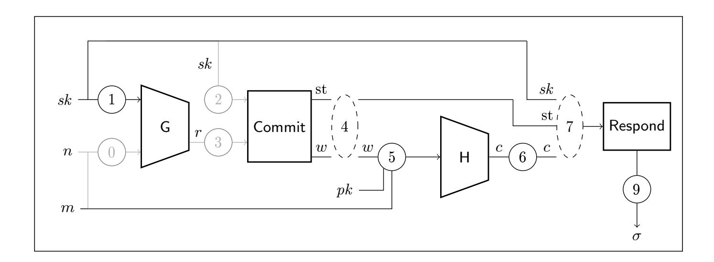

{0}------------------------------------------------

# Tight adaptive reprogramming in the QROM

Alex B. Grilo<sup>1</sup> , Kathrin Hövelmanns<sup>2</sup> , Andreas Hülsing<sup>3</sup> , and Christian Majenz<sup>4</sup>

 Sorbonne Université, CNRS, LIP6, France Ruhr-Universität Bochum, Germany Eindhoven University of Technology, The Netherlands Centrum Wiskunde & Informatica and QuSoft, Amsterdam, The Netherlands authors-qrom-reprog@huelsing.net

Abstract. The random oracle model (ROM) enjoys widespread popularity, mostly because it tends to allow for tight and conceptually simple proofs where provable security in the standard model is elusive or costly. While being the adequate replacement of the ROM in the postquantum security setting, the quantum-accessible random oracle model (QROM) has thus far failed to provide these advantages in many settings. In this work, we focus on adaptive reprogrammability, a feature of the ROM enabling tight and simple proofs in many settings. We show that the straightforward quantum-accessible generalization of adaptive reprogramming is feasible by proving a bound on the adversarial advantage in distinguishing whether a random oracle has been reprogrammed or not. We show that our bound is tight by providing a matching attack. We go on to demonstrate that our technique recovers the mentioned advantages of the ROM in three QROM applications: 1) We give a tighter proof of security of the message compression routine as used by XMSS. 2) We show that the standard ROM proof of chosenmessage security for Fiat-Shamir signatures can be lifted to the QROM, straightforwardly, achieving a tighter reduction than previously known. 3) We give the rst QROM proof of security against fault injection and nonce attacks for the hedged Fiat-Shamir transform.

Keywords: Post-quantum security, QROM, adaptive reprogramming, digital signature, Fiat-Shamir transform, hedged Fiat-Shamir, XMSS

## 1 Introduction

Since its introduction, the Random oracle model (ROM) has allowed cryptographers to prove ecient practical cryptosystems secure for which proofs in the standard model have been elusive. In general, the ROM allows for proofs that are conceptually simpler and often tighter than standard model security proofs.

With the advent of post-quantum cryptography, and the introduction of quantum adversaries, the ROM had to be generalized: In this scenario, a quantum adversary interacts with a non-quantum network, meaning that "online" primitives (like signing) stay classical, while the adversary can compute all "oine" primitives (like hash functions) on its own, and hence, in superposition. To account for these stronger capabilities, the quantum-accessible ROM (QROM) was introduced [\[BDF](#page-23-0)<sup>+</sup>11]. While successfully xing the denitional gap, the QROM does not generally come with the advantages of its classical counterpart:

Part of this work was done while A.G. was aliated to CWI and QuSoft and part of it was done while A.G. was visiting the Simons Institute for the Theory of Computing. K.H. was supported by the European Union PROMETHEUS project (Horizon 2020 Research and Innovation Program, grant 780701) and the Deutsche Forschungsgemeinschaft (DFG, German Research Foundation) under Germany's Excellence Strategy (EXC 2092 CASA, 390781972). C.M. was funded by a NWO VENI grant (Project No. VI.Veni.192.159). Date: October 30, 2020

{1}------------------------------------------------

- Lack of conceptual simplicity. QROM proofs are extremely complex for various reasons. One reason is that they require some understanding of quantum information theory. More important, however, is the fact that many of the useful properties of the ROM (like preimage awareness and adaptive programmability) are not known to translate directly to the QROM.
- Tightness. Many primitives that come with tight security proofs in the ROM are not known to be supported by tight proofs in the QROM. For example, there has been an ongoing eort [\[SXY18,](#page-25-0) [JZC](#page-25-1)+18, [JZM19,](#page-25-2) [BHH](#page-24-0)+19, [KSS](#page-25-3)+20, [HKSU20\]](#page-24-1) to give tighter QROM proofs for the well-known Fujisaki-Okamoto transformation [\[FO99,](#page-24-2) [FO13\]](#page-24-3), which is proven tightly secure in the ROM as long as the underlying scheme fullls IND-CPA security [\[HHK17\]](#page-24-4).

In many cases, we expect certain generic attacks to only dier from the ROM counterparts by a square-root factor in the required number of queries if the attack involves a search problem, or no signicant factor in the case of guessing. Hence, it was conjectured that it might be sucient to prove security in the ROM, and then add a square-root factor for search problems. However, recent results [\[YZ20\]](#page-26-0) demonstrate a separation of ROM and QROM, showing that this conjecture does not hold true in general, as there exist schemes which are provably secure in the ROM and insecure in the QROM. As a consequence, a QROM proof is crucial to establish condence in a post-quantum cryptosystem.[5](#page-1-0)

Adaptive programmability. A desirable property of the (classical) ROM is that any oracle value O(x) can be chosen when O is queried on x for the rst time (lazy-sampling). This fact is often exploited by a reduction simulating a security game without knowledge of some secret information. Here, an adversary A will not recognize the reprogramming of O(x) as long as the new value is uniformly distributed and consistent with the rest of A's view. This property is called adaptive programmability.

The ability to query an oracle in superposition renders this formerly simple approach more involved, similar to the diculties arising from the question how to extract classical preimages from a quantum query (preimage awareness) [\[Unr14b,](#page-25-4) [AHU19,](#page-23-1) [BHH](#page-24-0)<sup>+</sup>19, [KSS](#page-25-3)<sup>+</sup>20, [Zha19,](#page-26-1) [DFMS19,](#page-24-5) [LZ19,](#page-25-5) [BL20,](#page-24-6) [CMP20\]](#page-24-7). Intuitively, a query in superposition can be viewed as a query that might contain all input values at once. Already the rst answer of O might hence contain information about every value O(x) that might need to be reprogrammed as the game proceeds. It hence was not clear whether it is possible to adaptively reprogram a quantum random oracle without causing a change in the adversary's view.

Until recently, both properties only had extremely non-tight variants in the QROM. For preimage awareness, it was essentially necessary to randomly guess the right query and measure it (with an unavoidable loss of at least 1/q for q queries, and the additional disadvantage of potentially rendering the adversary's output unusable due to measurement disturbance). In a recent breakthrough result, Zhandry developed the compressed oracle technique that provides preimage awareness [\[Zha19\]](#page-26-1) in many settings. For adaptive reprogramming, variants of Unruh's one-way-to-hiding lemma allowed to prove bounds but only with a square-root loss in the entropy of the reprogramming position [\[Unr14a,](#page-25-6) [ES15,](#page-24-8) [HRS16\]](#page-25-7).

In some cases [\[BDF](#page-23-0)<sup>+</sup>11, [KLS18,](#page-25-8) [SXY18,](#page-25-0) [HKSU20\]](#page-24-1), reprogramming could even be avoided by giving a proof that rendered the oracle a-priori consistent, which is also called a history-free proof: In this approach, the oracle is completely redened in a way such that it is enforced to be a priori consistent with the rest of an adversary's view, meaning that it is redened before execution of the adversary, and on all possible input values. Unfortunately, it is not always clear whether it is possible to lift a classical proof to the QROM with this strategy. Even if it is, the a-priori approach usually leads to conceptually more complicated proofs. More importantly, it can even lead to reductions that are non-tight with respect to runtime, and may necessitate stronger or additional requirements like,

<span id="page-1-0"></span><sup>5</sup> Unless, of course, a standard model proof is available.

{2}------------------------------------------------

e.g., the statistical counterpart of a property that was only used in its computational variant in the ROM. An example is the CMA-security proof for Fiat-Shamir signatures that was given in [KLS18]. Hence, in this work we are interested in the question:

Can we *tightly* prove that adaptive reprogramming can also be done in the quantum random oracle model?

Our contribution. For common use cases in the context of post-quantum cryptography, this work answers the question above in the affirmative. In more detail, we present a tool for adaptive reprogramming that comes with a tight bound, supposing that the reprogramming positions hold sufficiently large entropy, and reprogramming is triggered by classical queries to an oracle that is provided by the security game (e.g., a signing oracle). These preconditions are usually met in (Q)ROM reductions: The reprogramming is usually triggered by adversarial signature or decryption queries, which remain classical in the post-quantum setting, as the oracles represent honest users.

While we prove a very general lemma, using the simplest variant of the superposition oracle technique [Zha19], we present two corollaries, tailored to cases like a) hash-and-sign with randomized hashing and b) Fiat-Shamir signatures. In both cases, reprogramming occurs at a position of which one part is an adversarially choosen string. For a), the other part is a random string z, sampled by the reduction (simulating the signer). For b), the other part is a commitment w chosen from a distribution with sufficient min-entropy, together with additional side-information. In both cases, we manage to bound the distinguishing advantage of any adversary that makes  $q_s$  signing and  $q_H$  random oracle queries by

$$1.5 \cdot q_s \sqrt{q_{\mathsf{H}} \cdot 2^{-r}}$$
,

where r is the length of z for a), and the min-entropy of w for b). We then demonstrate the applicability of our tool, by giving

- a tighter proof for hash-and-sign applications leading a tighter proof for the message-compression as used by the hash-based signature scheme XMSS in RFC 8391 [HBG<sup>+</sup>18] as a special case,
- a runtime-tight reduction of unforgeability under adaptive chosen message attacks (UF-CMA) to plain unforgeability (UF-CMA<sub>0</sub>, sometimes denoted UF-KOA or UF-NMA) for Fiat Shamir signatures.
- the first proof of fault resistance for the hedged Fiat-Shamir transform, recently proposed in [AOTZ20], in the post-quantum setting.

HASH-AND-SIGN. As a first motivating and mostly self-contained application we analyze the hash-and-sign construction that takes a fixed-message-length signature scheme SIG and turns it into a variable-message-length signature scheme SIG' by first compressing the message using a hash function. We show that if SIG is secure under random message attacks (UF-RMA), SIG' is secure under adaptively chosen message attacks (UF-CMA). Then we show that along the same lines, we can tighten a recent security proof [BHRvV20] for message-compression as described for XMSS [BDH11] in RFC 8391. Our new bound shows that one can use random strings of half the length to randomize the message compression in a provably secure way.

The Fiat-Shamir transform. In Section 4.1, we show that if an identification scheme ID is  $\underline{\mathrm{H}}$  onest- $\underline{\mathrm{V}}$  erifier  $\underline{\mathrm{Z}}$  ero- $\underline{\mathrm{K}}$  nowledge (HVZK), and if the resulting Fiat-Shamir signature scheme SIG := FS[ID, H] furthermore possesses UF-CMA $_0$  security, then SIG is also UF-CMA secure, in the quantum random oracle model. Here, UF-CMA $_0$  denotes the security notion in which the adversary only obtains the public key and has to forge a valid signature without access to a signing oracle. While this statement was already proven in [KLS18], we want to point out several advantages of our proof strategy and the resulting bounds.

{3}------------------------------------------------

Conceptual simplicity. A well-known proof strategy for HVZK,UF-CMA<sup>0</sup> ⇒ UF-CMA in the random oracle model (implicitly contained in [\[AFLT12\]](#page-23-3)) is to replace honest transcripts with simulated ones, and to render H a-posteriori consistent with the signing oracle during the proceedings of the game. I.e., H(w, m) is patched after oracle SIGN was queried on m. Applying our lemma, we observe that this approach actually works in the quantum setting as well. We obtain a very simple QROM proof that is congruent with its ROM counterpart.

In [\[KLS18\]](#page-25-8), the issue of reprogramming quantum random oracle H was circumvented by giving a history-free proof: In the proof, messages are tied to potential transcripts by generating the latter with message-dependent randomness, a priori, and H is patched accordingly, right from the beginning of the game. During each computation of H(w, m), the reduction therefore has to keep H a-priori consistent by going over all transcript candidates (w<sup>i</sup> , c<sup>i</sup> , zi) belonging to m, and returning c<sup>i</sup> if w = w<sup>i</sup> .

Tightness with regards to running time. Our reduction B has about the running time of the adversary A, as it can simply sample simulated transcripts and reprogram H, accordingly. The reduction in [\[KLS18\]](#page-25-8) suers from a quadratic blow-up in its running time: They have running time Time(B) ≈ Time(A) + qHqS, as the reduction has to execute q<sup>S</sup> computations upon each query to H in order to keep it a-priori consistent. As they observe, this quadratic blow-up renders the reduction non-tight in all practical aspects. On the other hand, our upper bound of the advantage comes with a bigger disruption in terms of commitment entropy (the min-entropy of the rst message (the commitment) in the identication scheme). While the source of non-tightness in [\[KLS18\]](#page-25-8) can not be balanced out, however, we oer a trade-o: If needed, the commitment entropy can be increased by appending a random string to the commitment.[6](#page-3-0)

Generality. To achieve a-priori consistency, [\[KLS18\]](#page-25-8) crucially relies on statistical HVZK. Furthermore, they require that the HVZK simulator outputs transcripts such that the challenge c is uniformly distributed. We are able to drop the requirement on c altogether, and to only require computational HVZK. (As a practical example, alternate NIST candidate Picnic [\[CDG](#page-24-12)<sup>+</sup>17] satises only computational HVZK.)

Robustness of the hedged Fiat-Shamir transform against fault attacks. When it comes to real-world implementations, the assessment of a signature scheme will not solely take into consideration whether an adversary could forge a fresh signature as formalized by the UF-CMA game, as the UF-CMA denition does not capture all avenues of real-world attacks. For instance, an adversary interacting with hardware that realizes a cryptosystem can try to induce a hardware malfunction, also called fault injection, in order to derail the key generation or signing process. Although it might not always be straightforward to predict where exactly a triggered malfunction will aect the execution, it is well understood that even a low-precision malfunction can seriously injure a schemes' security. In the context of the ongoing eort to standardize post-quantum secure primitives [\[NIS17\]](#page-25-9), it hence made sense to arm [\[NIS20\]](#page-25-10) that desirable additional security features include, amongst others, resistance against fault attacks and randomness generation that has some bias.

Very recently [\[AOTZ20\]](#page-23-2), the hedged Fiat-Shamir construction was proven secure against biased nonces and several types of fault injections, in the ROM. This result can for example be used to argue that alternate NIST candidate Picnic [\[CDG](#page-24-12)<sup>+</sup>17] is robust against many types of fault injections. We revisit the hedged Fiat-Shamir construction in Section [4.2](#page-15-0) and lift the result of [\[AOTZ20\]](#page-23-2) to

<span id="page-3-0"></span><sup>6</sup> While this increases the signature size, the increase is mild in typical post-quantum Fiat-Shamir based digital signature schemes. As an example, suppose Dilithium-1024x768, which has a signature size of 2044 bytes, had zero commitment entropy (it actually has quite some, see remarks in [\[KLS18\]](#page-25-8)). To ensure that about 2 <sup>128</sup> hash queries are necessary to make the term in our security bound that depends on the commitment entropy equal 1, about 32 bytes would need to be added, an increase of about 1.6% (assuming 2 <sup>64</sup> signing queries).

{4}------------------------------------------------

the QROM. In particular, we thereby obtain that Picnic is resistant against many fault types, even when attacked by an adversary with quantum capabilities.

We considered to generalize the result further by replacing the standard Fiat-Shamir transform with the Fiat-Shamir with aborts transform that was introduced by Lyubashevsky [Lyu09, KLS18]. Recall that Fiat-Shamir with aborts was established due to the fact that for some underlying lattice-based ID schemes (e.g., NIST finalist Dilithium [DKL+18]), the prover sometimes cannot create a correct response to the challenge, and the protocol therefore allows for up to  $\kappa$  many retries during the signing process. While our security statements can be extended in a straightforward manner, we decided not to further complicate our proof with the required modifications. For Dilithium, the implications are limited anyway, as several types of faults are only proven ineffective if the underlying scheme is subset-revealing, which Dilithium is not.<sup>7</sup>

OPTIMALITY OF OUR BOUND. We also show that our lower bound is tight for the given setting, presenting a quantum attack that matches our bound, up to a constant factor. Let us restrict our attention to the simple case where  $H: \{0,1\}^n \to \{0,1\}^k$  is a random function, which is potentially reprogrammed at a random position  $x^*$  resulting in a new oracle H'. Consider an attacker that is allowed 2q queries to the random oracle.

A classical attack that matches the classical bound for the success probability,  $O(q \cdot 2^{-n})$ , is the following: pick values  $x_1, ..., x_q$  and compute the XOR of the outputs  $H(x_i)$ . After the oracle is potentially reprogrammed, the attacker outputs 0 iff the checksum computed before is unchanged.

In order to match the quantum lower bound, we use the same attack, but on a superposition of tuples of inputs: the attacker queries H with the superposition of all possible inputs, and then applies a cyclic permutation  $\sigma$  on the input register. This process is repeated q-1 times (on the same state). After the potential reprogramming, we repeat the same process, but now applying the permutation  $\sigma^{-1}$  and querying H'. Using techniques from [AMR20], we show how to distinguish the two cases with advantage  $\Omega\left(\sqrt{\frac{q}{2^n}}\right)$  in time  $\mathsf{poly}(q,n)$ .

## <span id="page-4-1"></span>2 Adaptive reprogramming: the toolbox

Before we describe our adaptive reprogramming theorem, let us quickly recall how we usually model adversaries with quantum access to a random oracle: As established in [BDF<sup>+</sup>11, BBC<sup>+</sup>98], we model quantum access to a random oracle  $O: X \times Y$  via oracle access to a unitarian  $U_O$ , which is defined as the linear completion of  $|x\rangle_X|y\rangle_Y \mapsto |x\rangle_X|y \oplus O(x)\rangle_Y$ , and adversaries A with quantum access to O as a sequence of unitarians, interleaved with applications of  $U_O$ . We write  $A^{|O|}$  to indicate that O is quantum-accessible.

As a warm-up, we will first present our reprogramming lemma in the simplest setting. Say we reprogram an oracle R many times, where the position is partially controlled by the adversary, and partially picked at random. More formally, let  $X_1$  and  $X_2$  be two finite sets, where  $X_1$  specifies the domain from which the random portions are picked, and  $X_2$  specifies the domain of the adversarially controlled portions. We will now formalize what it means to distinguish a random oracle  $O_0$ :  $X_1 \times X_2 \to Y$  from its reprogrammed version  $O_1$ . Consider the two REPRO games, given in Fig. 1: In games REPRO<sub>b</sub>, the distinguisher has quantum access to oracle  $O_b$  (see line  $O_b$ ) that is either the original random oracle  $O_0$  (if  $O_b$ ), or the oracle  $O_b$ 1 which gets reprogrammed adaptively  $O_b$ 2. To model the actual reprogramming, we endow the distinguisher with (classical) access to a reprogramming oracle REPROGRAM. Given a value  $O_b$ 2, oracle REPROGRAM samples random values  $O_b$ 3, and programs the random oracle to map  $O_b$ 4, oracle REPROGRAM samples random values  $O_b$ 3, and programs the random oracle to map  $O_b$ 4, oracle REPROGRAM samples random values  $O_b$ 4, and programs the random oracle to map  $O_b$ 5. Note that apart

<span id="page-4-0"></span><sup>&</sup>lt;sup>7</sup> Intuitively, an identification scheme is called subset-revealing if its responses do not depend on the secret key. Dilithium computes its responses as  $z := y + c \cdot s_1$ , where  $s_1$  is part of the secret key.

{5}------------------------------------------------

from already knowing  $x_2$ , the adversary even learns the part  $x_1$  of the position at which  $O_1$  was reprogrammed.

<span id="page-5-2"></span><span id="page-5-1"></span>

| GAME Reprob                                    | Reprogram $(x_2)$                                       |
|------------------------------------------------|---------------------------------------------------------|
| $01 \ O_0 \leftarrow_{\$} Y^{X_1 \times X_2}$  | $\overline{\text{05 }(x_1,y)\leftarrow_\$ X_1}\times Y$ |
| 02 $O_1 := O_0$                                | 06 $O_1 := O_1^{(x_1    x_2) \mapsto y}$                |
| 03 $b' \leftarrow A^{ O_{b}\rangle,Reprogram}$ | 07 return $x_1$                                         |
| 04 return $b'$                                 |                                                         |

<span id="page-5-0"></span>Fig. 1. Adaptive reprogramming games Reprob for bit  $b \in \{0,1\}$  in the most basic setting.

<span id="page-5-4"></span>**Proposition 1.** Let  $X_1$ ,  $X_2$  and Y be finite sets, and let A be any algorithm issuing R many calls to Reprogram and q many (quantum) queries to  $O_b$  as defined in Fig. 1. Then the distinguishing advantage of A is bounded by

<span id="page-5-3"></span>
$$|\Pr[\operatorname{Repro}_{1}^{\mathsf{A}} \Rightarrow 1] - \Pr[\operatorname{Repro}_{0}^{\mathsf{A}} \Rightarrow 1]| \le \frac{3R}{2} \sqrt{\frac{q}{|X_{1}|}}.$$
 (1)

The above theorem constitutes a significant improvement over previous bounds. In [Unr14a] and [ES15], a bound proportional to  $q|X_1|^{-1/2}$  for the distinguishing advantage in similar settings, but for R=1, was given. In [HRS16], a bound proportional to  $q^2|X_1|^{-1}$  is claimed, but that seems to have resulted from a "translation mistake" from [ES15] and should be similar to the bounds from [Unr14a, ES15]. What is more, we show in Section 6 that the above bound, and therefore also its generalizations, are tight, by presenting a distinguisher that achieves an advantage equal to the right hand side of Eq. (1) for trivial  $X_1$ , up to a constant factor.

In fact, we prove something more general than Proposition 1: We prove that an adversary will not behave significantly different, even if

- the adversary does not only control a portion  $x_2$ , but instead it even controls the distributions according to which the whole positions  $x := (x_1, x_2)$  are sampled at which  $O_1$  is reprogrammed,
- it can additionally pick different distributions, adaptively, and
- the distributions produce some additional side information x' which the adversary also obtains,

as long as the reprogramming positions x hold enough entropy.

Overloading notation, we formalize this generalization by games REPRO, given in Fig. 2: Reprogramming oracle REPROGRAM now takes as input the description of a distribution p that generates a whole reprogramming position x, together with side information x'. REPROGRAM samples x and x' according to p, programs the random oracle to map x to a random value y, and returns (x, x').

| <b>GAME</b> Repro $_b$                          | Reprogram $(p)$               |
|-------------------------------------------------|-------------------------------|
| 01 $O_0 \leftarrow_{\$} Y^X$                    | $05 (x, x') \leftarrow p$     |
| 02 $O_1 := O_0$                                 | 06 $y \leftarrow_{\$} Y$      |
| 03 $b' \leftarrow D^{ O_{b}\rangle, Reprogram}$ | $O7 O_1 := O_1^{x \mapsto y}$ |
| 04 return $b'$                                  | 08 $\mathbf{return}\ (x,x')$  |

<span id="page-5-5"></span>**Fig. 2.** Adaptive reprogramming games Reprob for bit  $b \in \{0, 1\}$ .

{6}------------------------------------------------

We are now ready to present our main Theorem 1. On a high level, the only difference between the statement of Proposition 1 and Theorem 1 is that we now have to consider R many (possibly different) joint distributions on  $X \times X'$ , and to replace  $\frac{1}{|X_1|}$  (the probability of the uncontrolled reprogramming portion) with the highest likelihood of any of those distributions generating a position x.

**Theorem 1 ("Adaptive reprogramming"** (AR)). Let X, X', Y be some finite sets, and let D be any distinguisher, issuing R many reprogramming instructions and q many (quantum) queries to O. Let  $q_r$  denote the number of queries to O that are issued inbetween the (r-1)-th and the r-th query to Reprogram. Furthermore, let  $p^{(r)}$  denote the rth distribution that Reprogram is queried on. By  $p_X^{(r)}$  we will denote the marginal distribution of X, according to  $p^{(r)}$ , and define

<span id="page-6-0"></span>
$$p_{\max}^{(r)} := \mathbb{E} \max_{x} p_X^{(r)}(x),$$

where the expectation is taken over D's behaviour until its rth query to Reprogram.

<span id="page-6-1"></span>
$$|\Pr[\operatorname{REPRO}_{1}^{\mathsf{D}} \Rightarrow 1] - \Pr[\operatorname{REPRO}_{0}^{\mathsf{D}} \Rightarrow 1]| \leq \sum_{r=1}^{R} \left( \sqrt{\hat{q}_{r} p_{\max}^{(r)}} + \frac{1}{2} \hat{q}_{r} p_{\max}^{(r)} \right) , \qquad (2)$$

where  $\hat{q}_r := \sum_{i=0}^{r-1} q_i$ 

For R=1 and without additional side information output x', the proof of Theorem 1 is given in Section 5. The extension to general R is proven in Appendix A via a standard hybrid argument. Finally, all our bounds are information-theoretical, i.e. they hold against arbitrary query bounded adversaries. The additional output x' can therefore be sampled by the adversary (see details in Appendix A).

We will now quickly discuss how to simplify the bound given in Eq. (2) for our applications, and in particular, how we can derive Eq. (1) from Theorem 1: Throughout sections 3 and 4, we will only have to consider reprogramming instructions that occur on positions  $x = (x_1, x_2)$  such that

- $x_1$  is drawn according to the same distribution p for each reprogramming instruction, and
- $x_2$  represents a message that is already fixed by the adversary.

To be more precise,  $x_1$  will represent a uniformly random string z in 3, and no side information x' has to be considered. In Section 4,  $(x_1, x')$  will represent a tuple (w, st) that is drawn according to Commit(sk).

In the language of Theorem 1, the marginal distribution  $p_X^{(r)}$  will always be the same distribution p, apart from the already fixed part  $x_2$ . We can hence upper bound  $p_{\text{max}}^{(r)}$  by  $p_{\text{max}} := \max_{x_1} p(x_1)$ , and  $\hat{q}_r$  by q, to obtain that  $\hat{q}_r p_{\text{max}}^{(r)} < q p_{\text{max}}$  for all  $1 \le r \le R$ .

In our applications, we will always require that p holds sufficiently large entropy. To be more precise, we will assume that  $p_{\text{max}} < \frac{1}{q}$ . In this case, we have that  $qp_{\text{max}} < 1$ , and that we can upper bound  $qp_{\text{max}}$  by  $\sqrt{qp_{\text{max}}}$  to obtain

<span id="page-6-2"></span>**Proposition 2.** Let  $X_1$ ,  $X_2$ , X' and Y be some finite sets, and let p be a distribution on  $X_1 \times X'$ . Let D be any distinguisher, issuing q many (quantum) queries to O and R many reprogramming instructions such that each instruction consists of a value  $x_2$ , together with the fixed distribution p. Then

$$|\Pr[\operatorname{Repro}_1^{\mathsf{D}} \Rightarrow 1] - \Pr[\operatorname{Repro}_0^{\mathsf{D}} \Rightarrow 1]| \le \frac{3R}{2} \sqrt{qp_{\max}},$$

where  $p_{\max} := \max_{x_1} p(x_1)$ .

From this we obtain Proposition 1 setting  $p_{max} = |X_1|$ .

{7}------------------------------------------------

## <span id="page-7-0"></span>3 Basic applications

In this section, we present two motivating examples that benefit from the most basic version of our bound as stated in Proposition 1. As a first example we chose the canonical hash-and-sign construction when used to achieve security under adaptive chosen message attacks (UF-CMA) from a scheme that is secure under random message attacks (UF-RMA). It is mostly self-contained and similar to our second example. The second example is a tighter bound for the security of hash-and-sign as used in RFC 8391, the recently published standard for the stateful hash-based signature scheme XMSS. For missing definitions and detailed transforms see Appendix B.

### <span id="page-7-1"></span>3.1 From RMA to CMA security via Hash-and-Sign

In the following, we present a conceptually easy proof with a tighter bound for the canonical UF-RMA to UF-CMA transform using hash-and-sign SIG' = HaS[SIG, H], in the QROM (which additionally allows for arbitrary message space expansion). Recall that Sign'(sk, m') first samples a uniformly random bitstring  $z \leftarrow_{\$} Z$ , computes  $\sigma \leftarrow Sign(sk, H(z||m'))$  and returns the pair  $(z, \sigma)$ . Vrfy' accordingly first computes m := H(z||m') and then calls  $Vrfy(pk, m, \sigma)$ .

The reduction M from UF-RMA to UF-CMA in this case works as follows: First, we have to handle collision attacks. We show that an adversary which finds a forgery for SIG' that contains no forgery for SIG breaks the multi-target version of extended target collision resistance (M-eTCR) of H, and give a QROM bound for this property. Having dealt with collision attacks leaves us with the case where A generates a forgery that contains a forgery for SIG. The challenge in this case is how to simulate the signing oracle SIGN. Our respective reduction M against UF-RMA proceeds as follows: Collect the  $q_s$  many message-signature pairs  $\{(m_i, \sigma_i)\}_{1 \le i \le q_s}$ , provided by the UF-RMA game. When A queries SIGN $(m_i')$  for the ith time, sample a random  $z_i$ , reprogram  $H(z_i||m_i') := m_i$ , and return  $(z_i, \sigma_i)$ . See also Fig. 5 below.

In the QROM, this reduction has previously required  $q_s$  applications of the O2H Lemma in two steps, loosing an additive  $\mathcal{O}(q_s \cdot q/\sqrt{|Z|})$  term. In contrast, we only loose a  $\mathcal{O}(q_s\sqrt{q/|Z|})$  (both constants hidden by the  $\mathcal{O}$  are small):

**Theorem 2.** For any (quantum) UF-CMA adversary A issuing at most  $q_s$  (classical) queries to the signing oracle SIGN and at most  $q_H$  quantum queries to H, there exists an UF-RMA adversary M such that

$$\operatorname{Succ}_{\mathsf{SIG'}}^{\mathsf{UF-CMA}}(\mathsf{A}) \leq \operatorname{Succ}_{\mathsf{SIG}}^{\mathsf{UF-RMA}}(\mathsf{M}) + \frac{8q_s(q_s + q_{\mathsf{H}} + 2)^2}{|\mathcal{M}'|} + 3q_s\sqrt{\frac{q_{\mathsf{H}} + q_s + 1}{|Z|}} \ ,$$

and the running time of M is about that of A.

The second term accounts for the complexity to find a second preimage for one of the messages  $m_i$ , which is an unavoidable generic attack. The third term is the result of  $2q_s$  reprogrammings. Half of them are used in the QROM bound for M-eTCR, the other half in the reduction M. This term accounts for an attack that correctly guesses the random bitstring used by the signing oracle for one of the queries (such an attack still would have to find a collision for this part but this is inherently not reflected in the used proof technique).

*Proof.* We now relate the UF-CMA security of SIG' to the UF-RMA security of SIG via a sequence of games.

GAME  $G_0$ . We begin with the original UF-CMA game for SIG' in game  $G_0$ . The success probability of A in this game is  $Adv_{SIG'}^{UF-CMA}(A)$  per definition.

{8}------------------------------------------------

```
\frac{\mathsf{B}^{\mathsf{Box},|\mathsf{H}\rangle}()}{\mathsf{O1}\ (pk,sk)} \leftarrow \mathsf{KG} \qquad \qquad \frac{\mathsf{SIGN}(m_i')}{\mathsf{O8}\ z_i \leftarrow \mathsf{Box}(m_i')} \\
\mathsf{O2}\ (m'^*,\sigma'^*) = \mathsf{A}^{\mathsf{SIGN},|\mathsf{H}\rangle}(pk) \qquad \qquad \mathsf{O9}\ \sigma_i \leftarrow \mathsf{Sign}(sk,\mathsf{H}(z_i,m_i')) \\
\mathsf{O3}\ \mathsf{Parse}\ \sigma'^*\ \mathsf{as}\ (z^*,\sigma^*) \qquad \qquad \mathsf{10}\ \mathbf{return}\ (z_i,\sigma_i) \\
\mathsf{O5}\ i := j \\
\mathsf{O6}\ \mathbf{else}\ i \leftarrow_{\$} [1,q_s] \\
\mathsf{O7}\ \mathbf{return}\ (m'^*,z^*,i)
```

<span id="page-8-0"></span>Fig. 3. Reduction B breaking M-eTCR. Here, Box is the M-eTCR challenge oracle.

GAME  $G_1$ . We obtain game  $G_1$  from game  $G_0$  by adding an additional condition. Namely, game  $G_1$  returns 0 if there exists an  $0 < i \le q_s$  such that  $H(z^*||m'^*) = H(z_i||m'_i)$ , where  $z^*$  is the random element in the forgery signature, and  $z_i$  is the random element in the signature returned by  $SIGN(m'_i)$  as the answer to the *i*th query. We will now argue that

$$|\Pr[G_0^{\mathsf{A}} \Rightarrow 1] - \Pr[G_1^{\mathsf{A}} \Rightarrow 1]| \le \frac{8q_s(q_s + q_{\mathsf{H}} + 2)^2}{|\mathcal{M}'|} + \frac{3q_s}{2} \sqrt{\frac{q_{\mathsf{H}} + q_s + 1}{|Z|}}.$$

Towards this end, we give a reduction B in Fig. 3, that breaks the M-eTCR security of H whenever the additional condition is triggered, making  $q_s + q_H + 1$  queries to its random oracle. B simulates the UF-CMA game for SIG', using H and an instance of SIG. Clearly, B runs in about the same time as game  $G_0^A$ , and succeeds whenever A succeeds and the additional condition is triggered. To complete this step, it hence remains to show that the success probability of any such  $(q_s + q_H + 1)$ -query adversary is

<span id="page-8-1"></span>
$$\operatorname{Succ}_{\mathsf{H}}^{\mathsf{M-eTCR}}(\mathsf{B}, q_s) \le \frac{8q_s(q_s + q_{\mathsf{H}} + 2)^2}{|\mathcal{M}'|} + \frac{3q_s}{2} \sqrt{\frac{q_{\mathsf{H}} + q_s + 1}{|Z|}}$$
 (3)

We delay the proof of Eq. (3) until the end.

GAME  $G_2$ . The next game differs from  $G_1$  in the way the signing oracle works. In game  $G_2$  (see Fig. 4), the *i*th query to SIGN is answered by first sampling a random value  $z_i$ , as well as a random message  $m_i$ , and programming  $H' := H'^{(z_i||m'_i)\mapsto m_i}$ . Then  $m_i$  is signed using the secret key. We will now show that

$$|\Pr[G_1^{\mathsf{A}} \Rightarrow 1] - \Pr[G_2^{\mathsf{A}} \Rightarrow 1]| \le \frac{3q_s}{2} \sqrt{\frac{q_{\mathsf{H}} + q_s + 1}{|Z|}}.$$

```
 \begin{array}{|c|c|c|c|} \hline \text{Game } G_2 \\ \hline 01 \ i := 1 \\ \hline 02 \ (pk, sk) \leftarrow \mathsf{KG}() \\ \hline 03 \ (m'^*, \sigma'^*) = \mathsf{A}^{\mathrm{SIGN}, |\mathsf{H}\rangle}(pk) \\ \hline 04 \ \mathrm{Parse} \ \sigma'^* \ \mathrm{as} \ (z^*, \sigma^*) \\ \hline 05 \ \mathbf{if} \ \exists 1 \leq i \leq q_s : \mathsf{H}(z^* \| m'^*) = \mathsf{H}(z_i \| m_i') \\ \hline 06 \ \mathbf{return} \ 0 \\ \hline 07 \ \mathbf{return} \ \mathsf{Vrfy}(pk, m'^*, \sigma^*) \wedge m'^* \not \in \{m_i'\}_{i=1}^{q_s} \\ \hline \end{array}
```

<span id="page-8-4"></span><span id="page-8-3"></span><span id="page-8-2"></span>Fig. 4. Game  $G_2$ .

{9}------------------------------------------------

```
\begin{array}{ll} \frac{\mathsf{M}^{\mathsf{A},|\mathsf{H}\rangle}(pk,\{(m_i,\sigma_i)\}_{1\leq i\leq q_s})}{01\ \mathsf{H}':=\mathsf{H};\,i:=1} & \frac{\mathsf{SIGN}(m_i')}{05\ z_i\leftarrow_s Z} \\ 02\ (m'^*,\sigma'^*)=\mathsf{A}^{\mathsf{SIGN},|\mathsf{H}'\rangle}(pk) & 06\ \mathbf{if}\ \exists \hat{m}_i\ \mathrm{s.\ th.\ } (z_i\|m_i',\hat{m}_i)\in\mathfrak{L}_{\mathsf{H}'} \\ 03\ \mathsf{Parse}\ \sigma'^*\ \mathrm{as}\ (z^*,\sigma^*) & 07\ \mathcal{L}_{\mathsf{H}'}:=\mathfrak{L}_{\mathsf{H}'}\setminus\{(z_i\|m_i',\hat{m}_i)\} \\ 04\ \mathbf{return}\ (\mathsf{H}(z^*\|m'^*),\sigma) & 08\ \mathfrak{L}_{\mathsf{H}'}:=\mathfrak{L}_{\mathsf{H}'}\cup\{(z_i\|m_i',m_i)\} \\ 09\ i:=i+1 \\ 10\ \mathbf{return}\ (z_i,\sigma_i) \\ \hline \frac{\mathsf{H}'(z\|m')}{11\ \mathbf{if}\ \exists m\ \mathrm{s.\ th.\ } (z\|m',m)\in\mathfrak{L}_{\mathsf{H}'} \\ 12\ \mathbf{return}\ m \\ 13\ \mathbf{else\ return}\ \mathsf{H}(z\|m') \end{array}
```

<span id="page-9-2"></span><span id="page-9-1"></span><span id="page-9-0"></span>Fig. 5. Reduction M reducing UF-RMA to UF-CMA.

Consider a reduction C that simulates game  $G_2$  for A to distinguish the REPRO<sub>b</sub> game. Accordingly, C forwards access to its own oracle  $O_b$  to A instead of H. Instead of sampling  $z_i, m_i$  itself in line 08 and programming H in line 09, C obtains  $z_i \leftarrow \text{REPROGRAM}(m_i')$  from its own oracle and computes  $m_i := O_b(z_i || m_i')$  as the output of its random oracle. Now, if C plays in REPRO<sub>0</sub> it perfectly simulates  $G_1$  for A, as the oracle remains unchanged. If C plays in REPRO<sub>1</sub> it perfectly simulates  $G_2$ , as can be seen by inlining REPROGRAM and removing doubled calls used to recompute  $m_i$ . Consequently,

$$|\Pr[G_1^\mathsf{A} \Rightarrow 1] - \Pr[G_2^\mathsf{A} \Rightarrow 1]| = |\Pr[\operatorname{Repro}_0^{\mathsf{C}^\mathsf{A}} \Rightarrow 1] - \Pr[\operatorname{Repro}_1^{\mathsf{C}^\mathsf{A}} \Rightarrow 1]| \le \frac{3q_s}{2} \sqrt{\frac{q_\mathsf{H} + q_s + 1}{|Z|}} \ .$$

To conclude our main argument, we will now argue that

$$\Pr[G_2^{\mathsf{A}} \Rightarrow 1] = \operatorname{Adv}_{\mathsf{SIG}}^{\mathsf{UF-RMA}}(\mathsf{M})$$
,

where reduction M is given in Fig. 5. Since reprogramming is done a-posteriori in game  $G_2$ , M can simulate a reprogrammed oracle H' via access to its own oracle H and an initial table look-up: M keeps track of the (classical) values on which H' has to be reprogrammed (see line 08) and tweaks A's oracle H', accordingly. The latter means that, given the table  $\mathfrak{L}_{H'}$  of pairs  $(z_i||m'_i,m_i)$  that were already defined in previous signing queries, controlled on the query input being equal to  $z_i||m'_i$  output  $m_i$ , and controlled on the input not being equal to any  $z_i||m'_i$ , forward the query to M's own oracle H. If needed, M reprograms values (see line 07) by adding an entry to its look-up table. Given quantum access to H, M can implement this as a quantum circuit, allowing quantum access to H'.

Hence, M perfectly simulates game  $G_2$  towards A. The only differences are that M neither samples the  $m_i$  itself, nor computes the signatures for them. Both are given to M by the UF-RMA game. However, they follow the same distribution as in game  $G_2$ . Lastly, whenever A would win in game  $G_2$ , M succeeds in its UF-RMA game as it can extract a valid forgery for SIG on a new message. This is enforced with the condition we added in game  $G_1$ .

The final bound of the theorem follows from collecting the bounds above, and it remains to prove the bound on M-eTCR claimed in Eq. (3). We improve a bound from [HRS16], in which it was shown that for a small constant c,<sup>8</sup>

$$\operatorname{Succ}_{\mathsf{H}}^{\mathsf{M-eTCR}}\left(\mathsf{B}, q_{s}\right) \leq \frac{8q_{s}(q_{\mathsf{H}}+1)^{2}}{|\mathcal{M}'|} + c\frac{q_{s}q_{\mathsf{H}}}{\sqrt{|Z|}}.$$

<span id="page-9-3"></span><sup>&</sup>lt;sup>8</sup> This is a corrected bound from [HRS16], see discussion in Section 2.

{10}------------------------------------------------

Their proof of this bound is explicitly given for the single target step. It is then argued that the multi-target step can be easily obtained, which was recently confirmed in [BHRvV20]. The proof proceeds in two steps. The authors construct a reduction that generates a random function from an instance of an average-case search problem which requires to find a 1 in a boolean function f. The function has the property that all preimages of a randomly picked point m in the image correspond to 1s of f. When A makes its query to Box, the reduction picks a random z and programs  $\mathsf{H}^{(z||m')\mapsto m}$ . An extended target collision for (z||m') hence is a 1 in f by design. This gives the first term in the above bound, which is known to be optimal.

The second term in the bound is the result of above reprogramming. I.e., it is a bound on the difference in success probability of A when playing the real game or when run by the reduction. More precisely, the bound is the result of analyzing the distinguishing advantage between the following two games (which we rephrased to match our notation):

GAME  $G_a$ . A gets access to H. In phase 1, after making at most  $q_1$  queries to H, A outputs a message  $m' \in \mathcal{M}'$ . Then a random  $z \leftarrow_{\$} Z$  is sampled and  $(z, \mathsf{H}(z||m'))$  is handed to A. A continues to the second phase and makes at most  $q_2$  queries. A outputs  $b \in \{0,1\}$  at the end.

GAME  $G_b$ . A gets access to H. After making at most  $q_1$  queries to H, A outputs a message  $m' \in \mathcal{M}'$ . Then a random  $z \leftarrow_{\$} Z$  is sampled as well as a random range element  $m \leftarrow_{\$} \mathcal{M}$ . Program  $\mathsf{H} := \mathsf{H}^{(z||m') \mapsto m}$ . A receives  $(z, m = \mathsf{H}(z||m'))$  and proceeds to the second phase. After making at most  $q_2$  queries, A outputs  $b \in \{0, 1\}$  at the end.

The authors of [HRS16] showed that for a small constant c (see Footnote 8),

$$|\Pr[G_b^{\mathsf{A}} \Rightarrow 1] - \Pr[G_a^{\mathsf{A}} \Rightarrow 1]| \le c \frac{q_{\mathsf{H}}}{\sqrt{|Z|}}.$$

A straightforward application of Proposition 1 shows that

$$|\Pr[G_b^{\mathsf{A}}\Rightarrow 1] - \Pr[G_a^{\mathsf{A}}\Rightarrow 1]| \leq \frac{3}{2}\sqrt{\frac{q_{\mathsf{H}}+1}{|Z|}}$$
.

as the games above virtually describe the games Reprob with the exception that in Reprob the oracle Reprogram only returns z and not H(z||m')). Hence, a reduction needs one additional query per reprogramming.

When applying this to the  $q_s$ -target case, a hybrid argument shows that the bound becomes  ${}^{3q_s}/2\sqrt{{}^{q_{\mathsf{H}}+1}/|Z|}$ . Combining this with the reduction of [HRS16] and taking into account that B makes  $(q_s+q_{\mathsf{H}}+1)$  queries confirms the claimed bound of

$$\operatorname{Succ}_{\mathsf{H}}^{\mathsf{M-eTCR}}(\mathsf{B}, q_s) \leq \frac{8q_s(q_s + q_{\mathsf{H}} + 2)^2}{|\mathcal{M}'|} + \frac{3q_s}{2} \sqrt{\frac{q_{\mathsf{H}} + q_s + 1}{|Z|}} \ .$$

## 3.2 Tight security for message hashing of RFC 8391

Another extremely similar application of our basic bound is for another case of the hash-and-sign construction, used to turn a fixed message length UF-CMA-secure signature scheme SIG into a variable input length one SIG'. This case is essentially covered already by Section 3.1: A proof can omit game  $G_2$  and state a simple reduction that simulates game  $G_1$  to extract a forgery. The bound changes accordingly, requiring one reprogramming bound less and becoming Succ $_{SIG'}^{UF-CMA}(A) \leq Succ_{SIG}^{UF-CMA}(M) + \frac{8q_s(q_s+q_H)^2}{|\mathcal{M}'|} + 1.5q_s\sqrt{\frac{q_H+q_s}{|Z|}}$ .

In [HBG<sup>+</sup>18], the authors suggested that for stateful hash-based signature schemes, like, e.g., XMSS [HBG<sup>+</sup>18], the multi-target attacks which cause the first occurence of  $q_s$  in the bound could

{11}------------------------------------------------

be avoided. This was recently formally proven in [BHRvV20]. The idea is to exploit the property of hash-based signature schemes that every signature has an index which binds the signature to a one-time public key. Including this index into the hash forces an adversary to also include it in a collision to make it useful for a forgery. Even more, the index is different for every signature and therefore for every target hash.

Summarizing, the authors of [BHRvV20] showed that there exists a tight standard model proof for the hash-and-sign construction, as used by XMSS in RFC 8391, if the used hash function is  $q_s$ -target extended target-collision resistant with nonce (nM-eTCR, see Appendix B.1), an extension of M-eTCR that considers the index. To demonstrate the relevance of this result, the authors analyzed the nM-eTCR-security of hash functions under generic attacks, proving a bound for nM-eTCR-security in the QROM in the same way as outlined for M-eTCR above. So far, this bound was suboptimal, as it included a bound on distinguishing variants of games  $G_a$  and  $G_b$  above in which H takes an additional, externally given index as input (for the modified games see Appendix B.1). Hence, the bound was  $\operatorname{Succ}_{\mathsf{H}}^{\mathsf{nM-eTCR}}(\mathsf{A},p) \leq \frac{8(q_s+q_{\mathsf{H}})^2}{|\mathcal{M}'|} + \frac{32q_sq_{\mathsf{H}}^2}{|\mathcal{Z}|}$ . Due to the translation error, we believe that the second term needs to be updated to  $32q_s \cdot \alpha$ , where  $\alpha = \frac{q_{\mathsf{H}}}{\sqrt{|\mathcal{Z}|}}$ , instead of  $32q_s \cdot \alpha^2$ . In [BHRvV20], it was conjectured that in  $\alpha$ , a factor of  $\sqrt{q_{\mathsf{H}}}$  can be removed. We can confirm this conjecture. As in the case above, Proposition 1 can be directly applied to the distinguishing bound for games  $G_a$  and  $G_b$ . A reduction would simply treat the index as part of the message sent to REPROGRAM. Plugging this into the proof in [BHRvV20] leads to the bound

$$\operatorname{Succ}_{\mathsf{H}}^{\mathsf{nM-eTCR}}\left(\mathsf{A},p\right) \leq \frac{8(q_s + q_{\mathsf{H}})^2}{|\mathcal{M}'|} + 1.5q_s\sqrt{\frac{q_{\mathsf{H}} + q_s}{|Z|}}$$
.

## <span id="page-11-0"></span>4 Applications to the Fiat-Shamir transform

For the sake of completeness, we include all used definitions for identification and signature schemes in Appendix B. The only non-standard (albeit straightforward) definition is computational HVZK for multiple transcripts, which we give below.

(SPECIAL) HVZK SIMULATOR. We first recall the notion of an HVZK simulator. Our definition comes in two flavours: While a standard HVZK simulator generates transcripts relative to the public key, a *special* HVZK simulator generates transcripts relative to (the public key and) a particular challenge.

**Definition 1** ((Special) HVZK simulator). An HVZK simulator is an algorithm Sim that takes as input the public key pk and outputs a transcript (w, c, z). A special HVZK simulator is an algorithm Sim that takes as input the public key pk and a challenge c and outputs a transcript (w, c, z).

Computational HVZK for multiple transcripts are indistinguishable from collections of simulated ones. Since it is not always clear whether computational HVZK implies computational HVZK for multiple transcripts, we extend our definition, accordingly: In the multi-HVZK game, the adversary obtains a collection of transcripts (rather than a single one). Similarly, we extend the definition of special computational HVZK from [AOTZ20].

<span id="page-11-1"></span>**Definition 2** ((Special) computational multi-HVZK). Assume that ID comes with an HVZK simulator Sim. We define multi-HVZK games t-HVZK as in Fig. 6, and the multi-HVZK advantage function of an adversary A against ID as

$$\mathrm{Adv}_{\mathsf{ID}}^{t\text{-HVZK}}(\mathsf{A}) := \left| \Pr[t\text{-HVZK}_{1\,\mathsf{ID}}^\mathsf{A} \Rightarrow 1] - \Pr[t\text{-HVZK}_{0\,\mathsf{ID}}^\mathsf{A} \Rightarrow 1] \right| \ .$$

{12}------------------------------------------------

To define special multi-HVZK, assume that ID comes with a special HVZK simulator Sim. We define multi-sHVZK games as in Fig. 6, and the multi-sHVZK advantage function of an adversary A against ID as

 $\mathrm{Adv}_{\mathsf{ID}}^{t\text{-}\mathsf{sHVZK}}(\mathsf{A}) \vcentcolon= \left| \Pr[t\text{-}\mathsf{sHVZK}_{1\,\mathsf{ID}}^\mathsf{A} \Rightarrow 1] - \Pr[t\text{-}\mathsf{sHVZK}_{0\,\mathsf{ID}}^\mathsf{A} \Rightarrow 1] \right| \ .$ 

```
GAME t-HVZK<sub>b</sub>
                                                GAME t-sHVZK_b
                                                07 i := 1
01 (pk, sk) \leftarrow \mathsf{IG}(par)
                                                 08 (pk, sk) \leftarrow \mathsf{IG}(par)
02 for i \in \{1, \dots, t\}
                                                09 b' \leftarrow \mathsf{A}^{\mathsf{getTrans}}(pk)
     trans_i^0 \leftarrow \mathsf{getTrans}(sk)
03
                                                 10 return b'
        trans_i^1 \leftarrow \mathsf{Sim}(pk)
04
05 b' \leftarrow \mathsf{A}(pk, (trans_i^b)_{1 \le i \le t})
06 return b'
                                                getTrans(c)
                                                11 if i > t return \perp
                                                 12 i := i + 1
                                                13 trans^0 \leftarrow \mathsf{getTransChall}(sk,c)
                                                14 trans^1 \leftarrow Sim(pk, c)
                                                 15 return trans^b
```

<span id="page-12-1"></span>**Fig. 6.** Multi-HVZK game and multi-sHVZK game for ID. Both games are defined relative to bit  $b \in \{0, 1\}$ , and to the number t of transcripts the adversary is given.

STATISTICAL HVZK. Unlike computational HVZK, statistical HVZK can be generalized generically, we therefore do not need to deviate from known statistical definitions (included in Appendix B). We denote the respective upper bound for (special) statistical HVZK by  $\Delta_{HVZK}$  ( $\Delta_{sHVZK}$ ).

### <span id="page-12-0"></span>4.1 Revisiting the Fiat-Shamir transform

In this section, we show that if an identification scheme ID is HVZK, and if SIG := FS[ID, H] possesses UF-CMA<sub>0</sub> security (also known as UF-KOA security), then SIG is also UF-CMA secure, in the QROM. Note that our theorem makes no assumptions on how UF-CMA<sub>0</sub> is proven. For arbitrary ID schemes this can be done using a general reduction for the Fiat-Shamir transform [DFMS19], incurring a  $q_{\rm H}^2$  multiplicative loss that is, in general, unavoidable [DFM20]. For a lossy ID scheme ID, UF-CMA<sub>0</sub> of FS[ID, H] can be reduced tightly to the extractability of ID in the QROM [KLS18]. In addition, while we focus on the standard Fiat-Shamir transform for ease of presentation, the following theorem generalizes to signatures constructed using the multi-round generalization of the Fiat-Shamir transform like, e.g., MQDSS [CHR<sup>+</sup>16].

<span id="page-12-3"></span>**Theorem 3.** For any (quantum) UF-CMA adversary A issuing at most  $q_s$  (classical) queries to the signing oracle SIGN and at most  $q_H$  quantum queries to H, there exists a UF-CMA<sub>0</sub> adversary B and a multi-HVZK adversary C such that

$$\operatorname{Succ}_{\mathsf{FS}[\mathsf{ID},\mathsf{H}]}^{\mathsf{UF-CMA}}(\mathsf{A}) \leq \operatorname{Succ}_{\mathsf{FS}[\mathsf{ID},\mathsf{H}]}^{\mathsf{UF-CMA}_0}(\mathsf{B}) + \operatorname{Adv}_{\mathsf{ID}}^{q_s-\mathsf{HVZK}}(\mathsf{C}) \tag{4}$$

<span id="page-12-2"></span>
$$+\frac{3q_s}{2}\sqrt{(q_{\mathsf{H}}+q_s+1)\cdot\gamma(\mathsf{Commit})} \ , \tag{5}$$

and the running time of B and C is about that of A. The bound given in Eq. (4) also holds for the modified Fiat-Shamir transform that defines challenges by letting c := H(w, m, pk) instead of letting c := H(w, m).

{13}------------------------------------------------

Note that if ID is statistically HVZK, we can replace  $Adv_{ID}^{q_s-HVZK}(C)$  with  $q_s \cdot \Delta_{HVZK}$ .

*Proof.* Consider the sequence of games given in Fig. 7.

```
GAMES G_0 - G_2
                                                                                   SIGN(m)
                                                                                                                                                                                     getTrans(m)
                                                                                                                                                                                                                                        /\!\!/ G_0-G_1
01 \quad (pk, sk) \leftarrow \mathsf{IG}(\mathsf{par})
02 \quad (m^*, \sigma^*) \leftarrow \mathsf{A}^{\mathsf{SIGN}, |\mathsf{H}\rangle}(pk)
03 \quad \mathbf{if} \quad m^* \in \mathfrak{L}_{\mathcal{M}} \quad \mathbf{return} \quad 0
04 \quad \mathsf{Parse} \quad (w^*, z^*) := \sigma^*
05 \quad c^* := \mathsf{H}(w^*, m^*)
                                                                                   \overline{07 \ \mathfrak{L}_{\mathcal{M}} := \mathfrak{L}_{\mathcal{M}} \cup \{m\}}
                                                                                                                                                                                     12 (w, \operatorname{st}) \leftarrow \mathsf{Commit}(sk)
                                                                                   08 (w,c,z) \leftarrow \mathsf{getTrans}(m) \ /\!\!/ G_0 \text{-} G_1 13 c := \mathsf{H}(w,m)
                                                                                                                                                                                                                                                 /\!\!/ G_0
                                                                                   09 (w, c, z) \leftarrow \text{Sim}(pk)                                    
                                                                                                                                                                                     14 c' \leftarrow_{\$} C
                                                                                                                                                                                                                                                 /\!\!/ G_1
                                                                                                                                                                                     15 z \leftarrow \mathsf{Respond}(sk, w, c, \mathrm{st})
                                                                                   11 return \sigma := (w, z)
                                                                                                                                                                                     16 return (w, c, z)
  06 return V(pk, w^*, c^*, z^*)
```

<span id="page-13-3"></span><span id="page-13-2"></span><span id="page-13-0"></span>**Fig. 7.** Games  $G_0$  -  $G_2$  for the proof of Theorem 3.

GAME  $G_0$ . Since game  $G_0$  is the original UF-CMA game,

<span id="page-13-1"></span>
$$\operatorname{Succ}_{\mathsf{FS[ID,H]}}^{\mathsf{UF-CMA}}(\mathsf{A}) = \Pr[G_0^{\mathsf{A}} \Rightarrow 1]$$
.

GAME  $G_1$ . In game  $G_1$ , we change the game twofold: First, the transcript is now drawn according to the underlying ID scheme, i.e., it is drawn uniformly at random as opposed to letting c := H(w, m), see line 14. Second, we reprogram the random oracle H in line 10 such that it is rendered a-posterioriconsistent with this transcript, i.e., we reprogram H such that H(w, m) = c.

To upper bound the game distance, we construct a quantum distinguisher D in Fig. 8 that is run in the adaptive reprogramming games  $\text{REPRO}_{R,b}$  with  $R := q_S$  many reprogramming instances. We identify reprogramming position x with (w, m), additional input x' with st, and y with c. Hence, the distribution p consists of the constant distribution that always returns m (as m was already chosen by A), together with the distribution Commit(sk). Since D perfectly simulates game  $G_b$  if run in its respective game  $\text{REPRO}_b$ , we have

$$|\Pr[G_0^{\mathsf{A}} = 1] - \Pr[G_1^{\mathsf{A}} = 1]| = |\Pr[\operatorname{Repro}_1^{\mathsf{D}} \Rightarrow 1] - \Pr[\operatorname{Repro}_0^{\mathsf{D}} \Rightarrow 1]|$$
.

Since D issues  $q_S$  reprogramming instructions and  $(q_H + q_S + 1)$  many queries to H, Proposition 2 yields

<span id="page-13-5"></span>
$$|\Pr[\operatorname{REPRO}_1^{\mathsf{D}} \Rightarrow 1] - \Pr[\operatorname{REPRO}_0^{\mathsf{D}} \Rightarrow 1]| \le \frac{3q_S}{2} \sqrt{(q_H + q_S + 1) \cdot p_{\max}},$$
 (6)

where  $p_{\max} = \mathbb{E}_{\mathsf{IG}} \max_{w} \Pr_{W,\mathsf{ST} \leftarrow \mathsf{Commit}(sk)}[W = w] = \gamma(\mathsf{Commit}).$ 

GAME  $G_2$ . In game  $G_2$ , we change the game such that the signing algorithm does not make use of the secret key any more: Instead of being defined relative to the honestly generated transcripts, signatures are now defined relative to the simulator's transcripts. We will now upper bound  $|\Pr[G_1^A = 1] - \Pr[G_2^A = 1]|$  via computational multi-HVZK. Consider multi-HVZK adversary C in Fig. 9. C takes as input a list of  $q_s$  many transcripts, which are either all honest transcripts or simulated ones. Since reprogramming is done a-posteriori in game  $G_1$ , C can simulate it via an initial table look-up, like the reduction M that was given in Section 3.1 (see the description on p. 10). C perfectly simulates game  $G_1$  if run on honest transcripts, and game  $G_2$  if run on simulated ones, hence

$$|\Pr[G_1^{\mathsf{A}} = 1] - \Pr[G_2^{\mathsf{A}} = 1]| \le \text{Adv}_{\mathsf{ID}}^{q_S - \mathsf{HVZK}}(\mathsf{C})$$
.

{14}------------------------------------------------

```
\begin{array}{ll} \begin{array}{ll} \mathbf{Distinguisher} \ \mathsf{D}^{|\mathsf{H}\rangle} \\ \hline 01 \ (pk,sk) \leftarrow \mathsf{IG}(\mathsf{par}) \\ 02 \ (m^*,\sigma^*) \leftarrow \mathsf{A}^{\mathsf{SIGN},|\mathsf{H}\rangle}(pk) \\ 03 \ \mathbf{if} \ m^* \in \mathfrak{L}_{\mathcal{M}} \ \mathbf{return} \ 0 \\ 04 \ \mathsf{Parse} \ (w^*,z^*) := \sigma^* \\ 05 \ c^* := \mathsf{H}(w^*,m^*) \\ 06 \ \mathbf{return} \ \mathsf{V}(pk,w^*,c^*,z^*) \end{array} \qquad \begin{array}{ll} \mathbf{SIGN}(m) \\ \hline 07 \ \mathfrak{L}_{\mathcal{M}} := \mathfrak{L}_{\mathcal{M}} \cup \{m\} \\ 08 \ (w,\mathrm{st}) \leftarrow \mathsf{Reprogram}(m,\mathsf{Commit}(sk)) \\ 09 \ c := \mathsf{H}(w,m) \\ 10 \ z \leftarrow \mathsf{Respond}(sk,w,c,\mathrm{st}) \\ 11 \ \mathbf{return} \ \sigma := (w,z) \\ \end{array}
```

<span id="page-14-0"></span>Fig. 8. Reprogramming distinguisher D for the proof of Theorem 3.

```
Adversary \mathsf{C}^{|\mathsf{H}\rangle}(pk,\underline{((w_i,c_i,z_i)_{i=1}^{q_s})}
                                                                          SIGN(m)
                                                                                                                                           \mathsf{H}'(w,m)
                                                                          08i++
01 \ i := 0
                                                                                                                                           \overline{15} if \exists c s. th. (w, m, c) \in \mathfrak{L}_{\mathsf{H}'}
02 \mathfrak{L}_{\mathsf{H}'} := \emptyset
                                                                          09 \mathfrak{L}_{\mathcal{M}} := \mathfrak{L}_{\mathcal{M}} \cup \{m\}
                                                                                                                                                      return c
                                                                                                                                           16
03 (m^*, \sigma^*) \leftarrow \mathsf{A}^{\mathrm{SIGN}, |\mathsf{H}'\rangle}(pk)
                                                                          10 (w, c, z) := (w_i, c_i, z_i)
                                                                                                                                           17 else return H(w,m)
                                                                          11 if \exists c' s. th. (w, m, c') \in \mathfrak{L}_{\mathsf{H}'}
04 if m^* \in \mathfrak{L}_{\mathcal{M}} return 0
05 Parse (w^*, z^*) := \sigma^*
                                                                          12 \mathfrak{L}_{\mathsf{H}'} := \mathfrak{L}_{\mathsf{H}'} \setminus \{(w, m, c')\}
06 c^* := H(w^*, m^*)
                                                                          13 \mathfrak{L}_{\mathsf{H}'} := \mathfrak{L}_{\mathsf{H}'} \cup \{(w,m,c)\}
07 return V(pk, w^*, c^*, z^*)
                                                                          14 return \sigma := (w, z)
```

<span id="page-14-1"></span>Fig. 9. HVZK adversary C for the proof of Theorem 3.

It remains to upper bound  $\Pr[G_2^{\mathsf{A}} \Rightarrow 1]$ . Consider adversary B, given in Fig. 10. B is run in game UF-CMA<sub>0</sub> and perfectly simulates game  $G_2$  to A. If A wins in game  $G_2$ , it cannot have queried SIGN on  $m^*$ . Therefore, H' is not reprogrammed on  $(m^*, w^*)$  and hence,  $\sigma^*$  is a valid signature in B's UF-CMA<sub>0</sub> game.

<span id="page-14-3"></span>
$$\Pr[G_2^{\mathsf{A}} \Rightarrow 1] \leq \operatorname{Succ}_{\mathsf{FS[ID,H]}}^{\mathsf{UF-CMA}_0}(\mathsf{B})$$
.

Collecting the probabilities yields the desired bound.

```
Adversary B^{|H\rangle}(pk)
                                                                       SIGN(m)
                                                                                                                                                \mathsf{H}'(w,m)
\overline{\text{O1 } \mathfrak{L}_{\mathsf{H}'} := \emptyset}
                                                                       \overline{05 \ \mathcal{L}_{\mathcal{M}} := \mathcal{L}_{\mathcal{M}} \cup \{m\}}
                                                                                                                                                11 if \exists c \text{ s. th. } (w, m, c) \in \mathfrak{L}_{\mathsf{H}'}
02 (m^*, \sigma^*) \leftarrow \mathsf{A}^{\mathrm{SIGN}, |\mathsf{H}'\rangle}(pk)
                                                                       06 (w, c, z) \leftarrow \mathsf{Sim}(pk)
                                                                                                                                                           return c
                                                                                                                                                12
03 if m^* \in \mathfrak{L}_{\mathcal{M}} ABORT
                                                                       07 if \exists c' s. th. (w, m, c') \in \mathfrak{L}_{\mathsf{H}'}
                                                                                                                                                13 else
04 return (m^*, \sigma^*)
                                                                             \mathfrak{L}_{\mathsf{H}'} := \mathfrak{L}_{\mathsf{H}'} \setminus \{(w, m, c')\}
                                                                       80
                                                                                                                                                           return H(w,m)
                                                                                                                                                14
                                                                       09 \mathfrak{L}_{\mathsf{H}'} := \mathfrak{L}_{\mathsf{H}'} \cup \{(w, m, c)\}
                                                                       10 return \sigma := (w, z)
```

<span id="page-14-2"></span>Fig. 10. Adversary B for the proof of Theorem 3.

It remains to show that the bound also holds if challenges are derived by letting c := H(w, m, pk). To that end, we revisit the sequence of games given in Fig. 7: We replace c := H(w, m) (and  $c^* := H(w^*, m^*)$ ) with c := H(w, m, pk) (and  $c^* := H(w^*, m^*, pk)$ ) in line 13 (line 05), and change the reprogram instruction in line 10, accordingly. Since pk is public, we can easily adapt both distinguisher D and adversaries B and C to account for these changes. In particular, D will simply include pk as a (fixed) part of the probability distribution that is forwarded to its reprogramming oracle. Since the public key holds no entropy once that it is fixed by the game, this change does not affect the upper bound given in Eq. (6).

{15}------------------------------------------------

#### <span id="page-15-0"></span>4.2 Revisiting the hedged Fiat-Shamir transform

In this section, we show how Theorem 1 can be used to extend the results of [AOTZ20] to the quantum random oracle model: We show that the Fiat-Shamir transform is robust against several types of one-bit fault injections, even in the quantum random oracle model, and that the hedged Fiat-Shamir transform is as robust, even if an attacker is in control of the nonce that is used to generate the signing randomness. In this section, we follow [AOTZ20] and consider the modified Fiat-Shamir transform that includes the public key into the hash when generating challenges. We consider the following one-bit tampering functions:

flip-bit<sub>i</sub>(x): Does a logical negation of the *i*-th bit of x. set-bit<sub>i</sub>(x,b): Sets the *i*-th bit of x to b.

HEDGED SIGNATURE SCHEMES. Let  $\mathcal{N}$  be any nonce space. Given a signature scheme SIG = (KG, Sign, Vrfy) with secret key space  $\mathcal{SK}$  and signing randomness space  $\mathcal{R}_{Sign}$ , and random oracle  $G: \mathcal{SK} \times \mathcal{M} \times \mathcal{N} \to \mathcal{R}_{Sign}$ , we define

$$R2H[SIG, G] := SIG' := (KG, Sign', Vrfy)$$

where the signing algorithm  $\mathsf{Sign}'$  of  $\mathsf{SIG}'$  takes as input (sk, m, n), deterministically computes  $r := \mathsf{G}(sk, m, n)$ , and returns  $\sigma := \mathsf{Sign}(sk, m; r)$ .

SECURITY OF (HEDGED) FIAT-SHAMIR AGAINST FAULT INJECTIONS AND NONCE ATTACKS. Next, we define <u>UnF</u>orgeability in the presence of <u>Faults</u>, under <u>Chosen Message Attacks</u> (UF-F-CMA), for Fiat-Shamir transformed schemes. In game UF-F-CMA, the adversary has access to a faulty signing oracle FAULTSIGN which returns signatures that were created relative to an injected fault. To be more precise, game UF-F<sub>F</sub>-CMA is defined relative to a set  $\mathcal{F}$  of indices, and the indices  $i \in \mathcal{F}$  specify at which point during the signing procedure exactly the faults are allowed to occur. An overview is given in Fig. 11.



**Fig. 11.** Faulting a (hedged) Fiat-Shamir signature. Circles represent faults, and their numbers are the respective fault indices  $i \in \mathcal{F}$  (following [AOTZ20], for the formal definition see Fig. 12). Greyed out fault wires indicate that the hedged construction can not be proven robust against these faults, in general. Dashed fault nodes indicate that the Fiat-Shamir construction is robust against these faults if the scheme is subsetrevealing.

<span id="page-15-1"></span>For the hedged Fiat-Shamir construction, we further define <u>UnF</u>orgeability, with control over the used Nonces and in the presence of Faults, under Chosen Message Attacks (UF-N-F-CMA). In game

{16}------------------------------------------------

UF-N-F-CMA, the adversary is even allowed to control the nonce n that is used to derive the internal randomness of algorithm Commit. We therefore denote the respective oracle by N-FAULTSIGN. Our definitions slightly simplify the one of [AOTZ20]: While [AOTZ20] also considered fault attacks on the input of algorithm Commit (with corresponding indices 2 and 3), they showed that the hedged construction can not be proven robust against these faults, in general. We therefore omitted them from our games, but adhered to the numbering for comparability.

The hedged Fiat-Shamir scheme derandomizes the signing procedure by replacing the signing randomness by  $r := \mathsf{G}(sk,m,n)$ . Hence, game UF-N-F-CMA considers two additional faults: An attacker can fault the input of  $\mathsf{G}$ , i.e., either the secret key (fault index 1), or the tuple (m,n) (fault index 0). As shown in [AOTZ20], the hedged construction can not be proven robust against faults on (m,n), in general, therefore we only consider index 1.

Furthemore, we do not formalize derivation/serialisation and drop the corresponding indices 8 and 10 to not overly complicate our application example. A generalization of our result that also considers derivation/serialisation, however, is straightforward.

**Definition 3.** (UF-F-CMA and UF-N-F-CMA) For any subset  $\mathcal{F} \subset \{4, \cdots, 9\}$ , let the UF-F<sub> $\mathcal{F}$ </sub>-CMA game be defined as in Fig. 12, and the UF-F<sub> $\mathcal{F}$ </sub>-CMA success probability of a quantum adversary A against FS[ID, H] as

 $\operatorname{Succ}_{\mathsf{FS}[\mathsf{ID},\mathsf{H}]}^{\mathsf{UF-F}_{\mathcal{F}}\mathsf{-CMA}}(\mathsf{A}) := \Pr[\mathsf{UF-F}_{\mathcal{F}}\mathsf{-CMA}_{\mathsf{FS}[\mathsf{ID},\mathsf{H}]}^\mathsf{A} \Rightarrow 1] \ .$ 

Furthermore, we define the UF-N-F<sub>F</sub>-CMA game (also in Fig. 12) for any subset  $\mathcal{F} \subset \{1, 4, \cdots, 9\}$ , and the UF-N-F<sub>F</sub>-CMA success probability of a quantum adversary A against SIG' := R2H[FS[ID, H], G] as

$$\operatorname{Succ}_{\mathsf{SIG}'}^{\mathsf{UF-N-F}_{\mathcal{F}}\mathsf{-CMA}}(\mathsf{A}) := \Pr[\mathsf{UF-N-F}_{\mathcal{F}}\mathsf{-CMA}_{\mathsf{SIG}'}^\mathsf{A} \Rightarrow 1] \ .$$

```
\begin{array}{llllllllllllllllllllllllllllllllllll
```

<span id="page-16-0"></span>**Fig. 12.** Left: Game UF-F<sub> $\mathcal{F}$ </sub>-CMA for SIG = FS[ID, H], and game UF-N-F<sub> $\mathcal{F}$ </sub>-CMA for the hedged Fiat-Shamir construction SIG' := R2H[FS[ID, H], G], both defined relative to a set  $\mathcal{F}$  of allowed fault index positions.  $\phi$  denotes the fault function, which either negates one particular bit of its input, sets one particular bit of its input to 0 or 1, or does nothing. We implicitly require fault index i to be contained in  $\mathcal{F}$ , i.e., we make the convention that both faulty signing oracles return  $\bot$  if  $i \notin \mathcal{F}$ .

<span id="page-16-1"></span>FROM UF-CMA<sub>0</sub> TO UF-F-CMA. First, we generalize [AOTZ20, Lemma 5] to the quantum random oracle model. The proof is given in Appendix C.

**Theorem 4.** Assume ID to be validity aware (see Definition 5, Appendix B). If SIG := FS[ID, H] is UF-CMA<sub>0</sub> secure, then SIG is also UF-F<sub>F</sub>-CMA secure for  $\mathcal{F} := \{5,6,9\}$ , in the quantum random

{17}------------------------------------------------

oracle model. Concretely, for any adversary A against the UF-F $_{\mathcal{F}}$ -CMA security of SIG, issuing at most  $q_S$  (classical) queries to FAULTSIGN and  $q_H$  (quantum) queries to H, there exists an UF-CMA $_0$  adversary B and a multi-HVZK adversary C such that

<span id="page-17-1"></span>
$$\operatorname{Succ}_{\mathsf{SIG}}^{\mathsf{UF-F}_{\{5,6,9\}}\text{-}\mathsf{CMA}}(\mathsf{A}) \leq \operatorname{Succ}_{\mathsf{SIG}}^{\mathsf{UF-CMA}_0}(\mathsf{B}) + \operatorname{Adv}_{\mathsf{ID}}^{q_s-\mathsf{HVZK}}(\mathsf{C}) + \frac{3q_S}{2} \sqrt{2 \cdot (q_H + q_S + 1) \cdot \gamma(\mathsf{Commit})} \ . \tag{7}$$

and B and C have about the running time of A.

If we assume that ID is subset-revealing, then SIG is even UF-F<sub> $\mathcal{F}'$ </sub>-CMA secure for  $\mathcal{F}' := \mathcal{F} \cup \{4,7\}$ . Concretely, the bound of Eq. (7) then holds also for  $\mathcal{F}' = \{4,5,6,7,9\}$ .

FROM UF-F-CMA TO UF-N-F-CMA. Second, we generalize [AOTZ20, Lemma 4] to the QROM. The proof is given in Appendix D.

**Theorem 5.** If SIG := FS[ID, H] is UF-F<sub>\mathcal{F}</sub>-CMA secure for a fault index set \mathcal{F}, then SIG' := R2H[SIG, G] is UF-N-F<sub>\mathcal{F}</sub>-CMA secure for \mathcal{F}' := \mathcal{F} \cup \{1\}, in the quantum random oracle model, against any adversary that issues no query (m,n) to N-FAULTSIGN more than once. Concretely, for any adversary A against the UF-N-F<sub>\mathcal{F}</sub>-CMA security of SIG' for \mathcal{F}', issuing at most  $q_S$  queries to N-FAULTSIGN, at most  $q_H$  queries to H, and at most  $q_G$  queries to G, there exist UF-F<sub>\mathcal{F}</sub>-CMA adversaries B<sub>1</sub> B<sub>2</sub> such that

$$\operatorname{Succ}_{\mathsf{SIG}'}^{\mathsf{UF-N-F}_{\mathcal{F}}\mathsf{-CMA}}(\mathsf{A}) \leq \operatorname{Succ}_{\mathsf{SIG}}^{\mathsf{UF-F}_{\mathcal{F}}\mathsf{-CMA}}(\mathsf{B}_1) + 2q_{\mathsf{G}} \cdot \sqrt{\operatorname{Succ}_{\mathsf{SIG}}^{\mathsf{UF-F}_{\mathcal{F}}\mathsf{-CMA}}(\mathsf{B}_2)} \ ,$$

and  $B_1$  has about the running time of A, while  $B_2$  has a running time of roughly  $\mathrm{Time}(B_2) \approx \mathrm{Time}(A) + |sk| \cdot (\mathrm{Time}(\mathsf{Sign}) + \mathrm{Time}(\mathsf{Vrfy}))$ , where |sk| denotes the length of sk.

With regards to the reduction's advantage, this proof is not as tight as the one in [AOTZ20]: R2H[SIG, G] derives the commitment randomness as r := G(sk, m, n). During our proof, we need to decouple r from the secret key. In the ROM, it is straightforward how to turn any adversary noticing this change into an extractor that returns the secret key. In the QROM, however, all currently known extraction techniques still come with a quadratic loss in the extraction probability. On the other hand, our reduction is tighter with regards to running time, which we reduce by a factor of  $q_G$  when compared to [AOTZ20]. If we hedge with an independent seed s of length  $\ell$  (instead of sk), it can be shown with a multi-instance generalization of [SXY18, Lem. 2.2] that

$$\operatorname{Succ}_{\mathsf{SIG}'}^{\mathsf{UF-N-F}_{\mathcal{F}}\mathsf{-CMA}}(\mathsf{A}) \leq \operatorname{Succ}_{\mathsf{SIG}}^{\mathsf{UF-F}_{\mathcal{F}}\mathsf{-CMA}}(\mathsf{B}) + (\ell+1) \cdot (q_S + q_\mathsf{G}) \cdot \sqrt{1/2^{\ell-1}}$$
.

### <span id="page-17-0"></span>5 Adaptive reprogramming: proofs

We will now give the proof for our main Theorem 1, which can be broken down into three steps: In this section, we consider the simple special case in which only a single reprogramming instance occurs, and where no additional input x' is provided to the adversary. The generalisation to multiple reprogramming instances follows from a standard hybrid argument. The generalisation that considers additional input is also straightforward, as the achieved bounds are information-theoretical and a reduction can hence compute marginal and conditioned distributions on its own. For the sake of completeness, we include the generalisation steps in Appendix A.

In this and the following sections, we need quantum theory. We stick to the common notation as introduced in, e.g. [NC10]. Nevertheless we introduce some of the most important basics and notational choices we make. For a vector  $|\psi\rangle \in \mathcal{H}$  in a complex Euclidean space  $\mathcal{H}$ , we denote the

{18}------------------------------------------------

standard Euclidean norm by  $\| |\psi \rangle \|$ . We use a subscript to indicate that a vector  $|\psi \rangle$  is the state of a quantum register A with Hilbert space  $\mathcal{H}$ , i.e.  $|\psi \rangle_A$ . Similarly,  $M_A$  indicates that a matrix M acting on  $\mathcal{H}$  is considered as acting on register A. The joint Hilbert space of multiple registers is given by the tensor product of the single-register Hilbert spaces. Where it helps simplify notation, we take the liberty to reorder registers, keeping track of them using register subscripts. The only other norm we will require is the trace norm. For a matrix M acting on  $\mathcal{H}$ , the trace norm  $\|M\|_1$  is defined as the sum of the singular values of M. An important quantum gate is the quantum extension of the classical CNOT gate. This quantum gate is a unitary matrix CNOT acting on two qubits, i.e. on the vector space  $\mathbb{C}^2 \otimes \mathbb{C}^2$ , as CNOT  $|b_1\rangle |b_2\rangle = |b_1\rangle |b_2 \oplus b_1\rangle$ . We sometimes subscript a CNOT gate with control register A and target register B with A:B, and extend this notation to the case where many CNOT gates are applied, i.e.  $\mathrm{CNOT}_{A:B}^{\otimes n}$  means a CNOT gate is applied to the i-th qubit of the n-qubit registers A and B for each i=1,...,n with the qubits in A being the controls and the ones in B the targets.

#### 5.1 The superposition oracle

For proving the main result of this section, we will use the (simplest version of the) superposition oracle introduced in [Zha19]. In the following, we introduce that technique, striving to keep this explanation accessible even to readers with minimal knowledge about quantum theory.

Superposition oracles are perfectly correct methods for simulating a quantum-accessible random oracle  $O: \{0,1\}^n \to \{0,1\}^m$ . Different variants of the superposition oracle have different additional features that make them more useful than the quantum-accessible random oracle itself. We will use the fact that in the superposition oracle formalism, the reprogramming can be directly implemented by replacing a part of the quantum state held by the oracle, instead of using a simulator that sits between the original oracle and the querying algorithm. Notice that for this, we only need the simplest version of the superposition oracle from [Zha19]. In that basic form, there are only three relatively simple conceptual steps underlying the construction of the superposition oracle, with the third one being key to its usefulness in analyses:

- For each  $x \in \{0,1\}^n$ , O(x) is a random variable uniformly distributed on  $\{0,1\}^m$ . This random variable can, of course, be sampled using a *quantum measurement*, more precisely a computational basis measurement of the state

$$|\phi_0\rangle = 2^{-m/2} \sum_{y \in \{0,1\}^m} |y\rangle.$$

- For a function  $o: \{0,1\}^n \to \{0,1\}^m$ , we can store the string o(x) in a quantum register  $F_x$ . In fact, to sample O(x), we can prepare a register  $F_x$  in state  $|\phi_0\rangle$ , perform a computational basis measurement and keep the *collapsed* so-called *post-measurement state*. Outcome y of the measurement corresponds to the projector  $|y\rangle\langle y|$ , and a post-measurement state proportional to

$$|y\rangle\langle y|\,|\phi_0\rangle = 2^{-\frac{m}{2}}\,|y\rangle$$

Now a query with input  $|x\rangle_X |\psi\rangle_Y$  can be answered using CNOT gates, i.e. we can answer queries with a superposition oracle unitary O acting on input registers X,Y and an oracle register  $F = F_{0^m} F_{0^{m-1}1} ... F_{1^m}$  such that

$$O_{XYF} |x\rangle\langle x|_X = |x\rangle\langle x|_X \otimes \left(\text{CNOT}^{\otimes m}\right)_{F_x:Y}.$$

<span id="page-18-0"></span>Note that this basic superposition oracle does not provide an *efficient* simulation of a quantum-accessible random oracle, which is fine for proving a query lower bound that holds without assumptions about time complexity.

{19}------------------------------------------------

- Since the matrices  $|y\rangle\langle y|_{F_x}$  and  $(\text{CNOT}^{\otimes m})_{F_x:Y}$  commute, we can delay the measurement that performs the sampling of the random oracle until the end of the runtime of the querying algorithm. Queries are hence answered using the unitary O, but acting on oracle registers  $F_x$  that are all initialized in the uniform superposition state  $|\phi_0\rangle$ , and only after the querying algorithm has finished, the register F is measured to obtain the concrete random function O.

A quantum-accessible oracle for a random function  $\mathsf{O}:\{0,1\}^n \to \{0,1\}^m$  is thus implemented as follows:

- Initialize: Prepare the initial state

<span id="page-19-0"></span>
$$|\Phi\rangle_F = \bigotimes_{x \in \{0,1\}^n} |\phi_0\rangle_{F_x} .$$

- Oracle: A quantum query on registers X and Y is answered using  $O_{XYF}$
- Post-processing: Register F is measured to obtain a random function O.

The last step can be (partially) omitted whenever the function O is not needed for evaluation of the success or failure of the algorithm. In the following, the querying algorithm is, e.g. tasked with distinguishing two oracles, a setting where the final sampling measurement can be omitted.

Note that it is straightforward to implement the operation of reprogramming a random oracle to a fresh random value on a certain input x: just discard the contents of register  $F_x$  and replace them with a freshly prepared state  $|\phi_0\rangle$ . In addition, we need the following lemma

Lemma 1 (Lemma 2 in [AMRS20], reformulated). Let  $|\psi_q\rangle_{AF}$  be the joint adversary-oracle state after an adversary has made q queries to the superposition oracle with register F. Then this state can be written as

$$|\psi_q\rangle_{AF} = \sum_{\substack{S\subset\{0,1\}^n\\|S|\leq q}} |\psi_q^{(S)}\rangle_{AF_S} \otimes \left(|\phi_0\rangle^{\otimes(2^n-|S|)}\right)_{F_{S^c}},$$

where for any set  $R = \{x_1, x_2, ..., x_{|R|}\} \subset \{0, 1\}^n$  we have defined  $F_R = F_{x_1} F_{x_2} ... F_{x_{|R|}}$  and  $|\psi_q^{(S)}\rangle_{AF_S}$  are vectors such that  $\langle \phi_0|_{F_x} |\psi_q^{(S)}\rangle_{AF_S} = 0$  for all  $x \in S$ .

#### 5.2 Reprogramming once

We are now ready to study our simple special case. Suppose a random oracle O is reprogrammed at a single input  $x^* \in \{0,1\}^n$ , sampled according to some probability distribution p, to a fresh random output  $y^* \leftarrow \{0,1\}^m$ . We set  $O_0 = O$  and define  $O_1$  by  $O_1(x^*) = y$  and  $O_1(x) = O$  for  $x \neq x^*$ . We will show that if  $x^*$  has sufficient min-entropy given O, such reprogramming is hard to detect.

More formally, consider a two-stage distinguisher  $D = (D_0, D_1)$ . The first stage  $D_0$  has trivial input, makes q quantum queries to O and outputs a quantum state  $|\psi_{int}\rangle$  and a sampling algorithm for a probability distribution p on  $\{0,1\}^n$ . The second stage  $D_1$  gets  $x^* \leftarrow p$  and  $|\psi_{int}\rangle$  as input, has arbitrary quantum query access to  $O_b$  and outputs a bit b' with the goal that b' = b. We prove the following.

<span id="page-19-1"></span>**Theorem 6.** The success probability for any distinguisher D as defined above is bounded by

$$\Pr[b = b'] \le \frac{1}{2} + \frac{1}{2} \sqrt{q p_{\max}^{D}} + \frac{1}{4} q p_{\max}^{D},$$

where the probability is taken over  $b \leftarrow \{0,1\}, (|\psi_{int}\rangle, p) \leftarrow \mathsf{D}_0^{\mathsf{O}}(1^n)$  and  $b' \leftarrow \mathsf{D}_1^{\mathsf{O}_b}(x^*, |\psi_{int}\rangle),$  and  $p_{\max}^{\mathsf{D}} = \mathbb{E}_{(|\psi_{int}\rangle, p) \leftarrow \mathsf{D}_0^{\mathsf{O}_0}(1^n)} \max_x p(x).$ 

{20}------------------------------------------------

*Proof.* We implement  $O = O_0$  as a superposition oracle. Without loss of generality<sup>10</sup>, we can assume that D proceeds by performing a unitary quantum computation, followed by a measurement to produce the classical output p and the discarding of a working register G. Let  $|\gamma\rangle_{RGF}$  be the algorithm-oracle-state after the unitary part of  $D_0$  and the measurement have been performed, conditioned on its second output being a fixed probability distribution p. R contains  $D_0$ 's first output.

Define  $\varepsilon_x = 1 - \|\langle \phi_0|_{F_x} |\gamma \rangle_{RGF} \|^2$ , a measure of how far the contents of register  $F_x$  are from the uniform superposition. Intuitively, this is the 'probability' that the distinguisher knows O(x), and should be small in expectation over  $x \leftarrow p$ . We therefore begin by bounding the distinguishing advantage in terms of this quantity. For a fixed x, we can write the density matrix  $\rho^{(0)} = |\gamma \rangle \langle \gamma|$  as

<span id="page-20-1"></span>
$$\rho_{RGF}^{(0)} = \langle \phi_0 |_{F_x} \rho_{RGF}^{(0)} | \phi_0 \rangle_{F_x} \otimes |\phi_0 \rangle \langle \phi_0 |_{F_x} + \rho_{RGF}^{(0)} \left( \mathbb{1} - |\phi_0 \rangle \langle \phi_0 |_{F_x} \right) + \left( \mathbb{1} - |\phi_0 \rangle \langle \phi_0 |_{F_x} \right) \rho_{RGF}^{(0)} |\phi_0 \rangle \langle \phi_0 |_{F_x}.$$
(8)

The density matrix  $\rho_{RGF}^{(1,x)}$  for the algorithm-oracle-state after  $D_0$  has finished and the oracle has been reprogrammed at x (i.e. b=1) is

<span id="page-20-2"></span>
$$\rho_{RGF}^{(1,x)} = \operatorname{Tr}_{F_x}[\rho_{RGF}^{(1,x)}] \otimes |\phi_0\rangle\langle\phi_0|_{F_x} = \langle\phi_0|_{F_x} \rho_{RGF}^{(0)} |\phi_0\rangle_{F_x} \otimes |\phi_0\rangle\langle\phi_0|_{F_x} 
+ \operatorname{Tr}_{F_x}[(\mathbb{1} - |\phi_0\rangle\langle\phi_0|_{F_x})\rho_{RGF}^{(0)}] \otimes |\phi_0\rangle\langle\phi_0|_{F_x},$$
(9)

where the second equality is immediate when computing the partial trace in an orthonormal basis containing  $|\phi_0\rangle$ .

We analyze the success probability of D. In the following, set  $x^* = x$ . The second stage,  $D_1$ , has arbitrary query access to the oracle  $O_b$ . In the superposition oracle framework, that means  $D_1$  can apply arbitrary unitary operations on its registers R and G, and the oracle unitary O to some subregister registers XY of G and the oracle register F. We bound the success probability by allowing arbitrary operations on F, thus reducing the oracle distinguishing task to the task of distinguishing the quantum states  $\rho_{RF}^{(b,x)} = \text{Tr}_G \rho_{RGF}^{(b,x)}$  for b = 0, 1, where  $\rho^{(0,x)} := \rho^{(0)}$ . By the bound relating distinguishing advantage and trace distance,

<span id="page-20-3"></span>
$$\Pr[b = b' | x^* = x] \le \frac{1}{2} + \frac{1}{4} \| \rho_{RF}^{(0)} - \rho_{RF}^{(1,x)} \|_1 \le \frac{1}{2} + \frac{1}{4} \| \rho_{RGF}^{(0)} - \rho_{RGF}^{(1,x)} \|_1, \tag{10}$$

where the probability is taken over  $b \leftarrow \{0,1\}, |\psi_{int}\rangle \leftarrow \mathsf{D}_0^{\mathsf{O}_0}(1^n)$  and  $b' \leftarrow \mathsf{D}_1^{\mathsf{O}_b}(x, |\psi_{int}\rangle)$ , and we have used that the trace distance is non-increasing under partial trace. Using Equation (8) and (9), we bound

$$\begin{split} & \| \rho_{RGF}^{(0)} - \rho_{RGF}^{(1,x)} \|_{1} \\ & \leq \| \rho_{RGF}^{(0)} \left( \mathbb{1} - |\phi_{0}\rangle\langle\phi_{0}|_{F_{x}} \right) + \left( \mathbb{1} - |\phi_{0}\rangle\langle\phi_{0}|_{F_{x}} \right) \rho_{RGF}^{(0)} |\phi_{0}\rangle\langle\phi_{0}|_{F_{x}} \\ & - \operatorname{Tr}_{F_{x}} [(\mathbb{1} - |\phi_{0}\rangle\langle\phi_{0}|_{F_{x}}) \rho_{RGF}^{(0)}] \otimes |\phi_{0}\rangle\langle\phi_{0}|_{F_{x}} \|_{1} \\ & \leq \| \rho_{RGF}^{(0)} \left( \mathbb{1} - |\phi_{0}\rangle\langle\phi_{0}|_{F_{x}} \right) \|_{1} + \| \left( \mathbb{1} - |\phi_{0}\rangle\langle\phi_{0}|_{F_{x}} \right) \rho_{RGF}^{(0)} |\phi_{0}\rangle\langle\phi_{0}|_{F_{x}} \|_{1} \\ & + \| \operatorname{Tr}_{F_{x}} [(\mathbb{1} - |\phi_{0}\rangle\langle\phi_{0}|_{F_{x}}) \rho_{RGF}^{(0)}] \otimes |\phi_{0}\rangle\langle\phi_{0}|_{F_{x}} \|_{1}, \end{split}$$

<span id="page-20-0"></span>This can be seen by employing the Stinespring dilation theorem, or by using standard techniques to delay measurement and discard operations until the end of a quantum algorithm.

{21}------------------------------------------------

Where the last line is the triangle inequality. The trace norm of a positive semidefinite matrix is equal to its trace, so the last term can be simplified as

$$\left\| \operatorname{Tr}_{F_x} [(\mathbb{1} - |\phi_0\rangle \langle \phi_0|_{F_x}) \rho_{RGF}^{(0)}] \otimes |\phi_0\rangle \langle \phi_0|_{F_x} \right\|_1$$

$$= \operatorname{Tr} [(\mathbb{1} - |\phi_0\rangle \langle \phi_0|_{F_x}) |\gamma\rangle \langle \gamma|_{RGF}] = \varepsilon_x.$$

The second term is upper-bounded by the first via Hölder's inequality, which simplifies as

$$\left\| \rho_{RGF}^{(0)} \left( \mathbb{1} - |\phi_0\rangle \langle \phi_0|_{F_x} \right) \right\|_1 = \left\| |\gamma\rangle \langle \gamma|_{RGF} \left( \mathbb{1} - |\phi_0\rangle \langle \phi_0|_{F_x} \right) \right\|_1$$

$$= \left\| \left( \mathbb{1} - |\phi_0\rangle \langle \phi_0|_{F_x} \right) |\gamma\rangle_{RGF} \right\|_2 = \sqrt{\varepsilon_x}$$

where the second equality uses that  $|\gamma\rangle$  is normalized. In summary we have

<span id="page-21-1"></span>
$$\|\rho_{RGF}^{(0)} - \rho_{RGF}^{(1,x)}\|_{1} \le 2\sqrt{\varepsilon_{x}} + \varepsilon_{x}. \tag{11}$$

It remains to bound  $\varepsilon_x$  in expectation over  $x \leftarrow p$ . To this end, we prove

<span id="page-21-0"></span>
$$\mathbb{E}_{x^* \leftarrow p} \left[ \left\| \left\langle \phi_0 \right|_{F_{x^*}} \left| \gamma \right\rangle_{RGF} \right\|^2 \right] \ge 1 - q p_{\text{max}}, \tag{12}$$

where  $p_{\max} = \max_x p(x)$ . In the following, sums over S are taken over  $S \subset \{0,1\}^n : |S| \leq q$ , with additional restrictions explicitly mentioned. We have

$$\mathbb{E}_{x^* \leftarrow p} \left[ \| \langle \phi_0 |_{F_{x^*}} | \gamma \rangle_{RGF} \|^2 \right] = \sum_{x^* \in \{0,1\}^n} p(x^*) \| \langle \phi_0 |_{F_{x^*}} | \gamma \rangle_{RGF} \|^2$$

$$= \sum_{x^* \in \{0,1\}^n} p(x^*) \| \sum_{S} \langle \phi_0 |_{F_{x^*}} | \psi_q^{(S)} \rangle_{RGF_S} \otimes \left( |\phi_0\rangle^{\otimes (2^n - |S|)} \right)_{F_{S^c}} \|^2,$$

where we have used Lemma 1 as well as the notation  $|\psi_q^{(S)}\rangle$  from there. (Lemma 1 clearly also holds after the projector corresponding to second output equaling p is applied). Using  $\langle \phi_0|_{F_x} |\psi_q^{(S)}\rangle_{RGF_S} = 0$  for all  $x \in S$  we simplify

$$\sum_{x^* \in \{0,1\}^n} p(x^*) \| \sum_{S} \langle \phi_0 |_{F_{x^*}} | \psi_q^{(S)} \rangle_{RGF_S} \otimes \left( |\phi_0\rangle^{\otimes (2^n - |S|)} \right)_{F_{S^c}} \|^2$$

$$= \sum_{x^* \in \{0,1\}^n} p(x^*) \| \sum_{S \not\ni x^*} | \psi_q^{(S)} \rangle_{RGF_S} \otimes \left( |\phi_0\rangle^{\otimes (2^n - |S| - 1)} \right)_{F_{S^c \setminus \{x^*\}}} \|^2.$$

The summands in the second sum are pairwise orthogonal, so

$$\sum_{x^* \in \{0,1\}^n} p(x^*) \| \sum_{S \not\ni x^*} |\psi_q^{(S)}\rangle_{RGF_S} \otimes \left( |\phi_0\rangle^{\otimes (2^n - |S| - 1)} \right)_{F_{S^c \setminus \{x^*\}}} \|^2$$

$$= \sum_{x^* \in \{0,1\}^n} p(x^*) \sum_{S \not\ni x^*} \| |\psi_q^{(S)}\rangle_{RGF_S} \otimes \left( |\phi_0\rangle^{\otimes (2^n - |S| - 1)} \right)_{F_{S^c \setminus \{x^*\}}} \|^2$$

$$= \sum_{S} \sum_{x^* \in S^c} p(x^*) \| |\psi_q^{(S)}\rangle_{RGF_S} \otimes \left( |\phi_0\rangle^{\otimes (2^n - |S| - 1)} \right)_{F_{S^c \setminus \{x^*\}}} \|^2$$

$$= \sum_{S} \sum_{x^* \in S^c} p(x^*) \| |\psi_q^{(S)}\rangle_{RGF_S} \otimes \left( |\phi_0\rangle^{\otimes (2^n - |S|)} \right)_{F_{S^c}} \|^2$$

{22}------------------------------------------------

where we have used the fact that the state  $|\phi_0\rangle$  is normalized in the last line. But for any  $S \subset \{0,1\}^n$  we have

$$\sum_{x^* \in S^c} p(x^*) = 1 - \sum_{x^* \in S} p(x^*) \ge 1 - |S| p_{\max},$$

where here,  $p_{\text{max}} = \max_{x} p(x)$ . We hence obtain

$$\sum_{S} \sum_{x^* \in S^c} p(x^*) \| |\psi_q^{(S)}\rangle_{RGF_S} \otimes \left( |\phi_0\rangle^{\otimes (2^n - |S|)} \right)_{F_{S^c}} \|^2$$

$$\geq \sum_{S} (1 - |S|p_{\max}) \| |\psi_q^{(S)}\rangle_{RGF_S} \otimes \left( |\phi_0\rangle^{\otimes (2^n - |S|)} \right)_{F_{S^c}} \|^2$$

$$\geq (1 - qp_{\max}) \sum_{S} \| |\psi_q^{(S)}\rangle_{RGF_S} \otimes \left( |\phi_0\rangle^{\otimes (2^n - |S|)} \right)_{F_{S^c}} \|^2 = 1 - qp_{\max},$$

where we have used the normalization of  $|\gamma\rangle_{RGF}$  in the last equality. Combining the above equations proves Equation (12). Putting everything together, we bound

$$\Pr[b = b'] = \mathbb{E}_p \mathbb{E}_x \Pr[b = b' | p, x] \le \frac{1}{2} + \frac{1}{4} \mathbb{E}_p \mathbb{E}_x [2\sqrt{\varepsilon_x} + \varepsilon_x]$$
$$\le \frac{1}{2} + \frac{1}{4} \mathbb{E}_p [2\sqrt{qp_{\text{max}}} + qp_{\text{max}}] \le \frac{1}{2} + \frac{1}{2} \sqrt{qp_{\text{max}}^{\mathsf{D}}} + qp_{\text{max}}^{\mathsf{D}}.$$

Here, the inequalities are due to Equation (10) and Equation (11), Equation (12) and Jensen's inequality, and another Jensen's inequality, respectively.

## <span id="page-22-0"></span>6 A matching attack

We now describe an attack matching the bound presented in Theorem 6. For simplicity, we restrict our attention to the case where just one point is (potentially) reprogrammed.

Our distinguisher makes q queries to O, the oracle before the potential reprogramming, and q queries to O', the oracle after the potential reprogramming. In our attack, we fix an arbitrary cyclic permutation  $\sigma$  on  $[2^n]$ , and for the fixed reprogrammed point  $x^*$ , we define the set  $S = \{x^*, \sigma^{-1}(x^*), ..., \sigma^{-q+1}(x^*)\}$ ,  $\overline{S} = \{0, 1\}^n \setminus S$ ,  $\Pi_0 = \frac{1}{2} (|S\rangle + |\overline{S}\rangle) (\langle S| + \langle \overline{S}|)$  and  $\Pi_1 = I - \Pi_0$ . The distinguisher D is defined in Fig. 13.

| Before potential reprogramming:                                                       | After potential reprogramming:                   |  |
|---------------------------------------------------------------------------------------|--------------------------------------------------|--|
| 01 Prepare registers XY in $\frac{1}{\sqrt{2^n}} \sum_{x \in [2^n]}  x,0\rangle_{XY}$ | 06 Query O' using using registers $XY$           |  |
| 02 Query O using registers $XY$                                                       | 07 for $i = q - 2,, 0$ :                         |  |
| 03 <b>for</b> $i = 0,, q - 1$ :                                                       | 08 Apply $\sigma^{-1}$ on register $X$           |  |
| 04 Apply $\sigma$ on register $X$                                                     | O9 Query O' using registers $XY$                 |  |
| 05 Query O using registers $XY$                                                       | 10 Measure X according to $\{\Pi_0, \Pi_1\}$     |  |
|                                                                                       | 11 Output b if the state projects onto $\Pi_b$ . |  |

<span id="page-22-2"></span>Fig. 13. Distinguisher for a single reprogrammed point.

<span id="page-22-3"></span><span id="page-22-1"></span>Formally, S,  $\Pi_0$  and  $\Pi_1$  are functions of  $x^*$  but we omit this dependence for simplicity, since we can assume that  $x^*$  is fixed.

{23}------------------------------------------------

**Theorem 7.** For every  $1 \le q < 2^{n-3}$ , the attack described in Figure 13 can be implemented in quantum polynomial-time. Performing q queries each before and after the potential reprogramming, it detects the reprogramming of a random oracle  $O: \{0,1\}^n \to \{0,1\}^m$  at a single point with probability at least  $\Omega(\sqrt{\frac{q}{2^n}})$ .

*Proof* (sketch). We can analyze the state of the distinguisher before its measurement. If the oracle is not reprogrammed, then its state is

$$\frac{1}{\sqrt{2^n}} \sum_{x} |x\rangle |0\rangle ,$$

whereas if the reprogramming happens, its state is

$$\sum_{x \in S} |x\rangle |O(x^*) \oplus O'(x^*)\rangle + \sum_{x \in \overline{S}} |x\rangle |0\rangle,$$

where  $O(x^*) \oplus O'(x^*)$  is a uniformly random value. The advantage follows by calculating the probability that these states project onto  $\Pi_0$ .

For the efficiency of our distinguisher, we can use the tools provided in [AMR20] to efficiently implement  $\Pi_0$  and  $\Pi_1$ , which are the only non-trivial operations of the attack.

Due to space restrictions, we refer to Appendix E, where we give the full proof of Theorem 7 and discuss its extension to multiple reprogrammed points.

## References

<span id="page-23-3"></span>AFLT12. Michel Abdalla, Pierre-Alain Fouque, Vadim Lyubashevsky, and Mehdi Tibouchi. Tightly-secure signatures from lossy identification schemes. In David Pointcheval and Thomas Johansson, editors, Advances in Cryptology – EUROCRYPT 2012, volume 7237 of Lecture Notes in Computer Science, pages 572–590, Cambridge, UK, April 15–19, 2012. Springer, Heidelberg, Germany.

<span id="page-23-1"></span>AHU19. Andris Ambainis, Mike Hamburg, and Dominique Unruh. Quantum security proofs using semiclassical oracles. In Alexandra Boldyreva and Daniele Micciancio, editors, Advances in Cryptology – CRYPTO 2019, Part II, volume 11693 of Lecture Notes in Computer Science, pages 269–295, Santa Barbara, CA, USA, August 18–22, 2019. Springer, Heidelberg, Germany.

<span id="page-23-4"></span>AMR20. Gorjan Alagic, Christian Majenz, and Alexander Russell. Efficient simulation of random states and random unitaries. In Anne Canteaut and Yuval Ishai, editors, Advances in Cryptology – EUROCRYPT 2020, Part III, volume 12107 of Lecture Notes in Computer Science, pages 759–787, Zagreb, Croatia, May 10–14, 2020. Springer, Heidelberg, Germany.

<span id="page-23-6"></span>AMRS20. Gorjan Alagic, Christian Majenz, Alexander Russell, and Fang Song. Quantum-access-secure message authentication via blind-unforgeability. In Anne Canteaut and Yuval Ishai, editors, Advances in Cryptology – EUROCRYPT 2020, Part III, volume 12107 of Lecture Notes in Computer Science, pages 788–817, Zagreb, Croatia, May 10–14, 2020. Springer, Heidelberg, Germany.

<span id="page-23-2"></span>AOTZ20. Diego F. Aranha, Claudio Orlandi, Akira Takahashi, and Greg Zaverucha. Security of hedged Fiat-Shamir signatures under fault attacks. In Anne Canteaut and Yuval Ishai, editors, Advances in Cryptology – EUROCRYPT 2020, Part I, volume 12105 of Lecture Notes in Computer Science, pages 644–674, Zagreb, Croatia, May 10–14, 2020. Springer, Heidelberg, Germany.

<span id="page-23-5"></span>BBC<sup>+</sup>98. Robert Beals, Harry Buhrman, Richard Cleve, Michele Mosca, and Ronald de Wolf. Quantum lower bounds by polynomials. In 39th Annual Symposium on Foundations of Computer Science, pages 352–361, Palo Alto, CA, USA, November 8–11, 1998. IEEE Computer Society Press.

<span id="page-23-0"></span>BDF<sup>+</sup>11. Dan Boneh, Özgür Dagdelen, Marc Fischlin, Anja Lehmann, Christian Schaffner, and Mark Zhandry. Random oracles in a quantum world. In Dong Hoon Lee and Xiaoyun Wang, editors, Advances in Cryptology – ASIACRYPT 2011, volume 7073 of Lecture Notes in Computer Science, pages 41–69, Seoul, South Korea, December 4–8, 2011. Springer, Heidelberg, Germany.

{24}------------------------------------------------

- <span id="page-24-11"></span>BDH11. Johannes A. Buchmann, Erik Dahmen, and Andreas Hülsing. XMSS - A practical forward secure signature scheme based on minimal security assumptions. In Bo-Yin Yang, editor, Post-Quantum Cryptography - 4th International Workshop, PQCrypto 2011, pages 117129, Tapei, Taiwan, November 29 December 2 2011. Springer, Heidelberg, Germany.
- <span id="page-24-0"></span>BHH<sup>+</sup>19. Nina Bindel, Mike Hamburg, Kathrin Hövelmanns, Andreas Hülsing, and Edoardo Persichetti. Tighter proofs of CCA security in the quantum random oracle model. In Dennis Hofheinz and Alon Rosen, editors, TCC 2019: 17th Theory of Cryptography Conference, Part II, volume 11892 of Lecture Notes in Computer Science, pages 6190, Nuremberg, Germany, December 15, 2019. Springer, Heidelberg, Germany.
- <span id="page-24-10"></span>BHRvV20. Joppe W. Bos, Andreas Hülsing, Joost Renes, and Christine van Vredendaal. Rapidly Veriable XMSS Signatures. Cryptology ePrint Archive, Report 2020/898, 2020. [https://eprint.iacr.](https://eprint.iacr.org/2020/898) [org/2020/898.](https://eprint.iacr.org/2020/898)
- <span id="page-24-6"></span>BL20. Anne Broadbent and Sébastien Lord. Uncloneable Quantum Encryption via Oracles. In Steven T. Flammia, editor, TQC 2020, LIPIcs, pages 4:14:22, Dagstuhl, Germany, 2020.
- <span id="page-24-12"></span>CDG<sup>+</sup>17. Melissa Chase, David Derler, Steven Goldfeder, Claudio Orlandi, Sebastian Ramacher, Christian Rechberger, Daniel Slamanig, and Greg Zaverucha. Post-quantum zero-knowledge and signatures from symmetric-key primitives. In Proceedings of the 2017 ACM SIGSAC Conference on Computer and Communications Security, CCS '17, page 18251842, New York, NY, USA, 2017. Association for Computing Machinery.
- <span id="page-24-15"></span>CHR<sup>+</sup>16. Ming-Shing Chen, Andreas Hülsing, Joost Rijneveld, Simona Samardjiska, and Peter Schwabe. From 5-pass MQ-based identication to MQ-based signatures. In Jung Hee Cheon and Tsuyoshi Takagi, editors, Advances in Cryptology ASIACRYPT 2016, Part II, volume 10032 of Lecture Notes in Computer Science, pages 135165, Hanoi, Vietnam, December 48, 2016. Springer, Heidelberg, Germany.
- <span id="page-24-7"></span>CMP20. Andrea Coladangelo, Christian Majenz, and Alexander Poremba. Quantum copy-protection of compute-and-compare programs in the quantum random oracle model. arXiv 2009.13865, 2020.
- <span id="page-24-14"></span>DFM20. Jelle Don, Serge Fehr, and Christian Majenz. The measure-and-reprogram technique 2.0: Multiround at-shamir and more. In Daniele Micciancio and Thomas Ristenpart, editors, Advances in Cryptology CRYPTO 2020, Part III, volume 12172 of Lecture Notes in Computer Science, pages 602631, Santa Barbara, CA, USA, August 1721, 2020. Springer, Heidelberg, Germany.
- <span id="page-24-5"></span>DFMS19. Jelle Don, Serge Fehr, Christian Majenz, and Christian Schaner. Security of the Fiat-Shamir transformation in the quantum random-oracle model. In Alexandra Boldyreva and Daniele Micciancio, editors, Advances in Cryptology CRYPTO 2019, Part II, volume 11693 of Lecture Notes in Computer Science, pages 356383, Santa Barbara, CA, USA, August 1822, 2019. Springer, Heidelberg, Germany.
- <span id="page-24-13"></span>DKL<sup>+</sup>18. Léo Ducas, Eike Kiltz, Tancrède Lepoint, Vadim Lyubashevsky, Peter Schwabe, Gregor Seiler, and Damien Stehlé. Crystals-dilithium: A lattice-based digital signature scheme. IACR Transactions on Cryptographic Hardware and Embedded Systems, 2018(1):238268, Feb. 2018.
- <span id="page-24-8"></span>ES15. Edward Eaton and Fang Song. Making Existential-unforgeable Signatures Strongly Unforgeable in the Quantum Random-oracle Model. In TQC 2015, LIPIcs, 2015.
- <span id="page-24-2"></span>FO99. Eiichiro Fujisaki and Tatsuaki Okamoto. Secure integration of asymmetric and symmetric encryption schemes. In Michael J. Wiener, editor, Advances in Cryptology CRYPTO'99, volume 1666 of Lecture Notes in Computer Science, pages 537554, Santa Barbara, CA, USA, August 1519, 1999. Springer, Heidelberg, Germany.
- <span id="page-24-3"></span>FO13. Eiichiro Fujisaki and Tatsuaki Okamoto. Secure integration of asymmetric and symmetric encryption schemes. Journal of Cryptology, 26(1):80101, January 2013.
- <span id="page-24-9"></span>HBG<sup>+</sup>18. Andreas Hülsing, Denise Butin, Stefan-Lukas Gazdag, Joost Rijneveld, and Aziz Mohaisen. XMSS: Extended Hash-Based Signatures. RFC 8391, 2018.
- <span id="page-24-4"></span>HHK17. Dennis Hofheinz, Kathrin Hövelmanns, and Eike Kiltz. A modular analysis of the Fujisaki-Okamoto transformation. In Yael Kalai and Leonid Reyzin, editors, TCC 2017: 15th Theory of Cryptography Conference, Part I, volume 10677 of Lecture Notes in Computer Science, pages 341371, Baltimore, MD, USA, November 1215, 2017. Springer, Heidelberg, Germany.
- <span id="page-24-1"></span>HKSU20. Kathrin Hövelmanns, Eike Kiltz, Sven Schäge, and Dominique Unruh. Generic authenticated key exchange in the quantum random oracle model. In Aggelos Kiayias, Markulf Kohlweiss,

{25}------------------------------------------------

- Petros Wallden, and Vassilis Zikas, editors, PKC 2020: 23rd International Conference on Theory and Practice of Public Key Cryptography, Part II, volume 12111 of Lecture Notes in Computer Science, pages 389422, Edinburgh, UK, May 47, 2020. Springer, Heidelberg, Germany.
- <span id="page-25-7"></span>HRS16. Andreas Hülsing, Joost Rijneveld, and Fang Song. Mitigating multi-target attacks in hash-based signatures. In Chen-Mou Cheng, Kai-Min Chung, Giuseppe Persiano, and Bo-Yin Yang, editors, PKC 2016: 19th International Conference on Theory and Practice of Public Key Cryptography, Part I, volume 9614 of Lecture Notes in Computer Science, pages 387416, Taipei, Taiwan, March 69, 2016. Springer, Heidelberg, Germany.
- <span id="page-25-1"></span>JZC<sup>+</sup>18. Haodong Jiang, Zhenfeng Zhang, Long Chen, Hong Wang, and Zhi Ma. IND-CCA-secure key encapsulation mechanism in the quantum random oracle model, revisited. In Hovav Shacham and Alexandra Boldyreva, editors, Advances in Cryptology CRYPTO 2018, Part III, volume 10993 of Lecture Notes in Computer Science, pages 96125, Santa Barbara, CA, USA, August 1923, 2018. Springer, Heidelberg, Germany.
- <span id="page-25-2"></span>JZM19. Haodong Jiang, Zhenfeng Zhang, and Zhi Ma. Key encapsulation mechanism with explicit rejection in the quantum random oracle model. In Dongdai Lin and Kazue Sako, editors, PKC 2019: 22nd International Conference on Theory and Practice of Public Key Cryptography, Part II, volume 11443 of Lecture Notes in Computer Science, pages 618645, Beijing, China, April 1417, 2019. Springer, Heidelberg, Germany.
- <span id="page-25-8"></span>KLS18. Eike Kiltz, Vadim Lyubashevsky, and Christian Schaner. A concrete treatment of Fiat-Shamir signatures in the quantum random-oracle model. In Jesper Buus Nielsen and Vincent Rijmen, editors, Advances in Cryptology EUROCRYPT 2018, Part III, volume 10822 of Lecture Notes in Computer Science, pages 552586, Tel Aviv, Israel, April 29 May 3, 2018. Springer, Heidelberg, Germany.
- <span id="page-25-3"></span>KSS<sup>+</sup>20. Veronika Kuchta, Amin Sakzad, Damien Stehlé, Ron Steinfeld, and Shifeng Sun. Measurerewind-measure: Tighter quantum random oracle model proofs for one-way to hiding and CCA security. In Anne Canteaut and Yuval Ishai, editors, Advances in Cryptology EURO-CRYPT 2020, Part III, volume 12107 of Lecture Notes in Computer Science, pages 703728, Zagreb, Croatia, May 1014, 2020. Springer, Heidelberg, Germany.
- <span id="page-25-11"></span>Lyu09. Vadim Lyubashevsky. Fiat-Shamir with aborts: Applications to lattice and factoring-based signatures. In Mitsuru Matsui, editor, Advances in Cryptology ASIACRYPT 2009, volume 5912 of Lecture Notes in Computer Science, pages 598616, Tokyo, Japan, December 610, 2009. Springer, Heidelberg, Germany.
- <span id="page-25-5"></span>LZ19. Qipeng Liu and Mark Zhandry. Revisiting post-quantum Fiat-Shamir. In Alexandra Boldyreva and Daniele Micciancio, editors, Advances in Cryptology CRYPTO 2019, Part II, volume 11693 of Lecture Notes in Computer Science, pages 326355, Santa Barbara, CA, USA, August 1822, 2019. Springer, Heidelberg, Germany.
- <span id="page-25-12"></span>NC10. Michael A. Nielsen and Isaac L. Chuang. Quantum Computation and Quantum Information: 10th Anniversary Edition. Cambridge University Press, 2010.
- <span id="page-25-9"></span>NIS17. NIST. National institute for standards and technology. postquantum crypto project, 2017. [http://csrc.nist.gov/groups/ST/post-quantum-crypto/.](http://csrc.nist.gov/groups/ST/post-quantum-crypto/)
- <span id="page-25-10"></span>NIS20. NIST. Status report on the second round of the nist post-quantum cryptography standardization process. NISTIR 8309, 2020. [https://doi.org/10.6028/NIST.IR.8309.](https://doi.org/10.6028/NIST.IR.8309)
- <span id="page-25-0"></span>SXY18. Tsunekazu Saito, Keita Xagawa, and Takashi Yamakawa. Tightly-secure key-encapsulation mechanism in the quantum random oracle model. In Jesper Buus Nielsen and Vincent Rijmen, editors, Advances in Cryptology EUROCRYPT 2018, Part III, volume 10822 of Lecture Notes in Computer Science, pages 520551, Tel Aviv, Israel, April 29 May 3, 2018. Springer, Heidelberg, Germany.
- <span id="page-25-6"></span>Unr14a. Dominique Unruh. Quantum position verication in the random oracle model. In Juan A. Garay and Rosario Gennaro, editors, Advances in Cryptology CRYPTO 2014, Part II, volume 8617 of Lecture Notes in Computer Science, pages 118, Santa Barbara, CA, USA, August 1721, 2014. Springer, Heidelberg, Germany.
- <span id="page-25-4"></span>Unr14b. Dominique Unruh. Revocable quantum timed-release encryption. In Phong Q. Nguyen and Elisabeth Oswald, editors, Advances in Cryptology EUROCRYPT 2014, volume 8441 of Lecture Notes in Computer Science, pages 129146, Copenhagen, Denmark, May 1115, 2014. Springer, Heidelberg, Germany.

{26}------------------------------------------------

<span id="page-26-0"></span>YZ20. Takashi Yamakawa and Mark Zhandry. A note on separating classical and quantum random oracles. Cryptology ePrint Archive, Report 2020/787, 2020. https://eprint.iacr.org/2020/787.

<span id="page-26-1"></span>Zha19. Mark Zhandry. How to record quantum queries, and applications to quantum indifferentiability. In Alexandra Boldyreva and Daniele Micciancio, editors, Advances in Cryptology – CRYPTO 2019, Part II, volume 11693 of Lecture Notes in Computer Science, pages 239–268, Santa Barbara, CA, USA, August 18–22, 2019. Springer, Heidelberg, Germany.

## <span id="page-26-2"></span>A Adaptive reprogramming: Omitted proofs

We now discuss how to derive our main theorem, Theorem 1, from the simple case proven in Theorem 6. For easier reference we repeat the theorem statement.

**Theorem 1 ("Adaptive reprogramming"** (AR)). Let X, X', Y be some finite sets, and let D be any distinguisher, issuing R many reprogramming instructions and q many (quantum) queries to O. Let  $q_r$  denote the number of queries to O that are issued inbetween the (r-1)-th and the r-th query to Reprogram. Furthermore, let  $p^{(r)}$  denote the rth distribution that Reprogram is queried on. By  $p_X^{(r)}$  we will denote the marginal distribution of X, according to  $p^{(r)}$ , and define

$$p_{\max}^{(r)} := \mathbb{E} \max_{x} p_X^{(r)}(x),$$

where the expectation is taken over D's behaviour until its rth query to Reprogram.

$$|\Pr[\operatorname{REPRO}_{1}^{\mathsf{D}} \Rightarrow 1] - \Pr[\operatorname{REPRO}_{0}^{\mathsf{D}} \Rightarrow 1]| \le \sum_{r=1}^{R} \left( \sqrt{\hat{q}_{r} p_{\max}^{(r)}} + \frac{1}{2} \hat{q}_{r} p_{\max}^{(r)} \right) , \qquad (2)$$

where  $\hat{q}_r := \sum_{i=0}^{r-1} q_i$ .

First, we extend Theorem 6 to multiple reprogramming instances with a hybrid argument. Afterwards, we extend the result to cover side information. To prove the first step, we introduce helper games  $G_b$  in Fig. 14, in which the adversary has access to oracle Reprogram'. (These are already almost the same as the Repro games used in Theorem 1. The only difference is that they do not sample and return the additional side information x'.)

**Lemma 2.** Let D be any distinguisher, issuing R many reprogramming instructions. Let  $\hat{q}^{(r)}$  denote the total number of D's queries to O until the r-th query to Reprogram'. Furthermore, let  $p^{(r)}$  denote the r-th distribution on X on which Reprogram' is queried, and let

<span id="page-26-3"></span>
$$p_{\max}^{(r)} := \mathbb{E}\left[\max_{x} p^{(r)}(x)\right] ,$$

where the expectation is taken over D's behaviour until its r-th query to Reprogram'. The success probability for any distinguisher D is bounded by

$$|\Pr[G_0^{\mathsf{D}} \Rightarrow 1] - \Pr[G_1^{\mathsf{D}} \Rightarrow 1]| \le \sum_{r=1}^R \left( \sqrt{\hat{q}^{(r)} p_{\max}^{(r)}} + \frac{1}{2} \hat{q}^{(r)} p_{\max}^{(r)} \right).$$

{27}------------------------------------------------

| $\boxed{\textbf{GAMES} \ G_b}$                  | Reprogram $'(p)$                    |
|-------------------------------------------------|-------------------------------------|
| $01 \ O_0 \leftarrow_\$ Y^X$                    | $05 \ x \leftarrow p$               |
| 02 $O_1 := O_0$                                 | 06 $y \leftarrow_{\$} Y$            |
| 03 $b' \leftarrow D^{ O_{b}\rangle,Reprogram'}$ | $O7 \; \; O_1 := O_1^{x \mapsto y}$ |
| 04 return $b'$                                  | 08 return $x$                       |

<span id="page-27-0"></span>Fig. 14. Games  $G_b$  of Lemma 2.

*Proof.* We define hybrid settings  $H_r$  for r = 0, ..., R, in which D has access to oracle O which is not reprogrammed at the first r many positions, but is reprogrammed from the (r + 1)-th position on. Hence,  $H_0$  is the distinguishing game  $G_1$ , and  $H_R$  is  $G_0$ . Any distinguisher D succeeds with advantage

$$\begin{aligned} |\Pr[G_0^\mathsf{D} \Rightarrow 1] - \Pr[G_1^\mathsf{D} \Rightarrow 1]| &= \Pr[H_0^\mathsf{D} \Rightarrow 1] - \Pr[H_R^\mathsf{D} \Rightarrow 1]| \\ &= \left| \sum_{r=1}^R \left( \Pr[H_{r-1}^\mathsf{D} \Rightarrow 1] - \Pr[H_r^\mathsf{D} \Rightarrow 1] \right) \right| \\ &\leq \sum_{r=1}^R \left| \Pr[H_{r-1}^\mathsf{D} \Rightarrow 1] - \Pr[H_r^\mathsf{D} \Rightarrow 1] \right| , \end{aligned}$$

where we have used the triangle inequality in the last line.

To upper bound  $|\Pr[H_{r-1}^{\mathsf{D}} \Rightarrow 1] - \Pr[H_r^{\mathsf{D}} \Rightarrow 1]|$ , we will now define distinguishers  $\hat{\mathsf{D}}_r = (\hat{\mathsf{D}}_{r,0}, \hat{\mathsf{D}}_{r,1})$  that are run in the single-instance distinguishing games  $G_b'$  of Theorem 6: Let O' denote the oracle that is provided by  $G_b'$ . Until right before the r-th query to REPROGRAM', the first stage  $\hat{\mathsf{D}}_{r,0}$  uses O' to simulate the hybrid setting  $H_{r-1}$  to D. (Until this query,  $H_{r-1}$  and  $H_r$  do not differ.)  $\hat{\mathsf{D}}_{r,0}$  then uses as its output to game  $G_b'$  the r-th distribution on which REPROGRAM' was queried. The second stage  $\hat{\mathsf{D}}_{r,1}$  uses its input  $x^*$  to simulate the r-th response of REPROGRAM'. As from (and including) the (r+1)-th query,  $\hat{\mathsf{D}}_{r,1}$  can simulate the reprogramming by using fresh uniformly random values to overwrite O'. To be more precise, during each call to REPROGRAM' on some distribution p,  $\hat{\mathsf{D}}_{r,1}$  samples  $x \leftarrow p$  and  $y \leftarrow_{\$} Y$ , and adds (x,y) to a list  $\mathfrak{L}_{\mathsf{O}}$ . (If x has been sampled before,  $\hat{\mathsf{D}}_{r,1}$  replaces the former oracle value in the list.)  $\hat{\mathsf{D}}_{r,1}$  defines O by

$$O(x) := \begin{cases} y & \exists y \text{ s.th. } (x, y) \in \mathfrak{L}_{O} \\ O'(x) & \text{o.w.} \end{cases}$$

In the case that  $\hat{D_r}$  is run in game  $G'_0$ , the reprogramming starts with the (r+1)-th query and  $\hat{D_r}$  perfectly simulates game  $H_r$ . In the case that  $\hat{D_r}$  is run in game  $G'_1$ , the reprogramming already starts with the r-th query and  $\hat{D_r}$  perfectly simulates game  $H_{r-1}$ .

$$|\Pr[H_{r-1}^{\mathsf{D}} \Rightarrow 1] - \Pr[H_r^{\mathsf{D}} \Rightarrow 1]| = |\Pr[G_1^{'\hat{\mathsf{D}}_r} \Rightarrow 1] - \Pr[G_0^{'\hat{\mathsf{D}}_r} \Rightarrow 1]|$$
.

Since the first stage  $\hat{D}_{r,0}$  issues  $\hat{q}_r$  many queries to O', we can apply Theorem 6 to obtain

$$|\Pr[G_1^{'\hat{D}_r} \Rightarrow 1] - \Pr[G_0^{'\hat{D}_r} \Rightarrow 1]| \le \sqrt{\hat{q}_r \cdot p_{\max}^{(r)}} + \frac{1}{2}\hat{q}_r \cdot p_{\max}^{(r)}.$$

{28}------------------------------------------------

Second, we prove that Lemma 2 implies our main Theorem 1. For this we have to show that additional side-information can be simulated by a reduction.

*Proof.* Consider a distinguisher D run in games Reprob. To upper bound D's advantage, we now define a distinguisher  $\hat{D}$  against the helper games  $G_b$  from Fig. 14.

When queried on a distribution p on  $X \times X'$ ,  $\hat{D}$  will simulate Reprogram as follows:  $\hat{D}$  will forward the marginal distribution  $p_X$  of x to its own oracle Reprogram', and obtain some x that was sampled accordingly. It will then sample x' according to  $p_{X'|x}$ , where  $p_{X'|x}$  is the probability distribution on X', conditioned on x, i.e.,

$$p_{X'|x}(x') := \frac{\Pr[x, x']}{\Pr[x]} .$$

where the probabilities are taken over  $(x, x') \leftarrow p$ , and the probability in the denominator is taken over  $x \leftarrow p_X$ . Note that  $\hat{D}$  can be unbounded, as the statement of Lemma 2 is information-theoretical. This is important because while p is efficiently sampleable,  $p_{X'|x}$  might not be. Since the distribution of (x, x') is identical to p, and since the reprogramming only happens on x,  $\hat{D}$  perfectly simulates game Reprob to D if run in game  $G_b$  and

$$|\Pr[\operatorname{Repro}_1^{\mathsf{D}} \Rightarrow 1] - \Pr[\operatorname{Repro}_0^{\mathsf{D}} \Rightarrow 1]| = |\Pr[G_1^{\hat{\mathsf{D}}} \Rightarrow 1] - \Pr[G_0^{\hat{\mathsf{D}}} \Rightarrow 1]|$$
.

Since  $\hat{D}$  can answer any random oracle query issued by D by simply forwarding it,  $\hat{D}$  issues exactly as many queries to O (until the r-th reprogramming instruction) as D. We can now apply Lemma 2 to obtain

$$|\Pr[G_1^{\hat{\mathsf{D}}} \Rightarrow 1] - \Pr[G_0^{\hat{\mathsf{D}}} \Rightarrow 1]| \le \sum_{r=1}^{R} \left( \sqrt{\hat{q}_r p_{\max}^{(r)}} + \frac{1}{2} \hat{q}_r p_{\max}^{(r)} \right) ,$$

where  $p_{\max}^{(r)} = \mathbb{E} \max_{x} p_X^{(r)}(x)$ .

### <span id="page-28-0"></span>B Definitions: Hash functions, and identification and signature schemes

#### <span id="page-28-1"></span>**B.1** Security of Hash Functions

One of our proofs makes use of a multi-target version of extended target-collision resistance (M-eTCR). Extended target-collision resistance is a variant of target collision resistance, where the adversary also succeeds if the collision is under a different key. As we will consider this notion for a random oracle, we adapt the notion slightly for this setting.

The success probability of an adversary A against M-eTCR security of a quantum-accessible random oracle H is defined as follows. The definition makes use of a (classical) challenge oracle  $Box(\cdot)$  which on input of the j-th message  $x_j$  outputs a uniformly random function key  $z_j$ .

$$\begin{split} \operatorname{Succ}_{\mathsf{H}}^{\mathsf{M-eTCR}}\left(\mathsf{A},p\right) &= \Pr\left[\; (x',z',i) \leftarrow \mathsf{A}^{\mathsf{Box},|\mathsf{H}\rangle}(): \\ x' &\neq x_i \land \mathsf{H}(z_i\|x_i) = \mathsf{H}(z'\|x') \land 0 < i \leq p \right]. \end{split}$$

A later proof makes use of another version of target collision resistance called multi-target extended target-collision resistant with nonce (nM-eTCR). The definition of nM-eTCR again makes use

{29}------------------------------------------------

of a (classical) challenge oracle Box(·) that on input of the j-th message M<sup>j</sup> outputs a uniformly random function key z<sup>j</sup> . Before the experiment starts, A can select an arbitary n-bit string id.

Succ<sub>H</sub><sup>nM-eTCR</sup> (A, p) = Pr [ id 
$$\leftarrow$$
 A(),  $(x', z', i) \leftarrow$  A<sup>Box(·),|H⟩</sup>(id) :  $x' \neq x_i \land H(z_i, id, i, x_i) = H(z', id, i, x') \land 0 < i \leq p$ ].

The QROM bound for nM-eTCR makes use of the following two games omitted in the main body of the paper. The games were dened in the proof in [\[BHRvV20\]](#page-24-10), we rephrased them to match our notation:

Game Ga,i. After A selected id, it gets access to H. In phase 1, after making at most q<sup>1</sup> queries to H, A outputs a message x ∈ X. Then a random z ←\$ Z is sampled and (z, H(zkidkikx)) is handed to A. A continues to the second phase and makes at most q<sup>2</sup> queries. A outputs b ∈ {0, 1} at the end.

Game Gb,i. After A selected id, it gets access to H. After making at most q<sup>1</sup> queries to H, A outputs a message x ∈ X. Then a random z ←\$ Z is sampled as well as a random range element y ←\$ Y . Program H := H (zkidkikx)7→y . A receives (z, y = H(zkidkikx)) and proceeds to the second phase. After making at most q<sup>2</sup> queries, A outputs b ∈ {0, 1} at the end.

In a reduction to apply our new bound, id and i would be sent as part of the message to Reprogram. Note that the proof in [\[BHRvV20\]](#page-24-10) runs a hybrid argument over q<sup>s</sup> programmings and in every programming step a dierent value for i is used, thereby making those distinct.

### B.2 Identication schemes

We now dene syntax and security of identication schemes. Let par be a tuple of common system parameters shared among all participants.

Denition 4 (Identication schemes). An identication scheme ID is dened as a collection of algorithms ID = (IG, Commit, Respond, V).

- The key generation algorithm IG takes system parameters par as input and returns the public and secret keys (pk, sk). We assume that pk denes the challenge space C, the commitment space W and the response space Z.
- Commit takes as input the secret key sk and returns a commitment w ∈ W and a state st
- Respond takes as input the secret key sk, a commitment w, a challenge c, and a state st, and returns a response z ∈ Z ∪ {⊥}, where ⊥ ∈ Z/ is a special symbol indicating failure.
- The deterministic verication algorithm V(pk, w, c, z) returns 1 (accept) or 0 (reject).

Note that during one of our application examples (i.e., in Section [4.2\)](#page-15-0), we dene the response algorithm such that it does not explicitly take a commitment w as input. If needed, it can be assumed that st contains a copy of w.

A transcript is a triplet trans = (w, c, z) ∈ W × C × Z. It is called valid (with respect to public key pk) if V(pk, w, c, z) = 1. Below, we dene a transcript oracle getTrans that returns the transcript trans = (w, c, z) of a real interaction between prover and verier. We furthermore dene another transcript oracle getTransChall that returns an honest transcript for a xed challenge c.

Commitment entropy. We dene

$$\gamma(\mathsf{Commit}) := \mathbb{E} \max_{w} \Pr[w] ,$$

where the expectation is taken over (pk, sk) ← IG, and the probability is taken over (w,st) ← Commit(sk).

{30}------------------------------------------------

| Algorithm getTrans(sk)       | Algorithm getTransChall(sk, c) |
|------------------------------|--------------------------------|
| 01 (w, st) ← Commit(sk)      | 05 (w, st) ← Commit(sk)        |
| 02 c ←\$<br>C                | 06 z ← Respond(sk, w, c, st)   |
| 03 z ← Respond(sk, w, c, st) | 07 return (w, c, z)            |
| 04 return (w, c, z)          |                                |

<span id="page-30-0"></span>Fig. 15. Generating honest transcripts with oracles getTrans and getTransChall.

In one of our applications (Section [4.2\)](#page-15-0), the Respond algorithm is required to reject whenever its challenge input c is malformed. As observed in [\[AOTZ20\]](#page-23-2), this additional requirement is not too severe, since most practical implementations perform a sanity check on c. We will call this property validity awareness.

Denition 5 (Validity awareness). We say that ID is validity aware if Respond(sk, w, c,st) = ⊥ for all challenges c /∈ C.

Statistical HVZK. We recall the denition of statistical honest-verier zero-knowledge (HVZK), and the denition of special statistical HVZK from [\[AOTZ20\]](#page-23-2).

Denition 6 ((Special) statistical HVZK). Assume that ID comes with an HVZK simulator Sim. We say that ID is ∆HVZK-statistical HVZK if for any key pair (pk, sk) ∈ supp(IG), the distribution of (w, c, z) ← Sim(pk) has statistical distance at most ∆HVZK from an honest transcript (w, c, z) ← getTrans(sk).

To dene special statistical HVZK, assume that ID comes with a special HVZK simulator Sim. We say that ID is ∆sHVZK-statistical sHVZK if for any key pair (pk, sk) ∈ supp(IG) and any challenge c ∈ C, the distribution of (w, c, z) ← getTransChall(sk, c) and the distribution of (w, c, z) ← Sim(pk, c) have statistical distance at most ∆sHVZK.

<span id="page-30-1"></span>Following [\[AOTZ20\]](#page-23-2), we now dene subset-revealing identication schemes. Intuitively, an identication scheme is subset-revealing if Respond responds to a challenge by revealing parts of the state that was computed by Commit, and does not depend on sk.

#### Denition 7 (Subset-revealing identication protocol).

Let ID = (IG, Commit, Respond, V) be an identication protocol. We say that ID is subset-revealing if for any key pair in the support of IG it holds that

- the challenge space C is polynomial in the security parameter,
- for any tuple (w,st) ∈ supp(Commit(sk)), the state st consists of a collection (st1, · · · ,st<sup>N</sup> ) such that N is polynomial in the security parameter,
- and furthermore there exists an algorithm DeriveSet such that
  - DeriveSet takes as input a challenge c and returns a subset I ⊂ {1, · · · , N},
  - for any tuple (w,st) ∈ supp(Commit(sk) and any challenge c ∈ C we have Respond(sk, c,st) = (sti)i∈<sup>I</sup> , where I = DeriveSet(c).

#### B.3 Signature schemes

We now dene syntax and security of digital signature schemes. Let par be a tuple of common system parameters shared among all participants.

Denition 8 (Signature scheme). A digital signature scheme SIG is dened as a triple of algorithms SIG = (KG, Sign, Vrfy).

{31}------------------------------------------------

- The key generation algorithm KG(par) returns a key pair (pk, sk). We assume that pk defines the message space  $\mathcal{M}$ .
- The signing algorithm Sign(sk, m) returns a signature  $\sigma$ .
- The deterministic verification algorithm  $\mathsf{Vrfy}(pk,m,\sigma)$  returns 1 (accept) or 0 (reject).

UF-CMA, UF-CMA<sub>0</sub> AND UF-RMA SECURITY. We define <u>UnF</u>orgeability under <u>Chosen Message</u> <u>Attacks</u> (UF-CMA), <u>UnF</u>orgeability under <u>Chosen Message Attacks</u> with 0 queries to the signing oracle (UF-CMA<sub>0</sub>, also known as UF-KOA or UF-NMA) and <u>UnF</u>orgeability under <u>Random Message</u> <u>Attacks</u> (UF-RMA) success functions of a quantum adversary A against SIG as

$$\operatorname{Succ}_{\mathsf{SIG}}^{\mathsf{UF}-X}(\mathsf{A}) := \Pr[\mathsf{UF}\text{-}X_{\mathsf{SIG}}^{\mathsf{A}} \Rightarrow 1]$$
,

where the games for  $X \in \{CMA, CMA_0, RMA\}$  are given in Fig. 16.

```
 \begin{array}{|c|c|c|c|c|}\hline \textbf{Game} \ \hline \textbf{UF-CMA} \ \hline \textbf{UF-CMA} \ \hline \textbf{UF-CMA} \ \hline \textbf{UF-CMA} \ \hline \textbf{O1} \ (pk,sk) \leftarrow \textbf{IG}(\textbf{par}) & \textbf{O6} \ \mathcal{L}_{\mathcal{M}} \coloneqq \mathcal{L}_{\mathcal{M}} \cup \{m\} & \textbf{O1} \ (pk,sk) \leftarrow \textbf{KG}() \\ \textbf{O2} \ \hline \textbf{(}m^*,\sigma^*) \leftarrow \textbf{A}^{SIGN}(pk) & \textbf{O7} \ \sigma \leftarrow \textbf{Sign}(sk,m) & \textbf{O2} \ \{m_1,\cdots,m_N\} \leftarrow_{\$} \mathcal{M}^N \\ \textbf{O3} \ \hline \textbf{if} \ \overline{m^*} \in \bar{\mathcal{L}}_{\mathcal{M}} \ \mathbf{return} \ \mathbf{0} & \textbf{O5} \ (m^*,\sigma^*) \leftarrow \textbf{A}(pk) \ \hline \textbf{O5} \ \mathbf{return} \ \textbf{Vrfy}(pk,m^*,\sigma^*) & \textbf{O6} \ \mathbf{if} \ m^* \in \{m_i\}_{1 \leq i \leq N} \\ \textbf{O7} \ \mathbf{return} \ \mathbf{0} & \textbf{O8} \ \mathbf{return} \ \mathbf{0} \\ \textbf{O8} \ \mathbf{return} \ \mathbf{Vrfy}(pk,m^*,\sigma^*) & \textbf{O8} \ \mathbf{return} \ \mathbf{Vrfy}(pk,m^*,\sigma^*) \\ \hline \end{array}
```

<span id="page-31-0"></span>**Fig. 16.** Games UF-CMA, UF-CMA<sub>0</sub> (left) and UF-RMA (right) for SIG. Game UF-RMA is defined relative to N, the number of message-signature pairs the adversary is given.

THE HASH-AND-SIGN CONSTRUCTION. To a signature scheme SIG = (KG, Sign, Vrfy) with message space  $\mathcal{M}$ , and a hash function  $H : Z \times \mathcal{M}' \to \mathcal{M}$  (later modeled as a RO), we associate

$$SIG' := HaS(SIG, H) := (KG, Sign', Vrfy')$$

with message space  $\mathcal{M}'$ , where algorithms Sign' and Vrfy' of SIG' are defined in Fig. 17.

```
 \begin{array}{|c|c|} \hline Sign'(sk,m') & \underline{Vrfy'(pk,\sigma',m')} \\ \hline 01 & z \leftarrow_{\$} Z & 04 & Parse \ \sigma' \ as \ (z,\sigma) \\ \hline 02 & \sigma = Sign(sk,\mathsf{H}(z\|m')) & 05 \ m = \mathsf{H}(z\|m') \\ \hline 03 & \mathbf{return} \ \sigma' = (z,\sigma) & 06 \ \mathbf{return} \ \mathsf{Vrfy}(pk,m,\sigma) \\ \hline \end{array}
```

<span id="page-31-1"></span>Fig. 17. Construction SIG' = HaS(SIG, H). Key generation remains the same as in SIG.

The Fiat-Shamir transform. To an identification scheme ID = (IG, Commit, Respond, V) with commitment space W, and random oracle  $H : W \times M \to C$  for some message space M, we associate

$$FS[ID, H] := SIG := (IG, Sign, Vrfy)$$
,

{32}------------------------------------------------

where algorithms Sign and Vrfy of SIG are defined in Fig. 18.

We will also consider the modified Fiat-Shamir transform, in which lines 02 and 05 are replaced with c := H(w, m, pk).

```
 \begin{array}{|c|c|} \hline {\sf Sign}(sk,m) \\ \hline 01 & (w,{\rm st}) \leftarrow {\sf Commit}(sk) \\ 02 & c := {\sf H}(w,m) \\ 03 & z \leftarrow {\sf Respond}(sk,w,c,{\rm st}) \\ 04 & {\bf return} & \sigma := (w,z) \\ \hline \end{array}
```

<span id="page-32-1"></span>**Fig. 18.** Signing and verification algorithms of SIG = FS[ID, G].

## <span id="page-32-0"></span>C From UF-CMA<sub>0</sub> to UF-F-CMA (Proof of Theorem 4)

We now give the proof for Theorem 4:

**Theorem 4.** Assume ID to be validity aware (see Definition 5, Appendix B). If SIG := FS[ID, H] is UF-CMA<sub>0</sub> secure, then SIG is also UF-F<sub> $\mathcal{F}$ </sub>-CMA secure for  $\mathcal{F} := \{5,6,9\}$ , in the quantum random oracle model. Concretely, for any adversary A against the UF-F<sub> $\mathcal{F}$ </sub>-CMA security of SIG, issuing at most  $q_S$  (classical) queries to FAULTSIGN and  $q_H$  (quantum) queries to H, there exists an UF-CMA<sub>0</sub> adversary B and a multi-HVZK adversary C such that

$$\operatorname{Succ}_{\mathsf{SIG}}^{\mathsf{UF-F}_{\{5,6,9\}}\text{-}\mathsf{CMA}}(\mathsf{A}) \leq \operatorname{Succ}_{\mathsf{SIG}}^{\mathsf{UF-CMA}_0}(\mathsf{B}) + \operatorname{Adv}_{\mathsf{ID}}^{q_s-\mathsf{HVZK}}(\mathsf{C}) + \frac{3q_S}{2} \sqrt{2 \cdot (q_H + q_S + 1) \cdot \gamma(\mathsf{Commit})} \ . \tag{7}$$

and B and C have about the running time of A.

If we assume that ID is subset-revealing, then SIG is even UF-F<sub> $\mathcal{F}'$ </sub>-CMA secure for  $\mathcal{F}' := \mathcal{F} \cup \{4,7\}$ . Concretely, the bound of Eq. (7) then holds also for  $\mathcal{F}' = \{4,5,6,7,9\}$ .

Following the proof structure of [AOTZ20], we will break down the proof into several sequential steps. Consider the sequence of games, given in Fig. 19. With each game-hop, we take one more index i for which we replace execution of FAULTSIGN with a simulation that can be executed without knowledge of sk, see line Item 14. The workings of these simulations will be made explicit in the proof for the respective game-hop. Similar to [AOTZ20], the order of the indices for which we start simulating is 9, 5, 6, 7, 4.

For a scheme that cannot be assumed to be subset-revealing, we will only proceed until game  $G_3$ , and then use game  $G_3$  to argue that we can turn any adversary against the UF-F<sub>{5,6,9}</sub>-CMA security of SIG into an UF-CMA<sub>0</sub> adversary (see Lemma 6).

If we can assume the scheme to be subset-revealing, we will proceed until game  $G_5$ , and then use game  $G_5$  to argue that we can turn any adversary against the UF-F<sub>{4,5,6,7,9}</sub>-CMA security of SIG into an UF-CMA<sub>0</sub> adversary (see Lemma 9).

Note that our sequential proof is given for statistical sHVZK. The reason why we do not give our proof in the computational setting right away is that it would then be required to make all of our changes at once, rendering the proof overly involved, while not providing any new insights. At the end of this section, we show how to generalise the proof to the computational setting.

{33}------------------------------------------------

| Games $G_0$ - $G_5$                                               | $\overline{FAULTSIGN(m,i\in\mathcal{F},\phi)}$       |                      | $getSignature(m,i,\phi)$                                                              |
|-------------------------------------------------------------------|------------------------------------------------------|----------------------|---------------------------------------------------------------------------------------|
| 01 $(pk, sk) \leftarrow IG(par)$                                  | $07 S := \emptyset$                                  | $/\!\!/ G_0$         | $\overline{17} \ f_i := \phi \text{ and } f_j := Id \ \forall \ j \neq i$             |
| 02 $(m^*, \sigma^*) \leftarrow A^{FAULTSIGN,  H\rangle}(pk)$      | 08 $S := \{9\}$                                      | $/\!\!/ G_1$ - $G_5$ | 18 $(w, \operatorname{st}) \leftarrow Commit(sk)$                                     |
| 03 <b>if</b> $m^* \in \mathfrak{L}_{\mathcal{M}}$ <b>return</b> 0 | 09 $S := S \cup \{5\}$                               | $/\!\!/ G_2$ - $G_5$ | 19 $(w, st) := f_4(w, st)$                                                            |
| 04 Parse $(w^*, z^*) := \sigma^*$                                 | 10 $S := S \cup \{6\}$                               | $/\!\!/ G_3$ - $G_5$ | 20 $(\hat{w}, \hat{m}, \hat{pk}) := f_5(w, m, pk)$                                    |
| 05 $c^* := H(w^*, m^*)$                                           | 11 $S := S \cup \{7\}$                               | $/\!\!/ G_4$ - $G_5$ | 21 $c := f_6(H(\hat{m}, \hat{w}, \hat{pk}))$                                          |
| 06 <b>return</b> $V(pk, w^*, c^*, z^*)$                           | 12 $S := S \cup \{4\}$                               | $/\!\!/ G_5$         | 22 $z \leftarrow Respond(f_7(sk, c, \mathrm{st}))$                                    |
|                                                                   | 13 <b>if</b> $i \in S$                               |                      | 23 $\mathfrak{L}_{\mathcal{M}} \coloneqq \mathfrak{L}_{\mathcal{M}} \cup \{\hat{m}\}$ |
|                                                                   | 14 $\sigma \leftarrow simSignature_i(m, \phi)$       |                      | 24 <b>return</b> $\sigma := f_9(w, z)$                                                |
|                                                                   | 15 else $\sigma \leftarrow getSignature(m, i, \phi)$ |                      |                                                                                       |
|                                                                   | 16 return $\sigma$                                   |                      |                                                                                       |

<span id="page-33-0"></span>**Fig. 19.** Games  $G_0$  -  $G_5$  for the proof of Theorem 4. Helper methods getSignature and simSignature<sub>i</sub> (where  $i \in \{4, 5, 6, 7, 9\}$ ) are internal and cannot be accessed directly by A. Recall that we require queried indices i to be contained in  $\mathcal{F}$  (see Fig. 12).

GAME  $G_0$ . Since game  $G_0$  is the original UF-F<sub>F</sub>-CMA game,

<span id="page-33-6"></span><span id="page-33-3"></span><span id="page-33-2"></span><span id="page-33-1"></span>
$$\operatorname{Succ}_{\mathsf{SIG}'}^{\mathsf{UF-F_{\mathcal{F}}-CMA}}(\mathsf{A}) = \Pr[G_0^{\mathsf{A}} \Rightarrow 1]$$
.

GAMES  $G_1$  -  $G_3$ . In games  $G_1$  to  $G_3$ , we sequentially start to simulate faulty signatures for fault indices 9, 5 and 6.

<span id="page-33-5"></span>**Lemma 3.** There exists an algorithm simSignature<sub>9</sub> such that for any adversary A against the UF-F<sub> $\mathcal{F}$ </sub>-CMA security of SIG, issuing at most  $q_{S,9}$  queries to FAULTSIGN on index 9,  $q_{S}$  queries to FAULTSIGN in total, and at most  $q_{H}$  queries to H,

$$|\Pr[G_0^{\mathsf{A}} = 1] - \Pr[G_1^{\mathsf{A}} = 1]| \le q_{S,9} \cdot \left(\Delta_{\mathsf{sHVZK}} + \frac{3}{2}\sqrt{(q_H + q_S + 1) \cdot \gamma(\mathsf{Commit})}\right)$$
 (13)

The details on algorithm simSignature<sub>9</sub> and the proof for Eq. (13) are given in Appendix C.1.

**Lemma 4.** There exists an algorithm simSignature<sub>5</sub> such that for any adversary A against the UF-F<sub> $\mathcal{F}$ </sub>-CMA security of SIG, issuing at most  $q_{S,5}$  queries to FAULTSIGN on index 5,  $q_S$  queries to FAULTSIGN in total, and at most  $q_H$  queries to H,

<span id="page-33-7"></span>
$$|\Pr[G_1^{\mathsf{A}} = 1] - \Pr[G_2^{\mathsf{A}} = 1]| \le q_{S,5} \cdot \left(\Delta_{\mathsf{sHVZK}} + \frac{3}{2}\sqrt{(q_H + q_S + 1) \cdot 2\gamma(\mathsf{Commit})}\right)$$
 (14)

The details on algorithm  $simSignature_5$  and the proof for Eq. (14) are given in Appendix C.2.

**Lemma 5.** There exists an algorithm simSignature<sub>6</sub> such that for any adversary A against the UF-F<sub> $\mathcal{F}$ </sub>-CMA security of SIG, issuing at most  $q_{S,6}$  queries to FAULTSIGN on index 6,  $q_S$  queries to FAULTSIGN in total, and at most  $q_H$  queries to H,

<span id="page-33-4"></span>
$$|\Pr[G_2^{\mathsf{A}} = 1] - \Pr[G_3^{\mathsf{A}} = 1]| \le q_{S,6} \cdot \left(\Delta_{\mathsf{sHVZK}} + \frac{3}{2}\sqrt{(q_H + q_S + 1) \cdot \gamma(\mathsf{Commit})}\right)$$
 (15)

{34}------------------------------------------------

The details on algorithm  $simSignature_6$  and the proof for Eq. (15) are given in Appendix C.3. What we have shown by now is that

$$|\Pr[G_0^{\mathsf{A}} \Rightarrow 1] - \Pr[G_3^{\mathsf{A}} \Rightarrow 1]| \le q_{S,\{5,6,9\}} \cdot \left(\Delta_{\mathsf{sHVZK}} + \frac{3}{2}\sqrt{(q_H + q_S + 1) \cdot 2\gamma(\mathsf{Commit})}\right) , \qquad (16)$$

where  $q_{S,\{5,6,9\}}$  denotes the maximal number of queries to FAULTSIGN on all indices  $i \in \{5,6,9\}$ . We are now ready to give our first security statement.

<span id="page-34-0"></span>**Lemma 6.** For any adversary A against the UF-F $_{\{5,6,9\}}$ -CMA security of SIG, there exists an adversary B such that

<span id="page-34-5"></span><span id="page-34-2"></span>
$$\Pr[G_3^{\mathsf{A}} \Rightarrow 1] \leq \operatorname{Succ}_{\mathsf{FS[ID.H]}}^{\mathsf{UF-CMA}_0}(\mathsf{B}) ,$$

and B has the same running time as A.

The proof is given in Appendix C.4. Collecting the probabilities, we obtain

$$\begin{split} \operatorname{Succ}^{\mathsf{UF-F}_{\{5,6,9\}}\mathsf{-CMA}}_{\mathsf{FS}[\mathsf{ID},\mathsf{H}]}(\mathsf{A}) \leq & \operatorname{Succ}^{\mathsf{UF-CMA}_0}_{\mathsf{FS}[\mathsf{ID},\mathsf{H}]}(\mathsf{B}) \\ & + q_S \cdot \left( \Delta_{\mathsf{sHVZK}} + \frac{3}{2} \sqrt{(q_H + q_S + 1) \cdot 2\gamma(\mathsf{Commit})} \right) \ . \end{split}$$

GAMES  $G_4$  -  $G_5$ . In games  $G_4$  to  $G_5$ , we sequentially start to simulate faulty signatures for fault indices 7 and 4.

<span id="page-34-4"></span>**Lemma 7.** Suppose that ID is subset-revealing. Then there exists an algorithm simSignature<sub>7</sub> such that for any adversary A against the UF-F<sub> $\mathcal{F}$ </sub>-CMA security of SIG, issuing at most  $q_{S,7}$  queries to FAULTSIGN on index 7,  $q_S$  queries to FAULTSIGN in total, and at most  $q_H$  queries to H,

$$|\Pr[G_3^{\mathsf{A}} = 1] - \Pr[G_4^{\mathsf{A}} = 1]| \le q_{S,7} \cdot \left(\Delta_{\mathsf{sHVZK}} + \frac{3}{2}\sqrt{(q_H + q_S + 1) \cdot \gamma(\mathsf{Commit})}\right)$$
 (17)

The details on algorithm simSignature, and the proof for Eq. (17) are given in Appendix C.5.

**Lemma 8.** Suppose that ID is subset-revealing. There exists an algorithm  $simSignature_4$  such that for any adversary A against the UF-F<sub>F</sub>-CMA security of SIG, issuing at most  $q_{S,4}$  queries to FAULTSIGN on index 4,  $q_S$  queries to FAULTSIGN in total, and at most  $q_H$  queries to H,

<span id="page-34-3"></span>
$$|\Pr[G_4^{\mathsf{A}} = 1] - \Pr[G_5^{\mathsf{A}} = 1]| \le q_{S,6} \cdot \left(\Delta_{\mathsf{sHVZK}} + \frac{3}{2}\sqrt{(q_H + q_S + 1) \cdot 2\gamma(\mathsf{Commit})}\right)$$
 (18)

The details on algorithm simSignature<sub>4</sub> and the proof for Eq. (18) are given in Appendix C.6. What we have shown by now is that

<span id="page-34-1"></span>
$$|\Pr[G_3^\mathsf{A} \Rightarrow 1] - \Pr[G_5^\mathsf{A} \Rightarrow 1]| \le q_{S,\{4,7\}} \cdot \left( \Delta_{\mathsf{sHVZK}} + \frac{3}{\sqrt{2}} \sqrt{(q_H + q_S + 1) \cdot \gamma(\mathsf{Commit})} \right) \ ,$$

where  $q_{S,\{4,7\}}$  denotes the maximal number of queries to FAULTSIGN on all indices  $i \in \{4,7\}$ . We are now ready to give our second security statement.

{35}------------------------------------------------

**Lemma 9.** For any adversary A against the UF-F $_{\{4,5,6,7,9\}}$ -CMA security of SIG, there exists an adversary B such that

$$\Pr[G_5^{\mathsf{A}} \Rightarrow 1] \leq \operatorname{Succ}_{\mathsf{FS[ID,H]}}^{\mathsf{UF-CMA}_0}(\mathsf{B}) ,$$

and B has the same running time as A. The proof is given in Appendix C.7.

Collecting the probabilities, we obtain

$$\begin{split} \operatorname{Succ}^{\mathsf{UF-F}_{\{4,5,6,7,9\}}\text{-}\mathsf{CMA}}_{\mathsf{FS}[\mathsf{ID},\mathsf{H}]}(\mathsf{A}) \leq & \operatorname{Succ}^{\mathsf{UF-CMA}_0}_{\mathsf{FS}[\mathsf{ID},\mathsf{H}]}(\mathsf{B}) \\ & + q_S \cdot \left( \varDelta_{\mathsf{sHVZK}} + \frac{3}{\sqrt{2}} \sqrt{(q_H + q_S + 1) \cdot \gamma(\mathsf{Commit})} \right) \enspace , \end{split}$$

given that ID is subset-revealing.

Generalising the proof for computational sHVZK. To generalise the proof, we observe that every game-hop consists of two steps: Adaptive reprogramming and, subsequently, replacing honest transcripts with simulated ones. To obtain the result for computational sHVZK, we have to reorder the games: We will first reprogram the random oracle for *all* fault indices *at once*, with oracle FAULTSIGN reprogramming the random oracle for each fault index as specified in the sequential proof (see Sections C.1 to C.6). Combined reprogramming yields an upper bound of  $\frac{3q_S}{\sqrt{2}}\sqrt{(q_H+q_S+1)}\cdot\gamma(\text{Commit})$ . After these changes, the random oracle is a-posteriori reprogrammed such that it is consistent with the transcripts, and hence, the transition to simulated transcripts can be reduced to distinguishing the special computational multi-HVZK games (see Definition 2). In more detail, the HVZK reduction can simply use its own transcript oracle getTransChall, and simulate the adaptive reprogramming like our UF-CMA<sub>0</sub> reductions, see, e.g., the reduction given in Appendix C.4.

### <span id="page-35-0"></span>C.1 Game $G_1$ : Simulating FAULTSIGN for index 9 (Proof of Lemma 3)

As a warm-up, we will first consider simulations with respect to fault index 9. Recall that index 9 denotes the fault type which allows A to fault the resulting (honestly generated) signature (see line 05 in Fig. 20). To prove Lemma 3, let A be an adversary against the UF-F<sub> $\mathcal{F}$ </sub>-CMA security of SIG, issuing at most  $q_{S,9}$  queries to FAULTSIGN on index 9,  $q_S$  queries to FAULTSIGN in total, and at most  $q_H$  queries to H. We define the signature simulation algorithm simSignature<sub>9</sub> as in Fig. 20.

<span id="page-35-1"></span>

|                                                                          | $simSignature_9(m,\phi)$                                             |
|--------------------------------------------------------------------------|----------------------------------------------------------------------|
| $01 (w, \operatorname{st}) \leftarrow Commit(sk)$                        | $06 \ c \leftarrow_{\$} \mathcal{C}$                                 |
| 02 $c := H(w,m,pk)$                                                      | 07 $(w,z) \leftarrow Sim(pk,c)$<br>08 $H := H^{(w,m,pk)\mapsto c}$   |
| 03 $z \leftarrow Respond(sk, c, \mathrm{st})$                            | 08 $H := H^{(w,m,pk) \mapsto c}$                                     |
| 04 $\mathfrak{L}_{\mathcal{M}} := \mathfrak{L}_{\mathcal{M}} \cup \{m\}$ | 09 $\mathfrak{L}_{\mathcal{M}}:=\mathfrak{L}_{\mathcal{M}}\cup\{m\}$ |
| 05 <b>return</b> $\sigma := \phi(w, z)$                                  | 10 $\operatorname{\mathbf{return}}\ \sigma := \phi(w,z)$             |

<span id="page-35-2"></span>**Fig. 20.** Original oracle FAULTSIGN for the case that i = 9, and signature simulation algorithm simSignature<sub>9</sub> for the proof of Lemma 3.

To proceed from game  $G_0$  to  $G_1$ , we use an argument similar to the one given in Theorem 3: During execution of FAULTSIGN $(m, 9, \phi)$ , we first derandomise the challenges and reprogram H such 

{36}------------------------------------------------

that it is rendered a-posteriori-consistent with the resulting transcripts, resulting in an invocation of Theorem 1, where  $R = q_{S,9}$ ,  $q = q_H + q_S + 1$ , and  $p_{\text{max}} = \gamma(\text{Commit})$ . As the second step, we then make use of the fact that we assume ID to be statistically sHVZK, and hence, honestly generated transcripts can be replaced with simulated ones during execution of FAULTSIGN $(m, 9, \phi)$ .

After these changes,  $\mathsf{FAULTSIGN}(m, 9, \phi) = \mathsf{simSignature}_9(m, \phi)$  and

$$|\Pr[G_0^{\mathsf{A}} = 1] - \Pr[G_1^{\mathsf{A}} = 1]| \le q_{S,9} \cdot \Delta_{\mathsf{sHVZK}} + \frac{3q_{S,9}}{2} \sqrt{(q_H + q_S + 1) \cdot \gamma(\mathsf{Commit})} \ .$$

### <span id="page-36-0"></span>C.2 Game $G_2$ : Simulating FAULTSIGN for index 5 (Proof of Lemma 4)

Recall that index 5 denotes the fault type which allows A to fault the triplet (w, m, pk), when taken as input to random oracle H to compute the challenge c (see line 02 in Fig. 21). To prove Lemma 4, let A be an adversary against the UF-F<sub>F</sub>-CMA security of SIG, issuing at most  $q_{S,5}$  queries to FAULTSIGN on index 5,  $q_S$  queries to FAULTSIGN in total, and at most  $q_H$  queries to H. We define the signature simulation algorithm simSignature<sub>5</sub> as in Fig. 21.

<span id="page-36-2"></span>

|                                                                                | $simSignature_5(m,\phi)$                                                       |
|--------------------------------------------------------------------------------|--------------------------------------------------------------------------------|
| $01 \ (w, \operatorname{st}) \leftarrow Commit(sk)$                            | $\overline{07 \ c \leftarrow_{\$} \mathcal{C}}$                                |
| 02 $(\hat{w},\hat{m},\hat{pk}) := \phi(w,m,pk)$                                | 08 $(w,z) \leftarrow Sim(pk,c)$                                                |
| 03 $c := H(\hat{w}, \hat{m}, \hat{pk}))$                                       | 09 $(\hat{w},\hat{m},\hat{pk}) \coloneqq \phi(w,m,pk)$                         |
| 04 $z \leftarrow Respond(sk, c, \mathrm{st})$                                  | 10 $H := H^{(\hat{w}, \hat{m}, \hat{pk}) \mapsto c}$                           |
| 05 $\mathfrak{L}_{\mathcal{M}} := \mathfrak{L}_{\mathcal{M}} \cup \{\hat{m}\}$ | 11 $\mathfrak{L}_{\mathcal{M}} := \mathfrak{L}_{\mathcal{M}} \cup \{\hat{m}\}$ |
| 06 return $\sigma := (w, z)$                                                   | 12 <b>return</b> $\sigma := (w, z)$                                            |

<span id="page-36-3"></span>**Fig. 21.** Original oracle FAULTSIGN for the case that i = 5, and signature simulation algorithm simSignature<sub>5</sub> for the proof of Lemma 4.

To proceed from game  $G_1$  to  $G_2$ , we adapt the argument of Appendix C.1: During execution of FAULTSIGN $(m, 5, \phi)$ , we first derandomise the challenges and reprogram H such that it is rendered a-posteriori-consistent with with the resulting transcripts, resulting in an invocation of Theorem 1, where  $R = q_{S,5}$  and  $q = q_H + q_S + 1$ . To make  $p_{\text{max}}$  explicit, let  $\phi_w$  ( $\phi_m$ ,  $\phi_{pk}$ ) denote the share of  $\phi$  acting on w (m, pk). We can now identify reprogramming positions x with ( $\phi_m(m)$ ,  $\phi_w(w)$ ,  $\phi_{pk}(pk)$ ). The distribution p consists hence of the constant distribution that always returns  $\phi_m(m)$  and  $\phi_{pk}(pk)$ , as these parts of the reprogramming position are already fixed, together with the distribution  $\phi_w(\mathsf{Commit}(sk))$ . Note that  $\phi_w$  is either the identity, a bit flip, or a function that fixes one bit of w, hence  $p_{\text{max}} \leq 2\gamma(\mathsf{Commit})$ .

As the second step, we can again make use of the fact that we assume ID to be statistically sHVZK, and honestly generated transcripts can be replaced with simulated ones during execution of FAULTSIGN $(m, 5, \phi)$ .

After these changes,  $\mathsf{FAULTSIGN}(m, 5, \phi) = \mathsf{simSignature}_5(m, \phi)$  and

$$|\Pr[G_1^{\mathsf{A}} = 1] - \Pr[G_2^{\mathsf{A}} = 1]| \leq q_{S,5} \cdot \Delta_{\mathsf{sHVZK}} + \frac{3q_{S,5}}{2} \sqrt{(q_H + q_S + 1) \cdot 2\gamma(\mathsf{Commit})} \ .$$

#### <span id="page-36-1"></span>C.3 Game $G_3$ : Simulating FAULTSIGN for index 6 (Proof of Lemma 5)

Recall that index 6 denotes the fault type which allows A to fault the output c = H(w, m, pk) of the challenge hash function H (see line 03 in Fig. 22). To prove Lemma 5, let A be an adversary against

{37}------------------------------------------------

the UF-F<sub> $\mathcal{F}$ </sub>-CMA security of SIG, issuing at most  $q_{S,6}$  queries to FAULTSIGN on index 6,  $q_S$  queries to FAULTSIGN in total, and at most  $q_H$  queries to H. We define the signature simulation algorithm simSignature<sub>6</sub> as in Fig. 22.

<span id="page-37-2"></span>

| $FAULTSIGN(m,i=6,\phi)$                                                  | $simSignature_6(m,\phi)$                                                 |
|--------------------------------------------------------------------------|--------------------------------------------------------------------------|
| $\boxed{\texttt{01} \ (w, \text{st}) \leftarrow Commit(sk)}$             | $06 \ c \leftarrow_{\$} C$                                               |
| 02 $c \coloneqq H(w,m,pk)$                                               | 07 $(w,z) \leftarrow Sim(pk,\phi(c))$                                    |
| 03 $z \leftarrow Respond(sk, \phi(c), \mathrm{st})$                      | 08 <b>if</b> $\phi(c) \notin \mathcal{C}$                                |
| 04 $\mathfrak{L}_{\mathcal{M}} := \mathfrak{L}_{\mathcal{M}} \cup \{m\}$ | 09 $z := \bot$                                                           |
| 05 $\mathbf{return} \ \sigma := (w, z)$                                  | 10 $H := H^{(w,m,pk)\mapsto c}$                                          |
|                                                                          | 11 $\mathfrak{L}_{\mathcal{M}} := \mathfrak{L}_{\mathcal{M}} \cup \{m\}$ |
|                                                                          | 12 <b>return</b> $\sigma \vcentcolon= (w, z)$                            |

<span id="page-37-3"></span>Fig. 22. Original oracle FAULTSIGN for the case that i = 6, and signature simulation algorithm simSignature<sub>6</sub> for the proof of Lemma 5.

To proceed from game  $G_2$  to  $G_3$ , we again adapt the argument from Appendix C.1: During execution of FAULTSIGN $(m, 6, \phi)$ , we first derandomise the challenges and reprogram H such that it is rendered a-posteriori-consistent with with the resulting transcripts, resulting in an invocation of Theorem 1, where  $R = q_{S,6}$  and  $q = q_H + q_S + 1$ . Like in Appendix C.1,  $p_{\text{max}} = \gamma(\text{Commit})$ .

As the second step, we can again make use of the fact that we assume ID to be statistically sHVZK, and hence, honestly generated transcripts can be replaced with simulated ones during execution of FAULTSIGN $(m, 6, \phi)$ . Note that as the challenges are faulty, however, we have to simulate rejection whenever faulting the challenge results in an invalid challenge, i.e., whenever  $\phi(c) \notin \mathcal{C}$ .

Since the scheme ID is validity aware (see Definition 5), it holds that after these changes,  $\mathsf{FAULTSIGN}(m,6,\phi) = \mathsf{simSignature}_6(m,\phi)$  and

$$|\Pr[G_2^{\mathsf{A}} = 1] - \Pr[G_3^{\mathsf{A}} = 1]| \le q_{S,6} \cdot \Delta_{\mathsf{sHVZK}} + \frac{3q_{S,6}}{2} \sqrt{(q_H + q_S + 1) \cdot \gamma(\mathsf{Commit})} \ .$$

### <span id="page-37-0"></span>C.4 UF-CMA<sub>0</sub> adversary for game $G_3$ , for $\mathcal{F} = \{5, 6, 9\}$ (Proof of Lemma 6)

Recall that in game  $G_3$ , faulty signatures are simulated for all indices  $i \in \{5, 6, 9\}$ . Since adversaries against the UF-F<sub>{5,6,9}</sub>-CMA security of SIG only have access to FAULTSIGN $(m, i, \phi)$  for  $i \in \{5, 6, 9\}$ , the game derives all oracle answers by a call to one of the simulated oracles simSignature<sub>i</sub> $(m, \phi)$ , where  $i \in \{5, 6, 9\}$ . To prove Lemma 6, we construct an UF-CMA<sub>0</sub> adversary B in Fig. 23.

Since in game  $G_3$ , all signatures are defined relative to simulated transcripts, and the random oracle is reprogrammed accordingly, B perfectly simulates  $G_3$  and has the same running time as A.

Furthermore, A can not win if  $m^*$  was a query to FAULTSIGN. Therefore, it is ensured that no reprogramming did occur on  $m^*$  and A's signature is also valid in B's UF-CMA<sub>0</sub> game.

$$\Pr[G_3^{\mathsf{A}} \Rightarrow 1] \leq \operatorname{Succ}_{\mathsf{FS[ID,H]}}^{\mathsf{UF-CMA}_0}(\mathsf{B})$$
.

### <span id="page-37-1"></span>C.5 Faulting the response input (Proof of Lemma 7)

Recall that index 7 denotes the fault type which allows A to fault the input (sk, c, st) to the response function Respond (see line 03 in Fig. 24) and that we assume that ID is subset-revealing. To prove

{38}------------------------------------------------

```
\mathbf{Adversary} \; \mathsf{B}^{|\mathsf{H}\rangle}(pk)
                                                                             simSignature<sub>5</sub>(m, \phi)
01 (m^*, \sigma^*) \leftarrow \mathsf{A}^{\mathsf{FAULTSIGN}, |\mathsf{H}'\rangle}(pk)
                                                                             16 c \leftarrow_{\$} C
02 if m^* \in \mathfrak{L}_{\mathcal{M}} ABORT
                                                                             17 (w,z) \leftarrow \mathsf{Sim}(pk,c)
                                                                             18 (\hat{w}, \hat{m}, pk) := \phi(w, m, pk)
03 return (m^*, \sigma^*)
                                                                             19 if \exists c' s. th. (\hat{w}, \hat{m}, pk, c') \in \mathfrak{L}_{\mathsf{H}'}
                                                                                         \mathfrak{L}_{\mathsf{H}'} := \mathfrak{L}_{\mathsf{H}'} \setminus \{(\hat{w}, \hat{m}, pk, c')\}
                                                                             20
                                                                             21 \mathfrak{L}_{\mathsf{H}'} := \mathfrak{L}_{\mathsf{H}'} \cup \{(\hat{w}, \hat{m}, pk, c)\}
FAULTSIGN(m, i \in \{5, 6, 9\}, \phi)
                                                                             22 \mathfrak{L}_{\mathcal{M}} := \mathfrak{L}_{\mathcal{M}} \cup \{\hat{m}\}
04 \sigma \leftarrow \mathsf{simSignature}_i(m, \phi)
                                                                             23 return \sigma := (\hat{w}, z)
05 return \sigma
                                                                             simSignature_6(m, \phi)
\mathsf{H}'(w,m,pk)
                                                                             24 c \leftarrow_{\$} C
06 if \exists c s. th. (w, m, pk, c) \in \mathfrak{L}_{\mathsf{H}'}
                                                                             25 (w,z) \leftarrow \mathsf{Sim}(pk,\phi(c))
07
           return c
                                                                             26 if \phi(c) \notin \mathcal{C}
08 else return H(w, m, pk)
                                                                             z := \bot
                                                                             28 if \exists c' s. th. (w, m, pkc') \in \mathfrak{L}_{\mathsf{H}'}
                                                                                         \mathfrak{L}_{\mathsf{H}'} \vcentcolon= \mathfrak{L}_{\mathsf{H}'} \setminus \{(w, m, pk, c')\}
                                                                             29
simSignature_9(m, \phi)
                                                                             30 \mathfrak{L}_{\mathsf{H}'} := \mathfrak{L}_{\mathsf{H}'} \cup \{(w, m, pk, c)\}
09 c \leftarrow_{\$} C
                                                                             31 \mathfrak{L}_{\mathcal{M}} := \mathfrak{L}_{\mathcal{M}} \cup \{m\}
10 (w,z) \leftarrow \mathsf{Sim}(pk,c)
                                                                             32 return \sigma := (w, z)
11 if \exists c' s. th. (w, m, pkc') \in \mathfrak{L}_{\mathsf{H}'}
12 \mathfrak{L}_{\mathsf{H}'} := \mathfrak{L}_{\mathsf{H}'} \setminus \{(w, m, pkc')\}
13 \mathfrak{L}_{\mathsf{H}'} := \mathfrak{L}_{\mathsf{H}'} \cup \{(w, m, pk, c)\}
14 \mathfrak{L}_{\mathcal{M}} := \mathfrak{L}_{\mathcal{M}} \cup \{m\}
15 return \sigma := \phi(w, z)
```

<span id="page-38-0"></span>Fig. 23. UF-CMA<sub>0</sub> Adversary B for the proof of Lemma 6.

Lemma 7, let A be an adversary against the UF-F<sub>F</sub>-CMA security of SIG, issuing at most  $q_{S,7}$  queries to FAULTSIGN on index 7,  $q_S$  queries to FAULTSIGN in total, and at most  $q_H$  queries to H. We define the signature simulation algorithm simSignature<sub>7</sub> as in Fig. 24.

If fault function  $\phi$  is targeted at c, the situation is essentially the same as for fault index 6, and thus, the simulation strategy is identical to that of simSignature<sub>6</sub> (see Appendix C.3). If fault function  $\phi$  is targeted at sk,  $\phi$  has no effect whatsoever since we assume ID to be subset-revealing, meaning that the responses returned by Respond do not depend on sk (see Definition 7). The simulation strategy is hence identical to that of simSignature<sub>9</sub>. The simulation algorithm covers both cases by dissecting  $\phi$  into the shares  $\phi_{sk}$  ( $\phi_c$ ,  $\phi_{st}$ ) acting on sk (c, st) and treating the cases where  $\phi_c \neq Id$  ( $\phi_{sk} \neq Id$ ) similar to simSignature<sub>6</sub> (simSignature<sub>9</sub>).

It remains to discuss the case where  $\phi$  is targeted at st. Since we assume ID to be subset-revealing (see Definition 7), we observe that  $\mathsf{Respond}(\phi(sk,c,\mathsf{st})) = \mathsf{Respond}(sk,c,\phi_{\mathsf{st}}(\mathsf{st})) = ((\phi_{\mathsf{st}}(\mathsf{st}))_i)_{i\in I}$ , where  $I = \mathsf{DeriveSet}(c)$ . Hence, computing  $z \leftarrow \mathsf{Respond}(\phi(sk,c,\mathsf{st}))$  is equivalent to deriving  $I \leftarrow \mathsf{DeriveSet}(c)$ , only considering the shares  $\phi_{\mathsf{st},i}$  of  $\phi_{\mathsf{st}}$  that act on  $\mathsf{st}_i$ , and returning  $(\phi_{\mathsf{st},i}(\mathsf{st}_i))_{i\in I}$ . With this alternative description of the original  $\mathsf{Respond}$  algorithm, it can easily be verified that even for the case where  $\phi$  is targeted at the state, honest transcripts can be replaced with simulated transcripts by letting  $\phi$  act on the response z as described above.

After these changes, FAULTSIGN $(m, 7, \phi) = \text{simSignature}_7(m, \phi)$  and

$$|\Pr[G_3^{\mathsf{A}} = 1] - \Pr[G_4^{\mathsf{A}} = 1]| \leq q_{S,7} \cdot \Delta_{\mathsf{sHVZK}} + \frac{3q_{S,7}}{2} \sqrt{(q_H + q_S + 1) \cdot \gamma(\mathsf{Commit})} \ .$$

{39}------------------------------------------------

```
simSignature_7(m, \phi)
FAULTSIGN(m, i = 7, \phi)
                                                                 06 c \leftarrow_{\$} C
01 (w, st) \leftarrow \mathsf{Commit}(sk)
02 c := \mathsf{H}(w, m, pk)
                                                                 07 Parse (\phi_{sk}, \phi_c, \phi_{st}) := \phi
03 z \leftarrow \mathsf{Respond}(\phi(sk, c, \operatorname{st}))
                                                                                                                            /\!\!/ \phi targets c
                                                                 08 if \phi_c \neq Id
04 \mathfrak{L}_{\mathcal{M}} := \mathfrak{L}_{\mathcal{M}} \cup \{\hat{m}\}
                                                                            (w,z) \leftarrow \mathsf{Sim}(pk,\phi(c))
                                                                 09
05 return \sigma := (w, z)
                                                                            if \phi(c) \notin \mathcal{C}
                                                                 10
                                                                11
                                                                                 z := \bot
                                                                12 else
                                                                            (w,z) \leftarrow \mathsf{Sim}(pk,c)
                                                                13
                                                                 14
                                                                            if \phi_{\rm st} \neq Id
                                                                                                                           /\!\!/ \phi targets st
                                                                                I \leftarrow \mathsf{DeriveSet}(c)
                                                                15
                                                                16
                                                                                 Parse (\operatorname{st}_i)_{i\in I} := z
                                                                17 z := (\phi_{\operatorname{st},i}(\operatorname{st}_i))_{i \in I}
18 \mathsf{H} := \mathsf{H}^{(w,m,pk) \mapsto c}
                                                                 19 \mathfrak{L}_{\mathcal{M}} := \mathfrak{L}_{\mathcal{M}} \cup \{m\}
                                                                 20 return \sigma := (w, z)
```

<span id="page-39-3"></span>**Fig. 24.** Original oracle FAULTSIGN for the case that i = 7, and signature simulation algorithm simSignature, for the proof of Lemma 7.

### <span id="page-39-0"></span>C.6 Faulting the commitment output (Proof of Lemma 8)

Recall that index 4 denotes the fault type which allows A to fault the output of Commit(sk) (see line 02 in Fig. 25). To prove Lemma 8, let A be an adversary against the UF-F<sub>F</sub>-CMA security of SIG, issuing at most  $q_{S,4}$  queries to FAULTSIGN on index 4,  $q_S$  queries to FAULTSIGN in total, and at most  $q_H$  queries to H. We define the signature simulation algorithm simSignature<sub>4</sub> as in Fig. 25.

If fault function  $\phi$  is targeted at w, the situation is essentially the same as for fault index 5, and thus, the simulation strategy is identical to that of simSignature<sub>5</sub> (see Appendix C.2). If fault function  $\phi$  is targeted at st, the situation is essentially the same as for fault index 7, and thus, the simulation strategy is identical to that of simSignature<sub>7</sub> (see Appendix C.5). Putting both cases together, we obtain

$$|\Pr[G_4^{\mathsf{A}} = 1] - \Pr[G_5^{\mathsf{A}} = 1]| \le q_{S,6} \cdot \Delta_{\mathsf{sHVZK}} + \frac{3q_{S,6}}{2} \sqrt{(q_H + q_S + 1) \cdot 2\gamma(\mathsf{Commit})}$$
.

## <span id="page-39-1"></span>C.7 UF-CMA<sub>0</sub> adversary for game $G_5$ , for $\mathcal{F} = \{4, 5, 6, 7, 9\}$ (Proof of Lemma 9)

Recall that in game  $G_5$ , faulty signatures are simulated for all indices  $i \in \{4, 5, 6, 7, 9\}$ . For adversaries against the UF-F<sub>{4,5,6,7,9}</sub>-CMA security of SIG, the game derives all oracle answers by a call to one of the simulated oracles simSignature<sub>i</sub> $(m, \phi)$ . To prove Lemma 9, observe that we can now extend adversary B defined in Fig. 23 such that it is capable to perfectly simulate game  $G_5$  by running the simulations, and simulating the random oracle to A, accordingly. (I.e., B runs A with oracle access to H' that is first set to H, and that gets reprogrammed, with B keeping track of the classical queries to FAULTSIGN.)

Again, A can not win if  $m^*$  was a query to FAULTSIGN, hence a valid signature is also valid in B's UF-CMA<sub>0</sub> game and

$$\Pr[G_5^{\mathsf{A}} \Rightarrow 1] \leq \operatorname{Succ}_{\mathsf{FS[ID,H]}}^{\mathsf{UF-CMA}_0}(\mathsf{B})$$
.

{40}------------------------------------------------

```
FAULTSIGN(m, i = 4, \phi)
                                                                    simSignature_4(m, \phi)
                                                                    07 c \leftarrow_{\$} C
01 (w, \operatorname{st}) \leftarrow \mathsf{Commit}(sk)
02 (w, st) := \phi(w, st)
                                                                    08 (w,z) \leftarrow \mathsf{Sim}(pk,c)
03 c := \mathsf{H}(w, m, pk)
                                                                    09 Parse (\phi_w, \phi_{\rm st}) := \phi
04 z \leftarrow \mathsf{Respond}(sk, c, \mathrm{st})
                                                                    10 if \phi_w \neq Id
                                                                                                                                /\!\!/ \phi targets w
                                                                                (\hat{w}, \hat{m}, pk) := \phi(w, m, pk)
05 \mathfrak{L}_{\mathcal{M}} := \mathfrak{L}_{\mathcal{M}} \cup \{\hat{m}\}
                                                                    11
                                                                               \mathsf{H} := \mathsf{H}^{(\hat{w}, \hat{m}, \hat{pk}) \mapsto c}
06 return \sigma := (w, z)
                                                                    12
                                                                                \mathfrak{L}_{\mathcal{M}} := \mathfrak{L}_{\mathcal{M}} \cup \{\hat{m}\}\
                                                                    13
                                                                    14 else
                                                                                if \phi_{\rm st} \neq Id
                                                                                                                                /\!\!/ \phi targets st
                                                                    15
                                                                                    I \leftarrow \mathsf{DeriveSet}(c)
                                                                    16
                                                                                    Parse (\operatorname{st}_i)_{i\in I} := z
                                                                    17
                                                                                z := (\phi_{\operatorname{st},i}(\operatorname{st}_i))_{i \in I}\mathsf{H} := \mathsf{H}^{(w,m,pk) \mapsto c}
                                                                    18
                                                                    19
                                                                                \mathfrak{L}_{\mathcal{M}} := \mathfrak{L}_{\mathcal{M}} \cup \{m\}
                                                                    20
                                                                    21 return \sigma := (w, z)
```

<span id="page-40-2"></span>**Fig. 25.** Original oracle FAULTSIGN for the case that i = 4, and signature simulation algorithm simSignature<sub>4</sub> for the proof of Lemma 8.

## <span id="page-40-0"></span>D From UF-F-CMA to UF-N-F-CMA (Proof of Theorem 5)

We now present a proof for Theorem 5 which we repeat for convenience.

**Theorem 5.** If SIG := FS[ID, H] is UF-F<sub>F</sub>-CMA secure for a fault index set  $\mathcal{F}$ , then SIG' := R2H[SIG, G] is UF-N-F<sub>F</sub>-CMA secure for  $\mathcal{F}' := \mathcal{F} \cup \{1\}$ , in the quantum random oracle model, against any adversary that issues no query (m,n) to N-FAULTSIGN more than once. Concretely, for any adversary A against the UF-N-F<sub>F</sub>-CMA security of SIG' for  $\mathcal{F}'$ , issuing at most  $q_S$  queries to N-FAULTSIGN, at most  $q_H$  queries to H, and at most  $q_G$  queries to G, there exist UF-F<sub>F</sub>-CMA adversaries  $B_1$   $B_2$  such that

$$\operatorname{Succ}_{\mathsf{SIG}'}^{\mathsf{UF-N-F_{\mathcal{F}}-CMA}}(\mathsf{A}) \leq \operatorname{Succ}_{\mathsf{SIG}}^{\mathsf{UF-F_{\mathcal{F}}-CMA}}(\mathsf{B}_1) + 2q_{\mathsf{G}} \cdot \sqrt{\operatorname{Succ}_{\mathsf{SIG}}^{\mathsf{UF-F_{\mathcal{F}}-CMA}}(\mathsf{B}_2)} \ ,$$

and  $B_1$  has about the running time of A, while  $B_2$  has a running time of roughly  $\mathrm{Time}(B_2) \approx \mathrm{Time}(A) + |sk| \cdot (\mathrm{Time}(\mathsf{Sign}) + \mathrm{Time}(\mathsf{Vrfy}))$ , where |sk| denotes the length of sk.

In our proof we will use a quantum extraction argument from [AHU19], which we now recall.

ONE-WAY TO HIDING AS A QUERY EXTRACTION ARGUMENT. In [AHU19, Theorem 3], Ambainis et al. generalised the query-extraction argument from [Unr14b]. In their generalisation, they considered a distinguisher D that has quantum access to an oracle  $O \in \{O_1, O_2\}$  such that oracles  $O_1$  and  $O_2$  coincide on all inputs except on some subset S. It was shown that the difference in behaviour of  $D^{|O_1\rangle}$  and  $D^{|O_2\rangle}$  can be upper bounded in terms of the extractability of input elements  $x \in S$ . The following theorem is a simplified restatement of [AHU19, Theorem 3].

<span id="page-40-3"></span>**Theorem 8.** Let X and Y be sets, and let  $S \subset X$  be random. Let  $O_1, O_2 \in Y^X$  be random functions such that  $O_1(x) = O_1(x)$  for all  $x \notin S$ , and let inp be a random bitstring.  $(S, O_1, O_2, \text{inp})$  may have an arbitrary joint distribution. Then, for all quantum algorithms D issuing at most q queries to O,

$$|\Pr[1 \leftarrow \mathsf{D}^{|\mathsf{O}_1\rangle}(\mathrm{inp})] - \Pr[1 \leftarrow \mathsf{D}^{|\mathsf{O}_2\rangle}(\mathrm{inp})]| \le 2q \cdot \sqrt{p_{\mathrm{FIND}}}$$
,

{41}------------------------------------------------

where

$$p_{\text{FIND}} := Pr[x \in S : x \leftarrow \mathsf{Ext}^{|\mathsf{O}_1\rangle}(\text{inp})]$$
.

The same result holds with  $\operatorname{Ext}^{|O_2\rangle}$  (instead of  $\operatorname{Ext}^{|O_1\rangle}$ ) in the definition of  $p_{\operatorname{FIND}}$ .

```
Extractor \operatorname{Ext}^{|O\rangle}(\operatorname{inp})

01 j \leftarrow_{\$} \{1, \cdots, q_{\mathsf{G}}\}

02 Run \mathsf{D}^{|O\rangle}(\operatorname{inp}) until jth query to O

03 x \leftarrow \operatorname{MEASURE} query input register

04 return x
```

We now proceed to the proof of Theorem 5. Let A be an adversary against the UF-N-F<sub> $\mathcal{F}'$ </sub>-CMA security of SIG' = R2H[SIG, G] for  $\mathcal{F}' := \mathcal{F} \cup \{1\}$ , issuing at most  $q_S$  queries to N-FAULTSIGN, at most  $q_H$  queries to H, and at most  $q_G$  queries to G. In the random oracle model, the proof would work as follows: Either G is never queried on any faulted version of sk, or it is. In the case that such query does not exist, the UF-N-F<sub> $\mathcal{F}'$ </sub>-CMA experiment is completely simulatable by a reduction against the UF-F<sub> $\mathcal{F}$ </sub>-CMA security of the underlying scheme SIG, as the signing randomness looks uniformly random to the adversary. (Note that we made the assumption that A issues no query (m,n) to N-FAULTSIGN more than once.) In the case that such a query  $\phi(sk)$  exists, it can be used to break UF-F<sub> $\mathcal{F}$ </sub>-CMA security by going over all possible secret key candidates, i.e., by going over all bit-flip functions, and checking whether any of those candidates can be used to generate a valid signature.

In principle, our QROM proof does the same. Consider the sequence of games given in Fig. 26: We decouple the signing randomness from the secret key in game  $G_1$ . Again, game  $G_1$  can be simulated by a reduction  $\mathsf{B}_1$  against the UF-F<sub>F</sub>-CMA security of the underlying scheme SIG. To upper bound the distance between games  $G_0$  and  $G_1$ , we will use Theorem 8. (In order to give a more detailed description of how Theorem 8 can be used, we "zoom in" and give two intermediate helper games  $G_{1/3}$  and  $G_{2/3}$ .) Applying Theorem 8, we can upper bound the distance between games  $G_0$  and  $G_1$  in terms of the probability that measuring a random query to  $\mathsf{G}$  yields  $\phi(sk)$ . We then give a reduction  $\mathsf{B}_2$  that wins whenever the latter happens, with the same strategy as in the ROM sketch.

GAME  $G_0$ . The (purely conceptual) difference between game  $G_0$  and the original UF-N-F-CMA game is that after computing the signing randomness according to SIG', we outsource the rest of the signature computation to helper method getSignature. In the case that i=1, getSignature is executed with index 2 and id, as the rest of the signature generation is unfaulted.

$$\operatorname{Succ}_{\mathsf{SIG}'}^{\mathsf{UF-N-F}_{\mathcal{F}'}\mathsf{-CMA}}(\mathsf{A}) = \Pr[G_0^\mathsf{A} \Rightarrow 1] \ .$$

GAME  $G_1$ . In game  $G_1$ , we re-randomise the Commit algorithm by letting  $r \leftarrow_{\$} \mathcal{R}_{Sign}$  instead of  $r := \mathsf{G}(f_1(sk), m, n)$ , see lines 10 and 14. To upper bound  $\Pr[G_1^\mathsf{A} \Rightarrow 1]$ , consider  $\mathsf{UF-F}_{\mathcal{F}}\text{-}\mathsf{CMA}$  Adversary  $\mathsf{B}_1$  given in Fig. 27. Adversary  $\mathsf{B}_1$  has access to the faulty signing oracle FAULTSIGN that is provided by game  $\mathsf{UF-F}_{\mathcal{F}}\text{-}\mathsf{CMA}$ , and that covers all faults except the ones that would have occurred with respect to index 1, i.e., the ones that fault the secret key as input to  $\mathsf{G}$ . Due to our change described above, however, randomness r is drawn independently of sk in game  $G_1$ , hence the Commit algorithm is randomised. The output of FAULTSIGN therefore allows  $\mathsf{B}_1$  to perfectly simulate game

{42}------------------------------------------------

```
N-FAULTSIGN(m, n, i \in \mathcal{F}', \phi)
Games G_0 - G_1
01 (pk, sk) \leftarrow \mathsf{IG}(par)
                                                                             07 if i = 1
02 (m^*, \sigma^*) \leftarrow \mathsf{A}^{\mathsf{N-FAULTSIGN}, |\mathsf{H}\rangle, |\mathsf{G}\rangle}(pk)
                                                                              08 f_1 := \phi
03 if m^* \in \mathfrak{L}_{\mathcal{M}} return 0
                                                                                    r := \mathsf{G}(f_1(sk), m, n)
                                                                                                                                          /\!\!/ G_0
                                                                              09
04 Parse (w^*, z^*) := \sigma^*
                                                                              10 r \leftarrow_{\$} \mathcal{R}_{\mathsf{Sign}}
                                                                                                                                          /\!\!/ G_1
05 c^* := H(w^*, m^*)
                                                                                       \sigma \leftarrow \mathsf{getSignature}(m, r, 2, \mathrm{id})
                                                                              11
06 return V(pk, w^*, c^*, z^*)
                                                                              12 else
                                                                                       r := \mathsf{G}(sk, m, n)
                                                                              13
                                                                                                                                          /\!\!/ G_0
                                                                              14
                                                                                   r \leftarrow_{\$} \mathcal{R}_{\mathsf{Sign}}
                                                                                                                                          /\!\!/ G_1
                                                                              15
                                                                                       \sigma \leftarrow \mathsf{getSignature}(m, r, i, \phi)
                                                                              16 return \sigma
                                                                              getSignature(m, r, i, \phi)
                                                                             17 f_i := \phi and f_i := id \forall j \neq i
                                                                              18 (w, st) \leftarrow \mathsf{Commit}(sk; r)
                                                                              19 (w, st) := f_4(w, st)
                                                                              20 (\hat{w}, \hat{m}, pk) := f_5(w, m, pk)
                                                                             21 c := f_6(\mathsf{H}(\hat{w}, \hat{m}, pk))
                                                                              22 z \leftarrow \mathsf{Respond}(f_7(sk, c, \operatorname{st}))
                                                                              23 \mathfrak{L}_{\mathcal{M}} := \mathfrak{L}_{\mathcal{M}} \cup \{\hat{m}\}
                                                                              24 return \sigma := f_9(w,z)
```

<span id="page-42-0"></span>**Fig. 26.** Games  $G_0$  -  $G_1$  for the proof of Theorem 5. Helper method getSignature is internal and cannot be accessed directly by A.

 $G_1$  to A. Furthermore, any valid forgery game  $G_1$  is also a valid forgery in  $B_1$ 's UF-F<sub>F</sub>-CMA game. Hence,

$$\Pr[G_1^{\mathsf{A}} \Rightarrow 1] \leq \operatorname{Succ}_{\mathsf{SIG}}^{\mathsf{UF-F}_{\mathcal{F}}\mathsf{-CMA}}(\mathsf{B}_1)$$
.

```
 \begin{array}{|c|c|c|c|} \hline \textbf{Adversary } \mathsf{B_1}^{|\mathsf{H}\rangle}(pk) & & & & & & \\ \hline 01 & (m^*,\sigma^*) \leftarrow \mathsf{A}^{\mathsf{N-FAULTSIGN},|\mathsf{H}\rangle,|\mathsf{G}\rangle}(pk) & & & & & \\ 02 & \textbf{return } & (m^*,\sigma^*) & & & & \\ \hline 03 & \textbf{if } & i=1 \\ 04 & & \sigma \leftarrow \mathsf{FAULTSIGN}(m,2,\mathrm{id}) \\ 05 & \textbf{else } & \sigma \leftarrow \mathsf{FAULTSIGN}(m,i,\phi) \\ 06 & \textbf{return } & \sigma \\ \hline \end{array}
```

<span id="page-42-3"></span>**Fig. 27.** UF- $F_{\mathcal{F}}$ -CMA Adversary  $B_1$ , with access to its own faulty signing oracle FAULTSIGN, for the proof of Theorem 5.

It remains to upper bound  $|\Pr[G_0^{\mathsf{A}} = 1] - \Pr[G_1^{\mathsf{A}} = 1]|$ . To this end, we will make use of the query extraction variant of one-way to hiding (see Theorem 8). In order to keep our proof as accessible as possible, we introduce intermediate helper games  $G_{1/3}$  and  $G_{2/3}$  in Fig. 28.

As a preparation, we first consider intermediate game  $G_{1/3}$ , in which we completely replace random oracle G with another random oracle G' (see lines 02, 15 and 19), where G' is defined as follows: Let  $\mathcal{L}_{sk}$  denote the set of secret keys that could occur by faulting the secret key with a one-bit fault injection. We let G' concur with G for all inputs such that the input secret key is not in  $\mathcal{L}_{sk}$ , i.e., for all  $sk' \notin \mathcal{L}_{sk}$  and all  $(m,n) \in \mathcal{M} \times \mathcal{N}$ , we let G'(sk',m,n) := G(sk',m,n). We can then

{43}------------------------------------------------

```
\begin{array}{|c|c|c|c|}\hline {\bf Games} \ G_{1/3} - G_1 \\ \hline 01 \ (pk,sk) \leftarrow {\sf IG}({\sf par}) \\ \hline 02 \ {\sf O} := {\sf G}' \\ \hline 03 \ {\sf O} := {\sf G} \\ \hline 04 \ (m^*,\sigma^*) \leftarrow {\sf A^{\sf N-FAULTSIGN,|H\rangle,|O\rangle}(pk) \\ \hline 05 \ \ \ \ \ \ \ \ \ \ \ \ \ \ \ \ \ \
```

<span id="page-43-0"></span>Fig. 28. Intermediate helper games  $G_{1/3}$  and  $G_{2/3}$ , justifying the game-hop from game  $G_0$  to  $G_1$ , and query extractor E. Alternative oracle G' (see lines 02, 15 and 19) is constructed by letting G'(sk', m, n) := G(sk', m, n) for all input (sk', m, n) such that sk' cannot result from faulting sk, and completing G' randomly. Helper method getSignature remains as in Fig. 26.

complete it to a random oracle on  $\mathcal{SK} \times \mathcal{M} \times \mathcal{N}$  by picking another random oracle  $G'': \mathfrak{L}_{sk} \times \mathcal{M} \times \mathcal{N}$ , and letting G'(sk', m, n) := G''(sk', m, n) for all  $sk' \in \mathfrak{L}_{sk}$  and all  $(m, n) \in \mathcal{M} \times \mathcal{N}$ . Since G' still is a random oracle, and since we also use G' to derive the signing randomness, this change is purely conceptual and

$$\Pr[G_0^{\mathsf{A}} \Rightarrow 1] = \Pr[G_{1/3}^{\mathsf{A}} \Rightarrow 1] .$$

In game  $G_{2/3}$ , we prepare to rid the randomness generation of the secret key: We switch back to providing A with oracle access to the original random oracle G, but we keep using G' to derive the signing randomness. After this change, oracle G' is not directly accessible by A anymore, but only indirectly via the signing queries. Since we assume that A issues no query (m, n) to N-FAULTSIGN more than once, we can also replace these values with freshly sampled randomness as in game  $G_1$ , i.e.,

$$\Pr[G_{2/3}^{\mathsf{A}} \Rightarrow 1] = \Pr[G_1^{\mathsf{A}} \Rightarrow 1]$$
.

So far, we have shown that

$$\operatorname{Succ}_{\mathsf{SIG}'}^{\mathsf{UF-N-F}_{\mathcal{F}'}\mathsf{-CMA}}(\mathsf{A}) \leq \operatorname{Succ}_{\mathsf{SIG}}^{\mathsf{UF-F}_{\mathcal{F}}\mathsf{-CMA}}(\mathsf{B}_1) + |\Pr[G_{1/3}^{\mathsf{A}} \Rightarrow 1] - \Pr[G_{2/3}^{\mathsf{A}} \Rightarrow 1]| \ .$$

In order to upper bound  $|\Pr[G_{1/3}^A \Rightarrow 1] - \Pr[G_{2/3}^A \Rightarrow 1]|$ , we invoke Theorem 8: Distinguishing between the two games can be reduced to extracting one of the faulted secret keys from the queries to G. To make this claim more formal, consider the query extractor E from Theorem 8, whose explicit description we give in Fig. 28. Extractor E is run with access to oracle  $O \in \{G, G'\}$ , which it will forward to A. It runs A until A's *i*th oracle query to O, measures the query input register, and thereby obtains a triplet (sk', m, n) of classical input values. Since we are only interested in points where G and G' differ, it is sufficient to let E output the secret key candidate sk'. Note that E is able

{44}------------------------------------------------

```
Adversary B_2^{|H\rangle}(pk)
                                                                                                N-FAULTSIGN(m, n, i \in \mathcal{F}', \phi)

\begin{array}{ccc}
\hline
01 & j \leftarrow_{\$} \{1, \cdots, q_{\mathsf{G}}\} \\
02 & \operatorname{Run} \mathsf{A}^{\mathsf{N-FAULTSIGN}, |\mathsf{H}\rangle, |\mathsf{G}\rangle}(pk)
\end{array}

                                                                                                10 \ \ \text{if} \ \ i = 1
                                                                                                            \sigma \leftarrow \mathsf{FAULTSIGN}(m, 2, \mathrm{id})
                                                                                                11
      until jth query to G
                                                                                                12 else \sigma \leftarrow \mathsf{FAULTSIGN}(m, i, \phi)
03 sk' \leftarrow \text{MEASURE query input register}
                                                                                                13 if i = 5 and \phi affects m
04 m^* \leftarrow_{\$} \mathcal{M} \setminus \mathfrak{L}'_{\mathcal{M}}
                                                                                                            \mathfrak{L}'_{\mathcal{M}} := \mathfrak{L}'_{\mathcal{M}} \cup \{\phi_m(m)\}
                                                                                                14
                                                                                                15 else \mathfrak{L}'_{\mathcal{M}} := \mathfrak{L}'_{\mathcal{M}} \cup \{m\}
05 for sk'' \in \mathfrak{L}_{sk'}
            \sigma \leftarrow \mathsf{Sign}(sk'', m)
                                                                                                16 return \sigma
06
            if Vrfy(m, \sigma) = 1
07
                 return (m, \sigma)
80
09 return \perp
```

<span id="page-44-2"></span>**Fig. 29.** UF-F<sub> $\mathcal{F}$ </sub>-CMA Adversary B<sub>2</sub>, with access to its own faulty signing oracle FAULTSIGN, for the proof of Theorem 5. List  $\mathfrak{L}_{sk'}$  (see line 05) denotes the list of secret keys that could occur by faulting sk' with a one-bit fault injection.

to simulate the signing oracle regardless of which oracle O it has access to: Recall that Theorem 8 makes no assumption on the runtime of the query extractor, nor on the size of its input. Hence, the alternative oracle G' can simply be encoded as part of the extractor's input, which we denote by adding  $\mathfrak{L}_{G'}$  to E's input. Since E perfectly simulates game  $G_{1/3}$  if O = G', and game  $G_{1/3}$  if O = G, Theorem 8 yields

$$|\Pr[G_{1/3}^{\mathsf{A}} \Rightarrow 1] - \Pr[G_{2/3}^{\mathsf{A}} \Rightarrow 1]| \le 2q_{\mathsf{G}} \cdot \sqrt{\Pr[sk' \in \mathfrak{L}_{sk} : sk' \leftarrow \mathsf{E}^{|\mathsf{G}\rangle, |\mathsf{H}\rangle}(pk, sk, \mathsf{G}')]} \ .$$

It remains to bound the success probability of the extractor  $\mathsf{E}$ . At this point, the signing randomness is independent of  $\mathsf{G}$ . We can hence also replace  $\mathsf{E}$  with an extractor  $\mathsf{E}'$  that uses freshly sampled randomness to sign, without any change in the extraction probability. (Again, we require that  $\mathsf{A}$  issues no query (m,n) to  $\mathsf{N}\text{-}\mathsf{FAULTSIGN}$  more than once.)

To bound the success probability of E', consider UF-F<sub>F</sub>-CMA Adversary B<sub>2</sub>, which is given in Fig. 29. Like B<sub>1</sub>, adversary B<sub>2</sub> has access to the faulty signing oracle FAULTSIGN provided by game UF-F<sub>F</sub>-CMA, and it uses FAULTSIGN to answer signing queries. B<sub>2</sub> perfectly simulates the view of A when A is run by extractor E', and the probability that E' returns some  $sk' \in \mathcal{L}_{sk}$  is hence exactly the probability that B<sub>2</sub> obtains some  $sk' \in \mathcal{L}_{sk}$  by measuring in line 03. After running A until the jth query to G, and extracting a secret key candidate sk' from this query, B<sub>2</sub> computes the list  $\mathcal{L}_{sk'}$  of candidate secret keys that could occur by faulting sk' with a one-bit fault injection (including the identity function). Since bit flips are involutory, and set-bit functions can be reversed by set-bit functions,  $sk' \in \mathcal{L}_{sk}$  iff  $sk \in \mathcal{L}_{sk'}$ . Hence, if B<sub>2</sub> obtains some  $sk' \in \mathcal{L}_{sk}$  by measuring, then B<sub>2</sub> will encounter sk during execution of its loop and therefore generate a valid signature.

$$\Pr[\mathit{sk}' \in \mathfrak{L}_\mathit{sk} : \mathit{sk}' \leftarrow \mathsf{E'}^{|\mathsf{G}\rangle,|\mathsf{H}\rangle}(\mathit{pk},\mathit{sk},\mathsf{G}')] \leq \operatorname{Succ}^{\mathsf{UF-F}_\mathcal{F}\text{-}\mathsf{CMA}}_{\mathsf{SIG}}(\mathsf{B}_2) \ .$$

### <span id="page-44-0"></span>E A matching attack - details

We now provide the proof of Theorem 7 which refers to Fig. 13. We first repeat both for convenience.

**Theorem 7.** For every  $1 \le q < 2^{n-3}$ , the attack described in Figure 13 can be implemented in quantum polynomial-time. Performing q queries each before and after the potential reprogramming, it

{45}------------------------------------------------

detects the reprogramming of a random oracle  $O: \{0,1\}^n \to \{0,1\}^m$  at a single point with probability at least  $\Omega(\sqrt{\frac{q}{2^n}})$ .

| Before potential reprogramming:                                                       | After potential reprogramming:                                 |
|---------------------------------------------------------------------------------------|----------------------------------------------------------------|
| 01 Prepare registers XY in $\frac{1}{\sqrt{2^n}} \sum_{x \in [2^n]}  x,0\rangle_{XY}$ | $\sqrt{06 \text{ Query O}' \text{ using using registers } XY}$ |
| 02 Query O using registers $XY$                                                       | 07 <b>for</b> $i = q - 2,, 0$ :                                |
| 03 <b>for</b> $i = 0,, q - 1$ :                                                       | 08 Apply $\sigma^{-1}$ on register $X$                         |
| 04 Apply $\sigma$ on register $X$                                                     | 09 Query O' using registers $XY$                               |
| 05 Query O using registers $XY$                                                       | 10 Measure X according to $\{\Pi_0, \Pi_1\}$                   |
|                                                                                       | 11 Output b if the state projects onto $\Pi_b$ .               |

Fig. 13. Distinguisher for a single reprogrammed point.

Recall that our distinguisher makes q queries to O, the oracle before the potential reprogramming, and q queries to O', the oracle after the potential reprogramming. In our attack, we fix an arbitrary cyclic permutation  $\sigma$  on  $[2^n]$ , and for the fixed reprogrammed point  $x^*$ , we define the set  $S = \{x^*, \sigma^{-1}(x^*), ..., \sigma^{-q+1}(x^*)\}$ ,  $\overline{S} = \{0,1\}^n \setminus S$ ,  $\Pi_0 = \frac{1}{2} \left(|S\rangle + |\overline{S}\rangle\right) \left(\langle S| + \langle \overline{S}|\right)$  and  $\Pi_1 = I - \Pi_0$ .

Proof (Proof of Theorem 7).

First, notice that before measuring the final state, the value of the register XY is

$$|\Psi\rangle_{XY} := \frac{1}{\sqrt{2^n}} \sum_{x} |x\rangle | \bigoplus_{j=0}^{q} \left( O\left(\sigma^j(x)\right) \oplus O'\left(\sigma^j(x)\right) \right) \rangle .$$
 (19)

Let us consider the case where  $O(x^*) = O'(x^*)$ , i.e., when the random oracle was not reprogrammed, or reprogrammed to the same value. We then have that

<span id="page-45-0"></span>
$$|\Psi\rangle_{XY} = \frac{1}{\sqrt{2^n}} \sum_{x} |x\rangle |0\rangle ,$$

and in this case, the probability that the distinguisher outputs 0 is

$$\left| \left( \frac{1}{\sqrt{2}} \left( \langle S| + \langle \overline{S}| \right) \right) \left( \frac{1}{\sqrt{2^n}} \sum_{x} |x\rangle \right) \right|^2 \\
= \left( \frac{q}{\sqrt{2^{n+1}q}} + \frac{2^n - q}{\sqrt{2^{2n+1} - 2^{n+1}q}} \right)^2 \\
= \frac{q}{2^{n+1}} + \frac{2^{2n} - 2^{n+1}q + q^2}{2^{2n+1} - 2^{n+1}q} + \frac{q(2^n - q)}{\sqrt{2^n q} \sqrt{2^{2n} - 2^n q}} \\
\ge \frac{2^{2n}}{2^{2n+1} - 2^{n+1}q} + \frac{\sqrt{q}}{\sqrt{2^n - q}} \left( 1 - \frac{q}{2^n} - \frac{\sqrt{q}}{\sqrt{2^n - q}} \right) \\
\ge \frac{1}{2} + \frac{\sqrt{q}}{2\sqrt{2^n}} , \tag{20}$$

where we removed some positive terms in the first inequality, and in the second inequality we used the fact that  $q < 2^{n-3}$ .

{46}------------------------------------------------

On the other hand, if  $O(x^*) \neq O'(x^*)$ , then the final state is

$$|\Psi\rangle_{XY} = \sum_{x \in S} |x\rangle |\mathsf{O}(x^*) \oplus \mathsf{O}'(x^*)\rangle + \sum_{x \in \overline{S}} |x\rangle |0\rangle ,$$

and when we trace out the output qubit we have the mixed state

$$\frac{q}{2^n} |S\rangle \langle S| + \frac{2^n - q}{2^n} |\overline{S}\rangle \langle \overline{S}| .$$

Since

$$\left(\frac{1}{\sqrt{2}}\left(\langle S|+\langle \overline{S}|\right)\right)|S\rangle = \left(\frac{1}{\sqrt{2}}\left(\langle S|+\langle \overline{S}|\right)\right)|\overline{S}\rangle = \frac{1}{\sqrt{2}},$$

we have that the distinguisher then outputs 0 with probability

<span id="page-46-0"></span>
$$\frac{1}{2}.\tag{21}$$

The advantage of the distiguisher is therefore

$$\begin{split} &\Pr[\mathsf{D}(\cdot) = 0 | \text{no reprogramming}] - \Pr[\mathsf{D}(\cdot) = 0 | \text{reprogramming}] \\ &= \Pr[\mathsf{D}(\cdot) = 0 | \mathsf{O}(x^*) = \mathsf{O}'(x^*)] - \frac{1}{2^m} \Pr[\mathsf{D}(\cdot) = 0 | \mathsf{O}(x^*) = \mathsf{O}'(x^*)] \\ &- (1 - \frac{1}{2^m}) \Pr[\mathsf{D}(\cdot) = 0 | \mathsf{O}(x^*) \neq \mathsf{O}'(x^*)] \\ &\geq (1 - \frac{1}{2^m}) \cdot \frac{\sqrt{q}}{2\sqrt{2^n}} \geq \frac{\sqrt{q}}{4\sqrt{2^n}} \ , \end{split}$$

where the terms after the first equality correspond to the probability that the distinguisher outputs 0 when the function was not reprogrammed, when the function was reprogrammed on  $x^*$  for  $O'(x^*) \neq O(x)$ , and when the function was reprogrammed on  $x^*$ , but  $O(x^*) = O'(x^*)$ , respectively. The following inequality holds due to Equations (20) and (21), and the last inequality holds since  $m \geq 1$ .

It remains to show that the attack can be performed efficiently. The only step of the distinguisher whose efficiency is not straightforward is the measurement on the basis  $(\Pi_0, \Pi_1)$ . (As an example for an efficiently implementable cyclic permutation, consider the operation of adding 1 mod  $2^n$ ).

In order to prove the efficiency of the attack, we first show how to construct the state  $|S\rangle$  and  $\varepsilon$ -approximate the state  $|\overline{S}\rangle$  in time  $O(q\log\frac{1}{\varepsilon})$ .

To create the state  $|S\rangle$ , we first create the superposition  $\frac{1}{\sqrt{q}}\sum_{i=1}^{q}|i\rangle|\sigma^i(x^*)\rangle$  and then erase the first register. Notice that this can be done with O(q) queries to  $\sigma$  and the result is

$$\frac{1}{\sqrt{q}} \sum_{i=1}^{q} |0\rangle |\sigma^{i}(x^{*})\rangle = |0\rangle |S\rangle.$$

This procedure not only gives us a circuit to construct  $|S\rangle$ , but also a circuit that perfectly uncomputes it (by just running the circuit backwards with appropriate number of auxiliary qubits). In order to  $\varepsilon$ -approximate  $|\overline{S}\rangle$ , we can use the following lemma from [AMR20]:

**Lemma 10 (Restatement of Lemma 3 of [AMR20]).** Let  $S \subseteq \{0,1\}^n$  and  $U_S$  a circuit that uncomputes  $|S\rangle$  and  $\varepsilon > 0$ . There exists a quantum algorithm  $\mathcal{P}^{U_S}$  that runs in time  $\mathsf{poly}(|S|, \log \frac{1}{\varepsilon})$  that satisfies

$$\left|\left|\mathcal{P}^{U_S}\left|0\right\rangle\left|0\right\rangle - \left|\overline{S}\right\rangle\left|0\right\rangle\right|\right|^2 \le \varepsilon.$$

{47}------------------------------------------------

Finally, notice that in this case there is an efficient circuit C that efficiently computes the state  $\frac{1}{\sqrt{2}}(|S\rangle + |\overline{S}\rangle)$ , by first creating the state  $|+\rangle |0\rangle$ , conditioned on the first qubit being 0, create the state  $|\overline{S}\rangle$ , conditioned on the first qubit being 1, create the state  $|S\rangle$ , and then, with q extra queries to  $\sigma$ , flips the first qubit from  $|1\rangle$  to  $|0\rangle$  conditioned on the contents of the second register being in S. Using circuit C, we can  $\varepsilon$ -approximate the projection of some state  $\rho$  onto  $\{\Pi_0, \Pi_1\}$  in time  $\mathsf{poly}(q,\log\frac{1}{\varepsilon})$ : append the necessary auxiliary qubits to  $\rho$ , perform  $C^{\dagger}$  and then measure all qubits in the computational basis. Then, the output is 0 iff all qubits are 0.

### E.1 Generalization to multiple reprogrammings

In this section, we discuss the generalization of the proposed attack to the case with multiple reprogrammed points. We provide an intuition why this extension works and we leave its formal analysis for future work.

To warm up, let us consider the simpler case where both the number of potentially reprogrammed points and the number of queries is polynomial in n. Notice that in this case, since all reprogrammed values are chosen uniformly at random, the probability that there exists some  $i, j \in [q]$  and potentially reprogrammed points  $x, x' \in \{0, 1\}^n$ , such that  $f_k^i(x) = f_k^j(x')$  is exponentially small. Conditioning on the fact that this event does not happen, the previous analysis follows directly.

For the most general case (but considering the number of queries being  $o(2^n)$ , otherwise one could just use the classical attack), the same analysis holds by bounding the number of collisions (i.e., the number of  $i, j \in [q]$  and  $x, x' \in \{0, 1\}^n$ , such that  $f_k^i(x) = f_k^j(x')$  and that these collisions cancel out (i.e.,  $O(f_k^i(x)) \oplus O(f_k^j(x')) \oplus O'(f_k^i(x)) = O'(f_k^j(x')) = 0$ ), which can be proven by using tail bounds. Then a more careful analysis following the outline of Theorem 7 also works.